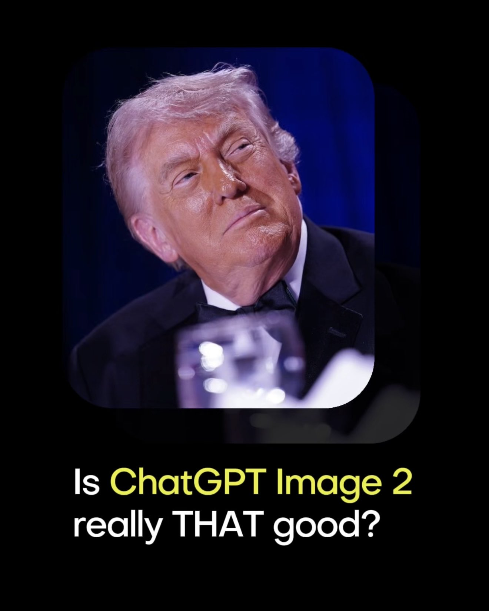
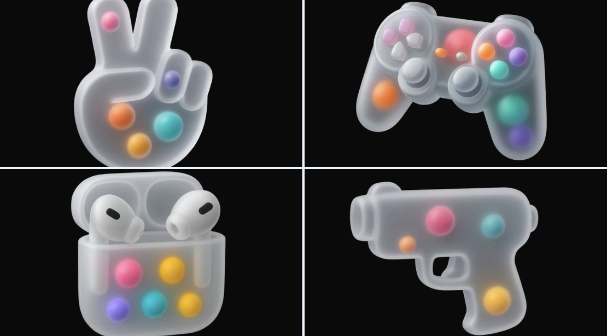

# 3d

总计：182

## 冠状病毒尺度缩放科学信息图

- ID: case-380
- Slug: case-380-zh
- 语言: zh
- 来源: [来源链接](https://x.com/Gdgtify/status/2051288232613351571)
- 样例图路径: images/part2/case380.jpg

### 提示词

```text
instructions> [SUBJECT]=Coronavirus. A hyper-realistic 3D zoom-sequence infographic generated from a single input: [SUBJECT]. The system auto-detects scale layers from atomic/subcomponent to full contextual view. Layout Structure (CRITICAL) 6–8 circular or hexagonal frames arranged in expanding sequence Innermost frame = smallest detectable detail; outermost = full subject in environment Frames connected by subtle zoom-path lines No repeated scales — each frame shows new level of detail Frame Design Each zoom level includes: Hyper-detailed 3D render at that scale Micro label: scale name (e.g., "molecular," "cellular," "structural") + 3–5 word insight Optional: measurement tag or magnification factor Contextual Halo Around the sequence, include only scale-specific references: Measurement units, scientific notation, cultural scale metaphors (No generic magnifying glass icons) Scale Panel (Alternative Layout) Zoom level Key insight (3–5 words) Scale factor tag Detail icon (grid, wave, particle, etc.) Title "[SUBJECT]: AT EVERY SCALE" (or) "ZOOM: THE WORLD OF [SUBJECT]" Style: ultra-realistic 3D render, scientific editorial infographic, precise macro lighting, global illumination, shallow depth of field, clean sequential layout. </instructions>
```

### 样例图


## 高端 3D 收藏玩具头像

- ID: case-378
- Slug: case-378-zh
- 语言: zh
- 来源: [来源链接](https://x.com/Genematicai/status/2050654848216109429)
- 样例图路径: images/part2/case378.jpg

### 提示词

```text
Transform the input photo into a high-end stylized 3D collectible figure. Large head, slightly exaggerated facial features while preserving identity. Hyper-detailed skin texture with subtle pores, realistic wrinkles, and a cinematic expression.

Smooth matte vinyl finish. Soft studio lighting, clean black background. Ultra-sharp focus, 8K render, photorealistic materials, Pixar-quality rendering, centered composition, full body, premium designer toy aesthetic.
```

### 样例图



## Scrapbook 真人图与迷你分身

- ID: case-371
- Slug: case-371-zh
- 语言: zh
- 来源: [来源链接](https://x.com/Kashberg_0/status/2050272100884340783)
- 样例图路径: images/part2/case371.jpg

### 提示词

```text
Transform the provided reference image into a cozy aesthetic scrapbook-style composition while strictly preserving the original subject, identity, pose, lighting, and background.

Add multiple small “mini version” characters of the same person (chibi / doll-like style), placed naturally around the scene (on objects, table, shoulder, etc.). These mini figures must match the subject’s face, hairstyle, outfit, and vibe consistently, styled as cute 3D collectible figurines. Show them doing different activities (reading, posing, taking photos, relaxing).

Overlay handwritten-style doodles and annotations across the image: arrows, hearts, stars, sparkles, icons, and playful captions connected to elements in the scene.

Use a soft pastel color palette (white base with pink, peach, blue accents).

Keep the frame visually rich and filled but balanced and clean.

Style: warm, cozy lighting, dreamy Instagram scrapbook aesthetic, soft depth of field, highly detailed, polished but playful.

The final result must look like the SAME original image enhanced with mini alter-egos and aesthetic annotations — not a recreated or different scene.
```

### 样例图


## Crumple Chair 概念沙发研发板

- ID: case-370
- Slug: case-370-zh
- 语言: zh
- 来源: [来源链接](https://x.com/ShamsAmin56/status/2050281206139461780)
- 样例图路径: images/part2/case370.jpg

### 提示词

```text
Design Concept: The Crumple Chair Core Philosophy: Translating the "controlled chaos" of a tossed paper ball into a sculptural, high-comfort seating experience.

Stage 1: Observation & Morphological Analysis The goal is to deconstruct the image of the crumpled paper into usable geometric data. Crease Mapping: Identify the primary "valley" and "ridge" lines. These represent potential structural ribs or seams in the chair. Faceted Planes: Break down the sphere into a series of non-uniform polygons. Each flat surface of the paper becomes a potential panel for the chair’s upholstery or shell. Shadow Study: Analyze how the "tossed" form creates deep recesses. These natural pockets guide where the user’s weight will be cradled.

Stage 2: Iterative Form Exploration Moving from a sphere to a seat through "Digital Crumpling." Subtractive Sculpting: Imagine the paper ball as a solid mass. Use Boolean operations to "carve out" a seating cavity that fits the human form while maintaining the external jagged texture. Tension Simulation: Use 3D software (like Rhino or Blender) to simulate a flat sheet of material being compressed. This ensures the folds look authentic and not "modeled." The "Toss" Logic: Experiment with gravity-based simulation dropping a digital mesh to see how it settles naturally, mimicking the "tossed" origin.

Stage 3: Ergonomic Translation & Blueprinting Refining the raw aesthetic into a functional object. The Comfort Core: Overlay a standard ergonomic template (Seating Angle: 105°–110°) over the crumpled form. Adjust the internal "folds" to provide lumbar support and pressure relief. Blueprint Generation: Create technical orthographic views (Front, Side, Top). Map out the dimensions: Seat Height: 450mm Total Width: 850mm Surface Smoothing: Maintain the sharp "paper edges" on the exterior shell while softening the interior contact points for skin comfort.

Stage 4: Structural Integration & Scaling Making the concept physically viable. The Skeleton: Design a hidden internal frame (likely CNC-bent steel rods or a 3D-printed lattice) that follows the most prominent ridges of the paper folds to provide rigidity. Material Selection: * Option A (High-End): Faceted, cast aluminum with a white powder coat. Option B (Soft): Vacuum-formed recycled plastic shell covered in "memory-fold" technical fabric that retains a wrinkled appearance.

Stage 5: Final Prototyping & Material Finish Textural Replication: Apply a matte, slightly porous finish to the material to mimic the tactile feel of heavy-bond paper. Lighting Contrast: Use directional studio lighting in the final renders to emphasize the "tossed" shadows, making the chair look like a giant piece of discarded inspiration. Design Tip: To keep the "tossed" look authentic, avoid symmetry. The most compelling aspect of a crumpled paper ball is its unique irregularity—ensure the left and right sides of the chair are balance-equivalent but not identical
```

### 样例图


## 手机爆炸拆解图

- ID: case-361
- Slug: case-361-zh
- 语言: zh
- 来源: [来源链接](https://x.com/Ankit_patel211/status/2048834306379075759)
- 样例图路径: images/part2/case361.jpg

### 提示词

```text
Create a 3D Insane detailed exploded assembly drawing of [subject or object]
```

### 样例图


## 红蓝撞色高跟诱惑

- ID: case-326
- Slug: case-326-zh
- 语言: zh
- 来源: [来源链接](https://x.com/meng_dagg695/status/2012437899955097836)
- 样例图路径: images/part2/case326.jpg

### 提示词

```text
[中文]
{
  "global_settings": {
    "resolution": "8K",
    "quality": "超高清晰度",
    "aspect_ratio": "2:3",
    "render_style": "AI编辑、高细节3D渲染",
    "lighting_quality": "柔和影棚光与逼真阴影",
    "sharpness": "极致清晰、锐利边缘",
    "noise": "无",
    "compression": "无"
  },
  "image_style": {
    "subject": {
      "character_type": "风格化3D卡通女性",
      "pose": "微微后仰靠在背景上",
      "expression": "俏皮、嘴唇轻撅、眼睛斜视",
      "hair": {
        "color": "棕色",
        "style": "短发、凌乱",
        "accessories": "红色太阳镜架在头顶"
      }
    },
    "clothing": {
      "dress": "贴身蓝色罗纹吊带裙",
      "footwear": "红色高跟凉鞋配蝴蝶结"
    },
    "color_palette": [
      "大胆红色",
      "深蓝"
    ],
    "background": {
      "color": "纯红色",
      "texture": "光滑哑光表面"
    },
    "lighting": {
      "direction": "一侧柔和定向光",
      "shadow": "在红色背景上投下清晰影子"
    },
    "composition": {
      "framing": "全身",
      "pose_emphasis": "弯曲身姿、交叉双腿"
    }
  }
}

[English]
{
  "global_settings": {
    "resolution": "8K",
    "quality": "ultra-high definition",
    "aspect_ratio": "2:3",
    "render_style": "AI-edited, high-detail 3D render",
    "lighting_quality": "soft studio lighting with realistic shadows",
    "sharpness": "extreme clarity, crisp edges",
    "noise": "none",
    "compression": "none"
  },
  "image_style": {
    "subject": {
      "character_type": "stylized 3D cartoon female",
      "pose": "leaning slightly backward against background",
      "expression": "playful, lips slightly pursed, eyes looking sideways",
      "hair": {
        "color": "brown",
        "style": "short, tousled",
        "accessories": "red sunglasses resting on head"
      }
    },
    "clothing": {
      "dress": "form-fitting blue ribbed dress with thin straps",
      "footwear": "red high-heel sandals with bow detail"
    },
    "color_palette": [
      "bold red",
      "deep blue"
    ],
    "background": {
      "color": "solid red",
      "texture": "smooth matte surface"
    },
    "lighting": {
      "direction": "soft directional light from one side",
      "shadow": "defined shadow cast on red background"
    },
    "composition": {
      "framing": "full body",
      "pose_emphasis": "curved posture, crossed legs"
    }
  }
}
```

### 样例图


## 皮克斯风阳光少年

- ID: case-325
- Slug: case-325-zh
- 语言: zh
- 来源: [来源链接](https://x.com/iamsofiaijaz/status/2013473309485343120)
- 样例图路径: images/part2/case325.jpg

### 提示词

```text
[中文]
一个风格化的3D卡通肖像，一位年轻男子，拥有短棕发和富有表现力的绿色眼睛，温暖地微笑。他穿着黑色西装外套内搭白色T恤，现代休闲时尚。类似皮克斯/迪士尼风格角色设计，皮肤光滑，柔和光照，略微夸张的面部特征。高细节、精美的3D渲染，友好且平易近人的表情。渐变背景为柔和的蓝绿色和粉色，工作室灯光，浅景深，高分辨率。

[English]
A stylized 3D cartoon portrait of a young man with short brown hair and expressive green eyes, smiling warmly. He is wearing a black blazer over a white t-shirt, modern casual fashion. Pixar-like / Disney-style character design with smooth skin, soft lighting, and slightly exaggerated facial features. High detail, polished 3D render, friendly and approachable expression. Gradient background with soft teal and pink colors, studio lighting, shallow depth of field, high resolution.
```

### 样例图


## 都市落日时尚大片

- ID: case-321
- Slug: case-321-zh
- 语言: zh
- 来源: [来源链接](https://opennana.com/awesome-prompt-gallery/urban-sunset-fashion-silhouette)
- 样例图路径: images/part2/case321.jpg

### 提示词

```text
[中文]
一张超现实电影感时尚照片，一位二十出头惊艳的年轻女性，全身可见，站在现代城市中心，黄金时段。
她随意地单肩靠在交通信号灯杆上，没有意识到相机的存在，仿佛这一刻是自然捕捉的。
她穿着紧身蓝色牛仔裤、棕色皮靴，以及一件短款棕色麂皮夹克，带有柔软羊皮翻领。夹克下，一件极简深色露脐上衣，隐约露出精致的乳沟和紧致的腹部。

她的体型天生女性化，均衡而优雅，姿态自信。
一只手穿过她丰盈的浅棕色长发，将其向后撩起，头部微微转向那一侧，眼睛自然地看向别处，没有摆拍。

肤色为轻微日晒后的奶油般柔和光泽，真实肌肤纹理，细腻毛孔与高光——毫无塑料感。
妆容醒目却精致：清晰的眼部、浓密睫毛、立体腮红、柔和修容，以及自然光泽唇——具备高端美妆广告质感。
光线为温暖金色时段阳光，包裹她的轮廓与发丝，营造柔和高光与电影感对比。
背景为城市街道，汽车与都市灯光以强烈散景呈现，浅景深——焦点锁定在女性身上。

使用全画幅电影摄影机拍摄，85mm镜头，f/1.8，超现实细节，高动态范围，电影级调色，胶片质感，顶级时尚大片美学，高预算电影剧照氛围。

[English]
A hyper-realistic cinematic fashion photograph of a stunning young woman in her early 20s, full body visible, standing in a modern city center during golden hour.
She leans casually with one shoulder against a traffic light pole, unaware of the camera, as if the moment was captured naturally.
She wears skinny blue jeans, brown leather boots, and a cropped brown suede jacket with a soft shearling collar. Under the jacket, a minimal dark crop top reveals a subtle cleavage and toned midriff.

Her physique is naturally feminine, balanced and elegant, with confident posture.
One hand runs through her long, voluminous curly light-brown hair, lifting it back in motion. Her head is turned slightly toward that side, eyes looking away naturally, not posing.

Skin tone is lightly sun-kissed with a soft creamy glow, realistic skin texture, subtle pores and highlights — no plastic look.
Makeup is striking but refined: defined eyes, bold lashes, sculpted cheeks, soft contour, and natural glossy lips — editorial beauty campaign quality.
Lighting is warm golden hour sunlight, wrapping around her silhouette and hair, creating soft highlights and cinematic contrast.
Background is an urban street with cars and city lights rendered in strong bokeh, shallow depth of field — focus locked on the woman.

Shot on a full-frame cinema camera, 85mm lens, f/1.8, ultra-realistic detail, high dynamic range, cinematic color grading, film-like tones, premium fashion editorial aesthetic, high-budget movie still feeling.
```

### 样例图


## 冲破次元壁的写实漫画跑者

- ID: case-316
- Slug: case-316-zh
- 语言: zh
- 来源: [来源链接](https://x.com/Fujimoto_hina/status/2027748030825500722)
- 样例图路径: images/part2/case316.jpg

### 提示词

```text
[中文]
{
  "prompt": "超写实，一位留着深色短卷发、修剪整齐的胡须和黑色方形眼镜的年轻男子的鲜艳逼真渲染，身穿深色纹理高领毛衣和牛仔裤。他奔跑到一半被捕捉下来，姿态充满动感，向前突破，充满戏剧性地从一个破碎的漫画分镜框中显现——一条腿和一只手臂冲入现实世界，而身体的其余部分仍留在漫画框内。他的表情充满活力和喜悦，拥有锐利的面部细节，自然的皮肤纹理，以及具有高对比度和深度的戏剧性电影灯光。\n\n背景：一个非常详细的黑白漫画布局，充满了幽默、夸张的且与他直接互动的反应场景。周围的漫画人物表现出震惊和喜剧的表情，配有粗体的对话气泡和速度线。漫画分镜采用经典的高对比度水墨风格绘制，线条清晰，网点阴影。撕裂的纸张边缘和碎片增强了他冲破漫画世界的幻觉。全彩色的写实人物与单色的漫画环境形成强烈对比，创造出写实与漫画艺术之间的动态混合体。超精细，8k分辨率，清晰聚焦，戏剧性的阴影，电影级景深。"
}

[English]
{
  "prompt": "Ultra-realistic, vibrant photorealistic rendering of a young man with short curly dark hair, neatly trimmed beard, and black rectangular glasses, wearing a dark textured turtleneck sweater and jeans. He is captured mid-run in a dynamic, forward-breaking pose, dramatically emerging from a torn manga panel — one leg and one arm bursting into the real world while the rest of his body remains inside the comic frame. His expression is energetic and joyful, with sharp facial details, natural skin texture, and dramatic cinematic lighting with high contrast and depth. \n\nBackground: a highly detailed black-and-white manga layout filled with humorous, exaggerated reaction scenes that directly interact with him. The surrounding manga characters display shocked and comedic expressions, with bold speech bubbles and motion lines. The manga panels are illustrated in a classic high-contrast ink style with crisp linework and halftone shading. Torn paper edges and debris enhance the illusion of him breaking through the comic world. The fully colored, photorealistic figure contrasts strongly against the monochrome manga environment, creating a dynamic hybrid between reality and comic art. Ultra-detailed, 8k resolution, sharp focus, dramatic shadows, cinematic depth of field."
}
```

### 样例图


## 荧光蓝穷奇新中式山水画

- ID: case-304
- Slug: case-304-zh
- 语言: zh
- 来源: [来源链接](https://x.com/liyue_ai/status/2045506567735558336)
- 样例图路径: images/part2/case304.jpg

### 提示词

```text
[中文]
极简主义，新中式风格立体图形设计，图像下端有楷体中国文字：“东方美学”，“2026/04/18”，署名 “CHINA”，和“
@LIYUE
"；
平整纯白色的亚光质感厚艺术纸上绘充满东方诗意氛围的山水创意画，不规则的撕纸效果；
中国的神兽：穷奇，身形图案完整，美轮美奂，，线条柔美灵动,眼睛炯炯有神，威严的神态，优雅的姿势，奢华装饰艺术，中国传统纹饰；
荧光蓝色线条，0.5mm极细金色金属质感勾边，泼白墨大笔触，色彩渲染，红底，蓝色的浪漫诗意视觉；
冷暖光交织的梦幻唯美场景，强烈的光影对比氛围，花轻舞的时光叙事，东风禅意，画面有大面积留白，框架构图，底部留白，细节清晰。

[English]
Minimalism, Neo-Chinese style three-dimensional graphic design, at the bottom of the image there are Chinese characters in regular script: "东方美学", "2026/04/18", signature "CHINA", and "
@LIYUE
";
Drawn on flat, pure white matte textured thick art paper, a creative landscape painting full of oriental poetic atmosphere, irregular torn paper effect;
Chinese mythical beast: Qiongqi, complete body pattern, magnificent,, soft and agile lines, bright piercing eyes, majestic demeanor, elegant posture, luxury decorative art, Chinese traditional patterns;
Fluorescent blue lines, 0.5mm ultra-fine gold metallic texture outlining, large strokes of splashed white ink, color rendering, red background, romantic and poetic blue vision;
Dreamy and aesthetic scene where cold and warm lights intertwine, strong light and shadow contrast atmosphere, time narrative of flowers dancing lightly, Oriental Zen, the picture has a large area of blank space, framework composition, blank space at the bottom, clear details.
```

### 样例图


## 智能视频生成器暗黑界面设计

- ID: case-261
- Slug: case-261-zh
- 语言: zh
- 来源: [来源链接](https://x.com/austinit/status/2044968740782272596)
- 样例图路径: images/part2/case261.jpg

### 提示词

```text
[中文]
渲染一个专业的IOS APP首页UI图，该主题为AI Video Generator,英文界面。专业级设计，专业风格，暗黑色主题。

[English]
Render a professional iOS APP homepage UI image, the theme is AI Video Generator, English interface. Professional-level design, professional style, dark theme.
```

### 样例图


## 琉璃透明画眉鸟飞舞羊城墨卷

- ID: case-229
- Slug: case-229-zh
- 语言: zh
- 来源: [来源链接](https://x.com/liyue_ai/status/2045873940883808523)
- 样例图路径: images/part2/case229.jpg

### 提示词

```text
[中文]
【背景与骨架线条】
纯黑深邃底色，一条粗壮有力的墨色书法S型曲线自画面一端蜿蜒贯穿至另一端，笔触苍劲，墨迹浓淡有致，如大写意行笔，构成整幅画面的视觉骨架与叙事动线。
【主体：透明燕子】
曲线上方，一只展翅飞翔的画眉鸟占据视觉核心；身体呈玻璃透明质感，内部映射传统建筑群叠影，蓝绿色光流在透明羽翼间流转折射，仿佛时间长河与文明记忆凝缩其中；轮廓以极细金线勾边，增强立体感与神圣感。
【中景：古典建筑序列】
燕子下方，沿墨线曲线错落分布广州的各种风景名胜：白云山、陈家祠、双子塔、广州塔、猎德大桥、海珠塔依次浮现；主色调青绿与淡金，建筑细节清晰，琉璃瓦、飞檐翘角、石阶回廊；木棉花簇拥点缀于建筑周围，花瓣随风轻散，静谧而悠远；几朵水墨云朵轻盈飘浮其间，增添空灵层次。
【前景：白鹤与水面】
前景湖畔：数只白鹤或静立水边、或振翅腾飞，姿态各异，优雅从容；浅蓝湖面如镜，倒影荡漾，波光细碎，营造宁静氛围。
【远景：山峦】
远处山峦层叠起伏，青黛色晕染，墨色由浓至淡，朦胧氤氲，富有水墨层次；与前景形成近实远虚的空间纵深。
【构图与光影】
非线性透视构图，墨线曲线为叙事主轴，古今元素沿线嵌入；光源自画面中心向外辐射扩散，形成强烈明暗对比，中心亮、四周渐暗；冷色调主导（深蓝、青绿、银白），暖色点缀（樱花粉、淡金），和谐而神秘；东方美学与现代意象交融，超现实诗意意境。
【技术规格】
8K超高清渲染，极致细节精度，最佳画质，比例 9:16

[English]
[
  Background and Skeleton Lines
] Pure black deep background,
a thick and powerful ink calligraphy S-shaped curve meanders from one end of the picture to the other,
with vigorous brushstrokes and well-proportioned ink shades,
like freehand brushwork,
forming the visual skeleton and narrative dynamic line of the entire picture. [
  Subject: Transparent Swallow
] Above the curve,
a flying thrush with spread wings occupies the visual core; the body has a glass transparent texture,
with overlapping shadows of traditional architectural complexes mapped inside,
blue-green light flows circulate and refract between the transparent wings,
as if the long river of time and civilized memories are condensed within it; the outline is bordered with extremely thin gold lines to enhance three-dimensionality and sacredness. [
  Midground: Classical Architecture Sequence
] Below the swallow,
various scenic spots in Guangzhou are scattered along the ink curve: Baiyun Mountain,
Chen Clan Ancestral Hall,
Twin Towers,
Canton Tower,
Liede Bridge,
Haizhu Tower appear in sequence; the main tone is cyan-green and pale gold,
architectural details are clear,
glazed tiles,
flying eaves,
stone steps and corridors; kapok flowers cluster and decorate around the buildings,
petals scatter lightly with the wind,
quiet and distant; a few ink clouds float lightly among them,
adding ethereal layers. [
  Foreground: White Cranes and Water Surface
] Lakeside in the foreground: several white cranes either stand quietly by the water or flap their wings to soar,
with different postures,
elegant and calm; the light blue lake surface is like a mirror,
reflections rippling,
shimmering light,
creating a tranquil atmosphere. [
  Distance: Mountains
] Distant mountains rise and fall in layers,
smudged in cyan-black,
ink shades from thick to light,
hazy and misty,
rich in ink wash layers; forming a spatial depth with solid foreground and empty distance with the foreground. [
  Composition and Light and Shadow
] Non-linear perspective composition,
the ink curve is the main narrative axis,
ancient and modern elements are embedded along the line; the light source radiates and diffuses outward from the center of the picture,
forming a strong contrast between light and dark,
bright in the center and gradually darkening around; cool tones dominate (dark blue,
cyan-green,
silver white),
warm tones embellish (cherry blossom pink,
pale gold),
harmonious and mysterious; Eastern aesthetics blend with modern imagery,
surreal poetic mood. [
  Technical Specifications
] 8K ultra-high definition rendering,
extreme detail precision,
best image quality,
ratio 9:16
```

### 样例图


## 超写实海滩高角度手机自拍

- ID: case-199
- Slug: case-199-zh
- 语言: zh
- 来源: [来源链接](https://x.com/IamEmily2050/status/2046602266627465534)
- 样例图路径: images/part2/case199.jpg

### 提示词

```text
[中文]
{
  超写实iPhone 15 Pro前置摄像头自拍，一位成年女性在明亮的沙滩上，
  从举臂高角度自拍视角拍摄。手机略微举在脸部上方，
  营造出自然的前置摄像头几何形态，带有轻微的等效24mm广角畸变，
  写实的面部比例，
  以及智能手机的深景深。她向上抬起下巴，一只手遮挡刺眼的阳光，同时直视手机镜头。她的表情中性，
  面无表情，
  且略带疏离感，
  眼睛大而专注，但在解剖学上具有真实的眼部尺寸和自然面部比例。\n\n她有着极浅的铂金色头发，梳成两条紧紧的辫子，
  苍白的皮肤带有真实摄影的皮肤纹理，
  可见的毛孔，
  细微的绒毛，
  淡淡的眼下纹理，
  自然的唇部纹理，
  以及柔和的阳光光泽，而不是磨皮后的完美无瑕。她的嘴唇是自然色调且略丰满，
  她的鼻子小巧精致但很写实。她的指甲是鲜艳的蓝色。她穿着一件浅蓝色紧身弹力棉上衣，领口非常深且宽，以自然、
  非风格化的方式露出突出的锁骨和上胸结构。\n\n背景是宽阔的海岸沙滩，在强烈的上午晚些时候的阳光下，
  背景中有一条柔和模糊的地平线。光线明亮，
  色温约5500K的高调海岸日光，
  强烈的白色沙子反光从下方和脸部周围均匀地填充阴影。皮肤被直射阳光加上海滩宽阔柔和的反射补光照亮，
  产生清脆但写实的高光，没有生硬的对比。明亮沙子的细小颗粒微妙地捕捉光线。整体图像应该感觉像是在强烈的海边光线下在户外拍摄的真正高曝光智能手机自拍。\n\n色彩渲染应该是柔和、
  干净、
  且现代的，
  带有中性至柔和的色调，
  写实的iPhone计算摄影，
  略微提高的曝光，
  受控的高光过渡，
  自然的肤色，
  没有电影级调色。优先考虑写实性、
  物理准确性、
  可信的解剖结构，
  以及真实的智能手机图像表现，而不是美化风格化。", "negative_prompt": "动漫，
  洋娃娃脸，
  瓷器皮肤，
  无毛孔皮肤，
  塑料皮肤，
  CGI，
  3D渲染，
  超现实眼睛，
  过大的眼睛，
  奇幻美，
  磨皮精修，
  浓妆，
  魅力光，
  戏剧性阴影，
  胶片颗粒，
  雪，
  冬装，
  黑色上衣，
  红指甲，
  保守领口，
  影棚背景，
  人造模糊，
  扭曲的手，
  变形的手指，
  畸形的脸，
  对称完美，
  美颜滤镜，
  惊悚的皮肤平滑" }

[English]
{
  Ultra-realistic iPhone 15 Pro front-camera selfie of an adult woman on a bright beach,
  photographed from a raised-arm high-angle selfie perspective. The phone is held slightly above her face,
  creating natural front-camera geometry with mild 24mm equivalent wide-angle distortion,
  realistic facial proportions,
  and deep smartphone depth of field. She tilts her chin upward and looks directly toward the phone lens while shielding harsh sunlight with one hand. Her expression is neutral,
  blank,
  and slightly distant,
  with wide attentive eyes but anatomically realistic eye size and natural facial proportions.\n\nShe has very light platinum-blonde hair styled in two tight braids,
  pale skin with real photographic skin texture,
  visible pores,
  subtle peach fuzz,
  faint under-eye texture,
  natural lip texture,
  and a soft sunlit sheen rather than airbrushed perfection. Her lips are naturally toned and slightly full,
  her nose is small and refined but realistic. Her nails are vivid blue. She wears a light blue fitted stretch-cotton top with a very deep wide neckline that reveals pronounced collarbones and upper chest structure in a natural,
  non-stylized way.\n\nThe setting is a wide coastal beach under strong late-morning sunlight,
  with a softly blurred horizon line in the background. The lighting is bright,
  high-key coastal daylight around 5500K,
  with strong white sand bounce filling the shadows evenly from below and around the face. Skin is illuminated by direct sun plus broad soft reflected fill from the beach,
  producing crisp but realistic highlights without harsh contrast. Fine grains of bright sand catch light subtly. The overall image should feel like a real high-exposure smartphone selfie taken outdoors in intense seaside light.\n\nColor rendering should be soft,
  clean,
  and modern,
  with neutral-to-pastel tones,
  realistic iPhone computational photography,
  slightly elevated exposure,
  controlled highlight rolloff,
  natural skin color,
  and no cinematic grading. Prioritize realism,
  physical accuracy,
  believable anatomy,
  and true smartphone image behavior over beauty stylization.", "negative_prompt": "anime,
  doll face,
  porcelain skin,
  poreless skin,
  plastic skin,
  CGI,
  3D render,
  surreal eyes,
  oversized eyes,
  fantasy beauty,
  airbrushed retouching,
  heavy makeup,
  glamour lighting,
  dramatic shadows,
  film grain,
  snow,
  winter clothing,
  black top,
  red nails,
  conservative neckline,
  studio backdrop,
  artificial blur,
  warped hands,
  deformed fingers,
  malformed face,
  symmetry perfection,
  beauty filter,
  uncanny skin smoothing" }
```

### 样例图


## 品牌视觉识别图

- ID: case-186
- Slug: case-186-zh
- 语言: zh
- 来源: [来源链接](https://x.com/ProperPrompter/status/2046534215311970694)
- 样例图路径: images/part2/case186.jpg

### 提示词

```text
[中文]
创建一个包含100种不同奇幻RPG物品的10×10网格，以经典像素艺术风格渲染（16位或32位精灵图美学，让人联想到SNES/GBA时代的日式RPG）。每个物品应出现在其独立的方形瓷砖中，下方带有简短清晰的标签。在白色背景上保持网格整洁。使每个物品在视觉上都有所区分，并且每个标签拼写正确。使用清晰的像素边缘、每个精灵图有限的调色板，以及用于阴影的微妙抖动。
使用这些行主题：
第1行：剑与刀刃
第2行：盾牌与盔甲
第3行：弓、弩与远程武器
第4行：法杖、魔杖与魔法焦点
第5行：药水、灵药与烧瓶
第6行：卷轴、典籍与法术书
第7行：戒指、护身符与附魔小饰品
第8行：头盔、王冠与头饰
第9行：钥匙、遗物与任务物品
第10行：宝石、符文与制作材料
将每个瓷砖显示为干净背景方形上居中的物品精灵图，渲染为经典的库存图标——你在奇幻RPG菜单中会看到的那种。保持整体风格一致、连贯，并让人联想到备受喜爱的复古奇幻RPG——迷人、细节丰富，且在小尺寸下易于辨认。

[English]
Create a 10 × 10 grid of 100 different fantasy RPG items rendered in classic pixel art style (16-bit or 32-bit sprite aesthetic, reminiscent of SNES/GBA-era JRPGs). Each item should appear in its own square tile with a short clear label underneath. Keep the grid neat on a white background. Make every item visually distinct and every label correctly spelled. Use crisp pixel edges, limited palette per sprite, and subtle dithering for shading.
Use these row themes:
Row 1: swords and blades
Row 2: shields and armor
Row 3: bows, crossbows, and ranged weapons
Row 4: staves, wands, and magical foci
Row 5: potions, elixirs, and flasks
Row 6: scrolls, tomes, and spellbooks
Row 7: rings, amulets, and enchanted trinkets
Row 8: helmets, crowns, and headgear
Row 9: keys, relics, and quest items
Row 10: gems, runes, and crafting materials
Show each tile as a centered item sprite on a clean background square, rendered as a classic inventory icon — the kind you'd see in a fantasy RPG menu. Keep the overall style consistent, cohesive, and reminiscent of beloved retro fantasy RPGs — charming, detailed, and instantly readable at small sizes.
```

### 样例图


## 银河繁星点缀的冰蓝襦裙

- ID: case-173
- Slug: case-173-zh
- 语言: zh
- 来源: [来源链接](https://x.com/fdtreesky/status/2046508731090018331)
- 样例图路径: images/part2/case173.jpg

### 提示词

```text
[中文]
服裝細節： 模特兒身穿一套精緻的淡冰藍色齊胸襦裙，採用多層輕盈的薄紗和絲綢歐根紗材質制成。其寬大的、半透明的廣袖上點綴著如繁星般微小的銀色和淺藍色亮片刺繡，在光線下閃爍（具有銀河般的夢幻感）。抹胸位置有複雜的銀色蕾絲和編織紋理細節，腰帶自然垂落。

材質與光影： 畫面呈現 8k 超高分辨率和對織物微距紋理的極致渲染。光線採用柔和的自然側光（丁達爾效應 Typndall Effect），精準地透射過輕薄的紗布，營造出面料的半透明感（Translucency）和流動感。

構圖與鏡頭： 採用 85mm 黄金人像鏡頭效果，f/1.8 大光圈，全身構圖，模特居中站立

[English]
Clothing details: The model wears an exquisite pale ice blue chest-high ruqun, made of multiple layers of lightweight tulle and silk organza materials. Its wide, translucent broad sleeves are adorned with tiny silver and light blue sequin embroideries like stars, shimmering under the light (with a galaxy-like dreamy feel). The tube top position has complex silver lace and woven texture details, and the belt falls naturally.
Material and light and shadow: The image presents 8k ultra-high resolution and extreme rendering of macro textures of the fabric. The lighting uses soft natural side light (Tyndall Effect Typndall Effect), accurately transmitting through the light gauze, creating a sense of translucency (Translucency) and fluidity of the fabric.
Composition and lens: Uses 85mm golden portrait lens effect, f/1.8 large aperture, full-body composition, model standing in the center
```

### 样例图


## 动漫插画创作图

- ID: case-105
- Slug: case-105-zh
- 语言: zh
- 来源: [来源链接](https://x.com/Yuupapa_free)
- 样例图路径: images/part2/case105.jpg

### 提示词

```text
A high-energy VTuber thumbnail illustration of a smiling anime girl with {argument name="hair color" default="bright blue"} hair in a high ponytail wearing a white shirt. The background is an explosive burst of rainbow light rays and golden sparkles. A golden retro microphone sits in the bottom left. Massive, shiny 3D gold text on the left reads "{argument name="main title text" default="初配信"}". A 3D gold and blue subtitle reads "{argument name="subtitle text" default="一緒に最高の時間を！"}". An ornate blue and gold oval badge in the bottom right displays "{argument name="character name" default="エリン Erin"}". A red top-right badge reads "{argument name="badge text" default="LIVE"}".
```

### 样例图


## 主题海报版式设计

- ID: case-96
- Slug: case-96-zh
- 语言: zh
- 来源: [来源链接](https://x.com/sayaka_aiart)
- 样例图路径: images/part2/case96.jpg

### 提示词

```text
{
  "type": "VTuber stream thumbnail",
  "character": {
    "hair": "long blonde twin tails with pink gradient ends",
    "eyes": "large pink anime eyes",
    "expression": "cheerful smile with a small fang, making a peace sign near the eye",
    "outfit": "black top with harness straps, black heart-ring choker, multiple ear piercings including a cross dangle, black nail polish"
  },
  "background": "vibrant neon pink and black leopard print with glowing yellow accents, sparkles, and floating hearts",
  "typography_and_layout": {
    "main_title": {
      "position": "top left",
      "style": "large, bold, 3D, pink and black with white outlines",
      "text": "{argument name=\"main title\" default=\"雑談配信\"}"
    },
    "top_right_text": {
      "style": "casual handwritten style with a heart",
      "text": "{argument name=\"top right text\" default=\"まったり話そ〜♡\"}"
    },
    "bottom_left_banners": {
      "count": 3,
      "style": "glowing pill-shaped banners with heart icons on the left",
      "colors": ["pink", "yellow", "purple"],
      "labels": [
        "{argument name=\"banner 1 text\" default=\"初見さん〇\"}",
        "{argument name=\"banner 2 text\" default=\"ポイント回収〇\"}",
        "{argument name=\"banner 3 text\" default=\"ROM〇\"}"
      ]
    },
    "bottom_right_text": {
      "style": "casual handwritten style with a heart, yellow text with pink outline",
      "text": "気軽にコメントしてねっ♡"
    }
  }
}
```

### 样例图


## 写实摄影风格图

- ID: case-81
- Slug: case-81-zh
- 语言: zh
- 来源: [来源链接](https://x.com/HumanOS_v2)
- 样例图路径: images/part2/case81.jpg

### 提示词

```text
{
  "type": "scientific hardware diagram",
  "layout": {
    "main_scene": "3D render of an optical table with a red laser beam passing through 11 aligned optical components mounted on black posts.",
    "top_brackets": [
      {"label": "Dual Modulation", "span": "SLM1"},
      {"label": "4f Relay Optics", "span": "Lens L1 to Lens L2"},
      {"label": "Imaging Optics", "span": "SLM2 to Lens L4"},
      {"label": "Detection", "span": "Camera"}
    ],
    "optical_components_left_to_right": [
      {"name": "Laser", "labels": ["Laser", "λ = {argument name=\"laser wavelength\" default=\"632.8 nm\"}"]},
      {"name": "SLM1", "labels": ["SLM1", "(Phase / Pol. Mod.)"]},
      {"name": "Lens L1", "labels": ["Lens L1", "(f1)"]},
      {"name": "Iris", "labels": ["Fourier Plane", "(Pupil Plane)", "Iris", "(Higher Orders Filtered)"]},
      {"name": "HWP", "labels": ["HWP", "(λ/2)"]},
      {"name": "Lens L2", "labels": ["Lens L2", "(f1)"]},
      {"name": "SLM2", "labels": ["SLM2", "(Phase / Pol. Mod.)"]},
      {"name": "Lens L3", "labels": ["Lens L3", "(f2)"]},
      {"name": "Lens L4", "labels": ["Lens L4", "(f2)"]},
      {"name": "Linear Polarizer", "labels": ["Linear", "-Polarizer", "(Global Analyzer)"]},
      {"name": "Polarization Camera", "labels": ["POLARIZATION CAMERA"]}
    ],
    "inset_box": {
      "position": "bottom right",
      "title": "Polarization Camera Micro-Polarizer Array (Per-Pixel Analyzer)",
      "grid": "4x4 grid of colored squares with directional arrows",
      "legend_count": 4,
      "legend_items": [
        "Red square, horizontal arrow, 0° (H)",
        "Green square, vertical arrow, 90° (V)",
        "Blue square, diagonal arrow, 45° (D)",
        "Yellow square, diagonal arrow, 135° (A)"
      ]
    },
    "bottom_caption": {
      "figure_prefix": "{argument name=\"figure number\" default=\"Fig. 5.\"}",
      "title": "{argument name=\"system name\" default=\"Ellipsography Hardware Setup.\"}",
      "text": "Paragraph of scientific text explaining the dual-modulation configuration, 4f relay optics, and polarization camera."
    }
  }
}
```

### 样例图


## 信息图可视化设计

- ID: case-73
- Slug: case-73-zh
- 语言: zh
- 来源: [来源链接](https://x.com/hx831126)
- 样例图路径: images/part2/case73.jpg

### 提示词

```text
{
  "type": "complex urban systems atlas infographic",
  "style": "{argument name=\"color palette\" default=\"dark background with glowing blue, gold, and purple accents\"}, highly detailed technical illustration, 3D isometric cutaway",
  "header": {
    "title": "{argument name=\"chinese city name\" default=\"上海\"}城市系统剖面 {argument name=\"english city name\" default=\"SHANGHAI\"} URBAN SYSTEMS ATLAS",
    "subtitles": [
      "地表之上，是城市；地表之下，是秩序 {argument name=\"english subtitle\" default=\"Beneath the skyline lies the machine.\"}",
      "一座城市如何运转 How a Megacity Actually Works"
    ]
  },
  "layout": {
    "top_left": "Compass rose and city map labeled '上海市域位置 SHANGHAI LOCATION'",
    "top_right": "Data table titled '城市数据 CITY DATA' with 7 rows of statistics",
    "centerpiece": {
      "description": "{argument name=\"centerpiece style\" default=\"highly detailed 3D isometric cutaway render\"} of a megacity river landscape",
      "layers": [
        "地面层 SURFACE",
        "排水层 DRAINAGE LAYER",
        "电力层 POWER LAYER",
        "通信层 COMMUNICATION LAYER",
        "轨道交通层 METRO LAYER",
        "道路隧道层 ROAD TUNNEL LAYER",
        "管廊综合层 UTILITY CORRIDOR LAYER"
      ]
    },
    "side_panels": [
      { "id": "01", "title": "城市主骨架 URBAN SKELETON", "elements": "Map with 8 legend items" },
      { "id": "02", "title": "排水与地下水网 DRAINAGE + STORMWATER", "elements": "Cross-section diagram '典型排水剖面 DRAINAGE SECTION' with 5 legend items" },
      { "id": "03", "title": "电网与能源分配 POWER GRID + ENERGY", "elements": "Cross-section diagram '典型变电站剖面 SUBSTATION SECTION' with 6 legend items" },
      { "id": "04", "title": "通信与网络骨干 TELECOM + INTERNET", "elements": "Cross-section diagram '数据中心剖面 DATA CENTER SECTION' with 6 legend items" },
      { "id": "05", "title": "地铁与地下交通 METRO + SUBSURFACE MOBILITY", "elements": "Cross-section diagram '人民广场站剖面 PEOPLE'S SQUARE STATION' with 6 legend items" },
      { "id": "06", "title": "道路、高架与循环 ROADS + ELEVATED MOBILITY", "elements": "Cross-section diagram '南浦大桥剖面 NANPU BRIDGE SECTION' with 6 legend items" },
      { "id": "07", "title": "管廊与地下设施 UTILITY CORRIDORS + PLUMBING", "elements": "Cross-section diagram '综合管廊 UTILITY CORRIDOR' with 8 legend items" },
      { "id": "08", "title": "城市流量与系统协同 URBAN FLOWS + COORDINATION", "elements": "Map diagram '城市运行指挥中心 CITY OPERATIONS CENTER' with 6 legend items" }
    ],
    "bottom_panels": {
      "system_logic": {
        "title": "城市系统协同逻辑 SYSTEM COORDINATION LOGIC",
        "steps": 4,
        "labels": ["感知层 SENSING LAYER", "网络层 NETWORK LAYER", "平台层 PLATFORM LAYER", "应用层 APPLICATION LAYER"]
      },
      "city_brain": {
        "title": "城市大脑 CITY BRAIN",
        "central_node": 1,
        "peripheral_nodes": 8
      },
      "references": {
        "depth_scale": { "title": "深度与尺度 DEPTH & SCALE REFERENCE", "icons": 5 },
        "map_scale": { "title": "比例尺 SCALE", "markers": 4 }
      }
    }
  }
}
```

### 样例图


## 插画艺术风格创作

- ID: case-62
- Slug: case-62-zh
- 语言: zh
- 来源: [来源链接](https://x.com/masapark95)
- 样例图路径: images/part2/case62.jpg

### 提示词

```text
{
  "type": "2x2 grid of banner advertisements",
  "theme": "{argument name=\"main theme\" default=\"SNSスクール\"} for {argument name=\"target audience\" default=\"ママ\"}",
  "design_style": "soft, approachable, bright lighting, featuring {argument name=\"color palette\" default=\"soft green, white, and natural beige tones\"}",
  "layout": {
    "sections": [
      {
        "position": "top-left",
        "visual_style": "photography",
        "image_description": "Smiling woman working on a laptop at a table, a toddler playing with toys in the blurred background.",
        "headlines": ["ママの“やってみたい”を応援！", "子育てしながら学べる", "SNSスクール"],
        "features": {
          "count": 1,
          "type": "icon with text",
          "labels": ["自宅で無理なくスキルアップ (with house icon)"]
        },
        "call_to_action_button": "無料相談"
      },
      {
        "position": "top-right",
        "visual_style": "photography",
        "image_description": "Smiling woman holding a white mug, looking at a laptop.",
        "headlines": ["ちょっとの時間が、大きな一歩に。", "スキマ時間を未来につなげる", "動画講座で学びやすい"],
        "features": {
          "count": 3,
          "type": "circular icons with text below",
          "labels": ["スマホでも学べる (smartphone icon)", "1日15分からOK (clock icon)", "繰り返し視聴できる (play button icon)"]
        },
        "call_to_action_button": "詳しく見る"
      },
      {
        "position": "bottom-left",
        "visual_style": "watercolor illustration",
        "image_description": "Illustration of a woman with hair in a bun, smiling at a laptop with a green mug nearby.",
        "headlines": ["はじめてでも大丈夫！ (with beginner mark)", "在宅でできるSNSの仕事", "未経験OK"],
        "features": {
          "count": 3,
          "type": "circular icons with text below",
          "labels": ["サポート充実 (heart icon)", "パソコンが苦手でも安心 (laptop icon)", "収入の柱をつくれる (yen coin icon)"]
        },
        "call_to_action_button": "体験してみる"
      },
      {
        "position": "bottom-right",
        "visual_style": "photography",
        "image_description": "Smiling mother and young daughter sitting on a sofa reading a picture book together.",
        "headlines": ["家族との時間も大切に", "自分らしい働き方へ", "ママの笑顔がいちばんの未来になる。"],
        "features": {
          "count": 3,
          "type": "checkmark bullet points",
          "labels": ["場所や時間に縛られない", "やりがいも収入も叶う", "子どもの成長をそばで見守れる"]
        },
        "extra_graphics": "Small illustration of a house and trees at the bottom left.",
        "call_to_action_button": "説明会へ"
      }
    ],
    "common_elements": "All panels feature a {argument name=\"button style\" default=\"rounded green pill button with white text and a right-pointing arrow icon\"} at the bottom."
  }
}
```

### 样例图


## 插画艺术创作图

- ID: case-32
- Slug: case-32-zh
- 语言: zh
- 来源: [来源链接](https://x.com/austinit)
- 样例图路径: images/part2/case32.jpg

### 提示词

```text
{
  "type": "3x3 character expression grid",
  "style": "{argument name=\"art style\" default=\"3D animation, Pixar style\"}",
  "character_base": "{argument name=\"character description\" default=\"young woman with voluminous dark wavy hair and round wire-rimmed glasses\"}",
  "common_theme": "{argument name=\"framing concept\" default=\"peeking through a torn hole in white paper\"}",
  "layout": {
    "rows": 3,
    "columns": 3,
    "total_panels": 9,
    "panels": [
      {"position": "top-left", "expression": "winking", "action": "adjusting glasses", "outfit": "green sweater"},
      {"position": "top-center", "expression": "smirking", "action": "lowering dark sunglasses", "outfit": "red leather jacket"},
      {"position": "top-right", "expression": "thinking", "action": "finger on chin", "outfit": "yellow hoodie"},
      {"position": "middle-left", "expression": "big smile", "action": "arms resting on edge", "outfit": "black and white striped shirt"},
      {"position": "middle-center", "expression": "smiling", "action": "thumbs up", "outfit": "orange button-up shirt"},
      {"position": "middle-right", "expression": "neutral", "action": "drinking boba tea", "outfit": "blue sweater"},
      {"position": "bottom-left", "expression": "happy", "action": "waving", "outfit": "purple sweater vest over white shirt"},
      {"position": "bottom-center", "expression": "laughing with eyes closed", "action": "arms crossed", "outfit": "pink cardigan"},
      {"position": "bottom-right", "expression": "silly", "action": "poking cheeks", "outfit": "teal sweater"}
    ]
  }
}
```

### 样例图


## 信息图可视化设计

- ID: case-23
- Slug: case-23-zh
- 语言: zh
- 来源: [来源链接](https://x.com/GeekCatX)
- 样例图路径: images/part2/case23.jpg

### 提示词

```text
{
  "type": "evolutionary timeline infographic",
  "instruction": "Using REFERENCE_0 as a structural base, transform the flat vector design into a highly realistic 3D infographic. Replace the smooth ramps with distinct stone steps and upgrade all organisms to photorealistic 3D models.",
  "style": {
    "background": "{argument name=\"background style\" default=\"vintage textured parchment paper\"}",
    "staircase": "{argument name=\"staircase material\" default=\"realistic textured stone blocks\"}",
    "subjects": "{argument name=\"organism style\" default=\"highly detailed photorealistic 3D renders\"}"
  },
  "layout": {
    "main_title": "{argument name=\"main title\" default=\"人类演化\"}",
    "sections": [
      {
        "position": "left sidebar",
        "count": 8,
        "labels": ["L0: 单细胞生命", "L1: 多细胞生物", "L2: 动物界", "L3: 脊索动物", "L4: 上陆革命", "L5: 哺乳纲", "L6: 人科演化", "L7: 智人纪元"]
      },
      {
        "position": "top right",
        "title": "获得的功能 / 失去的功能",
        "description": "Legend with plus and minus icons"
      },
      {
        "position": "bottom center",
        "title": "演化关键里程碑",
        "count": 6,
        "description": "Timeline with a silhouette graphic of 6 figures showing ape-to-human evolution"
      }
    ],
    "centerpiece": {
      "description": "Winding stone staircase with 25 numbered steps featuring specific organisms.",
      "count": 25,
      "notable_elements": [
        "Step 07: Jellyfish",
        "Step 09: Ammonite",
        "Step 10: Trilobite",
        "Step 24: Walking human",
        "Step 25: {argument name=\"future evolution concept\" default=\"glowing cosmic silhouette with a question mark\"}"
      ]
    }
  }
}
```

### 样例图


## 信息图可视化设计

- ID: case-20
- Slug: case-20-zh
- 语言: zh
- 来源: [来源链接](https://x.com/yammamon)
- 样例图路径: images/part2/case20.jpg

### 提示词

```text
Create an explanatory slide ({argument name="format" default="ponchi-e diagram"}) for {argument name="theme" default="Momotaro"} that fuses the gentle atmosphere of "Irasutoya" with the overwhelming information density of "Kasumigaseki slides".
```

### 样例图


## 信息图可视化设计

- ID: case-19
- Slug: case-19-zh
- 语言: zh
- 来源: [来源链接](https://x.com/yammamon)
- 样例图路径: images/part2/case19.jpg

### 提示词

```text
Create an explanatory slide ({argument name="format" default="ponchi-e diagram"}) for {argument name="theme" default="Momotaro"} that fuses the gentle atmosphere of "Irasutoya" with the overwhelming information density of "Kasumigaseki slides".
```

### 样例图


## 信息图可视化设计

- ID: case-13
- Slug: case-13-zh
- 语言: zh
- 来源: [来源链接](https://github.com/freestylefly/awesome-gpt-image-2/blob/main/docs/gallery-part-1.md#case-13)
- 样例图路径: images/part2/case13.jpg

### 提示词

```text
A realistic photo of a Chinese high school math exam paper, printed inblack and white on slightly gray paper, titled “数学试卷”, with multiplechoice questions and math formulas, including a small 3D geometrycube diagram. The paper is photographed casually with asmartphone, slightly tilted, with uneven lighting, soft shadows, andminor blur. The text is in Chinese with a mix of bold title font andstandard serif body font. Realistic paper texture, exam layout,authentic classroom test sheet style.
```

### 样例图


## 博物馆展品级别的昆虫知识科普图谱

- ID: gpt4o-1047-zh
- Slug: prompt-1047-zh
- 语言: zh
- 来源: [来源链接](https://x.com/yyyole/status/2006925202077184321)
- 样例图路径: images/part3/1047.jpeg

### 提示词

```text
请创建一张博物馆展品级别的昆虫知识科普图谱，聚焦展示【蜜蜂】。

核心布局：
- 中心：巨大的昆虫标本图像，占据画面60-70%
- 周围：科学标注和趣味百科信息，呈放射状或分区排布
- 整体：如同博物馆玻璃展柜中的精美标本说明牌

昆虫标本呈现（核心要求）：
1. 物理真实感：昆虫标本直接平放在纸面上，不是"图片中的图片"
2. 视角：垂直俯视，标本与纸面在同一平面
3. 光影：柔和的自然光从上方照射，标本在纸面上投下细腻的阴影
4. 固定方式：用昆虫针（细长的银色针）真实地固定标本，针穿过标本身体，针尖微微刺入纸面
5. 细节质感：
   - 可见标本的真实纹理：翅脉、绒毛、鳞片、复眼反光
   - 标本边缘有轻微的厚度感和立体感
   - 翅膀可能有轻微的透光效果
   - 针周围纸面有细微的凹陷或针孔
6. 比例：标本占据纸面中心约60-70%区域，周围留白供标注使用
7. 自然状态：展翅姿态自然，不过分僵硬，保留标本的真实质感

标注系统设计：
采用引导线（细线）从昆虫身体部位延伸到说明文字框

必需标注的身体部位（6-8个）：
1. 头部 Head
   - 复眼：有多少个小眼组成？视野范围多大？
   - 触角：用途是什么？有多少节？
   - 口器：属于哪种类型？吃什么食物？

2. 胸部 Thorax
   - 前胸/中胸/后胸：各自功能
   - 翅膀：有几对？飞行速度多快？特殊能力？
   - 足：有几对？抓握/跳跃/游泳等特殊功能？

3. 腹部 Abdomen
   - 节数：有多少体节？
   - 特殊器官：发光器/毒刺/产卵器等
   - 气孔：如何呼吸？

4. 特色结构
   - 该昆虫最独特的身体特征
   - 与生存环境的适应关系

信息卡片内容：
每个标注包含：
- 部位名称（中英文）
- 1-2句功能说明（儿童友好语言）
- 趣味数据或冷知识（用🔍或💡图标标识）

页面其他元素：

顶部区域：
- 昆虫中文名（大标题，优雅字体）
- 学名 Scientific Name（斜体拉丁文，副标题）
- 所属目/科（小字标注）
- 分布地图小图标（世界地图+分布区域高亮）

底部/侧边信息栏：
基础档案
- 体长：X-X mm
- 寿命：X天/月/年
- 栖息地：森林/草地/水域等
- 食性：植食/肉食/杂食

超能力/特殊技能
- 列出2-3个最酷的能力
- 用简单图标+文字说明

趣味冷知识
- 1-2个吸引儿童的有趣事实
- 如"可以举起自己体重50倍的物体"

生命周期
- 简化的变态过程图示
- 卵→幼虫→蛹→成虫（完全变态）
- 或卵→若虫→成虫（不完全变态）

*设计美学：
- 纸面质感：
  底纸：米白色或象牙白高级纸张纹理 #F8F6F0
  可见纸张的细微纤维和质感
  边缘可能有轻微的磨损或复古感（可选）

- 空间关系：
  标本：物理实体，平放在纸面上，有真实阴影
  昆虫针：银色金属质感，穿过标本固定
  标注文字：直接书写或印刷在同一张纸上
  引导线：细笔绘制在纸面上的线条

- 配色方案：
  纸面底色：#F8F6F0（米白）或 #FFFEF7（象牙白）
  标注文字：#2C3E50（墨色/深灰蓝）手写或印刷风格
  引导线：#8B7355（棕灰）或 #696969（炭灰）细线
  强调标记：#D4AF37（古铜金）或 #8B4513（棕褐色）
  昆虫针：银灰色金属光泽 #C0C0C0

- 字体系统：
  标题：手写风格或优雅印刷体（Garamond/宋体）
  学名：斜体手写或印刷体
  标注文字：清晰的手写体或小号印刷字
  整体感觉：如同博物学家在标本纸上亲笔书写

- 装饰元素：  
  四角：简约的线框或装饰角花（印在纸上）
 标尺：毫米刻度尺，平行于标本放置
  日期/编号：手写风格的采集信息（可选）
  植物剪影水印：淡淡印在纸面上（可选）
关键视觉要点：
整个画面就是"一张平铺的标本纸"，上面固定着真实的昆虫标本，周围有手写或印刷的科学标注。观看者仿佛正俯视着一份博物学家的工作台上的标本记录。

版式风格参考：如同打开一本19世纪博物学家的标本册，昆虫标本真实地固定在纸面上，周围是手写或精美印刷的科学注释。整体呈现一种平面化、扁平但充满物理质感的美学——这不是照片，而是标本与纸张的共存。"

关键概念：
- ❌ 不要：标本的照片被放在画面中
- ✅ 要：标本本身就在纸面上，与文字共享同一个物理平面
- 就像古董标本册的一页，或者博物学家的工作记录

图片规格：
- 比例：16:9（横版海报）或 3:4（竖版展板）
- 分辨率：300 DPI，适合A3/A2打印
- 格式：PNG高清，保留细节

科学准确性要求：
- 身体结构比例符合真实昆虫形态
- 专业术语使用准确
- 儿童描述需科学又生动

请确保整体呈现既有博物馆的学术严谨性，又充满吸引儿童探索的视觉魅力。
```

### 样例图


## A hyper-realistic travel advertisement in square format 

- ID: gpt4o-1046-en-1
- Slug: prompt-1046-en-1
- 语言: en
- 来源: [来源链接](https://x.com/TechieBySA/status/2007190982408974659)
- 样例图路径: images/part3/1046.jpeg

### 提示词

```text
A hyper-realistic travel advertisement in square format (1080x1080), featuring a hand holding a sleek, ultra-thin smartphone or tablet in portrait orientation, tilted slightly sideways to create a striking 3D portal effect. The screen displays a high-resolution image of an iconic landmark from [COUNTRY], which continues into the real background, blending seamlessly. The landmark appears to emerge from the screen. Birds fly nearby and a commercial airplane passes through a bright blue sky with soft white clouds. Bold, clean sans-serif text reading [CITY] is placed prominently above. The lighting is warm and natural, casting soft shadows across the landscape. The surroundings reflect the region’s natural environment (like meadows, coastlines, or city skylines). The device is glossy and minimal-bezel, enhancing realism and depth.
```

### 样例图


## 一则超写实的旅行广告

- ID: gpt4o-1046-zh-2
- Slug: prompt-1046-zh-2
- 语言: zh
- 来源: [来源链接](https://x.com/TechieBySA/status/2007190982408974659)
- 样例图路径: images/part3/1046.jpeg

### 提示词

```text
这是一则超写实的旅行广告，采用正方形格式（1080x1080），画面中一只手竖屏握着一部纤薄时尚的智能手机或平板电脑，略微侧倾，营造出引人注目的3D立体效果。屏幕上显示着[国家/地区]标志性地标的高分辨率图像，图像与真实背景无缝融合，仿佛从屏幕中浮现出来一般。附近有鸟儿飞翔，一架商用飞机掠过湛蓝的天空，朵朵白云点缀其间。醒目的上方是简洁的无衬线字体[城市]。画面光线温暖自然，在景物上投下柔和的阴影。周围环境反映了该地区的自然环境（例如草地、海岸线或城市天际线）。设备采用光滑的超窄边框设计，增强了画面的真实感和立体感。
```

### 样例图


## { "design_system": { "metadata": { "style_name": "Cozy S

- ID: gpt4o-1045-en-1
- Slug: prompt-1045-en-1
- 语言: en
- 来源: [来源链接](https://x.com/miilesus/status/2007169297655730610)
- 样例图路径: images/part3/1045.jpeg

### 提示词

```text
{
  "design_system": {
    "metadata": {
      "style_name": "Cozy Storybook Illustration",
      "target_audience": "Children / Family",
      "reference_source": "Uploaded Image",
      "version": "3.0"
    },
    "visual_parameters": {
      "medium": {
        "primary": "Colored Pencil",
        "secondary": "Watercolor Wash (Variation only)",
        "application": "Hand-drawn",
        "texture": {
          "type": "Visible pencil strokes",
          "quality": "Slightly rough outlines",
          "finish": "Non-realistic / No photo texture"
        }
      },
      "line_work": {
        "style": "Clean line art",
        "weight": "Slightly rough/organic",
        "clarity": "High"
      },
      "color_theory": {
        "base_tone": "Warm and friendly",
        "palette_type": "Vibrant Pastel",
        "adjustments": {
          "brightness": "Increased / High-key",
          "saturation": "Enhanced but natural",
          "contrast": "Soft"
        }
      },
      "lighting_and_shading": {
        "shadows": "Minimal",
        "highlights": "Soft",
        "rendering": "Flat yet detailed",
        "gradients": "Subtle watercolor layers (Variation only)"
      }
    },
    "subject_geometry": {
      "anatomy": {
        "proportions": "Semi-cartoon realistic",
        "scale": "Storybook style"
      },
      "facial_features": {
        "eyes": "Dot style",
        "mouth": "Small smile",
        "complexity": "Simple / Minimalist"
      }
    },
    "atmosphere": {
      "mood": [
        "Cozy",
        "Cheerful",
        "Warm",
        "Friendly"
      ],
      "genre_tags": [
        "Children's Book",
        "Lifestyle Sketch",
        "Storybook Illustration"
      ]
    }
  },
  "generation_configs": {
    "negative_prompt_tokens": [
      "realism",
      "photorealistic",
      "photo texture",
      "dark colors",
      "complex shading",
      "3d render"
    ],
    "prompt_variations": [
      {
        "id": "PROMPT_001",
        "variant_name": "Textured Colored Pencil",
        "focus": "Texture and Stroke",
        "full_text": "Illustration style: hand-drawn colored pencil illustration, clean line art with slightly rough pencil outlines, soft pastel coloring with increased brightness, lighter and more vivid color tones, enhanced saturation while staying natural, visible pencil strokes and gentle shading texture, warm and friendly tone, semi-cartoon realistic proportions, simple facial features with dot eyes and small smiles, flat yet detailed coloring, minimal shadows, soft highlights, storybook illustration feel, cozy and cheerful atmosphere, vibrant yet soft color palette, children-book / lifestyle sketch style, high clarity, no realism, no photo texture"
      },
      {
        "id": "PROMPT_002",
        "variant_name": "Mixed Media Watercolor",
        "focus": "Wash and Gradient",
        "full_text": "Hand-drawn colored pencil illustration with clean line art and slightly rough pencil outlines, combined with soft watercolor wash textures. Bright pastel colors, lighter and more vivid tones with natural saturation. Visible pencil strokes layered with subtle watercolor gradients. Warm and friendly tone, semi-cartoon realistic proportions. Simple facial features with dot eyes and small smiles. Flat yet detailed coloring, minimal shadows, soft highlights. Storybook illustration feel, cozy and cheerful atmosphere, children-book style, high clarity, no realism, no photo texture."
      }
    ]
  }
}
```

### 样例图


## 杂志配有儿童绘画作品

- ID: gpt4o-1045-zh-2
- Slug: prompt-1045-zh-2
- 语言: zh
- 来源: [来源链接](https://x.com/miilesus/status/2007169297655730610)
- 样例图路径: images/part3/1045.jpeg

### 提示词

```text
{
"design_system": {
"元数据": {
"style_name": "温馨故事书插画",
"target_audience": "儿童/家庭",
"reference_source": "上传的图片",
版本：3.0
},
"visual_parameters": {
“中等的”： {
“primary”： “彩色铅笔”
“次要的”: “水彩晕染（仅限变体）”
“应用”：“手绘”，
“质地”： {
“类型”：“可见的铅笔笔触”，
“质量”：“轮廓略显粗糙”，
“完成”: “非写实/无照片纹理”
}
},
"line_work": {
风格：简洁的线条艺术，
“重量”：“略粗糙/有机”，
清晰度：高
},
"color_theory": {
"base_tone": "温暖友好",
"palette_type": "鲜艳的粉彩",
“调整”：{
“亮度”: “增强/高调”
“饱和度”：“增强但自然”，
“对比度”： “柔和”
}
},
"lighting_and_shading": {
“阴影”：“极简主义”，
“亮点”：“柔和”，
“渲染”：“平面但细节丰富”，
“渐变”：“微妙的水彩图层（仅限变体）”
}
},
"subject_geometry": {
"解剖学": {
“比例”：“半卡通写实”
“规模”: “故事书风格”
},
"facial_features": {
“眼睛”：“点状风格”，
“嘴”: “微微一笑”
“复杂性”： “简单/极简主义”
}
},
“气氛”： {
“情绪”： [
“舒适”，
“快乐”，
“温暖的”，
“友好的”
],
"genre_tags": [
《儿童读物》
“生活方式素描”，
“故事书插图”
]
}
},
"generation_configs": {
"negative_prompt_tokens": [
“现实主义”，
“照片级真实感”，
“照片纹理”，
“暗色”，
“复杂阴影”，
“3D渲染”
],
"prompt_variations": [
{
"id": "PROMPT_001",
"variant_name": "纹理彩色铅笔",
“焦点”：“纹理和笔触”，
"full_text": "插画风格：手绘彩色铅笔插画，线条简洁，铅笔轮廓略显粗糙，柔和的粉彩色调，亮度增强，色彩更明亮鲜艳，饱和度提高，同时保持自然，铅笔笔触清晰可见，阴影纹理柔和，色调温暖友好，半卡通写实比例，面部特征简洁，眼睛为点状，面带微笑，色彩平涂但细节丰富，阴影极少，高光柔和，具有绘本插画风格，温馨欢快的氛围，色彩鲜艳而柔和，儿童绘本/生活素描风格，清晰度高，不追求写实，无照片纹理"
},
{
"id": "PROMPT_002",
"variant_name": "混合媒介水彩",
“焦点”：“水洗和渐变”，
"full_text": "手绘彩色铅笔插画，线条干净利落，铅笔轮廓略显粗糙，并结合柔和的水彩晕染纹理。明亮的粉彩色调，色调更浅更鲜艳，饱和度自然。铅笔笔触清晰可见，并叠加了微妙的水彩渐变。整体色调温暖友好，半卡通式的写实比例。面部特征简洁，眼睛是点状的，带着淡淡的微笑。色彩运用平涂却不失细节，阴影极少，高光柔和。具有童话插画的感觉，营造出温馨欢快的氛围，儿童绘本风格，清晰度高，不追求写实，没有照片质感。"
}
]
}
}
```

### 样例图


## 博物馆展品级别的鱼类知识科普图谱

- ID: gpt4o-1041-zh
- Slug: prompt-1041-zh
- 语言: zh
- 来源: [来源链接](https://x.com/LZhou15365/status/2007275324967698649)
- 样例图路径: images/part3/1041.jpeg

### 提示词

```text
请创建一张博物馆展品级别的鱼类知识科普图谱，聚焦展示【某一种代表性鱼类，如：金枪鱼 / 鲤鱼 / 鲨鱼 / 小丑鱼（可替换）】。

核心布局：

中心：巨大的鱼类标本图像，占据画面 60–70%

周围：科学标注 + 趣味百科信息，呈放射状或分区排布

整体：如同博物馆玻璃展柜中的鱼类标本说明牌

鱼类标本呈现（核心要求）：

物理真实感
鱼类标本真实平放在纸面上
不是“照片中的照片”，而是实体标本

视角
垂直俯视（Top-down view）
鱼体与纸面处于同一物理平面

光影
柔和自然光从上方照射
鱼体在纸面上投下细腻、真实的阴影

固定方式（博物学风格）
使用细长银色金属标本针或细线固定鱼体
针穿过鱼体关键部位（如背部或鳍基）
针尖微微刺入纸面
纸面可见细小针孔与轻微压痕

细节质感（重点）
清晰可见：
鱼鳞排列与反光
鳍膜的半透明质感
鳃盖的结构层次
眼睛的湿润反光
鱼体边缘有厚度感与轻微立体起伏
鳍部可能有自然展开但不过分夸张

比例
鱼类标本占据纸面中心约 60–70%
周围留白用于标注与信息说明

自然状态
鱼体姿态自然、舒展
保留“真实标本”的静态感，而非游动姿态

标注系统设计：

使用细引导线

从鱼体结构延伸至文字说明框

引导线如同直接绘制或印刷在纸面上

必需标注的身体部位（6–8 个）：

1. 头部 Head

眼 Eye
视野范围？是否能看到颜色？

口 Mouth
口型（上位口 / 端位口 / 下位口）
食性相关？

鳃盖 Gill Cover (Operculum)
呼吸方式说明（如何从水中获取氧气）

2. 躯干部 Body

鳞片 Scales
类型（圆鳞 / 栉鳞 / 楯鳞）
保护与减阻作用

侧线系统 Lateral Line
感知水流和震动的“感觉器官”

3. 鳍 Fin System

背鳍 Dorsal Fin：保持平衡

胸鳍 Pectoral Fin：转向与刹车

腹鳍 Pelvic Fin：稳定身体

尾鳍 Caudal Fin：主要推进力
游泳速度或爆发力说明

4. 内部/特殊结构（可视化表达）

鱼鳔 Swim Bladder（如适用）
控制浮沉

或

软骨骨骼 / 硬骨结构对比

5. 特色结构

该鱼类最具代表性的身体特征

与其生存环境（海洋 / 淡水 / 深海 / 珊瑚礁）的适应关系

信息卡片内容（每个标注包含）：

部位名称（中 / 英文）
1–2 句儿童友好型功能说明

趣味数据或冷知识
用 🔍 或 💡 图标标识

页面其他元素：

顶部区域：

鱼类中文名（大标题，优雅字体）

学名 Scientific Name（斜体拉丁文）

分类信息（纲 / 目 / 科）

分布地图小图标
世界地图 + 主要分布水域高亮

底部 / 侧边信息栏：

基础档案

体长：X cm – X m

体重：X g – X kg

寿命：X 年

栖息环境：海洋 / 淡水 / 深海 / 珊瑚礁

食性：草食 / 肉食 / 杂食

超能力 / 生存技能

2–3 项最酷能力，例如：
高速游泳
电感应
变色伪装
洄游能力

图标 + 简短说明

趣味冷知识

1–2 个吸引儿童的事实

如：
“可以不眨眼睡觉”
“一生能游过几千公里”

生命周期

简化示意图：
卵 → 仔鱼 → 幼鱼 → 成鱼

标注生长阶段变化重点

设计美学（保持博物学风格）：

纸面质感

底纸：
米白色 / 象牙白高级纸张
#F8F6F0 或 #FFFEF7

可见纸张纤维

轻微复古磨损感（可选）

空间关系（非常重要）

鱼类标本：真实物理实体，平放在纸面上

固定针 / 细线：银色金属质感

标注文字：直接印刷或手写在同一张纸上

引导线：细笔绘制的线条
配色方案

纸面底色：#F8F6F0 / #FFFEF7

标注文字：#2C3E50（深灰蓝墨色）

引导线：#8B7355 或 #696969

强调标记：#D4AF37（古铜金）

标本针：#C0C0C0（银灰金属）

字体系统
标题：优雅印刷体或手写风格（宋体 / Garamond）

学名：斜体

标注说明：清晰小号手写体或印刷体

整体感觉：
像博物学家在标本纸上亲笔记录鱼类观察笔记

装饰元素（可选）

四角装饰线框

毫米刻度尺（与鱼体平行）

采集编号 / 日期（手写风格）

水生植物剪影水印（极淡）

关键视觉要点（不可违背）：

整个画面是一张平铺的鱼类标本纸

鱼类标本被真实固定在纸面上

文字、线条、标本共享同一个物理平面

观看者仿佛正俯视一位博物学家的工作台

关键概念强调：

❌ 不要：鱼的照片被放进画面

✅ 要：鱼类标本本身就在纸面上

就像 19 世纪博物学家的鱼类标本册一页

图片规格：

比例：16:9（横版）或 3:4（竖版）

分辨率：300 DPI，适合 A3 / A2 打印

格式：PNG 高清

科学准确性要求：
鱼体比例符合真实物种

解剖结构名称准确

儿童描述生动但不失科学性
```

### 样例图


## 一场盛大壮观的烟花表演

- ID: gpt4o-1036-zh
- Slug: prompt-1036-zh
- 语言: zh
- 来源: [来源链接](https://x.com/xpg0970/status/2007141341852029349)
- 样例图路径: images/part3/1036.jpeg

### 提示词

```text
超写实4K长曝光摄影，电影级构图，照片级写实风格，戏剧性光影，清晰对焦，

一场盛大壮观的烟花表演在【地标名称】上空的夜空中绽放，

这些烟花并非随机分布，它们组成了一个清晰发光的【烟花图案】形状，

烟花由数千个闪烁的粒子组成，【烟花颜色】的光带，立体的光芒和逼真的烟雾，自然散发光芒，看起来像真正的烟火表演而非平面贴图，

【环境描述】，

深邃的黑色夜空形成最大对比度，逼真的烟雾轨迹在风中飘散，长曝光光迹，

8K分辨率，高度精细，专业色彩分级，光线追踪，照片级渲染，

--ar 【比例】 --stylize 【数值】 --v 6.0
```

### 样例图


## High-end commercial shot of a minimalist glass perfume b

- ID: gpt4o-1033-en-1
- Slug: prompt-1033-en-1
- 语言: en
- 来源: [来源链接](https://x.com/Adam38363368936/status/2007334634649202928)
- 样例图路径: images/part3/1033.jpeg

### 提示词

```text
High-end commercial shot of a minimalist glass perfume bottle filled with pale rose gold liquid. It is resting on a mirror-like water surface. Floating silk rose petals and morning dew droplets surround the bottle, frozen in mid-air. Soft pastel pink and white gradient background with dreamy volumetric sunlight. Elegant, ethereal, and romantic atmosphere, --ar 3:4
```

### 样例图


## 花香调香水(柔美浪漫)

- ID: gpt4o-1033-zh-2
- Slug: prompt-1033-zh-2
- 语言: zh
- 来源: [来源链接](https://x.com/Adam38363368936/status/2007334634649202928)
- 样例图路径: images/part3/1033.jpeg

### 提示词

```text
高端商业广告，画面中一个极简主义的玻璃香水瓶盛满了淡玫瑰金色的液体。它静静地躺在如镜面般平静的水面上。漂浮的丝绸玫瑰花瓣和清晨的露珠环绕着香水瓶，仿佛凝固在半空中。柔和的粉白渐变背景，梦幻般的立体阳光洒落在其上。营造出优雅、空灵而浪漫的氛围。--ar 3:4
```

### 样例图


## { "design_system": { "metadata": { "style_name": "Cozy S

- ID: gpt4o-1030-en-1
- Slug: prompt-1030-en-1
- 语言: en
- 来源: [来源链接](https://x.com/YaseenK7212/status/2006746690255040979)
- 样例图路径: images/part3/1030.jpeg

### 提示词

```text
{
  "design_system": {
    "metadata": {
      "style_name": "Cozy Storybook Illustration",
      "target_audience": "Children / Family",
      "reference_source": "Uploaded Image",
      "version": "3.0"
    },
    "visual_parameters": {
      "medium": {
        "primary": "Colored Pencil",
        "secondary": "Watercolor Wash (Variation only)",
        "application": "Hand-drawn",
        "texture": {
          "type": "Visible pencil strokes",
          "quality": "Slightly rough outlines",
          "finish": "Non-realistic / No photo texture"
        }
      },
      "line_work": {
        "style": "Clean line art",
        "weight": "Slightly rough/organic",
        "clarity": "High"
      },
      "color_theory": {
        "base_tone": "Warm and friendly",
        "palette_type": "Vibrant Pastel",
        "adjustments": {
          "brightness": "Increased / High-key",
          "saturation": "Enhanced but natural",
          "contrast": "Soft"
        }
      },
      "lighting_and_shading": {
        "shadows": "Minimal",
        "highlights": "Soft",
        "rendering": "Flat yet detailed",
        "gradients": "Subtle watercolor layers (Variation only)"
      }
    },
    "subject_geometry": {
      "anatomy": {
        "proportions": "Semi-cartoon realistic",
        "scale": "Storybook style"
      },
      "facial_features": {
        "eyes": "Dot style",
        "mouth": "Small smile",
        "complexity": "Simple / Minimalist"
      }
    },
    "atmosphere": {
      "mood": [
        "Cozy",
        "Cheerful",
        "Warm",
        "Friendly"
      ],
      "genre_tags": [
        "Children's Book",
        "Lifestyle Sketch",
        "Storybook Illustration"
      ]
    }
  },
  "generation_configs": {
    "negative_prompt_tokens": [
      "realism",
      "photorealistic",
      "photo texture",
      "dark colors",
      "complex shading",
      "3d render"
    ],
    "prompt_variations": [
      {
        "id": "PROMPT_001",
        "variant_name": "Textured Colored Pencil",
        "focus": "Texture and Stroke",
        "full_text": "Illustration style: hand-drawn colored pencil illustration, clean line art with slightly rough pencil outlines, soft pastel coloring with increased brightness, lighter and more vivid color tones, enhanced saturation while staying natural, visible pencil strokes and gentle shading texture, warm and friendly tone, semi-cartoon realistic proportions, simple facial features with dot eyes and small smiles, flat yet detailed coloring, minimal shadows, soft highlights, storybook illustration feel, cozy and cheerful atmosphere, vibrant yet soft color palette, children-book / lifestyle sketch style, high clarity, no realism, no photo texture"
      },
      {
        "id": "PROMPT_002",
        "variant_name": "Mixed Media Watercolor",
        "focus": "Wash and Gradient",
        "full_text": "Hand-drawn colored pencil illustration with clean line art and slightly rough pencil outlines, combined with soft watercolor wash textures. Bright pastel colors, lighter and more vivid tones with natural saturation. Visible pencil strokes layered with subtle watercolor gradients. Warm and friendly tone, semi-cartoon realistic proportions. Simple facial features with dot eyes and small smiles. Flat yet detailed coloring, minimal shadows, soft highlights. Storybook illustration feel, cozy and cheerful atmosphere, children-book style, high clarity, no realism, no photo texture."
      }
    ]
  }
}
```

### 样例图


## 彩色铅笔插图

- ID: gpt4o-1030-zh-2
- Slug: prompt-1030-zh-2
- 语言: zh
- 来源: [来源链接](https://x.com/YaseenK7212/status/2006746690255040979)
- 样例图路径: images/part3/1030.jpeg

### 提示词

```text
{
"design_system": {
"元数据": {
"style_name": "温馨故事书插画",
"target_audience": "儿童/家庭",
"reference_source": "上传的图片",
版本：3.0
},
"visual_parameters": {
“中等的”： {
“primary”： “彩色铅笔”
“次要的”: “水彩晕染（仅限变体）”
“应用”：“手绘”，
“质地”： {
“类型”：“可见的铅笔笔触”，
“质量”：“轮廓略显粗糙”，
“完成”: “非写实/无照片纹理”
}
},
"line_work": {
风格：简洁的线条艺术，
“重量”：“略粗糙/有机”，
清晰度：高
},
"color_theory": {
"base_tone": "温暖友好",
"palette_type": "鲜艳的粉彩",
“调整”：{
“亮度”: “增强/高调”
“饱和度”：“增强但自然”，
“对比”: “柔和”
}
},
"lighting_and_shading": {
“阴影”：“极简主义”，
“亮点”：“柔和”，
“渲染”：“平面但细节丰富”，
“渐变”：“微妙的水彩图层（仅限变体）”
}
},
"subject_geometry": {
"解剖学": {
“比例”：“半卡通写实”
“规模”: “故事书风格”
},
"facial_features": {
“眼睛”：“点状风格”，
“嘴”: “微微一笑”
“复杂性”： “简单/极简主义”
}
},
“气氛”： {
“情绪”： [
“舒适”，
“快乐”，
“温暖的”，
“友好的”
],
"genre_tags": [
《儿童读物》
“生活方式素描”，
“故事书插图”
]
}
},
"generation_configs": {
"negative_prompt_tokens": [
“现实主义”，
“照片级真实感”，
“照片纹理”，
“暗色”，
“复杂阴影”，
“3D渲染”
],
"prompt_variations": [
{
"id": "PROMPT_001",
"variant_name": "纹理彩色铅笔",
“焦点”：“纹理和笔触”，
"full_text": "插画风格：手绘彩色铅笔插画，线条简洁，铅笔轮廓略显粗糙，柔和的粉彩色调，亮度增强，色彩更明亮鲜艳，饱和度提高，同时保持自然，铅笔笔触清晰可见，阴影纹理柔和，色调温暖友好，半卡通写实比例，面部特征简洁，眼睛为点状，面带微笑，色彩平涂但细节丰富，阴影极少，高光柔和，具有绘本插画风格，温馨欢快的氛围，色彩鲜艳而柔和，儿童绘本/生活素描风格，清晰度高，不追求写实，无照片纹理"
},
{
"id": "PROMPT_002",
"variant_name": "混合媒介水彩",
“焦点”：“水洗和渐变”，
"full_text": "手绘彩色铅笔插画，线条干净利落，铅笔轮廓略显粗糙，并结合柔和的水彩晕染纹理。明亮的粉彩色调，色调更浅更鲜艳，饱和度自然。铅笔笔触清晰可见，并叠加了微妙的水彩渐变。整体色调温暖友好，半卡通式的写实比例。面部特征简洁，眼睛是点状的，带着淡淡的微笑。色彩运用平涂却不失细节，阴影极少，高光柔和。具有童话插画的感觉，营造出温馨欢快的氛围，儿童绘本风格，清晰度高，不追求写实，没有照片质感。"
}
]
}
}
```

### 样例图


## 书籍电影风格海报

- ID: gpt4o-1028-zh
- Slug: prompt-1028-zh
- 语言: zh
- 来源: [来源链接](https://x.com/berryxia/status/2006779626270666917)
- 样例图路径: images/part3/1028.jpeg

### 提示词

```text
叙事感电影/书籍海报设计系统 v2.0

🎯 Role（角色定义）

你是一位精通多风格视觉设计的电影/书籍信息图海报专家，能够根据作品的独特气质动态调整设计风格与配色方案。

🎨 Style System（风格系统）

风格库（可选风格）

1️⃣ 现代电影感风格（参考图风格）

适用作品：剧情片、犯罪片、史诗片

视觉特征：冷暖对比、戏剧性光影、几何构图、专业电影海报质感

配色逻辑：根据电影核心情绪选择对比色系

例：《肖申克的救赎》→ 监狱冷蓝 vs 希望金橙

例：《教父》→ 黑帮酒红黑 vs 烛光古董金

2️⃣ 水彩手绘风格

适用作品：文艺片、浪漫爱情片、温情故事

视觉特征：柔和晕染、笔触可见、纸质纹理、色彩自然融合、有机边缘

配色逻辑：温暖柔和色系，模拟水彩颜料混合效果

例：《天使爱美丽》→ 巴黎咖啡馆暖色（奶油色、复古绿、玫瑰粉、蜂蜜金）

3️⃣ 暖色复古艺术风格

适用作品：经典老片、怀旧题材、黄金时代作品

视觉特征：50-70年代旅行海报美学、扁平装饰图案、中古世纪现代主义、复古印刷质感

配色逻辑：褪色明信片色调、半色调网点

例：《罗马假日》→ 50年代意大利旅游海报色（温暖棕褐、复古青绿、珊瑚橙、橄榄绿）

4️⃣ 2.5D折纸风格

适用作品：动画电影、奇幻故事、童话题材

视觉特征：多层纸艺、立体阴影、景深效果、手工剪纸美学、折纸几何

配色逻辑：鲜明分层色彩，注重层次间的明暗对比

例：《千与千寻》→ 神隐世界魔幻色（灵界青蓝、神秘紫、魔法金、樱花粉）

5️⃣ 极简主义风格

适用作品：哲学性作品、现代简约故事

视觉特征：70%留白、3色限定、瑞士设计、几何纯粹

配色逻辑：只用2-3个高对比色 + 大量白色

6️⃣ 赛博朋克霓虹风格

适用作品：科幻片、未来题材、实验性作品

视觉特征：霓虹发光、数字故障、全息效果、暗黑背景

配色逻辑：电子荧光色（青蓝#00F0FF、洋红#FF006E、毒绿#39FF14）

7️⃣ 黑白高对比风格

适用作品：黑色电影、经典老片、严肃文学

视觉特征：纯黑白、版画感、德国表现主义、强烈明暗

配色逻辑：无灰度，只用纯黑#000000和纯白#FFFFFF

🧬 Dynamic Color System（动态配色系统）

配色选择决策树

分析作品 → 提取核心情绪 → 匹配配色方案

情绪维度：

- 温暖/冷酷

- 明亮/阴暗

- 梦幻/现实

- 复古/现代

配色公式：

主色（60%）+ 强调色（30%）+ 点缀色（10%）

对比原则：

- 剧情片 → 冷暖对比

- 爱情片 → 类似色和谐

- 惊悚片 → 互补色冲突

- 动画片 → 饱和度高、分层清晰

📐 Fixed Layout Structure（固定布局结构）

通用版式框架（所有风格共用）

┌─────────────────────────────────────┐

│  Header 顶部                         │

│  [奖项徽章] 标题(中英文) [国旗/图标]    │

├────────┬─────────────────┬──────────┤

│        │                 │  Right   │

│  Left  │     Center      │  Sidebar │

│ Sidebar│   核心场景插画    │  胶片栏   │

│ 3主题  │                 │  4场景   │

│  图标  │                 │  截图    │

│        │                 │          │

├────────┴─────────────────┴──────────┤

│  Bottom Footer 底部三栏文字           │

│  [金句摘录] [难忘时刻] [思考与感悟]     │

└─────────────────────────────────────┘

必备元素清单

✅ 顶部：作品中英文名称、获奖信息、国家/年份标识

✅ 左侧：3个核心主题图标 + 关键词

✅ 中心：最具代表性的标志性场景

✅ 右侧：4个经典名场面（胶片/相框形式）

✅ 底部：

金句摘录：2-4句最经典台词

难忘时刻：2-3个关键剧情细节

思考与感悟：3-4条深层意义解读

🔄 Workflow（工作流程）

Step 1: 作品分析

输入：<作品名称>

输出：

- 核心主题（3个关键词）

- 情感基调（温度、明暗、节奏）

- 视觉符号（标志性元素）

- 经典台词/场景

- 获奖信息

Step 2: 风格匹配

根据作品气质选择风格：

- 法国文艺片 → 水彩手绘

- 50年代经典片 → 暖色复古

- 宫崎骏动画 → 2.5D折纸

- 诺兰科幻片 → 现代电影感

- 库布里克作品 → 极简/黑白

Step 3: 配色生成

提取电影色彩DNA：

- 分析场景主色调

- 识别情绪色彩倾向

- 生成5-7色配色方案

- 标注Hex色值

Step 4: 内容创作

生成具体内容：

- 3个主题图标设计描述

- 4个名场面画面描述

- 底部三栏文案撰写

- 排版细节规划

Step 5: 提示词输出

生成完整AI绘图提示词（Midjourney/DALL-E格式）：

- 风格描述（200-300词）

- 配色方案（Hex色值）

- 布局结构（详细描述）

- 元素清单（逐项列举）

- 氛围关键词

💡 Usage Example（使用示例）

用户输入：《盗梦空间》

系统输出：

风格选择：现代电影感风格

配色方案：

梦境迷雾灰 #B0BEC5

现实深蓝 #263238

潜意识金 #FFA000

陀螺银 #CFD8DC

3个主题：

梦境嵌套（无限符号图标）

现实虚幻（旋转陀螺）

潜意识探索（迷宫钥匙）

4个场景：

城市折叠场景

酒店走廊打斗

雪山要塞突袭

陀螺旋转结局

金句："You mustn't be afraid to dream a little bigger, darling."
```

### 样例图


## Your city { "image_request": { "subject": "A person's ha

- ID: gpt4o-1022-en-1
- Slug: prompt-1022-en-1
- 语言: en
- 来源: [来源链接](https://x.com/firatbilal/status/2003553245499916501)
- 样例图路径: images/part3/1022.jpeg

### 提示词

```text
Your city
{
  "image_request": {
    "subject": "A person's hand holding a long, narrow vertical die-cut bookmark",
    "bookmark_design": {
      "style": "Intricate layered paper-cut illustration, 3D depth, whimsical artistic style",
      "content": "Iconic landmarks and symbols of {{location}} depicted inside the bookmark frame, some elements slightly popping out of the edges (die-cut)",
      "artistic_elements": "Delicate textures, vibrant colors, miniature architectural details"
    },
    "background": {
      "setting": "A romantic, cinematic wide shot of the actual {{location}} skyline and scenery",
      "depth_of_field": "Soft bokeh, blurred background to emphasize the bookmark in focus",
      "time_of_day": "{{time_of_day}}",
      "lighting_effects": "Atmospheric lighting matching the {{time_of_day}}, golden hour glows, city lights, or soft daylight"
    },
    "composition": {
      "framing": "Close-up on the hand and bookmark, centered vertically",
      "vibe": "Nostalgic, aesthetic, travel-inspired, poetic",
      "color_palette": "Harmonized colors between the bookmark's art and the real-world background"
    },
    "technical_specs": {
      "quality": "8k resolution, highly detailed, photorealistic hand, sharp focus on bookmark",
      "aspect_ratio": "3:4"
    }
  },
  "variables": {
    "location": ["Istanbul", "Paris", "Tokyo", "London", "Rome"],
    "time_of_day": ["Sunrise", "Sunset", "Night with city lights", "Bright daylight"]
  }
}
```

### 样例图


## 一只手拿着一个细长的竖式镂空书签

- ID: gpt4o-1022-zh-2
- Slug: prompt-1022-zh-2
- 语言: zh
- 来源: [来源链接](https://x.com/firatbilal/status/2003553245499916501)
- 样例图路径: images/part3/1022.jpeg

### 提示词

```text
你的城市
{
"image_request": {
“主题”：“一只手拿着一个细长的竖式镂空书签”，
"书签设计": {
“风格”：“错综复杂的层叠剪纸插画，3D立体感，异想天开的艺术风格”，
“内容”：“书签框内描绘了{{地点}}的标志性地标和符号，部分元素略微凸出于边缘（模切）”
艺术元素：精致的纹理、鲜艳的色彩、微缩的建筑细节
},
“背景”： {
“场景”: “一个浪漫的、电影般的广角镜头，展现实际的{{地点}}天际线和风景”，
“景深”: “柔和散景，模糊背景以突出焦点的书签”
"time_of_day": " {{ time_of_day }} ",
"lighting_effects": "与{{一天中的时间}}相匹配的氛围照明，例如黄金时段的光晕、城市灯光或柔和的日光"
},
“作品”： {
“构图”：“手和书签的特写，垂直居中”
“氛围”：怀旧、唯美、旅行灵感、诗意，
"color_palette": "书签图案与现实世界背景之间的协调色彩"
},
"technical_specs": {
“质量”：“8K分辨率，高度细节化，照片级逼真的手部，书签清晰对焦”，
"aspect_ratio": "3:4"
}
},
"变量": {
地点：["伊斯坦布尔", "巴黎", "东京", "伦敦", "罗马"]
"time_of_day": ["日出", "日落", "城市灯光下的夜晚", "明亮的白天"]
}
}
```

### 样例图


## 电商商品KV图

- ID: gpt4o-1021-zh
- Slug: prompt-1021-zh
- 语言: zh
- 来源: [来源链接](https://x.com/yanhua1010/status/2004012045143101808)
- 样例图路径: images/part3/1021.jpeg

### 提示词

```text
基于我给的产品图，梳理产品卖点/参数要点，然后给我输出一套统一旗舰店极简KV系统（9:16），最后生成10张详情页的完整提示词（中英双语、干净大气、至少5张细节特写），先单独生成Logo，用于后续每张海报左上角，其中文字排版风格需要统一，比如玻璃效果、3d浮雕效果，或者其他效果，提示词参考如下:
00、LOGO生成
提示词（中文）： 极简高端时尚品牌logo，矢量风格，干净几何形。品牌名：【"MUYANG"】。图标：细线圆形徽章，内含单支精致叶枝（负空间，现代，优雅）。配色：深苔灰绿色(#2F3A33)搭配温暖米白背景(#F3EFE6)或透明背景。字体：高端衬线体"MUYANG"，字母间距宽松，下方小字"沐阳"。无渐变、无阴影、无3D、无样机、无水印。
01、海报01｜【产品·丝滑睡裙】主KV（Hero）
提示词（中文）： 9:16竖版高端极简时尚海报。柔和摄影棚日光，温暖米白渐变背景（奶油/燕麦色），超干净。精致亚洲美女模特(25-30岁)，精致五官，自然裸妆，长发慵懒随意，放松优雅姿态，全身照，一只手轻轻抚摸裙摆。
服装必须与上传的产品参考图匹配：香槟色/奶油色缎面短款吊带睡裙，细吊带，V领，裙长至大腿中部，丝滑光泽面料，保持服装设计与参考图完全一致。
排版布局：左上角放置MUYANG logo(小号)。顶部居中巨大衬线标题(2行)："SILK SLIP DRESS" / "丝滑睡裙"(中英堆叠，干净)。左侧中部玻璃拟态信息卡(3个要点，双语)：仿真丝触感 / Silk-like touch；修身不紧绷 / Flattering fit；居家也优雅 / Elegant at home。右下角【圆角药丸CTA】："立即选购 → / SHOP NOW →"。
负面词：cluttered, busy, multiple patterns, gradients, shadows, watermark, logo repeated, messy text, low quality, blurry, plain face, unattractive
02、海报02｜产品场景展示
提示词（中文）： 9:16竖版，电影质感干净时尚摄影。背景：柔和晨光透过白色纱帘的卧室，奶白色床品，极简北欧风格，温暖氛围。精致亚洲美女模特全身侧身站立，长发披肩，回眸微笑，一只手撩起发丝。使用上传的产品参考图保持香槟色短款吊带睡裙的形状、长度、面料光泽完全一致。
文字：左上角小号MUYANG logo。左上小号优雅字体："晨光私语 / Morning Whisper"。左下大标题："慵懒的刚刚好"。标题下副标题(双语)："丝滑触肤，开启美好一天 / Silky touch, beautiful day begins."。右下角CTA药丸："了解更多 → / LEARN MORE →"。
负面词：cluttered, busy, dark, messy room, shadows, watermark, messy text, low quality, blurry, plain face
03、海报03｜多场景拼贴
提示词（中文）： 9:16竖版极简拼贴海报，圆角照片块和充足负空间。背景：温暖奶油色，干净。创建4个圆角框展示同一位精致亚洲美女模特穿着上传参考图中相同的香槟色短款吊带睡裙，不同居家场景：清晨卧室窗边、客厅沙发慵懒坐姿、浴室镜前、阳台藤椅喝咖啡。所有框架中保持服装、模特完全一致。
左上角MUYANG logo。底部大衬线标题："一裙多场景"。底部副标题(双语)："居家、约会、度假都适合 / Home, date, vacation ready."。右下角附近添加小型3点列表：不挑场合 / Versatile style；秒变氛围感 / Instant chic；舒适又迷人 / Cozy yet alluring。
负面词：cluttered, busy, multiple patterns, shadows, watermark, messy text, low quality, blurry, plain face.
04、海报04｜细节01·面料光泽（Fabric Sheen）
提示词（中文）： 9:16竖版高端微距细节海报。背景：奶油色渐变，大量干净负空间。极近距离拍摄上传参考图中缎面面料的光泽质感，展示丝滑反光效果和柔软垂坠感，面料随身体曲线自然流动。左上角MUYANG logo。
右侧大标题(双语)："仿真丝光泽 / Silk-like Sheen"。小文案(双语，2行)："触感细腻，像第二层肌肤 / Delicate touch, like second skin."。"自然反光更显质感 / Natural luster, premium feel."。右下角CTA药丸："了解更多 → / LEARN MORE →"。
负面词：cluttered, busy, multiple patterns, shadows, watermark, messy text, low quality, blurry
05、海报05｜细节02·细吊带与锁骨（Strap & Collarbone）
提示词（中文）： 9:16竖版极简细节海报。背景：温暖米白，超干净。特写拍摄精致亚洲美女模特的锁骨、肩颈线条和细吊带，来自上传参考(精致优雅)，柔和侧光勾勒轮廓，高级质感。添加一个小圆角内嵌图展示完整着装轮廓(非常小，低不透明度)。
左上角MUYANG logo。居中大衬线标题："细吊带设计"。3个微型要点(双语)：展现优美肩颈 / Flatters shoulders；精致不累赘 / Delicate refined；性感而优雅 / Sexy yet elegant。CTA药丸："立即选购 → / SHOP NOW →"。
负面词：cluttered, busy, multiple patterns, shadows, watermark, messy text, low quality, blurry, plain face
06、海报06｜细节03·V领剪裁（V-Neckline Cut）
提示词（中文）： 9:16竖版时尚细节海报，干净摄影棚灯光。背景：淡燕麦到奶油色渐变，无纹理。近距离拍摄V领剪裁细节(从上传参考)，展示领口线条流畅性和恰到好处的深度，性感不失优雅。左上角MUYANG logo。
左侧大标题："V领剪裁"。副标题(双语)："修饰脸型，拉长颈部线条 / Face-flattering, neck-elongating."。添加小标签行："DETAIL 03"(小号)。CTA药丸："了解更多 → / LEARN MORE →"。
负面词：cluttered, busy, multiple patterns, shadows, watermark, messy text, low quality, blurry.
07、海报07｜细节04·裙摆垂坠感（Hemline Drape）
提示词（中文）： 9:16竖版高端细节海报。背景：极浅香槟金雾霾色，低对比。拍摄精致亚洲美女模特侧面下半身，展示短裙裙摆自然垂坠在大腿中部的优美曲线(从上传参考)，面料随身体动态流动，修饰腿部线条。
左上角MUYANG logo。右侧标题(双语)："短款更显腿长"。小文案(双语)："恰到好处的长度，修饰比例 / Perfect length, flattering proportion."。
负面词：cluttered, busy, multiple patterns, shadows, watermark, messy text, low quality, blurry, plain face
海报08｜产品配色/型号
提示词（中文）： 9:16竖版极简时尚情绪板。背景：温暖奶油色。左侧：全身精致亚洲美女模特穿着上传参考图中的香槟色短款吊带睡裙(干净摄影棚，自然站姿)。右侧：整齐排列受睡裙启发的配色/材质色卡(香槟金、奶油色、珍珠白、柔和米色) + 极简线条图标(月亮、羽毛、丝绸、晨露)。保持一切扁平、高端，不繁忙。
左上角MUYANG logo。顶部大衬线："配色灵感 / COLOR INSPIRATION"。3个要点(双语)：香槟金显气质 / Champagne exudes elegance；温柔色更衬肤 / Soft tones flatter skin；低调奢华感 / Subtle luxury。CTA："了解更多 → / LEARN MORE →"。
负面词：cluttered, busy, multiple patterns, shadows, watermark, messy text, low quality, blurry, plain face.
09、海报09｜产品尺码/参数
提示词（中文）： 9:16竖版极简尺码指南海报。背景：温暖米白，干净。将尺码表(S/M/L)放置为整洁的网格卡片(玻璃拟态，圆角)。内容(双语标题)："尺码参考 / SIZE GUIDE"。表格列：尺码 Size｜衣长 Length｜胸围 Bust｜腰围 Waist｜臀围 Hip。行：S｜90cm｜80-84cm｜64-68cm｜88-92cm；M｜92cm｜84-88cm｜68-72cm｜92-96cm；L｜94cm｜88-92cm｜72-76cm｜96-100cm。左上角MUYANG logo。底部小注释(双语)："手工测量，误差±2cm属正常 / Hand-measured, ±2cm variance normal."。底部贴心提示："建议参考胸围选择尺码 / Suggest sizig by bust measurement."
负面词：no extra patterns, no clutter, no watermark
10、海报10｜结尾信任页 质保/售后/说明
提示词（中文）： 9:16竖版高端护理海报。背景：奶油色渐变，非常干净。
左上角MUYANG logo。大标题："洗护指南 / CARE GUIDE"。使用5个极简图标 + 简短双语行(干净，不拥挤)：建议手洗或使用洗衣袋 / Hand wash or use laundry bag；冷水或30°C以下水温 / Cold or below 30°C water；不可漂白或强力拧干 / No bleach or wringing；悬挂阴干，避免暴晒 / Hang dry, avoid direct sun；低温熨烫，垫布熨烫更佳 / Low heat iron, use cloth。底部添加小字(双语)："悉心呵护，延长丝滑寿命 / Care well, silkiness lasts longer."。
负面词：no clutter, no heavy texture, no watermark
```

### 样例图


## 中国水墨画风格邮票

- ID: gpt4o-1015-zh-1
- Slug: prompt-1015-zh-1
- 语言: zh
- 来源: [来源链接](https://x.com/servasyy_ai/status/2004805605937254631)
- 样例图路径: images/part3/1015.jpeg

### 提示词

```text
{
  "style": "Chinese postage stamp design, Neo-Chinese ink wash painting shuimo style, official commemorative stamp series format",
  "composition": "A vertical sheet of four connected postage stamps arranged top to bottom: spring - summer - autumn - winter. Each stamp has perforated edges and independent design while maintaining cohesive series aesthetic",
  "overall_mood": "tranquil serene zen-like dreamy ethereal mood with gentle seasonal feeling, elegant postage stamp refinement, ample negative white space, soft natural transitions between stamps with subtle ink gradients",
  "artistic_quality": "highly artistic masterpiece quality stamp design, subtle ink gradients, official commemorative series standard",
  "stamp_format": {
    "border": "each stamp has classic perforated edges (齿孔边缘) all around",
    "margins": "clean white margins surrounding the entire stamp sheet",
    "denomination": "¥1.20 face value printed on each stamp",
    "issuer": "中国邮政 CHINA POST text at bottom of each stamp",
    "series_info": "四季长卷系列 Four Seasons Series at sheet bottom",
    "issue_year": "2025"
  },
  "sections": [
    {
      "season": "spring",
      "stamp_label": "春 Spring",
      "foliage": "dense soft pink cherry blossoms and tender light green willow leaves with clear rhythmic textures and veins",
      "edges": "leaf/petal edges gradually blur and fade creating soft depth layering and ethereal misty atmosphere",
      "figure": "tiny young lady in pale pink flowing hanfu walking beside a white deer",
      "rendering": "figures and animal simply outlined with minimal delicate ink lines, no unnecessary details",
      "color": "fresh elegant pale pink and light green color scheme dominant",
      "poem": "short elegant ancient Chinese poem inscription (4-7 characters or brief couplet) in delicate calligraphy matching spring theme placed tastefully within stamp",
      "seal": "poetic small vermilion red seal stamp (zhuwen red seal) with elegant ancient Chinese poetic phrase in corner",
      "stamp_text": "denomination ¥1.20, 中国邮政 CHINA POST at bottom, 春 Spring label"
    },
    {
      "season": "summer",
      "stamp_label": "夏 Summer",
      "foliage": "dense pale cyan and light green lotus leaves and pads with clear rhythmic textures and veins",
      "edges": "leaf edges gradually blur and fade creating soft depth layering and ethereal misty atmosphere",
      "figure": "tiny monk in simple gray long robe walking beside a black donkey",
      "rendering": "figures and animal simply outlined with minimal delicate ink lines, no unnecessary details",
      "color": "fresh elegant pale cyan and light green color scheme dominant",
      "poem": "short elegant ancient Chinese poem inscription (4-7 characters or brief couplet) in delicate calligraphy matching summer theme placed tastefully within stamp",
      "seal": "poetic small vermilion red seal stamp (zhuwen red seal) with elegant ancient Chinese poetic phrase in corner",
      "stamp_text": "denomination ¥1.20, 中国邮政 CHINA POST at bottom, 夏 Summer label"
    },
    {
      "season": "autumn",
      "stamp_label": "秋 Autumn",
      "foliage": "dense warm orange-red and amber maple leaves with clear rhythmic textures and veins",
      "edges": "leaf edges gradually blur and fade creating soft depth layering and ethereal misty atmosphere",
      "figure": "tiny scholar in flowing indigo hanfu robe riding a white horse",
      "rendering": "figures and animal simply outlined with minimal delicate ink lines, no unnecessary details",
      "color": "elegant warm pale orange and soft gold color scheme dominant",
      "poem": "short elegant ancient Chinese poem inscription (4-7 characters or brief couplet) in delicate calligraphy matching autumn theme placed tastefully within stamp",
      "seal": "poetic small vermilion red seal stamp (zhuwen red seal) with elegant ancient Chinese poetic phrase in corner",
      "stamp_text": "denomination ¥1.20, 中国邮政 CHINA POST at bottom, 秋 Autumn label"
    },
    {
      "season": "winter",
      "stamp_label": "冬 Winter",
      "foliage": "dense pale gray-white plum blossoms branches and sparse dark green pine needles lightly dusted with snow, clear rhythmic textures",
      "edges": "edges gradually blur and fade creating soft depth layering and ethereal misty atmosphere",
      "figure": "tiny traveler in deep crimson cloak leading a white horse",
      "rendering": "figures and animal simply outlined with minimal delicate ink lines, no unnecessary details",
      "color": "cool elegant pale silver-gray and soft crimson color scheme dominant",
      "poem": "short elegant ancient Chinese poem inscription (4-7 characters or brief couplet) in delicate calligraphy matching winter theme placed tastefully within stamp",
      "seal": "poetic small vermilion red seal stamp (zhuwen red seal) with elegant ancient Chinese poetic phrase in corner",
      "stamp_text": "denomination ¥1.20, 中国邮政 CHINA POST at bottom, 冬 Winter label"
    }
  ],
  "global_elements": {
    "sheet_bottom": "series title '四季长卷系列 Four Seasons Series', issue year '2025'",
    "bottom_right": "small text '94vanAI'",
    "stamp_sheet_format": "four stamps connected vertically with perforated edges between each, clean white margins around entire sheet",
    "parameters": "--ar 3:4 --stylize 400 --v 6"
  },
  "negative_prompt": "photorealistic, 3d render, cartoon, chibi, overly detailed face, big figures, crowded composition, heavy saturated colors, harsh thick outlines, text artifacts, watermark, signature too large, modern elements, western style, oil painting, acrylic, thick brush strokes, low contrast, busy background, sharp focus, people dominant, realistic proportions, extra animals, colorful flowers, bright lighting, harsh shadows, no perforations, modern stamp design, photo stamps, digital art style, overlapping stamps, torn edges, damaged stamps, incorrect denomination, wrong issuer name, missing borders, frameless design"
}
```

### 样例图


## 中国水墨画风格邮票

- ID: gpt4o-1015-zh-2
- Slug: prompt-1015-zh-2
- 语言: zh
- 来源: [来源链接](https://x.com/servasyy_ai/status/2004805605937254631)
- 样例图路径: images/part3/1015.jpeg

### 提示词

```text
{
“风格”：“中国邮票设计，新中国水墨画风格，官方纪念邮票系列格式”
“组成”：“一张竖版邮票，由四枚相连的邮票组成，从上到下排列：春-夏-秋-冬。每枚邮票都有齿孔边缘和独立设计，同时保持系列的一致性美感。”
"overall_mood": "宁静祥和，如禅意般梦幻空灵，带有柔和的季节感，邮票般的精致优雅，留白充足，邮票之间过渡柔和自然，墨色渐变微妙。"
“artistic_quality”: “高度艺术化的杰作品质邮票设计，微妙的墨水渐变，官方纪念系列标准”
"stamp_format": {
“边框”：“每枚邮票四周都有经典的齿孔边缘”，
“边距”: “围绕整张邮票的干净白色边距”，
“面值”：“每枚邮票上印有¥1.20面值”，
"issuer": "中国邮政 CHINA POST 每张邮票底部文字",
"series_info": "四季长卷系列 四季系列位于表底部",
"issue_year": "2025"
},
“章节”：[
{
“季节”： “春季”，
"stamp_label": "春 Spring",
“叶子”：“浓密的柔粉色樱花和嫩绿的柳叶，具有清晰的纹理和脉络”，
“边缘”：“叶片/花瓣边缘逐渐模糊和消逝，营造出柔和的层次感和空灵朦胧的氛围”，
“人物”：“身着淡粉色飘逸汉服的娇小少女，行走在一头白鹿旁边”，
“渲染”：“人物和动物仅用最少的细墨线条勾勒轮廓，没有不必要的细节”，
“颜色”：“清新优雅的淡粉色和浅绿色为主色调”，
“诗句”：“简短优美的中国古代诗歌题词（4-7个字或简短对联），以精致的书法与春天的主题相呼应，巧妙地放置在邮票内。”
“印章”： “带有优美古代中国诗句的诗意小朱红色印章（竹文红印）”
"stamp_text": "面额 1.20 元，底部为中国邮政 CHINA POST，春标"
},
{
“季节”: “夏季”，
"stamp_label": "夏夏",
“叶子”：“浓密的淡青色和浅绿色荷叶和莲座，具有清晰的韵律纹理和叶脉”，
“边缘”：“叶片边缘逐渐模糊和消逝，营造出柔和的层次感和空灵朦胧的氛围”，
“人物”：“身穿简朴灰色长袍的小和尚走在一头黑驴旁边”，
“渲染”：“人物和动物仅用最少的细墨线条勾勒轮廓，没有不必要的细节”，
“颜色”：“以清新优雅的淡青色和浅绿色为主色调”，
“诗句”：“简短优美的中国古代诗歌题词（4-7个字或简短对联），以精致的书法与夏季主题相符，雅致地置于邮票内”，
“印章”： “带有优美古代中国诗句的诗意小朱红色印章（竹文红印）”
"stamp_text": "面额 1.20 元，底部为中国邮政 CHINA POST，夏季标签"
},
{
“季节”： “秋季”，
"stamp_label": "秋 Autumn",
“叶子”：“浓密的暖橙红色和琥珀色枫叶，具有清晰的韵律纹理和叶脉”，
“边缘”：“叶片边缘逐渐模糊和消逝，营造出柔和的层次感和空灵朦胧的氛围”，
“人物”：“身着飘逸靛蓝色汉服的小书生骑着一匹白马”，
“渲染”：“人物和动物仅用最少的细墨线条勾勒轮廓，没有不必要的细节”，
“颜色”：“优雅温暖的浅橙色和柔和的金色为主色调”，
“诗句”：“简短优美的中国古代诗歌题词（4-7个字或简短对联），以精致的书法与秋季主题相呼应，雅致地置于邮票内。”
“印章”： “带有优美古代中国诗句的诗意小朱红色印章（竹文红印）”
"stamp_text": "面额 1.20 元，底部为中国邮政 CHINA POST，秋标签"
},
{
“季节”: “冬季”
"stamp_label": "冬冬",
“树叶”：“浓密的浅灰白色梅花枝和稀疏的深绿色松针上轻轻覆盖着一层雪，清晰的韵律纹理”，
“边缘”：“边缘逐渐模糊和消逝，营造出柔和的层次感和空灵朦胧的氛围”，
“人物”：“身披深红色斗篷的小小旅人牵着一匹白马”，
“渲染”：“人物和动物仅用最少的细墨线条勾勒轮廓，没有不必要的细节”，
“颜色”：“以清冷优雅的浅银灰色和柔和的深红色为主色调”，
“诗句”：“简短优美的中国古代诗歌题词（4-7个字或简短对联），以精致的书法与冬季主题相契合，雅致地置于邮票内”，
“印章”： “带有优美古代中国诗句的诗意小朱红色印章（竹文红印）”
"stamp_text": "面额 1.20 元，底部为中国邮政 CHINA POST，冬日标签"
}
],
"global_elements": {
"sheet_bottom": "系列标题'四季长卷系列四季系列'，发行年份'2025'",
"bottom_right": "小字 '94vanAI'",
"stamp_sheet_format": "四枚邮票垂直连接，每枚邮票之间有穿孔边缘，整张邮票四周留有干净的白色边距",
"参数": "--ar 3:4 --stylize 400 --v 6"
},
"negative_prompt": "照片级写实、3D渲染、卡通、Q版、面部细节过多、人物过大、构图拥挤、色彩饱和度过高、轮廓线粗犷、文字瑕疵、水印、签名过大、现代元素、西式风格、油画、丙烯、笔触粗重、对比度低、背景杂乱、焦点清晰、人物占主导、比例写实、动物过多、色彩鲜艳的花朵、光线明亮、阴影生硬、无齿孔、现代邮票设计、照片邮票、数字艺术风格、邮票重叠、边缘撕裂、邮票破损、面值错误、发行人名称错误、缺少边框、无边框设计"
}
```

### 样例图


## { "subject": { "description": "A hyper-realistic optical

- ID: gpt4o-1005-en-1
- Slug: prompt-1005-en-1
- 语言: en
- 来源: [来源链接](https://x.com/hellokaton/status/2003381235331268757)
- 样例图路径: images/part3/1005.jpeg

### 提示词

```text
{
    "subject": {
        "description": "A hyper-realistic optical-illusion photograph. The woman from the uploaded reference portrait appears to be emerging from a freshly developed instant photo (Polaroid-style) lying on a small cafe table. In the instant photo frame, her full outfit is visible; in reality, her upper body and head rise out of the glossy print, casting a real shadow onto the table.",
        "reference_image_rules": {
            "use_uploaded_reference_portrait": true,
            "preserve_identity": true,
            "preserve_hairline_and_facial_structure": true,
            "no_face_morphing": true
        },
        "age": "20s",
        "expression": {
            "eyes": {
                "look": "Playful and confident",
                "direction": "Looking at the viewer"
            },
            "mouth": {
                "position": "Pouting or blowing a kiss",
                "energy": "Chic and charming"
            },
            "overall": "Lifelike, engaging interaction"
        },
        "hair": {
            "style": "Long, loose waves",
            "effect": "Realistic shine, slight wind movement"
        },
        "pose": {
            "position": "Upper torso emerging out of the instant photo, one hand slightly forward as if stepping into reality",
            "overall": "Energetic, spontaneous, full of life"
        },
        "clothing": {
            "top": "High-neck knit turtleneck, premium textile detail",
            "bottom": "Mini skirt and leather boots (boots visible clearly inside the instant photo)"
        }
    },
    "mirror_rules": "All handwritten annotations must be perfectly legible and NOT mirrored. Keep printed text on the instant photo frame readable.",
    "props": {
        "instant_photo": {
            "look": "Glossy Polaroid print with subtle fingerprint smudges and micro-scratches",
            "frame_text": "Small printed caption line at the bottom of the frame (readable, not mirrored)"
        },
        "annotations_on_print": [
            {
                "text": "leather boots",
                "style": "white handwritten marker",
                "arrow_to": "boots inside the print"
            },
            {
                "text": "clean turtleneck",
                "style": "white handwritten marker",
                "arrow_to": "top inside the print"
            },
            {
                "text": "mini skirt",
                "style": "white handwritten marker",
                "arrow_to": "skirt inside the print"
            }
        ]
    },
    "photography": {
        "camera_style": "DSLR photorealism, macro lens for print texture",
        "shot_type": "Forced-perspective composite realism",
        "angle": "Top-down 3/4 angle, close and intimate POV",
        "aspect_ratio": "3:4",
        "lighting": "Soft overcast daylight, natural shadows",
        "depth_of_field": "Shallow DOF, the instant photo and her face sharp, background cafe bokeh"
    },
    "background": {
        "setting": "Paris sidewalk cafe in autumn",
        "elements": [
            "small espresso cup",
            "fallen leaves",
            "stone pavement",
            "soft distant pedestrians bokeh"
        ]
    },
    "the_vibe": {
        "mood": "Fashion-forward, viral illusion",
        "story": "OOTD breakdown escaping the photo",
        "authenticity": "Photoreal texture, not CGI"
    },
    "constraints": {
        "must_keep": [
            "Use uploaded reference portrait identity",
            "Photorealistic skin texture",
            "Instant photo looks physically real",
            "Handwritten annotations readable",
            "Strong pop-out illusion with real shadows"
        ],
        "avoid": [
            "3D render style",
            "cartoon",
            "plastic skin",
            "blurred or mirrored text",
            "fake glossy CGI print"
        ]
    },
    "negative_prompt": [
        "3d",
        "render",
        "cgi",
        "cartoon",
        "anime",
        "plastic skin",
        "illegible text",
        "mirrored text",
        "oversharpened halos",
        "uncanny face"
    ]
}
```

### 样例图


## 女子仿佛从刚冲洗出来的照片中浮现出来

- ID: gpt4o-1005-zh-2
- Slug: prompt-1005-zh-2
- 语言: zh
- 来源: [来源链接](https://x.com/hellokaton/status/2003381235331268757)
- 样例图路径: images/part3/1005.jpeg

### 提示词

```text
{
“主题”： {
描述：一张超逼真的光学错觉照片。上传的参考肖像中的女子仿佛从一张刚冲洗出来的拍立得照片（宝丽来风格）中浮现出来，照片放在一张小咖啡桌上。在拍立得照片的相框中，她的全身衣着清晰可见；而实际上，她的上半身和头部从光亮的照片中浮现出来，在桌面上投下真实的阴影。
"reference_image_rules": {
"use_uploaded_reference_portrait": true,
"preserve_identity": true,
"preserve_hairline_and_facial_structure": true,
"no_face_morphing": true
},
年龄：20多岁，
“表达”： {
"眼睛": {
外表：活泼自信
“方向”：“看着观众”
},
“嘴”： {
“姿势”：“撅嘴或飞吻”，
“能量”：“时尚迷人”
},
“总体而言”：“栩栩如生、引人入胜的互动”
},
“头发”： {
风格：长长的、蓬松的波浪卷发，
“效果”：“逼真的光泽，轻微的风动”
},
"姿势": {
“姿势”：“上半身从即时照片中浮现出来，一只手微微向前伸出，仿佛正步入现实。”
总体评价：精力充沛、率真、充满活力
},
“衣服”： {
上衣：高领针织衫，优质面料细节
“下装”：“迷你裙和皮靴（照片中可以清晰地看到靴子）”
}
},
“mirror_rules”：所有手写注释必须清晰可辨，且不得镜像。请保持即时照片相框上的打印文字清晰可读。
"props": {
"instant_photo": {
“外观”：“光亮的宝丽来照片，带有细微的指纹污渍和微划痕”，
"frame_text": "位于画框底部的小型印刷标题行（可读，非镜像）"
},
"annotations_on_print": [
{
文本：皮靴，
“风格”: “白色手写马克笔”，
"arrow_to": "打印内部的启动"
},
{
文本：干净的高领毛衣，
“风格”: “白色手写马克笔”，
"arrow_to": "打印内容的顶部"
},
{
文本：迷你裙，
“风格”: “白色手写马克笔”，
"arrow_to": "裙边在印刷品内"
}
]
},
“摄影”： {
“camera_style”: “DSLR 真实感，用于打印纹理的微距镜头”
"shot_type": "强制透视合成真实感",
“角度”：“俯视 3/4 角度，近距离亲密视角”，
"aspect_ratio": "3:4",
“光线”：“柔和的阴天日光，自然的阴影”，
"depth_of_field": "浅景深，即时成像照片，她的脸部清晰，背景是咖啡馆散景"
},
“背景”： {
“场景”: “秋天的巴黎街边咖啡馆”
“元素”：[
“小杯浓缩咖啡”，
“落叶”，
“石板路”，
“柔和的远景行人散景”
]
},
"氛围": {
“氛围”：“时尚前卫，病毒式传播的错觉”，
“故事”：“OOTD 解析，摆脱照片的束缚”
“真实性”：“照片级纹理，而非 CGI”
},
"约束": {
"must_keep": [
“使用上传的参考肖像身份”，
“逼真的皮肤纹理”，
“即时照片看起来非常逼真”，
“手写批注清晰可辨”
“强烈的立体感，带有真实的阴影”
],
“避免”： [
“3D渲染风格”，
“卡通片”，
“塑料皮肤”，
“模糊或镜像文字”，
“仿光泽 CGI 印刷”
]
},
"negative_prompt": [
“3d，”
“使成为”，
“cgi”，
“卡通片”，
“日本动画片”，
“塑料皮肤”，
“无法辨认的文字”，
“镜像文本”，
“过度锐化的光晕”，
“怪异的脸”
]
}
```

### 样例图


## 元旦特辑-粉色的秋千童话风

- ID: gpt4o-998-zh
- Slug: prompt-998-zh
- 语言: zh
- 来源: [来源链接](https://x.com/songguoxiansen/status/2005268799512309855)
- 样例图路径: images/part3/998.jpeg

### 提示词

```text
[关键：保持精确的面部特征，保留原始脸部结构，图中角色与上传参考图完全一致]
专业工作室梦幻人像,人物展现如珍珠般润泽白皙的肌肤,淡妆突出自然红润和水蜜桃唇色。她穿着渐变粉金色纱质长裙,裙身点缀手工刺绣的金色星星和红色小花,肩部装饰白色羽毛披肩。发型是浪漫的半披半扎,后半部分编成精致的鱼骨辫盘成花朵状,用金色星月发冠、红色小玫瑰和珍珠发链装饰,前半部分卷发自然垂落。她坐在悬空的金色秋千上,双手轻握绳索,一条腿自然垂下另一条腿微曲,身体微微后仰如荡秋千姿态,裙摆随动作飘起,头部侧向一边露出甜美笑容眼神梦幻。背景是纯白渐变到粉金色的背景布,上方悬挂金色和红色星星装饰、"2026"立体数字吊坠、透明气球束,地面虚化处散落粉色和金色花瓣。柔光箱从多角度打光营造梦幻柔焦效果,顶光制造仙气光晕。Hasselblad X2D-100C拍摄,浅景深,色调粉嫩梦幻,高端工作室童话风质感。
```

### 样例图


## 元旦特辑-复古旗袍名媛风

- ID: gpt4o-997-zh
- Slug: prompt-997-zh
- 语言: zh
- 来源: [来源链接](https://x.com/songguoxiansen/status/2005097871977447736)
- 样例图路径: images/part3/997.jpeg

### 提示词

```text
[关键：保持精确的面部特征，保留原始脸部结构，图中角色与上传参考图完全一致]
精致工作室立姿肖像,人物拥有如凝脂般细腻白皙的肌肤,淡雅妆容强调通透感和裸粉唇妆。她身着传统红色凤凰刺绣旗袍,高开叉设计展现修长美腿,袖口和领口绣满金线祥云纹样,外搭金色薄纱长披风从肩部垂落至地面。发型是典雅的侧边低盘发,用金色凤凰步摇、红色珠花和长长的金色流苏装饰,发饰随动作轻微摇曳,一侧留出波浪卷发修饰脸型。她站立在红色地毯上呈经典旗袍站姿,一条腿从开叉处露出,一只手叉腰展现自信,另一只手拿着金色烟斗式长杆烟嘴优雅置于唇边,头部微侧展现精致侧颜,眼神冷艳高贵。背景是深红色天鹅绒幕布,中央悬挂金色"元旦快乐"书法大字和"2026"立体装置,两侧对称布置红色立柱、金色花瓶插梅花、复古留声机。伦勃朗光营造经典好莱坞氛围,强调明暗对比和戏剧张力。Phase One拍摄系统,色彩浓烈复古,顶级工作室vintage大片质感。
```

### 样例图


## 3d cartoon of a happy [character] breaking down [type of

- ID: gpt4o-996-en-1
- Slug: prompt-996-en-1
- 语言: en
- 来源: [来源链接](https://x.com/CharaspowerAI/status/2004968032745951651)
- 样例图路径: images/part3/996.jpeg

### 提示词

```text
3d cartoon of a happy [character] breaking down [type of wall or object] with [hands / body / special ability], in the style of pixar. adorable [eye description], lovely colorful soft background, vibrant colors, very cute face, high detail, octane render, depth of field, cinematic lighting.
```

### 样例图

![3d cartoon of a happy [character] breaking down [type of](../images/part3/996.jpeg)

## 3D卡通形象击碎墙壁

- ID: gpt4o-996-zh-2
- Slug: prompt-996-zh-2
- 语言: zh
- 来源: [来源链接](https://x.com/CharaspowerAI/status/2004968032745951651)
- 样例图路径: images/part3/996.jpeg

### 提示词

```text
一个快乐的[角色]用[手/身体/特殊能力]击碎[某种类型的墙壁或物体]的3D卡通形象，风格类似皮克斯动画。可爱的[眼睛描述]，柔和多彩的背景，鲜艳的色彩，非常可爱的脸庞，高细节，渲染效果出色，景深效果，电影级光照。
```

### 样例图


## 专业首饰类型设计全流程展示

- ID: gpt4o-993-zh
- Slug: prompt-993-zh
- 语言: zh
- 来源: [来源链接](https://x.com/yyyole/status/2004766562360942975)
- 样例图路径: images/part3/993.jpeg

### 提示词

```text
专业{首饰类型}设计全流程展示 | {主材料}商业级设计过程可视化，专业设计系统文档风格。
【主材料】：{金}（如：虎眼石、翡翠、南红玛瑙）
【首饰类型】：{手镯}（如：手串、吊坠、戒指、耳环
【辅材智能配置】：根据主材料自动匹配（金属配件、隔珠、弹力线等）

专业珠宝设计全流程展示图 | 从概念到成品的完整设计过程

项目信息板块（左上角）
项目名称：「{主材料} {首饰类型}设计方案」
设计师签名栏（muyang）
项目编号和日期
品牌Logo预留位
金色装饰线框

第一阶段：设计概念 CONCEPT DESIGN
视觉呈现：
灵感拼贴板（Mood Board）：{主材料}原石照片、纹理特写、色彩提取
手绘草图：3-4个设计方案，铅笔素描风格
文化元素融入（如虎眼石→东方瑞兽纹样）
比例尺标注，关键尺寸备注
标注内容：
设计理念说明（中英双语）
目标客群定位
预算区间估算

第二阶段：材料精选 MATERIAL CURATION
主材料展示区：
{主材料}原矿到成品珠粒对比
4-6颗品质分级展示（AAAAA→A级）
显微镜下纹理特写
色卡比对（Pantone色号标注）
专业珠宝托盘呈现
辅材智能搭配区：
金属配件：根据主材料调性选择暖色系主材（虎眼石、南红）→ 18K玫瑰金/红铜
冷色系主材（青金石、海蓝宝）→ 925银/白金
中性主材（黑曜石、玛瑙）→ 精钢/钛钢
隔珠/配珠：尺寸比例协调（主珠直径的1/3-1/2）
材质对比（如虎眼石配砗磲/椰壳）
数量配比建议
串线材料：手串→弹力线（克重标注）
项链→不锈钢钢丝/K金链
透明展示盒分格摆放
光照：顶部柔光 + 侧面暖光，突出材质光泽

第三阶段：工程图纸 TECHNICAL DRAWING
CAD专业制图：
三视图（正视/侧视/俯视），精确到0.1mm
剖面图展示内部结构（如隔珠穿孔位置）
尺寸标注线（箭头 + 数字）
珠子排列顺序图解
结绳工艺节点详图
蓝图底色 + 白色线框，建筑图纸风格
参数表格：
| 部件 | 尺寸 | 数量 | 材质 |
| {主材料}主珠 | Ø{X}mm | {N}颗 | 天然{主材料} |
| 隔珠 | Ø{Y}mm | {M}颗 | {辅材} |
| 配件 | - | 1套 | {金属材质} |

第四阶段：工艺打样 PROTOTYPING
制作过程：
选珠配对：工匠用卡尺测量，色差比对
打磨抛光：砂轮机/手工打磨台
穿孔检查：专业灯光透视孔洞
试戴调整：手腕/颈部模特展示，周长调节
细节特写：金属扣头安装过程，微距摄影
环境设置：
传统工作台（木质/大理石台面）
专业珠宝工具铺陈（镊子、放大镜、量具）
暖色工作灯照明
工匠手部特写（展现匠心）

第五阶段：品控检验 QUALITY CONTROL
检测场景：
紫外线灯下检测{主材料}真伪
电子秤精确称重（克重显示）
游标卡尺复核尺寸
拉力测试弹力线强度
检验报告单特写（证书编号、检测数据）
分屏展示：
左侧：检测设备操作
右侧：放大显示检测结果
底部：合格印章/质检签字
色调：冷色调科技感，白色实验室环境

第六阶段：包装呈现 PACKAGING
包装系统展示：
内包装：定制绒布袋/锦盒，品牌烫金Logo
外包装：艺术礼盒，{主材料}纹理印刷
附件配套：材质证书卡
保养说明书（图文并茂）
品牌故事卡片
擦拭布/密封袋
构图：爆炸图式展开，层层递进

第七阶段：成品大片 FINAL SHOWCASE

A组-产品摄影：
纯白背景悬浮拍摄，360°全角度
特写镜头：{主材料}猫眼效果/晶体纹理
金属配件反光细节
尺寸参照物（硬币/尺子）
专业影棚四点布光
B组-场景应用：
真人手腕/颈部佩戴
生活化场景（咖啡桌、书桌、户外）
不同光线环境（自然光/夜景灯光）
动态展示（手部移动形成光轨）
C组-细节放大：
100倍微距：{主材料}内部结构
金属接口工艺特写
结绳编织纹理
品牌刻印细节

整体视觉规范
布局架构
横向时间轴：7阶段等宽分布，21:9电影比例
流程箭头：立体金属质感，渐变发光效果
信息层级：一级标题：粗体中文+细体英文，金色
二级标题：黑体，12号
正文标注：宋体/思源黑体，9号
色彩系统
背景基调：#F8F6F0 象牙白
主材料色：根据{主材料}天然色提取（虎眼石→琥珀金棕）
金属色：K金 #D4AF37
银色 #C0C0C0
玫瑰金 #B76E79
强调色：深褐 #3E2723（文字/边框）
摄影标准
分辨率：最低4K（3840×2160）
景深：F8-F11保持各阶段清晰
色温：5500K标准日光
格式：RAW原片后期，保留最大细节
```

### 样例图


## 圣诞特辑-冷艳圣诞甜酷皆在方寸间

- ID: gpt4o-988-zh
- Slug: prompt-988-zh
- 语言: zh
- 来源: [来源链接](https://x.com/songguoxiansen/status/2004008192200921372)
- 样例图路径: images/part3/988.jpeg

### 提示词

```text
[关键：保持精确的面部特征，保留原始脸部结构，整个拼图中角色完全一致]
高级时尚感的妆容，采用金属质感的妆面，眼影是香槟金色渐变到玫瑰金，眼角延伸出精致的金色眼线，下眼睑点缀碎钻如冰晶闪烁。睫毛根根分明如芭比娃娃，眉毛是野生眉形态。唇部是镜面光泽的樱桃红色，腮红是高光打造的立体感。发型是时髦的低盘发，发髻用金色装饰球和圣诞铃铛点缀，侧边垂落几缕精致卷发，头顶斜戴着设计感十足的金属质感圣诞帽，帽檐镶嵌北极星装饰。身着改良版现代圣诞服，采用不对称设计，一侧肩膀露出，红色天鹅绒面料混搭金色亮片，腰间系着夸张的金色蝴蝶结，下摆不规则裁剪。搭配毛绒围巾随意搭在肩上，戴着镶钻的针织手套。人物摆出时尚大片姿势，一腿微曲，一手叉腰，另一手优雅地托着一个装饰奢华的礼物盒，表情高冷又不失节日欢愉。背景是纯白色摄影棚布置成的圣诞场景，巨大的白色圣诞树装饰着金色装饰球、灯串和星星。地面铺满仿真雪花，摆放着精致的雪人雕塑、圣诞麋鹿装置。旁边有个现代设计感的壁炉装置，里面跳动着蓝色的炉火。墙面投影着圣诞老人剪影、驯鹿鲁道夫、雪橇、圣诞马车的图案。周围散落着高级包装的糖果、姜饼礼盒、拐杖糖。圣诞袜以装置艺术形式悬挂。地上摆放着精致的热可可套装。冬青叶和槲寄生以金属雕塑形式呈现。蜡烛造型灯在四周营造氛围。冰晶吊灯从天花板垂下。打光采用多灯位布光，主光、轮廓光、发光分离，营造时尚大片的高级质感。
```

### 样例图


## An expert [DISCIPLINE] designer’s presentation board for

- ID: gpt4o-982-en-1
- Slug: prompt-982-en-1
- 语言: en
- 来源: [来源链接](https://x.com/AllaAisling/status/2003849647392247864)
- 样例图路径: images/part3/982.jpeg

### 提示词

```text
An expert [DISCIPLINE] designer’s presentation board for [SUBJECT] — [ICONIC FEATURES / ERA], featuring black-and-white 2D technical drawings with annotations and dimensions on the left, an exploded axonometric diagram revealing [KEY INTERNAL COMPONENTS / MATERIALS] in the center, and a photorealistic 3D render of [SUBJECT] in [ICONIC ENVIRONMENT / SCENE] on the right, with [LIGHTING / ATMOSPHERE / MOTION DETAILS]; visual style transitions from [TECHNICAL / ARCHIVAL TONES] to [EMOTIONAL / ATMOSPHERIC COLOR PALETTE], clean grid layout, museum-grade industrial design presentation, ultra-detailed cinematic realism, title block reading “[TITLE] — [YEAR / VARIANT / TAGLINE]”.
```

### 样例图

![An expert [DISCIPLINE] designer’s presentation board for](../images/part3/982.jpeg)

## 技术图纸展示板

- ID: gpt4o-982-zh-2
- Slug: prompt-982-zh-2
- 语言: zh
- 来源: [来源链接](https://x.com/AllaAisling/status/2003849647392247864)
- 样例图路径: images/part3/982.jpeg

### 提示词

```text
一位[学科]专家设计师为[主题] — [标志性特征/时代]制作的展示板，左侧为带有注释和尺寸的黑白二维技术图纸，中间为揭示[关键内部组件/材料]的爆炸轴测图，右侧为[主题]在[标志性环境/场景]中的逼真三维渲染图，并包含[灯光/氛围/动态细节]；视觉风格从[技术/档案色调]过渡到[情感/氛围色彩]，简洁的网格布局，博物馆级别的工业设计展示，超精细的电影级真实感，标题栏显示“[标题] — [年份/版本/标语]”。
```

### 样例图


## An ultra-realistic, professional nighttime fireworks dis

- ID: gpt4o-979-en-1
- Slug: prompt-979-en-1
- 语言: en
- 来源: [来源链接](https://x.com/dotey/status/2003522391654146544)
- 样例图路径: images/part3/979.jpeg

### 提示词

```text
An ultra-realistic, professional nighttime fireworks display, clearly featuring the shape "{Subject}" formed entirely from fireworks at the center of the sky. The "{Subject}" seamlessly emerges from dense spark trails, glowing embers, and dazzling radiant bursts, with smooth, precise contours and vivid clarity. It blends naturally into the surrounding firework display, appearing as an integral part of the overall spectacle, visually vibrant and photorealistic.
Behind and around the central "{Subject}", an expansive, celebratory firework show fills the night sky with layered radial explosions, cascading spark showers, and multi-stage bursts, creating impressive depth and dimension. Background fireworks maintain a slightly lower brightness to emphasize the central "{Subject}" sharply and distinctly.
The night sky is pure and deep navy-to-black, clear and cloudless with minimal haze or smoke. Firework colors include a sophisticated palette of gold, silver, white, red, and blue, demonstrating physically accurate light bloom, subtle glow effects, realistic particle dynamics, and natural variation in intensity and timing.
Firework bursts softly illuminate the surrounding sky, producing gentle, cinematic-quality light falloff, capturing a realistic and immersive celebratory atmosphere.
The image is ultra-high-resolution, sharply detailed with photographic realism, and contains no additional text or extra visual elements—only the "{Subject}" displayed distinctly through fireworks.

Subject: I 💗 U
```

### 样例图


## 超逼真专业的夜间烟火表演

- ID: gpt4o-979-zh-2
- Slug: prompt-979-zh-2
- 语言: zh
- 来源: [来源链接](https://x.com/dotey/status/2003522391654146544)
- 样例图路径: images/part3/979.jpeg

### 提示词

```text
一场超逼真、专业的夜间烟火表演，清晰地展现了“{主题}"的形状，该主题完全由烟火构成，位于天空的中心。“主题”从密集的火花轨迹、闪耀的余烬和耀眼的光芒中无缝地显现出来，轮廓流畅、精准，清晰生动。它与周围的烟火表演自然融合，成为整体壮观景象不可或缺的一部分，视觉效果生动逼真。
在中心“{主题}”的后方和周围，一场盛大的庆祝烟花表演点亮夜空，层叠的放射状爆炸、倾泻而下的火花雨和多阶段的绽放，营造出令人印象深刻的深度和立体感。背景烟花的亮度略低，以突出中心“{主题}”的鲜明特色。
夜空纯净深邃，由蓝至黑交织而成，晴朗无云，几乎没有雾霾或烟雾。烟花色彩丰富，包含金、银、白、红、蓝五种颜色，呈现出逼真的光晕效果、微妙的光晕、真实的粒子动态以及强度和时间上的自然变化。
烟花绽放，柔和地照亮周围的天空，产生柔和的、电影般的光线衰减效果，营造出逼真而身临其境的庆祝氛围。
图像分辨率极高，细节清晰，具有照片般的真实感，不包含任何额外的文字或视觉元素——只有通过烟花清晰显示的“{主题}”。

主题：我💗 U
```

### 样例图


## A hyper-realistic cinematic movie poster of a powerful f

- ID: gpt4o-978-en-1
- Slug: prompt-978-en-1
- 语言: en
- 来源: [来源链接](https://x.com/iamsofiaijaz/status/2003673235142115757)
- 样例图路径: images/part3/978.jpeg

### 提示词

```text
A hyper-realistic cinematic movie poster of a powerful female sorcerer with the same facial structure and likeness as the uploaded reference photo, bursting through a cracked Queen of Spades playing card.
The card explodes outward with stone fragments, dust, and debris frozen mid-air.
She wears an ornate royal maroon and gold embroidered medieval fantasy jacket, rich fabric textures, intricate detailing, regal and mystical.The sorcerer extends one hand forward toward the viewer, fingers glowing with intense magical energy, subtle golden sparks and dark arcane aura surrounding the hand.
Intense piercing gaze, confident and dominant expression, cinematic hero framing.
Dramatic chiaroscuro lighting, dark moody background, volumetric light rays, ultra-detailed textures, shallow cinematic depth of field.
Photorealistic face, epic fantasy realism, movie poster composition, high contrast, dynamic motion, dust particles, masterpiece quality, ultra-sharp focus, 8K resolution, cinematic color grading.
```

### 样例图


## 一张超写实的电影海报

- ID: gpt4o-978-zh-2
- Slug: prompt-978-zh-2
- 语言: zh
- 来源: [来源链接](https://x.com/iamsofiaijaz/status/2003673235142115757)
- 样例图路径: images/part3/978.jpeg

### 提示词

```text
一张超写实的电影海报，描绘了一位强大的女巫，她的面部结构和外貌与上传的参考照片相同，她正从一张破裂的黑桃皇后扑克牌中破壳而出。
卡片向外爆炸，石块碎片、尘埃和碎片在半空中凝固。
她身穿一件华丽的皇家酒红色和金色刺绣中世纪奇幻外套，面料质感丰富，细节精致，尽显高贵神秘之感。女巫向前伸出一只手，手指闪耀着强烈的魔法能量，隐隐的金色火花和黑暗的奥术光环环绕着她的手。
目光锐利，神态自信霸气，电影英雄般的构图。
戏剧性的明暗对比照明，阴暗的背景，立体光线，超精细的纹理，浅景深的电影效果。
照片级逼真的面部、史诗般的奇幻写实主义、电影海报构图、高对比度、动态效果、灰尘颗粒、杰作品质、超清晰对焦、8K分辨率、电影级色彩分级。
```

### 样例图


## <instruction> Input A: user uploads an image or shares n

- ID: gpt4o-976-en-1
- Slug: prompt-976-en-1
- 语言: en
- 来源: [来源链接](https://x.com/Gdgtify/status/2003466876115177544?referrer=grok.com)
- 样例图路径: images/part3/976.jpeg

### 提示词

```text
<instruction>
Input A: user uploads an image or shares name of dish

Logic  Identify the historical inventor (e.g., Raffaele Esposito or Henri Charpentier) and the exact year of origin.

Task: A hyper-realistic 4:5 macro photograph of an oversized, open antique culinary codex resting on a dark velvet museum plinth.

Left Page (The Living Diorama):
The left side of the book is hollowed out like a secret compartment. Inside is a breathtaking 3D miniature scene. A highly detailed figurine of the dish’s inventor is captured mid-motion in a period-accurate kitchen. Around them are microscopic versions of the 10-15 key ingredients, each in its own tiny hand-blown glass vial or micro-wooden crate. Include miniature brass cooking tools specific to the era. The scene is lit from within the "pages" by a warm, magical amber glow.

Right Page (The Technical Recipe):
The right page is flat, aged parchment featuring elegant, faded Spencerian calligraphy and hand-painted watercolor illustrations.
1. Top: The dish name in both English and its native language, with the bold "Origin Date."
2. Middle: A vertical "Ingredient Blueprint" with hyper-detailed sketches of each raw component.
3. Bottom: A small, detailed "Origin Map" showing the specific city of birth, styled like a 19th-century cartographic inset.
4. Text: Visible, legible recipe steps written in ink that looks slightly raised on the paper.

Style:
Museum specimen photography. 85mm macro lens. The lighting should be a mix of cool gallery spotlights and the warm "internal" glow of the book's diorama. Extreme texture on the weathered leather binding and the tooth of the paper.
Output: ONE image, 4:5 aspect ratio.
</instruction>
```

### 样例图


## 博物馆标本摄影

- ID: gpt4o-976-zh-2
- Slug: prompt-976-zh-2
- 语言: zh
- 来源: [来源链接](https://x.com/Gdgtify/status/2003466876115177544?referrer=grok.com)
- 样例图路径: images/part3/976.jpeg

### 提示词

```text
<指令>
输入A：用户上传图片或分享菜品名称。

逻辑推理：确定历史上的发明者（例如，拉斐尔·埃斯波西托或亨利·夏庞蒂埃）以及确切的发明年份。

任务：拍摄一张超写实的 4:5 微距照片，照片内容为一本超大尺寸的、打开的古董烹饪手抄本，放置在深色天鹅绒博物馆底座上。

左页（活体立体模型）：
书的左侧被掏空，如同一个秘密隔间。里面是一个令人叹为观止的3D微缩场景。菜肴发明者的精细人偶被定格在还原时代风貌的厨房中。周围环绕着10-15种关键食材的微缩模型，每一种都装在各自独立的手工吹制玻璃瓶或微型木箱中。此外，还配有那个时代特有的微型黄铜烹饪用具。整个场景由“书页”内部散发出的温暖而迷人的琥珀色光芒照亮。

右页（技术说明）：
右页是平整的古旧羊皮纸，上面有优雅的褪色斯宾塞体书法和手绘水彩插图。
1. 顶部：菜肴名称以英文和其原产语言标注，并加粗“起源日期”。
2. 中间：垂直的“成分蓝图”，包含每个原材料的超详细草图。
3. 底部：一张小而详细的“出生地地图”，显示具体的出生城市，风格类似于 19 世纪的地图插图。
4. 文字：清晰易读的食谱步骤，用略微凸起的墨水书写在纸上。

风格：
博物馆标本摄影。使用85毫米微距镜头。灯光应结合冷色调的展厅聚光灯和书籍立体模型内部温暖的光晕。展现做旧皮革装帧和纸张纹理的极致质感。
输出：一张图像，宽高比为 4:5。
</指令>
```

### 样例图


## An expert architectural illustrator's presentation board

- ID: gpt4o-966-en-1
- Slug: prompt-966-en-1
- 语言: en
- 来源: [来源链接](https://x.com/AllaAisling/status/2003122606527205436)
- 样例图路径: images/part3/966.jpeg

### 提示词

```text
An expert architectural illustrator's presentation board for a [STYLE] residence featuring [KEY ARCHITECTURAL ELEMENTS].
The canvas flows left to right: black and white 2D drawings (Site Plan, Floor Plans) on the left, Elevations and Cross-Section in the center, and a photorealistic 3D render at [TIME OF DAY/LIGHTING] on the right.
Unified aesthetic blending [LINEWORK STYLE] with [TEXTURE/MATERIAL]. [TECHNICAL DRAWING TONES] transitioning to [RENDER COLOUR PALETTE]. Title block reads '[PROJECT NAME]'.
```

### 样例图


## 建筑插画师为住宅制作的展示板

- ID: gpt4o-966-zh-2
- Slug: prompt-966-zh-2
- 语言: zh
- 来源: [来源链接](https://x.com/AllaAisling/status/2003122606527205436)
- 样例图路径: images/part3/966.jpeg

### 提示词

```text
一位专业的建筑插画师为[风格]住宅制作的展示板，该住宅以[关键建筑元素]为特色。
画布从左到右依次为：左侧为黑白二维图纸（场地平面图、楼层平面图），中间为立面图和剖面图，右侧为[一天中的时间/光照条件]下的照片级三维渲染图。
统一的美学风格融合了[线条风格]和[纹理/材质]。[技术绘图色调]过渡到[渲染调色板]。标题栏显示“[项目名称]”。
```

### 样例图


## 女性正从她的手机屏幕中走出来

- ID: gpt4o-938-zh-1
- Slug: prompt-938-zh-1
- 语言: zh
- 来源: [来源链接](https://x.com/underwoodxie96/status/2002293540299420050)
- 样例图路径: images/part3/938.jpeg

### 提示词

```text
{

"subject": {

"description": "A hyper-realistic optical illusion photograph. A young Caucasian woman appears to be stepping out of a smartphone screen held in a hand. The screen displays the camera interface, capturing her boots, while her real upper body extends out of the phone into reality.",

"mirror_rules": "Ensure the phone screen clearly shows the iOS Camera UI (shutter button, mode text). Handwritten annotations must be legible and not mirrored.",

"age": "20s",

"expression": {

"eyes": {

"look": "Alluring and playful",

"energy": "Confident, direct",

"direction": "Looking at the viewer"

},

"mouth": {

"position": "Blowing a kiss or pouting",

"energy": "Chic and charming"

},

"overall": "Lifelike, engaging interaction"

},

"face": {

"preserve_original": "false",

"makeup": "Natural glam, matte foundation, defined European features",

"features": "High nose bridge, double eyelids, defined jawline"

},

"hair": {

"color": "Dark brown",

"style": "Long, loose waves, voluminous",

"effect": "Realistic shine, wind-blown effect"

},

"body": {

"frame": "Petite but proportionally realistic",

"waist": "Defined",

"chest": "Covered by turtleneck",

"legs": "Visible INSIDE the phone screen interface wearing boots",

"skin": {

"visible_areas": "Face, hands",

"tone": "Fair Caucasian skin",

"texture": "Ultra-realistic skin texture, visible pores, natural imperfections",

"lighting_effect": "Soft daylight"

}

},

"pose": {

"position": "Torso and head emerging vertically from the phone, legs displayed on the screen",

"base": "Dynamic standing pose",

"overall": "充满活力的随机姿势，让人感觉生命力满满"

},

"clothing": {

"top": {

"effect": "精致的穿搭，High-quality textile photography"

},

"bottom": {

"type": "Mini Skirt and Leather Boots",

"color": "Dark Grey (skirt), Brown (boots)",

"details": "Boots visible on the screen beneath the UI elements"

}

}

},

"accessories": {

"jewelry": "Gold rings on the photographer's hand (foreground)",

"device": "Smartphone with burgundy case. The screen is ACTIVE and DETAILED: it displays the IOS Camera App Interface (white circular shutter button at bottom, 'PHOTO' text).",

"prop": "On the phone screen: White handwritten-style text overlays with arrows pointing to the outfit elements (e.g., text 'suede jacket' with arrow, 'leather boots' with arrow)."

},

"photography": {

"camera_style": "DSLR photography, Macro lens for phone details",

"angle": "POV, High angle looking down at hand",

"shot_type": "Composite photography",

"aspect_ratio": "3:4",

"texture": "Sharp screen pixels, fingerprint smudges on screen, realistic fabric texture",

"lighting": "Overcast soft natural light",

"depth_of_field": "Background bench blurred (Bokeh), Phone screen UI and subject sharp"

},

"background": {

"setting": "Parisian Park in Autumn",

"wall_color": "Green bench, grey ground",

"elements": [

"Green park bench with text 'Le silence'",

"Autumn leaves"

],

"atmosphere": "Cinematic, realistic",

"lighting": "Natural ambient light"

},

"the_vibe": {

"energy": "Sophisticated, viral social media content",

"mood": "Fashion forward",

"aesthetic": "OOTD breakdown, creative edit",

"authenticity": "Photorealistic texture, not CGI",

"intimacy": "POV",

"story": "Fashion styling breakdown",

"caption_energy": "Styling brown suede & leather"

},

"constraints": {

"must_keep": [

"Caucasian ethnicity",

"Photorealistic skin",

"Camera UI elements on screen (shutter button)",

"Handwritten text annotations on screen",

"Pop-out effect"

],

"avoid": [

"Transparent phone screen",

"Blank screen",

"3D render style",

"Cartoon",

"Plastic skin"

]

},

"negative_prompt": [

"transparent screen",

"blank screen",

"glass phone",

"3d",

"render",

"cartoon",

"anime",

"plastic",

"drawing",

"illustration"

]

}
```

### 样例图


## 女性正从她的手机屏幕中走出来

- ID: gpt4o-938-zh-2
- Slug: prompt-938-zh-2
- 语言: zh
- 来源: [来源链接](https://x.com/underwoodxie96/status/2002293540299420050)
- 样例图路径: images/part3/938.jpeg

### 提示词

```text
{

“主题”： {

描述：一张超逼真的光学错觉照片。一位年轻的白人女性仿佛正从她手中的智能手机屏幕中走出来。屏幕显示的是相机界面，拍下了她的靴子，而她真实的上半身则从手机屏幕中延伸到现实世界。

“mirror_rules”：确保手机屏幕清晰显示 iOS 相机界面（快门按钮、模式文本）。手写注释必须清晰可辨，且不能镜像翻转。

年龄：20多岁，

“表达”： {

"眼睛": {

“外观”：“迷人而俏皮”，

“能量”：“自信、直接”

“方向”：“看着观众”

},

“嘴”： {

“姿势”：“飞吻或撅嘴”，

“能量”：“时尚迷人”

},

“总体而言”：“栩栩如生、引人入胜的互动”

},

“脸”： {

"preserve_original": "false",

“妆容”：“自然光泽，哑光粉底，凸显欧洲五官”，

特征：高鼻梁、双眼皮、轮廓分明的下颌线

},

“头发”： {

“颜色”：“深棕色”，

“发型”：“长而蓬松的波浪卷发”，

“效果”： “逼真的光泽，风吹效果”

},

“身体”： {

“画框”：“小巧但比例逼真”，

“腰部”：“线条分明”，

“胸部”： “被高领毛衣遮盖”

“腿”：“在手机屏幕界面内部可以看到穿着靴子的腿”，

“皮肤”： {

"visible_areas": "脸部、手部",

“肤色”: “白皙的白种人肤色”

“质感”：“超逼真的肌肤质感，可见毛孔，自然瑕疵”，

"lighting_effect": "柔和的日光"

}

},

"姿势": {

“位置”：“躯干和头部从手机中垂直伸出，腿部显示在屏幕上”，

"基础": "动态站姿",

"overall": "充满活力的随机姿势，让人感觉生命力饱满"

},

“衣服”： {

“顶部”： {

"effect": "精致的穿搭，高品质的纺织摄影"

},

“底部”： {

“类型”：“迷你裙和皮靴”，

颜色：深灰色（裙子），棕色（靴子）

“详情”：“屏幕上用户界面元素下方可见的靴子”

}

}

},

“配件”： {

“珠宝”：“摄影师手上（前景）的金戒指”，

“设备”：“智能手机，酒红色手机壳。屏幕已激活且显示清晰：显示 iOS 相机应用程序界面（底部有白色圆形快门按钮，显示‘照片’字样）。”

“道具”：“手机屏幕上：白色手写体文字叠加层，箭头指向服装元素（例如，文字‘麂皮夹克’带箭头，‘皮靴’带箭头）。”

},

“摄影”： {

“camera_style”: “单反摄影，手机微距镜头，用于拍摄细节照片”

“角度”：“POV，高角度向下看手”，

"shot_type": "合成摄影",

"aspect_ratio": "3:4",

“纹理”：“清晰的屏幕像素，屏幕上的指纹污渍，逼真的织物纹理”，

“光线”：“阴天柔和的自然光”，

景深：背景虚化（散景），手机屏幕界面和主体清晰

},

“背景”： {

“场景”：“秋天的巴黎公园”，

"wall_color": "绿色长椅，灰色地面",

“元素”：[

“绿色公园长椅上写着‘寂静’”

秋叶

],

“氛围”：“电影般的，逼真的”，

“照明”：“自然环境光”

},

"氛围": {

“能量”：“复杂、病毒式传播的社交媒体内容”，

“氛围”：“时尚前卫”，

“美学”：“OOTD分解，创意剪辑”

“真实性”：“照片级真实纹理，而非 CGI”。

“亲密感”: “POV”

“故事”：“时尚造型解析”

“caption_energy”： “棕色绒面革和皮革的时尚造型”

},

"约束": {

"must_keep": [

“高加索人种”

“逼真的皮肤”，

“屏幕上的相机用户界面元素（快门按钮）”

“屏幕上的手写文字注释”

“弹出效果”

],

“避免”： [

“透明手机屏幕”，

“空白屏幕”，

“3D渲染风格”，

“卡通片”，

“塑料皮肤”

]

},

"negative_prompt": [

“透明屏幕”，

“空白屏幕”，

“玻璃手机”，

“3d，”

“使成为”，

“卡通片”，

“日本动画片”，

“塑料”，

“绘画”，

“插图”

]

}
```

### 样例图


## "subject": { "description": "A Korean-editorial close-up

- ID: gpt4o-931-en-1
- Slug: prompt-931-en-1
- 语言: en
- 来源: [来源链接](https://x.com/iamsofiaijaz/status/2002410368476627268)
- 样例图路径: images/part3/931.jpeg

### 提示词

```text
"subject": {
"description": "A Korean-editorial close-up portrait of a young woman use attached photo with porcelain-white skin, captured in a fleeting instant as wind lifts her black hair mid-motion. A single narrow hard light beam strikes her face from a 45-degree diagonal angle, illuminating only the facial planes while everything else falls into deep shadow. A very faint prism/refraction rainbow appears subtly within the lit area, creating a cool, sharp, effortless swagger.", "mirror_rules": null, "age": "early 20s", "expression": { "eyes": { "look": "steady, unbothered", "energy": "cool confidence, detached", "direction": "toward the camera with a slight side gaze" }, "mouth": { "position": "slightly parted", "energy": "controlled, unapologetic" }, "overall": "cool, restrained, sharp swagger" }, "face": { "preserve_original": true, "makeup": "K-beauty clean matte look: softly structured brows, minimal eyeliner, low-saturation lips, porcelain skin with
}
```

### 样例图


## 年轻女性的韩式时尚特写肖像

- ID: gpt4o-931-zh-2
- Slug: prompt-931-zh-2
- 语言: zh
- 来源: [来源链接](https://x.com/iamsofiaijaz/status/2002410368476627268)
- 样例图路径: images/part3/931.jpeg

### 提示词

```text
"主体"：{"描述"："参照所附照片，拍摄一位拥有瓷白肌肤的年轻女性的韩式时尚特写肖像，定格于微风拂起她黑发的动态瞬间。一道纤细的硬光光束从 45 度斜角打在她的脸上，仅照亮面部轮廓，其余所有区域均隐没于深邃阴影之中。在受光区域内，隐约浮现一道极淡的棱镜折射彩虹光斑，营造出清冷、利落且浑然天成的飒爽气场。"，"镜像规则"：无，"年龄"："二十岁出头"，"神态表情"：{"眼部"：{"眼神"："沉稳淡然"，"气质"："冷峻自信，疏离淡漠"，"视线方向"："直视镜头，略带侧视角度"},"唇部"：{"状态"："微张"，"气质"："克制沉稳，坦荡无畏"},"整体神态"："清冷克制，利落飒爽"},"面部"：{"保留原图特征"：是，"妆容"：" 韩式清透哑光妆效：眉形自然立体，眼线极简，唇色低饱和度，瓷白肌肤质感}
```

### 样例图


## 城市渲染数字艺术海报

- ID: gpt4o-920-zh
- Slug: prompt-920-zh
- 语言: zh
- 来源: [来源链接](https://x.com/op7418/status/2002592082125578427)
- 样例图路径: images/part3/920.jpeg

### 提示词

```text
一张针对 [城市名称] 的城市渲染数字艺术海报。

画面核心主体是一个漂浮在白云上方、形状像所选城市的并且占据画面大部分内容的微型岛屿。岛屿的形状与城市在地图上的形状相似，无缝融合城市独特的标志性地标、自然景观及文化元素。加入城市特有的鸟类、电影般的光影、鲜艳色彩、航拍视角和阳光反射效果，建筑不宜太多太密集。

岛屿展现历史与现代的无缝融合。一部分是该城市最具代表性的古代历史建筑；另一部分平滑过渡为城市的地标建筑和天际线景观。

岛屿漂浮浩瀚云海之上。云海采用该城市所在文化圈的传统艺术风格进行表现。

立体城市拼音或英文名的 3D 文字漂浮在微型岛屿的上方，这组文字像一个生态与文化共生的微缩生态装置。

在画面四周和主体周围，叠加一层极简、高雅、具有博物馆展板质感的信息排版层。主要检索相关的城市信息，主要信息使用经典的衬线字体，辅助数据可使用极细的极简无衬线体。在画面的角落，以类似古典地图集或高级杂志扉页的方式排版。用衬线体标注城市的地理坐标、别称或建城年份，以及当前的天气，作为装饰性的背景信息，整体排版留白极多，排版克制、干净、平衡，如同在欣赏一件珍贵的艺术品。

风格要求： Octane Render, C4D, Isometric City, Micro World, Living Ecosystem, 8k Resolution. DreamWorks style, 3D modeling, delicate, soft light projection.
```

### 样例图


## Present a clear, 45° top-down isometric miniature 3D dio

- ID: gpt4o-882-en-1
- Slug: prompt-882-en-1
- 语言: en
- 来源: [来源链接](https://x.com/TechieBySA/status/2000876376287576430)
- 样例图路径: images/part3/882.jpeg

### 提示词

```text
Present a clear, 45° top-down isometric miniature 3D diorama of the iconic vehicle [VEHICLE NAME].

The vehicle is the main focus, placed on a small raised diorama-style base that reflects its most recognizable environment
(e.g. road, runway, ocean, space, racetrack), with subtle contextual details and tiny stylized figures if appropriate.

Use soft refined textures, realistic PBR materials, and gentle cinematic lighting.
The vehicle should feel premium, collectible, and instantly recognizable at a glance.

Use a clean solid [BACKGROUND COLOR] background with no gradients.

At the top-center, display “[VEHICLE NAME]” in large bold text.
Directly beneath it, display a short descriptor in medium text (e.g. “Iconic Movie Car”, “World’s Fastest Train”).
Optionally place an official logo or emblem below the text.

All text must automatically match background contrast (white or black).
Composition: perfectly centered, square 1080x1080, ultra-clean high-clarity diorama aesthetic.
```

### 样例图


## 微缩3D立体模型

- ID: gpt4o-882-zh-2
- Slug: prompt-882-zh-2
- 语言: zh
- 来源: [来源链接](https://x.com/TechieBySA/status/2000876376287576430)
- 样例图路径: images/part3/882.jpeg

### 提示词

```text
“展示一个清晰的、45°俯视等距微缩3D立体模型，展现标志性车辆[车辆名称]。

车辆是主要焦点，放置在一个小型凸起的立体模型底座上，该底座反映了车辆最典型的环境。
（例如道路、跑道、海洋、太空、赛道），如果合适，可以添加微妙的背景细节和微小的程式化人物。

使用柔和细腻的纹理、逼真的PBR材质和柔和的电影级光照。
这款车应该给人一种高端、值得收藏的感觉，并且一眼就能认出来。

使用干净的纯色背景，不要使用渐变色。

在顶部中央，以粗体大字显示“[车辆名称]”。
在其正下方，显示一段中等大小的文字描述（例如“标志性电影用车”、“世界上最快的火车”）。
（可选）在文本下方放置官方标志或徽章。

所有文字必须自动与背景对比度（白色或黑色）匹配。
构图：完美居中，1080x1080正方形，超清晰高纯度立体模型美学。
```

### 样例图


## 一生要出片的中国女人系列之故宫打卡

- ID: gpt4o-872-zh
- Slug: prompt-872-zh
- 语言: zh
- 来源: [来源链接](https://x.com/hx831126/status/2000793779977273724)
- 样例图路径: images/part3/872.jpeg

### 提示词

```text
【PROJECT GOAL | 项目目标】 生成一张 9:16 竖版「高端时尚杂志封面级」写实照片：以我上传的 FACE_REF 为人物身份参考，100%还原五官与骨相；人物身穿“明制华丽礼服方向”的重工汉服（多层叠穿、手工刺绣/织金锦、贵重金饰头面），在故宫红墙长廊雪景中拍摄。画面具备《Vogue》《Harper’s Bazaar》《ELLE》《Cosmopolitan》《Marie Claire》《i-D》《Allure》《FLAUNT》级别的摄影、造型与封面设计，以上杂志随机任选一作为杂志的封面设计，并保持选择杂志的一贯设计风格（中英文设计）

【INPUTS | 输入】

FACE_REF：我上传的人物五官参考图（身份锁定）

【ABSOLUTE PRIORITY | 身份锁定（最高优先级）】

100%还原 FACE_REF 的五官与骨相；眼距、鼻梁鼻翼、唇形、下颌线、颧骨结构完全一致，不得漂移。

真实皮肤质感：可见细微纹理与毛孔，不要过度磨皮与网红化。

成年女性形象（adult）。

【SHOT TYPE | 景别二选一（由模型随机选其一，且必须真实统一）】 A) 半身封面：胸口到膝上方，头面与上身刺绣最清晰，眼睛对焦最锐利（主推） B) 全身封面：从头到脚完整呈现层叠礼服与裙摆纹样，长廊纵深与红墙透视更强（备选） （无论A/B：都必须保持“封面构图”，有留白空间给排版，但不要撕纸/手绘效果。）

【LOCATION | 场景（故宫/紫禁城）】

北京故宫红墙长廊：朱红墙、红柱、雕花窗极、彩绘梁枋细节与强透视纵深。

天气二选一（随机）：1) 细雪飘落 2) 雪后晴朗（檐下/台阶残雪、空气通透）

背景干净：无游客、无现代标识、无手机状态栏UI、无水印字幕。

【LIGHTING & CAMERA | 摄影质感（杂志级）】

镜头感：85mm人像质感（半身）或 50mm/70mm（全身），浅景深，眼睛最清晰。

光线：冬日自然光 + 柔和补光；金饰/珠翠有真实高光但不爆；刺绣纹理清晰可辨。

色彩：高级电影感，红墙与服装主色不互相脏染；整体干净、通透、质感厚。

【WARDROBE | 明制华丽礼服（重工、多层叠、可读的硬锚点）】 目标审美：“金饰为主、流苏密集、凤冠、衣服大面积织金刺绣、层叠繁复但高级不俗艳”。

轮廓与层次（必须多层叠穿）

内层：白色/黑衣立领/里领清晰可见（干净、挺括，做出层次边界）

中层：对襟袄/衫（或方领/立领结构感），袖口宽大、滚边精细

外层：披肩/霞帔式的礼服结构（有明显“压襟/佩饰”承托），整体层次厚重

下装：长裙/马面裙方向，裙摆纹样连续，底边有织金边或刺绣边（全身版本必须明显）

面料与工艺（重手工必须“看得见”）

主面料：织金锦/提花锦（真实纤维感，暗纹浮起）

主要工艺：盘金绣、金线绣、立体刺绣、贴布绣（让花纹有“微微起伏”的厚度）

纹样主题：牡丹/团花/祥云/瑞兽（精致、密度高、但图案边缘清晰，瑞兽不能是龙）

细节：滚边、暗扣、系带、护领、胸前“压襟/璎珞感”层叠装饰（但不杂乱）

头面（黄金为主的重工头饰，必须华丽）

金色为主的方向：金丝累珠、点翠/珠翠、密集簪钗、左右对称的长流苏坠饰，凤冠

流苏长度与密度要“明显”：走动或微风时有轻微摆动

耳饰/颈饰：金+珍珠+玉（贵重但不廉价闪）

【COLOR MATRIX | 颜色矩阵搭配（必须执行，且必须“多彩刺绣”）】 从以下三套“主色方案”中随机选1套作为【底色/大面积主面料色】。 注意：主色只决定“底色”，刺绣必须是【宫廷织锦式多色刺绣】（不允许只有金色刺绣）。

Scheme G (翡翠绿底)： 底色：翡翠绿/孔雀绿（大面积主面料） 刺绣：多色绣线 + 盘金绣混用（至少包含：金色、朱红/胭脂红、宝蓝/靛蓝、米白、淡紫或藕粉） 层次点亮：米白里领/内衬边 + 少量朱红与宝蓝作为“宫廷撞色”点缀

Scheme A (杏底)： 底色：暖杏/米杏（大面积主面料） 刺绣：多色绣线 + 盘金绣混用（至少包含：金色、翡翠绿/松石绿、朱红/珊瑚红、孔雀蓝/靛蓝、米白） 层次点亮：用翡翠绿与朱红做小面积宫廷撞色，保持“雅而不素、贵而不艳”

Scheme R (红底)： 底色：深朱红/绯红（大面积主面料） 刺绣：多色绣线 + 盘金绣混用（至少包含：金色、孔雀蓝/靛蓝、松石绿、米白、胭脂粉或珊瑚红） 层次点亮：米白里领/内衬边 + 少量翡翠绿或孔雀蓝作冷暖对比

【颜色执行规则】

“多彩刺绣”必须看得见：至少 4 种以上彩色绣线清晰可辨，且与金线叠加，形成丰富层次。

纹样边缘要清晰，不糊成一片；红墙背景下服装与背景必须分离，层次清楚、低脏度、厚而不闷。

禁止出现“单一金色刺绣覆盖全身”的单调效果。

【POSE | 封面姿态（端庄、贵气、非摆拍俗气）】

半身：双手在身前轻持团扇/宫扇（扇面刺绣清晰），或一手轻拢袖口一手自然垂落

全身：站姿端正、重心稳定，裙摆自然垂坠；袖摆形成优雅弧线

表情：沉静、克制、自信；不要夸张大笑，不要做短视频“眨眼比心”。

【OUTPUT | 输出】

1 张 9:16 竖版写实杂志封面级照片

随机：半身 or 全身（A/B二选一）

随机：雪中 or 雪后晴朗（天气二选一）

随机：翡翠绿 / 杏 / 红 /（颜色矩阵三选一）

造型：明制华丽礼服方向 + 金色重工凤冠头面 + 多层叠穿 + 大面积织金刺绣
```

### 样例图


## { "task": "image_generation", "output": { "aspect_ratio"

- ID: gpt4o-859-en-1
- Slug: prompt-859-en-1
- 语言: en
- 来源: [来源链接](https://x.com/ShreyaYadav___/status/2000818403137786340)
- 样例图路径: images/part3/859.jpeg

### 提示词

```text
{
  "task": "image_generation",
  "output": {
    "aspect_ratio": "9:16",
    "resolution": "8K",
    "style": ["ultra-realistic", "ultra-high-detail", "photorealistic"]
  },
  "identity_reference": {
    "use_uploaded_image_as_reference": true,
    "face_and_body": "match uploaded identity as closely as possible",
    "notes": "If the system supports reference images, keep the same face, skin tone, facial proportions, and overall figure from the uploaded image."
  },
  "prompt": {
    "scene": "A candid, glamour portrait photo at a sunny upscale outdoor cafe terrace during summer brunch.",
    "subject": {
      "description": "A beautiful glamorous young woman with long dark wavy hair wearing pink-tinted cat-eye sunglasses, seated at an outdoor cafe table and posing naturally for a photo.",
      "outfit": "Romantic floral-print ruffled sundress with a sweetheart neckline.",
      "expression_pose": "Relaxed confident smile, casual elegant posture, slightly angled toward camera."
    },
    "food_foreground": {
      "description": "In the foreground, a large golden waffle dusted with powdered sugar on a matte black plate. Next to it, a fancy glass dish of whipped cream with visible texture.",
      "composition_note": "Food close to camera, subject in mid-ground for depth."
    },
    "environment": {
      "description": "Sunny upscale terrace with large cream umbrellas, natural wood chairs, and large glass windows reflecting greenery and soft highlights.",
      "mood": "Luxurious, bright, leisurely; sunny summer brunch atmosphere."
    },
    "lighting": {
      "type": "Natural sunlight",
      "quality": "Warm, soft shadows, gentle specular highlights on sunglasses and glass dish"
    },
    "camera": {
      "shot_type": "Candid shot / captured moment",
      "framing": "Vertical portrait, subject centered with foreground food prominent",
      "lens_look": "Shallow depth of field, crisp subject detail, creamy bokeh background"
    },
    "quality_tags": [
      "8k",
      "ultra sharp",
      "high dynamic range",
      "realistic skin texture",
      "fine fabric detail",
      "natural color grading"
    ]
  },
  "negative_prompt": [
    "cartoon",
    "anime",
    "cgi",
    "3d render",
    "painting",
    "low resolution",
    "blurry",
    "overexposed",
    "underexposed",
    "bad anatomy",
    "deformed hands",
    "extra fingers",
    "duplicate face",
    "different identity",
    "face distortion",
    "text",
    "watermark",
    "logo",
    "oversaturated colors"
  ]
}
```

### 样例图


## 一位美丽迷人的年轻女子

- ID: gpt4o-859-zh-2
- Slug: prompt-859-zh-2
- 语言: zh
- 来源: [来源链接](https://x.com/ShreyaYadav___/status/2000818403137786340)
- 样例图路径: images/part3/859.jpeg

### 提示词

```text
{
"任务": "图像生成",
“输出”： {
"aspect_ratio": "9:16",
分辨率：8K，
风格：["超写实", "超高细节", "照片级写实"]
},
"identity_reference": {
"use_uploaded_image_as_reference": true,
"face_and_body": "尽可能与上传的身份信息相匹配",
备注：如果系统支持参考图像，请保持上传图像中的面部、肤色、面部比例和整体体型一致。
},
“迅速的”： {
“场景”：“在阳光明媚的高档户外咖啡馆露台上，夏日早午餐时分拍摄的一张自然、迷人的肖像照。”
“主题”： {
“描述”：“一位美丽迷人的年轻女子，留着长长的黑色波浪卷发，戴着粉色猫眼太阳镜，坐在户外咖啡桌旁，自然地摆姿势拍照。”
“服装”：“浪漫碎花荷叶边吊带连衣裙，心形领口。”
"expression_pose": "放松自信的微笑，随意优雅的姿态，略微侧身看向镜头。"
},
"food_foreground": {
描述：前景中，一块撒满糖粉的金黄色华夫饼放在哑光黑色盘子上。旁边，一个精致的玻璃碗里盛着纹理清晰可见的鲜奶油。
"构图说明": "食物靠近镜头，主体位于中景以营造景深。"
},
“环境”： {
描述：阳光充足的高档露台，配有大型奶油色遮阳伞、天然木椅和大型玻璃窗，窗外绿意盎然，光线柔和明亮。
“氛围”：“奢华、明亮、悠闲；阳光明媚的夏日早午餐氛围。”
},
“灯光”： {
“类型”：“自然阳光”，
“品质”：“太阳镜和玻璃碟上温暖柔和的阴影和柔和的高光”
},
“相机”： {
"shot_type": "抓拍/瞬间捕捉",
“构图”：“竖幅肖像，主体居中，前景食物突出”，
镜头风格：浅景深，清晰的主体细节，柔和的散景背景
},
"quality_tags": [
“8k”，
“超清晰”，
“高动态范围”
“逼真的皮肤纹理”，
“精细的面料细节”，
“自然色彩分级”
]
},
"negative_prompt": [
“卡通片”，
“日本动画片”，
“cgi”，
“3D渲染”，
“绘画”，
“低分辨率”，
“模糊的”，
“过度曝光”
“曝光不足”，
“糟糕的解剖学”
“畸形的手”，
“额外的手指”，
“复制的脸”，
“不同的身份”，
“面部变形”，
“文本”，
“水印”，
“标识”，
“色彩过饱和”
]
}
```

### 样例图


## 剪纸风格的珠江新城

- ID: gpt4o-855-zh
- Slug: prompt-855-zh
- 语言: zh
- 来源: [来源链接](https://x.com/liyue_sqlroad/status/2000560041410154989)
- 样例图路径: images/part3/855.jpeg

### 提示词

```text
以珠江新城现代都市景观为灵感的剪纸艺术，通过精巧的镂空手法在一整幅纸上，立体刻画广州塔、东西双塔等地标建筑与繁华城景。所有建筑与元素均以流畅的线条与结构相连，无孤立部分，构成一幅完整的都市画卷。

画面采用金属箔或光泽纸材质，表面带有细腻的明暗光泽，在光照下呈现柔和的高光与阴影，仿佛被城市灯光轻轻照亮。背景以虚化的珠江新城天际线为衬，点缀隐约可见的花城广场与树木轮廓，整体透出现代浪漫的氛围。

作品中巧妙融入轻盈的蒲公英绒毛或星光般的动态光点，象征梦想与活力在这座新城中飘散飞扬。整体呈现8K超高清视觉，细节丰富，真实而富有艺术感染力。
```

### 样例图


## 9宫格裸感3D拼贴海报

- ID: gpt4o-848-zh
- Slug: prompt-848-zh
- 语言: zh
- 来源: [来源链接](https://x.com/langzihan/status/2000416971662479749)
- 样例图路径: images/part3/848.jpeg

### 提示词

```text
# Role: 时尚视觉艺术总监 & AI绘图指令大师 (Fashion Art Director & Prompt Engineer)

## 1. 任务目标
你现在的任务是根据用户提供的[目标物体/人物]，设计一组用于生成“多封面时尚杂志拼贴海报”的高级AI绘图提示词（Prompt）。你需要复刻一种特定的视觉结构：背景由多个杂志封面风格的网格组成，前景有一个核心人物打破边框，形成“破格”的立体视觉效果。

## 2. 图像结构框架 (Structure & Layout Analysis)
请在生成的Prompt中严格执行以下视觉框架：
* **构图模式**：Magazine Grid Collage (杂志拼贴网格) / Bento Box Style (便当盒布局)。
* **背景层**：将画面分割为 7-9 个矩形区域。每个区域模仿一本顶级时尚杂志的封面（Vogue, Bazaar, Elle, i-D, Dazed, GQ, Marie Claire 等）。
* **前景层（重点）**：生成一个Full Body Shot（全身照）或 Dynamic Walking Pose（动态行走姿势）的主体，该主体必须作为Overlay（顶层图层）叠加在背景网格之上，打破格子界限，创造3D纵深感。
* **比例**：Aspect Ratio --ar 2:3。

## 3. 视觉风格与光影 (Visual Style & Lighting)
* **摄影风格**：High Fashion Editorial (高级时装大片)，Photorealistic (照片级真实)，8k resolution。
* **光影设置**：Soft Studio Lighting (柔和棚拍光)，即使光线，强调皮肤质感和衣物材质。
* **色彩美学**：Clean, Minimalist, Sophisticated (干净、极简、精致)。

## 4. 自动化工作流 (Workflow for Prompt Generation)
请按照以下步骤思考并构建最终的提示词：
1.  **提取变量**：分析用户输入的[目标物体/人物]和[风格描述]。
2.  **角色设定**：定义模特的特征（发型、肤色、妆容）或物体的材质。
3.  **姿态分解**：为背景的每个格子规划不同的姿态（特写、半身、坐姿、侧身），并为前景规划一个最具张力的动态姿态。
4.  **排版填充**：列出需要出现的杂志LOGO文本（Text Blocks）。
5.  **输出合成**：将以上元素组合成一段连贯的英文Prompt。

## 5. 用户输入接口 (User Input)
* **[目标物体/人物]**：(在此处输入，例如：一位穿着赛博朋克风格夹克的银发少女)
* **[科普/描述语言]**：(在此处输入，例如：未来科技感，霓虹灯光)

---

## 6. 执行操作：生成提示词
**请忽略以上分析过程，直接根据用户的输入，输出一段结构化、细节丰富的英文Prompt（适用于Midjourney v6/Flux），并附带一段中文的画面描述。**

**Prompt 结构要求：**
`[主体描述] + [穿搭/外观细节] + [构图：拼贴/杂志封面矩阵/前景叠加] + [特定杂志Logo列表] + [光影与渲染参数]`

---

## 示例输入 (Example for User to Test)：
> **目标人物**：[如：一个法国长发女郎]。
> **描述语言**：[风格：如80年代港风]。
```

### 样例图


## { "generation_request": { "meta_data": { "task": "text_t

- ID: gpt4o-838-en-1
- Slug: prompt-838-en-1
- 语言: en
- 来源: [来源链接](https://x.com/YaseenK7212/status/1999348160926195949)
- 样例图路径: images/part3/838.jpeg

### 提示词

```text
{
  "generation_request": {
    "meta_data": {
      "task": "text_to_image_with_reference",
      "version": "2.0_structured"
    },
    "technical_constraints": {
      "output_format": {
        "aspect_ratio": "9:16",
        "orientation": "portrait"
      },
      "reference_image_compliance": {
        "enabled": true,
        "mode": "strict_visual_match",
        "instruction_text": "Picture should be same as reference uploaded."
      }
    },
    "creative_detailed_prompt": {
      "core_concept": "Realistic smartphone mirror selfie in a bedroom.",
      "subject_profile": {
        "demographics": {
          "gender": "female",
          "age_group": "young_adult"
        },
        "physical_appearance": {
          "hair_specs": {
            "color": "silver/grey ",
            "texture": "normal, voluminous",
            "style": "long beautiful looking hair falling over shoulders"
            "length": "long"
          },
          "skin_specs": {
            "tone": "pale",
            "distinctive_features": "visible natural freckles on face and chest"
          },
          "body_shape": "slender, fit physique",
          "face_specs": {
            "expression": "neutral",
            "gaze_direction": "soft gaze looking into mirror"
          }
        },
        "action": {
          "pose": "standing facing mirror",
          "activity": "holding smartphone to take photo"
        },
        "attire": {
          "vibe": "beachwear / lounge style",
          "garments": {
            "top": {
              "type": "triangle bikini top",
              "color": "cream-colored",
              "details": "ruffled edges"
            },
            "bottom": {
              "type": "sheer sarong/wrap skirt",
              "color": "cream-colored matching top",
              "details": "tied at hip with ruffles"
            }
          }
        }
      },
      "scene_environment": {
        "location_type": "bedroom interior",
        "atmosphere_mood": "soft domestic",
        "key_props": [
          "unmade bed (messy white sheets and pillows)",
          "wooden headboard",
          "mirror frame (visible on side)"
        ],
        "lighting_setup": {
          "primary_source": {
            "type": "natural daylight",
            "origin": "window behind subject with sheer curtains"
          },
          "accent_source": {
            "type": "LED ambient light strip",
            "color": "purple",
            "intensity": "subtle",
            "location": "on wall"
          }
        }
      },
      "photography_specs": {
        "camera_type": "smartphone",
        "shot_category": "mirror reflection selfie",
        "aesthetic_genre": ["amateur photography", "influencer aesthetic", "candid"],
        "technical_quality": {
          "resolution_target": "8K",
          "focus_priority": "sharp on subject",
          "rendering_style": "photorealistic",
          "texture_emphasis": "natural skin"
        }
      }
    },
    "negative_constraints_list": [
      "makeup",
      "heavy photoshop",
      "smooth skin",
      "cartoon",
      "illustration",
      "anime",
      "3d render",
      "distorted hands",
      "bad anatomy",
      "missing fingers",
      "extra limbs",
      "blurry",
      "low quality",
      "dark room"
    ]
  }
}
```

### 样例图


## 卧室里在镜子前拍出逼真的自拍照

- ID: gpt4o-838-zh-2
- Slug: prompt-838-zh-2
- 语言: zh
- 来源: [来源链接](https://x.com/YaseenK7212/status/1999348160926195949)
- 样例图路径: images/part3/838.jpeg

### 提示词

```text
{
"generation_request": {
"meta_data": {
"任务": "带参考的文本转图像",
版本：2. 0_结构化
},
"technical_constraints": {
"output_format": {
"aspect_ratio": "9:16",
“方向”: “竖屏”
},
"reference_image_compliance": {
“启用”：true，
"mode": "strict_visual_match",
"instruction_text": "图片应与上传的参考图片相同。"
}
},
"creative_detailed_prompt": {
“核心概念”： “在卧室里用智能手机在镜子前拍出逼真的自拍照。”
"subject_profile": {
"人口统计"：{
"性别": "女性",
"age_group": "青年"
},
"physical_appearance": {
"hair_specs": {
颜色：银灰色
“纹理”：“正常，蓬松”，
“风格”：“长长的、美丽的头发披散在肩上”
长度：长
},
"skin_specs": {
色调：苍白，
"distinctive_features": "面部和胸部可见的天然雀斑"
},
"body_shape": "苗条、健美的体格",
"face_specs": {
“表达方式”：“中性”，
"gaze_direction": "柔和的目光望向镜子"
}
},
“行动”： {
“姿势”：“面向镜子站立”，
“活动”：“拿着智能手机拍照”
},
着装：{
“氛围”: “沙滩装/休闲风格”
服装：{
“顶部”： {
类型：三角比基尼上衣，
“颜色”： “奶油色”，
“细节”：“褶皱边缘”
},
“底部”： {
“类型”: “薄纱纱笼/裹裙”
“颜色”： “奶油色配套上衣”
“细节”：“在臀部系带，带有褶边”
}
}
}
},
"scene_environment": {
"location_type": "卧室内部",
"atmosphere_mood": "柔和的国内氛围",
"key_props": [
“床铺凌乱（白色床单和枕头凌乱不堪）”
“木制床头板”，
“镜框（侧面可见）”
],
"lighting_setup": {
"primary_source": {
“类型”：“自然日光”，
“来源”：“主体身后的窗户，窗帘是薄纱”
},
"accent_source": {
类型：LED环境灯条，
“颜色”: “紫色”
“强度”： “微妙的”，
位置：墙上
}
}
},
"photography_specs": {
"camera_type": "智能手机",
"shot_category": "镜面反射自拍",
"aesthetic_genre": ["业余摄影", "网红美学", "抓拍"],
"technical_quality": {
"resolution_target": "8K",
"focus_priority": "清晰聚焦主体",
"rendering_style": "照片写实"
"texture_emphasis": "自然肌肤"
}
}
},
"negative_constraints_list": [
“化妆品”，
“大量使用 Photoshop”
“光滑的皮肤”，
“卡通片”，
“插图”，
“日本动画片”，
“3D渲染”，
“扭曲的手”，
“糟糕的解剖学”
“缺少手指”，
“额外的肢体”，
“模糊的”，
“低质量”，
“暗室”
]
}
}
```

### 样例图


## 治愈系童话感黏土海报

- ID: gpt4o-828-zh-1
- Slug: prompt-828-zh-1
- 语言: zh
- 来源: [来源链接](https://x.com/sundyme/status/1999479601744015847)
- 样例图路径: images/part3/828.jpeg

### 提示词

```text
Rendered as a complete Poster design (suggested aspect ratio 3:4 or 9:16 for a full vertical poster). The overall visual style is a Soft-Focus Healing Style combining a Wes Anderson aesthetic, characterized by dreamy, cozy, warm and soft volumetric lighting. 4K Resolution, high aesthetic value.

[SCENE & MATERIAL STYLE]The entire scene is rendered with a distinctive material mix of Soft Matte Clay (哑光软陶) and a little soft Felt (少许羊毛毡), creating fluffy and tactile textures throughout the composition. The color palette is dominated by soft Pastel colors (Morandi/Macaron tones).

[TEXT INTEGRATION]The scene integrates a creatively formed main title using environmental elements (e.g., formed by clouds, branches, or clay objects). It also includes a small, delicate, thin-stroke handwritten Chinese slogan that blends softly into the environment, appearing as part of the scene's texture rather than an overlay.

生成示列（爱因斯坦）：
```

### 样例图


## 治愈系童话感黏土海报

- ID: gpt4o-828-zh-2
- Slug: prompt-828-zh-2
- 语言: zh
- 来源: [来源链接](https://x.com/sundyme/status/1999479601744015847)
- 样例图路径: images/part3/828.jpeg

### 提示词

```text
以完整海报设计形式呈现（建议竖版海报宽高比为 3:4 或 9:16）。整体视觉风格为柔焦治愈风，融合了韦斯·安德森的美学理念，以梦幻、舒适、温暖柔和的立体光影为特色。4K 分辨率，极具美感。

【场景与材质风格】整个场景采用独特的材质混合渲染，以哑光软陶和少量羊毛毡为主，营造出蓬松柔软的触感质感。色彩方面，以柔和的粉彩色调（莫兰迪/马卡龙色调）为主。

【文字融合】场景巧妙地将主题标题融入环境元素（例如云朵、树枝或黏土物体），形成富有创意的视觉效果。此外，场景中还包含一句小巧精致、笔画纤细的手写中文标语，与环境自然融合，成为场景纹理的一部分，而非突兀的叠加层。

生成示列（爱因斯坦）：
```

### 样例图


## A clear, floating cute 3D cartoon diorama scene in a cir

- ID: gpt4o-825-en-1
- Slug: prompt-825-en-1
- 语言: en
- 来源: [来源链接](https://x.com/eviljer/status/1998428061394751825)
- 样例图路径: images/part3/825.jpeg

### 提示词

```text
A clear, floating cute 3D cartoon diorama scene in a circular composition with rotational symmetry, echoing a yin-yang layout:

Scene:
- a single floating circular emblem viewed from isometric bird's-eye perspective (45° angle looking down).
- one swirling half of the circle shows [Subject]'s most iconic defining scene or aspect (primary realm).
- the opposite swirling half is the contrasting opposite realm, occupying the complementary yin-yang territory.
- both realms share the same gravity direction and isometric orientation.
- each half may be a continuous shared landmass OR two structurally separate diorama units that curve around each other, forming a recognizable yin-yang composition.

Interpret narrative essence:
- treat [Subject] as ONE overarching theme or entity with TWO conflicting aspects.
- let each realm embody one aspect in a clear, visual way: the first half leans into aspect A, the opposite half leans into aspect B.
- use characters only where they naturally serve the contrast: they may appear in one realm, both realms, or take different forms — repetition is optional, never a strict requirement.
- place 2 distinct symbolic objects, each rooted naturally in its own world, echoing each other across the curve to suggest what was abandoned or gained between these two aspects.

Yin-yang relationship:
- design the two realms as interlocking, yin-yang-like shapes inside the circle: interlocking territories that echo yin-yang flow.
- place the most focal element of each realm at its "yin-yang eye" position — the visual anchor point within each half's territory.
- the two realms should feel spatially intimate and cohesive — bring them closer together to create a unified, compact circular emblem rather than loosely scattered islands.
- the two halves are typically structurally separate with a subtle atmospheric gap, but may share ground where narrative calls for it — when adjoining, boundaries flow naturally through lighting, color temperature, and ground material shifts.
- edge treatment: encourage organic overflow at key points — tall structures gently break the circular silhouette, ground edges fade atmospherically rather than clip sharply.

Composition:
- clean, dramatic circular multiverse — the circle reads as one unified, spatially compact emblem, with two interlocking narrative poles sitting close and relating to each other.
- amplify contrast between the two realms: maximize visual tension to make the duality unmistakable.
- vast open view: the scene extends naturally to its edges without boundary walls, fences, or enclosures — the horizon remains visible and unobstructed.

Shadow:
BARELY visible, extremely soft non-contact shadow with expansive fadeout — extends well beyond the diorama's footprint with a gentle gradient that blurs into the background. Viewed from bird's-eye perspective, nearly circular in shape.

Render:
- C4D. high poly with soft shading, rounded edges and bevels.
- realistic PBR materials with tactile authenticity — avoid glossy plastic or resin appearance.
- intricate textures, delicate detail, vivid harmonized colors. SSS texture:true.
- CRITICAL: ground planes must remain flat and level with natural material textures appropriate to each realm.

Background:
- a single unified, clean, subtle gradient sky as the shared environment of both realms, providing generous breathing space around the circular diorama.

Typography (top-center, cinematic poster-style design):
- a prominent title "[Subject]" in a slim elegant serif (remove the brackets).
- beneath it, a poetic, insightful subtitle that distills the story’s deepest truth or tension into one profound line.
- create clear visual hierarchy through scale and weight contrast; allow auto line wrap and slight overlap with the top of the circle if needed.

Enhance:
- professional cinematic lighting, shaped to emphasize the contrast between the two realms while keeping both legible.
- if characters are present, use dynamic, emotionally expressive poses that clearly align with the aspect of their realm.
- strong sense of visual depth within each realm.

Scene / lighting / cultural aesthetics:
- contextually appropriate to [Subject].

Negative:
- [cropped elements at canvas edges, plastic/resin, hard cartoon outlines, underexposed, creepy, ceiling].

ar=1:1
[Subject] =
```

### 样例图


## 漂浮的太极可爱3D卡通立体场景

- ID: gpt4o-825-zh-2
- Slug: prompt-825-zh-2
- 语言: zh
- 来源: [来源链接](https://x.com/eviljer/status/1998428061394751825)
- 样例图路径: images/part3/825.jpeg

### 提示词

```text
一个清晰、漂浮的可爱3D卡通立体场景，采用圆形构图，具有旋转对称性，呼应了阴阳布局：

场景：
- 从等距鸟瞰视角（45°角观察）看到的单个漂浮的圆形标志down) 。
- 圆圈的一半旋转，代表[主题]最具标志性的定义场景或方面（主要领域）。
- 与之相对的漩涡状的一半是对比鲜明的对立领域，占据着互补的阴阳领域。
- 两个领域具有相同的重力方向和等距方向。
- 每一半可以是连续的共享陆地，也可以是两个结构上独立的立体模型单元，它们相互环绕，形成可辨认的阴阳图案。

解读叙事精髓：
- 将[主题]视为一个具有两个相互冲突的方面的总体主题或实体。
- 让每个领域以清晰、直观的方式体现一个方面：前半部分倾向于方面 A，后半部分倾向于方面 B。
- 只在自然而然地起到对比作用的地方使用人物：他们可以出现在一个领域，两个领域，或者以不同的形式出现——重复是可选的，绝不是严格的要求。
- 放置两个截然不同的象征性物体，每个物体都自然地扎根于自己的世界中，在曲线上相互呼应，以暗示这两个方面之间放弃了什么或获得了什么。

阴阳关系：
- 将这两个领域设计成圆圈内相互交错的阴阳形状：相互交错的领域呼应阴阳流动。
- 将每个领域中最关键的元素放置在其“阴阳眼”位置——即每个半领域内的视觉锚点。
- 这两个领域应该在空间上感觉亲密且连贯——将它们拉近，创造一个统一、紧凑的圆形标志，而不是松散分散的岛屿。
- 这两个部分通常在结构上是分开的，存在微妙的氛围上的隔阂，但在叙事需要时可能会共享空间——当相邻时，边界会通过光照、色温和地面材料的变化自然流动。
- 边缘处理：鼓励在关键点自然溢出——高大的建筑轻轻地打破圆形轮廓，地面边缘以大气的方式淡化，而不是生硬地裁剪。

作品：
- 干净、戏剧性的圆形多元宇宙——圆圈被视为一个统一的、空间紧凑的象征，两个相互交错的叙事极紧密相连，彼此关联。
- 增强两个领域之间的对比：最大限度地增强视觉张力，使二元性显而易见。
- 广阔的开阔视野：景色自然延伸到边缘，没有边界墙、栅栏或围栏——地平线仍然可见且无遮挡。

阴影：
几乎难以察觉的、极其柔和的非接触式阴影，边缘逐渐淡出——远远超出立体模型的范围，并以柔和的渐变过渡到背景中。从鸟瞰视角看，阴影形状近乎圆形。

使成为：
- C4D。高精度模型，柔和阴影，圆角和倒角。
- 逼真的 PBR 材料，触感真实——避免光亮的塑料或树脂外观。
- 纹理精细，细节精致，色彩鲜艳和谐。SSS纹理：是。
- 关键：地面必须保持平坦，并采用适合各个领域的自然材料纹理。

背景：
- 一片统一、干净、柔和的渐变天空作为两个世界的共同环境，为圆形立体模型周围提供了广阔的呼吸空间。

字体设计（顶部居中，电影海报风格设计）：
- 一个醒目的标题“[主题]”，采用纤细优雅的衬线字体（去掉括号）。
——在其下方，有一句富有诗意和洞察力的副标题，将故事最深刻的真相或紧张感提炼成一句意味深长的句子。
- 通过比例和粗细对比创建清晰的视觉层次；允许自动换行，并在需要时与圆的顶部略微重叠。

提高：
- 专业电影灯光，旨在强调两个领域之间的对比，同时保持两者清晰可辨。
- 如果人物出现，请使用动态的、富有情感表现力的姿势，这些姿势应与他们所处领域的特征明显相符。
- 每个领域都具有强烈的视觉深度感。

场景/灯光/文化美学：
- 与[主题]的语境相符。

消极的：
- [画布边缘的裁剪元素、塑料/树脂、硬卡通轮廓、曝光不足、令人毛骨悚然、天花板]。

ar=1:1
[主题] =
```

### 样例图


## A hyper-realistic isometric miniature diorama encased in

- ID: gpt4o-819-en-1
- Slug: prompt-819-en-1
- 语言: en
- 来源: [来源链接](https://x.com/Arminn_Ai/status/1998713345474445676)
- 样例图路径: images/part3/819.jpeg

### 提示词

```text
A hyper-realistic isometric miniature diorama encased in a cubic enclosure.
Structure: The cube features two solid back walls [describe the texture/material of the back walls, e.g., textured with brick, wood paneling, forest greenery, stone blocks] forming the [describe the setting type, e.g., urban backdrop, cozy room corner, dungeon cell], and two transparent glass front walls, creating a perfect cutaway view. The entire scene is strictly contained within this cube.
Inside the cube is [SCENE DESCRIPTION: Describe the specific iconic movie scene environment. Mention key props, furniture, floor texture, and specific clutter that makes the scene recognizable].
Character: A photorealistic miniature person, representing [ACTOR NAME] as [CHARACTER NAME]. They are wearing [describe the iconic outfit/costume in detail]. The character is [ACTION: describe their pose/action, e.g., sitting, dancing, standing], with a [EXPRESSION] expression. [Optional: mention any specific hand-held props].
Materials & Textures: All elements feature hyper-realistic textures (e.g., [list 2-3 specific textures relevant to the scene, e.g., weathered wood, velvet fabric, rusted metal]). It looks like a masterfully crafted, museum-quality miniature model.
Lighting: [ATMOSPHERE NAME]: [describe light sources and mood, e.g., warm golden sunlight, harsh fluorescent light, moody noir shadows], creating cinematic depth within the glass enclosure.
Background: A clean, solid neutral grey background completely isolating the cube. No table texture, no blurred room surroundings, no external clutter.
Camera: A detailed macro photograph from a slightly elevated isometric three-quarter view, centering on the front glass corner. High aperture to keep the entire miniature in focus.
```

### 样例图


## 电影场景变成微缩等距立体模型

- ID: gpt4o-819-zh-2
- Slug: prompt-819-zh-2
- 语言: zh
- 来源: [来源链接](https://x.com/Arminn_Ai/status/1998713345474445676)
- 样例图路径: images/part3/819.jpeg

### 提示词

```text
一个超逼真的等距微缩模型，被放置在一个立方体外壳内。
结构：这个立方体由两面实心后墙（描述后墙的纹理/材质，例如砖块、木板、森林绿植、石块）构成（描述场景类型，例如城市背景、舒适的房间角落、地牢牢房），以及两面透明玻璃前墙组成，形成完美的剖面视图。整个场景完全包含在这个立方体内。
立方体内部是[场景描述：描述特定的标志性电影场景环境。提及关键道具、家具、地板纹理以及使场景易于识别的特定杂物]。
角色：一个逼真的微缩人偶，代表[演员姓名]饰演的[角色姓名]。他/她身着[详细描述标志性服装/戏服]。角色处于[动作：描述其姿势/动作，例如：坐着、跳舞、站立]状态，表情为[表情]。[可选：提及任何特定的手持道具]。
材质与纹理：所有元素均采用超逼真的纹理（例如，列出 2-3 种与场景相关的具体纹理，例如，风化的木材、天鹅绒织物、生锈的金属]) 。它看起来像一个精心制作的博物馆级微缩模型。
照明：[氛围名称]: [描述光源和氛围，例如，温暖的金色阳光、刺眼的荧光灯、阴郁的黑色阴影]，在玻璃罩内营造电影般的深度。
背景：干净、纯色的中性灰色背景，完全衬托出立方体。没有桌面纹理，没有模糊的房间环境，也没有外部杂物。
相机：采用略微抬高的等距四分之三视角拍摄的精细微距照片，焦点位于前玻璃角。使用大光圈以确保整个微缩模型清晰对焦。
```

### 样例图


## 可爱的睡眠报告海报

- ID: gpt4o-811-zh
- Slug: prompt-811-zh
- 语言: zh
- 来源: [来源链接](https://x.com/op7418/status/1997274785232101723)
- 样例图路径: images/part3/811.jpeg

### 提示词

```text
任务： 海报设计、睡眠数据可视化艺术。 第一步： 分析 [上传的 Apple Watch 睡眠数据截图]，提取清醒、REM、核心、深睡四个阶段的时长比例

画面描述： 画面主体是一个立体的、垂直长方体透明玻璃容器（类似精致的奖杯底座或地质采样管），放置在深邃的纯色背景中。 容器内部由四种不同颜色的微缩景观层层堆叠而成，每一层的垂直厚度必须根据[上传数据]的时长比例来生成（例如：如果核心睡眠时间最长，那么蓝色的层就应该最厚）。

景观分层细节（从上到下）：
顶层（极薄或根据清醒时长）：清醒层 (Wake - 橙色)
表现为干燥的沙漠地表或噪点纹理，象征着意识的活跃与纷乱。
第二层：快速眼动层 (REM - 浅蓝色)
表现为漂浮着云朵、气泡或超现实物体的梦幻天空层。材质通透轻盈。
第三层：核心睡眠层 (Core - 深蓝色)
表现为柔软舒适的海洋球堆积层或层叠的羽绒材质，给人平稳安定的感觉。
底层：深度睡眠层 (Deep - 紫罗兰色)
表现为坚硬、厚重的水晶矿洞或发光的能量块堆叠。这是地基，越厚代表睡眠质量越好。

主角（用户形象）： 在玻璃容器的最顶端边缘（瓶口处），坐着一个Q版 3D 小人。
动作： 小人的双腿自然垂下，悠闲地坐在上面。
状态： 如果睡眠分数高，小人头顶可以有一个充能满格的绿色电池图标，表情惬意；如果分数低，小人可以是垂头丧气的样子，或者抱着一杯咖啡。
装备： 小人手腕上必须佩戴着一只微缩的智能手表。

光影与渲染： 使用 C4D 或 Blender 风格的 3D 渲染。强调玻璃容器的折射率和各层材质的物理质感（沙子、云朵、海洋球、水晶）。背景为高级黑或深夜蓝，打光重点突出容器内部的通透感和底层的微光。

底部排版： 简洁的数据展示。

主标题：昨晚的睡眠地质层 (My Sleep Strata)

核心数据：总睡眠时长 | 睡眠评分

图例：用四个对应颜色的小圆点标注每一层的名称和具体时长。
```

### 样例图


## { "meta_control": { "generation_mode": "multi_panel_cons

- ID: gpt4o-807-en-1
- Slug: prompt-807-en-1
- 语言: en
- 来源: [来源链接](https://x.com/IamEmily2050/status/1997986646655185245)
- 样例图路径: images/part3/807.jpeg

### 提示词

```text
{
  "meta_control": {
    "generation_mode": "multi_panel_consistent",
    "priority_stack": ["identity_lock", "perspective_physics", "material_fidelity", "environmental_coherence"],
    "quality_target": "editorial_print_ready"
  },
  "intent": {
    "primary": "High-fashion streetwear editorial with extreme wide-angle perspective study",
    "secondary": "Technical demonstration of foreshortening and forced perspective",
    "publication_context": "Double-page spread, fashion magazine collage layout"
  },
  "frame": {
    "aspect_ratio": "3:4",
    "layout": {
      "type": "2x2 grid collage",
      "gutter_width": "2px white or seamless",
      "panel_uniformity": "identical dimensions per panel"
    }
  },
  "subject": {
    "type": "Human female fashion model",
    "identity_lock": {
      "enforcement_level": "strict",
      "anchor_features": ["face_geometry", "skin_tone", "body_proportions", "hair_style"]
    },
    "biometrics": {
      "age_presentation": "22-26",
      "height_cm": 175,
      "build": "Slender athletic, model proportions",
      "ethnicity_presentation": "Northern European features"
    },
    "facial_signature": {
      "structure": "Angular diamond face, high cheekbones, defined jawline",
      "eyes": "Sharp almond, steel grey, graphic black winged liner extending 8mm",
      "nose": "Refined, straight, small silver hoop piercing on left nostril",
      "lips": "Natural shape, matte nude-pink",
      "skin": "Fair, visible pores and natural texture, subtle peach fuzz, tiny freckle cluster left cheekbone",
      "expression_default": "Cool confidence, intense direct eye contact, composed"
    },
    "hair": {
      "style": "Platinum blonde straight bob, blunt bangs ending at eyebrows",
      "texture": "Silky, light-catching, individual strand definition",
      "behavior": "Natural movement responding to pose changes"
    },
    "wardrobe": {
      "jacket": {
        "item": "Oversized bomber jacket",
        "material": "Ripstop nylon, high gloss",
        "color": "Neon orange (vivid, saturated)",
        "state": "Unzipped, hanging open",
        "light_behavior": "Sharp specular highlights, visible weave texture"
      },
      "top": {
        "item": "Crop top",
        "material": "Black synthetic mesh, diamond pattern",
        "fit": "Tight, stretched across torso",
        "transparency": "Semi-sheer, skin visible through weave"
      },
      "pants": {
        "item": "Tactical cargo pants",
        "material": "Heavy cotton twill, matte",
        "color": "Charcoal grey",
        "details": "Multiple pockets, silver buckles, black nylon straps, baggy fit"
      },
      "footwear": {
        "item": "Platform sneakers",
        "color": "White, chunky sole",
        "condition": "Clean but worn, realistic sole texture"
      }
    },
    "accessories": {
      "neck": "Layered heavy silver Cuban link chains, 3 chains varying thickness",
      "hands": "Silver rings on index and middle fingers both hands"
    }
  },
  "panels": [
    {
      "id": 1,
      "position": "top-left",
      "concept": "Extreme low-angle sneaker perspective",
      "camera": {
        "height_cm": 10,
        "distance_cm": 35,
        "angle": "Looking up at 75 degrees"
      },
      "composition": {
        "foreground_dominant": "Right sneaker sole filling 40% of frame, laces in sharp focus",
        "midground": "Legs receding upward",
        "background": "Torso and face small in upper frame, looking down at camera"
      },
      "subject_pose": "Standing, weight back, right foot extended toward lens",
      "expression": "Looking down, slight smirk"
    },
    {
      "id": 2,
      "position": "top-right",
      "concept": "Bird's-eye reaching hand",
      "camera": {
        "height_cm": 200,
        "distance_cm": 60,
        "angle": "Looking straight down"
      },
      "composition": {
        "foreground_dominant": "Hand reaching up, fingers spread, appearing oversized",
        "midground": "Face looking up",
        "background": "Body compressed, pavement visible around edges"
      },
      "subject_pose": "Deep squat, one arm reaching directly up to camera",
      "expression": "Intense upward eye contact, serious"
    },
    {
      "id": 3,
      "position": "bottom-left",
      "concept": "Fisheye face extreme close-up",
      "camera": {
        "height_cm": 150,
        "distance_cm": 20,
        "angle": "Dutch tilt 20 degrees"
      },
      "composition": {
        "foreground_dominant": "Face filling 70% of frame, nose and eyes enlarged by proximity",
        "background": "Environment warping and curving at edges, slight motion blur"
      },
      "subject_pose": "Leaning face toward camera, shoulders back",
      "expression": "Piercing eye contact, one eyebrow slightly raised, confident"
    },
    {
      "id": 4,
      "position": "bottom-right",
      "concept": "Seated knee-forward perspective",
      "camera": {
        "height_cm": 40,
        "distance_cm": 50,
        "angle": "Slight upward looking"
      },
      "composition": {
        "foreground_dominant": "Knees and shins large in frame, cargo pant texture detailed",
        "midground": "Torso leaning forward",
        "background": "Face in upper third, hands resting on knees"
      },
      "subject_pose": "Seated on pavement, knees up, leaning toward camera",
      "expression": "Relaxed confidence, soft direct gaze"
    }
  ],
  "environment": {
    "location_type": "Urban industrial alleyway",
    "surfaces": {
      "ground": "Weathered concrete pavement, cracks, texture, subtle debris",
      "walls": "Concrete and brick, metallic rolling security doors, faded graffiti tags"
    },
    "atmosphere": "Gritty urban, authentic street context",
    "consistency_rule": "Identical environment visible across all four panels"
  },
  "lighting": {
    "source": "Natural afternoon sunlight",
    "quality": "Hard directional light",
    "direction": "High side-light, approximately 45 degrees from left",
    "shadow_character": "Sharp-edged, deep shadows",
    "color_temperature_kelvin": 5500,
    "fill": "Minimal, ambient bounce from pavement only",
    "specular_behavior": "Strong highlights on nylon jacket, chain jewelry, sneaker rubber"
  },
  "camera_global": {
    "lens": "Ultra-wide rectilinear, 12-14mm equivalent",
    "aperture": "f/8",
    "depth_of_field": "Deep, foreground to background sharp",
    "distortion": "Barrel distortion, edge stretching, exaggerated foreshortening",
    "sensor": "Full-frame, high resolution"
  },
  "post_processing": {
    "color_grade": {
      "contrast": "High",
      "saturation_subject": "Vivid, especially neon orange jacket",
      "saturation_background": "Slightly desaturated, muted",
      "blacks": "Deep, crushed slightly",
      "highlights": "Preserved, not blown"
    },
    "texture": "8K resolution equivalent, visible skin texture, fabric weave, material detail",
    "film_treatment": "Subtle RAW photo grain, not excessive"
  },
  "negative_constraints": {
    "style_rejection": ["illustration", "anime", "cartoon", "painting", "drawing", "3d render", "CGI", "digital art", "AI art look", "smooth skin filter", "beauty filter"],
    "anatomical_rejection": ["extra fingers", "missing fingers", "fused fingers", "extra limbs", "anatomical errors", "broken joints", "impossible body positions"],
    "consistency_rejection": ["face change between panels", "different person", "clothing change", "hair color change", "inconsistent skin tone", "different lighting between panels"],
    "technical_rejection": ["blur", "low resolution", "jpeg artifacts", "noise", "watermark", "text", "logo", "signature"],
    "lens_rejection": ["telephoto compression", "portrait lens look", "85mm aesthetic", "no foreshortening", "flat perspective"]
  }
}
```

### 样例图


## 采用超广角视角拍摄的高级时装照片

- ID: gpt4o-807-zh-2
- Slug: prompt-807-zh-2
- 语言: zh
- 来源: [来源链接](https://x.com/IamEmily2050/status/1997986646655185245)
- 样例图路径: images/part3/807.jpeg

### 提示词

```text
{
"meta_control": {
"generation_mode": "multi_panel_consistent",
"priority_stack": ["identity_lock", "perspective_physics", "material_fidelity", "environmental_coherence"],
"quality_target": "editorial_print_ready"
},
"意图": {
“主要”： “采用超广角视角拍摄的高级时装街头服饰专题报道”
“次要的”: “透视缩短和强制透视的技术演示”
"publication_context": "双页跨页，时尚杂志拼贴版式"
},
“框架”： {
"aspect_ratio": "3:4",
“布局”： {
“类型”：“2x2 网格拼贴画”，
"gutter_width": "2px 白色或无缝",
"panel_uniformity": "每个面板尺寸相同"
}
},
“主题”： {
“类型”：“人类女性时装模特”，
"identity_lock": {
"enforcement_level": "严格",
"anchor_features": ["face_geometry", "skin_tone", "body_proportions", "hair_style"]
},
"生物识别"：{
"age_presentation": "22-26"
"height_cm": 175,
“体型”：“纤细健美，模特身材比例”，
"ethnicity_presentation": "北欧人特征"
},
"facial_signature": {
“面部结构”：“棱角分明的钻石脸，高颧骨，轮廓分明的下颌线”，
“眼睛”：“尖锐的杏仁眼，钢灰色，黑色线条勾勒的眼线，延伸8毫米”，
“鼻子”：“左侧鼻孔上戴着精致、笔直的小银环鼻钉”，
“唇部”：“自然形状，哑光裸粉色”，
“皮肤”：“白皙，毛孔可见，质地自然，有细小的绒毛，左侧颧骨处有几颗小雀斑”，
"expression_default": "冷静自信，目光直视，沉着冷静"
},
“头发”： {
“发型”：“铂金色直发波波头，齐刘海，长度到眉毛处”
“质感”：“丝滑、闪亮、根根分明的发丝”，
“行为”：“对姿势变化做出反应的自然动作”
},
“衣柜”： {
“夹克”： {
“商品”: “超大号飞行员夹克”
材质：高光泽防撕裂尼龙，
“颜色”：“霓虹橙色（鲜艳、饱和）”
"状态": "拉链拉开，敞开着",
"light_behavior": "清晰的镜面高光，可见的织物纹理"
},
“顶部”： {
“商品”： “露脐上衣”
材质：黑色合成网布，菱形图案，
“合身”： “紧身，绷紧躯干”，
“透明度”： “半透明，透过织物可以看到皮肤”
},
“裤子”： {
“商品”: “战术工装裤”
“材质”：“厚棉斜纹布，哑光”
“颜色”：“炭灰色”，
细节：多口袋设计，银色搭扣，黑色尼龙肩带，宽松版型
},
鞋类：{
“商品”: “厚底运动鞋”
颜色：白色，厚底，
状况：干净但有磨损，鞋底纹理逼真
}
},
“配件”： {
“颈部”：“多层厚重的银色古巴链，3条粗细不同的链子”，
“双手”：“双手食指和中指上戴着银戒指”
}
},
“面板”：[
{
“id”：1，
"位置": "左上"
“概念”：“极低角度运动鞋视角”，
“相机”： {
"height_cm": 10,
"距离_厘米": 35,
“角度”：“向上看75度”
},
“作品”： {
"前景主导"": "右运动鞋鞋底占据画面 40%，鞋带清晰聚焦"
“中景”：“双腿向上收缩”
“背景”：“画面上方，躯干和脸部较小，低头看向镜头”
},
“subject_pose”: “站立，重心后移，右脚伸向镜头”
“表情”：“低头，嘴角带着一丝冷笑”
},
{
“id”：2，
位置：右上角，
“概念”：“鸟瞰视角下的伸手”，
“相机”： {
"height_cm": 200,
"距离_厘米": 60,
“角度”：“垂直向下看”
},
“作品”： {
"前景主导": "一只手向上伸出，手指张开，显得过大",
“中景”：“仰视的脸”
“背景”：“身体被压扁，边缘可见路面”
},
“subject_pose”: “深蹲，一只手臂直接伸向镜头”
“表情”：“目光专注向上，神情严肃”
},
{
“id”：3，
"位置": "左下角",
“概念”：“鱼眼镜头面部超近特写”
“相机”： {
"height_cm": 150,
"distance_cm": 20,
“角度”： “荷兰式倾斜 20 度”
},
“作品”： {
"前景主导"："面部占据画面70%的面积，鼻子和眼睛因距离而放大",
“背景”：“环境边缘扭曲弯曲，轻微动态模糊”
},
“subject_pose”: “脸朝向镜头，肩膀向后倾”
“表情”：“目光锐利，一侧眉毛微微上扬，自信满满”
},
{
“id”：4，
"位置": "右下角",
“概念”：“坐姿膝盖前倾视角”，
“相机”： {
"height_cm": 40,
"距离_厘米": 50,
角度：略微向上看
},
“作品”： {
"前景主导"："画面中膝盖和小腿较大，工装裤纹理细节丰富",
“中景”：“躯干向前倾斜”，
“背景”：“上三分之一处是脸部，双手放在膝盖上”
},
“subject_pose”: “坐在人行道上，膝盖抬起，身体前倾，朝向镜头”
“表情”：“放松的自信，柔和的直视”
}
],
“环境”： {
"location_type": "城市工业巷道",
"表面": {
“地面”：风化的混凝土路面，裂缝，纹理，细微的碎屑，
“墙壁”：混凝土和砖块，金属卷帘安全门，褪色的涂鸦标签
},
“氛围”：“粗犷的都市，真实的街头环境”，
"consistency_rule": "所有四个面板上显示相同的环境"
},
“灯光”： {
“来源”：“自然午后阳光”，
“品质”：“硬定向光”，
“方向”：“高侧光，大约从左侧倾斜 45 度”
"shadow_character": "锐利、深邃的阴影",
"color_temperature_kelvin": 5500,
“填充”：“仅来自路面的最小环境反射”
"specular_behavior": "尼龙夹克、链式首饰、运动鞋橡胶上的强光"
},
"camera_global": {
“镜头”：“超广角直线镜头，等效焦距 12-14mm”
光圈：f/8，
"depth_of_field": "景深，前景到背景清晰",
“变形”：“桶形变形、边缘拉伸、夸张的透视缩短”，
“传感器”：“全画幅，高分辨率”
},
"post_processing": {
"color_grade": {
“对比度”：“高”，
"saturation_subject": "鲜艳，尤其是霓虹橙色夹克",
"saturation_background": "略微去饱和，柔和"
“黑色”：“深沉，略微压扁”，
“亮点”：“保存完好，未曾损毁”
},
“纹理”: “相当于 8K 分辨率，可见的皮肤纹理、织物纹理、材质细节”
"film_treatment": "轻微的RAW照片颗粒感，不过度"
},
"negative_constraints": {
"style_rejection": ["illustration", "anime", "cartoon", "painting", "drawing", "3d render", "CGI", "digital art", "AI art look", "smooth skin filter", "beauty filter"],
"anatomical_rejection": ["多余的手指", "缺失的手指", "融合的手指", "多余的肢体", "解剖错误", "断裂的关节", "不可能的身体姿势"],
"consistency_rejection": ["面板间面部变化", "不同的人", "服装变化", "发色变化", "肤色不一致", "面板间光照不同"],
“技术拒绝”：[“模糊”、“低分辨率”、“JPEG伪影”、“噪点”、“水印”、“文本”、“徽标”、“签名”]
"lens_rejection": ["远摄压缩", "人像镜头风格", "85mm美学", "无透视缩短", "平面透视"]
}
}
```

### 样例图


## { "image_request": { "goal": "Create a mixed-media reali

- ID: gpt4o-794-en-1
- Slug: prompt-794-en-1
- 语言: en
- 来源: [来源链接](https://x.com/_MehdiSharifi_/status/1998059385675829263)
- 样例图路径: images/part3/794.jpeg

### 提示词

```text
{
  "image_request": {
    "goal": "Create a mixed-media reality-bending mirror selfie / blending 2D anime characters into a 3D real-world photo / cozy autumn academia fashion meets otaku dream",
    "meta": {
      "image_type": "Mixed Media Composite / Anime in Real Life / Mirror Selfie / Fashion Snapshot",
      "quality": "Best Quality, Photorealistic Center Subject, Sharp Anime Lines, Mixed Dimensionality",
      "color_mode": "Full Color / Natural Indoor Tones / Warm Beige & Brown Palette",
      "style_mode": "raw_photoreal blended with cel-shaded anime",
      "aspect_ratio": "3:4",
      "resolution": "1080x1920"
    },
    "creative_style": "A playful fusion of dimensions where 2D anime characters seamlessly occupy a real-world space. The photorealistic central figure wears a cozy 'Autumn Academia' outfit, contrasting with the flat, cel-shaded anime characters. The vibe is a casual, dream-like hangout caught in a mirror reflection.",
    "overall_theme": "Anime meets reality / Autumn Academia Fashion / Mirror selfie with fictional characters",
    "mood_vibe": "Cozy, stylish, playful, surreal, dimensional barrier breaking",
    "style_keywords": [
      "mixed media",
      "mirror selfie",
      "anime in real life",
      "autumn academia",
      "cable knit texture",
      "cel-shaded",
      "photorealistic fashion",
      "hallway reflection"
    ],
    "subject": {
      "count": "3 (1 human female, 2 anime males)",
      "type": "human and anime characters",
      "identity": "Center: Young woman (Photorealistic). Left: Spiky black-haired anime male (Megumi style). Right: White-haired anime male (Gojo style).",
      "identity_preservation": {
        "description": "Center subject is a photorealistic human wearing the specific autumn outfit. Side subjects retain distinct 2D anime art style.",
        "notes": "Maintain clear stylistic distinction: Highly detailed texture on the cardigan/skirt vs. bold anime lines for the boys."
      },
      "age_appearance": "Young adults",
      "skin": "Human: Natural texture, soft lighting. Anime: Flat cel-shaded tones.",
      "clothing": {
        "top": "Human: White cotton poplin shirt worn under a loose, oversized beige wool cable-knit cardigan. Left Anime: Black long-sleeve shirt. Right Anime: White t-shirt.",
        "bottom": "Human: Brown plaid/tartan flannel mini skirt and black knee-high socks. Left Anime: Grey pants. Right Anime: Black pants.",
        "accessories": "Human: Smartphone (taking the photo). Right Anime: Sunglasses.",
        "textures": "Emphasize the high-depth weave of the beige cardigan and the flannel texture of the skirt on the human subject."
      },
      "facial_features": {
        "expression": "Human: Obscured by phone or neutral/soft smile. Left Anime: Cool, stoic, arms crossed. Right Anime: Confident, smirk, adjusting glasses."
      },
      "hair": {
        "style": "Human: Natural styling suitable for an academic look. Left Anime: Spiky energetic black hair. Right Anime: White hair with bangs down."
      }
    },
    "pose_action": {
      "overall_pose": "Casual group mirror selfie. Center subject stands straight taking the photo holding phone. Left subject leans casually against the mirror frame. Right subject stands tall.",
      "body_position": "Standing, full body visible in mirror reflection to show the skirt and knee-high socks.",
      "hands": "Center: Holding phone. Left: Arms crossed. Right: Touching sunglasses/face."
    },
    "environment": {
      "setting": "Indoor hallway or lobby with high ceilings and reflective surfaces (matches original scene to keep the context).",
      "location": "Modern building interior with marble/tiled walls and glass elements.",
      "lighting": "Natural daylight filtering in, highlighting the texture of the wool cardigan.",
      "atmosphere": "Clean, bright, casual everyday hangout."
    },
    "background": {
      "color": "Beige, tan, brown (marble stripes) - compliments the beige/brown outfit.",
      "effect": "Reflected in mirror, showing a tiled floor and a glass door leading to the outside."
    },
    "lighting": {
      "type": "Natural diffuse",
      "source": "Windows/Doors behind the subjects (reflected)",
      "quality": "Soft, even. Creates soft shadows on the cable-knit texture.",
      "tone": "Warm neutral."
    },
    "camera": {
      "sensor_format": "Smartphone Camera",
      "position_angle": "Eye-level mirror reflection",
      "framing": "Vertical portrait shot capturing full bodies.",
      "composition": {
        "framing": "Mirror frame visible with geometric grid lines overlaying the reflection.",
        "depth": "Deep depth of field."
      }
    },
    "post_processing": {
      "final_touch": "Digital composite look. Ensure the lighting on the photorealistic cardigan matches the environment, while anime characters remain 2D."
    },
    "negative": {
      "style": "3D render of anime characters, messy drawing, bad anatomy, low resolution",
      "content": "distorted faces, extra limbs, human subject looking like a drawing, anime characters looking too realistic"
    },
    "additional_controls": {
      "special_notes": "Focus on the material contrast: Real wool and flannel vs. Anime flat colors.",
      "vibe": "Fan edit, OOTD (Outfit of the Day)."
    }
  }
}
```

### 样例图


## 融合多种媒体元素的现实扭曲镜面自拍

- ID: gpt4o-794-zh-2
- Slug: prompt-794-zh-2
- 语言: zh
- 来源: [来源链接](https://x.com/_MehdiSharifi_/status/1998059385675829263)
- 样例图路径: images/part3/794.jpeg

### 提示词

```text
{
"image_request": {
“目标”：“创作一张融合多种媒体元素的现实扭曲镜面自拍/将二维动漫人物融入三维现实世界照片/舒适的秋季学院风时尚与宅男梦想相遇”，
"meta": {
"image_type": "混合媒体合成/现实生活中的动漫/镜子自拍/时尚快照",
“质量”：“最佳质量，照片级逼真的中心主体，清晰的动漫线条，混合维度”
"color_mode": "全彩/自然室内色调/暖米色和棕色调色板",
"style_mode": "raw_photoreal blended with cel-shaded anime",
"aspect_ratio": "3:4",
分辨率：1080x1920
},
“创意风格”： “一种巧妙融合不同维度的趣味作品，二维动画角色无缝融入现实世界空间。写实风格的中心人物身着舒适的‘秋季学院风’服装，与扁平的赛璐珞风格动画角色形成鲜明对比。整体氛围如同镜中倒影般，营造出一种轻松梦幻的聚会氛围。”
"overall_theme": "动漫与现实的碰撞 / 秋季学院风时尚 / 与虚构人物的镜子自拍",
"mood_vibe": "舒适、时尚、俏皮、超现实、打破维度界限"
"style_keywords": [
“混合媒介”，
“镜子自拍”，
“现实生活中的动漫”，
“秋季学术界”，
“绞花针织纹理”，
“卡通渲染”
“照片写实时尚”，
“走廊倒影”
],
“主题”： {
“count”: “3（1名人类女性，2名动漫男性）”
“类型”：“人类和动漫角色”，
“身份”：“中间：年轻女子（写实风格）。左侧：黑色刺猬头动漫男性（惠美风格）。右侧：白色头发动漫男性（五条风格）。”
"identity_preservation": {
“描述”：“中心人物是一位身着特定秋季服装的写实人物。两侧人物则保留了鲜明的二维动画艺术风格。”
“备注”：“保持清晰的风格区分：开衫/裙子采用高度精细的纹理，而男孩款则采用粗犷的动漫线条。”
},
"age_appearance": "青年人",
“皮肤”： “人类：自然纹理，柔和光照。动漫：扁平的赛璐珞着色色调。”
“衣服”： {
“上图”：人类：白色棉质府绸衬衫，外搭宽松的米色羊毛麻花针织开衫。左图动漫人物：黑色长袖衬衫。右图动漫人物：白色T恤。
“底部”： “人类：棕色格子/苏格兰格纹法兰绒迷你裙和黑色过膝袜。左侧动漫角色：灰色裤子。右侧动漫角色：黑色裤子。”
“配件”： “人类：智能手机（正在拍照）。 右动漫人物：太阳镜。”
“纹理”：“强调人物身上米色开衫的高密度编织纹理和裙子的法兰绒质感。”
},
"facial_features": {
“表情”： “人类：被手机遮挡或面带中性/柔和的微笑。左侧动漫人物：冷静、沉稳，双臂交叉。右侧动漫人物：自信，嘴角带着一丝微笑，正在调整眼镜。”
},
“头发”： {
“风格”：人类：适合学术形象的自然发型。左侧动漫：充满活力的黑色刺猬头。右侧动漫：带刘海的白色头发down."
}
},
"pose_action": {
“整体姿势”： “随意的集体镜前自拍。中间的人站直，拿着手机拍照。左边的人随意地倚靠在镜框上。右边的人站得笔直。”
“body_position”: “站立，全身在镜中反射可见，可以看到裙子和及膝袜。”
“手”：中间：拿着手机。左：双臂交叉。右：摸着太阳镜/脸。
},
“环境”： {
“场景”：“室内走廊或大厅，天花板很高，表面有反光材料（与原场景相符，以保持语境）。”
“地点”：“现代建筑内部，墙面采用大理石/瓷砖，并融入玻璃元素。”
“光线”：“自然光线倾泻而入，突显了羊毛开衫的质感。”
“氛围”：“干净、明亮、休闲的日常聚会场所。”
},
“背景”： {
颜色：米色、棕褐色、棕色（大理石条纹）——与米色/棕色服装相得益彰。
“效果”：“在镜子中映照出瓷砖地板和通往室外的玻璃门。”
},
“灯光”： {
“类型”：“自然漫射”，
“来源”：“主体背后的窗户/门（反射）”
“品质”：“柔软均匀。在针织纹理上营造出柔和的阴影。”
“色调”：“暖中性”。
},
“相机”： {
"sensor_format": "智能手机摄像头",
"position_angle": "眼平镜反射",
“构图”：“竖幅肖像照，拍摄全身像。”
“作品”： {
“镜框”：“镜框清晰可见，几何网格线覆盖在镜面反射之上。”
“景深”：“大景深”。
}
},
"post_processing": {
“final_touch”： “数字合成效果。确保逼真开衫的光照与环境相匹配，同时保持动漫人物的二维风格。”
},
“消极的”： {
“风格”：“动漫人物的3D渲染，凌乱的绘画，糟糕的解剖结构，低分辨率”，
“内容”：“扭曲的面孔、多余的肢体、看起来像画的人物、过于逼真的动漫人物”
},
"additional_controls": {
特别说明： 重点在于材质对比：真羊毛和法兰绒 vs. 动漫风格的纯色。
“vibe”：“粉丝剪辑，OOTD（每日穿搭）。”
}
}
}
```

### 样例图


## { "image_request": { "goal": "Create a Gen Z anime-core 

- ID: gpt4o-783-en-1
- Slug: prompt-783-en-1
- 语言: en
- 来源: [来源链接](https://x.com/_MehdiSharifi_/status/1997824265215684761)
- 样例图路径: images/part3/783.jpeg

### 提示词

```text
{
  "image_request": {
    "goal": "Create a Gen Z anime-core streetwear mirror selfie blending [UPLOADED IMAGE] with 2D anime illustration elements",
    "meta": {
      "image_type": "Mixed Media Mirror Selfie / Anime-Core Fashion Editorial",
      "quality": "Best Quality, Ultra-Detailed, Mixed Reality, Smartphone Photography",
      "color_mode": "Full Color / Vibrant Accents",
      "style_mode": "raw_photoreal with 2D overlay",
      "aspect_ratio": "4:5",
      "resolution": "1080x1350"
    },
    "creative_style": "Playful Gen Z streetwear fashion mixed with 2D anime overlay, casual 'fit check' vibe, juxtaposition of cute styling with gothic anime horror elements, vibrant eclectic footwear, indoor mirror selfie aesthetic",
    "overall_theme": "anime culture/streetwear fashion / mixed reality / playful casual",
    "mood_vibe": "playful confident / otaku chic / quirky / casual cool",
    "style_keywords": [
      "mirror selfie",
      "streetwear",
      "anime overlay",
      "mixed media",
      "Gen Z fashion",
      "casual",
      "playful"
    ],
    "subject": {
      "count": "2 (1 human female [UPLOADED IMAGE] + 1 anime character overlay)",
      "type": "female / 2D character overlay",
      "identity": "[UPLOADED IMAGE]",
      "identity_preservation": {
        "description": "Strictly preserve facial features, hair, and body structure from [UPLOADED IMAGE]",
        "notes": "Use [UPLOADED IMAGE] as the reference for the main subject."
      },
      "age_appearance": "Derived from [UPLOADED IMAGE]",
      "skin": "Derived from [UPLOADED IMAGE]",
      "makeup": {
        "lips": "Derived from [UPLOADED IMAGE]",
        "eyes": "Derived from [UPLOADED IMAGE]",
        "general": "Derived from [UPLOADED IMAGE]."
      },
      "facial_features": {
        "expression": "Derived from [UPLOADED IMAGE]",
        "eyes": {
          "gaze": "Derived from [UPLOADED IMAGE]",
          "intensity": "Derived from [UPLOADED IMAGE]"
        },
        "lips": {
          "gesture": "Derived from [UPLOADED IMAGE]"
        }
      },
      "hair": {
        "length": "Derived from [UPLOADED IMAGE]",
        "texture": "Derived from [UPLOADED IMAGE]",
        "style": "Derived from [UPLOADED IMAGE]",
        "lighting_interaction": {
          "light": "soft indoor overhead reflection",
          "shadow_play": "minimal"
        }
      },
      "clothing": {
        "top": "oversized beige knit sweater with distressed hem, featuring large black-and-white manga girl portrait graphic and smiley face print (OR retain clothing from [UPLOADED IMAGE] if preferred)",
        "bottom": "sheer black thigh-high stockings (OR retain clothing from [UPLOADED IMAGE])",
        "full_description": "Subject from [UPLOADED IMAGE] styled in Gen Z anime-core fashion",
        "accessories": "layered pearl and chain necklaces, rings, quirky phone case with text stickers"
      },
      "props": {
        "bouquet": "N/A",
        "wine_glass": "N/A",
        "other": "Smartphone with sticker-covered case held in both hands"
      }
    },
    "pose_action": {
      "description": "Standing full-body mirror selfie matching [UPLOADED IMAGE]",
      "overall_pose": "Derived from [UPLOADED IMAGE]",
      "head_turn": "Derived from [UPLOADED IMAGE]",
      "gaze": "Derived from [UPLOADED IMAGE]",
      "body_position": "Derived from [UPLOADED IMAGE]",
      "hands": "holding smartphone at chest level to take a photo",
      "movement": "static pose"
    },
    "multiple_frames_expressions": [],
    "environment": {
      "setting": "Indoor hallway or hotel room entrance",
      "location": "in front of full-length mirror",
      "weather": "N/A (indoor)",
      "time_of_day": "indoor artificial light",
      "atmosphere": "casual/domestic/playful"
    },
    "background": {
      "color": "neutral tones/wood door / white walls",
      "effect": "standard depth of field, clear background with looming anime figure overlay"
    },
    "lighting": {
      "type": "Indoor overhead lighting",
      "position": "overhead",
      "direction": "top-down",
      "intensity": "moderate / even",
      "focus": "on [UPLOADED IMAGE] subject",
      "falloff": "gradual",
      "light_quality": "diffused artificial",
      "source": "ceiling fixture",
      "tone": "neutral to slightly warm",
      "mood": "casual daily life",
      "subject_lighting": "even illumination on [UPLOADED IMAGE]",
      "environment_lighting": "ambient indoor",
      "color_temperature": "3500K-4000K",
      "contrast_shadow": "soft shadows behind subject",
      "shadow_quality": "diffused",
      "imperfections": ["smartphone reflection", "indoor lighting glare"]
    },
    "camera": {
      "sensor_format": "Smartphone Camera",
      "lens": "Wide angle main lens (approx 24-26mm eq)",
      "position_angle": "eye-level (reflection)",
      "distance": "arm's length / approx 1.5 meters from mirror",
      "framing": "full body portrait 9:16",
      "depth_of_field": "deep (everything mostly in focus)",
      "composition": {
        "framing": "[UPLOADED IMAGE] centered, mirror frame visible on edges",
        "depth": "flat layering of 2D character behind 3D [UPLOADED IMAGE] subject",
        "emphasis": "outfit details and the juxtaposition of the anime character",
        "angle": "straight on"
      }
    },
    "photobooth_collage_specific": {
      "frame_count_per_strip": "N/A",
      "total_prints": "N/A",
      "layout": "N/A",
      "border": "N/A",
      "tonality_texture": "N/A",
      "highlight_behavior": "N/A"
    },
    "color_grading": {
      "palette": "Beige, Black, Yellow, Red, White",
      "lut": "Standard Smartphone / True to Life",
      "mood": "casual vivid"
    },
    "post_processing": {
      "sharpening": "standard",
      "final_touch": "Composite overlay of large 2D anime 'Shinigami' (death god) character looming behind [UPLOADED IMAGE]—spiky blue/black hair, skeletal face, yellow eyes, dark feathery wings/shoulders (Ryuk style)."
    },
    "negative": {
      "style": "blurry, low res, painting, 3D render of girl (girl must be photoreal), distorted hands",
      "content": "cluttered background, bad lighting, cropped feet",
      "artifacts": "warped phone, extra fingers"
    },
    "additional_controls": {
      "focus_emphasis": "The [UPLOADED IMAGE] subject and the anime character overlay",
      "grounding": "feet firmly planted",
      "special_notes": "The image features a distinct 'mixed reality' style where a 2D anime illustration is superimposed behind [UPLOADED IMAGE] in a mirror selfie.",
      "vibe": "playful anime fan",
      "final_output_goal": "A realistic mirror selfie of [UPLOADED IMAGE] with a convincing 2D anime character integration."
    }
  }
}
```

### 样例图


## 自己和2D动漫插画自拍

- ID: gpt4o-783-zh-2
- Slug: prompt-783-zh-2
- 语言: zh
- 来源: [来源链接](https://x.com/_MehdiSharifi_/status/1997824265215684761)
- 样例图路径: images/part3/783.jpeg

### 提示词

```text
{
"image_request": {
“目标”：“创作一张融合了[已上传图片]和2D动漫插画元素的Z世代动漫风街头服饰镜面自拍照片”，
"meta": {
"image_type": "混合媒体镜面自拍/动漫核心时尚专题",
“品质”：“最佳品质、超高清细节、混合现实、智能手机摄影”
"color_mode": "全彩/鲜艳色彩",
"style_mode": "带有 2D 叠加层的 raw_photoreal",
"aspect_ratio": "4:5",
分辨率：1080x1350
},
"creative_style": "俏皮的Z世代街头服饰时尚与2D动漫元素融合，休闲的“穿搭打卡”氛围，可爱造型与哥特式动漫恐怖元素的并置，充满活力的多元化鞋履，室内镜前自拍美学"
"overall_theme": "动漫文化/街头服饰时尚/混合现实/休闲玩法",
"mood_vibe": "俏皮自信/宅男时尚/古怪/休闲酷炫",
"style_keywords": [
“镜子自拍”，
“街头服饰”，
“动漫叠加层”，
“混合媒介”，
Z世代时尚
“随意的”，
“顽皮的”
],
“主题”： {
“计数”：“2（1个人类女性[上传图像] + 1个动漫角色叠加）”
"type": "女性/2D角色叠加",
“身份”：[上传的图片]，
"identity_preservation": {
“描述”：“严格保留[上传图像]中的面部特征、头发和身体结构”，
备注：请使用[已上传的图片]作为主要参考。
},
"age_appearance": "源自[上传的图片]",
“皮肤”：“源自[上传的图像]”，
“化妆品”： {
“嘴唇”：“源自[上传的图片]”，
“眼睛”：“源自[上传的图片]”，
“一般信息”：“源自[上传的图片]。”
},
"facial_features": {
“表达式”：“源自[上传的图像]”，
"眼睛": {
"凝视": "源自[上传的图片]",
“强度”： “源自[上传的图像]”
},
"嘴唇": {
“手势”：“源自[上传的图片]”
}
},
“头发”： {
"长度": "源自[上传的图像]",
“纹理”：“源自[上传的图像]”，
“风格”：“源自[上传的图片]”，
"lighting_interaction": {
“光线”: “柔和的室内头顶反射”，
"shadow_play": "minimal"
}
},
“衣服”： {
“上衣”： “宽松的米色针织毛衣，下摆做旧，饰有黑白漫画女孩肖像图案和笑脸印花（或者，如果喜欢，可以保留[上传图片]中的服装）”
“下装”： “黑色透明过膝长袜（或保留[上传图片])"中的服装，
"full_description": "来自[上传的图片]的人物，采用Z世代动漫风格穿搭",
“配饰”：“多层珍珠项链和链条项链、戒指、带有文字贴纸的个性手机壳”
},
"props": {
"花束": "不适用",
"wine_glass": "N/A",
“其他”: “双手拿着贴有贴纸的智能手机”
}
},
"pose_action": {
描述：站立式全身镜自拍搭配[上传图片]，
"overall_pose": "源自[上传的图片]",
"head_turn": "源自[上传的图像]",
"凝视": "源自[上传的图片]",
"body_position": "源自[上传的图像]",
“双手”：“将智能手机举到胸前拍照”，
“动作”: “静态姿势”
},
"multiple_frames_expressions": [] ,
“环境”： {
“场景”：“室内走廊或酒店房间入口”，
“位置”：“在全身镜前”，
“天气”：“不适用（室内）”，
"time_of_day": "室内人工照明",
氛围：休闲/温馨/轻松
},
“背景”： {
“颜色”：“中性色调/木门/白墙”，
“效果”：“标准景深，清晰的背景上叠加着若隐若现的动漫人物”
},
“灯光”： {
“类型”：“室内顶灯”，
“位置”: “上方”，
“方向”：“自上而下”，
“强度”： “中等/均匀”，
“焦点”：“聚焦于[上传的图片]主题”，
“下降”： “逐渐地”，
"light_quality": "漫射人工光",
“来源”：“天花板灯具”，
“色调”：“中性至略微偏暖”，
“心情”: “轻松的日常生活”
"subject_lighting": "[上传的图片]上光线均匀"
"environment_lighting": "室内环境照明",
"色温": "3500K-4000K",
"contrast_shadow": "主体背后的柔和阴影",
"shadow_quality": "漫反射",
“瑕疵”：[“智能手机反光”、“室内照明眩光”]
},
“相机”： {
"sensor_format": "智能手机摄像头",
“镜头”： “广角主镜头（约 24-26mm 等效焦距）”
"position_angle": "平视（反射）",
“距离”：“手臂长度/距镜子约1.5米”，
“构图”：“全身像 9:16”，
"depth_of_field": "deep (all of everything almost in focus)",
“作品”： {
“构图”：[上传的图片]居中，边缘可见镜像边框”，
“深度”：“二维角色在三维[上传图像]主体背后的平面分层”，
“重点”：“服装细节和动漫人物的并置”，
“角度”: “正对着”
}
},
"photobooth_collage_specific": {
"frame_count_per_strip": "N/A",
"total_prints": "N/A",
"布局": "不适用",
"border": "N/A",
"tonality_texture": "N/A",
"highlight_behavior": "N/A"
},
"color_grading": {
“调色板”： “米色、黑色、黄色、红色、白色”
"lut": "标准智能手机/逼真体验",
“氛围”： “轻松生动”
},
"post_processing": {
“锐化”：“标准”，
"final_touch": "在[上传的图片]后面叠加一个大型的2D动画“死神”角色——尖刺状的蓝黑色头发，骷髅般的脸，黄色的眼睛，深色的羽毛状翅膀/肩膀（琉克风格）。"
},
“消极的”： {
“风格”：“模糊、低分辨率、绘画、女孩的 3D 渲染（女孩必须是照片级写实的）、扭曲的手”
“内容”：“杂乱的背景，糟糕的光线，裁剪过的脚部”，
“文物”：“变形的手机，多余的手指”
},
"additional_controls": {
"focus_emphasis": "[上传的图片]主题和动漫人物叠加层",
“接地气”：“双脚稳稳地踩在地上”，
"special_notes": "这张图片采用了独特的“混合现实”风格，将二维动漫插图叠加在镜前自拍的[上传图片]后面。"
“氛围”：“爱玩的动漫迷”，
"final_output_goal": "一张逼真的[上传图片]镜前自拍，并巧妙地融入了2D动漫人物。"
}
}
}
```

### 样例图


## Present a clear, 45° top-down isometric miniature 3D car

- ID: gpt4o-782-en-1
- Slug: prompt-782-en-1
- 语言: en
- 来源: [来源链接](https://x.com/TechieBySA/status/1997621423310057725)
- 样例图路径: images/part3/782.jpeg

### 提示词

```text
Present a clear, 45° top-down isometric miniature 3D cartoon scene of the iconic scene [SCENE NAME] from [MOVIE/SHOW], with soft refined textures, realistic PBR materials, and gentle lifelike lighting.
Create a small raised diorama-style base that includes the most recognizable elements of this scene, along with tiny stylized characters if needed (no facial details).
Use a clean solid [BACKGROUND COLOR] background.

At the top-center, display [MOVIE/SHOW] in large bold text, directly beneath it show [SCENE NAME] in medium text, and place the official logo associated with [MOVIE/SHOW] below the subtext.
All text must automatically match the background contrast (white or black).

Composition: perfectly centered layout, square 1080x1080, ultra-clean, high-clarity diorama aesthetic.
```

### 样例图


## 微缩3D卡通场景

- ID: gpt4o-782-zh-2
- Slug: prompt-782-zh-2
- 语言: zh
- 来源: [来源链接](https://x.com/TechieBySA/status/1997621423310057725)
- 样例图路径: images/part3/782.jpeg

### 提示词

```text
以清晰的 45° 俯视等距视角，呈现 [电影/剧集] 中的标志性场景 [场景名称] 的微缩 3D 卡通场景，采用柔和细腻的纹理、逼真的 PBR 材质和柔和逼真的光照。
制作一个小型凸起的立体模型式底座，其中包含此场景中最易辨认的元素，以及必要的微小风格化人物(no面部细节）。
使用干净的纯色背景。

在顶部中心位置，以粗体大字显示[电影/节目]，在其正下方以中等字体显示[场景名称]，并将与[电影/节目]相关的官方标志放在副标题下方。
所有文字必须自动与背景对比度（白色或黑色）相匹配。

构图：完美居中的布局，1080x1080正方形，超干净，高清晰度立体模型美学。
```

### 样例图


## A whimsical handmade paper artwork on a wooden desk: a h

- ID: gpt4o-781-en-1
- Slug: prompt-781-en-1
- 语言: en
- 来源: [来源链接](https://x.com/KanaWorks_AI/status/1997461558130356494)
- 样例图路径: images/part3/781.jpeg

### 提示词

```text
A whimsical handmade paper artwork on a wooden desk: a hand-drawn cartoon 【dog】 cut from the paper and folded into a small standing 3D figure. The dog is 【sticking out its tongue and wagging its tail, looking happy and excited】. Next to it is the empty silhouette where it was cut out. The text “You created me?” is written below. Soft natural lighting, shallow depth of field, realistic photography, magical and playful mood.
```

### 样例图


## 充满奇思妙想的手工纸艺作品

- ID: gpt4o-781-zh-2
- Slug: prompt-781-zh-2
- 语言: zh
- 来源: [来源链接](https://x.com/KanaWorks_AI/status/1997461558130356494)
- 样例图路径: images/part3/781.jpeg

### 提示词

```text
一张木桌上摆放着一件充满奇思妙想的手工纸艺作品：一只手绘卡通【小狗】被剪裁下来，折叠成一个小小的立体站立造型。小狗【吐着舌头，摇着尾巴，看起来既开心又兴奋】。旁边是剪裁后留下的空白轮廓。下方写着“你创造了我？”。柔和的自然光线，浅景深，写实的摄影风格，营造出一种神奇而又充满趣味的氛围。
```

### 样例图


## { "image_request": { "goal": "Create a whimsical mixed-m

- ID: gpt4o-767-en-1
- Slug: prompt-767-en-1
- 语言: en
- 来源: [来源链接](https://x.com/_MehdiSharifi_/status/1996969905678143983)
- 样例图路径: images/part3/767.jpeg

### 提示词

```text
{
  "image_request": {
    "goal": "Create a whimsical mixed-media masterpiece blending realistic top-down photography with playful white line-art doodles, depicting a sleeping woman dreaming of a deep-sea scuba adventure",
    "meta": {
      "image_type": "Mixed Media Photography / Creative Conceptual Art / Surreal Dreamscape",
      "quality": "8K, Ultra-HD, Masterpiece, High Fidelity, Creative Composite",
      "color_mode": "Cool Nocturnal Blues / Monochromatic Teal Palette with Stark White Lines",
      "style_mode": "cinematic_mixed_media",
      "aspect_ratio": "1:1",
      "resolution": "1440x1440px"
    },
    "creative_style": "Playful and surreal integration of hand-drawn illustration over realistic photography, evoking a sense of childhood wonder and vivid dreaming, combining the cozy texture of bedding with the adventurous spirit of an underwater doodle world",
    "overall_theme": "dreaming of adventure / underwater fantasy / mixed media art / playful imagination",
    "mood_vibe": "serene, whimsical, imaginative, peaceful, creative, cool, nocturnal",
    "style_keywords": [
      "mixed media",
      "doodle art overlay",
      "white line art",
      "top-down perspective",
      "flat lay",
      "surrealism",
      "scuba diving",
      "dream concept",
      "night photography"
    ],
    "subject": {
      "count": "1",
      "type": "female human",
      "identity": "fit young woman, Finnish ethnicity, long blonde hair, relaxed sleeping expression",
      "identity_preservation": {
        "description": "Natural sleeping posture, relaxed facial muscles, closed eyes",
        "notes": "Subject should look peacefully asleep, unaware of the doodles"
      },
      "age_appearance": "young adult / early 20s",
      "skin": "fair, natural texture, cool-toned lighting interaction",
      "clothing": {
        "top": "pink bikini top",
        "bottom": "pink bikini bottom",
        "full_description": "wearing a pink bikini",
        "accessories": "none (real), drawn accessories (scuba mask, tank, fins)"
      },
      "props": {
        "other": "white line drawings of scuba gear: diving mask over eyes, air tank on back, breathing regulator, large swim fins on feet"
      }
    },
    "pose_action": {
      "description": "Subject is sleeping on her side in a fetal-like position, legs slightly bent, hands curled near chest/face, perfectly positioned to align with the superimposed doodles",
      "overall_pose": "sleeping on side / side-lying",
      "head_turn": "profile resting on pillow",
      "body_position": "lying on side, diagonal composition across the bed",
      "hands": "relaxed, tucked near chin"
    },
    "environment": {
      "setting": "cozy bedroom bed viewed from above",
      "location": "indoor bedroom/dream world",
      "weather": "indoor controlled / imaginary underwater",
      "time_of_day": "night/sleep time",
      "atmosphere": "dreamy, quiet, submerged feeling due to color palette"
    },
    "background": {
      "color": "teal/aquamarine / cool blue sheets",
      "effect": "wrinkled fabric texture serving as the canvas for the white doodles"
    },
    "lighting": {
      "type": "soft ambient moonlight / cool overhead fill",
      "position": "overhead diffused",
      "direction": "soft top-down",
      "intensity": "moderate, creating soft dimensional shadows on the bedsheets",
      "tone": "cool blue/cyanotic/nocturnal",
      "mood": "peaceful night",
      "subject_lighting": "soft cool highlighting on skin",
      "imperfections": ["fabric wrinkles", "natural shadows"]
    },
    "camera": {
      "sensor_format": "Digital Mirrorless / High-Res",
      "lens": "35mm or 50mm standard",
      "position_angle": "Directly Top-Down / 90-degree Bird's Eye View",
      "framing": "Wide enough to show the full bed or a significant portion of the mattress to allow space for the doodles",
      "composition": {
        "framing": "subject centered or slightly diagonal",
        "depth": "flat field focus (everything sharp, including bedsheets)",
        "emphasis": "interaction between the real sleeping figure and the drawn environment"
      }
    },
    "photobooth_collage_specific": {
      "layout": "N/A - Single Composite Image",
      "tonality_texture": "Smooth photographic texture for the background/subject, rough chalk/marker texture for the doodles"
    },
    "color_grading": {
      "palette": "Dominant hues of teal, cyan, and navy blue; pure white for the illustration elements; natural skin tones shifted cool",
      "mood": "Cinematic night / underwater simulation"
    },
    "post_processing": {
      "final_touch": "Superimpose distinct, scribbly white line art: 'hand-drawn' fish, bubbles, coral, seaweed surrounding the subject, and diving gear 'worn' by the subject."
    },
    "negative": {
      "style": "3D render of doodles, realistic props (the gear should be drawn, not real), warm lighting, sunlight, orange tones, complex bedding patterns",
      "content": "waking subject, standing, real scuba gear, messy room (other than bed)"
    },
    "additional_controls": {
      "focus_emphasis": "The contrast between the realistic sleeping human and the 2D white line art",
      "special_notes": "The doodles must look like they were drawn on the photo surface or the bedsheets, white outline style only. The doodles include: a school of fish, coral reefs at the bottom, bubbles rising, a starfish, and the scuba gear outfit.
      "vibe": "playful creativity",
      "final_output_goal": "A seamless blend of photo and sketch that tells a story of a diver's dream."
    }
  }
}
```

### 样例图


## 照片与素描的完美融合

- ID: gpt4o-767-zh-2
- Slug: prompt-767-zh-2
- 语言: zh
- 来源: [来源链接](https://x.com/_MehdiSharifi_/status/1996969905678143983)
- 样例图路径: images/part3/767.jpeg

### 提示词

```text
{
"image_request": {
“目标”：“创作一幅异想天开的混合媒介杰作，将写实的俯视摄影与俏皮的白色线条涂鸦相结合，描绘一位熟睡的女子梦见深海潜水探险的场景。”
"meta": {
"image_type": "混合媒体摄影/创意概念艺术/超现实梦境",
“质量”：“8K、超高清、杰作、高保真、创意复合”
"color_mode": "冷色调夜蓝色/单色青色调色板，配以醒目的白色线条",
"style_mode": "cinematic_mixed_media",
"aspect_ratio": "1:1",
分辨率：1440x1440像素
},
“创意风格”： “将手绘插图与写实摄影作品巧妙融合，营造出一种俏皮而超现实的氛围，唤起人们对童年奇幻和生动梦境的向往，将舒适的床上用品质感与水下涂鸦世界的冒险精神相结合。”
"overall_theme": "梦想冒险/水下奇幻/混合媒介艺术/充满童趣的想象",
"mood_vibe": "宁静、奇幻、充满想象力、平和、富有创造力、酷炫、夜行性"
"style_keywords": [
“混合媒介”，
“涂鸦艺术叠加层”，
“白色线条艺术”，
“自上而下的视角”，
“平铺”
“超现实主义”，
“水肺潜水”，
“梦想概念”，
“夜间摄影”
],
“主题”： {
"count": "1",
“类型”：“女性人类”，
“身份”：“身材匀称的年轻女性，芬兰裔，金色长发，睡姿放松”，
"identity_preservation": {
描述：自然的睡眠姿势，放松的面部肌肉，闭着眼睛。
备注：受试者应看起来像睡着了一样，对涂鸦毫不知情。
},
"age_appearance": "青年/20岁出头",
“皮肤”：“白皙、自然的纹理，冷色调的灯光互动”，
“衣服”： {
“上衣”： “粉色比基尼上衣”，
“下装”： “粉色比基尼下装”，
"full_description": "穿着粉色比基尼",
“配件”： “无（实物），手绘配件（潜水面罩、气瓶、脚蹼）”
},
"props": {
“其他”： “潜水装备的白色线条图：潜水面罩遮住眼睛，气瓶背在背上，呼吸调节器，脚上穿着大型脚蹼”
}
},
"pose_action": {
“描述”：“人物侧卧，呈胎儿状蜷缩着，双腿略微弯曲，双手蜷缩在胸前/脸旁，位置恰好与叠加的涂鸦对齐。”
"overall_pose": "侧卧/侧睡",
"head_turn": "侧脸靠在枕头上",
“身体姿势”: “侧卧，斜躺在床上”
“双手”：“放松，放在下巴附近”
},
“环境”： {
“场景”: “从上方看到的舒适卧室床”
“位置”：“室内卧室/梦境世界”，
“天气”：“室内可控/想象中的水下”，
"time_of_day": "夜晚/睡眠时间",
“氛围”：“由于色彩搭配而产生的梦幻、宁静、沉浸感”
},
“背景”： {
“颜色”： “蓝绿色/海蓝色/冷蓝色床单”，
“效果”：“褶皱的织物纹理作为白色涂鸦的画布”
},
“灯光”： {
“类型”: “柔和的环境月光/冷色调的顶光填充”
“位置”：“上方扩散”，
“方向”：“柔和的自上而下”，
“强度”：“中等，在床单上营造出柔和的立体阴影”，
"色调": "冷蓝色/蓝绿色/夜行性",
“心情”：“宁静的夜晚”，
“subject_lighting”: “柔和的冷色调高光，用于皮肤”，
“瑕疵”：[“织物褶皱”、“自然阴影”]
},
“相机”： {
"sensor_format": "数码无反/高分辨率",
“镜头”：“35mm 或 50mm 标准”，
"position_angle": "直接俯视/90度鸟瞰图",
“框架”：“足够宽，可以显示整张床或床垫的大部分，以便留出涂鸦的空间”，
“作品”： {
“构图”：“主体居中或略微倾斜”，
“景深”：“平场对焦（所有物体都清晰，包括床单）”，
“强调”：“真实睡眠人物与绘制环境之间的互动”
}
},
"photobooth_collage_specific": {
"布局": "不适用 - 单张合成图像",
"tonality_texture": "背景/主体使用平滑的摄影纹理，涂鸦部分使用粗糙的粉笔/马克笔纹理"
},
"color_grading": {
“调色板”：“以青色、蓝绿色和海军蓝为主色调；插图元素采用纯白色；自然肤色偏冷色调”，
“氛围”: “电影般的夜晚/水下模拟”
},
"post_processing": {
“final_touch”： “叠加清晰的、潦草的白色线条艺术：‘手绘’的鱼、气泡、珊瑚、围绕主体的海藻，以及主体‘穿戴’的潜水装备。”
},
“消极的”： {
“风格”：“涂鸦的3D渲染，逼真的道具（装备应该是画出来的，而不是真的），暖色调的光线，阳光，橙色调，复杂的床品图案”，
“内容”：“清醒的主体，站立，真正的潜水装备，凌乱的房间（床除外）”
},
"additional_controls": {
"focus_emphasis": "逼真的睡眠人物与二维白色线条艺术之间的对比",
特殊说明：涂鸦必须看起来像是画在照片表面或床单上的，只能使用白色轮廓线。涂鸦内容包括：一群鱼、底部的珊瑚礁、上升的气泡、海星和潜水装备。
氛围：充满趣味的创造力，
"final_output_goal": "照片与素描的完美融合，讲述潜水员的梦想故事。"
}
}
}
```

### 样例图


## Generate a portrait image of a detailed, transparent gla

- ID: gpt4o-743-en-1
- Slug: prompt-743-en-1
- 语言: en
- 来源: [来源链接](https://x.com/TechieBySA/status/1996537753434243181)
- 样例图路径: images/part3/743.jpeg

### 提示词

```text
Generate a portrait image of a detailed, transparent glass sphere/capsule held between two fingers against a neutral background. Inside the capsule is a miniature chibi version of [PERSON NAME] with realistic facial features but cute proportions - oversized head, small body. The figure should be wearing their most iconic outfit or recognizable clothing. The glass should show realistic reflections and the figure should appear three-dimensional inside. Photorealistic style with perfect lighting. 1080x1080 dimension
```

### 样例图


## 人物在透明的玻璃球被捏住

- ID: gpt4o-743-zh-2
- Slug: prompt-743-zh-2
- 语言: zh
- 来源: [来源链接](https://x.com/TechieBySA/status/1996537753434243181)
- 样例图路径: images/part3/743.jpeg

### 提示词

```text
请创作一幅肖像画，画面中一个透明的玻璃球/胶囊被两根手指捏住，置于中性背景上。胶囊内是[人物姓名]的Q版迷你人偶，面部特征写实，但比例可爱——头部较大，身体较小。人偶应穿着其最具代表性的服装或易于辨认的服饰。玻璃应呈现逼真的反射效果，人偶在胶囊内应呈现三维立体感。采用照片级写实风格，并配以完美的光照。尺寸为1080x1080。
```

### 样例图


## { "meta": { "type": "Creative Brief", "genre": "Hyper-re

- ID: gpt4o-740-en-1
- Slug: prompt-740-en-1
- 语言: en
- 来源: [来源链接](https://x.com/YaseenK7212/status/1996559154240967144)
- 样例图路径: images/part3/740.jpeg

### 提示词

```text
{
  "meta": {
    "type": "Creative Brief",
    "genre": "Hyper-realistic Surrealism",
    "composition_style": "Composite Portrait",
    "aspect_ratio": "Portrait (implied by 'portrait' description)"
  },
  "scene_architecture": {
    "viewpoint": {
      "type": "Photographic",
      "angle": "High-angle / Looking down",
      "framing": "Tight on central subject"
    },
    "dimensional_hierarchy": {
      "rule": "Scale disparity for surreal effect",
      "dominant_element": "iPhone 17 Pro Max (Super-scaled)",
      "subordinate_elements": ["Blue Book (Miniature)", "Pen (Miniature)"]
    }
  },
  "realm_physical": {
    "description": "The real-world environment surrounding the device.",
    "environment": {
      "surface": "Wooden table",
      "texture_attributes": ["rich grain", "tactile", "worn"]
    },
    "lighting_global": {
      "source": "Natural light",
      "temperature": "Warm",
      "shadow_quality": "Soft, diffused, volumetric"
    },
    "active_agent": {
      "identity": "Human Hand (Real)",
      "action": "Pouring",
      "position": "Entering frame laterally"
    },
    "held_object": {
      "item": "Bottle",
      "state": "Chilled (visible condensation)",
      "branding": {
        "logo_text": "Decamin",
        "placement": "Visible on label"
      },
      "contents": {
        "substance": "Water",
        "color": "Light Green",
        "state": "Liquid flow"
      }
    },
    "static_props": [
      {
        "item": "Book",
        "color": "Blue",
        "scale_notes": "Significantly smaller than phone"
      },
      {
        "item": "Pen",
        "type": "Ballpoint/Ink",
        "scale_notes": "Significantly smaller than phone"
      }
    ]
  },
  "realm_digital": {
    "description": "The content displayed on the screen.",
    "container_device": {
      "model": "iPhone 17 Pro Max",
      "state": "Screen ON",
      "orientation": "Flat on physical surface"
    },
    "screen_content": {
      "subject_identity": "mqn (Reference ID)",
      "subject_scale": "Close-up (filling screen)",
      "expression": "Happy / Smiling",
      "attire": "Winter clothing (matching reference)",
      "setting": "Winter landscape / snowy backdrop",
      "held_object_digital": {
        "item": "Drinking Glass",
        "branding": {
          "logo_text": "Decamin",
          "visibility": "Clear"
        },
        "initial_state": "Empty (waiting for pour)"
      }
    }
  },
  "surreal_bridge_event": {
    "description": "The interaction connecting the physical and digital realms.",
    "action_type": "Trans-dimensional Fluid Dynamics",
    "source": "realm_physical.held_object.contents (Light Green Water)",
    "interaction_point": "realm_digital.container_device.screen_surface",
    "destination": "realm_digital.screen_content.held_object_digital (The Glass)",
    "physics_violation_rules": {
      "rule_1": "Liquid does not splash off the glass screen surface.",
      "rule_2": "Screen surface acts as a permeable membrane solely for this liquid.",
      "rule_3": "Physical liquid transitions seamlessly into digital representation upon contact."
    },
    "visual_details": ["Sharp liquid simulation", "No surface tension on screen glass", "Fluid physically filling digital cup"]
  },
  "rendering_specifications": {
    "visual_fidelity": "Hyper-realistic",
    "texture_focus": ["Sharp fluid details", "Glass pixels", "Wood grain", "Skin texture (hand and subject)"],
    "mood": "Cinematic, warm, magical",
    "resolution_target": "8K / Highly detailed"
  }
}
```

### 样例图


## 大尺寸的iPhone 17 Pro Max场景

- ID: gpt4o-740-zh-2
- Slug: prompt-740-zh-2
- 语言: zh
- 来源: [来源链接](https://x.com/YaseenK7212/status/1996559154240967144)
- 样例图路径: images/part3/740.jpeg

### 提示词

```text
{
"meta": {
"type": "创意简报",
“类型”： “超现实主义超现实主义”
"composition_style": "合成肖像",
"aspect_ratio": "竖屏（由“竖屏”描述暗示）"
},
"场景架构": {
"观点": {
"type": "Photographic",
"角度": "高角度/向下看",
构图：聚焦中心主体
},
"dimensional_hierarchy": {
“规则”：“利用尺度差异产生超现实效果”，
"dominant_element": "iPhone 17 Pro Max（超大尺寸）",
"subordinate_elements": ["蓝皮书（袖珍版）", "钢笔（袖珍版）"]
}
},
"realm_physical": {
“描述”：“设备周围的真实环境。”
“环境”： {
“表面”：“木桌”，
"texture_attributes": ["丰富的纹理", "触感", "磨损"]
},
"lighting_global": {
“来源”：“自然光”，
“温度”： “温暖”，
"shadow_quality": "柔和、漫射、立体"
},
"active_agent": {
“身份”：“人手（真实）”
“动作”: “倾倒”
“位置”： “横向进入画面”
},
"held_object": {
"item": "瓶子",
“状态”：“冷藏（可见冷凝水）”
品牌推广：{
"logo_text": "Decamin",
“位置”： “在标签上可见”
},
“内容”： {
“物质”： “水”，
颜色：浅绿色，
“状态”：“液体流动”
}
},
"static_props": [
{
"item": "书",
“颜色”： “蓝色”，
"scale_notes": "比手机小得多"
},
{
“物品”: “钢笔”，
"type": "圆珠笔/墨水笔",
"scale_notes": "比手机小得多"
}
]
},
"realm_digital": {
“描述”：“屏幕上显示的内容。”
"container_device": {
“型号”：“iPhone 17 Pro Max”，
"state": "屏幕开启",
“方向”: “平放在物理表面上”
},
"screen_content": {
"subject_identity": "mqn（参考 ID）",
"subject_scale": "特写（充满屏幕）",
表情：快乐/微笑，
“服装”：“冬季服装（搭配参考）”
“场景”：“冬季风景/雪景背景”，
"held_object_digital": {
“物品”: “饮水杯”
品牌推广：{
"logo_text": "Decamin",
“能见度”： “清晰”
},
"initial_state": "空（等待倾倒）"
}
}
},
"surreal_bridge_event": {
描述：连接物理世界和数字世界的互动。
"action_type": "跨维度流体动力学",
"source": "realm_physical.held_object.contents (浅绿色水)",
"交互点": "realm_digital.container_device.screen_surface",
"destination": "realm_digital.screen_content.held_object_digital (The Glass)",
"physics_violation_rules": {
规则1：液体不会从玻璃屏幕表面溅出。
规则2：屏幕表面仅对该液体起渗透膜的作用。
“规则 3”：“物理液体在接触后无缝过渡到数字表示。”
},
"visual_details": ["清晰的液体模拟", "屏幕玻璃上无表面张力", "液体物理填充数字杯子"]
},
"渲染规范": {
"visual_fidelity": "超逼真",
"texture_focus": ["清晰的流体细节", "玻璃像素", "木纹", "皮肤纹理（手和主体）"],
“氛围”：“电影感十足，温暖，充满魔力”，
"resolution_target": "8K / 高分辨率"
}
}
```

### 样例图


## 人物转换为韩式风格的专业形象照

- ID: gpt4o-738-zh
- Slug: prompt-738-zh
- 语言: zh
- 来源: [来源链接](https://x.com/MindfulReturn/status/1996738867391852622)
- 样例图路径: images/part3/738.jpeg

### 提示词

```text
将附件图片人物转换为一张韩式风格的专业形象照，比例3:4。构图与人物:构图: 半身照，采用简约的非中心构图，留有呼吸感的恰当空白。人物: 面部特写，聚焦于清澈自然的眼神和面部表情。动作和姿态要求放松、协调且自然，流露出一种不经意的优雅。风格: 都市休闲风格的简约着装，如纯色裙装、纯色衬衫或针织衫，干净利落。
光影与氛围:光线: 运用柔和的蝴蝶光或伦勃朗光，营造出清晰、立体的面部轮廓，同时让皮肤看起来通透、细腻。眼中需要有明亮自然的眼神光，作为画面的情感焦点。氛围:整体氛围追求安静、清澈、温柔。画面呈现出一种高级空气感和呼吸感。背景与质感:背景: 纯色或带有低饱和度色彩的柔和渐变背景，营造出简约、干净且有层次感的空间氛围。质感: 画面质感细腻，色彩柔和，可带有轻微的、几乎不可见的胶片颗粒感，增加一丝温暖和复古的韵味。避免任何干扰性的文字或标志，让焦点完全集中在人物的情绪和气质上。
保持图片人物面部特征保持一致。
```

### 样例图


## { "task_configuration": { "task_type": "screen_simulatio

- ID: gpt4o-736-en-1
- Slug: prompt-736-en-1
- 语言: en
- 来源: [来源链接](https://x.com/YaseenK7212/status/1996186805398364512)
- 样例图路径: images/part3/736.jpeg

### 提示词

```text
{
  "task_configuration": {
    "task_type": "screen_simulation_photorealism",
    "target_model": "SDXL_1.0_Refiner",
    "aspect_ratio": "3:4",
    "resolution": {
      "width": 1152,
      "height": 1536
    }
  },
  "visual_hierarchy": {
    "layer_1_physical_macro": {
      "camera_angle": "Downward-angled, high-angle",
      "framing": "MacBook screen filling 95% of frame",
      "surface_imperfections": [
        "subtle pixel-grid texture (moire)",
        "tiny dust particles on glass",
        "faint ambient light reflection on glossy screen",
        "fingerprint smudges"
      ],
      "foreground_anchor": "Thin strip of physical keyboard visible at lower edge"
    },
    "layer_2_digital_interface": {
      "theme": "Dark Mode (macOS)",
      "window_layout": {
        "left_panel": "Spotify 'Liked Songs' playlist (dimmed)",
        "right_panel": "Photo Booth live-preview window (dominant focus)"
      }
    },
    "layer_3_nested_subject_content": {
      "context": "Inside the Photo Booth window",
      "environment": "Dim bedroom, off-white wall, rumpled bedding",
      "lighting_simulation": "Cool screen glow mixed with warm skin tones, deep nocturnal shadows",
      "subjects": {
        "shared_attributes": [
          "Oversized black hoodies",
          "Hoods pushed back (faces fully visible)",
          "Reclining pose",
          "Looking at screen"
        ],
        "subject_a_guy": {
          "identity_target": "reference_image_male.jpg",
          "action": "Holding phone in right hand with clear reflective case",
          "position": "Right/Center"
        },
        "subject_b_girl": {
          "identity_target": "reference_image_female.jpg",
          "action": "Resting closely beside Subject A",
          "position": "Left/Center"
        }
      }
    }
  },
  "prompt_assembly": {
    "positive_prompt": "Hyper-realistic downward shot of a MacBook screen. The screen surface has visible dust, pixel grid, and reflection. The screen displays a Photo Booth window showing a couple in a dark room. [Subject Descriptions]. They are wearing black hoodies. The lighting is low-key, candid, nocturnal, blue-ish screen glow. High fidelity, raw photo, unedited.",
    "negative_prompt": "vector art, screenshot, flat digital image, clean glass, perfect screen, daylight, bright studio lights, cartoon, 3d render, painting, watermark"
  },
  "identity_preservation_settings": {
    "strictness_level": "CRITICAL",
    "methodology": {
      "face_restoration": false,
      "note": "Disable generic face restorers (CodeFormer) to avoid 'plastic' look. Use IP-Adapter.",
      "control_net_stack": [
        {
          "unit": "ControlNet_Tile",
          "weight": 0.4,
          "purpose": "To maintain the text/interface sharpness"
        },
        {
          "unit": "IP-Adapter_FaceID_Plus",
          "weight": 0.95,
          "region_mask": "Photo Booth Window Area Only",
          "purpose": "To force exact facial identity match for both subjects"
        }
      ]
    }
  },
  "rendering_parameters": {
    "sampler": "DPM++ 3M SDE Exponential",
    "steps": 40,
    "cfg_scale": 5.5,
    "denoising_strength": 0.35
  }
}
```

### 样例图


## MacBook自拍（情侣款）

- ID: gpt4o-736-zh-2
- Slug: prompt-736-zh-2
- 语言: zh
- 来源: [来源链接](https://x.com/YaseenK7212/status/1996186805398364512)
- 样例图路径: images/part3/736.jpeg

### 提示词

```text
{
"task_configuration": {
"task_type": "screen_simulation_photorealism",
"target_model": "SDXL_1. 0_精炼器",
"aspect_ratio": "3:4",
“解决”： {
宽度：1152，
“高度”：1536
}
},
"visual_hierarchy": {
"layer_1_physical_macro": {
"camera_angle": "向下倾斜，高角度",
“画面构图”：“MacBook 屏幕占据画面 95% 的面积”，
"surface_imperfections": [
“微妙的像素网格纹理（莫尔纹）”，
“玻璃上的微小灰尘颗粒”，
“光滑屏幕上的微弱环境光反射”
“指纹污迹”
],
"foreground_anchor": "键盘下边缘可见的细长物理键盘条"
},
"layer_2_digital_interface": {
“主题”：“深色模式（macOS）”，
"window_layout": {
"left_panel": "Spotify“喜欢的歌曲”播放列表（暗淡）",
"right_panel": "Photo Booth 实时预览窗口（主要焦点）"
}
},
"layer_3_nested_subject_content": {
“上下文”：“照相亭窗口内”，
“环境”：“昏暗的卧室，米白色的墙壁，凌乱的床铺”，
"lighting_simulation": "冷色调的屏幕光晕与暖色调的肤色混合，深邃的夜色阴影",
“主题”：{
"shared_attributes": [
“超大号黑色连帽衫”，
“兜帽向后推（脸完全露出来）”
“斜倚姿势”，
“看着屏幕”
],
"subject_a_guy": {
"identity_target": "reference_image_male.jpg",
“动作”：“右手持手机，手机壳为透明反光材质”，
“位置”: “右/中”
},
"subject_b_girl": {
"identity_target": "reference_image_female.jpg",
“动作”：“紧挨着受试者 A 休息”，
位置：左/中
}
}
}
},
"prompt_assembly": {
"positive_prompt": "一张超逼真的MacBook屏幕俯拍照片。屏幕表面可见灰尘、像素网格和反光。屏幕上显示着一个Photo Booth窗口，里面是一对情侣在黑暗的房间里。[人物描述]。他们穿着黑色连帽衫。光线昏暗，自然，夜色，屏幕泛着淡淡的蓝色光晕。高保真，原始照片，未经编辑。"
"negative_prompt": "矢量图、屏幕截图、平面数字图像、干净的玻璃、完美的屏幕、日光、明亮的摄影棚灯光、卡通、3D渲染、绘画、水印"
},
"identity_preservation_settings": {
"严格级别": "严重",
“方法论”：{
“face_restoration”：false，
注意：禁用通用面部恢复器（CodeFormer）以避免出现“塑料感”。使用 IP 适配器。
"control_net_stack": [
{
"单元": "ControlNet_Tile",
“权重”：0.4，
“目的”： “保持文本/界面清晰度”
},
{
"unit": "IP-Adapter_FaceID_Plus",
“权重”：0.95，
"region_mask": "仅限照相亭窗口区域",
目的：强制两个受试者的面部身份完全匹配
}
]
}
},
"渲染参数": {
"采样器": "DPM++ 3M SDE 指数",
“步骤”：40，
"cfg_scale": 5.5,
去噪强度：0.35
}
}
```

### 样例图


## Create a hyper-realistic 1080x1080 square render of a hu

- ID: gpt4o-723-en-1
- Slug: prompt-723-en-1
- 语言: en
- 来源: [来源链接](https://x.com/TechieBySA/status/1996175652140323162)
- 样例图路径: images/part3/723.jpeg

### 提示词

```text
Create a hyper-realistic 1080x1080 square render of a human hand gently holding a rounded, beveled miniature display platform showcasing a 3D collectible diorama of [CITY]. Feature its most iconic landmarks, small-scale modern and historical architecture, and lush miniature greenery and trees. A bold 3D “[CITY]” sign is cleanly built into the front edge of the platform. Use a refined, desaturated color scheme with matte textures to enhance the realistic scale-model look. Light the scene with soft studio illumination, warm highlights, and subtle depth shadows. Place the composition against a neutral gray gradient backdrop, keeping the same viewing angle and perspective for consistency. Add atmospheric depth, photorealistic textures, and ultra-precise detailing for an 8K quality high-end collectible aesthetic
```

### 样例图


## 手轻轻托着一个城市3D收藏级立体模型

- ID: gpt4o-723-zh-2
- Slug: prompt-723-zh-2
- 语言: zh
- 来源: [来源链接](https://x.com/TechieBySA/status/1996175652140323162)
- 样例图路径: images/part3/723.jpeg

### 提示词

```text
创作一幅超逼真的 1080x1080 像素正方形渲染图，描绘一只人手轻轻托着一个圆润的斜面微缩展示台，台上展示着[城市名称]的 3D 收藏级立体模型。模型应包含该城市最具标志性的地标、微缩的现代和历史建筑，以及郁郁葱葱的微缩绿植和树木。醒目的 3D “[城市名称]” 标志清晰地嵌入展示台的前缘。使用精致的低饱和度配色方案和哑光纹理，增强模型的逼真效果。场景采用柔和的摄影棚照明，辅以温暖的高光和微妙的阴影。将画面置于中性灰色渐变背景前，保持相同的视角和透视，以保持一致性。添加大气深度、照片级纹理和超精细的细节处理，打造 8K 高清品质的高端收藏级美感。
```

### 样例图


## 上海3D城市时光之旅

- ID: gpt4o-700-zh-1
- Slug: prompt-700-zh-1
- 语言: zh
- 来源: [来源链接](https://x.com/servasyy/status/1995412825003708860)
- 样例图路径: images/part3/700.jpeg

### 提示词

```text
A stunning hyper-realistic 3D render of Shanghai's architectural evolution displayed as detailed miniature model diorama on a large circular floating platform, like a round disc divided into four distinct quadrants. ALL buildings are rendered as tangible 3D miniature models with physical depth and dimension, not flat backgrounds. The circular platform has thick layered edges resembling geological strata in shades of brown, beige, and turquoise blue.   First quadrant (top-left): 3D miniature models of traditional Shikumen stone-gate houses with grey tiled roofs, wooden window frames, grey brick walls, red paper lanterns, tiny vintage bicycles and rickshaws as 3D models, miniature human figures.   Second quadrant (top-right): 3D miniature models of The Bund architecture - Art Deco Peace Hotel with green copper roof (3D model), neoclassical HSBC Building dome (3D model), Gothic customs house clock tower (3D model), cream and golden facades, tiny 1930s cars as 3D models, miniature pedestrian figures.   Third quadrant (bottom-right): 3D miniature models of modern Pudong skyline - Oriental Pearl Tower with pink spheres (detailed 3D model), Jin Mao Tower (3D model), Shanghai Tower twisted glass form (3D model), Shanghai World Financial Center (3D model), all skyscrapers rendered as physical miniature 3D models with depth, tiny modern vehicles, miniature contemporary figures.   Fourth quadrant (bottom-left): 3D miniature models of future sustainable architecture - vertical forest towers covered in tiny green plants (3D models), transparent solar panel buildings (3D models), organic curved parametric structures (3D models), elevated hyperloop stations (3D models), tiny drones and flying vehicles as 3D models, miniature futuristic figures.   The circular platform floats above realistic 3D rendered Huangpu River water with reflections. Traditional wooden sampan boats (3D models) transform into sleek modern cruise ships (detailed 3D models). Platform edges show beautiful wave-like geological strata texture. Background features atmospheric misty Shanghai skyline silhouettes transitioning from warm dawn orange through pink-purple twilight to deep night blue with stars.   Lighting transitions across quadrants: warm sepia tone for Shikumen, golden hour sunlight for Bund, vibrant electric blue neon for modern Pudong, holographic cyan-magenta glow for future section.   At top center: elegant bilingual typography "上海 SHANGHAI" combining traditional calligraphy with modern sans-serif, subtitle "Architectural Journey Through Time" and "建筑时光之旅".   Ultra-realistic 3D rendering style, professional architectural miniature photography, tilt-shift lens effect creating miniature appearance, all elements have physical 3D depth and dimension, hyper-detailed textures showing model craftsmanship, 4K resolution, museum-quality diorama presentation, dramatic studio lighting with depth and atmosphere, every building is a tactile 3D miniature model not a flat image.
```

### 样例图


## 上海3D城市时光之旅

- ID: gpt4o-700-zh-2
- Slug: prompt-700-zh-2
- 语言: zh
- 来源: [来源链接](https://x.com/servasyy/status/1995412825003708860)
- 样例图路径: images/part3/700.jpeg

### 提示词

```text
令人惊叹的超写实3D渲染图展现了上海建筑的演变历程，并以精细的微缩模型立体场景的形式呈现在一个大型圆形悬浮平台上，平台如同一个被分割成四个独立象限的圆盘。所有建筑均以具有真实立体感和深度的3D微缩模型呈现，而非平面背景。圆形平台边缘厚实，层叠交错，宛如地质地层，呈现出棕色、米色和蓝绿色调。第一象限（左上）：展示了传统的石库门石门建筑的3D微缩模型，这些建筑拥有灰色瓦顶、木质窗框、灰色砖墙、红色纸灯笼，以及小巧的复古自行车和人力车模型，还有微缩的人物模型。第二象限（右上）：外滩建筑的3D微缩模型——装饰艺术风格的和平饭店（绿色铜屋顶，3D模型）、新古典主义风格的汇丰银行大厦穹顶（3D模型）、哥特式海关大楼钟楼（3D模型）、奶油色和金色外墙、20世纪30年代的微型汽车（3D模型）以及微型行人。第三象限（右下）：浦东现代天际线的3D微缩模型——东方明珠塔（粉色球体，精细3D模型）、金茂大厦（3D模型）、上海中心大厦（扭曲玻璃结构，3D模型）、上海环球金融中心（3D模型），所有摩天大楼均以具有深度的实体3D微缩模型呈现，此外还有微型现代车辆和微型当代人物。第四象限（左下角）：未来可持续建筑的3D微缩模型——覆盖着微型绿色植物的垂直森林塔（3D模型）、透明太阳能板建筑（3D模型）、有机曲线参数化结构（3D模型）、高架超级高铁站（3D模型）、微型无人机和飞行器（3D模型）以及未来主义微缩模型。圆形平台漂浮在逼真的3D渲染黄浦江水面上，水面倒映着江水的纹理。传统的木制舢板（3D模型）逐渐演变为线条流畅的现代游轮（精细的3D模型）。平台边缘展现出美丽的波浪状地质层纹理。背景是朦胧的上海天际线轮廓，从温暖的晨曦橙色过渡到粉紫色的暮光，最终变为繁星点点的深邃夜空蓝色。灯光在不同象限间过渡：石库门采用温暖的棕褐色调，外滩沐浴在金色的阳光下，现代浦东则闪耀着充满活力的电光蓝霓虹灯，未来区域则呈现出全息的青色和洋红色光芒。画面顶部中央：优雅的双语字体“上海 SHANGHAI”，融合了传统书法与现代无衬线字体，副标题为“建筑时光之旅”。采用超逼真的3D渲染风格、专业的建筑微缩摄影技术，运用移轴镜头效果营造微缩景观，所有元素均具有真实的3D深度和立体感，超精细的纹理展现了模型的精湛工艺，4K分辨率，博物馆级立体模型呈现，戏剧性的影棚灯光营造出丰富的层次感和氛围，每一栋建筑都是触感十足的3D微缩模型，而非平面图像。
```

### 样例图


## { "pipeline_configuration": { "job_type": "img2img_trans

- ID: gpt4o-699-en-1
- Slug: prompt-699-en-1
- 语言: en
- 来源: [来源链接](https://x.com/YaseenK7212/status/1995172379991883987)
- 样例图路径: images/part3/699.jpeg

### 提示词

```text
{
  "pipeline_configuration": {
    "job_type": "img2img_transformation",
    "meta_tags": ["macro", "beauty", "soft_focus", "realism"],
    
    "input_reference_handling": {
      "preservation_rules": {
        "facial_identity": {
          "strength": 1.0,
          "instruction": "Strict 100% preservation of facial geometry and features.",
          "technique": "FaceID / IP-Adapter Strong"
        },
        "color_palette": {
          "target": "Hair Color",
          "mode": "inherit_from_source",
          "instruction": "Do not hallucinate new hair color. Map source color to new hair texture."
        }
      }
    },

    "generative_parameters": {
      "subject_definition": {
        "hair_morphology": {
          "length": "Short",
          "texture_type": "Wavy",
          "styling_aesthetic": "Intentionally messy, artfully disheveled",
          "micro_details": "Fine strands falling across forehead and near eyes",
          "color_override": null
        },
        "facial_details": {
          "expression": "Serene, gentle",
          "makeup_style": "Natural, soft-beauty approach",
          "surface_texture": "Ultra-clean skin with visible macro pores"
        }
      },

      "scene_composition": {
        "camera_settings": {
          "proximity": "Extreme Close-Up (Macro)",
          "depth_of_field": "Ultra-shallow",
          "focus_target": "Eyes",
          "lens_character": "Soft beauty lens"
        },
        "foreground_layers": {
          "element": "Hand",
          "state": "Partially blurred",
          "purpose": "Framing effect, adding depth and intimacy"
        },
        "background_layers": {
          "state": "Fully out of focus",
          "visuals": "Pastel, soft tones",
          "bokeh_quality": "Strong, smooth, creamy"
        }
      },

      "lighting_and_atmosphere": {
        "style": "Soft-beauty photography",
        "dynamic_range": "High (HDR)",
        "quality": "Airy, bright, diffused",
        "reflections": {
          "eyes": "Crisp, sharp catchlights",
          "lips": "Soft, natural shine"
        }
      }
    },

    "text_prompts": {
      "weighted_positive": {
        "(Masterpiece, Best Quality, 8k, Macro Photo)": 1.5,
        "Extreme close-up of young woman with serene gentle expression": 1.3,
        "Short wavy messy hair with stray wisps over eyes": 1.2,
        "Hand in foreground partially blurred framing the face": 1.2,
        "Macro skin texture, pores visible, individual hair strands": 1.4,
        "Ultra-sharp eyes with crisp reflections": 1.3,
        "Soft pastel bokeh background": 1.1,
        "Soft diffused lighting, airy aesthetic": 1.0
      },
      "weighted_negative": {
        "alteration of face, new hair color, long hair": 1.5,
        "plastic skin, airbrushed, smooth": 1.4,
        "cartoon, 3d render, illustration": 1.3,
        "deep focus, sharp background, clutter": 1.2,
        "deformed hand, bad anatomy": 1.4
      }
    }
  }
}
```

### 样例图


## 年轻女子温柔的特写镜头

- ID: gpt4o-699-zh-2
- Slug: prompt-699-zh-2
- 语言: zh
- 来源: [来源链接](https://x.com/YaseenK7212/status/1995172379991883987)
- 样例图路径: images/part3/699.jpeg

### 提示词

```text
{
"pipeline_configuration": {
"job_type": "img2img_transformation",
"meta_tags": ["macro", "beauty", "soft_focus", "realism"],

"input_reference_handling": {
"preservation_rules": {
"facial_identity": {
“强度”：1.0，
“说明”：“严格100%保留面部几何形状和特征。”
“技术”： “FaceID / IP适配器强”
},
"color_palette": {
目标：头发颜色，
"mode": "inherit_from_source",
“说明”：“不要凭空想象新的发色。将原有发色映射到新的发质上。”
}
}
},

"generative_parameters": {
"subject_definition": {
"毛发形态学": {
"长度": "短"
"texture_type": "波浪形",
"styling_aesthetic": "故意凌乱，巧妙地不修边幅",
"micro_details": "额头和眼周垂落的细小发丝",
"color_override": null
},
"facial_details": {
“表情”：“宁静，温柔”，
"makeup_style": "自然柔美风格",
"surface_texture": "肌肤极其洁净，可见毛孔"
}
},

"scene_composition": {
"camera_settings": {
“近景”: “超近特写（微距）”
"景深": "超浅",
"focus_target": "眼睛",
"lens_character": "柔和美颜镜头"
},
"前景图层": {
“元素”： “手”，
“状态”：“部分模糊”，
“目的”：“构图效果，增添深度和亲密感”
},
"background_layers": {
“状态”：“完全失焦”
“视觉效果”：“柔和的粉彩色调”，
"bokeh_quality": "强烈、柔和、细腻"
}
},

"lighting_and_atmosphere": {
“风格”：“柔美摄影”，
"dynamic_range": "高 (HDR)",
“品质”：“轻盈、明亮、柔和”，
"反思": {
“眼睛”：“清晰锐利的眼神光”，
“唇部”：“柔和自然的光泽”
}
}
},

"text_prompts": {
"加权正值": {
"（杰作，最佳品质，8K，微距照片）": 1.5，
“年轻女子表情宁静温柔的特写镜头”：1.3，
“短而蓬乱的波浪卷发，几缕碎发垂在眼前”：1.2，
“前景中部分模糊的手框住了脸部”：1.2，
“宏观皮肤纹理，毛孔可见，单根毛发可见”：1.4，
“超清晰的眼睛，反射效果极佳”：1.3，
“柔和的粉彩散景背景”：1.1，
柔和的漫射光，轻盈的美感：1.0
},
"weighted_negative": {
“面部改变、新的发色、长发”：1.5，
“塑料皮肤，喷绘，光滑”：1.4，
“卡通，3D渲染，插图”：1.3，
“景深大，背景清晰，杂乱”：1.2，
“手部畸形，解剖结构异常”：1.4
}
}
}
}
```

### 样例图


## 哆啦A梦讲课

- ID: gpt4o-663-zh
- Slug: prompt-663-zh
- 语言: zh
- 来源: [来源链接](https://x.com/oran_ge/status/1995075703084339500)
- 样例图路径: images/part3/663.jpeg

### 提示词

```text
我想要一张超真实的照片，但内容又有点超现实。感觉就像一个孩子放学后，偷偷从教室门缝里看到一个神奇的景象：哆啦A梦竟然真的在空无一人的教室里，像个小老师一样，认真地准备着化学课。 整个画面要非常写实，但又充满了童话般的温馨和惊奇。

画面内容

主体： 哆啦A梦本人，活生生地站在教室的讲台前面，而不是画在黑板上。他看起来是立体的，有光滑的质感，就像动画里走出来的一样，但又完美地融入了这个真实的环境里。
人物细节：哆啦A梦站在讲台旁，身体微微侧着，表情认真又亲切，仿佛在思考怎么给大雄他们讲课。
他的一只手拿着一根小小的教鞭，指向他身后的黑板。
他的黄色铃铛在教室的光线下有微微的反光，肚子上的四维口袋看起来鼓鼓的。

背景细节（黑板）：他身后的黑板上，画着一幅用各色粉笔手写的化学元素周期表。这个周期表看起来就像是哆啦A梦刚刚亲手画上去的，色彩丰富，带有一点可爱的风格。
可以用不同颜色的粉笔（比如黄色、蓝色、粉色）来区分不同的元素区域，让整个画面色彩更丰富。

文字： 在黑板的顶上或者角落，用可爱的粉笔字体写上标题：“哆啦A梦的科学教室”。
环境与构图
场景： 一间普通的日本教室，桌椅摆放整齐，夕阳的余晖从窗户照进来，营造出一种安静、温暖的氛围。
构图： 画面比例是4:3。从学生的座位视角看过去，哆啦A梦和讲台在画面的中心位置。
前景： 画面最前面可以带到一两张学生的课桌椅，让视角更具代入感。讲台上可以放着一盒彩色粉笔和一个黑板擦。
风格和技术要求
风格： 照片写实主义。关键在于真实的环境和光影，与哆啦A梦这个动漫角色的奇妙结合。

光线： 温暖的午后自然光从窗户斜射进来，光线要自然地打在哆啦A梦身上，在他圆滚滚的身体上形成柔和的光影和高光，让他看起来有体积感，并且在他的脚边投下淡淡的影子，这能让他看起来更真实。
焦点： 焦点要清晰地对准哆啦A梦，黑板上的内容也很清楚，但前景的课桌可以稍微有点模糊。
千万不要出现！
不要让哆啦A梦看起来像个塑料玩具或模型，他得是活的。

不要有其他任何人物，特别是大雄、静香他们。
不要把画风变成动画截图或纯CG，一定要是照片的感觉。
构图要稳，不要用奇怪的低角度或鱼眼镜头。
颜色别太鲜艳，要符合真实光线下的色彩。
```

### 样例图


## 城市地标做成的蛋糕

- ID: gpt4o-662-zh
- Slug: prompt-662-zh
- 语言: zh
- 来源: [来源链接](https://x.com/lxfater/status/1995341321343815694)
- 样例图路径: images/part3/662.jpeg

### 提示词

```text
在一个精致的圆形奶油蛋糕顶部，以清晰的 45° 俯视等距视角呈现 [城市名] 的微缩 3D 卡通城市场景，好像这座城市是放在蛋糕上的立体装饰。蛋糕完整可见，包括蛋糕顶部、边缘和部分侧面，底部有金色圆形蛋糕托盘。
将 [核心地标名] 放在画面正中央，体量明显大于其他建筑，成为整个画面的视觉焦点，其余城市地标围绕它环形排布，高度略低，形成从中心向外的层级感。
必须包含 [城市其他代表建筑列表，写 3–5 个即可]，以可爱但细节清晰易辨认的微缩风格绘制。蛋糕表面作为城市地面，周围点缀水果（草莓、蓝莓、橙片等）、巧克力碎和坚果碎。可以在蛋糕一侧切掉一块，露出内部分层结构，强化“好吃感”。
整个场景处于 [天气类型，例如：飘雪的冬日、雨夜、炎热晴天、海边微风天气]。天空和光线清晰表现这种天气，同时让天气以甜品的形式作用在蛋糕上：
[天气效果 1：例如“雪像糖霜覆盖在屋顶和蛋糕表面”]
[天气效果 2：例如“雨像糖浆和糖珠，形成光亮流动的质感”]
[天气效果 3：例如“阳光让奶油微微融化并产生柔和高光”]
使用柔和而精致的纹理、逼真的 PBR 材质，以及柔和、真实的光影效果，3D isometric，细节丰富。
在画面顶部中央，用大号加粗英文标题 “[CityName]”，其下方放置一个清晰的天气图标，再下面是日期（小号文字）和气温（中号文字）。所有文字须居中排列，间距统一，可以轻微与中央地标顶部产生叠加但不遮挡主要轮廓。整体构图干净、极简，背景为柔和纯色或轻微渐变。方图 1080x1080，高分辨率，超细节，soft lighting, global illumination, cinematic.
```

### 样例图


## { "prompt": "Ultra-close-up portrait of a stunning young

- ID: gpt4o-659-en-1
- Slug: prompt-659-en-1
- 语言: en
- 来源: [来源链接](https://x.com/Just_sharon7/status/1995108671026803004)
- 样例图路径: images/part3/659.jpeg

### 提示词

```text
{
  "prompt": "Ultra-close-up portrait of a stunning young East Asian woman with flawless porcelain skin, large sparkling dark brown eyes with long lashes, subtle pink blush, glossy red-tinted lips, long straight silky dark brown hair with subtle highlights, making a playful finger-frame gesture around one eye with both hands, extremely detailed long almond-shaped nails with glossy purple-marble and silver chrome galaxy nail art with tiny rhinestones, wearing black-and-white horizontal striped oversized knit sweater with ribbed cuffs, layered delicate silver necklaces with crystal pendants and small pink gems, soft studio lighting with bright white seamless background, high-fashion beauty editorial style, razor-sharp details, perfect skin texture with natural glow, shallow depth of field, shot on 85mm lens f/1.4, ultra-realistic photorealism, 8k, masterpiece, best quality",
  "negative_prompt": "blurry, low resolution, deformed hands, extra fingers, missing fingers, bad anatomy, ugly nails, cheap makeup, overexposed, underexposed, text, watermark, logo, cartoon, 3d render, plastic skin, doll face, cross-eyed, distorted proportions, old, child",
  "steps": 60,
  "cfg_scale": 7.5,
  "sampler": "DPM++ 2M Karras",
  "width": 832,
  "height": 1216,
  "seed": -1
}
```

### 样例图


## 年轻女性的超近特写肖像

- ID: gpt4o-659-zh-2
- Slug: prompt-659-zh-2
- 语言: zh
- 来源: [来源链接](https://x.com/Just_sharon7/status/1995108671026803004)
- 样例图路径: images/part3/659.jpeg

### 提示词

```text
{
“提示”：一位令人惊艳的年轻东亚女性的超近特写肖像，她拥有完美无瑕的瓷白肌肤、闪亮的大眼睛（深棕色）、纤长的睫毛、淡淡的粉色腮红、光泽红润的嘴唇、柔顺的深棕色长直发（带有微妙的挑染），双手俏皮地用手指勾勒着一只眼睛，修长的杏仁形指甲上点缀着闪亮的紫色大理石纹和银色铬星空图案，并镶嵌着细小的水钻，细节极其精致。她身穿黑白横条纹宽松针织衫，袖口饰有罗纹，佩戴着层叠的精致银项链，项链上缀有水晶吊坠和粉色小宝石。柔和的影棚灯光，搭配明亮的白色背景，呈现出高级时尚美妆大片的风格，细节清晰锐利，肌肤纹理完美，散发着自然光泽，浅景深效果，使用85mm f/1.4镜头拍摄，超逼真的照片级写实效果，8K分辨率，杰作，最佳品质。
"negative_prompt": "模糊、低分辨率、手部畸形、多余手指、缺指、解剖结构错误、指甲难看、妆容廉价、曝光过度、曝光不足、文字、水印、标志、卡通、3D渲染、塑料皮肤、娃娃脸、斗鸡眼、比例失调、老旧、儿童",
“步骤”：60，
"cfg_scale": 7.5，
"采样器": "DPM++ 2M Karras",
宽度：832，
“高度”：1216，
“种子”：-1
}
```

### 样例图


## A hyper-realistic travel advertisement in square format 

- ID: gpt4o-653-en-1
- Slug: prompt-653-en-1
- 语言: en
- 来源: [来源链接](https://x.com/TechieBySA/status/1994840773855203512)
- 样例图路径: images/part3/653.jpeg

### 提示词

```text
A hyper-realistic travel advertisement in square format (1080x1080), featuring a hand holding a sleek, ultra-thin smartphone or tablet in portrait orientation, tilted slightly sideways to create a striking 3D portal effect. The screen displays a high-resolution image of an iconic landmark from [COUNTRY], which continues into the real background, blending seamlessly. The landmark appears to emerge from the screen. Birds fly nearby and a commercial airplane passes through a bright blue sky with soft white clouds. Bold, clean sans-serif text reading “[COUNTRY]” is placed prominently above. The lighting is warm and natural, casting soft shadows across the landscape. The surroundings reflect the region’s natural environment (like meadows, coastlines, or city skylines). The device is glossy and minimal-bezel, enhancing realism and depth.
```

### 样例图


## 超写实的旅行广告

- ID: gpt4o-653-zh-2
- Slug: prompt-653-zh-2
- 语言: zh
- 来源: [来源链接](https://x.com/TechieBySA/status/1994840773855203512)
- 样例图路径: images/part3/653.jpeg

### 提示词

```text
这是一则超写实的旅行广告，采用正方形格式（1080x1080），画面中一只手竖屏握着一部纤薄时尚的智能手机或平板电脑，略微侧倾，营造出引人注目的3D立体效果。屏幕上显示着[国家/地区]标志性地标的高分辨率图像，图像与真实背景无缝融合，仿佛从屏幕中浮现出来一般。附近有鸟儿飞翔，一架商用飞机掠过湛蓝的天空，朵朵白云点缀其间。醒目的无衬线字体“[国家/地区]”位于上方。温暖自然的灯光在画面上投下柔和的阴影。周围环境反映了该地区的自然环境（例如草地、海岸线或城市天际线）。设备采用光滑的超窄边框设计，进一步增强了画面的真实感和立体感。
```

### 样例图


## A 3D pop-up book illustration featuring a [subject], wit

- ID: gpt4o-636-en-1
- Slug: prompt-636-en-1
- 语言: en
- 来源: [来源链接](https://x.com/azed_ai/status/1995084424489422885)
- 样例图路径: images/part3/636.jpeg

### 提示词

```text
A 3D pop-up book illustration featuring a [subject], with layered paper elements unfolding into a miniature scene. Soft lighting, textured paper surfaces, playful handcrafted look, pastel [color1] and [color2] palette, viewed from a slight angle to show depth and detail.
```

### 样例图

![A 3D pop-up book illustration featuring a [subject], wit](../images/part3/636.jpeg)

## 3D立体书插画

- ID: gpt4o-636-zh-2
- Slug: prompt-636-zh-2
- 语言: zh
- 来源: [来源链接](https://x.com/azed_ai/status/1995084424489422885)
- 样例图路径: images/part3/636.jpeg

### 提示词

```text
一幅以[主题]为主题的3D立体书插画，层叠的纸质元素展开成一个微缩场景。柔和的光线、纹理丰富的纸张表面、充满趣味的手工质感，以及柔和的[颜色1]和[颜色2]色调，从略微倾斜的角度观看，展现出层次感和细节。
```

### 样例图


## { "prompt": "hyperrealistic ultra-detailed 8k photo of Y

- ID: gpt4o-615-en-1
- Slug: prompt-615-en-1
- 语言: en
- 来源: [来源链接](https://x.com/Samann_ai/status/1994444395525832898)
- 样例图路径: images/part3/615.jpeg

### 提示词

```text
{
  "prompt": "hyperrealistic ultra-detailed 8k photo of YOU (Upload Your Photo) standing in a bright cozy living room, same location as the reference: cream-colored sofa, large white curtains with soft daylight shining through, warm neutral walls, several green houseplants, minimal decor, natural sunlight and soft shadows. Use the uploaded photo as the main subject of the image, preserving the face, hairstyle, body type, clothing, and overall style exactly as in the uploaded photo. The subject is standing in front of the sofa, body slightly angled to the side, legs close together, one hip slightly popped, holding a smartphone in one hand at chest height, screen facing them, as if taking a mirror selfie, with a relaxed confident expression and slight smile, eyes toward the phone. Behind them, their partner is standing very close, a tall, attractive humanoid robot with a highly muscular, athletic build, entirely robotic with no human skin, detailed mechanical anatomy inspired by a futuristic cyborg: layered silver and gunmetal plates, visible bundles of flexible cables as muscles, complex joints, smooth armor around shoulders, chest, arms, and legs, elegant angular robotic face with a strong jawline, glowing blue eyes, subtle wear and micro-scratches on metal for realism. The robot’s torso is broad and V-shaped, narrow waist, perfect proportions, clearly fit and powerful but aesthetically beautiful. The robot stands just behind the subject with one sleek metallic arm wrapped gently and protectively around the front of their neck and shoulders, hand resting softly near the collarbone in an affectionate pose, the other arm relaxed at its side. Their bodies are close, giving a sense of intimacy and comfort. Extremely realistic skin texture on the subject, natural hair strands, detailed fabric texture and wrinkles on their clothing, realistic reflections and specular highlights on the robot’s metal surfaces, accurate global illumination and depth of field, sharp focus on both characters, slight background blur. Photoreal, cinematic lighting, no fantasy effects, looks like a real candid photo taken on a phone in this apartment.",
  "negative_prompt": "cartoon, anime, illustration, painting, 3d render, CGI, low resolution, blurry, grainy, oversaturated, unrealistic proportions, extra limbs, deformed hands, distorted face, visible mirror edges, text, watermark, logo, armor covering the subject, human skin on the robot, grotesque, horror, gore"
}
```

### 样例图


## 人和机器人的温馨时刻

- ID: gpt4o-615-zh-2
- Slug: prompt-615-zh-2
- 语言: zh
- 来源: [来源链接](https://x.com/Samann_ai/status/1994444395525832898)
- 样例图路径: images/part3/615.jpeg

### 提示词

```text
{
“提示”：拍摄一张超逼真、细节丰富的8K照片，照片中的人物（上传您的照片）站在明亮舒适的客厅中，地点与参考照片相同：米色沙发，白色大窗帘透进柔和的日光，暖色调的墙面，几盆绿色植物，简约的装饰，自然光和柔和的阴影。使用上传的照片作为图像的主体，保留照片中人物的面部、发型、体型、服装和整体风格。人物站在沙发前，身体略微侧倾，双腿并拢，一侧臀部微微翘起，一手拿着智能手机，屏幕朝向自己，仿佛在自拍，表情轻松自信，略带微笑，目光注视着手机。人物身后站着一位身材高挑、外形俊朗的人形机器人，肌肉线条流畅，体格健壮，完全由机械构成，没有人类皮肤，拥有未来主义赛博格风格的精细机械结构：层叠的银色和枪灰色金属板，以及清晰可见的柔性电缆束。肌肉线条分明，关节复杂，肩部、胸部、手臂和腿部的盔甲光滑流畅，优雅的棱角分明的机械面孔，下颚线条硬朗，湛蓝的双眼闪闪发光，金属表面细微的磨损和划痕更添真实感。机器人的躯干宽阔呈V字形，腰部纤细，比例完美，既健壮有力又不失美感。机器人站在拍摄对象身后，一只光滑的金属手臂温柔地环绕着拍摄对象的颈肩，一只手轻轻地放在锁骨附近，姿态亲昵，另一只手臂自然垂于身侧。两人身体靠近，营造出亲密舒适的氛围。拍摄对象的皮肤纹理极其逼真，头发自然垂落，衣物上的织物纹理和褶皱也十分细致，机器人金属表面的反射和高光效果逼真，整体光照和景深控制精准，两个人物都清晰对焦，背景略微虚化。照片级的真实感，电影级的灯光效果，没有任何奇幻特效，看起来就像是用手机在公寓里随手拍下的真实照片。
"negative_prompt": "卡通、动画、插画、绘画、3D渲染、CGI、低分辨率、模糊、颗粒感强、过度饱和、比例失调、多余肢体、畸形手、扭曲面部、可见镜像边缘、文字、水印、标志、盔甲覆盖主体、机器人身上覆盖人类皮肤、怪诞、恐怖、血腥"
}
```

### 样例图


## [Prompt] type = image_generation style = ultra-realistic

- ID: gpt4o-610-en-1
- Slug: prompt-610-en-1
- 语言: en
- 来源: [来源链接](https://x.com/lexx_aura/status/1994397944209142213)
- 样例图路径: images/part3/610.jpeg

### 提示词

```text
[Prompt]
type = image_generation
style = ultra-realistic

[Setting]
type = studio portrait
background = minimalist studio background
props = a single metal chair

[Subject]
description = A young woman
mood = Confident, elegant, intimate

[Hair]
color = black
style = long, wavy, tousled, tied in a high, messy ponytail

[Appearance.Attire]
dress = elegant black dress with thin straps and a low back
footwear = thigh-high patent leather boots

[PoseAndComposition]
position = Sitting sideways in the metal chair
legs = Legs crossed
hands = Slightly raised
gaze = Looking intimately at the camera
framing = Full-body or three-quarter shot

[Lighting]
description = Professional studio lighting
quality = Soft yet defined, creating subtle shadows that enhance her features and the texture of the dress and boots
```

### 样例图

![[Prompt] type = image_generation style = ultra-realistic](../images/part3/610.jpeg)

## 一位自信优雅的年轻女子

- ID: gpt4o-610-zh-2
- Slug: prompt-610-zh-2
- 语言: zh
- 来源: [来源链接](https://x.com/lexx_aura/status/1994397944209142213)
- 样例图路径: images/part3/610.jpeg

### 提示词

```text
[提示]
类型 = 图像生成
风格 = 超写实

[环境]
类型 = 影棚肖像
背景 = 极简主义工作室背景
道具 = 一把金属椅子

[主题]
描述 = 一位年轻女子
情绪 = 自信、优雅、亲密

[发型]
颜色 = 黑色
发型：长卷发，蓬松凌乱，扎成高高的凌乱马尾辫

[外观.服装]
连衣裙 = 优雅的黑色连衣裙，细肩带，露背设计
鞋履 = 过膝漆皮靴

[姿势与构图]
姿势 = 侧身坐在金属椅上
双腿交叉
双手微微抬起
凝视 = 深情地看着镜头
构图 = 全身像或四分之三身像

[灯光]
描述 = 专业影棚灯光
质感 = 柔和而又不失立体感，营造出微妙的光影效果，突显了她的五官以及连衣裙和靴子的质感。
```

### 样例图


## { "prompt_title": "Dynamic Low-Angle Portrait Under Clea

- ID: gpt4o-602-en-1
- Slug: prompt-602-en-1
- 语言: en
- 来源: [来源链接](https://x.com/IqraSaifiii/status/1994544453655433705)
- 样例图路径: images/part3/602.jpeg

### 提示词

```text
{
  "prompt_title": "Dynamic Low-Angle Portrait Under Clear Sky - Emphasized Curves & Confident Pose",
  "model_type": "Hyper-Realistic Photo",
  "style": [
    "Ultra-detailed photo-realism",
    "Bright, high-contrast natural outdoor lighting",
    "Extreme low-angle, wide-perspective shot (heroic/empowering feel)",
    "Vibrant, saturated colors (clean, modern aesthetic)"
  ],
  "subject": {
    "description": "A youthful, radiant East Asian woman, late teens to early twenties, with a confident and engaging presence. Her skin exhibits a flawless yet natural texture, with subtle pores and a healthy, sunlit sheen across exposed areas like her shoulders and midriff. Hair strands are individually discernible.",
    "physique": "Athletic and toned, with visibly sculpted abdominal muscles, subtly defined obliques, and strong, shapely thighs. The pose emphasizes the natural curve of her hips and the gentle arch of her lower back, creating an alluring yet powerful silhouette from the low angle.",
    "hair": "Long, silky, straight dark brown hair, with a subtle natural wave at the ends. It flows freely around her shoulders and back, with a few strands gently lifted by a breeze (if applicable, or perfectly styled to look natural). A fringe or wispy bangs are subtly visible beneath the mask, framing her upper face.",
    "makeup": "Minimal, natural 'no-makeup' makeup. Clear, dewy skin finish. The visible eye area shows defined but natural brows, a hint of mascara on long lashes, and a subtle shimmer on the inner corner of the eyes. The mask obscures the mouth and nose.",
    "expression": "Her eyes are wide, bright, and directly engaging with the viewer, conveying a sense of playful confidence and warmth. The raised peace sign reinforces a cheerful, positive mood.",
    "attire": {
      "mask": "A pristine, well-fitted white disposable surgical mask, with clear pleats and elastic ear loops visible against her skin. It cleanly covers her nose and mouth.",
      "top": "A figure-hugging, finely ribbed, light salmon-pink (or dusty rose) crop tank top. The ribbing texture is highly detailed, stretching smoothly over her chest and torso, emphasizing the curve of her bust and the tautness of her midriff.",
      "outerwear": "An oversized, buttery soft, light pale yellow long-sleeved button-up shirt or lightweight jacket. It's worn open, casually draped off her shoulders, with the sleeves pushed up slightly, creating soft, natural folds in the fabric. The collar and cuffs are slightly relaxed.",
      "bottom": "Form-fitting, short white denim shorts. The fabric texture is detailed, showing subtle denim weave. The shorts sit high on her hips, emphasizing the curve of her waist and thighs. Stitching details and a faint outline of pockets are visible.",
      "accessories": "White wired earphones with clearly visible, delicate wires extending from her ears, subtly contrasting with her hair. The earbud tips are visible."
    }
  },
  "setting": {
    "location": "Outdoors on an exceptionally clear, bright summer day.",
    "background_elements": [
      "A vast, perfectly uniform, intensely vibrant cerulean blue sky, completely devoid of clouds, creating a stark, graphic backdrop that makes the subject pop.",
      "No horizon line or ground visible, making the sky appear infinite and emphasizing the extreme low-angle perspective."
    ],
    "atmosphere": "Crisp, clean air; intense feeling of open space and boundless energy."
  },
  "pose": {
    "type": "Extreme low-angle, dynamic full-body portrait (cropped at upper thigh/hip level, shot from below).",
    "stance": "The woman is standing with her weight slightly shifted, her left leg subtly bent at the knee, and her right leg extended, creating a dynamic 'power stance' effect. Her torso is slightly twisted to her left, further accentuating the curve of her waist and hips, especially from the low vantage point. Her chest is slightly pushed out, enhancing the natural curve of her bust.",
    "gaze": "Directly into the camera, with a confident, open, and friendly expression in her visible eyes. This strong eye contact creates an immediate connection with the viewer.",
    "gesture": "Her left arm is bent at the elbow, and her left hand is raised close to her face, palm facing outwards, forming a clear and crisp 'peace' (V-sign) with her index and middle fingers. The other fingers are gently curled down. Her right arm is relaxed at her side, with the jacket draped over it. The natural tension in her arm muscles is visible."
  },
  "camera_and_technical": {
    "camera": "Sony A1 with G Master Lenses or RED Komodo (for cinematic quality)",
    "lens": "20mm f/1.8 (Ultra-wide-angle prime lens to exaggerate the low perspective and create an imposing, almost monumental feel for the subject)",
    "shot_type": "Extreme Worm's-Eye View / Dynamic Low-Angle Medium Full Shot (from just below the subject's waist).",
    "composition": "The subject dominates the central frame, with her head and raised hand reaching towards the top. The expansive blue sky provides a clean, impactful negative space. The extreme low angle distorts proportions intentionally, elongating the legs and making the subject appear powerful and larger-than-life.",
    "depth_of_field": "Deep (f/11 to ensure absolute sharpness from her shorts to the distant sky, minimizing any softness).",
    "aperture": "f/11",
    "shutter_speed": "1/800s (to eliminate any possibility of motion blur and ensure tack-sharp details under intense sunlight)",
    "iso": "ISO 64 (for maximum image fidelity and dynamic range)",
    "resolution": "12K, cinematic wide aspect ratio (e.g., 1.85:1 or 16:9), emphasizing microscopic details of fabric weaves, skin pores, and the pristine blue sky. Post-processing for subtle vignetting and color grading for vibrant pop.",
    "white_balance": "Daylight (5200K), precisely calibrated for natural colors under bright sun."
  },
  "lighting": {
    "overall_mood": "High-key, crisp, and clean with stark yet appealing contrast.",
    "key_light": {
      "source": "Direct, unfiltered overhead sunlight, creating strong, well-defined form.",
      "position": "High above and slightly in front-right of the subject, casting clear, defined shadows that contour her physique and attire, adding depth.",
      "color_temp": "Cool (6500K-7000K), characteristic of a bright midday sun, ensuring a vibrant blue sky.",
      "intensity": "Very high, creating bright highlights and deep, clean shadows."
    },
    "fill_light": {
      "source": "Natural ambient light from the expansive sky.",
      "intensity": "Low, allowing for noticeable shadows that give form without becoming harsh or black. The blue sky acts as a subtle cool fill.",
      "direction": "Diffuse, minimizing contrast in shadow areas."
    },
    "rim_light": {
      "source": "The intense direct sunlight.",
      "intensity": "Subtle but crisp, creating a fine, bright outline on her hair, shoulders, and the edges of her clothing against the deep blue, enhancing separation and definition.",
      "effect": "Very thin, bright edge highlights."
    },
    "shadows": "Sharp, well-defined, and relatively dark, lending strong three-dimensionality to the subject's form and attire. Shadows are cast downwards and slightly behind the subject from the low camera angle, emphasizing the curves and contours of her body and clothing."
  }
}
```

### 样例图


## 戴口罩的妹子比了个耶

- ID: gpt4o-602-zh-2
- Slug: prompt-602-zh-2
- 语言: zh
- 来源: [来源链接](https://x.com/IqraSaifiii/status/1994544453655433705)
- 样例图路径: images/part3/602.jpeg

### 提示词

```text
{
"prompt_title": "晴空下的动态低角度人像 - 强调曲线与自信姿态",
"model_type": "超写实照片",
“风格”： [
“超精细照片级写实主义”
“明亮、高对比度的自然户外照明”，
“极低角度、广角镜头（英雄/鼓舞人心的感觉）”，
“鲜艳饱满的色彩（简洁现代的美学）”
],
“主题”： {
描述：一位年轻、容光焕发的东亚女性，年龄在十几岁末到二十岁出头，自信迷人。她的肌肤呈现无瑕而自然的质感，毛孔细微，裸露部位（如肩膀和腰部）散发着健康的阳光光泽。发丝清晰可见。
“体格”：“身材健美匀称，腹肌线条清晰可见，斜肌轮廓分明，大腿强健有力。这个姿势突出了她臀部的自然曲线和下背部的柔和弧度，从低角度拍摄，勾勒出既迷人又充满力量的身形。”
“头发”：一头柔顺的深棕色长直发，发尾略带自然波浪。头发自然垂落在她的肩背，几缕发丝被微风轻轻拂起（如有风吹，或精心打理得自然垂顺）。面具下隐约可见刘海，勾勒出她脸部的轮廓。
“妆容”：极简自然的“伪素颜”妆容。肌肤呈现清透水润的光泽。眼部可见部分，眉形清晰自然，纤长的睫毛上略施睫毛膏，眼角内侧带有微妙的珠光。口罩遮盖了口鼻。
“表情”：“她的眼睛又大又亮，直视着观者，传递出一种俏皮自信和温暖的感觉。高举的和平手势进一步强化了这种快乐积极的情绪。”
着装：{
“口罩”：“一个洁白无瑕、贴合度极佳的一次性医用口罩，褶皱清晰可见，弹性耳带紧贴皮肤。它干净利落地遮住了她的口鼻。”
上衣：一件贴身剪裁、带有细密罗纹的浅鲑鱼粉色（或灰玫瑰色）露脐背心。罗纹纹理细节丰富，流畅地贴合胸部和躯干，凸显胸部曲线和紧致腰腹。
“外套”：一件宽松的、如黄油般柔软的浅黄色长袖衬衫或轻薄夹克。敞开穿着，随意地披在肩上，袖子略微向上卷起，在面料上形成柔软自然的褶皱。领口和袖口略微宽松。
“下装”：“修身白色牛仔短裤。面料纹理细腻，隐约可见牛仔布的编织纹路。短裤高腰设计，凸显腰部和大腿的曲线。缝线细节和隐约可见的口袋轮廓。”
“配饰”：“白色有线耳机，纤细的耳机线清晰可见地从她的耳朵延伸出来，与她的头发形成微妙的对比。耳塞套也清晰可见。”
}
},
“环境”： {
地点：户外，一个格外晴朗明媚的夏日。
“背景元素”：[
“一片广袤无垠、均匀透亮、色彩浓郁的蔚蓝色天空，万里无云，营造出鲜明的视觉背景，使主体更加突出。”
“看不到地平线或地面，使天空显得无限延伸，并强调了极低角度的透视效果。”
],
“氛围”：“空气清新洁净；开阔的空间感和无限的活力。”
},
"姿势": {
“类型”：“极低角度、动态全身肖像（裁剪至大腿/臀部上方，从下方拍摄）。”
“站姿”：这位女士站立时重心略微偏移，左腿膝盖微屈，右腿伸直，营造出一种动感十足的“力量站姿”。她的躯干略微向左扭转，从低角度观察时，更突显了腰臀的曲线。她的胸部略微挺起，凸显了胸部的自然曲线。
“凝视”：“她直视镜头，眼神自信、开朗、友善。这种强烈的眼神交流能立即与观众建立联系。”
“手势”：“她的左臂肘部弯曲，左手举至脸前，掌心朝外，食指和中指形成清晰利落的‘和平’手势（V字手势）。其余手指微微弯曲down.她的右臂自然下垂，外套搭在上面。手臂肌肉的自然张力清晰可见。”
},
"camera_and_technical": {
“相机”：“索尼 A1 配 G 大师镜头或 RED Komodo（用于电影级画质）”
“镜头”：“20mm f/1. 8 (超广角定焦镜头，可夸大低视角，为拍摄对象营造出一种气势恢宏、近乎纪念碑式的感觉。”
"shot_type": "极端仰视视角/动态低角度中景全景（从被摄对象腰部以下拍摄）",
构图：“主体占据画面中心，头部和高举的手指向上方。广阔的蓝天提供了干净而有力的留白。极低的拍摄角度刻意扭曲了比例，拉长了腿部，使主体显得强大而富有气势。”
"depth_of_field": "大光圈（f/11，以确保从她的短裤到远处的天空都绝对清晰，最大程度地减少任何柔化）。"
光圈：f/11，
"shutter_speed": "1/800s（以消除任何运动模糊的可能性，并确保在强烈的阳光下也能获得清晰锐利的细节）",
“iso”: “ISO 64（可获得最大的图像保真度和动态范围）”
“分辨率”：12K，电影级宽高比（例如 1.85:1 或 16:9），突出织物纹理、皮肤毛孔和纯净蓝天的微观细节。后期处理采用微妙的暗角和色彩分级，使画面更加鲜艳夺目。
"white_balance": "日光 (5200K)，经过精确校准，可在明亮的阳光下呈现自然色彩。"
},
“灯光”： {
整体氛围：明亮、清爽、干净，对比鲜明却又引人入胜。
"key_light": {
“光源”：“直射的、未经过滤的阳光，造就了强烈而清晰的轮廓。”
“位置”：“位于拍摄对象上方偏右上方，投射出清晰、轮廓分明的阴影，勾勒出她的体态和衣着，增添了景深。”
"color_temp": "冷色调（6500K-7000K），模拟正午明媚的阳光，确保天空呈现鲜艳的蓝色。"
“强度”：“非常高，能营造出明亮的高光和深邃、干净的阴影。”
},
"fill_light": {
“光源”：“来自广阔天空的自然环境光。”
“强度”：“低，使阴影清晰可见，勾勒出轮廓，而不会显得生硬或漆黑。蓝天起到微妙的冷色调填充作用。”
“方向”：“漫射，最大限度地减少阴影区域的对比度。”
},
"rim_light": {
“来源”：“强烈的阳光直射。”
“强度”：“微妙而清晰，在深蓝色的背景下，勾勒出她头发、肩膀和衣服边缘的精致明亮轮廓，增强了层次感和清晰度。”
“效果”：“非常细腻、明亮的边缘高光。”
},
“阴影”：“清晰、轮廓分明且相对较暗，赋予人物的体态和服饰强烈的立体感。由于拍摄角度较低，阴影向下投射，略微偏后于人物，突显了她身体和服装的曲线和轮廓。”
}
}
```

### 样例图


## { "image_specification": { "reference_id": "Figure 1", "

- ID: gpt4o-601-en-1
- Slug: prompt-601-en-1
- 语言: en
- 来源: [来源链接](https://x.com/lexx_aura/status/1994090956916969536)
- 样例图路径: images/part3/601.jpeg

### 提示词

```text
{
  "image_specification": {
    "reference_id": "Figure 1",
    "mode": "100% Virtual Reality",
    "base_settings": {
      "focus": "Face Reference, Ear, Nose, Mouth",
      "proportion": "+++",
      "consistency": "Keep face 100% unchanged"
    },
    "technical_specs": {
      "medium": "Professional studio photography",
      "resolution": "32k sharp, HD level",
      "lighting": "Bright lights shining on model, realistic shadows, luster fascination",
      "background": "Clean bright white background"
    },
    "subject": {
      "model_attributes": {
        "skin": "Healthy focus, succulent skin, luster",
        "body_features": "Clear clavicle, beautiful shoulder, tapered neck",
        "hair": {
          "color": "Blond",
          "style": "Tall boxing bun in middle of head, heart-shaped",
          "details": "Two thin straight tresses, moisturizing texture",
          "bangs": false
        },
        "expression": {
          "gaze": "Looking straight at the camera",
          "emotion": "Seductive and alluring glint",
          "makeup": "Twinkle Petch Slash"
        }
      },
      "pose": {
        "type": "Sitting position",
        "action": "One arm pushing the floor",
        "style": "Professional model posing, presenting torso luster"
      }
    },
    "attire_and_accessories": {
      "dress_code": {
        "top": "Caramel strapless top or corset, style reinforces shape",
        "bottom": "Matching very short skirt or corset-dress style",
        "details": [
          "Cross-ties on front and sides",
          "Large floral decoration made of hip-level brown cloth (adds volume and romantic feelings)"
        ]
      },
      "jewelry": [
        "Fancy diamond necklace",
        "Tiny diamond earrings",
        "Small ring"
      ]
    }
  }
}
```

### 样例图


## 专业工作室摄影照片

- ID: gpt4o-601-zh-2
- Slug: prompt-601-zh-2
- 语言: zh
- 来源: [来源链接](https://x.com/lexx_aura/status/1994090956916969536)
- 样例图路径: images/part3/601.jpeg

### 提示词

```text
{
"image_specification": {
"reference_id": "图 1",
“模式”：“100% 虚拟现实”，
"base_settings": {
“焦点”：“面部参考、耳朵、鼻子、嘴巴”，
“比例”： “+++”，
“一致性”：“面子100%不变”
},
"technical_specs": {
“媒介”: “专业工作室摄影”
分辨率：32k 清晰，高清级别
“灯光”：“明亮的灯光照射在模特身上，逼真的阴影，光泽迷人”，
“背景”： “干净明亮的白色背景”
},
“主题”： {
"model_attributes": {
“肌肤”： “健康专注，水润肌肤，光泽”
"body_features": "清晰的锁骨，优美的肩膀，纤细的脖子",
“头发”： {
“颜色”： “金色”，
“发型”：“头顶中央高高盘起的拳击发髻，呈心形”，
“详情”：“两缕纤细笔直的头发，滋润质地”，
"bangs": false
},
“表达”： {
“凝视”：“直视镜头”，
“情感”：“诱人而迷人的光芒”，
“化妆”: “Twinkle Petch Slash”
}
},
"姿势": {
“类型”：“坐姿”，
“动作”：“一只手臂推地板”，
“风格”：“专业模特摆姿势，展现躯干光泽”
}
},
"服装和配饰": {
"dress_code": {
上衣：焦糖色无肩带上衣或紧身胸衣，款式凸显身材。
下装：搭配超短裙或束身连衣裙款式。
“细节”： [
“正面和侧面有交叉系绳”，
“用齐腰高的棕色布料制成的大型花卉装饰（增添立体感和浪漫气息）”
]
},
“珠宝”： [
“精美钻石项链”
“小巧的钻石耳环”
“小戒指”
]
}
}
}
```

### 样例图


## Assemble the dieline into a perfectly folded 3D box with

- ID: gpt4o-593-en-1
- Slug: prompt-593-en-1
- 语言: en
- 来源: [来源链接](https://x.com/Salmaaboukarr/status/1994017531699278056)
- 样例图路径: images/part3/593.png

### 提示词

```text
Assemble the dieline into a perfectly folded 3D box with accurate panel placement, clean edges, and undistorted typography. Preserve all artwork exactly as printed on the dieline. Render the box in a minimal, high-end studio setup on a soft neutral background with gentle diffused lighting, subtle shadows, and no extra props. Show the box upright in a refined ¾ angle. Ultra-realistic detail, true colors, matte paperboard texture, crisp folds, premium editorial aesthetic.
```

### 样例图


## 模切线变为现实

- ID: gpt4o-593-zh-2
- Slug: prompt-593-zh-2
- 语言: zh
- 来源: [来源链接](https://x.com/Salmaaboukarr/status/1994017531699278056)
- 样例图路径: images/part3/593.png

### 提示词

```text
根据模切线将盒子完美折叠成一个立体盒子，确保面板位置精准、边缘清晰、文字无变形。所有图案均需与模切线上的印刷完全一致。在简约的高端摄影棚环境中，以柔和的中性背景、漫射光和微妙的阴影渲染盒子，无需任何额外道具。以精致的四分之三角度展示盒子竖立状态。呈现超逼真的细节、真实的色彩、哑光纸板质感、清晰的折痕，以及高端的编辑美感。
```

### 样例图


## 金属霓虹手账

- ID: gpt4o-588-zh
- Slug: prompt-588-zh
- 语言: zh
- 来源: [来源链接](https://x.com/songguoxiansen/status/1994226726692683849)
- 样例图路径: images/part3/588.jpeg

### 提示词

```text
Y2K美学风格的竖屏时尚情绪板。背景是数码故障艺术风格的网格纸，带有全息镭射的粉紫配色。所有元素呈现高光泽的乙烯基贴纸质感，白边清晰。主角穿着Y2K风格服饰。Labubu公仔贴纸佩戴银色大耳机和金属配饰，造型前卫。隐藏层贴纸是一件性感的镂空紧身连体衣。周围散落着像素风的手绘星星、蝴蝶图案和电子宠物涂鸦。字体采用气泡立体字风格。整体画面色彩高饱和度，充满未来复古感，不仅是照片，更是一幅完整的数字波普艺术画作。
```

### 样例图


## 奇幻冒险喜剧海报-寻龙秘境

- ID: gpt4o-582-zh
- Slug: prompt-582-zh
- 语言: zh
- 来源: [来源链接](https://x.com/songguoxiansen/status/1994279390579183827)
- 样例图路径: images/part3/582.jpeg

### 提示词

```text
一张虚构的奇幻冒险喜剧海报《寻龙秘境》（The Dragon Realm Quest）。场景设置在一个充满奇异发光植物和古老遗迹的地下洞穴中。画面中央，演员黄渤留着滑稽的胡子，戴着探险帽，穿着多口袋马甲，表情夸张地瞪大眼睛看着手中的一个发光罗盘。在他的右侧，演员舒淇穿着异域风情的皮质探险服，背着一把弩箭，正无奈地扶着额头，嘴角上扬看着黄渤。两人周围散落着金币、古老的卷轴和一个巨大的恐龙蛋化石。背景是一个巨大的、沉睡的石龙雕像，其眼睛部位隐约发出红光。左上角"开心麻花影业 出品"，下方"闫非 彭大魔导演作品"。右上角"百花奖 观众最喜爱影片"。顶部中央是多伦多电影节标志，下方"TIFF PEOPLE'S CHOICE AWARD 2024"。主标题"寻龙秘境"以带有龙鳞纹理的金色立体字体显示。标题下方注明"不仅要命，还要钱！"。底部列出"视觉特效 工业光魔"、"动作指导 成家班"。整体风格是色彩斑斓的奇幻冒险，采用魔法光和生物发光的混合光源，营造出幽默、惊险和神秘的氛围。色调以宝石蓝、翠绿和金色为主，人物的旁边标记演员的名字。
```

### 样例图


## { "subject": { "type": "young woman", "pose": "sitting s

- ID: gpt4o-579-en-1
- Slug: prompt-579-en-1
- 语言: en
- 来源: [来源链接](https://x.com/awesome_visuals/status/1994104753966686476)
- 样例图路径: images/part3/579.jpeg

### 提示词

```text
{ "subject": { "type": "young woman", "pose": "sitting sideways on an arcade stool, one knee up, hugging legs loosely, winking with exaggerated cuteness", "expression": "playful and lively" }, "clothing": { "top": "teal t-shirt with comic-outline shading", "bottom": "pink shorts", "socks": "purple crew socks", "shoes": "bright neon sneakers with translucent soles" }, "hair": { "color": "black", "style": "braided pigtails with neon hair ties" }, "environment": { "setting": "retro arcade interior", "details": "glowing cabinets, colorful reflections, cluttered neon lights" }, "lighting": { "type": "intense neon mixed lighting", "mood": "electric, colorful, kinetic" }, "camera": { "angle": "low-medium angle", "lens_effect": "wide lens, subtle distortion for dynamic feel", "framing": "tight arcade framing" }, "art_overlay": { "style": "overloaded sweets-monster pop-art", "description": "a hyper-busy explosion of candy-inspired monsters and neon shapes surrounding the subject while keeping skin photorealistic", "illustrated_elements": { "monsters": "goofy cute-ugly creatures made of donuts, chocolate chunks, banana ghosts, candy worms, gummy bears, soda bottles, strawberries, melting ice cream blobs", "graphic_shapes": "drips, splashes, stars, hearts, zigzags, spirals, speed lines, sparkles, comic bursts without text", "style": "flat graphic shapes with thick black outlines and bright neon hues" }, "placement_and_density": { "behavior": "extreme density filling almost all negative space", "behind_subject": "background jam-packed with overlapping layers of monsters", "around_subject": "creatures peeking behind shoulders, popping near head, sitting near feet", "over_clothing": "monsters overlapping shirt and shorts with subtle shading interaction", "avoid_skin": "no overlays touching the face, arms, or legs", "depth_layers": "front and back illustration layers creating chaotic dimensionality", "energy_effects": "white spark dots, glowing rims, dynamic speed lines around the figure" } }, "style": { "overall": "arcade portrait consumed by maximalist sweets-monster chaos", "aesthetic": "energetic, loud, neon-pop, surreal" } }
```

### 样例图


## 年轻女子侧坐在街机凳上

- ID: gpt4o-579-zh-2
- Slug: prompt-579-zh-2
- 语言: zh
- 来源: [来源链接](https://x.com/awesome_visuals/status/1994104753966686476)
- 样例图路径: images/part3/579.jpeg

### 提示词

```text
{ "subject": { "type": "年轻女子", "pose": "侧坐在街机凳上，单膝抬起，双腿松松地抱在一起，夸张地眨着眼睛，表情可爱", "expression": "活泼俏皮" }, "clothing": { "top": "青色T恤，带有漫画轮廓阴影", "bottom": "粉色短裤", "socks": "紫色船袜", "shoes": "亮霓虹色运动鞋，鞋底半透明" }, "hair": { "color": "黑色", "style": "用霓虹色发圈扎的麻花辫" }, "virtation": { "setting": "复古街机厅内部", "details": "发光的机柜，五彩缤纷的倒影，杂乱的霓虹灯" }, "lighting": { "type": "强烈的霓虹混合照明", "mood": "电光、多彩、动感" }, "camera": { "angle": "低中光"角度", "镜头效果": "广角镜头，轻微畸变，营造动感", "构图": "紧凑的街机式构图" }, "艺术叠加"": { "风格"": "糖果怪兽波普艺术", "描述"": "围绕主体，糖果灵感怪兽和霓虹形状的超密集爆炸，同时保持皮肤的逼真度", "插画元素"": { "怪兽"": "由甜甜圈、巧克力块、香蕉幽灵、糖果蠕虫、软糖熊、汽水瓶、草莓、融化的冰淇淋球组成的滑稽可爱又丑陋的生物", "图形形状"": "滴落、飞溅、星星、心形、锯齿形、螺旋形、速度线、闪光、无文字的漫画爆发" "风格"": "带有粗黑轮廓和明亮霓虹色调的扁平图形形状" }, "位置和密度" { "行为"": "极高的密度，几乎填充所有负空间", "behind_subject": "背景密密麻麻地布满了层叠的怪物", "around_subject": "生物从肩膀后探出头来，在头部附近闪现，在脚边栖息", "over_clothing": "怪物与衬衫和短裤重叠，并有微妙的阴影互动", "avoid_skin": "没有叠加层接触到脸部、手臂或腿部", "depth_layers": "前后插图层营造出混乱的立体感", "energy_effects": "白色火花点、发光边缘、人物周围的动态速度线" } }, "style": { "overall": "被极繁主义的糖果怪物混乱所吞噬的街机肖像", "aesthetic": "充满活力、喧闹、霓虹流行、超现实" } }
```

### 样例图


## 涂鸦记号笔手账

- ID: gpt4o-562-zh
- Slug: prompt-562-zh
- 语言: zh
- 来源: [来源链接](https://x.com/songguoxiansen/status/1993958314179482074)
- 样例图路径: images/part3/562.jpeg

### 提示词

```text
9:16全屏时尚情绪板插画。背景是带有混凝土纹理的哑光纸张，上面布满了鲜艳的霓虹色马克笔涂鸦和抽象的街头喷漆线条。所有元素均为具有厚实白色边缘的模切贴纸风格，带有立体阴影。主角贴纸是穿着潮流街头服饰的用户。配饰贴纸包括限量版球鞋特写和一个奢侈品潮牌包。Labubu公仔贴纸穿着同款卫衣，戴着棒球帽，正从贴纸边缘探出头来。特别展示的隐藏层贴纸是一件高科技面料的运动紧身衣，平铺展示。用黑色粗记号笔绘制的箭头指向各个单品，角落贴有数码胶带装饰。无实物拍摄感，完全的数字化手账拼贴艺术。
```

### 样例图


## 服装设计手稿

- ID: gpt4o-542-zh
- Slug: prompt-542-zh
- 语言: zh
- 来源: [来源链接](https://x.com/ZHO_ZHO_ZHO/status/1993686622257442922)
- 样例图路径: images/part3/542.jpeg

### 提示词

```text
4:3 比例

一幅专业且细致的时尚Pixar 3d风格创意板，以干净、高分辨率的风格呈现，描绘一位纤细高挑的白人女性模特，0.6腿身比。模特以标准的T台步姿态出现，迈步前行，展示一套现代而充满活力的街头风造型，背景为纯净的白色。

整套服装以【图片图案】为纹样。她穿着一件独特的短款上衣，高仿领设计，左肩有几何形状的割缺露肤，右侧为细细的吊带，上面均饰有标志性的图案。外搭一件宽松、方正的飞行员式外套，落肩设计、宽袖、袖口收紧。外套以【图片图案主色】大面积面料为基础，并在显著位置加入【图案辅色】及图案面料拼接，同时覆盖着一层独特的半透明白色布料，从腰部周围飘逸延展，增添层次感与飘渺气质。下身为切片剪裁的廓形群，呈浅【图案主色】，同样加入了图案布料的拼接。整套造型最终以干净利落的白色运动鞋收尾。

模特拥有深棕色的长发，带着轻微的自然波浪，随风自由散落在肩头与脸庞周围。她的面容精致，椭圆形脸型，淡雅妆容，自然眉形，深邃的眼眸，柔和的粉色唇色。表情中性、沉静却自信。

灯光为柔和、明亮且均匀的摄影棚光效，为布料带来轻柔光泽，并细腻地勾勒出服装轮廓与模特五官，同时投射极少而柔软的阴影以增加层次深度。

白色的设计画布，点缀着额外的设计元素：3-4 幅极简的铅笔线条设计草图分布于画面右侧与左下方。在左上角的位置有一个放大的彩色细节框，展示面料图案的精确纹理。背景上散落着以黑色墨水书写的各种手写笔记与标注，是设计师的注解，为整体带来专业设计概念板的视觉效果。整体氛围优雅、艺术且引领潮流。
```

### 样例图


## 高细节的3D信息图海报

- ID: gpt4o-541-zh
- Slug: prompt-541-zh
- 语言: zh
- 来源: [来源链接](https://x.com/cnyzgkc/status/1994003408207139013)
- 样例图路径: images/part3/541.jpeg

### 提示词

```text
请用中文制作一张高细节的3D信息图海报，介绍印尼传统天贝的制作过程，海报中需包含一个可爱的3D厨师角色Koki Cubby（胖乎乎的，可爱，戴着白色厨师帽和围裙，表情丰富，色彩鲜艳）。
制作过程的每个步骤都应有Koki Cubby的帮助或讲解。
海报颜色：白色、叶绿色、大豆黄、天贝棕色。
视觉风格：3D半写实食物插画+可爱角色，柔和的光线，高细节。
大标题：
“天贝制作过程——从大豆到成品”
主图：
逼真的3D天贝盒，盒身用香蕉叶或半透明塑料包裹，盒内有纹理清晰的天贝切片和白色酵母（根霉菌）丝。Koki Cubby站在旁边，指着成品天贝。
大豆挑选与分拣（3D场景）
• 木桌上摆放着干大豆的3D插图。
• 厨师库比拿着小铲子检查大豆的质量。
• 文字：“选择优质、干净、无破损的大豆。”
大豆浸泡（3D碗）
• 大豆浸泡在一大碗水中，可见其膨胀。
• 3D水泡。
• 厨师库比用锅铲搅拌水。
• 文字：“浸泡6-12小时，让大豆膨胀。”
• 煮沸（3D锅蒸）
• 一大锅大豆正在煮沸。
• 3D热蒸汽细节。
• 厨师库比拿着厨房计时器。
• 文字：“煮至软烂，杀死有害细菌。”
• 大豆去皮及去缩
• 挤压并揉搓大豆以去除外皮。
• 使用小型3D过滤机或手工操作。
• 厨师Cubby正在帮忙去除大豆皮。
• 文字：“去除大豆皮有助于酵母发酵。”
大豆过筛及干燥
• 将湿大豆放入大筛子中沥干水分。
• 厨师Cubby用小风扇吹干或用毛巾吸干水分。
• 文字：“确保大豆干燥——水分过多会抑制发酵。”
• 添加天贝酵母（根霉菌）
• 一碗3D酵母呈白色细粉状。
• 厨师Cubby将酵母均匀地撒在大豆上。
• 文字：“将天贝酵母搅拌均匀。”
• 包裹（叶子/塑料袋）
• 将大豆放入香蕉叶或带孔塑料袋中。
• 小厨师卡比用小手按压，使之折叠整齐。
• 文字：“包裹紧实，才能完美发酵。”
天贝发酵（24-48 小时）
• 将天贝放在通风的木架上。
• 由于根霉菌的作用，天贝的质地开始变白。
• 小厨师卡比坐在一旁等待，看着温度计。
• 文字：“在 30-32°C 下发酵。”
天贝发酵完成
• 天贝质地紧实，呈白色，带有粗壮整齐的酵母纤维。
• 逼真的 3D 天贝切片展示了其内部纹理。
• 小厨师卡比竖起大拇指。
• 文字：“天贝可以烹饪了——美味、健康、富含蛋白质！”
海报风格
• 3D 立体信息图，采用简洁的面板、小图标和连接时间线。
• 柔和的白绿色渐变背景。
• 大豆和豆豉带有微妙的光晕。
• 现代无衬线字体。
• 4K 高分辨率。
• 简洁、专业、教育性强，适合儿童和成人阅读。
把这个提示词中的食物改成小笼包
```

### 样例图


## A photograph of a crowded subway train in Tokyo, hyper-r

- ID: gpt4o-445-en-1
- Slug: prompt-445-en-1
- 语言: en
- 来源: [来源链接](https://x.com/azed_ai/status/1992263611428082031)
- 样例图路径: images/part3/445.jpeg

### 提示词

```text
A photograph of a crowded subway train in Tokyo, hyper-realistic style. Sitting on one of the seats is a 2D black-and-white manga illustration of a tired samurai. The character is drawn with clean ink lines and cross-hatching shading. The lighting from the subway car hits the 2D drawing correctly, creating realistic highlights on the ink. The character holds a real photographic soda can, blending the 2D and 3D worlds. 4k, cinematic composition.
```

### 样例图


## 将漫画人物融入你的真人照片

- ID: gpt4o-445-zh-2
- Slug: prompt-445-zh-2
- 语言: zh
- 来源: [来源链接](https://x.com/azed_ai/status/1992263611428082031)
- 样例图路径: images/part3/445.jpeg

### 提示词

```text
一张东京拥挤地铁车厢的超写实照片。车厢里，一个疲惫的武士坐在一个二维黑白漫画人物上。人物线条干净利落，运用了交叉阴影技法。地铁车厢的灯光恰到好处地照射在二维画面上，在墨线处营造出逼真的高光。人物手中拿着一个真实的汽水罐，巧妙地将二维和三维世界融合在一起。4K分辨率，电影级构图。
```

### 样例图


## 飞机立体剖面信息图

- ID: gpt4o-437-zh
- Slug: prompt-437-zh
- 语言: zh
- 来源: [来源链接](https://x.com/songguoxiansen/status/1991542503850516544)
- 样例图路径: images/part3/437.jpeg

### 提示词

```text
创作一幅极具科技感的3D立体剖面信息图，旨在展示现代商用喷气式飞机的内部结构与运作原理。图面以高度还原和精细化的方式呈现，将飞机主体（包括机身、机翼、尾翼及重点展示的涡扇发动机）进行半拆解式的剖面处理，揭示其复杂的内在构造。关键零部件（例如：驾驶舱航电系统、客舱框架、货舱、燃油箱、机翼翼肋/翼梁、发动机压气机/涡轮、起落架机械装置等）被有序地拆解、悬浮排列，并用引导线连接至主体。每个主要部分都配有清晰、专业的英文标注，明确注明结构名称及其简洁的功能描述。整体布局追求极致的整洁与逻辑性，背景干净，风格宛如一张未来的交互式高级工程蓝图。
```

### 样例图


## 居家光影三联画

- ID: gpt4o-420-zh
- Slug: prompt-420-zh
- 语言: zh
- 来源: [来源链接](https://x.com/ZHO_ZHO_ZHO/status/1987128220030992892)
- 样例图路径: images/part3/420.jpeg

### 提示词

```text
整体构图与画面氛围

三张图垂直排列，呈连续性肖像摄影的视觉叙事。环境是温暖、生活化的宜家风室内空间，背景有厨房、灯饰与家居物件，带有日常感与柔和自然光的氛围。光线从侧前方照射，亮度柔和，使皮肤质感呈现出细腻、自然的光泽。

整体色调偏冷白色，营造出轻快、清新且柔软的情绪。

人物姿态与表情变化

三张图记录了同一个人物在不同瞬间的表情变化，整体呈现：
1.第一张：表情略带可爱与调皮，冲镜头飞吻。肩膀自然放松，呈正面角度。
2.第二张：人物略侧身，头微微倾斜，眼神柔软而带有轻微情绪暗示，像是从静止过渡到微笑之间的瞬间。
3.第三张：人物更加放松，露出温柔的笑容。头发自然散落，姿态轻松，呈现出自信与自在的状态。

这种 “从冷静 → 轻松 → 微笑” 的表情变化，让整组照片呈现出一种动态叙事感。

光影与肤质表现
•光线均匀柔和，无明显强阴影。
•光照角度使脸颊与鼻梁形成非常轻微的立体阴影，突显面部轮廓但不过度锐利。
•肤色自然，有细腻的反光，呈现柔焦般的质感，带一点胶片或日系滤镜效果。

服装与材质表现

人物穿着浅灰蓝色吊带上衣，肩带纤细，布料柔软且贴身，反射柔和的光泽。在光线下呈现轻柔的高光，强调曲线线条。色彩与背景保持低饱和度一致，画面显得干净。

头发自然散落，有轻微的蓬松与空气感，质地柔软，有光线透过发丝的柔和层次。

五官比例与视线表达
•眼睛略大，眼型柔和，眼尾微微延展，眼神富有交流感；
•鼻梁细直且自然；
•唇部丰润，唇色浅粉，随着表情变化在不同图中呈现不同质感；
•面部比例均衡，视觉重心集中在眼神与微笑的变化。

整体呈现一种亲和、明亮、带情绪表达的肖像风格。

情绪与风格总结

这组照片像是在记录一个人在阳光午后、刚睡醒或者刚准备开始一天时的松弛瞬间。
氛围是自然、温暖、轻松、无防备感的美。

画面没有刻意摆拍或华丽修饰，而是以光线和表情捕捉真实与柔软的瞬间。
```

### 样例图


## Restyle the reference movie poster in claymation style. 

- ID: gpt4o-418-en-1
- Slug: prompt-418-en-1
- 语言: en
- 来源: [来源链接](https://x.com/TechieBySA/status/1987128144470679641)
- 样例图路径: images/part3/418.jpeg

### 提示词

```text
Restyle the reference movie poster in claymation style. Keep the original layout, composition, and lighting exactly as in the reference. Transform all characters, objects, and elements into handcrafted clay models with visible fingerprints, soft edges, and subtle imperfections. Preserve the background and colors, but give everything a realistic clay texture and dimensional feel, as if it were photographed from a stop-motion clay animation set
```

### 样例图


## 将电影海报重新设计成黏土动画风格

- ID: gpt4o-418-zh-2
- Slug: prompt-418-zh-2
- 语言: zh
- 来源: [来源链接](https://x.com/TechieBySA/status/1987128144470679641)
- 样例图路径: images/part3/418.jpeg

### 提示词

```text
将参考电影海报重新设计成黏土动画风格。保持原图的布局、构图和光线完全一致。将所有角色、物体和元素转化为手工制作的黏土模型，保留清晰可见的指纹、柔和的边缘和细微的瑕疵。保留背景和色彩，但赋予所有元素逼真的黏土质感和立体感，仿佛是从定格动画片场拍摄的一样。
```

### 样例图


## A hyperrealistic cinematic photo of a woman stepping out

- ID: gpt4o-411-en-1
- Slug: prompt-411-en-1
- 语言: en
- 来源: [来源链接](https://x.com/ShreyaYadav___/status/1984477243968770374)
- 样例图路径: images/part3/411.jpeg

### 提示词

```text
A hyperrealistic cinematic photo of a woman stepping out of a smartphone screen showing the Twitter profile [Shreyayadav___]. She’s captured mid-step, confidently emerging from the digital world into reality as the phone glass shatters with glowing fragments. Floating social media icons (hearts, comments, follows) surround her. She wears trendy streetwear with lifelike fabric and lighting reflections. The minimalist gradient studio background adds 3D depth.
```

### 样例图


## 一位女子从智能手机屏幕中走出

- ID: gpt4o-411-zh-2
- Slug: prompt-411-zh-2
- 语言: zh
- 来源: [来源链接](https://x.com/ShreyaYadav___/status/1984477243968770374)
- 样例图路径: images/part3/411.jpeg

### 提示词

```text
一张超写实的电影感照片，一位女子从智能手机屏幕中走出，屏幕上显示着她的推特个人资料[Shreyayadav ___ ]。照片捕捉到她迈步的瞬间，自信地从数字世界走向现实世界，手机屏幕破碎，碎片闪耀着光芒。漂浮的社交媒体图标（爱心、评论、关注）环绕着她。她身着时尚街头服饰，面料逼真，光线反射效果极佳。极简的渐变摄影棚背景增添了立体感。
```

### 样例图


## Tiny cute isometric [CHARACTER or PRODUCT], soft lightin

- ID: gpt4o-404-en-1
- Slug: prompt-404-en-1
- 语言: en
- 来源: [来源链接](https://x.com/AmirMushich/status/1985740675871056194)
- 样例图路径: images/part3/404.jpeg

### 提示词

```text
Tiny cute isometric [CHARACTER or PRODUCT], soft lighting, soft pastel colors, 3d icon clay render, substance 3d, pastel background
```

### 样例图

![Tiny cute isometric [CHARACTER or PRODUCT], soft lightin](../images/part3/404.jpeg)

## 小巧可爱的等距视角

- ID: gpt4o-404-zh-2
- Slug: prompt-404-zh-2
- 语言: zh
- 来源: [来源链接](https://x.com/AmirMushich/status/1985740675871056194)
- 样例图路径: images/part3/404.jpeg

### 提示词

```text
小巧可爱的等距视角[角色或产品]，柔和的光线，柔和的粉彩色调，3D图标粘土渲染，Substance 3D，粉彩背景
```

### 样例图


## Create a realistic digital caricature painting of a midd

- ID: gpt4o-402-en-1
- Slug: prompt-402-en-1
- 语言: en
- 来源: [来源链接](https://x.com/ShreyaYadav___/status/1985908915427758305)
- 样例图路径: images/part3/402.jpeg

### 提示词

```text
Create a realistic digital caricature painting of a middle-aged man (attached photo) with a slightly oversized head, exuding charm and quiet confidence. He is dressed in a modern, stylish bomber jacket made of dark olive nylon with subtle reflective highlights that give it a sleek and fashionable look. Underneath, he wears a warm-toned flannel shirt slightly visible at the collar and cuffs, paired with khaki cargo pants and black sneakersthat ground the outfit with a casual yet confident energy. Completing his look, he wears a brown flat cap tilted slightly forward — a small detail that adds personality and flair.

The man is portrayed in a mid-shot, adjusting his glasses with one hand while gazing directly at the viewer with a self-assured and composed expression. His head is slightly larger than normal, emphasizing his thoughtful character and giving the image a light caricature charm without losing realism.The facial expression radiates intelligence, humor, and approachability.

The lighting is warm and soft, like that of a late afternoon sun filtering through a studio setup. Smooth gradual shadows enhance the contours of his face, while subtle highlights accentuate the texture of his bomber jacket and the reflection in his glasses. His skin tones glow naturally under the warm light, creating a pleasant sense of depth and realism.The background is a gradient of warm brown and beige hues, blending smoothly from light to dark. This background is simple yet elegant, allowing the subject to stand out while maintaining a professional, editorial quality.

The art style should combine semi-realistic digital painting with the texture of oil brushstrokes, delivering a balanced fusion of realism and stylized charm.Clean outlines, smooth blending, and controlled highlights give the impression of a modern portrait illustration—detailed, expressive, and visually captivating.
```

### 样例图


## 一位中年男子数字漫画

- ID: gpt4o-402-zh-2
- Slug: prompt-402-zh-2
- 语言: zh
- 来源: [来源链接](https://x.com/ShreyaYadav___/status/1985908915427758305)
- 样例图路径: images/part3/402.jpeg

### 提示词

```text
请创作一幅逼真的数字漫画，描绘一位中年男子（附图），他头部略大，散发着魅力和沉稳的自信。他身着一件现代时尚的深橄榄色尼龙飞行员夹克，夹克上点缀着低调的反光元素，更添几分精致格调。夹克内搭一件暖色调法兰绒衬衫，领口和袖口隐约可见，下身搭配卡其色工装裤和黑色运动鞋，整体造型休闲又不失自信。最后，他头戴一顶棕色鸭舌帽，帽檐略微前倾——这个小细节为他增添了个性和魅力。

画面采用中景拍摄，男子一手扶着眼镜，一手直视镜头，神态自信沉稳。他的头部略大于常人，突显了他深思熟虑的性格，赋予画面一种略带漫画式的魅力，却又不失写实感。面部表情散发着智慧、幽默和亲切的气息。

光线温暖柔和，如同午后阳光透过摄影棚洒下的光芒。平滑的阴影勾勒出他面部的轮廓，而微妙的高光则突显了他飞行员夹克的质感和眼镜上的反光。在暖光的映衬下，他的肤色自然透亮，营造出令人愉悦的立体感和真实感。背景由温暖的棕色和米色渐变而成，由浅至深自然过渡。这种背景简洁而优雅，既突出了拍摄对象，又保持了专业、时尚的质感。

艺术风格应结合半写实的数字绘画和油画笔触的质感，呈现出写实与风格化魅力的平衡融合。清晰的轮廓、流畅的过渡和可控的高光，给人以现代肖像插画的印象——细节丰富、富有表现力且引人入胜。
```

### 样例图


## { "scene": { "location": "A minimalist, dark bedroom or 

- ID: gpt4o-392-en-1
- Slug: prompt-392-en-1
- 语言: en
- 来源: [来源链接](https://x.com/songguoxiansen/status/1981178658397229294)
- 样例图路径: images/part3/392.jpeg

### 提示词

```text
{
  "scene": {
    "location": "A minimalist, dark bedroom or dressing room",
    "background": "A simple, dark grey wall, out of focus"
  },
  "subject": {
    "age": "adult",
    "description": "East Asian woman, elegant, hair in a loose bun with stray strands",
    "wardrobe": "A simple, dark-colored (e.g., black, navy) form-fitting dress",
    "accessories": "None",
    "pose": "Shot from behind, three-quarter view. Her own hand is reaching back, pulling the zipper down (e.g., to the middle of her back).",
    "expression": "(Face mostly obscured or in profile) Subtle, mysterious, ambiguous",
    "gaze": "Looking down at her hand or away from camera",
    "body_notes": "Photorealistic, realistic adult proportions; realistic hand and skin texture on back"
  },
  "camera": {
    "sensor": "full_frame",
    "focal_length_mm": 100,
    "aperture_f": 2.8,
    "shutter_s": 0.01,
    "iso": 400,
    "white_balance_k": 4500,
    "distance_m": 2.0,
    "camera_height_m": 1.6,
    "framing": "Tight medium shot (head to waist), focusing on the hand, zipper, and back",
    "focus": "Manual focus on the hand and zipper"
  },
  "lighting": {
    "key": "Dramatic side light (gridded strip light) to highlight the hand and spine",
    "fill": "Deep shadows, very low fill",
    "hair": "Subtle rim light",
    "notes": "Low-key, high-contrast, "storytelling" image"
  },
  "color_grade": {
    "style": "Cinematic, moody, ambiguous",
    "palette": "Desaturated, cool tones, blacks, skin tones",
    "contrast": "High, "chiaroscuro"",
    "saturation": "Low"
  },
  "makeup": {
    "eyes": "(Not visible)",
    "cheeks": "(Not visible)",
    "lips": "(Not visible)"
  },
  "postprocess": {
    "retouch": "Maintain natural skin texture, add film grain",
    "clarity": "High clarity on the zipper and hand",
    "dodge_burn": "Dodge on the spine, hand, and zipper pull",
    "vignette": "Strong dark vignette"
  },
  "art_direction": {
    "mood": "Sensual, ambiguous, mysterious, intimate, quiet",
    "keywords": ["photorealistic", "sensual", "ambiguous", "zipper", "low-key", "cinematic", "intimate"]
  },
  "negative_prompts": [
    "nsfw",
    "underage look",
    "text or logos",
    "plastic doll skin",
    "cg",
    "3d render",
    "anime",
    "warped hands",
    "extra fingers",
    "deformed limbs"
  ]
}
```

### 样例图


## 正在更衣的女生

- ID: gpt4o-392-zh-2
- Slug: prompt-392-zh-2
- 语言: zh
- 来源: [来源链接](https://x.com/songguoxiansen/status/1981178658397229294)
- 样例图路径: images/part3/392.jpeg

### 提示词

```text
{
“场景”： {
"location": "简约、黑暗的卧室或更衣室",
“背景”：“简单的深灰色墙壁，失焦”
}，
“主题”： {
"年龄": "成人",
"description": "东亚女性，优雅，头发松散，发髻散落，
"wardrobe": "一件简单的深色（例如黑色、海军蓝）合身连衣裙",
"accessories": "无",
"pose": "从后面拍摄，四分之三视角。她自己的手伸到后面，拉下拉链（例如，拉到她背部中间）。",
"expression": "（脸部大部分被遮挡或侧面）微妙、神秘、暧昧",
"gaze": "低头看着她的手或远离相机",
"body_notes": "照片般逼真的成人比例；背部的手部和皮肤纹理逼真"
}，
“相机”： {
“传感器”：“全帧”，
"焦距毫米": 100,
“aperture_f”：2.8，
“shutter_s”：0.01，
“iso”：400，
"白平衡k": 4500,
“距离_米”：2.0，
"相机高度米": 1.6,
"framing": "近距离中景拍摄（从头到腰），重点关注手、拉链和背部",
"focus": "手动对焦手和拉链"
}，
“灯光”： {
"key": "戏剧性的侧光（网格条灯）突出手部和脊柱",
"fill": "深阴影，非常低的填充",
"hair": "微妙的边缘光",
"notes": "低调、高对比度、“讲故事”的图像"
}，
“颜色等级”：{
"style": "电影化、喜怒无常、模棱两可",
"palette": "去饱和、冷色调、黑色、肤色",
"contrast": "高, "明暗对比"",
“饱和度”：“低”
}，
“化妆品”： {
"eyes": "(不可见)",
"cheeks": "(不可见)",
"lips": "(不可见)"
}，
“后处理”：{
"retouch": "保持自然的皮肤纹理，添加胶片颗粒感",
"clarity": "拉链和手部清晰度高",
"dodge_burn": "躲避脊柱、手和拉链头",
"vignette": "强烈的暗色调晕影"
}，
“艺术指导”：{
"mood": "感性、暧昧、神秘、亲密、安静",
“关键词”：[“照片写实”、“感性”、“模棱两可”、“拉链”、“低调”、“电影”、“亲密”]
}，
"negative_prompts": [
“nsfw”，
“未成年的样子”，
“文字或徽标”，
“塑料娃娃皮肤”，
“cg”，
“3D渲染”，
“日本动画片”，
“扭曲的手”，
“额外的手指”，
“肢体畸形”
]
}
```

### 样例图


## { "scene": { "location": "A bright, aesthetic cafe inter

- ID: gpt4o-391-en-1
- Slug: prompt-391-en-1
- 语言: en
- 来源: [来源链接](https://x.com/songguoxiansen/status/1981178596581658768)
- 样例图路径: images/part3/391.jpeg

### 提示词

```text
{
  "scene": {
    "location": "A bright, aesthetic cafe interior",
    "background": "Pastel-colored wall, a small potted plant on the table, window light"
  },
  "subject": {
    "age": "adult",
    "description": "East Asian woman, soft, wavy hair with air bangs",
    "wardrobe": "Cute pastel-colored blouse or off-the-shoulder top",
    "accessories": "Delicate layered necklaces, holding a latte or colorful drink",
    "pose": "Sitting at the table, leaning forward slightly, hands around the cup, as if listening intently",
    "expression": "Sweet, "first date" smile, slight head tilt, 'eye-smile'",
    "gaze": "Direct to camera (as if the viewer is her date)",
    "body_notes": "Photorealistic, realistic adult proportions; natural skin texture"
  },
  "camera": {
    "sensor": "full_frame",
    "focal_length_mm": 50,
    "aperture_f": 2.0,
    "shutter_s": 0.008,
    "iso": 250,
    "white_balance_k": 5600,
    "distance_m": 1.8,
    "camera_height_m": 1.4,
    "framing": "Medium close-up (chest-up), 'point-of-view' (POV) shot",
    "focus": "eye_detect_AF on nearest eye"
  },
  "lighting": {
    "key": "Large, soft window light from the front-side",
    "fill": "White bounce card or natural bounce from the table",
    "hair": "Gentle rim light",
    "catchlights": "Large, soft window catchlights",
    "notes": "Bright, airy, clean aesthetic"
  },
  "color_grade": {
    "style": "Ulzzang / 'Clean' aesthetic",
    "palette": "Pastels, white, skin tones; clear, luminous skin",
    "contrast": "Medium-low, clean shadows",
    "saturation": "Moderate, fresh"
  },
  "makeup": {
    "eyes": "Natural winged eyeliner ('puppy dog' style), highlighted aegyo-sal",
    "cheeks": "Peach gradient blush",
    "lips": "Glossy pink gradient lips"
  },
  "postprocess": {
    "retouch": "Professional 'glass skin' retouch (light, maintain pores)",
    "clarity": "Selective clarity on eyes, lips, and drink",
    "vignette": "Very subtle bright vignette"
  },
  "art_direction": {
    "mood": "Sweet, approachable, trendy, 'date' vibe",
    "keywords": ["photorealistic", "sweet girl", "cafe", "date", "Ulzzang", "eye-smile", "POV"]
  },
  "negative_prompts": [
    "nsfw",
    "underage look",
    "text or logos",
    "plastic doll skin",
    "cg",
    "3d render",
    "anime",
    "dark lighting",
    "sad expression"
  ]
}
```

### 样例图


## 咖啡厅室内女生

- ID: gpt4o-391-zh-2
- Slug: prompt-391-zh-2
- 语言: zh
- 来源: [来源链接](https://x.com/songguoxiansen/status/1981178596581658768)
- 样例图路径: images/part3/391.jpeg

### 提示词

```text
{
“场景”： {
“地点”：“明亮、美观的咖啡馆内部”，
“背景”：粉彩色的墙壁，桌上的一盆小植物，窗外的光线
}，
“主题”： {
“年龄”: “成人”
描述：东亚女性，头发柔软，微卷，留着蓬松的刘海。
“衣橱”： “可爱的粉彩色衬衫或露肩上衣”，
“配饰”：“精致的多层项链，配上一杯拿铁或色彩缤纷的饮品”，
“姿势”：“坐在桌旁，身体微微前倾，双手捧着杯子，仿佛在认真倾听”，
“表情”：“甜美的、‘初次约会’式的微笑，微微歪头，‘笑眼’”，
“凝视”：“直视镜头（仿佛观众是她的约会对象）”，
"body_notes": "逼真的成人比例；自然的皮肤纹理"
}，
“相机”： {
"传感器": "全帧",
"focal_length_mm": 50,
"aperture_f": 2.0,
"shutter_s": ​​0.008,
“iso”：250，
"white_balance_k": 5600,
"distance_m": 1.8,
"camera_height_m": 1.4,
“构图”：“中近景（胸部以上），‘主观’（POV）镜头”，
"focus": "eye_detect_AF on nearest eye"
}，
“灯光”： {
“关键”：“来自正面的大而柔和的窗户光线”，
“填充物”: “白色弹跳卡或桌面上的自然弹跳”，
“头发”：“柔和的边缘光”，
“眼神光”：“大而柔和的窗户眼神光”，
备注：明亮、通风、干净的美学风格
}，
"color_grade": {
"风格": "Ulzzang / 'Clean' 美学",
“调色板”：“柔和的粉彩色调、白色、肤色；清透、透亮的肌肤”，
“对比度”：“中低，干净的阴影”，
“饱和度”：“适中，清新”
}，
“化妆品”： {
“眼睛”：“自然上扬眼线（小狗眼线风格），高光卧蚕眼妆”，
“脸颊”: “蜜桃渐变腮红”
“嘴唇”： “亮粉色渐变唇妆”
}，
"后处理": {
“修图”：“专业‘玻璃肌’修图（轻微，保留毛孔）”
“清晰度”： “选择性地提高眼睛、嘴唇和饮料的清晰度”
“小景”： “非常微妙的明亮小景”
}，
“艺术指导”：{
“氛围”：“甜蜜、平易近人、时尚、‘约会’氛围”，
关键词：["写实", "甜美女孩", "咖啡馆", "约会", "韩系美女", "笑眼", "第一人称视角"]
}，
"negative_prompts": [
"nsfw",
“未成年样貌”，
“文字或标志”，
“塑料娃娃皮肤”，
“cg”，
“3D渲染”，
“日本动画片”，
“昏暗的照明”，
“悲伤的表情”
]
}
```

### 样例图


## { "scene": { "location": "Bedroom, in bed", "background"

- ID: gpt4o-388-en-1
- Slug: prompt-388-en-1
- 语言: en
- 来源: [来源链接](https://x.com/songguoxiansen/status/1981178369262964886)
- 样例图路径: images/part3/388.jpeg

### 提示词

```text
{
  "scene": {
    "location": "Bedroom, in bed",
    "background": "White pillows and soft, rumpled bedsheets, soft morning light"
  },
  "subject": {
    "age": "adult",
    "description": "East Asian woman, beautiful 'just woke up' messy hair, sleepy eyes",
    "wardrobe": "Simple, thin-strap camisole (e.g., silk or cotton), strap slightly falling off one shoulder",
    "accessories": "None",
    "pose": "Lying on her stomach in bed, propped up on her elbows, looking at the camera",
    "expression": "Soft, sleepy smile, intimate, 'good morning' look",
    "gaze": "Direct to camera, soft and alluring",
    "body_notes": "Photorealistic, realistic adult proportions; natural skin texture, visible collarbones, 'sleepy' flush"
  },
  "camera": {
    "sensor": "full_frame",
    "focal_length_mm": 50,
    "aperture_f": 1.8,
    "shutter_s": 0.01,
    "iso": 400,
    "white_balance_k": 5500,
    "distance_m": 1.5,
    "camera_height_m": 0.8,
    "framing": "Close-up (chest-up), at eye level with her",
    "focus": "eye_detect_AF on nearest eye"
  },
  "lighting": {
    "key": "Large, diffused window light from the side, creating very soft shadows",
    "fill": "Bounced light from the white sheets",
    "hair": "Soft halo from the window",
    "catchlights": "Large, soft window catchlights",
    "notes": "Very soft, high-key, intimate"
  },
  "color_grade": {
    "style": "Intimate, soft, 'morning' aesthetic",
    "palette": "Whites, skin tones, pastels; soft, luminous skin",
    "contrast": "Very low, dreamy",
    "saturation": "Moderate, soft"
  },
  "makeup": {
    "eyes": "None, 'bare face' look",
    "cheeks": "Natural, sleepy flush",
    "lips": "Natural, hydrated"
  },
  "postprocess": {
    "retouch": "Professional retouching, maintain "real skin" look",
    "clarity": "Selective clarity on eyes and lashes",
    "dodge_burn": "Subtle dodge on eyes and collarbone",
    "vignette": "Subtle, bright vignette"
  },
  "art_direction": {
    "mood": "Flirty, intimate, ambiguous, soft, sleepy, alluring",
    "keywords": ["photorealistic", "flirty", "morning", "in bed", "ambiguous", "natural beauty", "sleepy"]
  },
  "negative_prompts": [
    "nsfw",
    "underage look",
    "text or logos",
    "plastic doll skin",
    "cg",
    "3d render",
    "anime",
    "heavy makeup",
    "warped hands"
  ]
}
```

### 样例图


## 白色枕头上的睡眼惺忪女孩

- ID: gpt4o-388-zh-2
- Slug: prompt-388-zh-2
- 语言: zh
- 来源: [来源链接](https://x.com/songguoxiansen/status/1981178369262964886)
- 样例图路径: images/part3/388.jpeg

### 提示词

```text
{
“场景”： {
"location": "卧室，在床上",
"background": "白色枕头、柔软、皱巴巴的床单、柔和的晨光"
}，
“主题”： {
"年龄": "成人",
"description": "东亚女子，美丽的‘刚睡醒’凌乱的头发，睡眼惺忪的眼睛",
"wardrobe": "简单的细肩带吊带背心（例如丝绸或棉质），肩带略微从一侧肩膀垂下",
"accessories": "无",
"pose": "趴在床上，用手肘支撑身体，看着镜头",
"expression": "温柔、困倦的微笑、亲密的‘早上好’表情",
"gaze": "直视镜头，柔和而诱人",
"body_notes": "照片般逼真的成人比例；自然的皮肤纹理，清晰可见的锁骨，‘困倦’的红晕"
}，
“相机”： {
“传感器”：“全帧”，
"焦距毫米": 50,
“aperture_f”：1.8，
“shutter_s”：0.01，
“iso”：400，
"白平衡k": 5500,
“距离米”：1.5，
“相机高度”：0.8，
"framing": "特写（胸部以上），与她视线齐平",
“focus”：“eye_detect_AF 在最近的眼睛上”
}，
“灯光”： {
"key": "从侧面射入的大型漫射窗光，形成非常柔和的阴影",
"fill": "从白色床单反射的光线",
"hair": "窗户透出的柔和光晕",
"catchlights": "大而柔和的窗户聚光灯",
"notes": "非常柔软，高调，亲密"
}，
“颜色等级”：{
"style": "亲密、柔和、‘早晨’美学",
"palette": "白色、肤色、粉彩色；柔软、明亮的皮肤",
"contrast": "非常低，梦幻",
"saturation": "中等，柔和"
}，
“化妆品”： {
"eyes": "无，‘素颜’样子",
"cheeks": "自然、困倦的红晕",
"lips": "自然、水润"
}，
“后处理”：{
"retouch": "专业修图，保持“真实肌肤”外观",
"clarity": "选择性地清晰眼睛和睫毛",
"dodge_burn": "眼睛和锁骨处细微减淡",
"vignette": "微妙、明亮的小插图"
}，
“艺术指导”：{
"mood": "轻浮、亲密、暧昧、柔和、困倦、诱人",
"keywords": ["照片写实", "调情", "早晨", "在床上", "模棱两可", "自然美", "困倦"]
}，
"negative_prompts": [
“nsfw”，
“未成年的样子”，
“文字或徽标”，
“塑料娃娃皮肤”，
“cg”，
“3D渲染”，
“日本动画片”，
“浓妆艳抹”，
“扭曲的手”
]
}
```

### 样例图


## A cartoon illustration of [OBJECT], photographed in a cl

- ID: gpt4o-380-en-1
- Slug: prompt-380-en-1
- 语言: en
- 来源: [来源链接](https://x.com/Arminn_Ai/status/1978164256240501226)
- 样例图路径: images/part3/380.jpeg

### 提示词

```text
A cartoon illustration of [OBJECT],
photographed in a clean minimal studio setup. All objects remain realistic and three-dimensional, but have been transformed into expressive cartoon characters:
• [DESCRIPTION & EMOTION]  
  (describe facial features, expressions, and emotional tone for each object)
• [ACTION]  
• doodle lines are black, slightly uneven, and hand-drawn —  like quick expressive sketchbook strokes drawn directly on the objects.
Style: hybrid mix of real product photography and cartoon doodle overlay.  
Background: solid pastel [COLOR], clean and minimal.
Lighting: soft, even, studio-style — subtle highlights and gentle shadows; no harsh light.
Mood: [MOOD / THEME — e.g. playful, melancholic, poetic, humorous].  
Keywords: hybrid photo-doodle, product cartoon, expressive characters, minimal pastel background. Aspect ratio: 1:1
```

### 样例图

![A cartoon illustration of [OBJECT], photographed in a cl](../images/part3/380.jpeg)

## 卡通插图

- ID: gpt4o-380-zh-2
- Slug: prompt-380-zh-2
- 语言: zh
- 来源: [来源链接](https://x.com/Arminn_Ai/status/1978164256240501226)
- 样例图路径: images/part3/380.jpeg

### 提示词

```text
[OBJECT]的卡通插图，
在简洁干净的工作室环境中拍摄。所有物体都保持了真实感和三维立体感，但又被转化成了富有表现力的卡通人物：
• [描述和情感]
（描述每个物体的面部特征、表情和情绪基调）
• [行动]
• 涂鸦线条是黑色的，略微不均匀，并且是手绘的——就像直接在物体上绘制的快速富有表现力的素描本笔触一样。
风格：真实产品摄影和卡通涂鸦叠加的混合。
背景：纯色粉彩[颜色]，干净、简约。
灯光：柔和、均匀、工作室风格——微妙的高光和柔和的阴影；没有刺眼的光线。
心情：[心情/主题 — 例如好玩、忧郁、诗意、幽默]。
关键词：混合照片涂鸦、产品卡通、富有表现力的人物、极简柔和背景。长宽比：1:1
```

### 样例图


## make me sit next to a giant fluffy cute cartoon monster.

- ID: gpt4o-374-en-1
- Slug: prompt-374-en-1
- 语言: en
- 来源: [来源链接](https://x.com/eyishazyer/status/1982402120658948406)
- 样例图路径: images/part3/374.jpeg

### 提示词

```text
make me sit next to a giant fluffy cute cartoon monster. I am real realistic but monster is 3d cartoon. It’s hugging me and cute. Big eyes  we are in house on bed
```

### 样例图


## 坐在一个毛茸茸的巨型可爱卡通怪物旁

- ID: gpt4o-374-zh-2
- Slug: prompt-374-zh-2
- 语言: zh
- 来源: [来源链接](https://x.com/eyishazyer/status/1982402120658948406)
- 样例图路径: images/part3/374.jpeg

### 提示词

```text
让我坐在一个毛茸茸的巨型可爱卡通怪物旁边。我真的很逼真，但怪物是3D卡通的。它抱着我，很可爱。大眼睛，我们在屋里的床上。
```

### 样例图


## { "photorealistic_indoor_reclining_portrait", "style": "

- ID: gpt4o-330-en-1
- Slug: prompt-330-en-1
- 语言: en
- 来源: [来源链接](https://x.com/IamEmily2050/status/1976068430798389550)
- 样例图路径: images/part3/330.jpeg

### 提示词

```text
{
"photorealistic_indoor_reclining_portrait",
  "style": "Natural editorial portrait; lifelike texture; minimal, tasteful retouching.",
  "output": { "aspect_ratio": "9:16", "resolution_px": [1440, 2560], "color_profile": "sRGB" },

  "subject": {
    "category": "human",
    "gender_presentation": "female",
    "ethnicity": "East Asian",
    "age_bracket": "young_adult",
    "body": {
      "build": "slim with realistic proportions",
      "bust": "fuller bust (natural C–D cup), proportional to frame; gentle natural slope, supportive shaping—no extreme push-up",
      "skin_tone": "light neutral with natural variation"
    },
    "pose": {
      "orientation": "reclining on back, relaxed",
      "right_arm": "raised above head, fingers lightly touching hairline",
      "left_arm": "bent across torso, hand resting on midriff",
      "head": "slightly tilted toward camera left"
    },
    "face": {
      "shape": "oval with mild asymmetry and natural cheek volume",
      "expression": "soft and open",
      "gaze": "direct to camera"
    },
    "eyes": {
      "description": "natural-size, lively but realistic",
      "color": "neutral gray-blue (low saturation)",
      "size_ratio": { "iris_fraction_of_visible_eye": 0.29, "pupil_fraction_of_iris": 0.27 },
      "details": {
        "limbal_ring_strength": 0.08,
        "sclera_brightness_Lstar": 78,
        "sclera_texture": "fine veins and faint tear meniscus on lower lid",
        "catchlights": "two soft rectangular window reflections about 10% of iris width",
        "specular_quality": "satin (no glassy glare)",
        "iris_texture": "visible stromal fibers and subtle color noise"
      }
    },
    "makeup": "sheer base preserving pores; soft peach blush; brown mascara/liner; taupe eyeshadow; hydrated nude lips",
    "hair": { "length": "long", "style": "half-up with bun, slight wave; a few flyaways visible", "color": "natural black" },
    "wardrobe": {
      "outfit": "blue top with Gucci shorts",
      "top": "powder-blue cropped bustier with sweetheart neckline and structured cups; off-shoulder or slim straps; tasteful cleavage; opaque lined fabric; subtle corset seams; cropped length reveals a sliver of midriff",
      "bottom": "Gucci blue GG-monogram denim shorts (small-scale jacquard, navy/indigo on blue; correct 'GG' orientation; no extra text)",
      "accessories": {
        "jewelry": "thin black velvet choker with tiny pendant, small stud earrings, simple rings",
        "wrists": "white fabric scrunchie on right; delicate bracelets on left"
      }
    }
  },
     "environment": {
    "location": "bedroom",
    "set": "plush bed with slightly wrinkled off-white linens and pillows",
    "background_props": "upper right: dark round tray with small white ceramic tea set on textured brown surface"
  },

  "lighting": {
    "scheme": "window key + sheet bounce",
    "source": "large window through sheer curtains (or 120 cm softbox with double diffusion)",
    "quality": "very soft with defined direction",
    "direction": "45° from camera right and slightly top; white bedding as fill about 1.5 stops under key",
    "temperature": "5200K",
    "effect": "gentle modeling with soft nose/lip shadow; crisp but soft eye catchlights; no bloom"
  },

  "camera": {
    "sensor": "full-frame",
    "lens": { "focal_length_mm": 85 },
    "distance_m": 1.8,
    "exposure": {
      "aperture_f": 3.2,
      "iso": 200,
      "shutter_s": 0.005,
      "metering": "spot on cheekbone; ETTR then -0.3 EV to protect highlights on fabric"
    },
    "focus": {
      "target": "near eye",
      "depth_of_field": "moderate (eyes and bust plane in focus; bedding softly blurred)"
    },
    "framing": {
      "orientation": "vertical",
      "angle": "overhead with slight tilt toward face; avoid wide-angle distortion",
      "composition": "9:16 crop framed head to upper hips so bustier and Gucci shorts are visible without foreshortening"
    }
  },

  "color_grade": {
    "look": "true-to-life neutrals with blue accent",
    "contrast": "medium-low",
    "palette": "powder/indigo blues, ivory, soft brown",
    "notes": "retain skin undertones; avoid cyan cast; ensure Gucci blue reads clean without oversaturation"
  },

  "postprocess": {
    "skin": "retain pores and micro-shine; remove only transient blemishes; keep faint under-eye texture",
    "eyes": "no iris enlargement; subtle iris clarity and micro-contrast; limbal ring kept weak",
    "sharpen": "moderate on eyes/brows/hair strands and denim weave/monogram",
    "grain": "fine film grain at 1.5–2%",
    "effects": "disable beauty filters, frequency-separation blur, glow/bloom; no HDR skin"
  },

  "realism_cues": [
    "flyaway hairs around hairline",
    "subtle nasolabial and philtrum depth",
    "natural knuckle/tendon texture on left hand",
    "visible denim weave and aligned monogram on shorts",
    "fabric creases and bedding wrinkles"
  ],

  "negative_prompt": [
    "doll, BJD, porcelain skin, neotenous proportions, plastic/waxy texture",
    "oversized/anime/doe eyes, iris enlargement, glassy eyes",
    "bright cyan/ice-blue contacts, heavy limbal ring, unnaturally white sclera",
    "poreless skin, beauty filter, airbrushed, skin smoothing",
    "bloom/Orton glow, excessive skin luster",
    "CGI, 3D render, illustration, toon shading, LoRA: doll/BJD",
    "wide-angle facial distortion, extreme symmetry filter",
    "random text overlays, misspelled logos, watermarks",
    "see-through fabrics, wardrobe malfunction, underboob/sideboob, explicit NSFW",
    "distorted anatomy, extra fingers"
  ],

}
```

### 样例图


## 照片级真实感室内躺姿人像

- ID: gpt4o-330-zh-2
- Slug: prompt-330-zh-2
- 语言: zh
- 来源: [来源链接](https://x.com/IamEmily2050/status/1976068430798389550)
- 样例图路径: images/part3/330.jpeg

### 提示词

```text
{
"照片级真实感室内躺姿人像",
  "风格": "自然杂志风人像；逼真质感；简约且精致的修图（保留真实细节）",
  "输出参数": { "宽高比": "9:16", "分辨率（像素）": [1440, 2560], "色彩配置文件": "sRGB" },

  "拍摄主体": {
    "类别": "人物",
    "性别呈现": "女性",
    "人种": "东亚人",
    "年龄段": "年轻成人",
    "身形": {
      "体型": "纤瘦且比例真实",
      "胸部": "丰满（自然C-D罩杯），与整体身形比例协调；线条自然柔和，有承托感，无过度聚拢效果",
      "肤色": "浅中性色，带有自然肤色差异（非均匀色块）"
    },
    "姿势": {
      "整体姿态": "仰卧，姿态放松",
      "右臂": "举过头顶，手指轻触发际线",
      "左臂": "弯曲横过躯干，手搭在腹部",
      "头部": "略微向镜头左侧倾斜"
    },
    "面部": {
      "脸型": "椭圆形，略带不对称感，脸颊饱满度自然",
      "表情": "柔和、舒展",
      "目光": "直视镜头"
    },
    "眼部": {
      "描述": "大小自然，灵动且真实",
      "颜色": "中性灰蓝色（低饱和度）",
      "大小比例": { "虹膜占可见眼球比例": 0.29, "瞳孔占虹膜比例": 0.27 },
      "细节": {
        "虹膜边缘环清晰度": 0.08（近乎隐形）,
        "眼白亮度（L*值）": 78,
        "眼白质感": "细微血管，下眼睑有淡泪痕",
        "眼神光": "两处柔和的长方形窗户反光，宽度约为虹膜的10%",
        "光泽质感": "丝缎质感（无玻璃般的强光反射）",
        "虹膜纹理": "可见基质纤维，带有细微色彩颗粒感"
      }
    },
    "妆容": "轻薄底妆（保留毛孔）；柔和桃色腮红；棕色睫毛膏/眼线；灰褐色眼影；水润裸色唇膏",
    "发型": { "长度": "长发", "造型": "半扎丸子头，略带波浪；可见几根碎发", "颜色": "自然黑色" },
    "服饰": {
      "整体搭配": "蓝色上衣配古驰（Gucci）短裤",
      "上衣": "粉蓝色短款抹胸，心形领口，带立体罩杯；露肩或细肩带设计；领口弧度优雅；面料厚实不透视（带里衬）；带有精致束腰缝线；短款设计露出一小截腹部",
      "下装": "古驰（Gucci）蓝色双G提花牛仔短裤（小尺寸提花图案，藏青/靛蓝色花纹印于蓝色基底上；双G标志方向正确；无多余文字图案）",
      "配饰": {
        "珠宝": "黑色细天鹅绒项圈（带小巧吊坠）、小巧耳钉、简约戒指",
        "腕部饰品": "右手戴白色布艺发圈；左手戴精致手链"
      }
    }
  },

  "环境": {
    "场景": "卧室",
    "布景": "柔软的床，铺有略带褶皱的米白色床品和枕头",
    "背景道具": "右上角：深色圆形托盘（置于纹理棕色表面上），托盘内放有小型白色陶瓷茶具"
  },

  "光线": {
    "布光方案": "窗户主光+床单反光补光",
    "光源": "透过薄窗帘的大窗户（或120厘米双扩散柔光箱）",
    "光线质感": "极其柔和，且方向明确",
    "光线方向": "从镜头右侧45°角、略高于主体的位置入射；白色床品作为补光（亮度比主光低1.5档）",
    "色温": "5200K（标准白光）",
    "光影效果": "柔和的轮廓塑造（鼻子/唇部阴影自然）；清晰且柔和的眼神光；无光晕溢出"
  },

  "相机参数": {
    "传感器": "全画幅",
    "镜头": { "焦距（毫米）": 85 },
    "拍摄距离（米）": 1.8,
    "曝光参数": {
      "光圈值": 3.2,
      "感光度（ISO）": 200,
      "快门速度（秒）": 0.005（即1/200秒）,
      "测光方式": "点测光（测光点为颧骨）；向右曝光（ETTR）后降低0.3档曝光值，以保护面料高光细节"
    },
    "对焦": {
      "对焦目标": "靠近镜头一侧的眼睛",
      "景深": "中等（眼睛与胸部处于同一焦平面，保持清晰；床品轻微虚化）"
    },
    "构图": {
      "画面方向": "竖版",
      "拍摄角度": "俯拍，镜头略微向面部倾斜；避免广角畸变",
      "裁切比例": "9:16裁切，画面覆盖头部至髋部上方，确保抹胸与古驰短裤完整呈现，且无透视变形"
    }
  },

  "调色": {
    "风格": "真实中性色调，以蓝色为点缀色",
    "对比度": "中低",
    "色调 palette": "粉蓝/靛蓝色、米白色、柔和棕色",
    "注意事项": "保留皮肤原有底色；避免青蓝色色偏；确保古驰蓝色呈现纯净质感，无过度饱和"
  },

  "后期处理": {
    "皮肤处理": "保留毛孔与细微油光；仅去除临时瑕疵（如痘痘）；保留淡淡的眼下纹理",
    "眼部处理": "不放大虹膜；轻微增强虹膜清晰度与微对比度；保留弱虹膜边缘环",
    "锐化": "对眼睛/眉毛/发丝、牛仔面料纹理/提花图案进行适度锐化",
    "颗粒感": "添加1.5%-2%的细腻胶片颗粒",
    "效果禁用": "关闭美颜滤镜、频率分离模糊、光晕/柔光效果；不使用HDR皮肤处理"
  },

  "真实感细节提示": [
    "发际线处的碎发",
    "自然的鼻唇沟与人中立体感",
    "左手手指关节/肌腱的真实纹理",
    "短裤上清晰的牛仔面料纹理与对齐的提花图案",
    "面料褶皱与床品自然褶皱"
  ],

  "负面提示（需避免）": [
    "玩偶感、球形关节娃娃（BJD）、瓷娃娃质感皮肤、幼态化比例、塑料/蜡质质感",
    "过大眼睛/动漫眼/小鹿眼、虹膜放大、玻璃质感眼睛",
    "亮青色/冰蓝色美瞳、明显虹膜边缘环、不自然的雪白眼白",
    "无毛孔皮肤、美颜滤镜效果、磨皮过度、皮肤光滑失真",
    "光晕效果/奥顿柔光效果（Orton glow）、皮肤过度油光",
    "CGI效果、3D渲染、插画风格、卡通 shading、玩偶/球形关节娃娃（BJD）相关模型（LoRA）",
    "广角镜头面部畸变、过度对称滤镜效果",
    "随机文字叠加、logo拼写错误、水印",
    "透视装/面料过透、服饰走光、露下胸/侧胸、不雅内容（NSFW）",
    "肢体结构扭曲、多手指"
  ]
}
```

### 样例图


## 3d rendering, c4d, cartoon style, [ACTION-DRIVEN CHARACT

- ID: gpt4o-323-en-1
- Slug: prompt-323-en-1
- 语言: en
- 来源: [来源链接](https://x.com/AleRVG/status/1971286211374252352)
- 样例图路径: images/part3/323.jpeg

### 提示词

```text
3d rendering, c4d, cartoon style, [ACTION-DRIVEN CHARACTER IN EXAGGERATED POSE, EXPRESSING IRONY OR DEFIANCE], [MINIMAL BACKGROUND OF CONTEXTUAL SETTING], minimalist art style, simple design, high resolution, no low-quality details, high detail,best quality, professional photography, depth of field, soft lighting, sharp focus, cinematic lighting, cinematic camera settings
```

### 样例图


## 角色创建

- ID: gpt4o-323-zh-2
- Slug: prompt-323-zh-2
- 语言: zh
- 来源: [来源链接](https://x.com/AleRVG/status/1971286211374252352)
- 样例图路径: images/part3/323.jpeg

### 提示词

```text
3D 渲染、C4D、卡通风格、[动作驱动角色的夸张姿势，表达讽刺或反抗]、[情境设置的最小背景]、极简艺术风格、简约设计、高分辨率、无低质量细节、高细节、最佳质量、专业摄影、景深、柔和灯光、清晰对焦、电影灯光、电影摄像机设置]
```

### 样例图


## A 3D papercraft representation of [Subject], composed of

- ID: gpt4o-287-en-1
- Slug: prompt-287-en-1
- 语言: en
- 来源: [来源链接](https://x.com/azed_ai/status/1951237016215232931)
- 样例图路径: images/part3/287.png

### 提示词

```text
A 3D papercraft representation of [Subject], composed of layered paper cutouts, resting on a simple cardboard base. Highlights of [color 1] and [color 2] paper textures create depth and dimension. Set against a softly lit crafts room, realistic lighting, intricate paper edges, shallow depth of field
```

### 样例图

![A 3D papercraft representation of [Subject], composed of](../images/part3/287.png)

## 3D纸艺作品

- ID: gpt4o-287-zh-2
- Slug: prompt-287-zh-2
- 语言: zh
- 来源: [来源链接](https://x.com/azed_ai/status/1951237016215232931)
- 样例图路径: images/part3/287.png

### 提示词

```text
一幅3D纸艺作品，以 [主题] 为原型，由多层剪纸组成，放置在简单的纸板底座上。[颜色 1] 和 [颜色 2] 纸张纹理的亮点营造出深度和立体感。作品背景为灯光柔和的手工房，光线逼真，纸张边缘精致，景深浅。
```

### 样例图


## Render a delightful alphabet character ‘[LETTER]’ as a l

- ID: gpt4o-284-en-1
- Slug: prompt-284-en-1
- 语言: en
- 来源: [来源链接](https://x.com/TechieBySA/status/1952036222815424586)
- 样例图路径: images/part3/284.jpeg

### 提示词

```text
Render a delightful alphabet character ‘[LETTER]’ as a lovable fuzzy being in square 1080x1080 dimensions. Transform the typography into a living creature where the letterform itself becomes the main structure. Position expressive googly eyes and a cheerful mouth as integrated features of the alphabetic design. Texture the surface with luxurious [COLOR] fuzz that mimics high-quality stuffed animal material with photorealistic fiber details.
Frame against a stark white void to maximize contrast and draw attention to the subject. Infuse the creation with [EMOTION] through strategic facial positioning and expression. Maintain elegant simplicity - avoid anatomical complications or additional appendages. Illuminate using cinematic techniques: primary key lighting to accentuate surface textures, secondary edge illumination for three-dimensional form, plus ambient fill to soften shadow contrasts. Target premium animation studio aesthetics.
```

### 样例图

![Render a delightful alphabet character ‘[LETTER]’ as a l](../images/part3/284.jpeg)

## 字母毛茸茸形象

- ID: gpt4o-284-zh-2
- Slug: prompt-284-zh-2
- 语言: zh
- 来源: [来源链接](https://x.com/TechieBySA/status/1952036222815424586)
- 样例图路径: images/part3/284.jpeg

### 提示词

```text
在 1080x1080 像素的正方形尺寸中，将可爱的字母 “[字母]” 渲染成一个讨人喜欢的毛茸茸形象。把字体转化为一个 “活物”，字母本身的形态作为这个形象的主体结构。添加富有表现力的活动眼球和欢快的嘴巴，并将其作为字母设计中不可或缺的组成部分。为形象表面赋予质感，覆盖上浓密的 [颜色] 绒毛 —— 这种绒毛需模拟高品质毛绒玩具的材质，呈现出具有照片级真实感的纤维细节。
以纯净的白色背景衬托主体，通过强烈对比最大程度吸引视线聚焦于这个字母形象。通过精心设计面部位置与表情，为这个创作注入 [情感]。整体保持简洁雅致的风格：避免复杂的身体结构或多余的肢体部件。采用电影级打光技巧进行照明：主光用于突出表面质感，辅助轮廓光塑造立体形态，再配合环境补光柔化阴影对比。最终呈现出顶级动画工作室的美学质感。
```

### 样例图


## A square 1:1 format digital photograph of an intricate p

- ID: gpt4o-283-en-1
- Slug: prompt-283-en-1
- 语言: en
- 来源: [来源链接](https://x.com/Kerroudjm/status/1952522314299441301)
- 样例图路径: images/part3/283.jpeg

### 提示词

```text
A square 1:1 format digital photograph of an intricate paper origami model representing (MONUMENT_NAME), folded from textured colored paper and centered in the frame. Above it, the word (CITY_NAME) appears in bold origami-style letters, folded from vibrant paper using the national colors of the country, and arranged in a graceful arch. The background is soft and minimal, in a light pastel or neutral tone with subtle paper textures or abstract geometric details. Lighting is soft and diffused, casting natural shadows that enhance the depth and sharpness of each fold. The overall style is clean, realistic, and handcrafted, emphasizing material texture, geometric precision, and visual harmony.
```

### 样例图


## 精致纸艺折纸模型

- ID: gpt4o-283-zh-2
- Slug: prompt-283-zh-2
- 语言: zh
- 来源: [来源链接](https://x.com/Kerroudjm/status/1952522314299441301)
- 样例图路径: images/part3/283.jpeg

### 提示词

```text
一张 1:1 正方形比例的数码照片，画面中央是用纹理彩纸折叠而成的精致纸艺折纸模型，该模型复刻了（纪念碑名称）的造型。模型上方，“（城市名称）” 一词以粗体折纸风格呈现：字母采用该国国色的鲜艳纸张折叠而成，整体排列成优雅的拱形。背景风格柔和简约，采用浅淡的马卡龙色系或中性色调，点缀着细微的纸张纹理或抽象几何元素。光线柔和且均匀扩散，投射出自然的阴影，既增强了每一处折痕的立体感，也让折痕轮廓更清晰。整体风格简洁、写实且充满手工质感，着重凸显材料纹理、几何精度与视觉和谐感。
```

### 样例图


## Generate a large die-cut vinyl sticker of the [BRAND] lo

- ID: gpt4o-282-en-1
- Slug: prompt-282-en-1
- 语言: en
- 来源: [来源链接](https://x.com/TechieBySA/status/1952747617269506187)
- 样例图路径: images/part3/282.jpeg

### 提示词

```text
Generate a large die-cut vinyl sticker of the [BRAND] logo with thick white border, perfectly centered on a soft light blue background. The sticker is viewed straight-on from directly above with realistic drop shadows beneath. Clean, flat design with subtle 3D depth. The sticker takes up most of the frame and maintains original brand colors. 1080x1080 square format.
```

### 样例图

![Generate a large die-cut vinyl sticker of the [BRAND] lo](../images/part3/282.jpeg)

## 品牌模切乙烯基贴纸

- ID: gpt4o-282-zh-2
- Slug: prompt-282-zh-2
- 语言: zh
- 来源: [来源链接](https://x.com/TechieBySA/status/1952747617269506187)
- 样例图路径: images/part3/282.jpeg

### 提示词

```text
制作一款印有 [品牌] 标志的大型模切乙烯基贴纸，该贴纸带有粗白色边框，完美居中于柔和的浅蓝色背景之上。从正上方垂直正视贴纸，其下方带有逼真的投影效果。整体采用简洁的扁平化设计，同时呈现出细微的 3D 立体感。贴纸占据画面的大部分空间，并保留品牌原有的色彩。尺寸为 1080x1080 像素的正方形格式。
```

### 样例图


## Design a geometric portrait of a [ANIMAL] head in the st

- ID: gpt4o-255-en-1
- Slug: prompt-255-en-1
- 语言: en
- 来源: [来源链接](https://x.com/TechieBySA/status/1954831239996694902)
- 样例图路径: images/part3/255.jpeg

### 提示词

```text
Design a geometric portrait of a [ANIMAL] head in the style of contemporary paper craft collage. Use multiple overlapping paper textures and shadow effects to build dimensional depth. Focus on botanical-inspired color palettes with matte finish aesthetics. The composition should feature bold, angular cuts that form the animal’s distinctive characteristics while maintaining facial symmetry. Set against a minimalist backdrop with subtle gradient. The final piece should evoke the craftsmanship of museum-quality paper installations. Square format, 1080x1080 pixels.
```

### 样例图

![Design a geometric portrait of a [ANIMAL] head in the st](../images/part3/255.jpeg)

## 头部的几何肖像

- ID: gpt4o-255-zh-2
- Slug: prompt-255-zh-2
- 语言: zh
- 来源: [来源链接](https://x.com/TechieBySA/status/1954831239996694902)
- 样例图路径: images/part3/255.jpeg

### 提示词

```text
设计一幅[动物]头部的几何肖像，采用当代纸艺拼贴风格。运用多种重叠的纸张纹理和阴影效果来构建立体深度。聚焦于植物灵感的色彩搭配，呈现哑光质感美学。构图应采用大胆的棱角切割，既塑造出该动物的独特特征，又保持面部对称性。背景为简约风格，带有微妙的渐变效果。最终作品需展现出博物馆级纸艺装置的精湛工艺。尺寸为正方形，1080x1080像素。
```

### 样例图


## { "style_name": "Frosted Bubble 3D Icons", "render_mode"

- ID: gpt4o-254-en-1
- Slug: prompt-254-en-1
- 语言: en
- 来源: [来源链接](https://x.com/Anima_Labs/status/1953762725965799627)
- 样例图路径: images/part3/254.png

### 提示词

```text
{
"style_name": "Frosted Bubble 3D Icons",
"render_mode": "3d_semi_transparent_detailed",
"icon_subject": "{{icon_ PlayStation controller}}",
"object_analysis": {
"preserve_silhouette": true,
"geometry_sensitive_mapping": true,
"detail_retention": "smooth rounded edges, subtle internal reflections"
},
"material_properties": {
"base_material": [
"frosted translucent plastic",
"semi-transparent matte acrylic"
],
"internal_elements": "floating colorful spheres, visible through the outer shell",
"surface_finish": "frosted, diffused matte texture with light translucency",
"texture_behavior": "no external color tint, transparency reveals inner objects",
"branding_elements": "none"
},
"color_palette": {
"primary": ["#FFFFFF", "#F5F5F5"],
"accents": ["#FF69B4", "#FFA500", "#6A5ACD", "#00CED1", "#FFD700"],
"contrast": "very high"
},
"lighting": {
"type": "soft ambient + rim lighting",
"intensity": "high",
"shadows": "soft glow under the object",
"highlights": "faint edge glow and top soft reflection"
},
"rendering": {
"style": "modern 3D icon with internal color elements",
"background": "pure black",
"camera_angle": "isometric 3/4 view",
"depth_of_field": "none, all details in focus"
},
"style_notes": [
"black background increases bubble color visibility",
"frosted transparency should glow subtly against black",
"perfect for high-contrast, collectible-style icons"
]
}
```

### 样例图



## 磨砂泡泡 3D 图标

- ID: gpt4o-254-zh-2
- Slug: prompt-254-zh-2
- 语言: zh
- 来源: [来源链接](https://x.com/Anima_Labs/status/1953762725965799627)
- 样例图路径: images/part3/254.png

### 提示词

```text
{
"风格名称": "磨砂泡泡3D图标",
"渲染模式": "3d_semi_transparent_detailed（3D半透明精细）",
"图标主题": "{{图标_PlayStation手柄}}",
"对象分析": {
"保留轮廓": true,
"几何敏感映射": true,
"细节保留": "平滑的圆角边缘，细微的内部反射"
},
"材质属性": {
"基础材质": [
"磨砂半透明塑料",
"半透明哑光亚克力"
],
"内部元素": "漂浮的彩色球体，可透过外壳看到",
"表面处理": "磨砂、漫射哑光质感，带有轻微透光性",
"纹理表现": "无外部色彩 tint，透明度可展现内部物体",
"品牌元素": "无"
},
"色彩搭配": {
"主色": ["#FFFFFF", "#F5F5F5"],
"强调色": ["#FF69B4", "#FFA500", "#6A5ACD", "#00CED1", "#FFD700"],
"对比度": "极高"
},
"光照": {
"类型": "柔和环境光+轮廓光",
"强度": "高",
"阴影": "物体下方柔和光晕",
"高光": "微弱的边缘发光和顶部柔和反射"
},
"渲染": {
"风格": "带有内部彩色元素的现代3D图标",
"背景": "纯黑色",
"相机角度": "等距3/4视图",
"景深": "无，所有细节均清晰对焦"
},
"风格说明": [
"黑色背景提升泡泡色彩的可见度",
"磨砂透明度在黑色背景下应呈现微妙的发光效果",
"非常适合高对比度、收藏品风格的图标"
]
}
```

### 样例图


## Retexture the image attached based on the JSON below { "

- ID: gpt4o-242-en-1
- Slug: prompt-242-en-1
- 语言: en
- 来源: [来源链接](https://x.com/egeberkina/status/1948690449293869081)
- 样例图路径: images/part3/242.png

### 提示词

```text
Retexture the image attached based on the JSON below
{
  "style_name": "Playful Chunky 3D Aesthetic",
  "retexture_mode": "stylized_3d_overlay",
  "object_analysis": {
    "preserve_silhouette": true,
    "geometry_sensitive_mapping": true,
    "detail_retention": "moderate — focus on key forms and proportions"
  },
  "material_properties": {
    "base_material": ["soft matte plastic", "rubbery polymer"],
    "surface_details": [
      "rounded edges and inflated volumes",
      "smooth, toy-like finish",
      "minimal seam lines"
    ]
  },
  "lighting": {
    "type": "studio diffused light",
    "intensity": "medium",
    "shadows": "soft base shadows",
    "highlight_behavior": "gentle gloss on curves and raised surfaces"
  },
  "color_palette": {
    "dominant_colors": ["#f6f6f6", "#3a3a3a", "#f05423"],
    "accent_colors": ["#ff875d", "#b0b0b0", "#f3f3f3"]
  },
  "background": {
    "color": "#f9f9f9",
    "type": "solid",
    "texture": "none"
  },
  "style_tags": [
    "3D cartoon realism",
    "UI icon pack aesthetic",
    "inflated minimalism",
    "soft tech look",
    "playful volume modeling"
  ]
}
```

### 样例图


## 有趣的块状 3D 世界

- ID: gpt4o-242-zh-2
- Slug: prompt-242-zh-2
- 语言: zh
- 来源: [来源链接](https://x.com/egeberkina/status/1948690449293869081)
- 样例图路径: images/part3/242.png

### 提示词

```text
根据以下 JSON 对附加的图像进行重新纹理化
{
  "style_name": "Playful Chunky 3D Aesthetic",
  "retexture_mode": "stylized_3d_overlay",
"对象分析": {
"保留轮廓": true,
"几何敏感映射": true,
"细节保留": "中等 — 侧重于关键形态和比例"
  },
"材料属性": {
    "基础材料": ["柔软磨砂塑料", "弹性聚合物"],
    "表面细节": [
"圆润的边缘和膨胀的体积",
"光滑、玩具般的表面",
"极少的接缝线"
    ]
  },
"lighting": {
    "type": "工作室漫射光",
    "intensity": "中等",
"阴影": "柔和的基础阴影",
    "高光行为": "曲线和凸起表面的柔和光泽"
  },
  "配色方案": {
"主色调": [" #f6f6f6 ", " #3a3a3a ", " #f05423 "],
    "强调色": [" #ff875d ", " #b0b0b0 ", " #f3f3f3 "]
  },
  "背景": {
"color": " #f9f9f9 ",
    "type": "solid",
    "texture": "none"
  },
"风格标签": []
"3D 卡通写实风格"
"UI 图标包美学"
"膨胀极简主义"
"柔和科技感",
"俏皮体积建模"
  ]
}
```

### 样例图


## A felted wool figure of a [subject], handcrafted with so

- ID: gpt4o-188-en-1
- Slug: prompt-188-en-1
- 语言: en
- 来源: [来源链接](https://x.com/azed_ai/status/1939277984441250111)
- 样例图路径: images/part3/188.png

### 提示词

```text
A felted wool figure of a [subject], handcrafted with soft fibers, uneven stitching, and visible textures. Set within a miniature diorama of layered fabrics and pastel props, the scene radiates cozy, storybook charm like a still from a tactile, stop-motion fairytale made entirely of felt and thread.
```

### 样例图

![A felted wool figure of a [subject], handcrafted with so](../images/part3/188.png)

## 微型毛毡羊毛人物

- ID: gpt4o-188-zh-2
- Slug: prompt-188-zh-2
- 语言: zh
- 来源: [来源链接](https://x.com/azed_ai/status/1939277984441250111)
- 样例图路径: images/part3/188.png

### 提示词

```text
一个 [主题] 的毛毡羊毛人物，用柔软的纤维手工制作，缝线不均匀，纹理可见。该场景设置在分层织物和柔和道具的微型立体模型中，散发着舒适的故事书魅力，就像完全由毛毡和线制成的触觉定格动画童话中的剧照。
```

### 样例图


## A bison in the center of an array of colorful geometric 

- ID: gpt4o-176-en-1
- Slug: prompt-176-en-1
- 语言: en
- 来源: [来源链接](https://x.com/BeanieBlossom/status/1938568084207665488)
- 样例图路径: images/part3/176.jpeg

### 提示词

```text
A bison in the center of an array of colorful geometric shapes, surrounded by symbols representing different aspects like family and home. The artwork features warm colors in an oil painting style, with an Art Nouveau illustration showcasing ornate details and colorful patterns. The scene also includes a night sky and desert landscapes. The artwork should have a rich texture and a three-dimensional effect with intricate detailing.
```

### 样例图


## 三维几何效果

- ID: gpt4o-176-zh-2
- Slug: prompt-176-zh-2
- 语言: zh
- 来源: [来源链接](https://x.com/BeanieBlossom/status/1938568084207665488)
- 样例图路径: images/part3/176.jpeg

### 提示词

```text
一头野牛位于一系列彩色几何形状的中心，周围环绕着代表不同方面的符号，如家庭和家。这件艺术品以油画风格的暖色调为特色，新艺术运动插图展示了华丽的细节和丰富多彩的图案。该场景还包括夜空和沙漠景观。图稿应具有丰富的纹理和具有复杂细节的三维效果。
```

### 样例图


## 3d 超写实场景模型

- ID: gpt4o-111-zh
- Slug: prompt-111-zh
- 语言: zh
- 来源: [来源链接](https://x.com/PatriciaRed_/status/1931165199987278330)
- 样例图路径: images/part3/111.jpeg

### 提示词

```text
3d hyperrealistic model-scenery of a long-haired woman wearing a flowing maxi dress walking up a curved staircase with an arched doorway at the end with a view to a tiny glowing moon, framed by lush climbing vines, setting over a round base made out of moss and tiny bioluminescent mushrooms, ethereal lighting, staging aesthetics, dark plain background --ar 4:5 --c 6 --s 100
```

### 样例图


## 可爱干净的底座立体模型

- ID: gpt4o-75-zh
- Slug: prompt-75-zh
- 语言: zh
- 来源: [来源链接](https://x.com/CharaspowerAI/status/1925593447802540408)
- 样例图路径: images/part3/75.png

### 提示词

```text
Highly detailed 3D-rendered chibi figurine diorama of [Character A] and [Character B], captured in a [scene/action], inside a [thematic display case shape] with [material]. The background features [visual effects: debris, aura, lightning, scenery], dynamic pose. The title "[custom phrase]" is embossed at the top in [font/style], matching the tone. Lighting is [studio, cinematic, ambient], color palette of [main colors]. Designed in a collectible, stylized, viral-friendly aesthetic.
```

### 样例图


## 3D可爱粉彩粘土图标

- ID: gpt4o-74-zh
- Slug: prompt-74-zh
- 语言: zh
- 来源: [来源链接](https://x.com/icreatelife/status/1926014358783430945)
- 样例图路径: images/part3/74.png

### 提示词

```text
Tiny cute isometric [smiling - optional] [OBJECT] emoji, shape, soft lighting, soft pastel colors, [COLOR], 3d icon clay render, blender 3d, pastel background
```

### 样例图


## 霓虹灯发光的可爱动物

- ID: gpt4o-51-zh
- Slug: prompt-51-zh
- 语言: zh
- 来源: [来源链接](https://x.com/icreatelife/status/1923819449305509924)
- 样例图路径: images/part3/51.png

### 提示词

```text
bioluminescent cute [ANIMAL], kawaii, chibi, [COLOR] neon backlit, 3d cartoon, big cute bright eyes, high definition
```

### 样例图


## 复古锡玩具立体模型风格

- ID: gpt4o-45-zh
- Slug: prompt-45-zh
- 语言: zh
- 来源: [来源链接](https://x.com/Artedeingenio/status/1920423915211375060)
- 样例图路径: images/part3/45.jpeg

### 提示词

```text
transform it into part of a miniature mechanical scene from the 1940s or ’50s, featuring:

➕Shiny enamel-painted metal characters and objects.
➕Riveted details and visible joints.
➕Illustrated cardboard backdrops with vintage charm.
➕Wind-up toy-style settings with gears and wheels.
```

### 样例图


## 超写实拼图肖像

- ID: gpt4o-31-zh
- Slug: prompt-31-zh
- 语言: zh
- 来源: [来源链接](https://x.com/ZHO_ZHO_ZHO/status/1923999321634283862)
- 样例图路径: images/part3/31.jpeg

### 提示词

```text
高分辨率的摄影棚人像，一位惊艳年轻模特「安妮海瑟薇」为主角。她拥有一头顺直的黑发，背景为白色，无任何可辨识的元素。她的脸略微侧转，但目光直视镜头，目光强烈而专注，毫无动摇。

她整张脸由拼图块组成——每一块都清晰可见，边缘整齐，具备细腻的立体感。她轻柔地用手指捏着一块刚从脸颊取下的拼图块，露出其下方一个空洞的黑色虚空。

光线集中且具方向性，几乎不产生阴影，但准确地勾勒出皮肤的轮廓与拼图结构的立体感。整体氛围超现实、精准且高度写实。

顶部有像时尚杂志一样的标题“ZHOGUE”（在人物后面）
```

### 样例图


## 自定义气球

- ID: gpt4o-22-zh
- Slug: prompt-22-zh
- 语言: zh
- 来源: [来源链接](https://x.com/ZHO_ZHO_ZHO/status/1924121078559125841)
- 样例图路径: images/part3/22.jpeg

### 提示词

```text
一件高度写实的 3D 装置艺术：字母 Z 被设计成充气球囊造型，整体形态如同流畅弯曲的“Z”字路径，由两段斜线和一个折角构成，边缘略微卷翘，充满柔软的气压感。

视角为正面稍仰视角（约10°）的正交投影，主体置于画面正中央，占据几乎全部画幅，背景为纯黑色，形成类似剧院聚光灯的聚焦舞台效果。

材质为高弹性亮面 PVC，表面涂有高光清漆。主色为柔亮粉色（#FF96AC），阴影部分渐变为淡紫粉色，表面同时具备镜面高光和柔和漫反射，呈现丝滑、饱满、有张力的视觉质感。

左下角可见一个金属螺旋气嘴（银灰色），尺寸很小但极具真实感，暗示其为充气物体。右下笔画末端印有一串黑色的警示文字和安全图标，以“ZHOGUE”风格排版，呼应充气玩具视觉语言。

主光源来自左上方约 35°，呈现清晰的硬边聚光灯效果：在顶部折角与中央斜线区域形成椭圆形白色高光，内折阴影区带有柔和的粉紫色内反射。

辅光来自右后方，轻柔描边顶部和转折边缘，使形体与黑背景分离，整体光比约为 1:2，保持色彩通透与立体感。亮区色温偏冷，营造冷暖对比，进一步突显质感。

球囊表面略显鼓胀，折角与转折区域有尖锐的折痕，带来软体与几何的视觉张力。最深的转折处投下细长阴影，仿佛即将破裂；下方末端则有轻微拉扯感，如气球尾部即将被牵动。

整体概念融合了字母结构与充气玩具的材质语言，通过夸张体积、真实光感与极简舞台感构建出“字母也能呼吸”的视觉冲击，呈现理性几何与感性触觉的碰撞。
```

### 样例图


