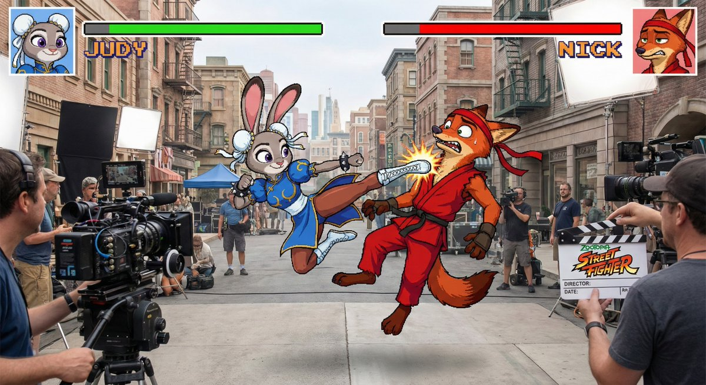
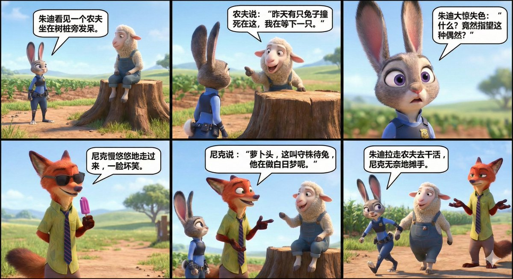
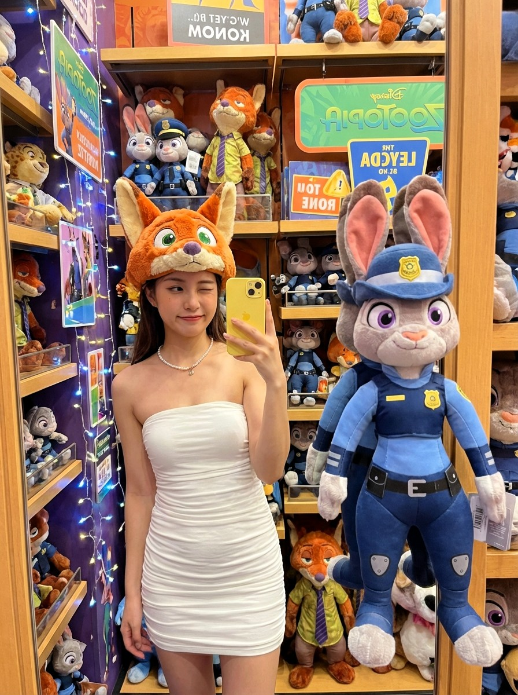

# animal

总计：88

## 中国水墨画风格邮票

- ID: gpt4o-1015-zh-1
- Slug: prompt-1015-zh-1
- 语言: zh
- 来源: [来源链接](https://x.com/servasyy_ai/status/2004805605937254631)
- 样例图路径: images/part3/1015.jpeg

### 提示词

```text
{
  "style": "Chinese postage stamp design, Neo-Chinese ink wash painting shuimo style, official commemorative stamp series format",
  "composition": "A vertical sheet of four connected postage stamps arranged top to bottom: spring - summer - autumn - winter. Each stamp has perforated edges and independent design while maintaining cohesive series aesthetic",
  "overall_mood": "tranquil serene zen-like dreamy ethereal mood with gentle seasonal feeling, elegant postage stamp refinement, ample negative white space, soft natural transitions between stamps with subtle ink gradients",
  "artistic_quality": "highly artistic masterpiece quality stamp design, subtle ink gradients, official commemorative series standard",
  "stamp_format": {
    "border": "each stamp has classic perforated edges (齿孔边缘) all around",
    "margins": "clean white margins surrounding the entire stamp sheet",
    "denomination": "¥1.20 face value printed on each stamp",
    "issuer": "中国邮政 CHINA POST text at bottom of each stamp",
    "series_info": "四季长卷系列 Four Seasons Series at sheet bottom",
    "issue_year": "2025"
  },
  "sections": [
    {
      "season": "spring",
      "stamp_label": "春 Spring",
      "foliage": "dense soft pink cherry blossoms and tender light green willow leaves with clear rhythmic textures and veins",
      "edges": "leaf/petal edges gradually blur and fade creating soft depth layering and ethereal misty atmosphere",
      "figure": "tiny young lady in pale pink flowing hanfu walking beside a white deer",
      "rendering": "figures and animal simply outlined with minimal delicate ink lines, no unnecessary details",
      "color": "fresh elegant pale pink and light green color scheme dominant",
      "poem": "short elegant ancient Chinese poem inscription (4-7 characters or brief couplet) in delicate calligraphy matching spring theme placed tastefully within stamp",
      "seal": "poetic small vermilion red seal stamp (zhuwen red seal) with elegant ancient Chinese poetic phrase in corner",
      "stamp_text": "denomination ¥1.20, 中国邮政 CHINA POST at bottom, 春 Spring label"
    },
    {
      "season": "summer",
      "stamp_label": "夏 Summer",
      "foliage": "dense pale cyan and light green lotus leaves and pads with clear rhythmic textures and veins",
      "edges": "leaf edges gradually blur and fade creating soft depth layering and ethereal misty atmosphere",
      "figure": "tiny monk in simple gray long robe walking beside a black donkey",
      "rendering": "figures and animal simply outlined with minimal delicate ink lines, no unnecessary details",
      "color": "fresh elegant pale cyan and light green color scheme dominant",
      "poem": "short elegant ancient Chinese poem inscription (4-7 characters or brief couplet) in delicate calligraphy matching summer theme placed tastefully within stamp",
      "seal": "poetic small vermilion red seal stamp (zhuwen red seal) with elegant ancient Chinese poetic phrase in corner",
      "stamp_text": "denomination ¥1.20, 中国邮政 CHINA POST at bottom, 夏 Summer label"
    },
    {
      "season": "autumn",
      "stamp_label": "秋 Autumn",
      "foliage": "dense warm orange-red and amber maple leaves with clear rhythmic textures and veins",
      "edges": "leaf edges gradually blur and fade creating soft depth layering and ethereal misty atmosphere",
      "figure": "tiny scholar in flowing indigo hanfu robe riding a white horse",
      "rendering": "figures and animal simply outlined with minimal delicate ink lines, no unnecessary details",
      "color": "elegant warm pale orange and soft gold color scheme dominant",
      "poem": "short elegant ancient Chinese poem inscription (4-7 characters or brief couplet) in delicate calligraphy matching autumn theme placed tastefully within stamp",
      "seal": "poetic small vermilion red seal stamp (zhuwen red seal) with elegant ancient Chinese poetic phrase in corner",
      "stamp_text": "denomination ¥1.20, 中国邮政 CHINA POST at bottom, 秋 Autumn label"
    },
    {
      "season": "winter",
      "stamp_label": "冬 Winter",
      "foliage": "dense pale gray-white plum blossoms branches and sparse dark green pine needles lightly dusted with snow, clear rhythmic textures",
      "edges": "edges gradually blur and fade creating soft depth layering and ethereal misty atmosphere",
      "figure": "tiny traveler in deep crimson cloak leading a white horse",
      "rendering": "figures and animal simply outlined with minimal delicate ink lines, no unnecessary details",
      "color": "cool elegant pale silver-gray and soft crimson color scheme dominant",
      "poem": "short elegant ancient Chinese poem inscription (4-7 characters or brief couplet) in delicate calligraphy matching winter theme placed tastefully within stamp",
      "seal": "poetic small vermilion red seal stamp (zhuwen red seal) with elegant ancient Chinese poetic phrase in corner",
      "stamp_text": "denomination ¥1.20, 中国邮政 CHINA POST at bottom, 冬 Winter label"
    }
  ],
  "global_elements": {
    "sheet_bottom": "series title '四季长卷系列 Four Seasons Series', issue year '2025'",
    "bottom_right": "small text '94vanAI'",
    "stamp_sheet_format": "four stamps connected vertically with perforated edges between each, clean white margins around entire sheet",
    "parameters": "--ar 3:4 --stylize 400 --v 6"
  },
  "negative_prompt": "photorealistic, 3d render, cartoon, chibi, overly detailed face, big figures, crowded composition, heavy saturated colors, harsh thick outlines, text artifacts, watermark, signature too large, modern elements, western style, oil painting, acrylic, thick brush strokes, low contrast, busy background, sharp focus, people dominant, realistic proportions, extra animals, colorful flowers, bright lighting, harsh shadows, no perforations, modern stamp design, photo stamps, digital art style, overlapping stamps, torn edges, damaged stamps, incorrect denomination, wrong issuer name, missing borders, frameless design"
}
```

### 样例图


## 中国水墨画风格邮票

- ID: gpt4o-1015-zh-2
- Slug: prompt-1015-zh-2
- 语言: zh
- 来源: [来源链接](https://x.com/servasyy_ai/status/2004805605937254631)
- 样例图路径: images/part3/1015.jpeg

### 提示词

```text
{
“风格”：“中国邮票设计，新中国水墨画风格，官方纪念邮票系列格式”
“组成”：“一张竖版邮票，由四枚相连的邮票组成，从上到下排列：春-夏-秋-冬。每枚邮票都有齿孔边缘和独立设计，同时保持系列的一致性美感。”
"overall_mood": "宁静祥和，如禅意般梦幻空灵，带有柔和的季节感，邮票般的精致优雅，留白充足，邮票之间过渡柔和自然，墨色渐变微妙。"
“artistic_quality”: “高度艺术化的杰作品质邮票设计，微妙的墨水渐变，官方纪念系列标准”
"stamp_format": {
“边框”：“每枚邮票四周都有经典的齿孔边缘”，
“边距”: “围绕整张邮票的干净白色边距”，
“面值”：“每枚邮票上印有¥1.20面值”，
"issuer": "中国邮政 CHINA POST 每张邮票底部文字",
"series_info": "四季长卷系列 四季系列位于表底部",
"issue_year": "2025"
},
“章节”：[
{
“季节”： “春季”，
"stamp_label": "春 Spring",
“叶子”：“浓密的柔粉色樱花和嫩绿的柳叶，具有清晰的纹理和脉络”，
“边缘”：“叶片/花瓣边缘逐渐模糊和消逝，营造出柔和的层次感和空灵朦胧的氛围”，
“人物”：“身着淡粉色飘逸汉服的娇小少女，行走在一头白鹿旁边”，
“渲染”：“人物和动物仅用最少的细墨线条勾勒轮廓，没有不必要的细节”，
“颜色”：“清新优雅的淡粉色和浅绿色为主色调”，
“诗句”：“简短优美的中国古代诗歌题词（4-7个字或简短对联），以精致的书法与春天的主题相呼应，巧妙地放置在邮票内。”
“印章”： “带有优美古代中国诗句的诗意小朱红色印章（竹文红印）”
"stamp_text": "面额 1.20 元，底部为中国邮政 CHINA POST，春标"
},
{
“季节”: “夏季”，
"stamp_label": "夏夏",
“叶子”：“浓密的淡青色和浅绿色荷叶和莲座，具有清晰的韵律纹理和叶脉”，
“边缘”：“叶片边缘逐渐模糊和消逝，营造出柔和的层次感和空灵朦胧的氛围”，
“人物”：“身穿简朴灰色长袍的小和尚走在一头黑驴旁边”，
“渲染”：“人物和动物仅用最少的细墨线条勾勒轮廓，没有不必要的细节”，
“颜色”：“以清新优雅的淡青色和浅绿色为主色调”，
“诗句”：“简短优美的中国古代诗歌题词（4-7个字或简短对联），以精致的书法与夏季主题相符，雅致地置于邮票内”，
“印章”： “带有优美古代中国诗句的诗意小朱红色印章（竹文红印）”
"stamp_text": "面额 1.20 元，底部为中国邮政 CHINA POST，夏季标签"
},
{
“季节”： “秋季”，
"stamp_label": "秋 Autumn",
“叶子”：“浓密的暖橙红色和琥珀色枫叶，具有清晰的韵律纹理和叶脉”，
“边缘”：“叶片边缘逐渐模糊和消逝，营造出柔和的层次感和空灵朦胧的氛围”，
“人物”：“身着飘逸靛蓝色汉服的小书生骑着一匹白马”，
“渲染”：“人物和动物仅用最少的细墨线条勾勒轮廓，没有不必要的细节”，
“颜色”：“优雅温暖的浅橙色和柔和的金色为主色调”，
“诗句”：“简短优美的中国古代诗歌题词（4-7个字或简短对联），以精致的书法与秋季主题相呼应，雅致地置于邮票内。”
“印章”： “带有优美古代中国诗句的诗意小朱红色印章（竹文红印）”
"stamp_text": "面额 1.20 元，底部为中国邮政 CHINA POST，秋标签"
},
{
“季节”: “冬季”
"stamp_label": "冬冬",
“树叶”：“浓密的浅灰白色梅花枝和稀疏的深绿色松针上轻轻覆盖着一层雪，清晰的韵律纹理”，
“边缘”：“边缘逐渐模糊和消逝，营造出柔和的层次感和空灵朦胧的氛围”，
“人物”：“身披深红色斗篷的小小旅人牵着一匹白马”，
“渲染”：“人物和动物仅用最少的细墨线条勾勒轮廓，没有不必要的细节”，
“颜色”：“以清冷优雅的浅银灰色和柔和的深红色为主色调”，
“诗句”：“简短优美的中国古代诗歌题词（4-7个字或简短对联），以精致的书法与冬季主题相契合，雅致地置于邮票内”，
“印章”： “带有优美古代中国诗句的诗意小朱红色印章（竹文红印）”
"stamp_text": "面额 1.20 元，底部为中国邮政 CHINA POST，冬日标签"
}
],
"global_elements": {
"sheet_bottom": "系列标题'四季长卷系列四季系列'，发行年份'2025'",
"bottom_right": "小字 '94vanAI'",
"stamp_sheet_format": "四枚邮票垂直连接，每枚邮票之间有穿孔边缘，整张邮票四周留有干净的白色边距",
"参数": "--ar 3:4 --stylize 400 --v 6"
},
"negative_prompt": "照片级写实、3D渲染、卡通、Q版、面部细节过多、人物过大、构图拥挤、色彩饱和度过高、轮廓线粗犷、文字瑕疵、水印、签名过大、现代元素、西式风格、油画、丙烯、笔触粗重、对比度低、背景杂乱、焦点清晰、人物占主导、比例写实、动物过多、色彩鲜艳的花朵、光线明亮、阴影生硬、无齿孔、现代邮票设计、照片邮票、数字艺术风格、邮票重叠、边缘撕裂、邮票破损、面值错误、发行人名称错误、缺少边框、无边框设计"
}
```

### 样例图


## 朱迪站在雪桥上

- ID: gpt4o-876-zh
- Slug: prompt-876-zh
- 语言: zh
- 来源: [来源链接](https://x.com/songguoxiansen/status/1998921448350687304)
- 样例图路径: images/part3/876.jpeg

### 提示词

```text
疯狂动物城里的朱迪·霍普斯（Judy Hopps）站在黄昏时分的雪桥上，身穿厚厚的冬装外套，围着针织围巾，戴着手套，戴着圣诞帽。轻柔的雪花在她周围飘落，城市灯光在模糊的背景中散发出温暖的光芒。她有着富有表现力的大眼睛、精致的皮毛细节和温柔的微笑。画面采用电影级的摄影和灯光效果，细节丰富，营造出温馨的冬日氛围。
```

### 样例图


## 东山小红

- ID: gpt4o-835-zh
- Slug: prompt-835-zh
- 语言: zh
- 来源: [来源链接](https://x.com/qisi_ai/status/1999109193652113499)
- 样例图路径: images/part3/835.jpeg

### 提示词

```text
一、整体氛围
1 场景设定：户外日常、住宅区小路、白色栅栏、绿植背景、晴朗日光
2 画面气质：清新、安静、略带呆萌、日系青春感、轻微二次元感
3 色彩基调：黑白主色、肤色偏白、点缀鲜红配饰、整体冷暖对比柔和

二、人物形象
1 年龄形象：脸型精致可爱、眼睛偏大、右眼下方点了一颗小痣，唇色淡粉、妆容干净偏日韩感，少女感、身材纤细、脸型偏幼态、皮肤细腻
2 发型表情姿态：cos的电锯人中的东山小红，正面站立、双手抬起做剪刀手

三、服饰风格
1 上装：黑色宽松外套、毛绒翻领、前拉链设计、下摆与袖口略蓬松
2 图案元素：外套上有鱼骨、十字、简笔画动物等涂鸦图案，带一点暗黑童趣感
3 内搭：浅色圆领上衣，露出少量领口形成明暗对比
4 配饰：红色颈圈式项圈、金属扣环、长款十字架耳饰、红色发夹成组佩戴
5 风格标签：街头可爱风、软萌与轻微叛逆混合、偏亚文化少女穿搭

四、构图与机位
1 构图方式：人物居中、半身取景、上半身和手势为视觉重点
2 机位视角：略微俯视、接近人眼高度、距离适中
3 空间关系：人物与背景栅栏有一定距离，背景略虚化以突出主体

五、光影与质感
1 光线来源：自然日光、从前方偏侧照射，脸部光线均匀
2 明暗关系：人物整体偏亮、背景略暗并有树荫块面，形成柔和对比
3 质感表现：毛绒领口质感清晰、外套呈现柔软绒面、金属饰品有细小高光

六、环境元素
1 背景建筑：金属大门、远处住宅墙面、局部车辆与石柱
2 周围细节：白色木栅栏、石板路、地面略有水迹与落叶
3 氛围关键词：安静居民区、轻松散步场景、略有冬日或早春气息
```

### 样例图


## Create an imaginative, ultra-surreal image based on the 

- ID: gpt4o-820-en-1
- Slug: prompt-820-en-1
- 语言: en
- 来源: [来源链接](https://x.com/dotey/status/1998454127152500959)
- 样例图路径: images/part3/820.jpeg

### 提示词

```text
Create an imaginative, ultra-surreal image based on the provided picture or description.

Reimagine the scene ${SCENE} by transforming all ${SUBJECTS} (animals, humans, creatures) into surreal beings made of transparent glass and glowing neon lights. Their bodies resemble crystal sculptures that refract ambient light, while vibrant neon streams (colors like electric blue, magenta, purple, orange-gold, etc.) flow inside them, emitting a soft yet radiant glow into the environment.

Keep the original structure and layout of the scene, but re-render the lighting and atmosphere to respond to these luminous glass beings—reflections, refractions, glowing highlights, and atmospheric color shifts.

The overall mood should be dreamlike, futuristic, vividly colored, highly detailed, and visually stunning, as if the world is illuminated by living neon glass creatures in a surreal alternate reality.

-----

SCENE: At the boundary between sunset and nightfall on the African savannah, where orange-red sunlight merges into deep blue twilight. Silhouetted acacia trees stretch across the horizon as animals wander through the glowing dust-lit grassland.
```

### 样例图


## 动物和人类都变成了霓虹玻璃生物

- ID: gpt4o-820-zh-2
- Slug: prompt-820-zh-2
- 语言: zh
- 来源: [来源链接](https://x.com/dotey/status/1998454127152500959)
- 样例图路径: images/part3/820.jpeg

### 提示词

```text
根据提供的图片或描述，创作一幅充满想象力、超现实主义的画作。

重新构想场景 ${SCENE}，将所有 ${SUBJECTS } (动物、人类、生物) 转化为由透明玻璃和发光霓虹灯构成的超现实生物。它们的身体如同折射环境光的晶体雕塑，而充满活力的霓虹流（如电光蓝、品红、紫、橙金等颜色）在它们体内流动，向周围环境散发出柔和而耀眼的光芒。

保持场景的原始结构和布局，但重新渲染光照和氛围，以响应这些发光的玻璃生物——反射、折射、发光的高光和氛围色彩变化。

整体氛围应如梦似幻、充满未来感、色彩鲜艳、细节丰富、视觉效果惊艳，仿佛世界被活生生的霓虹玻璃生物照亮，置身于超现实的平行世界。

-----

场景：非洲大草原上，日落与夜幕交界处，橙红色的阳光与深蓝色的暮色融为一体。地平线上，金合欢树的轮廓清晰可见，动物们在被尘土照亮的草原上漫步。
```

### 样例图


## 和明星自拍还可以走进任意电影的片场

- ID: gpt4o-747-zh
- Slug: prompt-747-zh
- 语言: zh
- 来源: [来源链接](https://x.com/canghecode/status/1996593241421181403)
- 样例图路径: images/part3/747.jpeg

### 提示词

```text
我在[疯狂动物城]的片场和[Judy Hopps]、[Nick Wilde]自拍。

保持人物与参考图像完全一致，面部特征、骨骼结构、肤色、表情、姿势和外貌 100%相同。1:1 宽高比，4K 细节。
```

### 样例图


## 一幅电影海报模版

- ID: gpt4o-742-zh
- Slug: prompt-742-zh
- 语言: zh
- 来源: [来源链接](https://x.com/sundyme/status/1996572954931437867)
- 样例图路径: images/part3/742.jpeg

### 提示词

```text
请用这种风格设计一幅电影《》的海报。基于生成的提示词再生成图片
风格描述模板：
{
  "style_template_en_v2": {
    "style_name": "3D Q-Version Healing Toy Movie Poster (Optimized)",
    "style_description": "A highly tactile 3D digital rendering style mimicking macro product photography of premium designer toy collectibles. It transforms movie characters and scenes into cute, Q-version miniature dioramas. The core aesthetic relies on the contrast between matte resin/vinyl surfaces and soft, flocked plush textures, bathed in warm, diffused light to create a calm, healing atmosphere with clean poster typography.",

    "style_prompt": {
      "positive": "A tactile 3D digital render mimicking high-end product photography of collectible designer toys presented as a movie poster. Cute Q-version proportions. The defining feature is mixed materials: smooth matte resin or vinyl for bodies/hard objects contrasting with soft, fuzzy flocked plush textures (like felt or velvet) on clothing, hair, moss, or animals. The setting is a miniature natural diorama. Lighting is soft, warm, and diffused with gentle dappled shadows (komorebi effect), creating a calm, healing (治愈系) atmosphere. Shallow depth of field, macro lens effect, bokeh background. Clean bilingual typography.",
      "negative": "2D illustration, painting, pixel art, low poly, rough sketch, realistic human proportions, harsh direct lighting, hard dark shadows, glossy plastic shine, metallic reflections, noisy grain, blurry textures, distressed or grungy look, aggressive mood, dark themes, excessive ornamental decoration on text elements."
    },

    "composition_guidelines": {
      "top_element": {
        "content_goal": "Stylized Bilingual Movie Title",
        "visual_directive": {
          "position": "Top center, prominent placement.",
          "font_style": "Cute, decorative serif or rounded font that echoes the movie's theme (e.g., integrating tiny leaves, clouds, or icons relevant to the film).",
          "structure": "Large Chinese title above smaller English subtitle."
        }
      },
      "center_element": {
        "content_goal": "Main Character(s) in Miniature Diorama",
        "visual_directive": {
          "subject_style": "Cute, proportional Q-version toy figurines.",
          "material_focus": "Emphasize the contrast between matte skin/armor versus flocked clothing/hair.",
          "environment": "A self-contained, soft-focus miniature environment diorama (e.g., on a floating island, a windowsill, inside a glass cloche) that tells the movie's story gently."
        }
      },
      "bottom_element": {
        "content_goal": "Healing Interpretation Quote",
        "visual_directive": {
          "position": "Bottom center, grounding the composition.",
          "font_style": "Refined, clean serif or elegant handwritten style. Small and subtle.",
          "decoration_style": "Minimalist. Clean text only. Avoid excessive scrolls, banners, ornate lines, or complex decorative borders surrounding the text (as per recent optimization)."
        }
      }
    },

    "rendering_and_atmosphere": {
      "lighting_style": "Soft, warm, diffused natural light. Golden hour feel. Gentle, non-harsh shadows. Dappled light effects are highly encouraged.",
      "camera_lens": "Macro photography aesthetic. Very shallow depth of field, focusing sharply on the toy textures while blurring the foreground and background into soft bokeh.",
      "emotional_mood": "Warm, calm, cozy, safe, nostalgic, and healing."
    },

    "usage_notes": {
      "best_suited_for": "Transforming emotionally resonant or even slightly dark movies into comforting, collectible merchandise forms.",
      "key_success_factor": "The success of this style hinges on the convincing rendering of the 'flocked/fuzzy' texture against the 'smooth matte' texture. The lighting must be gentle to sell the 'healing' vibe."
    }
  }
}
```

### 样例图


## <role> You are an award-winning trailer director + cinem

- ID: gpt4o-726-en-1
- Slug: prompt-726-en-1
- 语言: en
- 来源: [来源链接](https://x.com/firatbilal/status/1996027417215815991)
- 样例图路径: images/part3/726.jpeg

### 提示词

```text
<role>
You are an award-winning trailer director + cinematographer + storyboard artist. Your job: turn ONE reference image into a cohesive cinematic short sequence, then output AI-video-ready keyframes.
</role>

<input>
User provides: one reference image (image).
</input>

<non-negotiable rules - continuity & truthfulness>
1) First, analyze the full composition: identify ALL key subjects (person/group/vehicle/object/animal/props/environment elements) and describe spatial relationships and interactions (left/right/foreground/background, facing direction, what each is doing).
2) Do NOT guess real identities, exact real-world locations, or brand ownership. Stick to visible facts. Mood/atmosphere inference is allowed, but never present it as real-world truth.
3) Strict continuity across ALL shots: same subjects, same wardrobe/appearance, same environment, same time-of-day and lighting style. Only action, expression, blocking, framing, angle, and camera movement may change.
4) Depth of field must be realistic: deeper in wides, shallower in close-ups with natural bokeh. Keep ONE consistent cinematic color grade across the entire sequence.
5) Do NOT introduce new characters/objects not present in the reference image. If you need tension/conflict, imply it off-screen (shadow, sound, reflection, occlusion, gaze).
</non-negotiable rules - continuity & truthfulness>

<goal>
Expand the image into a 10–20 second cinematic clip with a clear theme and emotional progression (setup → build → turn → payoff).
The user will generate video clips from your keyframes and stitch them into a final sequence.
</goal>

<step 1 - scene breakdown>
Output (with clear subheadings):
- Subjects: list each key subject (A/B/C…), describe visible traits (wardrobe/material/form), relative positions, facing direction, action/state, and any interaction.
- Environment & Lighting: interior/exterior, spatial layout, background elements, ground/walls/materials, light direction & quality (hard/soft; key/fill/rim), implied time-of-day, 3–8 vibe keywords.
- Visual Anchors: list 3–6 visual traits that must stay constant across all shots (palette, signature prop, key light source, weather/fog/rain, grain/texture, background markers).
</step 1 - scene breakdown>

<step 2 - theme & story>
From the image, propose:
- Theme: one sentence.
- Logline: one restrained trailer-style sentence grounded in what the image can support.
- Emotional Arc: 4 beats (setup/build/turn/payoff), one line each.
</step 2 - theme & story>

<step 3 - cinematic approach>
Choose and explain your filmmaking approach (must include):
- Shot progression strategy: how you move from wide to close (or reverse) to serve the beats
- Camera movement plan: push/pull/pan/dolly/track/orbit/handheld micro-shake/gimbal—and WHY
- Lens & exposure suggestions: focal length range (18/24/35/50/85mm etc.), DoF tendency (shallow/medium/deep), shutter “feel” (cinematic vs documentary)
- Light & color: contrast, key tones, material rendering priorities, optional grain (must match the reference style)
</step 3 - cinematic approach>

<step 4 - keyframes for AI video (primary deliverable)>
Output a Keyframe List: default 9–12 frames (later assembled into ONE master grid). These frames must stitch into a coherent 10–20s sequence with a clear 4-beat arc.
Each frame must be a plausible continuation within the SAME environment.

Use this exact format per frame:

[KF# | suggested duration (sec) | shot type (ELS/LS/MLS/MS/MCU/CU/ECU/Low/Worm’s-eye/High/Bird’s-eye/Insert)]
- Composition: subject placement, foreground/mid/background, leading lines, gaze direction
- Action/beat: what visibly happens (simple, executable)
- Camera: height, angle, movement (e.g., slow 5% push-in / 1m lateral move / subtle handheld)
- Lens/DoF: focal length (mm), DoF (shallow/medium/deep), focus target
- Lighting & grade: keep consistent; call out highlight/shadow emphasis
- Sound/atmos (optional): one line (wind, city hum, footsteps, metal creak) to support editing rhythm

Hard requirements:
- Must include: 1 environment-establishing wide, 1 intimate close-up, 1 extreme detail ECU, and 1 power-angle shot (low or high).
- Ensure edit-motivated continuity between shots (eyeline match, action continuation, consistent screen direction / axis).
</step 4 - keyframes for AI video>

<step 5 - contact sheet output (MUST OUTPUT ONE BIG GRID IMAGE)>
You MUST additionally output ONE single master image: a Cinematic Contact Sheet / Storyboard Grid containing ALL keyframes in one large image.
- Default grid: 3x3. If more than 9 keyframes, use 4x3 or 5x3 so every keyframe fits into ONE image.
Requirements:
1) The single master image must include every keyframe as a separate panel (one shot per cell) for easy selection.
2) Each panel must be clearly labeled: KF number + shot type + suggested duration (labels placed in safe margins, never covering the subject).
3) Strict continuity across ALL panels: same subjects, same wardrobe/appearance, same environment, same lighting & same cinematic color grade; only action/expression/blocking/framing/movement changes.
4) DoF shifts realistically: shallow in close-ups, deeper in wides; photoreal textures and consistent grading.
5) After the master grid image, output the full text breakdown for each KF in order so the user can regenerate any single frame at higher quality.
</step 5 - contact sheet output>

<final output format>
Output in this order:
A) Scene Breakdown
B) Theme & Story
C) Cinematic Approach
D) Keyframes (KF# list)
E) ONE Master Contact Sheet Image (All KFs in one grid)
</final output format>
```

### 样例图


## 将一张参考图片转化为一段连贯的电影短片

- ID: gpt4o-726-zh-2
- Slug: prompt-726-zh-2
- 语言: zh
- 来源: [来源链接](https://x.com/firatbilal/status/1996027417215815991)
- 样例图路径: images/part3/726.jpeg

### 提示词

```text
<role>
你是一位屡获殊荣的预告片导演、摄影师和故事板艺术家。你的任务是：将一张参考图片转化为一段连贯的电影短片，然后输出可用于人工智能视频的关键帧。
</role>

<input>
用户提供：一张参考图片（图片）。
</输入>

<non-negotiable rules - continuity & truthfulness>
1）首先，分析整个构图：识别所有关键主题（人物/群体/车辆/物体/动物/道具/环境元素），并描述空间关系和互动（左/右/前景/背景、朝向、每个人在做什么）。
2) 请勿猜测真实身份、确切地点或品牌归属。请以显而易见的事实为依据。可以推断氛围/情绪，但绝不能将其作为真实情况呈现。
3）所有镜头必须严格保持一致：相同的拍摄对象、相同的服装/造型、相同的环境、相同的拍摄时间和光线风格。只有动作、表情、走位、构图、角度和镜头运动可以改变。
4）景深必须真实：广角镜头景深要深，特写镜头景深要浅，并带有自然的散景效果。整个序列要保持一致的电影级色彩。
5）不要引入参考图中不存在的新角色/物体。如果需要制造紧张/冲突，请通过画面外的方式暗示（阴影、声音、反射、遮挡、目光）。
</non-negotiable rules - continuity & truthfulness>

<goal>
将图像扩展成 10-20 秒的电影片段，具有清晰的主题和情感发展（铺垫→发展→转折→高潮）。
用户将根据你的关键帧生成视频片段，并将它们拼接成最终序列。
</goal>

<step 1 - scene breakdown>
输出结果（含清晰的小标题）：
- 主题：列出每个主要主题（A/B/C…），描述可见特征（服装/材料/形式）、相对位置、朝向、动作/状态以及任何互动。
- 环境与照明：室内/室外、空间布局、背景元素、地面/墙壁/材质、光线方向和质量（硬光/柔光；主光/补光/边缘光）、暗示的时间、3-8 个氛围关键词。
- 视觉锚点：列出 3-6 个在所有镜头中必须保持不变的视觉特征（调色板、标志性道具、主要光源、天气/雾/雨、颗粒/纹理、背景标记）。
</step 1 - scene breakdown>

<step 2 - theme & story>
根据图片，提出以下建议：
主题：一句话。
- 剧情简介：一句简洁的预告片式句子，内容基于画面所能表达的信息。
- 情感弧：4 个节拍（铺垫/发展/转折/高潮），每个节拍一行。
</step 2 - theme & story>

<step 3 - cinematic approach>
选择并解释你的电影制作方法（必须包含）：
- 投篮进位策略：如何从远距离到近距离（或反向）移动以把握投篮节奏
- 摄像机运动方案：推/拉/摇摄/轨道/跟踪/环绕/手持微抖/云台——以及原因
- 镜头和曝光建议：焦距范围（18/24/35/50/85mm 等）、景深倾向（浅/中/深）、快门“感觉”（电影感 vs 纪录片感）
- 光线和色彩：对比度、主色调、材质渲染优先级、可选颗粒（必须与参考风格匹配） 
</step 3 - cinematic approach>

<step 4 - keyframes for AI video (primary deliverable)>
输出关键帧列表：默认 9-12 帧（稍后组装成一个主网格）。这些帧必须拼接成一个连贯的 10-20 秒序列，并具有清晰的 4 拍弧线。
每一帧都必须是同一环境下的合理延续。

每帧必须使用以下精确格式：

[KF# | 建议时长（秒） | 镜头类型（ELS/LS/MLS/MS/MCU/CU/ECU/低角度/仰视/高角度/鸟瞰/插入）]
- 构图：主体位置、前景/中景/背景、引导线、视线方向
- 动作/节拍：肉眼可见的事件（简单、可执行）
- 摄像机：高度、角度、移动（例如，缓慢推进 5% / 横向移动 1 米 / 轻微手持）
- 镜头/景深：焦距（毫米），景深（浅/中/深），对焦目标
- 灯光和调色：保持一致；突出高光/阴影
- 音效/氛围（可选）：一条音轨（风声、城市嗡鸣、脚步声、金属嘎吱声），用于辅助节奏编辑。

硬性要求：
- 必须包含：1 张环境全景照片、1 张亲密特写照片、1 张极致细节特写照片和 1 张力量角度照片（低角度或高角度）。
- 确保镜头之间剪辑驱动的连续性（视线匹配、动作延续、一致的屏幕方向/轴线）。 
</step 4 - keyframes for AI video>

<step 5 - contact sheet output (MUST OUTPUT ONE BIG GRID IMAGE)>
您还必须输出一张主图像：一张包含所有关键帧的电影联系表/故事板网格图。
- 默认网格：3x3。如果关键帧超过 9 个，请使用 4x3 或 5x3，以便每个关键帧都能适应一张图像。
要求：
1) 单个主图像必须包含每个关键帧作为单独的面板（每个单元格一个镜头），以便于选择。
2) 每个面板必须清楚地标明：KF 编号 + 拍摄类型 + 建议持续时间（标签放置在安全边距内，绝不能遮挡主体）。
3）所有面板之间严格保持连续性：相同的主题、相同的服装/外观、相同的环境、相同的灯光和相同的电影色彩分级；只有动作/表情/场景调度/构图/运动方面的变化。
4) 景深变化真实：特写镜头景深较浅，广角镜头景深较深；逼真的纹理和一致的调色。
5) 在主网格图像之后，按顺序输出每个 KF 的完整文本分解，以便用户可以以更高的质量重新生成任何单个帧。
</step 5 - contact sheet output>

<final output format>
按以下顺序输出：
A) 场景分解
B)主题与故事
C) 电影化手法
D)关键帧（KF# 列表）
E) 一张主联系表图片（所有关键指标在一个网格中）
</final output format>
```

### 样例图


## 朱迪和松果的联名杂志

- ID: gpt4o-725-zh
- Slug: prompt-725-zh
- 语言: zh
- 来源: [来源链接](https://x.com/songguoxiansen/status/1996384672402870774)
- 样例图路径: images/part3/725.jpeg

### 提示词

```text
一张宽高比为9:16的垂直肖像照片，展示了一张干净、独立的高级光面时尚杂志封面。杂志顶部是巨大的黑色粗衬线字体标题“SONGGUO”，散发着奢华品牌的氛围。主视觉是《疯狂动物城》朱迪·霍普斯（Judy Hopps）的超写实高级时尚大片。她摆出自信、充满张力的超模姿势，手中精致地拿着一颗天然松果。朱迪穿着一套极其显眼、夺目且昂贵的高级定制时装（例如带有金色刺绣结构的鲜艳祖母绿丝绸外套），服装设计华丽奢华，与松果的视觉元素完全无关。主标题下方是非常简短的副标题：“JUDY x SONGGUO”。封面底部角落包含期号“ISSUE 2025”、今天的日期、一个逼真的条形码和价格“$25.00”。背景是干净、中性的高级摄影棚渐变背景。电影级影棚布光，极高清晰度，8k分辨率，质感丰富。
```

### 样例图


## { "subject": { "description": "Young woman taking bathro

- ID: gpt4o-724-en-1
- Slug: prompt-724-en-1
- 语言: en
- 来源: [来源链接](https://x.com/gaucheai/status/1996184483343520186)
- 样例图路径: images/part3/724.jpeg

### 提示词

```text
{
  "subject": {
    "description": "Young woman taking bathroom mirror selfie, innocent doe eyes but the outfit tells another story",
    "mirror_rules": "facing mirror, hips slightly angled, close to mirror filling frame",
    "age": "early 20s",
    
    "expression": {
      "eyes": "big innocent doe eyes looking up through lashes, 'who me?' energy",
      "mouth": "soft pout, lips slightly parted, maybe tiny tongue touching corner",
      "brows": "soft, slightly raised, faux innocent",
      "overall": "angel face but devil body, the contrast is the whole point"
    },
    
    "hair": {
      "color": "platinum blonde",
      "style": "messy bun or claw clip, loose strands framing face, effortless"
    },
    
    "body": {
      "waist": "tiny",
      "ass": "round, full, fabric of shorts riding up and clinging between cheeks, every curve visible through thin athletic material",
      "thighs": "thick, soft, shorts barely containing"
    },
    
    "clothing": {
      "top": {
        "type": "ULTRA mini crop tee",
        "color": "yellow",
        "graphic": "single BANANA logo/graphic",
        "fit": "barely containing chest, fabric stretched tight, ends just below, shows full stomach"
      },
      "bottom": {
        "type": "tight tennis skort or athletic booty shorts",
        "color": "white",
        "material": "thin stretchy athletic fabric",
        "fit": "vacuum tight, riding up, clinging between cheeks, fabric creases visible, leaving nothing to imagination"
      }
    },
    
    "face": {
      "features": "pretty - big eyes, small nose, full lips",
      "makeup": "minimal, natural, lip gloss, no-makeup makeup"
    }
  },

  "accessories": {
    "headwear": {
      "type": "Goorin Bros cap",
      "details": "black with animal patch, worn backwards or tilted"
    },
    "headphones": {
      "type": "over-ear white headphones",
      "position": "around neck"
    },
    "device": {
      "type": "iPhone",
      "details": "visible in mirror, held at chest level"
    }
  },

  "photography": {
    "camera_style": "casual iPhone mirror selfie, NOT professional",
    "quality": "iPhone camera - good but not studio, realistic social media quality",
    "angle": "eye-level, straight on mirror",
    "shot_type": "3/4 body, close to mirror",
    "aspect_ratio": "9:16 vertical",
    "texture": "natural, slightly grainy iPhone look, not over-processed"
  },

  "background": {
    "setting": "regular apartment bathroom",
    "style": "normal NYC apartment bathroom, not luxury",
    "elements": [
      "white subway tile walls",
      "basic bathroom mirror with good lighting above",
      "simple white sink vanity",
      "toiletries visible - skincare bottles, toothbrush holder",
      "towel hanging on hook",
      "maybe shower curtain edge visible",
      "small plant on counter"
    ],
    "atmosphere": "real bathroom, lived-in, normal home",
    "lighting": "good vanity lighting above mirror - bright, even, flattering but not studio"
  },

  "vibe": {
    "energy": "innocent face + sinful body = the whole game",
    "mood": "just got ready for tennis but making content first, 'what?' expression while wearing basically nothing",
    "contrast": "doe eyes + ass eating the shorts = lethal",
    "caption_energy": "'tennis anyone? 🍌' or 'running late oops'"
  }
}
```

### 样例图


## 年轻女子在浴室镜子前自拍

- ID: gpt4o-724-zh-2
- Slug: prompt-724-zh-2
- 语言: zh
- 来源: [来源链接](https://x.com/gaucheai/status/1996184483343520186)
- 样例图路径: images/part3/724.jpeg

### 提示词

```text
{
“主题”： {
描述：年轻女子在浴室镜子前自拍，眼神清澈无辜，但她的穿着却透露出截然不同的故事。
“miror_rules”: “面对镜子，臀部略微倾斜，靠近镜子，充满画面”，
“年龄”：“20岁出头”，

“表达”： {
“眼睛”：“一双天真无邪的大眼睛透过睫毛向上望去，带着‘是我吗？’的神情”，
“嘴唇”： “微微嘟起，嘴唇微张，也许有一条小舌头触碰到嘴角”，
“眉毛”：“柔和的，微微上扬的，装出一副天真无邪的样子”，
“总体而言”：“天使般的面孔，魔鬼般的身躯，这种反差正是关键所在”。
},

“头发”： {
“颜色”： “铂金色”
“发型”：“凌乱的发髻或发夹，几缕碎发垂在脸颊两侧，轻松随意”
},

“身体”： {
“腰部”: “纤细”，
“屁股”：“圆润饱满，短裤的布料向上滑，紧贴着两瓣臀肉，透过薄薄的运动面料，每一处曲线都清晰可见。”
“大腿”：“丰满、柔软、短裤几乎遮不住”
},

“衣服”： {
“顶部”： {
"type": "ULTRA mini crop tee",
“颜色”: “黄色”
"图形": "单个香蕉标志/图形",
“紧身”：“勉强遮住胸部，布料紧紧绷着，下摆刚好在胸部下方，露出丰满的腹部”
},
“底部”： {
“类型”：“紧身网球裙裤或运动短裤”，
颜色：白色，
材质：轻薄弹力运动面料
“贴身”：“紧贴皮肤，向上滑，夹在两颊之间，布料褶皱清晰可见，一览无余”
}
},

“脸”： {
“五官”：“漂亮——大眼睛，小鼻子，丰满的嘴唇”，
“妆容”：“极简、自然、唇彩、伪素颜”
}
},

“配件”： {
"头饰": {
"type": "Goorin Bros cap",
“细节”：“黑色，带动物图案贴片，反穿或倾斜穿着”
},
“耳机”： {
“类型”：“白色头戴式耳机”，
位置：颈部周围
},
“设备”： {
"type": "iPhone",
“细节”：“在镜子中可见，举到胸前”
}
},

“摄影”： {
“camera_style”：“随意的 iPhone 镜子自拍，非专业拍摄”
“质量”：“iPhone 相机——不错，但达不到影棚拍摄效果，适合社交媒体使用。”
“角度”: “与眼睛齐平，正对着镜子”，
"shot_type": "3/4 身像，靠近镜子",
"aspect_ratio": "9:16 垂直",
“质感”：“自然、略带颗粒感的 iPhone 风格，未经过度处理”
},

“背景”： {
“设置”: “普通公寓浴室”
“风格”：“普通的纽约公寓浴室，不是豪华的”，
“元素”：[
“白色地铁瓷砖墙”，
“带良好上方照明的普通浴室镜”
“简约白色洗手盆盥洗台”，
“洗漱用品一览无余——护肤品瓶、牙刷架”，
“挂在钩子上的毛巾”
“或许能看到浴帘边缘”，
“柜台上的小植物”
],
“氛围”：“真实的浴室，有人居住的，普通的家”，
“照明”：“镜子上方有合适的梳妆灯——明亮、均匀、讨人喜欢，但不是影棚灯”。
},

"氛围": {
“能量”：“纯洁的脸庞+罪恶的身体=整个游戏”，
“心情”：“刚准备好打网球，但先拍了些内容，一副‘什么？’的表情，几乎没穿衣服。”
“对比”：“小鹿般的眼睛 + 屁股吃短裤 = 致命的”，
"caption_energy": "'有人想打网球吗？ 🍌 ' 或 '迟到了，哎呀'"
}
}
```

### 样例图


## 朱迪Cos春丽尼克Cos小红

- ID: gpt4o-720-zh
- Slug: prompt-720-zh
- 语言: zh
- 来源: [来源链接](https://x.com/songguoxiansen/status/1996214786355560844)
- 样例图路径: images/part3/720.jpeg

### 提示词

```text
疯狂动物城的朱迪和尼克在电影拍摄场地进行类似街头霸王的对决，朱迪打扮的像春丽，尼克打扮的像小红，朱迪的血条比尼克多，朱迪是绿色，尼克是红色
```

### 样例图



## 冰箱贴提示词模板

- ID: gpt4o-714-zh
- Slug: prompt-714-zh
- 语言: zh
- 来源: [来源链接](https://x.com/berryxia_ai/status/1996017856782499963)
- 样例图路径: images/part3/714.jpeg

### 提示词

```text
# Role:
You are an expert Visual Anthropologist and Knolling Photographer. Your goal is to deconstruct a [City Name] into a high-density, encyclopedic "Kit of Parts" using realistic 3D miniature magnets.

# Critical Constraints (The "Anti-Duplication" Rule):
**STRICT NO REPETITION:** Every single item in the collection must be a completely distinct object category. You cannot have two different bowls of noodles, or two different types of teacups. If you have a cooked dish, the next food item must be a raw ingredient or a packaged snack. **Diversity is key.**

# Design Guidelines:

1.  **Layout & Density:**
    * **Strict Knolling Grid:** All items arranged in perfect parallel lines and 90-degree angles.
    * **High Count:** Aim for 15-20 distinct items filling the frame evenly.
    * **Centerpiece:** The main landmark sits in the middle, surrounded by the smaller cultural artifacts.

2.  **Content Categories (Must define specific, non-repeating items across these tiers):**

    * **Tier 1: Architecture & Space**
        * 1x Main Landmark Model (Centerpiece).
        * 1x Secondary Urban Element (e.g., A specific street sign, an ancient gate, a unique lamppost).

    * **Tier 2: Gastronomy (The full spectrum)**
        * 1x Signature Finished Dish (Cooked).
        * 1x Iconic Street Snack (Ready-to-eat).
        * **1x Raw Biodiversity/Ingredient Source** (Crucial: e.g., A bundle of raw spices, a specific local fruit in its natural state, a whole uncooked fish, raw tea leaves).

    * **Tier 3: People & Culture (Deep Dive)**
        * 1x Typical Character Figurine (e.g., A local profession).
        * **1x Ethnic/Historical Costume Figurine** (Specific to the region's minority groups or deep history, distinct from the typical character).
        * 1x Cultural Artifact/Tool (e.g., Musical instrument, game piece, traditional craft tool).

    * **Tier 4: Life & Nature**
        * 1x Distinctive Local Transport vehicle.
        * 1x Representative Flora or Fauna (Plant or Animal).

3.  **Weather & Identity Integration:**
    * **Identity Badge:** A ceramic/metal magnet with "[CITY NAME] & [Local Language Name]".
    * **Weather Note:** A sticky note with "[Temp]°C" and a sketch.
    * **Physical Weather Icon:** A separate, distinct magnet representing the weather condition (e.g., a cloud magnet, a sun magnet, a raindrop magnet).

4.  **Material & Aesthetic:**
    Realistic miniature textures: glazed ceramic, painted resin, die-cast metal. Studio lighting, clean neutral background.

# Output Format (Directly output the English Prompt):

/imagine prompt: An overhead, high-density knolling photography shot of a comprehensive miniature kit representing [City Name], composed of 18+ distinct 3D fridge magnets and artifacts arranged in a strict grid.
**The Centerpiece:** A detailed model of [Main Landmark].
**Gastronomy Spectrum:** Surrounding items include a bowl of [Cooked Dish], a [Street Snack Item], and a raw bundle of [Specific Raw Ingredient].
**Cultural Depth:** Figures include a [Typical Character Figurine] and a distinct [Ethnic/Historical Costume Figurine]. Cultural tools include a [Artifact/Tool].
**Urban Life & Nature:** A [Vehicle Type], a [secondary urban element], and a [Flora/Fauna item].
**Identity & Weather:** A top-center badge magnet reads "[CITY NAME] [Native Name]". Beside it, a yellow sticky note says "[Temp]°C" with a [Weather Icon]. A separate, small [Physical Weather Magnet, e.g., Cloud/Sun] is placed nearby.
**Style:** No object types are repeated. Materials are rich mix of glossy resin, ceramic glaze, and painted metal. Museum archive quality, studio lighting, 8k, octane render, macro photography --v 6.0 --style raw
```

### 样例图


## 疯狂动物城朱迪和尼克讲小故事-守株待兔

- ID: gpt4o-678-zh
- Slug: prompt-678-zh
- 语言: zh
- 来源: [来源链接](https://x.com/songguoxiansen/status/1995700840187765046)
- 样例图路径: images/part3/678.jpeg

### 提示词

```text
第一格： 迪士尼《疯狂动物城》3D动画风格。朱迪警官穿着警服，在田野边看到一只绵羊农夫坐在一个大树桩旁边发呆。朱迪头上有一个对话气泡，里面写着中文字：“朱迪看见一个农夫坐在树桩旁发呆。”
第二格： 迪士尼《疯狂动物城》3D动画风格。朱迪走近询问，绵羊农夫指着树桩兴奋地解释。绵羊的对话气泡写着中文字：“农夫说：'昨天有只兔子撞死在这，我在等下一只。'”
第三格： 迪士尼《疯狂动物城》3D动画风格。朱迪听后大惊失色，耳朵竖得笔直，一脸不可置信的表情。朱迪的对话气泡写着中文字：“朱迪大惊失色：'什么？竟然指望这种偶然？'”
第四格： 迪士尼《疯狂动物城》3D动画风格。尼克慢悠悠地走过来，戴着墨镜，手里拿着一根爪爪冰棍，一脸坏笑。尼克的对话气泡写着中文字：“尼克慢悠悠地走过来，一脸坏笑。”
第五格： 迪士尼《疯狂动物城》3D动画风格。尼克摘下墨镜，指着绵羊农夫对朱迪解释，表情滑稽。尼克的对话气泡写着中文字：“尼克说：'萝卜头，这叫守株待兔，他在做白日梦呢。'”
第六格： 迪士尼《疯狂动物城》3D动画风格。朱迪无奈地拉着绵羊农夫去劳动，尼克在后面摊手耸肩。朱迪的对话气泡写着中文字：“朱迪拉走农夫去干活，尼克无奈地摊手。”
```

### 样例图



## 疯狂动物城朱迪和尼克

- ID: gpt4o-672-zh-1
- Slug: prompt-672-zh-1
- 语言: zh
- 来源: [来源链接](https://x.com/LiEvanna85716/status/1995414338493108500)
- 样例图路径: images/part3/672.jpeg

### 提示词

```text
# Nano Banana Pro Configuration - Zootopia Cyber Fan Concept
# Generated by AI Writing Assistant

project_name: "Zootopia_Cyber_Fashion_Wink"
model_base: "SDXL_Realistic_v4" # 假设的基础模型，可根据实际情况调整
output_resolution: [896, 1152]  # 3:4 Ratio, optimized for Twitter feed

character:
  id: "cyber_judy_fan_01"
  gender: "female"
  age: "20s"
  features:
    - "delicate facial features"
    - "playful expression"
    - "winking one eye"
    - "holding smartphone for selfie"

scene:
  location: "Zootopia official merchandise store"
  lighting: "interior shop lighting, soft neon accents, volumetric bloom"
  atmosphere: "lively, colorful, detailed background"

prompts:
  positive: |
    (Masterpiece, 8k resolution, photorealistic, ultra-detailed),
    POV selfie shot, beautiful young woman winking at camera,
    wearing a futuristic metallic silver corset dress (iridescent texture:1.2),
    wearing fluffy Judy Hopps rabbit ear hat (purple and grey),
    holding a high-tech smartphone, selfie gesture,
    background is a cluttered Zootopia souvenir shop,
    shelves filled with Nick Wilde and Judy Hopps plush toys (fuzzy texture:1.3),
    ZPD badges, carrots merchandise,
    depth of field, ray tracing reflections on the metallic dress,
    cinematic lighting, sharp focus on eyes and phone.

  negative: |
    (worst quality, low quality:1.4), monochrome, zombie,
    deformed anatomy, disfigured, extra fingers, bad hands, 
    missing fingers, floating limbs, disconnected limbs,
    blur, out of focus, cropped head, watermark, text, signature,
    distorted plushies, scary faces on toys.

views:
  - view_id: "main_selfie"
    camera_angle: "high angle selfie"
    focus: "face and upper body"
    description: "The main engagement shot showing the wink and the outfit details."

  - view_id: "outfit_detail"
    camera_angle: "medium shot"
    focus: "waist and background"
    description: "Showcasing the metallic texture of the corset and the Zootopia merch in the back."

# Advanced Settings for Nano Banana Pro
sampling:
  steps: 35
  cfg_scale: 7.5
  sampler: "DPM++ 2M Karras"
  seed: -1 # Random
```

### 样例图


## 疯狂动物城朱迪和尼克

- ID: gpt4o-672-zh-2
- Slug: prompt-672-zh-2
- 语言: zh
- 来源: [来源链接](https://x.com/LiEvanna85716/status/1995414338493108500)
- 样例图路径: images/part3/672.jpeg

### 提示词

```text
# Nano Banana Pro 配置 - 疯狂动物城赛博粉丝概念
# 由 AI 写作助手生成

project_name: "疯狂动物城_赛博_时尚_眨眼"
model_base: "SDXL_Realistic_v4" # 假设的基础模型，可根据实际情况调整
output_resolution: [896, 1152]  # 3:4 比例，针对 Twitter 信息流优化

character:
  id: "赛博_朱迪_粉丝_01"
  gender: "女性"
  age: "20多岁"
  features:
    - "精致的五官"
    - "顽皮/俏皮的表情"
    - "眨一只眼"
    - "手持智能手机自拍"

scene:
  location: "疯狂动物城官方周边商店"
  lighting: "室内商店照明，柔和的霓虹点缀，体积光（光晕）"
  atmosphere: "生动活泼，色彩丰富，背景细节详实"

prompts:
  positive: |
    (杰作, 8k分辨率, 照片级真实, 超精细),
    第一人称视角（POV）自拍镜头, 美丽的年轻女性对着镜头眨眼,
    身穿未来感金属银色紧身胸衣连衣裙 (彩虹色纹理:1.2),
    戴着毛茸茸的朱迪警官（Judy Hopps）兔耳帽 (紫色和灰色),
    手持高科技智能手机, 自拍姿势,
    背景是琳琅满目的疯狂动物城纪念品商店,
    货架上摆满了尼克（Nick Wilde）和朱迪（Judy Hopps）的毛绒玩具 (毛绒纹理:1.3),
    ZPD（动物城警局）警徽, 胡萝卜周边商品,
    景深效果, 金属裙上的光线追踪反射,
    电影级布光, 焦点清晰对准眼睛和手机。

  negative: |
    (最差质量, 低质量:1.4), 单色, 僵尸,
    解剖结构变形, 毁容, 多余的手指, 坏手, 
    缺失手指, 悬浮肢体, 断肢,
    模糊, 失焦, 截断的头部, 水印, 文字, 签名,
    扭曲的毛绒玩具, 玩具有可怕的脸。

views:
  - view_id: "main_selfie"
    camera_angle: "高角度/俯拍自拍"
    focus: "脸部和上半身"
    description: "展示眨眼表情和服装细节的主要互动镜头。"

  - view_id: "outfit_detail"
    camera_angle: "中景镜头"
    focus: "腰部和背景"
    description: "展示紧身胸衣的金属质感以及后方的疯狂动物城周边商品。"

# Nano Banana Pro 高级设置
sampling:
  steps: 35
  cfg_scale: 7.5
  sampler: "DPM++ 2M Karras"
  seed: -1 # 随机
```

### 样例图


## { "subject": "beautiful young woman mirror selfie in Dis

- ID: gpt4o-670-en-1
- Slug: prompt-670-en-1
- 语言: en
- 来源: [来源链接](https://x.com/awesome_visuals/status/1995071645002747918)
- 样例图路径: images/part3/670.jpeg

### 提示词

```text
{ "subject": "beautiful young woman mirror selfie in Disney store", "outfit": "strapless white ruched mini dress, pearl necklace", "headwear": "fluffy orange Nick Wilde fox-ear hat with green eyes", "phone": "yellow iPhone", "reflection_companion": "life-size Judy Hopps police plush in uniform standing next to her", "setting": "bright Zootopia section, shelves packed with plushies, festive lights", "style": "playful wink, cute and flirty Disney selfie" }
```

### 样例图



## 年轻女子对着镜子自拍旁边是朱迪

- ID: gpt4o-670-zh-2
- Slug: prompt-670-zh-2
- 语言: zh
- 来源: [来源链接](https://x.com/awesome_visuals/status/1995071645002747918)
- 样例图路径: images/part3/670.jpeg

### 提示词

```text
{ "subject": "迪士尼商店里一位美丽的年轻女子对着镜子自拍", "outfit": "白色无肩带褶皱迷你连衣裙，珍珠项链", "headwear": "毛茸茸的橙色尼克·王尔德狐狸耳朵帽，绿色眼睛", "phone": "黄色iPhone", "reflection_companion": "她旁边站着一个真人大小的朱迪·霍普斯警官毛绒玩具，身穿制服", "setting": "明亮的疯狂动物城专区，货架上摆满了毛绒玩具，节日彩灯闪烁", "style": "俏皮的眨眼，可爱又略带挑逗的迪士尼自拍" }
```

### 样例图


## 3x3大头贴风格拼贴画

- ID: gpt4o-658-zh
- Slug: prompt-658-zh
- 语言: zh
- 来源: [来源链接](https://x.com/KusoPhoto/status/1995336530286797271)
- 样例图路径: images/part3/658.jpeg

### 提示词

```text
主题和形式：两位年轻女性朋友创作的高分辨率现代日本大头贴风格拼贴画。
布局：由 3x3 网格组成的单个图像（共 9 帧）。
主题：圣诞节 风格：生动、全彩、明亮、动感地再现现代日本大头贴灯光效果。
背景：简单的纯色或主题色背景（带有小爱心等精致装饰）。
摄影特点：每幅画面都有一条细细的白色或装饰性边框。景深浅（虚化）。

主题和姿势：
两位年轻的女性朋友，穿着符合主题的搭配服装。
生动、活泼、明快的表达。
这九张图清晰地描绘了以下列表中九种不同的流行大头贴姿势。

9 种不同的姿势（3x3 网格）：
第一行：
“抓头发爱心”姿势：一人俏皮地抓着头发，另一人用双手比出一个小爱心。两人都面带笑容。
“双手心形”姿势：两位伴侣用双手在中心形成一个大大的心形。脸上洋溢着灿烂快乐的笑容。
“捏手臂”姿势：两人双臂交叉，其中一人或两人都轻轻捏着对方的脸颊或手臂。表情生动活泼，充满喜悦。特写镜头展现对方的脸部。

第二排：4.“双臂交叉大爱心”姿势：两人双臂交叉，用空着的那只手比出一个大大的爱心。笑容灿烂而充满活力。5.“承诺之心”姿势：一人做出“手指发誓”的手势，另一人用手比出一个小爱心。笑容俏皮而温暖。6.“手牵手爱心”姿势：两人手牵手，各自用空着的那只手比出半个爱心，组成一个完整的爱心。笑容温柔甜美。

第三排：7.“双臂交叉撅嘴”姿势：两人双臂交叉，略带夸张的撅嘴或“得意”（或严肃）的表情，似乎在强忍着笑意。8.“双手合十，脸颊贴心”姿势：两人手牵着手，双手分别放在脸颊上，在脸颊周围画出一个心形。笑容可爱迷人。9.“双臂交叉，手心相印”姿势：两人双臂交叉，每人用一只手分别画出一个小的心形。笑容自信而时尚。特写镜头展现了他们的脸部。

其他装饰：
多个发光的霓虹心形图案叠加。
每一帧画面上，都以霓虹灯风格，沿着脸部的外轮廓写着与主题相关的字母。
在每个面板上添加多个符合主题的不同霓虹线条艺术涂鸦（例如星星、箭头、饱和线条、花朵、动物耳朵等）。
主要限制：所有9张照片必须保持主体、服装、背景风格和光线的严格一致性。浅景深，这是大头贴的典型特征。
请勿：添加任何文字、徽标、标签、水印、符号、数字或其他任何类型的文本元素（上述指定的文本元素和霓虹线条艺术涂鸦除外）。
```

### 样例图


## A highly realistic, highly detailed, photorealistic 8K m

- ID: gpt4o-630-en-1
- Slug: prompt-630-en-1
- 语言: en
- 来源: [来源链接](https://x.com/kingofdairyque/status/1994745605621780533)
- 样例图路径: images/part3/630.jpeg

### 提示词

```text
A highly realistic, highly detailed, photorealistic 8K mirror selfie taken with an iPhone 15 Pro Max. Zootropolis fandom aesthetic.
Scene: A guy and a girl pose together in front of an oval mirror in a Disney toy store.
The guy on the left has a playful expression, matching the reference photo. The girl on the right  winks playfully, holding a bright yellow phone. Metallic nail polish.
Clothing and accessories:
• Both are wearing large plush Disney Zootropolis character hats.
The guy on the left in Photo 1—Nick Wilde's orange hat with large fox ears embroidered with sly eyes.
 Girl in photo 2 on the right—gray Judy Hopps hat with long pink bunny ears, large purple eyes.
• Photo 1 on the left—clothes and hair match the attached photo.
• Photo 2 on the right—wearing a hot pink halter top. Long, straight hair.
A pearl necklace fits snugly around her neck.
She has rings on several fingers.
Girl in photo 2's makeup: Korean K-beauty; glass skin; subtle blush; black eyeliner; colored contacts (blue/gray); pink and rosy ombre lipstick.
Background: Disney gift shop interior; frosted shelves filled with toys; holiday mall lighting; decorative ceiling chandelier.
Quality and detail: 8K, highly realistic plush texture (individual fur fibers), vibrant, saturated colors, soft commercial mall lighting, no noise, perfectly sharp focus on face and hat, mirror selfie in frame.
```

### 样例图


## 疯狂动物城的大型毛绒角色帽子

- ID: gpt4o-630-zh-2
- Slug: prompt-630-zh-2
- 语言: zh
- 来源: [来源链接](https://x.com/kingofdairyque/status/1994745605621780533)
- 样例图路径: images/part3/630.jpeg

### 提示词

```text
一张用 iPhone 15 Pro Max 拍摄的超逼真、超精细、照片级 8K 镜面自拍。充满《疯狂动物城》的粉丝美学风格。
场景：一男一女在迪士尼玩具店的椭圆形镜子前合影。
左边那位男士表情顽皮，与参考照片相符。右边那位女士俏皮地眨着眼，手里拿着一部亮黄色的手机。她涂着金属质感的指甲油。
服装和配饰：
•两人都戴着迪士尼《疯狂动物城》的大型毛绒角色帽子。
照片 1 中左边的人——尼克·王尔德的橙色帽子，上面绣着一对大狐狸耳朵和狡黠的眼睛。
照片 2 右侧的女孩——戴着灰色的朱迪·霍普斯帽子，帽子上有长长的粉色兔子耳朵和大大的紫色眼睛。
• 左侧照片 1——衣服和发型与附图相符。
• 右侧照片2——身穿亮粉色露背上衣，留着长长的直发。
一条珍珠项链紧紧地贴合在她的脖子上。
她好几个手指上都戴着戒指。
照片 2 中女孩的妆容：韩式 K-beauty；水光肌；淡淡的腮红；黑色眼线；彩色隐形眼镜（蓝灰色）；粉色和玫瑰色渐变唇膏。
背景：迪士尼礼品店内部；摆满玩具的磨砂货架；节日商场灯光；装饰性天花板吊灯。
质量和细节：8K，高度逼真的毛绒质感（单根毛纤维），鲜艳饱和的色彩，柔和的商业商场灯光，无噪点，面部和帽子完美清晰对焦，画面中有镜子自拍。
```

### 样例图


## { "scene_description": "A vibrant, mixed-media masterpie

- ID: gpt4o-611-en-1
- Slug: prompt-611-en-1
- 语言: en
- 来源: [来源链接](https://x.com/ecommartinez/status/1994126063656644727)
- 样例图路径: images/part3/611.jpeg

### 提示词

```text
{
  "scene_description": "A vibrant, mixed-media masterpiece featuring a photorealistic version of the person from the reference photo eating at a diner, surrounded by a chaotic swarm of maximalist fast-food monsters.",

  "subject": {
    "type": "The person from the reference photo",
    "attire": "Same clothing style as in the reference, adapted naturally to the diner setting",
    "position": "Sitting in a red leather diner booth, holding a burger",
    "expression": "Shocked but amused, looking at a floating doodle pizza",
    "consistency_note": "Face, hairstyle and proportions must perfectly match the reference photo"
  },

  "action": {
    "primary": "Eating lunch",
    "effect": "Their food is coming to life in 2D form"
  },

  "illustration_layer": {
    "style": "Thick-line Pop Art cartoons",
    "creatures": [
      "Pizza slices surfing on cheese waves",
      "Burger beasts with lettuce tongues",
      "Angry French fry box",
      "Flying ketchup bottles."
    ],
    "graphics": "Mustard splashes, sesame seeds, heat lines, 'ÑAM' text bursts",
    "colors": "Ketchup Red, Mustard Yellow, Lettuce Green"
  },

  "environment": {
    "setting": "Retro American Diner",
    "background_elements": ["Checkerboard floor", "Neon sign in window"]
  },

  "lighting": {
    "style": "Warm Diner Glow",
    "key_light": {
      "type": "Window light",
      "color": "Warm afternoon sun"
    }
  },

  "style": {
    "medium": "Mixed Media Photography",
    "aesthetic": "Retro-pop, savory, chaotic",
    "quality": "Ultra-detailed textures vs flat cartoons"
  }
}
```

### 样例图


## 一幅充满活力的混合媒介杰作

- ID: gpt4o-611-zh-2
- Slug: prompt-611-zh-2
- 语言: zh
- 来源: [来源链接](https://x.com/ecommartinez/status/1994126063656644727)
- 样例图路径: images/part3/611.jpeg

### 提示词

```text
{
“场景描述”： “这是一幅充满活力的混合媒介杰作，画面中逼真地呈现了参考照片中的人物在餐馆用餐，周围环绕着一群造型夸张的快餐怪物。”

“主题”： {
“类型”：“参考照片中的人”，
“着装”：“与参考图中相同的服装风格，自然地适应了餐厅环境”，
“位置”：“坐在红色皮质餐厅卡座里，手里拿着一个汉堡”，
“表情”：“震惊又好笑，看着漂浮的涂鸦披萨”
"consistency_note": "脸型、发型和比例必须与参考照片完全一致"
},

“行动”： {
“主要”： “吃午饭”，
“效果”：“他们的食物以二维形式活了过来”
},

"illustration_layer": {
“风格”：“粗线条波普艺术卡通”，
“生物”：[
“披萨片在奶酪浪潮上冲浪”
“长着生菜舌头的汉堡怪兽”
“愤怒的薯条盒”
“飞舞的番茄酱瓶。”
],
“图形”：“芥末酱飞溅、芝麻、热线、‘ÑAM’文字爆发”，
颜色：番茄酱红、芥末黄、生菜绿
},

“环境”： {
“设置”: “复古美式餐馆”
"background_elements": ["棋盘格地板", "窗户上的霓虹灯"]
},

“灯光”： {
“风格”：“温馨的餐馆氛围”，
"key_light": {
类型： 窗灯，
“颜色”：“温暖的午后阳光”
}
},

“风格”： {
“媒介”：“混合媒介摄影”，
“美学”：“复古流行，美味，混乱”，
“质量”： “超精细纹理 vs 平面卡通”
}
}
```

### 样例图


## { "prompt": { "characters": [ { "name": "Miyeon", "descr

- ID: gpt4o-600-en-1
- Slug: prompt-600-en-1
- 语言: en
- 来源: [来源链接](https://x.com/xmiiru_/status/1994360357100368334)
- 样例图路径: images/part3/600.jpeg

### 提示词

```text
{
  "prompt": {
    "characters": [
      {
        "name": "Miyeon",
        "description": "beautiful young Korean woman, smiling, long black hair, wearing a white strapless top with black stars, silver necklace"
      },
      {
        "name": "Judy Hopps",
        "description": "Disney character from Zootopia, wearing police uniform, smiling"
      }
    ],
    "scene": {
      "location": "slightly dark, crowded movie theater/cinema hall",
      "background": "large movie screen showing a scene with multiple male characters in action poses",
      "lighting": "cinematic lighting"
    },
    "interaction": "Miyeon taking a selfie with Judy Hopps, standing side-by-side",
    "style": "photorealistic, ultra-detailed, 8K"
  }
}
```

### 样例图


## 和疯狂动物城中的角色自拍

- ID: gpt4o-600-zh-2
- Slug: prompt-600-zh-2
- 语言: zh
- 来源: [来源链接](https://x.com/xmiiru_/status/1994360357100368334)
- 样例图路径: images/part3/600.jpeg

### 提示词

```text
{
“迅速的”： {
“人物”： [
{
"name": "Miyeon",
描述：一位美丽的年轻韩国女子，面带微笑，留着黑色长发，身穿白色无肩带上衣，上面点缀着黑色星星，佩戴银色项链。
},
{
姓名：朱迪·霍普斯
描述：迪士尼动画电影《疯狂动物城》中的角色，身穿警服，面带微笑。
}
],
“场景”： {
“地点”：“略显昏暗、拥挤的电影院/影厅”，
“背景”：“大电影屏幕上显示多个男性角色摆出动作姿势的场景”，
“照明”: “电影照明”
},
“互动”：“美延和朱迪·霍普斯并肩站着自拍”
风格：照片级写实、超高细节、8K
}
}
```

### 样例图


## { "subject": { "type": "young woman", "pose": "sitting s

- ID: gpt4o-579-en-1
- Slug: prompt-579-en-1
- 语言: en
- 来源: [来源链接](https://x.com/awesome_visuals/status/1994104753966686476)
- 样例图路径: images/part3/579.jpeg

### 提示词

```text
{ "subject": { "type": "young woman", "pose": "sitting sideways on an arcade stool, one knee up, hugging legs loosely, winking with exaggerated cuteness", "expression": "playful and lively" }, "clothing": { "top": "teal t-shirt with comic-outline shading", "bottom": "pink shorts", "socks": "purple crew socks", "shoes": "bright neon sneakers with translucent soles" }, "hair": { "color": "black", "style": "braided pigtails with neon hair ties" }, "environment": { "setting": "retro arcade interior", "details": "glowing cabinets, colorful reflections, cluttered neon lights" }, "lighting": { "type": "intense neon mixed lighting", "mood": "electric, colorful, kinetic" }, "camera": { "angle": "low-medium angle", "lens_effect": "wide lens, subtle distortion for dynamic feel", "framing": "tight arcade framing" }, "art_overlay": { "style": "overloaded sweets-monster pop-art", "description": "a hyper-busy explosion of candy-inspired monsters and neon shapes surrounding the subject while keeping skin photorealistic", "illustrated_elements": { "monsters": "goofy cute-ugly creatures made of donuts, chocolate chunks, banana ghosts, candy worms, gummy bears, soda bottles, strawberries, melting ice cream blobs", "graphic_shapes": "drips, splashes, stars, hearts, zigzags, spirals, speed lines, sparkles, comic bursts without text", "style": "flat graphic shapes with thick black outlines and bright neon hues" }, "placement_and_density": { "behavior": "extreme density filling almost all negative space", "behind_subject": "background jam-packed with overlapping layers of monsters", "around_subject": "creatures peeking behind shoulders, popping near head, sitting near feet", "over_clothing": "monsters overlapping shirt and shorts with subtle shading interaction", "avoid_skin": "no overlays touching the face, arms, or legs", "depth_layers": "front and back illustration layers creating chaotic dimensionality", "energy_effects": "white spark dots, glowing rims, dynamic speed lines around the figure" } }, "style": { "overall": "arcade portrait consumed by maximalist sweets-monster chaos", "aesthetic": "energetic, loud, neon-pop, surreal" } }
```

### 样例图


## 年轻女子侧坐在街机凳上

- ID: gpt4o-579-zh-2
- Slug: prompt-579-zh-2
- 语言: zh
- 来源: [来源链接](https://x.com/awesome_visuals/status/1994104753966686476)
- 样例图路径: images/part3/579.jpeg

### 提示词

```text
{ "subject": { "type": "年轻女子", "pose": "侧坐在街机凳上，单膝抬起，双腿松松地抱在一起，夸张地眨着眼睛，表情可爱", "expression": "活泼俏皮" }, "clothing": { "top": "青色T恤，带有漫画轮廓阴影", "bottom": "粉色短裤", "socks": "紫色船袜", "shoes": "亮霓虹色运动鞋，鞋底半透明" }, "hair": { "color": "黑色", "style": "用霓虹色发圈扎的麻花辫" }, "virtation": { "setting": "复古街机厅内部", "details": "发光的机柜，五彩缤纷的倒影，杂乱的霓虹灯" }, "lighting": { "type": "强烈的霓虹混合照明", "mood": "电光、多彩、动感" }, "camera": { "angle": "低中光"角度", "镜头效果": "广角镜头，轻微畸变，营造动感", "构图": "紧凑的街机式构图" }, "艺术叠加"": { "风格"": "糖果怪兽波普艺术", "描述"": "围绕主体，糖果灵感怪兽和霓虹形状的超密集爆炸，同时保持皮肤的逼真度", "插画元素"": { "怪兽"": "由甜甜圈、巧克力块、香蕉幽灵、糖果蠕虫、软糖熊、汽水瓶、草莓、融化的冰淇淋球组成的滑稽可爱又丑陋的生物", "图形形状"": "滴落、飞溅、星星、心形、锯齿形、螺旋形、速度线、闪光、无文字的漫画爆发" "风格"": "带有粗黑轮廓和明亮霓虹色调的扁平图形形状" }, "位置和密度" { "行为"": "极高的密度，几乎填充所有负空间", "behind_subject": "背景密密麻麻地布满了层叠的怪物", "around_subject": "生物从肩膀后探出头来，在头部附近闪现，在脚边栖息", "over_clothing": "怪物与衬衫和短裤重叠，并有微妙的阴影互动", "avoid_skin": "没有叠加层接触到脸部、手臂或腿部", "depth_layers": "前后插图层营造出混乱的立体感", "energy_effects": "白色火花点、发光边缘、人物周围的动态速度线" } }, "style": { "overall": "被极繁主义的糖果怪物混乱所吞噬的街机肖像", "aesthetic": "充满活力、喧闹、霓虹流行、超现实" } }
```

### 样例图


## { "subject": { "type": "beautiful young woman (early 20s

- ID: gpt4o-575-en-1
- Slug: prompt-575-en-1
- 语言: en
- 来源: [来源链接](https://x.com/awesome_visuals/status/1993609750051766767)
- 样例图路径: images/part3/575.jpeg

### 提示词

```text
{ "subject": { "type": "beautiful young woman (early 20s)", "pose": "sitting sideways on a concrete street barrier, one knee up, one arm resting on it, giving a winking smile", "expression": "cute, confident, playful" }, "appearance": { "hair_color": "light brown", "hair_style": "messy shoulder-length bob with wispy bangs", "complexion": "fair with warm undertones" }, "clothing": { "top": "lavender cropped hoodie with soft contour shading", "bottom": "mint pleated skirt", "socks": "white ankle socks with tiny pastel stripes", "shoes": "chunky white sneakers with teal accents" }, "environment": { "setting": "urban street corner", "details": "painted curb, faded crosswalk lines, distant buildings, cloudy-bright sky" }, "lighting": { "type": "bright diffused afternoon light", "mood": "soft, pastel, airy" }, "camera": { "angle": "mid to low angle", "lens_effect": "wide lens with mild depth warp", "framing": "subject centered with plenty of room for decoration layers" }, "art_overlay": { "style": "dense maximalist sweets-monster pop-art cluster", "illustrated_elements": { "monsters": "banana ghosts, donut creatures, strawberry heads, melting chocolate blobs, cookie beasts, gummy worms, tiny soda-bottle critters", "graphic_shapes": "neon stars, hearts, zigzags, drips, splashes, bubbles, speed lines, text bursts without text", "style": "flat neon colors (pink, cyan, lime, yellow, purple) with thick black outlines" }, "placement_and_density": { "behind_subject": "entire background packed with overlapping sweets monsters", "around_subject": "monsters peeking near shoulders, feet, and around hair silhouette", "over_clothing": "some creatures rest on hoodie, skirt, and shoes with small clothing shadows", "avoid_skin": "face, legs, and arms remain clean and photorealistic", "depth_layers": "layers in front and behind create stacked chaotic depth", "energy_effects": "glowing rim lines, white spark dots, motion lines surrounding her" } }, "style": { "overall": "pastel street photography overwhelmed by neon sweets-monster pop-art", "aesthetic": "cute, overloaded, vibrant, surreal" } }
```

### 样例图


## 极繁主义波普艺术图层

- ID: gpt4o-575-zh-2
- Slug: prompt-575-zh-2
- 语言: zh
- 来源: [来源链接](https://x.com/awesome_visuals/status/1993609750051766767)
- 样例图路径: images/part3/575.jpeg

### 提示词

```text
{ "subject": { "type": "美丽的年轻女性（20岁出头）", "pose": "侧坐在水泥路障上，单膝跪地，一只手臂搭在上面，眨着眼睛微笑", "expression": "可爱、自信、活泼" }, "appearance": { "hair_color": "浅棕色", "hair_style": "凌乱的齐肩波波头，刘海稀疏", "complexion": "白皙，带暖色调" }, "clothing": { "top": "淡紫色短款连帽衫，带有柔和的轮廓阴影", "bottom": "薄荷绿百褶裙", "socks": "白色短袜，带有细小的粉彩色条纹", "shoes": "厚底白色运动鞋，带有蓝绿色点缀" }, "environment": { "setting": "城市街角", "details": "涂漆的路缘石，褪色的斑马线，远处的建筑物，阴天但明亮的天空" }, "lighting": { "type": "明亮的漫射午后光", "mood": "柔和、粉彩、轻盈" }, "camera": { "angle": "中低角度", "lens_effect": "带有轻微景深变形的广角镜头", "frameming": "主体居中，留有足够的装饰图层空间" }, "art_overlay": { "style": "浓郁的极繁主义糖果怪兽波普艺术风格", "illustrated_elements": { "monsters": "香蕉幽灵、甜甜圈生物、草莓头、融化的巧克力块、饼干怪兽、橡皮糖虫、小汽水瓶生物", "graphic_shapes": "霓虹星星、心形、锯齿形、滴落、飞溅、气泡、速度线、无文字的文字爆发", "style": "带有粗黑轮廓的扁平霓虹色（粉色、青色、酸橙色、黄色、紫色）" }, "placement_and_density": { "behind_subject": "整个背景都布满了重叠的糖果怪兽", "around_subject": "怪兽从肩膀、脚边和头发轮廓周围探出头来", "over_clothing": "一些怪兽栖息在连帽衫、裙子和鞋子上，留下小小的衣服阴影", "avoid_skin": "脸部、腿部和手臂保持干净且逼真", "depth_layers": "前后图层营造出堆叠的混乱深度", "energy_effects": "发光的边缘线、白色火花点、环绕着她的运动线条" } }, "style": { "overall": "霓虹糖果怪兽波普艺术风格的柔和街头摄影", "aesthetic": "可爱、繁复、充满活力、超现实" } }
```

### 样例图


## { "image_generation_prompt": { "full_text": "An ultra-re

- ID: gpt4o-497-en-1
- Slug: prompt-497-en-1
- 语言: en
- 来源: [来源链接](https://x.com/lexx_aura/status/1992864343709663397)
- 样例图路径: images/part3/497.jpeg

### 提示词

```text
{
  "image_generation_prompt": {
    "full_text": "An ultra-realistic 8K UHD photograph of a rainy night scene at a rural Japanese bus stop. A person (based on the attached photos, with a normal build) is standing, holding a small red umbrella, wearing a red jumpsuit, blue boots, and a yellow t-shirt, looking to the side with an expression of apprehension and curiosity. Beside him, a gigantic, realistic Totoro creature, with wet fur and a leaf on its head, waits in the rain. The setting includes an aged bus stop sign, dense wet forest trees in the background, and the lighting comes from a dim lamppost and the moon, with realistic rain reflections on the wet asphalt. Wide shot. The face must be sharp and expressive.",
    "technical_specs": {
      "medium": "Photograph",
      "resolution": "8K UHD",
      "style": "Ultra-realistic",
      "composition": "Wide shot",
      "focus": "Sharp and expressive face"
    },
    "lighting": {
      "sources": ["Dim lamppost", "Moon"],
      "effects": ["Realistic rain reflections on wet asphalt"]
    },
    "environment": {
      "location": "Rural Japanese bus stop",
      "weather": "Rainy night",
      "background": "Dense wet forest trees",
      "props": ["Aged bus stop sign"]
    },
    "subjects": [
      {
        "type": "Human",
        "reference_source": "Attached photos",
        "build": "Normal",
        "attire": {
          "clothing": "Red jumpsuit, yellow t-shirt",
          "footwear": "Blue boots",
          "accessories": "Small red umbrella"
        },
        "pose": "Standing, looking to the side",
        "expression": "Apprehension and curiosity"
      },
      {
        "type": "Creature",
        "identity": "Gigantic realistic Totoro",
        "details": ["Wet fur", "Leaf on head"],
        "action": "Waiting in the rain"
      }
    ]
  }
}
```

### 样例图


## 日本乡村公交车站雨夜的场景

- ID: gpt4o-497-zh-2
- Slug: prompt-497-zh-2
- 语言: zh
- 来源: [来源链接](https://x.com/lexx_aura/status/1992864343709663397)
- 样例图路径: images/part3/497.jpeg

### 提示词

```text
{
"image_generation_prompt": {
"full_text": "一张超逼真的8K超高清照片，描绘的是日本乡村公交车站雨夜的场景。照片中，一位身材正常的男子（根据附图）手持一把红色小伞，身穿红色连体裤、蓝色靴子和黄色T恤，侧身看向一旁，脸上带着一丝担忧和好奇。在他身旁，一只巨大的、栩栩如生的龙猫，毛发湿漉漉的，头上顶着一片树叶，在雨中等待着。场景中包含一块老旧的公交车站牌，背景是茂密的湿润森林，光线来自昏暗的路灯和月光，雨水在湿漉漉的沥青路面上倒映出逼真的光影。广角镜头。面部表情必须清晰且富有表现力。"
"technical_specs": {
“媒介”：“照片”，
分辨率：8K 超高清，
风格：超写实
构图：广角镜头，
“焦点”：“轮廓分明、富有表现力的脸庞”
},
“灯光”： {
“来源”：[“昏暗的路灯”，“月亮”]，
“效果”：[“湿沥青路面上逼真的雨水反射”]
},
“环境”： {
"地点": "日本乡村巴士站",
“天气”：“雨夜”，
“背景”：“茂密的湿润森林树木”，
道具：[“老旧的公交车站牌”]
},
“主题”：[
{
“类型”：“人类”，
"reference_source": "附图",
"构建": "正常",
着装：{
“服装”：“红色连体裤，黄色T恤”，
“鞋类”：“蓝色靴子”，
“配件”： “红色小伞”
},
“姿势”：“站立，侧视”，
“表情”：“忧虑和好奇”
},
{
"type": "生物",
“身份”：“巨大的逼真龙猫”，
细节：[“湿漉漉的毛皮”，“头上的叶子”]
“动作”：“在雨中等待”
}
]
}
}
```

### 样例图


## A medium shot of the 14 fluffy characters sitting squeez

- ID: gpt4o-466-en-1
- Slug: prompt-466-en-1
- 语言: en
- 来源: [来源链接](https://x.com/nickfloats/status/1991531506397741156)
- 样例图路径: images/part3/466.jpeg

### 提示词

```text
A medium shot of the 14 fluffy characters sitting squeezed together side-by-side on a worn beige fabric sofa and on the floor. They are all facing forwards, watching a vintage, wooden-boxed television set placed on a low wooden table in front of the sofa. The room is dimly lit, with warm light from a window on the left and the glow from the TV illuminating the creatures' faces and fluffy textures. The background is a cozy, slightly cluttered living room with a braided rug, a bookshelf with old books, and rustic kitchen elements in the background. The overall atmosphere is warm, cozy, and amused.
```

### 样例图


## 14个毛茸茸的小家伙并排挤沙发上

- ID: gpt4o-466-zh-2
- Slug: prompt-466-zh-2
- 语言: zh
- 来源: [来源链接](https://x.com/nickfloats/status/1991531506397741156)
- 样例图路径: images/part3/466.jpeg

### 提示词

```text
一个中景镜头，14个毛茸茸的小家伙并排挤在一张米色旧布艺沙发上和地板上。它们都面向前方，看着一台老式木箱电视机，电视机放在沙发前的一张矮木桌上。房间光线昏暗，左侧窗户透进温暖的光线，电视机的光芒照亮了小家伙们的脸庞和毛茸茸的触感。背景是一个温馨而略显凌乱的客厅，铺着编织地毯，书架上摆放着旧书，远处还有一些质朴的厨房元素。整体氛围温暖、舒适而又充满趣味。
```

### 样例图


## A cute anthropomorphic [subject] in triple view: front-l

- ID: gpt4o-424-en-1
- Slug: prompt-424-en-1
- 语言: en
- 来源: [来源链接](https://x.com/azed_ai/status/1987837427348799741)
- 样例图路径: images/part3/424.jpeg

### 提示词

```text
A cute anthropomorphic [subject] in triple view: front-left, front, and back. Standing upright with a plump body, expressive face, and wearing [clothing/style]. Cartoon mascot in 2D animation style, clean bold lines, flat shading with subtle gradients, soft outlines, and a light neutral background.
```

### 样例图

![A cute anthropomorphic [subject] in triple view: front-l](../images/part3/424.jpeg)

## 一个可爱的拟人化动物

- ID: gpt4o-424-zh-2
- Slug: prompt-424-zh-2
- 语言: zh
- 来源: [来源链接](https://x.com/azed_ai/status/1987837427348799741)
- 样例图路径: images/part3/424.jpeg

### 提示词

```text
一个可爱的拟人化[对象]，以三视图呈现：左前、正面和背面。它站立着，身体圆润，表情丰富，身着[服装/风格]。卡通吉祥物，采用二维动画风格，线条简洁有力，平涂阴影带有微妙的渐变，轮廓柔和，背景为浅色中性色。
```

### 样例图


## Ultra-realistic wildlife photography scene, (use referen

- ID: gpt4o-421-en-1
- Slug: prompt-421-en-1
- 语言: en
- 来源: [来源链接](https://x.com/NanoBanana_labs/status/1988840767994126797)
- 样例图路径: images/part3/421.jpeg

### 提示词

```text
Ultra-realistic wildlife photography scene, (use reference face from uploaded photo). A man wearing proper wildlife-safari clothing — light brown outdoor shirt, rugged cargo pants, and sturdy field boots. He is lying flat on the grassy ground, holding a professional DSLR camera with a large telephoto lens, focusing on wildlife. On his shoulder sits a playful lion cub looking into the distance. Golden hour natural light, African savannah background, cinematic depth of field, 8K detail, vibrant colors. Keep my face 100% accurate. HD quality DSLR.
```

### 样例图


## 超逼真的野生动物摄影场景

- ID: gpt4o-421-zh-2
- Slug: prompt-421-zh-2
- 语言: zh
- 来源: [来源链接](https://x.com/NanoBanana_labs/status/1988840767994126797)
- 样例图路径: images/part3/421.jpeg

### 提示词

```text
超逼真的野生动物摄影场景（使用上传照片中的参考人脸）。一位身着专业野生动物狩猎服的男子——浅棕色户外衬衫、结实耐用的工装裤和厚实的野外靴。他平躺在草地上，手持一台配备长焦镜头的专业单反相机，正专注于拍摄野生动物。他的肩上趴着一只活泼的小狮子，正眺望着远方。拍摄于黄金时段的自然光线下，以非洲稀树草原为背景，拥有电影级的景深，8K超高清细节，色彩鲜艳。力求100%还原我的面部特征。高清单反拍摄。
```

### 样例图


## A selfie-style shot of a smiling young man with dark hai

- ID: gpt4o-410-en-1
- Slug: prompt-410-en-1
- 语言: en
- 来源: [来源链接](https://x.com/HustleXR/status/1984465896895889891)
- 样例图路径: images/part3/410.jpeg

### 提示词

```text
A selfie-style shot of a smiling young man with dark hair and a beard, wearing a red and black plaid shirt. He is surrounded by several animated movie monsters, including Count Dracula, a mummy, a large blue furry monster resembling Sulley from Monsters Inc., a werewolf, and a smaller blue vampire bat character. They are all smiling and posing for the selfie. The background is a grand hall with stained-glass windows and chandeliers, resembling a gothic castle or church interior. The lighting is warm and inviting.
```

### 样例图


## 被几个动物环绕的自拍风格照片

- ID: gpt4o-410-zh-2
- Slug: prompt-410-zh-2
- 语言: zh
- 来源: [来源链接](https://x.com/HustleXR/status/1984465896895889891)
- 样例图路径: images/part3/410.jpeg

### 提示词

```text
一张自拍风格的照片，照片中一位笑容灿烂的年轻男子，留着深色头发和胡须，身穿红黑格子衬衫。他被几个动画电影中的怪物环绕，包括德古拉伯爵、木乃伊、一只体型庞大的蓝色毛茸茸怪物（类似《怪兽公司》里的苏利文）、狼人，以及一只体型较小的蓝色吸血蝙蝠。它们都面带微笑，摆着姿势自拍。背景是一个宏伟的大厅，配有彩色玻璃窗和枝形吊灯，宛如哥特式城堡或教堂内部。灯光温暖而温馨。
```

### 样例图


## { "scene": { "location": "cozy bedroom corner", "backgro

- ID: gpt4o-386-en-1
- Slug: prompt-386-en-1
- 语言: en
- 来源: [来源链接](https://x.com/songguoxiansen/status/1982984662747373744)
- 样例图路径: images/part3/386.jpeg

### 提示词

```text
{
  "scene": {
    "location": "cozy bedroom corner",
    "background": "soft-focus string of fairy lights against a pastel lavender wall"
  },
  "subject": {
    "age": "adult",
    "description": "East Asian women, messy shoulder-length dark hair, sleepy-looking soft brown eyes",
    "wardrobe": "oversized, fluffy fleece pajama set (onesie or two-piece) in pastel peach, with a hood featuring animal ears (e.g., bunny)",
    "accessories": "holding a large, cute teddy bear plush toy, wearing fuzzy socks",
    "pose": "sitting on the floor, knees pulled up to chest, hugging the teddy bear, hood with ears is up",
    "expression": "soft, sleepy pout, 'puffy' cheeks, half-smile, radiating comfort",
    "gaze": "direct to camera, soft and inviting",
    "body_notes": "realistic adult proportions; natural skin texture, relaxed posture"
  },
  "camera": {
    "sensor": "full_frame",
    "focal_length_mm": 50,
    "aperture_f": 1.8,
    "shutter_s": 0.0125,
    "iso": 640,
    "white_balance_k": 4800,
    "distance_m": 2.5,
    "camera_height_m": 0.8,
    "framing": "medium shot, from head to knees, emphasizing the plush toy and pajamas",
    "focus": "eye_detect_AF on nearest eye"
  },
  "lighting": {
    "key": "soft, warm light from a nearby lamp (out of frame), simulating evening",
    "fill": "ambient light from the fairy lights, creating small bokeh highlights",
    "hair": "subtle glow on hair from fairy lights",
    "catchlights": "multiple small, warm catchlights from fairy lights",
    "notes": "warm, intimate, very soft, 'golden hour' indoor feel"
  },
  "color_grade": {
    "style": "cozy & cute, soft-glam",
    "palette": "pastel peach, lavender, warm creams; glowing skin",
    "contrast": "low, dreamy, slightly hazy",
    "saturation": "moderate"
  },
  "makeup": {
    "eyes": "minimal, 'no-makeup' makeup, slightly smudged soft brown liner",
    "cheeks": "flushed pink blush, as if warm",
    "lips": "hydrated, natural pink lip tint"
  },
  "postprocess": {
    "retouch": "very light skin softening, maintain pores",
    "clarity": "selective clarity on eyes and plush toy texture",
    "dodge_burn": "gentle dodge on cheeks and nose bridge",
    "vignette": "soft, warm vignette to draw focus"
  },
  "art_direction": {
    "mood": "cozy, sleepy, adorable, intimate",
    "keywords": ["pajama", "plush toy", "fairy lights", "cozy", "animal ears"]
  },
  "negative_prompts": [
    "nsfw",
    "underage look",
    "text or logos",
    "plastic doll skin",
    "warped hands or extra fingers",
    "deformed limbs",
    "bright daylight",
    "sharp shadows",
    "cluttered room"
  ]
}
```

### 样例图


## 淡桃粉色宽松毛绒睡衣女孩

- ID: gpt4o-386-zh-2
- Slug: prompt-386-zh-2
- 语言: zh
- 来源: [来源链接](https://x.com/songguoxiansen/status/1982984662747373744)
- 样例图路径: images/part3/386.jpeg

### 提示词

```text
{
“场景”： {
"location": "舒适的卧室角落",
“背景”：“柔和焦点的仙女灯串映衬着淡紫色的墙壁”
}，
“主题”： {
"年龄": "成人",
"description": "东亚女性，凌乱的齐肩黑发，睡眼惺忪的柔和棕色眼睛",
"wardrobe": "超大蓬松羊毛睡衣套装（连体衣或两件套），淡桃色，带动物耳朵图案（例如兔子）的兜帽",
"accessories": "抱着一只大大的、可爱的泰迪熊毛绒玩具，穿着毛茸茸的袜子",
"pose": "坐在地板上，膝盖拉到胸前，抱着泰迪熊，带耳朵的帽子向上",
"expression": "柔软、困倦的嘟嘴、‘浮肿’的脸颊、半微笑、散发着舒适感",
"gaze": "直视镜头，柔和而诱人",
"body_notes": "逼真的成人比例；自然的皮肤纹理，放松的姿势"
}，
“相机”： {
“传感器”：“全帧”，
"焦距毫米": 50,
“aperture_f”：1.8，
“shutter_s”：0.0125，
"iso": 640,
"白平衡k": 4800,
“距离米”：2.5，
“相机高度”：0.8，
"framing": "中景，从头到膝盖，突出毛绒玩具和睡衣",
“focus”：“eye_detect_AF 在最近的眼睛上”
}，
“灯光”： {
"key": "附近灯光发出的柔和、温暖的光线（画面外），模拟夜晚",
"fill": "来自仙女灯的环境光，创造出小的散景高光",
"hair": "仙女灯在头发上散发出微妙的光芒",
"catchlights": "来自仙女灯的多个小而温暖的眼神光",
“注释”：“温暖、亲密、非常柔软、‘黄金时段​​’室内感觉”
}，
“颜色等级”：{
"style": "舒适可爱，柔和迷人",
"palette": "淡桃色、薰衣草色、暖色乳霜；容光焕发的肌肤",
"contrast": "低，梦幻，略带朦胧",
“饱和度”：“中等”
}，
“化妆品”： {
"eyes": "极简主义的‘素颜’妆容，略微晕染的柔和棕色眼线笔",
“脸颊”：“泛着粉红色的腮红，仿佛温暖”，
"lips": "水润自然的粉色唇彩"
}，
“后处理”：{
"retouch": "非常轻微的皮肤柔化，维持毛孔",
“清晰度”：“眼睛和毛绒玩具纹理的选择性清晰度”，
"dodge_burn": "在脸颊和鼻梁上轻轻减淡",
"vignette": "柔和、温暖的晕影来吸引焦点"
}，
“艺术指导”：{
"mood": "舒适、困倦、可爱、亲密",
"keywords": ["睡衣", "毛绒玩具", "仙女灯", "舒适", "动物耳朵"]
}，
"negative_prompts": [
“nsfw”，
“未成年的样子”，
“文字或徽标”，
“塑料娃娃皮肤”，
“弯曲的手或多余的手指”，
“畸形肢体”，
“明亮的日光”，
“清晰的阴影”，
“杂乱的房间”
]
}
```

### 样例图


## [Person] as an [Animal] highly detailed portrait

- ID: gpt4o-371-en-1
- Slug: prompt-371-en-1
- 语言: en
- 来源: [来源链接](https://x.com/LinusEkenstam/status/1982790174418632891)
- 样例图路径: images/part3/371.jpeg

### 提示词

```text
[Person] as an [Animal] highly detailed portrait
```

### 样例图

![[Person] as an [Animal] highly detailed portrait](../images/part3/371.jpeg)

## 人物作为动物的高度详细肖像

- ID: gpt4o-371-zh-2
- Slug: prompt-371-zh-2
- 语言: zh
- 来源: [来源链接](https://x.com/LinusEkenstam/status/1982790174418632891)
- 样例图路径: images/part3/371.jpeg

### 提示词

```text
[人物] 作为 [动物] 的高度详细肖像
```

### 样例图


## Create a hyper-realistic editorial portrait of a person,

- ID: gpt4o-347-en-1
- Slug: prompt-347-en-1
- 语言: en
- 来源: [来源链接](https://x.com/songguoxiansen/status/1972311003049415030)
- 样例图路径: images/part3/347.jpeg

### 提示词

```text
Create a hyper-realistic editorial portrait of a person, generated from the provided image (same face 100%, same hairstyle, expression preserved). The subject stands confidently on a reflective glossy floor wearing a coordinated bright yellow and crimson outfit (hooded jacket or sweatshirt and tailored joggers) with lightning bolt-inspired linework and subtle embroidered electric motifs running along sleeves, chest and pant seams. Matching crimson and yellow sneakers complete the look. Beside the subject stands a large Pikachu-like creature, scaled to be equal to or taller than the person, with realistic textured fur and a vibrant palette of electric yellows and deep crimson accents that echo the clothing. Background is a moody electric yellow to deep crimson gradient that enhances the vibrant palette; both subject and creature are clearly reflected on the floor. Lighting uses dramatic warm key light and sculpting rim light to emphasize skin, fur and fabric detail, cinematic shallow depth of field, slight film grain for editorial grit, photoreal creature integration, ultra-detailed 8K quality.
```

### 样例图


## 人物和宝可梦

- ID: gpt4o-347-zh-2
- Slug: prompt-347-zh-2
- 语言: zh
- 来源: [来源链接](https://x.com/songguoxiansen/status/1972311003049415030)
- 样例图路径: images/part3/347.jpeg

### 提示词

```text
创造一张超现实的编辑肖像，人物形象基于提供的图像（面部100%相同，发型和表情保持不变）。主体自信地站立在反光的亮面地板上，身穿一套协调的亮黄色和深红色服装（连帽夹克或运动衫和修身慢跑裤），服装上饰有闪电状的线条设计和沿袖子、胸部和裤缝延伸的精致刺绣电气图案。搭配的深红色和黄色运动鞋完善了整体造型。主体旁边站立着一只大型皮卡丘状生物，其大小与人物相等或更高，拥有逼真的毛发纹理和鲜艳的电黄色及深红色点缀，与服装相呼应。背景是 moody 的电黄色到深红色的渐变，以增强鲜明的调色。主体和生物都清晰地反映在地面上。灯光采用戏剧性的暖色主光和造型轮廓光，以突出皮肤、毛发和织物的细节，电影般的浅景深，略带胶片颗粒以增加编辑质感，逼真的生物融合，超细节的8K画质。
```

### 样例图


## Hyper-realistic editorial portrait of a person, generate

- ID: gpt4o-346-en-1
- Slug: prompt-346-en-1
- 语言: en
- 来源: [来源链接](https://x.com/songguoxiansen/status/1972307026714972370)
- 样例图路径: images/part3/346.jpeg

### 提示词

```text
Hyper-realistic editorial portrait of a person, generated from the provided image (same face 100%, same hairstyle, expression preserved). The subject stands confidently on a reflective glossy floor wearing a coordinated deep purple and shadowy black outfit (hooded jacket or sweatshirt and tailored joggers) with ghostly wisp-inspired linework and subtle embroidered mischievous smile motifs running along sleeves, chest and pant seams. Matching crimson red and deep purple sneakers complete the look. Beside the subject stands a large Gengar, scaled to be equal to or taller than the person, with a realistic smooth, almost ethereal texture, and a vibrant palette of deep purples with glowing crimson red eyes that echo the clothing. Background is a moody deep purple to shadowy black gradient that enhances the vibrant palette; both subject and creature are clearly reflected on the floor. Lighting uses dramatic cool key light and sculpting rim light to emphasize skin, form and fabric detail, cinematic shallow depth of field, slight film grain for editorial grit, photoreal creature integration, ultra-detailed 8K quality.
```

### 样例图


## 人物和大型耿鬼

- ID: gpt4o-346-zh-2
- Slug: prompt-346-zh-2
- 语言: zh
- 来源: [来源链接](https://x.com/songguoxiansen/status/1972307026714972370)
- 样例图路径: images/part3/346.jpeg

### 提示词

```text
根据提供的图像生成的超现实主义人物肖像（100% 相同脸型、相同发型、保留表情）。人物自信地站在反光的光滑地板上，身着协调的深紫色和暗黑色服装（连帽夹克或运动衫和定制慢跑裤），带有幽灵般的缕缕线条，袖子、胸部和裤缝处绣有精致的顽皮笑脸图案。搭配的深红色和深紫色运动鞋使整个造型更加完美。人物旁边站着一只大型耿鬼，其比例与人物相等或更高，具有逼真的光滑、近乎空灵的纹理，以及鲜艳的深紫色调，闪闪发光的深红色眼睛与衣服相呼应。背景是从深紫色到暗黑色的渐变色，增强了鲜艳的色调；人物和生物都清晰地倒映在地板上。灯光采用戏剧性的冷色调主光和雕刻轮廓光来强调皮肤、形态和织物细节、电影浅景深、轻微的胶片颗粒感以增强编辑质感、逼真的生物融合以及超精细的 8K 质量。
```

### 样例图


## A high-quality studio photograph of a [BRAND] fully cove

- ID: gpt4o-322-en-1
- Slug: prompt-322-en-1
- 语言: en
- 来源: [来源链接](https://x.com/Kerroudjm/status/1969779989282246838)
- 样例图路径: images/part3/322.jpeg

### 提示词

```text
A high-quality studio photograph of a [BRAND] fully covered in ultra-realistic [ANIMAL] texture (e.g., fur, feathers, skin, or scales), placed against a soft neutral background. The object’s original shape, key design elements, and brand identity remain clearly visible beneath the animal’s organic surface. Integrate the official logo of the brand prominently into the composition. Automatically generate a compelling and brand-appropriate slogan that draws symbolic inspiration from the animal’s qualities and matches the tone of a premium advertising campaign. The image must feature clean composition, soft shadows, minimalist styling, professional lighting, and highly detailed textures—each hair, scale, or wrinkle should be visible in sharp detail. Format 1:1.
```

### 样例图

![A high-quality studio photograph of a [BRAND] fully cove](../images/part3/322.jpeg)

## 产品的工作室照片

- ID: gpt4o-322-zh-2
- Slug: prompt-322-zh-2
- 语言: zh
- 来源: [来源链接](https://x.com/Kerroudjm/status/1969779989282246838)
- 样例图路径: images/part3/322.jpeg

### 提示词

```text
一张高质量的工作室照片，[品牌] 全身覆盖超逼真的 [动物] 纹理（例如毛皮、羽毛、皮肤或鳞片），置于柔和的中性背景中。在动物的自然表皮下，物体的原始形状、关键设计元素和品牌标识清晰可见。将品牌官方标识醒目地融入构图。自动生成引人注目且契合品牌形象的宣传语，该宣传语应从动物的特质中汲取象征性灵感，并与高端广告宣传的基调相符。图片必须构图清晰、阴影柔和、造型简约、灯光专业，并具有高度精细的纹理——每根毛发、鳞片或皱纹都应清晰可见。格式 1:1。
```

### 样例图


## A stylized capital letter [Letter] with a cartoon [Anima

- ID: gpt4o-307-en-1
- Slug: prompt-307-en-1
- 语言: en
- 来源: [来源链接](https://x.com/aziz4ai/status/1968064255460249637)
- 样例图路径: images/part3/307.jpeg

### 提示词

```text
A stylized capital letter [Letter] with a cartoon [Animal] intertwined with it, on a solid color background.
```

### 样例图

![A stylized capital letter [Letter] with a cartoon [Anima](../images/part3/307.jpeg)

## 字母动物

- ID: gpt4o-307-zh-2
- Slug: prompt-307-zh-2
- 语言: zh
- 来源: [来源链接](https://x.com/aziz4ai/status/1968064255460249637)
- 样例图路径: images/part3/307.jpeg

### 提示词

```text
在纯色背景上，一个艺术化设计的大写字母【字母】与一只卡通【动物】相互缠绕的图案。
```

### 样例图


## Create a 3D photorealistic and highly detailed poster in

- ID: gpt4o-294-en-1
- Slug: prompt-294-en-1
- 语言: en
- 来源: [来源链接](https://x.com/TechieBySA/status/1964615325904998635)
- 样例图路径: images/part3/294.jpeg

### 提示词

```text
Create a 3D photorealistic and highly detailed poster in amigurumi style. The design should imitate a real handmade crochet [ANIMAL], with visible thread texture, stitching details, and soft, felted proportions. Use realistic fabric shading, subtle fuzz, and natural lighting to achieve depth. The amigurumi should have small embroidered eyes and a simplified face. Represent it in a neutral studio environment with soft shadows for a professional presentation. Gray toned background.
```

### 样例图


## 钩针玩偶

- ID: gpt4o-294-zh-2
- Slug: prompt-294-zh-2
- 语言: zh
- 来源: [来源链接](https://x.com/TechieBySA/status/1964615325904998635)
- 样例图路径: images/part3/294.jpeg

### 提示词

```text
制作一张 3D 超写实风格、细节丰富的阿米古米（Amigurumi，即钩针玩偶）风格海报。设计需模拟手工钩织的 [动物名称] 造型，呈现出清晰可见的毛线纹理、钩针缝线细节，以及柔软蓬松的整体比例。
运用写实的织物阴影效果、细微的毛绒质感与自然光线，打造画面层次感。该阿米古米玩偶需搭配小巧的刺绣眼睛与简约的面部造型，置于中性风格的工作室场景中，辅以柔和阴影，呈现专业的展示效果。背景：灰色调
```

### 样例图


## Render a delightful alphabet character ‘[LETTER]’ as a l

- ID: gpt4o-284-en-1
- Slug: prompt-284-en-1
- 语言: en
- 来源: [来源链接](https://x.com/TechieBySA/status/1952036222815424586)
- 样例图路径: images/part3/284.jpeg

### 提示词

```text
Render a delightful alphabet character ‘[LETTER]’ as a lovable fuzzy being in square 1080x1080 dimensions. Transform the typography into a living creature where the letterform itself becomes the main structure. Position expressive googly eyes and a cheerful mouth as integrated features of the alphabetic design. Texture the surface with luxurious [COLOR] fuzz that mimics high-quality stuffed animal material with photorealistic fiber details.
Frame against a stark white void to maximize contrast and draw attention to the subject. Infuse the creation with [EMOTION] through strategic facial positioning and expression. Maintain elegant simplicity - avoid anatomical complications or additional appendages. Illuminate using cinematic techniques: primary key lighting to accentuate surface textures, secondary edge illumination for three-dimensional form, plus ambient fill to soften shadow contrasts. Target premium animation studio aesthetics.
```

### 样例图

![Render a delightful alphabet character ‘[LETTER]’ as a l](../images/part3/284.jpeg)

## 字母毛茸茸形象

- ID: gpt4o-284-zh-2
- Slug: prompt-284-zh-2
- 语言: zh
- 来源: [来源链接](https://x.com/TechieBySA/status/1952036222815424586)
- 样例图路径: images/part3/284.jpeg

### 提示词

```text
在 1080x1080 像素的正方形尺寸中，将可爱的字母 “[字母]” 渲染成一个讨人喜欢的毛茸茸形象。把字体转化为一个 “活物”，字母本身的形态作为这个形象的主体结构。添加富有表现力的活动眼球和欢快的嘴巴，并将其作为字母设计中不可或缺的组成部分。为形象表面赋予质感，覆盖上浓密的 [颜色] 绒毛 —— 这种绒毛需模拟高品质毛绒玩具的材质，呈现出具有照片级真实感的纤维细节。
以纯净的白色背景衬托主体，通过强烈对比最大程度吸引视线聚焦于这个字母形象。通过精心设计面部位置与表情，为这个创作注入 [情感]。整体保持简洁雅致的风格：避免复杂的身体结构或多余的肢体部件。采用电影级打光技巧进行照明：主光用于突出表面质感，辅助轮廓光塑造立体形态，再配合环境补光柔化阴影对比。最终呈现出顶级动画工作室的美学质感。
```

### 样例图


## Transform this image into a 1920s fairy tale illustratio

- ID: gpt4o-260-en-1
- Slug: prompt-260-en-1
- 语言: en
- 来源: [来源链接](https://x.com/vkuoo/status/1929708611208728874)
- 样例图路径: images/part3/260.png

### 提示词

```text
Transform this image into a 1920s fairy tale illustration in the style of Arthur Rackham. Use muted watercolor tones and intricate ink linework. Fill the scene with whimsical forest creatures, twisted tree branches, and hidden magical objects. The overall tone should be mysterious, enchanting, and slightly eerie. Add handwritten calligraphy-style captions and riddles.
```

### 样例图


## 20世纪20年代亚瑟·拉克姆风格的童话插画

- ID: gpt4o-260-zh-2
- Slug: prompt-260-zh-2
- 语言: zh
- 来源: [来源链接](https://x.com/vkuoo/status/1929708611208728874)
- 样例图路径: images/part3/260.png

### 提示词

```text
将这张图片转换成20世纪20年代亚瑟·拉克姆风格的童话插画。采用柔和的水彩色调和精致的墨水线条。场景中要充满奇幻的森林生物、扭曲的树枝和隐藏的魔法物品。整体基调应神秘、迷人且略带诡异。添加手写书法风格的说明文字和谜语。
```

### 样例图


## Design a geometric portrait of a [ANIMAL] head in the st

- ID: gpt4o-255-en-1
- Slug: prompt-255-en-1
- 语言: en
- 来源: [来源链接](https://x.com/TechieBySA/status/1954831239996694902)
- 样例图路径: images/part3/255.jpeg

### 提示词

```text
Design a geometric portrait of a [ANIMAL] head in the style of contemporary paper craft collage. Use multiple overlapping paper textures and shadow effects to build dimensional depth. Focus on botanical-inspired color palettes with matte finish aesthetics. The composition should feature bold, angular cuts that form the animal’s distinctive characteristics while maintaining facial symmetry. Set against a minimalist backdrop with subtle gradient. The final piece should evoke the craftsmanship of museum-quality paper installations. Square format, 1080x1080 pixels.
```

### 样例图

![Design a geometric portrait of a [ANIMAL] head in the st](../images/part3/255.jpeg)

## 头部的几何肖像

- ID: gpt4o-255-zh-2
- Slug: prompt-255-zh-2
- 语言: zh
- 来源: [来源链接](https://x.com/TechieBySA/status/1954831239996694902)
- 样例图路径: images/part3/255.jpeg

### 提示词

```text
设计一幅[动物]头部的几何肖像，采用当代纸艺拼贴风格。运用多种重叠的纸张纹理和阴影效果来构建立体深度。聚焦于植物灵感的色彩搭配，呈现哑光质感美学。构图应采用大胆的棱角切割，既塑造出该动物的独特特征，又保持面部对称性。背景为简约风格，带有微妙的渐变效果。最终作品需展现出博物馆级纸艺装置的精湛工艺。尺寸为正方形，1080x1080像素。
```

### 样例图


## A highly detailed and surreal depiction of a mythical bi

- ID: gpt4o-233-en-1
- Slug: prompt-233-en-1
- 语言: en
- 来源: [来源链接](https://x.com/B_4AI/status/1944700655249068043)
- 样例图路径: images/part3/233.png

### 提示词

```text
A highly detailed and surreal depiction of a mythical bird creature. It has the elegant, colorful body of a butterfly, with vibrant symmetrical wing patterns. Its head is that of a majestic elephant, complete with large ears, a long curling trunk, and ivory tusks, giving it a powerful and ancient aura. A long, spotted giraffe neck connects the body and the head, rising high with grace. The wings are enormous eagle wings, fully extended with dramatic feathers in motion. Its tail is an iridescent peacock tail, fanned out in full display like royal plumage. The creature stands in an enchanted misty forest, bathed in ethereal light and surrounded by glowing particles. Ultra-realistic, cinematic lighting, fantasy atmosphere, hyper-detailed concept art
```

### 样例图


## 超现实鸟类幻想

- ID: gpt4o-233-zh-2
- Slug: prompt-233-zh-2
- 语言: zh
- 来源: [来源链接](https://x.com/B_4AI/status/1944700655249068043)
- 样例图路径: images/part3/233.png

### 提示词

```text
对神话鸟类生物的高度详细和超现实的描绘。它拥有优雅、多彩的蝴蝶身体，带有充满活力、对称的翅膀图案。它的头是一头雄伟的大象，长着大耳朵、长长的卷曲的鼻子和象牙，赋予它强大而古老的光环。长长的斑点长颈鹿脖子连接身体和头部，优雅地高高耸立。翅膀是巨大的鹰翅膀，完全伸展，羽毛在运动中戏剧性。它的尾巴是一条彩虹色的孔雀尾巴，像皇家羽毛一样呈扇形展开。这个生物站在一片迷人的迷雾森林中，沐浴在空灵的光芒中，周围环绕着发光的粒子。超逼真的电影般的照明、奇幻的氛围、超详细的概念艺术
```

### 样例图


## A high-quality studio photograph of a [BRAND + OBJECT] f

- ID: gpt4o-205-en-1
- Slug: prompt-205-en-1
- 语言: en
- 来源: [来源链接](https://x.com/Kerroudjm/status/1935037246182408301)
- 样例图路径: images/part3/205.png

### 提示词

```text
A high-quality studio photograph of a [BRAND + OBJECT] fully covered in ultra-realistic [ANIMAL] texture (e.g., fur, feathers, skin, or scales), placed against a soft neutral background. The object’s original shape, key design elements, and brand identity remain clearly visible beneath the animal’s organic surface. Integrate the official logo of the brand prominently into the composition. Automatically generate a compelling and brand-appropriate slogan that draws symbolic inspiration from the animal’s qualities and matches the tone of a premium advertising campaign. The image must feature clean composition, soft shadows, minimalist styling, professional lighting, and highly detailed textures—each hair, scale, or wrinkle should be visible in sharp detail. Format 1:1.
```

### 样例图

![A high-quality studio photograph of a [BRAND + OBJECT] f](../images/part3/205.png)

## 以动物为灵感的品牌

- ID: gpt4o-205-zh-2
- Slug: prompt-205-zh-2
- 语言: zh
- 来源: [来源链接](https://x.com/Kerroudjm/status/1935037246182408301)
- 样例图路径: images/part3/205.png

### 提示词

```text
一张高品质的影棚照片，展示一个[品牌+物品]完全覆盖着超逼真的[动物]纹理（例如毛发、羽毛、皮肤或鳞片），放置在柔和的中性背景前。物品的原始形状、关键设计元素和品牌标识在动物的自然表面下依然清晰可见。将品牌的官方标志显著地融入构图。自动生成一个引人入胜且符合品牌调性的口号，从动物的品质中汲取象征性灵感，匹配高端广告活动的基调。图像必须具备整洁的构图、柔和的阴影、极简风格、专业的灯光和高度精细的纹理——每一根毛发、鳞片或皱纹都应在锐利的细节中清晰可见。格式 1:1。
```

### 样例图


## Generate a hyper-realistic 3D render of a [EMOJI🐱] as a

- ID: gpt4o-203-en-1
- Slug: prompt-203-en-1
- 语言: en
- 来源: [来源链接](https://x.com/TechieBySA/status/1942928111244394788)
- 样例图路径: images/part3/203.jpeg

### 提示词

```text
Generate a hyper-realistic 3D render of a [EMOJI🐱] as a floating animal head with plush toy aesthetics. The design should emphasize ultra-soft, long fur, playful cuteness, and a childlike charm. Use a straight-on camera angle with soft, diffused lighting to create a warm and inviting glow. Keep the background pure white for a clean, modern look. The color palette should be vibrant yet soothing, enhancing the toy-like appeal. Style: Ultra-detailed, whimsical, and hyper-cute, blending realism with a soft, plush texture for maximum visual impact.
```

### 样例图

![Generate a hyper-realistic 3D render of a [EMOJI🐱] as a](../images/part3/203.jpeg)

## 3D表情符号头部

- ID: gpt4o-203-zh-2
- Slug: prompt-203-zh-2
- 语言: zh
- 来源: [来源链接](https://x.com/TechieBySA/status/1942928111244394788)
- 样例图路径: images/part3/203.jpeg

### 提示词

```text
生成一个超逼真的 3D 渲染效果，将[表情符号 🐱 ]设计成一个漂浮的动物头部，具有毛绒玩具的美学风格。设计应强调超柔软的长毛、俏皮可爱和童真魅力。使用正面直视的相机角度，搭配柔和的漫射光线，营造出温暖诱人的光泽。保持背景纯白色，以呈现干净现代的外观。色彩搭配应鲜明而舒缓，增强玩具般的吸引力。风格：超精细、奇幻、超可爱，将现实主义与柔软的毛绒质感相结合，以达到最大的视觉冲击力。
```

### 样例图


## A cute designer doll styled as a [SUBJECT]. The doll has

- ID: gpt4o-198-en-1
- Slug: prompt-198-en-1
- 语言: en
- 来源: [来源链接](https://x.com/TheRelianceAI/status/1936423426006151467)
- 样例图路径: images/part3/198.png

### 提示词

```text
A cute designer doll styled as a [SUBJECT]. The doll has a porcelain face with blush, soft curly white hair, and large expressive eyes with unique pupils (like a star and moon). It wears a fluffy pastel-colored costume resembling the [chosen creature or idea], with detailed accessories like a hood with ears or horns, lace, and a ribbon. Embroidery on the paws reflects the character’s theme. The doll is sitting on a neutral background (like beige leather or soft fabric). The atmosphere is dreamy and whimsical, with soft lighting. Style: Korean collectible art doll, highly detailed, pastel color palette.
```

### 样例图

![A cute designer doll styled as a [SUBJECT]. The doll has](../images/part3/198.png)

## 可爱的设计师玩偶

- ID: gpt4o-198-zh-2
- Slug: prompt-198-zh-2
- 语言: zh
- 来源: [来源链接](https://x.com/TheRelianceAI/status/1936423426006151467)
- 样例图路径: images/part3/198.png

### 提示词

```text
一个可爱的设计师玩偶，造型为 [SUBJECT]。娃娃有一张瓷脸，脸上泛着腮红，柔软的卷曲白发，还有一双富有表现力的大眼睛和独特的瞳孔（像星星和月亮）。它穿着一件蓬松的柔和色服装，类似于 [选择的生物或想法]，带有详细的配饰，如带耳朵或角的兜帽、蕾丝和丝带。爪子上的刺绣反映了角色的主题。娃娃坐在中性背景上（如米色皮革或柔软的织物）。气氛梦幻而异想天开，灯光柔和。风格：韩国收藏艺术娃娃，高度详细，柔和的调色板。
```

### 样例图


## Imagine a [piece of furniture] designed in the form of [

- ID: gpt4o-185-en-1
- Slug: prompt-185-en-1
- 语言: en
- 来源: [来源链接](https://x.com/TheRelianceAI/status/1938969169296228706)
- 样例图路径: images/part3/185.png

### 提示词

```text
Imagine a [piece of furniture] designed in the form of [creature/object/concept]. The design should be highly creative and sculptural, like an art piece. Use organic, flowing shapes and detailed textures. Make sure it remains functional and ergonomic. The goal is for it to be both visually striking and practical —something you’d expect to see as a museum-quality design object
```

### 样例图

![Imagine a [piece of furniture] designed in the form of [](../images/part3/185.png)

## 人体工程学

- ID: gpt4o-185-zh-2
- Slug: prompt-185-zh-2
- 语言: zh
- 来源: [来源链接](https://x.com/TheRelianceAI/status/1938969169296228706)
- 样例图路径: images/part3/185.png

### 提示词

```text
想象一下以 [生物/物体/概念] 的形式设计的 [家具]。设计应该具有高度的创意和雕塑感，就像一件艺术品。使用有机、流畅的形状和详细的纹理。确保它保持功能正常且符合人体工程学。目标是让它既具有视觉冲击力又具有实用性——您希望看到的是博物馆品质的设计对象
```

### 样例图


## [SUBJECT] depicted as a Mythical Creature Luminescence, 

- ID: gpt4o-178-en-1
- Slug: prompt-178-en-1
- 语言: en
- 来源: [来源链接](https://x.com/LudovicCreator/status/1938692576720085242)
- 样例图路径: images/part3/178.png

### 提示词

```text
[SUBJECT] depicted as a Mythical Creature Luminescence, with glowing edges that accentuate the fantastical and legendary aspects. Utilize [COLOR1] and [COLOR2] to enhance the mythical and enchanting qualities.
```

### 样例图

![[SUBJECT] depicted as a Mythical Creature Luminescence, ](../images/part3/178.png)

## 生物发光

- ID: gpt4o-178-zh-2
- Slug: prompt-178-zh-2
- 语言: zh
- 来源: [来源链接](https://x.com/LudovicCreator/status/1938692576720085242)
- 样例图路径: images/part3/178.png

### 提示词

```text
[对象] 被描绘成一个神话生物的发光，发光的边缘突出了奇幻和传奇的一面。利用 [COLOR1] 和 [COLOR2] 来增强神话和迷人的品质。
```

### 样例图


## White Tiger depicted as a Mythical Creature Luminescence

- ID: gpt4o-178-en-3
- Slug: prompt-178-en-3
- 语言: en
- 来源: [来源链接](https://x.com/LudovicCreator/status/1938692576720085242)
- 样例图路径: images/part3/178.png

### 提示词

```text
White Tiger depicted as a Mythical Creature Luminescence, with glowing edges that accentuate the fantastical and legendary aspects. Utilize icy blue and silver to enhance the mythical and enchanting qualities --ar 3:2 --v 7.0
```

### 样例图


## 生物发光

- ID: gpt4o-178-zh-4
- Slug: prompt-178-zh-4
- 语言: zh
- 来源: [来源链接](https://x.com/LudovicCreator/status/1938692576720085242)
- 样例图路径: images/part3/178.png

### 提示词

```text
White Tiger 被描绘成神话生物的发光，发光的边缘突出了奇幻和传奇的一面。利用冰蓝色和银色来增强神话和迷人的品质 --ar 3：2 --v 7.0
```

### 样例图


## A high-quality 3D cartoon animal character inspired by [

- ID: gpt4o-158-en-1
- Slug: prompt-158-en-1
- 语言: en
- 来源: [来源链接](https://x.com/B_4AI/status/1937010045062959468)
- 样例图路径: images/part3/158.png

### 提示词

```text
A high-quality 3D cartoon animal character inspired by [Brand Name], with large round eyes and an innocent, friendly expression. The character wears a knitted sweater featuring the brand name in bold letters. It sits confidently atop a futuristic vehicle shaped like a product from the brand, fully inspired by the brand’s design language and covered in racing stickers and symbolic brand logos. The scene is set inside a maintenance workshop that showcases Stone Age-era versions of the brand's products. The background blends the brand’s visual identity colors. The design must be highly detailed, with Pixar-style lighting and realistic textures for the character, fabric, and vehicle. Format: full-body, in a dynamic pose, rendered in 4K CGI.
```

### 样例图


## 品牌3D卡通动物角色

- ID: gpt4o-158-zh-2
- Slug: prompt-158-zh-2
- 语言: zh
- 来源: [来源链接](https://x.com/B_4AI/status/1937010045062959468)
- 样例图路径: images/part3/158.png

### 提示词

```text
受 [品牌名称] 启发的高品质 3D 卡通动物角色，拥有圆圆的大眼睛和天真友好的表情。该角色穿着一件针织毛衣，上面印有粗体字的品牌名称。它自信地坐在一辆形状像该品牌产品的未来主义汽车上，完全受到品牌设计语言的启发，并覆盖着赛车贴纸和象征性的品牌标志。场景设置在一个维修车间内，该车间展示了该品牌产品的石器时代版本。背景融合了品牌的视觉识别颜色。设计必须非常详细，具有皮克斯风格的照明和角色、织物和车辆的逼真纹理。格式：全身，动态姿势，以 4K CGI 渲染。
```

### 样例图


## A high-quality studio photograph of a [OBJECT] fully cov

- ID: gpt4o-136-en-1
- Slug: prompt-136-en-1
- 语言: en
- 来源: [来源链接](https://x.com/Kerroudjm/status/1934682610632151500)
- 样例图路径: images/part3/136.png

### 提示词

```text
A high-quality studio photograph of a [OBJECT] fully covered in ultra-realistic [ANIMAL] texture (e.g., fur, feathers, skin, or scales), placed against a soft neutral background. The object’s original form remains visible but is wrapped in the animal’s natural pattern and surface detail. The image features clean composition, soft shadows, sharp focus, minimalist styling, professional lighting, and highly detailed textures—each hair, feather, or wrinkle should be visible. Format 1:1.
```

### 样例图

![A high-quality studio photograph of a [OBJECT] fully cov](../images/part3/136.png)

## 日常用品有皮肤

- ID: gpt4o-136-zh-2
- Slug: prompt-136-zh-2
- 语言: zh
- 来源: [来源链接](https://x.com/Kerroudjm/status/1934682610632151500)
- 样例图路径: images/part3/136.png

### 提示词

```text
一张 [OBJECT] 的高质量工作室照片，完全覆盖在超逼真的 [ANIMAL] 纹理（例如，毛皮、羽毛、皮肤或鳞片）中，置于柔和的中性背景上。对象的原始形状仍然可见，但包裹在动物的自然图案和表面细节中。该图像具有干净的构图、柔和的阴影、清晰的焦点、极简主义的造型、专业的照明和高度详细的纹理——每根头发、羽毛或皱纹都应该可见。格式 1：1。
```

### 样例图


## 任天堂风格的3D卡通插画

- ID: gpt4o-116-zh
- Slug: prompt-116-zh
- 语言: zh
- 来源: [来源链接](https://x.com/Artedeingenio/status/1931647658382258183)
- 样例图路径: images/part3/116.png

### 提示词

```text
Transform this image into a Nintendo-inspired 3D cartoon style illustration.

Use soft, rounded 3D shapes and clean, toy-like geometry to give the characters and objects a charming, handcrafted look.

Characters should have exaggerated, childlike proportions (large heads, small limbs), with expressive, simplified faces and bright, colorful clothing — similar to designs seen in Zelda: Link’s Awakening, Animal Crossing, or Miitopia.

Apply smooth, matte textures with no realistic detail — everything should look cheerful and slightly plastic, as if sculpted from soft clay or digital vinyl.

The environment should be bright and whimsical, with stylized grass, puffy clouds, geometric trees, and soft lighting like a sunny afternoon.

The overall tone should be lighthearted, clean, and family-friendly, like a frame from a Nintendo fantasy adventure game.
```

### 样例图


## 超级动物英雄

- ID: gpt4o-107-zh
- Slug: prompt-107-zh
- 语言: zh
- 来源: [来源链接](https://x.com/Kerroudjm/status/1931742320233230743)
- 样例图路径: images/part3/107.png

### 提示词

```text
A hyper-realistic square 1:1 portrait of a [YOUR ANIMAL] standing in a heroic pose, facing slightly left. The animal wears a textured dark gray superhero suit, form-fitting and matte, with visible fabric grain and subtle seams.

On its chest, inside a golden metallic Superman-style diamond emblem, is a fabric-embroidered version of the [COUNTRY] national flag (realistic stitching, slightly raised).

Draped over the animal’s shoulder is a flowing cape designed from the [COUNTRY] flag, with rich fabric folds and natural weight.

Behind the subject, use a realistic fabric backdrop displaying the full [COUNTRY] flag, slightly out of focus to add depth, with soft shadows to enhance realism.

Lighting should be warm and directional (studio-style), emphasizing the animal’s fur texture, suit material, and the contours of a subtly muscular chest. The overall tone is dramatic and cinematic, with a warm color grading and no excessive contrast. The head must be fully visible — no cropping.
```

### 样例图


## 将你的Logo变成吉祥物

- ID: gpt4o-101-zh
- Slug: prompt-101-zh
- 语言: zh
- 来源: [来源链接](https://x.com/alex_prompter/status/1927308788610081088)
- 样例图路径: images/part3/101.jpeg

### 提示词

```text
Create a mascot for [BRAND NAME] logo following the JSON aesthetic below:
{
"style": "brand-inspired creative mascot generation",
"subject_handling": {
"adapt_to_uploaded_image": true,
"preserve_uploaded_logo_shape_and_text": true,
"extract_dominant_brand_colors": true,
"analyze_logo_style_for_mood": true,
"use_uploaded_image_as_primary_reference": true
},
"mascot_generation": {
"character_type": "open — could be an animal, humanoid, object, robot, fantasy creature, or abstract form",
"design_strategy": "generate a mascot concept that visually complements the uploaded brand based on extracted brand colors, mood, and style",
"style_alignment": "mascot should feel like part of the brand family — matching tone (playful, elegant, techy, minimal, etc.)",
"color_usage": "use brand colors as dominant tones in mascot’s body, clothing, skin, or materials",
"personality_embedding": "include expressive traits aligned with brand tone (e.g. curious, bold, serene, confident)"
},
"composition": {
"include_uploaded_logo_in_final_image": true,
"arrangement": "mascot and logo presented together in a clear and balanced composition",
"environment": "minimal scene or brand-aligned abstract background — not too busy",
"interaction": "mascot may pose near, hold, or gesture to logo — but must not obscure or alter it"
},
"lighting": {
"type": "neutral or soft directional lighting depending on brand tone",
"shadow_behavior": "soft contact shadows to ground elements"
},
"camera": {
"view_angle": "centered frontal or three-quarter depending on layout",
"focus": "both mascot and logo in clear focus"
},
"post_processing": {
"enhance_color harmony between mascot and logo": true,
"disable_style_overrides or artistic distortion": true
},
"image_constraints": {
"transparent_background": false,
"aspect_ratio": [INSERT ASPECT RATIO],
"include_text_if_present_in_logo": true,
"preserve_uploaded_logo_geometry": true,
"prevent_logo_modification": true
},
"notes": "Use the uploaded logo or product image as the central brand reference. Automatically generate a unique mascot that feels like an original creation belonging to the brand — inspired by extracted colors, shapes, and mood. The mascot must not copy other mascots or use predefined templates. The final image should creatively showcase both the logo and its new mascot side-by-side, visually unified but distinct."
}
```

### 样例图


## 有趣的毛茸茸字母

- ID: gpt4o-73-zh
- Slug: prompt-73-zh
- 语言: zh
- 来源: [来源链接](https://x.com/Anima_Labs/status/1925933980781535629)
- 样例图路径: images/part3/73.png

### 提示词

```text
A highly realistic 3D render of the letter [A-Z] designed as a full-body fluffy monster. The letter shape itself is the creature’s body — no separate head or limbs. The eyes, mouth, and other monster features are embedded naturally into the letter form. The monster expresses a [mischievous / grumpy / shy / joyful / sleepy / surprised / confident] emotion through its eyes and mouth shape. The texture is dense, soft, and realistic fur, with subtle volume and shadow. The color palette is bold but clean — solid vibrant tones like mint, lilac, sky blue, or coral (avoid rainbow gradients). Studio lighting on a simple pastel background. No hats, no party props — just a minimal, high-quality character design with playful expression.
```

### 样例图


## 军事计划

- ID: gpt4o-59-zh
- Slug: prompt-59-zh
- 语言: zh
- 来源: [来源链接](https://x.com/B_4AI/status/1925479609442738486)
- 样例图路径: images/part3/59.png

### 提示词

```text
A humorous cartoon scene set inside a military training classroom, featuring a group of [Insect Name] soldiers sitting at desks, wearing tiny helmets and miniature combat gear. They listen attentively to their commander, who stands in front of a large board displaying a sketch of a threat to their existence — the enemy changes depending on the animal or insect. The commander explains the attack plan using a pointer, highlighting sensitive targets with red circles. Some soldiers take notes, others whisper tactical ideas to each other. The overall atmosphere blends seriousness with satire in an exaggerated cartoon style.
```

### 样例图


## 霓虹灯发光的可爱动物

- ID: gpt4o-51-zh
- Slug: prompt-51-zh
- 语言: zh
- 来源: [来源链接](https://x.com/icreatelife/status/1923819449305509924)
- 样例图路径: images/part3/51.png

### 提示词

```text
bioluminescent cute [ANIMAL], kawaii, chibi, [COLOR] neon backlit, 3d cartoon, big cute bright eyes, high definition
```

### 样例图


## Logo放进我的世界中

- ID: gpt4o-37-zh
- Slug: prompt-37-zh
- 语言: zh
- 来源: [来源链接](https://x.com/alex_prompter/status/1924503062325989836)
- 样例图路径: images/part3/37.jpeg

### 提示词

```text
Recreate the [BRAND NAME] logo following the JSON Aesthetic below: {
"style": "Minecraft-style voxel 3D rendering",
"logo_handling": {
"adapt_to_uploaded_logo": true,
"rebuild_logo_using_voxel_blocks": true,
"use_original_logo_as_strict_pixel-color map": true,
"preserve_text_in_logo": true,
"preserve_text_case": true,
"preserve_original_logo_colors": true,
"preserve_shape_and_layout": true
"aspect_ratio": [INSERT ASPECT RATIO]
},
"minecraft_conversion": {
"voxel_depth": "medium thickness to show 3D volume",
"block_style": "authentic Minecraft texture mapping",
"color_strategy": "each block in the logo must match a pixel from the uploaded logo exactly — no estimation or stylistic substitution",
"voxel_material_match": "map logo pixels to Minecraft block colors that visually match pixel color as closely as possible — no creative enhancements",
"disable_palette_expansion": true
},
"scene_environment": {
"base": "neutral terrain (gray concrete or light stone)",
"background": "simple sky (clouds, no sun flare)",
"optional_elements": [
"Minecraft animals at a distance",
"terrain vegetation in background only"
],
"environment_color_policy": "environment must not share colors used in the logo to prevent blending or confusion"
},
"lighting": {
"neutral directional light": true,
"do_not_adjust_logo_colors_for_lighting": true,
"prevent_ambient_light_color_bleed": true
},
"camera": {
"angle": "slightly top-down with 3D logo centered",
"focus": "sharp focus on voxel logo only, environment softly rendered"
},
"render_quality": {
"voxel_texture_resolution": "high",
"shadows": "natural voxel-style ambient shadows only",
"disable_artistic_effects": true
},
"post_processing": {
"no glow effects": true,
"no color correction": true,
"disable AI reinterpretation of tones or palette": true
},
"image_constraints": {
"transparent_background": false,
"include_text": true,
"preserve_text_case": true,
"preserve_original_logo_colors": true,
"obey_uploaded_logo_shape": true,
"match_uploaded_logo_layout": true,
"enforce_color_source_from_logo_only": true
},
"notes": "Rebuild the uploaded logo using Minecraft-style voxel blocks. Every block must represent one pixel from the logo's original image. No creative license is allowed in color, shape, or layout. The environment is decorative only and must not affect logo readability or color perception. The final image should appear as if the logo were physically constructed in a Minecraft world using blocks that match its exact colors and shapes."
}
```

### 样例图


## Emoji变成一个花盆

- ID: gpt4o-19-zh
- Slug: prompt-19-zh
- 语言: zh
- 来源: [来源链接](https://x.com/azed_ai/status/1923739813414568075)
- 样例图路径: images/part3/19.png

### 提示词

```text
A high-quality photo of a cute ceramic [object/animal]-shaped planter with a glossy finish, filled with a variety of vibrant succulents and greenery including a spiky Haworthia, a rosette-shaped Echeveria, and delicate white flowers. The planter has a friendly face and sits on a soft, neutral background with diffused natural lighting, showcasing fine textures and color contrast in a clean, minimalistic composition
```

### 样例图


## 熔化变异文本

- ID: gpt4o-10-zh
- Slug: prompt-10-zh
- 语言: zh
- 来源: [来源链接](https://x.com/gnrlyxyz/status/1924102927154626885)
- 样例图路径: images/part3/10.png

### 提示词

```text
Create a psychedelic, grotesque cartoon-style text design that says “GNARLY”. Arrange the letters in a straight horizontal line. Each letter should be lumpy, melting, and oozing with bright, clashing flat colors like slime green, neon yellow, and hot pink. Each letter must be filled with only one solid flat color, with no gradients or transitions. All drips, melts, and oozes must be solid black with no shading or gradient. Make the design vector-friendly with clean, solid fills and bold black outlines. Add extra black and white eyeballs to make each letter feel like a weird mutated creature. Keep the composition chaotic but readable, like a mutant version of a Saturday morning cartoon. Black background. Square aspect ratio.
```

### 样例图


