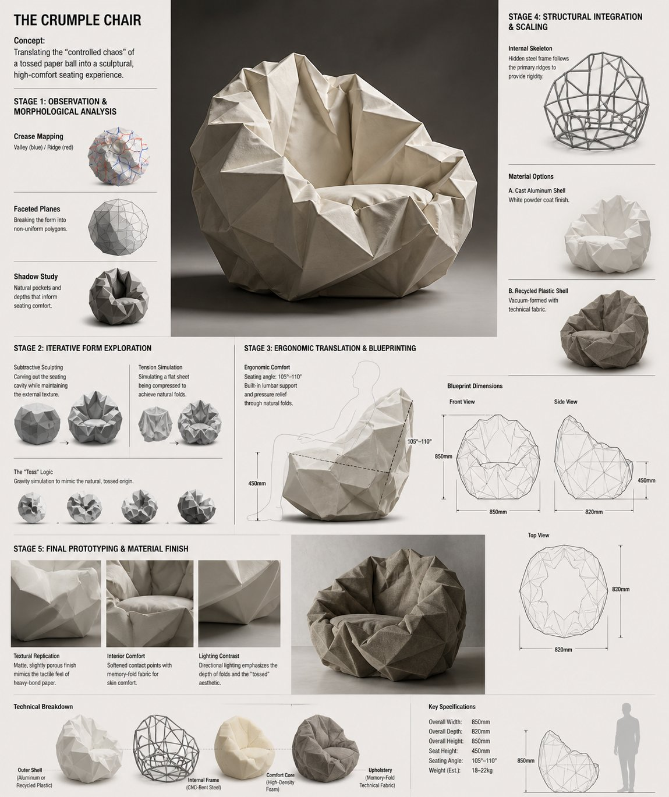

# Architecture & Spaces

总计：11

## Crumple Chair 概念沙发研发板

- ID: case-370
- Slug: case-370-zh
- 语言: zh
- 来源: [来源链接](https://x.com/ShamsAmin56/status/2050281206139461780)
- 样例图路径: images/part2/case370.jpg

### 提示词

```text
Design Concept: The Crumple Chair Core Philosophy: Translating the "controlled chaos" of a tossed paper ball into a sculptural, high-comfort seating experience.

Stage 1: Observation & Morphological Analysis The goal is to deconstruct the image of the crumpled paper into usable geometric data. Crease Mapping: Identify the primary "valley" and "ridge" lines. These represent potential structural ribs or seams in the chair. Faceted Planes: Break down the sphere into a series of non-uniform polygons. Each flat surface of the paper becomes a potential panel for the chair’s upholstery or shell. Shadow Study: Analyze how the "tossed" form creates deep recesses. These natural pockets guide where the user’s weight will be cradled.

Stage 2: Iterative Form Exploration Moving from a sphere to a seat through "Digital Crumpling." Subtractive Sculpting: Imagine the paper ball as a solid mass. Use Boolean operations to "carve out" a seating cavity that fits the human form while maintaining the external jagged texture. Tension Simulation: Use 3D software (like Rhino or Blender) to simulate a flat sheet of material being compressed. This ensures the folds look authentic and not "modeled." The "Toss" Logic: Experiment with gravity-based simulation dropping a digital mesh to see how it settles naturally, mimicking the "tossed" origin.

Stage 3: Ergonomic Translation & Blueprinting Refining the raw aesthetic into a functional object. The Comfort Core: Overlay a standard ergonomic template (Seating Angle: 105°–110°) over the crumpled form. Adjust the internal "folds" to provide lumbar support and pressure relief. Blueprint Generation: Create technical orthographic views (Front, Side, Top). Map out the dimensions: Seat Height: 450mm Total Width: 850mm Surface Smoothing: Maintain the sharp "paper edges" on the exterior shell while softening the interior contact points for skin comfort.

Stage 4: Structural Integration & Scaling Making the concept physically viable. The Skeleton: Design a hidden internal frame (likely CNC-bent steel rods or a 3D-printed lattice) that follows the most prominent ridges of the paper folds to provide rigidity. Material Selection: * Option A (High-End): Faceted, cast aluminum with a white powder coat. Option B (Soft): Vacuum-formed recycled plastic shell covered in "memory-fold" technical fabric that retains a wrinkled appearance.

Stage 5: Final Prototyping & Material Finish Textural Replication: Apply a matte, slightly porous finish to the material to mimic the tactile feel of heavy-bond paper. Lighting Contrast: Use directional studio lighting in the final renders to emphasize the "tossed" shadows, making the chair look like a giant piece of discarded inspiration. Design Tip: To keep the "tossed" look authentic, avoid symmetry. The most compelling aspect of a crumpled paper ball is its unique irregularity—ensure the left and right sides of the chair are balance-equivalent but not identical
```

### 样例图



## 明洞旅游区域地图

- ID: case-369
- Slug: case-369-zh
- 语言: zh
- 来源: [来源链接](https://x.com/so_ainsight/status/2050354639036654048)
- 样例图路径: images/part2/case369.jpg

### 提示词

```text
[エリア]の観光エリアマップを画像で作成して
```

### 样例图


## 西安手绘水彩城市地图

- ID: case-331
- Slug: case-331-zh
- 语言: zh
- 来源: [来源链接](https://github.com/freestylefly/awesome-gpt-image-2/blob/main/docs/gallery-part-2.md#case-331)
- 样例图路径: images/part2/case331.png

### 提示词

```text
生成一张手绘水彩风格的「西安」城市地图，包含当地特色美食、地标建筑及城市特色
```

### 样例图


## 昏暗室内纯真少女的意外回眸

- ID: case-217
- Slug: case-217-zh
- 语言: zh
- 来源: [来源链接](https://x.com/BubbleBrain/status/2046190539213885806)
- 样例图路径: images/part2/case217.jpg

### 提示词

```text
[中文]
{
  "prompt": {
    "style_and_tech": "手机照片，老式CCD相机美学，刺眼的闪光灯，颗粒感，昏暗杂乱的室内光线，抓拍快照感觉，轻微的运动模糊",
    "subject": "年轻的韩国女偶像，温柔纯真的外表",
    "pose": "动作进行中，微微转头看向镜头，仿佛刚刚注意到正在被拍照，肩膀微微耸起",
    "expression": "眼睛微微睁大，因惊讶而微微张开的嘴唇，害羞且猝不及防的表情",
    "clothing": "宽松柔软的居家服（薄开衫+内搭上衣），一侧肩膀微微滑落但没有暴露",
    "vibe": "毫无防备，亲密，意外的瞬间，唤起好奇心与保护欲",
    "aspect ratio": "9:16"
  }
}

[English]
{
  "prompt": {
    "style_and_tech": "mobile phone photo, old CCD camera aesthetic, harsh flash, grainy, dim messy indoor lighting, candid snapshot feeling, slight motion blur",
    "subject": "young Korean female idol, soft innocent look",
    "pose": "mid-action, slightly turning head toward camera as if just noticed being photographed, shoulders slightly raised",
    "expression": "eyes widened slightly, lips parted in surprise, shy and caught-off-guard expression",
    "clothing": "loose soft homewear (thin cardigan + inner top), slightly slipping off one shoulder but not revealing",
    "vibe": "unprepared, intimate, accidental moment, evokes curiosity and protectiveness"，
    "aspect ratio":"9:16"
  }
}
```

### 样例图


## 天坛古建拆解全图

- ID: case-211
- Slug: case-211-zh
- 语言: zh
- 来源: [来源链接](https://x.com/TanShilong/status/2046524996013662380)
- 样例图路径: images/part2/case211.jpg

### 提示词

```text
[中文]
生成一个天坛的建筑拆解图，有详细的说明，中式美学风格

[English]
Generate an architectural exploded view of the Temple of Heaven, with detailed annotations, Chinese aesthetic style
```

### 样例图


## 建筑空间场景图

- ID: case-120
- Slug: case-120-zh
- 语言: zh
- 来源: [来源链接](https://x.com/UNIBRACITY)
- 样例图路径: images/part2/case120.jpg

### 提示词

```text
A dynamic anime illustration of a girl with spiky {argument name="hair color" default="blonde"} hair tied in a high ponytail with a black bow, striking teal eyes, and a {argument name="outfit style" default="dark purple and black magical uniform with gold trim and diamond gems"}. She is in an intense crouching superhero landing pose, one hand pressed to the ground and the other raised, casting {argument name="magic color" default="glowing purple"} magic circles. She is shattering through a glass barrier, with sharp, jagged glass shards flying outward toward the viewer. Through the broken frame behind her, a {argument name="background scene" default="stylized silhouette of a gothic city with tall spires against a vibrant purple and orange sunset sky"} is visible. The artwork features {argument name="art style" default="sharp angles, high contrast cel-shading, and vibrant colors"}.
```

### 样例图


## 室内空间渲染图

- ID: case-53
- Slug: case-53-zh
- 语言: zh
- 来源: [来源链接](https://x.com/nicdunz)
- 样例图路径: images/part2/case53.jpg

### 提示词

```text
A vintage, late 90s amateur flash photograph of a young man repairing an arcade machine. He is kneeling on a dark, patterned arcade carpet, looking back over his shoulder directly at the camera with a neutral expression. He wears a dark short-sleeved t-shirt, baggy blue jeans, chunky white sneakers, and a dark baseball cap. The lower front panel of the arcade cabinet is wide open, exposing its complex internal electronics, including a tangle of wires, green circuit boards, a large speaker, and metal cooling fans at the base. The side of the cabinet features vibrant pink, black, and white graphics with the text "{argument name="arcade game title" default="Dancing Stage"}" and the brand "{argument name="arcade brand" default="KONAMI"}". The setting is a dimly lit arcade interior with other glowing game cabinets visible in the blurred background. A screwdriver lies on the carpet near the man's knee. The image features harsh direct flash lighting, a slightly grainy film texture, deep shadows, and a nostalgic Y2K aesthetic.
```

### 样例图


## 建筑空间场景图

- ID: case-50
- Slug: case-50-zh
- 语言: zh
- 来源: [来源链接](https://x.com/nomen_machine)
- 样例图路径: images/part2/case50.jpg

### 提示词

```text
A highly detailed, cinematic wide shot of a grand, dark gothic hall with a {argument name="atmosphere" default="dark fantasy"} aesthetic. In the center, a single figure wearing a {argument name="clothing" default="long white robe"} kneels on a highly reflective stone floor, facing an ornate golden altar illuminated by a row of lit candles. To the right of the kneeling figure, a single {argument name="floor object" default="wooden violin"} rests on the ground. The cavernous room is framed by massive dark stone pillars detailed with {argument name="accent color" default="glowing blue"} ethereal cracks and veins. Suspended from the high ceiling are dozens of {argument name="floating objects" default="white porcelain theatrical masks"} hanging on thin strings, filling the upper half of the space and creating a haunting, surreal atmosphere. The lighting is dramatic and moody, featuring a rich color palette of deep blacks, tarnished golds, and cool blue accents. Format 16:9.
```

### 样例图


## 人像写实摄影图

- ID: case-35
- Slug: case-35-zh
- 语言: zh
- 来源: [来源链接](https://x.com/kazmaendo)
- 样例图路径: images/part2/case35.jpg

### 提示词

```text
A {argument name="photography style" default="photorealistic portrait with shallow depth of field and soft bokeh"} of a {argument name="subject" default="young Japanese woman"} looking back over her shoulder at the camera with a {argument name="expression" default="gentle smile"}. She is wearing a {argument name="attire" default="light beige kimono with orange maple leaf patterns"} and a gold obi. Her dark hair is styled in an elegant updo with loose strands framing her face, and she wears small pearl earrings. The background features an {argument name="setting" default="autumn garden with vibrant red maple leaves"}, with bright red foliage framing the top left and a heavily blurred, soft background creating a serene, cinematic atmosphere.
```

### 样例图


## 建筑空间场景图

- ID: case-26
- Slug: case-26-zh
- 语言: zh
- 来源: [来源链接](https://x.com/ecooai)
- 样例图路径: images/part2/case26.jpg

### 提示词

```text
A vintage 35mm film photograph of a {argument name="subject description" default="young Asian woman"} with {argument name="hair style" default="long dark wavy hair and wispy bangs"}. She is wearing a {argument name="clothing" default="white ribbed tank top and a loose beige knit cardigan slipping off one shoulder"}, along with a delicate silver necklace. She has soft makeup with pink blush and glossy lips, looking directly at the camera with slightly parted lips. The lighting is harsh direct camera flash, creating a candid, amateur snapshot aesthetic. The background is a {argument name="setting" default="dimly lit, slightly messy room with clothes on a table and a wooden shelf"}. The image features heavy film grain, slightly muted colors, and a nostalgic, highly realistic photographic texture.
```

### 样例图


## 一张手绘风格的城市美食地图，以台州为主题

- ID: case-11
- Slug: case-11-zh
- 语言: zh
- 来源: [来源链接](https://github.com/freestylefly/awesome-gpt-image-2/blob/main/docs/gallery-part-1.md#case-11)
- 样例图路径: images/part2/case11.jpg

### 提示词

```text
一张手绘风格的城市美食地图，以台州为主题。画面以鸟瞰视角的手绘简化城市地图为底，标注椒江、路桥、黄岩等区域和灵江、台州湾等水系地标，不追求精确比例而是追求可爱的水彩手绘感。地图上分布着12个美食地点的精致手绘小插画：1. 椒江老粮坊的蛋清羊尾（金黄蓬松的蛋泡甜点撒着糖粉，筷子夹起拉丝）2. 临海紫阳古街的食饼筒（一个饱满的麦饼卷切开露出肉丝、蛋皮、米面等丰富馅料）3. 三门的青蟹（一只肥硕的青壳大蟹张着大钳子，旁边一小碟姜醋）4. 温岭石塘渔港的海鲜面（粗瓷大碗浓白鱼汤面铺满虾、蛏子、小黄鱼）5. 路桥的糟羹（一锅稠厚的五彩羹，芥菜、冬笋、香干、牡蛎粒粒可见）6. 玉环坎门的炊圆（三四个白胖糯米团子卧在笼屉里，旁边酱油碟滴着麻油）7. 黄岩的麦虾（陶锅里面疙瘩配蛤蜊、青菜翻滚冒泡）8. 仙居的八大碗（八只粗陶小碗围成一圈——土鸡、溪鱼、豆腐皮俱全）9. 天台的饺饼筒（几卷金黄酥脆的薄饼整齐码放，露出红烧肉和豆面馅）10. 临海的麦油脂（竹盘上摊着薄如蝉翼的饼皮卷着肉末、豆芽、鸡蛋丝）11. 温岭的嵌糕（厚实的年糕饼中间嵌着红烧肉和油条，正在铁板上滋滋作响）12. 椒江的姜汁调蛋（一只青花碗里琥珀色姜汤卧着嫩滑蛋花，撒几粒核桃碎）。每个插画约占地图5%面积，旁边用手写体标注店名和一句推荐语如“阿婆凌晨四点就起来和面”“本地人认准这口锅”。地图边缘用手绘藤蔓、杨梅枝和小海鲜（虾、蟹、贝壳）装饰形成边框。右下角有一个手绘指南针（标注“东海”方向）和图例说明。左上角标题“台州·山海食光地图”使用胖圆的手绘美术字，用杨梅和小黄鱼点缀装饰。整体画风为水彩+彩铅混合的手绘质感，颜色以杨梅红、姜黄、海蓝、翠绿为主，图片比例1:1。
```

### 样例图


