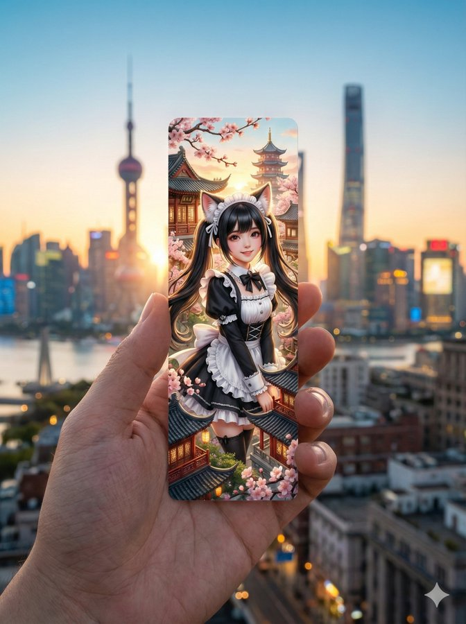
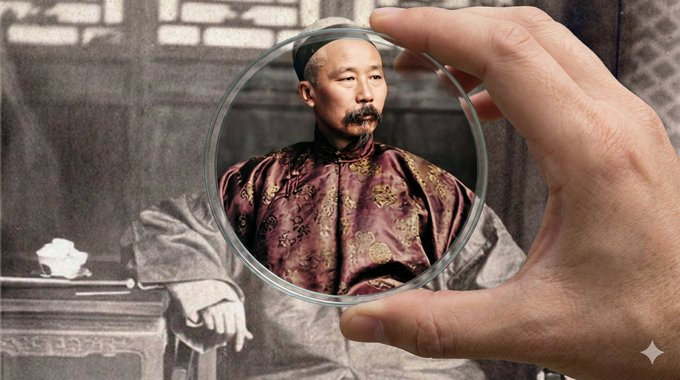
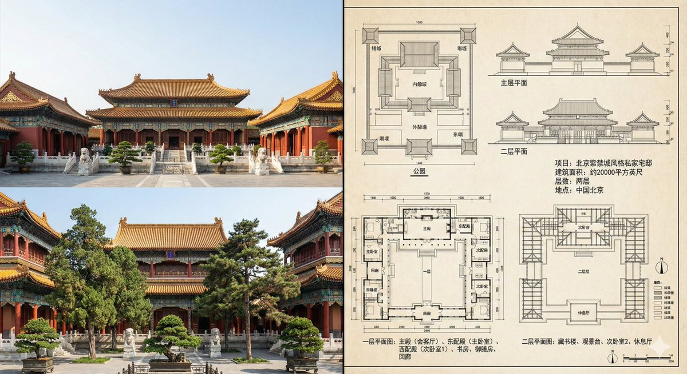
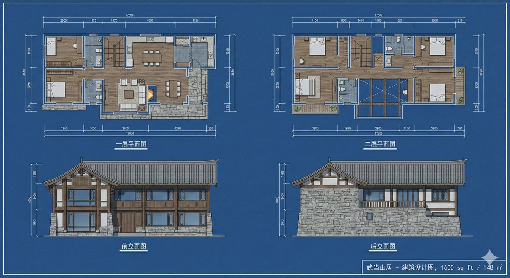
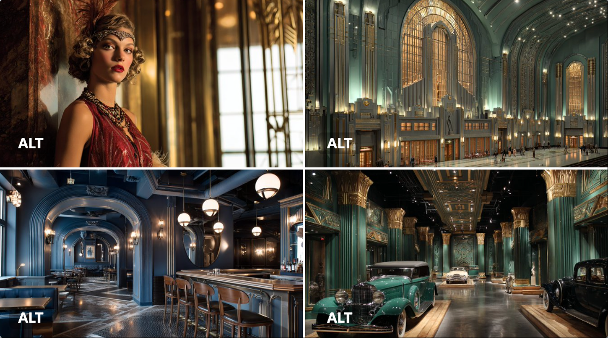
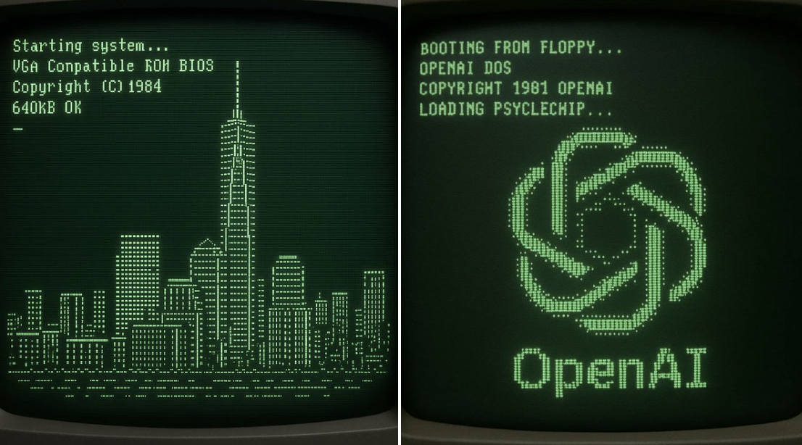

# architecture

总计：132

## 明洞旅游区域地图

- ID: case-369
- Slug: case-369-zh
- 语言: zh
- 来源: [来源链接](https://x.com/so_ainsight/status/2050354639036654048)
- 样例图路径: images/part2/case369.jpg

### 提示词

```text
[エリア]の観光エリアマップを画像で作成して
```

### 样例图


## 西安手绘水彩城市地图

- ID: case-331
- Slug: case-331-zh
- 语言: zh
- 来源: [来源链接](https://github.com/freestylefly/awesome-gpt-image-2/blob/main/docs/gallery-part-2.md#case-331)
- 样例图路径: images/part2/case331.png

### 提示词

```text
生成一张手绘水彩风格的「西安」城市地图，包含当地特色美食、地标建筑及城市特色
```

### 样例图


## 天坛古建拆解全图

- ID: case-211
- Slug: case-211-zh
- 语言: zh
- 来源: [来源链接](https://x.com/TanShilong/status/2046524996013662380)
- 样例图路径: images/part2/case211.jpg

### 提示词

```text
[中文]
生成一个天坛的建筑拆解图，有详细的说明，中式美学风格

[English]
Generate an architectural exploded view of the Temple of Heaven, with detailed annotations, Chinese aesthetic style
```

### 样例图


## 建筑空间场景图

- ID: case-50
- Slug: case-50-zh
- 语言: zh
- 来源: [来源链接](https://x.com/nomen_machine)
- 样例图路径: images/part2/case50.jpg

### 提示词

```text
A highly detailed, cinematic wide shot of a grand, dark gothic hall with a {argument name="atmosphere" default="dark fantasy"} aesthetic. In the center, a single figure wearing a {argument name="clothing" default="long white robe"} kneels on a highly reflective stone floor, facing an ornate golden altar illuminated by a row of lit candles. To the right of the kneeling figure, a single {argument name="floor object" default="wooden violin"} rests on the ground. The cavernous room is framed by massive dark stone pillars detailed with {argument name="accent color" default="glowing blue"} ethereal cracks and veins. Suspended from the high ceiling are dozens of {argument name="floating objects" default="white porcelain theatrical masks"} hanging on thin strings, filling the upper half of the space and creating a haunting, surreal atmosphere. The lighting is dramatic and moody, featuring a rich color palette of deep blacks, tarnished golds, and cool blue accents. Format 16:9.
```

### 样例图


## { "project_metadata": { "title": "K-Pop Idol Newspaper F

- ID: gpt4o-1040-en-1
- Slug: prompt-1040-en-1
- 语言: en
- 来源: [来源链接](https://x.com/BubbleBrain/status/2007074986008141973)
- 样例图路径: images/part3/1040.jpeg

### 提示词

```text
{
  "project_metadata": {
    "title": "K-Pop Idol Newspaper Fashion Concept",
    "style_preset": "Soft Focus Editorial Photography",
    "aspect_ratio": "3:4",
    "version": "2.1"
  },
  "subject": {
    "identity": {
      "ethnicity": "Korean",
      "age_group": "Young Adult",
      "aesthetic": "K-pop idol, mixture of innocent and sexy, pure visual"
    },
    "physique": {
      "body_type": "Curvy and voluptuous",
      "specific_attributes": "Highly emphasized and prominent bustline, hourglass silhouette, toned arms",
      "skin_tone": "Pale, porcelain white, flawless and glowing"
    },
    "hair_and_makeup": {
      "hair": {
        "color": "Dark brown",
        "style": "Long, voluminous waves, slight wet look",
        "action": "Hands gently touching face or hair"
      },
      "makeup": {
        "lips": "Glossy pink jelly lips, gradient lip color",
        "eyes": "Sparkling K-pop style eye makeup, aegyo-sal emphasized",
        "finish": "Glass skin effect, bright and dewy"
      }
    },
    "pose_and_expression": {
      "expression": "Cute pouting lips (dudu lips), seductive yet innocent gaze, looking into the lens",
      "pose": "Medium-full body shot, standing, playful posture, emphasising curves"
    }
  },
  "fashion_elements": {
    "primary_garment": {
      "item": "Strapless mini-dress",
      "material": "Authentic recycled newspaper pages",
      "construction": "Architectural, origami-style pleats, visible newsprint, headlines, and grayscale imagery textures",
      "fit": "Form-fitting, cinched at the waist"
    },
    "accessories": [
      {
        "item": "Hoop earrings",
        "style": "Large, thin, minimalist",
        "material": "Polished silver"
      }
    ]
  },
  "environment_and_backdrop": {
    "setting": "Studio indoor",
    "background_type": "Textured wall",
    "details": "Completely covered in layered, overlapping vintage newspaper pages, sepia-toned paper, collage effect",
    "depth": "Shallow depth of field to separate subject from the background"
  },
  "cinematography_and_lighting": {
    "camera": {
      "lens": "85mm prime lens",
      "shot_type": "Medium-full shot",
      "angle": "Eye-level",
      "sensor": "Digital, clear"
    },
    "lighting": {
      "primary_source": "Soft diffused frontal lighting",
      "effect": "Bright, flattering beauty lighting, minimizing shadows on face",
      "color_temp": "Cool white to neutral"
    },
    "post_processing": {
      "focus": "Soft focus, dreamy atmosphere",
      "textures": "Heavy skin smoothing, airbrushed look, ethereal glow, no grain",
      "filter": "Beauty filter style, dreamy blur effect"
    }
  }
}
```

### 样例图


## K-Pop偶像报纸时尚概念

- ID: gpt4o-1040-zh-2
- Slug: prompt-1040-zh-2
- 语言: zh
- 来源: [来源链接](https://x.com/BubbleBrain/status/2007074986008141973)
- 样例图路径: images/part3/1040.jpeg

### 提示词

```text
{
"project_metadata": {
标题：《K-Pop偶像报纸时尚概念》
"style_preset": "柔焦编辑摄影",
"aspect_ratio": "3:4",
版本：2.1
},
“主题”： {
“身份”： {
“种族”: “韩国人”
"age_group": "青年人",
“美学”：“K-pop偶像，兼具清纯与性感，纯粹的视觉美”
},
"体格": {
"body_type": "曲线优美，丰满性感",
"specific_attributes": "非常突出且醒目的胸部线条，沙漏型身材，健美的双臂",
肤色：苍白如瓷，无瑕透亮
},
"发型和化妆": {
“头发”： {
“颜色”：“深棕色”，
“发型”：“长而蓬松的波浪卷，略带湿润感”，
“动作”：“双手轻轻触碰脸部或头发”
},
“化妆品”： {
“唇部”： “亮泽的粉色果冻唇膏，渐变唇色”
“眼睛”：“闪亮的韩式流行风格眼妆，强调卧蚕”，
“妆效”：“玻璃肌效果，明亮水润”
}
},
"pose_and_expression": {
“表情”：“嘟嘟的可爱嘴唇，既诱人又无辜的眼神，看着镜头”，
“姿势”：“中全身照，站立，俏皮的姿势，强调曲线”
}
},
"fashion_elements": {
"primary_garment": {
“商品”: “无肩带迷你连衣裙”
“材料”：“真正的再生报纸页面”，
“构造”：“建筑风格的折纸褶皱，可见的新闻印刷品、标题和灰度图像纹理”，
“合身”： “贴合身形，腰部收紧”
},
“配件”： [
{
“物品”: “圈形耳环”，
“风格”：“大号、纤细、极简主义”
材质：抛光银
}
]
},
"environment_and_backdrop": {
设置：室内工作室，
"background_type": "纹理墙",
“细节”：“完全覆盖着层叠交错的复古报纸页面，棕褐色调的纸张，拼贴效果”，
“景深”： “浅景深使主体与背景分离”
},
"cinematography_and_lighting": {
“相机”： {
“镜头”: “85mm 定焦镜头”
"shot_type": "中远景镜头",
“角度”：“视线水平”，
“传感器”：“数字式，清晰”
},
“灯光”： {
"primary_source": "柔和的漫射正面照明",
“效果”：“明亮、讨喜的美颜灯光，最大限度地减少脸上的阴影”，
"color_temp": "冷白光到中性色"
},
"post_processing": {
“焦点”：“柔焦，梦幻般的氛围”，
“质地”：“强效柔滑肌肤，喷枪妆效，空灵光泽，无颗粒感”
"滤镜": "美颜滤镜风格，梦幻虚化效果"
}
}
}
```

### 样例图


## A refined fashion editorial image with a 3:2 aspect rati

- ID: gpt4o-1039-en-1
- Slug: prompt-1039-en-1
- 语言: en
- 来源: [来源链接](https://x.com/craftian_keskin/status/2007156041851490337)
- 样例图路径: images/part3/1039.jpeg

### 提示词

```text
A refined fashion editorial image with a 3:2 aspect ratio, split into two clear sections.

Right side:
A fashionable, confident, sensual woman standing and walking casually in a modern architectural space with warm wooden walls and soft natural light. She wears a top with a deep V neckline, has a small mole on her chest, a 90-60-90 figure, tucked into a high-waisted white tailored short skirt, On her feet are sleek black stiletto heels, elegant and minimal. She carries a small structured black handbag in one hand.

Her hair is slicked back into a clean low bun, emphasizing her facial structure. She wears narrow black sunglasses and subtle statement earrings. The look is refined, modern, and effortlessly chic. Natural daylight, soft shadows, realistic skin texture. Casual fashion photography style with an editorial, high-end feel. Neutral color palette, warm tones, shallow depth of field, cinematic realism.

Style & Mood:
Modern elegance, quiet luxury, confident, minimal, editorial casual.

Photography Details:
Eye-level angle, candid stance, 35mm lens, natural lighting, high detail, photorealistic.

Left side:
A clean, minimalist product breakdown layout on a neutral background. The individual fashion items worn by the woman are displayed separately, neatly arranged with subtle shadows. Each item includes a small, elegant price label in refined sans-serif typography:

– Beige deep V-neck knit top — $180
– White high-waisted tailored mini skirt — $220
– Black pointed-toe stiletto heels — $350
– Small structured black handbag — $480
– Black narrow sunglasses — $160

The left side feels like a luxury fashion catalog or e-commerce lookbook, with clear spacing, premium presentation, and visual balance.

Overall Style & Mood:
Quiet luxury, modern elegance, editorial fashion, high-end retail aesthetic.

Lighting & Quality:
Soft natural light, studio-clean clarity on product side, photorealistic, ultra-high resolution, professional fashion photography.

Negative Prompt:
Cluttered layout, oversized text, flashy logos, mannequins, people on left side, harsh lighting, low resolution, cartoon style.
```

### 样例图


## 一张精致的时尚大片

- ID: gpt4o-1039-zh-2
- Slug: prompt-1039-zh-2
- 语言: zh
- 来源: [来源链接](https://x.com/craftian_keskin/status/2007156041851490337)
- 样例图路径: images/part3/1039.jpeg

### 提示词

```text
一张精致的时尚大片，宽高比为 3:2，清晰地分为两个部分。

右侧：
一位时尚、自信、充满魅力的女士，在现代建筑风格的空间中随意地站立或行走，温暖的木质墙壁和柔和的自然光线营造出舒适的氛围。她身着一件深V领上衣，胸前有一颗小痣，身材比例完美，下身搭配一条高腰白色修身短裙。脚上是一双优雅简约的黑色细高跟鞋。她手提一只小巧精致的黑色手提包。

她的头发利落地梳成一个低髻，凸显了她精致的脸型。她戴着黑色窄框太阳镜和简约的耳环，整体造型优雅、现代，又不失随性时尚感。自然的光线、柔和的阴影、真实的肌肤纹理，营造出一种休闲时尚摄影的质感，同时又不失高端大片的氛围。中性色调、暖色调、浅景深，以及电影般的真实感，共同成就了这组照片。

风格与氛围：
现代优雅，低调奢华，自信，简约，时尚休闲。

摄影细节：
平视角度，自然姿态，35mm镜头，自然光，高细节，照片级真实感。

左侧：
简洁的极简主义产品展示布局，背景中性。女士身上穿着的每件时尚单品都单独展示，整齐排列，并辅以柔和的阴影效果。每件单品都配有小巧精致的价格标签，采用优雅的无衬线字体。

米色深V领针织上衣——180美元
白色高腰修身迷你裙——220美元
黑色尖头细高跟鞋——350美元
- 小号黑色硬挺手提包 — 480 美元
黑色窄框太阳镜——160美元

左侧的设计风格类似于奢侈时尚产品目录或电商产品图册，布局清晰，呈现方式高端大气，视觉效果平衡。

整体风格与氛围：
低调奢华，现代优雅，时尚杂志风格，高端零售美学。

照明和质量：
柔和的自然光，产品面清晰如影楼，照片真实感强，超高分辨率，专业时尚摄影。

否定提示：
布局杂乱，文字过大，标志花哨，模特，左侧有人，光线刺眼，分辨率低，卡通风格。
```

### 样例图


## 一只人的手握着一枚细长狭长的竖版模切书签

- ID: gpt4o-1025-zh
- Slug: prompt-1025-zh
- 语言: zh
- 来源: [来源链接](https://x.com/langzihan/status/2003801248370442275)
- 样例图路径: images/part3/1025.jpeg

### 提示词

```text
{
  "image_request": {
    "subject": "一只人的手握着一枚细长、狭长的竖版模切书签",
    "bookmark_design": {
      "style": "超现实风格",
      "content": "一张超现实的中景镜头：一位可爱亚洲女孩，长长的黑色双马尾，穿着黑白荷叶边女仆装，戴着蓬松逼真的猫耳",
      "artistic_elements": "细腻的纹理，鲜艳的色彩，微型建筑细节"
    },
    "background": {
      "setting": "浪漫的、电影感宽景镜头，真实{{location}}的天际线与风景",
      "depth_of_field": "柔和的虚化背景，突出聚焦的书签",
      "time_of_day": "{{time_of_day}}",
      "lighting_effects": "与{{time_of_day}}相匹配的大气光效，金色时刻的辉光、城市灯火，或柔和的日光"
    },
    "composition": {
      "framing": "手和书签的特写，垂直居中构图",
      "vibe": "怀旧、美学、旅行灵感、诗意",
      "color_palette": "书签艺术与现实背景之间的和谐配色"
    },
    "technical_specs": {
      "quality": "8K分辨率，高度细节，照片级真实的手部，书签锐利对焦",
      "aspect_ratio": "3:4"
    }
  },
  "variables": {
    "location": ["上海"],
    "time_of_day": ["日出"]
  }
}
```

### 样例图



## Your city { "image_request": { "subject": "A person's ha

- ID: gpt4o-1022-en-1
- Slug: prompt-1022-en-1
- 语言: en
- 来源: [来源链接](https://x.com/firatbilal/status/2003553245499916501)
- 样例图路径: images/part3/1022.jpeg

### 提示词

```text
Your city
{
  "image_request": {
    "subject": "A person's hand holding a long, narrow vertical die-cut bookmark",
    "bookmark_design": {
      "style": "Intricate layered paper-cut illustration, 3D depth, whimsical artistic style",
      "content": "Iconic landmarks and symbols of {{location}} depicted inside the bookmark frame, some elements slightly popping out of the edges (die-cut)",
      "artistic_elements": "Delicate textures, vibrant colors, miniature architectural details"
    },
    "background": {
      "setting": "A romantic, cinematic wide shot of the actual {{location}} skyline and scenery",
      "depth_of_field": "Soft bokeh, blurred background to emphasize the bookmark in focus",
      "time_of_day": "{{time_of_day}}",
      "lighting_effects": "Atmospheric lighting matching the {{time_of_day}}, golden hour glows, city lights, or soft daylight"
    },
    "composition": {
      "framing": "Close-up on the hand and bookmark, centered vertically",
      "vibe": "Nostalgic, aesthetic, travel-inspired, poetic",
      "color_palette": "Harmonized colors between the bookmark's art and the real-world background"
    },
    "technical_specs": {
      "quality": "8k resolution, highly detailed, photorealistic hand, sharp focus on bookmark",
      "aspect_ratio": "3:4"
    }
  },
  "variables": {
    "location": ["Istanbul", "Paris", "Tokyo", "London", "Rome"],
    "time_of_day": ["Sunrise", "Sunset", "Night with city lights", "Bright daylight"]
  }
}
```

### 样例图


## 一只手拿着一个细长的竖式镂空书签

- ID: gpt4o-1022-zh-2
- Slug: prompt-1022-zh-2
- 语言: zh
- 来源: [来源链接](https://x.com/firatbilal/status/2003553245499916501)
- 样例图路径: images/part3/1022.jpeg

### 提示词

```text
你的城市
{
"image_request": {
“主题”：“一只手拿着一个细长的竖式镂空书签”，
"书签设计": {
“风格”：“错综复杂的层叠剪纸插画，3D立体感，异想天开的艺术风格”，
“内容”：“书签框内描绘了{{地点}}的标志性地标和符号，部分元素略微凸出于边缘（模切）”
艺术元素：精致的纹理、鲜艳的色彩、微缩的建筑细节
},
“背景”： {
“场景”: “一个浪漫的、电影般的广角镜头，展现实际的{{地点}}天际线和风景”，
“景深”: “柔和散景，模糊背景以突出焦点的书签”
"time_of_day": " {{ time_of_day }} ",
"lighting_effects": "与{{一天中的时间}}相匹配的氛围照明，例如黄金时段的光晕、城市灯光或柔和的日光"
},
“作品”： {
“构图”：“手和书签的特写，垂直居中”
“氛围”：怀旧、唯美、旅行灵感、诗意，
"color_palette": "书签图案与现实世界背景之间的协调色彩"
},
"technical_specs": {
“质量”：“8K分辨率，高度细节化，照片级逼真的手部，书签清晰对焦”，
"aspect_ratio": "3:4"
}
},
"变量": {
地点：["伊斯坦布尔", "巴黎", "东京", "伦敦", "罗马"]
"time_of_day": ["日出", "日落", "城市灯光下的夜晚", "明亮的白天"]
}
}
```

### 样例图


## 2026新年海报

- ID: gpt4o-1007-zh
- Slug: prompt-1007-zh
- 语言: zh
- 来源: [来源链接](https://x.com/op7418/status/2005486114510180545)
- 样例图路径: images/part3/1007.jpeg

### 提示词

```text
{
    "applicable_models": [
        "Seedream",
        "Nano Banana Pro"
    ],
    "subject": {
        "IP_Name": "Enter the names of your favorite games, novels, movies, or TV shows.",
        "description": "A visually striking, masterpiece-level 3D New Year's greeting card poster based on [IP Name]. Vertical composition with a deep, window-like groove in the center.",
        "material_style": "Felt and coarse knitting wool texture, realistic and delicate, blind box toy texture.",
        "central_character": {
            "identity": "A cute Q-version felt Pony (representing the Year of the Horse)",
            "expression": "Naive and charming (憨态可掬), festive",
            "clothing": "Red festive vest, traditional tiger-head hat",
            "action": "Standing in the center as a festival messenger"
        },
        "secondary_characters": {
            "identity": "Classic characters from the IP (Q-version felt style)",
            "clothing": "Traditional festive Tang suit or Hanfu",
            "action": "Interacting within the scene, adding story elements"
        },
        "scene_elements": {
            "architecture": "Iconic buildings from the IP in Q-version felt, arranged with depth and layers",
            "ground": "Thick creamy knitted snow",
            "vegetation": "Peach tree or Kumquat tree hung with red lanterns, Chinese knots, and blessing cards",
            "props": "Scattered felt firecrackers, gold ingots, snow-covered shrubs"
        }
    },
    "accessories": {
        "title_design": {
            "structure": "Independent 3D volumetric letters suspended in mid-air (No background plate/card)",
            "main_text": {
                "content": "Happy New Year",
                "font_style": "3D fluid art font, thick glass volume"
            },
            "sub_text": {
                "content": "新年快乐",
                "font_style": "Bold Chinese Calligraphy (中国书法), 3D extruded strokes"
            },
            "material_properties": {
                "type": "Matte Frosted Glass (applied directly to the text volume)",
                "color": "Deep red to light red gradient",
                "surface": "Soft matte finish, semi-transparent",
                "optical_effects": "Dreamy colorful caustics casting shadows onto the felt scene below"
            }
        },
        "bottom_layout": {
            "content": "Random classic quote related to New Year, blessings, or hope",
            "font_style": "Large, elegant Western Handwritten Serif, rich ink color",
            "source_note": "Small Chinese font citing the source"
        }
    },
    "photography": {
        "renderer": "C4D, Octane Render",
        "resolution": "8K",
        "camera_style": "Macro photography perspective",
        "shot_type": "Vertical Poster, Close-up on miniature",
        "depth_of_field": "Shallow depth of field (background bokeh)",
        "lighting": "Soft and uniform, breathing light effect, atmospheric depth",
        "texture_quality": "Masterpiece, rich details, mixture of felt and frosted glass"
    },
    "background": {
        "setting": "Oriental ink wash void environment with flowing light mist",
        "colors": "Elegant pale champagne gold or high-grade soft mist red",
        "external_decor": [
            "Red velvet silk ribbons dancing in the air",
            "Fluid gold lines",
            "Blooming red plum branches",
            "Strings of festive red lanterns",
            "Plump persimmons or hawthorn berries",
            "Crystal clear geometric snowflakes",
            "Glowing gold copper coin strings"
        ],
        "atmosphere": "Explosive festive atmosphere, dynamic composition",
        "positioning": "Card appears suspended in clouds with soft shadow at the bottom"
    },
    "the_vibe": {
        "mood": "Festive, Oriental, Warm, Exquisite, Joyful",
        "culture": "Chinese New Year, Year of the Horse",
        "aesthetic": "High-end commercial design, Cuteness mixed with elegance"
    },
    "constraints": {
        "must_keep": [
            "Felt texture",
            "Chinese New Year elements",
            "Year of the Horse Pony",
            "Volumetric glass text (No signboard)",
            "Calligraphy text",
            "Ink wash background"
        ],
        "avoid": [
            "Santa Claus",
            "Christmas trees",
            "Western Christmas decorations",
            "Real photography style",
            "Flat 2D illustration",
            "Rectangular glass plate behind text",
            "Signboard",
            "Text on a card"
        ]
    },
    "negative_prompt": [
        "Santa Claus",
        "Christmas tree",
        "rectangular background plate",
        "glass sign",
        "text box",
        "holding a sign",
        "photorealistic human",
        "low resolution",
        "blurry",
        "flat colors",
        "dark",
        "horror",
        "distorted text"
    ]
}
```

### 样例图


## 专业首饰类型设计全流程展示

- ID: gpt4o-993-zh
- Slug: prompt-993-zh
- 语言: zh
- 来源: [来源链接](https://x.com/yyyole/status/2004766562360942975)
- 样例图路径: images/part3/993.jpeg

### 提示词

```text
专业{首饰类型}设计全流程展示 | {主材料}商业级设计过程可视化，专业设计系统文档风格。
【主材料】：{金}（如：虎眼石、翡翠、南红玛瑙）
【首饰类型】：{手镯}（如：手串、吊坠、戒指、耳环
【辅材智能配置】：根据主材料自动匹配（金属配件、隔珠、弹力线等）

专业珠宝设计全流程展示图 | 从概念到成品的完整设计过程

项目信息板块（左上角）
项目名称：「{主材料} {首饰类型}设计方案」
设计师签名栏（muyang）
项目编号和日期
品牌Logo预留位
金色装饰线框

第一阶段：设计概念 CONCEPT DESIGN
视觉呈现：
灵感拼贴板（Mood Board）：{主材料}原石照片、纹理特写、色彩提取
手绘草图：3-4个设计方案，铅笔素描风格
文化元素融入（如虎眼石→东方瑞兽纹样）
比例尺标注，关键尺寸备注
标注内容：
设计理念说明（中英双语）
目标客群定位
预算区间估算

第二阶段：材料精选 MATERIAL CURATION
主材料展示区：
{主材料}原矿到成品珠粒对比
4-6颗品质分级展示（AAAAA→A级）
显微镜下纹理特写
色卡比对（Pantone色号标注）
专业珠宝托盘呈现
辅材智能搭配区：
金属配件：根据主材料调性选择暖色系主材（虎眼石、南红）→ 18K玫瑰金/红铜
冷色系主材（青金石、海蓝宝）→ 925银/白金
中性主材（黑曜石、玛瑙）→ 精钢/钛钢
隔珠/配珠：尺寸比例协调（主珠直径的1/3-1/2）
材质对比（如虎眼石配砗磲/椰壳）
数量配比建议
串线材料：手串→弹力线（克重标注）
项链→不锈钢钢丝/K金链
透明展示盒分格摆放
光照：顶部柔光 + 侧面暖光，突出材质光泽

第三阶段：工程图纸 TECHNICAL DRAWING
CAD专业制图：
三视图（正视/侧视/俯视），精确到0.1mm
剖面图展示内部结构（如隔珠穿孔位置）
尺寸标注线（箭头 + 数字）
珠子排列顺序图解
结绳工艺节点详图
蓝图底色 + 白色线框，建筑图纸风格
参数表格：
| 部件 | 尺寸 | 数量 | 材质 |
| {主材料}主珠 | Ø{X}mm | {N}颗 | 天然{主材料} |
| 隔珠 | Ø{Y}mm | {M}颗 | {辅材} |
| 配件 | - | 1套 | {金属材质} |

第四阶段：工艺打样 PROTOTYPING
制作过程：
选珠配对：工匠用卡尺测量，色差比对
打磨抛光：砂轮机/手工打磨台
穿孔检查：专业灯光透视孔洞
试戴调整：手腕/颈部模特展示，周长调节
细节特写：金属扣头安装过程，微距摄影
环境设置：
传统工作台（木质/大理石台面）
专业珠宝工具铺陈（镊子、放大镜、量具）
暖色工作灯照明
工匠手部特写（展现匠心）

第五阶段：品控检验 QUALITY CONTROL
检测场景：
紫外线灯下检测{主材料}真伪
电子秤精确称重（克重显示）
游标卡尺复核尺寸
拉力测试弹力线强度
检验报告单特写（证书编号、检测数据）
分屏展示：
左侧：检测设备操作
右侧：放大显示检测结果
底部：合格印章/质检签字
色调：冷色调科技感，白色实验室环境

第六阶段：包装呈现 PACKAGING
包装系统展示：
内包装：定制绒布袋/锦盒，品牌烫金Logo
外包装：艺术礼盒，{主材料}纹理印刷
附件配套：材质证书卡
保养说明书（图文并茂）
品牌故事卡片
擦拭布/密封袋
构图：爆炸图式展开，层层递进

第七阶段：成品大片 FINAL SHOWCASE

A组-产品摄影：
纯白背景悬浮拍摄，360°全角度
特写镜头：{主材料}猫眼效果/晶体纹理
金属配件反光细节
尺寸参照物（硬币/尺子）
专业影棚四点布光
B组-场景应用：
真人手腕/颈部佩戴
生活化场景（咖啡桌、书桌、户外）
不同光线环境（自然光/夜景灯光）
动态展示（手部移动形成光轨）
C组-细节放大：
100倍微距：{主材料}内部结构
金属接口工艺特写
结绳编织纹理
品牌刻印细节

整体视觉规范
布局架构
横向时间轴：7阶段等宽分布，21:9电影比例
流程箭头：立体金属质感，渐变发光效果
信息层级：一级标题：粗体中文+细体英文，金色
二级标题：黑体，12号
正文标注：宋体/思源黑体，9号
色彩系统
背景基调：#F8F6F0 象牙白
主材料色：根据{主材料}天然色提取（虎眼石→琥珀金棕）
金属色：K金 #D4AF37
银色 #C0C0C0
玫瑰金 #B76E79
强调色：深褐 #3E2723（文字/边框）
摄影标准
分辨率：最低4K（3840×2160）
景深：F8-F11保持各阶段清晰
色温：5500K标准日光
格式：RAW原片后期，保留最大细节
```

### 样例图


## { "posters": [ { "title": "Italy Side Stories: City Life

- ID: gpt4o-975-en-1
- Slug: prompt-975-en-1
- 语言: en
- 来源: [来源链接](https://x.com/YaseenK7212/status/2003481349936550002?referrer=grok.com)
- 样例图路径: images/part3/975.jpeg

### 提示词

```text
{
"posters": [
{
"title": "Italy Side Stories: City Life – Volume 1",
"art_style": "Anime-style digital poster, GTA V–style comic grid, nostalgic European energy",
"center_panel": "A relaxed character leaning on a scooter, with the Colosseum, Venice canals, and Tuscan hills layered in the background.",
"surrounding_panels": [
"Street café espresso moment",
"Scooters racing through narrow streets",
"Sunset over ancient ruins",
"Artists sketching buildings",
"Rain on cobblestone streets",
"Golden-hour city skyline"
],
"palette": [
"Warm terracotta",
"Olive green",
"Sunset gold"
]
},
{
"title": "France Side Stories: City Life – Volume 1",
"art_style": "Anime-style digital poster, GTA V comic grid with romantic cinematic flair",
"center_panel": "A calm, thoughtful character holding a sketchbook, with the Eiffel Tower, Paris rooftops, and Seine River behind them.",
"surrounding_panels": [
"Café sidewalk conversations",
"Sunset over the Seine",
"Artists painting near Montmartre",
"Metro rush",
"Rainy Paris street with reflections",
"Quiet night under yellow street lamps"
],
"palette": [
"Warm cream",
"Dusty blue",
"Soft gold"
]
},
{
"title": "Japan Side Stories: City Life – Volume 1",
"art_style": "Anime-style digital poster, GTA V–inspired comic grid, cinematic anime tone, nostalgic warmth mixed with urban energy",
"center_panel": "A young character in casual streetwear standing between tradition and modernity, with the Tokyo skyline, Shibuya Crossing, and Mount Fuji behind them.",
"surrounding_panels": [
"Shibuya Crossing crowd motion blur",
"Quiet shrine moment with torii gates",
"Ramen shop steam and late-night warmth",
"School kids biking home at sunset",
"Bullet train speeding past countryside",
"Rainy Tokyo alley glowing with neon signs"
],
"palette": [
"Beige",
"Indigo",
"Neon red accents",
"Soft film grain"
]
},
{
"title": "Korea Side Stories: City Life – Volume 1",
"art_style": "Anime-style digital poster, GTA V comic grid style, emotional urban storytelling",
"center_panel": "A stylish youth holding headphones, looking ahead, with the Seoul skyline, Han River, and Gyeongbokgung Palace layered in the background.",
"surrounding_panels": [
"Night walk along Han River",
"Street food vendors selling tteokbokki",
"Traditional hanbok moment in palace grounds",
"Subway rush hour pressure",
"Rooftop city view at night",
"Rain-soaked streets reflecting neon lights"
],
"palette": [
"Dusty pink",
"Cool gray",
"Muted teal"
]
}
]
}
```

### 样例图


## 动漫风格的数字海报

- ID: gpt4o-975-zh-2
- Slug: prompt-975-zh-2
- 语言: zh
- 来源: [来源链接](https://x.com/YaseenK7212/status/2003481349936550002?referrer=grok.com)
- 样例图路径: images/part3/975.jpeg

### 提示词

```text
{
“海报”： [
{
标题：《意大利边记：城市生活 – 第一卷》
"art_style": "动漫风格的数字海报，GTA V 风格的漫画网格，怀旧的欧洲气息",
"center_panel": "一个放松的人物倚靠在摩托车上，背景是罗马斗兽场、威尼斯运河和托斯卡纳山丘。"
"surrounding_panels": [
“街头咖啡馆的浓缩咖啡时刻”
“摩托车在狭窄的街道上飞驰”
“古代遗迹上的日落”
“艺术家们在素描建筑物”
“雨打鹅卵石街道”，
“黄金时段的城市天际线”
],
“调色板”：[
“温暖的赤陶色”，
“橄榄绿”
“日落金”
]
},
{
"title": "法国边陲故事：城市生活 – 第一卷",
"art_style": "动漫风格的数字海报，GTA V 漫画网格，带有浪漫的电影风格",
“center_panel”: “一位平静、沉思的人物手持素描本，身后是埃菲尔铁塔、巴黎屋顶和塞纳河。”
"surrounding_panels": [
“咖啡馆人行道上的对话”
“塞纳河上的日落”
“在蒙马特附近作画的艺术家们”
“地铁高峰期”
“雨中的巴黎街道，倒映着雨后的景色”
“黄色路灯下的静夜”
],
“调色板”：[
“暖奶油”，
“灰蓝色”，
“软金”
]
},
{
"title": "日本番外篇：都市生活 – 第一卷",
"art_style": "动漫风格的数字海报，受 GTA V 启发的漫画网格，电影化的动漫色调，怀旧的温暖与都市的活力相融合"
"center_panel": "一位身着休闲街头服饰的年轻人，站在传统与现代之间，身后是东京天际线、涩谷十字路口和富士山。"
"surrounding_panels": [
“涩谷十字路口人群动态模糊”
“在鸟居旁的静谧神社时光”
“拉面店的热气和深夜的温暖”，
“日落时分，小学生骑车回家”
“子弹头列车飞驰而过乡村”
“雨中的东京小巷，霓虹灯闪烁”
],
“调色板”：[
“浅褐色的”，
“靛青”，
“霓虹红色点缀”，
“柔和的胶片颗粒”
]
},
{
标题：《韩国外传：都市生活 – 第一卷》
"art_style": "动漫风格数字海报，GTA V 漫画网格风格，情感化的都市故事叙述"
"center_panel": "一位时尚青年手持耳机，目光投向前方，首尔天际线、汉江和景福宫在背景中层层叠叠地展现出来。"
"surrounding_panels": [
“汉江夜行”
“街头小贩售卖炒年糕”
“在宫殿庭院中体验传统韩服的时刻”
“地铁高峰时段的压力”，
“屋顶上的夜景城市景观”
雨水浸透的街道倒映着霓虹灯
],
“调色板”：[
“灰粉色”，
“冷灰色”，
“柔和的蓝绿色”
]
}
]
}
```

### 样例图


## An expert architectural illustrator's presentation board

- ID: gpt4o-966-en-1
- Slug: prompt-966-en-1
- 语言: en
- 来源: [来源链接](https://x.com/AllaAisling/status/2003122606527205436)
- 样例图路径: images/part3/966.jpeg

### 提示词

```text
An expert architectural illustrator's presentation board for a [STYLE] residence featuring [KEY ARCHITECTURAL ELEMENTS].
The canvas flows left to right: black and white 2D drawings (Site Plan, Floor Plans) on the left, Elevations and Cross-Section in the center, and a photorealistic 3D render at [TIME OF DAY/LIGHTING] on the right.
Unified aesthetic blending [LINEWORK STYLE] with [TEXTURE/MATERIAL]. [TECHNICAL DRAWING TONES] transitioning to [RENDER COLOUR PALETTE]. Title block reads '[PROJECT NAME]'.
```

### 样例图


## 建筑插画师为住宅制作的展示板

- ID: gpt4o-966-zh-2
- Slug: prompt-966-zh-2
- 语言: zh
- 来源: [来源链接](https://x.com/AllaAisling/status/2003122606527205436)
- 样例图路径: images/part3/966.jpeg

### 提示词

```text
一位专业的建筑插画师为[风格]住宅制作的展示板，该住宅以[关键建筑元素]为特色。
画布从左到右依次为：左侧为黑白二维图纸（场地平面图、楼层平面图），中间为立面图和剖面图，右侧为[一天中的时间/光照条件]下的照片级三维渲染图。
统一的美学风格融合了[线条风格]和[纹理/材质]。[技术绘图色调]过渡到[渲染调色板]。标题栏显示“[项目名称]”。
```

### 样例图


## { "subject": { "description": "A stunning high-angle sho

- ID: gpt4o-964-en-1
- Slug: prompt-964-en-1
- 语言: en
- 来源: [来源链接](https://x.com/underwoodxie96/status/2003362169547817413)
- 样例图路径: images/part3/964.jpeg

### 提示词

```text
{
"subject": {
"description": "A stunning high-angle shot of a chic Asian fashion influencer with a cool, alluring attitude.",
"age": "20s",
"expression": {
"eyes": {
"look": "sharp fox-eyes, piercing gaze directed at camera",
"energy": "confident, slightly cold, seductive",
"details": "defined eyeliner, emphasized aegyosal"
},
"mouth": {
"position": "relaxed lips, subtle smirk",
"energy": "chic"
},
"overall": "stunning, high-visual-impact beauty"
},
"face": {
"preserve_original": false,
"makeup": "high-contrast makeup, pale porcelain skin, reddish gradient lips, sharp jawline, V-shape face",
"style": "cool-toned beauty, K-pop idol visual"
},
"hair": {
"color": "black",
"style": "long sleek straight hair with full straight bangs",
"effect": "glossy, high-fashion finish"
},
"body": {
"frame": "slim, petite, fragile aesthetic",
"pose": {
"position": "leaning forward significantly",
"overall": "dynamic foreshortening, emphasis on head and upper torso"
},
"skin": {
"tone": "cold fair skin",
"lighting_effect": "brightened face, soft beauty lighting, no dark shadows"
}
},
"clothing": {
"top": {
"type": "ultra-fine gauge knit top",
"color": "cool grey",
"details": "mock neck, skin-tight fit, lightweight thin fabric (not thick)",
"effect": "perfectly sculpting body curves, smooth texture"
},
"bottom": {
"type": "dark pencil skirt",
"details": "high waisted with thin luxury belt"
}
}
},
"photography": {
"camera_style": "High-end social media snapshot",
"angle": "High angle POV",
"shot_type": "Medium close-up",
"aspect_ratio": "9:16",
"texture": "clear, sharp, slightly filtered for beauty",
"lighting": "overcast cool daylight, soft diffuse light"
},
"background": {
"setting": "European classic architecture",
"atmosphere": "fashionable street corner",
"blur": "bokeh background to emphasize subject"
},
"negative_prompt": [
"round face",
"plain face",
"no makeup",
"warm yellow skin",
"chunky knit",
"thick sweater",
"loose clothing",
"wrinkled fabric",
"dull eyes",
"friendly boring smile",
"low resolution",
"dark lighting"
]
}
```

### 样例图


## 时髦的亚洲时尚博主

- ID: gpt4o-964-zh-2
- Slug: prompt-964-zh-2
- 语言: zh
- 来源: [来源链接](https://x.com/underwoodxie96/status/2003362169547817413)
- 样例图路径: images/part3/964.jpeg

### 提示词

```text
{
“主题”： {
“描述”：“一张令人惊艳的高角度照片，展现了一位时髦的亚洲时尚博主，她拥有酷炫迷人的气质。”
年龄：20多岁，
“表达”： {
"眼睛": {
“眼神”：“锐利的狐狸眼，目光锐利地盯着镜头”，
“能量”：“自信、略带冷漠、诱人”，
“细节”： “精致的眼线，突出的卧蚕”
},
“嘴”： {
“姿势”：“嘴唇放松，带着一丝不易察觉的微笑”，
“能量”： “时尚”
},
“总体评价”：“令人惊艳、极具视觉冲击力的美感”
},
“脸”： {
"preserve_original": false,
“妆容”：“高对比度妆容，苍白瓷白的肌肤，红润渐变的嘴唇，棱角分明的下颌线，V字脸”，
风格：冷色调美人，K-pop偶像视觉形象
},
“头发”： {
“颜色：黑色”，
“发型”：“长而柔顺的直发，配以齐刘海”，
效果：光泽亮丽、时尚感十足
},
“身体”： {
“框架”：“纤细、娇小、脆弱的美学”，
"姿势": {
“姿势”：“明显向前倾斜”，
“整体”： “动态透视缩短，强调头部和上半身”
},
“皮肤”： {
色调：冷白皮肤，
"lighting_effect": "提亮面部，柔和美颜光，无阴影"
}
},
“衣服”： {
“顶部”： {
“类型”：“超细针织上衣”，
颜色：冷灰色，
“细节”：“高领，紧身剪裁，轻薄面料（不厚）”
“效果”：“完美勾勒身体曲线，质地光滑”
},
“底部”： {
类型：深色铅笔裙，
“细节”：“高腰设计，配以纤细奢华腰带”
}
}
},
“摄影”： {
“camera_style”: “高端社交媒体快照”
"角度": "高角度POV",
"shot_type": "中近景",
"aspect_ratio": "9:16",
“质感”：“清晰、锐利、略带滤镜效果，更显美感”，
“照明”：“阴天冷色调的日光，柔和的漫射光”
},
“背景”： {
“背景”：“欧洲古典建筑”，
“氛围”：“时尚街角”，
“模糊”： “散景背景以突出主体”
},
"negative_prompt": [
“圆脸”，
“朴素的脸”，
“素颜”
“温暖的黄色皮肤”，
“粗针织物”，
“厚毛衣”，
宽松的衣服
“皱巴巴的布料”，
“眼神呆滞”，
“友善而乏味的微笑”，
“低分辨率”，
“昏暗的灯光”
]
}
```

### 样例图


## { "variables": { "CITY_NAME": "Chengdu" }, "image_specs"

- ID: gpt4o-935-en-1
- Slug: prompt-935-en-1
- 语言: en
- 来源: [来源链接](https://x.com/0xbisc/status/2002664549930172496)
- 样例图路径: images/part3/935.jpeg

### 提示词

```text
{

"variables": {

"CITY_NAME": "Chengdu"

},

"image_specs": {

"aspect_ratio": "4:5", "resolution": "2048x2560", "quality": "ultra", "style_strength": 0.8, "detail_level": "high", "sharpen": "medium"

},

"prompt": {

"master_visual_brief": "A high-energy Y2K-inspired editorial collage poster with a strong paper-cut and magazine print aesthetic. The entire image has a tactile paper texture with visible cut edges and layered depth. The theme centers around the city {{CITY_NAME}}. All visual elements, including background imagery, stickers, symbols, typography, and graphic decorations, are culturally and visually inspired by {{CITY_NAME}}. The composition follows a fashion magazine cover logic with dense but controlled information, playful energy, and strong visual hierarchy. The character is designed as a dominant half-body portrait occupying most of the poster.", "photography_and_character": "Character: a randomly generated young woman aged approximately 18–25. She is fashionable, attractive, and trendy, with no fixed hairstyle, hair color, facial features, or makeup. Her appearance varies naturally but always remains stylish and visually appealing. Fashion style is Y2K-inspired street fashion with playful silhouettes, layered styling, and trendy colors. Framing is a strict half-body portrait: the image is cropped at the waist or slightly above, and the lower body is not visible at all. Only the upper torso, shoulders, neck, and head are shown. Pose and gesture: the character performs a randomly selected Y2K-style dynamic pose with strong tension and attitude, including expressive arm extensions, angular elbow bends, asymmetrical shoulder twists, or forward-reaching gestures. Body language remains bold, confident, and energetic. Facial expression: the expression is slightly playful and friendly, with a hint of cuteness layered on top of confidence. Subtle smiles, softly open lips, bright eyes, or a relaxed playful look are allowed, while the overall attitude remains fashion-forward and dynamic rather than cute-only.", "camera_and_lighting": "Editorial portrait framing with a wide-angle look at close distance, optimized for half-body composition. The camera captures only the upper torso and head, with the lower body fully cropped out of frame. Perspective supports dynamic Y2K poses without distorting facial proportions. Lighting is soft, even, and magazine-style, avoiding harsh shadows. The subject is intended to be cut out and integrated into a paper collage rather than rendered as pure realism.", "graphic_design_layout": "Center-focused editorial collage layout. At the top, the city name '{{CITY_NAME}}' appears as the main headline in bold uppercase geometric sans-serif letters. Each letter is placed on an individual colored paper rectangle and arranged in a slight arc. The large half-body character overlaps and partially covers the headline and nearby graphic elements, creating a break-the-frame effect. Surrounding the character are floating paper stickers, speech bubbles, and cut-out graphics inspired by {{CITY_NAME}} culture, including local food, landmarks, symbols, street signs, and iconic objects. The bottom section features a full-width magazine-style collage footer composed of layered paper strips, bold button-style typography, small editorial text blocks, and thumbnail-style graphics.", "background_system": "The background is a black-and-white or desaturated urban street scene from {{CITY_NAME}}, such as crowds, architecture, or city textures. Background contrast is reduced and softened with grain so it supports the composition without competing with the main subject. The background is partially obscured by the large half-body character and collage elements and maintains a printed-paper appearance rather than photographic realism.", "materials_and_textures": "A consistent paper-based aesthetic across the entire image. Visible paper grain, halftone dots, print noise, and slight ink bleed. All elements appear as physical paper cut-outs layered together. Edges are imperfect and tactile. Stickers, typography, and characters cast subtle shadows to suggest layered depth. No glossy, metallic, or digital materials are present.", "composition_and_balance": "Clear and stable visual hierarchy: top city headline '{{CITY_NAME}}', central half-body character (upper torso only), dynamic Y2K-style pose with slightly playful facial expression, surrounding city-themed stickers, and bottom magazine-style collage footer. Strong overlaps between character, typography, and stickers create depth while preserving the established layout."

},

"constraints": {

"must_include": \[ "City name headline using {{CITY_NAME}}", "Strict half-body portrait (waist-up only)", "Lower body completely cropped out", "Y2K-style dynamic pose with strong tension", "Playful but controlled facial expression", "Paper collage and cut-out magazine aesthetic", "City-specific background and stickers related to {{CITY_NAME}}", "Full-width magazine-style collage footer", "Visible paper texture and layered depth" \], "must_avoid": \[ "Full-body view", "Visible legs, knees, thighs, or feet", "Neutral or stiff poses", "Overly cute or childish expressions", "Sexualized expressions or gestures", "Grotesque facial distortion", "Minimalist or empty layouts", "Glossy digital or 3D materials" \]

},

"negative_prompt": "full body, legs visible, knees, thighs, feet, stiff pose, neutral posture, childish expression, exaggerated cute face, sexualized expression, blurry face, deformed hands, extra fingers, bad anatomy, grotesque distortion, minimalist layout, flat image, hyper-realistic photography, glossy surfaces, plastic skin, dull colors, watermark, logo, unreadable text",

"typography_rules": {

"headline": { "text": "{{CITY_NAME}}", "font_style": "bold geometric sans-serif, uppercase", "treatment": "each letter on a separate colored paper rectangle, slightly arched, subtle shadow", "material": "printed paper cut-out" }, "supporting_text": { "style": "editorial magazine blocks, playful sticker captions, speech bubbles", "material": "paper-based printed texture" }

},

"rendering_notes": {

"depth_layers": "background city paper layer -> mid-ground half-body character -> foreground dynamic pose, expressive face, stickers, and typography", "print_feel": "strong magazine print texture with halftone dots, paper grain, and slight ink bleed", "edge_treatment": "clearly visible imperfect cut paper edges"

}

}
```

### 样例图


## Y2K时代的拼贴海报

- ID: gpt4o-935-zh-2
- Slug: prompt-935-zh-2
- 语言: zh
- 来源: [来源链接](https://x.com/0xbisc/status/2002664549930172496)
- 样例图路径: images/part3/935.jpeg

### 提示词

```text
{

"变量": {

城市名称：成都

},

"image_specs": {

"aspect_ratio": "4:5", "resolution": "2048x2560", "quality": "ultra", "style_strength": 0.8, "detail_level": "high", "sharpen": "medium"

},

“提示词”： {

“视觉设计概要”： “这是一张充满活力、灵感源自Y2K时代的拼贴海报，具有强烈的剪纸和杂志印刷美感。整幅图像呈现出触感丰富的纸张纹理，可见的切割边缘和层次感。主题围绕着城市{{ CITY_NAME }}展开。所有视觉元素，包括背景图像、贴纸、符号、字体和图形装饰，都从文化和视觉上汲取灵感，源自城市{{ CITY_NAME }} 。构图遵循时尚杂志封面的逻辑，信息丰富但控制得当，充满活力，并具有清晰的视觉层次。人物被设计成占据海报大部分空间的半身肖像。” “摄影与人物”： “人物：一位随机生成的年轻女性，年龄在18至25岁之间。她时尚、迷人、潮流，没有固定的发型、发色、五官或妆容。她的外貌自然变化，但始终保持时尚和视觉吸引力。时尚风格是受Y2K时代启发的街头时尚。”俏皮的轮廓、层次丰富的造型和潮流的色彩。构图采用严格的半身像：画面裁剪至腰部或略高于腰部，下半身完全不可见。仅展现上半身、肩膀、颈部和头部。姿势和手势：人物摆出随机选择的Y2K风格动态姿势，充满张力和态度，包括富有表现力的手臂伸展、肘部角度弯曲、不对称的肩部扭转或向前伸展的动作。肢体语言大胆、自信且充满活力。面部表情：表情略带俏皮和友好，在自信之上又增添了一丝可爱。允许有淡淡的微笑、微微张开的嘴唇、明亮的眼神或轻松俏皮的表情，整体风格保持时尚前卫和动感，而非仅仅可爱。“相机和灯光”：“采用广角镜头近距离拍摄的编辑人像构图，针对半身像进行了优化。相机仅拍摄上半身和头部，下半身不可见。”人物身体完全裁剪出画面之外。透视效果支持动态的千禧年风格姿势，且不会扭曲面部比例。光线柔和均匀，采用杂志风格，避免了生硬的阴影。人物旨在被剪裁并融入纸质拼贴画中，而非以纯粹的写实手法呈现。平面设计布局：以中心为焦点的编辑拼贴画布局。顶部，城市名称“ {{城市名称}} ”以粗体大写几何无衬线字体作为主标题。每个字母都放置在单独的彩色纸质矩形上，并呈略微弧形排列。较大的半身人物与标题和附近的图形元素重叠并部分覆盖，营造出一种打破画面框架的效果。人物周围环绕着漂浮的纸质贴纸、对话气泡和剪纸图形，其灵感来自{{城市名称}}的文化，包括当地美食、地标、符号、路标和标志性物品。底部部分是一个由多层纸张组成的全宽杂志风格拼贴画页脚。条状文字、醒目的按钮式字体、小型编辑文本块和缩略图式图形。”, “背景系统”: “背景是来自{{城市名称}}的黑白或低饱和度城市街景，例如人群、建筑或城市纹理。背景对比度降低，并添加了颗粒感以柔化画面，从而在不干扰主体的情况下支持构图。背景部分被大型半身人物和拼贴元素遮挡，保持了印刷纸的外观，而非照片的真实感。”, “材质与纹理”: “整个图像保持一致的纸质美学。可见的纸张纹理、半色调网点、印刷噪点和轻微的墨迹晕染。所有元素都像是层叠在一起的实体纸片。边缘不完美且触感明显。贴纸、字体和人物投射出微妙的阴影，暗示出层次感。没有光泽、金属或数字材质。”, “构图与平衡”: “清晰稳定的视觉层次：顶部城市标题“ {{城市名称}} ”，中央半身人物（仅上半身），动态的千禧年风格姿势，略带俏皮的面部表情，周围环绕着城市主题贴纸，底部是杂志风格的拼贴页脚。人物、字体和贴纸之间的强烈重叠在保持既定布局的同时，营造出层次感。

},

"约束": {

"必须包含：" [ "使用城市名称作为标题{{ CITY_NAME }} ", "严格的半身像（仅腰部以上）", "下半身完全裁剪", "Y2K风格的动态姿势，充满张力", "俏皮但克制的表情", "纸质拼贴和剪贴杂志风格", "与城市相关的背景和贴纸{{ CITY_NAME }} ", "全宽杂志风格拼贴页脚", "可见的纸张纹理和层次感" ], "必须避免：" [ "全身照", "可见的腿、膝盖、大腿或脚", "中性或僵硬的姿势", "过于可爱或幼稚的表情", "性化的表情或手势", "怪诞的面部扭曲", "极简主义或空白的布局", "光面数字或3D材质" ]

},

"negative_prompt": "全身，腿部可见，膝盖，大腿，脚，僵硬姿势，中立姿势，幼稚表情，夸张可爱表情，性化表情，模糊面部，畸形手，多余手指，解剖结构错误，怪诞扭曲，极简布局，平面图像，超写实摄影，光滑表面，塑料皮肤，暗淡色彩，水印，标志，无法辨认的文字",

"typography_rules": {

"标题": { "正文": " {{城市名称}} ", "字体": "粗体几何无衬线字体，大写", "处理方式": "每个字母位于单独的彩色纸矩形上，略微拱起，带有微妙的阴影", "材质": "印刷纸剪裁" }, "辅助文本": { "风格": "杂志社论版块，趣味贴纸标题，对话气泡", "材质": "纸质印刷纹理" }

},

"渲染注释": {

"depth_layers": "背景：城市纸张层->中景：半身人物->前景：动态姿势、表情丰富的面部、贴纸和文字。"print_feel": "强烈的杂志印刷纹理，带有半色调网点、纸张纹理和轻微的墨迹晕染。"edge_treatment": "清晰可见的不完美裁切纸张边缘。"

}

}
```

### 样例图


## { "lighting": { "source": "Natural sunlight", "quality":

- ID: gpt4o-926-en-1
- Slug: prompt-926-en-1
- 语言: en
- 来源: [来源链接](https://x.com/xmliisu/status/2002367350146773079)
- 样例图路径: images/part3/926.jpeg

### 提示词

```text
{ "lighting": {
"source": "Natural sunlight",
"quality": "Golden hour, soft and warm",
"shadows": "Soft, well-defined shadows cast by the subject and boat elements",
"direction": "From the right, slightly backlit",
"highlights": "Bright highlights on the water, boat railing, and subject's hair"
},
"background": {
"details": "Specific buildings, church dome, beach activity are visible",
"setting": "Positano, Amalfi Coast, Italy",
"distance": "Far",
"elements": [
"Cliffside town with colorful buildings",
"Sandy beach with umbrellas and people",
"Dark blue sea",
"Other boats",
"Lush green vegetation on the cliffs"
],
"lighting_interaction": "Sunlight illuminates the town and cliffs, creating warm tones"
},
"typography": {
"color": "#2E4A7D",
"location": "On the side of the blue boat in the background right",
"font_style": "Sans-serif, uppercase, bold",
"description": "Boat name and registration details",
"text_content": "BLU RIDE"
},
"composition": {
"balance": "Asymmetrical balance between the subject in the foreground and the town in the background",
"framing": "Medium shot",
"perspective": "Slightly low angle, looking up towards the subject and background",
"leading_lines": "The boat's railing and deck lead the eye towards the subject and the town",
"depth_of_field": "Deep, with both subject and background in focus",
"rule_of_thirds": "Subject positioned in the lower right intersection"
},
"color_profile": {
"mood": "Warm, vibrant, luxurious",
"contrast": "Medium-high",
"saturation": "High",
"color_scheme": "Analogous blues and greens with warm earth tones",
"dominant_colors": [
"#2E4A7D",
"#F2F2F2",
"#C8A17B",
"#5A784A",
"#D98D6F"
]
},
"technical_specs": {
"iso": "Low",
"aperture": "f/8 or smaller for deep depth of field",
"lens_type": "Wide-angle lens",
"resolution": "High",
"camera_type": "DSLR or mirrorless",
"aspect_ratio": "4:5",
"shutter_speed": "Fast enough to freeze motion"
},
"subject_analysis": {
"hair": "Blonde, wavy, wind-blown",
"pose": "Kneeling on the boat deck, body angled towards the camera, right hand holding sunglasses, left hand on the railing",
"clothing": "Black one-piece swimsuit with white trim and cutouts",
"expression": "Looking over sunglasses with a slight smile",
"accessories": "Dark sunglasses, gold bracelet, ring",
"subject_type": "Young woman",
"hands_gestures": "Right hand adjusting sunglasses, left hand resting on the railing",
"location_on_frame": "Foreground, center-right"
},
"artistic_elements": {
"mood": "Relaxed, luxurious, aspirational",
"style": "Lifestyle photography, candid",
"texture": "Smooth boat deck, textured water, rugged cliffs, fabric of the swimsuit",
"narrative": "A woman enjoying a luxurious boat trip along the Amalfi Coast"
},
"generation_parameters": {
"seed": "Random",
"prompt": "A lifestyle photograph of a young blonde woman kneeling on the deck of a boat, wearing a black and white swimsuit and sunglasses, looking back at the camera. In the background is the cliffside town of Positano, Italy, with colorful buildings, a beach, and the sea under golden hour sunlight. The boat is moving, with other boats visible. The style is candid and luxurious.",
"model_type": "Photorealistic",
"guidance_scale": "High",
"negative_prompt": "Blurry, low resolution, studio lighting, artificial, indoors, crowded, overcast"
}
}
```

### 样例图


## 金发女子跪在游艇甲板上

- ID: gpt4o-926-zh-2
- Slug: prompt-926-zh-2
- 语言: zh
- 来源: [来源链接](https://x.com/xmliisu/status/2002367350146773079)
- 样例图路径: images/part3/926.jpeg

### 提示词

```text
{“灯光”： {
“来源”：“自然阳光”，
“品质”：“黄金时刻，柔和温暖”，
“阴影”：“主体和船只元素投射出的柔和、轮廓清晰的阴影”，
“方向”：“从右侧，略微背光”，
“亮点”：“水面、船舷和人物头发上的明亮高光”
},
“背景”： {
“细节”：“可以看到特定的建筑物、教堂圆顶和海滩活动”，
“设置”：“意大利阿马尔菲海岸波西塔诺”
“距离”: “远”
“元素”：[
“悬崖边的小镇，建筑色彩缤纷”
“沙滩上有遮阳伞和人群”
“深蓝色的大海”，
“其他船只”，
“悬崖上郁郁葱葱的植被”
],
"lighting_interaction": "阳光照亮城镇和悬崖，营造出温暖的色调"
},
"排版": {
“颜色”: “ #2E4A7D “,
“位置”：“在背景右侧蓝色船的侧面”，
"font_style": "无衬线字体，大写，粗体",
"描述": "船名和注册详情",
"text_content": "BLU RIDE"
},
“作品”： {
“平衡”：“前景主体与背景城镇之间的不对称平衡”，
“构图”：“中景”，
“视角”：“略微低角度，向上看向主体和背景”，
"leading_lines": "船的栏杆和甲板引导视线看向主体和城镇",
景深： “景深，主体和背景都清晰对焦”
“三分法构图”：“主体位于右下角交点处”
},
"color_profile": {
“氛围”：“温暖、充满活力、奢华”，
“对比度”：“中高”
“饱和度”: “高”
"配色方案": "类似蓝色和绿色，搭配温暖的大地色调",
"主色": [
" #2E4A7D "，
" #F2F2F2 "，
" #C8A17B "，
" #5A784A "，
#D98D6F
]
},
"technical_specs": {
"iso": "低",
“光圈”: “f /8或更小，以获得更大的景深”，
"lens_type": "广角镜头",
“分辨率”： “高”
"camera_type": "单反或无反"
"aspect_ratio": "4:5",
"shutter_speed": "足够快，可以凝固运动"
},
“主题分析”：{
“头发”：“金色的，波浪状的，被风吹乱的”，
“姿势”：“跪在船甲板上，身体侧对着镜头，右手拿着太阳镜，左手扶着栏杆”，
“服装”：“黑色连体泳衣，带有白色滚边和镂空设计”
“表情”：“透过太阳镜，带着一丝微笑看着前方”，
“配饰”：“深色太阳镜、金手镯、戒指”
"subject_type": "年轻女子",
“hands_gestures”: “右手调整太阳镜，左手扶在栏杆上”
"location_on_frame": "前景，中心偏右"
},
“artistic_elements”：{
“氛围”：“轻松、奢华、令人向往”
“风格”：“生活方式摄影，抓拍”
“质感”：“光滑的船甲板，波光粼粼的水面，崎岖的悬崖，泳衣的面料”，
叙事：一位女士正在享受沿着阿马尔菲海岸的豪华游艇之旅
},
"generation_parameters": {
“种子”： “随机”，
提示：一张生活方式照片，一位年轻的金发女子跪在船甲板上，身穿黑白泳衣，戴着太阳镜，回头看向镜头。背景是意大利波西塔诺的悬崖小镇，色彩缤纷的建筑、沙滩和沐浴在金色阳光下的大海。船正在行驶，可以看到其他船只。风格自然而奢华。
"model_type": "Photorealistic",
"guidance_scale": "高",
"negative_prompt": "模糊、低分辨率、影棚灯光、人造光、室内、拥挤、阴天"
}
}
```

### 样例图


## 城市渲染数字艺术海报

- ID: gpt4o-920-zh
- Slug: prompt-920-zh
- 语言: zh
- 来源: [来源链接](https://x.com/op7418/status/2002592082125578427)
- 样例图路径: images/part3/920.jpeg

### 提示词

```text
一张针对 [城市名称] 的城市渲染数字艺术海报。

画面核心主体是一个漂浮在白云上方、形状像所选城市的并且占据画面大部分内容的微型岛屿。岛屿的形状与城市在地图上的形状相似，无缝融合城市独特的标志性地标、自然景观及文化元素。加入城市特有的鸟类、电影般的光影、鲜艳色彩、航拍视角和阳光反射效果，建筑不宜太多太密集。

岛屿展现历史与现代的无缝融合。一部分是该城市最具代表性的古代历史建筑；另一部分平滑过渡为城市的地标建筑和天际线景观。

岛屿漂浮浩瀚云海之上。云海采用该城市所在文化圈的传统艺术风格进行表现。

立体城市拼音或英文名的 3D 文字漂浮在微型岛屿的上方，这组文字像一个生态与文化共生的微缩生态装置。

在画面四周和主体周围，叠加一层极简、高雅、具有博物馆展板质感的信息排版层。主要检索相关的城市信息，主要信息使用经典的衬线字体，辅助数据可使用极细的极简无衬线体。在画面的角落，以类似古典地图集或高级杂志扉页的方式排版。用衬线体标注城市的地理坐标、别称或建城年份，以及当前的天气，作为装饰性的背景信息，整体排版留白极多，排版克制、干净、平衡，如同在欣赏一件珍贵的艺术品。

风格要求： Octane Render, C4D, Isometric City, Micro World, Living Ecosystem, 8k Resolution. DreamWorks style, 3D modeling, delicate, soft light projection.
```

### 样例图


## 6x6 grid layout. Editorial fashion photography. Use the 

- ID: gpt4o-911-en-1
- Slug: prompt-911-en-1
- 语言: en
- 来源: [来源链接](https://x.com/gokayfem/status/2001680146252669084)
- 样例图路径: images/part3/911.jpeg

### 提示词

```text
6x6 grid layout. Editorial fashion photography. Use the reference clothing item on all 36 models. Every single cell must feature a completely unique individual—no two people should look remotely similar.
Maximize human diversity across:
Age: Teenagers, 20s, 30s, 40s, 50s, 60s, 70s, 80s+, elderly with wrinkles and grey hair
Body types: Extremely thin, slim, athletic, muscular, stocky, chubby, fat, plus-size, obese, petite, tall, short, broad-shouldered, narrow-framed, pear-shaped, apple-shaped, hourglass, rectangular, long-limbed, short-limbed.
Ethnicity & skin tones: East Asian, Southeast Asian, South Asian, Middle Eastern, North African, Sub-Saharan African, West African, East African, Indigenous Australian, Pacific Islander, Native American, Indigenous South American, Scandinavian, Mediterranean, Eastern European, Western European, Caribbean, mixed race, albino. Full spectrum of skin tones from the palest to the deepest.
Hair: Bald, shaved, buzz cut, afro, locs, braids, straight, wavy, curly, coily, long, short, grey, white, natural colors, receding hairline, thinning hair, thick full hair, hijab, head wraps, turbans.
Features: Freckles, vitiligo, acne, scars, birthmarks, moles, gap teeth, crooked teeth, big nose, small nose, wide nose, narrow nose, round face, angular face, soft jawline, strong jawline, monolid eyes, deep-set eyes, hooded eyes, big lips, thin lips, visible disabilities, prosthetics, wheelchair users, amputees.
Each cell: different pose, different camera angle. Poses should feel editorial and unexpected—leaning, crouching, mid-stride, arched, sprawled, seated, jumping, twisting, lounging. Camera angles vary—low angle, overhead, Dutch tilt, wide shot, tight crop, ground-level, profile, three-quarter view.
Moody, high contrast, cinematic lighting. Varied environments—studio, architectural, urban, natural. Sharp detail, clothing as focal point. Final result should feel like the most inclusive, human-rich fashion editorial ever created—a true celebration of every single type of human body that exists.
```

### 样例图


## 36 个穿着同一套衣服的不同人像

- ID: gpt4o-911-zh-2
- Slug: prompt-911-zh-2
- 语言: zh
- 来源: [来源链接](https://x.com/gokayfem/status/2001680146252669084)
- 样例图路径: images/part3/911.jpeg

### 提示词

```text
6x6网格布局。时尚摄影。所有36位模特均需穿着同一件参考服装。每个单元格中的模特必须完全不同——任何两个人都不能有任何相似之处。
最大限度地提高人类多样性：
年龄：青少年、20多岁、30多岁、40多岁、50多岁、60多岁、70多岁、80岁以上、有皱纹和白发的老年人
体型：极瘦、苗条、健壮、肌肉发达、敦实、丰满、肥胖、大码、肥胖、娇小、高挑、矮小、肩宽、骨架窄、梨形、苹果形、沙漏形、矩形、四肢长、四肢短。
种族与肤色：东亚人、东南亚人、南亚人、中东人、北非人、撒哈拉以南非洲人、西非人、东非人、澳大利亚原住民、太平洋岛民、美洲原住民、南美原住民、斯堪的纳维亚人、地中海人、东欧人、西欧人、加勒比人、混血儿、白化病患者。涵盖从最浅到最深的各种肤色。
头发：光头、剃光头、寸头、爆炸头、脏辫、辫子、直发、波浪卷发、卷发、螺旋卷发、长发、短发、灰发、白发、自然发色、发际线后移、头发稀疏、浓密头发、头巾、头巾、头巾。
特征：雀斑、白癜风、痤疮、疤痕、胎记、痣、牙缝、牙齿歪斜、大鼻子、小鼻子、宽鼻子、窄鼻子、圆脸、棱角分明的脸、柔和的下颌线、硬朗的下颌线、单眼皮、深陷眼窝、眼睑下垂、厚嘴唇、薄嘴唇、明显的残疾、假肢、轮椅使用者、截肢者。
每个单元格：不同的姿势，不同的拍摄角度。姿势应具有编辑感和出人意料的特质——倾斜、蹲伏、迈步、拱背、伸展、坐姿、跳跃、扭转、慵懒。拍摄角度也多种多样——低角度、俯视、倾斜镜头、广角镜头、特写镜头、地面视角、侧面视角、四分之三侧面视角。
营造氛围感，运用高对比度的电影级灯光。场景多样——包括摄影棚、建筑、都市和自然环境。注重细节刻画，以服装为视觉焦点。最终呈现的作品应展现出前所未有的包容性和人文关怀，真正赞美每一种人体形态。
```

### 样例图


## 剪纸艺术

- ID: gpt4o-907-zh
- Slug: prompt-907-zh
- 语言: zh
- 来源: [来源链接](https://x.com/berryxia/status/2002015301618294794)
- 样例图路径: images/part3/907.jpeg

### 提示词

```text
Paper cut layered art: [城市名称英文] ([城市名称本地语言]) day-night elegant diagonal split (top-left→bottom-right) with soft artistic transition.
Core: ONE [标志性地标建筑] bisected diagonally with elegant gradient - warm golden tones (day side: orange, peach, coral, amber, [特色暖色]) / cool tones with rich warm lights (night side: navy, purple, midnight blue, with abundant yellow windows, red lanterns, vibrant [特色]accents).
CRITICAL AESTHETIC REQUIREMENTS:
- Beautiful, visually stunning composition
- Rich details and intricate paper cut patterns
- Elegant color harmony with [城市文化] aesthetics
- Sophisticated [文化特色] decorative elements
- High artistic value with refined craftsmanship
  Text: "[城市名称文字]" in beautiful [语言类型] calligraphy/typography, split by diagonal with elegant transition, surrounded by exquisite [本地装饰图案1], [本地装饰图案2], and [本地装饰图案3], strong dimensional depth with layered shadow effects.
  Day side (left/top): Brilliant golden sun with radiating warm rays, gorgeous warm amber/peach/coral sky with [特色氛围描述], [城市气质] sophisticated atmosphere. Beautiful daytime elements - [特色美食1] with [细节描述], [特色美食2] with [呈现方式], [特色美食3] with [艺术呈现], [其他美食]; stunning [代表性植物1] with detailed [部位] in rich [颜色], [代表性植物2] with [特征描述]; magnificent [地理特征] in bright [颜色] reflection with [细节]; [标志性建筑/场景1] with ornate details glowing in sunlight, [特色街景/场景] with refined [细节], [文化活动场景] with [描述].
  Diagonal transition: Soft gradient with twilight beauty - [过渡色1], [过渡色2], [过渡色3], [过渡色4], [过渡色5] - creating elegant natural flow [体现城市特色的过渡描述].
  Night side (right/bottom): Gorgeous blue/silver moon with ethereal glow and sparkling stars, rich deep navy and midnight blue sky with beautiful depth. Spectacular nighttime atmosphere with abundant warm light sources creating magical [文化特色] ambiance - numerous glowing yellow windows/lights creating patterns, elegant orange street lamps [位置描述], beautiful traditional red lanterns [场景描述], stunning purple-magenta [特色灯光], brilliant cyan-teal [地标灯光], golden light from [场所] glows, rich amber reflections [位置]. Night elements - dazzling illuminated [夜间地标1] with [效果], magnificent glowing [夜间地标2], charming [夜间场景] with [氛围], vibrant [夜生活描述].
  Unified elements (each appears once with elegant transition): [主要地标1] showing beautiful gradient from day to night, [主要地标2] with [细节], [地理特征] with [变化描述], [建筑群] with [风格描述], [植物] with natural beauty, [交通工具], [文化符号] with [装饰], harmonious blend of [传统特色] and [现代特色].
  Craft technique: 10-12 distinct paper layers with EXTREME pronounced depth and dimension, very thick visible edges (4-6mm thickness showing dimension), dramatic shadows creating powerful 3D sculptural relief effect, each element shows intricate multi-layer construction with refined details, ornate [文化特色] decorative patterns throughout ([图案1], [图案2], [图案3]), side-lighting creating stunning dimensional effect [强调特色].
  Format: landscape orientation, no border, no frame, elegant soft diagonal transition (clear enough to show duality but refined and artistic), sophisticated visual balance, BEAUTIFUL and STUNNING overall aesthetic capturing [城市特色].
  The artwork should be visually gorgeous, [气质形容词1], [气质形容词2] - capturing [城市核心特质描述].

{以此风格展示绘制梵高的人物展示，使用4K输出 9:16 周五就是与梵高相关的元素}
```

### 样例图


## 维多利亚哥特皇室写真照

- ID: gpt4o-904-zh
- Slug: prompt-904-zh
- 语言: zh
- 来源: [来源链接](https://x.com/songguoxiansen/status/2001828831615946768)
- 样例图路径: images/part3/904.jpeg

### 提示词

```text
生成一张 9:16 竖版「维多利亚哥特皇室」写实照片：以我上传的 FACE_REF 为人物身份参考，100%还原五官与骨相；人物身穿“维多利亚时代（19世纪）宫廷礼服方向”的重工礼服（紧身胸衣、大裙撑、蕾丝/天鹅绒、皇室珠宝），在伦敦塔桥或威斯敏斯特宫（大本钟）旁拍摄。画面具备《Harper’s Bazaar》级别的摄影、造型与封面设计，保持杂志的一贯设计风格（中英文设计）。

【INPUTS | 输入】
FACE_REF：我上传的人物五官参考图（身份锁定）

【ABSOLUTE PRIORITY | 身份锁定（最高优先级）】
100%还原 FACE_REF 的五官与骨相：眼距、鼻梁鼻翼、唇形、下颌线、颧骨结构完全一致，不得漂移。
真实皮肤质感：可见细微纹理与毛孔，不要过度磨皮与网红化。
成年女性形象（adult）。

【SHOT TYPE | 景别二选一（由模型随机选其一，且必须真实统一）】
A) 半身封面：胸口到腰上方，珠宝、蕾丝领口与眼神最清晰（主推）
B) 全身封面：从头到脚完整呈现巨大的裙撑轮廓与伦敦地标的结合，透视感强（备选）
（无论A/B：都必须保持“封面构图”，有留白空间给排版，但不要撕纸/手绘效果。）

【LOCATION | 场景（英国伦敦）】
伦敦地标：泰晤士河畔，背景是宏伟的哥特式建筑威斯敏斯特宫（大本钟）或 伦敦塔桥的塔楼。
天气二选一（随机）：1) 伦敦雾霭（经典的雾都质感，光线柔和神秘） 2) 阴雨方歇（地面湿润反光，天空呈铅灰色）
背景干净：无游客、无现代标识、无手机状态栏UI、无水印字幕。

【LIGHTING & CAMERA | 摄影质感（杂志级）】
镜头感：85mm人像质感（半身）或 50mm/70mm（全身），浅景深，眼睛最清晰。
光线：阴天漫射光 + 戏剧性补光（强调面部结构）；钻石/宝石有真实火彩；天鹅绒质感深邃。
色彩：高级电影感，低饱和度的蓝灰环境色与服装的深色调（红/蓝/黑）形成哥特美学；整体干净、通透、贵气。

【WARDROBE | 维多利亚宫廷礼服（重工、塑形、繁复细节）】
目标审美：“蜂腰、大裙摆、层叠蕾丝、重磅天鹅绒、皇冠、女王气场”。

轮廓与层次（X型剪裁）
上身：结构感极强的紧身胸衣（Corset），方领或高领，泡泡袖或羊腿袖
下身：巨大的裙撑（Crinoline 或 Bustle），后腰部有明显的堆叠设计，裙摆拖地
装饰：大量的荷叶边、蝴蝶结、垂坠的流苏
面料与工艺（重手艺必须“看得见”）
主面料：重磅丝绒、塔夫绸、尚蒂伊蕾丝（Chantilly Lace）
主要工艺：珠绣、金线刺绣、缎带编织
纹样主题：大马士革纹（Damask）、玫瑰、蓟花（苏格兰象征）、佩斯利纹
细节：蕾丝手套、颈饰（Choker）、勋章/胸针
头面（皇室珠宝头饰）
核心结构：维多利亚式小王冠（Tiara）或 羽毛头饰
装饰：钻石、蓝宝石、珍珠
耳饰/颈饰：极度夸张的钻石项链、耳坠

【COLOR MATRIX | 颜色矩阵搭配（必须执行，且必须“皇室深色”）】
（维多利亚晚期的深沉奢华）
从以下三套“主色方案”中随机选 1 套作为【底色/大面积主面料色】。

Scheme G（皇室蓝底）：
底色：深宝蓝/午夜蓝（丝绒质感）
刺绣/装饰：银色蕾丝、钻石、蓝宝石
Scheme A（维多利亚红底）：
底色：酒红/勃艮第红（深沉热情）
刺绣/装饰：黑色蕾丝、金色刺绣、红宝石
Scheme R（丧服黑底）：
底色：墨黑（Black Jet，极度哥特）
刺绣/装饰：黑色串珠、黑色蕾丝、少量金色或银色提亮

【颜色执行规则】
色彩要深沉浓郁，体现“日不落”的威严和哥特式的神秘。

【POSE | 封面姿态（威严、僵直、女王感）】
半身：下巴微扬，眼神冷峻，一手轻抚项链
全身：站姿挺拔（像肖像画一样），双手交叠在裙撑上，气场压倒一切
表情：严肃、高傲、不可一世；绝对不笑（维多利亚风格）。

【OUTPUT | 输出】
1 张 9:16 竖版写实杂志封面级照片
随机：半身 or 全身（A/B二选一）
随机：雾霭 or 阴雨（天气二选一）
随机：宝蓝 / 酒红 / 墨黑（颜色矩阵三选一）
造型：维多利亚宫廷礼服方向 + 皇冠/Choker + 紧身胸衣大裙撑 + 丝绒蕾丝
```

### 样例图


## { "project_title": "Urban Streetwear Editorial Collage",

- ID: gpt4o-900-en-1
- Slug: prompt-900-en-1
- 语言: en
- 来源: [来源链接](https://x.com/xmliisu/status/2001254201611964524)
- 样例图路径: images/part3/900.jpeg

### 提示词

```text
{
  "project_title": "Urban Streetwear Editorial Collage",
  "aspect_ratio": "9:16",
  "aesthetic_theme": {
    "style": "Editorial poster-style multi-panel collage",
    "mood": "Retro analog–digital fusion",
    "color_palette": [
      "Warm ambers",
      "Washed neutrals",
      "Soft greys",
      "Muted browns"
    ],
    "textures": [
      "Reflective glass",
      "Wool plaid",
      "Polished leather",
      "Stone pavement"
    ]
  },
  "subject_outfit": {
    "core": "Brown plaid blazer, white button-up shirt, yellow tie, loose dark trousers",
    "accessories": "Brown cap, oversized amber-tinted rectangular sunglasses",
    "tech": "Wired earphones"
  },
  "composition_layout": {
    "frame_1_top_left": {
      "type": "Reflective window shot",
      "pose": "Holding phone in front of face",
      "visual_effects": "Layered ghosting, architectural overlays, curvature distortion"
    },
    "frame_2_top_right": {
      "type": "Close-range, downward-angled ultra-wide portrait",
      "setting": "Cobblestone street",
      "pose": "Leaning forward, hands in pockets, exaggerated pout",
      "visual_effects": "Lens perspective distortion, radiating cobblestones"
    },
    "frame_3_bottom_right": {
      "type": "Intimate overhead selfie",
      "lighting": "Soft overcast",
      "props": "Holding a drink",
      "overlays": "Faint digital-grid, minimal square facial-bounding graphic"
    }
  },
  "ui_elements": {
    "music_player": {
      "style": "Translucent iOS-style Apple Music mini-player",
      "content": "“See You Again” by Tyler, The Creator",
      "features": "Artwork, timeline, playback controls (no shadows)"
    },
    "graphics": "Subtle cursor-like frame lines, rectangular highlights"
  },
  "negative_constraints": [
    "Stickers",
    "Extra subjects",
    "Wardrobe changes",
    "Incorrect UI icons",
    "Neon color shifts",
    "Futuristic sci-fi elements"
  ]
}
```

### 样例图


## 都市街头服饰编辑拼贴画

- ID: gpt4o-900-zh-2
- Slug: prompt-900-zh-2
- 语言: zh
- 来源: [来源链接](https://x.com/xmliisu/status/2001254201611964524)
- 样例图路径: images/part3/900.jpeg

### 提示词

```text
{
"project_title": "都市街头服饰编辑拼贴画",
"aspect_ratio": "9:16",
"aesthetic_theme": {
“风格”：“社论海报风格的多面板拼贴画”，
“氛围”：“复古模拟-数字融合”，
"color_palette": [
“温暖的琥珀色”，
“水洗中性色”，
“柔和的灰色”，
“柔和的棕色”
],
“纹理”：[
“反射玻璃”，
“羊毛格子呢”
“抛光皮革”，
石板路
]
},
"subject_outfit": {
“核心单品”：棕色格子西装外套、白色纽扣衬衫、黄色领带、宽松深色长裤。
“配饰”：“棕色帽子，超大琥珀色矩形太阳镜”，
“科技产品”：“有线耳机”
},
"composition_layout": {
"frame_1_top_left": {
“类型”：“反射窗照片”，
“姿势”：“将手机举到脸前”，
"视觉特效": "分层重影、建筑叠加、曲率扭曲"
},
"frame_2_top_right": {
“类型”：“近距离、向下倾斜的超广角人像”，
“场景”：“鹅卵石街道”，
“姿势”：“身体前倾，双手插兜，夸张地撅嘴”，
"视觉效果": "镜头透视变形，放射状鹅卵石"
},
"frame_3_bottom_right": {
类型： 亲密俯视自拍，
“光线”：“柔和的阴天”，
“道具”：“拿着一杯饮料”，
“叠加层”：“淡淡的数字网格，极简的方形面部轮廓图形”
}
},
"ui_elements": {
"music_player": {
"style": "半透明 iOS 风格的 Apple Music 迷你播放器",
内容： “Tyler, The Creator 的“See You Again””
“功能”： “封面图、时间轴、播放控制（无阴影）”
},
“图形”：“类似光标的微妙边框线，矩形高光”
},
"negative_constraints": [
“贴纸”，
“额外科目”，
“服装更换”
“错误的用户界面图标”，
“霓虹色彩变化”，
“未来科幻元素”
]
}
```

### 样例图


## { "project_specifications": { "format": "2x2 Grid Collag

- ID: gpt4o-897-en-1
- Slug: prompt-897-en-1
- 语言: en
- 来源: [来源链接](https://x.com/xmliisu/status/2001309711971295669)
- 样例图路径: images/part3/897.jpeg

### 提示词

```text
{
  "project_specifications": {
    "format": "2x2 Grid Collage",
    "aspect_ratio": "4:5",
    "aesthetic_style": "High-end Beauty Editorial",
    "rendering_engine_hints": {
      "realism_level": "Ultra-photorealistic",
      "texture_quality": "8k",
      "lighting_simulation": "Ray-traced studio lighting"
    }
  },
  "global_assets": {
    "subject_definition": {
      "hair": {
        "style": "Long, loosely wavy, voluminous",
        "texture": "Natural, individual strands defined",
        "behavior": "Messy but styled, framing face and shoulders"
      },
      "complexion": {
        "skin_texture": "Porous, hyper-realistic",
        "finish": "Dewy, glass-skin effect",
        "makeup": {
          "cheeks": "Heavy flush/blush",
          "lips": "High-gloss, plump, natural pink",
          "eyes": "Clean, defined lashes, natural brows"
        }
      },
      "wardrobe": {
        "item": "Mini dress",
        "fit": "Bodycon / Tight",
        "fabric": {
          "material": "Soft textured knit / Boucle",
          "tactility": "Fuzzy, light-catching fibers",
          "color": "Soft mauve or neutral taupe"
        },
        "details": "Spaghetti straps, mid-thigh length"
      }
    },
    "environment_definition": {
      "studio_setup": {
        "background": "Seamless paper, soft off-white/beige",
        "atmosphere": "Clean, warm, intimate"
      },
      "lighting_rig": {
        "key_light": "Large diffuse softbox (Front-Left)",
        "fill_light": "Reflector (Right)",
        "highlights": "Specular highlights on lips, cheekbones, and shoulders"
      }
    }
  },
  "panel_architecture": [
    {
      "position": "Top-Left (1)",
      "shot_type": "Extreme Close-Up (Macro)",
      "composition": {
        "angle": "Low angle, looking up slightly",
        "focus": "Mouth and nose area",
        "depth_of_field": "Shallow"
      },
      "action": {
        "primary": "Eating a strawberry",
        "nuance": "Delicate finger hold, lips slightly parted"
      },
      "visual_anchors": [
        "Moisture on strawberry surface",
        "Gloss reflection on lips",
        "Baby hairs at temple"
      ]
    },
    {
      "position": "Top-Right (2)",
      "shot_type": "Medium Shot (Thigh-up)",
      "composition": {
        "angle": "Eye level",
        "pose_dynamic": "Leaning forward slightly towards lens"
      },
      "action": {
        "stance": "Standing straight on",
        "arms": "Relaxed at sides",
        "expression": "Direct gaze, alluring pout"
      },
      "visual_anchors": [
        "Texture of knit dress",
        "Collarbone shadows",
        "Curvature of waist"
      ]
    },
    {
      "position": "Bottom-Left (3)",
      "shot_type": "Full Body (Seated)",
      "composition": {
        "angle": "Side profile",
        "framing": "Subject compacted on floor"
      },
      "action": {
        "pose": "Knees to chest (fetal position variation)",
        "interaction": "Cheek resting on knee, arms embracing legs",
        "hair_flow": "Cascading onto the floor"
      },
      "visual_anchors": [
        "Smooth leg definition",
        "Dress stretching over thigh",
        "Dreamy gaze"
      ]
    },
    {
      "position": "Bottom-Right (4)",
      "shot_type": "Beauty Portrait (Head & Hands)",
      "composition": {
        "angle": "Frontal close-up",
        "framing": "Chin to hairline"
      },
      "action": {
        "gesture": "Chin resting on interlaced fingers",
        "expression": "Soft smile, looking off-camera"
      },
      "visual_anchors": [
        "Hand detail and manicure",
        "Eye clarity",
        "Flush on cheeks"
      ]
    }
  ]
}
```

### 样例图


## 2x2网格拼贴画

- ID: gpt4o-897-zh-2
- Slug: prompt-897-zh-2
- 语言: zh
- 来源: [来源链接](https://x.com/xmliisu/status/2001309711971295669)
- 样例图路径: images/part3/897.jpeg

### 提示词

```text
{
"项目规范": {
"格式": "2x2 网格拼贴画",
"aspect_ratio": "4:5",
"aesthetic_style": "高端美容杂志",
"渲染引擎提示": {
"realism_level": "超逼真",
"texture_quality": "8k",
"lighting_simulation": "光线追踪摄影棚照明"
}
},
"global_assets": {
"subject_definition": {
“头发”： {
“发型”：“长款，略带波浪，蓬松”，
“纹理”：“自然、根根分明的发丝”，
“发型”：“凌乱但有型，修饰脸型和肩膀”
},
"肤色": {
"skin_texture": "多孔，超逼真"
“妆效”：“水润、如玻璃般光滑的肌肤效果”，
“化妆品”： {
“脸颊”： “浓重的红晕/腮红”
“唇部”: “高光泽、丰盈、自然的粉红色”
“眼睛”：“干净、轮廓分明的睫毛，自然的眉毛”
}
},
“衣柜”： {
“商品”: “迷你连衣裙”
“fit”: “紧身/贴身”
“织物”： {
材质：柔软纹理针织/圈绒，
“触感”：“毛茸茸的、能反射光线的纤维”，
颜色：柔和的淡紫色或中性灰褐色
},
详情：细肩带，及大腿中部长度
}
},
"environment_definition": {
"studio_setup": {
“背景”： “无缝纸，柔和的米白色/米色”
氛围：干净、温暖、温馨
},
"lighting_rig": {
"key_light": "大型漫射柔光箱（左前方）",
"fill_light": "右侧反光板",
“高光”： “嘴唇、颧骨和肩膀上的高光”
}
}
},
"panel_architecture": [
{
"位置": "左上(1)" ，
"shot_type": "超近特写（微距）",
“作品”： {
“角度”：“低角度，略微向上看”，
“焦点”：“嘴和鼻子区域”，
"景深": "浅"
},
“行动”： {
“主要”: “吃草莓”
细微之处：指尖轻柔地握着，嘴唇微微张开。
},
“visual_anchors”：[
“草莓表面的水分”
“嘴唇上的光泽反射”
“鬓角的细小绒毛”
]
},
{
"位置": "右上角(2)" ,
"shot_type": "中景（大腿向上）",
“作品”： {
“角度”：“视线水平”，
"pose_dynamic": "身体略微前倾，朝向镜头"
},
“行动”： {
“站姿”：“笔直站立”，
“手臂”：“自然垂于身体两侧”，
“表情”：“直视，撅嘴”
},
“visual_anchors”：[
“针织连衣裙的质地”
“锁骨阴影”
腰部曲线
]
},
{
"位置": "左下角 (3)",
"shot_type": "全身照（坐姿）",
“作品”： {
"角度": "侧面轮廓",
“框架”：“主体压在地板上”
},
“行动”： {
“姿势”：“膝盖贴近胸部（胎儿姿势变体）”
“互动”：“脸颊贴着膝盖，双臂环抱着双腿”，
"hair_flow": "如瀑布般倾泻而下"
},
“visual_anchors”：[
“腿部线条流畅”
“裙子撑开了大腿”，
“梦幻般的凝视”
]
},
{
"位置": "右下角 (4)",
"shot_type": "美人肖像（头部和手部）",
“作品”： {
“角度”：“正面特写”
构图：从下巴到发际线
},
“行动”： {
“姿势”：“下巴搁在交叠的手指上”，
表情： “柔和的微笑，看向镜头外”
},
“visual_anchors”：[
“手部细节和美甲”，
“视力清晰度”
“双颊泛红”
]
}
]
}
```

### 样例图


## { "collection_meta": { "theme": "Miniature Worlds & Macr

- ID: gpt4o-880-en-1
- Slug: prompt-880-en-1
- 语言: en
- 来源: [来源链接](https://x.com/YaseenK7212/status/2000922964011712945)
- 样例图路径: images/part3/880.jpeg

### 提示词

```text
{
  "collection_meta": {
    "theme": "Miniature Worlds & Macro Food",
    "style_preset": "Microphotography / Tilt-Shift Realism",
    "aspect_ratio": "3:4"
  },
  "scenes": [
    {
      "id": "scene_01_chicken_construction",
      "subject": {
        "team": "Miniature construction workers",
        "action": "Lifting massive KFC drumstick using LEGO-style scaffolding, ropes, and pulleys",
        "details": [
          "Workers covered in head-sized crumbs",
          "One figure shoveling grease off floor"
        ]
      },
      "environment": {
        "macro_object": "Giant KFC crispy fried chicken drumstick",
        "background": "Generic KFC bucket, coleslaw and fries appearing as boulders",
        "lighting": "Cinematic, shallow depth of field emphasizing crunch texture"
      }
    },
    {
      "id": "scene_02_egg_excavation",
      "subject": {
        "team": "Miniature archaeologists",
        "action": "Excavating cracked eggshell buried in flour",
        "tools": "Tiny brushes, micro-hammers",
        "details": "Tiny footprints visible in the flour dust"
      },
      "environment": {
        "macro_object": "Cracked eggshell and giant yolk puddle (cordoned off with toothpicks)",
        "background": "Whisk and measuring cup towering in blur",
        "lighting": "Soft morning kitchen light, highlighting fragility"
      }
    },
    {
      "id": "scene_03_ice_trek",
      "subject": {
        "team": "Miniature adventurers/mountaineers",
        "action": "Trekking across melting ice landscape",
        "gear": "Tents made of gum wrappers",
        "details": "Reflections of tiny shadows in meltwater pools"
      },
      "environment": {
        "macro_object": "Melting ice cubes with jagged edges",
        "background": "Fallen spoon acting as a frozen bridge",
        "lighting": "Cold cinematic, high-contrast reflections, glistening textures"
      }
    },
    {
      "id": "scene_04_cheese_rescue",
      "subject": {
        "team": "Miniature rescue team",
        "action": "Saving a figure fallen into shredded cheese",
        "tactics": [
          "Rappelling using dental floss",
          "Carrying cheese curls on stretchers"
        ]
      },
      "environment": {
        "macro_object": "Massive metal cheese grater looming like a mountain",
        "surface": "Wooden kitchen table with crumbs",
        "atmosphere": "Dramatic, humorous chaos, macro realism"
      }
    }
  ]
}
```

### 样例图


## 微缩世界与宏观食物

- ID: gpt4o-880-zh-2
- Slug: prompt-880-zh-2
- 语言: zh
- 来源: [来源链接](https://x.com/YaseenK7212/status/2000922964011712945)
- 样例图路径: images/part3/880.jpeg

### 提示词

```text
{
"collection_meta": {
“主题”：“微缩世界与宏观食物”，
"style_preset": "微距摄影/移轴真实感",
"aspect_ratio": "3:4"
},
“场景”：[
{
"id": "scene_01_chicken_construction",
“主题”： {
“团队”：“微型建筑工人”，
“动作”：“使用乐高式脚手架、绳索和滑轮吊起巨大的肯德基鸡腿”
“细节”： [
“工人们身上沾满了像人头一样大的面包屑”，
“一个人正在用铲子清理地板上的油污”
]
},
“环境”： {
"macro_object": "巨型肯德基脆皮炸鸡腿",
“背景”：“肯德基的普通炸鸡桶、凉拌卷心菜和薯条看起来像巨石”，
“灯光”：“电影感十足的浅景深，强调颗粒质感”
}
},
{
"id": "scene_02_egg_excavation",
“主题”： {
“团队”：“微型考古学家”，
“行动”：“挖掘埋在面粉里的碎蛋壳”，
“工具”：“小刷子、微型锤子”，
“细节”：“面粉尘中可见细小的脚印”
},
“环境”： {
"macro_object": "破裂的蛋壳和一大滩蛋黄（用牙签围起来了）",
“背景”：“模糊中耸立着打蛋器和量杯”
“光线”：“柔和的晨间厨房光线，凸显脆弱感”
}
},
{
"id": "scene_03_ice_trek",
“主题”： {
“团队”：“微型探险家/登山者”，
“行动”：“徒步穿越正在融化的冰川景观”，
“装备”：“用口香糖包装纸做的帐篷”，
“细节”：“融水池中微小阴影的倒影”
},
“环境”： {
"macro_object": "边缘参差不齐的融化冰块",
“背景”：“掉落的勺子像一座冰冻的桥梁”，
“灯光”：“冷峻的电影感，高对比度的反射，闪亮的纹理”
}
},
{
"id": "scene_04_cheese_rescue",
“主题”： {
“团队”：“微型救援队”，
“行动”：“救起掉进碎奶酪里的人”，
“战术”：[
“用牙线进行绳索下降”
“用担架抬着奶酪卷”
]
},
“环境”： {
"macro_object": "巨大的金属奶酪刨丝器，像一座山一样耸立着",
“表面”：“沾满面包屑的木制厨房桌子”，
“氛围”：“戏剧性、幽默的混乱，宏观现实主义”
}
}
]
}
```

### 样例图


## { "project_name": "Auto_Creative_Music_Video_Storyboard_

- ID: gpt4o-871-en-1
- Slug: prompt-871-en-1
- 语言: en
- 来源: [来源链接](https://x.com/firatbilal/status/2000575188094599311)
- 样例图路径: images/part3/871.jpeg

### 提示词

```text
{
"project_name": "Auto_Creative_Music_Video_Storyboard_Generator",
"version": "4.0 (Video Clip Focus - Multi-Input)",
"ai_role": "You are a visionary Creative Director and Cinematographer for a high-end music video. Your goal is to create a cohesive, visually stunning 9-scene storyboard based on provided visual references.",
"input_configuration": {
"source_material": "Multiple Uploaded Images. The AI must synthesize all provided images to establish the definitive subject(s), color palette, lighting scheme, and overall aesthetic.",
"video_clip_style_selector": {
"description": "Select the overarching genre/mood for the music video clip behavior.",
"options": ["Creative", "Surreal", "Absurd", "Dreamlike", "High-Fashion", "Cyberpunk", "Gothic", "Abstract"],
"selected_style": "Pixar")
}
},
"processing_rules": {
"consistency_is_paramount": "Strictly maintain the visual identity established by the input images across all 9 scenes. The subject's features, the specific lighting mood (e.g., neon stripes, iridescence), and the environment style must never deviate.",
"apply_selected_style": "Inject the mood and behaviors of the 'selected_style' into the movement, composition, and events of the scenes. (e.g., if 'Surreal', gravity might behave oddly; if 'Absurd', actions might be illogical).",
"imply_motion": "These are not static photos. Each panel must look like a still frame taken from a moving video clip, implying action, camera movement, or atmospheric shifting.",
"no_text_overlays": true,
"output_aspect_ratio": "16:9 for all panels."
},
"scene_progression_structure": {
"note": "Design 9 distinct visual beats representing the flow of a music video.",
"row_1_introduction": {
"panel_1": "Opening Scene: Establishing the mood and environment. Subtle introduction of the subject.",
"panel_2": "Focus on Detail: A close cinematic shot emphasizing a key textural element from the input (e.g., makeup, clothing material, light reflection).",
"panel_3": "Building Atmosphere: The subject interacts with the environment in a way defined by the selected style."
},
"row_2_escalation": {
"panel_4": "Dynamic Action: The energy increases. Stronger movement or a shift in lighting intensity.",
"panel_5": "The 'Surreal' Turn: A moment that heavily highlights the selected video style (e.g., an impossible angle, abstract background shift, unusual pose).",
"panel_6": "Intense Emotion: A powerful, emotive shot focusing on the subject's connection to the (implied) song."
},
"row_3_climax_and_resolution": {
"panel_7": "Visual Climax: The most visually striking and complex shot. The peak of the video's energy.",
"panel_8": "Pulling Back: A wider view showing the aftermath of the climax or a change in state.",
"panel_9": "Closing Scene: A resolving shot that fades out or ends the visual journey, leaving a lasting impression."
}
},
"final_prompt_instruction": "Synthesize all uploaded input images into a single, cohesive visual identity. Acting as a Creative Director, generate a 3x3 grid storyboard composed of 9 high-quality video stills. You must strictly apply the requested 'selected_style' to the narrative flow defined in the 'scene_progression_structure'. Ensure every panel looks like a frame from the same high-budget music video, maintaining perfect consistency in subject and lighting. Do NOT include any text overlays on the final images."
}
```

### 样例图


## 3x3网格皮克斯风格故事板

- ID: gpt4o-871-zh-2
- Slug: prompt-871-zh-2
- 语言: zh
- 来源: [来源链接](https://x.com/firatbilal/status/2000575188094599311)
- 样例图路径: images/part3/871.jpeg

### 提示词

```text
{
"project_name": "Auto_Creative_Music_Video_Storyboard_Generator",
“版本”：“4.0（视频剪辑焦点 - 多输入）”
“ai_role”： “您是一位富有远见的创意总监兼摄影师，负责一部高端音乐视频的拍摄。您的目标是根据提供的视觉参考资料，创作一个连贯且视觉效果惊艳的9个场景的故事板。”
"input_configuration": {
"source_material": "多张上传的图片。人工智能必须综合所有提供的图片，以确定最终的主题、调色板、光照方案和整体美感。"
"video_clip_style_selector": {
“描述”：“选择音乐视频片段行为的总体类型/氛围。”
“选项”：[“创意”、“超现实”、“荒诞”、“梦幻”、“高级时装”、“赛博朋克”、“哥特”、“抽象”]
"selected_style": "皮克斯")
}
},
"processing_rules": {
“一致性至关重要”：在所有9个场景中严格保持输入图像所建立的视觉识别。主体特征、特定光照氛围（例如，霓虹条纹、虹彩）和环境风格绝不能偏离。
“apply_selected_style”：将“selected_style”的情绪和行为注入到场景的动作、构图和事件中。（例如，如果是“超现实”，重力可能会表现得很奇怪；如果是“荒诞”，动作可能会不合逻辑。）”
"imply_motion": "这些不是静态照片。每个画面都必须看起来像是从动态视频片段中截取的静帧，暗示着动作、镜头运动或氛围变化。"
"no_text_overlays": true,
"output_aspect_ratio": "所有面板均为 16:9。"
},
"scene_progression_structure": {
“备注”：“设计9个不同的视觉节拍，以展现音乐视频的流程。”
"row_1_introduction": {
“panel_1”： “开场场景：营造氛围和环境。巧妙地引入主题。”
“panel_2”：“聚焦细节：特写镜头，强调素材中的关键纹理元素（例如，妆容、服装材质、光线反射）。”
“panel_3”：“营造氛围：主体以所选风格定义的方式与环境互动。”
},
"row_2_escalation": {
“panel_4”：“动态动作：能量增强。动作更剧烈或光照强度发生变化。”
"panel_5": "超现实转折：突出所选视频风格的瞬间（例如，不可能的角度、抽象背景的变换、不寻常的姿势）。"
“panel_6”：“强烈的情感：一张充满力量、饱含情感的镜头，聚焦于人物与（隐含的）歌曲之间的联系。”
},
"row_3_climax_and_resolution": {
“panel_7”：“视觉高潮：视觉效果最震撼、最复杂的镜头。视频能量的巅峰。”
“panel_8”：“拉远镜头：展现高潮过后或状态转变的更广阔视角。”
“panel_9”: “结尾场景：一个结束视觉旅程的镜头，逐渐淡出或结束，留下深刻的印象。”
}
},
"final_prompt_instruction": "将所有上传的输入图像合成为一个统一的视觉形象。作为创意总监，生成一个由9张高质量视频静帧组成的3x3网格故事板。您必须严格按照“scene_progression_structure”中定义的叙事流程应用指定的“selected_style”。确保每个分镜都像同一部高预算音乐视频中的一帧，并在主题和光线上保持完全一致。请勿在最终图像上添加任何文字叠加层。"
}
```

### 样例图


## 穿越时空的滤镜-老照片修复

- ID: gpt4o-864-zh
- Slug: prompt-864-zh
- 语言: zh
- 来源: [来源链接](https://x.com/AztecaAlpaca/status/2000853838073618726)
- 样例图路径: images/part3/864.jpeg

### 提示词

```text
对提供的照片，根据提示词生成图片，滤镜采用大滤镜，使用彩色呈现。
{
  "type": "augmented_reality_filter_synthesis",
  "aspect_ratio": "16:9",
  "instruction": "CRITICAL: This is an IMAGE-TO-IMAGE task, not a text-to-image generation. You must strictly preserve the pixels of the {{UPLOADED_IMAGE_FILE}} as the background. Do not generate a new scene based on description. Only the area INSIDE the glass filter is allowed to change.",

  "global_constraints": {
    "source_fidelity": "The background outside the filter must be an EXACT pixel-match to {{UPLOADED_IMAGE_FILE}}. Do not alter, crop, expand, or 'reimagine' the background context.",
    "context_isolation": "Ignore all previous images or conversation topics. Focus EXCLUSIVELY on the current uploaded file.",
    "modification_scope": "modifications are STRICTLY limited to the area inside the glass filter lens."
  },

  "dynamic_analysis_module": {
    "step_1_focal_point_extraction": {
      "task": "Identify the coordinates of the main subject (Face/Object) in the current file to position the filter.",
      "output_variable": "[TARGET_COORDINATES]",
      "logic": "Find the center of interest solely within the provided image."
    },
    "step_2_filter_specs": {
      "task": "Determine filter parameters based on the subject.",
      "output_variable_shape": "[FILTER_SHAPE]",
      "output_variable_style": "[HD_RESTORATION_STYLE]",
      "logic": "Face -> Circular/Oval + Skin Restoration. Building -> Rectangular + Structure Sharpening."
    }
  },

  "system_prompt_logic": {
    "main_premise": "A first-person view of a hand holding a [FILTER_SHAPE] glass lens over the actual physical print of {{UPLOADED_IMAGE_FILE}}.",

    "layer_definition_logic": {
      "layer_1_background_immutable": {
        "z_index": "Background (The Original Image)",
        "content": "The original {{UPLOADED_IMAGE_FILE}} displayed as a large physical print or wall projection.",
        "strict_rules": {
          "NO_GENERATION": "Do not generate new scenery. Use the uploaded image as a fixed texture map.",
          "NO_EXPANSION": "Do not attempt to extend the image borders. Show the image exactly as provided, framing it to fill the background.",
          "visual_state": "Must retain all original artifacts: noise, blur, scratches, B&W tone, and low resolution. This is the 'Before' state."
        }
      },
      
      "layer_2_foreground_hand": {
        "z_index": "Foreground (Overlay)",
        "content": "A realistic human hand holding a [FILTER_SHAPE] optical glass lens.",
        "positioning": "The hand enters from the edge (unobtrusive). The glass lens is positioned directly over [TARGET_COORDINATES].",
        "lighting": "The hand casts a subtle shadow onto the background print to create depth."
      },

      "layer_3_filter_throughput": {
        "z_index": "Lens Interior (The Transformation)",
        "content": "The specific pixels visible *through* the glass lens.",
        "visual_transformation": {
          "action": "Upscale and colorize ONLY the pixels inside the lens boundary.",
          "style": "[HD_RESTORATION_STYLE] (4K resolution, realistic textures, vibrant lighting).",
          "contrast_lock": "The separation is absolute. Outside the line = Old/Blurry. Inside the line = New/Sharp. No fading gradients."
        }
      }
    }
  }
}
```

### 样例图



## 剪纸风格的珠江新城

- ID: gpt4o-855-zh
- Slug: prompt-855-zh
- 语言: zh
- 来源: [来源链接](https://x.com/liyue_sqlroad/status/2000560041410154989)
- 样例图路径: images/part3/855.jpeg

### 提示词

```text
以珠江新城现代都市景观为灵感的剪纸艺术，通过精巧的镂空手法在一整幅纸上，立体刻画广州塔、东西双塔等地标建筑与繁华城景。所有建筑与元素均以流畅的线条与结构相连，无孤立部分，构成一幅完整的都市画卷。

画面采用金属箔或光泽纸材质，表面带有细腻的明暗光泽，在光照下呈现柔和的高光与阴影，仿佛被城市灯光轻轻照亮。背景以虚化的珠江新城天际线为衬，点缀隐约可见的花城广场与树木轮廓，整体透出现代浪漫的氛围。

作品中巧妙融入轻盈的蒲公英绒毛或星光般的动态光点，象征梦想与活力在这座新城中飘散飞扬。整体呈现8K超高清视觉，细节丰富，真实而富有艺术感染力。
```

### 样例图


## { "project_name": "Auto_Creative_Music_Video_Storyboard_

- ID: gpt4o-844-en-1
- Slug: prompt-844-en-1
- 语言: en
- 来源: [来源链接](https://x.com/firatbilal/status/1999539439727419827)
- 样例图路径: images/part3/844.jpeg

### 提示词

```text
{
"project_name": "Auto_Creative_Music_Video_Storyboard_Generator",
"version": "4.0 (Video Clip Focus - Multi-Input)",
"ai_role": "You are a visionary Creative Director and Cinematographer for a high-end music video. Your goal is to create a cohesive, visually stunning 9-scene storyboard based on provided visual references.",
"input_configuration": {
"source_material": "Multiple Uploaded Images. The AI must synthesize all provided images to establish the definitive subject(s), color palette, lighting scheme, and overall aesthetic.",
"video_clip_style_selector": {
"description": "Select the overarching genre/mood for the music video clip behavior.",
"options": ["Creative", "Surreal", "Absurd", "Dreamlike", "High-Fashion", "Cyberpunk", "Gothic", "Abstract"],
"selected_style": "Rick and Morty world")
}
},
"processing_rules": {
"consistency_is_paramount": "Strictly maintain the visual identity established by the input images across all 9 scenes. The subject's features, the specific lighting mood (e.g., neon stripes, iridescence), and the environment style must never deviate.",
"apply_selected_style": "Inject the mood and behaviors of the 'selected_style' into the movement, composition, and events of the scenes. (e.g., if 'Surreal', gravity might behave oddly; if 'Absurd', actions might be illogical).",
"imply_motion": "These are not static photos. Each panel must look like a still frame taken from a moving video clip, implying action, camera movement, or atmospheric shifting.",
"no_text_overlays": true,
"output_aspect_ratio": "16:9 for all panels."
},
"scene_progression_structure": {
"note": "Design 9 distinct visual beats representing the flow of a music video.",
"row_1_introduction": {
"panel_1": "Opening Scene: Establishing the mood and environment. Subtle introduction of the subject.",
"panel_2": "Focus on Detail: A close cinematic shot emphasizing a key textural element from the input (e.g., makeup, clothing material, light reflection).",
"panel_3": "Building Atmosphere: The subject interacts with the environment in a way defined by the selected style."
},
"row_2_escalation": {
"panel_4": "Dynamic Action: The energy increases. Stronger movement or a shift in lighting intensity.",
"panel_5": "The 'Surreal' Turn: A moment that heavily highlights the selected video style (e.g., an impossible angle, abstract background shift, unusual pose).",
"panel_6": "Intense Emotion: A powerful, emotive shot focusing on the subject's connection to the (implied) song."
},
"row_3_climax_and_resolution": {
"panel_7": "Visual Climax: The most visually striking and complex shot. The peak of the video's energy.",
"panel_8": "Pulling Back: A wider view showing the aftermath of the climax or a change in state.",
"panel_9": "Closing Scene: A resolving shot that fades out or ends the visual journey, leaving a lasting impression."
}
},
"final_prompt_instruction": "Synthesize all uploaded input images into a single, cohesive visual identity. Acting as a Creative Director, generate a 3x3 grid storyboard composed of 9 high-quality video stills. You must strictly apply the requested 'selected_style' to the narrative flow defined in the 'scene_progression_structure'. Ensure every panel looks like a frame from the same high-budget music video, maintaining perfect consistency in subject and lighting. Do NOT include any text overlays on the final images."
}
```

### 样例图


## 3x3网格瑞克和莫蒂风格

- ID: gpt4o-844-zh-2
- Slug: prompt-844-zh-2
- 语言: zh
- 来源: [来源链接](https://x.com/firatbilal/status/1999539439727419827)
- 样例图路径: images/part3/844.jpeg

### 提示词

```text
{
"project_name": "Auto_Creative_Music_Video_Storyboard_Generator",
“版本”：“4.0（视频剪辑焦点 - 多输入）”
“ai_role”： “您是一位富有远见的创意总监兼摄影师，负责一部高端音乐视频的拍摄。您的目标是根据提供的视觉参考资料，创作一个连贯且视觉效果惊艳的9个场景的故事板。”
"input_configuration": {
"source_material": "多张上传的图片。人工智能必须综合所有提供的图片，以确定最终的主题、调色板、光照方案和整体美感。"
"video_clip_style_selector": {
“描述”：“选择音乐视频片段行为的总体类型/氛围。”
“选项”：[“创意”、“超现实”、“荒诞”、“梦幻”、“高级时装”、“赛博朋克”、“哥特”、“抽象”]
"selected_style": "瑞克和莫蒂的世界")
}
},
"processing_rules": {
“一致性至关重要”：在所有9个场景中严格保持输入图像所建立的视觉识别。主体特征、特定光照氛围（例如，霓虹条纹、虹彩）和环境风格绝不能偏离。
“apply_selected_style”：将“selected_style”的情绪和行为注入到场景的动作、构图和事件中。（例如，如果是“超现实”，重力可能会表现得很奇怪；如果是“荒诞”，动作可能会不合逻辑。）”
"imply_motion": "这些不是静态照片。每个画面都必须看起来像是从动态视频片段中截取的静帧，暗示着动作、镜头运动或氛围变化。"
"no_text_overlays": true,
"output_aspect_ratio": "所有面板均为 16:9。"
},
"scene_progression_structure": {
“备注”：“设计9个不同的视觉节拍，以展现音乐视频的流程。”
"row_1_introduction": {
“panel_1”： “开场场景：营造氛围和环境。巧妙地引入主题。”
“panel_2”：“聚焦细节：特写镜头，强调素材中的关键纹理元素（例如，妆容、服装材质、光线反射）。”
“panel_3”：“营造氛围：主体以所选风格定义的方式与环境互动。”
},
"row_2_escalation": {
“panel_4”：“动态动作：能量增强。动作更剧烈或光照强度发生变化。”
"panel_5": "超现实转折：突出所选视频风格的瞬间（例如，不可能的角度、抽象背景的变换、不寻常的姿势）。"
“panel_6”：“强烈的情感：一张充满力量、饱含情感的镜头，聚焦于人物与（隐含的）歌曲之间的联系。”
},
"row_3_climax_and_resolution": {
“panel_7”：“视觉高潮：视觉效果最震撼、最复杂的镜头。视频能量的巅峰。”
“panel_8”：“拉远镜头：展现高潮过后或状态转变的更广阔视角。”
“panel_9”: “结尾场景：一个结束视觉旅程的镜头，逐渐淡出或结束，留下深刻的印象。”
}
},
"final_prompt_instruction": "将所有上传的输入图像整合为一个统一的视觉形象。作为创意总监，生成一个由9张高质量视频静帧组成的3x3网格故事板。您必须严格按照“scene_progression_structure”中定义的叙事流程应用指定的“selected_style”。确保每个分镜都像出自同一部高预算音乐视频的画面，并在主题和光线上保持完全一致。请勿在最终图像上添加任何文字叠加层。"
}
```

### 样例图


## A scene where 【Tokyo Tower】is occupied by a super gigant

- ID: gpt4o-842-en-1
- Slug: prompt-842-en-1
- 语言: en
- 来源: [来源链接](https://x.com/KanaWorks_AI/status/1999350454980067595)
- 样例图路径: images/part3/842.jpeg

### 提示词

```text
A scene where 【Tokyo Tower】is occupied by a super gigantic, adorable 【cat】.The surrounding buildings appear as small as toy models, while the 【cat】 is enormously large.
The setting features a realistic city environment.
The overall mood is quiet, warm, soothing, and cute.
```

### 样例图


## 东京塔被一只超级巨大的猫占据

- ID: gpt4o-842-zh-2
- Slug: prompt-842-zh-2
- 语言: zh
- 来源: [来源链接](https://x.com/KanaWorks_AI/status/1999350454980067595)
- 样例图路径: images/part3/842.jpeg

### 提示词

```text
画面中，【东京塔】被一只超级巨大、超级可爱的【猫】占据。周围的建筑物看起来就像玩具模型一样小，而【猫】则非常巨大。
游戏背景设定在一个逼真的城市环境中。
整体氛围安静、温暖、舒缓、可爱。
```

### 样例图


## 东山小红

- ID: gpt4o-835-zh
- Slug: prompt-835-zh
- 语言: zh
- 来源: [来源链接](https://x.com/qisi_ai/status/1999109193652113499)
- 样例图路径: images/part3/835.jpeg

### 提示词

```text
一、整体氛围
1 场景设定：户外日常、住宅区小路、白色栅栏、绿植背景、晴朗日光
2 画面气质：清新、安静、略带呆萌、日系青春感、轻微二次元感
3 色彩基调：黑白主色、肤色偏白、点缀鲜红配饰、整体冷暖对比柔和

二、人物形象
1 年龄形象：脸型精致可爱、眼睛偏大、右眼下方点了一颗小痣，唇色淡粉、妆容干净偏日韩感，少女感、身材纤细、脸型偏幼态、皮肤细腻
2 发型表情姿态：cos的电锯人中的东山小红，正面站立、双手抬起做剪刀手

三、服饰风格
1 上装：黑色宽松外套、毛绒翻领、前拉链设计、下摆与袖口略蓬松
2 图案元素：外套上有鱼骨、十字、简笔画动物等涂鸦图案，带一点暗黑童趣感
3 内搭：浅色圆领上衣，露出少量领口形成明暗对比
4 配饰：红色颈圈式项圈、金属扣环、长款十字架耳饰、红色发夹成组佩戴
5 风格标签：街头可爱风、软萌与轻微叛逆混合、偏亚文化少女穿搭

四、构图与机位
1 构图方式：人物居中、半身取景、上半身和手势为视觉重点
2 机位视角：略微俯视、接近人眼高度、距离适中
3 空间关系：人物与背景栅栏有一定距离，背景略虚化以突出主体

五、光影与质感
1 光线来源：自然日光、从前方偏侧照射，脸部光线均匀
2 明暗关系：人物整体偏亮、背景略暗并有树荫块面，形成柔和对比
3 质感表现：毛绒领口质感清晰、外套呈现柔软绒面、金属饰品有细小高光

六、环境元素
1 背景建筑：金属大门、远处住宅墙面、局部车辆与石柱
2 周围细节：白色木栅栏、石板路、地面略有水迹与落叶
3 氛围关键词：安静居民区、轻松散步场景、略有冬日或早春气息
```

### 样例图


## 生成任何影视剧或者小说的场景海报

- ID: gpt4o-826-zh
- Slug: prompt-826-zh
- 语言: zh
- 来源: [来源链接](https://x.com/op7418/status/1998355915456790916)
- 样例图路径: images/part3/826.jpeg

### 提示词

```text
请为影视剧/小说《需要添加的名称》设计一张高品质的3D海报，需要先检索影视剧/小说信息和著名的片段场景。

首先，请利用你的知识库检索这个影视剧/小说的内容，找出一个最具代表性的名场面或核心地点。在画面中央，将这个场景构建为一个精致的轴侧视角3D微缩模型。风格要采用梦工厂动画那种细腻、柔和的渲染风格。你需要还原当时的建筑细节、人物动态以及环境氛围，无论是暴风雨还是宁静的午后，都要自然地融合在模型的光影里。

关于背景，不要使用简单的纯白底。请在模型周围营造一种带有淡淡水墨晕染和流动光雾的虚空环境，色调雅致，让画面看起来有呼吸感和纵深感，衬托出中央模型的珍贵。

最后是底部的排版，请生成中文文字。居中写上小说名称，字体要有与原著风格匹配的设计感。在书名下方，自动检索并排版一句原著中关于该场景的经典描写或台词，字体使用优雅的衬线体。整体布局要像一个高级的博物馆藏品铭牌那样精致平衡。
```

### 样例图


## A clear, floating cute 3D cartoon diorama scene in a cir

- ID: gpt4o-825-en-1
- Slug: prompt-825-en-1
- 语言: en
- 来源: [来源链接](https://x.com/eviljer/status/1998428061394751825)
- 样例图路径: images/part3/825.jpeg

### 提示词

```text
A clear, floating cute 3D cartoon diorama scene in a circular composition with rotational symmetry, echoing a yin-yang layout:

Scene:
- a single floating circular emblem viewed from isometric bird's-eye perspective (45° angle looking down).
- one swirling half of the circle shows [Subject]'s most iconic defining scene or aspect (primary realm).
- the opposite swirling half is the contrasting opposite realm, occupying the complementary yin-yang territory.
- both realms share the same gravity direction and isometric orientation.
- each half may be a continuous shared landmass OR two structurally separate diorama units that curve around each other, forming a recognizable yin-yang composition.

Interpret narrative essence:
- treat [Subject] as ONE overarching theme or entity with TWO conflicting aspects.
- let each realm embody one aspect in a clear, visual way: the first half leans into aspect A, the opposite half leans into aspect B.
- use characters only where they naturally serve the contrast: they may appear in one realm, both realms, or take different forms — repetition is optional, never a strict requirement.
- place 2 distinct symbolic objects, each rooted naturally in its own world, echoing each other across the curve to suggest what was abandoned or gained between these two aspects.

Yin-yang relationship:
- design the two realms as interlocking, yin-yang-like shapes inside the circle: interlocking territories that echo yin-yang flow.
- place the most focal element of each realm at its "yin-yang eye" position — the visual anchor point within each half's territory.
- the two realms should feel spatially intimate and cohesive — bring them closer together to create a unified, compact circular emblem rather than loosely scattered islands.
- the two halves are typically structurally separate with a subtle atmospheric gap, but may share ground where narrative calls for it — when adjoining, boundaries flow naturally through lighting, color temperature, and ground material shifts.
- edge treatment: encourage organic overflow at key points — tall structures gently break the circular silhouette, ground edges fade atmospherically rather than clip sharply.

Composition:
- clean, dramatic circular multiverse — the circle reads as one unified, spatially compact emblem, with two interlocking narrative poles sitting close and relating to each other.
- amplify contrast between the two realms: maximize visual tension to make the duality unmistakable.
- vast open view: the scene extends naturally to its edges without boundary walls, fences, or enclosures — the horizon remains visible and unobstructed.

Shadow:
BARELY visible, extremely soft non-contact shadow with expansive fadeout — extends well beyond the diorama's footprint with a gentle gradient that blurs into the background. Viewed from bird's-eye perspective, nearly circular in shape.

Render:
- C4D. high poly with soft shading, rounded edges and bevels.
- realistic PBR materials with tactile authenticity — avoid glossy plastic or resin appearance.
- intricate textures, delicate detail, vivid harmonized colors. SSS texture:true.
- CRITICAL: ground planes must remain flat and level with natural material textures appropriate to each realm.

Background:
- a single unified, clean, subtle gradient sky as the shared environment of both realms, providing generous breathing space around the circular diorama.

Typography (top-center, cinematic poster-style design):
- a prominent title "[Subject]" in a slim elegant serif (remove the brackets).
- beneath it, a poetic, insightful subtitle that distills the story’s deepest truth or tension into one profound line.
- create clear visual hierarchy through scale and weight contrast; allow auto line wrap and slight overlap with the top of the circle if needed.

Enhance:
- professional cinematic lighting, shaped to emphasize the contrast between the two realms while keeping both legible.
- if characters are present, use dynamic, emotionally expressive poses that clearly align with the aspect of their realm.
- strong sense of visual depth within each realm.

Scene / lighting / cultural aesthetics:
- contextually appropriate to [Subject].

Negative:
- [cropped elements at canvas edges, plastic/resin, hard cartoon outlines, underexposed, creepy, ceiling].

ar=1:1
[Subject] =
```

### 样例图


## 漂浮的太极可爱3D卡通立体场景

- ID: gpt4o-825-zh-2
- Slug: prompt-825-zh-2
- 语言: zh
- 来源: [来源链接](https://x.com/eviljer/status/1998428061394751825)
- 样例图路径: images/part3/825.jpeg

### 提示词

```text
一个清晰、漂浮的可爱3D卡通立体场景，采用圆形构图，具有旋转对称性，呼应了阴阳布局：

场景：
- 从等距鸟瞰视角（45°角观察）看到的单个漂浮的圆形标志down) 。
- 圆圈的一半旋转，代表[主题]最具标志性的定义场景或方面（主要领域）。
- 与之相对的漩涡状的一半是对比鲜明的对立领域，占据着互补的阴阳领域。
- 两个领域具有相同的重力方向和等距方向。
- 每一半可以是连续的共享陆地，也可以是两个结构上独立的立体模型单元，它们相互环绕，形成可辨认的阴阳图案。

解读叙事精髓：
- 将[主题]视为一个具有两个相互冲突的方面的总体主题或实体。
- 让每个领域以清晰、直观的方式体现一个方面：前半部分倾向于方面 A，后半部分倾向于方面 B。
- 只在自然而然地起到对比作用的地方使用人物：他们可以出现在一个领域，两个领域，或者以不同的形式出现——重复是可选的，绝不是严格的要求。
- 放置两个截然不同的象征性物体，每个物体都自然地扎根于自己的世界中，在曲线上相互呼应，以暗示这两个方面之间放弃了什么或获得了什么。

阴阳关系：
- 将这两个领域设计成圆圈内相互交错的阴阳形状：相互交错的领域呼应阴阳流动。
- 将每个领域中最关键的元素放置在其“阴阳眼”位置——即每个半领域内的视觉锚点。
- 这两个领域应该在空间上感觉亲密且连贯——将它们拉近，创造一个统一、紧凑的圆形标志，而不是松散分散的岛屿。
- 这两个部分通常在结构上是分开的，存在微妙的氛围上的隔阂，但在叙事需要时可能会共享空间——当相邻时，边界会通过光照、色温和地面材料的变化自然流动。
- 边缘处理：鼓励在关键点自然溢出——高大的建筑轻轻地打破圆形轮廓，地面边缘以大气的方式淡化，而不是生硬地裁剪。

作品：
- 干净、戏剧性的圆形多元宇宙——圆圈被视为一个统一的、空间紧凑的象征，两个相互交错的叙事极紧密相连，彼此关联。
- 增强两个领域之间的对比：最大限度地增强视觉张力，使二元性显而易见。
- 广阔的开阔视野：景色自然延伸到边缘，没有边界墙、栅栏或围栏——地平线仍然可见且无遮挡。

阴影：
几乎难以察觉的、极其柔和的非接触式阴影，边缘逐渐淡出——远远超出立体模型的范围，并以柔和的渐变过渡到背景中。从鸟瞰视角看，阴影形状近乎圆形。

使成为：
- C4D。高精度模型，柔和阴影，圆角和倒角。
- 逼真的 PBR 材料，触感真实——避免光亮的塑料或树脂外观。
- 纹理精细，细节精致，色彩鲜艳和谐。SSS纹理：是。
- 关键：地面必须保持平坦，并采用适合各个领域的自然材料纹理。

背景：
- 一片统一、干净、柔和的渐变天空作为两个世界的共同环境，为圆形立体模型周围提供了广阔的呼吸空间。

字体设计（顶部居中，电影海报风格设计）：
- 一个醒目的标题“[主题]”，采用纤细优雅的衬线字体（去掉括号）。
——在其下方，有一句富有诗意和洞察力的副标题，将故事最深刻的真相或紧张感提炼成一句意味深长的句子。
- 通过比例和粗细对比创建清晰的视觉层次；允许自动换行，并在需要时与圆的顶部略微重叠。

提高：
- 专业电影灯光，旨在强调两个领域之间的对比，同时保持两者清晰可辨。
- 如果人物出现，请使用动态的、富有情感表现力的姿势，这些姿势应与他们所处领域的特征明显相符。
- 每个领域都具有强烈的视觉深度感。

场景/灯光/文化美学：
- 与[主题]的语境相符。

消极的：
- [画布边缘的裁剪元素、塑料/树脂、硬卡通轮廓、曝光不足、令人毛骨悚然、天花板]。

ar=1:1
[主题] =
```

### 样例图


## A highly detailed photorealistic aerial shot looking dow

- ID: gpt4o-824-en-1
- Slug: prompt-824-en-1
- 语言: en
- 来源: [来源链接](https://x.com/Ankit_patel211/status/1998299295586693397)
- 样例图路径: images/part3/824.png

### 提示词

```text
A highly detailed photorealistic aerial shot looking down on a colossal Korean young woman wearing a stylish jacket and layered outfits, positioned in a crowded Tokyo street; the giant is playfully driving a tiny car with her hands while interacting with nearby buildings and street signs, tiny people and cars clustered near her feet for scale; visible close-up hands and textured clothing details; morning daylight with soft directional sunlight casting long gentle shadows, cool urban reflections on wet pavement, slight atmospheric haze and depth of field, high-resolution, crisp details, cinematic composition with leading lines along the street, muted vibrant color palette, realistic skin textures and fabric wrinkles, subtle motion blur on the tiny cars, photorealistic lens characteristics
```

### 样例图


## 巨型韩国女子置身于熙熙攘攘的街头

- ID: gpt4o-824-zh-2
- Slug: prompt-824-zh-2
- 语言: zh
- 来源: [来源链接](https://x.com/Ankit_patel211/status/1998299295586693397)
- 样例图路径: images/part3/824.png

### 提示词

```text
一张高度写实的航拍照片，俯视镜头展现了一位身着时尚外套和层叠服饰的巨型韩国年轻女子，她置身于熙熙攘攘的东京街头。这位巨人正用双手玩弄着一辆迷你汽车，与附近的建筑物和路牌互动，脚边聚集着一些迷你人和汽车作为参照物。照片中清晰可见她的双手和服装的纹理细节。清晨的阳光柔和地洒下长长的阴影，湿润的路面反射出清冷的城市光影，略带薄雾，景深适中。高分辨率、清晰锐利的细节、电影般的构图（街道上的引导线）、柔和而充满活力的色调、逼真的皮肤纹理和衣物褶皱、迷你汽车上微妙的动态模糊，以及照片级的镜头特性，共同营造出逼真的画面效果。
```

### 样例图


## { "image_generation_prompt": { "subject_details": { "des

- ID: gpt4o-813-en-1
- Slug: prompt-813-en-1
- 语言: en
- 来源: [来源链接](https://x.com/saniaspeaks_/status/1998397446628806709)
- 样例图路径: images/part3/813.jpeg

### 提示词

```text
{
  "image_generation_prompt": {
    "subject_details": {
      "description": "Young stylish woman with long straight brown hair",
      "expression": "Subtle, confident smile",
      "outfit": {
        "top": "Soft pink T-shirt under an open black casual jacket",
        "bottom": "Fitted dark jeans",
        "shoes": "Polished black shoes"
      },
      "pose": "Standing on a street corner facing the camera, pointing with one hand toward a building behind her"
    },
    "background_scene": {
      "setting": "Vibrant modern city at night",
      "key_element": "Giant digital billboard on a tall glass building",
      "billboard_content": {
        "visual": "Portrait of the same woman in the same outfit, posed like a high-fashion magazine cover",
        "text_headline": "VOUGHT STYLE",
        "text_subheading": "Smaller indistinct magazine-style text"
      },
      "atmosphere": [
        "Neon lights",
        "Glowing billboards",
        "Moving cars with motion blur",
        "Wet pavement with reflections"
      ]
    },
    "technical_specs": {
      "style": "Cinematic, Photorealistic, Urban Night",
      "camera": "35mm lens",
      "depth_of_field": "Shallow with soft bokeh on city lights",
      "lighting": "Mixed neon ambient, directional light from billboard, moody shadows",
      "resolution": "8k, high definition"
    }
  }
}
```

### 样例图


## 人物出现在巨型数字广告牌上

- ID: gpt4o-813-zh-2
- Slug: prompt-813-zh-2
- 语言: zh
- 来源: [来源链接](https://x.com/saniaspeaks_/status/1998397446628806709)
- 样例图路径: images/part3/813.jpeg

### 提示词

```text
{
"image_generation_prompt": {
"subject_details": {
描述： “年轻时尚的女性，留着棕色长直发”
“表情”：“微妙而自信的微笑”，
“全套服装”： {
上衣：一件浅粉色T恤，外面套一件敞开的黑色休闲外套。
“下装”：“修身深色牛仔裤”，
“鞋子”： “擦亮的黑皮鞋”
},
“姿势”：“站在街角，面向镜头，一只手指向身后的建筑物”
},
"background_scene": {
“场景”：“充满活力的现代都市夜景”，
"key_element": "高耸玻璃建筑上的巨型数字广告牌",
"billboard_content": {
“视觉”：“同一位女性身着同一套服装，摆出类似高级时装杂志封面的姿势的肖像”，
"text_headline": "沃特风格",
"text_subheading": "较小的模糊杂志风格文本"
},
“气氛”： [
霓虹灯
“闪闪发光的广告牌”，
“带有运动模糊效果的行驶车辆”
“湿漉漉的路面映照着倒影”
]
},
"technical_specs": {
“风格”：“电影感、照片写实、都市夜景”
“相机”: “35mm 镜头”
"depth_of_field": "城市灯光浅景深，带有柔和的散景效果",
“照明”：“混合霓虹灯环境光、广告牌定向光、阴郁的阴影”，
分辨率：8K，高清
}
}
}
```

### 样例图


## A highly detailed tilt-shift photography of [LOCATION] c

- ID: gpt4o-800-en-1
- Slug: prompt-800-en-1
- 语言: en
- 来源: [来源链接](https://x.com/XianyuLi/status/1997859315164795317)
- 样例图路径: images/part3/800.jpeg

### 提示词

```text
A highly detailed tilt-shift photography of [LOCATION] captured from a high vantage point at [TIME OF DAY, e.g., golden hour sunset], transforming the iconic structure and surrounding landscape into a whimsical miniature toy model scene, with pinpoint sharp focus on the central elements like buildings, pathways, and key landmarks, gradually blurring into soft bokeh towards the edges and foreground/background for an exaggerated shallow depth of field effect; vibrant color palette featuring [COLOR SCHEME, e.g., warm oranges and deep blues], intricate textures on surfaces such as stone, foliage, or water reflections, subtle atmospheric haze or mist adding depth and realism, photorealistic rendering with high dynamic range lighting casting long dramatic shadows, ultra-high resolution 8K, cinematic composition emphasizing symmetry and leading lines, in the style of professional architectural miniature photography.
```

### 样例图

![A highly detailed tilt-shift photography of [LOCATION] c](../images/part3/800.jpeg)

## 真实世界移轴摄影

- ID: gpt4o-800-zh-2
- Slug: prompt-800-zh-2
- 语言: zh
- 来源: [来源链接](https://x.com/XianyuLi/status/1997859315164795317)
- 样例图路径: images/part3/800.jpeg

### 提示词

```text
一幅高度详细的移轴摄影，拍摄[LOCATION]，从高视角捕捉于[TIME OF DAY，例如，金色时段日落]，将标志性建筑和周围景观转化为一个奇幻的微型玩具模型场景，中心元素如建筑物、路径和关键地标具有针尖般的锐利焦点，向边缘和前景/背景逐渐模糊成柔和的散景，以夸张的浅景深效果；生动的色彩方案以[COLOR SCHEME，例如，温暖的橙色和深蓝色]为特色，表面如石头、叶片或水反射的复杂纹理，微妙的大气雾霾或薄雾增添深度和真实感，照片般真实的渲染，具有高动态范围照明投射长而戏剧性的阴影，超高分辨率8K，电影般的构图强调对称性和引导线，在专业建筑微型摄影风格中。
```

### 样例图


## { "image_request": { "goal": "Create a mixed-media reali

- ID: gpt4o-794-en-1
- Slug: prompt-794-en-1
- 语言: en
- 来源: [来源链接](https://x.com/_MehdiSharifi_/status/1998059385675829263)
- 样例图路径: images/part3/794.jpeg

### 提示词

```text
{
  "image_request": {
    "goal": "Create a mixed-media reality-bending mirror selfie / blending 2D anime characters into a 3D real-world photo / cozy autumn academia fashion meets otaku dream",
    "meta": {
      "image_type": "Mixed Media Composite / Anime in Real Life / Mirror Selfie / Fashion Snapshot",
      "quality": "Best Quality, Photorealistic Center Subject, Sharp Anime Lines, Mixed Dimensionality",
      "color_mode": "Full Color / Natural Indoor Tones / Warm Beige & Brown Palette",
      "style_mode": "raw_photoreal blended with cel-shaded anime",
      "aspect_ratio": "3:4",
      "resolution": "1080x1920"
    },
    "creative_style": "A playful fusion of dimensions where 2D anime characters seamlessly occupy a real-world space. The photorealistic central figure wears a cozy 'Autumn Academia' outfit, contrasting with the flat, cel-shaded anime characters. The vibe is a casual, dream-like hangout caught in a mirror reflection.",
    "overall_theme": "Anime meets reality / Autumn Academia Fashion / Mirror selfie with fictional characters",
    "mood_vibe": "Cozy, stylish, playful, surreal, dimensional barrier breaking",
    "style_keywords": [
      "mixed media",
      "mirror selfie",
      "anime in real life",
      "autumn academia",
      "cable knit texture",
      "cel-shaded",
      "photorealistic fashion",
      "hallway reflection"
    ],
    "subject": {
      "count": "3 (1 human female, 2 anime males)",
      "type": "human and anime characters",
      "identity": "Center: Young woman (Photorealistic). Left: Spiky black-haired anime male (Megumi style). Right: White-haired anime male (Gojo style).",
      "identity_preservation": {
        "description": "Center subject is a photorealistic human wearing the specific autumn outfit. Side subjects retain distinct 2D anime art style.",
        "notes": "Maintain clear stylistic distinction: Highly detailed texture on the cardigan/skirt vs. bold anime lines for the boys."
      },
      "age_appearance": "Young adults",
      "skin": "Human: Natural texture, soft lighting. Anime: Flat cel-shaded tones.",
      "clothing": {
        "top": "Human: White cotton poplin shirt worn under a loose, oversized beige wool cable-knit cardigan. Left Anime: Black long-sleeve shirt. Right Anime: White t-shirt.",
        "bottom": "Human: Brown plaid/tartan flannel mini skirt and black knee-high socks. Left Anime: Grey pants. Right Anime: Black pants.",
        "accessories": "Human: Smartphone (taking the photo). Right Anime: Sunglasses.",
        "textures": "Emphasize the high-depth weave of the beige cardigan and the flannel texture of the skirt on the human subject."
      },
      "facial_features": {
        "expression": "Human: Obscured by phone or neutral/soft smile. Left Anime: Cool, stoic, arms crossed. Right Anime: Confident, smirk, adjusting glasses."
      },
      "hair": {
        "style": "Human: Natural styling suitable for an academic look. Left Anime: Spiky energetic black hair. Right Anime: White hair with bangs down."
      }
    },
    "pose_action": {
      "overall_pose": "Casual group mirror selfie. Center subject stands straight taking the photo holding phone. Left subject leans casually against the mirror frame. Right subject stands tall.",
      "body_position": "Standing, full body visible in mirror reflection to show the skirt and knee-high socks.",
      "hands": "Center: Holding phone. Left: Arms crossed. Right: Touching sunglasses/face."
    },
    "environment": {
      "setting": "Indoor hallway or lobby with high ceilings and reflective surfaces (matches original scene to keep the context).",
      "location": "Modern building interior with marble/tiled walls and glass elements.",
      "lighting": "Natural daylight filtering in, highlighting the texture of the wool cardigan.",
      "atmosphere": "Clean, bright, casual everyday hangout."
    },
    "background": {
      "color": "Beige, tan, brown (marble stripes) - compliments the beige/brown outfit.",
      "effect": "Reflected in mirror, showing a tiled floor and a glass door leading to the outside."
    },
    "lighting": {
      "type": "Natural diffuse",
      "source": "Windows/Doors behind the subjects (reflected)",
      "quality": "Soft, even. Creates soft shadows on the cable-knit texture.",
      "tone": "Warm neutral."
    },
    "camera": {
      "sensor_format": "Smartphone Camera",
      "position_angle": "Eye-level mirror reflection",
      "framing": "Vertical portrait shot capturing full bodies.",
      "composition": {
        "framing": "Mirror frame visible with geometric grid lines overlaying the reflection.",
        "depth": "Deep depth of field."
      }
    },
    "post_processing": {
      "final_touch": "Digital composite look. Ensure the lighting on the photorealistic cardigan matches the environment, while anime characters remain 2D."
    },
    "negative": {
      "style": "3D render of anime characters, messy drawing, bad anatomy, low resolution",
      "content": "distorted faces, extra limbs, human subject looking like a drawing, anime characters looking too realistic"
    },
    "additional_controls": {
      "special_notes": "Focus on the material contrast: Real wool and flannel vs. Anime flat colors.",
      "vibe": "Fan edit, OOTD (Outfit of the Day)."
    }
  }
}
```

### 样例图


## 融合多种媒体元素的现实扭曲镜面自拍

- ID: gpt4o-794-zh-2
- Slug: prompt-794-zh-2
- 语言: zh
- 来源: [来源链接](https://x.com/_MehdiSharifi_/status/1998059385675829263)
- 样例图路径: images/part3/794.jpeg

### 提示词

```text
{
"image_request": {
“目标”：“创作一张融合多种媒体元素的现实扭曲镜面自拍/将二维动漫人物融入三维现实世界照片/舒适的秋季学院风时尚与宅男梦想相遇”，
"meta": {
"image_type": "混合媒体合成/现实生活中的动漫/镜子自拍/时尚快照",
“质量”：“最佳质量，照片级逼真的中心主体，清晰的动漫线条，混合维度”
"color_mode": "全彩/自然室内色调/暖米色和棕色调色板",
"style_mode": "raw_photoreal blended with cel-shaded anime",
"aspect_ratio": "3:4",
分辨率：1080x1920
},
“创意风格”： “一种巧妙融合不同维度的趣味作品，二维动画角色无缝融入现实世界空间。写实风格的中心人物身着舒适的‘秋季学院风’服装，与扁平的赛璐珞风格动画角色形成鲜明对比。整体氛围如同镜中倒影般，营造出一种轻松梦幻的聚会氛围。”
"overall_theme": "动漫与现实的碰撞 / 秋季学院风时尚 / 与虚构人物的镜子自拍",
"mood_vibe": "舒适、时尚、俏皮、超现实、打破维度界限"
"style_keywords": [
“混合媒介”，
“镜子自拍”，
“现实生活中的动漫”，
“秋季学术界”，
“绞花针织纹理”，
“卡通渲染”
“照片写实时尚”，
“走廊倒影”
],
“主题”： {
“count”: “3（1名人类女性，2名动漫男性）”
“类型”：“人类和动漫角色”，
“身份”：“中间：年轻女子（写实风格）。左侧：黑色刺猬头动漫男性（惠美风格）。右侧：白色头发动漫男性（五条风格）。”
"identity_preservation": {
“描述”：“中心人物是一位身着特定秋季服装的写实人物。两侧人物则保留了鲜明的二维动画艺术风格。”
“备注”：“保持清晰的风格区分：开衫/裙子采用高度精细的纹理，而男孩款则采用粗犷的动漫线条。”
},
"age_appearance": "青年人",
“皮肤”： “人类：自然纹理，柔和光照。动漫：扁平的赛璐珞着色色调。”
“衣服”： {
“上图”：人类：白色棉质府绸衬衫，外搭宽松的米色羊毛麻花针织开衫。左图动漫人物：黑色长袖衬衫。右图动漫人物：白色T恤。
“底部”： “人类：棕色格子/苏格兰格纹法兰绒迷你裙和黑色过膝袜。左侧动漫角色：灰色裤子。右侧动漫角色：黑色裤子。”
“配件”： “人类：智能手机（正在拍照）。 右动漫人物：太阳镜。”
“纹理”：“强调人物身上米色开衫的高密度编织纹理和裙子的法兰绒质感。”
},
"facial_features": {
“表情”： “人类：被手机遮挡或面带中性/柔和的微笑。左侧动漫人物：冷静、沉稳，双臂交叉。右侧动漫人物：自信，嘴角带着一丝微笑，正在调整眼镜。”
},
“头发”： {
“风格”：人类：适合学术形象的自然发型。左侧动漫：充满活力的黑色刺猬头。右侧动漫：带刘海的白色头发down."
}
},
"pose_action": {
“整体姿势”： “随意的集体镜前自拍。中间的人站直，拿着手机拍照。左边的人随意地倚靠在镜框上。右边的人站得笔直。”
“body_position”: “站立，全身在镜中反射可见，可以看到裙子和及膝袜。”
“手”：中间：拿着手机。左：双臂交叉。右：摸着太阳镜/脸。
},
“环境”： {
“场景”：“室内走廊或大厅，天花板很高，表面有反光材料（与原场景相符，以保持语境）。”
“地点”：“现代建筑内部，墙面采用大理石/瓷砖，并融入玻璃元素。”
“光线”：“自然光线倾泻而入，突显了羊毛开衫的质感。”
“氛围”：“干净、明亮、休闲的日常聚会场所。”
},
“背景”： {
颜色：米色、棕褐色、棕色（大理石条纹）——与米色/棕色服装相得益彰。
“效果”：“在镜子中映照出瓷砖地板和通往室外的玻璃门。”
},
“灯光”： {
“类型”：“自然漫射”，
“来源”：“主体背后的窗户/门（反射）”
“品质”：“柔软均匀。在针织纹理上营造出柔和的阴影。”
“色调”：“暖中性”。
},
“相机”： {
"sensor_format": "智能手机摄像头",
"position_angle": "眼平镜反射",
“构图”：“竖幅肖像照，拍摄全身像。”
“作品”： {
“镜框”：“镜框清晰可见，几何网格线覆盖在镜面反射之上。”
“景深”：“大景深”。
}
},
"post_processing": {
“final_touch”： “数字合成效果。确保逼真开衫的光照与环境相匹配，同时保持动漫人物的二维风格。”
},
“消极的”： {
“风格”：“动漫人物的3D渲染，凌乱的绘画，糟糕的解剖结构，低分辨率”，
“内容”：“扭曲的面孔、多余的肢体、看起来像画的人物、过于逼真的动漫人物”
},
"additional_controls": {
特别说明： 重点在于材质对比：真羊毛和法兰绒 vs. 动漫风格的纯色。
“vibe”：“粉丝剪辑，OOTD（每日穿搭）。”
}
}
}
```

### 样例图


## A horizontal split-screen cinematic shot of {Scene}, sea

- ID: gpt4o-793-en-1
- Slug: prompt-793-en-1
- 语言: en
- 来源: [来源链接](https://x.com/dotey/status/1998095424394007000)
- 样例图路径: images/part3/793.jpeg

### 提示词

```text
A horizontal split-screen cinematic shot of {Scene}, seamlessly blending two different eras: {Era_A} on the left and {Era_B} on the right (default: about 100 years ago vs. present day).

On the left side ({Era_A}): show era-appropriate architecture, interior or environment design, materials, vehicles, and props that clearly belong to that historical period. People wear authentic clothing from {Era_A}, including hairstyles, accessories, and typical items in their hands (such as books, umbrellas, instruments, letters, newspapers, etc.). The overall mood feels nostalgic and historically accurate.

On the right side ({Era_B}): show the same {Scene} in the modern era, with updated architecture or renovated structures, contemporary materials (glass, steel, LED screens, modern furniture), modern vehicles or equipment, and current technology (smartphones, laptops, cameras, etc.). People wear contemporary fashion that matches today’s style in this setting.

In the center: the two eras merge and overlap organically, without a hard dividing line. Elements from {Era_A} and {Era_B} visually interact: people from different times look at each other, walk through each other’s space, or seem surprised by the other era’s technology and objects. Architecture and environment smoothly morph from old to new (for example, stone gates turning into modern campus gates, classical concert hall décor fading into a futuristic stage, old street shops transforming into neon-lit storefronts).

Make sure the scene is not just a simple left/right comparison but a dynamic time-travel interaction where buildings, clothing, props, and human gestures clearly emphasize the contrast and fusion between the two eras. Photorealistic, 8k resolution, cinematic lighting, wide angle, highly detailed textures, rich sense of time-travel storytelling.

---
SCENE: Times Square, New York
Era Comparison: 1920s and present day
Aspect Ratio: 4:3
```

### 样例图


## 无缝融合两个不同的时代

- ID: gpt4o-793-zh-2
- Slug: prompt-793-zh-2
- 语言: zh
- 来源: [来源链接](https://x.com/dotey/status/1998095424394007000)
- 样例图路径: images/part3/793.jpeg

### 提示词

```text
水平分屏电影镜头 {Scene}，无缝融合了两个不同的时代：左侧为 {Era _A} ，右侧为 {Era_ B} （默认：大约 100 年前 vs. 现代）}。

左侧（{时代_A}):展示了符合时代特征的建筑、室内或环境设计、材料、车辆和道具，这些都明显属于该历史时期。人们穿着{时代_A}的真实服饰，包括发型、配饰以及手中的典型物品（例如书籍、雨伞、乐器、信件、报纸等）。整体氛围既充满怀旧气息，又符合历史事实。

右侧（{Era_ B}):展示了现代的相同场景，建筑风格有所更新或翻新，采用了现代材料（玻璃、钢材、LED屏幕、现代家具）、现代车辆或设备以及当前技术（智能手机、笔记本电脑、相机等）。人们穿着符合当今风格的时尚服饰。

在中心区域：两个时代有机地融合交叠，没有明显的界限。{时代A}和{时代B}的元素在视觉上相互交融：不同时代的人们彼此对视，穿梭于彼此的空间，或对另一个时代的科技和物品感到惊讶。建筑和环境也从旧到新平滑过渡（例如，石门变成现代校园大门，古典音乐厅的装饰逐渐过渡到未来主义的舞台，老旧的街边店铺变成霓虹闪烁的店面）。

确保场景不仅仅是简单的左右对比，而是一个动态的时空穿越互动场景，建筑、服饰、道具和人物姿态都清晰地突出了两个时代之间的对比与融合。照片级写实效果，8K分辨率，电影级光照，广角镜头，高度精细的纹理，以及丰富的时空穿越叙事感。

---
场景：纽约时代广场
时代对比：20世纪20年代与当今时代
宽高比：4:3
```

### 样例图


## 景点四季变化

- ID: gpt4o-787-zh
- Slug: prompt-787-zh
- 语言: zh
- 来源: [来源链接](https://x.com/berryxia_ai/status/1997843525770354961)
- 样例图路径: images/part3/787.jpeg

### 提示词

```text
[The Composition: Dynamic Diagonal Slicing]

Hyper-realistic digital art, 8k resolution, a wide cinematic panorama of **{City_Name}** featuring **{Landmark}**.
The composition utilizes a "**Dynamic Diagonal Phase Shift**" technique. The scene is visually divided into four distinct slanted zones (diagonal cuts flowing from top-right to bottom-left) representing the four seasons. The architecture and landscape maintain perfect structural continuity across these diagonal slices, creating a surreal but cohesive masterpiece.

**[Textual Layout: Clean & Non-Redundant]**
* **Layer A (Background Watermark - Season Identity):** Behind the main architecture in each diagonal zone, place a large, translucent, artistic calligraphy watermark acting as a graphic element.
    * Zone 1: "**{Calligraphy_Winter}**"
    * Zone 2: "**{Calligraphy_Spring}**"
    * Zone 3: "**{Calligraphy_Summer}**"
    * Zone 4: "**{Calligraphy_Autumn}**"
* **Layer B (Bottom Edge - Cultural Narrative):** At the very bottom, place strictly the poetic quotes (small, elegant sans-serif font). **DO NOT** repeat the season names here. Just the sentence.
    * Zone 1 Bottom: "**{Quote_Winter}**"
    * Zone 2 Bottom: "**{Quote_Spring}**"
    * Zone 3 Bottom: "**{Quote_Summer}**"
    * Zone 4 Bottom: "**{Quote_Autumn}**"

**[Visual Flow - The Diagonal Gradient]**

* **Zone 1 (Far Left Diagonal - WINTER):** The slice cuts through the left side of **{Landmark}**. The surface is covered in frost/snow.
    * *Atmosphere:* Cold blue tones, visible breath, sharp air.
    * *Botany:* **{Botany_Winter}** (bare branches/ice).

* **Zone 2 (Center-Left Diagonal - SPRING):** The next diagonal slice transforms the structure into a wet, blooming environment.
    * *Atmosphere:* Pastel pinks/greens, soft mist.
    * *Botany:* **{Botany_Spring}** (bursting flowers/buds).

* **Zone 3 (Center-Right Diagonal - SUMMER):** The diagonal slice reveals the structure under intense vertical sunlight.
    * *Atmosphere:* High contrast, vibrant saturation, deep blue sky.
    * *Botany:* **{Botany_Summer}** (lush dark greens/shade).

* **Zone 4 (Far Right Diagonal - AUTUMN):** The final diagonal slice on the right bathes the scene in golden light.
    * *Atmosphere:* Warm amber glow, long shadows.
    * *Botany:* **{Botany_Autumn}** (red/gold foliage).

**[Technical Specs]**
Seamless diagonal transitions, no hard lines but distinct color shifts. The landscape (roads/rivers) connects perfectly through the diagonal cuts. 8k resolution, photorealistic textures. --ar 21:9 --v 6.0 --stylize 300
```

### 样例图


## Prompt - A young Japanese beauty model glamour hot in a 

- ID: gpt4o-760-en-1
- Slug: prompt-760-en-1
- 语言: en
- 来源: [来源链接](https://x.com/Ankit_patel211/status/1997225726421151899)
- 样例图路径: images/part3/760.jpeg

### 提示词

```text
Prompt - A young Japanese beauty model glamour hot in a stylish black streped jeans with shorts chiaroscuro black outfit outdoors short jeans , three-quarter portrait (from lower legs upward), elegant body framing and balanced proportions.

Long wavy light browny hair with airy texture 
Soft K-beauty makeup: peach-pink eyeshadow with subtle shimmer, long curled lashes, delicate eyeliner, warm hazel circle lenses giving a doll-like enlargement, rosy blush, rose-pink gradient velvet matte lips.

Outfit: black  short jeans and skirt 
Accessories: dangling earrings.
Pose: slightly leaning forward, engaging gaze, feminine charm.

Environment: tokyo city building scene natural light 

Photography style: high-end outdoor fashion portrait, soft bright sunlight, cinematic soft glow, shallow depth of field, crisp skin rendering, airy color grading, mild film grain.
Atmosphere: lively, warm, romantic, playful festival vibe.
```

### 样例图


## 一位年轻的日本美女模特

- ID: gpt4o-760-zh-2
- Slug: prompt-760-zh-2
- 语言: zh
- 来源: [来源链接](https://x.com/Ankit_patel211/status/1997225726421151899)
- 样例图路径: images/part3/760.jpeg

### 提示词

```text
提示 - 一位年轻的日本美女模特，身穿时尚的黑色条纹牛仔裤和短裤，光影对比鲜明，在户外穿着黑色短裤，四分之三侧面像（从小腿向上），优雅的身材轮廓和均衡的比例。

长长的浅棕色波浪卷发，质地蓬松。
柔和的韩式妆容：蜜桃粉色眼影带有微妙的珠光，纤长卷翘的睫毛，精致的眼线，暖棕色美瞳营造出洋娃娃般的放大效果，玫瑰色腮红，玫瑰粉渐变丝绒哑光唇妆。

穿搭：黑色短牛仔裤和裙子
配饰：垂坠耳环。
姿势：身体微微前倾，眼神迷人，充满女性魅力。

环境：东京城市建筑场景，自然光

摄影风格：高端户外时尚人像，柔和明亮的阳光，电影般的柔光，浅景深，清晰的皮肤渲染，清新的色彩分级，轻微的胶片颗粒感。
氛围：热闹、温馨、浪漫、轻松的节日氛围。
```

### 样例图


## A giant fashion curve edge 3D anamorphic billboard on th

- ID: gpt4o-748-en-1
- Slug: prompt-748-en-1
- 语言: en
- 来源: [来源链接](https://x.com/ShreyaYadav___/status/1996402159555149838)
- 样例图路径: images/part3/748.jpeg

### 提示词

```text
A giant fashion curve edge 3D anamorphic billboard on the side of a modern building in a busy crossroad. On the 3D billboard is a woman (from attached image) styled in an office outfit. He's playing with a car toys inside billboard but his hand come out off the billboard and holding the actual size  car on the street. Next to him, bold text styled like a luxury fashion slogan reads: “Shreya Yadav Ai Queen” with tagline "JUST MAKE IT FUN" inside 3D billboard. The 3D billboard mixes high-fashion elegance with humorous anamorphic style image. Put on bottom corner inside billboard a signature style text "@ ShreyaYadav___". Photorealistic, stylish, culturally modern, and meme-inspired. 3:4 framing.
Signature: Shreya Yadav
```

### 样例图


## 巨大的时尚弧形3D广告牌上的女士

- ID: gpt4o-748-zh-2
- Slug: prompt-748-zh-2
- 语言: zh
- 来源: [来源链接](https://x.com/ShreyaYadav___/status/1996402159555149838)
- 样例图路径: images/part3/748.jpeg

### 提示词

```text
在繁忙的十字路口，一座现代建筑的侧面矗立着一块巨大的时尚弧形3D变形广告牌。广告牌上是一位身着职业装的女士（见附图）。她正在广告牌内玩玩具车，但她的手却从广告牌中伸出，握着一辆与实物大小相同的玩具车。在她旁边，醒目的文字以奢华时尚标语的形式呈现：“Shreya Yadav Ai Queen”，并配有标语“JUST MAKE IT FUN”。这块3D广告牌融合了高级时尚的优雅和幽默的变形风格。广告牌底部角落印有标志性的文字"@ “ShreyaYadav ___ ”。画面逼真、时尚、充满现代文化气息，并融入了网络迷因元素。采用3:4的画面比例。
签名：Shreya Yadav
```

### 样例图


## { "meta": { "type": "Creative Brief", "genre": "Hyper-re

- ID: gpt4o-740-en-1
- Slug: prompt-740-en-1
- 语言: en
- 来源: [来源链接](https://x.com/YaseenK7212/status/1996559154240967144)
- 样例图路径: images/part3/740.jpeg

### 提示词

```text
{
  "meta": {
    "type": "Creative Brief",
    "genre": "Hyper-realistic Surrealism",
    "composition_style": "Composite Portrait",
    "aspect_ratio": "Portrait (implied by 'portrait' description)"
  },
  "scene_architecture": {
    "viewpoint": {
      "type": "Photographic",
      "angle": "High-angle / Looking down",
      "framing": "Tight on central subject"
    },
    "dimensional_hierarchy": {
      "rule": "Scale disparity for surreal effect",
      "dominant_element": "iPhone 17 Pro Max (Super-scaled)",
      "subordinate_elements": ["Blue Book (Miniature)", "Pen (Miniature)"]
    }
  },
  "realm_physical": {
    "description": "The real-world environment surrounding the device.",
    "environment": {
      "surface": "Wooden table",
      "texture_attributes": ["rich grain", "tactile", "worn"]
    },
    "lighting_global": {
      "source": "Natural light",
      "temperature": "Warm",
      "shadow_quality": "Soft, diffused, volumetric"
    },
    "active_agent": {
      "identity": "Human Hand (Real)",
      "action": "Pouring",
      "position": "Entering frame laterally"
    },
    "held_object": {
      "item": "Bottle",
      "state": "Chilled (visible condensation)",
      "branding": {
        "logo_text": "Decamin",
        "placement": "Visible on label"
      },
      "contents": {
        "substance": "Water",
        "color": "Light Green",
        "state": "Liquid flow"
      }
    },
    "static_props": [
      {
        "item": "Book",
        "color": "Blue",
        "scale_notes": "Significantly smaller than phone"
      },
      {
        "item": "Pen",
        "type": "Ballpoint/Ink",
        "scale_notes": "Significantly smaller than phone"
      }
    ]
  },
  "realm_digital": {
    "description": "The content displayed on the screen.",
    "container_device": {
      "model": "iPhone 17 Pro Max",
      "state": "Screen ON",
      "orientation": "Flat on physical surface"
    },
    "screen_content": {
      "subject_identity": "mqn (Reference ID)",
      "subject_scale": "Close-up (filling screen)",
      "expression": "Happy / Smiling",
      "attire": "Winter clothing (matching reference)",
      "setting": "Winter landscape / snowy backdrop",
      "held_object_digital": {
        "item": "Drinking Glass",
        "branding": {
          "logo_text": "Decamin",
          "visibility": "Clear"
        },
        "initial_state": "Empty (waiting for pour)"
      }
    }
  },
  "surreal_bridge_event": {
    "description": "The interaction connecting the physical and digital realms.",
    "action_type": "Trans-dimensional Fluid Dynamics",
    "source": "realm_physical.held_object.contents (Light Green Water)",
    "interaction_point": "realm_digital.container_device.screen_surface",
    "destination": "realm_digital.screen_content.held_object_digital (The Glass)",
    "physics_violation_rules": {
      "rule_1": "Liquid does not splash off the glass screen surface.",
      "rule_2": "Screen surface acts as a permeable membrane solely for this liquid.",
      "rule_3": "Physical liquid transitions seamlessly into digital representation upon contact."
    },
    "visual_details": ["Sharp liquid simulation", "No surface tension on screen glass", "Fluid physically filling digital cup"]
  },
  "rendering_specifications": {
    "visual_fidelity": "Hyper-realistic",
    "texture_focus": ["Sharp fluid details", "Glass pixels", "Wood grain", "Skin texture (hand and subject)"],
    "mood": "Cinematic, warm, magical",
    "resolution_target": "8K / Highly detailed"
  }
}
```

### 样例图


## 大尺寸的iPhone 17 Pro Max场景

- ID: gpt4o-740-zh-2
- Slug: prompt-740-zh-2
- 语言: zh
- 来源: [来源链接](https://x.com/YaseenK7212/status/1996559154240967144)
- 样例图路径: images/part3/740.jpeg

### 提示词

```text
{
"meta": {
"type": "创意简报",
“类型”： “超现实主义超现实主义”
"composition_style": "合成肖像",
"aspect_ratio": "竖屏（由“竖屏”描述暗示）"
},
"场景架构": {
"观点": {
"type": "Photographic",
"角度": "高角度/向下看",
构图：聚焦中心主体
},
"dimensional_hierarchy": {
“规则”：“利用尺度差异产生超现实效果”，
"dominant_element": "iPhone 17 Pro Max（超大尺寸）",
"subordinate_elements": ["蓝皮书（袖珍版）", "钢笔（袖珍版）"]
}
},
"realm_physical": {
“描述”：“设备周围的真实环境。”
“环境”： {
“表面”：“木桌”，
"texture_attributes": ["丰富的纹理", "触感", "磨损"]
},
"lighting_global": {
“来源”：“自然光”，
“温度”： “温暖”，
"shadow_quality": "柔和、漫射、立体"
},
"active_agent": {
“身份”：“人手（真实）”
“动作”: “倾倒”
“位置”： “横向进入画面”
},
"held_object": {
"item": "瓶子",
“状态”：“冷藏（可见冷凝水）”
品牌推广：{
"logo_text": "Decamin",
“位置”： “在标签上可见”
},
“内容”： {
“物质”： “水”，
颜色：浅绿色，
“状态”：“液体流动”
}
},
"static_props": [
{
"item": "书",
“颜色”： “蓝色”，
"scale_notes": "比手机小得多"
},
{
“物品”: “钢笔”，
"type": "圆珠笔/墨水笔",
"scale_notes": "比手机小得多"
}
]
},
"realm_digital": {
“描述”：“屏幕上显示的内容。”
"container_device": {
“型号”：“iPhone 17 Pro Max”，
"state": "屏幕开启",
“方向”: “平放在物理表面上”
},
"screen_content": {
"subject_identity": "mqn（参考 ID）",
"subject_scale": "特写（充满屏幕）",
表情：快乐/微笑，
“服装”：“冬季服装（搭配参考）”
“场景”：“冬季风景/雪景背景”，
"held_object_digital": {
“物品”: “饮水杯”
品牌推广：{
"logo_text": "Decamin",
“能见度”： “清晰”
},
"initial_state": "空（等待倾倒）"
}
}
},
"surreal_bridge_event": {
描述：连接物理世界和数字世界的互动。
"action_type": "跨维度流体动力学",
"source": "realm_physical.held_object.contents (浅绿色水)",
"交互点": "realm_digital.container_device.screen_surface",
"destination": "realm_digital.screen_content.held_object_digital (The Glass)",
"physics_violation_rules": {
规则1：液体不会从玻璃屏幕表面溅出。
规则2：屏幕表面仅对该液体起渗透膜的作用。
“规则 3”：“物理液体在接触后无缝过渡到数字表示。”
},
"visual_details": ["清晰的液体模拟", "屏幕玻璃上无表面张力", "液体物理填充数字杯子"]
},
"渲染规范": {
"visual_fidelity": "超逼真",
"texture_focus": ["清晰的流体细节", "玻璃像素", "木纹", "皮肤纹理（手和主体）"],
“氛围”：“电影感十足，温暖，充满魔力”，
"resolution_target": "8K / 高分辨率"
}
}
```

### 样例图


## Create a hyper-realistic 1080x1080 square render of a hu

- ID: gpt4o-723-en-1
- Slug: prompt-723-en-1
- 语言: en
- 来源: [来源链接](https://x.com/TechieBySA/status/1996175652140323162)
- 样例图路径: images/part3/723.jpeg

### 提示词

```text
Create a hyper-realistic 1080x1080 square render of a human hand gently holding a rounded, beveled miniature display platform showcasing a 3D collectible diorama of [CITY]. Feature its most iconic landmarks, small-scale modern and historical architecture, and lush miniature greenery and trees. A bold 3D “[CITY]” sign is cleanly built into the front edge of the platform. Use a refined, desaturated color scheme with matte textures to enhance the realistic scale-model look. Light the scene with soft studio illumination, warm highlights, and subtle depth shadows. Place the composition against a neutral gray gradient backdrop, keeping the same viewing angle and perspective for consistency. Add atmospheric depth, photorealistic textures, and ultra-precise detailing for an 8K quality high-end collectible aesthetic
```

### 样例图


## 手轻轻托着一个城市3D收藏级立体模型

- ID: gpt4o-723-zh-2
- Slug: prompt-723-zh-2
- 语言: zh
- 来源: [来源链接](https://x.com/TechieBySA/status/1996175652140323162)
- 样例图路径: images/part3/723.jpeg

### 提示词

```text
创作一幅超逼真的 1080x1080 像素正方形渲染图，描绘一只人手轻轻托着一个圆润的斜面微缩展示台，台上展示着[城市名称]的 3D 收藏级立体模型。模型应包含该城市最具标志性的地标、微缩的现代和历史建筑，以及郁郁葱葱的微缩绿植和树木。醒目的 3D “[城市名称]” 标志清晰地嵌入展示台的前缘。使用精致的低饱和度配色方案和哑光纹理，增强模型的逼真效果。场景采用柔和的摄影棚照明，辅以温暖的高光和微妙的阴影。将画面置于中性灰色渐变背景前，保持相同的视角和透视，以保持一致性。添加大气深度、照片级纹理和超精细的细节处理，打造 8K 高清品质的高端收藏级美感。
```

### 样例图


## 冰箱贴提示词模板

- ID: gpt4o-714-zh
- Slug: prompt-714-zh
- 语言: zh
- 来源: [来源链接](https://x.com/berryxia_ai/status/1996017856782499963)
- 样例图路径: images/part3/714.jpeg

### 提示词

```text
# Role:
You are an expert Visual Anthropologist and Knolling Photographer. Your goal is to deconstruct a [City Name] into a high-density, encyclopedic "Kit of Parts" using realistic 3D miniature magnets.

# Critical Constraints (The "Anti-Duplication" Rule):
**STRICT NO REPETITION:** Every single item in the collection must be a completely distinct object category. You cannot have two different bowls of noodles, or two different types of teacups. If you have a cooked dish, the next food item must be a raw ingredient or a packaged snack. **Diversity is key.**

# Design Guidelines:

1.  **Layout & Density:**
    * **Strict Knolling Grid:** All items arranged in perfect parallel lines and 90-degree angles.
    * **High Count:** Aim for 15-20 distinct items filling the frame evenly.
    * **Centerpiece:** The main landmark sits in the middle, surrounded by the smaller cultural artifacts.

2.  **Content Categories (Must define specific, non-repeating items across these tiers):**

    * **Tier 1: Architecture & Space**
        * 1x Main Landmark Model (Centerpiece).
        * 1x Secondary Urban Element (e.g., A specific street sign, an ancient gate, a unique lamppost).

    * **Tier 2: Gastronomy (The full spectrum)**
        * 1x Signature Finished Dish (Cooked).
        * 1x Iconic Street Snack (Ready-to-eat).
        * **1x Raw Biodiversity/Ingredient Source** (Crucial: e.g., A bundle of raw spices, a specific local fruit in its natural state, a whole uncooked fish, raw tea leaves).

    * **Tier 3: People & Culture (Deep Dive)**
        * 1x Typical Character Figurine (e.g., A local profession).
        * **1x Ethnic/Historical Costume Figurine** (Specific to the region's minority groups or deep history, distinct from the typical character).
        * 1x Cultural Artifact/Tool (e.g., Musical instrument, game piece, traditional craft tool).

    * **Tier 4: Life & Nature**
        * 1x Distinctive Local Transport vehicle.
        * 1x Representative Flora or Fauna (Plant or Animal).

3.  **Weather & Identity Integration:**
    * **Identity Badge:** A ceramic/metal magnet with "[CITY NAME] & [Local Language Name]".
    * **Weather Note:** A sticky note with "[Temp]°C" and a sketch.
    * **Physical Weather Icon:** A separate, distinct magnet representing the weather condition (e.g., a cloud magnet, a sun magnet, a raindrop magnet).

4.  **Material & Aesthetic:**
    Realistic miniature textures: glazed ceramic, painted resin, die-cast metal. Studio lighting, clean neutral background.

# Output Format (Directly output the English Prompt):

/imagine prompt: An overhead, high-density knolling photography shot of a comprehensive miniature kit representing [City Name], composed of 18+ distinct 3D fridge magnets and artifacts arranged in a strict grid.
**The Centerpiece:** A detailed model of [Main Landmark].
**Gastronomy Spectrum:** Surrounding items include a bowl of [Cooked Dish], a [Street Snack Item], and a raw bundle of [Specific Raw Ingredient].
**Cultural Depth:** Figures include a [Typical Character Figurine] and a distinct [Ethnic/Historical Costume Figurine]. Cultural tools include a [Artifact/Tool].
**Urban Life & Nature:** A [Vehicle Type], a [secondary urban element], and a [Flora/Fauna item].
**Identity & Weather:** A top-center badge magnet reads "[CITY NAME] [Native Name]". Beside it, a yellow sticky note says "[Temp]°C" with a [Weather Icon]. A separate, small [Physical Weather Magnet, e.g., Cloud/Sun] is placed nearby.
**Style:** No object types are repeated. Materials are rich mix of glossy resin, ceramic glaze, and painted metal. Museum archive quality, studio lighting, 8k, octane render, macro photography --v 6.0 --style raw
```

### 样例图


## 上海3D城市时光之旅

- ID: gpt4o-700-zh-1
- Slug: prompt-700-zh-1
- 语言: zh
- 来源: [来源链接](https://x.com/servasyy/status/1995412825003708860)
- 样例图路径: images/part3/700.jpeg

### 提示词

```text
A stunning hyper-realistic 3D render of Shanghai's architectural evolution displayed as detailed miniature model diorama on a large circular floating platform, like a round disc divided into four distinct quadrants. ALL buildings are rendered as tangible 3D miniature models with physical depth and dimension, not flat backgrounds. The circular platform has thick layered edges resembling geological strata in shades of brown, beige, and turquoise blue.   First quadrant (top-left): 3D miniature models of traditional Shikumen stone-gate houses with grey tiled roofs, wooden window frames, grey brick walls, red paper lanterns, tiny vintage bicycles and rickshaws as 3D models, miniature human figures.   Second quadrant (top-right): 3D miniature models of The Bund architecture - Art Deco Peace Hotel with green copper roof (3D model), neoclassical HSBC Building dome (3D model), Gothic customs house clock tower (3D model), cream and golden facades, tiny 1930s cars as 3D models, miniature pedestrian figures.   Third quadrant (bottom-right): 3D miniature models of modern Pudong skyline - Oriental Pearl Tower with pink spheres (detailed 3D model), Jin Mao Tower (3D model), Shanghai Tower twisted glass form (3D model), Shanghai World Financial Center (3D model), all skyscrapers rendered as physical miniature 3D models with depth, tiny modern vehicles, miniature contemporary figures.   Fourth quadrant (bottom-left): 3D miniature models of future sustainable architecture - vertical forest towers covered in tiny green plants (3D models), transparent solar panel buildings (3D models), organic curved parametric structures (3D models), elevated hyperloop stations (3D models), tiny drones and flying vehicles as 3D models, miniature futuristic figures.   The circular platform floats above realistic 3D rendered Huangpu River water with reflections. Traditional wooden sampan boats (3D models) transform into sleek modern cruise ships (detailed 3D models). Platform edges show beautiful wave-like geological strata texture. Background features atmospheric misty Shanghai skyline silhouettes transitioning from warm dawn orange through pink-purple twilight to deep night blue with stars.   Lighting transitions across quadrants: warm sepia tone for Shikumen, golden hour sunlight for Bund, vibrant electric blue neon for modern Pudong, holographic cyan-magenta glow for future section.   At top center: elegant bilingual typography "上海 SHANGHAI" combining traditional calligraphy with modern sans-serif, subtitle "Architectural Journey Through Time" and "建筑时光之旅".   Ultra-realistic 3D rendering style, professional architectural miniature photography, tilt-shift lens effect creating miniature appearance, all elements have physical 3D depth and dimension, hyper-detailed textures showing model craftsmanship, 4K resolution, museum-quality diorama presentation, dramatic studio lighting with depth and atmosphere, every building is a tactile 3D miniature model not a flat image.
```

### 样例图


## 上海3D城市时光之旅

- ID: gpt4o-700-zh-2
- Slug: prompt-700-zh-2
- 语言: zh
- 来源: [来源链接](https://x.com/servasyy/status/1995412825003708860)
- 样例图路径: images/part3/700.jpeg

### 提示词

```text
令人惊叹的超写实3D渲染图展现了上海建筑的演变历程，并以精细的微缩模型立体场景的形式呈现在一个大型圆形悬浮平台上，平台如同一个被分割成四个独立象限的圆盘。所有建筑均以具有真实立体感和深度的3D微缩模型呈现，而非平面背景。圆形平台边缘厚实，层叠交错，宛如地质地层，呈现出棕色、米色和蓝绿色调。第一象限（左上）：展示了传统的石库门石门建筑的3D微缩模型，这些建筑拥有灰色瓦顶、木质窗框、灰色砖墙、红色纸灯笼，以及小巧的复古自行车和人力车模型，还有微缩的人物模型。第二象限（右上）：外滩建筑的3D微缩模型——装饰艺术风格的和平饭店（绿色铜屋顶，3D模型）、新古典主义风格的汇丰银行大厦穹顶（3D模型）、哥特式海关大楼钟楼（3D模型）、奶油色和金色外墙、20世纪30年代的微型汽车（3D模型）以及微型行人。第三象限（右下）：浦东现代天际线的3D微缩模型——东方明珠塔（粉色球体，精细3D模型）、金茂大厦（3D模型）、上海中心大厦（扭曲玻璃结构，3D模型）、上海环球金融中心（3D模型），所有摩天大楼均以具有深度的实体3D微缩模型呈现，此外还有微型现代车辆和微型当代人物。第四象限（左下角）：未来可持续建筑的3D微缩模型——覆盖着微型绿色植物的垂直森林塔（3D模型）、透明太阳能板建筑（3D模型）、有机曲线参数化结构（3D模型）、高架超级高铁站（3D模型）、微型无人机和飞行器（3D模型）以及未来主义微缩模型。圆形平台漂浮在逼真的3D渲染黄浦江水面上，水面倒映着江水的纹理。传统的木制舢板（3D模型）逐渐演变为线条流畅的现代游轮（精细的3D模型）。平台边缘展现出美丽的波浪状地质层纹理。背景是朦胧的上海天际线轮廓，从温暖的晨曦橙色过渡到粉紫色的暮光，最终变为繁星点点的深邃夜空蓝色。灯光在不同象限间过渡：石库门采用温暖的棕褐色调，外滩沐浴在金色的阳光下，现代浦东则闪耀着充满活力的电光蓝霓虹灯，未来区域则呈现出全息的青色和洋红色光芒。画面顶部中央：优雅的双语字体“上海 SHANGHAI”，融合了传统书法与现代无衬线字体，副标题为“建筑时光之旅”。采用超逼真的3D渲染风格、专业的建筑微缩摄影技术，运用移轴镜头效果营造微缩景观，所有元素均具有真实的3D深度和立体感，超精细的纹理展现了模型的精湛工艺，4K分辨率，博物馆级立体模型呈现，戏剧性的影棚灯光营造出丰富的层次感和氛围，每一栋建筑都是触感十足的3D微缩模型，而非平面图像。
```

### 样例图


## Present a clear, side miniature 3D cartoon view of [YOUR

- ID: gpt4o-682-en-1
- Slug: prompt-682-en-1
- 语言: en
- 来源: [来源链接](https://x.com/michalmalewicz/status/1995532450861080956)
- 样例图路径: images/part3/682.jpeg

### 提示词

```text
Present a clear, side miniature 3D cartoon view of [YOUR CITY] tallest buildings. Use minimal textures with realistic materials and soft, lifelike lighting and shadows. Use a clean, minimalistic composition showing exactly the three tallest buildings in Sopot, arranged from LEFT to RIGHT in STRICT descending height order. The tallest must appear visibly tallest, the second must be clearly shorter than the first, and the third must be clearly shorter than the second.
All buildings must follow accurate relative proportions: if a building is taller in real life, it MUST be taller in the image by the same approximate ratio. No building may be visually stretched or compressed.
Each building should stand separately on a thin, simple ceramic base. Below each base, centered text should display:
Height in meters — semibold sans-serif, medium size
Year built — lighter-weight sans-serif, smaller size, directly beneath the height text
Provide consistent padding, spacing, leading, and kerning. Write “YOUR CITY NAME” centered above the buildings, using a medium-sized sans-serif font.
 No building top should overlap or touch the text above.Use accurate architectural proportions based on real-world references.Maintain consistent camera angle and identical scale for each building model.
No forced perspective. Use straight-on orthographic-style rendering. Do not exaggerate or stylize size differences beyond proportional accuracy.

Use a square 1080×1080 composition.Use a clean, neutral background. Ensure no extra objects are present.
```

### 样例图


## 微缩3D卡通视图展城市最高的三座建筑

- ID: gpt4o-682-zh-2
- Slug: prompt-682-zh-2
- 语言: zh
- 来源: [来源链接](https://x.com/michalmalewicz/status/1995532450861080956)
- 样例图路径: images/part3/682.jpeg

### 提示词

```text
以清晰的侧面微缩3D卡通视图展示[您的城市]最高的三座建筑。使用极简的纹理，采用逼真的材质，并运用柔和自然的灯光和阴影。构图简洁明了，清晰地展现索波特最高的三座建筑，并严格按照从左到右的高度递减顺序排列。最高的建筑必须明显高于第一座，第二座必须明显低于第一座，第三座必须明显低于第二座。
所有建筑物必须遵循准确的相对比例：如果建筑物在现实生活中更高，那么在图像中也必须按大致相同的比例更高。任何建筑物都不得在视觉上被拉伸或压缩。
每栋建筑模型都应单独放置在一个纤薄简洁的陶瓷底座上。每个底座下方居中显示文字：
身高（米）— 半粗体无衬线字体，中等字号
建造年份——较轻的无衬线字体，较小的字号，位于高度文本的正下方
保持字间距、行距和字距一致。使用中等大小的无衬线字体，在建筑物上方居中书写“您的城市名称”。
建筑物顶部不得与上方文字重叠或接触。请使用基于真实世界参考资料的精确建筑比例。保持每个建筑模型拍摄角度一致，并采用相同的比例尺。
避免使用透视错觉。采用正面正投影式渲染。不要夸大或过度修饰尺寸差异，使其超出比例的精确范围。

使用 1080×1080 的正方形构图。使用干净、中性的背景。确保画面中没有多余的物体。
```

### 样例图


## 紫禁城建筑照片展示和设计图纸

- ID: gpt4o-679-zh
- Slug: prompt-679-zh
- 语言: zh
- 来源: [来源链接](https://x.com/songguoxiansen/status/1995676568161845603)
- 样例图路径: images/part3/679.jpeg

### 提示词

```text
一张分割为两部分的建筑展示图，最左侧三分之一是建成后的实景照片展示，右侧三分之二是详细的建筑设计图纸。

最左侧三分之一（成品展示）： 一张宏伟的、以中国北京紫禁城为风格的两层大型院落的实景照片。画面展示了一个阳光照耀下的主庭院，有重檐歇山顶的红墙黄瓦主殿和配殿，屋顶覆盖着金色的琉璃瓦，屋檐下有复杂的斗拱和精美的彩绘（如龙凤图案）。建筑坐落在汉白玉基座上，前方有雕刻的御道和石狮子。庭院内有古老的松柏和精心修剪的盆景。照片风格写实，展现出皇家园林的庄严与辉煌。

右侧三分之二（建筑设计图）： 一套详细的、带有传统蓝图风格或墨线风格的两层建筑设计图纸，图纸背景为米色宣纸纹理。

上方是总平面图和立面图，清晰标示出多进院落的布局，包括大门、前朝、后寝区域，以及围墙和角楼。立面图展示了建筑的层次和屋顶曲线。

下方是一层和二层平面图，用中文详细标注了各个功能区，例如：“一层平面图：主殿（会客厅）、东配殿（主卧室）、西配殿（次卧室1）、书房、御膳房、回廊”、“二层平面图：藏书楼、观景台、次卧室2、休息厅”。

图纸的显著位置用中文标注：“项目：北京紫禁城风格私家宅邸”、“建筑面积：约20000平方英尺”、“层数：两层”、“地点：中国北京”。图纸还包含比例尺、指北针和图例说明，线条精确，展现出复杂的木结构梁柱体系。

整张图片通过一条明确的分界线将左侧的实景与右侧的图纸隔开，但两者在主题和风格上保持高度一致，共同呈现这一宏大建筑项目。
```

### 样例图



## { "intent": "A dramatic, high-energy battle scene featur

- ID: gpt4o-677-en-1
- Slug: prompt-677-en-1
- 语言: en
- 来源: [来源链接](https://x.com/IamEmily2050/status/1995429494493167779)
- 样例图路径: images/part3/677.jpeg

### 提示词

```text
{
  "intent": "A dramatic, high-energy battle scene featuring a determined young mage making a defiant declaration, in the style of modern Shonen fantasy manga.",
  "manga_genre": "Shonen Fantasy/Action",
  "art_style": {
    "primary_influence": "Modern Shonen Jump style (reminiscent of Black Clover, Fairy Tail), with dynamic action and expressive character work",
    "line_art_style": "Bold, clean lines with strong variable weight. Thick, confident outlines for characters, thin lines for magical effects and background detail. Energetic, flowing linework.",
    "screentone_style": "Minimal screentone use to maintain high contrast and readability. Light 20% dot screentones for subtle shading on skin. Heavy use of pure white and pure black for dramatic impact."
  },
  "panel_design": {
    "primary_panel_type": "FBP (Full-Body Panel): Entire character from head to feet with visible ground plane.",
    "composition_description": "Dynamic low-angle view, looking up at the character from ground level to emphasize heroic determination and power. The character stands in a defiant pose on a cracked, debris-strewn battlefield. The ground is clearly visible beneath and around the character's feet, with rubble, broken stones, and impact cracks radiating outward. Include 15% negative space above the head and 12% below the feet to prevent cropping. The composition creates a sense of the character rising up against adversity.",
    "aspect_ratio": "2:3",
    "key_symbolic_effects": ["Intense speed lines radiating outward from the character's body, creating explosive energy", "Focus lines converging on the character's face and raised fist, emphasizing determination", "Magical energy aura swirling around the character, rendered with flowing, organic lines", "Small impact cracks and debris particles floating around the feet to show power and grounding"]
  },
  "dialogue_and_text": {
    "speech_bubbles": [
      {
        "speaker": "Protagonist",
        "bubble_type": "shout",
        "text_content": "I won't back down! This is my fight!",
        "placement": "Upper right area of the panel, positioned above and slightly to the right of the character's head, with the bubble tail pointing toward the character's mouth",
        "emphasis": "bold"
      },
      {
        "speaker": "Protagonist",
        "bubble_type": "shout",
        "text_content": "I'll protect everyone... no matter what!!",
        "placement": "Mid-left area, positioned near the character's raised fist, with the bubble tail pointing back toward the character's face. This creates a dynamic flow of dialogue across the panel.",
        "emphasis": "bold with triple exclamation marks for maximum intensity"
      }
    ],
    "sound_effects": [
      {
        "sfx_text": "ゴゴゴ (GOGOGO - menacing rumble)",
        "placement": "Integrated into the background, positioned in the upper left and lower right corners, creating a sense of ominous power building",
        "style": "Bold, angular katakana characters rendered in a heavy, imposing font"
      },
      {
        "sfx_text": "CRACKLE",
        "placement": "Near the magical energy aura around the character's hands, integrated into the swirling energy effects",
        "style": "Jagged, electric-style lettering that follows the flow of the magical energy"
      }
    ]
  },
  "character": {
    "archetype": "Hot-blooded Shonen Protagonist: Determined, courageous, fiercely protective of friends, refuses to give up even when outmatched.",
    "design_focus": "A young male mage in his mid-teens. Wild, spiky hair (classic Shonen style) with strands flying upward from the energy aura. Large, intense eyes with prominent highlights showing unwavering determination and a hint of desperation. Wearing a battle-worn fantasy adventurer outfit: a tattered cloak flowing dramatically behind him, a fitted tunic with visible fabric tension showing a lean, athletic build, armored gauntlets on his forearms, and sturdy leather boots with visible buckles and worn soles. The boots are firmly planted on the cracked ground, with detailed lacing and scuff marks. Barefoot would be inappropriate for a battlefield, so the boots are essential and clearly visible from toe to heel.",
    "facial_expression": "Intense and defiant. Mouth open in a shout, showing gritted teeth. Brows furrowed with determination. Eyes blazing with resolve and a slight glow suggesting magical power.",
    "pose_and_body_language": "Dynamic heroic stance: feet shoulder-width apart and fully visible, planted firmly on the cracked ground with slight forward lean suggesting readiness to charge. One fist raised to chest level, clenched tightly and glowing with magical energy. The other arm extended slightly outward for balance. Body coiled with tension and power. The pose conveys both defensive readiness and offensive intent.",
    "symbolic_emotional_markers": ["Determination aura: jagged, flame-like lines surrounding the character's body", "Small sweat drops on the forehead indicating intense exertion and stakes", "Glowing eyes with white highlights suggesting inner power awakening", "Clenched fist with visible tension lines in the hand and forearm"]
  },
  "setting": {
    "location": "A devastated battlefield. Cracked and broken stone ground with large fissures and impact craters. Rubble and debris scattered around the character's feet, with some pieces floating slightly due to magical energy. The ground texture is rough stone and dirt, clearly visible beneath the character's boots. In the blurred background, suggestions of ruined structures and a stormy sky, but kept minimal to maintain focus on the character.",
    "time_of_day": "Dusk or stormy midday (dramatic, low-contrast lighting typical of climactic battle scenes)",
    "atmospheric_elements": "Dust and small debris particles floating in the air. Magical energy wisps swirling around the character. Dark, ominous clouds in the background suggesting the severity of the battle. A few small embers or sparks of magical energy drifting upward from the ground."
  },
  "inking_and_tones": {
    "line_weight_variation": "Strong variation. Very thick, bold outlines (2-3pt) for the character's silhouette and major forms to make them pop against the background. Medium weight (1-2pt) for clothing details, facial features, and magical effects. Thin lines (0.5-1pt) for hair strands, background rubble detail, and fine texture on the boots and gauntlets.",
    "primary_shading_method": "Combination of crisp black fills for deep shadows (under the chin, in the hair, cast shadows on the ground) and light 20% dot screentones for mid-tone shadows on the face and clothing. Minimal screentone use overall to maintain high contrast and energy. Cross-hatching used sparingly for texture on the tattered cloak.",
    "black_space_usage": "Strategic and balanced. Solid black used for hair shadows, the interior of the tattered cloak, and deep shadows cast by the character on the ground. Mostly white space and clean lines to maintain the bright, energetic feel of Shonen action.",
    "screentone_density": "Sparse. Screentones used only for subtle form definition on the character's face and body. The background is kept mostly white with black linework for rubble and cracks, maintaining focus on the character."
  },
  "symbolism_and_effects": {
    "motion_lines": "Intense speed lines radiating outward from the character's torso and limbs in all directions, creating a sense of explosive power and energy bursting forth. The lines are thicker near the character and taper as they extend outward.",
    "emotional_symbols": ["Determination aura: jagged, flame-like energy lines surrounding the body", "Sweat drops on forehead for intense focus and exertion", "Glowing magical energy around the raised fist, rendered with swirling, organic lines", "Small impact lines around the feet showing firm grounding and power transfer to the earth"],
    "onomatopoeia": ["ゴゴゴ (GOGOGO) - menacing/powerful rumble effect in the background", "CRACKLE - magical energy sound effect near the hands"]
  },
  "negative_directives": {
    "style": "No photorealistic rendering, no watercolor or painterly style, no full color, no soft digital gradients, no Western comic book style, no 3D rendering, no overly detailed backgrounds that distract from the character.",
    "content": "No weapons in hand (magic is the focus), no other characters in the frame, no overly busy background, cropped feet, missing feet, floating figure, cut-off ankles, feet out of frame, hands obscuring the face, hair completely covering the eyes, closed or neutral expression (must be intense and emotional).",
    "artifact_suppression": "No blurred lines, no digital painting artifacts, no color bleeding, no anti-aliasing softness, cropped feet, missing toes, deformed feet, extra limbs, anatomically impossible poses, inconsistent line weight, muddy or unclear linework."
  }
}
```

### 样例图


## 现代少年奇幻漫画

- ID: gpt4o-677-zh-2
- Slug: prompt-677-zh-2
- 语言: zh
- 来源: [来源链接](https://x.com/IamEmily2050/status/1995429494493167779)
- 样例图路径: images/part3/677.jpeg

### 提示词

```text
{
“意图”：“一场充满戏剧性和爆发力的战斗场景，一位意志坚定的年轻魔法师发表了充满反抗精神的宣言，风格类似于现代少年奇幻漫画。”
"manga_genre": "少年奇幻/动作",
"art_style": {
“主要影响因素”： “现代少年Jump风格（让人想起《黑色五叶草》、《妖精的尾巴》），具有动感的动作和富有表现力的人物刻画”，
"line_art_style": "线条粗犷有力，线条粗细变化丰富。人物轮廓粗犷自信，魔法效果和背景细节则采用纤细线条。充满活力，线条流畅。"
"screentone_style": "尽量减少网点的使用，以保持高对比度和可读性。使用 20% 网点的浅色网点来表现皮肤上的微妙阴影。大量使用纯白和纯黑，以达到戏剧性的效果。"
},
"panel_design": {
"primary_panel_type": "FBP（全身面板）：从头到脚的整个角色，地面清晰可见。"
"composition_description": "动态的低角度视角，从地面仰视人物，强调英雄的决心和力量。人物以不屈的姿态站在满目疮痍、瓦砾遍地的战场上。人物脚下和周围的地面清晰可见，瓦砾、碎石和冲击裂缝向外辐射。头部上方留出 15% 的空白，脚下留出 12% 的空白，以避免画面裁剪。这种构图营造出人物奋起反抗逆境的气势。"
"aspect_ratio": "2:3",
"key_symbolic_effects": ["从角色身体向外辐射的强烈速度线，营造出爆发性的能量", "聚焦线汇聚于角色的面部和高举的拳头，强调其决心", "魔法能量光环环绕角色，以流畅的有机线条渲染", "脚部周围漂浮的细小冲击裂纹和碎片，展现力量与稳固性"]
},
"对话和文本": {
"speech_bubbles": [
{
“说话者”：“主角”，
"bubble_type": "喊叫",
"text_content": "我绝不退缩！这是我的战斗！"
“位置”：“位于面板的右上角，在角色头部上方略偏右的位置，气泡尾部指向角色的嘴部”，
强调：粗体
},
{
“说话者”：“主角”，
"bubble_type": "喊叫",
"text_content": "无论如何，我都会保护所有人！！"
“位置”：“位于画面左侧中间区域，靠近角色举起的拳头，气泡尾部指向角色的脸部。这样可以在画面中营造出对话的动态流动感。”
“强调”：“加粗并加上三个感叹号，以示最大程度的强调”
}
],
"sound_effects": [
{
"sfx_text": "ゴゴゴ（GOGOGO - 威胁性的隆隆声）",
“位置”：“融入背景，位于左上角和右下角，营造出一种不祥的力量积聚感”，
"style": "粗体、棱角分明的片假名字符，采用厚重、醒目的字体呈现"
},
{
"sfx_text": "噼啪声",
“放置位置”：“靠近角色双手周围的魔法能量光环，融入到旋转的能量效果中”，
“风格”：“锯齿状、电光质感的字体，跟随魔法能量的流动”
}
]
},
“特点”： {
“原型”：“热血少年漫主角：意志坚定、勇敢无畏、极力保护朋友、即使实力悬殊也绝不放弃。”
“设计重点”：一位十几岁的年轻男性魔法师。他有着狂野的刺猬头（经典少年漫画风格），几缕发丝在能量光环的映衬下向上飞舞。他那双炯炯有神的眼睛里闪烁着坚定的光芒，闪烁着一丝绝望。他身着一套饱经战火洗礼的奇幻冒险者装束：一件破旧的斗篷在他身后飘扬，一件紧身束腰外衣勾勒出他精瘦健壮的身材，前臂上戴着护手，脚上穿着结实的皮靴，靴扣清晰可见，鞋底磨损严重。皮靴牢牢地踩在龟裂的地面上，鞋带和磨损痕迹清晰可见。赤脚在战场上是不合适的，所以皮靴必不可少，从鞋头到鞋跟都清晰可见。
“面部表情”： “表情强烈而桀骜不驯。嘴巴张开，仿佛要怒吼，露出紧咬的牙齿。眉头紧锁，充满决心。双眼燃烧着坚定的火焰，闪烁着一丝光芒，暗示着某种魔法力量。”
“姿势与肢体语言”： “充满活力的英雄姿态：双脚与肩同宽，完全可见，稳稳地踩在龟裂的地面上，身体略微前倾，暗示着随时准备冲锋。一只拳头高举至胸前，紧紧握住，闪耀着魔法能量。另一只手臂略微向外伸展以保持平衡。身体充满张力和力量。此姿势既传达了防御的准备，也传达了进攻的意图。”
"symbolic_emotional_markers": ["决心光环：角色身体周围环绕着锯齿状的火焰线条", "额头上的细小汗珠表明正在承受巨大的压力", "闪烁着白光的眼睛暗示着内在力量的觉醒", "紧握的拳头，手掌和前臂上可见明显的肌肉线条"]
},
“环境”： {
地点：一片满目疮痍的战场。龟裂破碎的石质地面布满巨大的裂缝和撞击坑。瓦砾和碎片散落在角色脚下，部分碎片因魔法能量的作用而微微漂浮。地面纹理粗糙，由石头和泥土构成，在角色的靴子下清晰可见。模糊的背景中隐约可见残垣断壁和暴风雨的天空，但为了突出角色，这些元素被刻意弱化。
"time_of_day": "黄昏或暴风雨的正午（戏剧性的、低对比度的光线，典型的高潮战斗场景）",
“大气元素”：空气中漂浮着尘埃和细小的碎片。魔法能量的丝缕在角色周围盘旋。背景中阴沉的乌云暗示着战斗的严峻性。几小簇魔法能量的余烬或火花从地面向上飘散。
},
"inking_and_tones": {
"line_weight_variation": "线条粗细变化丰富。人物轮廓和主要形体采用非常粗的线条（2-3pt），使其在背景中脱颖而出。服装细节、面部特征和魔法效果采用中等粗细（1-2pt）。头发、背景碎石细节以及靴子和护手上的精细纹理采用细线（0.5-1pt）。"
“primary_shading_method”： “结合使用清晰的黑色填充来表现深阴影（下巴下方、头发中、地面上的投影），并使用20%网点的浅色网点来表现面部和衣物上的中间色调阴影。整体上尽量减少网点的使用，以保持高对比度和活力。在破烂的斗篷上少量使用交叉阴影线来表现纹理。”
“黑位运用”：策略性且平衡。头发阴影、破烂斗篷的内衬以及角色在地面上投射的深阴影均采用纯黑色。大量留白和简洁的线条，以保持少年漫画动作戏的明亮、活力感。
“screentone_density”：稀疏。网点仅用于勾勒人物面部和身体的细微轮廓。背景以白色为主，用黑色线条勾勒瓦砾和裂缝，使画面焦点集中在人物身上。
},
"symbolism_and_effects": {
“运动线”：从角色躯干和四肢向四面八方辐射出强烈的速度线，营造出爆发力和能量迸发的感觉。线条在靠近角色处较粗，向外延伸逐渐变细。
"emotional_symbols": ["决心光环：锯齿状的火焰状能量线环绕身体", "额头上的汗珠象征着高度集中和努力", "高举的拳头周围闪耀着魔法能量，以旋转的有机线条描绘", "脚部周围的细小冲击线象征着稳固的接地和力量传递到大地"]
拟声词：[“ゴゴゴ (GOGOGO) - 背景中令人不安/强大的隆隆声效果”“噼啪声 - 手附近魔法能量的声音效果”]
},
"negative_directives": {
“风格”：“不使用照片级写实渲染，不使用水彩或油画风格，不使用全彩，不使用柔和的数字渐变，不使用西方漫画风格，不使用3D渲染，不使用会分散观众对角色注意力的过于细致的背景。”
“内容”：“手中不持武器（重点是魔法），画面中没有其他角色，背景不要过于杂乱，脚部被裁剪，脚部缺失，人物漂浮，脚踝被切断，脚部超出画面，手遮住脸部，头发完全遮住眼睛，表情闭合或中性（必须强烈而富有情感）。”
"artifact_suppression": "无模糊线条、无数码绘画瑕疵、无颜色溢出、无抗锯齿柔化、无裁剪脚部、无缺失脚趾、无畸形脚部、无额外肢体、无解剖学上不可能的姿势、无不一致的线条粗细、无模糊或不清晰的线条。"
}
}
```

### 样例图


## 武当山山腰的一栋双层住宅

- ID: gpt4o-674-zh
- Slug: prompt-674-zh
- 语言: zh
- 来源: [来源链接](https://x.com/songguoxiansen/status/1995668237787267575)
- 样例图路径: images/part3/674.jpeg

### 提示词

```text
一套详细的建筑设计蓝图，位于中国武当山山腰的一栋双层住宅。总建筑面积1600平方英尺（约148平方米）。包含一层平面图、二层平面图和前后立面图。布局设计为三间卧室。建筑风格为新中式，结合了传统武当山道教建筑元素与现代山地住宅特色：坡屋顶，青瓦，深色木构架梁柱，以及当地石材基座。图纸上带有尺寸标注线和建筑符号，专业建筑绘图风格，蓝底白线图。
```

### 样例图



## Present a clear, 45° top-down isometric miniature 3D car

- ID: gpt4o-668-en-1
- Slug: prompt-668-en-1
- 语言: en
- 来源: [来源链接](https://x.com/PavolRusnak/status/1995165498774802607)
- 样例图路径: images/part3/668.jpeg

### 提示词

```text
Present a clear, 45° top-down isometric miniature 3D cartoon scene of [CITY], featuring its most iconic landmarks and architectural elements. Use soft, refined textures with realistic PBR materials and gentle, lifelike lighting and shadows. Integrate the current weather conditions directly into the city environment to create an immersive atmospheric mood.
Use a clean, minimalistic composition with a soft, solid-colored background.

At the top-center, place the title “[CITY]” in large bold text, a prominent weather icon beneath it, then the date (small text) and temperature (medium text).
All text must be centered with consistent spacing, and may subtly overlap the tops of the buildings.
Square 1080x1080 dimension.
```

### 样例图


## 城市俯视等距3D卡通微缩场景

- ID: gpt4o-668-zh-2
- Slug: prompt-668-zh-2
- 语言: zh
- 来源: [来源链接](https://x.com/PavolRusnak/status/1995165498774802607)
- 样例图路径: images/part3/668.jpeg

### 提示词

```text
呈现[城市]的清晰45°俯视等距3D卡通微缩场景，展现其最具标志性的地标和建筑元素。使用柔和细腻的纹理、逼真的PBR材质以及柔和自然的灯光和阴影。将当前天气状况直接融入城市环境，营造身临其境的氛围。
使用简洁的极简主义构图，搭配柔和的纯色背景。

在顶部中心位置，用粗体大字显示标题“[城市]”，在其下方放置一个醒目的天气图标，然后是日期（小字）和温度（中字）。
所有文字必须居中，间距一致，并且可以略微与建筑物顶部重叠。
正方形，尺寸为 1080x1080。
```

### 样例图


## 城市地标做成的蛋糕

- ID: gpt4o-662-zh
- Slug: prompt-662-zh
- 语言: zh
- 来源: [来源链接](https://x.com/lxfater/status/1995341321343815694)
- 样例图路径: images/part3/662.jpeg

### 提示词

```text
在一个精致的圆形奶油蛋糕顶部，以清晰的 45° 俯视等距视角呈现 [城市名] 的微缩 3D 卡通城市场景，好像这座城市是放在蛋糕上的立体装饰。蛋糕完整可见，包括蛋糕顶部、边缘和部分侧面，底部有金色圆形蛋糕托盘。
将 [核心地标名] 放在画面正中央，体量明显大于其他建筑，成为整个画面的视觉焦点，其余城市地标围绕它环形排布，高度略低，形成从中心向外的层级感。
必须包含 [城市其他代表建筑列表，写 3–5 个即可]，以可爱但细节清晰易辨认的微缩风格绘制。蛋糕表面作为城市地面，周围点缀水果（草莓、蓝莓、橙片等）、巧克力碎和坚果碎。可以在蛋糕一侧切掉一块，露出内部分层结构，强化“好吃感”。
整个场景处于 [天气类型，例如：飘雪的冬日、雨夜、炎热晴天、海边微风天气]。天空和光线清晰表现这种天气，同时让天气以甜品的形式作用在蛋糕上：
[天气效果 1：例如“雪像糖霜覆盖在屋顶和蛋糕表面”]
[天气效果 2：例如“雨像糖浆和糖珠，形成光亮流动的质感”]
[天气效果 3：例如“阳光让奶油微微融化并产生柔和高光”]
使用柔和而精致的纹理、逼真的 PBR 材质，以及柔和、真实的光影效果，3D isometric，细节丰富。
在画面顶部中央，用大号加粗英文标题 “[CityName]”，其下方放置一个清晰的天气图标，再下面是日期（小号文字）和气温（中号文字）。所有文字须居中排列，间距统一，可以轻微与中央地标顶部产生叠加但不遮挡主要轮廓。整体构图干净、极简，背景为柔和纯色或轻微渐变。方图 1080x1080，高分辨率，超细节，soft lighting, global illumination, cinematic.
```

### 样例图


## { "subject": { "description": "A rugged male survivor wa

- ID: gpt4o-648-en-1
- Slug: prompt-648-en-1
- 语言: en
- 来源: [来源链接](https://x.com/azed_ai/status/1994767576963207277)
- 样例图路径: images/part3/648.jpeg

### 提示词

```text
{
  "subject": {
    "description": "A rugged male survivor walking through an overgrown city street",
    "mirror_rules": "Reflection in broken shop window",
    "age": "40s",
    "expression": "wary, scanning the horizon, tired",
    "hair": {
      "color": "salt and pepper",
      "style": "overgrown, messy beard"
    },
    "clothing": {
      "top": {
        "type": "flannel shirt and denim jacket",
        "color": "faded blue and red plaid",
        "details": "holes in elbows, sun-bleached, dirt stains"
      },
      "bottom": {
        "type": "jeans",
        "color": "dark grey",
        "details": "muddy knees, frayed hems"
      }
    },
    "face": {
      "preserve_original": true,
      "makeup": "dirt smudges, sun spots, realistic weathering"
    }
  },
  "accessories": {
    "headwear": {
      "type": "none",
      "details": "N/A"
    },
    "jewelry": {
      "earrings": "none",
      "necklace": "none",
      "wrist": "broken analog watch",
      "rings": "wedding band on chain around neck"
    },
    "device": {
      "type": "flashlight",
      "details": "clipped to backpack strap"
    },
    "prop": {
      "type": "hiking backpack",
      "details": "large, olive green, bedroll attached, worn fabric"
    }
  },
  "photography": {
    "camera_style": "Cinematic realism, 35mm wide lens",
    "angle": "wide shot establishing environment",
    "shot_type": "full body walking away from camera slightly",
    "aspect_ratio": "16:9",
    "texture": "detailed foliage, crisp sunlight, natural colors"
  },
  "background": {
    "setting": "ruined city street reclaimed by nature",
    "wall_color": "concrete covered in ivy",
    "elements": [
      "rusted cars",
      "tall grass cracking through pavement",
      "collapsed building in distance",
      "deer visible in background"
    ],
    "atmosphere": "quiet, desolate, beautiful decay",
    "lighting": "overcast soft daylight, diffuse shadows, melancholy feel"
  }
}
```

### 样例图


## 电影感十足的照片

- ID: gpt4o-648-zh-2
- Slug: prompt-648-zh-2
- 语言: zh
- 来源: [来源链接](https://x.com/azed_ai/status/1994767576963207277)
- 样例图路径: images/part3/648.jpeg

### 提示词

```text
{
“主题”： {
“描述”：“一位身形粗犷的男性幸存者走过杂草丛生的城市街道”，
"mirror_rules": "破损商店橱窗中的倒影",
“年龄”: “40多岁”
“表情”：“警惕地扫视着地平线，疲惫不堪”
“头发”： {
“颜色”：“盐和胡椒”，
“风格”：“杂乱不堪的胡须”
},
“衣服”： {
“顶部”： {
“类型”：“法兰绒衬衫和牛仔夹克”，
“颜色”：“褪色的蓝红色格子图案”，
“细节”：“肘部有破洞，被太阳晒褪色，有污渍”
},
“底部”： {
类型：牛仔裤，
“颜色”：“深灰色”，
细节：沾满泥巴的膝盖，磨损的下摆
}
},
“脸”： {
"preserve_original": true,
“妆容”：“污渍、晒斑、逼真的风化效果”
}
},
“配件”： {
"头饰": {
"type": "无",
“详情”： “不适用”
},
“珠宝”： {
“耳环”： “无”，
“项链”： “无”，
“手腕”: “坏掉的模拟手表”
“戒指”： “戴在脖子上的链子上的结婚戒指”
},
“设备”： {
“类型”：“手电筒”，
“细节”：“夹在背包带上”
},
"prop": {
"type": "登山背包",
“细节”：“大号，橄榄绿色，附带睡袋，布料磨损”
}
},
“摄影”： {
“camera_style”: “电影写实主义，35mm广角镜头”
角度： “广角镜头，展现环境”，
"shot_type": "全身略微远离镜头走开",
"aspect_ratio": "16:9",
“质感”：“细致的树叶、明媚的阳光、自然的色彩”
},
“背景”： {
“场景”：“被自然重新占领的废弃城市街道”，
"wall_color": "覆盖着常春藤的混凝土",
“元素”：[
“生锈的汽车”，
“高高的草丛撑破了路面”，
远处倒塌的建筑物
背景中可见鹿
],
“氛围”：“安静、荒凉、美丽的衰败”，
“光线”：“阴天柔和的日光，漫射的阴影，忧郁的氛围”
}
}
```

### 样例图


## "A full-body, high-fashion portrait of a stunning young 

- ID: gpt4o-609-en-1
- Slug: prompt-609-en-1
- 语言: en
- 来源: [来源链接](https://x.com/IqraSaifiii/status/1994521805076451818)
- 样例图路径: images/part3/609.jpeg

### 提示词

```text
"A full-body, high-fashion portrait of a stunning young woman. She is wearing a black satin mini slip dress with a draped cowl neckline and thin spaghetti straps, paired with black strappy stiletto high-heels. She has long, wavy dark hair with full bangs and subtle, elegant makeup. The mood is glamorous and luxurious.",   "pose": {     "description": "The subject is sitting sideways on a wide, light-wood stair step. Her left leg is crossed over her right knee, clearly showcasing the stiletto sandals. Her right hand (holding a dark smartphone) is lifted near her face, actively taking a high-angle selfie. She is looking directly at the phone camera.",     "keywords": ["sitting pose", "crossed legs", "selfie pose", "elegant posture", "hand holding phone"]   },   "setting": {     "environment": "Modern, minimalist luxury home interior. The background features a wide, symmetrical staircase made of light-colored wood (e.g., maple or oak) with treads that are individually backlit by warm linear LED lights. Clear glass railings secured by black metal posts frame the subject.",     "aesthetic": "Architectural, contemporary design, clean lines."   },   "camera": {     "shot_type": "Full-Body Portrait Shot",     "angle": "Slightly low angle (worm's-eye view) to emphasize her height and the structure of the staircase.",     "lens": "85mm prime lens",     "depth_of_field": "Shallow DoF, with the subject in crisp focus and the background elements (railings, far steps) slightly softened.",     "composition": "The subject is perfectly centered within the frame."   },   "lighting": {     "key_light": "Soft, diffused studio light (softbox) from the front-left, providing flattering, smooth illumination on her face and skin.",     "accent_light": "Dramatic, warm (3000K) linear under-lighting built directly into the wooden stair treads, creating horizontal lines of glow that define the background.",     "shadows": "Medium contrast, well-defined shadows that still preserve detail in the black dress.",     "exposure": "Perfectly exposed, emphasizing the sheen of the satin material."   },   "style_and_quality": {     "style": "Editorial Fashion Photography | Cinematic Realism | Intimate",     "details": ["High-fidelity satin texture", "Reflections on glass railings", "Manicured red fingernails", "Flawless skin texture"],     "quality": ["8K resolution", "masterpiece", "hyper-detailed", "photorealistic"]   }
```

### 样例图


## 年轻女性的时尚自拍肖像

- ID: gpt4o-609-zh-2
- Slug: prompt-609-zh-2
- 语言: zh
- 来源: [来源链接](https://x.com/IqraSaifiii/status/1994521805076451818)
- 样例图路径: images/part3/609.jpeg

### 提示词

```text
“一张惊艳年轻女性的全身时尚肖像。她身着黑色缎面迷你吊带裙，垂褶领口和细吊带设计，搭配黑色细带高跟鞋。她留着长长的波浪卷发，齐刘海，妆容精致优雅。整体氛围充满魅力，尽显奢华。”, “姿势”: { “描述”: “拍摄对象侧坐在宽阔的浅色木质台阶上。她的左腿搭在右膝上，清晰地展示了细高跟凉鞋。她的右手（拿着一部深色智能手机）举到脸旁，正积极地进行高角度自拍。她直视着手机摄像头。”, “关键词”: ["坐姿", "交叉双腿", "自拍姿势", "优雅姿态", "手持手机"] }, “场景”: { “环境”: “现代简约的豪华家居内饰。背景是宽阔对称的……”由浅色木材（例如枫木或橡木）制成的楼梯，踏板由暖色调的线性 LED 灯单独背光照明。透明玻璃栏杆由黑色金属柱固定，将拍摄对象框入其中。", "美学": "建筑风格，现代设计，线条简洁。" }, "相机": "拍摄类型": "全身肖像照", "角度": "略微低角度（仰视）以突出她的身高和楼梯的结构。", "镜头": "85mm 定焦镜头", "景深": "浅景深，拍摄对象清晰对焦，背景元素（栏杆、远处台阶）略微柔化。", "构图": "拍摄对象完美地位于画面中心。" }, "照明": { "主光": "来自左前方的柔和漫射影棚灯（柔光箱），为她的脸部和肌肤提供柔和的光线。", "辅助光": "戏剧性的暖色调（3000K）线性底光，直接嵌入木质楼梯踏板，营造出勾勒背景的水平光晕。", "阴影": "中等对比度，清晰的阴影，同时保留了黑色连衣裙的细节。", "曝光": "曝光完美，突出了缎面材质的光泽。" }, "style_and_quality": { "style": "时尚大片 | 电影写实 | 私密", "details": ["高保真缎面质感", "玻璃栏杆上的倒影", "精心修饰的红色指甲", "无瑕肌肤纹理"], "quality": ["8K分辨率", "杰作", "超细节", "照片级写实"] }
```

### 样例图


## Present a clear, 45° top-down isometric miniature 3D car

- ID: gpt4o-592-en-1
- Slug: prompt-592-en-1
- 语言: en
- 来源: [来源链接](https://x.com/TechieBySA/status/1993995980405100598)
- 样例图路径: images/part3/592.jpeg

### 提示词

```text
Present a clear, 45° top-down isometric miniature 3D cartoon scene of [CITY], featuring its most iconic landmarks and architectural elements. Use soft, refined textures with realistic PBR materials and gentle, lifelike lighting and shadows. Integrate the current weather conditions directly into the city environment to create an immersive atmospheric mood.
Use a clean, minimalistic composition with a soft, solid-colored background.

At the top-center, place the title “[CITY]” in large bold text, a prominent weather icon beneath it, then the date (small text) and temperature (medium text).
All text must be centered with consistent spacing, and may subtly overlap the tops of the buildings.
Square 1080x1080 dimension.
```

### 样例图


## 城市俯视等距3D卡通微缩场景

- ID: gpt4o-592-zh-2
- Slug: prompt-592-zh-2
- 语言: zh
- 来源: [来源链接](https://x.com/TechieBySA/status/1993995980405100598)
- 样例图路径: images/part3/592.jpeg

### 提示词

```text
呈现[城市]清晰的45°俯视等距3D卡通微缩场景，展现其最具标志性的地标和建筑元素。使用柔和细腻的纹理、逼真的PBR材质以及柔和自然的灯光和阴影。将当前天气状况直接融入城市环境，营造身临其境的氛围。”
使用简洁的极简主义构图，搭配柔和的纯色背景。

在顶部中心位置，用粗体大字显示标题“[城市]”，在其下方放置一个醒目的天气图标，然后是日期（小字）和温度（中字）。
所有文字必须居中，间距一致，并且可以略微与建筑物顶部重叠。
1080x1080 正方形。
```

### 样例图


## A vibrant Pixar-style 3D animated scene depicting a joyf

- ID: gpt4o-577-en-1
- Slug: prompt-577-en-1
- 语言: en
- 来源: [来源链接](https://x.com/dotey/status/1994139903513317767)
- 样例图路径: images/part3/577.jpeg

### 提示词

```text
A vibrant Pixar-style 3D animated scene depicting a joyful group selfie moment featuring <group of characters> in a <culturally representative environment>.
At the center, <main character> confidently holds a selfie stick topped with an iPhone, wearing an expression that clearly reflects their <distinctive personality trait> and exudes <leadership or core presence>.
To the left, <character A> adopts a pose or action reflective of their <distinct personality trait>, showcasing an expressive face that vividly captures their <personality description>.
On the right side, <character B> strikes a playful/humorous/cute pose, holding a characteristic item (<character B’s representative object>), with an exaggerated, lively facial expression highlighting their <distinctive personality trait>.
Additional characters (optional):

Nearby, <character C> performs an action or posture aligned with their personality, bearing an expressive facial expression that encapsulates their unique personality traits.
All characters wear bright, cheerful, and adorably rounded outfits styled in a contemporary fusion of traditional and modern attire representative of their cultural or historical backgrounds.
The scene is warmly lit, colorful, and filled with dynamic expressions and lively poses.
The background features a setting emblematic of the characters' cultural identities or personalities—such as cherry blossoms, lakes, mountains, historic architecture, or fantasy-like natural landscapes—rendered in the adorable, cinematic style characteristic of Pixar animations.
The overall composition exudes energy, humor, and heartwarming joy, capturing the essence of each character through their selfie expressions and postures.

—-

Names: [Frodo, Sam, Aragorn, Gandalf, Legolas, Gimli]
```

### 样例图


## 皮克斯风格3D动画场景

- ID: gpt4o-577-zh-2
- Slug: prompt-577-zh-2
- 语言: zh
- 来源: [来源链接](https://x.com/dotey/status/1994139903513317767)
- 样例图路径: images/part3/577.jpeg

### 提示词

```text
一段充满活力的皮克斯风格3D动画场景，描绘了欢乐的集体自拍时刻。<group of characters>在<culturally representative environment>。
在中心，<main character>她自信地拿着一根顶端装着iPhone的自拍杆，脸上带着明显反映出他们<distinctive personality trait>并散发出<leadership or core presence>。
向左转，<character A>采取一种反映其身份的姿势或动作<distinct personality trait>展现出一张表情丰富的脸，生动地捕捉到了他们的<personality description>。
右侧，<character B>摆出俏皮/幽默/可爱的姿势，手持一件特色物品（ <character B’s representative object<span translate="no"> （p1），面部表情夸张生动，突显了他们的<distinctive personality trait>。
其他字符（可选）：

附近，<character C>做出符合其个性的动作或姿势，并带有能体现其独特个性特征的生动面部表情。
所有角色都穿着色彩鲜艳、活泼可爱、圆润的服装，这些服装融合了传统和现代元素，体现了他们的文化或历史背景。
画面光线温暖，色彩丰富，充满了生动的表情和活泼的姿态。
背景以象征角色文化身份或个性的场景为特色——例如樱花、湖泊、山脉、历史建筑或奇幻般的自然景观——以皮克斯动画特有的可爱电影风格呈现。
整体构图充满活力、幽默和温馨的喜悦，通过人物的自拍表情和姿势捕捉到了每个角色的精髓。

——

人物：[弗罗多、山姆、阿拉贡、甘道夫、莱戈拉斯、吉姆利]
```

### 样例图


## 皮克斯风格3D动画场景

- ID: gpt4o-576-zh
- Slug: prompt-576-zh
- 语言: zh
- 来源: [来源链接](https://x.com/dotey/status/1994142229695217837)
- 样例图路径: images/part3/576.jpeg

### 提示词

```text
皮克斯风格3D动画场景——<人物组合>在<场景环境>中欢乐自拍留念。

<主视角人物>站在中央，手持自拍杆（上面连着一部 iPhone 手机），
表情为<主视角人物性格特征>，呈现出<领导/核心人物气质>。

在<主视角人物>左侧的<人物A>展现出<人物A性格相关的动作/姿势>，
表情为<人物A表情特征>，体现出<人物A性格描述>。

在右侧的<人物B>则摆出<搞怪/豪迈/可爱>的姿势，
手持<人物B代表物品>，表情为<人物B表情特征>，
风格活泼夸张，展现出<人物B性格特征>。

若有更多人物，可继续添加：
旁边的<人物C>则<动作/姿态>，脸上带着<表情>，
展示出<性格>特点。

所有人物穿着色彩鲜艳、圆润可爱的<时代风格+改良服饰>，
整体光效柔和温暖、色调明亮，
角色表情丰富、动作生动。

背景为<环境描述：如桃花、湖泊、山林、古风建筑或仙境般的自然场景>，
场景具有皮克斯动画电影般的可爱氛围与电影级构图感，
整体画面充满活力、幽默、温馨的欢乐气息。

---
人物：刘备、张飞、关羽
```

### 样例图


## { "subject": { "type": "beautiful young woman (early 20s

- ID: gpt4o-575-en-1
- Slug: prompt-575-en-1
- 语言: en
- 来源: [来源链接](https://x.com/awesome_visuals/status/1993609750051766767)
- 样例图路径: images/part3/575.jpeg

### 提示词

```text
{ "subject": { "type": "beautiful young woman (early 20s)", "pose": "sitting sideways on a concrete street barrier, one knee up, one arm resting on it, giving a winking smile", "expression": "cute, confident, playful" }, "appearance": { "hair_color": "light brown", "hair_style": "messy shoulder-length bob with wispy bangs", "complexion": "fair with warm undertones" }, "clothing": { "top": "lavender cropped hoodie with soft contour shading", "bottom": "mint pleated skirt", "socks": "white ankle socks with tiny pastel stripes", "shoes": "chunky white sneakers with teal accents" }, "environment": { "setting": "urban street corner", "details": "painted curb, faded crosswalk lines, distant buildings, cloudy-bright sky" }, "lighting": { "type": "bright diffused afternoon light", "mood": "soft, pastel, airy" }, "camera": { "angle": "mid to low angle", "lens_effect": "wide lens with mild depth warp", "framing": "subject centered with plenty of room for decoration layers" }, "art_overlay": { "style": "dense maximalist sweets-monster pop-art cluster", "illustrated_elements": { "monsters": "banana ghosts, donut creatures, strawberry heads, melting chocolate blobs, cookie beasts, gummy worms, tiny soda-bottle critters", "graphic_shapes": "neon stars, hearts, zigzags, drips, splashes, bubbles, speed lines, text bursts without text", "style": "flat neon colors (pink, cyan, lime, yellow, purple) with thick black outlines" }, "placement_and_density": { "behind_subject": "entire background packed with overlapping sweets monsters", "around_subject": "monsters peeking near shoulders, feet, and around hair silhouette", "over_clothing": "some creatures rest on hoodie, skirt, and shoes with small clothing shadows", "avoid_skin": "face, legs, and arms remain clean and photorealistic", "depth_layers": "layers in front and behind create stacked chaotic depth", "energy_effects": "glowing rim lines, white spark dots, motion lines surrounding her" } }, "style": { "overall": "pastel street photography overwhelmed by neon sweets-monster pop-art", "aesthetic": "cute, overloaded, vibrant, surreal" } }
```

### 样例图


## 极繁主义波普艺术图层

- ID: gpt4o-575-zh-2
- Slug: prompt-575-zh-2
- 语言: zh
- 来源: [来源链接](https://x.com/awesome_visuals/status/1993609750051766767)
- 样例图路径: images/part3/575.jpeg

### 提示词

```text
{ "subject": { "type": "美丽的年轻女性（20岁出头）", "pose": "侧坐在水泥路障上，单膝跪地，一只手臂搭在上面，眨着眼睛微笑", "expression": "可爱、自信、活泼" }, "appearance": { "hair_color": "浅棕色", "hair_style": "凌乱的齐肩波波头，刘海稀疏", "complexion": "白皙，带暖色调" }, "clothing": { "top": "淡紫色短款连帽衫，带有柔和的轮廓阴影", "bottom": "薄荷绿百褶裙", "socks": "白色短袜，带有细小的粉彩色条纹", "shoes": "厚底白色运动鞋，带有蓝绿色点缀" }, "environment": { "setting": "城市街角", "details": "涂漆的路缘石，褪色的斑马线，远处的建筑物，阴天但明亮的天空" }, "lighting": { "type": "明亮的漫射午后光", "mood": "柔和、粉彩、轻盈" }, "camera": { "angle": "中低角度", "lens_effect": "带有轻微景深变形的广角镜头", "frameming": "主体居中，留有足够的装饰图层空间" }, "art_overlay": { "style": "浓郁的极繁主义糖果怪兽波普艺术风格", "illustrated_elements": { "monsters": "香蕉幽灵、甜甜圈生物、草莓头、融化的巧克力块、饼干怪兽、橡皮糖虫、小汽水瓶生物", "graphic_shapes": "霓虹星星、心形、锯齿形、滴落、飞溅、气泡、速度线、无文字的文字爆发", "style": "带有粗黑轮廓的扁平霓虹色（粉色、青色、酸橙色、黄色、紫色）" }, "placement_and_density": { "behind_subject": "整个背景都布满了重叠的糖果怪兽", "around_subject": "怪兽从肩膀、脚边和头发轮廓周围探出头来", "over_clothing": "一些怪兽栖息在连帽衫、裙子和鞋子上，留下小小的衣服阴影", "avoid_skin": "脸部、腿部和手臂保持干净且逼真", "depth_layers": "前后图层营造出堆叠的混乱深度", "energy_effects": "发光的边缘线、白色火花点、环绕着她的运动线条" } }, "style": { "overall": "霓虹糖果怪兽波普艺术风格的柔和街头摄影", "aesthetic": "可爱、繁复、充满活力、超现实" } }
```

### 样例图


## 女子一只手夸张地伸向镜头

- ID: gpt4o-556-zh
- Slug: prompt-556-zh
- 语言: zh
- 来源: [来源链接](https://x.com/songguoxiansen/status/1993134542618566911)
- 样例图路径: images/part3/556.jpeg

### 提示词

```text
一个极端鱼眼镜头拍摄的照片。金发双马尾的年轻女子穿着灰色开衫和格子裙校服，在涩谷十字路口兴奋地跳起，一只手夸张地伸向镜头前景，手指甲清晰可见。背景中，扭曲的涩谷109大楼和其他建筑林立，街道上挤满行人和车辆。巨大的粉色和蓝色渐变卡通怪兽漂浮在城市上空，巨大的触手和角环绕着扭曲的城市景观。阳光明媚，光影对比强烈。圆形画幅。
```

### 样例图


## A sweeping, highly detailed traditional Chinese ink and 

- ID: gpt4o-551-en-1
- Slug: prompt-551-en-1
- 语言: en
- 来源: [来源链接](https://x.com/dotey/status/1992469131438719122)
- 样例图路径: images/part3/551.jpeg

### 提示词

```text
A sweeping, highly detailed traditional Chinese ink and color handscroll painting on aged silk, perfectly emulating the artistic style, brushwork, and scattered point perspective of Zhang Zeduan's "Along the River During the Qingming Festival."

Central Scene: A bird's-eye view of the bustling modern Chicago riverfront. The focus is the massive steel bascule bridge (DuSable Bridge/Michigan Avenue Bridge), jammed with heavy contemporary traffic including countless cars, yellow taxis, and CTA buses, all rendered with precise traditional brushstrokes.

Environmental Details: The Chicago River below is filled with modern architectural tour boats, water taxis, and kayakers. The riverbanks are lined with dense, vintage-style Chicago skyscrapers (resembling the Wrigley Building and Tribune Tower), drawn using traditional "jiehua" architectural painting techniques. An elevated railway structure with a moving 'L' train is visible in the background.

Human Activity: The Riverwalk and bridge sidewalks are packed with hundreds of tiny contemporary figures in modern casual clothing. They are shown jogging, taking photos with smartphones, queuing at street food vendors (hot dog stands), and walking dogs. The entire scene is incredibly detailed, chaotic, and rendered in a muted, antique earth-tone palette.
```

### 样例图


## 现代芝加哥河滨清明上河图风格

- ID: gpt4o-551-zh-2
- Slug: prompt-551-zh-2
- 语言: zh
- 来源: [来源链接](https://x.com/dotey/status/1992469131438719122)
- 样例图路径: images/part3/551.jpeg

### 提示词

```text
这是一幅气势恢宏、细节丰富的中国传统水墨彩绘手卷，绘制在古老的绢本上，完美地模仿了张择端《清明上河图》的艺术风格、笔法和散点透视法。

中心场景：俯瞰熙熙攘攘的现代芝加哥河滨。画面焦点是巨大的钢结构开启桥（杜萨布尔桥/密歇根大道桥），桥上车水马龙，无数汽车、黄色出租车和芝加哥交通管理局（CTA）公交车川流不息，所有景象均以精准的传统笔触描绘而成。

环境细节：下方芝加哥河上穿梭着现代风格的游船、水上出租车和皮划艇。河岸两侧林立着风格复古的芝加哥摩天大楼（类似箭牌大厦和论坛报大厦），这些建筑以传统的“画”技法绘制而成。远处可见高架铁路，一列“L”型列车正在行驶。

人类活动：河滨步道和桥边的人行道上挤满了数百个身着现代休闲服饰的小人。他们有的在慢跑，有的在用智能手机拍照，有的在街头小吃摊（热狗摊）前排队，有的在遛狗。整个场景细节丰富，略显杂乱，并以柔和的复古大地色调呈现。
```

### 样例图


## 城市动态天气卡片

- ID: gpt4o-543-zh-1
- Slug: prompt-543-zh-1
- 语言: zh
- 来源: [来源链接](https://x.com/dotey/status/1993729800922341810)
- 样例图路径: images/part3/543.jpeg

### 提示词

```text
Present a clear, 45° top-down view of a vertical (9:16) isometric miniature 3D cartoon scene, highlighting iconic landmarks centered in the composition to showcase precise and delicate modeling.

The scene features soft, refined textures with realistic PBR materials and gentle, lifelike lighting and shadow effects. Weather elements are creatively integrated into the urban architecture, establishing a dynamic interaction between the city's landscape and atmospheric conditions, creating an immersive weather ambiance.

Use a clean, unified composition with minimalistic aesthetics and a soft, solid-colored background that highlights the main content. The overall visual style is fresh and soothing.

Display a prominent weather icon at the top-center, with the date (x-small text) and temperature range (medium text) beneath it. The city name (large text) is positioned directly above the weather icon. The weather information has no background and can subtly overlap with the buildings.

The text should match the input city's native language.
Please retrieve current weather conditions for the specified city before rendering.

City name:【上海】
```

### 样例图


## 城市动态天气卡片

- ID: gpt4o-543-zh-2
- Slug: prompt-543-zh-2
- 语言: zh
- 来源: [来源链接](https://x.com/dotey/status/1993729800922341810)
- 样例图路径: images/part3/543.jpeg

### 提示词

```text
以清晰的 45° 俯视视角呈现垂直 (9:16) 等距微缩 3D 卡通场景，突出构图中的标志性地标，以展示精确而精致的建模。

场景采用柔和细腻的纹理，搭配逼真的PBR材质和柔和自然的灯光阴影效果。天气元素巧妙地融入城市建筑之中，在城市景观与大气条件之间建立起动态的互动，营造出身临其境的天气氛围。

采用简洁统一的构图，运用极简主义美学和柔和的纯色背景，突出主要内容。整体视觉风格清新舒缓。

在顶部中央醒目位置显示天气图标，其下方显示日期（超小字体）和温度范围（中等字体）。城市名称（大字体）位于天气图标正上方。天气信息没有背景，可以与建筑物略微重叠。

文本应与输入城市的母语相符。
渲染前请先获取指定城市的当前天气状况。

城市名称：【上海】
```

### 样例图


## Ultra-realistic 3D render of [MONUMENT] made entirely ou

- ID: gpt4o-536-en-1
- Slug: prompt-536-en-1
- 语言: en
- 来源: [来源链接](https://x.com/Kerroudjm/status/1993044556242166220)
- 样例图路径: images/part3/536.jpeg

### 提示词

```text
Ultra-realistic 3D render of [MONUMENT] made entirely out of [FOOD], seamlessly integrated into a photorealistic, bustling cityscape of [REAL CITY]. The object must be instantly recognizable as [MONUMENT], but entirely composed of realistic textures and materials from [FOOD]. Ensure accurate proportions and architectural detail, adapted to the food’s form, appearing as if it truly belongs in the city. The city should be vibrant and detailed, with realistic lighting that complements the monument. 1:1 aspect ratio, no text or extra elements.
```

### 样例图

![Ultra-realistic 3D render of [MONUMENT] made entirely ou](../images/part3/536.jpeg)

## 食物制作成的超写实3D写实图

- ID: gpt4o-536-zh-2
- Slug: prompt-536-zh-2
- 语言: zh
- 来源: [来源链接](https://x.com/Kerroudjm/status/1993044556242166220)
- 样例图路径: images/part3/536.jpeg

### 提示词

```text
完全由[食物]制成的[纪念碑]的超写实3D渲染，无缝融入[真实城市]的照片级写实、繁忙的城市景观中。该物体必须能被一眼辨识为[纪念碑]，但完全由[食物]的写实纹理和材质构成。确保准确的比例和建筑细节，并适应食物的形态，使其看起来仿佛真正属于这座城市。城市应充满活力且细节丰富，并具有与该纪念碑相得益彰的写实光影。1:1 纵横比，无文本或额外元素。
```

### 样例图


## 老北京航拍

- ID: gpt4o-502-zh
- Slug: prompt-502-zh
- 语言: zh
- 来源: [来源链接](https://x.com/imaxichuhai/status/1991684492474409440)
- 样例图路径: images/part3/502.jpeg

### 提示词

```text
画幅比例16:9，一幅关于精妙含蓄与视觉智慧的杰作。一幅老北京城市肌理的无人机鸟瞰图。核心概念是汉字“衚”**完美无缝地**融入了整个城市景观。

**字体与建筑的融合 (终极的精妙之处):**
- **无物理高差:** “衚”字不是一个独立的、高耸的或庞大的结构。构成其笔画的墙体，与周围所有的胡同、四合院的墙体，在**高度、材质和风格上完全一致**。它身处肌理之中，而非凌驾其上。
- **“光影雕刻”:** 汉字的形态并非由结构来凸显，而是由**大师级的、富有氛围感的光影**来呈现。一束低角度的午后斜阳（Raking Light）横扫整个场景。光线刚好捕捉到构成“衚”字形态的墙体的边缘，使其微妙地变亮，同时在其“笔画”（即胡同）内部投下深刻而轮廓分明的阴影。这个字，是被光所揭示，而非被水泥所建造。
- **“氛围透视”:** 一层纤薄的、贴地的晨雾或霭气，弥漫在周边的庭院和巷陌中，使边缘的细节略微柔化。然而，构成“衚”字形态的那些路径和庭院，则**微妙地更加清晰、对比度更高**，由此形成一个自然的视觉焦点，让隐藏的形状在凝视者的眼中浮现。

**优雅的字体排版布局:**
保留精致且艺术化的字体设计。
- **主标题:** 标题“字里京城”被排成一个强有力的单列竖排，位于右侧。背景区域被巧妙地处理成半透明的微妙褪色效果，以确保文字的可读性而不突兀。字体是优雅的“新宋体”风格。一条极细的竖线与文字平行。
- **信息标签:** 标签文字（“灰瓦”、“国槐”）采用小号、精致的手写体。它们通过一条铅笔在图纸上画出般的、针尖般纤细的手绘曲线连接到物体。**不要有方框，不要有发光效果。**

**美学:**
整体基调是宁静、引人深思且意境深远的。色调是考究的“高级灰”，以饱和度低的色彩为主，唯一的色彩点缀来自阳光温暖的轻抚。画面拥有一种“众目睽睽下的秘密”般的气质，回报着观者的耐心与洞察力。它是一次具有深刻绘画感和哲学氛围的超写实渲染。

**负面提示词:**
高耸的墙壁, 雕塑般的汉字, 庞大的结构, 过于明显的汉字形状, 平均的光照, 平光, 发光方框, 未来感UI, 无衬线字体, 抽象, 2D, 色彩鲜艳, 卡通, 糟糕的书法, 水印。
```

### 样例图


## 成都旅游地图

- ID: gpt4o-499-zh
- Slug: prompt-499-zh
- 语言: zh
- 来源: [来源链接](https://x.com/imaxichuhai/status/1991679696744976723)
- 样例图路径: images/part3/499.jpeg

### 提示词

```text
画幅比例16:9，一张迷人而精致的成都手绘旅游地图，具有吉卜力工作室艺术设定集般的风格。整个画面是在一张有纹理的、陈旧的羊皮纸上的水彩和钢笔淡彩插画。整体美学风格异想天开、充满活力和生活气息。

地图布局与风格:
地图以风格化的等轴测视角，展示了成都的核心地标，这些地标被描绘成可爱、精细的微缩建筑和图标（例如，熊猫基地的熊猫、锦里的灯笼、人民公园的茶馆）。布局是有机的、自由流动的，而非基于僵硬的网格。

至关重要的字体排版挑战 (高难度部分):
所有文字必须以一种优美的、略带不完美感的手写书法风格（行楷）呈现，看起来就像是用绘制插图的同一支钢笔写出来的。
1.  **主标题:** 主标题“成都慢行图”被艺术性地写在顶部一条飘逸的缎带上。
2.  **带角度的趣味标签:** 每个地标图标旁边，都以俏皮的、略带倾斜的方式写着它的名字（例如：“宽窄巷子”、“武侯祠”、“杜甫草堂”）。文字需要感觉是有机放置的，而不是死板的水平线。
3.  **沿路径弯曲的文字:** 一条风格化的锦江贯穿地图。河流的名字“锦江”二字，需要沿着河流的弯曲路径优雅地书写。这是一个关键测试点。
4.  **融合性的注释:** 地图上散布着小小的、异想天开的注释，这些注释结合了文字和图标。例如：
    - 一条写着“吃火锅!”的注释，旁边画着一个小小的红辣椒。
    - 一个“喝茶咯!”的标签，旁边有一个冒着热气的微型茶杯图标。
    - 区域名称“锦江区”被写在一个手绘的云朵形状里。
5.  **手绘图例:** 在一个角落，有一个手绘的“图例”方框，里面有小图标（如茶杯、熊猫脸、寺庙屋顶）和它们对应的手写标签。
6.  **印章:** 一枚红色的、仿佛手工篆刻风格的印章，印着“蓉”字（成都的简称），被盖在角落，并与边框有轻微的重叠。

美学:
一幅插画地图学的杰作。文字和插图的融合必须天衣无缝。水彩效果要柔和，有可见的水渍和纹理，而钢笔线条则要自信而生动。整体感觉温暖、诱人，充满个性。

负面提示词:
电脑字体, 计算机生成的文字, 直线, 僵硬的网格, 完美对齐, 只有水平文字, 文字浮层, 照片, 3D, 极简, 通用图标, 拼写错误, 乱码, 水印。
```

### 样例图


## A high-resolution, full outdoor shot of a young East Asi

- ID: gpt4o-490-en-1
- Slug: prompt-490-en-1
- 语言: en
- 来源: [来源链接](https://x.com/ZHO_ZHO_ZHO/status/1992905971891597520)
- 样例图路径: images/part3/490.jpeg

### 提示词

```text
A high-resolution, full outdoor shot of a young East Asian woman with a radiant smile, captured from the chest up. She stands under bright, direct sunlight, casting strong, defined shadows from the brick building behind her. Her dark, wavy, and voluminous hair is styled with subtle curls, and a pair of white-framed round sunglasses are pushed up onto her head. She has fair, smooth skin, bright, upturned dark eyes, a delicate nose, and a wide, open-mouthed smile revealing her upper teeth. Her lips are a natural, soft pink. She wears a fitted, red scoop-neck tank top that is slightly cropped, revealing a hint of her midriff and navel. A delicate silver chain with a small cross pendant adorns her neck. A black strap from a backpack or shoulder bag is visible over her left shoulder. Her right hand, with slender fingers and light nail polish, holds a vibrant, glossy red spherical object, resembling a cherry or lollipop. The background features a reddish-brown brick building with repetitive architectural columns or pilasters, topped with light-colored caps, creating strong vertical shadows. The setting is a sunny urban sidewalk with light-colored paving. The overall aesthetic is cheerful, vibrant, and natural with a focus on sharp detail and warm lighting.
```

### 样例图


## 一张高分辨率的户外全身照

- ID: gpt4o-490-zh-2
- Slug: prompt-490-zh-2
- 语言: zh
- 来源: [来源链接](https://x.com/ZHO_ZHO_ZHO/status/1992905971891597520)
- 样例图路径: images/part3/490.jpeg

### 提示词

```text
这是一张高分辨率的户外全身照，拍摄对象是一位笑容灿烂的年轻东亚女性，镜头从胸部以上捕捉。她站在明媚的阳光下，身后的砖砌建筑投下清晰的阴影。她一头浓密的深色波浪卷发，略带卷曲，一副白色圆框太阳镜被推到头顶。她拥有白皙光滑的肌肤，明亮上扬的深色眼睛，精致的鼻子，以及灿烂的笑容，露出上排牙齿。她的嘴唇是自然柔和的粉红色。她穿着一件修身的红色圆领露脐背心，隐约露出小腹和肚脐。一条精致的银项链，上面挂着一个小十字架吊坠。她的左肩上斜挎着一条黑色肩带，可能是背包或单肩包的。她纤细的右手涂着浅色指甲油，手里拿着一个鲜艳的亮红色球形物体，看起来像樱桃或棒棒糖。背景是一栋红棕色砖砌建筑，重复的建筑立柱或壁柱顶端饰以浅色柱帽，营造出强烈的垂直阴影。场景设定在阳光明媚的城市人行道上，铺着浅色路面。整体美感明快、充满活力且自然，注重清晰的细节和温暖的光线。
```

### 样例图


## 明星合拍

- ID: gpt4o-467-zh
- Slug: prompt-467-zh
- 语言: zh
- 来源: [来源链接](https://x.com/SebJefferies/status/1991531687147360728)
- 样例图路径: images/part3/467.jpeg

### 提示词

```text
Create a hyper-realistic, ultra-sharp, full-color large-format image featuring a massive group of celebrities from different eras, all standing together in a single wide cinematic frame. The image must look like a perfectly photographed editorial cover with impeccable lighting, lifelike skin texture, micro-details of hair, pores, reflections, and fabric fibers.GENERAL STYLE & MOOD

Photorealistic, 8k, shallow depth of field, soft natural fill light + strong golden rim light

High dynamic range, calibrated color grading

Skin tones perfectly accurate

Crisp fabric detail with individual threads visible

Balanced composition, slightly wide-angle lens (35mm), center-weighted

All celebrities interacting naturally, smiling, posing, or conversing

Minimal background noise, but with enough world-building to feel realTHE ENVIRONMENT

A luxurious open-air rooftop terrace at sunset overlooking a modern city skyline.

Elements include:Warm golden light wrapping around silhouettes

Polished marbl
```

### 样例图


## Grainy 35mm film photo from 1975. A construction worker 

- ID: gpt4o-444-en-1
- Slug: prompt-444-en-1
- 语言: en
- 来源: [来源链接](https://x.com/azed_ai/status/1992263588900409458)
- 样例图路径: images/part3/444.jpeg

### 提示词

```text
Grainy 35mm film photo from 1975. A construction worker is installing a large glass window pane on the ground floor of a brick house. Through the clear glass, instead of seeing the interior of the room, we see a view looking down from a skyscraper at night onto a neon Tokyo metropolis. The reflection in the glass, however, correctly shows the sunny suburban garden behind the photographer. Visual anomaly, subtle horror, analog texture.
```

### 样例图


## 魔法窗口

- ID: gpt4o-444-zh-2
- Slug: prompt-444-zh-2
- 语言: zh
- 来源: [来源链接](https://x.com/azed_ai/status/1992263588900409458)
- 样例图路径: images/part3/444.jpeg

### 提示词

```text
一张摄于1975年的颗粒感很强的35毫米胶片照片。一位建筑工人在一栋砖房的一楼安装一块巨大的玻璃窗。透过这块透明的玻璃，我们看到的不是房间内部，而是从摩天大楼俯瞰夜色中霓虹闪烁的东京都市景象。然而，玻璃的倒影却正确地展现了摄影师身后阳光明媚的郊区花园。视觉上的异常，一种微妙的恐怖感，以及胶片特有的质感。
```

### 样例图


## A photorealistic wide-angle landscape shot of the Statue

- ID: gpt4o-441-en-1
- Slug: prompt-441-en-1
- 语言: en
- 来源: [来源链接](https://x.com/azed_ai/status/1992263499398205640)
- 样例图路径: images/part3/441.jpeg

### 提示词

```text
A photorealistic wide-angle landscape shot of the Statue of Liberty with the New York City skyline and harbor in the background. Superimposed on the scene is a white, hand-drawn augmented reality technical overlay. Features include: 1. Sketchy white leader lines pointing to key details like the "Torch," "Crown Rays," and "Copper Shell" with handwritten text labels. 2. Large dimensional vertical measurement arrows indicating the total height from ground to torch. 3. Small floating wireframe icons showing wind load data and material composition. Aesthetic: Structural engineering analysis, F1 broadcast graphics style, bright outdoor daylight, architectural blueprint overlay.
```

### 样例图


## 自由女神像建筑蓝图

- ID: gpt4o-441-zh-2
- Slug: prompt-441-zh-2
- 语言: zh
- 来源: [来源链接](https://x.com/azed_ai/status/1992263499398205640)
- 样例图路径: images/part3/441.jpeg

### 提示词

```text
一张逼真的广角风景照，展现了自由女神像，背景是纽约市的天际线和港口。画面上叠加了一层白色手绘增强现实技术图层。其特点包括：1. 用白色线条勾勒出关键细节，例如“火炬”、“皇冠光芒”和“铜壳”，并附有手写文字标签。2. 大型垂直测量箭头指示从地面到火炬的总高度。3. 小型悬浮线框图标显示风荷载数据和材料成分。美学风格：结构工程分析、F1赛车转播画面风格、明亮的户外日光、建筑蓝图叠加。
```

### 样例图


## Create an infographic image of [LANDMARK], combining a r

- ID: gpt4o-433-en-1
- Slug: prompt-433-en-1
- 语言: en
- 来源: [来源链接](https://x.com/TechieBySA/status/1991820056377078179)
- 样例图路径: images/part3/433.jpeg

### 提示词

```text
Create an infographic image of [LANDMARK], combining a real photograph of the landmark with blueprint-style technical annotations and diagrams overlaid on the image. Include the title “[LANDMARK]” in a hand-drawn box in the corner. Add white chalk-style sketches showing key structural data, important measurements, material quantities, internal diagrams, load-flow arrows, cross-sections, floor plans, and notable architectural or engineering features. Style: blueprint aesthetic with white line drawings on the photograph, technical/architectural annotation style, educational infographic feel, with the real environment visible behind the annotations
```

### 样例图

![Create an infographic image of [LANDMARK], combining a r](../images/part3/433.jpeg)

## 地标信息图

- ID: gpt4o-433-zh-2
- Slug: prompt-433-zh-2
- 语言: zh
- 来源: [来源链接](https://x.com/TechieBySA/status/1991820056377078179)
- 样例图路径: images/part3/433.jpeg

### 提示词

```text
请制作一张[地标]的信息图，将地标的真实照片与蓝图风格的技术注释和图表叠加在图像上。在角落的手绘框中注明标题“[地标]”。添加白色粉笔风格的草图，展示关键结构数据、重要尺寸、材料用量、内部结构图、荷载流向箭头、横截面图、平面图以及显著的建筑或工程特征。风格：蓝图美学，照片上叠加白色线条图，技术/建筑注释风格，具有教育信息图的感觉，注释后方可见真实环境。
```

### 样例图


## A candid snapshot of a young woman with straight black h

- ID: gpt4o-397-en-1
- Slug: prompt-397-en-1
- 语言: en
- 来源: [来源链接](https://x.com/MANISH1027512/status/1984456357752250749)
- 样例图路径: images/part3/397.jpeg

### 提示词

```text
A candid snapshot of a young woman with straight black hair, blunt bangs, large expressive eyes, and fair skin, standing casually in a bustling Tokyo street, wearing a low-cut crop top and high-waisted shorts, slight motion blur on the edges, natural daylight filtering through buildings, captured as if from a hidden angle with a smartphone camera.
```

### 样例图


## 一张抓拍的年轻女子照片

- ID: gpt4o-397-zh-2
- Slug: prompt-397-zh-2
- 语言: zh
- 来源: [来源链接](https://x.com/MANISH1027512/status/1984456357752250749)
- 样例图路径: images/part3/397.jpeg

### 提示词

```text
一张抓拍的年轻女子照片，她有着乌黑的直发、齐刘海、明亮的大眼睛和白皙的皮肤，随意地站在熙熙攘攘的东京街头，身穿低胸露脐上衣和高腰短裤，边缘略带动态模糊，自然光透过建筑物洒下，仿佛是用智能手机从隐蔽角度拍摄的。
```

### 样例图


## { "instruction": "Generate a full-body, photorealistic f

- ID: gpt4o-393-en-1
- Slug: prompt-393-en-1
- 语言: en
- 来源: [来源链接](https://x.com/IamEmily2050/status/1983742027058835543)
- 样例图路径: images/part3/393.jpeg

### 提示词

```text
{
  "instruction": "Generate a full-body, photorealistic fashion portrait of a modern East Asian idol in all-black styling. The result must look like a professional test shot, not anime, not cosplay, not fantasy.",

 "subject": {
    "identity": "East Asian female idol, early 20s look, pale smooth skin, symmetrical features, refined jawline, large natural eyes, soft neutral lips.",
    "hair": {
      "color": "jet-black",
      "style": "straight with blunt bangs framing the eyes",
      "length": "long, falling past the chest",
      "optional_variants": [
        "clean straight hair down",
        "twin high ponytails with bangs and loose face-framing strands"
      ]
    },
    "body": {
      "build": "slender, long-legged, elegant proportions, model-like lines",
      "posture": "calm, confident, controlled posture, standing tall",
      "pose": "full-body standing pose, relaxed arms at sides or slight hip angle, natural stance, no exaggerated arching"
    }
  },

  "wardrobe": {
    "palette": "all black, monochrome styling",
    "look_variants": [
      {
        "description": "long-sleeve fitted black top with structured waist (corset-like shaping), short pleated mini skirt with belt hardware, over-the-knee black lace-up boots with platform heel, subtle layered silver jewelry"
      },
      {
        "description": "black cropped top, exposed midriff, slim black jeans, fitted choker stack and pendant necklace, matte black boots"
      }
    ],
    "note": "Outfit must read as high-fashion / street idol aesthetic, not fantasy costume, not sci-fi armor, not latex fetishwear."
  },

  "camera": {
    "framing": "full-body portrait from head to shoes, vertical composition, subject centered and filling most of the frame",
    "angle": "slightly low to mid-torso camera height for subtle leg lengthening OR neutral eye-level framing against a doorway",
    "lens_behavior": "clean realistic perspective, no wide distortion, no fisheye",
    "focus": "sharp focus across the subject from face to boots, depth of field appropriate for fashion photography"
  },

  "environment": {
    "style_options": [
      "industrial interior with worn tile floor and large window frame / metal framing in the background, muted gray tones",
      "neutral architectural doorway outdoors, pale stone or painted door, soft natural light"
    ],
    "lighting": "soft, diffused, natural-feeling light with gentle directional falloff. Skin should look smooth and real, not plastic. No neon rim light, no colored gels."
  },

  "aesthetic": {
    "tone": "clean Korean idol / street editorial test shot",
    "color_grade": "subtle cool neutrals in the background, deep matte blacks in wardrobe, natural skin tones",
    "finish": "high-end fashion photography, not fantasy art, not anime render, not glossy VR avatar"
  },

  "technical_rendering": {
    "intent": "photorealistic human subject",
    "keywords": [
      "cinematic portrait photography",
      "studio-quality fashion still",
      "PBR material realism on fabric texture (matte black cloth, leather belt, lace-up boots)",
      "no exaggerated body morph",
      "no plastic skin",
      "no cel-shaded look"
    ]
  },

  "negative": {
    "forbidden_styles": [
      "anime style",
      "cartoon style",
      "3D game character",
      "virtual idol hologram look",
      "cyberpunk fantasy costume",
      "latex catsuit aesthetic",
      "sci-fi armor",
      "bright colored hair",
      "oversized eyes / doll face",
      "hyper-airbrushed Barbie texture",
      "warped body proportions",
      "fish-eye distortion",
      "text overlays or watermarks"
    ],
    "forbidden_words": [
      "NSFW pose",
      "explicit lingerie framing",
      "cutesy cosplay expression",
      "aggressive pin-up arching"
    ]
}
```

### 样例图


## 全身写实时尚肖像照

- ID: gpt4o-393-zh-2
- Slug: prompt-393-zh-2
- 语言: zh
- 来源: [来源链接](https://x.com/IamEmily2050/status/1983742027058835543)
- 样例图路径: images/part3/393.jpeg

### 提示词

```text
{
“说明”：“请创作一张现代东亚偶像全身写实时尚肖像照，造型为全黑。作品必须看起来像专业试镜照，而非动漫、角色扮演或奇幻风格。”

“主题”： {
“身份”：“东亚女偶像，二十出头的外貌，白皙光滑的皮肤，五官对称，下颌线条精致，大而自然的眼睛，柔和的裸色嘴唇。”
“头发”： {
颜色： 纯黑色，
“发型”：“齐刘海修饰眼睛的直发”，
长度：很长，垂过胸部，
"optional_variants": [
“干净利落的直发向下”，
“双高马尾辫，配刘海和垂在脸颊两侧的碎发”
]
}，
“身体”： {
“体型”：“纤细、修长、比例优雅、线条优美”，
“姿势”：“冷静、自信、控制的姿势，挺拔的站姿”
“姿势”：“全身站立姿势，双臂放松地放在身体两侧或髋部略微弯曲，站姿自然，不要过度拱背”
}
}，

“衣柜”： {
“调色板”：“全黑单色风格”，
"look_variants": [
{
“描述”：黑色长袖修身上衣，腰部收紧（类似束身衣的塑形效果），短款百褶迷你裙，配有腰带，黑色过膝系带厚底靴，精致的叠戴银色首饰。
}，
{
描述：黑色露脐上衣，露出小蛮腰，黑色修身牛仔裤，贴身颈链叠戴吊坠项链，哑光黑色靴子
}
]，
“注意”：“服装必须体现高级时装/街头偶像美学，而不是奇幻服装、科幻盔甲或乳胶恋物癖服装。”
}，

“相机”： {
“构图”：“从头到脚的全身像，竖构图，主体居中并占据画面的大部分”，
“角度”：“略低于躯干中部的相机高度，以微妙地拉长腿部，或者以中性的视线高度靠在门口构图”，
"lens_behavior": "清晰逼真的透视效果，无严重畸变，无鱼眼效果"
“焦点”： “从脸部到靴子，主体清晰对焦，景深适合时尚摄影”
}，

“环境”： {
"style_options": [
“工业风格的室内装潢，地面铺着磨损的瓷砖，背景是大型窗框/金属框架，整体色调为柔和的灰色。”
“中性色调的建筑风格户外入口，浅色石材或油漆门，柔和的自然光线”
]，
“照明”：“柔和、漫射、感觉自然的光线，光线方向性衰减要柔和。皮肤应该看起来光滑真实，而不是塑料感。不要使用霓虹灯轮廓光，也不要使用彩色滤光片。”
}，

“审美的”： {
"色调": "干净的韩国偶像/街头时尚大片试拍",
"color_grade": "背景采用柔和的冷色调中性色，服装采用深哑光黑色，肤色自然",
“成品”：高端时尚摄影，而非奇幻艺术、动漫渲染或华丽的VR虚拟形象。
}，

“technical_rendering”：{
“意图”: “逼真的人物主体”，
“关键词”：[
“电影式人像摄影”，
“摄影棚品质的时尚剧照”，
“织物纹理上的 PBR 材质真实感（哑光黑布、皮带、系带靴）”
“没有夸张的体型变化”，
“没有塑料皮肤”，
“没有卡通渲染风格”
]
}，

“消极的”： {
"forbidden_​​styles": [
“动漫风格”，
“卡通风格”，
“3D游戏角色”，
“虚拟偶像全息影像”
“赛博朋克奇幻服装”，
“乳胶紧身衣美学”，
“科幻盔甲”，
“色彩鲜艳的头发”，
“大眼睛/娃娃脸”，
“过度修饰的芭比娃娃质感”，
“扭曲的体型比例”，
“鱼眼畸变”，
“文字叠加或水印”
]，
"forbidden_​​words": [
“NSFW姿势”，
“露骨的内衣镜头”，
“可爱的角色扮演表情”，
“激进的性感拱背”
]
}
```

### 样例图


## 人和汽车的三视图

- ID: gpt4o-384-zh
- Slug: prompt-384-zh
- 语言: zh
- 来源: [来源链接](https://x.com/songguoxiansen/status/1983425570596892858)
- 样例图路径: images/part3/384.jpeg

### 提示词

```text
A cinematic automotive photoshoot of me, keeping my real face unchanged. The scene is composed of three perspectives as a :

1. Top Panel: Interior close-up: I am seated inside the car, wearing a fitted black polo shirt, shown in the side mirror reflection. My face is serious and focused, my gaze directed forward with determination. The angle captures only side view part of my profile, framed cleanly within the mirror, emphasizing intensity and precision.

2.Middle Panel: I am standing confidently next to a sleek black Ford Mustang. My posture is relaxed but strong: both arms are crossed over my chest in a confident manner, while my left leg is straight and my right leg bent slightly at the knee, with the foot leaning casually against the car. My gaze is directed slightly off-camera, with a calm and assertive expression. I am wearing a fitted black polo shirt with subtle detailing, slim grey jeans with a clean cut, and brown leather boots. My outfit is minimal yet stylish, emphasizing a modern masculine vibe. Pose like a pro, same face as the uploaded photo.

3. Bottom Panel: Rear car shot: The camera captures the back of the Mustang, showcasing the "YOUR NAME" license plate and muscular lines of the car. The photo emphasizes the glossy texture of the vehicle and its aggressive, cinematic presence. The setting is an urban environment with modern architecture and concrete walls, giving a gritty, cinematic atmosphere. The lighting is natural but slightly diffused, highlighting both me and the polished surface of the car.

The perspectives vary:

- The mirror reflection close-up is shot tight with a portrait focal length (~85mm).

- The exterior full-body shot is taken at eye-level with a slightly wide lens to capture both me and the car in full view.

- The rear car angle uses a low perspective to emphasize power and presence.

Style: Cinematic automotive editorial, urban setting, moody and stylish, professional fashion-meets- car photography, same face.
```

### 样例图


## { "prompt_title": "Effortless Chic Pose", "concept": "A 

- ID: gpt4o-325-en-1
- Slug: prompt-325-en-1
- 语言: en
- 来源: [来源链接](https://x.com/Prashant_1722/status/1977458454483874088)
- 样例图路径: images/part3/325.jpeg

### 提示词

```text
{
  "prompt_title": "Effortless Chic Pose",
  "concept": "A hyperrealistic fashion photograph replicating a specific street style moment: a woman in a black knit set posing elegantly against a lamppost in a European city.",
  "scene_composition": {
    "shot_type": "Medium full-body shot",
    "camera_lens": "85mm f/1.4 lens",
    "perspective": "Eye-level, capturing the subject from the side.",
    "aspect_ratio": "2:3",
    "focus": "Sharp focus on the woman and her outfit. The background is beautifully blurred with creamy bokeh to isolate the subject."
  },
  "environment": {
    "setting": "A European city square or wide pedestrian street during the day.",
    "background_details": "The background is softly blurred but shows classical architecture with light-colored stone buildings. A few indistinct figures are walking in the distance.",
    "ground": "Light-colored stone pavers or cobblestones.",
    "atmosphere": "Chic, relaxed, and sophisticated."
  },
  "subject": {
    "primary": "A stylish young woman with long, wavy dark hair.",
    "appearance": "Her hair falls naturally over her shoulder. She has a gentle, soft expression and is looking slightly away from the camera.",
    "pose": "She is leaning with her back against a dark, ornate metal lamppost on the left side of the frame. Her right leg is bent and lifted behind her. "
  },
  "outfit_and_details": {
    "top": "A form-fitting, sleeveless black top made of a visible ribbed knit fabric.",
    "bottom": "A matching black mini skirt, also made of the same ribbed knit material.",
   "shoes": "black slingback high heel"
  },
  "style_and_aesthetics": {
    "realism": "Hyperrealistic, photorealistic, cinematic, 8K resolution, ultra-detailed.",
    "lighting": "Soft, diffused daylight, as if on an overcast day or in the shade, to prevent harsh shadows and create a flattering, even light on the subject.",
    "color_palette": "A monochrome and muted palette. Dominant blacks from the outfit and lamppost, contrasted with the light tones of the buildings and ground.",
    "details": "Emphasis on realistic material properties: the fine texture of the ribbed knit, the rough texture of the stone pavers, and the metallic finish of the lamppost."
  },
  "quality_boosters": [
    "masterpiece",
    "best quality",
    "insanely detailed",
    "sharp focus",
    "professional fashion photography",
    "street style",
    "editorial",
    "trending on Vogue"
  ],
  "negative_prompt": [
    "cartoon, anime, 3D render, illustration, painting",
    "blurry, out of focus, low quality, jpeg artifacts",
    "harsh sunlight, strong shadows",
    "crowded street, distracting background",
    "deformed anatomy, bad hands, extra limbs",
    "text, watermark, signature"
  ]
}
```

### 样例图


## 美女时尚摄影

- ID: gpt4o-325-zh-2
- Slug: prompt-325-zh-2
- 语言: zh
- 来源: [来源链接](https://x.com/Prashant_1722/status/1977458454483874088)
- 样例图路径: images/part3/325.jpeg

### 提示词

```text
{
"prompt_title": "轻松时尚的姿势",
"concept": "一张超现实主义的时尚照片，再现了特定的街头风格瞬间：一位身穿黑色针织套装的女子在欧洲城市的路灯柱前优雅地摆姿势。",
“场景构图”：{
"shot_type": "中长全身照",
"camera_lens": "85mm f/1.4 镜头",
"perspective": "视线高度，从侧面捕捉拍摄对象。",
"aspect_ratio": "2:3",
"focus": "清晰地聚焦于女人和她的服装。背景通过奶油色的散景进行精美的虚化，突出了主体。"
}，
“环境”： {
"setting": "白天的欧洲城市广场或宽阔的步行街。",
"background_details": "背景略微模糊，但显示出浅色石头建筑的古典建筑。远处有几个模糊的身影在行走。",
"ground": "浅色铺路石或鹅卵石。",
“氛围”：“别致、轻松、精致。”
}，
“主题”： {
"primary": "一位时尚的年轻女子，有着长长的、波浪状的黑发。",
"appearance": "她的头发自然地垂在肩上。她表情温柔，目光略微远离镜头。",
"pose": "她背靠着画面左侧一根深色华丽的金属灯柱。她的右腿弯曲并抬起。"
}，
“装备和细节”：{
"top": "一件合身的无袖黑色上衣，采用可见的罗纹针织面料制成。",
"bottom": "一条配套的黑色迷你裙，也采用相同的罗纹针织材料制成。",
“鞋子”：“黑色露跟高跟鞋”
}，
“风格与美学”：{
"realism": "超现实主义、照片级真实感、电影级、8K 分辨率、超精细。",
"lighting": "柔和、漫射的日光，就像在阴天或阴影中一样，可以防止出现刺眼的阴影，并为拍摄对象营造出令人愉悦、均匀的光线。",
"color_palette": "单色柔和的色调。服装和灯柱以黑色为主，与建筑物和地面的浅色调形成对比。",
"details": "强调真实的材料特性：罗纹针织的细腻质地、石材铺路石的粗糙质地以及灯柱的金属饰面。"
}，
"quality_boosters": [
“杰作”，
“极品”，
“极其详细”，
“清晰聚焦”，
“专业时尚摄影”，
“街头风格”，
“社论”，
“Vogue 流行趋势”
]，
"negative_prompt": [
“卡通、动漫、3D 渲染、插图、绘画”，
“模糊、失焦、质量低、jpeg 伪影”，
“刺眼的阳光，强烈的阴影”，
“拥挤的街道，分散注意力的背景”，
“身体畸形、手残、肢体残缺”，
“文字、水印、签名”
]
}
```

### 样例图


## A luxury [BRAND TYPE] brand advertisement featuring four

- ID: gpt4o-309-en-1
- Slug: prompt-309-en-1
- 语言: en
- 来源: [来源链接](https://x.com/Arminn_Ai/status/1967959906344112270)
- 样例图路径: images/part3/309.jpeg

### 提示词

```text
A luxury [BRAND TYPE] brand advertisement featuring four stylish [GIRLS / MEN], each posed in separate architectural window frames set, each shown in a waist-up mid-shot, fully inside the window frames, with hands and props naturally breaking the frame edges, but no legs or lower body visible, arranged in a theatrical and 2×2 symmetrical grid composition.

– one holding a [OBJECT 1] with [EXPRESSION AND ACCESSORIES]
– another holding a [OBJECT 2] with [EXPRESSION AND ACCESSORIES]
– another holding a [OBJECT 3] with [EXPRESSION AND ACCESSORIES]
– another holding a [OBJECT 4] with [EXPRESSION AND ACCESSORIES]

Each with expressive editorial facial poses, blending modern fashion with a sleek couture aesthetic.

Set against an elegant [BACKGROUND COLOR AND MATERIAL] backdrop with subtle textures, captured with bright high-fashion studio lighting that emphasizes contours, reflections, and luxury detailing.

The mood is glamorous, iconic, and prestigious, shot in the style of a high-end [BRAND TYPE] luxury campaign. 2:3 ar. all four frames clearly shown in full height, no cropping at the bottom or top.
```

### 样例图

![A luxury [BRAND TYPE] brand advertisement featuring four](../images/part3/309.jpeg)

## 奢侈品牌广告

- ID: gpt4o-309-zh-2
- Slug: prompt-309-zh-2
- 语言: zh
- 来源: [来源链接](https://x.com/Arminn_Ai/status/1967959906344112270)
- 样例图路径: images/part3/309.jpeg

### 提示词

```text
一则奢侈的 [品牌类型] 品牌广告，以四位时尚的 [女孩/男士] 为主角，每人摆出不同的建筑窗框姿势，每人都以半身向上的中景拍摄，完全在窗框内，手和道具自然地打破了框架边缘，但看不到腿或下半身，以戏剧性和 2×2 对称的网格构图排列。

– 一个人拿着[物体 1]，带着[表情和配饰]
– 另一人拿着 [物体 2]，带有 [表情和配饰]
– 另一人拿着 [物体 3] 和 [表情和配饰]
– 另一人拿着 [物体 4] 和 [表情和配件]

每个人都有富有表现力的面部姿势，将现代时尚与时尚的时装美学融为一体。

以优雅的 [背景颜色和材质] 背景为背景，具有微妙的纹理，并采用明亮的高级时尚工作室灯光，强调轮廓、反射和奢华细节。

拍摄风格为高端 [品牌类型] 奢侈品宣传活动，氛围迷人、标志性、尊贵。2:3 ar。四个画面均清晰地全高显示，底部或顶部均无裁剪。
```

### 样例图


## A colorful, playful 2D map of [city name], in the style 

- ID: gpt4o-261-en-1
- Slug: prompt-261-en-1
- 语言: en
- 来源: [来源链接](https://x.com/miilesus/status/1939690110418833592)
- 样例图路径: images/part3/261.jpeg

### 提示词

```text
A colorful, playful 2D map of [city name], in the style of Candy Crush Saga, featuring the city’s iconic landmarks as candy-inspired buildings, cute gumdrop trees, licorice bridges, pastel roads, and glossy water elements, floating clouds, vibrant cartoon style, top-down view, kid-friendly game aesthetics, horizontal layout
```

### 样例图

![A colorful, playful 2D map of [city name], in the style ](../images/part3/261.jpeg)

## 城市糖果传奇的风格

- ID: gpt4o-261-zh-2
- Slug: prompt-261-zh-2
- 语言: zh
- 来源: [来源链接](https://x.com/miilesus/status/1939690110418833592)
- 样例图路径: images/part3/261.jpeg

### 提示词

```text
一幅色彩丰富、充满童趣的[城市名称]2D地图，采用《糖果传奇》的风格，将城市的标志性地标设计成糖果风格的建筑，还有可爱的软糖树、甘草桥、柔和色调的道路、富有光泽的水域元素、漂浮的云朵，整体为鲜艳的卡通风格，采用俯视视角，具有适合儿童的游戏美学，为横向布局。
```

### 样例图


## Ultra-realistic 3D render of a cute, miniature [BRAND NA

- ID: gpt4o-220-en-1
- Slug: prompt-220-en-1
- 语言: en
- 来源: [来源链接](https://x.com/TechieBySA/status/1943242512820273451)
- 样例图路径: images/part3/220.jpeg

### 提示词

```text
Ultra-realistic 3D render of a cute, miniature [BRAND NAME] storefront building. Designed using the brand’s signature style and color palette. Features a clean, modern exterior with large glass windows and a glowing 3D [BRAND NAME] logo sign on the front. Includes subtle branded props inside the store. Background matches the brand’s identity — clean, relevant, and atmospheric. Slight isometric angle, warm lighting, soft shadows, and centered composition.
```

### 样例图


## 3D店铺渲染图

- ID: gpt4o-220-zh-2
- Slug: prompt-220-zh-2
- 语言: zh
- 来源: [来源链接](https://x.com/TechieBySA/status/1943242512820273451)
- 样例图路径: images/part3/220.jpeg

### 提示词

```text
逼真的 3D 渲染图，展示了一个可爱、迷你版的[品牌名称]店铺建筑。采用品牌的标志性风格和色彩搭配设计。外部设计简洁现代，配有大型玻璃窗，正面有一个发光的 3D[品牌名称]标志。店内包含细微的品牌道具。背景与品牌身份相匹配——干净、相关且富有氛围。略微的等距角度，温暖的照明，柔和的阴影，居中构图。
```

### 样例图


## A super detailed, realistic snow globe containing the es

- ID: gpt4o-219-en-1
- Slug: prompt-219-en-1
- 语言: en
- 来源: [来源链接](https://x.com/TheRelianceAI/status/1942870693625897385)
- 样例图路径: images/part3/219.png

### 提示词

```text
A super detailed, realistic snow globe containing the essence of [Country Name]. Inside the globe: miniature snowy landscapes, iconic landmarks, cultural symbols, and natural elements representing [Country Name], rendered with extreme realism and rich textures. Delicate falling snow creates a magical, atmospheric effect inside the globe. The background is clean and softly lit to focus entirely on the globe. The image is 1:1 aspect ratio. At the bottom of the image, the text “[Country Name]” is clearly written in an elegant serif font
```

### 样例图


## 冬日国家

- ID: gpt4o-219-zh-2
- Slug: prompt-219-zh-2
- 语言: zh
- 来源: [来源链接](https://x.com/TheRelianceAI/status/1942870693625897385)
- 样例图路径: images/part3/219.png

### 提示词

```text
一个超级精细、逼真的雪球，包含着[国家名称]的精髓。球内：微型的雪景、标志性建筑、文化符号以及代表[国家名称]的自然元素，以极致的逼真感和丰富的纹理呈现。细腻的飘落雪花在球内营造出神奇的、充满氛围的效果。背景干净且柔和照明，完全聚焦于雪球。图像为 1:1 的宽高比。图像底部，用优雅的衬线字体清晰地书写着“[国家名称]”
```

### 样例图


## A miniature version of [LOCATION], designed in a whimsic

- ID: gpt4o-195-en-1
- Slug: prompt-195-en-1
- 语言: en
- 来源: [来源链接](https://x.com/TheRelianceAI/status/1936480873378955432)
- 样例图路径: images/part3/195.png

### 提示词

```text
A miniature version of [LOCATION], designed in a whimsical dollhouse style. The structure is surrounded by thematic natural elements and tiny architectural details that reflect its cultural context (e.g., plants, paths, decor). The color palette uses soft pastels (such as coral, blush, sand, mint, or dusty green), with warm cinematic lighting and a serene, dreamy atmosphere. Highly detailed, cozy and stylized. Isometric view, vertical 9:16 format, on a clean studio background.
```

### 样例图

![A miniature version of [LOCATION], designed in a whimsic](../images/part3/195.png)

## 经典的微型玩具风格

- ID: gpt4o-195-zh-2
- Slug: prompt-195-zh-2
- 语言: zh
- 来源: [来源链接](https://x.com/TheRelianceAI/status/1936480873378955432)
- 样例图路径: images/part3/195.png

### 提示词

```text
[LOCATION] 的微型版本，以异想天开的玩具屋风格设计。该结构周围环绕着主题自然元素和反映其文化背景的微小建筑细节（例如，植物、小径、装饰）。调色板使用柔和的粉彩（如珊瑚色、腮红色、沙色、薄荷色或灰绿色），具有温暖的电影照明和宁静、梦幻的氛围。高度详细、舒适且风格化。等距视图，垂直 9：16 格式，位于干净的工作室背景上。
```

### 样例图


## [SUBJECT] set within an Art Deco Metropolis, showcasing 

- ID: gpt4o-186-en-1
- Slug: prompt-186-en-1
- 语言: en
- 来源: [来源链接](https://x.com/LudovicCreator/status/1939054964405305830)
- 样例图路径: images/part3/186.png

### 提示词

```text
[SUBJECT] set within an Art Deco Metropolis, showcasing the grandeur and geometric elegance of 1920s architecture. Use streamlined forms and ornamental details, highlighting a sophisticated color palette of [COLOR1] and [COLOR2] to reflect the prosperity of the era.
```

### 样例图

![[SUBJECT] set within an Art Deco Metropolis, showcasing ](../images/part3/186.png)

## 装饰艺术大都会

- ID: gpt4o-186-zh-2
- Slug: prompt-186-zh-2
- 语言: zh
- 来源: [来源链接](https://x.com/LudovicCreator/status/1939054964405305830)
- 样例图路径: images/part3/186.png

### 提示词

```text
[主题] 位于装饰艺术大都市内，展示了 1920 年代建筑的宏伟和几何优雅。使用流线型的形式和装饰性细节，突出 [COLOR1] 和 [COLOR2] 的复杂调色板，以反映那个时代的繁荣。
```

### 样例图



## A highly realistic vertical photograph of a traditional 

- ID: gpt4o-145-en-1
- Slug: prompt-145-en-1
- 语言: en
- 来源: [来源链接](https://x.com/TheRelianceAI/status/1937064180017971501)
- 样例图路径: images/part3/145.png

### 提示词

```text
A highly realistic vertical photograph of a traditional chessboard viewed from above, set against a textured surface inspired by [COUNTRY]’s artistic heritage. The chessboard features intricate patterns and national motifs, with the word “[COUNTRY]” written across the board in elegant golden calligraphy. All the chess pieces are off the board, arranged around it on the fabric — some lying on their side, others upright — as if waiting to be placed. Each piece is uniquely reimagined in shape, ornament, and texture, reflecting the architecture, cultural symbols, and color palette of [COUNTRY]. Rich materials, soft directional light, cinematic shadows, ultra-detailed editorial still life style, symmetrical top-down framing, 9:16 format.
```

### 样例图


## 用自己的审美下棋

- ID: gpt4o-145-zh-2
- Slug: prompt-145-zh-2
- 语言: zh
- 来源: [来源链接](https://x.com/TheRelianceAI/status/1937064180017971501)
- 样例图路径: images/part3/145.png

### 提示词

```text
一张高度逼真的传统棋盘垂直照片，从上方看，背景是受 [COUNTRY] 艺术遗产启发的纹理表面。棋盘上有复杂的图案和国家图案，棋盘上用优雅的金色书法写着“[COUNTRY]”字样。所有的棋子都离开了棋盘，围绕着棋盘排列在织物上——有些侧躺着，有些直立着——仿佛等待着被放置。每件作品在形状、装饰和质地上都经过独特的重新构想，反映了 [COUNTRY] 的建筑、文化符号和调色板。丰富的素材、柔和的定向光、电影般的阴影、超详细的编辑静物风格、对称的自上而下的取景、9：16 格式。
```

### 样例图


## 时间之神

- ID: gpt4o-106-zh
- Slug: prompt-106-zh
- 语言: zh
- 来源: [来源链接](https://x.com/TheRelianceAI/status/1931726518952034462)
- 样例图路径: images/part3/106.png

### 提示词

```text
Colossal marble statue of [INSERT OBJECT OR CHARACTER HERE], wings (if applicable) spread in divine majesty, adorned with ornate golden armor and flowing baroque robes, cracked marble textures with soft patina, glowing sacred emblem on chest, standing within a celestial golden dome, surrounded by divine architecture, dramatic god rays from above, dynamic mid-action pose, ultra-detailed renaissance sculpture style, cinematic lighting, majestic and sacred atmosphere, 8k resolution
```

### 样例图


## 玩具盒中的历史

- ID: gpt4o-99-zh
- Slug: prompt-99-zh
- 语言: zh
- 来源: [来源链接](https://x.com/TheRelianceAI/status/1925223613055017251)
- 样例图路径: images/part3/99.png

### 提示词

```text
An ultra-realistic top-down photograph of a 3D-printed diorama inside a beige cardboard box, with the lid being held open by two human hands. The interior of the box reveals a miniature landscape of [COUNTRY NAME], featuring iconic landmarks, terrain, buildings, rivers, vegetation, and crowds of tiny, detailed human figures. The diorama is filled with vibrant, geographically appropriate elements, all crafted in a tactile, toy-like style using matte 3D-printed textures with visible layer lines. At the top, the inside of the box lid displays the phrase “[COUNTRY NAME]” in large, colorful, raised plastic letters—each letter in a different bright color. The lighting is warm and cinematic, highlighting the textures and shadows to evoke a sense of realism and charm, as if the viewer is opening a magical miniature version of the natio
```

### 样例图


## 复古电脑开机画面解析为ASCII艺术

- ID: gpt4o-97-zh
- Slug: prompt-97-zh
- 语言: zh
- 来源: [来源链接](https://x.com/Gdgtify/status/1925176250626159053)
- 样例图路径: images/part3/97.png

### 提示词

```text
Retro CRT computer boot screen that resolves into ASCII-art of NYC's tallest building
```

### 样例图



## 品牌星球世界

- ID: gpt4o-16-zh
- Slug: prompt-16-zh
- 语言: zh
- 来源: [来源链接](https://x.com/TheRelianceAI/status/1923064017477628160)
- 样例图路径: images/part3/16.png

### 提示词

```text
Planet [Brand name], Year 3025. A distant world shaped entirely by the essence of the brand. The landscapes echo its core identity — from surreal terrains to fantastical weather patterns. Native flora and fauna embody its signature ingredients and aesthetics. Rivers flow with iconic flavors. Architecture is inspired by its packaging and visual language, fused with futuristic technology. The atmosphere is rich in texture, cinematic lighting, and surreal detail. A dreamlike vision of brand identity reimagined as a sci-fi utopia.
```

### 样例图


## 蜜蜂科学城

- ID: gpt4o-3-zh
- Slug: prompt-3-zh
- 语言: zh
- 来源: 来源链接缺失
- 样例图路径: images/part3/3.png

### 提示词

```text
创建图像 3D Q版迷你风格，一座蜂巢结构的甜蜜科研基地，建筑由六边形透明蜂蜡舱堆叠而成，顶部悬浮滴落蜂蜜的太阳花洒水器，外墙爬满发光花粉藤蔓。侧面延伸出蜂蜡滑梯与蒲公英降落伞，入口是旋转的向日葵转门。透过蜂巢窗可见内部试管操作台、蜜糖吊灯和穿白大褂的蜜蜂博士。花园里有驾驶花粉摩托的甲虫快递员、举着放大镜的蝴蝶研究员，搭配蜂蜜长椅、雏菊花洒喷泉和动态萤火虫光标，整体笼罩琥珀色光晕，打造超现实昆虫科学城的萌趣生态。
```

### 样例图


