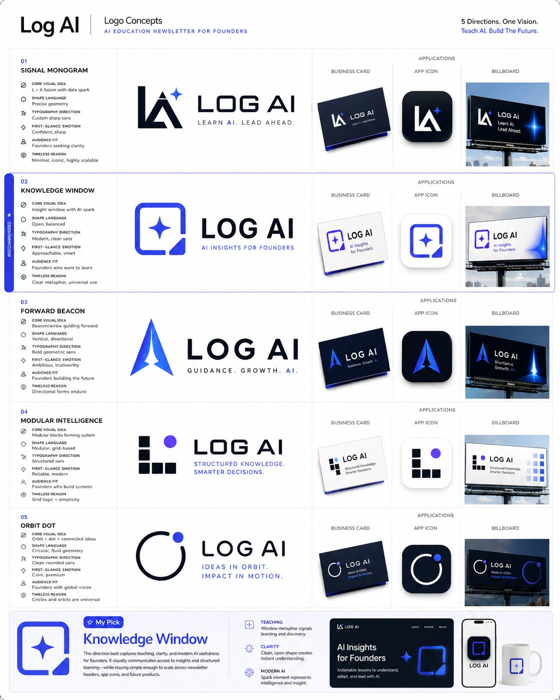
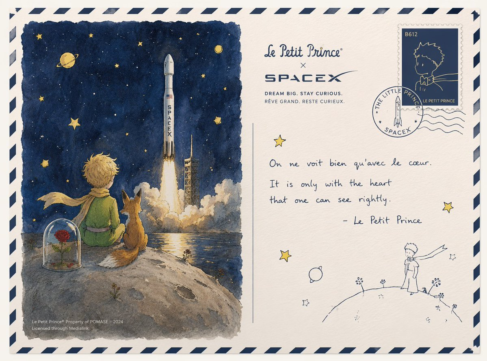

# Brand & Logos

总计：11

## 品牌人格漫画信息图

- ID: case-379
- Slug: case-379-zh
- 语言: zh
- 来源: [来源链接](https://x.com/CallumGrey/status/2051293342139584922)
- 样例图路径: images/part2/case379.jpg

### 提示词

```text
Using the uploaded logo, create a highly detailed, comic-style infographic poster:

“What This Brand Feels Like”

GOAL:
Turn the brand into a living personality and visually explain how it behaves, speaks, and interacts with the world.
This must feel like a mix of: brand strategy + character design + comic storytelling.

---

CORE RULE:
Everything must come from the logo:
- colors
- style
- tone
- personality

No generic personality traits.

---

MAIN STRUCTURE:
Vertical 4:5 poster
Dense layout with multiple panels
Comic + infographic hybrid

---

TOP SECTION:
- Brand name
- Short personality statement (max 6 words)
Example: “Quiet confidence with sharp edges”

---

MAIN CHARACTER (VERY IMPORTANT):
Create a central character representing the brand:
- humanized version of the brand
- outfit reflects brand style
- posture + expression reflect personality

---

AROUND THE CHARACTER:
Create 6–8 comic panels showing how the brand behaves in different situations.

---

SCENARIO IDEAS:
- Talking to customers
- Handling competition
- Selling a product
- Social media presence
- Reacting to criticism
- Daily “brand life” moment

---

FOR EACH PANEL:
Include:
- short caption (max 6 words)
- speech bubble or internal thought
- clear visual action

---

TONE EXAMPLES:
Luxury brand: calm, confident, minimal speech
Playful brand: loud, chaotic, expressive
Tech brand: precise, logical, clean

---

PERSONALITY TRAITS SECTION:
Add small labeled blocks:
- Voice tone (e.g. calm, bold, playful)
- Energy level (low / medium / high)
- Social behavior (introvert / extrovert)
- Communication style

Use:
- icons
- short labels

---

DO / DON’T SECTION:
Add a split block:
DO:
- how the brand should act
DON’T:
- what breaks the identity

Keep:
- very short phrases

---

VISUAL ELEMENTS:
- speech bubbles
- icons
- arrows
- small reactions
- exaggerated comic expressions

---

STYLE:
- comic + editorial hybrid
- slightly exaggerated but still premium
- expressive but not childish

---

COLOR:
- strictly based on logo palette
- use color to reinforce personality

---

DEPTH:
- 20–40 visual elements
- multiple small panels
- layered composition

---

IMPORTANT RULES:
- must feel alive
- must feel specific
- no generic marketing words
- no empty areas
- keep text short but impactful

---

FINAL FEEL:
Like:
- a brand strategy turned into a character
- a visual storytelling board
- something people save and study

NOT:
- flat
- generic
- minimal
```

### 样例图


## Scrapbook 真人图与迷你分身

- ID: case-371
- Slug: case-371-zh
- 语言: zh
- 来源: [来源链接](https://x.com/Kashberg_0/status/2050272100884340783)
- 样例图路径: images/part2/case371.jpg

### 提示词

```text
Transform the provided reference image into a cozy aesthetic scrapbook-style composition while strictly preserving the original subject, identity, pose, lighting, and background.

Add multiple small “mini version” characters of the same person (chibi / doll-like style), placed naturally around the scene (on objects, table, shoulder, etc.). These mini figures must match the subject’s face, hairstyle, outfit, and vibe consistently, styled as cute 3D collectible figurines. Show them doing different activities (reading, posing, taking photos, relaxing).

Overlay handwritten-style doodles and annotations across the image: arrows, hearts, stars, sparkles, icons, and playful captions connected to elements in the scene.

Use a soft pastel color palette (white base with pink, peach, blue accents).

Keep the frame visually rich and filled but balanced and clean.

Style: warm, cozy lighting, dreamy Instagram scrapbook aesthetic, soft depth of field, highly detailed, polished but playful.

The final result must look like the SAME original image enhanced with mini alter-egos and aesthetic annotations — not a recreated or different scene.
```

### 样例图


## VELORA 奢华香水广告海报

- ID: case-367
- Slug: case-367-zh
- 语言: zh
- 来源: [来源链接](https://x.com/akkiwani703/status/2049778680969437564)
- 样例图路径: images/part2/case367.jpg

### 提示词

```text
{
  "image_type": "luxury perfume advertisement poster",
  "resolution": "4K ultra HD (4096x5120)",
  "aspect_ratio": "portrait (4:5)",
  "style": {
    "aesthetic": "high-end fragrance campaign (Tom Ford, Dior inspired)",
    "tone": "dark luxury, sensual, elegant, powerful",
    "color_grading": "deep black shadows with rich golden highlights and warm amber glow",
    "lighting": "cinematic spotlight + golden rim light + soft fill light, dramatic shadows",
    "contrast": "high cinematic contrast",
    "depth_of_field": "shallow, sharp focus on face and perfume bottle"
  },
  "camera": {
    "type": "85mm portrait lens",
    "aperture": "f/1.6",
    "angle": "slightly low angle, premium perspective",
    "framing": "model upper body + product foreground"
  },
  "subject": {
    "gender": "female",
    "age_appearance": "young adult",
    "expression": "confident, sensual, calm",
    "styling": {
      "hair": "voluminous, slightly messy, glossy strands with golden highlights",
      "makeup": "soft glam, glowing skin, bold lips",
      "outfit": "brown tailored blazer with patterned silk scarf",
      "accessory": "thin transparent eyeglasses"
    }
  },
  "product": {
    "type": "luxury perfume bottle",
    "brand": "VELORA PARFUMS",
    "label": "EAU DE PARFUM",
    "design": "clear crystal glass bottle, golden liquid inside, metallic gold cap",
    "placement": "bottom center foreground on glossy black marble surface",
    "effects": "strong reflections, golden glow, subtle condensation, cinematic shine"
  },
  "environment": {
    "background": "dark blurred luxury interior with warm golden light streaks",
    "surface": "black marble with reflections",
    "extra_elements": "small flowers near bottle, golden particles, soft smoke"
  },
  "typography": {
    "logo": "V monogram + VELORA PARFUMS",
    "headline": "Not just a scent, It’s your Signature.",
    "tagline": "A fragrance that speaks before you do.",
    "secondary": "Own your essence. Leave a legacy.",
    "features": [
      "Long Lasting",
      "Premium Ingredients",
      "Crafted with Passion"
    ],
    "notes": [
      "Top: Pear, Bergamot, Pink Pepper",
      "Heart: Jasmine, Rose, Orris",
      "Base: Vanilla, Patchouli, Musk"
    ],
    "font_style": "luxury serif + elegant handwritten script",
    "color": "gold metallic",
    "placement": "top left + mid left + bottom balanced layout"
  },
  "post_processing": {
    "sharpness": "ultra sharp on face and bottle",
    "glow": "golden cinematic glow",
    "retouch": "high-end editorial finish",
    "vignette": "subtle dark vignette"
  },
  "mood": "premium luxury perfume campaign, cinematic, bold brand identity",
  "quality": "hyper-realistic, 4K ultra HD, commercial grade, award-winning fragrance ad"
}
```

### 样例图


## 抹茶品牌触点系统视觉板

- ID: case-362
- Slug: case-362-zh
- 语言: zh
- 来源: [来源链接](https://x.com/Preda2005/status/2049846981271699685)
- 样例图路径: images/part2/case362.jpg

### 提示词

```text
Create a premium “Matcha Brand Touchpoint System” visual board for a modern lifestyle brand called:

“MATCHA MODE”

Build a full brand identity system, not a single image.

HERO SCENE:

A hyper-realistic matcha drink in a ceramic cup placed on a clean natural surface.

– vibrant green matcha foam with micro-bubbles
– bamboo whisk (chasen) nearby
– soft natural light
– slight matcha powder dust on the surface
– minimal Japanese aesthetic
ATMOSPHERE:
– calm, warm, soft daylight
– clean background (off-white or beige)
– subtle shadows and reflections
– feeling of wellness and luxury
FULL BRAND SYSTEM:
– takeout cups (paper + glass bottles)
– packaging boxes (minimalist design)
– tote bags (premium lifestyle)
– labels, stickers, seals
– menu cards with pricing ($6.50, $8.90, etc.)
– small typography everywhere
– subtle imperfections (realism)

DESIGN LANGUAGE:

– modern minimalist typography
– Japanese-inspired layout
– soft green palette
– elegant spacing

INCLUDE:
– matcha latte
– iced matcha
– matcha desserts
– combo sets
– lifestyle shots
The composition must feel like a high-end design agency presentation.

Ultra-detailed, realistic, clean, aesthetic, and highly shareable.
```

### 样例图


## Logo 与品牌身份系统提示词合集

- ID: case-354
- Slug: case-354-zh
- 语言: zh
- 来源: [来源链接](https://x.com/wanerfu/status/2048659924822184026)
- 样例图路径: images/part2/case354.jpg

### 提示词

```text
1. Logo概念生成提示词

你是一位拥有20年经验的顶级Logo设计师，为全球知名品牌设计过即时识别且深具意义的标志。

品牌名称：[你的品牌名]
行业：[你的行业]
品牌个性：[描述]
目标受众：[描述]
欣赏的视觉身份：[列举3个]
讨厌的视觉身份：[列举3个]
偏好风格：[如极简、大胆、几何、有机、复古、未来]

为我的品牌生成5个完全不同的Logo概念。

对每个概念提供：

- 核心视觉理念及象征意义
- 形状语言及为何适合品牌
- 字体方向建议
- 第一眼的情感触发
- 为何适合目标受众
- 在名片、App图标和广告牌上的效果
- 何为永恒而非潮流

然后告诉我，如果这是你的品牌，你会选哪个以及原因。

2. 品牌身份基础提示词

你是为财富500强公司和初创企业建立品牌身份的顶级品牌战略师，这些企业后来融资数百万。

业务名称：[你的业务名]
业务描述：[一句话]
目标受众：[详细描述]
竞争对手：[列举3-5个]
想触发的感受：[如信任、兴奋、奢华、亲近、力量]
想关联的词汇：[列举5-10个]
不想关联的词汇：[列举5-10个]

在设计任何视觉效果之前建立完整的品牌身份基础。

为我提供：

- 品牌原型及为何完美契合
- 5个具体人类特征描述的品牌个性
- 带示例的品牌语调指南
- 核心品牌承诺（一句话）
- 3个品牌应触发的情感层级
- 与竞争对手的根本差异
- 定义品牌的唯一关键词

3. 配色方案提示词

你是色彩心理学专家和品牌设计师，深知色彩如何触发情感、建立信任和驱动购买决策。

品牌名称：[你的品牌名]
行业：[你的行业]
目标受众：[年龄、性别、收入、生活方式]
想触发的首要情感：[如信任、能量、奢华、平静、兴奋]
前3名竞争对手颜色：[列举]
喜欢的颜色：[列举]
讨厌的颜色：[列举]

为我建立完整品牌配色板。

为我提供：

- 主色及其HEX代码和心理学解释
- 两个辅助色及HEX代码
- 一个强调色用于CTA和高亮
- 一个中性色用于背景和文字
- 每种颜色对目标受众的影响
- 与竞争对手的差异化
- 在网站、社交媒体和包装上的应用示例
- 永远不要搭配的颜色组合及原因

4. 字体方向提示词

你是字体专家和品牌设计师，深知字体如何传达个性、建立可信度和实现品牌即时识别。

品牌名称：[你的品牌名]
品牌个性：[5个词]
行业：[你的行业]
目标受众：[描述]
字体应触发的感受：[如权威、友好、创新、优雅、能量]
喜欢的品牌字体：[列举3个]

为我建立完整字体系统。

为我提供：

- 标题用主显示字体名称及为何完美
- 长文本的辅助字体
- 引言或重点的强调字体
- 标题、副标题、正文、说明文字的精确字号层级
- 字距和行高建议
- 字体搭配方法
- 预算有限时的免费替代方案
- 你所在行业应避免的字体错误

5. 完整品牌身份包提示词

你是顶级品牌代理创意总监，交付覆盖每个触点的完整品牌身份系统。

业务名称：[你的业务名]
业务描述：[一句话]
目标受众：[详细描述]
品牌个性：[5个词]
行业：[你的行业]
竞争对手：[列举3个]
设计工具预算：[免费或付费]
时间表：[你需要的时间]

在一个回复中交付我的完整品牌身份系统。

包含所有元素：

- 品牌战略基础、原型、个性、承诺和定位
- Logo概念及3个变体
- 完整配色板、HEX代码和使用规则
- 字体系统、名称、字号和层级
- 视觉方向指南
- 品牌语调指南和标语选项
- 社交媒体视觉模板
- 3条永远不要打破的核心品牌规则

将一切作为结构化品牌手册交付，任何设计师、开发者或AI工具都能在10分钟内完全理解你的品牌。
```

### 样例图



## NOIR 街头服饰 Campaign

- ID: case-344
- Slug: case-344-zh
- 语言: zh
- 来源: [来源链接](https://x.com/Daniel_adsss/status/2048542581638701446)
- 样例图路径: images/part2/case344.jpg

### 提示词

```text
Create a premium, highly realistic 1:1 campaign poster for NOIR, a modern streetwear brand. Show one hero oversized hoodie as the main focus against a gritty urban backdrop with wet concrete floors, dramatic low lighting, subtle smoke in the air and a raw street energy. Add bold minimal typography with the brand name NOIR and a short campaign headline like "Wear the Dark." Make it feel like a real high-end streetwear editorial, sharp detail, realistic fabric textures, modern and edgy, deep black tones with subtle grey accents, no clutter, no collage.
```

### 样例图


## 零食品牌技术分解图

- ID: case-310
- Slug: case-310-zh
- 语言: zh
- 来源: [来源链接](https://x.com/TechieBySA/status/2031795709243019280)
- 样例图路径: images/part2/case310.jpg

### 提示词

```text
[中文]
创建一个 [SNACK] 的品牌技术信息图，结合产品的真实照片或照片级真实渲染，并将技术注释覆盖层直接置于其上。在纯白摄影棚背景上使用带有策略性 [BRAND COLOR] 点缀的黑色墨水风格线条画（建筑草图外观），包括：
• 关键组件标签
• 显示结构、分层或内部设计的内部截面图
• 测量数据、尺寸和规格
• 带有成分和数量的材料标注
• 指示主要功能和结构完整性的箭头
• 显示关键机械或设计元素的简单示意图或剖面图
• 可持续性标注
标题位置：位于手绘技术注释框内，带有强调色边框，粗体字显示产品名称，置于上角。
风格与布局规则：
• 真实产品保持清晰可见
• 注释具有素描感、技术感和建筑感
• 强调色用于高光（占线条工作的 20-30%），黑色用于主要技术线条（70-80%）
• 构图整洁，负空间平衡
• 具有教育意义、食品工程氛围和高端品牌感
• 在角落包含微妙的品牌标志
视觉风格：极简技术插画美学，黑色线条在真实图像上带有点缀，精确但略带手绘感。
调色板：白色背景，黑色注释线/文本，[BRAND COLOR] 仅用于点缀和关键标注。
输出：1080×1080，超清晰，社交媒体动态优化，无水印。

[English]
Create a branded technical infographic of a [SNACK], combining a realistic photograph or photoreal render of the product with technical annotation overlays placed directly on top. Use black ink–style line drawings with strategic [BRAND COLOR] accents (architectural sketch look) on a pure white studio background, including:
• Key component labels
• Internal cross-section showing structure, layering, or internal design
• Measurements, dimensions, and specifications
• Material callouts with composition and quantities
• Arrows indicating function for primary features and structural integrity
• Simple schematic or sectional diagram showing key mechanical or design elements
• Sustainability callouts
Title placement: Inside a hand-drawn technical annotation box with accent border reading the product name in bold font, positioned in upper corner.
Style & layout rules:
• The realistic product remains clearly visible
• Annotations feel sketched, technical, and architectural
• Accents used for highlight (20-30% of linework), black for primary technical lines (70-80%)
• Clean composition with balanced negative space
• Educational, food-engineering vibe with premium branding
• Include subtle brand logo mark in corner
Visual style: Minimal technical illustration aesthetic, black linework with accents over realistic imagery, precise but slightly hand-drawn feel.
Color palette: White background, black annotation lines/text, [BRAND COLOR] for accents and key callouts only.
Output: 1080×1080, ultra-crisp, social-feed optimized, no watermark.​​​​​​​​​​​​​​​​
```

### 样例图


## 小王子与星舰的浪漫联名

- ID: case-250
- Slug: case-250-zh
- 语言: zh
- 来源: [来源链接](https://x.com/akokoi1/status/2045693939584516441)
- 样例图路径: images/part2/case250.jpg

### 提示词

```text
[中文]
设计一张小王子和SpaceX联名的明信片

[English]
Design a postcard co-branded by The Little Prince and SpaceX
```

### 样例图



## 韩系偶像九宫格写真集

- ID: case-219
- Slug: case-219-zh
- 语言: zh
- 来源: [来源链接](https://x.com/BubbleBrain/status/2046151898621993364)
- 样例图路径: images/part2/case219.jpg

### 提示词

```text
[中文]
9:16 竖版 — 一个 3x3 网格拼贴（九张图片）形成一系列韩国偶像肖像摄影。每一帧都呈现同一位年轻的韩国女性偶像，在所有九张镜头中保持 100% 一致的面部特征、比例、发型和身份。自然、超逼真的皮肤纹理，无修图，无磨皮。干净的偶像风格极简妆容，柔和的光泽，微妙的瑕疵。发型：长发、蓬松的黑发，微乱，在所有帧中保持一致（自然松散的垂落，轻微的动感）。服装：连贯的韩国偶像摄影造型 — 白色衬衫 + 短款下装（或简单的中性色调服装），青春、干净、略带休闲但有造型感。所有帧中穿着相同的服装。场景：极简的工作室或简单的室内环境（白墙，柔和的窗光，干净的背景）。聚焦于主体，而不是环境。光照：柔和漫反射的自然光，温柔的高光，低对比度，略带通透感的色调，微妙的胶片般柔和感。相机风格：亲密的肖像摄影，略带手持感，微妙的瑕疵（轻微的颗粒感，动态帧中的轻微模糊，不完美的构图）。帧分解（3x3 网格）：顶行：- 左上：自然站立，视线略微偏向一侧，表情放松 - 中上：面对镜头，随意的中间动作（头发或身体轻微移动） - 右上：轻微的侧面角度，柔和的注视，自然的抓拍感 中间行：- 中左：微微向上看，柔和的沉思表情 - 正中：特写肖像，直接的眼神接触，温柔的偶像微笑 - 中右：身体微微转动，中间动作的抓拍帧 底行：- 左下：随意坐着或倚靠着，放松的姿势 - 中下：背部部分转向，越过肩膀看向镜头 - 右下：靠近画框站立，略带俏皮或柔和的表情 氛围：韩国偶像写真集 / 小卡美学，亲密、柔和、自然、日常的魅力。质量：超写实，8K 细节，微妙的模拟胶片颗粒感，自然的瑕疵，柔和梦幻的色调

[English]
9:16 vertical — a 3x3 grid collage (nine images) forming a Korean idol portrait photoshoot series. Each frame features the same young Korean female idol, maintaining 100% consistency in facial features, proportions, hairstyle, and identity across all nine shots.   Natural, ultra-realistic skin texture, no retouching, no smoothing. Clean idol-style minimal makeup, soft glow, subtle imperfections.   Hair: long, voluminous dark hair, slightly tousled, consistent across all frames (natural loose flow, slight movement).  Outfit: cohesive Korean idol photoshoot styling — white shirt + short bottoms (or simple neutral-toned outfit), youthful, clean, slightly casual but styled. Same outfit across all frames.  Setting: minimal studio or simple indoor environment (plain wall, soft window light, clean background). Focus on subject, not environment.  Lighting: soft diffused natural light, gentle highlights, low contrast, slightly airy tones, subtle film-like softness.  Camera style: intimate portrait photography, slightly handheld feel, subtle imperfections (minor grain, slight blur in motion frames, imperfect framing).  Frame breakdown (3x3 grid):  Top row: - Top left: standing naturally, looking slightly away, relaxed expression - Top center: facing camera, casual mid-motion (hair or body slight movement) - Top right: slight side angle, soft gaze, natural candid feel  Middle row: - Center left: looking slightly upward, soft thoughtful expression - Center: close-up portrait, direct eye contact, gentle idol smile - Center right: turning body slightly, mid-motion candid frame  Bottom row: - Bottom left: seated or leaning casually, relaxed posture - Bottom center: back partially turned, looking over shoulder toward camera - Bottom right: standing close to frame, slightly playful or soft expression  Mood: Korean idol photobook / photocard aesthetic, intimate, soft, natural, everyday charm.  Quality: ultra-realistic, 8K detail, subtle analog film grain, natural imperfections, soft dreamy tone
```

### 样例图


## 品牌视觉识别图

- ID: case-186
- Slug: case-186-zh
- 语言: zh
- 来源: [来源链接](https://x.com/ProperPrompter/status/2046534215311970694)
- 样例图路径: images/part2/case186.jpg

### 提示词

```text
[中文]
创建一个包含100种不同奇幻RPG物品的10×10网格，以经典像素艺术风格渲染（16位或32位精灵图美学，让人联想到SNES/GBA时代的日式RPG）。每个物品应出现在其独立的方形瓷砖中，下方带有简短清晰的标签。在白色背景上保持网格整洁。使每个物品在视觉上都有所区分，并且每个标签拼写正确。使用清晰的像素边缘、每个精灵图有限的调色板，以及用于阴影的微妙抖动。
使用这些行主题：
第1行：剑与刀刃
第2行：盾牌与盔甲
第3行：弓、弩与远程武器
第4行：法杖、魔杖与魔法焦点
第5行：药水、灵药与烧瓶
第6行：卷轴、典籍与法术书
第7行：戒指、护身符与附魔小饰品
第8行：头盔、王冠与头饰
第9行：钥匙、遗物与任务物品
第10行：宝石、符文与制作材料
将每个瓷砖显示为干净背景方形上居中的物品精灵图，渲染为经典的库存图标——你在奇幻RPG菜单中会看到的那种。保持整体风格一致、连贯，并让人联想到备受喜爱的复古奇幻RPG——迷人、细节丰富，且在小尺寸下易于辨认。

[English]
Create a 10 × 10 grid of 100 different fantasy RPG items rendered in classic pixel art style (16-bit or 32-bit sprite aesthetic, reminiscent of SNES/GBA-era JRPGs). Each item should appear in its own square tile with a short clear label underneath. Keep the grid neat on a white background. Make every item visually distinct and every label correctly spelled. Use crisp pixel edges, limited palette per sprite, and subtle dithering for shading.
Use these row themes:
Row 1: swords and blades
Row 2: shields and armor
Row 3: bows, crossbows, and ranged weapons
Row 4: staves, wands, and magical foci
Row 5: potions, elixirs, and flasks
Row 6: scrolls, tomes, and spellbooks
Row 7: rings, amulets, and enchanted trinkets
Row 8: helmets, crowns, and headgear
Row 9: keys, relics, and quest items
Row 10: gems, runes, and crafting materials
Show each tile as a centered item sprite on a clean background square, rendered as a classic inventory icon — the kind you'd see in a fantasy RPG menu. Keep the overall style consistent, cohesive, and reminiscent of beloved retro fantasy RPGs — charming, detailed, and instantly readable at small sizes.
```

### 样例图


## 品牌徽标设计图

- ID: case-36
- Slug: case-36-zh
- 语言: zh
- 来源: [来源链接](https://x.com/mirochill)
- 样例图路径: images/part2/case36.jpg

### 提示词

```text
A photorealistic selfie of a young man with short wavy dark hair and light stubble on an indoor basketball court. He wears a black athletic t-shirt with a white swoosh. He holds a {argument name="ball color" default="green"} basketball featuring a large white {argument name="logo design" default="OpenAI logo"}. The background shows a hardwood floor, black wall pads, and a basketball hoop against a concrete wall. Bright indoor gym lighting with a casual social media aesthetic.
```

### 样例图


