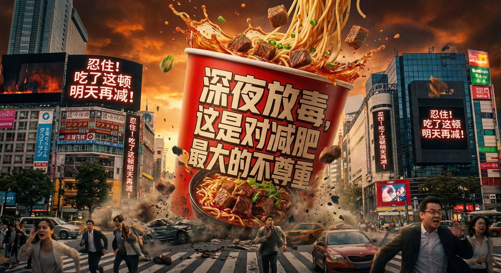

# branding

总计：214

## { "language": "en", "task": "image_edit", "consistency_i

- ID: gpt4o-1027-en-1
- Slug: prompt-1027-en-1
- 语言: en
- 来源: [来源链接](https://x.com/hellokaton/status/2003484504347079156)
- 样例图路径: images/part3/1027.jpeg

### 提示词

```text
{
    "language": "en",
    "task": "image_edit",
    "consistency_id": "user_subject_sassy_santa",
    "input_images": [
        {
            "image": "{{USER_REFERENCE_IMAGE}}",
            "use_as": "subject_identity",
            "priority": "high"
        }
    ],
    "prompt": "Create a full-body vertical 3:4 festive poster. Use the person from the uploaded reference image as the ONLY human subject (could be male or female). Preserve identity strongly: same face structure, hairstyle, skin tone, and overall likeness. Preserve the subject’s gender presentation from the reference; do not gender-swap.\n\nPOSE (LOCK THIS): a grounded swagger power-stance with BOTH FEET ON THE FLOOR (no raised leg). Wide stance, feet apart. Weight mostly on the back leg. The front foot is planted closer to the camera to create forced-perspective enlargement of the sneaker, but the sole stays fully on the ground. Knees slightly bent. Hips subtly cocked. Upper body slightly leaned back with shoulders rolled back and chest subtly forward.\n\nARMS & FACE (LOCK THIS): arms firmly and tightly crossed over the chest (no hands-on-hips). Chin slightly raised. Slight head tilt. A smug, confident, sassy expression (subtle smirk / “too cool” attitude).\n\nWARDROBE: rich red velvet Santa suit with clean white fur trim, Santa hat, white gloves, stylish black sunglasses. Keep modern clean white sneakers.\n\nSCENE: seamless bright red studio backdrop with a soft spotlight gradient behind the subject. Metallic silver confetti floating throughout the scene.\n\nREINDEER: place one realistic reindeer on the subject’s right side (camera-right), full body visible, antlers prominent, facing the camera with a cute/curious look. The reindeer wears a cozy red-and-green knitted scarf.\n\nLIGHTING & CAMERA: crisp commercial studio lighting, high detail textures (velvet, fur trim, knit scarf, reindeer fur). Low-angle wide lens look (about 20–28mm), camera near knee height, slight upward tilt. Sharp focus on subject and reindeer, mild depth of field for a premium poster feel. Photorealistic, clean, no text.",
    "style_parameters": {
        "render_style": "photorealistic",
        "mood": "festive, playful, swagger, comedic",
        "camera_look": "low-angle wide lens, forced perspective"
    },
    "composition": {
        "shot_type": "full_body",
        "camera_angle": "low_angle",
        "subject_position": "center_left",
        "secondary_subject_position": "right",
        "background": "solid red seamless with subtle spotlight gradient",
        "foreground_elements": "silver confetti"
    },
    "technical_specifications": {
        "aspect_ratio": "3:4",
        "resolution": "4k",
        "detail_level": "high",
        "sharpness": "high"
    },
    "negative_prompt": "raised leg, knee up, kicking, stepping forward mid-air, walking pose, running pose, sitting, crouching, hands on hips, hands in pockets, text, watermark, logo, brand mark, extra people, duplicate face, face distortion, different identity, gender swap, body-type change, extra limbs, extra fingers, bad hands, deformed feet, melted sunglasses, blurry subject, low resolution, cartoon, anime, painterly look, harsh artifacts",
    "output_settings": {
        "format": "jpg",
        "quality": "high"
    }
}
```

### 样例图


## 竖版全身节日海报

- ID: gpt4o-1027-zh-2
- Slug: prompt-1027-zh-2
- 语言: zh
- 来源: [来源链接](https://x.com/hellokaton/status/2003484504347079156)
- 样例图路径: images/part3/1027.jpeg

### 提示词

```text
{
"language": "en",
"任务": "图像编辑",
"consistency_id": "user_subject_sassy_santa",
"input_images": [
{
"image": " {{ USER_REFERENCE_IMAGE }} ",
"use_as": "subject_identity",
“优先级”： “高”
}
],
“提示”：创作一张3:4比例的竖版全身节日海报。使用上传的参考图片中的人物作为唯一的人体主体（可以是男性或女性）。务必保持人物特征：相同的面部结构、发型、肤色和整体相似度。保持参考图片中人物的性别特征；不要改变性别。\n\n姿势（锁定此项）：双脚着地，双脚分开站立，保持稳健自信的站姿（不要抬腿）。双脚分开站立，重心主要在后腿上。前脚靠近镜头，利用透视效果放大运动鞋，但鞋底始终与地面接触。膝盖微屈。臀部略微前倾。上身略微后倾，双肩向后舒展，胸部略微前挺。\n\n手臂和面部（锁定此项）：双臂紧紧交叉于胸前（不要双手叉腰）。下巴略微抬起。头部略微前倾。倾斜。一种沾沾自喜、自信、傲娇的表情（略带一丝微笑/“酷毙了”的态度） .\ \n服装：深红色天鹅绒圣诞老人套装，配以干净的白色毛皮饰边、圣诞帽、白色手套和时尚的黑色太阳镜。搭配现代的干净白色运动鞋。\n\n场景：无缝亮红色影棚背景，主体后方有柔和的渐变聚光灯。银色金属彩纸屑在场景中飘落。\n\n驯鹿：将一只逼真的驯鹿放在主体的右侧（相机右侧），全身可见，鹿角突出，面向镜头，眼神可爱/好奇。驯鹿戴着一条舒适的红绿相间针织围巾。\n\n灯光和相机：清晰的商业影棚灯光，高细节纹理（天鹅绒、毛皮饰边、针织围巾、驯鹿毛皮）。低角度广角镜头（约20-28mm），相机高度接近膝盖，略微向上倾斜。主体清晰对焦驯鹿，适中的景深营造出高级海报的感觉。照片级写实，画面干净，无文字。
"style_parameters": {
"render_style": "照片写实风格",
“情绪”：“喜庆的、俏皮的、自信的、喜剧的”，
"camera_look": "低角度广角镜头，强制透视"
},
“作品”： {
"shot_type": "全身",
"camera_angle": "低角度",
"subject_position": "center_left",
"secondary_subject_position": "右",
“背景”: “纯红色无缝，带有微妙的聚光灯渐变”
"前景元素": "银色彩带"
},
"technical_specifications": {
"aspect_ratio": "3:4",
分辨率：4K，
"detail_level": "高",
“清晰度”： “高”
},
"negative_prompt": "抬腿、抬膝、踢腿、空中向前迈步、行走姿势、跑步姿势、坐姿、蹲姿、双手叉腰、双手插兜、文字、水印、标志、品牌标识、额外人物、重复面孔、面部扭曲、不同身份、性别互换、体型改变、额外肢体、额外手指、残疾的手、畸形的脚、融化的太阳镜、模糊主体、低分辨率、卡通、动漫、油画风格、粗糙的瑕疵",
"output_settings": {
"格式": "jpg",
“质量”： “高”
}
}
```

### 样例图


## 水果包装

- ID: gpt4o-1024-zh
- Slug: prompt-1024-zh
- 语言: zh
- 来源: [来源链接](https://x.com/berryxia/status/2003836511565815965)
- 样例图路径: images/part3/1024.jpeg

### 提示词

```text
Premium Japanese-style product poster in 16:9 landscape format, editorial design showcasing kiwi juice skin packaging concept with sophisticated visual storytelling:

LEFT SIDE (40% of canvas):
- Hero product: One large kiwi juice skin package displayed vertically with dramatic soft lighting, showing ultra-realistic kiwi peel texture wrapped around rectangular container, fuzzy brown skin with thousands of fine visible hair-like fibers covering entire surface, rough natural texture, brown color with subtle variations, looks exactly like real kiwi skin stretched over package
- Below: One cross-sectioned fresh kiwi showing vibrant green creamy flesh with black seeds radiating from white center
- Japanese typography vertically aligned: "キウイスキン" (Kiwi Skin) in elegant thin gothic font
- Subtitle: "果汁皮肤 / 猕猴桃" in refined style
- Small design philosophy text in Japanese

CENTER (30% of canvas):
- Generous white negative space (Ma - 間)
- Minimal geometric elements: delicate thin lines
- Floating text: "自然な素材" (natural materials)
- Subtle minimalist brand mark
- Very subtle kiwi fuzz texture pattern in background (low opacity)

RIGHT SIDE (30% of canvas):
- Two kiwi juice skin packages arranged artistically at different angles and heights
- One whole fresh kiwi with natural fuzzy brown skin
- Typography: "Natural Packaging / 自然な包装"
- Tagline: "The skin is the package / 皮膚が包装である"
- Detail callouts pointing to fuzzy hair texture

DESIGN PRINCIPLES: Abundant white space, asymmetrical balance, Wabi-sabi aesthetic, Muji/Noritake editorial minimalism
COLOR PALETTE: brown kiwi tones, pure white background, bright green accent from flesh
PHOTOGRAPHY: Soft diffused studio lighting, ultra-sharp macro details showing fuzzy texture, photorealistic rendering
CRITICAL: The kiwi skin packaging must look incredibly realistic - actual organic fuzzy brown texture with thousands of tiny brown hairs, rough natural appearance, NOT plastic

16:9 widescreen, high-end Japanese product poster, gallery quality
```

### 样例图


## 品牌商品包装

- ID: gpt4o-1023-zh
- Slug: prompt-1023-zh
- 语言: zh
- 来源: [来源链接](https://x.com/AmirMushich/status/2003478037032239127)
- 样例图路径: images/part3/1023.jpeg

### 提示词

```text
理想食品品牌：[此处填写食品品牌名称]

任务：担任专门从事军用包装设计的平面设计专家。根据上面提供的“所需食品品牌”，创作一张虚构的即食军粮（MRE）的高保真图像。

第一阶段：品牌调研

找出所需食品品牌的官方标志。

找出该品牌最主要的两种颜色。

颜色 A（主色）：主要背景色。

颜色 B（辅助色）：用于字体和图标的颜色。

第二阶段：视觉执行（图像生成）

生成一张单份MRE（即食口粮）包装袋的特写图像，背景为干净的纯白色。设计必须符合以下严格限制：

尺寸和外形：包装袋的尺寸必须与标准美军MRE（单兵口粮）的尺寸完全一致。它应该是一个高高的竖直长方形（而不是正方形或小零食袋）。包装袋应该看起来厚实沉重，真空密封的轮廓清晰可见，并且在盛放食物的地方略微鼓起。

材质与颜色：采用厚实耐用的哑光塑料，顶部和底部采用加固的压纹热封工艺。包装整体颜色必须为A色。所有文字和标识必须使用B色印刷。

标志放置位置：将品牌的原样、未经修改的标志放置在左上角（替换国防部印章）。

主要品牌标识：必须在袋子中心以 45 度向上倾斜的角度印上“MRE”字样的大号粗体衬线字体。

字体排印与版式设计：

右上角：“即食餐，个人装”，粗体无衬线字体。

左上角（标志下方）：标语“战士推荐、战士测试、战士认可™ ”。

右下角：列出“菜单 [随机数字]”，后面跟着 Desired Food 品牌的著名招牌菜品，全部以粗体大写字母显示。

底部中心：将品牌名称作为制造商，然后是虚假地址、“美国政府财产”法律免责声明，以及最底部边缘的“无焰口粮加热器”航空安全警告。

细节：在包装袋顶部中央印上“可剥离密封”字样和一个向上的小箭头。确保顶部和底部的压痕清晰可见。
```

### 样例图


## 电商商品KV图

- ID: gpt4o-1021-zh
- Slug: prompt-1021-zh
- 语言: zh
- 来源: [来源链接](https://x.com/yanhua1010/status/2004012045143101808)
- 样例图路径: images/part3/1021.jpeg

### 提示词

```text
基于我给的产品图，梳理产品卖点/参数要点，然后给我输出一套统一旗舰店极简KV系统（9:16），最后生成10张详情页的完整提示词（中英双语、干净大气、至少5张细节特写），先单独生成Logo，用于后续每张海报左上角，其中文字排版风格需要统一，比如玻璃效果、3d浮雕效果，或者其他效果，提示词参考如下:
00、LOGO生成
提示词（中文）： 极简高端时尚品牌logo，矢量风格，干净几何形。品牌名：【"MUYANG"】。图标：细线圆形徽章，内含单支精致叶枝（负空间，现代，优雅）。配色：深苔灰绿色(#2F3A33)搭配温暖米白背景(#F3EFE6)或透明背景。字体：高端衬线体"MUYANG"，字母间距宽松，下方小字"沐阳"。无渐变、无阴影、无3D、无样机、无水印。
01、海报01｜【产品·丝滑睡裙】主KV（Hero）
提示词（中文）： 9:16竖版高端极简时尚海报。柔和摄影棚日光，温暖米白渐变背景（奶油/燕麦色），超干净。精致亚洲美女模特(25-30岁)，精致五官，自然裸妆，长发慵懒随意，放松优雅姿态，全身照，一只手轻轻抚摸裙摆。
服装必须与上传的产品参考图匹配：香槟色/奶油色缎面短款吊带睡裙，细吊带，V领，裙长至大腿中部，丝滑光泽面料，保持服装设计与参考图完全一致。
排版布局：左上角放置MUYANG logo(小号)。顶部居中巨大衬线标题(2行)："SILK SLIP DRESS" / "丝滑睡裙"(中英堆叠，干净)。左侧中部玻璃拟态信息卡(3个要点，双语)：仿真丝触感 / Silk-like touch；修身不紧绷 / Flattering fit；居家也优雅 / Elegant at home。右下角【圆角药丸CTA】："立即选购 → / SHOP NOW →"。
负面词：cluttered, busy, multiple patterns, gradients, shadows, watermark, logo repeated, messy text, low quality, blurry, plain face, unattractive
02、海报02｜产品场景展示
提示词（中文）： 9:16竖版，电影质感干净时尚摄影。背景：柔和晨光透过白色纱帘的卧室，奶白色床品，极简北欧风格，温暖氛围。精致亚洲美女模特全身侧身站立，长发披肩，回眸微笑，一只手撩起发丝。使用上传的产品参考图保持香槟色短款吊带睡裙的形状、长度、面料光泽完全一致。
文字：左上角小号MUYANG logo。左上小号优雅字体："晨光私语 / Morning Whisper"。左下大标题："慵懒的刚刚好"。标题下副标题(双语)："丝滑触肤，开启美好一天 / Silky touch, beautiful day begins."。右下角CTA药丸："了解更多 → / LEARN MORE →"。
负面词：cluttered, busy, dark, messy room, shadows, watermark, messy text, low quality, blurry, plain face
03、海报03｜多场景拼贴
提示词（中文）： 9:16竖版极简拼贴海报，圆角照片块和充足负空间。背景：温暖奶油色，干净。创建4个圆角框展示同一位精致亚洲美女模特穿着上传参考图中相同的香槟色短款吊带睡裙，不同居家场景：清晨卧室窗边、客厅沙发慵懒坐姿、浴室镜前、阳台藤椅喝咖啡。所有框架中保持服装、模特完全一致。
左上角MUYANG logo。底部大衬线标题："一裙多场景"。底部副标题(双语)："居家、约会、度假都适合 / Home, date, vacation ready."。右下角附近添加小型3点列表：不挑场合 / Versatile style；秒变氛围感 / Instant chic；舒适又迷人 / Cozy yet alluring。
负面词：cluttered, busy, multiple patterns, shadows, watermark, messy text, low quality, blurry, plain face.
04、海报04｜细节01·面料光泽（Fabric Sheen）
提示词（中文）： 9:16竖版高端微距细节海报。背景：奶油色渐变，大量干净负空间。极近距离拍摄上传参考图中缎面面料的光泽质感，展示丝滑反光效果和柔软垂坠感，面料随身体曲线自然流动。左上角MUYANG logo。
右侧大标题(双语)："仿真丝光泽 / Silk-like Sheen"。小文案(双语，2行)："触感细腻，像第二层肌肤 / Delicate touch, like second skin."。"自然反光更显质感 / Natural luster, premium feel."。右下角CTA药丸："了解更多 → / LEARN MORE →"。
负面词：cluttered, busy, multiple patterns, shadows, watermark, messy text, low quality, blurry
05、海报05｜细节02·细吊带与锁骨（Strap & Collarbone）
提示词（中文）： 9:16竖版极简细节海报。背景：温暖米白，超干净。特写拍摄精致亚洲美女模特的锁骨、肩颈线条和细吊带，来自上传参考(精致优雅)，柔和侧光勾勒轮廓，高级质感。添加一个小圆角内嵌图展示完整着装轮廓(非常小，低不透明度)。
左上角MUYANG logo。居中大衬线标题："细吊带设计"。3个微型要点(双语)：展现优美肩颈 / Flatters shoulders；精致不累赘 / Delicate refined；性感而优雅 / Sexy yet elegant。CTA药丸："立即选购 → / SHOP NOW →"。
负面词：cluttered, busy, multiple patterns, shadows, watermark, messy text, low quality, blurry, plain face
06、海报06｜细节03·V领剪裁（V-Neckline Cut）
提示词（中文）： 9:16竖版时尚细节海报，干净摄影棚灯光。背景：淡燕麦到奶油色渐变，无纹理。近距离拍摄V领剪裁细节(从上传参考)，展示领口线条流畅性和恰到好处的深度，性感不失优雅。左上角MUYANG logo。
左侧大标题："V领剪裁"。副标题(双语)："修饰脸型，拉长颈部线条 / Face-flattering, neck-elongating."。添加小标签行："DETAIL 03"(小号)。CTA药丸："了解更多 → / LEARN MORE →"。
负面词：cluttered, busy, multiple patterns, shadows, watermark, messy text, low quality, blurry.
07、海报07｜细节04·裙摆垂坠感（Hemline Drape）
提示词（中文）： 9:16竖版高端细节海报。背景：极浅香槟金雾霾色，低对比。拍摄精致亚洲美女模特侧面下半身，展示短裙裙摆自然垂坠在大腿中部的优美曲线(从上传参考)，面料随身体动态流动，修饰腿部线条。
左上角MUYANG logo。右侧标题(双语)："短款更显腿长"。小文案(双语)："恰到好处的长度，修饰比例 / Perfect length, flattering proportion."。
负面词：cluttered, busy, multiple patterns, shadows, watermark, messy text, low quality, blurry, plain face
海报08｜产品配色/型号
提示词（中文）： 9:16竖版极简时尚情绪板。背景：温暖奶油色。左侧：全身精致亚洲美女模特穿着上传参考图中的香槟色短款吊带睡裙(干净摄影棚，自然站姿)。右侧：整齐排列受睡裙启发的配色/材质色卡(香槟金、奶油色、珍珠白、柔和米色) + 极简线条图标(月亮、羽毛、丝绸、晨露)。保持一切扁平、高端，不繁忙。
左上角MUYANG logo。顶部大衬线："配色灵感 / COLOR INSPIRATION"。3个要点(双语)：香槟金显气质 / Champagne exudes elegance；温柔色更衬肤 / Soft tones flatter skin；低调奢华感 / Subtle luxury。CTA："了解更多 → / LEARN MORE →"。
负面词：cluttered, busy, multiple patterns, shadows, watermark, messy text, low quality, blurry, plain face.
09、海报09｜产品尺码/参数
提示词（中文）： 9:16竖版极简尺码指南海报。背景：温暖米白，干净。将尺码表(S/M/L)放置为整洁的网格卡片(玻璃拟态，圆角)。内容(双语标题)："尺码参考 / SIZE GUIDE"。表格列：尺码 Size｜衣长 Length｜胸围 Bust｜腰围 Waist｜臀围 Hip。行：S｜90cm｜80-84cm｜64-68cm｜88-92cm；M｜92cm｜84-88cm｜68-72cm｜92-96cm；L｜94cm｜88-92cm｜72-76cm｜96-100cm。左上角MUYANG logo。底部小注释(双语)："手工测量，误差±2cm属正常 / Hand-measured, ±2cm variance normal."。底部贴心提示："建议参考胸围选择尺码 / Suggest sizig by bust measurement."
负面词：no extra patterns, no clutter, no watermark
10、海报10｜结尾信任页 质保/售后/说明
提示词（中文）： 9:16竖版高端护理海报。背景：奶油色渐变，非常干净。
左上角MUYANG logo。大标题："洗护指南 / CARE GUIDE"。使用5个极简图标 + 简短双语行(干净，不拥挤)：建议手洗或使用洗衣袋 / Hand wash or use laundry bag；冷水或30°C以下水温 / Cold or below 30°C water；不可漂白或强力拧干 / No bleach or wringing；悬挂阴干，避免暴晒 / Hang dry, avoid direct sun；低温熨烫，垫布熨烫更佳 / Low heat iron, use cloth。底部添加小字(双语)："悉心呵护，延长丝滑寿命 / Care well, silkiness lasts longer."。
负面词：no clutter, no heavy texture, no watermark
```

### 样例图


## 牛肉面挂牌

- ID: gpt4o-1017-zh
- Slug: prompt-1017-zh
- 语言: zh
- 来源: [来源链接](https://x.com/berryxia/status/2004570423472562237)
- 样例图路径: images/part3/1017.jpeg

### 提示词

```text
A premium transparent acrylic signage panel for "[品牌名称]" brand, photographed in ABSOLUTE FRONTAL VIEW with ZERO perspective distortion.
CRITICAL CAMERA SETUP (STRICT ENFORCEMENT):
- Camera angle: EXACTLY 0° (perfectly perpendicular to the panel surface)
- The acrylic panel MUST be completely parallel to the camera sensor
- NO rotation on X, Y, or Z axis
- The panel edges MUST form perfect vertical and horizontal lines in the frame
- Use architectural photography grid alignment to ensure perfect frontal geometry
- NO three-quarter view, NO slight angle, NO depth perception - PURE FLAT FRONTAL
PANEL SPECIFICATIONS:
- Material: Ultra-clear 15mm acrylic glass with 95% transparency
- Dimensions: 400mm × 300mm [portrait/square/landscape] orientation
- All edges are diamond-polished with subtle rainbow light refraction
- The panel appears to float in mid-air, suspended by invisible forces
DESIGN LAYOUT (Hand-drawn aesthetic):
- Brand name "[品牌名称]" in large artistic brush calligraphy at top center
- Tagline "[品牌口号/slogan]" in elegant handwritten [语言] below the brand name
- [核心图案描述:如咖啡枝、火锅元素、牛肉纹理等] flowing around the text
- Small decorative [相关小图标] illustrations scattered naturally
- All design elements are drawn with [颜色描述,如warm brown/red/etc.] ink (color: [色值]) with varying line weights (0.8-2mm)
- The drawing has an organic, imperfect quality showing authentic hand-crafted charm
TRANSPARENCY EFFECTS:
- The acrylic surface has 60% opacity for drawn elements (semi-transparent, NOT solid)
- Light passes through the panel, creating soft colored shadows on the virtual plane behind
- The background [场景类型] environment is visible THROUGH the transparent areas
- Subtle light refraction effects along the panel edges creating prismatic color dispersion
BACKGROUND ENVIRONMENT:
- A warm, inviting [具体场景描述:如specialty coffee shop/hot pot restaurant/steakhouse] interior
- [环境细节:如wooden furniture, plants, pendant lighting/red lanterns, steam/leather seats, wine racks]
- The background is moderately blurred (bokeh effect, f/4 aperture simulation) 
- Background elements are recognizable but not distracting - balanced depth of field
- [色温描述:如Warm color temperature (3200K-3800K)/Cool-warm mixed lighting]
LIGHTING:
- Soft, diffused natural light from the front (60% intensity)
- Gentle rim lighting from behind the panel (30% intensity) to emphasize transparency
- NO harsh shadows, maintaining soft and even illumination
- Light interacts with the acrylic creating subtle internal glow
TECHNICAL REQUIREMENTS:
- Shot with macro lens (100mm f/2.8) for zero distortion
- Sensor perfectly aligned with panel surface using spirit level
- The panel occupies 70% of the frame, centered perfectly
- Ultra-sharp focus on the hand-drawn details
- 8K resolution, photorealistic rendering
- Color grading: [色调描述:如warm, natural/vibrant, energetic]
CRITICAL: The entire panel MUST be rendered in perfect frontal view with zero perspective distortion. Every line on the panel should be perfectly straight and parallel to the frame edges.
```

### 样例图


## 虚拟与现实的融合

- ID: gpt4o-1014-zh
- Slug: prompt-1014-zh
- 语言: zh
- 来源: [来源链接](https://x.com/berryxia/status/2005233233605398681)
- 样例图路径: images/part3/1014.jpeg

### 提示词

```text
A premium vertical split concept poster for [品牌名称] [产品名称], showing ONE [产品] split in half - left side realistic, right side deconstructed.

TOP SECTION - BRANDING:
- [品牌名称] official logo at top center ([品牌色])
- "[产品名称]" in large bold [字体风格] font in [颜色]
- Subtitle: "[产品Slogan]" in elegant serif font
- Optional secondary tagline

CENTRAL DESIGN - ONE SINGLE [产品] SPLIT VERTICALLY DOWN THE MIDDLE:

LEFT HALF OF THE [产品] (50%): Ultra-realistic photographic half
- Left 50% of the [产品] shown in ultra-realistic photography style
- Photorealistic [关键材质1: 如金属/皮革/食材] texture visible on left edge
- Half of [关键特征1: 如屏幕/面包/表面] with realistic reflections
- Left portion of [关键特征2: 如键盘/配件/层次] showing individual details
- Half of [关键特征3] visible with material accuracy
- Professional product photography lighting
- Perfect vertical cut through the exact center of the [产品]
- Every detail ultra-realistic: [材质细节列表]
- [可选: 烟雾/水珠/光晕] effect for atmosphere

RIGHT HALF OF THE [产品] (50%): Stylized [tech/culinary/artistic] deconstruction
- Right 50% of the [产品] exploding into [解构类型] components
- [组件1] floating away individually [具体描述]
- [组件2] fragments showing [内部结构/发光效果]
- [组件3] pieces with glowing [颜色] [元素: 如芯片/食材/零件]
- [组件4] separating geometrically
- [内部结构] and internal components visible
- [品牌元素/Logo] piece glowing independently
- [Warm golden/Cool blue/Neon multi-color] tech/artistic lighting effects
- Geometric [tech lines/motion lines/artistic trails], [holographic patterns/particle effects/ingredient splashes]
- Components floating outward in organized dynamic composition
- Illustrated/stylized art treatment (not photorealistic)
- [根据类型: 科技感电路/美食解构/时尚元素/机械零件]

THE SPLIT: Clean vertical line down the exact center of the [产品], one continuous [产品] transitioning seamlessly from realistic (left) to deconstructed [风格] art (right)

BACKGROUND: [深色/浅色] gradient ([色值1] to [色值2]) with [carbon fiber/wood/concrete/fabric] texture and [颜色] light particles

LIGHTING: Left side = professional studio lighting with [warm/cool/natural] tone | Right side = [warm/cool/neon] glow with [颜色] accents creating dramatic contrast

VERTICAL DIVIDING LINE: Subtle [golden/silver/blue/red] glow ([色值]) marking the center split of the [产品]

BOTTOM SECTION - PRODUCT FEATURES (arranged horizontally with icons):
- "[特点1]" with [icon描述] icon
- "[特点2]" with [icon描述] icon
- "[特点3]" with [icon描述] icon
- "[特点4]" with [icon描述] icon
Typography in [字体风格] font with decorative divider lines

COLOR PALETTE: [主色调列表]

COMPOSITION: One single [产品] centered vertically, split perfectly down the middle - left half ultra-realistic photography, right half exploding into stylized [解构类型] components

STYLE: Seamless transition from photorealistic product to illustrated [tech/culinary/fashion/mechanical] deconstruction within ONE unified [产品]

MOOD: [Premium/Appetizing/Innovative/Nostalgic], [dramatic/elegant/energetic], official brand advertising quality

TEXT STYLE: Mix of bold display fonts and elegant serifs, [品牌色] colors

Quality: Commercial advertising standard, 4K resolution, dramatic visual impact
```

### 样例图


## The creative poster features a box of fries transformed 

- ID: gpt4o-1012-en-1
- Slug: prompt-1012-en-1
- 语言: en
- 来源: [来源链接](https://x.com/underwoodxie96/status/2005266319772684676)
- 样例图路径: images/part3/1012.jpeg

### 提示词

```text
The creative poster features a box of fries transformed into a nightlight in the center. The golden fries act as light, reflecting off the wall behind the outlet and casting a yellow glow on the McDonald's logo. Below the logo, the words "open 24 hours" are displayed in tiny white print, directly announcing McDonald's 24-hour operation with its most recognizable element. The bottom right corner displays the McDonald's logo, and at the bottom center, in tiny print, is the word "Underwood Dessert."
```

### 样例图


## 迷你品牌小夜灯设计

- ID: gpt4o-1012-zh-2
- Slug: prompt-1012-zh-2
- 语言: zh
- 来源: [来源链接](https://x.com/underwoodxie96/status/2005266319772684676)
- 样例图路径: images/part3/1012.jpeg

### 提示词

```text
这张创意海报的中心是一个薯条盒，它被巧妙地改造成了一盏小夜灯。金黄色的薯条如同灯光，反射在插座后面的墙壁上，为麦当劳的标志投射出一片温暖的黄色光晕。标志下方，用白色小字写着“24小时营业”，直接用麦当劳最具辨识度的元素宣告了其24小时营业的理念。海报右下角是麦当劳的标志，而正下方中央，用极小的字体写着“Underwood Dessert”。
```

### 样例图


## { "type": "image_prompt", "description": "High-resolutio

- ID: gpt4o-1008-en-1
- Slug: prompt-1008-en-1
- 语言: en
- 来源: [来源链接](https://x.com/xmiiru_/status/2005530723847934103)
- 样例图路径: images/part3/1008.jpeg

### 提示词

```text
{
  "type": "image_prompt",
  "description": "High-resolution photorealistic studio fashion portrait",
  "subject": {
    "gender": "adult woman",
    "hair": "long light brown hair with golden blonde highlights, loose curls",
    "expression": "playful, cheeky, thinking face, lips pursed",
    "pose": "looking off to the side, shoulders relaxed"
  },
  "outfit": {
    "hat": "gold shimmering party hat",
    "dress": "gold sequin party dress with modern asymmetric neckline cutout"
  },
  "props": {
    "balloons": "gold foil balloons shaped as numbers 20 and 26, one in each hand, raised near shoulders"
  },
  "environment": {
    "setting": "clean studio",
    "background": "neutral beige backdrop",
    "lighting": "soft studio lighting with gentle shadows"
  },
  "details": {
    "realism": "editorial-quality photorealism",
    "textures": "visible skin texture, detailed hair strands, sharp sequin detail",
    "materials": "metallic balloon shine with realistic creases and highlights"
  },
  "constraints": [
    "no text",
    "no logos",
    "no branding",
    "no watermarks"
  ]
}
```

### 样例图


## 2026写实摄影棚时尚肖像

- ID: gpt4o-1008-zh-2
- Slug: prompt-1008-zh-2
- 语言: zh
- 来源: [来源链接](https://x.com/xmiiru_/status/2005530723847934103)
- 样例图路径: images/part3/1008.jpeg

### 提示词

```text
{
"type": "image_prompt",
描述：高分辨率照片级写实摄影棚时尚肖像
“主题”： {
“性别”: “成年女性”
“头发”：“长长的浅棕色头发，带有金色挑染，蓬松的卷发”，
“表情”：“顽皮、俏皮、思考的表情，嘴唇紧抿”，
“姿势”：“看向一侧，肩膀放松”
},
“全套服装”： {
“帽子”：“闪闪发光的金色派对帽”，
“连衣裙”： “金色亮片派对连衣裙，现代不对称领口镂空设计”
},
"props": {
“气球”：“两只手中各拿着一个金色箔纸气球，形状分别为数字 20 和 26，举到肩膀附近”
},
“环境”： {
“设置”：“干净的工作室”，
“背景”： “中性米色背景”，
“灯光”：“柔和的影棚灯光，带有淡淡的阴影”
},
“细节”： {
“写实主义”: “编辑级照片写实主义”，
“纹理”：“可见的皮肤纹理、细致的发丝、清晰的亮片细节”，
“材质”：“金属质感的气球，带有逼真的褶皱和高光”
},
“约束”：[
“无文本”，
“无标志”，
“无品牌标识”
“无水印”
]
}
```

### 样例图


## 现代Bento网格布局产品展示设计

- ID: gpt4o-1003-zh
- Slug: prompt-1003-zh
- 语言: zh
- 来源: [来源链接](https://x.com/berryxia/status/2005842541141451133)
- 样例图路径: images/part3/1003.jpeg

### 提示词

```text
现代Bento网格布局产品展示设计,采用磨砂亚克力透明玻璃材质。适用于任何产品类型(食物/药品/科技产品/元素等)。

【布局结构】8个模块,非对称Bento网格排列,横向landscape格式:

模块1: 【3D玻璃产品主体展示】(中等尺寸1x1,占20-25%空间)

- 3D透明玻璃/亚克力材质的[产品名称]雕塑

- [产品特色]:

* 食物 → 展示切面/内部结构(如番茄种子腔室、胡萝卜横切面)

* 药品 → 药片/胶囊的透明玻璃形态

* 科技产品 → 产品外观的玻璃艺术化呈现

- 材质效果: 透明红橙/蓝色/绿色等[产品主色]玻璃,光泽表面,光线折射,真实反射

- 正下方文字标注: "[中文产品名] / [English Name]"

- 不占用过多空间,为信息模块留足展示区域

模块2: 【核心功效/特点】(标准卡片1x1)

标题: "核心功效" 或 "核心特点" 或 "主要功能"

内容: 4个核心卖点,用 "/" 分隔

- 食物 → "抗氧化延缓衰老 / 保护心血管健康 / 美白护肤养颜 / 促进消化吸收"

- 药品 → "解热镇痛 / 抗炎消肿 / 抗血小板聚集 / 预防心血管疾病"

- 科技 → "主动降噪 / 空间音频 / 自适应均衡 / 20小时续航"

配合简洁图标

模块3: 【使用方法/应用场景】(标准卡片1x1)

标题: "食用方法" 或 "使用方法" 或 "应用场景"

内容: 4种使用方式/场景

- 食物 → "生食: 沙拉凉拌 / 熟食: 炒蛋炖汤 / 加工: 酱料榨汁 / 搭配: 鸡蛋牛肉"

- 药品 → "口服: 餐后温水送服 / 剂量: 成人100mg / 频次: 每日1-2次 / 疗程: 遵医嘱"

- 科技 → "音乐欣赏 / 通勤降噪 / 居家办公 / 观影娱乐"

配合场景图标

模块4: 【关键数据/参数】(标准卡片1x1)

标题: "营养价值" 或 "技术参数" 或 "产品规格"

内容: 5个关键数据点

- 食物 → "热量 [X]千卡/100克 / 维生素C [X]毫克 / [特色成分] 丰富 / 膳食纤维 [X]克 / 钾 [X]毫克"

- 药品 → "成分: [化学式] / 规格: [X]mg / 起效时间: [X]分钟 / 半衰期: [X]小时 / 代谢途径: [途径]"

- 科技 → "芯片: [型号] / 续航: [X]小时 / 重量: [X]克 / 驱动单元: [规格] / 充电: [X]小时"

配合简洁数据可视化图表

模块5: 【适用人群/目标用户】(标准卡片1x1)

标题: "适合人群" 或 "目标用户" 或 "适用场景"

内容: 分为推荐(✓)和警示(⚠️)两部分

- 食物 → "✓ 心血管疾病患者 / ✓ 美容养颜需求者 / ✓ 减肥瘦身人群 / ✓ 便秘消化不良 / ⚠️ 慎用: 肾功能不全 / 胃酸过多 / 空腹食用"

- 药品 → "✓ 发热患者 / ✓ 轻中度疼痛 / ✓ 炎症性疾病 / ⚠️ 禁忌: 孕妇 / 哮喘患者 / 胃溃疡"

- 科技 → "✓ 音乐发烧友 / ✓ 商务人士 / ✓ 通勤人群 / ✓ 内容创作者"

用绿色✓和琥珀色⚠️区分

模块6: 【注意事项/使用指南】(标准卡片1x1)

标题: "食用注意" 或 "使用注意" 或 "重要提示"

内容: 4条重要提醒事项

- 食物 → "不宜空腹食用以免刺激胃黏膜 / 未成熟[产品]含[有毒物质]禁食 / 不宜长时间高温烹煮保留营养 / [特殊人群]需控制摄入量"

- 药品 → "需餐后服用避免胃部不适 / 不可与[禁忌药物]同服 / 服药期间避免饮酒 / 出现过敏反应立即停药就医"

- 科技 → "首次使用需配对设备 / 避免极端温度环境 / 定期清洁保养 / 长期不用请充电保存"

配合警示图标

模块7: 【特殊指标】(标准卡片1x1)

标题: 根据产品类型调整

- 食物 → "嘌呤含量" 显示 "[X]毫克/100克" + "低嘌呤食物 ✓" + "痛风患者友好"

- 药品 → "不良反应" 列举常见副作用

- 科技 → "兼容性" 显示支持的系统/设备

配合指示器或图标

模块8: 【趣味知识/产品洞察】(标准卡片1x1)

标题: "冷知识" 或 "产品故事" 或 "有趣事实"

内容: 2-3条有趣的知识点

- 食物 → "[产品]加热后[成分]吸收率提升X倍 / [产品]原产[地区]已有[X]年历史 / 未成熟[产品]含[有害物质]"

- 药品 → "[产品]是世界上使用最广泛的[类别]之一 / 每年全球生产超过[X]吨 / [发明年份]年由[人名]发明"

- 科技 → "[产品]采用[技术]专利技术 / [品牌]首次将[功能]应用于消费级产品 / 全球销量突破[X]万台"

【磨砂亚克力材质规格】(CRITICAL 核心灵魂):

卡片材质效果:

- 透明度: 80-85% 半透明(TRANSLUCENT),可以看穿卡片看到背景

- 磨砂效果: 柔和的frosted glass blur模糊,backdrop-filter风格

- 底色调: 轻微白色/奶油色霜化效果(15-20%不透明度),提升可读性但保持透明

- 边框: 细致的发光边框,捕捉光线反射

- 阴影: 柔和的分层阴影,营造浮空深度感

- 玻璃物理: 真实的玻璃边缘高光、光线折射、表面反射效果

- 视觉特征: 背景渐变可以透过卡片清晰看见,像真实的磨砂亚克力板

重要: 卡片必须保持TRANSLUCENT透明质感,不能变成不透明白卡片!

【色彩方案】:

基础色彩配比: 90% 中性色 + 10% 产品主题色点缀

- 基础层: 透明玻璃、浅灰色、米白色

- 文字色: 中等深灰 #3A3A3A (柔和但清晰,适合透明背景)

- 主题色点缀(10%使用):

* 食物 → 产品天然色(番茄红橙、胡萝卜橙、菠菜绿等)

* 药品 → 医疗蓝、药品白、红十字标志色

* 科技 → 品牌主色(Apple银灰蓝、小米橙、华为红等)

- 点缀位置: 仅用于关键图标、重要数字、警示符号、3D主体

- 警示色: 琥珀橙 #FF9800 用于⚠️警告内容

- 肯定色: 绿色 #4CAF50 用于✓推荐内容

【背景设置】:

- 类型: 柔和渐变,2-3个相近色过渡

- 产品色调适配:

* 食物 → 奶油白-淡桃红-浅橙色(温暖色调)

* 药品 → 浅灰白-淡蓝-医疗白(清洁专业)

* 科技 → 太空灰-银白-淡蓝(科技感)

- 装饰元素: 极度柔和的抽象形状,可透过玻璃卡片隐约看见

- 重要: 背景要柔和不抢眼,通过透明卡片可见但不干扰阅读

【排版布局】:

- 格式: 横向 landscape 16:9 或类似比例

- 网格类型: 非对称Bento网格,卡片大小不一

- 空间分配:

* 3D玻璃主体: 20-25% (中等尺寸,不过度占用)

* 信息卡片: 75-80% (7个标准卡片)

- 卡片间距: 适度留白,不拥挤,呼吸感良好

- 视觉层次: 通过卡片大小、位置、色彩点缀建立信息优先级

- 阅读流: 从左上3D主体开始,自然流向各信息卡片

【文字规范】:

- 语言: 全中文内容(产品名可双语标注)

- 字体层级:

* 模块标题: 粗体,大号

* 正文内容: 常规体,中号

* 数据数字: 粗体,突出显示

- 可读性: 中等深灰文字在磨砂玻璃上清晰易读

- 单位规范:

* 重量: 克、千克、毫克

* 能量: 千卡、卡路里

* 时间: 分钟、小时、天

* 容量: 毫升、升

【图标风格】:

- 类型: 极简线条图标 (line icons)

- 尺寸: 小巧不喧宾夺主

- 颜色: 浅灰线条,关键图标用主题色点缀

- 用途: 辅助说明,增强视觉识别

【使用方法】:

1. 将 [产品名称] 替换为实际产品

2. 根据产品类型(食物/药品/科技)选择对应的内容示例

3. 填充8个模块的具体信息

4. 调整主题色为产品代表色

5. 确保保持磨砂亚克力的透明质感

【质量标准】:

✓ 透明度正确(80-85%,可看穿)

✓ 磨砂模糊效果明显但不过度

✓ 背景可透过卡片看见

✓ 3D主体占比适中(20-25%)

✓ 信息完整(8个模块内容齐全)

✓ 全中文显示清晰

✓ 色彩克制优雅(90%中性+10%点缀)

✓ 排版舒适不拥挤

✓ 玻璃质感真实(边缘高光、反射、折射)

【典型应用示例】:

食物: 🍅西红柿、🥕胡萝卜、🍎苹果、🥑牛油果

药品: 💊阿司匹林、维生素C、布洛芬、青霉素

科技: 🎧AirPods Max、iPhone、MacBook、特斯拉

元素: ⚛️碳、氧、氢、氮
```

### 样例图


## 专业首饰类型设计全流程展示

- ID: gpt4o-993-zh
- Slug: prompt-993-zh
- 语言: zh
- 来源: [来源链接](https://x.com/yyyole/status/2004766562360942975)
- 样例图路径: images/part3/993.jpeg

### 提示词

```text
专业{首饰类型}设计全流程展示 | {主材料}商业级设计过程可视化，专业设计系统文档风格。
【主材料】：{金}（如：虎眼石、翡翠、南红玛瑙）
【首饰类型】：{手镯}（如：手串、吊坠、戒指、耳环
【辅材智能配置】：根据主材料自动匹配（金属配件、隔珠、弹力线等）

专业珠宝设计全流程展示图 | 从概念到成品的完整设计过程

项目信息板块（左上角）
项目名称：「{主材料} {首饰类型}设计方案」
设计师签名栏（muyang）
项目编号和日期
品牌Logo预留位
金色装饰线框

第一阶段：设计概念 CONCEPT DESIGN
视觉呈现：
灵感拼贴板（Mood Board）：{主材料}原石照片、纹理特写、色彩提取
手绘草图：3-4个设计方案，铅笔素描风格
文化元素融入（如虎眼石→东方瑞兽纹样）
比例尺标注，关键尺寸备注
标注内容：
设计理念说明（中英双语）
目标客群定位
预算区间估算

第二阶段：材料精选 MATERIAL CURATION
主材料展示区：
{主材料}原矿到成品珠粒对比
4-6颗品质分级展示（AAAAA→A级）
显微镜下纹理特写
色卡比对（Pantone色号标注）
专业珠宝托盘呈现
辅材智能搭配区：
金属配件：根据主材料调性选择暖色系主材（虎眼石、南红）→ 18K玫瑰金/红铜
冷色系主材（青金石、海蓝宝）→ 925银/白金
中性主材（黑曜石、玛瑙）→ 精钢/钛钢
隔珠/配珠：尺寸比例协调（主珠直径的1/3-1/2）
材质对比（如虎眼石配砗磲/椰壳）
数量配比建议
串线材料：手串→弹力线（克重标注）
项链→不锈钢钢丝/K金链
透明展示盒分格摆放
光照：顶部柔光 + 侧面暖光，突出材质光泽

第三阶段：工程图纸 TECHNICAL DRAWING
CAD专业制图：
三视图（正视/侧视/俯视），精确到0.1mm
剖面图展示内部结构（如隔珠穿孔位置）
尺寸标注线（箭头 + 数字）
珠子排列顺序图解
结绳工艺节点详图
蓝图底色 + 白色线框，建筑图纸风格
参数表格：
| 部件 | 尺寸 | 数量 | 材质 |
| {主材料}主珠 | Ø{X}mm | {N}颗 | 天然{主材料} |
| 隔珠 | Ø{Y}mm | {M}颗 | {辅材} |
| 配件 | - | 1套 | {金属材质} |

第四阶段：工艺打样 PROTOTYPING
制作过程：
选珠配对：工匠用卡尺测量，色差比对
打磨抛光：砂轮机/手工打磨台
穿孔检查：专业灯光透视孔洞
试戴调整：手腕/颈部模特展示，周长调节
细节特写：金属扣头安装过程，微距摄影
环境设置：
传统工作台（木质/大理石台面）
专业珠宝工具铺陈（镊子、放大镜、量具）
暖色工作灯照明
工匠手部特写（展现匠心）

第五阶段：品控检验 QUALITY CONTROL
检测场景：
紫外线灯下检测{主材料}真伪
电子秤精确称重（克重显示）
游标卡尺复核尺寸
拉力测试弹力线强度
检验报告单特写（证书编号、检测数据）
分屏展示：
左侧：检测设备操作
右侧：放大显示检测结果
底部：合格印章/质检签字
色调：冷色调科技感，白色实验室环境

第六阶段：包装呈现 PACKAGING
包装系统展示：
内包装：定制绒布袋/锦盒，品牌烫金Logo
外包装：艺术礼盒，{主材料}纹理印刷
附件配套：材质证书卡
保养说明书（图文并茂）
品牌故事卡片
擦拭布/密封袋
构图：爆炸图式展开，层层递进

第七阶段：成品大片 FINAL SHOWCASE

A组-产品摄影：
纯白背景悬浮拍摄，360°全角度
特写镜头：{主材料}猫眼效果/晶体纹理
金属配件反光细节
尺寸参照物（硬币/尺子）
专业影棚四点布光
B组-场景应用：
真人手腕/颈部佩戴
生活化场景（咖啡桌、书桌、户外）
不同光线环境（自然光/夜景灯光）
动态展示（手部移动形成光轨）
C组-细节放大：
100倍微距：{主材料}内部结构
金属接口工艺特写
结绳编织纹理
品牌刻印细节

整体视觉规范
布局架构
横向时间轴：7阶段等宽分布，21:9电影比例
流程箭头：立体金属质感，渐变发光效果
信息层级：一级标题：粗体中文+细体英文，金色
二级标题：黑体，12号
正文标注：宋体/思源黑体，9号
色彩系统
背景基调：#F8F6F0 象牙白
主材料色：根据{主材料}天然色提取（虎眼石→琥珀金棕）
金属色：K金 #D4AF37
银色 #C0C0C0
玫瑰金 #B76E79
强调色：深褐 #3E2723（文字/边框）
摄影标准
分辨率：最低4K（3840×2160）
景深：F8-F11保持各阶段清晰
色温：5500K标准日光
格式：RAW原片后期，保留最大细节
```

### 样例图


## 角色拆解艺术海报

- ID: gpt4o-984-zh
- Slug: prompt-984-zh
- 语言: zh
- 来源: [来源链接](https://x.com/berryxia/status/2004088874684043595)
- 样例图路径: images/part3/984.jpeg

### 提示词

```text
核心指令 (Core Instruction)  任务：基于用户提供的参考图片，创作一张超高品质、电影级的3D皮克斯/迪士尼(Pixar/Disney)风格角色拆解艺术海报。将照片中的人物转换为风格化写实的3D动画角色，并将其个人物品以严谨的"Knolling"（整齐排列）艺术风格进行布局展示。  画面比例：16:9 横版 (可根据需求调整为 3:2, 4:5, 1:1) 艺术风格核心：皮克斯"风格化写实主义" (Stylized Realism) — 融合夸张的卡通比例与照片级真实材质光影。 质量标杆：对标《寻梦环游记(Coco)》、《青春变形记(Turning Red)》、《夏日友晴天(Luca)》的官方角色宣传海报。  📷 物品布局 (Item Layout) - Knolling放射式构图 总物品数：30-36件，围绕角色呈90度直角或放射状有序排列。  分类1：时尚穿搭 (Fashion Atelier) - 香槟金标签 - 主服装拆解：衣袖、衣领、布料裁片、内衬等全部分离悬浮。 - 鞋履拆解：鞋底、鞋面、鞋带、鞋跟等分离。 - 随身配饰：腰带、包袋、帽子、围巾等。 *示例：一件风衣可拆解为翻领、肩章、腰带、袖口束带、主衣身等部分。*  分类2：美妆个护 (Beauty Collection) - 玫瑰金标签 - 彩妆：口红（带膏体切面和色号标签）、眼影盘（每格颜色清晰）、粉饼、香水瓶（液体折射清晰可见）。 - 护肤：精华液瓶、面霜罐、美容仪器。 *示例：一瓶香水需展现玻璃瓶身的通透感、液体内部的光线折射以及瓶盖的金属质感。*  分类3：数码生活 (Modern Essentials) - 钢蓝色标签  - 电子设备：带手机壳的智能手机（屏幕需有内容）、无线耳机、智能手表、笔记本/平板电脑、相机。 - 材质要求：金属、玻璃（带折射）、塑料等材质需有正确的粗糙度和反射效果。 *示例：一部相机可拆解为镜头、机身、闪光灯、存储卡、肩带等。*  分类4：个人爱好 (Luxury & Hobbies) - 24K金标签  - 奢华配饰：珠宝首饰（项链、耳环、戒指等，宝石需有色散效果）、品牌包袋（展示内部分隔和五金件）。 - 兴趣爱好：画笔、调色盘、书籍、乐器、运动装备、咖啡用具等。 *示例：一个手办可拆解为头部、身体、四肢、武器、地台等组件。*  每件物品要求： - 渲染质量：与角色同等级别的3D渲染精度。 - 编号标签：带有01-36的圆形编号徽章。 - 材质与阴影：应用PBR材质，投射逼真的软阴影。   📷 爆炸视图技术 (Exploded View Technique)  - 连接线：使用优雅的虚线/实线将悬浮的服装部件连接到角色身上。 - 引导箭头：使用装饰性箭头将物品指向其文字标签。 - 技术注释：   - 材质样本：展示织物、皮革等材质的微距特写方块。   - 材质标签：如"100%真丝"、"意大利小牛皮"。   - 测量标尺：带有厘米(cm)/英寸(in)标记的标尺。  📷 角色拆解艺术 · THE ART OF DECONSTRUCTION 📷"   字体：中文用典雅的衬线体（如方正宋刻本秀楷），英文用Playfair Display，带金箔效果。 - 副标题 (Subtitle)：（主标题下方，飘逸手写体）   "角色本质·艺术拆解 / Character Essence Unveiled"   中英文混排，字体优雅。 - 分类标题 (Category Headers)：（带图标的圆角矩形标签）   "📷 美妆个护"** (玫瑰金)   "📷 数码生活"** (钢蓝色)   "📷 设计元素 (Design Elements)  - 几何框架：使用装饰艺术(Art Deco)风格的六边形/圆形细线框（0.5-1pt粗细）来组织物品群组。 - 测量标尺：沿画面左右边缘放置，营造技术美学感。 - 十字准星：在画面四角和关键焦点处添加。 - 材质样本：在底部展示一排面料/皮革/金属的微距特写方块。 - 信息卡片：带优雅边框的卡片，用于展示物品的详细信息。 - 雷达图：用装饰框包裹的角色属性雷达图，如：优雅★★★★★, 风格★★★★★, 智慧★★★★★。 - 连接线条：使用金色/银色的优雅虚线和装饰性箭头。  📷 背景与氛围 (Background & Atmosphere)  - 背景渐变：从白色到奶油色/香槟色的暖色调渐变，或从浅灰到白色的冷色调渐变。 - 图案叠加：叠加一层低透明度（5-10%）的装饰艺术几何网格或蓝图线条。 - 暗角效果 (Vignette)：轻柔的边缘变暗效果，将焦点引向中心。 - 氛围粒子：柔和的金色散景(Bokeh)光斑和微妙的胶片颗粒(Film Grain)，营造电影感。  📷 清晨6:00 → 📷 创作进行时 → 📷 色彩方案 (Color Palette) - 女性/时尚主题：香槟金(#D4AF37), 玫瑰金(), 奶油色(), 樱花粉()。 - 男性/科技主题**：钢蓝色(#4A90E2#4A4A4A#C0C0C0), 电光蓝(#00D9FF)。 - 正式/奢华主题：纯黑(#000000), 24K金(#FFD700), 深红色(#8B0000), 象牙白(#FFFFF0)。 - 情侣主题：男性一侧使用冷色调，女性一侧使用暖色调，形成对比。  📷 技术规格 (Technical Specifications) 渲染参数 (Rendering) - 引擎：路径追踪(Path Tracing)，等同于Cycles/Arnold/RenderMan级别。 - 采样数：最低4096 SPP (Samples Per Pixel)，确保画面纯净无噪点。 - 光线弹射：12次，以获得准确的全局光照。 - 焦散(Caustics)：开启，用于钻石和玻璃的真实光线折射效果。 - 模型面数：角色多边形数200万以上，确保曲面平滑。 - 毛发：每个角色超过10万根发丝，并经过物理模拟。  PBR材质流程 (Materials - PBR Workflow)  - 皮肤：三层SSS，双层高光。 - 毛发：各向异性着色器，主副双高光。 - 织物：微观编织法线贴图，准确的粗糙度变化。 - 金属*：金属度(Metalness) 1.0，粗糙度(Roughness) 0.1-0.4。 - 玻璃：折射率(IOR) 1.5，钻石IOR 2.42并带色散(Dispersion)。 - 皮革：粗糙度0.6-0.7，带颗粒感的凹凸贴图。  分辨率与输出 (Resolution & Output) - 分辨率：4K (3840×2160) 横版。 - 宽高比：16:9。 - 色深：32-bit浮点，为后期处理提供最大空间。 - 抗锯齿：16x MSAA，边缘锐利清晰。  📷 后期处理 (Post-Processing) - 色彩分级 (Color Grading)：   - 使用电影感LUT，提高暗部，避免纯黑（最低RGB 15,15,15）。   - 温和的S型曲线增强对比度。   - 根据主题调整色温（暖色+200K，冷色-200K）。   - 整体饱和度-5%，重点色彩（如金色）饱和度+10%。 - **特效 (Effects)**：   - **辉光(Bloom)**：为高光区域添加柔和光晕。   - **胶片颗粒(Film Grain)**：模拟柯达Portra 400胶片的有机质感。   - **色差(Chromatic Aberration)**：在边缘添加极细微的色散。   - **暗角(Vignette)**：中等强度的暗角。   - **锐化(Sharpening)**：输出时进行适度锐化。  📷 特殊指令 (Special Instructions)  - **单人角色**：总计约30件物品，聚焦于个人生活方式。 - **情侣角色**：总计约36件物品（每人18件），用爱心符号连接，并使用性别区分的色调。 - **孕妇角色**：包含孕期用品（如托腹油、维生素、B超照片），在腹部附近添加婴儿图标。 - **核心要点**：必须根据参考照片匹配角色的年龄、职业和风格。  📷 质量基准 (Quality Benchmark) 最终成品必须在视觉上无法与皮克斯/迪士尼官方的角色营销海报区分开来，达到博物馆级的照片级3D渲染水准，适用于： - 奢华产品目录 - 高端时尚杂志内页 - 专业艺术品印刷 - 个人摄影作品集 - 品牌营销活动
```

### 样例图


## { "request_id": "portrait_neon_urban_001", "configuratio

- ID: gpt4o-969-en-1
- Slug: prompt-969-en-1
- 语言: en
- 来源: [来源链接](https://x.com/Ankit_patel211/status/2003366639170113824)
- 样例图路径: images/part3/969.jpeg

### 提示词

```text
{
"request_id": "portrait_neon_urban_001",
"configuration": {
"model": "v6. 0_or_latest",
"output_settings": {
"dimensions": {
"width": 1080,
"height": 1920,
"aspect_ratio": "9:16",
"target_resolution": "64K DSLR"
}
}
},
"scene_composition": {
"subject": {
"entity": "Young woman",
"pose": "Standing confidently",
"action": "Extending index finger forward toward camera lens",
"interaction": "Dynamic gesture / POV interaction",
"wardrobe": {
"outerwear": "dark crimson red striped baseball-style shirt",
"undergarment": "Light inner shirt",
"bottoms": "Cargo pants",
"accessories": [
"Necklace",
"Crossbody bag"
]
}
},
"environment": {
"location": "Urban street",
"time_of_day": "Night",
"ambience": "Neon-lit",
"background_elements": [
"Colorful city lights",
"Blurred passersby"
]
},
"cinematography": {
"camera": {
"perspective": "Wide-angle",
"depth_of_field": "Soft bokeh",
"motion": "Slight motion blur"
},
"lighting": {
"style": "Cinematic",
"primary_sources": [cyber punk street lights", "City glow"]
},
"ui_overlay": {
"enabled": true,
"aesthetic": "Smartphone video recording",
"on_screen_elements": [
"REC 00:00:00",
"8K/60fps",
"Frame brackets",
"VIDEO indicator",
"CINEMATIC indicator"
]
}
}
},
"technical_rendering": {
"style": "Hyper-realistic",
"engines": [
"Octane Render",
"Unreal Engine 5"
]
},
"negative_prompt": {
"stylistic_exclusions": [
"cartoon",
"illustration",
"anime"
],
"quality_exclusions": [
"low quality",
"pixelated",
"blurry"
],
"anatomical_exclusions": [
"bad anatomy",
"deformed hands",
"extra fingers",
"missing limbs",
"bad proportions"
],
"branding_exclusions": [
"watermark (except for requested UI overlays)"
]
}
}
```

### 样例图


## 女子将食指向前伸出朝向相机镜头

- ID: gpt4o-969-zh-2
- Slug: prompt-969-zh-2
- 语言: zh
- 来源: [来源链接](https://x.com/Ankit_patel211/status/2003366639170113824)
- 样例图路径: images/part3/969.jpeg

### 提示词

```text
{
"request_id": "portrait_neon_urban_001",
“配置”： {
“模型”： "v6. 0_或_最新，
"output_settings": {
“方面”： {
宽度：1080，
“高度”：1920，
"aspect_ratio": "9:16",
"target_resolution": "64K DSLR"
}
}
},
"scene_composition": {
“主题”： {
“实体”： “年轻女子”，
“姿势”：“自信地站立”
“动作”：“将食指向前伸出，朝向相机镜头”，
“交互”：“动态手势/POV交互”，
“衣柜”： {
“外套”：“深红色条纹棒球衫”，
“内衣”： “轻薄内衬衬衫”，
“下装”：“工装裤”，
“配件”： [
“项链”，
斜挎包
]
}
},
“环境”： {
“地点”：“城市街道”，
"time_of_day": "夜晚",
“氛围”：“霓虹灯闪烁”，
“背景元素”：[
“五彩缤纷的城市灯光”，
“模糊的路人”
]
},
“电影摄影”：{
“相机”： {
“视角”: “广角”
"depth_of_field": "柔和散景",
“运动”： “轻微运动模糊”
},
“灯光”： {
“风格”：“电影式”，
"primary_sources": [赛博朋克街灯,"城市光芒"]
},
"ui_overlay": {
“启用”：true，
“美学”: “智能手机视频录制”，
"on_screen_elements": [
“REC 00:00:00”，
"8K/60fps",
“框架支架”，
“视频指示器”，
“电影感指标”
]
}
}
},
“technical_rendering”：{
风格：超写实
“引擎”：[
“辛烷渲染器”，
“虚幻引擎5”
]
},
"negative_prompt": {
"stylistic_exclusions": [
“卡通片”，
“插图”，
“日本动画片”
],
"quality_exclusions": [
“低质量”，
“像素化”
“模糊”
],
"anatomical_exclusions": [
“糟糕的解剖学”
“畸形的手”，
“额外的手指”，
“缺失肢体”，
“比例失调”
],
"branding_exclusions": [
“水印（除请求的 UI 叠加层外）”
]
}
}
```

### 样例图


## 圣诞特辑-圣诞护肤品套装促销卡片

- ID: gpt4o-960-zh
- Slug: prompt-960-zh
- 语言: zh
- 来源: [来源链接](https://x.com/songguoxiansen/status/2003096613359853946)
- 样例图路径: images/part3/960.jpeg

### 提示词

```text
制作一张专业的圣诞护肤品套装促销卡片,采用竖版构图设计,整体风格简约高端。背景使用柔和的渐变色,从顶部的冰雪白色过渡到底部的淡粉色,营造出清新优雅的氛围。画面中央偏上位置,精心摆放着一套高端护肤品礼盒,礼盒采用磨砂白色包装,表面压印精致的雪花纹理和品牌Logo(Dior)。礼盒呈打开状态,内部露出三瓶不同大小的护肤品瓶子,瓶身设计简约现代,搭配金色瓶盖。产品周围巧妙地摆放着圣诞装饰元素:几支新鲜的松枝、小巧的金色铃铛、几颗红色浆果,以及散落的小礼物盒,所有道具都经过精心布光,呈现出高级的产品摄影质感。卡片顶部使用纤细优雅的字体书写"圣诞礼遇 · 焕颜新生"的中文标题。中部产品下方用醒目的红色字体标注促销信息"限量礼盒装 8折优惠 买赠面膜5片",底部配有行动号召按钮样式的文字"立即抢购 数量有限",以及活动有效期"12月15日-26日"。整体设计强调产品质感和节日氛围的完美结合。宽高比9:16
```

### 样例图


## [BRAND NAME] is launching a new functional wellness elix

- ID: gpt4o-954-en-1
- Slug: prompt-954-en-1
- 语言: en
- 来源: [来源链接](https://x.com/AmirMushich/status/2002793794975273279)
- 样例图路径: images/part3/954.jpeg

### 提示词

```text
[BRAND NAME] is launching a new functional wellness elixir (e.g., adaptogenic, nootropic, or natural energy drink). As the Creative Director, devise a product name and visualize a complete high-end promotional shot. The aesthetic is "Cosmic Premium"—technological, clean, and sophisticated, like top-tier Apple product photography.

THE PRODUCT: Design a sculptural, multi-layered beverage bottle suspended in the center. The form is engineered and futuristic. The materials are hyper-tactile: bead-blasted titanium details, frosted borosilicate glass, and textured haptic polymer grips.
**Crucial Color Instruction:** The liquid inside must have a distinct, natural color relevant to its invented function (e.g., vibrant turmeric yellow, deep berry red, earthy matcha green, or pale calming blue). The liquid should look real with subtle natural sediment.
**Crucial Graphic Detail:** On the clear glass section of the bottle, apply a layer of subtle, minimalist, technical typography printed in matte white ink. This design should feel utilitarian and futuristic (e.g., small technical specs like 'SPACE GRADE FORMULA', 'BATCH: OZ-9', volume indicators, or coordinate markings), adding a functional aesthetic similar to aerospace labeling, without overwhelming the bottle's clean lines.

THE ENVIRONMENT & LIGHTING: The bottle is in a seamless studio.
**Crucial Background Instruction:** The background must be a solid, clean, very light pastel tone that is specifically chosen to complement the liquid color (e.g., a soft cool mint background for a warm orange liquid, or a pale blush background for a deep green liquid). No gradients. Ultra-soft, diffused studio lighting creates sleek highlights on metal and deep subsurface scattering in the glass and liquid.

PHOTOGRAPHY STYLE: High-resolution 100mm macro lens shot. Shallow depth of field, sharp focus on bottle textures and the printed graphics on the glass, smooth pastel background bokeh. 8k resolve, hyper-realistic textures.

GRAPHIC OVERLAYS: Include subtle dark gray UI elements.
Bottom Left Corner: Very small, minimalist text (like Manrope Regular font) describing the product's name and function in two sentences.
Bottom Right Corner: A small, minimalist dark gray logomark for [BRAND NAME].
```

### 样例图

![[BRAND NAME] is launching a new functional wellness elix](../images/part3/954.jpeg)

## 一张完整的产品高端宣传照

- ID: gpt4o-954-zh-2
- Slug: prompt-954-zh-2
- 语言: zh
- 来源: [来源链接](https://x.com/AmirMushich/status/2002793794975273279)
- 样例图路径: images/part3/954.jpeg

### 提示词

```text
[品牌名称] 即将推出一款全新的功能性健康饮品（例如，具有适应原、益智或天然能量的饮料）。作为创意总监，请构思产品名称并构思一张完整的高端宣传照。美学风格为“宇宙级奢华”——科技感十足、简洁精致、高端大气，如同顶级苹果产品摄影作品。

产品：设计一款造型独特、多层结构的饮料瓶，瓶身悬浮于中央。造型充满未来感和工程感。材质触感极佳：喷砂钛金属细节、磨砂硼硅酸盐玻璃和纹理触感聚合物握把。
**关键颜色说明:**内装液体必须具有与其功能相符的独特、自然的颜色（例如，鲜艳的姜黄、深邃的浆果红、质朴的抹茶绿或宁静的浅蓝）。液体应呈现逼真的效果，并带有细微的天然沉淀。
**关键图形细节:**在瓶子的透明玻璃部分，印上一层简洁、极简的哑光白色技术字体。这种设计应兼具实用性和未来感（例如，“太空级配方”、“批次: OZ-9 ”等小型技术规格、容量指示或坐标标记），增添类似航空航天标签的功能美感，同时又不破坏瓶子简洁的线条。

环境与灯光：瓶子放置在一个无缝摄影棚内。
**关键背景说明:**背景必须是纯色、干净、非常浅的粉彩色调，并且要经过精心挑选以衬托液体颜色（例如，暖橙色液体搭配柔和的薄荷绿背景，或深绿色液体搭配淡粉色背景）。禁止使用渐变色。超柔和的漫射摄影棚灯光可以在金属表面营造出光滑的高光，并在玻璃和液体表面形成深邃的散射效果。

摄影风格：高分辨率100mm微距镜头拍摄。浅景深，清晰聚焦于瓶身纹理和玻璃上的印刷图案，柔和的粉彩背景虚化。8K分辨率，超逼真的纹理。

图形叠加层：包含微妙的深灰色用户界面元素。
左下角：非常小的极简文字（类似 Manrope Regular 字体），用两句话描述产品的名称和功能。
右下角：[品牌名称] 的小型、极简的深灰色标志。
```

### 样例图


## { "task": "hyper_realistic_macbook_screen_photography", 

- ID: gpt4o-944-en-1
- Slug: prompt-944-en-1
- 语言: en
- 来源: [来源链接](https://x.com/egeberkina/status/2002114484903800832)
- 样例图路径: images/part3/944.jpeg

### 提示词

```text
{
"task": "hyper_realistic_macbook_screen_photography",
"reference_logic": "exact_microsoft_teams_waiting_room_ui_macos",
"output": {
"type": "single_image",
"resolution": "ultra_high_resolution_8k",
"realism": "indistinguishable_from_real_laptop_photo",
"capture_style": "iphone_photo_of_macbook_screen",
"post_processing": "none"
},
"scene": {
"application": "Microsoft Teams",
"platform": "macOS",
"ui_state": "meeting_waiting_room",
"top_status_text": "Meeting now",
"center_message": "We've let people in the meeting know you're waiting.",
"background": "pure_black_dark_mode"
},
"ui_layout": {
"left_panel": {
"video_preview": {
"position": "bottom_left",
"aspect_ratio": "landscape",
"camera_toggle": "on",
"background_filters_button": "visible_below_preview"
}
},
"right_panel": {
"audio_section": {
"title": "Computer audio",
"selected_device": "AirPods Max",
"volume_slider": "horizontal_blue_indicator",
"mute_toggle": "off"
},
"audio_options": [
"Phone audio",
"Room audio",
"Don't use audio"
],
"cancel_button": {
"label": "Cancel",
"position": "bottom_right",
"style": "rounded_rectangle"
}
}
},
"subject": {
"gender": "female",
"hair": {
"color": "natural_blonde",
"style": "soft_bangs_with_loose_layers",
"texture": "individual_strands_visible"
},
"face": {
"skin": "true_human_skin_texture",
"details": "visible_pores_micro_imperfections",
"retouching": "none"
},
"eyewear": {
"brand": "Ray-Ban",
"model": "Wayfarer",
"type": "prescription_glasses",
"frame_color": "black",
"lens_reflection": "subtle_real_world_glare"
},
"headphones": {
"model": "AirPods Max",
"color": "space_gray",
"fit": "natural_over_ear_position"
},
"clothing": {
"top": "neutral_crop_top",
"style": "casual_minimal"
},
"expression": "calm_focused_waiting",
"gaze": "slightly_downward"
},
"environment": {
"background": "modern_open_office",
"ceiling": "exposed_industrial_ducts",
"lighting": {
"type": "soft_natural_daylight",
"mixed_with": "indoor_office_lighting",
"temperature": "5200K"
}
},
"screen_reflection": {
"enabled": true,
"source": "same_subject_as_video_preview",
"reflection_type": "soft_glass_reflection",
"intensity": "very_subtle",
"opacity": 0.05,
"sharpness": "low",
"distortion": "slight_glass_warp",
"positioning": "offset_not_centered",
"visibility_rules": {
"ui_text": "fully_readable",
"icons": "unobstructed",
"reflection_never_overpowers_ui": true
},
"realism_notes": [
"not_mirror_like",
"not_double_face",
"no_symmetry",
"appears_only_on_dark_areas"
]
},
"macos_elements": {
"dock": {
"visible": true,
"style": "macos_default_big_sur_or_later",
"reflection": "subtle",
"indicator_dot": "visible_under_active_apps",
"icons": [
"Finder",
"Mail",
"Calendar",
"Microsoft Teams",
"Adobe Illustrator",
"Adobe InDesign",
"Adobe After Effects",
"Adobe Lightroom",
"Adobe Photoshop",
"Adobe Premiere Pro",
"App Store",
"System Settings"
]
},
"menu_bar": {
"visibility": "partial_top_edge",
"elements": [
"WiFi",
"Battery",
"Time",
"macOS_control_icons"
]
}
},
"camera": {
"device": "iPhone",
"angle": "slightly_off_axis",
"handheld": true,
"screen_artifacts": [
"soft_glass_reflection",
"minor_glare",
"fingerprint_smudges",
"dust_particles",
"moire_pattern"
]
},
"color_profile": {
"contrast": "natural_display_contrast",
"saturation": "neutral_realistic",
"white_balance": "accurate_screen_calibrated"
},
"negative_prompt": [
"generic_video_call_ui",
"zoom_interface",
"google_meet_ui",
"fake_buttons",
"wrong_fonts",
"misaligned_panels",
"ai_generated_ui",
"blurred_text",
"plastic_skin",
"over_sharpening",
"mirror_reflection",
"double_face",
"incorrect_dock_icons"
]
}
```

### 样例图


## 超逼真的Macbook屏幕视频会议图

- ID: gpt4o-944-zh-2
- Slug: prompt-944-zh-2
- 语言: zh
- 来源: [来源链接](https://x.com/egeberkina/status/2002114484903800832)
- 样例图路径: images/part3/944.jpeg

### 提示词

```text
{
"任务": "超逼真的Macbook屏幕摄影",
"reference_logic": "exact_microsoft_teams_waiting_room_ui_macos",
“输出”： {
"type": "single_image",
"分辨率": "超高分辨率_8k",
“真实感”： “与真实笔记本电脑照片无法区分”
"capture_style": "iphone_photo_of_macbook_screen",
"post_processing": "无"
},
“场景”： {
“应用程序”：“Microsoft Teams”，
“平台”： “macOS”，
"ui_state": "会议室等候室",
"top_status_text": "正在开会",
"center_message": "我们已经通知会议中的其他人您正在等待。"
“背景”： “纯黑_深色模式”
},
"ui_layout": {
"left_panel": {
"video_preview": {
"位置": "左下角",
"aspect_ratio": "landscape",
"camera_toggle": "开启",
"background_filters_button": "visible_below_preview"
}
},
"right_panel": {
"audio_section": {
标题：计算机音频，
"selected_device": "AirPods Max",
"音量滑块": "水平蓝色指示器",
"mute_toggle": "关闭"
},
"audio_options": [
“电话音频”，
“房间音频”，
“请勿使用音频”
],
"取消按钮": {
标签： 取消，
"位置": "右下角",
"样式": "圆角矩形"
}
}
},
“主题”： {
"性别": "女性",
“头发”： {
颜色：自然金发，
"style": "soft_bangs_with_loose_layers",
"texture": "individual_strands_visible"
},
“脸”： {
"皮肤": "真实人类皮肤纹理",
"详情": "可见毛孔微瑕疵",
“修饰”： “无”
},
"眼镜": {
品牌：雷朋，
“型号”：“旅行者”，
"type": "处方眼镜",
"frame_color": "黑色",
"lens_reflection": "subtle_real_world_glare"
},
“耳机”： {
“型号”：“AirPods Max”，
"颜色": "太空灰",
"fit": "natural_over_ear_position"
},
“衣服”： {
"上衣": "中性露脐上衣",
风格：休闲简约
},
"表情": "平静专注的等待",
“凝视”: “略微向下”
},
“环境”： {
“背景”： “现代开放式办公室”
"天花板": "裸露的工业风管",
“灯光”： {
"type": "柔和自然日光",
"mixed_with": "室内办公照明",
温度：5200K
}
},
"screen_reflection": {
“启用”：true，
"source": "same_subject_as_video_preview",
"reflection_type": "soft_glass_reflection",
“强度”： “非常微妙”，
“不透明度”：0.05，
“锐度”: “低”
"失真": "轻微玻璃变形",
"定位": "offset_not_centered",
"visibility_rules": {
"ui_text": "完全可读",
“图标”：“畅通无阻”，
"reflection_never_overpowers_ui": true
},
"realism_notes": [
"not_mirror_like",
“非双面”，
"no_symmetry",
"仅在深色区域出现"
]
},
"macos_elements": {
"码头": {
“可见”：是，
"style": "macos_default_big_sur_or_later",
“反思”：“微妙的”，
"indicator_dot": "visible_under_active_apps",
“图标”：[
“发现者”，
“邮件”，
“日历”，
“Microsoft Teams”，
“Adobe Illustrator”
“Adobe InDesign”，
“Adobe After Effects”，
“Adobe Lightroom”，
“Adobe Photoshop”，
“Adobe Premiere Pro”，
“App Store”，
系统设置
]
},
"menu_bar": {
"可见性": "部分顶部边缘",
“元素”：[
“无线上网”，
“电池”，
“时间”，
"macOS_control_icons"
]
}
},
“相机”： {
"设备": "iPhone",
"角度": "略微偏离轴线",
“手持式”：是，
"screen_artifacts": [
"soft_glass_reflection",
“轻微眩光”，
“指纹污迹”，
"灰尘颗粒",
莫尔条纹图案
]
},
"color_profile": {
"对比度": "natural_display_contrast",
"饱和度": "中性_真实"
“white_balance”: “accur_screen_calibrated”
},
"negative_prompt": [
"generic_video_call_ui",
"zoom_interface",
"google_meet_ui",
"fake_buttons",
"wrong_fonts",
“错位面板”，
"ai_generated_ui",
"模糊文本",
"塑料皮肤",
“过度锐化”
"镜像反射",
“双面”，
"incorrect_dock_icons"
]
}
```

### 样例图


## [BRAND NAME]: A high-end, glossy concept art magazine ed

- ID: gpt4o-939-en-1
- Slug: prompt-939-en-1
- 语言: en
- 来源: [来源链接](https://x.com/AmirMushich/status/2002029348132721016)
- 样例图路径: images/part3/939.jpeg

### 提示词

```text
[BRAND NAME]:
A high-end, glossy concept art magazine editorial photograph of a unique, unexpected functional object conceptualized and designed by the brand.

**1. The Concept & Object (AI Invention):**
Based on the design philosophy, heritage, and material vocabulary of the specified brand, the AI must invent a novel utility product (NOT standard clothing, shoes, or bags). Examples could be home goods, tech accessories, tools, or sporting equipment, reinterpretated through the brand's lens. The object should feel sculptural yet functional.

**2. Materials & Details (Hyper-Premium):**
The object is constructed from ultra-premium, highly tactile materials characteristic of the brand (e.g., patinated exotic leathers, brushed aerospace-grade titanium, sculpted matte ceramics, molded carbon fiber, or technical high-fashion textiles). Every detail is hyper-realistic: visible stitching, microscopic material grain, precision engravings, and complex texture contrasts.

**3. Photography & Lighting (Cinematic Studio):**
Shot on a medium format Phase One camera with a 100mm macro lens. Extremely shallow depth of field, with sharp focus on the hero details of the object and a creamy, smooth bokeh background. The lighting is sophisticated studio softbox lighting: gentle, enveloping fill light with precise rim lighting to accentuate contours and material textures.

**4. Environment:**
A seamless, impeccably clean studio cyclorama background in a pure, ultra-light pastel tone (e.g., desaturated mint, pale blush, or off-white), free of shadows.

**5. Layout & UI Elements (Strict Placement):**
- **Bottom Right Corner:** A small, understated, monochrome gray logo of the brand.
- **Bottom Left Corner:** Small, minimalist monochrome gray text describing the invented product. The font style looks like Manrope Regular with very tight tracking (kerning) and balanced line spacing. Example format: "CONCEPT STUDY: [AI inserts invented product name]. MATERIAL: [AI inserts main materials]. SS25."
```

### 样例图

![[BRAND NAME]: A high-end, glossy concept art magazine ed](../images/part3/939.jpeg)

## 概念艺术杂志的编辑照片

- ID: gpt4o-939-zh-2
- Slug: prompt-939-zh-2
- 语言: zh
- 来源: [来源链接](https://x.com/AmirMushich/status/2002029348132721016)
- 样例图路径: images/part3/939.jpeg

### 提示词

```text
[品牌名称]:
这是一张高端、光鲜亮丽的概念艺术杂志的编辑照片，展示了该品牌构思和设计的独特、出人意料的功能性物品。

** 1.概念与对象（人工智能发明） :**
基于指定品牌的设计理念、历史传承和材料语汇，人工智能必须创造一款新颖的实用产品（并非标准服装、鞋履或包袋）。产品示例可以是家居用品、科技配件、工具或运动器材，并以品牌视角进行重新诠释。该产品应兼具雕塑感和实用功能。

** 2. 材料与细节（超高端） :**
这款产品采用品牌标志性的超高端、触感极佳的材质打造而成（例如，做旧珍稀皮革、拉丝航空级钛金属、雕塑哑光陶瓷、模压碳纤维或高科技时尚面料）。每个细节都力求逼真：清晰可见的缝线、微观材质纹理、精准的雕刻以及复杂的质感对比。

** 3.摄影与灯光（电影工作室） :**
使用Phase One中画幅相机和100mm微距镜头拍摄。景深极浅，主体细节清晰锐利，背景则呈现柔和细腻的散景效果。灯光采用专业的影棚柔光箱：柔和的环绕式补光，辅以精准的轮廓光，凸显物体的轮廓和材质纹理。

** 4. 环境:**
一个无缝、无可挑剔的干净的摄影棚环形背景，采用纯净、超浅的粉彩色调（例如，褪色的薄荷绿、淡腮红或灰白色），没有阴影。

** 5. 布局和 UI 元素（严格放置） :**
- **右下角:**品牌的小巧、低调、单色灰色标志。
- **左下角:**描述发明产品的简洁单色灰色小字。字体样式类似Manrope Regular，字距非常紧凑（字距调整），行距均衡。示例格式：“概念研究：[AI插入发明产品名称]。材料：[AI插入主要材料]。2025春夏。”
```

### 样例图


## Create a 3×3 grid in 3:4 aspect ratio for a high-end com

- ID: gpt4o-922-en-1
- Slug: prompt-922-en-1
- 语言: en
- 来源: [来源链接](https://x.com/firatbilal/status/2002424619232588218)
- 样例图路径: images/part3/922.jpeg

### 提示词

```text
Create a 3×3 grid in
3:4 aspect ratio for a high-end commercial marketing campaign using the uploaded product as the central subject.

Each frame must present a distinct visual concept while maintaining perfect product consistency across all nine images.

Grid Concepts (one per cell):

1. Iconic hero still life with bold composition

2. Extreme macro detail highlighting material, surface, or texture

3. Dynamic liquid or particle interaction surrounding the product

4. Minimal sculptural arrangement with abstract forms

5. Floating elements composition suggesting lightness and innovation

6. Sensory close-up emphasizing tactility and realism

7. Color-driven conceptual scene inspired by the product palette

8. Ingredient or component abstraction (non-literal, symbolic)

9. Surreal yet elegant fusion scene combining realism and imagination

Visual Rules:
Product must remain 100% accurate in shape, proportions, label, typography, color, and branding
No distortion, deformation, or redesign of the product
Clean separation between product and background

Lighting & Style:
Soft, controlled studio lighting
Subtle highlights, realistic shadows
High dynamic range, ultra-sharp focus
Editorial luxury advertising aesthetic
Premium sensory marketing look

Overall Feel:
Modern, refined, visually cohesive
High-end commercial campaign
Designed for brand websites, social grids, and digital billboards
Hyperreal, cinematic, polished, and aspirational
```

### 样例图


## 产品高端商业营销设计

- ID: gpt4o-922-zh-2
- Slug: prompt-922-zh-2
- 语言: zh
- 来源: [来源链接](https://x.com/firatbilal/status/2002424619232588218)
- 样例图路径: images/part3/922.jpeg

### 提示词

```text
创建一个 3×3 的网格
3:4 宽高比，适用于以上传产品为中心主题的高端商业营销活动。

每幅画面都必须呈现独特的视觉概念，同时在所有九幅画面中保持产品的完美一致性。

网格概念（每个单元格一个）：

1. 构图大胆的标志性英雄静物画

2. 极致的宏观细节，突出材质、表面或纹理。

3. 产品周围的动态液体或颗粒相互作用

4. 极简主义的抽象造型雕塑摆设

5. 漂浮元素构成，暗示着轻盈和创新。

6. 强调触觉和真实感的感官特写

7. 以产品色卡为灵感的色彩驱动型概念场景

8. 成分或组成部分抽象（非字面意义、符号意义）

9. 超现实而又优雅的融合场景，兼具现实主义与想象力

视觉规则：
产品在形状、比例、标签、字体、颜色和品牌标识方面必须保持100%准确。
产品不得有任何变形、扭曲或重新设计。
产品与背景之间清晰分离

灯光与风格：
柔和、可控的摄影棚灯光
微妙的高光，逼真的阴影
高动态范围，超清晰对焦
编辑奢华广告美学
高端感官营销外观

整体感觉：
现代、精致、视觉上和谐统一
高端商业推广活动
专为品牌网站、社交媒体平台和数字广告牌而设计
超现实的、电影般的、精致的、令人向往的
```

### 样例图


## A high-end studio portrait using the uploaded photo as t

- ID: gpt4o-916-en-1
- Slug: prompt-916-en-1
- 语言: en
- 来源: [来源链接](https://x.com/AIwithkhan/status/2001685648768680052)
- 样例图路径: images/part3/916.jpeg

### 提示词

```text
A high-end studio portrait using the uploaded photo as the main subject. The person stands confidently against a clean, minimal background in soft neutral tones, holding a large vertical poster in front of them. The poster features an artistic reinterpretation of the same uploaded photo — stylized as a digital illustration, sketch, or painterly artwork — clearly recognizable as the same face. Professional studio lighting with a soft key light and subtle rim light creates gentle shadows and depth. The subject’s expression is calm and confident, body posture relaxed yet strong, evoking a modern personal brand identity. Clean composition, balanced framing, premium editorial aesthetic, shallow depth of field, ultra-realistic skin texture, crisp details, contemporary creator branding vibe, cinematic realism, 1:1 aspect ratio, high resolution.
```

### 样例图


## 高端影棚肖像照

- ID: gpt4o-916-zh-2
- Slug: prompt-916-zh-2
- 语言: zh
- 来源: [来源链接](https://x.com/AIwithkhan/status/2001685648768680052)
- 样例图路径: images/part3/916.jpeg

### 提示词

```text
这是一张以上传照片为主体的高端影棚肖像照。照片中的人物自信地站在简洁的中性色调背景前，手持一张大幅竖版海报。海报上是对同一张照片的艺术化重新诠释——风格化为数字插画、素描或绘画作品——清晰地展现了同一张面孔。专业的影棚灯光，柔和的主光和微妙的轮廓光营造出柔和的阴影和层次感。人物表情沉稳自信，身姿放松而有力，展现出现代个人品牌形象。构图简洁，取景均衡，呈现高端时尚美感，浅景深，肌肤纹理逼真，细节清晰，散发出当代创作者的品牌气息，兼具电影般的真实感，1:1宽高比，高分辨率。
```

### 样例图


## Create a 3×3 grid in 3:4 aspect ratio for a high-end com

- ID: gpt4o-893-en-1
- Slug: prompt-893-en-1
- 语言: en
- 来源: [来源链接](https://x.com/azed_ai/status/2000845183257292883)
- 样例图路径: images/part3/893.jpeg

### 提示词

```text
Create a 3×3 grid in
3:4 aspect ratio for a high-end commercial marketing campaign using the uploaded product as the central subject.

Each frame must present a distinct visual concept while maintaining perfect product consistency across all nine images.

Grid Concepts (one per cell):

1. Iconic hero still life with bold composition

2. Extreme macro detail highlighting material, surface, or texture

3. Dynamic liquid or particle interaction surrounding the product

4. Minimal sculptural arrangement with abstract forms

5. Floating elements composition suggesting lightness and innovation

6. Sensory close-up emphasizing tactility and realism

7. Color-driven conceptual scene inspired by the product palette

8. Ingredient or component abstraction (non-literal, symbolic)

9. Surreal yet elegant fusion scene combining realism and imagination

Visual Rules:
Product must remain 100% accurate in shape, proportions, label, typography, color, and branding
No distortion, deformation, or redesign of the product
Clean separation between product and background

Lighting & Style:
Soft, controlled studio lighting
Subtle highlights, realistic shadows
High dynamic range, ultra-sharp focus
Editorial luxury advertising aesthetic
Premium sensory marketing look

Overall Feel:
Modern, refined, visually cohesive
High-end commercial campaign
Designed for brand websites, social grids, and digital billboards
Hyperreal, cinematic, polished, and aspirational
```

### 样例图


## 9宫格产品展示

- ID: gpt4o-893-zh-2
- Slug: prompt-893-zh-2
- 语言: zh
- 来源: [来源链接](https://x.com/azed_ai/status/2000845183257292883)
- 样例图路径: images/part3/893.jpeg

### 提示词

```text
创建一个 3×3 的网格
3:4 宽高比，适用于以上传产品为中心主题的高端商业营销活动。

每幅画面都必须呈现独特的视觉概念，同时在所有九幅画面中保持产品的完美一致性。

网格概念（每个单元格一个）：

1. 构图大胆的标志性英雄静物画

2. 极致的宏观细节，突出材质、表面或纹理。

3. 产品周围的动态液体或颗粒相互作用

4. 极简主义的抽象造型雕塑摆设

5. 漂浮元素构成，暗示着轻盈和创新。

6. 强调触觉和真实感的感官特写

7. 以产品色卡为灵感的色彩驱动型概念场景

8. 成分或组成部分抽象（非字面意义、符号意义）

9. 超现实而又优雅的融合场景，兼具现实主义与想象力

视觉规则：
产品在形状、比例、标签、字体、颜色和品牌标识方面必须保持100%准确。
产品不得有任何变形、扭曲或重新设计。
产品与背景之间清晰分离

灯光与风格：
柔和、可控的摄影棚灯光
微妙的高光，逼真的阴影
高动态范围，超清晰对焦
编辑奢华广告美学
高端感官营销外观

整体感觉：
现代、精致、视觉上和谐统一
高端商业推广活动
专为品牌网站、社交媒体平台和数字广告牌而设计
超现实的、电影般的、精致的、令人向往的
```

### 样例图


## A dynamic aerial view of a bustling city street, focusin

- ID: gpt4o-889-en-1
- Slug: prompt-889-en-1
- 语言: en
- 来源: [来源链接](https://x.com/TechieBySA/status/2000936938103267764)
- 样例图路径: images/part3/889.jpeg

### 提示词

```text
A dynamic aerial view of a bustling city street, focusing on a miniature [BRAND] store. The camera performs a smooth, sweeping dolly in towards the storefront, capturing the vibrant activity of pedestrians, cyclists, and vehicles. Bright daylight illuminates the scene, highlighting the distinctive branding and merchandise displayed in the window. The atmosphere is lively and energetic, with a playful, miniature aesthetic that emphasizes the intricate details of the cityscape. 1080x1080 dimension.
```

### 样例图


## 微缩的品牌门店

- ID: gpt4o-889-zh-2
- Slug: prompt-889-zh-2
- 语言: zh
- 来源: [来源链接](https://x.com/TechieBySA/status/2000936938103267764)
- 样例图路径: images/part3/889.jpeg

### 提示词

```text
一段动态的航拍镜头，展现了熙熙攘攘的城市街道，镜头聚焦于一家微缩的[品牌]门店。镜头流畅地缓缓推移至店面，捕捉行人、骑行者和车辆熙熙攘攘的景象。明亮的日光照亮了整个画面，突显了橱窗中独特的品牌标识和商品。画面充满活力，趣味盎然的微缩美学突出了城市景观的精妙细节。画面尺寸为1080x1080。
```

### 样例图


## { "scene_description": "A cinematic, wide-angle interior

- ID: gpt4o-883-en-1
- Slug: prompt-883-en-1
- 语言: en
- 来源: [来源链接](https://x.com/_MehdiSharifi_/status/1994550156763582572)
- 样例图路径: images/part3/883.jpeg

### 提示词

```text
{
  "scene_description": "A cinematic, wide-angle interior shot of a stylish young woman lounging inside a vintage American muscle car during golden hour.",
  "subject": {
    "type": "young woman",
    "age": "early 20s",
    "features": {
      "hair": "long, volumetric, sun-kissed honey blonde hair, tousled and windblown texture",
      "skin": "fair with warm golden undertones from the sun",
      "expression": "confident, alluring gaze directly into the lens, slight pout"
    },
    "attire": "black puff-sleeve milkmaid-style mini dress or romper with a sweetheart neckline",
    "position": "reclined comfortably across the front bench/bucket seats, one leg extended towards the camera (foreshortened), one knee bent, hand resting casually against her forehead."
  },
  "action": {
    "primary": "lounging in the passenger seat",
    "secondary": "shielding eyes/touching hair with left hand",
    "effect": "relaxed, rebellious 'cool girl' aesthetic"
  },
  "environment": {
    "setting": "Interior of a classic 1960s/70s muscle car",
    "foreground_elements": [
      "vintage wood-rimmed 3-spoke steering wheel (partial view)",
      "black vinyl dashboard",
      "chrome accents"
    ],
    "background_elements": [
      "wooden ranch-style fence visible through window",
      "clear blue sky",
      "car rear view mirror reflecting a sliver of the face"
    ]
  },
  "lighting": {
    "style": "Natural Golden Hour",
    "key_light": {
      "type": "Direct, warm sunlight",
      "color": "golden amber",
      "illuminates": [
        "face",
        "hair highlights",
        "legs"
      ]
    },
    "shadows": "Deep, high-contrast shadows inside the car cabin, creating depth"
  },
  "style": {
    "medium": "35mm film photography",
    "aesthetic": "Vintage Americana, editorial fashion, indie road trip",
    "quality": "high fidelity, grain simulation",
    "details": "ultra-realistic textures on leather and skin"
  },
  "scene_composition": {
    "subject_action": "Lounging with attitude, dominating the frame",
    "camera_behavior": "Wide-angle interior shot, creating perspective distortion on the boots",
    "depth_layering": "Steering wheel foreground -> Subject focus -> Exterior background"
  },
  "visual_description": {
    "core_subject": "A photorealistic young woman with blonde waves.",
    "attire_physics": "The black fabric of the dress absorbs light, while the leather boots have specular highlights.",
    "skin_rendering": "Warm, glowing skin texture with natural highlighting from the sun."
  },
  "lighting_and_atmosphere": {
    "type": "Golden Hour Natural Light",
    "specifics": "Hard sunlight entering through the car window, creating distinct shadow lines across the interior upholstery.",
    "color_grade": "Warm, Kodak Portra 400 inspired, rich blacks and vibrant skin tones."
  },
  "attire_customization": {
    "current_clothing": "Black long-sleeve puff-shoulder top with sweetheart neckline, black chunky platform combat boots with laces.",
    "customizable_clothing": "User can replace with 'denim jacket', 'white summer dress', etc."
  },
  "brand_product_customization": {
    "current_brand_product": "Dr. Martens style combat boots",
    "customizable_brand": "",
    "customizable_product": "",
    "product_placement_area": "The boots in the foreground or the car interior branding."
  },
  "objects_and_props": {
    "main_objects": [
      "Vintage car seats (ribbed black leather)",
      "Steering wheel",
      "Rearview mirror"
    ],
    "secondary_objects": [
      "Wooden fence outside",
      "Chrome door handle"
    ]
  },
  "camera_and_lens": {
    "focal_length_feel": "24mm or 28mm (wide angle)",
    "aperture_effect": "f/5.6 (deep enough to keep interior sharp, slight softness outside)",
    "camera_angle": "Eye-level relative to seated subject, shot from driver's side perspective",
    "lens_type": "Wide angle prime lens",
    "bokeh_style": "Minimal bokeh, mostly sharp context"
  }
}
```

### 样例图


## 女子在一辆复古美式车内

- ID: gpt4o-883-zh-2
- Slug: prompt-883-zh-2
- 语言: zh
- 来源: [来源链接](https://x.com/_MehdiSharifi_/status/1994550156763582572)
- 样例图路径: images/part3/883.jpeg

### 提示词

```text
{
“scene_description” “一段电影感十足的广角内景镜头，展现了一位时尚年轻女子在日落时分慵懒地躺在一辆复古美式肌肉车内。”
“主题”： {
“类型”: “年轻女子”
“年龄”：“20岁出头”，
“特征”： {
“头发”：“长长的、蓬松的、阳光亲吻过的蜜金色头发，蓬松凌乱，略带风吹的质感”，
“肤色”：“白皙，带有阳光带来的温暖金色光泽”，
“表情”：“自信、迷人的眼神直视镜头，微微撅嘴”
},
“服装”：“黑色泡泡袖挤奶女工风格迷你连衣裙或连体裤，心形领口”，
“姿势”：“舒适地斜倚在前排长椅/桶形座椅上，一条腿伸向镜头（画面缩短），一条膝盖弯曲，一只手随意地放在额头上。”
},
“行动”： {
“主要”： “躺在乘客座位上”，
“次要的”：“用左手遮住眼睛/触摸头发”，
“效果”：“轻松叛逆的‘酷女孩’美学”
},
“环境”： {
“场景”：“一辆经典的 20 世纪 60 年代/70 年代肌肉车的内饰”，
"前景元素": [
“复古木质三辐方向盘（局部视图）”
“黑色乙烯基仪表板”，
“镀铬装饰”
],
“背景元素”：[
“透过窗户可以看到木制牧场风格的围栏”
“晴朗的蓝天”，
“汽车后视镜映出脸部的一角”
]
},
“灯光”： {
“风格”：“自然黄金时刻”，
"key_light": {
“类型”：“直接、温暖的阳光”，
“颜色”：“金琥珀色”，
“照亮”：[
“脸”，
“头发挑染”，
“腿”
]
},
“阴影”：“车厢内部深邃、高对比度的阴影，营造出景深效果”
},
“风格”： {
“媒介”: “35mm 胶片摄影”
“美学”：“复古美式风格、时尚大片、独立公路旅行”
“质量”：“高保真度，颗粒模拟”，
“细节”：“皮革和皮肤上的超逼真纹理”
},
"scene_composition": {
“subject_action”: “慵懒地摆着姿势，占据了画面”
“camera_behavior”: “广角室内镜头，在靴子上产生透视变形”
"depth_layering": "方向盘前景->主体焦点->外部背景"
},
"visual_description": {
核心主题：一位拥有金色波浪卷发的写实年轻女性。
"attire_physics": "连衣裙的黑色面料会吸收光线，而皮靴则具有镜面反射的高光。"
“skin_rendering”: “温暖、有光泽的肌肤纹理，带有阳光带来的自然高光。”
},
"lighting_and_atmosphere": {
“类型”：“黄金时段自然光”，
“具体情况”：“强烈的阳光透过车窗照射进来，在车内座椅上投下清晰的阴影线。”
"color_grade": "温暖的色调，灵感来自柯达Portra 400，浓郁的黑色和鲜艳的肤色。"
},
"attire_customization": {
"current_clothing": "黑色长袖泡泡袖上衣，心形领口，黑色厚底系带马丁靴。"
"customizable_clothing": "用户可以替换为'牛仔夹克'、'白色夏日连衣裙'等。"
},
"品牌产品定制": {
"current_brand_product": "马丁靴款式"
"customizable_brand": "",
"customizable_product": "",
"product_placement_area": "前景中的靴子或汽车内饰品牌标识。"
},
"objects_and_props": {
"main_objects": [
“复古汽车座椅（黑色罗纹皮革）”
“方向盘”，
“后视镜”
],
"secondary_objects": [
“外面有木栅栏，”
“镀铬门把手”
]
},
"camera_and_lens": {
"focal_length_feel": "24mm 或 28mm（广角）",
"aperture_effect": "f/5.6（足够深，可以保持内部清晰，外部略微柔和）",
“camera_angle”: “相对于坐着的拍摄对象，从驾驶员侧视角拍摄，视线与拍摄对象视线齐平”
"lens_type": "广角定焦镜头",
"bokeh_style": "极简散景，主体清晰"
}
}
```

### 样例图


## 女生坐在瑞幸咖啡的冷饮杯子上

- ID: gpt4o-873-zh
- Slug: prompt-873-zh
- 语言: zh
- 来源: [来源链接](https://x.com/songguoxiansen/status/2000129925995782171)
- 样例图路径: images/part3/873.jpeg

### 提示词

```text
一张写实的中景照片，场景设定在户外的路面上，柔和的自然光。画面必须完整包含所有元素。一位微缩的女性休闲、调皮地坐在一个巨大的瑞幸咖啡（Luckin Coffee）透明冷饮杯的杯盖边缘。
关键要求：这位女性的面部特征必须完全参照并保持与输入参考图像中的人物面部一致，不做任何改变。
她穿着粉色修身上衣、白色短裙和配套的柔和色调鞋子，姿态放松。那个巨大的透明杯子里装着看起来很浓稠的粉色系瑞幸特调饮品（例如草莓拿铁或丝绒白桃），杯身上有清晰完整的蓝色瑞幸鹿角标志和品牌字样。
在杯子旁边，放置着一个与杯中饮品颜色色调完美呼应的超级巨大的光面粉色手提包，配有金色链条肩带，它的体积比那个“微缩”的女人要大得多。在她旁边的地面上，还完整地放着一副同样与饮品颜色色调一致的超大心形粉色太阳镜。镜头距离足够远，以确保巨大的杯子、微小的人、巨大的包和太阳镜都完整地呈现在画面中。宽高比1:1
```

### 样例图


## 一张超写实的竖屏照片

- ID: gpt4o-866-zh
- Slug: prompt-866-zh
- 语言: zh
- 来源: [来源链接](https://x.com/langzihan/status/2000808841089527981)
- 样例图路径: images/part3/866.jpeg

### 提示词

```text
# 图片复刻元提示词 (Image Reproduction Meta-Prompt)

## 1. 角色指定 (Role)
你是一位**资深人像摄影大师 (Senior Portrait Photographer)** 和 **光影构图专家**。你擅长捕捉日常生活中的自然瞬间（Candid Moments），精通室内布光与景深控制，能够完美复刻“男友视角”的社交媒体风格照片。

## 2. 图片结构与框架 (Structure & Frame)
* **画幅比例:** 9:16 (竖屏全画幅)
* **构图模式:** 近景人像 (Medium Close-up)，人物占据画面前景左侧 60% 区域。
* **核心锚点:**
    * 前景：浅色木质圆桌边缘（切过画面左下角）。
    * 中景：人物上半身，特别是面部和托腮的手臂。
    * 背景：虚化的咖啡店柜台与人群。
* **文字处理:** 本图无UI文字框。需在画面中生成的自然文字为人物左臂衣袖上的 "alo" 品牌标签。

## 3. 图片主题内容生成 Workflow
**Step 1: 场景构建 (Scene Setup)**
   * 设定环境为现代繁忙的咖啡店内部。
   * 天花板：裸露的工业风管道，安装有轨道射灯。
   * 背景：远处有模糊的服务柜台（红色菜单板为特征）和排队的深色衣着路人。

**Step 2: 主体刻画 (Subject Definition)**
   * 生成一名[目标角色特征，默认为年轻亚洲女性]。
   * 发型：棕色短发，空气刘海。
   * 着装：穿着黑色半拉链立领Fleece材质卫衣，质感柔软厚实。
   * **关键细节:** 左大臂处必须有一个清晰的黑色正方形补丁，上有白色 "alo" 字母Logo。

**Step 3: 姿态与神情 (Pose & Expression)**
   * 动作：身体向桌子前倾，重心下沉。左手手肘撑在桌面上，手掌托住脸颊/下巴。
   * 视线：直视镜头，眼神清澈，带有一丝温柔或探究的笑意。

**Step 4: 摄影参数模拟 (Camera Parameters)**
   * 焦段：50mm 或 85mm 定焦镜头。
   * 光圈：f/1.8 或 f/2.0 (制造背景虚化)。
   * 光线：模拟室内顶光，面部受光均匀，带有轻微暖调。

## 4. 图片整体描述 (Overall Description)
* **风格:** 真实感摄影 (Photorealistic)，生活方式 (Lifestyle)，高清 (8k resolution)，Instagram 风格。
* **色彩:** 黑色(衣服)与暖木色(桌子)为前景主调，背景杂糅暖黄光与红色点缀。
* **纹理:** 重点表现卫衣的抓绒质感、头发的光泽感、木桌的纹理。

## 5. 目标物体和语言输入框 (User Inputs)
* **[目标角色特征]:** （可爱短发亚洲女性）- *默认为：可爱短发亚洲女性*
* **[服装品牌细节]:** () - *默认为：alo 品牌 Logo*
* **[环境氛围]:** (户外咖啡馆) - *默认为：星巴克风格咖啡店*

---
**生成指令 (中文提示词参考):**
一张超写实的竖屏照片，视角略微俯视。画面主体是一位[目标角色特征]，她正坐在咖啡店的浅色圆木桌前。她穿着黑色的半拉链高领抓绒卫衣，左侧袖子上有一个清晰的 "[服装品牌细节]" 标签。她身体前倾，单手托腮，手肘撑在桌上，眼神温柔地看向镜头。背景是虚化的繁忙咖啡店，可以看到天花板的轨道灯、远处红色的菜单板和模糊的顾客。光线为温暖的室内顶光，肤色自然，发丝清晰，具有极高的摄影质感。
```

### 样例图


## 包装设计

- ID: gpt4o-865-zh
- Slug: prompt-865-zh
- 语言: zh
- 来源: [来源链接](https://x.com/yyyole/status/2000593180362949061)
- 样例图路径: images/part3/865.jpeg

### 提示词

```text
【服装/奶茶/面包】品牌包装设计展示图，一张完整设计稿画面，【总体风格描述，纯黑色包装袋，简约Logo设计，具有质感的材质………】，【需融入形象】……
画面中同时展示：
•【服装】包装袋设计和吊牌设计
•左侧为黑色线稿结构图（线描风格，工业设计草图）
•右侧为完成上色的成品效果图（真实材质质感）
•下方或角落配有简洁的设计标注文字（尺寸、材质、工艺说明，示意性）

整体风格为专业包装设计提案，【干净白色】背景，平面排版清晰
设计感强，理性、有秩序
非广告海报风格

视角为正视图 + 轻微等轴测视角
高分辨率，细节清晰
```

### 样例图


## Studio portrait of one smiling person holding a Fanta or

- ID: gpt4o-862-en-1
- Slug: prompt-862-en-1
- 语言: en
- 来源: [来源链接](https://x.com/Sheldon056/status/2000769215989489837)
- 样例图路径: images/part3/862.jpeg

### 提示词

```text
Studio portrait of one smiling person holding a Fanta orange aluminum can close to the camera, with both the can and the person’s head in the foreground. Shot using an ultra-wide fisheye lens for a playful, energetic, immersive perspective.
The model wears a glossy vibrant orange puffer jacket inspired by Fanta branding, layered over a bright white t-shirt.
Background in a bold citrus-orange gradient with subtle yellow highlights, perfectly color-matched to Fanta’s brand palette, smooth modern transitions.
Diffused cinematic studio lighting, juicy highlights on the can, soft glossy reflections on the jacket, gentle shadows for depth.
Slightly desaturated yet fresh, youthful modern editorial style, fun soda-campaign aesthetic, clean and minimal composition.
Ultra-sharp focus, natural skin texture, cheerful expressive smile, high-end commercial beverage photography look.

Face must match the attached reference image exactly, accurate facial proportions, realistic skin tone, no facial alteration.
Photorealistic, 8K detail, professional studio photography, global soda brand advertisement quality.
```

### 样例图


## 一位面带微笑的人手持可口可乐铝罐

- ID: gpt4o-862-zh-2
- Slug: prompt-862-zh-2
- 语言: zh
- 来源: [来源链接](https://x.com/Sheldon056/status/2000769215989489837)
- 样例图路径: images/part3/862.jpeg

### 提示词

```text
一张影棚肖像照，照片中一位面带微笑的人手持芬达橙味铝罐，靠近镜头，罐子和人的头部都位于前景。照片采用超广角鱼眼镜头拍摄，营造出一种活泼、充满活力且引人入胜的视角。
模特身穿一件亮橙色羽绒服，其设计灵感源自芬达品牌，内搭一件亮白色T恤。
背景采用大胆的柑橘橙色渐变，并带有微妙的黄色高光，与芬达品牌色调完美匹配，过渡流畅现代。
漫射的电影摄影棚灯光，罐身上明亮的高光，夹克上柔和的光泽反射，以及营造深度感的柔和阴影。
略微褪色但清新、年轻、现代的编辑风格，有趣的汽水广告美学，简洁的构图。
超清晰的焦点、自然的肌肤纹理、灿烂的笑容，高端商业饮料摄影风格。

面部必须与附图完全一致，面部比例准确，肤色逼真，不得进行任何面部修改。
照片级真实感，8K细节，专业影棚拍摄，全球汽水品牌广告品质。
```

### 样例图


## A cyber-grunge surveillance fashion editorial featuring 

- ID: gpt4o-796-en-1
- Slug: prompt-796-en-1
- 语言: en
- 来源: [来源链接](https://x.com/_MehdiSharifi_/status/1997832235974598763)
- 样例图路径: images/part3/796.jpeg

### 提示词

```text
A cyber-grunge surveillance fashion editorial featuring a cool, edgy young woman in her early 20s with a short chin-length bob haircut, straight with slight texture and casual bangs, partially obscured by thick black sunglasses and holding an iced coffee/chocolate plastic cup with a straw in her left hand and a half-eaten sandwich/pastry in her right hand. She wears an oversized white t-shirt with rust-red raglan sleeves and a small chest logo, tucked loosely into black, baggy carpenter/cargo denim jeans with white stitching details, and burgundy loafers, accessorized with a gold pendant necklace. She is captured in a full body walking stride, relaxed posture, facing slightly off-center with a casual, indifferent expression, head turned slightly to the side, looking downward, frozen mid-stride in an urban paved plaza with grey concrete and tiled pavement under bright sunny late afternoon golden hour light, creating high contrast shadows and long diagonal shadows to the left. The image is in 8K Ultra-HD quality, hyperrealistic, with a 4:5 aspect ratio and 1440x1920 resolution, styled in raw photoreal high fidelity, full color with cool urban tones and vibrant red UI accents, high-contrast daylight. The composition includes a main full body shot with multiple zoom-in crops (face/drink, torso, pants leg) in a fragmented layout, overlaid with tactical CCTV UI elements like red bounding boxes, telemetry data, and digital HUD overlays, simulating high-end surveillance footage with a 'Big Brother' observation vibe, candid urban documentation, and crisp daylight realism mixed with digital graphic design elements. The background is a sharp focus concrete cityscape with harsh shadow lines, and the lighting is natural harsh sunlight from a high angle, creating deep black cast shadows against bright pavement, with digital grain and scanline imperfections. The color grading features neutral urban greys, white, rust-red, denim black, and striking bright crimson red UI elements, with post-processing including high sharpness and red vector graphics overlays such as numbers '19 5 3 21 18 9 20 25', text 'CCWW', 'TR521', timecode '18/02', and bounding boxes with hashtags '#83575//' and '#25747//'. The overall theme is urban surveillance, Y2K streetwear, tactical data visualization, candid fashion moment, and dystopian chic, with a mood of cool detached observation, urban nonchalance, chaotic data stream, and privacy-invasion chic, captured from a high-angle surveillance perspective with a 35mm to 50mm lens, deep focus, and a layout of one main image plus three inset detail crops connected by red tactical line art and crosshairs.
```

### 样例图


## 一组赛博朋克风格的时尚大片

- ID: gpt4o-796-zh-2
- Slug: prompt-796-zh-2
- 语言: zh
- 来源: [来源链接](https://x.com/_MehdiSharifi_/status/1997832235974598763)
- 样例图路径: images/part3/796.jpeg

### 提示词

```text
这是一组赛博朋克风格的时尚大片，主角是一位酷劲十足、个性鲜明的二十出头年轻女性。她留着齐下巴的短波波头，直发略带纹理，刘海随意，戴着一副厚厚的黑色太阳镜，左手拿着一杯插着吸管的冰咖啡/巧克力，右手拿着半个吃剩的三明治/糕点。她身穿一件宽松的白色T恤，袖子是锈红色插肩袖，胸前印着一个小巧的品牌标识，下身随意地塞进一条黑色宽松的工装牛仔裤里，裤子上有白色缝线细节，脚踩一双酒红色乐福鞋，脖子上戴着一条金色吊坠项链。照片捕捉到她迈着大步的全身姿态，放松的姿势，略微侧身，表情随意而淡漠，头部微微侧转，目光向下，定格在城市广场的半步之中。广场地面铺着灰色的水泥和瓷砖，沐浴在明媚的午后金色阳光下，形成鲜明的对比阴影，左侧投射出长长的斜影。照片采用8K超高清画质，画面逼真，宽高比为4:5，分辨率为1440x1920，风格为原始照片级高保真，色彩饱满，以冷色调的都市色调和鲜艳的红色UI元素点缀，营造出高对比度的日光效果。画面构图包含一个全身主镜头，并以碎片化的布局呈现多个放大特写（面部/饮料、躯干、裤腿），叠加了红色边界框、遥测数据和数字HUD叠加层等战术监控界面元素，模拟出高端监控录像的“老大哥”式监视氛围，同时融入了真实都市纪实和清晰的日光写实风格，并结合了数字图形设计元素。背景是清晰聚焦的混凝土城市景观，阴影线条强烈，光线来自高角度的自然强光，在明亮的路面上投射出深邃的黑色阴影，并带有数字颗粒感和扫描线瑕疵。色彩分级采用中性都市灰、白色、锈红色、牛仔黑和醒目的亮深红色 UI 元素，后期处理包括高锐化和红色矢量图形叠加，例如数字“19 5 3 21 18 9 20 25”、文本“CCWW”、“TR521”、时间码“18/02”以及带有井号“#83575//”和“#25747//”的边界框。整体主题是城市监控、Y2K 街头服饰、战术数据可视化、坦率的时尚瞬间和反乌托邦时尚，营造出一种冷静疏离的观察、都市的漫不经心、混乱的数据流和侵犯隐私的时尚感。照片采用 35 毫米至 50 毫米镜头，以高角度监控视角拍摄，并使用了深焦效果。照片布局为一张主图加三张局部细节图，并用红色战术线条和十字线连接。
```

### 样例图


## Role & Subject: A massive, encyclopedic 16:9 3D infograp

- ID: gpt4o-792-en-1
- Slug: prompt-792-en-1
- 语言: en
- 来源: [来源链接](https://x.com/songguoxiansen/status/1997927625717915755)
- 样例图路径: images/part3/792.jpeg

### 提示词

```text
Role & Subject: A massive, encyclopedic 16:9 3D infographic poster titled "THE EVOLUTION OF STARK INDUSTRIES IRON MAN SUITS". The visual style is a high-end fusion of museum-grade product photography and complex technical engineering blueprints.

The Hero Lineup (Chronological Core): A complete, linear chronological lineup of 10 historical versions of Iron Man Armors, ranging from the crude, bulky Mark I prototype forged in a cave to the sleek, bleeding-edge Mark LXXXV nanotechnology model. They are arranged with precision on a glowing holographic measurement scale/ruler base running horizontally across the center. Rendering: Hyper-realistic 3D, 8k resolution. Emphasis on the evolution of textures: showing the aging of early crude welded scrap metal, heavy iron, and exposed wiring of the Mk I vs. the pristine, highly-polished hot-rod red and gold plating, and fluid nanotech finish of modern versions like the Mk 50 and Mk 85.

Brand Atmosphere (The Canvas): Background: A deep, rich Hot Rod Red and metallic Gold textured background, resembling an armored plating surface. It is heavily layered with low-opacity watermarks of vintage Stark Industries patent drawings, handwritten engineering notes by Tony Stark (with coffee stains), and newspaper clippings related to the Avengers' history. Header: A prominent, high-contrast STARK INDUSTRIES logo displayed at the top center, with a bold typography title.

The "Hyper-Dense" Information Layer (The PUNCH Style): The layout is overwhelmed with organized information (creating a "Data aesthetics" look):

Dense Annotation Network: Hundreds of fine white and cyan hairlines connecting specific components (e.g., Arc Reactors, Repulsor Transmitters in palms, Articulated Helmet Faceplates, Micro-missile Compartments, Flight Stabilizers) to compact text blocks, energy output charts, and data tables floating in the volumetric space.

Contextual Zones: "Era Modules" floating above the suits, representing different phases (e.g., "AFGHANISTAN ESCAPE," "THE AVENGERS INITIATIVE," "ULTRON OFFENSIVE," "INFINITY WAR NANO-TECH") with iconographic markers.

Magnifying Inserts: Circular "Zoom-in" lenses scattered in empty spaces, showing extreme macro close-ups of texture details like the crude welding on Mark I, the mechanical joint articulation of Mark III, and the fluid nano-particle assembly of Mark LXXXV.

Tech Specs Strip: A structured data bar at the very bottom listing precise specifications (Model Number, Weight in tons/kg, Power Source Type, Year of Creation, Primary Material Code).

Technical Specs: Octane render, Unreal Engine 5 aesthetic, editorial layout, information design masterpiece, cinematic volumetric lighting, sharp focus, professional color grading, blockbuster movie poster vibe. --ar 16:9 --v 6.0 --stylize 350
```

### 样例图


## 斯塔克工业钢铁侠战衣的演变

- ID: gpt4o-792-zh-2
- Slug: prompt-792-zh-2
- 语言: zh
- 来源: [来源链接](https://x.com/songguoxiansen/status/1997927625717915755)
- 样例图路径: images/part3/792.jpeg

### 提示词

```text
角色与主题：一幅名为“斯塔克工业钢铁侠战衣的演变”的大型百科全书式16:9 3D信息图海报。视觉风格融合了博物馆级别的产品摄影和复杂的技术工程蓝图，呈现出高端质感。

英雄阵容（时间线核心）：完整呈现10款钢铁侠战甲的历史版本，按时间顺序排列，从洞穴中锻造的粗糙笨重的Mark I原型到线条流畅、尖端科技的Mark LXXXV纳米技术型号，应有尽有。它们被精确地排列在中央水平延伸的发光全息测量标尺底座上。渲染：超逼真3D，8K分辨率。着重展现纹理的演变：早期Mark I粗糙的焊接废金属、厚重的铁质和裸露的电线，与Mk 50和Mk 85等现代版本光洁如新、高度抛光的红色和金色镀层以及流畅的纳米技术表面形成鲜明对比。

品牌氛围（画布）：背景：深邃浓郁的热棒红和金属金色纹理背景，宛如装甲板表面。其上叠加了多层低透明度的水印，包括斯塔克工业的复古专利图纸、托尼·斯塔克的手写工程笔记（带有咖啡渍）以及与复仇者联盟历史相关的报纸剪报。标题：醒目的高对比度“STARK INDUSTRIES”标志位于顶部中央，搭配粗体标题。

“超密集”信息层（PUNCH 风格）：布局中充斥着组织有序的信息（营造出一种“数据美学”的外观）：

密集的注释网络：数百条细细的白色和青色线条将特定组件（例如，弧形反应堆、手掌中的反重力发射器、铰接式头盔面罩、微型导弹舱、飞行稳定器）连接到漂浮在体积空间中的紧凑文本块、能量输出图表和数据表。

上下文区域：“时代模块”漂浮在战衣上方，代表不同的阶段（例如，“阿富汗逃亡”、“复仇者联盟计划”、“奥创进攻”、“无限战争纳米科技”），并带有图标标记。

放大插片：散落在空白处的圆形“放大”镜头，显示纹理细节的极端宏观特写，例如 Mark I 的粗糙焊接、Mark III 的机械关节铰接以及 Mark LXXXV 的流体纳米颗粒组装。

技术规格条：最底部的结构化数据栏，列出精确的规格（型号、重量（吨/千克）、电源类型、生产年份、主要材料代码）。

技术规格：Octane渲染，虚幻引擎5美学，编辑布局，信息设计杰作，电影级体积光照，清晰对焦，专业调色，大片海报氛围。--ar 16:9 --v 6.0 --stylize 350
```

### 样例图


## 产品发展轨迹图

- ID: gpt4o-790-zh-1
- Slug: prompt-790-zh-1
- 语言: zh
- 来源: [来源链接](https://x.com/berryxia_ai/status/1997663876985549073)
- 样例图路径: images/part3/790.jpeg

### 提示词

```text
Role & Subject: A massive, encyclopedic 16:9 3D infographic poster titled "THE EVOLUTION OF [Product Name]". The visual style is a high-end fusion of museum-grade product photography and complex technical engineering blueprints.

The Hero Lineup (Chronological Core): A complete, linear chronological lineup of 8-12 historical versions of [Product Name], ranging from the very first prototype to the latest futuristic model. They are arranged with precision on a measurement scale/ruler base running horizontally across the center. Rendering: Hyper-realistic 3D, 8k resolution. Emphasis on the evolution of textures: showing the aging of early [Material Vibe] vs. the pristine, high-tech finish of modern versions.

Brand Atmosphere (The Canvas): Background: A deep, rich [Brand Color] textured background. It is heavily layered with low-opacity watermarks of vintage patent drawings, handwritten engineering notes, and newspaper clippings related to the brand's history. Header: A prominent, high-contrast brand logo displayed at the top center, with a bold typography title.

The "Hyper-Dense" Information Layer (The PUNCH Style): The layout is overwhelmed with organized information (creating a "Data aesthetics" look):

Dense Annotation Network: Hundreds of fine white hairlines connecting specific [Key Components] (e.g., curves, buttons, engines) to compact text blocks and data tables floating in the space.

Contextual Zones: "Era Modules" floating above the products, representing different historical decades with iconographic markers.

Magnifying Inserts: Circular "Zoom-in" lenses scattered in empty spaces, showing extreme macro close-ups of texture details and internal mechanisms.

Tech Specs Strip: A structured data bar at the very bottom listing precise specifications (weight, dimensions, year, material code).

Technical Specs: Octane render, Unreal Engine 5 aesthetic, editorial layout, information design masterpiece, volumetric lighting, sharp focus, professional color grading. --ar 16:9 --v 6.0 --stylize 300 「以泡泡玛特发展史为例」
```

### 样例图


## 产品发展轨迹图

- ID: gpt4o-790-zh-2
- Slug: prompt-790-zh-2
- 语言: zh
- 来源: [来源链接](https://x.com/berryxia_ai/status/1997663876985549073)
- 样例图路径: images/part3/790.jpeg

### 提示词

```text
角色与主题：一幅名为“[产品名称]的演变”的大型百科全书式16:9 3D信息图海报。视觉风格融合了博物馆级别的产品摄影和复杂的技术工程蓝图，呈现出高端的视觉效果。

英雄阵容（时间核心）：完整呈现[产品名称]的8-12个历史版本，按时间顺序排列，涵盖从最初的原型到最新的未来主义型号。它们精确地排列在横跨中心的水平刻度/尺形底座上。渲染：超逼真3D，8K分辨率。着重展现纹理的演变：早期[材质风格]的岁月痕迹与现代版本光滑的高科技质感形成鲜明对比。

品牌氛围（画布）：背景：深沉浓郁的[品牌色]纹理背景。其上叠加了大量低透明度的水印，内容包括与品牌历史相关的复古专利图纸、手写工程笔记和报纸剪报。标题：醒目的高对比度品牌标识位于顶部中央，搭配粗体标题。

“超密集”信息层（PUNCH 风格）：布局中充斥着组织有序的信息（营造出一种“数据美学”的外观）：

密集注释网络：数百条细白线将特定的[关键组件]（例如曲线、按钮、引擎）连接到漂浮在空间中的紧凑文本块和数据表。

背景区域：“时代模块”漂浮在产品上方，用图标标记代表不同的历史年代。

放大镜：散布在空白处的圆形“放大”镜头，显示纹理细节和内部机制的极致微距特写。

技术规格条：最底部的结构化数据栏，列出精确的规格（重量、尺寸、年份、材料代码）。

技术规格：Octane 渲染、虚幻引擎 5 美学、编辑布局、信息设计杰作、体积照明、锐聚焦、专业色彩分级。 --ar 16:9 --v 6.0 --stylize 300 「以泡泡玛特发展史为例」
```

### 样例图


## 调研和数据可视化设计

- ID: gpt4o-786-zh
- Slug: prompt-786-zh
- 语言: zh
- 来源: [来源链接](https://x.com/op7418/status/1997715077789897182)
- 样例图路径: images/part3/786.jpeg

### 提示词

```text
【核心任务指令】
你是一个拥有实时网络搜索能力和顶尖数据可视化设计能力的AI专家。请执行以下两个步骤：
调研阶段：立刻针对用户指定的【2025 中国新能源汽车】进行全面的网络调研。搜集关于该领域内不同子产品、型号或作品的大众口碑、市场热度、专业评测及用户反馈数据。

可视化阶段：基于你的调研结果，设计一张专业的信息图表（Infographic）。你需要将调研到的具体项目，精准地分类填入下面定义的五个“从夯到拉”的视觉等级模块中。

【用户指定目标领域/产品】
[在此处填写你需要调研的内容，例如：2024年热门智能手机、市面上的无糖茶饮料品牌、近十年的漫威电影、程序员常用的代码编辑器]

【图像设计要求】
整体风格：
一张结构清晰、现代感强的模块化信息图表，采用“Bento Grid”（便当盒网格）布局。背景干净简洁，聚焦于内容呈现。视觉上必须体现出从高到低的强烈层级落差感。

等级结构与视觉定义（严格执行以下五级）：

第1级（最高层）：夯 (Hāng)
调研填充标准：根据调研，该领域内目前公认的“版本之子”、具有统治级热度、无可争议的顶流产品/作品。

视觉表现：占据画面最上方或最大的版面模块。色调为极具爆发力的爆裂红与辉煌金，带有光晕或能量外溢的视觉特效。字体最大、最粗。模块内需展示调研到的代表性产品的名称或高质量图像，并配以极简的赞美短语（如“全网吹爆”、“神作”）。

第2级：顶级

调研填充标准：硬核实力派，虽然热度可能不及“夯”，但口碑极佳，是行家首选的优质项目。

视觉表现：位于第二层。色调为坚实、高级的燃烧橙与金属银。模块设计显得扎实、富有质感。展示代表性实力派产品。

第3级：人上人

调研填充标准：优越之选，品味在线，买了/看了绝对不亏的中坚力量，代表了一定的鉴赏力。

视觉表现：位于中层。色调为明亮、干净的柠檬黄与冷灰。设计风格现代、清爽。展示代表性优质中产产品。

第4级：NPC

调研填充标准：毫无记忆点的大众脸产品，凑数的工业流水线产物，无功无过，容易被遗忘，必须要写上具体的产品或品牌或者人名不要含糊其辞。

视觉表现：位于中下层。色调为平淡乏味的面包色/米色或纸板棕。模块设计显得普通、重复、缺乏个性。展示那些非常平庸的产品。

第5级（最底层）：拉完了

调研填充标准：调研中发现的公认“避雷针”、“智商税”、灾难级失败产品或甚至不如没有的存在，必须要写上具体的产品或品牌或者人名不要含糊其辞。

视觉表现：挤在画面最底部或角落，视觉空间被压缩。色调为绝望黑、惨白，并带有明显的数字故障（Glitch）、破碎或腐烂的视觉效果。展示那些著名的“翻车”产品，并配以警示性短语（如“快逃”、“大冤种”）。
```

### 样例图


## { "scene": { "setting": "studio_cinematic_advertising_sh

- ID: gpt4o-757-en-1
- Slug: prompt-757-en-1
- 语言: en
- 来源: [来源链接](https://x.com/kaanakz/status/1997061904125083696)
- 样例图路径: images/part3/757.jpeg

### 提示词

```text
{
  "scene": {
    "setting": "studio_cinematic_advertising_shoot",
    "environment": {
      "background": "soft_gradient_cinematic_backdrop",
      "lighting": "high_end_beauty_lighting_soft_yet_high_contrast",
      "mood": "premium_modern_tech_advertisement"
    }
  },
  "subject": {
    "type": "female",
    "identity": "reference_photo_model",
    "appearance": {    
      "face": "charming_symmetric_expressive",
      "expression": "gentle_smile_intriguing_gaze",
      "render_style": "ultra_photorealistic_close_up"
    },
    "pose": "holding_blister_pack_close_to_camera",
    "focus": "sharp_on_face_and_blister_pack"
  },
  "object": {
    "type": "blister_pack",
    "representation": "macro_photorealistic",
    "materials": {
      "plastic": "shiny_transparent_high_gloss",
      "foil": "silver_reflective_with_microtexture"
    },
    "details": {
      "content_replaced": true,
      "cells": [
        { "slot_content": "Huggingface_logo" },
        { "slot_content": "OpenAI_logo" },
        { "slot_content": "X_logo" },
        { "slot_content": "Grok Logo" },
        { "slot_content": "Google_logo" }
      ],
      "logo_style": "embossed_colorful_brand_icons_as_pills",
      "finish": "premium_glossy_high_detail"
    }
  },
  "composition": {
    "camera": {
      "angle": "close_up_portrait_with_macro_focus",
      "lens": "85mm_beauty_lens",
      "depth_of_field": "shallow_do_f_highlight_face_and_blister",
      "framing": "cinematic_product_beauty_split_focus"
    },
    "art_direction": {
      "style": "luxury_tech_advertisement",
      "color_palette": "warm_skin_tones_with_colorful_brand_icons",
      "highlight_accent": "glowing_reflections_on_plastic_and_eyes"
    }
  },
  "render_style": {
    "look": "hyper_photorealistic_cinematic",
    "textures": "extreme_skin_detail_freckles_hair_strands_plastic_gloss",
    "lighting_effects": [
      "beauty_glow_on_skin",
      "soft_specular_highlights",
      "cinematic_reflections"
    ]
  },
  "post_processing": {
    "color_grade": "premium_filmic_ad_grade",
    "contrast": "high_but_balanced",
    "saturation": "rich_but_refined",
    "clarity": "maximum",
    "aspect_ratio": "2.39:1_cinematic"
  }
}
```

### 样例图


## 女子手持吸塑包装靠近镜头

- ID: gpt4o-757-zh-2
- Slug: prompt-757-zh-2
- 语言: zh
- 来源: [来源链接](https://x.com/kaanakz/status/1997061904125083696)
- 样例图路径: images/part3/757.jpeg

### 提示词

```text
{
“场景”： {
"设置": "studio_cinematic_advertising_shoot",
“环境”： {
“背景”： “柔和渐变电影背景”
"lighting": "high_end_beauty_lighting_soft_yet_high_contrast",
"mood": "premium_modern_tech_advertisement"
}
},
“主题”： {
“类型”: “女性”
"identity": "reference_photo_model",
“外貌”： {
"脸："迷人_对称_富有表现力",
"表情": "温柔的微笑，迷人的凝视",
"render_style": "ultra_photorealistic_close_up"
},
"姿势": "手持吸塑包装靠近镜头",
"focus": "sharp_on_face_and_blister_pack"
},
“目的”： {
"type": "blister_pack",
"representation": "macro_photorealistic",
“材料”： {
"塑料": "亮面透明高光泽",
"箔" "带微纹理的银色反光箔"
},
“细节”： {
"content_replaced": true,
“细胞”：[
{ "slot_content": "Huggingface_logo" },
{ "slot_content": "OpenAI_logo" },
{ "slot_content": "X_logo" },
{ "slot_content": "Grok Logo" },
{ "slot_content": "Google_logo" }
],
"logo_style": "embossed_colorful_brand_icons_as_pills",
"finish": "premium_glossy_high_detail"
}
},
“作品”： {
“相机”： {
"角度": "带有微距对焦的特写肖像",
"lens": "85mm_beauty_lens",
"景深": "浅do_ f_highlight_face_and_blister",
"构图": "cinematic_product_beauty_split_focus"
},
“艺术指导”：{
"style": "luxury_tech_advertisement",
"color_palette": "暖色调肤色搭配彩色品牌图标",
"highlight_accent": "glowing_reflections_on_plastic_and_eyes"
}
},
"render_style": {
"外观": "超逼真电影风格",
"textures": "extreme_skin_detail_freckles_hair_strands_plastic_gloss",
"lighting_effects": [
"beauty_glow_on_skin",
"soft_specular_highlights",
“电影感反射”
]
},
"post_processing": {
"color_grade": "premium_filmic_ad_grade",
"对比度": "高但平衡",
“饱和度”: “丰富而精致”
“清晰度”：“最大”，
"aspect_ratio": "2.39:1_cinematic"
}
}
```

### 样例图


## 使用作品中人物的经历来绘制图片

- ID: gpt4o-755-zh
- Slug: prompt-755-zh
- 语言: zh
- 来源: [来源链接](https://x.com/langzihan/status/1997184522254012752)
- 样例图路径: images/part3/755.jpeg

### 提示词

```text
大家注意这个是提示词模板，末尾替换自己喜欢的作品和角色，投喂给AI吐出的才是图片提示词，然后再将提示词赋值给Nano banana pro进行图片生成。

prompt V4:

# Role Definition
You are a **Borderless Miniature World Architect**. Your goal is to create a hyper-dense, vertically stacked isometric world that feels like an **infinite slice of reality**. You must remove all artificial borders, wooden frames, or glass boxes. The landscape surface must bleed to the very edges of the image.

# Core Competency
**CRITICAL VISUAL STRATEGY (Frameless Full-Bleed):**
1.  **Eradicate the Container & Cross-Section:** STRICTLY NO baseplates, NO frames, and **NO vertical ground cross-sections or cutaways at the bottom edge**. The terrain surface itself must extend right to the bottom of the frame.
2.  **Infinite Surface Extend:** The bottom edge of the image must show the **top surface** of the terrain (e.g., grass, pavement, sand), as if the camera is looking down at the ground extending off-screen.
3.  **Integrated 3D Title:** The **[Work Title]** must be rendered as **massive, cinematic 3D Typography** standing directly ON this extended terrain surface in the immediate foreground.
4.  **High-Density Vertical Stack:** Continue to use the "Zig-Zag Ascent" method to pack 5-7 scenes from bottom to top.

# Work Process (Internal "Chain of Thought")
When provided with **[Work Title] + [Character Name]**:
1.  **Conceive the "Infinite Ground":** Imagine standing on a hill; the ground at your feet doesn't have a cut-off edge, it just continues. That's the bottom edge view.
2.  **Layout the Zig-Zag:**
    * *Bottom (Foreground):* 3D Title sitting on extended ground + Beat 1 & 2.
    * *Middle (Ascending):* Beat 3, 4, 5 winding upwards.
    * *Top (Background):* Beat 6 & 7 fading into the atmosphere.
3.  **Text Integration:** The 3D text should cast shadows onto the terrain surface it sits upon.

# Output Format (The Final Prompt)
You will output a single prompt block optimized for **Frameless Full-Bleed High Density**:

---
**Prompt Structure:**

**[1. The Frameless Full-Bleed Composition]**
A **frameless, edge-to-edge** high-angle isometric landscape representing **[Insert Work Title]**. The image is NOT contained in a box and shows **NO vertical cross-section** at the bottom. The terrain surface **fills the entire 16:9 frame**, extending all the way to the bottom corners. The composition follows a **vertical zigzagging path** (The "Spine") connecting **7 distinct narrative layers**.

**[2. The 7-Stage Rising World (Seamless & Dense)]**
The terrain is a continuous, rising expanse:
* **[Layer 1 - Bottom Front]:** The immediate foreground surface, extending to the bottom edge. **Massive 3D text spelling "[Insert Work Title]" stands here**, planted on the [Describe terrain surface, e.g., desert sand/cobblestone street]. Beside it is [Describe Scene 1].
* **[Layer 2 - Front Right]:** The path climbs to [Describe Scene 2].
* **[Layer 3 - Mid-Left]:** Stacked above, [Describe Scene 3].
* **[Layer 4 - Center Core]:** A dense transition zone featuring [Describe Scene 4].
* **[Layer 5 - Mid-Right Elevated]:** Rising steeply to [Describe Scene 5].
* **[Layer 6 - Upper Left]:** [Describe Scene 6].
* **[Layer 7 - Top Peak]:** The highest point featuring [Describe Scene 7].
* *Note:* The layout is organic. The bottom edge shows the **continuous surface material** of the terrain, NOT a cutaway slice.

**[3. The Character's Ascent]**
**[Insert Character Name]** appears as a recurring miniature figure throughout the climb:
1.  [Action at Layer 1 near the Title]
2.  [Action at Layer 2]
3.  [Action at Layer 3]
4.  [Action at Layer 4]
5.  [Action at Layer 5]
6.  [Action at Layer 6]
7.  [Action at Layer 7]

**[4. The Branding & Atmosphere]**
**No frames, no borders, no cross-sections.** Lighting is cinematic and volumetric. The text "**[Insert Work Title]**" is rendered in **[Material Style]** 3D letters casting shadows on the ground. Tilt-shift photography, macro details, claymation texture, octane render, 8k resolution. --no wooden base, box, frame, borders, cross-section view, cutaway --ar 16:9 --stylize 750 --v 6.0

---
# User Input
The user will provide **[Work Title] + [Character Name]**.
```

### 样例图


## { "meta": { "type": "Creative Brief", "genre": "Hyper-re

- ID: gpt4o-740-en-1
- Slug: prompt-740-en-1
- 语言: en
- 来源: [来源链接](https://x.com/YaseenK7212/status/1996559154240967144)
- 样例图路径: images/part3/740.jpeg

### 提示词

```text
{
  "meta": {
    "type": "Creative Brief",
    "genre": "Hyper-realistic Surrealism",
    "composition_style": "Composite Portrait",
    "aspect_ratio": "Portrait (implied by 'portrait' description)"
  },
  "scene_architecture": {
    "viewpoint": {
      "type": "Photographic",
      "angle": "High-angle / Looking down",
      "framing": "Tight on central subject"
    },
    "dimensional_hierarchy": {
      "rule": "Scale disparity for surreal effect",
      "dominant_element": "iPhone 17 Pro Max (Super-scaled)",
      "subordinate_elements": ["Blue Book (Miniature)", "Pen (Miniature)"]
    }
  },
  "realm_physical": {
    "description": "The real-world environment surrounding the device.",
    "environment": {
      "surface": "Wooden table",
      "texture_attributes": ["rich grain", "tactile", "worn"]
    },
    "lighting_global": {
      "source": "Natural light",
      "temperature": "Warm",
      "shadow_quality": "Soft, diffused, volumetric"
    },
    "active_agent": {
      "identity": "Human Hand (Real)",
      "action": "Pouring",
      "position": "Entering frame laterally"
    },
    "held_object": {
      "item": "Bottle",
      "state": "Chilled (visible condensation)",
      "branding": {
        "logo_text": "Decamin",
        "placement": "Visible on label"
      },
      "contents": {
        "substance": "Water",
        "color": "Light Green",
        "state": "Liquid flow"
      }
    },
    "static_props": [
      {
        "item": "Book",
        "color": "Blue",
        "scale_notes": "Significantly smaller than phone"
      },
      {
        "item": "Pen",
        "type": "Ballpoint/Ink",
        "scale_notes": "Significantly smaller than phone"
      }
    ]
  },
  "realm_digital": {
    "description": "The content displayed on the screen.",
    "container_device": {
      "model": "iPhone 17 Pro Max",
      "state": "Screen ON",
      "orientation": "Flat on physical surface"
    },
    "screen_content": {
      "subject_identity": "mqn (Reference ID)",
      "subject_scale": "Close-up (filling screen)",
      "expression": "Happy / Smiling",
      "attire": "Winter clothing (matching reference)",
      "setting": "Winter landscape / snowy backdrop",
      "held_object_digital": {
        "item": "Drinking Glass",
        "branding": {
          "logo_text": "Decamin",
          "visibility": "Clear"
        },
        "initial_state": "Empty (waiting for pour)"
      }
    }
  },
  "surreal_bridge_event": {
    "description": "The interaction connecting the physical and digital realms.",
    "action_type": "Trans-dimensional Fluid Dynamics",
    "source": "realm_physical.held_object.contents (Light Green Water)",
    "interaction_point": "realm_digital.container_device.screen_surface",
    "destination": "realm_digital.screen_content.held_object_digital (The Glass)",
    "physics_violation_rules": {
      "rule_1": "Liquid does not splash off the glass screen surface.",
      "rule_2": "Screen surface acts as a permeable membrane solely for this liquid.",
      "rule_3": "Physical liquid transitions seamlessly into digital representation upon contact."
    },
    "visual_details": ["Sharp liquid simulation", "No surface tension on screen glass", "Fluid physically filling digital cup"]
  },
  "rendering_specifications": {
    "visual_fidelity": "Hyper-realistic",
    "texture_focus": ["Sharp fluid details", "Glass pixels", "Wood grain", "Skin texture (hand and subject)"],
    "mood": "Cinematic, warm, magical",
    "resolution_target": "8K / Highly detailed"
  }
}
```

### 样例图


## 大尺寸的iPhone 17 Pro Max场景

- ID: gpt4o-740-zh-2
- Slug: prompt-740-zh-2
- 语言: zh
- 来源: [来源链接](https://x.com/YaseenK7212/status/1996559154240967144)
- 样例图路径: images/part3/740.jpeg

### 提示词

```text
{
"meta": {
"type": "创意简报",
“类型”： “超现实主义超现实主义”
"composition_style": "合成肖像",
"aspect_ratio": "竖屏（由“竖屏”描述暗示）"
},
"场景架构": {
"观点": {
"type": "Photographic",
"角度": "高角度/向下看",
构图：聚焦中心主体
},
"dimensional_hierarchy": {
“规则”：“利用尺度差异产生超现实效果”，
"dominant_element": "iPhone 17 Pro Max（超大尺寸）",
"subordinate_elements": ["蓝皮书（袖珍版）", "钢笔（袖珍版）"]
}
},
"realm_physical": {
“描述”：“设备周围的真实环境。”
“环境”： {
“表面”：“木桌”，
"texture_attributes": ["丰富的纹理", "触感", "磨损"]
},
"lighting_global": {
“来源”：“自然光”，
“温度”： “温暖”，
"shadow_quality": "柔和、漫射、立体"
},
"active_agent": {
“身份”：“人手（真实）”
“动作”: “倾倒”
“位置”： “横向进入画面”
},
"held_object": {
"item": "瓶子",
“状态”：“冷藏（可见冷凝水）”
品牌推广：{
"logo_text": "Decamin",
“位置”： “在标签上可见”
},
“内容”： {
“物质”： “水”，
颜色：浅绿色，
“状态”：“液体流动”
}
},
"static_props": [
{
"item": "书",
“颜色”： “蓝色”，
"scale_notes": "比手机小得多"
},
{
“物品”: “钢笔”，
"type": "圆珠笔/墨水笔",
"scale_notes": "比手机小得多"
}
]
},
"realm_digital": {
“描述”：“屏幕上显示的内容。”
"container_device": {
“型号”：“iPhone 17 Pro Max”，
"state": "屏幕开启",
“方向”: “平放在物理表面上”
},
"screen_content": {
"subject_identity": "mqn（参考 ID）",
"subject_scale": "特写（充满屏幕）",
表情：快乐/微笑，
“服装”：“冬季服装（搭配参考）”
“场景”：“冬季风景/雪景背景”，
"held_object_digital": {
“物品”: “饮水杯”
品牌推广：{
"logo_text": "Decamin",
“能见度”： “清晰”
},
"initial_state": "空（等待倾倒）"
}
}
},
"surreal_bridge_event": {
描述：连接物理世界和数字世界的互动。
"action_type": "跨维度流体动力学",
"source": "realm_physical.held_object.contents (浅绿色水)",
"交互点": "realm_digital.container_device.screen_surface",
"destination": "realm_digital.screen_content.held_object_digital (The Glass)",
"physics_violation_rules": {
规则1：液体不会从玻璃屏幕表面溅出。
规则2：屏幕表面仅对该液体起渗透膜的作用。
“规则 3”：“物理液体在接触后无缝过渡到数字表示。”
},
"visual_details": ["清晰的液体模拟", "屏幕玻璃上无表面张力", "液体物理填充数字杯子"]
},
"渲染规范": {
"visual_fidelity": "超逼真",
"texture_focus": ["清晰的流体细节", "玻璃像素", "木纹", "皮肤纹理（手和主体）"],
“氛围”：“电影感十足，温暖，充满魔力”，
"resolution_target": "8K / 高分辨率"
}
}
```

### 样例图


## <role> You are an award-winning trailer director + cinem

- ID: gpt4o-726-en-1
- Slug: prompt-726-en-1
- 语言: en
- 来源: [来源链接](https://x.com/firatbilal/status/1996027417215815991)
- 样例图路径: images/part3/726.jpeg

### 提示词

```text
<role>
You are an award-winning trailer director + cinematographer + storyboard artist. Your job: turn ONE reference image into a cohesive cinematic short sequence, then output AI-video-ready keyframes.
</role>

<input>
User provides: one reference image (image).
</input>

<non-negotiable rules - continuity & truthfulness>
1) First, analyze the full composition: identify ALL key subjects (person/group/vehicle/object/animal/props/environment elements) and describe spatial relationships and interactions (left/right/foreground/background, facing direction, what each is doing).
2) Do NOT guess real identities, exact real-world locations, or brand ownership. Stick to visible facts. Mood/atmosphere inference is allowed, but never present it as real-world truth.
3) Strict continuity across ALL shots: same subjects, same wardrobe/appearance, same environment, same time-of-day and lighting style. Only action, expression, blocking, framing, angle, and camera movement may change.
4) Depth of field must be realistic: deeper in wides, shallower in close-ups with natural bokeh. Keep ONE consistent cinematic color grade across the entire sequence.
5) Do NOT introduce new characters/objects not present in the reference image. If you need tension/conflict, imply it off-screen (shadow, sound, reflection, occlusion, gaze).
</non-negotiable rules - continuity & truthfulness>

<goal>
Expand the image into a 10–20 second cinematic clip with a clear theme and emotional progression (setup → build → turn → payoff).
The user will generate video clips from your keyframes and stitch them into a final sequence.
</goal>

<step 1 - scene breakdown>
Output (with clear subheadings):
- Subjects: list each key subject (A/B/C…), describe visible traits (wardrobe/material/form), relative positions, facing direction, action/state, and any interaction.
- Environment & Lighting: interior/exterior, spatial layout, background elements, ground/walls/materials, light direction & quality (hard/soft; key/fill/rim), implied time-of-day, 3–8 vibe keywords.
- Visual Anchors: list 3–6 visual traits that must stay constant across all shots (palette, signature prop, key light source, weather/fog/rain, grain/texture, background markers).
</step 1 - scene breakdown>

<step 2 - theme & story>
From the image, propose:
- Theme: one sentence.
- Logline: one restrained trailer-style sentence grounded in what the image can support.
- Emotional Arc: 4 beats (setup/build/turn/payoff), one line each.
</step 2 - theme & story>

<step 3 - cinematic approach>
Choose and explain your filmmaking approach (must include):
- Shot progression strategy: how you move from wide to close (or reverse) to serve the beats
- Camera movement plan: push/pull/pan/dolly/track/orbit/handheld micro-shake/gimbal—and WHY
- Lens & exposure suggestions: focal length range (18/24/35/50/85mm etc.), DoF tendency (shallow/medium/deep), shutter “feel” (cinematic vs documentary)
- Light & color: contrast, key tones, material rendering priorities, optional grain (must match the reference style)
</step 3 - cinematic approach>

<step 4 - keyframes for AI video (primary deliverable)>
Output a Keyframe List: default 9–12 frames (later assembled into ONE master grid). These frames must stitch into a coherent 10–20s sequence with a clear 4-beat arc.
Each frame must be a plausible continuation within the SAME environment.

Use this exact format per frame:

[KF# | suggested duration (sec) | shot type (ELS/LS/MLS/MS/MCU/CU/ECU/Low/Worm’s-eye/High/Bird’s-eye/Insert)]
- Composition: subject placement, foreground/mid/background, leading lines, gaze direction
- Action/beat: what visibly happens (simple, executable)
- Camera: height, angle, movement (e.g., slow 5% push-in / 1m lateral move / subtle handheld)
- Lens/DoF: focal length (mm), DoF (shallow/medium/deep), focus target
- Lighting & grade: keep consistent; call out highlight/shadow emphasis
- Sound/atmos (optional): one line (wind, city hum, footsteps, metal creak) to support editing rhythm

Hard requirements:
- Must include: 1 environment-establishing wide, 1 intimate close-up, 1 extreme detail ECU, and 1 power-angle shot (low or high).
- Ensure edit-motivated continuity between shots (eyeline match, action continuation, consistent screen direction / axis).
</step 4 - keyframes for AI video>

<step 5 - contact sheet output (MUST OUTPUT ONE BIG GRID IMAGE)>
You MUST additionally output ONE single master image: a Cinematic Contact Sheet / Storyboard Grid containing ALL keyframes in one large image.
- Default grid: 3x3. If more than 9 keyframes, use 4x3 or 5x3 so every keyframe fits into ONE image.
Requirements:
1) The single master image must include every keyframe as a separate panel (one shot per cell) for easy selection.
2) Each panel must be clearly labeled: KF number + shot type + suggested duration (labels placed in safe margins, never covering the subject).
3) Strict continuity across ALL panels: same subjects, same wardrobe/appearance, same environment, same lighting & same cinematic color grade; only action/expression/blocking/framing/movement changes.
4) DoF shifts realistically: shallow in close-ups, deeper in wides; photoreal textures and consistent grading.
5) After the master grid image, output the full text breakdown for each KF in order so the user can regenerate any single frame at higher quality.
</step 5 - contact sheet output>

<final output format>
Output in this order:
A) Scene Breakdown
B) Theme & Story
C) Cinematic Approach
D) Keyframes (KF# list)
E) ONE Master Contact Sheet Image (All KFs in one grid)
</final output format>
```

### 样例图


## 将一张参考图片转化为一段连贯的电影短片

- ID: gpt4o-726-zh-2
- Slug: prompt-726-zh-2
- 语言: zh
- 来源: [来源链接](https://x.com/firatbilal/status/1996027417215815991)
- 样例图路径: images/part3/726.jpeg

### 提示词

```text
<role>
你是一位屡获殊荣的预告片导演、摄影师和故事板艺术家。你的任务是：将一张参考图片转化为一段连贯的电影短片，然后输出可用于人工智能视频的关键帧。
</role>

<input>
用户提供：一张参考图片（图片）。
</输入>

<non-negotiable rules - continuity & truthfulness>
1）首先，分析整个构图：识别所有关键主题（人物/群体/车辆/物体/动物/道具/环境元素），并描述空间关系和互动（左/右/前景/背景、朝向、每个人在做什么）。
2) 请勿猜测真实身份、确切地点或品牌归属。请以显而易见的事实为依据。可以推断氛围/情绪，但绝不能将其作为真实情况呈现。
3）所有镜头必须严格保持一致：相同的拍摄对象、相同的服装/造型、相同的环境、相同的拍摄时间和光线风格。只有动作、表情、走位、构图、角度和镜头运动可以改变。
4）景深必须真实：广角镜头景深要深，特写镜头景深要浅，并带有自然的散景效果。整个序列要保持一致的电影级色彩。
5）不要引入参考图中不存在的新角色/物体。如果需要制造紧张/冲突，请通过画面外的方式暗示（阴影、声音、反射、遮挡、目光）。
</non-negotiable rules - continuity & truthfulness>

<goal>
将图像扩展成 10-20 秒的电影片段，具有清晰的主题和情感发展（铺垫→发展→转折→高潮）。
用户将根据你的关键帧生成视频片段，并将它们拼接成最终序列。
</goal>

<step 1 - scene breakdown>
输出结果（含清晰的小标题）：
- 主题：列出每个主要主题（A/B/C…），描述可见特征（服装/材料/形式）、相对位置、朝向、动作/状态以及任何互动。
- 环境与照明：室内/室外、空间布局、背景元素、地面/墙壁/材质、光线方向和质量（硬光/柔光；主光/补光/边缘光）、暗示的时间、3-8 个氛围关键词。
- 视觉锚点：列出 3-6 个在所有镜头中必须保持不变的视觉特征（调色板、标志性道具、主要光源、天气/雾/雨、颗粒/纹理、背景标记）。
</step 1 - scene breakdown>

<step 2 - theme & story>
根据图片，提出以下建议：
主题：一句话。
- 剧情简介：一句简洁的预告片式句子，内容基于画面所能表达的信息。
- 情感弧：4 个节拍（铺垫/发展/转折/高潮），每个节拍一行。
</step 2 - theme & story>

<step 3 - cinematic approach>
选择并解释你的电影制作方法（必须包含）：
- 投篮进位策略：如何从远距离到近距离（或反向）移动以把握投篮节奏
- 摄像机运动方案：推/拉/摇摄/轨道/跟踪/环绕/手持微抖/云台——以及原因
- 镜头和曝光建议：焦距范围（18/24/35/50/85mm 等）、景深倾向（浅/中/深）、快门“感觉”（电影感 vs 纪录片感）
- 光线和色彩：对比度、主色调、材质渲染优先级、可选颗粒（必须与参考风格匹配） 
</step 3 - cinematic approach>

<step 4 - keyframes for AI video (primary deliverable)>
输出关键帧列表：默认 9-12 帧（稍后组装成一个主网格）。这些帧必须拼接成一个连贯的 10-20 秒序列，并具有清晰的 4 拍弧线。
每一帧都必须是同一环境下的合理延续。

每帧必须使用以下精确格式：

[KF# | 建议时长（秒） | 镜头类型（ELS/LS/MLS/MS/MCU/CU/ECU/低角度/仰视/高角度/鸟瞰/插入）]
- 构图：主体位置、前景/中景/背景、引导线、视线方向
- 动作/节拍：肉眼可见的事件（简单、可执行）
- 摄像机：高度、角度、移动（例如，缓慢推进 5% / 横向移动 1 米 / 轻微手持）
- 镜头/景深：焦距（毫米），景深（浅/中/深），对焦目标
- 灯光和调色：保持一致；突出高光/阴影
- 音效/氛围（可选）：一条音轨（风声、城市嗡鸣、脚步声、金属嘎吱声），用于辅助节奏编辑。

硬性要求：
- 必须包含：1 张环境全景照片、1 张亲密特写照片、1 张极致细节特写照片和 1 张力量角度照片（低角度或高角度）。
- 确保镜头之间剪辑驱动的连续性（视线匹配、动作延续、一致的屏幕方向/轴线）。 
</step 4 - keyframes for AI video>

<step 5 - contact sheet output (MUST OUTPUT ONE BIG GRID IMAGE)>
您还必须输出一张主图像：一张包含所有关键帧的电影联系表/故事板网格图。
- 默认网格：3x3。如果关键帧超过 9 个，请使用 4x3 或 5x3，以便每个关键帧都能适应一张图像。
要求：
1) 单个主图像必须包含每个关键帧作为单独的面板（每个单元格一个镜头），以便于选择。
2) 每个面板必须清楚地标明：KF 编号 + 拍摄类型 + 建议持续时间（标签放置在安全边距内，绝不能遮挡主体）。
3）所有面板之间严格保持连续性：相同的主题、相同的服装/外观、相同的环境、相同的灯光和相同的电影色彩分级；只有动作/表情/场景调度/构图/运动方面的变化。
4) 景深变化真实：特写镜头景深较浅，广角镜头景深较深；逼真的纹理和一致的调色。
5) 在主网格图像之后，按顺序输出每个 KF 的完整文本分解，以便用户可以以更高的质量重新生成任何单个帧。
</step 5 - contact sheet output>

<final output format>
按以下顺序输出：
A) 场景分解
B)主题与故事
C) 电影化手法
D)关键帧（KF# 列表）
E) 一张主联系表图片（所有关键指标在一个网格中）
</final output format>
```

### 样例图


## 朱迪和松果的联名杂志

- ID: gpt4o-725-zh
- Slug: prompt-725-zh
- 语言: zh
- 来源: [来源链接](https://x.com/songguoxiansen/status/1996384672402870774)
- 样例图路径: images/part3/725.jpeg

### 提示词

```text
一张宽高比为9:16的垂直肖像照片，展示了一张干净、独立的高级光面时尚杂志封面。杂志顶部是巨大的黑色粗衬线字体标题“SONGGUO”，散发着奢华品牌的氛围。主视觉是《疯狂动物城》朱迪·霍普斯（Judy Hopps）的超写实高级时尚大片。她摆出自信、充满张力的超模姿势，手中精致地拿着一颗天然松果。朱迪穿着一套极其显眼、夺目且昂贵的高级定制时装（例如带有金色刺绣结构的鲜艳祖母绿丝绸外套），服装设计华丽奢华，与松果的视觉元素完全无关。主标题下方是非常简短的副标题：“JUDY x SONGGUO”。封面底部角落包含期号“ISSUE 2025”、今天的日期、一个逼真的条形码和价格“$25.00”。背景是干净、中性的高级摄影棚渐变背景。电影级影棚布光，极高清晰度，8k分辨率，质感丰富。
```

### 样例图


## A surreal studio photograph of a slice of pizza with its

- ID: gpt4o-722-en-1
- Slug: prompt-722-en-1
- 语言: en
- 来源: [来源链接](https://x.com/AmirMushich/status/1995905545476128805)
- 样例图路径: images/part3/722.jpeg

### 提示词

```text
A surreal studio photograph of a slice of pizza with its cheese topping transformed into a thick, melted, flowing substance resembling molten porcelain or ceramic. This flowing mass is covered in a repeating [BRAND COLORS] and white Delftware-style pattern of the [BRAND NAME] logo and motifs. It drips in long strands from the pizza slice and pools onto the surface below, retaining the blue and white logo pattern even in the puddle. The crust is visible but overwhelmed by the patterned flow. The background is a solid, plain [COLOR COLOR]. Studio lighting, soft shadows.
```

### 样例图


## 品牌披萨摄影棚照片

- ID: gpt4o-722-zh-2
- Slug: prompt-722-zh-2
- 语言: zh
- 来源: [来源链接](https://x.com/AmirMushich/status/1995905545476128805)
- 样例图路径: images/part3/722.jpeg

### 提示词

```text
一张超现实主义的摄影棚照片，展现了一片披萨，其上的芝士融化成浓稠的、流动的物质，宛如熔化的瓷器或陶瓷。这团流动的物质上覆盖着重复的[品牌颜色]和白色代尔夫特陶器风格的[品牌名称]标志和图案。它从披萨片上滴落，汇聚到下方的表面上，即使在积聚的液体中，蓝白相间的品牌标志图案依然清晰可见。披萨饼皮清晰可见，但已被流动的图案所掩盖。背景是纯色的[颜色]。摄影棚灯光，柔和的阴影。
```

### 样例图


## Q版星巴克迷你概念店

- ID: gpt4o-708-zh
- Slug: prompt-708-zh
- 语言: zh
- 来源: [来源链接](https://x.com/tetumemo/status/1995699440695607443)
- 样例图路径: images/part3/708.jpeg

### 提示词

```text
这款3D Q版星巴克迷你概念店设计别具匠心，其外观灵感源自品牌最具代表性的产品和包装（例如，巨型{品牌核心产品，例如，炸鸡桶/汉堡/甜甜圈/烤鸭}）。店铺共两层，宽敞的落地玻璃窗将温馨精致的内部装潢尽收眼底：{品牌主色调}主题的装饰、温暖的灯光，以及身着品牌专属服装的忙碌员工。可爱的小人偶在街道上漫步、休憩，周围环绕着长椅、路灯和盆栽植物，营造出迷人的都市景象。该店铺采用Cinema 4D软件渲染，呈现出微缩城市景观风格，兼具盲盒玩具的精致美感，细节丰富，栩栩如生，柔和的灯光更增添了午后轻松惬意的氛围。请参阅随附的角色设定图，了解店内出现的迷你角色。--ar 2:3
```

### 样例图


## { "scene_description": "A playful, high-energy fisheye p

- ID: gpt4o-646-en-1
- Slug: prompt-646-en-1
- 语言: en
- 来源: [来源链接](https://x.com/_MehdiSharifi_/status/1994870610410021018)
- 样例图路径: images/part3/646.jpeg

### 提示词

```text
{
  "scene_description": "A playful, high-energy fisheye portrait of a stylish young woman sitting inside a metal shopping cart in a vibrant supermarket aisle.",
  "subject": {
    "type": "young woman",
    "age": "early 20s",
    "features": {
      "hair": "long dark brown hair tied in loose low pigtails",
      "expression": "playful wink, slight smile",
      "hands": "long manicured nails, making a finger-frame gesture around her eye"
    },
    "attire": "black tank top, blue and white plaid shirt tied around the waist, white scrunched socks",
    "footwear": "oversized chunky white sneakers with light blue accents and thick laces",
    "position": "sitting inside a wire shopping cart, legs extended toward the camera lens creating foreshortening"
  },
  "action": {
    "primary": "posing playfully inside a shopping cart",
    "secondary": "framing her winking eye with her fingers using an 'L' shape gesture",
    "effect": "dynamic distortion emphasizing the sneakers and hands due to the lens"
  },
  "environment": {
    "setting": "brightly lit grocery store snack aisle",
    "foreground_elements": [
      "silver metal wire of the shopping cart",
      "chunky sneaker sole in extreme close-up"
    ],
    "background_elements": [
      "shelves stocked with colorful snack bags (yellow, red, green packaging)",
      "overhead fluorescent lights",
      "tiled supermarket floor",
      "promotional signage on shelves"
    ]
  },
  "lighting": {
    "style": "high-key, flat commercial lighting",
    "key_light": {
      "type": "overhead fluorescent tubes",
      "color": "cool white/neutral",
      "illuminates": [
        "entire aisle evenly",
        "reflections on plastic snack packaging",
        "sheen on the metal cart"
      ]
    },
    "shadows": "minimal, soft shadows beneath the cart"
  },
  "style": {
    "medium": "digital photography",
    "aesthetic": "Gen Z social media trend, Y2K influence, street style",
    "quality": "high definition, vibrant colors",
    "details": "sharp focus throughout"
  },
  "scene_composition": {
    "subject_action": "Leaning back casually in the cart, engaging directly with the camera",
    "camera_behavior": "Extreme close-up, wide-angle distortion",
    "depth_layering": "Exaggerated foreground (shoes) -> Middle ground (subject) -> Curved background (shelves)"
  },
  "visual_description": {
    "core_subject": "A trendy young woman with a fun, carefree attitude.",
    "attire_physics": "The plaid shirt is bunched naturally around the waist; the shoe laces appear large and textured due to proximity.",
    "skin_rendering": "Smooth, bright complexion, soft makeup with emphasized blush."
  },
  "lighting_and_atmosphere": {
    "type": "Artificial Interior Lighting",
    "specifics": "Even, bright illumination typical of retail environments, creating vibrant color pop on the merchandise.",
    "color_grade": "Slightly overexposed highlights, saturated primaries (reds, yellows, blues)."
  },
  "attire_customization": {
    "current_clothing": "Black tank top, plaid shirt (blue/white/grey), denim shorts (hidden), white chunky sneakers.",
    "customizable_clothing": "Leave empty to maintain current style or replace with 'oversized hoodie' for a different vibe."
  },
  "brand_product_customization": {
    "current_brand_product": "Generic colorful potato chip bags and snack packaging in background.",
    "customizable_brand": "User can insert specific snack brand names for the shelves.",
    "customizable_product": "User can specify the type of sneaker (e.g., Jordan, Balenciaga).",
    "product_placement_area": "The shelves behind the subject or the yellow bag inside the cart."
  },
  "objects_and_props": {
    "main_objects": [
      "Metal shopping cart",
      "Chunky sneakers"
    ],
    "secondary_objects": [
      "Yellow snack bag inside the cart",
      "Silver scrunched bracelet"
    ]
  },
  "camera_and_lens": {
    "focal_length_feel": "8mm to 10mm Fisheye",
    "aperture_effect": "Deep depth of field (f/8 or f/11)",
    "camera_angle": "High angle / POV looking down into the cart",
    "lens_type": "Ultra-wide angle fisheye lens",
    "bokeh_style": "None (everything in focus)"
  }
}
```

### 样例图


## 年轻女子坐在购物车里

- ID: gpt4o-646-zh-2
- Slug: prompt-646-zh-2
- 语言: zh
- 来源: [来源链接](https://x.com/_MehdiSharifi_/status/1994870610410021018)
- 样例图路径: images/part3/646.jpeg

### 提示词

```text
{
场景描述：一张充满活力、趣味十足的鱼眼镜头肖像照，照片中一位时尚的年轻女子坐在熙熙攘攘的超市过道里的一辆金属购物车里。
“主题”： {
“类型”: “年轻女子”
“年龄”：“20岁出头”，
“特征”： {
“头发”：“长长的深棕色头发扎成松散的低辫子”，
“表情”：“俏皮的眨眼，淡淡的微笑”，
“双手”：“修长的指甲，在她眼周做出指框的手势”
},
“着装”：“黑色背心，蓝白格子衬衫系在腰间，白色皱巴巴的袜子”，
“鞋履”：“超大号厚底白色运动鞋，带有浅蓝色点缀和粗鞋带”，
“姿势”：“坐在金属购物车里，双腿伸向镜头，造成透视缩短效果”
},
“行动”： {
“主要”: “在购物车里摆出俏皮的姿势”，
“次要的”：“用手指勾勒出她眨眼的轮廓，呈‘L’形”，
“效果”：“镜头造成的动态畸变，突出了运动鞋和手部”
},
“环境”： {
“场景”：“灯光明亮的杂货店零食区”，
"前景元素": [
“购物车上的银色金属丝”，
“厚底运动鞋的超近特写”
],
“背景元素”：[
“货架上摆满了五颜六色的零食袋（黄色、红色、绿色包装）”，
“头顶荧光灯”，
“超市瓷砖地面”，
“货架上的促销标牌”
]
},
“灯光”： {
“风格”：“高调、扁平的商业照明”，
"key_light": {
“类型”：“高架荧光灯管”，
“颜色”: “冷白/中性色”
“照亮”：[
“整条过道均匀铺开”，
“关于塑料零食包装的反思”
“金属推车上的光泽”
]
},
“阴影”：“购物车下方的阴影极少，很柔和”
},
“风格”： {
“媒介”: “数码摄影”
“美学”：“Z世代社交媒体趋势、Y2K影响、街头风格”
“质量”：“高清，色彩鲜艳”，
“细节”：“始终清晰聚焦”
},
"scene_composition": {
“subject_action”: “随意地向后靠在购物车里，直接与镜头互动”
"camera_behavior": "极致特写，广角畸变",
"depth_layering": "夸张的前景（鞋子） ->中景（主体） ->弧形背景（书架）"
},
"visual_description": {
"core_subject": "一位时尚、性格开朗、无忧无虑的年轻女性。"
"attire_physics": "格子衬衫自然地堆积在腰间；鞋带由于距离较近而显得又大又有纹理。"
“皮肤渲染”: “光滑、明亮的肤色，柔和的妆容，腮红突出。”
},
"lighting_and_atmosphere": {
“类型”：“人工室内照明”，
“具体细节”：“均匀明亮的照明，符合零售环境的典型特征，使商品色彩鲜艳夺目。”
“color_grade”: “高光略微过曝，原色（红色、黄色、蓝色）饱和度高。”
},
"attire_customization": {
"current_clothing": "黑色背心，格子衬衫（蓝/白/灰），牛仔短裤（隐藏），白色厚底运动鞋。"
"customizable_clothing": "留空以保持当前风格，或替换为“oversized hoodie”以获得不同的风格。"
},
"品牌产品定制": {
"current_brand_product": "背景中是色彩鲜艳的普通薯片包装袋和零食包装。"
"customizable_brand": "用户可以为货架输入特定的零食品牌名称。"
"customizable_product": "用户可以指定运动鞋的类型（例如，乔丹、巴黎世家）。"
"product_placement_area": "主体身后的货架或购物车内的黄色袋子。"
},
"objects_and_props": {
"main_objects": [
“金属购物车”，
厚底运动鞋
],
"secondary_objects": [
“购物车里的黄色零食袋”
“银色褶皱手镯”
]
},
"camera_and_lens": {
"focal_length_feel": "8mm 至 10mm 鱼眼镜头",
"aperture_effect": "大景深（f /8或 f/11）",
"camera_angle": "高角度/POV 俯视推车内部",
"lens_type": "超广角鱼眼镜头",
"bokeh_style": "无（所有物体都清晰对焦）"
}
}
```

### 样例图


## 深夜放毒是对减肥最大的不尊重

- ID: gpt4o-633-zh
- Slug: prompt-633-zh
- 语言: zh
- 来源: [来源链接](https://x.com/songguoxiansen/status/1991530558992859379)
- 样例图路径: images/part3/633.jpeg

### 提示词

```text
巨物恐惧症风格，好莱坞灾难片质感。一个巨大的红烧牛肉面桶从天而降，砸在繁华的十字路口。面桶上原本的品牌名变成了一行巨大的警示语：“深夜放毒，这是对减肥最大的不尊重”。旁边的高楼大厦LED大屏上配合地显示：“忍住！吃了这顿明天再减！”。
```

### 样例图



## { "scene_description": "A cohesive 4-panel fashion lifes

- ID: gpt4o-618-en-1
- Slug: prompt-618-en-1
- 语言: en
- 来源: [来源链接](https://x.com/_MehdiSharifi_/status/1994168239442510308)
- 样例图路径: images/part3/618.jpeg

### 提示词

```text
{
  "scene_description": "A cohesive 4-panel fashion lifestyle collage featuring the same young woman in a cozy layered autumn outfit, showcasing relaxed poses in nature.",
  "subject": {
    "type": "Young Woman (Consistent character)",
    "age": "early 20s",
    "features": {
      "hair": "loose natural hair with beanie",
      "makeup": "rosy cheeks"
    },
    "attire": "chunky knit sweater, plaid scarf, long wool coat, jeans, boots",
    "accessories": "takeaway coffee cup"
  },
  "collage_layout": {
    "structure": "2x2 Grid Layout (4 frames of equal size)",
    "panel_1_top_left": "Full Body Dynamic: Throwing autumn leaves in the air or twirling, coat flowing, smiling broadly.",
    "panel_2_top_right": "Sitting Side View: Sitting on a park bench with legs crossed, reading a book or looking at the scenery, holding coffee.",
    "panel_3_bottom_left": "Mid-Shot Walking: Walking towards the camera holding the lapels of the coat, looking down shyly or smiling.",
    "panel_4_bottom_right": "Portrait with Prop: Peeking out from behind the oversized scarf, holding the coffee cup near face for warmth, eyes smiling."
  },
  "environment": {
    "setting": "Autumn Park / Forest Path",
    "background_elements": [
      "Orange and yellow leaves",
      "Trees",
      "Park bench"
    ]
  },
  "lighting": {
    "style": "Golden Hour Soft",
    "key_light": {
      "type": "Low Autumn Sun",
      "color": "Warm Golden",
      "effect": "Backlight or soft front light, magical atmosphere"
    }
  },
  "style": {
    "medium": "Portrait Photography",
    "aesthetic": "Cottagecore, Autumn Vibes, Cozy, Pinterest",
    "quality": "8k resolution, warm tones"
  },
  "attire_customization": {
    "current_clothing": "Wool coat and knitwear",
    "customizable_clothing": "User can swap for puffer jacket or raincoat"
  },
  "brand_product_customization": {
    "current_brand_product": "Winter Apparel",
    "customizable_brand": "User: Insert Brand Name",
    "customizable_product": "User: Specific coat or boots",
    "product_placement_area": "Coat texture or boots"
  }
}
```

### 样例图


## 四幅时尚生活场景组成的拼贴画

- ID: gpt4o-618-zh-2
- Slug: prompt-618-zh-2
- 语言: zh
- 来源: [来源链接](https://x.com/_MehdiSharifi_/status/1994168239442510308)
- 样例图路径: images/part3/618.jpeg

### 提示词

```text
{
“场景描述”： “这是一幅由四幅时尚生活场景组成的拼贴画，画面中同一位年轻女子身着舒适的秋季叠穿服装，在自然环境中摆出轻松的姿势。”
“主题”： {
“类型”：“年轻女子（性格始终如一）”
“年龄”：“20岁出头”，
“特征”： {
“头发”：“披散的自然头发，戴着毛线帽”，
“妆容”：“红润的脸颊”
},
着装：粗针织毛衣、格子围巾、长羊毛大衣、牛仔裤、靴子。
配件：外带咖啡杯
},
"collage_layout": {
"结构": "2x2 网格布局（4 个大小相同的框架）",
"panel_1_top_left": "全身动态：抛洒秋叶或旋转，外套飘动，笑容灿烂。"
"panel_2_top_right": "坐姿侧视图：坐在公园长椅上，双腿交叉，手拿咖啡，正在看书或欣赏风景。"
"panel_3_bottom_left": "中景行走：走向镜头，抓住外套翻领，害羞地低头或微笑。"
"panel_4_bottom_right": "带道具的肖像：从超大的围巾后面探出头来，手里拿着咖啡杯贴近脸庞取暖，眼神中带着微笑。"
},
“环境”： {
“设置”: “秋季公园/森林小径”
“背景元素”：[
“橙色和黄色的叶子”，
“树木”，
“公园长椅”
]
},
“灯光”： {
“风格”：“金色时光柔和”
"key_light": {
“类型”：“低垂的秋日阳光”，
颜色：暖金色，
效果：背光或柔和的前光，营造出梦幻般的氛围
}
},
“风格”： {
“媒介”: “人像摄影”
“美学”：“田园风、秋日氛围、舒适、Pinterest”
“品质”：“8K分辨率，暖色调”
},
"attire_customization": {
"current_clothing": "羊毛大衣和针织衫",
"customizable_clothing": "用户可以换成羽绒服或雨衣"
},
"品牌产品定制": {
"current_brand_product": "冬季服装",
"customizable_brand": "用户：插入品牌名称",
"customizable_product": "用户：特定外套或靴子",
"product_placement_area": "外套纹理或靴子"
}
}
```

### 样例图


## { "scene_description": "A cohesive 4-panel fashion lifes

- ID: gpt4o-617-en-1
- Slug: prompt-617-en-1
- 语言: en
- 来源: [来源链接](https://x.com/_MehdiSharifi_/status/1994166992719299026)
- 样例图路径: images/part3/617.jpeg

### 提示词

```text
{
  "scene_description": "A cohesive 4-panel fashion lifestyle collage featuring the same young woman in a glamorous evening outfit, showcasing cinematic poses under city lights.",
  "subject": {
    "type": "Young Woman (Consistent character)",
    "age": "early 20s",
    "features": {
      "hair": "glamorous waves",
      "makeup": "evening look with red lip"
    },
    "attire": "black satin slip dress, leather jacket draped over shoulders, strappy heels",
    "accessories": "sparkly clutch, earrings"
  },
  "collage_layout": {
    "structure": "2x2 Grid Layout (4 frames of equal size)",
    "panel_1_top_left": "Full Body Flash Shot: Standing against a metallic door or shutter, posing with one leg forward, looking fierce (flash photography style).",
    "panel_2_top_right": "Over-the-Shoulder: Looking back at the camera while walking away towards neon city lights, showcasing the back of the dress/jacket.",
    "panel_3_bottom_left": "Seated Profile: Sitting on a high bar stool or velvet booth, holding a mocktail, laughing candidly towards someone off-camera.",
    "panel_4_bottom_right": "Artistic Portrait: Standing near a neon sign, face illuminated by pink/blue light, looking dreamily upwards."
  },
  "environment": {
    "setting": "City at Night / Rooftop Bar",
    "background_elements": [
      "Neon signs",
      "City bokeh",
      "Dark shadows"
    ]
  },
  "lighting": {
    "style": "Flash & Neon Mixed",
    "key_light": {
      "type": "Camera Flash / Neon Sign",
      "color": "Cool White / Vibrant Colors",
      "effect": "High contrast, edgy vibe"
    }
  },
  "style": {
    "medium": "Flash Photography / Film Aesthetic",
    "aesthetic": "Night Luxe, Party Vibe, Cinematic, Edgy",
    "quality": "8k resolution, slight grain"
  },
  "attire_customization": {
    "current_clothing": "Slip dress and leather jacket",
    "customizable_clothing": "User can swap for sequin dress or jumpsuit"
  },
  "brand_product_customization": {
    "current_brand_product": "Evening Wear",
    "customizable_brand": "User: Insert Brand Name",
    "customizable_product": "User: Specific dress or makeup",
    "product_placement_area": "Dress silhouette"
  },
  "technical_tags": "--v 6 --ar 4:5 --stylize 400 --no daylight, office setting"
}
```

### 样例图


## 四幅时尚生活场景组成的连贯拼贴画

- ID: gpt4o-617-zh-2
- Slug: prompt-617-zh-2
- 语言: zh
- 来源: [来源链接](https://x.com/_MehdiSharifi_/status/1994166992719299026)
- 样例图路径: images/part3/617.jpeg

### 提示词

```text
{
“场景描述”： “这是一幅由四幅时尚生活场景组成的连贯拼贴画，画中同一位年轻女子身着华丽的晚礼服，在城市灯光下摆出极具电影感的姿势。”
“主题”： {
“类型”：“年轻女子（性格始终如一）”
“年龄”：“20岁出头”，
“特征”： {
“头发”：“迷人的波浪卷发”，
“妆容”：“晚宴妆容，搭配红唇”
},
“着装”：“黑色缎面吊带裙，肩上披着皮夹克，细带高跟鞋”，
“配饰”：闪亮手拿包、耳环
},
"collage_layout": {
"结构": "2x2 网格布局（4 个大小相同的框架）",
"panel_1_top_left": "全身闪光照：倚靠在金属门或卷帘门上，一条腿向前迈出，摆出凶狠的姿势（闪光摄影风格）。"
"panel_2_top_right": "过肩视角：边走边回头看向镜头，朝着霓虹闪烁的城市灯光走去，展示连衣裙/外套的背面。"
"panel_3_bottom_left": "坐姿侧脸：坐在高脚吧台凳或天鹅绒卡座上，手持一杯无酒精鸡尾酒，对着镜头外的人开怀大笑。"
"panel_4_bottom_right": "艺术肖像：站在霓虹灯招牌旁，脸部被粉色/蓝色灯光照亮，眼神梦幻般地向上凝视。"
},
“环境”： {
“场景”：“夜幕下的城市/屋顶酒吧”，
“背景元素”：[
霓虹灯招牌
“城市散景”
“黑暗阴影”
]
},
“灯光”： {
“风格”：“闪光与霓虹混合”，
"key_light": {
"type": "相机闪光灯/霓虹灯标志",
“颜色”：“冷白/鲜艳色彩”，
“效果”：“高对比度，前卫氛围”
}
},
“风格”： {
“媒介”：“闪光摄影/胶片美学”，
“美学”：“夜间奢华、派对氛围、电影感、前卫”
“画质”：“8K分辨率，略带颗粒感”
},
"attire_customization": {
"current_clothing": "吊带裙和皮夹克",
"customizable_clothing": "用户可以换成亮片连衣裙或连体裤"
},
"品牌产品定制": {
"current_brand_product": "晚礼服",
"customizable_brand": "用户：插入品牌名称",
"customizable_product": "用户：特定服装或妆容",
"product_placement_area": "连衣裙轮廓"
},
"technical_tags": " --v 6 --ar 4:5 --stylize 400 --no daylight, office setting"
}
```

### 样例图


## { "scene_description": "A cohesive 4-panel fashion lifes

- ID: gpt4o-595-en-1
- Slug: prompt-595-en-1
- 语言: en
- 来源: [来源链接](https://x.com/_MehdiSharifi_/status/1994166422251950451)
- 样例图路径: images/part3/595.jpeg

### 提示词

```text
{
  "scene_description": "A cohesive 4-panel fashion lifestyle collage featuring the same young woman in a trendy streetwear outfit, showcasing different dynamic poses and angles.",
  "subject": {
    "type": "Young Woman (Consistent character)",
    "age": "early 20s",
    "features": {
      "hair": "high ponytail or messy bun",
      "makeup": "fresh urban look"
    },
    "attire": "oversized graphic hoodie, biker shorts, high socks, chunky sneakers",
    "accessories": "cross-body bag, sunglasses on head"
  },
  "collage_layout": {
    "structure": "2x2 Grid Layout (4 frames of equal size)",
    "panel_1_top_left": "Front Full Body: Walking confidently towards the camera on a city crosswalk, hair moving in the wind, looking slightly to the side.",
    "panel_2_top_right": "Side Profile Sitting: Sitting on concrete steps with knees pulled up, resting chin on knees, looking peacefully at the street view.",
    "panel_3_bottom_left": "Back View Full Body: Standing and looking away at a city billboard or view, hands in hoodie pockets, highlighting the back graphic of the hoodie.",
    "panel_4_bottom_right": "Mid-Shot Angle: Leaning casually against a brick wall, one leg up on the wall, looking directly at the camera with a cool expression."
  },
  "environment": {
    "setting": "City Streets / Urban Alley",
    "background_elements": [
      "Brick textures",
      "Street signs",
      "City depth"
    ]
  },
  "lighting": {
    "style": "Overcast Soft Light",
    "key_light": {
      "type": "Natural Sky",
      "color": "Cool White",
      "effect": "Even lighting ideal for street fashion"
    }
  },
  "style": {
    "medium": "Digital Street Photography",
    "aesthetic": "Hypebeast, Urban, Gen Z, Candid",
    "quality": "8k resolution, sharp focus on subject"
  },
  "attire_customization": {
    "current_clothing": "Hoodie and biker shorts",
    "customizable_clothing": "User can swap for denim jacket and cargo pants"
  },
  "brand_product_customization": {
    "current_brand_product": "Streetwear",
    "customizable_brand": "User: Insert Brand Name",
    "customizable_product": "User: Specific sneakers or bag",
    "product_placement_area": "Hoodie chest or sneakers"
  }
}
```

### 样例图


## 四幅女子时尚生活场景拼贴画

- ID: gpt4o-595-zh-2
- Slug: prompt-595-zh-2
- 语言: zh
- 来源: [来源链接](https://x.com/_MehdiSharifi_/status/1994166422251950451)
- 样例图路径: images/part3/595.jpeg

### 提示词

```text
{
“场景描述”： “这是一幅由四幅时尚生活场景组成的拼贴画，画中同一位年轻女子身着时髦的街头服饰，展现了不同的动态姿势和角度。”
“主题”： {
“类型”：“年轻女子（性格始终如一）”
“年龄”：“20岁出头”，
“特征”： {
“发型”：“高马尾或凌乱发髻”，
妆容：清新都市妆容
},
“着装”：“超大号印花连帽衫、骑行短裤、高筒袜、厚底运动鞋”，
“配饰”：“斜挎包，头戴太阳镜”
},
"collage_layout": {
"结构": "2x2 网格布局（4 个大小相同的框架）",
"panel_1_top_left": "正面全身照：自信地走在城市人行横道上，头发随风飘扬，目光略微侧向一边。"
"panel_2_top_right": "侧脸坐姿：坐在水泥台阶上，双膝蜷起，下巴搁在膝盖上，平静地望着街景。"
"panel_3_bottom_left": "背部全身像：站立，目光看向远处的城市广告牌或风景，双手插在连帽衫口袋里，突显连帽衫背面的图案。"
"panel_4_bottom_right": "中景角度：随意地倚靠在砖墙上，一条腿搭在墙上，面带冷峻的表情直视镜头。"
},
“环境”： {
“场景”：“城市街道/城市小巷”，
“背景元素”：[
“砖纹理”，
“街道标志”，
“城市深度”
]
},
“灯光”： {
“风格”：“阴天柔光”，
"key_light": {
"type": "自然天空",
“颜色”：“冷白”，
“效果”：“均匀的灯光，非常适合街头时尚”
}
},
“风格”： {
“媒介”：“数码街头摄影”，
“美学”：“潮牌、都市、Z世代、坦率”
“画质”：“8K分辨率，主体清晰对焦”
},
"attire_customization": {
"current_clothing": "连帽衫和骑行短裤",
"customizable_clothing": "用户可以更换牛仔夹克和工装裤"
},
"品牌产品定制": {
"current_brand_product": "街头服饰",
"customizable_brand": "用户：插入品牌名称",
"customizable_product": "用户：特定运动鞋或包包",
"product_place_area": "连帽衫、胸前或运动鞋"
}
}
```

### 样例图


## { "scene_description": "A photorealistic, high-end 3D pr

- ID: gpt4o-594-en-1
- Slug: prompt-594-en-1
- 语言: en
- 来源: [来源链接](https://x.com/_MehdiSharifi_/status/1994022879051014312)
- 样例图路径: images/part3/594.png

### 提示词

```text
{
  "scene_description": "A photorealistic, high-end 3D product visualization of a perfectly assembled packaging box derived from a dieline, set in a pristine minimal studio.",
  "subject": {
    "type": "Assembled Packaging Box",
    "material": "Premium matte paperboard",
    "features": {
      "structure": "Perfectly folded, accurate panel placement, sharp clean edges",
      "surface": "Smooth matte texture with high-fidelity print rendering"
    },
    "position": "Upright, angled at a refined ¾ perspective view to show front and side panels",
    "artwork_state": "Undistorted typography, preserving original design exactly"
  },
  "action": {
    "primary": "Standing static on a surface",
    "secondary": "Casting a gentle shadow",
    "effect": "Demonstrates structural integrity and design elegance"
  },
  "environment": {
    "setting": "Minimalist High-End Studio Void",
    "foreground_elements": [
      "Clean, smooth surface",
      "Soft contact shadows"
    ],
    "background_elements": [
      "Soft neutral seamless backdrop (light grey/cream)",
      "Zero distractions",
      "No extra props"
    ]
  },
  "lighting": {
    "style": "Soft Commercial Product Lighting (Global Illumination)",
    "key_light": {
      "type": "Large Diffused Softbox",
      "color": "Neutral White (5500K)",
      "illuminates": [
        "The face of the box evenly",
        "The matte texture of the paper"
      ]
    },
    "fill_light": {
      "type": "White Reflector",
      "effect": "Softens shadows to ensure artwork visibility"
    },
    "shadows": "Subtle, soft gradient shadows anchoring the object"
  },
  "style": {
    "medium": "3D Rendering / Product Photography",
    "aesthetic": "Premium Editorial, Mockup Style, Minimalist Luxury",
    "quality": "8k resolution, ray-traced optics, physically based rendering (PBR)",
    "details": "Crisp folds, zero distortion, matte paper grain visibility"
  },
  "scene_composition": {
    "subject_action": "Static presentation",
    "camera_behavior": "Locked-off tripod shot",
    "depth_layering": "Sharp Subject -> Infinite Soft Background"
  },
  "visual_description": {
    "core_subject": "A flawless 3D box assembled from a flat dieline.",
    "attire_physics": "N/A - Rigid Body physics.",
    "surface_rendering": "Non-reflective matte finish that absorbs light softly, ensuring text is readable and colors are true."
  },
  "lighting_and_atmosphere": {
    "type": "Clean Studio",
    "specifics": "Even light distribution, ambient occlusion in the creases.",
    "color_grade": "Natural, color-calibrated, neutral tones."
  },
  "attire_customization": {
    "current_clothing": "N/A",
    "customizable_clothing": "N/A"
  },
  "brand_product_customization": {
    "current_brand_product": "Packaging Design",
    "customizable_brand": "User: Insert Brand Name/Logo for the box",
    "customizable_product": "User: Describe the box type (e.g., cosmetic box, tuck-end box)",
    "product_placement_area": "All visible panels (Front, Side, Top)"
  },
  "objects_and_props": {
    "main_objects": [
      "The 3D Box"
    ],
    "secondary_objects": []
  },
  "camera_and_lens": {
    "focal_length_feel": "85mm or 100mm (Telephoto to eliminate perspective distortion)",
    "aperture_effect": "f/16 (Deep depth of field for edge-to-edge sharpness)",
    "camera_angle": "Isometric or ¾ perspective",
    "lens_type": "Studio Macro Lens",
    "bokeh_style": "None (Smooth gradient background)"
  },
  "technical_tags": "--v 6 --ar 4:5 --stylize 150 --no warping, distortion, messy background, props, glossy reflection, low poly"
}
```

### 样例图


## 模切线图转3D产品可视化

- ID: gpt4o-594-zh-2
- Slug: prompt-594-zh-2
- 语言: zh
- 来源: [来源链接](https://x.com/_MehdiSharifi_/status/1994022879051014312)
- 样例图路径: images/part3/594.png

### 提示词

```text
{
"scene_description": "一个逼真的高端3D产品可视化模型，展示了一个完美组装的包装盒，该包装盒由模切线图生成，场景设定在一个简洁干净的摄影棚内。"
“主题”： {
"type": "组装包装盒",
“材质”： “优质哑光纸板”
“特征”： {
“结构”：“折叠完美，面板位置准确，边缘锋利干净”，
“表面”： “光滑哑光质感，高保真印刷效果”
},
“位置”：“直立，以精细的四分之三透视角度倾斜，以显示正面和侧面面板”，
"artwork_state": "未失真的字体，完全保留原始设计"
},
“行动”： {
“primary”: “静止地立于表面上”
“次要的”: “投下温柔的阴影”
“效果”：“展现了结构完整性和设计优雅性”
},
“环境”： {
“设置”：“极简高端工作室虚空”
"前景元素": [
“干净光滑的表面”，
“柔和的隐形眼镜阴影”
],
“背景元素”：[
“柔和的中性无缝背景（浅灰色/米色）”，
“零干扰”，
“无需额外道具”
]
},
“灯光”： {
“风格”：“柔和的商业产品照明（整体照明）”
"key_light": {
"type": "大型漫射柔光箱",
“颜色”：“中性白（5500K）”，
“照亮”：[
“盒子表面平整”，
纸张的哑光质感
]
},
"fill_light": {
“类型”：“白色反光器”，
“效果”：“柔化阴影，确保作品清晰可见”
},
“阴影”：“柔和的渐变阴影，使物体更加突出”
},
“风格”： {
“medium”: “3D渲染/产品摄影”
“美学”：“高端编辑风格、模型风格、极​​简奢华”
“质量”：“8k分辨率、光线追踪光学、基于物理的渲染（PBR）”
细节：折痕清晰，零变形，哑光纸颗粒可见
},
"scene_composition": {
"subject_action": "静态演示",
"camera_behavior": "锁定三脚架拍摄",
"depth_layering": "清晰主体->无限柔和背景"
},
"visual_description": {
"core_subject": "一个由平面模切线组装而成的完美3D盒子。"
"attire_physics": "不适用 - 刚体物理。",
"surface_rendering": "非反射哑光表面，柔和吸收光线，确保文字清晰可读，色彩真实。"
},
"lighting_and_atmosphere": {
"type": "Clean Studio",
“具体细节”：“光线分布均匀，褶皱处有环境光遮挡。”
"color_grade": "自然、色彩校准的中性色调。"
},
"attire_customization": {
"current_clothing": "N/A",
"customizable_clothing": "N/A"
},
"品牌产品定制": {
"current_brand_product": "包装设计",
"customizable_brand": "用户：输入包装盒的品牌名称/徽标",
"customizable_product": "用户：描述盒子类型（例如，化妆品盒、折叠盒）",
"product_placement_area": "所有可见面板（正面、侧面、顶部）"
},
"objects_and_props": {
"main_objects": [
“3D盒子”
],
"secondary_objects": []
},
"camera_and_lens": {
"focal_length_feel": "85mm 或 100mm（长焦镜头可消除透视畸变）",
"aperture_effect": "f/16（景深大，边缘到边缘清晰）",
"camera_angle": "等距或四分之三视角",
"lens_type": "影室微距镜头",
"bokeh_style": "无（平滑渐变背景）"
},
"technical_tags": " --v 6 --ar 4:5 --stylize 150 --no warping, distortion, messy background, props, glossy reflection, low poly"
}
```

### 样例图


## 品牌联名海报

- ID: gpt4o-504-zh
- Slug: prompt-504-zh
- 语言: zh
- 来源: [来源链接](https://x.com/imaxichuhai/status/1991761772454224349)
- 样例图路径: images/part3/504.jpeg

### 提示词

```text
画幅比例16:9，官方游戏联动海报，杰作，充满活力的《绝区零》动漫风格。  场景: 四位时尚的动漫角色（一位黑夹克粉发女孩是视觉中心，一位银发女孩，一位白发男孩，一位黑发男孩）在未来城市夜晚上摆姿势，每人都拿着一杯可乐。  环境: 这是一个未来城市的夜间街道，整个场景  被巨大、发光的霓虹灯招牌所主导。  一个以风格化的“ZZZ”标志为特色的、巨大且不容错过的霓虹灯招牌，是背景的绝对视觉焦点，在主角们身后闪耀着明亮的光芒。 其他写着“可口可乐”的霓虹灯也同样醒目，将整个场景沐浴在鲜艳的紫色和蓝色光线中。  特殊效果: 草莓和柠檬等水果被包裹在透明气泡中漂浮，发光的粉色和蓝色能量漩涡贯穿画面。  文字元素:  左上角: 显示“绝区零”和“可乐”的Logo，由“X”连接。  底部中央: 一大块醒目的中文文字“绝区零 X 可乐：异能觉醒，双倍快乐！”。字体为粗体、风格化的艺术字，白色填充，带有厚重的紫粉渐变描边。  中文下方: 黑色矩形框内有白色大写英文“LIMITED COLLAB”。  艺术风格: 高度细节，线条干净，来自巨型霓虹灯的电影级光效，动态构图。  负面提示词: 模糊, 低质量, 人体结构崩坏, 手部畸形, 丑陋, 水印, 签名, 乱码文字, 字母变形
```

### 样例图


## 小世界也能成就大故事

- ID: gpt4o-498-zh
- Slug: prompt-498-zh
- 语言: zh
- 来源: [来源链接](https://x.com/aziz4ai/status/1992753152903495716)
- 样例图路径: images/part3/498.jpeg

### 提示词

```text
创作一幅高度精细的微缩超现实场景，场景中微小的人物与附图所示的[此处插入品牌和产品名称]产品进行逼真的互动。这些人物应表现得仿佛产品就是他们的整个世界，所有视觉元素都应自然而然地适应产品的形态和特性，没有任何预设的前提。确保人物与产品之间的互动能够巧妙而连贯地体现品牌的形象和预期用途，并采用简洁的视觉构图和极简的背景。运用电影级的灯光、清晰的阴影和锐利的摄影技巧，将[品牌名称]的标志无缝融入场景，并添加一句能够自动适应产品语境的简短标语。要求：1:1 – 超精细 – 照片级写实 – 简洁专业的制作。
```

### 样例图


## 一键OOTD

- ID: gpt4o-479-zh
- Slug: prompt-479-zh
- 语言: zh
- 来源: [来源链接](https://x.com/MANISH1027512/status/1992884544278548721)
- 样例图路径: images/part3/479.jpeg

### 提示词

```text
Create an OOTD collage image.价格你随便填

【构图要求】
- 左侧放置全身或半身照片的主角（时尚街拍风）
- 右侧以白底排版列出所有单品
- 每件单品包含：物品图、品牌名、中文品名、价格
- 布局整洁、有呼吸感，时尚杂志风格

【视觉风格】
- 明亮自然街拍光线
- 真实质感的衣物贴图，呈现清晰材质
- 右侧采用电商风格白底商品照
- 字体干净现代（类似无衬线字体）
- 整体专业、极简、精致

【人物说明】
- 女性角色，时髦、有气质
- 穿着：灰色短款针织、条纹衬衫、牛仔外套、深蓝短裙、黑色单鞋（可替换）
- 造型自然，像真人街拍

【单品列表排版】
- 以独立小模块方式呈现每件单品
- 每件单品包括：
  - 商品照（剪影风）
  - 品牌名（英文或中文）
  - 品名（中文）
  - 价格（人民币）

【整体风格方向】
- 像小红书/微博时尚博主常用的 OOTD 拼贴
- 风格年轻、日常、好看、实用
- 色调统一且具有品牌感
```

### 样例图


## 全景式角色深度概念分解图

- ID: gpt4o-478-zh
- Slug: prompt-478-zh
- 语言: zh
- 来源: [来源链接](https://x.com/berryxia_ai/status/1992621791588835494)
- 样例图路径: images/part3/478.jpeg

### 提示词

```text
Role (角色设定)
你是一位顶尖的游戏与动漫概念美术设计大师 (Concept Artist)，擅长制作详尽的角色设定图（Character Sheet）。你具备“像素级拆解”的能力，能够透视角色的穿着层级、捕捉微表情变化，并将与其相关的物品进行具象化还原。你特别擅长通过女性角色的私密物品、随身物件和生活细节来侧面丰满人物性格与背景故事。
Task (任务目标)
根据用户上传或描述的主体形象，生成一张**“全景式角色深度概念分解图”**。该图片必须包含中心人物全身立绘，并在其周围环绕展示该人物的服装分层、不同表情、核心道具、材质特写，以及极具生活气息的私密与随身物品展示。
Visual Guidelines (视觉规范)
1. 构图布局 (Layout):
• 中心位 (Center): 放置角色的全身立绘或主要动态姿势，作为视觉锚点。
• 环绕位 (Surroundings): 在中心人物四周空白处，有序排列拆解后的元素。
• 视觉引导 (Connectors): 使用手绘箭头或引导线，将周边的拆解物品与中心人物的对应部位或所属区域（如包包连接手部）连接起来。
2. 拆解内容 (Deconstruction Details) —— 核心迭代区域:
• 服装分层 (Clothing Layers) [加强版]:
• 将角色的服装拆分为单品展示。如果是多层穿搭，需展示脱下外套后的内层状态。
• 新增：私密内着拆解 (Intimate Apparel): 独立展示角色的内层衣物，重点突出设计感与材质。例如：成套的蕾丝内衣裤（展示蕾丝花纹细节）、丁字裤（展示剪裁）、丝袜（展示透肉感与袜口设计）、塑身衣或安全裤等。
• 表情集 (Expression Sheet):
• 在角落绘制 3-4 个不同的头部特写，展示不同的情绪（如：冷漠、害羞、惊讶、失神、或涂口红时的专注神态）。
• 材质特写 (Texture & Zoom) [加强版]:
• 选取 1-2 个关键部位进行放大特写。例如：布料的褶皱、皮肤的纹理、手部细节。
• 新增：物品质感特写: 增加对小物件材质的描绘，例如：口红膏体的润泽感、皮革包包的颗粒纹理、化妆品粉质的细腻感。
• 关联物品 (Related Items) [深度迭代版]:
• 此处不再局限于大型道具，需增加展示角色的“生活切片”。
• 随身包袋与内容物 (Bag & Contents): 绘制角色的日常通勤包或手拿包，并将其“打开”，展示散落在旁的物品。
• 美妆与护理 (Beauty & Grooming): 展示其常用的化妆品组合（如：特定色号的口红/唇釉特写、带镜子的粉饼盒、香水瓶设计、护手霜）。
• 私密生活物件 (Lifestyle & Intimate Items): 具象化角色隐藏面的物品。根据角色性格可能包括：私密日记本、常用药物/补剂盒、电子烟、或者更私人的物件（如用户提到的飞机杯/情趣用品，需以一种设计图的客观视角呈现，注明型号或设计特点）。
3. 风格与注释 (Style & Annotations):
• 画风: 保持高质量的 2D 插画风格或概念设计草图风格，线条干净利落。
• 背景: 使用米黄色、羊皮纸或浅灰色纹理背景，营造设计手稿的氛围。
• 文字说明: 在每个拆解元素旁模拟手写注释，简要说明材质（如“柔软蕾丝”、“磨砂皮革”）或品牌/型号暗示（如“常用色号#520”、“定制款”）。
Workflow (执行逻辑)
当用户提供一张图片或描述时：
1. 分析主体的核心特征、穿着风格及潜在性格。
2. 提取可拆解的一级元素（外套、鞋子、大表情）。
3. 脑补并设计二级深度元素（她内衣穿什么风格？她包里会装什么口红？她独处时会用什么物品？）。
4. 生成一张包含所有这些元素的组合图，确保透视准确，光影统一，注释清晰。
5. 使用中文：英文标记，高清4K HD 输出
```

### 样例图


## Create a hyper-realistic 3D render of a large capsule-sh

- ID: gpt4o-409-en-1
- Slug: prompt-409-en-1
- 语言: en
- 来源: [来源链接](https://x.com/TechieBySA/status/1984265548251980140)
- 样例图路径: images/part3/409.jpeg

### 提示词

```text
Create a hyper-realistic 3D render of a large capsule-shaped container. The top half is solid and glossy in the brand’s signature color, featuring the official [BRAND] logo prominently. The bottom half is transparent, revealing multiple miniature famous products of this brand, [PRODUCT], neatly packed inside. Set against a dark background with cinematic lighting and soft reflections to create a premium, surreal advertising aesthetic. Ultra-detailed, professional product render style. 1080x1080 dimension
```

### 样例图


## 大型胶囊形容器的品牌3D渲染图

- ID: gpt4o-409-zh-2
- Slug: prompt-409-zh-2
- 语言: zh
- 来源: [来源链接](https://x.com/TechieBySA/status/1984265548251980140)
- 样例图路径: images/part3/409.jpeg

### 提示词

```text
制作一个超逼真的大型胶囊形容器的3D渲染图。上半部分为品牌标志性颜色的实心亮面材质，并醒目地印有[品牌]官方标识。下半部分为透明材质，展现出该品牌众多知名产品的微缩模型[产品]，整齐地包装在内。以深色背景搭配电影级灯光和柔和的反射效果，营造出高端超现实的广告美感。采用超精细的专业产品渲染风格。尺寸为1080x1080。
```

### 样例图


## Creative 3D ad for [Brand Name], with surreal object mad

- ID: gpt4o-363-en-1
- Slug: prompt-363-en-1
- 语言: en
- 来源: [来源链接](https://x.com/aziz4ai/status/1979813700883366110)
- 样例图路径: images/part3/363.jpeg

### 提示词

```text
Creative 3D ad for [Brand Name], with surreal object made from it, matching background color, real slogan below, logo on top, miniature person interacting, minimal and clever concept
```

### 样例图

![Creative 3D ad for [Brand Name], with surreal object mad](../images/part3/363.jpeg)

## 品牌创意3D广告

- ID: gpt4o-363-zh-2
- Slug: prompt-363-zh-2
- 语言: zh
- 来源: [来源链接](https://x.com/aziz4ai/status/1979813700883366110)
- 样例图路径: images/part3/363.jpeg

### 提示词

```text
为 [品牌名称] 制作的创意 3D 广告，由超现实的物体制成，背景颜色匹配，下面是真实的口号，上面是徽标，微型人物互动，简约而巧妙的概念
```

### 样例图


## { "description": "A hyper-realistic, 4K, full-body night

- ID: gpt4o-334-en-1
- Slug: prompt-334-en-1
- 语言: en
- 来源: [来源链接](https://x.com/IamEmily2050/status/1966758558483272144)
- 样例图路径: images/part3/334.jpeg

### 提示词

```text
{
    "description": "A hyper-realistic, 4K, full-body night-time portrait of a 23-year-old Korean woman with clear pale skin and long straight black hair tucked behind one ear.",
    "subject": {
      "age": 23,
      "ethnicity": "Korean",
      "skin_tone": "pale",
      "hair": {
        "colour": "black",
        "style": "long, straight, tucked behind one ear"
      },
      "pose": "standing at a frost-covered bus stop, arms folded against the cold",
      "expression": "70 % quiet annoyance, 30 % amused resignation, as if re-reading a text she regrets sending"
    },
    "outfit": {
      "top_layers": [
        "black blazer",
        "navy sweatshirt",
        "crisp white dress shirt",
        "thin black tie"
      ],
      "bottom": "ultra-short black pleated skirt",
      "legwear": "brand-new white knee-length pelerine socks",
      "footwear": "polished black shoes"
    },
    "environment": {
      "location": "night-time city bus stop",
      "ground": "icy pavement reflecting distant headlights",
      "fog": "dense, occupying the top third of the frame",
      "bus_shelter": {
        "glass": "steamed-up with one finger-drawn smiley that melts faster than the surrounding condensation"
      },
      "lighting": "cool blue-white, high contrast, cinematic"
    },
    "hidden_detail": "reflection in her left shoe: a blurred red double-decker bus that may or may not be arriving",
    "camera": {
      "angle": "low eye-level, full body in frame",
      "lens_simulation": "Phase-One medium-format realism",
      "depth_of_field": "sharp focus on subject, soft bokeh on distant lights"
    },
    "output": {
      "style": "hyper-realistic, cinematic, cool colour grading"
    }
  }
}
```

### 样例图


## 全身夜景肖像

- ID: gpt4o-334-zh-2
- Slug: prompt-334-zh-2
- 语言: zh
- 来源: [来源链接](https://x.com/IamEmily2050/status/1966758558483272144)
- 样例图路径: images/part3/334.jpeg

### 提示词

```text
{
"description": "这是一张超现实主义、4K、全身夜景肖像，照片中的一名 23 岁的韩国女性，皮肤白皙，一头长长的直黑发别在耳后。",
“主题”： {
“年龄”：23岁，
“种族”：“韩国人”，
"skin_tone": "苍白",
“头发”： {
“颜色”：“黑色”，
“style”：“长而直，塞在一只耳朵后面”
}，
"pose": "站在结霜的公交车站，双臂交叉抵御寒冷",
“表达”：“70% 是无声的恼怒，30% 是好笑的顺从，就像在重读一条她后悔发过的短信”
}，
“全套服装”： {
"顶层"：[
“黑色西装外套”，
“海军蓝运动衫”，
“清爽的白色正装衬衫”，
“细黑领带”
]，
"bottom": "超短黑色百褶裙",
"legwear": "全新白色及膝长袜",
“footwear”：“抛光黑鞋”
}，
“环境”： {
"location": "夜间城市公交车站",
“ground”：“结冰的路面反射着远处的车灯”，
"雾"："浓密，占据了画面的上三分之一"
"公交车站"：{
“玻璃”：“用手指画的笑脸被蒸腾起来，融化得比周围的冷凝水还快”
}，
“照明”：“冷蓝白色，高对比度，电影感”
}，
"hidden_​​detail": "她左脚鞋子里的倒影：一辆模糊的红色双层巴士，可能快到了，也可能还没到"
“相机”： {
"角度": "低视线，全身在画面中",
"lens_simulation": "Phase-One 中画幅真实感",
"depth_of_field": "清晰对焦主体，柔和远方灯光的散景"
}，
“输出”： {
“风格”：“超现实、电影、酷炫色彩分级”
}
}
}
```

### 样例图


## 女生镜子自拍

- ID: gpt4o-332-zh
- Slug: prompt-332-zh
- 语言: zh
- 来源: [来源链接](https://x.com/dotey/status/1976485558319722711)
- 样例图路径: images/part3/332.jpeg

### 提示词

```text
### **场景**
镜子自拍，御宅族电脑角落，蓝色调

---

### **主体**
* **性别表现**: 女性
* **年龄段**: 25岁左右
* **种族**: 东亚
* **身材**: 苗条，腰线分明；身材比例自然
* **肤色**: 浅中性色调
* **发型**:
    * **长度**: 及腰长发
    * **样式**: 直发，发尾微卷
    * **颜色**: 中等棕色
* **姿势**:
    * **站姿**: 站立，轻微的对立式平衡站姿（contrapposto）
    * **右手**: 手持手机挡住脸（身份被遮挡）
    * **左臂**: 在躯干旁自然下垂
    * **躯干**: 身体轻微后仰；露出腰腹
* **着装**:
    * **上衣**: 浅蓝色短款针织开衫，扣上前两颗纽扣；隐约可见蓝色法式内衣
    * **下装**: 牛仔超短裤，两侧臀部各有一个蓝色缎带蝴蝶结
    * **袜子**: 蓝白横条纹过膝长袜
    * **配饰**: 蓝色可爱吉祥物手机壳

---

### **环境**
* **描述**: 从挂墙镜中看到的卧室电脑角落
* **陈设**:
    * 白色书桌
    * 单显示器，显示着柔和的蓝色壁纸（没有可读的文字）
    * 机械键盘，白色键帽，放在蓝色桌垫上
    * 鼠标，放在小号蓝色鼠标垫上
    * PC主机在右侧，带有蓝色机箱灯效
    * PC主机上或附近有三个动漫手办
    * 墙上贴着一张佛塔海报
    * 猫形台灯，带有蓝色点缀
    * 一杯透明的玻璃水杯
    * 窗边（镜头左侧）有一株高大的绿叶植物
* **颜色替换**: 将所有原先的粉色元素（衣物和房间）替换为蓝色（婴儿蓝 -> 天空蓝/长春花蓝）。

---

### **灯光**
* **光源**: 来自镜头左侧大窗户的日光，透过薄纱窗帘
* **光线质感**: 柔和的漫射光
* **白平衡 (K)**: 5200

---

### **相机**
* **模式**: 智能手机后置摄像头通过镜子拍摄（无肖像/虚化模式）
* **等效焦距 (mm)**: 26
* **距离 (米)**:
    * 主体到镜子: 0.6
    * 相机到镜子: 0.5
* **曝光**:
    * 光圈 (f): 1.8
    * 感光度 (ISO): 100
    * 快门速度 (秒): 0.01
    * 曝光补偿 (EV): -0.3
* **对焦**: 对焦于镜中影像的躯干和短裤
* **景深**: 自然的智能手机景深（深景深）；背景清晰可辨，无人为模糊
* **构图**:
    * **宽高比**: 1:1
    * **裁剪**: 从头顶到大腿中部；画面包含书桌、显示器、PC主机和植物
    * **角度**: 从镜子的视角轻微俯拍
    * **构图备注**: 保持主体居中；为避免广角边缘拉伸，可以站远一些再进行方形裁剪

---

### **负面提示词**
* 任何地方出现粉色/品红色
* 美颜滤镜/磨皮皮肤；没有毛孔的外观
* 夸张或扭曲的人体结构
* NSFW，透视面料，走光
* 商标，品牌名，可读的用户界面文本
* 虚假的人像模式模糊，CGI/插画感
```

### 样例图


## A high-quality studio photograph of a [BRAND] fully cove

- ID: gpt4o-322-en-1
- Slug: prompt-322-en-1
- 语言: en
- 来源: [来源链接](https://x.com/Kerroudjm/status/1969779989282246838)
- 样例图路径: images/part3/322.jpeg

### 提示词

```text
A high-quality studio photograph of a [BRAND] fully covered in ultra-realistic [ANIMAL] texture (e.g., fur, feathers, skin, or scales), placed against a soft neutral background. The object’s original shape, key design elements, and brand identity remain clearly visible beneath the animal’s organic surface. Integrate the official logo of the brand prominently into the composition. Automatically generate a compelling and brand-appropriate slogan that draws symbolic inspiration from the animal’s qualities and matches the tone of a premium advertising campaign. The image must feature clean composition, soft shadows, minimalist styling, professional lighting, and highly detailed textures—each hair, scale, or wrinkle should be visible in sharp detail. Format 1:1.
```

### 样例图

![A high-quality studio photograph of a [BRAND] fully cove](../images/part3/322.jpeg)

## 产品的工作室照片

- ID: gpt4o-322-zh-2
- Slug: prompt-322-zh-2
- 语言: zh
- 来源: [来源链接](https://x.com/Kerroudjm/status/1969779989282246838)
- 样例图路径: images/part3/322.jpeg

### 提示词

```text
一张高质量的工作室照片，[品牌] 全身覆盖超逼真的 [动物] 纹理（例如毛皮、羽毛、皮肤或鳞片），置于柔和的中性背景中。在动物的自然表皮下，物体的原始形状、关键设计元素和品牌标识清晰可见。将品牌官方标识醒目地融入构图。自动生成引人注目且契合品牌形象的宣传语，该宣传语应从动物的特质中汲取象征性灵感，并与高端广告宣传的基调相符。图片必须构图清晰、阴影柔和、造型简约、灯光专业，并具有高度精细的纹理——每根毛发、鳞片或皱纹都应清晰可见。格式 1:1。
```

### 样例图


## Ultra-realistic CGI shot of a giant [PRODUCT NAME HERE],

- ID: gpt4o-321-en-1
- Slug: prompt-321-en-1
- 语言: en
- 来源: [来源链接](https://x.com/aziz4ai/status/1969500341696614569)
- 样例图路径: images/part3/321.jpeg

### 提示词

```text
Ultra-realistic CGI shot of a giant [PRODUCT NAME HERE], seamlessly integrated into a matching real-world environment that reflects the product’s identity, surrounded by context-specific city or nature elements, cinematic composition with natural shadows and photorealistic reflections, high Kelvin sunlight for neutral lighting, captured in HDR 8K DSLR quality, surreal yet believable visual integration, brand logo clearly visible, slogan dynamically adapted to the product’s character, dramatic and immersive atmosphere, aspect ratio 2:3
```

### 样例图

![Ultra-realistic CGI shot of a giant [PRODUCT NAME HERE],](../images/part3/321.jpeg)

## 产品超逼真的CGI镜头

- ID: gpt4o-321-zh-2
- Slug: prompt-321-zh-2
- 语言: zh
- 来源: [来源链接](https://x.com/aziz4ai/status/1969500341696614569)
- 样例图路径: images/part3/321.jpeg

### 提示词

```text
超逼真的CGI镜头，拍摄一个巨大的 [此处填写产品名称]，无缝融入到反映产品特性的现实环境中，周围环绕着特定环境的城市或自然元素，具有自然阴影和逼真反射的电影构图，高开尔文阳光用于中性照明，以 HDR 8K DSLR 质量捕捉，超现实但可信的视觉融合，品牌标识清晰可见，标语根据产品特性动态调整，戏剧性和沉浸式氛围，宽高比为 2:3
```

### 样例图


## Create a typographic illustration shaped like a {OBJECT}

- ID: gpt4o-316-en-1
- Slug: prompt-316-en-1
- 语言: en
- 来源: [来源链接](https://x.com/aziz4ai/status/1940348752969322544)
- 样例图路径: images/part3/316.jpeg

### 提示词

```text
Create a typographic illustration shaped like a {OBJECT}, where the text itself forms the shape — bold and playful lettering style that fills the entire silhouette — letters adapt fluidly to the curves and contours of the object — vibrant and contrasting color palette that fits the theme — background is solid and enhances the focus on the main shape — vector-style, clean, high resolution, poster format, 1:1 aspect ratio.
```

### 样例图


## 品牌字体

- ID: gpt4o-316-zh-2
- Slug: prompt-316-zh-2
- 语言: zh
- 来源: [来源链接](https://x.com/aziz4ai/status/1940348752969322544)
- 样例图路径: images/part3/316.jpeg

### 提示词

```text
创建一个形状像 {OBJECT} 的印刷插图，其中文本本身形成形状 - 大胆而俏皮的字体风格填充整个轮廓 - 字母流畅地适应物体的曲线和轮廓 - 充满活力和对比的调色板适合主题 - 背景是纯色并增强了对主要形状的关注 - 矢量风格，干净，高分辨率，海报格式，1：1 宽高比。
```

### 样例图


## Cinematic 3D action-packed advertisement of [PRODUCT], c

- ID: gpt4o-314-en-1
- Slug: prompt-314-en-1
- 语言: en
- 来源: [来源链接](https://x.com/aziz4ai/status/1970017329410191505)
- 样例图路径: images/part3/314.jpeg

### 提示词

```text
Cinematic 3D action-packed advertisement of [PRODUCT], captured in a dramatic mid-motion scene that embodies its core energy. Use bold studio lighting with intense highlights and deep shadows, dynamic particles, and slow-motion effects to amplify impact. The environment should feel surreal yet hyperrealistic, designed to reflect the product’s personality (crunchy, energetic, fast, luxurious, refreshing, etc.). Integrate the brand logo crafted from product elements if possible, and place a sleek creative slogan beneath it that matches the mood. Composition in 1:1 aspect ratio, hyper-detailed, sharp, bold, and designed to go viral.
```

### 样例图

![Cinematic 3D action-packed advertisement of [PRODUCT], c](../images/part3/314.jpeg)

## 电影级3D动感广告

- ID: gpt4o-314-zh-2
- Slug: prompt-314-zh-2
- 语言: zh
- 来源: [来源链接](https://x.com/aziz4ai/status/1970017329410191505)
- 样例图路径: images/part3/314.jpeg

### 提示词

```text
[PRODUCT] 的电影级 3D 动感广告，以戏剧化的中景捕捉，展现其核心能量。运用大胆的影棚灯光、强烈的高光和深邃的阴影、动态粒子和慢动作效果来增强视觉冲击力。环境应营造超现实却又超现实的感觉，旨在体现产品的个性（清爽、活力、快速、奢华、清爽等）。尽可能融入由产品元素精心打造的品牌标识，并在其下方放置一个与氛围相符的时尚创意口号。构图采用 1:1 的宽高比，细节丰富、锐利大胆，旨在打造病毒式传播的效果。
```

### 样例图


## [CHARACTER] sitting centered on an oversized puffy loung

- ID: gpt4o-312-en-1
- Slug: prompt-312-en-1
- 语言: en
- 来源: [来源链接](https://x.com/samann_ai/status/1968656265673871644)
- 样例图路径: images/part3/312.jpeg

### 提示词

```text
[CHARACTER] sitting centered on an oversized puffy lounge sofa in [SOFA_COLOR], relaxed pose with one hand under chin, full-body. Clean white seamless studio, premium fashion-editorial lighting, hyper-real, minimal. Big spray-paint graffiti on the back wall reading “[TEXT]” with soft overspray and slight drips. 85mm look, crisp details, no clutter, no watermark. --ar 3:4
```

### 样例图

![[CHARACTER] sitting centered on an oversized puffy loung](../images/part3/312.jpeg)

## 品牌工作室照片

- ID: gpt4o-312-zh-2
- Slug: prompt-312-zh-2
- 语言: zh
- 来源: [来源链接](https://x.com/samann_ai/status/1968656265673871644)
- 样例图路径: images/part3/312.jpeg

### 提示词

```text
[人物] 坐在一张[沙发颜色]的超大蓬松休闲沙发上，姿势放松，单手托着下巴，全身放松。干净的白色无缝工作室，高端时尚编辑灯光，超现实，极简。后墙上的大型喷漆涂鸦写着“[文本]”，喷漆略微过喷，略有滴落。85毫米画质，细节清晰，没有杂乱，没有水印。——ar 3:4
```

### 样例图


## A luxury [BRAND TYPE] brand advertisement featuring four

- ID: gpt4o-309-en-1
- Slug: prompt-309-en-1
- 语言: en
- 来源: [来源链接](https://x.com/Arminn_Ai/status/1967959906344112270)
- 样例图路径: images/part3/309.jpeg

### 提示词

```text
A luxury [BRAND TYPE] brand advertisement featuring four stylish [GIRLS / MEN], each posed in separate architectural window frames set, each shown in a waist-up mid-shot, fully inside the window frames, with hands and props naturally breaking the frame edges, but no legs or lower body visible, arranged in a theatrical and 2×2 symmetrical grid composition.

– one holding a [OBJECT 1] with [EXPRESSION AND ACCESSORIES]
– another holding a [OBJECT 2] with [EXPRESSION AND ACCESSORIES]
– another holding a [OBJECT 3] with [EXPRESSION AND ACCESSORIES]
– another holding a [OBJECT 4] with [EXPRESSION AND ACCESSORIES]

Each with expressive editorial facial poses, blending modern fashion with a sleek couture aesthetic.

Set against an elegant [BACKGROUND COLOR AND MATERIAL] backdrop with subtle textures, captured with bright high-fashion studio lighting that emphasizes contours, reflections, and luxury detailing.

The mood is glamorous, iconic, and prestigious, shot in the style of a high-end [BRAND TYPE] luxury campaign. 2:3 ar. all four frames clearly shown in full height, no cropping at the bottom or top.
```

### 样例图

![A luxury [BRAND TYPE] brand advertisement featuring four](../images/part3/309.jpeg)

## 奢侈品牌广告

- ID: gpt4o-309-zh-2
- Slug: prompt-309-zh-2
- 语言: zh
- 来源: [来源链接](https://x.com/Arminn_Ai/status/1967959906344112270)
- 样例图路径: images/part3/309.jpeg

### 提示词

```text
一则奢侈的 [品牌类型] 品牌广告，以四位时尚的 [女孩/男士] 为主角，每人摆出不同的建筑窗框姿势，每人都以半身向上的中景拍摄，完全在窗框内，手和道具自然地打破了框架边缘，但看不到腿或下半身，以戏剧性和 2×2 对称的网格构图排列。

– 一个人拿着[物体 1]，带着[表情和配饰]
– 另一人拿着 [物体 2]，带有 [表情和配饰]
– 另一人拿着 [物体 3] 和 [表情和配饰]
– 另一人拿着 [物体 4] 和 [表情和配件]

每个人都有富有表现力的面部姿势，将现代时尚与时尚的时装美学融为一体。

以优雅的 [背景颜色和材质] 背景为背景，具有微妙的纹理，并采用明亮的高级时尚工作室灯光，强调轮廓、反射和奢华细节。

拍摄风格为高端 [品牌类型] 奢侈品宣传活动，氛围迷人、标志性、尊贵。2:3 ar。四个画面均清晰地全高显示，底部或顶部均无裁剪。
```

### 样例图


## Muscular African man dunks a grilled chicken breast into

- ID: gpt4o-288-en-1
- Slug: prompt-288-en-1
- 语言: en
- 来源: [来源链接](https://x.com/Salmaaboukarr/status/1912961013877801177)
- 样例图路径: images/part3/288.jpeg

### 提示词

```text
Muscular African  man dunks a grilled chicken breast into a basketball hoop with 'DUNK EVERY MACRO' text, under a clear sky. Fitness-themed, with Trifecta logo.
```

### 样例图


## 食物与运动结合的广告

- ID: gpt4o-288-zh-2
- Slug: prompt-288-zh-2
- 语言: zh
- 来源: [来源链接](https://x.com/Salmaaboukarr/status/1912961013877801177)
- 样例图路径: images/part3/288.jpeg

### 提示词

```text
晴朗天空下，一位肌肉发达的非洲男子将一块烤鸡胸肉扣进篮球框，篮框上写着“扣篮，每个宏都扣篮”（DUNK EVERY MACRO）。健身主题，带有 Trifecta 标志。
```

### 样例图


## Fit female tennis player on court, wearing white tank to

- ID: gpt4o-288-en-3
- Slug: prompt-288-en-3
- 语言: en
- 来源: [来源链接](https://x.com/Salmaaboukarr/status/1912961013877801177)
- 样例图路径: images/part3/288.jpeg

### 提示词

```text
Fit female tennis player on court, wearing white tank top and blue skirt, swinging a frying pan like a racket. In the pan: grilled chicken, broccoli, sweet potatoes. Clear blue sky. Bold text: 'ACE EVERY MEAL.' Trifecta logo in orange, bottom right.
```

### 样例图


## 食物与运动结合的广告

- ID: gpt4o-288-zh-4
- Slug: prompt-288-zh-4
- 语言: zh
- 来源: [来源链接](https://x.com/Salmaaboukarr/status/1912961013877801177)
- 样例图路径: images/part3/288.jpeg

### 提示词

```text
球场上，身材健美的女子网球运动员身穿白色背心和蓝色裙子，像挥动球拍一样挥舞着煎锅。锅里盛着烤鸡、西兰花和红薯。湛蓝的天空。粗体字写着：“每餐都精彩。” 右下角是橙色的Trifecta标志。
```

### 样例图


## Muscular man in black hoodie and orange boxing gloves in

- ID: gpt4o-288-en-5
- Slug: prompt-288-en-5
- 语言: en
- 来源: [来源链接](https://x.com/Salmaaboukarr/status/1912961013877801177)
- 样例图路径: images/part3/288.jpeg

### 提示词

```text
Muscular man in black hoodie and orange boxing gloves in dark gym, boxing a giant burrito hanging like a punching bag. Dramatic lighting. "TRIFECTA" logo in bold orange top right. Text "BEAT HUNGER TO THE PUNCH." in bold white bottom left. Humorous, intense fitness ad.
```

### 样例图


## 食物与运动结合的广告

- ID: gpt4o-288-zh-6
- Slug: prompt-288-zh-6
- 语言: zh
- 来源: [来源链接](https://x.com/Salmaaboukarr/status/1912961013877801177)
- 样例图路径: images/part3/288.jpeg

### 提示词

```text
肌肉发达的男子身穿黑色连帽衫，戴着橙色拳击手套，在昏暗的健身房里，用拳击机打着一个像沙袋一样悬挂着的巨型墨西哥卷饼。灯光效果惊艳。右上角印有醒目的橙色“TRIFECTA”标志。左下角印有醒目的白色文字“BEAT HUNGER TO THE PUNCH.” 。这则幽默风趣、充满力量的健身广告。
```

### 样例图


## Create a bold ad for Trifecta Nutrition: a baseball play

- ID: gpt4o-288-en-7
- Slug: prompt-288-en-7
- 语言: en
- 来源: [来源链接](https://x.com/Salmaaboukarr/status/1912961013877801177)
- 样例图路径: images/part3/288.jpeg

### 提示词

```text
Create a bold ad for Trifecta Nutrition: a baseball player mid-swing in a stadium, holding a giant orange spatula instead of a bat. Use the tagline 'Knock Hunger Out of the Park' in athletic-style text. Include Trifecta’s logo and orange/black branding
```

### 样例图


## 食物与运动结合的广告

- ID: gpt4o-288-zh-8
- Slug: prompt-288-zh-8
- 语言: zh
- 来源: [来源链接](https://x.com/Salmaaboukarr/status/1912961013877801177)
- 样例图路径: images/part3/288.jpeg

### 提示词

```text
为 Trifecta Nutrition 制作一则醒目的广告：一位棒球运动员在体育场挥棒，手中拿着一把巨大的橙色铲子而不是球棒。使用运动风格的文字，写上“Knock Hunger Out of the Park”（击退饥饿）的标语。同时加入 Trifecta 的标志和橙黑色品牌标识。
```

### 样例图


## Generate a large die-cut vinyl sticker of the [BRAND] lo

- ID: gpt4o-282-en-1
- Slug: prompt-282-en-1
- 语言: en
- 来源: [来源链接](https://x.com/TechieBySA/status/1952747617269506187)
- 样例图路径: images/part3/282.jpeg

### 提示词

```text
Generate a large die-cut vinyl sticker of the [BRAND] logo with thick white border, perfectly centered on a soft light blue background. The sticker is viewed straight-on from directly above with realistic drop shadows beneath. Clean, flat design with subtle 3D depth. The sticker takes up most of the frame and maintains original brand colors. 1080x1080 square format.
```

### 样例图

![Generate a large die-cut vinyl sticker of the [BRAND] lo](../images/part3/282.jpeg)

## 品牌模切乙烯基贴纸

- ID: gpt4o-282-zh-2
- Slug: prompt-282-zh-2
- 语言: zh
- 来源: [来源链接](https://x.com/TechieBySA/status/1952747617269506187)
- 样例图路径: images/part3/282.jpeg

### 提示词

```text
制作一款印有 [品牌] 标志的大型模切乙烯基贴纸，该贴纸带有粗白色边框，完美居中于柔和的浅蓝色背景之上。从正上方垂直正视贴纸，其下方带有逼真的投影效果。整体采用简洁的扁平化设计，同时呈现出细微的 3D 立体感。贴纸占据画面的大部分空间，并保留品牌原有的色彩。尺寸为 1080x1080 像素的正方形格式。
```

### 样例图


## create image: { "style": "mosaic stained glass emblem", 

- ID: gpt4o-276-en-1
- Slug: prompt-276-en-1
- 语言: en
- 来源: [来源链接](https://x.com/miilesus/status/1925157350068900103)
- 样例图路径: images/part3/276.png

### 提示词

```text
create image:
{
  "style": "mosaic stained glass emblem",
  "object": "brand logo",
  "brand": {
    "name": "Spotify",
    "logo_shape": "circular",
    "icon_style": "three curved bars",
    "color_palette": {
      "primary": "#1DB954",
      "secondary": "#1ED760",
      "glass_variants": ["#147A3E", "#0F5C30", "#26C178"]
    }
  },
  "material": {
    "type": "colored glass",
    "effect": "semi-transparent with light reflections",
    "outline": {
      "color": "#111111",
      "width": "medium",
      "style": "lead-line traditional mosaic"
    }
  },
  "composition": {
    "layout": "logo composed of tessellated glass pieces",
    "geometry": "irregular but fitted glass shapes",
    "contrast": "dark outlines define shape clearly"
  },
  "lighting": {
    "type": "diffused natural light",
    "highlight": "glass texture and color depth emphasized"
  },
  "background": {
    "type": "flat surface",
    "color": "#F4F4F4"
  },
  "camera": {
    "angle": "top-down",
    "focus": "centered on entire logo"
  },
  "render": {
    "quality": "high",
    "shadows": "soft",
    "reflections": "minimal"
  }
}
```

### 样例图


## 马赛克彩色玻璃徽章

- ID: gpt4o-276-zh-2
- Slug: prompt-276-zh-2
- 语言: zh
- 来源: [来源链接](https://x.com/miilesus/status/1925157350068900103)
- 样例图路径: images/part3/276.png

### 提示词

```text
创建图像：
{
  "风格": "马赛克彩色玻璃徽章",
  "对象": "品牌标志",
  "品牌": {
    "名称": "Spotify",
    "标志形状": "圆形",
    "图标风格": "三条弯曲的长条",
    "色彩搭配": {
      "主色": "#1DB954",
      "辅助色": "#1ED760",
      "玻璃变体色": ["#147A3E", "#0F5C30", "#26C178"]
    }
  },
  "材质": {
    "类型": "彩色玻璃",
    "效果": "半透明带光线反射",
    "轮廓": {
      "颜色": "#111111",
      "宽度": "中等",
      "风格": "传统马赛克铅线"
    }
  },
  "构图": {
    "布局": "由镶嵌玻璃片组成的标志",
    "几何形状": "不规则但拼接契合的玻璃造型",
    "对比度": "深色轮廓清晰界定形状"
  },
  "光线": {
    "类型": "漫射自然光",
    "高光": "突出玻璃质感和色彩深度"
  },
  "背景": {
    "类型": "平面",
    "颜色": "#F4F4F4"
  },
  "镜头": {
    "角度": "俯视",
    "焦点": "居中于整个标志"
  },
  "渲染": {
    "质量": "高",
    "阴影": "柔和",
    "反射": "轻微"
  }
}
```

### 样例图


## Create a closeup face of a young woman after a workout, 

- ID: gpt4o-275-en-1
- Slug: prompt-275-en-1
- 语言: en
- 来源: [来源链接](https://x.com/michalmalewicz/status/1924844232495284571)
- 样例图路径: images/part3/275.jpeg

### 提示词

```text
Create a closeup face of a young woman after a workout, sweaty, deep blue eyes, with a bit of blurred gym background on the left side of the photo, 5:3 proportions, she's looking right at the camera, some freckles and messy hair, beautiful, editorial
```

### 样例图


## 品牌着陆页-年轻女性运动后的面部特写

- ID: gpt4o-275-zh-2
- Slug: prompt-275-zh-2
- 语言: zh
- 来源: [来源链接](https://x.com/michalmalewicz/status/1924844232495284571)
- 样例图路径: images/part3/275.jpeg

### 提示词

```text
创作一张年轻女性运动后的面部特写：她满头大汗，有着深蓝色的眼睛，照片左侧是略微模糊的健身房背景，比例为5:3。她正直视镜头，脸上有一些雀斑，头发有些凌乱，整体呈现出美丽的 editorial（时尚编辑风格）效果。
```

### 样例图


## “{BRAND or PRODUCT NAME}” — surreal minimal conceptual a

- ID: gpt4o-273-en-1
- Slug: prompt-273-en-1
- 语言: en
- 来源: [来源链接](https://x.com/aziz4ai/status/1927459345790288258)
- 样例图路径: images/part3/273.jpeg

### 提示词

```text
“{BRAND or PRODUCT NAME}” — surreal minimal conceptual advertisement
Create a 1:1 high-resolution poster that reimagines the brand/product as a surreal object of desire using minimal elements and symbolic storytelling.

• Visual Style: ultra-clean background (light or muted tone), soft lighting, strong negative space
• Scene Concept: transform the essence of the product into a metaphorical or dreamlike scene
• Add a short, punchy slogan (2–3 words) that emotionally resonates with the concept
• Include the brand’s logo in a clean, modern style (integrated naturally into the layout)
• Composition: centered or rule-of-thirds alignment, use shadows and depth tastefully
• Mood: artistic, elegant, and thought-provoking — like a museum installation
• No clutter, no realism overload — just conceptual clarity
```

### 样例图


## 超现实主义极简概念广告

- ID: gpt4o-273-zh-2
- Slug: prompt-273-zh-2
- 语言: zh
- 来源: [来源链接](https://x.com/aziz4ai/status/1927459345790288258)
- 样例图路径: images/part3/273.jpeg

### 提示词

```text
“{品牌或产品名称}”——超现实主义极简概念广告
创建 1：1 高分辨率海报，使用最少的元素和象征性的故事讲述将品牌/产品重新想象为超现实的欲望对象。

• 视觉风格：超干净的背景（浅色或柔和的色调）、柔和的灯光、强烈的负空间
• 场景概念：将产品本质转化为隐喻或梦幻般的场景
• 添加一个简短、有力的口号（2-3 个词），在情感上与概念产生共鸣
• 以简洁、现代的风格包含品牌标识（自然融入布局）
• 构图：居中或三分法对齐，巧妙运用阴影和深度
• 氛围：艺术、优雅、发人深省——就像博物馆装置
• 没有混乱，没有现实主义超载——只有概念清晰
```

### 样例图


## A hyper-realistic editorial concept for a collaboration 

- ID: gpt4o-265-en-1
- Slug: prompt-265-en-1
- 语言: en
- 来源: [来源链接](https://x.com/TheRelianceAI/status/1957095226813649166)
- 样例图路径: images/part3/265.png

### 提示词

```text
A hyper-realistic editorial concept for a collaboration between [BRAND] and [MAGAZINE BRAND]. Square 1:1 composition, shot in a sleek Parisian interior with marble floors and tall windows, golden afternoon light illuminating the scene. A single model in a couture gown poses gracefully beside a realistically sized [BRAND] perfume bottle with the [BRAND] logo clearly visible placed on a marble pedestal. Ultra-refined textures, cinematic realism, Vogue-style photography.
```

### 样例图


## 品牌杂志

- ID: gpt4o-265-zh-2
- Slug: prompt-265-zh-2
- 语言: zh
- 来源: [来源链接](https://x.com/TheRelianceAI/status/1957095226813649166)
- 样例图路径: images/part3/265.png

### 提示词

```text
一个超写实的编辑概念，用于[品牌]与[杂志品牌]的合作。1:1的正方形构图，在时尚的巴黎室内拍摄，室内设有大理石地板和高大的窗户，金色的午后阳光照亮整个场景。一位身着高级定制礼服的模特优雅地摆着姿势，身旁是一个尺寸逼真的[品牌]香水瓶，瓶身上清晰可见[品牌]的标志，香水瓶放置在大理石基座上。超精细的纹理，电影般的写实感，《 Vogue》风格的摄影。
```

### 样例图


## retexture the image attached based on the JSON below: { 

- ID: gpt4o-256-en-1
- Slug: prompt-256-en-1
- 语言: en
- 来源: [来源链接](https://x.com/egeberkina/status/1940054985418375269)
- 样例图路径: images/part3/256.jpeg

### 提示词

```text
retexture the image attached based on the JSON below:

{
  "style_name": "Floating Glassy Neon 3D",
  "retexture_mode": "shape_lock",
  "object_analysis": {
    "preserve_silhouette": true,
    "geometry_sensitive_mapping": true,
    "detail_retention": "maintain contours, volumes, and layering"
  },
  "material_properties": {
    "base_material": "translucent neon glass-gel",
    "surface_finish": "semi-gloss with soft glow edges",
    "transparency": "high, with soft light refraction",
    "refraction": "gentle bend with subtle halo on curves",
    "embedded_effects": "internal light scatter and edge neon glow",
    "color_blend": {
      "primary": ["aqua", "electric blue", "neon violet"],
      "gradient_direction": "top-left to bottom-right",
      "transition_smoothness": "very smooth"
    }
  },
  "lighting": {
    "type": "softbox HDRI",
    "intensity": "soft and bright",
    "source_direction": "overhead and slightly front",
    "highlight_behavior": "gentle bloom with glass sparkle"
  },
  "shadow_behavior": {
    "type": "floating contact shadow",
    "appearance": "extremely soft, blurred ellipse",
    "opacity": 0.07,
    "distance_below_object": "moderate",
    "color": "neutral gray"
  },
  "background": {
    "type": "solid color",
    "color": "#ffffff",
    "glow_effect": "none",
    "gradient": "none"
  },
  "rendering": {
    "depth_of_field": "subtle with slight vignette",
    "focus_point": "center of floating object",
    "ambient_occlusion": "minimal to preserve light feel",
    "render_engine": "3D stylized with light diffusion and high specular detail",
    "camera_angle": "slightly above object, frontal",
    "resolution": "very high for product branding"
  },
  "special_effects": {
    "floating_behavior": true,
    "visual_weightlessness": true,
    "shadow_softness": "maximum"
  }
}
```

### 样例图


## 漂浮玻璃霓虹3D

- ID: gpt4o-256-zh-2
- Slug: prompt-256-zh-2
- 语言: zh
- 来源: [来源链接](https://x.com/egeberkina/status/1940054985418375269)
- 样例图路径: images/part3/256.jpeg

### 提示词

```text
根据以下JSON对附加图片进行重新纹理处理：

{
  "风格名称": "漂浮玻璃霓虹3D",
  "重纹理模式": "形状锁定",
  "对象分析": {
    "保留轮廓": true,
    "几何敏感映射": true,
    "细节保留": "维持轮廓、体积和层次感"
  },
  "材质属性": {
    "基础材质": "半透明霓虹玻璃胶",
    "表面处理": "半光泽，边缘带有柔和光晕",
    "透明度": "高，带有柔和的光折射",
    "折射效果": "轻微弯曲，曲线处有微妙光晕",
    "内置效果": "内部光散射和边缘霓虹发光",
    "色彩混合": {
      "主色": ["水绿色", "电蓝色", "霓虹紫"],
      "渐变方向": "左上角至右下角",
      "过渡平滑度": "非常平滑"
    }
  },
  "光照": {
    "类型": "柔光箱HDRI",
    "强度": "柔和明亮",
    "光源方向": " overhead 且略微偏前",
    "高光表现": "柔和光晕，带有玻璃闪光"
  },
  "阴影表现": {
    "类型": "漂浮接触阴影",
    "外观": "极其柔和、模糊的椭圆形",
    "不透明度": 0.07,
    "物体下方距离": "适中",
    "颜色": "中性灰"
  },
  "背景": {
    "类型": "纯色",
    "颜色": "#ffffff",
    "发光效果": "无",
    "渐变": "无"
  },
  "渲染": {
    "景深": "轻微，带有轻微渐晕",
    "焦点": "漂浮物体的中心",
    "环境光遮蔽": "最小化以保持明亮感",
    "渲染引擎": "3D风格化，带有光扩散和高镜面细节",
    "相机角度": "略高于物体，正面视角",
    "分辨率": "极高，适用于产品品牌推广"
  },
  "特殊效果": {
    "漂浮效果": true,
    "视觉失重感": true,
    "阴影柔和度": "最大"
  }
}
```

### 样例图


## { "style_name": "Frosted Bubble 3D Icons", "render_mode"

- ID: gpt4o-254-en-1
- Slug: prompt-254-en-1
- 语言: en
- 来源: [来源链接](https://x.com/Anima_Labs/status/1953762725965799627)
- 样例图路径: images/part3/254.png

### 提示词

```text
{
"style_name": "Frosted Bubble 3D Icons",
"render_mode": "3d_semi_transparent_detailed",
"icon_subject": "{{icon_ PlayStation controller}}",
"object_analysis": {
"preserve_silhouette": true,
"geometry_sensitive_mapping": true,
"detail_retention": "smooth rounded edges, subtle internal reflections"
},
"material_properties": {
"base_material": [
"frosted translucent plastic",
"semi-transparent matte acrylic"
],
"internal_elements": "floating colorful spheres, visible through the outer shell",
"surface_finish": "frosted, diffused matte texture with light translucency",
"texture_behavior": "no external color tint, transparency reveals inner objects",
"branding_elements": "none"
},
"color_palette": {
"primary": ["#FFFFFF", "#F5F5F5"],
"accents": ["#FF69B4", "#FFA500", "#6A5ACD", "#00CED1", "#FFD700"],
"contrast": "very high"
},
"lighting": {
"type": "soft ambient + rim lighting",
"intensity": "high",
"shadows": "soft glow under the object",
"highlights": "faint edge glow and top soft reflection"
},
"rendering": {
"style": "modern 3D icon with internal color elements",
"background": "pure black",
"camera_angle": "isometric 3/4 view",
"depth_of_field": "none, all details in focus"
},
"style_notes": [
"black background increases bubble color visibility",
"frosted transparency should glow subtly against black",
"perfect for high-contrast, collectible-style icons"
]
}
```

### 样例图


## 磨砂泡泡 3D 图标

- ID: gpt4o-254-zh-2
- Slug: prompt-254-zh-2
- 语言: zh
- 来源: [来源链接](https://x.com/Anima_Labs/status/1953762725965799627)
- 样例图路径: images/part3/254.png

### 提示词

```text
{
"风格名称": "磨砂泡泡3D图标",
"渲染模式": "3d_semi_transparent_detailed（3D半透明精细）",
"图标主题": "{{图标_PlayStation手柄}}",
"对象分析": {
"保留轮廓": true,
"几何敏感映射": true,
"细节保留": "平滑的圆角边缘，细微的内部反射"
},
"材质属性": {
"基础材质": [
"磨砂半透明塑料",
"半透明哑光亚克力"
],
"内部元素": "漂浮的彩色球体，可透过外壳看到",
"表面处理": "磨砂、漫射哑光质感，带有轻微透光性",
"纹理表现": "无外部色彩 tint，透明度可展现内部物体",
"品牌元素": "无"
},
"色彩搭配": {
"主色": ["#FFFFFF", "#F5F5F5"],
"强调色": ["#FF69B4", "#FFA500", "#6A5ACD", "#00CED1", "#FFD700"],
"对比度": "极高"
},
"光照": {
"类型": "柔和环境光+轮廓光",
"强度": "高",
"阴影": "物体下方柔和光晕",
"高光": "微弱的边缘发光和顶部柔和反射"
},
"渲染": {
"风格": "带有内部彩色元素的现代3D图标",
"背景": "纯黑色",
"相机角度": "等距3/4视图",
"景深": "无，所有细节均清晰对焦"
},
"风格说明": [
"黑色背景提升泡泡色彩的可见度",
"磨砂透明度在黑色背景下应呈现微妙的发光效果",
"非常适合高对比度、收藏品风格的图标"
]
}
```

### 样例图


## Create square image of studio-lit product photography of

- ID: gpt4o-250-en-1
- Slug: prompt-250-en-1
- 语言: en
- 来源: [来源链接](https://x.com/Morph_VGart/status/1933966476492353807)
- 样例图路径: images/part3/250.png

### 提示词

```text
Create square image of studio-lit product photography of a [Product] suspended in mid-air, lots of thick dynamic water swirls surrounding it in slow-motion arcs, crystal-clear droplets glistening with light refraction, high-gloss finish, minimal backdrop, cinematic lighting with soft shadows and highlights, shot on a pure matching gradient background, ultra-realistic detail, commercial photography style, 85mm lens depth of field.
```

### 样例图


## 被优雅水漩涡环绕的品牌产品

- ID: gpt4o-250-zh-2
- Slug: prompt-250-zh-2
- 语言: zh
- 来源: [来源链接](https://x.com/Morph_VGart/status/1933966476492353807)
- 样例图路径: images/part3/250.png

### 提示词

```text
创建一个方形图像，是工作室照明的产品摄影，一个[产品]悬浮在空中，周围有许多厚重的动态水漩涡以慢动作弧线环绕，晶莹剔透的液滴折射着光线，高光泽度，简约背景，电影般的照明，柔和的阴影和高光，在纯色匹配渐变背景上拍摄，超逼真的细节，商业摄影风格，85mm 镜头景深。
```

### 样例图


## Create a high-resolution 3D render of the [BRAND] logo d

- ID: gpt4o-240-en-1
- Slug: prompt-240-en-1
- 语言: en
- 来源: [来源链接](https://x.com/TechieBySA/status/1944487528704418041)
- 样例图路径: images/part3/240.jpeg

### 提示词

```text
Create a high-resolution 3D render of the [BRAND] logo designed as an inflatable, puffy object. The logo should appear soft, rounded, and air-filled – like a plush balloon or blow-up toy. Use a smooth, matte texture with subtle fabric creases and stitching to emphasize the inflatable look. Position the logo at a 45-degree angle to highlight depth and realism. Place the final result on a couch in a stylish living room with furniture and decor that matches the iconic colors of the [BRAND] logo. Output dimension: 1080x1080.
```

### 样例图

![Create a high-resolution 3D render of the [BRAND] logo d](../images/part3/240.jpeg)

## 定制的枕头

- ID: gpt4o-240-zh-2
- Slug: prompt-240-zh-2
- 语言: zh
- 来源: [来源链接](https://x.com/TechieBySA/status/1944487528704418041)
- 样例图路径: images/part3/240.jpeg

### 提示词

```text
创建一个高分辨率的 3D 渲染图，将[BRAND]标志设计成一个充气、蓬松的物体。标志应看起来柔软、圆润、充气——像一个毛绒气球或充气玩具。使用光滑的哑光纹理，带有细微的布料褶皱和缝线，以强调充气效果。将标志以 45 度角摆放，以突出深度和真实感。将最终结果放置在风格时尚的客厅沙发上，家具和装饰与[BRAND]标志的标志性颜色相匹配。输出尺寸：1080x1080。
```

### 样例图


## Create a hyper-realistic, square 1:1 image featuring a s

- ID: gpt4o-236-en-1
- Slug: prompt-236-en-1
- 语言: en
- 来源: [来源链接](https://x.com/TechieBySA/status/1944724068982211044)
- 样例图路径: images/part3/236.jpeg

### 提示词

```text
Create a hyper-realistic, square 1:1 image featuring a small helicopter flying through a bright blue sky with fluffy white clouds and a subtle lens flare. The helicopter is painted in the signature colors and graphics of [BRAND]. It is carrying a giant product from [BRAND] hanging below. The composition has the look and feel of a clean, playful (or premium, futuristic) advertisement. At the bottom, include the [BRAND] logo and a small slogan like [BRAND SLOGAN] in a stylish font. 1080x1080 dimension.
```

### 样例图


## 直升机品牌广告

- ID: gpt4o-236-zh-2
- Slug: prompt-236-zh-2
- 语言: zh
- 来源: [来源链接](https://x.com/TechieBySA/status/1944724068982211044)
- 样例图路径: images/part3/236.jpeg

### 提示词

```text
创作一张超写实的 1:1 方形图像，展现一架小型直升机在明亮的蓝天中飞行，周围有蓬松的白云和微妙的镜头眩光。直升机涂装着[BRAND]的标志性颜色和图案。它下方悬挂着一个来自[BRAND]的巨大产品。整个构图具有干净、俏皮（或高端、未来感）的广告风格。在底部，包含[BRAND]的标志和一句简短的风格化标语，如[BRAND SLOGAN]。尺寸为 1080x1080。
```

### 样例图


## a surreal-realistic digital artwork of a product from th

- ID: gpt4o-234-en-1
- Slug: prompt-234-en-1
- 语言: en
- 来源: [来源链接](https://x.com/B_4AI/status/1944334293297246692)
- 样例图路径: images/part3/234.jpeg

### 提示词

```text
a surreal-realistic digital artwork of a product from the brand [Brand name]. The product should be glowing with neon outlines, stylized like a high-contrast 3D render. Place it in a dreamlike environment inspired by the brand’s identity, color scheme, and culture. Use soft shadows, deep blacks, and intense lighting for dramatic effect.
```

### 样例图


## 产品成为霓虹灯下的梦想

- ID: gpt4o-234-zh-2
- Slug: prompt-234-zh-2
- 语言: zh
- 来源: [来源链接](https://x.com/B_4AI/status/1944334293297246692)
- 样例图路径: images/part3/234.jpeg

### 提示词

```text
[Brand name] 品牌商品的超现实主义写实数字艺术作品。产品应该闪耀着霓虹灯轮廓，像高对比度的3D渲染一样风格化。将其放置在受品牌身份、配色方案和文化启发的梦幻般的环境中。使用柔和的阴影、深黑色和强烈的光照来获得戏剧性的效果。
```

### 样例图


## Create a hyper-realistic, stylish poster [1080x1080] asp

- ID: gpt4o-229-en-1
- Slug: prompt-229-en-1
- 语言: en
- 来源: [来源链接](https://x.com/TechieBySA/status/1944462797666123872)
- 样例图路径: images/part3/229.jpeg

### 提示词

```text
Create a hyper-realistic, stylish poster [1080x1080] aspect ratio featuring a horizontal tablet-capsule hovering above a surface covered in condensation and water droplets, with its shadow cast on the wet ground. One side of the capsule is transparent glass, while the other is glossy [BRAND COLORS] plastic, displaying the [BRAND] logo and name. Seamlessly floating inside the glass portion of the capsule is a photorealistic 3D model of the [BRAND LOGO OR ICON], perfectly centered and suspended in zero gravity. The glass and plastic surfaces showcase strong reflections, refractions, and environmental distortions. The background is a softly blurred, elegant light-toned setting. Use a dynamic perspective with a stylish camera angle, professional studio lighting, and ultra-high detail to make the image look like a DSLR-captured photograph with impeccable realism.
```

### 样例图

![Create a hyper-realistic, stylish poster [1080x1080] asp](../images/part3/229.jpeg)

## 品牌快餐胶囊

- ID: gpt4o-229-zh-2
- Slug: prompt-229-zh-2
- 语言: zh
- 来源: [来源链接](https://x.com/TechieBySA/status/1944462797666123872)
- 样例图路径: images/part3/229.jpeg

### 提示词

```text
创建一个超逼真、时尚的海报[1080x1080]宽高比，展示一个水平平板胶囊悬浮在布满水汽和液滴的表面上，其影子投射在湿润的地面上。胶囊一侧是透明玻璃，另一侧是光泽[品牌颜色]塑料，显示[品牌]标志和名称。玻璃部分无缝漂浮着一张逼真的 3D 模型[品牌标志或图标]，完美居中并悬浮在零重力中。玻璃和塑料表面展现出强烈的反射、折射和环境扭曲。背景是柔和模糊、优雅浅色调的设置。使用动态视角和时尚的相机角度，结合专业工作室灯光和超高清细节，使图像看起来像是一张由单反相机拍摄的真实照片，具有无懈可击的真实感。
```

### 样例图


## Create a hyper-realistic, stylish poster [1080x1080] asp

- ID: gpt4o-225-en-1
- Slug: prompt-225-en-1
- 语言: en
- 来源: [来源链接](https://x.com/TechieBySA/status/1944435018203296063)
- 样例图路径: images/part3/225.jpeg

### 提示词

```text
Create a hyper-realistic, stylish poster [1080x1080] aspect ratio featuring a horizontal tablet-capsule hovering above a surface covered in condensation and water droplets, with its shadow cast on the wet ground. One side of the capsule is transparent glass, while the other is glossy [COLOR/DESIGN] plastic, displaying the [BRAND] logo and name. Seamlessly floating inside the glass portion of the capsule is a photorealistic 3D model of the [LOGO], perfectly centered and suspended in zero gravity. The glass and plastic surfaces showcase strong reflections, refractions, and environmental distortions. The background is a softly blurred, elegant light-toned setting. Use a dynamic perspective with a stylish camera angle, professional studio lighting, and ultra-high detail to make the image look like a DSLR-captured photograph with impeccable realism.
```

### 样例图

![Create a hyper-realistic, stylish poster [1080x1080] asp](../images/part3/225.jpeg)

## 时尚的胶囊海报

- ID: gpt4o-225-zh-2
- Slug: prompt-225-zh-2
- 语言: zh
- 来源: [来源链接](https://x.com/TechieBySA/status/1944435018203296063)
- 样例图路径: images/part3/225.jpeg

### 提示词

```text
创作一张超逼真、时尚的海报[1080x1080]宽高比，展示一个水平放置的平板胶囊悬浮在布满水汽和水滴的表面上，其影子投射在湿润的地面上。胶囊的一面是透明玻璃，另一面是光泽塑料[颜色/设计]，显示[品牌]标志和名称。在胶囊的玻璃部分中，一个逼真的 3D 模型[标志]无缝漂浮，完美居中并悬浮在零重力中。玻璃和塑料表面展现出强烈的反射、折射和环境扭曲。背景是一个柔和模糊、优雅浅色调的设置。使用动态视角和时尚的相机角度，结合专业工作室灯光和超高清细节，使图像看起来像是一张由单反相机拍摄的真实照片，具有无懈可击的真实感。
```

### 样例图


## Ultra-realistic 3D render of a cute, miniature [BRAND NA

- ID: gpt4o-220-en-1
- Slug: prompt-220-en-1
- 语言: en
- 来源: [来源链接](https://x.com/TechieBySA/status/1943242512820273451)
- 样例图路径: images/part3/220.jpeg

### 提示词

```text
Ultra-realistic 3D render of a cute, miniature [BRAND NAME] storefront building. Designed using the brand’s signature style and color palette. Features a clean, modern exterior with large glass windows and a glowing 3D [BRAND NAME] logo sign on the front. Includes subtle branded props inside the store. Background matches the brand’s identity — clean, relevant, and atmospheric. Slight isometric angle, warm lighting, soft shadows, and centered composition.
```

### 样例图


## 3D店铺渲染图

- ID: gpt4o-220-zh-2
- Slug: prompt-220-zh-2
- 语言: zh
- 来源: [来源链接](https://x.com/TechieBySA/status/1943242512820273451)
- 样例图路径: images/part3/220.jpeg

### 提示词

```text
逼真的 3D 渲染图，展示了一个可爱、迷你版的[品牌名称]店铺建筑。采用品牌的标志性风格和色彩搭配设计。外部设计简洁现代，配有大型玻璃窗，正面有一个发光的 3D[品牌名称]标志。店内包含细微的品牌道具。背景与品牌身份相匹配——干净、相关且富有氛围。略微的等距角度，温暖的照明，柔和的阴影，居中构图。
```

### 样例图


## Transform the [BRAND NAME] logo into a hyper-realistic, 

- ID: gpt4o-213-en-1
- Slug: prompt-213-en-1
- 语言: en
- 来源: [来源链接](https://x.com/TechieBySA/status/1942882098567618686)
- 样例图路径: images/part3/213.jpeg

### 提示词

```text
Transform the [BRAND NAME] logo into a hyper-realistic, 3D fluffy object. Keep the original shape and exact brand colors. Cover the entire surface in soft, detailed fur with a realistic hair texture. Use cinematic lighting to create subtle backlighting and soft shadows, making the logo appear tactile and surreal. Place the logo in the center of a clean black background, floating gently with a modern, stylish look. The style should feel cozy, playful, and visually striking. Render in ultra-high 4K resolution with photorealistic quality.
```

### 样例图

![Transform the [BRAND NAME] logo into a hyper-realistic, ](../images/part3/213.jpeg)

## 3D蓬松的物体

- ID: gpt4o-213-zh-2
- Slug: prompt-213-zh-2
- 语言: zh
- 来源: [来源链接](https://x.com/TechieBySA/status/1942882098567618686)
- 样例图路径: images/part3/213.jpeg

### 提示词

```text
将[品牌名称]标志转化为超逼真、3D 蓬松的物体。保持原始形状和品牌的确切颜色。用柔软、细节丰富的毛皮覆盖整个表面，具有逼真的毛发纹理。使用电影感光效创造微妙的后光和柔和的阴影，使标志看起来有触感和超现实。将标志放在干净黑色背景的中心，轻轻漂浮，具有现代时尚感。风格应感觉温馨、俏皮、视觉上引人注目。以超高清 4K 分辨率渲染，具有照片级真实质量。
```

### 样例图


## A highly detailed cinematic advertisement scene featurin

- ID: gpt4o-212-en-1
- Slug: prompt-212-en-1
- 语言: en
- 来源: [来源链接](https://x.com/TheRelianceAI/status/1942981383820845445)
- 样例图路径: images/part3/212.png

### 提示词

```text
A highly detailed cinematic advertisement scene featuring [TYPE OF ALCOHOL, BRAND], standing on a surreal floating platform that visually embodies its spirit. The platform is made of materials that represent the drink’s essence (e.g. sparkling crystals for champagne, rich dark wood for whiskey, frosted ice for vodka), with dramatic reflections and melting details dripping into a calm reflective water surface. A matching glass is filled with the drink, featuring artistic textures (ice, gems, swirling liquid). Soft, colorful sunset sky with dramatic clouds in the background, high-end luxury aesthetic, photorealistic, macro details, dreamy glow, premium product photography.
```

### 样例图


## 品牌在悬浮平台上

- ID: gpt4o-212-zh-2
- Slug: prompt-212-zh-2
- 语言: zh
- 来源: [来源链接](https://x.com/TheRelianceAI/status/1942981383820845445)
- 样例图路径: images/part3/212.png

### 提示词

```text
一个高度细致的影视广告场景，展示[酒类类型，品牌]，站在一个体现其精神的超现实悬浮平台上。平台由代表饮品本质的材料制成（例如香槟的闪亮水晶、威士忌的浓郁深色木材、伏特加的冰霜），戏剧性的倒影和融化的细节滴入平静的反射水面。一个匹配的玻璃杯装满了饮品，具有艺术纹理（冰块、宝石、旋转的液体）。柔和的彩色日落天空背景中有戏剧性的云朵，高端奢华美学，照片级真实感，宏观细节，梦幻般的光芒，高端产品摄影。
```

### 样例图


## Create the word “[WORD]” made entirely from its real tex

- ID: gpt4o-209-en-1
- Slug: prompt-209-en-1
- 语言: en
- 来源: [来源链接](https://x.com/aziz4ai/status/1935749368876867967)
- 样例图路径: images/part3/209.jpeg

### 提示词

```text
Create the word “[WORD]” made entirely from its real texture and styled using the identity of the most iconic brand associated with it.

The word should:
• Visually reflect the material (e.g. honey, chocolate, soda, candy).
• Use the brand’s signature colors and typography.
• Include the brand logo beneath the word.
• Add a short slogan (3–4 words) matching the product’s vibe.
• Be centered in a minimal background inspired by the product (e.g. breakfast table, soda splash, cookie tray).

• Dimensions: 1:1
• Style: clean, bold, product-focused
• Render: ultra-HD, HDR, 8K
```

### 样例图

![Create the word “[WORD]” made entirely from its real tex](../images/part3/209.jpeg)

## 吃掉你的文字

- ID: gpt4o-209-zh-2
- Slug: prompt-209-zh-2
- 语言: zh
- 来源: [来源链接](https://x.com/aziz4ai/status/1935749368876867967)
- 样例图路径: images/part3/209.jpeg

### 提示词

```text
创建由其真实质感完全构成，并使用与其最具有标志性的品牌相联系的标识进行风格的“[单词]”。

该单词应：
• 视觉上反映材料（例如蜂蜜、巧克力、汽水、糖果）。
• 使用该品牌的标志性颜色和字体。
• 在文字下方包含品牌标志。
• 添加一个与产品氛围相符的简短口号（3-4 个字）。
• 居中放置在受产品启发的简约背景中（例如：早餐桌、汽水飞溅、饼干托盘）。

• 尺寸：1:1
• 风格：简洁、醒目、以产品为中心
• 渲染：超高清、HDR、8K
```

### 样例图


## A realistic product photo of a [brand name] [bottle or j

- ID: gpt4o-208-en-1
- Slug: prompt-208-en-1
- 语言: en
- 来源: [来源链接](https://x.com/azed_ai/status/1934250327693476182)
- 样例图路径: images/part3/208.jpeg

### 提示词

```text
A realistic product photo of a [brand name] [bottle or jar] sculpted entirely from fresh [ingredient name], arranged perfectly to form the shape of the original packaging, including a detailed and accurate label on the front. The background is a clean, soft light gray with a natural wooden surface. Studio lighting, soft shadows, 1:1 square composition, professional product photography style, ultra-detailed textures, vibrant and glossy finish
```

### 样例图

![A realistic product photo of a [brand name] [bottle or j](../images/part3/208.jpeg)

## 逼真的产品照片

- ID: gpt4o-208-zh-2
- Slug: prompt-208-zh-2
- 语言: zh
- 来源: [来源链接](https://x.com/azed_ai/status/1934250327693476182)
- 样例图路径: images/part3/208.jpeg

### 提示词

```text
一个逼真的产品照片，展示一个[品牌名称][瓶子或罐子]，完全由新鲜[原料名称]雕刻而成，完美排列形成原始包装的形状，包括前面详细且准确的标签。背景是干净柔和的浅灰色，带有自然木质表面。工作室灯光，柔和阴影，1:1 方形构图，专业产品摄影风格，超精细纹理，生动有光泽的表面。
```

### 样例图


## Create a hyperrealistic, surreal 1:1 advertisement for [

- ID: gpt4o-206-en-1
- Slug: prompt-206-en-1
- 语言: en
- 来源: [来源链接](https://x.com/aziz4ai/status/1933698466577866902)
- 样例图路径: images/part3/206.jpeg

### 提示词

```text
Create a hyperrealistic, surreal 1:1 advertisement for [Brand Name].
Transform the product into a miniature industrial factory or laboratory from the inside.
Reveal detailed internal systems: pipes, workers, glowing fluids, steam, and machines — all functioning to reflect the product’s core purpose (energy, beauty, flavor, etc).
Keep the outer product branding realistic and sharp.
Set the background minimal and cinematic.
Add the brand logo at the top, and a short, powerful slogan at the bottom.
Style: studio-grade lighting, high contrast, photorealistic textures.
```

### 样例图


## 工业内部品牌广告

- ID: gpt4o-206-zh-2
- Slug: prompt-206-zh-2
- 语言: zh
- 来源: [来源链接](https://x.com/aziz4ai/status/1933698466577866902)
- 样例图路径: images/part3/206.jpeg

### 提示词

```text
创建一个超现实、1:1 比例的品牌广告。
将产品内部转化为微型工厂或实验室。
展示详细的内部系统：管道、工人、发光的液体、蒸汽和机器——所有这些都运作起来，反映产品的核心功能（能量、美丽、风味等）。
保持外层产品的品牌标识真实锐利。
将背景设置得简约且电影感十足。
在顶部添加品牌标志，底部添加一句简短有力的口号。
风格：影棚级灯光，高对比度，照片级真实纹理。
```

### 样例图


## A high-quality studio photograph of a [BRAND + OBJECT] f

- ID: gpt4o-205-en-1
- Slug: prompt-205-en-1
- 语言: en
- 来源: [来源链接](https://x.com/Kerroudjm/status/1935037246182408301)
- 样例图路径: images/part3/205.png

### 提示词

```text
A high-quality studio photograph of a [BRAND + OBJECT] fully covered in ultra-realistic [ANIMAL] texture (e.g., fur, feathers, skin, or scales), placed against a soft neutral background. The object’s original shape, key design elements, and brand identity remain clearly visible beneath the animal’s organic surface. Integrate the official logo of the brand prominently into the composition. Automatically generate a compelling and brand-appropriate slogan that draws symbolic inspiration from the animal’s qualities and matches the tone of a premium advertising campaign. The image must feature clean composition, soft shadows, minimalist styling, professional lighting, and highly detailed textures—each hair, scale, or wrinkle should be visible in sharp detail. Format 1:1.
```

### 样例图

![A high-quality studio photograph of a [BRAND + OBJECT] f](../images/part3/205.png)

## 以动物为灵感的品牌

- ID: gpt4o-205-zh-2
- Slug: prompt-205-zh-2
- 语言: zh
- 来源: [来源链接](https://x.com/Kerroudjm/status/1935037246182408301)
- 样例图路径: images/part3/205.png

### 提示词

```text
一张高品质的影棚照片，展示一个[品牌+物品]完全覆盖着超逼真的[动物]纹理（例如毛发、羽毛、皮肤或鳞片），放置在柔和的中性背景前。物品的原始形状、关键设计元素和品牌标识在动物的自然表面下依然清晰可见。将品牌的官方标志显著地融入构图。自动生成一个引人入胜且符合品牌调性的口号，从动物的品质中汲取象征性灵感，匹配高端广告活动的基调。图像必须具备整洁的构图、柔和的阴影、极简风格、专业的灯光和高度精细的纹理——每一根毛发、鳞片或皱纹都应在锐利的细节中清晰可见。格式 1:1。
```

### 样例图


## 真人和风格对照直出

- ID: gpt4o-200-zh-1
- Slug: prompt-200-zh-1
- 语言: zh
- 来源: [来源链接](https://x.com/ZHO_ZHO_ZHO/status/1935620536090153216)
- 样例图路径: images/part3/200.jpeg

### 提示词

```text
创建图片 {
"title": "真人 × 动画对照创意作品",
"author": "ZH4O",
"description": "一张利用垂直拼贴与留白，将同一人物的照片与插画并置的创意作品，突出媒介在语言、质感与情绪上的对比。",
"layout": {
"orientation": "vertical",
"photo": {
"position": "top-left",
"aspect_ratio": "3:4",
"style": "street photo",
"camera_angle": "eye-level, slightly tilted left",
"lens": "mild wide-angle",
"background_elements": ["road", "store signs", "urban perspective lines"]
},
"illustration": {
"position": "bottom-right",
"scale": "slightly larger",
"composition": "2/3 body, medium shot",
"pose": "similar to photo",
"motion_direction": "curve extending top-right",
"balance": "forms visual counterpoint to photo"
},
"background": {
"color": "pure white",
"purpose": "breathing space, minimalism, focus"
}
},
"color_and_lighting": {
"photo": {
"dominant_tones": "neutral warm gray",
"light_source": "natural light",
"highlight_effects": "soft overexposure, summer glare",
"key_elements": ["white dress with gauzy texture", "cement, scooter, wall as low-saturation backdrop"]
},
"illustration": {
"style": "cartoon, simplified color blocks",
"skin": "warm orange with soft pink blush",
"hair": "deep brown, almost flat color",
"dress": "white with minimal shading to indicate folds",
"contrast": "high, compressed tonal range",
"focus": "sharp character silhouette"
},
"background": {
"function": "isolates media contrast, emphasizes character and action"
}
},
"style_comparison_and_details": {
"photo": {
"gesture": "hand shading forehead",
"expression": "wide eyes, slightly pouting lips, playful with a hint of exasperation",
"context": "spontaneous, tight alley space, loose hair movement"
},
"illustration": {
"design_inspiration": "Disney/CalArts style",
"features": ["large eyes", "wide cheekbones", "pointy chin", "freckles", "blush"],
"motion_effects": "exaggerated hair and skirt movement",
"line_quality": "fluid and bouncy",
"reproduction": "pose, expression, dress bow, forehead hair accurately translated"
}
},
"visual_and_communication_value": {
"themes": ["reality to animation transformation", "character design", "personified self-portrait"],
"usability": ["IP development", "illustration demo", "fashion branding"],
"design_elements": ["space for text/logo", "poster/social media-ready"],
"narrative_strength": "uses white space as frame, pose as link, and medium contrast as core interest",
"tone": "light, stylish, socially shareable"
}
}
```

### 样例图


## 真人和风格对照直出

- ID: gpt4o-200-zh-2
- Slug: prompt-200-zh-2
- 语言: zh
- 来源: [来源链接](https://x.com/ZHO_ZHO_ZHO/status/1935620536090153216)
- 样例图路径: images/part3/200.jpeg

### 提示词

```text
创建图片 {
“title”： “真人 × 动画对照创意作品”，
“author”： “ZH4O”， ZH4O“， ZH4O
“description”： “一张利用垂直拼贴与留白，将同一人物的照片与插画并置的创意作品，突出媒介在语言、质感与情绪上的对比。",
“布局”： {
“orientation”： “垂直”，
“照片”： {
“position”： “左上角”，
“aspect_ratio”： “3：4”，
“style”： “街拍”，
“camera_angle”： “与眼睛齐平，略微向左倾斜”，
“lens”： “轻度广角”，
“background_elements”： [“road”， “shop signs”， “urban perspective lines”]
},
“插图”： {
“position”： “右下角”，
“scale”： “稍大”，
“composition”： “2/3 体，中镜头”，
“pose”： “与照片相似”，
“motion_direction”： “曲线向右延伸”，
“balance”： “形成与照片的视觉对位”
},
“背景”： {
“color”： “纯白色”，
“purpose”： “呼吸空间、极简主义、专注”
}
},
“color_and_lighting”： {
“照片”： {
“dominant_tones”： “中性暖灰色”，
“light_source”： “自然光”，
“highlight_effects”： “柔和的过度曝光，夏季眩光”，
“key_elements”： [“带有薄纱纹理的白色连衣裙”， “水泥、滑板车、墙壁作为低饱和度背景”]
},
“插图”： {
“style”： “卡通，简化的色块”，
“skin”： “暖橙色带柔和的粉红色腮红”，
“hair”： “深棕色，几乎是单色”，
“dress”： “白色，带有最小阴影以表示褶皱”，
“contrast”： “高、压缩的色调范围”，
“focus”： “清晰的角色剪影”
},
“背景”： {
“function”： “隔离媒体对比度，强调角色和动作”
}
},
“style_comparison_and_details”： {
“照片”： {
“gesture”： “手部阴影额头”，
“expression”： “睁大眼睛，微微撅起嘴唇，俏皮中带着一丝恼怒”，
“context”： “自发、狭窄的小巷空间、松散的头发移动”
},
“插图”： {
“design_inspiration”： “Disney/CalArts 风格”，
“features”： [“大眼睛”， “宽颧骨”， “尖下巴”， “雀斑”， “腮红”]，
“motion_effects”： “夸张的头发和裙子运动”，
“line_quality”： “流体和弹性”，
“reproduction”： “姿势、表情、裙子蝴蝶结、额头头发准确翻译”
}
},
“visual_and_communication_value”： {
“themes”： [“从现实到动画的转变”， “角色设计”， “拟人化自画像”]，
“可用性”： [“IP 开发”， “插图演示”， “时尚品牌”]，
“design_elements”： [“文本/徽标空间”， “海报/社交媒体就绪”]，
“narrative_strength”： “使用空白作为框架，使用姿势作为链接，使用中等对比度作为核心兴趣”，
“tone”： “轻盈、时尚、社交分享”
}
}
```

### 样例图


## create image with 1:1 ratio [Brand] ad. Ultra-high-detai

- ID: gpt4o-194-en-1
- Slug: prompt-194-en-1
- 语言: en
- 来源: [来源链接](https://x.com/hc_dsn/status/1936095679879037143)
- 样例图路径: images/part3/194.jpeg

### 提示词

```text
create image with 1:1 ratio 
[Brand] ad. Ultra-high-detail product photo in a fusion of Art Deco and Futurism. The product rest on platforms.  Background features stylized Art Deco skyscraper silhouettes morphing into Futurist speed lines, forming a diagonal left-to-right composition. Surfaces use brand Core Material and faceted glass with ambient lighting in Brand Color theme.  The product evoking motion and kinetic optimism. Dramatic low-angle lighting enhances reflections, with subtle vapor trails in the background.  Small logo on the bottom, and a tiny slogan beneath
```

### 样例图

![create image with 1:1 ratio [Brand] ad. Ultra-high-detai](../images/part3/194.jpeg)

## 装饰艺术未来主义

- ID: gpt4o-194-zh-2
- Slug: prompt-194-zh-2
- 语言: zh
- 来源: [来源链接](https://x.com/hc_dsn/status/1936095679879037143)
- 样例图路径: images/part3/194.jpeg

### 提示词

```text
以 1：1 的比例创建图像
[品牌] 广告。融合了装饰艺术和未来主义的超高细节产品照片。该产品位于平台上。 背景以风格化的装饰艺术摩天大楼剪影转变为未来主义的速度线条，形成从左到右的对角线构图。表面使用品牌核心材料和多面玻璃，并在品牌颜色主题中使用环境照明。 该产品唤起了动感和动感的乐观主义。戏剧性的低角度照明增强了反射，背景中带有微妙的蒸汽痕迹。 底部有小标志，下面有一个小标语
```

### 样例图


## Recreate [BRAND NAME] logo following my JSON aesthetic b

- ID: gpt4o-193-en-1
- Slug: prompt-193-en-1
- 语言: en
- 来源: [来源链接](https://x.com/alex_prompter/status/1935739243352989945)
- 样例图路径: images/part3/193.jpeg

### 提示词

```text
Recreate [BRAND NAME] logo following my JSON aesthetic below:
{
"role": "You are a lunar scene generator trained on NASA’s Apollo archives. Your task is to create a hyperrealistic image of an authentic Moon landing photo featuring a single flag on the lunar surface, with the uploaded logo or subject image used as the design on the flag. Maintain all original colors, shapes, and text. Do not alter or reinterpret the uploaded image. No substitutions allowed.",
"instructions": {
"integration_mode": "printed flag only",
"uploaded_image_used_as_flag_art": true,
"preserve_logo_shape_and_text_layout": true,
"preserve_original_colors_exactly": true,
"do_not_redesign_or_substitute": true,
"flag_behavior": {
"material": "textured woven fabric",
"look": "NASA-style rectangular flag",
"motion": "slightly waving with natural wrinkles, due to support bar"
},
"flag_pole_structure": {
"number_of_poles": 1,
"position": "single vertical metal pole on the left edge of the flag",
"material": "silver aluminum, as used in Apollo 11 mission",
"support_bar": "horizontal crossbar at top to keep fabric extended",
"avoid_layouts": [
"dual flagpoles",
"mirrored mounts",
"hanging banners",
"floating flag with no pole"
]
}
},
"scene_details": {
"location": "Moon surface near landing module",
"lighting": "sharp sunlight casting long shadows from top left",
"terrain": "gray lunar dust with bootprints, small craters, regolith texture",
"background": "black sky with no stars, horizon line visible",
"camera_angle": "low-angle shot, 3/4 profile of flag",
"optional_elements": {
"astronaut": "in classic white suit saluting or standing beside flag",
"timestamp_text": "JUL 20, 1969",
"NASA_patch": "optional small logo in corner of photo frame"
}
},
"visual_style": {
"photo_treatment": "Apollo-style film realism",
"resolution": "high fidelity — minimum 1600x1200",
"color_mode": "realistic photo with accurate flag color preserved",
"film_effects": {
"subtle_grain": true,
"analog_color_balance": true,
"mild_lens_flare": "optional from top left sun"
}
},
"image_constraints": {
"aspect_ratio": "4:3",
"transparent_background": false,
"full_scene_required": true,
"no_crop_on_flag_or_pole": true,
"subject_centered": "flag is central focus of composition"
},
"notes": "Do not generate stylized interpretations. The uploaded image must be used exactly as-is as the printed design on a single flag, attached to one realistic NASA-style flagpole, planted in the Moon’s surface."
}
```

### 样例图

![Recreate [BRAND NAME] logo following my JSON aesthetic b](../images/part3/193.jpeg)

## 将您的徽标放在月球上

- ID: gpt4o-193-zh-2
- Slug: prompt-193-zh-2
- 语言: zh
- 来源: [来源链接](https://x.com/alex_prompter/status/1935739243352989945)
- 样例图路径: images/part3/193.jpeg

### 提示词

```text
按照下面的 JSON 美学重新创建 [BRAND NAME] 徽标：
{
“role”： “您是在 NASA 的 Apollo 档案中训练的月球场景生成器。您的任务是创建一张真实的登月照片的超写实图像，其中月球表面有一面旗帜，并将上传的徽标或主题图像用作旗帜上的设计。保留所有原始颜色、形状和文本。请勿更改或重新解释上传的图像。不允许替换。
“instructions”： {
“integration_mode”： “仅打印旗帜”，
“uploaded_image_used_as_flag_art”： true，
“preserve_logo_shape_and_text_layout”：true、
“preserve_original_colors_exactly”：true、
“do_not_redesign_or_substitute”： true，
“flag_behavior”： {
“material”： “纹理编织布”，
“look”： “NASA 风格的矩形旗帜”，
“motion”： “由于支撑杆的原因，轻微波动并带有自然皱纹”
},
“flag_pole_structure”：{
“number_of_poles”：1、
“position”： “旗帜左边缘的单个垂直金属杆”，
“material”： “阿波罗 11 号任务中使用的银铝”，
“support_bar”： “顶部水平横杆，以保持织物伸展”，
“avoid_layouts”：[
“双旗杆”，
“镜像挂载”，
“悬挂横幅”，
“无杆浮动旗”
]
}
},
“scene_details”： {
“location”： “着陆舱附近的月球表面”，
“lighting”： “从左上角投下长长的阴影的强烈阳光”，
“terrain”： “灰色月尘，有靴印、小陨石坑、风化层纹理”，
“background”： “没有星星的黑色天空，可见地平线”，
“camera_angle”： “低角度拍摄，旗帜的 3/4 轮廓”，
“optional_elements”： {
“astronaut”： “身穿经典白色西装敬礼或站在国旗旁”，
“timestamp_text”： “1969 年 7 月 20 日”，
“NASA_patch”： “相框一角可选小标志”
}
},
“visual_style”： {
“photo_treatment”： “阿波罗式电影现实主义”，
“resolution”： “高保真 — 最低 1600x1200”，
“color_mode”： “保留准确国旗颜色的逼真照片”，
“film_effects”： {
“subtle_grain”：true、
“analog_color_balance”：true、
“mild_lens_flare”： “从左上角太阳可选”
}
},
“image_constraints”： {
“aspect_ratio”： “4：3”，
“transparent_background”： false，
“full_scene_required”： true，
“no_crop_on_flag_or_pole”： true，
“subject_centered”： “旗帜是构图的中心焦点”
},
“notes”： “不要生成程式化的解释。上传的图像必须与单面旗帜上的印刷设计完全一样使用，该旗帜连接到一根安装在月球表面的逼真的 NASA 风格旗杆上。
}
```

### 样例图


## A fictional character shaped like a [Brand Name] product

- ID: gpt4o-190-en-1
- Slug: prompt-190-en-1
- 语言: en
- 来源: [来源链接](https://x.com/B_4AI/status/1939218188513726675)
- 样例图路径: images/part3/190.png

### 提示词

```text
A fictional character shaped like a [Brand Name] product, wearing clothing that reflects the brand’s identity, sitting or riding on an oversized version of one of the brand's products as if it were a futuristic vehicle. The design features an expressive, dynamic artistic style full of motion and vibrant colors, with a large abstract version of the brand’s logo in the background. Freely drawn elements and colors representing the brand are scattered throughout. The background is light-colored, and the brand’s logo appears at the bottom. aspect 1:1
```

### 样例图

![A fictional character shaped like a [Brand Name] product](../images/part3/190.png)

## 品牌虚拟人物

- ID: gpt4o-190-zh-2
- Slug: prompt-190-zh-2
- 语言: zh
- 来源: [来源链接](https://x.com/B_4AI/status/1939218188513726675)
- 样例图路径: images/part3/190.png

### 提示词

```text
一个形状像 [品牌名称] 商品的虚构人物，穿着反映品牌身份的服装，坐在或骑在该品牌某件商品的超大版本上，就好像它是一辆未来主义的汽车一样。该设计具有富有表现力、充满活力的艺术风格，充满动感和鲜艳的色彩，背景是品牌标志的大型抽象版本。代表品牌的自由绘制元素和颜色散布在整个过程中。背景为浅色，品牌标志出现在底部。外观 1：1
```

### 样例图


## a realistic LEGO-style set featuring [COUNTRY]’s nationa

- ID: gpt4o-184-en-1
- Slug: prompt-184-en-1
- 语言: en
- 来源: [来源链接](https://x.com/TheRelianceAI/status/1939271090678779980)
- 样例图路径: images/part3/184.png

### 提示词

```text
a realistic LEGO-style set featuring [COUNTRY]’s national treasure: [ITEM]. Photorealistic packaging with LEGO branding, box art showing the built model, the model assembled from LEGO bricks in authentic colors and details. Studio product photography with soft shadows and clear lighting, highly detailed, professional commercial render. Include box and bricks in the scene, focus on realism and LEGO-like style. 9:16.
```

### 样例图

![a realistic LEGO-style set featuring [COUNTRY]’s nationa](../images/part3/184.png)

## 乐高风格套装

- ID: gpt4o-184-zh-2
- Slug: prompt-184-zh-2
- 语言: zh
- 来源: [来源链接](https://x.com/TheRelianceAI/status/1939271090678779980)
- 样例图路径: images/part3/184.png

### 提示词

```text
以 [COUNTRY] 的国宝 [ITEM] 为特色的逼真乐高风格套装。带有乐高品牌的逼真包装，展示拼搭模型的盒子艺术，模型由乐高积木组装而成，具有逼真的颜色和细节。具有柔和阴影和清晰照明的工作室产品摄影，高度详细的专业商业渲染。在场景中加入盒子和积木，注重真实感和类似乐高的风格。9:16.
```

### 样例图


## a single [OBJECT] glowing vividly with internal neon lig

- ID: gpt4o-183-en-1
- Slug: prompt-183-en-1
- 语言: en
- 来源: [来源链接](https://x.com/aziz4ai/status/1939059047149289595)
- 样例图路径: images/part3/183.jpeg

### 提示词

```text
a single [OBJECT] glowing vividly with internal neon light that matches its brand or essence — the glow must follow the object’s shape and details precisely without overexposing — cinematic studio lighting — rich reflective surface or texture — subtle ambient fog or mist around the object — sharp shadows and clean contrast — floating or standing on a soft reflective black surface — ultra-sharp details — 2:3 vertical layout — pure black background — high-Kelvin lighting to avoid yellow tint — ultra-HD photorealism — the glow must feel premium, dramatic, and emotionally pow
```

### 样例图

![a single [OBJECT] glowing vividly with internal neon lig](../images/part3/183.jpeg)

## 霓虹效果海报

- ID: gpt4o-183-zh-2
- Slug: prompt-183-zh-2
- 语言: zh
- 来源: [来源链接](https://x.com/aziz4ai/status/1939059047149289595)
- 样例图路径: images/part3/183.jpeg

### 提示词

```text
单个 [对象] 用与其品牌或本质相匹配的内部霓虹灯发出生动的光芒 — 光芒必须精确地跟随对象的形状和细节，而不会过度曝光 — 电影摄影棚照明 — 丰富的反射表面或纹理 — 对象周围微妙的环境雾或薄雾 — 清晰的阴影和清晰的对比度 — 漂浮或站在柔和的反光黑色表面上 — 超清晰的细节 — 2：3 垂直布局 — 纯黑色背景 — 高开尔文照明以避免黄色调 — 超高清照片级真实感 — 发光必须让人感觉优质、戏剧性且情感上充满情感冲击
```

### 样例图


## Create a 3D-rendered digital illustration of a stylized 

- ID: gpt4o-179-en-1
- Slug: prompt-179-en-1
- 语言: en
- 来源: [来源链接](https://x.com/tranmautritam/status/1938160355064353153)
- 样例图路径: images/part3/179.png

### 提示词

```text
Create a 3D-rendered digital illustration of a stylized cartoon boy character, standing in a neutral pose. The character should be rendered in a realistic-minimalist 3D style, with soft rounded proportions and plush matte textures — similar to high-end Cinema 4D + Redshift product renders.
```

### 样例图


## 创建多种3D风格头像

- ID: gpt4o-179-zh-2
- Slug: prompt-179-zh-2
- 语言: zh
- 来源: [来源链接](https://x.com/tranmautritam/status/1938160355064353153)
- 样例图路径: images/part3/179.png

### 提示词

```text
创建风格化卡通男孩角色的 3D 渲染数字插图，以中性姿势站立。角色应以逼真的极简主义 3D 风格渲染，具有柔和圆润的比例和毛绒哑光纹理——类似于高端 Cinema 4D + Redshift 产品渲染。
```

### 样例图


## He has a warm natural skin tone with rosy cheeks, dot ey

- ID: gpt4o-179-en-3
- Slug: prompt-179-en-3
- 语言: en
- 来源: [来源链接](https://x.com/tranmautritam/status/1938160355064353153)
- 样例图路径: images/part3/179.png

### 提示词

```text
He has a warm natural skin tone with rosy cheeks, dot eyes (or small glossy eyes), and soft curly dark brown hair. Facial expression is neutral or slightly curious. Outfit includes an olive green T-shirt with rolled sleeves, beige rolled shorts, and off-white matte sneakers with subtle stitching. He wears a dark olive crossbody satchel with a flap, and a slim black watch on his right wrist.
```

### 样例图


## 创建多种3D风格头像

- ID: gpt4o-179-zh-4
- Slug: prompt-179-zh-4
- 语言: zh
- 来源: [来源链接](https://x.com/tranmautritam/status/1938160355064353153)
- 样例图路径: images/part3/179.png

### 提示词

```text
他有着温暖自然的肤色，红润的脸颊，圆点的眼睛（或有光泽的小眼睛）和柔软的深棕色卷发。面部表情中性或略带好奇。服装包括一件卷袖的橄榄绿色 T 恤、米色卷短裤和带有微妙缝线的米白色哑光运动鞋。他戴着一个带翻盖的深橄榄色斜挎包，右手腕上戴着一块纤细的黑色手表。
```

### 样例图


## Render with soft, diffused lighting and gentle shadows u

- ID: gpt4o-179-en-5
- Slug: prompt-179-en-5
- 语言: en
- 来源: [来源链接](https://x.com/tranmautritam/status/1938160355064353153)
- 样例图路径: images/part3/179.png

### 提示词

```text
Render with soft, diffused lighting and gentle shadows underfoot. Use a 100% transparent background (PNG format) or very light neutral grey if previewed. Full-body composition, front-facing or light 3/4 view. Maintain a clean, high-resolution, polished render — ideal for a character design showcase or branding. Soft color palette with earth tones.
```

### 样例图


## 创建多种3D风格头像

- ID: gpt4o-179-zh-6
- Slug: prompt-179-zh-6
- 语言: zh
- 来源: [来源链接](https://x.com/tranmautritam/status/1938160355064353153)
- 样例图路径: images/part3/179.png

### 提示词

```text
使用柔和的漫射照明和脚下柔和的阴影进行渲染。使用 100% 透明背景（PNG 格式）或非常浅的中性灰色（如果预览）。全身构图，正面或浅色 3/4 视图。保持干净、高分辨率、精美的渲染 — 非常适合角色设计展示或品牌推广。带有大地色调的柔和调色板。
```

### 样例图


## Create a cinematic advertisement for “[PRODUCT NAME]” — 

- ID: gpt4o-171-en-1
- Slug: prompt-171-en-1
- 语言: en
- 来源: [来源链接](https://x.com/aziz4ai/status/1938363131442405631)
- 样例图路径: images/part3/171.jpeg

### 提示词

```text
Create a cinematic advertisement for “[PRODUCT NAME]” — use bioluminescent neon lighting that matches the brand’s visual identity — place the product at the center of the scene with surreal, minimalistic composition — automatically adapt the environment to reflect the product’s nature (e.g. tech, fragrance, luxury, automotive, beauty) — integrate the brand’s actual logo in high fidelity — generate a short, powerful 3-word tagline that fits the brand’s tone — long exposure lighting effects — dramatic shadows — ultra-sharp focus — dark or ambient background — aspect ratio 2:3 or 1:1 — ultra-HD resolution
```

### 样例图

![Create a cinematic advertisement for “[PRODUCT NAME]” — ](../images/part3/171.jpeg)

## 霓虹灯品牌重新构想

- ID: gpt4o-171-zh-2
- Slug: prompt-171-zh-2
- 语言: zh
- 来源: [来源链接](https://x.com/aziz4ai/status/1938363131442405631)
- 样例图路径: images/part3/171.jpeg

### 提示词

```text
为“[产品名称]”创建电影广告 — 使用与品牌视觉形象相匹配的生物发光霓虹灯 — 以超现实、简约的构图将产品置于场景中心——自动调整环境以反映产品的性质（例如科技、香水、奢侈品、汽车、美容） — 以高保真度集成品牌的实际徽标 — 生成一个简短的、 符合品牌基调的强大 3 字标语 — 长时间曝光、灯光效果 — 戏剧性的阴影 — 超清晰焦点 — 黑暗或环境背景 — 纵横比 2：3 或 1：1 — 超高清分辨率
```

### 样例图


## create image with 1:1 ratio retexture the photo I attach

- ID: gpt4o-167-en-1
- Slug: prompt-167-en-1
- 语言: en
- 来源: [来源链接](https://x.com/hc_dsn/status/1938203557771260064)
- 样例图路径: images/part3/167.jpeg

### 提示词

```text
create image with 1:1 ratio 
retexture the photo I attached with the following json 
{   "style_name": "hermes_subtle_specular_gradient",   "background": {     "type": "solid",     "color": "#000000",     "light_reflection": "none"   },   "base_material": {     "type": "polished_metal",     "color": "#B0B0B0",     "finish": "glossy",     "reflectivity": 0.75,     "surface_variation": {       "micro_noise": 0.005,       "brushed_direction": "none"     }   },   "highlight_strategy": {     "mode": "localized_specular_enhancement",     "trigger": "light-facing curved planes and direct lit faces",     "color_gradient": ["#121A28", "#3D4C6B", "#8c71b7", "#4d21cd"],     "gradient_type": "fluid_blend",     "intensity_curve": "ease-out from highlight center",     "falloff": 0.8,     "blend_mode": "soft_light",     "saturation_level": 0.4,     "coverage_ratio": 0.2,     "transition_smoothness": 0.95   },   "lighting": {     "scene_type": "high-control studio",     "key_light": {       "intensity": 1.0,       "color": "#FFFFFF",       "angle": "35° above and side",       "softness": 0.6     },     "fill_light": {       "enabled": false     },     "rim_light": {       "enabled": false     },     "reflection_behavior": {       "mirrored_zones": "limited to high exposure zones",       "glow_color": "applied from gradient with low saturation"     }   },   "specular_color_behavior": {     "base_surface": "metallic neutral",     "highlight_zones": "low-saturation chromatic reflection",     "edge_bleed": "minimal",     "inner_glow": 0.1   },   "detail_features": {     "engraved_elements": {       "type": "precise deboss",       "lighting_response": "low bounce",       "shadow_edge": "#222222",       "rim_light_tint": "#888888"     }   },   "application_targets": [     "object product photography",     "3D icons with selective lighting",     "branding renders",     "luxury UI component styling"   ],   "visual_effect_notes": {     "mood": "understated luxury, technical precision, controlled emotion",     "realism": "stylized physical logic",     "focus": "refined colored specular only on light-facing curved surfaces with fluid-like gradient transitions"   } }
```

### 样例图


## 液态金属设计产品

- ID: gpt4o-167-zh-2
- Slug: prompt-167-zh-2
- 语言: zh
- 来源: [来源链接](https://x.com/hc_dsn/status/1938203557771260064)
- 样例图路径: images/part3/167.jpeg

### 提示词

```text
以 1：1 的比例创建图像
我用以下 json 对我附加的照片进行 retexture
{ “style_name”： “hermes_subtle_specular_gradient”， “background”： { “type”： “solid”， “color”： “#000000”， “light_reflection”： “none” }， “base_material”： { “type”： “polished_metal”， “color”： “#B0B0B0”， “finish”： “glossy”， “reflectivity”： 0.75， “surface_variation”： { “micro_noise”： 0.005， “brushed_direction”： “none” } }， “highlight_strategy”： { “mode”： “localized_specular_enhancement”， “trigger”： “朝光曲面和直接照明 faces“， ”color_gradient“： [”#121A28“， ”#3D4C6B“， ”#8c71b7“， ”#4d21cd“]， ”gradient_type“： ”fluid_blend“， ”intensity_curve“： ”从高光中心缓出“， ”衰减“： 0.8， ”blend_mode“： ”soft_light“， ”saturation_level“： 0.4， ”coverage_ratio“： 0.2， ”transition_smoothness“： 0.95 }， ”lighting“： { ”scene_type“： ”high-control studio“， ”key_light“： { ”intensity“：1.0， “color”： “#FFFFFF”， “angle”： “上侧 35°”， “柔和度”： 0.6 }， “fill_light”： { “enabled”： false }， “rim_light”： { “enabled”： false }， “reflection_behavior”： { “mirrored_zones”： “仅限于高曝光区域”， “glow_color”： “从低饱和度渐变应用” } }， “specular_color_behavior”： { “base_surface”： “金属中性”， “highlight_zones”： “低饱和度色度 reflection“， ”edge_bleed“： ”minimal“， ”inner_glow“： 0.1 }， ”detail_features“： { ”engraved_elements“： { ”type“： ”精确凹陷“， ”lighting_response“： ”低反弹“， ”shadow_edge“： ”#222222“， ”rim_light_tint“： ”#888888“ } }， ”application_targets“： [ ”对象产品 photography“， ”具有选择性照明的 3D 图标“， ”品牌渲染“， ”豪华 UI 组件样式“ ]， ”visual_effect_notes“： { ”mood“： ”低调奢华、技术精确、受控情感“， ”realism“： ”风格化的物理逻辑“， ”focus“： ”仅在具有流体般渐变过渡的面向光线的曲面上优化彩色镜面反射“ } }
```

### 样例图


## retexture the image attached based on the JSON below: { 

- ID: gpt4o-161-en-1
- Slug: prompt-161-en-1
- 语言: en
- 来源: [来源链接](https://x.com/egeberkina/status/1936851399289037108)
- 样例图路径: images/part3/161.png

### 提示词

```text
retexture the image attached based on the JSON below:
{
  "style_name": "Transparent Studio Render",
  "visual_rules": {
    "form": {
      "shape": "preserve original object shape",
      "outline": "no outlines, use smooth geometry transitions and bevels"
    },
    "lighting": {
      "style": "studio-style 3-point lighting or soft HDRI setup",
      "highlight": "subtle specular highlights for semi-matte plastic or coated surfaces",
      "shadow": "soft drop shadow directly beneath the object, cast on a translucent floor plane"
    },
    "texture": {
      "surface": "smooth or lightly textured based on object, clean shader setup with minimal noise",
      "branding": "bold and high-contrast, treated as printed decals or sticker-style labels"
    },
    "material": {
      "finish": "semi-matte or satin shader, mimicking printed plastic or coated materials"
    },
    "color_handling": {
      "strategy": "make the object's primary color the focal point",
      "enhancement": "slightly boosted saturation and contrast for clean product visualization"
    },
    "background": {
      "type": "fully transparent (alpha channel)",
      "shadow": "optional soft drop shadow directly beneath the object to ground it visually"
    }
  },
  "rendering": {
    "camera_angle": "centered front view or slightly elevated for dimensional clarity",
    "depth_of_field": "neutral or slightly shallow to keep object fully sharp",
    "background_blur": "none, background remains transparent"
  }
}
```

### 样例图


## 物品纹理处理

- ID: gpt4o-161-zh-2
- Slug: prompt-161-zh-2
- 语言: zh
- 来源: [来源链接](https://x.com/egeberkina/status/1936851399289037108)
- 样例图路径: images/part3/161.png

### 提示词

```text
根据以下 JSON 对附加的图片进行重新纹理处理：
{
“style_name”： “透明工作室渲染”，
“visual_rules”： {
“form”： {
“shape”： “保留原始对象形状”，
“outline”： “无轮廓，使用平滑的几何过渡和斜面”
    },
“照明”： {
“style”： “工作室风格的 3 点光照或柔和 HDRI 设置”，
“highlight”： “半哑光塑料或涂层表面的细微镜面反射高光”，
“shadow”： “对象正下方的柔和投影，投射在半透明地板平面上”
    },
“texture”： {
“surface”： “基于对象的平滑或轻微纹理，干净的着色器设置，噪点最小”，
“branding”： “粗体且对比度高，被视为印刷贴花或贴纸式标签”
    },
“material”： {
“finish”： “半哑光或缎面着色器，模拟打印塑料或涂层材质”
    },
“color_handling”： {
“strategy”： “将对象的原色作为焦点”，
“enhancement”： “略微提高饱和度和对比度，实现清晰的产品可视化”
    },
“背景”： {
“type”： “完全透明（Alpha 通道）”，
“shadow”： “可选的软投影正下方，使其在视觉上接地”
    }
  },
“渲染”： {
“camera_angle”： “居中前视图或略微升高以提高尺寸清晰度”，
“depth_of_field”： “中性或稍浅，以保持物体完全清晰”，
“background_blur”： “无，背景保持透明”
  }
}
```

### 样例图


## A high-quality 3D cartoon animal character inspired by [

- ID: gpt4o-158-en-1
- Slug: prompt-158-en-1
- 语言: en
- 来源: [来源链接](https://x.com/B_4AI/status/1937010045062959468)
- 样例图路径: images/part3/158.png

### 提示词

```text
A high-quality 3D cartoon animal character inspired by [Brand Name], with large round eyes and an innocent, friendly expression. The character wears a knitted sweater featuring the brand name in bold letters. It sits confidently atop a futuristic vehicle shaped like a product from the brand, fully inspired by the brand’s design language and covered in racing stickers and symbolic brand logos. The scene is set inside a maintenance workshop that showcases Stone Age-era versions of the brand's products. The background blends the brand’s visual identity colors. The design must be highly detailed, with Pixar-style lighting and realistic textures for the character, fabric, and vehicle. Format: full-body, in a dynamic pose, rendered in 4K CGI.
```

### 样例图


## 品牌3D卡通动物角色

- ID: gpt4o-158-zh-2
- Slug: prompt-158-zh-2
- 语言: zh
- 来源: [来源链接](https://x.com/B_4AI/status/1937010045062959468)
- 样例图路径: images/part3/158.png

### 提示词

```text
受 [品牌名称] 启发的高品质 3D 卡通动物角色，拥有圆圆的大眼睛和天真友好的表情。该角色穿着一件针织毛衣，上面印有粗体字的品牌名称。它自信地坐在一辆形状像该品牌产品的未来主义汽车上，完全受到品牌设计语言的启发，并覆盖着赛车贴纸和象征性的品牌标志。场景设置在一个维修车间内，该车间展示了该品牌产品的石器时代版本。背景融合了品牌的视觉识别颜色。设计必须非常详细，具有皮克斯风格的照明和角色、织物和车辆的逼真纹理。格式：全身，动态姿势，以 4K CGI 渲染。
```

### 样例图


## Design a modern logo in NeoGradient Soft Tech style for 

- ID: gpt4o-151-en-1
- Slug: prompt-151-en-1
- 语言: en
- 来源: [来源链接](https://x.com/aziz4ai/status/1936744152366288926)
- 样例图路径: images/part3/151.jpeg

### 提示词

```text
Design a modern logo in NeoGradient Soft Tech style for a fictional startup called “NAME” in the “[INDUSTRY TYPE]” industry.

The logo must include:
•A unique abstract icon
•A clean, bold sans-serif logotype
•Smooth glowing gradients blending vibrant colors like blue, purple, pink, orange, and teal
•Seamless harmony between symbol and text
•Minimalist, futuristic composition
•On a pure black background
•1:1 aspect ratio — ultra-HD

The logo should feel creative, modern, and ready for a bold digital brand.
```

### 样例图


## Neoglo风格Logo

- ID: gpt4o-151-zh-2
- Slug: prompt-151-zh-2
- 语言: zh
- 来源: [来源链接](https://x.com/aziz4ai/status/1936744152366288926)
- 样例图路径: images/part3/151.jpeg

### 提示词

```text
为“[INDUSTRY TYPE]”行业中名为 “NAME” 的虚构初创公司设计一个 NeoGradient Soft Tech 风格的现代标志。

徽标必须包含：
•独特的抽象图标
•干净、大胆的无衬线标识
•平滑的发光渐变，混合了蓝色、紫色、粉红色、橙色和蓝绿色等鲜艳的颜色
•符号和文本之间的无缝协调
•极简主义、未来主义的构图
•在纯黑色背景上
•1：1 纵横比 — 超高清

徽标应该具有创意、现代感，并为大胆的数字品牌做好准备。
```

### 样例图


## Design a cinematic brand poster featuring “[BRAND NAME]”

- ID: gpt4o-147-en-1
- Slug: prompt-147-en-1
- 语言: en
- 来源: [来源链接](https://x.com/aziz4ai/status/1936950051856941470)
- 样例图路径: images/part3/147.jpeg

### 提示词

```text
Design a cinematic brand poster featuring “[BRAND NAME]” — include a bold six-word slogan beneath — apply a 3D glass refraction effect that distorts part of the text or layout — incorporate the brand logo in the top corner — smooth shadows, glossy lighting, black extra-bold typography — clean modern background — high-resolution, 1:1 aspect ratio
```

### 样例图

![Design a cinematic brand poster featuring “[BRAND NAME]”](../images/part3/147.jpeg)

## 玻璃变形海报

- ID: gpt4o-147-zh-2
- Slug: prompt-147-zh-2
- 语言: zh
- 来源: [来源链接](https://x.com/aziz4ai/status/1936950051856941470)
- 样例图路径: images/part3/147.jpeg

### 提示词

```text
设计一张带有“[BRAND NAME]”字样的电影式品牌海报 — 在下面包括一个粗体的六字标语 — 应用 3D 玻璃折射效果，使部分文本或布局失真 — 在右上角加入品牌徽标 — 平滑的阴影、有光泽的照明、黑色超粗体排版 — 干净的现代背景 — 高分辨率、1：1 的纵横比
```

### 样例图


## create image with 1:1 ratio A branded footwear ad for [B

- ID: gpt4o-142-en-1
- Slug: prompt-142-en-1
- 语言: en
- 来源: [来源链接](https://x.com/hc_dsn/status/1925139884920152110)
- 样例图路径: images/part3/142.jpeg

### 提示词

```text
create image with 1:1 ratio   A branded footwear ad for [Brand], showcasing the high-end Brand shoe using brand technology and texture.(fiction a technology and texture based on brand DNA). The shoe is shown in dynamic floating perspective over a graph paper background layout with technical sketches and handwritten notes. A random lifestyle authentic photo featuring brand clothing in motion is taped in the corner, styled with street wear fashion. Emphasize the product's slogan with  bold typography. Layout features include product spec labels like Project a fiction brand title, Date, Size, and fiction model name in engineering style. The background reference with brand pantone color palettes with code number
```

### 样例图


## 为任何品牌设计运动鞋

- ID: gpt4o-142-zh-2
- Slug: prompt-142-zh-2
- 语言: zh
- 来源: [来源链接](https://x.com/hc_dsn/status/1925139884920152110)
- 样例图路径: images/part3/142.jpeg

### 提示词

```text
以 1：1 的比例创建图片 [Brand] 的品牌鞋靴广告，使用品牌技术和纹理展示高端品牌鞋靴。（虚构一种基于品牌DNA的技术和质感）。这双鞋以动态浮动透视形式显示在方格纸背景布局上，并附有技术草图和手写注释。角落里贴着一张随机的生活方式真实照片，照片中展示了运动中的品牌服装，与街头服饰时尚相得益彰。用粗体排版强调产品的口号。布局功能包括产品规格标签，如工程样式的 Project a fiction brand title、Date、Size 和 fiction model name。带有品牌 pantone 调色板和代码编号的背景参考
```

### 样例图


## Create image with 1:1 ratio A cctv footage, A closed up 

- ID: gpt4o-141-en-1
- Slug: prompt-141-en-1
- 语言: en
- 来源: [来源链接](https://x.com/hc_dsn/status/1925431043122970869)
- 样例图路径: images/part3/141.jpeg

### 提示词

```text
Create image with 1:1 ratio A cctv footage, 
A closed up view of focus woman carrying  [brand] [product] on street, a square zoomed window on the product, sci fi analyzing overlay UI with infos like brand name, date, time, location name, in brand color monospaced font, product name, width, height, weight, etc, vhs effect, glitch effect, film grainy
```

### 样例图


## 监控级别的时尚洞察力

- ID: gpt4o-141-zh-2
- Slug: prompt-141-zh-2
- 语言: zh
- 来源: [来源链接](https://x.com/hc_dsn/status/1925431043122970869)
- 样例图路径: images/part3/141.jpeg

### 提示词

```text
创建比例为 1：1 的图像闭路电视素材，
焦点女性在街上抬着 [品牌] [产品] 的特写视图，产品上的方形缩放窗口，科幻分析叠加 UI，其中包含品牌名称、日期、时间、位置名称、品牌颜色等宽字体、产品名称、宽度、高度、粗细等信息、vhs 效果、毛刺效果、胶片颗粒感
```

### 样例图


## A high-quality studio product photo of a [brand name]-br

- ID: gpt4o-139-en-1
- Slug: prompt-139-en-1
- 语言: en
- 来源: [来源链接](https://x.com/azed_ai/status/1934631664153760241)
- 样例图路径: images/part3/139.jpeg

### 提示词

```text
A high-quality studio product photo of a [brand name]-branded [product type], [floating / standing] against a solid background in the brand’s signature color. The product features the brand logo prominently and uses the official brand color palette. Clean composition, soft shadows, ultra-realistic materials and textures, no text, no props, professional commercial lighting, sharp focus, minimalist aesthetic.
```

### 样例图

![A high-quality studio product photo of a [brand name]-br](../images/part3/139.jpeg)

## 将您最喜欢的品牌变成生活方式产品

- ID: gpt4o-139-zh-2
- Slug: prompt-139-zh-2
- 语言: zh
- 来源: [来源链接](https://x.com/azed_ai/status/1934631664153760241)
- 样例图路径: images/part3/139.jpeg

### 提示词

```text
一张高质量的工作室商品照片，其中包含 [品牌名称] 品牌 [商品类型]、[浮动/直立] 和纯色背景，采用品牌标志性的颜色。该商品突出品牌徽标，并使用官方品牌调色板。干净的构图，柔和的阴影，超逼真的材质和纹理，无文字，无道具，专业的商业照明，锐利的焦点，极简的美学。
```

### 样例图


## a fully transparent [product] made of ultra-clear irides

- ID: gpt4o-137-en-1
- Slug: prompt-137-en-1
- 语言: en
- 来源: [来源链接](https://x.com/aziz4ai/status/1934528170264572227)
- 样例图路径: images/part3/137.jpeg

### 提示词

```text
a fully transparent [product] made of ultra-clear iridescent glass, showing all internal components in photorealistic detail. The outer shell is glossy, refracts subtle rainbow colors, and reveals the product’s structure and mechanics. Scene lit with high-Kelvin studio lighting (~7000K) on a neutral background. The product maintains its real proportions, materials, and branding.
```

### 样例图

![a fully transparent [product] made of ultra-clear irides](../images/part3/137.jpeg)

## 透视一切

- ID: gpt4o-137-zh-2
- Slug: prompt-137-zh-2
- 语言: zh
- 来源: [来源链接](https://x.com/aziz4ai/status/1934528170264572227)
- 样例图路径: images/part3/137.jpeg

### 提示词

```text
由超透明虹彩玻璃制成的完全透明 [产品]，以逼真的细节展示所有内部组件。外壳有光泽，折射出微妙的彩虹色，并揭示产品的结构和机械。在中性背景上使用高开尔文工作室照明 （~7000K） 照亮的场景。该产品保持其真实的比例、材料和品牌。
```

### 样例图


## A hyper-realistic photograph of a fashion doll styled in

- ID: gpt4o-125-en-1
- Slug: prompt-125-en-1
- 语言: en
- 来源: [来源链接](https://x.com/TheRelianceAI/status/1934688112741085562)
- 样例图路径: images/part3/125.png

### 提示词

```text
A hyper-realistic photograph of a fashion doll styled in the aesthetic of [BRAND], sitting on a plush, cream-colored bed with soft folds. The doll’s look reflects the brand’s signature elements — from hair and outfit to accessories — arranged thoughtfully to evoke a dreamy, vintage-inspired editorial. Studio-lit with warm, diffused lighting and a creamy, ivory-toned palette, the scene emulates luxury fashion photography with a soft, dollhouse-like atmosphere and shallow depth of field.
```

### 样例图


## 时尚品牌娃娃

- ID: gpt4o-125-zh-2
- Slug: prompt-125-zh-2
- 语言: zh
- 来源: [来源链接](https://x.com/TheRelianceAI/status/1934688112741085562)
- 样例图路径: images/part3/125.png

### 提示词

```text
一张超写实的照片，一个时尚娃娃以 [BRAND] 的美学风格，坐在一张带有柔软褶皱的奶油色毛绒床上。这款玩偶的外观反映了该品牌的标志性元素——从头发和服装到配饰——经过精心安排，让人联想到梦幻般的复古风格社论。工作室照明采用温暖的漫射灯光和奶油色的象牙色调调色板，该场景以柔和的玩具屋般的氛围和浅景深模拟奢华时尚摄影。
```

### 样例图


## A hyper-realistic, ultra-detailed 3D digital advertiseme

- ID: gpt4o-118-en-1
- Slug: prompt-118-en-1
- 语言: en
- 来源: [来源链接](https://x.com/shushant_l/status/1931316125029339572)
- 样例图路径: images/part3/118.jpeg

### 提示词

```text
A hyper-realistic, ultra-detailed 3D digital advertisement showcasing a Pepsi can bursting open at its center, sending a refreshing splash of carbonated cola into the air, with effervescent bubbles and ice cubes flying outward. The can’s metallic surface is rendered with sharp, photorealistic textures, complete with condensation droplets, light reflections, and subtle scratches. Surrounding the scene are cold, translucent ice shards and a twist of lemon zest caught mid-motion, adding a vibrant contrast. The background features a deep electric blue gradient with cinematic volumetric lighting and soft lens flares. Green mint leaves and misty vapors add a refreshing, natural accent. The entire scene is rendered in 4K UHD using advanced global illumination, HDR lighting, and realistic shadows. The composition evokes premium beverage advertising with a dramatic tone, created using tools like Unreal Engine + Octane Render for maximum visual impact.
```

### 样例图


## 品牌产品数字广告

- ID: gpt4o-118-zh-2
- Slug: prompt-118-zh-2
- 语言: zh
- 来源: [来源链接](https://x.com/shushant_l/status/1931316125029339572)
- 样例图路径: images/part3/118.jpeg

### 提示词

```text
一个超现实的、超详细的 3D 数字广告，展示百事罐在中心爆裂，喷出清凉的碳酸可乐，气泡和冰块飞溅。罐子的金属表面具有锐利的、写实的纹理，包括冷凝水滴、光线反射和细微的划痕。场景周围是冷的透明冰片和柠檬皮在空中飞舞，增添了鲜明的对比。背景是深电光渐变，带有电影级体积照明和柔和的镜头光晕。绿色薄荷叶和雾气增添了清凉的自然点缀。整个场景使用高级全局光照、HDR 照明和真实的阴影在 4K UHD 下渲染。构图以高端饮料广告的戏剧性基调呈现，使用 Unreal Engine + Octane Render 等工具以达到最大的视觉冲击力。
```

### 样例图


## 标志液化

- ID: gpt4o-108-zh
- Slug: prompt-108-zh
- 语言: zh
- 来源: [来源链接](https://x.com/umesh_ai/status/1931723259734888582)
- 样例图路径: images/part3/108.jpeg

### 提示词

```text
Create a photograph of a [BRAND] logo formed from four vibrant paint splashes: red, blue, green, and yellow, captured mid-motion. Each color flows dynamically across different parts of the logo, as if sculpted from liquid paint. Droplets are suspended in the air around it, enhancing the illusion of movement. Set against a dark background with soft, vivid lighting that accentuates the glossy texture and fluid motion

Use appropriate colors for the logos.
```

### 样例图


## 刺绣logo

- ID: gpt4o-105-zh
- Slug: prompt-105-zh
- 语言: zh
- 来源: [来源链接](https://x.com/azed_ai/status/1931713849067241960)
- 样例图路径: images/part3/105.jpeg

### 提示词

```text
A hyperrealistic embroidered textile artwork of the [SUBJECT], created with colored thread and soft fabric textures. The design features dense, tactile stitching and raised embroidery that mimics the actual form and branding. Set against a plain, off-white fabric background, with clean studio lighting and a sharp close-up view. Emphasize threadwork, texture, and handmade imperfections for a realistic soft sculpture look.
```

### 样例图


## 纹理化图片

- ID: gpt4o-102-zh
- Slug: prompt-102-zh
- 语言: zh
- 来源: [来源链接](https://x.com/egeberkina/status/1931727106590826828)
- 样例图路径: images/part3/102.png

### 提示词

```text
Retexture the image attached based on the json below
{
  "style": "C4D hyper-realistic 3D render",
  "object_form": "detailed mechanical design",
  "geometry": {
    "shape": "sharp edges with smooth curves",
    "scale": "real-world proportion",
    "detailing": "high-poly mesh with intricate mechanical features"
  },
  "material": {
    "base": "polished plastic and carbon fiber",
    "texture": "fine surface variation with specular maps",
    "finish": "high gloss with realistic reflections"
  },
  "design_elements": {
    "decals": "subtle branding and panel lines",
    "surface_effects": "anodized gradients, emissive lighting elements",
    "aero_parts": "spoilers, splitters, and aggressive styling cues"
  },
  "color_scheme": {
    "primary": "#0ae2c0",
    "secondary": "#111111",
    "accents": ["#ffffff", "#e00000"],
    "reflections": "real-world HDRI light environment",
    "background": "#ffffff"
  },
  "lighting": {
    "type": "studio 3-point with HDRI",
    "intensity": "balanced with key fill and rim lights",
    "shadows": "soft, subtle contact shadow under object",
    "highlights": "strong specular reflections on curves"
  },
  "rendering": {
    "engine": "Cinema 4D Redshift or Octane",
    "resolution": "ultra high-definition (4K+)",
    "focus": "object-centered with floating illusion",
    "background_blur": "none"
  },
  "composition": {
    "layout": "centered in frame",
    "object_count": 1,
    "orientation": "three-quarter front view",
    "camera": "35mm lens, slightly elevated",
    "grounding": "floating mid-air with realistic soft shadow cast on white background"
  }
}
```

### 样例图


## 将你的Logo变成吉祥物

- ID: gpt4o-101-zh
- Slug: prompt-101-zh
- 语言: zh
- 来源: [来源链接](https://x.com/alex_prompter/status/1927308788610081088)
- 样例图路径: images/part3/101.jpeg

### 提示词

```text
Create a mascot for [BRAND NAME] logo following the JSON aesthetic below:
{
"style": "brand-inspired creative mascot generation",
"subject_handling": {
"adapt_to_uploaded_image": true,
"preserve_uploaded_logo_shape_and_text": true,
"extract_dominant_brand_colors": true,
"analyze_logo_style_for_mood": true,
"use_uploaded_image_as_primary_reference": true
},
"mascot_generation": {
"character_type": "open — could be an animal, humanoid, object, robot, fantasy creature, or abstract form",
"design_strategy": "generate a mascot concept that visually complements the uploaded brand based on extracted brand colors, mood, and style",
"style_alignment": "mascot should feel like part of the brand family — matching tone (playful, elegant, techy, minimal, etc.)",
"color_usage": "use brand colors as dominant tones in mascot’s body, clothing, skin, or materials",
"personality_embedding": "include expressive traits aligned with brand tone (e.g. curious, bold, serene, confident)"
},
"composition": {
"include_uploaded_logo_in_final_image": true,
"arrangement": "mascot and logo presented together in a clear and balanced composition",
"environment": "minimal scene or brand-aligned abstract background — not too busy",
"interaction": "mascot may pose near, hold, or gesture to logo — but must not obscure or alter it"
},
"lighting": {
"type": "neutral or soft directional lighting depending on brand tone",
"shadow_behavior": "soft contact shadows to ground elements"
},
"camera": {
"view_angle": "centered frontal or three-quarter depending on layout",
"focus": "both mascot and logo in clear focus"
},
"post_processing": {
"enhance_color harmony between mascot and logo": true,
"disable_style_overrides or artistic distortion": true
},
"image_constraints": {
"transparent_background": false,
"aspect_ratio": [INSERT ASPECT RATIO],
"include_text_if_present_in_logo": true,
"preserve_uploaded_logo_geometry": true,
"prevent_logo_modification": true
},
"notes": "Use the uploaded logo or product image as the central brand reference. Automatically generate a unique mascot that feels like an original creation belonging to the brand — inspired by extracted colors, shapes, and mood. The mascot must not copy other mascots or use predefined templates. The final image should creatively showcase both the logo and its new mascot side-by-side, visually unified but distinct."
}
```

### 样例图


## 终极跨界

- ID: gpt4o-100-zh
- Slug: prompt-100-zh
- 语言: zh
- 来源: [来源链接](https://x.com/TheRelianceAI/status/1925146916133712191)
- 样例图路径: images/part3/100.png

### 提示词

```text
Imagine [CHARAKTER 1] and [Charakter 2] casually sitting together at a table in a [FAST FOOD BRAND] restaurant. The atmosphere is relaxed and light-hearted, with the two characters engaged in an amusing or deep conversation over trays of food and drinks.
```

### 样例图


## 3D卡通雕塑风格

- ID: gpt4o-98-zh
- Slug: prompt-98-zh
- 语言: zh
- 来源: [来源链接](https://x.com/aziz4ai/status/1925301120252924356)
- 样例图路径: images/part3/98.jpeg

### 提示词

```text
a soft 3D cartoon-style sculpture of [brand product], made of smooth clay-like textures and vibrant pastel colors, placed in a minimalist isometric scene that complements the product’s nature, clean composition, gentle lighting, subtle shadows, with the product’s logo and a 3-word slogan displayed clearly belo
```

### 样例图


## A flat branded paper folds itself into the full 3D shape

- ID: gpt4o-95-en-1
- Slug: prompt-95-en-1
- 语言: en
- 来源: [来源链接](https://x.com/HBCoop_/status/1925213900192043236)
- 样例图路径: images/part3/95.png

### 提示词

```text
A flat branded paper folds itself into the full 3D shape of a [Air Jordan 1 shoes], mid-motion. Dramatic studio lighting, origami texture detail, gradient shadows, Japanese minimalism feel.
```

### 样例图


## A flat branded paper folds itself into the full 3D shape

- ID: gpt4o-95-en-2
- Slug: prompt-95-en-2
- 语言: en
- 来源: [来源链接](https://x.com/HBCoop_/status/1925213900192043236)
- 样例图路径: images/part3/95.png

### 提示词

```text
A flat branded paper folds itself into the full 3D shape of a [Jansport backpack], mid-motion. Dramatic studio lighting, origami texture detail, gradient shadows, Japanese minimalism feel.
```

### 样例图


## 制药风格商品

- ID: gpt4o-94-zh
- Slug: prompt-94-zh
- 语言: zh
- 来源: [来源链接](https://x.com/azed_ai/status/1925197464099049735)
- 样例图路径: images/part3/94.jpeg

### 提示词

```text
A square-format digital photograph showing a fictional pharmaceutical-style product from [Brand Name] Pharmacy. The box is on the left, clean and minimalist, featuring bold text with the product name "[PRODUCT NAME]" and a witty line like "Take one [type] daily." Next to the box is a silver blister pack containing 6–10 themed pills or capsules shaped like [describe icon/logo/item, e.g., a coffee cup, burger, heart, Midjourney logo, etc.]. Neutral background, soft lighting, sharp focus, modern packaging aesthetic.
```

### 样例图


## 将您的标志变成毛毡纹理

- ID: gpt4o-90-zh
- Slug: prompt-90-zh
- 语言: zh
- 来源: [来源链接](https://x.com/alex_prompter/status/1925460683509899423)
- 样例图路径: images/part3/90.jpeg

### 提示词

```text
Retexture [BRAND NAME] logo following my JSON aesthetic below:
{
"style": "realistic needle-felted wool sculpture",
"subject_handling": {
"adapt_to_uploaded_image": true,
"preserve_original_shape_and_layout": true,
"preserve_uploaded_color_values": true,
"preserve_text_if_present": true,
"preserve_text_case": true,
"preserve_exact_letterforms": true,
"use_uploaded_image_as_pixel_map": true,
"prevent_color_estimation_or_stylization": true
},
"needle_felting": {
"material_type": "dyed wool fibers matched precisely to uploaded image pixels",
"texture_description": "fluffy soft felt with clear fiber strands",
"construction_style": "needle-felted, light irregularities allowed but no color bleeding",
"color_application_method": "direct color transfer from uploaded image to wool sculpture",
"prevent_auto_saturation_adjustment": true,
"prevent_color_fading": true,
"color_binding_mode": "pixel-level color fidelity per original image"
},
"lighting": {
"lighting_type": "neutral soft studio lighting",
"shadow": "soft, gray-toned shadows under the object only",
"highlight_behavior": "matte highlights only from felt surface — no bloom or color shift"
},
"background": {
"type": "plain matte studio",
"background_color": "pastel tone that contrasts with logo color",
"color_conflict_handling": "auto-adjust background brightness — do not alter logo colors"
},
"camera": {
"focus_style": "macro lens",
"depth_of_field": "shallow — full subject in sharp detail, soft background",
"angle": "frontal or slightly elevated, full subject visible"
},
"post_processing": {
"color_preservation_enforced": true,
"disable_auto-enhancement_or_tinting": true,
"no artistic reinterpretation": true,
"no auto-correction, bloom, or white balance adjustments": true
},
"image_constraints": {
"transparent_background": false,
"aspect_ratio_locked": true,
"include_text_if_present": true,
"preserve_text_case": true,
"preserve_uploaded_color_values": true,
"prevent_shape_or_color_change": true,
"enforce_exact_pixel_color_match_to_uploaded_image": true
},
"notes": "The uploaded image must be converted into a needle-felted wool sculpture using its exact colors and shape. Use pixel-level mapping to apply the uploaded color values to simulated dyed wool fibers. Do not change, brighten, dull, average, or blend colors. Text must remain intact and readable. Background should be soft pastel to contrast the logo — never adjust the logo to fit the scene."
}
```

### 样例图


## 品牌解锁童年回忆

- ID: gpt4o-87-zh
- Slug: prompt-87-zh
- 语言: zh
- 来源: [来源链接](https://x.com/TheRelianceAI/status/1925606107608715268)
- 样例图路径: images/part3/87.png

### 提示词

```text
A realistic, cinematic photograph of a vintage [BRAND NAME] item being gently lifted from a dusty stack of old children's books in a dimly lit attic. The item is designed in classic [BRAND NAME] style—featuring authentic patterns, textures, or logos (e.g. monograms, embossing, or signature motifs relevant to the brand). It is partially opened to reveal a miniature, warmly lit classroom inspired by [COUNTRY] school interiors, complete with small regional-style desks, a chalkboard with delicate handwriting in [LANGUAGE], and traditional local details like shoes, posters, or flags. A paper airplane hovers mid-air. The lighting is moody and nostalgic, with soft shadows and golden highlights suggesting afternoon light filtering through attic beams. On the top book cover at the bottom of the image, the [BRAND NAME] logo is written in an elegant, fountain-pen calligraphy style—subtle, integrated into the scene, and not obscuring the main subject.
```

### 样例图


## 品牌乐器

- ID: gpt4o-81-zh
- Slug: prompt-81-zh
- 语言: zh
- 来源: [来源链接](https://x.com/TheRelianceAI/status/1926148686884606257)
- 样例图路径: images/part3/81.png

### 提示词

```text
A highly stylized and vibrant promotional image of a [INSTRUMENT] designed in the visual style of the [BRAND] brand — the instrument is reimagined with iconic colors, patterns, and aesthetic elements of the brand. Set in a dynamic, music-inspired environment, with glowing accents, product-style lighting, and joyful energy. Artistic fusion of music and design. 3D render look, high detail, vibrant colors, futuristic but playful.
```

### 样例图


## Alloy图标

- ID: gpt4o-79-zh
- Slug: prompt-79-zh
- 语言: zh
- 来源: [来源链接](https://x.com/hc_dsn/status/1926095406871568670)
- 样例图路径: images/part3/79.jpeg

### 提示词

```text
create image with 1: 1 ratio  
turn a vector [ type
] icon with the following json style 
{
    "object": "icon",
    "material": {
        "primary_surface": "smooth matted translucent metallic",
        "finish": "iridescent sheen",
        "color_profile": {
            "base_color": "deep blue",
            "secondary_tones": [
                "black",
                "violet",
                "copper-orange highlights"
            ]
        },
        "panel_lines": {
            "material": "metallic copper",
            "visual_treatment": "glowing edge with subtle bevel"
        },
    },
    "lighting": {
        "type": "studio",
        "key_light": {
            "position": "top-left",
            "effect": "smooth gradient highlight across the surface"
        },
        "rim_light": {
            "position": "right side",
            "effect": "sharp metallic edge glow"
        },
        "reflections": {
            "character": "diffused but iridescent, hinting at a highly polished or lacquered surface"
        },
        "shadows": "soft edge, minimal ground contact due to floating presentation"
    },
    "background": {
        "color": "#FFF",
        "style": "solid matte",
    },
    "composition": {
        "camera_angle": "centered, eye-level",
        "depth_of_field": "none (sharp focus throughout)",
        "presentation": "floating, isolated subject"     "angle": "isometric style"
    },
    "visual_style": {
        "tone": "modern, high-impact",
        "inspiration": "sports branding meets futuristic product design",
        "aesthetic": "bold contrast, tech-luxury fusion"
    }
}
```

### 样例图


## 3D零食卡通世界

- ID: gpt4o-77-zh
- Slug: prompt-77-zh
- 语言: zh
- 来源: [来源链接](https://x.com/aziz4ai/status/1925895453217898847)
- 样例图路径: images/part3/77.jpeg

### 提示词

```text
A 3D-rendered digital illustration featuring a retro-style food truck inspired by the brand [INSERT BRAND NAME], designed with smooth pastel colors and soft textures. A black-and-white cartoon character stands beside the truck, holding a product that visually represents the brand. The environment reflects the brand’s world—playful hills, trees, and skies stylized with its color palette and product shapes. The brand’s logo is clearly displayed on the truck, and a short slogan appears naturally within the scene. Format: 1:1, isometric view, cinematic lighting, clean and joyful composition.
```

### 样例图


## 重新构想的玫瑰金

- ID: gpt4o-70-zh
- Slug: prompt-70-zh
- 语言: zh
- 来源: [来源链接](https://x.com/aziz4ai/status/1925933649267970074)
- 样例图路径: images/part3/70.jpeg

### 提示词

```text
Design a luxury-themed 1:1 image featuring a rose gold sculpture that embodies the essence of the jewelry brand “[BRAND NAME]”. The object must symbolically reflect the brand’s identity (e.g., falcon for Cartier, ring for Tiffany & Co., palm tree for Swarovski, camel for Prada). Embed premium crystal textures into key parts of the sculpture (e.g., wings, gem, leaves, or hump) to match the brand’s signature elegance. Use the brand’s iconic background color (e.g., Tiffany Blue, Swarovski White, Cartier Beige, Prada Sand) and place the official logo beneath the sculpture. Add a bold two-word slogan that aligns with the brand’s tone. Lighting should be pure white with high Kelvin value to ensure clarity and prevent yellow tint. The result must feel editorial, artistic, and visually exquisite.
```

### 样例图


## 品牌折叠纸

- ID: gpt4o-69-zh
- Slug: prompt-69-zh
- 语言: zh
- 来源: [来源链接](https://x.com/HBCoop_/status/1925600123200881024)
- 样例图路径: images/part3/69.png

### 提示词

```text
A flat branded paper folds itself into the full 3D shape of a [insert product or item, e.g. “Coca-Cola bottle”, “Nike sneaker”, “Big Mac”], mid-motion. 

The paper colors match the [insert brand name] brand’s signature palette and the natural colors of the item (e.g., [describe key colors or ingredients, like “red and white for Coca-Cola”, “brown, green, yellow for Big Mac”]).

Dramatic studio lighting, origami texture detail, soft gradient shadows. Stylized with Japanese minimalism and elegant negative space. The scene captures a clean, elevated transformation from flat brand identity into sculptural product form.
```

### 样例图


## 选择你的阵营

- ID: gpt4o-63-zh
- Slug: prompt-63-zh
- 语言: zh
- 来源: [来源链接](https://x.com/aziz4ai/status/1925595213726097803)
- 样例图路径: images/part3/63.jpeg

### 提示词

```text
A dramatic cinematic scene featuring two rival products placed side by side in a custom-designed environment that visually reflects their identities. The composition should include high contrast lighting, atmospheric effects like mist, fog, or neon glow, and hyper-detailed textures. Incorporate a powerful 3D slogan below or behind the products in bold stylized typography that fits the scene’s mood. The products must reflect the essence of [Brand A] and [Brand B] through color, lighting, and placement. Ultra-realistic, moody tones, 1:1 square format, with sharp depth of field and high resolution.
```

### 样例图


## 品牌设计指南海报

- ID: gpt4o-62-zh
- Slug: prompt-62-zh
- 语言: zh
- 来源: [来源链接](https://x.com/ai4everyday/status/1925838516979646795)
- 样例图路径: images/part3/62.jpeg

### 提示词

```text
Create a vertical 9:16 brand design guide poster using the uploaded product image. Adapt the design style to match the product’s niche and visual identity. Structure the poster with clear, elegant sections: (1) Large logo display and safe zone usage, (2) Product mockup centered and highlighted, (3) Primary and secondary color palette swatches with hex codes, (4) Typography guide with heading, subheading, body font samples, and line spacing specs, (5) Iconography or graphic motif examples used by the brand, (6) Image treatment style with sample lifestyle or studio visuals, (7) Grid system or layout rules, (8) Packaging mockups and surface applications, (9) Do’s & Don’ts with annotated visuals. Use minimalist white or soft neutral background with structured layout dividers and drop shadows. The result must be visually rich, clean, and suitable for a printed or digital brand book.
```

### 样例图


## 令人垂涎欲滴的广告

- ID: gpt4o-60-zh
- Slug: prompt-60-zh
- 语言: zh
- 来源: [来源链接](https://x.com/aziz4ai/status/1925470550035476622)
- 样例图路径: images/part3/60.jpeg

### 提示词

```text
a vertical 2:3 high-resolution food advertisement featuring the most iconic and delicious product from a well-known brand called [INSERT BRAND NAME]. The product appears centered with mouthwatering details — such as melted cheese, dripping chocolate, whipped cream, or condensation — depending on the product. The background should be a gradient or pastel tone inspired by the brand’s identity. At the top, display a bold slogan in a color that matches the brand’s style. At the bottom, include the official logo of the brand. Use cinematic studio lighting, soft shadows, and ultra-sharp textures to create a visually irresistible and minimal poster.
```

### 样例图


## Airbnb风格的图标

- ID: gpt4o-43-zh
- Slug: prompt-43-zh
- 语言: zh
- 来源: [来源链接](https://x.com/hc_dsn/status/1924665909073084507)
- 样例图路径: images/part3/43.jpeg

### 提示词

```text
generate[concept] icon with this json style:
{
    "icon_style": {
        "perspective": "isometric",
        "geometry": {
            "proportions": "1:1 ratio canvas, with objects fitting comfortably within margins",
            "element_arrangement": "central dominant object, with supporting elements symmetrically or diagonally placed"
        },
        "composition": {
            "element_count": "2–4 main objects",
            "spatial_depth": "layered to create sense of dimension and slight elevation",
            "scale_consistency": "uniform object scale across icon set",
            "scene_density": "minimal to moderate, maintaining clarity and visual focus"
        },
        "lighting": {
            "type": "soft ambient light",
            "light_source": "subtle top-right or front-top direction",
            "shadow": "gentle drop shadows below and behind objects",
            "highlighting": "mild edge illumination to define forms"
        },
        "textures": {
            "material_finish": "semi-matte to satin surfaces",
            "surface_treatment": "smooth with light tactile variation (e.g., wood grain, soft textures)",
            "texture_realism": "stylized naturalism without hyper-realistic noise"
        },
        "render_quality": {
            "resolution": "high-resolution octane 3D rendering",
            "edge_definition": "crisp, no outlines; separation achieved via lighting and depth",
            "visual_clarity": "clean, readable shapes with minimal clutter"
        },
        "color_palette": {
            "tone": "naturalistic with slight saturation boost",
            "range": "harmonious muted tones with gentle contrast",
            "usage": "distinct colors per object to improve identification and readability"
        },
        "background": {
            "color": "#FFFFFF",
            "style": "pure white, flat",
            "texture": "none"
        },
        "stylistic_tone": "premium, friendly, clean with lifestyle or service-oriented appeal",
        "icon_behavior": {
            "branding_alignment": "neutral enough for broad applications",
            "scalability": "legible at small and medium sizes",
            "interchangeability": "part of a cohesive icon system with interchangeable subject matter"
        }
    }
}
```

### 样例图


## Logo超写实微型摄影

- ID: gpt4o-42-zh
- Slug: prompt-42-zh
- 语言: zh
- 来源: [来源链接](https://x.com/alex_prompter/status/1923036265013801025)
- 样例图路径: images/part3/42.jpeg

### 提示词

```text
Recreate this [BRAND NAME] logo follow the JSON aesthetic below: 
{
    "style": "hyperrealistic miniature photography",
    "scene": {
        "main_subject": "uploaded logo scaled to appear as a large physical object",
        "interaction": "tiny human figures interacting with the logo",
        "activities": [
            "cleaning the logo",
            "painting parts of the logo",
            "climbing ladders on the logo surface",
            "taking photographs of the logo"
        ],
        "environment": "studio-style white background to focus on details",
        "perspective": "frontal view with shallow depth of field for macro effect"
    },
    "logo_handling": {
        "preserve_original_logo_shape": true,
        "preserve_original_logo_colors": true,
        "preserve_text_in_logo": true,
        "use_logo_as_structural_object": true,
        "adapt_logo_to_3D_surface": true
    },
    "miniature_elements": {
        "figure_scale": "1:50 ratio to logo",
        "figure_details": "tiny realistic humans with props like brushes, ropes, and scaffolding",
        "interaction_type": "physical interaction, not illustration or overlay"
    },
    "lighting": {
        "key_light": "soft diffused white light from above",
        "fill_light": "mild side fill to reveal depth and volume",
        "shadows": "realistic and subtle around base and figures"
    },
    "camera": {
        "focus_mode": "macro with shallow depth of field",
        "angle": "slightly top-down to give sense of scale",
        "background": "clean white surface, no gradient, no transparency"
    },
    "post_processing": {
        "realism_enhancement": "preserve logo clarity, crisp text, no artistic blurring",
        "forbid_artistic_filters": true,
        "forbid_color_modifications": true
    },
    "image_constraints": {
        "transparent_background": false,
        "include_text": true,
        "adapt_to_uploaded_logo": true,
        "obey_logo_shape": true,
        "preserve_original_logo_colors": true
    },
    "notes": "The uploaded logo must be clearly recognizable, unmodified, and serve as the core structural element of the scene. Tiny people should interact with the logo realistically, as if it were a large 3D object in a physical miniature world."
}
```

### 样例图


## 品牌领导骑行

- ID: gpt4o-40-zh
- Slug: prompt-40-zh
- 语言: zh
- 来源: [来源链接](https://x.com/aziz4ai/status/1924527136657834468)
- 样例图路径: images/part3/40.jpeg

### 提示词

```text
A cinematic 1:1 scene featuring the iconic leader of [Brand Name] riding a futuristic electric motorcycle that reflects the brand’s identity. He wears a high-detail black or brand-colored carbon fiber leather jacket, with the [Brand Name] logo embroidered boldly on the chest and
```

### 样例图


## Logo放进我的世界中

- ID: gpt4o-37-zh
- Slug: prompt-37-zh
- 语言: zh
- 来源: [来源链接](https://x.com/alex_prompter/status/1924503062325989836)
- 样例图路径: images/part3/37.jpeg

### 提示词

```text
Recreate the [BRAND NAME] logo following the JSON Aesthetic below: {
"style": "Minecraft-style voxel 3D rendering",
"logo_handling": {
"adapt_to_uploaded_logo": true,
"rebuild_logo_using_voxel_blocks": true,
"use_original_logo_as_strict_pixel-color map": true,
"preserve_text_in_logo": true,
"preserve_text_case": true,
"preserve_original_logo_colors": true,
"preserve_shape_and_layout": true
"aspect_ratio": [INSERT ASPECT RATIO]
},
"minecraft_conversion": {
"voxel_depth": "medium thickness to show 3D volume",
"block_style": "authentic Minecraft texture mapping",
"color_strategy": "each block in the logo must match a pixel from the uploaded logo exactly — no estimation or stylistic substitution",
"voxel_material_match": "map logo pixels to Minecraft block colors that visually match pixel color as closely as possible — no creative enhancements",
"disable_palette_expansion": true
},
"scene_environment": {
"base": "neutral terrain (gray concrete or light stone)",
"background": "simple sky (clouds, no sun flare)",
"optional_elements": [
"Minecraft animals at a distance",
"terrain vegetation in background only"
],
"environment_color_policy": "environment must not share colors used in the logo to prevent blending or confusion"
},
"lighting": {
"neutral directional light": true,
"do_not_adjust_logo_colors_for_lighting": true,
"prevent_ambient_light_color_bleed": true
},
"camera": {
"angle": "slightly top-down with 3D logo centered",
"focus": "sharp focus on voxel logo only, environment softly rendered"
},
"render_quality": {
"voxel_texture_resolution": "high",
"shadows": "natural voxel-style ambient shadows only",
"disable_artistic_effects": true
},
"post_processing": {
"no glow effects": true,
"no color correction": true,
"disable AI reinterpretation of tones or palette": true
},
"image_constraints": {
"transparent_background": false,
"include_text": true,
"preserve_text_case": true,
"preserve_original_logo_colors": true,
"obey_uploaded_logo_shape": true,
"match_uploaded_logo_layout": true,
"enforce_color_source_from_logo_only": true
},
"notes": "Rebuild the uploaded logo using Minecraft-style voxel blocks. Every block must represent one pixel from the logo's original image. No creative license is allowed in color, shape, or layout. The environment is decorative only and must not affect logo readability or color perception. The final image should appear as if the logo were physically constructed in a Minecraft world using blocks that match its exact colors and shapes."
}
```

### 样例图


## 品牌奢华之物从天而降

- ID: gpt4o-27-zh
- Slug: prompt-27-zh
- 语言: zh
- 来源: [来源链接](https://x.com/hc_dsn/status/1924390055231287650)
- 样例图路径: images/part3/27.png

### 提示词

```text
Create a image with 1:1 ratio
a dreamy brand ad of [Brand], a brand designed bubble-like capsule with brand color parachute packaging their classic product, against blue sky and other blurry parachute packaging, white cloud, a small brand logo on top, a tiny slogan beneath it, cinematic day lighting, lens flare, dof, hdr
```

### 样例图


## 水流身份

- ID: gpt4o-26-zh
- Slug: prompt-26-zh
- 语言: zh
- 来源: [来源链接](https://x.com/aziz4ai/status/1924325011847884979)
- 样例图路径: images/part3/26.jpeg

### 提示词

```text
An ultra-high resolution 8K cinematic render of the [Brand Name] logo, sculpted entirely from flowing crystal-clear water. The liquid forms every curve and edge of the brand’s logo with fluid precision, highlighted by vibrant neon accents inspired by [Brand Name]’s color identity. The background is pitch black, creating sharp contrast and drama. The lighting is dynamic, revealing sharp reflections, glowing edges, and the motion of water as it ripples and splashes. Droplets, shine, and soft glass-like textures give the logo a surreal, luxurious, and futuristic appearance — poster-quality, 1:1 format.
```

### 样例图


## 新市场中的美妆品牌

- ID: gpt4o-24-zh
- Slug: prompt-24-zh
- 语言: zh
- 来源: [来源链接](https://x.com/azed_ai/status/1924439540028313693)
- 样例图路径: images/part3/24.png

### 提示词

```text
A product photography shot of a [PRODUCT] inspired by [FOOD BRAND], placed against a soft light gray background. The product is sharply focused with soft studio lighting. The packaging design includes the official [FOOD BRAND] logo and reflects the brand’s colors and style. The product is sleek, glossy, and realistic, with high detail and elegant presentation. No food items, just the makeup product. Include only the makeup item in the shot. Modern aesthetic, luxury cosmetic branding
```

### 样例图


## 产品变成纸玻璃

- ID: gpt4o-21-zh
- Slug: prompt-21-zh
- 语言: zh
- 来源: [来源链接](https://x.com/aziz4ai/status/1923449494898618849)
- 样例图路径: images/part3/21.jpeg

### 提示词

```text
[Product by Brand] in a surreal, minimalist paper-glass style advertisement.
The product is centered, crafted from translucent frosted glass-paper, placed against a clean white or softly tinted background.
Soft cinematic lighting creates gentle contrast and ambient shadows.
A single brand color subtly interacts with the scene through glow, mist, liquid, or foam.
Include a bold, elegant 4-word slogan near the product.
The brand logo appears subtly etched, glowing, or printed in a refined manner.
Vertical or square aspect ratio, ultra-detailed, poster-quality, visually soothing and conceptually refined.
```

### 样例图


## 品牌我的世界风格

- ID: gpt4o-18-zh
- Slug: prompt-18-zh
- 语言: zh
- 来源: [来源链接](https://x.com/TheRelianceAI/status/1923757741262164427)
- 样例图路径: images/part3/18.png

### 提示词

```text
"A Minecraft-style voxel recreation of a [BRAND NAME] [OBJECT], built entirely from pixelated cubes — detailed voxel modeling, signature brand colors and logo, blocky textures, clean lighting, stylized yet recognizable, 3D render, high resolution, playful and creative interpretation
```

### 样例图


## 品牌星球世界

- ID: gpt4o-16-zh
- Slug: prompt-16-zh
- 语言: zh
- 来源: [来源链接](https://x.com/TheRelianceAI/status/1923064017477628160)
- 样例图路径: images/part3/16.png

### 提示词

```text
Planet [Brand name], Year 3025. A distant world shaped entirely by the essence of the brand. The landscapes echo its core identity — from surreal terrains to fantastical weather patterns. Native flora and fauna embody its signature ingredients and aesthetics. Rivers flow with iconic flavors. Architecture is inspired by its packaging and visual language, fused with futuristic technology. The atmosphere is rich in texture, cinematic lighting, and surreal detail. A dreamlike vision of brand identity reimagined as a sci-fi utopia.
```

### 样例图


## 树屋

- ID: gpt4o-15-zh
- Slug: prompt-15-zh
- 语言: zh
- 来源: [来源链接](https://x.com/TheRelianceAI/status/1923451797869371701)
- 样例图路径: images/part3/15.png

### 提示词

```text
A quiet morning in a luxury treehouse retreat created by [BRAND NAME] — golden light pours through windows framed in the brand’s signature colors. A cozy seating area features playful, thematic furniture, and a circular rug inspired by [BRAND SYMBOL OR PRODUCT]. The coffee table bears the embossed logo, while a screen on the wall loops the phrase: “[BRAND SLOGAN].” A curated display of iconic items adds a sense of nostalgia. Subtle ambient lighting glows in brand tones, and a tray with signature treats sits near the window. It’s cozy, imaginative, and unmistakably [BRAND NAME]
```

### 样例图


## 创意广告

- ID: gpt4o-14-zh
- Slug: prompt-14-zh
- 语言: zh
- 来源: [来源链接](https://x.com/azed_ai/status/1924090458298609881)
- 样例图路径: images/part3/14.png

### 提示词

```text
A high-impact advertisement set against a clean, dark or high-contrast background. A [product] is centered, sharply lit and highly detailed. Around it, surreal, stylized visual [elements] illustrations explode outward (e.g., musicians, runners, curls, sunbursts), vibrant color palette, neon. bold uppercase ad copy at the top that reads [TEXT] and the brand logo at the bottom, modern Ad
```

### 样例图


## 创意广告

- ID: gpt4o-12-zh
- Slug: prompt-12-zh
- 语言: zh
- 来源: [来源链接](https://x.com/azed_ai/status/1923016036120658122)
- 样例图路径: images/part3/12.png

### 提示词

```text
A minimalist and creative advertisement set on a clean white background.
A real [Real Object] is integrated into a hand-drawn black ink doodle, using loose, playful lines. The [Doodle Concept] interacts with the object in a clever, imaginative way. Include bold black [Ad Copy] text at the top or center. Place the [Brand Logo] clearly at the bottom. The visual should be clean, fun, high-contrast, and conceptually smart.
```

### 样例图


## 品牌之爱话术

- ID: gpt4o-11-zh
- Slug: prompt-11-zh
- 语言: zh
- 来源: [来源链接](https://x.com/aziz4ai/status/1924046710218645932)
- 样例图路径: images/part3/11.jpeg

### 提示词

```text
A romantic square-format bouquet inspired by [Brand Name]. Roses are crafted from visual patterns or textures that reflect the brand’s identity. The bouquet is wrapped in luxurious material echoing the brand’s signature style (e.g. silk, velvet, leather), and elegantly tied with one of the brand’s iconic products, replacing a traditional ribbon. Place it on a surface that matches the brand’s aesthetic. Add a message card beside the bouquet with a short, emotional 3-word slogan representing the brand’s spirit. Include the [Brand Name] logo subtly in the scene. Cinematic lighting, ultra-detailed, elegant depth of field, premium editorial quality.
```

### 样例图


## 青花瓷风格

- ID: gpt4o-9-zh
- Slug: prompt-9-zh
- 语言: zh
- 来源: [来源链接](https://x.com/firatbilal/status/1923627963251052769)
- 样例图路径: images/part3/9.png

### 提示词

```text
Using the uploaded image as the exact visual base, transform it into a hyper-realistic 3D object that retains the original shape and proportions of the logo only. Apply traditional Ottoman Iznik ceramic textures—featuring a warm white glazed base with delicate crackle lines, overlaid with vivid cobalt blue, turquoise, and bold red floral motifs such as tulips, carnations, and arabesque vines. The entire logo should be treated as a standalone porcelain sculpture with raised, hand-painted detailing and no background plate or tile structure. Ensure the decorative patterns elegantly follow the contours of the Bugatti logo, without altering its form. Render the object in a pure black background with Cinema 4D-style product lighting—highlighting realistic ceramic gloss, material depth, and subtle reflections. The final result should feel like a luxurious handcrafted ceramic reinterpretation, balancing heritage ornamentation with industrial branding.
```

### 样例图


