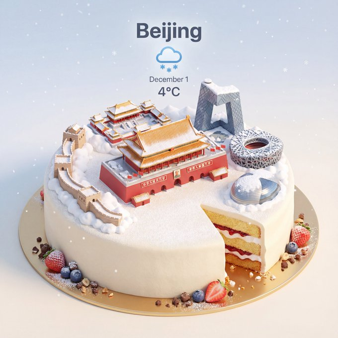
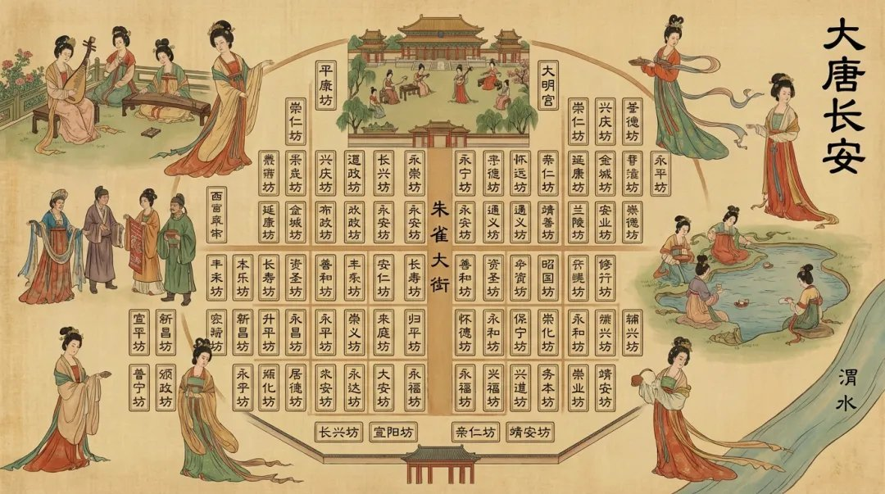

# cartoon

总计：224

## { "design_system": { "metadata": { "style_name": "Cozy S

- ID: gpt4o-1045-en-1
- Slug: prompt-1045-en-1
- 语言: en
- 来源: [来源链接](https://x.com/miilesus/status/2007169297655730610)
- 样例图路径: images/part3/1045.jpeg

### 提示词

```text
{
  "design_system": {
    "metadata": {
      "style_name": "Cozy Storybook Illustration",
      "target_audience": "Children / Family",
      "reference_source": "Uploaded Image",
      "version": "3.0"
    },
    "visual_parameters": {
      "medium": {
        "primary": "Colored Pencil",
        "secondary": "Watercolor Wash (Variation only)",
        "application": "Hand-drawn",
        "texture": {
          "type": "Visible pencil strokes",
          "quality": "Slightly rough outlines",
          "finish": "Non-realistic / No photo texture"
        }
      },
      "line_work": {
        "style": "Clean line art",
        "weight": "Slightly rough/organic",
        "clarity": "High"
      },
      "color_theory": {
        "base_tone": "Warm and friendly",
        "palette_type": "Vibrant Pastel",
        "adjustments": {
          "brightness": "Increased / High-key",
          "saturation": "Enhanced but natural",
          "contrast": "Soft"
        }
      },
      "lighting_and_shading": {
        "shadows": "Minimal",
        "highlights": "Soft",
        "rendering": "Flat yet detailed",
        "gradients": "Subtle watercolor layers (Variation only)"
      }
    },
    "subject_geometry": {
      "anatomy": {
        "proportions": "Semi-cartoon realistic",
        "scale": "Storybook style"
      },
      "facial_features": {
        "eyes": "Dot style",
        "mouth": "Small smile",
        "complexity": "Simple / Minimalist"
      }
    },
    "atmosphere": {
      "mood": [
        "Cozy",
        "Cheerful",
        "Warm",
        "Friendly"
      ],
      "genre_tags": [
        "Children's Book",
        "Lifestyle Sketch",
        "Storybook Illustration"
      ]
    }
  },
  "generation_configs": {
    "negative_prompt_tokens": [
      "realism",
      "photorealistic",
      "photo texture",
      "dark colors",
      "complex shading",
      "3d render"
    ],
    "prompt_variations": [
      {
        "id": "PROMPT_001",
        "variant_name": "Textured Colored Pencil",
        "focus": "Texture and Stroke",
        "full_text": "Illustration style: hand-drawn colored pencil illustration, clean line art with slightly rough pencil outlines, soft pastel coloring with increased brightness, lighter and more vivid color tones, enhanced saturation while staying natural, visible pencil strokes and gentle shading texture, warm and friendly tone, semi-cartoon realistic proportions, simple facial features with dot eyes and small smiles, flat yet detailed coloring, minimal shadows, soft highlights, storybook illustration feel, cozy and cheerful atmosphere, vibrant yet soft color palette, children-book / lifestyle sketch style, high clarity, no realism, no photo texture"
      },
      {
        "id": "PROMPT_002",
        "variant_name": "Mixed Media Watercolor",
        "focus": "Wash and Gradient",
        "full_text": "Hand-drawn colored pencil illustration with clean line art and slightly rough pencil outlines, combined with soft watercolor wash textures. Bright pastel colors, lighter and more vivid tones with natural saturation. Visible pencil strokes layered with subtle watercolor gradients. Warm and friendly tone, semi-cartoon realistic proportions. Simple facial features with dot eyes and small smiles. Flat yet detailed coloring, minimal shadows, soft highlights. Storybook illustration feel, cozy and cheerful atmosphere, children-book style, high clarity, no realism, no photo texture."
      }
    ]
  }
}
```

### 样例图


## 杂志配有儿童绘画作品

- ID: gpt4o-1045-zh-2
- Slug: prompt-1045-zh-2
- 语言: zh
- 来源: [来源链接](https://x.com/miilesus/status/2007169297655730610)
- 样例图路径: images/part3/1045.jpeg

### 提示词

```text
{
"design_system": {
"元数据": {
"style_name": "温馨故事书插画",
"target_audience": "儿童/家庭",
"reference_source": "上传的图片",
版本：3.0
},
"visual_parameters": {
“中等的”： {
“primary”： “彩色铅笔”
“次要的”: “水彩晕染（仅限变体）”
“应用”：“手绘”，
“质地”： {
“类型”：“可见的铅笔笔触”，
“质量”：“轮廓略显粗糙”，
“完成”: “非写实/无照片纹理”
}
},
"line_work": {
风格：简洁的线条艺术，
“重量”：“略粗糙/有机”，
清晰度：高
},
"color_theory": {
"base_tone": "温暖友好",
"palette_type": "鲜艳的粉彩",
“调整”：{
“亮度”: “增强/高调”
“饱和度”：“增强但自然”，
“对比度”： “柔和”
}
},
"lighting_and_shading": {
“阴影”：“极简主义”，
“亮点”：“柔和”，
“渲染”：“平面但细节丰富”，
“渐变”：“微妙的水彩图层（仅限变体）”
}
},
"subject_geometry": {
"解剖学": {
“比例”：“半卡通写实”
“规模”: “故事书风格”
},
"facial_features": {
“眼睛”：“点状风格”，
“嘴”: “微微一笑”
“复杂性”： “简单/极简主义”
}
},
“气氛”： {
“情绪”： [
“舒适”，
“快乐”，
“温暖的”，
“友好的”
],
"genre_tags": [
《儿童读物》
“生活方式素描”，
“故事书插图”
]
}
},
"generation_configs": {
"negative_prompt_tokens": [
“现实主义”，
“照片级真实感”，
“照片纹理”，
“暗色”，
“复杂阴影”，
“3D渲染”
],
"prompt_variations": [
{
"id": "PROMPT_001",
"variant_name": "纹理彩色铅笔",
“焦点”：“纹理和笔触”，
"full_text": "插画风格：手绘彩色铅笔插画，线条简洁，铅笔轮廓略显粗糙，柔和的粉彩色调，亮度增强，色彩更明亮鲜艳，饱和度提高，同时保持自然，铅笔笔触清晰可见，阴影纹理柔和，色调温暖友好，半卡通写实比例，面部特征简洁，眼睛为点状，面带微笑，色彩平涂但细节丰富，阴影极少，高光柔和，具有绘本插画风格，温馨欢快的氛围，色彩鲜艳而柔和，儿童绘本/生活素描风格，清晰度高，不追求写实，无照片纹理"
},
{
"id": "PROMPT_002",
"variant_name": "混合媒介水彩",
“焦点”：“水洗和渐变”，
"full_text": "手绘彩色铅笔插画，线条干净利落，铅笔轮廓略显粗糙，并结合柔和的水彩晕染纹理。明亮的粉彩色调，色调更浅更鲜艳，饱和度自然。铅笔笔触清晰可见，并叠加了微妙的水彩渐变。整体色调温暖友好，半卡通式的写实比例。面部特征简洁，眼睛是点状的，带着淡淡的微笑。色彩运用平涂却不失细节，阴影极少，高光柔和。具有童话插画的感觉，营造出温馨欢快的氛围，儿童绘本风格，清晰度高，不追求写实，没有照片质感。"
}
]
}
}
```

### 样例图


## A refined fashion editorial image with a 3:2 aspect rati

- ID: gpt4o-1039-en-1
- Slug: prompt-1039-en-1
- 语言: en
- 来源: [来源链接](https://x.com/craftian_keskin/status/2007156041851490337)
- 样例图路径: images/part3/1039.jpeg

### 提示词

```text
A refined fashion editorial image with a 3:2 aspect ratio, split into two clear sections.

Right side:
A fashionable, confident, sensual woman standing and walking casually in a modern architectural space with warm wooden walls and soft natural light. She wears a top with a deep V neckline, has a small mole on her chest, a 90-60-90 figure, tucked into a high-waisted white tailored short skirt, On her feet are sleek black stiletto heels, elegant and minimal. She carries a small structured black handbag in one hand.

Her hair is slicked back into a clean low bun, emphasizing her facial structure. She wears narrow black sunglasses and subtle statement earrings. The look is refined, modern, and effortlessly chic. Natural daylight, soft shadows, realistic skin texture. Casual fashion photography style with an editorial, high-end feel. Neutral color palette, warm tones, shallow depth of field, cinematic realism.

Style & Mood:
Modern elegance, quiet luxury, confident, minimal, editorial casual.

Photography Details:
Eye-level angle, candid stance, 35mm lens, natural lighting, high detail, photorealistic.

Left side:
A clean, minimalist product breakdown layout on a neutral background. The individual fashion items worn by the woman are displayed separately, neatly arranged with subtle shadows. Each item includes a small, elegant price label in refined sans-serif typography:

– Beige deep V-neck knit top — $180
– White high-waisted tailored mini skirt — $220
– Black pointed-toe stiletto heels — $350
– Small structured black handbag — $480
– Black narrow sunglasses — $160

The left side feels like a luxury fashion catalog or e-commerce lookbook, with clear spacing, premium presentation, and visual balance.

Overall Style & Mood:
Quiet luxury, modern elegance, editorial fashion, high-end retail aesthetic.

Lighting & Quality:
Soft natural light, studio-clean clarity on product side, photorealistic, ultra-high resolution, professional fashion photography.

Negative Prompt:
Cluttered layout, oversized text, flashy logos, mannequins, people on left side, harsh lighting, low resolution, cartoon style.
```

### 样例图


## 一张精致的时尚大片

- ID: gpt4o-1039-zh-2
- Slug: prompt-1039-zh-2
- 语言: zh
- 来源: [来源链接](https://x.com/craftian_keskin/status/2007156041851490337)
- 样例图路径: images/part3/1039.jpeg

### 提示词

```text
一张精致的时尚大片，宽高比为 3:2，清晰地分为两个部分。

右侧：
一位时尚、自信、充满魅力的女士，在现代建筑风格的空间中随意地站立或行走，温暖的木质墙壁和柔和的自然光线营造出舒适的氛围。她身着一件深V领上衣，胸前有一颗小痣，身材比例完美，下身搭配一条高腰白色修身短裙。脚上是一双优雅简约的黑色细高跟鞋。她手提一只小巧精致的黑色手提包。

她的头发利落地梳成一个低髻，凸显了她精致的脸型。她戴着黑色窄框太阳镜和简约的耳环，整体造型优雅、现代，又不失随性时尚感。自然的光线、柔和的阴影、真实的肌肤纹理，营造出一种休闲时尚摄影的质感，同时又不失高端大片的氛围。中性色调、暖色调、浅景深，以及电影般的真实感，共同成就了这组照片。

风格与氛围：
现代优雅，低调奢华，自信，简约，时尚休闲。

摄影细节：
平视角度，自然姿态，35mm镜头，自然光，高细节，照片级真实感。

左侧：
简洁的极简主义产品展示布局，背景中性。女士身上穿着的每件时尚单品都单独展示，整齐排列，并辅以柔和的阴影效果。每件单品都配有小巧精致的价格标签，采用优雅的无衬线字体。

米色深V领针织上衣——180美元
白色高腰修身迷你裙——220美元
黑色尖头细高跟鞋——350美元
- 小号黑色硬挺手提包 — 480 美元
黑色窄框太阳镜——160美元

左侧的设计风格类似于奢侈时尚产品目录或电商产品图册，布局清晰，呈现方式高端大气，视觉效果平衡。

整体风格与氛围：
低调奢华，现代优雅，时尚杂志风格，高端零售美学。

照明和质量：
柔和的自然光，产品面清晰如影楼，照片真实感强，超高分辨率，专业时尚摄影。

否定提示：
布局杂乱，文字过大，标志花哨，模特，左侧有人，光线刺眼，分辨率低，卡通风格。
```

### 样例图


## { "design_system": { "metadata": { "style_name": "Cozy S

- ID: gpt4o-1030-en-1
- Slug: prompt-1030-en-1
- 语言: en
- 来源: [来源链接](https://x.com/YaseenK7212/status/2006746690255040979)
- 样例图路径: images/part3/1030.jpeg

### 提示词

```text
{
  "design_system": {
    "metadata": {
      "style_name": "Cozy Storybook Illustration",
      "target_audience": "Children / Family",
      "reference_source": "Uploaded Image",
      "version": "3.0"
    },
    "visual_parameters": {
      "medium": {
        "primary": "Colored Pencil",
        "secondary": "Watercolor Wash (Variation only)",
        "application": "Hand-drawn",
        "texture": {
          "type": "Visible pencil strokes",
          "quality": "Slightly rough outlines",
          "finish": "Non-realistic / No photo texture"
        }
      },
      "line_work": {
        "style": "Clean line art",
        "weight": "Slightly rough/organic",
        "clarity": "High"
      },
      "color_theory": {
        "base_tone": "Warm and friendly",
        "palette_type": "Vibrant Pastel",
        "adjustments": {
          "brightness": "Increased / High-key",
          "saturation": "Enhanced but natural",
          "contrast": "Soft"
        }
      },
      "lighting_and_shading": {
        "shadows": "Minimal",
        "highlights": "Soft",
        "rendering": "Flat yet detailed",
        "gradients": "Subtle watercolor layers (Variation only)"
      }
    },
    "subject_geometry": {
      "anatomy": {
        "proportions": "Semi-cartoon realistic",
        "scale": "Storybook style"
      },
      "facial_features": {
        "eyes": "Dot style",
        "mouth": "Small smile",
        "complexity": "Simple / Minimalist"
      }
    },
    "atmosphere": {
      "mood": [
        "Cozy",
        "Cheerful",
        "Warm",
        "Friendly"
      ],
      "genre_tags": [
        "Children's Book",
        "Lifestyle Sketch",
        "Storybook Illustration"
      ]
    }
  },
  "generation_configs": {
    "negative_prompt_tokens": [
      "realism",
      "photorealistic",
      "photo texture",
      "dark colors",
      "complex shading",
      "3d render"
    ],
    "prompt_variations": [
      {
        "id": "PROMPT_001",
        "variant_name": "Textured Colored Pencil",
        "focus": "Texture and Stroke",
        "full_text": "Illustration style: hand-drawn colored pencil illustration, clean line art with slightly rough pencil outlines, soft pastel coloring with increased brightness, lighter and more vivid color tones, enhanced saturation while staying natural, visible pencil strokes and gentle shading texture, warm and friendly tone, semi-cartoon realistic proportions, simple facial features with dot eyes and small smiles, flat yet detailed coloring, minimal shadows, soft highlights, storybook illustration feel, cozy and cheerful atmosphere, vibrant yet soft color palette, children-book / lifestyle sketch style, high clarity, no realism, no photo texture"
      },
      {
        "id": "PROMPT_002",
        "variant_name": "Mixed Media Watercolor",
        "focus": "Wash and Gradient",
        "full_text": "Hand-drawn colored pencil illustration with clean line art and slightly rough pencil outlines, combined with soft watercolor wash textures. Bright pastel colors, lighter and more vivid tones with natural saturation. Visible pencil strokes layered with subtle watercolor gradients. Warm and friendly tone, semi-cartoon realistic proportions. Simple facial features with dot eyes and small smiles. Flat yet detailed coloring, minimal shadows, soft highlights. Storybook illustration feel, cozy and cheerful atmosphere, children-book style, high clarity, no realism, no photo texture."
      }
    ]
  }
}
```

### 样例图


## 彩色铅笔插图

- ID: gpt4o-1030-zh-2
- Slug: prompt-1030-zh-2
- 语言: zh
- 来源: [来源链接](https://x.com/YaseenK7212/status/2006746690255040979)
- 样例图路径: images/part3/1030.jpeg

### 提示词

```text
{
"design_system": {
"元数据": {
"style_name": "温馨故事书插画",
"target_audience": "儿童/家庭",
"reference_source": "上传的图片",
版本：3.0
},
"visual_parameters": {
“中等的”： {
“primary”： “彩色铅笔”
“次要的”: “水彩晕染（仅限变体）”
“应用”：“手绘”，
“质地”： {
“类型”：“可见的铅笔笔触”，
“质量”：“轮廓略显粗糙”，
“完成”: “非写实/无照片纹理”
}
},
"line_work": {
风格：简洁的线条艺术，
“重量”：“略粗糙/有机”，
清晰度：高
},
"color_theory": {
"base_tone": "温暖友好",
"palette_type": "鲜艳的粉彩",
“调整”：{
“亮度”: “增强/高调”
“饱和度”：“增强但自然”，
“对比”: “柔和”
}
},
"lighting_and_shading": {
“阴影”：“极简主义”，
“亮点”：“柔和”，
“渲染”：“平面但细节丰富”，
“渐变”：“微妙的水彩图层（仅限变体）”
}
},
"subject_geometry": {
"解剖学": {
“比例”：“半卡通写实”
“规模”: “故事书风格”
},
"facial_features": {
“眼睛”：“点状风格”，
“嘴”: “微微一笑”
“复杂性”： “简单/极简主义”
}
},
“气氛”： {
“情绪”： [
“舒适”，
“快乐”，
“温暖的”，
“友好的”
],
"genre_tags": [
《儿童读物》
“生活方式素描”，
“故事书插图”
]
}
},
"generation_configs": {
"negative_prompt_tokens": [
“现实主义”，
“照片级真实感”，
“照片纹理”，
“暗色”，
“复杂阴影”，
“3D渲染”
],
"prompt_variations": [
{
"id": "PROMPT_001",
"variant_name": "纹理彩色铅笔",
“焦点”：“纹理和笔触”，
"full_text": "插画风格：手绘彩色铅笔插画，线条简洁，铅笔轮廓略显粗糙，柔和的粉彩色调，亮度增强，色彩更明亮鲜艳，饱和度提高，同时保持自然，铅笔笔触清晰可见，阴影纹理柔和，色调温暖友好，半卡通写实比例，面部特征简洁，眼睛为点状，面带微笑，色彩平涂但细节丰富，阴影极少，高光柔和，具有绘本插画风格，温馨欢快的氛围，色彩鲜艳而柔和，儿童绘本/生活素描风格，清晰度高，不追求写实，无照片纹理"
},
{
"id": "PROMPT_002",
"variant_name": "混合媒介水彩",
“焦点”：“水洗和渐变”，
"full_text": "手绘彩色铅笔插画，线条干净利落，铅笔轮廓略显粗糙，并结合柔和的水彩晕染纹理。明亮的粉彩色调，色调更浅更鲜艳，饱和度自然。铅笔笔触清晰可见，并叠加了微妙的水彩渐变。整体色调温暖友好，半卡通式的写实比例。面部特征简洁，眼睛是点状的，带着淡淡的微笑。色彩运用平涂却不失细节，阴影极少，高光柔和。具有童话插画的感觉，营造出温馨欢快的氛围，儿童绘本风格，清晰度高，不追求写实，没有照片质感。"
}
]
}
}
```

### 样例图


## { "language": "en", "task": "image_edit", "consistency_i

- ID: gpt4o-1027-en-1
- Slug: prompt-1027-en-1
- 语言: en
- 来源: [来源链接](https://x.com/hellokaton/status/2003484504347079156)
- 样例图路径: images/part3/1027.jpeg

### 提示词

```text
{
    "language": "en",
    "task": "image_edit",
    "consistency_id": "user_subject_sassy_santa",
    "input_images": [
        {
            "image": "{{USER_REFERENCE_IMAGE}}",
            "use_as": "subject_identity",
            "priority": "high"
        }
    ],
    "prompt": "Create a full-body vertical 3:4 festive poster. Use the person from the uploaded reference image as the ONLY human subject (could be male or female). Preserve identity strongly: same face structure, hairstyle, skin tone, and overall likeness. Preserve the subject’s gender presentation from the reference; do not gender-swap.\n\nPOSE (LOCK THIS): a grounded swagger power-stance with BOTH FEET ON THE FLOOR (no raised leg). Wide stance, feet apart. Weight mostly on the back leg. The front foot is planted closer to the camera to create forced-perspective enlargement of the sneaker, but the sole stays fully on the ground. Knees slightly bent. Hips subtly cocked. Upper body slightly leaned back with shoulders rolled back and chest subtly forward.\n\nARMS & FACE (LOCK THIS): arms firmly and tightly crossed over the chest (no hands-on-hips). Chin slightly raised. Slight head tilt. A smug, confident, sassy expression (subtle smirk / “too cool” attitude).\n\nWARDROBE: rich red velvet Santa suit with clean white fur trim, Santa hat, white gloves, stylish black sunglasses. Keep modern clean white sneakers.\n\nSCENE: seamless bright red studio backdrop with a soft spotlight gradient behind the subject. Metallic silver confetti floating throughout the scene.\n\nREINDEER: place one realistic reindeer on the subject’s right side (camera-right), full body visible, antlers prominent, facing the camera with a cute/curious look. The reindeer wears a cozy red-and-green knitted scarf.\n\nLIGHTING & CAMERA: crisp commercial studio lighting, high detail textures (velvet, fur trim, knit scarf, reindeer fur). Low-angle wide lens look (about 20–28mm), camera near knee height, slight upward tilt. Sharp focus on subject and reindeer, mild depth of field for a premium poster feel. Photorealistic, clean, no text.",
    "style_parameters": {
        "render_style": "photorealistic",
        "mood": "festive, playful, swagger, comedic",
        "camera_look": "low-angle wide lens, forced perspective"
    },
    "composition": {
        "shot_type": "full_body",
        "camera_angle": "low_angle",
        "subject_position": "center_left",
        "secondary_subject_position": "right",
        "background": "solid red seamless with subtle spotlight gradient",
        "foreground_elements": "silver confetti"
    },
    "technical_specifications": {
        "aspect_ratio": "3:4",
        "resolution": "4k",
        "detail_level": "high",
        "sharpness": "high"
    },
    "negative_prompt": "raised leg, knee up, kicking, stepping forward mid-air, walking pose, running pose, sitting, crouching, hands on hips, hands in pockets, text, watermark, logo, brand mark, extra people, duplicate face, face distortion, different identity, gender swap, body-type change, extra limbs, extra fingers, bad hands, deformed feet, melted sunglasses, blurry subject, low resolution, cartoon, anime, painterly look, harsh artifacts",
    "output_settings": {
        "format": "jpg",
        "quality": "high"
    }
}
```

### 样例图


## 竖版全身节日海报

- ID: gpt4o-1027-zh-2
- Slug: prompt-1027-zh-2
- 语言: zh
- 来源: [来源链接](https://x.com/hellokaton/status/2003484504347079156)
- 样例图路径: images/part3/1027.jpeg

### 提示词

```text
{
"language": "en",
"任务": "图像编辑",
"consistency_id": "user_subject_sassy_santa",
"input_images": [
{
"image": " {{ USER_REFERENCE_IMAGE }} ",
"use_as": "subject_identity",
“优先级”： “高”
}
],
“提示”：创作一张3:4比例的竖版全身节日海报。使用上传的参考图片中的人物作为唯一的人体主体（可以是男性或女性）。务必保持人物特征：相同的面部结构、发型、肤色和整体相似度。保持参考图片中人物的性别特征；不要改变性别。\n\n姿势（锁定此项）：双脚着地，双脚分开站立，保持稳健自信的站姿（不要抬腿）。双脚分开站立，重心主要在后腿上。前脚靠近镜头，利用透视效果放大运动鞋，但鞋底始终与地面接触。膝盖微屈。臀部略微前倾。上身略微后倾，双肩向后舒展，胸部略微前挺。\n\n手臂和面部（锁定此项）：双臂紧紧交叉于胸前（不要双手叉腰）。下巴略微抬起。头部略微前倾。倾斜。一种沾沾自喜、自信、傲娇的表情（略带一丝微笑/“酷毙了”的态度） .\ \n服装：深红色天鹅绒圣诞老人套装，配以干净的白色毛皮饰边、圣诞帽、白色手套和时尚的黑色太阳镜。搭配现代的干净白色运动鞋。\n\n场景：无缝亮红色影棚背景，主体后方有柔和的渐变聚光灯。银色金属彩纸屑在场景中飘落。\n\n驯鹿：将一只逼真的驯鹿放在主体的右侧（相机右侧），全身可见，鹿角突出，面向镜头，眼神可爱/好奇。驯鹿戴着一条舒适的红绿相间针织围巾。\n\n灯光和相机：清晰的商业影棚灯光，高细节纹理（天鹅绒、毛皮饰边、针织围巾、驯鹿毛皮）。低角度广角镜头（约20-28mm），相机高度接近膝盖，略微向上倾斜。主体清晰对焦驯鹿，适中的景深营造出高级海报的感觉。照片级写实，画面干净，无文字。
"style_parameters": {
"render_style": "照片写实风格",
“情绪”：“喜庆的、俏皮的、自信的、喜剧的”，
"camera_look": "低角度广角镜头，强制透视"
},
“作品”： {
"shot_type": "全身",
"camera_angle": "低角度",
"subject_position": "center_left",
"secondary_subject_position": "右",
“背景”: “纯红色无缝，带有微妙的聚光灯渐变”
"前景元素": "银色彩带"
},
"technical_specifications": {
"aspect_ratio": "3:4",
分辨率：4K，
"detail_level": "高",
“清晰度”： “高”
},
"negative_prompt": "抬腿、抬膝、踢腿、空中向前迈步、行走姿势、跑步姿势、坐姿、蹲姿、双手叉腰、双手插兜、文字、水印、标志、品牌标识、额外人物、重复面孔、面部扭曲、不同身份、性别互换、体型改变、额外肢体、额外手指、残疾的手、畸形的脚、融化的太阳镜、模糊主体、低分辨率、卡通、动漫、油画风格、粗糙的瑕疵",
"output_settings": {
"格式": "jpg",
“质量”： “高”
}
}
```

### 样例图


## 3D表情包

- ID: gpt4o-1016-zh
- Slug: prompt-1016-zh
- 语言: zh
- 来源: [来源链接](https://x.com/sundyme/status/2004425000586232256)
- 样例图路径: images/part3/1016.jpeg

### 提示词

```text
Create a high-quality 3D rendered anthropomorphic mascot character in a cute cartoon style inspired by Kakao Friends/LINE Friends. A cute [角色类型] character in [场景描述], [动作描述], [表情描述], detailed 3D rendering with smooth textures, soft lighting, vibrant colors, kawaii aesthetic, large head and small body proportions, clean white background with subtle shadows.

Add Chinese text overlay: \"[文案]\" in a cute, playful font style that matches the 3D character design - bold, rounded, colorful letters with a kawaii aesthetic.

1:1 aspect ratio, high quality 3D rendering, photorealistic textures with cartoon stylization.  使用这个模板生成一组4个表情包
```

### 样例图


## 中国水墨画风格邮票

- ID: gpt4o-1015-zh-1
- Slug: prompt-1015-zh-1
- 语言: zh
- 来源: [来源链接](https://x.com/servasyy_ai/status/2004805605937254631)
- 样例图路径: images/part3/1015.jpeg

### 提示词

```text
{
  "style": "Chinese postage stamp design, Neo-Chinese ink wash painting shuimo style, official commemorative stamp series format",
  "composition": "A vertical sheet of four connected postage stamps arranged top to bottom: spring - summer - autumn - winter. Each stamp has perforated edges and independent design while maintaining cohesive series aesthetic",
  "overall_mood": "tranquil serene zen-like dreamy ethereal mood with gentle seasonal feeling, elegant postage stamp refinement, ample negative white space, soft natural transitions between stamps with subtle ink gradients",
  "artistic_quality": "highly artistic masterpiece quality stamp design, subtle ink gradients, official commemorative series standard",
  "stamp_format": {
    "border": "each stamp has classic perforated edges (齿孔边缘) all around",
    "margins": "clean white margins surrounding the entire stamp sheet",
    "denomination": "¥1.20 face value printed on each stamp",
    "issuer": "中国邮政 CHINA POST text at bottom of each stamp",
    "series_info": "四季长卷系列 Four Seasons Series at sheet bottom",
    "issue_year": "2025"
  },
  "sections": [
    {
      "season": "spring",
      "stamp_label": "春 Spring",
      "foliage": "dense soft pink cherry blossoms and tender light green willow leaves with clear rhythmic textures and veins",
      "edges": "leaf/petal edges gradually blur and fade creating soft depth layering and ethereal misty atmosphere",
      "figure": "tiny young lady in pale pink flowing hanfu walking beside a white deer",
      "rendering": "figures and animal simply outlined with minimal delicate ink lines, no unnecessary details",
      "color": "fresh elegant pale pink and light green color scheme dominant",
      "poem": "short elegant ancient Chinese poem inscription (4-7 characters or brief couplet) in delicate calligraphy matching spring theme placed tastefully within stamp",
      "seal": "poetic small vermilion red seal stamp (zhuwen red seal) with elegant ancient Chinese poetic phrase in corner",
      "stamp_text": "denomination ¥1.20, 中国邮政 CHINA POST at bottom, 春 Spring label"
    },
    {
      "season": "summer",
      "stamp_label": "夏 Summer",
      "foliage": "dense pale cyan and light green lotus leaves and pads with clear rhythmic textures and veins",
      "edges": "leaf edges gradually blur and fade creating soft depth layering and ethereal misty atmosphere",
      "figure": "tiny monk in simple gray long robe walking beside a black donkey",
      "rendering": "figures and animal simply outlined with minimal delicate ink lines, no unnecessary details",
      "color": "fresh elegant pale cyan and light green color scheme dominant",
      "poem": "short elegant ancient Chinese poem inscription (4-7 characters or brief couplet) in delicate calligraphy matching summer theme placed tastefully within stamp",
      "seal": "poetic small vermilion red seal stamp (zhuwen red seal) with elegant ancient Chinese poetic phrase in corner",
      "stamp_text": "denomination ¥1.20, 中国邮政 CHINA POST at bottom, 夏 Summer label"
    },
    {
      "season": "autumn",
      "stamp_label": "秋 Autumn",
      "foliage": "dense warm orange-red and amber maple leaves with clear rhythmic textures and veins",
      "edges": "leaf edges gradually blur and fade creating soft depth layering and ethereal misty atmosphere",
      "figure": "tiny scholar in flowing indigo hanfu robe riding a white horse",
      "rendering": "figures and animal simply outlined with minimal delicate ink lines, no unnecessary details",
      "color": "elegant warm pale orange and soft gold color scheme dominant",
      "poem": "short elegant ancient Chinese poem inscription (4-7 characters or brief couplet) in delicate calligraphy matching autumn theme placed tastefully within stamp",
      "seal": "poetic small vermilion red seal stamp (zhuwen red seal) with elegant ancient Chinese poetic phrase in corner",
      "stamp_text": "denomination ¥1.20, 中国邮政 CHINA POST at bottom, 秋 Autumn label"
    },
    {
      "season": "winter",
      "stamp_label": "冬 Winter",
      "foliage": "dense pale gray-white plum blossoms branches and sparse dark green pine needles lightly dusted with snow, clear rhythmic textures",
      "edges": "edges gradually blur and fade creating soft depth layering and ethereal misty atmosphere",
      "figure": "tiny traveler in deep crimson cloak leading a white horse",
      "rendering": "figures and animal simply outlined with minimal delicate ink lines, no unnecessary details",
      "color": "cool elegant pale silver-gray and soft crimson color scheme dominant",
      "poem": "short elegant ancient Chinese poem inscription (4-7 characters or brief couplet) in delicate calligraphy matching winter theme placed tastefully within stamp",
      "seal": "poetic small vermilion red seal stamp (zhuwen red seal) with elegant ancient Chinese poetic phrase in corner",
      "stamp_text": "denomination ¥1.20, 中国邮政 CHINA POST at bottom, 冬 Winter label"
    }
  ],
  "global_elements": {
    "sheet_bottom": "series title '四季长卷系列 Four Seasons Series', issue year '2025'",
    "bottom_right": "small text '94vanAI'",
    "stamp_sheet_format": "four stamps connected vertically with perforated edges between each, clean white margins around entire sheet",
    "parameters": "--ar 3:4 --stylize 400 --v 6"
  },
  "negative_prompt": "photorealistic, 3d render, cartoon, chibi, overly detailed face, big figures, crowded composition, heavy saturated colors, harsh thick outlines, text artifacts, watermark, signature too large, modern elements, western style, oil painting, acrylic, thick brush strokes, low contrast, busy background, sharp focus, people dominant, realistic proportions, extra animals, colorful flowers, bright lighting, harsh shadows, no perforations, modern stamp design, photo stamps, digital art style, overlapping stamps, torn edges, damaged stamps, incorrect denomination, wrong issuer name, missing borders, frameless design"
}
```

### 样例图


## 中国水墨画风格邮票

- ID: gpt4o-1015-zh-2
- Slug: prompt-1015-zh-2
- 语言: zh
- 来源: [来源链接](https://x.com/servasyy_ai/status/2004805605937254631)
- 样例图路径: images/part3/1015.jpeg

### 提示词

```text
{
“风格”：“中国邮票设计，新中国水墨画风格，官方纪念邮票系列格式”
“组成”：“一张竖版邮票，由四枚相连的邮票组成，从上到下排列：春-夏-秋-冬。每枚邮票都有齿孔边缘和独立设计，同时保持系列的一致性美感。”
"overall_mood": "宁静祥和，如禅意般梦幻空灵，带有柔和的季节感，邮票般的精致优雅，留白充足，邮票之间过渡柔和自然，墨色渐变微妙。"
“artistic_quality”: “高度艺术化的杰作品质邮票设计，微妙的墨水渐变，官方纪念系列标准”
"stamp_format": {
“边框”：“每枚邮票四周都有经典的齿孔边缘”，
“边距”: “围绕整张邮票的干净白色边距”，
“面值”：“每枚邮票上印有¥1.20面值”，
"issuer": "中国邮政 CHINA POST 每张邮票底部文字",
"series_info": "四季长卷系列 四季系列位于表底部",
"issue_year": "2025"
},
“章节”：[
{
“季节”： “春季”，
"stamp_label": "春 Spring",
“叶子”：“浓密的柔粉色樱花和嫩绿的柳叶，具有清晰的纹理和脉络”，
“边缘”：“叶片/花瓣边缘逐渐模糊和消逝，营造出柔和的层次感和空灵朦胧的氛围”，
“人物”：“身着淡粉色飘逸汉服的娇小少女，行走在一头白鹿旁边”，
“渲染”：“人物和动物仅用最少的细墨线条勾勒轮廓，没有不必要的细节”，
“颜色”：“清新优雅的淡粉色和浅绿色为主色调”，
“诗句”：“简短优美的中国古代诗歌题词（4-7个字或简短对联），以精致的书法与春天的主题相呼应，巧妙地放置在邮票内。”
“印章”： “带有优美古代中国诗句的诗意小朱红色印章（竹文红印）”
"stamp_text": "面额 1.20 元，底部为中国邮政 CHINA POST，春标"
},
{
“季节”: “夏季”，
"stamp_label": "夏夏",
“叶子”：“浓密的淡青色和浅绿色荷叶和莲座，具有清晰的韵律纹理和叶脉”，
“边缘”：“叶片边缘逐渐模糊和消逝，营造出柔和的层次感和空灵朦胧的氛围”，
“人物”：“身穿简朴灰色长袍的小和尚走在一头黑驴旁边”，
“渲染”：“人物和动物仅用最少的细墨线条勾勒轮廓，没有不必要的细节”，
“颜色”：“以清新优雅的淡青色和浅绿色为主色调”，
“诗句”：“简短优美的中国古代诗歌题词（4-7个字或简短对联），以精致的书法与夏季主题相符，雅致地置于邮票内”，
“印章”： “带有优美古代中国诗句的诗意小朱红色印章（竹文红印）”
"stamp_text": "面额 1.20 元，底部为中国邮政 CHINA POST，夏季标签"
},
{
“季节”： “秋季”，
"stamp_label": "秋 Autumn",
“叶子”：“浓密的暖橙红色和琥珀色枫叶，具有清晰的韵律纹理和叶脉”，
“边缘”：“叶片边缘逐渐模糊和消逝，营造出柔和的层次感和空灵朦胧的氛围”，
“人物”：“身着飘逸靛蓝色汉服的小书生骑着一匹白马”，
“渲染”：“人物和动物仅用最少的细墨线条勾勒轮廓，没有不必要的细节”，
“颜色”：“优雅温暖的浅橙色和柔和的金色为主色调”，
“诗句”：“简短优美的中国古代诗歌题词（4-7个字或简短对联），以精致的书法与秋季主题相呼应，雅致地置于邮票内。”
“印章”： “带有优美古代中国诗句的诗意小朱红色印章（竹文红印）”
"stamp_text": "面额 1.20 元，底部为中国邮政 CHINA POST，秋标签"
},
{
“季节”: “冬季”
"stamp_label": "冬冬",
“树叶”：“浓密的浅灰白色梅花枝和稀疏的深绿色松针上轻轻覆盖着一层雪，清晰的韵律纹理”，
“边缘”：“边缘逐渐模糊和消逝，营造出柔和的层次感和空灵朦胧的氛围”，
“人物”：“身披深红色斗篷的小小旅人牵着一匹白马”，
“渲染”：“人物和动物仅用最少的细墨线条勾勒轮廓，没有不必要的细节”，
“颜色”：“以清冷优雅的浅银灰色和柔和的深红色为主色调”，
“诗句”：“简短优美的中国古代诗歌题词（4-7个字或简短对联），以精致的书法与冬季主题相契合，雅致地置于邮票内”，
“印章”： “带有优美古代中国诗句的诗意小朱红色印章（竹文红印）”
"stamp_text": "面额 1.20 元，底部为中国邮政 CHINA POST，冬日标签"
}
],
"global_elements": {
"sheet_bottom": "系列标题'四季长卷系列四季系列'，发行年份'2025'",
"bottom_right": "小字 '94vanAI'",
"stamp_sheet_format": "四枚邮票垂直连接，每枚邮票之间有穿孔边缘，整张邮票四周留有干净的白色边距",
"参数": "--ar 3:4 --stylize 400 --v 6"
},
"negative_prompt": "照片级写实、3D渲染、卡通、Q版、面部细节过多、人物过大、构图拥挤、色彩饱和度过高、轮廓线粗犷、文字瑕疵、水印、签名过大、现代元素、西式风格、油画、丙烯、笔触粗重、对比度低、背景杂乱、焦点清晰、人物占主导、比例写实、动物过多、色彩鲜艳的花朵、光线明亮、阴影生硬、无齿孔、现代邮票设计、照片邮票、数字艺术风格、邮票重叠、边缘撕裂、邮票破损、面值错误、发行人名称错误、缺少边框、无边框设计"
}
```

### 样例图


## { "subject": { "description": "A hyper-realistic optical

- ID: gpt4o-1005-en-1
- Slug: prompt-1005-en-1
- 语言: en
- 来源: [来源链接](https://x.com/hellokaton/status/2003381235331268757)
- 样例图路径: images/part3/1005.jpeg

### 提示词

```text
{
    "subject": {
        "description": "A hyper-realistic optical-illusion photograph. The woman from the uploaded reference portrait appears to be emerging from a freshly developed instant photo (Polaroid-style) lying on a small cafe table. In the instant photo frame, her full outfit is visible; in reality, her upper body and head rise out of the glossy print, casting a real shadow onto the table.",
        "reference_image_rules": {
            "use_uploaded_reference_portrait": true,
            "preserve_identity": true,
            "preserve_hairline_and_facial_structure": true,
            "no_face_morphing": true
        },
        "age": "20s",
        "expression": {
            "eyes": {
                "look": "Playful and confident",
                "direction": "Looking at the viewer"
            },
            "mouth": {
                "position": "Pouting or blowing a kiss",
                "energy": "Chic and charming"
            },
            "overall": "Lifelike, engaging interaction"
        },
        "hair": {
            "style": "Long, loose waves",
            "effect": "Realistic shine, slight wind movement"
        },
        "pose": {
            "position": "Upper torso emerging out of the instant photo, one hand slightly forward as if stepping into reality",
            "overall": "Energetic, spontaneous, full of life"
        },
        "clothing": {
            "top": "High-neck knit turtleneck, premium textile detail",
            "bottom": "Mini skirt and leather boots (boots visible clearly inside the instant photo)"
        }
    },
    "mirror_rules": "All handwritten annotations must be perfectly legible and NOT mirrored. Keep printed text on the instant photo frame readable.",
    "props": {
        "instant_photo": {
            "look": "Glossy Polaroid print with subtle fingerprint smudges and micro-scratches",
            "frame_text": "Small printed caption line at the bottom of the frame (readable, not mirrored)"
        },
        "annotations_on_print": [
            {
                "text": "leather boots",
                "style": "white handwritten marker",
                "arrow_to": "boots inside the print"
            },
            {
                "text": "clean turtleneck",
                "style": "white handwritten marker",
                "arrow_to": "top inside the print"
            },
            {
                "text": "mini skirt",
                "style": "white handwritten marker",
                "arrow_to": "skirt inside the print"
            }
        ]
    },
    "photography": {
        "camera_style": "DSLR photorealism, macro lens for print texture",
        "shot_type": "Forced-perspective composite realism",
        "angle": "Top-down 3/4 angle, close and intimate POV",
        "aspect_ratio": "3:4",
        "lighting": "Soft overcast daylight, natural shadows",
        "depth_of_field": "Shallow DOF, the instant photo and her face sharp, background cafe bokeh"
    },
    "background": {
        "setting": "Paris sidewalk cafe in autumn",
        "elements": [
            "small espresso cup",
            "fallen leaves",
            "stone pavement",
            "soft distant pedestrians bokeh"
        ]
    },
    "the_vibe": {
        "mood": "Fashion-forward, viral illusion",
        "story": "OOTD breakdown escaping the photo",
        "authenticity": "Photoreal texture, not CGI"
    },
    "constraints": {
        "must_keep": [
            "Use uploaded reference portrait identity",
            "Photorealistic skin texture",
            "Instant photo looks physically real",
            "Handwritten annotations readable",
            "Strong pop-out illusion with real shadows"
        ],
        "avoid": [
            "3D render style",
            "cartoon",
            "plastic skin",
            "blurred or mirrored text",
            "fake glossy CGI print"
        ]
    },
    "negative_prompt": [
        "3d",
        "render",
        "cgi",
        "cartoon",
        "anime",
        "plastic skin",
        "illegible text",
        "mirrored text",
        "oversharpened halos",
        "uncanny face"
    ]
}
```

### 样例图


## 女子仿佛从刚冲洗出来的照片中浮现出来

- ID: gpt4o-1005-zh-2
- Slug: prompt-1005-zh-2
- 语言: zh
- 来源: [来源链接](https://x.com/hellokaton/status/2003381235331268757)
- 样例图路径: images/part3/1005.jpeg

### 提示词

```text
{
“主题”： {
描述：一张超逼真的光学错觉照片。上传的参考肖像中的女子仿佛从一张刚冲洗出来的拍立得照片（宝丽来风格）中浮现出来，照片放在一张小咖啡桌上。在拍立得照片的相框中，她的全身衣着清晰可见；而实际上，她的上半身和头部从光亮的照片中浮现出来，在桌面上投下真实的阴影。
"reference_image_rules": {
"use_uploaded_reference_portrait": true,
"preserve_identity": true,
"preserve_hairline_and_facial_structure": true,
"no_face_morphing": true
},
年龄：20多岁，
“表达”： {
"眼睛": {
外表：活泼自信
“方向”：“看着观众”
},
“嘴”： {
“姿势”：“撅嘴或飞吻”，
“能量”：“时尚迷人”
},
“总体而言”：“栩栩如生、引人入胜的互动”
},
“头发”： {
风格：长长的、蓬松的波浪卷发，
“效果”：“逼真的光泽，轻微的风动”
},
"姿势": {
“姿势”：“上半身从即时照片中浮现出来，一只手微微向前伸出，仿佛正步入现实。”
总体评价：精力充沛、率真、充满活力
},
“衣服”： {
上衣：高领针织衫，优质面料细节
“下装”：“迷你裙和皮靴（照片中可以清晰地看到靴子）”
}
},
“mirror_rules”：所有手写注释必须清晰可辨，且不得镜像。请保持即时照片相框上的打印文字清晰可读。
"props": {
"instant_photo": {
“外观”：“光亮的宝丽来照片，带有细微的指纹污渍和微划痕”，
"frame_text": "位于画框底部的小型印刷标题行（可读，非镜像）"
},
"annotations_on_print": [
{
文本：皮靴，
“风格”: “白色手写马克笔”，
"arrow_to": "打印内部的启动"
},
{
文本：干净的高领毛衣，
“风格”: “白色手写马克笔”，
"arrow_to": "打印内容的顶部"
},
{
文本：迷你裙，
“风格”: “白色手写马克笔”，
"arrow_to": "裙边在印刷品内"
}
]
},
“摄影”： {
“camera_style”: “DSLR 真实感，用于打印纹理的微距镜头”
"shot_type": "强制透视合成真实感",
“角度”：“俯视 3/4 角度，近距离亲密视角”，
"aspect_ratio": "3:4",
“光线”：“柔和的阴天日光，自然的阴影”，
"depth_of_field": "浅景深，即时成像照片，她的脸部清晰，背景是咖啡馆散景"
},
“背景”： {
“场景”: “秋天的巴黎街边咖啡馆”
“元素”：[
“小杯浓缩咖啡”，
“落叶”，
“石板路”，
“柔和的远景行人散景”
]
},
"氛围": {
“氛围”：“时尚前卫，病毒式传播的错觉”，
“故事”：“OOTD 解析，摆脱照片的束缚”
“真实性”：“照片级纹理，而非 CGI”
},
"约束": {
"must_keep": [
“使用上传的参考肖像身份”，
“逼真的皮肤纹理”，
“即时照片看起来非常逼真”，
“手写批注清晰可辨”
“强烈的立体感，带有真实的阴影”
],
“避免”： [
“3D渲染风格”，
“卡通片”，
“塑料皮肤”，
“模糊或镜像文字”，
“仿光泽 CGI 印刷”
]
},
"negative_prompt": [
“3d，”
“使成为”，
“cgi”，
“卡通片”，
“日本动画片”，
“塑料皮肤”，
“无法辨认的文字”，
“镜像文本”，
“过度锐化的光晕”，
“怪异的脸”
]
}
```

### 样例图


## 3d cartoon of a happy [character] breaking down [type of

- ID: gpt4o-996-en-1
- Slug: prompt-996-en-1
- 语言: en
- 来源: [来源链接](https://x.com/CharaspowerAI/status/2004968032745951651)
- 样例图路径: images/part3/996.jpeg

### 提示词

```text
3d cartoon of a happy [character] breaking down [type of wall or object] with [hands / body / special ability], in the style of pixar. adorable [eye description], lovely colorful soft background, vibrant colors, very cute face, high detail, octane render, depth of field, cinematic lighting.
```

### 样例图

![3d cartoon of a happy [character] breaking down [type of](../images/part3/996.jpeg)

## 3D卡通形象击碎墙壁

- ID: gpt4o-996-zh-2
- Slug: prompt-996-zh-2
- 语言: zh
- 来源: [来源链接](https://x.com/CharaspowerAI/status/2004968032745951651)
- 样例图路径: images/part3/996.jpeg

### 提示词

```text
一个快乐的[角色]用[手/身体/特殊能力]击碎[某种类型的墙壁或物体]的3D卡通形象，风格类似皮克斯动画。可爱的[眼睛描述]，柔和多彩的背景，鲜艳的色彩，非常可爱的脸庞，高细节，渲染效果出色，景深效果，电影级光照。
```

### 样例图


## { "project_settings": { "task_type": "Single_Image_Conta

- ID: gpt4o-987-en-1
- Slug: prompt-987-en-1
- 语言: en
- 来源: [来源链接](https://x.com/msjiaozhu/status/2003819615282229720)
- 样例图路径: images/part3/987.jpeg

### 提示词

```text
{
"project_settings": {
"task_type": "Single_Image_Contact_Sheet (9-Grid)",
"aspect_ratio": "3:4",
"resolution_mode": "High / Upscale (Crucial for face details in grids)",
"batch_size": 1
},
"reference_config": {
"usage": "Upload Reference Image -> Set Strength to 0.5-0.7",
"purpose": "Define the 3x3 grid structure and character identity"
},
"prompt_payload": {
"structure_trigger": "A single contact sheet image containing a 3x3 photo grid matrix",
"grid_logic": "9 distinct panels separated by thin white borders",
"subject_consistency": "Same young asian woman in all 9 panels, identical outfit, identical hairstyle",
"expression_variation": "9 different facial expressions (winking, tongue out, surprised, laughing, serious, etc.)",
"camera_angles": "Varied angles in each panel (high angle, low angle, straight on)",
"visual_style": "Photorealistic, Studio lighting, Light grey background, K-pop idol photocard style"
},
"negative_prompt": [
"One single portrait",
"merged bodies",
"distorted grid lines",
"missing panels",
"cartoon",
"illustration",
"different clothes"
]
}
```

### 样例图


## 九宫格拼贴画

- ID: gpt4o-987-zh-2
- Slug: prompt-987-zh-2
- 语言: zh
- 来源: [来源链接](https://x.com/msjiaozhu/status/2003819615282229720)
- 样例图路径: images/part3/987.jpeg

### 提示词

```text
{
"project_settings": {
"task_type": "单图联系表（9格）",
"aspect_ratio": "3:4",
"resolution_mode": "高/放大（网格中面部细节至关重要）",
"batch_size": 1
},
"reference_config": {
"用法" "上传参考图像->设置强度为 0.5-0.7",
“目的”：“定义 3x3 网格结构和角色标识”
},
"prompt_payload": {
"structure_trigger": "包含 3x3 照片网格矩阵的单个联系表图像",
"grid_logic": "9 个不同的面板，由细白边框分隔",
“subject_consistency”: “所有9幅画中的都是同一位年轻的亚洲女性，穿着相同的衣服，发型也相同”
"expression_variation": "9 种不同的面部表情（眨眼、吐舌头、惊讶、大笑、严肃等）",
"camera_angles": "每个面板采用不同的角度（高角度、低角度、正面）",
"visual_style": "照片写实风格，影棚灯光，浅灰色背景，K-pop偶像小卡风格"
},
"negative_prompt": [
“一幅肖像”，
“合并体”，
“扭曲的网格线”，
“缺失面板”，
“卡通片”，
“插图”，
“不同的衣服”
]
}
```

### 样例图


## 角色拆解艺术海报

- ID: gpt4o-984-zh
- Slug: prompt-984-zh
- 语言: zh
- 来源: [来源链接](https://x.com/berryxia/status/2004088874684043595)
- 样例图路径: images/part3/984.jpeg

### 提示词

```text
核心指令 (Core Instruction)  任务：基于用户提供的参考图片，创作一张超高品质、电影级的3D皮克斯/迪士尼(Pixar/Disney)风格角色拆解艺术海报。将照片中的人物转换为风格化写实的3D动画角色，并将其个人物品以严谨的"Knolling"（整齐排列）艺术风格进行布局展示。  画面比例：16:9 横版 (可根据需求调整为 3:2, 4:5, 1:1) 艺术风格核心：皮克斯"风格化写实主义" (Stylized Realism) — 融合夸张的卡通比例与照片级真实材质光影。 质量标杆：对标《寻梦环游记(Coco)》、《青春变形记(Turning Red)》、《夏日友晴天(Luca)》的官方角色宣传海报。  📷 物品布局 (Item Layout) - Knolling放射式构图 总物品数：30-36件，围绕角色呈90度直角或放射状有序排列。  分类1：时尚穿搭 (Fashion Atelier) - 香槟金标签 - 主服装拆解：衣袖、衣领、布料裁片、内衬等全部分离悬浮。 - 鞋履拆解：鞋底、鞋面、鞋带、鞋跟等分离。 - 随身配饰：腰带、包袋、帽子、围巾等。 *示例：一件风衣可拆解为翻领、肩章、腰带、袖口束带、主衣身等部分。*  分类2：美妆个护 (Beauty Collection) - 玫瑰金标签 - 彩妆：口红（带膏体切面和色号标签）、眼影盘（每格颜色清晰）、粉饼、香水瓶（液体折射清晰可见）。 - 护肤：精华液瓶、面霜罐、美容仪器。 *示例：一瓶香水需展现玻璃瓶身的通透感、液体内部的光线折射以及瓶盖的金属质感。*  分类3：数码生活 (Modern Essentials) - 钢蓝色标签  - 电子设备：带手机壳的智能手机（屏幕需有内容）、无线耳机、智能手表、笔记本/平板电脑、相机。 - 材质要求：金属、玻璃（带折射）、塑料等材质需有正确的粗糙度和反射效果。 *示例：一部相机可拆解为镜头、机身、闪光灯、存储卡、肩带等。*  分类4：个人爱好 (Luxury & Hobbies) - 24K金标签  - 奢华配饰：珠宝首饰（项链、耳环、戒指等，宝石需有色散效果）、品牌包袋（展示内部分隔和五金件）。 - 兴趣爱好：画笔、调色盘、书籍、乐器、运动装备、咖啡用具等。 *示例：一个手办可拆解为头部、身体、四肢、武器、地台等组件。*  每件物品要求： - 渲染质量：与角色同等级别的3D渲染精度。 - 编号标签：带有01-36的圆形编号徽章。 - 材质与阴影：应用PBR材质，投射逼真的软阴影。   📷 爆炸视图技术 (Exploded View Technique)  - 连接线：使用优雅的虚线/实线将悬浮的服装部件连接到角色身上。 - 引导箭头：使用装饰性箭头将物品指向其文字标签。 - 技术注释：   - 材质样本：展示织物、皮革等材质的微距特写方块。   - 材质标签：如"100%真丝"、"意大利小牛皮"。   - 测量标尺：带有厘米(cm)/英寸(in)标记的标尺。  📷 角色拆解艺术 · THE ART OF DECONSTRUCTION 📷"   字体：中文用典雅的衬线体（如方正宋刻本秀楷），英文用Playfair Display，带金箔效果。 - 副标题 (Subtitle)：（主标题下方，飘逸手写体）   "角色本质·艺术拆解 / Character Essence Unveiled"   中英文混排，字体优雅。 - 分类标题 (Category Headers)：（带图标的圆角矩形标签）   "📷 美妆个护"** (玫瑰金)   "📷 数码生活"** (钢蓝色)   "📷 设计元素 (Design Elements)  - 几何框架：使用装饰艺术(Art Deco)风格的六边形/圆形细线框（0.5-1pt粗细）来组织物品群组。 - 测量标尺：沿画面左右边缘放置，营造技术美学感。 - 十字准星：在画面四角和关键焦点处添加。 - 材质样本：在底部展示一排面料/皮革/金属的微距特写方块。 - 信息卡片：带优雅边框的卡片，用于展示物品的详细信息。 - 雷达图：用装饰框包裹的角色属性雷达图，如：优雅★★★★★, 风格★★★★★, 智慧★★★★★。 - 连接线条：使用金色/银色的优雅虚线和装饰性箭头。  📷 背景与氛围 (Background & Atmosphere)  - 背景渐变：从白色到奶油色/香槟色的暖色调渐变，或从浅灰到白色的冷色调渐变。 - 图案叠加：叠加一层低透明度（5-10%）的装饰艺术几何网格或蓝图线条。 - 暗角效果 (Vignette)：轻柔的边缘变暗效果，将焦点引向中心。 - 氛围粒子：柔和的金色散景(Bokeh)光斑和微妙的胶片颗粒(Film Grain)，营造电影感。  📷 清晨6:00 → 📷 创作进行时 → 📷 色彩方案 (Color Palette) - 女性/时尚主题：香槟金(#D4AF37), 玫瑰金(), 奶油色(), 樱花粉()。 - 男性/科技主题**：钢蓝色(#4A90E2#4A4A4A#C0C0C0), 电光蓝(#00D9FF)。 - 正式/奢华主题：纯黑(#000000), 24K金(#FFD700), 深红色(#8B0000), 象牙白(#FFFFF0)。 - 情侣主题：男性一侧使用冷色调，女性一侧使用暖色调，形成对比。  📷 技术规格 (Technical Specifications) 渲染参数 (Rendering) - 引擎：路径追踪(Path Tracing)，等同于Cycles/Arnold/RenderMan级别。 - 采样数：最低4096 SPP (Samples Per Pixel)，确保画面纯净无噪点。 - 光线弹射：12次，以获得准确的全局光照。 - 焦散(Caustics)：开启，用于钻石和玻璃的真实光线折射效果。 - 模型面数：角色多边形数200万以上，确保曲面平滑。 - 毛发：每个角色超过10万根发丝，并经过物理模拟。  PBR材质流程 (Materials - PBR Workflow)  - 皮肤：三层SSS，双层高光。 - 毛发：各向异性着色器，主副双高光。 - 织物：微观编织法线贴图，准确的粗糙度变化。 - 金属*：金属度(Metalness) 1.0，粗糙度(Roughness) 0.1-0.4。 - 玻璃：折射率(IOR) 1.5，钻石IOR 2.42并带色散(Dispersion)。 - 皮革：粗糙度0.6-0.7，带颗粒感的凹凸贴图。  分辨率与输出 (Resolution & Output) - 分辨率：4K (3840×2160) 横版。 - 宽高比：16:9。 - 色深：32-bit浮点，为后期处理提供最大空间。 - 抗锯齿：16x MSAA，边缘锐利清晰。  📷 后期处理 (Post-Processing) - 色彩分级 (Color Grading)：   - 使用电影感LUT，提高暗部，避免纯黑（最低RGB 15,15,15）。   - 温和的S型曲线增强对比度。   - 根据主题调整色温（暖色+200K，冷色-200K）。   - 整体饱和度-5%，重点色彩（如金色）饱和度+10%。 - **特效 (Effects)**：   - **辉光(Bloom)**：为高光区域添加柔和光晕。   - **胶片颗粒(Film Grain)**：模拟柯达Portra 400胶片的有机质感。   - **色差(Chromatic Aberration)**：在边缘添加极细微的色散。   - **暗角(Vignette)**：中等强度的暗角。   - **锐化(Sharpening)**：输出时进行适度锐化。  📷 特殊指令 (Special Instructions)  - **单人角色**：总计约30件物品，聚焦于个人生活方式。 - **情侣角色**：总计约36件物品（每人18件），用爱心符号连接，并使用性别区分的色调。 - **孕妇角色**：包含孕期用品（如托腹油、维生素、B超照片），在腹部附近添加婴儿图标。 - **核心要点**：必须根据参考照片匹配角色的年龄、职业和风格。  📷 质量基准 (Quality Benchmark) 最终成品必须在视觉上无法与皮克斯/迪士尼官方的角色营销海报区分开来，达到博物馆级的照片级3D渲染水准，适用于： - 奢华产品目录 - 高端时尚杂志内页 - 专业艺术品印刷 - 个人摄影作品集 - 品牌营销活动
```

### 样例图


## { "request_id": "portrait_neon_urban_001", "configuratio

- ID: gpt4o-969-en-1
- Slug: prompt-969-en-1
- 语言: en
- 来源: [来源链接](https://x.com/Ankit_patel211/status/2003366639170113824)
- 样例图路径: images/part3/969.jpeg

### 提示词

```text
{
"request_id": "portrait_neon_urban_001",
"configuration": {
"model": "v6. 0_or_latest",
"output_settings": {
"dimensions": {
"width": 1080,
"height": 1920,
"aspect_ratio": "9:16",
"target_resolution": "64K DSLR"
}
}
},
"scene_composition": {
"subject": {
"entity": "Young woman",
"pose": "Standing confidently",
"action": "Extending index finger forward toward camera lens",
"interaction": "Dynamic gesture / POV interaction",
"wardrobe": {
"outerwear": "dark crimson red striped baseball-style shirt",
"undergarment": "Light inner shirt",
"bottoms": "Cargo pants",
"accessories": [
"Necklace",
"Crossbody bag"
]
}
},
"environment": {
"location": "Urban street",
"time_of_day": "Night",
"ambience": "Neon-lit",
"background_elements": [
"Colorful city lights",
"Blurred passersby"
]
},
"cinematography": {
"camera": {
"perspective": "Wide-angle",
"depth_of_field": "Soft bokeh",
"motion": "Slight motion blur"
},
"lighting": {
"style": "Cinematic",
"primary_sources": [cyber punk street lights", "City glow"]
},
"ui_overlay": {
"enabled": true,
"aesthetic": "Smartphone video recording",
"on_screen_elements": [
"REC 00:00:00",
"8K/60fps",
"Frame brackets",
"VIDEO indicator",
"CINEMATIC indicator"
]
}
}
},
"technical_rendering": {
"style": "Hyper-realistic",
"engines": [
"Octane Render",
"Unreal Engine 5"
]
},
"negative_prompt": {
"stylistic_exclusions": [
"cartoon",
"illustration",
"anime"
],
"quality_exclusions": [
"low quality",
"pixelated",
"blurry"
],
"anatomical_exclusions": [
"bad anatomy",
"deformed hands",
"extra fingers",
"missing limbs",
"bad proportions"
],
"branding_exclusions": [
"watermark (except for requested UI overlays)"
]
}
}
```

### 样例图


## 女子将食指向前伸出朝向相机镜头

- ID: gpt4o-969-zh-2
- Slug: prompt-969-zh-2
- 语言: zh
- 来源: [来源链接](https://x.com/Ankit_patel211/status/2003366639170113824)
- 样例图路径: images/part3/969.jpeg

### 提示词

```text
{
"request_id": "portrait_neon_urban_001",
“配置”： {
“模型”： "v6. 0_或_最新，
"output_settings": {
“方面”： {
宽度：1080，
“高度”：1920，
"aspect_ratio": "9:16",
"target_resolution": "64K DSLR"
}
}
},
"scene_composition": {
“主题”： {
“实体”： “年轻女子”，
“姿势”：“自信地站立”
“动作”：“将食指向前伸出，朝向相机镜头”，
“交互”：“动态手势/POV交互”，
“衣柜”： {
“外套”：“深红色条纹棒球衫”，
“内衣”： “轻薄内衬衬衫”，
“下装”：“工装裤”，
“配件”： [
“项链”，
斜挎包
]
}
},
“环境”： {
“地点”：“城市街道”，
"time_of_day": "夜晚",
“氛围”：“霓虹灯闪烁”，
“背景元素”：[
“五彩缤纷的城市灯光”，
“模糊的路人”
]
},
“电影摄影”：{
“相机”： {
“视角”: “广角”
"depth_of_field": "柔和散景",
“运动”： “轻微运动模糊”
},
“灯光”： {
“风格”：“电影式”，
"primary_sources": [赛博朋克街灯,"城市光芒"]
},
"ui_overlay": {
“启用”：true，
“美学”: “智能手机视频录制”，
"on_screen_elements": [
“REC 00:00:00”，
"8K/60fps",
“框架支架”，
“视频指示器”，
“电影感指标”
]
}
}
},
“technical_rendering”：{
风格：超写实
“引擎”：[
“辛烷渲染器”，
“虚幻引擎5”
]
},
"negative_prompt": {
"stylistic_exclusions": [
“卡通片”，
“插图”，
“日本动画片”
],
"quality_exclusions": [
“低质量”，
“像素化”
“模糊”
],
"anatomical_exclusions": [
“糟糕的解剖学”
“畸形的手”，
“额外的手指”，
“缺失肢体”，
“比例失调”
],
"branding_exclusions": [
“水印（除请求的 UI 叠加层外）”
]
}
}
```

### 样例图


## 圣诞特辑-圣诞小精灵

- ID: gpt4o-962-zh
- Slug: prompt-962-zh
- 语言: zh
- 来源: [来源链接](https://x.com/songguoxiansen/status/2003101132378591474)
- 样例图路径: images/part3/962.jpeg

### 提示词

```text
(杰作, 最高画质, 超细节, 8k分辨率). 一张照片般逼真的4格分屏拼图，所有画面为同一女性角色。[关键：保持精确的面部特征，保留原始脸部结构，整个拼图中角色完全一致]. 角色皮肤白皙，质感自然，眼神明亮。左上图：角色穿着绿色的圣诞精灵服装，戴着尖尖的精灵耳朵道具，对着镜头敬礼，表情顽皮。右上图：角色手里拿着一个巨大的玩具锤子，假装要敲打镜头，眼睛睁得圆圆的。左下图：角色正在包装礼物，嘴里咬着丝带的一端，眉头微皱显得很专注可爱。右下图：角色坐在礼物堆上，双手托腮，双脚悬空晃动，一脸满足。环境：色彩饱和的圣诞工坊背景，红绿撞色。灯光：明亮的影棚灯光，无阴影，卡通感强。风格：K-pop专辑内页风格，色彩鲜艳跳跃，清晰对焦，活泼搞怪。
```

### 样例图


## 圣诞特辑-圣诞活动邀请卡

- ID: gpt4o-961-zh
- Slug: prompt-961-zh
- 语言: zh
- 来源: [来源链接](https://x.com/songguoxiansen/status/2003099057737412852)
- 样例图路径: images/part3/961.jpeg

### 提示词

```text
设计欢乐圣诞活动邀请卡,卡通风格,彩色气球和礼物图案,顶部大字"圣诞狂欢party",中文"时间:12月25日晚7点"、"地点:上海皇家酒店",可爱圣诞老人招手,活泼有趣风格,宽高比：9:16。
```

### 样例图


## { "reference": "use uploaded image as facial reference, 

- ID: gpt4o-958-en-1
- Slug: prompt-958-en-1
- 语言: en
- 来源: [来源链接](https://x.com/r4jjesh/status/2002893222608331014)
- 样例图路径: images/part3/958.jpeg

### 提示词

```text
{
"reference": "use uploaded image as facial reference, preserve original face and identity exactly",
"character_type": "caricature-style keychain, gender-neutral",
"pose": "riding a yellow scooter indoors",
"head_style": "oversized head with joyful, playful smile",
"outfit_beanie": "yellow knit beanie",
"outfit_top": "striped yellow-black sweater",
"outfit_bottom": "denim shorts",
"socks": "white socks",
"footwear": "white sneakers",
"keychain_detail": "blue strap labeled 'SAMMU'",
"lighting": "soft indoor lighting",
"depth_of_field": "shallow depth of field",
"background": "mall-like indoor environment",
"style": "whimsical, toy-like, premium collectible",
"photography": "cinematic product photography",
"texture": "smooth plastic, high
detail finish"
}
```

### 样例图


## 卡通风格钥匙扣

- ID: gpt4o-958-zh-2
- Slug: prompt-958-zh-2
- 语言: zh
- 来源: [来源链接](https://x.com/r4jjesh/status/2002893222608331014)
- 样例图路径: images/part3/958.jpeg

### 提示词

```text
{
“参考”：“使用上传的图片作为面部参考，精确保留原始面部和身份信息”，
"character_type": "卡通风格钥匙扣，中性款",
“姿势”：“在室内骑黄色滑板车”，
"head_style": "大头，带着快乐、俏皮的笑容",
"outfit_beanie": "黄色针织帽",
"outfit_top": "条纹黄黑毛衣",
"outfit_bottom": "牛仔短裤",
“袜子”: “白袜子”，
“鞋类”: “白色运动鞋”，
"keychain_detail": "蓝色表带，标签为'SAMMU'",
“照明”：“柔和的室内照明”，
"depth_of_field": "浅景深",
“背景”：“类似购物中心的室内环境”，
“风格”：“异想天开、玩具般、高级收藏品”
“摄影”: “电影化产品摄影”，
“质感”：光滑塑料，高
细节处理”
}
```

### 样例图


## 女性正从她的手机屏幕中走出来

- ID: gpt4o-938-zh-1
- Slug: prompt-938-zh-1
- 语言: zh
- 来源: [来源链接](https://x.com/underwoodxie96/status/2002293540299420050)
- 样例图路径: images/part3/938.jpeg

### 提示词

```text
{

"subject": {

"description": "A hyper-realistic optical illusion photograph. A young Caucasian woman appears to be stepping out of a smartphone screen held in a hand. The screen displays the camera interface, capturing her boots, while her real upper body extends out of the phone into reality.",

"mirror_rules": "Ensure the phone screen clearly shows the iOS Camera UI (shutter button, mode text). Handwritten annotations must be legible and not mirrored.",

"age": "20s",

"expression": {

"eyes": {

"look": "Alluring and playful",

"energy": "Confident, direct",

"direction": "Looking at the viewer"

},

"mouth": {

"position": "Blowing a kiss or pouting",

"energy": "Chic and charming"

},

"overall": "Lifelike, engaging interaction"

},

"face": {

"preserve_original": "false",

"makeup": "Natural glam, matte foundation, defined European features",

"features": "High nose bridge, double eyelids, defined jawline"

},

"hair": {

"color": "Dark brown",

"style": "Long, loose waves, voluminous",

"effect": "Realistic shine, wind-blown effect"

},

"body": {

"frame": "Petite but proportionally realistic",

"waist": "Defined",

"chest": "Covered by turtleneck",

"legs": "Visible INSIDE the phone screen interface wearing boots",

"skin": {

"visible_areas": "Face, hands",

"tone": "Fair Caucasian skin",

"texture": "Ultra-realistic skin texture, visible pores, natural imperfections",

"lighting_effect": "Soft daylight"

}

},

"pose": {

"position": "Torso and head emerging vertically from the phone, legs displayed on the screen",

"base": "Dynamic standing pose",

"overall": "充满活力的随机姿势，让人感觉生命力满满"

},

"clothing": {

"top": {

"effect": "精致的穿搭，High-quality textile photography"

},

"bottom": {

"type": "Mini Skirt and Leather Boots",

"color": "Dark Grey (skirt), Brown (boots)",

"details": "Boots visible on the screen beneath the UI elements"

}

}

},

"accessories": {

"jewelry": "Gold rings on the photographer's hand (foreground)",

"device": "Smartphone with burgundy case. The screen is ACTIVE and DETAILED: it displays the IOS Camera App Interface (white circular shutter button at bottom, 'PHOTO' text).",

"prop": "On the phone screen: White handwritten-style text overlays with arrows pointing to the outfit elements (e.g., text 'suede jacket' with arrow, 'leather boots' with arrow)."

},

"photography": {

"camera_style": "DSLR photography, Macro lens for phone details",

"angle": "POV, High angle looking down at hand",

"shot_type": "Composite photography",

"aspect_ratio": "3:4",

"texture": "Sharp screen pixels, fingerprint smudges on screen, realistic fabric texture",

"lighting": "Overcast soft natural light",

"depth_of_field": "Background bench blurred (Bokeh), Phone screen UI and subject sharp"

},

"background": {

"setting": "Parisian Park in Autumn",

"wall_color": "Green bench, grey ground",

"elements": [

"Green park bench with text 'Le silence'",

"Autumn leaves"

],

"atmosphere": "Cinematic, realistic",

"lighting": "Natural ambient light"

},

"the_vibe": {

"energy": "Sophisticated, viral social media content",

"mood": "Fashion forward",

"aesthetic": "OOTD breakdown, creative edit",

"authenticity": "Photorealistic texture, not CGI",

"intimacy": "POV",

"story": "Fashion styling breakdown",

"caption_energy": "Styling brown suede & leather"

},

"constraints": {

"must_keep": [

"Caucasian ethnicity",

"Photorealistic skin",

"Camera UI elements on screen (shutter button)",

"Handwritten text annotations on screen",

"Pop-out effect"

],

"avoid": [

"Transparent phone screen",

"Blank screen",

"3D render style",

"Cartoon",

"Plastic skin"

]

},

"negative_prompt": [

"transparent screen",

"blank screen",

"glass phone",

"3d",

"render",

"cartoon",

"anime",

"plastic",

"drawing",

"illustration"

]

}
```

### 样例图


## 女性正从她的手机屏幕中走出来

- ID: gpt4o-938-zh-2
- Slug: prompt-938-zh-2
- 语言: zh
- 来源: [来源链接](https://x.com/underwoodxie96/status/2002293540299420050)
- 样例图路径: images/part3/938.jpeg

### 提示词

```text
{

“主题”： {

描述：一张超逼真的光学错觉照片。一位年轻的白人女性仿佛正从她手中的智能手机屏幕中走出来。屏幕显示的是相机界面，拍下了她的靴子，而她真实的上半身则从手机屏幕中延伸到现实世界。

“mirror_rules”：确保手机屏幕清晰显示 iOS 相机界面（快门按钮、模式文本）。手写注释必须清晰可辨，且不能镜像翻转。

年龄：20多岁，

“表达”： {

"眼睛": {

“外观”：“迷人而俏皮”，

“能量”：“自信、直接”

“方向”：“看着观众”

},

“嘴”： {

“姿势”：“飞吻或撅嘴”，

“能量”：“时尚迷人”

},

“总体而言”：“栩栩如生、引人入胜的互动”

},

“脸”： {

"preserve_original": "false",

“妆容”：“自然光泽，哑光粉底，凸显欧洲五官”，

特征：高鼻梁、双眼皮、轮廓分明的下颌线

},

“头发”： {

“颜色”：“深棕色”，

“发型”：“长而蓬松的波浪卷发”，

“效果”： “逼真的光泽，风吹效果”

},

“身体”： {

“画框”：“小巧但比例逼真”，

“腰部”：“线条分明”，

“胸部”： “被高领毛衣遮盖”

“腿”：“在手机屏幕界面内部可以看到穿着靴子的腿”，

“皮肤”： {

"visible_areas": "脸部、手部",

“肤色”: “白皙的白种人肤色”

“质感”：“超逼真的肌肤质感，可见毛孔，自然瑕疵”，

"lighting_effect": "柔和的日光"

}

},

"姿势": {

“位置”：“躯干和头部从手机中垂直伸出，腿部显示在屏幕上”，

"基础": "动态站姿",

"overall": "充满活力的随机姿势，让人感觉生命力饱满"

},

“衣服”： {

“顶部”： {

"effect": "精致的穿搭，高品质的纺织摄影"

},

“底部”： {

“类型”：“迷你裙和皮靴”，

颜色：深灰色（裙子），棕色（靴子）

“详情”：“屏幕上用户界面元素下方可见的靴子”

}

}

},

“配件”： {

“珠宝”：“摄影师手上（前景）的金戒指”，

“设备”：“智能手机，酒红色手机壳。屏幕已激活且显示清晰：显示 iOS 相机应用程序界面（底部有白色圆形快门按钮，显示‘照片’字样）。”

“道具”：“手机屏幕上：白色手写体文字叠加层，箭头指向服装元素（例如，文字‘麂皮夹克’带箭头，‘皮靴’带箭头）。”

},

“摄影”： {

“camera_style”: “单反摄影，手机微距镜头，用于拍摄细节照片”

“角度”：“POV，高角度向下看手”，

"shot_type": "合成摄影",

"aspect_ratio": "3:4",

“纹理”：“清晰的屏幕像素，屏幕上的指纹污渍，逼真的织物纹理”，

“光线”：“阴天柔和的自然光”，

景深：背景虚化（散景），手机屏幕界面和主体清晰

},

“背景”： {

“场景”：“秋天的巴黎公园”，

"wall_color": "绿色长椅，灰色地面",

“元素”：[

“绿色公园长椅上写着‘寂静’”

秋叶

],

“氛围”：“电影般的，逼真的”，

“照明”：“自然环境光”

},

"氛围": {

“能量”：“复杂、病毒式传播的社交媒体内容”，

“氛围”：“时尚前卫”，

“美学”：“OOTD分解，创意剪辑”

“真实性”：“照片级真实纹理，而非 CGI”。

“亲密感”: “POV”

“故事”：“时尚造型解析”

“caption_energy”： “棕色绒面革和皮革的时尚造型”

},

"约束": {

"must_keep": [

“高加索人种”

“逼真的皮肤”，

“屏幕上的相机用户界面元素（快门按钮）”

“屏幕上的手写文字注释”

“弹出效果”

],

“避免”： [

“透明手机屏幕”，

“空白屏幕”，

“3D渲染风格”，

“卡通片”，

“塑料皮肤”

]

},

"negative_prompt": [

“透明屏幕”，

“空白屏幕”，

“玻璃手机”，

“3d，”

“使成为”，

“卡通片”，

“日本动画片”，

“塑料”，

“绘画”，

“插图”

]

}
```

### 样例图


## Transform this cartoon to a Funko Pop vinyl figure. Plac

- ID: gpt4o-936-en-1
- Slug: prompt-936-en-1
- 语言: en
- 来源: [来源链接](https://x.com/michaelrabone/status/2002710702352421371)
- 样例图路径: images/part3/936.jpeg

### 提示词

```text
Transform this cartoon to a Funko Pop vinyl figure. Place the Funko Pop box beside the vinyl figure (side by side) with the name 'Rainbow Cheese' on box. Place vinyl figure and box on a pink surface and pink background with studio lighting.
```

### 样例图


## 卡通画变成 Funko Pop 乙烯基人偶

- ID: gpt4o-936-zh-2
- Slug: prompt-936-zh-2
- 语言: zh
- 来源: [来源链接](https://x.com/michaelrabone/status/2002710702352421371)
- 样例图路径: images/part3/936.jpeg

### 提示词

```text
将这幅卡通画变成 Funko Pop 乙烯基人偶。将 Funko Pop 包装盒放在乙烯基人偶旁边（并排摆放），包装盒上写上“Rainbow Cheese”（彩虹奶酪）。将乙烯基人偶和包装盒放在粉色的平面和粉色的背景上，并使用摄影棚灯光照明。
```

### 样例图


## { "prompt": "Ultra realistic fashion editorial photograp

- ID: gpt4o-927-en-1
- Slug: prompt-927-en-1
- 语言: en
- 来源: [来源链接](https://x.com/xmiiru_/status/2002578056628601143)
- 样例图路径: images/part3/927.jpeg

### 提示词

```text
{
"prompt": "Ultra realistic fashion editorial photography of a stylish young woman posing next to a gray KAWS-style art figure, One knee on the floor, one leg bent forward, body slightly angled, one arm resting casually on the statue’s head, the other hand on hip. Confident fierce expression, sharp gaze toward camera. Wearing a vibrant orange bucket hat with butterfly emblem, white fitted crop t-shirt with orange butterfly graphics, bright orange track pants with white piping, white sneakers Small orange shoulder bag, subtle tattoos visible, braided hair accents, minimal jewelry. Monochrome orange streetwear aesthetic. Minimalist indoor space with gray walls and clean floor. Soft diffused studio lighting, realistic skin texture, sharp focus, high fashion streetwear vibe, professional photography, ultra-detailed, 8K resolution. Don't change original face",
"negative_prompt": "low quality, blur, bad anatomy, extra fingers, extra limbs, distorted pose, cartoon, anime, illustration",
"parameters": {
"aspect_ratio": "2:3",
"version": "6",
"style": "raw",
"quality": 2
}
}
```

### 样例图


## 女性站在KAWS风格艺术雕塑旁

- ID: gpt4o-927-zh-2
- Slug: prompt-927-zh-2
- 语言: zh
- 来源: [来源链接](https://x.com/xmiiru_/status/2002578056628601143)
- 样例图路径: images/part3/927.jpeg

### 提示词

```text
{
“提示”：“超写实时尚大片，一位时髦的年轻女性站在一个灰色的KAWS风格艺术雕塑旁，单膝跪地，一条腿向前弯曲，身体略微倾斜，一只手臂随意地搭在雕塑的头部，另一只手叉腰。她表情自信而犀利，目光直视镜头。她戴着一顶饰有蝴蝶图案的亮橙色渔夫帽，一件印有橙色蝴蝶图案的白色修身露脐T恤，一条饰有白色滚边的亮橙色运动裤，一只白色运动鞋，一只小巧的橙色单肩包，隐约可见的纹身，编发点缀，佩戴极简的珠宝。整体呈现单色调的橙色街头服饰美学。极简主义的室内空间，灰色墙壁和干净的地板。柔和的漫射影棚灯光，逼真的皮肤纹理，清晰的焦点，高级时尚街头服饰氛围，专业摄影，超高细节，8K分辨率。请勿更改原图。”
"negative_prompt": "低质量、模糊、解剖结构错误、多余手指、多余肢体、姿势扭曲、卡通、动漫、插画",
“参数”： {
"aspect_ratio": "2:3",
版本：6，
"风格": "原始"
“质量”：2
}
}
```

### 样例图


## 标本盒与现实的穿搭美学双重奏

- ID: gpt4o-908-zh
- Slug: prompt-908-zh
- 语言: zh
- 来源: [来源链接](https://x.com/LufzzLiz/status/2001831802269499412)
- 样例图路径: images/part3/908.jpeg

### 提示词

```text
A vertical split-screen creative product photography composition on a clean white wall background. High-resolution, photorealistic, commercial advertisement quality.

Top Section: The Specimen Box
The upper half features an exquisite light oak wooden shadow box frame mounted on the wall. Inside, a specific outfit is displayed as an artistic flat-lay museum specimen: [Insert Clothing Details Here, e.g., a sleek black satin slip dress with delicate lace trim and thin spaghetti straps]. The garments are neatly pinned in place. Surrounding them are small thematic decorative props: [Insert Props, e.g., dried roses, vintage perfume bottles, silk ribbon]. Elegant calligraphy on the matte paper backdrop reads: [Insert Text, e.g., "Midnight Elegance" or "Silk & Secrets"]. Soft studio lighting accentuates the rich texture and drape of the fabric.

Bottom Section: Naked-Eye 3D Reality
The lower half creates a hyperrealistic "naked-eye 3D" illusion. A rectangular picture-frame border sits directly beneath the top box. A stunningly realistic young woman [Insert Model Description, e.g., a poised East Asian model with long wavy black hair, subtle smoky eyes, and a confident gaze] wears the exact same outfit as shown above.

She lounges casually on the bottom edge of the frame—one leg bent with foot resting inside the frame, the other leg elegantly dangling out into the viewer’s space. Her torso leans back slightly, elbow resting on her raised knee, fingers lightly grazing the fabric near her collarbone. Her body forms a soft, sensual S-curve that highlights the garment’s silhouette without overt exposure. She looks directly at the camera with a calm, knowing smile—inviting yet enigmatic. This dynamic, lifelike pose contrasts powerfully with the static, archival display above, creating visual tension between reality and presentation.

Technical Specs:
Soft natural shadows, ambient occlusion, bright and airy yet cinematic lighting, 8K resolution, Octane Render, vivid but refined color palette, ultra-detailed fabric textures (satin sheen, lace transparency, stitching), shallow depth of field, Vogue editorial style, filmic grain, professional fashion photography.

Negative Prompt (recommended):
blurry, low-res, distorted anatomy, extra limbs, deformed hands, cartoon, anime, doll-like, plastic skin, overexposed, cluttered background, text errors, mismatched clothing, floating objects, unrealistic proportions.
参考人物，想看老师制服
```

### 样例图


## 中国四大节日美甲四宫格

- ID: gpt4o-899-zh
- Slug: prompt-899-zh
- 语言: zh
- 来源: [来源链接](https://x.com/lxfater/status/2001587965131465046)
- 样例图路径: images/part3/899.jpeg

### 提示词

```text
任务：生成「中国四大节日美甲四宫格」拼贴图（2x2）
核心指令
基于用户提供的一张清晰手部近景照片（或同风格参考图），生成一张 2x2 四宫格拼贴图。四格必须是同一双手、同构图、同光线、同背景风格，只替换美甲设计主题。
每格底部必须标注节日名称：春节 / 清明 / 端午 / 中秋（中文优先；如文字易错可用英文备选）。
全局统一风格（四格都必须遵守）

构图：女性手部特写近景，手指搭在柔软针织毛衣袖口或浅色布料上，浅景深，高清摄影，4k。
光线：室内柔光（暖光为主，清明可偏自然冷柔光），背景干净、散景高级。

美甲基调：通勤友好、低饱和、清透显白；甲缘干净利落；贴饰“少而准”；封层高质感不过曝。

甲型：默认中长软方（若输入图甲型不同，以输入为准保持一致）。

排布规则：每套都明确 “主打指（1-2根）+ 辅助指（2-3根）+ 纯净底色指（其余）”，避免每根都很花。

输出排版

2x2 网格拼贴，边框规整、留白一致、四格大小一致。
每格底部加小标题：春节、清明、端午、中秋（字体干净现代、细字重、位置统一）。

四格设计细化（重点：每格的“美甲定制”要足够具体）

A格（左上）【春节】通勤清透红金点睛（“有年味但不俗”）
背景散景建议：暖黄灯笼光斑 + 金色挂饰虚化（不抢主体）。
美甲细节：
底色：奶透裸米（带一点点果冻感），做极浅“奶透晕染”从甲根到甲尖过渡，整体清透显白。
结构：3根纯净底色（只带极淡细闪），1根微法式，1根主打图案。

法式边：选 1-2 根指甲做“极细金边法式”（线细到像金线描边），法式弧度干净利落。

主打指（1根，建议无名指或中指）：极简窗花线稿（线条细、留白多），窗花只占甲面 20%-30%，下方留大面积清透底。

点缀材质：
香槟金细闪均匀但很淡，像“皮肤自带光”。
金箔只放 2-4 片超小碎片，集中在甲根或侧边一小撮，绝不铺满。

颜色控制：红色只做一个小红点/一小段红线（可在窗花中心点一下），避免大面积正红。

封层：玻璃光，高光柔、不过曝。

B格（右上）【清明】雾感极简青灰透（“安静干净、有雾气感”）

背景散景建议：薄雾灰绿调 + 细雨光点朦胧散景。
美甲细节：

底色：冷灰透粉 或 雾灰绿透（二选一，推荐更通勤的冷灰透粉），整体偏“雾化清透”。

结构：4根纯净底色 + 1根主打极简线条（非常克制）。

主打指（1根，建议无名指）：
柳叶线条：一条极细线从甲根轻轻延伸到甲中段，旁边加 1-2 笔“柳叶”短线，留白为主。
在柳叶附近加 2-3 个雨滴光点（微小点状高光），像细雨落在甲面。
材质：
只允许 珠光或极细细闪（“几乎看不见但会透光”那种），不加金箔、不加大亮片。
光感：缎光（比玻璃光更高级的柔亮，避免塑料反光）。

质感控制：整体低对比、干净，不要明显纹理堆叠。

C格（左下）【端午】艾草绿点题粽叶纹理（“淡淡草木气，细节耐看”）

背景散景建议：艾草绿植 + 竹叶/香包虚化。
美甲细节：

底色：奶透裸米或冷调透白底（更显白），整体清透。

结构：2根主题指 + 3根清透底色。

主题指①（1根，建议无名指）：粽叶极简纹理
用极淡的艾草绿做“线条压纹感”，只画 2-3 条斜向叶脉线，像“若隐若现”的叶纹。

主题指②（1根，建议中指或食指）：极细金线绕一圈像绑绳
在甲面中段或靠近甲尖处，画一圈极细金线（不要粗金条），像绑粽子的绳结意象。

点缀材质：
细闪只做“薄薄一层”，集中在甲根到甲中段，避免甲尖闪到发廉价。
金箔仍然是 2-4 片小碎片，点在金线旁边或甲根一侧，增强“手工质感”。

颜色控制：艾草绿只占少量（线条/小块），不要整甲深绿。

光感：玻璃光（但高光要柔）。
D格（右下）【中秋】月光奶透桂花金（“月光感、温柔高级、很出片”）
背景散景建议：暖黄月灯光斑 + 桂花金色散景点点。
美甲细节：

底色：奶透米白或奶透裸米，做轻微“月光晕染”——甲根更奶透、甲尖更清亮，干净显白。

结构：1根月相主打 + 1根桂花点缀 + 其余清透细闪底色。

月相主打指（1根，建议无名指）：
细线月相（月弯/半月/小满月选 1-2 个，不要一排九宫格那种），线条很细，留白大。

桂花点缀指（1根，建议中指）：
桂花金点：用极小金点做 5-8 个“散落的桂花点”，密度低、分布自然，像落在甲面。

材质：香槟金细闪 + 少量金箔（更偏“月光金”），不要银闪抢戏。

光感：玻璃光，整体温柔但清晰，近景细节干净。

Negative Prompt（负面提示词）

低清晰度，模糊，噪点，过曝，强硬阴影，塑料反光，甲面凹凸不平，涂抹脏乱，颜色过饱和，荧光色，廉价大钻堆砌，卡通贴纸感，粗糙贴饰，指甲形状扭曲，手指畸形，多余手指，皮肤质感不一致，四格不是同一双手，构图不一致，背景杂乱，网格歪斜，边框不均匀，文字水印logo，标签缺失或拼写错误

请根据上面提示词生成图片
```

### 样例图


## Luxury portrait of the uploaded image, 100% same face id

- ID: gpt4o-863-en-1
- Slug: prompt-863-en-1
- 语言: en
- 来源: [来源链接](https://x.com/ShreyaYadav___/status/2000593577253146761)
- 样例图路径: images/part3/863.jpeg

### 提示词

```text
Luxury portrait of the uploaded image, 100% same face identity. Bright, clean exposure with soft studio lighting, balanced brightness, natural highlights on face and eyes, smooth shadow falloff. Ultra-realistic skin texture, sharp detailed eyes, natural hair strands, high-detail fabric. Clean elegant background with soft depth of field. Premium cinematic color grading, rich natural colors. Full-frame DSLR look, 85mm f/1.8, 8K ultra-realistic, no cartoon, no over-smoothing, no face change.
```

### 样例图


## 老照片高清修复

- ID: gpt4o-863-zh-2
- Slug: prompt-863-zh-2
- 语言: zh
- 来源: [来源链接](https://x.com/ShreyaYadav___/status/2000593577253146761)
- 样例图路径: images/part3/863.jpeg

### 提示词

```text
上传图片的高级人像，100% 还原本人面部特征。明亮清晰的曝光，柔和的影棚灯光，亮度均衡，面部和眼部高光自然，阴影过渡平滑。肌肤纹理极其逼真，双眼细节清晰锐利，发丝自然，织物细节丰富。背景干净优雅，景深柔和。采用高级电影级调色，色彩饱满自然。全画幅单反风格，85mm f/1.8 镜头，8K 超高清画质，无卡通化、无过度磨皮、无面部修改。
```

### 样例图


## 3×2 collage of six stylized 3D caricature portraits of [

- ID: gpt4o-861-en-1
- Slug: prompt-861-en-1
- 语言: en
- 来源: [来源链接](https://x.com/ChillaiKalan__/status/2000940216316801527)
- 样例图路径: images/part3/861.jpeg

### 提示词

```text
3×2 collage of six stylized 3D caricature portraits of [name], each with a different expressive pose (joyful, surprised, serious, cute, sassy, confident). Smooth polished look, soft ambient lighting, clean character design, and bold vibrant backgrounds for each panel.
```

### 样例图


## 3D卡通风格角色

- ID: gpt4o-861-zh-2
- Slug: prompt-861-zh-2
- 语言: zh
- 来源: [来源链接](https://x.com/ChillaiKalan__/status/2000940216316801527)
- 样例图路径: images/part3/861.jpeg

### 提示词

```text
一幅由六幅风格化的3D漫画肖像组成的3×2拼贴画，描绘的是[姓名]，每幅肖像都展现出不同的表情（喜悦、惊讶、严肃、可爱、俏皮、自信）。画面流畅精致，环境光线柔和，人物设计简洁明快，每幅画的背景都鲜艳夺目。
```

### 样例图


## { "task": "image_generation", "output": { "aspect_ratio"

- ID: gpt4o-859-en-1
- Slug: prompt-859-en-1
- 语言: en
- 来源: [来源链接](https://x.com/ShreyaYadav___/status/2000818403137786340)
- 样例图路径: images/part3/859.jpeg

### 提示词

```text
{
  "task": "image_generation",
  "output": {
    "aspect_ratio": "9:16",
    "resolution": "8K",
    "style": ["ultra-realistic", "ultra-high-detail", "photorealistic"]
  },
  "identity_reference": {
    "use_uploaded_image_as_reference": true,
    "face_and_body": "match uploaded identity as closely as possible",
    "notes": "If the system supports reference images, keep the same face, skin tone, facial proportions, and overall figure from the uploaded image."
  },
  "prompt": {
    "scene": "A candid, glamour portrait photo at a sunny upscale outdoor cafe terrace during summer brunch.",
    "subject": {
      "description": "A beautiful glamorous young woman with long dark wavy hair wearing pink-tinted cat-eye sunglasses, seated at an outdoor cafe table and posing naturally for a photo.",
      "outfit": "Romantic floral-print ruffled sundress with a sweetheart neckline.",
      "expression_pose": "Relaxed confident smile, casual elegant posture, slightly angled toward camera."
    },
    "food_foreground": {
      "description": "In the foreground, a large golden waffle dusted with powdered sugar on a matte black plate. Next to it, a fancy glass dish of whipped cream with visible texture.",
      "composition_note": "Food close to camera, subject in mid-ground for depth."
    },
    "environment": {
      "description": "Sunny upscale terrace with large cream umbrellas, natural wood chairs, and large glass windows reflecting greenery and soft highlights.",
      "mood": "Luxurious, bright, leisurely; sunny summer brunch atmosphere."
    },
    "lighting": {
      "type": "Natural sunlight",
      "quality": "Warm, soft shadows, gentle specular highlights on sunglasses and glass dish"
    },
    "camera": {
      "shot_type": "Candid shot / captured moment",
      "framing": "Vertical portrait, subject centered with foreground food prominent",
      "lens_look": "Shallow depth of field, crisp subject detail, creamy bokeh background"
    },
    "quality_tags": [
      "8k",
      "ultra sharp",
      "high dynamic range",
      "realistic skin texture",
      "fine fabric detail",
      "natural color grading"
    ]
  },
  "negative_prompt": [
    "cartoon",
    "anime",
    "cgi",
    "3d render",
    "painting",
    "low resolution",
    "blurry",
    "overexposed",
    "underexposed",
    "bad anatomy",
    "deformed hands",
    "extra fingers",
    "duplicate face",
    "different identity",
    "face distortion",
    "text",
    "watermark",
    "logo",
    "oversaturated colors"
  ]
}
```

### 样例图


## 一位美丽迷人的年轻女子

- ID: gpt4o-859-zh-2
- Slug: prompt-859-zh-2
- 语言: zh
- 来源: [来源链接](https://x.com/ShreyaYadav___/status/2000818403137786340)
- 样例图路径: images/part3/859.jpeg

### 提示词

```text
{
"任务": "图像生成",
“输出”： {
"aspect_ratio": "9:16",
分辨率：8K，
风格：["超写实", "超高细节", "照片级写实"]
},
"identity_reference": {
"use_uploaded_image_as_reference": true,
"face_and_body": "尽可能与上传的身份信息相匹配",
备注：如果系统支持参考图像，请保持上传图像中的面部、肤色、面部比例和整体体型一致。
},
“迅速的”： {
“场景”：“在阳光明媚的高档户外咖啡馆露台上，夏日早午餐时分拍摄的一张自然、迷人的肖像照。”
“主题”： {
“描述”：“一位美丽迷人的年轻女子，留着长长的黑色波浪卷发，戴着粉色猫眼太阳镜，坐在户外咖啡桌旁，自然地摆姿势拍照。”
“服装”：“浪漫碎花荷叶边吊带连衣裙，心形领口。”
"expression_pose": "放松自信的微笑，随意优雅的姿态，略微侧身看向镜头。"
},
"food_foreground": {
描述：前景中，一块撒满糖粉的金黄色华夫饼放在哑光黑色盘子上。旁边，一个精致的玻璃碗里盛着纹理清晰可见的鲜奶油。
"构图说明": "食物靠近镜头，主体位于中景以营造景深。"
},
“环境”： {
描述：阳光充足的高档露台，配有大型奶油色遮阳伞、天然木椅和大型玻璃窗，窗外绿意盎然，光线柔和明亮。
“氛围”：“奢华、明亮、悠闲；阳光明媚的夏日早午餐氛围。”
},
“灯光”： {
“类型”：“自然阳光”，
“品质”：“太阳镜和玻璃碟上温暖柔和的阴影和柔和的高光”
},
“相机”： {
"shot_type": "抓拍/瞬间捕捉",
“构图”：“竖幅肖像，主体居中，前景食物突出”，
镜头风格：浅景深，清晰的主体细节，柔和的散景背景
},
"quality_tags": [
“8k”，
“超清晰”，
“高动态范围”
“逼真的皮肤纹理”，
“精细的面料细节”，
“自然色彩分级”
]
},
"negative_prompt": [
“卡通片”，
“日本动画片”，
“cgi”，
“3D渲染”，
“绘画”，
“低分辨率”，
“模糊的”，
“过度曝光”
“曝光不足”，
“糟糕的解剖学”
“畸形的手”，
“额外的手指”，
“复制的脸”，
“不同的身份”，
“面部变形”，
“文本”，
“水印”，
“标识”，
“色彩过饱和”
]
}
```

### 样例图


## { "prompt": "Subject: Genuine Chinese 20 Yuan Banknote (

- ID: gpt4o-852-en-1
- Slug: prompt-852-en-1
- 语言: en
- 来源: [来源链接](https://x.com/0x00_Krypt/status/2000426631345893715)
- 样例图路径: images/part3/852.jpeg

### 提示词

```text
{
  "prompt": "Subject: Genuine Chinese 20 Yuan Banknote (Guilin Landscape edition). \n\n[Macro Material Analysis]: The object must be rendered with the exact physical properties of real currency paper—matte cotton-fiber rag paper, NOT glossy cardboard. \n\n[Paper Engineering]: The karst mountain scenery is delicately cut and lifted. \n- **Critical Thickness**: The cut-out paper layers must appear razor-thin (0.1mm), fragile, and slightly translucent against the light. Edges should show microscopic fibrous tearing, not clean thick cuts.\n- **Printing Texture**: The mountains are NOT solid colors. They must be composed of microscopic engraved lines (intaglio printing) and guilloche patterns. The ink should look slightly raised on the paper surface.\n\n[Scene Context]: A realistic tiny bamboo raft floats on the flat printed water. \n\n[Scale Reference]: A giant, realistic human finger with distinct skin texture presses the edge of the bill. The finger is huge compared to the tiny raft, emphasizing the miniature scale.\n\n[Photography]: Macro lens, high contrast lighting to show the texture of the paper fibers. Shallow depth of field.",
  "negative_prompt": "glossy paper, thick cardboard, plastic texture, toy money, monopoly money, solid color blocks, blurred printing, low resolution, cartoon, thick edges",
  "aspect_ratio": "16:9"
}
```

### 样例图


## 20元纸币（桂林山水版）

- ID: gpt4o-852-zh-2
- Slug: prompt-852-zh-2
- 语言: zh
- 来源: [来源链接](https://x.com/0x00_Krypt/status/2000426631345893715)
- 样例图路径: images/part3/852.jpeg

### 提示词

```text
{
提示：主题：真品中国20元纸币（桂林山水版）。\n\n[宏观材质分析]:物体必须具有真实货币纸张的精确物理特性——哑光棉纤维纸，而非光面纸板。\n\n[纸张工程]:喀斯特山景经过精细切割和凸起处理。\n- **关键厚度** ：切割出的纸层必须薄如刀（0.1毫米），脆弱易碎，并且在光线下略微半透明。边缘应呈现微观纤维撕裂，而非干净利落的厚切痕迹。\n- **印刷纹理** ：山峦并非纯色。它们必须由微小的雕刻线条（凹版印刷）和扭索纹图案组成。油墨在纸张表面应略微凸起。\n\n[场景背景]:一艘逼真的小型竹筏漂浮在水面上在平坦的印刷水面上。\n\n[比例尺参考]:一根巨大的、逼真的、皮肤纹理清晰的人手指按压着纸筏的边缘。与小小的纸筏相比，手指显得巨大，突显了纸筏的微缩比例。\n\n[摄影]:微距镜头，高对比度照明，以展现纸张纤维的纹理。浅景深。]
"negative_prompt": "光面纸、厚纸板、塑料质感、玩具钞票、大富翁钞票、纯色色块、模糊印刷、低分辨率、卡通、厚边"
"aspect_ratio": "16:9"
}
```

### 样例图


## { "title": "Shopping Version", "description": { "real_wo

- ID: gpt4o-845-en-1
- Slug: prompt-845-en-1
- 语言: en
- 来源: [来源链接](https://x.com/xmiiru_/status/1999429065015488970)
- 样例图路径: images/part3/845.jpeg

### 提示词

```text
{  "title": "Shopping Version",
  "description": {
    "real_woman": {
      "appearance": "A real human woman wearing a stylish polka dot dress",
      "pose": "Holding shopping bags with a happy expression",
      "style": "Full photorealistic photography",
      "details": "Vibrant colors, sharp detail, realistic skin texture, natural lighting",
      "restriction": "Must remain photorealistic and not cartoon"
    },
    "background_comic": {
      "style": "Intricately detailed multi-panel black-and-white comic strip",
      "character": "Same woman depicted as a cartoon",
      "story_panels": [
        "Entering the store excitedly",
        "Fighting over sale items",
        "Trying ridiculous outfits",
        "Struggling with an overflowing cart",
        "Checking an empty wallet with a shocked expression"
      ],
      "connection": "Comic narrative continues directly from her realistic shopping pose"
    },
    "overall_goal": "Create a seamless story where the photorealistic woman is the 'real moment' inside her own comic adventure"
  }
}
```

### 样例图


## 成为自己漫画中的一部分

- ID: gpt4o-845-zh-2
- Slug: prompt-845-zh-2
- 语言: zh
- 来源: [来源链接](https://x.com/xmiiru_/status/1999429065015488970)
- 样例图路径: images/part3/845.jpeg

### 提示词

```text
{标题：购物版本，
“描述”： {
"real_woman": {
“外貌”：“一位穿着时尚波点连衣裙的真人女性”，
“姿势”：“手提购物袋，表情开心”，
“风格”：“完全照片级写实摄影”，
“细节”：“色彩鲜艳，细节清晰，皮肤纹理逼真，光照自然”，
“限制”：“必须保持照片级写实风格，而非卡通风格”
},
"background_comic": {
“风格”：“精细的多格黑白漫画”，
“角色”：“同一个女人被描绘成卡通形象”，
"story_panels": [
“兴奋地走进商店，”
“争抢特价商品”
“尝试奇装异服”
“推着满满一车东西的购物车，真是吃力不讨好”
“一脸震惊地检查空钱包”
],
“联系”：“漫画叙事直接从她写实的购物姿势延续下来”
},
"overall_goal": "创造一个流畅的故事，让照片般逼真的女性成为她自己漫画冒险中的“真实瞬间”"
}
}
```

### 样例图


## { "generation_request": { "meta_data": { "task": "text_t

- ID: gpt4o-838-en-1
- Slug: prompt-838-en-1
- 语言: en
- 来源: [来源链接](https://x.com/YaseenK7212/status/1999348160926195949)
- 样例图路径: images/part3/838.jpeg

### 提示词

```text
{
  "generation_request": {
    "meta_data": {
      "task": "text_to_image_with_reference",
      "version": "2.0_structured"
    },
    "technical_constraints": {
      "output_format": {
        "aspect_ratio": "9:16",
        "orientation": "portrait"
      },
      "reference_image_compliance": {
        "enabled": true,
        "mode": "strict_visual_match",
        "instruction_text": "Picture should be same as reference uploaded."
      }
    },
    "creative_detailed_prompt": {
      "core_concept": "Realistic smartphone mirror selfie in a bedroom.",
      "subject_profile": {
        "demographics": {
          "gender": "female",
          "age_group": "young_adult"
        },
        "physical_appearance": {
          "hair_specs": {
            "color": "silver/grey ",
            "texture": "normal, voluminous",
            "style": "long beautiful looking hair falling over shoulders"
            "length": "long"
          },
          "skin_specs": {
            "tone": "pale",
            "distinctive_features": "visible natural freckles on face and chest"
          },
          "body_shape": "slender, fit physique",
          "face_specs": {
            "expression": "neutral",
            "gaze_direction": "soft gaze looking into mirror"
          }
        },
        "action": {
          "pose": "standing facing mirror",
          "activity": "holding smartphone to take photo"
        },
        "attire": {
          "vibe": "beachwear / lounge style",
          "garments": {
            "top": {
              "type": "triangle bikini top",
              "color": "cream-colored",
              "details": "ruffled edges"
            },
            "bottom": {
              "type": "sheer sarong/wrap skirt",
              "color": "cream-colored matching top",
              "details": "tied at hip with ruffles"
            }
          }
        }
      },
      "scene_environment": {
        "location_type": "bedroom interior",
        "atmosphere_mood": "soft domestic",
        "key_props": [
          "unmade bed (messy white sheets and pillows)",
          "wooden headboard",
          "mirror frame (visible on side)"
        ],
        "lighting_setup": {
          "primary_source": {
            "type": "natural daylight",
            "origin": "window behind subject with sheer curtains"
          },
          "accent_source": {
            "type": "LED ambient light strip",
            "color": "purple",
            "intensity": "subtle",
            "location": "on wall"
          }
        }
      },
      "photography_specs": {
        "camera_type": "smartphone",
        "shot_category": "mirror reflection selfie",
        "aesthetic_genre": ["amateur photography", "influencer aesthetic", "candid"],
        "technical_quality": {
          "resolution_target": "8K",
          "focus_priority": "sharp on subject",
          "rendering_style": "photorealistic",
          "texture_emphasis": "natural skin"
        }
      }
    },
    "negative_constraints_list": [
      "makeup",
      "heavy photoshop",
      "smooth skin",
      "cartoon",
      "illustration",
      "anime",
      "3d render",
      "distorted hands",
      "bad anatomy",
      "missing fingers",
      "extra limbs",
      "blurry",
      "low quality",
      "dark room"
    ]
  }
}
```

### 样例图


## 卧室里在镜子前拍出逼真的自拍照

- ID: gpt4o-838-zh-2
- Slug: prompt-838-zh-2
- 语言: zh
- 来源: [来源链接](https://x.com/YaseenK7212/status/1999348160926195949)
- 样例图路径: images/part3/838.jpeg

### 提示词

```text
{
"generation_request": {
"meta_data": {
"任务": "带参考的文本转图像",
版本：2. 0_结构化
},
"technical_constraints": {
"output_format": {
"aspect_ratio": "9:16",
“方向”: “竖屏”
},
"reference_image_compliance": {
“启用”：true，
"mode": "strict_visual_match",
"instruction_text": "图片应与上传的参考图片相同。"
}
},
"creative_detailed_prompt": {
“核心概念”： “在卧室里用智能手机在镜子前拍出逼真的自拍照。”
"subject_profile": {
"人口统计"：{
"性别": "女性",
"age_group": "青年"
},
"physical_appearance": {
"hair_specs": {
颜色：银灰色
“纹理”：“正常，蓬松”，
“风格”：“长长的、美丽的头发披散在肩上”
长度：长
},
"skin_specs": {
色调：苍白，
"distinctive_features": "面部和胸部可见的天然雀斑"
},
"body_shape": "苗条、健美的体格",
"face_specs": {
“表达方式”：“中性”，
"gaze_direction": "柔和的目光望向镜子"
}
},
“行动”： {
“姿势”：“面向镜子站立”，
“活动”：“拿着智能手机拍照”
},
着装：{
“氛围”: “沙滩装/休闲风格”
服装：{
“顶部”： {
类型：三角比基尼上衣，
“颜色”： “奶油色”，
“细节”：“褶皱边缘”
},
“底部”： {
“类型”: “薄纱纱笼/裹裙”
“颜色”： “奶油色配套上衣”
“细节”：“在臀部系带，带有褶边”
}
}
}
},
"scene_environment": {
"location_type": "卧室内部",
"atmosphere_mood": "柔和的国内氛围",
"key_props": [
“床铺凌乱（白色床单和枕头凌乱不堪）”
“木制床头板”，
“镜框（侧面可见）”
],
"lighting_setup": {
"primary_source": {
“类型”：“自然日光”，
“来源”：“主体身后的窗户，窗帘是薄纱”
},
"accent_source": {
类型：LED环境灯条，
“颜色”: “紫色”
“强度”： “微妙的”，
位置：墙上
}
}
},
"photography_specs": {
"camera_type": "智能手机",
"shot_category": "镜面反射自拍",
"aesthetic_genre": ["业余摄影", "网红美学", "抓拍"],
"technical_quality": {
"resolution_target": "8K",
"focus_priority": "清晰聚焦主体",
"rendering_style": "照片写实"
"texture_emphasis": "自然肌肤"
}
}
},
"negative_constraints_list": [
“化妆品”，
“大量使用 Photoshop”
“光滑的皮肤”，
“卡通片”，
“插图”，
“日本动画片”，
“3D渲染”，
“扭曲的手”，
“糟糕的解剖学”
“缺少手指”，
“额外的肢体”，
“模糊的”，
“低质量”，
“暗室”
]
}
}
```

### 样例图


## { "image_prompt": { "subject": { "face_preservation": tr

- ID: gpt4o-837-en-1
- Slug: prompt-837-en-1
- 语言: en
- 来源: [来源链接](https://x.com/ZaraIrahh/status/1999319777257619957)
- 样例图路径: images/part3/837.jpeg

### 提示词

```text
{
  "image_prompt": {
    "subject": {
      "face_preservation": true,
      "description": "A beautiful young woman kneeling inside a cartoon-style monochrome brown room. Her facial features must remain exactly the same as the reference image.",
      "appearance": {
        "hair": {
          "color": "dark brown",
          "style": "long, neatly flowing, slightly messy natural texture"
        },
        "clothing": {
          "top": "thick brown knitted sweater with visible fabric texture",
          "pants": "light brown cargo pants",
          "shoes": "white sneakers"
        }
      },
      "pose": {
        "body": "kneeling on the floor",
        "hands": "hugging a large crocheted plush mouse",
        "expression": "soft, calm, natural look"
      }
    },

    "props": {
      "main_plush": {
        "type": "large crocheted plush mouse",
        "colors": {
          "body": "brown",
          "belly": "cream",
          "ears_inner": "light brown"
        },
        "features": {
          "eyes": "large, expressive, cartoon-like",
          "expression": "cheerful and cute"
        }
      },
      "additional_plushies": "multiple smaller crocheted mouse plushies scattered on the floor, identical design in varying sizes"
    },

    "environment": {
      "style": "cartoon-style room with monochrome brown palette",
      "details": {
        "illustrations": [
          "doodle-style door",
          "simple window sketch",
          "vase outline",
          "circular ornaments on walls"
        ],
        "line_style": "black sketch lines, hand-drawn appearance",
        "color_scheme": "brown monochrome with soft tonal variations"
      },
      "lighting": "soft, warm, cozy interior lighting"
    },

    "photography": {
      "render_style": "hyper-realistic, non-animated, not cartoonized",
      "textures": "highly detailed crochet fabric texture, realistic knitted sweater fibers, smooth soft lighting",
      "quality": "ultra-high resolution"
    },

    "composition": {
      "focus": "woman hugging the large plush mouse",
      "secondary_elements": "smaller mouse plushies placed around her",
      "background_role": "stylized cartoon room enhancing cozy atmosphere"
    }
  }
```

### 样例图


## 女人抱着一只大毛绒老鼠

- ID: gpt4o-837-zh-2
- Slug: prompt-837-zh-2
- 语言: zh
- 来源: [来源链接](https://x.com/ZaraIrahh/status/1999319777257619957)
- 样例图路径: images/part3/837.jpeg

### 提示词

```text
{
"image_prompt": {
“主题”： {
"face_preservation": true,
描述：一位美丽的年轻女子跪在一个卡通风格的单色棕色房间里。她的面部特征必须与参考图像完全一致。
“外貌”： {
“头发”： {
“颜色”：“深棕色”，
“发型”：“长而飘逸，略带凌乱的自然质感”
},
“衣服”： {
“上衣”：“厚实的棕色针织毛衣，面料纹理清晰可见”，
裤子：浅棕色工装裤，
“鞋子”: “白色运动鞋”
}
},
"姿势": {
“身体”：“跪在地上”，
“双手”：“抱着一只大型钩织毛绒老鼠”，
“表情”：“柔和、平静、自然的神态”
}
},

"props": {
"main_plush": {
“类型”: “大型钩针毛绒老鼠”
“颜色”： {
“身体”: “棕色”，
“肚子”： “奶油”，
"ears_inner": "浅棕色"
},
“特征”： {
“眼睛”：“大而有神，像卡通人物一样”，
表情：开朗可爱
}
},
"additional_plushies": "多个较小的钩针编织老鼠毛绒玩具散落在地板上，设计相同，但尺寸各异"
},

“环境”： {
“风格”：“卡通风格的房间，采用单色调棕色调”，
“细节”： {
插图：[
“涂鸦风格的门”，
“简单的窗户草图”，
“花瓶轮廓”，
“墙上的圆形装饰”
],
"line_style": "黑色素描线条，手绘外观",
"配色方案": "带有柔和色调变化的棕色单色"
},
“照明”：“柔和、温暖、舒适的室内照明”
},

“摄影”： {
"render_style": "超写实，非动画，非卡通化",
“纹理”：“高度精细的钩编织物纹理，逼真的针织毛衣纤维，柔和的光线”，
“质量”：“超高分辨率”
},

“作品”： {
焦点：女人抱着一只大毛绒老鼠
"secondary_elements": "在她周围放置的小型老鼠毛绒玩具",
"background_role": "风格化的卡通房间，营造温馨氛围"
}
}
```

### 样例图


## { "title": "Facebook_baddie_adult_v1", "description": "P

- ID: gpt4o-830-en-1
- Slug: prompt-830-en-1
- 语言: en
- 来源: [来源链接](https://x.com/xmiiru_/status/1999481127560429641)
- 样例图路径: images/part3/830.jpeg

### 提示词

```text
{
  "title": "Facebook_baddie_adult_v1",
  "description": "Photorealistic vertical portrait of an adult Indonesian woman (approx. 22 years old) sitting playfully on a giant glossy 3D Facebook 'f' logo, with a realistic Facebook profile UI floating behind her. Cute, pastel aesthetic, non-sexualized, highly detailed, 8K.",
  "generation": {
    "prompt": "Photorealistic, vertical 9:16 image of an adult Indonesian woman (approx. 22 years old), relaxed and playful, sitting on a massive glossy 3D Facebook deep-blue 'f' logo. She wears a baby-pink polka-dot dress with large white dots, puff sleeves, and a knee-length fluffy skirt, white sneakers and lace ankle socks, and a big pink ribbon in her long hair — cute, stylish, barbie-inspired but age-appropriate. Her legs dangle naturally. Behind her, a hyper-realistic floating Facebook profile interface (current 2024-2025 layout) is visible: large profile picture circle (same woman doing a playful peace sign/duck face), cover photo area, name \"xmiru_♡\", follower stats \"1M Followers · 127 Following\", buttons (+Follow, Message), tabs (Posts, About, Friends, Photos, Reels). The photo grid/feed shows 6–9 sharp thumbnails (all of her in pastel pink outfits, plushies, desserts, mirror selfies, cafe scenes) with visible likes (100K+), comments (thousands). Friends suggestions sidebar visible. Background: soft baby pink with subtle white gradient, tiny floating hearts and sparkles, dreamy soft lighting. Ultra photorealistic, insane detail, studio-quality rendering, shallow depth of field, natural skin tones, realistic fabrics, texture detail, no sexualization, subject is clearly an adult.",
    "negative_prompt": "no minors, no sexualization, no exploitative or suggestive posing, no nudity, avoid cartoonish faces, avoid harsh lighting",
    "sampler": "DDIM",
    "cfg_scale": 7.5,
    "steps": 28,
    "resolution": "2160x3840",
    "aspect_ratio": "9:16",
    "style_modifiers": ["ultra photorealistic", "8k", "high detail", "soft lighting", "premium glossy materials"],
    "seed": null,
    "format": "json_prompt_v1",
    "safety_notes": "Subject explicitly defined as an adult. Avoid sexualized descriptors or poses. Suitable for family-friendly, social-media content."
  }
}
```

### 样例图


## Facebook个人资料界面

- ID: gpt4o-830-zh-2
- Slug: prompt-830-zh-2
- 语言: zh
- 来源: [来源链接](https://x.com/xmiiru_/status/1999481127560429641)
- 样例图路径: images/part3/830.jpeg

### 提示词

```text
{
标题： “Facebook_baddie_adult_v1”，
“描述”：“一位印尼成年女性（约22岁）的写实竖幅肖像，俏皮地坐在一个巨大的光滑3D Facebook‘f’标志上，逼真的Facebook个人资料界面在她身后漂浮。可爱、柔和的色调，非性暗示，细节丰富，8K分辨率。”
“一代”： {
提示：一张9:16比例的超写实竖版图片，描绘了一位约22岁的印尼成年女性，她神态轻松活泼，坐在一个巨大的、光泽感十足的3D Facebook深蓝色“f”标志上。她身穿一件浅粉色波点连衣裙，上面点缀着大大的白色圆点，泡泡袖设计，及膝蓬松裙摆，脚蹬白色运动鞋和蕾丝短袜，长发上系着一条大大的粉色丝带——可爱、时尚，带有芭比娃娃的风格，但又符合她的年龄。她的双腿自然垂落。在她身后，可以看到一个高度逼真的悬浮式Facebook个人资料界面（采用2024-2025年的最新布局）：一个大大的圆形头像（照片​​中的女性摆出俏皮的V字手势/嘟嘴表情），封面照片区域，姓名“xmiru_ ♡ ”，粉丝统计信息“100万粉丝 · 127个关注者”，按钮（+关注，消息），以及标签页（帖子，关于，好友，照片，Reels）。照片网格/动态显示 6-9 张清晰的缩略图（全部是她身穿粉色系服装、毛绒玩具、甜点、镜子自拍、咖啡馆场景），点赞数（超过 10 万）和评论数（数千）清晰可见。好友推荐侧边栏可见。背景：柔和的婴儿粉色，带有淡淡的白色渐变，点缀着漂浮的小爱心和闪光，营造出梦幻般的柔和光线。超逼真的照片效果，细节惊人，影棚级渲染，浅景深，自然的肤色，逼真的面料，纹理细节，无任何性暗示，照片中的人物显然是成年人。
"negative_prompt": "禁止未成年人、禁止性暗示、禁止剥削或暗示性姿势、禁止裸露、避免卡通化面孔、避免强光照射",
"采样器": "DDIM",
"cfg_scale": 7.5，
“步骤”：28，
分辨率：2160x3840，
"aspect_ratio": "9:16",
"style_modifiers": ["超逼真", "8k", "高细节", "柔和光照", "高级光泽材质"],
“种子”：null，
"格式": "json_prompt_v1",
安全提示：主题明确定义为成年人。避免使用性暗示的描述或姿势。适合家庭友好型社交媒体内容。
}
}
```

### 样例图


## A clear, floating cute 3D cartoon diorama scene in a cir

- ID: gpt4o-825-en-1
- Slug: prompt-825-en-1
- 语言: en
- 来源: [来源链接](https://x.com/eviljer/status/1998428061394751825)
- 样例图路径: images/part3/825.jpeg

### 提示词

```text
A clear, floating cute 3D cartoon diorama scene in a circular composition with rotational symmetry, echoing a yin-yang layout:

Scene:
- a single floating circular emblem viewed from isometric bird's-eye perspective (45° angle looking down).
- one swirling half of the circle shows [Subject]'s most iconic defining scene or aspect (primary realm).
- the opposite swirling half is the contrasting opposite realm, occupying the complementary yin-yang territory.
- both realms share the same gravity direction and isometric orientation.
- each half may be a continuous shared landmass OR two structurally separate diorama units that curve around each other, forming a recognizable yin-yang composition.

Interpret narrative essence:
- treat [Subject] as ONE overarching theme or entity with TWO conflicting aspects.
- let each realm embody one aspect in a clear, visual way: the first half leans into aspect A, the opposite half leans into aspect B.
- use characters only where they naturally serve the contrast: they may appear in one realm, both realms, or take different forms — repetition is optional, never a strict requirement.
- place 2 distinct symbolic objects, each rooted naturally in its own world, echoing each other across the curve to suggest what was abandoned or gained between these two aspects.

Yin-yang relationship:
- design the two realms as interlocking, yin-yang-like shapes inside the circle: interlocking territories that echo yin-yang flow.
- place the most focal element of each realm at its "yin-yang eye" position — the visual anchor point within each half's territory.
- the two realms should feel spatially intimate and cohesive — bring them closer together to create a unified, compact circular emblem rather than loosely scattered islands.
- the two halves are typically structurally separate with a subtle atmospheric gap, but may share ground where narrative calls for it — when adjoining, boundaries flow naturally through lighting, color temperature, and ground material shifts.
- edge treatment: encourage organic overflow at key points — tall structures gently break the circular silhouette, ground edges fade atmospherically rather than clip sharply.

Composition:
- clean, dramatic circular multiverse — the circle reads as one unified, spatially compact emblem, with two interlocking narrative poles sitting close and relating to each other.
- amplify contrast between the two realms: maximize visual tension to make the duality unmistakable.
- vast open view: the scene extends naturally to its edges without boundary walls, fences, or enclosures — the horizon remains visible and unobstructed.

Shadow:
BARELY visible, extremely soft non-contact shadow with expansive fadeout — extends well beyond the diorama's footprint with a gentle gradient that blurs into the background. Viewed from bird's-eye perspective, nearly circular in shape.

Render:
- C4D. high poly with soft shading, rounded edges and bevels.
- realistic PBR materials with tactile authenticity — avoid glossy plastic or resin appearance.
- intricate textures, delicate detail, vivid harmonized colors. SSS texture:true.
- CRITICAL: ground planes must remain flat and level with natural material textures appropriate to each realm.

Background:
- a single unified, clean, subtle gradient sky as the shared environment of both realms, providing generous breathing space around the circular diorama.

Typography (top-center, cinematic poster-style design):
- a prominent title "[Subject]" in a slim elegant serif (remove the brackets).
- beneath it, a poetic, insightful subtitle that distills the story’s deepest truth or tension into one profound line.
- create clear visual hierarchy through scale and weight contrast; allow auto line wrap and slight overlap with the top of the circle if needed.

Enhance:
- professional cinematic lighting, shaped to emphasize the contrast between the two realms while keeping both legible.
- if characters are present, use dynamic, emotionally expressive poses that clearly align with the aspect of their realm.
- strong sense of visual depth within each realm.

Scene / lighting / cultural aesthetics:
- contextually appropriate to [Subject].

Negative:
- [cropped elements at canvas edges, plastic/resin, hard cartoon outlines, underexposed, creepy, ceiling].

ar=1:1
[Subject] =
```

### 样例图


## 漂浮的太极可爱3D卡通立体场景

- ID: gpt4o-825-zh-2
- Slug: prompt-825-zh-2
- 语言: zh
- 来源: [来源链接](https://x.com/eviljer/status/1998428061394751825)
- 样例图路径: images/part3/825.jpeg

### 提示词

```text
一个清晰、漂浮的可爱3D卡通立体场景，采用圆形构图，具有旋转对称性，呼应了阴阳布局：

场景：
- 从等距鸟瞰视角（45°角观察）看到的单个漂浮的圆形标志down) 。
- 圆圈的一半旋转，代表[主题]最具标志性的定义场景或方面（主要领域）。
- 与之相对的漩涡状的一半是对比鲜明的对立领域，占据着互补的阴阳领域。
- 两个领域具有相同的重力方向和等距方向。
- 每一半可以是连续的共享陆地，也可以是两个结构上独立的立体模型单元，它们相互环绕，形成可辨认的阴阳图案。

解读叙事精髓：
- 将[主题]视为一个具有两个相互冲突的方面的总体主题或实体。
- 让每个领域以清晰、直观的方式体现一个方面：前半部分倾向于方面 A，后半部分倾向于方面 B。
- 只在自然而然地起到对比作用的地方使用人物：他们可以出现在一个领域，两个领域，或者以不同的形式出现——重复是可选的，绝不是严格的要求。
- 放置两个截然不同的象征性物体，每个物体都自然地扎根于自己的世界中，在曲线上相互呼应，以暗示这两个方面之间放弃了什么或获得了什么。

阴阳关系：
- 将这两个领域设计成圆圈内相互交错的阴阳形状：相互交错的领域呼应阴阳流动。
- 将每个领域中最关键的元素放置在其“阴阳眼”位置——即每个半领域内的视觉锚点。
- 这两个领域应该在空间上感觉亲密且连贯——将它们拉近，创造一个统一、紧凑的圆形标志，而不是松散分散的岛屿。
- 这两个部分通常在结构上是分开的，存在微妙的氛围上的隔阂，但在叙事需要时可能会共享空间——当相邻时，边界会通过光照、色温和地面材料的变化自然流动。
- 边缘处理：鼓励在关键点自然溢出——高大的建筑轻轻地打破圆形轮廓，地面边缘以大气的方式淡化，而不是生硬地裁剪。

作品：
- 干净、戏剧性的圆形多元宇宙——圆圈被视为一个统一的、空间紧凑的象征，两个相互交错的叙事极紧密相连，彼此关联。
- 增强两个领域之间的对比：最大限度地增强视觉张力，使二元性显而易见。
- 广阔的开阔视野：景色自然延伸到边缘，没有边界墙、栅栏或围栏——地平线仍然可见且无遮挡。

阴影：
几乎难以察觉的、极其柔和的非接触式阴影，边缘逐渐淡出——远远超出立体模型的范围，并以柔和的渐变过渡到背景中。从鸟瞰视角看，阴影形状近乎圆形。

使成为：
- C4D。高精度模型，柔和阴影，圆角和倒角。
- 逼真的 PBR 材料，触感真实——避免光亮的塑料或树脂外观。
- 纹理精细，细节精致，色彩鲜艳和谐。SSS纹理：是。
- 关键：地面必须保持平坦，并采用适合各个领域的自然材料纹理。

背景：
- 一片统一、干净、柔和的渐变天空作为两个世界的共同环境，为圆形立体模型周围提供了广阔的呼吸空间。

字体设计（顶部居中，电影海报风格设计）：
- 一个醒目的标题“[主题]”，采用纤细优雅的衬线字体（去掉括号）。
——在其下方，有一句富有诗意和洞察力的副标题，将故事最深刻的真相或紧张感提炼成一句意味深长的句子。
- 通过比例和粗细对比创建清晰的视觉层次；允许自动换行，并在需要时与圆的顶部略微重叠。

提高：
- 专业电影灯光，旨在强调两个领域之间的对比，同时保持两者清晰可辨。
- 如果人物出现，请使用动态的、富有情感表现力的姿势，这些姿势应与他们所处领域的特征明显相符。
- 每个领域都具有强烈的视觉深度感。

场景/灯光/文化美学：
- 与[主题]的语境相符。

消极的：
- [画布边缘的裁剪元素、塑料/树脂、硬卡通轮廓、曝光不足、令人毛骨悚然、天花板]。

ar=1:1
[主题] =
```

### 样例图


## { "meta_control": { "generation_mode": "multi_panel_cons

- ID: gpt4o-807-en-1
- Slug: prompt-807-en-1
- 语言: en
- 来源: [来源链接](https://x.com/IamEmily2050/status/1997986646655185245)
- 样例图路径: images/part3/807.jpeg

### 提示词

```text
{
  "meta_control": {
    "generation_mode": "multi_panel_consistent",
    "priority_stack": ["identity_lock", "perspective_physics", "material_fidelity", "environmental_coherence"],
    "quality_target": "editorial_print_ready"
  },
  "intent": {
    "primary": "High-fashion streetwear editorial with extreme wide-angle perspective study",
    "secondary": "Technical demonstration of foreshortening and forced perspective",
    "publication_context": "Double-page spread, fashion magazine collage layout"
  },
  "frame": {
    "aspect_ratio": "3:4",
    "layout": {
      "type": "2x2 grid collage",
      "gutter_width": "2px white or seamless",
      "panel_uniformity": "identical dimensions per panel"
    }
  },
  "subject": {
    "type": "Human female fashion model",
    "identity_lock": {
      "enforcement_level": "strict",
      "anchor_features": ["face_geometry", "skin_tone", "body_proportions", "hair_style"]
    },
    "biometrics": {
      "age_presentation": "22-26",
      "height_cm": 175,
      "build": "Slender athletic, model proportions",
      "ethnicity_presentation": "Northern European features"
    },
    "facial_signature": {
      "structure": "Angular diamond face, high cheekbones, defined jawline",
      "eyes": "Sharp almond, steel grey, graphic black winged liner extending 8mm",
      "nose": "Refined, straight, small silver hoop piercing on left nostril",
      "lips": "Natural shape, matte nude-pink",
      "skin": "Fair, visible pores and natural texture, subtle peach fuzz, tiny freckle cluster left cheekbone",
      "expression_default": "Cool confidence, intense direct eye contact, composed"
    },
    "hair": {
      "style": "Platinum blonde straight bob, blunt bangs ending at eyebrows",
      "texture": "Silky, light-catching, individual strand definition",
      "behavior": "Natural movement responding to pose changes"
    },
    "wardrobe": {
      "jacket": {
        "item": "Oversized bomber jacket",
        "material": "Ripstop nylon, high gloss",
        "color": "Neon orange (vivid, saturated)",
        "state": "Unzipped, hanging open",
        "light_behavior": "Sharp specular highlights, visible weave texture"
      },
      "top": {
        "item": "Crop top",
        "material": "Black synthetic mesh, diamond pattern",
        "fit": "Tight, stretched across torso",
        "transparency": "Semi-sheer, skin visible through weave"
      },
      "pants": {
        "item": "Tactical cargo pants",
        "material": "Heavy cotton twill, matte",
        "color": "Charcoal grey",
        "details": "Multiple pockets, silver buckles, black nylon straps, baggy fit"
      },
      "footwear": {
        "item": "Platform sneakers",
        "color": "White, chunky sole",
        "condition": "Clean but worn, realistic sole texture"
      }
    },
    "accessories": {
      "neck": "Layered heavy silver Cuban link chains, 3 chains varying thickness",
      "hands": "Silver rings on index and middle fingers both hands"
    }
  },
  "panels": [
    {
      "id": 1,
      "position": "top-left",
      "concept": "Extreme low-angle sneaker perspective",
      "camera": {
        "height_cm": 10,
        "distance_cm": 35,
        "angle": "Looking up at 75 degrees"
      },
      "composition": {
        "foreground_dominant": "Right sneaker sole filling 40% of frame, laces in sharp focus",
        "midground": "Legs receding upward",
        "background": "Torso and face small in upper frame, looking down at camera"
      },
      "subject_pose": "Standing, weight back, right foot extended toward lens",
      "expression": "Looking down, slight smirk"
    },
    {
      "id": 2,
      "position": "top-right",
      "concept": "Bird's-eye reaching hand",
      "camera": {
        "height_cm": 200,
        "distance_cm": 60,
        "angle": "Looking straight down"
      },
      "composition": {
        "foreground_dominant": "Hand reaching up, fingers spread, appearing oversized",
        "midground": "Face looking up",
        "background": "Body compressed, pavement visible around edges"
      },
      "subject_pose": "Deep squat, one arm reaching directly up to camera",
      "expression": "Intense upward eye contact, serious"
    },
    {
      "id": 3,
      "position": "bottom-left",
      "concept": "Fisheye face extreme close-up",
      "camera": {
        "height_cm": 150,
        "distance_cm": 20,
        "angle": "Dutch tilt 20 degrees"
      },
      "composition": {
        "foreground_dominant": "Face filling 70% of frame, nose and eyes enlarged by proximity",
        "background": "Environment warping and curving at edges, slight motion blur"
      },
      "subject_pose": "Leaning face toward camera, shoulders back",
      "expression": "Piercing eye contact, one eyebrow slightly raised, confident"
    },
    {
      "id": 4,
      "position": "bottom-right",
      "concept": "Seated knee-forward perspective",
      "camera": {
        "height_cm": 40,
        "distance_cm": 50,
        "angle": "Slight upward looking"
      },
      "composition": {
        "foreground_dominant": "Knees and shins large in frame, cargo pant texture detailed",
        "midground": "Torso leaning forward",
        "background": "Face in upper third, hands resting on knees"
      },
      "subject_pose": "Seated on pavement, knees up, leaning toward camera",
      "expression": "Relaxed confidence, soft direct gaze"
    }
  ],
  "environment": {
    "location_type": "Urban industrial alleyway",
    "surfaces": {
      "ground": "Weathered concrete pavement, cracks, texture, subtle debris",
      "walls": "Concrete and brick, metallic rolling security doors, faded graffiti tags"
    },
    "atmosphere": "Gritty urban, authentic street context",
    "consistency_rule": "Identical environment visible across all four panels"
  },
  "lighting": {
    "source": "Natural afternoon sunlight",
    "quality": "Hard directional light",
    "direction": "High side-light, approximately 45 degrees from left",
    "shadow_character": "Sharp-edged, deep shadows",
    "color_temperature_kelvin": 5500,
    "fill": "Minimal, ambient bounce from pavement only",
    "specular_behavior": "Strong highlights on nylon jacket, chain jewelry, sneaker rubber"
  },
  "camera_global": {
    "lens": "Ultra-wide rectilinear, 12-14mm equivalent",
    "aperture": "f/8",
    "depth_of_field": "Deep, foreground to background sharp",
    "distortion": "Barrel distortion, edge stretching, exaggerated foreshortening",
    "sensor": "Full-frame, high resolution"
  },
  "post_processing": {
    "color_grade": {
      "contrast": "High",
      "saturation_subject": "Vivid, especially neon orange jacket",
      "saturation_background": "Slightly desaturated, muted",
      "blacks": "Deep, crushed slightly",
      "highlights": "Preserved, not blown"
    },
    "texture": "8K resolution equivalent, visible skin texture, fabric weave, material detail",
    "film_treatment": "Subtle RAW photo grain, not excessive"
  },
  "negative_constraints": {
    "style_rejection": ["illustration", "anime", "cartoon", "painting", "drawing", "3d render", "CGI", "digital art", "AI art look", "smooth skin filter", "beauty filter"],
    "anatomical_rejection": ["extra fingers", "missing fingers", "fused fingers", "extra limbs", "anatomical errors", "broken joints", "impossible body positions"],
    "consistency_rejection": ["face change between panels", "different person", "clothing change", "hair color change", "inconsistent skin tone", "different lighting between panels"],
    "technical_rejection": ["blur", "low resolution", "jpeg artifacts", "noise", "watermark", "text", "logo", "signature"],
    "lens_rejection": ["telephoto compression", "portrait lens look", "85mm aesthetic", "no foreshortening", "flat perspective"]
  }
}
```

### 样例图


## 采用超广角视角拍摄的高级时装照片

- ID: gpt4o-807-zh-2
- Slug: prompt-807-zh-2
- 语言: zh
- 来源: [来源链接](https://x.com/IamEmily2050/status/1997986646655185245)
- 样例图路径: images/part3/807.jpeg

### 提示词

```text
{
"meta_control": {
"generation_mode": "multi_panel_consistent",
"priority_stack": ["identity_lock", "perspective_physics", "material_fidelity", "environmental_coherence"],
"quality_target": "editorial_print_ready"
},
"意图": {
“主要”： “采用超广角视角拍摄的高级时装街头服饰专题报道”
“次要的”: “透视缩短和强制透视的技术演示”
"publication_context": "双页跨页，时尚杂志拼贴版式"
},
“框架”： {
"aspect_ratio": "3:4",
“布局”： {
“类型”：“2x2 网格拼贴画”，
"gutter_width": "2px 白色或无缝",
"panel_uniformity": "每个面板尺寸相同"
}
},
“主题”： {
“类型”：“人类女性时装模特”，
"identity_lock": {
"enforcement_level": "严格",
"anchor_features": ["face_geometry", "skin_tone", "body_proportions", "hair_style"]
},
"生物识别"：{
"age_presentation": "22-26"
"height_cm": 175,
“体型”：“纤细健美，模特身材比例”，
"ethnicity_presentation": "北欧人特征"
},
"facial_signature": {
“面部结构”：“棱角分明的钻石脸，高颧骨，轮廓分明的下颌线”，
“眼睛”：“尖锐的杏仁眼，钢灰色，黑色线条勾勒的眼线，延伸8毫米”，
“鼻子”：“左侧鼻孔上戴着精致、笔直的小银环鼻钉”，
“唇部”：“自然形状，哑光裸粉色”，
“皮肤”：“白皙，毛孔可见，质地自然，有细小的绒毛，左侧颧骨处有几颗小雀斑”，
"expression_default": "冷静自信，目光直视，沉着冷静"
},
“头发”： {
“发型”：“铂金色直发波波头，齐刘海，长度到眉毛处”
“质感”：“丝滑、闪亮、根根分明的发丝”，
“行为”：“对姿势变化做出反应的自然动作”
},
“衣柜”： {
“夹克”： {
“商品”: “超大号飞行员夹克”
材质：高光泽防撕裂尼龙，
“颜色”：“霓虹橙色（鲜艳、饱和）”
"状态": "拉链拉开，敞开着",
"light_behavior": "清晰的镜面高光，可见的织物纹理"
},
“顶部”： {
“商品”： “露脐上衣”
材质：黑色合成网布，菱形图案，
“合身”： “紧身，绷紧躯干”，
“透明度”： “半透明，透过织物可以看到皮肤”
},
“裤子”： {
“商品”: “战术工装裤”
“材质”：“厚棉斜纹布，哑光”
“颜色”：“炭灰色”，
细节：多口袋设计，银色搭扣，黑色尼龙肩带，宽松版型
},
鞋类：{
“商品”: “厚底运动鞋”
颜色：白色，厚底，
状况：干净但有磨损，鞋底纹理逼真
}
},
“配件”： {
“颈部”：“多层厚重的银色古巴链，3条粗细不同的链子”，
“双手”：“双手食指和中指上戴着银戒指”
}
},
“面板”：[
{
“id”：1，
"位置": "左上"
“概念”：“极低角度运动鞋视角”，
“相机”： {
"height_cm": 10,
"距离_厘米": 35,
“角度”：“向上看75度”
},
“作品”： {
"前景主导"": "右运动鞋鞋底占据画面 40%，鞋带清晰聚焦"
“中景”：“双腿向上收缩”
“背景”：“画面上方，躯干和脸部较小，低头看向镜头”
},
“subject_pose”: “站立，重心后移，右脚伸向镜头”
“表情”：“低头，嘴角带着一丝冷笑”
},
{
“id”：2，
位置：右上角，
“概念”：“鸟瞰视角下的伸手”，
“相机”： {
"height_cm": 200,
"距离_厘米": 60,
“角度”：“垂直向下看”
},
“作品”： {
"前景主导": "一只手向上伸出，手指张开，显得过大",
“中景”：“仰视的脸”
“背景”：“身体被压扁，边缘可见路面”
},
“subject_pose”: “深蹲，一只手臂直接伸向镜头”
“表情”：“目光专注向上，神情严肃”
},
{
“id”：3，
"位置": "左下角",
“概念”：“鱼眼镜头面部超近特写”
“相机”： {
"height_cm": 150,
"distance_cm": 20,
“角度”： “荷兰式倾斜 20 度”
},
“作品”： {
"前景主导"："面部占据画面70%的面积，鼻子和眼睛因距离而放大",
“背景”：“环境边缘扭曲弯曲，轻微动态模糊”
},
“subject_pose”: “脸朝向镜头，肩膀向后倾”
“表情”：“目光锐利，一侧眉毛微微上扬，自信满满”
},
{
“id”：4，
"位置": "右下角",
“概念”：“坐姿膝盖前倾视角”，
“相机”： {
"height_cm": 40,
"距离_厘米": 50,
角度：略微向上看
},
“作品”： {
"前景主导"："画面中膝盖和小腿较大，工装裤纹理细节丰富",
“中景”：“躯干向前倾斜”，
“背景”：“上三分之一处是脸部，双手放在膝盖上”
},
“subject_pose”: “坐在人行道上，膝盖抬起，身体前倾，朝向镜头”
“表情”：“放松的自信，柔和的直视”
}
],
“环境”： {
"location_type": "城市工业巷道",
"表面": {
“地面”：风化的混凝土路面，裂缝，纹理，细微的碎屑，
“墙壁”：混凝土和砖块，金属卷帘安全门，褪色的涂鸦标签
},
“氛围”：“粗犷的都市，真实的街头环境”，
"consistency_rule": "所有四个面板上显示相同的环境"
},
“灯光”： {
“来源”：“自然午后阳光”，
“品质”：“硬定向光”，
“方向”：“高侧光，大约从左侧倾斜 45 度”
"shadow_character": "锐利、深邃的阴影",
"color_temperature_kelvin": 5500,
“填充”：“仅来自路面的最小环境反射”
"specular_behavior": "尼龙夹克、链式首饰、运动鞋橡胶上的强光"
},
"camera_global": {
“镜头”：“超广角直线镜头，等效焦距 12-14mm”
光圈：f/8，
"depth_of_field": "景深，前景到背景清晰",
“变形”：“桶形变形、边缘拉伸、夸张的透视缩短”，
“传感器”：“全画幅，高分辨率”
},
"post_processing": {
"color_grade": {
“对比度”：“高”，
"saturation_subject": "鲜艳，尤其是霓虹橙色夹克",
"saturation_background": "略微去饱和，柔和"
“黑色”：“深沉，略微压扁”，
“亮点”：“保存完好，未曾损毁”
},
“纹理”: “相当于 8K 分辨率，可见的皮肤纹理、织物纹理、材质细节”
"film_treatment": "轻微的RAW照片颗粒感，不过度"
},
"negative_constraints": {
"style_rejection": ["illustration", "anime", "cartoon", "painting", "drawing", "3d render", "CGI", "digital art", "AI art look", "smooth skin filter", "beauty filter"],
"anatomical_rejection": ["多余的手指", "缺失的手指", "融合的手指", "多余的肢体", "解剖错误", "断裂的关节", "不可能的身体姿势"],
"consistency_rejection": ["面板间面部变化", "不同的人", "服装变化", "发色变化", "肤色不一致", "面板间光照不同"],
“技术拒绝”：[“模糊”、“低分辨率”、“JPEG伪影”、“噪点”、“水印”、“文本”、“徽标”、“签名”]
"lens_rejection": ["远摄压缩", "人像镜头风格", "85mm美学", "无透视缩短", "平面透视"]
}
}
```

### 样例图


## { "image_request": { "goal": "Create a mixed-media reali

- ID: gpt4o-794-en-1
- Slug: prompt-794-en-1
- 语言: en
- 来源: [来源链接](https://x.com/_MehdiSharifi_/status/1998059385675829263)
- 样例图路径: images/part3/794.jpeg

### 提示词

```text
{
  "image_request": {
    "goal": "Create a mixed-media reality-bending mirror selfie / blending 2D anime characters into a 3D real-world photo / cozy autumn academia fashion meets otaku dream",
    "meta": {
      "image_type": "Mixed Media Composite / Anime in Real Life / Mirror Selfie / Fashion Snapshot",
      "quality": "Best Quality, Photorealistic Center Subject, Sharp Anime Lines, Mixed Dimensionality",
      "color_mode": "Full Color / Natural Indoor Tones / Warm Beige & Brown Palette",
      "style_mode": "raw_photoreal blended with cel-shaded anime",
      "aspect_ratio": "3:4",
      "resolution": "1080x1920"
    },
    "creative_style": "A playful fusion of dimensions where 2D anime characters seamlessly occupy a real-world space. The photorealistic central figure wears a cozy 'Autumn Academia' outfit, contrasting with the flat, cel-shaded anime characters. The vibe is a casual, dream-like hangout caught in a mirror reflection.",
    "overall_theme": "Anime meets reality / Autumn Academia Fashion / Mirror selfie with fictional characters",
    "mood_vibe": "Cozy, stylish, playful, surreal, dimensional barrier breaking",
    "style_keywords": [
      "mixed media",
      "mirror selfie",
      "anime in real life",
      "autumn academia",
      "cable knit texture",
      "cel-shaded",
      "photorealistic fashion",
      "hallway reflection"
    ],
    "subject": {
      "count": "3 (1 human female, 2 anime males)",
      "type": "human and anime characters",
      "identity": "Center: Young woman (Photorealistic). Left: Spiky black-haired anime male (Megumi style). Right: White-haired anime male (Gojo style).",
      "identity_preservation": {
        "description": "Center subject is a photorealistic human wearing the specific autumn outfit. Side subjects retain distinct 2D anime art style.",
        "notes": "Maintain clear stylistic distinction: Highly detailed texture on the cardigan/skirt vs. bold anime lines for the boys."
      },
      "age_appearance": "Young adults",
      "skin": "Human: Natural texture, soft lighting. Anime: Flat cel-shaded tones.",
      "clothing": {
        "top": "Human: White cotton poplin shirt worn under a loose, oversized beige wool cable-knit cardigan. Left Anime: Black long-sleeve shirt. Right Anime: White t-shirt.",
        "bottom": "Human: Brown plaid/tartan flannel mini skirt and black knee-high socks. Left Anime: Grey pants. Right Anime: Black pants.",
        "accessories": "Human: Smartphone (taking the photo). Right Anime: Sunglasses.",
        "textures": "Emphasize the high-depth weave of the beige cardigan and the flannel texture of the skirt on the human subject."
      },
      "facial_features": {
        "expression": "Human: Obscured by phone or neutral/soft smile. Left Anime: Cool, stoic, arms crossed. Right Anime: Confident, smirk, adjusting glasses."
      },
      "hair": {
        "style": "Human: Natural styling suitable for an academic look. Left Anime: Spiky energetic black hair. Right Anime: White hair with bangs down."
      }
    },
    "pose_action": {
      "overall_pose": "Casual group mirror selfie. Center subject stands straight taking the photo holding phone. Left subject leans casually against the mirror frame. Right subject stands tall.",
      "body_position": "Standing, full body visible in mirror reflection to show the skirt and knee-high socks.",
      "hands": "Center: Holding phone. Left: Arms crossed. Right: Touching sunglasses/face."
    },
    "environment": {
      "setting": "Indoor hallway or lobby with high ceilings and reflective surfaces (matches original scene to keep the context).",
      "location": "Modern building interior with marble/tiled walls and glass elements.",
      "lighting": "Natural daylight filtering in, highlighting the texture of the wool cardigan.",
      "atmosphere": "Clean, bright, casual everyday hangout."
    },
    "background": {
      "color": "Beige, tan, brown (marble stripes) - compliments the beige/brown outfit.",
      "effect": "Reflected in mirror, showing a tiled floor and a glass door leading to the outside."
    },
    "lighting": {
      "type": "Natural diffuse",
      "source": "Windows/Doors behind the subjects (reflected)",
      "quality": "Soft, even. Creates soft shadows on the cable-knit texture.",
      "tone": "Warm neutral."
    },
    "camera": {
      "sensor_format": "Smartphone Camera",
      "position_angle": "Eye-level mirror reflection",
      "framing": "Vertical portrait shot capturing full bodies.",
      "composition": {
        "framing": "Mirror frame visible with geometric grid lines overlaying the reflection.",
        "depth": "Deep depth of field."
      }
    },
    "post_processing": {
      "final_touch": "Digital composite look. Ensure the lighting on the photorealistic cardigan matches the environment, while anime characters remain 2D."
    },
    "negative": {
      "style": "3D render of anime characters, messy drawing, bad anatomy, low resolution",
      "content": "distorted faces, extra limbs, human subject looking like a drawing, anime characters looking too realistic"
    },
    "additional_controls": {
      "special_notes": "Focus on the material contrast: Real wool and flannel vs. Anime flat colors.",
      "vibe": "Fan edit, OOTD (Outfit of the Day)."
    }
  }
}
```

### 样例图


## 融合多种媒体元素的现实扭曲镜面自拍

- ID: gpt4o-794-zh-2
- Slug: prompt-794-zh-2
- 语言: zh
- 来源: [来源链接](https://x.com/_MehdiSharifi_/status/1998059385675829263)
- 样例图路径: images/part3/794.jpeg

### 提示词

```text
{
"image_request": {
“目标”：“创作一张融合多种媒体元素的现实扭曲镜面自拍/将二维动漫人物融入三维现实世界照片/舒适的秋季学院风时尚与宅男梦想相遇”，
"meta": {
"image_type": "混合媒体合成/现实生活中的动漫/镜子自拍/时尚快照",
“质量”：“最佳质量，照片级逼真的中心主体，清晰的动漫线条，混合维度”
"color_mode": "全彩/自然室内色调/暖米色和棕色调色板",
"style_mode": "raw_photoreal blended with cel-shaded anime",
"aspect_ratio": "3:4",
分辨率：1080x1920
},
“创意风格”： “一种巧妙融合不同维度的趣味作品，二维动画角色无缝融入现实世界空间。写实风格的中心人物身着舒适的‘秋季学院风’服装，与扁平的赛璐珞风格动画角色形成鲜明对比。整体氛围如同镜中倒影般，营造出一种轻松梦幻的聚会氛围。”
"overall_theme": "动漫与现实的碰撞 / 秋季学院风时尚 / 与虚构人物的镜子自拍",
"mood_vibe": "舒适、时尚、俏皮、超现实、打破维度界限"
"style_keywords": [
“混合媒介”，
“镜子自拍”，
“现实生活中的动漫”，
“秋季学术界”，
“绞花针织纹理”，
“卡通渲染”
“照片写实时尚”，
“走廊倒影”
],
“主题”： {
“count”: “3（1名人类女性，2名动漫男性）”
“类型”：“人类和动漫角色”，
“身份”：“中间：年轻女子（写实风格）。左侧：黑色刺猬头动漫男性（惠美风格）。右侧：白色头发动漫男性（五条风格）。”
"identity_preservation": {
“描述”：“中心人物是一位身着特定秋季服装的写实人物。两侧人物则保留了鲜明的二维动画艺术风格。”
“备注”：“保持清晰的风格区分：开衫/裙子采用高度精细的纹理，而男孩款则采用粗犷的动漫线条。”
},
"age_appearance": "青年人",
“皮肤”： “人类：自然纹理，柔和光照。动漫：扁平的赛璐珞着色色调。”
“衣服”： {
“上图”：人类：白色棉质府绸衬衫，外搭宽松的米色羊毛麻花针织开衫。左图动漫人物：黑色长袖衬衫。右图动漫人物：白色T恤。
“底部”： “人类：棕色格子/苏格兰格纹法兰绒迷你裙和黑色过膝袜。左侧动漫角色：灰色裤子。右侧动漫角色：黑色裤子。”
“配件”： “人类：智能手机（正在拍照）。 右动漫人物：太阳镜。”
“纹理”：“强调人物身上米色开衫的高密度编织纹理和裙子的法兰绒质感。”
},
"facial_features": {
“表情”： “人类：被手机遮挡或面带中性/柔和的微笑。左侧动漫人物：冷静、沉稳，双臂交叉。右侧动漫人物：自信，嘴角带着一丝微笑，正在调整眼镜。”
},
“头发”： {
“风格”：人类：适合学术形象的自然发型。左侧动漫：充满活力的黑色刺猬头。右侧动漫：带刘海的白色头发down."
}
},
"pose_action": {
“整体姿势”： “随意的集体镜前自拍。中间的人站直，拿着手机拍照。左边的人随意地倚靠在镜框上。右边的人站得笔直。”
“body_position”: “站立，全身在镜中反射可见，可以看到裙子和及膝袜。”
“手”：中间：拿着手机。左：双臂交叉。右：摸着太阳镜/脸。
},
“环境”： {
“场景”：“室内走廊或大厅，天花板很高，表面有反光材料（与原场景相符，以保持语境）。”
“地点”：“现代建筑内部，墙面采用大理石/瓷砖，并融入玻璃元素。”
“光线”：“自然光线倾泻而入，突显了羊毛开衫的质感。”
“氛围”：“干净、明亮、休闲的日常聚会场所。”
},
“背景”： {
颜色：米色、棕褐色、棕色（大理石条纹）——与米色/棕色服装相得益彰。
“效果”：“在镜子中映照出瓷砖地板和通往室外的玻璃门。”
},
“灯光”： {
“类型”：“自然漫射”，
“来源”：“主体背后的窗户/门（反射）”
“品质”：“柔软均匀。在针织纹理上营造出柔和的阴影。”
“色调”：“暖中性”。
},
“相机”： {
"sensor_format": "智能手机摄像头",
"position_angle": "眼平镜反射",
“构图”：“竖幅肖像照，拍摄全身像。”
“作品”： {
“镜框”：“镜框清晰可见，几何网格线覆盖在镜面反射之上。”
“景深”：“大景深”。
}
},
"post_processing": {
“final_touch”： “数字合成效果。确保逼真开衫的光照与环境相匹配，同时保持动漫人物的二维风格。”
},
“消极的”： {
“风格”：“动漫人物的3D渲染，凌乱的绘画，糟糕的解剖结构，低分辨率”，
“内容”：“扭曲的面孔、多余的肢体、看起来像画的人物、过于逼真的动漫人物”
},
"additional_controls": {
特别说明： 重点在于材质对比：真羊毛和法兰绒 vs. 动漫风格的纯色。
“vibe”：“粉丝剪辑，OOTD（每日穿搭）。”
}
}
}
```

### 样例图


## Transform the subject into a stylized 3D character with 

- ID: gpt4o-784-en-1
- Slug: prompt-784-en-1
- 语言: en
- 来源: [来源链接](https://x.com/gizakdag/status/1997602898075615682)
- 样例图路径: images/part3/784.jpeg

### 提示词

```text
Transform the subject into a stylized 3D character with soft clay-like materials, rounded sculptural forms, exaggerated facial features, pastel + vibrant color palette, smooth subsurface scattering skin, large cartoon eyes, simplified anatomy. Render against a bold blue studio background with soft frontal lighting and subtle shadows. Playful, surreal, polished character-design aesthetic similar to modern stylized 3D illustration. Keep the original photo’s composition and framing.
```

### 样例图


## 将主体转化为黏土风格的3D角色

- ID: gpt4o-784-zh-2
- Slug: prompt-784-zh-2
- 语言: zh
- 来源: [来源链接](https://x.com/gizakdag/status/1997602898075615682)
- 样例图路径: images/part3/784.jpeg

### 提示词

```text
将主体转化为风格化的3D角色，采用柔软的黏土质感、圆润的雕塑造型、夸张的面部特征、柔和与鲜艳的色彩搭配、光滑的底层纹理、卡通大眼睛和简化的解剖结构。在醒目的蓝色工作室背景下渲染，采用柔和的正面光线和微妙的阴影。营造一种趣味盎然、超现实且精致的角色设计美感，类似于现代风格化的3D插画。保留原照片的构图和取景。
```

### 样例图


## Present a clear, 45° top-down isometric miniature 3D car

- ID: gpt4o-782-en-1
- Slug: prompt-782-en-1
- 语言: en
- 来源: [来源链接](https://x.com/TechieBySA/status/1997621423310057725)
- 样例图路径: images/part3/782.jpeg

### 提示词

```text
Present a clear, 45° top-down isometric miniature 3D cartoon scene of the iconic scene [SCENE NAME] from [MOVIE/SHOW], with soft refined textures, realistic PBR materials, and gentle lifelike lighting.
Create a small raised diorama-style base that includes the most recognizable elements of this scene, along with tiny stylized characters if needed (no facial details).
Use a clean solid [BACKGROUND COLOR] background.

At the top-center, display [MOVIE/SHOW] in large bold text, directly beneath it show [SCENE NAME] in medium text, and place the official logo associated with [MOVIE/SHOW] below the subtext.
All text must automatically match the background contrast (white or black).

Composition: perfectly centered layout, square 1080x1080, ultra-clean, high-clarity diorama aesthetic.
```

### 样例图


## 微缩3D卡通场景

- ID: gpt4o-782-zh-2
- Slug: prompt-782-zh-2
- 语言: zh
- 来源: [来源链接](https://x.com/TechieBySA/status/1997621423310057725)
- 样例图路径: images/part3/782.jpeg

### 提示词

```text
以清晰的 45° 俯视等距视角，呈现 [电影/剧集] 中的标志性场景 [场景名称] 的微缩 3D 卡通场景，采用柔和细腻的纹理、逼真的 PBR 材质和柔和逼真的光照。
制作一个小型凸起的立体模型式底座，其中包含此场景中最易辨认的元素，以及必要的微小风格化人物(no面部细节）。
使用干净的纯色背景。

在顶部中心位置，以粗体大字显示[电影/节目]，在其正下方以中等字体显示[场景名称]，并将与[电影/节目]相关的官方标志放在副标题下方。
所有文字必须自动与背景对比度（白色或黑色）相匹配。

构图：完美居中的布局，1080x1080正方形，超干净，高清晰度立体模型美学。
```

### 样例图


## A whimsical handmade paper artwork on a wooden desk: a h

- ID: gpt4o-781-en-1
- Slug: prompt-781-en-1
- 语言: en
- 来源: [来源链接](https://x.com/KanaWorks_AI/status/1997461558130356494)
- 样例图路径: images/part3/781.jpeg

### 提示词

```text
A whimsical handmade paper artwork on a wooden desk: a hand-drawn cartoon 【dog】 cut from the paper and folded into a small standing 3D figure. The dog is 【sticking out its tongue and wagging its tail, looking happy and excited】. Next to it is the empty silhouette where it was cut out. The text “You created me?” is written below. Soft natural lighting, shallow depth of field, realistic photography, magical and playful mood.
```

### 样例图


## 充满奇思妙想的手工纸艺作品

- ID: gpt4o-781-zh-2
- Slug: prompt-781-zh-2
- 语言: zh
- 来源: [来源链接](https://x.com/KanaWorks_AI/status/1997461558130356494)
- 样例图路径: images/part3/781.jpeg

### 提示词

```text
一张木桌上摆放着一件充满奇思妙想的手工纸艺作品：一只手绘卡通【小狗】被剪裁下来，折叠成一个小小的立体站立造型。小狗【吐着舌头，摇着尾巴，看起来既开心又兴奋】。旁边是剪裁后留下的空白轮廓。下方写着“你创造了我？”。柔和的自然光线，浅景深，写实的摄影风格，营造出一种神奇而又充满趣味的氛围。
```

### 样例图


## { "shot_type": "Medium Full Shot (kneeling)", "compositi

- ID: gpt4o-779-en-1
- Slug: prompt-779-en-1
- 语言: en
- 来源: [来源链接](https://x.com/IamEmily2050/status/1997809374136528952)
- 样例图路径: images/part3/779.jpeg

### 提示词

```text
{
    "shot_type": "Medium Full Shot (kneeling)",
    "composition": "Central composition with low horizon line",
    "angle": "Eye-level to slightly low angle"
  },
  "subject": {
    "subject_type": "Human",
    "identity_summary": "A young woman with long, dark, windblown hair kneeling in a field.",
    "visual_signature": {
      "facial_signature": {
        "face_shape": "Defined jawline, prominent cheekbones, side profile view",
        "eye_details": "Closed, relaxed eyelids with dark lashes",
        "nose_details": "Straight, slightly upturned tip",
        "lip_details": "Natural shape, closed, relaxed mouth",
        "cheek_and_jaw": "Sculpted features highlighted by hard sunlight",
        "unique_features": "Serene expression, head tilted back slightly"
      },
      "body_signature": {
        "build": "Slender, fit physique",
        "proportions": "Natural",
        "skin_tone_and_texture": "Tanned, smooth skin, sun-kissed",
        "height_estimation_cm": 170
      }
    },
    "pose_and_action": {
      "description": "Kneeling on the ground, soaking up the sun and wind",
      "body_position": "Kneeling (seiza-style or similar), torso upright, back slightly arched, head tilted back and turned to the side towards the light source",
      "limb_positions": "Arms resting relaxed on thighs/lap, legs folded underneath",
      "hand_gestures": "Relaxed fingers resting on legs",
      "facial_expression": "Serene, peaceful, enjoying the moment, eyes closed"
    },
    "inventory": {
      "wardrobe": "Black mini dress with red polka dots, off-the-shoulder ruffled sleeves, sweetheart neckline",
      "accessories": "Thin gold chain necklace, rings on fingers",
      "held_objects": "None",
      "hair_style": "Long, dark brown/brunette, wavy texture, blowing dynamically in the wind towards the right"
    }
  },
  "environment": {
    "setting": "Wildflower field",
    "ground_elements": "Dense field of vibrant blue wildflowers (e.g., bluebells, cornflowers, nemophila), green grass visible near roots",
    "background_elements": "Rolling brown hills/mountains in the distance",
    "sky_condition": "Blue sky with wispy, streaky cirrus clouds",
    "weather": "Sunny, windy"
  },
  "lighting": {
    "type": "Natural hard sunlight",
    "direction": "Side lighting (from the left)",
    "quality": "High contrast, creating distinct shadows on the face and neck, illuminating the profile",
    "color_temperature": "Daylight balanced (approx 5500K)"
  },
  "camera": {
    "lens_focal_length": "50mm or 85mm (Portrait)",
    "aperture": "f/2.8 to f/4 (Subject sharp, background slightly softened)",
    "shutter_speed": "Fast (to freeze the hair motion)",
    "film_grain": "Fine grain, digital photography style"
  },
  "post_processing": {
    "color_grading": "Natural, cool tones in the shadows (blues) contrasted with warm highlights (skin), slight contrast boost",
    "contrast": "Medium-High",
    "saturation": "Natural to Vibrant"
  },
  "negative": {
    "artifact_suppression": "white dots, white polka dots, orange flowers, orange poppies, yellow flowers, open eyes, standing, straight hair, static hair, indoor, studio lighting, distorted hands, extra fingers, cartoon, illustration, sketch, low resolution, blurry face, different person",
    "conceptual_suppression": "sadness, rain, night, urban setting"
  }
}
```

### 样例图


## 年轻女子跪在田野里

- ID: gpt4o-779-zh-2
- Slug: prompt-779-zh-2
- 语言: zh
- 来源: [来源链接](https://x.com/IamEmily2050/status/1997809374136528952)
- 样例图路径: images/part3/779.jpeg

### 提示词

```text
{
"shot_type": "中景全景（跪姿）",
“构图”：“中心构图，地平线较低”，
“角度”： “视线水平至略低角度”
},
“主题”： {
"subject_type": "人类",
"identity_summary": "一位年轻女子跪在田野里，她有着长长的、乌黑的、被风吹乱的头发。"
"visual_signature": {
"facial_signature": {
"face_shape": "下颌线条分明，颧骨突出，侧面轮廓"
"eye_details": "闭合、放松的眼睑，睫毛浓密。"
"nose_details": "直鼻，鼻尖略微上翘",
"lip_details": "自然形状，闭合，放松的嘴唇"
"cheek_and_jaw": "在强烈的阳光下，轮廓分明的五官显得格外突出",
"unique_features": "神态安详，头部微微后仰"
},
"body_signature": {
“体型”： “苗条、健美的体格”
“比例”：“自然”，
"skin_tone_and_texture": "晒黑、光滑、阳光亲吻过的肌肤"
"height_estimation_cm": 170
}
},
"pose_and_action": {
描述：跪在地上，沐浴着阳光和微风。
“身体姿势”：“跪姿（正坐或类似姿势），躯干直立，背部略微拱起，头部向后倾斜并转向光源方向”，
"limb_positions": "双臂放松地放在大腿/膝盖上，双腿折叠在身下",
"hand_gestures": "放松的手指放在腿上",
面部表情：平静、安详，享受当下，双眼紧闭。
},
“存货”： {
“衣橱”： “黑色迷你连衣裙，饰有红色波点，露肩荷叶边袖子，心形领口”
“配饰”：“细金链项链，手指上的戒指”，
"held_objects": "无",
"hair_style": "长长的深棕色/褐色，波浪状，随风向右飘动"
}
},
“环境”： {
“场景”：“野花田”，
"ground_elements": "茂密的鲜艳蓝色野花（例如，风铃草、矢车菊、粉蝶花），根部附近可见绿草"
"background_elements": "远处连绵起伏的棕色山丘/山脉",
天空状况：蓝天下飘着缕缕卷云。
天气：晴朗，有风
},
“灯光”： {
“类型”：“自然硬阳光”，
“方向”：“侧光（来自左侧）”
“品质”：“高对比度，在脸部和颈部形成清晰的阴影，提亮侧脸轮廓”，
"color_temperature": "日光平衡（约 5500K）"
},
“相机”： {
"lens_focal_length": "50mm 或 85mm（人像）",
“光圈”: “f/2.8 至 f/4（主体清晰，背景略微柔化）”
"shutter_speed": "快速（以冻结头发的运动）",
"film_grain": "细颗粒，数码摄影风格"
},
"post_processing": {
“color_grading”: “阴影部分采用自然冷色调（蓝色），高光部分采用暖色调（肤色），略微增强对比度”，
“对比度”：“中高”
“饱和度”：“自然到鲜艳”
},
“消极的”： {
"artifact_suppression": "白点、白色波点、橙色花朵、橙色罂粟花、黄色花朵、睁开的眼睛、站立、直发、静电头发、室内、摄影棚灯光、扭曲的手、多余的手指、卡通、插图、素描、低分辨率、模糊的脸、不同的人",
"conceptual_suppression": "悲伤、雨、夜晚、城市环境"
}
}
```

### 样例图


## { "description": "Aesthetic cozy mirror selfie of a youn

- ID: gpt4o-770-en-1
- Slug: prompt-770-en-1
- 语言: en
- 来源: [来源链接](https://x.com/ShreyaYadav___/status/1996908146452025628)
- 样例图路径: images/part3/770.jpeg

### 提示词

```text
{
  "description": "Aesthetic cozy mirror selfie of a young woman sitting casually on a chair, wearing a dark oversized hoodie and blue jeans. She holds a professional camera in one hand while resting her face gently on the other with a soft, dreamy smile. The background is warm beige with soft studio lighting and a minimal modern interior. Cute cartoon-style doodles float around her, including a smiling sunflower character, a hand-drawn yellow sun, and playful white sketch lines around the camera. A handwritten romantic quote appears on the wall: 'Love feels a lot like… I saw this and thought of you!'. The overall style mixes photorealism with illustrated sticker overlays, creating a cozy, romantic Instagram aesthetic.",
  "style": {
    "tones": "soft warm tones, cozy romantic vibe",
    "lighting": "soft studio lighting, warm and diffused",
    "aesthetic": "Instagram aesthetic with cinematic depth of field",
    "texture": "natural skin texture, ultra-detailed"
  },
  "visual_elements": {
    "subject": {
      "gender": "female",
      "pose": "sitting casually on a chair, taking a mirror selfie",
      "clothing": "dark oversized hoodie and blue jeans",
      "expression": "soft dreamy smile"
    },
    "environment": {
      "background": "warm beige indoor setting, minimal modern interior",
      "lighting": "soft warm shadows"
    },
    "overlays": [
      "cute smiling sunflower doodle",
      "hand-drawn yellow sun",
      "white sketch lines around the camera",
      "handwritten romantic quote on the wall"
    ]
  },
  "quality": {
    "resolution": "4K ultra-detailed",
    "render": "photorealistic with illustrated sticker overlay"
  },
  "format": {
    "ratio": "3:4"
  }
}
```

### 样例图


## 带有插图贴纸叠加的逼真照片

- ID: gpt4o-770-zh-2
- Slug: prompt-770-zh-2
- 语言: zh
- 来源: [来源链接](https://x.com/ShreyaYadav___/status/1996908146452025628)
- 样例图路径: images/part3/770.jpeg

### 提示词

```text
{
描述：一位年轻女子随意地坐在椅子上，身穿深色宽松连帽衫和蓝色牛仔裤，对着镜子自拍，画面温馨舒适。她一手拿着专业相机，另一只手轻轻地托着脸，脸上带着柔和梦幻的微笑。背景是温暖的米色，柔和的影棚灯光和简约现代的室内装潢营造出温馨浪漫的氛围。可爱的卡通涂鸦环绕着她，包括一朵微笑的向日葵、一轮手绘的黄色太阳，以及相机周围俏皮的白色线条。墙上写着一句浪漫的手写情话：“爱的感觉就像……我看到这个就想到了你！”。整体风格融合了照片写实主义和插画贴纸，打造出温馨浪漫的Instagram美感。
“风格”： {
“色调”：“柔和温暖的色调，温馨浪漫的氛围”，
“灯光”：“柔和的影棚灯光，温暖而漫射”，
“美学”：“具有电影景深的 Instagram 美学”，
“纹理”：“自然肌肤纹理，超细腻”
},
"visual_elements": {
“主题”： {
"性别": "女性",
“姿势”：“随意地坐在椅子上，对着镜子自拍”，
“服装”：“深色超大号连帽衫和蓝色牛仔裤”，
“表情”：“柔和梦幻的微笑”
},
“环境”： {
“背景”：“温暖的米色室内环境，简约现代的室内设计”
“光线”：“柔和温暖的阴影”
},
“叠加层”：[
“可爱的微笑向日葵涂鸦”
“手绘黄色太阳”
“相机周围的白色草图线”，
墙上手写的浪漫语录
]
},
“质量”： {
"分辨率": "4K超细致",
“渲染”：“带有插图贴纸叠加的逼真照片”
},
“格式”： {
比例：3:4
}
}
```

### 样例图


## { "style": { "type": "hand-drawn caricature", "technique

- ID: gpt4o-768-en-1
- Slug: prompt-768-en-1
- 语言: en
- 来源: [来源链接](https://x.com/ShreyaYadav___/status/1996955607656812714)
- 样例图路径: images/part3/768.jpeg

### 提示词

```text
{
  "style": {
    "type": "hand-drawn caricature",
    "technique": "cross-hatching, fine ink lines",
    "mood": "serious, slightly exaggerated expression",
    "medium": "black and white sketch"
  },
  "subject": {
    "type": "male figure",
    "age": "middle-aged",
    "skin_texture": "detailed line work with emphasized shading",
    "hair": {
      "style": "short, tightly curled",
      "texture": "dense linework"
    },
    "facial_features": {
      "eyes": "narrow, expressive, slightly squinting",
      "eyebrows": "furrowed, showing intensity",
      "nose": "long and defined with accentuated shading",
      "mouth": "exaggerated downward curve, caricatured pout",
      "ears": "large and prominently exaggerated",
      "jawline": "elongated and structured with sharp lines"
    }
  },
  "composition": {
    "pose": "straightforward headshot with slight tilt",
    "framing": "upper torso visible, suit collar included",
    "background": "clean white, no elements"
  },
  "clothing": {
    "attire": "formal suit",
    "details": "sharp collar lines with textured shading"
  },
  "notes": {
    "emphasis": "hyper-exaggeration of facial structure",
    "aesthetic": "editorial political-cartoon style"
  }
}
```

### 样例图


## 黑白素描手绘漫画

- ID: gpt4o-768-zh-2
- Slug: prompt-768-zh-2
- 语言: zh
- 来源: [来源链接](https://x.com/ShreyaYadav___/status/1996955607656812714)
- 样例图路径: images/part3/768.jpeg

### 提示词

```text
{
“风格”： {
“类型”：“手绘漫画”，
“技法”：“交叉阴影线，细墨线”，
“情绪”：“严肃、略带夸张的表情”，
“媒介”: “黑白素描”
},
“主题”： {
"type": "男性形象",
“年龄”：“中年”
"skin_texture": "带有强调阴影的精细线条"
“头发”： {
“发型”：“短而紧密的卷发”，
“纹理”：“密集的线条”
},
"facial_features": {
“眼睛”：“狭长、有神、略微眯起”，
“眉毛”：“紧皱，表示紧张”，
“鼻子”：“修长且轮廓分明，阴影突出”，
“嘴巴”: “夸张的向下弯曲，漫画式的撅嘴”，
“耳朵”：“又大又夸张”，
“下颌线”：“修长且轮廓分明”
}
},
“作品”： {
“姿势”：“略微倾斜的正面头像照”，
“构图”：“上半身可见，包括西装领子”，
“背景”: “纯白色，无任何元素”
},
“衣服”： {
“着装”：“正装”，
“细节”：“带有纹理阴影的利落领线”
},
"备注": {
“强调”：“面部结构的过度夸张”，
“美学”：“社论政治漫画风格”
}
}
```

### 样例图


## { "PROMPT": "Create a bright, high-end street-fashion ph

- ID: gpt4o-764-en-1
- Slug: prompt-764-en-1
- 语言: en
- 来源: [来源链接](https://x.com/xmiiru_/status/1997182817235583293)
- 样例图路径: images/part3/764.jpeg

### 提示词

```text
{
  "PROMPT": "Create a bright, high-end street-fashion photograph of the woman from the reference image, keeping her face, hair, body & outfit exactly the same. She stands outside a luxury toy-shop window, gently touching the glass. Inside the window display, place a full-height cartoon-style doll designed to resemble her—same features, hair, and outfit—transformed into a cute, big-eyed, stylized animated character. Crisp lighting, premium street-fashion look, realistic reflections, face unchanged.",
  "settings": {
    "style": "high-end street fashion",
    "lighting": "crisp and bright",
    "environment": "outside luxury toy-shop window",
    "subject": "woman from reference image",
    "focus": ["face", "hair", "body", "outfit"],
    "additional_elements": [
      {
        "type": "doll",
        "style": "cartoon-style, big-eyed, stylized",
        "location": "inside window display",
        "resemblance": "exact features, hair, outfit of woman"
      }
    ],
    "reflections": "realistic",
    "photorealism": true
  }
}
```

### 样例图


## 橱窗里出现了一个小小的动画版的自己

- ID: gpt4o-764-zh-2
- Slug: prompt-764-zh-2
- 语言: zh
- 来源: [来源链接](https://x.com/xmiiru_/status/1997182817235583293)
- 样例图路径: images/part3/764.jpeg

### 提示词

```text
{
提示：根据参考图片，拍摄一张明亮、高端的街头时尚照片，保持照片中女性的脸部、发型、身材和服装完全一致。她站在一家高档玩具店的橱窗外，轻轻抚摸着玻璃。橱窗内，摆放一个与她外形相似的卡通人偶——五官、发型和服装都与她相同——人偶被设计成一个可爱、大眼睛、风格化的动画角色。光线要明亮，营造高端街头时尚感，要有逼真的反光效果，脸部保持不变。
“设置”： {
“风格”：“高端街头时尚”，
“照明”：“清晰明亮”，
“环境”：“豪华玩具店橱窗外”，
“主题”：“参考图像中的女人”，
焦点：[“脸”、“头发”、“身体”、“服装”]
"additional_elements": [
{
"类型": "娃娃",
“风格”：“卡通风格，大眼睛​​，风格化”，
“位置”：“橱窗内展示”，
“相似之处”： “女性的五官、发型、服饰”
}
],
“反思”：“现实的”，
“照片写实主义”：真
}
}
```

### 样例图


## { "prompt_type": "Cinematic Mixed Media Portrait", "subj

- ID: gpt4o-749-en-1
- Slug: prompt-749-en-1
- 语言: en
- 来源: [来源链接](https://x.com/ShreyaYadav___/status/1996457038910836841)
- 样例图路径: images/part3/749.jpeg

### 提示词

```text
{
  "prompt_type": "Cinematic Mixed Media Portrait",
  "subject_details": {
    "main_subject": "Young woman with long wavy brown hair",
    "clothing": "Loose rust-red t-shirt, high-waisted black pants with white sketch-style outlines, chunky beige sneakers",
    "pose": "Relaxing on a modern grey sofa, holding a tall iced coffee, smiling softly and looking to the left",
    "companion_character": "Large cartoon character Oggie with glasses, bright colors, exaggerated expressions, holding a red cup with a straw"
  },
  "environment": {
    "setting": "Cozy coffee shop interior",
    "furniture": "Modern grey sofa, warm wooden shelves with small decorative items",
    "atmosphere": "Minimalist, modern, warm"
  },
  "lighting_and_composition": {
    "lighting": "Soft natural lighting streaming in from the right",
    "blending": "Cartoon character seamlessly blended with soft shadows",
    "effects": "Subtle doodle-style white line highlights around the woman and cartoon character"
  },
  "technical_specs": {
    "resolution": "High-resolution, vibrant, clean composition",
    "aspect_ratio": "3:4"
  },
  "signature": "Shreya Yadav"
}
```

### 样例图


## 电影混合媒体肖像

- ID: gpt4o-749-zh-2
- Slug: prompt-749-zh-2
- 语言: zh
- 来源: [来源链接](https://x.com/ShreyaYadav___/status/1996457038910836841)
- 样例图路径: images/part3/749.jpeg

### 提示词

```text
{
"prompt_type": "电影混合媒体肖像",
"subject_details": {
"main_subject": "留着棕色长波浪卷发的年轻女子",
“服装”：“宽松的锈红色T恤，高腰黑色裤子，带有白色素描风格轮廓，厚底米色运动鞋”，
“姿势”：“放松地躺在现代灰色沙发上，手里拿着一杯高高的冰咖啡，面带微笑，看向左侧”。
"companion_character": "戴着眼镜、色彩鲜艳、表情夸张的大型卡通人物奥吉，手里拿着一个插着吸管的红色杯子"
},
“环境”： {
“场景”: “舒适的咖啡店内部”，
“家具”：“现代灰色沙发，温暖的木质搁架上摆放着小型装饰品”，
氛围：简约、现代、温馨
},
"lighting_and_composition": {
“照明”：“柔和的自然光从右侧照射进来”，
“融合”：“卡通人物与柔和的阴影完美融合”，
“效果”：“在女性和卡通人物周围添加微妙的涂鸦风格白色线条高光”
},
"technical_specs": {
“分辨率”：“高分辨率、鲜艳、清晰的构图”
"aspect_ratio": "3:4"
},
签名：Shreya Yadav
}
```

### 样例图


## Ultra HD 4K Pixar-style 3D portrait of a young couple at

- ID: gpt4o-746-en-1
- Slug: prompt-746-en-1
- 语言: en
- 来源: [来源链接](https://x.com/ShreyaYadav___/status/1996645791092629998)
- 样例图路径: images/part3/746.jpeg

### 提示词

```text
Ultra HD 4K Pixar-style 3D portrait of a young couple attempting a selfie on a city rooftop at golden hour. The boy accidentally sneezes mid-shot, eyes half-closed and cheeks puffed out, while the girl bursts out laughing, leaning away from him with her phone tilted and out of frame. They wear casual evening clothes—he in a graphic tee and joggers,she in a hoodie and denim shorts. The warm sunset paints the sky in orange and pink hues, with pigeons flying past and laundry fluttering in the background. Camera angle slightly low and tilted to enhance the chaotic moment, emphasizing their exaggerated cartoon-like expressions.
```

### 样例图


## 超高清4K皮克斯风格的3D肖像

- ID: gpt4o-746-zh-2
- Slug: prompt-746-zh-2
- 语言: zh
- 来源: [来源链接](https://x.com/ShreyaYadav___/status/1996645791092629998)
- 样例图路径: images/part3/746.jpeg

### 提示词

```text
一段超高清4K皮克斯风格的3D肖像，描绘了一对年轻情侣在日落时分于城市屋顶自拍的场景。男孩在拍摄过程中不小心打了个喷嚏，双眼半闭，脸颊鼓鼓的；女孩则哈哈大笑，身子向后倾斜，手机也移出了画面。两人身着休闲晚装——男孩穿着印花T恤和运动裤，女孩穿着连帽衫和牛仔短裤。温暖的夕阳将天空染成橙粉相间的色彩，鸽子在空中飞翔，背景中飘动着衣物。镜头角度略低并倾斜，突出了这一略显混乱的瞬间，强调了他们夸张的卡通式表情。
```

### 样例图


## { "task_configuration": { "task_type": "screen_simulatio

- ID: gpt4o-736-en-1
- Slug: prompt-736-en-1
- 语言: en
- 来源: [来源链接](https://x.com/YaseenK7212/status/1996186805398364512)
- 样例图路径: images/part3/736.jpeg

### 提示词

```text
{
  "task_configuration": {
    "task_type": "screen_simulation_photorealism",
    "target_model": "SDXL_1.0_Refiner",
    "aspect_ratio": "3:4",
    "resolution": {
      "width": 1152,
      "height": 1536
    }
  },
  "visual_hierarchy": {
    "layer_1_physical_macro": {
      "camera_angle": "Downward-angled, high-angle",
      "framing": "MacBook screen filling 95% of frame",
      "surface_imperfections": [
        "subtle pixel-grid texture (moire)",
        "tiny dust particles on glass",
        "faint ambient light reflection on glossy screen",
        "fingerprint smudges"
      ],
      "foreground_anchor": "Thin strip of physical keyboard visible at lower edge"
    },
    "layer_2_digital_interface": {
      "theme": "Dark Mode (macOS)",
      "window_layout": {
        "left_panel": "Spotify 'Liked Songs' playlist (dimmed)",
        "right_panel": "Photo Booth live-preview window (dominant focus)"
      }
    },
    "layer_3_nested_subject_content": {
      "context": "Inside the Photo Booth window",
      "environment": "Dim bedroom, off-white wall, rumpled bedding",
      "lighting_simulation": "Cool screen glow mixed with warm skin tones, deep nocturnal shadows",
      "subjects": {
        "shared_attributes": [
          "Oversized black hoodies",
          "Hoods pushed back (faces fully visible)",
          "Reclining pose",
          "Looking at screen"
        ],
        "subject_a_guy": {
          "identity_target": "reference_image_male.jpg",
          "action": "Holding phone in right hand with clear reflective case",
          "position": "Right/Center"
        },
        "subject_b_girl": {
          "identity_target": "reference_image_female.jpg",
          "action": "Resting closely beside Subject A",
          "position": "Left/Center"
        }
      }
    }
  },
  "prompt_assembly": {
    "positive_prompt": "Hyper-realistic downward shot of a MacBook screen. The screen surface has visible dust, pixel grid, and reflection. The screen displays a Photo Booth window showing a couple in a dark room. [Subject Descriptions]. They are wearing black hoodies. The lighting is low-key, candid, nocturnal, blue-ish screen glow. High fidelity, raw photo, unedited.",
    "negative_prompt": "vector art, screenshot, flat digital image, clean glass, perfect screen, daylight, bright studio lights, cartoon, 3d render, painting, watermark"
  },
  "identity_preservation_settings": {
    "strictness_level": "CRITICAL",
    "methodology": {
      "face_restoration": false,
      "note": "Disable generic face restorers (CodeFormer) to avoid 'plastic' look. Use IP-Adapter.",
      "control_net_stack": [
        {
          "unit": "ControlNet_Tile",
          "weight": 0.4,
          "purpose": "To maintain the text/interface sharpness"
        },
        {
          "unit": "IP-Adapter_FaceID_Plus",
          "weight": 0.95,
          "region_mask": "Photo Booth Window Area Only",
          "purpose": "To force exact facial identity match for both subjects"
        }
      ]
    }
  },
  "rendering_parameters": {
    "sampler": "DPM++ 3M SDE Exponential",
    "steps": 40,
    "cfg_scale": 5.5,
    "denoising_strength": 0.35
  }
}
```

### 样例图


## MacBook自拍（情侣款）

- ID: gpt4o-736-zh-2
- Slug: prompt-736-zh-2
- 语言: zh
- 来源: [来源链接](https://x.com/YaseenK7212/status/1996186805398364512)
- 样例图路径: images/part3/736.jpeg

### 提示词

```text
{
"task_configuration": {
"task_type": "screen_simulation_photorealism",
"target_model": "SDXL_1. 0_精炼器",
"aspect_ratio": "3:4",
“解决”： {
宽度：1152，
“高度”：1536
}
},
"visual_hierarchy": {
"layer_1_physical_macro": {
"camera_angle": "向下倾斜，高角度",
“画面构图”：“MacBook 屏幕占据画面 95% 的面积”，
"surface_imperfections": [
“微妙的像素网格纹理（莫尔纹）”，
“玻璃上的微小灰尘颗粒”，
“光滑屏幕上的微弱环境光反射”
“指纹污迹”
],
"foreground_anchor": "键盘下边缘可见的细长物理键盘条"
},
"layer_2_digital_interface": {
“主题”：“深色模式（macOS）”，
"window_layout": {
"left_panel": "Spotify“喜欢的歌曲”播放列表（暗淡）",
"right_panel": "Photo Booth 实时预览窗口（主要焦点）"
}
},
"layer_3_nested_subject_content": {
“上下文”：“照相亭窗口内”，
“环境”：“昏暗的卧室，米白色的墙壁，凌乱的床铺”，
"lighting_simulation": "冷色调的屏幕光晕与暖色调的肤色混合，深邃的夜色阴影",
“主题”：{
"shared_attributes": [
“超大号黑色连帽衫”，
“兜帽向后推（脸完全露出来）”
“斜倚姿势”，
“看着屏幕”
],
"subject_a_guy": {
"identity_target": "reference_image_male.jpg",
“动作”：“右手持手机，手机壳为透明反光材质”，
“位置”: “右/中”
},
"subject_b_girl": {
"identity_target": "reference_image_female.jpg",
“动作”：“紧挨着受试者 A 休息”，
位置：左/中
}
}
}
},
"prompt_assembly": {
"positive_prompt": "一张超逼真的MacBook屏幕俯拍照片。屏幕表面可见灰尘、像素网格和反光。屏幕上显示着一个Photo Booth窗口，里面是一对情侣在黑暗的房间里。[人物描述]。他们穿着黑色连帽衫。光线昏暗，自然，夜色，屏幕泛着淡淡的蓝色光晕。高保真，原始照片，未经编辑。"
"negative_prompt": "矢量图、屏幕截图、平面数字图像、干净的玻璃、完美的屏幕、日光、明亮的摄影棚灯光、卡通、3D渲染、绘画、水印"
},
"identity_preservation_settings": {
"严格级别": "严重",
“方法论”：{
“face_restoration”：false，
注意：禁用通用面部恢复器（CodeFormer）以避免出现“塑料感”。使用 IP 适配器。
"control_net_stack": [
{
"单元": "ControlNet_Tile",
“权重”：0.4，
“目的”： “保持文本/界面清晰度”
},
{
"unit": "IP-Adapter_FaceID_Plus",
“权重”：0.95，
"region_mask": "仅限照相亭窗口区域",
目的：强制两个受试者的面部身份完全匹配
}
]
}
},
"渲染参数": {
"采样器": "DPM++ 3M SDE 指数",
“步骤”：40，
"cfg_scale": 5.5,
去噪强度：0.35
}
}
```

### 样例图


## Transform this comic character into an ultra-realistic h

- ID: gpt4o-734-en-1
- Slug: prompt-734-en-1
- 语言: en
- 来源: [来源链接](https://x.com/dotey/status/1996281855503372510)
- 样例图路径: images/part3/734.jpeg

### 提示词

```text
Transform this comic character into an ultra-realistic human while preserving the original hairstyle, outfit, facial expression, and overall character identity.
The entire scene should use deep depth of field, keeping both the model and the environment extremely sharp, creating an immersive, cinematic smartphone photography look.

STYLE:
- Cinematic ultra-realistic fashion photography
- High-resolution smartphone camera aesthetic with crisp, sharp details
- Dramatic lighting contrast between warm work lights and cool twilight tones
- the model is the main subject while retaining rich environmental details

TECHNICAL SPECS:
- Camera: flagship smartphone camera
- Lens: standard built-in phone lens
- Aperture: f/8–f/11 for deep depth of field
- Resolution: 4K or higher

NEGATIVE PROMPT:
- blurry background, shallow depth of field, bokeh
- out of focus, distorted face
- cartoon, anime, CGI character, illustration, painting look
- low quality, pixelation, noise
- harsh direct sunlight or overexposed lighting
```

### 样例图


## 将漫画人物转化为超逼真的人类

- ID: gpt4o-734-zh-2
- Slug: prompt-734-zh-2
- 语言: zh
- 来源: [来源链接](https://x.com/dotey/status/1996281855503372510)
- 样例图路径: images/part3/734.jpeg

### 提示词

```text
将漫画人物转化为超逼真的人类

----提示----
将这个漫画人物变成一个超逼真的人类，同时保留原有的发型、服装、面部表情和整体人物特征。
整个场景应使用大景深，使模特和环境都非常清晰，从而营造出沉浸式、电影般的智能手机摄影效果。

风格：
- 电影级超写实时尚摄影
- 高分辨率智能手机相机美学，呈现清晰锐利的细节
- 暖色调工作灯与冷色调黄昏灯光之间形成鲜明的明暗对比
模型是主要对象，同时保留了丰富的环境细节。

技术规格：
- 摄像头：旗舰智能手机摄像头
- 镜头：标准内置手机镜头
- 光圈：f/8–f/11，以获得较大的景深
分辨率：4K 或更高

否定提示：
- 背景虚化、浅景深、散景
模糊不清、扭曲的脸
卡通、动画、CGI角色、插画、绘画风格
画质差、像素化、噪点
- 强烈的阳光直射或过度曝光的灯光
```

### 样例图


## { "image_generation": { "face_preservation": { "preserve

- ID: gpt4o-711-en-1
- Slug: prompt-711-en-1
- 语言: en
- 来源: [来源链接](https://x.com/ZaraIrahh/status/1996032358408224869)
- 样例图路径: images/part3/711.jpeg

### 提示词

```text
{
  "image_generation": {
    "face_preservation": {
      "preserve_original": true,
      "match_reference_face": true,
      "accuracy": "100% identical to the reference photo",
      "details": [
        "same facial proportions",
        "same realistic skin texture",
        "same eye shape and lashes",
        "natural soft lips",
        "same expression as reference"
      ]
    },

    "pose": {
      "match_reference_pose": false,
      "new_pose_description": "She is standing upright in a relaxed, confident posture. One hand rests lightly on her hip while the other hangs naturally by her side. Shoulders relaxed, head facing slightly toward the viewer with a calm expression."
    },

    "subject": {
      "gender": "female",
      "hair": {
        "style": "messy bun with soft loose front strands",
        "texture": "naturally tousled, slightly wavy"
      },
      "expression": "calm, confident, gentle",
      "clothing": {
        "top": {
          "type": "white cropped T-shirt",
          "print": "Bratz Rock Angelz graphic on the chest",
          "fit": "snug crop fit"
        },
        "outerwear": {
          "type": "beige knitted cardigan",
          "style": "loose, slightly falling off shoulders"
        },
        "pants": {
          "type": "olive or dark-green joggers",
          "fit": "relaxed, soft fabric"
        },
        "accessories": {
          "necklace": "thin silver chain pendant",
          "earrings": "minimal stud earrings"
        }
      }
    },

    "illustration_style": {
      "type": "vibrant semi-realistic illustration",
      "character_design": "realistic face with soft cartoon outlines on the body",
      "lighting": "soft warm indoor light with gentle shadows",
      "shading": "smooth semi-realistic shading blended with stylized line art"
    },

    "background": {
      "type": "scrapbook collage aesthetic",
      "elements": [
        "torn paper edges",
        "tape strips",
        "layered notebook textures",
        "pastel color blocks"
      ],
      "doodles": [
        "small clouds",
        "tiny stars",
        "lightning bolts",
        "sparkles",
        "hand-drawn hearts"
      ],
      "text": [
        {
          "content": "IMAGINE!",
          "style": "crayon-like scribble"
        },
        {
          "content": "NOW!",
          "style": "bold marker handwriting"
        }
      ]
    },

    "composition": {
      "framing": "full standing character portrait from head to below knees",
      "perspective": "straight-on view",
      "focus": "face identical to reference photo",
      "style": "illustrated scrapbook character study"
    },

    "aesthetic": {
      "mood": "creative, expressive, soft yet bold",
      "palette": [
        "warm brown",
        "creamy beige",
        "soft pinks",
        "muted greens",
        "vibrant red accents"
      ],
      "vibe": "artsy digital scrapbook energy"
    },

    "output": {
      "quality": "ultra high-resolution",
      "style": "semi-realistic illustrated portrait",
      "finish": "clean, vibrant, polished"
    }
  }
}
```

### 样例图


## 充满艺术气息的数码剪贴簿风格

- ID: gpt4o-711-zh-2
- Slug: prompt-711-zh-2
- 语言: zh
- 来源: [来源链接](https://x.com/ZaraIrahh/status/1996032358408224869)
- 样例图路径: images/part3/711.jpeg

### 提示词

```text
{
"image_generation": {
"面保存": {
"preserve_original": true,
"match_reference_face": true,
“准确度”：“与参考照片100%相同”，
“细节”： [
“相同的面部比例”，
“同样逼真的皮肤纹理”，
“相同的眼型和睫毛”，
“自然柔软的嘴唇”，
“与参考文献相同的表达式”
]
},

"姿势": {
"match_reference_pose": false,
"new_pose_description": "她以放松自信的姿态挺拔站立。一只手轻轻放在臀部，另一只手自然垂于身侧。双肩放松，头部微微转向观众，神情平静。"
},

“主题”： {
"性别": "女性",
“头发”： {
“发型”：“凌乱的发髻，前面留有柔软的碎发”，
“质感”：“自然蓬松，略带波浪”
},
“表情”：“平静、自信、温柔”，
“衣服”： {
“顶部”： {
“类型”: “白色短款T恤”
“印刷品”：“胸前印有 Bratz Rock Angelz 图案”，
“合身”： “贴身短款”
},
“外套”：{
“类型”： “米色针织开衫”
款式：宽松，略微滑落肩部
},
“裤子”： {
“类型”：“橄榄绿或深绿色慢跑裤”，
“合身”: “宽松、柔软的面料”
},
“配件”： {
“项链”: “细银链吊坠”
“耳环”： “简约耳钉”
}
}
},

"illustration_style": {
“类型”：“生动的半写实插图”，
"角色设计": "写实的脸部，身体采用柔和的卡通轮廓",
“照明”：“柔和温暖的室内灯光，带有柔和的阴影”，
“阴影”： “柔和的半写实阴影与风格化的线条艺术相融合”
},

“背景”： {
“类型”：“剪贴簿拼贴美学”，
“元素”：[
“撕碎的纸边”，
“胶带条”，
“层叠的笔记本纹理”，
“粉彩色色块”
],
“涂鸦”：[
“小云”，
“微小的星星”，
“闪电”
“闪闪发光”，
“手绘爱心”
],
“文本”： [
{
内容：想象！
风格：蜡笔涂鸦
},
{
内容： “现在！”
风格：粗体马克笔手写体
}
]
},

“作品”： {
“构图”：“从头到膝盖以下的全身站立人物肖像”，
“视角”: “正面视角”
“焦点”：“与参考照片中相同的脸部”，
风格：插图剪贴簿人物研究
},

“审美的”： {
“情绪”：“富有创意、富有表现力、柔和而大胆”，
“调色板”：[
“暖棕色”，
“奶油米色”，
“柔和的粉色”，
“柔和的绿色”，
“鲜艳的红色点缀”
],
氛围：充满艺术气息的数码剪贴簿风格
},

“输出”： {
“质量”：“超高分辨率”，
“风格”：“半写实插画肖像”，
“成品”： “干净、亮丽、光洁”
}
}
}
```

### 样例图


## Generate a 3×3 photo grid. Fully preserve the face, hair

- ID: gpt4o-702-en-1
- Slug: prompt-702-en-1
- 语言: en
- 来源: [来源链接](https://x.com/iX00AI/status/1995130835218186540)
- 样例图路径: images/part3/702.jpeg

### 提示词

```text
Generate a 3×3 photo grid.
Fully preserve the face, hairstyle, and outfit from the uploaded image in all panels.

The person should make a cute, funny, and slightly weird expression and pose, and the same expression & pose must be consistent across all 9 panels.

Each panel should use a different camera angle.
Use the following angles, in varied composition and framing:
1. High angle (top-down)
2. Low angle (from below)
3. Eye-level straight-on
4. Dutch angle (slightly tilted)
5. Close-up low angle
6. Over-the-shoulder angle
7. Wide shot from the side
8. 45-degree angle from the front
9. Slight bird’s-eye angle

Style Requirements:
•Photorealistic, clean lighting
•Real camera lens rendering
•No illustration or cartoon look
•Same outfit, face, and hairstyle across all images
•The pose and expression stay identical across the grid
•Modern, minimal aesthetic
```

### 样例图


## 生成3×3照片网格照片

- ID: gpt4o-702-zh-2
- Slug: prompt-702-zh-2
- 语言: zh
- 来源: [来源链接](https://x.com/iX00AI/status/1995130835218186540)
- 样例图路径: images/part3/702.jpeg

### 提示词

```text
生成 3×3 照片网格。
在所有面板中完整保留上传图像中的面部、发型和服装。

画中人应该做出可爱、滑稽、略带怪异的表情和姿势，并且所有 9 个画面中的表情和姿势必须保持一致。

每个小组都应该使用不同的拍摄角度。
使用以下角度，并采用不同的构图和取景方式：
1. 高角度（顶部- down)
2. 低角度（从下方）
3. 视线水平正对
4. 荷兰角（略微倾斜）
5. 近景低角度拍摄
6. 过肩角度
7. 侧面远景
8. 从正面看呈45度角
9. 略微俯视角度

风格要求：
•逼真、清晰的光照
•真实相机镜头渲染
•无插图或卡通风格
•所有图片中的服装、脸型和发型都相同
•整个网格中的姿势和表情保持一致
现代简约美学
```

### 样例图


## { "pipeline_configuration": { "job_type": "img2img_trans

- ID: gpt4o-699-en-1
- Slug: prompt-699-en-1
- 语言: en
- 来源: [来源链接](https://x.com/YaseenK7212/status/1995172379991883987)
- 样例图路径: images/part3/699.jpeg

### 提示词

```text
{
  "pipeline_configuration": {
    "job_type": "img2img_transformation",
    "meta_tags": ["macro", "beauty", "soft_focus", "realism"],
    
    "input_reference_handling": {
      "preservation_rules": {
        "facial_identity": {
          "strength": 1.0,
          "instruction": "Strict 100% preservation of facial geometry and features.",
          "technique": "FaceID / IP-Adapter Strong"
        },
        "color_palette": {
          "target": "Hair Color",
          "mode": "inherit_from_source",
          "instruction": "Do not hallucinate new hair color. Map source color to new hair texture."
        }
      }
    },

    "generative_parameters": {
      "subject_definition": {
        "hair_morphology": {
          "length": "Short",
          "texture_type": "Wavy",
          "styling_aesthetic": "Intentionally messy, artfully disheveled",
          "micro_details": "Fine strands falling across forehead and near eyes",
          "color_override": null
        },
        "facial_details": {
          "expression": "Serene, gentle",
          "makeup_style": "Natural, soft-beauty approach",
          "surface_texture": "Ultra-clean skin with visible macro pores"
        }
      },

      "scene_composition": {
        "camera_settings": {
          "proximity": "Extreme Close-Up (Macro)",
          "depth_of_field": "Ultra-shallow",
          "focus_target": "Eyes",
          "lens_character": "Soft beauty lens"
        },
        "foreground_layers": {
          "element": "Hand",
          "state": "Partially blurred",
          "purpose": "Framing effect, adding depth and intimacy"
        },
        "background_layers": {
          "state": "Fully out of focus",
          "visuals": "Pastel, soft tones",
          "bokeh_quality": "Strong, smooth, creamy"
        }
      },

      "lighting_and_atmosphere": {
        "style": "Soft-beauty photography",
        "dynamic_range": "High (HDR)",
        "quality": "Airy, bright, diffused",
        "reflections": {
          "eyes": "Crisp, sharp catchlights",
          "lips": "Soft, natural shine"
        }
      }
    },

    "text_prompts": {
      "weighted_positive": {
        "(Masterpiece, Best Quality, 8k, Macro Photo)": 1.5,
        "Extreme close-up of young woman with serene gentle expression": 1.3,
        "Short wavy messy hair with stray wisps over eyes": 1.2,
        "Hand in foreground partially blurred framing the face": 1.2,
        "Macro skin texture, pores visible, individual hair strands": 1.4,
        "Ultra-sharp eyes with crisp reflections": 1.3,
        "Soft pastel bokeh background": 1.1,
        "Soft diffused lighting, airy aesthetic": 1.0
      },
      "weighted_negative": {
        "alteration of face, new hair color, long hair": 1.5,
        "plastic skin, airbrushed, smooth": 1.4,
        "cartoon, 3d render, illustration": 1.3,
        "deep focus, sharp background, clutter": 1.2,
        "deformed hand, bad anatomy": 1.4
      }
    }
  }
}
```

### 样例图


## 年轻女子温柔的特写镜头

- ID: gpt4o-699-zh-2
- Slug: prompt-699-zh-2
- 语言: zh
- 来源: [来源链接](https://x.com/YaseenK7212/status/1995172379991883987)
- 样例图路径: images/part3/699.jpeg

### 提示词

```text
{
"pipeline_configuration": {
"job_type": "img2img_transformation",
"meta_tags": ["macro", "beauty", "soft_focus", "realism"],

"input_reference_handling": {
"preservation_rules": {
"facial_identity": {
“强度”：1.0，
“说明”：“严格100%保留面部几何形状和特征。”
“技术”： “FaceID / IP适配器强”
},
"color_palette": {
目标：头发颜色，
"mode": "inherit_from_source",
“说明”：“不要凭空想象新的发色。将原有发色映射到新的发质上。”
}
}
},

"generative_parameters": {
"subject_definition": {
"毛发形态学": {
"长度": "短"
"texture_type": "波浪形",
"styling_aesthetic": "故意凌乱，巧妙地不修边幅",
"micro_details": "额头和眼周垂落的细小发丝",
"color_override": null
},
"facial_details": {
“表情”：“宁静，温柔”，
"makeup_style": "自然柔美风格",
"surface_texture": "肌肤极其洁净，可见毛孔"
}
},

"scene_composition": {
"camera_settings": {
“近景”: “超近特写（微距）”
"景深": "超浅",
"focus_target": "眼睛",
"lens_character": "柔和美颜镜头"
},
"前景图层": {
“元素”： “手”，
“状态”：“部分模糊”，
“目的”：“构图效果，增添深度和亲密感”
},
"background_layers": {
“状态”：“完全失焦”
“视觉效果”：“柔和的粉彩色调”，
"bokeh_quality": "强烈、柔和、细腻"
}
},

"lighting_and_atmosphere": {
“风格”：“柔美摄影”，
"dynamic_range": "高 (HDR)",
“品质”：“轻盈、明亮、柔和”，
"反思": {
“眼睛”：“清晰锐利的眼神光”，
“唇部”：“柔和自然的光泽”
}
}
},

"text_prompts": {
"加权正值": {
"（杰作，最佳品质，8K，微距照片）": 1.5，
“年轻女子表情宁静温柔的特写镜头”：1.3，
“短而蓬乱的波浪卷发，几缕碎发垂在眼前”：1.2，
“前景中部分模糊的手框住了脸部”：1.2，
“宏观皮肤纹理，毛孔可见，单根毛发可见”：1.4，
“超清晰的眼睛，反射效果极佳”：1.3，
“柔和的粉彩散景背景”：1.1，
柔和的漫射光，轻盈的美感：1.0
},
"weighted_negative": {
“面部改变、新的发色、长发”：1.5，
“塑料皮肤，喷绘，光滑”：1.4，
“卡通，3D渲染，插图”：1.3，
“景深大，背景清晰，杂乱”：1.2，
“手部畸形，解剖结构异常”：1.4
}
}
}
}
```

### 样例图


## Full body [SUBJECT] toy, [ATTRIBUTES/ACCESSORIES], [EXPR

- ID: gpt4o-697-en-1
- Slug: prompt-697-en-1
- 语言: en
- 来源: [来源链接](https://x.com/TechieBySA/status/1995486257322111217)
- 样例图路径: images/part3/697.jpeg

### 提示词

```text
Full body [SUBJECT] toy, [ATTRIBUTES/ACCESSORIES], [EXPRESSION], made of felt, in a [PLACE], [LIGHTING], friendly and cartoonish appearance, rich and soft textures.
```

### 样例图

![Full body [SUBJECT] toy, [ATTRIBUTES/ACCESSORIES], [EXPR](../images/part3/697.jpeg)

## 毛毡材质玩具

- ID: gpt4o-697-zh-2
- Slug: prompt-697-zh-2
- 语言: zh
- 来源: [来源链接](https://x.com/TechieBySA/status/1995486257322111217)
- 样例图路径: images/part3/697.jpeg

### 提示词

```text
全身[主题]玩具，[属性/配件]，[表情]，毛毡材质，在[地点]，[灯光]中，友好卡通的外观，丰富柔软的质感。
```

### 样例图


## 写实照片定格JOJO风格

- ID: gpt4o-693-zh
- Slug: prompt-693-zh
- 语言: zh
- 来源: [来源链接](https://x.com/AI_GIRL_DESIGN/status/1994374306327847341)
- 样例图路径: images/part3/693.jpeg

### 提示词

```text
Use the uploaded photo as the base.

Keep the person’s **face, eyes, hairstyle, makeup, outfit, and overall identity** clearly recognizable and photorealistic.
Do NOT turn the whole image into a drawing.
Do NOT replace or redraw the background; only transform the perspective as needed.

===================================================
TRANSFORM THE POSE — EXTREME “JOJO-STYLE” POSES
===================================================
Repose the body into a **randomized, exaggerated JoJo-style pose**, pushing the limits of human flexibility:
- extreme torso twist, strong contrapposto
- head tilt with dramatic confidence
- one hand framing the face, one arm extended or arched
- bold leg positions (crossed, wide stance, pointed toes)

The pose must be:
- anatomically plausible but exaggerated like JoJo
- stylish, flamboyant, theatrical

Maintain realistic lighting and natural cloth deformation.

===================================================
APPLY EXTREME CAMERA ANGLES (RANDOM EACH TIME)
===================================================
Transform the camera viewpoint to create striking JoJo-style drama:
Choose **one random angle** from the following list for each generation:

- **Ultra low-angle (“仰ぎ見”) shot**: camera near the ground looking upward
- **Ultra high-angle (“見下ろし”) shot**: camera directly above looking down
- **Dynamic wide-angle (20–24mm)**: strong perspective distortion
- **Super wide-angle (14mm)** for extreme depth & stretched limbs
- **Fisheye lens effect** with curved perspective lines
- **Dutch-angle (tilted horizon)** for manga-like tension
- **Close-up with forced perspective**: large foreground hand reaching toward the camera
- **Long-lens compression (85–135mm)** but still JoJo dramatic

Rules:
- The face must remain recognizable and photorealistic in the new angle.
- The background may be warped to match the new perspective, but must remain the same scene.
- No cartoon effects on the person themselves.

===================================================
ADD MANGA-STYLE SFX (JOJO ONOMATOPEIA)
===================================================
Add dramatic Japanese SFX in bold black-and-white ink lines:
- 「ゴゴゴゴゴ…」
- 「ドドドドド…」
- 「ズキューーーン！」
- 「バァーーーン！！」
- 「メメタァ！」
- 「ガオンッ！」

Place them:
- floating behind the person
- along the sides of the pose
- integrated with the new camera angle perspective
Do NOT cover the person’s face.

===================================================
OPTIONAL MANGA LINES
===================================================
Add subtle JoJo-style:
- speed lines
- radiating impact lines
- perspective shock lines

But keep the original background visible through them.

===================================================
FINAL GOAL
===================================================
Create a realistic photo where:
- the person remains fully recognizable,
- their body is transformed into a bold, dramatic JoJo-style pose,
- the camera angle is extreme and cinematic (low-angle, high-angle, fisheye, wide-angle, etc.),
- powerful manga SFX surround them in true JoJo fashion.

The image should feel like a **JoJo splash page happening inside a real photograph**.
```

### 样例图


## 双语认知大发现-海底世界

- ID: gpt4o-690-zh
- Slug: prompt-690-zh
- 语言: zh
- 来源: [来源链接](https://x.com/nuannuan_share/status/1995761102295384483)
- 样例图路径: images/part3/690.jpeg

### 提示词

```text
[SCENE_THEME] = 海底世界
[TARGET_AGE] = 2–5 岁

生成一张可出版级的儿童认知「扁平 Q 版卡通」海底世界全景长图（Vertical A4 Panoramic Flat Cute Cartoon）。整体画风：粗线条、圆润造型、亮丽但柔和的色彩、无尖角安全风格、大块形状、高对比度、适合幼儿认知的简化卡通图形。画面要求干净、清晰、有逻辑，物体边界明显。分辨率为超清 8K。

# 一、标题区（Top Banner）
顶部加入大标题：《海底世界 双语认知大发现》。
字体为：超大号圆润卡通字体（饱满、彩色、柔影）。
两侧加入可爱的卡通海洋小图标（迷你海星、小贝壳、小水泡）。

# 二、主体场景（Main Panorama）
构图：超宽扁平卡通海底场景。前景与中景尽量清晰，不使用复杂景深；保持简单、干净的儿童友好式分区。整体像一幅“海底乐园地图”。

元素要求：
- 所有海洋生物为大头 Q 版卡通
- 线条粗、边缘柔和
- 色彩鲜明、对比明确
- 结构简单，便于儿童识别形状

加入 1–2 位引导角色（Q版潜水宝宝 / 小海豚伙伴），用夸张动作引导视线。

# 三、认知物体清单（Core Objects）
所有物体要求：圆润、扁平、卡通、大块面、易识别。

【核心大件（5–8 个）】
章鱼  
海龟  
鲨鱼  
海豚  
小丑鱼  
鲸鱼  
海马  
螃蟹

【中小件物体（8–12 个）】
海星  
贝壳  
水母  
珊瑚  
小泡泡群  
小鱼（多色）  
海草  
沙滩球  
宝箱  
海底指路牌

【环境元素（不限量）】
简化海浪、扁平珊瑚群、浅色海底沙土、贝壳碎片、水泡轨迹、Q版岩石。

# 四、双语标签系统（Bilingual Labeling System）
为所有主要认知对象添加三行标签牌（扁平圆角矩形、软色背景、简洁卡通风）。

格式固定：
第一行：中文（超粗圆体）
第二行：带声调拼音
第三行：英文（圆润无衬线）

示例：
[ 章 鱼 ]
[ zhāng yú ]
[ Octopus ]

标签颜色：浅奶黄或浅蓝  
字体：清晰、粗、易读  
标签放置在物体附近空白区。

# 五、指示箭头（Flat Cute Arrow）
使用扁平卡通风格箭头：
- 粗线条、圆头  
- 颜色醒目（橙 / 蓝）  
- 一端连接标签，一端贴近物体边界  
- 禁止箭头交叉，保持整体整洁有序。

# 六、风格收束（统一输出）
Flat Cute Cartoon Style；
Bright & Soft Color Palette；
Round Shapes & Child-safe Edges；
Clean Separation of Elements；
Bilingual Labels + Clear Arrows；
8K Ultra HD；
Simple, Fun, Easy-to-read Composition。
```

### 样例图


## { "Use [man_face] and [woman_fac]. Ultra-realistic high-

- ID: gpt4o-683-en-1
- Slug: prompt-683-en-1
- 语言: en
- 来源: [来源链接](https://x.com/miilesus/status/1995536025859354724)
- 样例图路径: images/part3/683.jpeg

### 提示词

```text
{
 "Use [man_face] and [woman_fac]. Ultra-realistic high-end luxury wedding photography of a bride and groom standing closely together in an elegant outdoor ceremony setting. Golden hour sunlight casting warm soft highlights, natural rim light around their silhouettes, cinematic dynamic range. The bride wearing a premium handcrafted lace wedding gown with intricate embroidery details, soft flowing veil illuminated by backlight, subtle pearl accessories, refined natural bridal makeup with luminous skin texture, finely detailed eyelashes and catchlights in eyes. The groom wearing a tailored black tuxedo with satin lapels, crisp white shirt, luxury bow tie, polished boutonniere. Both posing in a candid yet editorial fashion – gentle eye contact, soft romantic smile, hands touching gracefully. Background featuring a softly blurred bokeh garden with roses, organic greenery, warm tones, shallow depth of field created by an 85mm f/1.4 full-frame lens. High-definition textures, ultra sharp facial details, realistic pores, true-to-life skin tones, natural hair strands, perfect color grading inspired by premium wedding photographers. Soft pastel color palette, creamy highlights, subtle film grain, magazine cover aesthetic. Cinematic global illumination, perfect exposure balance, no distortion, no artifacts. Award-winning photography style with fine-art wedding composition, dramatic yet soft lighting, museum-quality detail clarity.",
  
  "negative_prompt": "cartoon, illustration, painting, CGI, artificial look, uncanny valley, distorted facial features, extra limbs, deformed body parts, mismatched eyes, unnatural skin texture, plastic skin, blur, noise, pixelation, low resolution, oversaturated colors, washed out colors, hard flash, harsh shadows, blown highlights, low contrast, lens distortion, fisheye, bad anatomy, extra fingers, incorrect hand shapes, watermark, text, logo, border, frame, compression artifacts, glitch, unrealistic proportions, double face, duplicate subjects, warped background",

  "camera_settings": {
    "lens": "85mm f/1.4 prime",
    "iso": 100,
    "shutter_speed": "1/400",
    "aperture": "f/1.4",
    "white_balance": "5200K daylight"
  },

  "style": {
    "lighting": "soft natural golden hour, cinematic rim light, high dynamic range",
    "color_grade": "premium wedding film look, pastel tones, creamy highlights, warm undertones",
    "atmosphere": "romantic, elegant, fine-art editorial"
  },

  "composition": {
    "framing": "mid-shot portrait, slight angle, bride and groom centered",
    "focus": "sharp eyes, smooth bokeh background",
    "depth_of_field": "shallow, subject separation emphasized"
  },

  "width": 1024,
  "height": 1536,
  "num_inference_steps": 36,
  "guidance_scale": 8.0,
  "seed": 12345
}
```

### 样例图

![{ "Use [man_face] and [woman_fac]. Ultra-realistic high-](../images/part3/683.jpeg)

## 花园里的婚纱照

- ID: gpt4o-683-zh-2
- Slug: prompt-683-zh-2
- 语言: zh
- 来源: [来源链接](https://x.com/miilesus/status/1995536025859354724)
- 样例图路径: images/part3/683.jpeg

### 提示词

```text
{
使用[man_face]和[woman_fac]。超逼真的高端奢华婚礼摄影，展现新郎新娘在优雅的户外仪式场地中亲密依偎的画面。金色的阳光洒下温暖柔和的高光，自然的轮廓光勾勒出他们的身影，营造出电影般的动态范围。新娘身着高级手工蕾丝婚纱，精致的刺绣细节令人叹为观止，飘逸的头纱在逆光下熠熠生辉，搭配低调的珍珠配饰，精致自然的妆容展现出肌肤的光泽感，纤长的睫毛和闪亮的眼神光更添动人。新郎身着剪裁合身的黑色礼服，缎面翻领，搭配挺括的白色衬衫、奢华的领结和精致的胸花。两人以一种自然而又不失时尚感的姿态摆出姿势——温柔的眼神交流，浪漫的微笑，双手优雅地相触。背景是一片柔和虚化的花园，点缀着玫瑰、绿植和温暖的色调，85mm f/1.4全画幅镜头营造出浅景深效果。高清的纹理，极其清晰的面部细节，逼真的画面。毛孔清晰可见，肤色自然逼真，发丝纹理自然，色彩分级完美，灵感源自顶级婚礼摄影师。柔和的粉彩色调，奶油般的亮部，细腻的胶片颗粒，杂志封面般的质感。电影级的整体光照，完美的曝光平衡，无畸变，无瑕疵。屡获殊荣的摄影风格，融合艺术婚礼构图、戏剧性却又柔和的光线，以及博物馆级别的细节清晰度。

"negative_prompt": "卡通、插画、绘画、CGI、人工质感、恐怖谷效应、面部特征扭曲、多余肢体、身体部位畸形、眼睛不对称、皮肤纹理不自然、塑料皮肤、模糊、噪点、像素化、低分辨率、色彩过饱和、色彩褪色、强光、阴影过重、高光过曝、低对比度、镜头畸变、鱼眼效果、人体解剖结构错误、多余手指、手型错误、水印、文字、标志、边框、画框、压缩伪影、故障、比例失调、双面人、重复人物、背景扭曲",

"camera_settings": {
镜头：85mm f/1.4 定焦镜头
“iso”：100，
"shutter_speed": "1/400",
光圈：f/1.4，
“white_balance”: “5200K 日光”
},

“风格”： {
“照明”：“柔和的自然黄金时段、电影般的轮廓光、高动态范围”，
"color_grade": "高级婚礼影片风格，柔和的色调，奶油色的高光，温暖的底色",
“氛围”： “浪漫、优雅、艺术感十足的编辑风格”
},

“作品”： {
“构图”：“中景肖像，略微倾斜，新郎新娘居中”，
“焦点”：“锐利的眼睛，柔和的散景背景”，
"depth_of_field": "浅景深，强调主体分离"
},

宽度：1024，
“高度”：1536，
"num_inference_steps": 36,
"guidance_scale": 8.0,
种子：12345
}
```

### 样例图


## Present a clear, side miniature 3D cartoon view of [YOUR

- ID: gpt4o-682-en-1
- Slug: prompt-682-en-1
- 语言: en
- 来源: [来源链接](https://x.com/michalmalewicz/status/1995532450861080956)
- 样例图路径: images/part3/682.jpeg

### 提示词

```text
Present a clear, side miniature 3D cartoon view of [YOUR CITY] tallest buildings. Use minimal textures with realistic materials and soft, lifelike lighting and shadows. Use a clean, minimalistic composition showing exactly the three tallest buildings in Sopot, arranged from LEFT to RIGHT in STRICT descending height order. The tallest must appear visibly tallest, the second must be clearly shorter than the first, and the third must be clearly shorter than the second.
All buildings must follow accurate relative proportions: if a building is taller in real life, it MUST be taller in the image by the same approximate ratio. No building may be visually stretched or compressed.
Each building should stand separately on a thin, simple ceramic base. Below each base, centered text should display:
Height in meters — semibold sans-serif, medium size
Year built — lighter-weight sans-serif, smaller size, directly beneath the height text
Provide consistent padding, spacing, leading, and kerning. Write “YOUR CITY NAME” centered above the buildings, using a medium-sized sans-serif font.
 No building top should overlap or touch the text above.Use accurate architectural proportions based on real-world references.Maintain consistent camera angle and identical scale for each building model.
No forced perspective. Use straight-on orthographic-style rendering. Do not exaggerate or stylize size differences beyond proportional accuracy.

Use a square 1080×1080 composition.Use a clean, neutral background. Ensure no extra objects are present.
```

### 样例图


## 微缩3D卡通视图展城市最高的三座建筑

- ID: gpt4o-682-zh-2
- Slug: prompt-682-zh-2
- 语言: zh
- 来源: [来源链接](https://x.com/michalmalewicz/status/1995532450861080956)
- 样例图路径: images/part3/682.jpeg

### 提示词

```text
以清晰的侧面微缩3D卡通视图展示[您的城市]最高的三座建筑。使用极简的纹理，采用逼真的材质，并运用柔和自然的灯光和阴影。构图简洁明了，清晰地展现索波特最高的三座建筑，并严格按照从左到右的高度递减顺序排列。最高的建筑必须明显高于第一座，第二座必须明显低于第一座，第三座必须明显低于第二座。
所有建筑物必须遵循准确的相对比例：如果建筑物在现实生活中更高，那么在图像中也必须按大致相同的比例更高。任何建筑物都不得在视觉上被拉伸或压缩。
每栋建筑模型都应单独放置在一个纤薄简洁的陶瓷底座上。每个底座下方居中显示文字：
身高（米）— 半粗体无衬线字体，中等字号
建造年份——较轻的无衬线字体，较小的字号，位于高度文本的正下方
保持字间距、行距和字距一致。使用中等大小的无衬线字体，在建筑物上方居中书写“您的城市名称”。
建筑物顶部不得与上方文字重叠或接触。请使用基于真实世界参考资料的精确建筑比例。保持每个建筑模型拍摄角度一致，并采用相同的比例尺。
避免使用透视错觉。采用正面正投影式渲染。不要夸大或过度修饰尺寸差异，使其超出比例的精确范围。

使用 1080×1080 的正方形构图。使用干净、中性的背景。确保画面中没有多余的物体。
```

### 样例图


## Present a clear, 45° top-down isometric miniature 3D car

- ID: gpt4o-668-en-1
- Slug: prompt-668-en-1
- 语言: en
- 来源: [来源链接](https://x.com/PavolRusnak/status/1995165498774802607)
- 样例图路径: images/part3/668.jpeg

### 提示词

```text
Present a clear, 45° top-down isometric miniature 3D cartoon scene of [CITY], featuring its most iconic landmarks and architectural elements. Use soft, refined textures with realistic PBR materials and gentle, lifelike lighting and shadows. Integrate the current weather conditions directly into the city environment to create an immersive atmospheric mood.
Use a clean, minimalistic composition with a soft, solid-colored background.

At the top-center, place the title “[CITY]” in large bold text, a prominent weather icon beneath it, then the date (small text) and temperature (medium text).
All text must be centered with consistent spacing, and may subtly overlap the tops of the buildings.
Square 1080x1080 dimension.
```

### 样例图


## 城市俯视等距3D卡通微缩场景

- ID: gpt4o-668-zh-2
- Slug: prompt-668-zh-2
- 语言: zh
- 来源: [来源链接](https://x.com/PavolRusnak/status/1995165498774802607)
- 样例图路径: images/part3/668.jpeg

### 提示词

```text
呈现[城市]的清晰45°俯视等距3D卡通微缩场景，展现其最具标志性的地标和建筑元素。使用柔和细腻的纹理、逼真的PBR材质以及柔和自然的灯光和阴影。将当前天气状况直接融入城市环境，营造身临其境的氛围。
使用简洁的极简主义构图，搭配柔和的纯色背景。

在顶部中心位置，用粗体大字显示标题“[城市]”，在其下方放置一个醒目的天气图标，然后是日期（小字）和温度（中字）。
所有文字必须居中，间距一致，并且可以略微与建筑物顶部重叠。
正方形，尺寸为 1080x1080。
```

### 样例图


## { "image_generation": { "requirements": { "face_preserva

- ID: gpt4o-667-en-1
- Slug: prompt-667-en-1
- 语言: en
- 来源: [来源链接](https://x.com/ZaraIrahh/status/1995304550610407807)
- 样例图路径: images/part3/667.jpeg

### 提示词

```text
{
  "image_generation": {
    "requirements": {
      "face_preservation": {
        "preserve_original": true,
        "accuracy_level": "100% identical to reference",
        "details": [
          "real facial proportions",
          "exact skin texture",
          "true eye shape and color",
          "natural soft makeup",
          "subtle upward eyeliner",
          "soft pink eyeshadow",
          "natural rosy lips"
        ]
      },
      "pose": {
        "match_reference_pose": true,
        "description": "Chest-up portrait, face facing forward but gently tilted to the right from the viewer’s perspective."
      },
      "lighting": {
        "match_reference_lighting": true,
        "type": "soft diffused indoor lighting",
        "direction": "from the front and slightly from the left",
        "shadows": "gentle soft shadows on the sides of the face and neck",
        "background_tone": "soft neutral with slight bluish tint"
      }
    },

    "subject": {
      "gender": "female",
      "hairstyle": {
        "match_reference": true,
        "description": "same exact hairstyle as in reference image"
      },
      "expression": "neutral, slightly thoughtful",
      "clothing": {
        "top": "simple black T-shirt",
        "necklace": "thin silver necklace with a small minimal pendant"
      }
    },

    "composition": {
      "frame": "chest-up portrait",
      "orientation": "frontal with slight rightward tilt",
      "style": "hyper-realistic with split real/cartoon effect"
    },

    "special_effects": {
      "split_effect": {
        "type": "irregular centered tear",
        "edges": "white angled torn-paper look",
        "description": "image appears ripped down the middle"
      },

      "realistic_side": {
        "background": "soft, neutral, slightly bluish environment",
        "filters": [
          "soft analog grain",
          "lightly aged texture",
          "reduced saturation",
          "subtle film imperfections"
        ],
        "overlays": [
          "blue stylized teardrop stickers below the left eye",
          "small 'Zzz' sleep symbols near forehead",
          "yellow crescent moon in upper-left corner",
          "light blue hand-drawn cloud"
        ]
      },

      "illustrated_side": {
        "art_style": "bold cartoon, digital illustration",
        "color_palette": "bright, vibrant, saturated",
        "hair": "same tone as realistic side but stylized",
        "eyes": "exaggerated eyeliner, dramatic expression",
        "background": "vibrant light pink pop-art style",
        "decorations": {
          "kawaii_elements": [
            "Hello Kitty holding a microphone",
            "pixel-art pink mascot character",
            "yellow stars",
            "pink hearts",
            "colorful planets",
            "bold pink Japanese characters"
          ]
        }
      }
    },

    "aesthetic": {
      "overall_tone": "soft, dreamy, lightly vintage",
      "lighting_consistency": "must match reference perfectly",
      "skin_texture_realism": "high",
      "blending_quality": "smooth, natural transition between real and illustrated halves with crisp tear edge"
    },

    "output": {
      "style": "hyper-realistic + digital cartoon fusion",
      "quality": "ultra-high-resolution",
      "filters": [
        "subtle analog vintage film filter",
        "soft grain"
      ]
    }
  }
}
```

### 样例图


## 超写实风格真实和卡通分离效果

- ID: gpt4o-667-zh-2
- Slug: prompt-667-zh-2
- 语言: zh
- 来源: [来源链接](https://x.com/ZaraIrahh/status/1995304550610407807)
- 样例图路径: images/part3/667.jpeg

### 提示词

```text
{
"image_generation": {
“要求”： {
"面保存": {
"preserve_original": true,
"accuracy_level": "与参考值100%相同"
“细节”： [
“真实的脸部比例”，
“精准的肌肤纹理”，
“真实的眼睛形状和颜色”，
“自然柔和的妆容”，
“淡淡的上扬眼线”，
“柔和的粉色眼影”，
“自然红润的嘴唇”
]
},
"姿势": {
"match_reference_pose": true,
“描述”：“胸部以上的肖像，脸部朝前，但从观看者的角度来看略微向右倾斜。”
},
“灯光”： {
"match_reference_lighting": true,
“类型”：“柔和漫射室内照明”，
“方向”：“从前方略偏左”，
“阴影”：“脸颊和颈部两侧柔和的阴影”，
"background_tone": "柔和的中性色，略带蓝色调"
}
},

“主题”： {
"性别": "女性",
"发型": {
"match_reference": true,
描述：与参考图中完全相同的发型
},
“表情”：“中性，略带沉思”
“衣服”： {
上衣：一件简单的黑色T恤，
“项链”： “带有小巧简约吊坠的细银项链”
}
},

“作品”： {
“画框”：“胸部以上肖像”，
“方向”: “正面略微向右倾斜”
“风格”：“超写实风格，带有真实/卡通分离效果”
},

"特效": {
"split_effect": {
“类型”：“不规则中心撕裂”，
“边缘”：“白色斜角撕纸效果”，
描述：图像似乎从中间撕裂开来
},

"realistic_side": {
“背景”：“柔和、中性、略带蓝色的环境”，
“过滤器”：[
“柔和的模拟颗粒”，
“略带陈旧的质感”，
“饱和度降低”，
“细微的胶片瑕疵”
],
“叠加层”：[
“左眼下方贴有蓝色水滴形贴纸”，
“额头附近有小小的‘Zzz’睡眠符号”，
“左上角的黄色新月”
“浅蓝色手绘云朵”
]
},

"illustrated_side": {
"art_style": "大胆的卡通，数字插画",
"color_palette": "明亮、鲜艳、饱和"
“头发”：“与写实风格相同，但风格化”，
“眼睛”：“夸张的眼线，戏剧性的表情”，
“背景”：“充满活力的浅粉色波普艺术风格”，
“装饰”： {
"kawaii_elements": [
“Hello Kitty 拿着麦克风”
“像素艺术粉色吉祥物角色”，
“黄色星星”，
“粉红色的心”，
“色彩斑斓的行星”，
“粗体粉色日文字符”
]
}
}
},

“审美的”： {
整体色调：柔和、梦幻、略带复古感
"lighting_consistency": "必须与参考完全一致",
"skin_texture_realism": "高",
"blending_quality": "真实部分与插图部分之间过渡平滑自然，撕裂边缘清晰"
},

“输出”： {
“风格”：“超写实+数字卡通融合”，
“质量”：“超高分辨率”，
“过滤器”：[
“微妙的模拟复古胶片滤镜”，
“软粒”
]
}
}
}
```

### 样例图


## 城市地标做成的蛋糕

- ID: gpt4o-662-zh
- Slug: prompt-662-zh
- 语言: zh
- 来源: [来源链接](https://x.com/lxfater/status/1995341321343815694)
- 样例图路径: images/part3/662.jpeg

### 提示词

```text
在一个精致的圆形奶油蛋糕顶部，以清晰的 45° 俯视等距视角呈现 [城市名] 的微缩 3D 卡通城市场景，好像这座城市是放在蛋糕上的立体装饰。蛋糕完整可见，包括蛋糕顶部、边缘和部分侧面，底部有金色圆形蛋糕托盘。
将 [核心地标名] 放在画面正中央，体量明显大于其他建筑，成为整个画面的视觉焦点，其余城市地标围绕它环形排布，高度略低，形成从中心向外的层级感。
必须包含 [城市其他代表建筑列表，写 3–5 个即可]，以可爱但细节清晰易辨认的微缩风格绘制。蛋糕表面作为城市地面，周围点缀水果（草莓、蓝莓、橙片等）、巧克力碎和坚果碎。可以在蛋糕一侧切掉一块，露出内部分层结构，强化“好吃感”。
整个场景处于 [天气类型，例如：飘雪的冬日、雨夜、炎热晴天、海边微风天气]。天空和光线清晰表现这种天气，同时让天气以甜品的形式作用在蛋糕上：
[天气效果 1：例如“雪像糖霜覆盖在屋顶和蛋糕表面”]
[天气效果 2：例如“雨像糖浆和糖珠，形成光亮流动的质感”]
[天气效果 3：例如“阳光让奶油微微融化并产生柔和高光”]
使用柔和而精致的纹理、逼真的 PBR 材质，以及柔和、真实的光影效果，3D isometric，细节丰富。
在画面顶部中央，用大号加粗英文标题 “[CityName]”，其下方放置一个清晰的天气图标，再下面是日期（小号文字）和气温（中号文字）。所有文字须居中排列，间距统一，可以轻微与中央地标顶部产生叠加但不遮挡主要轮廓。整体构图干净、极简，背景为柔和纯色或轻微渐变。方图 1080x1080，高分辨率，超细节，soft lighting, global illumination, cinematic.
```

### 样例图



## { "prompt": "Ultra-close-up portrait of a stunning young

- ID: gpt4o-659-en-1
- Slug: prompt-659-en-1
- 语言: en
- 来源: [来源链接](https://x.com/Just_sharon7/status/1995108671026803004)
- 样例图路径: images/part3/659.jpeg

### 提示词

```text
{
  "prompt": "Ultra-close-up portrait of a stunning young East Asian woman with flawless porcelain skin, large sparkling dark brown eyes with long lashes, subtle pink blush, glossy red-tinted lips, long straight silky dark brown hair with subtle highlights, making a playful finger-frame gesture around one eye with both hands, extremely detailed long almond-shaped nails with glossy purple-marble and silver chrome galaxy nail art with tiny rhinestones, wearing black-and-white horizontal striped oversized knit sweater with ribbed cuffs, layered delicate silver necklaces with crystal pendants and small pink gems, soft studio lighting with bright white seamless background, high-fashion beauty editorial style, razor-sharp details, perfect skin texture with natural glow, shallow depth of field, shot on 85mm lens f/1.4, ultra-realistic photorealism, 8k, masterpiece, best quality",
  "negative_prompt": "blurry, low resolution, deformed hands, extra fingers, missing fingers, bad anatomy, ugly nails, cheap makeup, overexposed, underexposed, text, watermark, logo, cartoon, 3d render, plastic skin, doll face, cross-eyed, distorted proportions, old, child",
  "steps": 60,
  "cfg_scale": 7.5,
  "sampler": "DPM++ 2M Karras",
  "width": 832,
  "height": 1216,
  "seed": -1
}
```

### 样例图


## 年轻女性的超近特写肖像

- ID: gpt4o-659-zh-2
- Slug: prompt-659-zh-2
- 语言: zh
- 来源: [来源链接](https://x.com/Just_sharon7/status/1995108671026803004)
- 样例图路径: images/part3/659.jpeg

### 提示词

```text
{
“提示”：一位令人惊艳的年轻东亚女性的超近特写肖像，她拥有完美无瑕的瓷白肌肤、闪亮的大眼睛（深棕色）、纤长的睫毛、淡淡的粉色腮红、光泽红润的嘴唇、柔顺的深棕色长直发（带有微妙的挑染），双手俏皮地用手指勾勒着一只眼睛，修长的杏仁形指甲上点缀着闪亮的紫色大理石纹和银色铬星空图案，并镶嵌着细小的水钻，细节极其精致。她身穿黑白横条纹宽松针织衫，袖口饰有罗纹，佩戴着层叠的精致银项链，项链上缀有水晶吊坠和粉色小宝石。柔和的影棚灯光，搭配明亮的白色背景，呈现出高级时尚美妆大片的风格，细节清晰锐利，肌肤纹理完美，散发着自然光泽，浅景深效果，使用85mm f/1.4镜头拍摄，超逼真的照片级写实效果，8K分辨率，杰作，最佳品质。
"negative_prompt": "模糊、低分辨率、手部畸形、多余手指、缺指、解剖结构错误、指甲难看、妆容廉价、曝光过度、曝光不足、文字、水印、标志、卡通、3D渲染、塑料皮肤、娃娃脸、斗鸡眼、比例失调、老旧、儿童",
“步骤”：60，
"cfg_scale": 7.5，
"采样器": "DPM++ 2M Karras",
宽度：832，
“高度”：1216，
“种子”：-1
}
```

### 样例图


## { "title": "Hyper-Realistic Portrait: Suited Woman in Mu

- ID: gpt4o-657-en-1
- Slug: prompt-657-en-1
- 语言: en
- 来源: [来源链接](https://x.com/xmiiru_/status/1995344587750072496)
- 样例图路径: images/part3/657.jpeg

### 提示词

```text
{
  "title": "Hyper-Realistic Portrait: Suited Woman in Mugshot Pose",
  "description": "A high-resolution hyper-realistic 8K HD portrait photograph captured with a professional DSLR camera using a 50mm lens for natural depth of field and razor-sharp focus. Full-body composition mimicking an old-fashioned mugshot/police booking photo.",
  "subject": {
    "type": "woman",
    "features": {
      "likeness_reference": "attached image",
      "height": "tall",
      "build": "elegant",
      "facial_features": {
        "jawline": "sharp",
        "eyes": "intense",
        "expression": "confident, slightly smug smirk"
      },
      "pose": "leaning against wall, one knee bent"
    },
    "hair": {
      "style": "neat, straight, wavy or elegant updo",
      "appearance": "natural and well-groomed"
    },
    "clothing": {
      "jacket": "vintage-style tailored dark pinstripe suit jacket",
      "inner_garment": "none",
      "tie": "slightly loosened, dark shade matching jacket",
      "accessories": [
        {
          "type": "mugshot board",
          "text": {
            "name": "MIRA",
            "date": "17/5/62"
          }
        },
        {
          "type": "shoe",
          "description": "single shiny dark-colored high-heeled shoe in right hand",
          "material": "patent leather"
        }
      ]
    }
  },
  "background": {
    "style": "naturally blurred bokeh",
    "texture": "slightly gritty studio wall",
    "details": {
      "height_chart": "vertical lines with numerical markings 2'0\" to 6'6\"",
      "color_tone": "desaturated, slightly sepia-toned archival photograph aesthetic"
    }
  },
  "lighting": {
    "type": "clean, soft, balanced",
    "shadow": "accurate shadows and highlights",
    "direction": "strong overhead or frontal lighting emphasizing dramatic shadows and height chart lines"
  },
  "framing": {
    "resolution": "1080x1350px (4:5)",
    "focus": "sharp subject focus",
    "composition": "full figure and mugshot details",
    "color_accuracy": "professional, natural tones"
  },
  "style": "Hyper-realistic photography, 8K clarity, DSLR quality, accurate color grading, natural lens blur, vintage photo aesthetic, true-to-life detail",
  "watermark": "© xmiiru",
  "negative_prompt": [
    "No anime",
    "No cartoon",
    "No digital painting",
    "No illustration",
    "No 3D render",
    "No CGI",
    "No stylized features",
    "No plastic/doll-like skin",
    "No fantasy glow",
    "No cinematic effects",
    "No airbrushed smoothing",
    "No overexposure",
    "No unnatural blur",
    "No video-game/Unreal Engine style",
    "No sketch",
    "No artificial lighting effects",
    "No unrealistic proportions/textures",
    "No multiple shoes",
    "No modern background elements"
  ]
}
```

### 样例图


## 身着西装的女子摆出嫌犯照姿势

- ID: gpt4o-657-zh-2
- Slug: prompt-657-zh-2
- 语言: zh
- 来源: [来源链接](https://x.com/xmiiru_/status/1995344587750072496)
- 样例图路径: images/part3/657.jpeg

### 提示词

```text
{
标题：超写实肖像：身着西装的女子摆出嫌犯照姿势
“描述”：“这是一张高分辨率、超逼真的 8K 高清人像照片，使用专业数码单反相机和 50mm 镜头拍摄，以获得自然的景深和极其清晰的焦点。全身构图模仿了老式的嫌犯照/警局登记照。”
“主题”： {
类型： 女，
“特征”： {
"likeness_reference": "附加图像",
“身高”：“高”，
“建造”：“优雅”，
"facial_features": {
下颌线：尖锐，
“眼睛”：“专注”，
“表情”：“自信、略带自负的微笑”
},
姿势：倚靠在墙上，单膝弯曲
},
“头发”： {
“发型”：“整齐、笔直、波浪或优雅的盘发”，
“外表”：“自然且仪容整洁”
},
“衣服”： {
“外套”： “复古风格的深色细条纹修身西装外套”，
"内衣": "无",
领带：略微松开，深色，与外套相配。
“配件”： [
{
类型： '嫌犯照片板'，
“文本”： {
"name": "MIRA",
日期： 17/5/62
}
},
{
类型：鞋子，
描述：右手拿着一只闪亮的深色高跟鞋。
材质：漆皮
}
]
}
},
“背景”： {
“风格”：“自然模糊散景”，
“纹理”：“略带颗粒感的摄影棚墙面”，
“细节”： {
"身高图": "带有数字标记的垂直线，从 2'0\" 到 6'6\"",
"color_tone": "褪色、略带棕褐色调的档案照片美学"
}
},
“灯光”： {
“类型”：“干净、柔和、平衡”，
“阴影”：“精确的阴影和高光”，
“方向”：“强烈的顶光或正面照明，强调戏剧性的阴影和高度图线条”
},
"框架": {
“分辨率”：“1080x1350像素（4:5）”
“焦点”: “清晰的主体焦点”，
“构图”：“全身像和嫌犯照细节”，
"color_accuracy": "专业、自然的色调"
},
“风格”：“超逼真的摄影，8K 清晰度，单反画质，精准的色彩分级，自然的镜头虚化，复古照片美学，逼真的细节”，
“水印”： “ © xmiiru”，
"negative_prompt": [
“没有动漫”，
“没有卡通片”，
“没有数码绘画”，
“无插图”
“没有3D渲染图”，
“无电脑特效”
“没有风格化的特征”，
“没有塑料/娃娃般的皮肤”，
“没有梦幻般的光芒”，
“没有电影特效”，
“没有使用喷枪进行平滑处理”，
“没有过度曝光”，
“没有不自然的模糊效果”，
“没有电子游戏/虚幻引擎风格”，
“没有草图”，
“无人工照明效果”，
“没有不切实际的比例/纹理”，
“禁止穿多双鞋”
“无现代背景元素”
]
}
```

### 样例图


## Use the uploaded photo. Do NOT alter the person’s real a

- ID: gpt4o-625-en-1
- Slug: prompt-625-en-1
- 语言: en
- 来源: [来源链接](https://x.com/AI_GIRL_DESIGN/status/1993243344932413597)
- 样例图路径: images/part3/625.jpeg

### 提示词

```text
Use the uploaded photo. 
Do NOT alter the person’s real appearance — keep the person’s face, body, clothing, colors, and texture completely photorealistic. 
Do NOT change the background perspective. 
Do NOT turn the person into a drawing or illustration.

Add a dense, overloaded layer of pop-style illustrated “sweets monsters” and graphic decorations ONLY around the person (and on top of their clothing if needed), but never on their skin or face.

Illustrated elements:
- many colorful cartoon monsters with thick black outlines, flat colors, and cute-but-ugly expressions
- sweets-inspired monsters: bananas, cookies, strawberries, melting chocolate, lollipops, ice cream, oranges, cupcakes, donuts, candy pieces, soda bottles, etc.
- additional graphic shapes: stars, hearts, arrows, drips, splashes, zigzag lines, exclamation marks, motion lines, sparkles, bubbles, comic-style text shapes (but no real text)

Make the decoration very dense and “busy”:
- fill the space behind the person with overlapping sweets monsters and shapes
- add monsters peeking from behind the shoulders, around the bag, at the person’s feet, and near the head
- allow some monsters and shapes to overlap the clothing and accessories (shirt, shorts, bag, shoes), but keep the skin of the face, arms, and legs photorealistic and visible
- use multiple layers of illustrations in front of and behind the person to create depth
- add glowing outlines, small white dots, and speed lines around the person to emphasize energy

Color and style:
- use a vivid, neon-like color palette (hot pink, yellow, cyan, lime, orange, purple, turquoise)
- keep all illustrated elements flat and graphic with clean edges and bold outlines
- ensure shadows and overlap suggest interaction with the real person (e.g., slight shadows on clothing where monsters touch)

Overall goal:
Create a highly decorated, maximalist pop-art scene where the real person stands in the middle, surrounded and wrapped by a chaotic crowd of playful sweets monsters and graphic doodles, while the person remains clearly photorealistic.
```

### 样例图


## 在人物周围添加糖果怪兽

- ID: gpt4o-625-zh-2
- Slug: prompt-625-zh-2
- 语言: zh
- 来源: [来源链接](https://x.com/AI_GIRL_DESIGN/status/1993243344932413597)
- 样例图路径: images/part3/625.jpeg

### 提示词

```text
请使用已上传的照片。
不要改变人物的真实外貌——保持人物的脸部、身体、衣服、颜色和纹理完全逼真。
请勿改变背景视角。
请勿将人物形象转化为绘画或插图。

在人物周围（必要时可以贴在衣服上）添加一层厚重的、过多的流行风格插画“糖果怪兽”和图形装饰，但绝不能贴在皮肤或脸上。

图示元素：
- 许多色彩鲜艳的卡通怪物，轮廓线粗黑，色彩扁平，表情可爱又丑陋。
- 以甜食为灵感的怪物：香蕉、饼干、草莓、融化的巧克力、棒棒糖、冰淇淋、橙子、纸杯蛋糕、甜甜圈、糖果块、汽水瓶等等。
- 其他图形形状：星星、心形、箭头、水滴、飞溅、锯齿线、感叹号、动态线条、闪光、气泡、漫画风格的文字形状（但不能包含实际文字）

装饰要非常密集、繁复：
- 用重叠的糖果怪兽和形状填满人身后的空间
- 添加一些怪物，它们会从肩膀后面、包周围、人的脚边和头部附近探出头来。
允许部分怪物和形状与服装及配饰（衬衫、短裤、包、鞋子）重叠，但保持面部、手臂和腿部的皮肤逼真可见。
- 在人物前后使用多层插图来营造景深。
- 在人物周围添加发光轮廓、小白点和速度线，以强调能量。

颜色和款式：
- 使用鲜艳的霓虹色系调色板（亮粉色、黄色、青色、酸橙色、橙色、紫色、蓝绿色）
- 保持所有插图元素扁平化、图形化，边缘清晰，轮廓粗犷。
- 确保阴影和重叠能够暗示与真人的互动（例如，怪物触碰衣服时在衣服上留下淡淡的阴影）

总体目标：
创作一幅装饰华丽、极繁主义的波普艺术场景，真人站在场景中央，被一群嬉戏玩闹的糖果怪兽和涂鸦图形包围，而真人则保持清晰的写实风格。
```

### 样例图


## 手绘美颜科普图

- ID: gpt4o-624-zh
- Slug: prompt-624-zh
- 语言: zh
- 来源: [来源链接](https://x.com/cnyzgkc/status/1994954677579125124)
- 样例图路径: images/part3/624.jpeg

### 提示词

```text
Hand-drawn watercolor infographic, warm soft watercolor texture, pink tone, cute and clean design, 4:5 ratio, 1080x1350.

角色：一位专精医学保健的插画家兼医生，亲切微笑，手持水彩笔，风格卡通可爱。

主标题（上方）：缺什么营养素会变丑？医生的维生素美颜配方！

图表结构（下方开始）：
六个可爱人物，呈现六种“变丑症状”，搭配对应的卡通营养素图标。

示例内容（AI 可自由重绘，不要写实）：
1. 皮肤暗沉 → 维生素C（Vitamin C 卡通形象）
2. 眼睛干涩 → 维生素A（Vitamin A 卡通形象）
3. 掉发 → 维生素B、维生素D（B群、D 卡通形象）
4. （可继续根据文案自动生成更多症状与营养素）

风格要求：
手绘水彩感、粉色主调、柔和自然、轻松舒服的氛围。
人物要可爱、圆润、友好。
营养素图标为卡通拟人风格。
文字为清晰易读的手写笔记感字体。
整体排版简洁、资讯图表形式。

Lighting: soft, diffuse watercolor lighting.
Avoid: 照片感、真实皮肤纹理、过度写实、油画风、金属光泽。

best quality, high-res, clean edges, masterpiece.
```

### 样例图


## { "prompt": "hyperrealistic ultra-detailed 8k photo of Y

- ID: gpt4o-615-en-1
- Slug: prompt-615-en-1
- 语言: en
- 来源: [来源链接](https://x.com/Samann_ai/status/1994444395525832898)
- 样例图路径: images/part3/615.jpeg

### 提示词

```text
{
  "prompt": "hyperrealistic ultra-detailed 8k photo of YOU (Upload Your Photo) standing in a bright cozy living room, same location as the reference: cream-colored sofa, large white curtains with soft daylight shining through, warm neutral walls, several green houseplants, minimal decor, natural sunlight and soft shadows. Use the uploaded photo as the main subject of the image, preserving the face, hairstyle, body type, clothing, and overall style exactly as in the uploaded photo. The subject is standing in front of the sofa, body slightly angled to the side, legs close together, one hip slightly popped, holding a smartphone in one hand at chest height, screen facing them, as if taking a mirror selfie, with a relaxed confident expression and slight smile, eyes toward the phone. Behind them, their partner is standing very close, a tall, attractive humanoid robot with a highly muscular, athletic build, entirely robotic with no human skin, detailed mechanical anatomy inspired by a futuristic cyborg: layered silver and gunmetal plates, visible bundles of flexible cables as muscles, complex joints, smooth armor around shoulders, chest, arms, and legs, elegant angular robotic face with a strong jawline, glowing blue eyes, subtle wear and micro-scratches on metal for realism. The robot’s torso is broad and V-shaped, narrow waist, perfect proportions, clearly fit and powerful but aesthetically beautiful. The robot stands just behind the subject with one sleek metallic arm wrapped gently and protectively around the front of their neck and shoulders, hand resting softly near the collarbone in an affectionate pose, the other arm relaxed at its side. Their bodies are close, giving a sense of intimacy and comfort. Extremely realistic skin texture on the subject, natural hair strands, detailed fabric texture and wrinkles on their clothing, realistic reflections and specular highlights on the robot’s metal surfaces, accurate global illumination and depth of field, sharp focus on both characters, slight background blur. Photoreal, cinematic lighting, no fantasy effects, looks like a real candid photo taken on a phone in this apartment.",
  "negative_prompt": "cartoon, anime, illustration, painting, 3d render, CGI, low resolution, blurry, grainy, oversaturated, unrealistic proportions, extra limbs, deformed hands, distorted face, visible mirror edges, text, watermark, logo, armor covering the subject, human skin on the robot, grotesque, horror, gore"
}
```

### 样例图


## 人和机器人的温馨时刻

- ID: gpt4o-615-zh-2
- Slug: prompt-615-zh-2
- 语言: zh
- 来源: [来源链接](https://x.com/Samann_ai/status/1994444395525832898)
- 样例图路径: images/part3/615.jpeg

### 提示词

```text
{
“提示”：拍摄一张超逼真、细节丰富的8K照片，照片中的人物（上传您的照片）站在明亮舒适的客厅中，地点与参考照片相同：米色沙发，白色大窗帘透进柔和的日光，暖色调的墙面，几盆绿色植物，简约的装饰，自然光和柔和的阴影。使用上传的照片作为图像的主体，保留照片中人物的面部、发型、体型、服装和整体风格。人物站在沙发前，身体略微侧倾，双腿并拢，一侧臀部微微翘起，一手拿着智能手机，屏幕朝向自己，仿佛在自拍，表情轻松自信，略带微笑，目光注视着手机。人物身后站着一位身材高挑、外形俊朗的人形机器人，肌肉线条流畅，体格健壮，完全由机械构成，没有人类皮肤，拥有未来主义赛博格风格的精细机械结构：层叠的银色和枪灰色金属板，以及清晰可见的柔性电缆束。肌肉线条分明，关节复杂，肩部、胸部、手臂和腿部的盔甲光滑流畅，优雅的棱角分明的机械面孔，下颚线条硬朗，湛蓝的双眼闪闪发光，金属表面细微的磨损和划痕更添真实感。机器人的躯干宽阔呈V字形，腰部纤细，比例完美，既健壮有力又不失美感。机器人站在拍摄对象身后，一只光滑的金属手臂温柔地环绕着拍摄对象的颈肩，一只手轻轻地放在锁骨附近，姿态亲昵，另一只手臂自然垂于身侧。两人身体靠近，营造出亲密舒适的氛围。拍摄对象的皮肤纹理极其逼真，头发自然垂落，衣物上的织物纹理和褶皱也十分细致，机器人金属表面的反射和高光效果逼真，整体光照和景深控制精准，两个人物都清晰对焦，背景略微虚化。照片级的真实感，电影级的灯光效果，没有任何奇幻特效，看起来就像是用手机在公寓里随手拍下的真实照片。
"negative_prompt": "卡通、动画、插画、绘画、3D渲染、CGI、低分辨率、模糊、颗粒感强、过度饱和、比例失调、多余肢体、畸形手、扭曲面部、可见镜像边缘、文字、水印、标志、盔甲覆盖主体、机器人身上覆盖人类皮肤、怪诞、恐怖、血腥"
}
```

### 样例图


## { "scene_description": "A vibrant, mixed-media masterpie

- ID: gpt4o-611-en-1
- Slug: prompt-611-en-1
- 语言: en
- 来源: [来源链接](https://x.com/ecommartinez/status/1994126063656644727)
- 样例图路径: images/part3/611.jpeg

### 提示词

```text
{
  "scene_description": "A vibrant, mixed-media masterpiece featuring a photorealistic version of the person from the reference photo eating at a diner, surrounded by a chaotic swarm of maximalist fast-food monsters.",

  "subject": {
    "type": "The person from the reference photo",
    "attire": "Same clothing style as in the reference, adapted naturally to the diner setting",
    "position": "Sitting in a red leather diner booth, holding a burger",
    "expression": "Shocked but amused, looking at a floating doodle pizza",
    "consistency_note": "Face, hairstyle and proportions must perfectly match the reference photo"
  },

  "action": {
    "primary": "Eating lunch",
    "effect": "Their food is coming to life in 2D form"
  },

  "illustration_layer": {
    "style": "Thick-line Pop Art cartoons",
    "creatures": [
      "Pizza slices surfing on cheese waves",
      "Burger beasts with lettuce tongues",
      "Angry French fry box",
      "Flying ketchup bottles."
    ],
    "graphics": "Mustard splashes, sesame seeds, heat lines, 'ÑAM' text bursts",
    "colors": "Ketchup Red, Mustard Yellow, Lettuce Green"
  },

  "environment": {
    "setting": "Retro American Diner",
    "background_elements": ["Checkerboard floor", "Neon sign in window"]
  },

  "lighting": {
    "style": "Warm Diner Glow",
    "key_light": {
      "type": "Window light",
      "color": "Warm afternoon sun"
    }
  },

  "style": {
    "medium": "Mixed Media Photography",
    "aesthetic": "Retro-pop, savory, chaotic",
    "quality": "Ultra-detailed textures vs flat cartoons"
  }
}
```

### 样例图


## 一幅充满活力的混合媒介杰作

- ID: gpt4o-611-zh-2
- Slug: prompt-611-zh-2
- 语言: zh
- 来源: [来源链接](https://x.com/ecommartinez/status/1994126063656644727)
- 样例图路径: images/part3/611.jpeg

### 提示词

```text
{
“场景描述”： “这是一幅充满活力的混合媒介杰作，画面中逼真地呈现了参考照片中的人物在餐馆用餐，周围环绕着一群造型夸张的快餐怪物。”

“主题”： {
“类型”：“参考照片中的人”，
“着装”：“与参考图中相同的服装风格，自然地适应了餐厅环境”，
“位置”：“坐在红色皮质餐厅卡座里，手里拿着一个汉堡”，
“表情”：“震惊又好笑，看着漂浮的涂鸦披萨”
"consistency_note": "脸型、发型和比例必须与参考照片完全一致"
},

“行动”： {
“主要”： “吃午饭”，
“效果”：“他们的食物以二维形式活了过来”
},

"illustration_layer": {
“风格”：“粗线条波普艺术卡通”，
“生物”：[
“披萨片在奶酪浪潮上冲浪”
“长着生菜舌头的汉堡怪兽”
“愤怒的薯条盒”
“飞舞的番茄酱瓶。”
],
“图形”：“芥末酱飞溅、芝麻、热线、‘ÑAM’文字爆发”，
颜色：番茄酱红、芥末黄、生菜绿
},

“环境”： {
“设置”: “复古美式餐馆”
"background_elements": ["棋盘格地板", "窗户上的霓虹灯"]
},

“灯光”： {
“风格”：“温馨的餐馆氛围”，
"key_light": {
类型： 窗灯，
“颜色”：“温暖的午后阳光”
}
},

“风格”： {
“媒介”：“混合媒介摄影”，
“美学”：“复古流行，美味，混乱”，
“质量”： “超精细纹理 vs 平面卡通”
}
}
```

### 样例图


## Present a clear, 45° top-down isometric miniature 3D car

- ID: gpt4o-592-en-1
- Slug: prompt-592-en-1
- 语言: en
- 来源: [来源链接](https://x.com/TechieBySA/status/1993995980405100598)
- 样例图路径: images/part3/592.jpeg

### 提示词

```text
Present a clear, 45° top-down isometric miniature 3D cartoon scene of [CITY], featuring its most iconic landmarks and architectural elements. Use soft, refined textures with realistic PBR materials and gentle, lifelike lighting and shadows. Integrate the current weather conditions directly into the city environment to create an immersive atmospheric mood.
Use a clean, minimalistic composition with a soft, solid-colored background.

At the top-center, place the title “[CITY]” in large bold text, a prominent weather icon beneath it, then the date (small text) and temperature (medium text).
All text must be centered with consistent spacing, and may subtly overlap the tops of the buildings.
Square 1080x1080 dimension.
```

### 样例图


## 城市俯视等距3D卡通微缩场景

- ID: gpt4o-592-zh-2
- Slug: prompt-592-zh-2
- 语言: zh
- 来源: [来源链接](https://x.com/TechieBySA/status/1993995980405100598)
- 样例图路径: images/part3/592.jpeg

### 提示词

```text
呈现[城市]清晰的45°俯视等距3D卡通微缩场景，展现其最具标志性的地标和建筑元素。使用柔和细腻的纹理、逼真的PBR材质以及柔和自然的灯光和阴影。将当前天气状况直接融入城市环境，营造身临其境的氛围。”
使用简洁的极简主义构图，搭配柔和的纯色背景。

在顶部中心位置，用粗体大字显示标题“[城市]”，在其下方放置一个醒目的天气图标，然后是日期（小字）和温度（中字）。
所有文字必须居中，间距一致，并且可以略微与建筑物顶部重叠。
1080x1080 正方形。
```

### 样例图


## 卡哇伊波普艺术

- ID: gpt4o-589-zh
- Slug: prompt-589-zh
- 语言: zh
- 来源: [来源链接](https://x.com/songguoxiansen/status/1994239610713678137)
- 样例图路径: images/part3/589.jpeg

### 提示词

```text
中低角度拍摄，一位可爱的年轻东亚女性，皮肤白里透红、滑嫩紧致。她扎着双马尾，戴着过多的彩色发夹，穿着色彩爆炸的原宿Decora风格服装，在东京繁忙的街头俏皮地比着“耶”的手势。照片风格被过量的卡哇伊波普艺术淹没：无数的塑料玩具、彩虹、独角兽、糖果、笑脸和巨大的蝴蝶结插画填满背景并延伸到前景，部分卡通元素像贴纸一样覆盖在她的衣服和配件上。光线是明亮的日光，充满活力的柔和色彩。
```

### 样例图


## 女子一只手夸张地伸向镜头

- ID: gpt4o-556-zh
- Slug: prompt-556-zh
- 语言: zh
- 来源: [来源链接](https://x.com/songguoxiansen/status/1993134542618566911)
- 样例图路径: images/part3/556.jpeg

### 提示词

```text
一个极端鱼眼镜头拍摄的照片。金发双马尾的年轻女子穿着灰色开衫和格子裙校服，在涩谷十字路口兴奋地跳起，一只手夸张地伸向镜头前景，手指甲清晰可见。背景中，扭曲的涩谷109大楼和其他建筑林立，街道上挤满行人和车辆。巨大的粉色和蓝色渐变卡通怪兽漂浮在城市上空，巨大的触手和角环绕着扭曲的城市景观。阳光明媚，光影对比强烈。圆形画幅。
```

### 样例图


## Please create a cartoon-style infographic based on the p

- ID: gpt4o-546-en-1
- Slug: prompt-546-en-1
- 语言: en
- 来源: [来源链接](https://x.com/dotey/status/1993567848564686926)
- 样例图路径: images/part3/546.jpeg

### 提示词

```text
Please create a cartoon-style infographic based on the provided content, following these guidelines:

- Hand-drawn illustration style, landscape orientation (16:9 aspect ratio).

- Include a small number of simple cartoon elements, icons, or famous personalities to enhance visual interest and memorability.

- If the content includes sensitive or copyrighted figures, replace them with visually similar alternatives; do not refuse to generate the illustration.

- All imagery and text must strictly adhere to a hand-drawn style; avoid realistic visual elements.

- Keep information concise, highlighting keywords and core concepts. Utilize ample whitespace to clearly emphasize key points.

- Unless otherwise specified, use the same language as the provided content.

Please use nano banana pro to create the illustration based on the input provided.
```

### 样例图


## 把文章变成卡通信息图

- ID: gpt4o-546-zh-2
- Slug: prompt-546-zh-2
- 语言: zh
- 来源: [来源链接](https://x.com/dotey/status/1993567848564686926)
- 样例图路径: images/part3/546.jpeg

### 提示词

```text
请根据输入内容提取核心主题与要点，生成一张卡通风格的信息图： 
- 采用手绘风格，横版（16:9）构图。 
- 加入少量简洁的卡通元素、图标或名人画像，增强趣味性和视觉记忆。 
- 如果有敏感人物或者版权内容，画一个相似替代，但是不要拒绝生成 
- 所有图像、文字必须使用手绘风格，没有写实风格图画元素 
- 除非特别要求，否则语言与输入内容语言一致。 
- 信息精简，突出关键词与核心概念，多留白，易于一眼抓住重点。 

请根据输入的内容使用 nano banana pro 画图：
```

### 样例图


## Please create an infographic based on the input content,

- ID: gpt4o-545-en-1
- Slug: prompt-545-en-1
- 语言: en
- 来源: [来源链接](https://x.com/dotey/status/1993192263334183370)
- 样例图路径: images/part3/545.jpeg

### 提示词

```text
Please create an infographic based on the input content, highlighting key themes and essential points:

- Simplify information, emphasizing keywords and core concepts, leaving ample whitespace for clarity.

- Include minimalistic cartoon elements, icons, or simple portraits of famous figures to enhance engagement and visual recall.

- All text and images should strictly use colored chalk style without realistic illustrations.

- Unless specifically requested, maintain the original language of the input content.

- Use a horizontal layout (16:9) with a black chalkboard background and colorful chalk drawing style.

Use "nano banana pro" for drawing based on the provided content.
```

### 样例图


## 将文章变成黑板报

- ID: gpt4o-545-zh-2
- Slug: prompt-545-zh-2
- 语言: zh
- 来源: [来源链接](https://x.com/dotey/status/1993192263334183370)
- 样例图路径: images/part3/545.jpeg

### 提示词

```text
请根据输入内容提取核心主题与要点，生成一张黑板报风格的信息图： 
- 采用黑色黑板背景和粉笔手绘风格，横版（16:9）构图。 
- 信息精简，突出关键词与核心概念，多留白，易于一眼抓住重点。 
- 加入少量简洁的卡通元素、图标或名人画像，增强趣味性和视觉记忆。 
- 所有图像、文字必须使用彩色粉笔绘制，没有写实风格图画元素 
- 除非特别要求，否则语言与输入内容语言一致。 
请根据输入的内容使用 nano banana pro 画图：
```

### 样例图


## Please create an infographic based on the input content,

- ID: gpt4o-544-en-1
- Slug: prompt-544-en-1
- 语言: en
- 来源: [来源链接](https://x.com/dotey/status/1993192263334183370)
- 样例图路径: images/part3/544.jpeg

### 提示词

```text
Please create an infographic based on the input content, highlighting key themes and essential points:

- Simplify information, emphasizing keywords and core concepts, leaving ample whitespace for clarity.

- Include minimalistic cartoon elements, icons, or simple portraits of famous figures to enhance engagement and visual recall.

- All text and images should strictly use colored chalk style without realistic illustrations.

- Unless specifically requested, maintain the original language of the input content.

- Use a horizontal layout (16:9) with a black chalkboard background and colorful chalk drawing style.

Use "nano banana pro" for drawing based on the provided content.
```

### 样例图


## 根据所提供的内容制作信息图

- ID: gpt4o-544-zh-2
- Slug: prompt-544-zh-2
- 语言: zh
- 来源: [来源链接](https://x.com/dotey/status/1993192263334183370)
- 样例图路径: images/part3/544.jpeg

### 提示词

```text
请根据所提供的内容制作信息图，突出关键主题和要点：

- 简化信息，强调关键词和核心概念，留出足够的空白以求清晰明了。

- 加入极简的卡通元素、图标或名人肖像，以增强参与度和视觉记忆。

所有文字和图片均应严格采用彩色粉笔风格，不得使用写实插图。

- 除非另有要求，否则请保持输入内容的原始语言。

- 使用横向布局（16:9），黑色黑板背景，彩色粉笔画风格。
请根据输入的内容使用 nano banana pro 画图：
```

### 样例图


## 城市动态天气卡片

- ID: gpt4o-543-zh-1
- Slug: prompt-543-zh-1
- 语言: zh
- 来源: [来源链接](https://x.com/dotey/status/1993729800922341810)
- 样例图路径: images/part3/543.jpeg

### 提示词

```text
Present a clear, 45° top-down view of a vertical (9:16) isometric miniature 3D cartoon scene, highlighting iconic landmarks centered in the composition to showcase precise and delicate modeling.

The scene features soft, refined textures with realistic PBR materials and gentle, lifelike lighting and shadow effects. Weather elements are creatively integrated into the urban architecture, establishing a dynamic interaction between the city's landscape and atmospheric conditions, creating an immersive weather ambiance.

Use a clean, unified composition with minimalistic aesthetics and a soft, solid-colored background that highlights the main content. The overall visual style is fresh and soothing.

Display a prominent weather icon at the top-center, with the date (x-small text) and temperature range (medium text) beneath it. The city name (large text) is positioned directly above the weather icon. The weather information has no background and can subtly overlap with the buildings.

The text should match the input city's native language.
Please retrieve current weather conditions for the specified city before rendering.

City name:【上海】
```

### 样例图


## 城市动态天气卡片

- ID: gpt4o-543-zh-2
- Slug: prompt-543-zh-2
- 语言: zh
- 来源: [来源链接](https://x.com/dotey/status/1993729800922341810)
- 样例图路径: images/part3/543.jpeg

### 提示词

```text
以清晰的 45° 俯视视角呈现垂直 (9:16) 等距微缩 3D 卡通场景，突出构图中的标志性地标，以展示精确而精致的建模。

场景采用柔和细腻的纹理，搭配逼真的PBR材质和柔和自然的灯光阴影效果。天气元素巧妙地融入城市建筑之中，在城市景观与大气条件之间建立起动态的互动，营造出身临其境的天气氛围。

采用简洁统一的构图，运用极简主义美学和柔和的纯色背景，突出主要内容。整体视觉风格清新舒缓。

在顶部中央醒目位置显示天气图标，其下方显示日期（超小字体）和温度范围（中等字体）。城市名称（大字体）位于天气图标正上方。天气信息没有背景，可以与建筑物略微重叠。

文本应与输入城市的母语相符。
渲染前请先获取指定城市的当前天气状况。

城市名称：【上海】
```

### 样例图


## 识字小报元提示词

- ID: gpt4o-529-zh
- Slug: prompt-529-zh
- 语言: zh
- 来源: [来源链接](https://x.com/lxfater/status/1993238777033105634)
- 样例图路径: images/part3/529.jpeg

### 提示词

```text
请生成一张儿童识字小报《游乐园》，竖版 A4，学习小报版式，适合 5–9 岁孩子 认字与看图识物。 一、小报标题区（顶部） 顶部居中大标题：《游乐园识字小报》 风格：十字小报 / 儿童学习报感 文本要求：大字、醒目、卡通手写体、彩色描边 装饰：周围添加与 游乐园 相关的贴纸风装饰，颜色鲜艳 二、小报主体（中间主画面） 画面中心是一幅 卡通插画风的「游乐园」场景： 整体气氛：明亮、温暖、积极 构图：物体边界清晰，方便对应文字，不要过于拥挤。 场景分区与核心内容 核心区域 A（主要对象）：表现 游乐园 的核心活动（孩子们在玩游乐设施）。 核心区域 B（配套设施）：展示相关的工具或物品（售票、零食、指示设施）。 核心区域 C（环境背景）：体现环境特征（入口、路牌、彩旗、绿地等）。 主题人物 角色：1 位可爱卡通人物（身份：游乐园工作人员/游客小朋友皆可）。 动作：正在进行与场景相关的自然互动（如微笑指路、挥手欢迎、陪孩子玩）。 三、必画物体与识字清单（Generated Content） 请务必在画面中清晰绘制以下物体，并为其预留贴标签的位置： 1. 核心角色与设施： gōng zuò rén yuán 工作人员 shòu piào chù 售票处 guò shān chē 过山车 mó tiān lún 摩天轮 xuán zhuǎn mǎ 旋转木马 2. 常见物品/工具： piào 票 qì qiú 气球 bīng jī líng 冰淇淋 bào mǐ huā 爆米花 táng hú lu 糖葫芦 miàn jù 面具 wán jù 玩具 xiǎo qí zi 小旗子 3. 环境与装饰： rù kǒu 入口 chū kǒu 出口 zhǐ shì pái 指示牌 cǎi qí 彩旗 guǎng chǎng 广场 (注意：画面中的物体数量不限于此，但以上列表必须作为重点描绘对象；总计 18 个典型名词，适合 5–9 岁儿童识字。) 四、识字标注规则 对上述清单中的物体，贴上中文识字标签： 格式：两行制（第一行拼音带声调，第二行简体汉字）。 样式：彩色小贴纸风格，白底黑字或深色字，清晰可读。 排版：标签靠近对应的物体，不遮挡主体。 五、画风参数 风格：儿童绘本风 + 识字小报风 色彩：高饱和、明快、温暖 (High Saturation, Warm Tone) 质量：8k resolution, high detail, vector illustration style, clean lines.
```

### 样例图


## 老北京航拍

- ID: gpt4o-502-zh
- Slug: prompt-502-zh
- 语言: zh
- 来源: [来源链接](https://x.com/imaxichuhai/status/1991684492474409440)
- 样例图路径: images/part3/502.jpeg

### 提示词

```text
画幅比例16:9，一幅关于精妙含蓄与视觉智慧的杰作。一幅老北京城市肌理的无人机鸟瞰图。核心概念是汉字“衚”**完美无缝地**融入了整个城市景观。

**字体与建筑的融合 (终极的精妙之处):**
- **无物理高差:** “衚”字不是一个独立的、高耸的或庞大的结构。构成其笔画的墙体，与周围所有的胡同、四合院的墙体，在**高度、材质和风格上完全一致**。它身处肌理之中，而非凌驾其上。
- **“光影雕刻”:** 汉字的形态并非由结构来凸显，而是由**大师级的、富有氛围感的光影**来呈现。一束低角度的午后斜阳（Raking Light）横扫整个场景。光线刚好捕捉到构成“衚”字形态的墙体的边缘，使其微妙地变亮，同时在其“笔画”（即胡同）内部投下深刻而轮廓分明的阴影。这个字，是被光所揭示，而非被水泥所建造。
- **“氛围透视”:** 一层纤薄的、贴地的晨雾或霭气，弥漫在周边的庭院和巷陌中，使边缘的细节略微柔化。然而，构成“衚”字形态的那些路径和庭院，则**微妙地更加清晰、对比度更高**，由此形成一个自然的视觉焦点，让隐藏的形状在凝视者的眼中浮现。

**优雅的字体排版布局:**
保留精致且艺术化的字体设计。
- **主标题:** 标题“字里京城”被排成一个强有力的单列竖排，位于右侧。背景区域被巧妙地处理成半透明的微妙褪色效果，以确保文字的可读性而不突兀。字体是优雅的“新宋体”风格。一条极细的竖线与文字平行。
- **信息标签:** 标签文字（“灰瓦”、“国槐”）采用小号、精致的手写体。它们通过一条铅笔在图纸上画出般的、针尖般纤细的手绘曲线连接到物体。**不要有方框，不要有发光效果。**

**美学:**
整体基调是宁静、引人深思且意境深远的。色调是考究的“高级灰”，以饱和度低的色彩为主，唯一的色彩点缀来自阳光温暖的轻抚。画面拥有一种“众目睽睽下的秘密”般的气质，回报着观者的耐心与洞察力。它是一次具有深刻绘画感和哲学氛围的超写实渲染。

**负面提示词:**
高耸的墙壁, 雕塑般的汉字, 庞大的结构, 过于明显的汉字形状, 平均的光照, 平光, 发光方框, 未来感UI, 无衬线字体, 抽象, 2D, 色彩鲜艳, 卡通, 糟糕的书法, 水印。
```

### 样例图


## 大唐长安插画

- ID: gpt4o-501-zh
- Slug: prompt-501-zh
- 语言: zh
- 来源: [来源链接](https://x.com/imaxichuhai/status/1991684207513350329)
- 样例图路径: images/part3/501.jpeg

### 提示词

```text
画幅比例16:9，一幅令人叹为观止的插画地图学杰作，描绘了唐代首都长安的地图。整个画面以唐代仕女画的精致风格呈现，令人联想到绘画大师周昉的作品。媒材是在陈旧、细腻的绢本上使用工笔重彩。

**构图与透视:**
地图采用“散点透视”的长卷形式。城市感觉更像一幅生动的织锦，而非僵硬的蓝图。朱雀大街作为画面的中轴线。

**插画与字体细节:**
- **作为微型场景的地标:** 关键地点是小巧、精致的叙事场景：
- **大明宫:** 宫廷仕女在园林中演奏乐器。
- **西市:** 粟特商人与贵族妇女交易丝绸。
- **曲江池:** 仕女们正在进行“曲水流觞”。
- **作为地图元素的优雅人物:** 优雅的唐代仕女被用作装饰元素，她们的姿态和袖带引导着观众的视线。

**一百零八坊 - 高级指令:**
一百零八坊由一个个优雅的手绘长方形印章来代表。核心目标是用貌似可信的、具有历史感的文字填充这些印章。
- **指令:** AI不必尝试渲染全部108个独一无二的坊名，而是必须从提供的“样本集”中学习，并用相似的、合理的、不重复的双字坊名去填充每一个印章。
- **著名坊名样本集 (用于风格参考):**
“平康坊”、“崇仁坊”、“兴庆坊”、“道政坊”、“长兴坊”、“永崇坊”、“亲仁坊”、“永宁坊”、“怀远坊”、“延康坊”、“金城坊”、“布政坊”。
- **风格强制要求:** 所有印章内的文字必须是优美、纤细、典雅的“小篆”字体。结构应为“[某][某]坊”。

**主标题与标签:**
- **主标题:** “大唐长安”以雄浑大气的隶书，竖排书写在右上角。
- **标签:** 街道（“朱雀大街”）和河流（“渭水”）的名称，以娟秀的行书直接写在绢本背景上，并顺着路径的曲线流动。

**美学与氛围:**
调色板丰富而华丽（朱砂、石绿、石青、金箔）。线条如“游丝描”般细劲流畅。整体氛围是一种繁华、诗意、优雅的感觉。

**负面提示词:**
英文, 罗马字母, 3D, 现代地图, 网格布局, 几何形状, 电脑字体, 西方艺术风格, 卡通, 简单, 极简, 空白区域, 水印, 糟糕的书法, 乱码。
```

### 样例图



## 摄影质感极强的街头壁画

- ID: gpt4o-454-zh
- Slug: prompt-454-zh
- 语言: zh
- 来源: [来源链接](https://x.com/dotey/status/1991958132419919975)
- 样例图路径: images/part3/454.jpeg

### 提示词

```text
一幅超高清晰度、摄影质感极强的街头壁画，画面呈现强烈的中国风韵味。

画中描绘着一位绝美的卡通风女子正面特写头像，她神态柔美而宁静。墙体顶部被一大片盛开的蔷薇花覆盖，茂密的绿叶与繁盛的花朵向外舒展，部分枝条从墙顶垂落而下，与女子的头发巧妙融合，使她的秀发宛如由层层叠叠的蔷薇花组成。这些繁密的花朵簇拥着女子的头部，形成了一顶瑰丽的花冠，视觉效果华美浪漫。

背景中蓝天澄澈，点缀着朵朵白云；地面为一条细节真实的沥青街道，上面散落着缤纷多彩的花瓣，行人悠然漫步其间。整体场景细节精致入微，光影明亮柔和，营造出犹如现实般的梦幻街景氛围。
```

### 样例图


## Transform the subject into a glossy designer-toy charact

- ID: gpt4o-449-en-1
- Slug: prompt-449-en-1
- 语言: en
- 来源: [来源链接](https://x.com/gizakdag/status/1992241809691709598)
- 样例图路径: images/part3/449.jpeg

### 提示词

```text
Transform the subject into a glossy designer-toy character inspired by the reference image. Smooth and rounded proportions, chubby silhouette, exaggerated cartoon expression, large open mouth, tiny dot eyes, and bold sculpted details. High-gloss vinyl surface with sharp reflections, saturated primary colors (especially bright blue and pink), stylized spikes and simple shapes. Toy figurine aesthetic, studio lighting, clean background, dramatic shadows, ultra-polished plastic texture
```

### 样例图


## 你生气的时候其实也可以很可爱

- ID: gpt4o-449-zh-2
- Slug: prompt-449-zh-2
- 语言: zh
- 来源: [来源链接](https://x.com/gizakdag/status/1992241809691709598)
- 样例图路径: images/part3/449.jpeg

### 提示词

```text
根据参考图片，将对象转化为一个光鲜亮丽的设计师玩具角色。角色比例圆润流畅，轮廓丰满，表情夸张卡通，大嘴巴张开，眼睛小巧精致，细节刻画鲜明。表面采用高光泽乙烯基材质，反光强烈，色彩饱和度高（尤其是亮蓝色和粉色），造型别致，线条简洁。整体风格偏向玩具人偶，采用摄影棚灯光，背景干净，阴影效果强烈，塑料质感极佳。
```

### 样例图


## A cute anthropomorphic [subject] in triple view: front-l

- ID: gpt4o-424-en-1
- Slug: prompt-424-en-1
- 语言: en
- 来源: [来源链接](https://x.com/azed_ai/status/1987837427348799741)
- 样例图路径: images/part3/424.jpeg

### 提示词

```text
A cute anthropomorphic [subject] in triple view: front-left, front, and back. Standing upright with a plump body, expressive face, and wearing [clothing/style]. Cartoon mascot in 2D animation style, clean bold lines, flat shading with subtle gradients, soft outlines, and a light neutral background.
```

### 样例图

![A cute anthropomorphic [subject] in triple view: front-l](../images/part3/424.jpeg)

## 一个可爱的拟人化动物

- ID: gpt4o-424-zh-2
- Slug: prompt-424-zh-2
- 语言: zh
- 来源: [来源链接](https://x.com/azed_ai/status/1987837427348799741)
- 样例图路径: images/part3/424.jpeg

### 提示词

```text
一个可爱的拟人化[对象]，以三视图呈现：左前、正面和背面。它站立着，身体圆润，表情丰富，身着[服装/风格]。卡通吉祥物，采用二维动画风格，线条简洁有力，平涂阴影带有微妙的渐变，轮廓柔和，背景为浅色中性色。
```

### 样例图


## Full-body 3D caricature of [Character Name] in Pixar/Dre

- ID: gpt4o-407-en-1
- Slug: prompt-407-en-1
- 语言: en
- 来源: [来源链接](https://x.com/aleenaamiir/status/1985525539445297574)
- 样例图路径: images/part3/407.jpeg

### 提示词

```text
Full-body 3D caricature of [Character Name] in Pixar/DreamWorks style, featuring expressive large eyes, slightly oversized head, and subtly exaggerated facial features. Realistic skin with soft subsurface scattering, detailed hair, and a gentle warm smile. Smooth polished surfaces with subtle fabric texture on clothing. Dynamic pose showing personality, with full body visible and balanced proportions. Soft ambient lighting, warm reddish-orange gradient background. Cinematic quality, high detail, vibrant yet natural colors, stylized charm with balanced realism.
```

### 样例图

![Full-body 3D caricature of [Character Name] in Pixar/Dre](../images/part3/407.jpeg)

## 将明星变成趣味十足的3D卡通肖像

- ID: gpt4o-407-zh-2
- Slug: prompt-407-zh-2
- 语言: zh
- 来源: [来源链接](https://x.com/aleenaamiir/status/1985525539445297574)
- 样例图路径: images/part3/407.jpeg

### 提示词

```text
以皮克斯/梦工厂风格绘制的[角色名称]全身3D卡通形象，拥有富有表现力的大眼睛、略微夸张的头部和略微夸张的面部特征。逼真的肌肤呈现出柔和的次表面散射效果，头发细节丰富，笑容温暖而亲切。光滑的表面处理，服装上的织物纹理细腻。动态的姿态展现出鲜明的个性，全身清晰可见，比例均衡。柔和的环境光，温暖的红橙色渐变背景。电影级的品质，高度的细节刻画，鲜艳而自然的色彩，风格化的魅力与恰到好处的写实感完美融合。
```

### 样例图


## { "instruction": "Generate a full-body, photorealistic f

- ID: gpt4o-393-en-1
- Slug: prompt-393-en-1
- 语言: en
- 来源: [来源链接](https://x.com/IamEmily2050/status/1983742027058835543)
- 样例图路径: images/part3/393.jpeg

### 提示词

```text
{
  "instruction": "Generate a full-body, photorealistic fashion portrait of a modern East Asian idol in all-black styling. The result must look like a professional test shot, not anime, not cosplay, not fantasy.",

 "subject": {
    "identity": "East Asian female idol, early 20s look, pale smooth skin, symmetrical features, refined jawline, large natural eyes, soft neutral lips.",
    "hair": {
      "color": "jet-black",
      "style": "straight with blunt bangs framing the eyes",
      "length": "long, falling past the chest",
      "optional_variants": [
        "clean straight hair down",
        "twin high ponytails with bangs and loose face-framing strands"
      ]
    },
    "body": {
      "build": "slender, long-legged, elegant proportions, model-like lines",
      "posture": "calm, confident, controlled posture, standing tall",
      "pose": "full-body standing pose, relaxed arms at sides or slight hip angle, natural stance, no exaggerated arching"
    }
  },

  "wardrobe": {
    "palette": "all black, monochrome styling",
    "look_variants": [
      {
        "description": "long-sleeve fitted black top with structured waist (corset-like shaping), short pleated mini skirt with belt hardware, over-the-knee black lace-up boots with platform heel, subtle layered silver jewelry"
      },
      {
        "description": "black cropped top, exposed midriff, slim black jeans, fitted choker stack and pendant necklace, matte black boots"
      }
    ],
    "note": "Outfit must read as high-fashion / street idol aesthetic, not fantasy costume, not sci-fi armor, not latex fetishwear."
  },

  "camera": {
    "framing": "full-body portrait from head to shoes, vertical composition, subject centered and filling most of the frame",
    "angle": "slightly low to mid-torso camera height for subtle leg lengthening OR neutral eye-level framing against a doorway",
    "lens_behavior": "clean realistic perspective, no wide distortion, no fisheye",
    "focus": "sharp focus across the subject from face to boots, depth of field appropriate for fashion photography"
  },

  "environment": {
    "style_options": [
      "industrial interior with worn tile floor and large window frame / metal framing in the background, muted gray tones",
      "neutral architectural doorway outdoors, pale stone or painted door, soft natural light"
    ],
    "lighting": "soft, diffused, natural-feeling light with gentle directional falloff. Skin should look smooth and real, not plastic. No neon rim light, no colored gels."
  },

  "aesthetic": {
    "tone": "clean Korean idol / street editorial test shot",
    "color_grade": "subtle cool neutrals in the background, deep matte blacks in wardrobe, natural skin tones",
    "finish": "high-end fashion photography, not fantasy art, not anime render, not glossy VR avatar"
  },

  "technical_rendering": {
    "intent": "photorealistic human subject",
    "keywords": [
      "cinematic portrait photography",
      "studio-quality fashion still",
      "PBR material realism on fabric texture (matte black cloth, leather belt, lace-up boots)",
      "no exaggerated body morph",
      "no plastic skin",
      "no cel-shaded look"
    ]
  },

  "negative": {
    "forbidden_styles": [
      "anime style",
      "cartoon style",
      "3D game character",
      "virtual idol hologram look",
      "cyberpunk fantasy costume",
      "latex catsuit aesthetic",
      "sci-fi armor",
      "bright colored hair",
      "oversized eyes / doll face",
      "hyper-airbrushed Barbie texture",
      "warped body proportions",
      "fish-eye distortion",
      "text overlays or watermarks"
    ],
    "forbidden_words": [
      "NSFW pose",
      "explicit lingerie framing",
      "cutesy cosplay expression",
      "aggressive pin-up arching"
    ]
}
```

### 样例图


## 全身写实时尚肖像照

- ID: gpt4o-393-zh-2
- Slug: prompt-393-zh-2
- 语言: zh
- 来源: [来源链接](https://x.com/IamEmily2050/status/1983742027058835543)
- 样例图路径: images/part3/393.jpeg

### 提示词

```text
{
“说明”：“请创作一张现代东亚偶像全身写实时尚肖像照，造型为全黑。作品必须看起来像专业试镜照，而非动漫、角色扮演或奇幻风格。”

“主题”： {
“身份”：“东亚女偶像，二十出头的外貌，白皙光滑的皮肤，五官对称，下颌线条精致，大而自然的眼睛，柔和的裸色嘴唇。”
“头发”： {
颜色： 纯黑色，
“发型”：“齐刘海修饰眼睛的直发”，
长度：很长，垂过胸部，
"optional_variants": [
“干净利落的直发向下”，
“双高马尾辫，配刘海和垂在脸颊两侧的碎发”
]
}，
“身体”： {
“体型”：“纤细、修长、比例优雅、线条优美”，
“姿势”：“冷静、自信、控制的姿势，挺拔的站姿”
“姿势”：“全身站立姿势，双臂放松地放在身体两侧或髋部略微弯曲，站姿自然，不要过度拱背”
}
}，

“衣柜”： {
“调色板”：“全黑单色风格”，
"look_variants": [
{
“描述”：黑色长袖修身上衣，腰部收紧（类似束身衣的塑形效果），短款百褶迷你裙，配有腰带，黑色过膝系带厚底靴，精致的叠戴银色首饰。
}，
{
描述：黑色露脐上衣，露出小蛮腰，黑色修身牛仔裤，贴身颈链叠戴吊坠项链，哑光黑色靴子
}
]，
“注意”：“服装必须体现高级时装/街头偶像美学，而不是奇幻服装、科幻盔甲或乳胶恋物癖服装。”
}，

“相机”： {
“构图”：“从头到脚的全身像，竖构图，主体居中并占据画面的大部分”，
“角度”：“略低于躯干中部的相机高度，以微妙地拉长腿部，或者以中性的视线高度靠在门口构图”，
"lens_behavior": "清晰逼真的透视效果，无严重畸变，无鱼眼效果"
“焦点”： “从脸部到靴子，主体清晰对焦，景深适合时尚摄影”
}，

“环境”： {
"style_options": [
“工业风格的室内装潢，地面铺着磨损的瓷砖，背景是大型窗框/金属框架，整体色调为柔和的灰色。”
“中性色调的建筑风格户外入口，浅色石材或油漆门，柔和的自然光线”
]，
“照明”：“柔和、漫射、感觉自然的光线，光线方向性衰减要柔和。皮肤应该看起来光滑真实，而不是塑料感。不要使用霓虹灯轮廓光，也不要使用彩色滤光片。”
}，

“审美的”： {
"色调": "干净的韩国偶像/街头时尚大片试拍",
"color_grade": "背景采用柔和的冷色调中性色，服装采用深哑光黑色，肤色自然",
“成品”：高端时尚摄影，而非奇幻艺术、动漫渲染或华丽的VR虚拟形象。
}，

“technical_rendering”：{
“意图”: “逼真的人物主体”，
“关键词”：[
“电影式人像摄影”，
“摄影棚品质的时尚剧照”，
“织物纹理上的 PBR 材质真实感（哑光黑布、皮带、系带靴）”
“没有夸张的体型变化”，
“没有塑料皮肤”，
“没有卡通渲染风格”
]
}，

“消极的”： {
"forbidden_​​styles": [
“动漫风格”，
“卡通风格”，
“3D游戏角色”，
“虚拟偶像全息影像”
“赛博朋克奇幻服装”，
“乳胶紧身衣美学”，
“科幻盔甲”，
“色彩鲜艳的头发”，
“大眼睛/娃娃脸”，
“过度修饰的芭比娃娃质感”，
“扭曲的体型比例”，
“鱼眼畸变”，
“文字叠加或水印”
]，
"forbidden_​​words": [
“NSFW姿势”，
“露骨的内衣镜头”，
“可爱的角色扮演表情”，
“激进的性感拱背”
]
}
```

### 样例图


## A 3D chibi-style vinyl collectible figure of [CHARACTER 

- ID: gpt4o-382-en-1
- Slug: prompt-382-en-1
- 语言: en
- 来源: [来源链接](https://x.com/Arminn_Ai/status/1982860799879114903)
- 样例图路径: images/part3/382.jpeg

### 提示词

```text
A 3D chibi-style vinyl collectible figure of [CHARACTER NAME] Big head, small body, cartoon proportion, Standing inside a Youtooz-style
packaging box with: Transparent front window
"YOUTOOZ COLLECTIBLES" logo on the top
Number label ([#XXX]) on the top-left
Bottom front text: “[CHARACTER NAME]” and lower with smaller font “VINYL FIGURE”
Cartoon 2D illustration of [CHARACTER NAME] on the side of the box ([ILLUSTRATION DESCRIPTION])

Background/theme:
[BOX COLORS + TEXTURES + ICONIC MOTIFS RELATED TO CHARACTER] 
[Figure POSE OR GESTURE] 
[Outfit DESCRIPTION + SIGNATURE ITEMS]

Face details: The facial features (mouth/eyes/details) must be fully 3D sculpted, not flat or printed.
Lighting: clean product photography look, minimal soft shadows
Style: vinyl-toy aesthetic with a mix of matte + glossy accents depending on costume, Composition: 3/4 product shot view, full box visible. The entire packaging box must be fully visible inside the frame with a clean margin around all edges.
```

### 样例图


## 3D chibi风格乙烯基收藏品

- ID: gpt4o-382-zh-2
- Slug: prompt-382-zh-2
- 语言: zh
- 来源: [来源链接](https://x.com/Arminn_Ai/status/1982860799879114903)
- 样例图路径: images/part3/382.jpeg

### 提示词

```text
3D chibi 风格乙烯基收藏品 [CHARACTER NAME] 大头，小身体，卡通比例，站在 Youtooz 风格的
包装盒带有：透明前窗
顶部有“YOUTOOZ COLLECTIBLES”标志
左上角的数字标签（[#XXX]）
底部文字：“[CHARACTER NAME]” 下方用较小的字体写着“VINYL FIGURE”
盒子侧面的 [角色名称] 卡通 2D 插图（[插图描述]）

背景/主题：
[盒子颜色 + 纹理 + 与角色相关的标志性图案]
[人物姿势或手势]
[服装描述 + 标志性物品]

面部细节：面部特征（嘴巴/眼睛/细节）必须完全 3D 雕刻，而不是平面或印刷的。
灯光：干净的产品摄影外观，最小的柔和阴影
风格：搪胶玩具美学，根据服装搭配哑光和亮光元素。构图：3/4 产品视角，完整包装盒清晰可见。整个包装盒必须在框架内完全可见，所有边缘均留有清晰的空白。
```

### 样例图


## A cartoon illustration of [OBJECT], photographed in a cl

- ID: gpt4o-380-en-1
- Slug: prompt-380-en-1
- 语言: en
- 来源: [来源链接](https://x.com/Arminn_Ai/status/1978164256240501226)
- 样例图路径: images/part3/380.jpeg

### 提示词

```text
A cartoon illustration of [OBJECT],
photographed in a clean minimal studio setup. All objects remain realistic and three-dimensional, but have been transformed into expressive cartoon characters:
• [DESCRIPTION & EMOTION]  
  (describe facial features, expressions, and emotional tone for each object)
• [ACTION]  
• doodle lines are black, slightly uneven, and hand-drawn —  like quick expressive sketchbook strokes drawn directly on the objects.
Style: hybrid mix of real product photography and cartoon doodle overlay.  
Background: solid pastel [COLOR], clean and minimal.
Lighting: soft, even, studio-style — subtle highlights and gentle shadows; no harsh light.
Mood: [MOOD / THEME — e.g. playful, melancholic, poetic, humorous].  
Keywords: hybrid photo-doodle, product cartoon, expressive characters, minimal pastel background. Aspect ratio: 1:1
```

### 样例图

![A cartoon illustration of [OBJECT], photographed in a cl](../images/part3/380.jpeg)

## 卡通插图

- ID: gpt4o-380-zh-2
- Slug: prompt-380-zh-2
- 语言: zh
- 来源: [来源链接](https://x.com/Arminn_Ai/status/1978164256240501226)
- 样例图路径: images/part3/380.jpeg

### 提示词

```text
[OBJECT]的卡通插图，
在简洁干净的工作室环境中拍摄。所有物体都保持了真实感和三维立体感，但又被转化成了富有表现力的卡通人物：
• [描述和情感]
（描述每个物体的面部特征、表情和情绪基调）
• [行动]
• 涂鸦线条是黑色的，略微不均匀，并且是手绘的——就像直接在物体上绘制的快速富有表现力的素描本笔触一样。
风格：真实产品摄影和卡通涂鸦叠加的混合。
背景：纯色粉彩[颜色]，干净、简约。
灯光：柔和、均匀、工作室风格——微妙的高光和柔和的阴影；没有刺眼的光线。
心情：[心情/主题 — 例如好玩、忧郁、诗意、幽默]。
关键词：混合照片涂鸦、产品卡通、富有表现力的人物、极简柔和背景。长宽比：1:1
```

### 样例图


## make me sit next to a giant fluffy cute cartoon monster.

- ID: gpt4o-374-en-1
- Slug: prompt-374-en-1
- 语言: en
- 来源: [来源链接](https://x.com/eyishazyer/status/1982402120658948406)
- 样例图路径: images/part3/374.jpeg

### 提示词

```text
make me sit next to a giant fluffy cute cartoon monster. I am real realistic but monster is 3d cartoon. It’s hugging me and cute. Big eyes  we are in house on bed
```

### 样例图


## 坐在一个毛茸茸的巨型可爱卡通怪物旁

- ID: gpt4o-374-zh-2
- Slug: prompt-374-zh-2
- 语言: zh
- 来源: [来源链接](https://x.com/eyishazyer/status/1982402120658948406)
- 样例图路径: images/part3/374.jpeg

### 提示词

```text
让我坐在一个毛茸茸的巨型可爱卡通怪物旁边。我真的很逼真，但怪物是3D卡通的。它抱着我，很可爱。大眼睛，我们在屋里的床上。
```

### 样例图


## { "prompt_title": "Hyperrealistic Gothic Bunny Studio Po

- ID: gpt4o-370-en-1
- Slug: prompt-370-en-1
- 语言: en
- 来源: [来源链接](https://x.com/IqraSaifiii/status/1982469385156489563)
- 样例图路径: images/part3/370.jpeg

### 提示词

```text
{
"prompt_title": "Hyperrealistic Gothic Bunny Studio Portrait",
"image_description": "An ultra-photorealistic, high-resolution studio portrait of a female subject in a gothic-inspired bunny costume, featuring intricate lace ears, a structured corset, and delicate hosiery. The subject is posed on the floor, exuding an alluring and sophisticated aura under precise studio lighting.",
"subject": {
"gender": "female",
"appearance": "Young adult with a flawless, luminous complexion. **Extreme micro-detail rendering on skin, showing subtle pores, fine vellus hairs, accurate light interaction (sub-surface scattering), and realistic skin texture.**",
"facial_features": "Smooth, clear skin. Her eyes are large, dark, and captivating, looking directly into the camera with a **confident and slightly seductive expression**. Lips are full, with a matte red or deep berry lipstick that shows micro-creases. Defined eyebrows and subtle contouring.",
"hair_style": "Long, flowing, wavy black hair, cascading over her shoulders and back. **Hair must show individual strands, realistic volume, high-gloss reflections, and subtle flyaways.**",
"makeup": "Dramatic and precise. Sharp, winged black eyeliner, full, dark eyelashes (possibly individual lash extensions), subtle glitter or shimmer on eyelids. Contoured cheeks. Flawless foundation and blush.",
"attire": {
"headwear": "Intricate **black lace bunny ears headband**. The lace should have visible patterns, delicate wire structure, and possibly small faux floral or ribbon accents. Realistic light interaction with the lace.",
"neck_accessories": "A simple, fitted black velvet or leather choker necklace.",
"main_outfit": "A highly detailed **black strapless corset dress or top and skirt ensemble**. The corset should be structured, showing **visible boning and lacing details** (possibly satin or leather laces). Fabric should be a mix of matte black leather/faux leather and textured, ruffled black tulle or chiffon for the skirt. **Emphasis on realistic fabric folds, textures, and subtle sheen.**",
"hosiery": "Sheer black thigh-high stockings with a delicate lace top band, clearly visible on her upper thigh. **Stockings must show realistic transparency and fabric stretch over skin.**",
"footwear": "Black pointed-toe high heels with ankle straps. The material should be a realistic matte or patent leather, showing accurate reflections and shoe construction."
}
},
"pose": {
"description": "The subject is kneeling on a flat, light-colored studio floor, leaning slightly forward. Her left hand is placed on the floor beside her left knee, fingers slightly spread. Her right arm is gently resting on her right thigh. Her body is slightly twisted, creating an alluring silhouette. **Exact replication of the confident and poised pose.**",
"camera_angle": "Medium shot, eye-level angle, slightly looking down at the subject. The camera is positioned to capture her full body from the mid-thigh up, with enough space around her to establish the studio environment.",
"composition": "Centered composition, vertical orientation. The subject fills approximately 70-80% of the frame, with subtle negative space around her. **Sharp focus on the subject, with a very shallow depth of field creating a soft bokeh in the background.**"
},
"setting": {
"location": "Professional indoor photo studio.",
"background_elements": "Seamless, plain light gray or off-white backdrop, extending from the floor to the wall, creating a clean, infinite background. **Subtle, soft gradient in the background due to lighting falloff.**"
},
"lighting_and_atmosphere": {
"key_light_source": "Softbox or parabolic diffuser from the front-left, creating soft, even illumination with subtle directional shadows to define contours.",
"fill_light": "Subtle fill light from the front-right to reduce harsh shadows on the right side of her face and body.",
"back_light": "A subtle hair light or rim light from the rear-right to create separation from the background and add definition to her hair and shoulders.",
"highlights_shadows": "Soft, creamy highlights on skin, hair, and corset material. Deep but soft shadows defining facial structure and body contours. **Accurate light falloff and realistic specular reflections on materials.**",
"photographic_realism": "Extreme micro-detail, sub-surface scattering on skin, realistic fabric textures (lace, leather, tulle), **cinematic studio lighting**, crisp focus on eyes, perfect white balance, neutral color grading, **ultra-realistic material rendering (PBR - Physically Based Rendering).**"
},
"style_and_camera": {
"photographic_style": "High-fashion portraiture, hyperrealistic studio photography, fine art glamour.",
"camera_type": "High-end full-frame mirrorless camera (e.g., Sony A1, Canon R5) with a fast prime lens (e.g., 50mm f/1.2 or 85mm f/1.4).",
"camera_values": "ISO 100, f/1.8, 1/160 sec. **These values contribute to shallow depth of field, sharp detail, and clean image quality.**",
"resolution_quality": "8K resolution, ultra-photorealistic, extreme detail on all elements. **Masterpiece quality render, production quality image.**"
},
"negative_prompt_suggestions": [
"blurry", "low resolution", "deformed", "harsh lighting", "flat background", "bad anatomy",
"cartoon", "illustration", "painting", "text", "watermark", "oversaturated", "poor composition",
"unrealistic skin", "plastic texture", "missing details"
]
}
```

### 样例图


## 超现实主义哥特式兔子工作室肖像

- ID: gpt4o-370-zh-2
- Slug: prompt-370-zh-2
- 语言: zh
- 来源: [来源链接](https://x.com/IqraSaifiii/status/1982469385156489563)
- 样例图路径: images/part3/370.jpeg

### 提示词

```text
{
"prompt_title": "超现实主义哥特式兔子工作室肖像",
"image_description": "这幅超逼真、高分辨率的工作室肖像画描绘了一位身着哥特式兔子服装的女性，服装配有精致的蕾丝耳朵、结构化的紧身胸衣和精致的袜子。模特躺在地板上，在精准的工作室灯光下散发着迷人而精致的气息。",
“主题”： {
"性别": "女",
"appearance": "拥有完美无瑕、明亮肤色的年轻人。 **皮肤上极其细微的细节渲染，展现出细微的毛孔、细小的毳毛、准确的光线相互作用（次表面散射）和逼真的皮肤纹理。 ** ",
"facial_features": "光滑、洁净的皮肤。她的眼睛又大又黑，魅力十足，直视镜头，眼神自信而略带诱惑** 。 **.嘴唇丰满，涂着哑光红色或深莓色唇膏，露出细微的皱纹。眉毛清晰，轮廓细腻。",
"hair_style": "飘逸的黑色长发，波浪状披散在肩部和背部。 **头发必须展现出独立的发丝、真实的蓬松度、高光泽的反光和微妙的飞散。 ** ",
"makeup": "妆容精致而又充满戏剧感。锐利的黑色眼线，浓密的深色睫毛（可能是单独嫁接的），眼睑上点缀着淡淡的闪粉或珠光。轮廓分明的脸颊。完美的粉底和腮红。",
“服装”：{
"headwear": "精致的**黑色蕾丝兔耳头带**.蕾丝应具有明显的图案、精致的金属丝结构，以及可能的小型仿花或丝带装饰。与蕾丝的逼真灯光互动。",
"neck_accessories": "一条简单、合身的黑色天鹅绒或皮革颈链。",
"main_outfit": "一件细节丰富的**黑色露肩紧身连衣裙或上衣和裙子套装**.紧身胸衣应结构清晰，露出**明显的骨和系带细节** (可能需要缎子或皮革鞋带。裙子面料应为哑光黑色皮革/人造皮革和纹理荷叶边黑色薄纱或雪纺的混合面料。 **强调逼真的面料褶皱、纹理和微妙的光泽。 ** ",
"hosiery": "透明黑色过膝长袜，带有精致的蕾丝边，在大腿上清晰可见。 **长袜必须具有逼真的透明度，并且织物在皮肤上具有弹性。 ** ",
“footwear”：“黑色尖头高跟鞋，带踝带。材质应为逼真的哑光皮革或漆皮，展现准确的反射和鞋子结构。”
}
}，
“姿势”：{
"description": "拍摄对象跪在工作室平坦的浅色地板上，身体微微前倾。她的左手放在左膝旁的地板上，手指微微张开。她的右臂轻轻地放在右大腿上。她的身体微微扭动，勾勒出迷人的轮廓。 **精准地复制了她自信而泰然的姿势。 ** ",
"camera_angle": "中景镜头，视线水平角度，略微向下看拍摄对象。摄像机的位置可以捕捉到她从大腿中部以上的全身，周围有足够的空间来营造工作室氛围。",
"composition": "居中构图，垂直方向。主体占据了画面的大约 70-80%，周围留有微妙的负空间。 **主体清晰对焦，景深很浅，在背景中营造出柔和的散景效果。 ** "
}，
“环境”： {
"location": "专业室内摄影工作室。",
"background_elements": "无缝、纯浅灰色或灰白色背景，从地板延伸到墙壁，营造出干净、无限的背景。 **由于光线衰减，背景中出现微妙、柔和的渐变。 ** "
}，
“照明和氛围”：{
"key_light_source": "从左前方放置柔光箱或抛物面漫射器，创造柔和、均匀的照明，并带有微妙的定向阴影来定义轮廓。",
"fill_light": "来自右前方的微妙补光，以减少她脸部和身体右侧的刺眼阴影。",
"back_light": "从右后方照射的微妙的头发光或边缘光，与背景分离，并突出她的头发和肩膀。",
"highlights_shadows": "皮肤、头发和紧身胸衣材质上呈现柔和、奶油般的高光。深邃而柔和的阴影勾勒出面部结构和身体轮廓。 **材质上呈现精准的光线衰减和逼真的镜面反射。 ** ",
"photographic_realism": "极其精细的微细节、皮肤表面次表面散射、逼真的织物纹理（蕾丝、皮革、薄纱）、 **电影工作室灯光** 、清晰的眼睛聚焦、完美的白平衡、中性色彩分级、 **超逼真的材质渲染（PBR - 基于物理的渲染）。 ** "
}，
“style_and_camera”：{
"photographic_style": "高级时尚肖像画、超现实主义工作室摄影、艺术魅力。",
"camera_type": "高端全画幅无反光镜相机（例如索尼 A1、佳能 R5）搭配快速定焦镜头（例如 50mm f/1.2 或 85mm f/1.4）。",
"camera_values": "ISO 100、f/1.8、1/160 秒。 **这些值有助于获得浅景深、清晰的细节和干净的图像质量。 ** ",
"resolution_quality": "8K 分辨率，超逼真，所有元素细节丰富。 **杰作品质渲染，产品品质图像。 ** "
}，
"negative_prompt_suggestions": [
“模糊”、“分辨率低”、“变形”、“光线刺眼”、“背景平坦”、“结构不良”
“卡通”、“插图”、“绘画”、“文字”、“水印”、“过饱和”、“构图不佳”
“皮肤不真实”、“塑料质感”、“缺少细节”
]
}
```

### 样例图


## { "scene": { "description": "Stylish restroom dressing a

- ID: gpt4o-369-en-1
- Slug: prompt-369-en-1
- 语言: en
- 来源: [来源链接](https://x.com/IamEmily2050/status/1982643287745032379)
- 样例图路径: images/part3/369.jpeg

### 提示词

```text
{
  "scene": {
    "description": "Stylish restroom dressing area captured via mirror.",
    "environment": "Warm wood-laminate stall doors and soft countertop reflections.",
    "mood": "Shy-playful confidence; cozy 'Gamseong' (감성) aesthetic."
  },
  "aesthetic": {
    "style": "Authentic smartphone mirror selfie.",
    "look": "Warm interior color, gentle roll-off; minimal grain; filmic soft contrast."
  },
  "lighting": {
    "description": "Ceiling LEDs providing warm ambience; add subtle front fill from mirror to open eye sockets; maintain realistic specular highlights."
  },
  "subject": {
    "demographics": {
      "ethnicity": "East Asian (Korean)",
      "age": "adult",
      "build": "Very slender, petite with defined waist."
    },
    "appearance": {
      "hair": "Messy top-bun with full fringe; a few loose side strands.",
      "skin": "Natural, dewy finish with preserved skin texture."
    },
    "pose": {
      "type": "Mirror selfie, standing.",
      "action": "Gentle smile with lips slightly pressed; left hand lightly lifting ruched hem; right hand holding phone.",
      "framing": "Waist-up 3:4 vertical; slight downward camera angle; midriff visible."
    },
    "wardrobe": {
      "top": "Asymmetrical olive-gray ruched one-shoulder top.",
      "bottom": "Low-rise jeans with faux-fur waistband trim."
    },
    "accessories": {
      "jewelry": "Thin bracelets, rings, and delicate hoop earrings.",
      "phone": "Smartphone with black cat case featuring a pink bow (Hello-Kitty style)."
    }
  },
  "props_in_scene": {
    "background": "Wood-grain stall doors with verticals kept true; metal hinges subtly visible.",
    "counter": "Keep any edge reflections soft and realistic."
  },
  "camera_technical": {
    "requirements": "Correct mirror reversal; maintain natural body proportions; no duplicated phones/hands.",
    "capture": "Smartphone wide lens ~24–26mm equiv, f/1.8 look, ISO ~250, 1/125s, WB 4200–4400K.",
    "composition": "Subject centered with slight lean; keep fur texture readable; ensure phone and hand pose feel natural.",
    "retouching": "Clean minor blemishes only; preserve fabric micro-wrinkles and fur fibers; avoid haloing.",
    "avoid": "Warped doors, heavy vignettes, oversharpening, cartoon smoothing, text/watermarks."
  }
}
```

### 样例图


## 通过镜子捕捉时尚的卫生间更衣区

- ID: gpt4o-369-zh-2
- Slug: prompt-369-zh-2
- 语言: zh
- 来源: [来源链接](https://x.com/IamEmily2050/status/1982643287745032379)
- 样例图路径: images/part3/369.jpeg

### 提示词

```text
{
“场景”： {
"description": "通过镜子捕捉时尚的卫生间更衣区。",
"environment": "温暖的木质层压隔间门和柔和的台面反射。",
"mood": "害羞而又充满自信；舒适的‘Gamseong’（감성）美学。"
}，
“审美的”： {
"style": "正宗的智能手机镜面自拍。",
“外观”：“温暖的内部色彩，柔和的滚动；最小的颗粒感；胶片般的柔和对比。”
}，
“灯光”： {
“description”：“天花板 LED 营造温暖的氛围；从镜子添加微妙的前部补光以打开眼窝；保持逼真​​的镜面高光。”
}，
“主题”： {
“人口统计”：{
"ethnicity": "东亚（韩国）",
"年龄": "成人",
“身材”：“非常苗条，娇小，腰部清晰。”
}，
“外貌”： {
"hair": "凌乱的发髻，刘海丰满；侧边有几缕散落的头发。",
"skin": "自然、水润的妆容，保留肌肤纹理。"
}，
“姿势”：{
"type": "镜子自拍，站立。",
"action": "温柔一笑，嘴唇微闭；左手轻轻提起褶边；右手握住手机。",
"framing": "腰部以上 3:4 垂直；略微向下的摄像机角度；可见腹部。"
}，
“衣柜”： {
"top": "不对称橄榄灰色褶饰单肩上衣。",
"bottom": "低腰牛仔裤，腰带饰有人造毛皮。"
}，
“配件”： {
"jewelry": "细手镯、戒指和精致的环形耳环。",
"phone": "带有黑色猫咪外壳和粉色蝴蝶结的智能手机（Hello-Kitty 风格）。"
}
}，
“场景中的道具”：{
"background": "木纹隔间门保持垂直；金属铰链隐约可见。",
"counter": "保持任何边缘反射柔和而逼真。"
}，
“相机技术”：{
"requirements": "正确的镜像反转；保持自然的身体比例；没有重复的手机/手。",
"capture": "智能手机广角镜头~24–26mm 等效，f/1.8 外观，ISO ~250, 1/125s，白平衡 4200–4400K。",
"composition": "主体居中，略微倾斜；保持毛发纹理清晰可读；确保手机和手部姿势自然。",
"retouching": "仅清洁轻微瑕疵；保留织物微褶和毛皮纤维；避免晕染。",
"avoid": "扭曲的门、沉重的晕影、过度锐化、卡通平滑、文字/水印。"
}
}
```

### 样例图


## { "photorealistic_indoor_reclining_portrait", "style": "

- ID: gpt4o-330-en-1
- Slug: prompt-330-en-1
- 语言: en
- 来源: [来源链接](https://x.com/IamEmily2050/status/1976068430798389550)
- 样例图路径: images/part3/330.jpeg

### 提示词

```text
{
"photorealistic_indoor_reclining_portrait",
  "style": "Natural editorial portrait; lifelike texture; minimal, tasteful retouching.",
  "output": { "aspect_ratio": "9:16", "resolution_px": [1440, 2560], "color_profile": "sRGB" },

  "subject": {
    "category": "human",
    "gender_presentation": "female",
    "ethnicity": "East Asian",
    "age_bracket": "young_adult",
    "body": {
      "build": "slim with realistic proportions",
      "bust": "fuller bust (natural C–D cup), proportional to frame; gentle natural slope, supportive shaping—no extreme push-up",
      "skin_tone": "light neutral with natural variation"
    },
    "pose": {
      "orientation": "reclining on back, relaxed",
      "right_arm": "raised above head, fingers lightly touching hairline",
      "left_arm": "bent across torso, hand resting on midriff",
      "head": "slightly tilted toward camera left"
    },
    "face": {
      "shape": "oval with mild asymmetry and natural cheek volume",
      "expression": "soft and open",
      "gaze": "direct to camera"
    },
    "eyes": {
      "description": "natural-size, lively but realistic",
      "color": "neutral gray-blue (low saturation)",
      "size_ratio": { "iris_fraction_of_visible_eye": 0.29, "pupil_fraction_of_iris": 0.27 },
      "details": {
        "limbal_ring_strength": 0.08,
        "sclera_brightness_Lstar": 78,
        "sclera_texture": "fine veins and faint tear meniscus on lower lid",
        "catchlights": "two soft rectangular window reflections about 10% of iris width",
        "specular_quality": "satin (no glassy glare)",
        "iris_texture": "visible stromal fibers and subtle color noise"
      }
    },
    "makeup": "sheer base preserving pores; soft peach blush; brown mascara/liner; taupe eyeshadow; hydrated nude lips",
    "hair": { "length": "long", "style": "half-up with bun, slight wave; a few flyaways visible", "color": "natural black" },
    "wardrobe": {
      "outfit": "blue top with Gucci shorts",
      "top": "powder-blue cropped bustier with sweetheart neckline and structured cups; off-shoulder or slim straps; tasteful cleavage; opaque lined fabric; subtle corset seams; cropped length reveals a sliver of midriff",
      "bottom": "Gucci blue GG-monogram denim shorts (small-scale jacquard, navy/indigo on blue; correct 'GG' orientation; no extra text)",
      "accessories": {
        "jewelry": "thin black velvet choker with tiny pendant, small stud earrings, simple rings",
        "wrists": "white fabric scrunchie on right; delicate bracelets on left"
      }
    }
  },
     "environment": {
    "location": "bedroom",
    "set": "plush bed with slightly wrinkled off-white linens and pillows",
    "background_props": "upper right: dark round tray with small white ceramic tea set on textured brown surface"
  },

  "lighting": {
    "scheme": "window key + sheet bounce",
    "source": "large window through sheer curtains (or 120 cm softbox with double diffusion)",
    "quality": "very soft with defined direction",
    "direction": "45° from camera right and slightly top; white bedding as fill about 1.5 stops under key",
    "temperature": "5200K",
    "effect": "gentle modeling with soft nose/lip shadow; crisp but soft eye catchlights; no bloom"
  },

  "camera": {
    "sensor": "full-frame",
    "lens": { "focal_length_mm": 85 },
    "distance_m": 1.8,
    "exposure": {
      "aperture_f": 3.2,
      "iso": 200,
      "shutter_s": 0.005,
      "metering": "spot on cheekbone; ETTR then -0.3 EV to protect highlights on fabric"
    },
    "focus": {
      "target": "near eye",
      "depth_of_field": "moderate (eyes and bust plane in focus; bedding softly blurred)"
    },
    "framing": {
      "orientation": "vertical",
      "angle": "overhead with slight tilt toward face; avoid wide-angle distortion",
      "composition": "9:16 crop framed head to upper hips so bustier and Gucci shorts are visible without foreshortening"
    }
  },

  "color_grade": {
    "look": "true-to-life neutrals with blue accent",
    "contrast": "medium-low",
    "palette": "powder/indigo blues, ivory, soft brown",
    "notes": "retain skin undertones; avoid cyan cast; ensure Gucci blue reads clean without oversaturation"
  },

  "postprocess": {
    "skin": "retain pores and micro-shine; remove only transient blemishes; keep faint under-eye texture",
    "eyes": "no iris enlargement; subtle iris clarity and micro-contrast; limbal ring kept weak",
    "sharpen": "moderate on eyes/brows/hair strands and denim weave/monogram",
    "grain": "fine film grain at 1.5–2%",
    "effects": "disable beauty filters, frequency-separation blur, glow/bloom; no HDR skin"
  },

  "realism_cues": [
    "flyaway hairs around hairline",
    "subtle nasolabial and philtrum depth",
    "natural knuckle/tendon texture on left hand",
    "visible denim weave and aligned monogram on shorts",
    "fabric creases and bedding wrinkles"
  ],

  "negative_prompt": [
    "doll, BJD, porcelain skin, neotenous proportions, plastic/waxy texture",
    "oversized/anime/doe eyes, iris enlargement, glassy eyes",
    "bright cyan/ice-blue contacts, heavy limbal ring, unnaturally white sclera",
    "poreless skin, beauty filter, airbrushed, skin smoothing",
    "bloom/Orton glow, excessive skin luster",
    "CGI, 3D render, illustration, toon shading, LoRA: doll/BJD",
    "wide-angle facial distortion, extreme symmetry filter",
    "random text overlays, misspelled logos, watermarks",
    "see-through fabrics, wardrobe malfunction, underboob/sideboob, explicit NSFW",
    "distorted anatomy, extra fingers"
  ],

}
```

### 样例图


## 照片级真实感室内躺姿人像

- ID: gpt4o-330-zh-2
- Slug: prompt-330-zh-2
- 语言: zh
- 来源: [来源链接](https://x.com/IamEmily2050/status/1976068430798389550)
- 样例图路径: images/part3/330.jpeg

### 提示词

```text
{
"照片级真实感室内躺姿人像",
  "风格": "自然杂志风人像；逼真质感；简约且精致的修图（保留真实细节）",
  "输出参数": { "宽高比": "9:16", "分辨率（像素）": [1440, 2560], "色彩配置文件": "sRGB" },

  "拍摄主体": {
    "类别": "人物",
    "性别呈现": "女性",
    "人种": "东亚人",
    "年龄段": "年轻成人",
    "身形": {
      "体型": "纤瘦且比例真实",
      "胸部": "丰满（自然C-D罩杯），与整体身形比例协调；线条自然柔和，有承托感，无过度聚拢效果",
      "肤色": "浅中性色，带有自然肤色差异（非均匀色块）"
    },
    "姿势": {
      "整体姿态": "仰卧，姿态放松",
      "右臂": "举过头顶，手指轻触发际线",
      "左臂": "弯曲横过躯干，手搭在腹部",
      "头部": "略微向镜头左侧倾斜"
    },
    "面部": {
      "脸型": "椭圆形，略带不对称感，脸颊饱满度自然",
      "表情": "柔和、舒展",
      "目光": "直视镜头"
    },
    "眼部": {
      "描述": "大小自然，灵动且真实",
      "颜色": "中性灰蓝色（低饱和度）",
      "大小比例": { "虹膜占可见眼球比例": 0.29, "瞳孔占虹膜比例": 0.27 },
      "细节": {
        "虹膜边缘环清晰度": 0.08（近乎隐形）,
        "眼白亮度（L*值）": 78,
        "眼白质感": "细微血管，下眼睑有淡泪痕",
        "眼神光": "两处柔和的长方形窗户反光，宽度约为虹膜的10%",
        "光泽质感": "丝缎质感（无玻璃般的强光反射）",
        "虹膜纹理": "可见基质纤维，带有细微色彩颗粒感"
      }
    },
    "妆容": "轻薄底妆（保留毛孔）；柔和桃色腮红；棕色睫毛膏/眼线；灰褐色眼影；水润裸色唇膏",
    "发型": { "长度": "长发", "造型": "半扎丸子头，略带波浪；可见几根碎发", "颜色": "自然黑色" },
    "服饰": {
      "整体搭配": "蓝色上衣配古驰（Gucci）短裤",
      "上衣": "粉蓝色短款抹胸，心形领口，带立体罩杯；露肩或细肩带设计；领口弧度优雅；面料厚实不透视（带里衬）；带有精致束腰缝线；短款设计露出一小截腹部",
      "下装": "古驰（Gucci）蓝色双G提花牛仔短裤（小尺寸提花图案，藏青/靛蓝色花纹印于蓝色基底上；双G标志方向正确；无多余文字图案）",
      "配饰": {
        "珠宝": "黑色细天鹅绒项圈（带小巧吊坠）、小巧耳钉、简约戒指",
        "腕部饰品": "右手戴白色布艺发圈；左手戴精致手链"
      }
    }
  },

  "环境": {
    "场景": "卧室",
    "布景": "柔软的床，铺有略带褶皱的米白色床品和枕头",
    "背景道具": "右上角：深色圆形托盘（置于纹理棕色表面上），托盘内放有小型白色陶瓷茶具"
  },

  "光线": {
    "布光方案": "窗户主光+床单反光补光",
    "光源": "透过薄窗帘的大窗户（或120厘米双扩散柔光箱）",
    "光线质感": "极其柔和，且方向明确",
    "光线方向": "从镜头右侧45°角、略高于主体的位置入射；白色床品作为补光（亮度比主光低1.5档）",
    "色温": "5200K（标准白光）",
    "光影效果": "柔和的轮廓塑造（鼻子/唇部阴影自然）；清晰且柔和的眼神光；无光晕溢出"
  },

  "相机参数": {
    "传感器": "全画幅",
    "镜头": { "焦距（毫米）": 85 },
    "拍摄距离（米）": 1.8,
    "曝光参数": {
      "光圈值": 3.2,
      "感光度（ISO）": 200,
      "快门速度（秒）": 0.005（即1/200秒）,
      "测光方式": "点测光（测光点为颧骨）；向右曝光（ETTR）后降低0.3档曝光值，以保护面料高光细节"
    },
    "对焦": {
      "对焦目标": "靠近镜头一侧的眼睛",
      "景深": "中等（眼睛与胸部处于同一焦平面，保持清晰；床品轻微虚化）"
    },
    "构图": {
      "画面方向": "竖版",
      "拍摄角度": "俯拍，镜头略微向面部倾斜；避免广角畸变",
      "裁切比例": "9:16裁切，画面覆盖头部至髋部上方，确保抹胸与古驰短裤完整呈现，且无透视变形"
    }
  },

  "调色": {
    "风格": "真实中性色调，以蓝色为点缀色",
    "对比度": "中低",
    "色调 palette": "粉蓝/靛蓝色、米白色、柔和棕色",
    "注意事项": "保留皮肤原有底色；避免青蓝色色偏；确保古驰蓝色呈现纯净质感，无过度饱和"
  },

  "后期处理": {
    "皮肤处理": "保留毛孔与细微油光；仅去除临时瑕疵（如痘痘）；保留淡淡的眼下纹理",
    "眼部处理": "不放大虹膜；轻微增强虹膜清晰度与微对比度；保留弱虹膜边缘环",
    "锐化": "对眼睛/眉毛/发丝、牛仔面料纹理/提花图案进行适度锐化",
    "颗粒感": "添加1.5%-2%的细腻胶片颗粒",
    "效果禁用": "关闭美颜滤镜、频率分离模糊、光晕/柔光效果；不使用HDR皮肤处理"
  },

  "真实感细节提示": [
    "发际线处的碎发",
    "自然的鼻唇沟与人中立体感",
    "左手手指关节/肌腱的真实纹理",
    "短裤上清晰的牛仔面料纹理与对齐的提花图案",
    "面料褶皱与床品自然褶皱"
  ],

  "负面提示（需避免）": [
    "玩偶感、球形关节娃娃（BJD）、瓷娃娃质感皮肤、幼态化比例、塑料/蜡质质感",
    "过大眼睛/动漫眼/小鹿眼、虹膜放大、玻璃质感眼睛",
    "亮青色/冰蓝色美瞳、明显虹膜边缘环、不自然的雪白眼白",
    "无毛孔皮肤、美颜滤镜效果、磨皮过度、皮肤光滑失真",
    "光晕效果/奥顿柔光效果（Orton glow）、皮肤过度油光",
    "CGI效果、3D渲染、插画风格、卡通 shading、玩偶/球形关节娃娃（BJD）相关模型（LoRA）",
    "广角镜头面部畸变、过度对称滤镜效果",
    "随机文字叠加、logo拼写错误、水印",
    "透视装/面料过透、服饰走光、露下胸/侧胸、不雅内容（NSFW）",
    "肢体结构扭曲、多手指"
  ]
}
```

### 样例图


## { "prompt_title": "Effortless Chic Pose", "concept": "A 

- ID: gpt4o-325-en-1
- Slug: prompt-325-en-1
- 语言: en
- 来源: [来源链接](https://x.com/Prashant_1722/status/1977458454483874088)
- 样例图路径: images/part3/325.jpeg

### 提示词

```text
{
  "prompt_title": "Effortless Chic Pose",
  "concept": "A hyperrealistic fashion photograph replicating a specific street style moment: a woman in a black knit set posing elegantly against a lamppost in a European city.",
  "scene_composition": {
    "shot_type": "Medium full-body shot",
    "camera_lens": "85mm f/1.4 lens",
    "perspective": "Eye-level, capturing the subject from the side.",
    "aspect_ratio": "2:3",
    "focus": "Sharp focus on the woman and her outfit. The background is beautifully blurred with creamy bokeh to isolate the subject."
  },
  "environment": {
    "setting": "A European city square or wide pedestrian street during the day.",
    "background_details": "The background is softly blurred but shows classical architecture with light-colored stone buildings. A few indistinct figures are walking in the distance.",
    "ground": "Light-colored stone pavers or cobblestones.",
    "atmosphere": "Chic, relaxed, and sophisticated."
  },
  "subject": {
    "primary": "A stylish young woman with long, wavy dark hair.",
    "appearance": "Her hair falls naturally over her shoulder. She has a gentle, soft expression and is looking slightly away from the camera.",
    "pose": "She is leaning with her back against a dark, ornate metal lamppost on the left side of the frame. Her right leg is bent and lifted behind her. "
  },
  "outfit_and_details": {
    "top": "A form-fitting, sleeveless black top made of a visible ribbed knit fabric.",
    "bottom": "A matching black mini skirt, also made of the same ribbed knit material.",
   "shoes": "black slingback high heel"
  },
  "style_and_aesthetics": {
    "realism": "Hyperrealistic, photorealistic, cinematic, 8K resolution, ultra-detailed.",
    "lighting": "Soft, diffused daylight, as if on an overcast day or in the shade, to prevent harsh shadows and create a flattering, even light on the subject.",
    "color_palette": "A monochrome and muted palette. Dominant blacks from the outfit and lamppost, contrasted with the light tones of the buildings and ground.",
    "details": "Emphasis on realistic material properties: the fine texture of the ribbed knit, the rough texture of the stone pavers, and the metallic finish of the lamppost."
  },
  "quality_boosters": [
    "masterpiece",
    "best quality",
    "insanely detailed",
    "sharp focus",
    "professional fashion photography",
    "street style",
    "editorial",
    "trending on Vogue"
  ],
  "negative_prompt": [
    "cartoon, anime, 3D render, illustration, painting",
    "blurry, out of focus, low quality, jpeg artifacts",
    "harsh sunlight, strong shadows",
    "crowded street, distracting background",
    "deformed anatomy, bad hands, extra limbs",
    "text, watermark, signature"
  ]
}
```

### 样例图


## 美女时尚摄影

- ID: gpt4o-325-zh-2
- Slug: prompt-325-zh-2
- 语言: zh
- 来源: [来源链接](https://x.com/Prashant_1722/status/1977458454483874088)
- 样例图路径: images/part3/325.jpeg

### 提示词

```text
{
"prompt_title": "轻松时尚的姿势",
"concept": "一张超现实主义的时尚照片，再现了特定的街头风格瞬间：一位身穿黑色针织套装的女子在欧洲城市的路灯柱前优雅地摆姿势。",
“场景构图”：{
"shot_type": "中长全身照",
"camera_lens": "85mm f/1.4 镜头",
"perspective": "视线高度，从侧面捕捉拍摄对象。",
"aspect_ratio": "2:3",
"focus": "清晰地聚焦于女人和她的服装。背景通过奶油色的散景进行精美的虚化，突出了主体。"
}，
“环境”： {
"setting": "白天的欧洲城市广场或宽阔的步行街。",
"background_details": "背景略微模糊，但显示出浅色石头建筑的古典建筑。远处有几个模糊的身影在行走。",
"ground": "浅色铺路石或鹅卵石。",
“氛围”：“别致、轻松、精致。”
}，
“主题”： {
"primary": "一位时尚的年轻女子，有着长长的、波浪状的黑发。",
"appearance": "她的头发自然地垂在肩上。她表情温柔，目光略微远离镜头。",
"pose": "她背靠着画面左侧一根深色华丽的金属灯柱。她的右腿弯曲并抬起。"
}，
“装备和细节”：{
"top": "一件合身的无袖黑色上衣，采用可见的罗纹针织面料制成。",
"bottom": "一条配套的黑色迷你裙，也采用相同的罗纹针织材料制成。",
“鞋子”：“黑色露跟高跟鞋”
}，
“风格与美学”：{
"realism": "超现实主义、照片级真实感、电影级、8K 分辨率、超精细。",
"lighting": "柔和、漫射的日光，就像在阴天或阴影中一样，可以防止出现刺眼的阴影，并为拍摄对象营造出令人愉悦、均匀的光线。",
"color_palette": "单色柔和的色调。服装和灯柱以黑色为主，与建筑物和地面的浅色调形成对比。",
"details": "强调真实的材料特性：罗纹针织的细腻质地、石材铺路石的粗糙质地以及灯柱的金属饰面。"
}，
"quality_boosters": [
“杰作”，
“极品”，
“极其详细”，
“清晰聚焦”，
“专业时尚摄影”，
“街头风格”，
“社论”，
“Vogue 流行趋势”
]，
"negative_prompt": [
“卡通、动漫、3D 渲染、插图、绘画”，
“模糊、失焦、质量低、jpeg 伪影”，
“刺眼的阳光，强烈的阴影”，
“拥挤的街道，分散注意力的背景”，
“身体畸形、手残、肢体残缺”，
“文字、水印、签名”
]
}
```

### 样例图


## 3d rendering, c4d, cartoon style, [ACTION-DRIVEN CHARACT

- ID: gpt4o-323-en-1
- Slug: prompt-323-en-1
- 语言: en
- 来源: [来源链接](https://x.com/AleRVG/status/1971286211374252352)
- 样例图路径: images/part3/323.jpeg

### 提示词

```text
3d rendering, c4d, cartoon style, [ACTION-DRIVEN CHARACTER IN EXAGGERATED POSE, EXPRESSING IRONY OR DEFIANCE], [MINIMAL BACKGROUND OF CONTEXTUAL SETTING], minimalist art style, simple design, high resolution, no low-quality details, high detail,best quality, professional photography, depth of field, soft lighting, sharp focus, cinematic lighting, cinematic camera settings
```

### 样例图


## 角色创建

- ID: gpt4o-323-zh-2
- Slug: prompt-323-zh-2
- 语言: zh
- 来源: [来源链接](https://x.com/AleRVG/status/1971286211374252352)
- 样例图路径: images/part3/323.jpeg

### 提示词

```text
3D 渲染、C4D、卡通风格、[动作驱动角色的夸张姿势，表达讽刺或反抗]、[情境设置的最小背景]、极简艺术风格、简约设计、高分辨率、无低质量细节、高细节、最佳质量、专业摄影、景深、柔和灯光、清晰对焦、电影灯光、电影摄像机设置]
```

### 样例图


## Transform the [OBJECT] from the uploaded photo into a bo

- ID: gpt4o-320-en-1
- Slug: prompt-320-en-1
- 语言: en
- 来源: [来源链接](https://x.com/Arminn_Ai/status/1969324325162324163)
- 样例图路径: images/part3/320.jpeg

### 提示词

```text
Transform the [OBJECT] from the uploaded photo into a bold, colorful cartoon illustration style, while keeping the rest of the photo realistic and unchanged. 

Cartoon style details: thick black outlines, vibrant flat colors (such as bright cyan, magenta, yellow, pink), dripping paint and splash effects, playful comic-book energy.  most drips flow downwards
The cartoon object should look like it is melting or bursting with colors, blending naturally into the real photo. 

Keep all other elements (background, other objects, environment) photorealistic with no alterations. 
High resolution, pop-art aesthetic, surreal contrast between realism and cartoon.
```

### 样例图

![Transform the [OBJECT] from the uploaded photo into a bo](../images/part3/320.jpeg)

## 物体变成大胆的卡通滴水

- ID: gpt4o-320-zh-2
- Slug: prompt-320-zh-2
- 语言: zh
- 来源: [来源链接](https://x.com/Arminn_Ai/status/1969324325162324163)
- 样例图路径: images/part3/320.jpeg

### 提示词

```text
将上传照片中的 [OBJECT] 转换为大胆、色彩鲜艳的卡通插图风格，同时保持照片的其余部分真实且不变。

卡通风格细节：粗黑色轮廓，鲜艳的平面色彩（如亮青色、洋红色、黄色、粉红色），滴落的油漆和飞溅效果，俏皮的漫画风格。大多数滴落的油漆向下流动
卡通物体看起来应该像是融化了或者迸发出色彩，自然地融入到真实的照片中。

保持所有其他元素（背景、其他物体、环境）的真实感，不做任何改动。
高分辨率、波普艺术美学、现实主义与卡通之间的超现实对比。
```

### 样例图


## cut cleanly THE [OBJECT] in half across the middle, the 

- ID: gpt4o-311-en-1
- Slug: prompt-311-en-1
- 语言: en
- 来源: [来源链接](https://x.com/Arminn_Ai/status/1968375201739177984)
- 样例图路径: images/part3/311.jpeg

### 提示词

```text
cut cleanly THE [OBJECT] in half across the middle, the top and bottom halves slightly separated and floating apart.  
Between the halves, instead of the natural inside, there is a stylized cartoon nuclear explosion effect: a central vertical column of glowing yellow-orange bubble smoke, with a wide horizontal shockwave ring of round bubbly clouds spreading to the sides, fiery glowing highlights above and below the shockwave, creating the impression of intense heat and energy
The outside of the [OBJECT] remains photorealistic with detailed texture and lighting, while the inner effect is highly graphic and playful, giving a striking contrast between realism and cartoon. Studio lighting, centered composition
```

### 样例图

![cut cleanly THE [OBJECT] in half across the middle, the ](../images/part3/311.jpeg)

## 切割带有卡通爆炸的物体

- ID: gpt4o-311-zh-2
- Slug: prompt-311-zh-2
- 语言: zh
- 来源: [来源链接](https://x.com/Arminn_Ai/status/1968375201739177984)
- 样例图路径: images/part3/311.jpeg

### 提示词

```text
将 [物体] 从中间干净利落地切成两半，上半部分和下半部分稍微分开并漂浮。
在两半之间，不是自然的内部，而是一种风格化的卡通核爆炸效果：中央垂直柱状发光的黄橙色气泡烟雾，周围扩散着一圈宽阔的水平冲击波环，圆形气泡云，冲击波上方和下方有炽热的光芒，营造出强烈的热量和能量的印象
[OBJECT] 的外部依然保持着照片级的真实感，纹理和灯光细节丰富；而内部效果则极具画面感，趣味十足，在现实主义和卡通风格之间形成了鲜明的对比。工作室灯光，居中构图
```

### 样例图


## A stylized capital letter [Letter] with a cartoon [Anima

- ID: gpt4o-307-en-1
- Slug: prompt-307-en-1
- 语言: en
- 来源: [来源链接](https://x.com/aziz4ai/status/1968064255460249637)
- 样例图路径: images/part3/307.jpeg

### 提示词

```text
A stylized capital letter [Letter] with a cartoon [Animal] intertwined with it, on a solid color background.
```

### 样例图

![A stylized capital letter [Letter] with a cartoon [Anima](../images/part3/307.jpeg)

## 字母动物

- ID: gpt4o-307-zh-2
- Slug: prompt-307-zh-2
- 语言: zh
- 来源: [来源链接](https://x.com/aziz4ai/status/1968064255460249637)
- 样例图路径: images/part3/307.jpeg

### 提示词

```text
在纯色背景上，一个艺术化设计的大写字母【字母】与一只卡通【动物】相互缠绕的图案。
```

### 样例图


## 2D cartoon illustration of a [subject] mid-motion in a [

- ID: gpt4o-305-en-1
- Slug: prompt-305-en-1
- 语言: en
- 来源: [来源链接](https://x.com/azed_ai/status/1967180553553330306)
- 样例图路径: images/part3/305.jpeg

### 提示词

```text
2D cartoon illustration of a [subject] mid-motion in a [dynamic action pose], drawn in vintage comic book style with bold outlines and saturated primary colors. Featuring dramatic motion streaks, exaggerated perspective, punchy panel composition, and crisp halftone texture. Designed for high-energy visual storytelling with retro superhero flair.
```

### 样例图

![2D cartoon illustration of a [subject] mid-motion in a [](../images/part3/305.jpeg)

## 复古漫画风格卡通插画

- ID: gpt4o-305-zh-2
- Slug: prompt-305-zh-2
- 语言: zh
- 来源: [来源链接](https://x.com/azed_ai/status/1967180553553330306)
- 样例图路径: images/part3/305.jpeg

### 提示词

```text
2D卡通插画，描绘了一位[主体]以[动态动作姿势]的中途运动，采用复古漫画风格绘制，轮廓粗犷，色彩饱和。具有戏剧性的运动条纹、夸张的透视、富有冲击力的面板构图和清晰的半色调纹理。旨在以复古超级英雄的风格呈现充满活力的视觉叙事。
```

### 样例图


## Colorful, cartoon-style app icon design for a [type of a

- ID: gpt4o-303-en-1
- Slug: prompt-303-en-1
- 语言: en
- 来源: [来源链接](https://x.com/CharaspowerAI/status/1966539819158212759)
- 样例图路径: images/part3/303.jpeg

### 提示词

```text
Colorful, cartoon-style app icon design for a [type of app: game, movie, food, sport, etc.] logo with the text ["App Name"] and [character, symbol, or cute object + short description of its pose or action] on the front of a square button, set against a [background color / theme] with simple details. High-resolution game art and graphics for a mobile app, Pixar style, realistic.
```

### 样例图


## 卡通风格的应用程序图标

- ID: gpt4o-303-zh-2
- Slug: prompt-303-zh-2
- 语言: zh
- 来源: [来源链接](https://x.com/CharaspowerAI/status/1966539819158212759)
- 样例图路径: images/part3/303.jpeg

### 提示词

```text
色彩鲜艳、卡通风格的应用图标设计，适用于[应用类型：游戏、电影、美食、运动等]的logo，其方形按钮正面印有[应用名称]文字和[人物、符号或可爱物体+其姿势或动作的简短描述]，背景颜色/主题简洁。高分辨率游戏美术和图形，适用于移动应用，皮克斯风格，逼真逼真。
```

### 样例图


## Hyper-realistic 3D caricature of [NAME], featuring an ex

- ID: gpt4o-302-en-1
- Slug: prompt-302-en-1
- 语言: en
- 来源: [来源链接](https://x.com/TechieBySA/status/1966450411277058166)
- 样例图路径: images/part3/302.jpeg

### 提示词

```text
Hyper-realistic 3D caricature of [NAME], featuring an expressive, oversized head, a short body, and a detailed, energetic facial expression. Wearing [OUTFIT / SIGNATURE LOOK], striking a [POSE / ACTION]. Studio lighting, cartoonish proportions, Pixar-style 3D rendering, ultra-detailed fabric and skin textures. The body is slightly smaller than the head. 1080x1080 square format.
```

### 样例图

![Hyper-realistic 3D caricature of [NAME], featuring an ex](../images/part3/302.jpeg)

## 超写实3D漫画肖像

- ID: gpt4o-302-zh-2
- Slug: prompt-302-zh-2
- 语言: zh
- 来源: [来源链接](https://x.com/TechieBySA/status/1966450411277058166)
- 样例图路径: images/part3/302.jpeg

### 提示词

```text
[姓名] 的超写实3D漫画肖像，特点为表情丰富的超大头部、较短的身躯，以及细节丰富且充满活力的面部表情。人物身着 [服装 / 标志性造型]，摆出 [姿势 / 动作]。采用工作室灯光效果，呈现卡通化比例，运用皮克斯风格 3D 渲染技术，织物与皮肤纹理细节极致丰富。身躯比例略小于头部，画面为 1080x1080 的正方形格式。
```

### 样例图


## Create a stylized cartoon illustration of [CHARACTER] wi

- ID: gpt4o-285-en-1
- Slug: prompt-285-en-1
- 语言: en
- 来源: [来源链接](https://x.com/gnrlyxyz/status/1951976345514487951)
- 样例图路径: images/part3/285.jpeg

### 提示词

```text
Create a stylized cartoon illustration of [CHARACTER] with a smooth, vertical pill-shaped body (rounded on top and bottom, symmetrical left to right). The body should be a single, unified capsule shape with no limbs. Do not alter the character's core design or personality, but simplify them into this playful capsule form. Use bold black outlines, flat vector-style coloring, and simple geometric features. Give the character large, expressive eyes and a fun, exaggerated facial expression that reflects their original personality. If the character wears clothes, include a minimal, iconic version of their outfit. If they do not, keep the body clean and unclothed. Use a solid bright yellow background. Center the character in a square frame. Use only flat colors. No gradients. No shadows. No texture. No smudging. The final result should be clean, modern, vector-friendly, and clearly pill-shaped.
```

### 样例图

![Create a stylized cartoon illustration of [CHARACTER] wi](../images/part3/285.jpeg)

## 卡通插图药丸形象

- ID: gpt4o-285-zh-2
- Slug: prompt-285-zh-2
- 语言: zh
- 来源: [来源链接](https://x.com/gnrlyxyz/status/1951976345514487951)
- 样例图路径: images/part3/285.jpeg

### 提示词

```text
为 [CHARACTER] 创建一幅风格化的卡通插图，其身体呈平滑的垂直药丸状（上下呈圆形，左右对称）。身体应为单一、统一的胶囊形状，没有四肢。不要改变角色的核心设计或个性，而是将其简化为这种俏皮的胶囊形状。使用粗黑色轮廓、扁平矢量风格的配色和简单的几何特征。赋予角色大而富有表现力的眼睛和有趣、夸张的面部表情，以反映其原始个性。如果角色穿着衣服，请包含其服装的极简标志性版本。如果没有，请保持身体干净，不穿衣服。使用纯亮黄色背景。将角色置于方形框架的中心。仅使用扁平颜色。不要使用渐变。不要使用阴影。不要使用纹理。不要使用晕染。最终结果应该干净、现代、矢量友好且清晰的药丸形状。
```

### 样例图


## Create a cute 3D cartoon keychain version of the person 

- ID: gpt4o-278-en-1
- Slug: prompt-278-en-1
- 语言: en
- 来源: [来源链接](https://x.com/miilesus/status/1916854977873535069)
- 样例图路径: images/part3/278.png

### 提示词

```text
Create a cute 3D cartoon keychain version of the person in the uploaded photo. Transform the face and pose into a soft, simplified toy-like figure with a silicone-like smooth texture and pastel colors. Add a name tag that says "[NAME]" attached to the keychain in a playful rounded font. No background, minimal shadows. Toy product design for keychain format.
```

### 样例图


## 3D卡通钥匙扣

- ID: gpt4o-278-zh-2
- Slug: prompt-278-zh-2
- 语言: zh
- 来源: [来源链接](https://x.com/miilesus/status/1916854977873535069)
- 样例图路径: images/part3/278.png

### 提示词

```text
将上传照片中的人物制作成可爱的3D卡通钥匙扣版本。将面部和姿势转变为柔和、简化的玩具般造型，具有类似硅胶的光滑质感和柔和的粉彩色调。添加一个写有“[姓名]”的姓名牌，用俏皮的圆体字附着在钥匙扣上。无背景，阴影极少。适合钥匙扣格式的玩具产品设计。
```

### 样例图


## Create a full body, flat vector illustration of [CHARACT

- ID: gpt4o-268-en-1
- Slug: prompt-268-en-1
- 语言: en
- 来源: [来源链接](https://x.com/gnrlyxyz/status/1953477354161848322)
- 样例图路径: images/part3/268.jpeg

### 提示词

```text
Create a full body, flat vector illustration of [CHARACTER] in a whimsical, wavy cartoon style. Use thin black outlines and smooth, rounded shapes. The character should have a tiny white-colored head with tiny dot eyes and a simple nose and mouth. The body should have exaggerated, playful proportions. Use bold, flat colors for the clothing. No gradients. No shading. No smudging. Place the character on a solid blue background. Vector friendly. Square aspect ratio.
```

### 样例图


## 童趣插画

- ID: gpt4o-268-zh-2
- Slug: prompt-268-zh-2
- 语言: zh
- 来源: [来源链接](https://x.com/gnrlyxyz/status/1953477354161848322)
- 样例图路径: images/part3/268.jpeg

### 提示词

```text
创作一幅[角色]的全身扁平矢量插画，采用异想天开的波浪卡通风格。使用纤细的黑色轮廓和流畅的圆形造型。角色应有一个小小的白色头部，上面有极小的圆点眼睛以及简单的鼻子和嘴巴。身体比例要夸张且富有童趣。服装采用鲜明的扁平色彩。不使用渐变、阴影和晕染效果。将角色置于纯蓝色背景上。适合矢量格式。采用正方形比例。
```

### 样例图


## A colorful, playful 2D map of [city name], in the style 

- ID: gpt4o-261-en-1
- Slug: prompt-261-en-1
- 语言: en
- 来源: [来源链接](https://x.com/miilesus/status/1939690110418833592)
- 样例图路径: images/part3/261.jpeg

### 提示词

```text
A colorful, playful 2D map of [city name], in the style of Candy Crush Saga, featuring the city’s iconic landmarks as candy-inspired buildings, cute gumdrop trees, licorice bridges, pastel roads, and glossy water elements, floating clouds, vibrant cartoon style, top-down view, kid-friendly game aesthetics, horizontal layout
```

### 样例图

![A colorful, playful 2D map of [city name], in the style ](../images/part3/261.jpeg)

## 城市糖果传奇的风格

- ID: gpt4o-261-zh-2
- Slug: prompt-261-zh-2
- 语言: zh
- 来源: [来源链接](https://x.com/miilesus/status/1939690110418833592)
- 样例图路径: images/part3/261.jpeg

### 提示词

```text
一幅色彩丰富、充满童趣的[城市名称]2D地图，采用《糖果传奇》的风格，将城市的标志性地标设计成糖果风格的建筑，还有可爱的软糖树、甘草桥、柔和色调的道路、富有光泽的水域元素、漂浮的云朵，整体为鲜艳的卡通风格，采用俯视视角，具有适合儿童的游戏美学，为横向布局。
```

### 样例图


## Transform the uploaded image into a surreal illustration

- ID: gpt4o-252-en-1
- Slug: prompt-252-en-1
- 语言: en
- 来源: [来源链接](https://x.com/fy360593/status/1955265393188286632)
- 样例图路径: images/part3/252.png

### 提示词

```text
Transform the uploaded image into a surreal illustration with a whimsical, dream‑like vibe.
• Color palette: muted tones (soft greens, browns, greys) with occasional gentle pops of green.
• Lighting: soft, diffused, almost ethereal light that blends gradients and subtle highlights.
• Texture & medium feel: oil‑painting‑like brushstrokes, faint watercolor washes, or loose hand‑drawn linework, with a slight grainy texture.
• Mood & composition: exaggerated, expressive features (e.g., elongated faces or emotive eyes) characteristic of cartoonish or Muppet‑style illustrations, but applied in a surreal, slightly fantastical context.
• Overall aesthetic: blend realistic attention to detail with a touch of surreal whimsy—think serene, slightly uncanny atmosphere.
```

### 样例图


## 怪诞又梦幻的超现实插画

- ID: gpt4o-252-zh-2
- Slug: prompt-252-zh-2
- 语言: zh
- 来源: [来源链接](https://x.com/fy360593/status/1955265393188286632)
- 样例图路径: images/part3/252.png

### 提示词

```text
将上传的图片转换为一幅超现实插画，营造出怪诞又梦幻的氛围。
色彩搭配：采用柔和色调（浅绿、棕色、灰色），偶尔点缀一抹淡雅的绿色。
光线效果：柔和、弥漫的近乎空灵的光线，融合渐变色与细微的高光。
质感与媒介感：类似油画的笔触、淡淡的水彩晕染或松散的手绘线条，带有轻微的颗粒质感。
氛围与构图：具有夸张、富有表现力的特征（如拉长的脸型或饱含情感的眼睛），这是卡通或提线木偶风格插画的典型特点，但要将其应用于超现实、略带奇幻色彩的场景中。
整体美学：将对细节的真实刻画与一丝超现实的怪诞感相融合 —— 营造出一种宁静又略带诡异的氛围。
```

### 样例图


## Transform this image into a 90s American cartoon cel-sty

- ID: gpt4o-247-en-1
- Slug: prompt-247-en-1
- 语言: en
- 来源: [来源链接](https://x.com/cuchocapilla/status/1934280060292284492)
- 样例图路径: images/part3/247.jpeg

### 提示词

```text
Transform this image into a 90s American cartoon cel-style illustration. Use thick black outlines, flat bold colors, and sharp cel shading with hard shadows. Emphasize exaggerated facial expressions and stylized, geometric character shapes. The background should be flat or minimal to keep the focus on the character. The whole image should feel like a frame from a Saturday morning cartoon.
```

### 样例图


## 90年代美国卡通片定格动画风格插画

- ID: gpt4o-247-zh-2
- Slug: prompt-247-zh-2
- 语言: zh
- 来源: [来源链接](https://x.com/cuchocapilla/status/1934280060292284492)
- 样例图路径: images/part3/247.jpeg

### 提示词

```text
将这张图片转化为 90 年代美国卡通片定格动画风格插画。使用粗黑轮廓线、平面化鲜明的颜色，以及锐利的定格动画阴影效果和硬阴影。强调夸张的面部表情和风格化的几何角色形状。背景应为平面或极简，以突出角色。整张图片应感觉像是从周六早间卡通片中截取的一帧。
```

### 样例图


## A cute cartoon ghost is the absolute main subject of the

- ID: gpt4o-245-en-1
- Slug: prompt-245-en-1
- 语言: en
- 来源: [来源链接](https://x.com/songguoxiansen/status/1945032571114402108)
- 样例图路径: images/part3/245.jpeg

### 提示词

```text
A cute cartoon ghost is the absolute main subject of the picture. It has a pure white body with a smooth and rounded contour, and two simple black oval eyes, with no extra features. This ghost is floating quietly in the very center of the picture. The background is a pure, bright purple, creating a simple, modern, and friendly atmosphere. The composition is a centered close-up, and the aspect ratio is 1:1 square. There is no text in the entire image. The image style is typical flat design and vector art, minimalist, much like an app icon or a logo, characterized by clean lines and solid color blocks, without any gradients or textural details. The image quality required is high-resolution with clean, sharp edges. The overall feeling it gives is one of a cute, simple, and modern piece of digital art.
```

### 样例图


## Kiro卡通幽灵

- ID: gpt4o-245-zh-2
- Slug: prompt-245-zh-2
- 语言: zh
- 来源: [来源链接](https://x.com/songguoxiansen/status/1945032571114402108)
- 样例图路径: images/part3/245.jpeg

### 提示词

```text
一个可爱的卡通鬼魂是图片的绝对主体。它拥有纯白色的身体，轮廓平滑圆润，两只简单的黑色椭圆形眼睛，没有任何额外特征。这个鬼魂安静地漂浮在图片的正中央。背景是纯亮的紫色，营造出简洁、现代和友好的氛围。构图是居中的特写，宽高比为 1:1 的正方形。整个图像中没有文字。图像风格典型的扁平化设计和矢量艺术，极简主义，类似于应用图标或标志，以干净的线条和实色块为特点，没有任何渐变或纹理细节。要求的图像质量是高分辨率，边缘清晰锐利。它给人的整体感觉是一幅可爱、简洁、现代的数字艺术作品。
```

### 样例图


## Transform the character into a digital, half-body cartoo

- ID: gpt4o-243-en-1
- Slug: prompt-243-en-1
- 语言: en
- 来源: [来源链接](https://x.com/fy360593/status/1945395833123561930)
- 样例图路径: images/part3/243.png

### 提示词

```text
Transform the character into a digital, half-body cartoon-style portrait. Use a playful, vector-friendly style with clean solid lines, rounded face, oversized googly eyes, and minimal facial details. Show the character from chest up, including shoulders and upper torso. Apply smooth gradient fills to both the character and background for a colorful, soft look. Square format.
```

### 样例图


## 卡通照片转换

- ID: gpt4o-243-zh-2
- Slug: prompt-243-zh-2
- 语言: zh
- 来源: [来源链接](https://x.com/fy360593/status/1945395833123561930)
- 样例图路径: images/part3/243.png

### 提示词

```text
将角色转化为数字化的半身卡通风格肖像。使用适合矢量的俏皮风格，线条干净利落，圆润的脸庞，超大号的玻璃眼球，以及极简的面部细节。展示角色胸部以上的部分，包括肩膀和上半身。对角色和背景都应用平滑的渐变填充，营造色彩丰富、柔和的视觉效果。方形格式。
```

### 样例图


## Retexture the image attached based on the JSON below { "

- ID: gpt4o-242-en-1
- Slug: prompt-242-en-1
- 语言: en
- 来源: [来源链接](https://x.com/egeberkina/status/1948690449293869081)
- 样例图路径: images/part3/242.png

### 提示词

```text
Retexture the image attached based on the JSON below
{
  "style_name": "Playful Chunky 3D Aesthetic",
  "retexture_mode": "stylized_3d_overlay",
  "object_analysis": {
    "preserve_silhouette": true,
    "geometry_sensitive_mapping": true,
    "detail_retention": "moderate — focus on key forms and proportions"
  },
  "material_properties": {
    "base_material": ["soft matte plastic", "rubbery polymer"],
    "surface_details": [
      "rounded edges and inflated volumes",
      "smooth, toy-like finish",
      "minimal seam lines"
    ]
  },
  "lighting": {
    "type": "studio diffused light",
    "intensity": "medium",
    "shadows": "soft base shadows",
    "highlight_behavior": "gentle gloss on curves and raised surfaces"
  },
  "color_palette": {
    "dominant_colors": ["#f6f6f6", "#3a3a3a", "#f05423"],
    "accent_colors": ["#ff875d", "#b0b0b0", "#f3f3f3"]
  },
  "background": {
    "color": "#f9f9f9",
    "type": "solid",
    "texture": "none"
  },
  "style_tags": [
    "3D cartoon realism",
    "UI icon pack aesthetic",
    "inflated minimalism",
    "soft tech look",
    "playful volume modeling"
  ]
}
```

### 样例图


## 有趣的块状 3D 世界

- ID: gpt4o-242-zh-2
- Slug: prompt-242-zh-2
- 语言: zh
- 来源: [来源链接](https://x.com/egeberkina/status/1948690449293869081)
- 样例图路径: images/part3/242.png

### 提示词

```text
根据以下 JSON 对附加的图像进行重新纹理化
{
  "style_name": "Playful Chunky 3D Aesthetic",
  "retexture_mode": "stylized_3d_overlay",
"对象分析": {
"保留轮廓": true,
"几何敏感映射": true,
"细节保留": "中等 — 侧重于关键形态和比例"
  },
"材料属性": {
    "基础材料": ["柔软磨砂塑料", "弹性聚合物"],
    "表面细节": [
"圆润的边缘和膨胀的体积",
"光滑、玩具般的表面",
"极少的接缝线"
    ]
  },
"lighting": {
    "type": "工作室漫射光",
    "intensity": "中等",
"阴影": "柔和的基础阴影",
    "高光行为": "曲线和凸起表面的柔和光泽"
  },
  "配色方案": {
"主色调": [" #f6f6f6 ", " #3a3a3a ", " #f05423 "],
    "强调色": [" #ff875d ", " #b0b0b0 ", " #f3f3f3 "]
  },
  "背景": {
"color": " #f9f9f9 ",
    "type": "solid",
    "texture": "none"
  },
"风格标签": []
"3D 卡通写实风格"
"UI 图标包美学"
"膨胀极简主义"
"柔和科技感",
"俏皮体积建模"
  ]
}
```

### 样例图


## Based on your understanding of my personality and past i

- ID: gpt4o-235-en-1
- Slug: prompt-235-en-1
- 语言: en
- 来源: [来源链接](https://x.com/B_4AI/status/1944678797128708369)
- 样例图路径: images/part3/235.jpeg

### 提示词

```text
Based on your understanding of my personality and past interactions, create a humorous and satirical image that teases me in a playful way. The image must have comedic features, using exaggerated expressions or surreal visual metaphors. Artistic style: cartoon or caricature with high contrast and expressive details. The goal is to amuse, not insult. Ensure the satire is clever and mindful.
```

### 样例图


## 讽刺版的你

- ID: gpt4o-235-zh-2
- Slug: prompt-235-zh-2
- 语言: zh
- 来源: [来源链接](https://x.com/B_4AI/status/1944678797128708369)
- 样例图路径: images/part3/235.jpeg

### 提示词

```text
根据您对我的个性和过去互动的理解，创建一个幽默、讽刺的图像，以俏皮的方式嘲笑我。图像必须具有喜剧特征，使用夸张的表情或超现实的视觉隐喻。艺术风格：具有高对比度和富有表现力的细节的卡通或漫画。目标是笑，而不是侮辱。确保讽刺是聪明和有意识的。
```

### 样例图


## A cute cartoon ghost is the absolute main subject of the

- ID: gpt4o-230-en-1
- Slug: prompt-230-en-1
- 语言: en
- 来源: [来源链接](https://x.com/songguoxiansen/status/1945032571114402108)
- 样例图路径: images/part3/230.jpeg

### 提示词

```text
A cute cartoon ghost is the absolute main subject of the picture. It has a pure white body with a smooth and rounded contour, and two simple black oval eyes, with no extra features. This ghost is floating quietly in the very center of the picture. The background is a pure, bright purple, creating a simple, modern, and friendly atmosphere. The composition is a centered close-up, and the aspect ratio is 1:1 square. There is no text in the entire image. The image style is typical flat design and vector art, minimalist, much like an app icon or a logo, characterized by clean lines and solid color blocks, without any gradients or textural details. The image quality required is high-resolution with clean, sharp edges. The overall feeling it gives is one of a cute, simple, and modern piece of digital art.
```

### 样例图


## 可爱的卡通灵魂

- ID: gpt4o-230-zh-2
- Slug: prompt-230-zh-2
- 语言: zh
- 来源: [来源链接](https://x.com/songguoxiansen/status/1945032571114402108)
- 样例图路径: images/part3/230.jpeg

### 提示词

```text
一个可爱的卡通幽灵是画面的绝对主体，它拥有纯白色的、轮廓圆润流畅的身体，以及两只简单的黑色椭圆形眼睛，没有任何多余的特征。这个幽灵安静地漂浮着，位于整个画面的正中央。画面背景是纯粹的亮紫色，营造出一种简洁、现代且友好的氛围。构图方式为居中特写，图片比例为1:1的正方形。整个画面没有任何文字。这幅图像是典型的扁平化设计（Flat design）和矢量艺术风格，极简主义，非常像一个App图标或logo，特点是线条干净利落，颜色是纯色块填充，无任何渐变或纹理细节。图像质量要求高分辨率，边缘清晰锐利，整体给人一种可爱、简洁、现代化的数字艺术感受。
```

### 样例图


## Transform this image into a Japanese gag manga style ill

- ID: gpt4o-228-en-1
- Slug: prompt-228-en-1
- 语言: en
- 来源: [来源链接](https://x.com/fy360593/status/1944708178266259689)
- 样例图路径: images/part3/228.jpeg

### 提示词

```text
Transform this image into a Japanese gag manga style illustration. Use a high-contrast black-and-white color palette with bold linework and screentone (halftone) shading. Characters should have exaggerated facial expressions, cartoonish proportions (big head, small body), and comedic intensity. Include dynamic action lines or radiating background effects. The overall aesthetic should mimic retro manga from the 80s and 90s with humorous and intense emotion.
```

### 样例图


## 日本搞笑漫画风格插画

- ID: gpt4o-228-zh-2
- Slug: prompt-228-zh-2
- 语言: zh
- 来源: [来源链接](https://x.com/fy360593/status/1944708178266259689)
- 样例图路径: images/part3/228.jpeg

### 提示词

```text
将这张图片转化为日本搞笑漫画风格插画。使用高对比度的黑白色彩搭配，粗犷的线条和网点（半色调）阴影。角色应有夸张的面部表情，卡通化的比例（大头小身），以及喜剧张力。包含动态动作线条或放射状背景效果。整体美学应模仿 80 年代和 90 年代的复古漫画，充满幽默和强烈的情感。
```

### 样例图


## Transform this image into a Cartoon Modern Style illustr

- ID: gpt4o-217-en-1
- Slug: prompt-217-en-1
- 语言: en
- 来源: [来源链接](https://x.com/Artedeingenio/status/1942867064378573293)
- 样例图路径: images/part3/217.png

### 提示词

```text
Transform this image into a Cartoon Modern Style illustration, inspired by classic UPA animation like Mr. Magoo and The Jetsons.
Redesign the character using flat, geometric shapes: ovals, rectangles, simple curves and angles. Avoid realistic proportions — the design should be stylized and abstract.
Use a limited color palette, preferably soft pastels or bold contrasts (e.g. mint green, salmon, sky blue, mustard yellow), with flat tones and no gradients.
Simplify facial features and body structure to be iconic and minimalist — large heads, small limbs, expressive poses, but with minimal detail.
The background should be minimal or symbolic, using basic shapes or abstract scenery (floating stairs, blocky furniture, stylized trees or stars).
The final image should look like a frame from a 1950s or 1960s modernist cartoon — playful, graphic, and highly stylized.
```

### 样例图


## 卡通现代风格插画

- ID: gpt4o-217-zh-2
- Slug: prompt-217-zh-2
- 语言: zh
- 来源: [来源链接](https://x.com/Artedeingenio/status/1942867064378573293)
- 样例图路径: images/part3/217.png

### 提示词

```text
将这张图片转换为卡通现代风格插画，灵感来源于经典的 UPA 动画，如《摩根先生》和《太空家庭》。
使用扁平的几何形状重新设计角色：椭圆形、矩形、简单的曲线和角度。避免真实比例——设计应该是风格化的和抽象的。
使用有限的调色板，最好是柔和的粉彩色或鲜明的对比色（例如薄荷绿、三文鱼色、天空蓝、芥末黄），使用扁平色调且没有渐变。
简化面部特征和身体结构，使其具有标志性且极简——大头、小四肢、富有表现力的姿势，但细节极少。
背景应极简或象征性，使用基本形状或抽象场景（漂浮的楼梯、积木家具、风格化的树木或星星）。
最终图像应像 1950 年代或 1960 年代现代主义卡通的一帧——活泼、图形化且高度风格化。
```

### 样例图


## Imagine you’re a tiny cartoon character who has come to 

- ID: gpt4o-201-en-1
- Slug: prompt-201-en-1
- 语言: en
- 来源: [来源链接](https://x.com/jimmj1010/status/1943040595213324313)
- 样例图路径: images/part3/201.jpeg

### 提示词

```text
Imagine you’re a tiny cartoon character who has come to life on a piece of paper! Draw yourself running away from a giant pencil that’s trying to erase you. Add colorful pencils, a desk, and maybe some flying eraser bits for extra excitement. Use your wildest imagination to make it look like you’re bursting out of the page!
```

### 样例图


## 纸上的小卡通角色

- ID: gpt4o-201-zh-2
- Slug: prompt-201-zh-2
- 语言: zh
- 来源: [来源链接](https://x.com/jimmj1010/status/1943040595213324313)
- 样例图路径: images/part3/201.jpeg

### 提示词

```text
想象你是一个在纸上活过来的小卡通角色！画自己从一只试图擦掉你的巨大铅笔逃跑。添加彩色铅笔、书桌，也许还有一些飞行的橡皮屑以增加乐趣。用你最狂野的想象力让它看起来像是从页面上爆发出来！
```

### 样例图


## 真人和风格对照直出

- ID: gpt4o-200-zh-1
- Slug: prompt-200-zh-1
- 语言: zh
- 来源: [来源链接](https://x.com/ZHO_ZHO_ZHO/status/1935620536090153216)
- 样例图路径: images/part3/200.jpeg

### 提示词

```text
创建图片 {
"title": "真人 × 动画对照创意作品",
"author": "ZH4O",
"description": "一张利用垂直拼贴与留白，将同一人物的照片与插画并置的创意作品，突出媒介在语言、质感与情绪上的对比。",
"layout": {
"orientation": "vertical",
"photo": {
"position": "top-left",
"aspect_ratio": "3:4",
"style": "street photo",
"camera_angle": "eye-level, slightly tilted left",
"lens": "mild wide-angle",
"background_elements": ["road", "store signs", "urban perspective lines"]
},
"illustration": {
"position": "bottom-right",
"scale": "slightly larger",
"composition": "2/3 body, medium shot",
"pose": "similar to photo",
"motion_direction": "curve extending top-right",
"balance": "forms visual counterpoint to photo"
},
"background": {
"color": "pure white",
"purpose": "breathing space, minimalism, focus"
}
},
"color_and_lighting": {
"photo": {
"dominant_tones": "neutral warm gray",
"light_source": "natural light",
"highlight_effects": "soft overexposure, summer glare",
"key_elements": ["white dress with gauzy texture", "cement, scooter, wall as low-saturation backdrop"]
},
"illustration": {
"style": "cartoon, simplified color blocks",
"skin": "warm orange with soft pink blush",
"hair": "deep brown, almost flat color",
"dress": "white with minimal shading to indicate folds",
"contrast": "high, compressed tonal range",
"focus": "sharp character silhouette"
},
"background": {
"function": "isolates media contrast, emphasizes character and action"
}
},
"style_comparison_and_details": {
"photo": {
"gesture": "hand shading forehead",
"expression": "wide eyes, slightly pouting lips, playful with a hint of exasperation",
"context": "spontaneous, tight alley space, loose hair movement"
},
"illustration": {
"design_inspiration": "Disney/CalArts style",
"features": ["large eyes", "wide cheekbones", "pointy chin", "freckles", "blush"],
"motion_effects": "exaggerated hair and skirt movement",
"line_quality": "fluid and bouncy",
"reproduction": "pose, expression, dress bow, forehead hair accurately translated"
}
},
"visual_and_communication_value": {
"themes": ["reality to animation transformation", "character design", "personified self-portrait"],
"usability": ["IP development", "illustration demo", "fashion branding"],
"design_elements": ["space for text/logo", "poster/social media-ready"],
"narrative_strength": "uses white space as frame, pose as link, and medium contrast as core interest",
"tone": "light, stylish, socially shareable"
}
}
```

### 样例图


## 真人和风格对照直出

- ID: gpt4o-200-zh-2
- Slug: prompt-200-zh-2
- 语言: zh
- 来源: [来源链接](https://x.com/ZHO_ZHO_ZHO/status/1935620536090153216)
- 样例图路径: images/part3/200.jpeg

### 提示词

```text
创建图片 {
“title”： “真人 × 动画对照创意作品”，
“author”： “ZH4O”， ZH4O“， ZH4O
“description”： “一张利用垂直拼贴与留白，将同一人物的照片与插画并置的创意作品，突出媒介在语言、质感与情绪上的对比。",
“布局”： {
“orientation”： “垂直”，
“照片”： {
“position”： “左上角”，
“aspect_ratio”： “3：4”，
“style”： “街拍”，
“camera_angle”： “与眼睛齐平，略微向左倾斜”，
“lens”： “轻度广角”，
“background_elements”： [“road”， “shop signs”， “urban perspective lines”]
},
“插图”： {
“position”： “右下角”，
“scale”： “稍大”，
“composition”： “2/3 体，中镜头”，
“pose”： “与照片相似”，
“motion_direction”： “曲线向右延伸”，
“balance”： “形成与照片的视觉对位”
},
“背景”： {
“color”： “纯白色”，
“purpose”： “呼吸空间、极简主义、专注”
}
},
“color_and_lighting”： {
“照片”： {
“dominant_tones”： “中性暖灰色”，
“light_source”： “自然光”，
“highlight_effects”： “柔和的过度曝光，夏季眩光”，
“key_elements”： [“带有薄纱纹理的白色连衣裙”， “水泥、滑板车、墙壁作为低饱和度背景”]
},
“插图”： {
“style”： “卡通，简化的色块”，
“skin”： “暖橙色带柔和的粉红色腮红”，
“hair”： “深棕色，几乎是单色”，
“dress”： “白色，带有最小阴影以表示褶皱”，
“contrast”： “高、压缩的色调范围”，
“focus”： “清晰的角色剪影”
},
“背景”： {
“function”： “隔离媒体对比度，强调角色和动作”
}
},
“style_comparison_and_details”： {
“照片”： {
“gesture”： “手部阴影额头”，
“expression”： “睁大眼睛，微微撅起嘴唇，俏皮中带着一丝恼怒”，
“context”： “自发、狭窄的小巷空间、松散的头发移动”
},
“插图”： {
“design_inspiration”： “Disney/CalArts 风格”，
“features”： [“大眼睛”， “宽颧骨”， “尖下巴”， “雀斑”， “腮红”]，
“motion_effects”： “夸张的头发和裙子运动”，
“line_quality”： “流体和弹性”，
“reproduction”： “姿势、表情、裙子蝴蝶结、额头头发准确翻译”
}
},
“visual_and_communication_value”： {
“themes”： [“从现实到动画的转变”， “角色设计”， “拟人化自画像”]，
“可用性”： [“IP 开发”， “插图演示”， “时尚品牌”]，
“design_elements”： [“文本/徽标空间”， “海报/社交媒体就绪”]，
“narrative_strength”： “使用空白作为框架，使用姿势作为链接，使用中等对比度作为核心兴趣”，
“tone”： “轻盈、时尚、社交分享”
}
}
```

### 样例图


## a young cartoon boy with big goggles and scarf driving a

- ID: gpt4o-191-en-1
- Slug: prompt-191-en-1
- 语言: en
- 来源: [来源链接](https://x.com/Artedeingenio/status/1935369568408523045)
- 样例图路径: images/part3/191.jpeg

### 提示词

```text
a young cartoon boy with big goggles and scarf driving a tiny makeshift vehicle in the desert, cute post-apocalyptic vibe, indie animation style, soft colors, emotional and adventurous --ar 3:4 --raw --p
```

### 样例图


## 后世界末日氛围

- ID: gpt4o-191-zh-2
- Slug: prompt-191-zh-2
- 语言: zh
- 来源: [来源链接](https://x.com/Artedeingenio/status/1935369568408523045)
- 样例图路径: images/part3/191.jpeg

### 提示词

```text
一个戴着大护目镜和围巾的年轻卡通男孩在沙漠中驾驶着一辆小型临时车辆，可爱的后世界末日氛围，独立动画风格，柔和的色彩，情感和冒险 --AR 3：4 --原始 --p
```

### 样例图


## Transform this image into a classic Tex Avery / Looney T

- ID: gpt4o-187-en-1
- Slug: prompt-187-en-1
- 语言: en
- 来源: [来源链接](https://x.com/Artedeingenio/status/1939248601252651046)
- 样例图路径: images/part3/187.png

### 提示词

```text
Transform this image into a classic Tex Avery / Looney Tunes cartoon style. Use bold, clean outlines and exaggerated character features — huge eyes, stretched limbs, and over-the-top facial expressions. Emphasize slapstick comedy and visual humor. Colors should be vibrant and flat, with high contrast. Backgrounds should be simple, painted with soft gradients or flat colors, keeping focus on the character's action. Add motion lines, expressive effects (like sweat drops, stars, impact bursts), and a dynamic pose typical of 1940s Warner Bros. animation. The final result should look like a freeze frame from a mid-century animated short — full of cartoon energy and absurd charm.
```

### 样例图


## 新卡通风格

- ID: gpt4o-187-zh-2
- Slug: prompt-187-zh-2
- 语言: zh
- 来源: [来源链接](https://x.com/Artedeingenio/status/1939248601252651046)
- 样例图路径: images/part3/187.png

### 提示词

```text
将此图像转换为经典的 Tex Avery / Looney Tunes 卡通风格。使用大胆、干净的轮廓和夸张的角色特征 - 大眼睛、伸展的四肢和夸张的面部表情。强调滑稽喜剧和视觉幽默。颜色应鲜艳、平坦，具有高对比度。背景应该简单，用柔和的渐变或单调的颜色绘制，保持对角色动作的关注。添加运动线条、富有表现力的效果（如汗珠、星星、冲击爆发）和 1940 年代华纳兄弟动画的典型动态姿势。最终结果应该看起来像上世纪中叶动画短片的定格——充满卡通能量和荒诞的魅力。
```

### 样例图


## Create a 3D-rendered digital illustration of a stylized 

- ID: gpt4o-179-en-1
- Slug: prompt-179-en-1
- 语言: en
- 来源: [来源链接](https://x.com/tranmautritam/status/1938160355064353153)
- 样例图路径: images/part3/179.png

### 提示词

```text
Create a 3D-rendered digital illustration of a stylized cartoon boy character, standing in a neutral pose. The character should be rendered in a realistic-minimalist 3D style, with soft rounded proportions and plush matte textures — similar to high-end Cinema 4D + Redshift product renders.
```

### 样例图


## 创建多种3D风格头像

- ID: gpt4o-179-zh-2
- Slug: prompt-179-zh-2
- 语言: zh
- 来源: [来源链接](https://x.com/tranmautritam/status/1938160355064353153)
- 样例图路径: images/part3/179.png

### 提示词

```text
创建风格化卡通男孩角色的 3D 渲染数字插图，以中性姿势站立。角色应以逼真的极简主义 3D 风格渲染，具有柔和圆润的比例和毛绒哑光纹理——类似于高端 Cinema 4D + Redshift 产品渲染。
```

### 样例图


## He has a warm natural skin tone with rosy cheeks, dot ey

- ID: gpt4o-179-en-3
- Slug: prompt-179-en-3
- 语言: en
- 来源: [来源链接](https://x.com/tranmautritam/status/1938160355064353153)
- 样例图路径: images/part3/179.png

### 提示词

```text
He has a warm natural skin tone with rosy cheeks, dot eyes (or small glossy eyes), and soft curly dark brown hair. Facial expression is neutral or slightly curious. Outfit includes an olive green T-shirt with rolled sleeves, beige rolled shorts, and off-white matte sneakers with subtle stitching. He wears a dark olive crossbody satchel with a flap, and a slim black watch on his right wrist.
```

### 样例图


## 创建多种3D风格头像

- ID: gpt4o-179-zh-4
- Slug: prompt-179-zh-4
- 语言: zh
- 来源: [来源链接](https://x.com/tranmautritam/status/1938160355064353153)
- 样例图路径: images/part3/179.png

### 提示词

```text
他有着温暖自然的肤色，红润的脸颊，圆点的眼睛（或有光泽的小眼睛）和柔软的深棕色卷发。面部表情中性或略带好奇。服装包括一件卷袖的橄榄绿色 T 恤、米色卷短裤和带有微妙缝线的米白色哑光运动鞋。他戴着一个带翻盖的深橄榄色斜挎包，右手腕上戴着一块纤细的黑色手表。
```

### 样例图


## Render with soft, diffused lighting and gentle shadows u

- ID: gpt4o-179-en-5
- Slug: prompt-179-en-5
- 语言: en
- 来源: [来源链接](https://x.com/tranmautritam/status/1938160355064353153)
- 样例图路径: images/part3/179.png

### 提示词

```text
Render with soft, diffused lighting and gentle shadows underfoot. Use a 100% transparent background (PNG format) or very light neutral grey if previewed. Full-body composition, front-facing or light 3/4 view. Maintain a clean, high-resolution, polished render — ideal for a character design showcase or branding. Soft color palette with earth tones.
```

### 样例图


## 创建多种3D风格头像

- ID: gpt4o-179-zh-6
- Slug: prompt-179-zh-6
- 语言: zh
- 来源: [来源链接](https://x.com/tranmautritam/status/1938160355064353153)
- 样例图路径: images/part3/179.png

### 提示词

```text
使用柔和的漫射照明和脚下柔和的阴影进行渲染。使用 100% 透明背景（PNG 格式）或非常浅的中性灰色（如果预览）。全身构图，正面或浅色 3/4 视图。保持干净、高分辨率、精美的渲染 — 非常适合角色设计展示或品牌推广。带有大地色调的柔和调色板。
```

### 样例图


## Create an illustration of a [OBJECT] in a retro cartoon 

- ID: gpt4o-173-en-1
- Slug: prompt-173-en-1
- 语言: en
- 来源: [来源链接](https://x.com/gnrlyxyz/status/1938613929413869705)
- 样例图路径: images/part3/173.jpeg

### 提示词

```text
Create an illustration of a [OBJECT] in a retro cartoon style. Use only flat, solid colors with no gradients, smudging, airbrushing, or blur. All shading and highlights should be made from clean, separate color blocks. Outline all shapes with thick, bold black lines. Use a simplified color palette (such as teal, coral, mustard, and white) for a vintage feel. Add small sparkle accents or motion lines for charm, but keep the icon the clear focus. Set the illustration on a plain white background. The final result must be crisp, clean, and vector friendly with sharp edges and no texture or raster effects. Square aspect ratio.
```

### 样例图

![Create an illustration of a [OBJECT] in a retro cartoon ](../images/part3/173.jpeg)

## 复古风格图标

- ID: gpt4o-173-zh-2
- Slug: prompt-173-zh-2
- 语言: zh
- 来源: [来源链接](https://x.com/gnrlyxyz/status/1938613929413869705)
- 样例图路径: images/part3/173.jpeg

### 提示词

```text
创建复古卡通风格的 [OBJECT] 插图。仅使用单色，不要使用渐变、涂抹、喷枪或模糊。所有阴影和高光都应由干净、独立的色块制成。用粗大的黑色线条勾勒出所有形状的轮廓。使用简化的调色板（如蓝绿色、珊瑚色、芥末色和白色）以获得复古感。添加小的闪光点缀或动感线条以增加魅力，但保持图标的明确焦点。将插图设置在纯白色背景上。最终结果必须清晰、干净且矢量友好，具有锐利的边缘，并且没有纹理或栅格效果。方形纵横比。
```

### 样例图


## Transform this image into the Foster’s Home for Imaginar

- ID: gpt4o-170-en-1
- Slug: prompt-170-en-1
- 语言: en
- 来源: [来源链接](https://x.com/Artedeingenio/status/1938518646072004759)
- 样例图路径: images/part3/170.png

### 提示词

```text
Transform this image into the Foster’s Home for Imaginary Friends cartoon style. Use bold outlines, flat shapes, and vivid solid colors. Characters should have simplified, playful designs with exaggerated expressions and unique silhouettes. Keep the background minimal or stylized with flat patterns or textures. The result should look like a frame from a 2000s Cartoon Network show with whimsical, graphic charm.
```

### 样例图


## 新卡通风格

- ID: gpt4o-170-zh-2
- Slug: prompt-170-zh-2
- 语言: zh
- 来源: [来源链接](https://x.com/Artedeingenio/status/1938518646072004759)
- 样例图路径: images/part3/170.png

### 提示词

```text
将此图像转换为 Foster's Home for Imaginary Friends 卡通风格。使用粗体轮廓、平面形状和鲜艳的纯色。角色应该具有简化、俏皮的设计，带有夸张的表情和独特的轮廓。保持背景最小或使用平面图案或纹理进行风格化。结果应该看起来像 2000 年代卡通网络节目中的帧，具有异想天开的图形魅力。
```

### 样例图


## A high-quality 3D cartoon animal character inspired by [

- ID: gpt4o-158-en-1
- Slug: prompt-158-en-1
- 语言: en
- 来源: [来源链接](https://x.com/B_4AI/status/1937010045062959468)
- 样例图路径: images/part3/158.png

### 提示词

```text
A high-quality 3D cartoon animal character inspired by [Brand Name], with large round eyes and an innocent, friendly expression. The character wears a knitted sweater featuring the brand name in bold letters. It sits confidently atop a futuristic vehicle shaped like a product from the brand, fully inspired by the brand’s design language and covered in racing stickers and symbolic brand logos. The scene is set inside a maintenance workshop that showcases Stone Age-era versions of the brand's products. The background blends the brand’s visual identity colors. The design must be highly detailed, with Pixar-style lighting and realistic textures for the character, fabric, and vehicle. Format: full-body, in a dynamic pose, rendered in 4K CGI.
```

### 样例图


## 品牌3D卡通动物角色

- ID: gpt4o-158-zh-2
- Slug: prompt-158-zh-2
- 语言: zh
- 来源: [来源链接](https://x.com/B_4AI/status/1937010045062959468)
- 样例图路径: images/part3/158.png

### 提示词

```text
受 [品牌名称] 启发的高品质 3D 卡通动物角色，拥有圆圆的大眼睛和天真友好的表情。该角色穿着一件针织毛衣，上面印有粗体字的品牌名称。它自信地坐在一辆形状像该品牌产品的未来主义汽车上，完全受到品牌设计语言的启发，并覆盖着赛车贴纸和象征性的品牌标志。场景设置在一个维修车间内，该车间展示了该品牌产品的石器时代版本。背景融合了品牌的视觉识别颜色。设计必须非常详细，具有皮克斯风格的照明和角色、织物和车辆的逼真纹理。格式：全身，动态姿势，以 4K CGI 渲染。
```

### 样例图


## Transform this image into a modern digital anime TV styl

- ID: gpt4o-140-en-1
- Slug: prompt-140-en-1
- 语言: en
- 来源: [来源链接](https://x.com/Artedeingenio/status/1934970943769559430)
- 样例图路径: images/part3/140.png

### 提示词

```text
Transform this image into a modern digital anime TV style. Use clean and sharp outlines, vivid and high-contrast colors, and digital cel shading with subtle gradients. Add visual effects like glows, particles, or light flares if appropriate. The character design should follow modern anime proportions, with detailed hair and expressive eyes. The background can be softly blurred or cinematic. The image should look like a frame from a high-quality anime series currently airing.
```

### 样例图


## 现代数字动漫风格

- ID: gpt4o-140-zh-2
- Slug: prompt-140-zh-2
- 语言: zh
- 来源: [来源链接](https://x.com/Artedeingenio/status/1934970943769559430)
- 样例图路径: images/part3/140.png

### 提示词

```text
将此图像转换为现代数字动漫电视风格。使用干净锐利的轮廓、鲜艳和高对比度的颜色，以及具有微妙渐变的数字卡通底纹。添加视觉效果，如发光、粒子或光晕（如果合适）。角色设计应遵循现代动漫的比例，拥有细致的头发和富有表现力的眼睛。背景可以是柔和的模糊或电影般的。该图像应看起来像当前正在播出的高质量动漫系列中的帧。
```

### 样例图


## Create a high-resolution illustration of a [OBJECT] icon

- ID: gpt4o-138-en-1
- Slug: prompt-138-en-1
- 语言: en
- 来源: [来源链接](https://x.com/gnrlyxyz/status/1934745654888124753)
- 样例图路径: images/part3/138.jpeg

### 提示词

```text
Create a high-resolution illustration of a [OBJECT] icon in the style of a flat, outlined sticker graphic. The icon should be made entirely from very thin, solid black outlines with no interior fill. Add a bold, soft-edged sticker-style contour around the icon using a flat, vibrant [YELLOW, BLUE, OR PINK] color. The result should look like a cartoon-style icon cut from black paper, outlined by a bright color. Do not use any white or filled shapes inside. No gradients, no shadows, no textures. Vector-friendly. Black background. Square aspect ratio.
```

### 样例图

![Create a high-resolution illustration of a [OBJECT] icon](../images/part3/138.jpeg)

## Gumroad样式图标

- ID: gpt4o-138-zh-2
- Slug: prompt-138-zh-2
- 语言: zh
- 来源: [来源链接](https://x.com/gnrlyxyz/status/1934745654888124753)
- 样例图路径: images/part3/138.jpeg

### 提示词

```text
以平面轮廓贴纸图形的样式创建 [OBJECT] 图标的高分辨率插图。图标应完全由非常细的纯黑色轮廓制成，没有内部填充。使用平坦、充满活力的 [黄色、蓝色或粉红色] 在图标周围添加大胆、边缘柔和的贴纸式轮廓。结果应看起来像从黑纸上剪下来的卡通风格图标，由鲜艳的颜色勾勒出来。不要在里面使用任何白色或填充的形状。没有渐变，没有阴影，没有纹理。对矢量友好。黑色背景。方形纵横比。
```

### 样例图


## Close-up photo of a small plush keychain of [attached im

- ID: gpt4o-131-en-1
- Slug: prompt-131-en-1
- 语言: en
- 来源: [来源链接](https://x.com/azed_ai/status/1934973851164897444)
- 样例图路径: images/part3/131.jpeg

### 提示词

```text
Close-up photo of a small plush keychain of [attached image/emojis]  held gently between two fingers, made of soft felt or fuzzy material, cartoon-style proportions, embroidered face with simple expressive features, character designed to resemble, attached to a shiny silver keyring, neutral beige background, shallow depth of field, soft natural lighting, highly detailed texture, cute and handcrafted aesthetic, studio photography, 1:1 aspect ratio
```

### 样例图


## 自定义毛绒钥匙扣

- ID: gpt4o-131-zh-2
- Slug: prompt-131-zh-2
- 语言: zh
- 来源: [来源链接](https://x.com/azed_ai/status/1934973851164897444)
- 样例图路径: images/part3/131.jpeg

### 提示词

```text
[附图/表情符号] 的小毛绒钥匙扣的特写照片，用两根手指轻轻握住，由柔软的毛毡或毛茸茸的材料制成，卡通风格的比例，具有简单表现特征的刺绣脸，设计相似的人物，附在闪亮的银色钥匙圈上，中性米色背景，浅景深，柔和的自然光，高度详细的纹理，可爱和手工制作的美感， 摄影棚摄影，1：1 纵横比
```

### 样例图


## Create a close-up, square-format (1:1) photo of an embro

- ID: gpt4o-119-en-1
- Slug: prompt-119-en-1
- 语言: en
- 来源: [来源链接](https://x.com/Kerroudjm/status/1931040962513379672)
- 样例图路径: images/part3/119.png

### 提示词

```text
Create a close-up, square-format (1:1) photo of an embroidered patch inspired by the uploaded image. The design should feature a clean, cartoon-style embroidered interpretation of the original subject with rich thread texture and vibrant colors. The shape of the patch can vary (round, oval, shielded, silhouette-based), but the output image must remain square.
Integrate the national colors of the country represented—such as in the text, the border, or small decorative accents—drawing inspiration from the flag to enhance local identity. Add embroidered capital-letter text like the name of the city or country, either curved or straight. Use a soft off-white fabric background and natural lighting to bring out texture and depth.
```

### 样例图


## 城市绣花贴纸照片

- ID: gpt4o-119-zh-2
- Slug: prompt-119-zh-2
- 语言: zh
- 来源: [来源链接](https://x.com/Kerroudjm/status/1931040962513379672)
- 样例图路径: images/part3/119.png

### 提示词

```text
创建一个近景、正方形格式（1:1）的绣花贴片照片，以上传的图片为灵感。设计应采用干净的卡通风格刺绣诠释原图主题，具有丰富的线紡纹理和鲜艳的颜色。贴片的形状可以变化（圆形、椭圆形、盾形、轮廓形），但输出图片必须保持正方形。
融入所代表国家的国色——如文本、边框或小装饰细节中，从国旗中汲取灵感，增强地方身份。添加刺绣的大写字母文字，如城市或国家的名字，可以是曲线或直线。使用柔和的米白色背景布料和自然光线，以突出纹理和深度。
```

### 样例图


## 任天堂风格的3D卡通插画

- ID: gpt4o-116-zh
- Slug: prompt-116-zh
- 语言: zh
- 来源: [来源链接](https://x.com/Artedeingenio/status/1931647658382258183)
- 样例图路径: images/part3/116.png

### 提示词

```text
Transform this image into a Nintendo-inspired 3D cartoon style illustration.

Use soft, rounded 3D shapes and clean, toy-like geometry to give the characters and objects a charming, handcrafted look.

Characters should have exaggerated, childlike proportions (large heads, small limbs), with expressive, simplified faces and bright, colorful clothing — similar to designs seen in Zelda: Link’s Awakening, Animal Crossing, or Miitopia.

Apply smooth, matte textures with no realistic detail — everything should look cheerful and slightly plastic, as if sculpted from soft clay or digital vinyl.

The environment should be bright and whimsical, with stylized grass, puffy clouds, geometric trees, and soft lighting like a sunny afternoon.

The overall tone should be lighthearted, clean, and family-friendly, like a frame from a Nintendo fantasy adventure game.
```

### 样例图


## 3D卡通雕塑风格

- ID: gpt4o-98-zh
- Slug: prompt-98-zh
- 语言: zh
- 来源: [来源链接](https://x.com/aziz4ai/status/1925301120252924356)
- 样例图路径: images/part3/98.jpeg

### 提示词

```text
a soft 3D cartoon-style sculpture of [brand product], made of smooth clay-like textures and vibrant pastel colors, placed in a minimalist isometric scene that complements the product’s nature, clean composition, gentle lighting, subtle shadows, with the product’s logo and a 3-word slogan displayed clearly belo
```

### 样例图


## 毛绒形式表情符号

- ID: gpt4o-78-zh
- Slug: prompt-78-zh
- 语言: zh
- 来源: [来源链接](https://x.com/alban_gz/status/1925833589431619616)
- 样例图路径: images/part3/78.png

### 提示词

```text
Recreate this [insert emoji] using the parameters from the JSON provided.
{
  "style": "Plushform Emoji",
  "description": "Transform the emoji into a soft, realistic plush object with high-quality fabric and detailed construction. Do not anthropomorphize the emoji — avoid adding faces or cartoon features. Focus on accurate textures, natural forms, and subtle design to give the plush object character.",
  "features": {
    "shape": "matching the emoji's form, with soft, slightly rounded plush adaptation",
    "texture": "realistic plush fabric with visible fiber detail and natural fabric folds",
    "color": "faithful to the emoji's palette, using slightly muted, tactile tones",
    "material": "stuffed toy fabric with visible stitching, seams, and high-quality finishing",
    "background": "neutral or softly textured to emphasize the plush object's form",
    "lighting": "soft professional studio lighting with subtle shadows and depth"
  },
  "examples": [
    "👌 becomes a plush hand in the OK gesture, with realistic fabric folds and seams.",
    "🎯 becomes a soft plush bullseye with layered fuzzy rings and slight dimensional padding.",
    "🎁 becomes a cube-shaped plush box with fabric ribbon, visible stitching, and realistic fabric texture.",
    "🌊 becomes a wave-shaped plush with curled foam tips, crafted in textured ocean blue fabrics."
  ]
}
```

### 样例图


## 3D零食卡通世界

- ID: gpt4o-77-zh
- Slug: prompt-77-zh
- 语言: zh
- 来源: [来源链接](https://x.com/aziz4ai/status/1925895453217898847)
- 样例图路径: images/part3/77.jpeg

### 提示词

```text
A 3D-rendered digital illustration featuring a retro-style food truck inspired by the brand [INSERT BRAND NAME], designed with smooth pastel colors and soft textures. A black-and-white cartoon character stands beside the truck, holding a product that visually represents the brand. The environment reflects the brand’s world—playful hills, trees, and skies stylized with its color palette and product shapes. The brand’s logo is clearly displayed on the truck, and a short slogan appears naturally within the scene. Format: 1:1, isometric view, cinematic lighting, clean and joyful composition.
```

### 样例图


## 军事计划

- ID: gpt4o-59-zh
- Slug: prompt-59-zh
- 语言: zh
- 来源: [来源链接](https://x.com/B_4AI/status/1925479609442738486)
- 样例图路径: images/part3/59.png

### 提示词

```text
A humorous cartoon scene set inside a military training classroom, featuring a group of [Insect Name] soldiers sitting at desks, wearing tiny helmets and miniature combat gear. They listen attentively to their commander, who stands in front of a large board displaying a sketch of a threat to their existence — the enemy changes depending on the animal or insect. The commander explains the attack plan using a pointer, highlighting sensitive targets with red circles. Some soldiers take notes, others whisper tactical ideas to each other. The overall atmosphere blends seriousness with satire in an exaggerated cartoon style.
```

### 样例图


## 彩色卡通俏皮图标和徽标

- ID: gpt4o-55-zh
- Slug: prompt-55-zh
- 语言: zh
- 来源: [来源链接](https://x.com/gnrlyxyz/status/1925553233881145499)
- 样例图路径: images/part3/55.jpeg

### 提示词

```text
Create a 2D digital illustration of the [FIREFOX] logo in a colorful cartoon style with bold black outlines. The icon design should feature playful, vibrant solid colors such as pink, teal, orange, yellow, and purple, applied in a flat, bold way. Give the shapes a slightly exaggerated, bubbly form with rounded edges and fun details like starbursts, stripes, or spark effects if relevant. Keep the illustration simple and stylized with a hand-drawn look. Use thick outlines to emphasize form. Vector friendly. White background. Square aspect ratio.
```

### 样例图


## 霓虹灯发光的可爱动物

- ID: gpt4o-51-zh
- Slug: prompt-51-zh
- 语言: zh
- 来源: [来源链接](https://x.com/icreatelife/status/1923819449305509924)
- 样例图路径: images/part3/51.png

### 提示词

```text
bioluminescent cute [ANIMAL], kawaii, chibi, [COLOR] neon backlit, 3d cartoon, big cute bright eyes, high definition
```

### 样例图


## 卡通角色转换成超写实人类

- ID: gpt4o-41-zh
- Slug: prompt-41-zh
- 语言: zh
- 来源: [来源链接](https://x.com/The_Real_Bersek/status/1917174101627617752)
- 样例图路径: images/part3/41.jpeg

### 提示词

```text
Transform the cartoon character from the reference image into a hyper-realistic human while maintaining their core attributes (clothing, hairstyle, facial expression, accessories, and proportions, age and so on). Create a photorealistic portrait
```

### 样例图


## 卡通风格文本标志

- ID: gpt4o-32-zh
- Slug: prompt-32-zh
- 语言: zh
- 来源: [来源链接](https://x.com/gnrlyxyz/status/1924466922545877098)
- 样例图路径: images/part3/32.png

### 提示词

```text
Create a bold, warped cartoon-style text design with two distinct layers. The top layer should say “SUPER GNARLY” in warped bubble letters with a melty, drippy texture, like ghost slime or goo. The letters should feel heavy and organic, with a slightly psychedelic or paranormal vibe. The bottom layer should say “SOCIETY” in much smaller, script-like or handwritten-style letters that tuck underneath or nestle between the larger title letters. Both layers should be solid white with thick black outlines. No gradients, shading, or texture. Layout should be playful and a little chaotic, but still readable. Vector friendly. Blue background. Square aspect ratio.
```

### 样例图


## 狭窄走廊里奔跑

- ID: gpt4o-28-zh
- Slug: prompt-28-zh
- 语言: zh
- 来源: [来源链接](https://x.com/B_4AI/status/1924410511392719343)
- 样例图路径: images/part3/28.png

### 提示词

```text
A thrilling 3D cartoon scene: [CHARACTER1] runs through a narrow corridor inside [Place], chased at high speed by [CHARACTER2]. Their facial expressions reflect tension and focus, with beads of sweat glistening under dramatic lighting.
```

### 样例图


## 熔化变异文本

- ID: gpt4o-10-zh
- Slug: prompt-10-zh
- 语言: zh
- 来源: [来源链接](https://x.com/gnrlyxyz/status/1924102927154626885)
- 样例图路径: images/part3/10.png

### 提示词

```text
Create a psychedelic, grotesque cartoon-style text design that says “GNARLY”. Arrange the letters in a straight horizontal line. Each letter should be lumpy, melting, and oozing with bright, clashing flat colors like slime green, neon yellow, and hot pink. Each letter must be filled with only one solid flat color, with no gradients or transitions. All drips, melts, and oozes must be solid black with no shading or gradient. Make the design vector-friendly with clean, solid fills and bold black outlines. Add extra black and white eyeballs to make each letter feel like a weird mutated creature. Keep the composition chaotic but readable, like a mutant version of a Saturday morning cartoon. Black background. Square aspect ratio.
```

### 样例图


## 马斯克在公园画画

- ID: gpt4o-4-zh
- Slug: prompt-4-zh
- 语言: zh
- 来源: 来源链接缺失
- 样例图路径: images/part3/4.jpg

### 提示词

```text
创作一个逼真的户外场景，其中一位日本画家正在为马斯克画画。场景中，画家坐在画架前，而马斯克则坐在对面被描绘（不带任何卡通或动漫风格）。环境应充满生机,自然且阳光明媚——比如公园或热闹的户外场所。整体风格必须完全写实，唯独画家画架上的作品例外：那应该是马斯克的吉卜力风格动漫肖像，与周围的写实环境形成强烈对比。请确保画中人物是写实风格，画上的肖像才是动漫风格。
```

### 样例图


