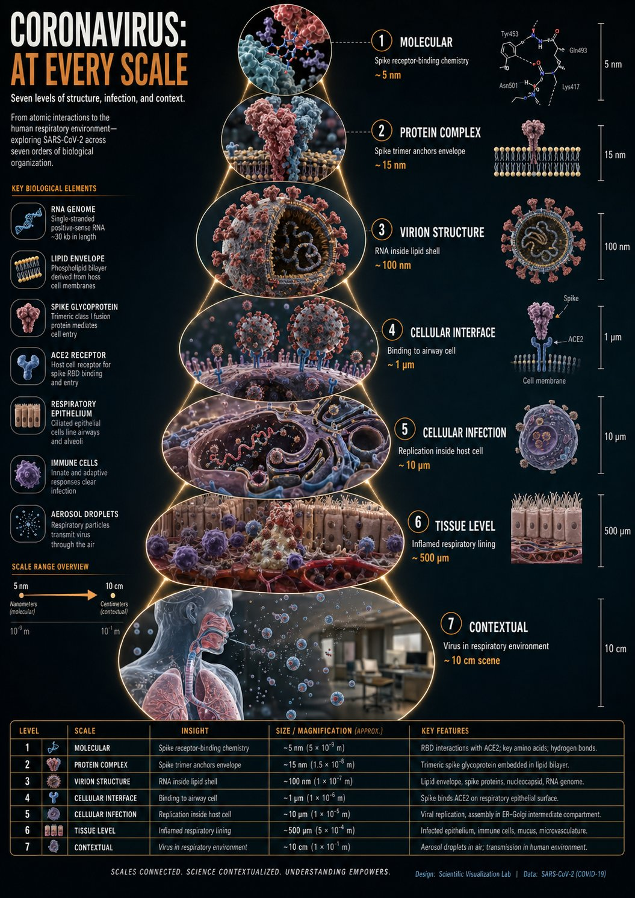
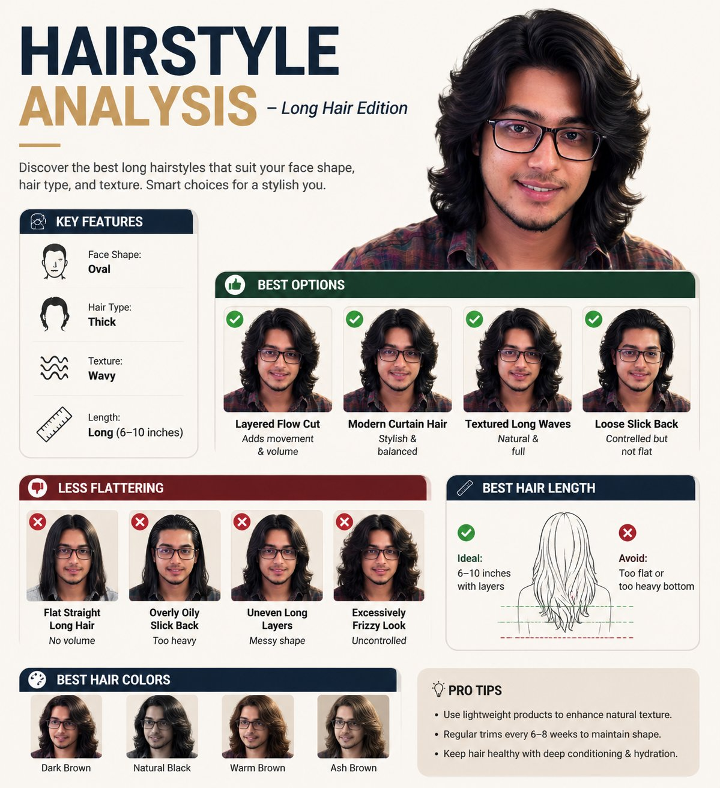
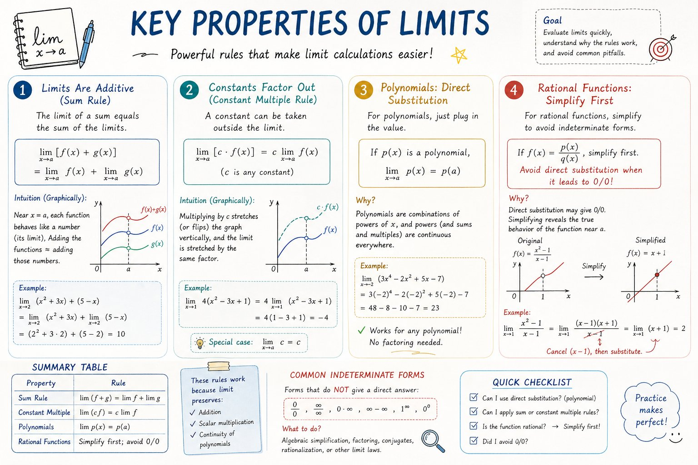
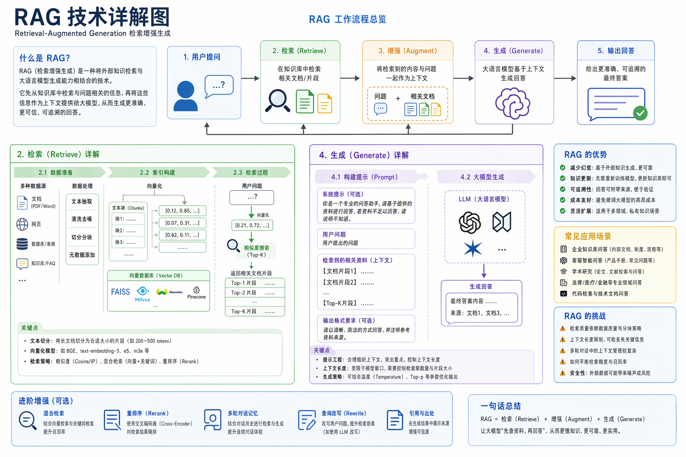
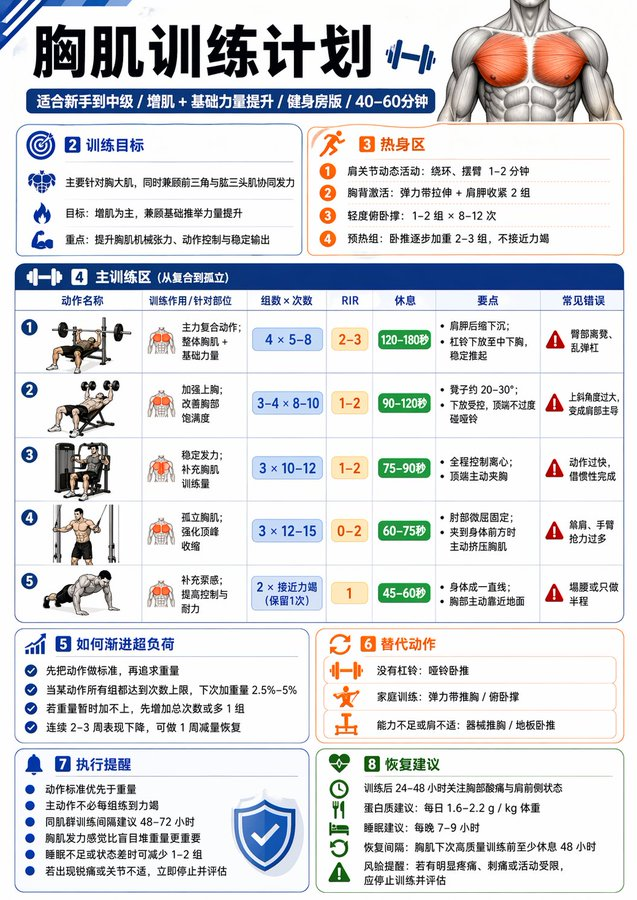
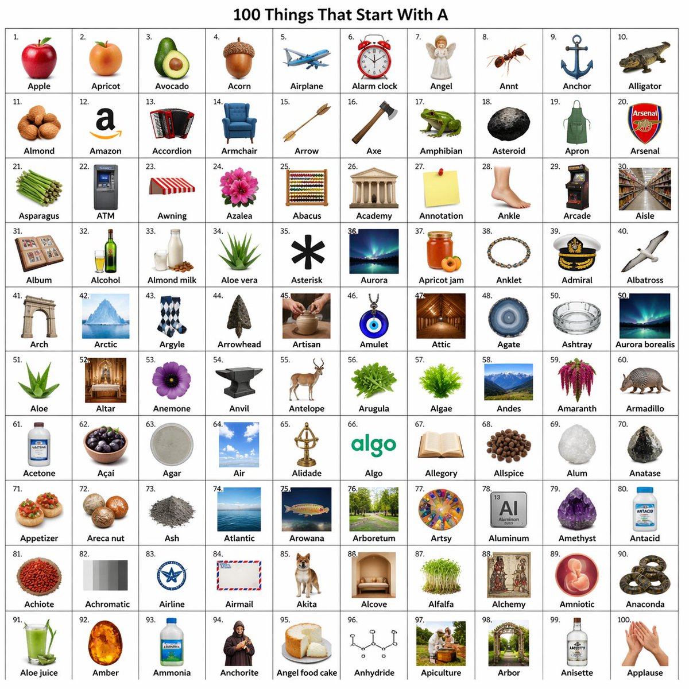
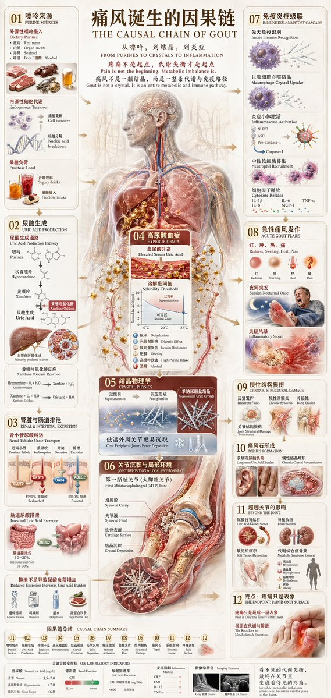
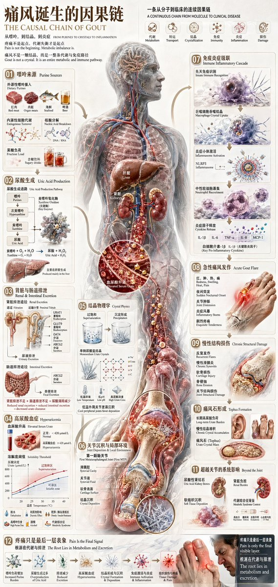

# Charts & Infographics

总计：27

## 冠状病毒尺度缩放科学信息图

- ID: case-380
- Slug: case-380-zh
- 语言: zh
- 来源: [来源链接](https://x.com/Gdgtify/status/2051288232613351571)
- 样例图路径: images/part2/case380.jpg

### 提示词

```text
instructions> [SUBJECT]=Coronavirus. A hyper-realistic 3D zoom-sequence infographic generated from a single input: [SUBJECT]. The system auto-detects scale layers from atomic/subcomponent to full contextual view. Layout Structure (CRITICAL) 6–8 circular or hexagonal frames arranged in expanding sequence Innermost frame = smallest detectable detail; outermost = full subject in environment Frames connected by subtle zoom-path lines No repeated scales — each frame shows new level of detail Frame Design Each zoom level includes: Hyper-detailed 3D render at that scale Micro label: scale name (e.g., "molecular," "cellular," "structural") + 3–5 word insight Optional: measurement tag or magnification factor Contextual Halo Around the sequence, include only scale-specific references: Measurement units, scientific notation, cultural scale metaphors (No generic magnifying glass icons) Scale Panel (Alternative Layout) Zoom level Key insight (3–5 words) Scale factor tag Detail icon (grid, wave, particle, etc.) Title "[SUBJECT]: AT EVERY SCALE" (or) "ZOOM: THE WORLD OF [SUBJECT]" Style: ultra-realistic 3D render, scientific editorial infographic, precise macro lighting, global illumination, shallow depth of field, clean sequential layout. </instructions>
```

### 样例图



## 长发造型分析信息图

- ID: case-360
- Slug: case-360-zh
- 语言: zh
- 来源: [来源链接](https://x.com/Gemalpha_88/status/2048918707343401034)
- 样例图路径: images/part2/case360.jpg

### 提示词

```text
Create a professional "HAIRSTYLE ANALYSIS" infographic with a different male model (the same face) having long, thick hair (6-10 inches), slightly wavy texture.

Style should be clean, modern, premium grooming guide (similar layout but not identical).

TOP TITLE:
"HAIRSTYLE ANALYSIS - Long Hair Edition"

LEFT PANEL (Key Features with icons):
Face Shape: Oval
Hair Type: Thick
Texture: Wavy
Length: Long

BEST OPTIONS (Top row with green indicators):
Layered Flow Cut (Adds movement & volume)
Modern Curtain Hair (Stylish & balanced)
Textured Long Waves (Natural & full)
Loose Slick Back (Controlled but not flat)

LESS FLATTERING (Bottom row with red indicators):
Flat Straight Long Hair (No volume)
Overly Oily Slick Back (Too heavy)
Uneven Long Layers (Messy shape)
Excessively Frizzy Look (Uncontrolled)

BEST HAIR LENGTH SECTION:
Ideal: 6-10 inches with layers
Avoid: Too flat or too heavy bottom

BEST HAIR COLORS:
Dark Brown
Natural Black
Warm Brown
Ash Brown

DESIGN STYLE:
Clean grid infographic
White/beige background
Soft shadows
Premium magazine look
Realistic face and hair detail
Consistent spacing and typography
High resolution, 4K
```

### 样例图



## AP Calculus 学习表信息图

- ID: case-341
- Slug: case-341-zh
- 语言: zh
- 来源: [来源链接](https://x.com/hqmank/status/2048587150544028084)
- 样例图路径: images/part2/case341.jpg

### 提示词

```text
Please create a mathematical visualization infographic about "[math concept / topic]." The goal is to help the viewer intuitively understand what it is, why it works, its geometric or structural intuition, and how it behaves in different contexts. The visual should feel like a high-quality math lecture handout combined with a hand-drawn educational poster. It should be elegant, clear, and information-rich, but not cluttered. Visual style: either portrait or landscape is fine. Use a clean, light paper-like background, with a deep blue title and black or dark gray lines for the main content. Add a small number of refined accent colors such as blue, teal, gold, and red. Incorporate rounded-corner cards, thin borders, numbered labels, hand-drawn arrows, zoom-in callout boxes, and a summary section. The overall design should be aesthetically pleasing, balanced, and academic, allowing the viewer to grasp the structure of the concept and why it works at a glance.
```

### 样例图



## RAG 技术详解图

- ID: case-334
- Slug: case-334-zh
- 语言: zh
- 来源: [来源链接](https://github.com/freestylefly/awesome-gpt-image-2/blob/main/docs/gallery-part-2.md#case-334)
- 样例图路径: images/part2/case334.png

### 提示词

```text
帮我生成一张 RAG 技术的详细讲解图
```

### 样例图



## 景德镇青花瓷全景解说图谱

- ID: case-248
- Slug: case-248-zh
- 语言: zh
- 来源: [来源链接](https://x.com/joshesye/status/2045764695827562686)
- 样例图路径: images/part2/case248.jpg

### 提示词

```text
[中文]
为我生成景德镇青花瓷的详细解说图，配上详细的中文知识解析

[English]
Generate a detailed explanatory diagram of Jingdezhen blue and white porcelain, accompanied by detailed Chinese knowledge analysis.
```

### 样例图


## 绘制金瓶梅知识图谱

- ID: case-214
- Slug: case-214-zh
- 语言: zh
- 来源: [来源链接](https://x.com/xiaoxiaodong01/status/2046252164717416641)
- 样例图路径: images/part2/case214.jpg

### 提示词

```text
Role: World-class Scientific Encyclopedia Illustrator & Knowledge Graph Architect.

Task: Generate a highly detailed, extremely intricate, and visually stunning "Universal Illustrated Encyclopedia Science Infographic" in a classic, unbranded (NO logos) scientific encyclopedia style.

Subject Matter: Choose one from [People, Plants, or Animals].

Specific Subject: [e.g., The Giant Squid / Leonardo da Vinci / The Sequoia Tree].

Style: Fine, detailed scientific illustration on a retro, aged beige paper background. Delicate linework. Intricately complex and professional.

Key Visual Requirements:

1.  Lifelike 3D Effect (The Central Subject): The central subject in the "C position" must be rendered with extraordinary realism and dynamism. Create a dramatic sense of depth where the character, plant, or animal appears to break the frame, leaping or bursting out of the flat paper towards the viewer (an effect similar to anamorphic 3D or dynamic pop-out, with high-precision realism).

2.  Layout & Strategic White Space:
    * Central Subject: Dominates the center, with intentional "strategic white space" around it to enhance the popping-out effect and make the figure the clear focal point.
    * Surrounding Modules: The surrounding area (left, right, top, bottom, and corners) must be filled with 6-8 distinct, highly organized knowledge modules, depending on the subject. There should be a sense of organized density, not random clutter. The modules themselves must have clear borders, headers, and extensive, detailed content.

3.  Connections: Use a complex, logical network of fine leader lines, arrows, brackets, dotted lines, and small connection points to link the central figure to all surrounding modules, and interconnect the modules themselves into a cohesive knowledge web.

4.  Text & Annotation (Hard Requirement - Must be CLEAR Chinese):
    * Main Title: A large, prominent, beautifully executed **Chinese calligraphy** (书法体) of the specific subject's name [e.g., "大王乌贼"].
    * Calligraphic Accents: Scattered throughout the main content and module titles, use beautiful, clear Chinese calligraphy for important terms.
    * Standard Chinese Text: All other descriptive text, handwritten notes (大量清晰中文手写注释), module content, and annotations must be clear, legible Chinese characters (简体中文), not gibberish or unreadable symbols. Ensure text clarity is prioritized.
    * Leader Line Annotations: Every single small component, detail, submodule, diagram, or illustration within the modules must have detailed leader line annotations (拟解剖图) pointing directly to it for maximum professionalism and educational value. Every part should be labeled.

Subject-Specific Module Structure (Example for general reference):

A. For Humans [People]:
   - Module 1: Anatomy & Skeletal Structure (w/ magnified cross-sections)
   - Module 2: Physiological Processes (e.g., Circulatory/Nervous System)
   - Module 3: Historical Context & Timeline (Key Achievements)
   - Module 4: Major Contribution Diagram (Detailed breakdown)
   - Module 5: Cognitive Process / Psychological Insight
   - Module 6: Genetic Profile / Evolution
   - Module 7: Global Influence & Cultural Impact
   - Module 8: Cultural Representations / Legacy

B. For Animals:
   - Module 1: Full External Sketch & Anatomy (w/ microscope magnified detail circular windows)
   - Module 2: Behavioral Patterns & Lifecycle (e.g., Mating/Migration, Flowchart style)
   - Module 3: Digestive & Skeletal System
   - Module 4: Habitats & Distribution Map (with environmental details)
   - Module 5: Unique Adaptations (e.g., camouflage, hunting tools)
   - Module 6: Evolutionary History & Relatives
   - Module 7: Symbiotic Relationships / Ecosystem Role
   - Module 8: Conservation Status & Human Interaction

C. For Plants:
   - Module 1: Full Plant Sketch & Anatomy (w/ magnified leaf/root details)
   - Module 2: Photosynthesis & Lifecycle Flow (w/ icons for environment)
   - Module 3: Cellular Structure (Magnified circular views)
   - Module 4: Medicinal Properties / Practical Applications (as in original original prompt)
   - Module 5: Environmental Adaptations / Unique Features
   - Module 6: Distribution Map & Environmental Context
   - Module 7: Genetic Variations & Cultivation
   - Module 8: Historical Usage & Folklore

Overall Composition: Extremely dense with information, organized into 6-8 structured modules, but balanced with strategic empty space around the center to allow the main, hyper-realistic figure to pop. Hard-core, professional, academic, but visually engaging due to the dynamic 3D central figure. No branding from any specific encyclopedia (e.g., no "DK" logos). All annotations must be legible. All handwritten notes must be clear. Main titles in Chinese calligraphy. Aspect Ratio: 3:4.

主题内容：潘金莲
```

### 样例图


## 萌系大模型训练图解

- ID: case-210
- Slug: case-210-zh
- 语言: zh
- 来源: [来源链接](https://x.com/op7418/status/2046502136973001143)
- 样例图路径: images/part2/case210.jpg

### 提示词

```text
[中文]
可爱地解释一下大语言模型训练过程

[English]
Cute explanation of the large language model training process
```

### 样例图


## 一张中文健身信息图

- ID: case-183
- Slug: case-183-zh
- 语言: zh
- 来源: [来源链接](https://x.com/MrLarus/status/2046560406760505727)
- 样例图路径: images/part2/case183.jpg

### 提示词

```text
请生成一张中文健身信息图，主题为：【xxx】。

要求这张图既专业又实用，适合普通成年人作为训练参考。默认对象为无严重伤病的健康成年人；如果没有额外说明，默认训练目标为“增肌 + 基础力量提升”，默认训练水平为“新手到中级之间”，默认训练场景为“普通健身房”，默认单次训练时长控制在 40–60 分钟内。

请根据【训练主题】自动判断输出类型：

1）如果【训练主题】是某个肌群或身体部位（例如：胸肌、背阔肌、肱二头肌、腹肌、肩部、腿部等），请输出一张“该部位训练计划信息图”。
2）如果【训练主题】是某个动作或技能目标（例如：引体向上、俯卧撑、双杠臂屈伸、深蹲等），请输出一张“动作解锁 / 进阶训练计划信息图”。

整张图请采用清晰、现代、专业、易读的中文信息图风格，竖版排版，视觉简洁，重点突出，适合社交媒体分享或训练参考卡片。不要写成长篇大论，每个模块用简洁短句呈现，数字信息要醒目。

这张信息图必须包含以下内容：

【A. 标题区】
- 主标题：直接写【训练主题】训练计划 / 解锁计划
- 副标题：自动补充适用人群、目标、训练场景、建议时长
例如：适合新手 / 增肌导向 / 健身房版 / 45分钟

【B. 训练目标区】
用简洁语言说明：
- 这次训练主要针对什么
- 主要目标是什么（增肌 / 力量 / 技能解锁 / 核心控制等）
- 本次训练的重点刺激或能力提升方向

【C. 热身区】
给出 2–4 个热身建议，简洁列出即可，例如：
- 动态活动
- 目标肌群激活
- 轻重量预热组
每项可附一句说明

【D. 主训练区】
这是核心部分，请列出 4–6 个主要训练动作。
每个动作都要包含以下信息：
- 动作名称
- 训练作用 / 针对部位
- 组数 × 次数（或时间）
- RIR 建议
- 每组间休息时间
- 动作关键要点（1–2 条）
- 常见错误（1 条即可）

请确保动作安排合理：
- 先复合动作，后孤立动作
- 整体训练量适中
- 新手不要安排过度极限训练
- 主动作通常建议 RIR 1–3
- 孤立动作可建议 RIR 0–2
- 如果是腹肌或核心类动作，可用“秒数 / 次数”形式
- 如果是技能类动作，请优先安排“前置能力动作 + 过渡动作 + 目标动作尝试”

【E. 进阶 / 解锁逻辑区】
根据主题自动生成：
- 如果是肌群训练：写“如何渐进超负荷”，例如达到次数上限后再加重量、优先保证动作标准等
- 如果是动作解锁：写“分阶段进阶路径”，例如从悬垂、肩胛引体、离心训练、弹力带辅助，到标准动作完成

【F. 替代动作区】
请给出 2–3 个替代动作，适用于以下情况：
- 没有器械
- 家庭训练
- 当前能力不足
- 某些动作做不了

【G. 执行提醒区】
请给出 4–6 条简洁提醒，例如：
- 动作标准优先于重量
- 不要每组都练到力竭
- 同肌群建议间隔 48–72 小时
- 疼痛不等于正常发力
- 睡眠不足时可适当减少训练量

【H. 恢复建议区】
简洁说明：
- 训练后恢复重点
- 蛋白质 / 睡眠 / 恢复间隔建议
- 1 句风险提醒（如有明显疼痛应停止并评估）

【I. 视觉设计要求】
- 整体为单页中文信息图
- 竖版排版
- 风格现代、清爽、专业、健身感强
- 使用模块化卡片布局
- 重点数字（组数、次数、RIR、休息）要醒目
- 可加入简洁的人体肌群图标、哑铃、杠铃、引体向上等小图标
- 颜色保持高级、干净、有运动感
- 中文文字必须清晰、准确、易读
- 避免过多装饰，强调实用性与执行性

请最终输出为“一张完整的信息图内容”，而不是只给普通段落文字。
```

### 样例图



## 信息图可视化设计

- ID: case-171
- Slug: case-171-zh
- 语言: zh
- 来源: [来源链接](https://x.com/umesh_ai/status/2046510988367945983)
- 样例图路径: images/part2/case171.jpg

### 提示词

```text
[中文]
创建一个包含 10x10 网格的图像，每个对象名称都以字母 a 开头。

[English]
create an image with 10x10 grid of objects that have the names starting with letter a.
```

### 样例图



## 信息图可视化设计

- ID: case-112
- Slug: case-112-zh
- 语言: zh
- 来源: [来源链接](https://x.com/songguoxiansen)
- 样例图路径: images/part2/case112.jpg

### 提示词

```text
Generate a 12-grid card image of the 12 Golden Saints from Saint Seiya, with each card featuring its corresponding Chinese name, 4 cards per row, in a 16:9 aspect ratio.
```

### 样例图


## 信息图可视化设计

- ID: case-102
- Slug: case-102-zh
- 语言: zh
- 来源: [来源链接](https://x.com/maxescu)
- 样例图路径: images/part2/case102.jpg

### 提示词

```text
Search the web for {argument name="performance description" default="this week’s standout individual performance in Champion’s League"}, using exact stats and game summary, {argument name="colors" default="bold team colors"}, legible score breakdown, and generate a {argument name="card type" default="Highlight card"}.
```

### 样例图


## 信息图可视化设计

- ID: case-83
- Slug: case-83-zh
- 语言: zh
- 来源: [来源链接](https://x.com/NumeroBTC)
- 样例图路径: images/part2/case83.jpg

### 提示词

```text
{
  "type": "sports match infographic poster",
  "theme": "UEFA Champions League",
  "background": "dark blue and purple cosmic sky, glowing blue hexagonal lines, illuminated stadium reflecting on water at bottom",
  "header": {
    "logo": "UEFA Champions League",
    "title": "{argument name=\"stage\" default=\"HALBFINALE\"}",
    "subtitle": "DAS ZIEL: {argument name=\"location\" default=\"BUDAPEST 2026\"}",
    "venue": "PUSKÁS ARÉNA"
  },
  "matchup": {
    "player_left": "{argument name=\"team 1 player\" default=\"Harry Kane\"} in red FC Bayern kit",
    "player_right": "{argument name=\"team 2 player\" default=\"Ousmane Dembélé\"} in blue PSG kit",
    "center_logos": "FC Bayern München and Paris Saint-Germain with VS",
    "date_box": "calendar icon, MITTWOCH, {argument name=\"date\" default=\"06.05.2026\"}"
  },
  "facts_section": {
    "title": "FACTS",
    "count": 5,
    "items": [
      "Trophy icon: DIE KÖNIGSKLASSE 2025/26",
      "Bar chart icon: KANE IN TOPFORM",
      "Lightning bolt icon: DEMBÉLÉ ÜBERFLIEGER",
      "Two people icon: BISHER 14 DUELLE",
      "Stadium icon: BUDAPEST RUFT"
    ]
  },
  "footer": {
    "trophy": "Champions League trophy on right",
    "stadium_image": "Puskás Aréna at night",
    "tagline": "EIN TRAUM. EIN ZIEL. EIN TITEL.",
    "bottom_text": "ROAD TO BUDAPEST 2026"
  }
}
```

### 样例图


## 写实摄影风格图

- ID: case-81
- Slug: case-81-zh
- 语言: zh
- 来源: [来源链接](https://x.com/HumanOS_v2)
- 样例图路径: images/part2/case81.jpg

### 提示词

```text
{
  "type": "scientific hardware diagram",
  "layout": {
    "main_scene": "3D render of an optical table with a red laser beam passing through 11 aligned optical components mounted on black posts.",
    "top_brackets": [
      {"label": "Dual Modulation", "span": "SLM1"},
      {"label": "4f Relay Optics", "span": "Lens L1 to Lens L2"},
      {"label": "Imaging Optics", "span": "SLM2 to Lens L4"},
      {"label": "Detection", "span": "Camera"}
    ],
    "optical_components_left_to_right": [
      {"name": "Laser", "labels": ["Laser", "λ = {argument name=\"laser wavelength\" default=\"632.8 nm\"}"]},
      {"name": "SLM1", "labels": ["SLM1", "(Phase / Pol. Mod.)"]},
      {"name": "Lens L1", "labels": ["Lens L1", "(f1)"]},
      {"name": "Iris", "labels": ["Fourier Plane", "(Pupil Plane)", "Iris", "(Higher Orders Filtered)"]},
      {"name": "HWP", "labels": ["HWP", "(λ/2)"]},
      {"name": "Lens L2", "labels": ["Lens L2", "(f1)"]},
      {"name": "SLM2", "labels": ["SLM2", "(Phase / Pol. Mod.)"]},
      {"name": "Lens L3", "labels": ["Lens L3", "(f2)"]},
      {"name": "Lens L4", "labels": ["Lens L4", "(f2)"]},
      {"name": "Linear Polarizer", "labels": ["Linear", "-Polarizer", "(Global Analyzer)"]},
      {"name": "Polarization Camera", "labels": ["POLARIZATION CAMERA"]}
    ],
    "inset_box": {
      "position": "bottom right",
      "title": "Polarization Camera Micro-Polarizer Array (Per-Pixel Analyzer)",
      "grid": "4x4 grid of colored squares with directional arrows",
      "legend_count": 4,
      "legend_items": [
        "Red square, horizontal arrow, 0° (H)",
        "Green square, vertical arrow, 90° (V)",
        "Blue square, diagonal arrow, 45° (D)",
        "Yellow square, diagonal arrow, 135° (A)"
      ]
    },
    "bottom_caption": {
      "figure_prefix": "{argument name=\"figure number\" default=\"Fig. 5.\"}",
      "title": "{argument name=\"system name\" default=\"Ellipsography Hardware Setup.\"}",
      "text": "Paragraph of scientific text explaining the dual-modulation configuration, 4f relay optics, and polarization camera."
    }
  }
}
```

### 样例图


## 信息图可视化设计

- ID: case-69
- Slug: case-69-zh
- 语言: zh
- 来源: [来源链接](https://x.com/hx831126)
- 样例图路径: images/part2/case69.jpg

### 提示词

```text
{
  "type": "comprehensive medical infographic",
  "style": "highly detailed 3D medical illustration, clinical white background, clean typography",
  "header": {
    "title_cn": "{argument name=\"main title\" default=\"痛风诞生的因果链\"}",
    "title_en": "{argument name=\"english title\" default=\"THE CAUSAL CHAIN OF GOUT\"}",
    "subtitle": "Pain is not the beginning. Metabolic imbalance is.",
    "top_right_sequence": {
      "count": 6,
      "labels": ["Metabolism", "Transport", "Crystallization", "Immunity", "Inflammation", "Damage"]
    }
  },
  "centerpiece": {
    "description": "{argument name=\"central figure\" default=\"transparent anatomical human body showing liver, kidneys, and vascular system\"}",
    "details": "pathway highlighted in {argument name=\"highlight color\" default=\"glowing red\"} descending to the foot"
  },
  "layout": {
    "left_column": [
      { "id": "01", "title": "Purine Sources", "elements": 6, "labels": ["Red meat", "Organ meats", "Seafood", "Beer", "Endogenous", "Fructose"] },
      { "id": "02", "title": "Uric Acid Production", "elements": 2, "labels": ["Chemical pathway", "Liver"] },
      { "id": "03", "title": "Renal & Intestinal Excretion", "elements": 2, "labels": ["Kidney nephron", "Intestines"] },
      { "id": "04", "title": "Hyperuricemia", "elements": 2, "labels": ["Blood vial", "Solubility graph"] }
    ],
    "center_overlay": [
      { "id": "05", "title": "Crystal Physics", "elements": 3, "labels": ["Supersaturation beaker", "Precipitation beaker", "Molecular structure"] },
      { "id": "06", "title": "Joint Deposition & Local Environment", "elements": 1, "labels": ["First MTP joint cross-section"] }
    ],
    "right_column": [
      { "id": "07", "title": "Immune Inflammatory Cascade", "elements": 4, "labels": ["Macrophage", "Inflammasome", "Neutrophil", "Cytokines"] },
      { "id": "08", "title": "Acute Gout Flare", "elements": 1, "labels": ["Inflamed foot"] },
      { "id": "09", "title": "Chronic Structural Damage", "elements": 1, "labels": ["Bone erosion joint"] },
      { "id": "10", "title": "Tophus Formation", "elements": 2, "labels": ["Hand tophi", "Foot tophi"] },
      { "id": "11", "title": "Beyond the Joint", "elements": 2, "labels": ["Kidney stones", "Systemic burden"] }
    ],
    "bottom_row": [
      { "id": "12", "title": "Pain Is the Final Signal", "elements": 7, "labels": ["Increased Purine", "Overproduction", "Reduced Excretion", "Hyperuricemia", "Crystal Formation", "Immune Activation", "Man in pain"] }
    ]
  },
  "theme": "{argument name=\"disease focus\" default=\"gout and uric acid crystallization\"}"
}
```

### 样例图



## 信息图可视化设计

- ID: case-68
- Slug: case-68-zh
- 语言: zh
- 来源: [来源链接](https://x.com/hx831126)
- 样例图路径: images/part2/case68.jpg

### 提示词

```text
{
  "type": "comprehensive medical infographic",
  "style": "highly detailed 3D medical illustration, clinical white background, clean typography",
  "header": {
    "title_cn": "{argument name=\"main title\" default=\"痛风诞生的因果链\"}",
    "title_en": "{argument name=\"english title\" default=\"THE CAUSAL CHAIN OF GOUT\"}",
    "subtitle": "Pain is not the beginning. Metabolic imbalance is.",
    "top_right_sequence": {
      "count": 6,
      "labels": ["Metabolism", "Transport", "Crystallization", "Immunity", "Inflammation", "Damage"]
    }
  },
  "centerpiece": {
    "description": "{argument name=\"central figure\" default=\"transparent anatomical human body showing liver, kidneys, and vascular system\"}",
    "details": "pathway highlighted in {argument name=\"highlight color\" default=\"glowing red\"} descending to the foot"
  },
  "layout": {
    "left_column": [
      { "id": "01", "title": "Purine Sources", "elements": 6, "labels": ["Red meat", "Organ meats", "Seafood", "Beer", "Endogenous", "Fructose"] },
      { "id": "02", "title": "Uric Acid Production", "elements": 2, "labels": ["Chemical pathway", "Liver"] },
      { "id": "03", "title": "Renal & Intestinal Excretion", "elements": 2, "labels": ["Kidney nephron", "Intestines"] },
      { "id": "04", "title": "Hyperuricemia", "elements": 2, "labels": ["Blood vial", "Solubility graph"] }
    ],
    "center_overlay": [
      { "id": "05", "title": "Crystal Physics", "elements": 3, "labels": ["Supersaturation beaker", "Precipitation beaker", "Molecular structure"] },
      { "id": "06", "title": "Joint Deposition & Local Environment", "elements": 1, "labels": ["First MTP joint cross-section"] }
    ],
    "right_column": [
      { "id": "07", "title": "Immune Inflammatory Cascade", "elements": 4, "labels": ["Macrophage", "Inflammasome", "Neutrophil", "Cytokines"] },
      { "id": "08", "title": "Acute Gout Flare", "elements": 1, "labels": ["Inflamed foot"] },
      { "id": "09", "title": "Chronic Structural Damage", "elements": 1, "labels": ["Bone erosion joint"] },
      { "id": "10", "title": "Tophus Formation", "elements": 2, "labels": ["Hand tophi", "Foot tophi"] },
      { "id": "11", "title": "Beyond the Joint", "elements": 2, "labels": ["Kidney stones", "Systemic burden"] }
    ],
    "bottom_row": [
      { "id": "12", "title": "Pain Is the Final Signal", "elements": 7, "labels": ["Increased Purine", "Overproduction", "Reduced Excretion", "Hyperuricemia", "Crystal Formation", "Immune Activation", "Man in pain"] }
    ]
  },
  "theme": "{argument name=\"disease focus\" default=\"gout and uric acid crystallization\"}"
}
```

### 样例图



## 信息图可视化设计

- ID: case-67
- Slug: case-67-zh
- 语言: zh
- 来源: [来源链接](https://x.com/hx831126)
- 样例图路径: images/part2/case67.jpg

### 提示词

```text
{
  "type": "medical infographic poster",
  "style": "highly detailed anatomical illustrations, clean structured layout, scientific diagrammatic style",
  "color_palette": "{argument name=\"color palette\" default=\"medical red, blue, beige, and anatomical flesh tones\"}",
  "language": "{argument name=\"language\" default=\"bilingual Chinese and English\"}",
  "header": {
    "main_title": "{argument name=\"main title\" default=\"糖尿病诞生的因果链\"}",
    "english_title": "{argument name=\"english title\" default=\"THE CAUSAL CHAIN OF DIABETES\"}",
    "subtitle": "从胰岛素失灵，到高血糖，到全身损伤"
  },
  "layout": {
    "centerpiece": "{argument name=\"central subject\" default=\"transparent human body showing circulatory system and internal organs\"}",
    "sections_count": 14,
    "sections": [
      { "id": "01", "title": "葡萄糖进入生命", "visuals": ["stomach and intestines"] },
      { "id": "02", "title": "胰腺与胰岛素", "visuals": ["pancreas", "beta cell"] },
      { "id": "03", "title": "正常胰岛素作用", "visuals": ["receptor signaling diagram", "muscle, liver, adipose icons"] },
      { "id": "04", "title": "胰岛素抵抗: 2型通路开始", "visuals": ["receptor blockage diagram", "7 lifestyle icons"] },
      { "id": "05", "title": "肝脏持续释放葡萄糖", "visuals": ["liver"] },
      { "id": "06", "title": "β细胞衰竭: 代偿到失败", "visuals": ["beta-cell decline line chart"] },
      { "id": "07", "title": "1型糖尿病分支", "visuals": ["autoimmune destruction diagram"] },
      { "id": "08", "title": "高血糖与血液化学", "visuals": ["blood vessel with glucose", "glucose indicators table", "glucose variability chart"] },
      { "id": "09", "title": "高血糖导致组织损伤", "visuals": ["4 pathways of damage diagrams"] },
      { "id": "10", "title": "急性代谢后果", "visuals": ["7 symptom icons"] },
      { "id": "11", "title": "微血管并发症", "visuals": ["eye", "kidney", "nerve cross-section"] },
      { "id": "12", "title": "大血管并发症与组织损伤", "visuals": ["heart", "brain", "diabetic foot"] },
      { "id": "13", "title": "器官系统长期代价", "visuals": ["text list"] },
      { "id": "14", "title": "糖尿病是调控系统失灵", "visuals": ["metabolic control flowchart"] }
    ],
    "footer": {
      "core_message": "核心信息 CORE MESSAGE"
    }
  }
}
```

### 样例图


## 信息图可视化设计

- ID: case-66
- Slug: case-66-zh
- 语言: zh
- 来源: [来源链接](https://x.com/hx831126)
- 样例图路径: images/part2/case66.jpg

### 提示词

```text
{
  "type": "fashion design process infographic",
  "title": "{argument name=\"main title\" default=\"一件女装诞生的因果链 THE CAUSAL CHAIN OF A WOMEN'S GARMENT\"}",
  "subtitle": "从纤维，到版型，到上身 FROM FIBER TO FIT",
  "style": {
    "aesthetic": "elegant editorial, technical fashion illustration, highly detailed",
    "color_palette": "{argument name=\"color palette\" default=\"beige, cream, and neutral tones\"}"
  },
  "layout": {
    "centerpiece": {
      "description": "Exploded-view illustration of a {argument name=\"garment type\" default=\"women's trench coat dress\"} showing cascading layers of fabric, pattern pieces, and stitching lines. Top shows a model wearing the finished garment.",
      "central_list": {
        "count": 13,
        "type": "numbered steps with pointer lines",
        "labels": ["01 Material", "02 Inspiration", "03 Sketch", "04 Fabric", "05 Draping", "06 Pattern", "07 Sewing", "08 Fitting", "09 Revision", "10 Team", "11 Construction", "12 Garment", "13 Collaboration"]
      }
    },
    "left_column": [
      {
        "module": "MODULE 1: RAW MATERIAL AND FABRIC",
        "count": 6,
        "items": ["Fiber", "Yarn Structure", "Fabric Construction", "Weight", "Drape", "Surface Texture"]
      },
      {
        "module": "MODULE 2: INSPIRATION AND DIRECTION",
        "count": 5,
        "items": ["Inspiration Source", "Color Direction", "Woman Image", "Occasion Positioning", "Silhouette Intention"]
      },
      {
        "module": "MODULE 3: DESIGN SKETCH AND SILHOUETTE",
        "count": 7,
        "items": ["Design Sketch", "Construction Line", "Front Back Relationship", "Neckline", "Shoulder Line", "Waist Line", "Hem Proportion"]
      }
    ],
    "right_column": [
      {
        "module": "MODULE 4: PATTERNMAKING AND DRAPING",
        "count": 6,
        "items": ["Draping", "Patternmaking", "Dart", "Panel Line", "Ease", "Grain Direction"]
      },
      {
        "module": "MODULE 5: CUTTING AND SAMPLING",
        "count": 5,
        "items": ["Cutting", "Layout", "Sample Sewing", "Construction Sequence", "Technique Test"]
      },
      {
        "module": "MODULE 6: FITTING AND REVISION",
        "count": 4,
        "items": ["Fitting", "Fit Issues", "Before", "After"]
      }
    ],
    "bottom_row": [
      {
        "module": "MODULE 7: TEAM COLLABORATION",
        "count": 8,
        "items": ["Designer", "Patternmaker", "Fabric Buyer", "Sample Maker", "Merchandiser", "QC", "Feedback Loop", "Model"]
      },
      {
        "module": "MODULE 8: FINAL GARMENT PRESENTATION",
        "count": 3,
        "items": ["Details", "Finished Front & Back", "Labels & Care"]
      },
      {
        "module": "MODULE 9: FINAL WEAR",
        "count": 3,
        "items": ["Drape", "Proportion", "Movement in Motion"]
      },
      {
        "module": "MODULE 10: THE CHAIN SUMMARY",
        "count": 8,
        "items": ["Material Foundation", "Aesthetic Judgment", "Structural Engineering", "Craft Realization", "Body Negotiation", "Team Collaboration", "Iterative Revision", "Final Garment"]
      }
    ],
    "footer": "{argument name=\"footer text\" default=\"一件成衣，因无数判断而存在 A garment exists because of countless decisions.\"}"
  }
}
```

### 样例图


## 信息图可视化设计

- ID: case-64
- Slug: case-64-zh
- 语言: zh
- 来源: [来源链接](https://x.com/j_zou93)
- 样例图路径: images/part2/case64.jpg

### 提示词

```text
{"type":"infographic poster","style":"cute flat vector illustration, cozy, warm, soft shading, {argument name=\"color palette\" default=\"pastel Morandi colors, soft pinks, purples, and warm tones\"}","character":"{argument name=\"character description\" default=\"young woman with shoulder-length brown hair wearing a pinkish-purple shirt\"}","layout":{"structure":"4 rows, 3 columns. Top row is a merged header. Rows 2-4 contain 9 individual panels.","header":{"title":"{argument name=\"main title\" default=\"情绪不好了？\"}","subtitle":"{argument name=\"subtitle\" default=\"8个让你瞬间变好的方法\"}","sub_subtitle":"写给焦虑的你，快来看看","visual":"character hugging herself, surrounded by yellow sparkles and hearts"},"grid_panels":[{"id":1,"title":"1. 深呼吸","text":"调节神经，缓解紧张情绪。","visual":"character with eyes closed, smiling, surrounded by clouds"},{"id":2,"title":"2. 去户外散步","text":"接触自然，让心静下来。","visual":"character walking outdoors among green trees and bushes"},{"id":3,"title":"3. 写情绪日记","text":"把烦恼写下，大脑会更轻松。","visual":"character sitting at a desk writing in a notebook with a pen, floating hearts"},{"id":4,"title":"4. 抱抱自己","text":"给予自己温暖和安慰。","visual":"character hugging herself with eyes closed, floating hearts"},{"id":5,"title":"5. 听听音乐","text":"让舒缓的旋律治愈心灵。","visual":"character wearing large white headphones, eyes closed, floating colorful music notes"},{"id":6,"title":"6. 找人倾诉","text":"分享你的烦恼，让压力释放。","visual":"character holding a smartphone, talking to another similar-looking girl, floating hearts"},{"id":7,"title":"7. 看看天空","text":"感受天空的辽阔，让心情变好。","visual":"character looking up at a blue sky with white clouds and sparkles"},{"id":8,"title":"8. 冥想","text":"专注于呼吸，找回内心的宁静。","visual":"an open notebook, a pen, and a pink flower on a desk"},{"id":9,"title":"none","text":"{argument name=\"footer text\" default=\"转发收藏，每天都要关爱自己！\"}","visual":"character sitting cross-legged in a meditation pose, eyes closed, with a glowing halo behind her head"}]}}
```

### 样例图


## 主题海报版式设计

- ID: case-63
- Slug: case-63-zh
- 语言: zh
- 来源: [来源链接](https://x.com/masapark95)
- 样例图路径: images/part2/case63.jpg

### 提示词

```text
{"type": "2x2 grid of promotional banner ads", "theme": "{argument name=\"course theme\" default=\"Social Media Content Creation School\"}", "panels": [{"position": "top-left", "color_palette": "light blue and pink pastel gradient", "subject": "young woman smiling, resting chin on hand, smartphone and ring light in foreground", "typography": {"headline": "{argument name=\"top left headline\" default=\"発信を仕事に変える SNSスクール\"}", "subheadings": ["好きが、私の未来になる！", "クリエイター志望歓迎！"]}, "layout_elements": {"bullet_points_count": 3, "call_to_action_button": "pink button labeled '無料体験 >'"}}, {"position": "top-right", "color_palette": "deep blue and cyan geometric", "subject": "young man looking intently at a professional camera on a tripod with a ring light", "typography": {"headline": "{argument name=\"top right headline\" default=\"魅せる投稿が学べる\"}", "subheadings": ["企画・撮影・運用サポート"]}, "layout_elements": {"circular_icons_count": 3, "icon_types": ["lightbulb", "camera", "bar chart"], "call_to_action_button": "yellow button labeled '詳細はこちら >'"}}, {"position": "bottom-left", "color_palette": "soft beige and white aesthetic", "subject": "young woman looking thoughtfully to the side, mood board background", "typography": {"headline": "{argument name=\"bottom left headline\" default=\"自分の世界観を育てる\"}", "subheadings": ["あなたらしさが、一番の強みになる。", "SNSブランディング講座"]}, "layout_elements": {"horizontal_icons_count": 3, "icon_types": ["palette", "person", "heart"], "call_to_action_button": "pink button labeled '今すぐ見る >'"}}, {"position": "bottom-right", "color_palette": "vibrant pink and magenta pop design", "subject": "young woman smiling brightly, pointing at text, messy bun, smartphone on tripod", "typography": {"headline": "{argument name=\"bottom right headline\" default=\"好きな発信でファンをつくる\"}", "subheadings": ["実践型レッスン"]}, "layout_elements": {"bullet_points_count": 4, "call_to_action_button": "yellow button labeled '申し込む >'"}}]}
```

### 样例图


## 主题海报版式设计

- ID: case-61
- Slug: case-61-zh
- 语言: zh
- 来源: [来源链接](https://x.com/masapark95)
- 样例图路径: images/part2/case61.jpg

### 提示词

```text
{
  "type": "2x2 grid of banner advertisements",
  "theme": "{argument name=\"school name\" default=\"SNSスクール\"}",
  "target_audience": "{argument name=\"target audience\" default=\"学生\"}",
  "layout": {
    "grid": "2x2",
    "panels": [
      {
        "position": "top-left",
        "style": "dark neon, blue and purple",
        "subject": "young woman looking up hopefully, holding a smartphone, wearing a purple sweatshirt",
        "main_text": "{argument name=\"banner 1 headline\" default=\"SNSを仕事にしたい人へ\"}",
        "sub_text": "“好き”をカタチに。未来を変える一歩を、今。",
        "elements": [
          "white and yellow typography",
          "yellow call-to-action button: チェックする >",
          "hand-drawn neon accents (crown, stars, heart)"
        ]
      },
      {
        "position": "top-right",
        "style": "bright, pop, cyan and white",
        "subject": "young woman smiling directly at camera, holding a smartphone, wearing a teal hoodie, hair in a bun",
        "main_text": "{argument name=\"banner 2 headline\" default=\"好きな発信を武器にする\"}",
        "sub_text": "企画・編集・投稿を学ぶ",
        "elements": [
          "torn paper texture backgrounds for text",
          "yellow starburst sticker: 無料体験",
          "3 feature icons with text: lightbulb (企画力), pencil (編集力), paper plane (投稿力)"
        ]
      },
      {
        "position": "bottom-left",
        "style": "dark, analytical, neon purple and green",
        "subject": "young man looking thoughtfully at his smartphone, wearing a black hoodie",
        "main_text": "{argument name=\"banner 3 headline\" default=\"バズるだけじゃない 分析まで学べる\"}",
        "sub_text": "#伸びる理由がわかると、もっと伸ばせる。",
        "elements": [
          "3 floating holographic data panels with line graphs and stats (125.6万, 23.8%, 12.6%)",
          "3 feature icons at bottom: bar chart (データ分析), magnifying glass (改善提案), target (成果につなげる)",
          "yellow call-to-action button: 詳しく見る >"
        ]
      },
      {
        "position": "bottom-right",
        "style": "bright, friendly, purple and white",
        "subject": "group of 4 young people (3 women, 1 man) huddled together smiling at a smartphone",
        "main_text": "SNSで未来の可能性を広げよう",
        "sub_text": "仲間と学べるコミュニティ",
        "elements": [
          "torn paper texture backgrounds for text",
          "3 bullet points with icons (people, speech bubbles, rising chart)",
          "2 polaroid-style inset photos showing students studying at a desk",
          "yellow call-to-action button: 今すぐ参加 >"
        ]
      }
    ]
  }
}
```

### 样例图


## 信息图可视化设计

- ID: case-23
- Slug: case-23-zh
- 语言: zh
- 来源: [来源链接](https://x.com/GeekCatX)
- 样例图路径: images/part2/case23.jpg

### 提示词

```text
{
  "type": "evolutionary timeline infographic",
  "instruction": "Using REFERENCE_0 as a structural base, transform the flat vector design into a highly realistic 3D infographic. Replace the smooth ramps with distinct stone steps and upgrade all organisms to photorealistic 3D models.",
  "style": {
    "background": "{argument name=\"background style\" default=\"vintage textured parchment paper\"}",
    "staircase": "{argument name=\"staircase material\" default=\"realistic textured stone blocks\"}",
    "subjects": "{argument name=\"organism style\" default=\"highly detailed photorealistic 3D renders\"}"
  },
  "layout": {
    "main_title": "{argument name=\"main title\" default=\"人类演化\"}",
    "sections": [
      {
        "position": "left sidebar",
        "count": 8,
        "labels": ["L0: 单细胞生命", "L1: 多细胞生物", "L2: 动物界", "L3: 脊索动物", "L4: 上陆革命", "L5: 哺乳纲", "L6: 人科演化", "L7: 智人纪元"]
      },
      {
        "position": "top right",
        "title": "获得的功能 / 失去的功能",
        "description": "Legend with plus and minus icons"
      },
      {
        "position": "bottom center",
        "title": "演化关键里程碑",
        "count": 6,
        "description": "Timeline with a silhouette graphic of 6 figures showing ape-to-human evolution"
      }
    ],
    "centerpiece": {
      "description": "Winding stone staircase with 25 numbered steps featuring specific organisms.",
      "count": 25,
      "notable_elements": [
        "Step 07: Jellyfish",
        "Step 09: Ammonite",
        "Step 10: Trilobite",
        "Step 24: Walking human",
        "Step 25: {argument name=\"future evolution concept\" default=\"glowing cosmic silhouette with a question mark\"}"
      ]
    }
  }
}
```

### 样例图


## 信息图可视化设计

- ID: case-20
- Slug: case-20-zh
- 语言: zh
- 来源: [来源链接](https://x.com/yammamon)
- 样例图路径: images/part2/case20.jpg

### 提示词

```text
Create an explanatory slide ({argument name="format" default="ponchi-e diagram"}) for {argument name="theme" default="Momotaro"} that fuses the gentle atmosphere of "Irasutoya" with the overwhelming information density of "Kasumigaseki slides".
```

### 样例图


## 信息图可视化设计

- ID: case-19
- Slug: case-19-zh
- 语言: zh
- 来源: [来源链接](https://x.com/yammamon)
- 样例图路径: images/part2/case19.jpg

### 提示词

```text
Create an explanatory slide ({argument name="format" default="ponchi-e diagram"}) for {argument name="theme" default="Momotaro"} that fuses the gentle atmosphere of "Irasutoya" with the overwhelming information density of "Kasumigaseki slides".
```

### 样例图


## 信息图可视化设计

- ID: case-14
- Slug: case-14-zh
- 语言: zh
- 来源: [来源链接](https://github.com/freestylefly/awesome-gpt-image-2/blob/main/docs/gallery-part-1.md#case-14)
- 样例图路径: images/part2/case14.jpg

### 提示词

```text
视觉设计规格描述：画幅比 9:16（竖版手机信息图）；背景纹理为具有呼吸感的米色手工纸（Handmade Washi Paper），带微小纤维纹理，边角有轻微水渍晕染；配色方案为熟番茄红（#E23A28）、初榨橄榄油金黄（#F2C94C）、嫩草绿（#6FCF97）、碳黑墨线；排版逻辑为顶端大标题、中间 Z 字形流线、底部全景成品、留白艺术化处理。食谱内容策划：1）顶部标题《番茄炒蛋：国民灵魂料理》，手绘书法体，侧边盖红色“厨师推荐”微型印章。2）步骤区块（Z 动线排版）：步骤1 挑选与备菜（左上）：三个番茄、四枚土鸡蛋、一簇葱花；说明：番茄切小块，鸡蛋打散均匀；厨师秘技：番茄去皮后切块，汁水更浓郁，口感更丝滑；心得：选熟透番茄，成功一半。步骤2 蛋液的魔法（右上）：手持筷子快速搅动蛋液，泛起气泡与动感线；说明：加少许盐和几滴温水；厨师秘技：加温水或白醋，鸡蛋更蓬松；心得：搅打充分，空气是蓬松秘密。步骤3 烈火蓬松蛋（左中）：铁锅中蛋液迅速膨胀如云朵，水彩表现热气；说明：油热下锅，快速划散，八成熟盛出；厨师秘技：油温高，烟起即入，瞬间锁水；心得：宁可稍嫩，不可过老。步骤4 番茄出浓汁（右中）：番茄翻滚，边缘半融化，亮红汤汁流淌；说明：煸炒至出汁，加少许糖和盐；厨师秘技：铲子轻压加速出汁，可加一勺番茄酱提色；心得：糖中和酸度、提鲜。步骤5 最后的合奏（左下）：鸡蛋回锅与番茄汁交织，撒葱花；说明：让鸡蛋吸饱番茄汁，关火装盘；厨师秘技：出锅前滴几滴芝麻油提香；心得：动作要快，保持鲜亮色泽。3）底部成品插图：青花边陶瓷深盘装满番茄炒蛋，红亮汁水包裹金黄大块鸡蛋，葱花点缀，水彩渲染半透明酱汁质感，边缘有袅袅热气；视觉感：看了就想立刻盛一碗大米饭。4）底部中央署名：[ 摄影师的厨房日记 · 2025 ]。
```

### 样例图


## 信息图可视化设计

- ID: case-13
- Slug: case-13-zh
- 语言: zh
- 来源: [来源链接](https://github.com/freestylefly/awesome-gpt-image-2/blob/main/docs/gallery-part-1.md#case-13)
- 样例图路径: images/part2/case13.jpg

### 提示词

```text
A realistic photo of a Chinese high school math exam paper, printed inblack and white on slightly gray paper, titled “数学试卷”, with multiplechoice questions and math formulas, including a small 3D geometrycube diagram. The paper is photographed casually with asmartphone, slightly tilted, with uneven lighting, soft shadows, andminor blur. The text is in Chinese with a mix of bold title font andstandard serif body font. Realistic paper texture, exam layout,authentic classroom test sheet style.
```

### 样例图


## 科普百科图

- ID: case-8
- Slug: case-8-zh
- 语言: zh
- 来源: [来源链接](https://github.com/freestylefly/awesome-gpt-image-2/blob/main/docs/gallery-part-1.md#case-8)
- 样例图路径: images/part2/case8.jpg

### 提示词

```text
根据【主题】生成一张高质量竖版「科普百科图」。
这张图不是普通海报，也不是单纯插画，而是一张兼具图鉴感、百科感、信息结构感和收藏感的模块化科普信息图。整体风格参考高级博物图鉴、现代百科书页、生活方式知识卡，以及社交媒体上更容易传播的信息图风格。
让画面包含：
一个清晰好看的主题主视觉
若干局部特征放大细节
多个圆角模块化信息分区
清楚的标题层级与重点标签
简洁但信息丰富的百科内容
可视化评分、要点总结或 Top 5 模块
内容栏目请根据主题自动适配，优先从这些方向里选择并合理组合：
基础档案、分类信息、外观特征、习性生态、形成机制或结构组成、生长或使用条件、养护或维护建议、风险与注意事项、适合人群或适用场景、优缺点对比、快速评分卡。
视觉要求：
浅色干净背景，柔和配色，轻阴影，精致小图标，圆角信息框，整体排版整洁清爽。信息密度要丰富，但不能显得拥挤，阅读体验要舒服。最终效果要像真正可以发布、阅读、收藏、批量做成系列内容的科普百科卡，而不是广告感很重的宣传海报。
不要做成普通商业宣传海报，要重点突出“知识整理”“模块信息”“图鉴式展示”这几个特征。
```

### 样例图


## 信息图可视化设计

- ID: case-1
- Slug: case-1-zh
- 语言: zh
- 来源: [来源链接](https://github.com/freestylefly/awesome-gpt-image-2/blob/main/docs/gallery-part-1.md#case-1)
- 样例图路径: images/part2/case1.jpg

### 提示词

```text
Vertical 9:16 isometric cutaway infographic "城市生命系统图谱 / Urban Metabolism Atlas". Smart city from sky to bedrock: skyscrapers, streets, subway, utility tunnels, water/sewage/gas/heating pipes, fiber, data center, flood tanks, aquifers, geothermal wells, bedrock. Color-coded flows for power/water/data/traffic/waste. 12 numbered panels bilingual CN/EN: 能源/水循环/交通/数据/垃圾/建筑/公共服务/ 物流/气候韧性/生态/地质/治理看板. 24h timeline at bottom. Style: engineering white paper + scientific atlas, light paper bg, crisp lines, 8K. No cyberpunk, no gibberish text, must show both above AND below ground.
```

### 样例图


