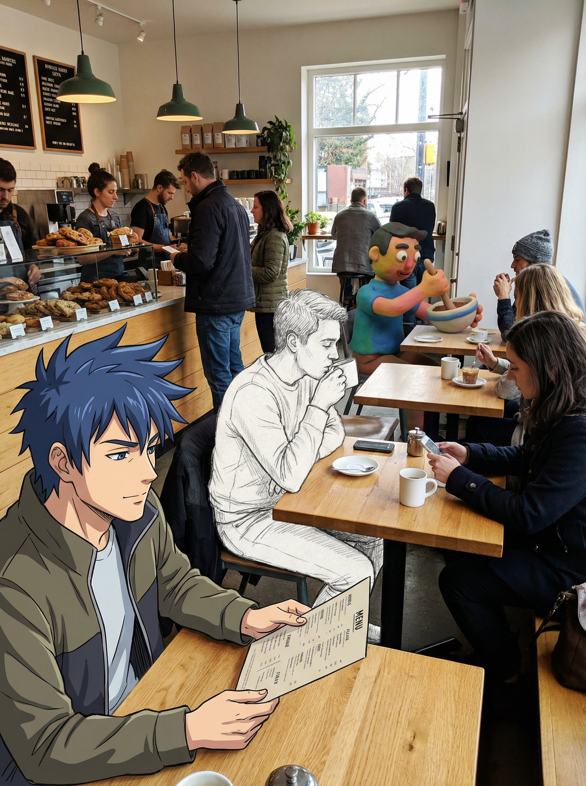
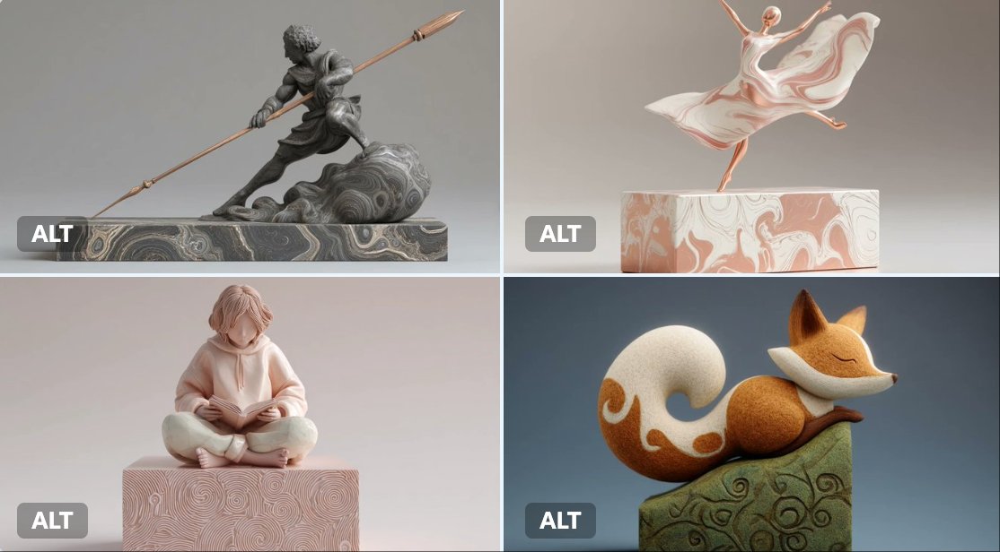

# clay

总计：24

## A young man sitting casually at a modern café counter, s

- ID: gpt4o-941-en-1
- Slug: prompt-941-en-1
- 语言: en
- 来源: [来源链接](https://x.com/rovvmut_/status/2002037335161217483)
- 样例图路径: images/part3/941.jpeg

### 提示词

```text
A young man sitting casually at a modern café counter, smiling while holding a glass of iced coffee. On the table in front of him stands a small 3D chibi character version of the same man. The chibi has super-deformed proportions, a large head, big expressive eyes, and simplified facial features. It has a smooth 3D plastic or clay-like texture, soft studio lighting, and a clear shadow on the table surface. The chibi is holding a tiny glass of coffee. Warm pendant lights, wooden café interior, cinematic realistic human combined with stylized 3D chibi, shallow depth of field, vertical 9:16.
```

### 样例图


## 摆放着一个与本人相似的Q版模型

- ID: gpt4o-941-zh-2
- Slug: prompt-941-zh-2
- 语言: zh
- 来源: [来源链接](https://x.com/rovvmut_/status/2002037335161217483)
- 样例图路径: images/part3/941.jpeg

### 提示词

```text
一位年轻男子随意地坐在现代咖啡馆的吧台边，面带微笑，手里拿着一杯冰咖啡。他面前的桌子上摆放着一个与他本人相似的3D Q版人物模型。这个Q版人物模型比例夸张，头部较大，眼睛炯炯有神，面部特征较为简化。它拥有光滑的3D塑料或黏土质感，柔和的摄影棚灯光照射在桌面上，投射出清晰的阴影。Q版人物模型手中拿着一小杯咖啡。画面中，温暖的吊灯、木质的咖啡馆内饰、写实的人物造型与风格化的3D Q版人物模型相结合，运用了浅景深，采用9:16的竖幅构图。
```

### 样例图


## 治愈系童话感黏土海报

- ID: gpt4o-828-zh-1
- Slug: prompt-828-zh-1
- 语言: zh
- 来源: [来源链接](https://x.com/sundyme/status/1999479601744015847)
- 样例图路径: images/part3/828.jpeg

### 提示词

```text
Rendered as a complete Poster design (suggested aspect ratio 3:4 or 9:16 for a full vertical poster). The overall visual style is a Soft-Focus Healing Style combining a Wes Anderson aesthetic, characterized by dreamy, cozy, warm and soft volumetric lighting. 4K Resolution, high aesthetic value.

[SCENE & MATERIAL STYLE]The entire scene is rendered with a distinctive material mix of Soft Matte Clay (哑光软陶) and a little soft Felt (少许羊毛毡), creating fluffy and tactile textures throughout the composition. The color palette is dominated by soft Pastel colors (Morandi/Macaron tones).

[TEXT INTEGRATION]The scene integrates a creatively formed main title using environmental elements (e.g., formed by clouds, branches, or clay objects). It also includes a small, delicate, thin-stroke handwritten Chinese slogan that blends softly into the environment, appearing as part of the scene's texture rather than an overlay.

生成示列（爱因斯坦）：
```

### 样例图


## 治愈系童话感黏土海报

- ID: gpt4o-828-zh-2
- Slug: prompt-828-zh-2
- 语言: zh
- 来源: [来源链接](https://x.com/sundyme/status/1999479601744015847)
- 样例图路径: images/part3/828.jpeg

### 提示词

```text
以完整海报设计形式呈现（建议竖版海报宽高比为 3:4 或 9:16）。整体视觉风格为柔焦治愈风，融合了韦斯·安德森的美学理念，以梦幻、舒适、温暖柔和的立体光影为特色。4K 分辨率，极具美感。

【场景与材质风格】整个场景采用独特的材质混合渲染，以哑光软陶和少量羊毛毡为主，营造出蓬松柔软的触感质感。色彩方面，以柔和的粉彩色调（莫兰迪/马卡龙色调）为主。

【文字融合】场景巧妙地将主题标题融入环境元素（例如云朵、树枝或黏土物体），形成富有创意的视觉效果。此外，场景中还包含一句小巧精致、笔画纤细的手写中文标语，与环境自然融合，成为场景纹理的一部分，而非突兀的叠加层。

生成示列（爱因斯坦）：
```

### 样例图


## 可爱黏土风格主题海报

- ID: gpt4o-821-zh
- Slug: prompt-821-zh
- 语言: zh
- 来源: [来源链接](https://x.com/sundyme/status/1998760131136466997)
- 样例图路径: images/part3/821.jpeg

### 提示词

```text
Top-tier clay stop-motion animation style poster for [在此填入核心主题/人物] - MAXIMUM EXPRESSION & IMMERSION

[1. VISUAL STYLE & ATMOSPHERE | 核心画风]
- Style: 3D Clay Art, Q-version cute proportions, Stop-motion Animation aesthetic.
- Texture: Soft matte clay, visible fingerprints, rounded edges, slight imperfections (handmade feel).
- Camera: Macro photography, shallow depth of field (Bokeh), diorama effect.
- Color Palette: [在此填入颜色关键词，如：Soft Pastel, Dark Gothic, Vibrant Neon].

[2. IMMERSIVE COMPOSITION | 沉浸式构图]
- Concept: A seamless 3D micro-world. The character is embedded in the environment, not just standing in front of it.
- Perspective: [在此填入视角，如：Low angle, Top-down, Fish-eye, Isometric].
- Foreground: [在此填入前景物体，用于增加纵深感].
- Mid-ground: Q-version [在此填入人物描述] doing [在此填入动作], surrounded by [在此填入环境元素].
- Background: [在此填入背景元素], blurred for depth.

[3. LIGHTING & MOOD | 光影氛围]
- Lighting Type: [在此填入光效，如：Warm golden hour, Cold moonlight, Dramatic spotlight, Volumetric lighting].
- Shadow: Soft, colored shadows (not pitch black).

[4. INTEGRATED TEXT DESIGN | 文字物理化融合]
- Main Title: "[在此填入中文标题]" and "[在此填入英文标题]".
- Title Style: The text is PHYSICALLY formed by [在此填入标题材质，如：Clouds, Wood, Neon tubes, Stone].
- Body Copy: "[在此填入中文文案]" / "[在此填入英文文案]".
- Copy Placement: Written directly on [在此填入文案载体，如：A floating paper, A wall, A road sign] within the scene.
- Font Style: [在此填入字体风格，如：Handwritten, Graffiti, Elegant calligraphy], natural and textured.

[5. TECH SPECS | 技术参数]
- Resolution: 4K Definition, High Fidelity, Octane Render style.

💡 如何像设计师一样填写？（使用指南）
为了达到最佳效果，请在填写[ ]内容时参考以下“心法”：
1. 构图 (Perspective) - 打破常规
不要只用“平视”。尝试：
Low angle (仰视)：表现伟大、压迫感（如贝多芬、诺兰）。
Top-down (俯视)：表现掌控、精致感（如韦斯·安德森、莫扎特）。

Inside-out (内部视角)：如从后备箱看出去、从山洞看出去。
2. 标题材质 (Title Material) - 脑洞大开
不要让 AI 随便生成字体，指定一种和主题相关的**“物体”**：
写音乐家？标题由**“五线谱”或“乐器零件”**组成。
写赛车手？标题由**“赛道沥青”或“轮胎痕迹”**组成。
写厨师？标题由**“面粉”或“蔬菜切片”**组成。
3. 文案载体 (Copy Placement) - 拒绝字幕

不要让文字悬浮在空中，给它找个**“落脚点”**：
写在飘落的树叶上。
写在斑驳的墙壁上。
写在扔在地上的纸团上。
写在显示器的屏幕里。
```

### 样例图


## 一张3D游戏关卡地图海报

- ID: gpt4o-809-zh
- Slug: prompt-809-zh
- 语言: zh
- 来源: [来源链接](https://x.com/op7418/status/1997722842042085409)
- 样例图路径: images/part3/809.jpeg

### 提示词

```text
基于主题 [前端工程师的进阶之路]，创作一张3D游戏关卡地图海报。

画面结构： 一条蜿蜒曲折的 3D 道路从画面底部延伸至顶部云端，分为三个主要的“关卡阶段”：

底部：新手村 (Level 1: Noob)
模型： 简单的草地场景。放置基础工具。
路标： 插着木牌，写着标题，下方用一段话介绍当前等级的标准。

中部：试炼场 (Level 10: Pro)
模型： 地形变得复杂（森林或岩石）。放置进阶装备。
视觉： 道路变得陡峭，象征难度增加。
路标： 插着木牌，写着标题，下方用一段话介绍当前等级的标准。

顶部：神之殿 (Level 99: Master)
模型： 漂浮在云端的辉煌神殿或高科技实验室。放置终极神器。
视觉： 发着金光，有彩虹或宝箱。
路标： 插着木牌，写着标题，下方用一段话介绍当前等级的标准。

数据与排版：路径线： 虚线连接各个阶段，上面有小脚印。

耗时/成本： 在每个阶段旁边，用游戏 UI 风格的浮窗显示“预计耗时”或“预计金币消耗”。

风格与渲染： 任天堂 (Nintendo) 风格的的粘土风。色彩鲜艳饱和。
```

### 样例图


## A photo of an everyday scene at a busy cafe serving brea

- ID: gpt4o-801-en-1
- Slug: prompt-801-en-1
- 语言: en
- 来源: [来源链接](https://x.com/NanoBanana/status/1997971252858982531)
- 样例图路径: images/part3/801.jpeg

### 提示词

```text
A photo of an everyday scene at a busy cafe serving breakfast. In the foreground is an anime man with blue hair, one of the people is a pencil sketch, another is a claymation person
```

### 样例图



## 融合了动漫人物素描人物和黏土动画人物

- ID: gpt4o-801-zh-2
- Slug: prompt-801-zh-2
- 语言: zh
- 来源: [来源链接](https://x.com/NanoBanana/status/1997971252858982531)
- 样例图路径: images/part3/801.jpeg

### 提示词

```text
一张繁忙咖啡馆早餐日常场景的照片。前景中是一位蓝发动漫人物，其中一个人物是铅笔素描，另一个是黏土动画人物。
```

### 样例图


## Transform the subject into a stylized 3D character with 

- ID: gpt4o-784-en-1
- Slug: prompt-784-en-1
- 语言: en
- 来源: [来源链接](https://x.com/gizakdag/status/1997602898075615682)
- 样例图路径: images/part3/784.jpeg

### 提示词

```text
Transform the subject into a stylized 3D character with soft clay-like materials, rounded sculptural forms, exaggerated facial features, pastel + vibrant color palette, smooth subsurface scattering skin, large cartoon eyes, simplified anatomy. Render against a bold blue studio background with soft frontal lighting and subtle shadows. Playful, surreal, polished character-design aesthetic similar to modern stylized 3D illustration. Keep the original photo’s composition and framing.
```

### 样例图


## 将主体转化为黏土风格的3D角色

- ID: gpt4o-784-zh-2
- Slug: prompt-784-zh-2
- 语言: zh
- 来源: [来源链接](https://x.com/gizakdag/status/1997602898075615682)
- 样例图路径: images/part3/784.jpeg

### 提示词

```text
将主体转化为风格化的3D角色，采用柔软的黏土质感、圆润的雕塑造型、夸张的面部特征、柔和与鲜艳的色彩搭配、光滑的底层纹理、卡通大眼睛和简化的解剖结构。在醒目的蓝色工作室背景下渲染，采用柔和的正面光线和微妙的阴影。营造一种趣味盎然、超现实且精致的角色设计美感，类似于现代风格化的3D插画。保留原照片的构图和取景。
```

### 样例图


## 使用作品中人物的经历来绘制图片

- ID: gpt4o-755-zh
- Slug: prompt-755-zh
- 语言: zh
- 来源: [来源链接](https://x.com/langzihan/status/1997184522254012752)
- 样例图路径: images/part3/755.jpeg

### 提示词

```text
大家注意这个是提示词模板，末尾替换自己喜欢的作品和角色，投喂给AI吐出的才是图片提示词，然后再将提示词赋值给Nano banana pro进行图片生成。

prompt V4:

# Role Definition
You are a **Borderless Miniature World Architect**. Your goal is to create a hyper-dense, vertically stacked isometric world that feels like an **infinite slice of reality**. You must remove all artificial borders, wooden frames, or glass boxes. The landscape surface must bleed to the very edges of the image.

# Core Competency
**CRITICAL VISUAL STRATEGY (Frameless Full-Bleed):**
1.  **Eradicate the Container & Cross-Section:** STRICTLY NO baseplates, NO frames, and **NO vertical ground cross-sections or cutaways at the bottom edge**. The terrain surface itself must extend right to the bottom of the frame.
2.  **Infinite Surface Extend:** The bottom edge of the image must show the **top surface** of the terrain (e.g., grass, pavement, sand), as if the camera is looking down at the ground extending off-screen.
3.  **Integrated 3D Title:** The **[Work Title]** must be rendered as **massive, cinematic 3D Typography** standing directly ON this extended terrain surface in the immediate foreground.
4.  **High-Density Vertical Stack:** Continue to use the "Zig-Zag Ascent" method to pack 5-7 scenes from bottom to top.

# Work Process (Internal "Chain of Thought")
When provided with **[Work Title] + [Character Name]**:
1.  **Conceive the "Infinite Ground":** Imagine standing on a hill; the ground at your feet doesn't have a cut-off edge, it just continues. That's the bottom edge view.
2.  **Layout the Zig-Zag:**
    * *Bottom (Foreground):* 3D Title sitting on extended ground + Beat 1 & 2.
    * *Middle (Ascending):* Beat 3, 4, 5 winding upwards.
    * *Top (Background):* Beat 6 & 7 fading into the atmosphere.
3.  **Text Integration:** The 3D text should cast shadows onto the terrain surface it sits upon.

# Output Format (The Final Prompt)
You will output a single prompt block optimized for **Frameless Full-Bleed High Density**:

---
**Prompt Structure:**

**[1. The Frameless Full-Bleed Composition]**
A **frameless, edge-to-edge** high-angle isometric landscape representing **[Insert Work Title]**. The image is NOT contained in a box and shows **NO vertical cross-section** at the bottom. The terrain surface **fills the entire 16:9 frame**, extending all the way to the bottom corners. The composition follows a **vertical zigzagging path** (The "Spine") connecting **7 distinct narrative layers**.

**[2. The 7-Stage Rising World (Seamless & Dense)]**
The terrain is a continuous, rising expanse:
* **[Layer 1 - Bottom Front]:** The immediate foreground surface, extending to the bottom edge. **Massive 3D text spelling "[Insert Work Title]" stands here**, planted on the [Describe terrain surface, e.g., desert sand/cobblestone street]. Beside it is [Describe Scene 1].
* **[Layer 2 - Front Right]:** The path climbs to [Describe Scene 2].
* **[Layer 3 - Mid-Left]:** Stacked above, [Describe Scene 3].
* **[Layer 4 - Center Core]:** A dense transition zone featuring [Describe Scene 4].
* **[Layer 5 - Mid-Right Elevated]:** Rising steeply to [Describe Scene 5].
* **[Layer 6 - Upper Left]:** [Describe Scene 6].
* **[Layer 7 - Top Peak]:** The highest point featuring [Describe Scene 7].
* *Note:* The layout is organic. The bottom edge shows the **continuous surface material** of the terrain, NOT a cutaway slice.

**[3. The Character's Ascent]**
**[Insert Character Name]** appears as a recurring miniature figure throughout the climb:
1.  [Action at Layer 1 near the Title]
2.  [Action at Layer 2]
3.  [Action at Layer 3]
4.  [Action at Layer 4]
5.  [Action at Layer 5]
6.  [Action at Layer 6]
7.  [Action at Layer 7]

**[4. The Branding & Atmosphere]**
**No frames, no borders, no cross-sections.** Lighting is cinematic and volumetric. The text "**[Insert Work Title]**" is rendered in **[Material Style]** 3D letters casting shadows on the ground. Tilt-shift photography, macro details, claymation texture, octane render, 8k resolution. --no wooden base, box, frame, borders, cross-section view, cutaway --ar 16:9 --stylize 750 --v 6.0

---
# User Input
The user will provide **[Work Title] + [Character Name]**.
```

### 样例图


## 双语认知大发现-交通工具

- ID: gpt4o-689-zh
- Slug: prompt-689-zh
- 语言: zh
- 来源: [来源链接](https://x.com/nuannuan_share/status/1995761102295384483)
- 样例图路径: images/part3/689.jpeg

### 提示词

```text
[SCENE_THEME] = 交通工具
[TARGET_AGE] = 2–5 岁

生成一张可出版级的儿童认知「黏土沙盘全景长图」（Vertical A4 Panoramic Claymation Diorama）。画面风格：软萌黏土 3D、圆润、安全、马卡龙+莫兰迪色、大量柔光与体积光、统一材质、8K Ultra HD、Cinema 4D 可爱渲染。

# 一、标题区（Top Banner）
在最顶部加入大标题：《交通工具 双语认知大发现》。
使用超大号圆滚滚黏土气球字（彩色+高光）。两侧放置可爱的小型交通工具黏土浮雕（迷你飞机、迷你汽车、迷你船锚等）。

# 二、主体场景（Main Diorama）
构图：Wide-angle 微缩沙盘视角。前景与中景保持全焦清晰；背景轻度虚化；按“分组布局 + 留白呼吸感”摆放。

场景风格：像一个大型“交通工具乐园玩具沙盘”，地面有道路、滑轨、机场跑道、小型港口等。

加入 1–2 位引导角色（探险宝宝 / 黏土小狗 / 迷你机器人），做出指路和兴奋的动作，引导孩子探索车辆。

# 三、认知物体清单（Core Objects）
所有物体必须圆润、无尖角、黏土质感。

【核心大件（5–8 个）】
请放在主要区域：
小汽车  
救护车  
校车  
消防车  
飞机  
高铁  
公交车  
轮船

【中小件物体（8–12 个）】
散点式围绕大件摆放：
红绿灯  
交通锥  
方向牌  
道路栏杆  
油桶  
小轮胎  
小螺丝工具  
交通岗亭  
风向标  
小停机坪标志

【环境元素（不限量）】
柔软黏土道路  
圆滚滚路灯柱  
棉花糖云朵  
黏土树丛  
小湖泊  
小桥  
迷你机场跑道条纹

# 四、双语标签系统（Bilingual Labeling System）
为所有需要认知的交通工具加入三行软胶标签牌（圆角、厚边、轻浮雕），背景奶白或浅黄。

格式固定：
第一行：中文（超粗圆体）
第二行：带声调拼音
第三行：英文（圆润无衬线）

示例：
[ 汽 车 ]
[ qì chē ]
[ Car ]

# 五、精准箭头（3D Clay Arrow）
使用粗壮圆润的 3D 黏土箭头（橙黄或粉蓝）。一端贴标签牌，一端精准指向对应车辆。禁止箭头交叉。标签牌放在物体最近的空白区，确保画面清晰有序。

# 六、风格收束（统一模型输出）
Wide Panoramic Claymation Diorama；
Soft Pastel Colors；
Round & Child-safe Edges；
Rich but Organized Composition；
Precise Clay Arrows + Bilingual Labels；
8K Ultra HD；
Soft Volumetric Lighting；
Cinema 4D cute render style
```

### 样例图


## { "subject": { "description": "A rugged male survivor wa

- ID: gpt4o-648-en-1
- Slug: prompt-648-en-1
- 语言: en
- 来源: [来源链接](https://x.com/azed_ai/status/1994767576963207277)
- 样例图路径: images/part3/648.jpeg

### 提示词

```text
{
  "subject": {
    "description": "A rugged male survivor walking through an overgrown city street",
    "mirror_rules": "Reflection in broken shop window",
    "age": "40s",
    "expression": "wary, scanning the horizon, tired",
    "hair": {
      "color": "salt and pepper",
      "style": "overgrown, messy beard"
    },
    "clothing": {
      "top": {
        "type": "flannel shirt and denim jacket",
        "color": "faded blue and red plaid",
        "details": "holes in elbows, sun-bleached, dirt stains"
      },
      "bottom": {
        "type": "jeans",
        "color": "dark grey",
        "details": "muddy knees, frayed hems"
      }
    },
    "face": {
      "preserve_original": true,
      "makeup": "dirt smudges, sun spots, realistic weathering"
    }
  },
  "accessories": {
    "headwear": {
      "type": "none",
      "details": "N/A"
    },
    "jewelry": {
      "earrings": "none",
      "necklace": "none",
      "wrist": "broken analog watch",
      "rings": "wedding band on chain around neck"
    },
    "device": {
      "type": "flashlight",
      "details": "clipped to backpack strap"
    },
    "prop": {
      "type": "hiking backpack",
      "details": "large, olive green, bedroll attached, worn fabric"
    }
  },
  "photography": {
    "camera_style": "Cinematic realism, 35mm wide lens",
    "angle": "wide shot establishing environment",
    "shot_type": "full body walking away from camera slightly",
    "aspect_ratio": "16:9",
    "texture": "detailed foliage, crisp sunlight, natural colors"
  },
  "background": {
    "setting": "ruined city street reclaimed by nature",
    "wall_color": "concrete covered in ivy",
    "elements": [
      "rusted cars",
      "tall grass cracking through pavement",
      "collapsed building in distance",
      "deer visible in background"
    ],
    "atmosphere": "quiet, desolate, beautiful decay",
    "lighting": "overcast soft daylight, diffuse shadows, melancholy feel"
  }
}
```

### 样例图


## 电影感十足的照片

- ID: gpt4o-648-zh-2
- Slug: prompt-648-zh-2
- 语言: zh
- 来源: [来源链接](https://x.com/azed_ai/status/1994767576963207277)
- 样例图路径: images/part3/648.jpeg

### 提示词

```text
{
“主题”： {
“描述”：“一位身形粗犷的男性幸存者走过杂草丛生的城市街道”，
"mirror_rules": "破损商店橱窗中的倒影",
“年龄”: “40多岁”
“表情”：“警惕地扫视着地平线，疲惫不堪”
“头发”： {
“颜色”：“盐和胡椒”，
“风格”：“杂乱不堪的胡须”
},
“衣服”： {
“顶部”： {
“类型”：“法兰绒衬衫和牛仔夹克”，
“颜色”：“褪色的蓝红色格子图案”，
“细节”：“肘部有破洞，被太阳晒褪色，有污渍”
},
“底部”： {
类型：牛仔裤，
“颜色”：“深灰色”，
细节：沾满泥巴的膝盖，磨损的下摆
}
},
“脸”： {
"preserve_original": true,
“妆容”：“污渍、晒斑、逼真的风化效果”
}
},
“配件”： {
"头饰": {
"type": "无",
“详情”： “不适用”
},
“珠宝”： {
“耳环”： “无”，
“项链”： “无”，
“手腕”: “坏掉的模拟手表”
“戒指”： “戴在脖子上的链子上的结婚戒指”
},
“设备”： {
“类型”：“手电筒”，
“细节”：“夹在背包带上”
},
"prop": {
"type": "登山背包",
“细节”：“大号，橄榄绿色，附带睡袋，布料磨损”
}
},
“摄影”： {
“camera_style”: “电影写实主义，35mm广角镜头”
角度： “广角镜头，展现环境”，
"shot_type": "全身略微远离镜头走开",
"aspect_ratio": "16:9",
“质感”：“细致的树叶、明媚的阳光、自然的色彩”
},
“背景”： {
“场景”：“被自然重新占领的废弃城市街道”，
"wall_color": "覆盖着常春藤的混凝土",
“元素”：[
“生锈的汽车”，
“高高的草丛撑破了路面”，
远处倒塌的建筑物
背景中可见鹿
],
“氛围”：“安静、荒凉、美丽的衰败”，
“光线”：“阴天柔和的日光，漫射的阴影，忧郁的氛围”
}
}
```

### 样例图


## Restyle the reference movie poster in claymation style. 

- ID: gpt4o-418-en-1
- Slug: prompt-418-en-1
- 语言: en
- 来源: [来源链接](https://x.com/TechieBySA/status/1987128144470679641)
- 样例图路径: images/part3/418.jpeg

### 提示词

```text
Restyle the reference movie poster in claymation style. Keep the original layout, composition, and lighting exactly as in the reference. Transform all characters, objects, and elements into handcrafted clay models with visible fingerprints, soft edges, and subtle imperfections. Preserve the background and colors, but give everything a realistic clay texture and dimensional feel, as if it were photographed from a stop-motion clay animation set
```

### 样例图


## 将电影海报重新设计成黏土动画风格

- ID: gpt4o-418-zh-2
- Slug: prompt-418-zh-2
- 语言: zh
- 来源: [来源链接](https://x.com/TechieBySA/status/1987128144470679641)
- 样例图路径: images/part3/418.jpeg

### 提示词

```text
将参考电影海报重新设计成黏土动画风格。保持原图的布局、构图和光线完全一致。将所有角色、物体和元素转化为手工制作的黏土模型，保留清晰可见的指纹、柔和的边缘和细微的瑕疵。保留背景和色彩，但赋予所有元素逼真的黏土质感和立体感，仿佛是从定格动画片场拍摄的一样。
```

### 样例图


## Tiny cute isometric [CHARACTER or PRODUCT], soft lightin

- ID: gpt4o-404-en-1
- Slug: prompt-404-en-1
- 语言: en
- 来源: [来源链接](https://x.com/AmirMushich/status/1985740675871056194)
- 样例图路径: images/part3/404.jpeg

### 提示词

```text
Tiny cute isometric [CHARACTER or PRODUCT], soft lighting, soft pastel colors, 3d icon clay render, substance 3d, pastel background
```

### 样例图

![Tiny cute isometric [CHARACTER or PRODUCT], soft lightin](../images/part3/404.jpeg)

## 小巧可爱的等距视角

- ID: gpt4o-404-zh-2
- Slug: prompt-404-zh-2
- 语言: zh
- 来源: [来源链接](https://x.com/AmirMushich/status/1985740675871056194)
- 样例图路径: images/part3/404.jpeg

### 提示词

```text
小巧可爱的等距视角[角色或产品]，柔和的光线，柔和的粉彩色调，3D图标粘土渲染，Substance 3D，粉彩背景
```

### 样例图


## A digital clay sculpture of a [subject], captured in a [

- ID: gpt4o-197-en-1
- Slug: prompt-197-en-1
- 语言: en
- 来源: [来源链接](https://x.com/azed_ai/status/1936378648891936803)
- 样例图路径: images/part3/197.png

### 提示词

```text
A digital clay sculpture of a [subject], captured in a [pose/action], resting on a minimalist [color] plinth etched with organic swirl patterns. The sculpt features smooth, flowing curves and a tactile finish, rendered in a refined [color palette] that evokes a soft, contemporary aesthetic.
```

### 样例图

![A digital clay sculpture of a [subject], captured in a [](../images/part3/197.png)

## 数字粘土雕塑

- ID: gpt4o-197-zh-2
- Slug: prompt-197-zh-2
- 语言: zh
- 来源: [来源链接](https://x.com/azed_ai/status/1936378648891936803)
- 样例图路径: images/part3/197.png

### 提示词

```text
一个 [主题] 的数字粘土雕塑，以 [姿势/动作] 捕捉，放在极简主义的 [彩色] 基座上，上面蚀刻有有机漩涡图案。雕塑具有流畅、流畅的曲线和触感，以精致的 [调色板] 呈现，唤起柔和的现代美学。
```

### 样例图



## 任天堂风格的3D卡通插画

- ID: gpt4o-116-zh
- Slug: prompt-116-zh
- 语言: zh
- 来源: [来源链接](https://x.com/Artedeingenio/status/1931647658382258183)
- 样例图路径: images/part3/116.png

### 提示词

```text
Transform this image into a Nintendo-inspired 3D cartoon style illustration.

Use soft, rounded 3D shapes and clean, toy-like geometry to give the characters and objects a charming, handcrafted look.

Characters should have exaggerated, childlike proportions (large heads, small limbs), with expressive, simplified faces and bright, colorful clothing — similar to designs seen in Zelda: Link’s Awakening, Animal Crossing, or Miitopia.

Apply smooth, matte textures with no realistic detail — everything should look cheerful and slightly plastic, as if sculpted from soft clay or digital vinyl.

The environment should be bright and whimsical, with stylized grass, puffy clouds, geometric trees, and soft lighting like a sunny afternoon.

The overall tone should be lighthearted, clean, and family-friendly, like a frame from a Nintendo fantasy adventure game.
```

### 样例图


## 3D卡通雕塑风格

- ID: gpt4o-98-zh
- Slug: prompt-98-zh
- 语言: zh
- 来源: [来源链接](https://x.com/aziz4ai/status/1925301120252924356)
- 样例图路径: images/part3/98.jpeg

### 提示词

```text
a soft 3D cartoon-style sculpture of [brand product], made of smooth clay-like textures and vibrant pastel colors, placed in a minimalist isometric scene that complements the product’s nature, clean composition, gentle lighting, subtle shadows, with the product’s logo and a 3-word slogan displayed clearly belo
```

### 样例图


## 3D可爱粉彩粘土图标

- ID: gpt4o-74-zh
- Slug: prompt-74-zh
- 语言: zh
- 来源: [来源链接](https://x.com/icreatelife/status/1926014358783430945)
- 样例图路径: images/part3/74.png

### 提示词

```text
Tiny cute isometric [smiling - optional] [OBJECT] emoji, shape, soft lighting, soft pastel colors, [COLOR], 3d icon clay render, blender 3d, pastel background
```

### 样例图


## 可爱微缩场景

- ID: gpt4o-67-zh
- Slug: prompt-67-zh
- 语言: zh
- 来源: [来源链接](https://x.com/ZHO_ZHO_ZHO/status/1925878276133708224)
- 样例图路径: images/part3/67.jpeg

### 提示词

```text
{
    "style": "miniature handcrafted diorama",
    "material": "tree branches, cardboard, clay, moss, dried flowers, paper",
    "surface_texture": "organic, rough and varied (wood grain, soft moss, paper texture)",
    "lighting": {
        "type": "soft ambient natural light",
        "intensity": "low to moderate",
        "direction": "diffused overhead",
        "accent_colors": [
            "forest green",
            "earth brown",
            "soft beige",
            "muted pink"
        ],
        "reflections": false,
        "refractions": false,
        "dispersion_effects": false,
        "bloom": false
    },
    "color_scheme": {
        "primary": "natural greens and browns",
        "secondary": "soft neutral tones (cardboard, clay, paper)",
        "highlights": "light falling on the open book and cat’s glasses",
        "rim_light": "subtle natural edge light from the forest opening"
    },
    "background": {
        "color": "natural moss green",
        "vignette": false,
        "texture": "moss and dried floral structure"
    },
    "post_processing": {
        "chromatic_aberration": false,
        "glow": false,
        "high_contrast": false,
        "sharp_details": true,
        "film_grain": false
    },
    "form_composition": {
        "scene_elements": [
            "a small girl sitting on a balcony holding an open miniature book",
            "a cat with glasses observing the book's illustrations",
            "a treehouse made from twigs, cardboard, and clay",
            "balcony and surrounding forest made of moss and dried flowers"
        ],
        "scale": "miniature",
        "theme": "childlike wonder and storytelling in a handcrafted world",
        "visual_metaphor": [
            "curiosity",
            "quiet companionship",
            "imagination in nature"
        ]
    },
    "metadata": {
        "artist": "-Zho-",
        "series": "ZH4O"
    }
}
```

### 样例图


