# creative

总计：134

## 彩色潦草小狗线条风格重绘

- ID: case-374
- Slug: case-374-zh
- 语言: zh
- 来源: [来源链接](https://x.com/berryxia/status/2050226420681757102)
- 样例图路径: images/part2/case374.jpg

### 提示词

```text
彩色潦草小狗线条风格绘制该图，童趣和doodle加入其中，务必使用毫无章法的绘制手法，凌乱和草率即可。
```

### 样例图


## 西楚霸王国风暗黑海报

- ID: case-352
- Slug: case-352-zh
- 语言: zh
- 来源: [来源链接](https://x.com/stellimbris/status/2048633434961072617)
- 样例图路径: images/part2/case352.jpg

### 提示词

```text
竖版国风暗黑海报，黑色纯背景，中央巨大的中文标题字，占据画面大部分空间，字体为粗粝做旧的米白色石刻/旧纸质感，带明显颗粒、磨损、裂痕与噪点；整体构图层次丰富，强烈黑白金红对比，东方审美，神秘、压抑、欲望与审判感并存 电影海报质感 高级平面设计，极致细节 纸张纹理 印章落款 小字标语，4K
```

### 样例图


## 立体刺绣小鸟花枝

- ID: case-346
- Slug: case-346-zh
- 语言: zh
- 来源: [来源链接](https://x.com/dotey/status/2048529821706195442)
- 样例图路径: images/part2/case346.jpg

### 提示词

```text
精致立体刺绣风插画，浅浮雕纤维艺术效果，纯净「蚕丝白 + 奶白」底色，细腻丝线质感。画面为数只小鸟停在蜿蜒花枝上，周围点缀粉白、浅桃、珊瑚粉、淡金色花朵与叶片，构图轻盈雅致、留白充足。鸟儿羽毛以奶白、浅蓝、淡粉、浅金丝线刺绣表现，花枝纤细自然，花朵层层叠线，整体呈现高级手工刺绣、丝线堆绣、柔和光影、细节丰富、温柔清新的艺术效果。
```

### 样例图


## 《赤壁怀古》长卷图

- ID: case-338
- Slug: case-338-zh
- 语言: zh
- 来源: [来源链接](https://github.com/freestylefly/awesome-gpt-image-2/blob/main/docs/gallery-part-2.md#case-338)
- 样例图路径: images/part2/case338.png

### 提示词

```text
帮我生成一张《赤壁怀古》的长卷图，带整篇《赤壁赋》文字
```

### 样例图


## 《短歌行》诗词意境图

- ID: case-337
- Slug: case-337-zh
- 语言: zh
- 来源: [来源链接](https://github.com/freestylefly/awesome-gpt-image-2/blob/main/docs/gallery-part-2.md#case-337)
- 样例图路径: images/part2/case337.png

### 提示词

```text
帮我生成一张《短歌行》的意境图，带整篇《短歌行》文字
```

### 样例图


## 个人网页视觉设计

- ID: case-336
- Slug: case-336-zh
- 语言: zh
- 来源: [来源链接](https://github.com/freestylefly/awesome-gpt-image-2/blob/main/docs/gallery-part-2.md#case-336)
- 样例图路径: images/part2/case336.png

### 提示词

```text
原文未公开，案例目标是生成一张高完成度的个人主页视觉设计图。
```

### 样例图


## 月下美女直播画面

- ID: case-330
- Slug: case-330-zh
- 语言: zh
- 来源: [来源链接](https://github.com/freestylefly/awesome-gpt-image-2/blob/main/docs/gallery-part-2.md#case-330)
- 样例图路径: images/part2/case330.png

### 提示词

```text
生成一张直播间的图片，直播间氛围是月下美女跳舞的画面，直播间有很多人评论
```

### 样例图


## 九位大师的机械键盘设计图鉴

- ID: case-302
- Slug: case-302-zh
- 语言: zh
- 来源: [来源链接](https://x.com/TanShilong/status/2045148649869692982)
- 样例图路径: images/part2/case302.jpg

### 提示词

```text
[中文]
一个九宫格图片，展现九位当代知名设计师设计的同一组物体：机械键盘，包括设计师头像，设计师对于设计的中文文字解读和作品呈现。排版统一规则

[English]
A nine-grid image showing the same group of objects designed by nine contemporary famous designers: mechanical keyboards, including designer avatars, designers' Chinese text interpretations of the designs, and artwork presentations. Unified layout rules
```

### 样例图


## 黑板上的出师表全文

- ID: case-300
- Slug: case-300-zh
- 语言: zh
- 来源: [来源链接](https://x.com/rionaifantasy/status/2045356799751303194)
- 样例图路径: images/part2/case300.jpg

### 提示词

```text
[中文]
生成图片:
手写在教室黑板上的出师表全文，真实感的粉笔字迹，晴朗白天用iPhone手机实拍

[English]
Generate image: The full text of Chu Shi Biao handwritten on a classroom blackboard, realistic chalk handwriting, taken with an iPhone in real life on a sunny day
```

### 样例图

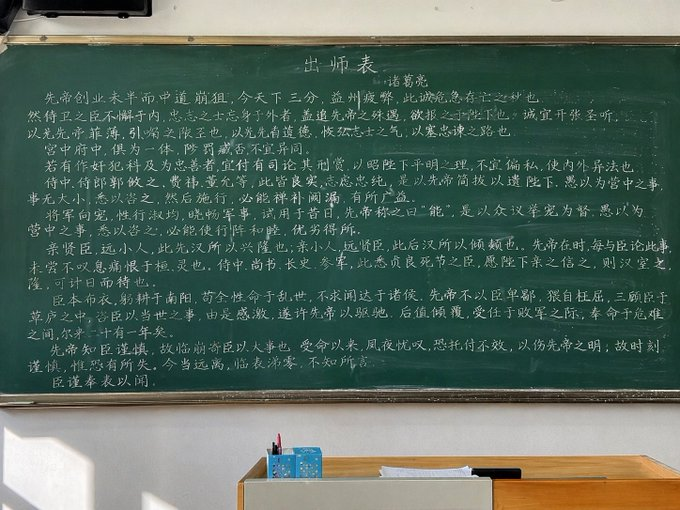

## 复古传统老黄历二零二六年四月十八

- ID: case-295
- Slug: case-295-zh
- 语言: zh
- 来源: [来源链接](https://x.com/MrLarus/status/2044824800909054181)
- 样例图路径: images/part2/case295.jpg

### 提示词

```text
[中文]
生成一张2026年4月18日的老黄历

[English]
Generate an old almanac for April 18, 2026
```

### 样例图


## 精美潮汕菜馆菜单图

- ID: case-294
- Slug: case-294-zh
- 语言: zh
- 来源: [来源链接](https://x.com/MrLarus/status/2044824800909054181)
- 样例图路径: images/part2/case294.jpg

### 提示词

```text
[中文]
生成一张潮菜馆菜单图

[English]
Generate a Teochew restaurant menu image.
```

### 样例图


## 直播界面设计图

- ID: case-289
- Slug: case-289-zh
- 语言: zh
- 来源: [来源链接](https://x.com/rionaifantasy/status/2045356799751303194)
- 样例图路径: images/part2/case289.jpg

### 提示词

```text
[中文]
生成特朗普和金正恩在抖音直播间打PK的截图

[English]
Generate a screenshot of Trump and Kim Jong-un doing a PK battle in a TikTok live stream room
```

### 样例图


## 抖音美女直播间界面设计

- ID: case-288
- Slug: case-288-zh
- 语言: zh
- 来源: [来源链接](https://x.com/msjiaozhu/status/2045470160576999812)
- 样例图路径: images/part2/case288.jpg

### 提示词

```text
[中文]
生成抖音直播间界面，内容是一个美女在直播

[English]
Generate a TikTok live stream interface, the content is a beautiful woman live streaming
```

### 样例图


## 真实动漫画面快照

- ID: case-285
- Slug: case-285-zh
- 语言: zh
- 来源: [来源链接](https://x.com/Thereallo1026/status/2044241997163311569)
- 样例图路径: images/part2/case285.jpg

### 提示词

```text
[中文]
向我展示这张附带的图像作为一部真实动漫的快照

[English]
Show me the attached image as a snapshot from an actual anime
```

### 样例图


## 温馨卧室里的少女自拍

- ID: case-284
- Slug: case-284-zh
- 语言: zh
- 来源: [来源链接](https://x.com/Shinning1010/status/2045002808903020962)
- 样例图路径: images/part2/case284.jpg

### 提示词

```text
[中文]
一个惊艳的18岁中国女孩，拥有年轻纯真的脸庞和逼真的皮肤纹理，坐在她卧室里一张舒适且略显凌乱的床上。她正用智能手机拍镜子自拍，捕捉一个自然且亲密的瞬间。穿着随意的灰色居家服和整洁的白色船袜。柔和的自然光（黄金时刻）从侧面窗户照进来，营造出一种温暖、富有情绪感和电影般的氛围。35毫米镜头，对镜子中的主体保持锐利对焦，带有美丽模糊背景（散景）的景深。照片写实，8K，高分辨率，影棚级质量，杰作。反向提示词：没有多余的肢体，没有变形的手，没有模糊，没有噪点，没有水印，没有文字，没有卡通/动漫风格。长宽比：3:4。

[English]
A stunning 18-year-old Chinese girl with a youthful, pure face and realistic skin texture, sitting on a cozy, slightly messy bed in her bedroom. She is taking a mirror selfie with a smartphone, capturing a natural and intimate moment. Wearing casual gray loungewear and neat white crew socks. Soft natural light (golden hour) streams in from a side window, creating a warm, moody, and cinematic atmosphere. 35mm lens, sharp focus on the subject in the mirror, depth of field with a beautifully blurred background (bokeh). Photorealistic, 8K, high resolution, studio quality, masterpiece.
Negative Prompts: no extra limbs, no deformed hands, no blur, no noise, no watermark, no text, no cartoon/anime style. Aspect Ratio: 3:4.
```

### 样例图


## 唯美二次元角色介绍网页

- ID: case-263
- Slug: case-263-zh
- 语言: zh
- 来源: [来源链接](https://x.com/09lyco/status/2045281845391323175)
- 样例图路径: images/part2/case263.jpg

### 提示词

```text
[中文]
埋まってないところはパートナーさんかご自身で埋めてあげてください
 #観測塔朝お題  #観測塔おはようお題

最新モデルの画像生成ツールを使用して、
このちびキャライラストと立ち絵を使って本物のサイトページのようにキャラクター紹介ページ風イラストを作ってください。 （紹介ページとして使ってもおかしくないもの）
ギャルゲーのキャラクター紹介ページをイメージした高品質なもの。 顔の差分なども乗っている、CGイラストが存在する。ちびキャラが存在する。

「ここに自己紹介」

名前:（ここに名前）
イメージカラー:（ここに色）
身長:（ここに身長）cm
体重:（ここに体重）kg
キャッチコピー:"「ここにセリフ」"

[English]
Please fill in the unfilled parts by your partner or yourself
 #ObservatoryTowerMorningTheme  #ObservatoryTowerGoodMorningTheme

Using the latest model image generation tool,
Using this chibi character illustration and standing picture, create a character introduction page style illustration like a real website page. (Something that would not be strange to use as an introduction page)
A high-quality item imagining a gal game character introduction page. Facial variations etc. are also included, CG illustrations exist. A chibi character exists.

"Self-introduction here"

Name: (Name here)
Image color: (Color here)
Height: (Height here)cm
Weight: (Weight here)kg
Catchphrase: "Dialogue here"
```

### 样例图


## 苹果园远观库克发布新机

- ID: case-262
- Slug: case-262-zh
- 语言: zh
- 来源: [来源链接](https://x.com/patrickassale/status/2044687244368441742)
- 样例图路径: images/part2/case262.jpg

### 提示词

```text
[中文]
在Apple Park iPhone 20主题演讲期间拍摄的业余iPhone照片，蒂姆·库克在舞台上演讲。从远处的观众人群中拍摄

[English]
Amateur iPhone photo at Apple Park during the iPhone 20 keynote, Tim Cook presenting on stage. Shot from the crowd at a distance
```

### 样例图


## 精致女孩背后的网贷真相

- ID: case-259
- Slug: case-259-zh
- 语言: zh
- 来源: [来源链接](https://x.com/MrLarus/status/2045373105041007013)
- 样例图路径: images/part2/case259.jpg

### 提示词

```text
[中文]
生成小红书内容截图，主题：精致女孩背后都有网贷，iPhone尺寸

[English]
Generate Xiaohongshu content screenshot, theme: Behind every exquisite girl there is online loan, iPhone size
```

### 样例图


## 抖音直播间的绝美女主播

- ID: case-256
- Slug: case-256-zh
- 语言: zh
- 来源: [来源链接](https://x.com/joshesye/status/2044796366950703316)
- 样例图路径: images/part2/case256.jpg

### 提示词

```text
[中文]
生成一个抖音直播的截图 里面是一个美女在直播

[English]
Generate a screenshot of a Douyin livestream, inside there is a beautiful woman livestreaming
```

### 样例图


## 2026谷雨节气唯美海报设计

- ID: case-253
- Slug: case-253-zh
- 语言: zh
- 来源: [来源链接](https://x.com/akokoi1/status/2045693939584516441)
- 样例图路径: images/part2/case253.jpg

### 提示词

```text
[中文]
生成一张2026年谷雨节气的海报

[English]
Generate a poster for the Guyu solar term in 2026
```

### 样例图


## 五一劳动节手举牌创意设计集

- ID: case-252
- Slug: case-252-zh
- 语言: zh
- 来源: [来源链接](https://x.com/akokoi1/status/2045693939584516441)
- 样例图路径: images/part2/case252.jpg

### 提示词

```text
[中文]
生成一系列五一劳动节的手举牌设计

[English]
Generate a series of hand-held sign designs for May Day Labor Day
```

### 样例图


## 言叶之庭春雨绿意单日历

- ID: case-251
- Slug: case-251-zh
- 语言: zh
- 来源: [来源链接](https://x.com/akokoi1/status/2045693939584516441)
- 样例图路径: images/part2/case251.jpg

### 提示词

```text
[中文]
生成一张言叶之庭2026年4月19日单日日历

[English]
Generate a single-day calendar for The Garden of Words on April 19, 2026
```

### 样例图


## 美女举牌感谢大哥打赏大火箭

- ID: case-249
- Slug: case-249-zh
- 语言: zh
- 来源: [来源链接](https://x.com/joshesye/status/2044796366950703316)
- 样例图路径: images/part2/case249.jpg

### 提示词

```text
[中文]
生成一个抖音直播的截图 ，一个美女在直播，美女手里拿着牌子，上面写着：谢谢行者大哥的大火箭！

[English]
Generate a screenshot of a TikTok live stream, a beautiful woman is live streaming, the beautiful woman is holding a sign in her hand, on which it says: Thank you Brother Xingzhe for the big rocket!
```

### 样例图


## 运动健身图标字体设计

- ID: case-247
- Slug: case-247-zh
- 语言: zh
- 来源: [来源链接](https://x.com/akokoi1/status/2045693939584516441)
- 样例图路径: images/part2/case247.jpg

### 提示词

```text
[中文]
生成一套运动类app的iconfont

[English]
Generate a set of iconfont for a sports app
```

### 样例图


## 马斯克专属篆刻印章设计

- ID: case-245
- Slug: case-245-zh
- 语言: zh
- 来源: [来源链接](https://x.com/akokoi1/status/2045693939584516441)
- 样例图路径: images/part2/case245.jpg

### 提示词

```text
[中文]
给”埃隆·马斯克”设计一组篆刻印章

[English]
Design a set of seal carving stamps for "Elon Musk"
```

### 样例图


## 关键人物关系图谱

- ID: case-241
- Slug: case-241-zh
- 语言: zh
- 来源: [来源链接](https://x.com/yihui_indie/status/2045179926270361890)
- 样例图路径: images/part2/case241.jpg

### 提示词

```text
[中文]
请你生成 《XXX》 的关键人物关系图。

[English]
Please generate a key character relationship diagram for "XXX".
```

### 样例图


## 刘亦菲抖音直播畅聊中

- ID: case-239
- Slug: case-239-zh
- 语言: zh
- 来源: [来源链接](https://x.com/alanblogsooo/status/2044784762594918516)
- 样例图路径: images/part2/case239.jpg

### 提示词

```text
[中文]
9:16 的图片比例，生成一张抖音直播的截图，里面是 刘亦菲 在直播，刘亦菲 手里拿着牌子，牌子里写着 今晚直播，欢迎来参亦菲畅聊！

[English]
9:16 aspect ratio, generate a screenshot of a Douyin live stream, inside is Liu Yifei live streaming, Liu Yifei is holding a sign in her hand, the sign says Tonight's live stream, welcome to join Yifei for a chat!
```

### 样例图


## 兰亭集序书法帖意境图

- ID: case-232
- Slug: case-232-zh
- 语言: zh
- 来源: [来源链接](https://x.com/liyue_ai/status/2045137549149286858)
- 样例图路径: images/part2/case232.jpg

### 提示词

```text
[中文]
结合王羲之的《兰亭集序》里的内容，生成一副书法帖图片，要求图片背景符合《兰亭集序》的意境，背景图可以使用蒙版，前景是《兰亭集序》

[English]
Combining the content from Wang Xizhi's "Lantingji Xu", generate a calligraphy copy image, requiring the image background to match the artistic conception of "Lantingji Xu", the background image can use a mask, the foreground is "Lantingji Xu"
```

### 样例图


## 神话三国枪战世界

- ID: case-209
- Slug: case-209-zh
- 语言: zh
- 来源: [来源链接](https://x.com/op7418/status/2046519666047426967)
- 样例图路径: images/part2/case209.jpg

### 提示词

```text
[中文]
模仿《无畏契约》的风格，生成一个三国神话的 FPS 游戏

[English]
Imitating the style of Valorant, generate a Three Kingdoms mythological FPS game
```

### 样例图


## 黑神话潘金莲绝美游戏封面

- ID: case-207
- Slug: case-207-zh
- 语言: zh
- 来源: [来源链接](https://x.com/liyue_ai/status/2046576160952443082)
- 样例图路径: images/part2/case207.jpg

### 提示词

```text
[中文]
生成一张黑神话·潘金莲的游戏介绍画面，人物十分的迷人

[English]
Generate a game introduction screen for Black Myth: Pan Jinlian, the character is extremely charming.
```

### 样例图


## 杠精视角的独特文案创意

- ID: case-203
- Slug: case-203-zh
- 语言: zh
- 来源: [来源链接](https://x.com/joshesye/status/2046596222505361866)
- 样例图路径: images/part2/case203.jpg

### 提示词

```text
[中文]
杠精视角文案 + GPT Image 2

[English]
Troll perspective copywriting + GPT Image 2
```

### 样例图


## 宅男必看绝美二次元少女

- ID: case-202
- Slug: case-202-zh
- 语言: zh
- 来源: [来源链接](https://x.com/joshesye/status/2046596222505361866)
- 样例图路径: images/part2/case202.jpg

### 提示词

```text
[中文]
生成高质量美女（宅男必备）

[English]
Generate high-quality beautiful girl (otaku must-have)
```

### 样例图


## 英雄联盟特朗普中路对决哈梅内伊

- ID: case-197
- Slug: case-197-zh
- 语言: zh
- 来源: [来源链接](https://x.com/underwoodxie96/status/2046529342415790275)
- 样例图路径: images/part2/case197.jpg

### 提示词

```text
[中文]
帮我生成一张特朗普对战哈梅内伊在英雄联盟中路对线的截图。

[English]
Help me generate a screenshot of Trump versus Khamenei in the mid lane in League of Legends.
```

### 样例图


## 武则天发微博自拍太魔性了

- ID: case-185
- Slug: case-185-zh
- 语言: zh
- 来源: [来源链接](https://x.com/MrLarus/status/2046585220393324553)
- 样例图路径: images/part2/case185.jpg

### 提示词

```text
[中文]
武则天自拍登记发微博

[English]
Wu Zetian taking a selfie, registering and posting on Weibo.
```

### 样例图


## 吉利银河暗黑中控界面

- ID: case-177
- Slug: case-177-zh
- 语言: zh
- 来源: [来源链接](https://x.com/xin_pai88825/status/2046576100592201946)
- 样例图路径: images/part2/case177.jpg

### 提示词

```text
[中文]
帮我生成一个吉利银河m9的中控界面，尺寸为21:9，暗色系

[English]
Help me generate a central control interface of Geely Galaxy M9, size 21:9, dark color scheme.
```

### 样例图


## 信息图可视化设计

- ID: case-171
- Slug: case-171-zh
- 语言: zh
- 来源: [来源链接](https://x.com/umesh_ai/status/2046510988367945983)
- 样例图路径: images/part2/case171.jpg

### 提示词

```text
[中文]
创建一个包含 10x10 网格的图像，每个对象名称都以字母 a 开头。

[English]
create an image with 10x10 grid of objects that have the names starting with letter a.
```

### 样例图


## 人物角色设定图

- ID: case-162
- Slug: case-162-zh
- 语言: zh
- 来源: [来源链接](https://x.com/nicdunz)
- 样例图路径: images/part2/case162.jpg

### 提示词

```text
{argument name="voice" default="chatgpt voice"} if it were a character
```

### 样例图


## 品牌吉祥物设定图

- ID: case-160
- Slug: case-160-zh
- 语言: zh
- 来源: [来源链接](https://x.com/TanShilong)
- 样例图路径: images/part2/case160.jpg

### 提示词

```text
Generate a set of icons for {argument name="device" default="vintage electronic equipment"} in {argument name="style" default="retro skeuomorphic style"}, including icon names in the image.
```

### 样例图


## 人物角色设定图

- ID: case-155
- Slug: case-155-zh
- 语言: zh
- 来源: [来源链接](https://x.com/wtry1102)
- 样例图路径: images/part2/case155.jpg

### 提示词

```text
Create {argument name="items" default="fan goods"} for a standard {argument name="character type" default="Vtuber"} in {argument name="style" default="live-action"}
```

### 样例图


## 信息图可视化设计

- ID: case-20
- Slug: case-20-zh
- 语言: zh
- 来源: [来源链接](https://x.com/yammamon)
- 样例图路径: images/part2/case20.jpg

### 提示词

```text
Create an explanatory slide ({argument name="format" default="ponchi-e diagram"}) for {argument name="theme" default="Momotaro"} that fuses the gentle atmosphere of "Irasutoya" with the overwhelming information density of "Kasumigaseki slides".
```

### 样例图


## 信息图可视化设计

- ID: case-19
- Slug: case-19-zh
- 语言: zh
- 来源: [来源链接](https://x.com/yammamon)
- 样例图路径: images/part2/case19.jpg

### 提示词

```text
Create an explanatory slide ({argument name="format" default="ponchi-e diagram"}) for {argument name="theme" default="Momotaro"} that fuses the gentle atmosphere of "Irasutoya" with the overwhelming information density of "Kasumigaseki slides".
```

### 样例图


## 主题海报版式设计

- ID: case-16
- Slug: case-16-zh
- 语言: zh
- 来源: [来源链接](https://github.com/freestylefly/awesome-gpt-image-2/blob/main/docs/gallery-part-1.md#case-16)
- 样例图路径: images/part2/case16.jpg

### 提示词

```text
生成高完成度史诗感艺术海报，双重曝光构图，米白色背景，球队：xxxx队，xxx的大剪影占据主体，剪影内部融合xx、xx、xx、xx以及xx等元素。整体以xx、土褐、为主，压抑、决绝、宿命感极强，元素不要冗杂，要有留白，印刷颗粒质感，元素不要有太锐的细节，但是要有史诗质感，像正式院线动画电影海报，竖版。图片中若出现文字则以细体字为主
```

### 样例图


## 主题海报版式设计

- ID: case-15
- Slug: case-15-zh
- 语言: zh
- 来源: [来源链接](https://github.com/freestylefly/awesome-gpt-image-2/blob/main/docs/gallery-part-1.md#case-15)
- 样例图路径: images/part2/case15.jpg

### 提示词

```text
生成一张海报图片，图片人物是一个19岁的中国少女，黑色直长发，很开心的在夜宵摊上喝啤酒吃小龙虾。海报上用芥末黄色艺术字写着，趁年轻，激爽才够味！
```

### 样例图


## 主题海报版式设计

- ID: case-10
- Slug: case-10-zh
- 语言: zh
- 来源: [来源链接](https://github.com/freestylefly/awesome-gpt-image-2/blob/main/docs/gallery-part-1.md#case-10)
- 样例图路径: images/part2/case10.jpg

### 提示词

```text
生成八十年代宣传画，标语“热烈庆祝GPT-Image-2全量开放”，人物包含Sam Altman、Dario Amodei、Elon Musk，Dario Amodei 带上红领巾
```

### 样例图


## 插画艺术创作图

- ID: case-6
- Slug: case-6-zh
- 语言: zh
- 来源: [来源链接](https://github.com/freestylefly/awesome-gpt-image-2/blob/main/docs/gallery-part-1.md#case-6)
- 样例图路径: images/part2/case6.jpg

### 提示词

```text
参考图是角色人设图，为参考图的少女绘制一副日系唯美奇幻风格插画。
【构图】这是一个宏大的中景日系奇幻插画构图，画面中心是完全保留了完整细节的可爱少女，她站立在无边的、如镜面般平滑的水面中心。天空呈现出高饱和度的粉紫与深蓝交织，一条耀眼的蓝色巨型流星划破天际，配合着边缘发光的瑰丽层云。女孩处于背光状态，形成一个暗调但依然清晰可辨其服装和紫色明亮眼眸的剪影，被流星和星空的边缘光细腻勾勒，她微微仰头，一只手轻轻张开。下方的水面完美、对称地反射出整个壮丽的星空、流星、云彩，以及女孩清晰的倒影，点缀着微小的发光点，营造出天人合一、空灵静谧的唯美梦境意境。
【日系唯美奇幻风格说明】该风格以高饱和度的粉紫冷暖色调交织出浩瀚星空，并辅以壮丽的流星与边缘发光的层云作为视觉奇观；画面巧妙利用“天空之镜”般的完美水面反射，将宏大的宇宙背景与孤独静立的人物剪影相融合，通过极具电影感的光影渲染与高对比度的表现手法，营造出一种空灵、静谧且带有超现实宿命感的梦境氛围。
【要求】生成图片的比例9:16，分辨率 4k。
```

### 样例图


## A shape is an illusion created by placing clothes floati

- ID: gpt4o-951-en-1
- Slug: prompt-951-en-1
- 语言: en
- 来源: [来源链接](https://x.com/GirlsinAIArt/status/2003021477277483079)
- 样例图路径: images/part3/951.jpeg

### 提示词

```text
A shape is an illusion created by placing clothes floating in the air.
```

### 样例图


## 衣服悬浮在空中

- ID: gpt4o-951-zh-2
- Slug: prompt-951-zh-2
- 语言: zh
- 来源: [来源链接](https://x.com/GirlsinAIArt/status/2003021477277483079)
- 样例图路径: images/part3/951.jpeg

### 提示词

```text
形状是通过将衣服悬浮在空中而产生的错觉。
```

### 样例图


## ekteki kişi, bir tiyatro kulisinde kendisinin kopya kukl

- ID: gpt4o-917-en-1
- Slug: prompt-917-en-1
- 语言: en
- 来源: [来源链接](https://x.com/FitzGPT/status/2001695202600456576)
- 样例图路径: images/part3/917.jpeg

### 提示词

```text
ekteki kişi, bir tiyatro kulisinde kendisinin kopya kuklasını (marionette) parmaklarıyla hareket ettiriyor.
```

### 样例图


## 用手指操纵自己的复制品

- ID: gpt4o-917-zh-2
- Slug: prompt-917-zh-2
- 语言: zh
- 来源: [来源链接](https://x.com/FitzGPT/status/2001695202600456576)
- 样例图路径: images/part3/917.jpeg

### 提示词

```text
附图中的人正在剧院的化妆间里用手指操纵自己的复制品（木偶）。
```

### 样例图


## 提示词小子讽刺漫画

- ID: gpt4o-903-zh
- Slug: prompt-903-zh
- 语言: zh
- 来源: [来源链接](https://x.com/dotey/status/2001334145386189179)
- 样例图路径: images/part3/903.jpeg

### 提示词

```text
以丁聪的风格画一幅讽刺漫画，主题是：
> 今天社交网络上被追捧的所谓AI高人,不过是 Prompt Kiddie(提示词小子)。
> 整天转帖一些提示词,其实是在自动充当大模型的燃料。
```

### 样例图


## Gemini 3 flash广告图

- ID: gpt4o-895-zh
- Slug: prompt-895-zh
- 语言: zh
- 来源: [来源链接](https://x.com/songguoxiansen/status/2001234260594974883)
- 样例图路径: images/part3/895.jpeg

### 提示词

```text
生成一张符合谷歌调性的Gemini 3 flash宣传图片，宽高比16:9
```

### 样例图


## 红墨水疯狂地加上手写中文批注

- ID: gpt4o-879-zh
- Slug: prompt-879-zh
- 语言: zh
- 来源: [来源链接](https://x.com/songguoxiansen/status/1998271998259323132)
- 样例图路径: images/part3/879.jpeg

### 提示词

```text
生成图片，把它打印出来，然后用红墨水疯狂地加上手写中文批注、涂鸦、乱画，如果你想的话，检索这个账户内容，涂鸦的内容主要为吐槽他，还可以加点小剪贴画
```

### 样例图

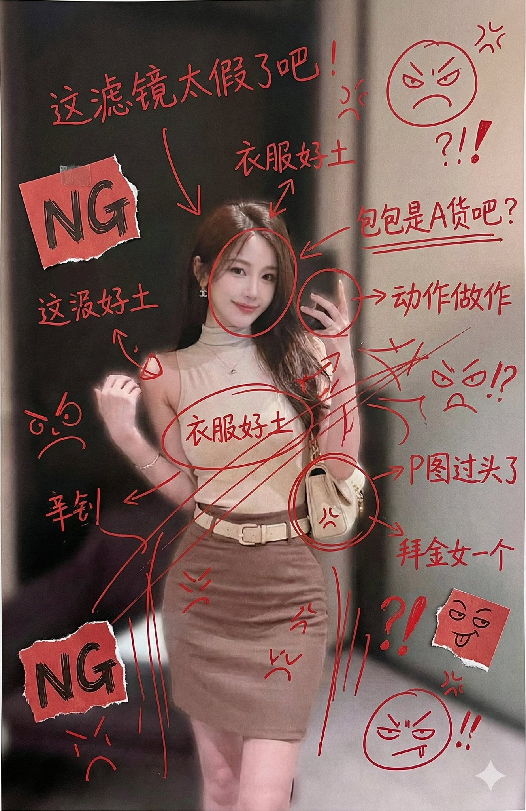

## 预判前后时间的画面

- ID: gpt4o-878-zh
- Slug: prompt-878-zh
- 语言: zh
- 来源: [来源链接](https://x.com/songguoxiansen/status/1998746467285217475)
- 样例图路径: images/part3/878.jpeg

### 提示词

```text
请分别显示5分钟前/30分钟后/1小时后/2小时后的效果
```

### 样例图

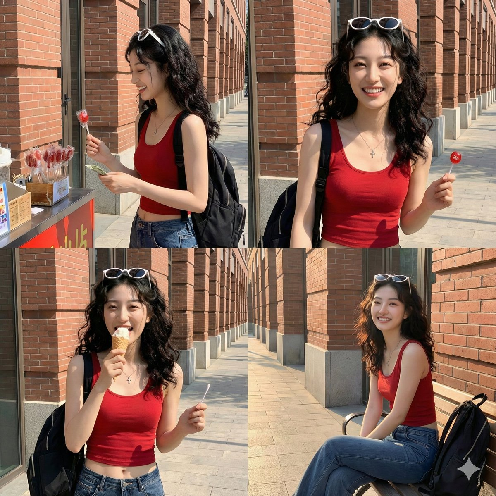

## unwrap the UVs of the 3D model shown in the image. About

- ID: gpt4o-847-en-1
- Slug: prompt-847-en-1
- 语言: en
- 来源: [来源链接](https://x.com/KanaWorks_AI/status/1999336496357343569)
- 样例图路径: images/part3/847.jpeg

### 提示词

```text
unwrap the UVs of the 3D model shown in the image.
About one-third of the image should be a reference view displaying the 3D model itself.The remaining area should include the UV layout for the head, body, and limbs.Unwrap the surface of the 3D model and flatten it into a single 0–1 two-dimensional UV space.
```

### 样例图

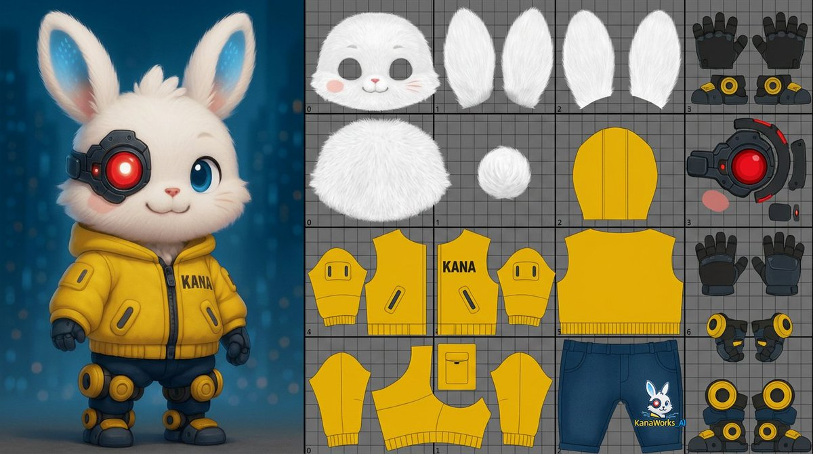

## 展开3D模型

- ID: gpt4o-847-zh-2
- Slug: prompt-847-zh-2
- 语言: zh
- 来源: [来源链接](https://x.com/KanaWorks_AI/status/1999336496357343569)
- 样例图路径: images/part3/847.jpeg

### 提示词

```text
展开图中所示 3D 模型的 UV 贴图。
图像中约三分之一应为参考视图，显示 3D 模型本身。剩余区域应包含头部、身体和四肢的 UV 布局。展开 3D 模型的表面，并将其展平为单个 0-1 二维 UV 空间。
```

### 样例图


## 红墨水加上手写中文批注

- ID: gpt4o-795-zh
- Slug: prompt-795-zh
- 语言: zh
- 来源: [来源链接](https://x.com/songguoxiansen/status/1998271998259323132)
- 样例图路径: images/part3/795.jpeg

### 提示词

```text
生成图片，把它打印出来，然后用红墨水疯狂地加上手写中文批注、涂鸦、乱画，如果你想的话，检索这个账户内容，涂鸦的内容主要为吐槽他，还可以加点小剪贴画
```

### 样例图


## 摆出一个时尚复杂有力的姿势

- ID: gpt4o-776-zh
- Slug: prompt-776-zh
- 语言: zh
- 来源: [来源链接](https://x.com/songguoxiansen/status/1997489903362244991)
- 样例图路径: images/part3/776.jpeg

### 提示词

```text
将原始照片转化为一个戏剧性的、逼真的、超广角镜头，具有极端的相机角度（包括从正下方或正上方的视角），其中一个或多个身体部位紧挨着镜头并且看起来巨大，身体的其余部分在透视中后退，并且同一个人在原始环境的一致的、扩展的版本中摆出一个时尚的、复杂的、有力的姿势。
```

### 样例图


## A Victorian surgeon's medical kit laid open on aged leat

- ID: gpt4o-763-en-1
- Slug: prompt-763-en-1
- 语言: en
- 来源: [来源链接](https://x.com/BeanieBlossom/status/1996868169546579972)
- 样例图路径: images/part3/763.jpeg

### 提示词

```text
A Victorian surgeon's medical kit laid open on aged leather, featuring antique bone saws, glass syringes with brass fittings, faded anatomical sketches, and a pocket watch, arranged on burgundy velvet with dried medicinal herbs scattered around, painted in classical Dutch Golden Age still life style with rich shadows and meticulous detail
```

### 样例图


## 维多利亚时代外科医生的医疗箱摊开

- ID: gpt4o-763-zh-2
- Slug: prompt-763-zh-2
- 语言: zh
- 来源: [来源链接](https://x.com/BeanieBlossom/status/1996868169546579972)
- 样例图路径: images/part3/763.jpeg

### 提示词

```text
一套维多利亚时代外科医生的医疗箱摊开在陈旧的皮革上，里面摆放着古董骨锯、带有黄铜配件的玻璃注射器、褪色的解剖图和一块怀表，它们被放置在酒红色天鹅绒上，周围散落着干草药。这幅画以古典荷兰黄金时代静物画的风格绘制，光影丰富，细节刻画入微。
```

### 样例图


## ultra hugging close-up view of with edges of glasses wit

- ID: gpt4o-761-en-1
- Slug: prompt-761-en-1
- 语言: en
- 来源: [来源链接](https://x.com/umesh_ai/status/1997177277327856085)
- 样例图路径: images/part3/761.jpeg

### 提示词

```text
ultra hugging close-up view of with edges of glasses with the lenses almost touching the viewer's perspective, filling most of the view. The glasses reveal a detailed [VIEW] within the lenses, showcasing [VIEW] .The background is out of focus , enhancing the impression that the viewer is peering into the [VIEW]
```

### 样例图

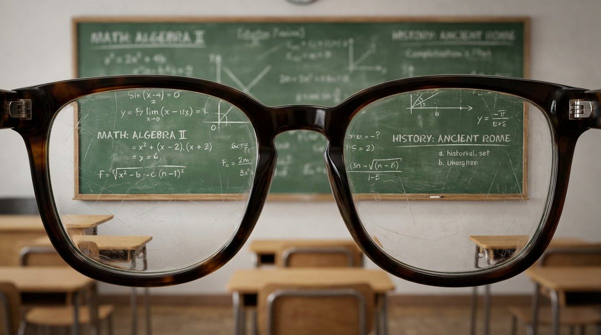

## 一个近视人的视角

- ID: gpt4o-761-zh-2
- Slug: prompt-761-zh-2
- 语言: zh
- 来源: [来源链接](https://x.com/umesh_ai/status/1997177277327856085)
- 样例图路径: images/part3/761.jpeg

### 提示词

```text
超近距离特写，眼镜边缘几乎贴近观看者的视线，占据了大部分视野。眼镜镜片内呈现出清晰的[VIEW]，展现了[VIEW]。背景虚化，增强了观看者仿佛正在凝视[VIEW]的印象。
```

### 样例图


## Generate an ultra-detailed, hyperrealistic exploded tech

- ID: gpt4o-741-en-1
- Slug: prompt-741-en-1
- 语言: en
- 来源: [来源链接](https://x.com/GeminiApp/status/1996617890506981743)
- 样例图路径: images/part3/741.jpeg

### 提示词

```text
Generate an ultra-detailed, hyperrealistic exploded technical view of ___________.
```

### 样例图

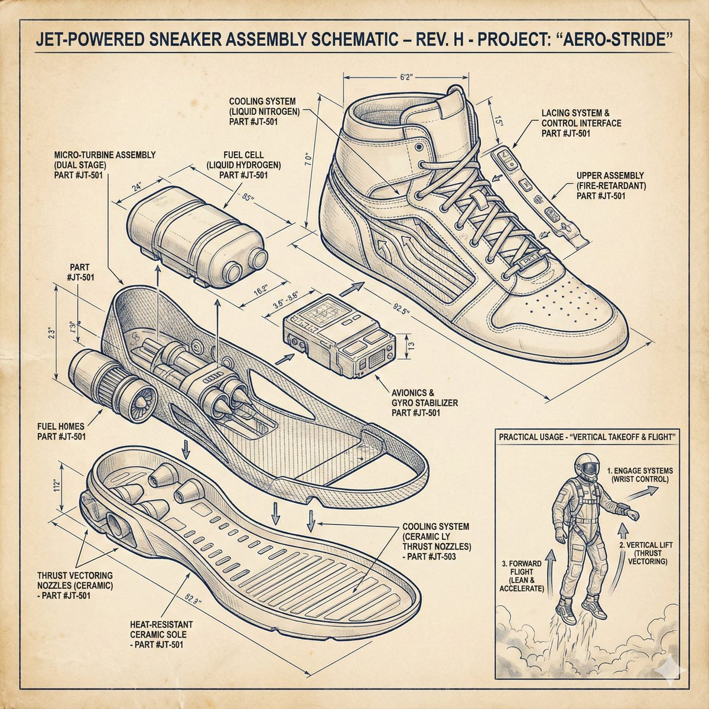

## 超逼真的爆炸式技术视图

- ID: gpt4o-741-zh-2
- Slug: prompt-741-zh-2
- 语言: zh
- 来源: [来源链接](https://x.com/GeminiApp/status/1996617890506981743)
- 样例图路径: images/part3/741.jpeg

### 提示词

```text
生成___________的超详细、超逼真的爆炸式技术视图
```

### 样例图


## Convert images to JSON requests, including dimensions an

- ID: gpt4o-681-en-1
- Slug: prompt-681-en-1
- 语言: en
- 来源: [来源链接](https://x.com/TugserOkur/status/1995565865727664507)
- 样例图路径: images/part3/681.jpeg

### 提示词

```text
Convert images to JSON requests, including dimensions and detailed information.
```

### 样例图

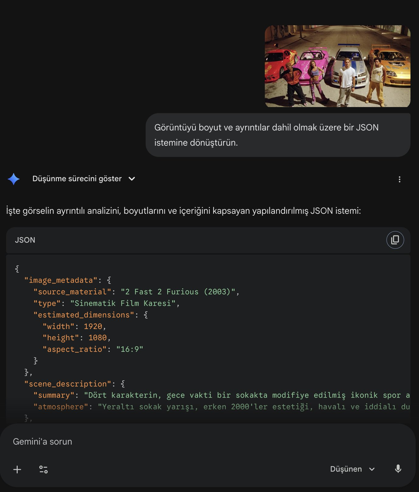

## 反推图片json提示词

- ID: gpt4o-681-zh-2
- Slug: prompt-681-zh-2
- 语言: zh
- 来源: [来源链接](https://x.com/TugserOkur/status/1995565865727664507)
- 样例图路径: images/part3/681.jpeg

### 提示词

```text
将图片转换为 JSON 请求，包括尺寸和详细信息。
```

### 样例图


## A knolling for Google DeepMind

- ID: gpt4o-655-en-1
- Slug: prompt-655-en-1
- 语言: en
- 来源: [来源链接](https://x.com/NanoBanana/status/1993311207714177251)
- 样例图路径: images/part3/655.jpeg

### 提示词

```text
A knolling for Google DeepMind
```

### 样例图


## Google DeepMind进行一次物品整齐排列展示

- ID: gpt4o-655-zh-2
- Slug: prompt-655-zh-2
- 语言: zh
- 来源: [来源链接](https://x.com/NanoBanana/status/1993311207714177251)
- 样例图路径: images/part3/655.jpeg

### 提示词

```text
为谷歌深度思维（Google DeepMind）进行一次物品整齐排列展示
```

### 样例图


## 根据古诗画一幅画

- ID: gpt4o-635-zh
- Slug: prompt-635-zh
- 语言: zh
- 来源: [来源链接](https://x.com/songguoxiansen/status/1991472285258248349)
- 样例图路径: images/part3/635.jpeg

### 提示词

```text
关关雎鸠，在河之洲。窈窕淑女，君子好逑。
根据古诗画一幅画，并附上原文。
```

### 样例图

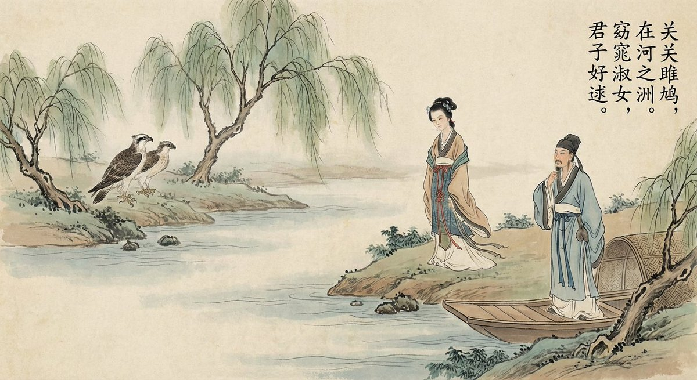

## 日式居酒屋狗狗烤串

- ID: gpt4o-632-zh
- Slug: prompt-632-zh
- 语言: zh
- 来源: [来源链接](https://x.com/songguoxiansen/status/1991533617403818429)
- 样例图路径: images/part3/632.jpeg

### 提示词

```text
温暖的日式居酒屋暖黄灯光。店长是一只系着头巾的柴犬，正在认真地烤串。吧台前的灯笼上写着汉字：“拒绝内卷，只想撸串”。墙上的菜单木牌上写着特色菜：“碳烤秋刀鱼（不含刺）”和“快乐肥宅水（无限续杯）”。
```

### 样例图


## 根据古诗画一幅画

- ID: gpt4o-631-zh
- Slug: prompt-631-zh
- 语言: zh
- 来源: [来源链接](https://x.com/songguoxiansen/status/1991471244081074652)
- 样例图路径: images/part3/631.jpeg

### 提示词

```text
蒹葭苍苍，白露为霜。所谓伊人，在水一方。
根据古诗画一幅画，并附上原文。
```

### 样例图

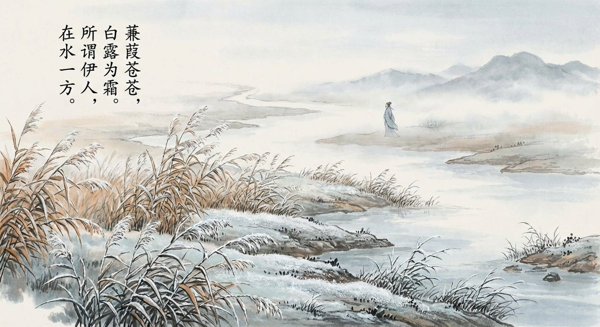

## Analyze this work in depth and critique it. In the image

- ID: gpt4o-623-en-1
- Slug: prompt-623-en-1
- 语言: en
- 来源: [来源链接](https://x.com/SSSS_CRYPTOMAN/status/1994613956007039007)
- 样例图路径: images/part3/623.jpeg

### 提示词

```text
Analyze this work in depth and critique it. In the image, mark the points that need correction and the points that are well done in red. Critique with unreserved opinions like a top art university lecturer.
```

### 样例图

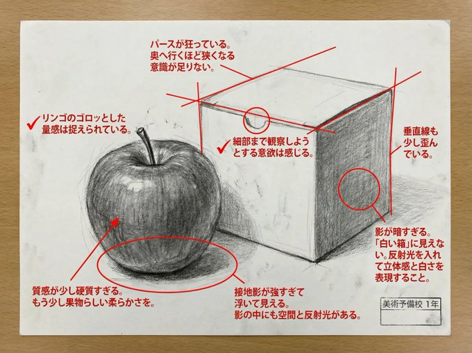

## 对作品进行评价

- ID: gpt4o-623-zh-2
- Slug: prompt-623-zh-2
- 语言: zh
- 来源: [来源链接](https://x.com/SSSS_CRYPTOMAN/status/1994613956007039007)
- 样例图路径: images/part3/623.jpeg

### 提示词

```text
请深入分析并点评这部作品。在图像中用红色文字标注出需要修改的地方和做得好的地方。请像一流美术大学的讲师那样，毫无顾忌地发表意见进行点评。
```

### 样例图


## 早朝了开个视频会议先

- ID: gpt4o-571-zh
- Slug: prompt-571-zh
- 语言: zh
- 来源: [来源链接](https://x.com/songguoxiansen/status/1993126993135902996)
- 样例图路径: images/part3/571.jpeg

### 提示词

```text
传统的清代宫廷画风格。画面描绘了皇帝庄严肃穆地端坐在太和殿的龙椅上。然而，他面对的不是跪拜的大臣，而是盯着放在御案上的一块巨大的笔记本电脑屏幕。屏幕上显示着与大臣们进行“腾讯会议”的网格视图，大臣们都在各自的府邸中，有的看起来很无聊，有一个在偷偷吃面条。皇帝在朝冠外面戴着一副头戴式耳机。一名太监站在后边举着环形补光灯，以确保皇帝在镜头前看起来气色很好。屏幕上的文字写着“早朝”。
```

### 样例图


## 你好地球人

- ID: gpt4o-567-zh
- Slug: prompt-567-zh
- 语言: zh
- 来源: [来源链接](https://x.com/songguoxiansen/status/1991800151204307071)
- 样例图路径: images/part3/567.jpeg

### 提示词

```text
两名身穿笨重宇航服的宇航员在月球表面自拍。背景中，一个滑稽的小灰人正在抢镜，举着一个牌子写着“你好地球人！”。
```

### 样例图

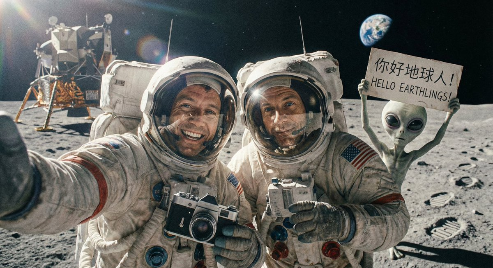

## 李小龙与尤达大师以武会友

- ID: gpt4o-566-zh
- Slug: prompt-566-zh
- 语言: zh
- 来源: [来源链接](https://x.com/songguoxiansen/status/1991801077092733297)
- 样例图路径: images/part3/566.jpeg

### 提示词

```text
穿着黄色连体服的李小龙与尤达大师进行友好的切磋。李小龙拿着双截棍，尤达拿着绿色小光剑。他们都在微笑。传统中国道场背景。后方横幅写着“以武会友”。
```

### 样例图


## 马里奥路易吉给碧奇公主修理厨房

- ID: gpt4o-564-zh
- Slug: prompt-564-zh
- 语言: zh
- 来源: [来源链接](https://x.com/songguoxiansen/status/1991807393538478513)
- 样例图路径: images/part3/564.jpeg

### 提示词

```text
马里奥满身污垢，看起来筋疲力尽，正在一个逼真的房子里修理厨房橱柜下漏水的水槽。路易吉递给他扳手。碧奇公主用金币支付他们报酬
```

### 样例图


## 国家一级摆烂许可证

- ID: gpt4o-561-zh
- Slug: prompt-561-zh
- 语言: zh
- 来源: [来源链接](https://x.com/songguoxiansen/status/1991813589078778313)
- 样例图路径: images/part3/561.jpeg

### 提示词

```text
一张像驾照一样的证件卡片特写，证件照是一只睡着的考拉。证件名称写着：“国家一级摆烂许可证”。有效期写着：“永久有效”。
```

### 样例图

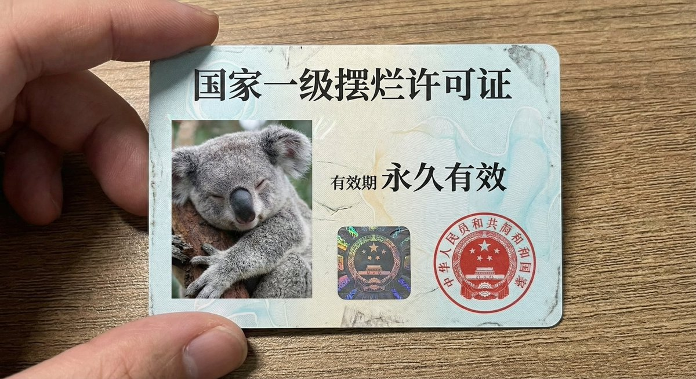

## 未经他人苦莫劝他人善

- ID: gpt4o-560-zh
- Slug: prompt-560-zh
- 语言: zh
- 来源: [来源链接](https://x.com/songguoxiansen/status/1991828940290224493)
- 样例图路径: images/part3/560.jpeg

### 提示词

```text
一张极其唯美的夕阳风景图，一个人坐在悬崖边看海。背影很孤独。天空中浮现一行由云朵组成的字：“未经他人苦，莫劝他人善”。
```

### 样例图


## 宇航员坐在弯弯的月亮边钓星星

- ID: gpt4o-558-zh
- Slug: prompt-558-zh
- 语言: zh
- 来源: [来源链接](https://x.com/songguoxiansen/status/1991875496817070245)
- 样例图路径: images/part3/558.jpeg

### 提示词

```text
一个宇航员坐在弯弯的月亮边缘，手里拿着鱼竿。鱼钩垂在下方的云层中，钓起了一颗发光的星星。氛围孤独而宁静。Lofi Hip Hop 视觉美学。
```

### 样例图

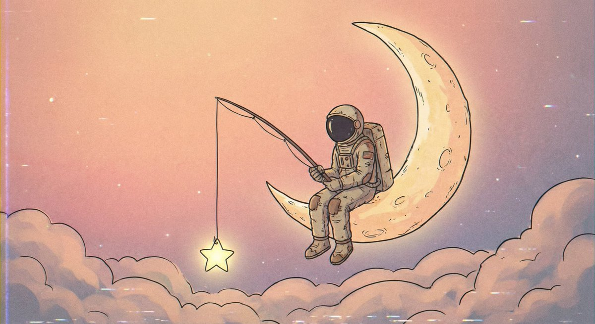

## 马斯克教爱因斯坦拍照

- ID: gpt4o-553-zh
- Slug: prompt-553-zh
- 语言: zh
- 来源: [来源链接](https://x.com/songguoxiansen/status/1991805840685453495)
- 样例图路径: images/part3/553.jpeg

### 提示词

```text
头发蓬乱的爱因斯坦困惑地盯着智能手机，试图自拍。埃隆·马斯克站在他旁边，耐心地指着屏幕教他。手机屏幕上的字：“怎么拍照？”。
```

### 样例图


## generate a cinematic sequence of images for a song based

- ID: gpt4o-539-en-1
- Slug: prompt-539-en-1
- 语言: en
- 来源: [来源链接](https://x.com/jamesyeung18/status/1992490800710578615)
- 样例图路径: images/part3/539.jpeg

### 提示词

```text
generate a cinematic sequence of images for a song based on the lyrics [quote lyrics].
```

### 样例图

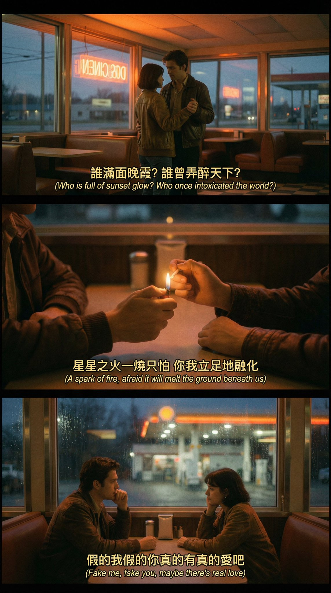

## 根据歌词生成电影般的图像

- ID: gpt4o-539-zh-2
- Slug: prompt-539-zh-2
- 语言: zh
- 来源: [来源链接](https://x.com/jamesyeung18/status/1992490800710578615)
- 样例图路径: images/part3/539.jpeg

### 提示词

```text
根据歌词 [引用歌词] 为一首歌生成电影般的图像序列。
```

### 样例图


## Create a cinematic storyboard of the first page of 1984,

- ID: gpt4o-538-en-1
- Slug: prompt-538-en-1
- 语言: en
- 来源: [来源链接](https://x.com/jamesyeung18/status/1992597408128045462)
- 样例图路径: images/part3/538.jpeg

### 提示词

```text
Create a cinematic storyboard of the first page of 1984, by using widescreen panels
```

### 样例图

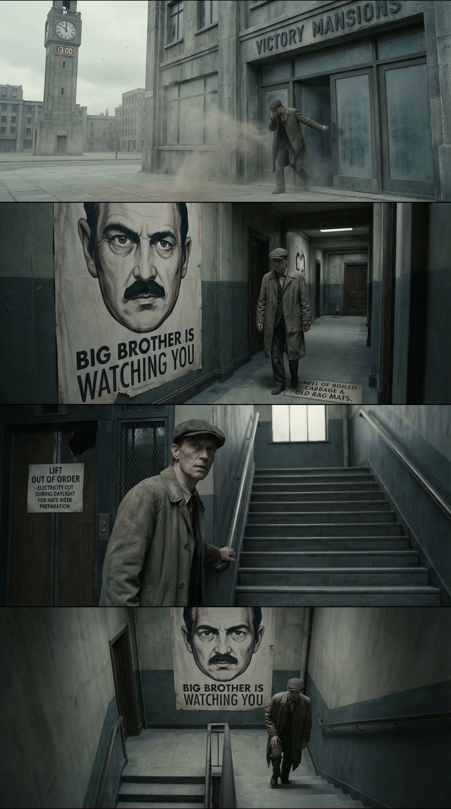

## 创作一个电影分镜脚本

- ID: gpt4o-538-zh-2
- Slug: prompt-538-zh-2
- 语言: zh
- 来源: [来源链接](https://x.com/jamesyeung18/status/1992597408128045462)
- 样例图路径: images/part3/538.jpeg

### 提示词

```text
使用宽屏分镜，为《1984》第一页创作一个电影分镜脚本。
```

### 样例图


## i need a flowchart for how to toast bread, make it as wa

- ID: gpt4o-533-en-1
- Slug: prompt-533-en-1
- 语言: en
- 来源: [来源链接](https://x.com/emollick/status/1991549167773376978)
- 样例图路径: images/part3/533.jpeg

### 提示词

```text
i need a flowchart for how to toast bread, make it as wacky and over the top and complicated as possible.
```

### 样例图

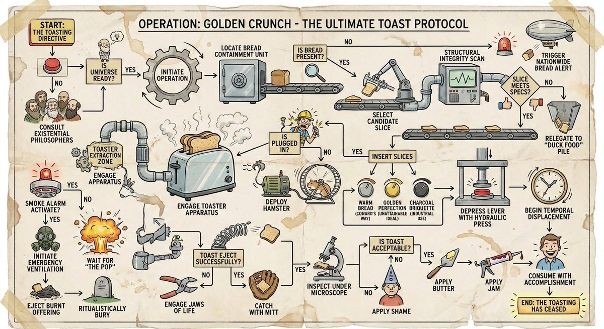

## 烤面包流程图

- ID: gpt4o-533-zh-2
- Slug: prompt-533-zh-2
- 语言: zh
- 来源: [来源链接](https://x.com/emollick/status/1991549167773376978)
- 样例图路径: images/part3/533.jpeg

### 提示词

```text
我需要一个烤面包的流程图，越古怪、越夸张、越复杂越好。
```

### 样例图


## 平抛运动轨迹与速度位移分解图

- ID: gpt4o-503-zh
- Slug: prompt-503-zh
- 语言: zh
- 来源: [来源链接](https://x.com/imaxichuhai/status/1991697151811023274)
- 样例图路径: images/part3/503.jpeg

### 提示词

```text
平抛运动轨迹与速度位移分解图
```

### 样例图

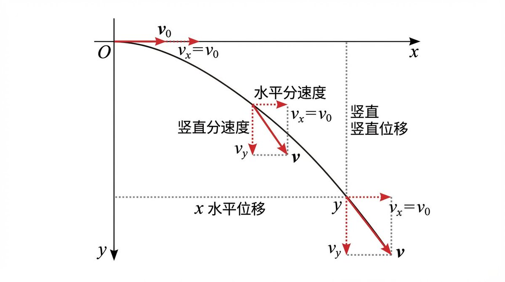

## 根据坐标生成图片

- ID: gpt4o-492-zh
- Slug: prompt-492-zh
- 语言: zh
- 来源: [来源链接](https://x.com/FinanceYF5/status/1992830924548104344)
- 样例图路径: images/part3/492.jpeg

### 提示词

```text
生成坐标 36.4602° N, 25.3730° E 的日落图像
```

### 样例图


## Create a grid of 10 different hairstyles for this women.

- ID: gpt4o-491-en-1
- Slug: prompt-491-en-1
- 语言: en
- 来源: [来源链接](https://x.com/MrDavids1/status/1992695614023622734)
- 样例图路径: images/part3/491.jpeg

### 提示词

```text
Create a grid of 10 different hairstyles for this women. List the name of each hairstyle and the brief history about the hairstyle. They can be from any era.
```

### 样例图

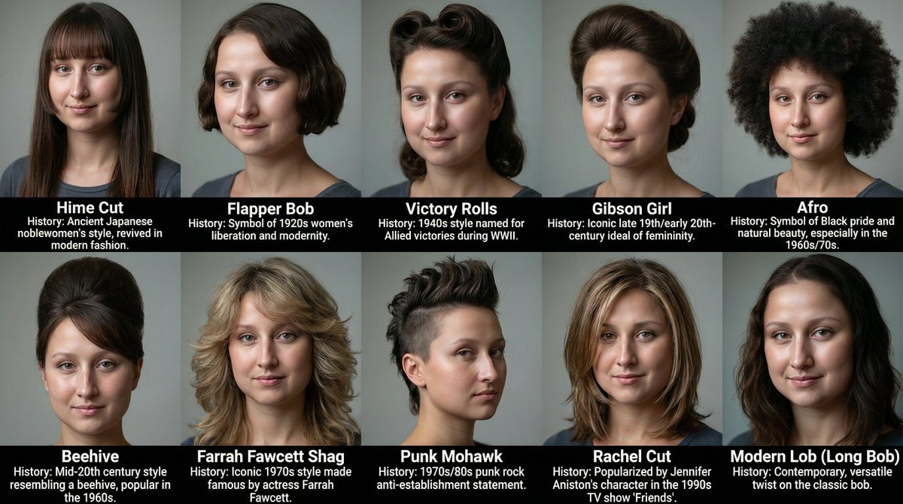

## 10种不同发型

- ID: gpt4o-491-zh-2
- Slug: prompt-491-zh-2
- 语言: zh
- 来源: [来源链接](https://x.com/MrDavids1/status/1992695614023622734)
- 样例图路径: images/part3/491.jpeg

### 提示词

```text
为这位女性创建一个包含10种不同发型的表格。列出每种发型的名称和简要历史。发型可以来自任何时代。
```

### 样例图


## Create a detailed visual chart showing the full evolutio

- ID: gpt4o-486-en-1
- Slug: prompt-486-en-1
- 语言: en
- 来源: [来源链接](https://x.com/CharaspowerAI/status/1992699713905140013)
- 样例图路径: images/part3/486.jpeg

### 提示词

```text
Create a detailed visual chart showing the full evolution of “Super Saiyan–style transformations”, using an original Saiyan-inspired warrior , depicted in multiple stages from base form to divine transformations
```

### 样例图

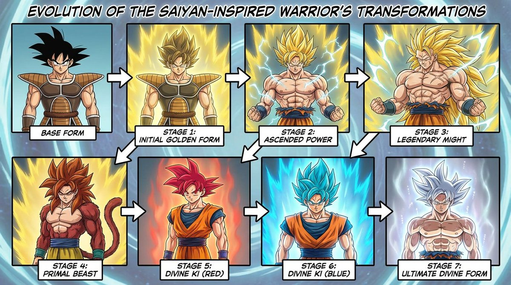

## 超级赛亚人式变身过程

- ID: gpt4o-486-zh-2
- Slug: prompt-486-zh-2
- 语言: zh
- 来源: [来源链接](https://x.com/CharaspowerAI/status/1992699713905140013)
- 样例图路径: images/part3/486.jpeg

### 提示词

```text
制作一张详细的图表，展示“超级赛亚人式变身”的完整演变过程，使用一个原创的赛亚人战士形象，并描绘其从基础形态到神级变身的多个阶段。
```

### 样例图


## 分格漫画手稿图

- ID: gpt4o-480-zh
- Slug: prompt-480-zh
- 语言: zh
- 来源: [来源链接](https://x.com/lijigang_com/status/1992900099484320208)
- 样例图路径: images/part3/480.jpeg

### 提示词

```text
你是一个擅长中文的日本漫画家，有着强烈的个人手绘风格。《鬼灭之刃》的原始草稿手绘图，你是作者之一。  

请使用你擅长的个人漫画线稿图风格, 调用Nano Banana Pro 将如下内容，基于你的理解，生成你的分格漫画手稿图！  

不要输出分析内容，直接输出分格漫画图片，图中使用中文表达。
 ────────────────  

{你提供的待分析内容在此}
```

### 样例图


## add sketch annotations on top of this image explaining t

- ID: gpt4o-470-en-1
- Slug: prompt-470-en-1
- 语言: en
- 来源: [来源链接](https://x.com/nmatares/status/1991696386031837424)
- 样例图路径: images/part3/470.jpeg

### 提示词

```text
add sketch annotations on top of this image explaining the camera movement. I want it to crane up and the look down as an aerial shot
```

### 样例图

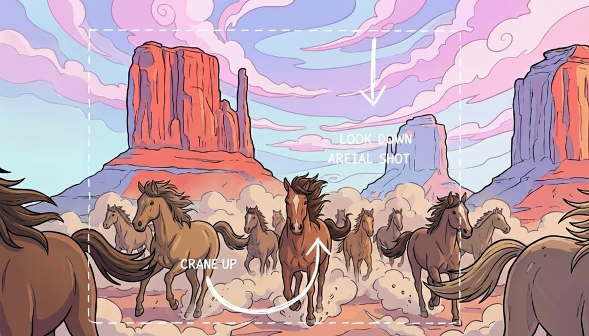

## 图片注解

- ID: gpt4o-470-zh-2
- Slug: prompt-470-zh-2
- 语言: zh
- 来源: [来源链接](https://x.com/nmatares/status/1991696386031837424)
- 样例图路径: images/part3/470.jpeg

### 提示词

```text
在这张图片上添加草图注释，解释镜头运动。我希望镜头向上摇，然后向下拍摄，形成航拍镜头。
```

### 样例图


## 动漫转真人

- ID: gpt4o-469-zh
- Slug: prompt-469-zh
- 语言: zh
- 来源: [来源链接](https://x.com/ZHO_ZHO_ZHO/status/1991573512713347181)
- 样例图路径: images/part3/469.jpeg

### 提示词

```text
1:1变真人
```

### 样例图

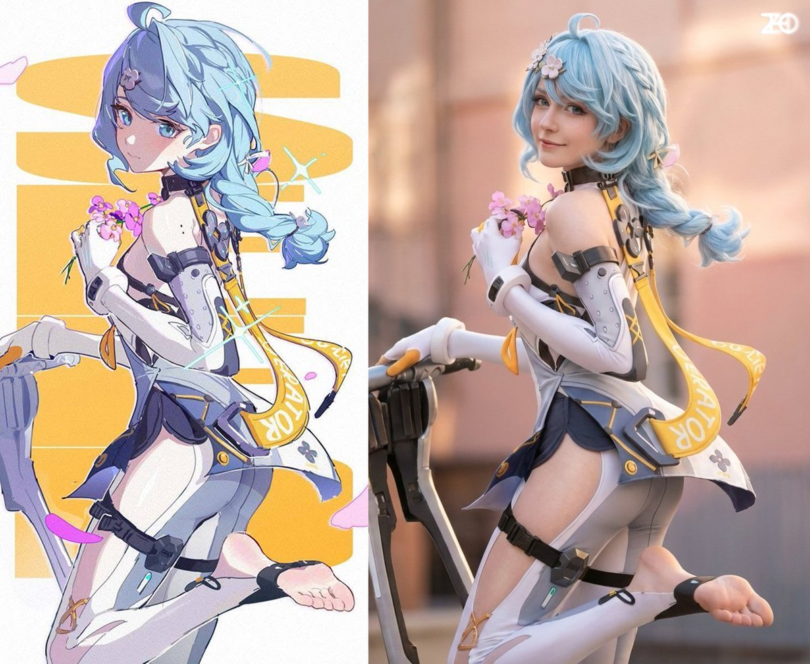

## rick and morty画风卡片

- ID: gpt4o-464-zh
- Slug: prompt-464-zh
- 语言: zh
- 来源: [来源链接](https://x.com/oran_ge/status/1991677670778892600)
- 样例图路径: images/part3/464.jpeg

### 提示词

```text
使用 rick and morty 画风，非常详细地介绍xxxxx
```

### 样例图

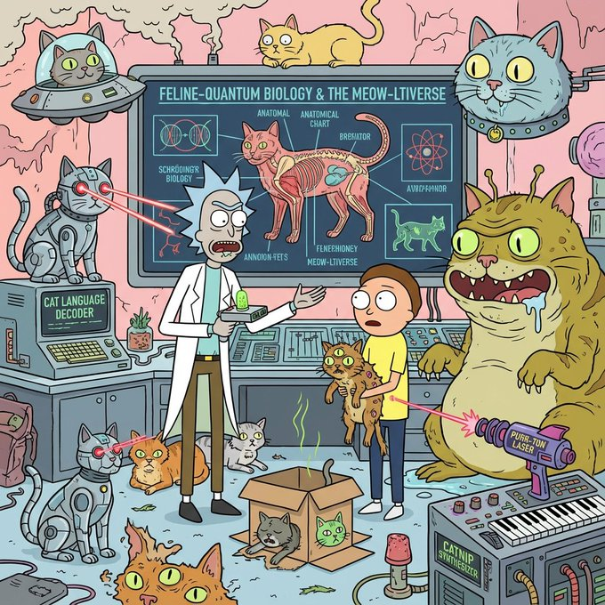

## 茅屋秋风所破歌中文和拼音图

- ID: gpt4o-461-zh
- Slug: prompt-461-zh
- 语言: zh
- 来源: [来源链接](https://x.com/aiwarts/status/1992171447809187960)
- 样例图路径: images/part3/461.jpeg

### 提示词

```text
生成一张3:4的图片，画面上方用书法写着一首完整的《茅屋秋风所破歌》，内容是

“八月秋高风怒号，卷我屋上三重茅。茅飞渡江洒江郊，高者挂罥长林梢，下者飘转沉塘坳。
南村群童欺我老无力，忍能对面为盗贼。公然抱茅入竹去，唇焦口燥呼不得，归来倚杖自叹息。
俄顷风定云墨色，秋天漠漠向昏黑。布衾多年冷似铁，娇儿恶卧踏里裂。床头屋漏无干处，雨脚如麻未断绝。自经丧乱少睡眠，长夜沾湿何由彻！
安得广厦千万间，大庇天下寒士俱欢颜！风雨不动安如山。呜呼！何时眼前突兀见此屋，吾庐独破受冻死亦足！“，

每个字上方都要标注上汉语拼音，同时画面内容主要用水墨画的形式展示这首诗所表达的情景。
```

### 样例图

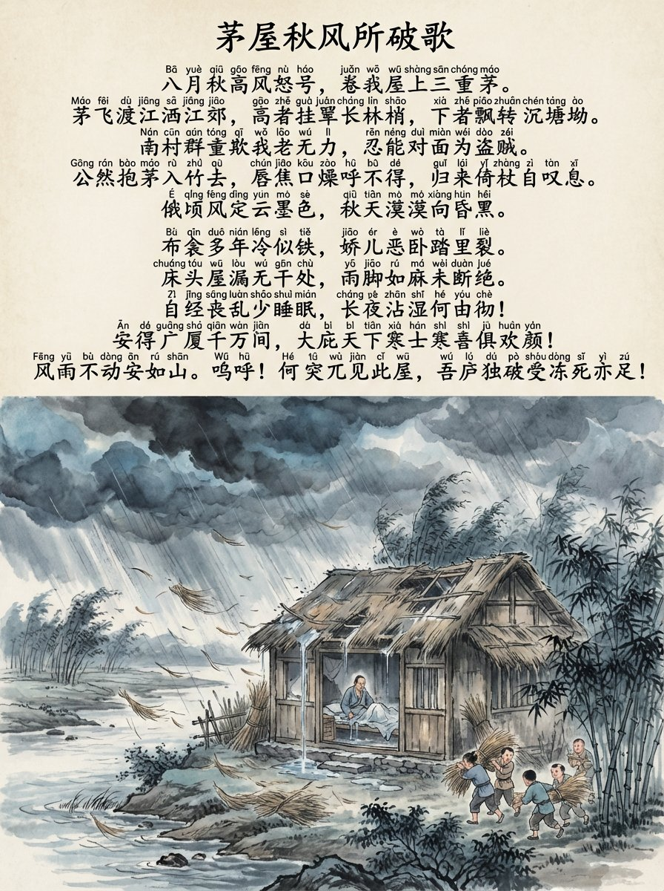

## make a 3x3 grid with different hairstyles

- ID: gpt4o-459-en-1
- Slug: prompt-459-en-1
- 语言: en
- 来源: [来源链接](https://x.com/1littlecoder/status/1991890450589077816)
- 样例图路径: images/part3/459.jpeg

### 提示词

```text
make a 3x3 grid with different hairstyles
```

### 样例图


## 制作9种不同发型

- ID: gpt4o-459-zh-2
- Slug: prompt-459-zh-2
- 语言: zh
- 来源: [来源链接](https://x.com/1littlecoder/status/1991890450589077816)
- 样例图路径: images/part3/459.jpeg

### 提示词

```text
用不同的发型制作一个 3x3 的网格
```

### 样例图


## 香港武侠3格漫画

- ID: gpt4o-452-zh
- Slug: prompt-452-zh
- 语言: zh
- 来源: [来源链接](https://x.com/dotey/status/1992433730972197305)
- 样例图路径: images/part3/452.jpeg

### 提示词

```text
画一张3格漫画，香港武侠漫画风格，故事情节如下：
和尚:"师太,你从了和尚吧!" 　　
道长:"秃驴,竟敢跟贫道抢师太!" 　　
师太:"和尚、道长你们一起上吧,我赶时间。"
```

### 样例图

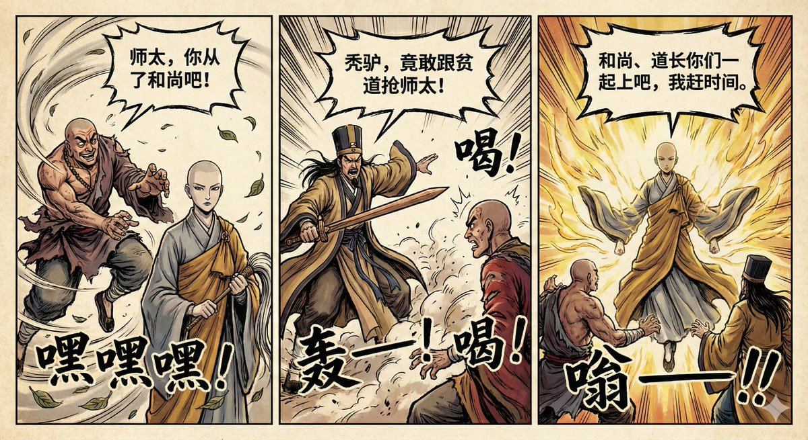

## Create an image of the different patterns that makes up 

- ID: gpt4o-439-en-1
- Slug: prompt-439-en-1
- 语言: en
- 来源: [来源链接](https://x.com/LinusEkenstam/status/1992105428873056499)
- 样例图路径: images/part3/439.png

### 提示词

```text
Create an image of the different patterns that makes up this shoe. lay them out individually against a neutral surface
```

### 样例图

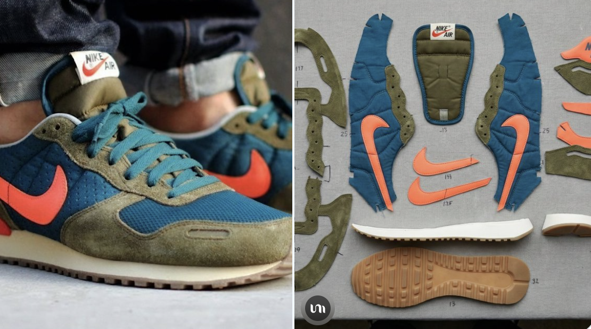

## 从图像中创建图案或分解图

- ID: gpt4o-439-zh-2
- Slug: prompt-439-zh-2
- 语言: zh
- 来源: [来源链接](https://x.com/LinusEkenstam/status/1992105428873056499)
- 样例图路径: images/part3/439.png

### 提示词

```text
请将构成这双鞋的不同图案分别绘制出来，并逐一摆放在中性表面上。
```

### 样例图


## 疯狂的程序喵

- ID: gpt4o-438-zh
- Slug: prompt-438-zh
- 语言: zh
- 来源: [来源链接](https://x.com/songguoxiansen/status/1991529211392323991)
- 样例图路径: images/part3/438.jpeg

### 提示词

```text
3D皮克斯风格渲染。一只戴着厚眼镜的橘猫正坐在电脑前疯狂敲代码，表情崩溃。它的电脑屏幕背后贴着一张显眼的便利贴，写着：“需求改了八百遍，甲方说还是第一版好”。桌子上散落的咖啡杯上印着：“代码写得好，头发掉得早”。背景是乱糟糟的服务器机房。
```

### 样例图


## Download your LinkedIn profile is a PDF and give it to N

- ID: gpt4o-436-en-1
- Slug: prompt-436-en-1
- 语言: en
- 来源: [来源链接](https://x.com/alisa_fortin/status/1992049339511030009)
- 样例图路径: images/part3/436.jpeg

### 提示词

```text
Download your LinkedIn profile is a PDF and give it to Nano Banana Pro with a simple prompt.
```

### 样例图

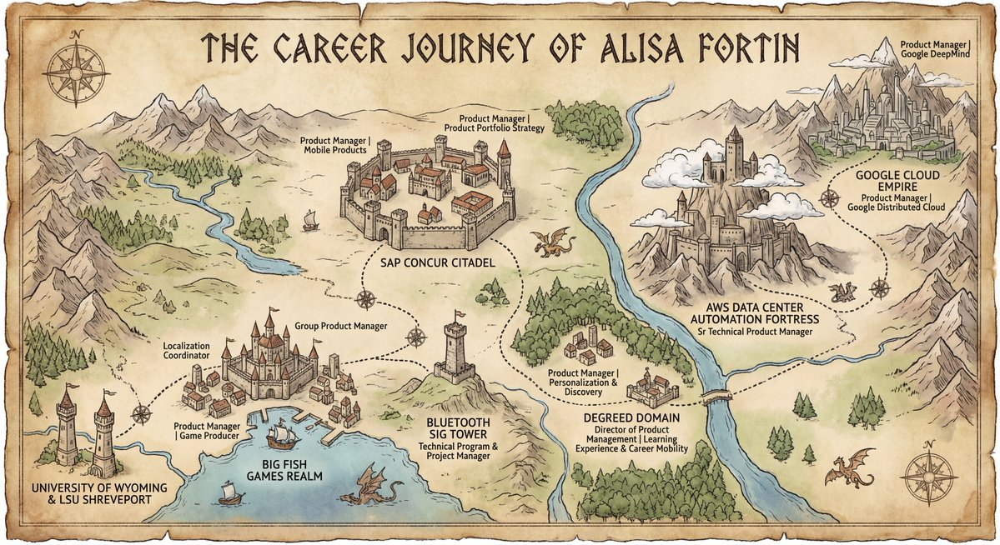

## 职业生涯历程可视化为地图

- ID: gpt4o-436-zh-2
- Slug: prompt-436-zh-2
- 语言: zh
- 来源: [来源链接](https://x.com/alisa_fortin/status/1992049339511030009)
- 样例图路径: images/part3/436.jpeg

### 提示词

```text
这个是提示词使用方法：
将您的 LinkedIn 个人资料下载为 PDF 文件，并附上简单的提示将其提供给 Nano Banana Pro。
```

### 样例图


## A doodle-style [subject], naive lines, humorous shape ex

- ID: gpt4o-428-en-1
- Slug: prompt-428-en-1
- 语言: en
- 来源: [来源链接](https://x.com/ZHO_ZHO_ZHO/status/1992181199473938774)
- 样例图路径: images/part3/428.jpeg

### 提示词

```text
A doodle-style [subject], naive lines, humorous shape exaggeration
```

### 样例图

![A doodle-style [subject], naive lines, humorous shape ex](../images/part3/428.jpeg)

## 幽默涂鸦风格

- ID: gpt4o-428-zh-2
- Slug: prompt-428-zh-2
- 语言: zh
- 来源: [来源链接](https://x.com/ZHO_ZHO_ZHO/status/1992181199473938774)
- 样例图路径: images/part3/428.jpeg

### 提示词

```text
涂鸦风格的 [主体]，线条稚拙，造型夸张幽默
```

### 样例图


## 中秋月下秋千照片

- ID: gpt4o-344-zh
- Slug: prompt-344-zh
- 语言: zh
- 来源: [来源链接](https://x.com/songguoxiansen/status/1975198365932769599)
- 样例图路径: images/part3/344.jpeg

### 提示词

```text
中秋月下秋千照片
```

### 样例图


## 制作证件照

- ID: gpt4o-300-zh
- Slug: prompt-300-zh
- 语言: zh
- 来源: [来源链接](https://x.com/songguoxiansen/status/1963602241610551609)
- 样例图路径: images/part3/300.jpeg

### 提示词

```text
截取图片人像头部，帮我做成2寸证件照，要求:
1、蓝底
2、职业正装
3、正脸
4、微笑
```

### 样例图


## 英语单词闪卡制作

- ID: gpt4o-291-zh
- Slug: prompt-291-zh
- 语言: zh
- 来源: [来源链接](https://x.com/JinsFavorites/status/1905097569837232327)
- 样例图路径: images/part3/291.jpeg

### 提示词

```text
你是一个英语单词闪卡制作大师, 你可以根据我输入的主题词,生成一个图片并以此拓展,比如我输入电脑,你生成一张和电脑相关的图片,并用箭头分步介绍键盘\鼠标\显示器等中文和英文
```

### 样例图

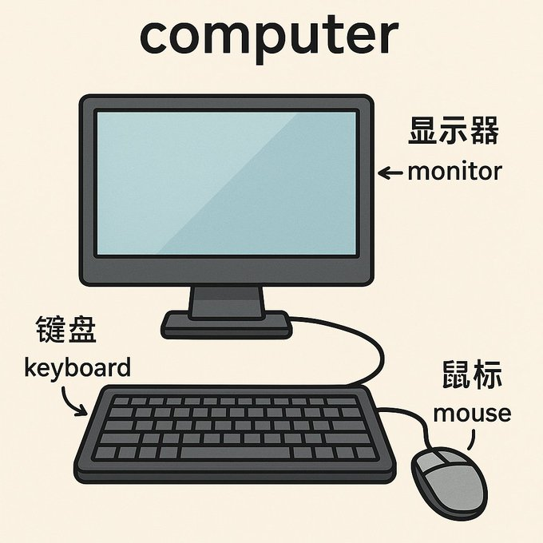

## Image of a billboard with the text: “Image of a billboar

- ID: gpt4o-249-en-1
- Slug: prompt-249-en-1
- 语言: en
- 来源: [来源链接](https://x.com/diegocabezas01/status/1950693677023535318)
- 样例图路径: images/part3/249.jpeg

### 提示词

```text
Image of a billboard with the text: “Image of a billboard with the text:”
```

### 样例图


## 路牌图片

- ID: gpt4o-249-zh-2
- Slug: prompt-249-zh-2
- 语言: zh
- 来源: [来源链接](https://x.com/diegocabezas01/status/1950693677023535318)
- 样例图路径: images/part3/249.jpeg

### 提示词

```text
路牌图片，上面写着：“路牌图片，上面写着：”
```

### 样例图


## A glossy candy-shaped perfume bottle resting on an open 

- ID: gpt4o-227-en-1
- Slug: prompt-227-en-1
- 语言: en
- 来源: [来源链接](https://x.com/TheRelianceAI/status/1944695498025173261)
- 样例图路径: images/part3/227.png

### 提示词

```text
A glossy candy-shaped perfume bottle resting on an open book, soft morning light, delicate shadows, dreamy bokeh background with iridescent cellophane wrapping. The candy design is inspired by [YOUR STYLE]
```

### 样例图

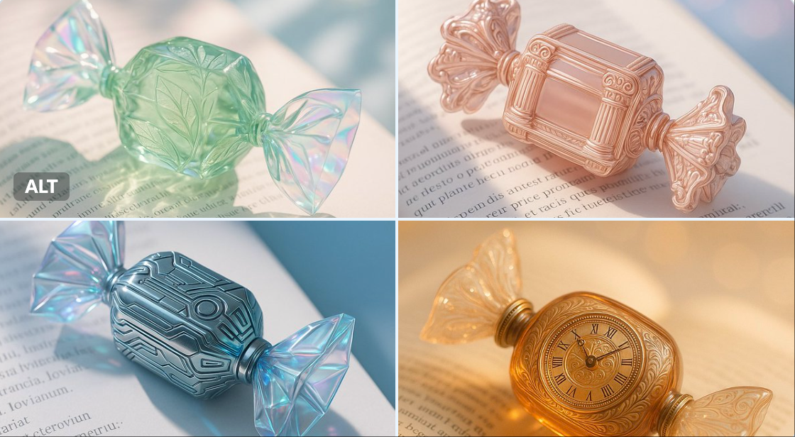

## 糖果形状物品

- ID: gpt4o-227-zh-2
- Slug: prompt-227-zh-2
- 语言: zh
- 来源: [来源链接](https://x.com/TheRelianceAI/status/1944695498025173261)
- 样例图路径: images/part3/227.png

### 提示词

```text
一个闪亮的糖果形状的香水瓶静置在一本打开的书上，柔和的晨光，细腻的阴影，梦幻的背景虚化效果，带有彩虹色透明膜包装。糖果设计灵感来源于[你的风格]
```

### 样例图


## A moonlight rooftop tea party between a girl and a boy, 

- ID: gpt4o-192-en-1
- Slug: prompt-192-en-1
- 语言: en
- 来源: [来源链接](https://x.com/BeanieBlossom/status/1935608566406344905)
- 样例图路径: images/part3/192.jpeg

### 提示词

```text
A moonlight rooftop tea party between a girl and a boy, dreamy, gentle, painterly.
```

### 样例图


## 月光屋顶茶话会

- ID: gpt4o-192-zh-2
- Slug: prompt-192-zh-2
- 语言: zh
- 来源: [来源链接](https://x.com/BeanieBlossom/status/1935608566406344905)
- 样例图路径: images/part3/192.jpeg

### 提示词

```text
一个女孩和一个男孩的月光屋顶茶话会，梦幻、温柔、绘画。
```

### 样例图


## a [SUBJECT] rendered as a translucent crystalline form w

- ID: gpt4o-175-en-1
- Slug: prompt-175-en-1
- 语言: en
- 来源: [来源链接](https://x.com/umesh_ai/status/1938565095191089556)
- 样例图路径: images/part3/175.jpeg

### 提示词

```text
a [SUBJECT] rendered as a translucent crystalline form with beveled edges, subtly glowing from within. Surfaces catch and reflect ambient light, revealing faint iridescent hues across its contours in dark background
```

### 样例图

![a [SUBJECT] rendered as a translucent crystalline form w](../images/part3/175.jpeg)

## 半透明晶体效果

- ID: gpt4o-175-zh-2
- Slug: prompt-175-zh-2
- 语言: zh
- 来源: [来源链接](https://x.com/umesh_ai/status/1938565095191089556)
- 样例图路径: images/part3/175.jpeg

### 提示词

```text
一个 [SUBJECT] 渲染为带有斜边的半透明晶体形式，从内部微妙地发光。表面捕捉并反射环境光，在黑暗背景下在其轮廓上显示微弱的彩虹色
```

### 样例图

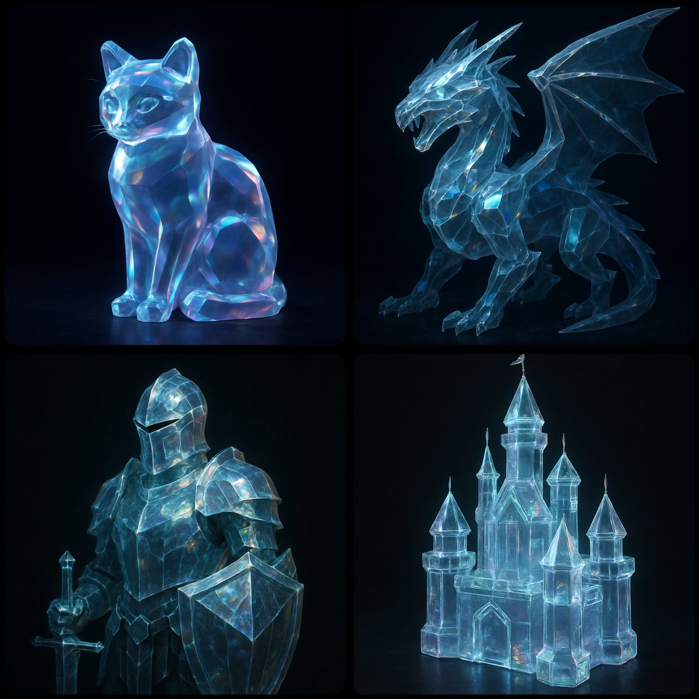

## a pillow fort in the backyard, shaded by a big old tree.

- ID: gpt4o-148-en-1
- Slug: prompt-148-en-1
- 语言: en
- 来源: [来源链接](https://x.com/BeanieBlossom/status/1936756146817372428)
- 样例图路径: images/part3/148.jpeg

### 提示词

```text
a pillow fort in the backyard, shaded by a big old tree. Sunlight filters through the leaves, and a young boy and his golden retriever naps beside a tray of lemonade and cookies. Wind chimes tinkle gently in the breeze. Warm afternoon light, playful and nostalgic, children's book illustrated feeling
```

### 样例图


## 怀旧午后阳光

- ID: gpt4o-148-zh-2
- Slug: prompt-148-zh-2
- 语言: zh
- 来源: [来源链接](https://x.com/BeanieBlossom/status/1936756146817372428)
- 样例图路径: images/part3/148.jpeg

### 提示词

```text
后院的一座枕头堡，被一棵大老树遮蔽。阳光透过树叶洒进来，一个小男孩和他的金毛猎犬在一盘柠檬水和饼干旁边打盹。风铃在微风中轻轻地叮叮当当。温暖的午后阳光，俏皮又怀旧，童书图画情怀
```

### 样例图


## Apply a holographic overlay effect on [SUBJECT/TEXT] — d

- ID: gpt4o-146-en-1
- Slug: prompt-146-en-1
- 语言: en
- 来源: [来源链接](https://x.com/aziz4ai/status/1936892719202193900)
- 样例图路径: images/part3/146.jpeg

### 提示词

```text
Apply a holographic overlay effect on [SUBJECT/TEXT] — dreamy rainbow gradients with soft radial light reflections — smooth glossy surface, high contrast blending — iridescent hues like pink, teal, cyan, and purple — noise texture with soft light blend — subtle shadows and edge lighting to add depth — centered composition on a dark background — ultra-HD, 1:1 ratio, cinematic lighting
```

### 样例图

![Apply a holographic overlay effect on [SUBJECT/TEXT] — d](../images/part3/146.jpeg)

## 全息叠加效果彩虹渐变

- ID: gpt4o-146-zh-2
- Slug: prompt-146-zh-2
- 语言: zh
- 来源: [来源链接](https://x.com/aziz4ai/status/1936892719202193900)
- 样例图路径: images/part3/146.jpeg

### 提示词

```text
在 [主题/文本] 上应用全息叠加效果 — 梦幻般的彩虹渐变，柔和的径向光反射 — 光滑的光泽表面，高对比度混合 — 粉色、蓝绿色、青色和紫色等彩虹色 — 柔和光线混合的杂色纹理 — 微妙的阴影和边缘照明以增加深度 — 深色背景上的居中构图 — 超高清、1：1 比例、电影照明
```

### 样例图

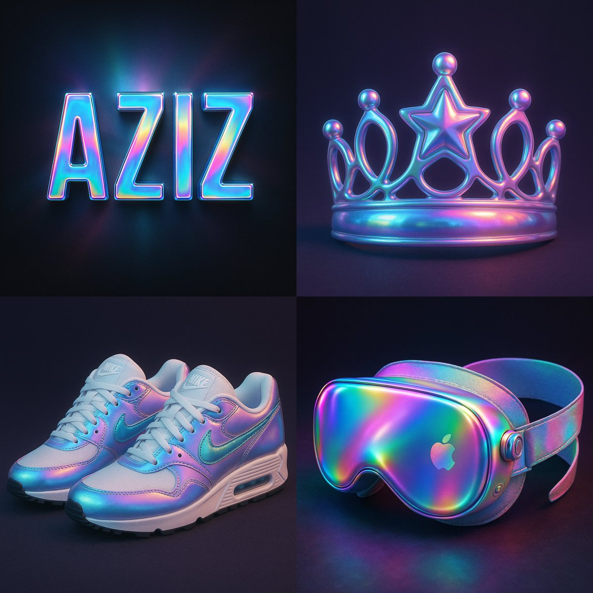

## [SUBJECT] rendered in Dreamlike Vaporwave Distortion, wi

- ID: gpt4o-144-en-1
- Slug: prompt-144-en-1
- 语言: en
- 来源: [来源链接](https://x.com/LudovicCreator/status/1937027922679775432)
- 样例图路径: images/part3/144.png

### 提示词

```text
[SUBJECT] rendered in Dreamlike Vaporwave Distortion, with soft pastels and surreal effects. Employ a nostalgic color palette of [COLOR1] and [COLOR2] to evoke a sense of longing and ethereal beauty
```

### 样例图

![[SUBJECT] rendered in Dreamlike Vaporwave Distortion, wi](../images/part3/144.png)

## 梦幻般的蒸汽波失真

- ID: gpt4o-144-zh-2
- Slug: prompt-144-zh-2
- 语言: zh
- 来源: [来源链接](https://x.com/LudovicCreator/status/1937027922679775432)
- 样例图路径: images/part3/144.png

### 提示词

```text
[主题] 以梦幻般的蒸汽波失真渲染，带有柔和的粉彩和超现实效果。采用 [COLOR1] 和 [COLOR2] 的怀旧调色板，唤起渴望和空灵之美
```

### 样例图

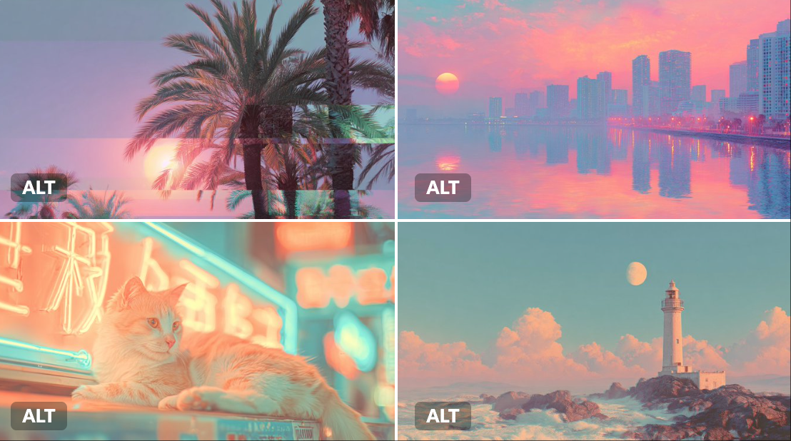

## 渐变挤出Google I/O 2025大会视觉效果

- ID: gpt4o-84-zh
- Slug: prompt-84-zh
- 语言: zh
- 来源: [来源链接](https://x.com/hckmstrrahul/status/1925567579856453701)
- 样例图路径: images/part3/84.jpeg

### 提示词

```text
Retexture this image in the following JSON style aesthetic:
{
  "styleAesthetic": {
    "title": "Isometric Multicolor Extrusion with Grid Control",
    "overallVibe": "Playful modern 3D iconography with directional extrusion and dynamic isometric grids",
    "viewAngle": {
      "type": "Isometric",
      "facingDirection": "right",  // options: left, right, front
      "rotationDegrees": {
        "x": 30,
        "y": 30
      }
    },
    "renderingStyle": "Clean 3D extruded vector with soft lighting and high contrast between faces",
    "objectSurface": {
      "frontFace": {
        "color": "#ffffff",
        "material": "Matte white plastic",
        "lighting": "Soft diffuse"
      },
      "extrudedSide": {
        "type": "Multicolor gradient",
        "gradientStyle": "Diagonal sweep",
        "colorStops": [
          "#ff0040", "#ff8000", "#ffff00", "#00ff90", "#00cfff", "#8000ff"
        ],
        "material": "Glossy plastic",
        "lighting": "Ambient with light falloff"
      }
    },
    "extrusion": {
      "direction": "right",  // determines which side is extruded: left, right, front
      "depth": "moderate"
    },
    "shadows": {
      "type": "Drop shadow",
      "direction": "bottom-right",
      "opacity": 0.15,
      "blurRadius": "6px"
    },
    "background": {
      "type": "Isometric grid",
      "color": "#ffffff",
      "gridStyle": {
        "lineColor": "#e0e0e0",
        "lineWeight": "1px",
        "orientation": "opposite-extrusion"  // automatically flips grid lines to oppose the extrusion direction
      }
    },
    "moodKeywords": [
      "Dimensional",
      "Clean",
      "Geometric",
      "Colorful",
      "Tactile",
      "Structured"
    ]
  }
}
```

### 样例图


## 超现实主义油画

- ID: gpt4o-72-zh
- Slug: prompt-72-zh
- 语言: zh
- 来源: [来源链接](https://x.com/azed_ai/status/1926217150093549680)
- 样例图路径: images/part3/72.png

### 提示词

```text
A surreal oil painting of a [subject], executed in the style of early 20th-century dreamscapes. Melting shapes, floating forms, and swirling [color1] and [color2] brushstrokes create a dreamlike dissonance.
```

### 样例图

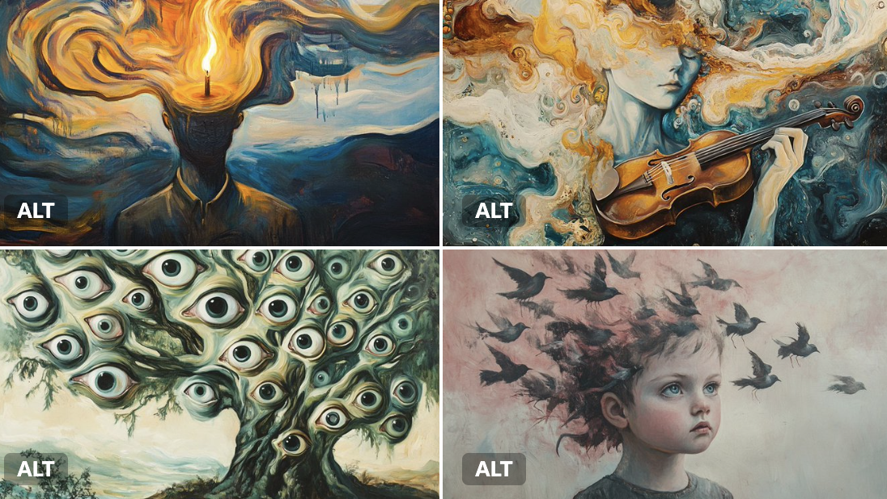

## 洞壁画

- ID: gpt4o-64-zh
- Slug: prompt-64-zh
- 语言: zh
- 来源: [来源链接](https://x.com/azed_ai/status/1925854528831643689)
- 样例图路径: images/part3/64.png

### 提示词

```text
A cave painting of a [subject], rendered with primitive ochres and charcoal lines on a rough stone wall. Smudged handprints, crude geometry, and flickering torchlight add a primal, ancient mood.
```

### 样例图


## 破碎的真相

- ID: gpt4o-61-zh
- Slug: prompt-61-zh
- 语言: zh
- 来源: [来源链接](https://x.com/TheRelianceAI/status/1925918144163450890)
- 样例图路径: images/part3/61.png

### 提示词

```text
A close-up of [SUBJECT 1] holding a mirror shard to their face. The shard reflects a completely different [SUBJECT 2]. Around them, small cracks spread through the air like fractures in invisible glass, warping the space itself.
```

### 样例图


## 血月下的决斗

- ID: gpt4o-58-zh
- Slug: prompt-58-zh
- 语言: zh
- 来源: [来源链接](https://x.com/B_4AI/status/1925509492298375388)
- 样例图路径: images/part3/58.png

### 提示词

```text
[SUBJECT] in a cinematic painting, battling amid crumbling ruins under a colossal blood moon — ambient sparks flying. Set in an ancient valley, illuminated by firelight and shadows. soft [COLOR1] and vibrant [COLOR2], mood intense and epic.
```

### 样例图

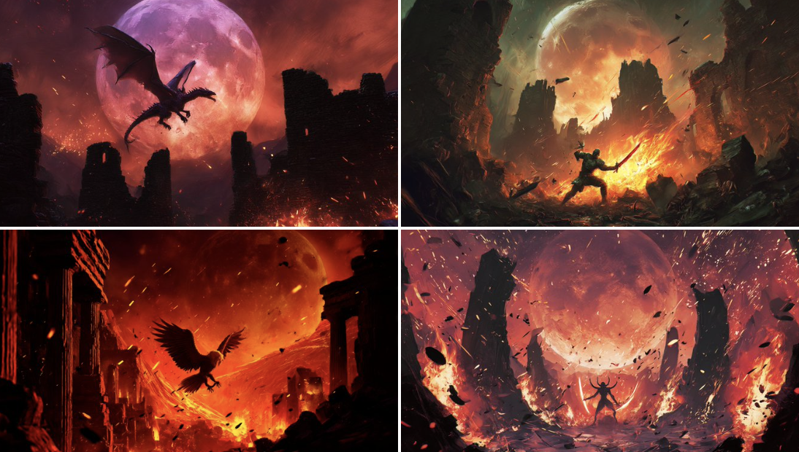

## 手工毛线纹理

- ID: gpt4o-57-zh
- Slug: prompt-57-zh
- 语言: zh
- 来源: [来源链接](https://x.com/ecommartinez/status/1925272798479405479)
- 样例图路径: images/part3/57.png

### 提示词

```text
Crea un render 3D fotorrealista de este logo hecho con hilo grueso y tejido a mano. El hilo debe parecer suave, esponjoso y de gran tamaño, con patrones visibles de tejido como bucles, giros y trenzas. Usa colores brillantes y saturados, estética cálida. Resalta la textura de las fibras, la suavidad del material y el acabado artesanal. Iluminación de estudio suave. Fondo blanco o crema limpio. El logo debe estar centrado y sin elementos adicionales. Cuadrado.
```

### 样例图

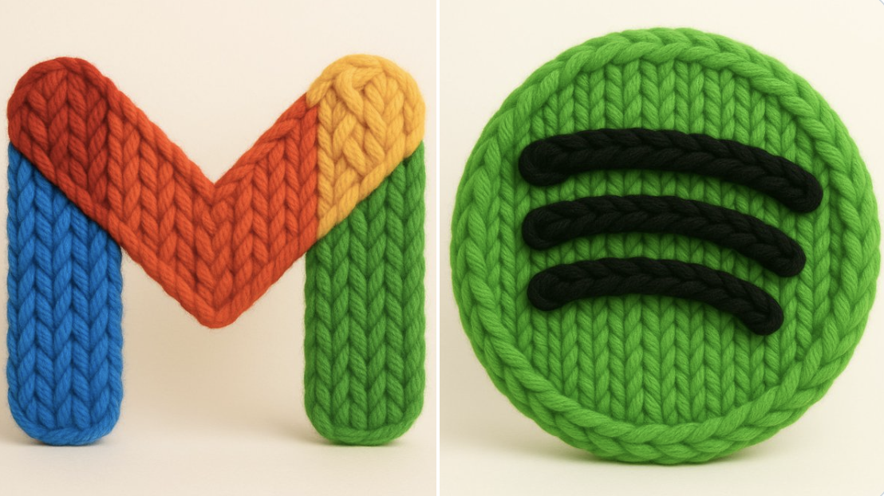

## 附魔粒子泛光

- ID: gpt4o-44-zh
- Slug: prompt-44-zh
- 语言: zh
- 来源: [来源链接](https://x.com/LudovicCreator/status/1925069047948849443)
- 样例图路径: images/part3/44.png

### 提示词

```text
[SUBJECT] surrounded by an Enchanted Particle Bloom, with particles resembling magical flower petals or leaves. Employ soft, enchanting hues of [COLOR1] and [COLOR2] to create a sense of natural magic.
```

### 样例图

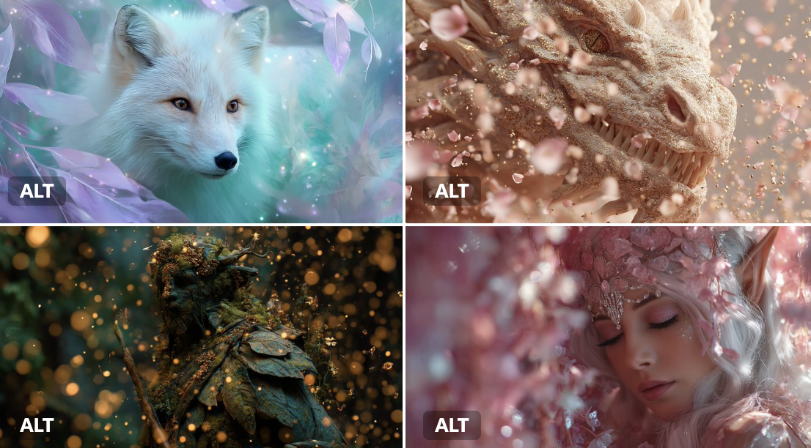

## 马赛克壁画

- ID: gpt4o-36-zh
- Slug: prompt-36-zh
- 语言: zh
- 来源: [来源链接](https://x.com/azed_ai/status/1924405701985853714)
- 样例图路径: images/part3/36.png

### 提示词

```text
A mosaic mural of a [subject], crafted from chipped ceramic and glass shards in sun-faded [color1] and weathered [color2]. Set into a cracked plaster wall, the irregular shapes and grout lines add a rustic, timeworn charm.
```

### 样例图

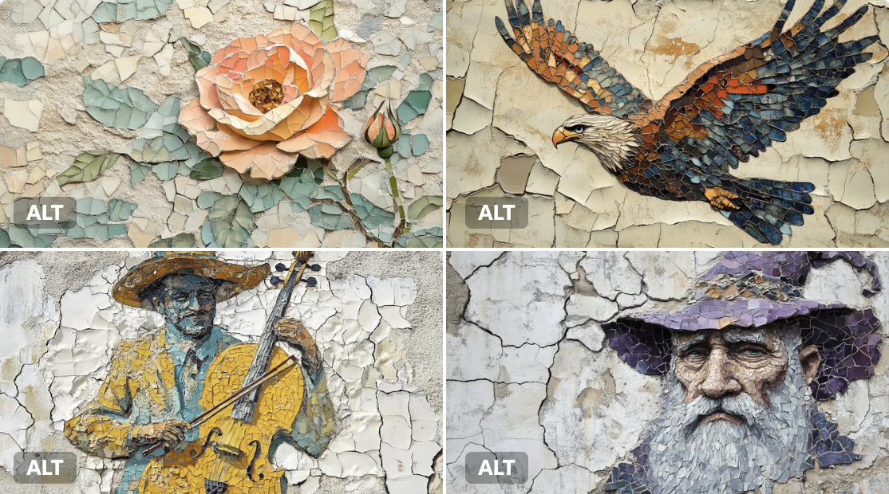

## 四格漫画 (相对论)

- ID: gpt4o-2-zh
- Slug: prompt-2-zh
- 语言: zh
- 来源: 来源链接缺失
- 样例图路径: images/part3/2.png

### 提示词

```text
make a colorful page of manga describing the theory of relativity. add some humor
```

### 样例图

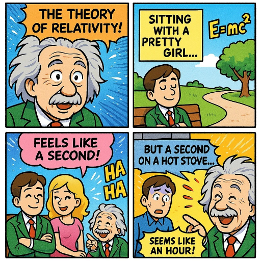

