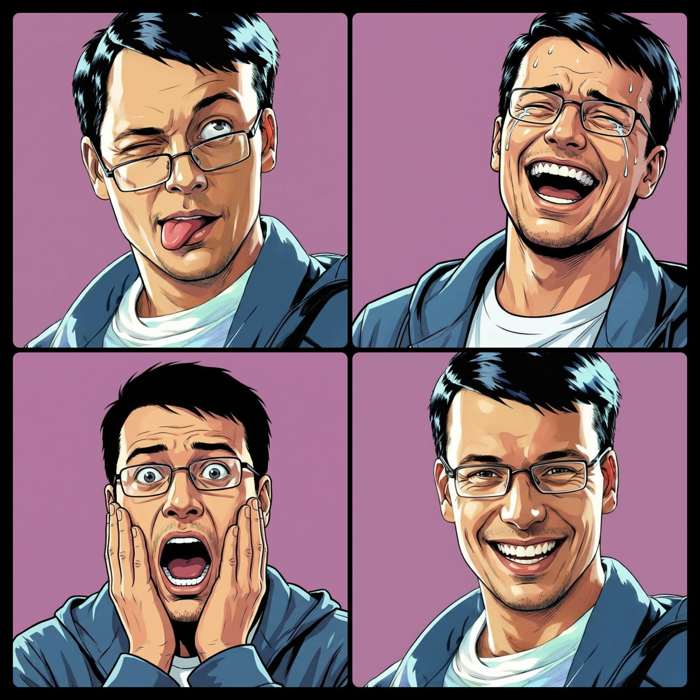
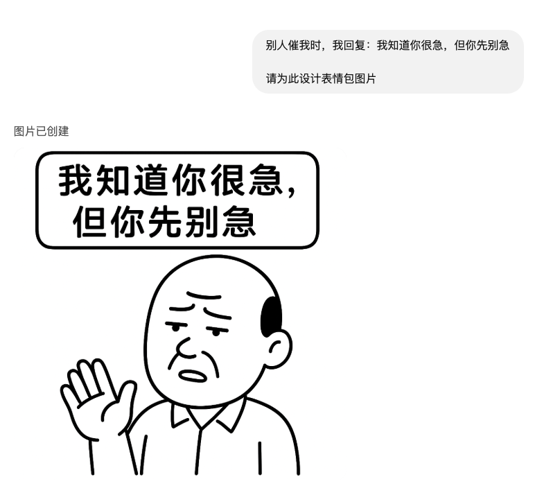
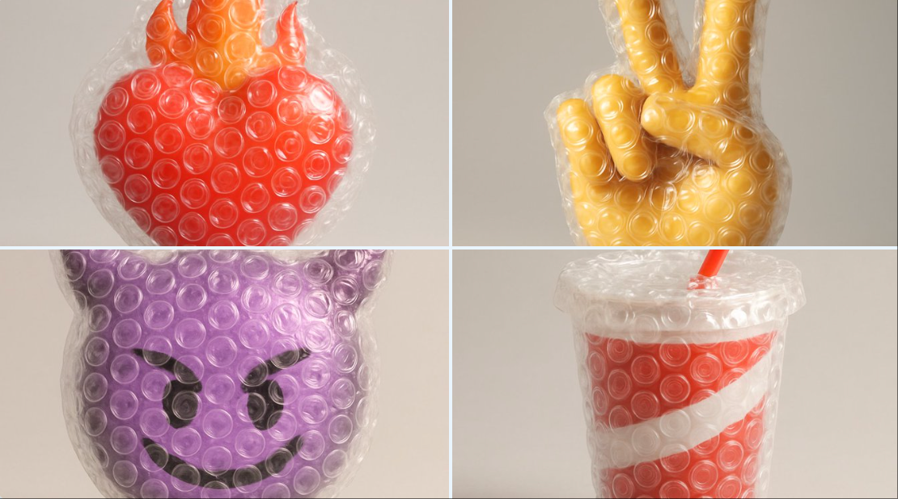

# emoji

总计：22

## 3D表情包

- ID: gpt4o-1016-zh
- Slug: prompt-1016-zh
- 语言: zh
- 来源: [来源链接](https://x.com/sundyme/status/2004425000586232256)
- 样例图路径: images/part3/1016.jpeg

### 提示词

```text
Create a high-quality 3D rendered anthropomorphic mascot character in a cute cartoon style inspired by Kakao Friends/LINE Friends. A cute [角色类型] character in [场景描述], [动作描述], [表情描述], detailed 3D rendering with smooth textures, soft lighting, vibrant colors, kawaii aesthetic, large head and small body proportions, clean white background with subtle shadows.

Add Chinese text overlay: \"[文案]\" in a cute, playful font style that matches the 3D character design - bold, rounded, colorful letters with a kawaii aesthetic.

1:1 aspect ratio, high quality 3D rendering, photorealistic textures with cartoon stylization.  使用这个模板生成一组4个表情包
```

### 样例图


## Create a set of colorful, hand-drawn LINE-style half-bod

- ID: gpt4o-549-en-1
- Slug: prompt-549-en-1
- 语言: en
- 来源: [来源链接](https://x.com/dotey/status/1993042754008686712)
- 样例图路径: images/part3/549.jpeg

### 提示词

```text
Create a set of colorful, hand-drawn LINE-style half-body Q-version emoji portraits based on the characters shown, ensuring accurate depiction of their head accessories.

Arrange the images in a 4x6 layout, featuring common chat phrases or relevant humorous memes.
Use handwritten-style fonts for text.
Output must be original—avoid direct copying of the reference image.
Final image should be in 4K resolution, 16:9 aspect ratio.
```

### 样例图


## LINE风格半身Q版表情包

- ID: gpt4o-549-zh-2
- Slug: prompt-549-zh-2
- 语言: zh
- 来源: [来源链接](https://x.com/dotey/status/1993042754008686712)
- 样例图路径: images/part3/549.jpeg

### 提示词

```text
根据所示角色，创作一套色彩鲜艳、手绘风格的 LINE 风格半身 Q 版表情符号肖像，确保准确地描绘出他们的头部饰品。

将图片排列成 4x6 的布局，内容以常见的聊天短语或相关的幽默表情包为特色。
文本请使用手写体字体。
输出内容必须为原创——避免直接复制参考图像。
最终图像应为 4K 分辨率，16:9 宽高比。
```

### 样例图


## 仿真绣苏绣表情包

- ID: gpt4o-548-zh
- Slug: prompt-548-zh
- 语言: zh
- 来源: [来源链接](https://x.com/TaXue2025/status/1993542832930668942)
- 样例图路径: images/part3/548.jpeg

### 提示词

```text
生成一张 16:9、4K 分辨率的仿真绣苏绣表情包大图：

- 画面为 4×6 网格，共 24 个 1:1 方形小格，每格是一位同一角色的古典中式美人半身像表情包（胸部以上），脸部约占每格 60%–70%。
- 头饰、发型、服装风格严格参考提供的原始角色形象，保持一致，但不要原图复制。

风格要求：
- 整体为仿真绣苏绣作品：人物五官、皮肤、头发、衣纹和背景全部由细密丝线和刺绣针脚构成，使用仿真绣 + 乱针绣技法，丝线有光泽、针脚平齐细密，形成微微凸起的真实绣面。
- 底布为近乎纯白或极浅米色真丝绸，背景极简，仅有很淡云纹或暗纹，不加入复杂图案。

禁止：
- 不要油画、水彩、数码画笔纹理；
- 不要相机景深、虚化、炫光、镜头光斑和 UI 特效。

表情与文字：
- 24 格覆盖常见聊天情绪和娱乐 meme（如开心、无语、震惊、委屈、嫌弃、坏笑、吃瓜、躺平、笑死、我裂开了等）。
- 每一格配一条短句，使用手写风格简体中文，不用印刷体和英文。
```

### 样例图


## Make this person do the expression of emoji [EMOJI]

- ID: gpt4o-531-en-1
- Slug: prompt-531-en-1
- 语言: en
- 来源: [来源链接](https://x.com/umesh_ai/status/1992849169602818431)
- 样例图路径: images/part3/531.jpeg

### 提示词

```text
Make this person do the expression of emoji [EMOJI]
```

### 样例图

![Make this person do the expression of emoji [EMOJI]](../images/part3/531.jpeg)

## 让人做出Emoji的表情

- ID: gpt4o-531-zh-2
- Slug: prompt-531-zh-2
- 语言: zh
- 来源: [来源链接](https://x.com/umesh_ai/status/1992849169602818431)
- 样例图路径: images/part3/531.jpeg

### 提示词

```text
让这个人做出表情符号[EMOJI]的表情
```

### 样例图



## 彩色手绘风格表情包

- ID: gpt4o-485-zh
- Slug: prompt-485-zh
- 语言: zh
- 来源: [来源链接](https://x.com/Gorden_Sun/status/1992778144605212912)
- 样例图路径: images/part3/485.jpeg

### 提示词

```text
为我生成图中角色的绘制 Q 版的，LINE 风格的半身像表情包，注意头饰要正确
彩色手绘风格，使用 4x6 布局，涵盖各种各样的常用聊天语句，或是一些有关的娱乐 meme
其他需求：不要原图复制。所有标注为手写简体中文。
生成的图片需为 4K 分辨率 16:9
```

### 样例图


## 我知道你很急但你先别急

- ID: gpt4o-289-zh
- Slug: prompt-289-zh
- 语言: zh
- 来源: [来源链接](https://x.com/JinsFavorites/status/1909646070382317736)
- 样例图路径: images/part3/289.png

### 提示词

```text
别人催我时，我回复：我知道你很急，但你先别急

请为此设计表情包图片
```

### 样例图



## Generate a hyper-realistic 3D render of a [EMOJI🐱] as a

- ID: gpt4o-203-en-1
- Slug: prompt-203-en-1
- 语言: en
- 来源: [来源链接](https://x.com/TechieBySA/status/1942928111244394788)
- 样例图路径: images/part3/203.jpeg

### 提示词

```text
Generate a hyper-realistic 3D render of a [EMOJI🐱] as a floating animal head with plush toy aesthetics. The design should emphasize ultra-soft, long fur, playful cuteness, and a childlike charm. Use a straight-on camera angle with soft, diffused lighting to create a warm and inviting glow. Keep the background pure white for a clean, modern look. The color palette should be vibrant yet soothing, enhancing the toy-like appeal. Style: Ultra-detailed, whimsical, and hyper-cute, blending realism with a soft, plush texture for maximum visual impact.
```

### 样例图

![Generate a hyper-realistic 3D render of a [EMOJI🐱] as a](../images/part3/203.jpeg)

## 3D表情符号头部

- ID: gpt4o-203-zh-2
- Slug: prompt-203-zh-2
- 语言: zh
- 来源: [来源链接](https://x.com/TechieBySA/status/1942928111244394788)
- 样例图路径: images/part3/203.jpeg

### 提示词

```text
生成一个超逼真的 3D 渲染效果，将[表情符号 🐱 ]设计成一个漂浮的动物头部，具有毛绒玩具的美学风格。设计应强调超柔软的长毛、俏皮可爱和童真魅力。使用正面直视的相机角度，搭配柔和的漫射光线，营造出温暖诱人的光泽。保持背景纯白色，以呈现干净现代的外观。色彩搭配应鲜明而舒缓，增强玩具般的吸引力。风格：超精细、奇幻、超可爱，将现实主义与柔软的毛绒质感相结合，以达到最大的视觉冲击力。
```

### 样例图


## A hyper-realistic 3D render of the emoji [❤️‍🔥], entire

- ID: gpt4o-165-en-1
- Slug: prompt-165-en-1
- 语言: en
- 来源: [来源链接](https://x.com/Anima_Labs/status/1938503818578178146)
- 样例图路径: images/part3/165.png

### 提示词

```text
A hyper-realistic 3D render of the emoji [❤️‍🔥], entirely wrapped in transparent bubble wrap. The plastic is tightly fitted, with clearly visible air-filled bubbles creating overlaid reflections and soft distortions of the emoji underneath. The wrap has a glossy, crinkled texture that catches the light in detailed highlights. Set against a soft, neutral grey background with subtle shadows. Studio lighting should emphasize the tactile quality of the bubble wrap and the surreal effect it creates. Whimsical, satisfying, and visually clean.
```

### 样例图

![A hyper-realistic 3D render of the emoji [❤️‍🔥], entire](../images/part3/165.png)

## 用气泡膜覆盖表情符号

- ID: gpt4o-165-zh-2
- Slug: prompt-165-zh-2
- 语言: zh
- 来源: [来源链接](https://x.com/Anima_Labs/status/1938503818578178146)
- 样例图路径: images/part3/165.png

### 提示词

```text
表情符号 [ ❤️‍🔥 ] 的超逼真 3D 渲染 ，完全包裹在透明气泡膜中。塑料紧密贴合，清晰可见的充满空气的气泡在下面产生叠加的反射和表情符号的柔和扭曲。包裹具有有光泽的褶皱纹理，可在细节高光中捕捉光线。以柔和的中性灰色为背景，带有微妙的阴影。工作室照明应强调气泡膜的触觉质量及其产生的超现实效果。异想天开、令人满意且视觉上干净。
```

### 样例图



## Ultra high-resolution 3D render of the emoji [🥹], metic

- ID: gpt4o-164-en-1
- Slug: prompt-164-en-1
- 语言: en
- 来源: [来源链接](https://x.com/Anima_Labs/status/1938152354064609780)
- 样例图路径: images/part3/164.png

### 提示词

```text
Ultra high-resolution 3D render of the emoji [🥹], meticulously recreated as a realistic cardboard sculpture. The object is crafted from corrugated brown cardboard, featuring clearly defined fluted edges, visible layering, and rough kraft paper textures. Close-up studio
```

### 样例图

![Ultra high-resolution 3D render of the emoji [🥹], metic](../images/part3/164.png)

## 将表情符号变成纸板

- ID: gpt4o-164-zh-2
- Slug: prompt-164-zh-2
- 语言: zh
- 来源: [来源链接](https://x.com/Anima_Labs/status/1938152354064609780)
- 样例图路径: images/part3/164.png

### 提示词

```text
表情符号 [ 🥹 ] 的超高分辨率 3D 渲染 ，精心重建为逼真的纸板雕塑。该物品由棕色瓦楞纸板制成，具有清晰的凹槽边缘、可见的层次和粗糙的牛皮纸纹理。特写工作室
```

### 样例图


## Close-up photo of a small plush keychain of [attached im

- ID: gpt4o-131-en-1
- Slug: prompt-131-en-1
- 语言: en
- 来源: [来源链接](https://x.com/azed_ai/status/1934973851164897444)
- 样例图路径: images/part3/131.jpeg

### 提示词

```text
Close-up photo of a small plush keychain of [attached image/emojis]  held gently between two fingers, made of soft felt or fuzzy material, cartoon-style proportions, embroidered face with simple expressive features, character designed to resemble, attached to a shiny silver keyring, neutral beige background, shallow depth of field, soft natural lighting, highly detailed texture, cute and handcrafted aesthetic, studio photography, 1:1 aspect ratio
```

### 样例图


## 自定义毛绒钥匙扣

- ID: gpt4o-131-zh-2
- Slug: prompt-131-zh-2
- 语言: zh
- 来源: [来源链接](https://x.com/azed_ai/status/1934973851164897444)
- 样例图路径: images/part3/131.jpeg

### 提示词

```text
[附图/表情符号] 的小毛绒钥匙扣的特写照片，用两根手指轻轻握住，由柔软的毛毡或毛茸茸的材料制成，卡通风格的比例，具有简单表现特征的刺绣脸，设计相似的人物，附在闪亮的银色钥匙圈上，中性米色背景，浅景深，柔和的自然光，高度详细的纹理，可爱和手工制作的美感， 摄影棚摄影，1：1 纵横比
```

### 样例图


## 珐琅马赛克瓷砖风格

- ID: gpt4o-104-zh
- Slug: prompt-104-zh
- 语言: zh
- 来源: [来源链接](https://x.com/mariia_gonchar/status/1931774946608370013)
- 样例图路径: images/part3/104.png

### 提示词

```text
Visualize any selected emoji [] as an ultra-detailed, hyper-realistic 3D sculpture fully composed of luxurious enamel mosaic tiles. The emoji should retain its iconic silhouette and proportions, reinterpreted as a stylized 3D figure made entirely from curved, faceted, and geometrically interlocked enamel tiles in a radiant mosaic pattern.
> Use high-gloss enamel tiles in varied shades derived from the emoji’s symbolic palette—integrating metallic accents, opalescent glazes, deep ceramic pigmentation, and subtle iridescence. Tile surfaces must exhibit gentle bevels, crisp joints, and tactile depth to emulate elite architectural mosaic work.
> Ensure no visible support structures—the figure must appear freestanding and weightless, suspended mid-air at the exact center of the frame.
> Background: pure white studio environment with soft ambient shadows directly beneath the sculpture to emphasize spatial presence and floating realism.
> Lighting: cinematic, diffused from multiple angles to
```

### 样例图


## AirBnB 任何东西

- ID: gpt4o-88-zh
- Slug: prompt-88-zh
- 语言: zh
- 来源: [来源链接](https://x.com/R2_fieldworks/status/1924433924106727531)
- 样例图路径: images/part3/88.png

### 提示词

```text
A highly detailed 3D isometric icon of the following object: [OBJECT]

Style: Airbnb 2024 icon language — miniature diorama / emoji-like object with crisp edges, realistic textures, and soft handcrafted realism.  

Material: The object should clearly retains its fundamental qualities but look as if its made from a mixture of matte and plastic-like materials.  

View: three-quarter front-left isometric view with a slight top-down angle.  

Lighting: soft neutral studio lighting from the top-left with subtle shadows and gentle gloss highlights.  

Color palette: retain the fundamental colors from the object and include subtle gradients and no harsh contrasts.  

Background: clean white, no drop shadow or noise.  

Mood: minimal, charming, utilitarian, premium.  

Rendering: hyper-detailed, photorealistic object with depth and tactility, like a designer lifestyle emoji or miniature product model. 

Optional Add-on for Replication:  Use the attached photo as a reference for proportions and layout. Do not copy exactly — reinterpret it in the Airbnb icon aesthetic.
```

### 样例图


## 水果的形状

- ID: gpt4o-80-zh
- Slug: prompt-80-zh
- 语言: zh
- 来源: [来源链接](https://x.com/umesh_ai/status/1926182194159972503)
- 样例图路径: images/part3/80.jpeg

### 提示词

```text
Create an image by arranging [NUMBER/AGGREGATE] of [FRUIT] strategically on a dark surface to form the shape of [OBJECT/EMOJI/LOGO]
```

### 样例图


## 毛绒形式表情符号

- ID: gpt4o-78-zh
- Slug: prompt-78-zh
- 语言: zh
- 来源: [来源链接](https://x.com/alban_gz/status/1925833589431619616)
- 样例图路径: images/part3/78.png

### 提示词

```text
Recreate this [insert emoji] using the parameters from the JSON provided.
{
  "style": "Plushform Emoji",
  "description": "Transform the emoji into a soft, realistic plush object with high-quality fabric and detailed construction. Do not anthropomorphize the emoji — avoid adding faces or cartoon features. Focus on accurate textures, natural forms, and subtle design to give the plush object character.",
  "features": {
    "shape": "matching the emoji's form, with soft, slightly rounded plush adaptation",
    "texture": "realistic plush fabric with visible fiber detail and natural fabric folds",
    "color": "faithful to the emoji's palette, using slightly muted, tactile tones",
    "material": "stuffed toy fabric with visible stitching, seams, and high-quality finishing",
    "background": "neutral or softly textured to emphasize the plush object's form",
    "lighting": "soft professional studio lighting with subtle shadows and depth"
  },
  "examples": [
    "👌 becomes a plush hand in the OK gesture, with realistic fabric folds and seams.",
    "🎯 becomes a soft plush bullseye with layered fuzzy rings and slight dimensional padding.",
    "🎁 becomes a cube-shaped plush box with fabric ribbon, visible stitching, and realistic fabric texture.",
    "🌊 becomes a wave-shaped plush with curled foam tips, crafted in textured ocean blue fabrics."
  ]
}
```

### 样例图


## 3D可爱粉彩粘土图标

- ID: gpt4o-74-zh
- Slug: prompt-74-zh
- 语言: zh
- 来源: [来源链接](https://x.com/icreatelife/status/1926014358783430945)
- 样例图路径: images/part3/74.png

### 提示词

```text
Tiny cute isometric [smiling - optional] [OBJECT] emoji, shape, soft lighting, soft pastel colors, [COLOR], 3d icon clay render, blender 3d, pastel background
```

### 样例图


## Emoji变成一个花盆

- ID: gpt4o-19-zh
- Slug: prompt-19-zh
- 语言: zh
- 来源: [来源链接](https://x.com/azed_ai/status/1923739813414568075)
- 样例图路径: images/part3/19.png

### 提示词

```text
A high-quality photo of a cute ceramic [object/animal]-shaped planter with a glossy finish, filled with a variety of vibrant succulents and greenery including a spiky Haworthia, a rosette-shaped Echeveria, and delicate white flowers. The planter has a friendly face and sits on a soft, neutral background with diffused natural lighting, showcasing fine textures and color contrast in a clean, minimalistic composition
```

### 样例图


