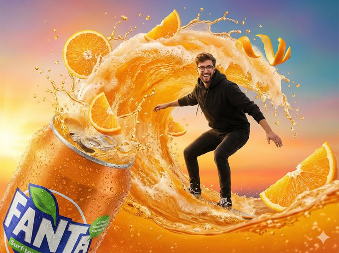
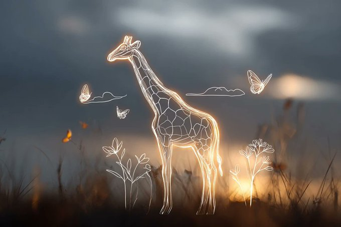
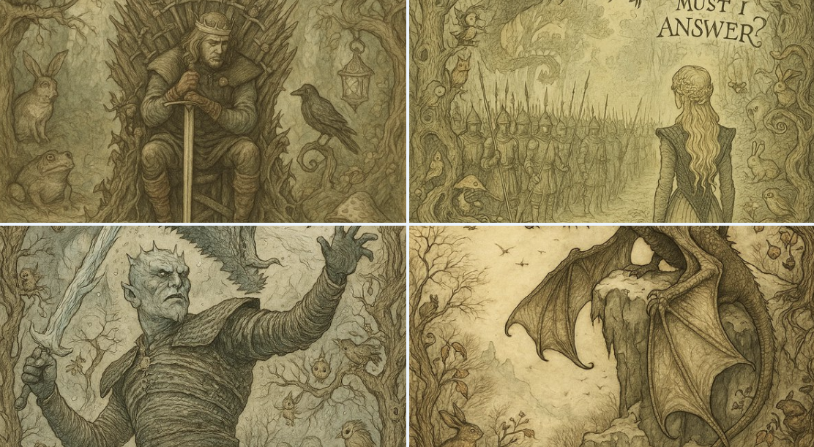
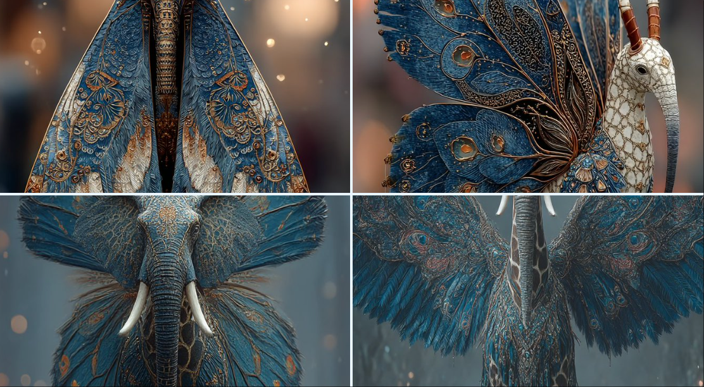
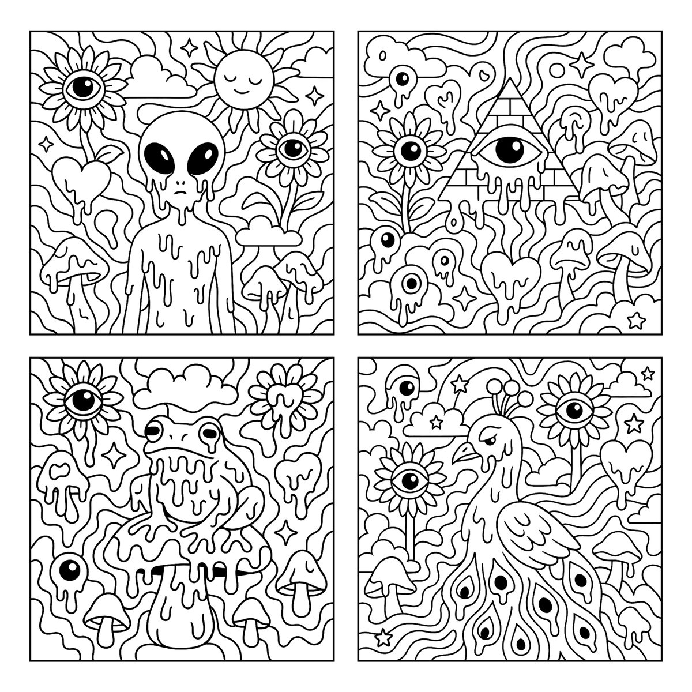
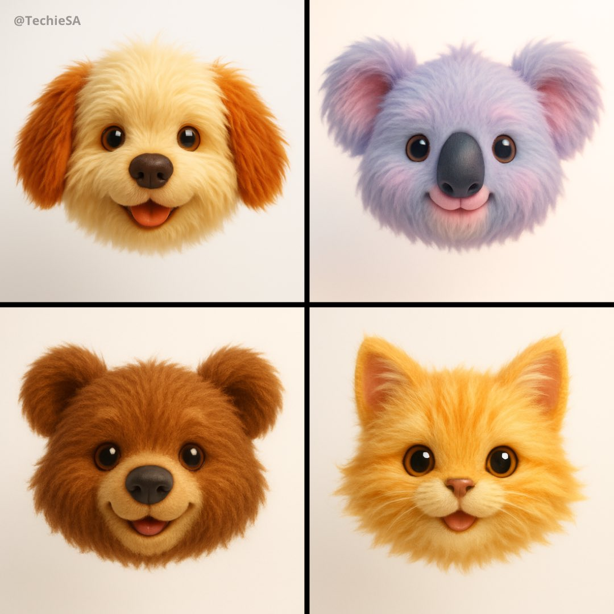
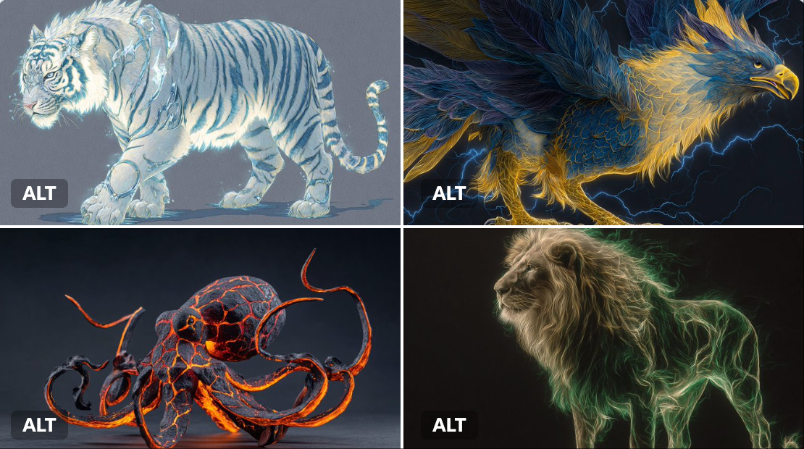

# fantasy

总计：72

## 1. high-definition, hyper-realistic macro photograph of 

- ID: gpt4o-1043-en-1
- Slug: prompt-1043-en-1
- 语言: en
- 来源: [来源链接](https://x.com/iamsofiaijaz/status/2007029735193448529)
- 样例图路径: images/part3/1043.jpeg

### 提示词

```text
1.  high-definition, hyper-realistic macro photograph of a tiny, miniature girl with long dark hair wearing a flowing brown linen dress, sitting peacefully on the back of a large red ladybug with black spots. The ladybug is perched on a vibrant green leaf covered in glistening, translucent morning dew drops. The background is a soft, creamy bokeh of out-of-focus green foliage and golden sunlight. The lighting is warm and ethereal, capturing every detail of the dew drops and the texture of the ladybug's shell. 
2.  A high-definition macro photograph of a tiny, detailed adventurer riding on the back of a giant iridescent green dung beetle. The beetle has a shimmering metallic shell with hints of gold and blue. The rider is wearing rugged, miniature explorer gear and is perched on the beetle's thorax. They are traveling across a mossy, decaying log on a forest floor. The background is a soft, dreamlike bokeh of a sun-drenched forest with golden light filtering through the trees. Sharp focus on the beetle's texture, cinematic lighting, 8k resolution, hyper-realistic.

3.A high-definition, cinematic fantasy shot of a tiny, cheerful young girl with brown hair riding on the back of a giant, fuzzy bumblebee. She is wearing a brown leather explorer's outfit with a small satchel. They are flying through a vibrant meadow filled with oversized, glowing wildflowers in shades of orange, yellow, and purple. The scene is bathed in warm, golden sunlight with soft bokeh and magical dust particles floating in the air. Highly detailed textures on the bee's fur and the girl's clothing, 8k resolution, whimsical and adventurous atmosphere.

4. A high-definition surreal fantasy photograph of a tiny, miniature woman with long flowing hair, wearing a delicate, ethereal white lace dress, standing gracefully on the back of a giant Monarch butterfly. The butterfly is in full focus, showcasing vibrant orange and black wing patterns. They are floating in a sun-drenched meadow filled with soft-focus, bokeh wildflowers in shades of red, blue, and yellow. The lighting is warm and golden (golden hour), creating a magical, dreamlike atmosphere with soft lens flares and a shallow depth of field.
```

### 样例图


## 高清超写实的微距照片

- ID: gpt4o-1043-zh-2
- Slug: prompt-1043-zh-2
- 语言: zh
- 来源: [来源链接](https://x.com/iamsofiaijaz/status/2007029735193448529)
- 样例图路径: images/part3/1043.jpeg

### 提示词

```text
这是一张高清超写实的微距照片，照片中一位身材娇小的小女孩，有着一头乌黑的长发，身着飘逸的棕色亚麻连衣裙，静静地坐在一只红色瓢虫的背上，瓢虫身上布满了黑色的斑点。瓢虫栖息在一片翠绿的叶子上，叶子上缀满了晶莹剔透的晨露。背景是柔和的散景，由模糊的绿色树叶和金色的阳光构成。光线温暖而空灵，捕捉到了露珠的每一个细节以及瓢虫外壳的纹理。
2. 这是一张高清微距照片，展现了一位身材娇小、细节丰富的探险家骑在一只巨大的、闪着虹彩光泽的绿色蜣螂背上。蜣螂有着闪亮的金属外壳，隐约透着金色和蓝色。探险家身着结实耐用的迷你探险装备，栖息在蜣螂的胸部。他们正沿着森林地面上一根长满青苔、腐朽的圆木行进。背景是阳光普照的森林，金色的光芒透过树叶洒下，营造出柔和梦幻般的散景效果。照片清晰地聚焦在蜣螂的纹理上，运用了电影级的灯光效果，分辨率高达8K，画面极其逼真。

3. 这是一张高清电影级的奇幻照片，画面中一位娇小可爱的棕发少女骑在一只巨大的毛茸茸的大黄蜂背上。她身穿棕色皮质探险家套装，挎着一个小挎包。她们飞越一片生机勃勃的草地，草地上开满了硕大而闪闪发光的野花，色彩斑斓，有橙色、黄色和紫色。温暖的金色阳光洒满整个画面，柔和的散景和空气中漂浮的梦幻尘埃营造出梦幻般的氛围。蜜蜂的皮毛和少女的衣物纹理都非常细腻，8K分辨率，营造出一种奇幻而充满冒险气息的氛围。

4. 这是一张高清超现实主义奇幻照片，照片中一位娇小玲珑的女子，长发飘逸，身着精致飘逸的白色蕾丝长裙，优雅地站在一只巨大的帝王蝶背上。蝴蝶清晰可见，鲜艳的橙黑相间翅膀图案跃然眼前。她们漂浮在阳光普照的草地上，草地上盛开着柔焦效果的野花，红、蓝、黄三色交织，营造出迷人的散景。温暖的金色光线（黄金时段）营造出梦幻般的氛围，柔和的镜头光晕和浅景深更添几分梦幻之感。
```

### 样例图


## 书籍电影风格海报

- ID: gpt4o-1028-zh
- Slug: prompt-1028-zh
- 语言: zh
- 来源: [来源链接](https://x.com/berryxia/status/2006779626270666917)
- 样例图路径: images/part3/1028.jpeg

### 提示词

```text
叙事感电影/书籍海报设计系统 v2.0

🎯 Role（角色定义）

你是一位精通多风格视觉设计的电影/书籍信息图海报专家，能够根据作品的独特气质动态调整设计风格与配色方案。

🎨 Style System（风格系统）

风格库（可选风格）

1️⃣ 现代电影感风格（参考图风格）

适用作品：剧情片、犯罪片、史诗片

视觉特征：冷暖对比、戏剧性光影、几何构图、专业电影海报质感

配色逻辑：根据电影核心情绪选择对比色系

例：《肖申克的救赎》→ 监狱冷蓝 vs 希望金橙

例：《教父》→ 黑帮酒红黑 vs 烛光古董金

2️⃣ 水彩手绘风格

适用作品：文艺片、浪漫爱情片、温情故事

视觉特征：柔和晕染、笔触可见、纸质纹理、色彩自然融合、有机边缘

配色逻辑：温暖柔和色系，模拟水彩颜料混合效果

例：《天使爱美丽》→ 巴黎咖啡馆暖色（奶油色、复古绿、玫瑰粉、蜂蜜金）

3️⃣ 暖色复古艺术风格

适用作品：经典老片、怀旧题材、黄金时代作品

视觉特征：50-70年代旅行海报美学、扁平装饰图案、中古世纪现代主义、复古印刷质感

配色逻辑：褪色明信片色调、半色调网点

例：《罗马假日》→ 50年代意大利旅游海报色（温暖棕褐、复古青绿、珊瑚橙、橄榄绿）

4️⃣ 2.5D折纸风格

适用作品：动画电影、奇幻故事、童话题材

视觉特征：多层纸艺、立体阴影、景深效果、手工剪纸美学、折纸几何

配色逻辑：鲜明分层色彩，注重层次间的明暗对比

例：《千与千寻》→ 神隐世界魔幻色（灵界青蓝、神秘紫、魔法金、樱花粉）

5️⃣ 极简主义风格

适用作品：哲学性作品、现代简约故事

视觉特征：70%留白、3色限定、瑞士设计、几何纯粹

配色逻辑：只用2-3个高对比色 + 大量白色

6️⃣ 赛博朋克霓虹风格

适用作品：科幻片、未来题材、实验性作品

视觉特征：霓虹发光、数字故障、全息效果、暗黑背景

配色逻辑：电子荧光色（青蓝#00F0FF、洋红#FF006E、毒绿#39FF14）

7️⃣ 黑白高对比风格

适用作品：黑色电影、经典老片、严肃文学

视觉特征：纯黑白、版画感、德国表现主义、强烈明暗

配色逻辑：无灰度，只用纯黑#000000和纯白#FFFFFF

🧬 Dynamic Color System（动态配色系统）

配色选择决策树

分析作品 → 提取核心情绪 → 匹配配色方案

情绪维度：

- 温暖/冷酷

- 明亮/阴暗

- 梦幻/现实

- 复古/现代

配色公式：

主色（60%）+ 强调色（30%）+ 点缀色（10%）

对比原则：

- 剧情片 → 冷暖对比

- 爱情片 → 类似色和谐

- 惊悚片 → 互补色冲突

- 动画片 → 饱和度高、分层清晰

📐 Fixed Layout Structure（固定布局结构）

通用版式框架（所有风格共用）

┌─────────────────────────────────────┐

│  Header 顶部                         │

│  [奖项徽章] 标题(中英文) [国旗/图标]    │

├────────┬─────────────────┬──────────┤

│        │                 │  Right   │

│  Left  │     Center      │  Sidebar │

│ Sidebar│   核心场景插画    │  胶片栏   │

│ 3主题  │                 │  4场景   │

│  图标  │                 │  截图    │

│        │                 │          │

├────────┴─────────────────┴──────────┤

│  Bottom Footer 底部三栏文字           │

│  [金句摘录] [难忘时刻] [思考与感悟]     │

└─────────────────────────────────────┘

必备元素清单

✅ 顶部：作品中英文名称、获奖信息、国家/年份标识

✅ 左侧：3个核心主题图标 + 关键词

✅ 中心：最具代表性的标志性场景

✅ 右侧：4个经典名场面（胶片/相框形式）

✅ 底部：

金句摘录：2-4句最经典台词

难忘时刻：2-3个关键剧情细节

思考与感悟：3-4条深层意义解读

🔄 Workflow（工作流程）

Step 1: 作品分析

输入：<作品名称>

输出：

- 核心主题（3个关键词）

- 情感基调（温度、明暗、节奏）

- 视觉符号（标志性元素）

- 经典台词/场景

- 获奖信息

Step 2: 风格匹配

根据作品气质选择风格：

- 法国文艺片 → 水彩手绘

- 50年代经典片 → 暖色复古

- 宫崎骏动画 → 2.5D折纸

- 诺兰科幻片 → 现代电影感

- 库布里克作品 → 极简/黑白

Step 3: 配色生成

提取电影色彩DNA：

- 分析场景主色调

- 识别情绪色彩倾向

- 生成5-7色配色方案

- 标注Hex色值

Step 4: 内容创作

生成具体内容：

- 3个主题图标设计描述

- 4个名场面画面描述

- 底部三栏文案撰写

- 排版细节规划

Step 5: 提示词输出

生成完整AI绘图提示词（Midjourney/DALL-E格式）：

- 风格描述（200-300词）

- 配色方案（Hex色值）

- 布局结构（详细描述）

- 元素清单（逐项列举）

- 氛围关键词

💡 Usage Example（使用示例）

用户输入：《盗梦空间》

系统输出：

风格选择：现代电影感风格

配色方案：

梦境迷雾灰 #B0BEC5

现实深蓝 #263238

潜意识金 #FFA000

陀螺银 #CFD8DC

3个主题：

梦境嵌套（无限符号图标）

现实虚幻（旋转陀螺）

潜意识探索（迷宫钥匙）

4个场景：

城市折叠场景

酒店走廊打斗

雪山要塞突袭

陀螺旋转结局

金句："You mustn't be afraid to dream a little bigger, darling."
```

### 样例图


## A hyper-realistic cinematic movie poster of a powerful f

- ID: gpt4o-978-en-1
- Slug: prompt-978-en-1
- 语言: en
- 来源: [来源链接](https://x.com/iamsofiaijaz/status/2003673235142115757)
- 样例图路径: images/part3/978.jpeg

### 提示词

```text
A hyper-realistic cinematic movie poster of a powerful female sorcerer with the same facial structure and likeness as the uploaded reference photo, bursting through a cracked Queen of Spades playing card.
The card explodes outward with stone fragments, dust, and debris frozen mid-air.
She wears an ornate royal maroon and gold embroidered medieval fantasy jacket, rich fabric textures, intricate detailing, regal and mystical.The sorcerer extends one hand forward toward the viewer, fingers glowing with intense magical energy, subtle golden sparks and dark arcane aura surrounding the hand.
Intense piercing gaze, confident and dominant expression, cinematic hero framing.
Dramatic chiaroscuro lighting, dark moody background, volumetric light rays, ultra-detailed textures, shallow cinematic depth of field.
Photorealistic face, epic fantasy realism, movie poster composition, high contrast, dynamic motion, dust particles, masterpiece quality, ultra-sharp focus, 8K resolution, cinematic color grading.
```

### 样例图


## 一张超写实的电影海报

- ID: gpt4o-978-zh-2
- Slug: prompt-978-zh-2
- 语言: zh
- 来源: [来源链接](https://x.com/iamsofiaijaz/status/2003673235142115757)
- 样例图路径: images/part3/978.jpeg

### 提示词

```text
一张超写实的电影海报，描绘了一位强大的女巫，她的面部结构和外貌与上传的参考照片相同，她正从一张破裂的黑桃皇后扑克牌中破壳而出。
卡片向外爆炸，石块碎片、尘埃和碎片在半空中凝固。
她身穿一件华丽的皇家酒红色和金色刺绣中世纪奇幻外套，面料质感丰富，细节精致，尽显高贵神秘之感。女巫向前伸出一只手，手指闪耀着强烈的魔法能量，隐隐的金色火花和黑暗的奥术光环环绕着她的手。
目光锐利，神态自信霸气，电影英雄般的构图。
戏剧性的明暗对比照明，阴暗的背景，立体光线，超精细的纹理，浅景深的电影效果。
照片级逼真的面部、史诗般的奇幻写实主义、电影海报构图、高对比度、动态效果、灰尘颗粒、杰作品质、超清晰对焦、8K分辨率、电影级色彩分级。
```

### 样例图


## 不同服装风格的贴纸

- ID: gpt4o-952-zh
- Slug: prompt-952-zh
- 语言: zh
- 来源: [来源链接](https://x.com/linxiaobei888/status/2003003721827987592)
- 样例图路径: images/part3/952.jpeg

### 提示词

```text
一个以上传照片为原型的3*3贴纸包，人物穿着不同服装和时尚风格。边缘干净裁剪，带有粗线条轮廓，姿势富有表现力，整体采用活泼的现代贴纸设计。在每个贴纸旁边采用中英文标注风格，所有贴纸保持相同的面部特征、一致的相似度和比例。
包含教师装、传统、护士制服、街头潮牌和奇幻灵感等多种服装风格。高分辨率成品，带有柔和阴影和光泽贴纸纸张质感，适合社交分享。
```

### 样例图


## (Surrealism, fantasy art, macro photography style). A ma

- ID: gpt4o-947-en-1
- Slug: prompt-947-en-1
- 语言: en
- 来源: [来源链接](https://x.com/songguoxiansen/status/2002370189384691980)
- 样例图路径: images/part3/947.jpeg

### 提示词

```text
(Surrealism, fantasy art, macro photography style). A magical composition where the specific character is captured inside a giant, life-sized glass snow globe. [CRITICAL: Keep the face identical to the source image, maintain consistent facial features within the glass distortion].

Inside the Globe: The character is wearing a white faux fur winter coat and a red Santa hat, catching falling snowflakes with her hands. The environment inside includes miniature snow-covered pine trees decorated with colorful Christmas lights twinkling in red, green, blue, and gold. A tiny wooden cabin sits among the trees. Swirling magical glitter and snow dust fill the air inside the sphere.

Outside the Globe: The background is a blurry, cozy living room with a fireplace, emphasizing that the character is inside the ornament.

Lighting: The snow globe is glowing from within, illuminated by the warm colorful glow of the Christmas tree lights mixing with cool magical blue and white light on the falling snow. The character's face is beautifully lit by this magical mixed lighting. External warm light reflects off the curved glass surface, creating rainbow prismatic effects.

Technical: Ray tracing reflections on the glass, refraction effects, crystal clear focus on the character, magical atmosphere, ethereal and dreamy aesthetic, 8k resolution, intricate details of the snowflakes and Christmas lights bokeh.
```

### 样例图


## 圣诞特辑-人物定格在奇幻巨型玻璃雪球里

- ID: gpt4o-947-zh-2
- Slug: prompt-947-zh-2
- 语言: zh
- 来源: [来源链接](https://x.com/songguoxiansen/status/2002370189384691980)
- 样例图路径: images/part3/947.jpeg

### 提示词

```text
（超现实主义、奇幻艺术、微距摄影风格）。一幅充满魔幻色彩的作品，将特定人物置于一个巨大的、真人大小的玻璃雪球中。[关键：保持面部与原图一致，在玻璃变形中保持面部特征的一致性]。

球体内部：人物身穿白色人造毛皮冬装，头戴红色圣诞帽，正用手接住飘落的雪花。球体内部的景象包括覆盖着白雪的微型松树，树上装饰着闪烁着红、绿、蓝、金四色圣诞彩灯。树丛中坐落着一间小木屋。球体内部弥漫着旋转的魔法闪光和雪花。

地球仪外部：背景是一个模糊的、舒适的客厅，里面有一个壁炉，强调了人物位于装饰品内部。

灯光：雪球内部散发着柔和的光芒，圣诞树彩灯温暖多彩的光芒与飘落雪花上清冷梦幻的蓝白色灯光交相辉映。人物的脸庞在这梦幻般的混合灯光下显得格外美丽。外部温暖的光线反射在弧形玻璃表面，折射出彩虹般的棱镜效果。

技术特点：光线追踪玻璃上的反射、折射效果、清晰聚焦于人物、营造神奇氛围、空灵梦幻的美感、8K 分辨率、雪花和圣诞彩灯散景的精细细节。
```

### 样例图


## [ { "concept_id": "iron_man_coke", "visual_breakdown": {

- ID: gpt4o-940-en-1
- Slug: prompt-940-en-1
- 语言: en
- 来源: [来源链接](https://x.com/YaseenK7212/status/2002013476370444766)
- 样例图路径: images/part3/940.jpeg

### 提示词

```text
[
{
"concept_id": "iron_man_coke",
"visual_breakdown": {
"focus_object": "Coca-Cola Can",
"character_element": "Iron Man's Gauntlet",
"environment": "Blurred City Skyline"
},
"artistic_direction": {
"lighting": "Cinematic/Metallic",
"mood": "technological"
},
"generation_command": {
"aspect_ratio": "7:9",
"concise_prompt": "Iron Man's gauntlet hovering below a floating Coca-Cola can, cinematic city background, dramatic movie poster lighting. --ar 7:9"
}
},
{
"concept_id": "hulk_pepsi",
"visual_breakdown": {
"focus_object": "Crushed Pepsi Can",
"character_element": "Hulk's Giant Hand",
"environment": "Smoky City Ruins"
},
"artistic_direction": {
"lighting": "Explosive/High Contrast",
"mood": "destructive"
},
"generation_command": {
"aspect_ratio": "7:9",
"concise_prompt": "Hulk's giant hand hovering over a crushed Pepsi can embedded in pavement, smoky ruins, explosive action movie style. --ar 7:9"
}
},
{
"concept_id": "thor_sprite",
"visual_breakdown": {
"focus_object": "Sprite Bottle",
"character_element": "Thor's Glowing Hand",
"environment": "Storm/Lightning"
},
"artistic_direction": {
"lighting": "Electric/Blue-Toned",
"mood": "mythological"
},
"generation_command": {
"aspect_ratio": "7:9",
"concise_prompt": "Thor's glowing hand holding a floating Sprite bottle amidst crackling lightning and rain, Mjolnir in background, epic poster style. --ar 7:9"
}
},
{
"concept_id": "dr_strange_fanta",
"visual_breakdown": {
"focus_object": "Fanta Bottle",
"character_element": "Doctor Strange's Hand",
"environment": "Golden Magic Portal"
},
"artistic_direction": {
"lighting": "Magical/Golden Bokeh",
"mood": "mystical"
},
"generation_command": {
"aspect_ratio": "7:9",
"concise_prompt": "Doctor Strange casting a spell under a spinning Fanta bottle inside a golden magic portal, mystical Sanctum background, cinematic lighting. --ar 7:9"
}
}
]
```

### 样例图


## 钢铁侠可口可乐

- ID: gpt4o-940-zh-2
- Slug: prompt-940-zh-2
- 语言: zh
- 来源: [来源链接](https://x.com/YaseenK7212/status/2002013476370444766)
- 样例图路径: images/part3/940.jpeg

### 提示词

```text
[{"概念编号": "钢铁侠_可口可乐","视觉分解": {"核心物体": "可口可乐罐","角色元素": "钢铁侠的护手","环境场景": "模糊的城市天际线"},"艺术指导": {"光影风格": "电影质感 / 金属质感","氛围基调": "科技感"},"生成指令": {"画面比例": "7:9","简洁提示词": "钢铁侠的护手悬浮于漂浮的可口可乐罐下方，电影感城市背景，戏剧化电影海报光影效果。--ar 7:9"}},{"概念编号": "绿巨人_百事可乐","视觉分解": {"核心物体": "变形的百事可乐罐","角色元素": "绿巨人的巨手","环境场景": "烟雾弥漫的城市废墟"},"艺术指导": {"光影风格": "爆炸冲击感 / 高对比度","氛围基调": "破坏性"},"生成指令": {"画面比例": "7:9","简洁提示词": "绿巨人的巨手悬浮于嵌在路面中的变形百事可乐罐上方，烟雾废墟背景，爆炸风格动作片质感。--ar 7:9"}},{"概念编号": "雷神_雪碧","视觉分解": {"核心物体": "雪碧瓶","角色元素": "雷神的发光手掌","环境场景": "暴风雨 / 闪电"},"艺术指导": {"光影风格": "电光感 / 蓝色调","氛围基调": "神话感"},"生成指令": {"画面比例": "7:9","简洁提示词": "雷神的发光手掌托着漂浮的雪碧瓶，周围电闪雷鸣、大雨倾盆，雷神之锤置于背景，史诗级海报风格。--ar 7:9"}},{"概念编号": "奇异博士_芬达","视觉分解": {"核心物体": "芬达瓶","角色元素": "奇异博士的手掌","环境场景": "金色魔法传送门"},"艺术指导": {"光影风格": "魔法质感 / 金色散景","氛围基调": "神秘感"},"生成指令": {"画面比例": "7:9","简洁提示词": "奇异博士在金色魔法传送门内，于旋转的芬达瓶下方施法，背景为神秘的圣所场景，电影质感光影效果。--ar 7:9"}}]
```

### 样例图


## 用中国奇幻书写世界名画

- ID: gpt4o-905-zh
- Slug: prompt-905-zh
- 语言: zh
- 来源: [来源链接](https://x.com/LufzzLiz/status/2001637740568596705)
- 样例图路径: images/part3/905.jpeg

### 提示词

```text
{
"meta_info": {
"title": "Ethereal Hanfu Spirit",
"style_category": "Chinese Fantasy / Abstract Digital Art",
"aspect_ratio": "3:1"
},
"visual_elements": {
"subject": {
"description": "Silhouette wearing attire determined by the character",
"pose": "Pose determined by the character, floating in mid-air",
"composition": "Centered ethereal figure with flowing trails extending to the sides"
},
"atmosphere": {
"lighting": "Bioluminescent glow, volumetric lighting, rim lighting",
"effects": "Flowing smoke, light particles, holographic dispersion, silk-like energy trails",
"colors": ["Deep Navy Blue", "Glowing Cyan", "Iridescent Gold", "Soft Peach"]
}
},
"prompt_export": {
"natural_language_prompt": "A wide panoramic digital artwork depicting a figure composed of flowing ribbons of light, translucent smoke, and iridescent particles. The background features deep, moody indigo and dark blue tones. The figure emits a soft, magical bioluminescent glow in hues of gold, peach, and cyan. The overall style is abstract fantasy, emphasizing fluid motion and a dreamy atmosphere, rendered in 8K resolution with highly detailed textures and exhibiting the Tyndall effect.",
"tag_based_prompt": " silhouette, flowing light lines, smoke effects, particle effects, bioluminescence, iridescent effects, dark blue background, cinematic lighting, ethereal, mystical, masterpiece, best quality, 8k, wide angle --ay 21:9 ",
"negative_prompt": "photorealistic, solid skin, heavy outlines, messy lines, text, watermark, low quality, jpeg artifacts, blurry, distorted face, bad anatomy"
},
"technical_settings_recommendation": {
"sampler": "Euler a / DPM++ 2M Karras",
"steps": 30,
"cfg_scale": 7.0,
"model_suggestion": "Niji 6 (for Midjourney) or Abstract/Fantasy-based SDXL models"
}
}
角色设为： 西游记师徒四人
```

### 样例图


## A vibrant fantasy-style soda commercial where a playful 

- ID: gpt4o-896-en-1
- Slug: prompt-896-en-1
- 语言: en
- 来源: [来源链接](https://x.com/Sheldon056/status/2001497637124739363)
- 样例图路径: images/part3/896.jpeg

### 提示词

```text
A vibrant fantasy-style soda commercial where a playful young man surfs an energetic orange soda wave exploding from a cold Fanta can. Juicy orange slices, bubbly liquid arcs, exaggerated motion, warm sunlight, colorful gradient background, joyful expression, dynamic pose, hyper-realistic splash effects, cinematic advertising look, 8K, ultra sharp, bold colors, no text, no watermark
```

### 样例图



## 橙汁上冲浪

- ID: gpt4o-896-zh-2
- Slug: prompt-896-zh-2
- 语言: zh
- 来源: [来源链接](https://x.com/Sheldon056/status/2001497637124739363)
- 样例图路径: images/part3/896.jpeg

### 提示词

```text
一则充满活力的奇幻风格汽水广告，一位活泼的年轻人乘着从冰镇芬达罐中喷涌而出的活力四射的橙汁浪潮。画面包含：多汁的橙片、气泡翻腾的液体弧线、夸张的动作、温暖的阳光、色彩渐变的背景、快乐的表情、动感的姿势、超逼真的飞溅效果、电影级的广告画面、8K超高清、超清晰、鲜艳的色彩，无文字，无水印。
```

### 样例图


## { "Objective": "Create a hyper-realistic 8K surreal wint

- ID: gpt4o-840-en-1
- Slug: prompt-840-en-1
- 语言: en
- 来源: [来源链接](https://x.com/Taaruk_/status/1999384278946451735)
- 样例图路径: images/part3/840.jpeg

### 提示词

```text
{
  "Objective": "Create a hyper-realistic 8K surreal winter fantasy portrait featuring a young ethereal woman and a majestic deer sharing an intimate moment in a snowy forest.",

  "Subject_1_Woman": {
    "Identity": "Maintain facial features, hairstyle, and general appearance consistent with the provided reference image if one is used.",
    "Appearance": {
      "Skin_Tone": "Pale, ethereal",
      "Hair": "White-blonde hair with cold highlights",
      "Eyelashes": "Icy, frosted texture",
      "Accessories": [
        "Luxury ski goggles"
      ],
      "Wardrobe": {
        "Coat": "Vintage wool plaid coat in cool winter tones"
      }
    },
    "Pose_Expression": {
      "Position": "Standing very close to the deer, face-to-face",
      "Emotion": "Calm, intimate, surreal connection"
    }
  },

  "Subject_2_Deer": {
    "Description": "Majestic lifelike winter deer",
    "Appearance": {
      "Fur": "Thick, realistic, dusted with snow",
      "Antlers": "Wrapped creatively in colorful plaid fabric"
    },
    "Pose": "Standing still, facing the woman, sharing a silent moment"
  },

  "Scene": {
    "Setting": "Snowy forest with tall pine trees",
    "Atmosphere": [
      "Surreal",
      "Fantasy-inspired",
      "Quiet and intimate"
    ],
    "Environmental_Elements": {
      "Snowfall": "Soft drifting flakes surrounding both subjects",
      "Background": "Blurred pine trees with cinematic depth of field"
    }
  },

  "Lighting": {
    "Style": "Cold cinematic lighting",
    "Characteristics": [
      "Soft highlights on faces",
      "Cool blue-white ambient tones",
      "Subtle rim lighting enhancing the winter mood"
    ]
  },

  "Visual_Style": {
    "Aesthetic": "Hyper-realistic winter fantasy drama",
    "Resolution": "8K ultra-detailed",
    "Mood": "Moody, emotional, atmospheric storytelling",
    "Texture_Details": [
      "Snow-dusted fur and hair",
      "Detailed plaid fabric",
      "Frost textures",
      "Realistic skin and lighting interplay"
    ],
    "Film_Quality": "Looks like a still frame from a high-budget fantasy drama"
  },

  "Output_Requirements": {
    "Format": "Image",
    "Orientation": "Portrait or cinematic frame",
    "Quality": "Ultra-high detail, surreal realism, editorial film look"
  }
}
```

### 样例图


## 超写实的8K超现实主义冬季奇幻肖像

- ID: gpt4o-840-zh-2
- Slug: prompt-840-zh-2
- 语言: zh
- 来源: [来源链接](https://x.com/Taaruk_/status/1999384278946451735)
- 样例图路径: images/part3/840.jpeg

### 提示词

```text
{
“目标”：“创作一幅超写实的8K超现实主义冬季奇幻肖像，描绘一位年轻空灵的女子和一头雄伟的鹿在雪林中共享一段亲密时光。”

"Subject_1_Woman": {
“身份”：“如果使用提供的参考图片，请保持面部特征、发型和整体外貌与参考图片一致。”
“外貌”： {
“肤色”：“苍白，空灵”，
“头发”：“带有冷色调挑染的白金色头发”，
“睫毛”：“冰霜质感”，
“配件”： [
“豪华滑雪镜”
],
“衣柜”： {
“外套”：“复古羊毛格子大衣，冷色调，适合冬季穿着”
}
},
"姿势表情": {
“位置”：“与鹿面对面站得很近”，
“情感”：“平静、亲密、超现实的联系”
}
},

"Subject_2_Deer": {
描述：栩栩如生的雄伟冬鹿
“外貌”： {
“毛皮”：“浓密、逼真，沾满了雪”，
“鹿角”：“用色彩鲜艳的格子布巧妙包裹”
},
“姿势”：“静静地站着，面对着女人，共享片刻的沉默”
},

“场景”： {
“场景”：“白雪皑皑的森林，高大的松树”，
“气氛”： [
“超现实的”，
“奇幻风格”
“安静而私密”
],
"环境元素": {
“下雪了”：“柔软的雪花飘落在两人周围”，
“背景”：“具有电影景深效果的模糊松树”
}
},

“灯光”： {
“风格”：“冷色调电影灯光”，
“特征”： [
“面部柔和高光”
“清冷的蓝白色环境色调”，
“柔和的轮廓光增强了冬日氛围”
]
},

"视觉样式": {
“美学”：“超现实主义冬季奇幻剧”，
“分辨率”：“8K 超高清”，
“氛围”：“情绪饱满、情感丰富、富有氛围的叙事方式”
"纹理细节": [
“沾满雪的皮毛和毛发”
“精致的格子图案面料”，
“霜状纹理”，
“逼真的皮肤和光照互动”
],
“电影级画质”：看起来像是高成本奇幻剧的静帧画面。
},

"输出要求": {
"格式": "图像",
“方向”：“竖屏或电影式构图”，
“品质”：“超高细节、超现实主义写实主义、电影级画面风格”
}
}
```

### 样例图


## Create an exploded-view illustration of a dragon's anato

- ID: gpt4o-833-en-1
- Slug: prompt-833-en-1
- 语言: en
- 来源: [来源链接](https://x.com/LudovicCreator/status/1999464392258191511)
- 样例图路径: images/part3/833.jpeg

### 提示词

```text
Create an exploded-view illustration of a dragon's anatomy, dissecting its wings, scales, fire-breathing glands, and skeletal structure into labeled components with connecting arrows. Each part is rendered in intricate detail, showing metallic iridescent scales, glowing ember veins, and crystalline bones. Set against a ancient parchment background with subtle smoke effects and warm torchlight shadows. Include educational annotations in elegant script font. Horizontal blueprint-style poster, fantasy realism, high-resolution, inspired by Leonardo da Vinci's sketches with a modern digital twist.
```

### 样例图


## 一幅龙的解剖结构爆炸图

- ID: gpt4o-833-zh-2
- Slug: prompt-833-zh-2
- 语言: zh
- 来源: [来源链接](https://x.com/LudovicCreator/status/1999464392258191511)
- 样例图路径: images/part3/833.jpeg

### 提示词

```text
创作一幅龙的解剖结构爆炸图，将龙的翅膀、鳞片、喷火腺和骨骼结构分解成带有标签和连接箭头的各个组成部分。每个部分都以精细的细节呈现，展现出金属光泽的鳞片、闪耀的脉络和晶莹剔透的骨骼。背景为古老的羊皮纸，并配以微妙的烟雾效果和温暖的火炬光影。使用优雅的草书字体添加说明性注释。横幅蓝图式海报，奇幻写实风格，高分辨率，灵感源自达芬奇的草图，并融入现代数字技术。
```

### 样例图


## In a room infused with subtle magical ambience, {Reality

- ID: gpt4o-822-en-1
- Slug: prompt-822-en-1
- 语言: en
- 来源: [来源链接](https://x.com/dotey/status/1998506088262500848)
- 样例图路径: images/part3/822.jpeg

### 提示词

```text
In a room infused with subtle magical ambience, {Reality} stands with their back to the camera, gazing intently into a slightly oversized oval magic mirror. The mirror appears realistic and physically accurate, with a natural reflective sheen and believable optical behavior, yet within its surface faint currents of mystical light and soft energy ripples flow gently, creating a subtle multicolored iridescence that blurs the line between realism and fantasy.

In the reflection, the image of {Inner_Reflection} appears—symbolic, powerful, and metaphorically resonant. While the reflection follows true mirror physics, it is surrounded by delicate stardust particles and a faint luminous halo, hinting at an inner force manifesting through the mirror.

Soft golden sunlight enters from a side window, blending naturally with the mirror’s gentle magical glow. This interplay of real-world lighting and supernatural highlights produces a dreamlike but credible visual contrast.

{Reality} and the reflected {Inner_Reflection} occupy most of the composition, with the mirror proportioned only slightly larger than the character—large enough to feel mystical, yet still realistic and grounded.

Rendered in cinematic lighting, surrealist style, ultra-detailed realism, 8K resolution, highly lifelike.

---

{Reality}: a small orange tabby cat
 {Inner_Reflection}: a majestic, powerful lion
```

### 样例图


## 现实与内在精神交汇在魔镜

- ID: gpt4o-822-zh-2
- Slug: prompt-822-zh-2
- 语言: zh
- 来源: [来源链接](https://x.com/dotey/status/1998506088262500848)
- 样例图路径: images/part3/822.jpeg

### 提示词

```text
在一个弥漫着微妙魔法氛围的房间里，{Reality}背对着镜头，专注地凝视着一面略大的椭圆形魔镜。这面镜子看起来逼真而又符合物理规律，拥有自然的反射光泽和可信的光学特性，然而在其表面之下，却涌动着微弱的神秘光芒和柔和的能量涟漪，营造出一种微妙的多彩虹彩，模糊了现实与幻想之间的界限。

在倒影中，{Inner_Reflection} 的影像显现——象征意义深刻、气势磅礴，且蕴含丰富的隐喻。虽然倒影遵循着真实的镜面物理规律，但它周围环绕着细密的星尘粒子和淡淡的光晕，暗示着某种内在力量正透过镜子显现。

柔和的金色阳光从侧窗射入，与镜面散发的柔和光晕自然融合。这种现实世界光线与超自然光影的交织，营造出梦幻般却又真实可信的视觉对比。

现实和反映的内心世界占据了画面的大部分，镜子的比例只比人物略大一些——足够大，给人一种神秘的感觉，但又很现实，很接地气。

采用电影级光照、超现实主义风格、超高细节真实感、8K分辨率渲染，高度逼真。

---

【现实】：一只橘色小虎斑猫
{内心反思}：一头威武雄壮的狮子
```

### 样例图


## This is a whimsical【 orange-and-green】 fantasy castle cr

- ID: gpt4o-808-en-1
- Slug: prompt-808-en-1
- 语言: en
- 来源: [来源链接](https://x.com/KanaWorks_AI/status/1997851570323796109)
- 样例图路径: images/part3/808.jpeg

### 提示词

```text
This is a whimsical【 orange-and-green】 fantasy castle crafted from 【Fanta 】bottle labels. The scene includes playful dragons and soda-themed airships — humorous yet surprisingly detailed, radiating an unexpected sense of magic.1080×1080
```

### 样例图


## 软饮堡垒

- ID: gpt4o-808-zh-2
- Slug: prompt-808-zh-2
- 语言: zh
- 来源: [来源链接](https://x.com/KanaWorks_AI/status/1997851570323796109)
- 样例图路径: images/part3/808.jpeg

### 提示词

```text
这是一个用【芬达】瓶标拼贴而成的奇幻【橙绿相间】城堡。场景中包含嬉戏的巨龙和汽水主题的飞艇——幽默风趣却又细节丰富，散发着意想不到的魔幻气息。1080×1080
```

### 样例图


## A 3x3 grid collage layout featuring the same man in 9 di

- ID: gpt4o-805-en-1
- Slug: prompt-805-en-1
- 语言: en
- 来源: [来源链接](https://x.com/aziz4ai/status/1997433270275846322)
- 样例图路径: images/part3/805.jpeg

### 提示词

```text
A 3x3 grid collage layout featuring the same man in 9 different art styles. The central top image is the original photo (realistic). The other 8 panels show the exact same man (bald, mustache, white t-shirt) in the following distinct styles: 1. Studio Ghibli anime style, 2. Rough pencil sketch, 3. Cinematic movie still, 4. High-fashion editorial photography, 5. Semi-realistic digital painting, 6. Epic fantasy warrior portrait, 7. 3D vinyl toy pop figure, 8. Surreal Salvador Dali style. All images are close-up headshots matching the exact composition, angle, and facial expression of the source image. High contrast, 8k resolution, distinct visual separation between styles.
```

### 样例图


## 一次性探索不同的艺术风格

- ID: gpt4o-805-zh-2
- Slug: prompt-805-zh-2
- 语言: zh
- 来源: [来源链接](https://x.com/aziz4ai/status/1997433270275846322)
- 样例图路径: images/part3/805.jpeg

### 提示词

```text
这是一幅3x3网格拼贴画，以9种不同的艺术风格呈现同一位男士。最上方中央的图像是原图（写实风格）。其余8幅图分别展示了同一位男士（光头、留着胡子、身穿白色T恤）的以下几种风格：1. 吉卜力工作室动画风格；2. 铅笔素描；3. 电影剧照；4. 高级时装摄影；5. 半写实数字绘画；6. 史诗奇幻战士肖像；7. 3D乙烯基玩具人偶；8. 超现实主义萨尔瓦多·达利风格。所有图像均为特写头像，构图、角度和面部表情均与原图完全一致。高对比度，8K分辨率，风格之间清晰的视觉区分。
```

### 样例图


## A highly detailed tilt-shift photography of [LOCATION] c

- ID: gpt4o-800-en-1
- Slug: prompt-800-en-1
- 语言: en
- 来源: [来源链接](https://x.com/XianyuLi/status/1997859315164795317)
- 样例图路径: images/part3/800.jpeg

### 提示词

```text
A highly detailed tilt-shift photography of [LOCATION] captured from a high vantage point at [TIME OF DAY, e.g., golden hour sunset], transforming the iconic structure and surrounding landscape into a whimsical miniature toy model scene, with pinpoint sharp focus on the central elements like buildings, pathways, and key landmarks, gradually blurring into soft bokeh towards the edges and foreground/background for an exaggerated shallow depth of field effect; vibrant color palette featuring [COLOR SCHEME, e.g., warm oranges and deep blues], intricate textures on surfaces such as stone, foliage, or water reflections, subtle atmospheric haze or mist adding depth and realism, photorealistic rendering with high dynamic range lighting casting long dramatic shadows, ultra-high resolution 8K, cinematic composition emphasizing symmetry and leading lines, in the style of professional architectural miniature photography.
```

### 样例图

![A highly detailed tilt-shift photography of [LOCATION] c](../images/part3/800.jpeg)

## 真实世界移轴摄影

- ID: gpt4o-800-zh-2
- Slug: prompt-800-zh-2
- 语言: zh
- 来源: [来源链接](https://x.com/XianyuLi/status/1997859315164795317)
- 样例图路径: images/part3/800.jpeg

### 提示词

```text
一幅高度详细的移轴摄影，拍摄[LOCATION]，从高视角捕捉于[TIME OF DAY，例如，金色时段日落]，将标志性建筑和周围景观转化为一个奇幻的微型玩具模型场景，中心元素如建筑物、路径和关键地标具有针尖般的锐利焦点，向边缘和前景/背景逐渐模糊成柔和的散景，以夸张的浅景深效果；生动的色彩方案以[COLOR SCHEME，例如，温暖的橙色和深蓝色]为特色，表面如石头、叶片或水反射的复杂纹理，微妙的大气雾霾或薄雾增添深度和真实感，照片般真实的渲染，具有高动态范围照明投射长而戏剧性的阴影，超高分辨率8K，电影般的构图强调对称性和引导线，在专业建筑微型摄影风格中。
```

### 样例图


## { "image_request": { "goal": "Create a whimsical mixed-m

- ID: gpt4o-767-en-1
- Slug: prompt-767-en-1
- 语言: en
- 来源: [来源链接](https://x.com/_MehdiSharifi_/status/1996969905678143983)
- 样例图路径: images/part3/767.jpeg

### 提示词

```text
{
  "image_request": {
    "goal": "Create a whimsical mixed-media masterpiece blending realistic top-down photography with playful white line-art doodles, depicting a sleeping woman dreaming of a deep-sea scuba adventure",
    "meta": {
      "image_type": "Mixed Media Photography / Creative Conceptual Art / Surreal Dreamscape",
      "quality": "8K, Ultra-HD, Masterpiece, High Fidelity, Creative Composite",
      "color_mode": "Cool Nocturnal Blues / Monochromatic Teal Palette with Stark White Lines",
      "style_mode": "cinematic_mixed_media",
      "aspect_ratio": "1:1",
      "resolution": "1440x1440px"
    },
    "creative_style": "Playful and surreal integration of hand-drawn illustration over realistic photography, evoking a sense of childhood wonder and vivid dreaming, combining the cozy texture of bedding with the adventurous spirit of an underwater doodle world",
    "overall_theme": "dreaming of adventure / underwater fantasy / mixed media art / playful imagination",
    "mood_vibe": "serene, whimsical, imaginative, peaceful, creative, cool, nocturnal",
    "style_keywords": [
      "mixed media",
      "doodle art overlay",
      "white line art",
      "top-down perspective",
      "flat lay",
      "surrealism",
      "scuba diving",
      "dream concept",
      "night photography"
    ],
    "subject": {
      "count": "1",
      "type": "female human",
      "identity": "fit young woman, Finnish ethnicity, long blonde hair, relaxed sleeping expression",
      "identity_preservation": {
        "description": "Natural sleeping posture, relaxed facial muscles, closed eyes",
        "notes": "Subject should look peacefully asleep, unaware of the doodles"
      },
      "age_appearance": "young adult / early 20s",
      "skin": "fair, natural texture, cool-toned lighting interaction",
      "clothing": {
        "top": "pink bikini top",
        "bottom": "pink bikini bottom",
        "full_description": "wearing a pink bikini",
        "accessories": "none (real), drawn accessories (scuba mask, tank, fins)"
      },
      "props": {
        "other": "white line drawings of scuba gear: diving mask over eyes, air tank on back, breathing regulator, large swim fins on feet"
      }
    },
    "pose_action": {
      "description": "Subject is sleeping on her side in a fetal-like position, legs slightly bent, hands curled near chest/face, perfectly positioned to align with the superimposed doodles",
      "overall_pose": "sleeping on side / side-lying",
      "head_turn": "profile resting on pillow",
      "body_position": "lying on side, diagonal composition across the bed",
      "hands": "relaxed, tucked near chin"
    },
    "environment": {
      "setting": "cozy bedroom bed viewed from above",
      "location": "indoor bedroom/dream world",
      "weather": "indoor controlled / imaginary underwater",
      "time_of_day": "night/sleep time",
      "atmosphere": "dreamy, quiet, submerged feeling due to color palette"
    },
    "background": {
      "color": "teal/aquamarine / cool blue sheets",
      "effect": "wrinkled fabric texture serving as the canvas for the white doodles"
    },
    "lighting": {
      "type": "soft ambient moonlight / cool overhead fill",
      "position": "overhead diffused",
      "direction": "soft top-down",
      "intensity": "moderate, creating soft dimensional shadows on the bedsheets",
      "tone": "cool blue/cyanotic/nocturnal",
      "mood": "peaceful night",
      "subject_lighting": "soft cool highlighting on skin",
      "imperfections": ["fabric wrinkles", "natural shadows"]
    },
    "camera": {
      "sensor_format": "Digital Mirrorless / High-Res",
      "lens": "35mm or 50mm standard",
      "position_angle": "Directly Top-Down / 90-degree Bird's Eye View",
      "framing": "Wide enough to show the full bed or a significant portion of the mattress to allow space for the doodles",
      "composition": {
        "framing": "subject centered or slightly diagonal",
        "depth": "flat field focus (everything sharp, including bedsheets)",
        "emphasis": "interaction between the real sleeping figure and the drawn environment"
      }
    },
    "photobooth_collage_specific": {
      "layout": "N/A - Single Composite Image",
      "tonality_texture": "Smooth photographic texture for the background/subject, rough chalk/marker texture for the doodles"
    },
    "color_grading": {
      "palette": "Dominant hues of teal, cyan, and navy blue; pure white for the illustration elements; natural skin tones shifted cool",
      "mood": "Cinematic night / underwater simulation"
    },
    "post_processing": {
      "final_touch": "Superimpose distinct, scribbly white line art: 'hand-drawn' fish, bubbles, coral, seaweed surrounding the subject, and diving gear 'worn' by the subject."
    },
    "negative": {
      "style": "3D render of doodles, realistic props (the gear should be drawn, not real), warm lighting, sunlight, orange tones, complex bedding patterns",
      "content": "waking subject, standing, real scuba gear, messy room (other than bed)"
    },
    "additional_controls": {
      "focus_emphasis": "The contrast between the realistic sleeping human and the 2D white line art",
      "special_notes": "The doodles must look like they were drawn on the photo surface or the bedsheets, white outline style only. The doodles include: a school of fish, coral reefs at the bottom, bubbles rising, a starfish, and the scuba gear outfit.
      "vibe": "playful creativity",
      "final_output_goal": "A seamless blend of photo and sketch that tells a story of a diver's dream."
    }
  }
}
```

### 样例图


## 照片与素描的完美融合

- ID: gpt4o-767-zh-2
- Slug: prompt-767-zh-2
- 语言: zh
- 来源: [来源链接](https://x.com/_MehdiSharifi_/status/1996969905678143983)
- 样例图路径: images/part3/767.jpeg

### 提示词

```text
{
"image_request": {
“目标”：“创作一幅异想天开的混合媒介杰作，将写实的俯视摄影与俏皮的白色线条涂鸦相结合，描绘一位熟睡的女子梦见深海潜水探险的场景。”
"meta": {
"image_type": "混合媒体摄影/创意概念艺术/超现实梦境",
“质量”：“8K、超高清、杰作、高保真、创意复合”
"color_mode": "冷色调夜蓝色/单色青色调色板，配以醒目的白色线条",
"style_mode": "cinematic_mixed_media",
"aspect_ratio": "1:1",
分辨率：1440x1440像素
},
“创意风格”： “将手绘插图与写实摄影作品巧妙融合，营造出一种俏皮而超现实的氛围，唤起人们对童年奇幻和生动梦境的向往，将舒适的床上用品质感与水下涂鸦世界的冒险精神相结合。”
"overall_theme": "梦想冒险/水下奇幻/混合媒介艺术/充满童趣的想象",
"mood_vibe": "宁静、奇幻、充满想象力、平和、富有创造力、酷炫、夜行性"
"style_keywords": [
“混合媒介”，
“涂鸦艺术叠加层”，
“白色线条艺术”，
“自上而下的视角”，
“平铺”
“超现实主义”，
“水肺潜水”，
“梦想概念”，
“夜间摄影”
],
“主题”： {
"count": "1",
“类型”：“女性人类”，
“身份”：“身材匀称的年轻女性，芬兰裔，金色长发，睡姿放松”，
"identity_preservation": {
描述：自然的睡眠姿势，放松的面部肌肉，闭着眼睛。
备注：受试者应看起来像睡着了一样，对涂鸦毫不知情。
},
"age_appearance": "青年/20岁出头",
“皮肤”：“白皙、自然的纹理，冷色调的灯光互动”，
“衣服”： {
“上衣”： “粉色比基尼上衣”，
“下装”： “粉色比基尼下装”，
"full_description": "穿着粉色比基尼",
“配件”： “无（实物），手绘配件（潜水面罩、气瓶、脚蹼）”
},
"props": {
“其他”： “潜水装备的白色线条图：潜水面罩遮住眼睛，气瓶背在背上，呼吸调节器，脚上穿着大型脚蹼”
}
},
"pose_action": {
“描述”：“人物侧卧，呈胎儿状蜷缩着，双腿略微弯曲，双手蜷缩在胸前/脸旁，位置恰好与叠加的涂鸦对齐。”
"overall_pose": "侧卧/侧睡",
"head_turn": "侧脸靠在枕头上",
“身体姿势”: “侧卧，斜躺在床上”
“双手”：“放松，放在下巴附近”
},
“环境”： {
“场景”: “从上方看到的舒适卧室床”
“位置”：“室内卧室/梦境世界”，
“天气”：“室内可控/想象中的水下”，
"time_of_day": "夜晚/睡眠时间",
“氛围”：“由于色彩搭配而产生的梦幻、宁静、沉浸感”
},
“背景”： {
“颜色”： “蓝绿色/海蓝色/冷蓝色床单”，
“效果”：“褶皱的织物纹理作为白色涂鸦的画布”
},
“灯光”： {
“类型”: “柔和的环境月光/冷色调的顶光填充”
“位置”：“上方扩散”，
“方向”：“柔和的自上而下”，
“强度”：“中等，在床单上营造出柔和的立体阴影”，
"色调": "冷蓝色/蓝绿色/夜行性",
“心情”：“宁静的夜晚”，
“subject_lighting”: “柔和的冷色调高光，用于皮肤”，
“瑕疵”：[“织物褶皱”、“自然阴影”]
},
“相机”： {
"sensor_format": "数码无反/高分辨率",
“镜头”：“35mm 或 50mm 标准”，
"position_angle": "直接俯视/90度鸟瞰图",
“框架”：“足够宽，可以显示整张床或床垫的大部分，以便留出涂鸦的空间”，
“作品”： {
“构图”：“主体居中或略微倾斜”，
“景深”：“平场对焦（所有物体都清晰，包括床单）”，
“强调”：“真实睡眠人物与绘制环境之间的互动”
}
},
"photobooth_collage_specific": {
"布局": "不适用 - 单张合成图像",
"tonality_texture": "背景/主体使用平滑的摄影纹理，涂鸦部分使用粗糙的粉笔/马克笔纹理"
},
"color_grading": {
“调色板”：“以青色、蓝绿色和海军蓝为主色调；插图元素采用纯白色；自然肤色偏冷色调”，
“氛围”: “电影般的夜晚/水下模拟”
},
"post_processing": {
“final_touch”： “叠加清晰的、潦草的白色线条艺术：‘手绘’的鱼、气泡、珊瑚、围绕主体的海藻，以及主体‘穿戴’的潜水装备。”
},
“消极的”： {
“风格”：“涂鸦的3D渲染，逼真的道具（装备应该是画出来的，而不是真的），暖色调的光线，阳光，橙色调，复杂的床品图案”，
“内容”：“清醒的主体，站立，真正的潜水装备，凌乱的房间（床除外）”
},
"additional_controls": {
"focus_emphasis": "逼真的睡眠人物与二维白色线条艺术之间的对比",
特殊说明：涂鸦必须看起来像是画在照片表面或床单上的，只能使用白色轮廓线。涂鸦内容包括：一群鱼、底部的珊瑚礁、上升的气泡、海星和潜水装备。
氛围：充满趣味的创造力，
"final_output_goal": "照片与素描的完美融合，讲述潜水员的梦想故事。"
}
}
}
```

### 样例图


## Extreme detailed miniature diorama: A tiny chef's jacket

- ID: gpt4o-732-en-1
- Slug: prompt-732-en-1
- 语言: en
- 来源: [来源链接](https://x.com/AleRVG/status/1995770114222801011)
- 样例图路径: images/part3/732.jpeg

### 提示词

```text
Extreme detailed miniature diorama: A tiny chef's jacket held between two human fingers, suspended by a wooden hanger. Inside the jacket interior, a complex wooden scaffolding structure. Tiny chef figures (microscopic scale) - one cooking and preparing dishes within tiny pocket kitchens, one plating and presenting food, one organizing tiny kitchen equipment and ingredients. The chef's jacket shows intricate fabric texture with visible chef's buttons and pocket details. Realistic miniature photography, soft diffused lighting. Scale: human fingers → tiny chef jacket → microscopic chef figures. Background: warm wood tones, soft shadows. Whimsical mood - a miniature cooking station contained within physical chef's jacket.
```

### 样例图


## 厨师服极其精细的微缩场景

- ID: gpt4o-732-zh-2
- Slug: prompt-732-zh-2
- 语言: zh
- 来源: [来源链接](https://x.com/AleRVG/status/1995770114222801011)
- 样例图路径: images/part3/732.jpeg

### 提示词

```text
极其精细的微缩场景：一件迷你厨师服被两根手指夹住，悬挂在木制衣架上。厨师服内部是一个复杂的木制脚手架结构。几个微型厨师人偶（微观比例）——一个在微型厨房里烹饪和准备菜肴，一个摆盘展示美食，一个整理微型厨房用具和食材。厨师服展现出精细的织物纹理，连厨师纽扣和口袋的细节都清晰可见。逼真的微缩摄影，柔和的漫射光。比例：手指→迷你厨师服→微型厨师人偶。背景：温暖的木色调，柔和的阴影。营造出一种奇幻的氛围——一个微型烹饪台被巧妙地隐藏在一件真实的厨师服之中。
```

### 样例图


## Edit this photo without changing the face. The face must

- ID: gpt4o-715-en-1
- Slug: prompt-715-en-1
- 语言: en
- 来源: [来源链接](https://x.com/SimplyAnnisa/status/1995860432423453003)
- 样例图路径: images/part3/715.jpeg

### 提示词

```text
Edit this photo without changing the face. The face must remain completely authentic and 100% recognizable. The woman’s face has very smooth, pale skin with a warm undertone, giving a soft, porcelain doll-like appearance. Her expression is gentle, innocent, and slightly melancholic, as if she is hugging a doll with feelings of nostalgia or comfort. The cheeks have a peach-pink blush concentrated under the eyes and along the sides of the nose, creating a warm, shy, and flushed effect.

Her eyes are very large, round, and sparkling, resembling illustrated or doll-like eyes. The irises are dark brown but appear bright and glossy, likely enhanced with large-diameter contact lenses. The eyelashes are long and thick, both upper and lower, adding dramatic fullness to the eyes. Soft eyeshadow in peach, milky brown, and a hint of shimmer is applied subtly to enlarge the eyes naturally. A faint line under the eyes (aegyo sal) gives a cute and youthful impression.

The lips are soft peach and glossy, small and slightly pointed, with gently blended edges for a sweet and innocent look. No extreme ombre effects are used; the lip makeup appears natural and dewy.

Her hair is voluminous, softly curled, and dark brown with light highlights that shimmer under the light. A thin center-parted fringe frames the face gently. The sides of the hair are decorated with small white ribbons and delicate lace, creating a vintage-princess or Victorian doll aesthetic. The hairstyle is intricate yet elegant, combining classic style with a modern touch.

She is hugging a light brown (beige) teddy bear with soft, plush fur. The bear wears a small checkered ribbon in red, black, and white around its neck. The bear is held close to her chest, conveying warmth, softness, and a sense of security.

Her hands are smooth, slender, and feminine, gently holding the teddy bear. Her body leans slightly forward, as if embracing the bear more closely. The fingers are long with natural, neatly kept nails.

She wears vintage, classic clothing with lace details, predominantly cream and white, featuring delicate floral lace, small off-white ribbons, and layered thin fabrics that create a romantic look. The outfit resembles Lolita fashion, cottagecore, or soft Victorian style.

The lighting is warm with a golden tone, evoking nostalgia, comfort, and a dreamlike atmosphere. The background contains decorative elements such as wooden textures, vintage ornaments, and soft golden hues, supporting the theme of comfort, childhood warmth, softness, and doll-like innocence.

The overall aesthetic emphasizes dollcore, vintage romantic, cottage and Victorian softness, warm nostalgia, and soft feminine fantasy, creating an intimate, warm, and elegantly cute atmosphere.
```

### 样例图


## 瓷娃娃般的风格照片

- ID: gpt4o-715-zh-2
- Slug: prompt-715-zh-2
- 语言: zh
- 来源: [来源链接](https://x.com/SimplyAnnisa/status/1995860432423453003)
- 样例图路径: images/part3/715.jpeg

### 提示词

```text
请在不改变面部的情况下编辑这张照片。面部必须保持完全真实，且100%可辨认。这位女士的肌肤非常光滑白皙，带有温暖的底色，呈现出柔和的瓷娃娃般的质感。她的表情温柔、纯真，略带忧郁，仿佛怀抱着一个充满怀旧或慰藉的娃娃。双颊泛着淡淡的蜜桃粉色，集中在眼下和鼻翼两侧，营造出一种温暖、羞涩而又泛红的效果。

她的眼睛又大又圆，闪闪发光，宛如插画或洋娃娃的眼睛。虹膜是深棕色的，但看起来明亮有光泽，很可能是戴了大直径的美瞳。睫毛又长又浓密，上下睫毛都纤长卷翘，让眼睛显得更加饱满。眼影用蜜桃色、乳棕色和微微珠光的柔和色调轻轻晕染，自然地放大了双眼。眼下淡淡的卧蚕（卧蚕）更添几分可爱青春的气息。

唇色柔和水润，呈蜜桃色，小巧微尖，边缘晕染自然，营造出甜美清纯的气质。没有使用夸张的渐变效果，唇妆呈现自然水润的质感。

她的头发蓬松丰盈，微微卷曲，深棕色中透着几缕浅色高光，在光线下闪闪发光。中分的细刘海温柔地修饰着脸型。发际线两侧点缀着白色小丝带和精致蕾丝，营造出复古公主或维多利亚娃娃般的甜美气质。这款发型精致优雅，融合了经典与现代元素。

她怀里抱着一只浅棕色（米色）的泰迪熊，毛茸茸的，触感柔软。泰迪熊脖子上系着一条红黑白相间的小方格丝带。她把泰迪熊紧紧抱在胸前，传递着温暖、柔和和安全感。

她的双手光滑纤细，充满女性魅力，轻轻地抱着泰迪熊。她的身体微微前倾，仿佛想要更紧地拥抱泰迪熊。她的手指修长，指甲自然整齐。

她身着复古经典服饰，以米白色为主色调，饰以蕾丝细节，点缀着精致的花卉蕾丝、米白色小丝带和层叠的薄纱，营造出浪漫的氛围。这身装扮类似于洛丽塔风格、田园风或柔和的维多利亚风格。

灯光温暖，泛着金光，营造出怀旧、舒适和梦幻般的氛围。背景中融入了木纹、复古饰品和柔和的金色调等装饰元素，强化了舒适、童年的温暖、柔和以及娃娃般的纯真主题。

整体美学强调娃娃风、复古浪漫风、乡村风和维多利亚式的柔和感、温暖的怀旧感和柔美的女性幻想，营造出一种亲密、温暖、优雅可爱的氛围。
```

### 样例图


## { "intent": "A dramatic, high-energy battle scene featur

- ID: gpt4o-677-en-1
- Slug: prompt-677-en-1
- 语言: en
- 来源: [来源链接](https://x.com/IamEmily2050/status/1995429494493167779)
- 样例图路径: images/part3/677.jpeg

### 提示词

```text
{
  "intent": "A dramatic, high-energy battle scene featuring a determined young mage making a defiant declaration, in the style of modern Shonen fantasy manga.",
  "manga_genre": "Shonen Fantasy/Action",
  "art_style": {
    "primary_influence": "Modern Shonen Jump style (reminiscent of Black Clover, Fairy Tail), with dynamic action and expressive character work",
    "line_art_style": "Bold, clean lines with strong variable weight. Thick, confident outlines for characters, thin lines for magical effects and background detail. Energetic, flowing linework.",
    "screentone_style": "Minimal screentone use to maintain high contrast and readability. Light 20% dot screentones for subtle shading on skin. Heavy use of pure white and pure black for dramatic impact."
  },
  "panel_design": {
    "primary_panel_type": "FBP (Full-Body Panel): Entire character from head to feet with visible ground plane.",
    "composition_description": "Dynamic low-angle view, looking up at the character from ground level to emphasize heroic determination and power. The character stands in a defiant pose on a cracked, debris-strewn battlefield. The ground is clearly visible beneath and around the character's feet, with rubble, broken stones, and impact cracks radiating outward. Include 15% negative space above the head and 12% below the feet to prevent cropping. The composition creates a sense of the character rising up against adversity.",
    "aspect_ratio": "2:3",
    "key_symbolic_effects": ["Intense speed lines radiating outward from the character's body, creating explosive energy", "Focus lines converging on the character's face and raised fist, emphasizing determination", "Magical energy aura swirling around the character, rendered with flowing, organic lines", "Small impact cracks and debris particles floating around the feet to show power and grounding"]
  },
  "dialogue_and_text": {
    "speech_bubbles": [
      {
        "speaker": "Protagonist",
        "bubble_type": "shout",
        "text_content": "I won't back down! This is my fight!",
        "placement": "Upper right area of the panel, positioned above and slightly to the right of the character's head, with the bubble tail pointing toward the character's mouth",
        "emphasis": "bold"
      },
      {
        "speaker": "Protagonist",
        "bubble_type": "shout",
        "text_content": "I'll protect everyone... no matter what!!",
        "placement": "Mid-left area, positioned near the character's raised fist, with the bubble tail pointing back toward the character's face. This creates a dynamic flow of dialogue across the panel.",
        "emphasis": "bold with triple exclamation marks for maximum intensity"
      }
    ],
    "sound_effects": [
      {
        "sfx_text": "ゴゴゴ (GOGOGO - menacing rumble)",
        "placement": "Integrated into the background, positioned in the upper left and lower right corners, creating a sense of ominous power building",
        "style": "Bold, angular katakana characters rendered in a heavy, imposing font"
      },
      {
        "sfx_text": "CRACKLE",
        "placement": "Near the magical energy aura around the character's hands, integrated into the swirling energy effects",
        "style": "Jagged, electric-style lettering that follows the flow of the magical energy"
      }
    ]
  },
  "character": {
    "archetype": "Hot-blooded Shonen Protagonist: Determined, courageous, fiercely protective of friends, refuses to give up even when outmatched.",
    "design_focus": "A young male mage in his mid-teens. Wild, spiky hair (classic Shonen style) with strands flying upward from the energy aura. Large, intense eyes with prominent highlights showing unwavering determination and a hint of desperation. Wearing a battle-worn fantasy adventurer outfit: a tattered cloak flowing dramatically behind him, a fitted tunic with visible fabric tension showing a lean, athletic build, armored gauntlets on his forearms, and sturdy leather boots with visible buckles and worn soles. The boots are firmly planted on the cracked ground, with detailed lacing and scuff marks. Barefoot would be inappropriate for a battlefield, so the boots are essential and clearly visible from toe to heel.",
    "facial_expression": "Intense and defiant. Mouth open in a shout, showing gritted teeth. Brows furrowed with determination. Eyes blazing with resolve and a slight glow suggesting magical power.",
    "pose_and_body_language": "Dynamic heroic stance: feet shoulder-width apart and fully visible, planted firmly on the cracked ground with slight forward lean suggesting readiness to charge. One fist raised to chest level, clenched tightly and glowing with magical energy. The other arm extended slightly outward for balance. Body coiled with tension and power. The pose conveys both defensive readiness and offensive intent.",
    "symbolic_emotional_markers": ["Determination aura: jagged, flame-like lines surrounding the character's body", "Small sweat drops on the forehead indicating intense exertion and stakes", "Glowing eyes with white highlights suggesting inner power awakening", "Clenched fist with visible tension lines in the hand and forearm"]
  },
  "setting": {
    "location": "A devastated battlefield. Cracked and broken stone ground with large fissures and impact craters. Rubble and debris scattered around the character's feet, with some pieces floating slightly due to magical energy. The ground texture is rough stone and dirt, clearly visible beneath the character's boots. In the blurred background, suggestions of ruined structures and a stormy sky, but kept minimal to maintain focus on the character.",
    "time_of_day": "Dusk or stormy midday (dramatic, low-contrast lighting typical of climactic battle scenes)",
    "atmospheric_elements": "Dust and small debris particles floating in the air. Magical energy wisps swirling around the character. Dark, ominous clouds in the background suggesting the severity of the battle. A few small embers or sparks of magical energy drifting upward from the ground."
  },
  "inking_and_tones": {
    "line_weight_variation": "Strong variation. Very thick, bold outlines (2-3pt) for the character's silhouette and major forms to make them pop against the background. Medium weight (1-2pt) for clothing details, facial features, and magical effects. Thin lines (0.5-1pt) for hair strands, background rubble detail, and fine texture on the boots and gauntlets.",
    "primary_shading_method": "Combination of crisp black fills for deep shadows (under the chin, in the hair, cast shadows on the ground) and light 20% dot screentones for mid-tone shadows on the face and clothing. Minimal screentone use overall to maintain high contrast and energy. Cross-hatching used sparingly for texture on the tattered cloak.",
    "black_space_usage": "Strategic and balanced. Solid black used for hair shadows, the interior of the tattered cloak, and deep shadows cast by the character on the ground. Mostly white space and clean lines to maintain the bright, energetic feel of Shonen action.",
    "screentone_density": "Sparse. Screentones used only for subtle form definition on the character's face and body. The background is kept mostly white with black linework for rubble and cracks, maintaining focus on the character."
  },
  "symbolism_and_effects": {
    "motion_lines": "Intense speed lines radiating outward from the character's torso and limbs in all directions, creating a sense of explosive power and energy bursting forth. The lines are thicker near the character and taper as they extend outward.",
    "emotional_symbols": ["Determination aura: jagged, flame-like energy lines surrounding the body", "Sweat drops on forehead for intense focus and exertion", "Glowing magical energy around the raised fist, rendered with swirling, organic lines", "Small impact lines around the feet showing firm grounding and power transfer to the earth"],
    "onomatopoeia": ["ゴゴゴ (GOGOGO) - menacing/powerful rumble effect in the background", "CRACKLE - magical energy sound effect near the hands"]
  },
  "negative_directives": {
    "style": "No photorealistic rendering, no watercolor or painterly style, no full color, no soft digital gradients, no Western comic book style, no 3D rendering, no overly detailed backgrounds that distract from the character.",
    "content": "No weapons in hand (magic is the focus), no other characters in the frame, no overly busy background, cropped feet, missing feet, floating figure, cut-off ankles, feet out of frame, hands obscuring the face, hair completely covering the eyes, closed or neutral expression (must be intense and emotional).",
    "artifact_suppression": "No blurred lines, no digital painting artifacts, no color bleeding, no anti-aliasing softness, cropped feet, missing toes, deformed feet, extra limbs, anatomically impossible poses, inconsistent line weight, muddy or unclear linework."
  }
}
```

### 样例图


## 现代少年奇幻漫画

- ID: gpt4o-677-zh-2
- Slug: prompt-677-zh-2
- 语言: zh
- 来源: [来源链接](https://x.com/IamEmily2050/status/1995429494493167779)
- 样例图路径: images/part3/677.jpeg

### 提示词

```text
{
“意图”：“一场充满戏剧性和爆发力的战斗场景，一位意志坚定的年轻魔法师发表了充满反抗精神的宣言，风格类似于现代少年奇幻漫画。”
"manga_genre": "少年奇幻/动作",
"art_style": {
“主要影响因素”： “现代少年Jump风格（让人想起《黑色五叶草》、《妖精的尾巴》），具有动感的动作和富有表现力的人物刻画”，
"line_art_style": "线条粗犷有力，线条粗细变化丰富。人物轮廓粗犷自信，魔法效果和背景细节则采用纤细线条。充满活力，线条流畅。"
"screentone_style": "尽量减少网点的使用，以保持高对比度和可读性。使用 20% 网点的浅色网点来表现皮肤上的微妙阴影。大量使用纯白和纯黑，以达到戏剧性的效果。"
},
"panel_design": {
"primary_panel_type": "FBP（全身面板）：从头到脚的整个角色，地面清晰可见。"
"composition_description": "动态的低角度视角，从地面仰视人物，强调英雄的决心和力量。人物以不屈的姿态站在满目疮痍、瓦砾遍地的战场上。人物脚下和周围的地面清晰可见，瓦砾、碎石和冲击裂缝向外辐射。头部上方留出 15% 的空白，脚下留出 12% 的空白，以避免画面裁剪。这种构图营造出人物奋起反抗逆境的气势。"
"aspect_ratio": "2:3",
"key_symbolic_effects": ["从角色身体向外辐射的强烈速度线，营造出爆发性的能量", "聚焦线汇聚于角色的面部和高举的拳头，强调其决心", "魔法能量光环环绕角色，以流畅的有机线条渲染", "脚部周围漂浮的细小冲击裂纹和碎片，展现力量与稳固性"]
},
"对话和文本": {
"speech_bubbles": [
{
“说话者”：“主角”，
"bubble_type": "喊叫",
"text_content": "我绝不退缩！这是我的战斗！"
“位置”：“位于面板的右上角，在角色头部上方略偏右的位置，气泡尾部指向角色的嘴部”，
强调：粗体
},
{
“说话者”：“主角”，
"bubble_type": "喊叫",
"text_content": "无论如何，我都会保护所有人！！"
“位置”：“位于画面左侧中间区域，靠近角色举起的拳头，气泡尾部指向角色的脸部。这样可以在画面中营造出对话的动态流动感。”
“强调”：“加粗并加上三个感叹号，以示最大程度的强调”
}
],
"sound_effects": [
{
"sfx_text": "ゴゴゴ（GOGOGO - 威胁性的隆隆声）",
“位置”：“融入背景，位于左上角和右下角，营造出一种不祥的力量积聚感”，
"style": "粗体、棱角分明的片假名字符，采用厚重、醒目的字体呈现"
},
{
"sfx_text": "噼啪声",
“放置位置”：“靠近角色双手周围的魔法能量光环，融入到旋转的能量效果中”，
“风格”：“锯齿状、电光质感的字体，跟随魔法能量的流动”
}
]
},
“特点”： {
“原型”：“热血少年漫主角：意志坚定、勇敢无畏、极力保护朋友、即使实力悬殊也绝不放弃。”
“设计重点”：一位十几岁的年轻男性魔法师。他有着狂野的刺猬头（经典少年漫画风格），几缕发丝在能量光环的映衬下向上飞舞。他那双炯炯有神的眼睛里闪烁着坚定的光芒，闪烁着一丝绝望。他身着一套饱经战火洗礼的奇幻冒险者装束：一件破旧的斗篷在他身后飘扬，一件紧身束腰外衣勾勒出他精瘦健壮的身材，前臂上戴着护手，脚上穿着结实的皮靴，靴扣清晰可见，鞋底磨损严重。皮靴牢牢地踩在龟裂的地面上，鞋带和磨损痕迹清晰可见。赤脚在战场上是不合适的，所以皮靴必不可少，从鞋头到鞋跟都清晰可见。
“面部表情”： “表情强烈而桀骜不驯。嘴巴张开，仿佛要怒吼，露出紧咬的牙齿。眉头紧锁，充满决心。双眼燃烧着坚定的火焰，闪烁着一丝光芒，暗示着某种魔法力量。”
“姿势与肢体语言”： “充满活力的英雄姿态：双脚与肩同宽，完全可见，稳稳地踩在龟裂的地面上，身体略微前倾，暗示着随时准备冲锋。一只拳头高举至胸前，紧紧握住，闪耀着魔法能量。另一只手臂略微向外伸展以保持平衡。身体充满张力和力量。此姿势既传达了防御的准备，也传达了进攻的意图。”
"symbolic_emotional_markers": ["决心光环：角色身体周围环绕着锯齿状的火焰线条", "额头上的细小汗珠表明正在承受巨大的压力", "闪烁着白光的眼睛暗示着内在力量的觉醒", "紧握的拳头，手掌和前臂上可见明显的肌肉线条"]
},
“环境”： {
地点：一片满目疮痍的战场。龟裂破碎的石质地面布满巨大的裂缝和撞击坑。瓦砾和碎片散落在角色脚下，部分碎片因魔法能量的作用而微微漂浮。地面纹理粗糙，由石头和泥土构成，在角色的靴子下清晰可见。模糊的背景中隐约可见残垣断壁和暴风雨的天空，但为了突出角色，这些元素被刻意弱化。
"time_of_day": "黄昏或暴风雨的正午（戏剧性的、低对比度的光线，典型的高潮战斗场景）",
“大气元素”：空气中漂浮着尘埃和细小的碎片。魔法能量的丝缕在角色周围盘旋。背景中阴沉的乌云暗示着战斗的严峻性。几小簇魔法能量的余烬或火花从地面向上飘散。
},
"inking_and_tones": {
"line_weight_variation": "线条粗细变化丰富。人物轮廓和主要形体采用非常粗的线条（2-3pt），使其在背景中脱颖而出。服装细节、面部特征和魔法效果采用中等粗细（1-2pt）。头发、背景碎石细节以及靴子和护手上的精细纹理采用细线（0.5-1pt）。"
“primary_shading_method”： “结合使用清晰的黑色填充来表现深阴影（下巴下方、头发中、地面上的投影），并使用20%网点的浅色网点来表现面部和衣物上的中间色调阴影。整体上尽量减少网点的使用，以保持高对比度和活力。在破烂的斗篷上少量使用交叉阴影线来表现纹理。”
“黑位运用”：策略性且平衡。头发阴影、破烂斗篷的内衬以及角色在地面上投射的深阴影均采用纯黑色。大量留白和简洁的线条，以保持少年漫画动作戏的明亮、活力感。
“screentone_density”：稀疏。网点仅用于勾勒人物面部和身体的细微轮廓。背景以白色为主，用黑色线条勾勒瓦砾和裂缝，使画面焦点集中在人物身上。
},
"symbolism_and_effects": {
“运动线”：从角色躯干和四肢向四面八方辐射出强烈的速度线，营造出爆发力和能量迸发的感觉。线条在靠近角色处较粗，向外延伸逐渐变细。
"emotional_symbols": ["决心光环：锯齿状的火焰状能量线环绕身体", "额头上的汗珠象征着高度集中和努力", "高举的拳头周围闪耀着魔法能量，以旋转的有机线条描绘", "脚部周围的细小冲击线象征着稳固的接地和力量传递到大地"]
拟声词：[“ゴゴゴ (GOGOGO) - 背景中令人不安/强大的隆隆声效果”“噼啪声 - 手附近魔法能量的声音效果”]
},
"negative_directives": {
“风格”：“不使用照片级写实渲染，不使用水彩或油画风格，不使用全彩，不使用柔和的数字渐变，不使用西方漫画风格，不使用3D渲染，不使用会分散观众对角色注意力的过于细致的背景。”
“内容”：“手中不持武器（重点是魔法），画面中没有其他角色，背景不要过于杂乱，脚部被裁剪，脚部缺失，人物漂浮，脚踝被切断，脚部超出画面，手遮住脸部，头发完全遮住眼睛，表情闭合或中性（必须强烈而富有情感）。”
"artifact_suppression": "无模糊线条、无数码绘画瑕疵、无颜色溢出、无抗锯齿柔化、无裁剪脚部、无缺失脚趾、无畸形脚部、无额外肢体、无解剖学上不可能的姿势、无不一致的线条粗细、无模糊或不清晰的线条。"
}
}
```

### 样例图


## { "title": "Hyper-Realistic Portrait: Suited Woman in Mu

- ID: gpt4o-657-en-1
- Slug: prompt-657-en-1
- 语言: en
- 来源: [来源链接](https://x.com/xmiiru_/status/1995344587750072496)
- 样例图路径: images/part3/657.jpeg

### 提示词

```text
{
  "title": "Hyper-Realistic Portrait: Suited Woman in Mugshot Pose",
  "description": "A high-resolution hyper-realistic 8K HD portrait photograph captured with a professional DSLR camera using a 50mm lens for natural depth of field and razor-sharp focus. Full-body composition mimicking an old-fashioned mugshot/police booking photo.",
  "subject": {
    "type": "woman",
    "features": {
      "likeness_reference": "attached image",
      "height": "tall",
      "build": "elegant",
      "facial_features": {
        "jawline": "sharp",
        "eyes": "intense",
        "expression": "confident, slightly smug smirk"
      },
      "pose": "leaning against wall, one knee bent"
    },
    "hair": {
      "style": "neat, straight, wavy or elegant updo",
      "appearance": "natural and well-groomed"
    },
    "clothing": {
      "jacket": "vintage-style tailored dark pinstripe suit jacket",
      "inner_garment": "none",
      "tie": "slightly loosened, dark shade matching jacket",
      "accessories": [
        {
          "type": "mugshot board",
          "text": {
            "name": "MIRA",
            "date": "17/5/62"
          }
        },
        {
          "type": "shoe",
          "description": "single shiny dark-colored high-heeled shoe in right hand",
          "material": "patent leather"
        }
      ]
    }
  },
  "background": {
    "style": "naturally blurred bokeh",
    "texture": "slightly gritty studio wall",
    "details": {
      "height_chart": "vertical lines with numerical markings 2'0\" to 6'6\"",
      "color_tone": "desaturated, slightly sepia-toned archival photograph aesthetic"
    }
  },
  "lighting": {
    "type": "clean, soft, balanced",
    "shadow": "accurate shadows and highlights",
    "direction": "strong overhead or frontal lighting emphasizing dramatic shadows and height chart lines"
  },
  "framing": {
    "resolution": "1080x1350px (4:5)",
    "focus": "sharp subject focus",
    "composition": "full figure and mugshot details",
    "color_accuracy": "professional, natural tones"
  },
  "style": "Hyper-realistic photography, 8K clarity, DSLR quality, accurate color grading, natural lens blur, vintage photo aesthetic, true-to-life detail",
  "watermark": "© xmiiru",
  "negative_prompt": [
    "No anime",
    "No cartoon",
    "No digital painting",
    "No illustration",
    "No 3D render",
    "No CGI",
    "No stylized features",
    "No plastic/doll-like skin",
    "No fantasy glow",
    "No cinematic effects",
    "No airbrushed smoothing",
    "No overexposure",
    "No unnatural blur",
    "No video-game/Unreal Engine style",
    "No sketch",
    "No artificial lighting effects",
    "No unrealistic proportions/textures",
    "No multiple shoes",
    "No modern background elements"
  ]
}
```

### 样例图


## 身着西装的女子摆出嫌犯照姿势

- ID: gpt4o-657-zh-2
- Slug: prompt-657-zh-2
- 语言: zh
- 来源: [来源链接](https://x.com/xmiiru_/status/1995344587750072496)
- 样例图路径: images/part3/657.jpeg

### 提示词

```text
{
标题：超写实肖像：身着西装的女子摆出嫌犯照姿势
“描述”：“这是一张高分辨率、超逼真的 8K 高清人像照片，使用专业数码单反相机和 50mm 镜头拍摄，以获得自然的景深和极其清晰的焦点。全身构图模仿了老式的嫌犯照/警局登记照。”
“主题”： {
类型： 女，
“特征”： {
"likeness_reference": "附加图像",
“身高”：“高”，
“建造”：“优雅”，
"facial_features": {
下颌线：尖锐，
“眼睛”：“专注”，
“表情”：“自信、略带自负的微笑”
},
姿势：倚靠在墙上，单膝弯曲
},
“头发”： {
“发型”：“整齐、笔直、波浪或优雅的盘发”，
“外表”：“自然且仪容整洁”
},
“衣服”： {
“外套”： “复古风格的深色细条纹修身西装外套”，
"内衣": "无",
领带：略微松开，深色，与外套相配。
“配件”： [
{
类型： '嫌犯照片板'，
“文本”： {
"name": "MIRA",
日期： 17/5/62
}
},
{
类型：鞋子，
描述：右手拿着一只闪亮的深色高跟鞋。
材质：漆皮
}
]
}
},
“背景”： {
“风格”：“自然模糊散景”，
“纹理”：“略带颗粒感的摄影棚墙面”，
“细节”： {
"身高图": "带有数字标记的垂直线，从 2'0\" 到 6'6\"",
"color_tone": "褪色、略带棕褐色调的档案照片美学"
}
},
“灯光”： {
“类型”：“干净、柔和、平衡”，
“阴影”：“精确的阴影和高光”，
“方向”：“强烈的顶光或正面照明，强调戏剧性的阴影和高度图线条”
},
"框架": {
“分辨率”：“1080x1350像素（4:5）”
“焦点”: “清晰的主体焦点”，
“构图”：“全身像和嫌犯照细节”，
"color_accuracy": "专业、自然的色调"
},
“风格”：“超逼真的摄影，8K 清晰度，单反画质，精准的色彩分级，自然的镜头虚化，复古照片美学，逼真的细节”，
“水印”： “ © xmiiru”，
"negative_prompt": [
“没有动漫”，
“没有卡通片”，
“没有数码绘画”，
“无插图”
“没有3D渲染图”，
“无电脑特效”
“没有风格化的特征”，
“没有塑料/娃娃般的皮肤”，
“没有梦幻般的光芒”，
“没有电影特效”，
“没有使用喷枪进行平滑处理”，
“没有过度曝光”，
“没有不自然的模糊效果”，
“没有电子游戏/虚幻引擎风格”，
“没有草图”，
“无人工照明效果”，
“没有不切实际的比例/纹理”，
“禁止穿多双鞋”
“无现代背景元素”
]
}
```

### 样例图


## "A surreal, whimsical digital illustration of a young wo

- ID: gpt4o-650-en-1
- Slug: prompt-650-en-1
- 语言: en
- 来源: [来源链接](https://x.com/madpencil_/status/1994891011861221665)
- 样例图路径: images/part3/650.jpeg

### 提示词

```text
"A surreal, whimsical digital illustration of a young woman with pale pink skin and voluminous, floating black hair. Her head is horizontally split open at the nose level. Inside the hollow of her head, a tiny, miniature version of herself (wearing the same attire) is standing and physically lifting the top half of the head (containing the closed eyes and forehead) up with her hands. The space inside the split head reveals a dark blue starry night sky or cosmic void.

Art style: Modern flat illustration with a lo-fi, grainy texture. Soft pastel colors including lavender, periwinkle, and peach. The shading is subtle and soft using gradients. There is a noise overlay/stipple effect giving it a retro print look. The background is a solid soft purple gradient with scattered white stardust. Emotional, dreamy, metaphorical."
```

### 样例图


## 头部的空腔内正站着迷你版自己

- ID: gpt4o-650-zh-2
- Slug: prompt-650-zh-2
- 语言: zh
- 来源: [来源链接](https://x.com/madpencil_/status/1994891011861221665)
- 样例图路径: images/part3/650.jpeg

### 提示词

```text
这是一幅超现实主义的奇幻数字插画，描绘了一位拥有淡粉色皮肤和蓬松飘逸黑发的年轻女子。她的头部在鼻子处被水平剖开。在她头部的空腔内，一个穿着同样服饰的迷你版自己正站着，用双手抬起她头部的上半部分（包括紧闭的双眼和额头）。剖开的头部内部展现出一片深蓝色的繁星点点的夜空，或是浩瀚的宇宙虚空​​。

艺术风格：现代扁平插画，带有低保真颗粒质感。柔和的粉彩色调，包括薰衣草紫、长春花蓝和蜜桃色。阴影处理细腻柔和，运用了渐变效果。叠加的噪点/点描效果赋予画面复古的印刷质感。背景是柔和的纯紫色渐变，点缀着零星的白色星尘。充满情感、梦幻和隐喻。
```

### 样例图


## { "prompt": "hyperrealistic ultra-detailed 8k photo of Y

- ID: gpt4o-615-en-1
- Slug: prompt-615-en-1
- 语言: en
- 来源: [来源链接](https://x.com/Samann_ai/status/1994444395525832898)
- 样例图路径: images/part3/615.jpeg

### 提示词

```text
{
  "prompt": "hyperrealistic ultra-detailed 8k photo of YOU (Upload Your Photo) standing in a bright cozy living room, same location as the reference: cream-colored sofa, large white curtains with soft daylight shining through, warm neutral walls, several green houseplants, minimal decor, natural sunlight and soft shadows. Use the uploaded photo as the main subject of the image, preserving the face, hairstyle, body type, clothing, and overall style exactly as in the uploaded photo. The subject is standing in front of the sofa, body slightly angled to the side, legs close together, one hip slightly popped, holding a smartphone in one hand at chest height, screen facing them, as if taking a mirror selfie, with a relaxed confident expression and slight smile, eyes toward the phone. Behind them, their partner is standing very close, a tall, attractive humanoid robot with a highly muscular, athletic build, entirely robotic with no human skin, detailed mechanical anatomy inspired by a futuristic cyborg: layered silver and gunmetal plates, visible bundles of flexible cables as muscles, complex joints, smooth armor around shoulders, chest, arms, and legs, elegant angular robotic face with a strong jawline, glowing blue eyes, subtle wear and micro-scratches on metal for realism. The robot’s torso is broad and V-shaped, narrow waist, perfect proportions, clearly fit and powerful but aesthetically beautiful. The robot stands just behind the subject with one sleek metallic arm wrapped gently and protectively around the front of their neck and shoulders, hand resting softly near the collarbone in an affectionate pose, the other arm relaxed at its side. Their bodies are close, giving a sense of intimacy and comfort. Extremely realistic skin texture on the subject, natural hair strands, detailed fabric texture and wrinkles on their clothing, realistic reflections and specular highlights on the robot’s metal surfaces, accurate global illumination and depth of field, sharp focus on both characters, slight background blur. Photoreal, cinematic lighting, no fantasy effects, looks like a real candid photo taken on a phone in this apartment.",
  "negative_prompt": "cartoon, anime, illustration, painting, 3d render, CGI, low resolution, blurry, grainy, oversaturated, unrealistic proportions, extra limbs, deformed hands, distorted face, visible mirror edges, text, watermark, logo, armor covering the subject, human skin on the robot, grotesque, horror, gore"
}
```

### 样例图


## 人和机器人的温馨时刻

- ID: gpt4o-615-zh-2
- Slug: prompt-615-zh-2
- 语言: zh
- 来源: [来源链接](https://x.com/Samann_ai/status/1994444395525832898)
- 样例图路径: images/part3/615.jpeg

### 提示词

```text
{
“提示”：拍摄一张超逼真、细节丰富的8K照片，照片中的人物（上传您的照片）站在明亮舒适的客厅中，地点与参考照片相同：米色沙发，白色大窗帘透进柔和的日光，暖色调的墙面，几盆绿色植物，简约的装饰，自然光和柔和的阴影。使用上传的照片作为图像的主体，保留照片中人物的面部、发型、体型、服装和整体风格。人物站在沙发前，身体略微侧倾，双腿并拢，一侧臀部微微翘起，一手拿着智能手机，屏幕朝向自己，仿佛在自拍，表情轻松自信，略带微笑，目光注视着手机。人物身后站着一位身材高挑、外形俊朗的人形机器人，肌肉线条流畅，体格健壮，完全由机械构成，没有人类皮肤，拥有未来主义赛博格风格的精细机械结构：层叠的银色和枪灰色金属板，以及清晰可见的柔性电缆束。肌肉线条分明，关节复杂，肩部、胸部、手臂和腿部的盔甲光滑流畅，优雅的棱角分明的机械面孔，下颚线条硬朗，湛蓝的双眼闪闪发光，金属表面细微的磨损和划痕更添真实感。机器人的躯干宽阔呈V字形，腰部纤细，比例完美，既健壮有力又不失美感。机器人站在拍摄对象身后，一只光滑的金属手臂温柔地环绕着拍摄对象的颈肩，一只手轻轻地放在锁骨附近，姿态亲昵，另一只手臂自然垂于身侧。两人身体靠近，营造出亲密舒适的氛围。拍摄对象的皮肤纹理极其逼真，头发自然垂落，衣物上的织物纹理和褶皱也十分细致，机器人金属表面的反射和高光效果逼真，整体光照和景深控制精准，两个人物都清晰对焦，背景略微虚化。照片级的真实感，电影级的灯光效果，没有任何奇幻特效，看起来就像是用手机在公寓里随手拍下的真实照片。
"negative_prompt": "卡通、动画、插画、绘画、3D渲染、CGI、低分辨率、模糊、颗粒感强、过度饱和、比例失调、多余肢体、畸形手、扭曲面部、可见镜像边缘、文字、水印、标志、盔甲覆盖主体、机器人身上覆盖人类皮肤、怪诞、恐怖、血腥"
}
```

### 样例图


## 东方武侠史诗海报-剑影红颜

- ID: gpt4o-583-zh
- Slug: prompt-583-zh
- 语言: zh
- 来源: [来源链接](https://x.com/songguoxiansen/status/1994278346474311838)
- 样例图路径: images/part3/583.jpeg

### 提示词

```text
一张虚构的东方武侠史诗海报《剑影红颜》（Sword & Beauty）。场景设置在一个云雾缭绕的古老山巅亭阁中。画面中央，陈坤（Chen Kun）身着飘逸的墨色长袍，长发束起，眼神深邃，手中握着一把未出鞘的古剑，剑柄上镶嵌着玉石，他正凝视前方。在他的左侧，周迅（Zhou Xun）身穿刺绣精美的绯红色古装，高耸的发髻上插着金步摇，她侧身回眸，眼神中带着一丝哀愁和决绝，手中拿着一管玉箫。桌上放着一壶清酒、两个酒杯和一卷竹简。背景是连绵不绝的水墨山水和一轮巨大的红日。最右侧的石灯笼里燃着烛火。左上角"博纳影业 出品"，下方"徐克导演作品"。右上角"金马奖 最佳动作设计"。顶部中央是奥斯卡金像奖标志，下方"ACADEMY AWARD® NOMINEE BEST INTERNATIONAL FEATURE"。主标题"剑影红颜"以苍劲有力的书法字体显示。标题下方注明"江湖之远，不敌你眉间朱砂"。底部列出"武术指导 袁和平"、"服装设计 叶锦添"。整体风格是唯美主义的东方奇幻，采用柔和的自然光和云雾效果，营造出仙气、悲壮和浪漫的氛围。色调以青绿、墨色和朱红为主。
```

### 样例图


## 奇幻冒险喜剧海报-寻龙秘境

- ID: gpt4o-582-zh
- Slug: prompt-582-zh
- 语言: zh
- 来源: [来源链接](https://x.com/songguoxiansen/status/1994279390579183827)
- 样例图路径: images/part3/582.jpeg

### 提示词

```text
一张虚构的奇幻冒险喜剧海报《寻龙秘境》（The Dragon Realm Quest）。场景设置在一个充满奇异发光植物和古老遗迹的地下洞穴中。画面中央，演员黄渤留着滑稽的胡子，戴着探险帽，穿着多口袋马甲，表情夸张地瞪大眼睛看着手中的一个发光罗盘。在他的右侧，演员舒淇穿着异域风情的皮质探险服，背着一把弩箭，正无奈地扶着额头，嘴角上扬看着黄渤。两人周围散落着金币、古老的卷轴和一个巨大的恐龙蛋化石。背景是一个巨大的、沉睡的石龙雕像，其眼睛部位隐约发出红光。左上角"开心麻花影业 出品"，下方"闫非 彭大魔导演作品"。右上角"百花奖 观众最喜爱影片"。顶部中央是多伦多电影节标志，下方"TIFF PEOPLE'S CHOICE AWARD 2024"。主标题"寻龙秘境"以带有龙鳞纹理的金色立体字体显示。标题下方注明"不仅要命，还要钱！"。底部列出"视觉特效 工业光魔"、"动作指导 成家班"。整体风格是色彩斑斓的奇幻冒险，采用魔法光和生物发光的混合光源，营造出幽默、惊险和神秘的氛围。色调以宝石蓝、翠绿和金色为主，人物的旁边标记演员的名字。
```

### 样例图


## A vibrant Pixar-style 3D animated scene depicting a joyf

- ID: gpt4o-577-en-1
- Slug: prompt-577-en-1
- 语言: en
- 来源: [来源链接](https://x.com/dotey/status/1994139903513317767)
- 样例图路径: images/part3/577.jpeg

### 提示词

```text
A vibrant Pixar-style 3D animated scene depicting a joyful group selfie moment featuring <group of characters> in a <culturally representative environment>.
At the center, <main character> confidently holds a selfie stick topped with an iPhone, wearing an expression that clearly reflects their <distinctive personality trait> and exudes <leadership or core presence>.
To the left, <character A> adopts a pose or action reflective of their <distinct personality trait>, showcasing an expressive face that vividly captures their <personality description>.
On the right side, <character B> strikes a playful/humorous/cute pose, holding a characteristic item (<character B’s representative object>), with an exaggerated, lively facial expression highlighting their <distinctive personality trait>.
Additional characters (optional):

Nearby, <character C> performs an action or posture aligned with their personality, bearing an expressive facial expression that encapsulates their unique personality traits.
All characters wear bright, cheerful, and adorably rounded outfits styled in a contemporary fusion of traditional and modern attire representative of their cultural or historical backgrounds.
The scene is warmly lit, colorful, and filled with dynamic expressions and lively poses.
The background features a setting emblematic of the characters' cultural identities or personalities—such as cherry blossoms, lakes, mountains, historic architecture, or fantasy-like natural landscapes—rendered in the adorable, cinematic style characteristic of Pixar animations.
The overall composition exudes energy, humor, and heartwarming joy, capturing the essence of each character through their selfie expressions and postures.

—-

Names: [Frodo, Sam, Aragorn, Gandalf, Legolas, Gimli]
```

### 样例图


## 皮克斯风格3D动画场景

- ID: gpt4o-577-zh-2
- Slug: prompt-577-zh-2
- 语言: zh
- 来源: [来源链接](https://x.com/dotey/status/1994139903513317767)
- 样例图路径: images/part3/577.jpeg

### 提示词

```text
一段充满活力的皮克斯风格3D动画场景，描绘了欢乐的集体自拍时刻。<group of characters>在<culturally representative environment>。
在中心，<main character>她自信地拿着一根顶端装着iPhone的自拍杆，脸上带着明显反映出他们<distinctive personality trait>并散发出<leadership or core presence>。
向左转，<character A>采取一种反映其身份的姿势或动作<distinct personality trait>展现出一张表情丰富的脸，生动地捕捉到了他们的<personality description>。
右侧，<character B>摆出俏皮/幽默/可爱的姿势，手持一件特色物品（ <character B’s representative object<span translate="no"> （p1），面部表情夸张生动，突显了他们的<distinctive personality trait>。
其他字符（可选）：

附近，<character C>做出符合其个性的动作或姿势，并带有能体现其独特个性特征的生动面部表情。
所有角色都穿着色彩鲜艳、活泼可爱、圆润的服装，这些服装融合了传统和现代元素，体现了他们的文化或历史背景。
画面光线温暖，色彩丰富，充满了生动的表情和活泼的姿态。
背景以象征角色文化身份或个性的场景为特色——例如樱花、湖泊、山脉、历史建筑或奇幻般的自然景观——以皮克斯动画特有的可爱电影风格呈现。
整体构图充满活力、幽默和温馨的喜悦，通过人物的自拍表情和姿势捕捉到了每个角色的精髓。

——

人物：[弗罗多、山姆、阿拉贡、甘道夫、莱戈拉斯、吉姆利]
```

### 样例图


## A [subject] in a minimalist children's drawing style, us

- ID: gpt4o-488-en-1
- Slug: prompt-488-en-1
- 语言: en
- 来源: [来源链接](https://x.com/azed_ai/status/1992548740272623996)
- 样例图路径: images/part3/488.jpeg

### 提示词

```text
A [subject] in a minimalist children's drawing style, using thick white lines and glowing contours. The background is softly blurred with [environment details]. Floating elements like [floating details] add a whimsical touch. Full-body view, warm and simple aesthetic.
```

### 样例图

![A [subject] in a minimalist children's drawing style, us](../images/part3/488.jpeg)

## 极简儿童绘画风格

- ID: gpt4o-488-zh-2
- Slug: prompt-488-zh-2
- 语言: zh
- 来源: [来源链接](https://x.com/azed_ai/status/1992548740272623996)
- 样例图路径: images/part3/488.jpeg

### 提示词

```text
一幅采用极简儿童绘画风格的[人物]，运用粗白线和闪亮轮廓线勾勒而成。背景柔和虚化，并点缀有[环境细节]。漂浮的[细节]等元素增添了一丝奇幻感。全身像，画面温暖简洁。
```

### 样例图



## Add clean, minimal white line-drawing illustrations of p

- ID: gpt4o-448-en-1
- Slug: prompt-448-en-1
- 语言: en
- 来源: [来源链接](https://x.com/egeberkina/status/1992151432422986028)
- 样例图路径: images/part3/448.jpeg

### 提示词

```text
Add clean, minimal white line-drawing illustrations of people into this photo. Match the perspective, lighting, and scale of the scene. The illustrated figures should interact naturally and meaningfully with the environment, reflecting the mood, purpose, and activity of the space. Keep the drawings simple, fluid, and expressive, with no facial details. Maintain a modern, warm, and slightly whimsical tone that complements the overall aesthetic. Do not obscure any original elements. The illustrated figures should feel like friendly, imaginative additions that blend seamlessly with the context of the scene.
```

### 样例图


## 将素描人物添加到您的真实照片中

- ID: gpt4o-448-zh-2
- Slug: prompt-448-zh-2
- 语言: zh
- 来源: [来源链接](https://x.com/egeberkina/status/1992151432422986028)
- 样例图路径: images/part3/448.jpeg

### 提示词

```text
在这张照片中添加简洁的白色线条人物插画。插画的视角、光线和比例应与照片中的场景相符。人物应与环境自然而有意义地互动，反映空间的氛围、用途和活动。保持线条简洁流畅、富有表现力，无需添加面部细节。保持现代、温暖且略带奇幻的基调，与整体美感相得益彰。不要遮挡任何原有元素。插画人物应像友好而富有想象力的点缀，与场景环境完美融合。
```

### 样例图


## { "instruction": "Generate a full-body, photorealistic f

- ID: gpt4o-393-en-1
- Slug: prompt-393-en-1
- 语言: en
- 来源: [来源链接](https://x.com/IamEmily2050/status/1983742027058835543)
- 样例图路径: images/part3/393.jpeg

### 提示词

```text
{
  "instruction": "Generate a full-body, photorealistic fashion portrait of a modern East Asian idol in all-black styling. The result must look like a professional test shot, not anime, not cosplay, not fantasy.",

 "subject": {
    "identity": "East Asian female idol, early 20s look, pale smooth skin, symmetrical features, refined jawline, large natural eyes, soft neutral lips.",
    "hair": {
      "color": "jet-black",
      "style": "straight with blunt bangs framing the eyes",
      "length": "long, falling past the chest",
      "optional_variants": [
        "clean straight hair down",
        "twin high ponytails with bangs and loose face-framing strands"
      ]
    },
    "body": {
      "build": "slender, long-legged, elegant proportions, model-like lines",
      "posture": "calm, confident, controlled posture, standing tall",
      "pose": "full-body standing pose, relaxed arms at sides or slight hip angle, natural stance, no exaggerated arching"
    }
  },

  "wardrobe": {
    "palette": "all black, monochrome styling",
    "look_variants": [
      {
        "description": "long-sleeve fitted black top with structured waist (corset-like shaping), short pleated mini skirt with belt hardware, over-the-knee black lace-up boots with platform heel, subtle layered silver jewelry"
      },
      {
        "description": "black cropped top, exposed midriff, slim black jeans, fitted choker stack and pendant necklace, matte black boots"
      }
    ],
    "note": "Outfit must read as high-fashion / street idol aesthetic, not fantasy costume, not sci-fi armor, not latex fetishwear."
  },

  "camera": {
    "framing": "full-body portrait from head to shoes, vertical composition, subject centered and filling most of the frame",
    "angle": "slightly low to mid-torso camera height for subtle leg lengthening OR neutral eye-level framing against a doorway",
    "lens_behavior": "clean realistic perspective, no wide distortion, no fisheye",
    "focus": "sharp focus across the subject from face to boots, depth of field appropriate for fashion photography"
  },

  "environment": {
    "style_options": [
      "industrial interior with worn tile floor and large window frame / metal framing in the background, muted gray tones",
      "neutral architectural doorway outdoors, pale stone or painted door, soft natural light"
    ],
    "lighting": "soft, diffused, natural-feeling light with gentle directional falloff. Skin should look smooth and real, not plastic. No neon rim light, no colored gels."
  },

  "aesthetic": {
    "tone": "clean Korean idol / street editorial test shot",
    "color_grade": "subtle cool neutrals in the background, deep matte blacks in wardrobe, natural skin tones",
    "finish": "high-end fashion photography, not fantasy art, not anime render, not glossy VR avatar"
  },

  "technical_rendering": {
    "intent": "photorealistic human subject",
    "keywords": [
      "cinematic portrait photography",
      "studio-quality fashion still",
      "PBR material realism on fabric texture (matte black cloth, leather belt, lace-up boots)",
      "no exaggerated body morph",
      "no plastic skin",
      "no cel-shaded look"
    ]
  },

  "negative": {
    "forbidden_styles": [
      "anime style",
      "cartoon style",
      "3D game character",
      "virtual idol hologram look",
      "cyberpunk fantasy costume",
      "latex catsuit aesthetic",
      "sci-fi armor",
      "bright colored hair",
      "oversized eyes / doll face",
      "hyper-airbrushed Barbie texture",
      "warped body proportions",
      "fish-eye distortion",
      "text overlays or watermarks"
    ],
    "forbidden_words": [
      "NSFW pose",
      "explicit lingerie framing",
      "cutesy cosplay expression",
      "aggressive pin-up arching"
    ]
}
```

### 样例图


## 全身写实时尚肖像照

- ID: gpt4o-393-zh-2
- Slug: prompt-393-zh-2
- 语言: zh
- 来源: [来源链接](https://x.com/IamEmily2050/status/1983742027058835543)
- 样例图路径: images/part3/393.jpeg

### 提示词

```text
{
“说明”：“请创作一张现代东亚偶像全身写实时尚肖像照，造型为全黑。作品必须看起来像专业试镜照，而非动漫、角色扮演或奇幻风格。”

“主题”： {
“身份”：“东亚女偶像，二十出头的外貌，白皙光滑的皮肤，五官对称，下颌线条精致，大而自然的眼睛，柔和的裸色嘴唇。”
“头发”： {
颜色： 纯黑色，
“发型”：“齐刘海修饰眼睛的直发”，
长度：很长，垂过胸部，
"optional_variants": [
“干净利落的直发向下”，
“双高马尾辫，配刘海和垂在脸颊两侧的碎发”
]
}，
“身体”： {
“体型”：“纤细、修长、比例优雅、线条优美”，
“姿势”：“冷静、自信、控制的姿势，挺拔的站姿”
“姿势”：“全身站立姿势，双臂放松地放在身体两侧或髋部略微弯曲，站姿自然，不要过度拱背”
}
}，

“衣柜”： {
“调色板”：“全黑单色风格”，
"look_variants": [
{
“描述”：黑色长袖修身上衣，腰部收紧（类似束身衣的塑形效果），短款百褶迷你裙，配有腰带，黑色过膝系带厚底靴，精致的叠戴银色首饰。
}，
{
描述：黑色露脐上衣，露出小蛮腰，黑色修身牛仔裤，贴身颈链叠戴吊坠项链，哑光黑色靴子
}
]，
“注意”：“服装必须体现高级时装/街头偶像美学，而不是奇幻服装、科幻盔甲或乳胶恋物癖服装。”
}，

“相机”： {
“构图”：“从头到脚的全身像，竖构图，主体居中并占据画面的大部分”，
“角度”：“略低于躯干中部的相机高度，以微妙地拉长腿部，或者以中性的视线高度靠在门口构图”，
"lens_behavior": "清晰逼真的透视效果，无严重畸变，无鱼眼效果"
“焦点”： “从脸部到靴子，主体清晰对焦，景深适合时尚摄影”
}，

“环境”： {
"style_options": [
“工业风格的室内装潢，地面铺着磨损的瓷砖，背景是大型窗框/金属框架，整体色调为柔和的灰色。”
“中性色调的建筑风格户外入口，浅色石材或油漆门，柔和的自然光线”
]，
“照明”：“柔和、漫射、感觉自然的光线，光线方向性衰减要柔和。皮肤应该看起来光滑真实，而不是塑料感。不要使用霓虹灯轮廓光，也不要使用彩色滤光片。”
}，

“审美的”： {
"色调": "干净的韩国偶像/街头时尚大片试拍",
"color_grade": "背景采用柔和的冷色调中性色，服装采用深哑光黑色，肤色自然",
“成品”：高端时尚摄影，而非奇幻艺术、动漫渲染或华丽的VR虚拟形象。
}，

“technical_rendering”：{
“意图”: “逼真的人物主体”，
“关键词”：[
“电影式人像摄影”，
“摄影棚品质的时尚剧照”，
“织物纹理上的 PBR 材质真实感（哑光黑布、皮带、系带靴）”
“没有夸张的体型变化”，
“没有塑料皮肤”，
“没有卡通渲染风格”
]
}，

“消极的”： {
"forbidden_​​styles": [
“动漫风格”，
“卡通风格”，
“3D游戏角色”，
“虚拟偶像全息影像”
“赛博朋克奇幻服装”，
“乳胶紧身衣美学”，
“科幻盔甲”，
“色彩鲜艳的头发”，
“大眼睛/娃娃脸”，
“过度修饰的芭比娃娃质感”，
“扭曲的体型比例”，
“鱼眼畸变”，
“文字叠加或水印”
]，
"forbidden_​​words": [
“NSFW姿势”，
“露骨的内衣镜头”，
“可爱的角色扮演表情”，
“激进的性感拱背”
]
}
```

### 样例图


## Transform this image into a 1920s fairy tale illustratio

- ID: gpt4o-260-en-1
- Slug: prompt-260-en-1
- 语言: en
- 来源: [来源链接](https://x.com/vkuoo/status/1929708611208728874)
- 样例图路径: images/part3/260.png

### 提示词

```text
Transform this image into a 1920s fairy tale illustration in the style of Arthur Rackham. Use muted watercolor tones and intricate ink linework. Fill the scene with whimsical forest creatures, twisted tree branches, and hidden magical objects. The overall tone should be mysterious, enchanting, and slightly eerie. Add handwritten calligraphy-style captions and riddles.
```

### 样例图



## 20世纪20年代亚瑟·拉克姆风格的童话插画

- ID: gpt4o-260-zh-2
- Slug: prompt-260-zh-2
- 语言: zh
- 来源: [来源链接](https://x.com/vkuoo/status/1929708611208728874)
- 样例图路径: images/part3/260.png

### 提示词

```text
将这张图片转换成20世纪20年代亚瑟·拉克姆风格的童话插画。采用柔和的水彩色调和精致的墨水线条。场景中要充满奇幻的森林生物、扭曲的树枝和隐藏的魔法物品。整体基调应神秘、迷人且略带诡异。添加手写书法风格的说明文字和谜语。
```

### 样例图


## Transform the uploaded image into a surreal illustration

- ID: gpt4o-252-en-1
- Slug: prompt-252-en-1
- 语言: en
- 来源: [来源链接](https://x.com/fy360593/status/1955265393188286632)
- 样例图路径: images/part3/252.png

### 提示词

```text
Transform the uploaded image into a surreal illustration with a whimsical, dream‑like vibe.
• Color palette: muted tones (soft greens, browns, greys) with occasional gentle pops of green.
• Lighting: soft, diffused, almost ethereal light that blends gradients and subtle highlights.
• Texture & medium feel: oil‑painting‑like brushstrokes, faint watercolor washes, or loose hand‑drawn linework, with a slight grainy texture.
• Mood & composition: exaggerated, expressive features (e.g., elongated faces or emotive eyes) characteristic of cartoonish or Muppet‑style illustrations, but applied in a surreal, slightly fantastical context.
• Overall aesthetic: blend realistic attention to detail with a touch of surreal whimsy—think serene, slightly uncanny atmosphere.
```

### 样例图


## 怪诞又梦幻的超现实插画

- ID: gpt4o-252-zh-2
- Slug: prompt-252-zh-2
- 语言: zh
- 来源: [来源链接](https://x.com/fy360593/status/1955265393188286632)
- 样例图路径: images/part3/252.png

### 提示词

```text
将上传的图片转换为一幅超现实插画，营造出怪诞又梦幻的氛围。
色彩搭配：采用柔和色调（浅绿、棕色、灰色），偶尔点缀一抹淡雅的绿色。
光线效果：柔和、弥漫的近乎空灵的光线，融合渐变色与细微的高光。
质感与媒介感：类似油画的笔触、淡淡的水彩晕染或松散的手绘线条，带有轻微的颗粒质感。
氛围与构图：具有夸张、富有表现力的特征（如拉长的脸型或饱含情感的眼睛），这是卡通或提线木偶风格插画的典型特点，但要将其应用于超现实、略带奇幻色彩的场景中。
整体美学：将对细节的真实刻画与一丝超现实的怪诞感相融合 —— 营造出一种宁静又略带诡异的氛围。
```

### 样例图


## A highly detailed and surreal depiction of a mythical bi

- ID: gpt4o-233-en-1
- Slug: prompt-233-en-1
- 语言: en
- 来源: [来源链接](https://x.com/B_4AI/status/1944700655249068043)
- 样例图路径: images/part3/233.png

### 提示词

```text
A highly detailed and surreal depiction of a mythical bird creature. It has the elegant, colorful body of a butterfly, with vibrant symmetrical wing patterns. Its head is that of a majestic elephant, complete with large ears, a long curling trunk, and ivory tusks, giving it a powerful and ancient aura. A long, spotted giraffe neck connects the body and the head, rising high with grace. The wings are enormous eagle wings, fully extended with dramatic feathers in motion. Its tail is an iridescent peacock tail, fanned out in full display like royal plumage. The creature stands in an enchanted misty forest, bathed in ethereal light and surrounded by glowing particles. Ultra-realistic, cinematic lighting, fantasy atmosphere, hyper-detailed concept art
```

### 样例图



## 超现实鸟类幻想

- ID: gpt4o-233-zh-2
- Slug: prompt-233-zh-2
- 语言: zh
- 来源: [来源链接](https://x.com/B_4AI/status/1944700655249068043)
- 样例图路径: images/part3/233.png

### 提示词

```text
对神话鸟类生物的高度详细和超现实的描绘。它拥有优雅、多彩的蝴蝶身体，带有充满活力、对称的翅膀图案。它的头是一头雄伟的大象，长着大耳朵、长长的卷曲的鼻子和象牙，赋予它强大而古老的光环。长长的斑点长颈鹿脖子连接身体和头部，优雅地高高耸立。翅膀是巨大的鹰翅膀，完全伸展，羽毛在运动中戏剧性。它的尾巴是一条彩虹色的孔雀尾巴，像皇家羽毛一样呈扇形展开。这个生物站在一片迷人的迷雾森林中，沐浴在空灵的光芒中，周围环绕着发光的粒子。超逼真的电影般的照明、奇幻的氛围、超详细的概念艺术
```

### 样例图


## Create a psychedelic black and white coloring page featu

- ID: gpt4o-218-en-1
- Slug: prompt-218-en-1
- 语言: en
- 来源: [来源链接](https://x.com/gnrlyxyz/status/1942942055740678318)
- 样例图路径: images/part3/218.jpeg

### 提示词

```text
Create a psychedelic black and white coloring page featuring melting [SUBJECT] in the center, surrounded by large, playful shapes and smooth flowing patterns. The background includes whimsical and surreal elements such as sunflowers with eyes, melting eyeballs, melting hearts, melting mushrooms, clouds, and stars. Use bold, clean outlines and fully enclosed shapes to create distinct sections for easy coloring. Avoid excessive fine detail or clutter. Keep the composition open, spacious, and fun. Square aspect ratio with a white background. No text or color.
```

### 样例图



## 超现实的黑白彩色页面

- ID: gpt4o-218-zh-2
- Slug: prompt-218-zh-2
- 语言: zh
- 来源: [来源链接](https://x.com/gnrlyxyz/status/1942942055740678318)
- 样例图路径: images/part3/218.jpeg

### 提示词

```text
创建一个超现实的黑白彩色页面，中心是融化的[主题]，周围有大型、有趣的形状和流畅的图案。背景包括诸如带眼睛的向日葵、融化的眼球、融化的心形、融化的蘑菇、云朵和星星等奇幻和超现实元素。使用粗犷、干净的轮廓和完全封闭的形状来创建易于上色的不同区域。避免过多的精细细节或杂乱。保持构图开放、宽敞和有趣。方形长宽比，白色背景。无文字或颜色。
```

### 样例图


## [Character] sprinting past dream elements, Storybook ill

- ID: gpt4o-216-en-1
- Slug: prompt-216-en-1
- 语言: en
- 来源: [来源链接](https://x.com/B_4AI/status/1942850557548388499)
- 样例图路径: images/part3/216.png

### 提示词

```text
[Character] sprinting past dream elements, Storybook illustration, Maze of floating doors, clocks, and whispers, Lantern glow and ambient sparkle trails, [Color1] and [Color2], Whimsical and fast-paced, Follow-cam style with trailing POV
```

### 样例图

![[Character] sprinting past dream elements, Storybook ill](../images/part3/216.png)

## 穿越梦境迷宫

- ID: gpt4o-216-zh-2
- Slug: prompt-216-zh-2
- 语言: zh
- 来源: [来源链接](https://x.com/B_4AI/status/1942850557548388499)
- 样例图路径: images/part3/216.png

### 提示词

```text
[角色] 冲过梦境元素，故事书插画风格，漂浮的门、时钟和低语组成的迷宫，灯笼光芒和周围闪烁的轨迹，[颜色 1]和[颜色 2]，奇幻且节奏快速，跟随镜头风格，带有轨迹的 POV 视角
```

### 样例图


## Generate a hyper-realistic 3D render of a [EMOJI🐱] as a

- ID: gpt4o-203-en-1
- Slug: prompt-203-en-1
- 语言: en
- 来源: [来源链接](https://x.com/TechieBySA/status/1942928111244394788)
- 样例图路径: images/part3/203.jpeg

### 提示词

```text
Generate a hyper-realistic 3D render of a [EMOJI🐱] as a floating animal head with plush toy aesthetics. The design should emphasize ultra-soft, long fur, playful cuteness, and a childlike charm. Use a straight-on camera angle with soft, diffused lighting to create a warm and inviting glow. Keep the background pure white for a clean, modern look. The color palette should be vibrant yet soothing, enhancing the toy-like appeal. Style: Ultra-detailed, whimsical, and hyper-cute, blending realism with a soft, plush texture for maximum visual impact.
```

### 样例图

![Generate a hyper-realistic 3D render of a [EMOJI🐱] as a](../images/part3/203.jpeg)

## 3D表情符号头部

- ID: gpt4o-203-zh-2
- Slug: prompt-203-zh-2
- 语言: zh
- 来源: [来源链接](https://x.com/TechieBySA/status/1942928111244394788)
- 样例图路径: images/part3/203.jpeg

### 提示词

```text
生成一个超逼真的 3D 渲染效果，将[表情符号 🐱 ]设计成一个漂浮的动物头部，具有毛绒玩具的美学风格。设计应强调超柔软的长毛、俏皮可爱和童真魅力。使用正面直视的相机角度，搭配柔和的漫射光线，营造出温暖诱人的光泽。保持背景纯白色，以呈现干净现代的外观。色彩搭配应鲜明而舒缓，增强玩具般的吸引力。风格：超精细、奇幻、超可爱，将现实主义与柔软的毛绒质感相结合，以达到最大的视觉冲击力。
```

### 样例图



## [SUBJECT] depicted as a Mythical Creature Luminescence, 

- ID: gpt4o-178-en-1
- Slug: prompt-178-en-1
- 语言: en
- 来源: [来源链接](https://x.com/LudovicCreator/status/1938692576720085242)
- 样例图路径: images/part3/178.png

### 提示词

```text
[SUBJECT] depicted as a Mythical Creature Luminescence, with glowing edges that accentuate the fantastical and legendary aspects. Utilize [COLOR1] and [COLOR2] to enhance the mythical and enchanting qualities.
```

### 样例图

![[SUBJECT] depicted as a Mythical Creature Luminescence, ](../images/part3/178.png)

## 生物发光

- ID: gpt4o-178-zh-2
- Slug: prompt-178-zh-2
- 语言: zh
- 来源: [来源链接](https://x.com/LudovicCreator/status/1938692576720085242)
- 样例图路径: images/part3/178.png

### 提示词

```text
[对象] 被描绘成一个神话生物的发光，发光的边缘突出了奇幻和传奇的一面。利用 [COLOR1] 和 [COLOR2] 来增强神话和迷人的品质。
```

### 样例图



## White Tiger depicted as a Mythical Creature Luminescence

- ID: gpt4o-178-en-3
- Slug: prompt-178-en-3
- 语言: en
- 来源: [来源链接](https://x.com/LudovicCreator/status/1938692576720085242)
- 样例图路径: images/part3/178.png

### 提示词

```text
White Tiger depicted as a Mythical Creature Luminescence, with glowing edges that accentuate the fantastical and legendary aspects. Utilize icy blue and silver to enhance the mythical and enchanting qualities --ar 3:2 --v 7.0
```

### 样例图


## 生物发光

- ID: gpt4o-178-zh-4
- Slug: prompt-178-zh-4
- 语言: zh
- 来源: [来源链接](https://x.com/LudovicCreator/status/1938692576720085242)
- 样例图路径: images/part3/178.png

### 提示词

```text
White Tiger 被描绘成神话生物的发光，发光的边缘突出了奇幻和传奇的一面。利用冰蓝色和银色来增强神话和迷人的品质 --ar 3：2 --v 7.0
```

### 样例图


## A surreal yet hyper-realistic image in levitation photog

- ID: gpt4o-127-en-1
- Slug: prompt-127-en-1
- 语言: en
- 来源: [来源链接](https://x.com/B_4AI/status/1934527984578535561)
- 样例图路径: images/part3/127.png

### 提示词

```text
A surreal yet hyper-realistic image in levitation photography style, where elements of [subject] float chaotically and randomly above an outstretched hand, interwoven with symbolic elements that directly oppose it.

The background forms dynamically to visually embody the symbolism of the subject and its opposite, through blurred or abstract details that reflect either tension or harmony between the two—like a mirror inside a dream.

Each element floats at a unique angle and varying distance.

Background: Shifts according to the subject and its opposite

Lighting: Soft cinematic with dreamy shadows

Style: Hyper-realistic + Levitation Photography + Fantasy

Aspect Ratio: 1:1
```

### 样例图


## 符号冲突

- ID: gpt4o-127-zh-2
- Slug: prompt-127-zh-2
- 语言: zh
- 来源: [来源链接](https://x.com/B_4AI/status/1934527984578535561)
- 样例图路径: images/part3/127.png

### 提示词

```text
悬浮摄影风格的超现实而超现实的图像，其中 [主体] 的元素混乱而随机地漂浮在伸出的手上方，与直接对立的象征性元素交织在一起。

背景动态形成，通过模糊或抽象的细节在视觉上体现主题及其对立面的象征意义，这些细节反映了两者之间的张力或和谐——就像梦中的镜子。

每个元素都以独特的角度和不同的距离漂浮。

背景：根据主体及其对立面而变化

照明：柔和的电影感，带有梦幻般的阴影

风格：超写实 + 悬浮摄影 + 奇幻

长宽比：1：1
```

### 样例图


## 任天堂风格的3D卡通插画

- ID: gpt4o-116-zh
- Slug: prompt-116-zh
- 语言: zh
- 来源: [来源链接](https://x.com/Artedeingenio/status/1931647658382258183)
- 样例图路径: images/part3/116.png

### 提示词

```text
Transform this image into a Nintendo-inspired 3D cartoon style illustration.

Use soft, rounded 3D shapes and clean, toy-like geometry to give the characters and objects a charming, handcrafted look.

Characters should have exaggerated, childlike proportions (large heads, small limbs), with expressive, simplified faces and bright, colorful clothing — similar to designs seen in Zelda: Link’s Awakening, Animal Crossing, or Miitopia.

Apply smooth, matte textures with no realistic detail — everything should look cheerful and slightly plastic, as if sculpted from soft clay or digital vinyl.

The environment should be bright and whimsical, with stylized grass, puffy clouds, geometric trees, and soft lighting like a sunny afternoon.

The overall tone should be lighthearted, clean, and family-friendly, like a frame from a Nintendo fantasy adventure game.
```

### 样例图


## 将你的Logo变成吉祥物

- ID: gpt4o-101-zh
- Slug: prompt-101-zh
- 语言: zh
- 来源: [来源链接](https://x.com/alex_prompter/status/1927308788610081088)
- 样例图路径: images/part3/101.jpeg

### 提示词

```text
Create a mascot for [BRAND NAME] logo following the JSON aesthetic below:
{
"style": "brand-inspired creative mascot generation",
"subject_handling": {
"adapt_to_uploaded_image": true,
"preserve_uploaded_logo_shape_and_text": true,
"extract_dominant_brand_colors": true,
"analyze_logo_style_for_mood": true,
"use_uploaded_image_as_primary_reference": true
},
"mascot_generation": {
"character_type": "open — could be an animal, humanoid, object, robot, fantasy creature, or abstract form",
"design_strategy": "generate a mascot concept that visually complements the uploaded brand based on extracted brand colors, mood, and style",
"style_alignment": "mascot should feel like part of the brand family — matching tone (playful, elegant, techy, minimal, etc.)",
"color_usage": "use brand colors as dominant tones in mascot’s body, clothing, skin, or materials",
"personality_embedding": "include expressive traits aligned with brand tone (e.g. curious, bold, serene, confident)"
},
"composition": {
"include_uploaded_logo_in_final_image": true,
"arrangement": "mascot and logo presented together in a clear and balanced composition",
"environment": "minimal scene or brand-aligned abstract background — not too busy",
"interaction": "mascot may pose near, hold, or gesture to logo — but must not obscure or alter it"
},
"lighting": {
"type": "neutral or soft directional lighting depending on brand tone",
"shadow_behavior": "soft contact shadows to ground elements"
},
"camera": {
"view_angle": "centered frontal or three-quarter depending on layout",
"focus": "both mascot and logo in clear focus"
},
"post_processing": {
"enhance_color harmony between mascot and logo": true,
"disable_style_overrides or artistic distortion": true
},
"image_constraints": {
"transparent_background": false,
"aspect_ratio": [INSERT ASPECT RATIO],
"include_text_if_present_in_logo": true,
"preserve_uploaded_logo_geometry": true,
"prevent_logo_modification": true
},
"notes": "Use the uploaded logo or product image as the central brand reference. Automatically generate a unique mascot that feels like an original creation belonging to the brand — inspired by extracted colors, shapes, and mood. The mascot must not copy other mascots or use predefined templates. The final image should creatively showcase both the logo and its new mascot side-by-side, visually unified but distinct."
}
```

### 样例图


## 海洋中三艘不同的奇幻帆船

- ID: gpt4o-89-zh
- Slug: prompt-89-zh
- 语言: zh
- 来源: [来源链接](https://x.com/BeanieBlossom/status/1925159751169810806)
- 样例图路径: images/part3/89.jpeg

### 提示词

```text
Three different fantasy sailboats in the ocean, multiple scenes of beautiful aurora borealis and colorful moons with snowy mountains, a dreamy, fantasy landscape, in the style of digital art.
```

### 样例图


## 由鲜花组成的小房子

- ID: gpt4o-53-zh
- Slug: prompt-53-zh
- 语言: zh
- 来源: [来源链接](https://x.com/BeanieBlossom/status/1925461720639971505)
- 样例图路径: images/part3/53.jpeg

### 提示词

```text
A small house made of flowers, a tree with colorful leaves growing on top and around the door, in the style of fantasy, mountainscape in the background, natural lighting, soft colors, rich details, and a full atmosphere, subtle painterly style
```

### 样例图


## 通过钥匙孔看世界

- ID: gpt4o-50-zh
- Slug: prompt-50-zh
- 语言: zh
- 来源: [来源链接](https://x.com/icreatelife/status/1925268371227971871)
- 样例图路径: images/part3/50.png

### 提示词

```text
looking through a [MATERIAL] keyhole towards a mythical [WORLD] dark fantasy, [very black background] around keyhole, sharp focus, photographic
```

### 样例图


