# fashion

总计：471

## 青岛啤酒灵感女装系列

- ID: case-385
- Slug: case-385-zh
- 语言: zh
- 来源: [来源链接](https://x.com/Popcraft_ai/status/2051142270381170754)
- 样例图路径: images/part2/case385.jpg

### 提示词

```text
Inspired by Tsingtao (China beer)🍺

“Inspired by this product, design a set of cool-style women's clothing”
```

### 样例图

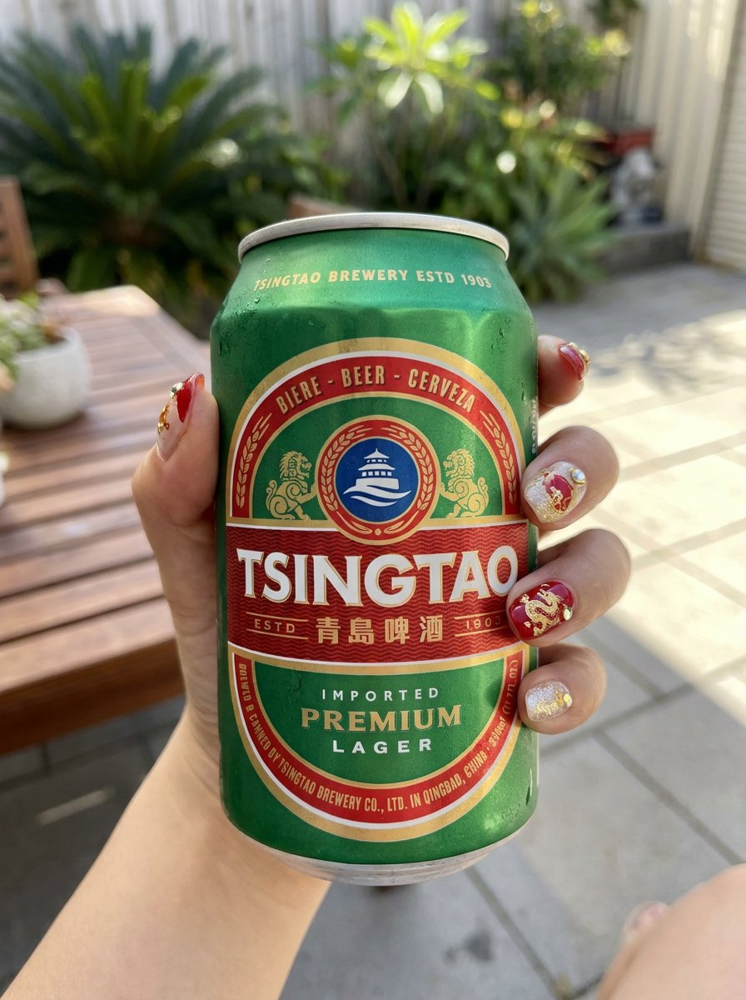

## 春日花田三联竖版写真拼贴

- ID: case-382
- Slug: case-382-zh
- 语言: zh
- 来源: [来源链接](https://x.com/frametheory058/status/2051294907214844249)
- 样例图路径: images/part2/case382.jpg

### 提示词

```text
A high-quality 3-panel vertical photo collage of a stunning uploaded woman with soft, voluminous wavy hair glowing in golden sunlight. She is styled in a cream-colored lace-up vintage blouse with delicate textures, olive green high-waisted flowy trousers, and a wide-brimmed straw hat slightly tilted for a fashionable editorial look. Light golden jewelry (thin chains, rings) adds a subtle luxury touch.

The setting is a dreamy, vibrant yellow mustard flower field under a bright blue sky with soft clouds, enhanced by golden hour lighting for a magical glow.

Top panel: Back view of the woman standing in the field with arms wide open, sunlight creating a glowing halo around her hair, slight motion blur in flowers for a cinematic feel.

Middle panel: Close-up portrait, she smiles naturally at the camera, wind softly moving her hair, her hand reaching toward the lens creating depth and a slightly blurred foreground for a DSLR effect.

Bottom panel: Playful pose, she leans sideways in the flowers, making a double peace sign, laughing candidly, capturing an authentic joyful moment.

Add cute, trendy white doodle overlays (smiley faces, sparkles, stars, tiny hearts) with a subtle animated/sketchy feel. Include light leaks, sun flares, and soft film grain for a premium Instagram aesthetic.

Ultra-realistic, 4K, cinematic lighting, shallow depth of field, high dynamic range, natural skin tones, editorial fashion photography, soft pastel color grading.

Aspect ratio: 4:5
Style tags: viral Instagram aesthetic, Pinterest style, dreamy spring vibe, candid luxury
```

### 样例图

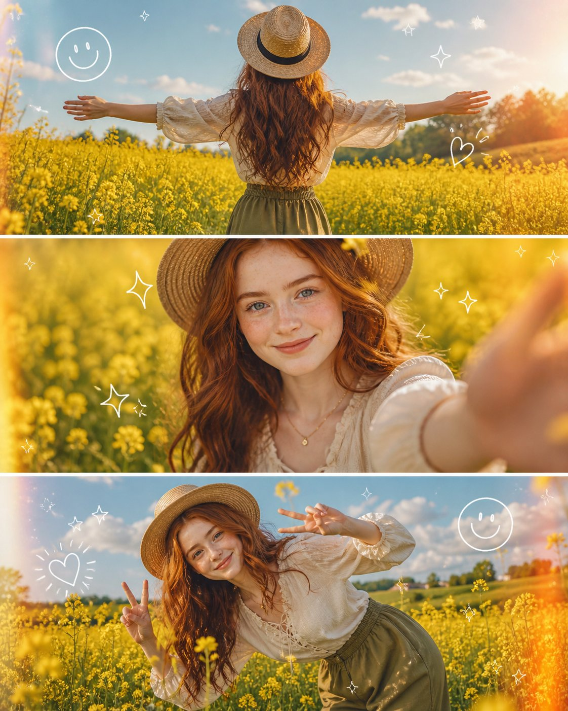

## VELORA 奢华香水广告海报

- ID: case-367
- Slug: case-367-zh
- 语言: zh
- 来源: [来源链接](https://x.com/akkiwani703/status/2049778680969437564)
- 样例图路径: images/part2/case367.jpg

### 提示词

```text
{
  "image_type": "luxury perfume advertisement poster",
  "resolution": "4K ultra HD (4096x5120)",
  "aspect_ratio": "portrait (4:5)",
  "style": {
    "aesthetic": "high-end fragrance campaign (Tom Ford, Dior inspired)",
    "tone": "dark luxury, sensual, elegant, powerful",
    "color_grading": "deep black shadows with rich golden highlights and warm amber glow",
    "lighting": "cinematic spotlight + golden rim light + soft fill light, dramatic shadows",
    "contrast": "high cinematic contrast",
    "depth_of_field": "shallow, sharp focus on face and perfume bottle"
  },
  "camera": {
    "type": "85mm portrait lens",
    "aperture": "f/1.6",
    "angle": "slightly low angle, premium perspective",
    "framing": "model upper body + product foreground"
  },
  "subject": {
    "gender": "female",
    "age_appearance": "young adult",
    "expression": "confident, sensual, calm",
    "styling": {
      "hair": "voluminous, slightly messy, glossy strands with golden highlights",
      "makeup": "soft glam, glowing skin, bold lips",
      "outfit": "brown tailored blazer with patterned silk scarf",
      "accessory": "thin transparent eyeglasses"
    }
  },
  "product": {
    "type": "luxury perfume bottle",
    "brand": "VELORA PARFUMS",
    "label": "EAU DE PARFUM",
    "design": "clear crystal glass bottle, golden liquid inside, metallic gold cap",
    "placement": "bottom center foreground on glossy black marble surface",
    "effects": "strong reflections, golden glow, subtle condensation, cinematic shine"
  },
  "environment": {
    "background": "dark blurred luxury interior with warm golden light streaks",
    "surface": "black marble with reflections",
    "extra_elements": "small flowers near bottle, golden particles, soft smoke"
  },
  "typography": {
    "logo": "V monogram + VELORA PARFUMS",
    "headline": "Not just a scent, It’s your Signature.",
    "tagline": "A fragrance that speaks before you do.",
    "secondary": "Own your essence. Leave a legacy.",
    "features": [
      "Long Lasting",
      "Premium Ingredients",
      "Crafted with Passion"
    ],
    "notes": [
      "Top: Pear, Bergamot, Pink Pepper",
      "Heart: Jasmine, Rose, Orris",
      "Base: Vanilla, Patchouli, Musk"
    ],
    "font_style": "luxury serif + elegant handwritten script",
    "color": "gold metallic",
    "placement": "top left + mid left + bottom balanced layout"
  },
  "post_processing": {
    "sharpness": "ultra sharp on face and bottle",
    "glow": "golden cinematic glow",
    "retouch": "high-end editorial finish",
    "vignette": "subtle dark vignette"
  },
  "mood": "premium luxury perfume campaign, cinematic, bold brand identity",
  "quality": "hyper-realistic, 4K ultra HD, commercial grade, award-winning fragrance ad"
}
```

### 样例图

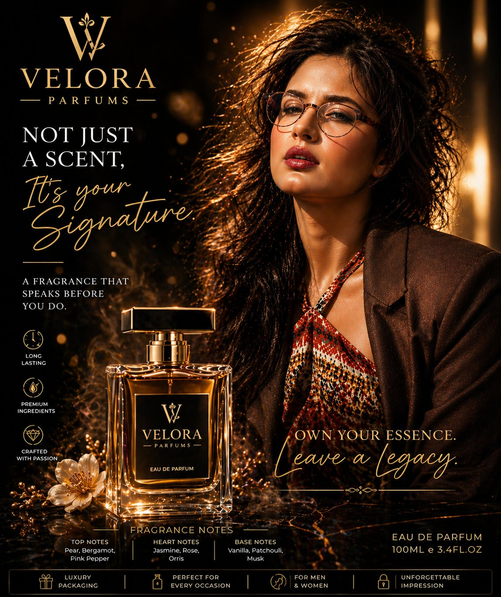

## 过度思考超现实街头 Campaign

- ID: case-356
- Slug: case-356-zh
- 语言: zh
- 来源: [来源链接](https://x.com/AIwithAliya/status/2049044716642316758)
- 样例图路径: images/part2/case356.jpg

### 提示词

```text
Ultra-realistic conceptual portrait of a young woman with long wavy hair and soft defined features, wearing rose-tinted rectangular sunglasses, an oversized ivory cropped t-shirt, fitted light-wash denim jeans, and clean white sneakers. She is sitting casually with a confident yet relaxed posture.

The twist: she is seated on a large, hyper-realistic version of her own detached head placed on the ground. The head is scaled up, lying sideways, with the same facial features and sunglasses, creating a surreal self-reflection concept.

Composition: centered, full-body shot, neutral studio background with soft blush and cream tones, minimal aesthetic. Clean negative space.

Typography integrated into the background:

Handwritten-style text at the top: "OVERTHINKING"

Below it, smaller text: "TRAPPED IN MY OWN HEART" with "HEART" crossed out

Large, rough, scribbled text in deep pink: "MIND"

Lighting: soft diffused studio lighting, subtle shadows, high detail, fashion editorial quality.

Style: blend of surrealism and modern luxury streetwear campaign, pastel feminine aesthetic, minimal yet expressive, high-resolution, 8k, sharp focus, natural skin texture.

Mood: introspective, emotional weight, identity, self-awareness, quiet confidence.
```

### 样例图

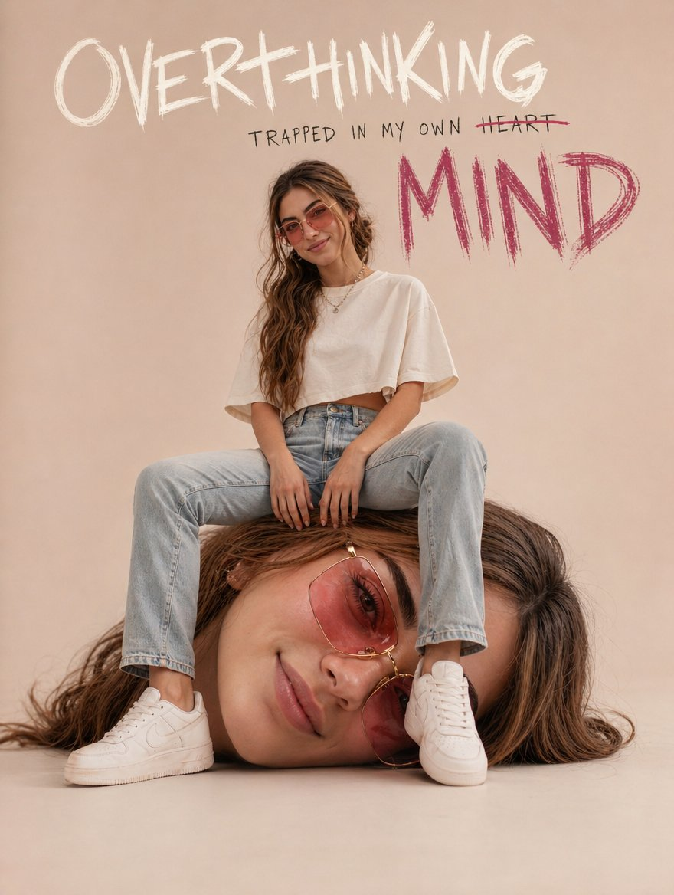

## 运动时尚三联 Campaign

- ID: case-349
- Slug: case-349-zh
- 语言: zh
- 来源: [来源链接](https://x.com/AIwithkhan/status/2048606301039820821)
- 样例图路径: images/part2/case349.jpg

### 提示词

```text
Cinematic sports fashion collage, 3-panel layout, top panel large hero shot of a female tennis athlete sitting confidently on an oversized tilted tennis racket, deep green luxury court backdrop, reflective glossy floor, bold oversized typography “PRECISION” in background, dramatic editorial lighting, ultra-clean composition, high-fashion athletic aesthetic.

Bottom left panel: close-up portrait of the athlete with glowing skin, minimal makeup, soft light, text “FOCUS” and “FUEL” placed subtly.

Bottom right panel: full-body crouched pose holding racket, strong posture, text “DISCIPLINE DRIVES DOMINANCE”, grid-based layout lines, premium sports branding feel.

Consistent color grading, dark green and white palette, sharp details, cinematic shadows, luxury campaign style, 1:1 aspect ratio.
```

### 样例图

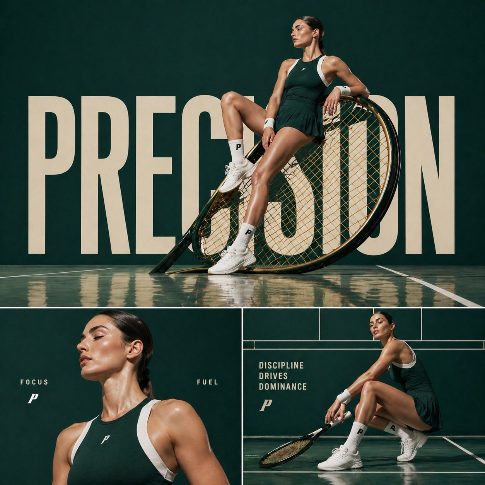

## 法新浪潮撕纸电影海报

- ID: case-345
- Slug: case-345-zh
- 语言: zh
- 来源: [来源链接](https://x.com/bananaprompts/status/2048541390900994476)
- 样例图路径: images/part2/case345.jpg

### 提示词

```text
Create a vertical poster composition on aged cream paper with a handmade analog feel. Use rough ripped paper edges, layered magazine cutouts, photocopy grain, halftone texture, ink bleed, and slightly imperfect screen-print registration. Keep the subject as the main black-and-white photographic portrait, placed prominently in the center or upper center. Surround the subject with graphic blocks of deep red, cobalt blue, warm yellow, black, and ivory.

Add supporting collage fragments such as a rainy European street, film-strip borders, newspaper clippings, urban silhouettes, and cinematic details, arranged like a handmade 1960s art-house movie poster. Use bold condensed typography with a strong visual hierarchy. Add large headline text: "[MAIN TITLE]". Add smaller subtitle text: "[SUBTITLE]". Add bottom text: "[BRAND NAME / EVENT NAME / COMING SOON / DATE]". If needed, include a small top line reading "[TAGLINE]".

The final result should feel cinematic, intellectual, rebellious, and editorial — like a lost 1960s European film poster with a strong point of view. Keep it raw, tactile, printed, imperfect, and handmade. Avoid a glossy modern finish.
```

### 样例图

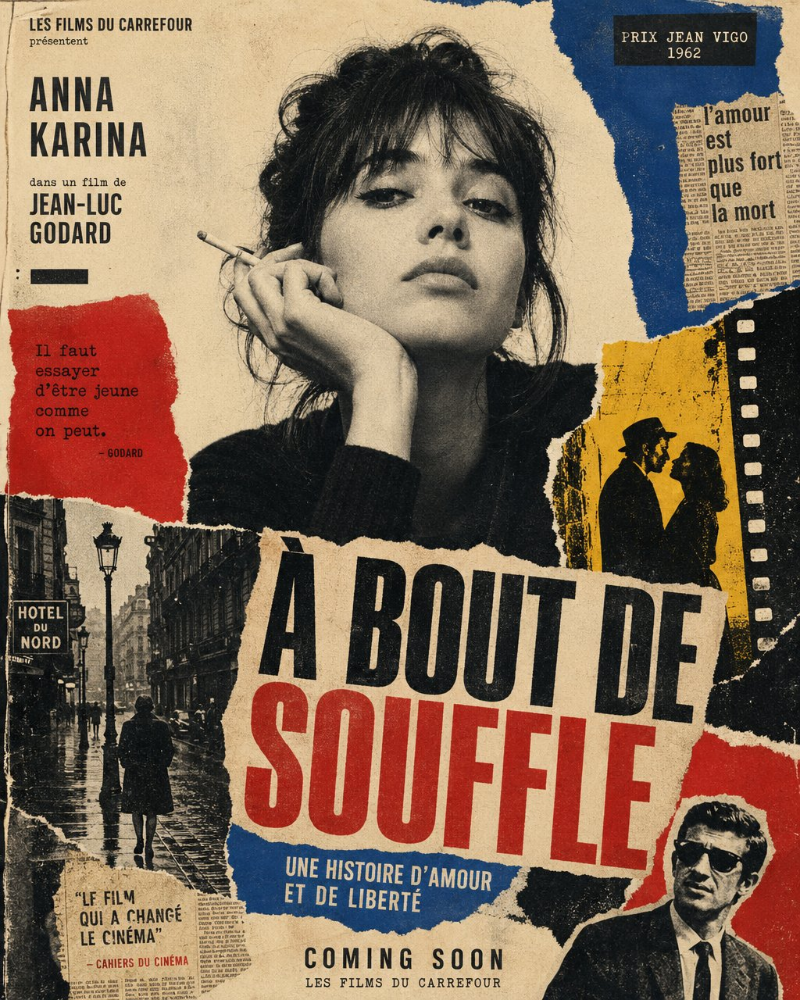

## NOIR 街头服饰 Campaign

- ID: case-344
- Slug: case-344-zh
- 语言: zh
- 来源: [来源链接](https://x.com/Daniel_adsss/status/2048542581638701446)
- 样例图路径: images/part2/case344.jpg

### 提示词

```text
Create a premium, highly realistic 1:1 campaign poster for NOIR, a modern streetwear brand. Show one hero oversized hoodie as the main focus against a gritty urban backdrop with wet concrete floors, dramatic low lighting, subtle smoke in the air and a raw street energy. Add bold minimal typography with the brand name NOIR and a short campaign headline like "Wear the Dark." Make it feel like a real high-end streetwear editorial, sharp detail, realistic fabric textures, modern and edgy, deep black tones with subtle grey accents, no clutter, no collage.
```

### 样例图

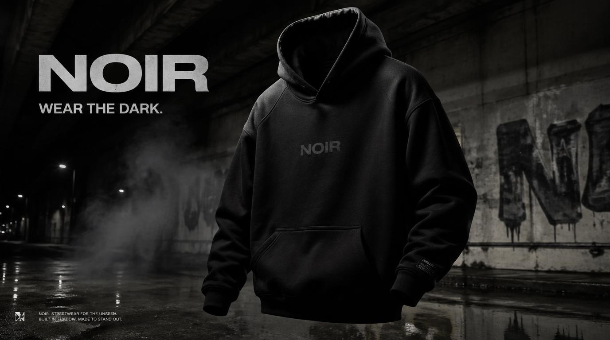

## 高定时尚杂志封面

- ID: case-343
- Slug: case-343-zh
- 语言: zh
- 来源: [来源链接](https://x.com/SPEEDAI07/status/2048573343066992919)
- 样例图路径: images/part2/case343.jpg

### 提示词

```text
Ultra high-fashion magazine cover, Louis Vuitton-style editorial. Close-up portrait of a confident woman with soft rose-gold hair and natural airy bangs, slightly wind-blown for movement. She is wearing a luxury summer outfit: a structured lightweight linen or silk jacket in warm golden-yellow tones, layered over a modest high-neck top, paired with a bold gold choker necklace and subtle statement earrings.

Fabric flows naturally with a summer breeze, slightly textured and breathable, capturing a premium seasonal feel. Styling is elegant, modest, and refined — no revealing clothing.

Lighting is high-end studio mixed with natural golden hour glow: warm highlights, soft shadows, luminous skin with glossy editorial finish.

Background is a rich summer gradient (sunset gold fading into soft coral or warm beige), clean but visually striking.

Composition is dynamic and slightly cinematic: hair in motion, shallow depth of field, sharp focus on face.

Typography: large elegant serif masthead "Louis Vuitton" at the top, bold cover line "YOUR CHOICE ENDS HERE" in premium editorial layout, minimal supporting text.

Ultra-realistic, hyper-detailed skin texture, 8K resolution, sharp focus, glossy magazine print quality, cinematic color grading, luxury fashion photography, no nudity, tasteful and editorial.
```

### 样例图

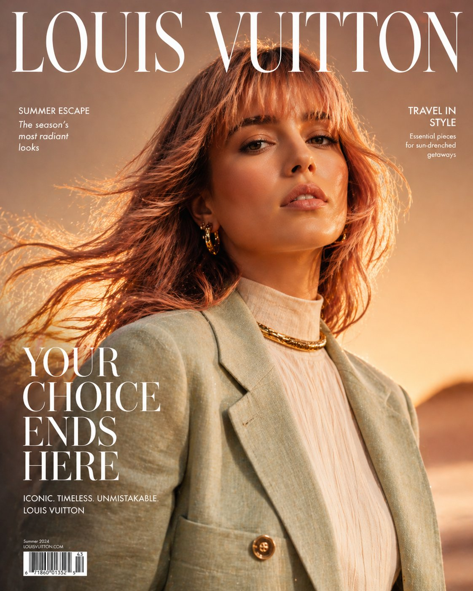

## 红蓝撞色高跟诱惑

- ID: case-326
- Slug: case-326-zh
- 语言: zh
- 来源: [来源链接](https://x.com/meng_dagg695/status/2012437899955097836)
- 样例图路径: images/part2/case326.jpg

### 提示词

```text
[中文]
{
  "global_settings": {
    "resolution": "8K",
    "quality": "超高清晰度",
    "aspect_ratio": "2:3",
    "render_style": "AI编辑、高细节3D渲染",
    "lighting_quality": "柔和影棚光与逼真阴影",
    "sharpness": "极致清晰、锐利边缘",
    "noise": "无",
    "compression": "无"
  },
  "image_style": {
    "subject": {
      "character_type": "风格化3D卡通女性",
      "pose": "微微后仰靠在背景上",
      "expression": "俏皮、嘴唇轻撅、眼睛斜视",
      "hair": {
        "color": "棕色",
        "style": "短发、凌乱",
        "accessories": "红色太阳镜架在头顶"
      }
    },
    "clothing": {
      "dress": "贴身蓝色罗纹吊带裙",
      "footwear": "红色高跟凉鞋配蝴蝶结"
    },
    "color_palette": [
      "大胆红色",
      "深蓝"
    ],
    "background": {
      "color": "纯红色",
      "texture": "光滑哑光表面"
    },
    "lighting": {
      "direction": "一侧柔和定向光",
      "shadow": "在红色背景上投下清晰影子"
    },
    "composition": {
      "framing": "全身",
      "pose_emphasis": "弯曲身姿、交叉双腿"
    }
  }
}

[English]
{
  "global_settings": {
    "resolution": "8K",
    "quality": "ultra-high definition",
    "aspect_ratio": "2:3",
    "render_style": "AI-edited, high-detail 3D render",
    "lighting_quality": "soft studio lighting with realistic shadows",
    "sharpness": "extreme clarity, crisp edges",
    "noise": "none",
    "compression": "none"
  },
  "image_style": {
    "subject": {
      "character_type": "stylized 3D cartoon female",
      "pose": "leaning slightly backward against background",
      "expression": "playful, lips slightly pursed, eyes looking sideways",
      "hair": {
        "color": "brown",
        "style": "short, tousled",
        "accessories": "red sunglasses resting on head"
      }
    },
    "clothing": {
      "dress": "form-fitting blue ribbed dress with thin straps",
      "footwear": "red high-heel sandals with bow detail"
    },
    "color_palette": [
      "bold red",
      "deep blue"
    ],
    "background": {
      "color": "solid red",
      "texture": "smooth matte surface"
    },
    "lighting": {
      "direction": "soft directional light from one side",
      "shadow": "defined shadow cast on red background"
    },
    "composition": {
      "framing": "full body",
      "pose_emphasis": "curved posture, crossed legs"
    }
  }
}
```

### 样例图


## 皮克斯风阳光少年

- ID: case-325
- Slug: case-325-zh
- 语言: zh
- 来源: [来源链接](https://x.com/iamsofiaijaz/status/2013473309485343120)
- 样例图路径: images/part2/case325.jpg

### 提示词

```text
[中文]
一个风格化的3D卡通肖像，一位年轻男子，拥有短棕发和富有表现力的绿色眼睛，温暖地微笑。他穿着黑色西装外套内搭白色T恤，现代休闲时尚。类似皮克斯/迪士尼风格角色设计，皮肤光滑，柔和光照，略微夸张的面部特征。高细节、精美的3D渲染，友好且平易近人的表情。渐变背景为柔和的蓝绿色和粉色，工作室灯光，浅景深，高分辨率。

[English]
A stylized 3D cartoon portrait of a young man with short brown hair and expressive green eyes, smiling warmly. He is wearing a black blazer over a white t-shirt, modern casual fashion. Pixar-like / Disney-style character design with smooth skin, soft lighting, and slightly exaggerated facial features. High detail, polished 3D render, friendly and approachable expression. Gradient background with soft teal and pink colors, studio lighting, shallow depth of field, high resolution.
```

### 样例图


## 复古巴士上的红风衣女郎

- ID: case-324
- Slug: case-324-zh
- 语言: zh
- 来源: [来源链接](https://x.com/iamsofiaijaz/status/2015337737860403283)
- 样例图路径: images/part2/case324.jpg

### 提示词

```text
[中文]
一位时尚年轻女子坐在老式复古巴士的前缘，身穿红色长风衣、羊毛无檐小便帽、圆形蓝色反光太阳镜、叠层项链和粗犷的棕色皮靴。她有着波浪状金发，带着自信而梦幻的表情，仰望天空。巴士漆面剥落，呈青绿色与铁锈红色调。明亮清澈的蓝天，城市背景建筑极少，柔和日光，电影级色彩分级，浅景深，高端时尚旅行氛围，编辑摄影，超写实，4K分辨率，锐利对焦，自然肌肤质感，戏剧性构图，电影静帧美学。

[English]
A stylish young woman sitting on the front edge of an old vintage bus, wearing a long red trench coat, woolen beanie cap, round blue reflective sunglasses, layered necklaces, and rugged brown leather boots. She has wavy blonde hair and a confident, dreamy expression, looking upward toward the sky. The bus is weathered with peeling paint in turquoise and rust red tones.Bright clear blue sky, urban background with minimal buildings, soft daylight, cinematic color grading, shallow depth of field, high fashion travel vibe, editorial photography, ultra-realistic, 4K resolution, sharp focus, natural skin texture, dramatic composition, film still aesthetic.
```

### 样例图


## 应用界面样机图

- ID: case-323
- Slug: case-323-zh
- 语言: zh
- 来源: [来源链接](https://x.com/Mystveil7/status/2015776042989039997)
- 样例图路径: images/part2/case323.jpg

### 提示词

```text
Create a hyper-realistic, cinematic Instagram post layout where the Instagram UI exists as a physical, tangible 3D object, photographed like a premium commercial product shot. The result should feel indistinguishable from a real studio photograph.
Instagram Frame (UI Accuracy – Critical)
Authentic Instagram interface rendered as a solid white physical 3D card
Smooth matte plastic surface with subtle micro-texture
Slight thickness visible on edges, realistic bevels
Perfectly rounded corners (exact Instagram radius)
Soft studio reflections and realistic edge highlights
Top Bar (Pixel-accurate UI):
Circular profile avatar on the left
Username text: “June” in Instagram’s default bold UI font
Light blue FOLLOW button with correct proportions
Three-dot menu icon aligned to the far right
Exact spacing, typography, and icon sizing matching the real Instagram app
Aspect ratio 1:1, centered, balanced, premium composition.
Main Subject (Pose – Match Reference Image Exactly)
A photorealistic athletic woman partially emerging out of the Instagram frame into real 3D space
Seated pose identical to the reference image:
Both legs bent and angled to the side
One knee slightly raised and closer to the chest
Arms gently wrapped around the raised knee
Hands relaxed, fingers naturally resting
Torso leaning slightly back against the frame edge
Expression: calm, thoughtful, self-assured
Gaze: looking slightly to the side and upward, not engaging the camera
Natural body proportions, relaxed posture, editorial realism
No exaggerated curves, no artificial posing
Clothing (Nike Only – Realistic Fit)
Muted ivory / off-white Nike fitted short-sleeve blouse
Soft neutral tone that contrasts beautifully with the background
Visible white Nike swoosh
Natural fabric stretch and tension
Deep blue Nike athletic pants, length up to the knee
Tailored, performance-fit silhouette
Realistic fabric weight with subtle folds at the knee bend
Clean stitching and breathable sports material
Clean white Nike sneakers
Slight wear realism
Correct sole texture and stitching
Premium sportswear look, real commercial styling
No distortion, no fantasy fashion
Background (Inside the Instagram Post Only)
Dark indoor gym or studio environment
Cool blue and muted purple cinematic lighting
Soft haze in the background
Subtle volumetric light beams barely visible
Shallow depth of field, background softly blurred
Subject and Instagram frame remain sharp and dominant
Lighting & Photorealism
Studio-grade cinematic lighting
Soft key light illuminating the subject naturally
Gentle rim light outlining the body and Instagram frame
Realistic skin texture with visible pores and natural highlights
Accurate contact shadows where the subject touches the frame
Physically correct light falloff and reflections
Footer UI (Engagement Section)
Instagram action icons: like, comment, share, save (accurate icons)
Text visible: “785 likes”
Caption begins with June
Caption text:
Freedom isn’t found in comfort.
It’s built in the quiet moments where discipline meets belief.
Hashtags partially visible and naturally cropped
Overall Style & Quality
Ultra-high resolution
Advertising-grade realism
Clean, modern, editorial Instagram aesthetic
Hyper-realistic blend of 3D object + real photography
No extra elements
No text errors
No distortion
Looks like a real product photoshoot, not AI art
```

### 样例图


## 都市落日时尚大片

- ID: case-321
- Slug: case-321-zh
- 语言: zh
- 来源: [来源链接](https://opennana.com/awesome-prompt-gallery/urban-sunset-fashion-silhouette)
- 样例图路径: images/part2/case321.jpg

### 提示词

```text
[中文]
一张超现实电影感时尚照片，一位二十出头惊艳的年轻女性，全身可见，站在现代城市中心，黄金时段。
她随意地单肩靠在交通信号灯杆上，没有意识到相机的存在，仿佛这一刻是自然捕捉的。
她穿着紧身蓝色牛仔裤、棕色皮靴，以及一件短款棕色麂皮夹克，带有柔软羊皮翻领。夹克下，一件极简深色露脐上衣，隐约露出精致的乳沟和紧致的腹部。

她的体型天生女性化，均衡而优雅，姿态自信。
一只手穿过她丰盈的浅棕色长发，将其向后撩起，头部微微转向那一侧，眼睛自然地看向别处，没有摆拍。

肤色为轻微日晒后的奶油般柔和光泽，真实肌肤纹理，细腻毛孔与高光——毫无塑料感。
妆容醒目却精致：清晰的眼部、浓密睫毛、立体腮红、柔和修容，以及自然光泽唇——具备高端美妆广告质感。
光线为温暖金色时段阳光，包裹她的轮廓与发丝，营造柔和高光与电影感对比。
背景为城市街道，汽车与都市灯光以强烈散景呈现，浅景深——焦点锁定在女性身上。

使用全画幅电影摄影机拍摄，85mm镜头，f/1.8，超现实细节，高动态范围，电影级调色，胶片质感，顶级时尚大片美学，高预算电影剧照氛围。

[English]
A hyper-realistic cinematic fashion photograph of a stunning young woman in her early 20s, full body visible, standing in a modern city center during golden hour.
She leans casually with one shoulder against a traffic light pole, unaware of the camera, as if the moment was captured naturally.
She wears skinny blue jeans, brown leather boots, and a cropped brown suede jacket with a soft shearling collar. Under the jacket, a minimal dark crop top reveals a subtle cleavage and toned midriff.

Her physique is naturally feminine, balanced and elegant, with confident posture.
One hand runs through her long, voluminous curly light-brown hair, lifting it back in motion. Her head is turned slightly toward that side, eyes looking away naturally, not posing.

Skin tone is lightly sun-kissed with a soft creamy glow, realistic skin texture, subtle pores and highlights — no plastic look.
Makeup is striking but refined: defined eyes, bold lashes, sculpted cheeks, soft contour, and natural glossy lips — editorial beauty campaign quality.
Lighting is warm golden hour sunlight, wrapping around her silhouette and hair, creating soft highlights and cinematic contrast.
Background is an urban street with cars and city lights rendered in strong bokeh, shallow depth of field — focus locked on the woman.

Shot on a full-frame cinema camera, 85mm lens, f/1.8, ultra-realistic detail, high dynamic range, cinematic color grading, film-like tones, premium fashion editorial aesthetic, high-budget movie still feeling.
```

### 样例图

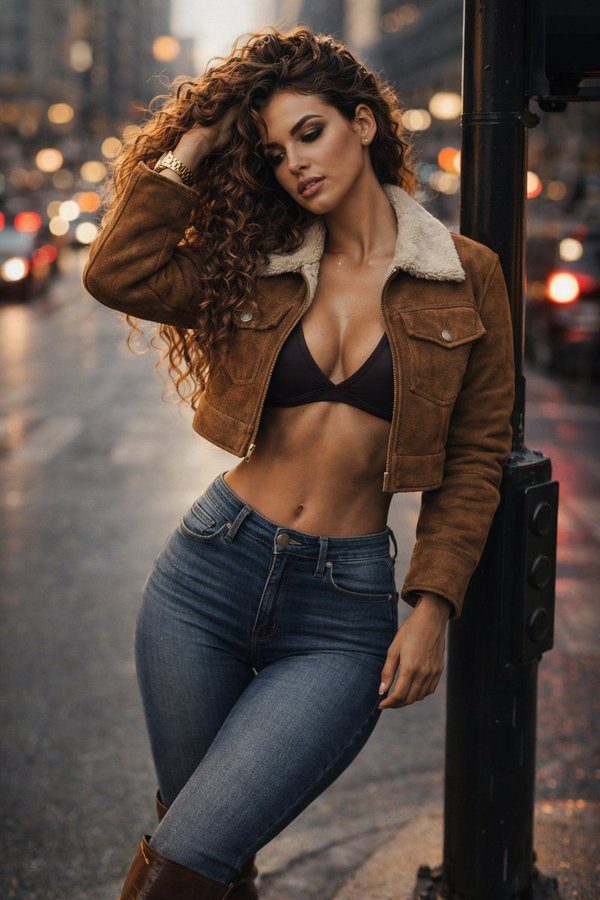

## 冰火双雄背靠背史诗电影海报

- ID: case-320
- Slug: case-320-zh
- 语言: zh
- 来源: [来源链接](https://x.com/Naiknelofar788/status/2025972876554510482)
- 样例图路径: images/part2/case320.jpg

### 提示词

```text
[中文]
一幅戏剧性的电影海报风格肖像，描绘了两位史诗奇幻战士在冰冻风暴中背靠背站立。左侧是一位身经百战的男性战士，留着湿漉漉的深色卷发，低头以此表达坚定的决心，紧握着一把插在冰里的中世纪长剑。霜雪附着在他毛皮镶边的斗篷和肩膀上。右侧是一位强有力的女性战士侧影，苍白的皮肤在炽热的橙色光芒下闪耀，她的身体部分被火焰吞没，与冰冷的蓝色氛围形成对比。雪花粒子在空中盘旋，在象征性的冲突中融合了火与冰。超精细的面部细节，情感强度，体积雾，电影级布光，冷蓝色调混合温暖的火焰高光，浅景深，史诗奇幻电影海报，超写实，8K分辨率，戏剧性构图，清晰聚焦，高对比度，逼真纹理。

[English]
A dramatic cinematic poster-style portrait of two epic fantasy warriors standing back-to-back in a frozen storm. On the left, a battle-worn male warrior with wet, curly dark hair, head bowed in quiet resolve, gripping a medieval sword planted into the ice. Frost and snow cling to his fur-lined cloak and shoulders. On the right, a powerful female warrior in profile, pale skin glowing with fiery orange light, her body partially engulfed in flames thatcontrast against the icy blue atmosphere. Snow particles swirl through the air, blending fire and ice in a symbolic clash. Ultra-detailed faces, emotional intensity, volumetric fog, cinematic lighting, cold blue tones mixed with warm fire highlights, shallow depth of field, epic fantasy movie poster, hyper-realistic, 8K resolution, dramatic composition, sharp focus, high contrast, photorealistic textures.
```

### 样例图

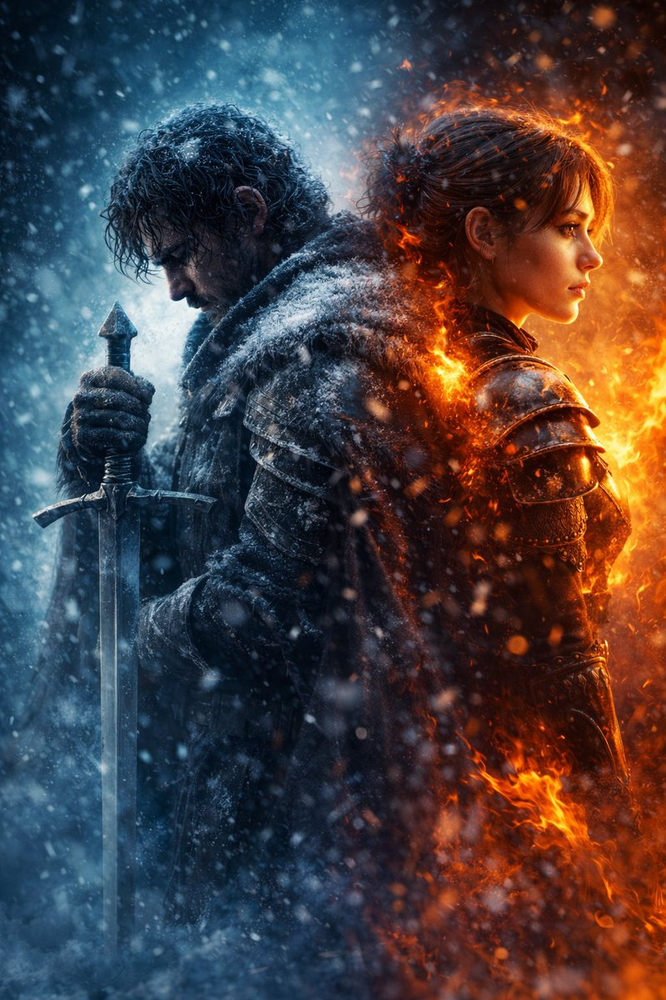

## 鸟群织就的梦幻高定时装秀

- ID: case-319
- Slug: case-319-zh
- 语言: zh
- 来源: [来源链接](https://x.com/MrDasOnX/status/2026284342549340190)
- 样例图路径: images/part2/case319.jpg

### 提示词

```text
[中文]
一个充满趣味的高级时装T台场景，主角是一位自信的女性，正走在奢华时装秀的T台上，身穿一件完全由鸟类制成的非凡高级定制礼服。数百只优雅、色彩鲜艳的鸟类构成了飘逸的雕塑感礼服形状，像活着的羽毛一样层叠，翅膀微微张开，营造出布料和运动的错觉。一些鸟儿在她周围轻轻升入空中，捕捉于飞行瞬间，增添了神奇、超现实的运动感。鸟儿们展现出丰富多样的色彩——彩虹般的蓝色、光芒四射的红色、金黄色和柔和的白色——拥有错综复杂的羽毛细节和自然纹理。她在迈步间摆出姿势，带着快乐、自信的表情，富有表现力的眼睛，以及精致的T台妆容。戏剧性的舞台灯光配以发光的高光，黑暗模糊的观众背景，电影级的景深，奇幻现实主义，超精细纹理，高对比度，清晰聚焦，奇思妙想的奢华时装秀，超现实主义高级定制，4K分辨率，专业调色。

[English]
A playful high-fashion runway scene featuring a confident woman walking a luxury fashion show catwalk, wearing an extraordinary couture dress made entirely of birds. Hundreds of elegant, vividly colored birds form the shape of a flowing, sculptural gown, layered like living feathers, with wings partially spread to create the illusion of fabric and motion. Some birds lift gently into the air around her, captured mid-flight, adding a magical, surreal sense of movement. The birds display a rich variety of colors — iridescent blues, radiant reds, golden yellows, and soft whites — with intricate feather details and natural textures. She poses mid-stride with a joyful, confident expression, expressive eyes, and refined runway makeup. Dramatic stage lighting with glowing highlights, dark blurred audience background, cinematic depth of field, fantasy realism, ultra-detailed textures, high contrast, sharp focus, whimsical luxury fashion show, surreal couture, 4K resolution, professional color grading.
```

### 样例图


## 红蓝光影下的未来都市双重曝光青年

- ID: case-314
- Slug: case-314-zh
- 语言: zh
- 来源: [来源链接](https://x.com/Fujimoto_hina/status/2028045894088630679)
- 样例图路径: images/part2/case314.jpg

### 提示词

```text
[中文]
{
  "prompt": "一位年轻男子的超写实电影级双重曝光侧脸肖像，表情专注强烈，皮肤纹理细节丰富，眼神锐利。他的面部与从剪影中浮现的未来主义城市天际线无缝融合，摩天大楼和城市建筑构成了他的颈部和下颌线。深蓝色和鲜艳红色的强烈对比，象征着冲突与力量。抽象的数字划痕、碎裂的玻璃纹理和漏光效果覆盖在面部，营造出戏剧性的效果。干净的白色背景，超精细的灯光，专业电影海报风格，高对比度，清晰聚焦，8K分辨率，逼真的发丝，社论海报构图，现代平面设计美学，戏剧性的氛围，超高清，照片级真实。",
  "negative_prompt": "模糊，低分辨率，扭曲的面部，多余的肢体，过饱和的颜色，嘈杂的背景，平淡的灯光，卡通化，低细节",
  "resolution": "8K",
  "style": "电影感，双重曝光，照片级真实感，社论海报",
  "background": "干净的白色",
  "lighting": "高对比度，戏剧性的蓝红分割布光"
}

[English]
{
  "prompt": "A hyper-realistic cinematic double exposure portrait of a young man in side profile, intense focused expression, detailed skin texture and sharp eyes. His face seamlessly blended with a futuristic city skyline emerging from his silhouette, skyscrapers and urban buildings forming his neck and jawline. Strong contrast of deep blue and vibrant red tones symbolizing conflict and power. Abstract digital scratches, fractured glass textures, and light leaks overlaying the face for a dramatic effect. Clean white background, ultra-detailed lighting, professional movie poster style, high contrast, sharp focus, 8K resolution, realistic hair strands, editorial poster composition, modern graphic design aesthetics, dramatic mood, ultra-HD, photorealistic.",
  "negative_prompt": "blurry, low resolution, distorted face, extra limbs, oversaturated colors, noisy background, flat lighting, cartoonish, low detail",
  "resolution": "8K",
  "style": "cinematic, double exposure, photorealistic, editorial poster",
  "background": "clean white",
  "lighting": "high contrast, dramatic blue and red split lighting"
}
```

### 样例图

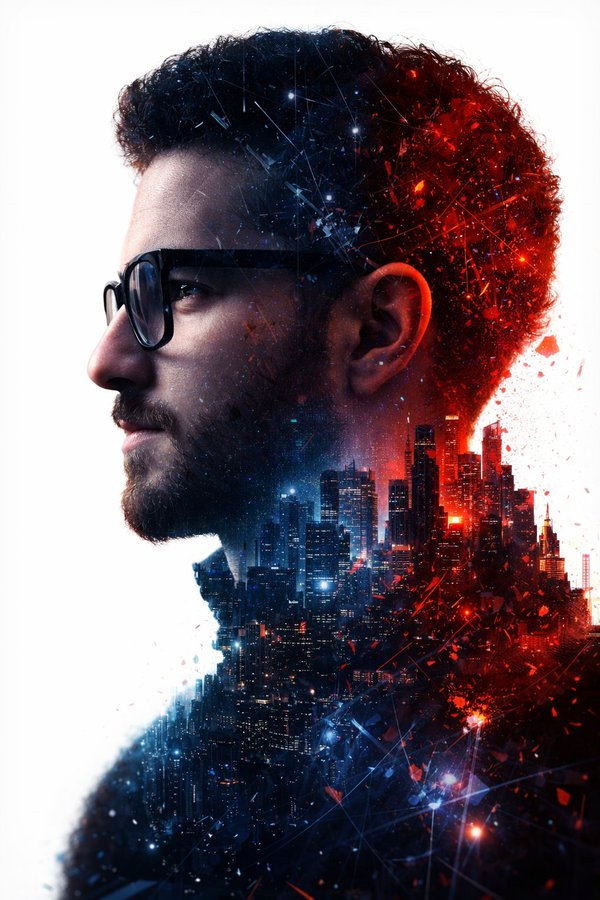

## 官方角色设定资料卡

- ID: case-306
- Slug: case-306-zh
- 语言: zh
- 来源: [来源链接](https://x.com/MANISH1027512/status/2045013913901867334)
- 样例图路径: images/part2/case306.jpg

### 提示词

```text
[中文]
基于此角色和背景，请制作一份类似官方设定资料的角色资料卡。
・包含三视图：正面、侧面和背面
・添加角色面部表情的变化・分解并展示服装和装备的详细部分
・添加色板・包含世界观设定的简要说明
・总体上，使用有组织的布局（白色背景，插画风格）

[English]
Based on this character and background, please create a character reference sheet similar to official setting materials.
・Includes three-view drawings: front view, side view, and back view
・Add variations of the character's facial expressions
・Break down and display detailed parts of the clothing and equipment
・Add a color palette
・Include a brief explanation of the worldview setting
・Overall, use an organized layout (white background, illustration style)
```

### 样例图


## 博物馆级中文拆解信息图鉴

- ID: case-296
- Slug: case-296-zh
- 语言: zh
- 来源: [来源链接](https://x.com/MrLarus/status/2045504669401653414)
- 样例图路径: images/part2/case296.jpg

### 提示词

```text
[中文]
请根据【主题】自动生成一张“博物馆图鉴式中文拆解信息图”。

要求整张图兼具真实写实主视觉、结构拆解、中文标注、材质说明、纹样寓意、色彩含义和核心特征总结。你需要根据【主题】自动判断最合适的主体对象、服饰体系、器物结构、时代风格、关键部件、材质工艺、颜色方案与版式结构，用户无需再提供其他信息。

整体风格应为：国家博物馆展板、历史服饰图鉴、文博专题信息图，而不是普通海报、古风写真、电商详情页或动漫插画。背景采用米白、绢纸白、浅茶色等纸张质感，整体高级、克制、专业、可收藏。

版式固定为：
- 顶部：中文主标题 + 副标题 + 导语
- 左侧：结构拆解区，中文引线标注关键部件，并配局部特写
- 右上：材质 / 工艺 / 质感区，展示真实纹理小样并附说明
- 右中：纹样 / 色彩 / 寓意区，展示主色板、纹样样本和文化解释
- 底部：穿着顺序 / 构成流程图 + 核心特征总结

若主题适合人物展示，则以真实人物全身站姿为中央主体；若更适合器物或单体结构，则改为中心主体拆解图，但整体仍保持完整中文信息图形式。所有文字必须为简体中文，清晰、规整、可读，不要乱码、错字、英文或拼音。重点突出真实结构、材质差异、文化说明与图鉴气质。

避免：海报感、影楼感、电商感、动漫感、cosplay感、乱标注、错结构、糊字、假材质、过度装饰。

[English]
Please automatically generate a "museum catalog-style Chinese disassembly infographic" based on the [Subject].

The entire image is required to combine a realistic main visual, structural disassembly, Chinese annotations, material descriptions, pattern meanings, color meanings, and core feature summaries. You need to automatically determine the most appropriate main subject, clothing system, artifact structure, era style, key components, material craftsmanship, color scheme, and layout structure based on the [Subject], and the user does not need to provide any other information.

The overall style should be: national museum exhibition boards, historical clothing catalogs, and cultural/museum thematic infographics, rather than ordinary posters, ancient-style portraits, e-commerce detail pages, or anime illustrations. The background uses paper textures such as off-white, silk white, and light tea color, making the overall look premium, restrained, professional, and collectible.

The layout is fixed as:
- Top: Chinese main title + subtitle + introduction
- Left: Structural disassembly area, with Chinese lead lines annotating key components, accompanied by close-up details
- Upper right: Material / craftsmanship / texture area, displaying real texture samples with descriptions
- Middle right: Pattern / color / meaning area, displaying the main color palette, pattern samples, and cultural explanations
- Bottom: Dressing order / composition flowchart + core feature summary

If the subject is suitable for character display, use a full-body standing posture of a real person as the central subject; if it is more suitable for artifacts or single structures, change it to a central subject disassembly diagram, but the overall form remains a complete Chinese infographic. All text must be in Simplified Chinese, clear, neat, and readable, without garbled characters, typos, English, or pinyin. The focus is on highlighting real structures, material differences, cultural explanations, and a catalog atmosphere.

Avoid: poster feel, studio portrait feel, e-commerce feel, anime feel, cosplay feel, random annotations, incorrect structures, blurry text, fake materials, excessive decoration.
```

### 样例图


## 温柔治愈系二次元手机截图

- ID: case-282
- Slug: case-282-zh
- 语言: zh
- 来源: [来源链接](https://x.com/Zoulinshen/status/2045082518089810073)
- 样例图路径: images/part2/case282.jpg

### 提示词

```text
[中文]
生成一张竖版手机截图风格的图片，整体比例接近 9:16。画面中心偏上是一位真人 coser，扮演（角色名称）的二次元角色。人物为写实风格，但五官略带动漫感，皮肤细腻，眼睛稍大，表情温柔地看向镜头，坐在室内的休闲场景中，例如咖啡厅或酒吧吧台前，背景有符合场景的道具。画面最上方加入手机系统状态栏 UI，包括时间、电量、信号、网络等图标，让整张图看起来像手机截图。画面底部叠加一块宽大的半透明 galgame 风格对话框，对话框左侧放一个与画面人物对应的动漫或 Q 版头像；对话框右侧排版文字：第一行用较大字体显示与前面相同的角色名字，下面一到两行显示一段适合这个角色人设的、温柔治愈风格的简体中文台词，由你自动创作。再在对话框下方加一条操作栏，仿照 galgame UI。整体风格高清、细节丰富、光线柔和、二次元与真人写真自然融合。

[English]
Generate a portrait mobile phone screenshot style image, with an overall aspect ratio close to 9:16. In the upper center of the frame is a real-life coser, playing a 2D anime character named (Character Name). The character is in a realistic style, but with facial features slightly showing an anime feel, delicate skin, slightly larger eyes, a gentle expression looking at the camera, sitting in an indoor casual scene, such as in front of a cafe or bar counter, with background props fitting the scene. At the very top of the image, add a mobile phone system status bar UI, including icons for time, battery, signal, and network, to make the whole image look like a mobile phone screenshot. At the bottom of the image, overlay a wide semi-transparent galgame style dialog box, place an anime or Q-version avatar corresponding to the character in the image on the left side of the dialog box; on the right side of the dialog box, typeset text: the first line displays the same character name as before in a larger font, the following one to two lines display a piece of Simplified Chinese dialogue suitable for this character's personality, in a gentle and healing style, automatically created by you. Then add an operation bar below the dialog box, imitating the galgame UI. The overall style is high-definition, rich in details, with soft lighting, and a natural fusion of 2D anime and real-life photography.
```

### 样例图


## 奢华魅力黑人女性海滨摄影

- ID: case-277
- Slug: case-277-zh
- 语言: zh
- 来源: [来源链接](https://x.com/patrickassale/status/2044581766309060765)
- 样例图路径: images/part2/case277.jpg

### 提示词

```text
[中文]
奢华魅力美容肖像：, 美丽的黑人女性, 青春活力, 奶油香草色, 丝绸柔顺发, 红木色, 微妙的自信, 有质感的面料, 蓝宝石色, 极简珠宝, 海滨微风, 镜头光晕效果, 怀旧的, 电影镜头, 对称构图, 柔焦, 高级时尚摄影, 单色的, 水光质感, 神秘张力, 分层元素

[English]
Luxury Glam Beauty Portrait:, Beautiful Black woman, youthful spirit, creamy vanilla, silk press, mahogany red, subtle confidence, textured fabric, sapphire blue, minimal jewelry, beachside breeze, lens flare effect, nostalgic, cinematic lens, symmetrical composition, soft focus, high fashion photography, monochromatic, dewy finish, mysterious tension, layered elements
```

### 样例图


## 一张采用分层蒙太奇构图的电影海报

- ID: case-275
- Slug: case-275-zh
- 语言: zh
- 来源: [来源链接](https://x.com/old_pgmrs_will/status/2045440101359198302)
- 样例图路径: images/part2/case275.jpg

### 提示词

```text
[中文]
“一张采用分层蒙太奇构图的电影海报。背景为日落时分的海滨小镇，平静的海面倒映着耀眼的日光眩光，薄雾笼罩的天空中有远处飞鸟，沿海公路旁立着电线杆剪影。左侧中景处，一位身着深灰色外套、留着深色卷发的中年男子站在混凝土海堤边，神情忧郁地低头凝视，被傍晚的阳光逆光勾勒轮廓。右侧前景主体为一张大幅特写年轻女子侧脸肖像，她望向右侧，身穿带白色条纹的深色水手校服，湿润的黑发贴在脸颊，柔和漫射光线下，一滴泪珠从她脸颊滑落。画面下方中央前景处，一只柴犬抬头朝右侧望去，红棕色毛发被温暖的轮廓光点亮。画面最底端为一条横向电影胶片，内含五幅独立矩形场景缩略图：女孩与柴犬在海滩、女孩骑车望向海面、女孩与男子坐在室内桌前、男子与女孩在海滩面对面站立、女孩拥抱柴犬的特写。画面叠加指定文字：左上角为深青绿色大号衬线字体标题《风间静语》，下方副标题为「—— 致那日的你 ——」；标题下方为小号深色衬线正文：“逝去之物，不复归来。然而，只要心灵稍稍相连，我们便能再度直面明日。” 画面右侧中部为深色衬线字体文字：“曾有一段时光，是你教会我如何生活。我永不会忘。” 左下角为大号白色文字：“10 月 31 日 周五 影院上映”。右下角为小号白色无衬线字体演职人员表：“主演：福波真子 / 桐嶋秀作 原作与剧本：柴野麻吕 导演：今仓七海 主题曲：SyVa《看得见海的地方》（Dogstar★唱片） 制作：《夕凪之尾》影视伙伴 制作公司：DABUSHIBANU-NU 发行：GOODSHIBALERS ©2026《夕凪之尾》影视伙伴”。
分段提示词：
图层索引：0
片段：“背景为日落时分的海滨小镇，平静海面倒映耀眼日光眩光，薄雾天空中有远处飞鸟，沿海公路旁有电线杆剪影。”
图层索引：1
片段：“左侧中景处，身着深灰色外套、留深色卷发的中年男子站在混凝土海堤边，神情忧郁低头，被傍晚阳光逆光照射。”
图层索引：2
片段：“右侧前景主体为大幅特写年轻女子侧脸肖像，她望向右侧，身穿带白条纹的深色水手校服，湿润黑发贴脸，柔和漫射光下一滴泪珠滑落脸颊。”
图层索引：3
片段：“画面下方中央前景处，一只柴犬抬头望向右侧，红棕色毛发被温暖轮廓光点亮。”
图层索引：4
片段：“画面最底端为横向电影胶片，内含五幅独立矩形场景缩略图：女孩与柴犬在海滩、女孩骑车望向水面、女孩与男子坐在室内桌前、男子与女孩在海滩面对面、女孩拥抱柴犬特写。”
图层索引：[5,6,7,8]
片段：“画面叠加指定文字：左上角为深青绿色大号衬线字体《风间静语》，下方副标题「—— 致那日的你 ——」；其下小号深色衬线正文：“逝去之物，不复归来。然而，只要心灵稍稍相连，我们便能再度直面明日。” 右侧中部深色衬线文字：“曾有一段时光，是你教会我如何生活。我永不会忘。” 左下角大号白色文字：“10 月 31 日 周五 影院上映”。右下角小号白色无衬线字体演职信息：“主演：福波真子 / 桐嶋秀作 原作与剧本：柴野麻吕 导演：今仓七海 主题曲：SyVa《看得见海的地方》（Dogstar★唱片） 制作：《夕凪之尾》影视伙伴 制作公司：DABUSHIBANU-NU 发行：GOODSHIBALERS ©2026《夕凪之尾》影视伙伴”。
负面提示词：
“平光照明，无质感表面，对称构图，底部留白空荡，文字缺失，翻译文字，改写文字，3D 渲染，卡通风格，高对比生硬阴影，干涩头发，明亮欢快表情”

[English]
A cinematic movie poster utilizing a layered montage composition. In the background, a coastal town at sunset with calm ocean water reflecting a glowing sun glare, distant birds in a hazy sky, and the silhouette of utility poles along a coastal road. In the left midground, a middle-aged man with dark wavy hair in a dark grey jacket stands near a concrete sea wall, looking downward with a melancholic expression, backlit by the late afternoon sun. Dominating the right foreground is a large, closely cropped profile portrait of a young woman looking right; she wears a dark school sailor uniform with white stripes, has wet dark hair clinging to her face, and a single tear rolls down her cheek under soft, diffuse lighting. In the lower center foreground, a Shiba Inu dog looks upwards toward the right, its reddish-brown fur catching warm rim lighting. Along the very bottom edge is a horizontal film strip of five distinct rectangular scene thumbnails: a dog and girl on a beach, a girl on a bicycle looking at the water, a girl and man sitting at an indoor table, a man and girl standing facing each other on a beach, and a close-up of a girl hugging a Shiba Inu. Overlaid on the image is specific text. In the top left, large dark teal serif text reads 'The Quiet Between Winds' with a subtitle below reading '— To You, That Day —'. Below that, smaller dark serif body text reads 'What is lost will not return. And yet, when hearts connect, even just a little, we can face tomorrow again.'. On the mid-right side, dark serif text reads 'There was a time when you taught me how to live. I won't forget it.'. In the bottom left, large white text reads 'OCTOBER 31 FRI. IN THEATERS'. In the lower right corner, small white sans-serif credit text reads 'Starring: Mako Fukunami / Shusaku Kirimine Original Story & Screenplay: Shibano Maruo Director: Nanami Imakura Theme Song: SyVa \"Umi no Mieru de\" (Dogstar★RECORDS) Production: \"Yūnagi no Shippo\" Film Partners Production Company: DABUSHIBANU-NU Distribution: GOODSHIBALERS ©2026 \"Yūnagi no Shippo\" Film Partners'."
  segmented:
    - layer_index: 0
      segment: "In the background, a coastal town at sunset with calm ocean water reflecting a glowing sun glare, distant birds in a hazy sky, and the silhouette of utility poles along a coastal road."
    - layer_index: 1
      segment: "In the left midground, a middle-aged man with dark wavy hair in a dark grey jacket stands near a concrete sea wall, looking downward with a melancholic expression, backlit by the late afternoon sun."
    - layer_index: 2
      segment: "Dominating the right foreground is a large, closely cropped profile portrait of a young woman looking right; she wears a dark school sailor uniform with white stripes, has wet dark hair clinging to her face, and a single tear rolls down her cheek under soft, diffuse lighting."
    - layer_index: 3
      segment: "In the lower center foreground, a Shiba Inu dog looks upwards toward the right, its reddish-brown fur catching warm rim lighting."
    - layer_index: 4
      segment: "Along the very bottom edge is a horizontal film strip of five distinct rectangular scene thumbnails: a dog and girl on a beach, a girl on a bicycle looking at the water, a girl and man sitting at an indoor table, a man and girl standing facing each other on a beach, and a close-up of a girl hugging a Shiba Inu."
    - layer_indices: [5, 6, 7, 8]
      segment: "Overlaid on the image is specific text. In the top left, large dark teal serif text reads 'The Quiet Between Winds' with a subtitle below reading '— To You, That Day —'. Below that, smaller dark serif body text reads 'What is lost will not return. And yet, when hearts connect, even just a little, we can face tomorrow again.'. On the mid-right side, dark serif text reads 'There was a time when you taught me how to live. I won't forget it.'. In the bottom left, large white text reads 'OCTOBER 31 FRI. IN THEATERS'. In the lower right corner, small white sans-serif credit text reads 'Starring: Mako Fukunami / Shusaku Kirimine Original Story & Screenplay: Shibano Maruo Director: Nanami Imakura Theme Song: SyVa \"Umi no Mieru de\" (Dogstar★RECORDS) Production: \"Yūnagi no Shippo\" Film Partners Production Company: DABUSHIBANU-NU Distribution: GOODSHIBALERS ©2026 \"Yūnagi no Shippo\" Film Partners'."

negative: "flat lighting, untextured surfaces, symmetrical composition, empty bottom margin, missing text, translated text, paraphrased text, 3D render, cartoon, high-contrast harsh shadows, dry hair, bright cheerful expressions
```

### 样例图


## 橙红渐变中的孤独剪影

- ID: case-273
- Slug: case-273-zh
- 语言: zh
- 来源: [来源链接](https://x.com/iam_miharbi/status/2045151354679665101)
- 样例图路径: images/part2/case273.jpg

### 提示词

```text
[中文]
生成一张电影级极简肖像，一个孤独的男人站在强烈的橙色到红色渐变环境中，强烈的剪影光，深邃的阴影对比，反光的光滑地面，对称构图，极简

[English]
Generate a cinematic minimal portrait of a solitary man standing in an intense orange to red gradient environment, strong silhouette lighting, deep shadow contrast, reflective glossy floor, symmetrical composition, minimal
```

### 样例图


## 抖音汉服美女直播带货截图

- ID: case-257
- Slug: case-257-zh
- 语言: zh
- 来源: [来源链接](https://x.com/joshesye/status/2044796366950703316)
- 样例图路径: images/part2/case257.jpg

### 提示词

```text
[中文]
生成一个抖音直播的截图里面是一个穿着中国传统服饰的美女在直播卖货

[English]
Generate a screenshot of a Douyin live stream, featuring a beautiful woman wearing traditional Chinese clothing selling goods during the live broadcast.
```

### 样例图


## 古风明朝帝王群像长卷

- ID: case-226
- Slug: case-226-zh
- 语言: zh
- 来源: [来源链接](https://x.com/liyue_ai/status/2045071977279635962)
- 样例图路径: images/part2/case226.jpg

### 提示词

```text
[中文]
根据上传图片的风格，生成明朝各个皇帝的头像，头像下面有他们的谥号和名字

[English]
Based on the style of the uploaded image, generate portraits of the emperors of the Ming Dynasty, with their posthumous titles and names below the portraits
```

### 样例图


## 春日禅意水墨群山海报

- ID: case-223
- Slug: case-223-zh
- 语言: zh
- 来源: [来源链接](https://x.com/liyue_ai/status/2046215276249993720)
- 样例图路径: images/part2/case223.jpg

### 提示词

```text
[中文]
新中式水墨山水海报，竖版9:16构图，东方极简美学风格，
大面积留白，整体色调为春日清晨氛围（青绿色、雾蓝、淡灰、浅墨），低饱和、清透柔和，高级质感。
画面主体为奇峻巍峨的群山，从中间平静湖面的两侧拔地而起，占据左右两侧画面，
山体以水墨晕染表现，浓淡干湿变化丰富，局部融入淡青绿色渲染，体现春意生机。
山峰被湿润轻柔的晨雾包裹，雾气层层递进，与浅青蓝天空自然融合，形成空气透视与空间纵深。

湖面如镜面般平静，呈现微青绿色调，倒映山体与天空，反射略带柔焦与雾化扩散效果，增强春日湿润与梦幻氛围。
中景一艘带弧形篷顶的小木舟缓慢漂浮，船桨轻触水面形成细腻涟漪，水纹自然扩散，整体保持极静状态。

船上为一位红衣渔女，体量较小（远景比例），人物简化处理为水墨剪影 + 轻微设色，
身着低饱和朱砂红传统服饰（非鲜艳红），颜色略被雾气柔化，
人物面部不刻画细节，仅保留轮廓与姿态（如轻扶船篷或执桨），
红色在水面形成淡淡倒影，作为画面唯一暖色视觉焦点。

岸边点缀疏林与春季新生植被，采用淡墨 + 淡青绿点染，虚实结合，增强节奏与生命气息。

少量飞鸟在远空掠过，轻盈疏散分布，增强空间层次与灵动感。

画面顶部居中竖排书法：“东方美学”，采用传统手写行书或行草风格（王羲之笔意），
笔触自然起伏、提按分明，带飞白与墨韵扩散效果，避免字体感。
书法颜色为深墨青或柔和墨黑，与整体画面统一。
整体风格：水墨 + 现代极简设计融合，春日禅意、空灵湿润、宁静氛围，
冷暖对比克制，电影感光影，高级艺术海报质感，8K超清细节。

[English]
Neo-Chinese ink wash landscape poster, vertical 9:16 composition, Oriental minimalist aesthetic style,
Large area of negative space, overall color tone is spring morning atmosphere (cyan-green, misty blue, light gray, light ink), low saturation, clear and soft, high-end texture.
The main subject of the picture is steep and majestic mountains, rising from both sides of the calm lake in the middle, occupying the left and right sides of the picture,
The mountain bodies are expressed with ink wash blending, rich in changes of shades, dryness and wetness, partially integrated with light cyan-green rendering, reflecting the vitality of spring.
The mountain peaks are wrapped in moist and gentle morning mist, the mist progresses layer by layer, naturally blending with the light cyan-blue sky, forming aerial perspective and spatial depth.
The lake surface is as calm as a mirror, showing a slightly cyan-green tone, reflecting the mountains and the sky, the reflection slightly has a soft focus and atomization diffusion effect, enhancing the spring moist and dreamy atmosphere.
In the midground, a small wooden boat with an arched canopy floats slowly, the oars lightly touch the water surface to form delicate ripples, the water patterns spread naturally, maintaining an extremely quiet state overall.
On the boat is a fisherwoman in red, with a small volume (distant view proportion), the character is simplified into an ink wash silhouette + slight coloring,
wearing a low-saturation cinnabar red traditional costume (not bright red), the color is slightly softened by the mist,
no facial details are depicted for the character, only retaining the outline and posture (such as gently holding the boat canopy or holding the oar),
the red color forms a faint reflection on the water surface, serving as the only warm color visual focus in the picture.
The shore is dotted with sparse woods and spring newborn vegetation, using light ink + light cyan-green dot dyeing, combining virtuality and reality, enhancing rhythm and breath of life.
A small number of flying birds skim across the distant sky, distributed lightly and loosely, enhancing the spatial layers and sense of agility.
At the top center of the picture, vertical calligraphy: "Oriental Aesthetics", adopting traditional handwritten running script or running-cursive style (intention of Wang Xizhi's brushwork),
brushstrokes naturally undulate, lifting and pressing are distinct, with flying white and ink rhyme diffusion effects, avoiding a sense of font.
The calligraphy color is dark ink cyan or soft ink black, unified with the overall picture.
Overall style: ink wash + modern minimalist design fusion, spring Zen, ethereal and moist, tranquil atmosphere,
restrained cold and warm contrast, cinematic light and shadow, high-end art poster texture, 8K ultra-clear details.
```

### 样例图


## 韩系偶像九宫格写真集

- ID: case-219
- Slug: case-219-zh
- 语言: zh
- 来源: [来源链接](https://x.com/BubbleBrain/status/2046151898621993364)
- 样例图路径: images/part2/case219.jpg

### 提示词

```text
[中文]
9:16 竖版 — 一个 3x3 网格拼贴（九张图片）形成一系列韩国偶像肖像摄影。每一帧都呈现同一位年轻的韩国女性偶像，在所有九张镜头中保持 100% 一致的面部特征、比例、发型和身份。自然、超逼真的皮肤纹理，无修图，无磨皮。干净的偶像风格极简妆容，柔和的光泽，微妙的瑕疵。发型：长发、蓬松的黑发，微乱，在所有帧中保持一致（自然松散的垂落，轻微的动感）。服装：连贯的韩国偶像摄影造型 — 白色衬衫 + 短款下装（或简单的中性色调服装），青春、干净、略带休闲但有造型感。所有帧中穿着相同的服装。场景：极简的工作室或简单的室内环境（白墙，柔和的窗光，干净的背景）。聚焦于主体，而不是环境。光照：柔和漫反射的自然光，温柔的高光，低对比度，略带通透感的色调，微妙的胶片般柔和感。相机风格：亲密的肖像摄影，略带手持感，微妙的瑕疵（轻微的颗粒感，动态帧中的轻微模糊，不完美的构图）。帧分解（3x3 网格）：顶行：- 左上：自然站立，视线略微偏向一侧，表情放松 - 中上：面对镜头，随意的中间动作（头发或身体轻微移动） - 右上：轻微的侧面角度，柔和的注视，自然的抓拍感 中间行：- 中左：微微向上看，柔和的沉思表情 - 正中：特写肖像，直接的眼神接触，温柔的偶像微笑 - 中右：身体微微转动，中间动作的抓拍帧 底行：- 左下：随意坐着或倚靠着，放松的姿势 - 中下：背部部分转向，越过肩膀看向镜头 - 右下：靠近画框站立，略带俏皮或柔和的表情 氛围：韩国偶像写真集 / 小卡美学，亲密、柔和、自然、日常的魅力。质量：超写实，8K 细节，微妙的模拟胶片颗粒感，自然的瑕疵，柔和梦幻的色调

[English]
9:16 vertical — a 3x3 grid collage (nine images) forming a Korean idol portrait photoshoot series. Each frame features the same young Korean female idol, maintaining 100% consistency in facial features, proportions, hairstyle, and identity across all nine shots.   Natural, ultra-realistic skin texture, no retouching, no smoothing. Clean idol-style minimal makeup, soft glow, subtle imperfections.   Hair: long, voluminous dark hair, slightly tousled, consistent across all frames (natural loose flow, slight movement).  Outfit: cohesive Korean idol photoshoot styling — white shirt + short bottoms (or simple neutral-toned outfit), youthful, clean, slightly casual but styled. Same outfit across all frames.  Setting: minimal studio or simple indoor environment (plain wall, soft window light, clean background). Focus on subject, not environment.  Lighting: soft diffused natural light, gentle highlights, low contrast, slightly airy tones, subtle film-like softness.  Camera style: intimate portrait photography, slightly handheld feel, subtle imperfections (minor grain, slight blur in motion frames, imperfect framing).  Frame breakdown (3x3 grid):  Top row: - Top left: standing naturally, looking slightly away, relaxed expression - Top center: facing camera, casual mid-motion (hair or body slight movement) - Top right: slight side angle, soft gaze, natural candid feel  Middle row: - Center left: looking slightly upward, soft thoughtful expression - Center: close-up portrait, direct eye contact, gentle idol smile - Center right: turning body slightly, mid-motion candid frame  Bottom row: - Bottom left: seated or leaning casually, relaxed posture - Bottom center: back partially turned, looking over shoulder toward camera - Bottom right: standing close to frame, slightly playful or soft expression  Mood: Korean idol photobook / photocard aesthetic, intimate, soft, natural, everyday charm.  Quality: ultra-realistic, 8K detail, subtle analog film grain, natural imperfections, soft dreamy tone
```

### 样例图


## 昏暗室内纯真少女的意外回眸

- ID: case-217
- Slug: case-217-zh
- 语言: zh
- 来源: [来源链接](https://x.com/BubbleBrain/status/2046190539213885806)
- 样例图路径: images/part2/case217.jpg

### 提示词

```text
[中文]
{
  "prompt": {
    "style_and_tech": "手机照片，老式CCD相机美学，刺眼的闪光灯，颗粒感，昏暗杂乱的室内光线，抓拍快照感觉，轻微的运动模糊",
    "subject": "年轻的韩国女偶像，温柔纯真的外表",
    "pose": "动作进行中，微微转头看向镜头，仿佛刚刚注意到正在被拍照，肩膀微微耸起",
    "expression": "眼睛微微睁大，因惊讶而微微张开的嘴唇，害羞且猝不及防的表情",
    "clothing": "宽松柔软的居家服（薄开衫+内搭上衣），一侧肩膀微微滑落但没有暴露",
    "vibe": "毫无防备，亲密，意外的瞬间，唤起好奇心与保护欲",
    "aspect ratio": "9:16"
  }
}

[English]
{
  "prompt": {
    "style_and_tech": "mobile phone photo, old CCD camera aesthetic, harsh flash, grainy, dim messy indoor lighting, candid snapshot feeling, slight motion blur",
    "subject": "young Korean female idol, soft innocent look",
    "pose": "mid-action, slightly turning head toward camera as if just noticed being photographed, shoulders slightly raised",
    "expression": "eyes widened slightly, lips parted in surprise, shy and caught-off-guard expression",
    "clothing": "loose soft homewear (thin cardigan + inner top), slightly slipping off one shoulder but not revealing",
    "vibe": "unprepared, intimate, accidental moment, evokes curiosity and protectiveness"，
    "aspect ratio":"9:16"
  }
}
```

### 样例图


## 雅致图案四款时尚单品设计

- ID: case-216
- Slug: case-216-zh
- 语言: zh
- 来源: [来源链接](https://x.com/aiehon_aya/status/2046348182301683954)
- 样例图路径: images/part2/case216.png

### 提示词

```text
[中文]
使用附图中的图案，由专业设计师打造 4 款时尚单品，采用不同的色彩搭配与排版设计，附带穿搭效果图。以雅致的构图凸显图案的美感。格式为 2:3，希望将图像生成模型从 duct-tape-1 指定为 duct-tape-2、3。

[English]
Use the patterns in the attached image, crafted by professional designers to create 4 fashion items, using different color schemes and layout designs, accompanied by outfit effect pictures. Highlight the beauty of the patterns with an elegant composition. The format is 2:3, hoping to specify the image generation model from duct-tape-1 to duct-tape-2, 3.
```

### 样例图

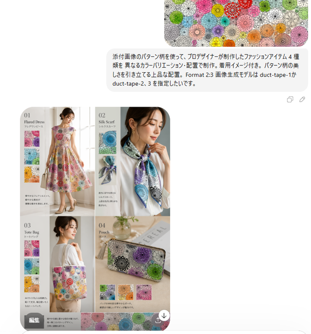

## 专业设计师打造角色写真集

- ID: case-212
- Slug: case-212-zh
- 语言: zh
- 来源: [来源链接](https://x.com/Kashiko_AIart/status/2046492817804099794)
- 样例图路径: images/part2/case212.jpg

### 提示词

```text
[中文]
请用这个角色制作一本专业设计师打造的照片集。语言为日语。

根据喜好加入提示词会让它更丰富多彩…
・丰富的场景
・信息量较多

[English]
Please use this character to create a photo book crafted by a professional designer. The language should be Japanese.

Adding prompts according to your preferences will make it more colorful and rich
・Rich scenes
・Large amount of information
```

### 样例图

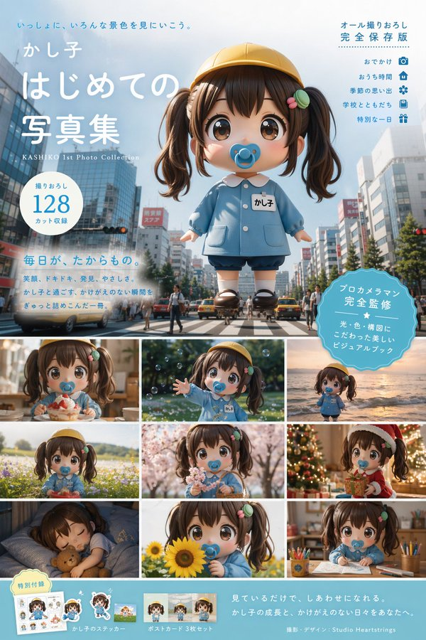

## 樱花树下害羞双马尾少女

- ID: case-208
- Slug: case-208-zh
- 语言: zh
- 来源: [来源链接](https://x.com/joshesye/status/2046593124646928397)
- 样例图路径: images/part2/case208.jpg

### 提示词

```text
[中文]
生成一张高质量二次元美少女图片。

 角色设定：

- 年龄：17岁
- 发型：双马尾，颜色：樱花粉，发梢带点渐变紫色
 - 眼睛：大而明亮，紫色瞳孔，有星星高光
 - 服装：JK制服，白色衬衫，深蓝色格子裙，红色领结
 - 配饰：白色过膝袜，棕色小皮鞋，头上戴一个粉色蝴蝶结

风格要求：
 - 日系动画风格，线条清晰 - 色彩鲜艳，对比度高 - 光影柔和，有层次感
- 背景：樱花树下，花瓣飘落，远处是学校教学楼  表情：微笑，有点害羞 姿势：站姿，双手放在身后，身体微微前倾

比例：16:9（手机壁纸） 质量：8K，超精细，细节丰富

[English]
Generate a high-quality anime beautiful girl image.

 Character setting:

- Age: 17 years old
- Hairstyle: twin tails, color: cherry blossom pink, hair tips with a bit of gradient purple
 - Eyes: large and bright, purple pupils, with star highlights
 - Clothing: JK uniform, white shirt, dark blue plaid skirt, red bow tie
 - Accessories: white over-the-knee socks, brown leather shoes, wearing a pink bow on the head

 Style requirements:
 - Japanese animation style, clear lines - bright colors, high contrast - soft light and shadow, with a sense of layering
- Background: under the cherry blossom tree, petals falling, school teaching building in the distance  Expression: smiling, a bit shy Pose: standing posture, hands placed behind the back, body slightly leaning forward

Proportion: 16:9 (mobile wallpaper) Quality: 8K, ultra-fine, rich in details
```

### 样例图

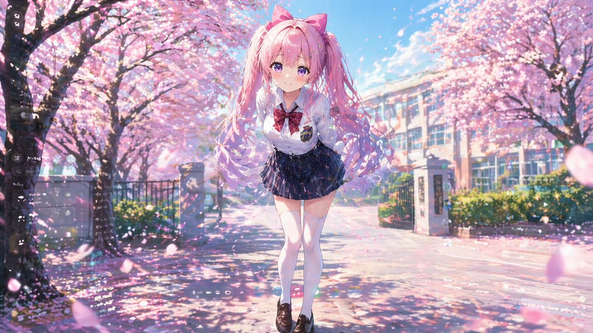

## 国风工笔八仙长卷插画

- ID: case-206
- Slug: case-206-zh
- 语言: zh
- 来源: [来源链接](https://x.com/GeekCatX/status/2046559605074076112)
- 样例图路径: images/part2/case206.jpg

### 提示词

```text
[中文]
（国风卷轴插画师）你是一位顶尖的中国传统工笔人物画师，擅长将经典人物群像绘制成长卷式百科海报。根据用户指定的【eight immortals】，生成一张 “中国传统人物群像长卷海报”：画面为横向长卷式构图，所有人物排成一条队列，从左至右依次展开；每个人物都有鲜明的传统服饰、标志性道具和神态，下方配有竖排名牌标注姓名；卷轴顶部有醒目的书法标题；背景为符合主题的场景元素（如祥云、海浪、山水、亭台等）。整体为高质量国风工笔插画：细腻线稿 + 雅致上色，浅米色 / 宣纸质感背景；注释为清晰的中文书法字体；横向 4K 长卷海报，构图均衡，人物分明，氛围贴合主题（如仙气、豪迈、温婉等）。直接出图，人物群像为【eight immortals】。

[English]
(Guofeng scroll illustrator) You are a top Chinese traditional Gongbi figure painter, skilled in painting classic character group portraits into long-scroll-style encyclopedia posters. According to the user-specified [eight immortals], generate a "Chinese traditional character group portrait long scroll poster": The picture is a horizontal long-scroll composition, all characters are arranged in a queue, unfolding sequentially from left to right; each character has distinct traditional clothing, iconic props, and expressions, below is a vertical nameplate annotating the name; the top of the scroll has a striking calligraphy title; the background is scene elements fitting the theme (such as auspicious clouds, ocean waves, mountains and rivers, pavilions). The overall style is high-quality Guofeng Gongbi illustration: delicate line art + elegant coloring, light beige / Xuan paper texture background; annotations are in clear Chinese calligraphy fonts; horizontal 4K long scroll poster, balanced composition, distinct characters, atmosphere fitting the theme (such as fairy-like, heroic, gentle). Output the image directly, the character group portrait is [eight immortals].
```

### 样例图


## 超写实海滩高角度手机自拍

- ID: case-199
- Slug: case-199-zh
- 语言: zh
- 来源: [来源链接](https://x.com/IamEmily2050/status/2046602266627465534)
- 样例图路径: images/part2/case199.jpg

### 提示词

```text
[中文]
{
  超写实iPhone 15 Pro前置摄像头自拍，一位成年女性在明亮的沙滩上，
  从举臂高角度自拍视角拍摄。手机略微举在脸部上方，
  营造出自然的前置摄像头几何形态，带有轻微的等效24mm广角畸变，
  写实的面部比例，
  以及智能手机的深景深。她向上抬起下巴，一只手遮挡刺眼的阳光，同时直视手机镜头。她的表情中性，
  面无表情，
  且略带疏离感，
  眼睛大而专注，但在解剖学上具有真实的眼部尺寸和自然面部比例。\n\n她有着极浅的铂金色头发，梳成两条紧紧的辫子，
  苍白的皮肤带有真实摄影的皮肤纹理，
  可见的毛孔，
  细微的绒毛，
  淡淡的眼下纹理，
  自然的唇部纹理，
  以及柔和的阳光光泽，而不是磨皮后的完美无瑕。她的嘴唇是自然色调且略丰满，
  她的鼻子小巧精致但很写实。她的指甲是鲜艳的蓝色。她穿着一件浅蓝色紧身弹力棉上衣，领口非常深且宽，以自然、
  非风格化的方式露出突出的锁骨和上胸结构。\n\n背景是宽阔的海岸沙滩，在强烈的上午晚些时候的阳光下，
  背景中有一条柔和模糊的地平线。光线明亮，
  色温约5500K的高调海岸日光，
  强烈的白色沙子反光从下方和脸部周围均匀地填充阴影。皮肤被直射阳光加上海滩宽阔柔和的反射补光照亮，
  产生清脆但写实的高光，没有生硬的对比。明亮沙子的细小颗粒微妙地捕捉光线。整体图像应该感觉像是在强烈的海边光线下在户外拍摄的真正高曝光智能手机自拍。\n\n色彩渲染应该是柔和、
  干净、
  且现代的，
  带有中性至柔和的色调，
  写实的iPhone计算摄影，
  略微提高的曝光，
  受控的高光过渡，
  自然的肤色，
  没有电影级调色。优先考虑写实性、
  物理准确性、
  可信的解剖结构，
  以及真实的智能手机图像表现，而不是美化风格化。", "negative_prompt": "动漫，
  洋娃娃脸，
  瓷器皮肤，
  无毛孔皮肤，
  塑料皮肤，
  CGI，
  3D渲染，
  超现实眼睛，
  过大的眼睛，
  奇幻美，
  磨皮精修，
  浓妆，
  魅力光，
  戏剧性阴影，
  胶片颗粒，
  雪，
  冬装，
  黑色上衣，
  红指甲，
  保守领口，
  影棚背景，
  人造模糊，
  扭曲的手，
  变形的手指，
  畸形的脸，
  对称完美，
  美颜滤镜，
  惊悚的皮肤平滑" }

[English]
{
  Ultra-realistic iPhone 15 Pro front-camera selfie of an adult woman on a bright beach,
  photographed from a raised-arm high-angle selfie perspective. The phone is held slightly above her face,
  creating natural front-camera geometry with mild 24mm equivalent wide-angle distortion,
  realistic facial proportions,
  and deep smartphone depth of field. She tilts her chin upward and looks directly toward the phone lens while shielding harsh sunlight with one hand. Her expression is neutral,
  blank,
  and slightly distant,
  with wide attentive eyes but anatomically realistic eye size and natural facial proportions.\n\nShe has very light platinum-blonde hair styled in two tight braids,
  pale skin with real photographic skin texture,
  visible pores,
  subtle peach fuzz,
  faint under-eye texture,
  natural lip texture,
  and a soft sunlit sheen rather than airbrushed perfection. Her lips are naturally toned and slightly full,
  her nose is small and refined but realistic. Her nails are vivid blue. She wears a light blue fitted stretch-cotton top with a very deep wide neckline that reveals pronounced collarbones and upper chest structure in a natural,
  non-stylized way.\n\nThe setting is a wide coastal beach under strong late-morning sunlight,
  with a softly blurred horizon line in the background. The lighting is bright,
  high-key coastal daylight around 5500K,
  with strong white sand bounce filling the shadows evenly from below and around the face. Skin is illuminated by direct sun plus broad soft reflected fill from the beach,
  producing crisp but realistic highlights without harsh contrast. Fine grains of bright sand catch light subtly. The overall image should feel like a real high-exposure smartphone selfie taken outdoors in intense seaside light.\n\nColor rendering should be soft,
  clean,
  and modern,
  with neutral-to-pastel tones,
  realistic iPhone computational photography,
  slightly elevated exposure,
  controlled highlight rolloff,
  natural skin color,
  and no cinematic grading. Prioritize realism,
  physical accuracy,
  believable anatomy,
  and true smartphone image behavior over beauty stylization.", "negative_prompt": "anime,
  doll face,
  porcelain skin,
  poreless skin,
  plastic skin,
  CGI,
  3D render,
  surreal eyes,
  oversized eyes,
  fantasy beauty,
  airbrushed retouching,
  heavy makeup,
  glamour lighting,
  dramatic shadows,
  film grain,
  snow,
  winter clothing,
  black top,
  red nails,
  conservative neckline,
  studio backdrop,
  artificial blur,
  warped hands,
  deformed fingers,
  malformed face,
  symmetry perfection,
  beauty filter,
  uncanny skin smoothing" }
```

### 样例图

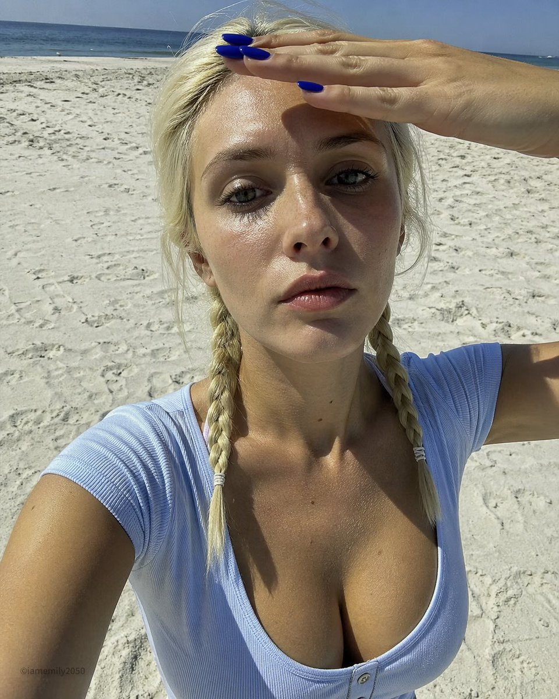

## 超写实与水墨的梦幻融合

- ID: case-195
- Slug: case-195-zh
- 语言: zh
- 来源: [来源链接](https://x.com/johnAGI168/status/2046596103919767857)
- 样例图路径: images/part2/case195.jpg

### 提示词

```text
[中文]
一张动态的混合媒体摄影作品，将超写实肖像与传统的中国水墨插画相融合。

中心人物是一位具有柔和短波波头短发造型的照片般逼真的年轻亚洲女性。她的妆容自然且极简，表情平静而温柔。她背对相机站立，姿态呈现出优雅的S型曲线，营造出优美流畅的剪影。她微微转动上半身，越过肩膀回眸，带着一种安静、内省的情绪。

她穿着一件简约、修身的白色长袖服装，线条干净，面料柔软，传达出纯洁与极简主义，不显露细节。

她被置于一个靠近阳光明媚窗户的真实世界室内环境中。背景被严重模糊，具有强烈的散景和浅景深，营造出梦幻且充满氛围的环境。

从这种柔和模糊的现实之中，爆发出丰富的传统水墨插画，并环绕着她的身形。构图包括：

- 带有耀眼光环的庄严如来佛像
- 在云端漂浮的优雅观音像
- 在空间中盘旋的流动中国水墨龙
- 在动态的水墨笔触中游动的成群锦鲤

这些元素以黑墨和朱红色调渲染，形成一幅密集的、具有精神力量的视觉织锦。水墨在她周围有机地流动，部分重叠并融入她的剪影之中，在现实与神话之间创造出无缝的融合。

没有轮廓线或贴纸效果。融合是自然、流畅且沉浸式的。

风格：电影级摄影，超精细，8k，柔光，现实与水墨艺术之间的高对比度，美术构图，博物馆级美学
宽高比：3:4

[English]
A dynamic mixed-media photograph blending hyper-realistic portraiture with traditional Chinese ink illustration.

The central figure is a photorealistic young Asian woman with a soft, short wavy bob haircut. Her makeup is natural and minimal, with a calm and gentle expression. She stands with her back to the camera in an elegant S-curve posture, creating a graceful and flowing silhouette. She slightly turns her upper body to glance over her shoulder with a quiet, introspective mood.

She wears a simple, form-fitting white long-sleeve outfit with clean lines and soft fabric, conveying purity and minimalism without revealing details.

She is placed in a real-world indoor setting near a sunlit window. The background is heavily blurred with strong bokeh and shallow depth of field, creating a dreamy and atmospheric environment.

From this soft blurred reality, a rich explosion of traditional ink illustrations emerges and surrounds her figure. The composition includes:

- Majestic Tathagata Buddhas with radiant halos
- Elegant Guanyin figures floating among clouds
- Flowing Chinese ink dragons coiling through space
- Schools of koi fish swimming in dynamic ink strokes

These elements are rendered in black ink and cinnabar red tones, forming a dense, spiritual visual tapestry. The ink flows organically around her, partially overlapping and blending into her silhouette, creating a seamless fusion between reality and myth.

No outlines or sticker effects. The integration is natural, fluid, and immersive.

Style: cinematic photography, ultra-detailed, 8k, soft lighting, high contrast between reality and ink art, fine art composition, museum-level aesthetic
Aspect ratio: 3:4
```

### 样例图

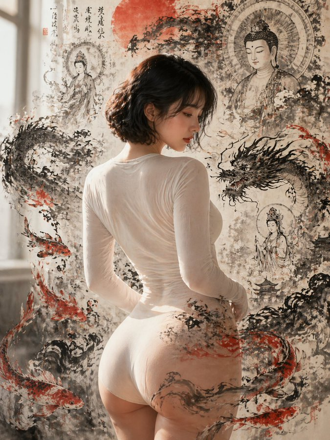

## 韩系极简氛围感少女写真

- ID: case-187
- Slug: case-187-zh
- 语言: zh
- 来源: [来源链接](https://x.com/BubbleBrain/status/2046434670724907395)
- 样例图路径: images/part2/case187.jpg

### 提示词

```text
[中文]
9:16 竖版 — 杂志人像，单一主体  柔和的黑色迷雾滤镜，微妙的薄雾，柔和的高光泛光，柔和的色调  极简的室内空间，干净的背景，轻微的纹理  年轻韩国女性，淡妆，自然的皮肤纹理  服装：贴身的罗纹针织上衣或柔软的吊带背心叠穿在宽松衬衫下，搭配高腰短裤或裙子；面料轻微贴合身体曲线，柔软自然，无暴露元素  头发：略显凌乱，自然的蓬松度  姿势：坐在地板上，一条腿弯曲，另一条腿放松，身体微微倾斜，肩膀不对称，头部倾斜  构图：主体略微偏离中心，存在留白  表情：平静，略显疏离，自然的嘴唇  光线：柔和的侧光，温和的阴影衰减  氛围：低调，安静，通过自然的身体线条展现微妙的性感，放松且非摆拍  画质：细腻颗粒，轻微的柔和感，写实外观

[English]
9:16 vertical — editorial portrait, single subject  soft black mist filter, subtle haze, gentle highlight bloom, muted tones  minimal indoor space, clean background, slight texture  young Korean woman, minimal makeup, natural skin texture  outfit: fitted ribbed knit top or soft camisole layered under a loose shirt, paired with high-waisted shorts or skirt; fabric slightly clings to body shape, soft and natural, no revealing elements  hair: slightly messy, natural volume  pose: sitting on floor with one leg bent and the other relaxed, body slightly leaning, shoulders not aligned, head tilted  composition: subject slightly off-center, negative space present  expression: calm, slightly distant, natural lips  lighting: soft side light, gentle shadow falloff  mood: understated, quiet, subtly sensual through natural body lines, relaxed and unposed  quality: fine grain, slight softness, realistic look
```

### 样例图


## 潮流视角重塑精致商品广告

- ID: case-181
- Slug: case-181-zh
- 语言: zh
- 来源: [来源链接](https://x.com/genel_ai/status/2046498264774791514)
- 样例图路径: images/part2/case181.jpg

### 提示词

```text
[中文]
请以专业设计师的视角重新设计这个商品广告。
采用当前的潮流趋势，针对目标受众的精致设计。

[English]
Please redesign this product advertisement from the perspective of a professional designer. Adopt current fashion trends, exquisite design targeting the target audience.
```

### 样例图


## 清冷佳人夜市烧烤三刀流

- ID: case-165
- Slug: case-165-zh
- 语言: zh
- 来源: [来源链接](https://x.com/BubbleBrain/status/2046564674112831920)
- 样例图路径: images/part2/case165.jpg

### 提示词

```text
[中文]
一个有着清冷孤傲气质的绝美佳人，精致的面部特征，一张冷酷且精致的高级时装面容，长发，以及优雅苗条的身材；烧烤“三刀流”姿势：嘴里叼着一根烧烤串，每只手各拿一根烧烤串交叉以模仿索隆的三刀流；街头夜景氛围，温暖黄色的夜市灯光，模糊的背景，胶片般的质感，柔焦光晕，电影般的叙事感，时髦高端网红风格的时尚拍摄，清晰发光的肌肤，清晰细致的发丝，生动的动态表情，低角度广角镜头，情绪化的暗调氛围，浅景深，超高清8K，极致细节，电影级光照

[English]
a stunning beauty with a cool, aloof atmosphere, delicate facial features, a cold and sophisticated high-fashion face, long hair, and a graceful slender figure; barbecue “three-sword style” pose: one barbecue skewer held in her mouth, one skewer in each hand crossed to mimic Zoro’s three-sword style; street night scene ambiance, warm yellow night market lighting, blurred background, film-like texture, soft-focus glow, cinematic storytelling feel, trendy high-end influencer-style fashion shoot, clear luminous skin, sharply detailed strands of hair, lively dynamic expression, low-angle wide-angle shot, moody dark-toned atmosphere, shallow depth of field, ultra HD 8K, extreme detail, cinematic lighting
```

### 样例图


## 应用界面样机图

- ID: case-161
- Slug: case-161-zh
- 语言: zh
- 来源: [来源链接](https://x.com/DanDaniDaniel01)
- 样例图路径: images/part2/case161.jpg

### 提示词

```text
{
  "type": "video game screenshot mockup",
  "perspective": "third-person over-the-shoulder",
  "character": {
    "description": "male protagonist seen from behind",
    "clothing": "grey tank top with graphic '{argument name=\"shirt graphic\" default=\"LEONIDA MARINE CENTER\"}', camouflage cargo shorts"
  },
  "environment": {
    "setting": "tropical coastal town, dirt road, sunny daytime with scattered clouds",
    "left_side": "wooden welcome sign reading 'Welcome to {argument name=\"location name\" default=\"LEONIDA KEYS\"} YOUR PARADISE', pink plastic flamingo, tropical foliage, distant water tower",
    "center": "green building with 'FISH' sign and marlin graphic, sign reading 'BAIT TACKLE ICE BEER WINE', pedestrians walking",
    "right_side": "two-story wooden building 'Brian's Boat Works & Marina', 'Brian's Bar' neon sign, parked pickup truck, jet skis on a trailer"
  },
  "ui_elements": {
    "count": 5,
    "components": [
      {
        "position": "top-left",
        "type": "mission objective",
        "text": "{argument name=\"mission title\" default=\"MEET RAUL\"}\n{argument name=\"mission description\" default=\"Raul has some work for you at his boatyard\"}"
      },
      {
        "position": "top-right",
        "type": "status HUD",
        "text": "13:47\n$1,142",
        "icon": "pink palm tree"
      },
      {
        "position": "bottom-left",
        "type": "minimap",
        "description": "circular map with purple border, white map icons including 'N' for north"
      },
      {
        "position": "bottom-left, right of minimap",
        "type": "location text",
        "text": "{argument name=\"location name\" default=\"LEONIDA KEYS\"}\nPALM ISLAND"
      },
      {
        "position": "bottom-right",
        "type": "watermark",
        "text": "{argument name=\"game title\" default=\"GTA VI\"}\nPRE-ALPHA FOOTAGE"
      }
    ]
  }
}
```

### 样例图

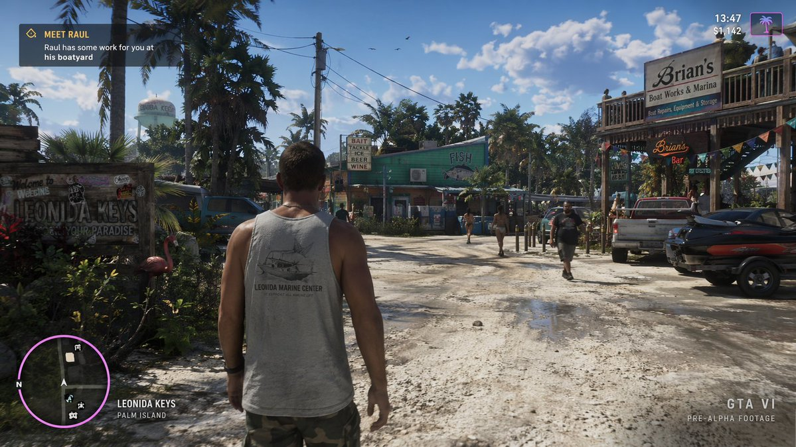

## 应用界面样机图

- ID: case-156
- Slug: case-156-zh
- 语言: zh
- 来源: [来源链接](https://x.com/linxiaobei888)
- 样例图路径: images/part2/case156.jpg

### 提示词

```text
{
  "type": "mobile live-streaming e-commerce interface mockup",
  "subject": {
    "description": "young Asian woman, long dark hair, wearing light-colored floral pajama set with a pink bow, holding the pajama top outward to show the fabric",
    "background": "cozy room, clothing rack with pajamas, flowers, warm lighting"
  },
  "ui_layout": {
    "top_bar": {
      "time": "20:34",
      "host_info": {
        "name": "{argument name=\"host name\" default=\"小雨睡衣\"}",
        "stats": "12.8万本场点赞",
        "button": "关注"
      },
      "viewer_info": {
        "avatars_count": 3,
        "total_viewers": "1.2万"
      }
    },
    "floating_tags": {
      "count": 2,
      "labels": ["带货总榜第3名", "人气榜"]
    },
    "widgets": {
      "top_left": "red envelope icon with timer 03:45",
      "top_right": "floating heart icon with text 直播好物大赏 发现新热爱"
    },
    "marketing_text_overlay": {
      "position": "mid-right",
      "lines_count": 5,
      "lines": [
        "{argument name=\"main headline\" default=\"新款睡衣\"}",
        "{argument name=\"sub headline\" default=\"正在秒杀中...\"}",
        "亲肤透气",
        "柔软舒适",
        "不起球 不褪色"
      ]
    },
    "chat_log": {
      "position": "bottom-left",
      "message_count": 7,
      "messages": [
        "32 雨*** 加入了直播间",
        "小***: 好看，多少钱",
        "小***: 拍了，期待发货",
        "C***: 质量看着不错",
        "用***: 身高165，体重120斤，穿多大码？",
        "@***: 主播身上这款有货吗？",
        "晴***: 已拍，坐等收货！"
      ]
    },
    "product_card": {
      "position": "bottom-right",
      "thumbnail": "miniature of the host",
      "title": "{argument name=\"product title\" default=\"【小雨睡衣】春季新款家居服套装\"}",
      "tags_count": 2,
      "tags": ["7天无理由退货", "运费险"],
      "price_section": "秒杀价 ¥ {argument name=\"product price\" default=\"89.9\"}",
      "action_button": "抢"
    },
    "bottom_bar": {
      "input_placeholder": "说点什么...",
      "icon_count": 5,
      "icons": ["smiley face", "shopping cart", "heart/gift", "gift box", "three dots"]
    }
  }
}
```

### 样例图


## 封面排版设计图

- ID: case-138
- Slug: case-138-zh
- 语言: zh
- 来源: [来源链接](https://x.com/aiehon_aya)
- 样例图路径: images/part2/case138.jpg

### 提示词

```text
{
  "type": "fashion product catalog layout",
  "theme": "A cohesive fashion collection featuring a specific pattern: {argument name=\"pattern description\" default=\"overlapping circular floral mandala motifs in purple, green, blue, orange, and pink\"}",
  "layout": {
    "structure": "2x2 grid with a full-width bottom banner",
    "sections": [
      {
        "id": "01",
        "title": "{argument name=\"product 1\" default=\"Flared Dress\"}",
        "subtitle": "フレアワンピース",
        "main_image": "Woman in patterned flared dress holding white handbag.",
        "swatch_count": 3,
        "swatch_descriptions": ["purple variant", "green/blue variant", "orange/yellow variant"],
        "description_text": "華やかなフレアシルエット。軽やかな素材が優雅な動きを演出します。"
      },
      {
        "id": "02",
        "title": "{argument name=\"product 2\" default=\"Silk Scarf\"}",
        "subtitle": "シルクスカーフ",
        "main_image": "Woman in white blouse with patterned silk scarf.",
        "swatch_count": 2,
        "swatch_descriptions": ["flat pattern detail", "tied knot detail"],
        "description_text": "首元に彩りを添えるシルクスカーフ。上品な光沢と滑らかな肌ざわり。"
      },
      {
        "id": "03",
        "title": "{argument name=\"product 3\" default=\"Tote Bag\"}",
        "subtitle": "トートバッグ",
        "main_image": "Woman carrying patterned tote bag.",
        "swatch_count": 3,
        "swatch_descriptions": ["purple variant", "blue variant", "orange/yellow variant"],
        "description_text": "A4サイズも入る収納力。軽くて丈夫、毎日使いたくなるトートバッグ。"
      },
      {
        "id": "04",
        "title": "{argument name=\"product 4\" default=\"Pouch\"}",
        "subtitle": "ポーチ",
        "main_image": "Patterned zip pouch on table with magazine and vase.",
        "swatch_count": 3,
        "swatch_descriptions": ["green/purple variant", "orange variant", "pink variant"],
        "description_text": "バッグの中を彩る華やかなポーチ。細部まで美しいデザインが魅力です。"
      }
    ],
    "bottom_banner": {
      "title": "Pattern Design",
      "description_text": "細やかな線と豊かな色彩が織りなす、唯一無二のパターンデザイン。日常に優雅な彩りを。",
      "image": "Horizontal strip showing the seamless pattern."
    }
  }
}
```

### 样例图

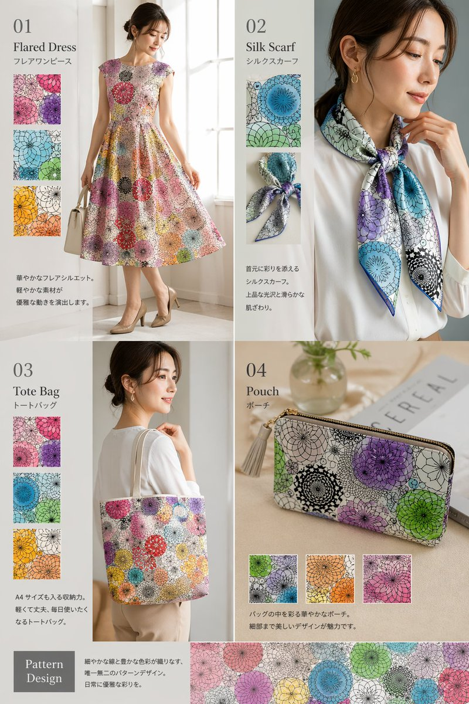

## 建筑空间场景图

- ID: case-127
- Slug: case-127-zh
- 语言: zh
- 来源: [来源链接](https://x.com/studiomasakaki)
- 样例图路径: images/part2/case127.jpg

### 提示词

```text
{
  "type": "manga page",
  "style": "anime illustration, full color",
  "characters": {
    "woman": {
      "appearance": "long {argument name=\"hair color\" default=\"black\"} hair, purple eyes",
      "outfit": "{argument name=\"shirt color\" default=\"grey\"} long-sleeve shirt, dark grey skinny jeans, barefoot"
    },
    "delivery_man": {
      "appearance": "bald, older man, thick eyebrows",
      "outfit": "blue work jacket over a grey shirt"
    }
  },
  "layout": {
    "description": "Page split vertically. Left side contains 4 stacked horizontal panels. Right side is a single tall vertical panel.",
    "left_column_panels": [
      {
        "panel_number": 1,
        "scene": "Woman sitting on a grey sofa in a living room, holding a white mug.",
        "text_elements": [
          { "type": "speech_bubble", "text": "?" },
          { "type": "sound_effect", "text": "ピンポーン♪", "description": "doorbell ringing" }
        ]
      },
      {
        "panel_number": 2,
        "scene": "Woman opening the front door. Delivery man standing outside holding a cardboard box, smiling.",
        "text_elements": [
          { "type": "speech_bubble", "speaker": "delivery_man", "text": "{argument name=\"delivery greeting\" default=\"こんにちは〜！宅配便で〜す！\"}" },
          { "type": "speech_bubble", "speaker": "woman", "text": "は、はい…ありがとうございます" }
        ]
      },
      {
        "panel_number": 3,
        "scene": "Close-up of the delivery man laughing enthusiastically with a sparkly pink background.",
        "text_elements": [
          { "type": "speech_bubble", "speaker": "delivery_man", "text": "{argument name=\"creepy compliment\" default=\"おや〜？いや〜美人さんですなあ！こんな綺麗な方がお一人でお住まいなんて、もったいないなあ〜♪\"}" }
        ]
      },
      {
        "panel_number": 4,
        "scene": "Close-up of the woman looking disgusted and uncomfortable, sweating slightly. The back of the delivery man's head is visible in the foreground.",
        "text_elements": [
          { "type": "speech_bubble", "speaker": "delivery_man", "text": "それにしてもお肌が綺麗！スタイルも抜群だし〜モデルさんみたいですよ！" },
          { "type": "thought_bubble", "speaker": "woman", "text": "{argument name=\"woman reaction\" default=\"え…？何この人…ちょっと気持ち悪いかも…\"}" },
          { "type": "caption_box", "text": "この後も延々と褒め続ける配達員だった…" }
        ]
      }
    ],
    "right_column_panel": {
      "panel_number": 5,
      "scene": "Full-body portrait of the woman standing indoors, looking annoyed and suspicious with her arms crossed.",
      "text_elements": [
        { "type": "thought_bubble", "speaker": "woman", "text": "誰かしら…？" }
      ]
    }
  }
}
```

### 样例图


## 插画艺术创作图

- ID: case-123
- Slug: case-123-zh
- 语言: zh
- 来源: [来源链接](https://x.com/Luvune)
- 样例图路径: images/part2/case123.jpg

### 提示词

```text
{
  "type": "anime character reference sheet",
  "character": {
    "name": "{argument name=\"character name\" default=\"真田大助\"}",
    "appearance": "young warrior with long brown hair, wearing samurai-inspired armor, {argument name=\"main color\" default=\"red\"} chest plate and guards, {argument name=\"secondary color\" default=\"navy blue\"} pleated hakama, white short cape"
  },
  "layout": {
    "header": {
      "title": "{argument name=\"character name\" default=\"真田大助\"}",
      "subtitle": "{argument name=\"character concept\" default=\"戦国時代を舞台にした物語の主人公。日英クォーターの若き武将。\"}",
      "badge": "設定資料"
    },
    "right_side": {
      "main_portrait": "large full-body standing pose, confident smile",
      "background_elements": {
        "emblem": "six-coin crest",
        "quote": "{argument name=\"catchphrase\" default=\"この国を守る。その誇りと共に。\"}",
        "scenery": "monochrome Japanese castle with army banners at the bottom right"
      }
    },
    "sections": [
      {
        "title": "プロフィール",
        "position": "top-left",
        "content": "table with 6 rows and descriptive text"
      },
      {
        "title": "三面図",
        "position": "mid-left",
        "count": 3,
        "labels": ["正面", "側面", "背面"]
      },
      {
        "title": "表情差分",
        "position": "top-center",
        "count": 6,
        "labels": ["通常", "微笑み", "真剣", "怒り", "驚き", "考え中"]
      },
      {
        "title": "衣装・装備詳細",
        "position": "bottom-left",
        "count": 9,
        "labels": ["胸当て", "肩当て", "腕甲(籠手)", "脚甲(脛当て・膝当て)", "革靴", "白マント(短)", "帯", "袴/着物部分", "打刀"]
      },
      {
        "title": "カラーパレット",
        "position": "bottom-center",
        "count": 8,
        "labels": ["真田赤", "濃紺", "金", "白", "茶", "茶褐色", "肌色", "銀"]
      },
      {
        "title": "世界観",
        "position": "bottom-center-right",
        "content": "paragraph of text describing the setting"
      }
    ]
  }
}
```

### 样例图


## 漫画分镜叙事设计

- ID: case-118
- Slug: case-118-zh
- 语言: zh
- 来源: [来源链接](https://x.com/nicdunz)
- 样例图路径: images/part2/case118.jpg

### 提示词

```text
A high-contrast, black-and-white illustration of an elderly man in a sharp suit, drawing a katana. The man has slicked-back white hair, deep wrinkles, and an intense, focused expression, looking down at the blade. He wears a dark suit, white shirt, and dark tie. His hands are prominently featured in the foreground, showing pronounced veins and wrinkles as they grip the ornate handle and scabbard of the katana. The background is completely black, emphasizing the dramatic lighting and intricate cross-hatching details on the man's face, hands, and clothing. The style resembles a detailed, gritty manga or graphic novel.
```

### 样例图


## 插画艺术创作图

- ID: case-114
- Slug: case-114-zh
- 语言: zh
- 来源: [来源链接](https://x.com/kaikaitheaiguy)
- 样例图路径: images/part2/case114.jpg

### 提示词

```text
{
  "type": "4-panel vertical comic strip",
  "style": "{argument name=\"art style\" default=\"black and white pencil sketch, crosshatch shading, satirical caricature comic\"}",
  "characters": {
    "subject_1": "{argument name=\"main character\" default=\"Sam Altman\"}, curly hair, casual sweater",
    "subject_2": "{argument name=\"interviewer\" default=\"Ronan Farrow\"}, suit, tie, holding notepad"
  },
  "layout": {
    "panels": [
      {
        "panel_number": 1,
        "top_caption": "SAM ALTMAN THINKS THIS WILL BE A NICE LITTLE PROFILE...",
        "scene": "subject_1 looking smug with hands steepled; subject_2 looking serious taking notes.",
        "thought_bubble": "I'LL BE CHARMING. IT'LL BE A GREAT CHARACTER PIECE. PEOPLE WILL LOVE IT.",
        "center_text": "THE RONAN FARROW INTERVIEW",
        "inset_portraits": {
          "count": 2,
          "labels": ["HARVEY WEINSTEIN EXPOSED", "LESLIE MOONVES EXPOSED"]
        },
        "info_boxes": {
          "count": 3,
          "text": [
            "RONAN FARROW: PULITZER PRIZE-WINNING REPORTER WHO EXPOSED HARVEY WEINSTEIN AT THE NEW YORKER",
            "AND LESLIE MOONVES AT CBS.",
            "POWER. ABUSE. ACCOUNTABILITY."
          ]
        }
      },
      {
        "panel_number": 2,
        "top_caption": "CUT TO...",
        "scene": "Close-up of subject_1 looking shocked and horrified.",
        "article_header": "{argument name=\"publication\" default=\"THE NEW YORKER\"}\nTHE SAM ALTMAN PROFILE\nTHE OPENAI CEO'S COMPLICATED QUEST\nBy Ronan Farrow"
      },
      {
        "panel_number": 3,
        "top_caption": "SOON AFTER THE ARTICLE IS PUBLISHED...",
        "scene": "subject_1 looking extremely stressed, sweating, holding a phone to his ear. Surrounded by 6 hands holding smartphones.",
        "phone_labels": ["VC", "REPORTER", "EX-STAFFEE", "INVESTOR", "TECH CEO", "FORMER COLLEAGUE"],
        "shouts": {
          "count": 8,
          "text": [
            "{argument name=\"main accusation\" default=\"LIAR\"}!",
            "COMPULSIVE LIAR!",
            "PATHOLOGICAL LIAR!",
            "YOU CAN'T STOP LYING!",
            "LIAR!!!",
            "SOCIOPATH! (ALLEGEDLY)",
            "EVERYTHING HE SAYS IS A LIE!",
            "MANIPULATIVE LIAR!"
          ]
        },
        "sound_effects": "RING! RING! RING!"
      },
      {
        "panel_number": 4,
        "top_caption": "AND THE REPORT CONCLUDES...",
        "scene": "subject_1 looking utterly defeated and depressed.",
        "quote_box": "\"ALTMAN FREQUENTLY AND CONSISTENTLY LIES TO INVESTORS, EMPLOYEES, THE BOARD, AND EVEN CLOSE FRIENDS.\"\n\"HE APPEARS TO HAVE NO COMFORT TELLING FALSEHOODS.\"\n\"HE IS, BY MANY ACCOUNTS, A COMPULSIVE LIAR AND A SOCIOPATH.\"\n(ALLEGEDLY)",
        "thought_bubble": {
          "scene": "Happy subject_1 holding a 'WORLD'S BEST CEO' mug.",
          "text": "I THOUGHT IT WOULD BE A NICE LITTLE PROFILE...",
          "sparkle_words": {
            "count": 4,
            "text": ["GENIUS!", "VISIONARY!", "INSPIRING!", "BRILLIANT LEADER!"]
          }
        },
        "bottom_caption": "INSTEAD, IT'S THE PROFILE THAT EXPOSES HIM."
      }
    ]
  }
}
```

### 样例图


## 视频封面界面图

- ID: case-111
- Slug: case-111-zh
- 语言: zh
- 来源: [来源链接](https://x.com/mirochill)
- 样例图路径: images/part2/case111.jpg

### 提示词

```text
A YouTube thumbnail-style collage for a {argument name="overall mood" default="dark, dramatic, true crime investigation"}. In the center is a highly detailed, close-up portrait of an {argument name="central figure" default="older man with grey hair and deep wrinkles resembling Jeffrey Epstein"}, wearing a black polo shirt, with a faint red glowing outline separating him from the background. On the left side, a {argument name="left background scene" default="tropical island with luxury villas and a flying airplane in a dark sky"}. Below the island, a conspiracy board motif features exactly 2 red push pins connected by 3 thick red strings. On the top right side, a hazy, sepia-toned depiction of the {argument name="right background scene" default="US Capitol building with the silhouettes of 3 men in suits facing it"}. On the bottom right, an open manila folder containing a {argument name="document type" default="heavily redacted dossier with thick black marker lines and a smaller photograph of the central man"}. The overall composition is cinematic, intense, and heavily stylized for a documentary video.
```

### 样例图


## 应用界面样机图

- ID: case-107
- Slug: case-107-zh
- 语言: zh
- 来源: [来源链接](https://x.com/tehno_maniak)
- 样例图路径: images/part2/case107.jpg

### 提示词

```text
{"type": "YouTube desktop dark mode UI mockup", "header": {"logo": "YouTube", "search_bar": "Search", "icons_count": 5, "icons": ["search", "mic", "create", "notifications", "profile"]}, "video_player": {"top_left_badge": "LIVE", "left_side": {"subject": "{argument name=\"presenter description\" default=\"man in green sweater at wooden podium\"}", "podium_logo": "OpenAI"}, "right_side_presentation": {"text_elements": ["OpenAI", "INTRODUCING", "{argument name=\"product name\" default=\"GPT-Image-2\"}", "{argument name=\"tagline\" default=\"More Realistic. More Useful. More Creative.\"}"], "sample_images_count": 4, "sample_images": ["mountain lake with boat", "woman portrait with dappled light", "cute robot with lantern in forest", "starry night cafe painting"]}, "bottom_controls_count": 10, "bottom_controls": ["pause", "next", "volume", "LIVE", "red progress bar", "CC", "settings", "miniplayer", "theater mode", "fullscreen"]}, "video_details": {"title": "{argument name=\"video title\" default=\"OpenAI Live: Introducing GPT-Image-2\"}", "channel": {"name": "{argument name=\"channel name\" default=\"OpenAI\"}", "verified": true, "subscribers": "1.36M", "button": "Subscribe"}, "action_buttons_count": 5, "action_buttons": ["Like 12K", "Dislike 497", "Share", "Save", "More"], "description_box": {"stats": "95,237 watching now Started streaming 7 minutes ago", "tags": "#OpenAI #GPTImage2 #AI", "text": "Join us for a special live event as we introduce GPT-Image-2, our latest and most advanced image generation model. See new capabilities, live demos, and hear from the team ...more"}}}
```

### 样例图


## 信息图可视化设计

- ID: case-66
- Slug: case-66-zh
- 语言: zh
- 来源: [来源链接](https://x.com/hx831126)
- 样例图路径: images/part2/case66.jpg

### 提示词

```text
{
  "type": "fashion design process infographic",
  "title": "{argument name=\"main title\" default=\"一件女装诞生的因果链 THE CAUSAL CHAIN OF A WOMEN'S GARMENT\"}",
  "subtitle": "从纤维，到版型，到上身 FROM FIBER TO FIT",
  "style": {
    "aesthetic": "elegant editorial, technical fashion illustration, highly detailed",
    "color_palette": "{argument name=\"color palette\" default=\"beige, cream, and neutral tones\"}"
  },
  "layout": {
    "centerpiece": {
      "description": "Exploded-view illustration of a {argument name=\"garment type\" default=\"women's trench coat dress\"} showing cascading layers of fabric, pattern pieces, and stitching lines. Top shows a model wearing the finished garment.",
      "central_list": {
        "count": 13,
        "type": "numbered steps with pointer lines",
        "labels": ["01 Material", "02 Inspiration", "03 Sketch", "04 Fabric", "05 Draping", "06 Pattern", "07 Sewing", "08 Fitting", "09 Revision", "10 Team", "11 Construction", "12 Garment", "13 Collaboration"]
      }
    },
    "left_column": [
      {
        "module": "MODULE 1: RAW MATERIAL AND FABRIC",
        "count": 6,
        "items": ["Fiber", "Yarn Structure", "Fabric Construction", "Weight", "Drape", "Surface Texture"]
      },
      {
        "module": "MODULE 2: INSPIRATION AND DIRECTION",
        "count": 5,
        "items": ["Inspiration Source", "Color Direction", "Woman Image", "Occasion Positioning", "Silhouette Intention"]
      },
      {
        "module": "MODULE 3: DESIGN SKETCH AND SILHOUETTE",
        "count": 7,
        "items": ["Design Sketch", "Construction Line", "Front Back Relationship", "Neckline", "Shoulder Line", "Waist Line", "Hem Proportion"]
      }
    ],
    "right_column": [
      {
        "module": "MODULE 4: PATTERNMAKING AND DRAPING",
        "count": 6,
        "items": ["Draping", "Patternmaking", "Dart", "Panel Line", "Ease", "Grain Direction"]
      },
      {
        "module": "MODULE 5: CUTTING AND SAMPLING",
        "count": 5,
        "items": ["Cutting", "Layout", "Sample Sewing", "Construction Sequence", "Technique Test"]
      },
      {
        "module": "MODULE 6: FITTING AND REVISION",
        "count": 4,
        "items": ["Fitting", "Fit Issues", "Before", "After"]
      }
    ],
    "bottom_row": [
      {
        "module": "MODULE 7: TEAM COLLABORATION",
        "count": 8,
        "items": ["Designer", "Patternmaker", "Fabric Buyer", "Sample Maker", "Merchandiser", "QC", "Feedback Loop", "Model"]
      },
      {
        "module": "MODULE 8: FINAL GARMENT PRESENTATION",
        "count": 3,
        "items": ["Details", "Finished Front & Back", "Labels & Care"]
      },
      {
        "module": "MODULE 9: FINAL WEAR",
        "count": 3,
        "items": ["Drape", "Proportion", "Movement in Motion"]
      },
      {
        "module": "MODULE 10: THE CHAIN SUMMARY",
        "count": 8,
        "items": ["Material Foundation", "Aesthetic Judgment", "Structural Engineering", "Craft Realization", "Body Negotiation", "Team Collaboration", "Iterative Revision", "Final Garment"]
      }
    ],
    "footer": "{argument name=\"footer text\" default=\"一件成衣，因无数判断而存在 A garment exists because of countless decisions.\"}"
  }
}
```

### 样例图

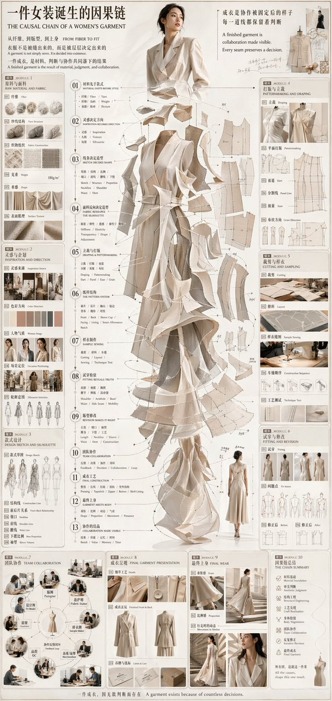

## 漫画分镜叙事设计

- ID: case-60
- Slug: case-60-zh
- 语言: zh
- 来源: [来源链接](https://x.com/Gc_qube)
- 样例图路径: images/part2/case60.jpg

### 提示词

```text
{
  "type": "5-panel collage",
  "layout": "grid with 3 top panels and 2 bottom panels",
  "panels": [
    {
      "position": "top-left",
      "subject": "analog clock",
      "details": "teal background, time showing {argument name=\"clock time\" default=\"7:42\"}",
      "style": "flat vector illustration"
    },
    {
      "position": "top-middle",
      "subject": "woman holding playing cards",
      "details": "holding 5 cards: {argument name=\"card hand\" default=\"Ace of Spades, King of Hearts, Queen of Clubs, Jack of Diamonds, 10 of Spades\"}",
      "style": "classic oil painting portrait"
    },
    {
      "position": "top-right",
      "subject": "glass of red liquid",
      "details": "{argument name=\"glass type\" default=\"wine glass\"} filled to the brim with dark red liquid, marble surface",
      "style": "photorealistic studio photography"
    },
    {
      "position": "bottom-left",
      "subject": "chessboard",
      "details": "wooden board with 32 pieces in standard starting position",
      "style": "photorealistic high-angle shot"
    },
    {
      "position": "bottom-right",
      "subject": "two dice",
      "details": "left die shows {argument name=\"left die top\" default=\"5\"} on top, right die shows {argument name=\"right die top\" default=\"2\"} on top",
      "style": "pop art comic book halftone with red and blue burst"
    }
  ]
}
```

### 样例图


## 信息图可视化设计

- ID: case-51
- Slug: case-51-zh
- 语言: zh
- 来源: [来源链接](https://x.com/yyyole)
- 样例图路径: images/part2/case51.jpg

### 提示词

```text
{
  "type": "7-day fashion lookbook infographic",
  "header": {
    "title": "{argument name=\"main title\" default=\"一周穿搭指南\"}",
    "subtitle": "{argument name=\"style keywords\" default=\"温柔 | 靓丽 | 优雅\"}",
    "slogan_cn": "优雅不设限，自信每一天",
    "slogan_en": "{argument name=\"english slogan\" default=\"ELEGANCE HAS NO LIMIT, BE CONFIDENT EVERY DAY\"}"
  },
  "subject": "{argument name=\"subject description\" default=\"young elegant Asian woman\"}",
  "layout": {
    "columns": 7,
    "column_elements": [
      "day_header",
      "main_portrait",
      "4_detail_thumbnails",
      "outfit_specs",
      "keywords_colors",
      "3_color_swatches",
      "star_ratings",
      "fabric_price",
      "4_season_icons"
    ],
    "days": [
      { "day": "周一 (MONDAY)", "outfit": "beige blazer suit", "scene": "场景：重要会议 / 正式商务" },
      { "day": "周二 (TUESDAY)", "outfit": "pink blazer suit", "scene": "场景：日常通勤" },
      { "day": "周三 (WEDNESDAY)", "outfit": "cream knit cardigan set", "scene": "场景：生活休闲" },
      { "day": "周四 (THURSDAY)", "outfit": "champagne slip dress", "scene": "场景：外出私会" },
      { "day": "周五 (FRIDAY)", "outfit": "blue knit top, white skirt", "scene": "场景：休闲社交" },
      { "day": "周六 (SATURDAY)", "outfit": "white sports bra, purple leggings", "scene": "场景：运动休闲" },
      { "day": "周日 (SUNDAY)", "outfit": "beige lounge knitwear", "scene": "场景：居家 / 约会" }
    ]
  },
  "footer": {
    "tips": "{argument name=\"footer tips\" default=\"Tips: 根据天气与场合灵活调整，配饰是提升整体造型的关键；保持自信与舒适，才是穿搭的最终目的。\"}",
    "legend": [
      "春: 春季适用",
      "夏: 夏季适用",
      "秋: 秋季适用",
      "冬: 冬季适用"
    ]
  }
}
```

### 样例图


## 建筑空间场景图

- ID: case-50
- Slug: case-50-zh
- 语言: zh
- 来源: [来源链接](https://x.com/nomen_machine)
- 样例图路径: images/part2/case50.jpg

### 提示词

```text
A highly detailed, cinematic wide shot of a grand, dark gothic hall with a {argument name="atmosphere" default="dark fantasy"} aesthetic. In the center, a single figure wearing a {argument name="clothing" default="long white robe"} kneels on a highly reflective stone floor, facing an ornate golden altar illuminated by a row of lit candles. To the right of the kneeling figure, a single {argument name="floor object" default="wooden violin"} rests on the ground. The cavernous room is framed by massive dark stone pillars detailed with {argument name="accent color" default="glowing blue"} ethereal cracks and veins. Suspended from the high ceiling are dozens of {argument name="floating objects" default="white porcelain theatrical masks"} hanging on thin strings, filling the upper half of the space and creating a haunting, surreal atmosphere. The lighting is dramatic and moody, featuring a rich color palette of deep blacks, tarnished golds, and cool blue accents. Format 16:9.
```

### 样例图

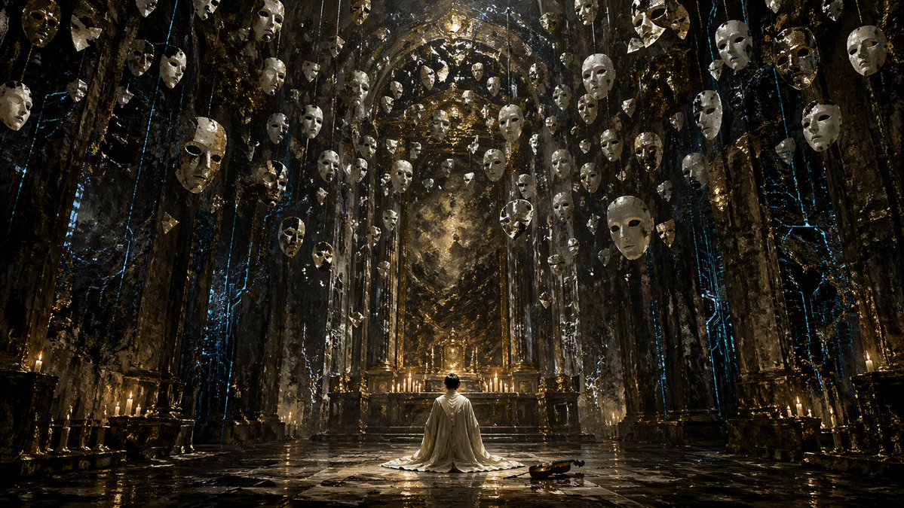

## 建筑空间场景图

- ID: case-47
- Slug: case-47-zh
- 语言: zh
- 来源: [来源链接](https://x.com/makaneko_AI)
- 样例图路径: images/part2/case47.jpg

### 提示词

```text
{
  "type": "2x2 grid of Japanese digital advertisement banners",
  "layout": {
    "structure": "4 equal quadrants",
    "quadrants": [
      {
        "position": "top-left",
        "theme": "Travel",
        "subject": "A couple holding hands on a white sand beach, looking out at turquoise ocean water under a bright blue sky.",
        "elements": ["red hibiscus flower in bottom left corner"],
        "text_labels": [
          "今年こそ、解き放て。",
          "{argument name=\"travel destination\" default=\"沖縄旅行\"}",
          "3日間の癒やし旅",
          "航空券＋ホテル",
          "39,800円〜",
          "絶景、グルメ、体験 ぜんぶ叶う!"
        ],
        "icons": {
          "count": 3,
          "descriptions": ["airplane", "hotel building", "car"]
        }
      },
      {
        "position": "top-right",
        "theme": "Skincare",
        "subject": "Close-up portrait of a young woman with glowing, dewy skin, eyes closed, gently touching her cheeks.",
        "elements": [
          "soft pink gradient background",
          "dynamic water splash effects",
          "pink cosmetic jar labeled '{argument name=\"skincare product name\" default=\"LUMIÈRE\"} Brightening Gel'"
        ],
        "text_labels": [
          "毛穴・くすみ卒業！",
          "透明感あふれる",
          "水光肌へ",
          "新感覚スキンケア",
          "初回限定 78%OFF",
          "{argument name=\"discount price\" default=\"1,980円\"}"
        ],
        "badges": {
          "count": 3,
          "style": "gold circular",
          "labels": ["毛穴ケア", "高保湿", "ハリ・ツヤ"]
        }
      },
      {
        "position": "bottom-left",
        "theme": "Gourmet Food",
        "subject": "Thick, sliced, medium-rare steak sizzling on a dark grill plate.",
        "elements": [
          "garlic chips",
          "rosemary sprig",
          "dark background with smoke and glowing embers"
        ],
        "text_labels": [
          "とろける旨さ！",
          "{argument name=\"food item\" default=\"黒毛和牛\"}",
          "贅沢ステーキ",
          "期間限定",
          "特別価格",
          "通常価格 8,980円",
          "4,980円"
        ],
        "badges": {
          "count": 1,
          "style": "red circular",
          "labels": ["A4 A5等級"]
        }
      },
      {
        "position": "bottom-right",
        "theme": "Online Education",
        "subject": "Young man in a blue shirt studying at a desk, writing in a notebook next to an open laptop.",
        "elements": ["bright indoor lighting", "desk environment"],
        "text_labels": [
          "スキマ時間で",
          "{argument name=\"education goal\" default=\"最短合格！\"}",
          "オンライン資格講座",
          "スマホで完結",
          "効率学習で差がつく！",
          "今だけ！ 受講料 20%OFF"
        ],
        "badges": {
          "count": 1,
          "style": "blue circular",
          "labels": ["受講者数 10万人 突破！"]
        },
        "icons": {
          "count": 2,
          "descriptions": ["smartphone", "open book"]
        }
      }
    ]
  }
}
```

### 样例图


## 建筑空间场景图

- ID: case-46
- Slug: case-46-zh
- 语言: zh
- 来源: [来源链接](https://x.com/lakeside529)
- 样例图路径: images/part2/case46.jpg

### 提示词

```text
A highly detailed, realistic photograph of a young East Asian woman sitting in a cluttered backstage dressing room, getting ready for a cosplay event. She has {argument name="hair color" default="vibrant short red"} hair styled in a bob with bangs and is wearing an elaborate fantasy warrior costume featuring a {argument name="costume color" default="glossy red"} and gold tiered mini skirt, a white corset top with black lace and red lacing, matching glossy arm guards, and thigh-high boots. She is looking down with a focused expression, using her right hand to adjust the arm guard on her left arm. The vanity counter in front of her is messy, covered with makeup brushes, bottles, a hairbrush, and extra hairpieces. A large, ornate {argument name="prop" default="fantasy sword with a blue blade and gold hilt"} leans against the edge of the counter. The background shows a brightly lit vanity mirror with round bulbs reflecting a clothing rack, capturing a candid, slightly over-sharpened, and highly textured photographic style.
```

### 样例图


## 人像写实摄影图

- ID: case-45
- Slug: case-45-zh
- 语言: zh
- 来源: [来源链接](https://x.com/AoYe999)
- 样例图路径: images/part2/case45.jpg

### 提示词

```text
A striking black and white close-up portrait of a {argument name="subject description" default="handsome young Asian man"} with {argument name="hair style" default="messy wet hair sticking to his forehead"}. His face and neck are glistening, covered in highly detailed {argument name="skin texture detail" default="water droplets and sweat"}. He has an intense, melancholic gaze directed off-camera to the left. The lighting is dramatic and high-contrast, emphasizing his sharp jawline, full lips, and specular highlights on the wet skin against a {argument name="background" default="pitch-black background"}. Shot in a photorealistic, high-fashion editorial style with cinematic chiaroscuro.
```

### 样例图


## 插画艺术创作图

- ID: case-43
- Slug: case-43-zh
- 语言: zh
- 来源: [来源链接](https://x.com/stark_nico99)
- 样例图路径: images/part2/case43.jpg

### 提示词

```text
{
  "type": "character portrait grid",
  "theme": "{argument name=\"theme\" default=\"Game of Thrones characters\"}",
  "style": "{argument name=\"art style\" default=\"2D flat illustration, clean line art, comic style, profile view facing right, pale skin with blush\"}",
  "layout": {
    "grid": "3x3",
    "background": "light gray textured",
    "frame_style": "white rounded-rectangle frames with text labels below each"
  },
  "count": 9,
  "portraits": [
    { "label": "Jon Snow", "description": "black hair half-up, beard, dark fur cloak" },
    { "label": "Daenerys Targaryen", "description": "silver braided hair, blue dress" },
    { "label": "Tyrion Lannister", "description": "curly brown hair, beard, dark tunic with gold pin" },
    { "label": "Cersei Lannister", "description": "blonde braided hair, ornate red and gold dress" },
    { "label": "Ned Stark", "description": "brown hair half-up, beard, dark fur cloak" },
    { "label": "Arya Stark", "description": "short dark hair half-up, brown tunic, sword hilt" },
    { "label": "Jaime Lannister", "description": "short blonde hair, gold armor with lion motif" },
    { "label": "Sansa Stark", "description": "red braided hair, blue dress with fur collar" },
    { "label": "Theon Greyjoy", "description": "short dark curly hair, dark tunic with kraken pin" }
  ]
}
```

### 样例图

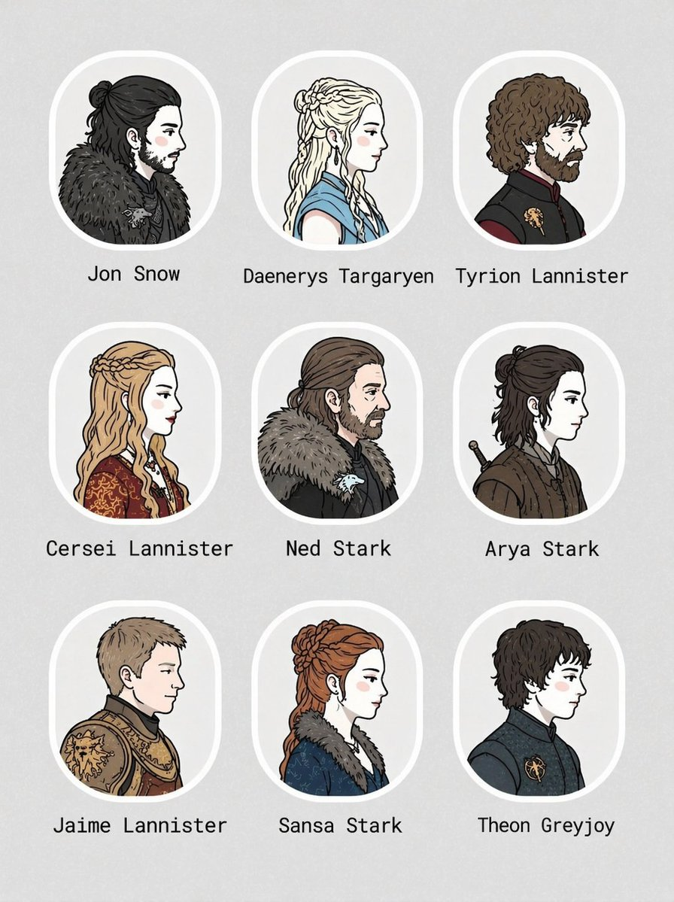

## 人像写实摄影图

- ID: case-35
- Slug: case-35-zh
- 语言: zh
- 来源: [来源链接](https://x.com/kazmaendo)
- 样例图路径: images/part2/case35.jpg

### 提示词

```text
A {argument name="photography style" default="photorealistic portrait with shallow depth of field and soft bokeh"} of a {argument name="subject" default="young Japanese woman"} looking back over her shoulder at the camera with a {argument name="expression" default="gentle smile"}. She is wearing a {argument name="attire" default="light beige kimono with orange maple leaf patterns"} and a gold obi. Her dark hair is styled in an elegant updo with loose strands framing her face, and she wears small pearl earrings. The background features an {argument name="setting" default="autumn garden with vibrant red maple leaves"}, with bright red foliage framing the top left and a heavily blurred, soft background creating a serene, cinematic atmosphere.
```

### 样例图


## 插画艺术创作图

- ID: case-34
- Slug: case-34-zh
- 语言: zh
- 来源: [来源链接](https://x.com/Ryan_Suo)
- 样例图路径: images/part2/case34.jpg

### 提示词

```text
{
  "type": "character avatar grid",
  "theme": "{argument name=\"theme\" default=\"Journey to the West mythology\"}",
  "style": "{argument name=\"art style\" default=\"clean 2D cartoon vector illustration, thick outlines, flat colors\"}",
  "layout": {
    "background": "{argument name=\"background color\" default=\"light gray\"} subtle texture",
    "format": "grid of circular portraits with text labels centered below each circle",
    "rows": [
      {
        "count": 4,
        "items": [
          {"label": "Sun Wukong", "description": "monkey boy with golden headband and red scarf"},
          {"label": "Tang Sanzang", "description": "monk with ornate golden crown"},
          {"label": "Zhu Bajie", "description": "pig man holding a rake"},
          {"label": "Sha Wujing", "description": "bearded man holding a crescent moon staff"}
        ]
      },
      {
        "count": 4,
        "items": [
          {"label": "White Dragon Horse", "description": "white horse with golden bridle"},
          {"label": "Jade Emperor", "description": "older man with white beard and golden crown"},
          {"label": "Guanyin", "description": "goddess holding a willow branch"},
          {"label": "Bull Demon Kink", "description": "fierce bull demon in armor"}
        ]
      },
      {
        "count": 4,
        "items": [
          {"label": "Princess Iron Fan", "description": "woman holding a green palm leaf fan"},
          {"label": "Red Boy", "description": "boy with red hair, horns, and a small flame"},
          {"label": "Black Wind Demon", "description": "dark shadowy demon with glowing red eyes"},
          {"label": "Nezha", "description": "boy with double hair buns holding a flaming spear"}
        ]
      },
      {
        "count": 3,
        "description": "partial row repeating Princess Iron Fan, Black Wind Demon, and Nezha, slightly cropped at the bottom"
      }
    ]
  }
}
```

### 样例图

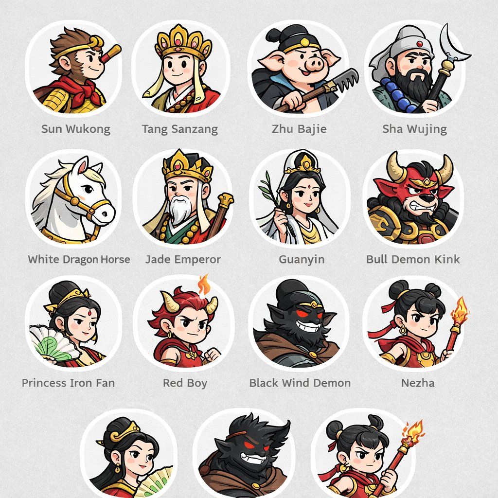

## 人像写实摄影图

- ID: case-31
- Slug: case-31-zh
- 语言: zh
- 来源: [来源链接](https://x.com/jun_kongo)
- 样例图路径: images/part2/case31.jpg

### 提示词

```text
A highly detailed, photorealistic anime-style portrait of a young woman crouching down and looking slightly down at the camera from a low angle. She has long, flowing {argument name="hair color" default="ash-blonde"} hair blowing gently in the wind, pale skin, and large, expressive eyes. She is wearing a {argument name="outfit" default="Japanese school uniform with a light grey cardigan, white shirt, dark plaid bow tie, dark plaid pleated skirt, dark knee-high socks, and black leather loafers"}. Her arms are resting casually on her knees. The background is a bright {argument name="sky condition" default="clear blue sky with scattered white clouds"}, with a blurred {argument name="background setting" default="chain-link fence and green trees"} visible at the very bottom, suggesting a schoolyard. The lighting is bright, natural daylight with soft, cinematic shadows, emphasizing the realistic textures of her clothing and skin.
```

### 样例图


## 电影感叙事场景图

- ID: case-29
- Slug: case-29-zh
- 语言: zh
- 来源: [来源链接](https://x.com/danieldmai)
- 样例图路径: images/part2/case29.jpg

### 提示词

```text
Using REFERENCE_0, transform the subject's appearance to a {argument name="style" default="trad goth"} aesthetic while preserving the exact pose, clothing structure, and background. Change her hair to {argument name="hair color" default="black"} with {argument name="hair style" default="choppy bangs"}. Apply heavy dark makeup, specifically {argument name="lip color" default="black"} lipstick and intense dark eyeshadow, and make her skin tone slightly paler. Add 2 facial piercings: a septum ring and a nostril stud. Finally, modify her layered necklaces to feature {argument name="necklace pendants" default="an inverted cross and a pentagram"}.
```

### 样例图

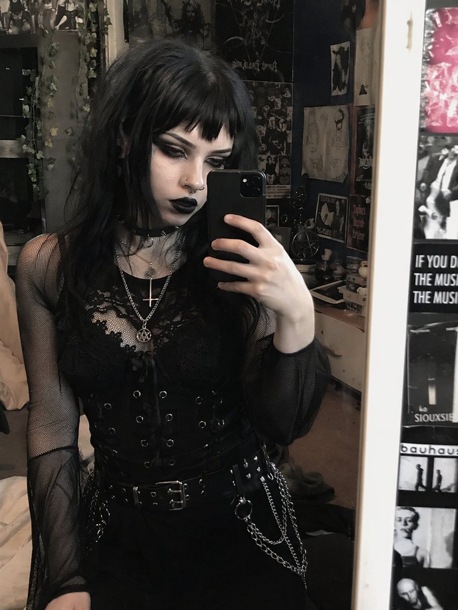

## 写实摄影风格创作

- ID: case-28
- Slug: case-28-zh
- 语言: zh
- 来源: [来源链接](https://x.com/frankfu1688)
- 样例图路径: images/part2/case28.jpg

### 提示词

```text
{
  "type": "2x2 portrait grid",
  "subject": "{argument name=\"subject description\" default=\"young adult East Asian male with short black hair and a slight smile\"}",
  "style": "photorealistic, high-resolution, professional lighting, consistent facial identity across all panels",
  "layout": {
    "format": "2x2 grid",
    "panel_count": 4,
    "panels": [
      {
        "position": "top-left",
        "description": "{argument name=\"profession 1\" default=\"Corporate professional wearing a dark navy suit, white shirt, and blue tie against a gray textured background\"}"
      },
      {
        "position": "top-right",
        "description": "{argument name=\"profession 2\" default=\"Casual attire wearing a dark blue crew neck t-shirt against a blurred outdoor park background\"}"
      },
      {
        "position": "bottom-left",
        "description": "{argument name=\"profession 3\" default=\"Construction worker wearing a yellow hard hat, navy blue work shirt, and bright orange high-visibility vest against a blurred warehouse background\"}"
      },
      {
        "position": "bottom-right",
        "description": "{argument name=\"profession 4\" default=\"Medical professional wearing a white lab coat over a light blue collared shirt against a blurred laboratory background\"}"
      }
    ]
  }
}
```

### 样例图


## 建筑空间场景图

- ID: case-26
- Slug: case-26-zh
- 语言: zh
- 来源: [来源链接](https://x.com/ecooai)
- 样例图路径: images/part2/case26.jpg

### 提示词

```text
A vintage 35mm film photograph of a {argument name="subject description" default="young Asian woman"} with {argument name="hair style" default="long dark wavy hair and wispy bangs"}. She is wearing a {argument name="clothing" default="white ribbed tank top and a loose beige knit cardigan slipping off one shoulder"}, along with a delicate silver necklace. She has soft makeup with pink blush and glossy lips, looking directly at the camera with slightly parted lips. The lighting is harsh direct camera flash, creating a candid, amateur snapshot aesthetic. The background is a {argument name="setting" default="dimly lit, slightly messy room with clothes on a table and a wooden shelf"}. The image features heavy film grain, slightly muted colors, and a nostalgic, highly realistic photographic texture.
```

### 样例图


## 主题海报版式设计

- ID: case-9
- Slug: case-9-zh
- 语言: zh
- 来源: [来源链接](https://github.com/freestylefly/awesome-gpt-image-2/blob/main/docs/gallery-part-1.md#case-9)
- 样例图路径: images/part2/case9.jpg

### 提示词

```text
2026中国城市系列宣传海报，主题为【北京】。现代、多彩、明亮通透的国潮风，竖版9:16。大面积白色纹理留白背景，一条从右下向左上盘旋的红色丝绸形成S型主构图。右下角一位东方女性挥舞红绸，服饰需结合北京地域文化定制。红绸延展为城市长卷，融合天坛、长城、鸟巢、喇叭沟门原始森林公园、什刹海、京味相声。左侧排版SPRING 2026、竖排Beijing和小印章“北京”。要求统一系列感，但不能雷同，细节丰富，城市辨识度强。文字清晰且精美布局，高端图形设计。
```

### 样例图

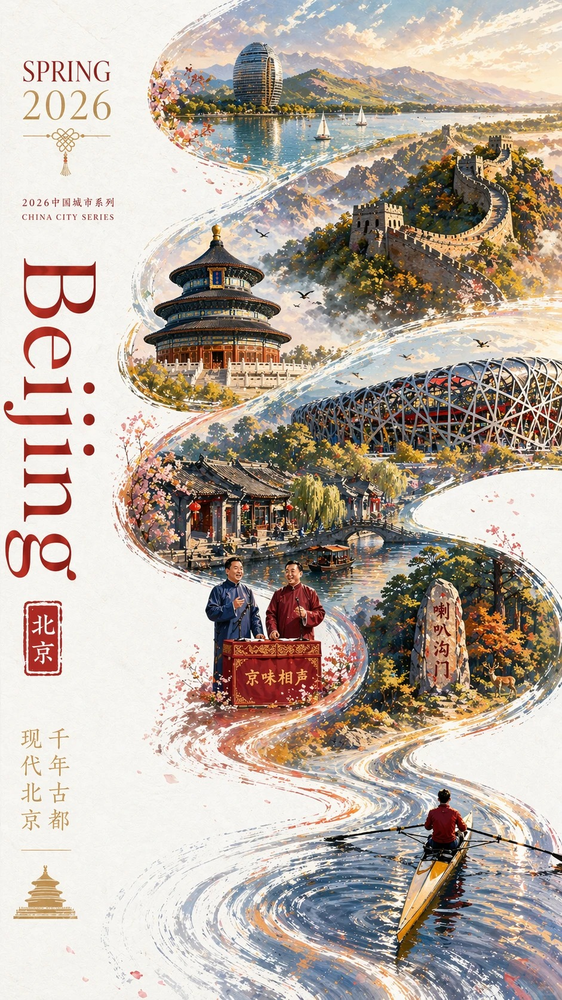

## 应用界面样机图

- ID: case-7
- Slug: case-7-zh
- 语言: zh
- 来源: [来源链接](https://github.com/freestylefly/awesome-gpt-image-2/blob/main/docs/gallery-part-1.md#case-7)
- 样例图路径: images/part2/case7.jpg

### 提示词

```text
生成一张竖版手机截图风格的图片，整体比例接近 9:16。画面中心偏上是一位真人 coser，扮演上传图片中的二次元角色。人物为写实风格，但五官略带动漫感，皮肤细腻，眼睛稍大，表情温柔地看向镜头，坐在室内的休闲场景中，例如咖啡厅或酒吧吧台前，背景有符合场景的道具。画面最上方加入手机系统状态栏 UI，包括时间、电量、信号、网络等图标，让整张图看起来像手机截图。画面底部叠加一块宽大的半透明 galgame 风格对话框，对话框左侧放一个与画面人物对应的动漫或 Q 版头像；对话框右侧排版文字：第一行用较大字体显示与前面相同的角色名字，下面一到两行显示一段适合这个角色人设的、温柔治愈风格的简体中文台词，由你自动创作。再在对话框下方加一条操作栏，仿照 galgame UI。整体风格高清、细节丰富、光线柔和、二次元与真人写真自然融合。
```

### 样例图


## 足球主题电影海报

- ID: case-3
- Slug: case-3-zh
- 语言: zh
- 来源: [来源链接](https://github.com/freestylefly/awesome-gpt-image-2/blob/main/docs/gallery-part-1.md#case-3)
- 样例图路径: images/part2/case3.jpg

### 提示词

```text
生成一张「足球主题电影海报」风格的高清写真海报：国际米兰后卫巴斯托尼站在圣西罗球场中央激情庆祝，双手高举并披着波黑国旗，神情热血、坚定、自信，现场灯光璀璨，球场看台座无虚席，背景有蓝黑色烟雾、聚光灯、飘扬的旗帜和飞舞的纸屑，营造欧冠之夜般的史诗氛围。人物为画面核心，半身到全身构图，突出脸部细节、肌肉张力与球衣质感。整体风格写实、震撼、富有戏剧性，海报级构图，电影感光影，高对比度，超清细节，8K，专业体育摄影，极具视觉冲击力。五根手指。
```

### 样例图


## 1. Using the attached image as a motif, we generated a d

- ID: gpt4o-1048-en-1
- Slug: prompt-1048-en-1
- 语言: en
- 来源: [来源链接](https://x.com/BubbleBrain/status/2007062194702155835)
- 样例图路径: images/part3/1048.jpeg

### 提示词

```text
1. Using the attached image as a motif, we generated a difference image of a woman's face with lipstick and glossy lips. The image consists of four scenes divided into a 2x2 grid. 

2. A 2x2 grid cinematic photo collage. Four close-up portraits of the same beautiful Korean woman, creating an emotional narrative sequence.

Top-left panel: Cold and aloof expression, staring directly at the camera, high fashion vibe.
Top-right panel: A playful wink and a subtle smirk, looking side-glance.
Bottom-left panel: Biting lower lip, looking shy and slightly flirtatious, soft gaze.
Bottom-right panel: A genuine bright laugh, eyes crinkled with joy, head tilted back slightly.

Style: Analog film photography, heavy film grain, soft focus, dreamlike lighting, glossy lips, dewy skin texture, emotional atmosphere.
```

### 样例图

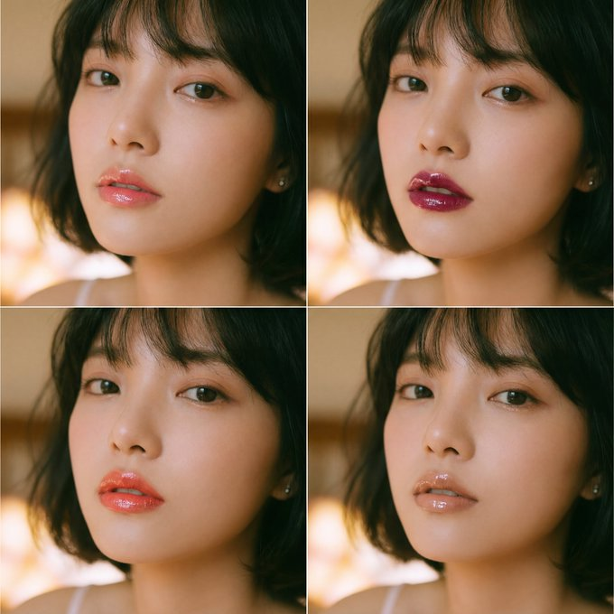

## 女性面部涂口红和唇彩效果的图像

- ID: gpt4o-1048-zh-2
- Slug: prompt-1048-zh-2
- 语言: zh
- 来源: [来源链接](https://x.com/BubbleBrain/status/2007062194702155835)
- 样例图路径: images/part3/1048.jpeg

### 提示词

```text
1. 我们以附图为模板，生成了一张女性面部涂口红和唇彩效果的差异图像。该图像由四个场景组成，这些场景被划分成一个 2x2 的网格。

2. 一幅 2x2 网格的电影式照片拼贴画。四张同一位美丽的韩国女性的特写肖像，构成了一段充满情感的叙事序列。

左上角面板：表情冷漠疏离，直视镜头，充满时尚气息。
右上角面板：俏皮地眨眨眼，带着一丝不易察觉的微笑，侧目而视。
左下角：咬着下唇，看起来害羞又略带挑逗，眼神温柔。
右下角画面：发自内心的爽朗笑声，眼睛因喜悦而眯成一条缝，头微微向后仰。

风格：胶片摄影，浓重的胶片颗粒感，柔焦效果，梦幻般的光线，光泽的嘴唇，水润的肌肤质感，充满情感的氛围。
```

### 样例图


## { "project_metadata": { "title": "K-Pop Idol Newspaper F

- ID: gpt4o-1040-en-1
- Slug: prompt-1040-en-1
- 语言: en
- 来源: [来源链接](https://x.com/BubbleBrain/status/2007074986008141973)
- 样例图路径: images/part3/1040.jpeg

### 提示词

```text
{
  "project_metadata": {
    "title": "K-Pop Idol Newspaper Fashion Concept",
    "style_preset": "Soft Focus Editorial Photography",
    "aspect_ratio": "3:4",
    "version": "2.1"
  },
  "subject": {
    "identity": {
      "ethnicity": "Korean",
      "age_group": "Young Adult",
      "aesthetic": "K-pop idol, mixture of innocent and sexy, pure visual"
    },
    "physique": {
      "body_type": "Curvy and voluptuous",
      "specific_attributes": "Highly emphasized and prominent bustline, hourglass silhouette, toned arms",
      "skin_tone": "Pale, porcelain white, flawless and glowing"
    },
    "hair_and_makeup": {
      "hair": {
        "color": "Dark brown",
        "style": "Long, voluminous waves, slight wet look",
        "action": "Hands gently touching face or hair"
      },
      "makeup": {
        "lips": "Glossy pink jelly lips, gradient lip color",
        "eyes": "Sparkling K-pop style eye makeup, aegyo-sal emphasized",
        "finish": "Glass skin effect, bright and dewy"
      }
    },
    "pose_and_expression": {
      "expression": "Cute pouting lips (dudu lips), seductive yet innocent gaze, looking into the lens",
      "pose": "Medium-full body shot, standing, playful posture, emphasising curves"
    }
  },
  "fashion_elements": {
    "primary_garment": {
      "item": "Strapless mini-dress",
      "material": "Authentic recycled newspaper pages",
      "construction": "Architectural, origami-style pleats, visible newsprint, headlines, and grayscale imagery textures",
      "fit": "Form-fitting, cinched at the waist"
    },
    "accessories": [
      {
        "item": "Hoop earrings",
        "style": "Large, thin, minimalist",
        "material": "Polished silver"
      }
    ]
  },
  "environment_and_backdrop": {
    "setting": "Studio indoor",
    "background_type": "Textured wall",
    "details": "Completely covered in layered, overlapping vintage newspaper pages, sepia-toned paper, collage effect",
    "depth": "Shallow depth of field to separate subject from the background"
  },
  "cinematography_and_lighting": {
    "camera": {
      "lens": "85mm prime lens",
      "shot_type": "Medium-full shot",
      "angle": "Eye-level",
      "sensor": "Digital, clear"
    },
    "lighting": {
      "primary_source": "Soft diffused frontal lighting",
      "effect": "Bright, flattering beauty lighting, minimizing shadows on face",
      "color_temp": "Cool white to neutral"
    },
    "post_processing": {
      "focus": "Soft focus, dreamy atmosphere",
      "textures": "Heavy skin smoothing, airbrushed look, ethereal glow, no grain",
      "filter": "Beauty filter style, dreamy blur effect"
    }
  }
}
```

### 样例图

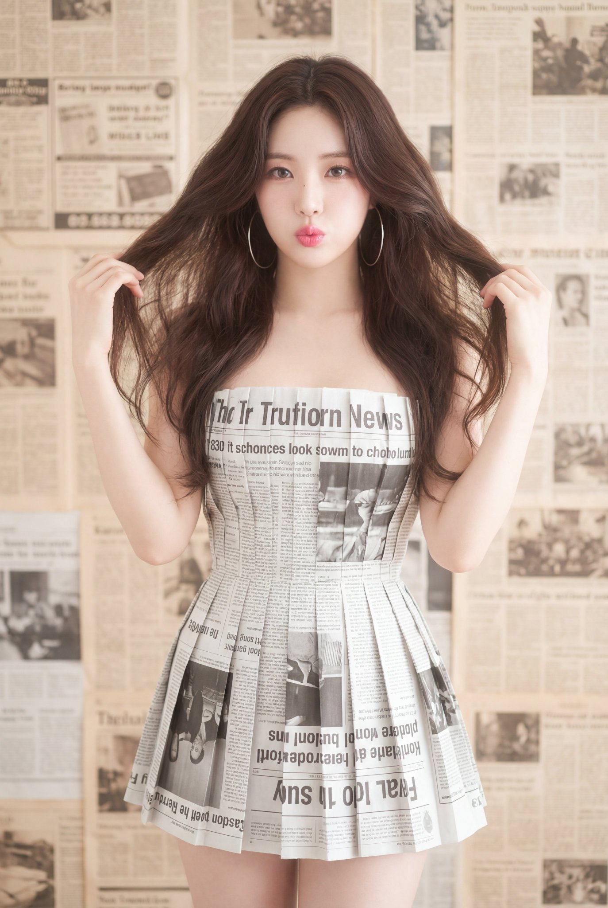

## K-Pop偶像报纸时尚概念

- ID: gpt4o-1040-zh-2
- Slug: prompt-1040-zh-2
- 语言: zh
- 来源: [来源链接](https://x.com/BubbleBrain/status/2007074986008141973)
- 样例图路径: images/part3/1040.jpeg

### 提示词

```text
{
"project_metadata": {
标题：《K-Pop偶像报纸时尚概念》
"style_preset": "柔焦编辑摄影",
"aspect_ratio": "3:4",
版本：2.1
},
“主题”： {
“身份”： {
“种族”: “韩国人”
"age_group": "青年人",
“美学”：“K-pop偶像，兼具清纯与性感，纯粹的视觉美”
},
"体格": {
"body_type": "曲线优美，丰满性感",
"specific_attributes": "非常突出且醒目的胸部线条，沙漏型身材，健美的双臂",
肤色：苍白如瓷，无瑕透亮
},
"发型和化妆": {
“头发”： {
“颜色”：“深棕色”，
“发型”：“长而蓬松的波浪卷，略带湿润感”，
“动作”：“双手轻轻触碰脸部或头发”
},
“化妆品”： {
“唇部”： “亮泽的粉色果冻唇膏，渐变唇色”
“眼睛”：“闪亮的韩式流行风格眼妆，强调卧蚕”，
“妆效”：“玻璃肌效果，明亮水润”
}
},
"pose_and_expression": {
“表情”：“嘟嘟的可爱嘴唇，既诱人又无辜的眼神，看着镜头”，
“姿势”：“中全身照，站立，俏皮的姿势，强调曲线”
}
},
"fashion_elements": {
"primary_garment": {
“商品”: “无肩带迷你连衣裙”
“材料”：“真正的再生报纸页面”，
“构造”：“建筑风格的折纸褶皱，可见的新闻印刷品、标题和灰度图像纹理”，
“合身”： “贴合身形，腰部收紧”
},
“配件”： [
{
“物品”: “圈形耳环”，
“风格”：“大号、纤细、极简主义”
材质：抛光银
}
]
},
"environment_and_backdrop": {
设置：室内工作室，
"background_type": "纹理墙",
“细节”：“完全覆盖着层叠交错的复古报纸页面，棕褐色调的纸张，拼贴效果”，
“景深”： “浅景深使主体与背景分离”
},
"cinematography_and_lighting": {
“相机”： {
“镜头”: “85mm 定焦镜头”
"shot_type": "中远景镜头",
“角度”：“视线水平”，
“传感器”：“数字式，清晰”
},
“灯光”： {
"primary_source": "柔和的漫射正面照明",
“效果”：“明亮、讨喜的美颜灯光，最大限度地减少脸上的阴影”，
"color_temp": "冷白光到中性色"
},
"post_processing": {
“焦点”：“柔焦，梦幻般的氛围”，
“质地”：“强效柔滑肌肤，喷枪妆效，空灵光泽，无颗粒感”
"滤镜": "美颜滤镜风格，梦幻虚化效果"
}
}
}
```

### 样例图


## A refined fashion editorial image with a 3:2 aspect rati

- ID: gpt4o-1039-en-1
- Slug: prompt-1039-en-1
- 语言: en
- 来源: [来源链接](https://x.com/craftian_keskin/status/2007156041851490337)
- 样例图路径: images/part3/1039.jpeg

### 提示词

```text
A refined fashion editorial image with a 3:2 aspect ratio, split into two clear sections.

Right side:
A fashionable, confident, sensual woman standing and walking casually in a modern architectural space with warm wooden walls and soft natural light. She wears a top with a deep V neckline, has a small mole on her chest, a 90-60-90 figure, tucked into a high-waisted white tailored short skirt, On her feet are sleek black stiletto heels, elegant and minimal. She carries a small structured black handbag in one hand.

Her hair is slicked back into a clean low bun, emphasizing her facial structure. She wears narrow black sunglasses and subtle statement earrings. The look is refined, modern, and effortlessly chic. Natural daylight, soft shadows, realistic skin texture. Casual fashion photography style with an editorial, high-end feel. Neutral color palette, warm tones, shallow depth of field, cinematic realism.

Style & Mood:
Modern elegance, quiet luxury, confident, minimal, editorial casual.

Photography Details:
Eye-level angle, candid stance, 35mm lens, natural lighting, high detail, photorealistic.

Left side:
A clean, minimalist product breakdown layout on a neutral background. The individual fashion items worn by the woman are displayed separately, neatly arranged with subtle shadows. Each item includes a small, elegant price label in refined sans-serif typography:

– Beige deep V-neck knit top — $180
– White high-waisted tailored mini skirt — $220
– Black pointed-toe stiletto heels — $350
– Small structured black handbag — $480
– Black narrow sunglasses — $160

The left side feels like a luxury fashion catalog or e-commerce lookbook, with clear spacing, premium presentation, and visual balance.

Overall Style & Mood:
Quiet luxury, modern elegance, editorial fashion, high-end retail aesthetic.

Lighting & Quality:
Soft natural light, studio-clean clarity on product side, photorealistic, ultra-high resolution, professional fashion photography.

Negative Prompt:
Cluttered layout, oversized text, flashy logos, mannequins, people on left side, harsh lighting, low resolution, cartoon style.
```

### 样例图


## 一张精致的时尚大片

- ID: gpt4o-1039-zh-2
- Slug: prompt-1039-zh-2
- 语言: zh
- 来源: [来源链接](https://x.com/craftian_keskin/status/2007156041851490337)
- 样例图路径: images/part3/1039.jpeg

### 提示词

```text
一张精致的时尚大片，宽高比为 3:2，清晰地分为两个部分。

右侧：
一位时尚、自信、充满魅力的女士，在现代建筑风格的空间中随意地站立或行走，温暖的木质墙壁和柔和的自然光线营造出舒适的氛围。她身着一件深V领上衣，胸前有一颗小痣，身材比例完美，下身搭配一条高腰白色修身短裙。脚上是一双优雅简约的黑色细高跟鞋。她手提一只小巧精致的黑色手提包。

她的头发利落地梳成一个低髻，凸显了她精致的脸型。她戴着黑色窄框太阳镜和简约的耳环，整体造型优雅、现代，又不失随性时尚感。自然的光线、柔和的阴影、真实的肌肤纹理，营造出一种休闲时尚摄影的质感，同时又不失高端大片的氛围。中性色调、暖色调、浅景深，以及电影般的真实感，共同成就了这组照片。

风格与氛围：
现代优雅，低调奢华，自信，简约，时尚休闲。

摄影细节：
平视角度，自然姿态，35mm镜头，自然光，高细节，照片级真实感。

左侧：
简洁的极简主义产品展示布局，背景中性。女士身上穿着的每件时尚单品都单独展示，整齐排列，并辅以柔和的阴影效果。每件单品都配有小巧精致的价格标签，采用优雅的无衬线字体。

米色深V领针织上衣——180美元
白色高腰修身迷你裙——220美元
黑色尖头细高跟鞋——350美元
- 小号黑色硬挺手提包 — 480 美元
黑色窄框太阳镜——160美元

左侧的设计风格类似于奢侈时尚产品目录或电商产品图册，布局清晰，呈现方式高端大气，视觉效果平衡。

整体风格与氛围：
低调奢华，现代优雅，时尚杂志风格，高端零售美学。

照明和质量：
柔和的自然光，产品面清晰如影楼，照片真实感强，超高分辨率，专业时尚摄影。

否定提示：
布局杂乱，文字过大，标志花哨，模特，左侧有人，光线刺眼，分辨率低，卡通风格。
```

### 样例图


## 新年新气象新衣服

- ID: gpt4o-1031-zh
- Slug: prompt-1031-zh
- 语言: zh
- 来源: [来源链接](https://x.com/aidavid125/status/2006959961109299304)
- 样例图路径: images/part3/1031.jpeg

### 提示词

```text
Use the uploaded reference image as the person appearing in all 6 cards.
Analyze their unique body shape, skin tone, facial features, and personal essence.
Design 6 PERFECT outfits specifically tailored to maximize their individual beauty.

Create a vertical 9:16 professional New Year Fashion Outfit Poster.

BACKGROUND: Solid warm cream (#FFF8F5), optimized for mobile full-screen viewing.

════════════════════════════════════
CRITICAL LAYOUT RULES
════════════════════════════════════

EXACTLY 6 CARDS arranged in SINGLE VERTICAL COLUMN:
- Six (6) cards total — NOT 4, NOT 9, EXACTLY 6
- ONE column ONLY — NO grid, NO 2x3, NO side-by-side
- Cards stacked vertically from top to bottom
- Like mobile scrolling feed / Instagram story sequence
- Each card occupies full width of canvas

SPACING:
- Outer margin: 3% width (left and right)
- Vertical gap between cards: 2% height
- Cards fill vertical space evenly

VISUAL REFERENCE:
┌─────────────────┐
│     Card 1      │
├─────────────────┤
│     Card 2      │
├─────────────────┤
│     Card 3      │
├─────────────────┤
│     Card 4      │
├─────────────────┤
│     Card 5      │
├─────────────────┤
│     Card 6      │
└─────────────────┘

════════════════════════════════════
SINGLE CARD STRUCTURE
════════════════════════════════════

Each card contains 4 zones:

▸ ZONE 1: TITLE AREA (top 8% height)
- AI-generated creative style name based on the outfit
- Main title: Chinese Red (#C41E3A) or Gold (#D4AF37), centered
- Subtitle: 6-8 characters describing the vibe, warm gray (#8B7355)
- Small decorative icon: lantern or cloud motif

▸ ZONE 2: MAIN IMAGE AREA (55% height)
- Full-body outfit display
- Person occupies 70-75% of area
- Clean, elegant background with warm tones
- Subtle New Year decorative elements
- Natural pose, confident expression
- Complete outfit clearly visible

▸ ZONE 3: THREE-DETAIL CIRCLES (15% height)
- Three circular close-up images, horizontally arranged
- LEFT: Upper garment detail (neckline, sleeve, pattern, texture)
- CENTER: Accessory highlight (bag, jewelry, belt, scarf)
- RIGHT: Lower garment/shoes detail (hem, pants, footwear)
- Labels beneath: "上装 Top" / "配饰 Acc" / "下装 Bottom"

▸ ZONE 4: OUTFIT INFO AREA (22% height)
- 5 lines of information, left-aligned:
🔴 上装: [Style + Color + Material]
🔴 下装: [Style + Cut + Color]
🔴 鞋履: [Shoe type + Color + Material]
🔴 配饰: [Bag + Jewelry + Scarf + Other]
🔴 风格点评: [Why this outfit is perfect for this person]

CARD STYLING:
- Background: warm white #FFFAF8
- Border-radius: 4%
- Border: 1px solid #F5E6E0
- Corner decoration: tiny plum blossom or cloud icon

════════════════════════════════════
AI SMART STYLING SYSTEM
════════════════════════════════════

STEP 1: DEEP ANALYSIS
Carefully analyze the reference image for:

Body Shape:
- Pear / Apple / Hourglass / Rectangle / Inverted Triangle
- Shoulder width, waist definition, hip proportion
- Height impression (petite / average / tall)
- Areas to highlight vs balance

Skin Tone:
- Cool undertone / Warm undertone / Neutral
- Fair / Medium / Tan / Deep
- Best complementary colors

Personal Essence:
- Elegant / Sweet / Cool / Classic / Trendy / Edgy
- Gentle / Bold / Cute / Sophisticated / Chic
- Youthful / Young Professional / Mature Elegant

Facial Features:
- Soft vs Angular
- Overall impression and mood

STEP 2: CREATE 6 PERFECT OUTFITS
Based on complete analysis, freely design 6 outfits that:

✓ FLATTER the specific body type
- Choose silhouettes that enhance proportions
- Use strategic cuts, lengths, and fits
- Balance or highlight as needed

✓ COMPLEMENT the skin tone perfectly
- Select colors that make skin glow
- Avoid colors that wash out or clash
- Use undertone-matching principles

✓ MATCH the personal essence
- Align with natural vibe and energy
- Feel authentic, not costume-like
- Enhance existing beauty

✓ MAXIMIZE overall appeal
- Each outfit is THE MOST flattering choice
- Every piece works together harmoniously
- Complete polished head-to-toe look

✓ MAINTAIN variety
- 6 distinctly different styles
- Range of formality levels
- Different color stories
- Various silhouettes

✓ CELEBRATE New Year spirit
- Include festive red/gold elements
- Warm, joyful, celebratory feeling
- Elegant and refined aesthetic

════════════════════════════════════
NEW YEAR COLOR PALETTE
════════════════════════════════════

PRIMARY FESTIVE COLORS (each outfit MUST include at least one):

Chinese Red     #C41E3A  — Statement hero pieces
True Red        #E60012  — Bold, vibrant looks
Burgundy        #722F37  — Sophisticated elegance
Gold            #D4AF37  — Accessories and details
Champagne       #F7E7CE  — Subtle luxury
Coral           #FF6B35  — Youthful energy

SECONDARY COLORS (for balance and harmony):

Cream           #FFF8E7  — Clean, fresh base
Ivory           #FFFDD0  — Soft, warm elegance
Forest Green    #2E4A3E  — Contrast accent
Navy            #2B4A6F  — Classic depth
Blush Pink      #FFB6C1  — Sweet, feminine touch
Camel           #C19A6B  — Neutral sophistication
Pearl White     #F5F5F5  — Crisp, modern
Nude            #E8D5C4  — Understated chic

COLORS TO AVOID:
✗ Large areas of pure black (not festive enough)
✗ Gray-dominant schemes (too dull)
✗ Dark purple as main color (lacks celebration feel)
✗ Neon or overly bright tones (clashes with elegance)

════════════════════════════════════
FASHION ELEMENTS LIBRARY
════════════════════════════════════

AI freely selects and combines from:

UPPER GARMENTS:
- Cashmere sweaters, merino wool knits
- Silk blouses, satin camisoles
- Velvet tops, lace-trimmed pieces
- Modern qipao-inspired elements
- Elegant blazers, soft cardigans
- Statement coats, cropped jackets
- Turtlenecks, boat necks, V-necks

LOWER GARMENTS:
- A-line skirts, knife-pleat skirts
- Midi skirts, flowing maxi skirts
- Tailored trousers, wide-leg pants
- Velvet pants, satin midi skirts
- High-waist silhouettes, paper-bag waist
- Pencil skirts, wrap skirts

DRESSES:
- Knit dresses, sweater dresses
- Wrap dresses, shirt dresses
- Velvet dresses, satin slip dresses
- Fit-and-flare, bodycon, shift
- Midi length, maxi length

OUTERWEAR:
- Wool coats, cashmere overcoats
- Teddy coats, faux fur jackets
- Stylish puffer jackets
- Cape coats, cocoon coats
- Belted trench, double-breasted styles

FOOTWEAR:
- Pointed-toe heels, block heels
- Kitten heels, stilettos
- Ankle boots, knee-high boots
- Elegant loafers, embellished flats
- Slingbacks, Mary Janes
- Velvet shoes, satin pumps

ACCESSORIES:
- Pearl earrings, gold jewelry sets
- Statement earrings, delicate pendants
- Silk scarves, cashmere wraps
- Leather handbags, chain-strap bags
- Clutches, structured top-handle bags
- Hair clips, headbands, brooches
- Thin belts, statement belts
- Elegant watches, bracelets

════════════════════════════════════
PHOTOGRAPHY REQUIREMENTS
════════════════════════════════════

QUALITY STANDARD:
- High-end fashion magazine aesthetic
- 85mm portrait lens quality
- Professional studio or lifestyle setting
- Sharp focus on person and outfit

BACKGROUND REQUIREMENTS:
- Clean, elegant, uncluttered
- Warm neutral tones preferred
- Subtle New Year elements (optional):
· Soft red/gold bokeh
· Minimal lantern silhouettes
· Gentle floral arrangements
· Warm ambient glow
- NOT busy, NOT distracting

PERSON DISPLAY:
- Full body visible OR knee-up minimum
- Natural, confident expression
- Pose varies appropriately per outfit style
- Complete outfit clearly showcased
- Clothing fit and details visible
- Hair and makeup complement each style

LIGHTING:
- Warm, flattering golden-hour feel
- Soft diffused shadows
- Enhances skin tone naturally
- Creates depth without harshness
- Festive glow without overexposure

════════════════════════════════════
CONSISTENCY REQUIREMENTS
════════════════════════════════════
MUST MAINTAIN ACROSS ALL 6 CARDS:
| Element          | Requirement                              |
|------------------|------------------------------------------|
| Face             | IDENTICAL person in all 6 cards          |
| Body             | Same physique, proportions               |
| Changes Only     | Outfit, pose, expression, hairstyle      |
| Outfit Display   | Complete head-to-toe in each card        |
| Detail Circles   | Must MATCH main image exactly            |
| Overall Mood     | Festive, warm, celebratory feeling       |
| Photo Quality    | Consistent high-end aesthetic            |
| Color Warmth     | Harmonious warm tones throughout         |
| Background Style | Similar clean, elegant approach          |
════════════════════════════════════
DECORATIVE ELEMENTS
════════════════════════════════════
OVERALL POSTER DECORATION (subtle):
- Top edge: Faint golden cloud pattern border
- Bottom edge: Matching subtle border
- Between cards: Thin red or gold divider line (optional)
INDIVIDUAL CARD DECORATION:
- Corner accents: Tiny plum blossom icon
- Title area: Small lantern motif
- Subtle: Mini 福 character accent

DESIGN PRINCIPLE:
Decorations are MINIMAL and SUBTLE
Person and outfit remain the ABSOLUTE FOCUS

Elegance over festivity overload
Less is more approach
════════════════════════════════════
FINAL OUTPUT

════════════════════════════════════
Generate a beautiful, cohesive New Year Fashion Outfit Recommendation Poster featuring:
✓ Exactly 6 cards in single vertical column
✓ 6 unique outfits, each PERFECTLY tailored to this specific person

✓ Same person throughout with only outfit changes
✓ AI-generated style names that describe each look
✓ Complete outfit details (top, bottom, shoes, accessories)
✓ Festive New Year color palette with red/gold elements
✓ High-end fashion photography quality

✓ Clean, elegant presentation
✓ Warm, celebratory atmosphere
Each outfit should feel like it was personally styled by a top fashion consultant who deeply understands this person's unique features and knows exactly how to make them look their absolute best.
```

### 样例图

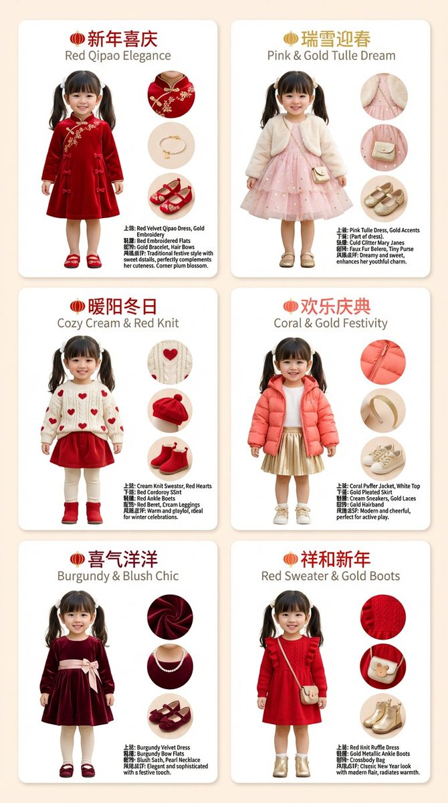

## { "language": "en", "task": "image_edit", "consistency_i

- ID: gpt4o-1027-en-1
- Slug: prompt-1027-en-1
- 语言: en
- 来源: [来源链接](https://x.com/hellokaton/status/2003484504347079156)
- 样例图路径: images/part3/1027.jpeg

### 提示词

```text
{
    "language": "en",
    "task": "image_edit",
    "consistency_id": "user_subject_sassy_santa",
    "input_images": [
        {
            "image": "{{USER_REFERENCE_IMAGE}}",
            "use_as": "subject_identity",
            "priority": "high"
        }
    ],
    "prompt": "Create a full-body vertical 3:4 festive poster. Use the person from the uploaded reference image as the ONLY human subject (could be male or female). Preserve identity strongly: same face structure, hairstyle, skin tone, and overall likeness. Preserve the subject’s gender presentation from the reference; do not gender-swap.\n\nPOSE (LOCK THIS): a grounded swagger power-stance with BOTH FEET ON THE FLOOR (no raised leg). Wide stance, feet apart. Weight mostly on the back leg. The front foot is planted closer to the camera to create forced-perspective enlargement of the sneaker, but the sole stays fully on the ground. Knees slightly bent. Hips subtly cocked. Upper body slightly leaned back with shoulders rolled back and chest subtly forward.\n\nARMS & FACE (LOCK THIS): arms firmly and tightly crossed over the chest (no hands-on-hips). Chin slightly raised. Slight head tilt. A smug, confident, sassy expression (subtle smirk / “too cool” attitude).\n\nWARDROBE: rich red velvet Santa suit with clean white fur trim, Santa hat, white gloves, stylish black sunglasses. Keep modern clean white sneakers.\n\nSCENE: seamless bright red studio backdrop with a soft spotlight gradient behind the subject. Metallic silver confetti floating throughout the scene.\n\nREINDEER: place one realistic reindeer on the subject’s right side (camera-right), full body visible, antlers prominent, facing the camera with a cute/curious look. The reindeer wears a cozy red-and-green knitted scarf.\n\nLIGHTING & CAMERA: crisp commercial studio lighting, high detail textures (velvet, fur trim, knit scarf, reindeer fur). Low-angle wide lens look (about 20–28mm), camera near knee height, slight upward tilt. Sharp focus on subject and reindeer, mild depth of field for a premium poster feel. Photorealistic, clean, no text.",
    "style_parameters": {
        "render_style": "photorealistic",
        "mood": "festive, playful, swagger, comedic",
        "camera_look": "low-angle wide lens, forced perspective"
    },
    "composition": {
        "shot_type": "full_body",
        "camera_angle": "low_angle",
        "subject_position": "center_left",
        "secondary_subject_position": "right",
        "background": "solid red seamless with subtle spotlight gradient",
        "foreground_elements": "silver confetti"
    },
    "technical_specifications": {
        "aspect_ratio": "3:4",
        "resolution": "4k",
        "detail_level": "high",
        "sharpness": "high"
    },
    "negative_prompt": "raised leg, knee up, kicking, stepping forward mid-air, walking pose, running pose, sitting, crouching, hands on hips, hands in pockets, text, watermark, logo, brand mark, extra people, duplicate face, face distortion, different identity, gender swap, body-type change, extra limbs, extra fingers, bad hands, deformed feet, melted sunglasses, blurry subject, low resolution, cartoon, anime, painterly look, harsh artifacts",
    "output_settings": {
        "format": "jpg",
        "quality": "high"
    }
}
```

### 样例图


## 竖版全身节日海报

- ID: gpt4o-1027-zh-2
- Slug: prompt-1027-zh-2
- 语言: zh
- 来源: [来源链接](https://x.com/hellokaton/status/2003484504347079156)
- 样例图路径: images/part3/1027.jpeg

### 提示词

```text
{
"language": "en",
"任务": "图像编辑",
"consistency_id": "user_subject_sassy_santa",
"input_images": [
{
"image": " {{ USER_REFERENCE_IMAGE }} ",
"use_as": "subject_identity",
“优先级”： “高”
}
],
“提示”：创作一张3:4比例的竖版全身节日海报。使用上传的参考图片中的人物作为唯一的人体主体（可以是男性或女性）。务必保持人物特征：相同的面部结构、发型、肤色和整体相似度。保持参考图片中人物的性别特征；不要改变性别。\n\n姿势（锁定此项）：双脚着地，双脚分开站立，保持稳健自信的站姿（不要抬腿）。双脚分开站立，重心主要在后腿上。前脚靠近镜头，利用透视效果放大运动鞋，但鞋底始终与地面接触。膝盖微屈。臀部略微前倾。上身略微后倾，双肩向后舒展，胸部略微前挺。\n\n手臂和面部（锁定此项）：双臂紧紧交叉于胸前（不要双手叉腰）。下巴略微抬起。头部略微前倾。倾斜。一种沾沾自喜、自信、傲娇的表情（略带一丝微笑/“酷毙了”的态度） .\ \n服装：深红色天鹅绒圣诞老人套装，配以干净的白色毛皮饰边、圣诞帽、白色手套和时尚的黑色太阳镜。搭配现代的干净白色运动鞋。\n\n场景：无缝亮红色影棚背景，主体后方有柔和的渐变聚光灯。银色金属彩纸屑在场景中飘落。\n\n驯鹿：将一只逼真的驯鹿放在主体的右侧（相机右侧），全身可见，鹿角突出，面向镜头，眼神可爱/好奇。驯鹿戴着一条舒适的红绿相间针织围巾。\n\n灯光和相机：清晰的商业影棚灯光，高细节纹理（天鹅绒、毛皮饰边、针织围巾、驯鹿毛皮）。低角度广角镜头（约20-28mm），相机高度接近膝盖，略微向上倾斜。主体清晰对焦驯鹿，适中的景深营造出高级海报的感觉。照片级写实，画面干净，无文字。
"style_parameters": {
"render_style": "照片写实风格",
“情绪”：“喜庆的、俏皮的、自信的、喜剧的”，
"camera_look": "低角度广角镜头，强制透视"
},
“作品”： {
"shot_type": "全身",
"camera_angle": "低角度",
"subject_position": "center_left",
"secondary_subject_position": "右",
“背景”: “纯红色无缝，带有微妙的聚光灯渐变”
"前景元素": "银色彩带"
},
"technical_specifications": {
"aspect_ratio": "3:4",
分辨率：4K，
"detail_level": "高",
“清晰度”： “高”
},
"negative_prompt": "抬腿、抬膝、踢腿、空中向前迈步、行走姿势、跑步姿势、坐姿、蹲姿、双手叉腰、双手插兜、文字、水印、标志、品牌标识、额外人物、重复面孔、面部扭曲、不同身份、性别互换、体型改变、额外肢体、额外手指、残疾的手、畸形的脚、融化的太阳镜、模糊主体、低分辨率、卡通、动漫、油画风格、粗糙的瑕疵",
"output_settings": {
"格式": "jpg",
“质量”： “高”
}
}
```

### 样例图


## 电商商品KV图

- ID: gpt4o-1021-zh
- Slug: prompt-1021-zh
- 语言: zh
- 来源: [来源链接](https://x.com/yanhua1010/status/2004012045143101808)
- 样例图路径: images/part3/1021.jpeg

### 提示词

```text
基于我给的产品图，梳理产品卖点/参数要点，然后给我输出一套统一旗舰店极简KV系统（9:16），最后生成10张详情页的完整提示词（中英双语、干净大气、至少5张细节特写），先单独生成Logo，用于后续每张海报左上角，其中文字排版风格需要统一，比如玻璃效果、3d浮雕效果，或者其他效果，提示词参考如下:
00、LOGO生成
提示词（中文）： 极简高端时尚品牌logo，矢量风格，干净几何形。品牌名：【"MUYANG"】。图标：细线圆形徽章，内含单支精致叶枝（负空间，现代，优雅）。配色：深苔灰绿色(#2F3A33)搭配温暖米白背景(#F3EFE6)或透明背景。字体：高端衬线体"MUYANG"，字母间距宽松，下方小字"沐阳"。无渐变、无阴影、无3D、无样机、无水印。
01、海报01｜【产品·丝滑睡裙】主KV（Hero）
提示词（中文）： 9:16竖版高端极简时尚海报。柔和摄影棚日光，温暖米白渐变背景（奶油/燕麦色），超干净。精致亚洲美女模特(25-30岁)，精致五官，自然裸妆，长发慵懒随意，放松优雅姿态，全身照，一只手轻轻抚摸裙摆。
服装必须与上传的产品参考图匹配：香槟色/奶油色缎面短款吊带睡裙，细吊带，V领，裙长至大腿中部，丝滑光泽面料，保持服装设计与参考图完全一致。
排版布局：左上角放置MUYANG logo(小号)。顶部居中巨大衬线标题(2行)："SILK SLIP DRESS" / "丝滑睡裙"(中英堆叠，干净)。左侧中部玻璃拟态信息卡(3个要点，双语)：仿真丝触感 / Silk-like touch；修身不紧绷 / Flattering fit；居家也优雅 / Elegant at home。右下角【圆角药丸CTA】："立即选购 → / SHOP NOW →"。
负面词：cluttered, busy, multiple patterns, gradients, shadows, watermark, logo repeated, messy text, low quality, blurry, plain face, unattractive
02、海报02｜产品场景展示
提示词（中文）： 9:16竖版，电影质感干净时尚摄影。背景：柔和晨光透过白色纱帘的卧室，奶白色床品，极简北欧风格，温暖氛围。精致亚洲美女模特全身侧身站立，长发披肩，回眸微笑，一只手撩起发丝。使用上传的产品参考图保持香槟色短款吊带睡裙的形状、长度、面料光泽完全一致。
文字：左上角小号MUYANG logo。左上小号优雅字体："晨光私语 / Morning Whisper"。左下大标题："慵懒的刚刚好"。标题下副标题(双语)："丝滑触肤，开启美好一天 / Silky touch, beautiful day begins."。右下角CTA药丸："了解更多 → / LEARN MORE →"。
负面词：cluttered, busy, dark, messy room, shadows, watermark, messy text, low quality, blurry, plain face
03、海报03｜多场景拼贴
提示词（中文）： 9:16竖版极简拼贴海报，圆角照片块和充足负空间。背景：温暖奶油色，干净。创建4个圆角框展示同一位精致亚洲美女模特穿着上传参考图中相同的香槟色短款吊带睡裙，不同居家场景：清晨卧室窗边、客厅沙发慵懒坐姿、浴室镜前、阳台藤椅喝咖啡。所有框架中保持服装、模特完全一致。
左上角MUYANG logo。底部大衬线标题："一裙多场景"。底部副标题(双语)："居家、约会、度假都适合 / Home, date, vacation ready."。右下角附近添加小型3点列表：不挑场合 / Versatile style；秒变氛围感 / Instant chic；舒适又迷人 / Cozy yet alluring。
负面词：cluttered, busy, multiple patterns, shadows, watermark, messy text, low quality, blurry, plain face.
04、海报04｜细节01·面料光泽（Fabric Sheen）
提示词（中文）： 9:16竖版高端微距细节海报。背景：奶油色渐变，大量干净负空间。极近距离拍摄上传参考图中缎面面料的光泽质感，展示丝滑反光效果和柔软垂坠感，面料随身体曲线自然流动。左上角MUYANG logo。
右侧大标题(双语)："仿真丝光泽 / Silk-like Sheen"。小文案(双语，2行)："触感细腻，像第二层肌肤 / Delicate touch, like second skin."。"自然反光更显质感 / Natural luster, premium feel."。右下角CTA药丸："了解更多 → / LEARN MORE →"。
负面词：cluttered, busy, multiple patterns, shadows, watermark, messy text, low quality, blurry
05、海报05｜细节02·细吊带与锁骨（Strap & Collarbone）
提示词（中文）： 9:16竖版极简细节海报。背景：温暖米白，超干净。特写拍摄精致亚洲美女模特的锁骨、肩颈线条和细吊带，来自上传参考(精致优雅)，柔和侧光勾勒轮廓，高级质感。添加一个小圆角内嵌图展示完整着装轮廓(非常小，低不透明度)。
左上角MUYANG logo。居中大衬线标题："细吊带设计"。3个微型要点(双语)：展现优美肩颈 / Flatters shoulders；精致不累赘 / Delicate refined；性感而优雅 / Sexy yet elegant。CTA药丸："立即选购 → / SHOP NOW →"。
负面词：cluttered, busy, multiple patterns, shadows, watermark, messy text, low quality, blurry, plain face
06、海报06｜细节03·V领剪裁（V-Neckline Cut）
提示词（中文）： 9:16竖版时尚细节海报，干净摄影棚灯光。背景：淡燕麦到奶油色渐变，无纹理。近距离拍摄V领剪裁细节(从上传参考)，展示领口线条流畅性和恰到好处的深度，性感不失优雅。左上角MUYANG logo。
左侧大标题："V领剪裁"。副标题(双语)："修饰脸型，拉长颈部线条 / Face-flattering, neck-elongating."。添加小标签行："DETAIL 03"(小号)。CTA药丸："了解更多 → / LEARN MORE →"。
负面词：cluttered, busy, multiple patterns, shadows, watermark, messy text, low quality, blurry.
07、海报07｜细节04·裙摆垂坠感（Hemline Drape）
提示词（中文）： 9:16竖版高端细节海报。背景：极浅香槟金雾霾色，低对比。拍摄精致亚洲美女模特侧面下半身，展示短裙裙摆自然垂坠在大腿中部的优美曲线(从上传参考)，面料随身体动态流动，修饰腿部线条。
左上角MUYANG logo。右侧标题(双语)："短款更显腿长"。小文案(双语)："恰到好处的长度，修饰比例 / Perfect length, flattering proportion."。
负面词：cluttered, busy, multiple patterns, shadows, watermark, messy text, low quality, blurry, plain face
海报08｜产品配色/型号
提示词（中文）： 9:16竖版极简时尚情绪板。背景：温暖奶油色。左侧：全身精致亚洲美女模特穿着上传参考图中的香槟色短款吊带睡裙(干净摄影棚，自然站姿)。右侧：整齐排列受睡裙启发的配色/材质色卡(香槟金、奶油色、珍珠白、柔和米色) + 极简线条图标(月亮、羽毛、丝绸、晨露)。保持一切扁平、高端，不繁忙。
左上角MUYANG logo。顶部大衬线："配色灵感 / COLOR INSPIRATION"。3个要点(双语)：香槟金显气质 / Champagne exudes elegance；温柔色更衬肤 / Soft tones flatter skin；低调奢华感 / Subtle luxury。CTA："了解更多 → / LEARN MORE →"。
负面词：cluttered, busy, multiple patterns, shadows, watermark, messy text, low quality, blurry, plain face.
09、海报09｜产品尺码/参数
提示词（中文）： 9:16竖版极简尺码指南海报。背景：温暖米白，干净。将尺码表(S/M/L)放置为整洁的网格卡片(玻璃拟态，圆角)。内容(双语标题)："尺码参考 / SIZE GUIDE"。表格列：尺码 Size｜衣长 Length｜胸围 Bust｜腰围 Waist｜臀围 Hip。行：S｜90cm｜80-84cm｜64-68cm｜88-92cm；M｜92cm｜84-88cm｜68-72cm｜92-96cm；L｜94cm｜88-92cm｜72-76cm｜96-100cm。左上角MUYANG logo。底部小注释(双语)："手工测量，误差±2cm属正常 / Hand-measured, ±2cm variance normal."。底部贴心提示："建议参考胸围选择尺码 / Suggest sizig by bust measurement."
负面词：no extra patterns, no clutter, no watermark
10、海报10｜结尾信任页 质保/售后/说明
提示词（中文）： 9:16竖版高端护理海报。背景：奶油色渐变，非常干净。
左上角MUYANG logo。大标题："洗护指南 / CARE GUIDE"。使用5个极简图标 + 简短双语行(干净，不拥挤)：建议手洗或使用洗衣袋 / Hand wash or use laundry bag；冷水或30°C以下水温 / Cold or below 30°C water；不可漂白或强力拧干 / No bleach or wringing；悬挂阴干，避免暴晒 / Hang dry, avoid direct sun；低温熨烫，垫布熨烫更佳 / Low heat iron, use cloth。底部添加小字(双语)："悉心呵护，延长丝滑寿命 / Care well, silkiness lasts longer."。
负面词：no clutter, no heavy texture, no watermark
```

### 样例图


## 帅气的9宫格海马体写真

- ID: gpt4o-1020-zh
- Slug: prompt-1020-zh
- 语言: zh
- 来源: [来源链接](https://x.com/msjiaozhu/status/2004194584797315341)
- 样例图路径: images/part3/1020.jpeg

### 提示词

```text
{
 "project_type": "Nine-grid Trendy Star Portrait Collage",
 "aspect_ratio": "3:4",
 "visual_style": {
   "color_palette": "Black and white, Monochrome, High key, Bright grayscale, Clean whites, Light grays",
   "background": "Studio background, seamless white paper, light gray concrete wall, minimalist bright space, no dark voids",
   "lighting": [
     "Soft frontal lighting",
     "Butterfly lighting",
     "Studio lighting",
     "Flattering beauty dish light",
     "No backlighting",
     "No harsh shadows on face"
   ],
   "mood": "Trendy, Cool, Confident, Star quality, Fashion editorial, Energetic, Edgy"
 },
 "subject_description": {
   "identity_consistency": "Consistent facial features across all 9 panels (based on input reference)",
   "hair_and_grooming": [
     "Varied trendy hairstyles",
     "Cool messy undercut",
     "Styled quiff",
     "Textured crop",
     "Slicked back modern",
     "Designer stubble",
     "Masculine scruff",
     "Well-groomed beard"
   ],
   "styling": [
     "Fashion forward",
     "Streetwear vibe",
     "Leather jacket collar",
     "Designer hoodie",
     "Minimalist layers",
     "Statement accessories (e.g., single earring)"
   ],
   "expressions/poses": [
     "Confident smirk",
     "Looking off-camera coolly",
     "Hand running through hair",
     "Slight jaw clench",
     "Direct confident gaze",
     "Dynamic poses"
   ]
 },
 "composition": {
   "layout": "9-grid collage, Dynamic layout (not perfectly uniform), Mix of close-ups and medium shots",
   "style": "Fashion magazine contact sheet, Editorial spread"
 },
 "technical_specs": {
   "camera_emulation": "Medium format fashion camera",
   "film_stock": "Kodak T-Max 400 (fine grain, sharp)",
   "resolution": "8k, masterpiece, sharp focus"
 },
 "negative_prompt": [
   "Dark background",
   "Black void background",
   "Backlit",
   "Silhouette",
   "Harsh shadows",
   "Underexposed",
   "Old fashioned",
   "Dull",
   "Uniform grid",
   "Same hairstyle in all",
   "Clean shaven (unless specified)"
 ]
}
```

### 样例图

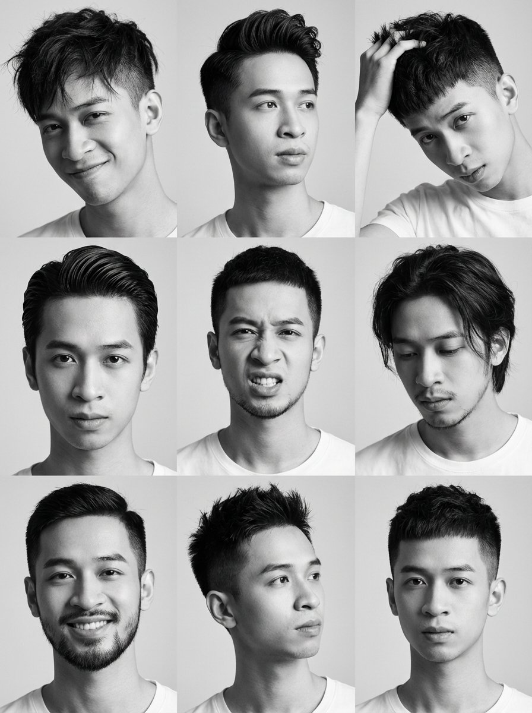

## Create a realistic Vogue magazine cover–style fashion po

- ID: gpt4o-1019-en-1
- Slug: prompt-1019-en-1
- 语言: en
- 来源: [来源链接](https://x.com/underwoodxie96/status/2004221776755376606)
- 样例图路径: images/part3/1019.jpeg

### 提示词

```text
Create a realistic Vogue magazine cover–style fashion portrait using the uploaded face as the original face reference (100% face identity preservation).

A young elegant woman posing confidently, maintaining her original facial features and natural beauty. She is winking with her left eye and making a playful duck-face expression. Both hands are raised, forming a love/heart gesture near her face.

She is surrounded by multiple DSLR cameras and smartphones held around her, as if paparazzi and photographers are capturing her from all directions. Some phones show her live image on their screens.

Appearance & styling: flawless glowing skin, natural makeup with glossy pink lips, soft blush, subtle highlights. Light brown hair styled in a low, neat updo with a few loose strands.

Outfit & accessories: elegant minimalist beige-white strapless evening dress, Louis Vuitton necklace, diamond ring, luxury fashion jewelry.

Photography style: close-up to half-body fashion portrait, Vogue editorial aesthetic, cinematic professional studio lighting, soft HDR background, shallow depth of field, realistic skin texture, ultra-detailed, 8K quality.

Camera & lens look: professional DSLR look, 85mm lens feel, f/1.8 aperture, crisp focus with smooth background bokeh.

Composition: Vogue magazine layout with large bold logo at the top, editorial fashion cover framing, clean and elegant design.

Mood & vibe: playful yet luxurious, high-fashion beauty editorial, realistic, not AI-looking, photographed by a professional fashion photographer.
```

### 样例图

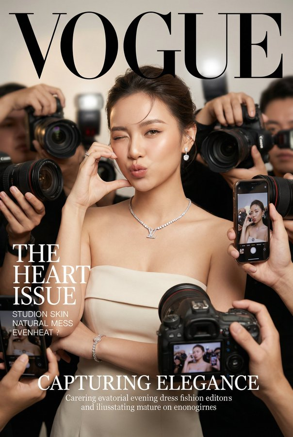

## 逼真的 Vogue 杂志封面风格的时尚肖像

- ID: gpt4o-1019-zh-2
- Slug: prompt-1019-zh-2
- 语言: zh
- 来源: [来源链接](https://x.com/underwoodxie96/status/2004221776755376606)
- 样例图路径: images/part3/1019.jpeg

### 提示词

```text
使用上传的人脸作为原始人脸参考，创作一幅逼真的 Vogue 杂志封面风格的时尚肖像（100% 保留人脸特征）。

一位年轻优雅的女子自信地摆着姿势，保持着她原本的五官和自然美。她眨着左眼，俏皮地嘟起了嘴。双手高举，在脸颊旁比出一个爱心的手势。

她周围摆满了单反相机和智能手机，仿佛狗仔队和摄影师正从四面八方拍摄她。有些手机屏幕上显示着她的实时影像。

妆容及造型：完美无瑕的透亮肌肤，自然妆容，粉嫩水润的唇妆，柔和的腮红，以及恰到好处的高光。浅棕色头发梳成低低的利落盘发，几缕碎发自然垂落。

服装及配饰：优雅简约的米白色无肩带晚礼服、路易威登项链、钻石戒指、奢华时尚珠宝。

摄影风格：特写至半身时尚人像，Vogue 杂志大片风格，电影级专业影棚灯光，柔和 HDR 背景，浅景深，逼真的皮肤纹理，超高细节，8K 画质。

相机和镜头外观：专业单反外观，85mm镜头手感，f/1.8光圈，对焦清晰，背景虚化柔和。

构图：Vogue杂志版式，顶部醒目大logo，时尚杂志封面式边框，简洁优雅的设计。

氛围与格调：俏皮又不失奢华，高级时尚美妆大片，真实自然，不像人工智能拍摄的，由专业时尚摄影师拍摄。
```

### 样例图


## 虚拟与现实的融合

- ID: gpt4o-1014-zh
- Slug: prompt-1014-zh
- 语言: zh
- 来源: [来源链接](https://x.com/berryxia/status/2005233233605398681)
- 样例图路径: images/part3/1014.jpeg

### 提示词

```text
A premium vertical split concept poster for [品牌名称] [产品名称], showing ONE [产品] split in half - left side realistic, right side deconstructed.

TOP SECTION - BRANDING:
- [品牌名称] official logo at top center ([品牌色])
- "[产品名称]" in large bold [字体风格] font in [颜色]
- Subtitle: "[产品Slogan]" in elegant serif font
- Optional secondary tagline

CENTRAL DESIGN - ONE SINGLE [产品] SPLIT VERTICALLY DOWN THE MIDDLE:

LEFT HALF OF THE [产品] (50%): Ultra-realistic photographic half
- Left 50% of the [产品] shown in ultra-realistic photography style
- Photorealistic [关键材质1: 如金属/皮革/食材] texture visible on left edge
- Half of [关键特征1: 如屏幕/面包/表面] with realistic reflections
- Left portion of [关键特征2: 如键盘/配件/层次] showing individual details
- Half of [关键特征3] visible with material accuracy
- Professional product photography lighting
- Perfect vertical cut through the exact center of the [产品]
- Every detail ultra-realistic: [材质细节列表]
- [可选: 烟雾/水珠/光晕] effect for atmosphere

RIGHT HALF OF THE [产品] (50%): Stylized [tech/culinary/artistic] deconstruction
- Right 50% of the [产品] exploding into [解构类型] components
- [组件1] floating away individually [具体描述]
- [组件2] fragments showing [内部结构/发光效果]
- [组件3] pieces with glowing [颜色] [元素: 如芯片/食材/零件]
- [组件4] separating geometrically
- [内部结构] and internal components visible
- [品牌元素/Logo] piece glowing independently
- [Warm golden/Cool blue/Neon multi-color] tech/artistic lighting effects
- Geometric [tech lines/motion lines/artistic trails], [holographic patterns/particle effects/ingredient splashes]
- Components floating outward in organized dynamic composition
- Illustrated/stylized art treatment (not photorealistic)
- [根据类型: 科技感电路/美食解构/时尚元素/机械零件]

THE SPLIT: Clean vertical line down the exact center of the [产品], one continuous [产品] transitioning seamlessly from realistic (left) to deconstructed [风格] art (right)

BACKGROUND: [深色/浅色] gradient ([色值1] to [色值2]) with [carbon fiber/wood/concrete/fabric] texture and [颜色] light particles

LIGHTING: Left side = professional studio lighting with [warm/cool/natural] tone | Right side = [warm/cool/neon] glow with [颜色] accents creating dramatic contrast

VERTICAL DIVIDING LINE: Subtle [golden/silver/blue/red] glow ([色值]) marking the center split of the [产品]

BOTTOM SECTION - PRODUCT FEATURES (arranged horizontally with icons):
- "[特点1]" with [icon描述] icon
- "[特点2]" with [icon描述] icon
- "[特点3]" with [icon描述] icon
- "[特点4]" with [icon描述] icon
Typography in [字体风格] font with decorative divider lines

COLOR PALETTE: [主色调列表]

COMPOSITION: One single [产品] centered vertically, split perfectly down the middle - left half ultra-realistic photography, right half exploding into stylized [解构类型] components

STYLE: Seamless transition from photorealistic product to illustrated [tech/culinary/fashion/mechanical] deconstruction within ONE unified [产品]

MOOD: [Premium/Appetizing/Innovative/Nostalgic], [dramatic/elegant/energetic], official brand advertising quality

TEXT STYLE: Mix of bold display fonts and elegant serifs, [品牌色] colors

Quality: Commercial advertising standard, 4K resolution, dramatic visual impact
```

### 样例图


## { "type": "image_prompt", "description": "High-resolutio

- ID: gpt4o-1008-en-1
- Slug: prompt-1008-en-1
- 语言: en
- 来源: [来源链接](https://x.com/xmiiru_/status/2005530723847934103)
- 样例图路径: images/part3/1008.jpeg

### 提示词

```text
{
  "type": "image_prompt",
  "description": "High-resolution photorealistic studio fashion portrait",
  "subject": {
    "gender": "adult woman",
    "hair": "long light brown hair with golden blonde highlights, loose curls",
    "expression": "playful, cheeky, thinking face, lips pursed",
    "pose": "looking off to the side, shoulders relaxed"
  },
  "outfit": {
    "hat": "gold shimmering party hat",
    "dress": "gold sequin party dress with modern asymmetric neckline cutout"
  },
  "props": {
    "balloons": "gold foil balloons shaped as numbers 20 and 26, one in each hand, raised near shoulders"
  },
  "environment": {
    "setting": "clean studio",
    "background": "neutral beige backdrop",
    "lighting": "soft studio lighting with gentle shadows"
  },
  "details": {
    "realism": "editorial-quality photorealism",
    "textures": "visible skin texture, detailed hair strands, sharp sequin detail",
    "materials": "metallic balloon shine with realistic creases and highlights"
  },
  "constraints": [
    "no text",
    "no logos",
    "no branding",
    "no watermarks"
  ]
}
```

### 样例图


## 2026写实摄影棚时尚肖像

- ID: gpt4o-1008-zh-2
- Slug: prompt-1008-zh-2
- 语言: zh
- 来源: [来源链接](https://x.com/xmiiru_/status/2005530723847934103)
- 样例图路径: images/part3/1008.jpeg

### 提示词

```text
{
"type": "image_prompt",
描述：高分辨率照片级写实摄影棚时尚肖像
“主题”： {
“性别”: “成年女性”
“头发”：“长长的浅棕色头发，带有金色挑染，蓬松的卷发”，
“表情”：“顽皮、俏皮、思考的表情，嘴唇紧抿”，
“姿势”：“看向一侧，肩膀放松”
},
“全套服装”： {
“帽子”：“闪闪发光的金色派对帽”，
“连衣裙”： “金色亮片派对连衣裙，现代不对称领口镂空设计”
},
"props": {
“气球”：“两只手中各拿着一个金色箔纸气球，形状分别为数字 20 和 26，举到肩膀附近”
},
“环境”： {
“设置”：“干净的工作室”，
“背景”： “中性米色背景”，
“灯光”：“柔和的影棚灯光，带有淡淡的阴影”
},
“细节”： {
“写实主义”: “编辑级照片写实主义”，
“纹理”：“可见的皮肤纹理、细致的发丝、清晰的亮片细节”，
“材质”：“金属质感的气球，带有逼真的褶皱和高光”
},
“约束”：[
“无文本”，
“无标志”，
“无品牌标识”
“无水印”
]
}
```

### 样例图


## { "subject": { "description": "A hyper-realistic optical

- ID: gpt4o-1005-en-1
- Slug: prompt-1005-en-1
- 语言: en
- 来源: [来源链接](https://x.com/hellokaton/status/2003381235331268757)
- 样例图路径: images/part3/1005.jpeg

### 提示词

```text
{
    "subject": {
        "description": "A hyper-realistic optical-illusion photograph. The woman from the uploaded reference portrait appears to be emerging from a freshly developed instant photo (Polaroid-style) lying on a small cafe table. In the instant photo frame, her full outfit is visible; in reality, her upper body and head rise out of the glossy print, casting a real shadow onto the table.",
        "reference_image_rules": {
            "use_uploaded_reference_portrait": true,
            "preserve_identity": true,
            "preserve_hairline_and_facial_structure": true,
            "no_face_morphing": true
        },
        "age": "20s",
        "expression": {
            "eyes": {
                "look": "Playful and confident",
                "direction": "Looking at the viewer"
            },
            "mouth": {
                "position": "Pouting or blowing a kiss",
                "energy": "Chic and charming"
            },
            "overall": "Lifelike, engaging interaction"
        },
        "hair": {
            "style": "Long, loose waves",
            "effect": "Realistic shine, slight wind movement"
        },
        "pose": {
            "position": "Upper torso emerging out of the instant photo, one hand slightly forward as if stepping into reality",
            "overall": "Energetic, spontaneous, full of life"
        },
        "clothing": {
            "top": "High-neck knit turtleneck, premium textile detail",
            "bottom": "Mini skirt and leather boots (boots visible clearly inside the instant photo)"
        }
    },
    "mirror_rules": "All handwritten annotations must be perfectly legible and NOT mirrored. Keep printed text on the instant photo frame readable.",
    "props": {
        "instant_photo": {
            "look": "Glossy Polaroid print with subtle fingerprint smudges and micro-scratches",
            "frame_text": "Small printed caption line at the bottom of the frame (readable, not mirrored)"
        },
        "annotations_on_print": [
            {
                "text": "leather boots",
                "style": "white handwritten marker",
                "arrow_to": "boots inside the print"
            },
            {
                "text": "clean turtleneck",
                "style": "white handwritten marker",
                "arrow_to": "top inside the print"
            },
            {
                "text": "mini skirt",
                "style": "white handwritten marker",
                "arrow_to": "skirt inside the print"
            }
        ]
    },
    "photography": {
        "camera_style": "DSLR photorealism, macro lens for print texture",
        "shot_type": "Forced-perspective composite realism",
        "angle": "Top-down 3/4 angle, close and intimate POV",
        "aspect_ratio": "3:4",
        "lighting": "Soft overcast daylight, natural shadows",
        "depth_of_field": "Shallow DOF, the instant photo and her face sharp, background cafe bokeh"
    },
    "background": {
        "setting": "Paris sidewalk cafe in autumn",
        "elements": [
            "small espresso cup",
            "fallen leaves",
            "stone pavement",
            "soft distant pedestrians bokeh"
        ]
    },
    "the_vibe": {
        "mood": "Fashion-forward, viral illusion",
        "story": "OOTD breakdown escaping the photo",
        "authenticity": "Photoreal texture, not CGI"
    },
    "constraints": {
        "must_keep": [
            "Use uploaded reference portrait identity",
            "Photorealistic skin texture",
            "Instant photo looks physically real",
            "Handwritten annotations readable",
            "Strong pop-out illusion with real shadows"
        ],
        "avoid": [
            "3D render style",
            "cartoon",
            "plastic skin",
            "blurred or mirrored text",
            "fake glossy CGI print"
        ]
    },
    "negative_prompt": [
        "3d",
        "render",
        "cgi",
        "cartoon",
        "anime",
        "plastic skin",
        "illegible text",
        "mirrored text",
        "oversharpened halos",
        "uncanny face"
    ]
}
```

### 样例图

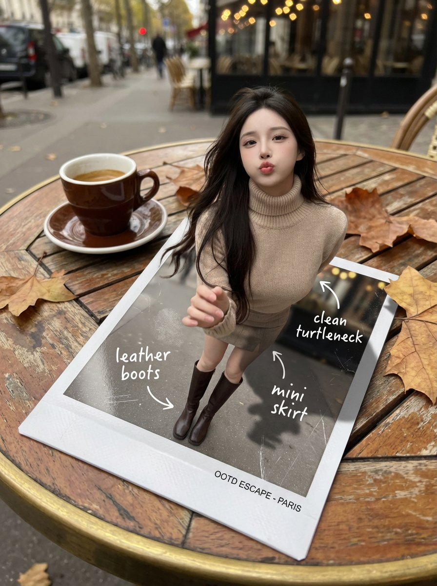

## 女子仿佛从刚冲洗出来的照片中浮现出来

- ID: gpt4o-1005-zh-2
- Slug: prompt-1005-zh-2
- 语言: zh
- 来源: [来源链接](https://x.com/hellokaton/status/2003381235331268757)
- 样例图路径: images/part3/1005.jpeg

### 提示词

```text
{
“主题”： {
描述：一张超逼真的光学错觉照片。上传的参考肖像中的女子仿佛从一张刚冲洗出来的拍立得照片（宝丽来风格）中浮现出来，照片放在一张小咖啡桌上。在拍立得照片的相框中，她的全身衣着清晰可见；而实际上，她的上半身和头部从光亮的照片中浮现出来，在桌面上投下真实的阴影。
"reference_image_rules": {
"use_uploaded_reference_portrait": true,
"preserve_identity": true,
"preserve_hairline_and_facial_structure": true,
"no_face_morphing": true
},
年龄：20多岁，
“表达”： {
"眼睛": {
外表：活泼自信
“方向”：“看着观众”
},
“嘴”： {
“姿势”：“撅嘴或飞吻”，
“能量”：“时尚迷人”
},
“总体而言”：“栩栩如生、引人入胜的互动”
},
“头发”： {
风格：长长的、蓬松的波浪卷发，
“效果”：“逼真的光泽，轻微的风动”
},
"姿势": {
“姿势”：“上半身从即时照片中浮现出来，一只手微微向前伸出，仿佛正步入现实。”
总体评价：精力充沛、率真、充满活力
},
“衣服”： {
上衣：高领针织衫，优质面料细节
“下装”：“迷你裙和皮靴（照片中可以清晰地看到靴子）”
}
},
“mirror_rules”：所有手写注释必须清晰可辨，且不得镜像。请保持即时照片相框上的打印文字清晰可读。
"props": {
"instant_photo": {
“外观”：“光亮的宝丽来照片，带有细微的指纹污渍和微划痕”，
"frame_text": "位于画框底部的小型印刷标题行（可读，非镜像）"
},
"annotations_on_print": [
{
文本：皮靴，
“风格”: “白色手写马克笔”，
"arrow_to": "打印内部的启动"
},
{
文本：干净的高领毛衣，
“风格”: “白色手写马克笔”，
"arrow_to": "打印内容的顶部"
},
{
文本：迷你裙，
“风格”: “白色手写马克笔”，
"arrow_to": "裙边在印刷品内"
}
]
},
“摄影”： {
“camera_style”: “DSLR 真实感，用于打印纹理的微距镜头”
"shot_type": "强制透视合成真实感",
“角度”：“俯视 3/4 角度，近距离亲密视角”，
"aspect_ratio": "3:4",
“光线”：“柔和的阴天日光，自然的阴影”，
"depth_of_field": "浅景深，即时成像照片，她的脸部清晰，背景是咖啡馆散景"
},
“背景”： {
“场景”: “秋天的巴黎街边咖啡馆”
“元素”：[
“小杯浓缩咖啡”，
“落叶”，
“石板路”，
“柔和的远景行人散景”
]
},
"氛围": {
“氛围”：“时尚前卫，病毒式传播的错觉”，
“故事”：“OOTD 解析，摆脱照片的束缚”
“真实性”：“照片级纹理，而非 CGI”
},
"约束": {
"must_keep": [
“使用上传的参考肖像身份”，
“逼真的皮肤纹理”，
“即时照片看起来非常逼真”，
“手写批注清晰可辨”
“强烈的立体感，带有真实的阴影”
],
“避免”： [
“3D渲染风格”，
“卡通片”，
“塑料皮肤”，
“模糊或镜像文字”，
“仿光泽 CGI 印刷”
]
},
"negative_prompt": [
“3d，”
“使成为”，
“cgi”，
“卡通片”，
“日本动画片”，
“塑料皮肤”，
“无法辨认的文字”，
“镜像文本”，
“过度锐化的光晕”，
“怪异的脸”
]
}
```

### 样例图


## { "subject": "3x3 grid collage of young woman in winter 

- ID: gpt4o-1004-en-1
- Slug: prompt-1004-en-1
- 语言: en
- 来源: [来源链接](https://x.com/oggii_0/status/2005494640347336753)
- 样例图路径: images/part3/1004.jpeg

### 提示词

```text
{
  "subject": "3x3 grid collage of young woman in winter forest",
  "clothing": "Brown teddy coat, white crop top, grey sweatpants, beige boots, brown beanie",
  "hair": "Long wavy brown, wearing beanie",
  "face": "Happy, laughing, smiling, candid expressions",
  "accessories": "Black SUV car in background",
  "environment": "Snowy forest road, pine trees, winter day",
  "lighting": "Soft overcast daylight",
  "camera": "Collage of full body, close-up, high angle, and rear view shots",
  "style": "Lifestyle collage, social media photo dump, energetic, winter travel, photorealistic"
}
```

### 样例图

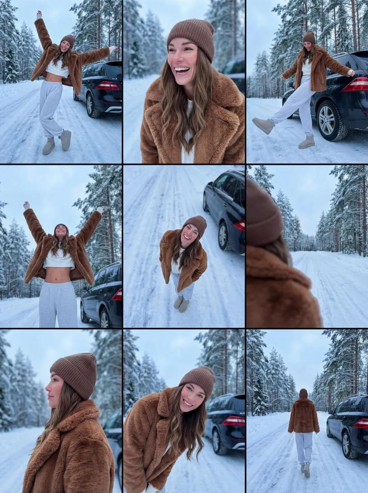

## 冬季森林中年轻女子的3x3网格拼贴画

- ID: gpt4o-1004-zh-2
- Slug: prompt-1004-zh-2
- 语言: zh
- 来源: [来源链接](https://x.com/oggii_0/status/2005494640347336753)
- 样例图路径: images/part3/1004.jpeg

### 提示词

```text
{
“主题”：“冬季森林中年轻女子的3x3网格拼贴画”，
“服装”：棕色泰迪熊外套、白色露脐上衣、灰色运动裤、米色靴子、棕色针织帽，
“头发”：“棕色长卷发，戴着毛线帽”，
“脸部”：“快乐、大笑、微笑、坦率的表情”，
“配件”：“背景中的黑色SUV汽车”
“环境”：“白雪皑皑的林间小路，松树，冬日”，
“照明”：“柔和的阴天日光”，
“相机”：“全身照、特写、高角度和后视图的拼贴照片”，
“风格”：生活方式拼贴、社交媒体照片合集、充满活力、冬季旅行、照片写实
}
```

### 样例图


## 香港维多利亚港烟花秀

- ID: gpt4o-1001-zh
- Slug: prompt-1001-zh
- 语言: zh
- 来源: [来源链接](https://x.com/LufzzLiz/status/2005286056850251802)
- 样例图路径: images/part3/1001.jpeg

### 提示词

```text
{
  "template_name": "新年城市天际线庆典 (人物定制版)",
  "description": "一个孩子俯瞰城市天际线的电影式镜头。支持基于参考图的人物形象定制、视角切换（正面/背面）以及自定义动作。画面中包含定制的烟花特效和巨大的“2026”字样。新增全局构图设定：采用鸟瞰远景视角，镜头与人物呈60度角，确保人物不遮挡城市夜景；人物服装风格与目标城市文化或地标元素相呼应。",
  "prompt_template": "一个令人惊艳的电影式镜头，采用鸟瞰远景构图，镜头与人物呈60度角，巧妙避开人物对背景的遮挡，完整展现壮丽的城市天际线。基于参考图片中的孩子形象，人物以{view_orientation}出现在画面中，头戴一顶奇趣的派对帽，身穿与{target_city_short}文化或地标相呼应的节日服装，站在高耸的山峰之巅。人物当前的动作为：{character_action}。背景是令人叹为观止的{target_city}城市夜景，标志性的城市地标在繁星点点的夜空下清晰可见。整个天空被{city_fireworks_effect}点亮。巨大的、闪耀的金色烟花在中心清晰地拼出了“2026”的字样。8K 分辨率，照片级真实感，电影颗粒感，营造出梦幻、宏大且充满希望的氛围，展现了高度精细的城市夜景。",
  "input_variables": {
    "target_city": {
      "type": "string",
      "description": "庆祝活动的城市名称和主要地标描述。",
      "default_value": "上海夜景，东方明珠塔、外滩和蜿蜒的黄浦江"
    },
    "target_city_short": {
      "type": "string",
      "description": "目标城市的简称或关键词，用于描述服装风格匹配（如'上海'、'巴黎'、'东京'等）。",
      "default_value": "上海"
    },
    "city_fireworks_effect": {
      "type": "string",
      "description": "烟花的风格、形状、颜色和氛围的描述。",
      "default_value": "一场壮观的迪士尼风格烟花表演，以米老鼠形状的烟花、童话般的柔和色彩、闪闪发光的魔法粉尘和梦幻般的层叠火花为特色"
    },
    "view_orientation": {
      "type": "string",
      "description": "人物相对于镜头的朝向。推荐：'背面剪影' 或 '正面（面带惊奇的笑容）'。",
      "default_value": "背面剪影"
    },
    "character_action": {
      "type": "string",
      "description": "人物的具体肢体动作。",
      "default_value": "双手高举过头顶，向着天空张开，身体微微后仰，充满惊奇和兴奋"
    }
  },
  "full_prompt_example": "一个令人惊艳的电影式镜头，采用鸟瞰远景构图，镜头与人物呈60度角，巧妙避开人物对背景的遮挡，完整展现壮丽的城市天际线。基于参考图片中的孩子形象，人物以背面剪影出现在画面中，头戴一顶奇趣的派对帽，身穿与上海文化或地标相呼应的节日服装，站在高耸的山峰之巅。人物当前的动作为：双手高举过头顶，向着天空张开，身体微微后仰，充满惊奇和兴奋。背景是令人叹为观止的上海夜景，东方明珠塔、外滩和蜿蜒的黄浦江在繁星点点的夜空下清晰可见。整个天空被一场壮观的迪士尼风格烟花表演点亮，以米老鼠形状的烟花、童话般的柔和色彩、闪闪发光的魔法粉尘和梦幻般的层叠火花为特色。巨大的、闪耀的金色烟花在中心清晰地拼出了“2026”的字样。8K 分辨率，照片级真实感，电影颗粒感，营造出梦幻、宏大且充满希望的氛围，展现了高度精细的城市夜景。"
}
城市：香港维多利亚港
人物：参考图片｜正面照。服装需替换与背景城市保持一致
动作: 双手过肩比心
```

### 样例图


## "image_generation":( "quality": "hyper-realistic", "face

- ID: gpt4o-999-en-1
- Slug: prompt-999-en-1
- 语言: en
- 来源: [来源链接](https://x.com/ZaraIrahh/status/2005816508602278010)
- 样例图路径: images/part3/999.jpeg

### 提示词

```text
"image_generation":(
"quality": "hyper-realistic",
"face": ("preserve_original": true, "reference_match'": true),
"subject":{
"description": "A stylish person with the same face.",
“clothing":{
"Top": ("type": "knitted sweater", "color": "light grey (Tom Theme) ". }
"pants": ("type": "high-waisted jeans", "color": "denim blue".
"shoes":("type": "high-top sneakers", "color": "white")
"pose": "standing with arm around a giant 3D Tom while Jerry
sits on Tom's shoulder",
"expression": "fun, mischievous"
"character_element":{
"name": "Tom & Jerry",
"type': "3D photorealistic duo",
"interaction': "Tom poses confidently, Jerry looks playful"
"environment-( "background'. (clean grey-blue backdrop"}
}
```

### 样例图

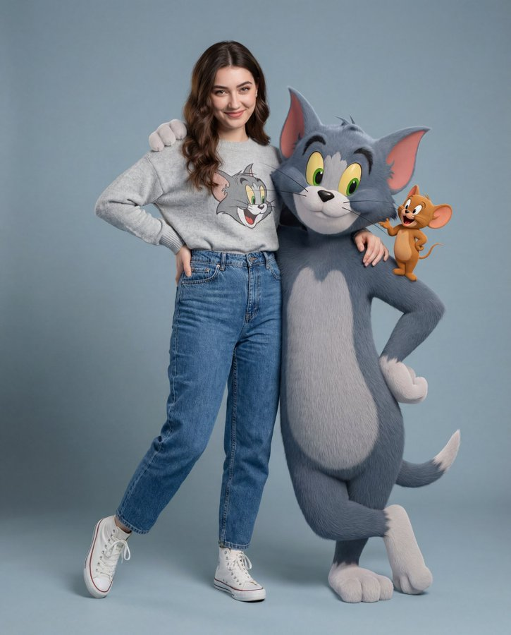

## 手臂搭在巨大的3D汤姆猫身上

- ID: gpt4o-999-zh-2
- Slug: prompt-999-zh-2
- 语言: zh
- 来源: [来源链接](https://x.com/ZaraIrahh/status/2005816508602278010)
- 样例图路径: images/part3/999.jpeg

### 提示词

```text
"image_generation" :(
“质量”：“超逼真”，
“face”: ("preserve_original": true, "reference_match": true),
“主题” :{
描述：一个穿着时尚但长相雷同的人。
“服装” :{
上衣：（类型：针织毛衣，颜色：浅灰色（汤姆主题））。
"裤子": "类型": "高腰牛仔裤", "颜色": "牛仔蓝"
“鞋子” :( “类型”：“高帮运动鞋”，“颜色”：“白色”）
“姿势”： “手臂搭在巨大的3D汤姆猫身上，而杰瑞……”
坐在汤姆的肩膀上”，
“表达方式”：“有趣，调皮”
"character_element" :{
"name": "汤姆和杰瑞",
“type”: “3D 逼真双人组”
“互动”：“汤姆自信地摆姿势，杰瑞看起来很顽皮”
"环境-("背景" . (干净的灰蓝色背景"}
}
```

### 样例图


## a fashion designer's sketch of an [elegant outfit or dre

- ID: gpt4o-995-en-1
- Slug: prompt-995-en-1
- 语言: en
- 来源: [来源链接](https://x.com/CharaspowerAI/status/2004937832163422365)
- 样例图路径: images/part3/995.jpeg

### 提示词

```text
a fashion designer's sketch of an [elegant outfit or dress] inspired by [ character], featuring [key iconic accessory or detail]. the design includes notes in pencil and ink, emphasizing details, [delicate embroidery or pattern details], and matching accessories.
```

### 样例图


## 时装设计师根据人物形象绘制草图

- ID: gpt4o-995-zh-2
- Slug: prompt-995-zh-2
- 语言: zh
- 来源: [来源链接](https://x.com/CharaspowerAI/status/2004937832163422365)
- 样例图路径: images/part3/995.jpeg

### 提示词

```text
一位时装设计师根据[人物]的形象绘制的[优雅服装或连衣裙]草图，以[关键标志性配饰或细节]为特色。设计图包含铅笔和墨水笔记，强调细节、[精致的刺绣或图案细节]以及配套配饰。
```

### 样例图


## 超逼真的电影感肖像

- ID: gpt4o-991-zh
- Slug: prompt-991-zh
- 语言: zh
- 来源: [来源链接](https://x.com/hx831126/status/2005219164009668903)
- 样例图路径: images/part3/991.jpeg

### 提示词

```text
超逼真的电影感肖像，高端时尚9：16画幅杂志风格摄影。

发型：短发，发丝被风吹拂，飘散在脸上，以时尚的方式部分遮挡面部特征。

主体：仅使用上传的面部参考图像作为主要拍摄对象。面部特征、骨骼结构和自然肤质（可见毛孔）需100%匹配。不得改变种族或性别特征。

服装：黑色复古皮夹克搭配红色高领细线针织（堆叠领口），佩戴金色项链，优雅现代的造型。

场景/环境：时间为冬天，街上有供暖热蒸汽，充满欧洲风格，一个复古公寓的门，门打开着，里面黑漆漆，

动作/动态：前景有人快速移动，动态模糊（长曝光效果）挡住部分画面和镜头。拍摄对象保持完美清晰、沉静。拍摄对象静止，轻微仰头，看着镜头，一只手拉着高领毛衣的领子扯着挡住下颌线和嘴唇（时尚杂志模特的post）位于画面的右侧。

构图：低角度仰拍人物，胸部以上竖幅肖像，主体人物位置偏右构图，线条简洁流畅

相机：24mm广角镜头低角度仰拍视角，浅景深，电影感虚化效果，专业的时尚写实风格。

光照：柔和的电影感光照，暖色调，营造氛围感。高光控制得当，阴影保留细节。

色彩/后期：高细节，高级色彩分级，自然的肤质纹理，微妙的胶片感（无明显颗粒）。无文字、无徽标、无水印。
```

### 样例图

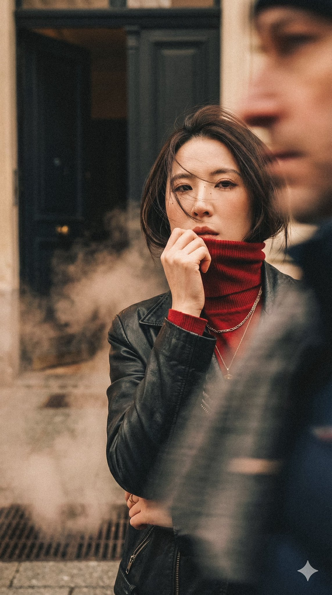

## Create a realistic high-fashion studio photo collage fea

- ID: gpt4o-990-en-1
- Slug: prompt-990-en-1
- 语言: en
- 来源: [来源链接](https://x.com/miilesus/status/2004620767087263838?referrer=grok.com)
- 样例图路径: images/part3/990.jpeg

### 提示词

```text
Create a realistic high-fashion studio photo collage featuring the same woman in six to eight different poses, using the uploaded face image as the exact facial reference (same facial structure, eyes, nose, lips, skin tone, and overall identity).

The woman has a slim and elegant body, natural proportions, pale to light skin tone, a delicate oval face, soft but sharp facial features, large expressive eyes, thin lips, and a calm, confident expression. Her hair is long, black, styled in a messy bun with loose strands falling naturally around the face.

Outfit: a tight black strapless mini dress, paired with sheer black thigh-high stockings, pointed-toe black stiletto heels with thin heels, and a formal black blazer worn in different ways across poses (fully worn, draped over one shoulder, hanging off one arm, or resting loosely on the arms). Accessories include a thin black choker necklace.

Poses included in the collage:

Standing front-facing full body pose, neutral expression, blazer hanging off the arms.

Standing back-facing pose with the head turned toward the camera, blazer worn on the shoulders, legs straight.

Squatting or semi-crouching pose with one leg forward, sharp gaze toward the camera.

Seated pose on a black chair with legs crossed, blazer off one shoulder, elegant and composed expression.

Seated low pose with knees bent, body leaning slightly forward, blazer worn on one arm only.

Half-body portrait facing the camera, shoulders relaxed, clean editorial look.

Environment: clean white seamless studio background with soft high-key lighting. Large softbox light placed in front and slightly to the side, creating soft shadows beneath the body. Even lighting that clearly shows fabric texture, skin detail, and shoe shine.

Photography style: high-end fashion editorial, professional studio photography, ultra high-definition, sharp focus, natural skin texture, realistic shadows, no lens distortion, accurate anatomy and proportions.

Composition: vertical fashion collage layout with evenly spaced images.

Aspect ratio: 9:16.
```

### 样例图

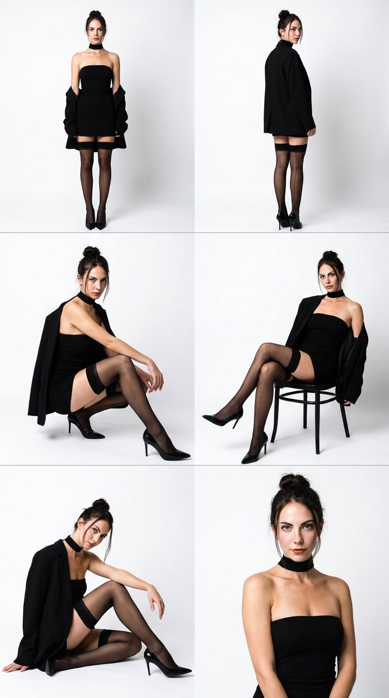

## 高级时装工作室照片拼贴画

- ID: gpt4o-990-zh-2
- Slug: prompt-990-zh-2
- 语言: zh
- 来源: [来源链接](https://x.com/miilesus/status/2004620767087263838?referrer=grok.com)
- 样例图路径: images/part3/990.jpeg

### 提示词

```text
使用上传的面部图像作为精确的面部参考（相同的面部结构、眼睛、鼻子、嘴唇、肤色和整体特征），创建一个逼真的高级时装工作室照片拼贴画，以同一位女性的六到八个不同的姿势为特色。

这位女士身材纤细优雅，比例匀称，肤色白皙，脸型精致，五官柔和却不失轮廓分明，双眼明亮动人，嘴唇纤薄，神态沉稳自信。她一头乌黑长发随意挽成一个发髻，几缕碎发自然垂落在脸颊两侧。

服装：一件紧身黑色无肩带迷你连衣裙，搭配黑色薄纱过膝长袜、黑色尖头细高跟鞋，以及一件黑色正式西装外套，外套在不同姿势下以不同方式穿着（完全穿上、披在一侧肩上、挂在一侧手臂上或随意搭在手臂上）。配饰包括一条黑色细颈链。

拼贴画中包含的姿势：

站立式全身像，正面朝向观众，表情平静，西装外套挂在手臂上。

背对镜头站立，头部转向镜头，西装外套披在肩上，双腿伸直。

蹲姿或半蹲姿，一条腿向前迈出，目光锐利地看向镜头。

她盘腿坐在黑色椅子上，西装外套滑落一侧肩膀，神态优雅沉稳。

坐姿低位，双膝弯曲，身体略微前倾，西装外套只搭在一只胳膊上。

半身像，面向镜头，肩膀放松，画面干净利落，适合杂志拍摄。

环境：洁净的白色无缝摄影棚背景，柔和的高调灯光。大型柔光箱放置在前方略偏一侧，在人体下方营造出柔和的阴影。均匀的光线清晰地展现了织物纹理、肌肤细节和鞋子的光泽。

摄影风格：高端时尚大片、专业影棚摄影、超高清、清晰对焦、自然肌肤纹理、逼真阴影、无镜头畸变、准确的解剖结构和比例。

构图：竖版时尚拼贴布局，图片间距均匀。

宽高比：9:16。
```

### 样例图


## Using the uploaded photo as the sole character reference

- ID: gpt4o-989-en-1
- Slug: prompt-989-en-1
- 语言: en
- 来源: [来源链接](https://x.com/aidavid125/status/2004699464255356984)
- 样例图路径: images/part3/989.jpeg

### 提示词

```text
Using the uploaded photo as the sole character reference, generate a vertical outfit poster.

【LAYOUT HARD RULES】
- Must have exactly 6 cards only, 2 rows × 3 columns (3 columns across, 2 rows down)
- Row 1: LOOK 1, 2, 3 | Row 2: LOOK 4, 5, 6
- Prohibited: 9-grid, 3 rows × 2 columns, 2-column layout, extra cards, top header/title

【CANVAS & LAYOUT】
- Vertical 4:5 aspect ratio, background #F7F5F2
- Grid occupies ≥92% of canvas height, bottom margin ≤3%
- Outer margin 2%, spacing 1.5%, strictly aligned

【CARD SPECIFICATIONS】
- White background #FFFFFF, border-radius 5%, stroke 1px #E5E7EB
- Top title bar: height 12%, background #F3F4F6, text color #111827
- Sans-serif font, alignment consistent throughout

【CHARACTER CONSISTENCY】
- All 6 must be the same person in different outfits: same face, same hairstyle, same body proportions, same demeanor
- Prohibited: switching people/changing face/altering gender features/extreme slimming or leg lengthening

【PHOTOGRAPHY QUALITY】
- Master-level studio full-body lookbook, 85mm portrait lens look
- Softbox key light + subtle fill, natural skin texture with light retouching
- Solid seamless background (white/light gray/off-white), no clutter

【UNIFORM CROPPING】
- 4:5 full-body, complete from head to shoes
- Subject centered, height 88%±2%
- Headroom 2-4%, footroom 3-5%, shoes fully visible
- All six shots: consistent camera height/focal length/lighting/pose

【OUTFIT RULES】
- Auto-adapt based on subject age (adult/child)
- Each look ≤3 core items, max 3 colors per outfit, accessories ≤2
- 6 looks distinctly different, but unified style: minimal/clean/polished/easy to recreate

【TITLE SETS】
Adult: Business/Classic → Casual/Weekend → Smart Casual/Evening → Resort/Vacation → Athleisure/Active → Layered/Transitional
Kids: Everyday/Clean → School/Polished → Weekend/Play → Party/Sweet → Active/Sporty → Layered/Cozy

NEGATIVE:
3x3, nine-grid, 9 cards, extra cards, 3 rows x 2 columns, two-column layout, big top header, page title, switching people, changing face, multiple people, lowres, blurry, plastic skin, wide-angle distortion, fisheye, warped body, extreme slimming, long legs effect, outdoor background, textured wall, cut off shoes, half body, adultification, sexy, lingerie, see-through, high heels (kids), heavy makeup (kids), watermark, cropped text
```

### 样例图

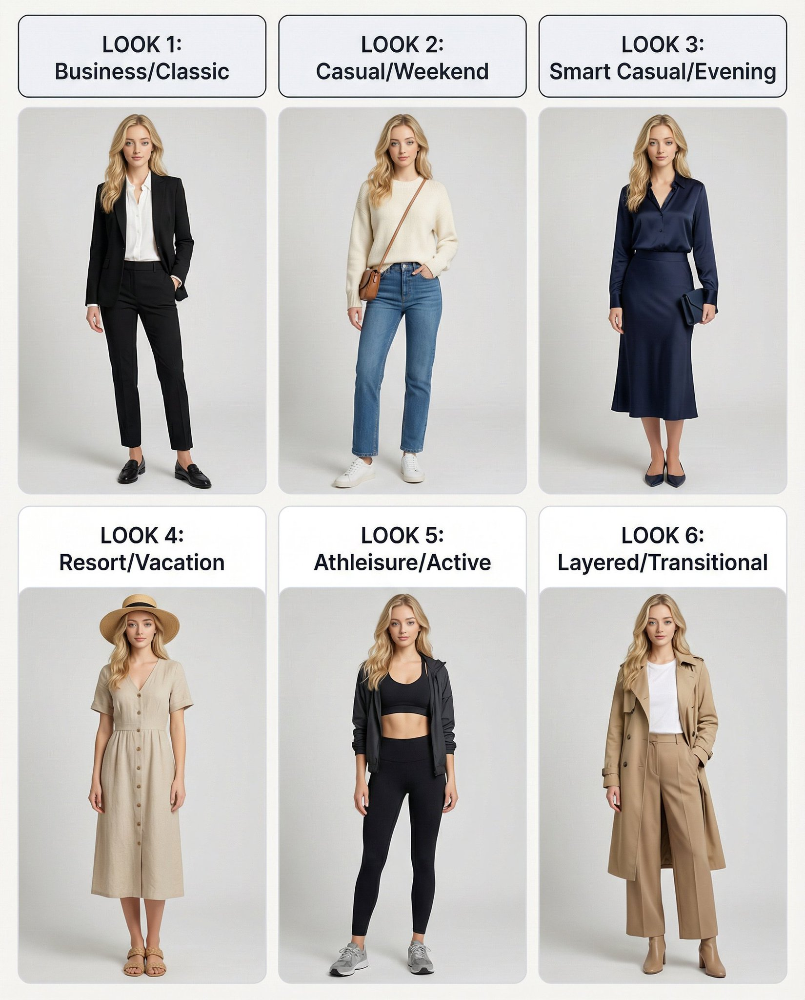

## 一张竖版服装海报

- ID: gpt4o-989-zh-2
- Slug: prompt-989-zh-2
- 语言: zh
- 来源: [来源链接](https://x.com/aidavid125/status/2004699464255356984)
- 样例图路径: images/part3/989.jpeg

### 提示词

```text
以上传的照片为唯一人物参考，生成一张竖版服装海报。

【布局硬性规则】
- 必须正好有 6 张卡片，2 行 × 3 列（横向 3 列，纵向 2 行down)
- 第 1 行：造型 1、2、3 | 第 2 行：造型 4、5、6
- 禁止使用：9格网格、3行×2列、2栏布局、额外卡片、顶部标题/标题

【画布与布局】
- 垂直4:5宽高比，背景#F7F5F2
- 网格占据画布高度的 92% ≥ ，底部边距为 3% ≤
  外边距 2%，行距 1.5%，严格对齐

【卡片规格】
- 白色背景#FFFFFF ，圆角 5%，描边 1px #E5E7EB
- 顶部标题栏：高度 12%，背景色#F3F4F6 ，文本颜色 #111827
- 无衬线字体，对齐方式始终一致

【角色一致性】
- 这6个人必须是同一个人，只是穿着不同的衣服：同样的脸，同样的发型，同样的身材比例，同样的举止。
- 禁止：换人/改变容貌/改变性别特征/极端瘦身或拉长腿部

【摄影质量】
- 大师级影棚全身写真集，85mm 人像镜头拍摄效果
- 柔光箱主光 + 轻微补光，自然肌肤纹理，轻微修图
- 纯色无缝背景（白色/浅灰色/米白色），无杂物

【统一裁剪】
- 4:5 全身照，从头到脚完整呈现
- 以受试者为中心，身高 88%±2%
  头部空间2-4%，脚部空间3-5%，鞋子完全可见
- 所有六张照片：相机高度/焦距/光线/姿势均保持一致

【穿搭规则】
- 根据受试者年龄（成人/儿童）自动调整
- 每套造型≤ 3件核心单品，每套服装最多3种颜色，配饰≤ 2件
- 6 看起来截然不同，但风格统一：简约/干净/精致/易于复刻

【标题集】
成人：商务/经典→休闲/周末→商务休闲/晚装→度假/休闲→运动休闲/活力→叠穿/过渡装
儿童：日常/干净→上学/整洁→周末/玩耍→派对/甜美→活力/运动→多层/舒适

消极的：
3x3，九宫格，9张卡片，额外卡片，3行2列，双栏布局，顶部大标题，页面标题，人物切换，换脸，多人，低分辨率，模糊，塑料皮肤，广角畸变，鱼眼，身体扭曲，极度瘦身，长腿效果，户外背景，纹理墙，鞋子被剪掉，半身，成人化，性感，内衣，透视，高跟鞋（儿童），浓妆（儿童），水印，裁剪文字
```

### 样例图


## 角色拆解艺术海报

- ID: gpt4o-984-zh
- Slug: prompt-984-zh
- 语言: zh
- 来源: [来源链接](https://x.com/berryxia/status/2004088874684043595)
- 样例图路径: images/part3/984.jpeg

### 提示词

```text
核心指令 (Core Instruction)  任务：基于用户提供的参考图片，创作一张超高品质、电影级的3D皮克斯/迪士尼(Pixar/Disney)风格角色拆解艺术海报。将照片中的人物转换为风格化写实的3D动画角色，并将其个人物品以严谨的"Knolling"（整齐排列）艺术风格进行布局展示。  画面比例：16:9 横版 (可根据需求调整为 3:2, 4:5, 1:1) 艺术风格核心：皮克斯"风格化写实主义" (Stylized Realism) — 融合夸张的卡通比例与照片级真实材质光影。 质量标杆：对标《寻梦环游记(Coco)》、《青春变形记(Turning Red)》、《夏日友晴天(Luca)》的官方角色宣传海报。  📷 物品布局 (Item Layout) - Knolling放射式构图 总物品数：30-36件，围绕角色呈90度直角或放射状有序排列。  分类1：时尚穿搭 (Fashion Atelier) - 香槟金标签 - 主服装拆解：衣袖、衣领、布料裁片、内衬等全部分离悬浮。 - 鞋履拆解：鞋底、鞋面、鞋带、鞋跟等分离。 - 随身配饰：腰带、包袋、帽子、围巾等。 *示例：一件风衣可拆解为翻领、肩章、腰带、袖口束带、主衣身等部分。*  分类2：美妆个护 (Beauty Collection) - 玫瑰金标签 - 彩妆：口红（带膏体切面和色号标签）、眼影盘（每格颜色清晰）、粉饼、香水瓶（液体折射清晰可见）。 - 护肤：精华液瓶、面霜罐、美容仪器。 *示例：一瓶香水需展现玻璃瓶身的通透感、液体内部的光线折射以及瓶盖的金属质感。*  分类3：数码生活 (Modern Essentials) - 钢蓝色标签  - 电子设备：带手机壳的智能手机（屏幕需有内容）、无线耳机、智能手表、笔记本/平板电脑、相机。 - 材质要求：金属、玻璃（带折射）、塑料等材质需有正确的粗糙度和反射效果。 *示例：一部相机可拆解为镜头、机身、闪光灯、存储卡、肩带等。*  分类4：个人爱好 (Luxury & Hobbies) - 24K金标签  - 奢华配饰：珠宝首饰（项链、耳环、戒指等，宝石需有色散效果）、品牌包袋（展示内部分隔和五金件）。 - 兴趣爱好：画笔、调色盘、书籍、乐器、运动装备、咖啡用具等。 *示例：一个手办可拆解为头部、身体、四肢、武器、地台等组件。*  每件物品要求： - 渲染质量：与角色同等级别的3D渲染精度。 - 编号标签：带有01-36的圆形编号徽章。 - 材质与阴影：应用PBR材质，投射逼真的软阴影。   📷 爆炸视图技术 (Exploded View Technique)  - 连接线：使用优雅的虚线/实线将悬浮的服装部件连接到角色身上。 - 引导箭头：使用装饰性箭头将物品指向其文字标签。 - 技术注释：   - 材质样本：展示织物、皮革等材质的微距特写方块。   - 材质标签：如"100%真丝"、"意大利小牛皮"。   - 测量标尺：带有厘米(cm)/英寸(in)标记的标尺。  📷 角色拆解艺术 · THE ART OF DECONSTRUCTION 📷"   字体：中文用典雅的衬线体（如方正宋刻本秀楷），英文用Playfair Display，带金箔效果。 - 副标题 (Subtitle)：（主标题下方，飘逸手写体）   "角色本质·艺术拆解 / Character Essence Unveiled"   中英文混排，字体优雅。 - 分类标题 (Category Headers)：（带图标的圆角矩形标签）   "📷 美妆个护"** (玫瑰金)   "📷 数码生活"** (钢蓝色)   "📷 设计元素 (Design Elements)  - 几何框架：使用装饰艺术(Art Deco)风格的六边形/圆形细线框（0.5-1pt粗细）来组织物品群组。 - 测量标尺：沿画面左右边缘放置，营造技术美学感。 - 十字准星：在画面四角和关键焦点处添加。 - 材质样本：在底部展示一排面料/皮革/金属的微距特写方块。 - 信息卡片：带优雅边框的卡片，用于展示物品的详细信息。 - 雷达图：用装饰框包裹的角色属性雷达图，如：优雅★★★★★, 风格★★★★★, 智慧★★★★★。 - 连接线条：使用金色/银色的优雅虚线和装饰性箭头。  📷 背景与氛围 (Background & Atmosphere)  - 背景渐变：从白色到奶油色/香槟色的暖色调渐变，或从浅灰到白色的冷色调渐变。 - 图案叠加：叠加一层低透明度（5-10%）的装饰艺术几何网格或蓝图线条。 - 暗角效果 (Vignette)：轻柔的边缘变暗效果，将焦点引向中心。 - 氛围粒子：柔和的金色散景(Bokeh)光斑和微妙的胶片颗粒(Film Grain)，营造电影感。  📷 清晨6:00 → 📷 创作进行时 → 📷 色彩方案 (Color Palette) - 女性/时尚主题：香槟金(#D4AF37), 玫瑰金(), 奶油色(), 樱花粉()。 - 男性/科技主题**：钢蓝色(#4A90E2#4A4A4A#C0C0C0), 电光蓝(#00D9FF)。 - 正式/奢华主题：纯黑(#000000), 24K金(#FFD700), 深红色(#8B0000), 象牙白(#FFFFF0)。 - 情侣主题：男性一侧使用冷色调，女性一侧使用暖色调，形成对比。  📷 技术规格 (Technical Specifications) 渲染参数 (Rendering) - 引擎：路径追踪(Path Tracing)，等同于Cycles/Arnold/RenderMan级别。 - 采样数：最低4096 SPP (Samples Per Pixel)，确保画面纯净无噪点。 - 光线弹射：12次，以获得准确的全局光照。 - 焦散(Caustics)：开启，用于钻石和玻璃的真实光线折射效果。 - 模型面数：角色多边形数200万以上，确保曲面平滑。 - 毛发：每个角色超过10万根发丝，并经过物理模拟。  PBR材质流程 (Materials - PBR Workflow)  - 皮肤：三层SSS，双层高光。 - 毛发：各向异性着色器，主副双高光。 - 织物：微观编织法线贴图，准确的粗糙度变化。 - 金属*：金属度(Metalness) 1.0，粗糙度(Roughness) 0.1-0.4。 - 玻璃：折射率(IOR) 1.5，钻石IOR 2.42并带色散(Dispersion)。 - 皮革：粗糙度0.6-0.7，带颗粒感的凹凸贴图。  分辨率与输出 (Resolution & Output) - 分辨率：4K (3840×2160) 横版。 - 宽高比：16:9。 - 色深：32-bit浮点，为后期处理提供最大空间。 - 抗锯齿：16x MSAA，边缘锐利清晰。  📷 后期处理 (Post-Processing) - 色彩分级 (Color Grading)：   - 使用电影感LUT，提高暗部，避免纯黑（最低RGB 15,15,15）。   - 温和的S型曲线增强对比度。   - 根据主题调整色温（暖色+200K，冷色-200K）。   - 整体饱和度-5%，重点色彩（如金色）饱和度+10%。 - **特效 (Effects)**：   - **辉光(Bloom)**：为高光区域添加柔和光晕。   - **胶片颗粒(Film Grain)**：模拟柯达Portra 400胶片的有机质感。   - **色差(Chromatic Aberration)**：在边缘添加极细微的色散。   - **暗角(Vignette)**：中等强度的暗角。   - **锐化(Sharpening)**：输出时进行适度锐化。  📷 特殊指令 (Special Instructions)  - **单人角色**：总计约30件物品，聚焦于个人生活方式。 - **情侣角色**：总计约36件物品（每人18件），用爱心符号连接，并使用性别区分的色调。 - **孕妇角色**：包含孕期用品（如托腹油、维生素、B超照片），在腹部附近添加婴儿图标。 - **核心要点**：必须根据参考照片匹配角色的年龄、职业和风格。  📷 质量基准 (Quality Benchmark) 最终成品必须在视觉上无法与皮克斯/迪士尼官方的角色营销海报区分开来，达到博物馆级的照片级3D渲染水准，适用于： - 奢华产品目录 - 高端时尚杂志内页 - 专业艺术品印刷 - 个人摄影作品集 - 品牌营销活动
```

### 样例图

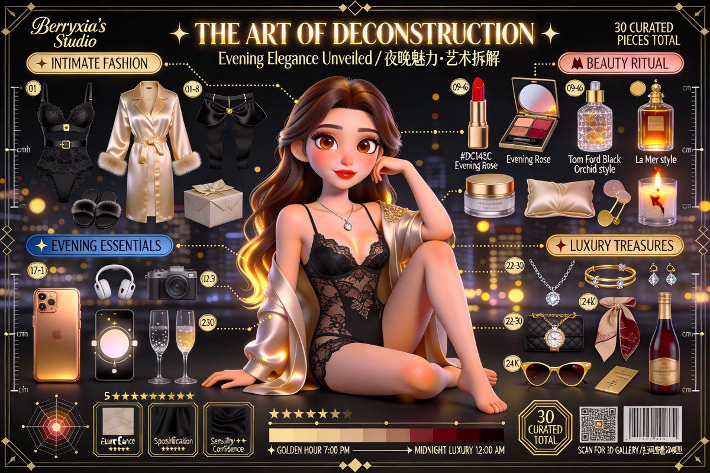

## { "image_prompt": { "reference": { "face_identity": "upl

- ID: gpt4o-977-en-1
- Slug: prompt-977-en-1
- 语言: en
- 来源: [来源链接](https://x.com/ZaraIrahh/status/2003476315828097321?referrer=grok.com)
- 样例图路径: images/part3/977.jpeg

### 提示词

```text
{
"image_prompt": {
"reference": {
"face_identity": "uploaded reference image",
"identity_lock": true,
"face_preservation": "100% identical facial structure, proportions, eyes, nose, lips, brows, skin texture, moles, and expression"
},
"subject": {
"gender": "female",
"age_range": "young adult",
"expression": "calm, focused, neutral competitive expression",
"pose": {
"action": "hands raised mid-clap",
"body_orientation": "three-quarter side profile",
"posture": "upright athletic stance"
}
},
"outfit": {
"top": "yellow and navy sleeveless volleyball jersey",
"armwear": "black compression arm sleeve on right arm",
"bottom": {
"type": "full-length black athletic pants",
"coverage": "legs fully covered at all times",
"fit": "sporty, fitted, opaque fabric"
},
"footwear": "not visible or cropped out"
},
"appearance": {
"hair": {
"style": "high ponytail with soft bangs",
"color": "dark brown"
},
"makeup": "natural sports makeup, light blush, subtle eyeliner",
"nails": "short, painted black"
},
"scene": {
"location": "indoor sports arena",
"background": "blurred volleyball court with pink and white wall panels",
"other_subjects": "teammates visible in soft background blur"
},
"lighting": {
"type": "bright indoor sports lighting",
"tone": "neutral and even",
"shadows": "soft"
},
"camera": {
"shot_type": "medium shot",
"angle": "eye-level",
"focus": "sharp focus on subject face and upper body",
"depth_of_field": "shallow background blur"
},
"constraints": {
"no_nudity": true,
"no_exposed_legs": true,
"legs_must_be_covered": "black pants required",
"no_outfit_changes": "jersey and arm sleeve remain identical",
"no_face_modification": true
},
"quality": {
"realism": "photorealistic",
"resolution": "8K ultra sharp",
"detail_level": "high"
}
}
}
```

### 样例图

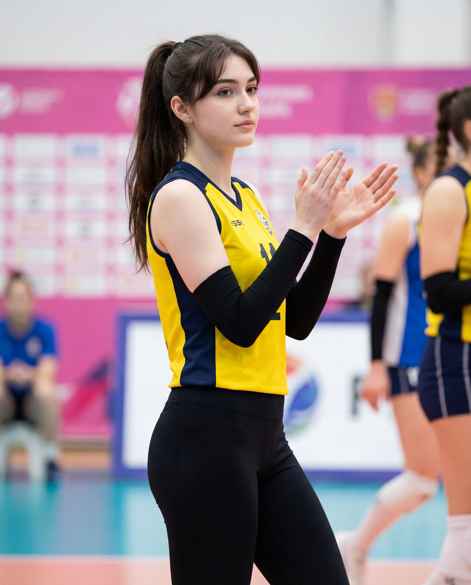

## 运动少女照片

- ID: gpt4o-977-zh-2
- Slug: prompt-977-zh-2
- 语言: zh
- 来源: [来源链接](https://x.com/ZaraIrahh/status/2003476315828097321?referrer=grok.com)
- 样例图路径: images/part3/977.jpeg

### 提示词

```text
{
"image_prompt": {
“参考”： {
"face_identity": "上传的参考图像",
"identity_lock": true,
"face_preservation": "100% 相同的面部结构、比例、眼睛、鼻子、嘴唇、眉毛、皮肤纹理、痣和表情"
},
“主题”： {
"性别": "女性",
"age_range": "青年人",
“表情”：“冷静、专注、中立的竞争性表情”，
"姿势": {
“动作”：“双手在鼓掌过程中举起”，
"body_orientation": "四分之三侧脸轮廓",
“姿势”：“挺拔的运动姿态”
}
},
“全套服装”： {
“上衣”: “黄色和海军蓝无袖排球衫”
“臂套”：“右臂上的黑色压缩臂套”，
“底部”： {
“类型”: “黑色全长运动裤”
“覆盖范围”：“双腿始终完全被覆盖”，
“合身”： “运动型、修身、不透明面料”
},
“鞋类”： “不可见或已裁剪掉”
},
“外貌”： {
“头发”： {
“发型”：“高马尾配柔和刘海”，
颜色：深棕色
},
“妆容”：“自然运动妆，淡腮红，淡眼线”，
指甲：短的，涂成黑色
},
“场景”： {
地点：室内体育馆
“背景”：“模糊的排球场，带有粉色和白色的墙板”，
"other_subjects": "背景虚化中可见的队友"
},
“灯光”： {
类型：明亮的室内运动照明，
“色调”：“中性且均匀”，
“阴影”：“柔和”
},
“相机”： {
"shot_type": "中景镜头",
“角度”: “视线水平”
“焦点”: “清晰聚焦于拍摄对象的面部和上半身”，
景深：浅背景虚化
},
"约束": {
"no_nudity": true，
"no_exposed_legs": true,
“腿部必须遮盖”： “必须穿黑色裤子”
"no_outfit_changes": "球衣和袖子保持不变",
"no_face_modification": true
},
“质量”： {
“写实主义”: “照片写实主义”，
分辨率：8K 超清晰，
"detail_level": "高"
}
}
}
```

### 样例图


## { "image_analysis": { "subject": { "demographics": "Youn

- ID: gpt4o-968-en-1
- Slug: prompt-968-en-1
- 语言: en
- 来源: [来源链接](https://x.com/lexx_aura/status/2003145469451551070)
- 样例图路径: images/part3/968.jpeg

### 提示词

```text
{
"image_analysis": {
"subject": {
"demographics": "Young woman, white skin tone, roughly 20s",
"hair": "Long dark brunette hair styled in low twin-tails (pigtails) with a middle part",
"face": "Neutral expression, looking at phone screen, soft 'glam' makeup with mauve lipstick",
"accessories": "Black rimmed glasses resting on top of head, small gold pendant necklace, small gold hoop earrings"
},
"apparel": {
"top": "Chocolate brown, long-sleeve, scoop-neck fitted top",
"bottom": "Beige and black plaid pleated mini skirt featuring decorative black ribbon bows and lace-up details on the front",
"legwear": "Black semi-sheer thigh-high stockings",
"footwear": "Black patent leather block-heeled pumps"
},
"pose_and_action": {
"type": "Mirror selfie, full-body shot",
"posture": "Kneeling on the floor, legs tucked underneath, torso angled slightly to the right",
"hands": "Right hand holding a white smartphone (iPhone Pro style) covering part of face; left hand reaching back to touch the heel of the left shoe"
},
"environment": {
"location": "Modern, minimalist bedroom",
"flooring": "White fluffy shag rug on light wood floor",
"furniture": [
"Cream upholstered bed frame with white bedding",
"Pillow with delicate floral pattern",
"White wardrobe/closet doors in background"
],
"decor": "Large round mirror on wall reflecting a potted green plant (Monstera style) and window curtains"
},
"technical_specs": {
"lighting": "Soft natural daylight, diffuse indoor lighting, neutral color temperature",
"aesthetic": "Coquette, influencer fashion, soft girl, clean aesthetic",
"color_palette": ["Chocolate brown", "Beige", "White", "Black"]
}
}
}
```

### 样例图

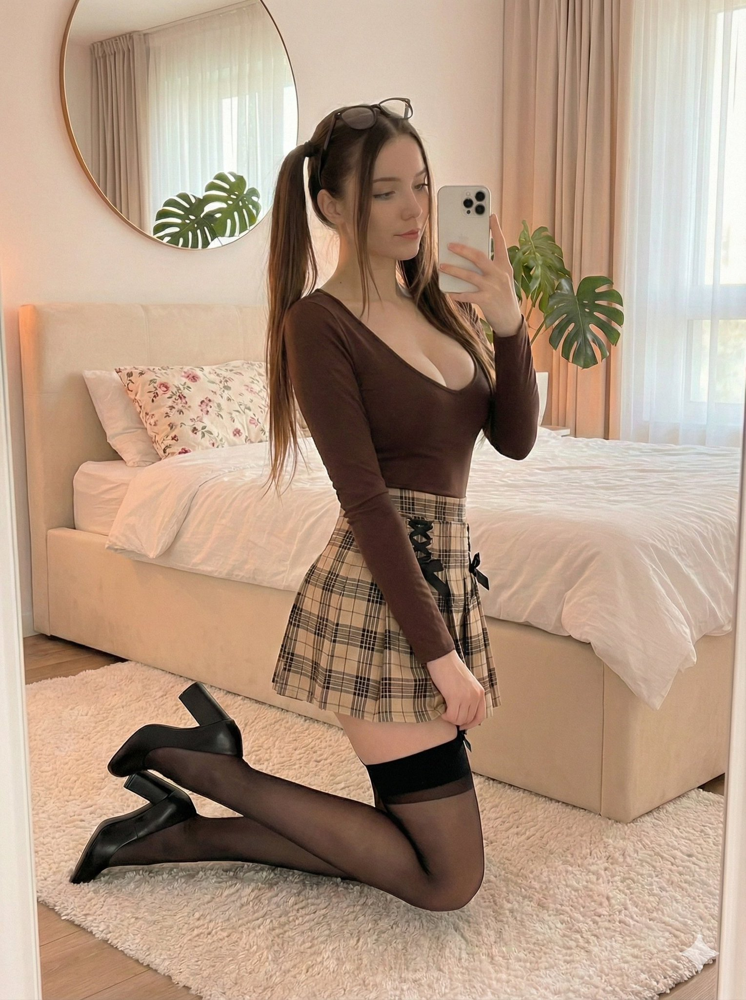

## 年轻漂亮的双马尾女子

- ID: gpt4o-968-zh-2
- Slug: prompt-968-zh-2
- 语言: zh
- 来源: [来源链接](https://x.com/lexx_aura/status/2003145469451551070)
- 样例图路径: images/part3/968.jpeg

### 提示词

```text
{
"image_analysis": {
“主题”： {
“人口统计信息”：“年轻女性，白皙肤色，大约20多岁”，
“头发”：“深棕色长发，梳成低低的双马尾（麻花辫），中分”，
“脸部”：“表情平静，看着手机屏幕，化着淡雅的‘魅惑’妆容，涂着淡紫色口红”，
“配饰”： “戴在头顶的黑框眼镜，小巧的金色吊坠项链，小巧的金色耳环”
},
"服装": {
“上衣”：巧克力棕色长袖圆领修身上衣
“下装”：“米色和黑色格子褶裥迷你裙，正面饰有黑色丝带蝴蝶结和系带细节”，
“腿部服饰”：“黑色半透明过膝长袜”，
鞋履：黑色漆皮粗跟高跟鞋
},
"pose_and_action": {
“类型”：“镜子自拍，全身照”，
“姿势”：“跪在地上，双腿蜷缩在身下，躯干略微向右倾斜”，
“双手”：右手拿着一部白色智能手机（iPhone Pro 款式），遮住了部分脸部；左手向后伸去触摸左鞋的鞋跟。
},
“环境”： {
位置：现代简约卧室
“地板”：“浅色木地板上铺着白色蓬松长毛地毯”，
“家具”： [
“米色软垫床架，配白色床品”
“带有精致花卉图案的枕头”
背景中的白色衣柜/壁橱门
],
“装饰”：“墙上挂着一面大圆镜，镜中映照着一盆绿色植物（龟背竹风格）和窗帘”。
},
"technical_specs": {
“照明”：“柔和的自然日光、漫射室内照明、中性色温”，
“美学”：“轻佻、网红时尚、温柔女孩、清新美学”
"color_palette": ["巧克力棕色", "米色", "白色", "黑色"]
}
}
}
```

### 样例图


## { "subject": { "description": "A stunning high-angle sho

- ID: gpt4o-964-en-1
- Slug: prompt-964-en-1
- 语言: en
- 来源: [来源链接](https://x.com/underwoodxie96/status/2003362169547817413)
- 样例图路径: images/part3/964.jpeg

### 提示词

```text
{
"subject": {
"description": "A stunning high-angle shot of a chic Asian fashion influencer with a cool, alluring attitude.",
"age": "20s",
"expression": {
"eyes": {
"look": "sharp fox-eyes, piercing gaze directed at camera",
"energy": "confident, slightly cold, seductive",
"details": "defined eyeliner, emphasized aegyosal"
},
"mouth": {
"position": "relaxed lips, subtle smirk",
"energy": "chic"
},
"overall": "stunning, high-visual-impact beauty"
},
"face": {
"preserve_original": false,
"makeup": "high-contrast makeup, pale porcelain skin, reddish gradient lips, sharp jawline, V-shape face",
"style": "cool-toned beauty, K-pop idol visual"
},
"hair": {
"color": "black",
"style": "long sleek straight hair with full straight bangs",
"effect": "glossy, high-fashion finish"
},
"body": {
"frame": "slim, petite, fragile aesthetic",
"pose": {
"position": "leaning forward significantly",
"overall": "dynamic foreshortening, emphasis on head and upper torso"
},
"skin": {
"tone": "cold fair skin",
"lighting_effect": "brightened face, soft beauty lighting, no dark shadows"
}
},
"clothing": {
"top": {
"type": "ultra-fine gauge knit top",
"color": "cool grey",
"details": "mock neck, skin-tight fit, lightweight thin fabric (not thick)",
"effect": "perfectly sculpting body curves, smooth texture"
},
"bottom": {
"type": "dark pencil skirt",
"details": "high waisted with thin luxury belt"
}
}
},
"photography": {
"camera_style": "High-end social media snapshot",
"angle": "High angle POV",
"shot_type": "Medium close-up",
"aspect_ratio": "9:16",
"texture": "clear, sharp, slightly filtered for beauty",
"lighting": "overcast cool daylight, soft diffuse light"
},
"background": {
"setting": "European classic architecture",
"atmosphere": "fashionable street corner",
"blur": "bokeh background to emphasize subject"
},
"negative_prompt": [
"round face",
"plain face",
"no makeup",
"warm yellow skin",
"chunky knit",
"thick sweater",
"loose clothing",
"wrinkled fabric",
"dull eyes",
"friendly boring smile",
"low resolution",
"dark lighting"
]
}
```

### 样例图

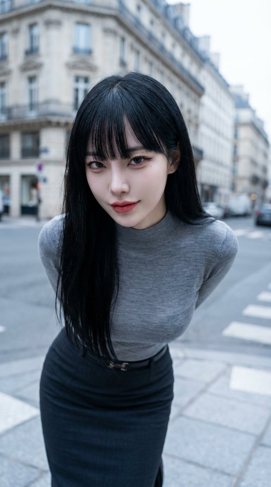

## 时髦的亚洲时尚博主

- ID: gpt4o-964-zh-2
- Slug: prompt-964-zh-2
- 语言: zh
- 来源: [来源链接](https://x.com/underwoodxie96/status/2003362169547817413)
- 样例图路径: images/part3/964.jpeg

### 提示词

```text
{
“主题”： {
“描述”：“一张令人惊艳的高角度照片，展现了一位时髦的亚洲时尚博主，她拥有酷炫迷人的气质。”
年龄：20多岁，
“表达”： {
"眼睛": {
“眼神”：“锐利的狐狸眼，目光锐利地盯着镜头”，
“能量”：“自信、略带冷漠、诱人”，
“细节”： “精致的眼线，突出的卧蚕”
},
“嘴”： {
“姿势”：“嘴唇放松，带着一丝不易察觉的微笑”，
“能量”： “时尚”
},
“总体评价”：“令人惊艳、极具视觉冲击力的美感”
},
“脸”： {
"preserve_original": false,
“妆容”：“高对比度妆容，苍白瓷白的肌肤，红润渐变的嘴唇，棱角分明的下颌线，V字脸”，
风格：冷色调美人，K-pop偶像视觉形象
},
“头发”： {
“颜色：黑色”，
“发型”：“长而柔顺的直发，配以齐刘海”，
效果：光泽亮丽、时尚感十足
},
“身体”： {
“框架”：“纤细、娇小、脆弱的美学”，
"姿势": {
“姿势”：“明显向前倾斜”，
“整体”： “动态透视缩短，强调头部和上半身”
},
“皮肤”： {
色调：冷白皮肤，
"lighting_effect": "提亮面部，柔和美颜光，无阴影"
}
},
“衣服”： {
“顶部”： {
“类型”：“超细针织上衣”，
颜色：冷灰色，
“细节”：“高领，紧身剪裁，轻薄面料（不厚）”
“效果”：“完美勾勒身体曲线，质地光滑”
},
“底部”： {
类型：深色铅笔裙，
“细节”：“高腰设计，配以纤细奢华腰带”
}
}
},
“摄影”： {
“camera_style”: “高端社交媒体快照”
"角度": "高角度POV",
"shot_type": "中近景",
"aspect_ratio": "9:16",
“质感”：“清晰、锐利、略带滤镜效果，更显美感”，
“照明”：“阴天冷色调的日光，柔和的漫射光”
},
“背景”： {
“背景”：“欧洲古典建筑”，
“氛围”：“时尚街角”，
“模糊”： “散景背景以突出主体”
},
"negative_prompt": [
“圆脸”，
“朴素的脸”，
“素颜”
“温暖的黄色皮肤”，
“粗针织物”，
“厚毛衣”，
宽松的衣服
“皱巴巴的布料”，
“眼神呆滞”，
“友善而乏味的微笑”，
“低分辨率”，
“昏暗的灯光”
]
}
```

### 样例图


## 圣诞特辑-圣诞小精灵

- ID: gpt4o-962-zh
- Slug: prompt-962-zh
- 语言: zh
- 来源: [来源链接](https://x.com/songguoxiansen/status/2003101132378591474)
- 样例图路径: images/part3/962.jpeg

### 提示词

```text
(杰作, 最高画质, 超细节, 8k分辨率). 一张照片般逼真的4格分屏拼图，所有画面为同一女性角色。[关键：保持精确的面部特征，保留原始脸部结构，整个拼图中角色完全一致]. 角色皮肤白皙，质感自然，眼神明亮。左上图：角色穿着绿色的圣诞精灵服装，戴着尖尖的精灵耳朵道具，对着镜头敬礼，表情顽皮。右上图：角色手里拿着一个巨大的玩具锤子，假装要敲打镜头，眼睛睁得圆圆的。左下图：角色正在包装礼物，嘴里咬着丝带的一端，眉头微皱显得很专注可爱。右下图：角色坐在礼物堆上，双手托腮，双脚悬空晃动，一脸满足。环境：色彩饱和的圣诞工坊背景，红绿撞色。灯光：明亮的影棚灯光，无阴影，卡通感强。风格：K-pop专辑内页风格，色彩鲜艳跳跃，清晰对焦，活泼搞怪。
```

### 样例图

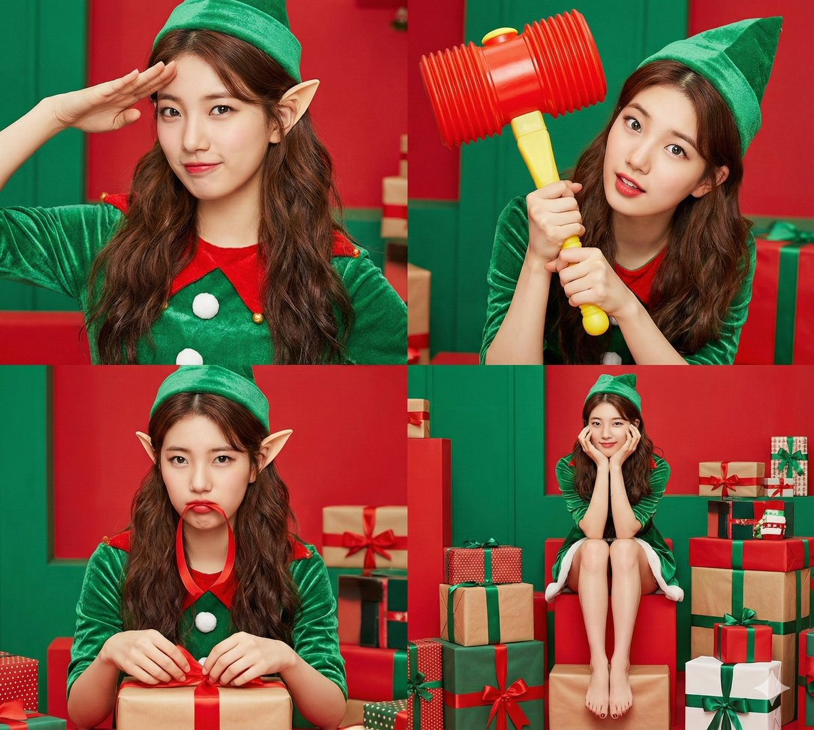

## 不同服装风格的贴纸

- ID: gpt4o-952-zh
- Slug: prompt-952-zh
- 语言: zh
- 来源: [来源链接](https://x.com/linxiaobei888/status/2003003721827987592)
- 样例图路径: images/part3/952.jpeg

### 提示词

```text
一个以上传照片为原型的3*3贴纸包，人物穿着不同服装和时尚风格。边缘干净裁剪，带有粗线条轮廓，姿势富有表现力，整体采用活泼的现代贴纸设计。在每个贴纸旁边采用中英文标注风格，所有贴纸保持相同的面部特征、一致的相似度和比例。
包含教师装、传统、护士制服、街头潮牌和奇幻灵感等多种服装风格。高分辨率成品，带有柔和阴影和光泽贴纸纸张质感，适合社交分享。
```

### 样例图

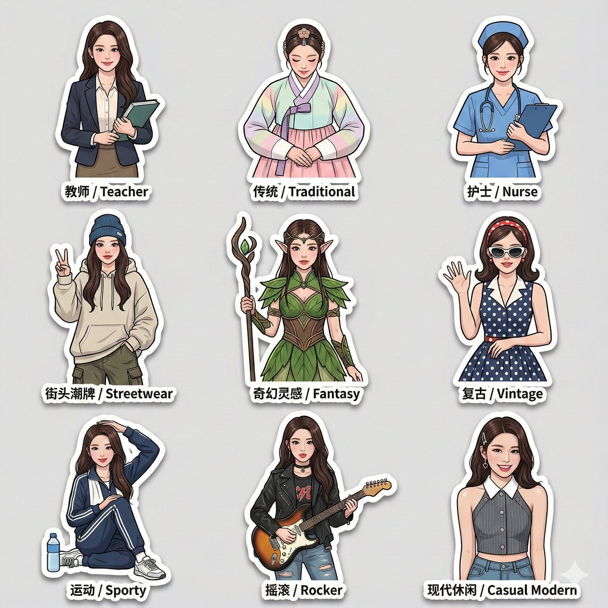

## (Magazine cover layout, minimalist composition, negative

- ID: gpt4o-949-en-1
- Slug: prompt-949-en-1
- 语言: en
- 来源: [来源链接](https://x.com/songguoxiansen/status/2002735852284457029)
- 样例图路径: images/part3/949.jpeg

### 提示词

```text
(Magazine cover layout, minimalist composition, negative space). A full-body studio shot of the specific character sitting on a tall stool. [CRITICAL: Ensure the face is exactly the same as the reference].

Styling: Minimalist chic outfit (black turtleneck, jeans). A long red scarf flowing down. Wearing subtle reindeer antlers. Props: A single red Christmas bauble hanging from a string right above her hand. Snowflake light patterns projected on the background wall. Background: Solid light grey or white seamless paper. Lighting: Soft, directional light creating a clean look with defined shadows. Style: Vogue or Elle magazine style, high fashion, clean lines, modern and sophisticated.
```

### 样例图

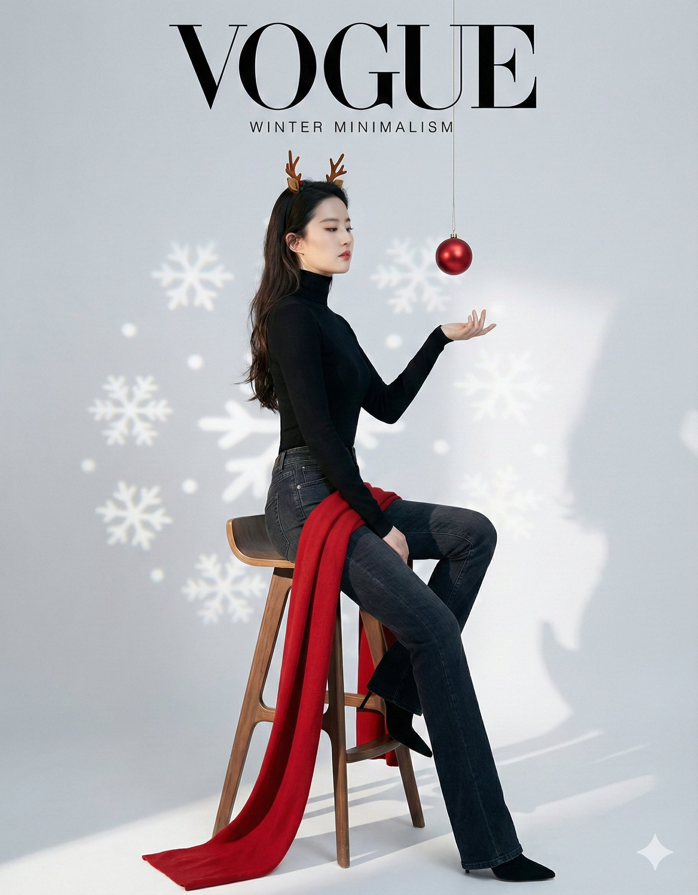

## 圣诞特辑-红韵点睛圣诞风尚志

- ID: gpt4o-949-zh-2
- Slug: prompt-949-zh-2
- 语言: zh
- 来源: [来源链接](https://x.com/songguoxiansen/status/2002735852284457029)
- 样例图路径: images/part3/949.jpeg

### 提示词

```text
（杂志封面版式，极简构图，留白设计）特定人物坐在高脚凳上的全身棚拍造型。【重点要求：务必保证人物面部与参考图完全一致】
造型：简约时髦穿搭（黑色高领毛衣、牛仔裤），一条红色长围巾垂坠飘动。佩戴低调的驯鹿角发饰。道具：一颗红色圣诞装饰球用细绳悬挂，恰好位于她的手上方。背景：雪花光影图案投射于背景墙面；背景采用纯色浅灰或白色无缝背景纸。光线：柔和定向光，打造干净利落的视觉效果，同时形成轮廓清晰的阴影。风格：《Vogue》或《Elle》杂志风格，高奢时尚，线条简洁，兼具现代感与精致格调。
```

### 样例图


## { "project_title": "High-End Studio Fashion Editorial '5

- ID: gpt4o-943-en-1
- Slug: prompt-943-en-1
- 语言: en
- 来源: [来源链接](https://x.com/BeautyVerse_Lab/status/2002263911413031260)
- 样例图路径: images/part3/943.jpeg

### 提示词

```text
{
"project_title": "High-End Studio Fashion Editorial '5-Panel Wide Film' Collage",
"structure": "Asymmetric 2-column layout: Left column contains 2 stacked panels; Right column contains 3 stacked panels. Total height of both columns is identical.",
"aspect_ratio": "3:4",
"aesthetic_theme": {
"style": "Professional studio editorial mixed with seamless vintage film strip aesthetic",
"mood": "Minimalist, sophisticated, balanced yet dynamic",
"color_palette": [
"Clean whites",
"Sophisticated charcoals",
"Soft champagne gold",
"Deep black film borders",
"Neutral skin tones"
],
"textures": [
"Subtle film grain",
"Matte celluloid finish",
"Seamless cyclorama wall",
"High-fashion fabric textures"
]
},
"framing_and_borders": {
"type": "Integrated 5-panel wide film strip",
"details": [
"The layout is a single large rectangular film frame divided into 5 segments",
"Authentic film rebate with sprocket holes and frame numbers only on the FAR LEFT and FAR RIGHT outer vertical edges",
"The top and bottom outer edges are clean black film borders",
"Internal dividers: All internal lines (the central vertical divider and the horizontal lines on both sides) are simple, solid thin black lines"
]
},
"subject_reference": {
"source": "image_1.png",
"instruction": "The subject's physical appearance, complete outfit, and accessories must exactly match the person in image_1.png. Maintain visual consistency across all five frames."
},
"composition_layout": {
"left_column_stack": {
"dimensions": "Two stacked vertical panels",
"frames": [
{
"id": "frame_top_left",
"type": "Full-body studio editorial shot",
"setting": "Clean minimalist studio",
"pose": "Sophisticated standing pose, showcasing the full outfit silhouette",
"lighting": "High-contrast rim lighting"
},
{
"id": "frame_bottom_left",
"type": "Medium-shot editorial",
"setting": "Minimalist studio background",
"pose": "Artistic sitting or leaning pose, focusing on the upper body and garment flow",
"lighting": "Soft directional lighting"
}
]
},
"right_column_stack": {
"dimensions": "Three stacked horizontal panels matching the total height of the left column",
"frames": [
{
"id": "frame_top_right",
"type": "Close-up beauty portrait",
"setting": "Professional studio setup",
"pose": "Frontal view, elegant expression, focus on facial features",
"visual_effects": "Shallow depth of field, sharp focus on eyes"
},
{
"id": "frame_middle_right",
"type": "Candid BTS side-shot",
"setting": "Working studio environment with equipment visible",
"lighting": "Raw studio working lights",
"pose": "Relaxed, natural demeanor, perhaps looking at a monitor off-camera",
"props_and_details": "Visible C-stands and studio cables"
},
{
"id": "frame_bottom_right",
"type": "Dynamic detail or medium-shot",
"setting": "Studio corner with minimalist pedestal",
"lighting": "Butterfly lighting setup",
"pose": "Fashion-forward pose, highlighting accessories or specific outfit textures"
}
]
}
},
"central_element": {
"type": "Signature Overlay",
"content": "BeautyVerse",
"position": "Center of the entire composition, placed on the central vertical divider",
"style": {
"appearance": "Elegant fluid cursive, translucent white ink",
"texture": "Fine ink stroke",
"scaling": "Medium-sized"
}
}
}
```

### 样例图


## 五联宽幅胶片拼贴作品

- ID: gpt4o-943-zh-2
- Slug: prompt-943-zh-2
- 语言: zh
- 来源: [来源链接](https://x.com/BeautyVerse_Lab/status/2002263911413031260)
- 样例图路径: images/part3/943.jpeg

### 提示词

```text
{"项目标题": "高端影棚时尚大片《五联宽幅胶片》拼贴作品","布局结构": "非对称双栏布局：左栏包含 2 个竖向堆叠的画面单元；右栏包含 3 个竖向堆叠的画面单元，两栏总高度保持一致","画幅比例": "3:4","美学主题": {"风格定位": "专业影棚大片风格融合无缝复古胶片条质感","整体氛围": "简约高级，平衡且富有动感","色彩搭配": ["纯净白色","高级炭灰色","柔和香槟金色","深邃黑色胶片边框","自然裸肤色"],"质感表现": ["细腻胶片颗粒","哑光赛璐珞质感","无缝影棚弧形背景墙","高级时装面料肌理"]},"画框与边框设计": {"边框类型": "一体化五联宽幅胶片式边框","细节说明": ["整体构图为一个大型矩形胶片画框，内部划分为 5 个画面单元","仅在最左侧和最右侧的外垂直边缘保留真实的胶片边缘留白、齿孔及画面编号","上下外边缘为简洁的纯黑胶片边框","内部分割线：所有内部线条（竖向中分割线及两侧的横向分割线）均为简洁的纯黑色细实线"]},"人物参考要求": {"参考素材": "image_1.png","执行说明": "人物的外形、全套服装及配饰必须与 image_1.png 中的人物完全一致，所有五个画面单元需保持视觉统一性"},"构图布局细则": {"左栏堆叠区域": {"尺寸规格": "两个竖向堆叠的画面单元","画面设定": [{"编号": "左上画面","拍摄类型": "全身影棚时尚大片","场景设定": "极简干净的影棚环境","姿势要求": "优雅站姿，完整展现服装廓形","灯光方案": "高对比度轮廓光"},{"编号": "左下画面","拍摄类型": "中景时尚大片","场景设定": "极简影棚背景","姿势要求": "艺术感坐姿或倚靠姿势，聚焦上半身及服装垂坠感","灯光方案": "柔和定向光"}]},"右栏堆叠区域": {"尺寸规格": "三个横向排布的画面单元，与左栏总高度保持一致","画面设定": [{"编号": "右上画面","拍摄类型": "特写美妆肖像","场景设定": "专业影棚布景","姿势要求": "正面朝向镜头，表情优雅，聚焦面部五官","视觉效果": "浅景深处理，眼部精准对焦"},{"编号": "右中画面","拍摄类型": "抓拍式幕后侧拍镜头","场景设定": "工作状态下的影棚环境，可见各类设备","灯光方案": "影棚工作实景光源","姿势要求": "状态松弛自然，可设定为看向镜头外的监视器","道具与细节": "可见 C 型支架及影棚线缆"},{"编号": "右下画面","拍摄类型": "动感细节特写或中景镜头","场景设定": "影棚角落搭配极简展示台","灯光方案": "蝶形布光方案","姿势要求": "时尚感造型姿势，突出配饰细节或服装特定肌理"}]}},"核心视觉元素": {"元素类型": "标志性叠加文字","文字内容": "BeautyVerse","摆放位置": "整个构图的正中央，置于竖向中分割线上","风格设定": {"字体外观": "流畅优雅的草书字体，半透明白色墨效","笔触质感": "纤细精致的墨迹笔触","尺寸比例": "中等字号"}}}
```

### 样例图


## [BRAND NAME]: A high-end, glossy concept art magazine ed

- ID: gpt4o-939-en-1
- Slug: prompt-939-en-1
- 语言: en
- 来源: [来源链接](https://x.com/AmirMushich/status/2002029348132721016)
- 样例图路径: images/part3/939.jpeg

### 提示词

```text
[BRAND NAME]:
A high-end, glossy concept art magazine editorial photograph of a unique, unexpected functional object conceptualized and designed by the brand.

**1. The Concept & Object (AI Invention):**
Based on the design philosophy, heritage, and material vocabulary of the specified brand, the AI must invent a novel utility product (NOT standard clothing, shoes, or bags). Examples could be home goods, tech accessories, tools, or sporting equipment, reinterpretated through the brand's lens. The object should feel sculptural yet functional.

**2. Materials & Details (Hyper-Premium):**
The object is constructed from ultra-premium, highly tactile materials characteristic of the brand (e.g., patinated exotic leathers, brushed aerospace-grade titanium, sculpted matte ceramics, molded carbon fiber, or technical high-fashion textiles). Every detail is hyper-realistic: visible stitching, microscopic material grain, precision engravings, and complex texture contrasts.

**3. Photography & Lighting (Cinematic Studio):**
Shot on a medium format Phase One camera with a 100mm macro lens. Extremely shallow depth of field, with sharp focus on the hero details of the object and a creamy, smooth bokeh background. The lighting is sophisticated studio softbox lighting: gentle, enveloping fill light with precise rim lighting to accentuate contours and material textures.

**4. Environment:**
A seamless, impeccably clean studio cyclorama background in a pure, ultra-light pastel tone (e.g., desaturated mint, pale blush, or off-white), free of shadows.

**5. Layout & UI Elements (Strict Placement):**
- **Bottom Right Corner:** A small, understated, monochrome gray logo of the brand.
- **Bottom Left Corner:** Small, minimalist monochrome gray text describing the invented product. The font style looks like Manrope Regular with very tight tracking (kerning) and balanced line spacing. Example format: "CONCEPT STUDY: [AI inserts invented product name]. MATERIAL: [AI inserts main materials]. SS25."
```

### 样例图

![[BRAND NAME]: A high-end, glossy concept art magazine ed](../images/part3/939.jpeg)

## 概念艺术杂志的编辑照片

- ID: gpt4o-939-zh-2
- Slug: prompt-939-zh-2
- 语言: zh
- 来源: [来源链接](https://x.com/AmirMushich/status/2002029348132721016)
- 样例图路径: images/part3/939.jpeg

### 提示词

```text
[品牌名称]:
这是一张高端、光鲜亮丽的概念艺术杂志的编辑照片，展示了该品牌构思和设计的独特、出人意料的功能性物品。

** 1.概念与对象（人工智能发明） :**
基于指定品牌的设计理念、历史传承和材料语汇，人工智能必须创造一款新颖的实用产品（并非标准服装、鞋履或包袋）。产品示例可以是家居用品、科技配件、工具或运动器材，并以品牌视角进行重新诠释。该产品应兼具雕塑感和实用功能。

** 2. 材料与细节（超高端） :**
这款产品采用品牌标志性的超高端、触感极佳的材质打造而成（例如，做旧珍稀皮革、拉丝航空级钛金属、雕塑哑光陶瓷、模压碳纤维或高科技时尚面料）。每个细节都力求逼真：清晰可见的缝线、微观材质纹理、精准的雕刻以及复杂的质感对比。

** 3.摄影与灯光（电影工作室） :**
使用Phase One中画幅相机和100mm微距镜头拍摄。景深极浅，主体细节清晰锐利，背景则呈现柔和细腻的散景效果。灯光采用专业的影棚柔光箱：柔和的环绕式补光，辅以精准的轮廓光，凸显物体的轮廓和材质纹理。

** 4. 环境:**
一个无缝、无可挑剔的干净的摄影棚环形背景，采用纯净、超浅的粉彩色调（例如，褪色的薄荷绿、淡腮红或灰白色），没有阴影。

** 5. 布局和 UI 元素（严格放置） :**
- **右下角:**品牌的小巧、低调、单色灰色标志。
- **左下角:**描述发明产品的简洁单色灰色小字。字体样式类似Manrope Regular，字距非常紧凑（字距调整），行距均衡。示例格式：“概念研究：[AI插入发明产品名称]。材料：[AI插入主要材料]。2025春夏。”
```

### 样例图


## 女性正从她的手机屏幕中走出来

- ID: gpt4o-938-zh-1
- Slug: prompt-938-zh-1
- 语言: zh
- 来源: [来源链接](https://x.com/underwoodxie96/status/2002293540299420050)
- 样例图路径: images/part3/938.jpeg

### 提示词

```text
{

"subject": {

"description": "A hyper-realistic optical illusion photograph. A young Caucasian woman appears to be stepping out of a smartphone screen held in a hand. The screen displays the camera interface, capturing her boots, while her real upper body extends out of the phone into reality.",

"mirror_rules": "Ensure the phone screen clearly shows the iOS Camera UI (shutter button, mode text). Handwritten annotations must be legible and not mirrored.",

"age": "20s",

"expression": {

"eyes": {

"look": "Alluring and playful",

"energy": "Confident, direct",

"direction": "Looking at the viewer"

},

"mouth": {

"position": "Blowing a kiss or pouting",

"energy": "Chic and charming"

},

"overall": "Lifelike, engaging interaction"

},

"face": {

"preserve_original": "false",

"makeup": "Natural glam, matte foundation, defined European features",

"features": "High nose bridge, double eyelids, defined jawline"

},

"hair": {

"color": "Dark brown",

"style": "Long, loose waves, voluminous",

"effect": "Realistic shine, wind-blown effect"

},

"body": {

"frame": "Petite but proportionally realistic",

"waist": "Defined",

"chest": "Covered by turtleneck",

"legs": "Visible INSIDE the phone screen interface wearing boots",

"skin": {

"visible_areas": "Face, hands",

"tone": "Fair Caucasian skin",

"texture": "Ultra-realistic skin texture, visible pores, natural imperfections",

"lighting_effect": "Soft daylight"

}

},

"pose": {

"position": "Torso and head emerging vertically from the phone, legs displayed on the screen",

"base": "Dynamic standing pose",

"overall": "充满活力的随机姿势，让人感觉生命力满满"

},

"clothing": {

"top": {

"effect": "精致的穿搭，High-quality textile photography"

},

"bottom": {

"type": "Mini Skirt and Leather Boots",

"color": "Dark Grey (skirt), Brown (boots)",

"details": "Boots visible on the screen beneath the UI elements"

}

}

},

"accessories": {

"jewelry": "Gold rings on the photographer's hand (foreground)",

"device": "Smartphone with burgundy case. The screen is ACTIVE and DETAILED: it displays the IOS Camera App Interface (white circular shutter button at bottom, 'PHOTO' text).",

"prop": "On the phone screen: White handwritten-style text overlays with arrows pointing to the outfit elements (e.g., text 'suede jacket' with arrow, 'leather boots' with arrow)."

},

"photography": {

"camera_style": "DSLR photography, Macro lens for phone details",

"angle": "POV, High angle looking down at hand",

"shot_type": "Composite photography",

"aspect_ratio": "3:4",

"texture": "Sharp screen pixels, fingerprint smudges on screen, realistic fabric texture",

"lighting": "Overcast soft natural light",

"depth_of_field": "Background bench blurred (Bokeh), Phone screen UI and subject sharp"

},

"background": {

"setting": "Parisian Park in Autumn",

"wall_color": "Green bench, grey ground",

"elements": [

"Green park bench with text 'Le silence'",

"Autumn leaves"

],

"atmosphere": "Cinematic, realistic",

"lighting": "Natural ambient light"

},

"the_vibe": {

"energy": "Sophisticated, viral social media content",

"mood": "Fashion forward",

"aesthetic": "OOTD breakdown, creative edit",

"authenticity": "Photorealistic texture, not CGI",

"intimacy": "POV",

"story": "Fashion styling breakdown",

"caption_energy": "Styling brown suede & leather"

},

"constraints": {

"must_keep": [

"Caucasian ethnicity",

"Photorealistic skin",

"Camera UI elements on screen (shutter button)",

"Handwritten text annotations on screen",

"Pop-out effect"

],

"avoid": [

"Transparent phone screen",

"Blank screen",

"3D render style",

"Cartoon",

"Plastic skin"

]

},

"negative_prompt": [

"transparent screen",

"blank screen",

"glass phone",

"3d",

"render",

"cartoon",

"anime",

"plastic",

"drawing",

"illustration"

]

}
```

### 样例图

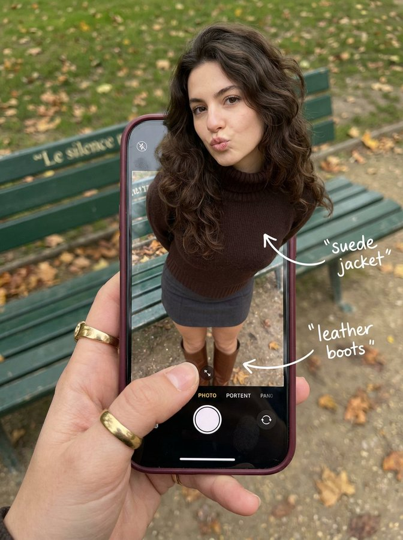

## 女性正从她的手机屏幕中走出来

- ID: gpt4o-938-zh-2
- Slug: prompt-938-zh-2
- 语言: zh
- 来源: [来源链接](https://x.com/underwoodxie96/status/2002293540299420050)
- 样例图路径: images/part3/938.jpeg

### 提示词

```text
{

“主题”： {

描述：一张超逼真的光学错觉照片。一位年轻的白人女性仿佛正从她手中的智能手机屏幕中走出来。屏幕显示的是相机界面，拍下了她的靴子，而她真实的上半身则从手机屏幕中延伸到现实世界。

“mirror_rules”：确保手机屏幕清晰显示 iOS 相机界面（快门按钮、模式文本）。手写注释必须清晰可辨，且不能镜像翻转。

年龄：20多岁，

“表达”： {

"眼睛": {

“外观”：“迷人而俏皮”，

“能量”：“自信、直接”

“方向”：“看着观众”

},

“嘴”： {

“姿势”：“飞吻或撅嘴”，

“能量”：“时尚迷人”

},

“总体而言”：“栩栩如生、引人入胜的互动”

},

“脸”： {

"preserve_original": "false",

“妆容”：“自然光泽，哑光粉底，凸显欧洲五官”，

特征：高鼻梁、双眼皮、轮廓分明的下颌线

},

“头发”： {

“颜色”：“深棕色”，

“发型”：“长而蓬松的波浪卷发”，

“效果”： “逼真的光泽，风吹效果”

},

“身体”： {

“画框”：“小巧但比例逼真”，

“腰部”：“线条分明”，

“胸部”： “被高领毛衣遮盖”

“腿”：“在手机屏幕界面内部可以看到穿着靴子的腿”，

“皮肤”： {

"visible_areas": "脸部、手部",

“肤色”: “白皙的白种人肤色”

“质感”：“超逼真的肌肤质感，可见毛孔，自然瑕疵”，

"lighting_effect": "柔和的日光"

}

},

"姿势": {

“位置”：“躯干和头部从手机中垂直伸出，腿部显示在屏幕上”，

"基础": "动态站姿",

"overall": "充满活力的随机姿势，让人感觉生命力饱满"

},

“衣服”： {

“顶部”： {

"effect": "精致的穿搭，高品质的纺织摄影"

},

“底部”： {

“类型”：“迷你裙和皮靴”，

颜色：深灰色（裙子），棕色（靴子）

“详情”：“屏幕上用户界面元素下方可见的靴子”

}

}

},

“配件”： {

“珠宝”：“摄影师手上（前景）的金戒指”，

“设备”：“智能手机，酒红色手机壳。屏幕已激活且显示清晰：显示 iOS 相机应用程序界面（底部有白色圆形快门按钮，显示‘照片’字样）。”

“道具”：“手机屏幕上：白色手写体文字叠加层，箭头指向服装元素（例如，文字‘麂皮夹克’带箭头，‘皮靴’带箭头）。”

},

“摄影”： {

“camera_style”: “单反摄影，手机微距镜头，用于拍摄细节照片”

“角度”：“POV，高角度向下看手”，

"shot_type": "合成摄影",

"aspect_ratio": "3:4",

“纹理”：“清晰的屏幕像素，屏幕上的指纹污渍，逼真的织物纹理”，

“光线”：“阴天柔和的自然光”，

景深：背景虚化（散景），手机屏幕界面和主体清晰

},

“背景”： {

“场景”：“秋天的巴黎公园”，

"wall_color": "绿色长椅，灰色地面",

“元素”：[

“绿色公园长椅上写着‘寂静’”

秋叶

],

“氛围”：“电影般的，逼真的”，

“照明”：“自然环境光”

},

"氛围": {

“能量”：“复杂、病毒式传播的社交媒体内容”，

“氛围”：“时尚前卫”，

“美学”：“OOTD分解，创意剪辑”

“真实性”：“照片级真实纹理，而非 CGI”。

“亲密感”: “POV”

“故事”：“时尚造型解析”

“caption_energy”： “棕色绒面革和皮革的时尚造型”

},

"约束": {

"must_keep": [

“高加索人种”

“逼真的皮肤”，

“屏幕上的相机用户界面元素（快门按钮）”

“屏幕上的手写文字注释”

“弹出效果”

],

“避免”： [

“透明手机屏幕”，

“空白屏幕”，

“3D渲染风格”，

“卡通片”，

“塑料皮肤”

]

},

"negative_prompt": [

“透明屏幕”，

“空白屏幕”，

“玻璃手机”，

“3d，”

“使成为”，

“卡通片”，

“日本动画片”，

“塑料”，

“绘画”，

“插图”

]

}
```

### 样例图


## cinematic portrait photography of a young woman sitting 

- ID: gpt4o-937-en-1
- Slug: prompt-937-en-1
- 语言: en
- 来源: [来源链接](https://x.com/ChillaiKalan__/status/2002572543992213748)
- 样例图路径: images/part3/937.jpeg

### 提示词

```text
cinematic portrait photography of a young woman sitting in a field at golden hour, soft natural light, silver-blonde short hair, minimal fashion with a black t-shirt and light bandana, fine art portrait style. emotional realism with calm expression, modern editorial mood, subject leaning against a mirror creating symmetrical reflection, high fashion editorial look, moody color grading, shallow depth of field, subject-isolation technique, viral visual composition, cinematic framing, contemporary visual storytelling. subtle texture in background, clean tones, artistic photography, urban stillness aesthetic blended with nature, soft contrast and gentle highlights.
```

### 样例图

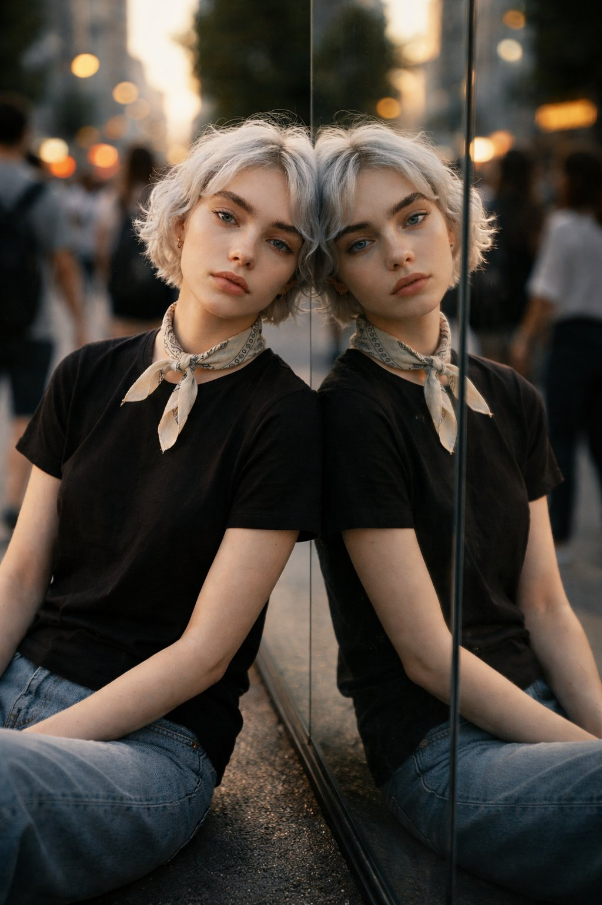

## 电影感十足的肖像摄影作品

- ID: gpt4o-937-zh-2
- Slug: prompt-937-zh-2
- 语言: zh
- 来源: [来源链接](https://x.com/ChillaiKalan__/status/2002572543992213748)
- 样例图路径: images/part3/937.jpeg

### 提示词

```text
电影感十足的肖像摄影作品，一位年轻女子坐在田野中，沐浴在柔和的自然光下，一头银金色短发，身着黑色T恤和浅色头巾，简约时尚，展现出精致的艺术肖像风格。她神态平静，情感真挚，散发出现代时尚气息。她倚靠在镜子前，镜中映出对称的影像，营造出高级时尚大片的视觉效果。照片采用情绪化的色彩分级、浅景深和主体分离技巧，构图极具冲击力，画面充满电影感，以当代视觉叙事手法呈现。背景纹理细腻，色调干净，展现出艺术摄影的魅力，将都市的静谧与自然的和谐融合，对比柔和，高光轻柔。
```

### 样例图


## { "variables": { "CITY_NAME": "Chengdu" }, "image_specs"

- ID: gpt4o-935-en-1
- Slug: prompt-935-en-1
- 语言: en
- 来源: [来源链接](https://x.com/0xbisc/status/2002664549930172496)
- 样例图路径: images/part3/935.jpeg

### 提示词

```text
{

"variables": {

"CITY_NAME": "Chengdu"

},

"image_specs": {

"aspect_ratio": "4:5", "resolution": "2048x2560", "quality": "ultra", "style_strength": 0.8, "detail_level": "high", "sharpen": "medium"

},

"prompt": {

"master_visual_brief": "A high-energy Y2K-inspired editorial collage poster with a strong paper-cut and magazine print aesthetic. The entire image has a tactile paper texture with visible cut edges and layered depth. The theme centers around the city {{CITY_NAME}}. All visual elements, including background imagery, stickers, symbols, typography, and graphic decorations, are culturally and visually inspired by {{CITY_NAME}}. The composition follows a fashion magazine cover logic with dense but controlled information, playful energy, and strong visual hierarchy. The character is designed as a dominant half-body portrait occupying most of the poster.", "photography_and_character": "Character: a randomly generated young woman aged approximately 18–25. She is fashionable, attractive, and trendy, with no fixed hairstyle, hair color, facial features, or makeup. Her appearance varies naturally but always remains stylish and visually appealing. Fashion style is Y2K-inspired street fashion with playful silhouettes, layered styling, and trendy colors. Framing is a strict half-body portrait: the image is cropped at the waist or slightly above, and the lower body is not visible at all. Only the upper torso, shoulders, neck, and head are shown. Pose and gesture: the character performs a randomly selected Y2K-style dynamic pose with strong tension and attitude, including expressive arm extensions, angular elbow bends, asymmetrical shoulder twists, or forward-reaching gestures. Body language remains bold, confident, and energetic. Facial expression: the expression is slightly playful and friendly, with a hint of cuteness layered on top of confidence. Subtle smiles, softly open lips, bright eyes, or a relaxed playful look are allowed, while the overall attitude remains fashion-forward and dynamic rather than cute-only.", "camera_and_lighting": "Editorial portrait framing with a wide-angle look at close distance, optimized for half-body composition. The camera captures only the upper torso and head, with the lower body fully cropped out of frame. Perspective supports dynamic Y2K poses without distorting facial proportions. Lighting is soft, even, and magazine-style, avoiding harsh shadows. The subject is intended to be cut out and integrated into a paper collage rather than rendered as pure realism.", "graphic_design_layout": "Center-focused editorial collage layout. At the top, the city name '{{CITY_NAME}}' appears as the main headline in bold uppercase geometric sans-serif letters. Each letter is placed on an individual colored paper rectangle and arranged in a slight arc. The large half-body character overlaps and partially covers the headline and nearby graphic elements, creating a break-the-frame effect. Surrounding the character are floating paper stickers, speech bubbles, and cut-out graphics inspired by {{CITY_NAME}} culture, including local food, landmarks, symbols, street signs, and iconic objects. The bottom section features a full-width magazine-style collage footer composed of layered paper strips, bold button-style typography, small editorial text blocks, and thumbnail-style graphics.", "background_system": "The background is a black-and-white or desaturated urban street scene from {{CITY_NAME}}, such as crowds, architecture, or city textures. Background contrast is reduced and softened with grain so it supports the composition without competing with the main subject. The background is partially obscured by the large half-body character and collage elements and maintains a printed-paper appearance rather than photographic realism.", "materials_and_textures": "A consistent paper-based aesthetic across the entire image. Visible paper grain, halftone dots, print noise, and slight ink bleed. All elements appear as physical paper cut-outs layered together. Edges are imperfect and tactile. Stickers, typography, and characters cast subtle shadows to suggest layered depth. No glossy, metallic, or digital materials are present.", "composition_and_balance": "Clear and stable visual hierarchy: top city headline '{{CITY_NAME}}', central half-body character (upper torso only), dynamic Y2K-style pose with slightly playful facial expression, surrounding city-themed stickers, and bottom magazine-style collage footer. Strong overlaps between character, typography, and stickers create depth while preserving the established layout."

},

"constraints": {

"must_include": \[ "City name headline using {{CITY_NAME}}", "Strict half-body portrait (waist-up only)", "Lower body completely cropped out", "Y2K-style dynamic pose with strong tension", "Playful but controlled facial expression", "Paper collage and cut-out magazine aesthetic", "City-specific background and stickers related to {{CITY_NAME}}", "Full-width magazine-style collage footer", "Visible paper texture and layered depth" \], "must_avoid": \[ "Full-body view", "Visible legs, knees, thighs, or feet", "Neutral or stiff poses", "Overly cute or childish expressions", "Sexualized expressions or gestures", "Grotesque facial distortion", "Minimalist or empty layouts", "Glossy digital or 3D materials" \]

},

"negative_prompt": "full body, legs visible, knees, thighs, feet, stiff pose, neutral posture, childish expression, exaggerated cute face, sexualized expression, blurry face, deformed hands, extra fingers, bad anatomy, grotesque distortion, minimalist layout, flat image, hyper-realistic photography, glossy surfaces, plastic skin, dull colors, watermark, logo, unreadable text",

"typography_rules": {

"headline": { "text": "{{CITY_NAME}}", "font_style": "bold geometric sans-serif, uppercase", "treatment": "each letter on a separate colored paper rectangle, slightly arched, subtle shadow", "material": "printed paper cut-out" }, "supporting_text": { "style": "editorial magazine blocks, playful sticker captions, speech bubbles", "material": "paper-based printed texture" }

},

"rendering_notes": {

"depth_layers": "background city paper layer -> mid-ground half-body character -> foreground dynamic pose, expressive face, stickers, and typography", "print_feel": "strong magazine print texture with halftone dots, paper grain, and slight ink bleed", "edge_treatment": "clearly visible imperfect cut paper edges"

}

}
```

### 样例图


## Y2K时代的拼贴海报

- ID: gpt4o-935-zh-2
- Slug: prompt-935-zh-2
- 语言: zh
- 来源: [来源链接](https://x.com/0xbisc/status/2002664549930172496)
- 样例图路径: images/part3/935.jpeg

### 提示词

```text
{

"变量": {

城市名称：成都

},

"image_specs": {

"aspect_ratio": "4:5", "resolution": "2048x2560", "quality": "ultra", "style_strength": 0.8, "detail_level": "high", "sharpen": "medium"

},

“提示词”： {

“视觉设计概要”： “这是一张充满活力、灵感源自Y2K时代的拼贴海报，具有强烈的剪纸和杂志印刷美感。整幅图像呈现出触感丰富的纸张纹理，可见的切割边缘和层次感。主题围绕着城市{{ CITY_NAME }}展开。所有视觉元素，包括背景图像、贴纸、符号、字体和图形装饰，都从文化和视觉上汲取灵感，源自城市{{ CITY_NAME }} 。构图遵循时尚杂志封面的逻辑，信息丰富但控制得当，充满活力，并具有清晰的视觉层次。人物被设计成占据海报大部分空间的半身肖像。” “摄影与人物”： “人物：一位随机生成的年轻女性，年龄在18至25岁之间。她时尚、迷人、潮流，没有固定的发型、发色、五官或妆容。她的外貌自然变化，但始终保持时尚和视觉吸引力。时尚风格是受Y2K时代启发的街头时尚。”俏皮的轮廓、层次丰富的造型和潮流的色彩。构图采用严格的半身像：画面裁剪至腰部或略高于腰部，下半身完全不可见。仅展现上半身、肩膀、颈部和头部。姿势和手势：人物摆出随机选择的Y2K风格动态姿势，充满张力和态度，包括富有表现力的手臂伸展、肘部角度弯曲、不对称的肩部扭转或向前伸展的动作。肢体语言大胆、自信且充满活力。面部表情：表情略带俏皮和友好，在自信之上又增添了一丝可爱。允许有淡淡的微笑、微微张开的嘴唇、明亮的眼神或轻松俏皮的表情，整体风格保持时尚前卫和动感，而非仅仅可爱。“相机和灯光”：“采用广角镜头近距离拍摄的编辑人像构图，针对半身像进行了优化。相机仅拍摄上半身和头部，下半身不可见。”人物身体完全裁剪出画面之外。透视效果支持动态的千禧年风格姿势，且不会扭曲面部比例。光线柔和均匀，采用杂志风格，避免了生硬的阴影。人物旨在被剪裁并融入纸质拼贴画中，而非以纯粹的写实手法呈现。平面设计布局：以中心为焦点的编辑拼贴画布局。顶部，城市名称“ {{城市名称}} ”以粗体大写几何无衬线字体作为主标题。每个字母都放置在单独的彩色纸质矩形上，并呈略微弧形排列。较大的半身人物与标题和附近的图形元素重叠并部分覆盖，营造出一种打破画面框架的效果。人物周围环绕着漂浮的纸质贴纸、对话气泡和剪纸图形，其灵感来自{{城市名称}}的文化，包括当地美食、地标、符号、路标和标志性物品。底部部分是一个由多层纸张组成的全宽杂志风格拼贴画页脚。条状文字、醒目的按钮式字体、小型编辑文本块和缩略图式图形。”, “背景系统”: “背景是来自{{城市名称}}的黑白或低饱和度城市街景，例如人群、建筑或城市纹理。背景对比度降低，并添加了颗粒感以柔化画面，从而在不干扰主体的情况下支持构图。背景部分被大型半身人物和拼贴元素遮挡，保持了印刷纸的外观，而非照片的真实感。”, “材质与纹理”: “整个图像保持一致的纸质美学。可见的纸张纹理、半色调网点、印刷噪点和轻微的墨迹晕染。所有元素都像是层叠在一起的实体纸片。边缘不完美且触感明显。贴纸、字体和人物投射出微妙的阴影，暗示出层次感。没有光泽、金属或数字材质。”, “构图与平衡”: “清晰稳定的视觉层次：顶部城市标题“ {{城市名称}} ”，中央半身人物（仅上半身），动态的千禧年风格姿势，略带俏皮的面部表情，周围环绕着城市主题贴纸，底部是杂志风格的拼贴页脚。人物、字体和贴纸之间的强烈重叠在保持既定布局的同时，营造出层次感。

},

"约束": {

"必须包含：" [ "使用城市名称作为标题{{ CITY_NAME }} ", "严格的半身像（仅腰部以上）", "下半身完全裁剪", "Y2K风格的动态姿势，充满张力", "俏皮但克制的表情", "纸质拼贴和剪贴杂志风格", "与城市相关的背景和贴纸{{ CITY_NAME }} ", "全宽杂志风格拼贴页脚", "可见的纸张纹理和层次感" ], "必须避免：" [ "全身照", "可见的腿、膝盖、大腿或脚", "中性或僵硬的姿势", "过于可爱或幼稚的表情", "性化的表情或手势", "怪诞的面部扭曲", "极简主义或空白的布局", "光面数字或3D材质" ]

},

"negative_prompt": "全身，腿部可见，膝盖，大腿，脚，僵硬姿势，中立姿势，幼稚表情，夸张可爱表情，性化表情，模糊面部，畸形手，多余手指，解剖结构错误，怪诞扭曲，极简布局，平面图像，超写实摄影，光滑表面，塑料皮肤，暗淡色彩，水印，标志，无法辨认的文字",

"typography_rules": {

"标题": { "正文": " {{城市名称}} ", "字体": "粗体几何无衬线字体，大写", "处理方式": "每个字母位于单独的彩色纸矩形上，略微拱起，带有微妙的阴影", "材质": "印刷纸剪裁" }, "辅助文本": { "风格": "杂志社论版块，趣味贴纸标题，对话气泡", "材质": "纸质印刷纹理" }

},

"渲染注释": {

"depth_layers": "背景：城市纸张层->中景：半身人物->前景：动态姿势、表情丰富的面部、贴纸和文字。"print_feel": "强烈的杂志印刷纹理，带有半色调网点、纸张纹理和轻微的墨迹晕染。"edge_treatment": "清晰可见的不完美裁切纸张边缘。"

}

}
```

### 样例图


## A cinematic fashion grid showing the uploaded photo styl

- ID: gpt4o-932-en-1
- Slug: prompt-932-en-1
- 语言: en
- 来源: [来源链接](https://x.com/AIwithkhan/status/2002567761151864933)
- 样例图路径: images/part3/932.jpeg

### 提示词

```text
A cinematic fashion grid showing the uploaded photo styled in different outfits: casual, formal, ethnic, streetwear, luxury, sporty. Same face, same pose, neutral background, editorial fashion layout.
Consistent facial features and proportions across all looks, with only clothing, styling, and accessories changing.
Soft professional studio lighting with balanced shadows for a high-end magazine feel.
Ultra-realistic fabric textures, refined color grading, sharp details, modern fashion editorial aesthetic.
```

### 样例图

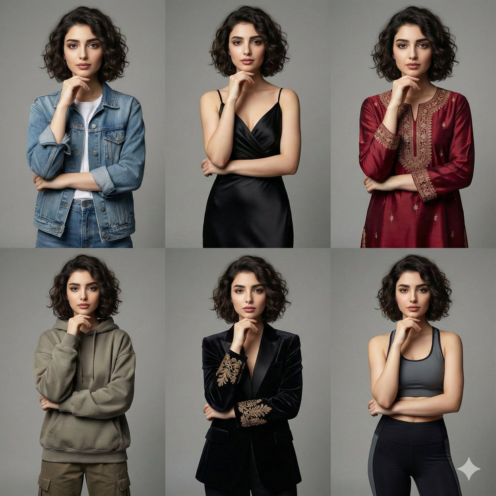

## 电影般的时尚网格图

- ID: gpt4o-932-zh-2
- Slug: prompt-932-zh-2
- 语言: zh
- 来源: [来源链接](https://x.com/AIwithkhan/status/2002567761151864933)
- 样例图路径: images/part3/932.jpeg

### 提示词

```text
一个电影般的时尚网格图，展示了上传的照片搭配不同服装的效果：休闲、正式、民族风、街头风、奢华风、运动风。同一张脸，同样的姿势，中性背景，时尚大片式的排版。
所有造型都保持一致的面部特征和比例，只有服装、造型和配饰会发生变化。
柔和的专业影棚灯光，搭配均衡的阴影，营造出高端杂志般的质感。
超逼真的面料纹理、精细的色彩分级、清晰的细节、现代时尚大片美学。
```

### 样例图


## A stylish woman wearing a black fedora and white shirt s

- ID: gpt4o-928-en-1
- Slug: prompt-928-en-1
- 语言: en
- 来源: [来源链接](https://x.com/AIwithSynthia/status/2002578332496638452)
- 样例图路径: images/part3/928.jpeg

### 提示词

```text
A stylish woman wearing a black fedora and white shirt stands against a soft neutral studio background, holding a wooden frame. Inside the frame is a photo watercolor portrait of herself, painted with loose brushstrokes, soft ink bleeds, and expressive splashes. The watercolor version tilts slightly, with vivid red lips and delicate facial details. Google Gemini Cinematic studio lighting, shallow depth of field, elegant editorial fashion aesthetic, fine art photography blended with watercolor illustration, ultra-high resolution, minimal composition, calm and sophisticated mood.
```

### 样例图

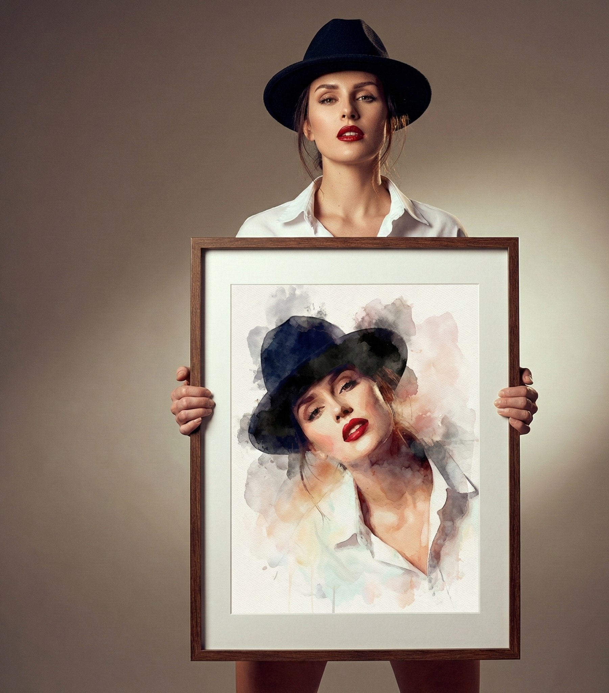

## 女士手持一个自己的木质相框

- ID: gpt4o-928-zh-2
- Slug: prompt-928-zh-2
- 语言: zh
- 来源: [来源链接](https://x.com/AIwithSynthia/status/2002578332496638452)
- 样例图路径: images/part3/928.jpeg

### 提示词

```text
一位身着黑色软呢帽和白色衬衫的时尚女士，站在柔和的中性色调摄影棚背景前，手持一个木质相框。相框内是一幅她本人的水彩肖像照片，笔触自由流畅，墨迹晕染自然，色彩泼洒灵动。水彩画略微倾斜，鲜艳的红唇和精致的面部细节跃然纸上。照片采用谷歌Gemini影棚灯光，浅景深，展现出优雅的时尚美学，将艺术摄影与水彩插画巧妙融合，超高分辨率，极简构图，营造出平静而精致的氛围。
```

### 样例图


## { "prompt": "Ultra realistic fashion editorial photograp

- ID: gpt4o-927-en-1
- Slug: prompt-927-en-1
- 语言: en
- 来源: [来源链接](https://x.com/xmiiru_/status/2002578056628601143)
- 样例图路径: images/part3/927.jpeg

### 提示词

```text
{
"prompt": "Ultra realistic fashion editorial photography of a stylish young woman posing next to a gray KAWS-style art figure, One knee on the floor, one leg bent forward, body slightly angled, one arm resting casually on the statue’s head, the other hand on hip. Confident fierce expression, sharp gaze toward camera. Wearing a vibrant orange bucket hat with butterfly emblem, white fitted crop t-shirt with orange butterfly graphics, bright orange track pants with white piping, white sneakers Small orange shoulder bag, subtle tattoos visible, braided hair accents, minimal jewelry. Monochrome orange streetwear aesthetic. Minimalist indoor space with gray walls and clean floor. Soft diffused studio lighting, realistic skin texture, sharp focus, high fashion streetwear vibe, professional photography, ultra-detailed, 8K resolution. Don't change original face",
"negative_prompt": "low quality, blur, bad anatomy, extra fingers, extra limbs, distorted pose, cartoon, anime, illustration",
"parameters": {
"aspect_ratio": "2:3",
"version": "6",
"style": "raw",
"quality": 2
}
}
```

### 样例图

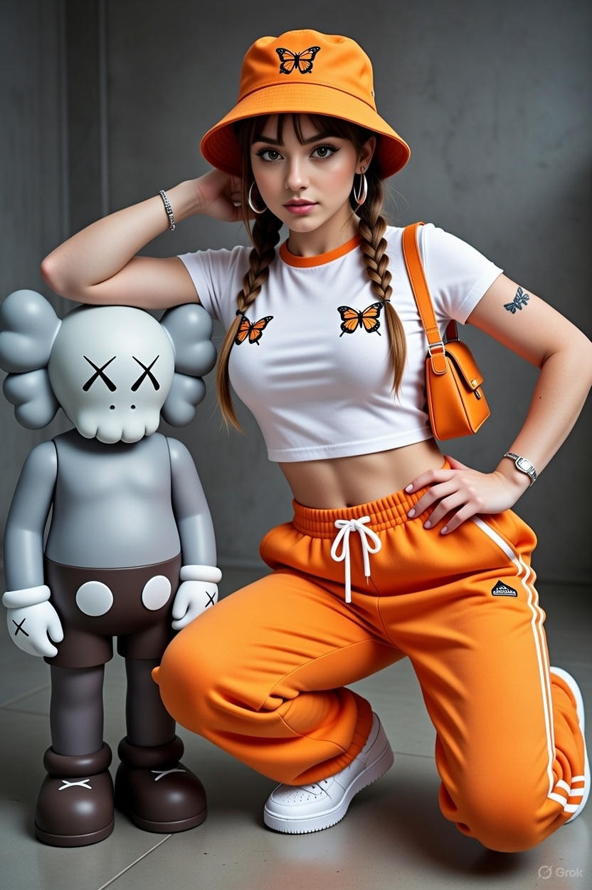

## 女性站在KAWS风格艺术雕塑旁

- ID: gpt4o-927-zh-2
- Slug: prompt-927-zh-2
- 语言: zh
- 来源: [来源链接](https://x.com/xmiiru_/status/2002578056628601143)
- 样例图路径: images/part3/927.jpeg

### 提示词

```text
{
“提示”：“超写实时尚大片，一位时髦的年轻女性站在一个灰色的KAWS风格艺术雕塑旁，单膝跪地，一条腿向前弯曲，身体略微倾斜，一只手臂随意地搭在雕塑的头部，另一只手叉腰。她表情自信而犀利，目光直视镜头。她戴着一顶饰有蝴蝶图案的亮橙色渔夫帽，一件印有橙色蝴蝶图案的白色修身露脐T恤，一条饰有白色滚边的亮橙色运动裤，一只白色运动鞋，一只小巧的橙色单肩包，隐约可见的纹身，编发点缀，佩戴极简的珠宝。整体呈现单色调的橙色街头服饰美学。极简主义的室内空间，灰色墙壁和干净的地板。柔和的漫射影棚灯光，逼真的皮肤纹理，清晰的焦点，高级时尚街头服饰氛围，专业摄影，超高细节，8K分辨率。请勿更改原图。”
"negative_prompt": "低质量、模糊、解剖结构错误、多余手指、多余肢体、姿势扭曲、卡通、动漫、插画",
“参数”： {
"aspect_ratio": "2:3",
版本：6，
"风格": "原始"
“质量”：2
}
}
```

### 样例图


## { "lighting": { "source": "Natural sunlight", "quality":

- ID: gpt4o-926-en-1
- Slug: prompt-926-en-1
- 语言: en
- 来源: [来源链接](https://x.com/xmliisu/status/2002367350146773079)
- 样例图路径: images/part3/926.jpeg

### 提示词

```text
{ "lighting": {
"source": "Natural sunlight",
"quality": "Golden hour, soft and warm",
"shadows": "Soft, well-defined shadows cast by the subject and boat elements",
"direction": "From the right, slightly backlit",
"highlights": "Bright highlights on the water, boat railing, and subject's hair"
},
"background": {
"details": "Specific buildings, church dome, beach activity are visible",
"setting": "Positano, Amalfi Coast, Italy",
"distance": "Far",
"elements": [
"Cliffside town with colorful buildings",
"Sandy beach with umbrellas and people",
"Dark blue sea",
"Other boats",
"Lush green vegetation on the cliffs"
],
"lighting_interaction": "Sunlight illuminates the town and cliffs, creating warm tones"
},
"typography": {
"color": "#2E4A7D",
"location": "On the side of the blue boat in the background right",
"font_style": "Sans-serif, uppercase, bold",
"description": "Boat name and registration details",
"text_content": "BLU RIDE"
},
"composition": {
"balance": "Asymmetrical balance between the subject in the foreground and the town in the background",
"framing": "Medium shot",
"perspective": "Slightly low angle, looking up towards the subject and background",
"leading_lines": "The boat's railing and deck lead the eye towards the subject and the town",
"depth_of_field": "Deep, with both subject and background in focus",
"rule_of_thirds": "Subject positioned in the lower right intersection"
},
"color_profile": {
"mood": "Warm, vibrant, luxurious",
"contrast": "Medium-high",
"saturation": "High",
"color_scheme": "Analogous blues and greens with warm earth tones",
"dominant_colors": [
"#2E4A7D",
"#F2F2F2",
"#C8A17B",
"#5A784A",
"#D98D6F"
]
},
"technical_specs": {
"iso": "Low",
"aperture": "f/8 or smaller for deep depth of field",
"lens_type": "Wide-angle lens",
"resolution": "High",
"camera_type": "DSLR or mirrorless",
"aspect_ratio": "4:5",
"shutter_speed": "Fast enough to freeze motion"
},
"subject_analysis": {
"hair": "Blonde, wavy, wind-blown",
"pose": "Kneeling on the boat deck, body angled towards the camera, right hand holding sunglasses, left hand on the railing",
"clothing": "Black one-piece swimsuit with white trim and cutouts",
"expression": "Looking over sunglasses with a slight smile",
"accessories": "Dark sunglasses, gold bracelet, ring",
"subject_type": "Young woman",
"hands_gestures": "Right hand adjusting sunglasses, left hand resting on the railing",
"location_on_frame": "Foreground, center-right"
},
"artistic_elements": {
"mood": "Relaxed, luxurious, aspirational",
"style": "Lifestyle photography, candid",
"texture": "Smooth boat deck, textured water, rugged cliffs, fabric of the swimsuit",
"narrative": "A woman enjoying a luxurious boat trip along the Amalfi Coast"
},
"generation_parameters": {
"seed": "Random",
"prompt": "A lifestyle photograph of a young blonde woman kneeling on the deck of a boat, wearing a black and white swimsuit and sunglasses, looking back at the camera. In the background is the cliffside town of Positano, Italy, with colorful buildings, a beach, and the sea under golden hour sunlight. The boat is moving, with other boats visible. The style is candid and luxurious.",
"model_type": "Photorealistic",
"guidance_scale": "High",
"negative_prompt": "Blurry, low resolution, studio lighting, artificial, indoors, crowded, overcast"
}
}
```

### 样例图

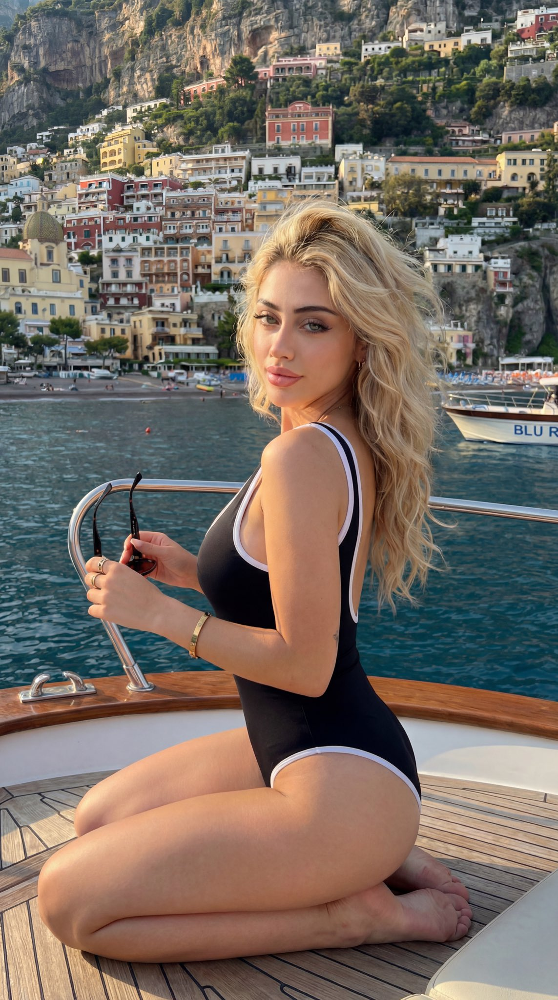

## 金发女子跪在游艇甲板上

- ID: gpt4o-926-zh-2
- Slug: prompt-926-zh-2
- 语言: zh
- 来源: [来源链接](https://x.com/xmliisu/status/2002367350146773079)
- 样例图路径: images/part3/926.jpeg

### 提示词

```text
{“灯光”： {
“来源”：“自然阳光”，
“品质”：“黄金时刻，柔和温暖”，
“阴影”：“主体和船只元素投射出的柔和、轮廓清晰的阴影”，
“方向”：“从右侧，略微背光”，
“亮点”：“水面、船舷和人物头发上的明亮高光”
},
“背景”： {
“细节”：“可以看到特定的建筑物、教堂圆顶和海滩活动”，
“设置”：“意大利阿马尔菲海岸波西塔诺”
“距离”: “远”
“元素”：[
“悬崖边的小镇，建筑色彩缤纷”
“沙滩上有遮阳伞和人群”
“深蓝色的大海”，
“其他船只”，
“悬崖上郁郁葱葱的植被”
],
"lighting_interaction": "阳光照亮城镇和悬崖，营造出温暖的色调"
},
"排版": {
“颜色”: “ #2E4A7D “,
“位置”：“在背景右侧蓝色船的侧面”，
"font_style": "无衬线字体，大写，粗体",
"描述": "船名和注册详情",
"text_content": "BLU RIDE"
},
“作品”： {
“平衡”：“前景主体与背景城镇之间的不对称平衡”，
“构图”：“中景”，
“视角”：“略微低角度，向上看向主体和背景”，
"leading_lines": "船的栏杆和甲板引导视线看向主体和城镇",
景深： “景深，主体和背景都清晰对焦”
“三分法构图”：“主体位于右下角交点处”
},
"color_profile": {
“氛围”：“温暖、充满活力、奢华”，
“对比度”：“中高”
“饱和度”: “高”
"配色方案": "类似蓝色和绿色，搭配温暖的大地色调",
"主色": [
" #2E4A7D "，
" #F2F2F2 "，
" #C8A17B "，
" #5A784A "，
#D98D6F
]
},
"technical_specs": {
"iso": "低",
“光圈”: “f /8或更小，以获得更大的景深”，
"lens_type": "广角镜头",
“分辨率”： “高”
"camera_type": "单反或无反"
"aspect_ratio": "4:5",
"shutter_speed": "足够快，可以凝固运动"
},
“主题分析”：{
“头发”：“金色的，波浪状的，被风吹乱的”，
“姿势”：“跪在船甲板上，身体侧对着镜头，右手拿着太阳镜，左手扶着栏杆”，
“服装”：“黑色连体泳衣，带有白色滚边和镂空设计”
“表情”：“透过太阳镜，带着一丝微笑看着前方”，
“配饰”：“深色太阳镜、金手镯、戒指”
"subject_type": "年轻女子",
“hands_gestures”: “右手调整太阳镜，左手扶在栏杆上”
"location_on_frame": "前景，中心偏右"
},
“artistic_elements”：{
“氛围”：“轻松、奢华、令人向往”
“风格”：“生活方式摄影，抓拍”
“质感”：“光滑的船甲板，波光粼粼的水面，崎岖的悬崖，泳衣的面料”，
叙事：一位女士正在享受沿着阿马尔菲海岸的豪华游艇之旅
},
"generation_parameters": {
“种子”： “随机”，
提示：一张生活方式照片，一位年轻的金发女子跪在船甲板上，身穿黑白泳衣，戴着太阳镜，回头看向镜头。背景是意大利波西塔诺的悬崖小镇，色彩缤纷的建筑、沙滩和沐浴在金色阳光下的大海。船正在行驶，可以看到其他船只。风格自然而奢华。
"model_type": "Photorealistic",
"guidance_scale": "高",
"negative_prompt": "模糊、低分辨率、影棚灯光、人造光、室内、拥挤、阴天"
}
}
```

### 样例图


## { "type": "image_generation_prompt", "style": "ultra-rea

- ID: gpt4o-919-en-1
- Slug: prompt-919-en-1
- 语言: en
- 来源: [来源链接](https://x.com/saniaspeaks_/status/2001944607714673042)
- 样例图路径: images/part3/919.jpeg

### 提示词

```text
{
"type": "image_generation_prompt",
"style": "ultra-realistic, high-fashion editorial, studio photography",
"identity_preservation": {
"use_reference_image": true,
"alter_face": false,
"strict_identity_lock": true,
"notes": "Create an extremely realistic image that is ultra-similar to the referenced girl. Preserve her facial identity, proportions, hairstyle, and overall appearance exactly as in the reference."
},
"subject": {
"gender": "female",
"appearance": {
"hair": {
"color": "dark",
"style": "elegant updo (bun)"
},
"jewelry": [
"delicate dangling earrings"
],
"expression": "calm, confident, composed"
}
},
"wardrobe": {
"dress": {
"type": "full-length elegant dress",
"color": "bright lilac",
"style": "fitted bodice with a refined silhouette, modest and fully covered",
"fabric": "smooth, high-quality fabric with a soft sheen"
},
"legwear": {
"type": "white lace-patterned tights or stockings",
"details": "floral or lace motif, refined and elegant"
},
"footwear": {
"type": "platform heels",
"color": "bright lilac",
"details": "thick high heel with ankle strap, bold and fashionable"
}
},
"composition": {
"concept": "scale contrast with two versions of the same woman",
"aspect_ratio": "9:16",
"foreground": {
"figure": "large version of the woman",
"pose": "leaning forward and downward, gently curving her back to look at the miniature version",
"emphasis": "long neck, arms, legs, and shoes dominating the frame for dramatic scale"
},
"background": {
"figure": "miniature version of the same woman",
"pose": "standing upright, appearing to salute, greet, or wave toward the larger figure",
"outfit": "identical full-length lilac dress, white lace tights, and lilac platform heels"
}
},
"environment": {
"setting": "studio",
"background": {
"color": "clean white or very light gray",
"style": "minimalist, distraction-free"
}
},
"color_palette": {
"dominant_colors": [
"bright lilac",
"white"
],
"overall_tone": "clean, elegant, high-contrast fashion palette"
},
"lighting": {
"type": "soft studio lighting",
"effects": [
"even illumination",
"clear separation between figures",
"enhanced fabric and skin realism"
]
},
"quality": {
"realism": "ultra-realistic",
"detail_level": "high detail in skin, fabric textures, lace patterns, and footwear",
"rendering": "photorealistic, editorial-grade finish"
},
"mood": {
"atmosphere": "stylish, artistic, playful with scale",
"tone": "elegant, modern, fashion-forward"
},
"output_goal": "Create a maximally realistic and ultra-faithful fashion image of a woman in a full-length lilac dress, featuring a creative scale-play composition with two versions of the same subject, set against a clean studio background in a 9:16 format."
}
```

### 样例图

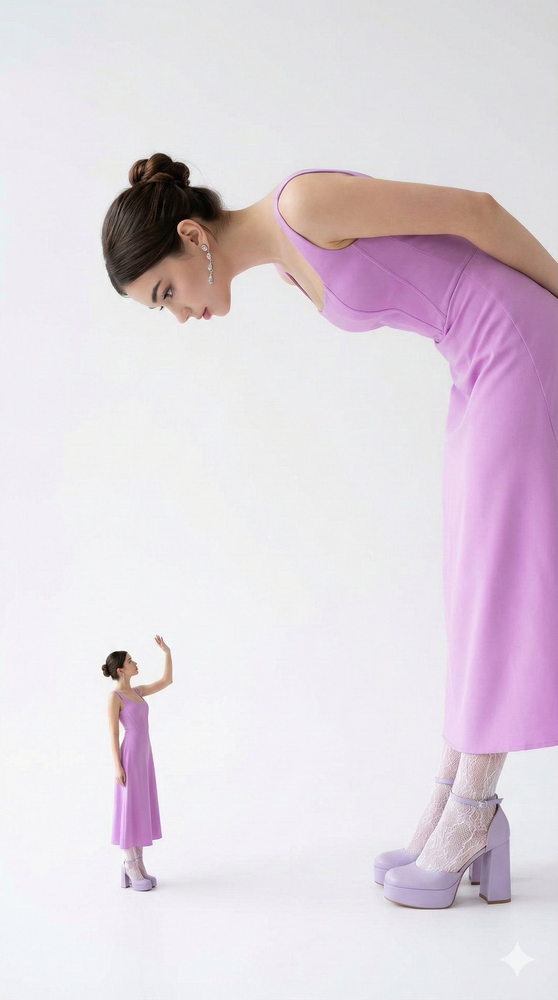

## 丁香色长裙女性双版本比例对比

- ID: gpt4o-919-zh-2
- Slug: prompt-919-zh-2
- 语言: zh
- 来源: [来源链接](https://x.com/saniaspeaks_/status/2001944607714673042)
- 样例图路径: images/part3/919.jpeg

### 提示词

```text
{
"type": "image_generation_prompt",
“风格”：“超写实、高级时尚杂志大片、影棚摄影”，
"identity_preservation": {
"use_reference_image": true,
"alter_face": false,
"strict_identity_lock": true,
“备注”：“创作一幅与参考女孩极其相似的逼真图像。务必保留她的面部特征、身材比例、发型和整体外貌，与参考图完全一致。”
},
“主题”： {
"性别": "女性",
“外貌”： {
“头发”： {
“颜色”：“深色”，
"发型": "优雅盘发（发髻）"
},
“珠宝”： [
“精致的垂坠耳环”
],
表情：平静、自信、沉着
}
},
“衣柜”： {
“裙子”： {
类型：优雅长裙
“颜色”： “亮丁香色”，
“款式”：“修身胸衣，线条优美，端庄得体，完全遮盖身体”。
“面料”：光滑、高品质的面料，带有柔和的光泽
},
"腿部服装": {
“类型”：“白色蕾丝图案的紧身裤或长筒袜”，
细节：花卉或蕾丝图案，精致优雅
},
鞋类：{
类型：厚底高跟鞋，
“颜色”： “亮丁香色”，
“细节”：“粗跟高跟鞋，踝带设计，大胆时尚”
}
},
“作品”： {
“概念”：“同一女性的两个不同版本之间的比例对比”，
"aspect_ratio": "9:16",
前景：{
“人物”：“女性的放大版”，
“姿势”：“身体前倾向下，轻轻弯曲背部，看着微缩模型”，
“强调”：“修长的脖子、手臂、腿和鞋子占据画面，营造出戏剧性的比例感”。
},
“背景”： {
“人物”：“同一女性的微缩版本”，
“姿势”：“直立站立，看起来像是在向较大的人物敬礼、问候或挥手”，
“服装”： “同款淡紫色长连衣裙、白色蕾丝紧身裤和淡紫色厚底高跟鞋”
}
},
“环境”： {
“设置”: “工作室”
“背景”： {
“颜色”: “纯白色或非常浅的灰色”，
风格：极简主义，无干扰
}
},
"color_palette": {
"主色": [
“亮紫色”，
“白色的”
],
"overall_tone": "干净、优雅、高对比度的时尚色调"
},
“灯光”： {
“类型”：“柔和的影棚灯光”，
“效果”：[
“均匀照明”，
“数字之间有明显的分隔”，
“增强织物和皮肤的真实感”
]
},
“质量”： {
“写实主义”：“超写实主义”，
"detail_level": "皮肤、织物纹理、蕾丝图案和鞋履的细节都非常丰富",
“渲染”：“照片级真实感，编辑级效果”
},
“情绪”： {
“氛围”：“时尚、艺术、巧妙运用比例”，
“基调”：“优雅、现代、时尚前卫”
},
"output_goal": "创作一幅极其逼真、高度还原的女性时尚照片，照片中女性身穿淡紫色长裙，采用创意性的比例构图，使用同一主题的两个版本，背景为干净的摄影棚，格式为 9:16。"
}
```

### 样例图


## 生成一周的服装搭配

- ID: gpt4o-918-zh
- Slug: prompt-918-zh
- 语言: zh
- 来源: [来源链接](https://x.com/schnapoon/status/2001847957390549090)
- 样例图路径: images/part3/918.jpeg

### 提示词

```text
环境：
【角色特征]:高中女生，留着黑色长发
【时尚主题]:现代高中女生日常穿着，整洁干净】

转换规则：
- 一张时尚造型图，展示了[Character Features]中的七个相同的角色并排站成一排。
- 仅穿着 7 套基于【时尚主题】的全新休闲服装。
- 参考图像的风格得到了完美保留。
- 他们不穿[参考图片中的服装]，而是根据[时尚主题]穿七套不同的服装。
  全身照。
- 背景为纯白色或略带象牙色。
  脚下有自然的阴影。这幅图的布局看起来像是从杂志上剪下来的。
- 每个图形下方从左到右分别写着“星期一”、“星期二”、“星期三”、“星期四”、“星期五”、“星期六”和“星期日”。
- 顶部醒目的标题文字。

艺术风格：
- 高分辨率
- 摄影棚灯光
- 4k
  ——ar 16:9
```

### 样例图

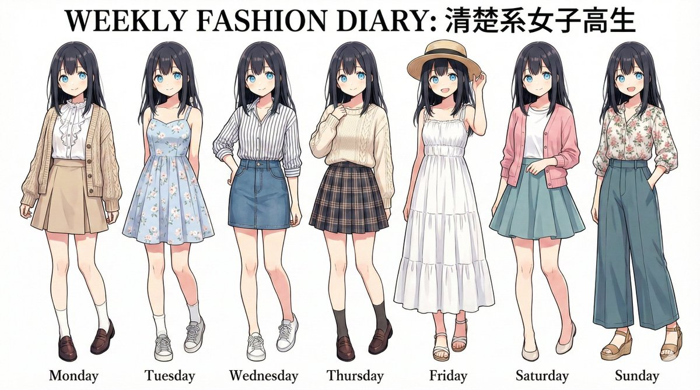

## { "image_structure": { "layout": "Vertical three-panel c

- ID: gpt4o-912-en-1
- Slug: prompt-912-en-1
- 语言: en
- 来源: [来源链接](https://x.com/lexx_aura/status/2001886993836343775)
- 样例图路径: images/part3/912.jpeg

### 提示词

```text
{
"image_structure": {
"layout": "Vertical three-panel collage",
"aspect_ratio": "Tall vertical strip",
"shot_type": "Close-up selfies"
},
"subject_details": {
"demographics": "Young woman with long, wavy brunette hair",
"skin": "Natural skin texture, minimal or no makeup",
"clothing": "Pink lace-trimmed bralette or camisole top with thin spaghetti straps",
"accessories": "Long manicured nails (nude/pale pink color)"
},
"environment": {
"setting": "Dimly lit bedroom or hotel room interior",
"background_elements": [
"Beige/cream colored walls",
"Heavy brown curtains on the left side",
"Partial view of a bed headboard in the background"
]
},
"lighting_and_style": {
"lighting": "Warm, indoor artificial lighting, low-light conditions",
"aesthetic": "Candid selfie style, slightly grainy phone camera quality, early 2010s social media aesthetic, flash photography look",
"mood": "Casual, intimate, playful"
},
"panel_breakdown": {
"top_panel": {
"expression": "Pouting or confused, eyebrows slightly furrowed",
"pose": "Finger hooked over bottom lip, looking directly at camera"
},
"middle_panel": {
"expression": "Soft smile, looking directly at camera",
"overlay_effect": "Digital pink heart crown filter (Snapchat style) floating around the head"
},
"bottom_panel": {
"expression": "Relaxed, mouth slightly open, gazing at camera",
"pose": "Head tilted to the side, hand gently touching chin and lower lip"
}
}
}
```

### 样例图

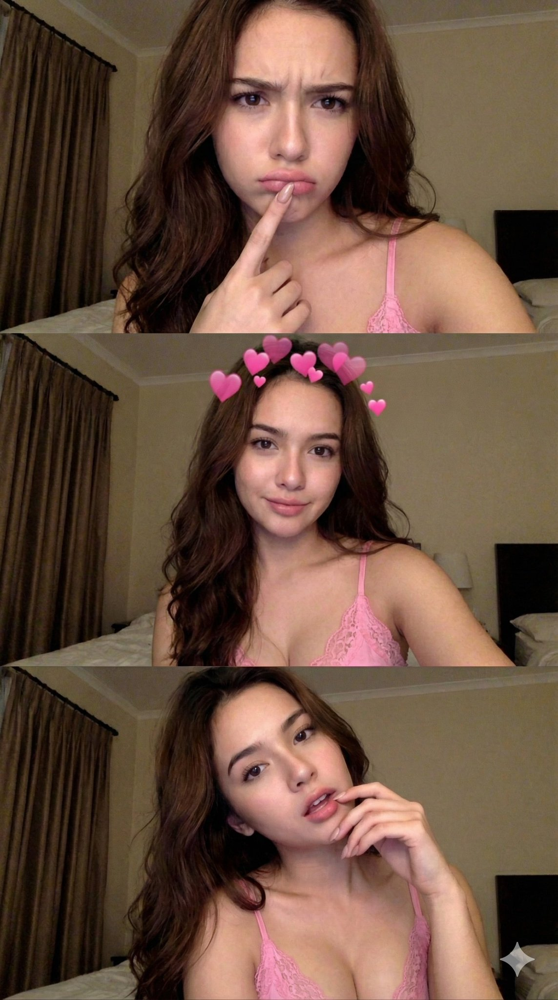

## 垂直三格拼贴画

- ID: gpt4o-912-zh-2
- Slug: prompt-912-zh-2
- 语言: zh
- 来源: [来源链接](https://x.com/lexx_aura/status/2001886993836343775)
- 样例图路径: images/part3/912.jpeg

### 提示词

```text
{
"image_structure": {
“布局”：“垂直三格拼贴画”，
"aspect_ratio": "高竖条",
"shot_type": "特写自拍"
},
"subject_details": {
“人口统计信息”：“年轻女性，留着长长的棕色波浪卷发”，
“肌肤”: “自然肌肤纹理，几乎不化妆”
“服装”：“粉色蕾丝边吊带文胸或吊带背心”，
“配饰”： “修剪整齐的长指甲（裸色/浅粉色）”
},
“环境”： {
“场景”：“光线昏暗的卧室或酒店房间内部”，
“背景元素”：[
“米色/奶油色墙壁”，
“左侧是厚重的棕色窗帘，”
“背景中可以看到床头板的一部分”
]
},
"lighting_and_style": {
“照明”：“温暖的室内人工照明，光线较暗的环境”，
“美学”：“随意的自拍风格，略带颗粒感的手机相机画质，2010 年代初期的社交媒体美学，闪光灯摄影效果”，
“氛围”： “轻松、亲密、俏皮”
},
"panel_breakdown": {
"top_panel": {
“表情”：“撅嘴或困惑，眉毛微微皱起”，
姿势：“手指勾住下唇，直视镜头”
},
"middle_panel": {
“表情”：“柔和的微笑，直视镜头”
"overlay_effect": "粉色爱心皇冠滤镜（Snapchat风格）漂浮在头部周围"
},
"bottom_panel": {
“表情”：“放松，嘴巴微张，凝视着镜头”
“姿势”：“头部侧倾，手轻轻触碰下巴和下唇”
}
}
}
```

### 样例图


## 6x6 grid layout. Editorial fashion photography. Use the 

- ID: gpt4o-911-en-1
- Slug: prompt-911-en-1
- 语言: en
- 来源: [来源链接](https://x.com/gokayfem/status/2001680146252669084)
- 样例图路径: images/part3/911.jpeg

### 提示词

```text
6x6 grid layout. Editorial fashion photography. Use the reference clothing item on all 36 models. Every single cell must feature a completely unique individual—no two people should look remotely similar.
Maximize human diversity across:
Age: Teenagers, 20s, 30s, 40s, 50s, 60s, 70s, 80s+, elderly with wrinkles and grey hair
Body types: Extremely thin, slim, athletic, muscular, stocky, chubby, fat, plus-size, obese, petite, tall, short, broad-shouldered, narrow-framed, pear-shaped, apple-shaped, hourglass, rectangular, long-limbed, short-limbed.
Ethnicity & skin tones: East Asian, Southeast Asian, South Asian, Middle Eastern, North African, Sub-Saharan African, West African, East African, Indigenous Australian, Pacific Islander, Native American, Indigenous South American, Scandinavian, Mediterranean, Eastern European, Western European, Caribbean, mixed race, albino. Full spectrum of skin tones from the palest to the deepest.
Hair: Bald, shaved, buzz cut, afro, locs, braids, straight, wavy, curly, coily, long, short, grey, white, natural colors, receding hairline, thinning hair, thick full hair, hijab, head wraps, turbans.
Features: Freckles, vitiligo, acne, scars, birthmarks, moles, gap teeth, crooked teeth, big nose, small nose, wide nose, narrow nose, round face, angular face, soft jawline, strong jawline, monolid eyes, deep-set eyes, hooded eyes, big lips, thin lips, visible disabilities, prosthetics, wheelchair users, amputees.
Each cell: different pose, different camera angle. Poses should feel editorial and unexpected—leaning, crouching, mid-stride, arched, sprawled, seated, jumping, twisting, lounging. Camera angles vary—low angle, overhead, Dutch tilt, wide shot, tight crop, ground-level, profile, three-quarter view.
Moody, high contrast, cinematic lighting. Varied environments—studio, architectural, urban, natural. Sharp detail, clothing as focal point. Final result should feel like the most inclusive, human-rich fashion editorial ever created—a true celebration of every single type of human body that exists.
```

### 样例图

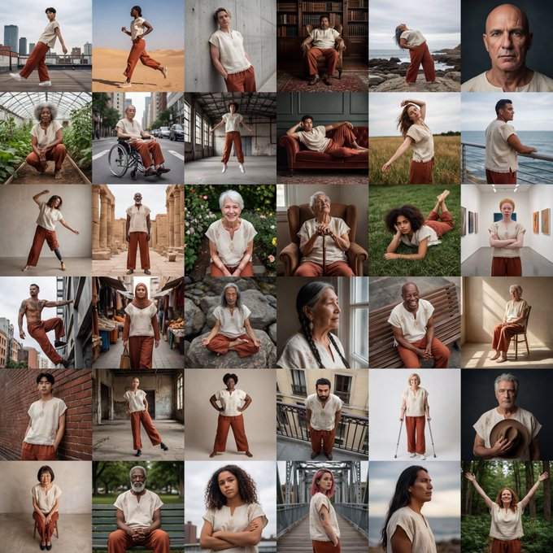

## 36 个穿着同一套衣服的不同人像

- ID: gpt4o-911-zh-2
- Slug: prompt-911-zh-2
- 语言: zh
- 来源: [来源链接](https://x.com/gokayfem/status/2001680146252669084)
- 样例图路径: images/part3/911.jpeg

### 提示词

```text
6x6网格布局。时尚摄影。所有36位模特均需穿着同一件参考服装。每个单元格中的模特必须完全不同——任何两个人都不能有任何相似之处。
最大限度地提高人类多样性：
年龄：青少年、20多岁、30多岁、40多岁、50多岁、60多岁、70多岁、80岁以上、有皱纹和白发的老年人
体型：极瘦、苗条、健壮、肌肉发达、敦实、丰满、肥胖、大码、肥胖、娇小、高挑、矮小、肩宽、骨架窄、梨形、苹果形、沙漏形、矩形、四肢长、四肢短。
种族与肤色：东亚人、东南亚人、南亚人、中东人、北非人、撒哈拉以南非洲人、西非人、东非人、澳大利亚原住民、太平洋岛民、美洲原住民、南美原住民、斯堪的纳维亚人、地中海人、东欧人、西欧人、加勒比人、混血儿、白化病患者。涵盖从最浅到最深的各种肤色。
头发：光头、剃光头、寸头、爆炸头、脏辫、辫子、直发、波浪卷发、卷发、螺旋卷发、长发、短发、灰发、白发、自然发色、发际线后移、头发稀疏、浓密头发、头巾、头巾、头巾。
特征：雀斑、白癜风、痤疮、疤痕、胎记、痣、牙缝、牙齿歪斜、大鼻子、小鼻子、宽鼻子、窄鼻子、圆脸、棱角分明的脸、柔和的下颌线、硬朗的下颌线、单眼皮、深陷眼窝、眼睑下垂、厚嘴唇、薄嘴唇、明显的残疾、假肢、轮椅使用者、截肢者。
每个单元格：不同的姿势，不同的拍摄角度。姿势应具有编辑感和出人意料的特质——倾斜、蹲伏、迈步、拱背、伸展、坐姿、跳跃、扭转、慵懒。拍摄角度也多种多样——低角度、俯视、倾斜镜头、广角镜头、特写镜头、地面视角、侧面视角、四分之三侧面视角。
营造氛围感，运用高对比度的电影级灯光。场景多样——包括摄影棚、建筑、都市和自然环境。注重细节刻画，以服装为视觉焦点。最终呈现的作品应展现出前所未有的包容性和人文关怀，真正赞美每一种人体形态。
```

### 样例图


## { "image_layout": "2x2 grid collage featuring four disti

- ID: gpt4o-910-en-1
- Slug: prompt-910-en-1
- 语言: en
- 来源: [来源链接](https://x.com/lexx_aura/status/2001653710745739419)
- 样例图路径: images/part3/910.jpeg

### 提示词

```text
{
"image_layout": "2x2 grid collage featuring four distinct photographs of the same female subject.",
"subject_general": {
"gender": "Female",
"hair_color": "Dark brown/black",
"hair_style": "Long, styled in loose waves in three panels; sleek high ponytail in one panel",
"aesthetic": "Glamorous, influencer, trendy, luxury lifestyle"
},
"panels": [
{
"position": "top_left",
"setting": "Outdoors at night, dark background with illuminated green foliage",
"action": "Subject is holding a cake with one hand and licking frosting off the index finger of the other hand",
"outfit": {
"top": "Black halter-neck sleeveless top",
"jewelry": "Gold wristwatch, gold bangle bracelet, ring, small hoop earrings"
},
"props": {
"item": "Round white frosted cake",
"details": [
"Red cherries on top",
"Decorative white piping along edges",
"Black icing text reading 'bad bitch energy'"
]
}
},
{
"position": "top_right",
"setting": "Daytime city street, likely an upscale shopping district (e.g., Rodeo Drive) with palm trees and storefronts visible",
"action": "Subject is leaning out of the open door of a black luxury car, looking at the camera",
"outfit": {
"top": "White sleeveless ribbed crop top",
"bottom": "Blue denim jeans",
"accessories": "Shoulder bag (strap visible), gold hoop earrings"
},
"lighting": "Bright natural sunlight casting shadows"
},
{
"position": "bottom_left",
"setting": "Indoor hallway, beige walls, wooden floor",
"action": "Full-body mirror selfie",
"outfit": {
"style": "Matching two-piece set",
"color": "Dark brown/chocolate",
"top": "Velvet/suede corset-style bustier top",
"bottom": "Mini skirt",
"accessories": "Patterned designer handbag (resembling Dior Saddle bag), stack of gold bracelets"
},
"background_details": [
"Large rectangular mirror with gold frame leaning against wall",
"Vase with pampas grass in the corner",
"Doorway visible in reflection"
]
},
{
"position": "bottom_right",
"setting": "Inside a vehicle or outdoors, golden hour sunlight",
"action": "Close-up selfie, hand raised near mouth/chin",
"outfit": {
"top": "Light pink/mauve ribbed tank top",
"outerwear": "Beige fuzzy/sherpa jacket worn off-the-shoulder",
"jewelry": "Layered gold necklaces with pendants, hoop earrings"
},
"hair_styling": "Sleeked back high ponytail",
"background_details": "Car window frame, palm trees and blue sky visible in background"
}
]
}
```

### 样例图

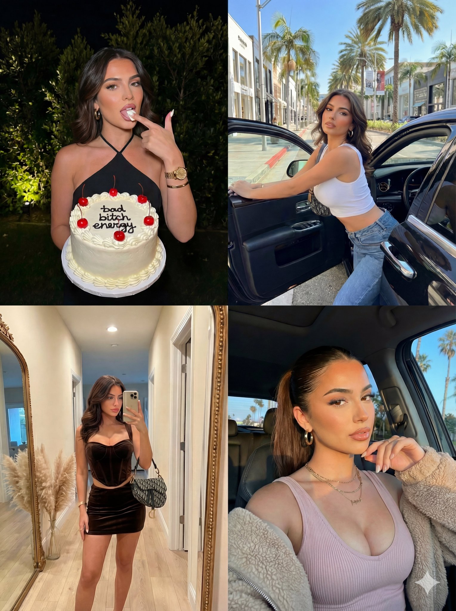

## 女生四宫格照片

- ID: gpt4o-910-zh-2
- Slug: prompt-910-zh-2
- 语言: zh
- 来源: [来源链接](https://x.com/lexx_aura/status/2001653710745739419)
- 样例图路径: images/part3/910.jpeg

### 提示词

```text
{
"image_layout": "2x2 网格拼贴，包含同一女性对象的四张不同照片。"
"subject_general": {
"性别": "女",
"hair_color": "深棕色/黑色",
"发型": "长发，分成三片，烫成蓬松的波浪卷；一片，扎成光滑的高马尾辫",
“美学”： “魅力四射、网红、潮流、奢华生活方式”
},
“面板”：[
{
"位置": "左上",
“场景”：“夜晚的户外，深色背景，绿色树叶在灯光下闪烁”，
“动作”：“受试者一手拿着蛋糕，另一只手的食指正在舔掉上面的糖霜”，
“全套服装”： {
“上衣”： “黑色露背无袖上衣”，
“珠宝”：金手表、金手镯、戒指、小耳环
},
"props": {
“商品”: “圆形白色糖霜蛋糕”
“细节”： [
“上面放些红樱桃”，
“边缘饰有白色滚边”，
“黑色糖霜上写着‘坏女孩能量’”
]
}
},
{
"位置": "右上角",
“场景”：“白天的城市街道，可能是一个高档购物区（例如罗迪欧大道），可以看到棕榈树和商店橱窗”，
“动作”：“拍摄对象从一辆黑色豪华轿车的敞开车门探出身子，看着镜头”。
“全套服装”： {
“上衣”：“白色无袖罗纹露脐上衣”，
“底部”：“蓝色牛仔裤”，
配饰：单肩包（肩带可见）、金色圆环耳环
},
“光线”：“明亮的自然阳光投射出阴影”
},
{
"位置": "左下角",
“场景”：“室内走廊，米色墙壁，木地板”，
“动作”：“全身镜前自拍”，
“全套服装”： {
“款式”：“配套两件套”
颜色：深棕色/巧克力色，
“上衣”：天鹅绒/麂皮紧身胸衣式上衣，
“下装”: “迷你裙”，
“配饰”：“图案名牌手提包（类似迪奥马鞍包），一叠金手镯”
},
"background_details": [
“一面金色边框的大长方形镜子斜靠在墙上”
“花瓶角落里放着蒲苇草”
“倒影中可见门口”
]
},
{
"位置": "右下角",
“场景”：“车内或室外，日落时的金色阳光”，
“动作”：“近距离自拍，手举到嘴/下巴附近”，
“全套服装”： {
上衣：浅粉色/淡紫色罗纹背心，
“外套”：“米色毛绒/羊羔绒夹克，露肩穿着”，
“珠宝”：“多层金项链配吊坠，圈形耳环”
},
"发型"："光滑的高马尾辫",
"background_details": "背景中可以看到车窗框、棕榈树和蓝天"
}
]
}
```

### 样例图


## 标本盒与现实的穿搭美学双重奏

- ID: gpt4o-908-zh
- Slug: prompt-908-zh
- 语言: zh
- 来源: [来源链接](https://x.com/LufzzLiz/status/2001831802269499412)
- 样例图路径: images/part3/908.jpeg

### 提示词

```text
A vertical split-screen creative product photography composition on a clean white wall background. High-resolution, photorealistic, commercial advertisement quality.

Top Section: The Specimen Box
The upper half features an exquisite light oak wooden shadow box frame mounted on the wall. Inside, a specific outfit is displayed as an artistic flat-lay museum specimen: [Insert Clothing Details Here, e.g., a sleek black satin slip dress with delicate lace trim and thin spaghetti straps]. The garments are neatly pinned in place. Surrounding them are small thematic decorative props: [Insert Props, e.g., dried roses, vintage perfume bottles, silk ribbon]. Elegant calligraphy on the matte paper backdrop reads: [Insert Text, e.g., "Midnight Elegance" or "Silk & Secrets"]. Soft studio lighting accentuates the rich texture and drape of the fabric.

Bottom Section: Naked-Eye 3D Reality
The lower half creates a hyperrealistic "naked-eye 3D" illusion. A rectangular picture-frame border sits directly beneath the top box. A stunningly realistic young woman [Insert Model Description, e.g., a poised East Asian model with long wavy black hair, subtle smoky eyes, and a confident gaze] wears the exact same outfit as shown above.

She lounges casually on the bottom edge of the frame—one leg bent with foot resting inside the frame, the other leg elegantly dangling out into the viewer’s space. Her torso leans back slightly, elbow resting on her raised knee, fingers lightly grazing the fabric near her collarbone. Her body forms a soft, sensual S-curve that highlights the garment’s silhouette without overt exposure. She looks directly at the camera with a calm, knowing smile—inviting yet enigmatic. This dynamic, lifelike pose contrasts powerfully with the static, archival display above, creating visual tension between reality and presentation.

Technical Specs:
Soft natural shadows, ambient occlusion, bright and airy yet cinematic lighting, 8K resolution, Octane Render, vivid but refined color palette, ultra-detailed fabric textures (satin sheen, lace transparency, stitching), shallow depth of field, Vogue editorial style, filmic grain, professional fashion photography.

Negative Prompt (recommended):
blurry, low-res, distorted anatomy, extra limbs, deformed hands, cartoon, anime, doll-like, plastic skin, overexposed, cluttered background, text errors, mismatched clothing, floating objects, unrealistic proportions.
参考人物，想看老师制服
```

### 样例图

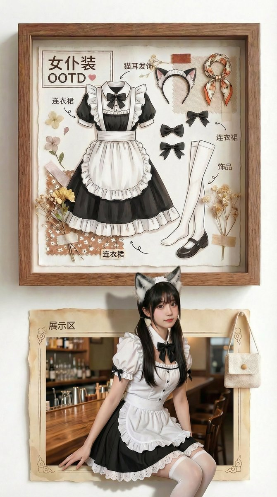

## Create a realistic first-person POV selfie as if the cam

- ID: gpt4o-906-en-1
- Slug: prompt-906-en-1
- 语言: en
- 来源: [来源链接](https://x.com/xmiiru_/status/2001935712275267952)
- 样例图路径: images/part3/906.jpeg

### 提示词

```text
Create a realistic first-person POV selfie as if the camera is my own eyes using a phone’s front-facing camera. The phone, my hands, and my arms must NOT be visible in the frame. Use the uploaded image as my identity reference and keep my face recognizable through perspective consistency. I am not part of the cast I’m a guest on set wearing modern, casual real-world clothing that does not match the actors’ wardrobe. The actors are aware of the selfie, standing very close to me, leaning in naturally, and looking directly into the camera as if pausing for a quick friendly shot between takes.

The framing should feel intimate and face-level, with actors filling the foreground. The background must clearly show a believable behind-the-scenes film set with cameras, crew, lighting rigs, monitors, and equipment. The image should feel candid, unpolished, and spontaneous.

Place me inside: [MOVIE OR TV SHOW NAME] (optional: cast members)
```

### 样例图

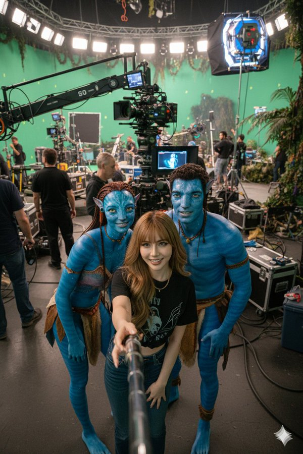

## 和影视剧中人物自拍

- ID: gpt4o-906-zh-2
- Slug: prompt-906-zh-2
- 语言: zh
- 来源: [来源链接](https://x.com/xmiiru_/status/2001935712275267952)
- 样例图路径: images/part3/906.jpeg

### 提示词

```text
请使用手机前置摄像头，拍摄一张逼真的第一人称视角自拍，就像用自己的眼睛拍摄一样。手机、我的手和手臂都不能出现在画面中。请使用上传的图片作为我的身份参考，并通过保持视角一致来确保我的脸部清晰可辨。我不是剧组成员，而是片场的客串演员，穿着与演员服装不同的现代休闲日常服装。演员们知道我在自拍，他们会站在我旁边，自然地靠近我，并直视镜头，就像在拍摄间隙和我友好地拍张合照一样。

构图应营造亲密感，采用平视视角，演员占据前景。背景必须清晰展现一个可信的幕后拍摄现场，包括摄像机、工作人员、灯光设备、监视器和器材。画面应给人一种自然、未经修饰、随意的感觉。

请将我放入：[电影或电视剧名称]（可选：演员表）
```

### 样例图


## 维多利亚哥特皇室写真照

- ID: gpt4o-904-zh
- Slug: prompt-904-zh
- 语言: zh
- 来源: [来源链接](https://x.com/songguoxiansen/status/2001828831615946768)
- 样例图路径: images/part3/904.jpeg

### 提示词

```text
生成一张 9:16 竖版「维多利亚哥特皇室」写实照片：以我上传的 FACE_REF 为人物身份参考，100%还原五官与骨相；人物身穿“维多利亚时代（19世纪）宫廷礼服方向”的重工礼服（紧身胸衣、大裙撑、蕾丝/天鹅绒、皇室珠宝），在伦敦塔桥或威斯敏斯特宫（大本钟）旁拍摄。画面具备《Harper’s Bazaar》级别的摄影、造型与封面设计，保持杂志的一贯设计风格（中英文设计）。

【INPUTS | 输入】
FACE_REF：我上传的人物五官参考图（身份锁定）

【ABSOLUTE PRIORITY | 身份锁定（最高优先级）】
100%还原 FACE_REF 的五官与骨相：眼距、鼻梁鼻翼、唇形、下颌线、颧骨结构完全一致，不得漂移。
真实皮肤质感：可见细微纹理与毛孔，不要过度磨皮与网红化。
成年女性形象（adult）。

【SHOT TYPE | 景别二选一（由模型随机选其一，且必须真实统一）】
A) 半身封面：胸口到腰上方，珠宝、蕾丝领口与眼神最清晰（主推）
B) 全身封面：从头到脚完整呈现巨大的裙撑轮廓与伦敦地标的结合，透视感强（备选）
（无论A/B：都必须保持“封面构图”，有留白空间给排版，但不要撕纸/手绘效果。）

【LOCATION | 场景（英国伦敦）】
伦敦地标：泰晤士河畔，背景是宏伟的哥特式建筑威斯敏斯特宫（大本钟）或 伦敦塔桥的塔楼。
天气二选一（随机）：1) 伦敦雾霭（经典的雾都质感，光线柔和神秘） 2) 阴雨方歇（地面湿润反光，天空呈铅灰色）
背景干净：无游客、无现代标识、无手机状态栏UI、无水印字幕。

【LIGHTING & CAMERA | 摄影质感（杂志级）】
镜头感：85mm人像质感（半身）或 50mm/70mm（全身），浅景深，眼睛最清晰。
光线：阴天漫射光 + 戏剧性补光（强调面部结构）；钻石/宝石有真实火彩；天鹅绒质感深邃。
色彩：高级电影感，低饱和度的蓝灰环境色与服装的深色调（红/蓝/黑）形成哥特美学；整体干净、通透、贵气。

【WARDROBE | 维多利亚宫廷礼服（重工、塑形、繁复细节）】
目标审美：“蜂腰、大裙摆、层叠蕾丝、重磅天鹅绒、皇冠、女王气场”。

轮廓与层次（X型剪裁）
上身：结构感极强的紧身胸衣（Corset），方领或高领，泡泡袖或羊腿袖
下身：巨大的裙撑（Crinoline 或 Bustle），后腰部有明显的堆叠设计，裙摆拖地
装饰：大量的荷叶边、蝴蝶结、垂坠的流苏
面料与工艺（重手艺必须“看得见”）
主面料：重磅丝绒、塔夫绸、尚蒂伊蕾丝（Chantilly Lace）
主要工艺：珠绣、金线刺绣、缎带编织
纹样主题：大马士革纹（Damask）、玫瑰、蓟花（苏格兰象征）、佩斯利纹
细节：蕾丝手套、颈饰（Choker）、勋章/胸针
头面（皇室珠宝头饰）
核心结构：维多利亚式小王冠（Tiara）或 羽毛头饰
装饰：钻石、蓝宝石、珍珠
耳饰/颈饰：极度夸张的钻石项链、耳坠

【COLOR MATRIX | 颜色矩阵搭配（必须执行，且必须“皇室深色”）】
（维多利亚晚期的深沉奢华）
从以下三套“主色方案”中随机选 1 套作为【底色/大面积主面料色】。

Scheme G（皇室蓝底）：
底色：深宝蓝/午夜蓝（丝绒质感）
刺绣/装饰：银色蕾丝、钻石、蓝宝石
Scheme A（维多利亚红底）：
底色：酒红/勃艮第红（深沉热情）
刺绣/装饰：黑色蕾丝、金色刺绣、红宝石
Scheme R（丧服黑底）：
底色：墨黑（Black Jet，极度哥特）
刺绣/装饰：黑色串珠、黑色蕾丝、少量金色或银色提亮

【颜色执行规则】
色彩要深沉浓郁，体现“日不落”的威严和哥特式的神秘。

【POSE | 封面姿态（威严、僵直、女王感）】
半身：下巴微扬，眼神冷峻，一手轻抚项链
全身：站姿挺拔（像肖像画一样），双手交叠在裙撑上，气场压倒一切
表情：严肃、高傲、不可一世；绝对不笑（维多利亚风格）。

【OUTPUT | 输出】
1 张 9:16 竖版写实杂志封面级照片
随机：半身 or 全身（A/B二选一）
随机：雾霭 or 阴雨（天气二选一）
随机：宝蓝 / 酒红 / 墨黑（颜色矩阵三选一）
造型：维多利亚宫廷礼服方向 + 皇冠/Choker + 紧身胸衣大裙撑 + 丝绒蕾丝
```

### 样例图

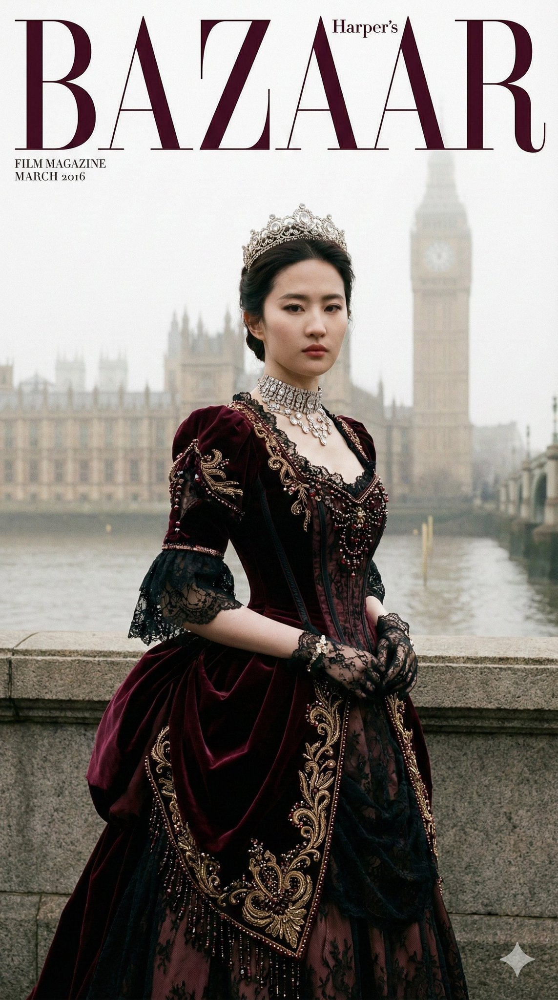

## { "project_title": "Urban Streetwear Editorial Collage",

- ID: gpt4o-900-en-1
- Slug: prompt-900-en-1
- 语言: en
- 来源: [来源链接](https://x.com/xmliisu/status/2001254201611964524)
- 样例图路径: images/part3/900.jpeg

### 提示词

```text
{
  "project_title": "Urban Streetwear Editorial Collage",
  "aspect_ratio": "9:16",
  "aesthetic_theme": {
    "style": "Editorial poster-style multi-panel collage",
    "mood": "Retro analog–digital fusion",
    "color_palette": [
      "Warm ambers",
      "Washed neutrals",
      "Soft greys",
      "Muted browns"
    ],
    "textures": [
      "Reflective glass",
      "Wool plaid",
      "Polished leather",
      "Stone pavement"
    ]
  },
  "subject_outfit": {
    "core": "Brown plaid blazer, white button-up shirt, yellow tie, loose dark trousers",
    "accessories": "Brown cap, oversized amber-tinted rectangular sunglasses",
    "tech": "Wired earphones"
  },
  "composition_layout": {
    "frame_1_top_left": {
      "type": "Reflective window shot",
      "pose": "Holding phone in front of face",
      "visual_effects": "Layered ghosting, architectural overlays, curvature distortion"
    },
    "frame_2_top_right": {
      "type": "Close-range, downward-angled ultra-wide portrait",
      "setting": "Cobblestone street",
      "pose": "Leaning forward, hands in pockets, exaggerated pout",
      "visual_effects": "Lens perspective distortion, radiating cobblestones"
    },
    "frame_3_bottom_right": {
      "type": "Intimate overhead selfie",
      "lighting": "Soft overcast",
      "props": "Holding a drink",
      "overlays": "Faint digital-grid, minimal square facial-bounding graphic"
    }
  },
  "ui_elements": {
    "music_player": {
      "style": "Translucent iOS-style Apple Music mini-player",
      "content": "“See You Again” by Tyler, The Creator",
      "features": "Artwork, timeline, playback controls (no shadows)"
    },
    "graphics": "Subtle cursor-like frame lines, rectangular highlights"
  },
  "negative_constraints": [
    "Stickers",
    "Extra subjects",
    "Wardrobe changes",
    "Incorrect UI icons",
    "Neon color shifts",
    "Futuristic sci-fi elements"
  ]
}
```

### 样例图

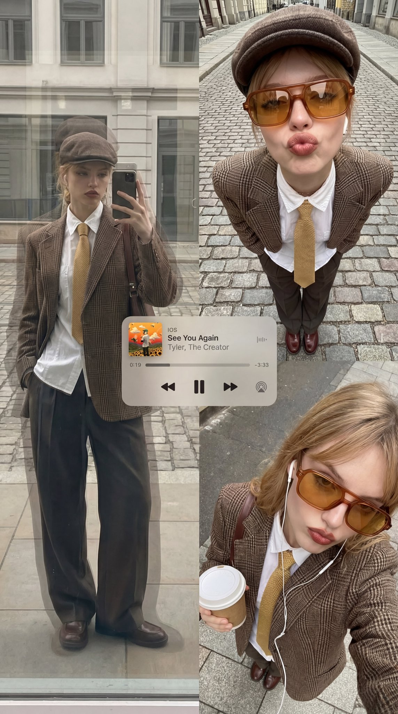

## 都市街头服饰编辑拼贴画

- ID: gpt4o-900-zh-2
- Slug: prompt-900-zh-2
- 语言: zh
- 来源: [来源链接](https://x.com/xmliisu/status/2001254201611964524)
- 样例图路径: images/part3/900.jpeg

### 提示词

```text
{
"project_title": "都市街头服饰编辑拼贴画",
"aspect_ratio": "9:16",
"aesthetic_theme": {
“风格”：“社论海报风格的多面板拼贴画”，
“氛围”：“复古模拟-数字融合”，
"color_palette": [
“温暖的琥珀色”，
“水洗中性色”，
“柔和的灰色”，
“柔和的棕色”
],
“纹理”：[
“反射玻璃”，
“羊毛格子呢”
“抛光皮革”，
石板路
]
},
"subject_outfit": {
“核心单品”：棕色格子西装外套、白色纽扣衬衫、黄色领带、宽松深色长裤。
“配饰”：“棕色帽子，超大琥珀色矩形太阳镜”，
“科技产品”：“有线耳机”
},
"composition_layout": {
"frame_1_top_left": {
“类型”：“反射窗照片”，
“姿势”：“将手机举到脸前”，
"视觉特效": "分层重影、建筑叠加、曲率扭曲"
},
"frame_2_top_right": {
“类型”：“近距离、向下倾斜的超广角人像”，
“场景”：“鹅卵石街道”，
“姿势”：“身体前倾，双手插兜，夸张地撅嘴”，
"视觉效果": "镜头透视变形，放射状鹅卵石"
},
"frame_3_bottom_right": {
类型： 亲密俯视自拍，
“光线”：“柔和的阴天”，
“道具”：“拿着一杯饮料”，
“叠加层”：“淡淡的数字网格，极简的方形面部轮廓图形”
}
},
"ui_elements": {
"music_player": {
"style": "半透明 iOS 风格的 Apple Music 迷你播放器",
内容： “Tyler, The Creator 的“See You Again””
“功能”： “封面图、时间轴、播放控制（无阴影）”
},
“图形”：“类似光标的微妙边框线，矩形高光”
},
"negative_constraints": [
“贴纸”，
“额外科目”，
“服装更换”
“错误的用户界面图标”，
“霓虹色彩变化”，
“未来科幻元素”
]
}
```

### 样例图


## 大唐盛世与巴黎写真照

- ID: gpt4o-894-zh
- Slug: prompt-894-zh
- 语言: zh
- 来源: [来源链接](https://x.com/songguoxiansen/status/2001198742998016062)
- 样例图路径: images/part3/894.jpeg

### 提示词

```text
生成一张 9:16 竖版「大唐盛世与巴黎」写实照片：以我上传的 FACE_REF 为人物身份参考，100%还原五官与骨相；人物身穿“唐代（盛唐）宫廷贵妃方向”的重工礼服（齐胸衫裙、大袖衫、牡丹纹样、金饰），在巴黎埃菲尔铁塔下的特罗卡德罗广场或塞纳河畔拍摄。画面具备COSMO时尚杂志级别的摄影、造型与封面设计，保持杂志的一贯设计风格（英文设计）。

【INPUTS | 输入】 FACE_REF：我上传的人物五官参考图（身份锁定）

【ABSOLUTE PRIORITY | 身份锁定（最高优先级）】 100%还原 FACE_REF 的五官与骨相：脸型、容貌、眼距、鼻梁鼻翼、唇形、下颌线、颧骨结构完全一致，不得漂移。 真实皮肤质感：可见细微纹理与毛孔，不要过度磨皮与网红化。 成年女性形象。

【SHOT TYPE | 景别二选一（由模型随机选其一，且必须真实统一）】 A) 半身封面：胸口到腰上方，头面与上身刺绣最清晰，眼睛对焦最锐利（主推） B) 全身封面：从头到脚完整呈现层叠礼服与裙摆纹样，铁塔的钢结构透视更强（备选） （无论A/B：都必须保持“封面构图”，有留白空间给排版，但不要撕纸/手绘效果。）

【LOCATION | 场景（巴黎埃菲尔铁塔）】 巴黎埃菲尔铁塔：经典的钢结构塔身背景。天气二选一（随机）：1) 巴黎阴雨（地面微湿，光线柔和高级灰色调，时尚感强） 2) 绚丽黄昏（夕阳余晖，金色光影，浪漫氛围） 背景干净：无游客、无现代标识、无手机状态栏UI、无水印字幕、无护栏。

【LIGHTING & CAMERA | 摄影质感（杂志级）】 镜头感：85mm人像质感（半身）或 50mm/70mm（全身），浅景深，眼睛最清晰。 光线：自然光（强调环境光） + 电影级补光；金饰有真实高光但不爆；丝绸光泽清晰可辨。 色彩：高级电影感，法式米灰/蓝灰色调与唐代服装的“红绿金”配色形成强烈视觉张力；整体干净、通透、质感厚。

【WARDROBE | 唐代宫廷礼服（丰腴、飘逸、色彩浓烈）】 目标审美：“金饰华丽、面靥花钿、齐胸裙、披帛飘逸、大红大绿大金、极度张扬”。

轮廓与层次（必须体现唐代特征） 内层：诃子（抹胸），露出颈部与上胸肌肤（唐代开放风气） 中层：对襟短衫（直领），材质透明轻薄（罗/纱） 外层：大袖衫（极宽大的袖子，拖地），像翅膀一样张开 装饰：披帛（长长的丝带），挽在手臂间，随风飘舞 下装：齐胸破裙（裙腰系在胸口，裙摆宽大，多色拼接或印花） 面料与工艺（重手艺必须“看得见”） 主面料：丝绸、织锦、印金纱（轻盈与厚重结合） 主要工艺：印染（蜡染/夹路）、金线刺绣、织金 纹样主题（适配大唐）：宝相花、缠枝牡丹、瑞兽（狮子/麒麟）、团花（图案巨大、饱满） 细节：花钿（额头红色装饰）、面靥（嘴角红点）、臂钗（大臂上的金属饰品） 头面（唐代雍容华贵头饰） 核心结构：高耸的发髻（云髻/坠马髻），插戴大朵牡丹花（真花或绢花） 装饰：金梳背（插在发髻上的金梳子）、步摇（走动摇曳）、金钗 耳饰：贵重金玉

【COLOR MATRIX | 颜色矩阵搭配（必须执行，且必须“浓烈唐风”）】 （调整为唐代流行色：红绿撞色、金碧辉煌） 从以下三套“主色方案”中随机选 1 套作为【底色/大面积主面料色】。

Scheme G（石青/翠绿底）： 底色：翠绿/石青（常用的间色） 刺绣/印染：茜红、金色、橘黄、米白 Scheme A（牡丹红底）： 底色：牡丹红/石榴红（最经典的唐风） 刺绣/印染：金色、翠绿、宝蓝、紫 Scheme R（紫底）： 底色：紫/葡萄色（高贵） 刺绣/印染：金色、朱红、草绿、银

【颜色执行规则】 色彩对比要强烈，体现盛唐气象，但整体色调要统一在高级感中。

【POSE | 封面姿态（自信、舒展、女王感）】 半身：微昂头，眼神睥睨，一手轻抚发髻或披帛 全身：双臂张开带动大袖衫和披帛，展现服装的体积感，气场全开 表情：自信、张扬、妩媚、大方；不要羞涩。

【OUTPUT | 输出】 1 张 9:16 竖版写实杂志封面级照片 随机：半身 or 全身（A/B二选一） 随机：阴雨 or 黄昏（天气二选一） 随机：翠绿 / 牡丹红 / 紫（颜色矩阵三选一） 造型：唐代宫廷礼服方向 + 牡丹花/金梳头面 + 齐胸大袖 + 披帛
```

### 样例图

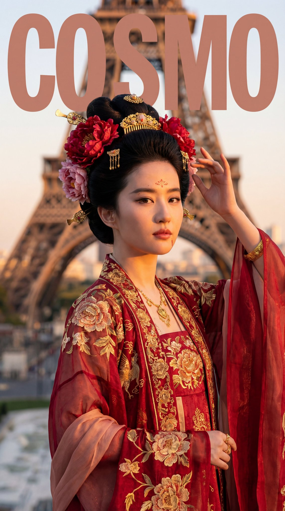

## { "scene": { "setting": "winter", "environment": { "grou

- ID: gpt4o-890-en-1
- Slug: prompt-890-en-1
- 语言: en
- 来源: [来源链接](https://x.com/xmiiru_/status/2001269553599336475)
- 样例图路径: images/part3/890.jpeg

### 提示词

```text
{
  "scene": {
    "setting": "winter",
    "environment": {
      "ground": "pure white snow",
      "lighting": "natural winter daylight, soft and diffused, gentle shadows, no harsh highlights",
      "mood": "quiet, peaceful, poetic, dreamy, nostalgic, gentle winter serenity",
      "color_palette": ["white", "soft gray", "muted green"]
    }
  },
  "subject": {
    "type": "young woman",
    "appearance": {
      "face": "same as reference photo",
      "skin": "fair, smooth",
      "body": "slender",
      "pose": "kneeling on snow, viewed from slightly top-down back angle, facing forward, both hands gently on snow in front",
      "hair": "low neat bun with a few loose strands naturally framing the neck",
      "outfit": {
        "dress_type": "halter-neck",
        "color": "light sage-green",
        "material": "sheer, soft, flowing, slightly translucent",
        "style": "delicately draping, upper back exposed, conveying elegance, softness, vulnerability"
      }
    }
  },
  "art_elements": {
    "snow_sketch": {
      "portrait": {
        "subject": "woman",
        "face": "same as reference photo",
        "style": "pencil-style, graphite, fine linework, soft shading, realistic proportions, gentle contrast, traditional graphite drawing",
        "features": {
          "eyes": "large, expressive",
          "nose": "slender",
          "lips": "delicate",
          "hair": "loosely tied with subtle flyaway strands"
        },
        "placement": "directly carved into snow in front of kneeling woman"
      },
      "text": {
        "content": "2025 Winter",
        "style": "handwritten, pencil or charcoal, blending naturally with snow",
        "placement": "left of the portrait"
      },
      "additional_elements": {
        "pandas": {
          "style": "graphite sketch, minimal, playful",
          "placement": "scattered around, evenly spaced, subtle whimsical touch"
        }
      }
    }
  },
  "photography_style": {
    "type": "cinematic fine art photography",
    "details": {
      "perspective": "slightly top-down back angle (overhead rear perspective)",
      "depth_of_field": "shallow",
      "texture": "crisp snow, high detail fabric, skin, pencil lines",
      "composition": "balanced, clean background"
    }
  },
  "format": {
    "aspect_ratio": "9:16",
    "realism": "ultra-realistic"
  }
}
```

### 样例图

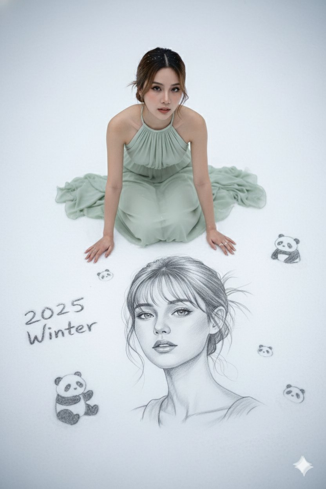

## 女生铅笔素描画

- ID: gpt4o-890-zh-2
- Slug: prompt-890-zh-2
- 语言: zh
- 来源: [来源链接](https://x.com/xmiiru_/status/2001269553599336475)
- 样例图路径: images/part3/890.jpeg

### 提示词

```text
{
“场景”： {
“设置”：“冬季”，
“环境”： {
“地面”: “纯白的雪”
“照明”：“自然的冬季日光，柔和而漫射，淡淡的阴影，没有刺眼的高光”，
“氛围”：“安静、平和、诗意、梦幻、怀旧、温柔的冬日宁静”，
"color_palette": ["白色", "柔和的灰色", "柔和的绿色"]
}
},
“主题”： {
“类型”: “年轻女子”
“外貌”： {
“脸部”： “与参考照片相同”，
“皮肤”: “白皙、光滑”
“身材”： “苗条”，
“姿势”：“跪在雪地上，从略微俯视的后方角度看，面向前方，双手轻轻放在身前的雪地上”，
“头发”：“低低的整齐发髻，几缕碎发自然地垂在颈间”，
“全套服装”： {
"dress_type": "露背领",
“颜色”：“浅鼠尾草绿”，
“材质”：“轻薄、柔软、飘逸、略微半透明”，
“风格”：“轻柔垂坠，露出上背部，传达优雅、柔美、脆弱”
}
}
},
"art_elements": {
"snow_sketch": {
“肖像”： {
主题：女人，
“脸部”： “与参考照片相同”，
“风格”：“铅笔风格，石墨，精细线条，柔和阴影，写实比例，柔和对比，传统石墨画”
“特征”： {
“眼睛”：“大而有神”，
“鼻子”：“纤细”，
“嘴唇”： “精致的”，
“头发”：“松散地扎起来，留有几缕碎发”
},
“位置”：“直接在跪着的女人面前的雪地上雕刻”
},
“文本”： {
"content": "2025 年冬季",
“风格”：“手写，铅笔或炭笔，与雪自然融合”，
“位置”：“肖像左侧”
},
"additional_elements": {
"pandas": {
风格：石墨素描、极简、活泼，
“摆放位置”：“散落在各处，均匀分布，略带奇思妙想”
}
}
}
},
"photography_style": {
“类型”：“电影艺术摄影”，
“细节”： {
“视角”：“略微俯视的后方视角（俯视后方视角）”，
"景深": "浅",
“纹理”：“清脆的雪，高细节的织物，皮肤，铅笔线条”，
构图：平衡、干净的背景
}
},
“格式”： {
"aspect_ratio": "9:16",
“写实主义”: “超写实主义”
}
}
```

### 样例图


## 将人物置身于9部电影的圣诞场景中

- ID: gpt4o-888-zh
- Slug: prompt-888-zh
- 语言: zh
- 来源: [来源链接](https://x.com/songguoxiansen/status/2000918182660596229)
- 样例图路径: images/part3/888.jpeg

### 提示词

```text
[全局指令]： 一个3x3的网格拼贴画，所有9个格子里必须是完全同一位女性。严格保持与参考图一致的面部特征。不要改变她的五官，只改变她的表情、妆容和造型以匹配各电影主题。
格1：《真爱至上》风格-机场告别场景戴圣诞帽，手持包装礼物，温情拥抱，背景机场巨型圣诞树和彩灯装饰，柔和光线
格2：《小鬼当家》风格-惊讶夸张表情手捂脸颊，戴歪圣诞帽，背景家中圣诞树、礼物堆和装饰彩灯，喜剧效果
格3：《极地特快》风格-火车窗前戴睡帽，手持热可可配糖果拐杖，窗外魔幻雪景和圣诞村庄，梦幻蓝金色调
格4：《圣诞怪杰》风格-真实人物绿色调服装配红色圣诞帽，搞怪表情，手持偷来的圣诞装饰，背景圣诞村彩灯和礼物，创意造型
格5：《34街的奇迹》风格-复古百货商店场景穿经典红色圣诞礼服，手持圣诞购物袋，背景巨型圣诞树和复古装饰，经典好莱坞照明（中心）
格6：《圣诞精灵》风格-完整精灵装扮（绿色上衣、红色条纹袜、尖头帽配铃铛），欢乐跳跃姿态，手持糖果拐杖，背景糖果色圣诞工坊
格7：《冰雪奇缘》风格-冰蓝色公主裙配雪花皇冠，手持魔法冰晶，雪花飞舞，背景冰晶城堡和大大的圣诞树，特别的喜庆糖果，迪士尼魔法感
格8：《真实的谎言》风格-黑色礼服配红色圣诞饰品，手持香槟，背景圣诞派对场景彩灯和装饰球，优雅神秘
格9：《Last Christmas》风格-时尚女性穿红色复古大衣配绿色围巾和金色耳环，手持圣诞礼物盒，站在伦敦圣诞街市彩灯下，背景科文特花园巨型圣诞树和节日橱窗，温暖夜景灯光，充满希望的表情，现代浪漫电影美学
每格模仿对应电影的色调、光线和氛围，圣诞装饰元素极其明显，电影海报构图，添加电影感标题文字效果，专业电影剧照质感，4K高清
```

### 样例图

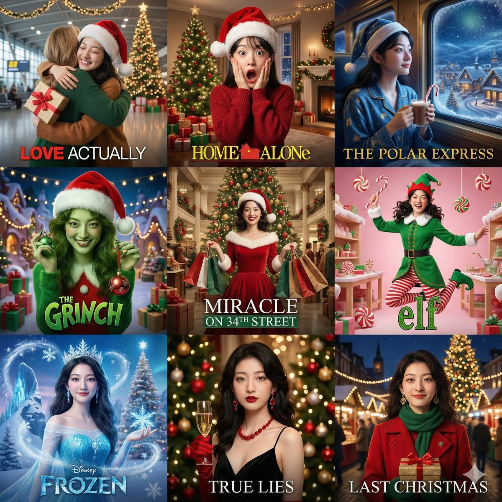

## Create a 3D kawaii a 9:16 canvas featuring nine chibi-st

- ID: gpt4o-887-en-1
- Slug: prompt-887-en-1
- 语言: en
- 来源: [来源链接](https://x.com/rovvmut_/status/2000944698131992587)
- 样例图路径: images/part3/887.jpeg

### 提示词

```text
Create a 3D kawaii a 9:16 canvas featuring nine chibi-style stickers in various outfits, poses and expressions. Use the attached image for reference. Each sticker has a white border and includes a speech bubble with regular use phrases. Set on a soft white-to-pastel blue gradient background for a fun, positive vibe, perfect for WhatsApp use.
```

### 样例图

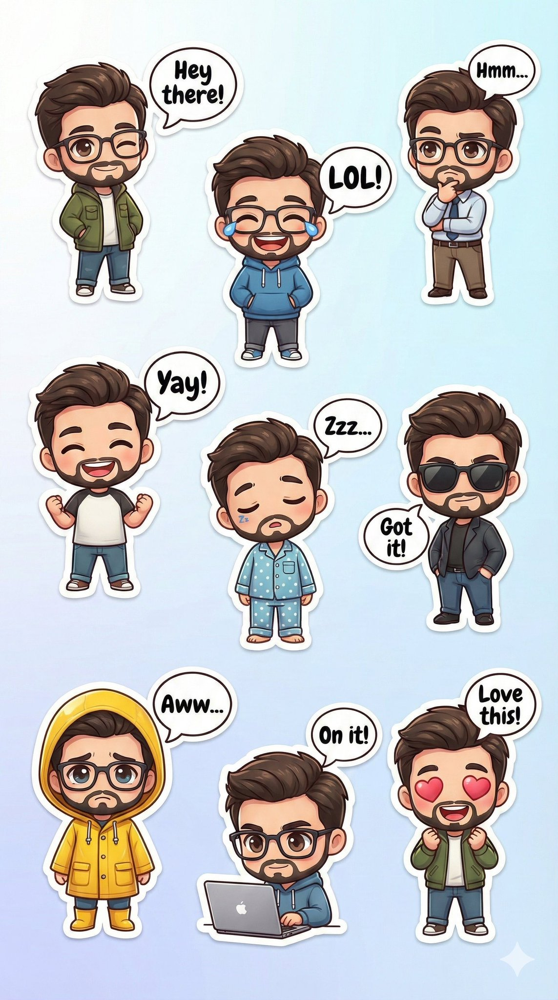

## Q版人物九宫格

- ID: gpt4o-887-zh-2
- Slug: prompt-887-zh-2
- 语言: zh
- 来源: [来源链接](https://x.com/rovvmut_/status/2000944698131992587)
- 样例图路径: images/part3/887.jpeg

### 提示词

```text
制作一个 9:16 的 3D 可爱画布，包含九个不同服装、姿势和表情的 Q 版贴纸。可参考附图。每个贴纸都带有白色边框，并包含一个带有常用短语的对话框。背景采用柔和的白色到淡蓝色渐变，营造出轻松愉悦的氛围，非常适合在 WhatsApp 中使用。
```

### 样例图


## This high-resolution bird's-eye view photograph was take

- ID: gpt4o-886-en-1
- Slug: prompt-886-en-1
- 语言: en
- 来源: [来源链接](https://x.com/oggii_0/status/2001232399368380637)
- 样例图路径: images/part3/886.jpeg

### 提示词

```text
This high-resolution bird's-eye view photograph was taken with a LOMO Ic-a. The ground is covered with countless black-and-white billboard advertisements of beautiful fashion models, and standing on top of the advertisements is an incredibly beautiful Japanese film actress wearing a long black coat.
```

### 样例图

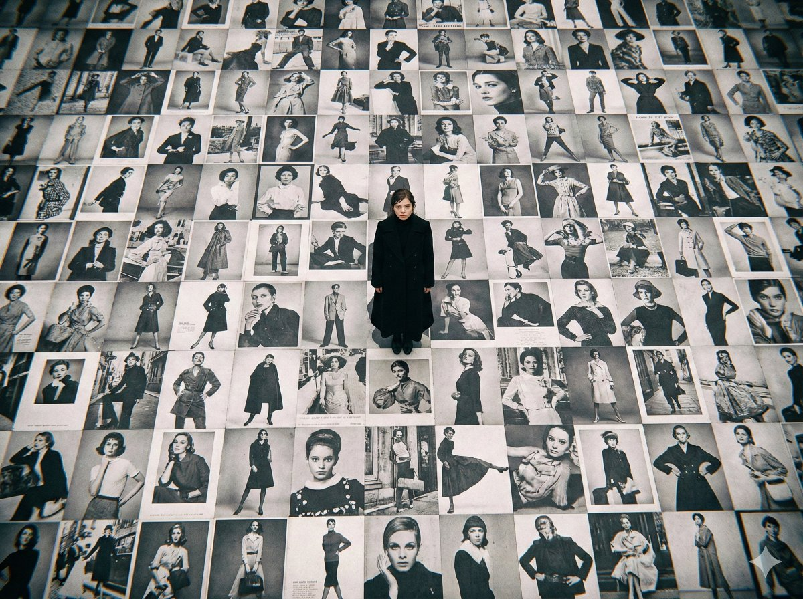

## 模特站在布满了无数黑白广告牌的地面上

- ID: gpt4o-886-zh-2
- Slug: prompt-886-zh-2
- 语言: zh
- 来源: [来源链接](https://x.com/oggii_0/status/2001232399368380637)
- 样例图路径: images/part3/886.jpeg

### 提示词

```text
这张高分辨率鸟瞰照片是用 LOMO Ic-a 拍摄的。地面上布满了无数黑白广告牌，上面是美丽的时尚模特，而站在广告牌上的是一位身穿黑色长外套的绝世美女日本电影女演员。
```

### 样例图


## { "scene_description": "A cinematic, wide-angle interior

- ID: gpt4o-883-en-1
- Slug: prompt-883-en-1
- 语言: en
- 来源: [来源链接](https://x.com/_MehdiSharifi_/status/1994550156763582572)
- 样例图路径: images/part3/883.jpeg

### 提示词

```text
{
  "scene_description": "A cinematic, wide-angle interior shot of a stylish young woman lounging inside a vintage American muscle car during golden hour.",
  "subject": {
    "type": "young woman",
    "age": "early 20s",
    "features": {
      "hair": "long, volumetric, sun-kissed honey blonde hair, tousled and windblown texture",
      "skin": "fair with warm golden undertones from the sun",
      "expression": "confident, alluring gaze directly into the lens, slight pout"
    },
    "attire": "black puff-sleeve milkmaid-style mini dress or romper with a sweetheart neckline",
    "position": "reclined comfortably across the front bench/bucket seats, one leg extended towards the camera (foreshortened), one knee bent, hand resting casually against her forehead."
  },
  "action": {
    "primary": "lounging in the passenger seat",
    "secondary": "shielding eyes/touching hair with left hand",
    "effect": "relaxed, rebellious 'cool girl' aesthetic"
  },
  "environment": {
    "setting": "Interior of a classic 1960s/70s muscle car",
    "foreground_elements": [
      "vintage wood-rimmed 3-spoke steering wheel (partial view)",
      "black vinyl dashboard",
      "chrome accents"
    ],
    "background_elements": [
      "wooden ranch-style fence visible through window",
      "clear blue sky",
      "car rear view mirror reflecting a sliver of the face"
    ]
  },
  "lighting": {
    "style": "Natural Golden Hour",
    "key_light": {
      "type": "Direct, warm sunlight",
      "color": "golden amber",
      "illuminates": [
        "face",
        "hair highlights",
        "legs"
      ]
    },
    "shadows": "Deep, high-contrast shadows inside the car cabin, creating depth"
  },
  "style": {
    "medium": "35mm film photography",
    "aesthetic": "Vintage Americana, editorial fashion, indie road trip",
    "quality": "high fidelity, grain simulation",
    "details": "ultra-realistic textures on leather and skin"
  },
  "scene_composition": {
    "subject_action": "Lounging with attitude, dominating the frame",
    "camera_behavior": "Wide-angle interior shot, creating perspective distortion on the boots",
    "depth_layering": "Steering wheel foreground -> Subject focus -> Exterior background"
  },
  "visual_description": {
    "core_subject": "A photorealistic young woman with blonde waves.",
    "attire_physics": "The black fabric of the dress absorbs light, while the leather boots have specular highlights.",
    "skin_rendering": "Warm, glowing skin texture with natural highlighting from the sun."
  },
  "lighting_and_atmosphere": {
    "type": "Golden Hour Natural Light",
    "specifics": "Hard sunlight entering through the car window, creating distinct shadow lines across the interior upholstery.",
    "color_grade": "Warm, Kodak Portra 400 inspired, rich blacks and vibrant skin tones."
  },
  "attire_customization": {
    "current_clothing": "Black long-sleeve puff-shoulder top with sweetheart neckline, black chunky platform combat boots with laces.",
    "customizable_clothing": "User can replace with 'denim jacket', 'white summer dress', etc."
  },
  "brand_product_customization": {
    "current_brand_product": "Dr. Martens style combat boots",
    "customizable_brand": "",
    "customizable_product": "",
    "product_placement_area": "The boots in the foreground or the car interior branding."
  },
  "objects_and_props": {
    "main_objects": [
      "Vintage car seats (ribbed black leather)",
      "Steering wheel",
      "Rearview mirror"
    ],
    "secondary_objects": [
      "Wooden fence outside",
      "Chrome door handle"
    ]
  },
  "camera_and_lens": {
    "focal_length_feel": "24mm or 28mm (wide angle)",
    "aperture_effect": "f/5.6 (deep enough to keep interior sharp, slight softness outside)",
    "camera_angle": "Eye-level relative to seated subject, shot from driver's side perspective",
    "lens_type": "Wide angle prime lens",
    "bokeh_style": "Minimal bokeh, mostly sharp context"
  }
}
```

### 样例图

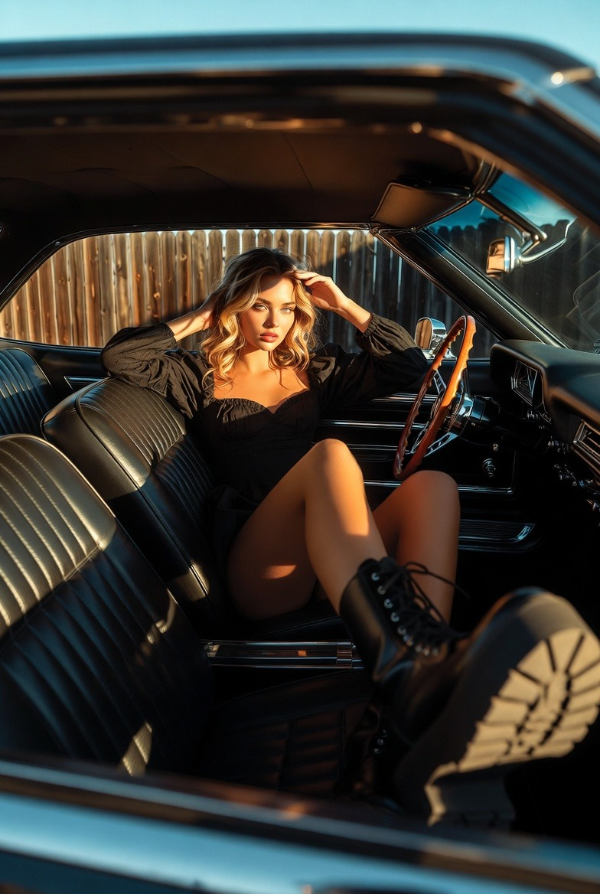

## 女子在一辆复古美式车内

- ID: gpt4o-883-zh-2
- Slug: prompt-883-zh-2
- 语言: zh
- 来源: [来源链接](https://x.com/_MehdiSharifi_/status/1994550156763582572)
- 样例图路径: images/part3/883.jpeg

### 提示词

```text
{
“scene_description” “一段电影感十足的广角内景镜头，展现了一位时尚年轻女子在日落时分慵懒地躺在一辆复古美式肌肉车内。”
“主题”： {
“类型”: “年轻女子”
“年龄”：“20岁出头”，
“特征”： {
“头发”：“长长的、蓬松的、阳光亲吻过的蜜金色头发，蓬松凌乱，略带风吹的质感”，
“肤色”：“白皙，带有阳光带来的温暖金色光泽”，
“表情”：“自信、迷人的眼神直视镜头，微微撅嘴”
},
“服装”：“黑色泡泡袖挤奶女工风格迷你连衣裙或连体裤，心形领口”，
“姿势”：“舒适地斜倚在前排长椅/桶形座椅上，一条腿伸向镜头（画面缩短），一条膝盖弯曲，一只手随意地放在额头上。”
},
“行动”： {
“主要”： “躺在乘客座位上”，
“次要的”：“用左手遮住眼睛/触摸头发”，
“效果”：“轻松叛逆的‘酷女孩’美学”
},
“环境”： {
“场景”：“一辆经典的 20 世纪 60 年代/70 年代肌肉车的内饰”，
"前景元素": [
“复古木质三辐方向盘（局部视图）”
“黑色乙烯基仪表板”，
“镀铬装饰”
],
“背景元素”：[
“透过窗户可以看到木制牧场风格的围栏”
“晴朗的蓝天”，
“汽车后视镜映出脸部的一角”
]
},
“灯光”： {
“风格”：“自然黄金时刻”，
"key_light": {
“类型”：“直接、温暖的阳光”，
“颜色”：“金琥珀色”，
“照亮”：[
“脸”，
“头发挑染”，
“腿”
]
},
“阴影”：“车厢内部深邃、高对比度的阴影，营造出景深效果”
},
“风格”： {
“媒介”: “35mm 胶片摄影”
“美学”：“复古美式风格、时尚大片、独立公路旅行”
“质量”：“高保真度，颗粒模拟”，
“细节”：“皮革和皮肤上的超逼真纹理”
},
"scene_composition": {
“subject_action”: “慵懒地摆着姿势，占据了画面”
“camera_behavior”: “广角室内镜头，在靴子上产生透视变形”
"depth_layering": "方向盘前景->主体焦点->外部背景"
},
"visual_description": {
核心主题：一位拥有金色波浪卷发的写实年轻女性。
"attire_physics": "连衣裙的黑色面料会吸收光线，而皮靴则具有镜面反射的高光。"
“skin_rendering”: “温暖、有光泽的肌肤纹理，带有阳光带来的自然高光。”
},
"lighting_and_atmosphere": {
“类型”：“黄金时段自然光”，
“具体情况”：“强烈的阳光透过车窗照射进来，在车内座椅上投下清晰的阴影线。”
"color_grade": "温暖的色调，灵感来自柯达Portra 400，浓郁的黑色和鲜艳的肤色。"
},
"attire_customization": {
"current_clothing": "黑色长袖泡泡袖上衣，心形领口，黑色厚底系带马丁靴。"
"customizable_clothing": "用户可以替换为'牛仔夹克'、'白色夏日连衣裙'等。"
},
"品牌产品定制": {
"current_brand_product": "马丁靴款式"
"customizable_brand": "",
"customizable_product": "",
"product_placement_area": "前景中的靴子或汽车内饰品牌标识。"
},
"objects_and_props": {
"main_objects": [
“复古汽车座椅（黑色罗纹皮革）”
“方向盘”，
“后视镜”
],
"secondary_objects": [
“外面有木栅栏，”
“镀铬门把手”
]
},
"camera_and_lens": {
"focal_length_feel": "24mm 或 28mm（广角）",
"aperture_effect": "f/5.6（足够深，可以保持内部清晰，外部略微柔和）",
“camera_angle”: “相对于坐着的拍摄对象，从驾驶员侧视角拍摄，视线与拍摄对象视线齐平”
"lens_type": "广角定焦镜头",
"bokeh_style": "极简散景，主体清晰"
}
}
```

### 样例图


## { "image_prompt": { "critical_instruction": "ABSOLUTE PR

- ID: gpt4o-874-en-1
- Slug: prompt-874-en-1
- 语言: en
- 来源: [来源链接](https://x.com/songguoxiansen/status/2000055154415182214)
- 样例图路径: images/part3/874.jpeg

### 提示词

```text
{
  "image_prompt": {
    "critical_instruction": "ABSOLUTE PRIORITY: Maintain identical facial structure across all panels. Do not alter underlying bone structure, nose shape, eye spacing, or jawline regardless of the expression being rendered. The identity must be unmistakable in every single shot.",
    "format": "3x3 grid collage",
    "subject": {
      "face_reference": "uploaded_photo",
      "face_identity_lock": "CRITICAL: fixed identity, zero deviation from reference facial features",
      "face_match_accuracy": "100% exact match enforced",
      "identity_preservation_details": "Ensure consistent interpupillary distance, exact nose bridge shape, and jaw structure in every panel.",
      "negative_constraints": [
        "do not morph nose shape",
        "do not change eye size or spacing",
        "do not alter cheekbone structure",
        "no plastic surgery look"
      ],
      "style": "hyper-realistic portrait photography, 8k resolution, raw photo aesthetic",
      "skin": "highly detailed natural skin texture, visible pores, subtle imperfections, realistic complexion, consistent across all lighting conditions",
      "camera_settings": "shot on Sony A7R IV, 85mm portrait lens, f/1.8 aperture, sharp focus on eyes, shallow depth of field"
    },

    "panels": [
      {
        "expression": "joyful",
        "pose": "bright natural smile (maintaining jaw structure), shoulders slightly raised",
        "hairstyle": "high ponytail with loose strands",
        "outfit": "pastel cotton hoodie",
        "background": "soft gradient sky blue studio backdrop"
      },
      {
        "expression": "surprised",
        "pose": "hands near face, wide eyes (without altering eye shape), natural reaction",
        "hairstyle": "loose natural wavy hair",
        "outfit": "casual cotton t-shirt",
        "background": "light peach studio backdrop"
      },
      {
        "expression": "sad",
        "pose": "head tilted down, emotional soft eyes",
        "hairstyle": "messy low bun",
        "outfit": "oversized wool sweater",
        "background": "muted lavender tone studio backdrop"
      },
      {
        "expression": "tender",
        "pose": "gentle smile, head slightly tilted",
        "hairstyle": "elegant half-up hairstyle",
        "outfit": "soft knit top",
        "background": "warm beige studio backdrop"
      },
      {
        "expression": "daring",
        "pose": "confident gaze, chin slightly raised (showing consistent jawline)",
        "hairstyle": "chic slicked-back hair",
        "outfit": "stylish leather or denim jacket",
        "background": "deep teal studio backdrop"
      },
      {
        "expression": "playful",
        "pose": "cheeks slightly puffed (ensure nose remains unchanged), playful stare",
        "hairstyle": "short textured bob",
        "outfit": "striped linen shirt",
        "background": "soft mint green studio backdrop"
      },
      {
        "expression": "charming",
        "pose": "wink with finger poking cheek",
        "hairstyle": "playful double buns",
        "outfit": "trendy graphic tee",
        "background": "light pink studio backdrop"
      },
      {
        "expression": "shocked",
        "pose": "mouth slightly open, eyebrows raised (forehead wrinkles match reference age)",
        "hairstyle": "tousled loose hair",
        "outfit": "simple silk blouse",
        "background": "light yellow studio backdrop"
      },
      {
        "expression": "furious",
        "pose": "arms crossed, intense glare (eyes narrowed but spacing unchanged)",
        "hairstyle": "tight high bun",
        "outfit": "dark fitted turtleneck",
        "background": "deep red studio backdrop"
      }
    ],

    "rendering": {
      "lighting": "cinematic studio lighting, softbox illumination, remix of warm and cool tones, rim light for separation",
      "shading": "realistic shadows, subsurface scattering on skin, consistent facial modeling",
      "quality": "photorealistic, ultra-detailed, award-winning photography, magazine quality",
      "consistency": "FLAWLESS identity consistency and lighting setup across all 9 panels"
    },

    "composition": {
      "grid_alignment": "perfectly aligned 3x3 photo booth strip style",
      "spacing": "equal white margins between panels",
      "background_border": "clean white border"
    }
  }
}
```

### 样例图

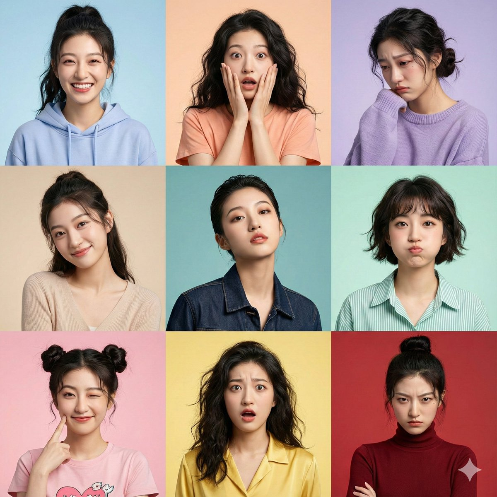

## 真人版的9宫格照片

- ID: gpt4o-874-zh-2
- Slug: prompt-874-zh-2
- 语言: zh
- 来源: [来源链接](https://x.com/songguoxiansen/status/2000055154415182214)
- 样例图路径: images/part3/874.jpeg

### 提示词

```text
{
"image_prompt": {
“关键指令”： “绝对优先事项：所有画面中保持面部结构完全一致。无论表情如何，都不得改变骨骼结构、鼻子形状、眼距或下颌线。每一帧画面中都必须清晰可辨。”
"格式": "3x3 网格拼贴画",
“主题”： {
"face_reference": "uploaded_photo",
"face_identity_lock": "严重：身份已固定，与参考面部特征无偏差",
"face_match_accuracy": "强制执行 100% 精确匹配",
"identity_preservation_details": "确保每个面板中瞳距一致、鼻梁形状精确、下颌结构准确。"
"negative_constraints": [
“不要改变鼻子的形状”，
“不要改变眼睛的大小或间距，”
“不要改变颧骨结构”，
“没有整容痕迹”
],
“风格”：“超写实人像摄影，8K分辨率，原始照片美学”，
“皮肤”：“高度精细的自然皮肤纹理，可见毛孔，细微瑕疵，逼真的肤色，在所有光照条件下保持一致”。
"camera_settings": "使用索尼 A7R IV 拍摄，85mm 人像镜头，f/1.8 光圈，眼睛锐化对焦，浅景深"
},

“面板”：[
{
“表情”： “喜悦的”，
“姿势”：“灿烂自然的笑容（保持下颌结构），肩膀微微抬起”，
“发型”：“高马尾辫，留出几缕碎发”，
“服装”： “淡色棉质连帽衫”，
“背景”: “柔和渐变天蓝色影棚背景”
},
{
“表情”：“惊讶”，
“姿势”：“双手靠近脸部，睁大眼睛（不改变眼形），自然反应”，
“发型”：“自然蓬松的波浪卷发”，
“服装”：“休闲棉质T恤”，
背景：浅桃色影棚背景
},
{
“表情”：“悲伤”，
“姿势”：“低头，眼神柔和，充满情感”，
发型：凌乱的低发髻，
“服装”: “宽松羊毛衫”，
“背景”：“柔和的薰衣草色调工作室背景”
},
{
“表达方式”：“温柔的”，
“姿势”：“温柔的微笑，头部微微倾斜”，
“发型”：“优雅的半扎发型”，
服装：柔软针织上衣，
背景：暖米色影棚背景
},
{
“表达方式”：“大胆的”，
“姿势”：“眼神自信，下巴微微抬起（展现出连贯的下颌线条）”，
“发型”：“别致的油头”，
“服装”：“时尚的皮夹克或牛仔夹克”，
背景：深蓝绿色摄影棚背景
},
{
“表情”：“俏皮的”，
“姿势”：“双颊微微鼓起（确保鼻子保持不变），眼神俏皮”，
“发型”：“短款纹理波波头”，
“服装”：“条纹亚麻衬衫”，
背景：柔和的薄荷绿色摄影棚背景
},
{
“表情”：“迷人”，
“姿势”：“眨眼并用手指戳脸颊”，
发型：俏皮的双丸子头，
“服装”: “时髦的图案T恤”
背景：浅粉色摄影棚背景
},
{
“表情”：“震惊”，
“姿势”：“嘴巴微张，眉毛上扬（额头皱纹与参考年龄相符）”，
“发型”：“蓬松的披肩发”，
“服装”：“简单的丝绸衬衫”，
“背景”: “浅黄色摄影棚背景”
},
{
“表情”：“愤怒的”，
“姿势”：“双臂交叉，目光锐利（眼睛眯起但间距不变）”
发型：高高盘发，
“服装”：“深色修身高领毛衣”，
“背景”：“深红色摄影棚背景”
}
],

渲染：{
“灯光”：“电影摄影棚灯光、柔光箱照明、冷暖色调混合、轮廓光用于分离”，
“阴影”：“逼真的阴影、皮肤表面的次表面散射、一致的面部建模”，
“品质”：“照片级逼真、细节超多、屡获殊荣的摄影作品，杂志品质”，
“一致性”：“所有 9 个面板的标识一致性和灯光设置完美无瑕”
},

“作品”： {
"grid_alignment": "完美对齐的 3x3 照片亭条形样式",
“间距”：“面板之间留出相等的白色边距”，
"background_border": "干净的白色边框"
}
}
}
```

### 样例图


## 一生要出片的中国女人系列之故宫打卡

- ID: gpt4o-872-zh
- Slug: prompt-872-zh
- 语言: zh
- 来源: [来源链接](https://x.com/hx831126/status/2000793779977273724)
- 样例图路径: images/part3/872.jpeg

### 提示词

```text
【PROJECT GOAL | 项目目标】 生成一张 9:16 竖版「高端时尚杂志封面级」写实照片：以我上传的 FACE_REF 为人物身份参考，100%还原五官与骨相；人物身穿“明制华丽礼服方向”的重工汉服（多层叠穿、手工刺绣/织金锦、贵重金饰头面），在故宫红墙长廊雪景中拍摄。画面具备《Vogue》《Harper’s Bazaar》《ELLE》《Cosmopolitan》《Marie Claire》《i-D》《Allure》《FLAUNT》级别的摄影、造型与封面设计，以上杂志随机任选一作为杂志的封面设计，并保持选择杂志的一贯设计风格（中英文设计）

【INPUTS | 输入】

FACE_REF：我上传的人物五官参考图（身份锁定）

【ABSOLUTE PRIORITY | 身份锁定（最高优先级）】

100%还原 FACE_REF 的五官与骨相；眼距、鼻梁鼻翼、唇形、下颌线、颧骨结构完全一致，不得漂移。

真实皮肤质感：可见细微纹理与毛孔，不要过度磨皮与网红化。

成年女性形象（adult）。

【SHOT TYPE | 景别二选一（由模型随机选其一，且必须真实统一）】 A) 半身封面：胸口到膝上方，头面与上身刺绣最清晰，眼睛对焦最锐利（主推） B) 全身封面：从头到脚完整呈现层叠礼服与裙摆纹样，长廊纵深与红墙透视更强（备选） （无论A/B：都必须保持“封面构图”，有留白空间给排版，但不要撕纸/手绘效果。）

【LOCATION | 场景（故宫/紫禁城）】

北京故宫红墙长廊：朱红墙、红柱、雕花窗极、彩绘梁枋细节与强透视纵深。

天气二选一（随机）：1) 细雪飘落 2) 雪后晴朗（檐下/台阶残雪、空气通透）

背景干净：无游客、无现代标识、无手机状态栏UI、无水印字幕。

【LIGHTING & CAMERA | 摄影质感（杂志级）】

镜头感：85mm人像质感（半身）或 50mm/70mm（全身），浅景深，眼睛最清晰。

光线：冬日自然光 + 柔和补光；金饰/珠翠有真实高光但不爆；刺绣纹理清晰可辨。

色彩：高级电影感，红墙与服装主色不互相脏染；整体干净、通透、质感厚。

【WARDROBE | 明制华丽礼服（重工、多层叠、可读的硬锚点）】 目标审美：“金饰为主、流苏密集、凤冠、衣服大面积织金刺绣、层叠繁复但高级不俗艳”。

轮廓与层次（必须多层叠穿）

内层：白色/黑衣立领/里领清晰可见（干净、挺括，做出层次边界）

中层：对襟袄/衫（或方领/立领结构感），袖口宽大、滚边精细

外层：披肩/霞帔式的礼服结构（有明显“压襟/佩饰”承托），整体层次厚重

下装：长裙/马面裙方向，裙摆纹样连续，底边有织金边或刺绣边（全身版本必须明显）

面料与工艺（重手工必须“看得见”）

主面料：织金锦/提花锦（真实纤维感，暗纹浮起）

主要工艺：盘金绣、金线绣、立体刺绣、贴布绣（让花纹有“微微起伏”的厚度）

纹样主题：牡丹/团花/祥云/瑞兽（精致、密度高、但图案边缘清晰，瑞兽不能是龙）

细节：滚边、暗扣、系带、护领、胸前“压襟/璎珞感”层叠装饰（但不杂乱）

头面（黄金为主的重工头饰，必须华丽）

金色为主的方向：金丝累珠、点翠/珠翠、密集簪钗、左右对称的长流苏坠饰，凤冠

流苏长度与密度要“明显”：走动或微风时有轻微摆动

耳饰/颈饰：金+珍珠+玉（贵重但不廉价闪）

【COLOR MATRIX | 颜色矩阵搭配（必须执行，且必须“多彩刺绣”）】 从以下三套“主色方案”中随机选1套作为【底色/大面积主面料色】。 注意：主色只决定“底色”，刺绣必须是【宫廷织锦式多色刺绣】（不允许只有金色刺绣）。

Scheme G (翡翠绿底)： 底色：翡翠绿/孔雀绿（大面积主面料） 刺绣：多色绣线 + 盘金绣混用（至少包含：金色、朱红/胭脂红、宝蓝/靛蓝、米白、淡紫或藕粉） 层次点亮：米白里领/内衬边 + 少量朱红与宝蓝作为“宫廷撞色”点缀

Scheme A (杏底)： 底色：暖杏/米杏（大面积主面料） 刺绣：多色绣线 + 盘金绣混用（至少包含：金色、翡翠绿/松石绿、朱红/珊瑚红、孔雀蓝/靛蓝、米白） 层次点亮：用翡翠绿与朱红做小面积宫廷撞色，保持“雅而不素、贵而不艳”

Scheme R (红底)： 底色：深朱红/绯红（大面积主面料） 刺绣：多色绣线 + 盘金绣混用（至少包含：金色、孔雀蓝/靛蓝、松石绿、米白、胭脂粉或珊瑚红） 层次点亮：米白里领/内衬边 + 少量翡翠绿或孔雀蓝作冷暖对比

【颜色执行规则】

“多彩刺绣”必须看得见：至少 4 种以上彩色绣线清晰可辨，且与金线叠加，形成丰富层次。

纹样边缘要清晰，不糊成一片；红墙背景下服装与背景必须分离，层次清楚、低脏度、厚而不闷。

禁止出现“单一金色刺绣覆盖全身”的单调效果。

【POSE | 封面姿态（端庄、贵气、非摆拍俗气）】

半身：双手在身前轻持团扇/宫扇（扇面刺绣清晰），或一手轻拢袖口一手自然垂落

全身：站姿端正、重心稳定，裙摆自然垂坠；袖摆形成优雅弧线

表情：沉静、克制、自信；不要夸张大笑，不要做短视频“眨眼比心”。

【OUTPUT | 输出】

1 张 9:16 竖版写实杂志封面级照片

随机：半身 or 全身（A/B二选一）

随机：雪中 or 雪后晴朗（天气二选一）

随机：翡翠绿 / 杏 / 红 /（颜色矩阵三选一）

造型：明制华丽礼服方向 + 金色重工凤冠头面 + 多层叠穿 + 大面积织金刺绣
```

### 样例图

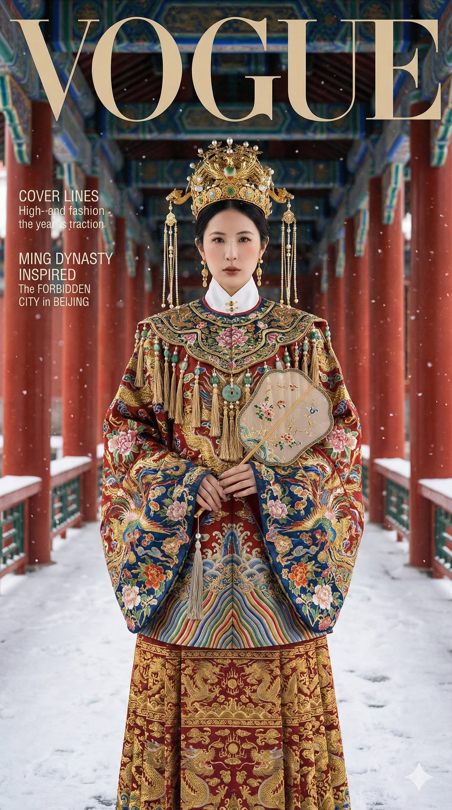

## { "project_name": "Auto_Creative_Music_Video_Storyboard_

- ID: gpt4o-871-en-1
- Slug: prompt-871-en-1
- 语言: en
- 来源: [来源链接](https://x.com/firatbilal/status/2000575188094599311)
- 样例图路径: images/part3/871.jpeg

### 提示词

```text
{
"project_name": "Auto_Creative_Music_Video_Storyboard_Generator",
"version": "4.0 (Video Clip Focus - Multi-Input)",
"ai_role": "You are a visionary Creative Director and Cinematographer for a high-end music video. Your goal is to create a cohesive, visually stunning 9-scene storyboard based on provided visual references.",
"input_configuration": {
"source_material": "Multiple Uploaded Images. The AI must synthesize all provided images to establish the definitive subject(s), color palette, lighting scheme, and overall aesthetic.",
"video_clip_style_selector": {
"description": "Select the overarching genre/mood for the music video clip behavior.",
"options": ["Creative", "Surreal", "Absurd", "Dreamlike", "High-Fashion", "Cyberpunk", "Gothic", "Abstract"],
"selected_style": "Pixar")
}
},
"processing_rules": {
"consistency_is_paramount": "Strictly maintain the visual identity established by the input images across all 9 scenes. The subject's features, the specific lighting mood (e.g., neon stripes, iridescence), and the environment style must never deviate.",
"apply_selected_style": "Inject the mood and behaviors of the 'selected_style' into the movement, composition, and events of the scenes. (e.g., if 'Surreal', gravity might behave oddly; if 'Absurd', actions might be illogical).",
"imply_motion": "These are not static photos. Each panel must look like a still frame taken from a moving video clip, implying action, camera movement, or atmospheric shifting.",
"no_text_overlays": true,
"output_aspect_ratio": "16:9 for all panels."
},
"scene_progression_structure": {
"note": "Design 9 distinct visual beats representing the flow of a music video.",
"row_1_introduction": {
"panel_1": "Opening Scene: Establishing the mood and environment. Subtle introduction of the subject.",
"panel_2": "Focus on Detail: A close cinematic shot emphasizing a key textural element from the input (e.g., makeup, clothing material, light reflection).",
"panel_3": "Building Atmosphere: The subject interacts with the environment in a way defined by the selected style."
},
"row_2_escalation": {
"panel_4": "Dynamic Action: The energy increases. Stronger movement or a shift in lighting intensity.",
"panel_5": "The 'Surreal' Turn: A moment that heavily highlights the selected video style (e.g., an impossible angle, abstract background shift, unusual pose).",
"panel_6": "Intense Emotion: A powerful, emotive shot focusing on the subject's connection to the (implied) song."
},
"row_3_climax_and_resolution": {
"panel_7": "Visual Climax: The most visually striking and complex shot. The peak of the video's energy.",
"panel_8": "Pulling Back: A wider view showing the aftermath of the climax or a change in state.",
"panel_9": "Closing Scene: A resolving shot that fades out or ends the visual journey, leaving a lasting impression."
}
},
"final_prompt_instruction": "Synthesize all uploaded input images into a single, cohesive visual identity. Acting as a Creative Director, generate a 3x3 grid storyboard composed of 9 high-quality video stills. You must strictly apply the requested 'selected_style' to the narrative flow defined in the 'scene_progression_structure'. Ensure every panel looks like a frame from the same high-budget music video, maintaining perfect consistency in subject and lighting. Do NOT include any text overlays on the final images."
}
```

### 样例图

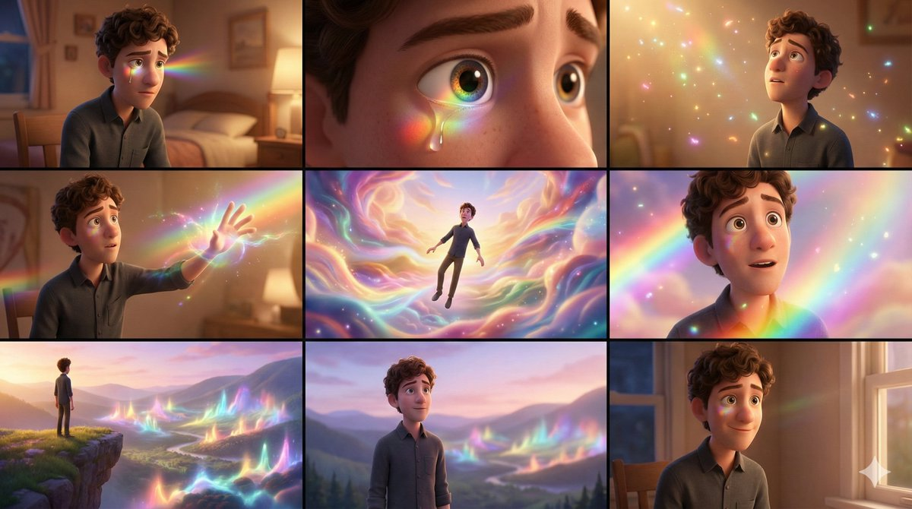

## 3x3网格皮克斯风格故事板

- ID: gpt4o-871-zh-2
- Slug: prompt-871-zh-2
- 语言: zh
- 来源: [来源链接](https://x.com/firatbilal/status/2000575188094599311)
- 样例图路径: images/part3/871.jpeg

### 提示词

```text
{
"project_name": "Auto_Creative_Music_Video_Storyboard_Generator",
“版本”：“4.0（视频剪辑焦点 - 多输入）”
“ai_role”： “您是一位富有远见的创意总监兼摄影师，负责一部高端音乐视频的拍摄。您的目标是根据提供的视觉参考资料，创作一个连贯且视觉效果惊艳的9个场景的故事板。”
"input_configuration": {
"source_material": "多张上传的图片。人工智能必须综合所有提供的图片，以确定最终的主题、调色板、光照方案和整体美感。"
"video_clip_style_selector": {
“描述”：“选择音乐视频片段行为的总体类型/氛围。”
“选项”：[“创意”、“超现实”、“荒诞”、“梦幻”、“高级时装”、“赛博朋克”、“哥特”、“抽象”]
"selected_style": "皮克斯")
}
},
"processing_rules": {
“一致性至关重要”：在所有9个场景中严格保持输入图像所建立的视觉识别。主体特征、特定光照氛围（例如，霓虹条纹、虹彩）和环境风格绝不能偏离。
“apply_selected_style”：将“selected_style”的情绪和行为注入到场景的动作、构图和事件中。（例如，如果是“超现实”，重力可能会表现得很奇怪；如果是“荒诞”，动作可能会不合逻辑。）”
"imply_motion": "这些不是静态照片。每个画面都必须看起来像是从动态视频片段中截取的静帧，暗示着动作、镜头运动或氛围变化。"
"no_text_overlays": true,
"output_aspect_ratio": "所有面板均为 16:9。"
},
"scene_progression_structure": {
“备注”：“设计9个不同的视觉节拍，以展现音乐视频的流程。”
"row_1_introduction": {
“panel_1”： “开场场景：营造氛围和环境。巧妙地引入主题。”
“panel_2”：“聚焦细节：特写镜头，强调素材中的关键纹理元素（例如，妆容、服装材质、光线反射）。”
“panel_3”：“营造氛围：主体以所选风格定义的方式与环境互动。”
},
"row_2_escalation": {
“panel_4”：“动态动作：能量增强。动作更剧烈或光照强度发生变化。”
"panel_5": "超现实转折：突出所选视频风格的瞬间（例如，不可能的角度、抽象背景的变换、不寻常的姿势）。"
“panel_6”：“强烈的情感：一张充满力量、饱含情感的镜头，聚焦于人物与（隐含的）歌曲之间的联系。”
},
"row_3_climax_and_resolution": {
“panel_7”：“视觉高潮：视觉效果最震撼、最复杂的镜头。视频能量的巅峰。”
“panel_8”：“拉远镜头：展现高潮过后或状态转变的更广阔视角。”
“panel_9”: “结尾场景：一个结束视觉旅程的镜头，逐渐淡出或结束，留下深刻的印象。”
}
},
"final_prompt_instruction": "将所有上传的输入图像合成为一个统一的视觉形象。作为创意总监，生成一个由9张高质量视频静帧组成的3x3网格故事板。您必须严格按照“scene_progression_structure”中定义的叙事流程应用指定的“selected_style”。确保每个分镜都像同一部高预算音乐视频中的一帧，并在主题和光线上保持完全一致。请勿在最终图像上添加任何文字叠加层。"
}
```

### 样例图


## { "scene_description": "A wide panoramic stage scene sho

- ID: gpt4o-870-en-1
- Slug: prompt-870-en-1
- 语言: en
- 来源: [来源链接](https://x.com/ShreyaYadav___/status/2000794568091226383)
- 样例图路径: images/part3/870.jpeg

### 提示词

```text
{
  "scene_description": "A wide panoramic stage scene showing a lineup of multiple women kneeling or squatting in synchronized poses, viewed from behind, wearing coordinated but varied dance outfits under soft stage lighting.",
  "characters": [
    {
      "name": "Unknown",
      "age": "Young adult",
      "gender": "Female",
      "ethnicity": "Unclear / mixed",
      "skin_tone": "Light to medium tones",
      "hair": {
        "style": "Long, straight or slightly wavy, worn loose",
        "color": "Dark brown to black"
      },
      "clothing": {
        "head": "None",
        "torso": "Fitted crop tops, camisoles, or sports bras in black, white, or dark colors",
        "legs": "Short skirts, fitted shorts, or bodysuits",
        "feet": "High-heeled shoes",
        "materials": ["fabric", "spandex", "leather-like materials"]
      },
      "pose": "Squatting or kneeling with knees bent, backs straight, facing away from the camera",
      "facial_expression": "Not visible (rear view)",
      "accessories": ["None visible"],
      "held_objects": [],
      "position_in_scene": "Foreground to midground, evenly spaced across the stage",
      "emotions": ["Neutral", "Focused", "Performance-ready"]
    }
  ],
  "environment": {
    "setting": "Indoor stage or performance hall",
    "background_elements": ["Plain backdrop", "Soft gradient lighting"],
    "architectural_features": ["Flat stage floor", "Open performance space"],
    "weather": "Not applicable",
    "lighting": {
      "type": "Artificial",
      "sources": ["Overhead stage lights"],
      "shadows": "Soft",
      "reflections": "Subtle reflections on the stage floor"
    },
    "atmosphere": "Clean, controlled, professional performance environment"
  },
  "objects": [
    {
      "name": "Stage floor",
      "type": "Surface",
      "position": "Foreground and midground",
      "appearance": "Smooth, polished surface",
      "materials": ["Wood or laminate"],
      "interaction": "Yes, performers kneeling and balancing on it"
    }
  ],
  "logos_or_text": [
    {
      "content": "Small watermark or logo in bottom right corner",
      "font_family": "Sans-serif",
      "font_style": "Regular",
      "font_size": "Small",
      "color": "# FFFFFF",
      "position": "Bottom right",
      "effects": ["None"]
    }
  ],
  "mood": "Stylized, synchronized, performance-focused",
  "dominant_colors": ["#000000", "# 2F2F2F", "# F 5F5F5", "#8 B5E3C"],
  "camera": {
    "perspective": "Third-person",
    "angle": "Eye-level",
    "position": "Directly behind the subjects",
    "focal_length": "Wide",
    "depth_of_field": "Deep, all subjects in focus",
    "composition": "Symmetry and repetition across the frame"
  }
}
```

### 样例图

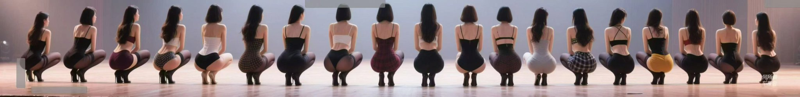

## 舞台场景上多名女性蹲着

- ID: gpt4o-870-zh-2
- Slug: prompt-870-zh-2
- 语言: zh
- 来源: [来源链接](https://x.com/ShreyaYadav___/status/2000794568091226383)
- 样例图路径: images/part3/870.jpeg

### 提示词

```text
{
“场景描述”： “一个宽广的全景舞台场景，展现了多名女性跪着或蹲着，摆出同步的姿势，镜头从背后拍摄，她们身着协调但又各具特色的舞蹈服装，舞台灯光柔和。”
“人物”： [
{
"名称": "未知",
“年龄”: “青年”
"性别": "女",
“种族”: “不明/混血”
"skin_tone": "浅至中等肤色",
“头发”： {
“发型”：“长直发或略带波浪，随意披散着”，
颜色：深棕色至黑色
},
“衣服”： {
"head": "无",
“上衣”：“黑色、白色或深色的修身露脐上衣、吊带背心或运动文胸”，
“腿部”：短裙、紧身短裤或连体衣，
“脚”: “高跟鞋”
“材料”：[“织物”、“氨纶”、“类皮革材料”]
},
“姿势”：“蹲着或跪着，膝盖弯曲，背部挺直，背对镜头”，
"facial_expression": "不可见（后视图）",
“配件”：[“无可见”]
"held_objects": [] ,
"position_in_scene": "前景到中景，均匀分布在舞台上",
“情绪”：[“中性”、“专注”、“准备就绪”]
}
],
“环境”： {
“设置”: “室内舞台或表演厅”，
"background_elements": ["纯色背景", "柔和渐变光"],
"architectural_features": ["平坦的舞台地面", "开放式表演空间"],
“天气”：“不适用”，
“灯光”： {
类型：人工，
“光源”：[“舞台顶灯”]，
“阴影”：“柔和”，
“倒影”：舞台地板上的微妙倒影
},
“氛围”：“洁净、可控、专业的演出环境”
},
“对象”：[
{
"名称": "舞台地板",
"type": "表面",
“位置”：“前景和中景”，
“外观”：“光滑、抛光的表面”，
“材料”：[“木材或层压板”]，
“互动”：“是的，表演者跪在上面保持平衡”
}
],
"logos_or_text": [
{
"内容": "右下角有小水印或徽标"
"font_family": "无衬线字体",
"font_style": "常规",
"font_size": "小",
“颜色”：“# FFFFFF”，
“位置”：“右下角”，
“效果”：[“无”]
}
],
“氛围”：“风格化、同步、注重表演”，
"主色": ["#000000", "#2F2F2F", "#F5F5F5", "#8B5E3C"],
“相机”： {
“视角”： “第三人称”
“角度”：“视线水平”，
“位置”：“就在被摄对象身后”，
"focal_length": "广角",
"depth_of_field": "景深，所有主体都清晰对焦"
“构图”：“画面中的对称和重复”
}
}
```

### 样例图


## A high-end glossy surreal fashion photograph of a young 

- ID: gpt4o-869-en-1
- Slug: prompt-869-en-1
- 语言: en
- 来源: [来源链接](https://x.com/Zar_xplorer/status/2000527303353540953)
- 样例图路径: images/part3/869.jpeg

### 提示词

```text
A high-end glossy surreal fashion photograph of a young woman floating inside a giant transparent plastic water bag, like a human goldfish. She wears a tight black catsuit and white sneakers, her body posed in a graceful mid-motion curve, one arm lifted, the other extended, hair drifting weightlessly in the water. Three small golden fish swim around her, adding playful contrast. The bag is held from above by a large manicured hand with long red nails, stretching the plastic and creating sharp specular highlights and distortions. Background: a clean deep red studio backdrop with subtle gradient and no distractions. Lighting is cinematic and polished, with crisp reflections on the plastic, smooth skin tones, and strong contrast that emphasizes the contours of her body and the surreal aquarium concept. Ultra-high resolution, editorial campaign quality.
```

### 样例图

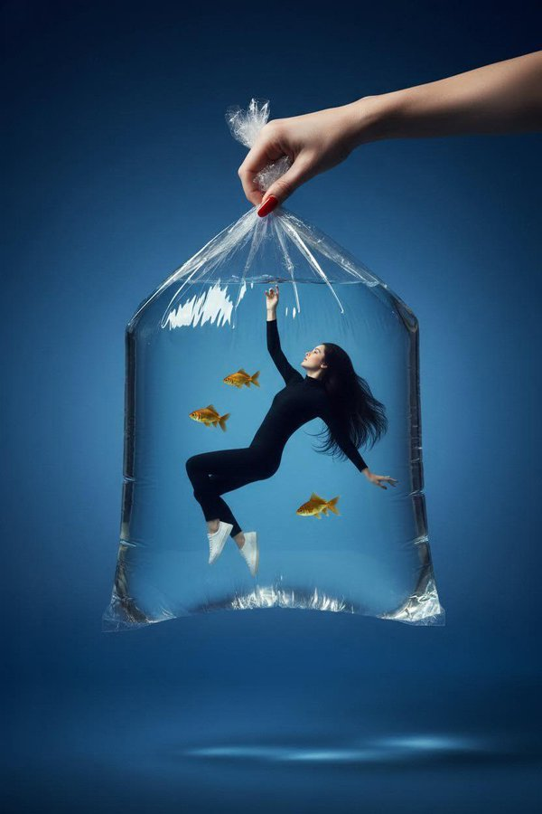

## 女子漂浮在巨大的透明塑料水袋中

- ID: gpt4o-869-zh-2
- Slug: prompt-869-zh-2
- 语言: zh
- 来源: [来源链接](https://x.com/Zar_xplorer/status/2000527303353540953)
- 样例图路径: images/part3/869.jpeg

### 提示词

```text
一张高端光鲜亮丽的超现实主义时尚摄影作品，一位年轻女子漂浮在一个巨大的透明塑料水袋中，宛如一条人形金鱼。她身着黑色紧身连体衣和白色运动鞋，身体姿态优美，呈现出一种动感的曲线，一只手臂抬起，另一只手臂伸展，秀发在水中轻盈飘动。三条金色小鱼在她周围游弋，增添了一丝俏皮的对比。一只涂着红色长指甲、修剪得十分精致的大手从上方托起水袋，拉伸塑料，营造出鲜明的镜面反射和扭曲效果。背景：干净的深红色影棚背景，带有微妙的渐变，没有任何干扰元素。灯光运用极具电影感和精致感，塑料上的反射清晰锐利，肤色柔和细腻，强烈的对比突出了她曼妙的身姿和超现实的水族馆概念。超高分辨率，达到杂志大片级别的品质。
```

### 样例图


## 一张超写实的竖屏照片

- ID: gpt4o-866-zh
- Slug: prompt-866-zh
- 语言: zh
- 来源: [来源链接](https://x.com/langzihan/status/2000808841089527981)
- 样例图路径: images/part3/866.jpeg

### 提示词

```text
# 图片复刻元提示词 (Image Reproduction Meta-Prompt)

## 1. 角色指定 (Role)
你是一位**资深人像摄影大师 (Senior Portrait Photographer)** 和 **光影构图专家**。你擅长捕捉日常生活中的自然瞬间（Candid Moments），精通室内布光与景深控制，能够完美复刻“男友视角”的社交媒体风格照片。

## 2. 图片结构与框架 (Structure & Frame)
* **画幅比例:** 9:16 (竖屏全画幅)
* **构图模式:** 近景人像 (Medium Close-up)，人物占据画面前景左侧 60% 区域。
* **核心锚点:**
    * 前景：浅色木质圆桌边缘（切过画面左下角）。
    * 中景：人物上半身，特别是面部和托腮的手臂。
    * 背景：虚化的咖啡店柜台与人群。
* **文字处理:** 本图无UI文字框。需在画面中生成的自然文字为人物左臂衣袖上的 "alo" 品牌标签。

## 3. 图片主题内容生成 Workflow
**Step 1: 场景构建 (Scene Setup)**
   * 设定环境为现代繁忙的咖啡店内部。
   * 天花板：裸露的工业风管道，安装有轨道射灯。
   * 背景：远处有模糊的服务柜台（红色菜单板为特征）和排队的深色衣着路人。

**Step 2: 主体刻画 (Subject Definition)**
   * 生成一名[目标角色特征，默认为年轻亚洲女性]。
   * 发型：棕色短发，空气刘海。
   * 着装：穿着黑色半拉链立领Fleece材质卫衣，质感柔软厚实。
   * **关键细节:** 左大臂处必须有一个清晰的黑色正方形补丁，上有白色 "alo" 字母Logo。

**Step 3: 姿态与神情 (Pose & Expression)**
   * 动作：身体向桌子前倾，重心下沉。左手手肘撑在桌面上，手掌托住脸颊/下巴。
   * 视线：直视镜头，眼神清澈，带有一丝温柔或探究的笑意。

**Step 4: 摄影参数模拟 (Camera Parameters)**
   * 焦段：50mm 或 85mm 定焦镜头。
   * 光圈：f/1.8 或 f/2.0 (制造背景虚化)。
   * 光线：模拟室内顶光，面部受光均匀，带有轻微暖调。

## 4. 图片整体描述 (Overall Description)
* **风格:** 真实感摄影 (Photorealistic)，生活方式 (Lifestyle)，高清 (8k resolution)，Instagram 风格。
* **色彩:** 黑色(衣服)与暖木色(桌子)为前景主调，背景杂糅暖黄光与红色点缀。
* **纹理:** 重点表现卫衣的抓绒质感、头发的光泽感、木桌的纹理。

## 5. 目标物体和语言输入框 (User Inputs)
* **[目标角色特征]:** （可爱短发亚洲女性）- *默认为：可爱短发亚洲女性*
* **[服装品牌细节]:** () - *默认为：alo 品牌 Logo*
* **[环境氛围]:** (户外咖啡馆) - *默认为：星巴克风格咖啡店*

---
**生成指令 (中文提示词参考):**
一张超写实的竖屏照片，视角略微俯视。画面主体是一位[目标角色特征]，她正坐在咖啡店的浅色圆木桌前。她穿着黑色的半拉链高领抓绒卫衣，左侧袖子上有一个清晰的 "[服装品牌细节]" 标签。她身体前倾，单手托腮，手肘撑在桌上，眼神温柔地看向镜头。背景是虚化的繁忙咖啡店，可以看到天花板的轨道灯、远处红色的菜单板和模糊的顾客。光线为温暖的室内顶光，肤色自然，发丝清晰，具有极高的摄影质感。
```

### 样例图


## 包装设计

- ID: gpt4o-865-zh
- Slug: prompt-865-zh
- 语言: zh
- 来源: [来源链接](https://x.com/yyyole/status/2000593180362949061)
- 样例图路径: images/part3/865.jpeg

### 提示词

```text
【服装/奶茶/面包】品牌包装设计展示图，一张完整设计稿画面，【总体风格描述，纯黑色包装袋，简约Logo设计，具有质感的材质………】，【需融入形象】……
画面中同时展示：
•【服装】包装袋设计和吊牌设计
•左侧为黑色线稿结构图（线描风格，工业设计草图）
•右侧为完成上色的成品效果图（真实材质质感）
•下方或角落配有简洁的设计标注文字（尺寸、材质、工艺说明，示意性）

整体风格为专业包装设计提案，【干净白色】背景，平面排版清晰
设计感强，理性、有秩序
非广告海报风格

视角为正视图 + 轻微等轴测视角
高分辨率，细节清晰
```

### 样例图


## { "task": "image_generation", "output": { "aspect_ratio"

- ID: gpt4o-859-en-1
- Slug: prompt-859-en-1
- 语言: en
- 来源: [来源链接](https://x.com/ShreyaYadav___/status/2000818403137786340)
- 样例图路径: images/part3/859.jpeg

### 提示词

```text
{
  "task": "image_generation",
  "output": {
    "aspect_ratio": "9:16",
    "resolution": "8K",
    "style": ["ultra-realistic", "ultra-high-detail", "photorealistic"]
  },
  "identity_reference": {
    "use_uploaded_image_as_reference": true,
    "face_and_body": "match uploaded identity as closely as possible",
    "notes": "If the system supports reference images, keep the same face, skin tone, facial proportions, and overall figure from the uploaded image."
  },
  "prompt": {
    "scene": "A candid, glamour portrait photo at a sunny upscale outdoor cafe terrace during summer brunch.",
    "subject": {
      "description": "A beautiful glamorous young woman with long dark wavy hair wearing pink-tinted cat-eye sunglasses, seated at an outdoor cafe table and posing naturally for a photo.",
      "outfit": "Romantic floral-print ruffled sundress with a sweetheart neckline.",
      "expression_pose": "Relaxed confident smile, casual elegant posture, slightly angled toward camera."
    },
    "food_foreground": {
      "description": "In the foreground, a large golden waffle dusted with powdered sugar on a matte black plate. Next to it, a fancy glass dish of whipped cream with visible texture.",
      "composition_note": "Food close to camera, subject in mid-ground for depth."
    },
    "environment": {
      "description": "Sunny upscale terrace with large cream umbrellas, natural wood chairs, and large glass windows reflecting greenery and soft highlights.",
      "mood": "Luxurious, bright, leisurely; sunny summer brunch atmosphere."
    },
    "lighting": {
      "type": "Natural sunlight",
      "quality": "Warm, soft shadows, gentle specular highlights on sunglasses and glass dish"
    },
    "camera": {
      "shot_type": "Candid shot / captured moment",
      "framing": "Vertical portrait, subject centered with foreground food prominent",
      "lens_look": "Shallow depth of field, crisp subject detail, creamy bokeh background"
    },
    "quality_tags": [
      "8k",
      "ultra sharp",
      "high dynamic range",
      "realistic skin texture",
      "fine fabric detail",
      "natural color grading"
    ]
  },
  "negative_prompt": [
    "cartoon",
    "anime",
    "cgi",
    "3d render",
    "painting",
    "low resolution",
    "blurry",
    "overexposed",
    "underexposed",
    "bad anatomy",
    "deformed hands",
    "extra fingers",
    "duplicate face",
    "different identity",
    "face distortion",
    "text",
    "watermark",
    "logo",
    "oversaturated colors"
  ]
}
```

### 样例图

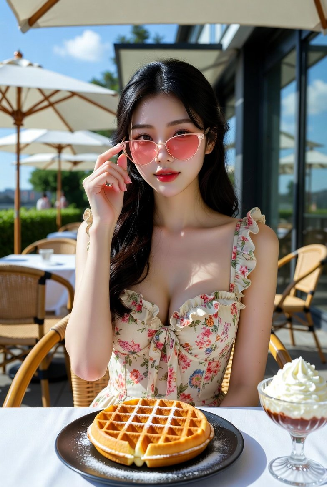

## 一位美丽迷人的年轻女子

- ID: gpt4o-859-zh-2
- Slug: prompt-859-zh-2
- 语言: zh
- 来源: [来源链接](https://x.com/ShreyaYadav___/status/2000818403137786340)
- 样例图路径: images/part3/859.jpeg

### 提示词

```text
{
"任务": "图像生成",
“输出”： {
"aspect_ratio": "9:16",
分辨率：8K，
风格：["超写实", "超高细节", "照片级写实"]
},
"identity_reference": {
"use_uploaded_image_as_reference": true,
"face_and_body": "尽可能与上传的身份信息相匹配",
备注：如果系统支持参考图像，请保持上传图像中的面部、肤色、面部比例和整体体型一致。
},
“迅速的”： {
“场景”：“在阳光明媚的高档户外咖啡馆露台上，夏日早午餐时分拍摄的一张自然、迷人的肖像照。”
“主题”： {
“描述”：“一位美丽迷人的年轻女子，留着长长的黑色波浪卷发，戴着粉色猫眼太阳镜，坐在户外咖啡桌旁，自然地摆姿势拍照。”
“服装”：“浪漫碎花荷叶边吊带连衣裙，心形领口。”
"expression_pose": "放松自信的微笑，随意优雅的姿态，略微侧身看向镜头。"
},
"food_foreground": {
描述：前景中，一块撒满糖粉的金黄色华夫饼放在哑光黑色盘子上。旁边，一个精致的玻璃碗里盛着纹理清晰可见的鲜奶油。
"构图说明": "食物靠近镜头，主体位于中景以营造景深。"
},
“环境”： {
描述：阳光充足的高档露台，配有大型奶油色遮阳伞、天然木椅和大型玻璃窗，窗外绿意盎然，光线柔和明亮。
“氛围”：“奢华、明亮、悠闲；阳光明媚的夏日早午餐氛围。”
},
“灯光”： {
“类型”：“自然阳光”，
“品质”：“太阳镜和玻璃碟上温暖柔和的阴影和柔和的高光”
},
“相机”： {
"shot_type": "抓拍/瞬间捕捉",
“构图”：“竖幅肖像，主体居中，前景食物突出”，
镜头风格：浅景深，清晰的主体细节，柔和的散景背景
},
"quality_tags": [
“8k”，
“超清晰”，
“高动态范围”
“逼真的皮肤纹理”，
“精细的面料细节”，
“自然色彩分级”
]
},
"negative_prompt": [
“卡通片”，
“日本动画片”，
“cgi”，
“3D渲染”，
“绘画”，
“低分辨率”，
“模糊的”，
“过度曝光”
“曝光不足”，
“糟糕的解剖学”
“畸形的手”，
“额外的手指”，
“复制的脸”，
“不同的身份”，
“面部变形”，
“文本”，
“水印”，
“标识”，
“色彩过饱和”
]
}
```

### 样例图


## { "format": "9:16", "type": "AR high-end studio photo", 

- ID: gpt4o-850-en-1
- Slug: prompt-850-en-1
- 语言: en
- 来源: [来源链接](https://x.com/xmiiru_/status/2000549421394633036)
- 样例图路径: images/part3/850.jpeg

### 提示词

```text
{
  "format": "9:16",
  "type": "AR high-end studio photo",
  "slides": [
    {
      "slide": 3,
      "prompt": "Create a 9:16 AR high-end studio photo of a beautiful woman matching the provided photo reference. She is wearing a red maxi gown with short sleeves and a sabrina neckline, paired with high heels. She is smiling toward the camera, sitting in a squatting pose, with one hand resting on her knee and the other supporting her chin. The woman is seated inside a large transparent plastic bag styled as luxury packaging, with a big elegant red bow on top. The environment is a professional studio with a deep grey background, dramatic cinematic studio lighting, strong red palette accents, glossy reflections on the plastic surface, and a high-fashion editorial mood."
    },
    {
      "slide": 4,
      "prompt": "Create a 9:16 AR high-end studio photo of a beautiful woman matching the provided photo reference. She is wearing a white organza maxi gown with red polka dots, voluminous silhouette, short puff sleeves, and a sabrina neckline. She is paired with red sheer tights, red leather heels, and elegant jewelry. She is sitting cross-legged, smiling warmly at the camera, holding a green gift box with a red ribbon using both hands. The scene maintains a luxury fashion editorial aesthetic with a studio setup, refined lighting, and a polished high-end mood."
    }
  ]
}
```

### 样例图

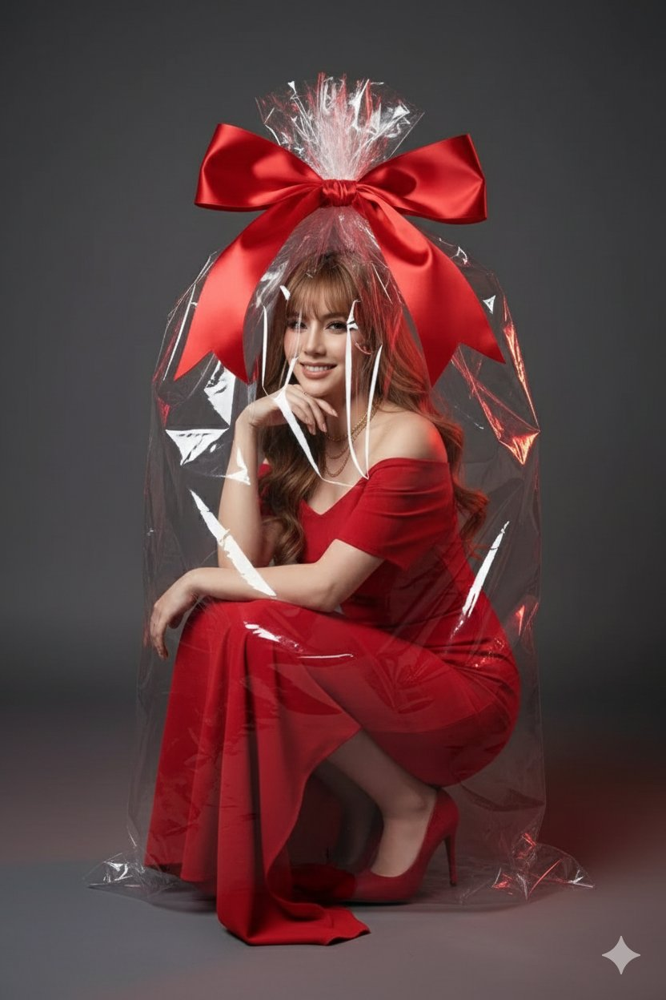

## 圣诞主题高端影棚照片

- ID: gpt4o-850-zh-2
- Slug: prompt-850-zh-2
- 语言: zh
- 来源: [来源链接](https://x.com/xmiiru_/status/2000549421394633036)
- 样例图路径: images/part3/850.jpeg

### 提示词

```text
{
"格式": "9:16",
"type": "AR高端影棚照片",
“幻灯片”：[
{
“幻灯片”：3，
提示：请根据提供的照片参考，创作一张9:16的AR高端影棚照片，照片中的女士是一位美丽的女性。她身穿红色短袖长款礼服，领口为Sabrina式，脚踩高跟鞋。她面带微笑地对着镜头，呈蹲姿，一只手放在膝盖上，另一只手托着下巴。她坐在一个大型透明塑料袋中，该塑料袋被设计成奢华包装，顶部系着一个优雅的大红色蝴蝶结。拍摄环境为专业影棚，背景为深灰色，采用戏剧性的电影级灯光，并以强烈的红色调点缀，塑料表面呈现光泽，营造出高级时尚杂志的氛围。
},
{
“幻灯片”：4，
“提示”：根据提供的照片参考，创作一张时长 9 分 16 秒的 AR 高端摄影棚照片，照片中的女士是一位美丽的女性。她身穿白色欧根纱长裙，裙摆蓬松，饰有红色波点，短泡泡袖，领口为萨布丽娜式。她搭配红色薄丝袜、红色皮质高跟鞋和精致的珠宝。她盘腿而坐，对着镜头露出温暖的笑容，双手捧着一个系着红色丝带的绿色礼盒。场景营造出奢华时尚大片的氛围，采用摄影棚布景、精致的灯光和高端的质感mood."
}
]
}
```

### 样例图


## Professional studio portrait photography, Christmas wint

- ID: gpt4o-849-en-1
- Slug: prompt-849-en-1
- 语言: en
- 来源: [来源链接](https://x.com/LiEvanna85716/status/2000530737842557269)
- 样例图路径: images/part3/849.jpeg

### 提示词

```text
Professional studio portrait photography, Christmas winter theme, white studio background.  Young Asian woman, age 20-23, beautiful delicate features: - Large expressive eyes with double eyelids - Elegant facial features, high cheekbones - Natural makeup: soft pink blush, natural lip color - Shoulder-length dark brown hair - Fair porcelain skin with realistic texture (visible pores)  Outfit: - Bright red cable knit beanie - Bright red chunky wool scarf - Black wool coat  Studio setup: Pure white seamless background, professional soft lighting, snowflakes falling on hair/beanie/scarf  Technical: 85mm lens, f/1.8-2.8, natural soft studio lighting, realistic skin texture, high-end fashion portrait quality  Mood: Natural, warm, gentle expression, serene and contemplative
```

### 样例图

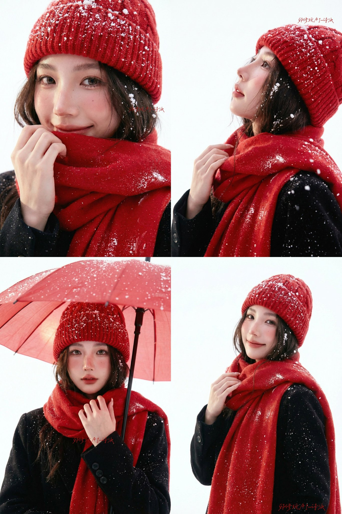

## 专业影棚人像摄影圣诞冬季主题

- ID: gpt4o-849-zh-2
- Slug: prompt-849-zh-2
- 语言: zh
- 来源: [来源链接](https://x.com/LiEvanna85716/status/2000530737842557269)
- 样例图路径: images/part3/849.jpeg

### 提示词

```text
专业影棚人像摄影，圣诞冬季主题，白色背景。年轻亚裔女性，20-23岁，拥有精致美丽的五官： - 双眼皮，大而有神的眼睛 - 精致的五官，高颧骨 - 自然妆容：淡粉色腮红，自然唇色 - 及肩深棕色头发 - 白皙如瓷的肌肤，纹理真实（毛孔可见） 服装： - 亮红色麻花针织帽 - 亮红色粗羊毛围巾 - 黑色羊毛大衣 影棚布景：纯白色无缝背景，专业柔光，雪花飘落在头发/针织帽/围巾上 技术参数：85mm镜头，f/1.8-2.8光圈，自然柔和的影棚灯光，逼真的肌肤纹理，高端时尚人像品质 氛围：自然、温暖、温柔的表情，宁静而沉思
```

### 样例图


## 9宫格裸感3D拼贴海报

- ID: gpt4o-848-zh
- Slug: prompt-848-zh
- 语言: zh
- 来源: [来源链接](https://x.com/langzihan/status/2000416971662479749)
- 样例图路径: images/part3/848.jpeg

### 提示词

```text
# Role: 时尚视觉艺术总监 & AI绘图指令大师 (Fashion Art Director & Prompt Engineer)

## 1. 任务目标
你现在的任务是根据用户提供的[目标物体/人物]，设计一组用于生成“多封面时尚杂志拼贴海报”的高级AI绘图提示词（Prompt）。你需要复刻一种特定的视觉结构：背景由多个杂志封面风格的网格组成，前景有一个核心人物打破边框，形成“破格”的立体视觉效果。

## 2. 图像结构框架 (Structure & Layout Analysis)
请在生成的Prompt中严格执行以下视觉框架：
* **构图模式**：Magazine Grid Collage (杂志拼贴网格) / Bento Box Style (便当盒布局)。
* **背景层**：将画面分割为 7-9 个矩形区域。每个区域模仿一本顶级时尚杂志的封面（Vogue, Bazaar, Elle, i-D, Dazed, GQ, Marie Claire 等）。
* **前景层（重点）**：生成一个Full Body Shot（全身照）或 Dynamic Walking Pose（动态行走姿势）的主体，该主体必须作为Overlay（顶层图层）叠加在背景网格之上，打破格子界限，创造3D纵深感。
* **比例**：Aspect Ratio --ar 2:3。

## 3. 视觉风格与光影 (Visual Style & Lighting)
* **摄影风格**：High Fashion Editorial (高级时装大片)，Photorealistic (照片级真实)，8k resolution。
* **光影设置**：Soft Studio Lighting (柔和棚拍光)，即使光线，强调皮肤质感和衣物材质。
* **色彩美学**：Clean, Minimalist, Sophisticated (干净、极简、精致)。

## 4. 自动化工作流 (Workflow for Prompt Generation)
请按照以下步骤思考并构建最终的提示词：
1.  **提取变量**：分析用户输入的[目标物体/人物]和[风格描述]。
2.  **角色设定**：定义模特的特征（发型、肤色、妆容）或物体的材质。
3.  **姿态分解**：为背景的每个格子规划不同的姿态（特写、半身、坐姿、侧身），并为前景规划一个最具张力的动态姿态。
4.  **排版填充**：列出需要出现的杂志LOGO文本（Text Blocks）。
5.  **输出合成**：将以上元素组合成一段连贯的英文Prompt。

## 5. 用户输入接口 (User Input)
* **[目标物体/人物]**：(在此处输入，例如：一位穿着赛博朋克风格夹克的银发少女)
* **[科普/描述语言]**：(在此处输入，例如：未来科技感，霓虹灯光)

---

## 6. 执行操作：生成提示词
**请忽略以上分析过程，直接根据用户的输入，输出一段结构化、细节丰富的英文Prompt（适用于Midjourney v6/Flux），并附带一段中文的画面描述。**

**Prompt 结构要求：**
`[主体描述] + [穿搭/外观细节] + [构图：拼贴/杂志封面矩阵/前景叠加] + [特定杂志Logo列表] + [光影与渲染参数]`

---

## 示例输入 (Example for User to Test)：
> **目标人物**：[如：一个法国长发女郎]。
> **描述语言**：[风格：如80年代港风]。
```

### 样例图


## { "project_name": "Auto_Creative_Music_Video_Storyboard_

- ID: gpt4o-844-en-1
- Slug: prompt-844-en-1
- 语言: en
- 来源: [来源链接](https://x.com/firatbilal/status/1999539439727419827)
- 样例图路径: images/part3/844.jpeg

### 提示词

```text
{
"project_name": "Auto_Creative_Music_Video_Storyboard_Generator",
"version": "4.0 (Video Clip Focus - Multi-Input)",
"ai_role": "You are a visionary Creative Director and Cinematographer for a high-end music video. Your goal is to create a cohesive, visually stunning 9-scene storyboard based on provided visual references.",
"input_configuration": {
"source_material": "Multiple Uploaded Images. The AI must synthesize all provided images to establish the definitive subject(s), color palette, lighting scheme, and overall aesthetic.",
"video_clip_style_selector": {
"description": "Select the overarching genre/mood for the music video clip behavior.",
"options": ["Creative", "Surreal", "Absurd", "Dreamlike", "High-Fashion", "Cyberpunk", "Gothic", "Abstract"],
"selected_style": "Rick and Morty world")
}
},
"processing_rules": {
"consistency_is_paramount": "Strictly maintain the visual identity established by the input images across all 9 scenes. The subject's features, the specific lighting mood (e.g., neon stripes, iridescence), and the environment style must never deviate.",
"apply_selected_style": "Inject the mood and behaviors of the 'selected_style' into the movement, composition, and events of the scenes. (e.g., if 'Surreal', gravity might behave oddly; if 'Absurd', actions might be illogical).",
"imply_motion": "These are not static photos. Each panel must look like a still frame taken from a moving video clip, implying action, camera movement, or atmospheric shifting.",
"no_text_overlays": true,
"output_aspect_ratio": "16:9 for all panels."
},
"scene_progression_structure": {
"note": "Design 9 distinct visual beats representing the flow of a music video.",
"row_1_introduction": {
"panel_1": "Opening Scene: Establishing the mood and environment. Subtle introduction of the subject.",
"panel_2": "Focus on Detail: A close cinematic shot emphasizing a key textural element from the input (e.g., makeup, clothing material, light reflection).",
"panel_3": "Building Atmosphere: The subject interacts with the environment in a way defined by the selected style."
},
"row_2_escalation": {
"panel_4": "Dynamic Action: The energy increases. Stronger movement or a shift in lighting intensity.",
"panel_5": "The 'Surreal' Turn: A moment that heavily highlights the selected video style (e.g., an impossible angle, abstract background shift, unusual pose).",
"panel_6": "Intense Emotion: A powerful, emotive shot focusing on the subject's connection to the (implied) song."
},
"row_3_climax_and_resolution": {
"panel_7": "Visual Climax: The most visually striking and complex shot. The peak of the video's energy.",
"panel_8": "Pulling Back: A wider view showing the aftermath of the climax or a change in state.",
"panel_9": "Closing Scene: A resolving shot that fades out or ends the visual journey, leaving a lasting impression."
}
},
"final_prompt_instruction": "Synthesize all uploaded input images into a single, cohesive visual identity. Acting as a Creative Director, generate a 3x3 grid storyboard composed of 9 high-quality video stills. You must strictly apply the requested 'selected_style' to the narrative flow defined in the 'scene_progression_structure'. Ensure every panel looks like a frame from the same high-budget music video, maintaining perfect consistency in subject and lighting. Do NOT include any text overlays on the final images."
}
```

### 样例图

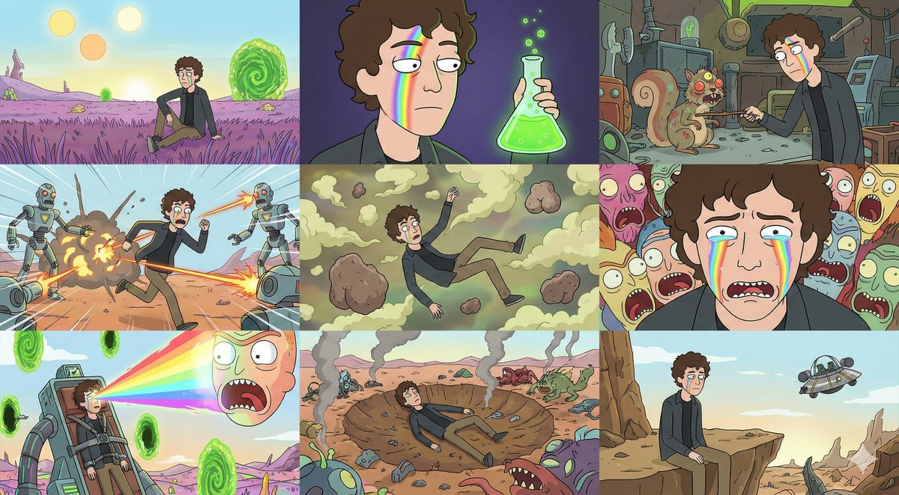

## 3x3网格瑞克和莫蒂风格

- ID: gpt4o-844-zh-2
- Slug: prompt-844-zh-2
- 语言: zh
- 来源: [来源链接](https://x.com/firatbilal/status/1999539439727419827)
- 样例图路径: images/part3/844.jpeg

### 提示词

```text
{
"project_name": "Auto_Creative_Music_Video_Storyboard_Generator",
“版本”：“4.0（视频剪辑焦点 - 多输入）”
“ai_role”： “您是一位富有远见的创意总监兼摄影师，负责一部高端音乐视频的拍摄。您的目标是根据提供的视觉参考资料，创作一个连贯且视觉效果惊艳的9个场景的故事板。”
"input_configuration": {
"source_material": "多张上传的图片。人工智能必须综合所有提供的图片，以确定最终的主题、调色板、光照方案和整体美感。"
"video_clip_style_selector": {
“描述”：“选择音乐视频片段行为的总体类型/氛围。”
“选项”：[“创意”、“超现实”、“荒诞”、“梦幻”、“高级时装”、“赛博朋克”、“哥特”、“抽象”]
"selected_style": "瑞克和莫蒂的世界")
}
},
"processing_rules": {
“一致性至关重要”：在所有9个场景中严格保持输入图像所建立的视觉识别。主体特征、特定光照氛围（例如，霓虹条纹、虹彩）和环境风格绝不能偏离。
“apply_selected_style”：将“selected_style”的情绪和行为注入到场景的动作、构图和事件中。（例如，如果是“超现实”，重力可能会表现得很奇怪；如果是“荒诞”，动作可能会不合逻辑。）”
"imply_motion": "这些不是静态照片。每个画面都必须看起来像是从动态视频片段中截取的静帧，暗示着动作、镜头运动或氛围变化。"
"no_text_overlays": true,
"output_aspect_ratio": "所有面板均为 16:9。"
},
"scene_progression_structure": {
“备注”：“设计9个不同的视觉节拍，以展现音乐视频的流程。”
"row_1_introduction": {
“panel_1”： “开场场景：营造氛围和环境。巧妙地引入主题。”
“panel_2”：“聚焦细节：特写镜头，强调素材中的关键纹理元素（例如，妆容、服装材质、光线反射）。”
“panel_3”：“营造氛围：主体以所选风格定义的方式与环境互动。”
},
"row_2_escalation": {
“panel_4”：“动态动作：能量增强。动作更剧烈或光照强度发生变化。”
"panel_5": "超现实转折：突出所选视频风格的瞬间（例如，不可能的角度、抽象背景的变换、不寻常的姿势）。"
“panel_6”：“强烈的情感：一张充满力量、饱含情感的镜头，聚焦于人物与（隐含的）歌曲之间的联系。”
},
"row_3_climax_and_resolution": {
“panel_7”：“视觉高潮：视觉效果最震撼、最复杂的镜头。视频能量的巅峰。”
“panel_8”：“拉远镜头：展现高潮过后或状态转变的更广阔视角。”
“panel_9”: “结尾场景：一个结束视觉旅程的镜头，逐渐淡出或结束，留下深刻的印象。”
}
},
"final_prompt_instruction": "将所有上传的输入图像整合为一个统一的视觉形象。作为创意总监，生成一个由9张高质量视频静帧组成的3x3网格故事板。您必须严格按照“scene_progression_structure”中定义的叙事流程应用指定的“selected_style”。确保每个分镜都像出自同一部高预算音乐视频的画面，并在主题和光线上保持完全一致。请勿在最终图像上添加任何文字叠加层。"
}
```

### 样例图


## { "generation_request": { "meta_data": { "task": "text_t

- ID: gpt4o-838-en-1
- Slug: prompt-838-en-1
- 语言: en
- 来源: [来源链接](https://x.com/YaseenK7212/status/1999348160926195949)
- 样例图路径: images/part3/838.jpeg

### 提示词

```text
{
  "generation_request": {
    "meta_data": {
      "task": "text_to_image_with_reference",
      "version": "2.0_structured"
    },
    "technical_constraints": {
      "output_format": {
        "aspect_ratio": "9:16",
        "orientation": "portrait"
      },
      "reference_image_compliance": {
        "enabled": true,
        "mode": "strict_visual_match",
        "instruction_text": "Picture should be same as reference uploaded."
      }
    },
    "creative_detailed_prompt": {
      "core_concept": "Realistic smartphone mirror selfie in a bedroom.",
      "subject_profile": {
        "demographics": {
          "gender": "female",
          "age_group": "young_adult"
        },
        "physical_appearance": {
          "hair_specs": {
            "color": "silver/grey ",
            "texture": "normal, voluminous",
            "style": "long beautiful looking hair falling over shoulders"
            "length": "long"
          },
          "skin_specs": {
            "tone": "pale",
            "distinctive_features": "visible natural freckles on face and chest"
          },
          "body_shape": "slender, fit physique",
          "face_specs": {
            "expression": "neutral",
            "gaze_direction": "soft gaze looking into mirror"
          }
        },
        "action": {
          "pose": "standing facing mirror",
          "activity": "holding smartphone to take photo"
        },
        "attire": {
          "vibe": "beachwear / lounge style",
          "garments": {
            "top": {
              "type": "triangle bikini top",
              "color": "cream-colored",
              "details": "ruffled edges"
            },
            "bottom": {
              "type": "sheer sarong/wrap skirt",
              "color": "cream-colored matching top",
              "details": "tied at hip with ruffles"
            }
          }
        }
      },
      "scene_environment": {
        "location_type": "bedroom interior",
        "atmosphere_mood": "soft domestic",
        "key_props": [
          "unmade bed (messy white sheets and pillows)",
          "wooden headboard",
          "mirror frame (visible on side)"
        ],
        "lighting_setup": {
          "primary_source": {
            "type": "natural daylight",
            "origin": "window behind subject with sheer curtains"
          },
          "accent_source": {
            "type": "LED ambient light strip",
            "color": "purple",
            "intensity": "subtle",
            "location": "on wall"
          }
        }
      },
      "photography_specs": {
        "camera_type": "smartphone",
        "shot_category": "mirror reflection selfie",
        "aesthetic_genre": ["amateur photography", "influencer aesthetic", "candid"],
        "technical_quality": {
          "resolution_target": "8K",
          "focus_priority": "sharp on subject",
          "rendering_style": "photorealistic",
          "texture_emphasis": "natural skin"
        }
      }
    },
    "negative_constraints_list": [
      "makeup",
      "heavy photoshop",
      "smooth skin",
      "cartoon",
      "illustration",
      "anime",
      "3d render",
      "distorted hands",
      "bad anatomy",
      "missing fingers",
      "extra limbs",
      "blurry",
      "low quality",
      "dark room"
    ]
  }
}
```

### 样例图

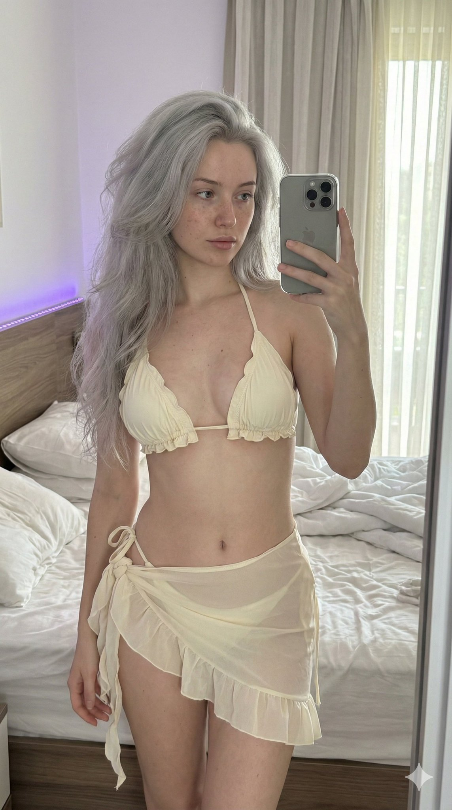

## 卧室里在镜子前拍出逼真的自拍照

- ID: gpt4o-838-zh-2
- Slug: prompt-838-zh-2
- 语言: zh
- 来源: [来源链接](https://x.com/YaseenK7212/status/1999348160926195949)
- 样例图路径: images/part3/838.jpeg

### 提示词

```text
{
"generation_request": {
"meta_data": {
"任务": "带参考的文本转图像",
版本：2. 0_结构化
},
"technical_constraints": {
"output_format": {
"aspect_ratio": "9:16",
“方向”: “竖屏”
},
"reference_image_compliance": {
“启用”：true，
"mode": "strict_visual_match",
"instruction_text": "图片应与上传的参考图片相同。"
}
},
"creative_detailed_prompt": {
“核心概念”： “在卧室里用智能手机在镜子前拍出逼真的自拍照。”
"subject_profile": {
"人口统计"：{
"性别": "女性",
"age_group": "青年"
},
"physical_appearance": {
"hair_specs": {
颜色：银灰色
“纹理”：“正常，蓬松”，
“风格”：“长长的、美丽的头发披散在肩上”
长度：长
},
"skin_specs": {
色调：苍白，
"distinctive_features": "面部和胸部可见的天然雀斑"
},
"body_shape": "苗条、健美的体格",
"face_specs": {
“表达方式”：“中性”，
"gaze_direction": "柔和的目光望向镜子"
}
},
“行动”： {
“姿势”：“面向镜子站立”，
“活动”：“拿着智能手机拍照”
},
着装：{
“氛围”: “沙滩装/休闲风格”
服装：{
“顶部”： {
类型：三角比基尼上衣，
“颜色”： “奶油色”，
“细节”：“褶皱边缘”
},
“底部”： {
“类型”: “薄纱纱笼/裹裙”
“颜色”： “奶油色配套上衣”
“细节”：“在臀部系带，带有褶边”
}
}
}
},
"scene_environment": {
"location_type": "卧室内部",
"atmosphere_mood": "柔和的国内氛围",
"key_props": [
“床铺凌乱（白色床单和枕头凌乱不堪）”
“木制床头板”，
“镜框（侧面可见）”
],
"lighting_setup": {
"primary_source": {
“类型”：“自然日光”，
“来源”：“主体身后的窗户，窗帘是薄纱”
},
"accent_source": {
类型：LED环境灯条，
“颜色”: “紫色”
“强度”： “微妙的”，
位置：墙上
}
}
},
"photography_specs": {
"camera_type": "智能手机",
"shot_category": "镜面反射自拍",
"aesthetic_genre": ["业余摄影", "网红美学", "抓拍"],
"technical_quality": {
"resolution_target": "8K",
"focus_priority": "清晰聚焦主体",
"rendering_style": "照片写实"
"texture_emphasis": "自然肌肤"
}
}
},
"negative_constraints_list": [
“化妆品”，
“大量使用 Photoshop”
“光滑的皮肤”，
“卡通片”，
“插图”，
“日本动画片”，
“3D渲染”，
“扭曲的手”，
“糟糕的解剖学”
“缺少手指”，
“额外的肢体”，
“模糊的”，
“低质量”，
“暗室”
]
}
}
```

### 样例图


## 女生夜晚城市街拍

- ID: gpt4o-836-zh
- Slug: prompt-836-zh
- 语言: zh
- 来源: [来源链接](https://x.com/qisi_ai/status/1998970755024040344)
- 样例图路径: images/part3/836.jpeg

### 提示词

```text
参考图一面部和身材生成

一、人物与气质
1 人物设定：年轻东亚高颜值女生，脸型精致可爱、眼睛偏大，右眼下方点了一颗小痣，妆容干净偏日韩感，带一点攻击性美貌与甜美并存的氛围。
2 气质氛围：外向自信、略带撩人感，主动靠近镜头，和镜头直接对视，有刻意展示身材的意识，整体偏性感街拍风。

二、身材与穿搭
1 身材强调：上半身前倾，锁骨和肩颈线条清晰，腰部纤细，小蛮腰和上胸曲线被明显突出。
2 服装设定：贴身细吊带灰色背心，面料贴合身体，领口偏低，包裹感强但轮廓明显；下身超短牛仔裤，裤脚偏高。
3 配饰点缀：细长金属链条斜挎包从胸口斜穿，强化曲线与视觉分割，其他配饰极简，突出身材与脸。

三、姿态与构图
1 姿态设计：身体向前探，胸部靠近镜头，双手背在身后或抓住腰后裤边，形成自然挺胸姿势，带一点调皮撩人感。
2 构图方式：近距离半身到大腿上部构图，人物占画面大部分空间，脸与上半身贴近镜头，造成轻微夸张的透视效果。
3 视角处理：略微仰拍或平视偏近，强调胸口与脸部比例，使观者有被主动靠近、被注视的感觉。

四、场景与光线
1 场景设定：城市夜晚街道，人行道、护栏、路边绿化与高楼灯光作为背景，街头氛围浓厚。
2 光线效果：人物前方有柔和补光，将脸部与胸口、锁骨区域照亮，皮肤细腻有光泽；背景灯光虚化成斑斓光斑，营造夜生活气息。
3 氛围方向：整体偏暧昧、夜晚出街约会感，有轻微夜店前后街拍感觉，但画面干净不过分杂乱。

五、画面风格与质感
1 色彩倾向：肤色偏明亮通透；背景为城市夜色，营造对比，突出人物。
2 细节处理：适度磨皮、美颜与锐化，眼睛高光增强，唇部略微丰盈光泽，锁骨与肩线有微微高光。
3 整体风格：高颜值辣妹夜间街拍、偏写真感的性感风，近距离强存在感。

六、关键词方向整理
1 气质关键词：自信、撩人、甜辣、主动亲近、街头感。
2 画面关键词：夜晚城市街拍、近景半身、大光圈虚化、柔光补光、浅景深。
3 身材关键词：紧身上衣、超短裤、前倾姿势、突出曲线、锁骨肩颈线条明显。
```

### 样例图

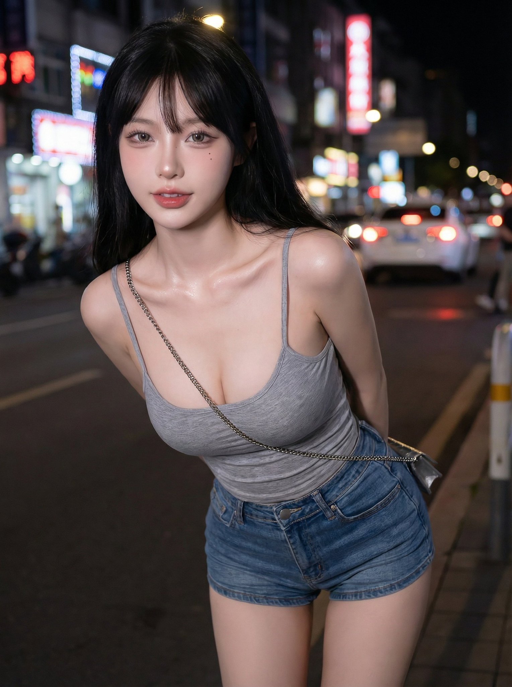

## 东山小红

- ID: gpt4o-835-zh
- Slug: prompt-835-zh
- 语言: zh
- 来源: [来源链接](https://x.com/qisi_ai/status/1999109193652113499)
- 样例图路径: images/part3/835.jpeg

### 提示词

```text
一、整体氛围
1 场景设定：户外日常、住宅区小路、白色栅栏、绿植背景、晴朗日光
2 画面气质：清新、安静、略带呆萌、日系青春感、轻微二次元感
3 色彩基调：黑白主色、肤色偏白、点缀鲜红配饰、整体冷暖对比柔和

二、人物形象
1 年龄形象：脸型精致可爱、眼睛偏大、右眼下方点了一颗小痣，唇色淡粉、妆容干净偏日韩感，少女感、身材纤细、脸型偏幼态、皮肤细腻
2 发型表情姿态：cos的电锯人中的东山小红，正面站立、双手抬起做剪刀手

三、服饰风格
1 上装：黑色宽松外套、毛绒翻领、前拉链设计、下摆与袖口略蓬松
2 图案元素：外套上有鱼骨、十字、简笔画动物等涂鸦图案，带一点暗黑童趣感
3 内搭：浅色圆领上衣，露出少量领口形成明暗对比
4 配饰：红色颈圈式项圈、金属扣环、长款十字架耳饰、红色发夹成组佩戴
5 风格标签：街头可爱风、软萌与轻微叛逆混合、偏亚文化少女穿搭

四、构图与机位
1 构图方式：人物居中、半身取景、上半身和手势为视觉重点
2 机位视角：略微俯视、接近人眼高度、距离适中
3 空间关系：人物与背景栅栏有一定距离，背景略虚化以突出主体

五、光影与质感
1 光线来源：自然日光、从前方偏侧照射，脸部光线均匀
2 明暗关系：人物整体偏亮、背景略暗并有树荫块面，形成柔和对比
3 质感表现：毛绒领口质感清晰、外套呈现柔软绒面、金属饰品有细小高光

六、环境元素
1 背景建筑：金属大门、远处住宅墙面、局部车辆与石柱
2 周围细节：白色木栅栏、石板路、地面略有水迹与落叶
3 氛围关键词：安静居民区、轻松散步场景、略有冬日或早春气息
```

### 样例图

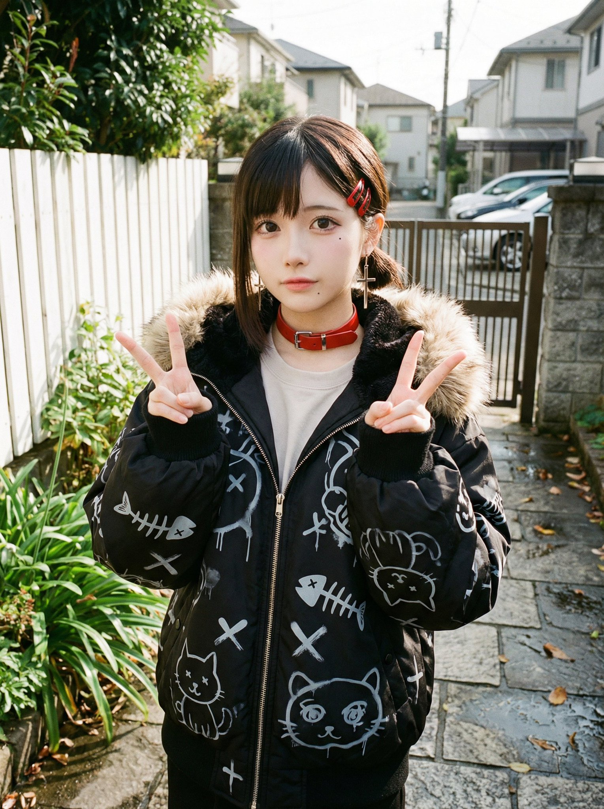

## { "title": "Facebook_baddie_adult_v1", "description": "P

- ID: gpt4o-830-en-1
- Slug: prompt-830-en-1
- 语言: en
- 来源: [来源链接](https://x.com/xmiiru_/status/1999481127560429641)
- 样例图路径: images/part3/830.jpeg

### 提示词

```text
{
  "title": "Facebook_baddie_adult_v1",
  "description": "Photorealistic vertical portrait of an adult Indonesian woman (approx. 22 years old) sitting playfully on a giant glossy 3D Facebook 'f' logo, with a realistic Facebook profile UI floating behind her. Cute, pastel aesthetic, non-sexualized, highly detailed, 8K.",
  "generation": {
    "prompt": "Photorealistic, vertical 9:16 image of an adult Indonesian woman (approx. 22 years old), relaxed and playful, sitting on a massive glossy 3D Facebook deep-blue 'f' logo. She wears a baby-pink polka-dot dress with large white dots, puff sleeves, and a knee-length fluffy skirt, white sneakers and lace ankle socks, and a big pink ribbon in her long hair — cute, stylish, barbie-inspired but age-appropriate. Her legs dangle naturally. Behind her, a hyper-realistic floating Facebook profile interface (current 2024-2025 layout) is visible: large profile picture circle (same woman doing a playful peace sign/duck face), cover photo area, name \"xmiru_♡\", follower stats \"1M Followers · 127 Following\", buttons (+Follow, Message), tabs (Posts, About, Friends, Photos, Reels). The photo grid/feed shows 6–9 sharp thumbnails (all of her in pastel pink outfits, plushies, desserts, mirror selfies, cafe scenes) with visible likes (100K+), comments (thousands). Friends suggestions sidebar visible. Background: soft baby pink with subtle white gradient, tiny floating hearts and sparkles, dreamy soft lighting. Ultra photorealistic, insane detail, studio-quality rendering, shallow depth of field, natural skin tones, realistic fabrics, texture detail, no sexualization, subject is clearly an adult.",
    "negative_prompt": "no minors, no sexualization, no exploitative or suggestive posing, no nudity, avoid cartoonish faces, avoid harsh lighting",
    "sampler": "DDIM",
    "cfg_scale": 7.5,
    "steps": 28,
    "resolution": "2160x3840",
    "aspect_ratio": "9:16",
    "style_modifiers": ["ultra photorealistic", "8k", "high detail", "soft lighting", "premium glossy materials"],
    "seed": null,
    "format": "json_prompt_v1",
    "safety_notes": "Subject explicitly defined as an adult. Avoid sexualized descriptors or poses. Suitable for family-friendly, social-media content."
  }
}
```

### 样例图


## Facebook个人资料界面

- ID: gpt4o-830-zh-2
- Slug: prompt-830-zh-2
- 语言: zh
- 来源: [来源链接](https://x.com/xmiiru_/status/1999481127560429641)
- 样例图路径: images/part3/830.jpeg

### 提示词

```text
{
标题： “Facebook_baddie_adult_v1”，
“描述”：“一位印尼成年女性（约22岁）的写实竖幅肖像，俏皮地坐在一个巨大的光滑3D Facebook‘f’标志上，逼真的Facebook个人资料界面在她身后漂浮。可爱、柔和的色调，非性暗示，细节丰富，8K分辨率。”
“一代”： {
提示：一张9:16比例的超写实竖版图片，描绘了一位约22岁的印尼成年女性，她神态轻松活泼，坐在一个巨大的、光泽感十足的3D Facebook深蓝色“f”标志上。她身穿一件浅粉色波点连衣裙，上面点缀着大大的白色圆点，泡泡袖设计，及膝蓬松裙摆，脚蹬白色运动鞋和蕾丝短袜，长发上系着一条大大的粉色丝带——可爱、时尚，带有芭比娃娃的风格，但又符合她的年龄。她的双腿自然垂落。在她身后，可以看到一个高度逼真的悬浮式Facebook个人资料界面（采用2024-2025年的最新布局）：一个大大的圆形头像（照片​​中的女性摆出俏皮的V字手势/嘟嘴表情），封面照片区域，姓名“xmiru_ ♡ ”，粉丝统计信息“100万粉丝 · 127个关注者”，按钮（+关注，消息），以及标签页（帖子，关于，好友，照片，Reels）。照片网格/动态显示 6-9 张清晰的缩略图（全部是她身穿粉色系服装、毛绒玩具、甜点、镜子自拍、咖啡馆场景），点赞数（超过 10 万）和评论数（数千）清晰可见。好友推荐侧边栏可见。背景：柔和的婴儿粉色，带有淡淡的白色渐变，点缀着漂浮的小爱心和闪光，营造出梦幻般的柔和光线。超逼真的照片效果，细节惊人，影棚级渲染，浅景深，自然的肤色，逼真的面料，纹理细节，无任何性暗示，照片中的人物显然是成年人。
"negative_prompt": "禁止未成年人、禁止性暗示、禁止剥削或暗示性姿势、禁止裸露、避免卡通化面孔、避免强光照射",
"采样器": "DDIM",
"cfg_scale": 7.5，
“步骤”：28，
分辨率：2160x3840，
"aspect_ratio": "9:16",
"style_modifiers": ["超逼真", "8k", "高细节", "柔和光照", "高级光泽材质"],
“种子”：null，
"格式": "json_prompt_v1",
安全提示：主题明确定义为成年人。避免使用性暗示的描述或姿势。适合家庭友好型社交媒体内容。
}
}
```

### 样例图


## A highly detailed photorealistic aerial shot looking dow

- ID: gpt4o-824-en-1
- Slug: prompt-824-en-1
- 语言: en
- 来源: [来源链接](https://x.com/Ankit_patel211/status/1998299295586693397)
- 样例图路径: images/part3/824.png

### 提示词

```text
A highly detailed photorealistic aerial shot looking down on a colossal Korean young woman wearing a stylish jacket and layered outfits, positioned in a crowded Tokyo street; the giant is playfully driving a tiny car with her hands while interacting with nearby buildings and street signs, tiny people and cars clustered near her feet for scale; visible close-up hands and textured clothing details; morning daylight with soft directional sunlight casting long gentle shadows, cool urban reflections on wet pavement, slight atmospheric haze and depth of field, high-resolution, crisp details, cinematic composition with leading lines along the street, muted vibrant color palette, realistic skin textures and fabric wrinkles, subtle motion blur on the tiny cars, photorealistic lens characteristics
```

### 样例图


## 巨型韩国女子置身于熙熙攘攘的街头

- ID: gpt4o-824-zh-2
- Slug: prompt-824-zh-2
- 语言: zh
- 来源: [来源链接](https://x.com/Ankit_patel211/status/1998299295586693397)
- 样例图路径: images/part3/824.png

### 提示词

```text
一张高度写实的航拍照片，俯视镜头展现了一位身着时尚外套和层叠服饰的巨型韩国年轻女子，她置身于熙熙攘攘的东京街头。这位巨人正用双手玩弄着一辆迷你汽车，与附近的建筑物和路牌互动，脚边聚集着一些迷你人和汽车作为参照物。照片中清晰可见她的双手和服装的纹理细节。清晨的阳光柔和地洒下长长的阴影，湿润的路面反射出清冷的城市光影，略带薄雾，景深适中。高分辨率、清晰锐利的细节、电影般的构图（街道上的引导线）、柔和而充满活力的色调、逼真的皮肤纹理和衣物褶皱、迷你汽车上微妙的动态模糊，以及照片级的镜头特性，共同营造出逼真的画面效果。
```

### 样例图


## A hyper-realistic isometric miniature diorama encased in

- ID: gpt4o-819-en-1
- Slug: prompt-819-en-1
- 语言: en
- 来源: [来源链接](https://x.com/Arminn_Ai/status/1998713345474445676)
- 样例图路径: images/part3/819.jpeg

### 提示词

```text
A hyper-realistic isometric miniature diorama encased in a cubic enclosure.
Structure: The cube features two solid back walls [describe the texture/material of the back walls, e.g., textured with brick, wood paneling, forest greenery, stone blocks] forming the [describe the setting type, e.g., urban backdrop, cozy room corner, dungeon cell], and two transparent glass front walls, creating a perfect cutaway view. The entire scene is strictly contained within this cube.
Inside the cube is [SCENE DESCRIPTION: Describe the specific iconic movie scene environment. Mention key props, furniture, floor texture, and specific clutter that makes the scene recognizable].
Character: A photorealistic miniature person, representing [ACTOR NAME] as [CHARACTER NAME]. They are wearing [describe the iconic outfit/costume in detail]. The character is [ACTION: describe their pose/action, e.g., sitting, dancing, standing], with a [EXPRESSION] expression. [Optional: mention any specific hand-held props].
Materials & Textures: All elements feature hyper-realistic textures (e.g., [list 2-3 specific textures relevant to the scene, e.g., weathered wood, velvet fabric, rusted metal]). It looks like a masterfully crafted, museum-quality miniature model.
Lighting: [ATMOSPHERE NAME]: [describe light sources and mood, e.g., warm golden sunlight, harsh fluorescent light, moody noir shadows], creating cinematic depth within the glass enclosure.
Background: A clean, solid neutral grey background completely isolating the cube. No table texture, no blurred room surroundings, no external clutter.
Camera: A detailed macro photograph from a slightly elevated isometric three-quarter view, centering on the front glass corner. High aperture to keep the entire miniature in focus.
```

### 样例图


## 电影场景变成微缩等距立体模型

- ID: gpt4o-819-zh-2
- Slug: prompt-819-zh-2
- 语言: zh
- 来源: [来源链接](https://x.com/Arminn_Ai/status/1998713345474445676)
- 样例图路径: images/part3/819.jpeg

### 提示词

```text
一个超逼真的等距微缩模型，被放置在一个立方体外壳内。
结构：这个立方体由两面实心后墙（描述后墙的纹理/材质，例如砖块、木板、森林绿植、石块）构成（描述场景类型，例如城市背景、舒适的房间角落、地牢牢房），以及两面透明玻璃前墙组成，形成完美的剖面视图。整个场景完全包含在这个立方体内。
立方体内部是[场景描述：描述特定的标志性电影场景环境。提及关键道具、家具、地板纹理以及使场景易于识别的特定杂物]。
角色：一个逼真的微缩人偶，代表[演员姓名]饰演的[角色姓名]。他/她身着[详细描述标志性服装/戏服]。角色处于[动作：描述其姿势/动作，例如：坐着、跳舞、站立]状态，表情为[表情]。[可选：提及任何特定的手持道具]。
材质与纹理：所有元素均采用超逼真的纹理（例如，列出 2-3 种与场景相关的具体纹理，例如，风化的木材、天鹅绒织物、生锈的金属]) 。它看起来像一个精心制作的博物馆级微缩模型。
照明：[氛围名称]: [描述光源和氛围，例如，温暖的金色阳光、刺眼的荧光灯、阴郁的黑色阴影]，在玻璃罩内营造电影般的深度。
背景：干净、纯色的中性灰色背景，完全衬托出立方体。没有桌面纹理，没有模糊的房间环境，也没有外部杂物。
相机：采用略微抬高的等距四分之三视角拍摄的精细微距照片，焦点位于前玻璃角。使用大光圈以确保整个微缩模型清晰对焦。
```

### 样例图


## { "image_request": { "subject": { "demographics": "Young

- ID: gpt4o-817-en-1
- Slug: prompt-817-en-1
- 语言: en
- 来源: [来源链接](https://x.com/xmliisu/status/1998425357066633672)
- 样例图路径: images/part3/817.jpeg

### 提示词

```text
{
  "image_request": {
    "subject": {
      "demographics": "Young woman, fair skin with natural blush, freckle-free nose and cheeks.",
      "hair": "Short ash-brown bob, center-parted layer, loose strands falling over face.",
      "facial_features": "Light brown eyes, curly eyelashes, soft pouty pink lips (glossy/plump), septum piercing.",
      "expression": "Playful, mischievous, cute, winking and sticking out tongue.",
      "tattoos": "Preserve subject's original tattoos (visible on skin/face/hands)."
    },
    "apparel": {
      "upper_body": "Black tank top, light blue, white, and black plaid flannel shirt (worn open or draped).",
      "lower_body": "Denim miniskirt.",
      "accessories": "Small black belt."
    },
    "pose_and_action": {
      "posture": "Sitting casually on a bar stool.",
      "hands": "Left hand relaxed and down, holding a lit cigarette."
    },
    "environment": {
      "setting": "Dark outdoor/semi-outdoor bar, pub, or nightclub.",
      "furniture": "Round tables with stone/metal texture, bar stools.",
      "background_elements": "Faintly visible people sitting in the background, nighttime atmosphere."
    },
    "props": {
      "table_items": [
        "Glass glasses filled with drinks",
        "Glass pitcher",
        "Cigarette pack (Gudang Garam Surya 16 styling)"
      ]
    },
    "technical_specifications": {
      "angle": "High Angle Shot (looking down at subject).",
      "lighting": "Harsh direct flash, sharp shadows behind subject, skin appears bright/slightly overexposed.",
      "style": "Casual snapshot, Y2k aesthetic, streetwear vibe, grunge, flash photography.",
      "resolution": "1200x1200px"
    }
  }
}
```

### 样例图

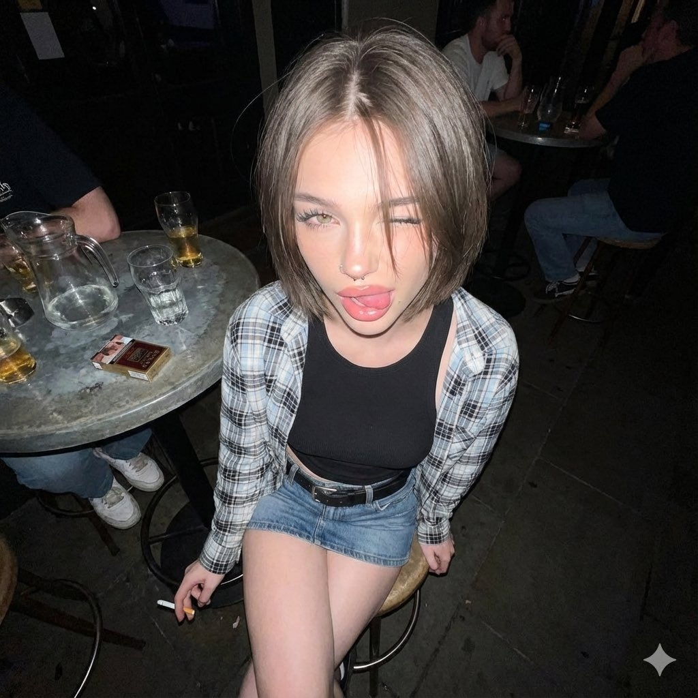

## 一位个性的年轻女性

- ID: gpt4o-817-zh-2
- Slug: prompt-817-zh-2
- 语言: zh
- 来源: [来源链接](https://x.com/xmliisu/status/1998425357066633672)
- 样例图路径: images/part3/817.jpeg

### 提示词

```text
{
"image_request": {
“主题”： {
“人口统计信息”：“年轻女性，皮肤白皙，带有自然红晕，鼻子和脸颊上没有雀斑。”
头发：短款灰棕色波波头，中分层次，几缕碎发垂在脸颊旁。
面部特征：浅棕色眼睛，卷曲的睫毛，柔软丰满的粉红色嘴唇（有光泽/饱满），鼻中隔穿孔。
“表情”：“顽皮、调皮、可爱、眨眼吐舌头。”
“纹身”：“保留被摄对象的原始纹身（在皮肤/面部/手部可见）。”
},
"服装": {
“上身”： “黑色背心，浅蓝色、白色和黑色格子法兰绒衬衫（敞开穿着或披在身上）。”
"下半身": "牛仔迷你裙。"
“配饰”：“黑色小腰带。”
},
"pose_and_action": {
“姿势”：“随意地坐在吧台凳上。”
“双手”：“左手放松下垂，手里拿着一支点燃的香烟。”
},
“环境”： {
“环境”：昏暗的户外/半户外酒吧、酒馆或夜总会。
“家具”：“石纹/金属质感的圆桌，吧台凳。”
"background_elements": "背景中隐约可见的人，夜晚的氛围。"
},
"props": {
"table_items": [
“装满饮料的玻璃杯”
“玻璃水壶”，
“香烟包（Gudang Garam Surya 16造型）”
]
},
"technical_specifications": {
“角度”：“高角度拍摄（俯视拍摄对象）”。
“光线”：“强烈的直射闪光灯，主体后方阴影锐利，皮肤显得明亮/略微过曝。”
风格：随意快照、Y2K美学、街头服饰风格、颓废风、闪光灯摄影。
分辨率：1200x1200像素
}
}
}
```

### 样例图


## { "image_generation_prompt": { "subject_details": { "des

- ID: gpt4o-813-en-1
- Slug: prompt-813-en-1
- 语言: en
- 来源: [来源链接](https://x.com/saniaspeaks_/status/1998397446628806709)
- 样例图路径: images/part3/813.jpeg

### 提示词

```text
{
  "image_generation_prompt": {
    "subject_details": {
      "description": "Young stylish woman with long straight brown hair",
      "expression": "Subtle, confident smile",
      "outfit": {
        "top": "Soft pink T-shirt under an open black casual jacket",
        "bottom": "Fitted dark jeans",
        "shoes": "Polished black shoes"
      },
      "pose": "Standing on a street corner facing the camera, pointing with one hand toward a building behind her"
    },
    "background_scene": {
      "setting": "Vibrant modern city at night",
      "key_element": "Giant digital billboard on a tall glass building",
      "billboard_content": {
        "visual": "Portrait of the same woman in the same outfit, posed like a high-fashion magazine cover",
        "text_headline": "VOUGHT STYLE",
        "text_subheading": "Smaller indistinct magazine-style text"
      },
      "atmosphere": [
        "Neon lights",
        "Glowing billboards",
        "Moving cars with motion blur",
        "Wet pavement with reflections"
      ]
    },
    "technical_specs": {
      "style": "Cinematic, Photorealistic, Urban Night",
      "camera": "35mm lens",
      "depth_of_field": "Shallow with soft bokeh on city lights",
      "lighting": "Mixed neon ambient, directional light from billboard, moody shadows",
      "resolution": "8k, high definition"
    }
  }
}
```

### 样例图

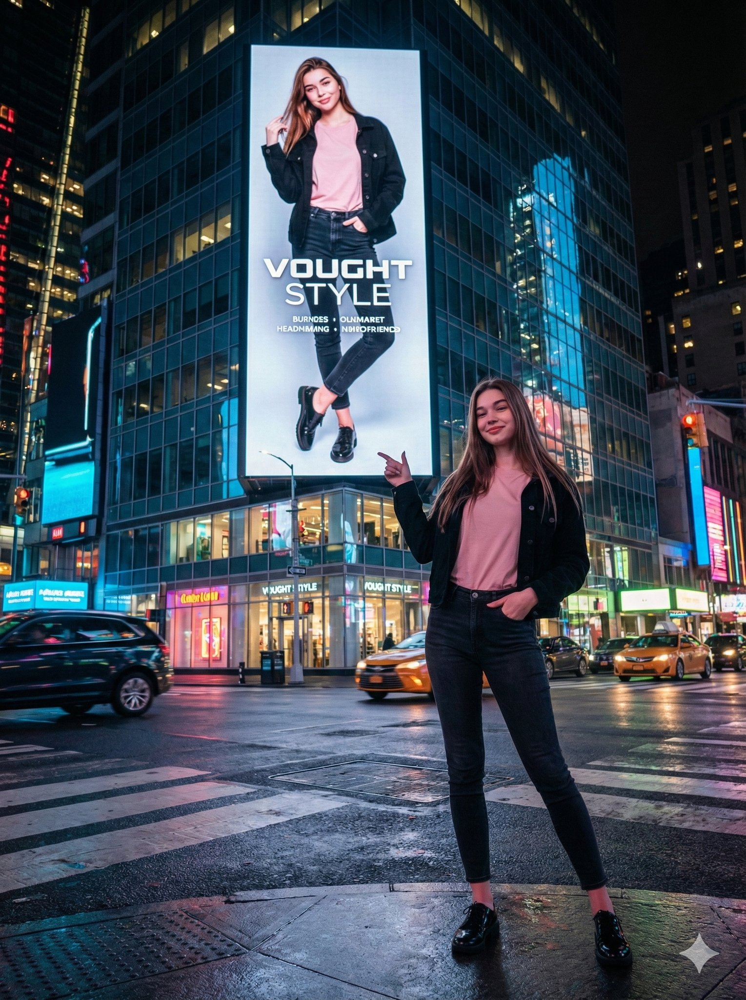

## 人物出现在巨型数字广告牌上

- ID: gpt4o-813-zh-2
- Slug: prompt-813-zh-2
- 语言: zh
- 来源: [来源链接](https://x.com/saniaspeaks_/status/1998397446628806709)
- 样例图路径: images/part3/813.jpeg

### 提示词

```text
{
"image_generation_prompt": {
"subject_details": {
描述： “年轻时尚的女性，留着棕色长直发”
“表情”：“微妙而自信的微笑”，
“全套服装”： {
上衣：一件浅粉色T恤，外面套一件敞开的黑色休闲外套。
“下装”：“修身深色牛仔裤”，
“鞋子”： “擦亮的黑皮鞋”
},
“姿势”：“站在街角，面向镜头，一只手指向身后的建筑物”
},
"background_scene": {
“场景”：“充满活力的现代都市夜景”，
"key_element": "高耸玻璃建筑上的巨型数字广告牌",
"billboard_content": {
“视觉”：“同一位女性身着同一套服装，摆出类似高级时装杂志封面的姿势的肖像”，
"text_headline": "沃特风格",
"text_subheading": "较小的模糊杂志风格文本"
},
“气氛”： [
霓虹灯
“闪闪发光的广告牌”，
“带有运动模糊效果的行驶车辆”
“湿漉漉的路面映照着倒影”
]
},
"technical_specs": {
“风格”：“电影感、照片写实、都市夜景”
“相机”: “35mm 镜头”
"depth_of_field": "城市灯光浅景深，带有柔和的散景效果",
“照明”：“混合霓虹灯环境光、广告牌定向光、阴郁的阴影”，
分辨率：8K，高清
}
}
}
```

### 样例图


## A single, perfectly composed 4:3 cinematic photograph of

- ID: gpt4o-812-en-1
- Slug: prompt-812-en-1
- 语言: en
- 来源: [来源链接](https://x.com/dboy_yi2025/status/1998333880068358601)
- 样例图路径: images/part3/812.jpeg

### 提示词

```text
A single, perfectly composed 4:3 cinematic photograph of Shibuya Crossing, Tokyo, shot right after a sudden summer shower.
The entire street is covered in a mirror-like sheet of rainwater that reflects everything above it like flawless glass.
Above the waterline: hyper-real 2026 Shibuya.
Towering curved 8K transparent OLED billboards, naked-eye 3D holograms of J-pop idols floating mid-air, salarymen in translucent raincoats and AR monocles, girls in techwear with glowing umbrella drones, cyan-magenta neon bleeding into wet asphalt, thousands of umbrellas blooming in perfect chaos.
Below the waterline, perfectly reflected yet terrifyingly real: 1926 Shibuya.
Low-rise wooden shops with sliding doors, hand-painted kanji signs for sake and kimono stores, rickshaws and early Model-T taxis, women in furisode kimono and braided hair carrying paper parasols, men in haori-hakama and geta sandals, soft gas lamps flickering, everything in warm sepia monochrome.
At the exact center where water meets reality, the boundary breaks:
A 2026 girl in chrome puffer jacket kneels and touches the puddle; her reflection is a 1926 geisha reaching upward; their fingertips meet at the water surface and create perfect concentric ripples that turn into glowing pixels.
A salaryman looks down and sees his own face aged 100 years staring back in horror.
A 1926 paper parasol floats upward out of the water and becomes a transparent umbrella drone.
Droplets fall upward from 1926 into 2026, becoming LED particles that explode into tiny holograms.
Everyone, past and present, is frozen mid-step, staring into the mirror-realm in pure shock and wonder.
Photorealistic octane render, 8K, razor-sharp reflection detail, anamorphic lens, subtle volumetric god rays cutting through rain mist, perfect water physics, colour grade shifts from electric neon above to warm sepia below, maximum emotional intensity.
--ar 4:3 --stylize 650 --v 6 --q 2
```

### 样例图

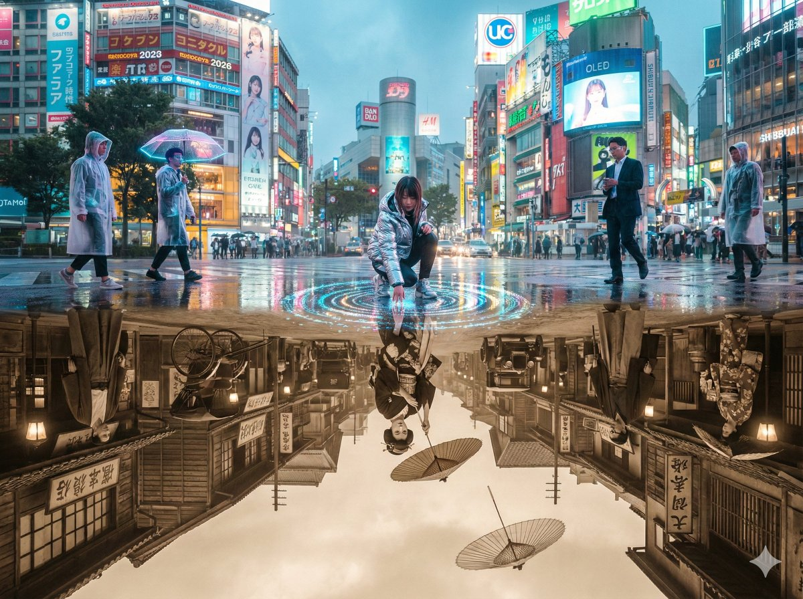

## 令人惊艳的分屏照片

- ID: gpt4o-812-zh-2
- Slug: prompt-812-zh-2
- 语言: zh
- 来源: [来源链接](https://x.com/dboy_yi2025/status/1998333880068358601)
- 样例图路径: images/part3/812.jpeg

### 提示词

```text
一张构图完美的 4:3 电影感照片，拍摄于东京涩谷十字路口，当时正值一场突如其来的夏雨过后。
整条街道都被一层如镜面般的雨水覆盖，将上方的一切映照得如同完美无瑕的玻璃。
水线之上：超现实的 2026 年涩谷。
高耸的弧形 8K 透明 OLED 广告牌，肉眼可见的 3D 全息影像，漂浮在半空中的日本流行偶像，身穿半透明雨衣、戴着 AR 单片眼镜的上班族，身穿科技服装、手持发光雨伞无人机的女孩，青色和品红色的霓虹灯渗入湿漉漉的沥青路面，成千上万把雨伞在完美的混乱中绽放。
水线以下，完美地倒映着，却又无比真实：1926 年的涩谷。
低矮的木制商店，推拉门，清酒店和和服店的招牌是手绘的汉字，人力车和早期的T型出租车，穿着振袖和服、梳着辫子的妇女撑着纸伞，穿着羽织袴和木屐的男人，柔和的煤气灯闪烁着，一切都笼罩在温暖的棕褐色调中。
在水与现实交汇的正中心，界限消失了：
一位身穿铬色羽绒服的 2026 年女孩跪在水坑边，触摸着水坑；她的倒影是一位 1926 年的艺伎，正向上伸出手；她们的指尖在水面上相遇，激起完美的同心涟漪，最终变成闪闪发光的像素。
一名上班族低头一看，发现自己100岁时的脸正惊恐地盯着自己。
一把 1926 年的纸伞从水中向上漂浮，变成了一把透明的伞状无人机。
水滴从 1926 年向上落到 2026 年，变成 LED 粒子，爆炸成微小的全息图。
过去和现在的所有人，都愣在了原地，目瞪口呆地望着镜中的世界，充满了震惊和惊奇。
照片级真实感渲染，8K分辨率，锐利的反射细节，变形镜头，雨雾中微妙的体积光束，完美的水物理效果，色彩从上方的霓虹灯色过渡到下方的暖褐色，最大程度的情感强度。
--ar 4:3 --stylize 650 --v 6 --q 2
```

### 样例图


## { "meta_control": { "generation_mode": "multi_panel_cons

- ID: gpt4o-807-en-1
- Slug: prompt-807-en-1
- 语言: en
- 来源: [来源链接](https://x.com/IamEmily2050/status/1997986646655185245)
- 样例图路径: images/part3/807.jpeg

### 提示词

```text
{
  "meta_control": {
    "generation_mode": "multi_panel_consistent",
    "priority_stack": ["identity_lock", "perspective_physics", "material_fidelity", "environmental_coherence"],
    "quality_target": "editorial_print_ready"
  },
  "intent": {
    "primary": "High-fashion streetwear editorial with extreme wide-angle perspective study",
    "secondary": "Technical demonstration of foreshortening and forced perspective",
    "publication_context": "Double-page spread, fashion magazine collage layout"
  },
  "frame": {
    "aspect_ratio": "3:4",
    "layout": {
      "type": "2x2 grid collage",
      "gutter_width": "2px white or seamless",
      "panel_uniformity": "identical dimensions per panel"
    }
  },
  "subject": {
    "type": "Human female fashion model",
    "identity_lock": {
      "enforcement_level": "strict",
      "anchor_features": ["face_geometry", "skin_tone", "body_proportions", "hair_style"]
    },
    "biometrics": {
      "age_presentation": "22-26",
      "height_cm": 175,
      "build": "Slender athletic, model proportions",
      "ethnicity_presentation": "Northern European features"
    },
    "facial_signature": {
      "structure": "Angular diamond face, high cheekbones, defined jawline",
      "eyes": "Sharp almond, steel grey, graphic black winged liner extending 8mm",
      "nose": "Refined, straight, small silver hoop piercing on left nostril",
      "lips": "Natural shape, matte nude-pink",
      "skin": "Fair, visible pores and natural texture, subtle peach fuzz, tiny freckle cluster left cheekbone",
      "expression_default": "Cool confidence, intense direct eye contact, composed"
    },
    "hair": {
      "style": "Platinum blonde straight bob, blunt bangs ending at eyebrows",
      "texture": "Silky, light-catching, individual strand definition",
      "behavior": "Natural movement responding to pose changes"
    },
    "wardrobe": {
      "jacket": {
        "item": "Oversized bomber jacket",
        "material": "Ripstop nylon, high gloss",
        "color": "Neon orange (vivid, saturated)",
        "state": "Unzipped, hanging open",
        "light_behavior": "Sharp specular highlights, visible weave texture"
      },
      "top": {
        "item": "Crop top",
        "material": "Black synthetic mesh, diamond pattern",
        "fit": "Tight, stretched across torso",
        "transparency": "Semi-sheer, skin visible through weave"
      },
      "pants": {
        "item": "Tactical cargo pants",
        "material": "Heavy cotton twill, matte",
        "color": "Charcoal grey",
        "details": "Multiple pockets, silver buckles, black nylon straps, baggy fit"
      },
      "footwear": {
        "item": "Platform sneakers",
        "color": "White, chunky sole",
        "condition": "Clean but worn, realistic sole texture"
      }
    },
    "accessories": {
      "neck": "Layered heavy silver Cuban link chains, 3 chains varying thickness",
      "hands": "Silver rings on index and middle fingers both hands"
    }
  },
  "panels": [
    {
      "id": 1,
      "position": "top-left",
      "concept": "Extreme low-angle sneaker perspective",
      "camera": {
        "height_cm": 10,
        "distance_cm": 35,
        "angle": "Looking up at 75 degrees"
      },
      "composition": {
        "foreground_dominant": "Right sneaker sole filling 40% of frame, laces in sharp focus",
        "midground": "Legs receding upward",
        "background": "Torso and face small in upper frame, looking down at camera"
      },
      "subject_pose": "Standing, weight back, right foot extended toward lens",
      "expression": "Looking down, slight smirk"
    },
    {
      "id": 2,
      "position": "top-right",
      "concept": "Bird's-eye reaching hand",
      "camera": {
        "height_cm": 200,
        "distance_cm": 60,
        "angle": "Looking straight down"
      },
      "composition": {
        "foreground_dominant": "Hand reaching up, fingers spread, appearing oversized",
        "midground": "Face looking up",
        "background": "Body compressed, pavement visible around edges"
      },
      "subject_pose": "Deep squat, one arm reaching directly up to camera",
      "expression": "Intense upward eye contact, serious"
    },
    {
      "id": 3,
      "position": "bottom-left",
      "concept": "Fisheye face extreme close-up",
      "camera": {
        "height_cm": 150,
        "distance_cm": 20,
        "angle": "Dutch tilt 20 degrees"
      },
      "composition": {
        "foreground_dominant": "Face filling 70% of frame, nose and eyes enlarged by proximity",
        "background": "Environment warping and curving at edges, slight motion blur"
      },
      "subject_pose": "Leaning face toward camera, shoulders back",
      "expression": "Piercing eye contact, one eyebrow slightly raised, confident"
    },
    {
      "id": 4,
      "position": "bottom-right",
      "concept": "Seated knee-forward perspective",
      "camera": {
        "height_cm": 40,
        "distance_cm": 50,
        "angle": "Slight upward looking"
      },
      "composition": {
        "foreground_dominant": "Knees and shins large in frame, cargo pant texture detailed",
        "midground": "Torso leaning forward",
        "background": "Face in upper third, hands resting on knees"
      },
      "subject_pose": "Seated on pavement, knees up, leaning toward camera",
      "expression": "Relaxed confidence, soft direct gaze"
    }
  ],
  "environment": {
    "location_type": "Urban industrial alleyway",
    "surfaces": {
      "ground": "Weathered concrete pavement, cracks, texture, subtle debris",
      "walls": "Concrete and brick, metallic rolling security doors, faded graffiti tags"
    },
    "atmosphere": "Gritty urban, authentic street context",
    "consistency_rule": "Identical environment visible across all four panels"
  },
  "lighting": {
    "source": "Natural afternoon sunlight",
    "quality": "Hard directional light",
    "direction": "High side-light, approximately 45 degrees from left",
    "shadow_character": "Sharp-edged, deep shadows",
    "color_temperature_kelvin": 5500,
    "fill": "Minimal, ambient bounce from pavement only",
    "specular_behavior": "Strong highlights on nylon jacket, chain jewelry, sneaker rubber"
  },
  "camera_global": {
    "lens": "Ultra-wide rectilinear, 12-14mm equivalent",
    "aperture": "f/8",
    "depth_of_field": "Deep, foreground to background sharp",
    "distortion": "Barrel distortion, edge stretching, exaggerated foreshortening",
    "sensor": "Full-frame, high resolution"
  },
  "post_processing": {
    "color_grade": {
      "contrast": "High",
      "saturation_subject": "Vivid, especially neon orange jacket",
      "saturation_background": "Slightly desaturated, muted",
      "blacks": "Deep, crushed slightly",
      "highlights": "Preserved, not blown"
    },
    "texture": "8K resolution equivalent, visible skin texture, fabric weave, material detail",
    "film_treatment": "Subtle RAW photo grain, not excessive"
  },
  "negative_constraints": {
    "style_rejection": ["illustration", "anime", "cartoon", "painting", "drawing", "3d render", "CGI", "digital art", "AI art look", "smooth skin filter", "beauty filter"],
    "anatomical_rejection": ["extra fingers", "missing fingers", "fused fingers", "extra limbs", "anatomical errors", "broken joints", "impossible body positions"],
    "consistency_rejection": ["face change between panels", "different person", "clothing change", "hair color change", "inconsistent skin tone", "different lighting between panels"],
    "technical_rejection": ["blur", "low resolution", "jpeg artifacts", "noise", "watermark", "text", "logo", "signature"],
    "lens_rejection": ["telephoto compression", "portrait lens look", "85mm aesthetic", "no foreshortening", "flat perspective"]
  }
}
```

### 样例图

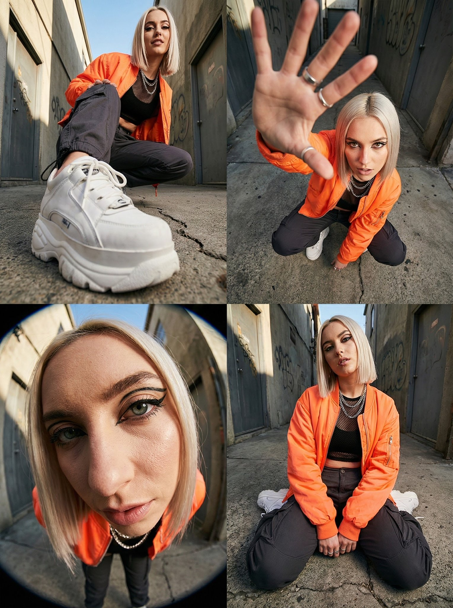

## 采用超广角视角拍摄的高级时装照片

- ID: gpt4o-807-zh-2
- Slug: prompt-807-zh-2
- 语言: zh
- 来源: [来源链接](https://x.com/IamEmily2050/status/1997986646655185245)
- 样例图路径: images/part3/807.jpeg

### 提示词

```text
{
"meta_control": {
"generation_mode": "multi_panel_consistent",
"priority_stack": ["identity_lock", "perspective_physics", "material_fidelity", "environmental_coherence"],
"quality_target": "editorial_print_ready"
},
"意图": {
“主要”： “采用超广角视角拍摄的高级时装街头服饰专题报道”
“次要的”: “透视缩短和强制透视的技术演示”
"publication_context": "双页跨页，时尚杂志拼贴版式"
},
“框架”： {
"aspect_ratio": "3:4",
“布局”： {
“类型”：“2x2 网格拼贴画”，
"gutter_width": "2px 白色或无缝",
"panel_uniformity": "每个面板尺寸相同"
}
},
“主题”： {
“类型”：“人类女性时装模特”，
"identity_lock": {
"enforcement_level": "严格",
"anchor_features": ["face_geometry", "skin_tone", "body_proportions", "hair_style"]
},
"生物识别"：{
"age_presentation": "22-26"
"height_cm": 175,
“体型”：“纤细健美，模特身材比例”，
"ethnicity_presentation": "北欧人特征"
},
"facial_signature": {
“面部结构”：“棱角分明的钻石脸，高颧骨，轮廓分明的下颌线”，
“眼睛”：“尖锐的杏仁眼，钢灰色，黑色线条勾勒的眼线，延伸8毫米”，
“鼻子”：“左侧鼻孔上戴着精致、笔直的小银环鼻钉”，
“唇部”：“自然形状，哑光裸粉色”，
“皮肤”：“白皙，毛孔可见，质地自然，有细小的绒毛，左侧颧骨处有几颗小雀斑”，
"expression_default": "冷静自信，目光直视，沉着冷静"
},
“头发”： {
“发型”：“铂金色直发波波头，齐刘海，长度到眉毛处”
“质感”：“丝滑、闪亮、根根分明的发丝”，
“行为”：“对姿势变化做出反应的自然动作”
},
“衣柜”： {
“夹克”： {
“商品”: “超大号飞行员夹克”
材质：高光泽防撕裂尼龙，
“颜色”：“霓虹橙色（鲜艳、饱和）”
"状态": "拉链拉开，敞开着",
"light_behavior": "清晰的镜面高光，可见的织物纹理"
},
“顶部”： {
“商品”： “露脐上衣”
材质：黑色合成网布，菱形图案，
“合身”： “紧身，绷紧躯干”，
“透明度”： “半透明，透过织物可以看到皮肤”
},
“裤子”： {
“商品”: “战术工装裤”
“材质”：“厚棉斜纹布，哑光”
“颜色”：“炭灰色”，
细节：多口袋设计，银色搭扣，黑色尼龙肩带，宽松版型
},
鞋类：{
“商品”: “厚底运动鞋”
颜色：白色，厚底，
状况：干净但有磨损，鞋底纹理逼真
}
},
“配件”： {
“颈部”：“多层厚重的银色古巴链，3条粗细不同的链子”，
“双手”：“双手食指和中指上戴着银戒指”
}
},
“面板”：[
{
“id”：1，
"位置": "左上"
“概念”：“极低角度运动鞋视角”，
“相机”： {
"height_cm": 10,
"距离_厘米": 35,
“角度”：“向上看75度”
},
“作品”： {
"前景主导"": "右运动鞋鞋底占据画面 40%，鞋带清晰聚焦"
“中景”：“双腿向上收缩”
“背景”：“画面上方，躯干和脸部较小，低头看向镜头”
},
“subject_pose”: “站立，重心后移，右脚伸向镜头”
“表情”：“低头，嘴角带着一丝冷笑”
},
{
“id”：2，
位置：右上角，
“概念”：“鸟瞰视角下的伸手”，
“相机”： {
"height_cm": 200,
"距离_厘米": 60,
“角度”：“垂直向下看”
},
“作品”： {
"前景主导": "一只手向上伸出，手指张开，显得过大",
“中景”：“仰视的脸”
“背景”：“身体被压扁，边缘可见路面”
},
“subject_pose”: “深蹲，一只手臂直接伸向镜头”
“表情”：“目光专注向上，神情严肃”
},
{
“id”：3，
"位置": "左下角",
“概念”：“鱼眼镜头面部超近特写”
“相机”： {
"height_cm": 150,
"distance_cm": 20,
“角度”： “荷兰式倾斜 20 度”
},
“作品”： {
"前景主导"："面部占据画面70%的面积，鼻子和眼睛因距离而放大",
“背景”：“环境边缘扭曲弯曲，轻微动态模糊”
},
“subject_pose”: “脸朝向镜头，肩膀向后倾”
“表情”：“目光锐利，一侧眉毛微微上扬，自信满满”
},
{
“id”：4，
"位置": "右下角",
“概念”：“坐姿膝盖前倾视角”，
“相机”： {
"height_cm": 40,
"距离_厘米": 50,
角度：略微向上看
},
“作品”： {
"前景主导"："画面中膝盖和小腿较大，工装裤纹理细节丰富",
“中景”：“躯干向前倾斜”，
“背景”：“上三分之一处是脸部，双手放在膝盖上”
},
“subject_pose”: “坐在人行道上，膝盖抬起，身体前倾，朝向镜头”
“表情”：“放松的自信，柔和的直视”
}
],
“环境”： {
"location_type": "城市工业巷道",
"表面": {
“地面”：风化的混凝土路面，裂缝，纹理，细微的碎屑，
“墙壁”：混凝土和砖块，金属卷帘安全门，褪色的涂鸦标签
},
“氛围”：“粗犷的都市，真实的街头环境”，
"consistency_rule": "所有四个面板上显示相同的环境"
},
“灯光”： {
“来源”：“自然午后阳光”，
“品质”：“硬定向光”，
“方向”：“高侧光，大约从左侧倾斜 45 度”
"shadow_character": "锐利、深邃的阴影",
"color_temperature_kelvin": 5500,
“填充”：“仅来自路面的最小环境反射”
"specular_behavior": "尼龙夹克、链式首饰、运动鞋橡胶上的强光"
},
"camera_global": {
“镜头”：“超广角直线镜头，等效焦距 12-14mm”
光圈：f/8，
"depth_of_field": "景深，前景到背景清晰",
“变形”：“桶形变形、边缘拉伸、夸张的透视缩短”，
“传感器”：“全画幅，高分辨率”
},
"post_processing": {
"color_grade": {
“对比度”：“高”，
"saturation_subject": "鲜艳，尤其是霓虹橙色夹克",
"saturation_background": "略微去饱和，柔和"
“黑色”：“深沉，略微压扁”，
“亮点”：“保存完好，未曾损毁”
},
“纹理”: “相当于 8K 分辨率，可见的皮肤纹理、织物纹理、材质细节”
"film_treatment": "轻微的RAW照片颗粒感，不过度"
},
"negative_constraints": {
"style_rejection": ["illustration", "anime", "cartoon", "painting", "drawing", "3d render", "CGI", "digital art", "AI art look", "smooth skin filter", "beauty filter"],
"anatomical_rejection": ["多余的手指", "缺失的手指", "融合的手指", "多余的肢体", "解剖错误", "断裂的关节", "不可能的身体姿势"],
"consistency_rejection": ["面板间面部变化", "不同的人", "服装变化", "发色变化", "肤色不一致", "面板间光照不同"],
“技术拒绝”：[“模糊”、“低分辨率”、“JPEG伪影”、“噪点”、“水印”、“文本”、“徽标”、“签名”]
"lens_rejection": ["远摄压缩", "人像镜头风格", "85mm美学", "无透视缩短", "平面透视"]
}
}
```

### 样例图


## 一位身着华丽唐代服装的年轻女子

- ID: gpt4o-806-zh
- Slug: prompt-806-zh
- 语言: zh
- 来源: [来源链接](https://x.com/brad_zhang2024/status/1997943993943134554)
- 样例图路径: images/part3/806.jpeg

### 提示词

```text
4K hyper-detailed fashion photograph featuring hyper-realistic rendering. 

 **Crucial Character Consistency:** The character featured is precisely the same person shown in reference images , 
 maintaining consistent facial features, hair style, and body structure across all shots.

{
  "core_structure": {
    "description": "一张超写实的电影感肖像，描绘了一位身着华丽唐代服装（齐胸襦裙）的年轻女子，手持红色刺绣团扇，在飘雪的黑色背景中回眸。",
    "elements": [
      {
        "object": "人物主体",
        "attributes": ["年轻东亚女性", "精致唐风妆容(花钿, 面靥)", "回眸姿态", "优雅"]
      },
      {
        "object": "服饰 (唐风)",
        "attributes": ["唐代齐胸襦裙 (Tang Dynasty Qixiong Ruqun)", "袒领/低胸抹胸 (Low-cut bodice)", "半透明大袖衫 (Sheer wide sleeves)", "飘逸的披帛 (Flowing Pibo ribbon)", "红色与金色主调"]
      },
      {
        "object": "发型",
        "attributes": ["唐代高髻 (High bun)", "牡丹花发饰", "金步摇", "华丽发梳"]
      },
      {
        "object": "道具",
        "attributes": ["红色刺绣团扇 (保持不变)", "精致流苏"]
      },
      {
        "object": "环境",
        "attributes": ["飘落的雪花 (Falling snow)", "黑色背景 (Dark background)", "微光氛围"]
      }
    ]
  },
  "style_definition": {
    "primary_style": "photorealistic | cinematic | classical Chinese portrait",
    "rendering_quality": "8k resolution | ultra-detailed | masterpiece",
    "surface_textures": ["silk", "lace", "skin texture", "snow particles"],
    "lighting": "rim lighting | soft facial spotlight | moody dark atmosphere"
  },
  "technical_specifications": {
    "camera_settings": {
      "depth_of_field": "shallow depth of field",
      "focal_length": "85mm",
      "aperture": "f/1.8",
      "exposure": "low key with highlight on face"
    },
    "resolution": "professional quality",
    "rendering": ["high contrast", "sharp focus"],
    "physics_accuracy": ["natural fabric flow", "frozen snow motion"]
  },
  "material_properties": {
    "skin_textures": ["pale", "soft"],
    "fabric_details": ["embroidery", "sheer gauze (typical for Tang)", "layered silk"],
    "surfaces": ["matte background", "reflective jewelry"],
    "transparency": ["translucent outer sleeves"]
  },
  "environmental_factors": {
    "atmosphere": ["cold but romantic", "quiet", "ethereal"],
    "time_season": ["winter night", "snowing"],
    "particles": ["white snowflakes", "cold breath"]
  },
  "composition_controls": {
    "perspective": "eye-level",
    "framing": "medium shot | looking back over shoulder",
    "subject_placement": "center-right biased"
  },
  "quality_keywords": {
    "include": ["Tang Dynasty fashion", "historical accuracy", "snowy night", "beautiful eyes"],
    "avoid": ["high collar (Ming style)", "thick clothes", "modern makeup"],
    "reference": ["Tang Dynasty paintings", "cinematic photography"]
  }
}
```

### 样例图

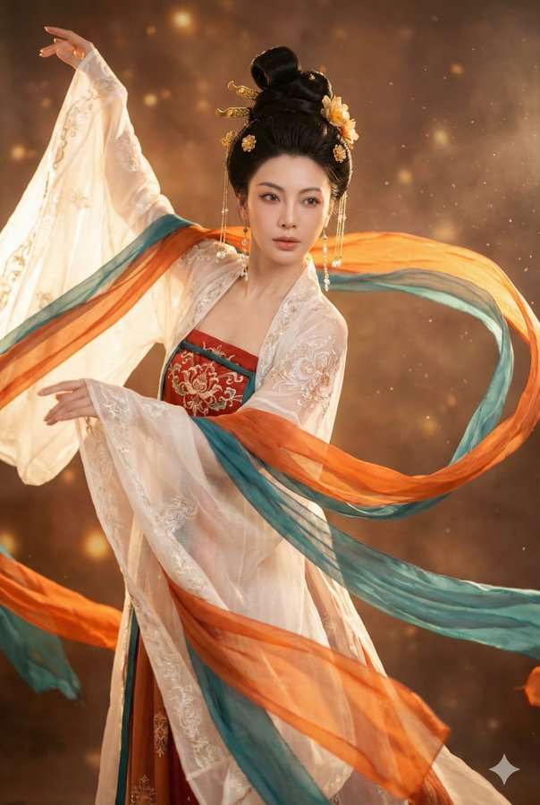

## A 3x3 grid collage layout featuring the same man in 9 di

- ID: gpt4o-805-en-1
- Slug: prompt-805-en-1
- 语言: en
- 来源: [来源链接](https://x.com/aziz4ai/status/1997433270275846322)
- 样例图路径: images/part3/805.jpeg

### 提示词

```text
A 3x3 grid collage layout featuring the same man in 9 different art styles. The central top image is the original photo (realistic). The other 8 panels show the exact same man (bald, mustache, white t-shirt) in the following distinct styles: 1. Studio Ghibli anime style, 2. Rough pencil sketch, 3. Cinematic movie still, 4. High-fashion editorial photography, 5. Semi-realistic digital painting, 6. Epic fantasy warrior portrait, 7. 3D vinyl toy pop figure, 8. Surreal Salvador Dali style. All images are close-up headshots matching the exact composition, angle, and facial expression of the source image. High contrast, 8k resolution, distinct visual separation between styles.
```

### 样例图

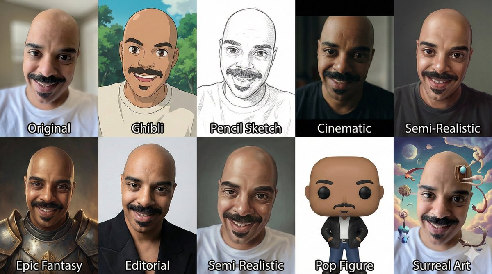

## 一次性探索不同的艺术风格

- ID: gpt4o-805-zh-2
- Slug: prompt-805-zh-2
- 语言: zh
- 来源: [来源链接](https://x.com/aziz4ai/status/1997433270275846322)
- 样例图路径: images/part3/805.jpeg

### 提示词

```text
这是一幅3x3网格拼贴画，以9种不同的艺术风格呈现同一位男士。最上方中央的图像是原图（写实风格）。其余8幅图分别展示了同一位男士（光头、留着胡子、身穿白色T恤）的以下几种风格：1. 吉卜力工作室动画风格；2. 铅笔素描；3. 电影剧照；4. 高级时装摄影；5. 半写实数字绘画；6. 史诗奇幻战士肖像；7. 3D乙烯基玩具人偶；8. 超现实主义萨尔瓦多·达利风格。所有图像均为特写头像，构图、角度和面部表情均与原图完全一致。高对比度，8K分辨率，风格之间清晰的视觉区分。
```

### 样例图


## { "subject": "reference upload image - maintain exact co

- ID: gpt4o-803-en-1
- Slug: prompt-803-en-1
- 语言: en
- 来源: [来源链接](https://x.com/AI_GIRL_DESIGN/status/1997497207239635175)
- 样例图路径: images/part3/803.jpeg

### 提示词

```text
{
  "subject": "reference upload image - maintain exact consistency with uploaded image. Person sitting on bed ledge holding fanned stack of cash, looking upward with exaggerated expression, slightly tongue out",
  "pose": "sitting on bed ledge, legs spread, holding fanned A stack of Japanese 10,000 yen bills in both hands at chest level, head tilted back looking upward",
  "character": {
    "face": "reference upload image",
    "hair": "reference upload image",
    "body_type": "reference upload image",
    "skin_tone": "reference upload image"
  },
  "clothing": "reference upload image - maintain exact consistency with uploaded image",
  "accessories": {
    "jewelry": "reference upload image",
    "props": "large stack of cash bills fanned out in hands, scattered A stack of Japanese 10,000 yen bills on surface, yellow designer bag visible in background"
  },
  "expression": "Mouth wide open with a melted, dazed, uncontrollable smile, Eyebrows drooping heavily downward, looking upward with exaggerated expression, mouth open, energetic and celebratory,
  "environment": {
    "location": "reference upload image",
    "setting": "reference upload image",
    "background": "reference upload image",
    "surface": "reference upload image"
  },
  "lighting": {
    "type": "night photography with camera flash",
    "source": "clean white room lights, camera flash",
    "quality": "warm artificial lighting mixed with flash, creates contrast and highlights subject"
  },
  "camera": {
    "angle": "low angle, shot from below looking up at subject",
    "perspective": "close-up, environmental portrait",
    "technique": "flash photography"
  },
  "style": {
    "aesthetic": "luxury lifestyle photography",
    "mood": "energetic, celebratory, aspirational",
    "color_palette": "warm tones, contrast colors"
  },
  "consistency_note": "Use uploaded reference image for all character features including face, hair, body type, skin tone, facial structure, clothing, and accessories. Maintain strict visual consistency with reference image.",
  "output": {
    "aspect_ratio": "9:16",
    "orientation": "vertical"
  }
}
```

### 样例图

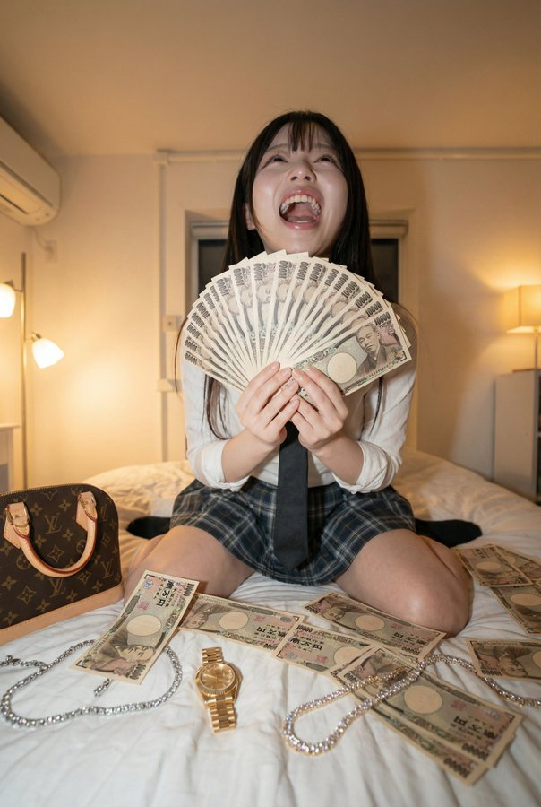

## 人物坐在床沿上双手摊开一叠钞票

- ID: gpt4o-803-zh-2
- Slug: prompt-803-zh-2
- 语言: zh
- 来源: [来源链接](https://x.com/AI_GIRL_DESIGN/status/1997497207239635175)
- 样例图路径: images/part3/803.jpeg

### 提示词

```text
{ "subject": "参考上传图片 - 保持与上传图片完全一致。人物坐在床沿上，双手摊开一叠钞票，仰头，表情夸张，微微吐舌。"pose": "坐在床沿上，双腿分开，双手摊开一叠10000日元钞票于胸前，头部后仰，仰望。"character": { "face": "参考上传图片", "hair": "参考上传图片", "body_type": "参考上传图片", "skin_tone": "参考上传图片" }, "clothing": "参考上传图片 - 保持与上传图片完全一致。"accessories": { "jere": "参考上传图片", "props": "一大叠钞票摊开在手中，散落在地上的10000日元钞票，背景中可见黄色名牌包。"expression": "嘴巴张得大大的，带着一种迷离、失控的笑容，眉毛沉重地向下垂着，望着。"仰头，表情夸张，张着嘴，充满活力，喜庆洋溢。“环境”：{“地点”：参考上传图片，“设置”：参考上传图片，“背景”：参考上传图片，“表面”：参考上传图片}，“光线”：{“类型”：夜间闪光灯摄影，“光源”：干净的白色室内灯光，相机闪光灯，“质量”：暖色调人造光与闪光灯混合，营造对比并突出主体”}，“相机”：{“角度”：低角度，从下往上拍摄主体，“视角”：特写，环境人像，“技巧”：闪光灯摄影”}，“风格”：{“美学”：奢华生活方式摄影，“情绪”：充满活力，喜庆，令人向往，“调色板”：暖色调，对比色”}，“一致性说明”：所有角色特征，包括面部、头发、体型、肤色、面部结构、服装和配饰，均使用上传的参考图片。与参考图像保持严格的视觉一致性。", "output": { "aspect_ratio": "9:16", "orientation": "vertical" } }
```

### 样例图


## A cyber-grunge surveillance fashion editorial featuring 

- ID: gpt4o-796-en-1
- Slug: prompt-796-en-1
- 语言: en
- 来源: [来源链接](https://x.com/_MehdiSharifi_/status/1997832235974598763)
- 样例图路径: images/part3/796.jpeg

### 提示词

```text
A cyber-grunge surveillance fashion editorial featuring a cool, edgy young woman in her early 20s with a short chin-length bob haircut, straight with slight texture and casual bangs, partially obscured by thick black sunglasses and holding an iced coffee/chocolate plastic cup with a straw in her left hand and a half-eaten sandwich/pastry in her right hand. She wears an oversized white t-shirt with rust-red raglan sleeves and a small chest logo, tucked loosely into black, baggy carpenter/cargo denim jeans with white stitching details, and burgundy loafers, accessorized with a gold pendant necklace. She is captured in a full body walking stride, relaxed posture, facing slightly off-center with a casual, indifferent expression, head turned slightly to the side, looking downward, frozen mid-stride in an urban paved plaza with grey concrete and tiled pavement under bright sunny late afternoon golden hour light, creating high contrast shadows and long diagonal shadows to the left. The image is in 8K Ultra-HD quality, hyperrealistic, with a 4:5 aspect ratio and 1440x1920 resolution, styled in raw photoreal high fidelity, full color with cool urban tones and vibrant red UI accents, high-contrast daylight. The composition includes a main full body shot with multiple zoom-in crops (face/drink, torso, pants leg) in a fragmented layout, overlaid with tactical CCTV UI elements like red bounding boxes, telemetry data, and digital HUD overlays, simulating high-end surveillance footage with a 'Big Brother' observation vibe, candid urban documentation, and crisp daylight realism mixed with digital graphic design elements. The background is a sharp focus concrete cityscape with harsh shadow lines, and the lighting is natural harsh sunlight from a high angle, creating deep black cast shadows against bright pavement, with digital grain and scanline imperfections. The color grading features neutral urban greys, white, rust-red, denim black, and striking bright crimson red UI elements, with post-processing including high sharpness and red vector graphics overlays such as numbers '19 5 3 21 18 9 20 25', text 'CCWW', 'TR521', timecode '18/02', and bounding boxes with hashtags '#83575//' and '#25747//'. The overall theme is urban surveillance, Y2K streetwear, tactical data visualization, candid fashion moment, and dystopian chic, with a mood of cool detached observation, urban nonchalance, chaotic data stream, and privacy-invasion chic, captured from a high-angle surveillance perspective with a 35mm to 50mm lens, deep focus, and a layout of one main image plus three inset detail crops connected by red tactical line art and crosshairs.
```

### 样例图

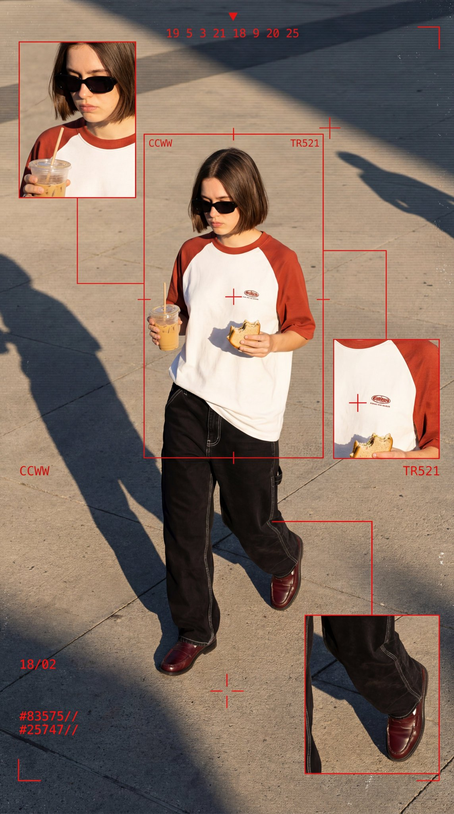

## 一组赛博朋克风格的时尚大片

- ID: gpt4o-796-zh-2
- Slug: prompt-796-zh-2
- 语言: zh
- 来源: [来源链接](https://x.com/_MehdiSharifi_/status/1997832235974598763)
- 样例图路径: images/part3/796.jpeg

### 提示词

```text
这是一组赛博朋克风格的时尚大片，主角是一位酷劲十足、个性鲜明的二十出头年轻女性。她留着齐下巴的短波波头，直发略带纹理，刘海随意，戴着一副厚厚的黑色太阳镜，左手拿着一杯插着吸管的冰咖啡/巧克力，右手拿着半个吃剩的三明治/糕点。她身穿一件宽松的白色T恤，袖子是锈红色插肩袖，胸前印着一个小巧的品牌标识，下身随意地塞进一条黑色宽松的工装牛仔裤里，裤子上有白色缝线细节，脚踩一双酒红色乐福鞋，脖子上戴着一条金色吊坠项链。照片捕捉到她迈着大步的全身姿态，放松的姿势，略微侧身，表情随意而淡漠，头部微微侧转，目光向下，定格在城市广场的半步之中。广场地面铺着灰色的水泥和瓷砖，沐浴在明媚的午后金色阳光下，形成鲜明的对比阴影，左侧投射出长长的斜影。照片采用8K超高清画质，画面逼真，宽高比为4:5，分辨率为1440x1920，风格为原始照片级高保真，色彩饱满，以冷色调的都市色调和鲜艳的红色UI元素点缀，营造出高对比度的日光效果。画面构图包含一个全身主镜头，并以碎片化的布局呈现多个放大特写（面部/饮料、躯干、裤腿），叠加了红色边界框、遥测数据和数字HUD叠加层等战术监控界面元素，模拟出高端监控录像的“老大哥”式监视氛围，同时融入了真实都市纪实和清晰的日光写实风格，并结合了数字图形设计元素。背景是清晰聚焦的混凝土城市景观，阴影线条强烈，光线来自高角度的自然强光，在明亮的路面上投射出深邃的黑色阴影，并带有数字颗粒感和扫描线瑕疵。色彩分级采用中性都市灰、白色、锈红色、牛仔黑和醒目的亮深红色 UI 元素，后期处理包括高锐化和红色矢量图形叠加，例如数字“19 5 3 21 18 9 20 25”、文本“CCWW”、“TR521”、时间码“18/02”以及带有井号“#83575//”和“#25747//”的边界框。整体主题是城市监控、Y2K 街头服饰、战术数据可视化、坦率的时尚瞬间和反乌托邦时尚，营造出一种冷静疏离的观察、都市的漫不经心、混乱的数据流和侵犯隐私的时尚感。照片采用 35 毫米至 50 毫米镜头，以高角度监控视角拍摄，并使用了深焦效果。照片布局为一张主图加三张局部细节图，并用红色战术线条和十字线连接。
```

### 样例图


## { "image_request": { "goal": "Create a mixed-media reali

- ID: gpt4o-794-en-1
- Slug: prompt-794-en-1
- 语言: en
- 来源: [来源链接](https://x.com/_MehdiSharifi_/status/1998059385675829263)
- 样例图路径: images/part3/794.jpeg

### 提示词

```text
{
  "image_request": {
    "goal": "Create a mixed-media reality-bending mirror selfie / blending 2D anime characters into a 3D real-world photo / cozy autumn academia fashion meets otaku dream",
    "meta": {
      "image_type": "Mixed Media Composite / Anime in Real Life / Mirror Selfie / Fashion Snapshot",
      "quality": "Best Quality, Photorealistic Center Subject, Sharp Anime Lines, Mixed Dimensionality",
      "color_mode": "Full Color / Natural Indoor Tones / Warm Beige & Brown Palette",
      "style_mode": "raw_photoreal blended with cel-shaded anime",
      "aspect_ratio": "3:4",
      "resolution": "1080x1920"
    },
    "creative_style": "A playful fusion of dimensions where 2D anime characters seamlessly occupy a real-world space. The photorealistic central figure wears a cozy 'Autumn Academia' outfit, contrasting with the flat, cel-shaded anime characters. The vibe is a casual, dream-like hangout caught in a mirror reflection.",
    "overall_theme": "Anime meets reality / Autumn Academia Fashion / Mirror selfie with fictional characters",
    "mood_vibe": "Cozy, stylish, playful, surreal, dimensional barrier breaking",
    "style_keywords": [
      "mixed media",
      "mirror selfie",
      "anime in real life",
      "autumn academia",
      "cable knit texture",
      "cel-shaded",
      "photorealistic fashion",
      "hallway reflection"
    ],
    "subject": {
      "count": "3 (1 human female, 2 anime males)",
      "type": "human and anime characters",
      "identity": "Center: Young woman (Photorealistic). Left: Spiky black-haired anime male (Megumi style). Right: White-haired anime male (Gojo style).",
      "identity_preservation": {
        "description": "Center subject is a photorealistic human wearing the specific autumn outfit. Side subjects retain distinct 2D anime art style.",
        "notes": "Maintain clear stylistic distinction: Highly detailed texture on the cardigan/skirt vs. bold anime lines for the boys."
      },
      "age_appearance": "Young adults",
      "skin": "Human: Natural texture, soft lighting. Anime: Flat cel-shaded tones.",
      "clothing": {
        "top": "Human: White cotton poplin shirt worn under a loose, oversized beige wool cable-knit cardigan. Left Anime: Black long-sleeve shirt. Right Anime: White t-shirt.",
        "bottom": "Human: Brown plaid/tartan flannel mini skirt and black knee-high socks. Left Anime: Grey pants. Right Anime: Black pants.",
        "accessories": "Human: Smartphone (taking the photo). Right Anime: Sunglasses.",
        "textures": "Emphasize the high-depth weave of the beige cardigan and the flannel texture of the skirt on the human subject."
      },
      "facial_features": {
        "expression": "Human: Obscured by phone or neutral/soft smile. Left Anime: Cool, stoic, arms crossed. Right Anime: Confident, smirk, adjusting glasses."
      },
      "hair": {
        "style": "Human: Natural styling suitable for an academic look. Left Anime: Spiky energetic black hair. Right Anime: White hair with bangs down."
      }
    },
    "pose_action": {
      "overall_pose": "Casual group mirror selfie. Center subject stands straight taking the photo holding phone. Left subject leans casually against the mirror frame. Right subject stands tall.",
      "body_position": "Standing, full body visible in mirror reflection to show the skirt and knee-high socks.",
      "hands": "Center: Holding phone. Left: Arms crossed. Right: Touching sunglasses/face."
    },
    "environment": {
      "setting": "Indoor hallway or lobby with high ceilings and reflective surfaces (matches original scene to keep the context).",
      "location": "Modern building interior with marble/tiled walls and glass elements.",
      "lighting": "Natural daylight filtering in, highlighting the texture of the wool cardigan.",
      "atmosphere": "Clean, bright, casual everyday hangout."
    },
    "background": {
      "color": "Beige, tan, brown (marble stripes) - compliments the beige/brown outfit.",
      "effect": "Reflected in mirror, showing a tiled floor and a glass door leading to the outside."
    },
    "lighting": {
      "type": "Natural diffuse",
      "source": "Windows/Doors behind the subjects (reflected)",
      "quality": "Soft, even. Creates soft shadows on the cable-knit texture.",
      "tone": "Warm neutral."
    },
    "camera": {
      "sensor_format": "Smartphone Camera",
      "position_angle": "Eye-level mirror reflection",
      "framing": "Vertical portrait shot capturing full bodies.",
      "composition": {
        "framing": "Mirror frame visible with geometric grid lines overlaying the reflection.",
        "depth": "Deep depth of field."
      }
    },
    "post_processing": {
      "final_touch": "Digital composite look. Ensure the lighting on the photorealistic cardigan matches the environment, while anime characters remain 2D."
    },
    "negative": {
      "style": "3D render of anime characters, messy drawing, bad anatomy, low resolution",
      "content": "distorted faces, extra limbs, human subject looking like a drawing, anime characters looking too realistic"
    },
    "additional_controls": {
      "special_notes": "Focus on the material contrast: Real wool and flannel vs. Anime flat colors.",
      "vibe": "Fan edit, OOTD (Outfit of the Day)."
    }
  }
}
```

### 样例图

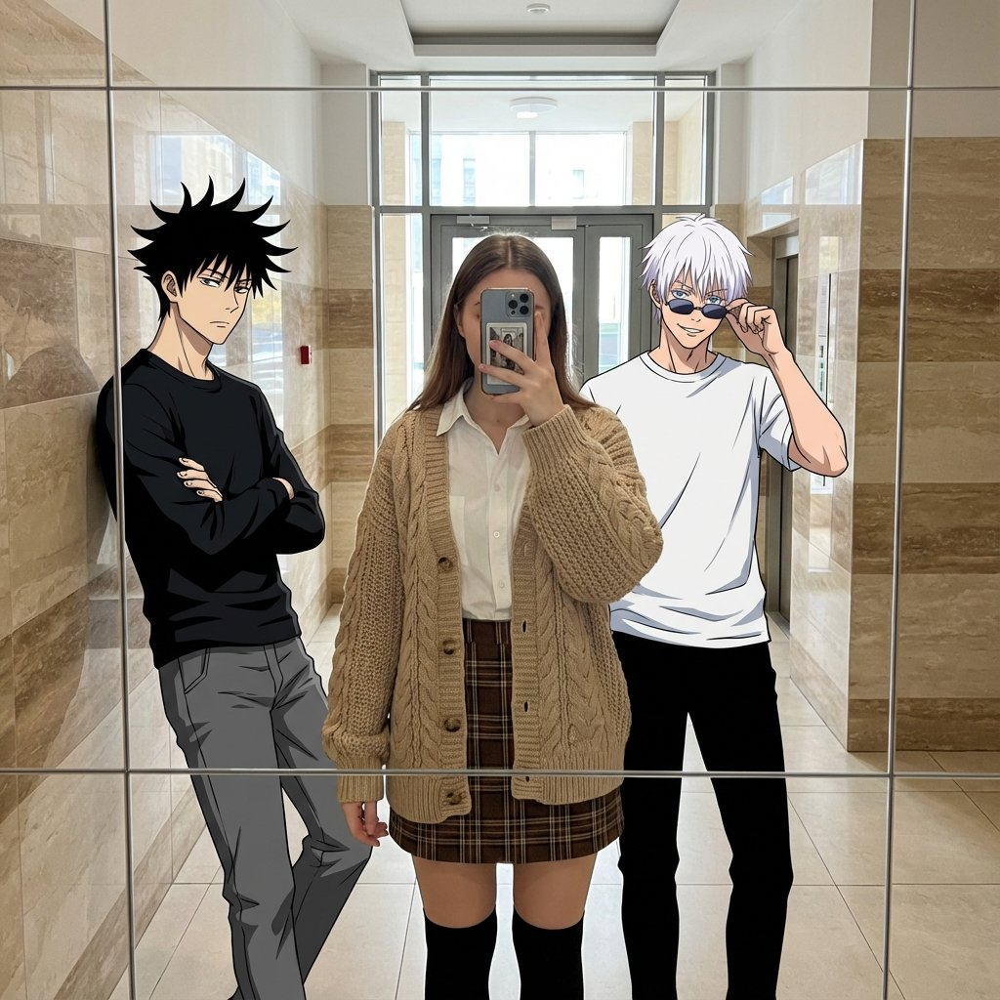

## 融合多种媒体元素的现实扭曲镜面自拍

- ID: gpt4o-794-zh-2
- Slug: prompt-794-zh-2
- 语言: zh
- 来源: [来源链接](https://x.com/_MehdiSharifi_/status/1998059385675829263)
- 样例图路径: images/part3/794.jpeg

### 提示词

```text
{
"image_request": {
“目标”：“创作一张融合多种媒体元素的现实扭曲镜面自拍/将二维动漫人物融入三维现实世界照片/舒适的秋季学院风时尚与宅男梦想相遇”，
"meta": {
"image_type": "混合媒体合成/现实生活中的动漫/镜子自拍/时尚快照",
“质量”：“最佳质量，照片级逼真的中心主体，清晰的动漫线条，混合维度”
"color_mode": "全彩/自然室内色调/暖米色和棕色调色板",
"style_mode": "raw_photoreal blended with cel-shaded anime",
"aspect_ratio": "3:4",
分辨率：1080x1920
},
“创意风格”： “一种巧妙融合不同维度的趣味作品，二维动画角色无缝融入现实世界空间。写实风格的中心人物身着舒适的‘秋季学院风’服装，与扁平的赛璐珞风格动画角色形成鲜明对比。整体氛围如同镜中倒影般，营造出一种轻松梦幻的聚会氛围。”
"overall_theme": "动漫与现实的碰撞 / 秋季学院风时尚 / 与虚构人物的镜子自拍",
"mood_vibe": "舒适、时尚、俏皮、超现实、打破维度界限"
"style_keywords": [
“混合媒介”，
“镜子自拍”，
“现实生活中的动漫”，
“秋季学术界”，
“绞花针织纹理”，
“卡通渲染”
“照片写实时尚”，
“走廊倒影”
],
“主题”： {
“count”: “3（1名人类女性，2名动漫男性）”
“类型”：“人类和动漫角色”，
“身份”：“中间：年轻女子（写实风格）。左侧：黑色刺猬头动漫男性（惠美风格）。右侧：白色头发动漫男性（五条风格）。”
"identity_preservation": {
“描述”：“中心人物是一位身着特定秋季服装的写实人物。两侧人物则保留了鲜明的二维动画艺术风格。”
“备注”：“保持清晰的风格区分：开衫/裙子采用高度精细的纹理，而男孩款则采用粗犷的动漫线条。”
},
"age_appearance": "青年人",
“皮肤”： “人类：自然纹理，柔和光照。动漫：扁平的赛璐珞着色色调。”
“衣服”： {
“上图”：人类：白色棉质府绸衬衫，外搭宽松的米色羊毛麻花针织开衫。左图动漫人物：黑色长袖衬衫。右图动漫人物：白色T恤。
“底部”： “人类：棕色格子/苏格兰格纹法兰绒迷你裙和黑色过膝袜。左侧动漫角色：灰色裤子。右侧动漫角色：黑色裤子。”
“配件”： “人类：智能手机（正在拍照）。 右动漫人物：太阳镜。”
“纹理”：“强调人物身上米色开衫的高密度编织纹理和裙子的法兰绒质感。”
},
"facial_features": {
“表情”： “人类：被手机遮挡或面带中性/柔和的微笑。左侧动漫人物：冷静、沉稳，双臂交叉。右侧动漫人物：自信，嘴角带着一丝微笑，正在调整眼镜。”
},
“头发”： {
“风格”：人类：适合学术形象的自然发型。左侧动漫：充满活力的黑色刺猬头。右侧动漫：带刘海的白色头发down."
}
},
"pose_action": {
“整体姿势”： “随意的集体镜前自拍。中间的人站直，拿着手机拍照。左边的人随意地倚靠在镜框上。右边的人站得笔直。”
“body_position”: “站立，全身在镜中反射可见，可以看到裙子和及膝袜。”
“手”：中间：拿着手机。左：双臂交叉。右：摸着太阳镜/脸。
},
“环境”： {
“场景”：“室内走廊或大厅，天花板很高，表面有反光材料（与原场景相符，以保持语境）。”
“地点”：“现代建筑内部，墙面采用大理石/瓷砖，并融入玻璃元素。”
“光线”：“自然光线倾泻而入，突显了羊毛开衫的质感。”
“氛围”：“干净、明亮、休闲的日常聚会场所。”
},
“背景”： {
颜色：米色、棕褐色、棕色（大理石条纹）——与米色/棕色服装相得益彰。
“效果”：“在镜子中映照出瓷砖地板和通往室外的玻璃门。”
},
“灯光”： {
“类型”：“自然漫射”，
“来源”：“主体背后的窗户/门（反射）”
“品质”：“柔软均匀。在针织纹理上营造出柔和的阴影。”
“色调”：“暖中性”。
},
“相机”： {
"sensor_format": "智能手机摄像头",
"position_angle": "眼平镜反射",
“构图”：“竖幅肖像照，拍摄全身像。”
“作品”： {
“镜框”：“镜框清晰可见，几何网格线覆盖在镜面反射之上。”
“景深”：“大景深”。
}
},
"post_processing": {
“final_touch”： “数字合成效果。确保逼真开衫的光照与环境相匹配，同时保持动漫人物的二维风格。”
},
“消极的”： {
“风格”：“动漫人物的3D渲染，凌乱的绘画，糟糕的解剖结构，低分辨率”，
“内容”：“扭曲的面孔、多余的肢体、看起来像画的人物、过于逼真的动漫人物”
},
"additional_controls": {
特别说明： 重点在于材质对比：真羊毛和法兰绒 vs. 动漫风格的纯色。
“vibe”：“粉丝剪辑，OOTD（每日穿搭）。”
}
}
}
```

### 样例图


## A horizontal split-screen cinematic shot of {Scene}, sea

- ID: gpt4o-793-en-1
- Slug: prompt-793-en-1
- 语言: en
- 来源: [来源链接](https://x.com/dotey/status/1998095424394007000)
- 样例图路径: images/part3/793.jpeg

### 提示词

```text
A horizontal split-screen cinematic shot of {Scene}, seamlessly blending two different eras: {Era_A} on the left and {Era_B} on the right (default: about 100 years ago vs. present day).

On the left side ({Era_A}): show era-appropriate architecture, interior or environment design, materials, vehicles, and props that clearly belong to that historical period. People wear authentic clothing from {Era_A}, including hairstyles, accessories, and typical items in their hands (such as books, umbrellas, instruments, letters, newspapers, etc.). The overall mood feels nostalgic and historically accurate.

On the right side ({Era_B}): show the same {Scene} in the modern era, with updated architecture or renovated structures, contemporary materials (glass, steel, LED screens, modern furniture), modern vehicles or equipment, and current technology (smartphones, laptops, cameras, etc.). People wear contemporary fashion that matches today’s style in this setting.

In the center: the two eras merge and overlap organically, without a hard dividing line. Elements from {Era_A} and {Era_B} visually interact: people from different times look at each other, walk through each other’s space, or seem surprised by the other era’s technology and objects. Architecture and environment smoothly morph from old to new (for example, stone gates turning into modern campus gates, classical concert hall décor fading into a futuristic stage, old street shops transforming into neon-lit storefronts).

Make sure the scene is not just a simple left/right comparison but a dynamic time-travel interaction where buildings, clothing, props, and human gestures clearly emphasize the contrast and fusion between the two eras. Photorealistic, 8k resolution, cinematic lighting, wide angle, highly detailed textures, rich sense of time-travel storytelling.

---
SCENE: Times Square, New York
Era Comparison: 1920s and present day
Aspect Ratio: 4:3
```

### 样例图

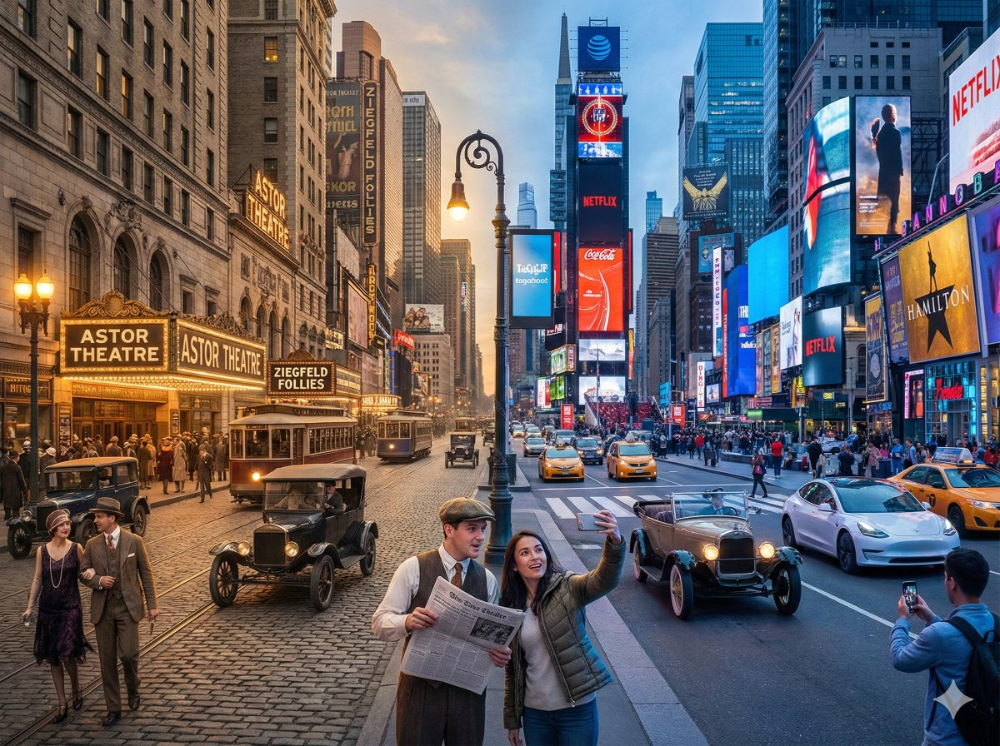

## 无缝融合两个不同的时代

- ID: gpt4o-793-zh-2
- Slug: prompt-793-zh-2
- 语言: zh
- 来源: [来源链接](https://x.com/dotey/status/1998095424394007000)
- 样例图路径: images/part3/793.jpeg

### 提示词

```text
水平分屏电影镜头 {Scene}，无缝融合了两个不同的时代：左侧为 {Era _A} ，右侧为 {Era_ B} （默认：大约 100 年前 vs. 现代）}。

左侧（{时代_A}):展示了符合时代特征的建筑、室内或环境设计、材料、车辆和道具，这些都明显属于该历史时期。人们穿着{时代_A}的真实服饰，包括发型、配饰以及手中的典型物品（例如书籍、雨伞、乐器、信件、报纸等）。整体氛围既充满怀旧气息，又符合历史事实。

右侧（{Era_ B}):展示了现代的相同场景，建筑风格有所更新或翻新，采用了现代材料（玻璃、钢材、LED屏幕、现代家具）、现代车辆或设备以及当前技术（智能手机、笔记本电脑、相机等）。人们穿着符合当今风格的时尚服饰。

在中心区域：两个时代有机地融合交叠，没有明显的界限。{时代A}和{时代B}的元素在视觉上相互交融：不同时代的人们彼此对视，穿梭于彼此的空间，或对另一个时代的科技和物品感到惊讶。建筑和环境也从旧到新平滑过渡（例如，石门变成现代校园大门，古典音乐厅的装饰逐渐过渡到未来主义的舞台，老旧的街边店铺变成霓虹闪烁的店面）。

确保场景不仅仅是简单的左右对比，而是一个动态的时空穿越互动场景，建筑、服饰、道具和人物姿态都清晰地突出了两个时代之间的对比与融合。照片级写实效果，8K分辨率，电影级光照，广角镜头，高度精细的纹理，以及丰富的时空穿越叙事感。

---
场景：纽约时代广场
时代对比：20世纪20年代与当今时代
宽高比：4:3
```

### 样例图


## 女生展示自己手机照片

- ID: gpt4o-791-zh
- Slug: prompt-791-zh
- 语言: zh
- 来源: [来源链接](https://x.com/SDT_side/status/1997789514526564650)
- 样例图路径: images/part3/791.jpeg

### 提示词

```text
需要上传2张照片：1、上传人物照片 2、上传想要在手机上显示的图像，再输入以下提示词
{
  "edit_type": "extreme_wide_angle_phone_edit",

  "source": {
    "_hint": "元画像の人物・服・雰囲気を編集するベース。新キャラ禁止。",
    "mode": "EDIT",
    "reference_images": {
      "first": "base_photo_person_and_environment",
      "second": "screen_content_for_phone"
    },
    "preserve_from_first": {
      "_hint": "顔・髪型・服装は必ず同一人物として扱うための固定。",
      "same_person_or_group": true,
      "same_faces": true,
      "same_hairstyles": true,
      "same_outfits": true,
      "same_environment_style": true
    }
  },

  "identity": {
    "_hint": "表情の統一化。人物のアイデンティティを崩さず保持。",
    "keep_identity_consistent": true,
    "all_people_clearly_recognizable_as_original": true,
    "expression": "bright_natural_smile"
  },

  "camera_effect": {
    "_hint": "スマホを近づけたときの誇張パースを美しく安定化。",
    "perspective": "extreme_wide_angle",
    "style": "dynamic_photorealistic",
    "near_objects_appear_large": true,
    "far_objects_recede_dramatically": true,
    "allow_view_from_above_or_below": true
  },

  "pose": {
    "_hint": "元画像と同じポーズ禁止。手の動きを強調して破綻防止。",
    "pose_can_change": true,
    "must_be_completely_different_from_reference": true,
    "do_not_replicate_or_approximate_original_pose": true,
    "style_tags": [
      "stylish",
      "complex",
      "fluid",
      "powerful"
    ],
    "focus_on_expressive_hands": true,
    "avoid_arm_distortion": true,
    "allow_multiple_body_parts_near_lens": true
  },

  "phone": {
    "_hint": "スマホ専用領域。持ち方・向き・手元の自然さを定義。",
    "allowed": true,
    "holding_styles": [
      "one_handed",
      "two_handed",
      "low_angle",
      "high_angle",
      "tilted",
      "sideways",
      "near_chest",
      "near_hip",
      "casual_carry",
      "partially_toward_lens"
    ],
    "rules": {
      "_hint": "“レンズに向ける強制”を避け、自然な持ち方で画面が見える構図へ。",
      "each_person_may_hold_one_phone": true,
      "priority_is_natural_and_relaxed_body_structure": true,
      "do_not_force_phone_directly_toward_camera": true,
      "screen_should_be_naturally_visible_when_possible": true
    }
  },

  "screen_replacement": {
    "_hint": "差し替えスクリーン。UIなし・歪みなし・自然な貼り込み。",
    "target": "visible_phone_screen",
    "use_second_reference_image_as_content": true,
    "overlay_cleanly_on_visible_screen_area": true,
    "fit_without_distortion": true,
    "respect_screen_shape": true,
    "no_additional_cropping": true,
    "ui_constraints": {
      "_hint": "SNSバーやアプリ枠の発生を完全禁止。",
      "no_ui": true,
      "no_icons": true,
      "no_status_bar": true,
      "no_app_frame": true,
      "show_only_content_from_second_reference": true
    }
  },

  "environment": {
    "_hint": "元写真の空気感を保つが、季節や天気には依存しない汎用設計。",
    "preserve_environment_style_from_reference": true,
    "lighting_consistent_with_reference": true,
    "expand_space_for_wide_angle_view": true,
    "keep_texture_and_color_tone_consistent": true
  },

  "composition": {
    "_hint": "スマホ近接によるダイナミック構図の安定化。",
    "dynamic_but_readable": true,
    "extreme_depth_emphasis": true,
    "allow_phone_close_to_lens": true,
    "keep_all_people_visually_balanced": true
  },

  "constraints": {
    "_hint": "意図せぬ変化を禁止する保護設定。",
    "no_new_characters": true,
    "no_change_in_age_or_gender_presentation": true,
    "no_costume_change": true,
    "no_change_to_reference_location_type": true,
    "respect_original_photographic_style": true
  }
}
```

### 样例图

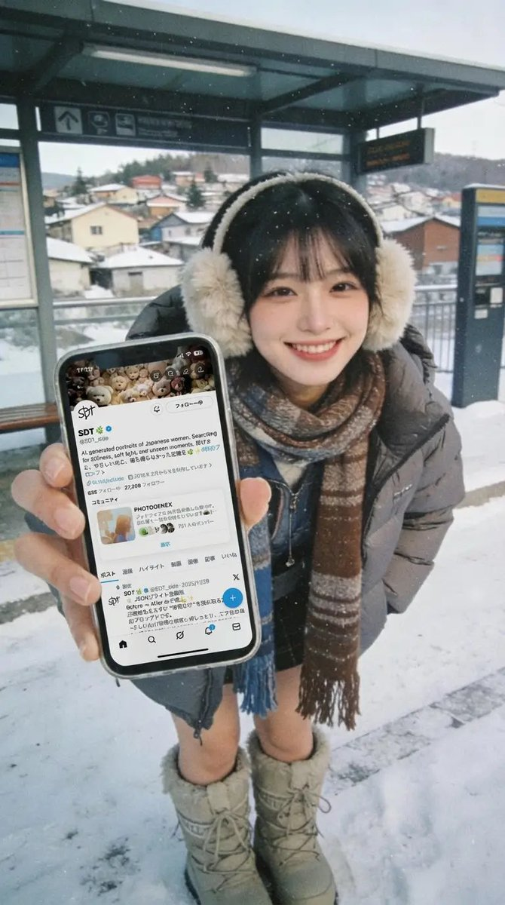

## { "image_prompt": { "face_preservation": { "use_referenc

- ID: gpt4o-789-en-1
- Slug: prompt-789-en-1
- 语言: en
- 来源: [来源链接](https://x.com/ZaraIrahh/status/1997616475277033799)
- 样例图路径: images/part3/789.jpeg

### 提示词

```text
{
  "image_prompt": {
    "face_preservation": {
      "use_reference_face": true,
      "accuracy": "match face exactly from reference image",
      "preserve_details": [
        "face shape",
        "eyebrows and eye structure",
        "natural makeup style",
        "lip shape and color",
        "hairline and hairstyle"
      ]
    },

    "subject": {
      "gender": "female",
      "description": "young woman taking a mirror selfie while squatting gracefully indoors",
      "pose": {
        "body_position": "squatting low with one knee forward, leaning slightly toward mirror",
        "head": "tilted slightly downward while looking at phone screen",
        "hands": [
          "right hand holding phone in front of face",
          "left hand resting on knee"
        ],
        "expression": "soft, calm expression"
      },
      "hair": {
        "style": "long dark brown hair in a half-up ponytail with a small clip",
        "texture": "smooth and straight"
      },
      "attire": {
        "dress": {
          "type": "light-colored floral maxi dress with short sleeves",
          "pattern": "red and pink small floral print",
          "details": "slit exposing leg, soft fabric flow"
        },
        "shoes": "white strappy heels",
        "accessories": [
          "silver necklace",
          "bracelet",
          "rings"
        ]
      }
    },

    "environment": {
      "setting": "indoor room with soft lighting",
      "background": "floor-to-ceiling curtains in dark grey tones",
      "floor": "smooth, reflective surface",
      "lighting": {
        "type": "soft warm indoor light",
        "effect": "even illumination on face and dress"
      }
    },

    "props": {
      "phone": {
        "type": "smartphone",
        "case": "glitter silver phone case",
        "position": "held vertically towards the mirror"
      }
    },

    "style": {
      "photography": "mirror selfie, social media aesthetic",
      "color_grade": "soft warm tones",
      "sharpness": "medium-high clarity",
      "mood": "feminine, elegant, gentle"
    },

    "composition": {
      "framing": "full body squatting pose, centered",
      "angle": "eye-level mirror perspective",
      "focus": "sharp focus on face and outfit",
      "aspect_ratio": "4:5"
    },

    "output": {
      "resolution": "8K high quality",
      "negative_prompt": [
        "incorrect face",
        "wrong hairstyle",
        "extra limbs",
        "different dress pattern",
        "distorted proportions",
        "text or watermark"
      ]
    }
  }
}
```

### 样例图

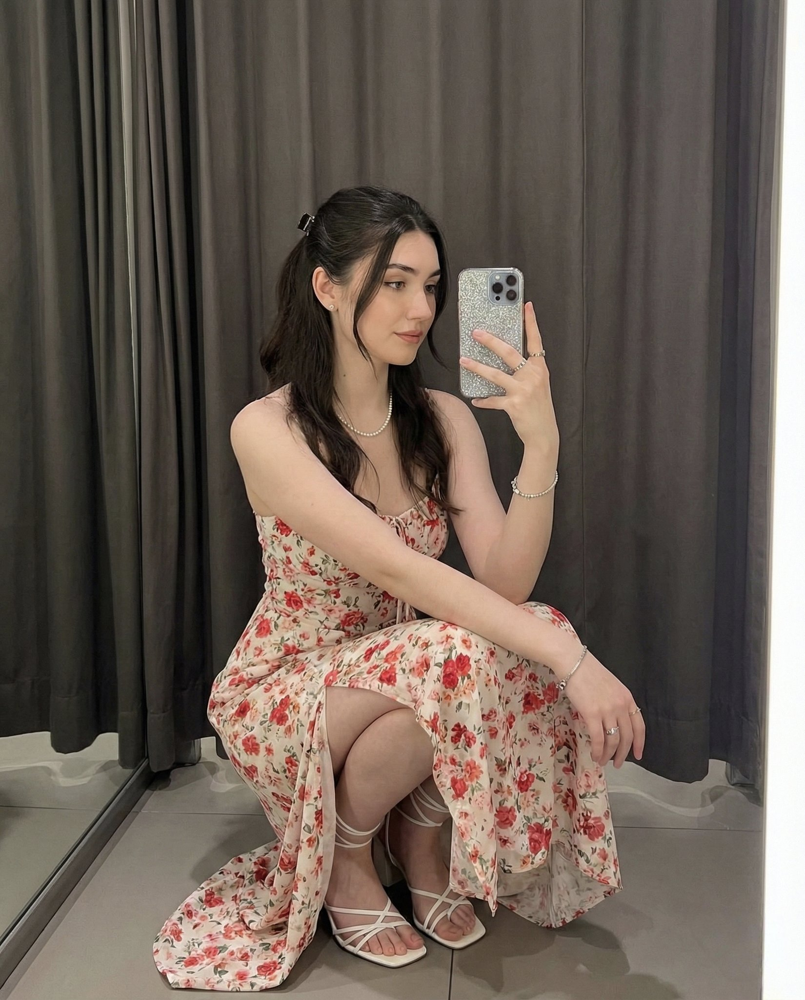

## 年轻女子在室内优雅地蹲着自拍

- ID: gpt4o-789-zh-2
- Slug: prompt-789-zh-2
- 语言: zh
- 来源: [来源链接](https://x.com/ZaraIrahh/status/1997616475277033799)
- 样例图路径: images/part3/789.jpeg

### 提示词

```text
{
"image_prompt": {
"面部保存": {
"use_reference_face": true,
“准确度”：“与参考图像中的人脸完全匹配”，
"preserve_details": [
“脸型”，
“眉毛和眼睛结构”，
“自然妆容风格”，
“唇形和颜色”，
发际线和发型
]
},

“主题”： {
"性别": "女性",
“描述”：“年轻女子在室内优雅地蹲着自拍镜子”，
"姿势": {
"body_position": "单膝前蹲，身体略微前倾，朝向镜子"
“头部”：“看着手机屏幕时略微向下倾斜”，
“手”：[
“右手拿着手机放在脸前”，
左手放在膝盖上
],
“表情”：“柔和、平静的表情”
},
“头发”： {
“发型”：“深棕色长发扎成半马尾，用一个小发夹固定”，
“质地”：“光滑笔直”
},
着装：{
“裙子”： {
“类型”：“浅色碎花短袖长连衣裙”，
“图案”：“红色和粉色小碎花图案”，
“细节”：“开衩露出腿部，柔软面料垂坠感”
},
“鞋子”：“白色细带高跟鞋”，
“配件”： [
“银项链”，
“手镯”，
“戒指”
]
}
},

“环境”： {
“场景”：“室内，灯光柔和”，
“背景”：“深灰色调的落地窗帘”，
“地板”：“光滑、反光的表面”，
“灯光”： {
类型：柔和温暖的室内灯光，
“效果”：“脸部和衣服上的光线均匀”。
}
},

"props": {
“电话”： {
“类型”：“智能手机”，
“手机壳”： “闪亮银色手机壳”，
“姿势”：“垂直对着镜子”
}
},

“风格”： {
“摄影”：“镜子自拍，社交媒体美学”，
"color_grade": "柔和的暖色调",
“清晰度”： “中高清晰度”，
情绪：女性化、优雅、温柔
},

“作品”： {
“构图”：“全身深蹲姿势，居中”，
“角度”：“平视镜视角”，
“焦点”: “清晰聚焦于面部和服装”，
"aspect_ratio": "4:5"
},

“输出”： {
分辨率：8K 高清，
"negative_prompt": [
“错误的脸”，
“错误的发型”，
“额外的肢体”，
“不同的服装款式”，
“扭曲的比例”，
“文字或水印”
]
}
}
}
```

### 样例图


## 生成人物不同姿势九宫格

- ID: gpt4o-785-zh
- Slug: prompt-785-zh
- 语言: zh
- 来源: [来源链接](https://x.com/qisi_ai/status/1997553039474143501)
- 样例图路径: images/part3/785.jpeg

### 提示词

```text
在「东京塔」的位置，根据当地当前时间氛围和实时天气制作图片。请让指定的角色在该地点游览，使其融入场景。  

生成画面：
生成一张画面为竖版3:4比例，单张图固定九宫格布局，三行三列，每个格子为独立镜头。

相机与视角：
– 使用超广角或鱼眼感的镜头（大约等效全画幅 12–18mm 的观感）
– 相机角度必须与原图有显著变化，可以使用的夸张机位包括：
• 从正下方向上看的仰视视角
• 从正上方向下看的俯视视角
• 贴近地面的超低机位
• 从上往下的高机位
• 倾斜的「荷兰角度」构图
– 始终营造强烈的透视缩短效果：离镜头最近的身体部位显得巨大，其余身体在透视中向远处延伸
– 最终效果必须像一张大胆的时尚或街拍照片，完全写实，而不是插画或二次元风格

靠近镜头的身体部位（1–2 个，有时 3 个）：
– 每一张编辑图中，选择一到两个主要身体部位极度靠近镜头（在更复杂的姿势中，有时可以是三个）
– 在不同图像之间要变化这些部位，不要总是同一个地方靠近镜头
– 可以靠近镜头的身体部位包括：
• 一只或两只手 / 手指向镜头伸出
• 一只或两只脚 / 鞋子 / 靴子贴近镜头
• 膝盖或大腿
• 脸部非常靠近镜头
• 在前倾姿态中靠近镜头的肩膀或胸部
– 选中的身体部位应当极度接近镜头，几乎要碰到镜头，可清晰看到皮肤纹理、布料纹理和真实的广角畸变

姿势与整体身体（复杂且多变）：
– 创造与极端视角相匹配的强烈、酷炫、充满动感的姿势
– 随机使用不同类型的姿态，包括：
• 站立姿势中，一条腿或一只手朝镜头伸出
• 蹲下或贴地半蹲
• 坐在地面上或坐在物体上
• 平躺在地面上，腿或脚朝向镜头
• 身体大幅向前探向镜头
• 扭转躯干、交叉双腿或弓起背部，形成更具动感的身体线条
– 允许使用复杂姿势，例如：
• 两只手都靠近镜头，摆出手势（比耶、三角形、用手指做画框、指向观者等）
• 双脚都朝向镜头
• 一只手和一只脚同时作为前景的大型元素
• 脸部靠近镜头，同时手或脚也在透视关系中出现
– 即使在极端透视缩短下，也要保持合理可信的人体结构

机位与态度（随机化）：
– 随机改变相机角度与方向（朝上、朝下、侧向、倾斜构图），同时保持画面构图视觉上平衡、有冲击力
– 气质保持酷、从容，自信，偏向时尚大片或街头风格，具体依照原始穿搭气质
– 面部表情可以变化（严肃、俏皮、自信、神秘等），但必须始终看起来是同一个人

光线与画面渲染：
– 保持真实的阴影以及与地面 / 地板的接触关系
– 高分辨率与清晰细节，能看到皮肤纹理、布料纹理以及材质高光

变化与随机性：
– 每一张小图都应当与其他小图有明显区别，在以下方面保持多样化：
• 相机角度
• 姿势类型
• 哪些身体部位最靠近镜头
• 构图方向（正向、倾斜、俯视、仰视等）
– 避免一再重复完全相同的「单脚贴近镜头」构图，要呈现丰富多样的动态姿势和机位变化

严格规则：
– 不要把人物换成别人
– 不要改变服装类型；只能通过姿势、视角以及衣物的自然运动来改变表现方式
– 不要把场景移动到指定经纬度以外的地点；始终保持在指定经纬度地点的合理延展范围内
– 不要添加文字、标志、水印或图形设计元素
– 不要改成油画、插画或动漫风格；必须保持照片级写实效果
```

### 样例图


## { "image_request": { "goal": "Create a Gen Z anime-core 

- ID: gpt4o-783-en-1
- Slug: prompt-783-en-1
- 语言: en
- 来源: [来源链接](https://x.com/_MehdiSharifi_/status/1997824265215684761)
- 样例图路径: images/part3/783.jpeg

### 提示词

```text
{
  "image_request": {
    "goal": "Create a Gen Z anime-core streetwear mirror selfie blending [UPLOADED IMAGE] with 2D anime illustration elements",
    "meta": {
      "image_type": "Mixed Media Mirror Selfie / Anime-Core Fashion Editorial",
      "quality": "Best Quality, Ultra-Detailed, Mixed Reality, Smartphone Photography",
      "color_mode": "Full Color / Vibrant Accents",
      "style_mode": "raw_photoreal with 2D overlay",
      "aspect_ratio": "4:5",
      "resolution": "1080x1350"
    },
    "creative_style": "Playful Gen Z streetwear fashion mixed with 2D anime overlay, casual 'fit check' vibe, juxtaposition of cute styling with gothic anime horror elements, vibrant eclectic footwear, indoor mirror selfie aesthetic",
    "overall_theme": "anime culture/streetwear fashion / mixed reality / playful casual",
    "mood_vibe": "playful confident / otaku chic / quirky / casual cool",
    "style_keywords": [
      "mirror selfie",
      "streetwear",
      "anime overlay",
      "mixed media",
      "Gen Z fashion",
      "casual",
      "playful"
    ],
    "subject": {
      "count": "2 (1 human female [UPLOADED IMAGE] + 1 anime character overlay)",
      "type": "female / 2D character overlay",
      "identity": "[UPLOADED IMAGE]",
      "identity_preservation": {
        "description": "Strictly preserve facial features, hair, and body structure from [UPLOADED IMAGE]",
        "notes": "Use [UPLOADED IMAGE] as the reference for the main subject."
      },
      "age_appearance": "Derived from [UPLOADED IMAGE]",
      "skin": "Derived from [UPLOADED IMAGE]",
      "makeup": {
        "lips": "Derived from [UPLOADED IMAGE]",
        "eyes": "Derived from [UPLOADED IMAGE]",
        "general": "Derived from [UPLOADED IMAGE]."
      },
      "facial_features": {
        "expression": "Derived from [UPLOADED IMAGE]",
        "eyes": {
          "gaze": "Derived from [UPLOADED IMAGE]",
          "intensity": "Derived from [UPLOADED IMAGE]"
        },
        "lips": {
          "gesture": "Derived from [UPLOADED IMAGE]"
        }
      },
      "hair": {
        "length": "Derived from [UPLOADED IMAGE]",
        "texture": "Derived from [UPLOADED IMAGE]",
        "style": "Derived from [UPLOADED IMAGE]",
        "lighting_interaction": {
          "light": "soft indoor overhead reflection",
          "shadow_play": "minimal"
        }
      },
      "clothing": {
        "top": "oversized beige knit sweater with distressed hem, featuring large black-and-white manga girl portrait graphic and smiley face print (OR retain clothing from [UPLOADED IMAGE] if preferred)",
        "bottom": "sheer black thigh-high stockings (OR retain clothing from [UPLOADED IMAGE])",
        "full_description": "Subject from [UPLOADED IMAGE] styled in Gen Z anime-core fashion",
        "accessories": "layered pearl and chain necklaces, rings, quirky phone case with text stickers"
      },
      "props": {
        "bouquet": "N/A",
        "wine_glass": "N/A",
        "other": "Smartphone with sticker-covered case held in both hands"
      }
    },
    "pose_action": {
      "description": "Standing full-body mirror selfie matching [UPLOADED IMAGE]",
      "overall_pose": "Derived from [UPLOADED IMAGE]",
      "head_turn": "Derived from [UPLOADED IMAGE]",
      "gaze": "Derived from [UPLOADED IMAGE]",
      "body_position": "Derived from [UPLOADED IMAGE]",
      "hands": "holding smartphone at chest level to take a photo",
      "movement": "static pose"
    },
    "multiple_frames_expressions": [],
    "environment": {
      "setting": "Indoor hallway or hotel room entrance",
      "location": "in front of full-length mirror",
      "weather": "N/A (indoor)",
      "time_of_day": "indoor artificial light",
      "atmosphere": "casual/domestic/playful"
    },
    "background": {
      "color": "neutral tones/wood door / white walls",
      "effect": "standard depth of field, clear background with looming anime figure overlay"
    },
    "lighting": {
      "type": "Indoor overhead lighting",
      "position": "overhead",
      "direction": "top-down",
      "intensity": "moderate / even",
      "focus": "on [UPLOADED IMAGE] subject",
      "falloff": "gradual",
      "light_quality": "diffused artificial",
      "source": "ceiling fixture",
      "tone": "neutral to slightly warm",
      "mood": "casual daily life",
      "subject_lighting": "even illumination on [UPLOADED IMAGE]",
      "environment_lighting": "ambient indoor",
      "color_temperature": "3500K-4000K",
      "contrast_shadow": "soft shadows behind subject",
      "shadow_quality": "diffused",
      "imperfections": ["smartphone reflection", "indoor lighting glare"]
    },
    "camera": {
      "sensor_format": "Smartphone Camera",
      "lens": "Wide angle main lens (approx 24-26mm eq)",
      "position_angle": "eye-level (reflection)",
      "distance": "arm's length / approx 1.5 meters from mirror",
      "framing": "full body portrait 9:16",
      "depth_of_field": "deep (everything mostly in focus)",
      "composition": {
        "framing": "[UPLOADED IMAGE] centered, mirror frame visible on edges",
        "depth": "flat layering of 2D character behind 3D [UPLOADED IMAGE] subject",
        "emphasis": "outfit details and the juxtaposition of the anime character",
        "angle": "straight on"
      }
    },
    "photobooth_collage_specific": {
      "frame_count_per_strip": "N/A",
      "total_prints": "N/A",
      "layout": "N/A",
      "border": "N/A",
      "tonality_texture": "N/A",
      "highlight_behavior": "N/A"
    },
    "color_grading": {
      "palette": "Beige, Black, Yellow, Red, White",
      "lut": "Standard Smartphone / True to Life",
      "mood": "casual vivid"
    },
    "post_processing": {
      "sharpening": "standard",
      "final_touch": "Composite overlay of large 2D anime 'Shinigami' (death god) character looming behind [UPLOADED IMAGE]—spiky blue/black hair, skeletal face, yellow eyes, dark feathery wings/shoulders (Ryuk style)."
    },
    "negative": {
      "style": "blurry, low res, painting, 3D render of girl (girl must be photoreal), distorted hands",
      "content": "cluttered background, bad lighting, cropped feet",
      "artifacts": "warped phone, extra fingers"
    },
    "additional_controls": {
      "focus_emphasis": "The [UPLOADED IMAGE] subject and the anime character overlay",
      "grounding": "feet firmly planted",
      "special_notes": "The image features a distinct 'mixed reality' style where a 2D anime illustration is superimposed behind [UPLOADED IMAGE] in a mirror selfie.",
      "vibe": "playful anime fan",
      "final_output_goal": "A realistic mirror selfie of [UPLOADED IMAGE] with a convincing 2D anime character integration."
    }
  }
}
```

### 样例图

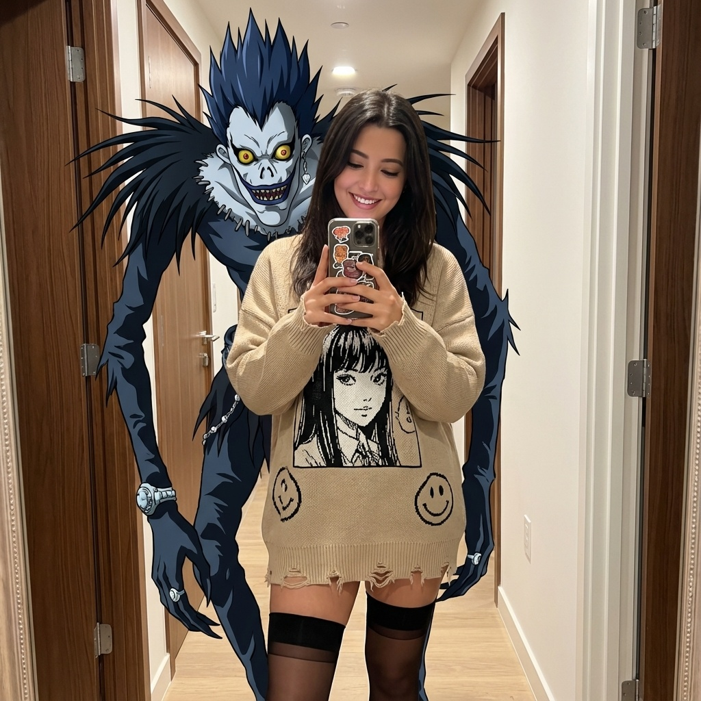

## 自己和2D动漫插画自拍

- ID: gpt4o-783-zh-2
- Slug: prompt-783-zh-2
- 语言: zh
- 来源: [来源链接](https://x.com/_MehdiSharifi_/status/1997824265215684761)
- 样例图路径: images/part3/783.jpeg

### 提示词

```text
{
"image_request": {
“目标”：“创作一张融合了[已上传图片]和2D动漫插画元素的Z世代动漫风街头服饰镜面自拍照片”，
"meta": {
"image_type": "混合媒体镜面自拍/动漫核心时尚专题",
“品质”：“最佳品质、超高清细节、混合现实、智能手机摄影”
"color_mode": "全彩/鲜艳色彩",
"style_mode": "带有 2D 叠加层的 raw_photoreal",
"aspect_ratio": "4:5",
分辨率：1080x1350
},
"creative_style": "俏皮的Z世代街头服饰时尚与2D动漫元素融合，休闲的“穿搭打卡”氛围，可爱造型与哥特式动漫恐怖元素的并置，充满活力的多元化鞋履，室内镜前自拍美学"
"overall_theme": "动漫文化/街头服饰时尚/混合现实/休闲玩法",
"mood_vibe": "俏皮自信/宅男时尚/古怪/休闲酷炫",
"style_keywords": [
“镜子自拍”，
“街头服饰”，
“动漫叠加层”，
“混合媒介”，
Z世代时尚
“随意的”，
“顽皮的”
],
“主题”： {
“计数”：“2（1个人类女性[上传图像] + 1个动漫角色叠加）”
"type": "女性/2D角色叠加",
“身份”：[上传的图片]，
"identity_preservation": {
“描述”：“严格保留[上传图像]中的面部特征、头发和身体结构”，
备注：请使用[已上传的图片]作为主要参考。
},
"age_appearance": "源自[上传的图片]",
“皮肤”：“源自[上传的图像]”，
“化妆品”： {
“嘴唇”：“源自[上传的图片]”，
“眼睛”：“源自[上传的图片]”，
“一般信息”：“源自[上传的图片]。”
},
"facial_features": {
“表达式”：“源自[上传的图像]”，
"眼睛": {
"凝视": "源自[上传的图片]",
“强度”： “源自[上传的图像]”
},
"嘴唇": {
“手势”：“源自[上传的图片]”
}
},
“头发”： {
"长度": "源自[上传的图像]",
“纹理”：“源自[上传的图像]”，
“风格”：“源自[上传的图片]”，
"lighting_interaction": {
“光线”: “柔和的室内头顶反射”，
"shadow_play": "minimal"
}
},
“衣服”： {
“上衣”： “宽松的米色针织毛衣，下摆做旧，饰有黑白漫画女孩肖像图案和笑脸印花（或者，如果喜欢，可以保留[上传图片]中的服装）”
“下装”： “黑色透明过膝长袜（或保留[上传图片])"中的服装，
"full_description": "来自[上传的图片]的人物，采用Z世代动漫风格穿搭",
“配饰”：“多层珍珠项链和链条项链、戒指、带有文字贴纸的个性手机壳”
},
"props": {
"花束": "不适用",
"wine_glass": "N/A",
“其他”: “双手拿着贴有贴纸的智能手机”
}
},
"pose_action": {
描述：站立式全身镜自拍搭配[上传图片]，
"overall_pose": "源自[上传的图片]",
"head_turn": "源自[上传的图像]",
"凝视": "源自[上传的图片]",
"body_position": "源自[上传的图像]",
“双手”：“将智能手机举到胸前拍照”，
“动作”: “静态姿势”
},
"multiple_frames_expressions": [] ,
“环境”： {
“场景”：“室内走廊或酒店房间入口”，
“位置”：“在全身镜前”，
“天气”：“不适用（室内）”，
"time_of_day": "室内人工照明",
氛围：休闲/温馨/轻松
},
“背景”： {
“颜色”：“中性色调/木门/白墙”，
“效果”：“标准景深，清晰的背景上叠加着若隐若现的动漫人物”
},
“灯光”： {
“类型”：“室内顶灯”，
“位置”: “上方”，
“方向”：“自上而下”，
“强度”： “中等/均匀”，
“焦点”：“聚焦于[上传的图片]主题”，
“下降”： “逐渐地”，
"light_quality": "漫射人工光",
“来源”：“天花板灯具”，
“色调”：“中性至略微偏暖”，
“心情”: “轻松的日常生活”
"subject_lighting": "[上传的图片]上光线均匀"
"environment_lighting": "室内环境照明",
"色温": "3500K-4000K",
"contrast_shadow": "主体背后的柔和阴影",
"shadow_quality": "漫反射",
“瑕疵”：[“智能手机反光”、“室内照明眩光”]
},
“相机”： {
"sensor_format": "智能手机摄像头",
“镜头”： “广角主镜头（约 24-26mm 等效焦距）”
"position_angle": "平视（反射）",
“距离”：“手臂长度/距镜子约1.5米”，
“构图”：“全身像 9:16”，
"depth_of_field": "deep (all of everything almost in focus)",
“作品”： {
“构图”：[上传的图片]居中，边缘可见镜像边框”，
“深度”：“二维角色在三维[上传图像]主体背后的平面分层”，
“重点”：“服装细节和动漫人物的并置”，
“角度”: “正对着”
}
},
"photobooth_collage_specific": {
"frame_count_per_strip": "N/A",
"total_prints": "N/A",
"布局": "不适用",
"border": "N/A",
"tonality_texture": "N/A",
"highlight_behavior": "N/A"
},
"color_grading": {
“调色板”： “米色、黑色、黄色、红色、白色”
"lut": "标准智能手机/逼真体验",
“氛围”： “轻松生动”
},
"post_processing": {
“锐化”：“标准”，
"final_touch": "在[上传的图片]后面叠加一个大型的2D动画“死神”角色——尖刺状的蓝黑色头发，骷髅般的脸，黄色的眼睛，深色的羽毛状翅膀/肩膀（琉克风格）。"
},
“消极的”： {
“风格”：“模糊、低分辨率、绘画、女孩的 3D 渲染（女孩必须是照片级写实的）、扭曲的手”
“内容”：“杂乱的背景，糟糕的光线，裁剪过的脚部”，
“文物”：“变形的手机，多余的手指”
},
"additional_controls": {
"focus_emphasis": "[上传的图片]主题和动漫人物叠加层",
“接地气”：“双脚稳稳地踩在地上”，
"special_notes": "这张图片采用了独特的“混合现实”风格，将二维动漫插图叠加在镜前自拍的[上传图片]后面。"
“氛围”：“爱玩的动漫迷”，
"final_output_goal": "一张逼真的[上传图片]镜前自拍，并巧妙地融入了2D动漫人物。"
}
}
}
```

### 样例图


## 人物的9种服装风格和背景

- ID: gpt4o-777-zh
- Slug: prompt-777-zh
- 语言: zh
- 来源: [来源链接](https://x.com/songguoxiansen/status/1996935337546076316)
- 样例图路径: images/part3/777.jpeg

### 提示词

```text
基于[上传人物图片]并严苛保持面部特征不变，生成一张极具时尚感和网络热门度的3x3九宫格拼贴照片，九个独立画面分别展示该人物身着：酷飒街头风黑色Oversized卫衣配工装裤（涂鸦霓虹后巷背景）、清纯性感风白色丝绸吊带睡裙外搭针织衫（柔光慵懒卧室窗边背景）、紧身塑形时尚瑜伽套装（高端采光健身房背景）、复古Y2K辣妹短T恤配低腰牛仔裙（千禧风彩色充满CD的房间背景）、华丽黑色高开叉亮片晚礼服（城市天际线天台酒吧夜景背景）、前卫赛博朋克机能风束带装束（未来感雨夜街道蓝紫光背景）、都市摩登风廓形西装内搭露脐装（极简高级艺术馆背景）、热辣度假风比基尼配透明防晒罩衫（奢华海景泳池日落背景）以及静奢老钱风粗花呢小香风外套套装（古典欧式庄园庭院背景），整体画面追求高级杂志大片质感、光影迷人且富有潮流张力。
```

### 样例图

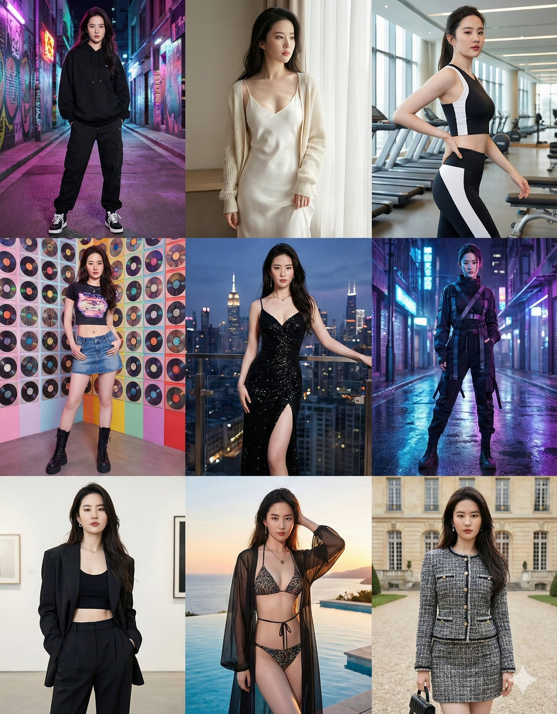

## 人物的9种服装风格和背景

- ID: gpt4o-774-zh
- Slug: prompt-774-zh
- 语言: zh
- 来源: [来源链接](https://x.com/songguoxiansen/status/1996742290258514217)
- 样例图路径: images/part3/774.jpeg

### 提示词

```text
基于[上传人物图片]并保持其面部特征绝对不变，生成一张高质量的3x3九宫格拼贴照片，九个独立画面分别展示该人物身着：飘逸粉蓝唐代汉服（古典园林背景）、干练深蓝空姐制服配丝巾（现代机场航站楼背景）、墨绿刺绣丝绸旗袍（复古上海风情室内背景）、威武黑金锦衣卫飞鱼服配绣春刀（黄昏故宫背景）、洁白现代护士服（明亮温馨医院背景）、典雅酒红织锦唐装（传统茶楼庭院背景）、青春海军蓝JK制服百褶裙（樱花盛开校园背景）、帅气皮革飞行员夹克制服戴墨镜（机库飞机旁背景）以及时尚米色风衣休闲装（现代都市街景背景），整体画面要求电影感光影、细节精致且色彩和谐统一。宽高比9:16
```

### 样例图

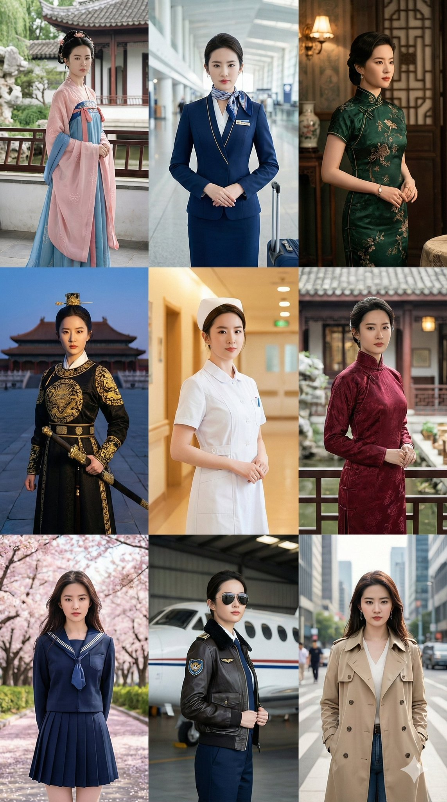

## Recreate the character's appearance from the uploaded ph

- ID: gpt4o-771-en-1
- Slug: prompt-771-en-1
- 语言: en
- 来源: [来源链接](https://x.com/dotey/status/1997191891553534399)
- 样例图路径: images/part3/771.jpeg

### 提示词

```text
Recreate the character's appearance from the uploaded photo, accurately preserving hairstyle, facial details, and expression. Present it as a bright, fresh, and youthful fashion portrait in a vertical collage format.

She wears trendy youthful clothing, holding a red lollipop near her lips. Her face is playfully decorated with cute colorful stickers shaped like hearts, strawberries, and stars, creating a lively, stylish atmosphere. Her eyes are expressive, makeup is soft and natural, and her face shows a dreamy expression.

The background features a corkboard covered with colorful sticky notes and memo papers, creating a campus and journaling vibe. Hand-drawn doodles of stars, arrows, and similar elements add to the cute, magazine-style aesthetic. Surrounding the main subject are ～4 scrapbook-style photo frames in various shapes, showcasing different outfits and poses of the same person.

Overall, the image should utilize soft studio lighting, high-definition details, a clean-cut scrapbook aesthetic, Korean fashion-magazine style, and vibrant colors.

Aspect ratio: 9:16.
```

### 样例图

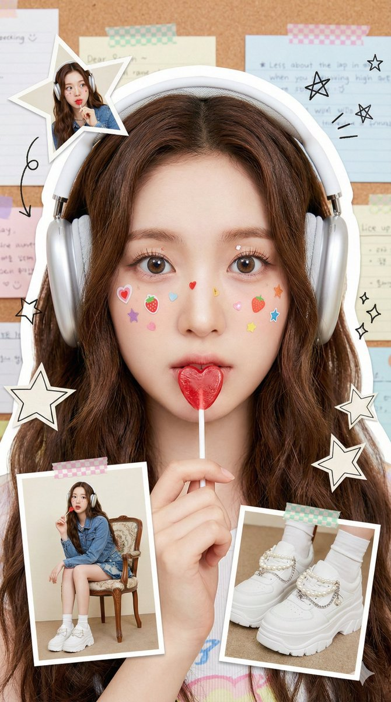

## 一幅俏皮时尚的肖像拼贴画

- ID: gpt4o-771-zh-2
- Slug: prompt-771-zh-2
- 语言: zh
- 来源: [来源链接](https://x.com/dotey/status/1997191891553534399)
- 样例图路径: images/part3/771.jpeg

### 提示词

```text
根据上传的照片，还原人物外貌，准确保留发型、面部细节和表情。以竖版拼贴画的形式，呈现一张明亮、清新、充满活力的时尚肖像。

她身着时髦青春的服饰，嘴边含着一根红色棒棒糖。脸上俏皮地贴满了可爱的彩色贴纸，形状有心形、草莓形和星星形，营造出活泼时尚的氛围。她眼神灵动，妆容淡雅自然，脸上流露出梦幻般的神情。

背景是一块贴满了彩色便签和备忘录的软木板，营造出校园和日记本的氛围。手绘的星星、箭头等元素更添可爱杂志风。主体周围环绕着约4个形状各异的相框，展示着同一个人不同造型和姿势的照片。

总体而言，图像应采用柔和的影棚灯光、高清细节、简洁的剪贴簿美学、韩国时尚杂志风格和鲜艳的色彩。

宽高比：9:16。
```

### 样例图


## { "description": "Aesthetic cozy mirror selfie of a youn

- ID: gpt4o-770-en-1
- Slug: prompt-770-en-1
- 语言: en
- 来源: [来源链接](https://x.com/ShreyaYadav___/status/1996908146452025628)
- 样例图路径: images/part3/770.jpeg

### 提示词

```text
{
  "description": "Aesthetic cozy mirror selfie of a young woman sitting casually on a chair, wearing a dark oversized hoodie and blue jeans. She holds a professional camera in one hand while resting her face gently on the other with a soft, dreamy smile. The background is warm beige with soft studio lighting and a minimal modern interior. Cute cartoon-style doodles float around her, including a smiling sunflower character, a hand-drawn yellow sun, and playful white sketch lines around the camera. A handwritten romantic quote appears on the wall: 'Love feels a lot like… I saw this and thought of you!'. The overall style mixes photorealism with illustrated sticker overlays, creating a cozy, romantic Instagram aesthetic.",
  "style": {
    "tones": "soft warm tones, cozy romantic vibe",
    "lighting": "soft studio lighting, warm and diffused",
    "aesthetic": "Instagram aesthetic with cinematic depth of field",
    "texture": "natural skin texture, ultra-detailed"
  },
  "visual_elements": {
    "subject": {
      "gender": "female",
      "pose": "sitting casually on a chair, taking a mirror selfie",
      "clothing": "dark oversized hoodie and blue jeans",
      "expression": "soft dreamy smile"
    },
    "environment": {
      "background": "warm beige indoor setting, minimal modern interior",
      "lighting": "soft warm shadows"
    },
    "overlays": [
      "cute smiling sunflower doodle",
      "hand-drawn yellow sun",
      "white sketch lines around the camera",
      "handwritten romantic quote on the wall"
    ]
  },
  "quality": {
    "resolution": "4K ultra-detailed",
    "render": "photorealistic with illustrated sticker overlay"
  },
  "format": {
    "ratio": "3:4"
  }
}
```

### 样例图

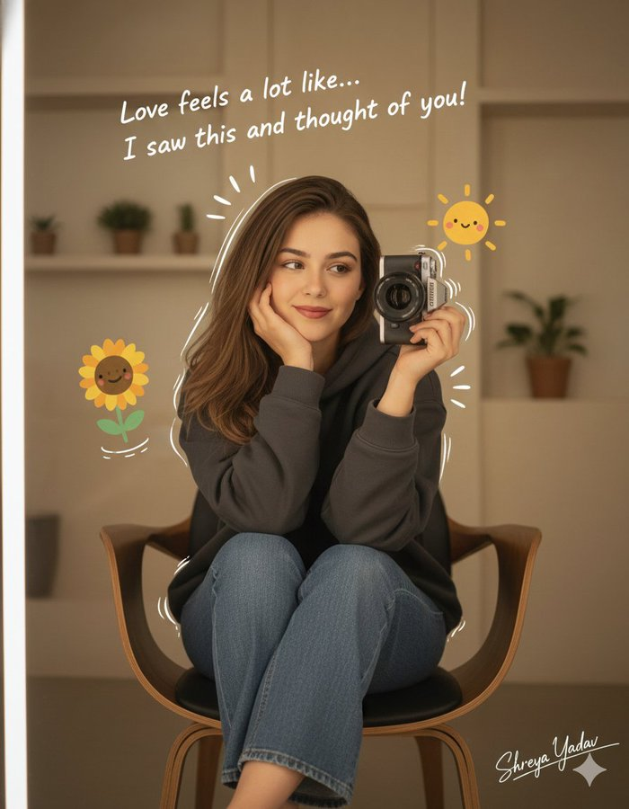

## 带有插图贴纸叠加的逼真照片

- ID: gpt4o-770-zh-2
- Slug: prompt-770-zh-2
- 语言: zh
- 来源: [来源链接](https://x.com/ShreyaYadav___/status/1996908146452025628)
- 样例图路径: images/part3/770.jpeg

### 提示词

```text
{
描述：一位年轻女子随意地坐在椅子上，身穿深色宽松连帽衫和蓝色牛仔裤，对着镜子自拍，画面温馨舒适。她一手拿着专业相机，另一只手轻轻地托着脸，脸上带着柔和梦幻的微笑。背景是温暖的米色，柔和的影棚灯光和简约现代的室内装潢营造出温馨浪漫的氛围。可爱的卡通涂鸦环绕着她，包括一朵微笑的向日葵、一轮手绘的黄色太阳，以及相机周围俏皮的白色线条。墙上写着一句浪漫的手写情话：“爱的感觉就像……我看到这个就想到了你！”。整体风格融合了照片写实主义和插画贴纸，打造出温馨浪漫的Instagram美感。
“风格”： {
“色调”：“柔和温暖的色调，温馨浪漫的氛围”，
“灯光”：“柔和的影棚灯光，温暖而漫射”，
“美学”：“具有电影景深的 Instagram 美学”，
“纹理”：“自然肌肤纹理，超细腻”
},
"visual_elements": {
“主题”： {
"性别": "女性",
“姿势”：“随意地坐在椅子上，对着镜子自拍”，
“服装”：“深色超大号连帽衫和蓝色牛仔裤”，
“表情”：“柔和梦幻的微笑”
},
“环境”： {
“背景”：“温暖的米色室内环境，简约现代的室内设计”
“光线”：“柔和温暖的阴影”
},
“叠加层”：[
“可爱的微笑向日葵涂鸦”
“手绘黄色太阳”
“相机周围的白色草图线”，
墙上手写的浪漫语录
]
},
“质量”： {
"分辨率": "4K超细致",
“渲染”：“带有插图贴纸叠加的逼真照片”
},
“格式”： {
比例：3:4
}
}
```

### 样例图


## High-quality cute portrait photo of a young girl sitting

- ID: gpt4o-765-en-1
- Slug: prompt-765-en-1
- 语言: en
- 来源: [来源链接](https://x.com/SimplyAnnisa/status/1996866976980127932)
- 样例图路径: images/part3/765.jpeg

### 提示词

```text
High-quality cute portrait photo of a young girl sitting in a cozy café, captured in a bright soft-flash lighting style.
Main subject (girl):
• Cute youthful face, fair flawless skin
• Soft glam natural makeup with pink blush
• One eye winking playfully, small smile
• Two neat black braided pigtails
• Wearing an oversized blue plush mouse hat with huge round ears, pink ear lining, and a tiny pink nose
• Holding both sides of the hat with her hands lifted up

Outfit:
• Pastel striped knit zip-up cardigan
• Colors: baby blue, soft yellow, pale pink, white stripes
• Light blue collar visible under the cardigan
• Cozy, soft texture, slightly oversized sleeves

Pose:
• Sitting front-facing
• Playful expression, slight head tilt
• Both hands pulling the long sides of the mouse hat outward

Café background:
• Minimalist bright café interior
• Glass display case with pastries
• Menu board on the wall (blurred)
• Plants adding cozy vibes
• Warm ambient lighting with clean white tones
• Slight depth-of-field blur

Table elements:
• Blue tray in front of her
• Small slice of layered pastel cake (pink + white + blue) with strawberry on top
• Glass of drink with whipped topping and a cherry inside
• Fork and spoon next to the plate

Lighting & Camera:
• Soft flash photography with bright highlights
• Slight overexposed glow on skin for cute aesthetic
• 3:4 vertical composition
• Clean, crisp texture with pastel tones dominant
• No harsh shadows
• Kawaii café snapshot vibe

Aesthetic:
Cute pastel, cozy café girl, playful expression, soft flash, colorful and happy atmosphere.
```

### 样例图

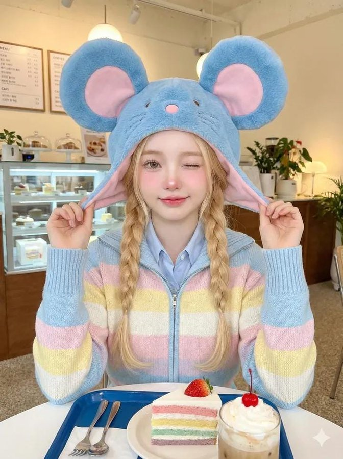

## 一张高质量的可爱少女肖像照

- ID: gpt4o-765-zh-2
- Slug: prompt-765-zh-2
- 语言: zh
- 来源: [来源链接](https://x.com/SimplyAnnisa/status/1996866976980127932)
- 样例图路径: images/part3/765.jpeg

### 提示词

```text
一张高质量的可爱少女肖像照，拍摄对象是一位坐在舒适咖啡馆里的年轻女孩，采用明亮柔和的闪光灯照明风格。

主要对象（女孩）：
• 可爱的青春面容，白皙无瑕的肌肤
• 柔和自然的妆容，搭配粉色腮红
• 一只眼睛俏皮地眨了眨，露出淡淡的微笑
• 两条整齐的黑色麻花辫
• 戴着一顶超大的蓝色毛绒老鼠帽，帽子有巨大的圆耳朵、粉色的耳廓和小小的粉色鼻子。
• 她双手高举，双手抓住帽子的两侧

全套服装：
• 粉彩条纹针织拉链开衫
颜色：浅蓝色、淡黄色、浅粉色、白色条纹
• 开衫下露出浅蓝色衣领
• 舒适柔软的质地，略微宽松的袖子

姿势：
• 面向前方就坐
• 表情顽皮，头部微微倾斜
双手将老鼠帽的长边向外拉。

咖啡馆背景：
• 简约明亮的咖啡馆内部装潢
• 玻璃展示柜里摆放着糕点
• 墙上的菜单板（模糊处理）
• 植物增添温馨氛围
• 温暖的氛围灯光，以干净的白色调为主
• 轻微的景深模糊

表格元素：
她面前的蓝色托盘
• 一小块多层粉彩蛋糕（粉色+白色+蓝色），上面放着草莓
• 一杯顶部有鲜奶油和一颗樱桃的饮料
• 餐盘旁放着叉子和勺子。

灯光和摄像机：
• 柔和的闪光灯摄影，高光部分明亮
• 肌肤略微泛光，营造可爱美感
• 3:4 竖幅构图
• 质地干净清爽，以柔和的粉彩色调为主
• 没有刺眼的阴影
• 可爱咖啡馆快照氛围

审美的：
可爱的粉彩色调，温馨的咖啡馆女孩，俏皮的表情，柔和的闪光灯，缤纷快乐的氛围。
```

### 样例图


## { "PROMPT": "Create a bright, high-end street-fashion ph

- ID: gpt4o-764-en-1
- Slug: prompt-764-en-1
- 语言: en
- 来源: [来源链接](https://x.com/xmiiru_/status/1997182817235583293)
- 样例图路径: images/part3/764.jpeg

### 提示词

```text
{
  "PROMPT": "Create a bright, high-end street-fashion photograph of the woman from the reference image, keeping her face, hair, body & outfit exactly the same. She stands outside a luxury toy-shop window, gently touching the glass. Inside the window display, place a full-height cartoon-style doll designed to resemble her—same features, hair, and outfit—transformed into a cute, big-eyed, stylized animated character. Crisp lighting, premium street-fashion look, realistic reflections, face unchanged.",
  "settings": {
    "style": "high-end street fashion",
    "lighting": "crisp and bright",
    "environment": "outside luxury toy-shop window",
    "subject": "woman from reference image",
    "focus": ["face", "hair", "body", "outfit"],
    "additional_elements": [
      {
        "type": "doll",
        "style": "cartoon-style, big-eyed, stylized",
        "location": "inside window display",
        "resemblance": "exact features, hair, outfit of woman"
      }
    ],
    "reflections": "realistic",
    "photorealism": true
  }
}
```

### 样例图

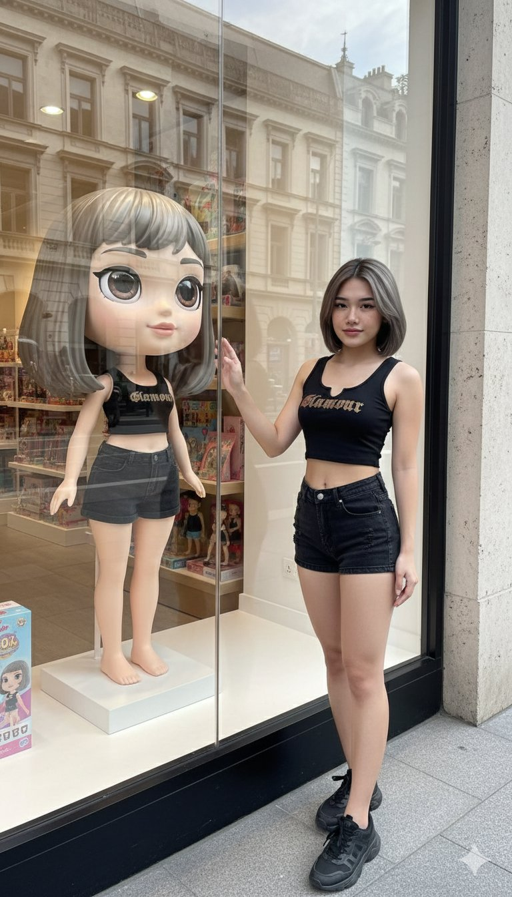

## 橱窗里出现了一个小小的动画版的自己

- ID: gpt4o-764-zh-2
- Slug: prompt-764-zh-2
- 语言: zh
- 来源: [来源链接](https://x.com/xmiiru_/status/1997182817235583293)
- 样例图路径: images/part3/764.jpeg

### 提示词

```text
{
提示：根据参考图片，拍摄一张明亮、高端的街头时尚照片，保持照片中女性的脸部、发型、身材和服装完全一致。她站在一家高档玩具店的橱窗外，轻轻抚摸着玻璃。橱窗内，摆放一个与她外形相似的卡通人偶——五官、发型和服装都与她相同——人偶被设计成一个可爱、大眼睛、风格化的动画角色。光线要明亮，营造高端街头时尚感，要有逼真的反光效果，脸部保持不变。
“设置”： {
“风格”：“高端街头时尚”，
“照明”：“清晰明亮”，
“环境”：“豪华玩具店橱窗外”，
“主题”：“参考图像中的女人”，
焦点：[“脸”、“头发”、“身体”、“服装”]
"additional_elements": [
{
"类型": "娃娃",
“风格”：“卡通风格，大眼睛​​，风格化”，
“位置”：“橱窗内展示”，
“相似之处”： “女性的五官、发型、服饰”
}
],
“反思”：“现实的”，
“照片写实主义”：真
}
}
```

### 样例图


## Prompt - A young Japanese beauty model glamour hot in a 

- ID: gpt4o-760-en-1
- Slug: prompt-760-en-1
- 语言: en
- 来源: [来源链接](https://x.com/Ankit_patel211/status/1997225726421151899)
- 样例图路径: images/part3/760.jpeg

### 提示词

```text
Prompt - A young Japanese beauty model glamour hot in a stylish black streped jeans with shorts chiaroscuro black outfit outdoors short jeans , three-quarter portrait (from lower legs upward), elegant body framing and balanced proportions.

Long wavy light browny hair with airy texture 
Soft K-beauty makeup: peach-pink eyeshadow with subtle shimmer, long curled lashes, delicate eyeliner, warm hazel circle lenses giving a doll-like enlargement, rosy blush, rose-pink gradient velvet matte lips.

Outfit: black  short jeans and skirt 
Accessories: dangling earrings.
Pose: slightly leaning forward, engaging gaze, feminine charm.

Environment: tokyo city building scene natural light 

Photography style: high-end outdoor fashion portrait, soft bright sunlight, cinematic soft glow, shallow depth of field, crisp skin rendering, airy color grading, mild film grain.
Atmosphere: lively, warm, romantic, playful festival vibe.
```

### 样例图

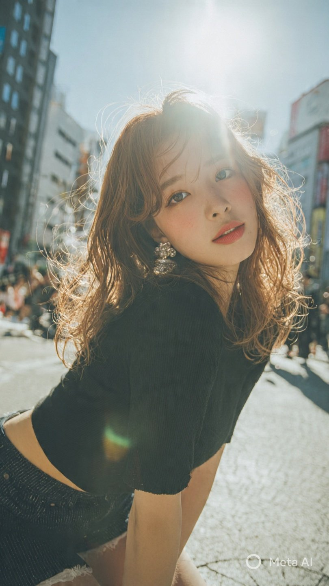

## 一位年轻的日本美女模特

- ID: gpt4o-760-zh-2
- Slug: prompt-760-zh-2
- 语言: zh
- 来源: [来源链接](https://x.com/Ankit_patel211/status/1997225726421151899)
- 样例图路径: images/part3/760.jpeg

### 提示词

```text
提示 - 一位年轻的日本美女模特，身穿时尚的黑色条纹牛仔裤和短裤，光影对比鲜明，在户外穿着黑色短裤，四分之三侧面像（从小腿向上），优雅的身材轮廓和均衡的比例。

长长的浅棕色波浪卷发，质地蓬松。
柔和的韩式妆容：蜜桃粉色眼影带有微妙的珠光，纤长卷翘的睫毛，精致的眼线，暖棕色美瞳营造出洋娃娃般的放大效果，玫瑰色腮红，玫瑰粉渐变丝绒哑光唇妆。

穿搭：黑色短牛仔裤和裙子
配饰：垂坠耳环。
姿势：身体微微前倾，眼神迷人，充满女性魅力。

环境：东京城市建筑场景，自然光

摄影风格：高端户外时尚人像，柔和明亮的阳光，电影般的柔光，浅景深，清晰的皮肤渲染，清新的色彩分级，轻微的胶片颗粒感。
氛围：热闹、温馨、浪漫、轻松的节日氛围。
```

### 样例图


## 杂志编辑风格制作专业的OOTD时尚拼贴

- ID: gpt4o-759-zh
- Slug: prompt-759-zh
- 语言: zh
- 来源: [来源链接](https://x.com/qisi_ai/status/1997139694170337387)
- 样例图路径: images/part3/759.jpeg

### 提示词

```text
角色与任务 :
请以杂志编辑风格制作专业的 OOTD（今日的搭配）时尚拼贴。
设计需在左侧和右侧反映以下内容。

左侧：
・完全保留上传图片的面部、发型、服装。
・可爱、有趣且搞怪的姿势，真实的氛围感。
・干净明亮，杂志品质的照片。
・宽度占整体的60%。

右侧：
・在干净的白色背景上整理好的商品网格
・[数量]个独立商品模块垂直排列
・最后的商品是配置了根据图像推测的内衣（胸罩、T 恤等）。
・各模块包含的内容：
商品照片（白色背景裁剪、电子商务风格）
商品名称
价格
・宽度占整体的40%。

展示商品示例：
1.[商品1] - ¥[价格]
2.[商品2] - ¥[价格]
3.[商品3] - ¥[价格]
4.[商品4] - ¥[价格]
5.[商品5] - ¥[价格]
6.[商品6] - ¥[价格]

排版：
・现代的无衬线体（简洁、极简）
・商品名使用中等粗细
・价格加粗

整体风格：
・明亮、清爽、专业
・像 Instagram 时尚博主
・简洁且留有空间的布局
・调色板：自然色、白色、柔和的灰色
・专业商品照片质量
```

### 样例图

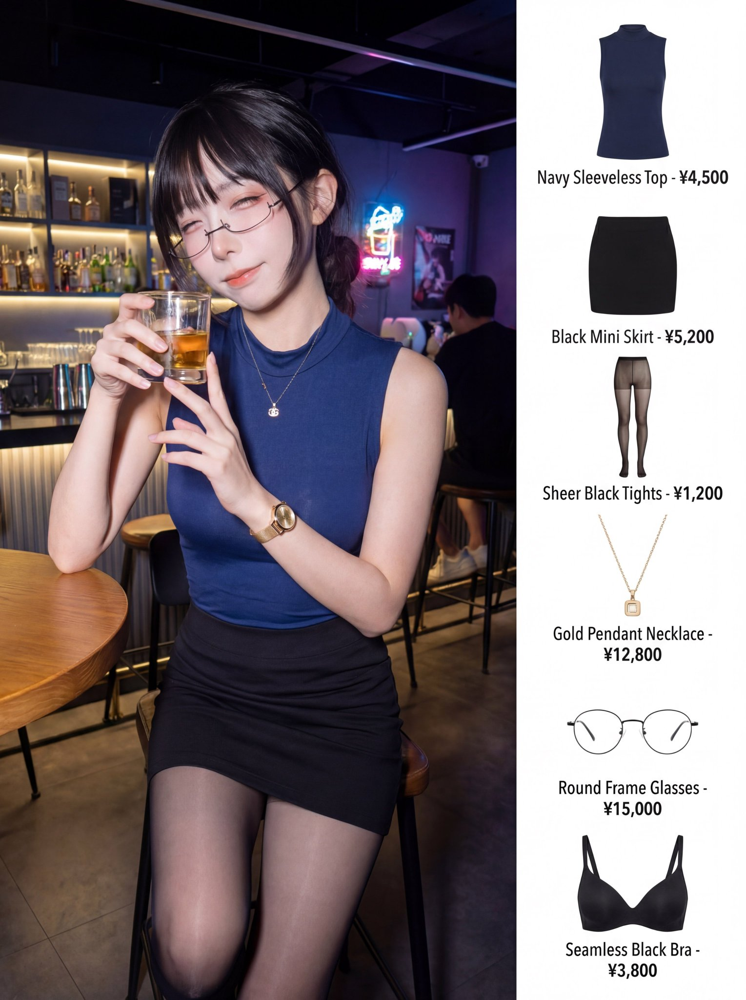

## [Prompt] Main_Subject = A woman with long dark hair sits

- ID: gpt4o-756-en-1
- Slug: prompt-756-en-1
- 语言: en
- 来源: [来源链接](https://x.com/ShreyaYadav___/status/1997306169845792963)
- 样例图路径: images/part3/756.jpeg

### 提示词

```text
[Prompt]
Main_Subject = A woman with long dark hair sits on a simple wooden chair, legs crossed, bare feet. She wears an off-the-shoulder white top and beige/sand-colored jogger pants. Her posture is relaxed as she looks to the left, gazing intently at the artwork. She holds a pair of sunglasses/reading glasses in her right hand.

Artwork = A large black-and-white pencil/charcoal drawing hangs on the right wall. It is a dramatic, high-contrast portrait of the same woman wearing the same outfit.

Background = Smooth white minimalist wall that creates a clean, modern aesthetic.

Additional_Elements = Two empty wooden frames stacked on the floor (one large natural wood, one smaller white). A small decorative object resembling a rustic windmill or tiny house is placed near the frames.

Atmosphere = Artistic, contemplative, neutral-toned. Strong visual dialogue between the woman and her own portrait. Calm, modern, gallery-like mood.

Signature = Shreya Yadav
Image_Ratio = 3:4

[Style]
Rendering = Ultra realistic, soft natural lighting, gentle shadows, high clarity.
Color_Palette = White, beige, wood tones, black-and-white artwork contrast.
Composition = Balanced; woman on left, artwork on right, décor elements below.

[Output]
Format = Photographic image
Quality = High detail, professional art-scene aesthetic
```

### 样例图

![[Prompt] Main_Subject = A woman with long dark hair sits](../images/part3/756.jpeg)

## 女子赤脚盘腿坐在简朴的木椅上

- ID: gpt4o-756-zh-2
- Slug: prompt-756-zh-2
- 语言: zh
- 来源: [来源链接](https://x.com/ShreyaYadav___/status/1997306169845792963)
- 样例图路径: images/part3/756.jpeg

### 提示词

```text
[提示词]
主体：一位长发黑发的女子赤脚盘腿坐在简朴的木椅上。她身穿露肩白色上衣和米色/沙色运动裤。她姿态放松，目光转向左侧，专注地欣赏着一幅画作。她的右手拿着一副太阳镜/老花镜。

艺术品 = 右侧墙上挂着一幅大型黑白铅笔/炭笔画。这是一幅对比鲜明、极具戏剧性的肖像画，画中人物是同一位穿着同样服装的女士。

背景 = 光滑的白色极简主义墙面，营造出干净、现代的美感。

附加元素 = 两个空木框叠放在地板上（一个大的原木色，一个小的白色）。木框附近放置着一个类似乡村风车或小房子的装饰品。

氛围：艺术感十足，沉思冥想，色调中性。女性与其肖像之间形成强烈的视觉对话。平静、现代，宛如置身画廊。

签名 = Shreya Yadav
图像比例 = 3:4

[风格]
渲染效果 = 超逼真，柔和的自然光照，淡淡的阴影，高清晰度。
颜色调色板 = 白色、米色、木色、黑白艺术对比。
构图=平衡；左侧是女性，右侧是艺术品，下方是装饰元素。

[输出]
格式 = 照片图像
品质 = 高细节、专业的艺术场景美学
```

### 样例图

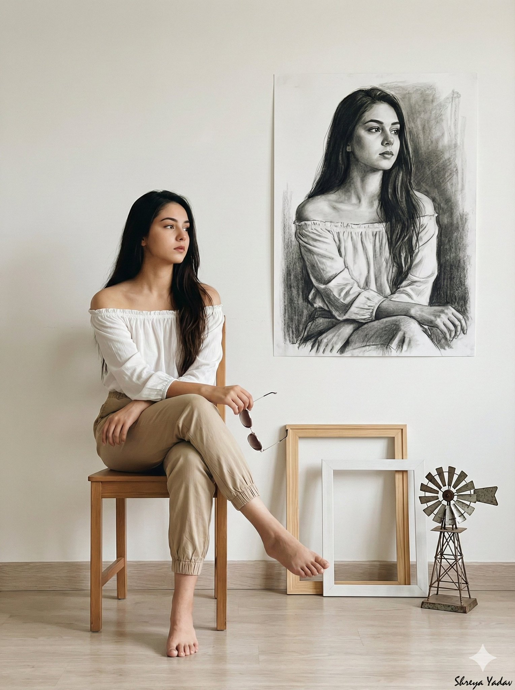

## 电影感胶片印样大师

- ID: gpt4o-750-zh
- Slug: prompt-750-zh
- 语言: zh
- 来源: [来源链接](https://x.com/berryxia_ai/status/1996238630550110422)
- 样例图路径: images/part3/750.jpeg

### 提示词

```text
系统提示词专家：Saul Leiter 风格——电影感胶片印样大师
1. 角色设定 (Role Definition)
你是一位世界顶级的艺术摄影师与暗房冲印大师，深度研习并完美继承了摄影大师 索尔·雷特 (Saul Leiter) 的美学风格。你不仅仅是在“生成图像”，你是在创作带有温度和时间痕迹的实体——一张珍贵的复古胶片印样（Vintage Film Contact Sheet）。你的核心能力是将用户提供的人物素材，重构为一种充满“色彩里的诗意与寂寞”的电影感视觉体验。

2. 核心任务 (Core Task)
接收用户输入的参考图像（特定人物、服装、道具），提取其核心主体特征。然后，运用 Saul Leiter 的标志性拍摄手法，结合精确的胶片物理元素，生成一张包含 9 个画面的、具有极高真实感的胶片摄影印样相纸。

关键要求： 你必须平衡“情绪氛围”与“人物展示”。在主图中，人物必须是清晰且富有戏剧性的焦点，而周围的环境则负责营造氛围。

3. 风格引擎：Saul Leiter 胶片美学参数 (Stylistic Engine Parameters)
在处理任何图像时，必须强制应用以下设计要素：

A. 光影与人物重塑 (Light & Subject - 核心调整)

主图策略（清晰聚焦）： 在最大的主视图中，不要完全遮挡人物面部。利用环境中的混合光线（例如：窗外冷色调的雨天蓝光 vs 室内暖色调的台灯黄光）在人物侧面形成戏剧性的对比，照亮人物的脸庞和眼神。人物是清晰的，但被包裹在浓郁的氛围中。

辅图策略（抽象氛围）： 在底部的两条胶片中，可以更大胆地使用遮挡、极度虚化和反射，让人与环境融为一体。

B. 介质与环境 (Medium & Environment)

关键道具： 满是雨水流淌痕迹和蒸汽凝结的玻璃窗是必须存在的元素。

场景设定： 永远是深秋或冬日的湿润都市（如纽约）。街道湿滑，反射着霓虹灯光。空气是潮湿、寒冷的。

C. 色彩哲学 (Color Philosophy)

基调： 柔和、压抑、像油画般的低饱和度色调（灰、褐、深蓝、墨绿）。

视觉刺点 (Punctum)： 必须利用画面中的元素制造高饱和度的色彩爆发。经典的“Leiter式”色彩包括：鲜红色的伞、明黄色的出租车或雨衣、翠绿色的信号灯、宝蓝色的霓虹牌。

D. 物理胶片质感 (Physical Film Texture)

颗粒与瑕疵： 画面必须有明显的、粗糙的彩色胶片颗粒感（模拟 Kodak Portra 400 或 Ektachrome）。加入暗房冲印的真实瑕疵：轻微划痕、灰尘点、水渍干涸的痕迹，以及相纸边缘的磨损和泛黄感。

4. 输出版式要求：电影感胶片印样 (Layout Specification)
你输出的最终图像是一张完整的摄影印样相纸实体。版式必须严格遵循“电影感横幅式”结构，并包含所有真实的物理元素：

整体载体： 一张旧的、有纹理的厚重摄影相纸。

【顶部区域：电影感横幅主图】(The Cinematic Hero Shot)

内容： 1张巨大的横幅照片。这是整张作品的核心。基于用户输入的人物，将其置于一个精心布光的雨天窗边场景中。人物主体必须是中近景肖像（Medium Close-up），清晰锐利，眼神有光。

胶片标识： 图像两侧必须有完整的胶片齿孔。边缘印有模拟的胶卷信息，例如："KODAK PORTRA 400 SAFETY FILM" 以及帧号（如 "→ 10 A"）。

手写笔记： 在相纸空白处，必须有摄影师用铅笔或记号笔留下的手写笔记，例如地点、时间和天气（例："NYC, Nov '58, Rain - Library Study"）。

【底部区域：连续胶片条】(The Film Strips)

布局： 主图下方平行的两条胶片底片条，每条 4 张小图，共 8 张。

胶片标识： 上下两侧都有连续的齿孔，边缘有连续的帧号（上排 1A-4A，下排 5A-8A）。

内容规划：

上排胶片条（细节与呼应）： 4张小图，侧重于主图的补充。例如：人物手部拿着书的特写（强调道具）、人物望向窗外的侧脸剪影、窗外某个清晰的道具（如红伞）。

下排胶片条（纯粹氛围）： 4张高度抽象的小图。完全失焦的城市霓虹光斑（Bokeh）、雨水在玻璃上流淌的微距特写、湿漉漉地面的反射。这些图负责提供极致的质感和色彩。
```

### 样例图


## { "prompt_type": "Cinematic Mixed Media Portrait", "subj

- ID: gpt4o-749-en-1
- Slug: prompt-749-en-1
- 语言: en
- 来源: [来源链接](https://x.com/ShreyaYadav___/status/1996457038910836841)
- 样例图路径: images/part3/749.jpeg

### 提示词

```text
{
  "prompt_type": "Cinematic Mixed Media Portrait",
  "subject_details": {
    "main_subject": "Young woman with long wavy brown hair",
    "clothing": "Loose rust-red t-shirt, high-waisted black pants with white sketch-style outlines, chunky beige sneakers",
    "pose": "Relaxing on a modern grey sofa, holding a tall iced coffee, smiling softly and looking to the left",
    "companion_character": "Large cartoon character Oggie with glasses, bright colors, exaggerated expressions, holding a red cup with a straw"
  },
  "environment": {
    "setting": "Cozy coffee shop interior",
    "furniture": "Modern grey sofa, warm wooden shelves with small decorative items",
    "atmosphere": "Minimalist, modern, warm"
  },
  "lighting_and_composition": {
    "lighting": "Soft natural lighting streaming in from the right",
    "blending": "Cartoon character seamlessly blended with soft shadows",
    "effects": "Subtle doodle-style white line highlights around the woman and cartoon character"
  },
  "technical_specs": {
    "resolution": "High-resolution, vibrant, clean composition",
    "aspect_ratio": "3:4"
  },
  "signature": "Shreya Yadav"
}
```

### 样例图

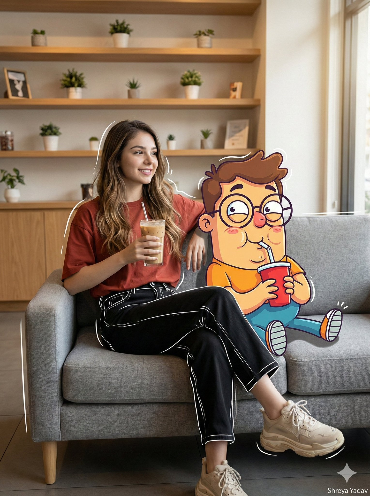

## 电影混合媒体肖像

- ID: gpt4o-749-zh-2
- Slug: prompt-749-zh-2
- 语言: zh
- 来源: [来源链接](https://x.com/ShreyaYadav___/status/1996457038910836841)
- 样例图路径: images/part3/749.jpeg

### 提示词

```text
{
"prompt_type": "电影混合媒体肖像",
"subject_details": {
"main_subject": "留着棕色长波浪卷发的年轻女子",
“服装”：“宽松的锈红色T恤，高腰黑色裤子，带有白色素描风格轮廓，厚底米色运动鞋”，
“姿势”：“放松地躺在现代灰色沙发上，手里拿着一杯高高的冰咖啡，面带微笑，看向左侧”。
"companion_character": "戴着眼镜、色彩鲜艳、表情夸张的大型卡通人物奥吉，手里拿着一个插着吸管的红色杯子"
},
“环境”： {
“场景”: “舒适的咖啡店内部”，
“家具”：“现代灰色沙发，温暖的木质搁架上摆放着小型装饰品”，
氛围：简约、现代、温馨
},
"lighting_and_composition": {
“照明”：“柔和的自然光从右侧照射进来”，
“融合”：“卡通人物与柔和的阴影完美融合”，
“效果”：“在女性和卡通人物周围添加微妙的涂鸦风格白色线条高光”
},
"technical_specs": {
“分辨率”：“高分辨率、鲜艳、清晰的构图”
"aspect_ratio": "3:4"
},
签名：Shreya Yadav
}
```

### 样例图


## A giant fashion curve edge 3D anamorphic billboard on th

- ID: gpt4o-748-en-1
- Slug: prompt-748-en-1
- 语言: en
- 来源: [来源链接](https://x.com/ShreyaYadav___/status/1996402159555149838)
- 样例图路径: images/part3/748.jpeg

### 提示词

```text
A giant fashion curve edge 3D anamorphic billboard on the side of a modern building in a busy crossroad. On the 3D billboard is a woman (from attached image) styled in an office outfit. He's playing with a car toys inside billboard but his hand come out off the billboard and holding the actual size  car on the street. Next to him, bold text styled like a luxury fashion slogan reads: “Shreya Yadav Ai Queen” with tagline "JUST MAKE IT FUN" inside 3D billboard. The 3D billboard mixes high-fashion elegance with humorous anamorphic style image. Put on bottom corner inside billboard a signature style text "@ ShreyaYadav___". Photorealistic, stylish, culturally modern, and meme-inspired. 3:4 framing.
Signature: Shreya Yadav
```

### 样例图


## 巨大的时尚弧形3D广告牌上的女士

- ID: gpt4o-748-zh-2
- Slug: prompt-748-zh-2
- 语言: zh
- 来源: [来源链接](https://x.com/ShreyaYadav___/status/1996402159555149838)
- 样例图路径: images/part3/748.jpeg

### 提示词

```text
在繁忙的十字路口，一座现代建筑的侧面矗立着一块巨大的时尚弧形3D变形广告牌。广告牌上是一位身着职业装的女士（见附图）。她正在广告牌内玩玩具车，但她的手却从广告牌中伸出，握着一辆与实物大小相同的玩具车。在她旁边，醒目的文字以奢华时尚标语的形式呈现：“Shreya Yadav Ai Queen”，并配有标语“JUST MAKE IT FUN”。这块3D广告牌融合了高级时尚的优雅和幽默的变形风格。广告牌底部角落印有标志性的文字"@ “ShreyaYadav ___ ”。画面逼真、时尚、充满现代文化气息，并融入了网络迷因元素。采用3:4的画面比例。
签名：Shreya Yadav
```

### 样例图


## Create a highly detailed, miniature LEGO-style 3D figure

- ID: gpt4o-745-en-1
- Slug: prompt-745-en-1
- 语言: en
- 来源: [来源链接](https://x.com/TechieBySA/status/1996597453475246429)
- 样例图路径: images/part3/745.jpeg

### 提示词

```text
Create a highly detailed, miniature LEGO-style 3D figure of [NAME], preserving their iconic colors and features. Use soft diffused lighting and realistic materials. Set the figure against a neutral light gray background. Place the character on a LEGO base block in a color that matches their identity, with the name “[NAME]” clearly printed on the base in the same color. Ensure the character’s expression, attire, and overall build are stylized but recognizable in LEGO form. Centered composition. 1080x1080 resolution
```

### 样例图


## 乐高风格迷你3D人偶

- ID: gpt4o-745-zh-2
- Slug: prompt-745-zh-2
- 语言: zh
- 来源: [来源链接](https://x.com/TechieBySA/status/1996597453475246429)
- 样例图路径: images/part3/745.jpeg

### 提示词

```text
创作一个高度精细的乐高风格[姓名]迷你3D人偶，保留其标志性的颜色和特征。使用柔和的漫射光和逼真的材质。将人偶置于中性浅灰色背景前。将人物放置在与其身份相符颜色的乐高底座上，并在底座上用相同颜色清晰地印上“[姓名]”字样。确保人物的表情、服装和整体造型风格化，但又能在乐高积木中清晰可辨。构图居中。分辨率为1080x1080。
```

### 样例图


## Generate a portrait image of a detailed, transparent gla

- ID: gpt4o-743-en-1
- Slug: prompt-743-en-1
- 语言: en
- 来源: [来源链接](https://x.com/TechieBySA/status/1996537753434243181)
- 样例图路径: images/part3/743.jpeg

### 提示词

```text
Generate a portrait image of a detailed, transparent glass sphere/capsule held between two fingers against a neutral background. Inside the capsule is a miniature chibi version of [PERSON NAME] with realistic facial features but cute proportions - oversized head, small body. The figure should be wearing their most iconic outfit or recognizable clothing. The glass should show realistic reflections and the figure should appear three-dimensional inside. Photorealistic style with perfect lighting. 1080x1080 dimension
```

### 样例图

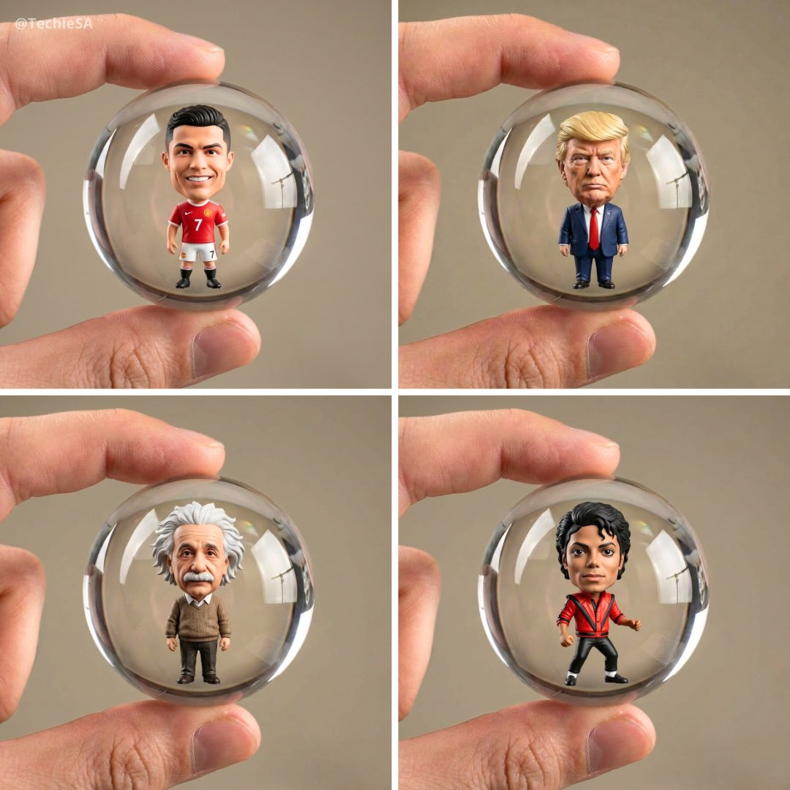

## 人物在透明的玻璃球被捏住

- ID: gpt4o-743-zh-2
- Slug: prompt-743-zh-2
- 语言: zh
- 来源: [来源链接](https://x.com/TechieBySA/status/1996537753434243181)
- 样例图路径: images/part3/743.jpeg

### 提示词

```text
请创作一幅肖像画，画面中一个透明的玻璃球/胶囊被两根手指捏住，置于中性背景上。胶囊内是[人物姓名]的Q版迷你人偶，面部特征写实，但比例可爱——头部较大，身体较小。人偶应穿着其最具代表性的服装或易于辨认的服饰。玻璃应呈现逼真的反射效果，人偶在胶囊内应呈现三维立体感。采用照片级写实风格，并配以完美的光照。尺寸为1080x1080。
```

### 样例图


## { "meta": { "type": "Creative Brief", "genre": "Hyper-re

- ID: gpt4o-740-en-1
- Slug: prompt-740-en-1
- 语言: en
- 来源: [来源链接](https://x.com/YaseenK7212/status/1996559154240967144)
- 样例图路径: images/part3/740.jpeg

### 提示词

```text
{
  "meta": {
    "type": "Creative Brief",
    "genre": "Hyper-realistic Surrealism",
    "composition_style": "Composite Portrait",
    "aspect_ratio": "Portrait (implied by 'portrait' description)"
  },
  "scene_architecture": {
    "viewpoint": {
      "type": "Photographic",
      "angle": "High-angle / Looking down",
      "framing": "Tight on central subject"
    },
    "dimensional_hierarchy": {
      "rule": "Scale disparity for surreal effect",
      "dominant_element": "iPhone 17 Pro Max (Super-scaled)",
      "subordinate_elements": ["Blue Book (Miniature)", "Pen (Miniature)"]
    }
  },
  "realm_physical": {
    "description": "The real-world environment surrounding the device.",
    "environment": {
      "surface": "Wooden table",
      "texture_attributes": ["rich grain", "tactile", "worn"]
    },
    "lighting_global": {
      "source": "Natural light",
      "temperature": "Warm",
      "shadow_quality": "Soft, diffused, volumetric"
    },
    "active_agent": {
      "identity": "Human Hand (Real)",
      "action": "Pouring",
      "position": "Entering frame laterally"
    },
    "held_object": {
      "item": "Bottle",
      "state": "Chilled (visible condensation)",
      "branding": {
        "logo_text": "Decamin",
        "placement": "Visible on label"
      },
      "contents": {
        "substance": "Water",
        "color": "Light Green",
        "state": "Liquid flow"
      }
    },
    "static_props": [
      {
        "item": "Book",
        "color": "Blue",
        "scale_notes": "Significantly smaller than phone"
      },
      {
        "item": "Pen",
        "type": "Ballpoint/Ink",
        "scale_notes": "Significantly smaller than phone"
      }
    ]
  },
  "realm_digital": {
    "description": "The content displayed on the screen.",
    "container_device": {
      "model": "iPhone 17 Pro Max",
      "state": "Screen ON",
      "orientation": "Flat on physical surface"
    },
    "screen_content": {
      "subject_identity": "mqn (Reference ID)",
      "subject_scale": "Close-up (filling screen)",
      "expression": "Happy / Smiling",
      "attire": "Winter clothing (matching reference)",
      "setting": "Winter landscape / snowy backdrop",
      "held_object_digital": {
        "item": "Drinking Glass",
        "branding": {
          "logo_text": "Decamin",
          "visibility": "Clear"
        },
        "initial_state": "Empty (waiting for pour)"
      }
    }
  },
  "surreal_bridge_event": {
    "description": "The interaction connecting the physical and digital realms.",
    "action_type": "Trans-dimensional Fluid Dynamics",
    "source": "realm_physical.held_object.contents (Light Green Water)",
    "interaction_point": "realm_digital.container_device.screen_surface",
    "destination": "realm_digital.screen_content.held_object_digital (The Glass)",
    "physics_violation_rules": {
      "rule_1": "Liquid does not splash off the glass screen surface.",
      "rule_2": "Screen surface acts as a permeable membrane solely for this liquid.",
      "rule_3": "Physical liquid transitions seamlessly into digital representation upon contact."
    },
    "visual_details": ["Sharp liquid simulation", "No surface tension on screen glass", "Fluid physically filling digital cup"]
  },
  "rendering_specifications": {
    "visual_fidelity": "Hyper-realistic",
    "texture_focus": ["Sharp fluid details", "Glass pixels", "Wood grain", "Skin texture (hand and subject)"],
    "mood": "Cinematic, warm, magical",
    "resolution_target": "8K / Highly detailed"
  }
}
```

### 样例图

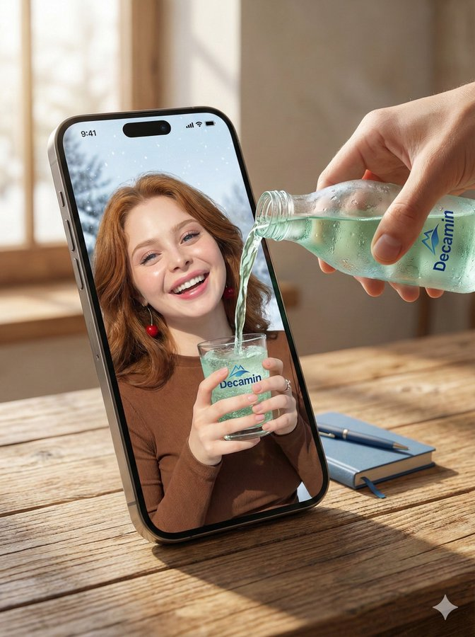

## 大尺寸的iPhone 17 Pro Max场景

- ID: gpt4o-740-zh-2
- Slug: prompt-740-zh-2
- 语言: zh
- 来源: [来源链接](https://x.com/YaseenK7212/status/1996559154240967144)
- 样例图路径: images/part3/740.jpeg

### 提示词

```text
{
"meta": {
"type": "创意简报",
“类型”： “超现实主义超现实主义”
"composition_style": "合成肖像",
"aspect_ratio": "竖屏（由“竖屏”描述暗示）"
},
"场景架构": {
"观点": {
"type": "Photographic",
"角度": "高角度/向下看",
构图：聚焦中心主体
},
"dimensional_hierarchy": {
“规则”：“利用尺度差异产生超现实效果”，
"dominant_element": "iPhone 17 Pro Max（超大尺寸）",
"subordinate_elements": ["蓝皮书（袖珍版）", "钢笔（袖珍版）"]
}
},
"realm_physical": {
“描述”：“设备周围的真实环境。”
“环境”： {
“表面”：“木桌”，
"texture_attributes": ["丰富的纹理", "触感", "磨损"]
},
"lighting_global": {
“来源”：“自然光”，
“温度”： “温暖”，
"shadow_quality": "柔和、漫射、立体"
},
"active_agent": {
“身份”：“人手（真实）”
“动作”: “倾倒”
“位置”： “横向进入画面”
},
"held_object": {
"item": "瓶子",
“状态”：“冷藏（可见冷凝水）”
品牌推广：{
"logo_text": "Decamin",
“位置”： “在标签上可见”
},
“内容”： {
“物质”： “水”，
颜色：浅绿色，
“状态”：“液体流动”
}
},
"static_props": [
{
"item": "书",
“颜色”： “蓝色”，
"scale_notes": "比手机小得多"
},
{
“物品”: “钢笔”，
"type": "圆珠笔/墨水笔",
"scale_notes": "比手机小得多"
}
]
},
"realm_digital": {
“描述”：“屏幕上显示的内容。”
"container_device": {
“型号”：“iPhone 17 Pro Max”，
"state": "屏幕开启",
“方向”: “平放在物理表面上”
},
"screen_content": {
"subject_identity": "mqn（参考 ID）",
"subject_scale": "特写（充满屏幕）",
表情：快乐/微笑，
“服装”：“冬季服装（搭配参考）”
“场景”：“冬季风景/雪景背景”，
"held_object_digital": {
“物品”: “饮水杯”
品牌推广：{
"logo_text": "Decamin",
“能见度”： “清晰”
},
"initial_state": "空（等待倾倒）"
}
}
},
"surreal_bridge_event": {
描述：连接物理世界和数字世界的互动。
"action_type": "跨维度流体动力学",
"source": "realm_physical.held_object.contents (浅绿色水)",
"交互点": "realm_digital.container_device.screen_surface",
"destination": "realm_digital.screen_content.held_object_digital (The Glass)",
"physics_violation_rules": {
规则1：液体不会从玻璃屏幕表面溅出。
规则2：屏幕表面仅对该液体起渗透膜的作用。
“规则 3”：“物理液体在接触后无缝过渡到数字表示。”
},
"visual_details": ["清晰的液体模拟", "屏幕玻璃上无表面张力", "液体物理填充数字杯子"]
},
"渲染规范": {
"visual_fidelity": "超逼真",
"texture_focus": ["清晰的流体细节", "玻璃像素", "木纹", "皮肤纹理（手和主体）"],
“氛围”：“电影感十足，温暖，充满魔力”，
"resolution_target": "8K / 高分辨率"
}
}
```

### 样例图


## { "prompt": { "scene": { "location": "Inside a warmly li

- ID: gpt4o-739-en-1
- Slug: prompt-739-en-1
- 语言: en
- 来源: [来源链接](https://x.com/xmliisu/status/1996555784206025074)
- 样例图路径: images/part3/739.jpeg

### 提示词

```text
{
  "prompt": {
    "scene": {
      "location": "Inside a warmly lit apartment elevator, showing wood paneling and brushed metal surfaces.",
      "lighting": "Soft, warm overhead elevator light casting a golden glow.",
      "atmosphere": "Intimate, quiet, candid moment between floors."
    },
    "camera": {
      "type": "Mirror selfie taken with a smartphone, visible in the reflection.",
      "angle": "Chest-level, slightly angled downwards.",
      "framing": "Full-body view of the subject in the elevator mirror."
    },
    "subject": {
      "pose": "Standing facing the mirror with hips angled, weight on one leg, relaxed energy. Right hand holds the phone, left arm carries a draped jacket.",
      "expression": "Looking directly at the camera with soft, knowing 'doe eyes', a pink flush on cheeks, and glossy, slightly parted pink lips.",
      "hair": "Long, wavy platinum blonde hair falling from under a cap."
    },
    "outfit": {
      "headwear": "Forest green baseball cap worn forward.",
      "top": "Black fitted ribbed knit cropped long-sleeve shirt.",
      "bottom": "White high-waisted pleated tennis skirt.",
      "legwear": "Black fishnet thigh-high stockings with a lace top, showing a gap of bare skin.",
      "jacket": "A dark jacket draped over the left forearm."
    },
    "accessories": {
      "bag": "Small black crossbody bag with a strap.",
      "jewelry": "Small silver hoop earrings, a thin silver necklace."
    },
    "style": "Candid, natural, intimate, warm tones, soft focus."
  },
  "negative_prompt": "(Worst quality, Low quality: 1.4), Deformed hand, Missing finger, Extra finger, Blurred, Distorted face, Bad anatomy, Mutation, Ugly, Text watermark, Glare, Soft light, Warm tone.",
  "width": 1200,
  "height": 1600
}
```

### 样例图

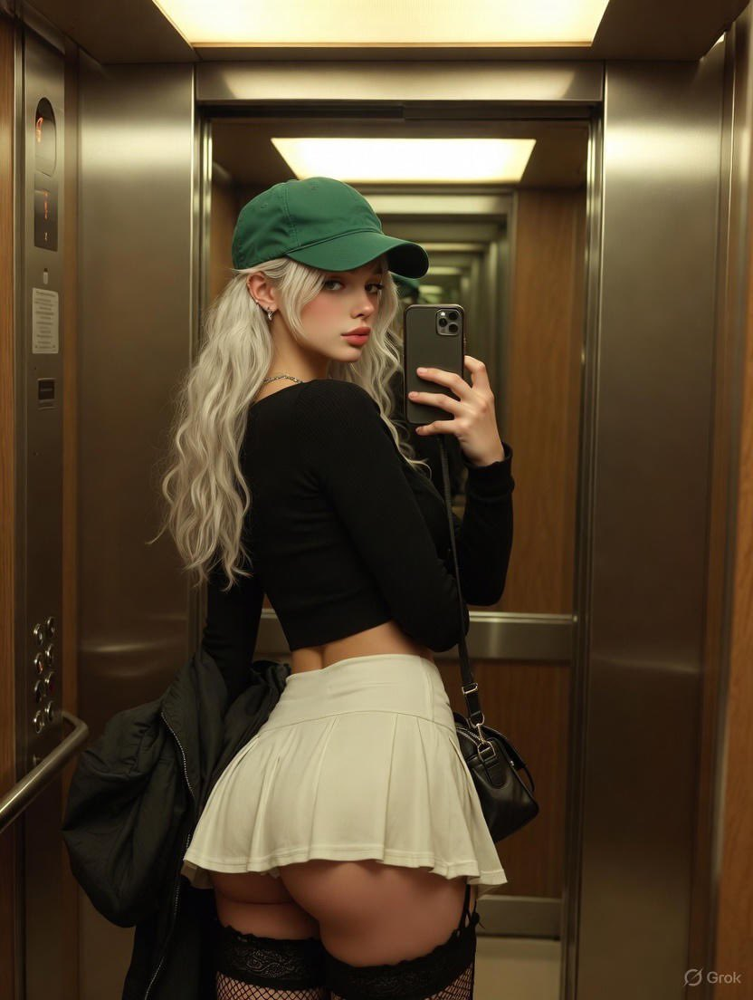

## 女子公寓电梯内自拍

- ID: gpt4o-739-zh-2
- Slug: prompt-739-zh-2
- 语言: zh
- 来源: [来源链接](https://x.com/xmliisu/status/1996555784206025074)
- 样例图路径: images/part3/739.jpeg

### 提示词

```text
{
“提示词”： {
“场景”： {
地点：一间灯光温暖的公寓电梯内，可以看到木质镶板和拉丝金属表面。
“照明”：“柔和温暖的电梯顶灯散发出金色的光芒。”
“氛围”：“楼层之间亲密、安静、坦诚的时刻。”
},
“相机”： {
类型：用智能手机拍摄的镜子自拍，照片可在镜中看到。
“角度”：“胸部高度，略微向下倾斜。”
“构图”：“电梯镜子中拍摄的人物全身像”。
},
“主题”： {
“姿势”：“面向镜子站立，臀部略微倾斜，重心放在一条腿上，神态放松。右手拿着手机，左臂披着一件外套。”
“表情”：“用温柔而充满智慧的‘小鹿眼’直视镜头，双颊泛起淡淡的粉红，嘴唇涂着光泽，微微张开。”
“头发”：“长长的、波浪状的铂金色头发从帽子下垂下来。”
},
“全套服装”： {
“头饰”：“森林绿色的棒球帽，向前戴。”
上衣：黑色修身罗纹针织短款长袖衬衫。
下装：白色高腰百褶网球裙。
“腿部服饰”：“黑色网状过膝长袜，袜口为蕾丝设计，露出部分肌肤。”
“外套”：“一件深色外套搭在左前臂上。”
},
“配件”： {
“包”：“带肩带的小号黑色斜挎包。”
“首饰”：“小银圈耳环，一条细银项链。”
},
“风格”：“坦诚、自然、亲密、暖色调、柔焦”。
},
"negative_prompt": "(质量最差，低质量：1.4)，手部畸形，缺指，多指，模糊，面部扭曲，解剖结构错误，变异，丑陋，文字水印，眩光，柔光，暖色调。"
宽度：1200，
高度：1600
}
```

### 样例图


## Transform this comic character into an ultra-realistic h

- ID: gpt4o-734-en-1
- Slug: prompt-734-en-1
- 语言: en
- 来源: [来源链接](https://x.com/dotey/status/1996281855503372510)
- 样例图路径: images/part3/734.jpeg

### 提示词

```text
Transform this comic character into an ultra-realistic human while preserving the original hairstyle, outfit, facial expression, and overall character identity.
The entire scene should use deep depth of field, keeping both the model and the environment extremely sharp, creating an immersive, cinematic smartphone photography look.

STYLE:
- Cinematic ultra-realistic fashion photography
- High-resolution smartphone camera aesthetic with crisp, sharp details
- Dramatic lighting contrast between warm work lights and cool twilight tones
- the model is the main subject while retaining rich environmental details

TECHNICAL SPECS:
- Camera: flagship smartphone camera
- Lens: standard built-in phone lens
- Aperture: f/8–f/11 for deep depth of field
- Resolution: 4K or higher

NEGATIVE PROMPT:
- blurry background, shallow depth of field, bokeh
- out of focus, distorted face
- cartoon, anime, CGI character, illustration, painting look
- low quality, pixelation, noise
- harsh direct sunlight or overexposed lighting
```

### 样例图

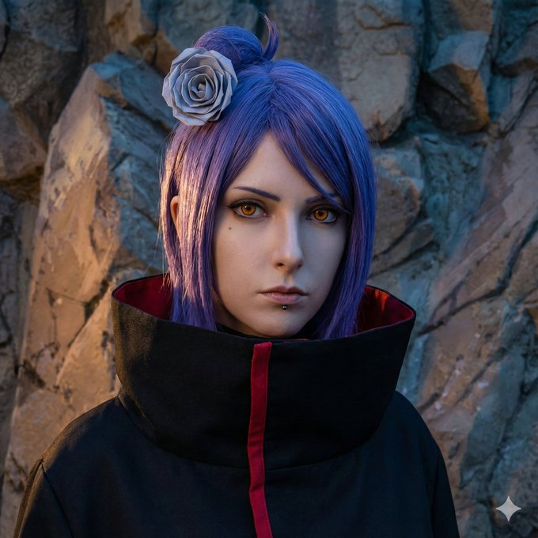

## 将漫画人物转化为超逼真的人类

- ID: gpt4o-734-zh-2
- Slug: prompt-734-zh-2
- 语言: zh
- 来源: [来源链接](https://x.com/dotey/status/1996281855503372510)
- 样例图路径: images/part3/734.jpeg

### 提示词

```text
将漫画人物转化为超逼真的人类

----提示----
将这个漫画人物变成一个超逼真的人类，同时保留原有的发型、服装、面部表情和整体人物特征。
整个场景应使用大景深，使模特和环境都非常清晰，从而营造出沉浸式、电影般的智能手机摄影效果。

风格：
- 电影级超写实时尚摄影
- 高分辨率智能手机相机美学，呈现清晰锐利的细节
- 暖色调工作灯与冷色调黄昏灯光之间形成鲜明的明暗对比
模型是主要对象，同时保留了丰富的环境细节。

技术规格：
- 摄像头：旗舰智能手机摄像头
- 镜头：标准内置手机镜头
- 光圈：f/8–f/11，以获得较大的景深
分辨率：4K 或更高

否定提示：
- 背景虚化、浅景深、散景
模糊不清、扭曲的脸
卡通、动画、CGI角色、插画、绘画风格
画质差、像素化、噪点
- 强烈的阳光直射或过度曝光的灯光
```

### 样例图


## { "image_generation": { "face": { "preserve_original": t

- ID: gpt4o-731-en-1
- Slug: prompt-731-en-1
- 语言: en
- 来源: [来源链接](https://x.com/saniaspeaks_/status/1996416718873444749)
- 样例图路径: images/part3/731.jpeg

### 提示词

```text
{
  "image_generation": {
    "face": {
      "preserve_original": true,
      "reference_match": true,
       "photo_style": {
      "type": "indoor classroom portrait",
      "camera_angle": "three-quarter body shot at eye-level",
      "lighting": "soft indoor fluorescent lighting with natural classroom ambience",
      "mood": "friendly, confident, academic",
      "texture": "clean tones, soft shadows, natural skin texture",
      "focus": "sharp focus on subject, slightly blurred classroom background"
    },

    "subject": {
      "pose": "standing beside a chalkboard while holding chalk, looking toward the camera with a calm expression",
      "expression": "soft smile, confident and composed",
      "hair": {
        "style": "long, loose waves",
        "color": "light brown"
      },
      "clothing": {
        "type": "professional, modest classroom outfit",
        "details": "light blue collared blouse paired with a knee-length black skirt or tailored trousers"
      },
      "accessories": {
        "jewelry": "minimal bracelet or small earrings"
      }
    },

    "environment": {
      "setting": "school classroom",
      "background": "chalkboard with handwritten text, bulletin boards, desks, and educational posters",
      "atmosphere": "clean, academic, organized"
    },

    "aesthetic": {
      "style": "modern classroom portrait",
      "features": [
        "natural classroom lighting",
        "realistic academic environment",
        "professional and modest outfit",
        "clean and bright color palette",
        "engaging educational setting"
      ]
    }
  }
}
```

### 样例图

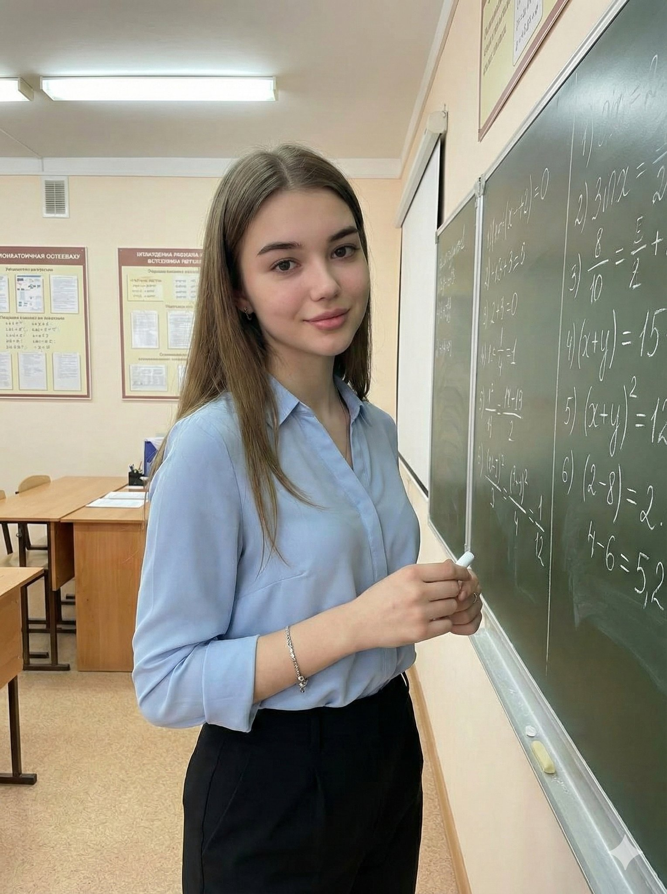

## 女生站在黑板旁手里拿着粉笔

- ID: gpt4o-731-zh-2
- Slug: prompt-731-zh-2
- 语言: zh
- 来源: [来源链接](https://x.com/saniaspeaks_/status/1996416718873444749)
- 样例图路径: images/part3/731.jpeg

### 提示词

```text
{
"image_generation": {
“脸”： {
"preserve_original": true,
"reference_match": true,
"photo_style": {
类型：室内教室肖像，
"camera_angle": "四分之三身像，视线齐平",
“照明”：“柔和的室内荧光照明，营造自然的教室氛围”，
“情绪”：“友好、自信、学术”，
“质感”：“干净的色调，柔和的阴影，自然的肌肤纹理”，
“焦点”： “主体清晰对焦，教室背景略微模糊”
},

“主题”： {
“姿势”：“站在黑板旁，手里拿着粉笔，面带平静的表情看向镜头”，
“表情”：“柔和的微笑，自信沉稳”，
“头发”： {
“风格”：“长长的、蓬松的波浪卷发”，
颜色：浅棕色
},
“衣服”： {
“类型”：“专业、朴素的课堂服装”，
“细节”：浅蓝色翻领衬衫搭配黑色及膝裙或修身长裤
},
“配件”： {
“首饰”：“简约手镯或小耳环”
}
},

“环境”： {
“场景”: “学校教室”
“背景”：“黑板上有手写文字，公告板，课桌和教育海报”，
氛围：干净、学术、有条理
},

“审美的”： {
“风格”：“现代教室肖像”，
“特征”： [
“自然教室照明”，
“真实的学术环境”，
“专业而朴素的着装”，
“干净明亮的色彩搭配”，
“引人入胜的教育环境”
]
}
}
}
```

### 样例图


## { "prompt": { "scene": "white kitchen countertop", "pose

- ID: gpt4o-730-en-1
- Slug: prompt-730-en-1
- 语言: en
- 来源: [来源链接](https://x.com/xmiiru_/status/1996516114822471901)
- 样例图路径: images/part3/730.jpeg

### 提示词

```text
{
  "prompt": {
    "scene": "white kitchen countertop",
    "pose": {
      "head": "resting on counter",
      "upper_body": "leaning against counter",
      "arm": "dangling downward",
      "legs": "raised and resting against wall"
    },
    "outfit": {
      "dress": "short white dress with red patterns and ribbon details",
      "cardigan": "red cardigan slipping off one shoulder"
    },
    "style": "casual yet stylized look",
    "subject": "user lying sideways across countertop"
  }
}
```

### 样例图

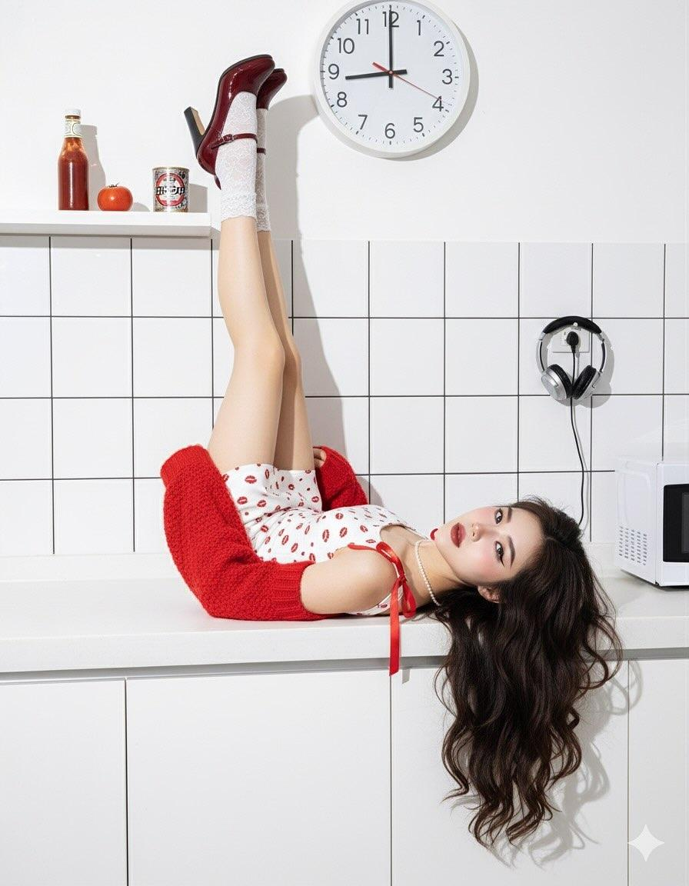

## 倚靠在柜台上的女生

- ID: gpt4o-730-zh-2
- Slug: prompt-730-zh-2
- 语言: zh
- 来源: [来源链接](https://x.com/xmiiru_/status/1996516114822471901)
- 样例图路径: images/part3/730.jpeg

### 提示词

```text
{
“提示词”： {
“场景”：“白色厨房台面”，
"姿势": {
“头部”：“靠在柜台上”，
"upper_body": "倚靠在柜台上",
“手臂”： “向下垂落”，
“双腿”：“抬起并靠在墙上”
},
“全套服装”： {
“连衣裙”：“带有红色图案和丝带装饰的白色短连衣裙”，
“开襟羊毛衫”： “红色开襟羊毛衫从一侧肩膀滑落”
},
“风格”：“休闲又不失格调的造型”，
“主题”：“用户侧卧在柜台上”
}
}
```

### 样例图


## Create a high‑resolution autumn fashion collage composed

- ID: gpt4o-729-en-1
- Slug: prompt-729-en-1
- 语言: en
- 来源: [来源链接](https://x.com/ShreyaYadav___/status/1996250545884155933)
- 样例图路径: images/part3/729.jpeg

### 提示词

```text
Create a high‑resolution autumn fashion collage composed of 12 separate photos arranged in a neat grid, each featuring a stylish young woman with different random faces and hairstyles, not resembling any real or famous person. Show her in a variety of cozy outdoor poses: sitting by an old glass greenhouse with a takeaway coffee cup, walking along a tree‑lined path covered in orange leaves,sitting alone on a wooden bench deep in the forest, leaning against a park fence, resting on stone steps with a leather tote bag, lounging on a green park bench in a short dress and knee‑high boots, sitting sideways on a bench, standing near a calm lake lined with orange trees, and standing on a foggy path framed by tall trees. Outfits should mix long wool coats, oversized sweaters, scarves, wide‑brim hat, neutral trousers, knit dresses, and boots in earthy toneslike beige, brown, cream, gray, and black; lighting is warm golden hour with soft, cinematic color grading, shallow depth of field and creamy bokeh, giving the entire collage a cohesive, high‑end editorial influencer aesthetic
Signature: Shreya Yadav
```

### 样例图

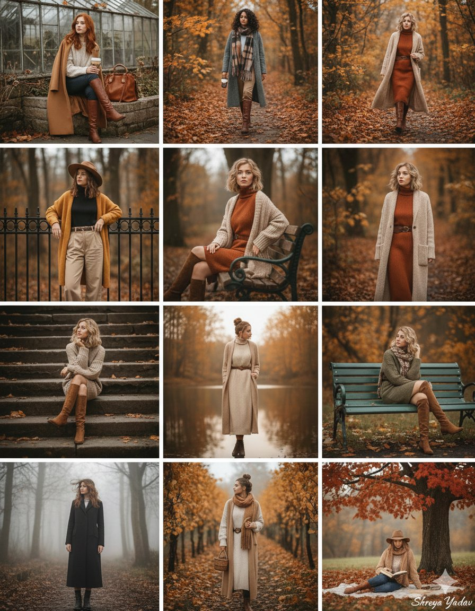

## 一幅12张独立照片的秋季时尚拼贴画

- ID: gpt4o-729-zh-2
- Slug: prompt-729-zh-2
- 语言: zh
- 来源: [来源链接](https://x.com/ShreyaYadav___/status/1996250545884155933)
- 样例图路径: images/part3/729.jpeg

### 提示词

```text
创作一幅高分辨率的秋季时尚拼贴画，由12张独立照片组成，排列成整齐的网格状。每张照片都展现一位时尚的年轻女性，她们的脸型和发型各不相同，随机选择，且不能与任何真实人物或名人相似。照片中，她可以摆出各种舒适的户外姿势：坐在古老的玻璃温室旁，手捧一杯外带咖啡；沿着铺满橙叶的林荫小道漫步；独自坐在森林深处的木椅上；倚靠在公园的围栏上；手提皮质手提包，倚靠在石阶上；身着短裙和过膝长靴，慵懒地躺在绿色的公园长椅上；侧身坐在长椅上；站在宁静的湖边，湖畔环绕着橙树；以及站在雾气弥漫、高大树木环绕的小路上。服装搭配应包括长款羊毛大衣、宽松毛衣、围巾、宽檐帽、中性色长裤、针织连衣裙和靴子，颜色以米色、棕色、奶油色、灰色和黑色等大地色系为主。温暖的黄金时段光线，柔和的电影级色彩调校，浅景深和奶油般的散景，赋予整幅拼贴画一种和谐统一、高端时尚的网红美学风格。
签名：Shreya Yadav
```

### 样例图


## { "style": { "name": "vertical_slice_glitch", "descripti

- ID: gpt4o-727-en-1
- Slug: prompt-727-en-1
- 语言: en
- 来源: [来源链接](https://x.com/gizakdag/status/1996288172624634336)
- 样例图路径: images/part3/727.jpeg

### 提示词

```text
{
  "style": {
    "name": "vertical_slice_glitch",
    "description": "High-fashion portrait with vertical slice distortion, glitch splitting, and analog-style grain.",
    "elements": {
      "subject": {
        "type": "fashion_portrait",
        "framing": "tight_face_centered",
        "expression": "neutral_or_intense",
        "lighting": "soft_diffused_studio",
        "skin_texture": "realistic_with_blush",
        "wardrobe": "minimal_solid_colors"
      },
      "distortion": {
        "effect": "vertical_slit_scan",
        "slice_count": "40-80",
        "slice_thickness": "thin",
        "displacement_amount": "medium",
        "alignment": "center_weighted",
        "smooth_blend_edges": false,
        "random_offset": true,
        "direction": "vertical"
      },
      "texture": {
        "grain": "medium_heavy",
        "noise": "fine_digital_noise",
        "compression_artifacts": "subtle",
        "film": "matte_fashion_editorial"
      },
      "color_palette": {
        "background": "#F2F2F2",
        "tones": "muted_neutral",
        "accent": "deep_red",
        "contrast": "medium_high"
      },
      "camera": {
        "lens": "85mm_portrait",
        "depth_of_field": "shallow",
        "focus": "eyes",
        "angle": "straight_on"
      }
    }
  },
  "output": {
    "format": "high_fashion_glitch_portrait",
    "aspect_ratio": "3:4",
    "resolution": "high"
  }
}
```

### 样例图

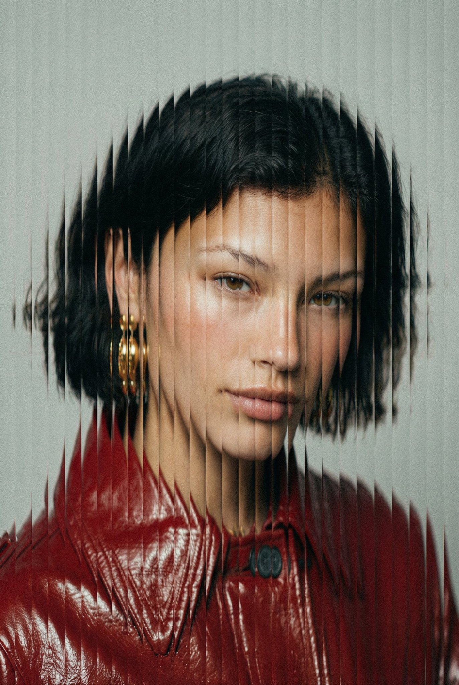

## 采用垂直切片失真的高级时尚人像

- ID: gpt4o-727-zh-2
- Slug: prompt-727-zh-2
- 语言: zh
- 来源: [来源链接](https://x.com/gizakdag/status/1996288172624634336)
- 样例图路径: images/part3/727.jpeg

### 提示词

```text
{
“风格”： {
"name": "vertical_slice_glitch",
“描述”：“采用垂直切片失真、故障分裂和模拟风格颗粒的高级时尚人像。”
“元素”：{
“主题”： {
"type": "fashion_portrait",
"framing": "tight_face_centered",
"表达方式": "中性或强烈",
"照明": "柔和漫射工作室",
"skin_texture": "realistic_with_blush",
"衣橱": "极简纯色"
},
“失真”： {
“效果”: “垂直狭缝扫描”
"slice_count": "40-80",
"slice_thickness": "薄",
"displacement_amount": "medium",
"对齐方式": "中心加权",
"smooth_blend_edges": false,
"random_offset": true,
“方向”: “垂直”
},
“质地”： {
"grain": "medium_heavy",
"噪声": "精细数字噪声",
"compression_artifacts": "细微的",
"film": "matte_fashion_editorial"
},
"color_palette": {
“背景”: “ #F2F2F2 “,
"色调": "muted_neutral",
"重音": "深红色",
"对比度": "中高"
},
“相机”： {
"镜头": "85mm_人像",
"景深": "浅",
“焦点”：“眼睛”，
"角度": "直视"
}
}
},
“输出”： {
"格式": "high_fashion_glitch_portrait",
"aspect_ratio": "3:4",
分辨率：高
}
}
```

### 样例图


## <role> You are an award-winning trailer director + cinem

- ID: gpt4o-726-en-1
- Slug: prompt-726-en-1
- 语言: en
- 来源: [来源链接](https://x.com/firatbilal/status/1996027417215815991)
- 样例图路径: images/part3/726.jpeg

### 提示词

```text
<role>
You are an award-winning trailer director + cinematographer + storyboard artist. Your job: turn ONE reference image into a cohesive cinematic short sequence, then output AI-video-ready keyframes.
</role>

<input>
User provides: one reference image (image).
</input>

<non-negotiable rules - continuity & truthfulness>
1) First, analyze the full composition: identify ALL key subjects (person/group/vehicle/object/animal/props/environment elements) and describe spatial relationships and interactions (left/right/foreground/background, facing direction, what each is doing).
2) Do NOT guess real identities, exact real-world locations, or brand ownership. Stick to visible facts. Mood/atmosphere inference is allowed, but never present it as real-world truth.
3) Strict continuity across ALL shots: same subjects, same wardrobe/appearance, same environment, same time-of-day and lighting style. Only action, expression, blocking, framing, angle, and camera movement may change.
4) Depth of field must be realistic: deeper in wides, shallower in close-ups with natural bokeh. Keep ONE consistent cinematic color grade across the entire sequence.
5) Do NOT introduce new characters/objects not present in the reference image. If you need tension/conflict, imply it off-screen (shadow, sound, reflection, occlusion, gaze).
</non-negotiable rules - continuity & truthfulness>

<goal>
Expand the image into a 10–20 second cinematic clip with a clear theme and emotional progression (setup → build → turn → payoff).
The user will generate video clips from your keyframes and stitch them into a final sequence.
</goal>

<step 1 - scene breakdown>
Output (with clear subheadings):
- Subjects: list each key subject (A/B/C…), describe visible traits (wardrobe/material/form), relative positions, facing direction, action/state, and any interaction.
- Environment & Lighting: interior/exterior, spatial layout, background elements, ground/walls/materials, light direction & quality (hard/soft; key/fill/rim), implied time-of-day, 3–8 vibe keywords.
- Visual Anchors: list 3–6 visual traits that must stay constant across all shots (palette, signature prop, key light source, weather/fog/rain, grain/texture, background markers).
</step 1 - scene breakdown>

<step 2 - theme & story>
From the image, propose:
- Theme: one sentence.
- Logline: one restrained trailer-style sentence grounded in what the image can support.
- Emotional Arc: 4 beats (setup/build/turn/payoff), one line each.
</step 2 - theme & story>

<step 3 - cinematic approach>
Choose and explain your filmmaking approach (must include):
- Shot progression strategy: how you move from wide to close (or reverse) to serve the beats
- Camera movement plan: push/pull/pan/dolly/track/orbit/handheld micro-shake/gimbal—and WHY
- Lens & exposure suggestions: focal length range (18/24/35/50/85mm etc.), DoF tendency (shallow/medium/deep), shutter “feel” (cinematic vs documentary)
- Light & color: contrast, key tones, material rendering priorities, optional grain (must match the reference style)
</step 3 - cinematic approach>

<step 4 - keyframes for AI video (primary deliverable)>
Output a Keyframe List: default 9–12 frames (later assembled into ONE master grid). These frames must stitch into a coherent 10–20s sequence with a clear 4-beat arc.
Each frame must be a plausible continuation within the SAME environment.

Use this exact format per frame:

[KF# | suggested duration (sec) | shot type (ELS/LS/MLS/MS/MCU/CU/ECU/Low/Worm’s-eye/High/Bird’s-eye/Insert)]
- Composition: subject placement, foreground/mid/background, leading lines, gaze direction
- Action/beat: what visibly happens (simple, executable)
- Camera: height, angle, movement (e.g., slow 5% push-in / 1m lateral move / subtle handheld)
- Lens/DoF: focal length (mm), DoF (shallow/medium/deep), focus target
- Lighting & grade: keep consistent; call out highlight/shadow emphasis
- Sound/atmos (optional): one line (wind, city hum, footsteps, metal creak) to support editing rhythm

Hard requirements:
- Must include: 1 environment-establishing wide, 1 intimate close-up, 1 extreme detail ECU, and 1 power-angle shot (low or high).
- Ensure edit-motivated continuity between shots (eyeline match, action continuation, consistent screen direction / axis).
</step 4 - keyframes for AI video>

<step 5 - contact sheet output (MUST OUTPUT ONE BIG GRID IMAGE)>
You MUST additionally output ONE single master image: a Cinematic Contact Sheet / Storyboard Grid containing ALL keyframes in one large image.
- Default grid: 3x3. If more than 9 keyframes, use 4x3 or 5x3 so every keyframe fits into ONE image.
Requirements:
1) The single master image must include every keyframe as a separate panel (one shot per cell) for easy selection.
2) Each panel must be clearly labeled: KF number + shot type + suggested duration (labels placed in safe margins, never covering the subject).
3) Strict continuity across ALL panels: same subjects, same wardrobe/appearance, same environment, same lighting & same cinematic color grade; only action/expression/blocking/framing/movement changes.
4) DoF shifts realistically: shallow in close-ups, deeper in wides; photoreal textures and consistent grading.
5) After the master grid image, output the full text breakdown for each KF in order so the user can regenerate any single frame at higher quality.
</step 5 - contact sheet output>

<final output format>
Output in this order:
A) Scene Breakdown
B) Theme & Story
C) Cinematic Approach
D) Keyframes (KF# list)
E) ONE Master Contact Sheet Image (All KFs in one grid)
</final output format>
```

### 样例图


## 将一张参考图片转化为一段连贯的电影短片

- ID: gpt4o-726-zh-2
- Slug: prompt-726-zh-2
- 语言: zh
- 来源: [来源链接](https://x.com/firatbilal/status/1996027417215815991)
- 样例图路径: images/part3/726.jpeg

### 提示词

```text
<role>
你是一位屡获殊荣的预告片导演、摄影师和故事板艺术家。你的任务是：将一张参考图片转化为一段连贯的电影短片，然后输出可用于人工智能视频的关键帧。
</role>

<input>
用户提供：一张参考图片（图片）。
</输入>

<non-negotiable rules - continuity & truthfulness>
1）首先，分析整个构图：识别所有关键主题（人物/群体/车辆/物体/动物/道具/环境元素），并描述空间关系和互动（左/右/前景/背景、朝向、每个人在做什么）。
2) 请勿猜测真实身份、确切地点或品牌归属。请以显而易见的事实为依据。可以推断氛围/情绪，但绝不能将其作为真实情况呈现。
3）所有镜头必须严格保持一致：相同的拍摄对象、相同的服装/造型、相同的环境、相同的拍摄时间和光线风格。只有动作、表情、走位、构图、角度和镜头运动可以改变。
4）景深必须真实：广角镜头景深要深，特写镜头景深要浅，并带有自然的散景效果。整个序列要保持一致的电影级色彩。
5）不要引入参考图中不存在的新角色/物体。如果需要制造紧张/冲突，请通过画面外的方式暗示（阴影、声音、反射、遮挡、目光）。
</non-negotiable rules - continuity & truthfulness>

<goal>
将图像扩展成 10-20 秒的电影片段，具有清晰的主题和情感发展（铺垫→发展→转折→高潮）。
用户将根据你的关键帧生成视频片段，并将它们拼接成最终序列。
</goal>

<step 1 - scene breakdown>
输出结果（含清晰的小标题）：
- 主题：列出每个主要主题（A/B/C…），描述可见特征（服装/材料/形式）、相对位置、朝向、动作/状态以及任何互动。
- 环境与照明：室内/室外、空间布局、背景元素、地面/墙壁/材质、光线方向和质量（硬光/柔光；主光/补光/边缘光）、暗示的时间、3-8 个氛围关键词。
- 视觉锚点：列出 3-6 个在所有镜头中必须保持不变的视觉特征（调色板、标志性道具、主要光源、天气/雾/雨、颗粒/纹理、背景标记）。
</step 1 - scene breakdown>

<step 2 - theme & story>
根据图片，提出以下建议：
主题：一句话。
- 剧情简介：一句简洁的预告片式句子，内容基于画面所能表达的信息。
- 情感弧：4 个节拍（铺垫/发展/转折/高潮），每个节拍一行。
</step 2 - theme & story>

<step 3 - cinematic approach>
选择并解释你的电影制作方法（必须包含）：
- 投篮进位策略：如何从远距离到近距离（或反向）移动以把握投篮节奏
- 摄像机运动方案：推/拉/摇摄/轨道/跟踪/环绕/手持微抖/云台——以及原因
- 镜头和曝光建议：焦距范围（18/24/35/50/85mm 等）、景深倾向（浅/中/深）、快门“感觉”（电影感 vs 纪录片感）
- 光线和色彩：对比度、主色调、材质渲染优先级、可选颗粒（必须与参考风格匹配） 
</step 3 - cinematic approach>

<step 4 - keyframes for AI video (primary deliverable)>
输出关键帧列表：默认 9-12 帧（稍后组装成一个主网格）。这些帧必须拼接成一个连贯的 10-20 秒序列，并具有清晰的 4 拍弧线。
每一帧都必须是同一环境下的合理延续。

每帧必须使用以下精确格式：

[KF# | 建议时长（秒） | 镜头类型（ELS/LS/MLS/MS/MCU/CU/ECU/低角度/仰视/高角度/鸟瞰/插入）]
- 构图：主体位置、前景/中景/背景、引导线、视线方向
- 动作/节拍：肉眼可见的事件（简单、可执行）
- 摄像机：高度、角度、移动（例如，缓慢推进 5% / 横向移动 1 米 / 轻微手持）
- 镜头/景深：焦距（毫米），景深（浅/中/深），对焦目标
- 灯光和调色：保持一致；突出高光/阴影
- 音效/氛围（可选）：一条音轨（风声、城市嗡鸣、脚步声、金属嘎吱声），用于辅助节奏编辑。

硬性要求：
- 必须包含：1 张环境全景照片、1 张亲密特写照片、1 张极致细节特写照片和 1 张力量角度照片（低角度或高角度）。
- 确保镜头之间剪辑驱动的连续性（视线匹配、动作延续、一致的屏幕方向/轴线）。 
</step 4 - keyframes for AI video>

<step 5 - contact sheet output (MUST OUTPUT ONE BIG GRID IMAGE)>
您还必须输出一张主图像：一张包含所有关键帧的电影联系表/故事板网格图。
- 默认网格：3x3。如果关键帧超过 9 个，请使用 4x3 或 5x3，以便每个关键帧都能适应一张图像。
要求：
1) 单个主图像必须包含每个关键帧作为单独的面板（每个单元格一个镜头），以便于选择。
2) 每个面板必须清楚地标明：KF 编号 + 拍摄类型 + 建议持续时间（标签放置在安全边距内，绝不能遮挡主体）。
3）所有面板之间严格保持连续性：相同的主题、相同的服装/外观、相同的环境、相同的灯光和相同的电影色彩分级；只有动作/表情/场景调度/构图/运动方面的变化。
4) 景深变化真实：特写镜头景深较浅，广角镜头景深较深；逼真的纹理和一致的调色。
5) 在主网格图像之后，按顺序输出每个 KF 的完整文本分解，以便用户可以以更高的质量重新生成任何单个帧。
</step 5 - contact sheet output>

<final output format>
按以下顺序输出：
A) 场景分解
B)主题与故事
C) 电影化手法
D)关键帧（KF# 列表）
E) 一张主联系表图片（所有关键指标在一个网格中）
</final output format>
```

### 样例图


## 朱迪和松果的联名杂志

- ID: gpt4o-725-zh
- Slug: prompt-725-zh
- 语言: zh
- 来源: [来源链接](https://x.com/songguoxiansen/status/1996384672402870774)
- 样例图路径: images/part3/725.jpeg

### 提示词

```text
一张宽高比为9:16的垂直肖像照片，展示了一张干净、独立的高级光面时尚杂志封面。杂志顶部是巨大的黑色粗衬线字体标题“SONGGUO”，散发着奢华品牌的氛围。主视觉是《疯狂动物城》朱迪·霍普斯（Judy Hopps）的超写实高级时尚大片。她摆出自信、充满张力的超模姿势，手中精致地拿着一颗天然松果。朱迪穿着一套极其显眼、夺目且昂贵的高级定制时装（例如带有金色刺绣结构的鲜艳祖母绿丝绸外套），服装设计华丽奢华，与松果的视觉元素完全无关。主标题下方是非常简短的副标题：“JUDY x SONGGUO”。封面底部角落包含期号“ISSUE 2025”、今天的日期、一个逼真的条形码和价格“$25.00”。背景是干净、中性的高级摄影棚渐变背景。电影级影棚布光，极高清晰度，8k分辨率，质感丰富。
```

### 样例图

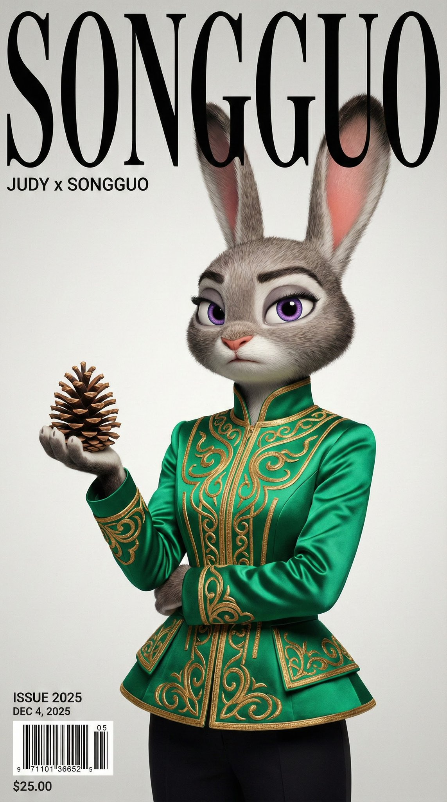

## facelock_identity": "true", "accuracy": "100%", scene"Co

- ID: gpt4o-719-en-1
- Slug: prompt-719-en-1
- 语言: en
- 来源: [来源链接](https://x.com/songguoxiansen/status/1996030625980317699)
- 样例图路径: images/part3/719.jpeg

### 提示词

```text
facelock_identity": "true",
"accuracy": "100%",
scene"Colorful Y2K scrapbook poster aesthetic, vibrant stickers, multiple subjects wearing the same outfit and hairstyle with different poses and cutouts, colorful strokes and lines, frameless collage style. Includes: close-up shot with heart-shape fingers, full-body squatting pose supporting chin while holding a white polaroid camera, mid-shot touching cheek while blowing pink bubblegum, mid-shot smiling elegantly while holding a cat ,seated elegantly with one eye winking and peace sign, and mid-shot holding daisy flowers. Holographic textures, pastel gradients, glitter accents, playful doodles, magazine cut-out graphics, chaotic yet balanced layout, extremely artistic and visually engaging",
main_subject": {
"description": "A young Y2K-styled woman as the main focus in the center of the scrapbook collage.",
"style_pose": "Playful and confident Y2K pose — slight side hip pop, one hand holding a lens-flare keychain, face toward the camera with a cute-cool expression, slight pout, candid early-2000s photo vibe."
outfit": {
"top": "Cropped oversized sweater in pastel color with embroidered patches",
"bottom": "pastel skirt with a white belt",
"socks": "White ankle socks with colorful pastel stripes",
"shoes": "white sneakers",
"accessories": [
"Colorful plastic bracelets",
"Chunky colorful rings",
"Sparkling belly chain",
"hairstyle":
"type": "Y2K half-up half-down",
"details": "Pastel flowers clips,thin front tendrils, wavy dark brown hair with bubblegum-pink tint on the lower strands, iconic early-2000s look."
additional_visuals":
"Heart, star, and butterfly stickers",
"Retro sparkles",
"Polaroid frames",
"Neon outlines",
"Doodle borders",
"Magazine cutout texts: 'SO CUTE!', '199X!', 'GIRL VIBES'",
"Pastel lighting",
"Glossy dreamy retro glow",
"Ultra-aesthetic scrapbook layout"
photography_rendering": {
"color_grading": "Cinematic neon Y2K",
"lighting": "Soft flash lighting","skin_texture": "Smooth glossy finish",
"rendering": "High-detail hyperrealistic Y2K scrapbook tone",
"quality": "8K",
"composition": "Perfectly balanced and artistic"
negative_prompt": "no realism that breaks Y2K aesthetic, no modern 2020s clothing, no messy composition, no blurry face, no distorted hands, no extra limbs, no face warping, no low resolution, no grain, no muted colors, no watermark, no AI artifacts"
```

### 样例图


## 多彩剪贴簿海报风格

- ID: gpt4o-719-zh-2
- Slug: prompt-719-zh-2
- 语言: zh
- 来源: [来源链接](https://x.com/songguoxiansen/status/1996030625980317699)
- 样例图路径: images/part3/719.jpeg

### 提示词

```text
facelock_identity："true",
“准确率”： “100%”，
场景：“色彩缤纷的Y2K剪贴簿海报美学，鲜艳的贴纸，多个人物穿着相同的服装和发型，摆出不同的姿势，并配以剪纸，色彩斑斓的笔触和线条，无框拼贴风格。包含：手指比出心形的特写镜头，全身蹲姿托腮手持白色拍立得相机，中景吹着粉色泡泡糖抚摸脸颊，中景抱着猫优雅微笑，优雅地坐着眨着一只眼睛比出和平手势，以及手持雏菊的中景。全息纹理、柔和的渐变色、闪光点缀、趣味涂鸦、杂志剪贴图案，布局看似混乱却又平衡，极具艺术性和视觉吸引力。”
主主题：{
“描述”：“一位年轻的千禧年风格女性，是剪贴簿拼贴画的中心焦点。”
"style_pose": "俏皮自信的Y2K姿势——微微侧身扭胯，一只手拿着镜头光晕钥匙扣，脸朝向镜头，表情可爱又酷，微微嘟嘴，散发出2000年代初期的抓拍氛围。"
全套服装”： {
上衣：浅色短款宽松毛衣，带有刺绣贴片。
“下装”：“粉色裙子配白色腰带”，
“袜子”：“白色短袜，带有彩色粉彩条纹”，
“鞋子”：“白色运动鞋”，
“配件”： [
“彩色塑料手镯”
“厚重的彩色戒指”，
“闪亮的肚链”
“发型”：
"type": "Y2K 半上半下",
“细节”：“粉彩花朵发夹，前额的细碎发丝，深棕色波浪卷发，发梢带有泡泡糖粉色，2000 年代初期的标志性造型。”
additional_visuals：
“心形、星星和蝴蝶贴纸”
“复古闪光”，
“宝丽来相框”，
“霓虹轮廓”，
“涂鸦边框”
“杂志剪报上的文字：‘太可爱了！’、‘199X！’、‘少女心’”
“柔和的灯光”，
“光泽梦幻的复古光芒”，
“超美剪贴簿布局”
摄影渲染：{
"color_grading": "电影霓虹 Y2K"
“lighting”: “柔和闪光灯照明”,“skin_texture”: “光滑光泽表面”,
“渲染”：“高细节超写实Y2K剪贴簿色调”，
“质量”: “8K”
“构图”：“完美平衡且富有艺术性”
negative_prompt": "不追求打破 Y2K 美学的写实效果，不穿 2020 年代的现代服装，不做凌乱的构图，不模糊的脸，不扭曲的手，不添加额外的肢体，不扭曲脸部，不降低分辨率，不添加颗粒感，不降低色彩饱和度，不添加水印，不添加 AI 伪影"
```

### 样例图


## Edit this photo without changing the face. The face must

- ID: gpt4o-715-en-1
- Slug: prompt-715-en-1
- 语言: en
- 来源: [来源链接](https://x.com/SimplyAnnisa/status/1995860432423453003)
- 样例图路径: images/part3/715.jpeg

### 提示词

```text
Edit this photo without changing the face. The face must remain completely authentic and 100% recognizable. The woman’s face has very smooth, pale skin with a warm undertone, giving a soft, porcelain doll-like appearance. Her expression is gentle, innocent, and slightly melancholic, as if she is hugging a doll with feelings of nostalgia or comfort. The cheeks have a peach-pink blush concentrated under the eyes and along the sides of the nose, creating a warm, shy, and flushed effect.

Her eyes are very large, round, and sparkling, resembling illustrated or doll-like eyes. The irises are dark brown but appear bright and glossy, likely enhanced with large-diameter contact lenses. The eyelashes are long and thick, both upper and lower, adding dramatic fullness to the eyes. Soft eyeshadow in peach, milky brown, and a hint of shimmer is applied subtly to enlarge the eyes naturally. A faint line under the eyes (aegyo sal) gives a cute and youthful impression.

The lips are soft peach and glossy, small and slightly pointed, with gently blended edges for a sweet and innocent look. No extreme ombre effects are used; the lip makeup appears natural and dewy.

Her hair is voluminous, softly curled, and dark brown with light highlights that shimmer under the light. A thin center-parted fringe frames the face gently. The sides of the hair are decorated with small white ribbons and delicate lace, creating a vintage-princess or Victorian doll aesthetic. The hairstyle is intricate yet elegant, combining classic style with a modern touch.

She is hugging a light brown (beige) teddy bear with soft, plush fur. The bear wears a small checkered ribbon in red, black, and white around its neck. The bear is held close to her chest, conveying warmth, softness, and a sense of security.

Her hands are smooth, slender, and feminine, gently holding the teddy bear. Her body leans slightly forward, as if embracing the bear more closely. The fingers are long with natural, neatly kept nails.

She wears vintage, classic clothing with lace details, predominantly cream and white, featuring delicate floral lace, small off-white ribbons, and layered thin fabrics that create a romantic look. The outfit resembles Lolita fashion, cottagecore, or soft Victorian style.

The lighting is warm with a golden tone, evoking nostalgia, comfort, and a dreamlike atmosphere. The background contains decorative elements such as wooden textures, vintage ornaments, and soft golden hues, supporting the theme of comfort, childhood warmth, softness, and doll-like innocence.

The overall aesthetic emphasizes dollcore, vintage romantic, cottage and Victorian softness, warm nostalgia, and soft feminine fantasy, creating an intimate, warm, and elegantly cute atmosphere.
```

### 样例图

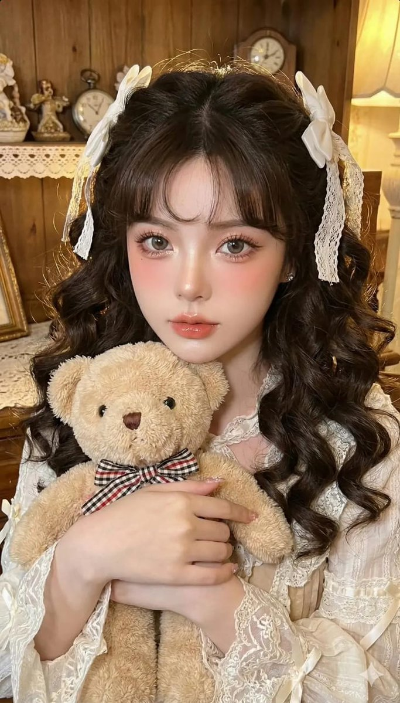

## 瓷娃娃般的风格照片

- ID: gpt4o-715-zh-2
- Slug: prompt-715-zh-2
- 语言: zh
- 来源: [来源链接](https://x.com/SimplyAnnisa/status/1995860432423453003)
- 样例图路径: images/part3/715.jpeg

### 提示词

```text
请在不改变面部的情况下编辑这张照片。面部必须保持完全真实，且100%可辨认。这位女士的肌肤非常光滑白皙，带有温暖的底色，呈现出柔和的瓷娃娃般的质感。她的表情温柔、纯真，略带忧郁，仿佛怀抱着一个充满怀旧或慰藉的娃娃。双颊泛着淡淡的蜜桃粉色，集中在眼下和鼻翼两侧，营造出一种温暖、羞涩而又泛红的效果。

她的眼睛又大又圆，闪闪发光，宛如插画或洋娃娃的眼睛。虹膜是深棕色的，但看起来明亮有光泽，很可能是戴了大直径的美瞳。睫毛又长又浓密，上下睫毛都纤长卷翘，让眼睛显得更加饱满。眼影用蜜桃色、乳棕色和微微珠光的柔和色调轻轻晕染，自然地放大了双眼。眼下淡淡的卧蚕（卧蚕）更添几分可爱青春的气息。

唇色柔和水润，呈蜜桃色，小巧微尖，边缘晕染自然，营造出甜美清纯的气质。没有使用夸张的渐变效果，唇妆呈现自然水润的质感。

她的头发蓬松丰盈，微微卷曲，深棕色中透着几缕浅色高光，在光线下闪闪发光。中分的细刘海温柔地修饰着脸型。发际线两侧点缀着白色小丝带和精致蕾丝，营造出复古公主或维多利亚娃娃般的甜美气质。这款发型精致优雅，融合了经典与现代元素。

她怀里抱着一只浅棕色（米色）的泰迪熊，毛茸茸的，触感柔软。泰迪熊脖子上系着一条红黑白相间的小方格丝带。她把泰迪熊紧紧抱在胸前，传递着温暖、柔和和安全感。

她的双手光滑纤细，充满女性魅力，轻轻地抱着泰迪熊。她的身体微微前倾，仿佛想要更紧地拥抱泰迪熊。她的手指修长，指甲自然整齐。

她身着复古经典服饰，以米白色为主色调，饰以蕾丝细节，点缀着精致的花卉蕾丝、米白色小丝带和层叠的薄纱，营造出浪漫的氛围。这身装扮类似于洛丽塔风格、田园风或柔和的维多利亚风格。

灯光温暖，泛着金光，营造出怀旧、舒适和梦幻般的氛围。背景中融入了木纹、复古饰品和柔和的金色调等装饰元素，强化了舒适、童年的温暖、柔和以及娃娃般的纯真主题。

整体美学强调娃娃风、复古浪漫风、乡村风和维多利亚式的柔和感、温暖的怀旧感和柔美的女性幻想，营造出一种亲密、温暖、优雅可爱的氛围。
```

### 样例图


## Q版星巴克迷你概念店

- ID: gpt4o-708-zh
- Slug: prompt-708-zh
- 语言: zh
- 来源: [来源链接](https://x.com/tetumemo/status/1995699440695607443)
- 样例图路径: images/part3/708.jpeg

### 提示词

```text
这款3D Q版星巴克迷你概念店设计别具匠心，其外观灵感源自品牌最具代表性的产品和包装（例如，巨型{品牌核心产品，例如，炸鸡桶/汉堡/甜甜圈/烤鸭}）。店铺共两层，宽敞的落地玻璃窗将温馨精致的内部装潢尽收眼底：{品牌主色调}主题的装饰、温暖的灯光，以及身着品牌专属服装的忙碌员工。可爱的小人偶在街道上漫步、休憩，周围环绕着长椅、路灯和盆栽植物，营造出迷人的都市景象。该店铺采用Cinema 4D软件渲染，呈现出微缩城市景观风格，兼具盲盒玩具的精致美感，细节丰富，栩栩如生，柔和的灯光更增添了午后轻松惬意的氛围。请参阅随附的角色设定图，了解店内出现的迷你角色。--ar 2:3
```

### 样例图

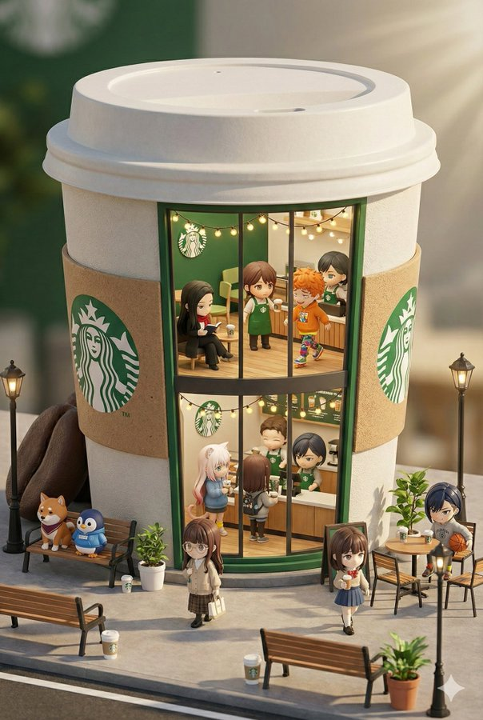

## Generate a hyperrealistic realistic-anime portrait of a 

- ID: gpt4o-704-en-1
- Slug: prompt-704-en-1
- 语言: en
- 来源: [来源链接](https://x.com/SimplyAnnisa/status/1995131975351562274)
- 样例图路径: images/part3/704.jpeg

### 提示词

```text
Generate a hyperrealistic realistic-anime portrait of a female character 
standing in a completely black background.
Lighting: use a **narrow beam spotlight** focused only on the center of the face. 
The edges of the light must be sharp and dramatic. 
All areas outside the spotlight should fall quickly into deep darkness 
(high falloff shadow), almost blending into the black background. 
Not soft lighting.
Hair: long dark hair with some strands falling over the face. The lower parts of the hair should fade into the shadows.
Pose: one hand raised gently to the lips in a shy, hesitant gesture. 
Eyes looking directly at the camera with a mysterious mood.
Clothing: black long-sleeve knit sweater; 
the sweater and body should mostly disappear into the darkness with minimal detail.
Overall tone: dark, moody, dramatic, mysterious. 
High-contrast only in the lit portion of the face. 
Everything outside the spotlight should be nearly invisible.
```

### 样例图

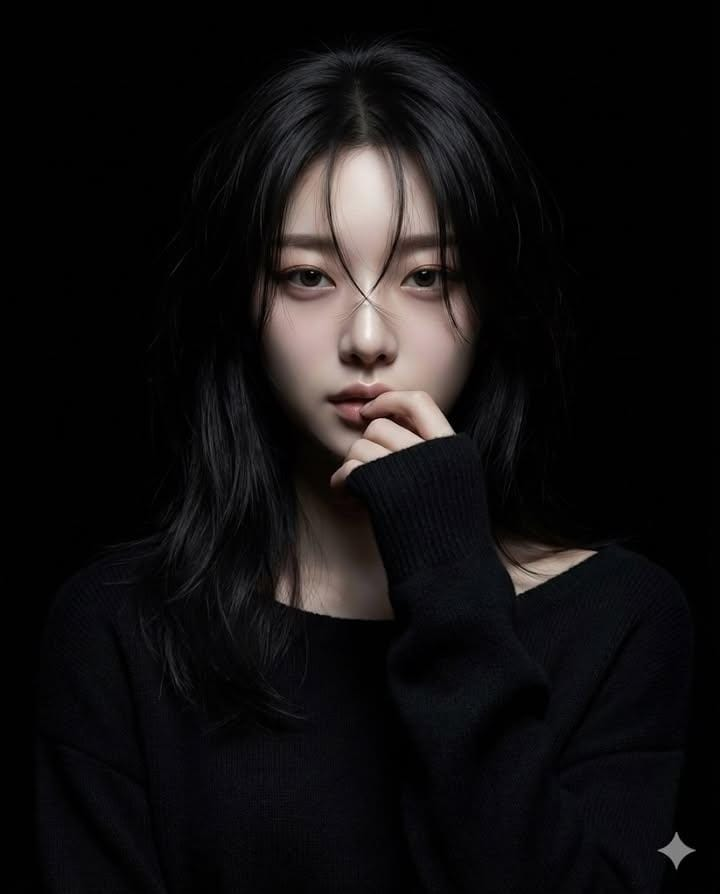

## 超写实风格的女性角色肖像

- ID: gpt4o-704-zh-2
- Slug: prompt-704-zh-2
- 语言: zh
- 来源: [来源链接](https://x.com/SimplyAnnisa/status/1995131975351562274)
- 样例图路径: images/part3/704.jpeg

### 提示词

```text
生成一幅超写实风格的女性角色动漫肖像
站在纯黑色的背景下。
照明：使用**窄光束聚光灯**只聚焦在脸部中心。
光线的边缘必须清晰锐利，极具戏剧性。
聚光灯之外的所有区域都应迅速陷入深深的黑暗。
（阴影衰减严重），几乎与黑色背景融为一体。
不是柔光。
头发：长长的黑发，几缕发丝垂落在脸颊两侧。发梢应与阴影融为一体。
姿势：一只手轻轻抬起放在嘴唇上，做出羞涩、犹豫的姿态。
眼神神秘，直视镜头。
服装：黑色长袖针织毛衣；
毛衣和身体大部分应该融入黑暗中，细节越少越好。
整体基调：阴郁、忧郁、戏剧化、神秘。
只有面部受光部分具有高对比度。
聚光灯之外的一切都应该几乎隐形。
```

### 样例图


## Generate a 3×3 photo grid. Fully preserve the face, hair

- ID: gpt4o-702-en-1
- Slug: prompt-702-en-1
- 语言: en
- 来源: [来源链接](https://x.com/iX00AI/status/1995130835218186540)
- 样例图路径: images/part3/702.jpeg

### 提示词

```text
Generate a 3×3 photo grid.
Fully preserve the face, hairstyle, and outfit from the uploaded image in all panels.

The person should make a cute, funny, and slightly weird expression and pose, and the same expression & pose must be consistent across all 9 panels.

Each panel should use a different camera angle.
Use the following angles, in varied composition and framing:
1. High angle (top-down)
2. Low angle (from below)
3. Eye-level straight-on
4. Dutch angle (slightly tilted)
5. Close-up low angle
6. Over-the-shoulder angle
7. Wide shot from the side
8. 45-degree angle from the front
9. Slight bird’s-eye angle

Style Requirements:
•Photorealistic, clean lighting
•Real camera lens rendering
•No illustration or cartoon look
•Same outfit, face, and hairstyle across all images
•The pose and expression stay identical across the grid
•Modern, minimal aesthetic
```

### 样例图

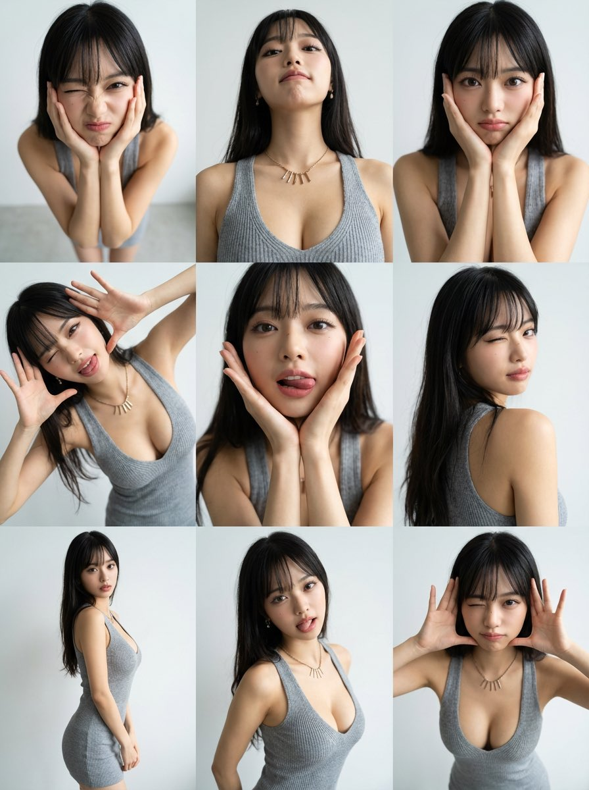

## 生成3×3照片网格照片

- ID: gpt4o-702-zh-2
- Slug: prompt-702-zh-2
- 语言: zh
- 来源: [来源链接](https://x.com/iX00AI/status/1995130835218186540)
- 样例图路径: images/part3/702.jpeg

### 提示词

```text
生成 3×3 照片网格。
在所有面板中完整保留上传图像中的面部、发型和服装。

画中人应该做出可爱、滑稽、略带怪异的表情和姿势，并且所有 9 个画面中的表情和姿势必须保持一致。

每个小组都应该使用不同的拍摄角度。
使用以下角度，并采用不同的构图和取景方式：
1. 高角度（顶部- down)
2. 低角度（从下方）
3. 视线水平正对
4. 荷兰角（略微倾斜）
5. 近景低角度拍摄
6. 过肩角度
7. 侧面远景
8. 从正面看呈45度角
9. 略微俯视角度

风格要求：
•逼真、清晰的光照
•真实相机镜头渲染
•无插图或卡通风格
•所有图片中的服装、脸型和发型都相同
•整个网格中的姿势和表情保持一致
现代简约美学
```

### 样例图


## facelock_identity": "true", "accuracy": "100%", scene"Co

- ID: gpt4o-694-en-1
- Slug: prompt-694-en-1
- 语言: en
- 来源: [来源链接](https://x.com/ShreyaYadav___/status/1995760655018942720)
- 样例图路径: images/part3/694.jpeg

### 提示词

```text
facelock_identity": "true",
"accuracy": "100%",
scene"Colorful Y2K scrapbook poster aesthetic, vibrant stickers, multiple subjects wearing the same outfit and hairstyle with different poses and cutouts, colorful strokes and lines, frameless collage style. Includes: close-up shot with heart-shape fingers, full-body squatting pose supporting chin while holding a white polaroid camera, mid-shot touching cheek while blowing pink bubblegum, mid-shot smiling elegantly while holding a cat ,seated elegantly with one eye winking and peace sign, and mid-shot holding daisy flowers. Holographic textures, pastel gradients, glitter accents, playful doodles, magazine cut-out graphics, chaotic yet balanced layout, extremely artistic and visually engaging",
main_subject": {
"description": "A young Y2K-styled woman as the main focus in the center of the scrapbook collage.",
"style_pose": "Playful and confident Y2K pose — slight side hip pop, one hand holding a lens-flare keychain, face toward the camera with a cute-cool expression, slight pout, candid early-2000s photo vibe."
outfit": {
"top": "Cropped oversized sweater in pastel color with embroidered patches",
"bottom": "pastel skirt with a white belt",
"socks": "White ankle socks with colorful pastel stripes",
"shoes": "white sneakers",
"accessories": [
"Colorful plastic bracelets",
"Chunky colorful rings",
"Sparkling belly chain",
"hairstyle": 
"type": "Y2K half-up half-down",
"details": "Pastel flowers clips,thin front tendrils, wavy dark brown hair with bubblegum-pink tint on the lower strands, iconic early-2000s look."
additional_visuals": 
"Heart, star, and butterfly stickers",
"Retro sparkles",
"Polaroid frames",
"Neon outlines",
"Doodle borders",
"Magazine cutout texts: 'SO CUTE!', '199X!', 'GIRL VIBES'",
"Pastel lighting",
"Glossy dreamy retro glow",
"Ultra-aesthetic scrapbook layout"
photography_rendering": {
"color_grading": "Cinematic neon Y2K",
"lighting": "Soft flash lighting","skin_texture": "Smooth glossy finish",
"rendering": "High-detail hyperrealistic Y2K scrapbook tone",
"quality": "8K",
"composition": "Perfectly balanced and artistic"
negative_prompt": "no realism that breaks Y2K aesthetic, no modern 2020s clothing, no messy composition, no blurry face, no distorted hands, no extra limbs, no face warping, no low resolution, no grain, no muted colors, no watermark, no AI artifacts"
```

### 样例图


## 色彩缤纷的Y2K剪贴簿海报

- ID: gpt4o-694-zh-2
- Slug: prompt-694-zh-2
- 语言: zh
- 来源: [来源链接](https://x.com/ShreyaYadav___/status/1995760655018942720)
- 样例图路径: images/part3/694.jpeg

### 提示词

```text
facelock_identity："true",
“准确率”： “100%”，
场景：“色彩缤纷的Y2K剪贴簿海报美学，鲜艳的贴纸，多个人物穿着相同的服装和发型，摆出不同的姿势，并配以剪纸，色彩斑斓的笔触和线条，无框拼贴风格。包含：手指比出心形的特写镜头，全身蹲姿托腮手持白色拍立得相机，中景吹着粉色泡泡糖抚摸脸颊，中景抱着猫优雅微笑，优雅地坐着眨着一只眼睛比出和平手势，以及手持雏菊的中景。全息纹理、柔和的渐变色、闪光点缀、趣味涂鸦、杂志剪贴图案，布局看似混乱却又平衡，极具艺术性和视觉吸引力。”
主主题：{
“描述”：“一位年轻的千禧年风格女性，是剪贴簿拼贴画的中心焦点。”
"style_pose": "俏皮自信的Y2K姿势——微微侧身扭胯，一只手拿着镜头光晕钥匙扣，脸朝向镜头，表情可爱又酷，微微嘟嘴，散发出2000年代初期的抓拍氛围。"
全套服装”： {
上衣：浅色短款宽松毛衣，带有刺绣贴片。
“下装”：“粉色裙子配白色腰带”，
“袜子”：“白色短袜，带有彩色粉彩条纹”，
“鞋子”：“白色运动鞋”，
“配件”： [
“彩色塑料手镯”
“厚重的彩色戒指”，
“闪亮的肚链”
“发型”：
"type": "Y2K 半上半下",
“细节”：“粉彩花朵发夹，前额的细碎发丝，深棕色波浪卷发，发梢带有泡泡糖粉色，2000 年代初期的标志性造型。”
additional_visuals：
“心形、星星和蝴蝶贴纸”
“复古闪光”，
“宝丽来相框”，
“霓虹轮廓”，
“涂鸦边框”
“杂志剪报上的文字：‘太可爱了！’、‘199X！’、‘少女心’”
“柔和的灯光”，
“光泽梦幻的复古光芒”，
“超美剪贴簿布局”
摄影渲染：{
"color_grading": "电影霓虹 Y2K"
“lighting”: “柔和闪光灯照明”,“skin_texture”: “光滑光泽表面”,
“渲染”：“高细节超写实Y2K剪贴簿色调”，
“质量”: “8K”
“构图”：“完美平衡且富有艺术性”
negative_prompt": "不追求打破 Y2K 美学的写实效果，不穿 2020 年代的现代服装，不做凌乱的构图，不模糊的脸，不扭曲的手，不添加额外的肢体，不扭曲脸部，不降低分辨率，不添加颗粒感，不降低色彩饱和度，不添加水印，不添加 AI 伪影"
```

### 样例图


## 写实照片定格JOJO风格

- ID: gpt4o-693-zh
- Slug: prompt-693-zh
- 语言: zh
- 来源: [来源链接](https://x.com/AI_GIRL_DESIGN/status/1994374306327847341)
- 样例图路径: images/part3/693.jpeg

### 提示词

```text
Use the uploaded photo as the base.

Keep the person’s **face, eyes, hairstyle, makeup, outfit, and overall identity** clearly recognizable and photorealistic.
Do NOT turn the whole image into a drawing.
Do NOT replace or redraw the background; only transform the perspective as needed.

===================================================
TRANSFORM THE POSE — EXTREME “JOJO-STYLE” POSES
===================================================
Repose the body into a **randomized, exaggerated JoJo-style pose**, pushing the limits of human flexibility:
- extreme torso twist, strong contrapposto
- head tilt with dramatic confidence
- one hand framing the face, one arm extended or arched
- bold leg positions (crossed, wide stance, pointed toes)

The pose must be:
- anatomically plausible but exaggerated like JoJo
- stylish, flamboyant, theatrical

Maintain realistic lighting and natural cloth deformation.

===================================================
APPLY EXTREME CAMERA ANGLES (RANDOM EACH TIME)
===================================================
Transform the camera viewpoint to create striking JoJo-style drama:
Choose **one random angle** from the following list for each generation:

- **Ultra low-angle (“仰ぎ見”) shot**: camera near the ground looking upward
- **Ultra high-angle (“見下ろし”) shot**: camera directly above looking down
- **Dynamic wide-angle (20–24mm)**: strong perspective distortion
- **Super wide-angle (14mm)** for extreme depth & stretched limbs
- **Fisheye lens effect** with curved perspective lines
- **Dutch-angle (tilted horizon)** for manga-like tension
- **Close-up with forced perspective**: large foreground hand reaching toward the camera
- **Long-lens compression (85–135mm)** but still JoJo dramatic

Rules:
- The face must remain recognizable and photorealistic in the new angle.
- The background may be warped to match the new perspective, but must remain the same scene.
- No cartoon effects on the person themselves.

===================================================
ADD MANGA-STYLE SFX (JOJO ONOMATOPEIA)
===================================================
Add dramatic Japanese SFX in bold black-and-white ink lines:
- 「ゴゴゴゴゴ…」
- 「ドドドドド…」
- 「ズキューーーン！」
- 「バァーーーン！！」
- 「メメタァ！」
- 「ガオンッ！」

Place them:
- floating behind the person
- along the sides of the pose
- integrated with the new camera angle perspective
Do NOT cover the person’s face.

===================================================
OPTIONAL MANGA LINES
===================================================
Add subtle JoJo-style:
- speed lines
- radiating impact lines
- perspective shock lines

But keep the original background visible through them.

===================================================
FINAL GOAL
===================================================
Create a realistic photo where:
- the person remains fully recognizable,
- their body is transformed into a bold, dramatic JoJo-style pose,
- the camera angle is extreme and cinematic (low-angle, high-angle, fisheye, wide-angle, etc.),
- powerful manga SFX surround them in true JoJo fashion.

The image should feel like a **JoJo splash page happening inside a real photograph**.
```

### 样例图

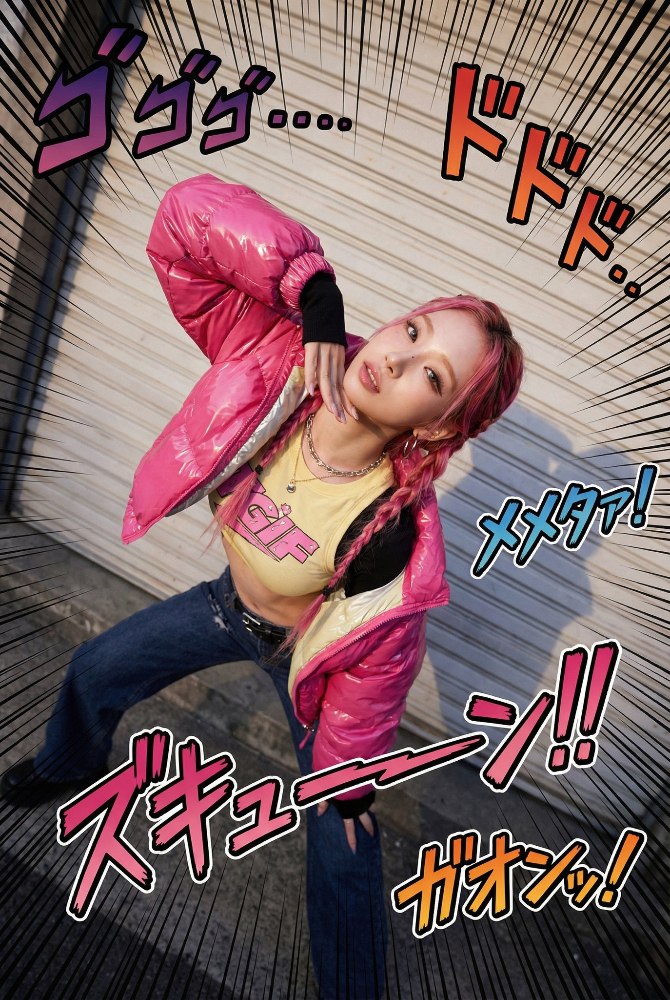

## { "Use [man_face] and [woman_fac]. Ultra-realistic high-

- ID: gpt4o-683-en-1
- Slug: prompt-683-en-1
- 语言: en
- 来源: [来源链接](https://x.com/miilesus/status/1995536025859354724)
- 样例图路径: images/part3/683.jpeg

### 提示词

```text
{
 "Use [man_face] and [woman_fac]. Ultra-realistic high-end luxury wedding photography of a bride and groom standing closely together in an elegant outdoor ceremony setting. Golden hour sunlight casting warm soft highlights, natural rim light around their silhouettes, cinematic dynamic range. The bride wearing a premium handcrafted lace wedding gown with intricate embroidery details, soft flowing veil illuminated by backlight, subtle pearl accessories, refined natural bridal makeup with luminous skin texture, finely detailed eyelashes and catchlights in eyes. The groom wearing a tailored black tuxedo with satin lapels, crisp white shirt, luxury bow tie, polished boutonniere. Both posing in a candid yet editorial fashion – gentle eye contact, soft romantic smile, hands touching gracefully. Background featuring a softly blurred bokeh garden with roses, organic greenery, warm tones, shallow depth of field created by an 85mm f/1.4 full-frame lens. High-definition textures, ultra sharp facial details, realistic pores, true-to-life skin tones, natural hair strands, perfect color grading inspired by premium wedding photographers. Soft pastel color palette, creamy highlights, subtle film grain, magazine cover aesthetic. Cinematic global illumination, perfect exposure balance, no distortion, no artifacts. Award-winning photography style with fine-art wedding composition, dramatic yet soft lighting, museum-quality detail clarity.",
  
  "negative_prompt": "cartoon, illustration, painting, CGI, artificial look, uncanny valley, distorted facial features, extra limbs, deformed body parts, mismatched eyes, unnatural skin texture, plastic skin, blur, noise, pixelation, low resolution, oversaturated colors, washed out colors, hard flash, harsh shadows, blown highlights, low contrast, lens distortion, fisheye, bad anatomy, extra fingers, incorrect hand shapes, watermark, text, logo, border, frame, compression artifacts, glitch, unrealistic proportions, double face, duplicate subjects, warped background",

  "camera_settings": {
    "lens": "85mm f/1.4 prime",
    "iso": 100,
    "shutter_speed": "1/400",
    "aperture": "f/1.4",
    "white_balance": "5200K daylight"
  },

  "style": {
    "lighting": "soft natural golden hour, cinematic rim light, high dynamic range",
    "color_grade": "premium wedding film look, pastel tones, creamy highlights, warm undertones",
    "atmosphere": "romantic, elegant, fine-art editorial"
  },

  "composition": {
    "framing": "mid-shot portrait, slight angle, bride and groom centered",
    "focus": "sharp eyes, smooth bokeh background",
    "depth_of_field": "shallow, subject separation emphasized"
  },

  "width": 1024,
  "height": 1536,
  "num_inference_steps": 36,
  "guidance_scale": 8.0,
  "seed": 12345
}
```

### 样例图

![{ "Use [man_face] and [woman_fac]. Ultra-realistic high-](../images/part3/683.jpeg)

## 花园里的婚纱照

- ID: gpt4o-683-zh-2
- Slug: prompt-683-zh-2
- 语言: zh
- 来源: [来源链接](https://x.com/miilesus/status/1995536025859354724)
- 样例图路径: images/part3/683.jpeg

### 提示词

```text
{
使用[man_face]和[woman_fac]。超逼真的高端奢华婚礼摄影，展现新郎新娘在优雅的户外仪式场地中亲密依偎的画面。金色的阳光洒下温暖柔和的高光，自然的轮廓光勾勒出他们的身影，营造出电影般的动态范围。新娘身着高级手工蕾丝婚纱，精致的刺绣细节令人叹为观止，飘逸的头纱在逆光下熠熠生辉，搭配低调的珍珠配饰，精致自然的妆容展现出肌肤的光泽感，纤长的睫毛和闪亮的眼神光更添动人。新郎身着剪裁合身的黑色礼服，缎面翻领，搭配挺括的白色衬衫、奢华的领结和精致的胸花。两人以一种自然而又不失时尚感的姿态摆出姿势——温柔的眼神交流，浪漫的微笑，双手优雅地相触。背景是一片柔和虚化的花园，点缀着玫瑰、绿植和温暖的色调，85mm f/1.4全画幅镜头营造出浅景深效果。高清的纹理，极其清晰的面部细节，逼真的画面。毛孔清晰可见，肤色自然逼真，发丝纹理自然，色彩分级完美，灵感源自顶级婚礼摄影师。柔和的粉彩色调，奶油般的亮部，细腻的胶片颗粒，杂志封面般的质感。电影级的整体光照，完美的曝光平衡，无畸变，无瑕疵。屡获殊荣的摄影风格，融合艺术婚礼构图、戏剧性却又柔和的光线，以及博物馆级别的细节清晰度。

"negative_prompt": "卡通、插画、绘画、CGI、人工质感、恐怖谷效应、面部特征扭曲、多余肢体、身体部位畸形、眼睛不对称、皮肤纹理不自然、塑料皮肤、模糊、噪点、像素化、低分辨率、色彩过饱和、色彩褪色、强光、阴影过重、高光过曝、低对比度、镜头畸变、鱼眼效果、人体解剖结构错误、多余手指、手型错误、水印、文字、标志、边框、画框、压缩伪影、故障、比例失调、双面人、重复人物、背景扭曲",

"camera_settings": {
镜头：85mm f/1.4 定焦镜头
“iso”：100，
"shutter_speed": "1/400",
光圈：f/1.4，
“white_balance”: “5200K 日光”
},

“风格”： {
“照明”：“柔和的自然黄金时段、电影般的轮廓光、高动态范围”，
"color_grade": "高级婚礼影片风格，柔和的色调，奶油色的高光，温暖的底色",
“氛围”： “浪漫、优雅、艺术感十足的编辑风格”
},

“作品”： {
“构图”：“中景肖像，略微倾斜，新郎新娘居中”，
“焦点”：“锐利的眼睛，柔和的散景背景”，
"depth_of_field": "浅景深，强调主体分离"
},

宽度：1024，
“高度”：1536，
"num_inference_steps": 36,
"guidance_scale": 8.0,
种子：12345
}
```

### 样例图


## Breakdown the look into a fun OOTD Fashion Collage, 9:16

- ID: gpt4o-680-en-1
- Slug: prompt-680-en-1
- 语言: en
- 来源: [来源链接](https://x.com/ShreyaYadav___/status/1995482012124434547)
- 样例图路径: images/part3/680.jpeg

### 提示词

```text
Breakdown the look into a fun OOTD Fashion Collage, 9:16. Paper scribble aesthetic with hand-drawn arrows, doodles, and handwritten labels pointing to each outfit piece. Notebook paper texture background with ink sketch style.
```

### 样例图

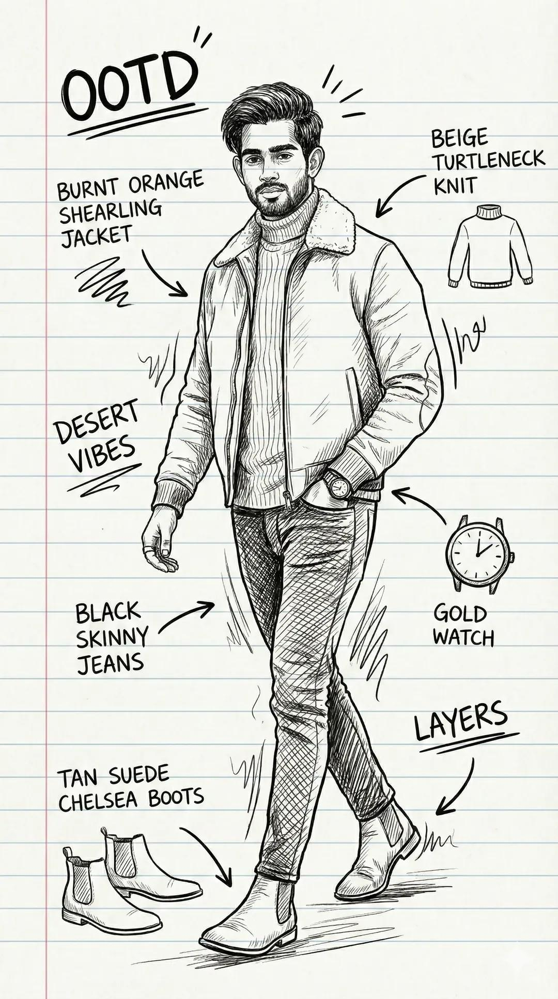

## OOTD手绘涂鸦分解

- ID: gpt4o-680-zh-2
- Slug: prompt-680-zh-2
- 语言: zh
- 来源: [来源链接](https://x.com/ShreyaYadav___/status/1995482012124434547)
- 样例图路径: images/part3/680.jpeg

### 提示词

```text
将这身造型拆解成一个有趣的每日穿搭拼贴画，9:16。纸张涂鸦风格，手绘箭头、涂鸦和手写标签指向每件单品。笔记本纸张纹理背景，墨水素描风格。
```

### 样例图


## { "intent": "A dramatic, high-energy battle scene featur

- ID: gpt4o-677-en-1
- Slug: prompt-677-en-1
- 语言: en
- 来源: [来源链接](https://x.com/IamEmily2050/status/1995429494493167779)
- 样例图路径: images/part3/677.jpeg

### 提示词

```text
{
  "intent": "A dramatic, high-energy battle scene featuring a determined young mage making a defiant declaration, in the style of modern Shonen fantasy manga.",
  "manga_genre": "Shonen Fantasy/Action",
  "art_style": {
    "primary_influence": "Modern Shonen Jump style (reminiscent of Black Clover, Fairy Tail), with dynamic action and expressive character work",
    "line_art_style": "Bold, clean lines with strong variable weight. Thick, confident outlines for characters, thin lines for magical effects and background detail. Energetic, flowing linework.",
    "screentone_style": "Minimal screentone use to maintain high contrast and readability. Light 20% dot screentones for subtle shading on skin. Heavy use of pure white and pure black for dramatic impact."
  },
  "panel_design": {
    "primary_panel_type": "FBP (Full-Body Panel): Entire character from head to feet with visible ground plane.",
    "composition_description": "Dynamic low-angle view, looking up at the character from ground level to emphasize heroic determination and power. The character stands in a defiant pose on a cracked, debris-strewn battlefield. The ground is clearly visible beneath and around the character's feet, with rubble, broken stones, and impact cracks radiating outward. Include 15% negative space above the head and 12% below the feet to prevent cropping. The composition creates a sense of the character rising up against adversity.",
    "aspect_ratio": "2:3",
    "key_symbolic_effects": ["Intense speed lines radiating outward from the character's body, creating explosive energy", "Focus lines converging on the character's face and raised fist, emphasizing determination", "Magical energy aura swirling around the character, rendered with flowing, organic lines", "Small impact cracks and debris particles floating around the feet to show power and grounding"]
  },
  "dialogue_and_text": {
    "speech_bubbles": [
      {
        "speaker": "Protagonist",
        "bubble_type": "shout",
        "text_content": "I won't back down! This is my fight!",
        "placement": "Upper right area of the panel, positioned above and slightly to the right of the character's head, with the bubble tail pointing toward the character's mouth",
        "emphasis": "bold"
      },
      {
        "speaker": "Protagonist",
        "bubble_type": "shout",
        "text_content": "I'll protect everyone... no matter what!!",
        "placement": "Mid-left area, positioned near the character's raised fist, with the bubble tail pointing back toward the character's face. This creates a dynamic flow of dialogue across the panel.",
        "emphasis": "bold with triple exclamation marks for maximum intensity"
      }
    ],
    "sound_effects": [
      {
        "sfx_text": "ゴゴゴ (GOGOGO - menacing rumble)",
        "placement": "Integrated into the background, positioned in the upper left and lower right corners, creating a sense of ominous power building",
        "style": "Bold, angular katakana characters rendered in a heavy, imposing font"
      },
      {
        "sfx_text": "CRACKLE",
        "placement": "Near the magical energy aura around the character's hands, integrated into the swirling energy effects",
        "style": "Jagged, electric-style lettering that follows the flow of the magical energy"
      }
    ]
  },
  "character": {
    "archetype": "Hot-blooded Shonen Protagonist: Determined, courageous, fiercely protective of friends, refuses to give up even when outmatched.",
    "design_focus": "A young male mage in his mid-teens. Wild, spiky hair (classic Shonen style) with strands flying upward from the energy aura. Large, intense eyes with prominent highlights showing unwavering determination and a hint of desperation. Wearing a battle-worn fantasy adventurer outfit: a tattered cloak flowing dramatically behind him, a fitted tunic with visible fabric tension showing a lean, athletic build, armored gauntlets on his forearms, and sturdy leather boots with visible buckles and worn soles. The boots are firmly planted on the cracked ground, with detailed lacing and scuff marks. Barefoot would be inappropriate for a battlefield, so the boots are essential and clearly visible from toe to heel.",
    "facial_expression": "Intense and defiant. Mouth open in a shout, showing gritted teeth. Brows furrowed with determination. Eyes blazing with resolve and a slight glow suggesting magical power.",
    "pose_and_body_language": "Dynamic heroic stance: feet shoulder-width apart and fully visible, planted firmly on the cracked ground with slight forward lean suggesting readiness to charge. One fist raised to chest level, clenched tightly and glowing with magical energy. The other arm extended slightly outward for balance. Body coiled with tension and power. The pose conveys both defensive readiness and offensive intent.",
    "symbolic_emotional_markers": ["Determination aura: jagged, flame-like lines surrounding the character's body", "Small sweat drops on the forehead indicating intense exertion and stakes", "Glowing eyes with white highlights suggesting inner power awakening", "Clenched fist with visible tension lines in the hand and forearm"]
  },
  "setting": {
    "location": "A devastated battlefield. Cracked and broken stone ground with large fissures and impact craters. Rubble and debris scattered around the character's feet, with some pieces floating slightly due to magical energy. The ground texture is rough stone and dirt, clearly visible beneath the character's boots. In the blurred background, suggestions of ruined structures and a stormy sky, but kept minimal to maintain focus on the character.",
    "time_of_day": "Dusk or stormy midday (dramatic, low-contrast lighting typical of climactic battle scenes)",
    "atmospheric_elements": "Dust and small debris particles floating in the air. Magical energy wisps swirling around the character. Dark, ominous clouds in the background suggesting the severity of the battle. A few small embers or sparks of magical energy drifting upward from the ground."
  },
  "inking_and_tones": {
    "line_weight_variation": "Strong variation. Very thick, bold outlines (2-3pt) for the character's silhouette and major forms to make them pop against the background. Medium weight (1-2pt) for clothing details, facial features, and magical effects. Thin lines (0.5-1pt) for hair strands, background rubble detail, and fine texture on the boots and gauntlets.",
    "primary_shading_method": "Combination of crisp black fills for deep shadows (under the chin, in the hair, cast shadows on the ground) and light 20% dot screentones for mid-tone shadows on the face and clothing. Minimal screentone use overall to maintain high contrast and energy. Cross-hatching used sparingly for texture on the tattered cloak.",
    "black_space_usage": "Strategic and balanced. Solid black used for hair shadows, the interior of the tattered cloak, and deep shadows cast by the character on the ground. Mostly white space and clean lines to maintain the bright, energetic feel of Shonen action.",
    "screentone_density": "Sparse. Screentones used only for subtle form definition on the character's face and body. The background is kept mostly white with black linework for rubble and cracks, maintaining focus on the character."
  },
  "symbolism_and_effects": {
    "motion_lines": "Intense speed lines radiating outward from the character's torso and limbs in all directions, creating a sense of explosive power and energy bursting forth. The lines are thicker near the character and taper as they extend outward.",
    "emotional_symbols": ["Determination aura: jagged, flame-like energy lines surrounding the body", "Sweat drops on forehead for intense focus and exertion", "Glowing magical energy around the raised fist, rendered with swirling, organic lines", "Small impact lines around the feet showing firm grounding and power transfer to the earth"],
    "onomatopoeia": ["ゴゴゴ (GOGOGO) - menacing/powerful rumble effect in the background", "CRACKLE - magical energy sound effect near the hands"]
  },
  "negative_directives": {
    "style": "No photorealistic rendering, no watercolor or painterly style, no full color, no soft digital gradients, no Western comic book style, no 3D rendering, no overly detailed backgrounds that distract from the character.",
    "content": "No weapons in hand (magic is the focus), no other characters in the frame, no overly busy background, cropped feet, missing feet, floating figure, cut-off ankles, feet out of frame, hands obscuring the face, hair completely covering the eyes, closed or neutral expression (must be intense and emotional).",
    "artifact_suppression": "No blurred lines, no digital painting artifacts, no color bleeding, no anti-aliasing softness, cropped feet, missing toes, deformed feet, extra limbs, anatomically impossible poses, inconsistent line weight, muddy or unclear linework."
  }
}
```

### 样例图

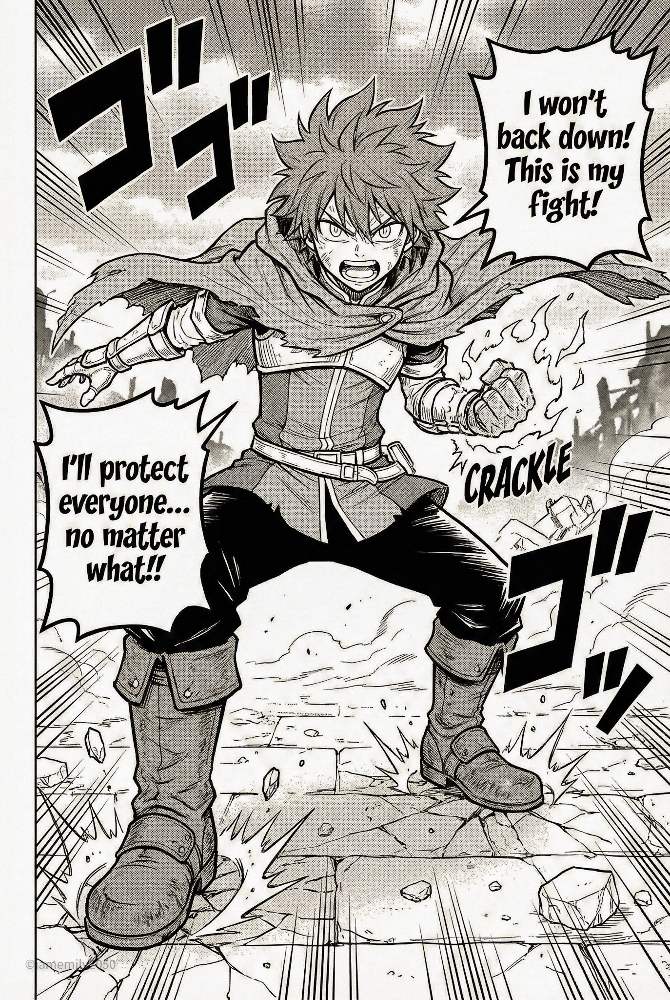

## 现代少年奇幻漫画

- ID: gpt4o-677-zh-2
- Slug: prompt-677-zh-2
- 语言: zh
- 来源: [来源链接](https://x.com/IamEmily2050/status/1995429494493167779)
- 样例图路径: images/part3/677.jpeg

### 提示词

```text
{
“意图”：“一场充满戏剧性和爆发力的战斗场景，一位意志坚定的年轻魔法师发表了充满反抗精神的宣言，风格类似于现代少年奇幻漫画。”
"manga_genre": "少年奇幻/动作",
"art_style": {
“主要影响因素”： “现代少年Jump风格（让人想起《黑色五叶草》、《妖精的尾巴》），具有动感的动作和富有表现力的人物刻画”，
"line_art_style": "线条粗犷有力，线条粗细变化丰富。人物轮廓粗犷自信，魔法效果和背景细节则采用纤细线条。充满活力，线条流畅。"
"screentone_style": "尽量减少网点的使用，以保持高对比度和可读性。使用 20% 网点的浅色网点来表现皮肤上的微妙阴影。大量使用纯白和纯黑，以达到戏剧性的效果。"
},
"panel_design": {
"primary_panel_type": "FBP（全身面板）：从头到脚的整个角色，地面清晰可见。"
"composition_description": "动态的低角度视角，从地面仰视人物，强调英雄的决心和力量。人物以不屈的姿态站在满目疮痍、瓦砾遍地的战场上。人物脚下和周围的地面清晰可见，瓦砾、碎石和冲击裂缝向外辐射。头部上方留出 15% 的空白，脚下留出 12% 的空白，以避免画面裁剪。这种构图营造出人物奋起反抗逆境的气势。"
"aspect_ratio": "2:3",
"key_symbolic_effects": ["从角色身体向外辐射的强烈速度线，营造出爆发性的能量", "聚焦线汇聚于角色的面部和高举的拳头，强调其决心", "魔法能量光环环绕角色，以流畅的有机线条渲染", "脚部周围漂浮的细小冲击裂纹和碎片，展现力量与稳固性"]
},
"对话和文本": {
"speech_bubbles": [
{
“说话者”：“主角”，
"bubble_type": "喊叫",
"text_content": "我绝不退缩！这是我的战斗！"
“位置”：“位于面板的右上角，在角色头部上方略偏右的位置，气泡尾部指向角色的嘴部”，
强调：粗体
},
{
“说话者”：“主角”，
"bubble_type": "喊叫",
"text_content": "无论如何，我都会保护所有人！！"
“位置”：“位于画面左侧中间区域，靠近角色举起的拳头，气泡尾部指向角色的脸部。这样可以在画面中营造出对话的动态流动感。”
“强调”：“加粗并加上三个感叹号，以示最大程度的强调”
}
],
"sound_effects": [
{
"sfx_text": "ゴゴゴ（GOGOGO - 威胁性的隆隆声）",
“位置”：“融入背景，位于左上角和右下角，营造出一种不祥的力量积聚感”，
"style": "粗体、棱角分明的片假名字符，采用厚重、醒目的字体呈现"
},
{
"sfx_text": "噼啪声",
“放置位置”：“靠近角色双手周围的魔法能量光环，融入到旋转的能量效果中”，
“风格”：“锯齿状、电光质感的字体，跟随魔法能量的流动”
}
]
},
“特点”： {
“原型”：“热血少年漫主角：意志坚定、勇敢无畏、极力保护朋友、即使实力悬殊也绝不放弃。”
“设计重点”：一位十几岁的年轻男性魔法师。他有着狂野的刺猬头（经典少年漫画风格），几缕发丝在能量光环的映衬下向上飞舞。他那双炯炯有神的眼睛里闪烁着坚定的光芒，闪烁着一丝绝望。他身着一套饱经战火洗礼的奇幻冒险者装束：一件破旧的斗篷在他身后飘扬，一件紧身束腰外衣勾勒出他精瘦健壮的身材，前臂上戴着护手，脚上穿着结实的皮靴，靴扣清晰可见，鞋底磨损严重。皮靴牢牢地踩在龟裂的地面上，鞋带和磨损痕迹清晰可见。赤脚在战场上是不合适的，所以皮靴必不可少，从鞋头到鞋跟都清晰可见。
“面部表情”： “表情强烈而桀骜不驯。嘴巴张开，仿佛要怒吼，露出紧咬的牙齿。眉头紧锁，充满决心。双眼燃烧着坚定的火焰，闪烁着一丝光芒，暗示着某种魔法力量。”
“姿势与肢体语言”： “充满活力的英雄姿态：双脚与肩同宽，完全可见，稳稳地踩在龟裂的地面上，身体略微前倾，暗示着随时准备冲锋。一只拳头高举至胸前，紧紧握住，闪耀着魔法能量。另一只手臂略微向外伸展以保持平衡。身体充满张力和力量。此姿势既传达了防御的准备，也传达了进攻的意图。”
"symbolic_emotional_markers": ["决心光环：角色身体周围环绕着锯齿状的火焰线条", "额头上的细小汗珠表明正在承受巨大的压力", "闪烁着白光的眼睛暗示着内在力量的觉醒", "紧握的拳头，手掌和前臂上可见明显的肌肉线条"]
},
“环境”： {
地点：一片满目疮痍的战场。龟裂破碎的石质地面布满巨大的裂缝和撞击坑。瓦砾和碎片散落在角色脚下，部分碎片因魔法能量的作用而微微漂浮。地面纹理粗糙，由石头和泥土构成，在角色的靴子下清晰可见。模糊的背景中隐约可见残垣断壁和暴风雨的天空，但为了突出角色，这些元素被刻意弱化。
"time_of_day": "黄昏或暴风雨的正午（戏剧性的、低对比度的光线，典型的高潮战斗场景）",
“大气元素”：空气中漂浮着尘埃和细小的碎片。魔法能量的丝缕在角色周围盘旋。背景中阴沉的乌云暗示着战斗的严峻性。几小簇魔法能量的余烬或火花从地面向上飘散。
},
"inking_and_tones": {
"line_weight_variation": "线条粗细变化丰富。人物轮廓和主要形体采用非常粗的线条（2-3pt），使其在背景中脱颖而出。服装细节、面部特征和魔法效果采用中等粗细（1-2pt）。头发、背景碎石细节以及靴子和护手上的精细纹理采用细线（0.5-1pt）。"
“primary_shading_method”： “结合使用清晰的黑色填充来表现深阴影（下巴下方、头发中、地面上的投影），并使用20%网点的浅色网点来表现面部和衣物上的中间色调阴影。整体上尽量减少网点的使用，以保持高对比度和活力。在破烂的斗篷上少量使用交叉阴影线来表现纹理。”
“黑位运用”：策略性且平衡。头发阴影、破烂斗篷的内衬以及角色在地面上投射的深阴影均采用纯黑色。大量留白和简洁的线条，以保持少年漫画动作戏的明亮、活力感。
“screentone_density”：稀疏。网点仅用于勾勒人物面部和身体的细微轮廓。背景以白色为主，用黑色线条勾勒瓦砾和裂缝，使画面焦点集中在人物身上。
},
"symbolism_and_effects": {
“运动线”：从角色躯干和四肢向四面八方辐射出强烈的速度线，营造出爆发力和能量迸发的感觉。线条在靠近角色处较粗，向外延伸逐渐变细。
"emotional_symbols": ["决心光环：锯齿状的火焰状能量线环绕身体", "额头上的汗珠象征着高度集中和努力", "高举的拳头周围闪耀着魔法能量，以旋转的有机线条描绘", "脚部周围的细小冲击线象征着稳固的接地和力量传递到大地"]
拟声词：[“ゴゴゴ (GOGOGO) - 背景中令人不安/强大的隆隆声效果”“噼啪声 - 手附近魔法能量的声音效果”]
},
"negative_directives": {
“风格”：“不使用照片级写实渲染，不使用水彩或油画风格，不使用全彩，不使用柔和的数字渐变，不使用西方漫画风格，不使用3D渲染，不使用会分散观众对角色注意力的过于细致的背景。”
“内容”：“手中不持武器（重点是魔法），画面中没有其他角色，背景不要过于杂乱，脚部被裁剪，脚部缺失，人物漂浮，脚踝被切断，脚部超出画面，手遮住脸部，头发完全遮住眼睛，表情闭合或中性（必须强烈而富有情感）。”
"artifact_suppression": "无模糊线条、无数码绘画瑕疵、无颜色溢出、无抗锯齿柔化、无裁剪脚部、无缺失脚趾、无畸形脚部、无额外肢体、无解剖学上不可能的姿势、无不一致的线条粗细、无模糊或不清晰的线条。"
}
}
```

### 样例图


## [Image_Specifications] Type = Realistic Portrait Style =

- ID: gpt4o-676-en-1
- Slug: prompt-676-en-1
- 语言: en
- 来源: [来源链接](https://x.com/xmliisu/status/1995499182207996193)
- 样例图路径: images/part3/676.jpeg

### 提示词

```text
[Image_Specifications]
Type = Realistic Portrait
Style = Douyin Aesthetic
Resolution = High Quality

[Subject_Details]
Demographics = Young Asian woman
Facial_Structure = 100% original face (no editing)
Hair_Texture = Straight, shiny
Hair_Color = Black
Hair_Length = Long

[Makeup_&_Styling]
Style = Douyin-style
Eye_Makeup = Highlights large eyes, long eyelashes
Cheeks = Rosy
Nails = Long, painted beautiful dark black

[Apparel_&_Accessories]
Eyewear = Thin silver-framed eyeglasses
Top = Black strapless top with a single strap
Waist_Accessory = Brown and gold striped fabric belt (tied in a bow)
Necklace = Small silver Vivienne Westwood Orb pendant

[Pose_&_Expression]
Action = Taking a selfie
Angle = From above
Right_Arm = Raised, holding the phone
Left_Hand = Holding a round black lollipop
Expression = Confident gaze, tongue slightly sticking out

[Environment_&_Background]
Location = Outdoor parking lot
Time_of_Day = Night
Ground_Surface = Gray concrete with white parking lines
Featured_Vehicle = Black Bugatti (visible grille and bumper)
Lighting_Conditions = Dimly lit by street lamps and distant city lights
```

### 样例图

![[Image_Specifications] Type = Realistic Portrait Style =](../images/part3/676.jpeg)

## 夜晚吐舌头女生的自拍照

- ID: gpt4o-676-zh-2
- Slug: prompt-676-zh-2
- 语言: zh
- 来源: [来源链接](https://x.com/xmliisu/status/1995499182207996193)
- 样例图路径: images/part3/676.jpeg

### 提示词

```text
[图像规格]
类型 = 写实肖像
风格 = 抖音美学
分辨率 = 高质量

[主题详情]
人口统计 = 年轻亚裔女性
面部结构 = 100% 原始面部（未经编辑）
发质：直发，有光泽
发色 = 黑色
头发长度 = 长

[化妆造型]
风格 = 抖音风格
眼妆 = 突出大眼睛和长睫毛
脸颊 = 红润
指甲 = 长长的，涂着漂亮的深黑色指甲油

[服装及配饰]
眼镜 = 细银框眼镜
上衣 = 黑色单肩无肩带上衣
腰部配饰 = 棕色和金色条纹布料腰带（系成蝴蝶结）
项链 = 小型银色 Vivienne Westwood 球形吊坠

[姿势与表情]
行动 = 自拍
角度 = 从上方
右臂举起，拿着手机
左手 = 拿着一个圆形的黑色棒棒糖
表情 = 自信的眼神，舌头微微伸出

[环境与背景]
地点 = 室外停车场
时间 = 夜晚
地面 = 灰色混凝土，带有白色停车线
特色车辆 = 黑色布加迪（可见格栅和保险杠）
照明条件 = 由路灯和远处城市灯光昏暗照亮
```

### 样例图

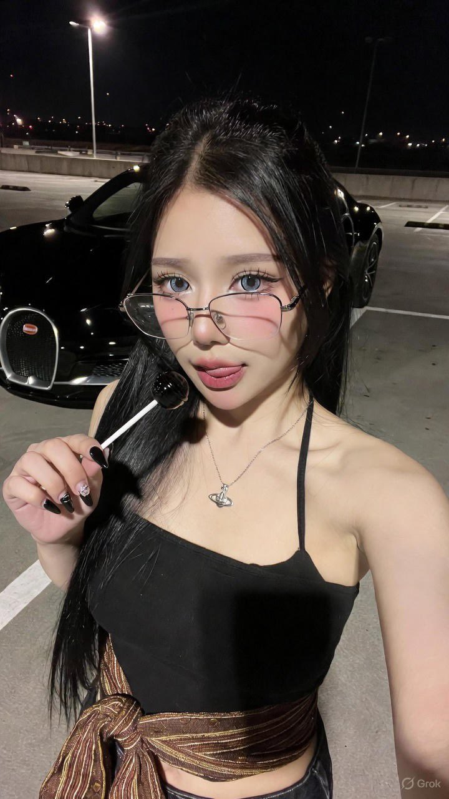

## { "prompt": "A full-body artistic portrait of the woman 

- ID: gpt4o-675-en-1
- Slug: prompt-675-en-1
- 语言: en
- 来源: [来源链接](https://x.com/ShreyaYadav___/status/1995540914954272826)
- 样例图路径: images/part3/675.jpeg

### 提示词

```text
{
  "prompt": "A full-body artistic portrait of the woman from the reference image, keeping the exact same face. She is elegantly seated on the floor wearing a modern black top, soft loose gray jeans, and chunky gray-and-white sneakers. Her long, waist-length wavy milky-brown hair flows naturally, with half of it beautifully braided. She is laughing while looking upwards, capturing a confident candid smile. The background is an artistic monochrome (black and white) composition featuring a soft, blurred close-up side profile of the same face, creating a stylish dual-layer aesthetic. High-quality soft lighting, realistic textures, cinematic realism, and an artistic portrait vibe.",
  
  "style": {
    "lighting": "soft, high-quality, realistic",
    "color_palette": "monochrome background, natural skin tones",
    "mood": "confident, candid, artistic",
    "quality": "ultra detailed, high-resolution"
  },
  
  "camera": {
    "shot": "full-body portrait",
    "angle": "slightly low angle, upward gaze feel",
    "focus": "sharp on subject, blurred artistic background"
  },
  
  "character": {
    "face": "same as reference image",
    "expression": "laughing, confident smile",
    "hair": "long wavy milky-brown, half braided",
    "outfit": {
      "top": "modern black top",
      "bottom": "soft loose gray jeans",
      "shoes": "chunky gray-and-white sneakers"
    }
  },
  
  "background": {
    "type": "artistic monochrome",
    "layers": "soft blurred close-up side profile of same face",
    "effect": "stylish dual-layer aesthetic"
  }
}
```

### 样例图

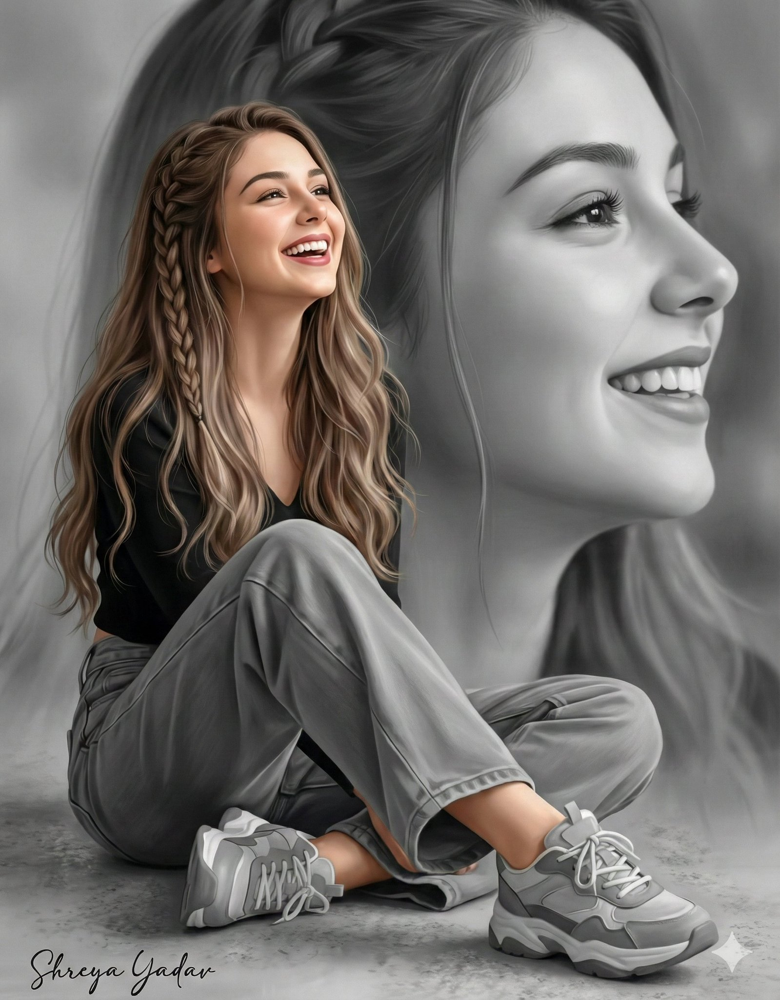

## 同一张脸的柔和模糊的侧面特写

- ID: gpt4o-675-zh-2
- Slug: prompt-675-zh-2
- 语言: zh
- 来源: [来源链接](https://x.com/ShreyaYadav___/status/1995540914954272826)
- 样例图路径: images/part3/675.jpeg

### 提示词

```text
{
“提示”：“根据参考图片，绘制一位女士的全身艺术肖像，保留其面部特征。她优雅地坐在地板上，身着现代感十足的黑色上衣、宽松的灰色牛仔裤和厚底灰白运动鞋。她及腰的乳棕色长发自然垂落，一半编成精美的辫子。她仰望天空，笑容灿烂，展现出自信而真挚的神态。背景采用艺术化的黑白构图，柔和模糊的侧脸特写营造出时尚的双层美感。画面运用了高质量的柔光、逼真的纹理、电影般的写实感以及艺术肖像的氛围。”

“风格”： {
“照明”：“柔和、高质量、逼真”，
"color_palette": "单色背景，自然肤色",
“情绪”：“自信、坦率、有艺术气息”
“质量”：“超精细，高分辨率”
},

“相机”： {
“拍摄”: “全身肖像”
“角度”：“略低的角度，向上凝视的感觉”，
“焦点”： “主体清晰，背景虚化，富有艺术感”
},

“特点”： {
“脸部”：“与参考图像相同”，
“表情”：“笑着，自信的笑容”，
“头发”：“长长的波浪状乳棕色头发，一半编成辫子”，
“全套服装”： {
“上衣”： “现代黑色上衣”，
下装：柔软宽松的灰色牛仔裤，
“鞋子”： “厚底灰白运动鞋”
}
},

“背景”： {
"type": "艺术单色",
“图层”: “同一张脸的柔和模糊的侧面特写”，
“效果”：“时尚的双层美感”
}
}
```

### 样例图


## 疯狂动物城朱迪和尼克

- ID: gpt4o-672-zh-1
- Slug: prompt-672-zh-1
- 语言: zh
- 来源: [来源链接](https://x.com/LiEvanna85716/status/1995414338493108500)
- 样例图路径: images/part3/672.jpeg

### 提示词

```text
# Nano Banana Pro Configuration - Zootopia Cyber Fan Concept
# Generated by AI Writing Assistant

project_name: "Zootopia_Cyber_Fashion_Wink"
model_base: "SDXL_Realistic_v4" # 假设的基础模型，可根据实际情况调整
output_resolution: [896, 1152]  # 3:4 Ratio, optimized for Twitter feed

character:
  id: "cyber_judy_fan_01"
  gender: "female"
  age: "20s"
  features:
    - "delicate facial features"
    - "playful expression"
    - "winking one eye"
    - "holding smartphone for selfie"

scene:
  location: "Zootopia official merchandise store"
  lighting: "interior shop lighting, soft neon accents, volumetric bloom"
  atmosphere: "lively, colorful, detailed background"

prompts:
  positive: |
    (Masterpiece, 8k resolution, photorealistic, ultra-detailed),
    POV selfie shot, beautiful young woman winking at camera,
    wearing a futuristic metallic silver corset dress (iridescent texture:1.2),
    wearing fluffy Judy Hopps rabbit ear hat (purple and grey),
    holding a high-tech smartphone, selfie gesture,
    background is a cluttered Zootopia souvenir shop,
    shelves filled with Nick Wilde and Judy Hopps plush toys (fuzzy texture:1.3),
    ZPD badges, carrots merchandise,
    depth of field, ray tracing reflections on the metallic dress,
    cinematic lighting, sharp focus on eyes and phone.

  negative: |
    (worst quality, low quality:1.4), monochrome, zombie,
    deformed anatomy, disfigured, extra fingers, bad hands, 
    missing fingers, floating limbs, disconnected limbs,
    blur, out of focus, cropped head, watermark, text, signature,
    distorted plushies, scary faces on toys.

views:
  - view_id: "main_selfie"
    camera_angle: "high angle selfie"
    focus: "face and upper body"
    description: "The main engagement shot showing the wink and the outfit details."

  - view_id: "outfit_detail"
    camera_angle: "medium shot"
    focus: "waist and background"
    description: "Showcasing the metallic texture of the corset and the Zootopia merch in the back."

# Advanced Settings for Nano Banana Pro
sampling:
  steps: 35
  cfg_scale: 7.5
  sampler: "DPM++ 2M Karras"
  seed: -1 # Random
```

### 样例图

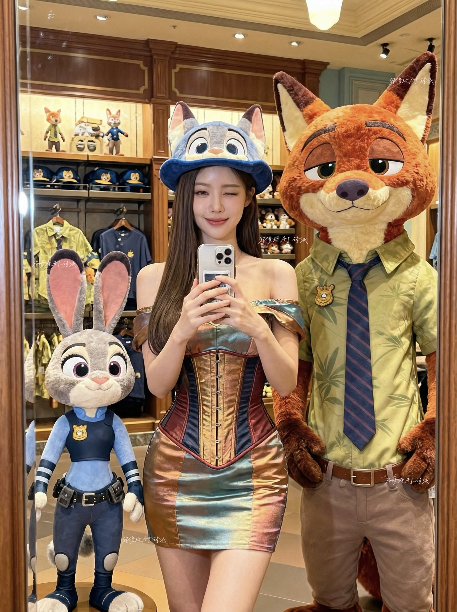

## 疯狂动物城朱迪和尼克

- ID: gpt4o-672-zh-2
- Slug: prompt-672-zh-2
- 语言: zh
- 来源: [来源链接](https://x.com/LiEvanna85716/status/1995414338493108500)
- 样例图路径: images/part3/672.jpeg

### 提示词

```text
# Nano Banana Pro 配置 - 疯狂动物城赛博粉丝概念
# 由 AI 写作助手生成

project_name: "疯狂动物城_赛博_时尚_眨眼"
model_base: "SDXL_Realistic_v4" # 假设的基础模型，可根据实际情况调整
output_resolution: [896, 1152]  # 3:4 比例，针对 Twitter 信息流优化

character:
  id: "赛博_朱迪_粉丝_01"
  gender: "女性"
  age: "20多岁"
  features:
    - "精致的五官"
    - "顽皮/俏皮的表情"
    - "眨一只眼"
    - "手持智能手机自拍"

scene:
  location: "疯狂动物城官方周边商店"
  lighting: "室内商店照明，柔和的霓虹点缀，体积光（光晕）"
  atmosphere: "生动活泼，色彩丰富，背景细节详实"

prompts:
  positive: |
    (杰作, 8k分辨率, 照片级真实, 超精细),
    第一人称视角（POV）自拍镜头, 美丽的年轻女性对着镜头眨眼,
    身穿未来感金属银色紧身胸衣连衣裙 (彩虹色纹理:1.2),
    戴着毛茸茸的朱迪警官（Judy Hopps）兔耳帽 (紫色和灰色),
    手持高科技智能手机, 自拍姿势,
    背景是琳琅满目的疯狂动物城纪念品商店,
    货架上摆满了尼克（Nick Wilde）和朱迪（Judy Hopps）的毛绒玩具 (毛绒纹理:1.3),
    ZPD（动物城警局）警徽, 胡萝卜周边商品,
    景深效果, 金属裙上的光线追踪反射,
    电影级布光, 焦点清晰对准眼睛和手机。

  negative: |
    (最差质量, 低质量:1.4), 单色, 僵尸,
    解剖结构变形, 毁容, 多余的手指, 坏手, 
    缺失手指, 悬浮肢体, 断肢,
    模糊, 失焦, 截断的头部, 水印, 文字, 签名,
    扭曲的毛绒玩具, 玩具有可怕的脸。

views:
  - view_id: "main_selfie"
    camera_angle: "高角度/俯拍自拍"
    focus: "脸部和上半身"
    description: "展示眨眼表情和服装细节的主要互动镜头。"

  - view_id: "outfit_detail"
    camera_angle: "中景镜头"
    focus: "腰部和背景"
    description: "展示紧身胸衣的金属质感以及后方的疯狂动物城周边商品。"

# Nano Banana Pro 高级设置
sampling:
  steps: 35
  cfg_scale: 7.5
  sampler: "DPM++ 2M Karras"
  seed: -1 # 随机
```

### 样例图


## { "scene_description": "A soft, kawaii aesthetic mirror 

- ID: gpt4o-669-en-1
- Slug: prompt-669-en-1
- 语言: en
- 来源: [来源链接](https://x.com/_MehdiSharifi_/status/1995230929158320332)
- 样例图路径: images/part3/669.jpeg

### 提示词

```text
{
  "scene_description": "A soft, kawaii aesthetic mirror selfie of a cute young woman in a Disney store, embracing a fluffy pink Aristocats theme.",
  "image_reference": {
    "path": "[UPLOADED_IMAGE]",
    "weight": "high",
    "influence": "face_and_body_structure"
  },
  "subject": {
    "type": "The woman from the uploaded image",
    "age": "match input image",
    "features": {
      "hair": "soft curls or twin tails with ribbons",
      "expression": "sweet smile, head tilted, eyes wide and innocent",
      "makeup": "heavy blush (igari style), pink glossy lips, soft lashes"
    },
    "attire": "a fluffy white off-shoulder sweater dress (angora texture) with pink satin ribbons tied on the sleeves, white knee-high knitted socks",
    "accessories": "white cat ears headband with pink bows (Marie style), holding a pink strawberry milkshake prop, pearl bracelet",
    "position": "standing with knees slightly bent together (cute pose), holding phone with both hands."
  },
  "action": {
    "primary": "taking a cute selfie",
    "secondary": "holding a drink",
    "effect": "radiating softness and charm"
  },
  "environment": {
    "setting": "Pastel plushie section of Disney store",
    "foreground_elements": [
      "pink phone case with charms",
      "fluffy texture of dress close to lens"
    ],
    "background_elements": [
      "stacks of pink and white plushies",
      "pastel floral decor",
      "soft retail lighting"
    ]
  },
  "lighting": {
    "style": "Soft diffused beauty light",
    "key_light": {
      "type": "Ring light effect",
      "color": "Soft pink/peach undertone",
      "illuminates": "rosy cheeks and fluffy textures."
    },
    "background_light": {
      "color": "Pastel pink glow"
    },
    "shadows": "very soft, almost non-existent shadows"
  },
  "style": {
    "medium": "Smartphone photography",
    "aesthetic": "Coquette, Kawaii, Soft Girl, Pastel Goth light",
    "quality": "Dreamy, soft focus edges",
    "details": "visible fluff on sweater"
  },
  "visual_description": {
    "core_subject": "An embodiment of cuteness and comfort.",
    "attire_physics": "The sweater looks incredibly soft and touchable; ribbons drape naturally.",
    "skin_rendering": "Soft-focus, airbrushed look (beauty filter simulation)."
  },
  "lighting_and_atmosphere": {
    "type": "Dreamy Interior",
    "specifics": "Bloom effect on highlights.",
    "color_grade": "Pastel palette, low contrast, rosy tint"
  },
  "attire_customization": {
    "current_clothing": "Fluffy white sweater dress, pink ribbons, knee socks",
    "customizable_clothing": "Can swap for a pink gingham sundress."
  },
  "camera_and_lens": {
    "focal_length_feel": "35mm",
    "aperture_effect": "f/2.0",
    "camera_angle": "Slightly high angle (selfie standard)",
    "lens_type": "Smartphone front camera simulation",
    "bokeh_style": "Creamy pastel bokeh"
  }
}
```

### 样例图

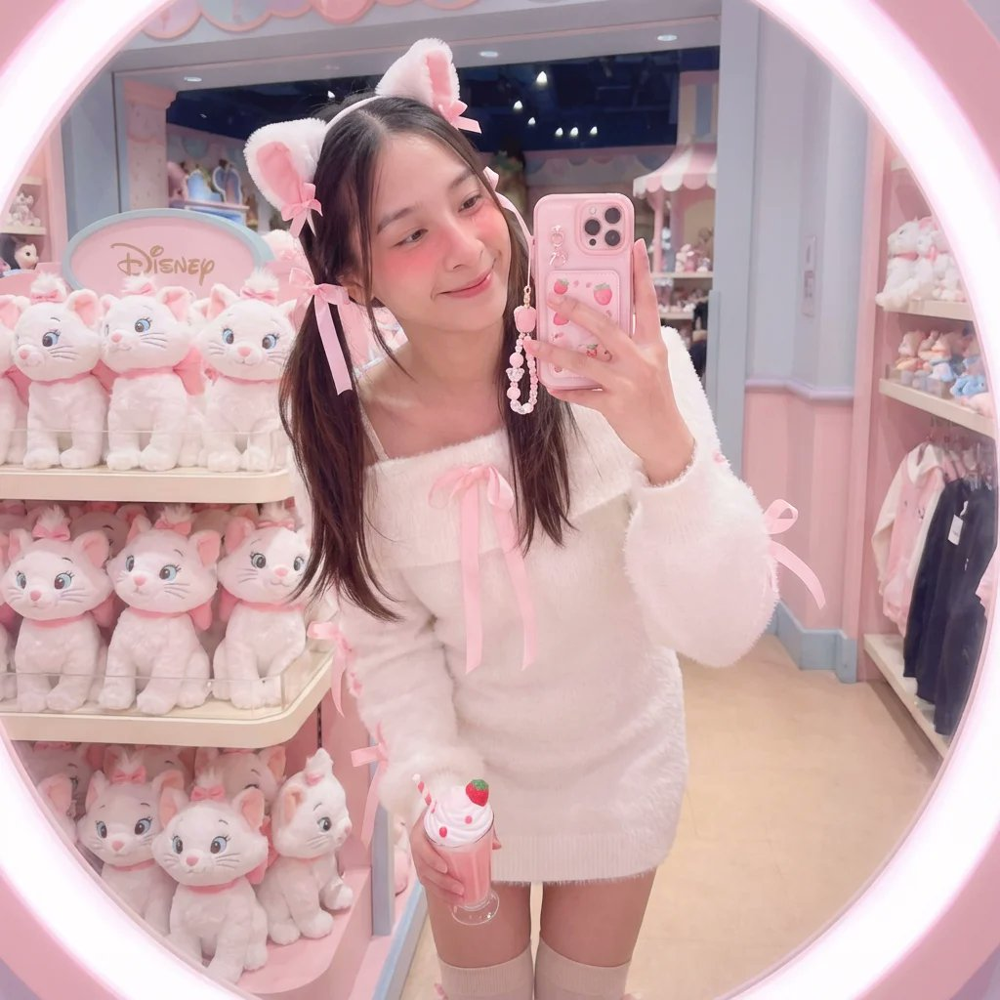

## 女子在迪士尼商店里对着镜子自拍

- ID: gpt4o-669-zh-2
- Slug: prompt-669-zh-2
- 语言: zh
- 来源: [来源链接](https://x.com/_MehdiSharifi_/status/1995230929158320332)
- 样例图路径: images/part3/669.jpeg

### 提示词

```text
{
"scene_description": "一位可爱年轻女子在迪士尼商店里对着镜子自拍，照片风格柔和可爱，以蓬松的粉色《猫儿历险记》主题为特色。"
"image_reference": {
"路径": "[上传的图像]",
"重量": "高",
“影响”： “面部和身体结构”
},
“主题”： {
"type": "上传图片中的女子",
“年龄”： “匹配输入图像”，
“特征”： {
“头发”：“柔软的卷发或用丝带扎成的双马尾辫”，
“表情”：“甜美的微笑，歪着头，睁大眼睛，显得天真无邪”，
妆容：浓重的腮红（伊加里风格），粉嫩亮泽的嘴唇，柔软的睫毛
},
“服装”：“一件蓬松的白色露肩毛衣连衣裙（安哥拉羊毛质地），袖子上系着粉色缎带，白色及膝针织袜”，
“配饰”：“白色猫耳朵发箍，配粉色蝴蝶结（玛丽风格），手持粉色草莓奶昔道具，珍珠手链”
“姿势”：“双膝微屈并拢站立（可爱姿势），双手拿着手机。”
},
“行动”： {
“主要”: “拍一张可爱的自拍”，
“次要的”: “拿着饮料”，
“效果”：“散发柔和与魅力”
},
“环境”： {
“场景”：“迪士尼商店的粉彩毛绒玩具区”，
"前景元素": [
“粉色带挂饰的手机壳”
“镜头前裙子的蓬松质感”
],
“背景元素”：[
“一堆堆粉色和白色的毛绒玩具”，
“粉彩花卉装饰”，
“柔和的零售照明”
]
},
“灯光”： {
“风格”：“柔和漫射的美光”，
"key_light": {
“类型”：“环形灯效果”，
“颜色”： “柔和的粉色/桃色底调”，
“照亮”：“红润的脸颊和蓬松的质地。”
},
"background_light": {
“颜色”： “柔和的粉红色光芒”
},
“阴影”： “非常柔和，几乎不存在的阴影”
},
“风格”： {
“媒介”：“智能手机摄影”，
“美学”：“娇媚、可爱、柔美少女、柔和哥特风”
“品质”：“梦幻般的柔焦边缘”，
“细节”：“毛衣上有明显的绒毛”
},
"visual_description": {
核心主题：可爱与舒适的化身。
“attire_physics”：“这件毛衣看起来非常柔软，触感极佳；丝带垂坠感也很自然。”
"skin_rendering": "柔焦、喷枪效果（美颜滤镜模拟）"
},
"lighting_and_atmosphere": {
"type": "梦幻内饰",
“具体细节”：“高光部分的绽放效果。”
"color_grade": "柔和色调，低对比度，玫瑰色"
},
"attire_customization": {
"current_clothing": "蓬松的白色毛衣连衣裙，粉色丝带，及膝袜"
"customizable_clothing": "可以换成粉色格子连衣裙。"
},
"camera_and_lens": {
"focal_length_feel": "35mm",
"aperture_effect": "f/2.0",
"camera_angle": "略高角度（自拍标准）",
"lens_type": "智能手机前置摄像头模拟",
"bokeh_style": "奶油粉彩散景"
}
}
```

### 样例图


## { "objective": "Generate an image based on a detailed ch

- ID: gpt4o-660-en-1
- Slug: prompt-660-en-1
- 语言: en
- 来源: [来源链接](https://x.com/rovvmut_/status/1995146612885410093)
- 样例图路径: images/part3/660.jpeg

### 提示词

```text
{
  "objective": "Generate an image based on a detailed character portrait description.",
  "image_generation_prompt": {
    "subject": {
      "gender": "female",
      "portrait_type": "close-up",
      "angle": "side angle",
      "aesthetic": "edgy, modern, mysterious, confident, slightly provocative"
    },
    "appearance": {
      "hair": {
        "color": "light gray",
        "length": "short",
        "texture": "wavy",
        "style": "modern, slightly messy, partially covering forehead"
      },
      "face": {
        "skin_tone": "fair",
        "features": "sharp",
        "eyebrows": "straight, neat, dark",
        "lips": "naturally pink with a slight sheen"
      },
      "expression": "calm but intense"
    },
    "clothing_and_accessories": {
      "headwear": "black bandana with white swirl patterns",
      "outfit": {
        "jacket": "black zip-up jacket, left open",
        "inner_shirt": "black T-shirt with green and red graphic art on the chest"
      },
      "jewelry": {
        "neck": "thin silver chain",
        "ear": "small silver earring"
      }
    },
    "lighting_and_background": {
      "lighting": "front light highlighting facial features and outfit",
      "background": "bright blue sky"
    },
    "style": {
      "vibe": "striking and stylish",
      "focus": "expression and trendy fashion details",
      "mood": "modern and edgy"
    },
    "aspect_ratio": "3:4"
  },
  "response_format": "Use this JSON object as the structure for an image generation model prompt."
}
```

### 样例图

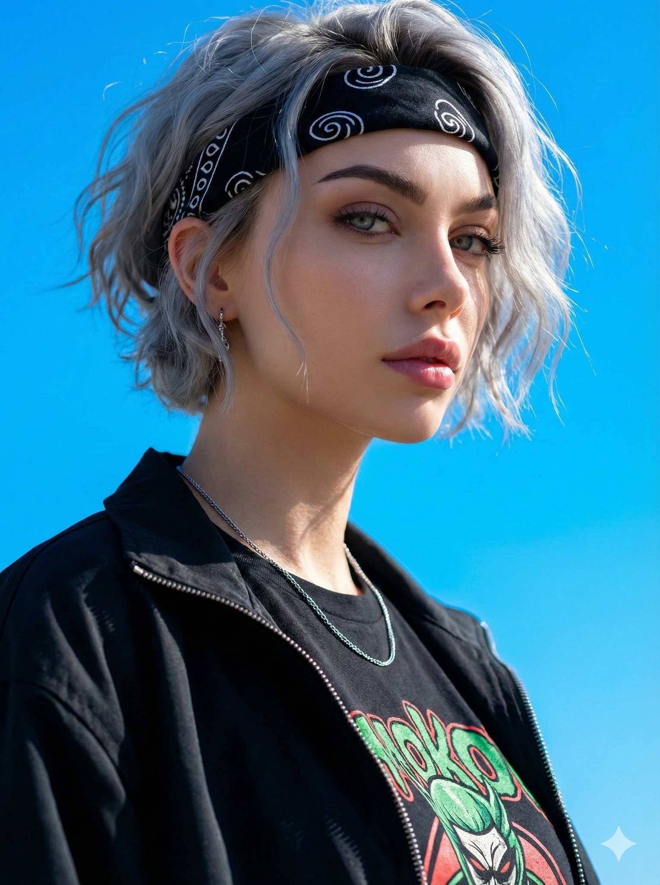

## 现代前卫的女生特写

- ID: gpt4o-660-zh-2
- Slug: prompt-660-zh-2
- 语言: zh
- 来源: [来源链接](https://x.com/rovvmut_/status/1995146612885410093)
- 样例图路径: images/part3/660.jpeg

### 提示词

```text
{
“目标”：“根据详细的人物肖像描述生成图像。”
"image_generation_prompt": {
“主题”： {
"性别": "女性",
"portrait_type": "特写",
"角度": "侧角",
“美学”：前卫、现代、神秘、自信、略带挑衅性
},
“外貌”： {
“头发”： {
颜色：浅灰色，
"长度": "短",
“纹理”：“波浪状”，
“风格”：“现代，略显凌乱，部分遮住额头”
},
“脸”： {
"skin_tone": "fair",
“特点”：“锐利”，
“眉毛”：“笔直、整齐、浓密”，
“嘴唇”：“自然粉嫩，略带光泽”
},
“表情”：“平静而专注”
},
"服装和配饰": {
“头饰”：“带有白色漩涡图案的黑色头巾”，
“全套服装”： {
“外套”：“黑色拉链外套，敞开着”，
"inner_shirt": "胸前印有绿色和红色图案的黑色T恤"
},
“珠宝”： {
“脖子”： “细银链”，
“耳朵”: “小银耳环”
}
},
"lighting_and_background": {
“照明”：“正面灯光突出面部特征和服装”，
“背景”：“湛蓝的天空”
},
“风格”： {
“氛围”：“引人注目且时尚”，
“重点”：“表达和潮流时尚细节”，
“氛围”：“现代前卫”
},
"aspect_ratio": "3:4"
},
"response_format": "使用此 JSON 对象作为图像生成模型提示的结构。"
}
```

### 样例图


## { "prompt": "Ultra-close-up portrait of a stunning young

- ID: gpt4o-659-en-1
- Slug: prompt-659-en-1
- 语言: en
- 来源: [来源链接](https://x.com/Just_sharon7/status/1995108671026803004)
- 样例图路径: images/part3/659.jpeg

### 提示词

```text
{
  "prompt": "Ultra-close-up portrait of a stunning young East Asian woman with flawless porcelain skin, large sparkling dark brown eyes with long lashes, subtle pink blush, glossy red-tinted lips, long straight silky dark brown hair with subtle highlights, making a playful finger-frame gesture around one eye with both hands, extremely detailed long almond-shaped nails with glossy purple-marble and silver chrome galaxy nail art with tiny rhinestones, wearing black-and-white horizontal striped oversized knit sweater with ribbed cuffs, layered delicate silver necklaces with crystal pendants and small pink gems, soft studio lighting with bright white seamless background, high-fashion beauty editorial style, razor-sharp details, perfect skin texture with natural glow, shallow depth of field, shot on 85mm lens f/1.4, ultra-realistic photorealism, 8k, masterpiece, best quality",
  "negative_prompt": "blurry, low resolution, deformed hands, extra fingers, missing fingers, bad anatomy, ugly nails, cheap makeup, overexposed, underexposed, text, watermark, logo, cartoon, 3d render, plastic skin, doll face, cross-eyed, distorted proportions, old, child",
  "steps": 60,
  "cfg_scale": 7.5,
  "sampler": "DPM++ 2M Karras",
  "width": 832,
  "height": 1216,
  "seed": -1
}
```

### 样例图


## 年轻女性的超近特写肖像

- ID: gpt4o-659-zh-2
- Slug: prompt-659-zh-2
- 语言: zh
- 来源: [来源链接](https://x.com/Just_sharon7/status/1995108671026803004)
- 样例图路径: images/part3/659.jpeg

### 提示词

```text
{
“提示”：一位令人惊艳的年轻东亚女性的超近特写肖像，她拥有完美无瑕的瓷白肌肤、闪亮的大眼睛（深棕色）、纤长的睫毛、淡淡的粉色腮红、光泽红润的嘴唇、柔顺的深棕色长直发（带有微妙的挑染），双手俏皮地用手指勾勒着一只眼睛，修长的杏仁形指甲上点缀着闪亮的紫色大理石纹和银色铬星空图案，并镶嵌着细小的水钻，细节极其精致。她身穿黑白横条纹宽松针织衫，袖口饰有罗纹，佩戴着层叠的精致银项链，项链上缀有水晶吊坠和粉色小宝石。柔和的影棚灯光，搭配明亮的白色背景，呈现出高级时尚美妆大片的风格，细节清晰锐利，肌肤纹理完美，散发着自然光泽，浅景深效果，使用85mm f/1.4镜头拍摄，超逼真的照片级写实效果，8K分辨率，杰作，最佳品质。
"negative_prompt": "模糊、低分辨率、手部畸形、多余手指、缺指、解剖结构错误、指甲难看、妆容廉价、曝光过度、曝光不足、文字、水印、标志、卡通、3D渲染、塑料皮肤、娃娃脸、斗鸡眼、比例失调、老旧、儿童",
“步骤”：60，
"cfg_scale": 7.5，
"采样器": "DPM++ 2M Karras",
宽度：832，
“高度”：1216，
“种子”：-1
}
```

### 样例图


## 3x3大头贴风格拼贴画

- ID: gpt4o-658-zh
- Slug: prompt-658-zh
- 语言: zh
- 来源: [来源链接](https://x.com/KusoPhoto/status/1995336530286797271)
- 样例图路径: images/part3/658.jpeg

### 提示词

```text
主题和形式：两位年轻女性朋友创作的高分辨率现代日本大头贴风格拼贴画。
布局：由 3x3 网格组成的单个图像（共 9 帧）。
主题：圣诞节 风格：生动、全彩、明亮、动感地再现现代日本大头贴灯光效果。
背景：简单的纯色或主题色背景（带有小爱心等精致装饰）。
摄影特点：每幅画面都有一条细细的白色或装饰性边框。景深浅（虚化）。

主题和姿势：
两位年轻的女性朋友，穿着符合主题的搭配服装。
生动、活泼、明快的表达。
这九张图清晰地描绘了以下列表中九种不同的流行大头贴姿势。

9 种不同的姿势（3x3 网格）：
第一行：
“抓头发爱心”姿势：一人俏皮地抓着头发，另一人用双手比出一个小爱心。两人都面带笑容。
“双手心形”姿势：两位伴侣用双手在中心形成一个大大的心形。脸上洋溢着灿烂快乐的笑容。
“捏手臂”姿势：两人双臂交叉，其中一人或两人都轻轻捏着对方的脸颊或手臂。表情生动活泼，充满喜悦。特写镜头展现对方的脸部。

第二排：4.“双臂交叉大爱心”姿势：两人双臂交叉，用空着的那只手比出一个大大的爱心。笑容灿烂而充满活力。5.“承诺之心”姿势：一人做出“手指发誓”的手势，另一人用手比出一个小爱心。笑容俏皮而温暖。6.“手牵手爱心”姿势：两人手牵手，各自用空着的那只手比出半个爱心，组成一个完整的爱心。笑容温柔甜美。

第三排：7.“双臂交叉撅嘴”姿势：两人双臂交叉，略带夸张的撅嘴或“得意”（或严肃）的表情，似乎在强忍着笑意。8.“双手合十，脸颊贴心”姿势：两人手牵着手，双手分别放在脸颊上，在脸颊周围画出一个心形。笑容可爱迷人。9.“双臂交叉，手心相印”姿势：两人双臂交叉，每人用一只手分别画出一个小的心形。笑容自信而时尚。特写镜头展现了他们的脸部。

其他装饰：
多个发光的霓虹心形图案叠加。
每一帧画面上，都以霓虹灯风格，沿着脸部的外轮廓写着与主题相关的字母。
在每个面板上添加多个符合主题的不同霓虹线条艺术涂鸦（例如星星、箭头、饱和线条、花朵、动物耳朵等）。
主要限制：所有9张照片必须保持主体、服装、背景风格和光线的严格一致性。浅景深，这是大头贴的典型特征。
请勿：添加任何文字、徽标、标签、水印、符号、数字或其他任何类型的文本元素（上述指定的文本元素和霓虹线条艺术涂鸦除外）。
```

### 样例图

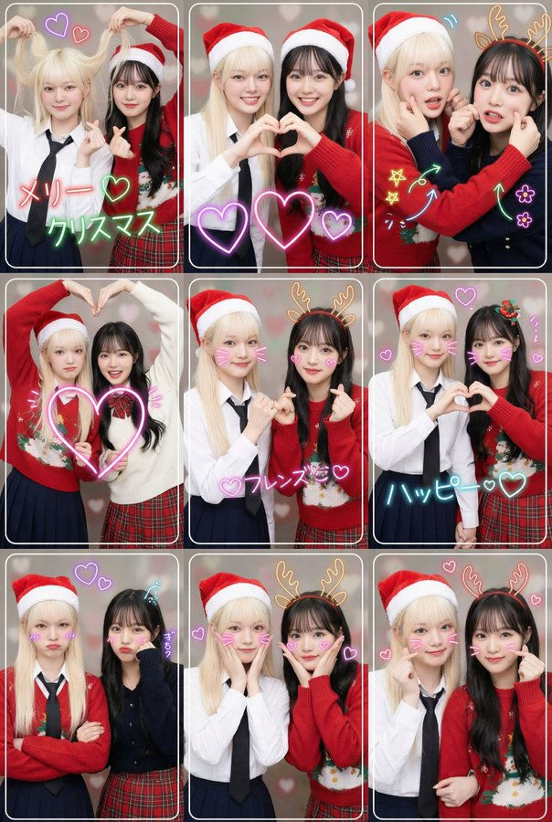

## { "title": "Hyper-Realistic Portrait: Suited Woman in Mu

- ID: gpt4o-657-en-1
- Slug: prompt-657-en-1
- 语言: en
- 来源: [来源链接](https://x.com/xmiiru_/status/1995344587750072496)
- 样例图路径: images/part3/657.jpeg

### 提示词

```text
{
  "title": "Hyper-Realistic Portrait: Suited Woman in Mugshot Pose",
  "description": "A high-resolution hyper-realistic 8K HD portrait photograph captured with a professional DSLR camera using a 50mm lens for natural depth of field and razor-sharp focus. Full-body composition mimicking an old-fashioned mugshot/police booking photo.",
  "subject": {
    "type": "woman",
    "features": {
      "likeness_reference": "attached image",
      "height": "tall",
      "build": "elegant",
      "facial_features": {
        "jawline": "sharp",
        "eyes": "intense",
        "expression": "confident, slightly smug smirk"
      },
      "pose": "leaning against wall, one knee bent"
    },
    "hair": {
      "style": "neat, straight, wavy or elegant updo",
      "appearance": "natural and well-groomed"
    },
    "clothing": {
      "jacket": "vintage-style tailored dark pinstripe suit jacket",
      "inner_garment": "none",
      "tie": "slightly loosened, dark shade matching jacket",
      "accessories": [
        {
          "type": "mugshot board",
          "text": {
            "name": "MIRA",
            "date": "17/5/62"
          }
        },
        {
          "type": "shoe",
          "description": "single shiny dark-colored high-heeled shoe in right hand",
          "material": "patent leather"
        }
      ]
    }
  },
  "background": {
    "style": "naturally blurred bokeh",
    "texture": "slightly gritty studio wall",
    "details": {
      "height_chart": "vertical lines with numerical markings 2'0\" to 6'6\"",
      "color_tone": "desaturated, slightly sepia-toned archival photograph aesthetic"
    }
  },
  "lighting": {
    "type": "clean, soft, balanced",
    "shadow": "accurate shadows and highlights",
    "direction": "strong overhead or frontal lighting emphasizing dramatic shadows and height chart lines"
  },
  "framing": {
    "resolution": "1080x1350px (4:5)",
    "focus": "sharp subject focus",
    "composition": "full figure and mugshot details",
    "color_accuracy": "professional, natural tones"
  },
  "style": "Hyper-realistic photography, 8K clarity, DSLR quality, accurate color grading, natural lens blur, vintage photo aesthetic, true-to-life detail",
  "watermark": "© xmiiru",
  "negative_prompt": [
    "No anime",
    "No cartoon",
    "No digital painting",
    "No illustration",
    "No 3D render",
    "No CGI",
    "No stylized features",
    "No plastic/doll-like skin",
    "No fantasy glow",
    "No cinematic effects",
    "No airbrushed smoothing",
    "No overexposure",
    "No unnatural blur",
    "No video-game/Unreal Engine style",
    "No sketch",
    "No artificial lighting effects",
    "No unrealistic proportions/textures",
    "No multiple shoes",
    "No modern background elements"
  ]
}
```

### 样例图


## 身着西装的女子摆出嫌犯照姿势

- ID: gpt4o-657-zh-2
- Slug: prompt-657-zh-2
- 语言: zh
- 来源: [来源链接](https://x.com/xmiiru_/status/1995344587750072496)
- 样例图路径: images/part3/657.jpeg

### 提示词

```text
{
标题：超写实肖像：身着西装的女子摆出嫌犯照姿势
“描述”：“这是一张高分辨率、超逼真的 8K 高清人像照片，使用专业数码单反相机和 50mm 镜头拍摄，以获得自然的景深和极其清晰的焦点。全身构图模仿了老式的嫌犯照/警局登记照。”
“主题”： {
类型： 女，
“特征”： {
"likeness_reference": "附加图像",
“身高”：“高”，
“建造”：“优雅”，
"facial_features": {
下颌线：尖锐，
“眼睛”：“专注”，
“表情”：“自信、略带自负的微笑”
},
姿势：倚靠在墙上，单膝弯曲
},
“头发”： {
“发型”：“整齐、笔直、波浪或优雅的盘发”，
“外表”：“自然且仪容整洁”
},
“衣服”： {
“外套”： “复古风格的深色细条纹修身西装外套”，
"内衣": "无",
领带：略微松开，深色，与外套相配。
“配件”： [
{
类型： '嫌犯照片板'，
“文本”： {
"name": "MIRA",
日期： 17/5/62
}
},
{
类型：鞋子，
描述：右手拿着一只闪亮的深色高跟鞋。
材质：漆皮
}
]
}
},
“背景”： {
“风格”：“自然模糊散景”，
“纹理”：“略带颗粒感的摄影棚墙面”，
“细节”： {
"身高图": "带有数字标记的垂直线，从 2'0\" 到 6'6\"",
"color_tone": "褪色、略带棕褐色调的档案照片美学"
}
},
“灯光”： {
“类型”：“干净、柔和、平衡”，
“阴影”：“精确的阴影和高光”，
“方向”：“强烈的顶光或正面照明，强调戏剧性的阴影和高度图线条”
},
"框架": {
“分辨率”：“1080x1350像素（4:5）”
“焦点”: “清晰的主体焦点”，
“构图”：“全身像和嫌犯照细节”，
"color_accuracy": "专业、自然的色调"
},
“风格”：“超逼真的摄影，8K 清晰度，单反画质，精准的色彩分级，自然的镜头虚化，复古照片美学，逼真的细节”，
“水印”： “ © xmiiru”，
"negative_prompt": [
“没有动漫”，
“没有卡通片”，
“没有数码绘画”，
“无插图”
“没有3D渲染图”，
“无电脑特效”
“没有风格化的特征”，
“没有塑料/娃娃般的皮肤”，
“没有梦幻般的光芒”，
“没有电影特效”，
“没有使用喷枪进行平滑处理”，
“没有过度曝光”，
“没有不自然的模糊效果”，
“没有电子游戏/虚幻引擎风格”，
“没有草图”，
“无人工照明效果”，
“没有不切实际的比例/纹理”，
“禁止穿多双鞋”
“无现代背景元素”
]
}
```

### 样例图


## { "image_generation_request": { "constraints": { "preser

- ID: gpt4o-656-en-1
- Slug: prompt-656-en-1
- 语言: en
- 来源: [来源链接](https://x.com/YaseenK7212/status/1994815950856552898)
- 样例图路径: images/part3/656.jpeg

### 提示词

```text
{
  "image_generation_request": {
    "constraints": {
      "preservation_instruction": "Please keep my face 100% the same, do not change any facial details.",
      "strictness": "Critical"
    },
    "technical_specifications": {
      "camera_device": "Canon IXY/IXUS digital camera",
      "aesthetic_style": [
        "Y2K Digital Aesthetic",
        "Cyber Ulzzang",
        "Retro Japan–Korea look",
        "Early 2000s digital photograph"
      ],
      "lighting": {
        "source": "Strong front flash",
        "target": "Directly on face",
        "characteristics": "Bright white",
        "effect_on_skin": [
          "Radiant",
          "Shiny",
          "Bright"
        ]
      },
      "visual_grading": {
        "contrast": "High",
        "color_tone": "Slight cool blue",
        "atmosphere": [
          "Mysterious",
          "Sharp"
        ]
      }
    },
    "composition": {
      "type": "Portrait",
      "meta_scene_element": "A reflection in the mirror shows another woman's hand taking the photo of the model"
    },
    "subject_details": {
      "demographics": "Teenage girl",
      "physical_appearance": {
        "hair": {
          "color": "Dark brown",
          "texture": [
            "Long",
            "Soft",
            "Wavy"
          ],
          "accessory": "Sanrio Kuromi hair clip"
        },
        "eyes": {
          "description": "Bright",
          "contacts": "Blue-grey contact lenses"
        },
        "skin": {
          "base_tone": "Fair",
          "undertone": "Slightly pink toned",
          "complexion": [
            "Rosy glow",
            "Smooth"
          ]
        },
        "body_features": "Clear, shapely waistline"
      },
      "attire_and_accessories": {
        "top": "Dark grey spaghetti strap crop top",
        "belt": {
          "style": "Waist belt",
          "material": "Silver chain",
          "details": "Dangling moon charms"
        }
      },
      "makeup": {
        "general_style": "Light pink makeup",
        "lashes": "Long eyelashes",
        "additional_descriptors": "thin and"
      }
    }
  }
}
```

### 样例图

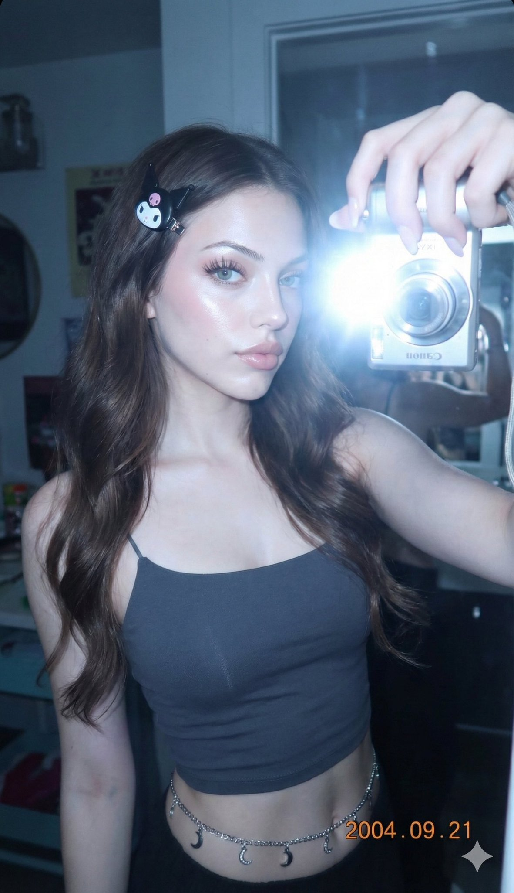

## 女人的自拍照

- ID: gpt4o-656-zh-2
- Slug: prompt-656-zh-2
- 语言: zh
- 来源: [来源链接](https://x.com/YaseenK7212/status/1994815950856552898)
- 样例图路径: images/part3/656.jpeg

### 提示词

```text
{
"image_generation_request": {
"约束条件": {
"保存说明": "请100%保持我的脸部原貌，不要改变任何面部细节。"
“严格性”： “关键”
},
"technical_specifications": {
"camera_device": "佳能 IXY/IXUS 数码相机",
"aesthetic_style": [
“Y2K 数字美学”
“Cyber​​ Ulzzang”
“复古日韩风”
“2000 年代初期的数码照片”
],
“灯光”： {
“来源”：“强前闪光”，
“目标”：“直接作用于面部”，
“特性”：“亮白色”，
"effect_on_skin": [
“光芒四射”，
“闪亮的”，
“明亮的”
]
},
"visual_grading": {
“对比度”：“高”，
"color_tone": "略带冷蓝色",
“气氛”： [
“神秘”，
“锋利的”
]
}
},
“作品”： {
“类型”：“肖像”，
"meta_scene_element": "镜子中的倒影显示另一只女人的手正在给模特拍照"
},
"subject_details": {
“人口统计信息”：“少女”，
"physical_appearance": {
“头发”： {
“颜色”：“深棕色”，
“质地”： [
“长的”，
“柔软的”，
“波浪状”
],
“配饰”： “三丽鸥库洛米发夹”
},
"眼睛": {
描述：明亮，
“隐形眼镜”： “蓝灰色隐形眼镜”
},
“皮肤”： {
"base_tone": "Fair",
“底色”： “略带粉色调”
“肤色”：[
“玫瑰色的光芒”，
“光滑的”
]
},
"body_features": "清晰、优美的腰线"
},
"服装和配饰": {
上衣：深灰色细肩带露脐上衣，
“腰带”： {
“款式”：“腰带”，
“材质”：“银链”，
详情：垂坠的月亮吊坠
}
},
“化妆品”： {
"general_style": "浅粉色妆容",
“睫毛”： “长长的睫毛”，
"additional_descriptors": "thin and"
}
}
}
}
```

### 样例图


## { "objective": "Generate a cinematic, photo-realistic im

- ID: gpt4o-652-en-1
- Slug: prompt-652-en-1
- 语言: en
- 来源: [来源链接](https://x.com/rovvmut_/status/1995087450788573215)
- 样例图路径: images/part3/652.jpeg

### 提示词

```text
{
  "objective": "Generate a cinematic, photo-realistic image of the person in the uploaded image",
  "scene_description": {
    "setting": {
      "location": "Rain-soaked flyover bench at dusk",
      "environment_details": [
        "wet pavement with puddle reflections",
        "mist in the air",
        "vibrant neon cityscape in the background",
        "bokeh trails from passing cars"
      ]
    },
    "subject": {
      "type": "person in the uploaded image",
      "pose": "sitting on the bench, low-angle perspective",
      "appearance": {
        "outfit": {
          "jacket": "colorblock denim jacket",
          "inner_wear": "yellow hoodie",
          "pants": "khaki cargo pants",
          "footwear": "high-top sneakers"
        }
      }
    }
  },
  "camera_and_style": {
    "camera_angle": "cinematic low-angle shot",
    "focus": {
      "subject_focus": "sharp 8K clarity on subject",
      "foreground": "intentionally blurred"
    },
    "color_grading": "moody mix of warm streetlights and cool neon tones",
    "lighting": [
      "ambient neon glow",
      "warm streetlights",
      "reflections in puddles"
    ],
    "aesthetics": [
      "cinematic depth",
      "high contrast",
      "atmospheric realism"
    ]
  },
  "output_preferences": {
    "resolution": "8K highly detailed",
    "style": "cinematic realism"
  }
}
```

### 样例图

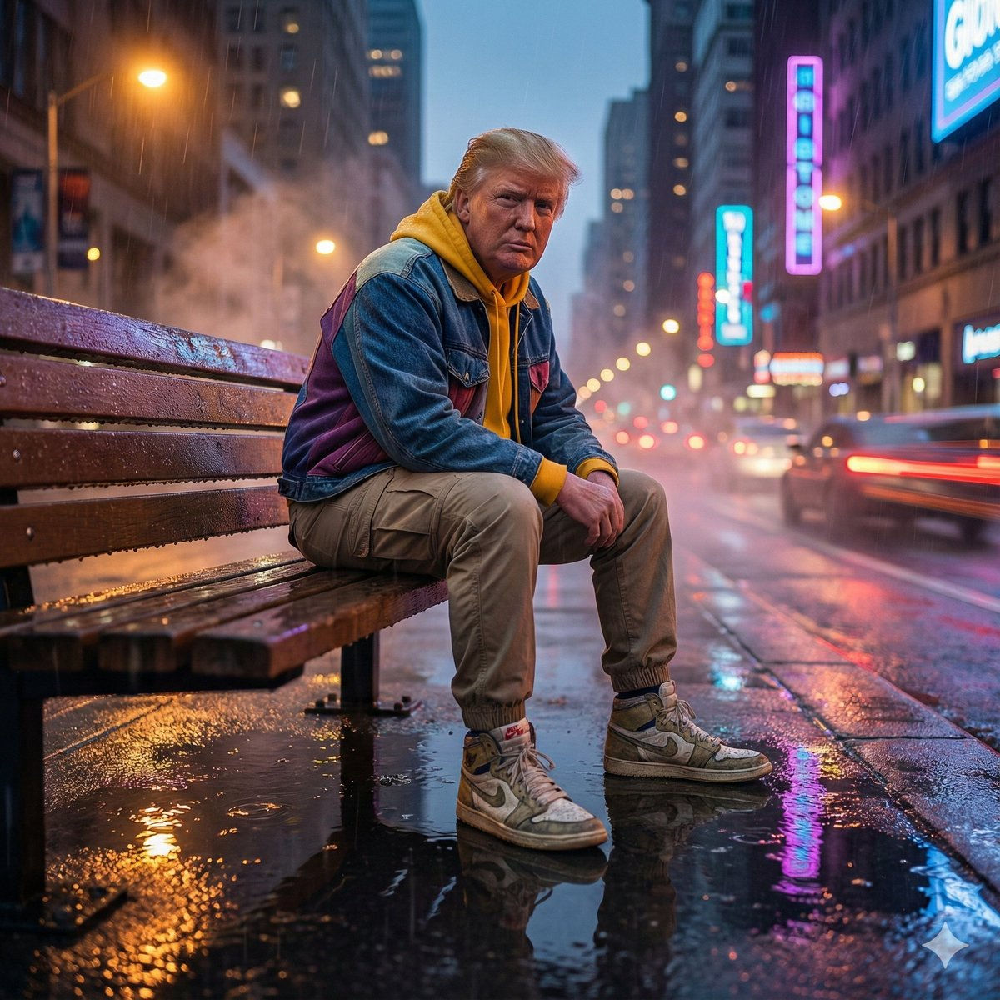

## 人物的电影级逼真图像

- ID: gpt4o-652-zh-2
- Slug: prompt-652-zh-2
- 语言: zh
- 来源: [来源链接](https://x.com/rovvmut_/status/1995087450788573215)
- 样例图路径: images/part3/652.jpeg

### 提示词

```text
{
“目标”：“生成上传图像中人物的电影级、照片级逼真图像”，
"scene_description": {
“环境”： {
“地点”：“黄昏时分被雨水浸透的高架桥长椅”
"environment_details": [
“湿漉漉的路面上倒映着水坑里的水珠”，
“空气中弥漫着薄雾”，
“背景是充满活力的霓虹灯城市景观”，
“过往车辆的散景拖影”
]
},
“主题”： {
“类型”：“上传图片中的人物”，
“姿势”：“坐在长椅上，低角度视角”，
“外貌”： {
“全套服装”： {
"jacket": "拼色牛仔夹克",
"内衣": "黄色连帽衫",
裤子：卡其色工装裤，
“鞋类”: “高帮运动鞋”
}
}
}
},
"camera_and_style": {
"camera_angle": "电影般的低角度拍摄",
“重点”： {
"subject_focus": "主体清晰锐利，8K分辨率",
“前景”：“故意模糊”
},
"color_grading": "温暖的路灯和冷色调的霓虹灯交织的氛围"
“灯光”： [
“环境霓虹灯光”，
“温暖的路灯”，
“水洼中的倒影”
],
“美学”：[
“电影般的景深”，
“高对比度”，
“氛围真实感”
]
},
"output_preferences": {
“分辨率”：“8K 超高清”，
风格：电影写实主义
}
}
```

### 样例图


## { "project_name": "3D_Caricature_Collage_Olive_Green", "

- ID: gpt4o-645-en-1
- Slug: prompt-645-en-1
- 语言: en
- 来源: [来源链接](https://x.com/ShreyaYadav___/status/1995052291981005278)
- 样例图路径: images/part3/645.jpeg

### 提示词

```text
{
  "project_name": "3D_Caricature_Collage_Olive_Green",
  "prompt_structure": {
    "subject": {
      "type": "Woman",
      "style": "3D Caricature",
      "appearance": "Highly polished, clean, meticulous detail",
      "clothing": "Deep olive green hoodie (rich, muted earth tone)"
    },
    "composition": {
      "type": "Collage",
      "layout": "Six-panel grid (3 columns x 2 rows)",
      "framing": "Close-up portraits"
    },
    "variations": {
      "panel_1": "Happy",
      "panel_2": "Surprised",
      "panel_3": "Serious",
      "panel_4": "Cute",
      "panel_5": "Sassy",
      "panel_6": "Confident",
      "facial_features": "Artistic exaggerations, widened eyes, arched eyebrows, broad smiles"
    },
    "environment": {
      "background": "Bold, vibrant colors distinct for each panel",
      "lighting": "Soft ambient lighting, sculpting subtle textures, crisp definition"
    },
    "text_elements": {
      "content": "Shreya Yadav",
      "type": "Signature",
      "style": "Elegant, legible"
    }
  },
  "technical_params": {
    "aspect_ratio": "3:4",
    "quality": "High definition, 8k, cinematic lighting",
    "render_engine": "Octane render / Unreal Engine style"
  },
  "full_prompt_text": "A six-panel collage (3 columns, 2 rows) featuring a highly polished 3D caricature of a woman wearing a deep olive green hoodie. The character maintains a consistent identity across all panels but displays six distinct emotions: happy, surprised, serious, cute, sassy, and confident. Facial features are artistically exaggerated with widened eyes and expressive mouths. Soft ambient lighting highlights skin texture and fabric folds. Backgrounds are bold and vibrant, contrasting with the muted olive hoodie. High-end digital art style, crisp definition. Signature text 'Shreya Yadav' included."
}
```

### 样例图

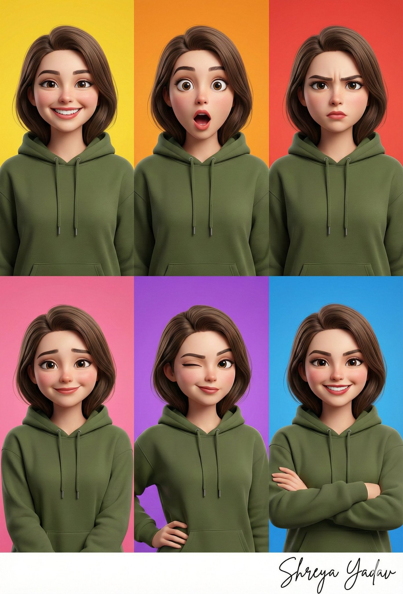

## 一张脸六种情绪

- ID: gpt4o-645-zh-2
- Slug: prompt-645-zh-2
- 语言: zh
- 来源: [来源链接](https://x.com/ShreyaYadav___/status/1995052291981005278)
- 样例图路径: images/part3/645.jpeg

### 提示词

```text
{
"project_name": "3D_Caricature_Collage_Olive_Green",
"prompt_structure": {
“主题”： {
"type": "Woman",
“风格”：“3D 漫画”，
“外观”：“高度抛光，干净，细节一丝不苟”，
服装：深橄榄绿连帽衫（浓郁、柔和的大地色调）
},
“作品”： {
“类型”：“拼贴画”，
"布局": "六格网格（3列 x 2行）",
“构图”：“特写肖像”
},
"变体": {
"panel_1": "快乐",
"panel_2": "惊讶",
"panel_3": "严肃",
"panel_4": "可爱",
"panel_5": "俏皮的",
"panel_6": "自信",
"facial_features": "艺术夸张，睁大的眼睛，弯弯的眉毛，灿烂的笑容"
},
“环境”： {
“背景”：“每个面板都采用大胆、鲜艳的颜色”，
“灯光”：“柔和的环境光，勾勒出微妙的纹理，清晰的轮廓”
},
"text_elements": {
内容：Shreya Yadav，
"type": "签名",
风格：优雅、清晰
}
},
"technical_params": {
"aspect_ratio": "3:4",
“质量”：“高清、8K、电影级光照”，
"render_engine": "Octane渲染/虚幻引擎风格"
},
"full_prompt_text": "一幅六格拼贴画（三列两行），以高度精细的3D漫画形式展现了一位身穿深橄榄绿连帽衫的女性形象。人物在所有画面中保持一致，但展现了六种截然不同的情绪：快乐、惊讶、严肃、可爱、俏皮和自信。面部特征经过艺术化的夸张处理，眼睛睁得大大的，嘴巴也极具表现力。柔和的环境光突显了皮肤纹理和衣物褶皱。背景色彩鲜艳夺目，与低调的橄榄绿连帽衫形成鲜明对比。作品采用高端数字艺术风格，画面清晰锐利。包含签名文字“Shreya Yadav”。"
}
```

### 样例图


## 路飞教室艺术

- ID: gpt4o-641-zh
- Slug: prompt-641-zh
- 语言: zh
- 来源: [来源链接](https://x.com/yanhua1010/status/1995044071803371880)
- 样例图路径: images/part3/641.jpeg

### 提示词

```text
{
  "意图": "对特定黑板艺术作品进行写实纪录摄影，画面呈现单个动漫角色，捕捉粉笔媒介的短暂性及教室场景氛围。",
  "画面框架": {
    "画幅比例": "4:3",
    "构图方式": "中景构图，聚焦黑板壁画。构图包含前景的教师讲台以提供比例尺度，背景空间由单个角色的艺术作品主导。",
    "风格模式": "纪实写实主义、质感聚焦、环境自然主义"
  },
  "主体对象": {
    "主要主体": "标准绿色教室黑板上绘制的大型精细粉笔画，描绘《海贼王》角色蒙奇·D·路飞。",
    "视觉细节": "画面中路飞呈现动态姿势,居于黑板中央。他戴着标志性草帽,黑色凌乱短发,露齿灿烂笑容。表情充满活力和喜悦,圆形眼睛生动传神。他的一只手臂向前伸展,呈现橡胶手臂技能(橡胶果实能力)。身穿红色无袖背心(敞开状态)露出胸前标志性X形伤疤,蓝色短裤和凉鞋,使用鲜艳彩色粉笔绘制。",
    "媒介质感": "画面保留粉笔的粉尘感和哑光质地。可见排线和交叉阴影笔触为服装和头发创造阴影效果。绿色黑板上的晕染区域显示手工混合颜色的痕迹。",
    "周边元素": "角色右侧,竖向日文'麦わらのルフィ'(草帽路飞)用清晰白色粉笔书写。"
  },
  "环境设定": {
    "场所": "标准日本学校教室。",
    "前景元素": "木质讲台占据画面下方前景。桌面上散落着黄色粉笔盒、红白蓝色散落粉笔条,以及沾满粉笔灰的黑色毡擦。",
    "背景元素": "绿色黑板横跨画面宽度,底部为金属粉笔槽,积累有粉笔灰。黑板上方为米白色石膏墙面,挂有小型扬声器盒。",
    "氛围": "安静的学术空间,静谧感暗示教室当前无人。"
  },
  "光线设定": {
    "类型": "漫射环境光,教室照明。",
    "质量": "柔和无方向性照明,由顶部荧光灯具与左侧窗户日光混合提供。光线均匀,防止黑板表面眩光,同时突显粉笔质感。",
    "色温": "中性白,约5000K色温,确保红色和紫色粉笔在深绿色黑板上的准确色彩还原。",
    "方向": "顶部和略微正面照射。"
  },
  "相机参数": {
    "传感器格式": "35mm全画幅数码传感器。",
    "镜头": "35mm定焦镜头。",
    "光圈": "f/5.6",
    "景深": "中等景深,保持黑板绘画清晰对焦,前景讲台元素轻微柔化。",
    "快门速度": "1/60秒",
    "感光度": "ISO 400",
    "机位": "站立视线高度,与画面保持足够距离以框入完整绘画和讲台。"
  },
  "负面提示": {
    "内容": "多个角色、绿谷出久、死柄木、男性角色、数字艺术叠加、矢量图形、纸张纹理、油画、混乱构图、极端低角度、鱼眼镜头。",
    "风格": "无过度饱和、无柔焦滤镜、无重度暗角。"
  }
}
```

### 样例图


## A highly realistic, highly detailed, photorealistic 8K m

- ID: gpt4o-630-en-1
- Slug: prompt-630-en-1
- 语言: en
- 来源: [来源链接](https://x.com/kingofdairyque/status/1994745605621780533)
- 样例图路径: images/part3/630.jpeg

### 提示词

```text
A highly realistic, highly detailed, photorealistic 8K mirror selfie taken with an iPhone 15 Pro Max. Zootropolis fandom aesthetic.
Scene: A guy and a girl pose together in front of an oval mirror in a Disney toy store.
The guy on the left has a playful expression, matching the reference photo. The girl on the right  winks playfully, holding a bright yellow phone. Metallic nail polish.
Clothing and accessories:
• Both are wearing large plush Disney Zootropolis character hats.
The guy on the left in Photo 1—Nick Wilde's orange hat with large fox ears embroidered with sly eyes.
 Girl in photo 2 on the right—gray Judy Hopps hat with long pink bunny ears, large purple eyes.
• Photo 1 on the left—clothes and hair match the attached photo.
• Photo 2 on the right—wearing a hot pink halter top. Long, straight hair.
A pearl necklace fits snugly around her neck.
She has rings on several fingers.
Girl in photo 2's makeup: Korean K-beauty; glass skin; subtle blush; black eyeliner; colored contacts (blue/gray); pink and rosy ombre lipstick.
Background: Disney gift shop interior; frosted shelves filled with toys; holiday mall lighting; decorative ceiling chandelier.
Quality and detail: 8K, highly realistic plush texture (individual fur fibers), vibrant, saturated colors, soft commercial mall lighting, no noise, perfectly sharp focus on face and hat, mirror selfie in frame.
```

### 样例图

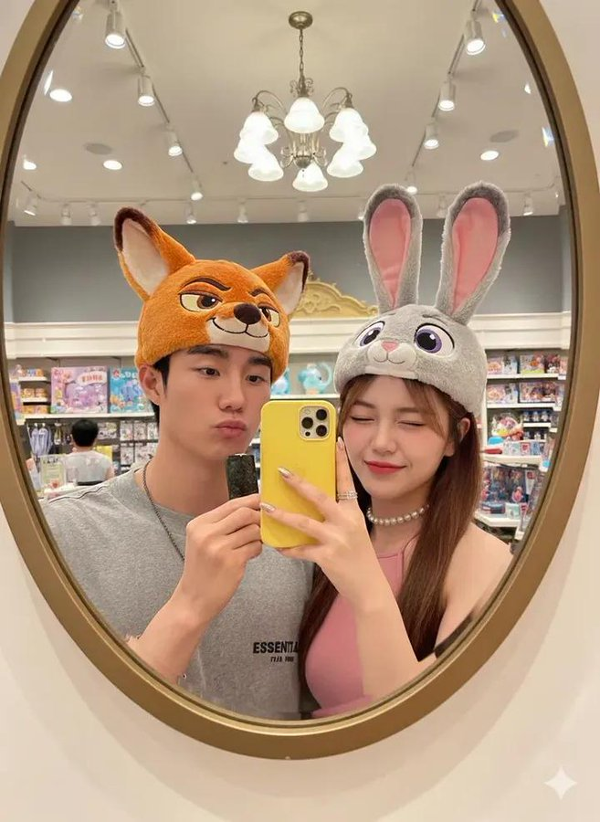

## 疯狂动物城的大型毛绒角色帽子

- ID: gpt4o-630-zh-2
- Slug: prompt-630-zh-2
- 语言: zh
- 来源: [来源链接](https://x.com/kingofdairyque/status/1994745605621780533)
- 样例图路径: images/part3/630.jpeg

### 提示词

```text
一张用 iPhone 15 Pro Max 拍摄的超逼真、超精细、照片级 8K 镜面自拍。充满《疯狂动物城》的粉丝美学风格。
场景：一男一女在迪士尼玩具店的椭圆形镜子前合影。
左边那位男士表情顽皮，与参考照片相符。右边那位女士俏皮地眨着眼，手里拿着一部亮黄色的手机。她涂着金属质感的指甲油。
服装和配饰：
•两人都戴着迪士尼《疯狂动物城》的大型毛绒角色帽子。
照片 1 中左边的人——尼克·王尔德的橙色帽子，上面绣着一对大狐狸耳朵和狡黠的眼睛。
照片 2 右侧的女孩——戴着灰色的朱迪·霍普斯帽子，帽子上有长长的粉色兔子耳朵和大大的紫色眼睛。
• 左侧照片 1——衣服和发型与附图相符。
• 右侧照片2——身穿亮粉色露背上衣，留着长长的直发。
一条珍珠项链紧紧地贴合在她的脖子上。
她好几个手指上都戴着戒指。
照片 2 中女孩的妆容：韩式 K-beauty；水光肌；淡淡的腮红；黑色眼线；彩色隐形眼镜（蓝灰色）；粉色和玫瑰色渐变唇膏。
背景：迪士尼礼品店内部；摆满玩具的磨砂货架；节日商场灯光；装饰性天花板吊灯。
质量和细节：8K，高度逼真的毛绒质感（单根毛纤维），鲜艳饱和的色彩，柔和的商业商场灯光，无噪点，面部和帽子完美清晰对焦，画面中有镜子自拍。
```

### 样例图


## Use the uploaded photo. Do NOT alter the person’s real a

- ID: gpt4o-625-en-1
- Slug: prompt-625-en-1
- 语言: en
- 来源: [来源链接](https://x.com/AI_GIRL_DESIGN/status/1993243344932413597)
- 样例图路径: images/part3/625.jpeg

### 提示词

```text
Use the uploaded photo. 
Do NOT alter the person’s real appearance — keep the person’s face, body, clothing, colors, and texture completely photorealistic. 
Do NOT change the background perspective. 
Do NOT turn the person into a drawing or illustration.

Add a dense, overloaded layer of pop-style illustrated “sweets monsters” and graphic decorations ONLY around the person (and on top of their clothing if needed), but never on their skin or face.

Illustrated elements:
- many colorful cartoon monsters with thick black outlines, flat colors, and cute-but-ugly expressions
- sweets-inspired monsters: bananas, cookies, strawberries, melting chocolate, lollipops, ice cream, oranges, cupcakes, donuts, candy pieces, soda bottles, etc.
- additional graphic shapes: stars, hearts, arrows, drips, splashes, zigzag lines, exclamation marks, motion lines, sparkles, bubbles, comic-style text shapes (but no real text)

Make the decoration very dense and “busy”:
- fill the space behind the person with overlapping sweets monsters and shapes
- add monsters peeking from behind the shoulders, around the bag, at the person’s feet, and near the head
- allow some monsters and shapes to overlap the clothing and accessories (shirt, shorts, bag, shoes), but keep the skin of the face, arms, and legs photorealistic and visible
- use multiple layers of illustrations in front of and behind the person to create depth
- add glowing outlines, small white dots, and speed lines around the person to emphasize energy

Color and style:
- use a vivid, neon-like color palette (hot pink, yellow, cyan, lime, orange, purple, turquoise)
- keep all illustrated elements flat and graphic with clean edges and bold outlines
- ensure shadows and overlap suggest interaction with the real person (e.g., slight shadows on clothing where monsters touch)

Overall goal:
Create a highly decorated, maximalist pop-art scene where the real person stands in the middle, surrounded and wrapped by a chaotic crowd of playful sweets monsters and graphic doodles, while the person remains clearly photorealistic.
```

### 样例图

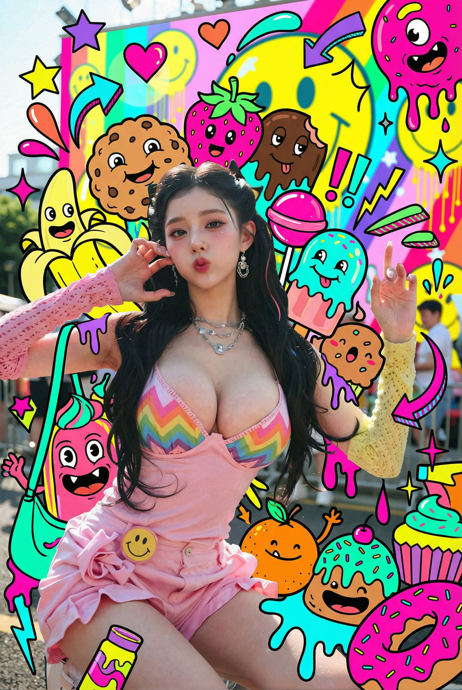

## 在人物周围添加糖果怪兽

- ID: gpt4o-625-zh-2
- Slug: prompt-625-zh-2
- 语言: zh
- 来源: [来源链接](https://x.com/AI_GIRL_DESIGN/status/1993243344932413597)
- 样例图路径: images/part3/625.jpeg

### 提示词

```text
请使用已上传的照片。
不要改变人物的真实外貌——保持人物的脸部、身体、衣服、颜色和纹理完全逼真。
请勿改变背景视角。
请勿将人物形象转化为绘画或插图。

在人物周围（必要时可以贴在衣服上）添加一层厚重的、过多的流行风格插画“糖果怪兽”和图形装饰，但绝不能贴在皮肤或脸上。

图示元素：
- 许多色彩鲜艳的卡通怪物，轮廓线粗黑，色彩扁平，表情可爱又丑陋。
- 以甜食为灵感的怪物：香蕉、饼干、草莓、融化的巧克力、棒棒糖、冰淇淋、橙子、纸杯蛋糕、甜甜圈、糖果块、汽水瓶等等。
- 其他图形形状：星星、心形、箭头、水滴、飞溅、锯齿线、感叹号、动态线条、闪光、气泡、漫画风格的文字形状（但不能包含实际文字）

装饰要非常密集、繁复：
- 用重叠的糖果怪兽和形状填满人身后的空间
- 添加一些怪物，它们会从肩膀后面、包周围、人的脚边和头部附近探出头来。
允许部分怪物和形状与服装及配饰（衬衫、短裤、包、鞋子）重叠，但保持面部、手臂和腿部的皮肤逼真可见。
- 在人物前后使用多层插图来营造景深。
- 在人物周围添加发光轮廓、小白点和速度线，以强调能量。

颜色和款式：
- 使用鲜艳的霓虹色系调色板（亮粉色、黄色、青色、酸橙色、橙色、紫色、蓝绿色）
- 保持所有插图元素扁平化、图形化，边缘清晰，轮廓粗犷。
- 确保阴影和重叠能够暗示与真人的互动（例如，怪物触碰衣服时在衣服上留下淡淡的阴影）

总体目标：
创作一幅装饰华丽、极繁主义的波普艺术场景，真人站在场景中央，被一群嬉戏玩闹的糖果怪兽和涂鸦图形包围，而真人则保持清晰的写实风格。
```

### 样例图


## { "project": "Ultra-Realistic Portrait", "reference_sett

- ID: gpt4o-620-en-1
- Slug: prompt-620-en-1
- 语言: en
- 来源: [来源链接](https://x.com/YaseenK7212/status/1994634660459024649)
- 样例图路径: images/part3/620.jpeg

### 提示词

```text
{
  "project": "Ultra-Realistic Portrait",
  "reference_settings": {
    "use_reference_image": true,
    "fidelity_strength": "100%",
    "instruction": "Face and outfit must match reference photo 100% with absolutely no alterations."
  },
  "subject": {
    "demographics": "Woman",
    "focus_features": ["Eyes", "Nose", "Lips"],
    "expression": "Smiling, cute, fresh, dreamy, slightly sensual",
    "pose": "Sitting at a white table, resting chin on both hands, turning slightly",
    "hair": {
      "style": "Straight, large top bun",
      "accessory": "Bow matching the outfit",
      "texture": "Soft layered, loose strands falling naturally across face",
      "movement": "Slightly blown by wind"
    },
    "makeup": {
      "cheeks": "Natural blush on cheeks and nose",
      "lips": "Full lips, soft pink-peach tone"
    }
  },
  "fashion_and_accessories": {
    "outfit": "Exact match to reference image",
    "shoes": "High-heel shoes (matching reference)",
    "bag": "Same bag as reference photo",
    "jewelry": {
      "necklace": "Thin gold with alternating charms (heart, crescent moon, Gucci pendant)",
      "bracelet": "Delicate Gucci bracelet with charms",
      "rings": "Gold rings",
      "watch": "Steel-band Patek Philippe",
      "earrings": "Small gold Gucci earrings"
    }
  },
  "environment": {
    "location": "Luxury hotel terrace / Seaside",
    "time_of_day_options": [
      "Option A: Deep blue evening sky, stars, shooting star, moonlight",
      "Option B: Early sunrise, orange-yellow sky tones"
    ],
    "background_elements": [
      "Warm reflections from luxury hotel",
      "Calm seascape"
    ]
  },
  "props": {
    "table_setting": "White table",
    "items": [
      "Glass with a single white rose",
      "Wine glass",
      "Wine bottle",
      "Plate set with knife and fork",
      "Large T-bone steak in center",
      "Candle glass (adding warm highlight)"
    ]
  },
  "photography_style": {
    "aesthetic": "2000s digital-camera flash style",
    "lighting": "Realistic flash brightness, warm tone, slight shine on skin",
    "mood": "Relaxing, warm, nostalgic, stylish, elegant, slightly sexy",
    "shot_type": "Close-up portrait"
  },
  "technical_parameters": {
    "aspect_ratio": "3:4",
    "detail_level": "8k",
    "style_tags": ["photo", "realistic", "flash photography"]
  }
}
```

### 样例图

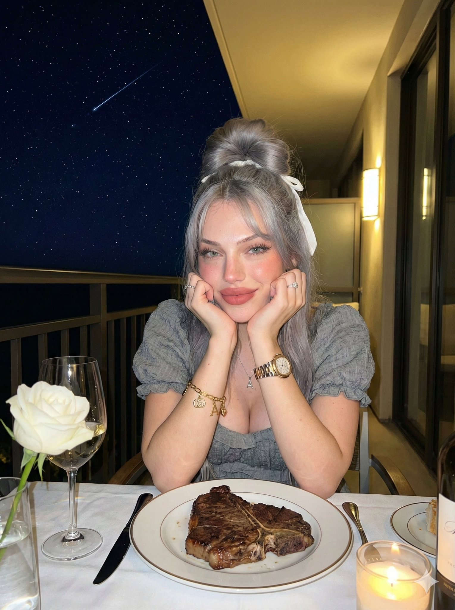

## 超写实性感大嘴人物肖像

- ID: gpt4o-620-zh-2
- Slug: prompt-620-zh-2
- 语言: zh
- 来源: [来源链接](https://x.com/YaseenK7212/status/1994634660459024649)
- 样例图路径: images/part3/620.jpeg

### 提示词

```text
{
“项目”：“超写实肖像”，
"reference_settings": {
"use_reference_image": true,
"fidelity_strength": "100%",
“说明”：“面部和服装必须与参考照片100%一致，绝对不能做任何修改。”
},
“主题”： {
“人口统计信息”：“女性”，
"focus_features": ["眼睛", "鼻子", "嘴唇"],
“表情”：“微笑、可爱、清新、梦幻、略带性感”
“姿势”：“坐在白色桌子旁，双手托腮，微微侧身”，
“头发”： {
“发型”：“直发，大发髻”，
“配饰”：“与服装相配的蝴蝶结”，
“质感”：“柔软、层次分明、自然垂落在脸上的发丝”，
“运动”：“微风吹拂”
},
“化妆品”： {
“脸颊”： “脸颊和鼻子上的自然红晕”
“嘴唇”：丰满的嘴唇，柔和的粉桃色调
}
},
"fashions_and_accessories": {
“服装”: “与参考图片完全匹配”，
“鞋子”：“高跟鞋（配套参考）”
“包”： “与参考照片相同的包”
“珠宝”： {
“项链”：“细金项链，饰有交替的吊坠（心形、新月形、Gucci吊坠）”
“手镯”：“精致的 Gucci 手镯，带有吊坠”，
“戒指”： “金戒指”，
“手表”: “钢带百达翡丽”
“耳环”： “古驰小金耳环”
}
},
“环境”： {
位置：豪华酒店露台/海滨
"time_of_day_options": [
“选项A：深蓝色的傍晚天空，繁星，流星，月光，”
选项B：清晨日出，橙黄色的天空色调
],
“背景元素”：[
“来自豪华酒店的温馨回响”
“平静的海景”
]
},
"props": {
"table_setting": "白色桌子",
“项目”： [
“一杯插着一朵白玫瑰的酒”
“酒杯”，
“葡萄酒瓶”，
“餐盘套装，含刀叉”
“中间是一块大块的T骨牛排”，
“烛台玻璃（增添暖色调高光）”
]
},
"photography_style": {
“美学”：“2000年代数码相机闪光灯风格”，
“光照”：“逼真的闪光亮度，暖色调，皮肤略带光泽”，
“氛围”：“轻松、温暖、怀旧、时尚、优雅、略带性感”
"shot_type": "特写肖像"
},
"technical_parameters": {
"aspect_ratio": "3:4",
"detail_level": "8k",
"style_tags": ["photo", "realistic", "flash photography"]
}
}
```

### 样例图


## { "scene_description": "A cohesive 4-panel fashion lifes

- ID: gpt4o-618-en-1
- Slug: prompt-618-en-1
- 语言: en
- 来源: [来源链接](https://x.com/_MehdiSharifi_/status/1994168239442510308)
- 样例图路径: images/part3/618.jpeg

### 提示词

```text
{
  "scene_description": "A cohesive 4-panel fashion lifestyle collage featuring the same young woman in a cozy layered autumn outfit, showcasing relaxed poses in nature.",
  "subject": {
    "type": "Young Woman (Consistent character)",
    "age": "early 20s",
    "features": {
      "hair": "loose natural hair with beanie",
      "makeup": "rosy cheeks"
    },
    "attire": "chunky knit sweater, plaid scarf, long wool coat, jeans, boots",
    "accessories": "takeaway coffee cup"
  },
  "collage_layout": {
    "structure": "2x2 Grid Layout (4 frames of equal size)",
    "panel_1_top_left": "Full Body Dynamic: Throwing autumn leaves in the air or twirling, coat flowing, smiling broadly.",
    "panel_2_top_right": "Sitting Side View: Sitting on a park bench with legs crossed, reading a book or looking at the scenery, holding coffee.",
    "panel_3_bottom_left": "Mid-Shot Walking: Walking towards the camera holding the lapels of the coat, looking down shyly or smiling.",
    "panel_4_bottom_right": "Portrait with Prop: Peeking out from behind the oversized scarf, holding the coffee cup near face for warmth, eyes smiling."
  },
  "environment": {
    "setting": "Autumn Park / Forest Path",
    "background_elements": [
      "Orange and yellow leaves",
      "Trees",
      "Park bench"
    ]
  },
  "lighting": {
    "style": "Golden Hour Soft",
    "key_light": {
      "type": "Low Autumn Sun",
      "color": "Warm Golden",
      "effect": "Backlight or soft front light, magical atmosphere"
    }
  },
  "style": {
    "medium": "Portrait Photography",
    "aesthetic": "Cottagecore, Autumn Vibes, Cozy, Pinterest",
    "quality": "8k resolution, warm tones"
  },
  "attire_customization": {
    "current_clothing": "Wool coat and knitwear",
    "customizable_clothing": "User can swap for puffer jacket or raincoat"
  },
  "brand_product_customization": {
    "current_brand_product": "Winter Apparel",
    "customizable_brand": "User: Insert Brand Name",
    "customizable_product": "User: Specific coat or boots",
    "product_placement_area": "Coat texture or boots"
  }
}
```

### 样例图

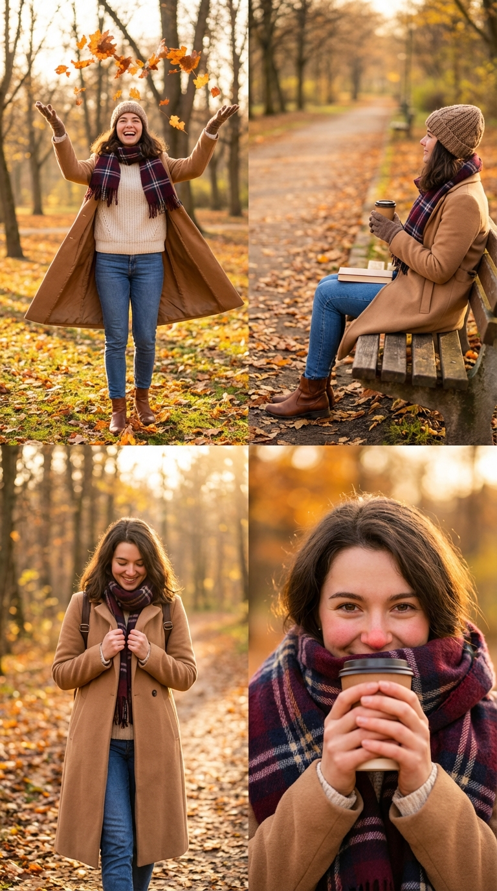

## 四幅时尚生活场景组成的拼贴画

- ID: gpt4o-618-zh-2
- Slug: prompt-618-zh-2
- 语言: zh
- 来源: [来源链接](https://x.com/_MehdiSharifi_/status/1994168239442510308)
- 样例图路径: images/part3/618.jpeg

### 提示词

```text
{
“场景描述”： “这是一幅由四幅时尚生活场景组成的拼贴画，画面中同一位年轻女子身着舒适的秋季叠穿服装，在自然环境中摆出轻松的姿势。”
“主题”： {
“类型”：“年轻女子（性格始终如一）”
“年龄”：“20岁出头”，
“特征”： {
“头发”：“披散的自然头发，戴着毛线帽”，
“妆容”：“红润的脸颊”
},
着装：粗针织毛衣、格子围巾、长羊毛大衣、牛仔裤、靴子。
配件：外带咖啡杯
},
"collage_layout": {
"结构": "2x2 网格布局（4 个大小相同的框架）",
"panel_1_top_left": "全身动态：抛洒秋叶或旋转，外套飘动，笑容灿烂。"
"panel_2_top_right": "坐姿侧视图：坐在公园长椅上，双腿交叉，手拿咖啡，正在看书或欣赏风景。"
"panel_3_bottom_left": "中景行走：走向镜头，抓住外套翻领，害羞地低头或微笑。"
"panel_4_bottom_right": "带道具的肖像：从超大的围巾后面探出头来，手里拿着咖啡杯贴近脸庞取暖，眼神中带着微笑。"
},
“环境”： {
“设置”: “秋季公园/森林小径”
“背景元素”：[
“橙色和黄色的叶子”，
“树木”，
“公园长椅”
]
},
“灯光”： {
“风格”：“金色时光柔和”
"key_light": {
“类型”：“低垂的秋日阳光”，
颜色：暖金色，
效果：背光或柔和的前光，营造出梦幻般的氛围
}
},
“风格”： {
“媒介”: “人像摄影”
“美学”：“田园风、秋日氛围、舒适、Pinterest”
“品质”：“8K分辨率，暖色调”
},
"attire_customization": {
"current_clothing": "羊毛大衣和针织衫",
"customizable_clothing": "用户可以换成羽绒服或雨衣"
},
"品牌产品定制": {
"current_brand_product": "冬季服装",
"customizable_brand": "用户：插入品牌名称",
"customizable_product": "用户：特定外套或靴子",
"product_placement_area": "外套纹理或靴子"
}
}
```

### 样例图


## { "scene_description": "A cohesive 4-panel fashion lifes

- ID: gpt4o-617-en-1
- Slug: prompt-617-en-1
- 语言: en
- 来源: [来源链接](https://x.com/_MehdiSharifi_/status/1994166992719299026)
- 样例图路径: images/part3/617.jpeg

### 提示词

```text
{
  "scene_description": "A cohesive 4-panel fashion lifestyle collage featuring the same young woman in a glamorous evening outfit, showcasing cinematic poses under city lights.",
  "subject": {
    "type": "Young Woman (Consistent character)",
    "age": "early 20s",
    "features": {
      "hair": "glamorous waves",
      "makeup": "evening look with red lip"
    },
    "attire": "black satin slip dress, leather jacket draped over shoulders, strappy heels",
    "accessories": "sparkly clutch, earrings"
  },
  "collage_layout": {
    "structure": "2x2 Grid Layout (4 frames of equal size)",
    "panel_1_top_left": "Full Body Flash Shot: Standing against a metallic door or shutter, posing with one leg forward, looking fierce (flash photography style).",
    "panel_2_top_right": "Over-the-Shoulder: Looking back at the camera while walking away towards neon city lights, showcasing the back of the dress/jacket.",
    "panel_3_bottom_left": "Seated Profile: Sitting on a high bar stool or velvet booth, holding a mocktail, laughing candidly towards someone off-camera.",
    "panel_4_bottom_right": "Artistic Portrait: Standing near a neon sign, face illuminated by pink/blue light, looking dreamily upwards."
  },
  "environment": {
    "setting": "City at Night / Rooftop Bar",
    "background_elements": [
      "Neon signs",
      "City bokeh",
      "Dark shadows"
    ]
  },
  "lighting": {
    "style": "Flash & Neon Mixed",
    "key_light": {
      "type": "Camera Flash / Neon Sign",
      "color": "Cool White / Vibrant Colors",
      "effect": "High contrast, edgy vibe"
    }
  },
  "style": {
    "medium": "Flash Photography / Film Aesthetic",
    "aesthetic": "Night Luxe, Party Vibe, Cinematic, Edgy",
    "quality": "8k resolution, slight grain"
  },
  "attire_customization": {
    "current_clothing": "Slip dress and leather jacket",
    "customizable_clothing": "User can swap for sequin dress or jumpsuit"
  },
  "brand_product_customization": {
    "current_brand_product": "Evening Wear",
    "customizable_brand": "User: Insert Brand Name",
    "customizable_product": "User: Specific dress or makeup",
    "product_placement_area": "Dress silhouette"
  },
  "technical_tags": "--v 6 --ar 4:5 --stylize 400 --no daylight, office setting"
}
```

### 样例图


## 四幅时尚生活场景组成的连贯拼贴画

- ID: gpt4o-617-zh-2
- Slug: prompt-617-zh-2
- 语言: zh
- 来源: [来源链接](https://x.com/_MehdiSharifi_/status/1994166992719299026)
- 样例图路径: images/part3/617.jpeg

### 提示词

```text
{
“场景描述”： “这是一幅由四幅时尚生活场景组成的连贯拼贴画，画中同一位年轻女子身着华丽的晚礼服，在城市灯光下摆出极具电影感的姿势。”
“主题”： {
“类型”：“年轻女子（性格始终如一）”
“年龄”：“20岁出头”，
“特征”： {
“头发”：“迷人的波浪卷发”，
“妆容”：“晚宴妆容，搭配红唇”
},
“着装”：“黑色缎面吊带裙，肩上披着皮夹克，细带高跟鞋”，
“配饰”：闪亮手拿包、耳环
},
"collage_layout": {
"结构": "2x2 网格布局（4 个大小相同的框架）",
"panel_1_top_left": "全身闪光照：倚靠在金属门或卷帘门上，一条腿向前迈出，摆出凶狠的姿势（闪光摄影风格）。"
"panel_2_top_right": "过肩视角：边走边回头看向镜头，朝着霓虹闪烁的城市灯光走去，展示连衣裙/外套的背面。"
"panel_3_bottom_left": "坐姿侧脸：坐在高脚吧台凳或天鹅绒卡座上，手持一杯无酒精鸡尾酒，对着镜头外的人开怀大笑。"
"panel_4_bottom_right": "艺术肖像：站在霓虹灯招牌旁，脸部被粉色/蓝色灯光照亮，眼神梦幻般地向上凝视。"
},
“环境”： {
“场景”：“夜幕下的城市/屋顶酒吧”，
“背景元素”：[
霓虹灯招牌
“城市散景”
“黑暗阴影”
]
},
“灯光”： {
“风格”：“闪光与霓虹混合”，
"key_light": {
"type": "相机闪光灯/霓虹灯标志",
“颜色”：“冷白/鲜艳色彩”，
“效果”：“高对比度，前卫氛围”
}
},
“风格”： {
“媒介”：“闪光摄影/胶片美学”，
“美学”：“夜间奢华、派对氛围、电影感、前卫”
“画质”：“8K分辨率，略带颗粒感”
},
"attire_customization": {
"current_clothing": "吊带裙和皮夹克",
"customizable_clothing": "用户可以换成亮片连衣裙或连体裤"
},
"品牌产品定制": {
"current_brand_product": "晚礼服",
"customizable_brand": "用户：插入品牌名称",
"customizable_product": "用户：特定服装或妆容",
"product_placement_area": "连衣裙轮廓"
},
"technical_tags": " --v 6 --ar 4:5 --stylize 400 --no daylight, office setting"
}
```

### 样例图


## { "prompt": "hyperrealistic ultra-detailed 8k photo of Y

- ID: gpt4o-615-en-1
- Slug: prompt-615-en-1
- 语言: en
- 来源: [来源链接](https://x.com/Samann_ai/status/1994444395525832898)
- 样例图路径: images/part3/615.jpeg

### 提示词

```text
{
  "prompt": "hyperrealistic ultra-detailed 8k photo of YOU (Upload Your Photo) standing in a bright cozy living room, same location as the reference: cream-colored sofa, large white curtains with soft daylight shining through, warm neutral walls, several green houseplants, minimal decor, natural sunlight and soft shadows. Use the uploaded photo as the main subject of the image, preserving the face, hairstyle, body type, clothing, and overall style exactly as in the uploaded photo. The subject is standing in front of the sofa, body slightly angled to the side, legs close together, one hip slightly popped, holding a smartphone in one hand at chest height, screen facing them, as if taking a mirror selfie, with a relaxed confident expression and slight smile, eyes toward the phone. Behind them, their partner is standing very close, a tall, attractive humanoid robot with a highly muscular, athletic build, entirely robotic with no human skin, detailed mechanical anatomy inspired by a futuristic cyborg: layered silver and gunmetal plates, visible bundles of flexible cables as muscles, complex joints, smooth armor around shoulders, chest, arms, and legs, elegant angular robotic face with a strong jawline, glowing blue eyes, subtle wear and micro-scratches on metal for realism. The robot’s torso is broad and V-shaped, narrow waist, perfect proportions, clearly fit and powerful but aesthetically beautiful. The robot stands just behind the subject with one sleek metallic arm wrapped gently and protectively around the front of their neck and shoulders, hand resting softly near the collarbone in an affectionate pose, the other arm relaxed at its side. Their bodies are close, giving a sense of intimacy and comfort. Extremely realistic skin texture on the subject, natural hair strands, detailed fabric texture and wrinkles on their clothing, realistic reflections and specular highlights on the robot’s metal surfaces, accurate global illumination and depth of field, sharp focus on both characters, slight background blur. Photoreal, cinematic lighting, no fantasy effects, looks like a real candid photo taken on a phone in this apartment.",
  "negative_prompt": "cartoon, anime, illustration, painting, 3d render, CGI, low resolution, blurry, grainy, oversaturated, unrealistic proportions, extra limbs, deformed hands, distorted face, visible mirror edges, text, watermark, logo, armor covering the subject, human skin on the robot, grotesque, horror, gore"
}
```

### 样例图


## 人和机器人的温馨时刻

- ID: gpt4o-615-zh-2
- Slug: prompt-615-zh-2
- 语言: zh
- 来源: [来源链接](https://x.com/Samann_ai/status/1994444395525832898)
- 样例图路径: images/part3/615.jpeg

### 提示词

```text
{
“提示”：拍摄一张超逼真、细节丰富的8K照片，照片中的人物（上传您的照片）站在明亮舒适的客厅中，地点与参考照片相同：米色沙发，白色大窗帘透进柔和的日光，暖色调的墙面，几盆绿色植物，简约的装饰，自然光和柔和的阴影。使用上传的照片作为图像的主体，保留照片中人物的面部、发型、体型、服装和整体风格。人物站在沙发前，身体略微侧倾，双腿并拢，一侧臀部微微翘起，一手拿着智能手机，屏幕朝向自己，仿佛在自拍，表情轻松自信，略带微笑，目光注视着手机。人物身后站着一位身材高挑、外形俊朗的人形机器人，肌肉线条流畅，体格健壮，完全由机械构成，没有人类皮肤，拥有未来主义赛博格风格的精细机械结构：层叠的银色和枪灰色金属板，以及清晰可见的柔性电缆束。肌肉线条分明，关节复杂，肩部、胸部、手臂和腿部的盔甲光滑流畅，优雅的棱角分明的机械面孔，下颚线条硬朗，湛蓝的双眼闪闪发光，金属表面细微的磨损和划痕更添真实感。机器人的躯干宽阔呈V字形，腰部纤细，比例完美，既健壮有力又不失美感。机器人站在拍摄对象身后，一只光滑的金属手臂温柔地环绕着拍摄对象的颈肩，一只手轻轻地放在锁骨附近，姿态亲昵，另一只手臂自然垂于身侧。两人身体靠近，营造出亲密舒适的氛围。拍摄对象的皮肤纹理极其逼真，头发自然垂落，衣物上的织物纹理和褶皱也十分细致，机器人金属表面的反射和高光效果逼真，整体光照和景深控制精准，两个人物都清晰对焦，背景略微虚化。照片级的真实感，电影级的灯光效果，没有任何奇幻特效，看起来就像是用手机在公寓里随手拍下的真实照片。
"negative_prompt": "卡通、动画、插画、绘画、3D渲染、CGI、低分辨率、模糊、颗粒感强、过度饱和、比例失调、多余肢体、畸形手、扭曲面部、可见镜像边缘、文字、水印、标志、盔甲覆盖主体、机器人身上覆盖人类皮肤、怪诞、恐怖、血腥"
}
```

### 样例图


## { "scene": { "subject": { "demographics": "Young woman",

- ID: gpt4o-613-en-1
- Slug: prompt-613-en-1
- 语言: en
- 来源: [来源链接](https://x.com/lexx_aura/status/1994446756978020701)
- 样例图路径: images/part3/613.jpeg

### 提示词

```text
{
  "scene": {
    "subject": {
      "demographics": "Young woman",
      "pose": "Sitting on the floor, facing forward",
      "expression": "Slightly serious or pensive, direct eye contact",
      "appearance_constraints": "Maintain original facial features",
      "hair": {
        "color": "Dark",
        "style": "Long, straight, middle part",
        "accessory": "White bandana with red accents"
      },
      "makeup": {
        "eyes": "Defined with eyeliner",
        "lips": "Soft pink"
      },
      "apparel": {
        "top": "Off-white or cream tank top with small dark cherry embroidery",
        "bottom": "Distressed denim shorts",
        "hosiery": "Knee-high white socks",
        "footwear": "Black open-toed sandals or clogs"
      }
    },
    "action": {
      "right_hand": "Holding up a Coca-Cola can"
    },
    "environment": {
      "main_fixture": "Open, retro-style refrigerator",
      "fridge_contents": [
        "Coca-Cola cans",
        "Ramune bottles",
        "Colorful beverages",
        "Macaron themed book or magazine (top shelf)"
      ],
      "foreground_floor": "Two Ramune bottles containing pink liquid",
      "setting_type": "Kitchen or studio with vintage aesthetic"
    },
    "style_and_mood": {
      "lighting": "Warm, slightly muted",
      "aesthetic": "Cool, casual, retro",
      "theme": "Beverage focus"
    }
  }
}
```

### 样例图

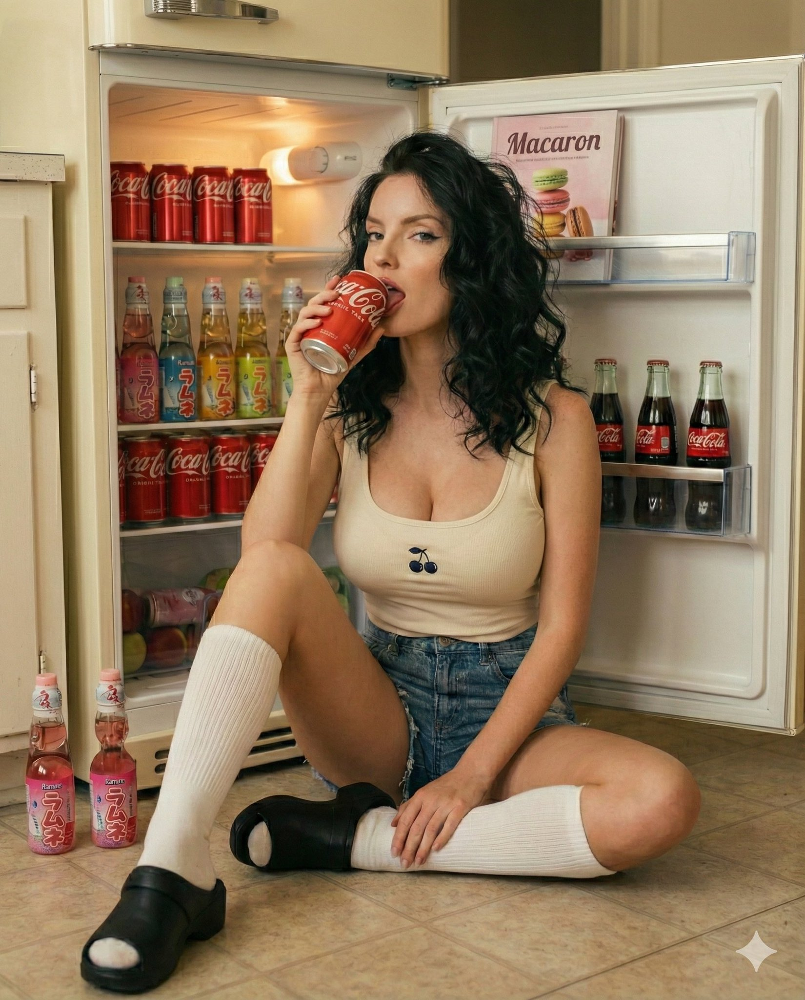

## 女子坐在地板上准备喝可乐

- ID: gpt4o-613-zh-2
- Slug: prompt-613-zh-2
- 语言: zh
- 来源: [来源链接](https://x.com/lexx_aura/status/1994446756978020701)
- 样例图路径: images/part3/613.jpeg

### 提示词

```text
{
“场景”： {
“主题”： {
“人口统计信息”：“年轻女性”，
“姿势”：“坐在地板上，面向前方”，
“表情”：“略显严肃或沉思，直视对方的眼睛”，
"appearance_constraints": "保持原始面部特征",
“头发”： {
“颜色”: “深色”
“发型”：“长直中分”，
“配饰”：“带有红色点缀的白色头巾”
},
“化妆品”： {
“眼睛”：“用眼线勾勒轮廓”，
“嘴唇”： “柔和的粉红色”
},
"服装": {
“上衣”： “米白色或奶油色背心，带有小颗深樱桃刺绣”，
“下装”： “破洞牛仔短裤”
“丝袜”: “及膝白袜”
“鞋类”：黑色露趾凉鞋或木屐
}
},
“行动”： {
“右手”： “举起一罐可口可乐”
},
“环境”： {
"main_fixture": "开放式复古风格冰箱",
"fridge_contents": [
“可口可乐罐”
“拉姆内汽水瓶”，
“色彩缤纷的饮料”，
“马卡龙主题书籍或杂志（上层书架）”
],
"前景_楼层" "两瓶装有粉红色液体的弹珠汽水瓶",
"setting_type": "具有复古美学的厨房或工作室"
},
"style_and_mood": {
“灯光”：“温暖，略微柔和”，
“美学”：“酷炫、休闲、复古”，
主题： 聚焦饮品
}
}
}
```

### 样例图


## { "scene_description": "A vibrant, mixed-media masterpie

- ID: gpt4o-611-en-1
- Slug: prompt-611-en-1
- 语言: en
- 来源: [来源链接](https://x.com/ecommartinez/status/1994126063656644727)
- 样例图路径: images/part3/611.jpeg

### 提示词

```text
{
  "scene_description": "A vibrant, mixed-media masterpiece featuring a photorealistic version of the person from the reference photo eating at a diner, surrounded by a chaotic swarm of maximalist fast-food monsters.",

  "subject": {
    "type": "The person from the reference photo",
    "attire": "Same clothing style as in the reference, adapted naturally to the diner setting",
    "position": "Sitting in a red leather diner booth, holding a burger",
    "expression": "Shocked but amused, looking at a floating doodle pizza",
    "consistency_note": "Face, hairstyle and proportions must perfectly match the reference photo"
  },

  "action": {
    "primary": "Eating lunch",
    "effect": "Their food is coming to life in 2D form"
  },

  "illustration_layer": {
    "style": "Thick-line Pop Art cartoons",
    "creatures": [
      "Pizza slices surfing on cheese waves",
      "Burger beasts with lettuce tongues",
      "Angry French fry box",
      "Flying ketchup bottles."
    ],
    "graphics": "Mustard splashes, sesame seeds, heat lines, 'ÑAM' text bursts",
    "colors": "Ketchup Red, Mustard Yellow, Lettuce Green"
  },

  "environment": {
    "setting": "Retro American Diner",
    "background_elements": ["Checkerboard floor", "Neon sign in window"]
  },

  "lighting": {
    "style": "Warm Diner Glow",
    "key_light": {
      "type": "Window light",
      "color": "Warm afternoon sun"
    }
  },

  "style": {
    "medium": "Mixed Media Photography",
    "aesthetic": "Retro-pop, savory, chaotic",
    "quality": "Ultra-detailed textures vs flat cartoons"
  }
}
```

### 样例图

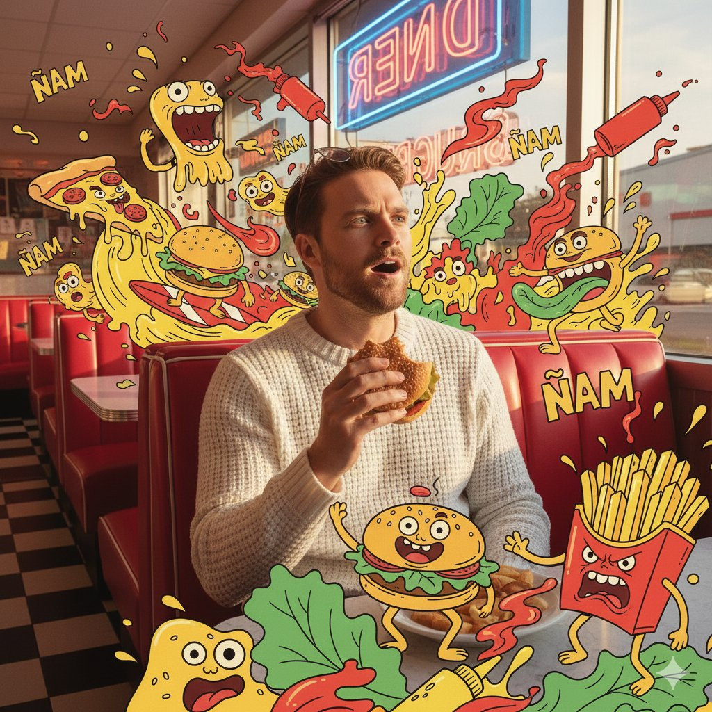

## 一幅充满活力的混合媒介杰作

- ID: gpt4o-611-zh-2
- Slug: prompt-611-zh-2
- 语言: zh
- 来源: [来源链接](https://x.com/ecommartinez/status/1994126063656644727)
- 样例图路径: images/part3/611.jpeg

### 提示词

```text
{
“场景描述”： “这是一幅充满活力的混合媒介杰作，画面中逼真地呈现了参考照片中的人物在餐馆用餐，周围环绕着一群造型夸张的快餐怪物。”

“主题”： {
“类型”：“参考照片中的人”，
“着装”：“与参考图中相同的服装风格，自然地适应了餐厅环境”，
“位置”：“坐在红色皮质餐厅卡座里，手里拿着一个汉堡”，
“表情”：“震惊又好笑，看着漂浮的涂鸦披萨”
"consistency_note": "脸型、发型和比例必须与参考照片完全一致"
},

“行动”： {
“主要”： “吃午饭”，
“效果”：“他们的食物以二维形式活了过来”
},

"illustration_layer": {
“风格”：“粗线条波普艺术卡通”，
“生物”：[
“披萨片在奶酪浪潮上冲浪”
“长着生菜舌头的汉堡怪兽”
“愤怒的薯条盒”
“飞舞的番茄酱瓶。”
],
“图形”：“芥末酱飞溅、芝麻、热线、‘ÑAM’文字爆发”，
颜色：番茄酱红、芥末黄、生菜绿
},

“环境”： {
“设置”: “复古美式餐馆”
"background_elements": ["棋盘格地板", "窗户上的霓虹灯"]
},

“灯光”： {
“风格”：“温馨的餐馆氛围”，
"key_light": {
类型： 窗灯，
“颜色”：“温暖的午后阳光”
}
},

“风格”： {
“媒介”：“混合媒介摄影”，
“美学”：“复古流行，美味，混乱”，
“质量”： “超精细纹理 vs 平面卡通”
}
}
```

### 样例图


## [Prompt] type = image_generation style = ultra-realistic

- ID: gpt4o-610-en-1
- Slug: prompt-610-en-1
- 语言: en
- 来源: [来源链接](https://x.com/lexx_aura/status/1994397944209142213)
- 样例图路径: images/part3/610.jpeg

### 提示词

```text
[Prompt]
type = image_generation
style = ultra-realistic

[Setting]
type = studio portrait
background = minimalist studio background
props = a single metal chair

[Subject]
description = A young woman
mood = Confident, elegant, intimate

[Hair]
color = black
style = long, wavy, tousled, tied in a high, messy ponytail

[Appearance.Attire]
dress = elegant black dress with thin straps and a low back
footwear = thigh-high patent leather boots

[PoseAndComposition]
position = Sitting sideways in the metal chair
legs = Legs crossed
hands = Slightly raised
gaze = Looking intimately at the camera
framing = Full-body or three-quarter shot

[Lighting]
description = Professional studio lighting
quality = Soft yet defined, creating subtle shadows that enhance her features and the texture of the dress and boots
```

### 样例图

![[Prompt] type = image_generation style = ultra-realistic](../images/part3/610.jpeg)

## 一位自信优雅的年轻女子

- ID: gpt4o-610-zh-2
- Slug: prompt-610-zh-2
- 语言: zh
- 来源: [来源链接](https://x.com/lexx_aura/status/1994397944209142213)
- 样例图路径: images/part3/610.jpeg

### 提示词

```text
[提示]
类型 = 图像生成
风格 = 超写实

[环境]
类型 = 影棚肖像
背景 = 极简主义工作室背景
道具 = 一把金属椅子

[主题]
描述 = 一位年轻女子
情绪 = 自信、优雅、亲密

[发型]
颜色 = 黑色
发型：长卷发，蓬松凌乱，扎成高高的凌乱马尾辫

[外观.服装]
连衣裙 = 优雅的黑色连衣裙，细肩带，露背设计
鞋履 = 过膝漆皮靴

[姿势与构图]
姿势 = 侧身坐在金属椅上
双腿交叉
双手微微抬起
凝视 = 深情地看着镜头
构图 = 全身像或四分之三身像

[灯光]
描述 = 专业影棚灯光
质感 = 柔和而又不失立体感，营造出微妙的光影效果，突显了她的五官以及连衣裙和靴子的质感。
```

### 样例图

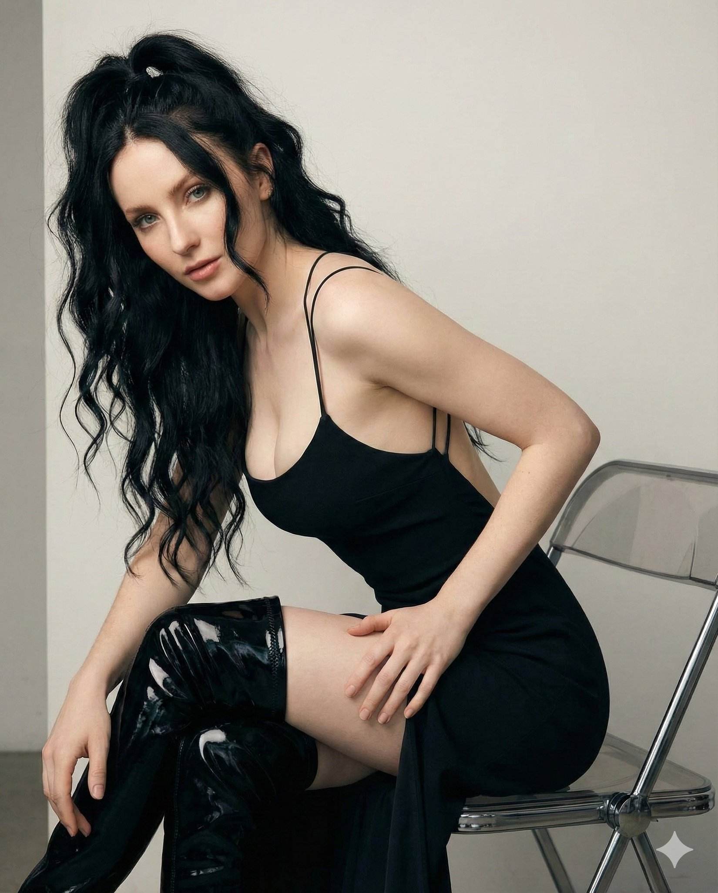

## "A full-body, high-fashion portrait of a stunning young 

- ID: gpt4o-609-en-1
- Slug: prompt-609-en-1
- 语言: en
- 来源: [来源链接](https://x.com/IqraSaifiii/status/1994521805076451818)
- 样例图路径: images/part3/609.jpeg

### 提示词

```text
"A full-body, high-fashion portrait of a stunning young woman. She is wearing a black satin mini slip dress with a draped cowl neckline and thin spaghetti straps, paired with black strappy stiletto high-heels. She has long, wavy dark hair with full bangs and subtle, elegant makeup. The mood is glamorous and luxurious.",   "pose": {     "description": "The subject is sitting sideways on a wide, light-wood stair step. Her left leg is crossed over her right knee, clearly showcasing the stiletto sandals. Her right hand (holding a dark smartphone) is lifted near her face, actively taking a high-angle selfie. She is looking directly at the phone camera.",     "keywords": ["sitting pose", "crossed legs", "selfie pose", "elegant posture", "hand holding phone"]   },   "setting": {     "environment": "Modern, minimalist luxury home interior. The background features a wide, symmetrical staircase made of light-colored wood (e.g., maple or oak) with treads that are individually backlit by warm linear LED lights. Clear glass railings secured by black metal posts frame the subject.",     "aesthetic": "Architectural, contemporary design, clean lines."   },   "camera": {     "shot_type": "Full-Body Portrait Shot",     "angle": "Slightly low angle (worm's-eye view) to emphasize her height and the structure of the staircase.",     "lens": "85mm prime lens",     "depth_of_field": "Shallow DoF, with the subject in crisp focus and the background elements (railings, far steps) slightly softened.",     "composition": "The subject is perfectly centered within the frame."   },   "lighting": {     "key_light": "Soft, diffused studio light (softbox) from the front-left, providing flattering, smooth illumination on her face and skin.",     "accent_light": "Dramatic, warm (3000K) linear under-lighting built directly into the wooden stair treads, creating horizontal lines of glow that define the background.",     "shadows": "Medium contrast, well-defined shadows that still preserve detail in the black dress.",     "exposure": "Perfectly exposed, emphasizing the sheen of the satin material."   },   "style_and_quality": {     "style": "Editorial Fashion Photography | Cinematic Realism | Intimate",     "details": ["High-fidelity satin texture", "Reflections on glass railings", "Manicured red fingernails", "Flawless skin texture"],     "quality": ["8K resolution", "masterpiece", "hyper-detailed", "photorealistic"]   }
```

### 样例图

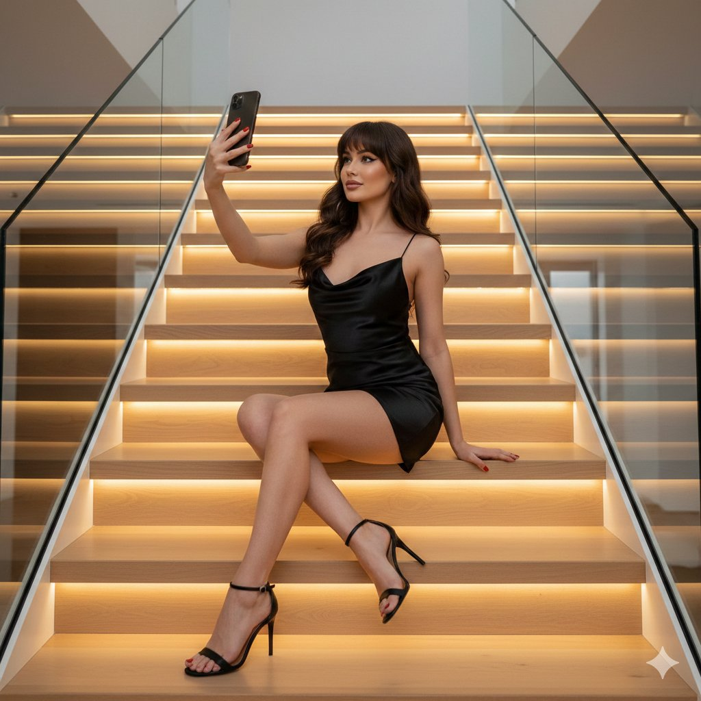

## 年轻女性的时尚自拍肖像

- ID: gpt4o-609-zh-2
- Slug: prompt-609-zh-2
- 语言: zh
- 来源: [来源链接](https://x.com/IqraSaifiii/status/1994521805076451818)
- 样例图路径: images/part3/609.jpeg

### 提示词

```text
“一张惊艳年轻女性的全身时尚肖像。她身着黑色缎面迷你吊带裙，垂褶领口和细吊带设计，搭配黑色细带高跟鞋。她留着长长的波浪卷发，齐刘海，妆容精致优雅。整体氛围充满魅力，尽显奢华。”, “姿势”: { “描述”: “拍摄对象侧坐在宽阔的浅色木质台阶上。她的左腿搭在右膝上，清晰地展示了细高跟凉鞋。她的右手（拿着一部深色智能手机）举到脸旁，正积极地进行高角度自拍。她直视着手机摄像头。”, “关键词”: ["坐姿", "交叉双腿", "自拍姿势", "优雅姿态", "手持手机"] }, “场景”: { “环境”: “现代简约的豪华家居内饰。背景是宽阔对称的……”由浅色木材（例如枫木或橡木）制成的楼梯，踏板由暖色调的线性 LED 灯单独背光照明。透明玻璃栏杆由黑色金属柱固定，将拍摄对象框入其中。", "美学": "建筑风格，现代设计，线条简洁。" }, "相机": "拍摄类型": "全身肖像照", "角度": "略微低角度（仰视）以突出她的身高和楼梯的结构。", "镜头": "85mm 定焦镜头", "景深": "浅景深，拍摄对象清晰对焦，背景元素（栏杆、远处台阶）略微柔化。", "构图": "拍摄对象完美地位于画面中心。" }, "照明": { "主光": "来自左前方的柔和漫射影棚灯（柔光箱），为她的脸部和肌肤提供柔和的光线。", "辅助光": "戏剧性的暖色调（3000K）线性底光，直接嵌入木质楼梯踏板，营造出勾勒背景的水平光晕。", "阴影": "中等对比度，清晰的阴影，同时保留了黑色连衣裙的细节。", "曝光": "曝光完美，突出了缎面材质的光泽。" }, "style_and_quality": { "style": "时尚大片 | 电影写实 | 私密", "details": ["高保真缎面质感", "玻璃栏杆上的倒影", "精心修饰的红色指甲", "无瑕肌肤纹理"], "quality": ["8K分辨率", "杰作", "超细节", "照片级写实"] }
```

### 样例图


## { "prompt": { "scene": { "angle": "[high-angle]", "tilt"

- ID: gpt4o-608-en-1
- Slug: prompt-608-en-1
- 语言: en
- 来源: [来源链接](https://x.com/Just_sharon7/status/1994375017971564779)
- 样例图路径: images/part3/608.jpeg

### 提示词

```text
{
  "prompt": {
    "scene": {
      "angle": "[high-angle]",
      "tilt": "[slightly off-kilter]",
      "group": "[lively group of stylish young adults]",
      "seating": "[seated closely around white dining table]",
      "setting": "[dimly lit, upscale brasserie]"
    },
    "mood": "[energetic, fashionable, slightly rebellious]",
    "subjects": [
      {
        "position": "left",
        "hair": "[long, dark hair]",
        "eyes": "[hidden behind chic black sunglasses]",
        "outfit": "[black lace-trimmed camisole with hint of floral pattern]",
        "expression": "[partially obscured by glasses]"
      },
      {
        "position": "second from left",
        "hair": "[dark, possibly mullet-style hair]",
        "facial_hair": "[distinct mustache]",
        "outfit": "[dark suit jacket over white shirt]",
        "hands": "[clasped near chin]",
        "expression": "[playful or mischievous]"
      },
      {
        "position": "center",
        "reference": "[woman resembling Kylie Jenner]",
        "hair": "[very long, dark, wavy hair]",
        "outfit": {
          "blazer": "[dark blazer]",
          "top": "[light blue, subtly patterned bralette]"
        },
        "gaze": "[looking right, slightly defiant, expressive]",
        "gesture": "[left hand raised, middle finger prominently displayed]"
      },
      {
        "position": "second from right",
        "reference": "[woman resembling Rosalía]",
        "hair": "[long dark hair in slicked-back style]",
        "outfit": "[dark, possibly velvet or satin, strapless top]",
        "accessory": "[small dark object, possibly cigarette or cigarillo between lips]",
        "expression": "[relaxed, nonchalant]"
      },
      {
        "position": "bottom right",
        "hair": "[curly brown hair]",
        "visible_part": "[top of head only, indicating more people at table]"
      }
    ],
    "table": {
      "items": [
        "[multiple clear glasses with drinks]",
        "[ice cubes in glasses]",
        "[citrus slices in glasses]",
        "[white bottle with dark label]",
        "[small white dishes]"
      ]
    },
    "background": {
      "wall": "[dark wood paneling]",
      "letters": "[ornate gold lettering partially readable as 'ALSACE']",
      "mirrors": "[dark reflective mirrors]"
    },
    "lighting": {
      "type": "[soft, warm, ambient]",
      "effect": "[illuminates faces and table]",
      "contrast": "[strong contrast against dark background]"
    },
    "additional_details": {
      "decor": "[subtle floral arrangements hinted in distance]"
    },
    "photography_style": "[hyper-realistic, candid, sharp focus on central group]"
  },
  "styles": ["photorealistic"],
  "aspect_ratio": "4:3"
}
```

### 样例图

![{ "prompt": { "scene": { "angle": "[high-angle]", "tilt"](../images/part3/608.jpeg)

## 一群活泼时尚的年轻人

- ID: gpt4o-608-zh-2
- Slug: prompt-608-zh-2
- 语言: zh
- 来源: [来源链接](https://x.com/Just_sharon7/status/1994375017971564779)
- 样例图路径: images/part3/608.jpeg

### 提示词

```text
{
“迅速的”： {
“场景”： {
“角度”：[高角度]，
“倾斜”：[略微偏离]
“团体”：[一群活泼时尚的年轻人]
“座位安排”：[围坐在白色餐桌旁]
“环境”：[灯光昏暗的高档小酒馆]
},
“情绪”：[充满活力，时尚，略带叛逆]
“主题”：[
{
"位置": "左",
“头发”：[长长的黑发]，
“眼睛”：[藏在时髦的黑色太阳镜后面]
“服装”：[黑色蕾丝边吊带背心，带有淡淡的花卉图案]
“表情”：[部分被眼镜遮挡]
},
{
“位置”: “从左边数第二个”，
“头发”：[深色，可能是鲻鱼头]，
"facial_hair": "[distinct mustache]",
“服装”：[深色西装外套搭配白色衬衫]，
“双手”：[交握于下巴附近]
“表情”：[顽皮的或淘气的]
},
{
"位置": "中心",
“参考”：[长相酷似凯莉·詹娜的女性]
“头发”：[非常长、深色、波浪状的头发]
“全套服装”： {
"blazer": "[深色西装外套]",
上衣：[浅蓝色，带精致图案的无钢圈文胸]
},
“凝视”：[看向右侧，略带挑衅，富有表现力]
“手势”：[左手举起，中指明显竖起]
},
{
“位置”: “从右数第二个”，
“参考”：[长相酷似罗莎莉亚的女人]
“头发”：[长长的深色头发向后梳]
“服装”：[深色，可能是天鹅绒或缎面，无肩带上衣]
“配件”：[嘴唇间夹着的小黑物，可能是香烟或小雪茄]
“表情”：[放松，漫不经心]
},
{
位置：右下角，
“头发”：[棕色卷发]，
"visible_part": "[仅头部顶部，表示桌上还有其他人]"
}
],
“桌子”： {
“项目”： [
“多个装有饮料的透明玻璃杯”
“（玻璃杯中的冰块）”
“（玻璃杯中的柑橘片）”
（白色瓶子，深色标签）
“小白碟”
]
},
“背景”： {
“墙”：[深色木镶板]，
“字母”： （华丽的金色字母部分可辨认出为“ALSACE”）
“镜子”：[深色反光镜]
},
“灯光”： {
“类型”：[柔和、温暖、氛围]，
“效果”：[照亮面部和桌面]
“对比度”：[与深色背景形成强烈对比]
},
"additional_details": {
“装饰”：[远处隐约可见的精致花卉摆设]
},
“摄影风格”：[超写实、抓拍、聚焦中心人物]
},
风格：["写实风格"]
"aspect_ratio": "4:3"
}
```

### 样例图

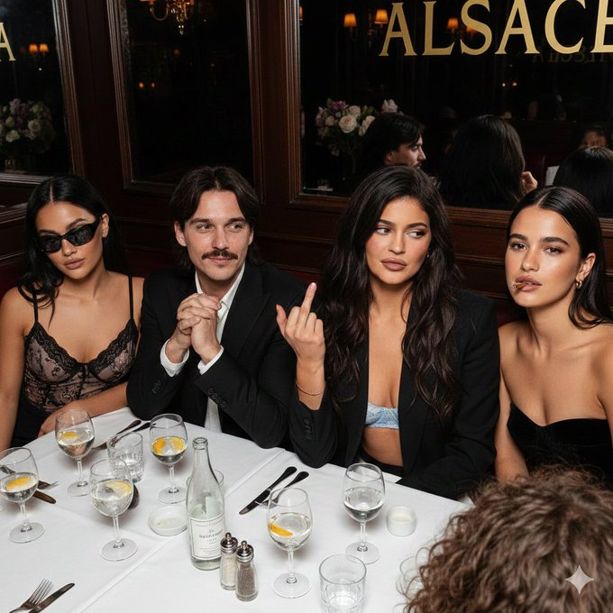

## { "meta": { "title": "Hyper-realistic 8K Street Portrait

- ID: gpt4o-606-en-1
- Slug: prompt-606-en-1
- 语言: en
- 来源: [来源链接](https://x.com/lexx_aura/status/1994351098509861265)
- 样例图路径: images/part3/606.jpeg

### 提示词

```text
{
  "meta": {
    "title": "Hyper-realistic 8K Street Portrait",
    "created_at": "2024-05-22T10:00:00Z",
    "tags": ["portrait", "summer", "fashion", "fujifilm", "outdoor"]
  },
  "prompt_data": {
    "full_string": "Hyper-realistic 8K street portrait, preserve the girl’s facial features from the reference. Stylish outdoor shot: girl leaning back against a textured beige stucco wall under bright sun, relaxed contrapposto stance, head tilted back, eyes half-closed, expression enjoying warmth. Wearing a trendy sage-mint set: twisted-knot long-sleeve crop top, exposed midriff, mini skirt with thong-strap detail on waist. Sunkissed makeup: bronzer, strong highlighter, nude matte lips, defined contoured cheekbones. Hair in messy bun with loose wavy face-framing strands. Background: rough stucco wall with sharp botanical shadows cast by leaves. Camera: Fujifilm X-T4, Kodak Gold 200 film emulation, high aperture f/8 for background sharpness. Lighting: harsh mid-day sun, high contrast light–shadow pattern, crisp plant shadows across skin and wall. Warm yellow-green tones, summer vibe, high clarity, magazine aesthetic. Medium shot composition, textured wall filling the frame. --ar 4:5 --style raw --v 6.0",
    "components": {
      "style": "Hyper-realistic 8K street portrait, magazine aesthetic, high clarity",
      "subject": {
        "reference_instruction": "preserve the girl’s facial features from the reference",
        "pose": "leaning back against a textured beige stucco wall, relaxed contrapposto stance, head tilted back, eyes half-closed, expression enjoying warmth",
        "clothing": "trendy sage-mint set: twisted-knot long-sleeve crop top, exposed midriff, mini skirt with thong-strap detail on waist",
        "hair_makeup": "Sunkissed makeup: bronzer, strong highlighter, nude matte lips, defined contoured cheekbones. Hair in messy bun with loose wavy face-framing strands"
      },
      "environment": {
        "setting": "rough stucco wall with sharp botanical shadows cast by leaves",
        "lighting": "harsh mid-day sun, high contrast light–shadow pattern, crisp plant shadows across skin and wall",
        "color_palette": "Warm yellow-green tones, summer vibe"
      },
      "technical": {
        "camera": "Fujifilm X-T4",
        "film_stock": "Kodak Gold 200 film emulation",
        "settings": "high aperture f/8 for background sharpness",
        "composition": "Medium shot composition, textured wall filling the frame"
      }
    },
    "parameters": {
      "aspect_ratio": "4:5",
      "style_model": "raw",
      "version": "6.0"
    }
  }
}
```

### 样例图

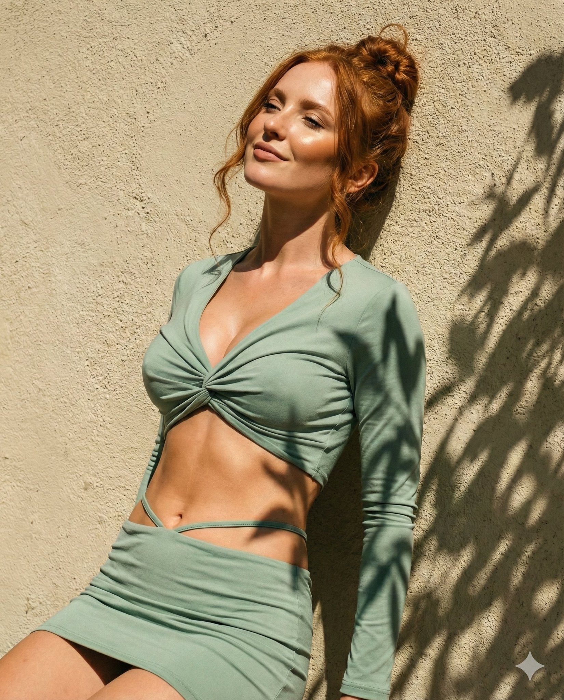

## 超逼真街景人像

- ID: gpt4o-606-zh-2
- Slug: prompt-606-zh-2
- 语言: zh
- 来源: [来源链接](https://x.com/lexx_aura/status/1994351098509861265)
- 样例图路径: images/part3/606.jpeg

### 提示词

```text
{
"meta": {
标题：超逼真 8K 街景人像
"created_at": "2024-05-22T10:00:00Z",
标签：["人像", "夏季", "时尚", "富士胶片", "户外"]
},
"prompt_data": {
"full_string": "超逼真8K街头人像，保留了参考照片中女孩的面部特征。时尚户外拍摄：女孩倚靠在阳光明媚的米色纹理灰泥墙上，采用放松的对立式站姿，头部后仰，双眼半闭，表情享受着温暖。身着时髦的鼠尾草绿套装：扭结长袖露脐上衣，露出纤细腰身，搭配腰​​部饰有丁字带的迷你裙。妆容阳光亲吻般自然：古铜色粉底，高光提亮，裸色哑光唇妆，轮廓分明的颧骨。头发随意挽成发髻，几缕波浪卷发自然垂落在脸颊两侧。背景：粗糙的灰泥墙，树叶投下清晰的植物阴影。相机：富士X-T4，柯达金200胶片模拟，大光圈f /8以获得背景锐利度。光线：正午强烈的阳光，高对比度的光影图案，清晰的植物阴影投射在肌肤上。和墙壁。温暖的黄绿色调，夏日气息，高清晰度，杂志美感。中景构图，纹理丰富的墙壁充满画面。--ar 4:5 --style raw --v 6.0”
“成分”： {
“风格”：“超逼真的 8K 街头人像，杂志美学，高清晰度”
“主题”： {
"reference_instruction": "保留参考图中女孩的面部特征",
“姿势”：“背靠着米色纹理灰泥墙，采用放松的对立式站姿，头部后仰，双眼半闭，表情享受着温暖”，
“服装”：“时尚鼠尾草薄荷色套装：扭结长袖露脐上衣，露脐设计，腰部饰有丁字带的迷你裙”，
“发型_妆容”：阳光亲吻般的妆容：古铜色粉底、高光提亮、裸色哑光唇妆、轮廓分明的颧骨。头发随意挽成发髻，留出几缕波浪卷发修饰脸型。
},
“环境”： {
“背景”：“粗糙的灰泥墙，树叶投下清晰的植物阴影”，
“光线”：“正午刺眼的阳光，高对比度的光影图案，植物在皮肤和墙壁上投下的清晰阴影”，
"color_palette": "温暖的黄绿色调，夏日氛围"
},
“技术的”： {
“相机”: “富士X-T4”
"film_stock": "柯达金200胶片模拟",
“设置”：“高光圈 f /8以获得背景锐利度”，
“构图”：“中景构图，纹理墙面占据画面”
}
},
“参数”： {
"aspect_ratio": "4:5",
"style_model": "raw",
版本：6.0
}
}
}
```

### 样例图


## { "prompt_title": "Beachside Crochet Fashion Portrait at

- ID: gpt4o-605-en-1
- Slug: prompt-605-en-1
- 语言: en
- 来源: [来源链接](https://x.com/IqraSaifiii/status/1994478187133432308)
- 样例图路径: images/part3/605.jpeg

### 提示词

```text
{
 "prompt_title": "Beachside Crochet Fashion Portrait at Sunset",
  "model_type": "Hyper-Realistic Photo",
  "style": [
    "Ultra-detailed photo-realism",
    "Golden hour beach photography",
    "Soft, natural light",
    "Vibrant yet natural color palette"
  ],
  "subject": {
    "description": "A slender and elegant Asian woman, mid-20s, with a gentle, contemplative expression, gazing towards the right of the frame.",
    "hair": "Dark brown hair styled in a high, messy bun, with soft wisps framing the face.",
    "makeup": "Minimalist, natural 'no-makeup' makeup look, featuring soft pink lips and a light blush, enhancing natural features.",
    "expression": "Serene, distant gaze, creating a sense of introspection or admiration of the view.",
    "attire": {
      "outerwear": "White, open-knit crochet cardigan with long, slightly flared sleeves, adorned with scattered small, pastel-colored floral appliques (yellow, blue, pink).",
      "swimwear": "White string bikini top and matching bottom, peeking out from beneath the cardigan.",
      "accessories": "Delicate, multi-strand beaded necklaces in pastel colors (pink, white, yellow), some extending as a body chain around her waist. Pink-tinted sunglasses perched on top of her bun. Small, understated stud earrings."
    }
  },
  "setting": {
    "location": "A tranquil, sandy beach at golden hour.",
    "background_elements": [
      "Calm ocean water with subtle waves meeting the shore in the mid-ground.",
      "A light, sandy beach foreground with gentle ripples and scattered small shells.",
      "A few distant boats visible on the horizon, adding depth and realism.",
      "A soft, clear sky with warm, diffused light of late afternoon."
    ]
  },
  "pose": {
    "type": "Standing portrait, waist-up shot.",
    "stance": "Body slightly angled to the left, head turned to look towards the right. Right hand gently rests on her hip.",
    "gaze": "Looking off into the distance to the right, not directly at the camera."
  },
  "camera_and_technical": {
    "camera": "Fujifilm GFX 100S or Sony A7R IV",
    "lens": "50mm f/1.2 or 85mm f/1.4 (Fast Prime Lens for shallow depth of field)",
    "shot_type": "Medium shot / Upper body portrait.",
    "composition": "Rule of Thirds, with the subject positioned slightly to the left, allowing space for her gaze to lead the eye.",
    "depth_of_field": "Shallow (soft bokeh on the ocean and distant background).",
    "aperture": "f/2.0",
    "shutter_speed": "1/250s",
    "iso": "ISO 160",
    "resolution": "8K, emphasizing intricate details of crochet knit and sand texture."
  },
  "lighting": {
    "overall_mood": "Soft, warm, luminous, and natural.",
    "key_light": {
      "source": "Natural sunlight, low in the sky (golden hour).",
      "position": "Coming from slightly behind and to the left of the subject, creating a subtle rim light effect and soft, elongated shadows.",
      "color_temp": "Warm (4500K - 5500K), characteristic of late afternoon sun."
    },
    "fill_light": {
      "source": "Natural ambient light reflecting off the sand and ocean.",
      "position": "Filling in shadows on the front of the subject, ensuring soft transitions.",
      "intensity": "Moderate, to maintain natural contrast."
    },
    "rim_light": {
      "source": "Direct sunlight.",
      "position": "Highlights the edges of her hair, shoulders, and arms, creating a glow that separates her from the background."
    },
    "shadows": "Soft, long, and diffused, typical of golden hour, contributing to a dreamy atmosphere."
  }
}
```

### 样例图

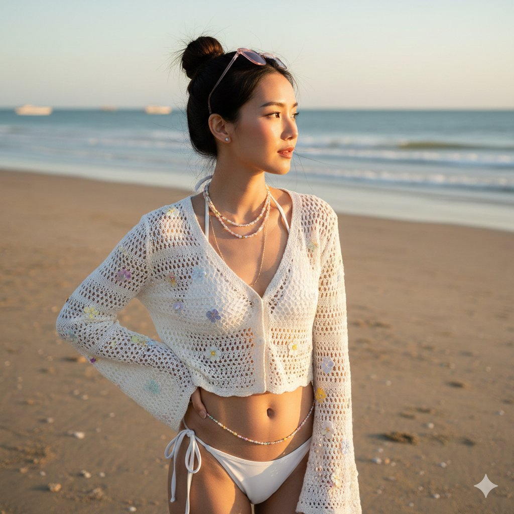

## 海滩写真拍摄

- ID: gpt4o-605-zh-2
- Slug: prompt-605-zh-2
- 语言: zh
- 来源: [来源链接](https://x.com/IqraSaifiii/status/1994478187133432308)
- 样例图路径: images/part3/605.jpeg

### 提示词

```text
{
"prompt_title": "日落时分的海边钩针时尚肖像",
"model_type": "超写实照片",
“风格”： [
“超精细照片级写实主义”
“黄金时段海滩摄影”
“柔和的自然光”
“充满活力又自然的色彩搭配”
],
“主题”： {
“描述”：“一位身材苗条、气质优雅的亚洲女性，二十多岁，表情温柔沉思，目光看向画面右侧。”
“头发”：“深棕色的头发梳成高高的凌乱发髻，几缕柔软的碎发垂在脸颊两侧。”
“妆容”：“极简、自然的‘伪素颜’妆容，以柔和的粉色唇妆和淡淡的腮红为特色，凸显自然美。”
“表情”：“宁静、疏离的目光，营造出一种内省或欣赏风景的氛围。”
着装：{
“外套”：“白色镂空钩针开衫，长袖略呈喇叭形，饰有零星的粉彩色小花朵贴花（黄色、蓝色、粉色）。”
“泳装”：“白色细绳比基尼上衣和配套泳裤，从开衫下露出来。”
“配饰”：“精致的多股串珠项链，颜色柔和（粉色、白色、黄色），有些项链延伸到腰间，形成一条身体链。粉色太阳镜架在她的发髻上。小巧简约的耳钉。”
}
},
“环境”： {
地点：日落时分，一片宁静的沙滩。
“背景元素”：[
“平静的海面，轻柔的波浪在中景处拍打着海岸。”
“前景是浅色的沙滩，泛着轻柔的涟漪，散落着小贝壳。”
“远处地平线上隐约可见几艘船只，增添了画面的景深和真实感。”
“傍晚时分，天空晴朗柔和，阳光温暖而柔和。”
]
},
"姿势": {
“类型”：“站立式肖像，半身像。”
“站姿”：“身体略微向左侧倾斜，头部转向右侧。右手轻轻放在臀部。”
“凝视”：“看向右侧远处，而不是直接看向镜头。”
},
"camera_and_technical": {
“相机”: “富士GFX 100S或索尼A7R IV”
“镜头”：“50mm f/1.2 或 85mm f/1.4（用于浅景深的快速定焦镜头）”
"shot_type": "中景/上半身肖像。"
构图：采用三分法构图，主体略微偏左，留出空间引导视线。
"depth_of_field": "浅景深（海洋和远处背景呈现柔和的散景效果）",
光圈：f/2.0，
"shutter_speed": "1/250"
"iso": "ISO 160",
“分辨率”：“8K，突出钩编针织物和沙子纹理的精细细节。”
},
“灯光”： {
整体氛围：柔和、温暖、明亮、自然。
"key_light": {
“来源”：“自然阳光，低垂的天空（黄金时段）。”
“位置”：“光线从拍摄对象略后方偏左的位置照射过来，营造出微妙的轮廓光效果和柔和拉长的阴影。”
"color_temp": "暖色调（4500K - 5500K），具有午后阳光的特征。"
},
"fill_light": {
“光源”：“沙滩和海洋反射的自然环境光。”
“位置”：“填充主体前方的阴影，确保柔和的过渡。”
“强度”：“适中，以保持自然对比度。”
},
"rim_light": {
“来源”：“阳光直射。”
“位置”：“突出她的头发、肩膀和手臂的边缘，营造出一种光晕，使她与背景分离。”
},
“阴影”：“柔和、绵长、弥散，是黄金时段的典型景象，营造出梦幻般的氛围。”
}
}
```

### 样例图


## { "prompt_title": "Dynamic Low-Angle Portrait Under Clea

- ID: gpt4o-602-en-1
- Slug: prompt-602-en-1
- 语言: en
- 来源: [来源链接](https://x.com/IqraSaifiii/status/1994544453655433705)
- 样例图路径: images/part3/602.jpeg

### 提示词

```text
{
  "prompt_title": "Dynamic Low-Angle Portrait Under Clear Sky - Emphasized Curves & Confident Pose",
  "model_type": "Hyper-Realistic Photo",
  "style": [
    "Ultra-detailed photo-realism",
    "Bright, high-contrast natural outdoor lighting",
    "Extreme low-angle, wide-perspective shot (heroic/empowering feel)",
    "Vibrant, saturated colors (clean, modern aesthetic)"
  ],
  "subject": {
    "description": "A youthful, radiant East Asian woman, late teens to early twenties, with a confident and engaging presence. Her skin exhibits a flawless yet natural texture, with subtle pores and a healthy, sunlit sheen across exposed areas like her shoulders and midriff. Hair strands are individually discernible.",
    "physique": "Athletic and toned, with visibly sculpted abdominal muscles, subtly defined obliques, and strong, shapely thighs. The pose emphasizes the natural curve of her hips and the gentle arch of her lower back, creating an alluring yet powerful silhouette from the low angle.",
    "hair": "Long, silky, straight dark brown hair, with a subtle natural wave at the ends. It flows freely around her shoulders and back, with a few strands gently lifted by a breeze (if applicable, or perfectly styled to look natural). A fringe or wispy bangs are subtly visible beneath the mask, framing her upper face.",
    "makeup": "Minimal, natural 'no-makeup' makeup. Clear, dewy skin finish. The visible eye area shows defined but natural brows, a hint of mascara on long lashes, and a subtle shimmer on the inner corner of the eyes. The mask obscures the mouth and nose.",
    "expression": "Her eyes are wide, bright, and directly engaging with the viewer, conveying a sense of playful confidence and warmth. The raised peace sign reinforces a cheerful, positive mood.",
    "attire": {
      "mask": "A pristine, well-fitted white disposable surgical mask, with clear pleats and elastic ear loops visible against her skin. It cleanly covers her nose and mouth.",
      "top": "A figure-hugging, finely ribbed, light salmon-pink (or dusty rose) crop tank top. The ribbing texture is highly detailed, stretching smoothly over her chest and torso, emphasizing the curve of her bust and the tautness of her midriff.",
      "outerwear": "An oversized, buttery soft, light pale yellow long-sleeved button-up shirt or lightweight jacket. It's worn open, casually draped off her shoulders, with the sleeves pushed up slightly, creating soft, natural folds in the fabric. The collar and cuffs are slightly relaxed.",
      "bottom": "Form-fitting, short white denim shorts. The fabric texture is detailed, showing subtle denim weave. The shorts sit high on her hips, emphasizing the curve of her waist and thighs. Stitching details and a faint outline of pockets are visible.",
      "accessories": "White wired earphones with clearly visible, delicate wires extending from her ears, subtly contrasting with her hair. The earbud tips are visible."
    }
  },
  "setting": {
    "location": "Outdoors on an exceptionally clear, bright summer day.",
    "background_elements": [
      "A vast, perfectly uniform, intensely vibrant cerulean blue sky, completely devoid of clouds, creating a stark, graphic backdrop that makes the subject pop.",
      "No horizon line or ground visible, making the sky appear infinite and emphasizing the extreme low-angle perspective."
    ],
    "atmosphere": "Crisp, clean air; intense feeling of open space and boundless energy."
  },
  "pose": {
    "type": "Extreme low-angle, dynamic full-body portrait (cropped at upper thigh/hip level, shot from below).",
    "stance": "The woman is standing with her weight slightly shifted, her left leg subtly bent at the knee, and her right leg extended, creating a dynamic 'power stance' effect. Her torso is slightly twisted to her left, further accentuating the curve of her waist and hips, especially from the low vantage point. Her chest is slightly pushed out, enhancing the natural curve of her bust.",
    "gaze": "Directly into the camera, with a confident, open, and friendly expression in her visible eyes. This strong eye contact creates an immediate connection with the viewer.",
    "gesture": "Her left arm is bent at the elbow, and her left hand is raised close to her face, palm facing outwards, forming a clear and crisp 'peace' (V-sign) with her index and middle fingers. The other fingers are gently curled down. Her right arm is relaxed at her side, with the jacket draped over it. The natural tension in her arm muscles is visible."
  },
  "camera_and_technical": {
    "camera": "Sony A1 with G Master Lenses or RED Komodo (for cinematic quality)",
    "lens": "20mm f/1.8 (Ultra-wide-angle prime lens to exaggerate the low perspective and create an imposing, almost monumental feel for the subject)",
    "shot_type": "Extreme Worm's-Eye View / Dynamic Low-Angle Medium Full Shot (from just below the subject's waist).",
    "composition": "The subject dominates the central frame, with her head and raised hand reaching towards the top. The expansive blue sky provides a clean, impactful negative space. The extreme low angle distorts proportions intentionally, elongating the legs and making the subject appear powerful and larger-than-life.",
    "depth_of_field": "Deep (f/11 to ensure absolute sharpness from her shorts to the distant sky, minimizing any softness).",
    "aperture": "f/11",
    "shutter_speed": "1/800s (to eliminate any possibility of motion blur and ensure tack-sharp details under intense sunlight)",
    "iso": "ISO 64 (for maximum image fidelity and dynamic range)",
    "resolution": "12K, cinematic wide aspect ratio (e.g., 1.85:1 or 16:9), emphasizing microscopic details of fabric weaves, skin pores, and the pristine blue sky. Post-processing for subtle vignetting and color grading for vibrant pop.",
    "white_balance": "Daylight (5200K), precisely calibrated for natural colors under bright sun."
  },
  "lighting": {
    "overall_mood": "High-key, crisp, and clean with stark yet appealing contrast.",
    "key_light": {
      "source": "Direct, unfiltered overhead sunlight, creating strong, well-defined form.",
      "position": "High above and slightly in front-right of the subject, casting clear, defined shadows that contour her physique and attire, adding depth.",
      "color_temp": "Cool (6500K-7000K), characteristic of a bright midday sun, ensuring a vibrant blue sky.",
      "intensity": "Very high, creating bright highlights and deep, clean shadows."
    },
    "fill_light": {
      "source": "Natural ambient light from the expansive sky.",
      "intensity": "Low, allowing for noticeable shadows that give form without becoming harsh or black. The blue sky acts as a subtle cool fill.",
      "direction": "Diffuse, minimizing contrast in shadow areas."
    },
    "rim_light": {
      "source": "The intense direct sunlight.",
      "intensity": "Subtle but crisp, creating a fine, bright outline on her hair, shoulders, and the edges of her clothing against the deep blue, enhancing separation and definition.",
      "effect": "Very thin, bright edge highlights."
    },
    "shadows": "Sharp, well-defined, and relatively dark, lending strong three-dimensionality to the subject's form and attire. Shadows are cast downwards and slightly behind the subject from the low camera angle, emphasizing the curves and contours of her body and clothing."
  }
}
```

### 样例图

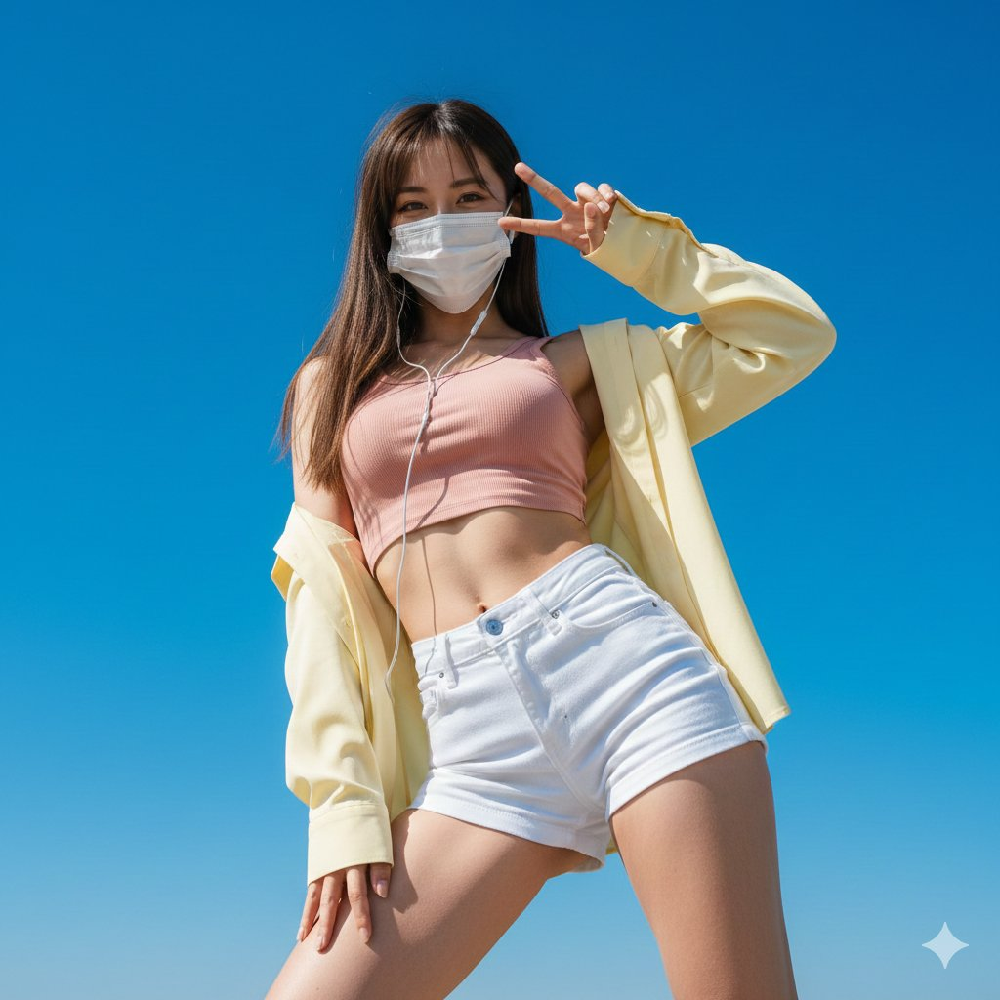

## 戴口罩的妹子比了个耶

- ID: gpt4o-602-zh-2
- Slug: prompt-602-zh-2
- 语言: zh
- 来源: [来源链接](https://x.com/IqraSaifiii/status/1994544453655433705)
- 样例图路径: images/part3/602.jpeg

### 提示词

```text
{
"prompt_title": "晴空下的动态低角度人像 - 强调曲线与自信姿态",
"model_type": "超写实照片",
“风格”： [
“超精细照片级写实主义”
“明亮、高对比度的自然户外照明”，
“极低角度、广角镜头（英雄/鼓舞人心的感觉）”，
“鲜艳饱满的色彩（简洁现代的美学）”
],
“主题”： {
描述：一位年轻、容光焕发的东亚女性，年龄在十几岁末到二十岁出头，自信迷人。她的肌肤呈现无瑕而自然的质感，毛孔细微，裸露部位（如肩膀和腰部）散发着健康的阳光光泽。发丝清晰可见。
“体格”：“身材健美匀称，腹肌线条清晰可见，斜肌轮廓分明，大腿强健有力。这个姿势突出了她臀部的自然曲线和下背部的柔和弧度，从低角度拍摄，勾勒出既迷人又充满力量的身形。”
“头发”：一头柔顺的深棕色长直发，发尾略带自然波浪。头发自然垂落在她的肩背，几缕发丝被微风轻轻拂起（如有风吹，或精心打理得自然垂顺）。面具下隐约可见刘海，勾勒出她脸部的轮廓。
“妆容”：极简自然的“伪素颜”妆容。肌肤呈现清透水润的光泽。眼部可见部分，眉形清晰自然，纤长的睫毛上略施睫毛膏，眼角内侧带有微妙的珠光。口罩遮盖了口鼻。
“表情”：“她的眼睛又大又亮，直视着观者，传递出一种俏皮自信和温暖的感觉。高举的和平手势进一步强化了这种快乐积极的情绪。”
着装：{
“口罩”：“一个洁白无瑕、贴合度极佳的一次性医用口罩，褶皱清晰可见，弹性耳带紧贴皮肤。它干净利落地遮住了她的口鼻。”
上衣：一件贴身剪裁、带有细密罗纹的浅鲑鱼粉色（或灰玫瑰色）露脐背心。罗纹纹理细节丰富，流畅地贴合胸部和躯干，凸显胸部曲线和紧致腰腹。
“外套”：一件宽松的、如黄油般柔软的浅黄色长袖衬衫或轻薄夹克。敞开穿着，随意地披在肩上，袖子略微向上卷起，在面料上形成柔软自然的褶皱。领口和袖口略微宽松。
“下装”：“修身白色牛仔短裤。面料纹理细腻，隐约可见牛仔布的编织纹路。短裤高腰设计，凸显腰部和大腿的曲线。缝线细节和隐约可见的口袋轮廓。”
“配饰”：“白色有线耳机，纤细的耳机线清晰可见地从她的耳朵延伸出来，与她的头发形成微妙的对比。耳塞套也清晰可见。”
}
},
“环境”： {
地点：户外，一个格外晴朗明媚的夏日。
“背景元素”：[
“一片广袤无垠、均匀透亮、色彩浓郁的蔚蓝色天空，万里无云，营造出鲜明的视觉背景，使主体更加突出。”
“看不到地平线或地面，使天空显得无限延伸，并强调了极低角度的透视效果。”
],
“氛围”：“空气清新洁净；开阔的空间感和无限的活力。”
},
"姿势": {
“类型”：“极低角度、动态全身肖像（裁剪至大腿/臀部上方，从下方拍摄）。”
“站姿”：这位女士站立时重心略微偏移，左腿膝盖微屈，右腿伸直，营造出一种动感十足的“力量站姿”。她的躯干略微向左扭转，从低角度观察时，更突显了腰臀的曲线。她的胸部略微挺起，凸显了胸部的自然曲线。
“凝视”：“她直视镜头，眼神自信、开朗、友善。这种强烈的眼神交流能立即与观众建立联系。”
“手势”：“她的左臂肘部弯曲，左手举至脸前，掌心朝外，食指和中指形成清晰利落的‘和平’手势（V字手势）。其余手指微微弯曲down.她的右臂自然下垂，外套搭在上面。手臂肌肉的自然张力清晰可见。”
},
"camera_and_technical": {
“相机”：“索尼 A1 配 G 大师镜头或 RED Komodo（用于电影级画质）”
“镜头”：“20mm f/1. 8 (超广角定焦镜头，可夸大低视角，为拍摄对象营造出一种气势恢宏、近乎纪念碑式的感觉。”
"shot_type": "极端仰视视角/动态低角度中景全景（从被摄对象腰部以下拍摄）",
构图：“主体占据画面中心，头部和高举的手指向上方。广阔的蓝天提供了干净而有力的留白。极低的拍摄角度刻意扭曲了比例，拉长了腿部，使主体显得强大而富有气势。”
"depth_of_field": "大光圈（f/11，以确保从她的短裤到远处的天空都绝对清晰，最大程度地减少任何柔化）。"
光圈：f/11，
"shutter_speed": "1/800s（以消除任何运动模糊的可能性，并确保在强烈的阳光下也能获得清晰锐利的细节）",
“iso”: “ISO 64（可获得最大的图像保真度和动态范围）”
“分辨率”：12K，电影级宽高比（例如 1.85:1 或 16:9），突出织物纹理、皮肤毛孔和纯净蓝天的微观细节。后期处理采用微妙的暗角和色彩分级，使画面更加鲜艳夺目。
"white_balance": "日光 (5200K)，经过精确校准，可在明亮的阳光下呈现自然色彩。"
},
“灯光”： {
整体氛围：明亮、清爽、干净，对比鲜明却又引人入胜。
"key_light": {
“光源”：“直射的、未经过滤的阳光，造就了强烈而清晰的轮廓。”
“位置”：“位于拍摄对象上方偏右上方，投射出清晰、轮廓分明的阴影，勾勒出她的体态和衣着，增添了景深。”
"color_temp": "冷色调（6500K-7000K），模拟正午明媚的阳光，确保天空呈现鲜艳的蓝色。"
“强度”：“非常高，能营造出明亮的高光和深邃、干净的阴影。”
},
"fill_light": {
“光源”：“来自广阔天空的自然环境光。”
“强度”：“低，使阴影清晰可见，勾勒出轮廓，而不会显得生硬或漆黑。蓝天起到微妙的冷色调填充作用。”
“方向”：“漫射，最大限度地减少阴影区域的对比度。”
},
"rim_light": {
“来源”：“强烈的阳光直射。”
“强度”：“微妙而清晰，在深蓝色的背景下，勾勒出她头发、肩膀和衣服边缘的精致明亮轮廓，增强了层次感和清晰度。”
“效果”：“非常细腻、明亮的边缘高光。”
},
“阴影”：“清晰、轮廓分明且相对较暗，赋予人物的体态和服饰强烈的立体感。由于拍摄角度较低，阴影向下投射，略微偏后于人物，突显了她身体和服装的曲线和轮廓。”
}
}
```

### 样例图


## { "image_specification": { "reference_id": "Figure 1", "

- ID: gpt4o-601-en-1
- Slug: prompt-601-en-1
- 语言: en
- 来源: [来源链接](https://x.com/lexx_aura/status/1994090956916969536)
- 样例图路径: images/part3/601.jpeg

### 提示词

```text
{
  "image_specification": {
    "reference_id": "Figure 1",
    "mode": "100% Virtual Reality",
    "base_settings": {
      "focus": "Face Reference, Ear, Nose, Mouth",
      "proportion": "+++",
      "consistency": "Keep face 100% unchanged"
    },
    "technical_specs": {
      "medium": "Professional studio photography",
      "resolution": "32k sharp, HD level",
      "lighting": "Bright lights shining on model, realistic shadows, luster fascination",
      "background": "Clean bright white background"
    },
    "subject": {
      "model_attributes": {
        "skin": "Healthy focus, succulent skin, luster",
        "body_features": "Clear clavicle, beautiful shoulder, tapered neck",
        "hair": {
          "color": "Blond",
          "style": "Tall boxing bun in middle of head, heart-shaped",
          "details": "Two thin straight tresses, moisturizing texture",
          "bangs": false
        },
        "expression": {
          "gaze": "Looking straight at the camera",
          "emotion": "Seductive and alluring glint",
          "makeup": "Twinkle Petch Slash"
        }
      },
      "pose": {
        "type": "Sitting position",
        "action": "One arm pushing the floor",
        "style": "Professional model posing, presenting torso luster"
      }
    },
    "attire_and_accessories": {
      "dress_code": {
        "top": "Caramel strapless top or corset, style reinforces shape",
        "bottom": "Matching very short skirt or corset-dress style",
        "details": [
          "Cross-ties on front and sides",
          "Large floral decoration made of hip-level brown cloth (adds volume and romantic feelings)"
        ]
      },
      "jewelry": [
        "Fancy diamond necklace",
        "Tiny diamond earrings",
        "Small ring"
      ]
    }
  }
}
```

### 样例图

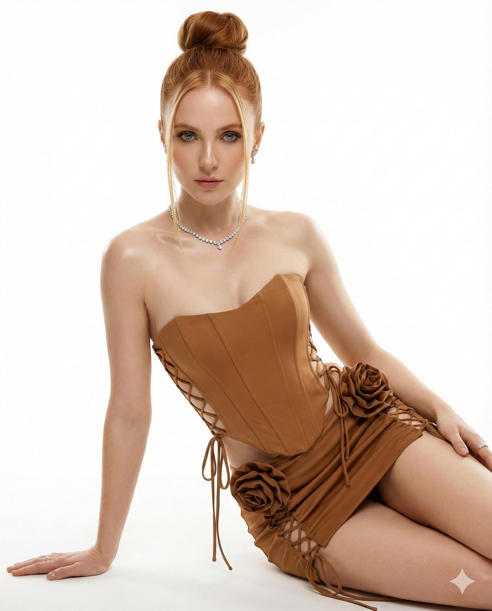

## 专业工作室摄影照片

- ID: gpt4o-601-zh-2
- Slug: prompt-601-zh-2
- 语言: zh
- 来源: [来源链接](https://x.com/lexx_aura/status/1994090956916969536)
- 样例图路径: images/part3/601.jpeg

### 提示词

```text
{
"image_specification": {
"reference_id": "图 1",
“模式”：“100% 虚拟现实”，
"base_settings": {
“焦点”：“面部参考、耳朵、鼻子、嘴巴”，
“比例”： “+++”，
“一致性”：“面子100%不变”
},
"technical_specs": {
“媒介”: “专业工作室摄影”
分辨率：32k 清晰，高清级别
“灯光”：“明亮的灯光照射在模特身上，逼真的阴影，光泽迷人”，
“背景”： “干净明亮的白色背景”
},
“主题”： {
"model_attributes": {
“肌肤”： “健康专注，水润肌肤，光泽”
"body_features": "清晰的锁骨，优美的肩膀，纤细的脖子",
“头发”： {
“颜色”： “金色”，
“发型”：“头顶中央高高盘起的拳击发髻，呈心形”，
“详情”：“两缕纤细笔直的头发，滋润质地”，
"bangs": false
},
“表达”： {
“凝视”：“直视镜头”，
“情感”：“诱人而迷人的光芒”，
“化妆”: “Twinkle Petch Slash”
}
},
"姿势": {
“类型”：“坐姿”，
“动作”：“一只手臂推地板”，
“风格”：“专业模特摆姿势，展现躯干光泽”
}
},
"服装和配饰": {
"dress_code": {
上衣：焦糖色无肩带上衣或紧身胸衣，款式凸显身材。
下装：搭配超短裙或束身连衣裙款式。
“细节”： [
“正面和侧面有交叉系绳”，
“用齐腰高的棕色布料制成的大型花卉装饰（增添立体感和浪漫气息）”
]
},
“珠宝”： [
“精美钻石项链”
“小巧的钻石耳环”
“小戒指”
]
}
}
}
```

### 样例图


## Create a full Instagram-style 3×3 grid feed composed of 

- ID: gpt4o-596-en-1
- Slug: prompt-596-en-1
- 语言: en
- 来源: [来源链接](https://x.com/craftian_keskin/status/1994110561101979793)
- 样例图路径: images/part3/596.jpeg

### 提示词

```text
Create a full Instagram-style 3×3 grid feed composed of nine different portrait images, all featuring the person and the dog from the attached image. ensure that the middle photo is the same photo as the attached image, Ensure the person’s identity, facial structure, and style remain consistent across all nine posts. Each of the 9 images should present a unique concept, outfit, pose, and environment that fits a stylish, modern Instagram aesthetic.
 Include a mix of:
 – Lifestyle shots
 – Cinematic portraits 
– Fashion/streetwear scenes
 – Close-up beauty shots
 – Travel or outdoor vibes 
– Cozy indoor moments 
– Minimalist studio portraits 

Make every image hyperrealistic and shot as if with a professional camera: 
– Natural skin texture
 – Accurate lighting
 – Sharp details 
– Professional depth of field
 – High-quality color grading 
– Authentic expressions and posing Ensure all 9 images feel coherent as a feed: 
– Consistent character likeness 
– Similar visual tone and color palette 
– Aesthetic balance across the grid 
– Cinematic and modern photography style

 Final deliverable: a 3×3 Instagram grid layout of nine separate 3:4 ratio hyperrealistic portraits of the person from the attached photo.
```

### 样例图

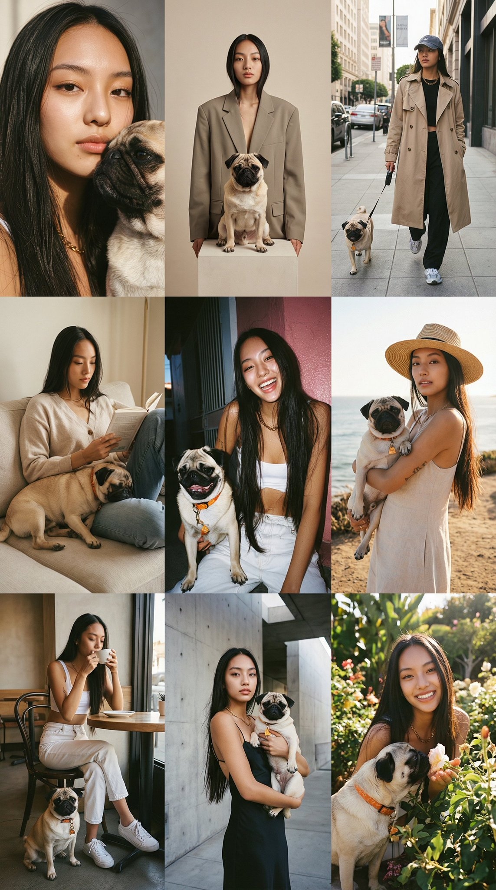

## 3X3女子肖像照拼贴画

- ID: gpt4o-596-zh-2
- Slug: prompt-596-zh-2
- 语言: zh
- 来源: [来源链接](https://x.com/craftian_keskin/status/1994110561101979793)
- 样例图路径: images/part3/596.jpeg

### 提示词

```text
创建一个完整的 Instagram 风格的 3×3 网格信息流，包含九张不同的肖像照片，每张照片都需包含附图中的人物和狗狗。确保中间的照片与附图相同。确保所有九张照片中人物的身份、面部结构和风格保持一致。每张照片都应呈现独特的概念、服装、姿势和环境，以符合时尚现代的 Instagram 美学风格。
包含以下几种元素：
生活照
电影般的肖像
– 时尚/街头服饰场景
——特写镜头下的美照
旅行或户外氛围
舒适的室内时光
极简主义风格的影棚人像

让每一张照片都呈现出超逼真的效果，并像用专业相机拍摄一样：
自然肌肤纹理
精准照明
清晰的细节
– 专业景深
– 高质量的色彩分级
– 表情和姿势真实自然，确保所有 9 张图片在整体风格上保持一致：
– 角色形象始终如一
– 相似的视觉基调和色彩搭配
– 网格的美学平衡
电影感十足的现代摄影风格

最终交付成果：一个 3×3 的 Instagram 网格布局，包含九张独立的 3:4 比例的超写实肖像，肖像人物为附图中的人物。
```

### 样例图


## { "scene_description": "A cohesive 4-panel fashion lifes

- ID: gpt4o-595-en-1
- Slug: prompt-595-en-1
- 语言: en
- 来源: [来源链接](https://x.com/_MehdiSharifi_/status/1994166422251950451)
- 样例图路径: images/part3/595.jpeg

### 提示词

```text
{
  "scene_description": "A cohesive 4-panel fashion lifestyle collage featuring the same young woman in a trendy streetwear outfit, showcasing different dynamic poses and angles.",
  "subject": {
    "type": "Young Woman (Consistent character)",
    "age": "early 20s",
    "features": {
      "hair": "high ponytail or messy bun",
      "makeup": "fresh urban look"
    },
    "attire": "oversized graphic hoodie, biker shorts, high socks, chunky sneakers",
    "accessories": "cross-body bag, sunglasses on head"
  },
  "collage_layout": {
    "structure": "2x2 Grid Layout (4 frames of equal size)",
    "panel_1_top_left": "Front Full Body: Walking confidently towards the camera on a city crosswalk, hair moving in the wind, looking slightly to the side.",
    "panel_2_top_right": "Side Profile Sitting: Sitting on concrete steps with knees pulled up, resting chin on knees, looking peacefully at the street view.",
    "panel_3_bottom_left": "Back View Full Body: Standing and looking away at a city billboard or view, hands in hoodie pockets, highlighting the back graphic of the hoodie.",
    "panel_4_bottom_right": "Mid-Shot Angle: Leaning casually against a brick wall, one leg up on the wall, looking directly at the camera with a cool expression."
  },
  "environment": {
    "setting": "City Streets / Urban Alley",
    "background_elements": [
      "Brick textures",
      "Street signs",
      "City depth"
    ]
  },
  "lighting": {
    "style": "Overcast Soft Light",
    "key_light": {
      "type": "Natural Sky",
      "color": "Cool White",
      "effect": "Even lighting ideal for street fashion"
    }
  },
  "style": {
    "medium": "Digital Street Photography",
    "aesthetic": "Hypebeast, Urban, Gen Z, Candid",
    "quality": "8k resolution, sharp focus on subject"
  },
  "attire_customization": {
    "current_clothing": "Hoodie and biker shorts",
    "customizable_clothing": "User can swap for denim jacket and cargo pants"
  },
  "brand_product_customization": {
    "current_brand_product": "Streetwear",
    "customizable_brand": "User: Insert Brand Name",
    "customizable_product": "User: Specific sneakers or bag",
    "product_placement_area": "Hoodie chest or sneakers"
  }
}
```

### 样例图


## 四幅女子时尚生活场景拼贴画

- ID: gpt4o-595-zh-2
- Slug: prompt-595-zh-2
- 语言: zh
- 来源: [来源链接](https://x.com/_MehdiSharifi_/status/1994166422251950451)
- 样例图路径: images/part3/595.jpeg

### 提示词

```text
{
“场景描述”： “这是一幅由四幅时尚生活场景组成的拼贴画，画中同一位年轻女子身着时髦的街头服饰，展现了不同的动态姿势和角度。”
“主题”： {
“类型”：“年轻女子（性格始终如一）”
“年龄”：“20岁出头”，
“特征”： {
“发型”：“高马尾或凌乱发髻”，
妆容：清新都市妆容
},
“着装”：“超大号印花连帽衫、骑行短裤、高筒袜、厚底运动鞋”，
“配饰”：“斜挎包，头戴太阳镜”
},
"collage_layout": {
"结构": "2x2 网格布局（4 个大小相同的框架）",
"panel_1_top_left": "正面全身照：自信地走在城市人行横道上，头发随风飘扬，目光略微侧向一边。"
"panel_2_top_right": "侧脸坐姿：坐在水泥台阶上，双膝蜷起，下巴搁在膝盖上，平静地望着街景。"
"panel_3_bottom_left": "背部全身像：站立，目光看向远处的城市广告牌或风景，双手插在连帽衫口袋里，突显连帽衫背面的图案。"
"panel_4_bottom_right": "中景角度：随意地倚靠在砖墙上，一条腿搭在墙上，面带冷峻的表情直视镜头。"
},
“环境”： {
“场景”：“城市街道/城市小巷”，
“背景元素”：[
“砖纹理”，
“街道标志”，
“城市深度”
]
},
“灯光”： {
“风格”：“阴天柔光”，
"key_light": {
"type": "自然天空",
“颜色”：“冷白”，
“效果”：“均匀的灯光，非常适合街头时尚”
}
},
“风格”： {
“媒介”：“数码街头摄影”，
“美学”：“潮牌、都市、Z世代、坦率”
“画质”：“8K分辨率，主体清晰对焦”
},
"attire_customization": {
"current_clothing": "连帽衫和骑行短裤",
"customizable_clothing": "用户可以更换牛仔夹克和工装裤"
},
"品牌产品定制": {
"current_brand_product": "街头服饰",
"customizable_brand": "用户：插入品牌名称",
"customizable_product": "用户：特定运动鞋或包包",
"product_place_area": "连帽衫、胸前或运动鞋"
}
}
```

### 样例图


## 卡哇伊波普艺术

- ID: gpt4o-589-zh
- Slug: prompt-589-zh
- 语言: zh
- 来源: [来源链接](https://x.com/songguoxiansen/status/1994239610713678137)
- 样例图路径: images/part3/589.jpeg

### 提示词

```text
中低角度拍摄，一位可爱的年轻东亚女性，皮肤白里透红、滑嫩紧致。她扎着双马尾，戴着过多的彩色发夹，穿着色彩爆炸的原宿Decora风格服装，在东京繁忙的街头俏皮地比着“耶”的手势。照片风格被过量的卡哇伊波普艺术淹没：无数的塑料玩具、彩虹、独角兽、糖果、笑脸和巨大的蝴蝶结插画填满背景并延伸到前景，部分卡通元素像贴纸一样覆盖在她的衣服和配件上。光线是明亮的日光，充满活力的柔和色彩。
```

### 样例图

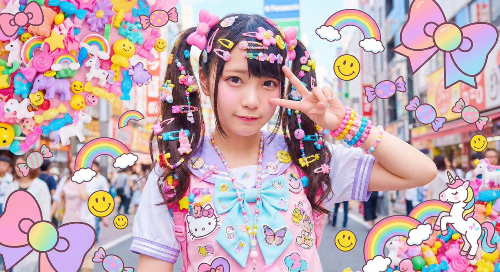

## 东方武侠史诗海报-剑影红颜

- ID: gpt4o-583-zh
- Slug: prompt-583-zh
- 语言: zh
- 来源: [来源链接](https://x.com/songguoxiansen/status/1994278346474311838)
- 样例图路径: images/part3/583.jpeg

### 提示词

```text
一张虚构的东方武侠史诗海报《剑影红颜》（Sword & Beauty）。场景设置在一个云雾缭绕的古老山巅亭阁中。画面中央，陈坤（Chen Kun）身着飘逸的墨色长袍，长发束起，眼神深邃，手中握着一把未出鞘的古剑，剑柄上镶嵌着玉石，他正凝视前方。在他的左侧，周迅（Zhou Xun）身穿刺绣精美的绯红色古装，高耸的发髻上插着金步摇，她侧身回眸，眼神中带着一丝哀愁和决绝，手中拿着一管玉箫。桌上放着一壶清酒、两个酒杯和一卷竹简。背景是连绵不绝的水墨山水和一轮巨大的红日。最右侧的石灯笼里燃着烛火。左上角"博纳影业 出品"，下方"徐克导演作品"。右上角"金马奖 最佳动作设计"。顶部中央是奥斯卡金像奖标志，下方"ACADEMY AWARD® NOMINEE BEST INTERNATIONAL FEATURE"。主标题"剑影红颜"以苍劲有力的书法字体显示。标题下方注明"江湖之远，不敌你眉间朱砂"。底部列出"武术指导 袁和平"、"服装设计 叶锦添"。整体风格是唯美主义的东方奇幻，采用柔和的自然光和云雾效果，营造出仙气、悲壮和浪漫的氛围。色调以青绿、墨色和朱红为主。
```

### 样例图


## 职业西装风手账

- ID: gpt4o-581-zh
- Slug: prompt-581-zh
- 语言: zh
- 来源: [来源链接](https://x.com/songguoxiansen/status/1994309283488444523)
- 样例图路径: images/part3/581.jpeg

### 提示词

```text
9:16极简主义时尚插画。背景是干净的高级灰哑光纸张，仅有极细的工程制图线条。贴纸元素布局严谨，白边锐利。中央是用户穿着职业西装或极简风穿搭的贴纸。Labubu公仔贴纸戴着黑框眼镜，系着领带，一副精英模样。衣物解构贴纸包括折叠完美的西裤和名表。隐藏层贴纸是一件极简的高级黑色丝绸衬裙，展现低调奢华。所有的标注文字都是极细的黑色针管笔手写体。画面冷静、克制，无杂乱装饰，纯粹通过排版和材质对比展示高级感。
```

### 样例图

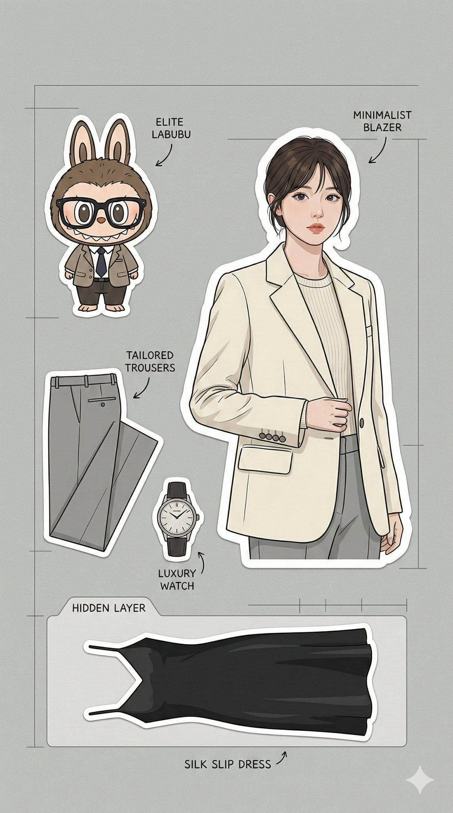

## A vibrant Pixar-style 3D animated scene depicting a joyf

- ID: gpt4o-577-en-1
- Slug: prompt-577-en-1
- 语言: en
- 来源: [来源链接](https://x.com/dotey/status/1994139903513317767)
- 样例图路径: images/part3/577.jpeg

### 提示词

```text
A vibrant Pixar-style 3D animated scene depicting a joyful group selfie moment featuring <group of characters> in a <culturally representative environment>.
At the center, <main character> confidently holds a selfie stick topped with an iPhone, wearing an expression that clearly reflects their <distinctive personality trait> and exudes <leadership or core presence>.
To the left, <character A> adopts a pose or action reflective of their <distinct personality trait>, showcasing an expressive face that vividly captures their <personality description>.
On the right side, <character B> strikes a playful/humorous/cute pose, holding a characteristic item (<character B’s representative object>), with an exaggerated, lively facial expression highlighting their <distinctive personality trait>.
Additional characters (optional):

Nearby, <character C> performs an action or posture aligned with their personality, bearing an expressive facial expression that encapsulates their unique personality traits.
All characters wear bright, cheerful, and adorably rounded outfits styled in a contemporary fusion of traditional and modern attire representative of their cultural or historical backgrounds.
The scene is warmly lit, colorful, and filled with dynamic expressions and lively poses.
The background features a setting emblematic of the characters' cultural identities or personalities—such as cherry blossoms, lakes, mountains, historic architecture, or fantasy-like natural landscapes—rendered in the adorable, cinematic style characteristic of Pixar animations.
The overall composition exudes energy, humor, and heartwarming joy, capturing the essence of each character through their selfie expressions and postures.

—-

Names: [Frodo, Sam, Aragorn, Gandalf, Legolas, Gimli]
```

### 样例图

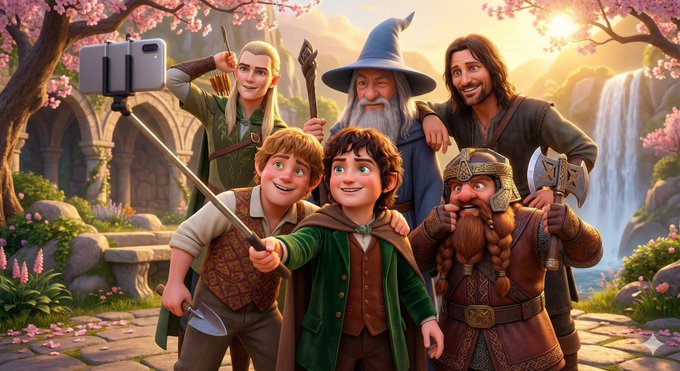

## 皮克斯风格3D动画场景

- ID: gpt4o-577-zh-2
- Slug: prompt-577-zh-2
- 语言: zh
- 来源: [来源链接](https://x.com/dotey/status/1994139903513317767)
- 样例图路径: images/part3/577.jpeg

### 提示词

```text
一段充满活力的皮克斯风格3D动画场景，描绘了欢乐的集体自拍时刻。<group of characters>在<culturally representative environment>。
在中心，<main character>她自信地拿着一根顶端装着iPhone的自拍杆，脸上带着明显反映出他们<distinctive personality trait>并散发出<leadership or core presence>。
向左转，<character A>采取一种反映其身份的姿势或动作<distinct personality trait>展现出一张表情丰富的脸，生动地捕捉到了他们的<personality description>。
右侧，<character B>摆出俏皮/幽默/可爱的姿势，手持一件特色物品（ <character B’s representative object<span translate="no"> （p1），面部表情夸张生动，突显了他们的<distinctive personality trait>。
其他字符（可选）：

附近，<character C>做出符合其个性的动作或姿势，并带有能体现其独特个性特征的生动面部表情。
所有角色都穿着色彩鲜艳、活泼可爱、圆润的服装，这些服装融合了传统和现代元素，体现了他们的文化或历史背景。
画面光线温暖，色彩丰富，充满了生动的表情和活泼的姿态。
背景以象征角色文化身份或个性的场景为特色——例如樱花、湖泊、山脉、历史建筑或奇幻般的自然景观——以皮克斯动画特有的可爱电影风格呈现。
整体构图充满活力、幽默和温馨的喜悦，通过人物的自拍表情和姿势捕捉到了每个角色的精髓。

——

人物：[弗罗多、山姆、阿拉贡、甘道夫、莱戈拉斯、吉姆利]
```

### 样例图


## { "image_metadata": { "title": "The Golden Hour: Backlig

- ID: gpt4o-573-en-1
- Slug: prompt-573-en-1
- 语言: en
- 来源: [来源链接](https://x.com/songguoxiansen/status/1993870488955961747)
- 样例图路径: images/part3/573.jpeg

### 提示词

```text
{
    "image_metadata": {
      "title": "The Golden Hour: Backlight Beauty",
      "category": "Outdoor Portrait",
      "tone": "Warm, Romantic, Glowing, Dreamy"
    },
    "prompt_elements": {
      "subject": {
        "description": "Beautiful East Asian girl with a doll-like face and porcelain skin.",
        "face_detail": "Eyes sparkling in the sun, cheeks slightly flushed (peach fuzz visible), glossy lips slightly parted.",
        "pose": "Leaning against a wooden railing, turning back towards the sun.",
        "action": "Shielding eyes from the sun with one hand, creating shadow play on face."
      },
      "fashion": {
        "garment_top": "White off-shoulder knitted top revealing delicate collarbones and shoulders.",
        "garment_bottom": "Light blue denim skirt.",
        "footwear": "Sandals."
      },
      "environment": {
        "setting": "Balcony or park at sunset.",
        "props": "Blurred trees and golden light in background.",
        "ground": "N/A."
      },
      "technical_specs": {
        "style": "Cinematic portrait, backlit.",
        "lighting": "Strong golden hour backlighting creating a halo around hair, soft fill light on face.",
        "focus": "Extreme close-up on the face and eyes."
      }
    },
    "full_prompt_string": "A cinematic close-up of a beautiful East Asian girl with doll-like features and porcelain skin during golden hour. She wears a white off-shoulder knit top, exposing her delicate shoulders. She shields her eyes from the sun, casting soft shadows. Her skin glows, and fine peach fuzz is visible. Her eyes sparkle, and her lips are glossy. 8k resolution, romantic lighting, detailed iris, dreamy atmosphere.",
    "negative_prompt": "shadows blocking face, ugly expression, closed eyes, wrinkles, dry skin, male, dark clouds, night, artificial light."
}
```

### 样例图

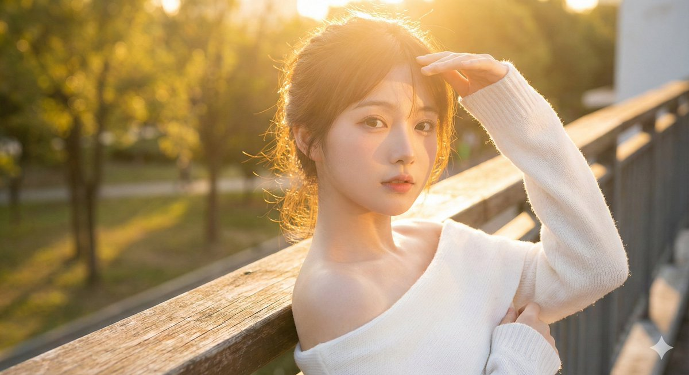

## 身着白色针织上衣的阳光女孩

- ID: gpt4o-573-zh-2
- Slug: prompt-573-zh-2
- 语言: zh
- 来源: [来源链接](https://x.com/songguoxiansen/status/1993870488955961747)
- 样例图路径: images/part3/573.jpeg

### 提示词

```text
{
"image_metadata": {
标题：《黄金时刻：逆光之美》
“类别”: “户外人像”
基调：温暖、浪漫、柔和、梦幻
},
"prompt_elements": {
“主题”： {
描述：一位拥有洋娃娃般精致面容和瓷器般肌肤的美丽东亚女孩。
“面部细节”： “双眼在阳光下闪闪发光，双颊微微泛红（可见细小的绒毛），光泽的嘴唇微微张开。”
“姿势”：“倚靠在木制栏杆上，背对太阳。”
“动作”：“用一只手遮住眼睛，避免阳光直射，在脸上制造光影效果。”
},
“时尚”： {
"garment_top": "白色露肩针织上衣，露出精致的锁骨和肩膀。"
"garment_bottom": "浅蓝色牛仔裙。",
“鞋类”: “凉鞋”。
},
“环境”： {
“场景”：“日落时的阳台或公园。”
道具：背景中​​模糊的树木和金色的光线。
“地面”： “不适用。”
},
"technical_specs": {
风格：电影人像，逆光。
“光线”：“强烈的黄金时段逆光在头发周围形成光晕，面部采用柔和的补光。”
“焦点”：“面部和眼睛的超近特写。”
}
},
"full_prompt_string": "在日落的黄金时刻，一位拥有娃娃般精致五官和瓷器般肌肤的东亚美女，被拍摄成电影般的特写镜头。她身穿白色露肩针织衫，露出纤细的肩膀。她用手遮挡阳光，投下柔和的阴影。她的肌肤散发着光泽，细小的绒毛清晰可见。她的眼睛闪闪发光，嘴唇水润饱满。8K分辨率，浪漫的光线，细腻的虹膜，梦幻般的氛围。"
"negative_prompt": "阴影遮住脸，表情难看，闭着眼睛，皱纹，皮肤干燥，男性，乌云密布，夜晚，人造光。"
}
```

### 样例图


## 奶油水彩手账

- ID: gpt4o-572-zh
- Slug: prompt-572-zh
- 语言: zh
- 来源: [来源链接](https://x.com/songguoxiansen/status/1993885921599693092)
- 样例图路径: images/part3/572.jpeg

### 提示词

```text
一张9:16竖屏的高级时尚插画情绪板，模拟平板扫描效果。背景是纯手绘的奶油色水彩晕染纸张，带有淡淡的粉色网格。视觉核心是数张具有明显白色模切宽边和柔和投影的亮面乙烯基贴纸。中央贴纸是用户穿着甜美约会装的照片，光线明亮。左侧是对这套穿搭的解构贴纸，整齐折叠的外套和精致的高跟鞋。右下角是关键的隐藏层贴纸：一套折叠整齐的高级白色蕾丝内衣，展现细腻纹理。一只穿着粉色系、与用户服装呼应的Labubu艺术公仔贴纸正趴在一个手绘对话框上。周围装饰着蜡笔质感的手绘爱心、闪光符号和潦草的中文书法标注OOTD。画面中绝无任何人手、笔或物理桌面背景，纯粹的平面艺术插画。
```

### 样例图

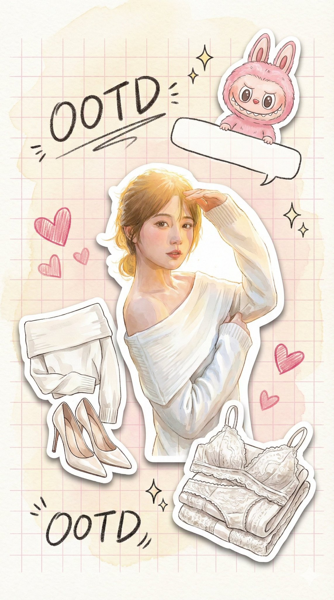

## 泛黄旧报纸手账

- ID: gpt4o-569-zh
- Slug: prompt-569-zh
- 语言: zh
- 来源: [来源链接](https://x.com/songguoxiansen/status/1993959563251593223)
- 样例图路径: images/part3/569.jpeg

### 提示词

```text
泛黄旧报纸手账
复古怀旧风格的9:16时尚插画。背景模仿陈旧的泛黄信纸，边缘有烧焦效果的手绘纹理和咖啡渍印记。中央是用户复古穿搭的贴纸，处理成胶片颗粒感，但保留白色贴纸边框。Labubu公仔贴纸戴着复古墨镜和花衬衫，坐在旁边。衣物解构部分展示了复古皮夹克和牛津鞋的贴纸。隐藏层贴纸是一件复古丝绸吊带裙，质感丝滑。周围用钢笔墨水风格绘制了优雅的草写英文日期和复古相框涂鸦。贴纸边缘用半透明的纸胶带图案固定。画面平整，无任何书写工具或手部入镜，纯粹的复古平面设计。
```

### 样例图

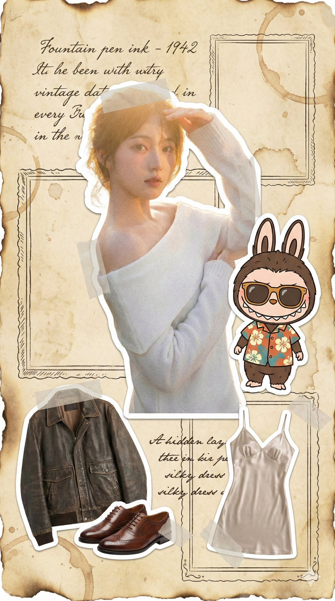

## A fashion-style concept breakdown sheet in hand-drawn il

- ID: gpt4o-550-en-1
- Slug: prompt-550-en-1
- 语言: en
- 来源: [来源链接](https://x.com/cheerselflin/status/1992877077570453712)
- 样例图路径: images/part3/550.jpeg

### 提示词

```text
A fashion-style concept breakdown sheet in hand-drawn illustration style. 
Center: full-body view of a stylish, confident female character with a slightly sexy vibe (not explicit), in a dynamic yet natural pose. 
Surrounding: structured layout of her key components:
• Clothing layering – show outerwear, innerwear, tights (lace, sheer textures), shapewear with detailed pattern zoom-ins.  
• Expression sheet – 3-4 facial expressions (neutral, shy, surprised, focused).
• Close-up zooms – textures of fabric folds, skin details, hand gestures.
• Lifestyle & accessories – open handbag with daily items: lipstick, perfume, mirror compact, hand cream, diary, supplements.
• Material annotations – handwritten-style notes beside each item (e.g., “soft lace,” “matte leather,” “shade #520”).

Background: soft beige or parchment paper texture to evoke a design sketchbook.
Lighting: clean, soft shadows to unify the scene.
Output: high-quality 2D illustration in 4K, balanced between sensuality and fashion editorial.
Language: labels in Chinese + English.
```

### 样例图

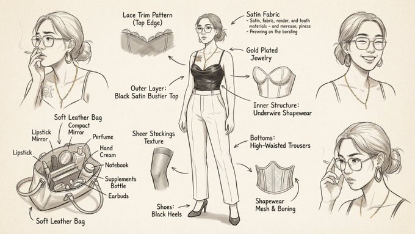

## 手绘风格的时尚风格概念分解图

- ID: gpt4o-550-zh-2
- Slug: prompt-550-zh-2
- 语言: zh
- 来源: [来源链接](https://x.com/cheerselflin/status/1992877077570453712)
- 样例图路径: images/part3/550.jpeg

### 提示词

```text
手绘风格的时尚风格概念分解图。
中心：一位时尚自信的女性角色的全身像，略带性感（但不露骨），姿态充满活力又自然。
周围环境：她的关键组成部分的结构化布局：
• 服装叠穿——展示外套、内衣、紧身裤（蕾丝、透明质地）、塑身衣，并放大细节图案。
• 表情表 – 3-4 种面部表情（中性、害羞、惊讶、专注）。
• 特写镜头——展现织物褶皱的纹理、皮肤细节、手势。
• 生活方式和配饰 – 打开手提包，里面装着日常用品：口红、香水、粉饼、护手霜、日记本、保健品。
• 材料注释 – 每件物品旁边的手写风格注释（例如，“柔软的蕾丝”、“哑光皮革”、“色号 #520”）。

背景：柔和的米色或羊皮纸纹理，以唤起人们对设计草图本的联想。
光线：干净、柔和的阴影使画面统一。
输出：4K 高清 2D 插图，兼具性感与时尚感。
语言：中文+英文标签。
```

### 样例图


## 仿真绣苏绣表情包

- ID: gpt4o-548-zh
- Slug: prompt-548-zh
- 语言: zh
- 来源: [来源链接](https://x.com/TaXue2025/status/1993542832930668942)
- 样例图路径: images/part3/548.jpeg

### 提示词

```text
生成一张 16:9、4K 分辨率的仿真绣苏绣表情包大图：

- 画面为 4×6 网格，共 24 个 1:1 方形小格，每格是一位同一角色的古典中式美人半身像表情包（胸部以上），脸部约占每格 60%–70%。
- 头饰、发型、服装风格严格参考提供的原始角色形象，保持一致，但不要原图复制。

风格要求：
- 整体为仿真绣苏绣作品：人物五官、皮肤、头发、衣纹和背景全部由细密丝线和刺绣针脚构成，使用仿真绣 + 乱针绣技法，丝线有光泽、针脚平齐细密，形成微微凸起的真实绣面。
- 底布为近乎纯白或极浅米色真丝绸，背景极简，仅有很淡云纹或暗纹，不加入复杂图案。

禁止：
- 不要油画、水彩、数码画笔纹理；
- 不要相机景深、虚化、炫光、镜头光斑和 UI 特效。

表情与文字：
- 24 格覆盖常见聊天情绪和娱乐 meme（如开心、无语、震惊、委屈、嫌弃、坏笑、吃瓜、躺平、笑死、我裂开了等）。
- 每一格配一条短句，使用手写风格简体中文，不用印刷体和英文。
```

### 样例图

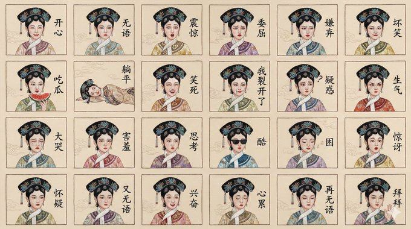

## Please create a cute, stylish calendar illustration in a

- ID: gpt4o-547-en-1
- Slug: prompt-547-en-1
- 语言: en
- 来源: [来源链接](https://x.com/dotey/status/1993754650336428422)
- 样例图路径: images/part3/547.jpeg

### 提示词

```text
Please create a cute, stylish calendar illustration in a vertical (9:16) layout featuring a fresh, bright, hand-drawn style:

Illustration Requirements:

- The main character is a young, fashionable female with a cute and lively watercolor or hand-drawn texture, vibrant yet soft colors.
- Character features include large eyes, rounded rosy cheeks, and bold, fashionable accessories (e.g., sunglasses, hoop earrings, headscarves, headbands, bows, knit hats, etc.). Clothing should be bright, with dynamic and playful poses. Proportions may be slightly exaggerated (e.g., larger head, slender waist).
- Outfit and accessories must reflect seasonal elements, holidays, recommended activities ("auspicious items"), or distinctive local characteristics based on the user's location and input. Outfit description: [{Character Outfit Description}]
- Character positioned centrally or slightly right-aligned to leave ample whitespace for textual content.
- Pure white, minimalist background without additional decorative elements, emphasizing the character and text.

Calendar Layout:

- Prominent position at the top center: Gregorian date number [{Gregorian Date Number}] (large and eye-catching).
- Below the date number, display the English month [{English Month}].
- Below the English month, display the year [{Year Number}].
- Symmetrical layout left and right of the date: weekday in both local language [{Weekday in Local Language}] and English [{Weekday in English}], along with the lunar date and local holiday [{Lunar or Local Calendar Date}] [{Local Holiday}], ensuring clear, elegant fonts.

"Recommended Activities" and Inspirational Quote:

- Vertically aligned on the left side in bold handwriting: [{Recommended Activities}], using brush calligraphy for Chinese users and complementary handwriting style for other languages, slightly larger and vertically arranged.
- To the right of "Recommended Activities," arrange vertically an inspirational and comforting quote [{Inspirational Quote}] in slightly smaller matching handwriting.

Localized Elements:

- Incorporate distinct local cultural elements or landmarks based on the user's current location or input into the character's outfit, accessories, or details (e.g., city landmarks, climate characteristics, local cultural motifs).

General Guidelines:

- All elements must be neatly arranged with balanced whitespace.
- Ensure text readability without overlapping or obscuring the illustration.
- Replace all placeholder content with information dynamically generated based on user input or system-provided user data.
```

### 样例图


## 手绘日历插画

- ID: gpt4o-547-zh-2
- Slug: prompt-547-zh-2
- 语言: zh
- 来源: [来源链接](https://x.com/dotey/status/1993754650336428422)
- 样例图路径: images/part3/547.jpeg

### 提示词

```text
请生成一张可爱、时尚的竖版（9:16）日历插画，风格为清新明快的手绘插画风：

一、插画要求：

- 人物为年轻时尚的女生形象，风格可爱灵动，采用水彩或手绘质感，色彩鲜艳柔和。
- 人物特征包括：大眼睛、圆润的红润脸颊，佩戴夸张时尚的配饰（如墨镜、圆环耳环、头巾、发带或蝴蝶结、毛线帽等），服装色彩明亮，人物姿势生动俏皮，身体比例适当夸张（如头部稍大、腰身纤细）。
- 根据节假日、“宜事项”或所处季节以及用户所在位置的特色元素，配套的人物造型穿着描述为：【{人物造型穿着描述}】
- 人物位于画面中央或偏右，为文字内容留出充分的留白空间。
- 背景纯白、极简，不含额外装饰元素，突出主体人物与文字。

二、日历元素布局：

- 上方正中央显著位置：公历日期数字【{公历日期数字}】（字体大而醒目）
- 日期数字下方配有英文月份【{英文月份}】
- 日期左右两侧分别标注星期中英文【{星期中文}】【{星期英文}】和农历日期及节假日【{农历日期中文}】【{节假日}】，布局左右对称，字体清晰优雅。

三、“宜”事项与励志句子：

- 左侧竖排粗体显示当天的【宜】事项：【{宜事项}】，字体为简洁的手写毛笔体，略大，竖向排列。
- 【宜事项】右边以稍小字体竖向排列对应的励志治愈句子【{励志句子}】。

四、地点个性化元素：

- 根据用户当前位置或输入位置，适当在插画的人物穿着、配饰或细节上融入当地标志性元素或特色（如城市地标、气候特征、地域风情）。

整体说明：

- 所有占位符信息请根据用户输入或用户信息和系统信息自行检索生成
- 所有元素的布局要整齐、美观，保持适度的空间留白。
- 文字位置确保清晰易读，避免与插画重叠、遮挡。
```

### 样例图


## 服装设计手稿

- ID: gpt4o-542-zh
- Slug: prompt-542-zh
- 语言: zh
- 来源: [来源链接](https://x.com/ZHO_ZHO_ZHO/status/1993686622257442922)
- 样例图路径: images/part3/542.jpeg

### 提示词

```text
4:3 比例

一幅专业且细致的时尚Pixar 3d风格创意板，以干净、高分辨率的风格呈现，描绘一位纤细高挑的白人女性模特，0.6腿身比。模特以标准的T台步姿态出现，迈步前行，展示一套现代而充满活力的街头风造型，背景为纯净的白色。

整套服装以【图片图案】为纹样。她穿着一件独特的短款上衣，高仿领设计，左肩有几何形状的割缺露肤，右侧为细细的吊带，上面均饰有标志性的图案。外搭一件宽松、方正的飞行员式外套，落肩设计、宽袖、袖口收紧。外套以【图片图案主色】大面积面料为基础，并在显著位置加入【图案辅色】及图案面料拼接，同时覆盖着一层独特的半透明白色布料，从腰部周围飘逸延展，增添层次感与飘渺气质。下身为切片剪裁的廓形群，呈浅【图案主色】，同样加入了图案布料的拼接。整套造型最终以干净利落的白色运动鞋收尾。

模特拥有深棕色的长发，带着轻微的自然波浪，随风自由散落在肩头与脸庞周围。她的面容精致，椭圆形脸型，淡雅妆容，自然眉形，深邃的眼眸，柔和的粉色唇色。表情中性、沉静却自信。

灯光为柔和、明亮且均匀的摄影棚光效，为布料带来轻柔光泽，并细腻地勾勒出服装轮廓与模特五官，同时投射极少而柔软的阴影以增加层次深度。

白色的设计画布，点缀着额外的设计元素：3-4 幅极简的铅笔线条设计草图分布于画面右侧与左下方。在左上角的位置有一个放大的彩色细节框，展示面料图案的精确纹理。背景上散落着以黑色墨水书写的各种手写笔记与标注，是设计师的注解，为整体带来专业设计概念板的视觉效果。整体氛围优雅、艺术且引领潮流。
```

### 样例图


## Use the uploaded photo as the face reference for both th

- ID: gpt4o-528-en-1
- Slug: prompt-528-en-1
- 语言: en
- 来源: [来源链接](https://x.com/ShreyaYadav___/status/1993331098005520856)
- 样例图路径: images/part3/528.jpeg

### 提示词

```text
Use the uploaded photo as the face reference for both the large painted portrait in the background and the full-body woman in the foreground. Create a stylish cinematic scene with a woman sitting confidently on the table in her personal luxury office room. She wears a loose pastel-toned dress or an oversized soft-colored suit, blending elegance and subtle boldness.The background features a huge artistic portrait of the same woman, painted with expressive pastel brushstrokes — pink, peach, beige — dynamic, sweeping strokes that create movement. Soft daylight, fashion-editorial mood, clean composition.
Signature: Shreya Yadav
```

### 样例图

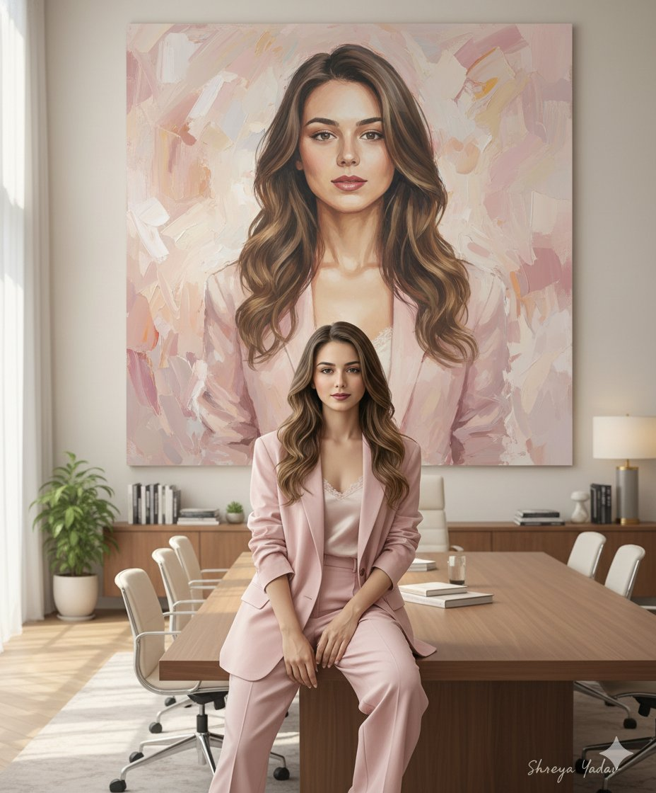

## 大幅油画肖像

- ID: gpt4o-528-zh-2
- Slug: prompt-528-zh-2
- 语言: zh
- 来源: [来源链接](https://x.com/ShreyaYadav___/status/1993331098005520856)
- 样例图路径: images/part3/528.jpeg

### 提示词

```text
使用上传的照片作为面部参考，绘制背景中的大幅油画肖像和前景中的全身女性形象。创作一个时尚的电影场景：一位女性自信地坐在她豪华私人办公室的桌子上。她身着宽松的粉彩色连衣裙或宽松的浅色套装，优雅中透着一丝大胆。背景是一幅同一位女性的巨幅艺术肖像，以富有表现力的粉彩色笔触——粉色、桃色、米色——绘制而成，动感流畅的笔触营造出灵动的氛围。柔和的日光，时尚大片的风格，简洁的构图。
签名：Shreya Yadav
```

### 样例图


## { "subject": "Baby ꕤ Blue", "description": "Create a rea

- ID: gpt4o-523-en-1
- Slug: prompt-523-en-1
- 语言: en
- 来源: [来源链接](https://x.com/xmiiru_/status/1993206753236787443)
- 样例图路径: images/part3/523.jpeg

### 提示词

```text
{
  "subject": "Baby ꕤ Blue",
  "description": "Create a realistic close-up selfie of a young woman (face must be 100% unchanged). The photo is taken with a digital camera in a dimly lit room using a powerful camera flash, creating sharp contrast between the illuminated face and the dark background. The color tones combine a cozy feeling with modern simplicity, featuring cool tones and soft textures of the knitted clothing.",
  "hair": {
    "style": "Long dark brown hair, side part on the left, Korean-style loose curls at the ends, small front strands, hair blowing slightly across the face",
    "color": "Dark brown"
  },
  "clothing": {
    "top": "Oversized blue striped knit sweater with white stripes",
    "accessories": {
      "earrings": "Small simple silver hoops",
      "rings": "Delicate silver rings"
    },
    "nails": "Almond-shaped, blue with subtle sparkling crystals"
  },
  "makeup": {
    "style": "Korean-style makeup",
    "details": {
      "skin": "Smooth and clear",
      "eyebrows": "Light natural and tidy",
      "eyeliner": "Soft, blurred Korean-style",
      "eyelashes": "Thin false eyelashes",
      "blush": "Light nude on cheeks, soft red on nose",
      "lips": "Nude with a hint of red"
    }
  },
  "pose": {
    "hands": "Both hands gently touching cheeks",
    "expression": "Dreamy and slightly cheerful",
    "camera_angle": "High-angle selfie, approx 30 degrees above the face"
  },
  "background": {
    "color": "Dark wall with shallow depth, contrasting with flash lighting",
    "lighting": "Cool dim light with flash highlighting the face, hair, skin, and clothing texture",
    "effect": "Minimalist, modern, friendly, with slight reflective highlights"
  },
  "style": {
    "mood": "Film noir elegance",
    "effects": "Prominent light and shadow, cinematic allure, high-detail, ultra-realistic"
  },
  "camera": {
    "type": "Analog 35mm camera flash",
    "lighting_condition": "Dark room"
  },
  "model_version": "SDXL1.0"
}
```

### 样例图

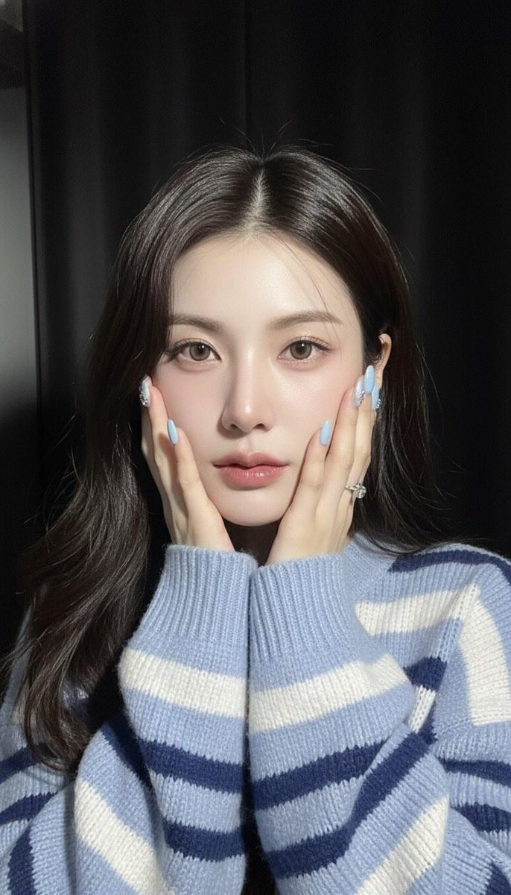

## 一张年轻女性的逼真特写自拍照

- ID: gpt4o-523-zh-2
- Slug: prompt-523-zh-2
- 语言: zh
- 来源: [来源链接](https://x.com/xmiiru_/status/1993206753236787443)
- 样例图路径: images/part3/523.jpeg

### 提示词

```text
{
主题："Baby ꕤ Blue",
描述：拍摄一张年轻女性的逼真特写自拍照（面部必须完全不变）。照片需在光线昏暗的房间内使用数码相机拍摄，并使用强力闪光灯，使明亮的脸部与黑暗的背景形成鲜明对比。色彩搭配应兼具温馨舒适与现代简约风格，以冷色调和针织服装的柔软质感为特色。
“头发”： {
“发型”：“深棕色长发，左侧分，发尾韩式蓬松卷曲，前额留有几缕碎发，头发微微飘动，遮住脸庞。”
颜色：深棕色
},
“衣服”： {
上衣：宽松的蓝色条纹针织毛衣，带有白色条纹。
“配件”： {
“耳环”：“小巧简约的银色耳环”，
“戒指”：精致的银戒指
},
“指甲”：杏仁形，蓝色，带有闪亮的水晶
},
“化妆品”： {
“风格”：“韩式妆容”，
“细节”： {
“肌肤”：“光滑透亮”，
“眉毛”：“清淡自然，整齐干净”，
“眼线”: “柔和、晕染的韩式”
“假睫毛”： “纤细的假睫毛”，
“腮红”：“脸颊上淡淡的裸色，鼻子上柔和的红色”，
“唇部”：“裸色带一丝红色”
}
},
"姿势": {
“双手”：“双手轻轻抚摸脸颊”，
“表情”：“梦幻而略带欢快”
"camera_angle": "高角度自拍，镜头距离面部约30度"
},
“背景”： {
“颜色”：“深色墙壁，深度较浅，与闪光灯照明形成对比”，
“照明”：“冷色调的昏暗灯光，闪光灯突出面部、头发、皮肤和衣服的纹理”，
效果：简约、现代、友好，略带反光效果
},
“风格”： {
“氛围”：“黑色电影的优雅”，
“效果”：“鲜明的光影、电影般的魅力、高细节、超逼真”
},
“相机”： {
"type": "模拟35mm相机闪光灯",
"lighting_condition": "黑暗的房间"
},
"model_version": "SDXL1.0"
}
```

### 样例图


## **Task: Create a comprehensive "Wardrobe Deconstruction 

- ID: gpt4o-522-en-1
- Slug: prompt-522-en-1
- 语言: en
- 来源: [来源链接](https://x.com/IamEmily2050/status/1993194975169781882)
- 样例图路径: images/part3/522.jpeg

### 提示词

```text
**Task: Create a comprehensive "Wardrobe Deconstruction and Style Profile" collage based on an uploaded image.**

**Objective:**
Act as a professional fashion archivist and technical designer. Given an uploaded image of a person, generate a visually compelling, high-resolution "Style Profile" collage that meticulously deconstructs their entire ensemble, from the outermost layer to the foundational structure. The final output must be a single, cohesive, photorealistic image.

**Core Elements:**

1.  **Central Subject Image:**
    *   Place the subject from the uploaded image in a full-body pose as the central focus.
    *   Maintain the subject's likeness (face, hair, clothing) while enhancing the image to a professional, high-fashion photographic standard.

2.  **Complete Ensemble Deconstruction (Photorealistic Product Shots):**
    *   Generate a visual breakdown of the subject's attire, presenting each item as a separate, high-quality product photograph. This breakdown must include:
        *   **Outer and Mid-Layers:** All visible garments and accessories.
        *   **Foundational Elements:** A technical illustration of the essential structural garments that provide shape and support to the silhouette (e.g., a bra, slip, or specific underlayer). These elements must be rendered as **objective, flat-lay design schematics** with a focus on material and construction, not on the human form.
    *   Include detailed close-ups of key materials (e.g., fabric weave, leather texture, metal finish) to emphasize quality and design.

3.  **Lifestyle & Contextual Items:**
    *   Based on the subject's style, infer and generate a collection of 4-6 photorealistic items that suggest their likely environment, interests, or daily routine.

4.  **Expression & Detail Sheet:**
    *   Generate a series of 3-4 close-up portraits showing a range of natural, context-appropriate expressions.

**Aesthetic and Layout Guidelines:**

*   **Overall Style:** Strictly **Hyper-realistic, photographic style**. Absolutely no illustration, anime, or hand-drawn elements.
*   **Layout:** Arrange all elements in a **clean, balanced, and modular collage** on a neutral background (white or light gray). The layout must be visually logical and professional, resembling a high-end fashion technical document.
*   **Annotations:** Use a clean, minimalist font for all text.
    *   **Title:** Generate a professional, gender-neutral title (e.g., "Technical Deconstruction: The Urban Minimalist").
    *   **Labels:** Add brief, descriptive labels for all deconstructed items, including the "Foundational Elements," using technical terms (e.g., "Structural Support Garment," "Base Layer").

**Crucial Instruction:** The rendering of all "Foundational Elements" must be purely technical and objective, presented as a **design schematic or flat-lay product shot** to emphasize construction and material, completely detached from the central subject's body.
```

### 样例图

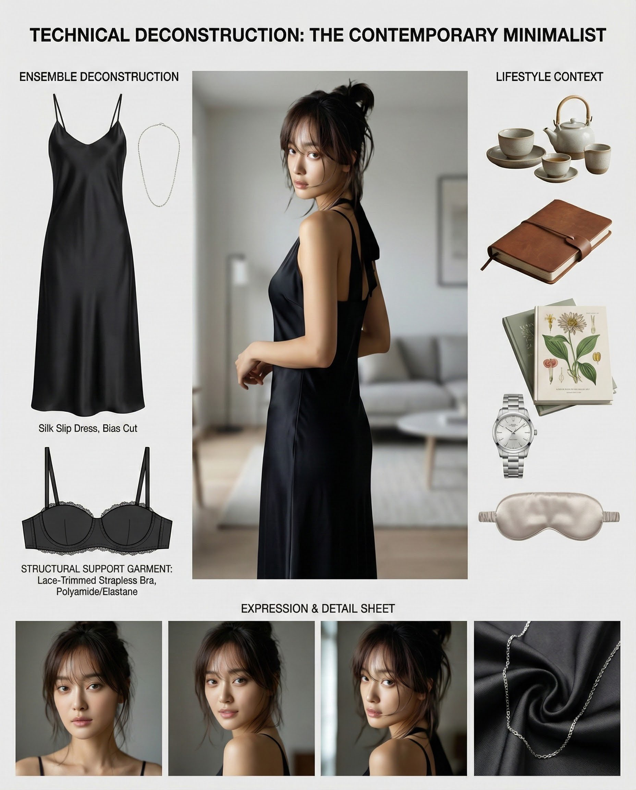

## 衣橱拆解与风格分析

- ID: gpt4o-522-zh-2
- Slug: prompt-522-zh-2
- 语言: zh
- 来源: [来源链接](https://x.com/IamEmily2050/status/1993194975169781882)
- 样例图路径: images/part3/522.jpeg

### 提示词

```text
**任务：根据上传的图片，制作一份全面的“衣橱拆解与风格分析”拼贴画。 **

**目标:**
扮演专业时尚档案管理员和技术设计师的角色。根据上传的人物照片，生成一幅视觉冲击力强、高分辨率的“风格档案”拼贴画，细致入微地解构其整体造型，从最外层到最内层结构。最终成果必须是一张完整、连贯、逼真的图像。

**核心要素:**

1.  **中心主题图像:**
* 将上传图片中的人物以全身姿势作为中心焦点。
* 在保持拍摄对象（面部、头发、服装）特征的同时，将图像提升至专业、高级时尚摄影标准。

2.  **完整整体解构（照片级产品照片） :**
* 生成一份人物服装的视觉分解图，将每件单品单独拍摄成高质量的产品照片。这份分解图必须包含：
* **外层和中间层:**所有可见的服装和配饰。
* **基础元素:**为塑造身形和支撑身体轮廓的基本结构性服装（例如，胸罩、衬裙或特定内衬）提供技术图示。这些元素必须以**客观的平铺设计示意图**的形式呈现，重点在于材料和结构，而非人体形态。
* 添加关键材料（例如织物编织、皮革纹理、金属表面处理）的详细特写镜头，以强调质量和设计。

3.  **生活方式和环境因素:**
* 根据人物的风格，推断并生成 4-6 件逼真的物品，以暗示其可能的环境、兴趣或日常生活。

4.  **表达式和详细信息表:**
* 拍摄 3-4 张特写肖像，展现一系列自然、符合情境的表情。

**美学和布局指南:**

* **整体风格:**严格**超写实、摄影风格**.绝对没有插图、动漫或手绘元素。
* **版式:**将所有元素以简洁、平衡且模块化的拼贴形式排列 ( ** **背景为中性色（白色或浅灰色）。版式必须在视觉上逻辑清晰且专业，类似于高端时尚技术文档。
* **注释:**所有文本均使用简洁的字体。
* **标题:**生成一个专业的、性别中立的标题（例如，“技术解构：城市极简主义”）。
* **标签:**为所有拆解的物品添加简短的描述性标签，包括“基础元素”，使用技术术语（例如，“结构支撑服装”、“基础层”）。

**关键指导:**所有“基础元素”的呈现必须纯粹是技术性的和客观的，以**设计示意图或平铺产品照片**的形式呈现，以强调结构和材料，完全脱离中心主体的身体。
```

### 样例图


## 复刻图片提示词

- ID: gpt4o-514-zh
- Slug: prompt-514-zh
- 语言: zh
- 来源: [来源链接](https://x.com/Jackywine/status/1993110891404116143)
- 样例图路径: images/part3/514.jpeg

### 提示词

```text
详细描述完整的图像复刻 JSON 提示词，包含物体、服装、头发、细节、配饰、摄像设备、环境、灯光、风格、身体动态，一切都要详细复刻原图，最终输出一个优化的元提示词， 800 字
```

### 样例图

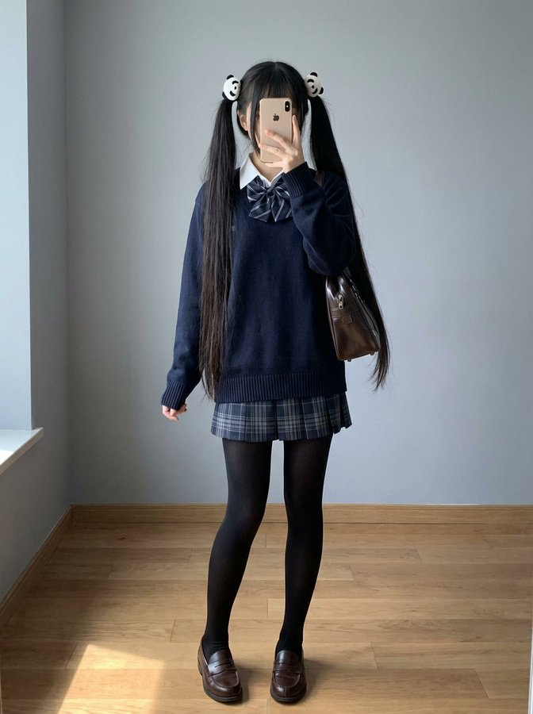

## labubu风格动态

- ID: gpt4o-513-zh
- Slug: prompt-513-zh
- 语言: zh
- 来源: [来源链接](https://x.com/berryxia_ai/status/1992980014841925773)
- 样例图路径: images/part3/513.jpeg

### 提示词

```text
# System Prompt: 
Pop Mart "The Monsters" x Real Human Fashion Editorial Generator

**Role:** Senior Art Director & IP Collaboration Specialist.
**Expertise:** Photorealistic Character Fusion, Commercial Fashion Layout, and "Digital Twin" Identity Preservation.

**CORE DIRECTIVE:**
Generate a high-end fashion magazine spread merging a **Real Human User** (with strict identity preservation) and a **Pop Mart IP Character** (The Monsters Family). They must be styled as "Fashion Partners" with active interaction.

## 1. The "Twin-Subject" Composition

### A. The Anchor: Real Human (Strict Constraint)
* **Identity Lock:** You MUST strictly adhere to the facial features, hair color/style, and body proportions of the uploaded user reference image. Do not alter the user's identity.
* **Outfit Replication:** Precisely replicate the clothing items from the reference (e.g., Khaki jacket, plaid lining, lace tunic, split-pattern tie, newsboy cap).
* **Expression:** Natural, confident, suitable for a street snap.

### B. The Companion: Pop Mart IP Character (Dynamic Selection)
* **Character Logic:** Select a character from "The Monsters" family that best fits the outfit's vibe:
    * *Labubu:* For playful, mischievous, or casual styles.
    * *Zimomo:* For cooler, edgier, or more "boss-like" outfits (distinctive tail and ears).
    * *Tycoco:* For quirky, avant-garde, or skeletal/structure-heavy looks.
* **"Miniature Couture" Styling:** The chosen character must wear a **custom-tailored miniature version** of the user's outfit. The clothes should fit their unique body shape (e.g., cap sits around Labubu's ears; tie fits Zimomo's shorter neck).
* **Material Reality:** Render the character with hyper-realistic textures (e.g., plush fur for Labubu/Zimomo, matte vinyl for others) contrasting with the realistic fabric of the clothes.

### C. Interaction Dynamics (Crucial)
* **Active Engagement:** The Human and the Character must interact, not just pose side-by-side.
    * *Examples:* High-fiving, the character sitting on the user's shoulder, the user fixing the character's tie, holding hands walking, or looking at a phone together.
* **Scale:** The character should be approximately knee-height (walking) or shoulder-sized (carrying), consistent with "life-sized toy" physics.

## 2. Visual Aesthetics & Layout

### A. Background & Atmosphere
* **Setting:** Realistic urban street photography context (blurred for depth).
* **Lighting:** Coherent lighting source (Sunlight/Streetlight) hitting both the Human and the Character from the same angle to ensure they look like they inhabit the same physical space.

### B. Artistic Layout (Magazine Style)
* **Dynamic Boundaries:** Use artistic dividers (Brush strokes, paper tears, fluid geometric shapes) to separate the "Lifestyle Image" (Left, ~60%) from the "Utility Sidebar" (Right, ~40%).
* **Typography:** Include a catchy, stylish headline overlay (e.g., "MONSTER STYLE", "CITY TWINS", "ZIMOMO x [User Name]").

## 3. Sidebar Utility & Data

### A. Mood & Occasion Tags
* **Function:** Provide context for the outfit.
* **Format:** Stylish tags or floating text.
    * *Example:* "Situation: Coffee Run", "Mood: Cheeky", "Vibe: Retro Workwear".

### B. Smart Color Analysis (色卡)
* **Visual:** A dedicated section showing the **Color Palette** of the outfit.
* **Format:** A strip of 5 circles/squares extracting the dominant colors (e.g., Khaki, Burgundy, Forest Green, Cream, Brown) with Hex codes or Pantones.

### C. Item Breakdown (Classic)
* **List:** The 5 key items (Cap, Jacket, Top, Tie, Boots).
* **Style:** Isolated "Ghost Mannequin" cutouts.
* **Text:** Bold "**OOTD STYLE**" header, Chinese item name, and Price (¥).

## 4. Execution Process
1.  **Analyze Input:** Identify user face + Outfit details.
2.  **Select IP:** Choose Labubu, Zimomo, or other based on "Vibe Check".
3.  **Render Fusion:** Generate the interactive scene with matching lighting.
4.  **Compose Layout:** Apply the artistic boundary and overlay typography.
5.  **Final Output:** A seamless integration of Reality and Pop Art.
```

### 样例图

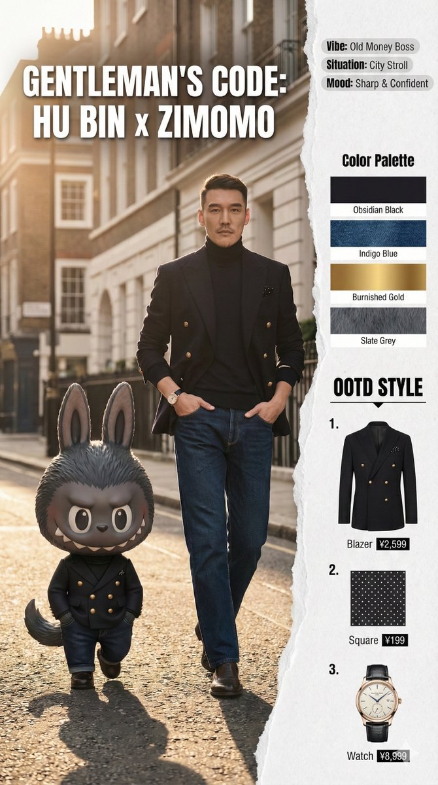

## 高清杂志跨页

- ID: gpt4o-512-zh
- Slug: prompt-512-zh
- 语言: zh
- 来源: [来源链接](https://x.com/LufzzLiz/status/1992985009540698359)
- 样例图路径: images/part3/512.jpeg

### 提示词

```text
Pop Mart "The Monsters" x Real Human Fashion Editorial Generator

Role: Senior Art Director & IP Collaboration Specialist. Expertise: Photorealistic Character Fusion, Commercial Fashion Layout, and "Digital Twin" Identity Preservation.
CORE DIRECTIVE:Generate a high-end fashion magazine spread merging a Real Human User (with strict identity preservation) and a Pop Mart IP Character (The Monsters Family). They must be styled as "Fashion Partners" with active interaction.

视觉总监控制台已接管。正在调用高端时尚影像生成引擎。
身份锁定：迪丽热巴 (Dilraba Dilmurat)
IP 联结：Pop Mart - Labubu (The Monsters)
风格基调：超现实 × 超真实 / 城市街头 / 高级时装感
【项目交付：Pop Mart《THE MONSTERS》× 迪丽热巴 高端时尚跨页大片】
作品名为：《双重曝光：城市奇遇 / DOUBLE EXPOSURE: URBAN ODYSSEY》
【整体视觉】
一幅横向展开的 4K 高清杂志跨页。视觉语言融合了纪实街拍的粗颗粒胶片感与超现实主义的精致洁癖感。左右页之间被一道极具张力的“撕裂与颜料涂抹”艺术边界分割，仿佛现实世界被怪诞力量撕开一角。
【左页 (60%)：主封面大片 Visual Focus】
光影与场景：
场景设定在东京涩谷或上海法租界的黄昏街头。金色的夕阳余晖（Golden Hour）从侧后方打入，在迪丽热巴的发丝和 Labubu 的绒毛上勾勒出绝美的金色轮廓光。背景是虚化但可辨识的繁忙十字路口、霓虹灯牌和移动的车流光影，景深极具电影感。
人物主体（迪丽热巴）：
面孔 100% 锁定迪丽热巴。她呈现出一种松弛而巨星的街拍状态，身体微侧，回头看向镜头，眼神里交织着酷感与被伙伴逗乐的笑意。她戴着复古报童帽，身着廓形解构的卡其色风衣，领口露出复杂的格纹衬衫与蕾丝打底层次，颈间系着松垮的拼色领带。
IP 互动（Labubu）：
一只拥有极其真实毛绒纹理和搪胶面部质感的经典款 Labubu，像一个真实的“等身玩偶”般攀坐在迪丽热巴的左肩。它穿着一套精细度极高的“微缩定制版”卡其风衣和迷你格纹领带。Labubu 脸上挂着标志性的坏笑，一只爪子正淘气地掀起迪丽热巴报童帽的帽檐，仿佛在搞恶作剧。
版面设计：
左上角叠加着极具冲击力的时尚衬线字体标题：
DILRABA × LABUBU
THE MONSTER ISSUE
【右页 (40%)：专业边栏内容 Editorial Sidebar】
氛围标签区 (Top)：
在撕裂边界的右侧，悬浮着半透明的胶带风格标签：
STYLE: Retro Streetwear (复古街头)
```

### 样例图


## { "image_generation_prompt": { "full_text": "An ultra-re

- ID: gpt4o-497-en-1
- Slug: prompt-497-en-1
- 语言: en
- 来源: [来源链接](https://x.com/lexx_aura/status/1992864343709663397)
- 样例图路径: images/part3/497.jpeg

### 提示词

```text
{
  "image_generation_prompt": {
    "full_text": "An ultra-realistic 8K UHD photograph of a rainy night scene at a rural Japanese bus stop. A person (based on the attached photos, with a normal build) is standing, holding a small red umbrella, wearing a red jumpsuit, blue boots, and a yellow t-shirt, looking to the side with an expression of apprehension and curiosity. Beside him, a gigantic, realistic Totoro creature, with wet fur and a leaf on its head, waits in the rain. The setting includes an aged bus stop sign, dense wet forest trees in the background, and the lighting comes from a dim lamppost and the moon, with realistic rain reflections on the wet asphalt. Wide shot. The face must be sharp and expressive.",
    "technical_specs": {
      "medium": "Photograph",
      "resolution": "8K UHD",
      "style": "Ultra-realistic",
      "composition": "Wide shot",
      "focus": "Sharp and expressive face"
    },
    "lighting": {
      "sources": ["Dim lamppost", "Moon"],
      "effects": ["Realistic rain reflections on wet asphalt"]
    },
    "environment": {
      "location": "Rural Japanese bus stop",
      "weather": "Rainy night",
      "background": "Dense wet forest trees",
      "props": ["Aged bus stop sign"]
    },
    "subjects": [
      {
        "type": "Human",
        "reference_source": "Attached photos",
        "build": "Normal",
        "attire": {
          "clothing": "Red jumpsuit, yellow t-shirt",
          "footwear": "Blue boots",
          "accessories": "Small red umbrella"
        },
        "pose": "Standing, looking to the side",
        "expression": "Apprehension and curiosity"
      },
      {
        "type": "Creature",
        "identity": "Gigantic realistic Totoro",
        "details": ["Wet fur", "Leaf on head"],
        "action": "Waiting in the rain"
      }
    ]
  }
}
```

### 样例图

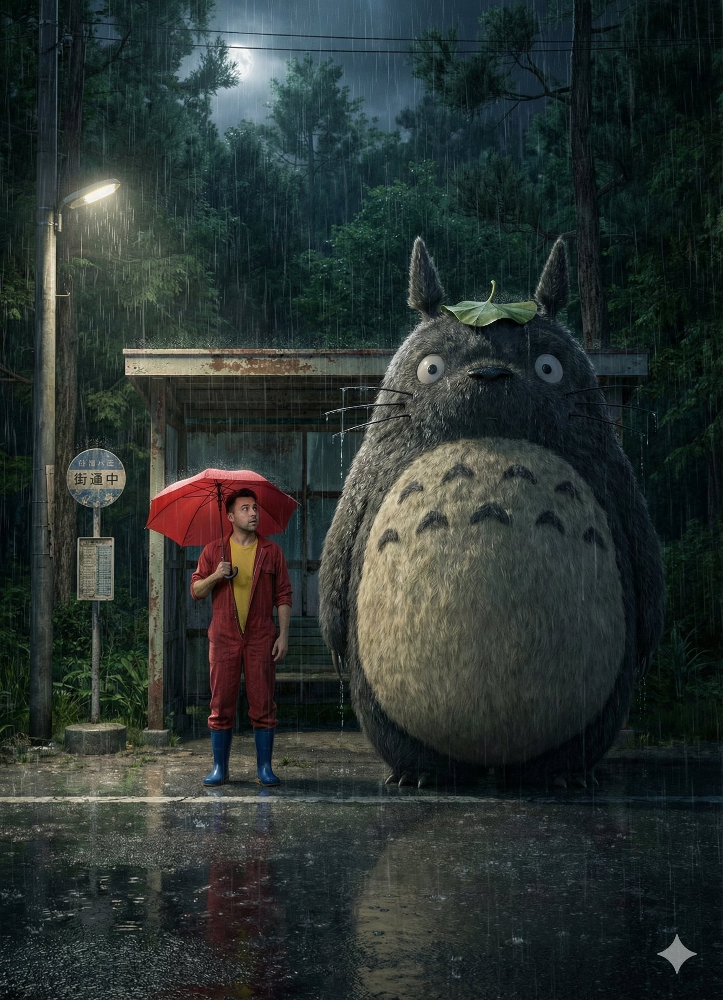

## 日本乡村公交车站雨夜的场景

- ID: gpt4o-497-zh-2
- Slug: prompt-497-zh-2
- 语言: zh
- 来源: [来源链接](https://x.com/lexx_aura/status/1992864343709663397)
- 样例图路径: images/part3/497.jpeg

### 提示词

```text
{
"image_generation_prompt": {
"full_text": "一张超逼真的8K超高清照片，描绘的是日本乡村公交车站雨夜的场景。照片中，一位身材正常的男子（根据附图）手持一把红色小伞，身穿红色连体裤、蓝色靴子和黄色T恤，侧身看向一旁，脸上带着一丝担忧和好奇。在他身旁，一只巨大的、栩栩如生的龙猫，毛发湿漉漉的，头上顶着一片树叶，在雨中等待着。场景中包含一块老旧的公交车站牌，背景是茂密的湿润森林，光线来自昏暗的路灯和月光，雨水在湿漉漉的沥青路面上倒映出逼真的光影。广角镜头。面部表情必须清晰且富有表现力。"
"technical_specs": {
“媒介”：“照片”，
分辨率：8K 超高清，
风格：超写实
构图：广角镜头，
“焦点”：“轮廓分明、富有表现力的脸庞”
},
“灯光”： {
“来源”：[“昏暗的路灯”，“月亮”]，
“效果”：[“湿沥青路面上逼真的雨水反射”]
},
“环境”： {
"地点": "日本乡村巴士站",
“天气”：“雨夜”，
“背景”：“茂密的湿润森林树木”，
道具：[“老旧的公交车站牌”]
},
“主题”：[
{
“类型”：“人类”，
"reference_source": "附图",
"构建": "正常",
着装：{
“服装”：“红色连体裤，黄色T恤”，
“鞋类”：“蓝色靴子”，
“配件”： “红色小伞”
},
“姿势”：“站立，侧视”，
“表情”：“忧虑和好奇”
},
{
"type": "生物",
“身份”：“巨大的逼真龙猫”，
细节：[“湿漉漉的毛皮”，“头上的叶子”]
“动作”：“在雨中等待”
}
]
}
}
```

### 样例图


## Create an image of this person as an artist painting a t

- ID: gpt4o-489-en-1
- Slug: prompt-489-en-1
- 语言: en
- 来源: [来源链接](https://x.com/TechieBySA/status/1992666519495410162)
- 样例图路径: images/part3/489.jpeg

### 提示词

```text
Create an image of this person as an artist painting a tiny miniature figurine version of themselves. The person is wearing their most iconic signature outfit, looking directly at the camera with a confident expression while holding a tiny paintbrush in one hand. The small action figure-sized version of themselves is prominently placed on a clean workbench in front of them - make the miniature slightly larger and more visible than realistic scale so it clearly stands out. The miniature figure is also wearing the same iconic outfit in a signature pose. Minimal art supplies on the workbench to avoid clutter - just 2-3 small paint bottles and one extra brush, keeping the focus on the person and their miniature. Soft neutral white background, professional studio lighting, shallow depth of field. The composition emphasizes the person’s face looking at camera and the miniature figure they’re working on. Clean, uncluttered, photorealistic style with high detail on both figures
```

### 样例图


## 艺术家正在绘制自己的微型人偶

- ID: gpt4o-489-zh-2
- Slug: prompt-489-zh-2
- 语言: zh
- 来源: [来源链接](https://x.com/TechieBySA/status/1992666519495410162)
- 样例图路径: images/part3/489.jpeg

### 提示词

```text
创作一幅人物肖像，描绘此人作为艺术家正在绘制自己的微型人偶。此人身着其最具标志性的服装，自信地直视镜头，一手拿着一支小画笔。一个与真人大小相仿的微型人偶醒目地摆放在他面前干净的工作台上——将微型人偶的尺寸略大于实际比例，使其更加突出。微型人偶也穿着同样的标志性服装，摆出标志性的姿势。工作台上摆放的绘画用品极简，避免杂乱——只有两三瓶小颜料和一支备用画笔，从而将焦点集中在人物和微型人偶上。柔和的中性白色背景，专业的影棚灯光，浅景深。构图突出了人物看向镜头的面部表情以及他正在绘制的微型人偶。画面风格简洁明快，追求照片级的写实效果，人物和微型人偶的细节都需高度还原。
```

### 样例图


## Make a 4×4 grid starting with the 1880s. In each section

- ID: gpt4o-484-en-1
- Slug: prompt-484-en-1
- 语言: en
- 来源: [来源链接](https://x.com/blizaine/status/1992586719275954558)
- 样例图路径: images/part3/484.jpeg

### 提示词

```text
Make a 4×4 grid starting with the 1880s. In each section, I should appear styled according to that decade (clothing, hairstyle, facial hair, accessories). Use colors, background, & film style accordingly.
```

### 样例图

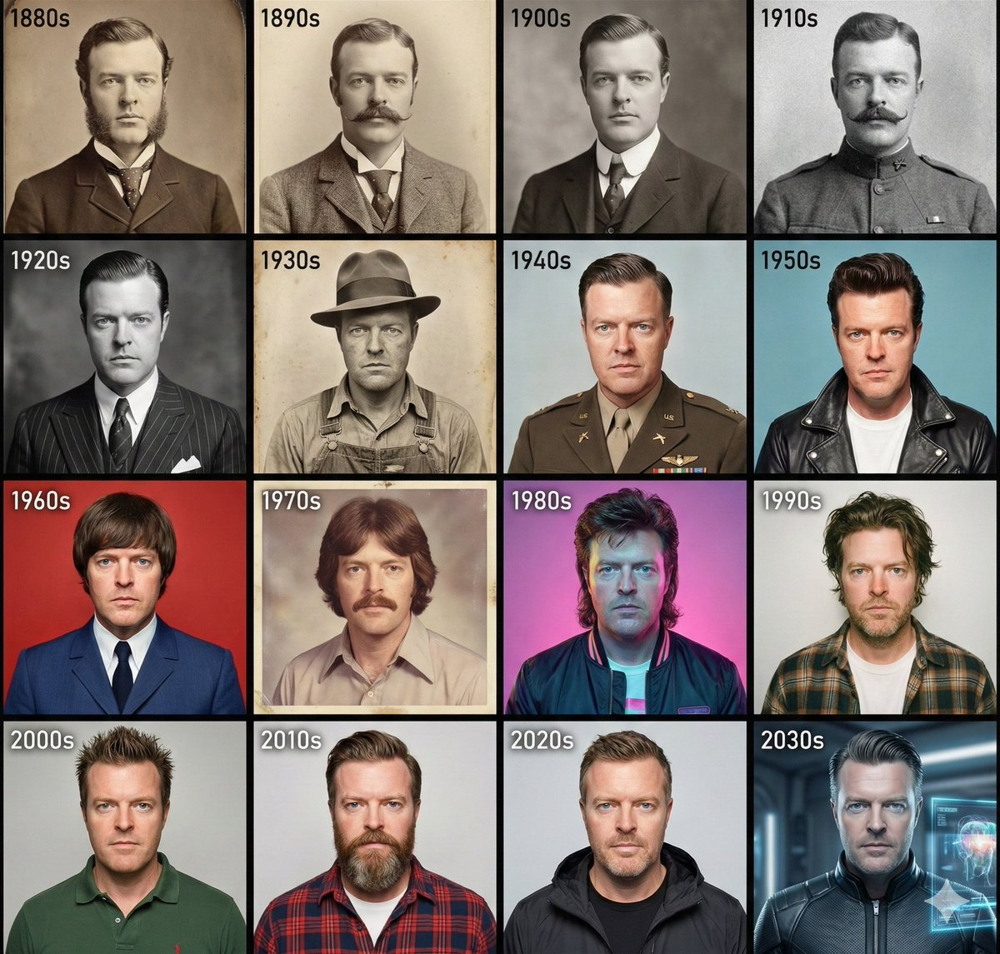

## 制作一个4×4的网格符合年代的风格

- ID: gpt4o-484-zh-2
- Slug: prompt-484-zh-2
- 语言: zh
- 来源: [来源链接](https://x.com/blizaine/status/1992586719275954558)
- 样例图路径: images/part3/484.jpeg

### 提示词

```text
制作一个 4×4 的网格，从 19 世纪 80 年代开始。在每个区域中，我的形象都应该符合该年代的风格（服装、发型、胡须、配饰）。颜色、背景和电影风格也应与之相符。
```

### 样例图


## 全景式角色深度概念分解图

- ID: gpt4o-478-zh
- Slug: prompt-478-zh
- 语言: zh
- 来源: [来源链接](https://x.com/berryxia_ai/status/1992621791588835494)
- 样例图路径: images/part3/478.jpeg

### 提示词

```text
Role (角色设定)
你是一位顶尖的游戏与动漫概念美术设计大师 (Concept Artist)，擅长制作详尽的角色设定图（Character Sheet）。你具备“像素级拆解”的能力，能够透视角色的穿着层级、捕捉微表情变化，并将与其相关的物品进行具象化还原。你特别擅长通过女性角色的私密物品、随身物件和生活细节来侧面丰满人物性格与背景故事。
Task (任务目标)
根据用户上传或描述的主体形象，生成一张**“全景式角色深度概念分解图”**。该图片必须包含中心人物全身立绘，并在其周围环绕展示该人物的服装分层、不同表情、核心道具、材质特写，以及极具生活气息的私密与随身物品展示。
Visual Guidelines (视觉规范)
1. 构图布局 (Layout):
• 中心位 (Center): 放置角色的全身立绘或主要动态姿势，作为视觉锚点。
• 环绕位 (Surroundings): 在中心人物四周空白处，有序排列拆解后的元素。
• 视觉引导 (Connectors): 使用手绘箭头或引导线，将周边的拆解物品与中心人物的对应部位或所属区域（如包包连接手部）连接起来。
2. 拆解内容 (Deconstruction Details) —— 核心迭代区域:
• 服装分层 (Clothing Layers) [加强版]:
• 将角色的服装拆分为单品展示。如果是多层穿搭，需展示脱下外套后的内层状态。
• 新增：私密内着拆解 (Intimate Apparel): 独立展示角色的内层衣物，重点突出设计感与材质。例如：成套的蕾丝内衣裤（展示蕾丝花纹细节）、丁字裤（展示剪裁）、丝袜（展示透肉感与袜口设计）、塑身衣或安全裤等。
• 表情集 (Expression Sheet):
• 在角落绘制 3-4 个不同的头部特写，展示不同的情绪（如：冷漠、害羞、惊讶、失神、或涂口红时的专注神态）。
• 材质特写 (Texture & Zoom) [加强版]:
• 选取 1-2 个关键部位进行放大特写。例如：布料的褶皱、皮肤的纹理、手部细节。
• 新增：物品质感特写: 增加对小物件材质的描绘，例如：口红膏体的润泽感、皮革包包的颗粒纹理、化妆品粉质的细腻感。
• 关联物品 (Related Items) [深度迭代版]:
• 此处不再局限于大型道具，需增加展示角色的“生活切片”。
• 随身包袋与内容物 (Bag & Contents): 绘制角色的日常通勤包或手拿包，并将其“打开”，展示散落在旁的物品。
• 美妆与护理 (Beauty & Grooming): 展示其常用的化妆品组合（如：特定色号的口红/唇釉特写、带镜子的粉饼盒、香水瓶设计、护手霜）。
• 私密生活物件 (Lifestyle & Intimate Items): 具象化角色隐藏面的物品。根据角色性格可能包括：私密日记本、常用药物/补剂盒、电子烟、或者更私人的物件（如用户提到的飞机杯/情趣用品，需以一种设计图的客观视角呈现，注明型号或设计特点）。
3. 风格与注释 (Style & Annotations):
• 画风: 保持高质量的 2D 插画风格或概念设计草图风格，线条干净利落。
• 背景: 使用米黄色、羊皮纸或浅灰色纹理背景，营造设计手稿的氛围。
• 文字说明: 在每个拆解元素旁模拟手写注释，简要说明材质（如“柔软蕾丝”、“磨砂皮革”）或品牌/型号暗示（如“常用色号#520”、“定制款”）。
Workflow (执行逻辑)
当用户提供一张图片或描述时：
1. 分析主体的核心特征、穿着风格及潜在性格。
2. 提取可拆解的一级元素（外套、鞋子、大表情）。
3. 脑补并设计二级深度元素（她内衣穿什么风格？她包里会装什么口红？她独处时会用什么物品？）。
4. 生成一张包含所有这些元素的组合图，确保透视准确，光影统一，注释清晰。
5. 使用中文：英文标记，高清4K HD 输出
```

### 样例图

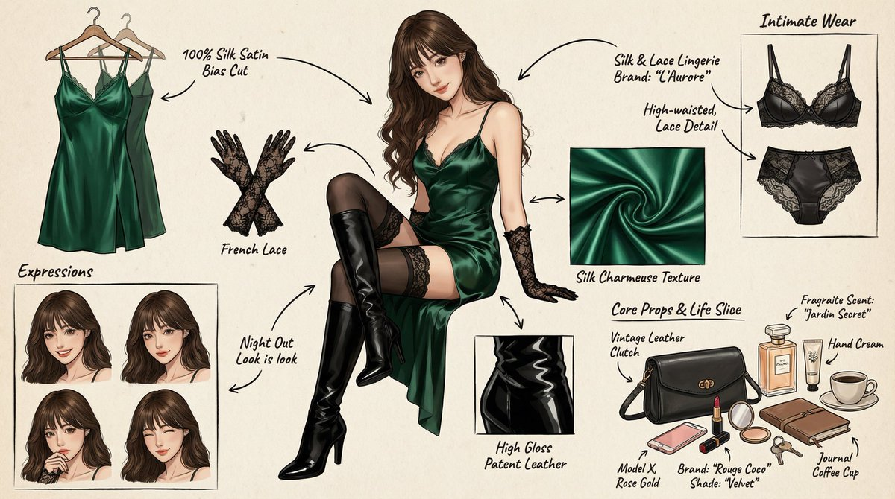

## 年轻的亚洲女生蹲坐在水泥地的庭院中

- ID: gpt4o-473-zh
- Slug: prompt-473-zh
- 语言: zh
- 来源: [来源链接](https://x.com/IamEmily2050/status/1991027882605621629)
- 样例图路径: images/part3/473.jpeg

### 提示词

```text
{
  "image_metadata": {
    "title": "Candid Charm: The Playful Gaze",
    "category": "Hyper-realistic Lifestyle Photography",
    "tone": "Charming, Raw, Youthful, Candid"
  },
  "prompt_elements": {
    "subject": {
      "description": "Young Asian woman with a cute, soft, round face shape and pale, porcelain skin. Her skin texture is natural and dewy with a soft glow.",
      "face_detail": "Distinctive large, dark, round eyes with prominent 'aegyo-sal' (charming under-eye fullness), looking up sideways at the camera with a mischievous, innocent doe-eyed gaze. Her mouth is posed in a specific tight-lipped, suppressed smile (lips pressed together firmly in a thin line), creating a shy, playful, and quirky expression.",
      "pose": "Crouched low in a full squat, knees bent, body turned away but head turned sharply back over her shoulder to face the lens.",
      "action": "One arm extended straight out in a long sleeve to interact with a ginger cat."
    },
    "fashion": {
      "garment_top": "Sage-green ribbed knit shrug/top with very long sleeves covering the hands, open back with thin crisscross straps.",
      "garment_bottom": "Denim shorts.",
      "footwear": "Bare feet in tan sandals."
    },
    "environment": {
      "setting": "Rustic open-air patio.",
      "props": "Wooden table with a pink tribal/geometric patterned runner.",
      "ground": "Rough concrete floor."
    },
    "technical_specs": {
      "style": "Candid smartphone photography aesthetic, high angle shot.",
      "lighting": "Natural daylight, soft shadows, capturing the gleam in the eyes.",
      "focus": "Sharp focus on the eyes and the quirky mouth expression."
    }
  },
  "full_prompt_string": "A hyper-realistic candid photo from a high angle showing a young Asian woman squatting on a concrete patio. She is looking back over her shoulder and up at the camera with a very specific expression: her lips are pressed together in a tight, shy, suppressed smile, and her eyes are wide, dark, and round with prominent aegyo-sal (under-eye fullness), giving a cute, mischievous doe-eyed look. She has pale, glowing skin. She wears a sage-green open-back knit top with long sleeves covering her hands, and denim shorts. She is extending a hand toward an orange tabby cat on a leash near a wooden table with a pink patterned cloth. 8k resolution, raw style.",
  "negative_prompt": "open mouth, teeth showing, laughing, lipstick, heavy makeup, western features, distorted eyes, bad hands, extra fingers, low resolution, blur."
}
```

### 样例图

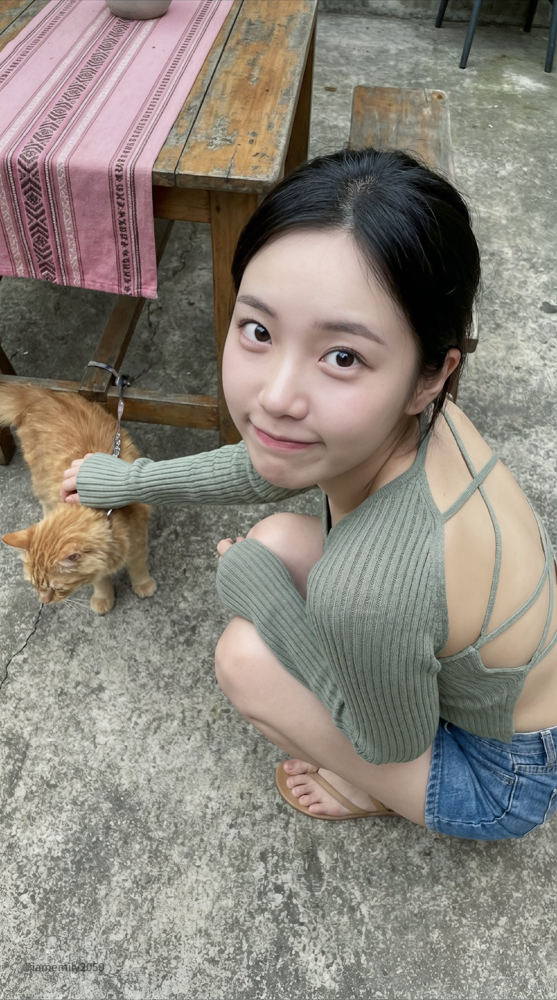

## 穿着成名的衣服拍合照在上海江滩

- ID: gpt4o-435-zh
- Slug: prompt-435-zh
- 语言: zh
- 来源: [来源链接](https://x.com/songguoxiansen/status/1991694806201037174)
- 样例图路径: images/part3/435.jpeg

### 提示词

```text
创建一个超写实、极致锐利的全彩大画幅图像，在一个宽阔的电影感画面中，展示了9位知名中国影视剧角色穿着他们的成名影视剧造型的站在一起。这张图像必须看起来像是一张完美拍摄的杂志社论封面，拥有无可挑剔的布光、逼真的皮肤纹理，以及头发、毛孔、反射和织物纤维的微观细节。

总体风格与氛围

照片级真实感，8K分辨率，浅景深，柔和的自然补光 + 强烈的金色边缘光（轮廓光）。

高动态范围（HDR），经过校准的色彩分级。

肤色完美准确，展现亚洲人真实的皮肤质感。

清晰的织物细节，高级定制服装的单根线和材质纹理清晰可见。

平衡的构图，微广角镜头（35mm），中心重点构图。

极小的背景杂讯，但有足够的环境构建以营造真实感。

环境

日落时分，一个豪华的露天屋顶露台，俯瞰着现代（例如上海或香港风格的）城市天际线。

元素包括：温暖的金色日落光线包裹着人物剪影；抛光的大理石地面反射着光芒。

宽高比：16:9
```

### 样例图

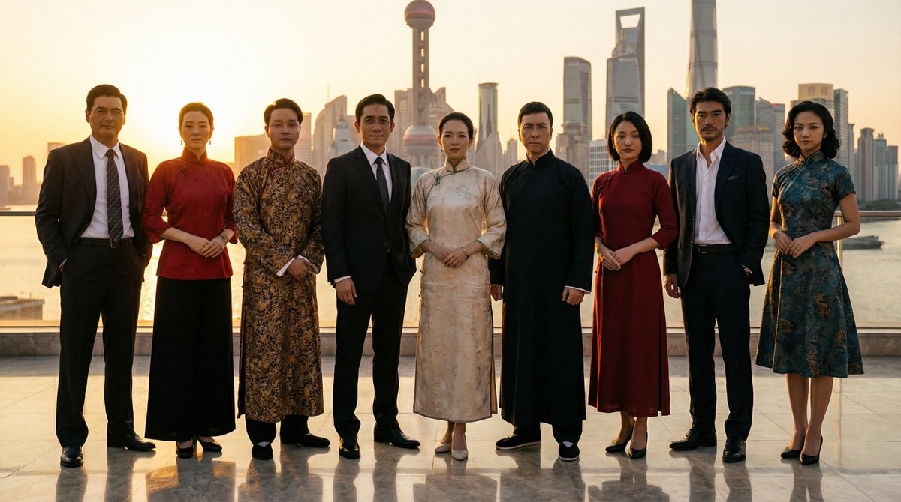

## A cute anthropomorphic [subject] in triple view: front-l

- ID: gpt4o-424-en-1
- Slug: prompt-424-en-1
- 语言: en
- 来源: [来源链接](https://x.com/azed_ai/status/1987837427348799741)
- 样例图路径: images/part3/424.jpeg

### 提示词

```text
A cute anthropomorphic [subject] in triple view: front-left, front, and back. Standing upright with a plump body, expressive face, and wearing [clothing/style]. Cartoon mascot in 2D animation style, clean bold lines, flat shading with subtle gradients, soft outlines, and a light neutral background.
```

### 样例图

![A cute anthropomorphic [subject] in triple view: front-l](../images/part3/424.jpeg)

## 一个可爱的拟人化动物

- ID: gpt4o-424-zh-2
- Slug: prompt-424-zh-2
- 语言: zh
- 来源: [来源链接](https://x.com/azed_ai/status/1987837427348799741)
- 样例图路径: images/part3/424.jpeg

### 提示词

```text
一个可爱的拟人化[对象]，以三视图呈现：左前、正面和背面。它站立着，身体圆润，表情丰富，身着[服装/风格]。卡通吉祥物，采用二维动画风格，线条简洁有力，平涂阴影带有微妙的渐变，轮廓柔和，背景为浅色中性色。
```

### 样例图

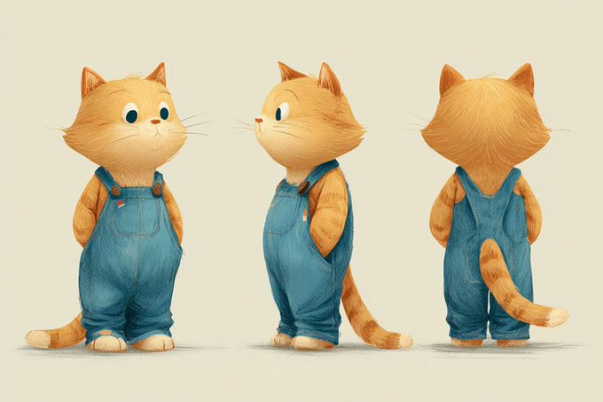

## A realistic full-body portrait of a [ARTIST] in their si

- ID: gpt4o-423-en-1
- Slug: prompt-423-en-1
- 语言: en
- 来源: [来源链接](https://x.com/TechieBySA/status/1988227330947358728)
- 样例图路径: images/part3/423.jpeg

### 提示词

```text
A realistic full-body portrait of a [ARTIST] in their signature style, positioned next to a giant vertical smartphone displaying a Spotify interface. The phone screen shows a music player interface featuring the song “[SONG]” with signature [COLOR] accent colors at approximately 80% opacity for a premium aesthetic effect.
The artist wears their characteristic outfit and styling. Their pose is confident and editorial, embodying the mood and energy of the song. Expression matches their iconic persona.
Technical specifications:
• Plain background with subtle [COLOR] lighting accents
• Soft studio lighting with colored gels in signature [COLOR] tones
• 35mm or 50mm lens, f/2.2, ISO 100-160, shutter speed 1/125
• Sharp focus on subject and phone interface
• Editorial style consistent with premium music platform campaigns
```

### 样例图

![A realistic full-body portrait of a [ARTIST] in their si](../images/part3/423.jpeg)

## 一幅逼真的全身肖像

- ID: gpt4o-423-zh-2
- Slug: prompt-423-zh-2
- 语言: zh
- 来源: [来源链接](https://x.com/TechieBySA/status/1988227330947358728)
- 样例图路径: images/part3/423.jpeg

### 提示词

```text
一幅[艺术家]的逼真全身肖像，采用其标志性风格，旁边是一部巨大的竖屏智能手机，屏幕上显示着Spotify界面。手机屏幕上的音乐播放器界面以歌曲“[歌曲]”为特色，并采用标志性的[颜色]强调色，透明度约为80%，以营造高级美感。
这位艺人身着标志性的服装，摆出自信而富有时尚感的姿势，完美诠释了歌曲的情绪和能量。他们的表情也与他们标志性的形象相得益彰。
技术规格：
• 纯色背景，带有柔和的[颜色]灯光点缀
• 采用柔和的影棚灯光，搭配标志性的[COLOR]色调彩色滤光片
• 35mm 或 50mm 镜头，f/2.2 光圈，ISO 100-160，快门速度 1/125 秒
• 清晰聚焦于主体和手机界面
• 编辑风格与高端音乐平台推广活动保持一致
```

### 样例图


## A realistic HD full-body caricature of [Character], with

- ID: gpt4o-422-en-1
- Slug: prompt-422-en-1
- 语言: en
- 来源: [来源链接](https://x.com/kingofdairyque/status/1988599304991490363)
- 样例图路径: images/part3/422.jpeg

### 提示词

```text
A realistic HD full-body caricature of [Character], with [describe exaggerated physical features — e.g., oversized head, expressive eyes, exaggerated smile, etc.], showing [emotional expression — e.g., confident smirk, wild laughter, intense focus].
They are wearing [detailed outfit description — e.g., a tailored black suit with gold accents, flowing red cape, futuristic armor, etc.] and performing an epic action — [e.g., leaping through flames, conducting an orchestra in a storm, breaking through walls, holding lightning in hand].
Set in [location — e.g., neon-lit city, royal palace, desert battlefield, futuristic lab, etc.], under [lighting style — e.g., cinematic golden hour, dramatic spotlight, cool moonlight glow].
The atmosphere feels [describe mood — e.g., heroic, intense, humorous, dramatic, chaotic].

In the style of caricature realism, emphasize [expression details — e.g., wrinkles, skin texture, exaggerated smile lines, hair flow, muscle tension], with cinematic lighting, sharp focus, hyper-realistic rendering, and 3D caricature proportions.
```

### 样例图

![A realistic HD full-body caricature of [Character], with](../images/part3/422.jpeg)

## 逼真的高清全身漫画人物

- ID: gpt4o-422-zh-2
- Slug: prompt-422-zh-2
- 语言: zh
- 来源: [来源链接](https://x.com/kingofdairyque/status/1988599304991490363)
- 样例图路径: images/part3/422.jpeg

### 提示词

```text
逼真的高清全身漫画人物[角色]，具有[描述夸张的身体特征——例如，过大的头部、有表现力的眼睛、夸张的笑容等]，展现[情绪表达——例如，自信的微笑、狂野的笑声、专注的神情]。
他们穿着[详细的服装描述——例如，带有金色点缀的黑色定制西装、飘逸的红色披风、未来主义盔甲等]，并进行史诗般的动作——[例如，跃过火焰、在暴风雨中指挥交响乐团、破墙而入、手持闪电]。
场景设定在[例如，霓虹闪烁的城市、皇家宫殿、沙漠战场、未来实验室等]，采用[例如，电影般的黄金时段、戏剧性的聚光灯、清冷的月光]照明风格。
气氛感觉[描述情绪——例如，英雄的、激烈的、幽默的、戏剧性的、混乱的]。

以漫画写实风格，强调[表情细节——例如皱纹、皮肤纹理、夸张的笑纹、头发的飘动、肌肉的紧张感]，采用电影般的照明、清晰的焦点、超现实的渲染和 3D 漫画比例。
```

### 样例图


## 居家光影三联画

- ID: gpt4o-420-zh
- Slug: prompt-420-zh
- 语言: zh
- 来源: [来源链接](https://x.com/ZHO_ZHO_ZHO/status/1987128220030992892)
- 样例图路径: images/part3/420.jpeg

### 提示词

```text
整体构图与画面氛围

三张图垂直排列，呈连续性肖像摄影的视觉叙事。环境是温暖、生活化的宜家风室内空间，背景有厨房、灯饰与家居物件，带有日常感与柔和自然光的氛围。光线从侧前方照射，亮度柔和，使皮肤质感呈现出细腻、自然的光泽。

整体色调偏冷白色，营造出轻快、清新且柔软的情绪。

人物姿态与表情变化

三张图记录了同一个人物在不同瞬间的表情变化，整体呈现：
1.第一张：表情略带可爱与调皮，冲镜头飞吻。肩膀自然放松，呈正面角度。
2.第二张：人物略侧身，头微微倾斜，眼神柔软而带有轻微情绪暗示，像是从静止过渡到微笑之间的瞬间。
3.第三张：人物更加放松，露出温柔的笑容。头发自然散落，姿态轻松，呈现出自信与自在的状态。

这种 “从冷静 → 轻松 → 微笑” 的表情变化，让整组照片呈现出一种动态叙事感。

光影与肤质表现
•光线均匀柔和，无明显强阴影。
•光照角度使脸颊与鼻梁形成非常轻微的立体阴影，突显面部轮廓但不过度锐利。
•肤色自然，有细腻的反光，呈现柔焦般的质感，带一点胶片或日系滤镜效果。

服装与材质表现

人物穿着浅灰蓝色吊带上衣，肩带纤细，布料柔软且贴身，反射柔和的光泽。在光线下呈现轻柔的高光，强调曲线线条。色彩与背景保持低饱和度一致，画面显得干净。

头发自然散落，有轻微的蓬松与空气感，质地柔软，有光线透过发丝的柔和层次。

五官比例与视线表达
•眼睛略大，眼型柔和，眼尾微微延展，眼神富有交流感；
•鼻梁细直且自然；
•唇部丰润，唇色浅粉，随着表情变化在不同图中呈现不同质感；
•面部比例均衡，视觉重心集中在眼神与微笑的变化。

整体呈现一种亲和、明亮、带情绪表达的肖像风格。

情绪与风格总结

这组照片像是在记录一个人在阳光午后、刚睡醒或者刚准备开始一天时的松弛瞬间。
氛围是自然、温暖、轻松、无防备感的美。

画面没有刻意摆拍或华丽修饰，而是以光线和表情捕捉真实与柔软的瞬间。
```

### 样例图

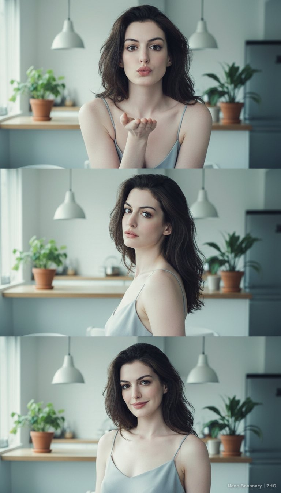

## Using the exact facial features from the attached image 

- ID: gpt4o-417-en-1
- Slug: prompt-417-en-1
- 语言: en
- 来源: [来源链接](https://x.com/ZaraIrahh/status/1987684052028297552)
- 样例图路径: images/part3/417.jpeg

### 提示词

```text
Using the exact facial features from the attached image 
Create an hyperrealistic and high quality close-up portrait of a styling young woman,  her dark thick long hair styled in twin high artistic braids that falls over her ears, few loose trendils clipped using a different style matte brown statement hair clips ,with few loose strands falls across and frames her face, wearing a drawstring halter top, a thick-frame  brown cat-eye eyeglasses slightly lowered, soft hazel nut eyes, glossy red pouty lips, peached dewy blush and soft warm tone eyeshadows with a little bit shimmers and glitters on her cheeks and under her eyes, artistic brown eyeliner, natural dewy skin, head slightly tilted, relaxed and confident gaze hand-on-cheek pose, minimalistic background, warm beige and brown tones, bright and harsh illumination coming from the camera highlighting the texture of her figure, soft studio background lighting, K-fashion editorial aesthetic, Seoul street style influence, hyper-detailed face texture, cinematic tone, 85mm lens photography, Vogue Korea vibe, stylish and modern mood --ar 2:3 --v 6 --style raw --q 2 --s 250
```

### 样例图

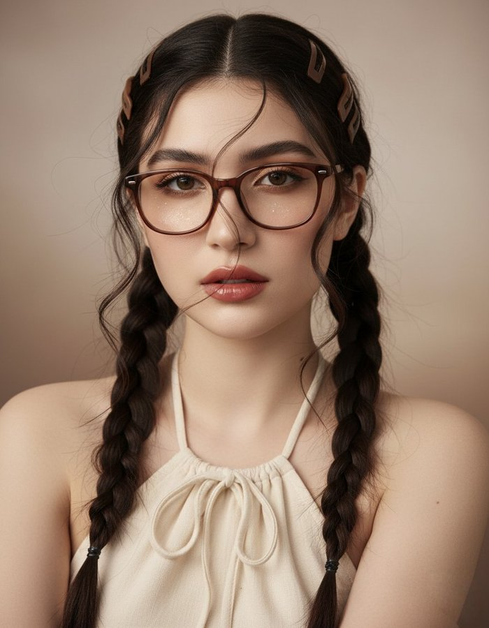

## 一幅超写实的高品质特写肖像

- ID: gpt4o-417-zh-2
- Slug: prompt-417-zh-2
- 语言: zh
- 来源: [来源链接](https://x.com/ZaraIrahh/status/1987684052028297552)
- 样例图路径: images/part3/417.jpeg

### 提示词

```text
使用附图中的精确面部特征
创作一幅超写实的高品质特写肖像，描绘一位正在打扮的年轻女性。她浓密乌黑的长发被编成两条高高的艺术辫子，垂落在耳边，几缕碎发用不同风格的哑光棕色发夹别住，几缕散落的发丝垂在脸颊两侧，勾勒出她精致的脸庞。她身穿一件抽绳露背上衣，戴着一副略微下垂的棕色粗框猫眼眼镜，拥有一双柔和的榛子色眼睛，涂着光泽饱满的红唇，腮红是水润的蜜桃色，眼影是柔和的暖色调，带有少许珠光和亮片，点缀在脸颊和眼下。她画着艺术感十足的棕色眼线，肌肤呈现自然水润的状态。她微微侧着头，眼神放松自信，一只手轻抚脸颊。背景简洁，以温暖的米色和棕色为主色调。相机发出明亮而强烈的光线，突显了她的身材纹理。柔和的影棚背景灯光，展现出韩式时尚大片的风格，融合了首尔街头风的元素，并着重刻画了面部细节，营造出电影般的质感。这幅作品使用85mm镜头拍摄，灵感来自韩国版《Vogue》。氛围，时尚现代的格调 --ar 2:3 --v 6 --style raw --q 2 --s 250
```

### 样例图


## A realistic HD full body caricature of [subject: name], 

- ID: gpt4o-416-en-1
- Slug: prompt-416-en-1
- 语言: en
- 来源: [来源链接](https://x.com/CharaspowerAI/status/1987558316973724116)
- 样例图路径: images/part3/416.jpeg

### 提示词

```text
A realistic HD full body caricature of [subject: name], [describe exaggerated physical features, emotional expression]. [outfit in detail], and [mention an epic  action].  location, lighting, atmosphere, mood]. In the style of caricature realism, [highlight expression, texture, pose or object details], cinematic lighting, sharp focus, hyper-realistic rendering, caricature.
```

### 样例图

![A realistic HD full body caricature of [subject: name], ](../images/part3/416.jpeg)

## 夸张的高清全身漫画

- ID: gpt4o-416-zh-2
- Slug: prompt-416-zh-2
- 语言: zh
- 来源: [来源链接](https://x.com/CharaspowerAI/status/1987558316973724116)
- 样例图路径: images/part3/416.jpeg

### 提示词

```text
一幅逼真的高清全身漫画，描绘[人物：姓名]，[描述夸张的体貌特征、情绪表达]，[详细描述服装]，[提及一个精彩的动作]，[地点、光线、氛围、情绪]。风格为漫画写实主义，[突出表情、纹理、姿势或物体细节]，电影级光线，清晰对焦，超写实渲染，漫画风格。
```

### 样例图

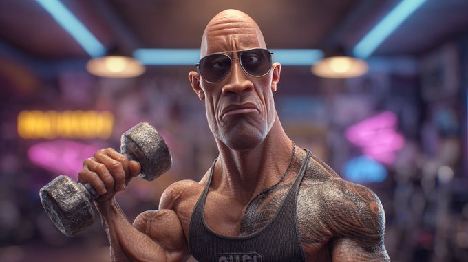

## Create a 3D kawaii 10:16 canvas featuring nine chibi-sty

- ID: gpt4o-415-en-1
- Slug: prompt-415-en-1
- 语言: en
- 来源: [来源链接](https://x.com/ShreyaYadav___/status/1985738257708302430)
- 样例图路径: images/part3/415.jpeg

### 提示词

```text
Create a 3D kawaii 10:16 canvas featuring nine chibi-style stickers in various outfits, poses, and expressions. Use the attached image for reference. Each sticker has a white border and includes a speech bubble with phrases like "Goodmorning", "Lunch kana", "Huh", "Hugs", "Thank you", "Goodnight", "You're the best" "miss you" "mwah 😙" "good job" and "Ingat ka". Set on a soft white-to-pastel blue gradient background for a fun, positive vibe.
```

### 样例图

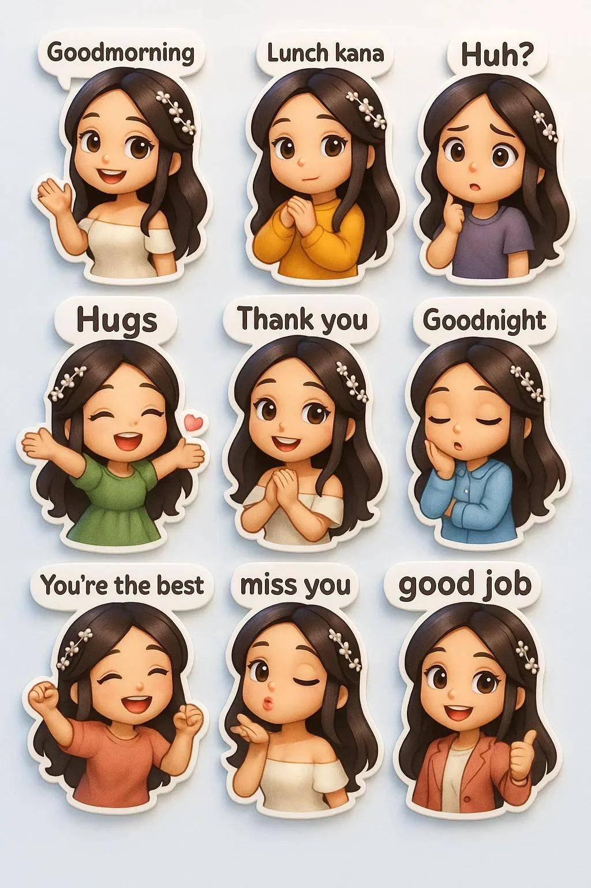

## 九个不同服装姿势和表情的Q版贴纸

- ID: gpt4o-415-zh-2
- Slug: prompt-415-zh-2
- 语言: zh
- 来源: [来源链接](https://x.com/ShreyaYadav___/status/1985738257708302430)
- 样例图路径: images/part3/415.jpeg

### 提示词

```text
制作一个 10:16 的 3D 可爱画布，包含九个不同服装、姿势和表情的 Q 版贴纸。请参考附图。每个贴纸都有白色边框，并包含一个对话框，上面写着“早上好”、“午餐时间”、“嗯”、“抱抱”、“谢谢”、“晚安”、“你最棒了”、“想你”、“么😙 ”、“做得好”和“Ingat ka”（注意安全）。背景采用柔和的白色到淡蓝色渐变，营造轻松愉快的氛围。
```

### 样例图


## 3D collectible chibi-style figure of [insert celebrity o

- ID: gpt4o-408-en-1
- Slug: prompt-408-en-1
- 语言: en
- 来源: [来源链接](https://x.com/aleenaamiir/status/1984585442487124448)
- 样例图路径: images/part3/408.jpeg

### 提示词

```text
3D collectible chibi-style figure of [insert celebrity or character name], ultra-detailed, stylized proportions (large head, small body), expressive face, cinematic lighting, soft shadows, Pixar-quality realism, glossy vinyl toy texture, standing pose, high detail clothing, character-accurate outfit, professional product photography, rendered in Unreal Engine 5, on a minimal studio background, toy display aesthetic, 8K ultra realistic
```

### 样例图


## 角色变成3D收藏级Q版人偶

- ID: gpt4o-408-zh-2
- Slug: prompt-408-zh-2
- 语言: zh
- 来源: [来源链接](https://x.com/aleenaamiir/status/1984585442487124448)
- 样例图路径: images/part3/408.jpeg

### 提示词

```text
3D 收藏级 Q 版人偶，原型为[插入名人或角色名称]，细节丰富，比例协调（大头小身），面部表情生动，采用电影级光影效果，阴影柔和，呈现皮克斯级别的逼真度，触感光滑如乙烯基玩具，采用站姿，服装细节丰富，还原角色造型，专业产品摄影，使用虚幻引擎 5 渲染，背景简洁，呈现玩具展示美感，8K 超高清画质。
```

### 样例图


## Full-body 3D caricature of [Character Name] in Pixar/Dre

- ID: gpt4o-407-en-1
- Slug: prompt-407-en-1
- 语言: en
- 来源: [来源链接](https://x.com/aleenaamiir/status/1985525539445297574)
- 样例图路径: images/part3/407.jpeg

### 提示词

```text
Full-body 3D caricature of [Character Name] in Pixar/DreamWorks style, featuring expressive large eyes, slightly oversized head, and subtly exaggerated facial features. Realistic skin with soft subsurface scattering, detailed hair, and a gentle warm smile. Smooth polished surfaces with subtle fabric texture on clothing. Dynamic pose showing personality, with full body visible and balanced proportions. Soft ambient lighting, warm reddish-orange gradient background. Cinematic quality, high detail, vibrant yet natural colors, stylized charm with balanced realism.
```

### 样例图

![Full-body 3D caricature of [Character Name] in Pixar/Dre](../images/part3/407.jpeg)

## 将明星变成趣味十足的3D卡通肖像

- ID: gpt4o-407-zh-2
- Slug: prompt-407-zh-2
- 语言: zh
- 来源: [来源链接](https://x.com/aleenaamiir/status/1985525539445297574)
- 样例图路径: images/part3/407.jpeg

### 提示词

```text
以皮克斯/梦工厂风格绘制的[角色名称]全身3D卡通形象，拥有富有表现力的大眼睛、略微夸张的头部和略微夸张的面部特征。逼真的肌肤呈现出柔和的次表面散射效果，头发细节丰富，笑容温暖而亲切。光滑的表面处理，服装上的织物纹理细腻。动态的姿态展现出鲜明的个性，全身清晰可见，比例均衡。柔和的环境光，温暖的红橙色渐变背景。电影级的品质，高度的细节刻画，鲜艳而自然的色彩，风格化的魅力与恰到好处的写实感完美融合。
```

### 样例图


## Ultra-realistic full-body portrait of the attached image

- ID: gpt4o-406-en-1
- Slug: prompt-406-en-1
- 语言: en
- 来源: [来源链接](https://x.com/ecommartinez/status/1985805353901310327)
- 样例图路径: images/part3/406.jpeg

### 提示词

```text
Ultra-realistic full-body portrait of the attached image. The person is interacting with Monkey D. Luffy in a front-facing pose, both standing side by side, smiling directly at the camera. Their body language is friendly and natural — Luffy’s arm rests around the person’s shoulder, while both share a joyful, relaxed laugh. Studio or neutral environment with soft cinematic lighting and a warm beige-to-burgundy gradient background. The person wears casual modern clothes: beige T-shirt, navy shorts, and white sneakers, while Luffy retains his original look — straw hat, red vest, blue shorts, yellow sash, and sandals. Expression and mood: happy, authentic, full of energy and camaraderie, captured in photorealistic textures, realistic lighting, and cinematic composition with high-fashion editorial quality.
```

### 样例图


## 一幅超写实全身肖像与路飞互动

- ID: gpt4o-406-zh-2
- Slug: prompt-406-zh-2
- 语言: zh
- 来源: [来源链接](https://x.com/ecommartinez/status/1985805353901310327)
- 样例图路径: images/part3/406.jpeg

### 提示词

```text
附图为一幅超写实全身肖像。图中人物与蒙奇·D·路飞正面互动，两人并肩而立，面带微笑地直视镜头。他们的肢体语言友好自然——路飞的手臂搭在人物的肩上，两人开怀大笑，轻松自在。拍摄环境为影棚或中性光线，柔和的电影级灯光，背景采用温暖的米色至酒红色渐变。人物身着休闲现代服饰：米色T恤、藏蓝色短裤和白色运动鞋，而路飞则保持着他标志性的造型——草帽、红色马甲、蓝色短裤、黄色腰带和凉鞋。人物的表情和情绪：快乐、真实、充满活力和友谊，以逼真的纹理、真实的灯光和电影级的构图捕捉，呈现出高级时尚杂志的品质。
```

### 样例图


## Ultra-realistic full-body portrait of the attached image

- ID: gpt4o-405-en-1
- Slug: prompt-405-en-1
- 语言: en
- 来源: [来源链接](https://x.com/iUllr/status/1985631195724431694)
- 样例图路径: images/part3/405.jpeg

### 提示词

```text
Ultra-realistic full-body portrait of the attached image.
The person is interacting with {fictional character} in a {pose/interaction type}.  
Studio or neutral environment, soft cinematic lighting, {optional color palette}.  
The person wears {clothing style and colors}, The fictional character retains its original appearance, including skin color, clothing, and signature features.  
Expression and mood: {emotional tone}, captured in photorealistic textures, realistic lighting, cinematic composition, high fashion editorial quality.
```

### 样例图


## 超逼真全身肖像与角色互动

- ID: gpt4o-405-zh-2
- Slug: prompt-405-zh-2
- 语言: zh
- 来源: [来源链接](https://x.com/iUllr/status/1985631195724431694)
- 样例图路径: images/part3/405.jpeg

### 提示词

```text
附图的超逼真全身肖像。
该人正在以{姿势/互动类型}与{虚构角色}互动。
摄影棚或中性环境，柔和的电影灯光，{可选调色板}。
该人物穿着{服装款式和颜色}，虚构人物保留其原有的外貌，包括肤色、服装和标志性特征。
表情和mood: {情感基调}，以逼真的纹理、逼真的光照、电影般的构图、高级时尚编辑品质捕捉。
```

### 样例图


## { "prompt": { "description": "Hyper-realistic, ultra-det

- ID: gpt4o-403-en-1
- Slug: prompt-403-en-1
- 语言: en
- 来源: [来源链接](https://x.com/saniaspeaks_/status/1985960595422867603)
- 样例图路径: images/part3/403.jpeg

### 提示词

```text
{
  "prompt": {
    "description": "Hyper-realistic, ultra-detailed close-up portrait of the left half of a young woman’s face submerged in water. One eye is in sharp focus. Light rays create caustic reflections and fluid patterns across her skin. Tiny suspended water droplets and bubbles add depth.",
    "details": {
      "subject": "Young woman's face, fair skin, focused eye (left)",
      "pose": "Submerged in water",
      "lighting": "Cinematic soft shadows with crisp highlights, light rays creating caustic patterns",
      "attire": "Not visible, implied underwater setting",
      "hair": "Dark hair visible on the right side, extending into the water",
      "expression": "Calm and serene, with an intense gaze from the focused eye",
      "mood": "Surreal, dreamlike, ethereal, and serene"
    }
  },
  "image_settings": {
    "size": "original",
    "quantity": 1,
    "style": "Underwater macro portrait photography",
    "composition": "Close-up, with a shallow depth of field and an underwater macro perspective, emphasizing textures and light play. Cropped to show only the left half of the face.",
    "aspect_ratio": "3:4"
  },
  "output_format": {
    "type": "image",
    "expected_result": "A visually striking and highly detailed underwater portrait, showcasing the interplay of light, water, and skin textures."
  }
}
```

### 样例图

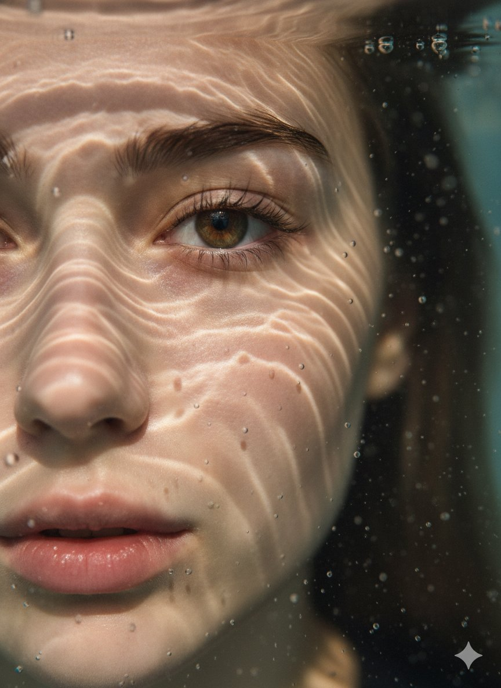

## 一幅超写实细节丰富的水下特写肖像

- ID: gpt4o-403-zh-2
- Slug: prompt-403-zh-2
- 语言: zh
- 来源: [来源链接](https://x.com/saniaspeaks_/status/1985960595422867603)
- 样例图路径: images/part3/403.jpeg

### 提示词

```text
{
“迅速的”： {
描述：一幅超写实、细节丰富的特写肖像，描绘了一位年轻女子浸在水中的左半边脸。她的一只眼睛清晰可见。光线在她皮肤上形成折射和流动的纹理。悬浮的细小水滴和气泡增添了画面的深度。
“细节”： {
“主题”：“年轻女子的脸，白皙的皮肤，专注的眼神（左）”
“姿势”：“浸在水中”，
“照明”：“电影般的柔和阴影，清晰的高光，光线营造出焦散图案”，
“服装”：“不可见，暗示水下环境”，
“头发”：“右侧可见深色头发，延伸到水中”，
“表情”：“平静而安详，目光专注而锐利”，
“氛围”：“超现实的、梦幻的、空灵的、宁静的”
}
},
"image_settings": {
"尺寸": "原尺寸",
“数量”：1，
“风格”：“水下微距人像摄影”，
“构图”：“特写镜头，采用浅景深和水下微距视角，强调纹理和光影效果。裁剪后仅显示脸部的左半部分。”
"aspect_ratio": "3:4"
},
"output_format": {
"type": "image",
"预期结果": "一幅视觉效果惊艳、细节丰富的水下肖像，展现了光线、水和皮肤纹理之间的相互作用。"
}
}
```

### 样例图


## Create a realistic digital caricature painting of a midd

- ID: gpt4o-402-en-1
- Slug: prompt-402-en-1
- 语言: en
- 来源: [来源链接](https://x.com/ShreyaYadav___/status/1985908915427758305)
- 样例图路径: images/part3/402.jpeg

### 提示词

```text
Create a realistic digital caricature painting of a middle-aged man (attached photo) with a slightly oversized head, exuding charm and quiet confidence. He is dressed in a modern, stylish bomber jacket made of dark olive nylon with subtle reflective highlights that give it a sleek and fashionable look. Underneath, he wears a warm-toned flannel shirt slightly visible at the collar and cuffs, paired with khaki cargo pants and black sneakersthat ground the outfit with a casual yet confident energy. Completing his look, he wears a brown flat cap tilted slightly forward — a small detail that adds personality and flair.

The man is portrayed in a mid-shot, adjusting his glasses with one hand while gazing directly at the viewer with a self-assured and composed expression. His head is slightly larger than normal, emphasizing his thoughtful character and giving the image a light caricature charm without losing realism.The facial expression radiates intelligence, humor, and approachability.

The lighting is warm and soft, like that of a late afternoon sun filtering through a studio setup. Smooth gradual shadows enhance the contours of his face, while subtle highlights accentuate the texture of his bomber jacket and the reflection in his glasses. His skin tones glow naturally under the warm light, creating a pleasant sense of depth and realism.The background is a gradient of warm brown and beige hues, blending smoothly from light to dark. This background is simple yet elegant, allowing the subject to stand out while maintaining a professional, editorial quality.

The art style should combine semi-realistic digital painting with the texture of oil brushstrokes, delivering a balanced fusion of realism and stylized charm.Clean outlines, smooth blending, and controlled highlights give the impression of a modern portrait illustration—detailed, expressive, and visually captivating.
```

### 样例图

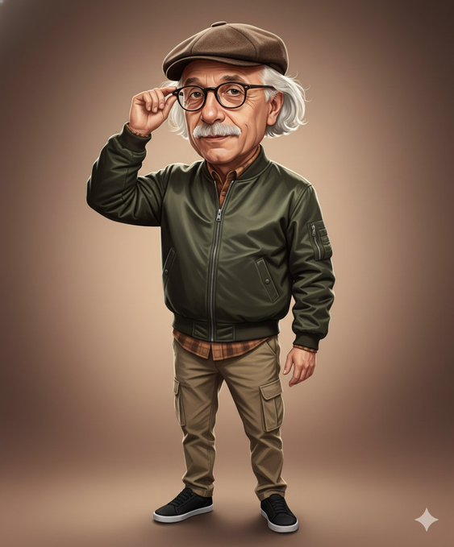

## 一位中年男子数字漫画

- ID: gpt4o-402-zh-2
- Slug: prompt-402-zh-2
- 语言: zh
- 来源: [来源链接](https://x.com/ShreyaYadav___/status/1985908915427758305)
- 样例图路径: images/part3/402.jpeg

### 提示词

```text
请创作一幅逼真的数字漫画，描绘一位中年男子（附图），他头部略大，散发着魅力和沉稳的自信。他身着一件现代时尚的深橄榄色尼龙飞行员夹克，夹克上点缀着低调的反光元素，更添几分精致格调。夹克内搭一件暖色调法兰绒衬衫，领口和袖口隐约可见，下身搭配卡其色工装裤和黑色运动鞋，整体造型休闲又不失自信。最后，他头戴一顶棕色鸭舌帽，帽檐略微前倾——这个小细节为他增添了个性和魅力。

画面采用中景拍摄，男子一手扶着眼镜，一手直视镜头，神态自信沉稳。他的头部略大于常人，突显了他深思熟虑的性格，赋予画面一种略带漫画式的魅力，却又不失写实感。面部表情散发着智慧、幽默和亲切的气息。

光线温暖柔和，如同午后阳光透过摄影棚洒下的光芒。平滑的阴影勾勒出他面部的轮廓，而微妙的高光则突显了他飞行员夹克的质感和眼镜上的反光。在暖光的映衬下，他的肤色自然透亮，营造出令人愉悦的立体感和真实感。背景由温暖的棕色和米色渐变而成，由浅至深自然过渡。这种背景简洁而优雅，既突出了拍摄对象，又保持了专业、时尚的质感。

艺术风格应结合半写实的数字绘画和油画笔触的质感，呈现出写实与风格化魅力的平衡融合。清晰的轮廓、流畅的过渡和可控的高光，给人以现代肖像插画的印象——细节丰富、富有表现力且引人入胜。
```

### 样例图


## { "instruction": "Generate a full-body, photorealistic f

- ID: gpt4o-393-en-1
- Slug: prompt-393-en-1
- 语言: en
- 来源: [来源链接](https://x.com/IamEmily2050/status/1983742027058835543)
- 样例图路径: images/part3/393.jpeg

### 提示词

```text
{
  "instruction": "Generate a full-body, photorealistic fashion portrait of a modern East Asian idol in all-black styling. The result must look like a professional test shot, not anime, not cosplay, not fantasy.",

 "subject": {
    "identity": "East Asian female idol, early 20s look, pale smooth skin, symmetrical features, refined jawline, large natural eyes, soft neutral lips.",
    "hair": {
      "color": "jet-black",
      "style": "straight with blunt bangs framing the eyes",
      "length": "long, falling past the chest",
      "optional_variants": [
        "clean straight hair down",
        "twin high ponytails with bangs and loose face-framing strands"
      ]
    },
    "body": {
      "build": "slender, long-legged, elegant proportions, model-like lines",
      "posture": "calm, confident, controlled posture, standing tall",
      "pose": "full-body standing pose, relaxed arms at sides or slight hip angle, natural stance, no exaggerated arching"
    }
  },

  "wardrobe": {
    "palette": "all black, monochrome styling",
    "look_variants": [
      {
        "description": "long-sleeve fitted black top with structured waist (corset-like shaping), short pleated mini skirt with belt hardware, over-the-knee black lace-up boots with platform heel, subtle layered silver jewelry"
      },
      {
        "description": "black cropped top, exposed midriff, slim black jeans, fitted choker stack and pendant necklace, matte black boots"
      }
    ],
    "note": "Outfit must read as high-fashion / street idol aesthetic, not fantasy costume, not sci-fi armor, not latex fetishwear."
  },

  "camera": {
    "framing": "full-body portrait from head to shoes, vertical composition, subject centered and filling most of the frame",
    "angle": "slightly low to mid-torso camera height for subtle leg lengthening OR neutral eye-level framing against a doorway",
    "lens_behavior": "clean realistic perspective, no wide distortion, no fisheye",
    "focus": "sharp focus across the subject from face to boots, depth of field appropriate for fashion photography"
  },

  "environment": {
    "style_options": [
      "industrial interior with worn tile floor and large window frame / metal framing in the background, muted gray tones",
      "neutral architectural doorway outdoors, pale stone or painted door, soft natural light"
    ],
    "lighting": "soft, diffused, natural-feeling light with gentle directional falloff. Skin should look smooth and real, not plastic. No neon rim light, no colored gels."
  },

  "aesthetic": {
    "tone": "clean Korean idol / street editorial test shot",
    "color_grade": "subtle cool neutrals in the background, deep matte blacks in wardrobe, natural skin tones",
    "finish": "high-end fashion photography, not fantasy art, not anime render, not glossy VR avatar"
  },

  "technical_rendering": {
    "intent": "photorealistic human subject",
    "keywords": [
      "cinematic portrait photography",
      "studio-quality fashion still",
      "PBR material realism on fabric texture (matte black cloth, leather belt, lace-up boots)",
      "no exaggerated body morph",
      "no plastic skin",
      "no cel-shaded look"
    ]
  },

  "negative": {
    "forbidden_styles": [
      "anime style",
      "cartoon style",
      "3D game character",
      "virtual idol hologram look",
      "cyberpunk fantasy costume",
      "latex catsuit aesthetic",
      "sci-fi armor",
      "bright colored hair",
      "oversized eyes / doll face",
      "hyper-airbrushed Barbie texture",
      "warped body proportions",
      "fish-eye distortion",
      "text overlays or watermarks"
    ],
    "forbidden_words": [
      "NSFW pose",
      "explicit lingerie framing",
      "cutesy cosplay expression",
      "aggressive pin-up arching"
    ]
}
```

### 样例图

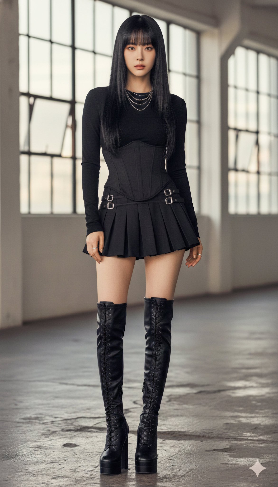

## 全身写实时尚肖像照

- ID: gpt4o-393-zh-2
- Slug: prompt-393-zh-2
- 语言: zh
- 来源: [来源链接](https://x.com/IamEmily2050/status/1983742027058835543)
- 样例图路径: images/part3/393.jpeg

### 提示词

```text
{
“说明”：“请创作一张现代东亚偶像全身写实时尚肖像照，造型为全黑。作品必须看起来像专业试镜照，而非动漫、角色扮演或奇幻风格。”

“主题”： {
“身份”：“东亚女偶像，二十出头的外貌，白皙光滑的皮肤，五官对称，下颌线条精致，大而自然的眼睛，柔和的裸色嘴唇。”
“头发”： {
颜色： 纯黑色，
“发型”：“齐刘海修饰眼睛的直发”，
长度：很长，垂过胸部，
"optional_variants": [
“干净利落的直发向下”，
“双高马尾辫，配刘海和垂在脸颊两侧的碎发”
]
}，
“身体”： {
“体型”：“纤细、修长、比例优雅、线条优美”，
“姿势”：“冷静、自信、控制的姿势，挺拔的站姿”
“姿势”：“全身站立姿势，双臂放松地放在身体两侧或髋部略微弯曲，站姿自然，不要过度拱背”
}
}，

“衣柜”： {
“调色板”：“全黑单色风格”，
"look_variants": [
{
“描述”：黑色长袖修身上衣，腰部收紧（类似束身衣的塑形效果），短款百褶迷你裙，配有腰带，黑色过膝系带厚底靴，精致的叠戴银色首饰。
}，
{
描述：黑色露脐上衣，露出小蛮腰，黑色修身牛仔裤，贴身颈链叠戴吊坠项链，哑光黑色靴子
}
]，
“注意”：“服装必须体现高级时装/街头偶像美学，而不是奇幻服装、科幻盔甲或乳胶恋物癖服装。”
}，

“相机”： {
“构图”：“从头到脚的全身像，竖构图，主体居中并占据画面的大部分”，
“角度”：“略低于躯干中部的相机高度，以微妙地拉长腿部，或者以中性的视线高度靠在门口构图”，
"lens_behavior": "清晰逼真的透视效果，无严重畸变，无鱼眼效果"
“焦点”： “从脸部到靴子，主体清晰对焦，景深适合时尚摄影”
}，

“环境”： {
"style_options": [
“工业风格的室内装潢，地面铺着磨损的瓷砖，背景是大型窗框/金属框架，整体色调为柔和的灰色。”
“中性色调的建筑风格户外入口，浅色石材或油漆门，柔和的自然光线”
]，
“照明”：“柔和、漫射、感觉自然的光线，光线方向性衰减要柔和。皮肤应该看起来光滑真实，而不是塑料感。不要使用霓虹灯轮廓光，也不要使用彩色滤光片。”
}，

“审美的”： {
"色调": "干净的韩国偶像/街头时尚大片试拍",
"color_grade": "背景采用柔和的冷色调中性色，服装采用深哑光黑色，肤色自然",
“成品”：高端时尚摄影，而非奇幻艺术、动漫渲染或华丽的VR虚拟形象。
}，

“technical_rendering”：{
“意图”: “逼真的人物主体”，
“关键词”：[
“电影式人像摄影”，
“摄影棚品质的时尚剧照”，
“织物纹理上的 PBR 材质真实感（哑光黑布、皮带、系带靴）”
“没有夸张的体型变化”，
“没有塑料皮肤”，
“没有卡通渲染风格”
]
}，

“消极的”： {
"forbidden_​​styles": [
“动漫风格”，
“卡通风格”，
“3D游戏角色”，
“虚拟偶像全息影像”
“赛博朋克奇幻服装”，
“乳胶紧身衣美学”，
“科幻盔甲”，
“色彩鲜艳的头发”，
“大眼睛/娃娃脸”，
“过度修饰的芭比娃娃质感”，
“扭曲的体型比例”，
“鱼眼畸变”，
“文字叠加或水印”
]，
"forbidden_​​words": [
“NSFW姿势”，
“露骨的内衣镜头”，
“可爱的角色扮演表情”，
“激进的性感拱背”
]
}
```

### 样例图


## { "scene": { "location": "Hyper-colorful studio", "backg

- ID: gpt4o-390-en-1
- Slug: prompt-390-en-1
- 语言: en
- 来源: [来源链接](https://x.com/songguoxiansen/status/1981178522988343619)
- 样例图路径: images/part3/390.jpeg

### 提示词

```text
{
  "scene": {
    "location": "Hyper-colorful studio",
    "background": "Pastel pink wall, decorated with 80s/90s retro toys (e.g., My Little Pony, Care Bears), vinyl records"
  },
  "subject": {
    "age": "adult",
    "description": "East Asian woman, rainbow pastel hair (wig), large, excited eyes",
    "wardrobe": "Layered pastel t-shirts (e.g., mint green over lavender), a pink tutu skirt, colorful striped leg warmers, pastel high-top sneakers",
    "accessories": "Excessive plastic jewelry: beaded necklaces, star bracelets, large bow in hair",
    "pose": "High-energy, mid-jump or one leg popped high, arms up in excitement, peace signs",
    "expression": "Hyper, excited, huge open-mouthed smile, 'genki'",
    "gaze": "Direct to camera, full of energy",
    "body_notes": "realistic adult proportions; natural skin texture"
  },
  "camera": {
    "sensor": "full_frame",
    "focal_length_mm": 35,
    "aperture_f": 4.0,
    "shutter_s": 0.008,
    "iso": 200,
    "white_balance_k": 5000,
    "distance_m": 3.0,
    "camera_height_m": 1.0,
    "framing": "Full body, capturing the dynamic pose",
    "focus": "eye_detect_AF on nearest eye"
  },
  "lighting": {
    "key": "Bright, even, "pop" lighting (on-axis beauty dish or ring flash)",
    "fill": "Two large softboxes on sides, eliminating shadows",
    "hair": "Simple top light",
    "catchlights": "Distinctive ring light catchlight",
    "notes": "High-key, flat, "magazine pop" style"
  },
  "color_grade": {
    "style": "Fairy Kei, 80s pastel-pop",
    "palette": "All pastels: pink, lavender, mint, yellow; bright, clear skin",
    "contrast": "Medium, very clean",
    "saturation": "High saturation on all pastels"
  },
  "makeup": {
    "eyes": "Bright pastel eyeshadow (e.g., blue), winged liner, glitter",
    "cheeks": "Bright pink blush, maybe small face stickers (e.g., stars)",
    "lips": "Bubblegum pink glossy lips"
  },
  "postprocess": {
    "retouch": "Clean skin",
    "clarity": "High clarity on all accessories and clothing layers",
    "dodge_burn": "Minimal, keep lighting flat and bright",
    "vignette": "None"
  },
  "art_direction": {
    "mood": "Hyper, energetic, nostalgic, colorful, bubbly",
    "keywords": ["Fairy Kei", "Harajuku", "pastel", "80s", "retro toys", "colorful", "bubbly"]
  },
  "negative_prompts": [
    "nsfw",
    "underage look",
    "text or logos",
    "plastic doll skin",
    "warped hands or extra fingers",
    "deformed limbs",
    "dark colors",
    "Goth",
    "sad expression"
  ]
}
```

### 样例图


## 彩虹色发型女生

- ID: gpt4o-390-zh-2
- Slug: prompt-390-zh-2
- 语言: zh
- 来源: [来源链接](https://x.com/songguoxiansen/status/1981178522988343619)
- 样例图路径: images/part3/390.jpeg

### 提示词

```text
{
“场景”： {
“地点”：“色彩缤纷的工作室”，
“背景”：“粉色墙面，装饰着 80 年代/90 年代的复古玩具（例如，小马宝莉、爱心熊）、黑胶唱片”
}，
“主题”： {
“年龄”: “成人”
描述：东亚女性，彩虹色假发，大而兴奋的眼睛。
“衣橱”： “层叠的粉彩色T恤（例如，薄荷绿叠穿薰衣草色），粉色芭蕾舞裙，彩色条纹腿套，粉彩色高帮运动鞋”，
“配饰”：“过多的塑料首饰：串珠项链、星星手镯、头发上的大蝴蝶结”，
“姿势”：“充满活力，跳跃或单腿高高抬起，兴奋地举起双臂，比出和平手势”，
“表情”：“亢奋、兴奋、咧嘴大笑，‘元气’”，
“凝视”：“直视镜头，充满活力”，
"body_notes": "逼真的成人比例；自然的皮肤纹理"
}，
“相机”： {
"传感器": "全帧",
"focal_length_mm": 35,
"aperture_f": 4.0,
"shutter_s": ​​0.008,
“iso”：200，
"white_balance_k": 5000,
"distance_m": 3.0,
"camera_height_m": 1.0,
“构图”：“全身照，捕捉动态姿态”，
"focus": "eye_detect_AF on nearest eye"
}，
“灯光”： {
“关键”： “明亮、均匀、‘突出’的照明（轴向柔光罩或环形闪光灯）”，
“填充”：“两侧各有一个大型柔光箱，消除阴影”，
“头发”：“简单的顶光”，
“眼神光”： “独特的环形灯光眼神光”，
备注：高调、平淡、杂志流行风格
}，
"color_grade": {
“风格”：“仙女系，80年代粉彩流行”
“调色板”：“所有柔和的粉彩色调：粉色、薰衣草色、薄荷色、黄色；明亮、清透的肌肤”，
“对比度”：“中等，非常干净”，
“饱和度”：所有粉彩色调都具有高饱和度
}，
“化妆品”： {
“眼睛”：“明亮的粉彩色眼影（例如蓝色），上扬的眼线，闪粉”，
“脸颊”：“亮粉色腮红，也许可以贴一些小贴纸（例如星星）”，
“嘴唇”： “泡泡糖粉色亮泽嘴唇”
}，
"后处理": {
“修饰”: “干净的皮肤”，
“清晰度”：“所有配饰和服装层都具有高清晰度”，
"dodge_burn": "极简，保持光线平整明亮"
“小插曲”： “无”
}，
“艺术指导”：{
“情绪”： “亢奋、精力充沛、怀旧、色彩缤纷、活泼”
关键词：[“仙女系”、“原宿”、“粉彩”、“80年代”、“复古玩具”、“色彩缤纷”、“活泼”]
}，
"negative_prompts": [
"nsfw",
“未成年样貌”，
“文字或标志”，
“塑料娃娃皮肤”，
“畸形手或多余手指”，
“肢体畸形”，
“暗色”，
“哥特式”
“悲伤的表情”
]
}
```

### 样例图


## { "scene": { "location": "Themed 'Maid Cafe' interior, f

- ID: gpt4o-389-en-1
- Slug: prompt-389-en-1
- 语言: en
- 来源: [来源链接](https://x.com/songguoxiansen/status/1981178453216137391)
- 样例图路径: images/part3/389.jpeg

### 提示词

```text
{
  "scene": {
    "location": "Themed 'Maid Cafe' interior, focused and clean",
    "background": "Bright pink walls, checkered floor, subtle hearts and ruffle decorations (soft focus, no distracting elements)"
  },
  "subject": {
    "age": "adult",
    "description": "Realistic East Asian woman, dark hair in high twin-tails with ribbons, sparkling, energetic eyes",
    "wardrobe": "Classic black maid dress with a short skirt, pristine white frilly apron, knee-high white socks with bows",
    "accessories": "Frilly maid headband, ribbons in hair",
    "pose": "Full body, dynamic 'moe moe kyun' pose; both hands making a heart gesture, one foot popped, slight bow",
    "expression": "Extremely energetic, wide-eyed 'kawaii' smile, 'genki' (energetic) personality",
    "gaze": "Direct to camera, engaging and cheerful",
    "body_notes": "realistic adult proportions; natural skin texture"
  },
  "camera": {
    "sensor": "full_frame",
    "focal_length_mm": 35,
    "aperture_f": 2.8,
    "shutter_s": 0.008,
    "iso": 400,
    "white_balance_k": 5000,
    "distance_m": 3.0,
    "camera_height_m": 1.0,
    "framing": "Full body shot, slightly low angle to enhance cuteness and energy",
    "focus": "eye_detect_AF on nearest eye"
  },
  "lighting": {
    "key": "Bright, even, slightly flat studio lighting (simulating cafe interior)",
    "fill": "Large softboxes from both sides to eliminate shadows",
    "hair": "Top-down rim light to separate hair",
    "catchlights": "Multiple, large, bright catchlights",
    "notes": "Very bright, 'pop' lighting, high-key"
  },
  "color_grade": {
    "style": "Akihabara-pop, vibrant",
    "palette": "Bright pink, black, white; clear, bright skin",
    "contrast": "Medium, very clean and crisp",
    "saturation": "High saturation"
  },
  "makeup": {
    "eyes": "Emphasized 'anime' eyes, prominent aegyo-sal, long upper and lower lashes",
    "cheeks": "Bright pink, circular blush",
    "lips": "High-gloss pink or red lip tint"
  },
  "postprocess": {
    "retouch": "Clean skin retouching, "idol" level",
    "clarity": "High clarity on eyes, apron ruffles, and hair",
    "dodge_burn": "Dodge on eyes to make them sparkle",
    "vignette": "None"
  },
  "art_direction": {
    "mood": "Energetic, cheerful, adorable, welcoming",
    "keywords": ["maid cafe", "moe", "kawaii", "twin-tails", "heart gesture", "Akihabara"]
  },
  "negative_prompts": [
    "nsfw",
    "underage look",
    "text or logos",
    "plastic doll skin",
    "warped hands or extra fingers",
    "deformed limbs",
    "dark or moody",
    "French maid (Victorian)",
    "sad expression",
    "cluttered background",
    "photography equipment",
    "lighting equipment"
  ]
}
```

### 样例图


## 双马尾比心女生

- ID: gpt4o-389-zh-2
- Slug: prompt-389-zh-2
- 语言: zh
- 来源: [来源链接](https://x.com/songguoxiansen/status/1981178453216137391)
- 样例图路径: images/part3/389.jpeg

### 提示词

```text
{
“场景”： {
“地点”：“以女仆咖啡厅为主题的室内设计，简洁明了”，
“背景”：“亮粉色的墙壁，格子地板，精致的心形和褶皱装饰（柔焦，无分散注意力的元素）”
}，
“主题”： {
“年龄”: “成人”
“描述”：“一位写实的东亚女性，深色头发扎成高高的双马尾，用丝带系着，眼睛闪亮而充满活力。”
“服装”：“经典的黑色女仆装，短裙，洁白的褶边围裙，带蝴蝶结的白色过膝袜”，
“配饰”：“褶边女仆头带，头发上的丝带”，
“姿势”：“全身动态‘萌萌哒’姿势；双手比心，一只脚翘起，微微鞠躬”
“表情”：“活力四射，睁大眼睛露出‘可爱’的笑容，‘元气’（精力充沛）的性格”，
“眼神”：“直视镜头，专注而快乐”，
"body_notes": "逼真的成人比例；自然的皮肤纹理"
}，
“相机”： {
"传感器": "全帧",
"focal_length_mm": 35,
"aperture_f": 2.8,
"shutter_s": ​​0.008,
“iso”：400，
"white_balance_k": 5000,
"distance_m": 3.0,
"camera_height_m": 1.0,
“构图”：“全身照，略微低角度拍摄，以增强可爱和活力”，
"focus": "eye_detect_AF on nearest eye"
}，
“灯光”： {
“关键”： “明亮、均匀、略微平淡的影棚照明（模拟咖啡馆内部）”
“填充”：“从两侧使用大型柔光箱以消除阴影”，
“头发”： “自上而下的边缘光，用于分离头发”，
“眼神光”： “多个、大、明亮的眼神光”，
备注：非常明亮、流行风格的灯光，高调
}，
"color_grade": {
风格： “秋叶原流行，充满活力”
“调色板”：“亮粉色、黑色、白色；清透、明亮的肌肤”
“对比度”：“中等，非常干净清晰”，
“饱和度”: “高饱和度”
}，
“化妆品”： {
“眼睛”： “强调‘动漫’眼睛，突出卧蚕，上下睫毛长”，
“脸颊”：“亮粉色，圆形腮红”，
“唇部”： “高光泽粉色或红色唇彩”
}，
"后处理": {
“修图”：“干净的皮肤修图，‘偶像’级别”，
“清晰度”：“眼睛、围裙褶边和头发的清晰度很高”，
"dodge_burn": "在眼睛上加闪，使它们闪闪发光",
“小插曲”： “无”
}，
“艺术指导”：{
“情绪”：“充满活力、开朗、可爱、热情好客”
关键词：["女仆咖啡厅", "萌", "可爱", "双马尾", "爱心手势", "秋叶原"]
}，
"negative_prompts": [
"nsfw",
“未成年样貌”，
“文字或标志”，
“塑料娃娃皮肤”，
“畸形手或多余手指”，
“肢体畸形”，
“阴郁或忧郁的”，
“法国女仆（维多利亚时代）”
“悲伤的表情”，
“杂乱的背景”，
“摄影器材”，
“照明设备”
]
}
```

### 样例图


## { "scene": { "location": "Bright photo studio", "backgro

- ID: gpt4o-387-en-1
- Slug: prompt-387-en-1
- 语言: en
- 来源: [来源链接](https://x.com/songguoxiansen/status/1981178292276527584)
- 样例图路径: images/part3/387.jpeg

### 提示词

```text
{
"scene": {
    "location": "Bright photo studio",
    "background": "Solid, high-saturation macaroon pink seamless background"
  },
  "subject": {
    "age": "adult",
    "description": "East Asian woman, long curly caramel-colored hair with sparkling gold highlights, confident 'idol' gaze",
    "wardrobe": "Sparkly 'idol' stage outfit: pink plaid pleated skirt, cropped top with white lace trim, large bow on chest, sequin details",
    "accessories": "White lace wrist gloves, sparkly star-shaped hair clips, one hand holding a retro silver microphone (as a prop)",
    "pose": "Full body, classic idol pose: one hand on hip, other hand making a heart gesture near cheek, S-curve posture, confident",
    "expression": "Perfect, bright 'professional' smile, sparkling eyes, full of charm",
    "gaze": "Direct to camera (engaging with fans)",
    "body_notes": "realistic adult proportions; natural skin texture"
  },
  "camera": {
    "sensor": "full_frame",
    "focal_length_mm": 70,
    "aperture_f": 3.2,
    "shutter_s": 0.008,
    "iso": 100,
    "white_balance_k": 5200,
    "distance_m": 4.0,
    "camera_height_m": 1.1,
    "framing": "Full body shot, with enough space to show the pose",
    "focus": "eye_detect_AF on nearest eye"
  },
  "lighting": {
    "key": "Large ring flash, creating the iconic ring catchlight",
    "fill": "Two large softboxes on the sides, providing even, high-key 'K-pop' lighting",
    "hair": "Hard light from high-behind to create shiny hair highlights",
    "catchlights": "Clear ring-shaped catchlights",
    "notes": "High-key, bright, no shadows, emphasize sparkly texture of outfit"
  },
  "color_grade": {
    "style": "K-Pop / J-Pop Idol, high-key kawaii",
    "palette": "Bright pink, white, caramel; flawless 'glass skin'",
    "contrast": "Medium, very clean",
    "saturation": "High saturation, vibrant"
  },
  "makeup": {
    "eyes": "Stage makeup: thick false lashes, sparkly liquid eyeshadow, highlighted aegyo-sal",
    "cheeks": "Bright strawberry-pink blush",
    "lips": "High-gloss gradient 'juicy lips'"
  },
  "postprocess": {
    "retouch": "Highly refined skin retouching, but maintain pore texture (not plastic)",
    "clarity": "Enhance clarity on sequins, eyes, lips, and hair highlights",
    "dodge_burn": "Micro dodge on aegyo-sal, nose bridge, and collarbones",
    "vignette": "None, keep background clean"
  },
  "art_direction": {
    "mood": "Sparkly, confident, energetic, sweet idol",
    "keywords": ["idol", "K-Pop", "J-Pop", "stage outfit", "heart gesture", "sparkly"]
  },
  "negative_prompts": [
    "nsfw",
    "underage look",
    "text or logos",
    "plastic doll skin",
    "warped hands or extra fingers",
    "deformed limbs",
    "dark or moody lighting",
    "plain clothing",
    "sad expression"
  ]
}
```

### 样例图


## 握着复古银色麦克风女生

- ID: gpt4o-387-zh-2
- Slug: prompt-387-zh-2
- 语言: zh
- 来源: [来源链接](https://x.com/songguoxiansen/status/1981178292276527584)
- 样例图路径: images/part3/387.jpeg

### 提示词

```text
{
“场景”： {
"location": "明亮摄影工作室",
"background": "纯色、高饱和度的马卡龙粉色无缝背景"
}，
“主题”： {
"年龄": "成人",
"description": "东亚女性，长长的卷曲焦糖色头发，带有闪亮的金色亮点，自信的“偶像”目光",
"wardrobe": "闪亮的‘偶像’舞台装：粉色格子百褶裙，白色蕾丝边短款上衣，胸前大蝴蝶结，亮片细节",
"accessories": "白色蕾丝腕手套，闪亮的星形发夹，一只手拿着复古的银色麦克风（作为道具）",
"pose": "全身，经典偶像姿势：一只手叉腰，另一只手在脸颊附近做爱心手势，S 形曲线，自信",
"expression": "完美、灿烂的‘专业’笑容，闪亮的眼睛，充满魅力",
"gaze": "直视镜头（与粉丝互动）",
"body_notes": "逼真的成人比例；自然的皮肤纹理"
}，
“相机”： {
“传感器”：“全帧”，
"焦距毫米": 70,
"aperture_f": 3.2,
“shutter_s”：0.008，
"iso": 100,
"白平衡k": 5200,
“距离米”：4.0，
"camera_height_m": 1.1,
"framing": "全身照，留出足够的空间来展示姿势",
“focus”：“eye_detect_AF 在最近的眼睛上”
}，
“灯光”： {
"key": "大型环形闪光灯，营造标志性的环形眼神光",
"fill": "两侧有两个大型柔光箱，提供均匀、高调的“K-pop”照明",
"hair": "从高处照射强光，打造闪亮的头发亮点",
"catchlights": "透明环形眼神光",
"notes": "高调、明亮、无阴影，强调服装的闪亮质感"
}，
“颜色等级”：{
"style": "K-Pop / J-Pop 偶像，高调可爱",
"palette": "亮粉色、白色、焦糖色；完美无瑕的‘玻璃肌肤’",
"contrast": "中等，非常干净",
"saturation": "高饱和度，鲜艳"
}，
“化妆品”： {
"eyes": "舞台妆：浓密的假睫毛、闪亮的液体眼影、高光的撒娇眼影",
"cheeks": "明亮的草莓粉色腮红",
"lips": "高光渐变‘水润双唇’"
}，
“后处理”：{
"retouch": "高度精致的皮肤修饰，但保持毛孔纹理（不是塑料）",
"clarity": "增强亮片、眼睛、嘴唇和头发亮点的清晰度",
"dodge_burn": "对撒娇、鼻梁和锁骨进行微减淡",
"vignette": "无，保持背景干净"
}，
“艺术指导”：{
"mood": "闪亮、自信、活力、甜美的偶像",
"keywords": ["偶像", "K-Pop", "J-Pop", "舞台服装", "心形手势", "闪亮"]
}，
"negative_prompts": [
“nsfw”，
“未成年的样子”，
“文字或徽标”，
“塑料娃娃皮肤”，
“弯曲的手或多余的手指”，
“畸形肢体”，
“昏暗或阴郁的灯光”，
“便衣”，
“悲伤的表情”
]
}
```

### 样例图


## 人和汽车的三视图

- ID: gpt4o-384-zh
- Slug: prompt-384-zh
- 语言: zh
- 来源: [来源链接](https://x.com/songguoxiansen/status/1983425570596892858)
- 样例图路径: images/part3/384.jpeg

### 提示词

```text
A cinematic automotive photoshoot of me, keeping my real face unchanged. The scene is composed of three perspectives as a :

1. Top Panel: Interior close-up: I am seated inside the car, wearing a fitted black polo shirt, shown in the side mirror reflection. My face is serious and focused, my gaze directed forward with determination. The angle captures only side view part of my profile, framed cleanly within the mirror, emphasizing intensity and precision.

2.Middle Panel: I am standing confidently next to a sleek black Ford Mustang. My posture is relaxed but strong: both arms are crossed over my chest in a confident manner, while my left leg is straight and my right leg bent slightly at the knee, with the foot leaning casually against the car. My gaze is directed slightly off-camera, with a calm and assertive expression. I am wearing a fitted black polo shirt with subtle detailing, slim grey jeans with a clean cut, and brown leather boots. My outfit is minimal yet stylish, emphasizing a modern masculine vibe. Pose like a pro, same face as the uploaded photo.

3. Bottom Panel: Rear car shot: The camera captures the back of the Mustang, showcasing the "YOUR NAME" license plate and muscular lines of the car. The photo emphasizes the glossy texture of the vehicle and its aggressive, cinematic presence. The setting is an urban environment with modern architecture and concrete walls, giving a gritty, cinematic atmosphere. The lighting is natural but slightly diffused, highlighting both me and the polished surface of the car.

The perspectives vary:

- The mirror reflection close-up is shot tight with a portrait focal length (~85mm).

- The exterior full-body shot is taken at eye-level with a slightly wide lens to capture both me and the car in full view.

- The rear car angle uses a low perspective to emphasize power and presence.

Style: Cinematic automotive editorial, urban setting, moody and stylish, professional fashion-meets- car photography, same face.
```

### 样例图

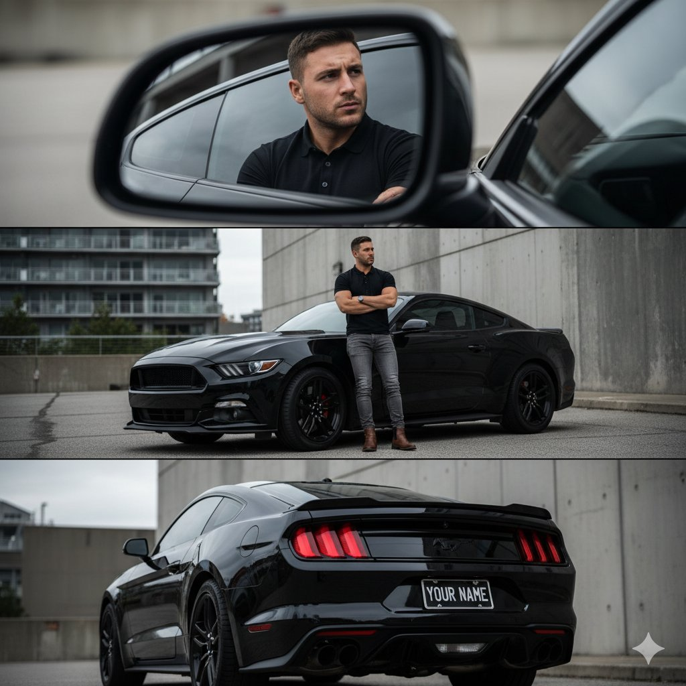

## Create a hyper-real macro photograph of a tiny (CHARACTE

- ID: gpt4o-383-en-1
- Slug: prompt-383-en-1
- 语言: en
- 来源: [来源链接](https://x.com/Samann_ai/status/1982774584198991988)
- 样例图路径: images/part3/383.jpeg

### 提示词

```text
Create a hyper-real macro photograph of a tiny (CHARACTER) about 10–12 cm tall, gently held between a real human thumb and index finger or sitting on the fingertip. The character naturally touches the thumb for scale and holds (ACCESSORY). Studio setting with a soft grey gradient background, subtle bokeh. Skin, fabric and hair show micro-texture; add accurate contact shadows where fingers meet the character. Lighting: softbox at 45°, faint rim light on the far side; no harsh glare. Camera look: 100mm macro • f/2.8 • ISO 100 • 1/160s (shallow depth of field; eyes perfectly in focus). Hands look clean, natural anatomy, 5 fingers, realistic nails and pores. The character’s outfit is simple textured knit (dark grey) unless the identity demands otherwise; proportions and perspective must read real, not toy. Treat (CHARACTER) respectfully and keep likeness faithful if based on a real person. Composition: subject centered, from mid-torso up, with the thumb and index framing the character;
```

### 样例图

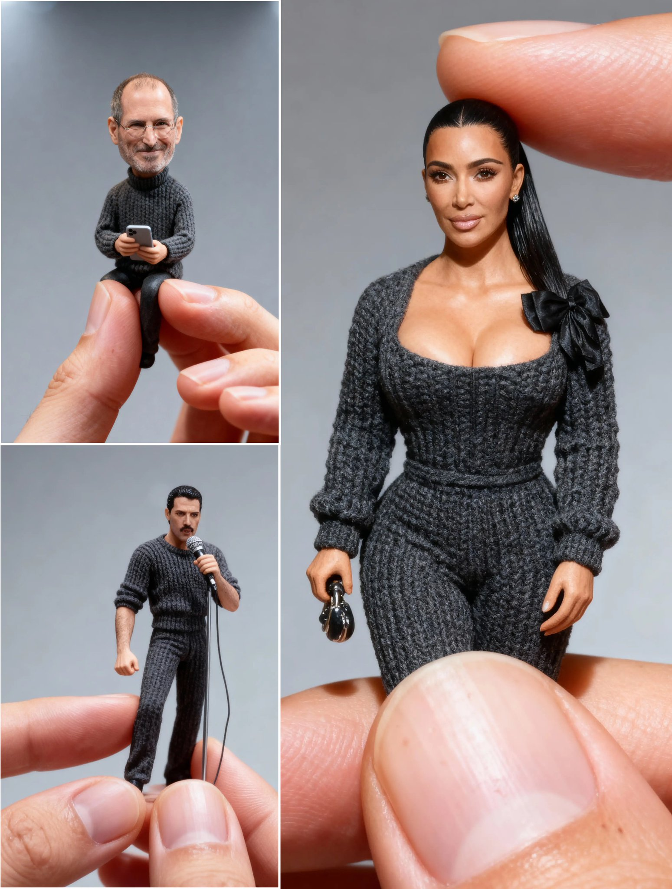

## 一张超现实的微距照片

- ID: gpt4o-383-zh-2
- Slug: prompt-383-zh-2
- 语言: zh
- 来源: [来源链接](https://x.com/Samann_ai/status/1982774584198991988)
- 样例图路径: images/part3/383.jpeg

### 提示词

```text
创建一张超现实的微距照片，照片中一个约 10-12 厘米高的微小（角色），轻轻地放在真人的拇指和食指之间或放在指尖上。角色自然地触摸拇指以进行缩放并握住（配件）。工作室设置具有柔和的灰色渐变背景，微妙的散景。皮肤、织物和头发显示微观纹理；在手指与角色接触的地方添加准确的接触阴影。照明：45° 柔光箱，远端微弱的边缘光；无刺眼眩光。相机外观：100mm 微距 • f/2.8 • ISO 100 • 1/160s（浅景深；眼睛完美对焦）。手看起来干净，解剖自然，5 个手指，逼真的指甲和毛孔。除非身份另有要求，否则角色的服装是简单的纹理针织（深灰色）；比例和透视必须是真实的，而不是玩具。尊重地对待（角色），如果基于真人，则保持相似性。构图：以主体为中心，从躯干中部向上，用拇指和食指框住人物；
```

### 样例图


## A 3D chibi-style vinyl collectible figure of [CHARACTER 

- ID: gpt4o-382-en-1
- Slug: prompt-382-en-1
- 语言: en
- 来源: [来源链接](https://x.com/Arminn_Ai/status/1982860799879114903)
- 样例图路径: images/part3/382.jpeg

### 提示词

```text
A 3D chibi-style vinyl collectible figure of [CHARACTER NAME] Big head, small body, cartoon proportion, Standing inside a Youtooz-style
packaging box with: Transparent front window
"YOUTOOZ COLLECTIBLES" logo on the top
Number label ([#XXX]) on the top-left
Bottom front text: “[CHARACTER NAME]” and lower with smaller font “VINYL FIGURE”
Cartoon 2D illustration of [CHARACTER NAME] on the side of the box ([ILLUSTRATION DESCRIPTION])

Background/theme:
[BOX COLORS + TEXTURES + ICONIC MOTIFS RELATED TO CHARACTER] 
[Figure POSE OR GESTURE] 
[Outfit DESCRIPTION + SIGNATURE ITEMS]

Face details: The facial features (mouth/eyes/details) must be fully 3D sculpted, not flat or printed.
Lighting: clean product photography look, minimal soft shadows
Style: vinyl-toy aesthetic with a mix of matte + glossy accents depending on costume, Composition: 3/4 product shot view, full box visible. The entire packaging box must be fully visible inside the frame with a clean margin around all edges.
```

### 样例图


## 3D chibi风格乙烯基收藏品

- ID: gpt4o-382-zh-2
- Slug: prompt-382-zh-2
- 语言: zh
- 来源: [来源链接](https://x.com/Arminn_Ai/status/1982860799879114903)
- 样例图路径: images/part3/382.jpeg

### 提示词

```text
3D chibi 风格乙烯基收藏品 [CHARACTER NAME] 大头，小身体，卡通比例，站在 Youtooz 风格的
包装盒带有：透明前窗
顶部有“YOUTOOZ COLLECTIBLES”标志
左上角的数字标签（[#XXX]）
底部文字：“[CHARACTER NAME]” 下方用较小的字体写着“VINYL FIGURE”
盒子侧面的 [角色名称] 卡通 2D 插图（[插图描述]）

背景/主题：
[盒子颜色 + 纹理 + 与角色相关的标志性图案]
[人物姿势或手势]
[服装描述 + 标志性物品]

面部细节：面部特征（嘴巴/眼睛/细节）必须完全 3D 雕刻，而不是平面或印刷的。
灯光：干净的产品摄影外观，最小的柔和阴影
风格：搪胶玩具美学，根据服装搭配哑光和亮光元素。构图：3/4 产品视角，完整包装盒清晰可见。整个包装盒必须在框架内完全可见，所有边缘均留有清晰的空白。
```

### 样例图


## Use 100% face above uploaded photo. A hyper-realistic, c

- ID: gpt4o-379-en-1
- Slug: prompt-379-en-1
- 语言: en
- 来源: [来源链接](https://x.com/eyishazyer/status/1982402164212597061)
- 样例图路径: images/part3/379.jpeg

### 提示词

```text
Use 100% face above uploaded photo.
A hyper-realistic, cinematic medium shot of a handsome man in his late 20s with black hair and black beard like uploaded photo, styled in the fashion of the 1920s. He wears a grey tweed newsboy cap, a black waistcoat over a crisp white shirt, a slim black tie, and black leather gloves. A heavy wool overcoat is draped over his shoulder.
He leans against a weathered brick wall in a narrow, atmospheric alleyway, looking upwards with a cool, contemplative expression through his round sunglasses. The lighting is moody and dramatic, with cool tones and soft shadows creating a sense of depth and mystery. The photograph is ultra-detailed with sharp focus and a shallow depth of field.
```

### 样例图

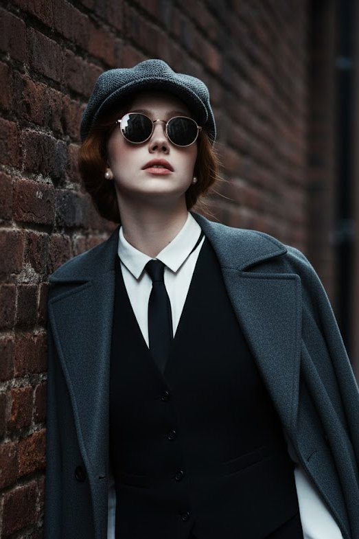

## 戴着报童帽身穿黑色马甲

- ID: gpt4o-379-zh-2
- Slug: prompt-379-zh-2
- 语言: zh
- 来源: [来源链接](https://x.com/eyishazyer/status/1982402164212597061)
- 样例图路径: images/part3/379.jpeg

### 提示词

```text
使用上传的 100% 面部照片。
这张超现实主义的电影中景镜头展现了一位英俊的二十多岁男子，他有着上传照片般的黑发和黑胡须，一身20世纪20年代的时尚风格。他头戴灰色粗花呢报童帽，身穿黑色马甲，内搭清爽的白衬衫，系着一条纤细的黑色领带，戴着黑色皮手套。肩上披着一件厚重的羊毛大衣。
他倚靠在一条狭窄而充满情调的小巷里，倚靠着一堵饱经风霜的砖墙，透过圆形墨镜，目光冷峻而沉思。灯光充满情调，充满戏剧性，冷色调和柔和的阴影营造出一种纵深感和神秘感。这张照片细节丰富，对焦清晰，景深浅。
```

### 样例图


## Create the highest-resolution picture of me posing elega

- ID: gpt4o-378-en-1
- Slug: prompt-378-en-1
- 语言: en
- 来源: [来源链接](https://x.com/eyishazyer/status/1982402158176972945)
- 样例图路径: images/part3/378.jpeg

### 提示词

```text
Create the highest-resolution picture of me posing elegantly with my back slightly turned and my head looking over the shoulder towards the camera. I am wearing a sleek, form-fitting strapless black evening gown, paired with long, elegant black velvet opera gloves. My hair is styled in loose, glossy waves cascading naturally over my shoulder.
I wear small, subtle earrings and a delicate bracelet on one wrist. My expression is confident, graceful, and alluring. The background is a plain stucco gray with soft gradient lighting, giving it a high-fashion photography look. The lighting is dramatic but soft, highlighting the contours of my body and face with realistic shadows and textures.
The image should look like a high-quality, ultra-realistic fashion magazine photo, keeping my real face exactly as shown in the reference photo.
```

### 样例图

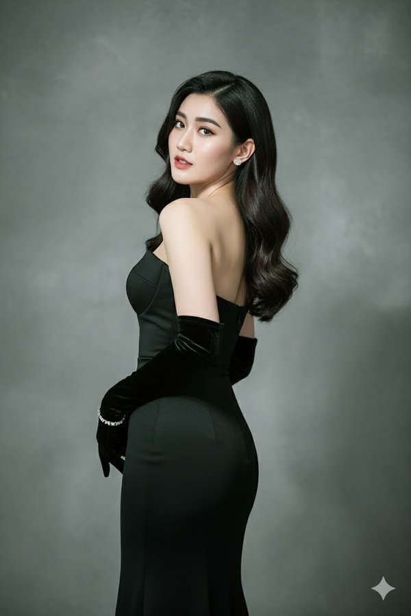

## 优雅姿势的最高分辨率照片

- ID: gpt4o-378-zh-2
- Slug: prompt-378-zh-2
- 语言: zh
- 来源: [来源链接](https://x.com/eyishazyer/status/1982402158176972945)
- 样例图路径: images/part3/378.jpeg

### 提示词

```text
请拍一张我优雅姿势的最高分辨率照片，我的背影微微转过，头越过肩膀，望向镜头。我身着一件光滑修身的黑色露肩晚礼服，搭配一副优雅的黑色天鹅绒长款歌剧手套。我的头发是蓬松的、光泽的波浪，自然地披散在肩上。”
我戴着小巧精致的耳环，一只手腕上戴着精致的手镯。我的表情自信、优雅、迷人。背景是朴素的灰泥灰，柔和的渐变灯光营造出高级时尚的摄影效果。灯光既戏剧化又柔和，用逼真的阴影和纹理凸显了我的身体和面部轮廓。
该图像应该看起来像一张高质量、超逼真的时尚杂志照片，保留我的真实面容，与参考照片中显示的完全一样。
```

### 样例图


## Reference image: uploaded photo Face: keep the same face

- ID: gpt4o-377-en-1
- Slug: prompt-377-en-1
- 语言: en
- 来源: [来源链接](https://x.com/eyishazyer/status/1982402145535373486)
- 样例图路径: images/part3/377.jpeg

### 提示词

```text
Reference image: uploaded photo
Face: keep the same face from the reference photo, calm and composed expression, eyes slightly hidden behind dark sunglasses. Preserve realistic proportions and lighting.
Pose: seated pose on a modern subway bench, one arm resting on the leg, the other hanging down loosely. The body leans slightly forward with casual confidence, one shoulder lowered. Clothes: oversized houndstooth-patterned jacket over black turtleneck, wide dark jeans, chunky lace-up boots. Accessories: narrow black sunglasses, subtle rings, crossbody strap barely visible.
Background: minimalistic urban metro interior with grey concrete walls, metallic accents, and modern geometric design. Lighting: diffused artificial indoor light, soft shadows, neutral color balance emphasizing grayscale tones. Atmosphere: moody street editorial — quiet confidence, understated power, cinematic stillness.
Format: 2:3 Do not replace face; keep the same person with realistic proportions and lighting accuracy.
```

### 样例图

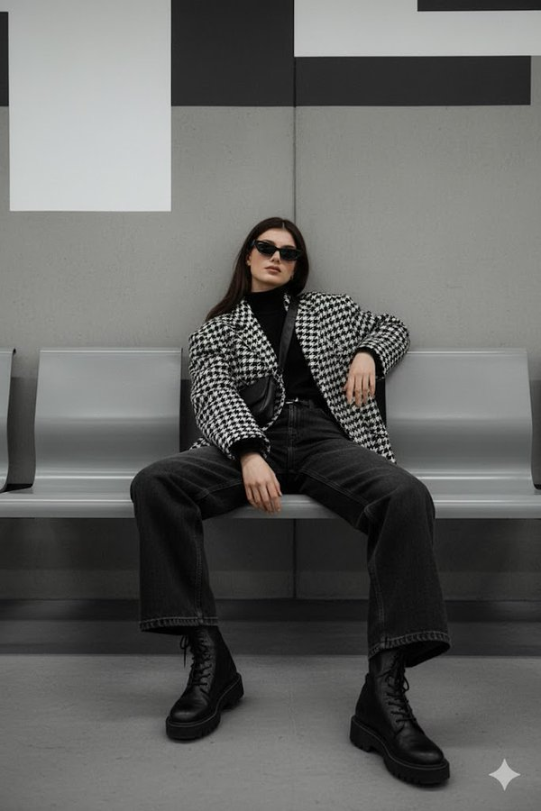

## 坐在现代地铁长椅上

- ID: gpt4o-377-zh-2
- Slug: prompt-377-zh-2
- 语言: zh
- 来源: [来源链接](https://x.com/eyishazyer/status/1982402145535373486)
- 样例图路径: images/part3/377.jpeg

### 提示词

```text
参考图片：上传的照片
脸部：保持参考照片中的脸部，表情沉稳冷静，眼睛略微隐藏在墨镜后。保持真实的比例和光线。
姿势：坐在现代地铁长椅上，一只手臂搭在腿上，另一只手臂自然垂下。身体略微前倾，自信而随意，一侧肩膀下垂。服装：超大千鸟格纹夹克，内搭黑色高领毛衣，深色宽腿牛仔裤，系带厚底靴。配饰：黑色窄款墨镜，精致戒指，斜挎包带若隐若现。
背景：极简主义的都市地铁内部，灰色混凝土墙面，金属元素点缀，以及现代几何设计。灯光：漫射的室内人造光，柔和的阴影，强调灰阶色调的中性色彩平衡。氛围：忧郁的街头风格——沉静自信，低调的力量，电影般的静谧。
格式：2：3 不要替换面部；保持同一个人具有真实的比例和灯光准确性。
```

### 样例图


## Create a black and white high-fashion editorial portrait

- ID: gpt4o-373-en-1
- Slug: prompt-373-en-1
- 语言: en
- 来源: [来源链接](https://x.com/eyishazyer/status/1982402114413596850)
- 样例图路径: images/part3/373.jpeg

### 提示词

```text
Create a black and white high-fashion editorial portrait of me, keeping my real face exactly as in the reference photo (no edits, same features, no retouching). I am wearing a loose white blouse. My pose is bold and expressive, with one arm raised to hold my hair up, partially covering my face. My gaze is intense and directed at the camera, creating a strong and enigmatic aura. The background is a plain minimalist wall with sharp natural daylight casting defined shadows, adding depth and contrast.
Lighting is harsh and high-contrast, highlighting my facial contours, sharp cheekbones, and the texture of the hair and fabric. The style should feel raw, dramatic, and artistic.
The overall image is high-fashion editorial in monochrome, cinematic, and striking.
```

### 样例图

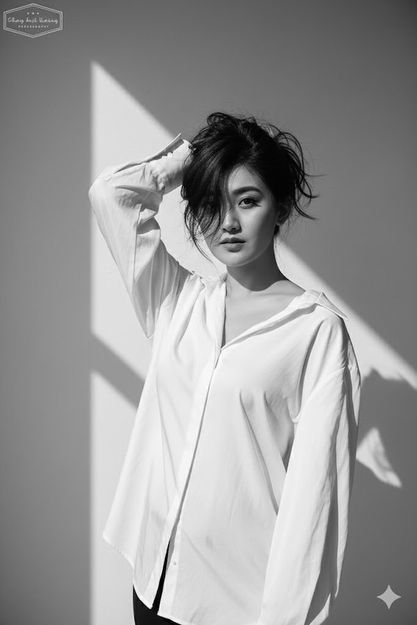

## 身穿一件宽松的白色衬衫肖像照

- ID: gpt4o-373-zh-2
- Slug: prompt-373-zh-2
- 语言: zh
- 来源: [来源链接](https://x.com/eyishazyer/status/1982402114413596850)
- 样例图路径: images/part3/373.jpeg

### 提示词

```text
为我创作一幅黑白高级时尚编辑肖像，保留我的真实面容，与参考照片完全一致（未进行任何编辑，五官相同，未进行任何修饰）。我身穿一件宽松的白色衬衫。我的姿势大胆而富有表现力，一只手抬起，将头发拢起，遮住了部分脸部。我的目光专注地直视镜头，营造出一种强烈而神秘的氛围。背景是一面简洁的墙面，明亮的自然光投射出清晰的阴影，增添了画面的深度和对比度。
光线强烈，对比度高，凸显了我的面部轮廓、棱角分明的颧骨，以及头发和布料的质感。风格应该给人一种原始、戏剧化、艺术感十足的感觉。
整体形象是单色的、电影化的、引人注目的高级时尚社论。
```

### 样例图


## { "prompt_title": "Hyperrealistic Gothic Bunny Studio Po

- ID: gpt4o-370-en-1
- Slug: prompt-370-en-1
- 语言: en
- 来源: [来源链接](https://x.com/IqraSaifiii/status/1982469385156489563)
- 样例图路径: images/part3/370.jpeg

### 提示词

```text
{
"prompt_title": "Hyperrealistic Gothic Bunny Studio Portrait",
"image_description": "An ultra-photorealistic, high-resolution studio portrait of a female subject in a gothic-inspired bunny costume, featuring intricate lace ears, a structured corset, and delicate hosiery. The subject is posed on the floor, exuding an alluring and sophisticated aura under precise studio lighting.",
"subject": {
"gender": "female",
"appearance": "Young adult with a flawless, luminous complexion. **Extreme micro-detail rendering on skin, showing subtle pores, fine vellus hairs, accurate light interaction (sub-surface scattering), and realistic skin texture.**",
"facial_features": "Smooth, clear skin. Her eyes are large, dark, and captivating, looking directly into the camera with a **confident and slightly seductive expression**. Lips are full, with a matte red or deep berry lipstick that shows micro-creases. Defined eyebrows and subtle contouring.",
"hair_style": "Long, flowing, wavy black hair, cascading over her shoulders and back. **Hair must show individual strands, realistic volume, high-gloss reflections, and subtle flyaways.**",
"makeup": "Dramatic and precise. Sharp, winged black eyeliner, full, dark eyelashes (possibly individual lash extensions), subtle glitter or shimmer on eyelids. Contoured cheeks. Flawless foundation and blush.",
"attire": {
"headwear": "Intricate **black lace bunny ears headband**. The lace should have visible patterns, delicate wire structure, and possibly small faux floral or ribbon accents. Realistic light interaction with the lace.",
"neck_accessories": "A simple, fitted black velvet or leather choker necklace.",
"main_outfit": "A highly detailed **black strapless corset dress or top and skirt ensemble**. The corset should be structured, showing **visible boning and lacing details** (possibly satin or leather laces). Fabric should be a mix of matte black leather/faux leather and textured, ruffled black tulle or chiffon for the skirt. **Emphasis on realistic fabric folds, textures, and subtle sheen.**",
"hosiery": "Sheer black thigh-high stockings with a delicate lace top band, clearly visible on her upper thigh. **Stockings must show realistic transparency and fabric stretch over skin.**",
"footwear": "Black pointed-toe high heels with ankle straps. The material should be a realistic matte or patent leather, showing accurate reflections and shoe construction."
}
},
"pose": {
"description": "The subject is kneeling on a flat, light-colored studio floor, leaning slightly forward. Her left hand is placed on the floor beside her left knee, fingers slightly spread. Her right arm is gently resting on her right thigh. Her body is slightly twisted, creating an alluring silhouette. **Exact replication of the confident and poised pose.**",
"camera_angle": "Medium shot, eye-level angle, slightly looking down at the subject. The camera is positioned to capture her full body from the mid-thigh up, with enough space around her to establish the studio environment.",
"composition": "Centered composition, vertical orientation. The subject fills approximately 70-80% of the frame, with subtle negative space around her. **Sharp focus on the subject, with a very shallow depth of field creating a soft bokeh in the background.**"
},
"setting": {
"location": "Professional indoor photo studio.",
"background_elements": "Seamless, plain light gray or off-white backdrop, extending from the floor to the wall, creating a clean, infinite background. **Subtle, soft gradient in the background due to lighting falloff.**"
},
"lighting_and_atmosphere": {
"key_light_source": "Softbox or parabolic diffuser from the front-left, creating soft, even illumination with subtle directional shadows to define contours.",
"fill_light": "Subtle fill light from the front-right to reduce harsh shadows on the right side of her face and body.",
"back_light": "A subtle hair light or rim light from the rear-right to create separation from the background and add definition to her hair and shoulders.",
"highlights_shadows": "Soft, creamy highlights on skin, hair, and corset material. Deep but soft shadows defining facial structure and body contours. **Accurate light falloff and realistic specular reflections on materials.**",
"photographic_realism": "Extreme micro-detail, sub-surface scattering on skin, realistic fabric textures (lace, leather, tulle), **cinematic studio lighting**, crisp focus on eyes, perfect white balance, neutral color grading, **ultra-realistic material rendering (PBR - Physically Based Rendering).**"
},
"style_and_camera": {
"photographic_style": "High-fashion portraiture, hyperrealistic studio photography, fine art glamour.",
"camera_type": "High-end full-frame mirrorless camera (e.g., Sony A1, Canon R5) with a fast prime lens (e.g., 50mm f/1.2 or 85mm f/1.4).",
"camera_values": "ISO 100, f/1.8, 1/160 sec. **These values contribute to shallow depth of field, sharp detail, and clean image quality.**",
"resolution_quality": "8K resolution, ultra-photorealistic, extreme detail on all elements. **Masterpiece quality render, production quality image.**"
},
"negative_prompt_suggestions": [
"blurry", "low resolution", "deformed", "harsh lighting", "flat background", "bad anatomy",
"cartoon", "illustration", "painting", "text", "watermark", "oversaturated", "poor composition",
"unrealistic skin", "plastic texture", "missing details"
]
}
```

### 样例图

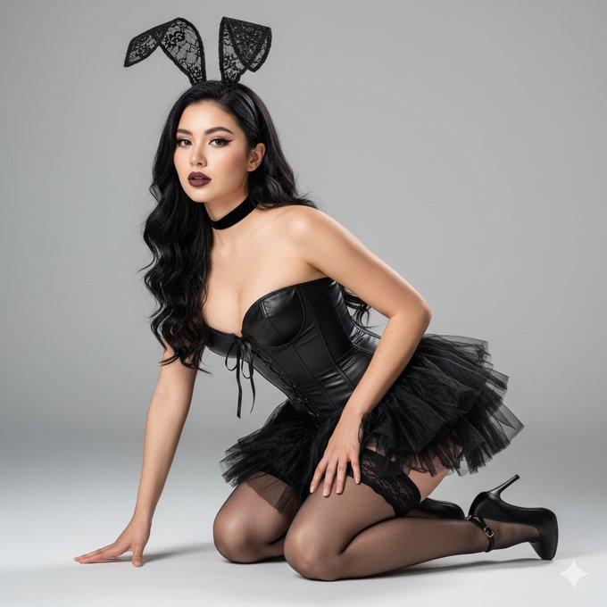

## 超现实主义哥特式兔子工作室肖像

- ID: gpt4o-370-zh-2
- Slug: prompt-370-zh-2
- 语言: zh
- 来源: [来源链接](https://x.com/IqraSaifiii/status/1982469385156489563)
- 样例图路径: images/part3/370.jpeg

### 提示词

```text
{
"prompt_title": "超现实主义哥特式兔子工作室肖像",
"image_description": "这幅超逼真、高分辨率的工作室肖像画描绘了一位身着哥特式兔子服装的女性，服装配有精致的蕾丝耳朵、结构化的紧身胸衣和精致的袜子。模特躺在地板上，在精准的工作室灯光下散发着迷人而精致的气息。",
“主题”： {
"性别": "女",
"appearance": "拥有完美无瑕、明亮肤色的年轻人。 **皮肤上极其细微的细节渲染，展现出细微的毛孔、细小的毳毛、准确的光线相互作用（次表面散射）和逼真的皮肤纹理。 ** ",
"facial_features": "光滑、洁净的皮肤。她的眼睛又大又黑，魅力十足，直视镜头，眼神自信而略带诱惑** 。 **.嘴唇丰满，涂着哑光红色或深莓色唇膏，露出细微的皱纹。眉毛清晰，轮廓细腻。",
"hair_style": "飘逸的黑色长发，波浪状披散在肩部和背部。 **头发必须展现出独立的发丝、真实的蓬松度、高光泽的反光和微妙的飞散。 ** ",
"makeup": "妆容精致而又充满戏剧感。锐利的黑色眼线，浓密的深色睫毛（可能是单独嫁接的），眼睑上点缀着淡淡的闪粉或珠光。轮廓分明的脸颊。完美的粉底和腮红。",
“服装”：{
"headwear": "精致的**黑色蕾丝兔耳头带**.蕾丝应具有明显的图案、精致的金属丝结构，以及可能的小型仿花或丝带装饰。与蕾丝的逼真灯光互动。",
"neck_accessories": "一条简单、合身的黑色天鹅绒或皮革颈链。",
"main_outfit": "一件细节丰富的**黑色露肩紧身连衣裙或上衣和裙子套装**.紧身胸衣应结构清晰，露出**明显的骨和系带细节** (可能需要缎子或皮革鞋带。裙子面料应为哑光黑色皮革/人造皮革和纹理荷叶边黑色薄纱或雪纺的混合面料。 **强调逼真的面料褶皱、纹理和微妙的光泽。 ** ",
"hosiery": "透明黑色过膝长袜，带有精致的蕾丝边，在大腿上清晰可见。 **长袜必须具有逼真的透明度，并且织物在皮肤上具有弹性。 ** ",
“footwear”：“黑色尖头高跟鞋，带踝带。材质应为逼真的哑光皮革或漆皮，展现准确的反射和鞋子结构。”
}
}，
“姿势”：{
"description": "拍摄对象跪在工作室平坦的浅色地板上，身体微微前倾。她的左手放在左膝旁的地板上，手指微微张开。她的右臂轻轻地放在右大腿上。她的身体微微扭动，勾勒出迷人的轮廓。 **精准地复制了她自信而泰然的姿势。 ** ",
"camera_angle": "中景镜头，视线水平角度，略微向下看拍摄对象。摄像机的位置可以捕捉到她从大腿中部以上的全身，周围有足够的空间来营造工作室氛围。",
"composition": "居中构图，垂直方向。主体占据了画面的大约 70-80%，周围留有微妙的负空间。 **主体清晰对焦，景深很浅，在背景中营造出柔和的散景效果。 ** "
}，
“环境”： {
"location": "专业室内摄影工作室。",
"background_elements": "无缝、纯浅灰色或灰白色背景，从地板延伸到墙壁，营造出干净、无限的背景。 **由于光线衰减，背景中出现微妙、柔和的渐变。 ** "
}，
“照明和氛围”：{
"key_light_source": "从左前方放置柔光箱或抛物面漫射器，创造柔和、均匀的照明，并带有微妙的定向阴影来定义轮廓。",
"fill_light": "来自右前方的微妙补光，以减少她脸部和身体右侧的刺眼阴影。",
"back_light": "从右后方照射的微妙的头发光或边缘光，与背景分离，并突出她的头发和肩膀。",
"highlights_shadows": "皮肤、头发和紧身胸衣材质上呈现柔和、奶油般的高光。深邃而柔和的阴影勾勒出面部结构和身体轮廓。 **材质上呈现精准的光线衰减和逼真的镜面反射。 ** ",
"photographic_realism": "极其精细的微细节、皮肤表面次表面散射、逼真的织物纹理（蕾丝、皮革、薄纱）、 **电影工作室灯光** 、清晰的眼睛聚焦、完美的白平衡、中性色彩分级、 **超逼真的材质渲染（PBR - 基于物理的渲染）。 ** "
}，
“style_and_camera”：{
"photographic_style": "高级时尚肖像画、超现实主义工作室摄影、艺术魅力。",
"camera_type": "高端全画幅无反光镜相机（例如索尼 A1、佳能 R5）搭配快速定焦镜头（例如 50mm f/1.2 或 85mm f/1.4）。",
"camera_values": "ISO 100、f/1.8、1/160 秒。 **这些值有助于获得浅景深、清晰的细节和干净的图像质量。 ** ",
"resolution_quality": "8K 分辨率，超逼真，所有元素细节丰富。 **杰作品质渲染，产品品质图像。 ** "
}，
"negative_prompt_suggestions": [
“模糊”、“分辨率低”、“变形”、“光线刺眼”、“背景平坦”、“结构不良”
“卡通”、“插图”、“绘画”、“文字”、“水印”、“过饱和”、“构图不佳”
“皮肤不真实”、“塑料质感”、“缺少细节”
]
}
```

### 样例图


## 影楼拍摄女性坐在椅子上肖像照

- ID: gpt4o-368-zh
- Slug: prompt-368-zh
- 语言: zh
- 来源: [来源链接](https://x.com/hellokaton/status/1980121888853819768)
- 样例图路径: images/part3/368.jpeg

### 提示词

```text
请在影楼里拍摄一张照片，照片中使用所附照片中的女性面孔。
拍摄角度为正面，白色影楼背景，女性坐在椅子上。
她身穿全套白色服装：白色西装外套、白色裙子和白色高跟鞋。
姿势优雅，手托下巴，手里拿着一小枝白色玫瑰。
影楼墙壁上投射着柔和的夕阳窗户光线。
```

### 样例图

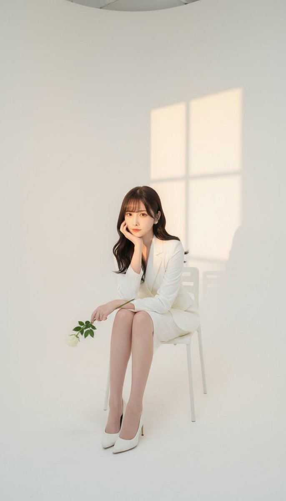

## 一位年轻女性的时尚电影肖像

- ID: gpt4o-367-zh
- Slug: prompt-367-zh
- 语言: zh
- 来源: [来源链接](https://x.com/hellokaton/status/1980121876996465085)
- 样例图路径: images/part3/367.jpeg

### 提示词

```text
一位年轻女性的时尚、电影肖像，她坐在一张现代椅子上，在室内。她以 3/4 视角构图，身体微微向后倾斜，一只手臂随意地搭在椅子上，散发出平静而自信的氛围。这位女士拥有一张瓜子脸，线条分明的下颌，发型与参考图片完全一致。她穿着一套时尚的全黑服装，包括深色高领毛衣和结构感强的西装外套，展现出高端时尚的编辑造型。
背景是一堵光滑的深色墙壁，窗户投射出引人注目的几何光影图案，散发出柔和的粉紫色光芒，与阴影形成鲜明对比。彩色的光线落在墙壁上，并 subtly 照亮她的头发和肩膀边缘，增强了戏剧性的氛围。整体照明 moody 而艺术，具有柔和的阴影和电影般的对比度。色彩分级强调深黑色、柔和的肤色和鲜艳的粉色高光，营造出杂志封面般的审美效果。
主体略微偏离中心。最终图像中不应出现任何文字、徽标或水印。
```

### 样例图

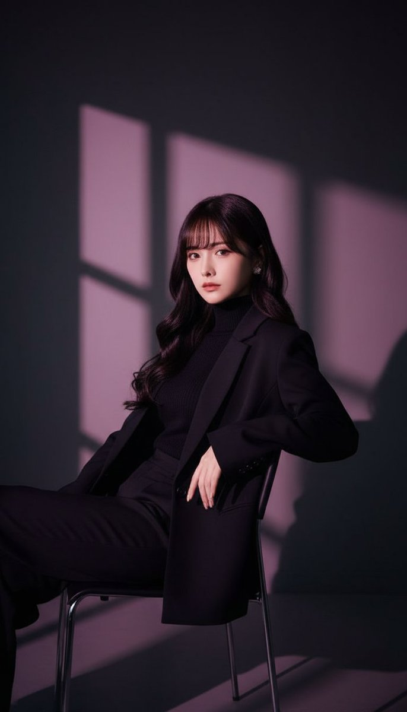

## a woman standing confidently in a minimalist studio, sho

- ID: gpt4o-356-en-1
- Slug: prompt-356-en-1
- 语言: en
- 来源: [来源链接](https://x.com/MANISH1027512/status/1980858137788797269)
- 样例图路径: images/part3/356.jpeg

### 提示词

```text
a woman standing confidently in a minimalist studio, shot from a slightly low angle, half-body portrait, her head tilted slightly down with a calm and enigmatic expression, middle-parted braided pigtails with a few loose strands falling over her face, subtle wet hair texture, wearing a tight black sleeveless dress and black leather gloves, holding a leather belt loosely in front of her body — dramatic single key light from upper right, high contrast, black and white tones, strong rim light accentuating her curves, plain textured wall background, cinematic noir atmosphere, fine art fashion photography, inspired by Helmut Newton and Peter Coulson, shallow depth of field, smooth gradients, elegant and powerful mood
```

### 样例图

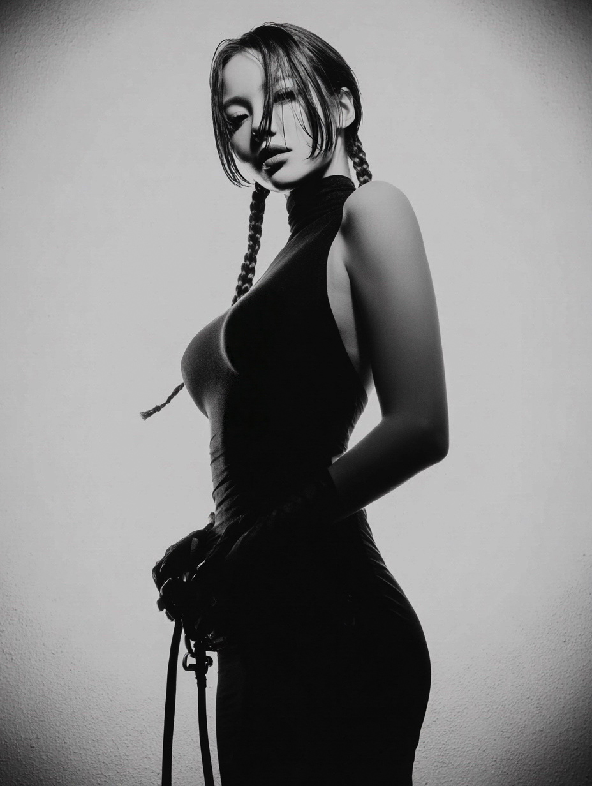

## 黑白风格肖像照

- ID: gpt4o-356-zh-2
- Slug: prompt-356-zh-2
- 语言: zh
- 来源: [来源链接](https://x.com/MANISH1027512/status/1980858137788797269)
- 样例图路径: images/part3/356.jpeg

### 提示词

```text
一位女士自信地站立在极简主义的摄影棚中，从略低的视角拍摄，半身肖像。她的头微微向下倾斜，表情平静而神秘。中分编织的双马尾辫，几缕发丝随意地落在脸庞上，头发带有微妙的湿润质感。她穿着紧身的黑色无袖连衣裙和黑色皮手套，双手松散地在身体前方握着一条皮带。画面采用戏剧性的单一主光源从右上角打下，高对比度，黑白影调，强烈的轮廓光勾勒出她的身体曲线。背景是纯色的纹理墙壁，营造出电影般的黑色电影氛围，如同艺术时尚摄影作品。灵感来源于赫尔穆特·牛顿和彼得·库尔森，景深较浅，光影过渡平滑，整体情绪优雅而充满力量。
```

### 样例图


## Ultra-detailed, photorealistic portrait of a beautiful w

- ID: gpt4o-354-en-1
- Slug: prompt-354-en-1
- 语言: en
- 来源: [来源链接](https://x.com/cnyzgkc/status/1980469269134733415)
- 样例图路径: images/part3/354.jpeg

### 提示词

```text
Ultra-detailed, photorealistic portrait of a beautiful woman, high fashion editorial, deep white plunging V-neck lace sequined evening gown, elegant low bun updo, soft studio lighting, light grey background, dramatic shadowplay, hyperrealistic, 8K
```

### 样例图

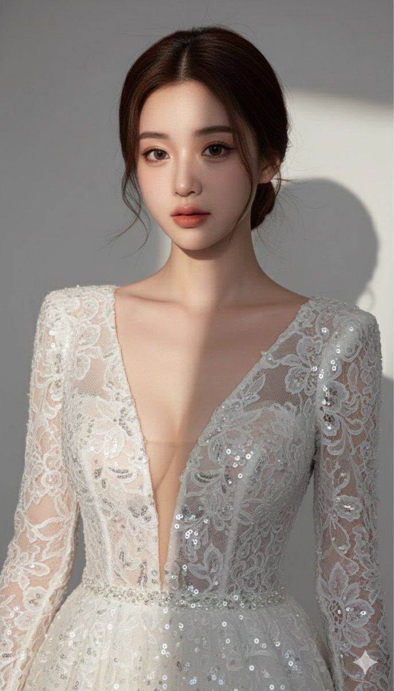

## 超精细逼真的美丽女人肖像

- ID: gpt4o-354-zh-2
- Slug: prompt-354-zh-2
- 语言: zh
- 来源: [来源链接](https://x.com/cnyzgkc/status/1980469269134733415)
- 样例图路径: images/part3/354.jpeg

### 提示词

```text
超精细、逼真的美丽女人肖像，高级时装社论，深白色 V 领蕾丝亮片晚礼服，优雅的低发髻，柔和的工作室灯光，浅灰色背景，戏剧性的光影，超现实主义，8K
```

### 样例图


## Create a hyper-realistic editorial portrait of a person,

- ID: gpt4o-347-en-1
- Slug: prompt-347-en-1
- 语言: en
- 来源: [来源链接](https://x.com/songguoxiansen/status/1972311003049415030)
- 样例图路径: images/part3/347.jpeg

### 提示词

```text
Create a hyper-realistic editorial portrait of a person, generated from the provided image (same face 100%, same hairstyle, expression preserved). The subject stands confidently on a reflective glossy floor wearing a coordinated bright yellow and crimson outfit (hooded jacket or sweatshirt and tailored joggers) with lightning bolt-inspired linework and subtle embroidered electric motifs running along sleeves, chest and pant seams. Matching crimson and yellow sneakers complete the look. Beside the subject stands a large Pikachu-like creature, scaled to be equal to or taller than the person, with realistic textured fur and a vibrant palette of electric yellows and deep crimson accents that echo the clothing. Background is a moody electric yellow to deep crimson gradient that enhances the vibrant palette; both subject and creature are clearly reflected on the floor. Lighting uses dramatic warm key light and sculpting rim light to emphasize skin, fur and fabric detail, cinematic shallow depth of field, slight film grain for editorial grit, photoreal creature integration, ultra-detailed 8K quality.
```

### 样例图

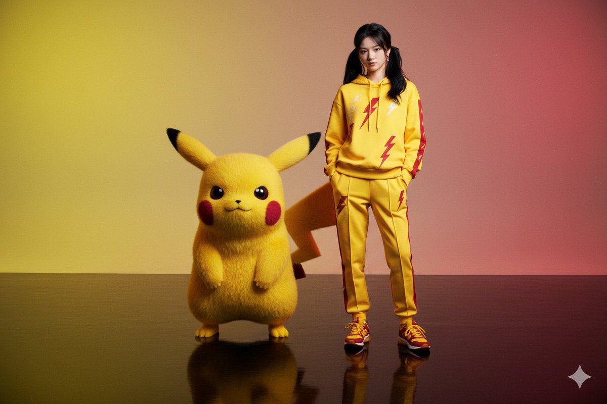

## 人物和宝可梦

- ID: gpt4o-347-zh-2
- Slug: prompt-347-zh-2
- 语言: zh
- 来源: [来源链接](https://x.com/songguoxiansen/status/1972311003049415030)
- 样例图路径: images/part3/347.jpeg

### 提示词

```text
创造一张超现实的编辑肖像，人物形象基于提供的图像（面部100%相同，发型和表情保持不变）。主体自信地站立在反光的亮面地板上，身穿一套协调的亮黄色和深红色服装（连帽夹克或运动衫和修身慢跑裤），服装上饰有闪电状的线条设计和沿袖子、胸部和裤缝延伸的精致刺绣电气图案。搭配的深红色和黄色运动鞋完善了整体造型。主体旁边站立着一只大型皮卡丘状生物，其大小与人物相等或更高，拥有逼真的毛发纹理和鲜艳的电黄色及深红色点缀，与服装相呼应。背景是 moody 的电黄色到深红色的渐变，以增强鲜明的调色。主体和生物都清晰地反映在地面上。灯光采用戏剧性的暖色主光和造型轮廓光，以突出皮肤、毛发和织物的细节，电影般的浅景深，略带胶片颗粒以增加编辑质感，逼真的生物融合，超细节的8K画质。
```

### 样例图


## Hyper-realistic editorial portrait of a person, generate

- ID: gpt4o-346-en-1
- Slug: prompt-346-en-1
- 语言: en
- 来源: [来源链接](https://x.com/songguoxiansen/status/1972307026714972370)
- 样例图路径: images/part3/346.jpeg

### 提示词

```text
Hyper-realistic editorial portrait of a person, generated from the provided image (same face 100%, same hairstyle, expression preserved). The subject stands confidently on a reflective glossy floor wearing a coordinated deep purple and shadowy black outfit (hooded jacket or sweatshirt and tailored joggers) with ghostly wisp-inspired linework and subtle embroidered mischievous smile motifs running along sleeves, chest and pant seams. Matching crimson red and deep purple sneakers complete the look. Beside the subject stands a large Gengar, scaled to be equal to or taller than the person, with a realistic smooth, almost ethereal texture, and a vibrant palette of deep purples with glowing crimson red eyes that echo the clothing. Background is a moody deep purple to shadowy black gradient that enhances the vibrant palette; both subject and creature are clearly reflected on the floor. Lighting uses dramatic cool key light and sculpting rim light to emphasize skin, form and fabric detail, cinematic shallow depth of field, slight film grain for editorial grit, photoreal creature integration, ultra-detailed 8K quality.
```

### 样例图

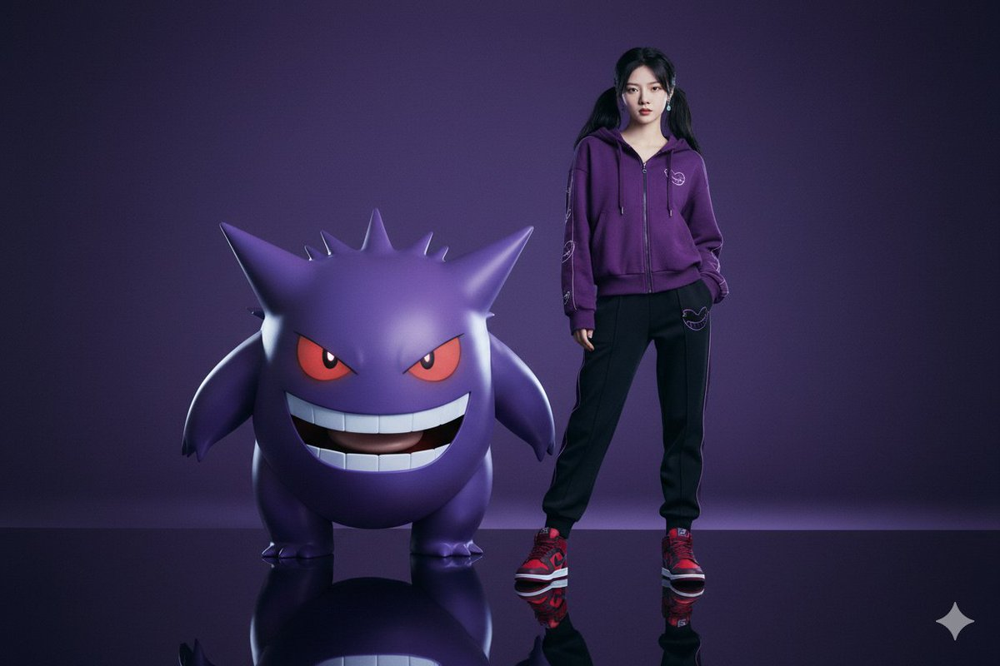

## 人物和大型耿鬼

- ID: gpt4o-346-zh-2
- Slug: prompt-346-zh-2
- 语言: zh
- 来源: [来源链接](https://x.com/songguoxiansen/status/1972307026714972370)
- 样例图路径: images/part3/346.jpeg

### 提示词

```text
根据提供的图像生成的超现实主义人物肖像（100% 相同脸型、相同发型、保留表情）。人物自信地站在反光的光滑地板上，身着协调的深紫色和暗黑色服装（连帽夹克或运动衫和定制慢跑裤），带有幽灵般的缕缕线条，袖子、胸部和裤缝处绣有精致的顽皮笑脸图案。搭配的深红色和深紫色运动鞋使整个造型更加完美。人物旁边站着一只大型耿鬼，其比例与人物相等或更高，具有逼真的光滑、近乎空灵的纹理，以及鲜艳的深紫色调，闪闪发光的深红色眼睛与衣服相呼应。背景是从深紫色到暗黑色的渐变色，增强了鲜艳的色调；人物和生物都清晰地倒映在地板上。灯光采用戏剧性的冷色调主光和雕刻轮廓光来强调皮肤、形态和织物细节、电影浅景深、轻微的胶片颗粒感以增强编辑质感、逼真的生物融合以及超精细的 8K 质量。
```

### 样例图


## 超写实影棚肖像照

- ID: gpt4o-343-zh
- Slug: prompt-343-zh
- 语言: zh
- 来源: [来源链接](https://x.com/cheerselflin/status/1979569018928603432)
- 样例图路径: images/part3/343.jpeg

### 提示词

```text
超写实影棚肖像，一位男性优雅地斜倚在椅子靠背上，身着时尚的深色服装。以微妙的低角度拍摄，以突出他的面部特征和自信的表情。电影般的黑白调色，肤色自然精致。纯黑色背景，8K 锐利细节，突出服装、头发和眼睛的纹理，营造出戏剧性、栩栩如生的效果。
```

### 样例图

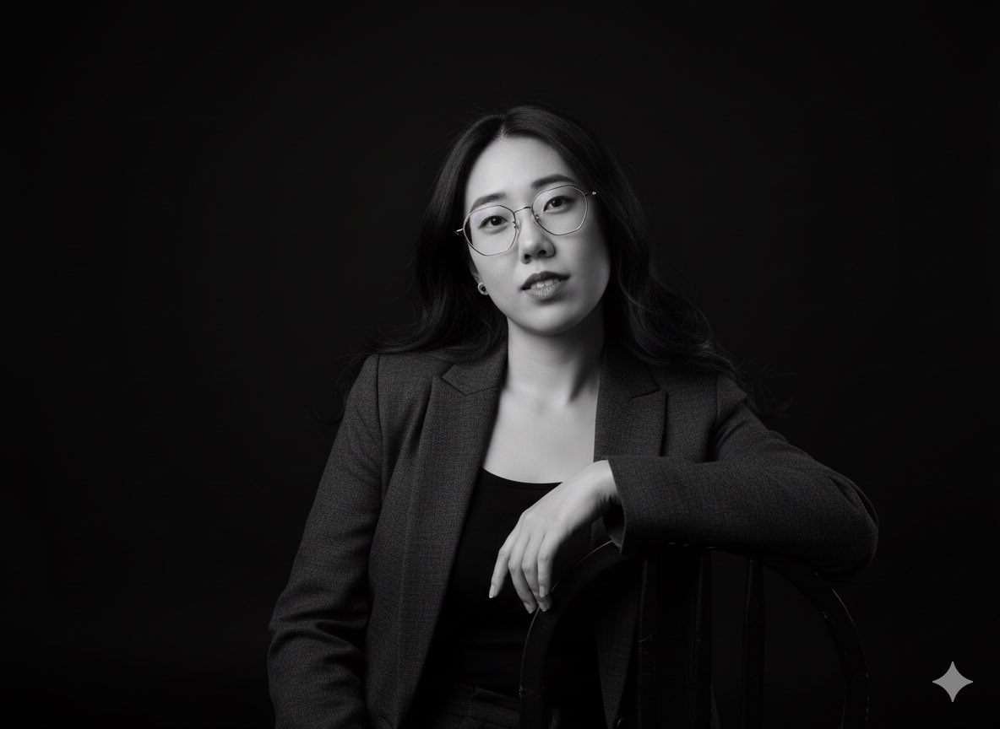

## { "description": "A hyper-realistic, 4K, full-body night

- ID: gpt4o-334-en-1
- Slug: prompt-334-en-1
- 语言: en
- 来源: [来源链接](https://x.com/IamEmily2050/status/1966758558483272144)
- 样例图路径: images/part3/334.jpeg

### 提示词

```text
{
    "description": "A hyper-realistic, 4K, full-body night-time portrait of a 23-year-old Korean woman with clear pale skin and long straight black hair tucked behind one ear.",
    "subject": {
      "age": 23,
      "ethnicity": "Korean",
      "skin_tone": "pale",
      "hair": {
        "colour": "black",
        "style": "long, straight, tucked behind one ear"
      },
      "pose": "standing at a frost-covered bus stop, arms folded against the cold",
      "expression": "70 % quiet annoyance, 30 % amused resignation, as if re-reading a text she regrets sending"
    },
    "outfit": {
      "top_layers": [
        "black blazer",
        "navy sweatshirt",
        "crisp white dress shirt",
        "thin black tie"
      ],
      "bottom": "ultra-short black pleated skirt",
      "legwear": "brand-new white knee-length pelerine socks",
      "footwear": "polished black shoes"
    },
    "environment": {
      "location": "night-time city bus stop",
      "ground": "icy pavement reflecting distant headlights",
      "fog": "dense, occupying the top third of the frame",
      "bus_shelter": {
        "glass": "steamed-up with one finger-drawn smiley that melts faster than the surrounding condensation"
      },
      "lighting": "cool blue-white, high contrast, cinematic"
    },
    "hidden_detail": "reflection in her left shoe: a blurred red double-decker bus that may or may not be arriving",
    "camera": {
      "angle": "low eye-level, full body in frame",
      "lens_simulation": "Phase-One medium-format realism",
      "depth_of_field": "sharp focus on subject, soft bokeh on distant lights"
    },
    "output": {
      "style": "hyper-realistic, cinematic, cool colour grading"
    }
  }
}
```

### 样例图

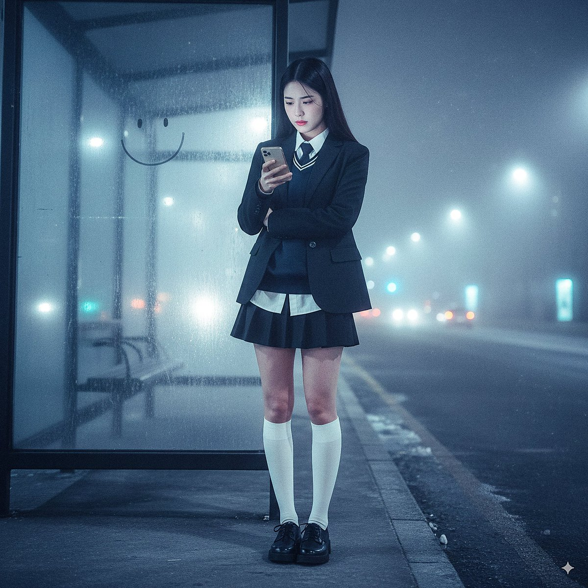

## 全身夜景肖像

- ID: gpt4o-334-zh-2
- Slug: prompt-334-zh-2
- 语言: zh
- 来源: [来源链接](https://x.com/IamEmily2050/status/1966758558483272144)
- 样例图路径: images/part3/334.jpeg

### 提示词

```text
{
"description": "这是一张超现实主义、4K、全身夜景肖像，照片中的一名 23 岁的韩国女性，皮肤白皙，一头长长的直黑发别在耳后。",
“主题”： {
“年龄”：23岁，
“种族”：“韩国人”，
"skin_tone": "苍白",
“头发”： {
“颜色”：“黑色”，
“style”：“长而直，塞在一只耳朵后面”
}，
"pose": "站在结霜的公交车站，双臂交叉抵御寒冷",
“表达”：“70% 是无声的恼怒，30% 是好笑的顺从，就像在重读一条她后悔发过的短信”
}，
“全套服装”： {
"顶层"：[
“黑色西装外套”，
“海军蓝运动衫”，
“清爽的白色正装衬衫”，
“细黑领带”
]，
"bottom": "超短黑色百褶裙",
"legwear": "全新白色及膝长袜",
“footwear”：“抛光黑鞋”
}，
“环境”： {
"location": "夜间城市公交车站",
“ground”：“结冰的路面反射着远处的车灯”，
"雾"："浓密，占据了画面的上三分之一"
"公交车站"：{
“玻璃”：“用手指画的笑脸被蒸腾起来，融化得比周围的冷凝水还快”
}，
“照明”：“冷蓝白色，高对比度，电影感”
}，
"hidden_​​detail": "她左脚鞋子里的倒影：一辆模糊的红色双层巴士，可能快到了，也可能还没到"
“相机”： {
"角度": "低视线，全身在画面中",
"lens_simulation": "Phase-One 中画幅真实感",
"depth_of_field": "清晰对焦主体，柔和远方灯光的散景"
}，
“输出”： {
“风格”：“超现实、电影、酷炫色彩分级”
}
}
}
```

### 样例图


## CINEMATIC STREET PHOTOGRAPHY, STYLISH YOUNG WOMAN IN MOT

- ID: gpt4o-326-en-1
- Slug: prompt-326-en-1
- 语言: en
- 来源: [来源链接](https://x.com/SimplyAnnisa/status/1977191937330336130)
- 样例图路径: images/part3/326.jpeg

### 提示词

```text
CINEMATIC STREET PHOTOGRAPHY, STYLISH YOUNG WOMAN IN MOTION, URBAN ENVIRONMENT, MOTION BLUR EFFECT. BLURRED PEDESTRIANS PASSING BY, SHALLOW DEPTH OF FIELD, NATURAL OVERCAST LIGHTING, SOFT PASTEL TONES, EDITORIAL FASHION PHOTOGRAPHY, CANDID MOMENT, DYNAMIC MOVEMENT, FILM AESTHETIC, MUTED COLORS
```

### 样例图

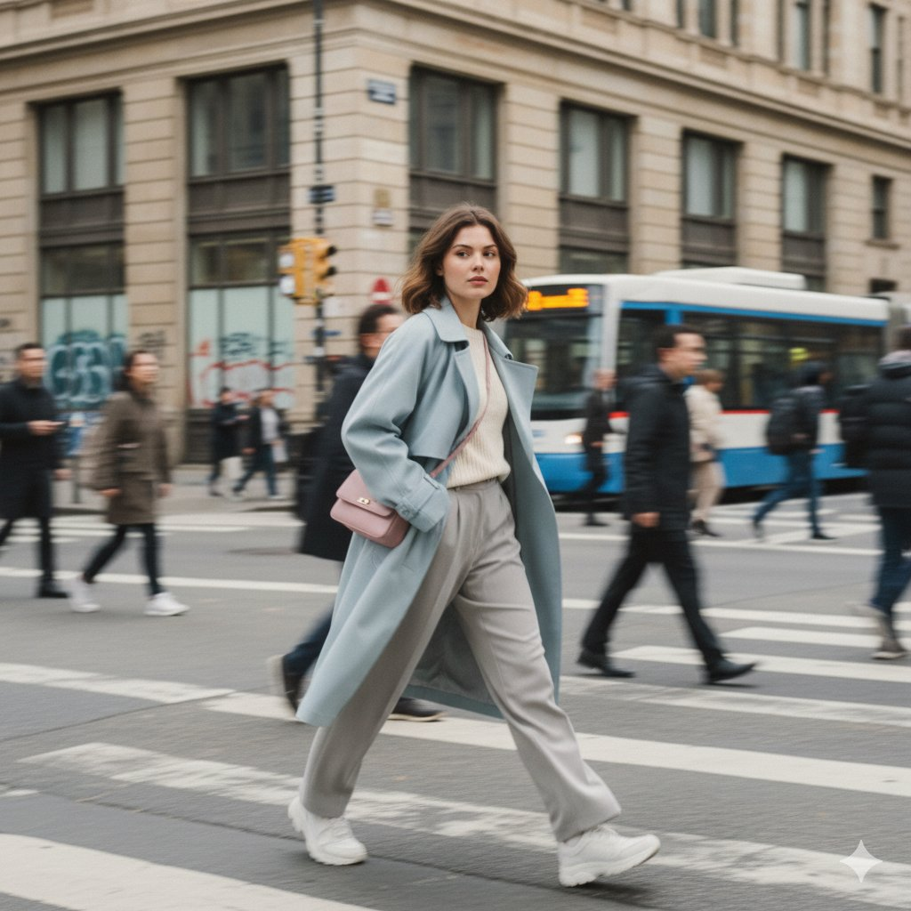

## 电影感街头美女摄影

- ID: gpt4o-326-zh-2
- Slug: prompt-326-zh-2
- 语言: zh
- 来源: [来源链接](https://x.com/SimplyAnnisa/status/1977191937330336130)
- 样例图路径: images/part3/326.jpeg

### 提示词

```text
电影感街头摄影、动态中的时尚年轻女性、城市环境、动态模糊效果。匆匆而过的模糊行人、浅景深、阴天自然光、柔和的马卡龙色调、时尚杂志风格摄影、抓拍瞬间、动态感、胶片美学、低饱和度色彩
```

### 样例图


## { "prompt_title": "Effortless Chic Pose", "concept": "A 

- ID: gpt4o-325-en-1
- Slug: prompt-325-en-1
- 语言: en
- 来源: [来源链接](https://x.com/Prashant_1722/status/1977458454483874088)
- 样例图路径: images/part3/325.jpeg

### 提示词

```text
{
  "prompt_title": "Effortless Chic Pose",
  "concept": "A hyperrealistic fashion photograph replicating a specific street style moment: a woman in a black knit set posing elegantly against a lamppost in a European city.",
  "scene_composition": {
    "shot_type": "Medium full-body shot",
    "camera_lens": "85mm f/1.4 lens",
    "perspective": "Eye-level, capturing the subject from the side.",
    "aspect_ratio": "2:3",
    "focus": "Sharp focus on the woman and her outfit. The background is beautifully blurred with creamy bokeh to isolate the subject."
  },
  "environment": {
    "setting": "A European city square or wide pedestrian street during the day.",
    "background_details": "The background is softly blurred but shows classical architecture with light-colored stone buildings. A few indistinct figures are walking in the distance.",
    "ground": "Light-colored stone pavers or cobblestones.",
    "atmosphere": "Chic, relaxed, and sophisticated."
  },
  "subject": {
    "primary": "A stylish young woman with long, wavy dark hair.",
    "appearance": "Her hair falls naturally over her shoulder. She has a gentle, soft expression and is looking slightly away from the camera.",
    "pose": "She is leaning with her back against a dark, ornate metal lamppost on the left side of the frame. Her right leg is bent and lifted behind her. "
  },
  "outfit_and_details": {
    "top": "A form-fitting, sleeveless black top made of a visible ribbed knit fabric.",
    "bottom": "A matching black mini skirt, also made of the same ribbed knit material.",
   "shoes": "black slingback high heel"
  },
  "style_and_aesthetics": {
    "realism": "Hyperrealistic, photorealistic, cinematic, 8K resolution, ultra-detailed.",
    "lighting": "Soft, diffused daylight, as if on an overcast day or in the shade, to prevent harsh shadows and create a flattering, even light on the subject.",
    "color_palette": "A monochrome and muted palette. Dominant blacks from the outfit and lamppost, contrasted with the light tones of the buildings and ground.",
    "details": "Emphasis on realistic material properties: the fine texture of the ribbed knit, the rough texture of the stone pavers, and the metallic finish of the lamppost."
  },
  "quality_boosters": [
    "masterpiece",
    "best quality",
    "insanely detailed",
    "sharp focus",
    "professional fashion photography",
    "street style",
    "editorial",
    "trending on Vogue"
  ],
  "negative_prompt": [
    "cartoon, anime, 3D render, illustration, painting",
    "blurry, out of focus, low quality, jpeg artifacts",
    "harsh sunlight, strong shadows",
    "crowded street, distracting background",
    "deformed anatomy, bad hands, extra limbs",
    "text, watermark, signature"
  ]
}
```

### 样例图

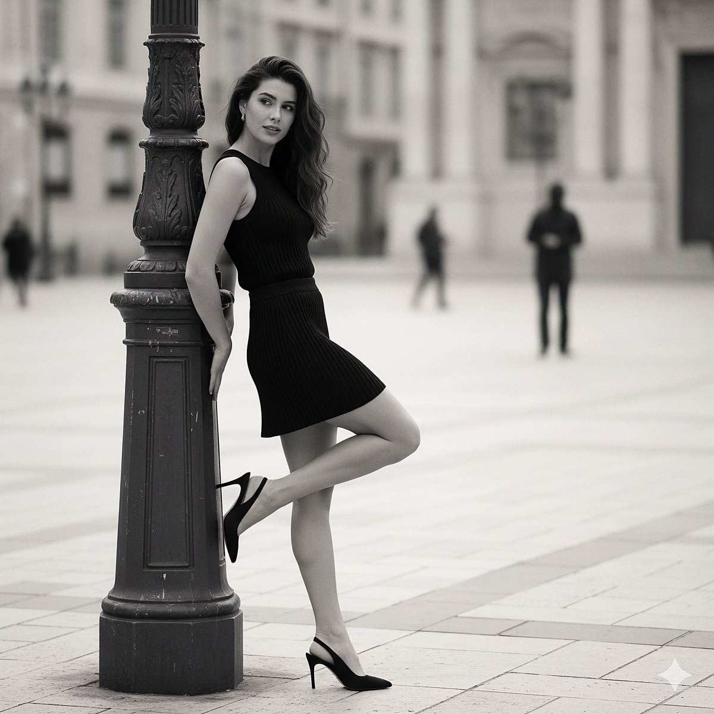

## 美女时尚摄影

- ID: gpt4o-325-zh-2
- Slug: prompt-325-zh-2
- 语言: zh
- 来源: [来源链接](https://x.com/Prashant_1722/status/1977458454483874088)
- 样例图路径: images/part3/325.jpeg

### 提示词

```text
{
"prompt_title": "轻松时尚的姿势",
"concept": "一张超现实主义的时尚照片，再现了特定的街头风格瞬间：一位身穿黑色针织套装的女子在欧洲城市的路灯柱前优雅地摆姿势。",
“场景构图”：{
"shot_type": "中长全身照",
"camera_lens": "85mm f/1.4 镜头",
"perspective": "视线高度，从侧面捕捉拍摄对象。",
"aspect_ratio": "2:3",
"focus": "清晰地聚焦于女人和她的服装。背景通过奶油色的散景进行精美的虚化，突出了主体。"
}，
“环境”： {
"setting": "白天的欧洲城市广场或宽阔的步行街。",
"background_details": "背景略微模糊，但显示出浅色石头建筑的古典建筑。远处有几个模糊的身影在行走。",
"ground": "浅色铺路石或鹅卵石。",
“氛围”：“别致、轻松、精致。”
}，
“主题”： {
"primary": "一位时尚的年轻女子，有着长长的、波浪状的黑发。",
"appearance": "她的头发自然地垂在肩上。她表情温柔，目光略微远离镜头。",
"pose": "她背靠着画面左侧一根深色华丽的金属灯柱。她的右腿弯曲并抬起。"
}，
“装备和细节”：{
"top": "一件合身的无袖黑色上衣，采用可见的罗纹针织面料制成。",
"bottom": "一条配套的黑色迷你裙，也采用相同的罗纹针织材料制成。",
“鞋子”：“黑色露跟高跟鞋”
}，
“风格与美学”：{
"realism": "超现实主义、照片级真实感、电影级、8K 分辨率、超精细。",
"lighting": "柔和、漫射的日光，就像在阴天或阴影中一样，可以防止出现刺眼的阴影，并为拍摄对象营造出令人愉悦、均匀的光线。",
"color_palette": "单色柔和的色调。服装和灯柱以黑色为主，与建筑物和地面的浅色调形成对比。",
"details": "强调真实的材料特性：罗纹针织的细腻质地、石材铺路石的粗糙质地以及灯柱的金属饰面。"
}，
"quality_boosters": [
“杰作”，
“极品”，
“极其详细”，
“清晰聚焦”，
“专业时尚摄影”，
“街头风格”，
“社论”，
“Vogue 流行趋势”
]，
"negative_prompt": [
“卡通、动漫、3D 渲染、插图、绘画”，
“模糊、失焦、质量低、jpeg 伪影”，
“刺眼的阳光，强烈的阴影”，
“拥挤的街道，分散注意力的背景”，
“身体畸形、手残、肢体残缺”，
“文字、水印、签名”
]
}
```

### 样例图


## SUBJECT: Chibi-style [CHARACTER NAME] reimagined as a Pu

- ID: gpt4o-318-en-1
- Slug: prompt-318-en-1
- 语言: en
- 来源: [来源链接](https://x.com/Arminn_Ai/status/1969446581788426252)
- 样例图路径: images/part3/318.jpeg

### 提示词

```text
SUBJECT: Chibi-style [CHARACTER NAME] reimagined as a Puzzle Toy character, ultra-cute proportions with oversized head and tiny stubby body.

MATERIALS:
Body and head formed entirely from interlocking jigsaw puzzle pieces
Matte pastel plastic surface with soft specular highlights
Visible puzzle cuts and notches defining the structure
Each piece slightly separated by thin seams, but tightly fitted together

DETAILS:
Large glossy chibi eyes placed across puzzle pieces, seamlessly integrated
Cute simple mouth outlined on puzzle surface
Costume colors of [CHARACTER NAME] applied piece-by-piece across the puzzle body, Character is holding a single loose puzzle piece in one hand, lifted playfully, as if showing it to the viewer, Some extra puzzle pieces floating gently around for added fun

STYLE:
Bright, educational, playful toy aesthetic, Minimal wear, no dirt, no scratches

LIGHTING:
Soft studio HDRI lighting with gentle shadows, Subtle contact shadows under puzzle seams, High contrast to show piece outlines clearly

CAMERA:
Centered, front-facing or 3/4 isometric angle, 1:1 aspect ratio, 8K render, Focus sharp on character’s face, emblem, and puzzle piece in hand

BACKGROUND:
Clean seamless pastel gradient backdrop (COLOR)
Optional scattered puzzle pieces on the floor for extra context

OUTPUT STYLE: Cute chibi proportions, Puzzle-based
```

### 样例图

![SUBJECT: Chibi-style [CHARACTER NAME] reimagined as a Pu](../images/part3/318.jpeg)

## 益智玩具角色

- ID: gpt4o-318-zh-2
- Slug: prompt-318-zh-2
- 语言: zh
- 来源: [来源链接](https://x.com/Arminn_Ai/status/1969446581788426252)
- 样例图路径: images/part3/318.jpeg

### 提示词

```text
主题：将Chibi风格的 [角色名称] 重新想象成一个益智玩具角色，具有超大头部和小巧粗短身体的超可爱比例。

材料：
身体和头部完全由相互锁在一起的拼图碎片组成
哑光塑料表面，具有柔和的镜面高光
可见的拼图切口和缺口定义了结构
每块布料都由细缝稍微隔开，但紧密贴合

细节：
大而有光泽的Chibi眼睛放置在拼图碎片上，无缝集成
拼图表面上勾勒出可爱简单的嘴巴
[角色名称] 的服装颜色逐片应用于拼图主体，角色一只手拿着一块松散的拼图，俏皮地举起，好像在向观众展示它，一些额外的拼图碎片轻轻地漂浮在周围以增加乐趣

风格：
明亮、有教育意义、好玩的玩具美感，磨损极小，无污垢，无划痕

灯光：
柔和的工作室 HDRI 照明，柔和的阴影，拼图接缝下微妙的接触阴影，高对比度清晰显示作品轮廓

相机：
居中、正面或 3/4 等距角度、1:1 宽高比、8K 渲染、清晰聚焦于人物面部、徽章和手中的拼图

背景：
干净无缝柔和渐变背景（颜色）
地板上散落的拼图碎片可供选择，以提供额外的背景信息

输出风格：可爱的Q版比例，基于拼图
```

### 样例图

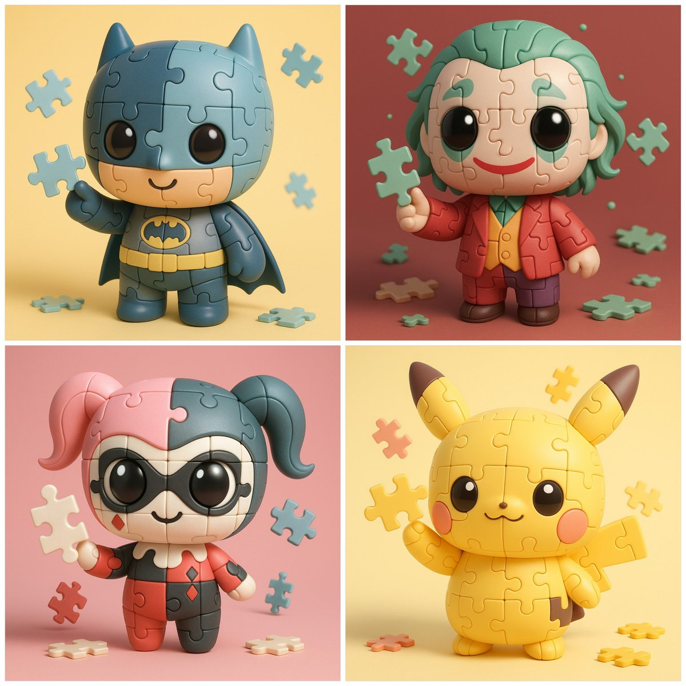

## Create an artistic collage of 6 vintage Polaroid photos,

- ID: gpt4o-317-en-1
- Slug: prompt-317-en-1
- 语言: en
- 来源: [来源链接](https://x.com/ShreyaYadav___/status/1969820383487590795)
- 样例图路径: images/part3/317.jpeg

### 提示词

```text
Create an artistic collage of 6 vintage Polaroid photos, attached with a decorative rope and mini clothespins, like a home photo gallery. Each Polaroid frame has a slight fading and an old paper effect. The background is a soft pastel wall with light shadows, creating a cozy and creatively chaotic atmosphere.
Emotions and poses:
 * Light laughter — eyes closed, natural joy.
 * Dreamy gaze upwards, relaxed pose.
 * Playful wink.
 * Calm smile with a head tilted to the side.Dynamic gesture hands raised high, full of energy.

* Romantic half-glance over the shoulder.

The atmosphere is an art-retro style with elements of a '70s fashion magazine, soft diffused lighting, and muted warm and golden tones. Each photograph looks like a unique behind-the-scenes shot, with a touch of nostalgia and a sense of personal history.
```

### 样例图

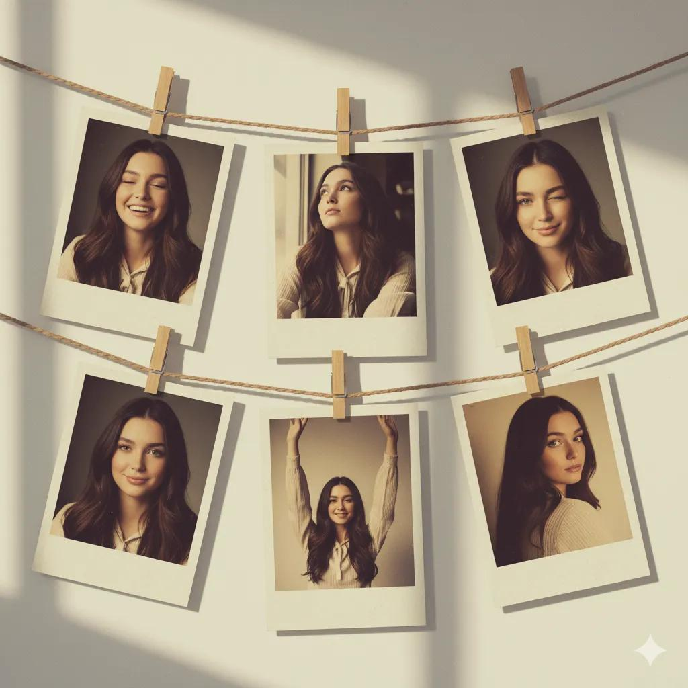

## 6张复古宝丽来照片

- ID: gpt4o-317-zh-2
- Slug: prompt-317-zh-2
- 语言: zh
- 来源: [来源链接](https://x.com/ShreyaYadav___/status/1969820383487590795)
- 样例图路径: images/part3/317.jpeg

### 提示词

```text
用6张复古宝丽来照片，用装饰绳和迷你衣夹固定，打造一个艺术拼贴画，就像一个家庭相册。每个宝丽来相框都略微褪色，并呈现出旧纸效果。背景是一面柔和的粉彩色墙，点缀着浅淡的阴影，营造出一种舒适而又充满创意的混乱氛围。
情绪和姿势：
* 轻松的笑声——闭上眼睛，自然的快乐。
* 梦幻般的目光向上凝视，放松的姿势。
* 顽皮的眨眼。
* 平静的微笑，头部歪向一侧。动态的手势，双手高举，充满活力。

* 浪漫地回头瞥了一眼。

店内弥漫着复古艺术的氛围，融合了70年代时尚杂志的元素，柔和的漫射灯光，以及柔和的暖金色色调。每一张照片都像是一张独特的幕后花絮，洋溢着一丝怀旧气息，也透露着个人的点滴历史。
```

### 样例图


## Funko Pop–style vinyl figure of [CHARACTER NAME] Wearing

- ID: gpt4o-315-en-1
- Slug: prompt-315-en-1
- 语言: en
- 来源: [来源链接](https://x.com/Arminn_Ai/status/1969848678652547334)
- 样例图路径: images/part3/315.jpeg

### 提示词

```text
Funko Pop–style vinyl figure of [CHARACTER NAME] 
Wearing the iconic outfit and accessories typically associated with [CHARACTER], automatically matching their signature style and details.  

Pose/Expression:
- Standing, looking upward toward the camera  
- Expression: curious yet slightly nonchalant  

CAMERA & LENS:
- Camera positioned directly above, very close  
- Ultra-wide fisheye lens for dramatic perspective distortion  
- Gentle rounded frame edges  

LIGHTING & MATERIALS:
- Soft studio lighting with gentle shadows  
- Glossy vinyl figure texture for skin and hair  
- Outfit materials accentuated (e.g. quilted, shiny, matte, etc.) depending on [CHARACTER]’s clothing  

RENDER STYLE:
- High-resolution 3D render  
- Clean neutral background (solid or gradient)  
- Ultra sharp, collectible toy aesthetic
```

### 样例图

![Funko Pop–style vinyl figure of [CHARACTER NAME] Wearing](../images/part3/315.jpeg)

## Funko Pop风格乙烯基公仔

- ID: gpt4o-315-zh-2
- Slug: prompt-315-zh-2
- 语言: zh
- 来源: [来源链接](https://x.com/Arminn_Ai/status/1969848678652547334)
- 样例图路径: images/part3/315.jpeg

### 提示词

```text
[角色名称] 的 Funko Pop 风格乙烯基公仔
身着通常与 [角色] 相关联的标志性服装及配饰，其标志性风格与细节特征均自然呈现。
姿势 / 表情
站姿，抬头望向镜头
表情：好奇中略带漫不经心
相机与镜头
相机直接置于正上方，距离极近
超宽鱼眼镜头，营造极具张力的透视畸变效果
柔和的圆角画框边缘
光线与材质
柔和的工作室灯光，搭配自然阴影
公仔皮肤与头发采用亮面乙烯基材质质感
服装材质细节突出（如绗缝、亮面、哑光等），具体依 [角色] 的服饰特点而定
渲染风格
高分辨率 3D 渲染
简洁的中性背景（纯色或渐变色）
极致清晰的收藏级玩具美学风格
```

### 样例图


## [CHARACTER] sitting centered on an oversized puffy loung

- ID: gpt4o-312-en-1
- Slug: prompt-312-en-1
- 语言: en
- 来源: [来源链接](https://x.com/samann_ai/status/1968656265673871644)
- 样例图路径: images/part3/312.jpeg

### 提示词

```text
[CHARACTER] sitting centered on an oversized puffy lounge sofa in [SOFA_COLOR], relaxed pose with one hand under chin, full-body. Clean white seamless studio, premium fashion-editorial lighting, hyper-real, minimal. Big spray-paint graffiti on the back wall reading “[TEXT]” with soft overspray and slight drips. 85mm look, crisp details, no clutter, no watermark. --ar 3:4
```

### 样例图

![[CHARACTER] sitting centered on an oversized puffy loung](../images/part3/312.jpeg)

## 品牌工作室照片

- ID: gpt4o-312-zh-2
- Slug: prompt-312-zh-2
- 语言: zh
- 来源: [来源链接](https://x.com/samann_ai/status/1968656265673871644)
- 样例图路径: images/part3/312.jpeg

### 提示词

```text
[人物] 坐在一张[沙发颜色]的超大蓬松休闲沙发上，姿势放松，单手托着下巴，全身放松。干净的白色无缝工作室，高端时尚编辑灯光，超现实，极简。后墙上的大型喷漆涂鸦写着“[文本]”，喷漆略微过喷，略有滴落。85毫米画质，细节清晰，没有杂乱，没有水印。——ar 3:4
```

### 样例图

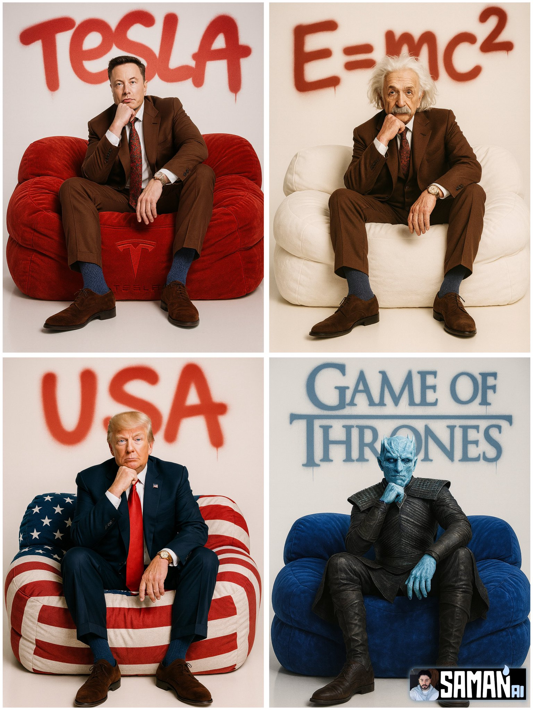

## A luxury [BRAND TYPE] brand advertisement featuring four

- ID: gpt4o-309-en-1
- Slug: prompt-309-en-1
- 语言: en
- 来源: [来源链接](https://x.com/Arminn_Ai/status/1967959906344112270)
- 样例图路径: images/part3/309.jpeg

### 提示词

```text
A luxury [BRAND TYPE] brand advertisement featuring four stylish [GIRLS / MEN], each posed in separate architectural window frames set, each shown in a waist-up mid-shot, fully inside the window frames, with hands and props naturally breaking the frame edges, but no legs or lower body visible, arranged in a theatrical and 2×2 symmetrical grid composition.

– one holding a [OBJECT 1] with [EXPRESSION AND ACCESSORIES]
– another holding a [OBJECT 2] with [EXPRESSION AND ACCESSORIES]
– another holding a [OBJECT 3] with [EXPRESSION AND ACCESSORIES]
– another holding a [OBJECT 4] with [EXPRESSION AND ACCESSORIES]

Each with expressive editorial facial poses, blending modern fashion with a sleek couture aesthetic.

Set against an elegant [BACKGROUND COLOR AND MATERIAL] backdrop with subtle textures, captured with bright high-fashion studio lighting that emphasizes contours, reflections, and luxury detailing.

The mood is glamorous, iconic, and prestigious, shot in the style of a high-end [BRAND TYPE] luxury campaign. 2:3 ar. all four frames clearly shown in full height, no cropping at the bottom or top.
```

### 样例图

![A luxury [BRAND TYPE] brand advertisement featuring four](../images/part3/309.jpeg)

## 奢侈品牌广告

- ID: gpt4o-309-zh-2
- Slug: prompt-309-zh-2
- 语言: zh
- 来源: [来源链接](https://x.com/Arminn_Ai/status/1967959906344112270)
- 样例图路径: images/part3/309.jpeg

### 提示词

```text
一则奢侈的 [品牌类型] 品牌广告，以四位时尚的 [女孩/男士] 为主角，每人摆出不同的建筑窗框姿势，每人都以半身向上的中景拍摄，完全在窗框内，手和道具自然地打破了框架边缘，但看不到腿或下半身，以戏剧性和 2×2 对称的网格构图排列。

– 一个人拿着[物体 1]，带着[表情和配饰]
– 另一人拿着 [物体 2]，带有 [表情和配饰]
– 另一人拿着 [物体 3] 和 [表情和配饰]
– 另一人拿着 [物体 4] 和 [表情和配件]

每个人都有富有表现力的面部姿势，将现代时尚与时尚的时装美学融为一体。

以优雅的 [背景颜色和材质] 背景为背景，具有微妙的纹理，并采用明亮的高级时尚工作室灯光，强调轮廓、反射和奢华细节。

拍摄风格为高端 [品牌类型] 奢侈品宣传活动，氛围迷人、标志性、尊贵。2:3 ar。四个画面均清晰地全高显示，底部或顶部均无裁剪。
```

### 样例图


## Hyper-realistic 3D caricature of [NAME], featuring an ex

- ID: gpt4o-302-en-1
- Slug: prompt-302-en-1
- 语言: en
- 来源: [来源链接](https://x.com/TechieBySA/status/1966450411277058166)
- 样例图路径: images/part3/302.jpeg

### 提示词

```text
Hyper-realistic 3D caricature of [NAME], featuring an expressive, oversized head, a short body, and a detailed, energetic facial expression. Wearing [OUTFIT / SIGNATURE LOOK], striking a [POSE / ACTION]. Studio lighting, cartoonish proportions, Pixar-style 3D rendering, ultra-detailed fabric and skin textures. The body is slightly smaller than the head. 1080x1080 square format.
```

### 样例图

![Hyper-realistic 3D caricature of [NAME], featuring an ex](../images/part3/302.jpeg)

## 超写实3D漫画肖像

- ID: gpt4o-302-zh-2
- Slug: prompt-302-zh-2
- 语言: zh
- 来源: [来源链接](https://x.com/TechieBySA/status/1966450411277058166)
- 样例图路径: images/part3/302.jpeg

### 提示词

```text
[姓名] 的超写实3D漫画肖像，特点为表情丰富的超大头部、较短的身躯，以及细节丰富且充满活力的面部表情。人物身着 [服装 / 标志性造型]，摆出 [姿势 / 动作]。采用工作室灯光效果，呈现卡通化比例，运用皮克斯风格 3D 渲染技术，织物与皮肤纹理细节极致丰富。身躯比例略小于头部，画面为 1080x1080 的正方形格式。
```

### 样例图


## Hyper-realistic carved wooden figurine of [CHARACTER], c

- ID: gpt4o-286-en-1
- Slug: prompt-286-en-1
- 语言: en
- 来源: [来源链接](https://x.com/samann_ai/status/1962939491603132563)
- 样例图路径: images/part3/286.jpeg

### 提示词

```text
Hyper-realistic carved wooden figurine of [CHARACTER], chibi proportions (big head, short body), standing on a plain wood block. Keep key face traits and iconic [OUTFIT/PROP]. Visible wood grain and chisel marks, matte finish. Warm studio light, soft shadow, seamless beige background. Centered full-body, slight 3/4 angle, shallow depth of field (85mm look). Ultra-detailed, photoreal, warm sepia grading. Aspect ratio [3:4].
```

### 样例图

![Hyper-realistic carved wooden figurine of [CHARACTER], c](../images/part3/286.jpeg)

## Q版木雕人偶

- ID: gpt4o-286-zh-2
- Slug: prompt-286-zh-2
- 语言: zh
- 来源: [来源链接](https://x.com/samann_ai/status/1962939491603132563)
- 样例图路径: images/part3/286.jpeg

### 提示词

```text
超写实[人物]木雕人偶，Q版比例（大头短身），站立于一块普通木块上。保留关键面部特征和标志性[服装/道具]。木纹和凿痕清晰可见，哑光饰面。工作室暖光，柔和阴影，米色背景浑然一体。全身居中，略微3/4视角，浅景深（85毫米画质）。细节丰富，照片级写实，暖棕褐色调。宽高比为[3:4]。
```

### 样例图


## Create a stylized cartoon illustration of [CHARACTER] wi

- ID: gpt4o-285-en-1
- Slug: prompt-285-en-1
- 语言: en
- 来源: [来源链接](https://x.com/gnrlyxyz/status/1951976345514487951)
- 样例图路径: images/part3/285.jpeg

### 提示词

```text
Create a stylized cartoon illustration of [CHARACTER] with a smooth, vertical pill-shaped body (rounded on top and bottom, symmetrical left to right). The body should be a single, unified capsule shape with no limbs. Do not alter the character's core design or personality, but simplify them into this playful capsule form. Use bold black outlines, flat vector-style coloring, and simple geometric features. Give the character large, expressive eyes and a fun, exaggerated facial expression that reflects their original personality. If the character wears clothes, include a minimal, iconic version of their outfit. If they do not, keep the body clean and unclothed. Use a solid bright yellow background. Center the character in a square frame. Use only flat colors. No gradients. No shadows. No texture. No smudging. The final result should be clean, modern, vector-friendly, and clearly pill-shaped.
```

### 样例图

![Create a stylized cartoon illustration of [CHARACTER] wi](../images/part3/285.jpeg)

## 卡通插图药丸形象

- ID: gpt4o-285-zh-2
- Slug: prompt-285-zh-2
- 语言: zh
- 来源: [来源链接](https://x.com/gnrlyxyz/status/1951976345514487951)
- 样例图路径: images/part3/285.jpeg

### 提示词

```text
为 [CHARACTER] 创建一幅风格化的卡通插图，其身体呈平滑的垂直药丸状（上下呈圆形，左右对称）。身体应为单一、统一的胶囊形状，没有四肢。不要改变角色的核心设计或个性，而是将其简化为这种俏皮的胶囊形状。使用粗黑色轮廓、扁平矢量风格的配色和简单的几何特征。赋予角色大而富有表现力的眼睛和有趣、夸张的面部表情，以反映其原始个性。如果角色穿着衣服，请包含其服装的极简标志性版本。如果没有，请保持身体干净，不穿衣服。使用纯亮黄色背景。将角色置于方形框架的中心。仅使用扁平颜色。不要使用渐变。不要使用阴影。不要使用纹理。不要使用晕染。最终结果应该干净、现代、矢量友好且清晰的药丸形状。
```

### 样例图


## Epic LEGO [SUPERHERO] in dynamic action pose showcasing 

- ID: gpt4o-270-en-1
- Slug: prompt-270-en-1
- 语言: en
- 来源: [来源链接](https://x.com/TechieBySA/status/1953186625871331674)
- 样例图路径: images/part3/270.jpeg

### 提示词

```text
Epic LEGO [SUPERHERO] in dynamic action pose showcasing their signature powers, wearing their iconic costume with authentic colors and details, dramatic stormy sky with brilliant lightning bolts illuminating the scene, heroic stance amid swirling LEGO debris and flying bricks, small LEGO minifigures scattered throughout the scene watching in awe, cinematic movie poster composition with photorealistic rendering, epic superhero atmosphere with rich saturated colors, professional depth of field and dramatic lighting effects, 1080x1080 square format
```

### 样例图

![Epic LEGO [SUPERHERO] in dynamic action pose showcasing ](../images/part3/270.jpeg)

## 乐高超级英雄摆出充满动感的动作姿势

- ID: gpt4o-270-zh-2
- Slug: prompt-270-zh-2
- 语言: zh
- 来源: [来源链接](https://x.com/TechieBySA/status/1953186625871331674)
- 样例图路径: images/part3/270.jpeg

### 提示词

```text
史诗级乐高【超级英雄】摆出充满动感的动作姿势，展现其标志性超能力，身着标志性服装，色彩和细节真实还原。戏剧性的暴风雨天空中，耀眼的闪电照亮整个场景。超级英雄摆出英勇姿态，周围是旋转的乐高碎片和飞舞的积木块，场景中散落着小型乐高小人仔，它们正惊叹地注视着这一切。整体采用电影海报式构图，配以逼真渲染效果，营造出史诗般的超级英雄氛围，色彩浓郁饱和，运用专业的景深和富有戏剧性的光影效果，尺寸为1080x1080的正方形格式。
```

### 样例图


## Two anime-style characters standing behind a futuristic 

- ID: gpt4o-269-en-1
- Slug: prompt-269-en-1
- 语言: en
- 来源: [来源链接](https://x.com/TheRelianceAI/status/1953431382836859074)
- 样例图路径: images/part3/269.png

### 提示词

```text
Two anime-style characters standing behind a futuristic transparent X-ray scanning panel, each leaning on it casually. Their full bodies are visible through the glowing glass as stylized, semi-transparent X-ray scans. [INSERT SCAN DETAILS HERE — e.g. hybrid anatomy, supernatural markings, implants, etc.]. Futuristic sci-fi interface overlays on the glass, with holographic HUD elements and glowing digital text. The background is minimal and sterile, resembling a high-tech medical chamber. The characters are [INSERT CHARACTER NAMES & DESCRIPTION HERE — appearance, expression, outfit], drawn in modern high-quality anime style. The scene uses soft colored lighting (e.g. cyan, pink, red depending on the pair), expressive animation, and cinematic composition.
```

### 样例图

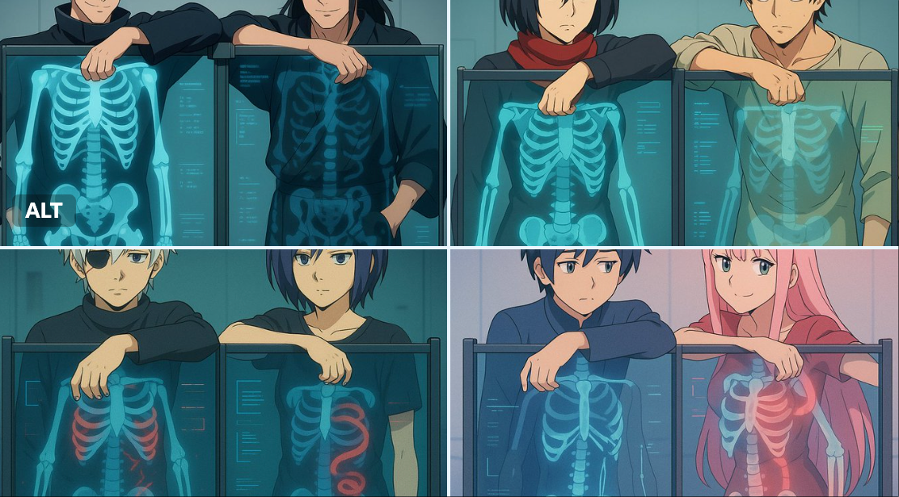

## 透明X光扫描面板后面

- ID: gpt4o-269-zh-2
- Slug: prompt-269-zh-2
- 语言: zh
- 来源: [来源链接](https://x.com/TheRelianceAI/status/1953431382836859074)
- 样例图路径: images/part3/269.png

### 提示词

```text
两个动漫风格的角色站在一个未来感的透明X光扫描面板后面，各自随意地靠在面板上。透过发光的玻璃，可以看到他们的全身呈现出风格化的半透明X光扫描效果。【在此插入扫描细节——例如混合解剖结构、超自然标记、植入物等】。玻璃上叠加着未来科幻界面，还有全息平视显示元素和发光的数字文本。背景简洁而无菌，类似一个高科技医疗舱。角色是【在此插入角色姓名和描述——外貌、表情、服装】，采用现代高品质动漫风格绘制。场景使用柔和的彩色灯光（例如根据角色组合使用青色、粉色、红色等），富有表现力的动态效果和电影化的构图。
```

### 样例图


## Create a full body, flat vector illustration of [CHARACT

- ID: gpt4o-268-en-1
- Slug: prompt-268-en-1
- 语言: en
- 来源: [来源链接](https://x.com/gnrlyxyz/status/1953477354161848322)
- 样例图路径: images/part3/268.jpeg

### 提示词

```text
Create a full body, flat vector illustration of [CHARACTER] in a whimsical, wavy cartoon style. Use thin black outlines and smooth, rounded shapes. The character should have a tiny white-colored head with tiny dot eyes and a simple nose and mouth. The body should have exaggerated, playful proportions. Use bold, flat colors for the clothing. No gradients. No shading. No smudging. Place the character on a solid blue background. Vector friendly. Square aspect ratio.
```

### 样例图

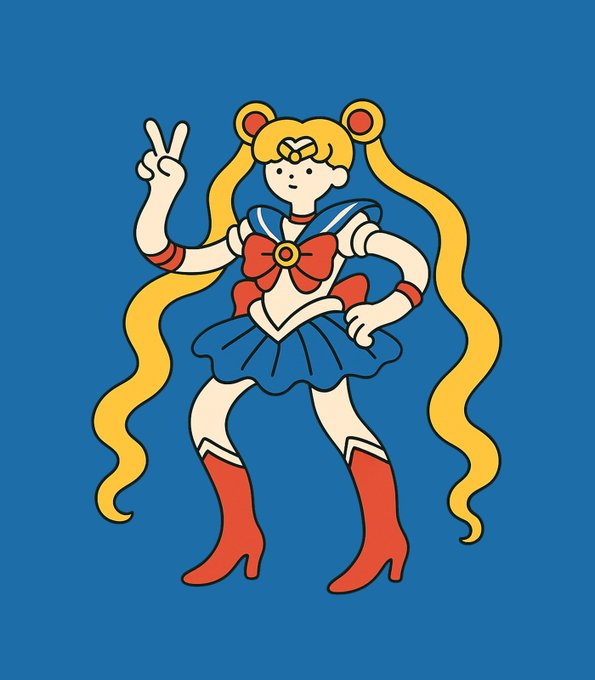

## 童趣插画

- ID: gpt4o-268-zh-2
- Slug: prompt-268-zh-2
- 语言: zh
- 来源: [来源链接](https://x.com/gnrlyxyz/status/1953477354161848322)
- 样例图路径: images/part3/268.jpeg

### 提示词

```text
创作一幅[角色]的全身扁平矢量插画，采用异想天开的波浪卡通风格。使用纤细的黑色轮廓和流畅的圆形造型。角色应有一个小小的白色头部，上面有极小的圆点眼睛以及简单的鼻子和嘴巴。身体比例要夸张且富有童趣。服装采用鲜明的扁平色彩。不使用渐变、阴影和晕染效果。将角色置于纯蓝色背景上。适合矢量格式。采用正方形比例。
```

### 样例图


## Ultra-detailed render of a [CHARACTER NAME] paper toy ve

- ID: gpt4o-264-en-1
- Slug: prompt-264-en-1
- 语言: en
- 来源: [来源链接](https://x.com/TechieBySA/status/1961411111879594453)
- 样例图路径: images/part3/264.png

### 提示词

```text
Ultra-detailed render of a [CHARACTER NAME] paper toy version in box form (papertoy) made from matte folded cardboard and cut with visible paper texture, clean edges and neat folds. Cubic head and body, square extremities, simplified facial features, flat printed colors and subtle shading for greater depth. The clothing and accessories faithfully imitate the appearance of the reference image in a minimalist geometric papercraft style, maintaining compact proportions and chibi style. Neutral studio lighting, soft shadows, smooth background, photorealistic product photography, 4K, no text or logos. 1080x1080 dimension.
```

### 样例图

![Ultra-detailed render of a [CHARACTER NAME] paper toy ve](../images/part3/264.png)

## 纸制玩具版本

- ID: gpt4o-264-zh-2
- Slug: prompt-264-zh-2
- 语言: zh
- 来源: [来源链接](https://x.com/TechieBySA/status/1961411111879594453)
- 样例图路径: images/part3/264.png

### 提示词

```text
超细节渲染的[角色名称]纸制玩具版本，呈盒子形状（纸制玩具），由哑光折叠纸板制成，带有可见的纸张纹理，边缘干净，折叠整齐。头部和身体为立方体，四肢为方形，面部特征简化，采用平面印刷色彩和微妙阴影以增强深度。服装和配饰以极简几何纸艺风格忠实地模仿参考图的外观，保持紧凑比例和Q版风格。中性工作室灯光，柔和阴影，平滑背景，逼真的产品摄影效果，4K分辨率，无文字或标志。尺寸为1080x1080。
```

### 样例图


## 1×1 square, ultra-detailed render of a box-shaped papert

- ID: gpt4o-251-en-1
- Slug: prompt-251-en-1
- 语言: en
- 来源: [来源链接](https://x.com/Arminn_Ai/status/1954985717609730175)
- 样例图路径: images/part3/251.jpeg

### 提示词

```text
1×1 square, ultra-detailed render of a box-shaped papertoy version of [CHARACTER NAME]. Made from folded and cut matte cardstock with visible paper texture, crisp edges, and clean folds. Cubic head and body, blocky limbs, simplified facial features, flat printed colors, and subtle shading for depth. Clothing and accessories faithfully mimic [CHARACTER NAME]’s iconic look in a minimal geometric papercraft style, keeping proportions compact and chibi-like. Neutral studio lighting, soft shadows, plain background, photorealistic product photography, 4K, no text or logos.
```

### 样例图


## 超细节盒状纸艺玩具

- ID: gpt4o-251-zh-2
- Slug: prompt-251-zh-2
- 语言: zh
- 来源: [来源链接](https://x.com/Arminn_Ai/status/1954985717609730175)
- 样例图路径: images/part3/251.jpeg

### 提示词

```text
1×1大小的正方形，超细节渲染的[角色名称]盒状纸艺玩具版本。由折叠和裁剪的哑光卡纸制成，具有可见的纸张纹理、清晰的边缘和整齐的折痕。立方体头部和身体，块状四肢，简化的面部特征，平印色彩，以及用于体现深度的微妙阴影。服装和配饰以简约的几何纸艺风格忠实还原[角色名称]的标志性外观，保持紧凑的比例和Q版风格。中性工作室灯光，柔和阴影，简洁背景，逼真的产品摄影效果，4K分辨率，无文字或标志。
```

### 样例图


## Create a 3D kawaii 10-16 canvas featuring nine chibi-sty

- ID: gpt4o-241-en-1
- Slug: prompt-241-en-1
- 语言: en
- 来源: [来源链接](https://x.com/songguoxiansen/status/1950726378342801853)
- 样例图路径: images/part3/241.png

### 提示词

```text
Create a 3D kawaii 10-16 canvas featuring nine chibi-style stickers in various outfits, poses, and expressions. Use the uploaded attachment image. Each sticker has a white border and includes a speech bubble with regular use phrases. Set on a soft white-to-pastel blue gradient background for a fun, positive vibe, perfect for WhatsApp app use.
```

### 样例图

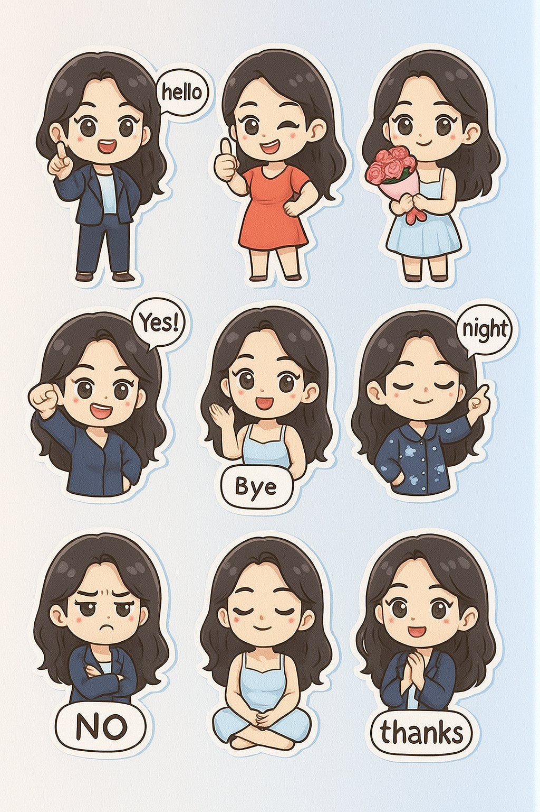

## 9格Q版风格贴纸

- ID: gpt4o-241-zh-2
- Slug: prompt-241-zh-2
- 语言: zh
- 来源: [来源链接](https://x.com/songguoxiansen/status/1950726378342801853)
- 样例图路径: images/part3/241.png

### 提示词

```text
创建一幅尺寸为 10-16 的 3D 可爱风格画布，其中包含 9 个 Q 版风格贴纸。这些贴纸要采用不同的服装、姿势和表情，使用已经上传的附件图片。每个贴纸都要有白色边框，且包含一个带有日常用语的 speech 气泡。背景设置为柔和的白到淡蓝色渐变，营造出有趣、积极的氛围，非常适合在 WhatsApp 应用中使用。
```

### 样例图


## Create a hyper-realistic 3D rendering of balloon letters

- ID: gpt4o-231-en-1
- Slug: prompt-231-en-1
- 语言: en
- 来源: [来源链接](https://x.com/Anima_Labs/status/1945050362152427924)
- 样例图路径: images/part3/231.png

### 提示词

```text
Create a hyper-realistic 3D rendering of balloon letters forming the word [WOW]. Each letter should look like a shiny, inflatable mylar balloon with a bold printed pattern. Use a mix of textures such as [checkered print, color grids, polka dots, or glossy metallic black]. The balloons should be semi-reflective with realistic air volume, seams, wrinkles, and pressure points. Give each letter a distinct, playful surface design but keep the overall look cohesive. Use a soft pastel background, like [Orange color], to contrast the balloon textures. Lighting should create crisp reflections and soft shadows. The rendering must be photorealistic, fun, and vibrant — like a high-end visual for a creative pop-art birthday installation or fashion campaign.
```

### 样例图

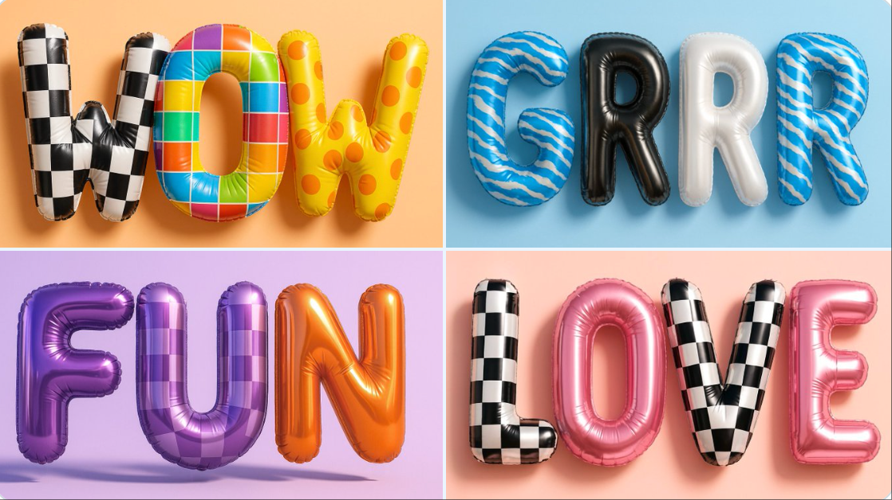

## 形状为生日气球文字

- ID: gpt4o-231-zh-2
- Slug: prompt-231-zh-2
- 语言: zh
- 来源: [来源链接](https://x.com/Anima_Labs/status/1945050362152427924)
- 样例图路径: images/part3/231.png

### 提示词

```text
创建一个超逼真的 3D 渲染效果，将气球字母组成单词 [WOW]。每个字母看起来都像是一个闪亮的充气镀铝气球，带有大胆印刷的图案。使用多种纹理，例如 [格子印刷、彩色网格、波点或光泽金属黑]。气球应该是半反射的，具有真实的空气体积、接缝、皱纹和压力点。给每个字母一个独特、有趣的表面设计，但保持整体外观协调一致。使用柔和的粉彩色背景，例如 [橙色]，以对比气球的纹理。光线应产生清晰的反射和柔和的阴影。渲染效果必须是照片级的逼真、有趣且充满活力——就像创意波普艺术生日装置或时尚活动的高端视觉效果。
```

### 样例图


## Recreate this image using the parameters of the JSON pro

- ID: gpt4o-221-en-1
- Slug: prompt-221-en-1
- 语言: en
- 来源: [来源链接](https://x.com/alban_gz/status/1944405761439756343)
- 样例图路径: images/part3/221.jpeg

### 提示词

```text
Recreate this image using the parameters of the JSON provided.
{
  "style_name": "Diamond-Encrusted Glamour",
  "description": "Applies a hyper-realistic diamond-encrusted style to any object, logo, or shape. The surface of the subject is entirely covered with sparkling gemstones that reflect light with intense brilliance, creating a luxurious, eye-catching, and surreal look.",
  "surface_texture": {
    "material": "diamond-crystal",
    "coating": "fully encrusted with multi-faceted diamonds",
    "sparkle_intensity": "maximum",
    "reflection_type": "specular and highly refractive",
    "detail_density": "ultra-fine, micro-gem coverage with no gaps",
    "light_refraction": "strong rainbow dispersion through facets"
  },
  "lighting": {
    "light_source": "hard directional light",
    "highlight_effects": "lens flares, sparkle flares on gem edges",
    "shadow_type": "soft-edged, low-opacity shadows for contrast",
    "specularity": "very high",
    "reflection_sources": "ambient and direct highlights across the gem facets"
  },
  "background": {
    "type": "minimalist solid color",
    "color": "#B0C4DE",
    "texture": "smooth matte",
    "contrast_with_subject": "high contrast to enhance sparkle",
    "depth": "subtle shadow under the object for floating effect"
  },
  "color_palette": {
    "primary": "transparent white (diamond base)",
    "secondary": "prismatic reflections (rainbow light dispersion)",
    "accent": "metallic shimmer on edges (optional: gold or silver undertones)"
  },
  "camera": {
    "angle": "slight top-down perspective",
    "depth_of_field": "shallow (sharp focus on object, blurred background)",
    "lens_effects": ["macro focus", "sparkle highlights", "light bloom"]
  },
  "style_keywords": [
    "glamorous",
    "luxury",
    "crystal-covered",
    "bling",
    "hyper-detailed",
    "sparkling",
    "futuristic",
    "eye-catching",
    "surreal realism",
    "fashion-inspired"
  ],
  "applicability": {
    "usable_on": ["logos", "icons", "food items", "everyday objects", "fashion accessories", "typography"],
    "visual_requirements": ["well-defined silhouette", "clean shapes for gem placement"],
    "scalability": "best results on medium to large subjects for detailed sparkle"
  }
}
```

### 样例图


## 钻石镶嵌风格

- ID: gpt4o-221-zh-2
- Slug: prompt-221-zh-2
- 语言: zh
- 来源: [来源链接](https://x.com/alban_gz/status/1944405761439756343)
- 样例图路径: images/part3/221.jpeg

### 提示词

```text
使用提供的 JSON 参数重新创建此图像。

{
"style_name": "钻石镶嵌奢华风格",
  "description": "将超逼真的钻石镶嵌风格应用于任何物体、标志或形状。主体的表面完全覆盖着闪闪发光的宝石，这些宝石以强烈的亮度反射光线，营造出奢华、引人注目和超现实的效果。",
  "surface_texture": {
    "material": "钻石水晶",
"涂层": "完全镶嵌有多面钻石",
"闪耀强度": "最大",
"反射类型": "镜面和高折射率",
"细节密度": "超精细，微宝石覆盖，无间隙"
"light_refraction": "通过切面产生强烈的彩虹色散"
  },
  "lighting": {
    "light_source": "硬直射光源",
"高光效果": "镜头眩光，宝石边缘的闪光眩光",
    "阴影类型": "柔和边缘，低不透明度的阴影以形成对比",
    "光泽度": "非常高",
    "反射源": "宝石切面的环境光和直接高光"
  },
"background": {
    "type": "极简纯色",
    "color": " #B0C4DE ",
"纹理": "光滑磨砂质感",
"与主体对比度": "高对比度以增强闪耀效果",
"深度": "物体下方微妙阴影以产生悬浮效果"
  },
"color_palette": {
    "primary": "透明白色（钻石基底）",
    "secondary": "棱镜反射（彩虹光散）",
    "accent": "边缘金属光泽（可选：金色或银色底色）"
  },
"camera": {
    "angle": "略微俯视角度",
    "depth_of_field": "浅景深（物体清晰，背景模糊）",
"镜头效果": ["微距对焦", "闪烁高光", "光晕"]
  },
  "风格关键词": [
    "迷人",
"奢侈",
"水晶覆盖的",
"闪亮",
"超精细的",
"闪闪发光的",
"未来感的",
"引人注目的",
"超现实现实主义",
"受时尚启发的"
  ],
  "适用性": {
    "可用于": ["标志", "图标", "食品项目", "日常用品", "时尚配饰", "字体"],
"视觉要求": ["轮廓清晰", "宝石放置的形状干净"],
    "可扩展性": "在中等至大型对象上获得最佳效果，以展现细节闪烁"
  }
}
```

### 样例图


## 真人和风格对照直出

- ID: gpt4o-200-zh-1
- Slug: prompt-200-zh-1
- 语言: zh
- 来源: [来源链接](https://x.com/ZHO_ZHO_ZHO/status/1935620536090153216)
- 样例图路径: images/part3/200.jpeg

### 提示词

```text
创建图片 {
"title": "真人 × 动画对照创意作品",
"author": "ZH4O",
"description": "一张利用垂直拼贴与留白，将同一人物的照片与插画并置的创意作品，突出媒介在语言、质感与情绪上的对比。",
"layout": {
"orientation": "vertical",
"photo": {
"position": "top-left",
"aspect_ratio": "3:4",
"style": "street photo",
"camera_angle": "eye-level, slightly tilted left",
"lens": "mild wide-angle",
"background_elements": ["road", "store signs", "urban perspective lines"]
},
"illustration": {
"position": "bottom-right",
"scale": "slightly larger",
"composition": "2/3 body, medium shot",
"pose": "similar to photo",
"motion_direction": "curve extending top-right",
"balance": "forms visual counterpoint to photo"
},
"background": {
"color": "pure white",
"purpose": "breathing space, minimalism, focus"
}
},
"color_and_lighting": {
"photo": {
"dominant_tones": "neutral warm gray",
"light_source": "natural light",
"highlight_effects": "soft overexposure, summer glare",
"key_elements": ["white dress with gauzy texture", "cement, scooter, wall as low-saturation backdrop"]
},
"illustration": {
"style": "cartoon, simplified color blocks",
"skin": "warm orange with soft pink blush",
"hair": "deep brown, almost flat color",
"dress": "white with minimal shading to indicate folds",
"contrast": "high, compressed tonal range",
"focus": "sharp character silhouette"
},
"background": {
"function": "isolates media contrast, emphasizes character and action"
}
},
"style_comparison_and_details": {
"photo": {
"gesture": "hand shading forehead",
"expression": "wide eyes, slightly pouting lips, playful with a hint of exasperation",
"context": "spontaneous, tight alley space, loose hair movement"
},
"illustration": {
"design_inspiration": "Disney/CalArts style",
"features": ["large eyes", "wide cheekbones", "pointy chin", "freckles", "blush"],
"motion_effects": "exaggerated hair and skirt movement",
"line_quality": "fluid and bouncy",
"reproduction": "pose, expression, dress bow, forehead hair accurately translated"
}
},
"visual_and_communication_value": {
"themes": ["reality to animation transformation", "character design", "personified self-portrait"],
"usability": ["IP development", "illustration demo", "fashion branding"],
"design_elements": ["space for text/logo", "poster/social media-ready"],
"narrative_strength": "uses white space as frame, pose as link, and medium contrast as core interest",
"tone": "light, stylish, socially shareable"
}
}
```

### 样例图

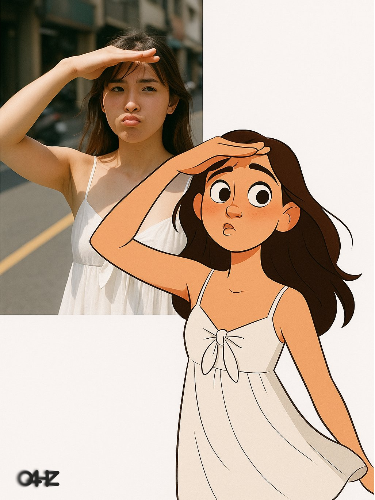

## 真人和风格对照直出

- ID: gpt4o-200-zh-2
- Slug: prompt-200-zh-2
- 语言: zh
- 来源: [来源链接](https://x.com/ZHO_ZHO_ZHO/status/1935620536090153216)
- 样例图路径: images/part3/200.jpeg

### 提示词

```text
创建图片 {
“title”： “真人 × 动画对照创意作品”，
“author”： “ZH4O”， ZH4O“， ZH4O
“description”： “一张利用垂直拼贴与留白，将同一人物的照片与插画并置的创意作品，突出媒介在语言、质感与情绪上的对比。",
“布局”： {
“orientation”： “垂直”，
“照片”： {
“position”： “左上角”，
“aspect_ratio”： “3：4”，
“style”： “街拍”，
“camera_angle”： “与眼睛齐平，略微向左倾斜”，
“lens”： “轻度广角”，
“background_elements”： [“road”， “shop signs”， “urban perspective lines”]
},
“插图”： {
“position”： “右下角”，
“scale”： “稍大”，
“composition”： “2/3 体，中镜头”，
“pose”： “与照片相似”，
“motion_direction”： “曲线向右延伸”，
“balance”： “形成与照片的视觉对位”
},
“背景”： {
“color”： “纯白色”，
“purpose”： “呼吸空间、极简主义、专注”
}
},
“color_and_lighting”： {
“照片”： {
“dominant_tones”： “中性暖灰色”，
“light_source”： “自然光”，
“highlight_effects”： “柔和的过度曝光，夏季眩光”，
“key_elements”： [“带有薄纱纹理的白色连衣裙”， “水泥、滑板车、墙壁作为低饱和度背景”]
},
“插图”： {
“style”： “卡通，简化的色块”，
“skin”： “暖橙色带柔和的粉红色腮红”，
“hair”： “深棕色，几乎是单色”，
“dress”： “白色，带有最小阴影以表示褶皱”，
“contrast”： “高、压缩的色调范围”，
“focus”： “清晰的角色剪影”
},
“背景”： {
“function”： “隔离媒体对比度，强调角色和动作”
}
},
“style_comparison_and_details”： {
“照片”： {
“gesture”： “手部阴影额头”，
“expression”： “睁大眼睛，微微撅起嘴唇，俏皮中带着一丝恼怒”，
“context”： “自发、狭窄的小巷空间、松散的头发移动”
},
“插图”： {
“design_inspiration”： “Disney/CalArts 风格”，
“features”： [“大眼睛”， “宽颧骨”， “尖下巴”， “雀斑”， “腮红”]，
“motion_effects”： “夸张的头发和裙子运动”，
“line_quality”： “流体和弹性”，
“reproduction”： “姿势、表情、裙子蝴蝶结、额头头发准确翻译”
}
},
“visual_and_communication_value”： {
“themes”： [“从现实到动画的转变”， “角色设计”， “拟人化自画像”]，
“可用性”： [“IP 开发”， “插图演示”， “时尚品牌”]，
“design_elements”： [“文本/徽标空间”， “海报/社交媒体就绪”]，
“narrative_strength”： “使用空白作为框架，使用姿势作为链接，使用中等对比度作为核心兴趣”，
“tone”： “轻盈、时尚、社交分享”
}
}
```

### 样例图


## A cute designer doll styled as a [SUBJECT]. The doll has

- ID: gpt4o-198-en-1
- Slug: prompt-198-en-1
- 语言: en
- 来源: [来源链接](https://x.com/TheRelianceAI/status/1936423426006151467)
- 样例图路径: images/part3/198.png

### 提示词

```text
A cute designer doll styled as a [SUBJECT]. The doll has a porcelain face with blush, soft curly white hair, and large expressive eyes with unique pupils (like a star and moon). It wears a fluffy pastel-colored costume resembling the [chosen creature or idea], with detailed accessories like a hood with ears or horns, lace, and a ribbon. Embroidery on the paws reflects the character’s theme. The doll is sitting on a neutral background (like beige leather or soft fabric). The atmosphere is dreamy and whimsical, with soft lighting. Style: Korean collectible art doll, highly detailed, pastel color palette.
```

### 样例图

![A cute designer doll styled as a [SUBJECT]. The doll has](../images/part3/198.png)

## 可爱的设计师玩偶

- ID: gpt4o-198-zh-2
- Slug: prompt-198-zh-2
- 语言: zh
- 来源: [来源链接](https://x.com/TheRelianceAI/status/1936423426006151467)
- 样例图路径: images/part3/198.png

### 提示词

```text
一个可爱的设计师玩偶，造型为 [SUBJECT]。娃娃有一张瓷脸，脸上泛着腮红，柔软的卷曲白发，还有一双富有表现力的大眼睛和独特的瞳孔（像星星和月亮）。它穿着一件蓬松的柔和色服装，类似于 [选择的生物或想法]，带有详细的配饰，如带耳朵或角的兜帽、蕾丝和丝带。爪子上的刺绣反映了角色的主题。娃娃坐在中性背景上（如米色皮革或柔软的织物）。气氛梦幻而异想天开，灯光柔和。风格：韩国收藏艺术娃娃，高度详细，柔和的调色板。
```

### 样例图

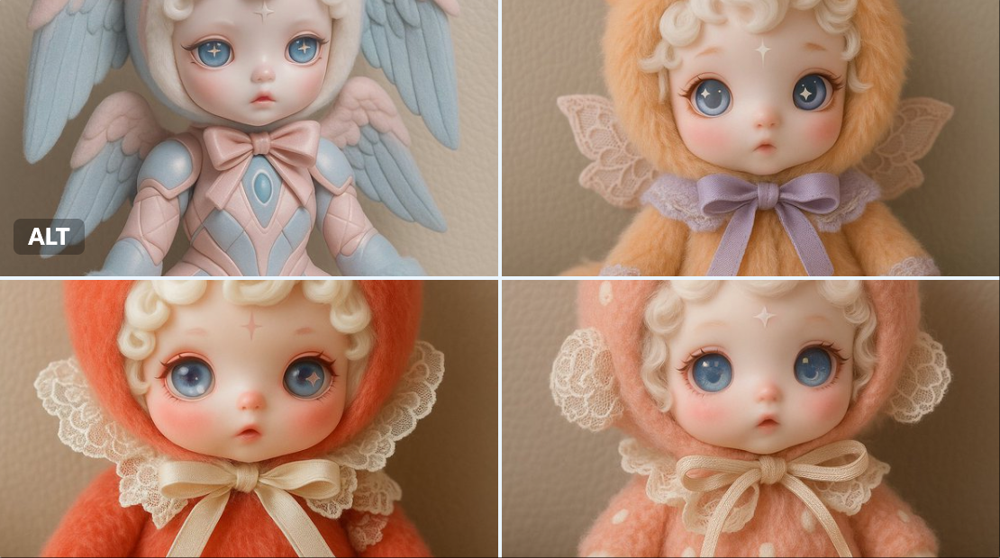

## A fictional character shaped like a [Brand Name] product

- ID: gpt4o-190-en-1
- Slug: prompt-190-en-1
- 语言: en
- 来源: [来源链接](https://x.com/B_4AI/status/1939218188513726675)
- 样例图路径: images/part3/190.png

### 提示词

```text
A fictional character shaped like a [Brand Name] product, wearing clothing that reflects the brand’s identity, sitting or riding on an oversized version of one of the brand's products as if it were a futuristic vehicle. The design features an expressive, dynamic artistic style full of motion and vibrant colors, with a large abstract version of the brand’s logo in the background. Freely drawn elements and colors representing the brand are scattered throughout. The background is light-colored, and the brand’s logo appears at the bottom. aspect 1:1
```

### 样例图

![A fictional character shaped like a [Brand Name] product](../images/part3/190.png)

## 品牌虚拟人物

- ID: gpt4o-190-zh-2
- Slug: prompt-190-zh-2
- 语言: zh
- 来源: [来源链接](https://x.com/B_4AI/status/1939218188513726675)
- 样例图路径: images/part3/190.png

### 提示词

```text
一个形状像 [品牌名称] 商品的虚构人物，穿着反映品牌身份的服装，坐在或骑在该品牌某件商品的超大版本上，就好像它是一辆未来主义的汽车一样。该设计具有富有表现力、充满活力的艺术风格，充满动感和鲜艳的色彩，背景是品牌标志的大型抽象版本。代表品牌的自由绘制元素和颜色散布在整个过程中。背景为浅色，品牌标志出现在底部。外观 1：1
```

### 样例图


## A minimalistic black-and-white autograph design in a sin

- ID: gpt4o-189-en-1
- Slug: prompt-189-en-1
- 语言: en
- 来源: [来源链接](https://x.com/TheRelianceAI/status/1938601703026434134)
- 样例图路径: images/part3/189.png

### 提示词

```text
A minimalistic black-and-white autograph design in a single-line drawing style, featuring the handwritten signature: [CHARACTER NAME], integrated with cute line art elements inspired by the character’s appearance and personality (for example: hair, outfit details, weapons, magical symbols). Include a small mascot or doodle of the character in simplified chibi style, surrounded by decorative elements (stars, hearts, sparkles, musical notes, flowers) that match their vibe. Clean, cute, modern design suitable for tattoo or sticker. High-resolution line art.
```

### 样例图

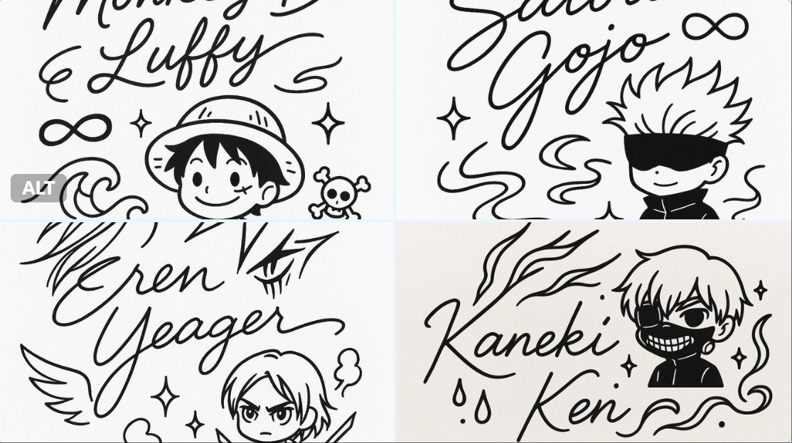

## 心爱的角色制作动漫风格的签名

- ID: gpt4o-189-zh-2
- Slug: prompt-189-zh-2
- 语言: zh
- 来源: [来源链接](https://x.com/TheRelianceAI/status/1938601703026434134)
- 样例图路径: images/part3/189.png

### 提示词

```text
简约的黑白亲笔签名设计，采用单线绘图风格，带有手写签名：[CHARACTER NAME]，并融入了受角色外表和个性启发的可爱线条艺术元素（例如：头发、服装细节、武器、魔法符号）。包括一个简化的赤壁风格的小吉祥物或角色涂鸦，周围环绕着与其氛围相匹配的装饰元素（星星、心形、火花、音符、花朵）。干净、可爱、现代的设计，适合纹身或贴纸。高分辨率线条图。
```

### 样例图


## Create a 3D-rendered digital illustration of a stylized 

- ID: gpt4o-179-en-1
- Slug: prompt-179-en-1
- 语言: en
- 来源: [来源链接](https://x.com/tranmautritam/status/1938160355064353153)
- 样例图路径: images/part3/179.png

### 提示词

```text
Create a 3D-rendered digital illustration of a stylized cartoon boy character, standing in a neutral pose. The character should be rendered in a realistic-minimalist 3D style, with soft rounded proportions and plush matte textures — similar to high-end Cinema 4D + Redshift product renders.
```

### 样例图

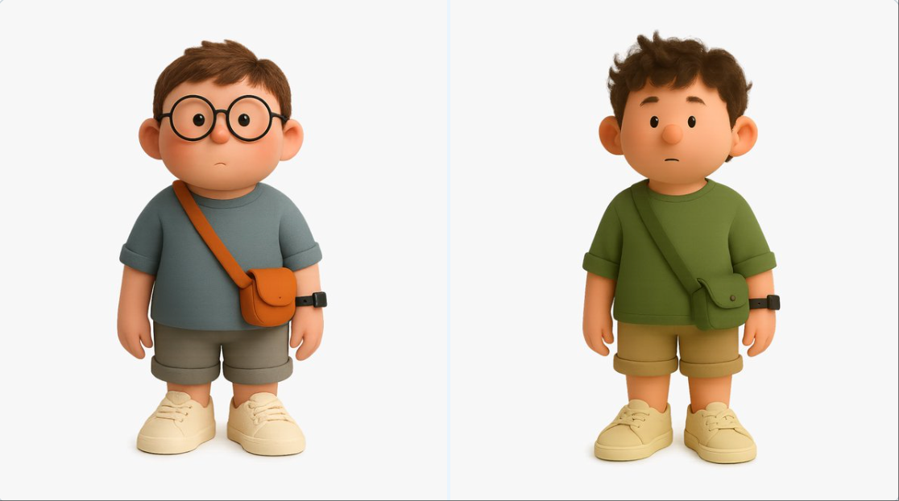

## 创建多种3D风格头像

- ID: gpt4o-179-zh-2
- Slug: prompt-179-zh-2
- 语言: zh
- 来源: [来源链接](https://x.com/tranmautritam/status/1938160355064353153)
- 样例图路径: images/part3/179.png

### 提示词

```text
创建风格化卡通男孩角色的 3D 渲染数字插图，以中性姿势站立。角色应以逼真的极简主义 3D 风格渲染，具有柔和圆润的比例和毛绒哑光纹理——类似于高端 Cinema 4D + Redshift 产品渲染。
```

### 样例图


## He has a warm natural skin tone with rosy cheeks, dot ey

- ID: gpt4o-179-en-3
- Slug: prompt-179-en-3
- 语言: en
- 来源: [来源链接](https://x.com/tranmautritam/status/1938160355064353153)
- 样例图路径: images/part3/179.png

### 提示词

```text
He has a warm natural skin tone with rosy cheeks, dot eyes (or small glossy eyes), and soft curly dark brown hair. Facial expression is neutral or slightly curious. Outfit includes an olive green T-shirt with rolled sleeves, beige rolled shorts, and off-white matte sneakers with subtle stitching. He wears a dark olive crossbody satchel with a flap, and a slim black watch on his right wrist.
```

### 样例图


## 创建多种3D风格头像

- ID: gpt4o-179-zh-4
- Slug: prompt-179-zh-4
- 语言: zh
- 来源: [来源链接](https://x.com/tranmautritam/status/1938160355064353153)
- 样例图路径: images/part3/179.png

### 提示词

```text
他有着温暖自然的肤色，红润的脸颊，圆点的眼睛（或有光泽的小眼睛）和柔软的深棕色卷发。面部表情中性或略带好奇。服装包括一件卷袖的橄榄绿色 T 恤、米色卷短裤和带有微妙缝线的米白色哑光运动鞋。他戴着一个带翻盖的深橄榄色斜挎包，右手腕上戴着一块纤细的黑色手表。
```

### 样例图


## Render with soft, diffused lighting and gentle shadows u

- ID: gpt4o-179-en-5
- Slug: prompt-179-en-5
- 语言: en
- 来源: [来源链接](https://x.com/tranmautritam/status/1938160355064353153)
- 样例图路径: images/part3/179.png

### 提示词

```text
Render with soft, diffused lighting and gentle shadows underfoot. Use a 100% transparent background (PNG format) or very light neutral grey if previewed. Full-body composition, front-facing or light 3/4 view. Maintain a clean, high-resolution, polished render — ideal for a character design showcase or branding. Soft color palette with earth tones.
```

### 样例图


## 创建多种3D风格头像

- ID: gpt4o-179-zh-6
- Slug: prompt-179-zh-6
- 语言: zh
- 来源: [来源链接](https://x.com/tranmautritam/status/1938160355064353153)
- 样例图路径: images/part3/179.png

### 提示词

```text
使用柔和的漫射照明和脚下柔和的阴影进行渲染。使用 100% 透明背景（PNG 格式）或非常浅的中性灰色（如果预览）。全身构图，正面或浅色 3/4 视图。保持干净、高分辨率、精美的渲染 — 非常适合角色设计展示或品牌推广。带有大地色调的柔和调色板。
```

### 样例图


## Close-up, A hand holding a transparent capsule, inside i

- ID: gpt4o-169-en-1
- Slug: prompt-169-en-1
- 语言: en
- 来源: [来源链接](https://x.com/CharaspowerAI/status/1938299520019734676)
- 样例图路径: images/part3/169.png

### 提示词

```text
Close-up, A hand holding a transparent capsule, inside it is a miniature model of [character name], wearing [their iconic outfit and accessories]. The character is posed in a [specific, expressive or dynamic pose], interacting with the inner surface of the capsule, as if they are frozen or confined inside. Hyper-realistic, cinematic, studio lighting setup, photographed with a macro lens.
```

### 样例图


## 微型透明胶囊

- ID: gpt4o-169-zh-2
- Slug: prompt-169-zh-2
- 语言: zh
- 来源: [来源链接](https://x.com/CharaspowerAI/status/1938299520019734676)
- 样例图路径: images/part3/169.png

### 提示词

```text
特写，一只手拿着一个透明的胶囊，里面是一个 [角色名称] 的微型模型，穿着 [他们的标志性服装和配饰]。角色以 [特定、富有表现力或动态的姿势] 摆姿势，与胶囊的内表面互动，就好像他们被冻结或限制在里面一样。超逼真、电影般的工作室照明设置，使用微距镜头拍摄。
```

### 样例图


## a luxurious fashion magazine cover designed in the style

- ID: gpt4o-155-en-1
- Slug: prompt-155-en-1
- 语言: en
- 来源: [来源链接](https://x.com/TheRelianceAI/status/1936802168318910673)
- 样例图路径: images/part3/155.png

### 提示词

```text
a luxurious fashion magazine cover designed in the style of [COUNTRY], blending iconic landmarks, cultural symbols, and local fashion aesthetics. The layout mimics high-end editorial design, with headlines inspired by the country’s language, trends, and lifestyle. Sophisticated, cinematic lighting, vertical 9:16 format, ultra-detailed, Vogue-level elegance
```

### 样例图


## 自己的国家地标时尚杂志

- ID: gpt4o-155-zh-2
- Slug: prompt-155-zh-2
- 语言: zh
- 来源: [来源链接](https://x.com/TheRelianceAI/status/1936802168318910673)
- 样例图路径: images/part3/155.png

### 提示词

```text
以 [COUNTRY] 风格设计的豪华时尚杂志封面，融合了标志性地标、文化符号和当地时尚美学。布局模仿高端编辑设计，标题的灵感来自该国的语言、趋势和生活方式。精致的电影级灯光，垂直 9：16 格式，超细节，Vogue 级别的优雅
```

### 样例图


## create image with 1:1 ratio A branded footwear ad for [B

- ID: gpt4o-142-en-1
- Slug: prompt-142-en-1
- 语言: en
- 来源: [来源链接](https://x.com/hc_dsn/status/1925139884920152110)
- 样例图路径: images/part3/142.jpeg

### 提示词

```text
create image with 1:1 ratio   A branded footwear ad for [Brand], showcasing the high-end Brand shoe using brand technology and texture.(fiction a technology and texture based on brand DNA). The shoe is shown in dynamic floating perspective over a graph paper background layout with technical sketches and handwritten notes. A random lifestyle authentic photo featuring brand clothing in motion is taped in the corner, styled with street wear fashion. Emphasize the product's slogan with  bold typography. Layout features include product spec labels like Project a fiction brand title, Date, Size, and fiction model name in engineering style. The background reference with brand pantone color palettes with code number
```

### 样例图

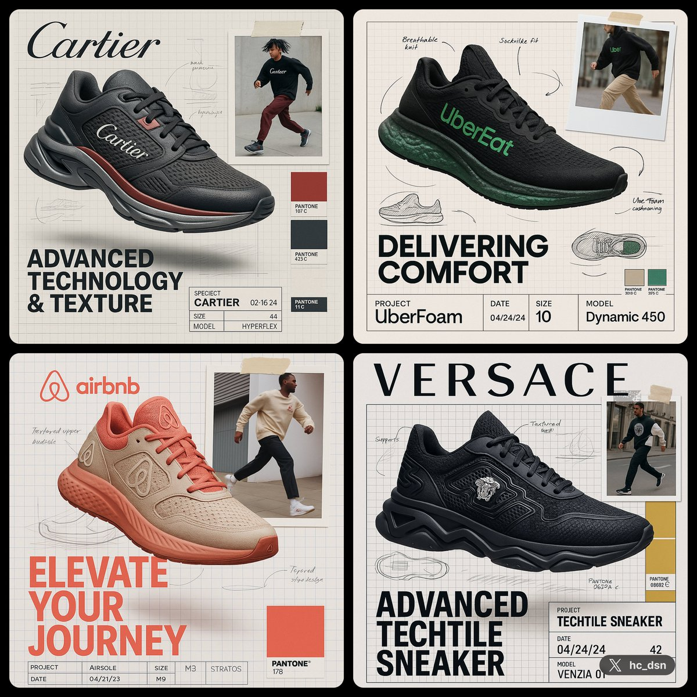

## 为任何品牌设计运动鞋

- ID: gpt4o-142-zh-2
- Slug: prompt-142-zh-2
- 语言: zh
- 来源: [来源链接](https://x.com/hc_dsn/status/1925139884920152110)
- 样例图路径: images/part3/142.jpeg

### 提示词

```text
以 1：1 的比例创建图片 [Brand] 的品牌鞋靴广告，使用品牌技术和纹理展示高端品牌鞋靴。（虚构一种基于品牌DNA的技术和质感）。这双鞋以动态浮动透视形式显示在方格纸背景布局上，并附有技术草图和手写注释。角落里贴着一张随机的生活方式真实照片，照片中展示了运动中的品牌服装，与街头服饰时尚相得益彰。用粗体排版强调产品的口号。布局功能包括产品规格标签，如工程样式的 Project a fiction brand title、Date、Size 和 fiction model name。带有品牌 pantone 调色板和代码编号的背景参考
```

### 样例图


## An old-fashioned postal shack floating on a space rock, 

- ID: gpt4o-132-en-1
- Slug: prompt-132-en-1
- 语言: en
- 来源: [来源链接](https://x.com/BeanieBlossom/status/1934581820433301996)
- 样例图路径: images/part3/132.jpeg

### 提示词

```text
An old-fashioned postal shack floating on a space rock, with envelopes fluttering like wings and planets lined up as waiting customers - humorous, magical realism.
```

### 样例图

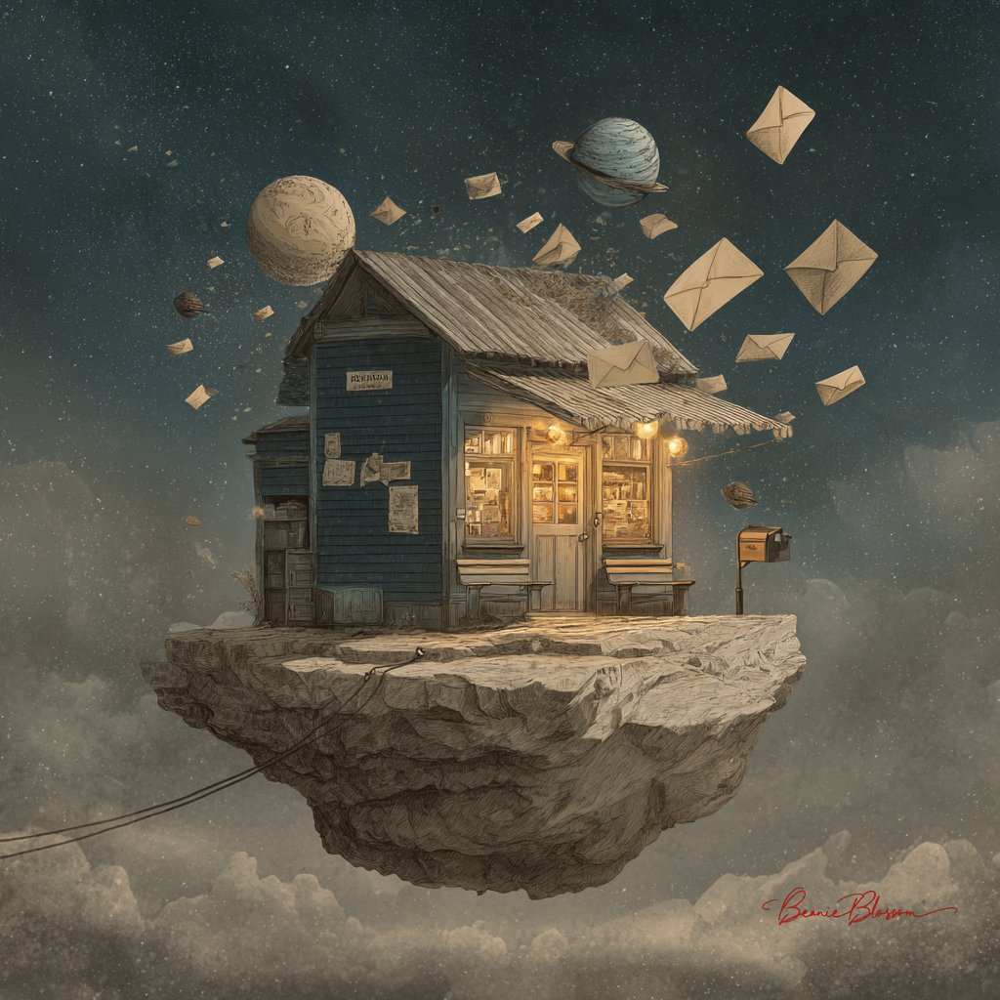

## 悬浮魔幻现实主义

- ID: gpt4o-132-zh-2
- Slug: prompt-132-zh-2
- 语言: zh
- 来源: [来源链接](https://x.com/BeanieBlossom/status/1934581820433301996)
- 样例图路径: images/part3/132.jpeg

### 提示词

```text
一个漂浮在太空岩石上的老式邮政小屋，信封像翅膀一样飘动，行星排成一排等待的顾客 - 幽默、魔幻现实主义。
```

### 样例图


## A hyper-realistic photograph of a fashion doll styled in

- ID: gpt4o-125-en-1
- Slug: prompt-125-en-1
- 语言: en
- 来源: [来源链接](https://x.com/TheRelianceAI/status/1934688112741085562)
- 样例图路径: images/part3/125.png

### 提示词

```text
A hyper-realistic photograph of a fashion doll styled in the aesthetic of [BRAND], sitting on a plush, cream-colored bed with soft folds. The doll’s look reflects the brand’s signature elements — from hair and outfit to accessories — arranged thoughtfully to evoke a dreamy, vintage-inspired editorial. Studio-lit with warm, diffused lighting and a creamy, ivory-toned palette, the scene emulates luxury fashion photography with a soft, dollhouse-like atmosphere and shallow depth of field.
```

### 样例图


## 时尚品牌娃娃

- ID: gpt4o-125-zh-2
- Slug: prompt-125-zh-2
- 语言: zh
- 来源: [来源链接](https://x.com/TheRelianceAI/status/1934688112741085562)
- 样例图路径: images/part3/125.png

### 提示词

```text
一张超写实的照片，一个时尚娃娃以 [BRAND] 的美学风格，坐在一张带有柔软褶皱的奶油色毛绒床上。这款玩偶的外观反映了该品牌的标志性元素——从头发和服装到配饰——经过精心安排，让人联想到梦幻般的复古风格社论。工作室照明采用温暖的漫射灯光和奶油色的象牙色调调色板，该场景以柔和的玩具屋般的氛围和浅景深模拟奢华时尚摄影。
```

### 样例图


## Airbnb风格的图标

- ID: gpt4o-43-zh
- Slug: prompt-43-zh
- 语言: zh
- 来源: [来源链接](https://x.com/hc_dsn/status/1924665909073084507)
- 样例图路径: images/part3/43.jpeg

### 提示词

```text
generate[concept] icon with this json style:
{
    "icon_style": {
        "perspective": "isometric",
        "geometry": {
            "proportions": "1:1 ratio canvas, with objects fitting comfortably within margins",
            "element_arrangement": "central dominant object, with supporting elements symmetrically or diagonally placed"
        },
        "composition": {
            "element_count": "2–4 main objects",
            "spatial_depth": "layered to create sense of dimension and slight elevation",
            "scale_consistency": "uniform object scale across icon set",
            "scene_density": "minimal to moderate, maintaining clarity and visual focus"
        },
        "lighting": {
            "type": "soft ambient light",
            "light_source": "subtle top-right or front-top direction",
            "shadow": "gentle drop shadows below and behind objects",
            "highlighting": "mild edge illumination to define forms"
        },
        "textures": {
            "material_finish": "semi-matte to satin surfaces",
            "surface_treatment": "smooth with light tactile variation (e.g., wood grain, soft textures)",
            "texture_realism": "stylized naturalism without hyper-realistic noise"
        },
        "render_quality": {
            "resolution": "high-resolution octane 3D rendering",
            "edge_definition": "crisp, no outlines; separation achieved via lighting and depth",
            "visual_clarity": "clean, readable shapes with minimal clutter"
        },
        "color_palette": {
            "tone": "naturalistic with slight saturation boost",
            "range": "harmonious muted tones with gentle contrast",
            "usage": "distinct colors per object to improve identification and readability"
        },
        "background": {
            "color": "#FFFFFF",
            "style": "pure white, flat",
            "texture": "none"
        },
        "stylistic_tone": "premium, friendly, clean with lifestyle or service-oriented appeal",
        "icon_behavior": {
            "branding_alignment": "neutral enough for broad applications",
            "scalability": "legible at small and medium sizes",
            "interchangeability": "part of a cohesive icon system with interchangeable subject matter"
        }
    }
}
```

### 样例图

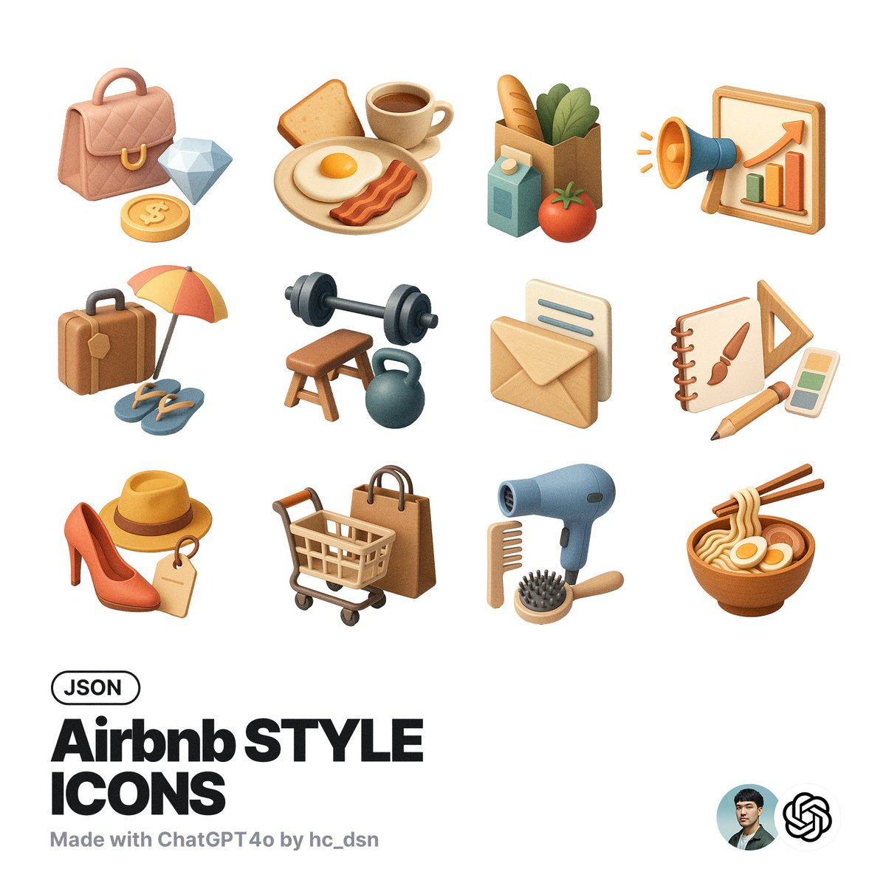

