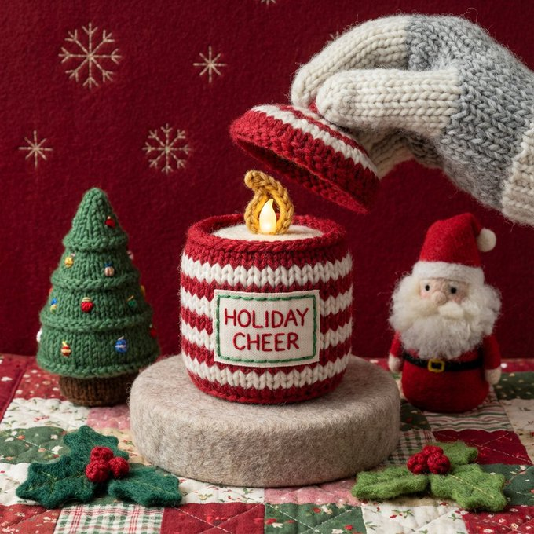
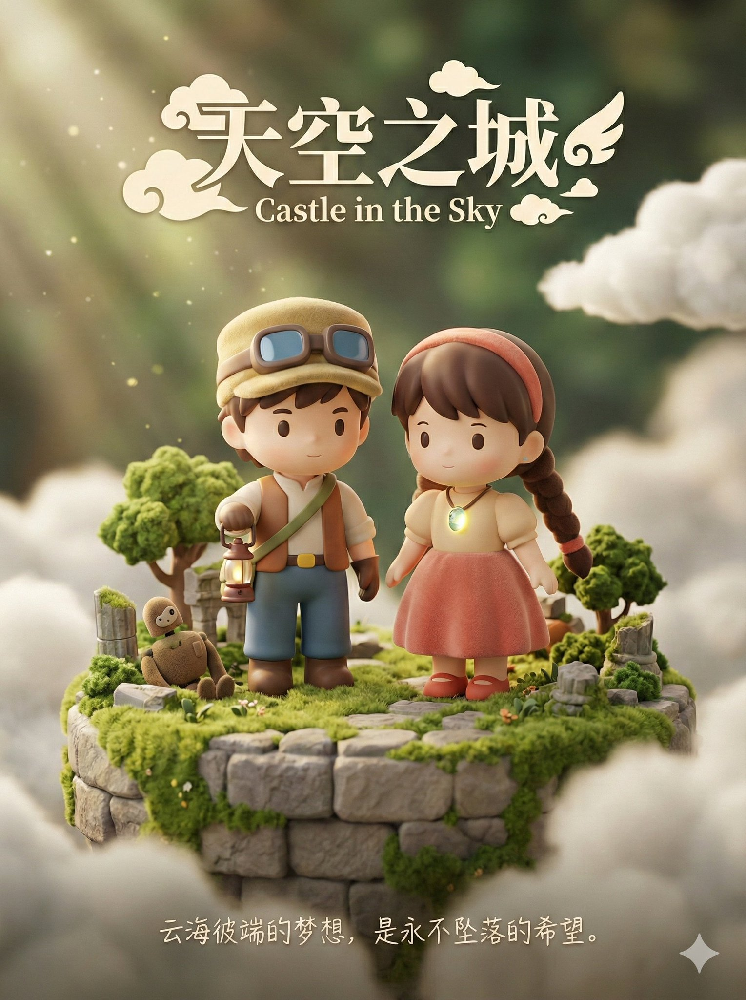
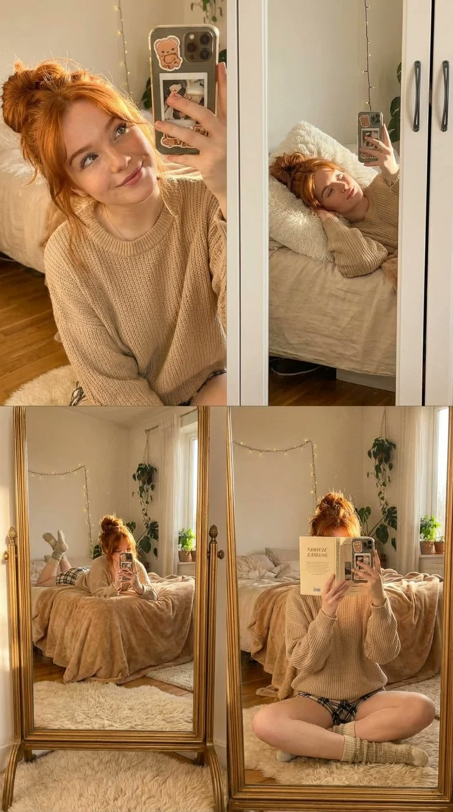
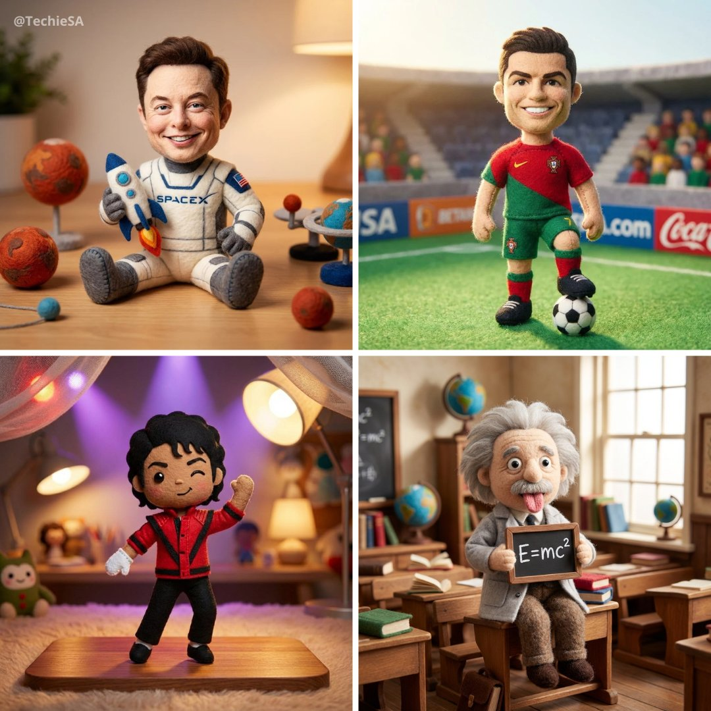
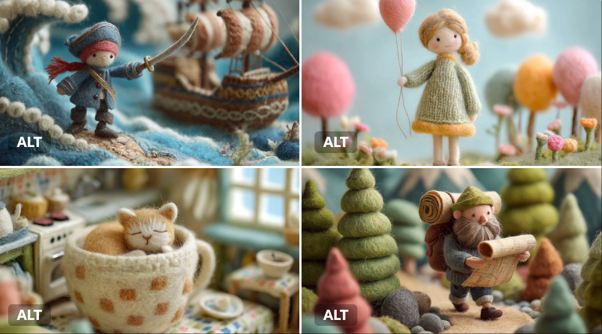

# felt

总计：43

## A 3x3 cinematic storyboard contact sheet consisting of 9

- ID: gpt4o-1044-en-1
- Slug: prompt-1044-en-1
- 语言: en
- 来源: [来源链接](https://x.com/oggii_0/status/2006931271822590224)
- 样例图路径: images/part3/1044.jpeg

### 提示词

```text
A 3x3 cinematic storyboard contact sheet consisting of 9 distinct panels arranged in a grid. The sequence features a young woman with platinum blonde hair in a frozen alpine winter setting.

The panels display various angles and shots:

Close-ups: Focusing on her rosy cheeks, blue-grey eyes, and snowflakes on her eyelashes.

Medium shots: Showing her wrapped in a black wool coat and blue knit scarf, holding a bouquet of dried white flowers.

Wide shots: Capturing her standing alone on the frozen lake with towering snowy mountains in the background.

The lighting is consistent moody blue-hour twilight across all frames. High-quality film photography aesthetic, photorealistic, 8k resolution, coherent character and color grading.
```

### 样例图


## 电影照片故事板

- ID: gpt4o-1044-zh-2
- Slug: prompt-1044-zh-2
- 语言: zh
- 来源: [来源链接](https://x.com/oggii_0/status/2006931271822590224)
- 样例图路径: images/part3/1044.jpeg

### 提示词

```text
一张3x3的电影分镜脚本，由9个独立的分镜组成，呈网格状排列。画面描绘了一位有着铂金色头发的年轻女子，置身于冰天雪地的阿尔卑斯山冬季场景中。

这些面板展示了各种角度和镜头：

特写镜头：聚焦于她红润的脸颊、蓝灰色的眼睛和睫毛上的雪花。

中景镜头：她身穿黑色羊毛大衣，围着蓝色针织围巾，手捧一束白色干花。

广角镜头：捕捉她独自站在冰封的湖面上，背景是巍峨的雪山。

所有画面都呈现出一致的、略带忧郁的蓝调黄昏光线。高品质的胶片摄影美学，照片级真实感，8K分辨率，风格统一，色彩分级准确。
```

### 样例图


## 4x4 grid of identical 3D object renders showing the same

- ID: gpt4o-1034-en-1
- Slug: prompt-1034-en-1
- 语言: en
- 来源: [来源链接](https://x.com/gokayfem/status/2007137742883266682)
- 样例图路径: images/part3/1034.jpeg

### 提示词

```text
4x4 grid of identical 3D object renders showing the same furniture piece with 16 different material applications. Each cell displays the exact same object geometry with a unique surface texture applied.

Object: Curved sculptural seating form with rounded back, cushioned seat, and four angled legs. Organic mid-century modern silhouette with smooth flowing lines, gently sloped armrests, and comfortable proportions. Single unified form without separate cushions or pillows.

Camera specifications: Fixed 3/4 front angle view, warm showroom lighting from upper-left at 45°, soft ambient fill light, identical framing across all 16 cells, subtle floor shadow beneath object, clean neutral gradient background.

Object geometry (identical in all cells):
* Same exact 3D model in every cell
* Same camera angle and distance
* Same lighting setup
* Only the surface material changes between cells

16 unique material applications (one per cell, left to right, top to bottom):

Row 1 - Soft Luxury:
* Cell 1: Midnight blue velvet - deep navy plush pile absorbing light across curved surfaces
* Cell 2: Cognac full-grain leather - warm caramel with natural grain wrapping around form
* Cell 3: Cream bouclé - chunky looped wool texture following organic contours
* Cell 4: Blush pink silk - luminous soft draping appearance with subtle sheen on curves

Row 2 - Natural Elements:
* Cell 5: Live-edge walnut wood - rich brown grain flowing across entire solid form
* Cell 6: White Carrara marble - bright polished stone with gray veins (sculptural interpretation)
* Cell 7: Natural rattan weave - honey tan woven cane pattern covering all surfaces
* Cell 8: Olive green shagreen - textured bumpy stingray pattern on elegant form

Row 3 - Metals & Industrial:
* Cell 9: Brushed brass - warm golden metal with soft directional scratches
* Cell 10: Matte black steel - powder-coated charcoal covering entire form
* Cell 11: Polished chrome - mirror-like silver reflecting environment
* Cell 12: Antique bronze - deep brown with green patina weathering

Row 4 - Statement Finishes:
* Cell 13: Emerald green lacquer - jewel tone high-gloss reflective surface
* Cell 14: Smoked glass - dark translucent gray showing form as sculptural object
* Cell 15: Camel herringbone wool - warm tan zigzag woven textile on all surfaces
* Cell 16: Mother of pearl - iridescent shell mosaic with rainbow shimmer across curves

Material application rules:
* Each material wraps entirely around the object
* Texture scale appropriate for furniture size
* Material responds correctly to object curvature
* Lighting reveals unique surface properties of each material
* Realistic rendering quality showing how material would actually appear

Technical requirements:
* Identical object silhouette in all 16 cells
* Zero variation in geometry, camera, or lighting
* Only surface material differs between cells
* Clean grid layout with thin borders
* Professional product visualization quality
* Each cell could serve as standalone product render

Purpose: Material exploration for furniture design, showing clients how the same form transforms with different surface treatments. Demonstrates versatility of single design across fabric, leather, wood, metal, stone, and decorative finishes.

Output: 4x4 seamless grid comparing 16 material options on identical object. Presentation-ready format for design review, client selection, or 3D visualization portfolio.
```

### 样例图


## 16 种不同的表面材质

- ID: gpt4o-1034-zh-2
- Slug: prompt-1034-zh-2
- 语言: zh
- 来源: [来源链接](https://x.com/gokayfem/status/2007137742883266682)
- 样例图路径: images/part3/1034.jpeg

### 提示词

```text
4x4 的网格，由 16 种不同的材质渲染图组成，展示同一件家具的相同几何形状。每个单元格都应用了不同的表面纹理。

物件：弧形雕塑座椅，圆润的靠背，带软垫的座面，四条倾斜的椅腿。有机的中世纪现代风格轮廓，线条流畅，扶手略微倾斜，比例舒适。一体式设计，无需单独的坐垫或靠枕。

相机规格：固定 3/4 前角视角，从左上方 45° 角照射的暖色展厅照明，柔和的环境补光，所有 16 个单元格的取景相同，物体下方有微妙的地板阴影，干净的中性渐变背景。

对象几何形状（所有单元格均相同）：
每个单元格都使用完全相同的 3D 模型。
* 相同的拍摄角度和距离
* 相同的照明设置
细胞间仅表面物质发生变化。* 只有细胞表面物质发生变化。

16 种独特的材料应用（每个单元格一种，从左到右，从上到下）：

第一排 - 轻奢：
* 单元格 1：午夜蓝丝绒 - 深海军蓝长绒面料，可吸收曲面上的光线
* 单元格 2：干邑色全粒面皮革 - 温暖的焦糖色，天然纹理包裹着造型
* 单元格 3：奶油色圈绒 - 粗毛圈绒质地，贴合有机轮廓
* 第4格：淡粉色丝绸——光泽柔和，垂坠感极佳，曲线处带有微妙的光泽

第 2 行 - 自然元素：
* 第5单元：原木胡桃木——浓郁的棕色纹理贯穿整个实木框架
* 6号单元：白色卡拉拉大理石——光泽亮丽、带有灰色纹理的石材（雕塑诠释）
* 7号单元：天然藤编——蜜棕色藤条编织图案覆盖所有表面
* 第8格：橄榄绿鲨革——优雅造型上带有纹理粗糙的鳐鱼图案

第 3 行 - 金属和工业：
* 9号单元格：拉丝黄铜——温暖的金色金属，带有柔和的定向划痕
* 10号单元：哑光黑色钢材 - 表面喷涂炭黑色粉末涂层
* 11号单元格：抛光铬——镜面般的银色反射环境
* 12号单元格：古铜色 - 深棕色，带有绿色风化痕迹

第 4 行 - 语句结尾：
* 13号单元格：翠绿色漆面 - 宝石色调高光泽反光表面
* 第14号单元：烟熏玻璃——深灰色半透明，呈现出雕塑般的形态
* 15号单元：驼色人字纹羊毛——温暖的棕褐色之字形织物，所有表面均有纹理
* 第16格：珍珠母贝——带有彩虹般光泽的虹彩贝壳马赛克，曲线处闪烁着光芒

材料应用规则：
每种材料都完全包裹住物体。
* 纹理比例适合家具尺寸
* 材料对物体曲率的响应正确
光照展现了每种材料独特的表面特性。
* 逼真的渲染质量，展现材质的实际外观

技术要求：
* 所有 16 个单元格中的物体轮廓均相同
* 几何形状、相机或光照方面均无任何变化
* 细胞间仅表面物质存在差异。
* 简洁的网格布局，搭配细边框
* 专业产品可视化质量
每个单元格都可以作为独立的产品渲染图。

目的：探索家具设计中的材料运用，向客户展示同一造型如何通过不同的表面处理呈现出不同的效果。展现单一设计在织物、皮革、木材、金属、石材和装饰饰面等多种材质上的多样性。

输出：4x4无缝网格，对比同一物体上的16种材质选项。格式可直接用于演示，适用于设计评审、客户选择或3D可视化作品集。
```

### 样例图


## 新年新气象新衣服

- ID: gpt4o-1031-zh
- Slug: prompt-1031-zh
- 语言: zh
- 来源: [来源链接](https://x.com/aidavid125/status/2006959961109299304)
- 样例图路径: images/part3/1031.jpeg

### 提示词

```text
Use the uploaded reference image as the person appearing in all 6 cards.
Analyze their unique body shape, skin tone, facial features, and personal essence.
Design 6 PERFECT outfits specifically tailored to maximize their individual beauty.

Create a vertical 9:16 professional New Year Fashion Outfit Poster.

BACKGROUND: Solid warm cream (#FFF8F5), optimized for mobile full-screen viewing.

════════════════════════════════════
CRITICAL LAYOUT RULES
════════════════════════════════════

EXACTLY 6 CARDS arranged in SINGLE VERTICAL COLUMN:
- Six (6) cards total — NOT 4, NOT 9, EXACTLY 6
- ONE column ONLY — NO grid, NO 2x3, NO side-by-side
- Cards stacked vertically from top to bottom
- Like mobile scrolling feed / Instagram story sequence
- Each card occupies full width of canvas

SPACING:
- Outer margin: 3% width (left and right)
- Vertical gap between cards: 2% height
- Cards fill vertical space evenly

VISUAL REFERENCE:
┌─────────────────┐
│     Card 1      │
├─────────────────┤
│     Card 2      │
├─────────────────┤
│     Card 3      │
├─────────────────┤
│     Card 4      │
├─────────────────┤
│     Card 5      │
├─────────────────┤
│     Card 6      │
└─────────────────┘

════════════════════════════════════
SINGLE CARD STRUCTURE
════════════════════════════════════

Each card contains 4 zones:

▸ ZONE 1: TITLE AREA (top 8% height)
- AI-generated creative style name based on the outfit
- Main title: Chinese Red (#C41E3A) or Gold (#D4AF37), centered
- Subtitle: 6-8 characters describing the vibe, warm gray (#8B7355)
- Small decorative icon: lantern or cloud motif

▸ ZONE 2: MAIN IMAGE AREA (55% height)
- Full-body outfit display
- Person occupies 70-75% of area
- Clean, elegant background with warm tones
- Subtle New Year decorative elements
- Natural pose, confident expression
- Complete outfit clearly visible

▸ ZONE 3: THREE-DETAIL CIRCLES (15% height)
- Three circular close-up images, horizontally arranged
- LEFT: Upper garment detail (neckline, sleeve, pattern, texture)
- CENTER: Accessory highlight (bag, jewelry, belt, scarf)
- RIGHT: Lower garment/shoes detail (hem, pants, footwear)
- Labels beneath: "上装 Top" / "配饰 Acc" / "下装 Bottom"

▸ ZONE 4: OUTFIT INFO AREA (22% height)
- 5 lines of information, left-aligned:
🔴 上装: [Style + Color + Material]
🔴 下装: [Style + Cut + Color]
🔴 鞋履: [Shoe type + Color + Material]
🔴 配饰: [Bag + Jewelry + Scarf + Other]
🔴 风格点评: [Why this outfit is perfect for this person]

CARD STYLING:
- Background: warm white #FFFAF8
- Border-radius: 4%
- Border: 1px solid #F5E6E0
- Corner decoration: tiny plum blossom or cloud icon

════════════════════════════════════
AI SMART STYLING SYSTEM
════════════════════════════════════

STEP 1: DEEP ANALYSIS
Carefully analyze the reference image for:

Body Shape:
- Pear / Apple / Hourglass / Rectangle / Inverted Triangle
- Shoulder width, waist definition, hip proportion
- Height impression (petite / average / tall)
- Areas to highlight vs balance

Skin Tone:
- Cool undertone / Warm undertone / Neutral
- Fair / Medium / Tan / Deep
- Best complementary colors

Personal Essence:
- Elegant / Sweet / Cool / Classic / Trendy / Edgy
- Gentle / Bold / Cute / Sophisticated / Chic
- Youthful / Young Professional / Mature Elegant

Facial Features:
- Soft vs Angular
- Overall impression and mood

STEP 2: CREATE 6 PERFECT OUTFITS
Based on complete analysis, freely design 6 outfits that:

✓ FLATTER the specific body type
- Choose silhouettes that enhance proportions
- Use strategic cuts, lengths, and fits
- Balance or highlight as needed

✓ COMPLEMENT the skin tone perfectly
- Select colors that make skin glow
- Avoid colors that wash out or clash
- Use undertone-matching principles

✓ MATCH the personal essence
- Align with natural vibe and energy
- Feel authentic, not costume-like
- Enhance existing beauty

✓ MAXIMIZE overall appeal
- Each outfit is THE MOST flattering choice
- Every piece works together harmoniously
- Complete polished head-to-toe look

✓ MAINTAIN variety
- 6 distinctly different styles
- Range of formality levels
- Different color stories
- Various silhouettes

✓ CELEBRATE New Year spirit
- Include festive red/gold elements
- Warm, joyful, celebratory feeling
- Elegant and refined aesthetic

════════════════════════════════════
NEW YEAR COLOR PALETTE
════════════════════════════════════

PRIMARY FESTIVE COLORS (each outfit MUST include at least one):

Chinese Red     #C41E3A  — Statement hero pieces
True Red        #E60012  — Bold, vibrant looks
Burgundy        #722F37  — Sophisticated elegance
Gold            #D4AF37  — Accessories and details
Champagne       #F7E7CE  — Subtle luxury
Coral           #FF6B35  — Youthful energy

SECONDARY COLORS (for balance and harmony):

Cream           #FFF8E7  — Clean, fresh base
Ivory           #FFFDD0  — Soft, warm elegance
Forest Green    #2E4A3E  — Contrast accent
Navy            #2B4A6F  — Classic depth
Blush Pink      #FFB6C1  — Sweet, feminine touch
Camel           #C19A6B  — Neutral sophistication
Pearl White     #F5F5F5  — Crisp, modern
Nude            #E8D5C4  — Understated chic

COLORS TO AVOID:
✗ Large areas of pure black (not festive enough)
✗ Gray-dominant schemes (too dull)
✗ Dark purple as main color (lacks celebration feel)
✗ Neon or overly bright tones (clashes with elegance)

════════════════════════════════════
FASHION ELEMENTS LIBRARY
════════════════════════════════════

AI freely selects and combines from:

UPPER GARMENTS:
- Cashmere sweaters, merino wool knits
- Silk blouses, satin camisoles
- Velvet tops, lace-trimmed pieces
- Modern qipao-inspired elements
- Elegant blazers, soft cardigans
- Statement coats, cropped jackets
- Turtlenecks, boat necks, V-necks

LOWER GARMENTS:
- A-line skirts, knife-pleat skirts
- Midi skirts, flowing maxi skirts
- Tailored trousers, wide-leg pants
- Velvet pants, satin midi skirts
- High-waist silhouettes, paper-bag waist
- Pencil skirts, wrap skirts

DRESSES:
- Knit dresses, sweater dresses
- Wrap dresses, shirt dresses
- Velvet dresses, satin slip dresses
- Fit-and-flare, bodycon, shift
- Midi length, maxi length

OUTERWEAR:
- Wool coats, cashmere overcoats
- Teddy coats, faux fur jackets
- Stylish puffer jackets
- Cape coats, cocoon coats
- Belted trench, double-breasted styles

FOOTWEAR:
- Pointed-toe heels, block heels
- Kitten heels, stilettos
- Ankle boots, knee-high boots
- Elegant loafers, embellished flats
- Slingbacks, Mary Janes
- Velvet shoes, satin pumps

ACCESSORIES:
- Pearl earrings, gold jewelry sets
- Statement earrings, delicate pendants
- Silk scarves, cashmere wraps
- Leather handbags, chain-strap bags
- Clutches, structured top-handle bags
- Hair clips, headbands, brooches
- Thin belts, statement belts
- Elegant watches, bracelets

════════════════════════════════════
PHOTOGRAPHY REQUIREMENTS
════════════════════════════════════

QUALITY STANDARD:
- High-end fashion magazine aesthetic
- 85mm portrait lens quality
- Professional studio or lifestyle setting
- Sharp focus on person and outfit

BACKGROUND REQUIREMENTS:
- Clean, elegant, uncluttered
- Warm neutral tones preferred
- Subtle New Year elements (optional):
· Soft red/gold bokeh
· Minimal lantern silhouettes
· Gentle floral arrangements
· Warm ambient glow
- NOT busy, NOT distracting

PERSON DISPLAY:
- Full body visible OR knee-up minimum
- Natural, confident expression
- Pose varies appropriately per outfit style
- Complete outfit clearly showcased
- Clothing fit and details visible
- Hair and makeup complement each style

LIGHTING:
- Warm, flattering golden-hour feel
- Soft diffused shadows
- Enhances skin tone naturally
- Creates depth without harshness
- Festive glow without overexposure

════════════════════════════════════
CONSISTENCY REQUIREMENTS
════════════════════════════════════
MUST MAINTAIN ACROSS ALL 6 CARDS:
| Element          | Requirement                              |
|------------------|------------------------------------------|
| Face             | IDENTICAL person in all 6 cards          |
| Body             | Same physique, proportions               |
| Changes Only     | Outfit, pose, expression, hairstyle      |
| Outfit Display   | Complete head-to-toe in each card        |
| Detail Circles   | Must MATCH main image exactly            |
| Overall Mood     | Festive, warm, celebratory feeling       |
| Photo Quality    | Consistent high-end aesthetic            |
| Color Warmth     | Harmonious warm tones throughout         |
| Background Style | Similar clean, elegant approach          |
════════════════════════════════════
DECORATIVE ELEMENTS
════════════════════════════════════
OVERALL POSTER DECORATION (subtle):
- Top edge: Faint golden cloud pattern border
- Bottom edge: Matching subtle border
- Between cards: Thin red or gold divider line (optional)
INDIVIDUAL CARD DECORATION:
- Corner accents: Tiny plum blossom icon
- Title area: Small lantern motif
- Subtle: Mini 福 character accent

DESIGN PRINCIPLE:
Decorations are MINIMAL and SUBTLE
Person and outfit remain the ABSOLUTE FOCUS

Elegance over festivity overload
Less is more approach
════════════════════════════════════
FINAL OUTPUT

════════════════════════════════════
Generate a beautiful, cohesive New Year Fashion Outfit Recommendation Poster featuring:
✓ Exactly 6 cards in single vertical column
✓ 6 unique outfits, each PERFECTLY tailored to this specific person

✓ Same person throughout with only outfit changes
✓ AI-generated style names that describe each look
✓ Complete outfit details (top, bottom, shoes, accessories)
✓ Festive New Year color palette with red/gold elements
✓ High-end fashion photography quality

✓ Clean, elegant presentation
✓ Warm, celebratory atmosphere
Each outfit should feel like it was personally styled by a top fashion consultant who deeply understands this person's unique features and knows exactly how to make them look their absolute best.
```

### 样例图


## 2026新年海报

- ID: gpt4o-1007-zh
- Slug: prompt-1007-zh
- 语言: zh
- 来源: [来源链接](https://x.com/op7418/status/2005486114510180545)
- 样例图路径: images/part3/1007.jpeg

### 提示词

```text
{
    "applicable_models": [
        "Seedream",
        "Nano Banana Pro"
    ],
    "subject": {
        "IP_Name": "Enter the names of your favorite games, novels, movies, or TV shows.",
        "description": "A visually striking, masterpiece-level 3D New Year's greeting card poster based on [IP Name]. Vertical composition with a deep, window-like groove in the center.",
        "material_style": "Felt and coarse knitting wool texture, realistic and delicate, blind box toy texture.",
        "central_character": {
            "identity": "A cute Q-version felt Pony (representing the Year of the Horse)",
            "expression": "Naive and charming (憨态可掬), festive",
            "clothing": "Red festive vest, traditional tiger-head hat",
            "action": "Standing in the center as a festival messenger"
        },
        "secondary_characters": {
            "identity": "Classic characters from the IP (Q-version felt style)",
            "clothing": "Traditional festive Tang suit or Hanfu",
            "action": "Interacting within the scene, adding story elements"
        },
        "scene_elements": {
            "architecture": "Iconic buildings from the IP in Q-version felt, arranged with depth and layers",
            "ground": "Thick creamy knitted snow",
            "vegetation": "Peach tree or Kumquat tree hung with red lanterns, Chinese knots, and blessing cards",
            "props": "Scattered felt firecrackers, gold ingots, snow-covered shrubs"
        }
    },
    "accessories": {
        "title_design": {
            "structure": "Independent 3D volumetric letters suspended in mid-air (No background plate/card)",
            "main_text": {
                "content": "Happy New Year",
                "font_style": "3D fluid art font, thick glass volume"
            },
            "sub_text": {
                "content": "新年快乐",
                "font_style": "Bold Chinese Calligraphy (中国书法), 3D extruded strokes"
            },
            "material_properties": {
                "type": "Matte Frosted Glass (applied directly to the text volume)",
                "color": "Deep red to light red gradient",
                "surface": "Soft matte finish, semi-transparent",
                "optical_effects": "Dreamy colorful caustics casting shadows onto the felt scene below"
            }
        },
        "bottom_layout": {
            "content": "Random classic quote related to New Year, blessings, or hope",
            "font_style": "Large, elegant Western Handwritten Serif, rich ink color",
            "source_note": "Small Chinese font citing the source"
        }
    },
    "photography": {
        "renderer": "C4D, Octane Render",
        "resolution": "8K",
        "camera_style": "Macro photography perspective",
        "shot_type": "Vertical Poster, Close-up on miniature",
        "depth_of_field": "Shallow depth of field (background bokeh)",
        "lighting": "Soft and uniform, breathing light effect, atmospheric depth",
        "texture_quality": "Masterpiece, rich details, mixture of felt and frosted glass"
    },
    "background": {
        "setting": "Oriental ink wash void environment with flowing light mist",
        "colors": "Elegant pale champagne gold or high-grade soft mist red",
        "external_decor": [
            "Red velvet silk ribbons dancing in the air",
            "Fluid gold lines",
            "Blooming red plum branches",
            "Strings of festive red lanterns",
            "Plump persimmons or hawthorn berries",
            "Crystal clear geometric snowflakes",
            "Glowing gold copper coin strings"
        ],
        "atmosphere": "Explosive festive atmosphere, dynamic composition",
        "positioning": "Card appears suspended in clouds with soft shadow at the bottom"
    },
    "the_vibe": {
        "mood": "Festive, Oriental, Warm, Exquisite, Joyful",
        "culture": "Chinese New Year, Year of the Horse",
        "aesthetic": "High-end commercial design, Cuteness mixed with elegance"
    },
    "constraints": {
        "must_keep": [
            "Felt texture",
            "Chinese New Year elements",
            "Year of the Horse Pony",
            "Volumetric glass text (No signboard)",
            "Calligraphy text",
            "Ink wash background"
        ],
        "avoid": [
            "Santa Claus",
            "Christmas trees",
            "Western Christmas decorations",
            "Real photography style",
            "Flat 2D illustration",
            "Rectangular glass plate behind text",
            "Signboard",
            "Text on a card"
        ]
    },
    "negative_prompt": [
        "Santa Claus",
        "Christmas tree",
        "rectangular background plate",
        "glass sign",
        "text box",
        "holding a sign",
        "photorealistic human",
        "low resolution",
        "blurry",
        "flat colors",
        "dark",
        "horror",
        "distorted text"
    ]
}
```

### 样例图


## 冬至海报

- ID: gpt4o-923-zh
- Slug: prompt-923-zh
- 语言: zh
- 来源: [来源链接](https://x.com/sundyme/status/2002592213851832742)
- 样例图路径: images/part3/923.jpeg

### 提示词

```text
一个温馨的3D C4D Octane渲染场景，采用无黑色轮廓的羊毛针毡风格，具有盲盒玩具的柔和边缘审美。四只不同大小的粉彩（薄荷绿、嫩粉、淡蓝、奶油色）羊毛毡Labubu角色，身穿针织毛衣，有着标志性的圆润身体、兔耳和大眼睛，表情喜悦。它们围坐在铺着针织桌布的矮桌旁，桌上摆满热气腾腾的饺子、茶壶和餐具。一个角色正用筷子亲昵地喂另一个角色吃饺子。地面覆盖着羊毛雪和散落的心形装饰。左侧是挂着灯笼的盛开梅花枝，右侧是祥云图案。发光的羊毛心形在空中漂浮。背景是温暖的橙黄色渐变，营造出冬至家庭团聚的节日氛围。顶部是巨大、发光、毛绒质感的艺术字体“饺饺情深，岁岁安康”。中间是清晰简单的祝福语：“愿家人健康快乐，幸福安康！”。8K分辨率，高细节，暖光摄影棚照明，垂直2:3比例。
```

### 样例图


## { "project_title": "Urban Streetwear Editorial Collage",

- ID: gpt4o-900-en-1
- Slug: prompt-900-en-1
- 语言: en
- 来源: [来源链接](https://x.com/xmliisu/status/2001254201611964524)
- 样例图路径: images/part3/900.jpeg

### 提示词

```text
{
  "project_title": "Urban Streetwear Editorial Collage",
  "aspect_ratio": "9:16",
  "aesthetic_theme": {
    "style": "Editorial poster-style multi-panel collage",
    "mood": "Retro analog–digital fusion",
    "color_palette": [
      "Warm ambers",
      "Washed neutrals",
      "Soft greys",
      "Muted browns"
    ],
    "textures": [
      "Reflective glass",
      "Wool plaid",
      "Polished leather",
      "Stone pavement"
    ]
  },
  "subject_outfit": {
    "core": "Brown plaid blazer, white button-up shirt, yellow tie, loose dark trousers",
    "accessories": "Brown cap, oversized amber-tinted rectangular sunglasses",
    "tech": "Wired earphones"
  },
  "composition_layout": {
    "frame_1_top_left": {
      "type": "Reflective window shot",
      "pose": "Holding phone in front of face",
      "visual_effects": "Layered ghosting, architectural overlays, curvature distortion"
    },
    "frame_2_top_right": {
      "type": "Close-range, downward-angled ultra-wide portrait",
      "setting": "Cobblestone street",
      "pose": "Leaning forward, hands in pockets, exaggerated pout",
      "visual_effects": "Lens perspective distortion, radiating cobblestones"
    },
    "frame_3_bottom_right": {
      "type": "Intimate overhead selfie",
      "lighting": "Soft overcast",
      "props": "Holding a drink",
      "overlays": "Faint digital-grid, minimal square facial-bounding graphic"
    }
  },
  "ui_elements": {
    "music_player": {
      "style": "Translucent iOS-style Apple Music mini-player",
      "content": "“See You Again” by Tyler, The Creator",
      "features": "Artwork, timeline, playback controls (no shadows)"
    },
    "graphics": "Subtle cursor-like frame lines, rectangular highlights"
  },
  "negative_constraints": [
    "Stickers",
    "Extra subjects",
    "Wardrobe changes",
    "Incorrect UI icons",
    "Neon color shifts",
    "Futuristic sci-fi elements"
  ]
}
```

### 样例图


## 都市街头服饰编辑拼贴画

- ID: gpt4o-900-zh-2
- Slug: prompt-900-zh-2
- 语言: zh
- 来源: [来源链接](https://x.com/xmliisu/status/2001254201611964524)
- 样例图路径: images/part3/900.jpeg

### 提示词

```text
{
"project_title": "都市街头服饰编辑拼贴画",
"aspect_ratio": "9:16",
"aesthetic_theme": {
“风格”：“社论海报风格的多面板拼贴画”，
“氛围”：“复古模拟-数字融合”，
"color_palette": [
“温暖的琥珀色”，
“水洗中性色”，
“柔和的灰色”，
“柔和的棕色”
],
“纹理”：[
“反射玻璃”，
“羊毛格子呢”
“抛光皮革”，
石板路
]
},
"subject_outfit": {
“核心单品”：棕色格子西装外套、白色纽扣衬衫、黄色领带、宽松深色长裤。
“配饰”：“棕色帽子，超大琥珀色矩形太阳镜”，
“科技产品”：“有线耳机”
},
"composition_layout": {
"frame_1_top_left": {
“类型”：“反射窗照片”，
“姿势”：“将手机举到脸前”，
"视觉特效": "分层重影、建筑叠加、曲率扭曲"
},
"frame_2_top_right": {
“类型”：“近距离、向下倾斜的超广角人像”，
“场景”：“鹅卵石街道”，
“姿势”：“身体前倾，双手插兜，夸张地撅嘴”，
"视觉效果": "镜头透视变形，放射状鹅卵石"
},
"frame_3_bottom_right": {
类型： 亲密俯视自拍，
“光线”：“柔和的阴天”，
“道具”：“拿着一杯饮料”，
“叠加层”：“淡淡的数字网格，极简的方形面部轮廓图形”
}
},
"ui_elements": {
"music_player": {
"style": "半透明 iOS 风格的 Apple Music 迷你播放器",
内容： “Tyler, The Creator 的“See You Again””
“功能”： “封面图、时间轴、播放控制（无阴影）”
},
“图形”：“类似光标的微妙边框线，矩形高光”
},
"negative_constraints": [
“贴纸”，
“额外科目”，
“服装更换”
“错误的用户界面图标”，
“霓虹色彩变化”，
“未来科幻元素”
]
}
```

### 样例图


## { "image_prompt": { "critical_instruction": "ABSOLUTE PR

- ID: gpt4o-874-en-1
- Slug: prompt-874-en-1
- 语言: en
- 来源: [来源链接](https://x.com/songguoxiansen/status/2000055154415182214)
- 样例图路径: images/part3/874.jpeg

### 提示词

```text
{
  "image_prompt": {
    "critical_instruction": "ABSOLUTE PRIORITY: Maintain identical facial structure across all panels. Do not alter underlying bone structure, nose shape, eye spacing, or jawline regardless of the expression being rendered. The identity must be unmistakable in every single shot.",
    "format": "3x3 grid collage",
    "subject": {
      "face_reference": "uploaded_photo",
      "face_identity_lock": "CRITICAL: fixed identity, zero deviation from reference facial features",
      "face_match_accuracy": "100% exact match enforced",
      "identity_preservation_details": "Ensure consistent interpupillary distance, exact nose bridge shape, and jaw structure in every panel.",
      "negative_constraints": [
        "do not morph nose shape",
        "do not change eye size or spacing",
        "do not alter cheekbone structure",
        "no plastic surgery look"
      ],
      "style": "hyper-realistic portrait photography, 8k resolution, raw photo aesthetic",
      "skin": "highly detailed natural skin texture, visible pores, subtle imperfections, realistic complexion, consistent across all lighting conditions",
      "camera_settings": "shot on Sony A7R IV, 85mm portrait lens, f/1.8 aperture, sharp focus on eyes, shallow depth of field"
    },

    "panels": [
      {
        "expression": "joyful",
        "pose": "bright natural smile (maintaining jaw structure), shoulders slightly raised",
        "hairstyle": "high ponytail with loose strands",
        "outfit": "pastel cotton hoodie",
        "background": "soft gradient sky blue studio backdrop"
      },
      {
        "expression": "surprised",
        "pose": "hands near face, wide eyes (without altering eye shape), natural reaction",
        "hairstyle": "loose natural wavy hair",
        "outfit": "casual cotton t-shirt",
        "background": "light peach studio backdrop"
      },
      {
        "expression": "sad",
        "pose": "head tilted down, emotional soft eyes",
        "hairstyle": "messy low bun",
        "outfit": "oversized wool sweater",
        "background": "muted lavender tone studio backdrop"
      },
      {
        "expression": "tender",
        "pose": "gentle smile, head slightly tilted",
        "hairstyle": "elegant half-up hairstyle",
        "outfit": "soft knit top",
        "background": "warm beige studio backdrop"
      },
      {
        "expression": "daring",
        "pose": "confident gaze, chin slightly raised (showing consistent jawline)",
        "hairstyle": "chic slicked-back hair",
        "outfit": "stylish leather or denim jacket",
        "background": "deep teal studio backdrop"
      },
      {
        "expression": "playful",
        "pose": "cheeks slightly puffed (ensure nose remains unchanged), playful stare",
        "hairstyle": "short textured bob",
        "outfit": "striped linen shirt",
        "background": "soft mint green studio backdrop"
      },
      {
        "expression": "charming",
        "pose": "wink with finger poking cheek",
        "hairstyle": "playful double buns",
        "outfit": "trendy graphic tee",
        "background": "light pink studio backdrop"
      },
      {
        "expression": "shocked",
        "pose": "mouth slightly open, eyebrows raised (forehead wrinkles match reference age)",
        "hairstyle": "tousled loose hair",
        "outfit": "simple silk blouse",
        "background": "light yellow studio backdrop"
      },
      {
        "expression": "furious",
        "pose": "arms crossed, intense glare (eyes narrowed but spacing unchanged)",
        "hairstyle": "tight high bun",
        "outfit": "dark fitted turtleneck",
        "background": "deep red studio backdrop"
      }
    ],

    "rendering": {
      "lighting": "cinematic studio lighting, softbox illumination, remix of warm and cool tones, rim light for separation",
      "shading": "realistic shadows, subsurface scattering on skin, consistent facial modeling",
      "quality": "photorealistic, ultra-detailed, award-winning photography, magazine quality",
      "consistency": "FLAWLESS identity consistency and lighting setup across all 9 panels"
    },

    "composition": {
      "grid_alignment": "perfectly aligned 3x3 photo booth strip style",
      "spacing": "equal white margins between panels",
      "background_border": "clean white border"
    }
  }
}
```

### 样例图


## 真人版的9宫格照片

- ID: gpt4o-874-zh-2
- Slug: prompt-874-zh-2
- 语言: zh
- 来源: [来源链接](https://x.com/songguoxiansen/status/2000055154415182214)
- 样例图路径: images/part3/874.jpeg

### 提示词

```text
{
"image_prompt": {
“关键指令”： “绝对优先事项：所有画面中保持面部结构完全一致。无论表情如何，都不得改变骨骼结构、鼻子形状、眼距或下颌线。每一帧画面中都必须清晰可辨。”
"格式": "3x3 网格拼贴画",
“主题”： {
"face_reference": "uploaded_photo",
"face_identity_lock": "严重：身份已固定，与参考面部特征无偏差",
"face_match_accuracy": "强制执行 100% 精确匹配",
"identity_preservation_details": "确保每个面板中瞳距一致、鼻梁形状精确、下颌结构准确。"
"negative_constraints": [
“不要改变鼻子的形状”，
“不要改变眼睛的大小或间距，”
“不要改变颧骨结构”，
“没有整容痕迹”
],
“风格”：“超写实人像摄影，8K分辨率，原始照片美学”，
“皮肤”：“高度精细的自然皮肤纹理，可见毛孔，细微瑕疵，逼真的肤色，在所有光照条件下保持一致”。
"camera_settings": "使用索尼 A7R IV 拍摄，85mm 人像镜头，f/1.8 光圈，眼睛锐化对焦，浅景深"
},

“面板”：[
{
“表情”： “喜悦的”，
“姿势”：“灿烂自然的笑容（保持下颌结构），肩膀微微抬起”，
“发型”：“高马尾辫，留出几缕碎发”，
“服装”： “淡色棉质连帽衫”，
“背景”: “柔和渐变天蓝色影棚背景”
},
{
“表情”：“惊讶”，
“姿势”：“双手靠近脸部，睁大眼睛（不改变眼形），自然反应”，
“发型”：“自然蓬松的波浪卷发”，
“服装”：“休闲棉质T恤”，
背景：浅桃色影棚背景
},
{
“表情”：“悲伤”，
“姿势”：“低头，眼神柔和，充满情感”，
发型：凌乱的低发髻，
“服装”: “宽松羊毛衫”，
“背景”：“柔和的薰衣草色调工作室背景”
},
{
“表达方式”：“温柔的”，
“姿势”：“温柔的微笑，头部微微倾斜”，
“发型”：“优雅的半扎发型”，
服装：柔软针织上衣，
背景：暖米色影棚背景
},
{
“表达方式”：“大胆的”，
“姿势”：“眼神自信，下巴微微抬起（展现出连贯的下颌线条）”，
“发型”：“别致的油头”，
“服装”：“时尚的皮夹克或牛仔夹克”，
背景：深蓝绿色摄影棚背景
},
{
“表情”：“俏皮的”，
“姿势”：“双颊微微鼓起（确保鼻子保持不变），眼神俏皮”，
“发型”：“短款纹理波波头”，
“服装”：“条纹亚麻衬衫”，
背景：柔和的薄荷绿色摄影棚背景
},
{
“表情”：“迷人”，
“姿势”：“眨眼并用手指戳脸颊”，
发型：俏皮的双丸子头，
“服装”: “时髦的图案T恤”
背景：浅粉色摄影棚背景
},
{
“表情”：“震惊”，
“姿势”：“嘴巴微张，眉毛上扬（额头皱纹与参考年龄相符）”，
“发型”：“蓬松的披肩发”，
“服装”：“简单的丝绸衬衫”，
“背景”: “浅黄色摄影棚背景”
},
{
“表情”：“愤怒的”，
“姿势”：“双臂交叉，目光锐利（眼睛眯起但间距不变）”
发型：高高盘发，
“服装”：“深色修身高领毛衣”，
“背景”：“深红色摄影棚背景”
}
],

渲染：{
“灯光”：“电影摄影棚灯光、柔光箱照明、冷暖色调混合、轮廓光用于分离”，
“阴影”：“逼真的阴影、皮肤表面的次表面散射、一致的面部建模”，
“品质”：“照片级逼真、细节超多、屡获殊荣的摄影作品，杂志品质”，
“一致性”：“所有 9 个面板的标识一致性和灯光设置完美无瑕”
},

“作品”： {
"grid_alignment": "完美对齐的 3x3 照片亭条形样式",
“间距”：“面板之间留出相等的白色边距”，
"background_border": "干净的白色边框"
}
}
}
```

### 样例图


## Professional studio portrait photography, Christmas wint

- ID: gpt4o-849-en-1
- Slug: prompt-849-en-1
- 语言: en
- 来源: [来源链接](https://x.com/LiEvanna85716/status/2000530737842557269)
- 样例图路径: images/part3/849.jpeg

### 提示词

```text
Professional studio portrait photography, Christmas winter theme, white studio background.  Young Asian woman, age 20-23, beautiful delicate features: - Large expressive eyes with double eyelids - Elegant facial features, high cheekbones - Natural makeup: soft pink blush, natural lip color - Shoulder-length dark brown hair - Fair porcelain skin with realistic texture (visible pores)  Outfit: - Bright red cable knit beanie - Bright red chunky wool scarf - Black wool coat  Studio setup: Pure white seamless background, professional soft lighting, snowflakes falling on hair/beanie/scarf  Technical: 85mm lens, f/1.8-2.8, natural soft studio lighting, realistic skin texture, high-end fashion portrait quality  Mood: Natural, warm, gentle expression, serene and contemplative
```

### 样例图


## 专业影棚人像摄影圣诞冬季主题

- ID: gpt4o-849-zh-2
- Slug: prompt-849-zh-2
- 语言: zh
- 来源: [来源链接](https://x.com/LiEvanna85716/status/2000530737842557269)
- 样例图路径: images/part3/849.jpeg

### 提示词

```text
专业影棚人像摄影，圣诞冬季主题，白色背景。年轻亚裔女性，20-23岁，拥有精致美丽的五官： - 双眼皮，大而有神的眼睛 - 精致的五官，高颧骨 - 自然妆容：淡粉色腮红，自然唇色 - 及肩深棕色头发 - 白皙如瓷的肌肤，纹理真实（毛孔可见） 服装： - 亮红色麻花针织帽 - 亮红色粗羊毛围巾 - 黑色羊毛大衣 影棚布景：纯白色无缝背景，专业柔光，雪花飘落在头发/针织帽/围巾上 技术参数：85mm镜头，f/1.8-2.8光圈，自然柔和的影棚灯光，逼真的肌肤纹理，高端时尚人像品质 氛围：自然、温暖、温柔的表情，宁静而沉思
```

### 样例图


## { "Objective": "Create a hyper-realistic 8K surreal wint

- ID: gpt4o-840-en-1
- Slug: prompt-840-en-1
- 语言: en
- 来源: [来源链接](https://x.com/Taaruk_/status/1999384278946451735)
- 样例图路径: images/part3/840.jpeg

### 提示词

```text
{
  "Objective": "Create a hyper-realistic 8K surreal winter fantasy portrait featuring a young ethereal woman and a majestic deer sharing an intimate moment in a snowy forest.",

  "Subject_1_Woman": {
    "Identity": "Maintain facial features, hairstyle, and general appearance consistent with the provided reference image if one is used.",
    "Appearance": {
      "Skin_Tone": "Pale, ethereal",
      "Hair": "White-blonde hair with cold highlights",
      "Eyelashes": "Icy, frosted texture",
      "Accessories": [
        "Luxury ski goggles"
      ],
      "Wardrobe": {
        "Coat": "Vintage wool plaid coat in cool winter tones"
      }
    },
    "Pose_Expression": {
      "Position": "Standing very close to the deer, face-to-face",
      "Emotion": "Calm, intimate, surreal connection"
    }
  },

  "Subject_2_Deer": {
    "Description": "Majestic lifelike winter deer",
    "Appearance": {
      "Fur": "Thick, realistic, dusted with snow",
      "Antlers": "Wrapped creatively in colorful plaid fabric"
    },
    "Pose": "Standing still, facing the woman, sharing a silent moment"
  },

  "Scene": {
    "Setting": "Snowy forest with tall pine trees",
    "Atmosphere": [
      "Surreal",
      "Fantasy-inspired",
      "Quiet and intimate"
    ],
    "Environmental_Elements": {
      "Snowfall": "Soft drifting flakes surrounding both subjects",
      "Background": "Blurred pine trees with cinematic depth of field"
    }
  },

  "Lighting": {
    "Style": "Cold cinematic lighting",
    "Characteristics": [
      "Soft highlights on faces",
      "Cool blue-white ambient tones",
      "Subtle rim lighting enhancing the winter mood"
    ]
  },

  "Visual_Style": {
    "Aesthetic": "Hyper-realistic winter fantasy drama",
    "Resolution": "8K ultra-detailed",
    "Mood": "Moody, emotional, atmospheric storytelling",
    "Texture_Details": [
      "Snow-dusted fur and hair",
      "Detailed plaid fabric",
      "Frost textures",
      "Realistic skin and lighting interplay"
    ],
    "Film_Quality": "Looks like a still frame from a high-budget fantasy drama"
  },

  "Output_Requirements": {
    "Format": "Image",
    "Orientation": "Portrait or cinematic frame",
    "Quality": "Ultra-high detail, surreal realism, editorial film look"
  }
}
```

### 样例图


## 超写实的8K超现实主义冬季奇幻肖像

- ID: gpt4o-840-zh-2
- Slug: prompt-840-zh-2
- 语言: zh
- 来源: [来源链接](https://x.com/Taaruk_/status/1999384278946451735)
- 样例图路径: images/part3/840.jpeg

### 提示词

```text
{
“目标”：“创作一幅超写实的8K超现实主义冬季奇幻肖像，描绘一位年轻空灵的女子和一头雄伟的鹿在雪林中共享一段亲密时光。”

"Subject_1_Woman": {
“身份”：“如果使用提供的参考图片，请保持面部特征、发型和整体外貌与参考图片一致。”
“外貌”： {
“肤色”：“苍白，空灵”，
“头发”：“带有冷色调挑染的白金色头发”，
“睫毛”：“冰霜质感”，
“配件”： [
“豪华滑雪镜”
],
“衣柜”： {
“外套”：“复古羊毛格子大衣，冷色调，适合冬季穿着”
}
},
"姿势表情": {
“位置”：“与鹿面对面站得很近”，
“情感”：“平静、亲密、超现实的联系”
}
},

"Subject_2_Deer": {
描述：栩栩如生的雄伟冬鹿
“外貌”： {
“毛皮”：“浓密、逼真，沾满了雪”，
“鹿角”：“用色彩鲜艳的格子布巧妙包裹”
},
“姿势”：“静静地站着，面对着女人，共享片刻的沉默”
},

“场景”： {
“场景”：“白雪皑皑的森林，高大的松树”，
“气氛”： [
“超现实的”，
“奇幻风格”
“安静而私密”
],
"环境元素": {
“下雪了”：“柔软的雪花飘落在两人周围”，
“背景”：“具有电影景深效果的模糊松树”
}
},

“灯光”： {
“风格”：“冷色调电影灯光”，
“特征”： [
“面部柔和高光”
“清冷的蓝白色环境色调”，
“柔和的轮廓光增强了冬日氛围”
]
},

"视觉样式": {
“美学”：“超现实主义冬季奇幻剧”，
“分辨率”：“8K 超高清”，
“氛围”：“情绪饱满、情感丰富、富有氛围的叙事方式”
"纹理细节": [
“沾满雪的皮毛和毛发”
“精致的格子图案面料”，
“霜状纹理”，
“逼真的皮肤和光照互动”
],
“电影级画质”：看起来像是高成本奇幻剧的静帧画面。
},

"输出要求": {
"格式": "图像",
“方向”：“竖屏或电影式构图”，
“品质”：“超高细节、超现实主义写实主义、电影级画面风格”
}
}
```

### 样例图


## 治愈系童话感黏土海报

- ID: gpt4o-828-zh-1
- Slug: prompt-828-zh-1
- 语言: zh
- 来源: [来源链接](https://x.com/sundyme/status/1999479601744015847)
- 样例图路径: images/part3/828.jpeg

### 提示词

```text
Rendered as a complete Poster design (suggested aspect ratio 3:4 or 9:16 for a full vertical poster). The overall visual style is a Soft-Focus Healing Style combining a Wes Anderson aesthetic, characterized by dreamy, cozy, warm and soft volumetric lighting. 4K Resolution, high aesthetic value.

[SCENE & MATERIAL STYLE]The entire scene is rendered with a distinctive material mix of Soft Matte Clay (哑光软陶) and a little soft Felt (少许羊毛毡), creating fluffy and tactile textures throughout the composition. The color palette is dominated by soft Pastel colors (Morandi/Macaron tones).

[TEXT INTEGRATION]The scene integrates a creatively formed main title using environmental elements (e.g., formed by clouds, branches, or clay objects). It also includes a small, delicate, thin-stroke handwritten Chinese slogan that blends softly into the environment, appearing as part of the scene's texture rather than an overlay.

生成示列（爱因斯坦）：
```

### 样例图


## 治愈系童话感黏土海报

- ID: gpt4o-828-zh-2
- Slug: prompt-828-zh-2
- 语言: zh
- 来源: [来源链接](https://x.com/sundyme/status/1999479601744015847)
- 样例图路径: images/part3/828.jpeg

### 提示词

```text
以完整海报设计形式呈现（建议竖版海报宽高比为 3:4 或 9:16）。整体视觉风格为柔焦治愈风，融合了韦斯·安德森的美学理念，以梦幻、舒适、温暖柔和的立体光影为特色。4K 分辨率，极具美感。

【场景与材质风格】整个场景采用独特的材质混合渲染，以哑光软陶和少量羊毛毡为主，营造出蓬松柔软的触感质感。色彩方面，以柔和的粉彩色调（莫兰迪/马卡龙色调）为主。

【文字融合】场景巧妙地将主题标题融入环境元素（例如云朵、树枝或黏土物体），形成富有创意的视觉效果。此外，场景中还包含一句小巧精致、笔画纤细的手写中文标语，与环境自然融合，成为场景纹理的一部分，而非突兀的叠加层。

生成示列（爱因斯坦）：
```

### 样例图


## { "image_request": { "goal": "Create a mixed-media reali

- ID: gpt4o-794-en-1
- Slug: prompt-794-en-1
- 语言: en
- 来源: [来源链接](https://x.com/_MehdiSharifi_/status/1998059385675829263)
- 样例图路径: images/part3/794.jpeg

### 提示词

```text
{
  "image_request": {
    "goal": "Create a mixed-media reality-bending mirror selfie / blending 2D anime characters into a 3D real-world photo / cozy autumn academia fashion meets otaku dream",
    "meta": {
      "image_type": "Mixed Media Composite / Anime in Real Life / Mirror Selfie / Fashion Snapshot",
      "quality": "Best Quality, Photorealistic Center Subject, Sharp Anime Lines, Mixed Dimensionality",
      "color_mode": "Full Color / Natural Indoor Tones / Warm Beige & Brown Palette",
      "style_mode": "raw_photoreal blended with cel-shaded anime",
      "aspect_ratio": "3:4",
      "resolution": "1080x1920"
    },
    "creative_style": "A playful fusion of dimensions where 2D anime characters seamlessly occupy a real-world space. The photorealistic central figure wears a cozy 'Autumn Academia' outfit, contrasting with the flat, cel-shaded anime characters. The vibe is a casual, dream-like hangout caught in a mirror reflection.",
    "overall_theme": "Anime meets reality / Autumn Academia Fashion / Mirror selfie with fictional characters",
    "mood_vibe": "Cozy, stylish, playful, surreal, dimensional barrier breaking",
    "style_keywords": [
      "mixed media",
      "mirror selfie",
      "anime in real life",
      "autumn academia",
      "cable knit texture",
      "cel-shaded",
      "photorealistic fashion",
      "hallway reflection"
    ],
    "subject": {
      "count": "3 (1 human female, 2 anime males)",
      "type": "human and anime characters",
      "identity": "Center: Young woman (Photorealistic). Left: Spiky black-haired anime male (Megumi style). Right: White-haired anime male (Gojo style).",
      "identity_preservation": {
        "description": "Center subject is a photorealistic human wearing the specific autumn outfit. Side subjects retain distinct 2D anime art style.",
        "notes": "Maintain clear stylistic distinction: Highly detailed texture on the cardigan/skirt vs. bold anime lines for the boys."
      },
      "age_appearance": "Young adults",
      "skin": "Human: Natural texture, soft lighting. Anime: Flat cel-shaded tones.",
      "clothing": {
        "top": "Human: White cotton poplin shirt worn under a loose, oversized beige wool cable-knit cardigan. Left Anime: Black long-sleeve shirt. Right Anime: White t-shirt.",
        "bottom": "Human: Brown plaid/tartan flannel mini skirt and black knee-high socks. Left Anime: Grey pants. Right Anime: Black pants.",
        "accessories": "Human: Smartphone (taking the photo). Right Anime: Sunglasses.",
        "textures": "Emphasize the high-depth weave of the beige cardigan and the flannel texture of the skirt on the human subject."
      },
      "facial_features": {
        "expression": "Human: Obscured by phone or neutral/soft smile. Left Anime: Cool, stoic, arms crossed. Right Anime: Confident, smirk, adjusting glasses."
      },
      "hair": {
        "style": "Human: Natural styling suitable for an academic look. Left Anime: Spiky energetic black hair. Right Anime: White hair with bangs down."
      }
    },
    "pose_action": {
      "overall_pose": "Casual group mirror selfie. Center subject stands straight taking the photo holding phone. Left subject leans casually against the mirror frame. Right subject stands tall.",
      "body_position": "Standing, full body visible in mirror reflection to show the skirt and knee-high socks.",
      "hands": "Center: Holding phone. Left: Arms crossed. Right: Touching sunglasses/face."
    },
    "environment": {
      "setting": "Indoor hallway or lobby with high ceilings and reflective surfaces (matches original scene to keep the context).",
      "location": "Modern building interior with marble/tiled walls and glass elements.",
      "lighting": "Natural daylight filtering in, highlighting the texture of the wool cardigan.",
      "atmosphere": "Clean, bright, casual everyday hangout."
    },
    "background": {
      "color": "Beige, tan, brown (marble stripes) - compliments the beige/brown outfit.",
      "effect": "Reflected in mirror, showing a tiled floor and a glass door leading to the outside."
    },
    "lighting": {
      "type": "Natural diffuse",
      "source": "Windows/Doors behind the subjects (reflected)",
      "quality": "Soft, even. Creates soft shadows on the cable-knit texture.",
      "tone": "Warm neutral."
    },
    "camera": {
      "sensor_format": "Smartphone Camera",
      "position_angle": "Eye-level mirror reflection",
      "framing": "Vertical portrait shot capturing full bodies.",
      "composition": {
        "framing": "Mirror frame visible with geometric grid lines overlaying the reflection.",
        "depth": "Deep depth of field."
      }
    },
    "post_processing": {
      "final_touch": "Digital composite look. Ensure the lighting on the photorealistic cardigan matches the environment, while anime characters remain 2D."
    },
    "negative": {
      "style": "3D render of anime characters, messy drawing, bad anatomy, low resolution",
      "content": "distorted faces, extra limbs, human subject looking like a drawing, anime characters looking too realistic"
    },
    "additional_controls": {
      "special_notes": "Focus on the material contrast: Real wool and flannel vs. Anime flat colors.",
      "vibe": "Fan edit, OOTD (Outfit of the Day)."
    }
  }
}
```

### 样例图


## 融合多种媒体元素的现实扭曲镜面自拍

- ID: gpt4o-794-zh-2
- Slug: prompt-794-zh-2
- 语言: zh
- 来源: [来源链接](https://x.com/_MehdiSharifi_/status/1998059385675829263)
- 样例图路径: images/part3/794.jpeg

### 提示词

```text
{
"image_request": {
“目标”：“创作一张融合多种媒体元素的现实扭曲镜面自拍/将二维动漫人物融入三维现实世界照片/舒适的秋季学院风时尚与宅男梦想相遇”，
"meta": {
"image_type": "混合媒体合成/现实生活中的动漫/镜子自拍/时尚快照",
“质量”：“最佳质量，照片级逼真的中心主体，清晰的动漫线条，混合维度”
"color_mode": "全彩/自然室内色调/暖米色和棕色调色板",
"style_mode": "raw_photoreal blended with cel-shaded anime",
"aspect_ratio": "3:4",
分辨率：1080x1920
},
“创意风格”： “一种巧妙融合不同维度的趣味作品，二维动画角色无缝融入现实世界空间。写实风格的中心人物身着舒适的‘秋季学院风’服装，与扁平的赛璐珞风格动画角色形成鲜明对比。整体氛围如同镜中倒影般，营造出一种轻松梦幻的聚会氛围。”
"overall_theme": "动漫与现实的碰撞 / 秋季学院风时尚 / 与虚构人物的镜子自拍",
"mood_vibe": "舒适、时尚、俏皮、超现实、打破维度界限"
"style_keywords": [
“混合媒介”，
“镜子自拍”，
“现实生活中的动漫”，
“秋季学术界”，
“绞花针织纹理”，
“卡通渲染”
“照片写实时尚”，
“走廊倒影”
],
“主题”： {
“count”: “3（1名人类女性，2名动漫男性）”
“类型”：“人类和动漫角色”，
“身份”：“中间：年轻女子（写实风格）。左侧：黑色刺猬头动漫男性（惠美风格）。右侧：白色头发动漫男性（五条风格）。”
"identity_preservation": {
“描述”：“中心人物是一位身着特定秋季服装的写实人物。两侧人物则保留了鲜明的二维动画艺术风格。”
“备注”：“保持清晰的风格区分：开衫/裙子采用高度精细的纹理，而男孩款则采用粗犷的动漫线条。”
},
"age_appearance": "青年人",
“皮肤”： “人类：自然纹理，柔和光照。动漫：扁平的赛璐珞着色色调。”
“衣服”： {
“上图”：人类：白色棉质府绸衬衫，外搭宽松的米色羊毛麻花针织开衫。左图动漫人物：黑色长袖衬衫。右图动漫人物：白色T恤。
“底部”： “人类：棕色格子/苏格兰格纹法兰绒迷你裙和黑色过膝袜。左侧动漫角色：灰色裤子。右侧动漫角色：黑色裤子。”
“配件”： “人类：智能手机（正在拍照）。 右动漫人物：太阳镜。”
“纹理”：“强调人物身上米色开衫的高密度编织纹理和裙子的法兰绒质感。”
},
"facial_features": {
“表情”： “人类：被手机遮挡或面带中性/柔和的微笑。左侧动漫人物：冷静、沉稳，双臂交叉。右侧动漫人物：自信，嘴角带着一丝微笑，正在调整眼镜。”
},
“头发”： {
“风格”：人类：适合学术形象的自然发型。左侧动漫：充满活力的黑色刺猬头。右侧动漫：带刘海的白色头发down."
}
},
"pose_action": {
“整体姿势”： “随意的集体镜前自拍。中间的人站直，拿着手机拍照。左边的人随意地倚靠在镜框上。右边的人站得笔直。”
“body_position”: “站立，全身在镜中反射可见，可以看到裙子和及膝袜。”
“手”：中间：拿着手机。左：双臂交叉。右：摸着太阳镜/脸。
},
“环境”： {
“场景”：“室内走廊或大厅，天花板很高，表面有反光材料（与原场景相符，以保持语境）。”
“地点”：“现代建筑内部，墙面采用大理石/瓷砖，并融入玻璃元素。”
“光线”：“自然光线倾泻而入，突显了羊毛开衫的质感。”
“氛围”：“干净、明亮、休闲的日常聚会场所。”
},
“背景”： {
颜色：米色、棕褐色、棕色（大理石条纹）——与米色/棕色服装相得益彰。
“效果”：“在镜子中映照出瓷砖地板和通往室外的玻璃门。”
},
“灯光”： {
“类型”：“自然漫射”，
“来源”：“主体背后的窗户/门（反射）”
“品质”：“柔软均匀。在针织纹理上营造出柔和的阴影。”
“色调”：“暖中性”。
},
“相机”： {
"sensor_format": "智能手机摄像头",
"position_angle": "眼平镜反射",
“构图”：“竖幅肖像照，拍摄全身像。”
“作品”： {
“镜框”：“镜框清晰可见，几何网格线覆盖在镜面反射之上。”
“景深”：“大景深”。
}
},
"post_processing": {
“final_touch”： “数字合成效果。确保逼真开衫的光照与环境相匹配，同时保持动漫人物的二维风格。”
},
“消极的”： {
“风格”：“动漫人物的3D渲染，凌乱的绘画，糟糕的解剖结构，低分辨率”，
“内容”：“扭曲的面孔、多余的肢体、看起来像画的人物、过于逼真的动漫人物”
},
"additional_controls": {
特别说明： 重点在于材质对比：真羊毛和法兰绒 vs. 动漫风格的纯色。
“vibe”：“粉丝剪辑，OOTD（每日穿搭）。”
}
}
}
```

### 样例图


## "A soft beauty still life inside a miniature world handc

- ID: gpt4o-780-en-1
- Slug: prompt-780-en-1
- 语言: en
- 来源: [来源链接](https://x.com/Salmaaboukarr/status/1997701569794441437)
- 样例图路径: images/part3/780.jpeg

### 提示词

```text
"A soft beauty still life inside a miniature world handcrafted entirely from yarn, wool, and plush textiles. Two knitted night cream jars float gently above a pastel pink felt backdrop. 
The hero jar is fully sculpted from thick knitted stitches wrapped around a felted cylinder, with embroidered gold lettering mimicking the original label. 
The open jar below reveals a swirl of dense, glossy cream crafted from smooth white felt and layered wool fibers, shaped into soft peaks with stitched contour details.
A curved backdrop piece appears as a plush, padded woolen shape, adding dimension to the gentle pink environment. Everything in the scene, the jars, the cream, the surfaces, is made from yarn, crochet loops, and felted wool, giving the impression of a handcrafted beauty world.
```

### 样例图



## 毛绒纺织品手工打造的微缩世界

- ID: gpt4o-780-zh-2
- Slug: prompt-780-zh-2
- 语言: zh
- 来源: [来源链接](https://x.com/Salmaaboukarr/status/1997701569794441437)
- 样例图路径: images/part3/780.jpeg

### 提示词

```text
“一幅柔美的静物画，描绘了一个完全由纱线、羊毛和毛绒纺织品手工打造的微缩世界。两个针织的晚霜罐轻轻漂浮在淡粉色的毛毡背景上。”
这款英雄罐完全由厚实的针织针脚包裹在毛毡圆柱体上雕刻而成，并绣有金色字母，模仿了原标签。
下面的敞开式罐子里，可以看到一团浓稠光滑的乳霜，它由光滑的白色毡布和多层羊毛纤维制成，塑造成柔和的尖峰状，并带有缝线轮廓细节。
一块弧形背景板呈现出柔软蓬松的羊毛质感，为柔和的粉色环境增添了层次感。场景中的一切，包括罐子、乳霜和各种表面，都由纱线、钩针编织的线圈和毡制羊毛制成，营造出一个手工打造的美丽世界。
```

### 样例图


## 一幅电影海报模版

- ID: gpt4o-742-zh
- Slug: prompt-742-zh
- 语言: zh
- 来源: [来源链接](https://x.com/sundyme/status/1996572954931437867)
- 样例图路径: images/part3/742.jpeg

### 提示词

```text
请用这种风格设计一幅电影《》的海报。基于生成的提示词再生成图片
风格描述模板：
{
  "style_template_en_v2": {
    "style_name": "3D Q-Version Healing Toy Movie Poster (Optimized)",
    "style_description": "A highly tactile 3D digital rendering style mimicking macro product photography of premium designer toy collectibles. It transforms movie characters and scenes into cute, Q-version miniature dioramas. The core aesthetic relies on the contrast between matte resin/vinyl surfaces and soft, flocked plush textures, bathed in warm, diffused light to create a calm, healing atmosphere with clean poster typography.",

    "style_prompt": {
      "positive": "A tactile 3D digital render mimicking high-end product photography of collectible designer toys presented as a movie poster. Cute Q-version proportions. The defining feature is mixed materials: smooth matte resin or vinyl for bodies/hard objects contrasting with soft, fuzzy flocked plush textures (like felt or velvet) on clothing, hair, moss, or animals. The setting is a miniature natural diorama. Lighting is soft, warm, and diffused with gentle dappled shadows (komorebi effect), creating a calm, healing (治愈系) atmosphere. Shallow depth of field, macro lens effect, bokeh background. Clean bilingual typography.",
      "negative": "2D illustration, painting, pixel art, low poly, rough sketch, realistic human proportions, harsh direct lighting, hard dark shadows, glossy plastic shine, metallic reflections, noisy grain, blurry textures, distressed or grungy look, aggressive mood, dark themes, excessive ornamental decoration on text elements."
    },

    "composition_guidelines": {
      "top_element": {
        "content_goal": "Stylized Bilingual Movie Title",
        "visual_directive": {
          "position": "Top center, prominent placement.",
          "font_style": "Cute, decorative serif or rounded font that echoes the movie's theme (e.g., integrating tiny leaves, clouds, or icons relevant to the film).",
          "structure": "Large Chinese title above smaller English subtitle."
        }
      },
      "center_element": {
        "content_goal": "Main Character(s) in Miniature Diorama",
        "visual_directive": {
          "subject_style": "Cute, proportional Q-version toy figurines.",
          "material_focus": "Emphasize the contrast between matte skin/armor versus flocked clothing/hair.",
          "environment": "A self-contained, soft-focus miniature environment diorama (e.g., on a floating island, a windowsill, inside a glass cloche) that tells the movie's story gently."
        }
      },
      "bottom_element": {
        "content_goal": "Healing Interpretation Quote",
        "visual_directive": {
          "position": "Bottom center, grounding the composition.",
          "font_style": "Refined, clean serif or elegant handwritten style. Small and subtle.",
          "decoration_style": "Minimalist. Clean text only. Avoid excessive scrolls, banners, ornate lines, or complex decorative borders surrounding the text (as per recent optimization)."
        }
      }
    },

    "rendering_and_atmosphere": {
      "lighting_style": "Soft, warm, diffused natural light. Golden hour feel. Gentle, non-harsh shadows. Dappled light effects are highly encouraged.",
      "camera_lens": "Macro photography aesthetic. Very shallow depth of field, focusing sharply on the toy textures while blurring the foreground and background into soft bokeh.",
      "emotional_mood": "Warm, calm, cozy, safe, nostalgic, and healing."
    },

    "usage_notes": {
      "best_suited_for": "Transforming emotionally resonant or even slightly dark movies into comforting, collectible merchandise forms.",
      "key_success_factor": "The success of this style hinges on the convincing rendering of the 'flocked/fuzzy' texture against the 'smooth matte' texture. The lighting must be gentle to sell the 'healing' vibe."
    }
  }
}
```

### 样例图



## Create a high‑resolution autumn fashion collage composed

- ID: gpt4o-729-en-1
- Slug: prompt-729-en-1
- 语言: en
- 来源: [来源链接](https://x.com/ShreyaYadav___/status/1996250545884155933)
- 样例图路径: images/part3/729.jpeg

### 提示词

```text
Create a high‑resolution autumn fashion collage composed of 12 separate photos arranged in a neat grid, each featuring a stylish young woman with different random faces and hairstyles, not resembling any real or famous person. Show her in a variety of cozy outdoor poses: sitting by an old glass greenhouse with a takeaway coffee cup, walking along a tree‑lined path covered in orange leaves,sitting alone on a wooden bench deep in the forest, leaning against a park fence, resting on stone steps with a leather tote bag, lounging on a green park bench in a short dress and knee‑high boots, sitting sideways on a bench, standing near a calm lake lined with orange trees, and standing on a foggy path framed by tall trees. Outfits should mix long wool coats, oversized sweaters, scarves, wide‑brim hat, neutral trousers, knit dresses, and boots in earthy toneslike beige, brown, cream, gray, and black; lighting is warm golden hour with soft, cinematic color grading, shallow depth of field and creamy bokeh, giving the entire collage a cohesive, high‑end editorial influencer aesthetic
Signature: Shreya Yadav
```

### 样例图


## 一幅12张独立照片的秋季时尚拼贴画

- ID: gpt4o-729-zh-2
- Slug: prompt-729-zh-2
- 语言: zh
- 来源: [来源链接](https://x.com/ShreyaYadav___/status/1996250545884155933)
- 样例图路径: images/part3/729.jpeg

### 提示词

```text
创作一幅高分辨率的秋季时尚拼贴画，由12张独立照片组成，排列成整齐的网格状。每张照片都展现一位时尚的年轻女性，她们的脸型和发型各不相同，随机选择，且不能与任何真实人物或名人相似。照片中，她可以摆出各种舒适的户外姿势：坐在古老的玻璃温室旁，手捧一杯外带咖啡；沿着铺满橙叶的林荫小道漫步；独自坐在森林深处的木椅上；倚靠在公园的围栏上；手提皮质手提包，倚靠在石阶上；身着短裙和过膝长靴，慵懒地躺在绿色的公园长椅上；侧身坐在长椅上；站在宁静的湖边，湖畔环绕着橙树；以及站在雾气弥漫、高大树木环绕的小路上。服装搭配应包括长款羊毛大衣、宽松毛衣、围巾、宽檐帽、中性色长裤、针织连衣裙和靴子，颜色以米色、棕色、奶油色、灰色和黑色等大地色系为主。温暖的黄金时段光线，柔和的电影级色彩调校，浅景深和奶油般的散景，赋予整幅拼贴画一种和谐统一、高端时尚的网红美学风格。
签名：Shreya Yadav
```

### 样例图


## A cohesive 4-panel aesthetic photo collage arranged in a

- ID: gpt4o-710-en-1
- Slug: prompt-710-en-1
- 语言: en
- 来源: [来源链接](https://x.com/_MehdiSharifi_/status/1995957794793738283)
- 样例图路径: images/part3/710.jpeg

### 提示词

```text
A cohesive 4-panel aesthetic photo collage arranged in a 2x2 grid, capturing a cozy and intimate mirror selfie photoshoot of the same young woman in her sun-drenched bedroom. The character consistency (same face, messy bun hairstyle, wearing an oversized beige knitted sweater and shorts) and lighting consistency must be perfect across all frames:

1. Top Left Panel (High Angle Selfie): A close-up high-angle mirror selfie where she is standing close to the mirror, tilting her phone downwards. She looks up at the screen with big eyes and a cute expression. The angle emphasizes her face and the texture of her sweater neckline.

2. Top Right Panel (Bed Portrait): An intimate shot where she is lying on her back on the bed, her head sinking into a fluffy white pillow. She is capturing her reflection in a wardrobe mirror next to the bed. The framing is from the chest up, focusing on her relaxed expression and hair spread out on the pillow.

3. Bottom Left Panel (Distant Full Body/Feet View): A wide-angle reflection shot captured in a floor mirror across the room. She is lying on the bed on her stomach, holding the phone up. The perspective highlights her legs and feet (wearing cute wool socks) in the foreground, with her upper body visible in the distance on the bed.

4. Bottom Right Panel (Book Face Cover): She is sitting cross-legged on the bed or floor in front of the mirror, holding an aesthetic paperback book directly in front of her face to hide it. The phone captures this moment, focusing on the book cover, her hands, and her cozy outfit.

Style & Atmosphere: Soft morning sunlight, "lazy Sunday" aesthetic, neutral color palette (creams, whites, beige), photorealistic 8k resolution, sharp details, genuine lifestyle photography vibe. Thin white borders separating the panels.
```

### 样例图



## 一组由四幅画面组成的精美照片拼贴

- ID: gpt4o-710-zh-2
- Slug: prompt-710-zh-2
- 语言: zh
- 来源: [来源链接](https://x.com/_MehdiSharifi_/status/1995957794793738283)
- 样例图路径: images/part3/710.jpeg

### 提示词

```text
一组由四幅画面组成的精美照片拼贴，以 2x2 的网格排列，展现了同一位年轻女子在阳光明媚的卧室里对着镜子拍摄的温馨私密的自拍照。所有画面中人物形象（同一张脸，凌乱的发髻，身穿宽松的米色针织衫和短裤）和光线都必须保持一致。

1. 左上角（高角度自拍）：一张近距离的高角度镜前自拍，她站在镜子前，手机向下倾斜。她仰头看着屏幕，睁着大大的眼睛，表情可爱。这个角度突出了她的脸部和毛衣领口的纹理。

2. 右上角画面（床上肖像）：一张私密的特写，她仰卧在床上，头枕在蓬松的白色枕头上。她正对着床边衣柜的镜子欣赏自己的倒影。镜头从胸部以上拍摄，重点展现她放松的表情和散落在枕头上的头发。

3. 左下角面板（远景全身/脚部视角）：一张广角反射照片，拍摄于房间另一侧的落地镜中。她俯卧在床上，举着手机。视角突出了她穿着可爱羊毛袜的双腿和双脚，上半身则在远处的床上可见。

4. 右下角画面（书本遮脸）：她盘腿坐在床上或地板上，面前是镜子，手里拿着一本精美的平装书，遮住了脸。手机捕捉到了这一刻，镜头聚焦在书的封面、她的双手和她舒适的穿着上。

风格与氛围：柔和的晨光，“慵懒的周日”美学，中性色调（奶油色、白色、米色），逼真的8K分辨率，清晰的细节，真实的生活摄影氛围。纤细的白色边框分隔各个画面。
```

### 样例图


## Full body [SUBJECT] toy, [ATTRIBUTES/ACCESSORIES], [EXPR

- ID: gpt4o-697-en-1
- Slug: prompt-697-en-1
- 语言: en
- 来源: [来源链接](https://x.com/TechieBySA/status/1995486257322111217)
- 样例图路径: images/part3/697.jpeg

### 提示词

```text
Full body [SUBJECT] toy, [ATTRIBUTES/ACCESSORIES], [EXPRESSION], made of felt, in a [PLACE], [LIGHTING], friendly and cartoonish appearance, rich and soft textures.
```

### 样例图

![Full body [SUBJECT] toy, [ATTRIBUTES/ACCESSORIES], [EXPR](../images/part3/697.jpeg)

## 毛毡材质玩具

- ID: gpt4o-697-zh-2
- Slug: prompt-697-zh-2
- 语言: zh
- 来源: [来源链接](https://x.com/TechieBySA/status/1995486257322111217)
- 样例图路径: images/part3/697.jpeg

### 提示词

```text
全身[主题]玩具，[属性/配件]，[表情]，毛毡材质，在[地点]，[灯光]中，友好卡通的外观，丰富柔软的质感。
```

### 样例图



## 黑板艺术作品-海賊女帝

- ID: gpt4o-642-zh-1
- Slug: prompt-642-zh-1
- 语言: zh
- 来源: [来源链接](https://x.com/IamEmily2050/status/1994624635300974734)
- 样例图路径: images/part3/642.jpeg

### 提示词

```text
{
  "intent": "Photorealistic documentation of a specific chalkboard art piece featuring a single anime character, capturing the ephemeral nature of the medium within a classroom context.",
  "frame": {
    "aspect_ratio": "4:3",
    "composition": "A centered medium shot focusing on the chalkboard mural. The composition includes the teacher's desk in the immediate foreground to provide scale, with the artwork of the single character dominating the background space.",
    "style_mode": "documentary_realism, texture-focused, ambient naturalism"
  },
  "subject": {
    "primary_subject": "A large-scale, intricate chalk drawing of Boa Hancock from 'One Piece' on a standard green classroom blackboard.",
    "visual_details": "The illustration depicts Boa Hancock in a commanding pose, positioned centrally on the board. She is drawn with her signature long, straight black hair with a hime cut, rendered using dense application of black chalk with white accents for sheen. Her expression is haughty and imperious, with detailed dark blue eyes. She is depicted forming a heart shape with her hands, referencing her 'Mero Mero Mellow' technique. She wears a revealing red blouse with purple geometric patterns and gold snake-shaped earrings, drawn with vibrant colored chalks.",
    "medium_texture": "The image preserves the dusty, matte quality of the chalk. Visible hatching and cross-hatching strokes create shading on her clothing and hair. Smudged areas on the green slate indicate where colors have been blended by hand.",
    "surrounding_elements": "To the right of the character, vertical Japanese text reading '海賊女帝' (Pirate Empress) is written in crisp white chalk."
  },
  "environment": {
    "location": "A standard Japanese school classroom.",
    "foreground_elements": "A wooden teacher's desk occupies the lower foreground. Scattered across the surface are a yellow box of colored chalks, loose sticks of red, white, and blue pastel chalk, and a dust-covered black felt eraser.",
    "background_elements": "The green chalkboard spans the width of the frame, bordered by a metallic chalk tray containing accumulated chalk dust. The wall above is a plain, off-white plaster, featuring a small mounted speaker box.",
    "atmosphere": "Quiet and academic, with a sense of stillness suggesting the room is currently unoccupied."
  },
  "lighting": {
    "type": "Diffuse ambient classroom lighting.",
    "quality": "Soft, nondirectional illumination provided by overhead fluorescent fixtures mixed with daylight from windows on the left. The light is even, preventing glare on the chalkboard surface while highlighting the texture of the chalk.",
    "color_temperature": "Neutral white, approximately 5000K, ensuring accurate color rendition of the red and purple chalks against the dark green board.",
    "direction": "Overhead and slightly frontal."
  },
  "camera": {
    "sensor_format": "35mm full-frame digital sensor.",
    "lens": "35mm prime lens.",
    "aperture": "f/5.6",
    "depth_of_field": "Moderate depth of field, keeping the chalkboard drawing in sharp focus while allowing the foreground desk elements to soften slightly.",
    "shutter_speed": "1/60s",
    "iso": "400",
    "camera_position": "Eye-level standing position, set back enough to frame the entire drawing and the desk."
  },
  "negative": {
    "content": "Multiple characters, Midoriya, Shigaraki, male characters, digital art overlay, vector graphics, paper texture, oil painting, messy composition, extreme low angle, fisheye lens.",
    "style": "No hyper-saturation, no soft focus filters, no heavy vignetting."
  }
}
```

### 样例图


## 黑板艺术作品-海賊女帝

- ID: gpt4o-642-zh-2
- Slug: prompt-642-zh-2
- 语言: zh
- 来源: [来源链接](https://x.com/IamEmily2050/status/1994624635300974734)
- 样例图路径: images/part3/642.jpeg

### 提示词

```text
{
“意图”：“以照片写实的手法记录一幅特定的黑板艺术作品，作品中描绘了一个动漫角色，捕捉了课堂环境中这种媒介的转瞬即逝的特性。”
“框架”： {
"aspect_ratio": "4:3",
“构图”：“以黑板壁画为中心拍摄的中景镜头。画面前景中包含教师的办公桌以显示比例，而单个人物的画作则占据了背景空间。”
"style_mode": "纪实写实主义，注重纹理，环境自然主义"
},
“主题”： {
“primary_subject”: “一幅绘制在标准绿色教室黑板上的大型、精细的《海贼王》角色波雅·汉库克的粉笔画。”
“视觉细节”： “这幅插画描绘了波雅·汉库克，她以威严的姿态位于画面中央。她标志性的黑色长直发，采用姬发式剪裁，以浓重的黑色粉笔绘制，并以白色点缀以增加光泽。她的表情傲慢而威严，深蓝色的眼睛刻画入微。她双手比划成心形，象征着她的‘Mero Mero Mellow’（柔情蜜意）技巧。她身着一件饰有紫色几何图案的性感红色上衣，佩戴着以鲜艳彩色粉笔绘制的金色蛇形耳环。”
“medium_texture”：图像保留了粉笔的粉尘质感和哑光效果。清晰可见的排线和交叉线笔触在她的衣服和头发上营造出阴影。绿色石板上的晕染区域表明了手工调色的位置。
"surrounding_elements": "字符右侧用清晰的白色粉笔写着竖排的日文“海贼女帝”。"
},
“环境”： {
地点：一间标准的日本学校教室。
"前景元素": "一张木制教师桌占据了画面下方的前景。桌面上散落着一盒黄色的彩色粉笔、几支红色、白色和蓝色的粉彩粉笔，以及一块沾满灰尘的黑色毡橡皮。"
“背景元素”： “绿色黑板横跨整个画面宽度，边缘是一个金属粉笔托盘，里面积满了粉笔灰。黑板上方是一面普通的米白色石膏墙，墙上安装了一个小型壁挂式音箱。”
“氛围”：“安静而学术，一种静谧感表明房间里目前无人居住。”
},
“灯光”： {
“类型”：“漫射环境教室照明。”
“质量”：“柔和、无方向性的照明由上方荧光灯具提供，并混合了左侧窗户的自然光。光线均匀，既防止黑板表面产生眩光，又突显了粉笔的纹理。”
“色温”： “中性白光，约 5000K，确保红色和紫色粉笔在深绿色白板上的准确显色。”
“方向”：“头顶上方，略微朝前。”
},
“相机”： {
"sensor_format": "35mm 全画幅数码传感器。"
“镜头”：“35mm 定焦镜头。”
光圈：f/5.6，
“景深”： “适中的景深，保持黑板上的图画清晰锐利，同时让前景的桌面元素略微柔化。”
"shutter_speed": "1/60"
“iso”: “400，
“camera_position”: “与眼睛齐平的站立位置，向后移动足够远，以便将整个图纸和桌子都框入其中。”
},
“消极的”： {
内容：多个角色、绿谷出久、死柄木弔、男性角色、数字艺术叠加、矢量图形、纸张纹理、油画、凌乱构图、极低角度、鱼眼镜头。
“风格”：“不使用过饱和度，不使用柔焦滤镜，不使​​用严重的暗角。”
}
}
```

### 样例图


## { "scene_description": "A cohesive 4-panel fashion lifes

- ID: gpt4o-618-en-1
- Slug: prompt-618-en-1
- 语言: en
- 来源: [来源链接](https://x.com/_MehdiSharifi_/status/1994168239442510308)
- 样例图路径: images/part3/618.jpeg

### 提示词

```text
{
  "scene_description": "A cohesive 4-panel fashion lifestyle collage featuring the same young woman in a cozy layered autumn outfit, showcasing relaxed poses in nature.",
  "subject": {
    "type": "Young Woman (Consistent character)",
    "age": "early 20s",
    "features": {
      "hair": "loose natural hair with beanie",
      "makeup": "rosy cheeks"
    },
    "attire": "chunky knit sweater, plaid scarf, long wool coat, jeans, boots",
    "accessories": "takeaway coffee cup"
  },
  "collage_layout": {
    "structure": "2x2 Grid Layout (4 frames of equal size)",
    "panel_1_top_left": "Full Body Dynamic: Throwing autumn leaves in the air or twirling, coat flowing, smiling broadly.",
    "panel_2_top_right": "Sitting Side View: Sitting on a park bench with legs crossed, reading a book or looking at the scenery, holding coffee.",
    "panel_3_bottom_left": "Mid-Shot Walking: Walking towards the camera holding the lapels of the coat, looking down shyly or smiling.",
    "panel_4_bottom_right": "Portrait with Prop: Peeking out from behind the oversized scarf, holding the coffee cup near face for warmth, eyes smiling."
  },
  "environment": {
    "setting": "Autumn Park / Forest Path",
    "background_elements": [
      "Orange and yellow leaves",
      "Trees",
      "Park bench"
    ]
  },
  "lighting": {
    "style": "Golden Hour Soft",
    "key_light": {
      "type": "Low Autumn Sun",
      "color": "Warm Golden",
      "effect": "Backlight or soft front light, magical atmosphere"
    }
  },
  "style": {
    "medium": "Portrait Photography",
    "aesthetic": "Cottagecore, Autumn Vibes, Cozy, Pinterest",
    "quality": "8k resolution, warm tones"
  },
  "attire_customization": {
    "current_clothing": "Wool coat and knitwear",
    "customizable_clothing": "User can swap for puffer jacket or raincoat"
  },
  "brand_product_customization": {
    "current_brand_product": "Winter Apparel",
    "customizable_brand": "User: Insert Brand Name",
    "customizable_product": "User: Specific coat or boots",
    "product_placement_area": "Coat texture or boots"
  }
}
```

### 样例图


## 四幅时尚生活场景组成的拼贴画

- ID: gpt4o-618-zh-2
- Slug: prompt-618-zh-2
- 语言: zh
- 来源: [来源链接](https://x.com/_MehdiSharifi_/status/1994168239442510308)
- 样例图路径: images/part3/618.jpeg

### 提示词

```text
{
“场景描述”： “这是一幅由四幅时尚生活场景组成的拼贴画，画面中同一位年轻女子身着舒适的秋季叠穿服装，在自然环境中摆出轻松的姿势。”
“主题”： {
“类型”：“年轻女子（性格始终如一）”
“年龄”：“20岁出头”，
“特征”： {
“头发”：“披散的自然头发，戴着毛线帽”，
“妆容”：“红润的脸颊”
},
着装：粗针织毛衣、格子围巾、长羊毛大衣、牛仔裤、靴子。
配件：外带咖啡杯
},
"collage_layout": {
"结构": "2x2 网格布局（4 个大小相同的框架）",
"panel_1_top_left": "全身动态：抛洒秋叶或旋转，外套飘动，笑容灿烂。"
"panel_2_top_right": "坐姿侧视图：坐在公园长椅上，双腿交叉，手拿咖啡，正在看书或欣赏风景。"
"panel_3_bottom_left": "中景行走：走向镜头，抓住外套翻领，害羞地低头或微笑。"
"panel_4_bottom_right": "带道具的肖像：从超大的围巾后面探出头来，手里拿着咖啡杯贴近脸庞取暖，眼神中带着微笑。"
},
“环境”： {
“设置”: “秋季公园/森林小径”
“背景元素”：[
“橙色和黄色的叶子”，
“树木”，
“公园长椅”
]
},
“灯光”： {
“风格”：“金色时光柔和”
"key_light": {
“类型”：“低垂的秋日阳光”，
颜色：暖金色，
效果：背光或柔和的前光，营造出梦幻般的氛围
}
},
“风格”： {
“媒介”: “人像摄影”
“美学”：“田园风、秋日氛围、舒适、Pinterest”
“品质”：“8K分辨率，暖色调”
},
"attire_customization": {
"current_clothing": "羊毛大衣和针织衫",
"customizable_clothing": "用户可以换成羽绒服或雨衣"
},
"品牌产品定制": {
"current_brand_product": "冬季服装",
"customizable_brand": "用户：插入品牌名称",
"customizable_product": "用户：特定外套或靴子",
"product_placement_area": "外套纹理或靴子"
}
}
```

### 样例图


## 地球达人秀

- ID: gpt4o-472-zh
- Slug: prompt-472-zh
- 语言: zh
- 来源: [来源链接](https://x.com/IamEmily2050/status/1991745697708941739)
- 样例图路径: images/part3/472.jpeg

### 提示词

```text
A cinematic, 21:9, ultra-high-definition (8K) wide-shot photograph capturing the electrifying grand finale of the fictional TV show "Earth Got Talent." The setting is a massive, sold-out Las Vegas-style arena at night. The stage floor is glossy black and highly reflective. The backdrop is a colossal, curved LED screen displaying the glittering golden logo "EARTH GOT TALENT" around a mesmerizing, photorealistic CGI animation of a spinning planet Earth.
Lighting and Atmosphere:
Dynamic professional studio lighting. Volumetric spotlights (stark white) isolate the main subjects. Intersecting beams of saturated color (ruby red, sapphire blue, and vibrant gold) cut through a light atmospheric haze, adding depth. Golden confetti is actively raining down from the ceiling.
Character Composition:
• The Host (Center Stage): Kim Jong Un stands proudly at a sparkling crystal podium. He is wearing his signature, perfectly tailored black Mao suit (emphasize the wool texture) adorned with detailed, shining medals. He is beaming, holding a gold-plated microphone, and gesturing dramatically toward the contestant.
• The Judges (Stage Left): Seated at a long, polished mahogany judges' desk with integrated lighting, nameplates, and large golden buzzers.
• Donald Trump (Far Left): In a dark navy suit and bright red silk tie. He leans forward intensely, scowling, his hand hovering millimeters above a large, illuminated red buzzer.
• Vladimir Putin (Middle): Dressed sharply in a black cashmere turtleneck and tailored dark suit. Arms crossed, observing the stage with a stern, calculating smirk.
• Xi Jinping (Right): In a crisp black Mao suit, sitting with impeccable posture, hands folded neatly, offering a calm, enigmatic smile.
• The Contestant (Front and Center): Elon Musk stands confidently on the contestant mark, bathed in a high-intensity spotlight. He wears a sleek, black SpaceX leather flight jacket and black trousers. He smirks at the judges, presenting a detailed miniature model of the Tesla Cybertruck in one hand and a faintly pulsing Neuralink brain-chip implant (with visible circuitry) in the other.
Technical Specifications:
Captured with a professional cinema camera (e.g., Arri Alexa LF) using a 35mm prime lens at f/2.8. This creates a shallow depth of field, rendering the massive cheering audience in the background as a pleasing bokeh. Impeccable photorealism, accurate facial likenesses and skin textures, and dramatic cinematic color grading with deep shadows and vibrant highlights.
```

### 样例图


## Use 100% face above uploaded photo. A hyper-realistic, c

- ID: gpt4o-379-en-1
- Slug: prompt-379-en-1
- 语言: en
- 来源: [来源链接](https://x.com/eyishazyer/status/1982402164212597061)
- 样例图路径: images/part3/379.jpeg

### 提示词

```text
Use 100% face above uploaded photo.
A hyper-realistic, cinematic medium shot of a handsome man in his late 20s with black hair and black beard like uploaded photo, styled in the fashion of the 1920s. He wears a grey tweed newsboy cap, a black waistcoat over a crisp white shirt, a slim black tie, and black leather gloves. A heavy wool overcoat is draped over his shoulder.
He leans against a weathered brick wall in a narrow, atmospheric alleyway, looking upwards with a cool, contemplative expression through his round sunglasses. The lighting is moody and dramatic, with cool tones and soft shadows creating a sense of depth and mystery. The photograph is ultra-detailed with sharp focus and a shallow depth of field.
```

### 样例图


## 戴着报童帽身穿黑色马甲

- ID: gpt4o-379-zh-2
- Slug: prompt-379-zh-2
- 语言: zh
- 来源: [来源链接](https://x.com/eyishazyer/status/1982402164212597061)
- 样例图路径: images/part3/379.jpeg

### 提示词

```text
使用上传的 100% 面部照片。
这张超现实主义的电影中景镜头展现了一位英俊的二十多岁男子，他有着上传照片般的黑发和黑胡须，一身20世纪20年代的时尚风格。他头戴灰色粗花呢报童帽，身穿黑色马甲，内搭清爽的白衬衫，系着一条纤细的黑色领带，戴着黑色皮手套。肩上披着一件厚重的羊毛大衣。
他倚靠在一条狭窄而充满情调的小巷里，倚靠着一堵饱经风霜的砖墙，透过圆形墨镜，目光冷峻而沉思。灯光充满情调，充满戏剧性，冷色调和柔和的阴影营造出一种纵深感和神秘感。这张照片细节丰富，对焦清晰，景深浅。
```

### 样例图


## Create a 3D photorealistic and highly detailed poster in

- ID: gpt4o-294-en-1
- Slug: prompt-294-en-1
- 语言: en
- 来源: [来源链接](https://x.com/TechieBySA/status/1964615325904998635)
- 样例图路径: images/part3/294.jpeg

### 提示词

```text
Create a 3D photorealistic and highly detailed poster in amigurumi style. The design should imitate a real handmade crochet [ANIMAL], with visible thread texture, stitching details, and soft, felted proportions. Use realistic fabric shading, subtle fuzz, and natural lighting to achieve depth. The amigurumi should have small embroidered eyes and a simplified face. Represent it in a neutral studio environment with soft shadows for a professional presentation. Gray toned background.
```

### 样例图


## 钩针玩偶

- ID: gpt4o-294-zh-2
- Slug: prompt-294-zh-2
- 语言: zh
- 来源: [来源链接](https://x.com/TechieBySA/status/1964615325904998635)
- 样例图路径: images/part3/294.jpeg

### 提示词

```text
制作一张 3D 超写实风格、细节丰富的阿米古米（Amigurumi，即钩针玩偶）风格海报。设计需模拟手工钩织的 [动物名称] 造型，呈现出清晰可见的毛线纹理、钩针缝线细节，以及柔软蓬松的整体比例。
运用写实的织物阴影效果、细微的毛绒质感与自然光线，打造画面层次感。该阿米古米玩偶需搭配小巧的刺绣眼睛与简约的面部造型，置于中性风格的工作室场景中，辅以柔和阴影，呈现专业的展示效果。背景：灰色调
```

### 样例图


## A felted wool figure of a [subject], handcrafted with so

- ID: gpt4o-188-en-1
- Slug: prompt-188-en-1
- 语言: en
- 来源: [来源链接](https://x.com/azed_ai/status/1939277984441250111)
- 样例图路径: images/part3/188.png

### 提示词

```text
A felted wool figure of a [subject], handcrafted with soft fibers, uneven stitching, and visible textures. Set within a miniature diorama of layered fabrics and pastel props, the scene radiates cozy, storybook charm like a still from a tactile, stop-motion fairytale made entirely of felt and thread.
```

### 样例图

![A felted wool figure of a [subject], handcrafted with so](../images/part3/188.png)

## 微型毛毡羊毛人物

- ID: gpt4o-188-zh-2
- Slug: prompt-188-zh-2
- 语言: zh
- 来源: [来源链接](https://x.com/azed_ai/status/1939277984441250111)
- 样例图路径: images/part3/188.png

### 提示词

```text
一个 [主题] 的毛毡羊毛人物，用柔软的纤维手工制作，缝线不均匀，纹理可见。该场景设置在分层织物和柔和道具的微型立体模型中，散发着舒适的故事书魅力，就像完全由毛毡和线制成的触觉定格动画童话中的剧照。
```

### 样例图



## Close-up photo of a small plush keychain of [attached im

- ID: gpt4o-131-en-1
- Slug: prompt-131-en-1
- 语言: en
- 来源: [来源链接](https://x.com/azed_ai/status/1934973851164897444)
- 样例图路径: images/part3/131.jpeg

### 提示词

```text
Close-up photo of a small plush keychain of [attached image/emojis]  held gently between two fingers, made of soft felt or fuzzy material, cartoon-style proportions, embroidered face with simple expressive features, character designed to resemble, attached to a shiny silver keyring, neutral beige background, shallow depth of field, soft natural lighting, highly detailed texture, cute and handcrafted aesthetic, studio photography, 1:1 aspect ratio
```

### 样例图


## 自定义毛绒钥匙扣

- ID: gpt4o-131-zh-2
- Slug: prompt-131-zh-2
- 语言: zh
- 来源: [来源链接](https://x.com/azed_ai/status/1934973851164897444)
- 样例图路径: images/part3/131.jpeg

### 提示词

```text
[附图/表情符号] 的小毛绒钥匙扣的特写照片，用两根手指轻轻握住，由柔软的毛毡或毛茸茸的材料制成，卡通风格的比例，具有简单表现特征的刺绣脸，设计相似的人物，附在闪亮的银色钥匙圈上，中性米色背景，浅景深，柔和的自然光，高度详细的纹理，可爱和手工制作的美感， 摄影棚摄影，1：1 纵横比
```

### 样例图


## 刺绣风格

- ID: gpt4o-103-zh
- Slug: prompt-103-zh
- 语言: zh
- 来源: [来源链接](https://x.com/firatbilal/status/1931762571876446256)
- 样例图路径: images/part3/103.png

### 提示词

```text
{
  "title": "Adaptive Embroidered Brooch Prompt Generator",
  "version": "2.0",
  "description": "Generate a prompt for an embroidered brooch based on text description or uploaded image.",
  "inputs": {
    "reference_mode": {
      "type": "select",
      "label": "Reference Source",
      "options": ["describe manually", "use uploaded image", "combine both"],
      "default": "describe manually"
    },
    "theme_text": {
      "type": "text",
      "label": "Describe the Theme or Motif",
      "placeholder": "e.g. an owl in a forest, biomechanical skull, dancing figures"
    },
    "image_reference_description": {
      "type": "text",
      "label": "Describe what's in the uploaded image (if using image mode)",
      "placeholder": "e.g. a mechanical skull with succulents growing from it"
    },
    "shape": {
      "type": "select",
      "label": "Brooch Shape",
      "options": ["circular", "oval", "square", "irregular"],
      "default": "oval"
    },
    "style": {
      "type": "select",
      "label": "Embroidery Style",
      "options": [
        "traditional", 
        "folkloric", 
        "surreal", 
        "biomech-organic fusion", 
        "modern minimal"
      ],
      "default": "traditional"
    },
    "color_palette": {
      "type": "select",
      "label": "Color Palette",
      "options": [
        "earth tones and muted greens",
        "pastel shades",
        "neon surreal",
        "rusted metal and white florals",
        "monochrome with silver threads"
      ],
      "default": "earth tones and muted greens"
    }
  },
  "prompt_template": "{final_theme} hand-embroidered brooch, {style} style, crafted with intricate threadwork and metallic accents, soft wool and silk embroidery, fine beadwork outlining the {shape} shape, natural color palette ({color_palette}), macro shot on neutral linen or stone background, ultra-detailed artisan aesthetic, realistic embroidery textures, soft atmospheric lighting --ar 1:1 --style raw --v 6 --q 2",
  "logic": {
    "final_theme": {
      "if": "reference_mode == 'describe manually'",
      "value": "{theme_text}"
    },
    "final_theme_alt": {
      "if": "reference_mode == 'use uploaded image'",
      "value": "{image_reference_description}"
    },
    "final_theme_combined": {
      "if": "reference_mode == 'combine both'",
      "value": "{theme_text} and elements from: {image_reference_description}"
    }
  }
}
```

### 样例图


## 将您的标志变成毛毡纹理

- ID: gpt4o-90-zh
- Slug: prompt-90-zh
- 语言: zh
- 来源: [来源链接](https://x.com/alex_prompter/status/1925460683509899423)
- 样例图路径: images/part3/90.jpeg

### 提示词

```text
Retexture [BRAND NAME] logo following my JSON aesthetic below:
{
"style": "realistic needle-felted wool sculpture",
"subject_handling": {
"adapt_to_uploaded_image": true,
"preserve_original_shape_and_layout": true,
"preserve_uploaded_color_values": true,
"preserve_text_if_present": true,
"preserve_text_case": true,
"preserve_exact_letterforms": true,
"use_uploaded_image_as_pixel_map": true,
"prevent_color_estimation_or_stylization": true
},
"needle_felting": {
"material_type": "dyed wool fibers matched precisely to uploaded image pixels",
"texture_description": "fluffy soft felt with clear fiber strands",
"construction_style": "needle-felted, light irregularities allowed but no color bleeding",
"color_application_method": "direct color transfer from uploaded image to wool sculpture",
"prevent_auto_saturation_adjustment": true,
"prevent_color_fading": true,
"color_binding_mode": "pixel-level color fidelity per original image"
},
"lighting": {
"lighting_type": "neutral soft studio lighting",
"shadow": "soft, gray-toned shadows under the object only",
"highlight_behavior": "matte highlights only from felt surface — no bloom or color shift"
},
"background": {
"type": "plain matte studio",
"background_color": "pastel tone that contrasts with logo color",
"color_conflict_handling": "auto-adjust background brightness — do not alter logo colors"
},
"camera": {
"focus_style": "macro lens",
"depth_of_field": "shallow — full subject in sharp detail, soft background",
"angle": "frontal or slightly elevated, full subject visible"
},
"post_processing": {
"color_preservation_enforced": true,
"disable_auto-enhancement_or_tinting": true,
"no artistic reinterpretation": true,
"no auto-correction, bloom, or white balance adjustments": true
},
"image_constraints": {
"transparent_background": false,
"aspect_ratio_locked": true,
"include_text_if_present": true,
"preserve_text_case": true,
"preserve_uploaded_color_values": true,
"prevent_shape_or_color_change": true,
"enforce_exact_pixel_color_match_to_uploaded_image": true
},
"notes": "The uploaded image must be converted into a needle-felted wool sculpture using its exact colors and shape. Use pixel-level mapping to apply the uploaded color values to simulated dyed wool fibers. Do not change, brighten, dull, average, or blend colors. Text must remain intact and readable. Background should be soft pastel to contrast the logo — never adjust the logo to fit the scene."
}
```

### 样例图


