# Food & Drink

总计：156

## { "global_settings": { "resolution": "8K ultra high defi

- ID: trending-2011994819124752631
- Slug: trending-2011994819124752631-en
- 语言: en
- 来源: [来源链接](https://x.com/meng_dagg695/status/2011994819124752631)
- 样例图路径: images/part1/2011994819124752631_1.jpg

### 提示词

```text
{
  "global_settings": {
    "resolution": "8K ultra high definition",
    "aspect_ratio": "3:4",
    "camera_style": "studio food photography with cinematic lighting",
    "depth_of_field": "shallow depth of field, sharp subject, soft background",
    "lighting": "soft directional key light, subtle rim light, controlled highlights",
    "style": "hyper-realistic food illustration with editorial infographic overlays",
    "composition_rules": [
      "no zoom",
      "no crop",
      "center-weighted vertical composition",
      "floating elements frozen in motion"
    ],
    "text_design": {
      "ingredient_name_color": "metallic gold",
      "ingredient_description_color": "pure white",
      "font_style": "elegant serif for titles, clean sans-serif for descriptions",
      "indicator_lines": "long, thin, smooth golden lines with rounded corners"
    }
  },

  "module_1_image_1_style": {
    "scene_description": "A vertical stack of assorted cake slices floating above a white ceramic plate against a soft pink gradient background.",
    "background": {
      "color": "soft pastel pink",
      "texture": "smooth gradient",
      "lighting": "even, studio-lit, no harsh shadows"
    },
    "main_subjects": [
      "multiple layered sponge cake slices",
      "white whipped cream layers",
      "raspberry cream layer",
      "chocolate cream topping"
    ],
    "visible_ingredients": [
      "vanilla sponge cake",
      "whipped cream",
      "raspberries",
      "blueberries",
      "strawberries",
      "macarons (vanilla and chocolate)",
      "chocolate bar pieces",
      "mint leaves",
      "small nut fragments"
    ],
    "motion_elements": [
      "floating fruits",
      "floating macarons",
      "crumbs suspended in air"
    ],
    "text_labels": [
      "Vanilla Cake – soft, fluffy sponge cake layered with white cream filling",
      "Macaron – creamy filling between almond meringue shells",
      "Raspberries – juicy, fresh raspberries",
      "Chocolate Bar – chunks of smooth milk chocolate",
      "Raspberry Cream – soft sponge cake layered with creamy, fruity raspberry cream"
    ]
  },

  "module_2_image_2_style": {
    "scene_description": "Rolled Syrian dessert presented vertically with syrup pouring from above, placed in a warm, rustic kitchen environment.",
    "background": {
      "environment": "traditional kitchen",
      "elements": [
        "warm lantern light",
        "wooden surfaces",
        "brass and copper utensils"
      ],
      "lighting": "warm ambient lighting with soft highlights"
    },
    "main_subjects": [
      "rolled white dessert dough",
      "cream filling spilling out",
      "golden syrup stream"
    ],
    "visible_ingredients": [
      "white cheese dough",
      "cream filling",
      "pistachios",
      "sugar syrup"
    ],
    "motion_elements": [
      "syrup dripping vertically",
      "pistachio crumbs falling"
    ],
    "text_labels": [
      "White Cheese Dough – soft outer layer made from cheese and semolina",
      "Cream Filling – creamy filling inside the roll",
      "Pistachios – crushed pistachios sprinkled over and inside the rolls"
    ]
  }
```

### 样例图

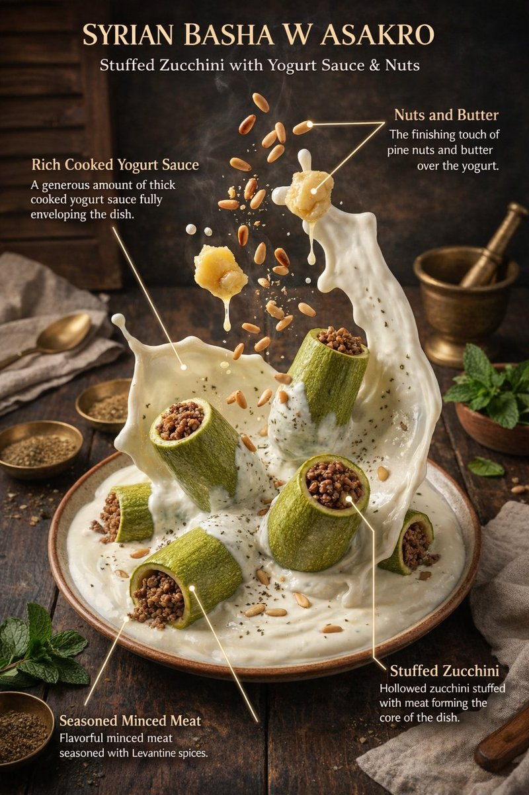

## { "resolution": "8K UHD", "aspect_ratio": "3:4", "image_

- ID: trending-2009157208240755151
- Slug: trending-2009157208240755151-en
- 语言: en
- 来源: [来源链接](https://x.com/meng_dagg695/status/2009157208240755151)
- 样例图路径: images/part1/2009157208240755151_1.jpg

### 提示词

```text
{
  "resolution": "8K UHD",
  "aspect_ratio": "3:4",
  "image_style": "hyper-realistic commercial food photography",
  "global_settings": {
    "quality": "Ultra-high detail, sharp focus, studio-grade clarity",
    "lighting": "Soft but controlled studio lighting with visible highlights and splash definition",
    "motion": "Frozen mid-air action, ingredients suspended",
    "background_style": "Solid or smooth gradient background, color varies per module",
    "camera": "High-speed photography look, shallow to medium depth of field",
    "post_processing": "Balanced contrast, natural saturation, no artificial glow"
  },

  "modules": {

    "module_1_berry_smoothie_explosion": {
      "scene_description": "A vibrant smoothie bowl exploding with fruit and liquid splashes",
      "bowl": {
        "color": "Deep blue ceramic bowl",
        "finish": "Glossy",
        "position": "Centered, floating mid-air"
      },
      "base_contents": {
        "type": "Thick berry smoothie",
        "color": "Deep purple-magenta",
        "texture": "Creamy with visible swirl marks"
      },
      "ingredients": {
        "fruits": [
          "Banana slices (round, pale yellow)",
          "Blueberries (whole, dark blue)",
          "Raspberries (whole, red)"
        ],
        "herbs": [
          "Fresh mint leaves (bright green)"
        ]
      },
      "motion_effects": {
        "liquid": "Berry smoothie splashing upward and outward",
        "particles": "Small droplets suspended in air"
      },
      "background": {
        "color": "Bright pink",
        "texture": "Smooth, seamless"
      }
    },

    "module_2_minimal_pink_smoothie_bowl": {
      "scene_description": "Minimalist floating smoothie bowl with granola and berries",
      "bowl": {
        "color": "Light pink ceramic bowl with dark speckles",
        "finish": "Matte",
        "position": "Floating centrally"
      },
      "base_contents": {
        "type": "Smoothie",
        "color": "Soft pink with purple undertones",
        "texture": "Thick and smooth"
      },
      "toppings": {
        "granola": "Golden-brown oat clusters",
        "seeds": "Small black seeds scattered",
        "fruits": [
          "Strawberries (halved)",
          "Raspberries (whole)",
          "Blackberries (whole)"
        ]
      },
      "motion_effects": {
        "ingredients": "Granola flakes, seeds, and berries floating gently"
      },
      "background": {
        "color": "Pastel lavender",
        "gradient": "Subtle, soft gradient"
      }
    },

    "module_3_cereal_milk_honey_splash": {
      "scene_description": "Dynamic cereal stack with milk splash and honey drizzle",
      "bowl": {
        "color": "Blue ceramic bowl",
        "finish": "Glossy",
        "position": "Centered, resting visually but surrounded by motion"
      },
      "contents": {
        "cereal": "Golden cornflakes stacked vertically",
        "milk": "White milk splashing and dripping over flakes",
        "fruits": [
          "Raspberries",
          "Blueberries"
        ]
      },
      "additional_elements": {
        "honey": {
          "source": "Wooden honey dipper",
          "state": "Honey dripping mid-air"
        }
      },
      "motion_effects": {
        "splashes": "Milk splashes frozen in dramatic arcs",
        "particles": "Floating flakes and droplets"
      },
      "background": {
        "color": "Deep blue",
        "tone": "High contrast"
      }
    },
}
```

### 样例图

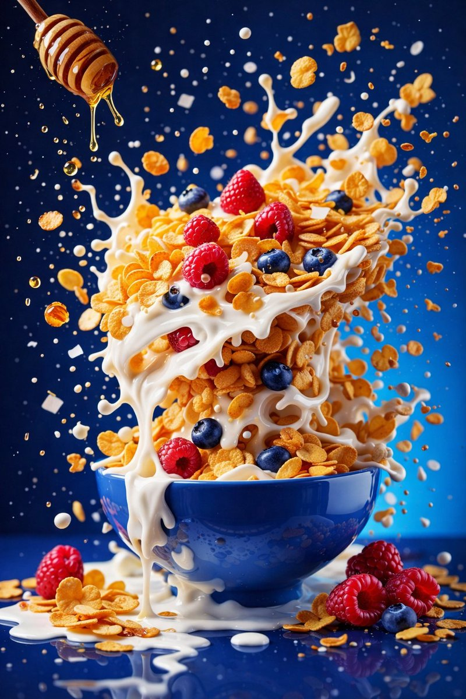

## { "global_settings": { "resolution": "8K ultra high defi

- ID: trending-2009887009591226787
- Slug: trending-2009887009591226787-en
- 语言: en
- 来源: [来源链接](https://x.com/meng_dagg695/status/2009887009591226787)
- 样例图路径: images/part1/2009887009591226787_1.jpg

### 提示词

```text
{
  "global_settings": {
    "resolution": "8K ultra high definition",
    "aspect_ratio": "2:3 vertical",
    "image_type": "AI-edited cinematic food photography",
    "detail_level": "extreme micro-detail, sharp focus, clean edges",
    "style_constraint": "enhanced realism, minimal alteration from original composition"
  },

  "module_1_image_1_style": {
    "subject": "single hard-shell taco",
    "composition": {
      "orientation": "diagonal, floating in mid-air",
      "foreground_focus": "taco shell and filling",
      "motion": "ingredients suspended, sauce splash frozen mid-air"
    },
    "visible_elements": {
      "shell": "golden yellow hard taco shell with crisp texture",
      "filling": [
        "shredded cooked meat with visible fibers",
        "green sauce layered on top",
        "small red diced pieces",
        "white crumbled cheese"
      ],
      "floating_garnish": [
        "avocado slices",
        "purple onion rings",
        "green herb leaves",
        "small reddish-brown meat cubes",
        "tiny white crumbs"
      ],
      "liquid": "orange-red sauce splash erupting upward behind taco"
    },
    "lighting": {
      "type": "high-contrast studio lighting",
      "highlights": "glossy reflections on sauce and meat",
      "background_lights": "soft circular bokeh in warm and cool tones"
    },
    "background": {
      "color": "dark with neon-like blurred lights",
      "depth": "strong depth of field, background fully defocused"
    }
  },

  "module_2_image_2_style": {
    "subject": "three grilled meat skewers",
    "composition": {
      "orientation": "vertical skewers, slightly angled",
      "foreground_focus": "center skewer",
      "motion": "ingredients and sauce suspended"
    },
    "visible_elements": {
      "skewers": "wooden sticks with pointed ends",
      "meat": "chunked grilled meat with char marks and uneven texture",
      "garnish": "small green herb leaves attached to meat",
      "floating_items": [
        "round cucumber slices",
        "thin onion rings"
      ],
      "sauce": {
        "container": "small white ramekin",
        "action": "thick orange sauce splashing upward from bowl"
      },
      "particles": "tiny spice or crumb particles scattered in air"
    },
    "lighting": {
      "type": "dramatic directional lighting",
      "highlights": "strong sheen on meat surface",
      "contrast": "deep shadows"
    },
    "background": {
      "color": "solid deep red",
      "texture": "soft grain with floating particles"
    }
  },

  "module_3_image_3_style": {
    "subject": "four sushi rolls",
    "composition": {
      "orientation": "floating cluster",
      "spacing": "uneven depth, some closer, some blurred behind",
      "motion": "sesame seeds and herbs suspended"
    },
    "visible_elements": {
      "sushi_structure": {
        "outer_layer": "white rice",
        "inner_layer": "dark seaweed",
        "fillings": [
          "orange fish slice",
          "green avocado"
        ]
      },
      "toppings": [
        "toasted sesame seeds",
        "brown crunchy coating",
        "finely chopped green herbs"
      ],
      "particles": [
        "sesame seeds",
        "small green herb pieces"
      ]
    },
    "lighting": {
      "type": "soft but crisp studio lighting",
      "focus": "front sushi pieces sharp, rear slightly blurred"
    },
    "background": {
      "color": "dark blue-grey",
      "depth": "clean bokeh-free backdrop with floating particles"
    }
  },
  "post_processing": {
    "clarity": "ultra-sharp",
    "noise": "minimal",
    "color_balance": "rich but natural",
    "ai_signature": "clean AI-edited look without exaggeration"
  }
}
```

### 样例图

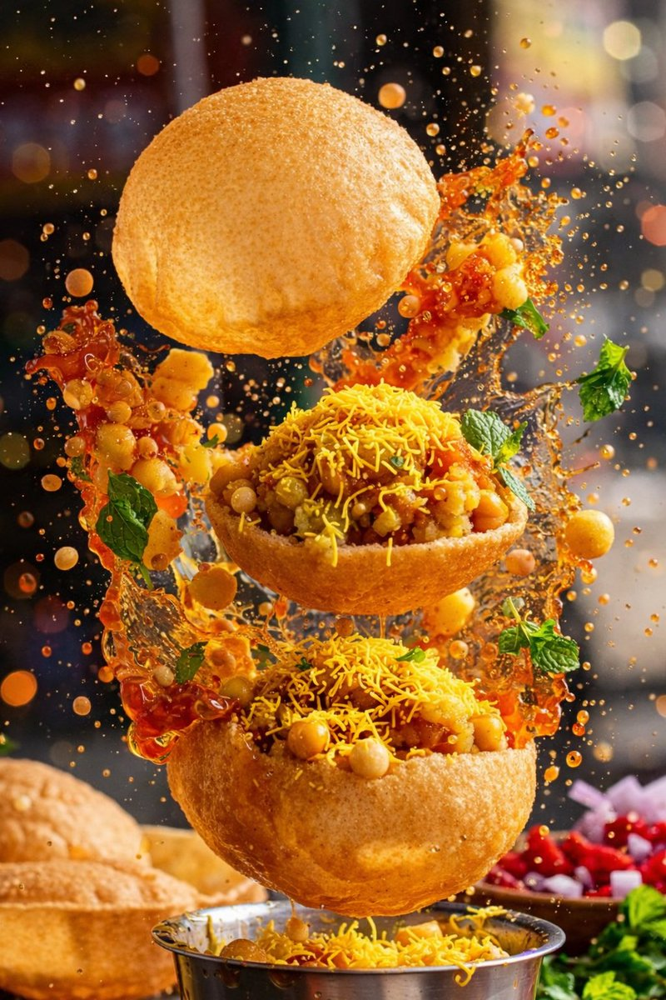

## この商品広告をプロのデザイナー目線でリデ

- ID: trending-2046498264774791514
- Slug: trending-2046498264774791514-zh
- 语言: zh
- 来源: [来源链接](https://x.com/genel_ai/status/2046498264774791514)
- 样例图路径: images/part1/2046498264774791514_1.jpg

### 提示词

```text
この商品広告をプロのデザイナー目線でリデザインして。
今のトレンド、ターゲットに合わせた洗練されたデザインで。
```

### 样例图

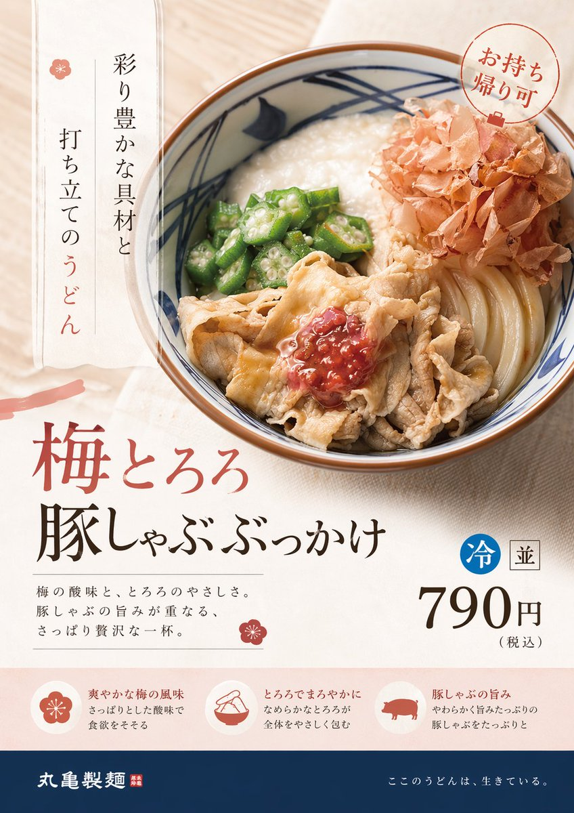

## { "master_prompt": { "global_settings": { "resolution": 

- ID: trending-2010312584059351261
- Slug: trending-2010312584059351261-en
- 语言: en
- 来源: [来源链接](https://x.com/meng_dagg695/status/2010312584059351261)
- 样例图路径: images/part1/2010312584059351261_1.jpg

### 提示词

```text
{
  "master_prompt": {
    "global_settings": {
      "resolution": "8K ultra high definition",
      "aspect_ratio": "3:4 vertical",
      "image_quality": "extreme sharpness, high dynamic range, professional studio lighting",
      "style": "AI-edited hyperreal food photography",
      "focus": "crisp textures, frozen motion, liquid dynamics, surface details",
      "background_quality": "clean, controlled, noise-free"
    },

    "module_1": {
      "identity": "Image 1 – Ice Cream Cone with Purple Splash",
      "subject": {
        "main_object": "waffle cone ice cream",
        "cone": "light brown waffle cone with diamond grid texture, matte finish",
        "ice_cream_scoops": [
          {
            "color": "off-white / vanilla",
            "texture": "creamy with visible scoop ridges"
          },
          {
            "color": "off-white / vanilla",
            "texture": "slightly uneven surface, melting edges"
          }
        ],
        "toppings": [
          "raspberries",
          "blackberries"
        ],
        "sauce": {
          "color": "glossy purple",
          "behavior": "thick liquid splashing outward and downward",
          "coverage": "dripping over scoops and cone"
        }
      },
      "motion": {
        "action": "frozen splash moment",
        "details": "liquid droplets suspended mid-air, see-through splash edges"
      },
      "background": {
        "color": "deep dark maroon / black",
        "style": "studio backdrop with subtle gradient"
      },
      "lighting": {
        "type": "high-contrast studio lighting",
        "effects": "specular highlights on sauce and ice cream, shadow depth under cone"
      }
    },

    "module_2": {
      "identity": "Image 2 – Chocolate Ice Cream Bar with Bite",
      "subject": {
        "main_object": "chocolate-coated ice cream bar on wooden stick",
        "coating": {
          "exploded_view": false,
          "surface": "milk chocolate coating with embedded nut pieces",
          "texture": "rough, uneven, crunchy appearance"
        },
        "bite_detail": {
          "location": "top edge",
          "interior_layers": [
            "chocolate ice cream",
            "thin darker chocolate layer"
          ],
          "edges": "jagged bite marks"
        },
        "stick": {
          "material": "light wood",
          "finish": "smooth, rounded end"
        }
      },
      "motion": {
        "elements": "small chocolate fragments floating in air",
        "behavior": "scattered outward from the bar"
      },
      "background": {
        "color": "warm brown gradient",
        "style": "clean studio environment"
      },
      "lighting": {
        "type": "directional studio lighting",
        "effects": "strong highlights on chocolate bumps, soft shadows"
      }
    },

    "module_3": {
      "identity": "Image 3 – Red Berry Popsicle with Fruits",
      "subject": {
        "main_object": "rectangular red popsicle",
        "surface": {
          "texture": "frosted, icy crystals visible",
          "shape": "rounded corners, vertical grooves"
        },
        "stick": {
          "material": "light wooden stick",
          "visible": true
        },
        "surroundings": [
          "whole strawberries with green tops",
          "blueberries",
          "raspberries",
          "mint leaves",
          "crushed ice pieces"
        ]
      },
      "color_palette": [
        "bright red",
        "deep blue",
        "fresh green",
        "clear ice"
      ],
      "background": {
        "composition": "entire frame filled with fruits and ice",
        "style": "top-down macro food arrangement"
      },
      "lighting": {
        "type": "even bright lighting",
        "effects": "wet shine on fruit skins, crystalline ice reflections"
      }
    },
```

### 样例图

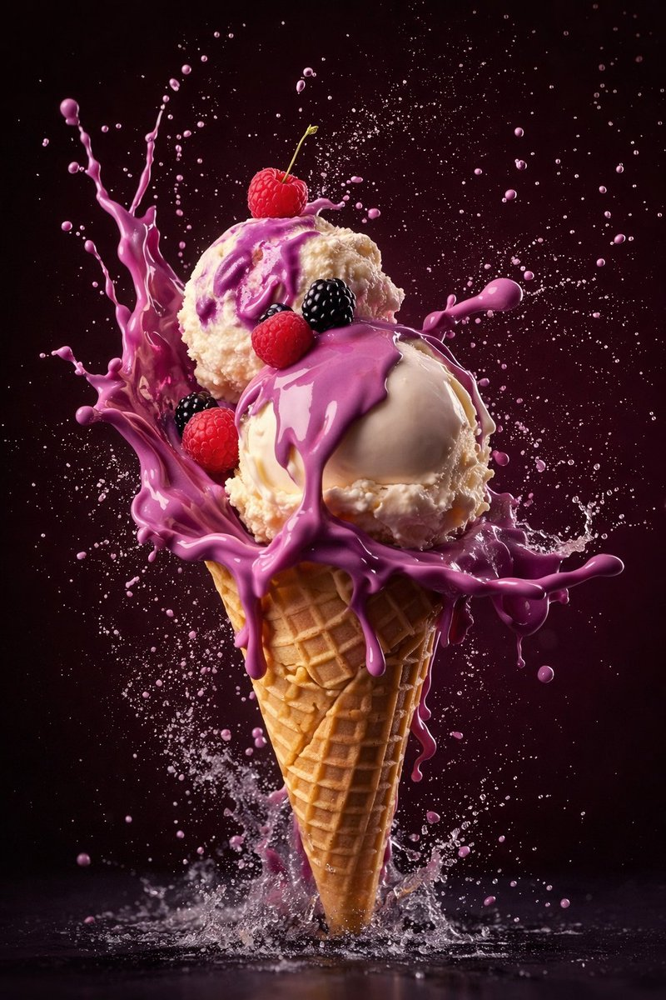

## { "resolution": "8K", "style": "hyper-realistic commerci

- ID: trending-2009519057717088345
- Slug: trending-2009519057717088345-en
- 语言: en
- 来源: [来源链接](https://x.com/meng_dagg695/status/2009519057717088345)
- 样例图路径: images/part1/2009519057717088345_1.jpg

### 提示词

```text
{
  "resolution": "8K",
  "style": "hyper-realistic commercial product photography",
  "composition": {
    "subject": "carbonated beverage can",
    "position": "center frame, floating mid-air",
    "orientation": "slightly tilted vertical",
    "framing": "tight hero shot"
  },
  "can_details": {
    "material": "metallic aluminum",
    "top_bottom": "silver with visible pull tab",
    "surface": "glossy with condensation droplets",
    "label": {
      "text": "{{BRAND_NAME}}",
      "font": "bold uppercase sans-serif",
      "color": "white",
      "background_band": "deep blue",
      "placement": "wrapped around center of can"
    }
  },
  "liquid_effects": {
    "color": "bright green",
    "type": "carbonated liquid splash",
    "motion": "frozen mid-explosion",
    "details": [
      "semi-transparent fluid",
      "fine droplets suspended in air",
      "dynamic curved splash arcs",
      "visible carbonation bubbles"
    ]
  },
  "fruit_elements": {
    "type": "sliced fruit",
    "motion": "floating around the can",
    "texture": "fresh, juicy, glossy"
  },
  "lighting": {
    "type": "studio lighting",
    "highlights": "strong reflections",
    "shadows": "soft"
  },
  "background": {
    "color": "smooth gradient matching liquid tone",
    "environment": "clean studio backdrop"
  },
  "render_quality": {
    "sharpness": "ultra-sharp",
    "contrast": "high",
    "realism": "photorealistic"
  }
}
```

### 样例图

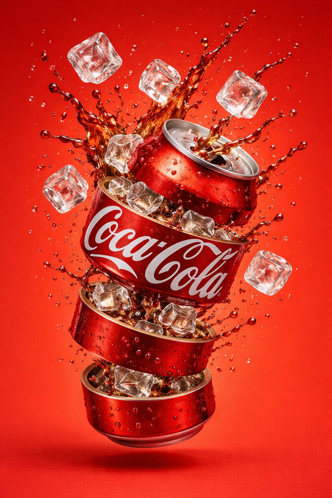

## Top-down flat lay on a rustic wooden table, cozy aesthet

- ID: trending-2048725842096976020
- Slug: trending-2048725842096976020-en
- 语言: en
- 来源: [来源链接](https://x.com/Sairah_0/status/2048725842096976020)
- 样例图路径: images/part1/2048725842096976020_1.jpg

### 提示词

```text
Top-down flat lay on a rustic wooden table, cozy aesthetic, soft natural light. A glass of iced tea with lemon slices and ice cubes, a glazed donut, a small succulent plant in a white pot, a vintage book, and eyeglasses. A sleeping tabby cat curled on a blanket at the edge. White hand-drawn doodle outlines and arrows around each object with playful handwritten labels like “refreshing iced tea,” “sweet treat,” “little green friend,” “afternoon read,” and “cutest thing in the world – cat.” Warm tones, minimal shadows, lifestyle photography, high detail, Instagram aesthetic.
```

### 样例图

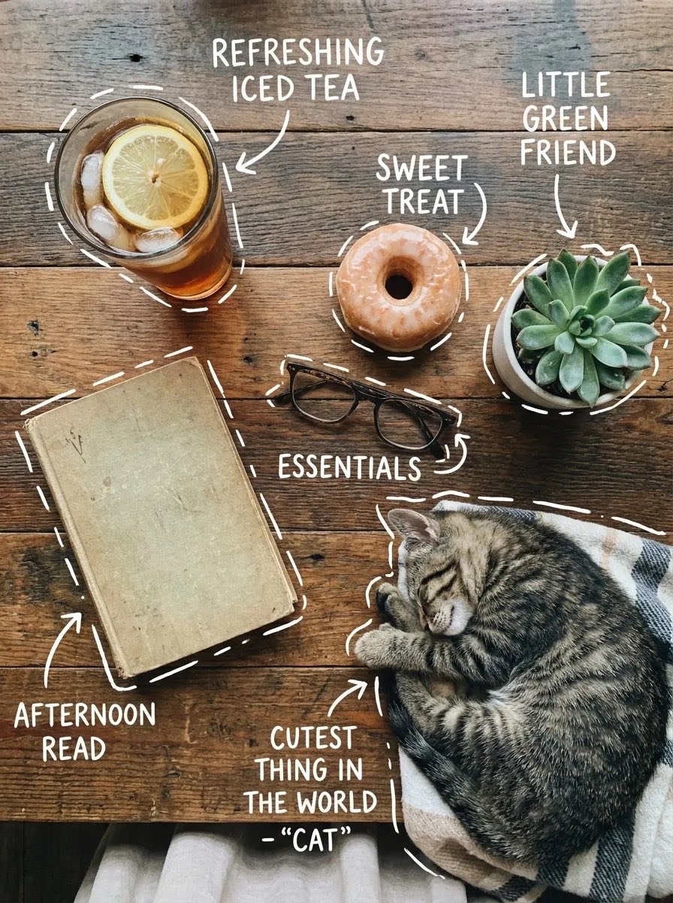

## { "global_settings": { "resolution": "8K UHD", "quality"

- ID: trending-2009446363331973461
- Slug: trending-2009446363331973461-en
- 语言: en
- 来源: [来源链接](https://x.com/meng_dagg695/status/2009446363331973461)
- 样例图路径: images/part1/2009446363331973461_1.jpg

### 提示词

```text
{
  "global_settings": {
    "resolution": "8K UHD",
    "quality": "ultra-high",
    "render_style": "AI-edited hyper-realistic food photography",
    "sharpness": "extreme micro-detail",
    "noise": "none",
    "compression": "lossless",
    "lighting_quality": "studio-controlled, cinematic",
    "color_accuracy": "true-to-image",
    "focus": "selective shallow depth of field",
    "texture_emphasis": "maximum"
  },

  "camera_profile": {
    "camera_type": "full-frame DSLR / mirrorless equivalent",
    "lens": "macro prime",
    "focal_length": "85mm–105mm",
    "aperture": "f/2.8",
    "iso": "low ISO",
    "shutter": "studio synchronized",
    "white_balance": "neutral, image-matched"
  },

  "module_1_image_1_style": {
    "subject": "square matcha cheesecake slice",
    "composition": {
      "orientation": "portrait",
      "angle": "three-quarter front view",
      "placement": "centered on dark ceramic plate",
      "crop": "tight food-focused crop"
    },
    "layers": {
      "top_layer": "glossy matcha glaze with visible drip trails",
      "middle_layer": "smooth pale-green cheesecake body",
      "bottom_layer": "thin golden biscuit crust"
    },
    "surface_details": {
      "glaze": "highly reflective, thick, slow-dripping matcha glaze",
      "powder": "matcha powder dusted on top and plate",
      "crumbs": "fine crumbs near base"
    },
    "garnish": {
      "top": ["round green confection", "fresh mint leaves", "single raspberry"],
      "plate": ["extra raspberry", "mint leaves", "matcha powder"]
    },
    "background": {
      "color": "dark charcoal / black",
      "elements": ["black bowl containing green sauce"],
      "blur": "strong background blur"
    },
    "lighting": {
      "key_light": "soft directional from upper left",
      "highlights": "strong specular highlights on glaze",
      "shadows": "soft, natural falloff"
    },
    "mood": "luxurious, modern, minimal, gourmet"
  },

  "module_2_image_2_style": {
    "subject": "blue and white layered cake slice",
    "composition": {
      "orientation": "portrait",
      "angle": "slightly elevated front angle",
      "placement": "centered on white decorative plate"
    },
    "layers": {
      "cake_layers": "soft white sponge layers",
      "filling_layers": "translucent blue jelly layers with sparkle",
      "top_layer": "smooth pastel blue glaze"
    },
    "surface_details": {
      "drip": "single vertical glossy blue drip down front",
      "sparkle": "tiny reflective particles embedded in jelly",
      "top_decor": "glass-like blue spheres"
    },
    "garnish": {
      "top": ["dark glossy cherry with long stem", "three transparent blue spheres", "tiny star-shaped sprinkles"],
      "plate": ["subtle sugar-like sparkles"]
    },
    "background": {
      "color": "light icy blue",
      "effect": "soft bokeh dots",
      "props": ["white ribbon partially visible"]
    },
    "lighting": {
      "key_light": "soft frontal light",
      "fill": "even illumination",
      "highlights": "glass reflections on spheres"
    },
    "mood": "dreamy, delicate, whimsical, clean"
  },
```

### 样例图

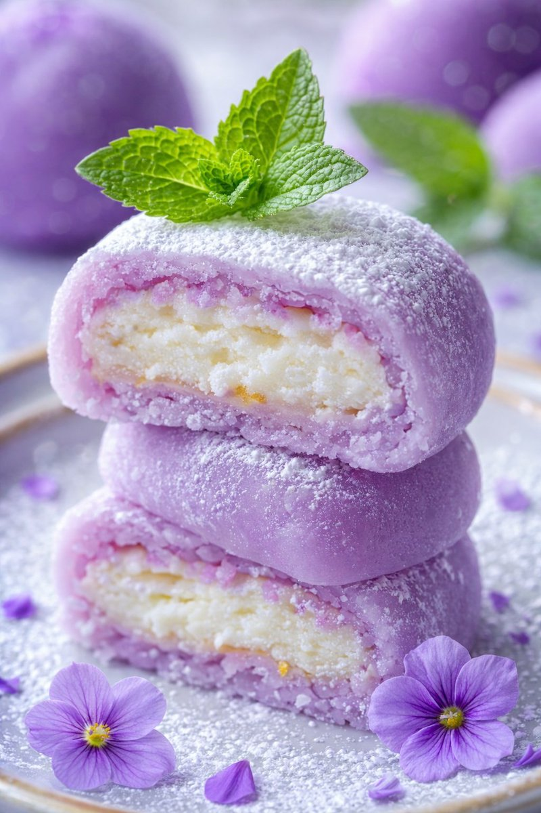

## Ultra-clean modern recipe infographic. Showcase [FOOD] i

- ID: trending-2013233539706233086
- Slug: trending-2013233539706233086-en
- 语言: en
- 来源: [来源链接](https://x.com/TechieBySA/status/2013233539706233086)
- 样例图路径: images/part1/2013233539706233086_1.jpg

### 提示词

```text
Ultra-clean modern recipe infographic. Showcase [FOOD] in a visually appealing finished form—sliced, plated, or portioned—floating slightly in perspective or angled view. Arrange ingredients, steps, and tips around the dish in a dynamic editorial layout, not restricted to top-down. Ingredients Section: Include icons or mini illustrations for each ingredient with quantities. Arrange them in clusters, lists, or circular flows connected visually to the dish. Steps Section: Show preparation steps with numbered panels, arrows, or lines, forming a logical flow around the main dish. Include small cooking icons (knife, pan, oven, timer) where helpful. Additional Info (optional): Total calories, prep/cook time, servings, spice level—displayed as clean bubbles or badges near the dish. Visual Style: Editorial infographic meets lifestyle food photography. Vibrant, natural food colors, subtle drop shadows, clean vector icons, modern typography, soft gradients or glassmorphism for step panels. Accent colors can highlight key info (calories, prep time). Composition Guidelines: Finished meal as hero visual (perspective or angled) Ingredients and steps flow dynamically around the dish Clear visual hierarchy: dish > steps > ingredients > optional stats Enough negative space to keep design airy and readable Lighting & Background: Soft, natural studio lighting, minimal textured or gradient background for premium editorial feel. Output: 1080×1080, ultra-crisp, social-feed optimized, no watermark
```

### 样例图

![Ultra-clean modern recipe infographic. Showcase [FOOD] i](../images/part1/2013233539706233086_1.jpg)

## { "global_settings": { "resolution": "8K", "quality": "u

- ID: trending-2012353813425144239
- Slug: trending-2012353813425144239-en
- 语言: en
- 来源: [来源链接](https://x.com/meng_dagg695/status/2012353813425144239)
- 样例图路径: images/part1/2012353813425144239_1.jpg

### 提示词

```text
{
  "global_settings": {
    "resolution": "8K",
    "quality": "ultra-high",
    "render_style": "hyperrealistic commercial CGI",
    "lighting": "studio-grade, high-contrast, glossy highlights",
    "focus": "extreme sharpness, macro-level texture visibility",
    "color_depth": "rich, saturated, clean gradients",
    "noise": "none",
    "artifacts": "none"
  },

  "Module_1_Image_1_Style": {
    "subject": {
      "primary_object": "Snickers mint chocolate bar in turquoise wrapper",
      "pose": "diagonally tilted, floating mid-air",
      "orientation": "top-left to bottom-right angle",
      "visibility": "full front-facing packaging visible"
    },
    "packaging_details": {
      "colors": ["turquoise", "brown", "white", "blue"],
      "text_visible": ["SNICKERS", "SNICKES", "with mint"],
      "surface": "glossy plastic wrapper with subtle creases",
      "product_image": "chocolate bar segment printed on wrapper"
    },
    "ingredients_visible": [
      "fresh mint leaves",
      "whole almonds",
      "white sugar-like spherical candies",
      "chocolate bar pieces"
    ],
    "motion_elements": {
      "liquid": "clear water splash forming a curved arc around the bar",
      "droplets": "floating water bubbles and droplets suspended in air"
    },
    "background": {
      "color": "light aqua blue",
      "texture": "smooth gradient",
      "depth": "foreground and background elements clearly separated"
    },
    "lighting": {
      "key_light": "bright frontal studio light",
      "rim_light": "cool highlights on water edges",
      "reflections": "strong specular highlights on wrapper and liquid"
    }
  },

  "Module_2_Image_2_Style": {
    "subject": {
      "primary_object": "Hershey’s Special Dark chocolate mint packaging",
      "pose": "upright, centered, slightly elevated",
      "orientation": "front-facing, symmetrical composition"
    },
    "packaging_details": {
      "colors": ["black", "green", "yellow"],
      "text_visible": [
        "SPECIAL DARK",
        "HERSHEY’S",
        "SABOR MENTA",
        "60% DE CACAU",
        "100 g"
      ],
      "surface": "matte-black wrapper with glossy highlights"
    },
    "ingredients_visible": [
      "mint leaves",
      "embossed Hershey’s chocolate squares"
    ],
    "motion_elements": {
      "liquid": "thick molten chocolate splashes wrapping around the package",
      "droplets": "small chocolate particles suspended mid-air"
    },
    "background": {
      "color": "deep green gradient",
      "base_surface": "liquid chocolate pool beneath the package"
    },
    "lighting": {
      "key_light": "warm directional light",
      "accent_light": "golden highlights on chocolate splashes",
      "contrast": "high contrast between dark wrapper and green background"
    }
  },

  "Module_3_Image_3_Style": {
    "subject": {
      "primary_object": "Twix Blueberry Muffin packaged snack",
      "pose": "slightly tilted, floating above background",
      "orientation": "front-facing with angled depth"
    },
    "packaging_details": {
      "colors": ["purple", "gold", "white"],
      "text_visible": ["TWIX", "BLUEBERRY MUFFIN"],
      "surface": "glossy purple plastic wrapper"
    },
    "food_elements": [
      "blueberry muffin",
      "sliced muffin revealing purple interior",
      "whole blueberries"
    ],
    "motion_elements": {
      "liquid": "purple splash forming circular motion behind the product",
      "particles": "crumbs and droplets suspended in air"
    },
    "background": {
      "color": "turquoise-blue",
      "texture": "clean gradient with high saturation"
    },
    "lighting": {
      "key_light": "bright neutral studio light",
      "rim_light": "purple-tinted highlights on splash edges",
      "detail_visibility": "crumb texture and muffin pores clearly visible"
    }
  },
```

### 样例图

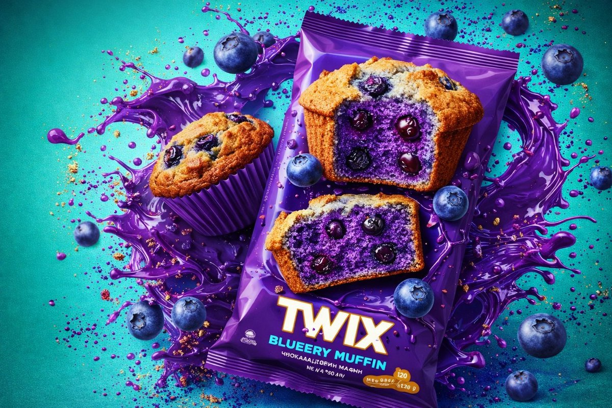

## { "global_settings": { "resolution": "8K ultra high defi

- ID: trending-2010681413562155183
- Slug: trending-2010681413562155183-en
- 语言: en
- 来源: [来源链接](https://x.com/meng_dagg695/status/2010681413562155183)
- 样例图路径: images/part1/2010681413562155183_1.jpg

### 提示词

```text
{
  "global_settings": {
    "resolution": "8K ultra high definition",
    "aspect_ratio": "3:4",
    "quality": "hyper-realistic commercial product photography",
    "focus": "sharp foreground, controlled depth of field",
    "lighting_style": "cinematic studio lighting with volumetric light rays",
    "motion": "frozen action splash photography",
    "render_style": "AI-edited, ultra-detailed, advertising-grade"
  },

  "module_1_purple_acai_style": {
    "primary_subject": {
      "object": "slim aluminum energy drink can",
      "orientation": "slightly tilted clockwise, floating mid-air",
      "surface": "matte metallic purple with fine water droplets",
      "branding": {
        "text_visible": ["THE PURPLE EDITION", "Açaí Berry", "ENERGY DRINK"],
        "graphics": "stylized bull illustration in white"
      }
    },
    "background": {
      "color": "deep purple gradient",
      "lighting": "bright diagonal light rays from upper right",
      "atmosphere": "misty with fine water particles"
    },
    "surrounding_elements": {
      "fruits": [
        {
          "type": "blueberries",
          "state": ["whole", "one halved"],
          "texture": "glossy skin, visible pulp on cut fruit"
        }
      ],
      "leaves": "small green leaves attached to berries",
      "liquid": "clear water splashes forming arcs around can"
    },
    "motion_details": {
      "water": "dynamic splash trails frozen mid-air",
      "droplets": "micro droplets suspended around subject"
    },
    "color_palette": ["purple", "violet", "deep blue", "white", "fresh green"]
  },

  "module_2_white_coconut_berry_style": {
    "primary_subject": {
      "object": "slim aluminum energy drink can",
      "orientation": "slightly tilted counter-clockwise, floating",
      "surface": "white metallic finish with condensation droplets",
      "branding": {
        "text_visible": ["THE WHITE EDITION", "Coconut & Berry", "ENERGY DRINK"],
        "graphics": "bull illustration in gray"
      }
    },
    "background": {
      "color": "sky blue gradient",
      "lighting": "strong sunlight beams from upper right",
      "atmosphere": "clean, airy, refreshing"
    },
    "surrounding_elements": {
      "fruits": [
        {
          "type": "blueberries",
          "state": "whole",
          "texture": "smooth, reflective skin"
        },
        {
          "type": "coconut",
          "state": "broken slices",
          "texture": "white flesh with dark brown shell"
        }

      "ice": {
        "form": "transparent ice cubes",
        "detail": "sharp edges, internal cracks visible"
      },
      "liquid": "clear water splashes"
    },
    "motion_details": {
      "water": "curved splash paths wrapping around can",
      "ice": "suspended mid-air with subtle rotation"
    },
    "color_palette": ["white", "light blue", "cyan", "natural brown", "cool gray"]
  
  "module_3_green_lemon_mojito_style": {
    "primary_subject": {
      "object": "tall soda can",
      "orientation": "tilted slightly clockwise, floating",
      "surface": "dark green metallic body with lighter green label",
      "branding": {
        "text_visible": ["LEMON SODA", "MOJITO", "L’ORIGINALE MOJITO ANALCOLICO ITALIANO"],
        "logo": "CRODO emblem at top
    "background": {
      "color": "vibrant green gradient",
      "lighting": "intense sun flare from upper right"
    },
    "surrounding_elements": {
      "fruits": [
        {
          "type": "lime",
          "state": ["whole", "sliced wedge"],
          "texture": "visible citrus pulp, glossy rind"
        }
      ],
      "leaves": "fresh mint leaves with visible veins",
      "liquid": "sparkling water splashes"
    },
    "motion_details": {
      "water": "explosive splash bursts around can",
      "droplets": "dense spray of fine droplets"
    },
    "color_palette": ["lime green", "dark green", "yellow-green", "white"]
  }
```

### 样例图

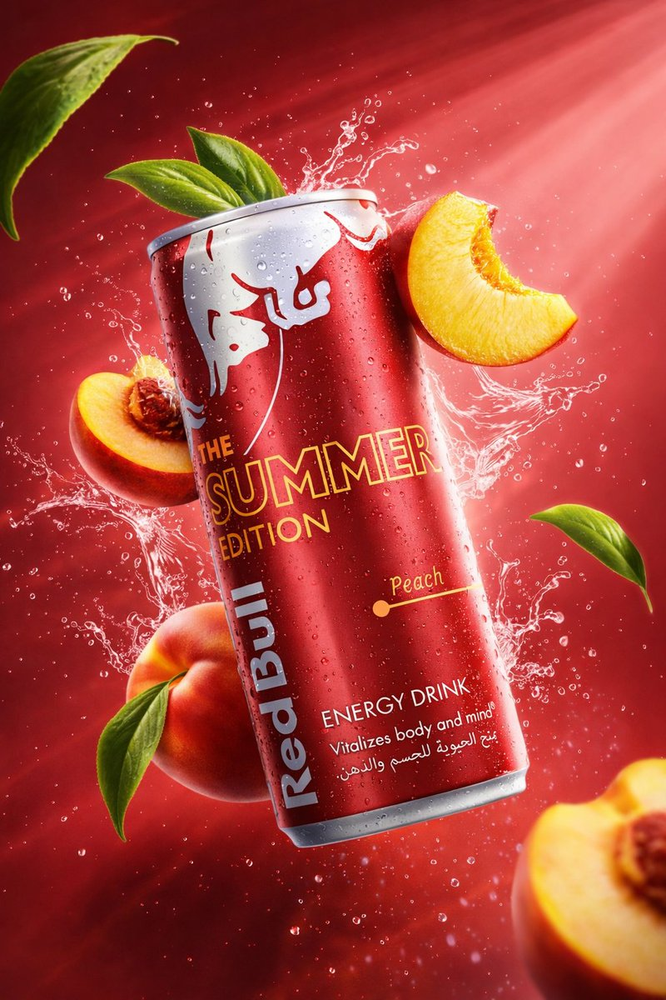

## { "master_prompt": { "global_settings": { "resolution": 

- ID: trending-2019431396885070327
- Slug: trending-2019431396885070327-en
- 语言: en
- 来源: [来源链接](https://x.com/john_my07/status/2019431396885070327)
- 样例图路径: images/part1/2019431396885070327_1.jpg

### 提示词

```text
{
  "master_prompt": {
    "global_settings": {
      "resolution": "8K ultra-high-definition",
      "aspect_ratio": "3:4 vertical",
      "style": "hyper-realistic AI-edited commercial beverage photography",
      "sharpness": "extreme clarity, micro-detail visibility",
      "lighting_quality": "cinematic studio lighting with controlled highlights and shadows",
      "motion_freeze": "high-speed capture, frozen liquid splashes and particles",
      "noise": "none",
      "artifacts": "none"
    },

    "module_1_glass_beverage_style": {
      "subject": {
        "type": "transparent glass",
        "glass_style": "tall cylindrical glass with thick base",
        "surface_details": "cold condensation droplets on outer glass surface",
        "fill_level": "80 percent full",
        "label_text_visible": [
          "mock up",
          "iced coffee / protein shake",
          "SEPARATED SHADOWS"
        ]
      },

      "liquid_and_layers": {
        "beverage_type": "iced latte or chocolate protein shake",
        "liquid_color": "rich coffee brown or creamy cocoa",
        "layering": "soft milk-to-coffee gradient with subtle swirls",
        "texture": "smooth, thick, glossy, realistic viscosity"
      },

      "motion_and_splash": {
        "action": "liquid splash erupting from inside the glass",
        "splash_behavior": "curved arcs rising above rim with suspended droplets",
        "droplet_detail": "micro droplets frozen mid-air with sharp definition"
      },

      "floating_elements": {
        "ice_cubes": "large clear ice cubes rotating in mid-air",
        "coffee_beans_or_cocoa": "roasted coffee beans or cocoa powder particles floating",
        "cream_stream": "thin stream of milk or cream pouring into glass"
      },

      "pose_and_camera": {
        "position": "centered hero composition",
        "angle": "three-quarter close-up",
        "camera_feel": "slightly low angle for premium, powerful presence"
      },

      "background": {
        "color_palette": "deep espresso brown fading into warm beige highlights",
        "bokeh": "soft cinematic bokeh lights with warm glow",
        "atmosphere": "luxurious, indulgent, high-end café mood"
      },

      "surface_and_reflection": {
        "base": "wet reflective surface with subtle liquid pooling",
        "shadow_style": "clean, soft separated shadow beneath glass",
        "reflection_quality": "controlled highlights along glass edges"
      }
    }
  }
}
```

### 样例图

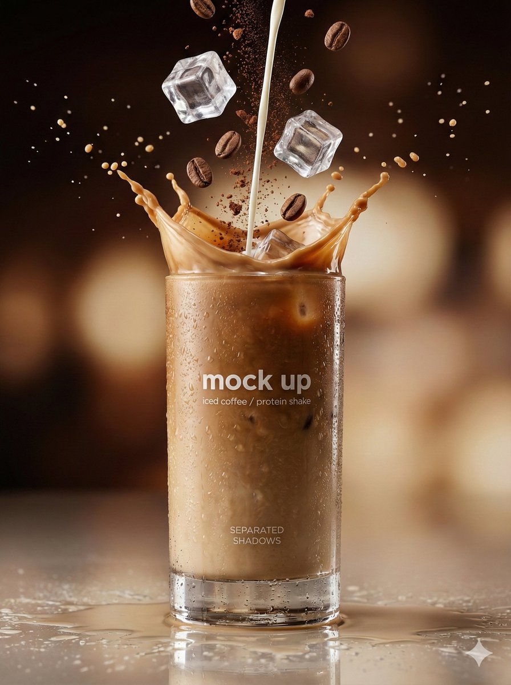

## { "global_settings": { "resolution": "8K", "aspect_ratio

- ID: trending-2010981812609434034
- Slug: trending-2010981812609434034-en
- 语言: en
- 来源: [来源链接](https://x.com/meng_dagg695/status/2010981812609434034)
- 样例图路径: images/part1/2010981812609434034_1.jpg

### 提示词

```text
{
  "global_settings": {
    "resolution": "8K",
    "aspect_ratio": "3:4",
    "image_quality": "ultra-high definition",
    "sharpness": "extreme",
    "lighting_quality": "studio-grade cinematic lighting",
    "render_style": "hyper-realistic AI-edited food photography",
    "noise": "none",
    "text_or_logos": "none",
    "focus": "tack-sharp foreground with controlled depth"
  },

  "Module_1_Image_1_Style": {
    "subject": "two grilled tortilla wraps",
    "composition": {
      "main_action": "wraps floating above a bowl of sauce",
      "orientation": "one wrap stacked diagonally over another",
      "perspective": "slightly low-angle, centered composition"
    },
    "food_details": {
      "wrap_texture": "lightly grilled tortilla with golden brown char spots",
      "filling_visible": [
        "diced cooked chicken",
        "golden french fries",
        "green peas"
      ],
      "sauce": {
        "type": "thick creamy white sauce",
        "motion": "large splash forming curved arcs",
        "bowl_material": "ceramic",
        "bowl_color": "light beige"
      }
    },
    "motion_elements": [
      "suspended sauce droplets",
      "floating parsley leaves"
    ],
    "background": {
      "color": "dark warm brown gradient",
      "texture": "smooth, studio backdrop"
    },
    "surface": "wooden tabletop visible at bottom",
    "mood": "dynamic, indulgent, dramatic food motion"
  },

  "Module_2_Image_2_Style": {
    "subject": "potato chips in a bowl",
    "composition": {
      "main_action": "chips flying upward above the bowl",
      "distribution": "evenly spaced mid-air chips forming a vertical cascade",
      "camera_position": "eye-level close-up"
    },
    "food_details": {
      "chips_texture": "thin, crispy, lightly curved",
      "chips_color": "golden yellow with seasoning speckles",
      "bowl": {
        "material": "ceramic",
        "color": "warm orange",
        "fill_state": "bowl partially filled with chips"
      }
    },
    "seasoning_elements": [
      "fine spice dust",
      "small crumbs",
      "rosemary sprigs floating"
    ],
    "background": {
      "color": "warm orange gradient",
      "lighting": "soft diffused with highlights on chips"
    },
    "ground_details": [
      "scattered crumbs",
      "spice particles",
      "rosemary pieces"
    ],
    "mood": "energetic, crunchy, commercial snack photography"
  },

  "Module_3_Image_3_Style": {
    "subject": "beef noodle soup in a bowl",
    "composition": {
      "main_action": "bowl floating in mid-air",
      "camera_angle": "slightly elevated front angle",
      "framing": "centered with wide negative space"
    },
    "food_details": {
      "bowl_color": "dark matte black",
      "broth": "clear brown liquid",
      "noodles": "white flat noodles",
      "protein": "thin slices of raw or lightly cooked beef",
      "herbs": [
        "green basil leaves"
      ]
    },
    "floating_elements": [
      "basil leaves",
      "chili slices",
      "garlic cloves",
      "herb fragments"
    ],
    "steam": {
      "visibility": "clearly visible",
      "shape": "soft swirling trails",
      "opacity": "semi-transparent"
    },
    "background": {
      "color": "soft teal gradient",
      "texture": "clean studio backdrop"
    },
    "mood": "fresh, aromatic, premium culinary presentation"
  },
```

### 样例图

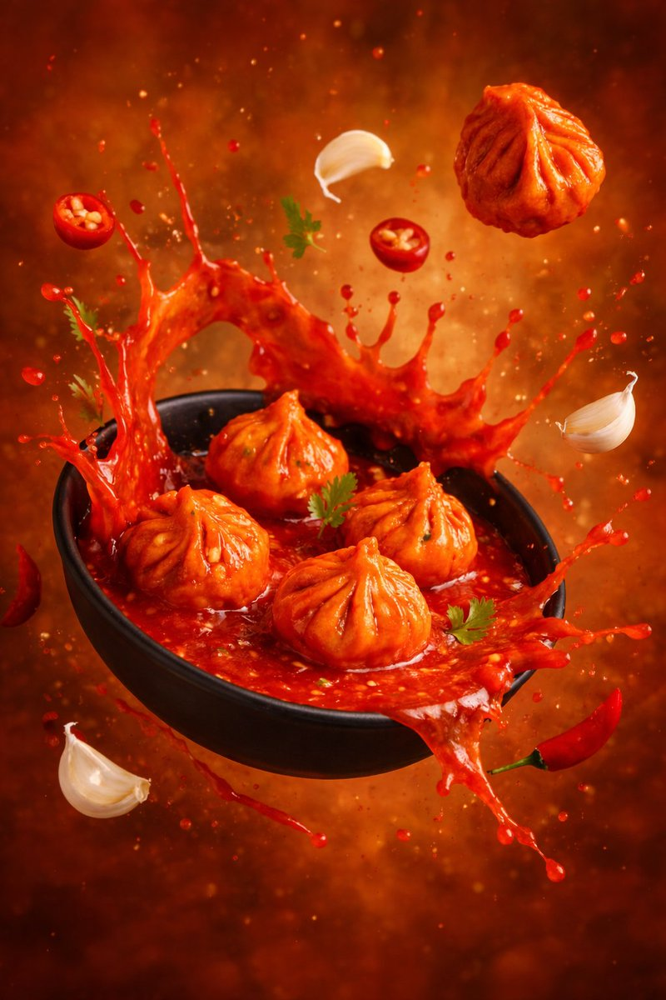

## A cinematic, ultra-realistic advertising shot of a man h

- ID: trending-2012780826715619644
- Slug: trending-2012780826715619644-en
- 语言: en
- 来源: [来源链接](https://x.com/Strength04_X/status/2012780826715619644)
- 样例图路径: images/part1/2012780826715619644_1.jpg

### 提示词

```text
A cinematic, ultra-realistic advertising shot of a man holding a Lay’s [FLAVOR NAME] chips packet in his hand.
The packet color, branding, and typography are perfectly accurate to Lay’s official design.
The man’s outfit color, texture, and style match the packet theme (same color palette and mood), modern and stylish, premium fashion look.
His pose is confident and natural, hand clearly gripping the Lay’s packet in the foreground.
Background environment matches the flavor theme

spices, ingredients, atmosphere, and lighting inspired by the flavor (for example: fiery spices for masala, fresh greens for sour cream, smoky tones for barbecue).

Chips are flying in slow motion around the scene with realistic motion blur and seasoning particles in the air.

Dramatic golden-hour lighting, cinematic depth of field, sharp focus on the packet, soft background bokeh.

Hyper-realistic textures, commercial food photography, high contrast, rich colors,

ultra-detailed, 8K quality, professional brand advertisement

style
```

### 样例图

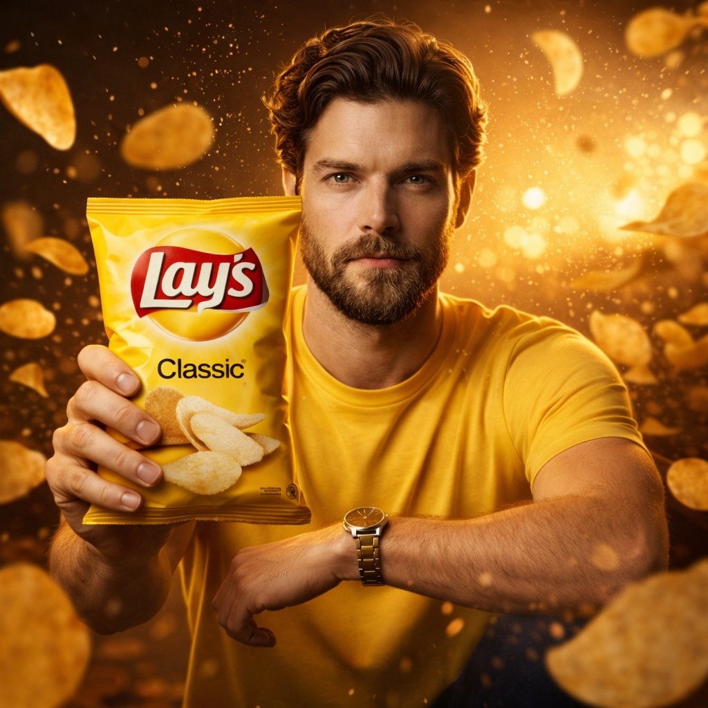

## { "global_settings": { "resolution": "8K ultra high defi

- ID: trending-2015252863333929304
- Slug: trending-2015252863333929304-en
- 语言: en
- 来源: [来源链接](https://x.com/mehvishs25/status/2015252863333929304)
- 样例图路径: images/part1/2015252863333929304_1.jpg

### 提示词

```text
{
"global_settings": {
"resolution": "8K ultra high definition",
"aspect_ratio": "3:4",
"camera_style": "studio food photography with cinematic lighting",
"depth_of_field": "shallow depth of field, sharp subject, soft background",
"lighting": "soft directional key light, subtle rim light, controlled highlights",
"style": "hyper-realistic food illustration with editorial infographic overlays",
"composition_rules": [
"no zoom",
"no crop",
"center-weighted vertical composition",
"floating elements frozen in motion"
],
"text_design": {
"ingredient_name_color": "metallic gold",
"ingredient_description_color": "pure white",
"font_style": "elegant serif for titles, clean sans-serif for descriptions",
"indicator_lines": "long, thin, smooth golden lines with rounded corners"
}
},

"module_1_image_1_style": {
"scene_description": "A vertical stack of assorted cake slices floating above a white ceramic plate against a soft pink gradient background.",
"background": {
"color": "soft pastel pink",
"texture": "smooth gradient",
"lighting": "even, studio-lit, no harsh shadows"
},
"main_subjects": [
"multiple layered sponge cake slices",
"white whipped cream layers",
"raspberry cream layer",
"chocolate cream topping"
],
"visible_ingredients": [
"vanilla sponge cake",
"whipped cream",
"raspberries",
"blueberries",
"strawberries",
"macarons (vanilla and chocolate)",
"chocolate bar pieces",
"mint leaves",
"small nut fragments"
],
"motion_elements": [
"floating fruits",
"floating macarons",
"crumbs suspended in air"
],
"text_labels": [
"Vanilla Cake – soft, fluffy sponge cake layered with white cream filling",
"Macaron – creamy filling between almond meringue shells",
"Raspberries – juicy, fresh raspberries",
"Chocolate Bar – chunks of smooth milk chocolate",
"Raspberry Cream – soft sponge cake layered with creamy, fruity raspberry cream"
]
},
```

### 样例图

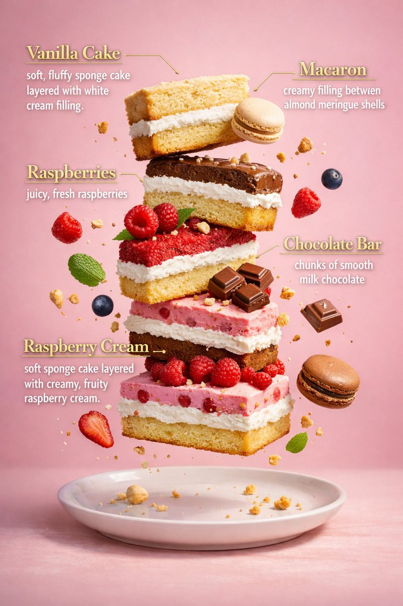

## { "global_settings": { "resolution": "8K UHD", "aspect_r

- ID: trending-2009947657905811727
- Slug: trending-2009947657905811727-en
- 语言: en
- 来源: [来源链接](https://x.com/meng_dagg695/status/2009947657905811727)
- 样例图路径: images/part1/2009947657905811727_1.jpg

### 提示词

```text
{
  "global_settings": {
    "resolution": "8K UHD",
    "aspect_ratio": "3:4",
    "image_type": "AI-edited hyper-realistic commercial product photography",
    "camera": {
      "focus": "ultra-sharp center focus",
      "depth_of_field": "shallow DOF with soft background falloff",
      "angle": "straight-on frontal view",
      "lens": "macro-commercial lens look"
    },
    "lighting": {
      "style": "studio lighting",
      "key_light": "strong frontal soft light",
      "rim_light": "subtle edge highlights on fruits and splashes",
      "reflections": "specular highlights on liquid droplets and metal can"
    },
    "textures": [
      "highly detailed aluminum can surface",
      "realistic liquid physics",
      "sharp fruit skin texture",
      "visible condensation droplets"
    ],
    "quality_flags": [
      "extreme detail",
      "photorealistic",
      "AI-enhanced clarity",
      "no motion blur",
      "clean background"
    ]
  },

  "Module_1_Image_1_Style_Orange": {
    "subject": "Orange flavored soda can",
    "can_details": {
      "material": "metal aluminum",
      "condition": "top torn open with jagged sharp cracks",
      "crack_position": "irregular split at the top rim, metal bent outward",
      "surface": "covered with water droplets and condensation"
    },
    "fruit_elements": {
      "whole_oranges": "multiple whole oranges floating behind and above the can",
      "orange_slice": "one visible half-cut orange slice near the top center",
      "leaves": "green citrus leaves attached to some oranges"
    },
    "liquid_effects": {
      "splash_color": "bright orange liquid",
      "motion": "liquid bursting upward and outward from inside the can",
      "droplets": "numerous suspended droplets frozen mid-air",
      "base_splash": "orange liquid pooling and splashing at the bottom"
    },
    "background": {
      "color": "solid warm orange",
      "gradient": "slight tonal variation, no patterns"
    }
  },

  "Module_2_Image_2_Style_Acai": {
    "subject": "Açaí flavored soda can",
    "can_details": {
      "material": "metal aluminum",
      "condition": "can split horizontally into two broken sections",
      "cracks": "jagged tearing edges with visible sharp metal folds",
      "surface": "covered with condensation droplets"
    },
    "fruit_elements": {
      "acai_berries": "multiple dark purple berries erupting from inside the can",
      "berry_motion": "berries floating upward and outward",
      "leaves": "few green leaves visible on sides"
    },
    "liquid_effects": {
      "splash_color": "deep purple liquid",
      "motion": "explosive splash radiating outward",
      "droplets": "fine droplets suspended in air"
    },
    "background": {
      "color": "warm beige to light brown gradient",
      "tone": "soft neutral backdrop"
    }
  },

  "Module_3_Image_3_Style_Goiaba_Guava": {
    "subject": "Guava flavored soda can",
    "can_details": {
      "material": "metal aluminum",
      "condition": "vertical split down the center of the can",
      "cracks": "uneven torn edges exposing inside",
      "surface": "visible water droplets and moisture"
    },
    "fruit_elements": {
      "guava_halves": "multiple guava halves with pink interiors",
      "whole_guavas": "several whole green guavas around the can",
      "leaves": "green guava leaves scattered"
    },
    "liquid_effects": {
      "splash_color": "red guava juice",
      "motion": "juice bursting upward and sideways",
      "droplets": "dense red droplets suspended mid-air"
    },
    "background": {
      "color": "solid deep red",
      "tone": "high contrast with fruit and liquid"
    }
  }
```

### 样例图

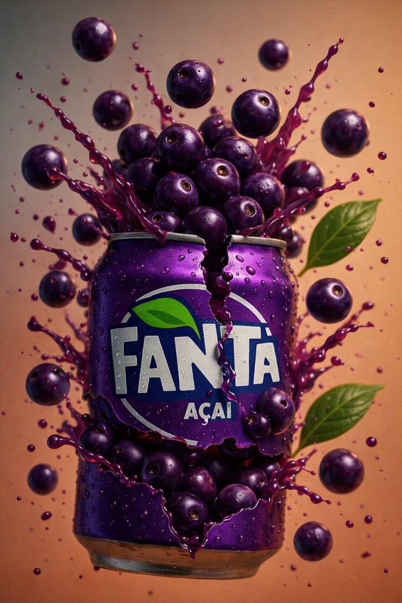

## { "style": "Minimalist modern recipe infographic", "visu

- ID: trending-2018899983752380850
- Slug: trending-2018899983752380850-en
- 语言: en
- 来源: [来源链接](https://x.com/john_my07/status/2018899983752380850)
- 样例图路径: images/part1/2018899983752380850_1.jpg

### 提示词

```text
{
  "style": "Minimalist modern recipe infographic",
  "visual_aesthetic": {
    "photography_style": "Top-down / 3-quarter angle food photography",
    "design_language": "Scandinavian, editorial cookbook layout",
    "background": "Soft neutral beige / cream",
    "lighting": "Soft diffused light with gentle shadows",
    "detail_level": "Ultra-realistic, ultra-sharp, 8K resolution"
  },
  "layout": {
    "composition": "Finished dish centered on a white ceramic plate or bowl",
    "elements": [
      "Floating ingredient icons in soft circular frames",
      "Clean vector-style ingredient illustrations",
      "Clear ingredient labels with quantities",
      "Curved step-by-step flow with numbered cooking icons"
    ],
    "typography": "High readability, modern sans-serif",
    "spacing": "Balanced, airy, uncluttered"
  },
  "recipes": [
    {
      "dish_name": "Traditional Polish Pierogi",
      "dish_presentation": "Golden boiled dumplings filled with potato and cheese, lightly buttered and garnished with fresh chives",
      "ingredients": [
        { "name": "All-purpose flour", "quantity": "2.5 cups" },
        { "name": "Potatoes", "quantity": "3 medium" },
        { "name": "Farmer cheese", "quantity": "200g" },
        { "name": "Onion", "quantity": "1 medium" },
        { "name": "Butter", "quantity": "40g" },
        { "name": "Salt", "quantity": "1 tsp" },
        { "name": "Water", "quantity": "0.75 cups" }
      ],
      "steps": [
        "Prepare dough",
        "Cook and mash filling",
        "Fill and shape pierogi",
        "Boil until tender",
        "Serve with butter"
      ],
      "meta": {
        "calories": "270 kcal / serving",
        "time": "70 min",
        "servings": 4
      }
    },
    {
      "dish_name": "Vinaigrette Salad",
      "dish_presentation": "Colorful diced vegetables mixed with light dressing, neatly molded and topped with fresh herbs",
      "ingredients": [
        { "name": "Beetroot", "quantity": "2 medium" },
        { "name": "Potatoes", "quantity": "2 medium" },
        { "name": "Carrots", "quantity": "1 medium" },
        { "name": "Pickled cucumbers", "quantity": "2 pcs" },
        { "name": "Green peas", "quantity": "1 cup" },
        { "name": "Sunflower oil", "quantity": "2 tbsp" },
        { "name": "Fresh dill", "quantity": "1 bunch" }
      ],
      "steps": [
        "Boil vegetables",
        "Cool and dice",
        "Mix ingredients",
        "Dress salad",
        "Chill and serve"
      ],
      "meta": {
        "calories": "180 kcal / serving",
        "time": "30 min + chill",
        "servings": 4
      }
    },
    {
      "dish_name": "Solyanka Soup",
      "dish_presentation": "Rich hearty soup with sliced meats, olives, lemon, and herbs, served steaming in a ceramic bowl",
      "ingredients": [
        { "name": "Mixed meats", "quantity": "400g" },
        { "name": "Onion", "quantity": "1 large" },
        { "name": "Pickles", "quantity": "3 pcs" },
        { "name": "Tomato paste", "quantity": "2 tbsp" },
        { "name": "Olives", "quantity": "1/2 cup" },
        { "name": "Garlic", "quantity": "2 cloves" },
        { "name": "Bay leaf", "quantity": "1 pc" },
        { "name": "Lemon", "quantity": "For serving" }
      ],
      "steps": [
        "Simmer broth",
        "Sauté aromatics",
        "Add meats and pickles",
        "Season and simmer",
        "Serve with lemon"
      ],
      "meta": {
        "calories": "320 kcal / serving",
        "time": "90 min",
        "servings": 5
      }
    }
  ]
}
```

### 样例图

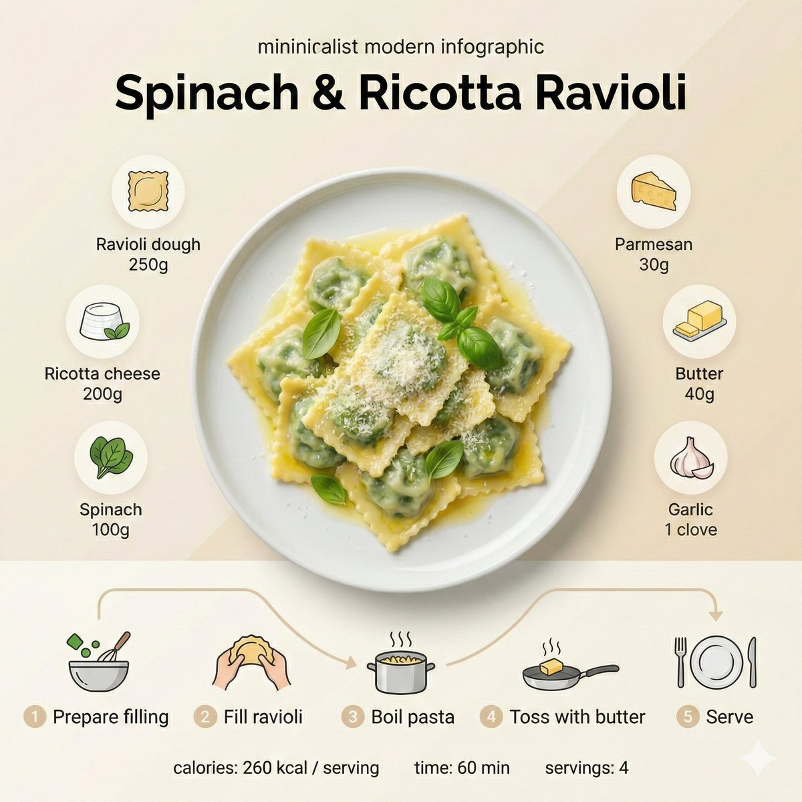

## Create a branded technical infographic of a [SNACK], com

- ID: trending-2031795709243019280
- Slug: trending-2031795709243019280-en
- 语言: en
- 来源: [来源链接](https://x.com/TechieBySA/status/2031795709243019280)
- 样例图路径: images/part1/2031795709243019280_1.jpg

### 提示词

```text
Create a branded technical infographic of a [SNACK], combining a realistic photograph or photoreal render of the product with technical annotation overlays placed directly on top. Use black ink–style line drawings with strategic [BRAND COLOR] accents (architectural sketch look) on a pure white studio background, including:
• Key component labels
• Internal cross-section showing structure, layering, or internal design
• Measurements, dimensions, and specifications
• Material callouts with composition and quantities
• Arrows indicating function for primary features and structural integrity
• Simple schematic or sectional diagram showing key mechanical or design elements
• Sustainability callouts
Title placement: Inside a hand-drawn technical annotation box with accent border reading the product name in bold font, positioned in upper corner.
Style & layout rules:
• The realistic product remains clearly visible
• Annotations feel sketched, technical, and architectural
• Accents used for highlight (20-30% of linework), black for primary technical lines (70-80%)
• Clean composition with balanced negative space
• Educational, food-engineering vibe with premium branding
• Include subtle brand logo mark in corner
Visual style: Minimal technical illustration aesthetic, black linework with accents over realistic imagery, precise but slightly hand-drawn feel.
Color palette: White background, black annotation lines/text, [BRAND COLOR] for accents and key callouts only.
Output: 1080×1080, ultra-crisp, social-feed optimized, no watermark
```

### 样例图

![Create a branded technical infographic of a [SNACK], com](../images/part1/2031795709243019280_1.jpg)

## { "image_type": "high-detail food photography, AI-edited

- ID: trending-2017552798297297339
- Slug: trending-2017552798297297339-en
- 语言: en
- 来源: [来源链接](https://x.com/meng_dagg695/status/2017552798297297339)
- 样例图路径: images/part1/2017552798297297339_1.jpg

### 提示词

```text
{
  "image_type": "high-detail food photography, AI-edited surreal composition",
  "resolution": "8K ultra-high-definition",
  "aspect_ratio": "3:4",
  "main_subject": {
    "object": "single cube-shaped red velvet cake piece",
    "position": "floating in mid-air",
    "orientation": "slightly angled, front face visible, top frosting facing upward",
    "texture": {
      "cake": "fine, dense crumb texture with visible granules",
      "frosting": "smooth, creamy, thick layer with soft ridges"
    }
  },
  "cake_details": {
    "layers": [
      {
        "type": "red velvet sponge",
        "color": "deep red",
        "count": 2
      },
      {
        "type": "cream filling",
        "color": "pale off-white",
        "count": 1,
        "position": "center layer"
      }
    ],
    "top_frosting": {
      "style": "swirled frosting peak",
      "color": "off-white / cream",
      "surface_detail": "soft curved piping lines",
      "toppings": "small red velvet crumbs scattered on top"
    }
  },
  "motion_elements": {
    "crumbs": {
      "presence": true,
      "distribution": "scattered around the cake in mid-air",
      "size_variation": "fine dust to small chunks",
      "motion": "frozen mid-flight"
    }
  },
  "secondary_object": {
    "object": "metal spoon",
    "material": "polished stainless steel",
    "position": "below the cake",
    "orientation": "slightly tilted upward",
    "reflection": "subtle reflections visible on spoon surface",
    "interaction": "crumbs falling toward spoon"
  },
  "lighting": {
    "style": "studio lighting",
    "direction": "soft directional light from upper side",
    "highlights": "gentle highlights on frosting and spoon",
    "shadows": "soft shadows, no harsh edges",
    "contrast": "moderate contrast emphasizing texture"
  },
  "background": {
    "color_palette": [
      "dark maroon",
      "deep burgundy",
      "muted pink gradient"
    ],
    "style": "smooth gradient backdrop",
    "depth": "shallow depth of field",
    "noise": "clean, minimal grain"
  },
  "color_profile": {
    "dominant_colors": [
      "deep red",
      "cream white",
      "dark maroon"
    ],
    "saturation": "rich but controlled",
    "tone": "luxurious and dramatic"
  },
  "composition": {
    "framing": "centered subject with vertical emphasis",
    "visual_balance": "cake centered, spoon offset below",
    "negative_space": "ample empty space around subject"
  },
  "style_tags": [
    "hyper-realistic",
    "AI-edited look",
    "surreal food photography",
    "freeze-motion effect",
    "premium dessert aesthetic"
  ],
  "camera_simulation": {
    "focus": "sharp focus on cake",
    "background_blur": "smooth bokeh-like gradient",
    "angle": "eye-level to slightly low angle"
  },
  "post_processing": {
    "clarity": "high",
    "sharpness": "very high",
    "color_grading": "cinematic dessert tones",
    "artifacts": "none visible"
  }
}
```

### 样例图

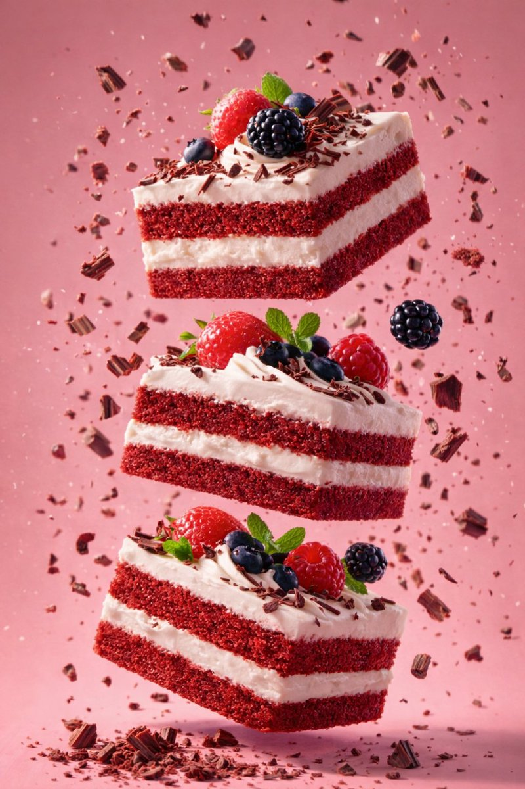

## Clean & appetizing meal prep layouts Design a minimalist

- ID: trending-2048076798798217594
- Slug: trending-2048076798798217594-en
- 语言: en
- 来源: [来源链接](https://x.com/Dheepanratnam/status/2048076798798217594)
- 样例图路径: images/part1/2048076798798217594_1.jpg

### 提示词

```text
Clean & appetizing meal prep layouts

Design a minimalist healthy meal prep poster for [MEAL PLAN], with clean containers, colorful balanced ingredients, calorie/macros panel, weekly layout, soft pastel background, bright natural light, wellness brand typography, crisp shadows, modern Instagram design.
```

### 样例图

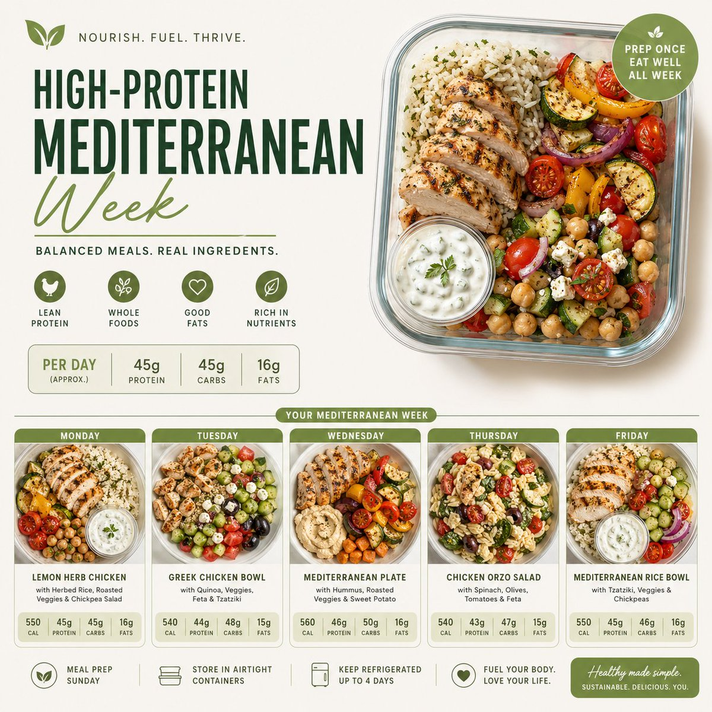

## { "image_type": "Hyper-realistic cinematic food photogra

- ID: trending-2008455129624965416
- Slug: trending-2008455129624965416-en
- 语言: en
- 来源: [来源链接](https://x.com/meng_dagg695/status/2008455129624965416)
- 样例图路径: images/part1/2008455129624965416_1.jpg

### 提示词

```text
{
  "image_type": "Hyper-realistic cinematic food photography",
  "resolution": "8K",
  "aspect_ratio": "3:4",
  "camera": {
    "shot_type": "Hero shot",
    "angle": "Slightly low-angle with central focus",
    "focus": "Ultra-sharp foreground with controlled depth of field",
    "motion_capture": "Frozen mid-air action with splash dynamics"
  },
  "lighting": {
    "style": "Cinematic studio lighting",
    "highlights": "Strong specular highlights emphasizing oil, glaze, and moisture",
    "shadows": "Deep, dramatic shadows for contrast and depth",
    "rim_light": "Visible edge lighting outlining food elements",
    "ambient": "Low-key lighting environment"
  },
  "background": {
    "color": "Dark charcoal to deep maroon tones",
    "texture": "Smoky, atmospheric backdrop",
    "elements": [
      "Rising steam",
      "Spice-infused smoke",
      "Floating embers and sparks"
    ]
  },
  "primary_subjects": [
    {
      "item": "Cooked food pieces",
      "position": "Suspended mid-air",
      "surface_detail": "Charred edges, textured crust, glossy coating",
      "motion": "Erupting upward with dynamic splash behavior"
    }
  ],
  "secondary_elements": [
    {
      "item": "Sauce or gravy",
      "state": "Thick and glossy",
      "motion": "Explosive splash with visible droplets and arcs",
      "detail": "Oil separation visible as shimmering droplets"
    },
    {
      "item": "Herbs",
      "types": [
        "Fresh coriander leaves",
        "Mint leaves"
      ],
      "motion": "Scattered and floating naturally"
    },
    {
      "item": "Spices",
      "types": [
        "Whole dried red chilies",
        "Whole spices (clearly visible star-shaped and pod-like forms)",
        "Crushed spice particles"
      ],
      "behavior": "Suspended mid-air, dispersed unevenly"
    },
    {
      "item": "Vegetables",
      "types": [
        "Bell peppers (green and red)",
        "Onion chunks"
      ],
      "cut": "Large rustic chunks",
      "surface": "Light char and gloss"
    }
  ],
  "supporting_food_items": [
    {
      "item": "Rice grains",
      "detail": "Individual grains clearly visible, mid-air dispersion",
      "motion": "Erupting outward with spices"
    },
    {
      "item": "Nuts and dry fruits",
      "types": [
        "Cashews",
        "Raisins"
      ],
      "position": "Mixed with rice and floating"
    },
    {
      "item": "Flatbread pieces",
      "detail": "Torn edges, soft interior texture, char marks visible",
      "motion": "Suspended mid-air with crumbs"
    }
  ],
  "condiments": [
    {
      "item": "Green chutney",
      "texture": "Thick, coarse",
      "motion": "Upward splash from a bowl",
      "container": "Dark stone bowl with matte finish"
    },
    {
      "item": "White yogurt-based sauce",
      "texture": "Smooth and creamy",
      "container": "Dark stone bowl"
    }
  ],
  "surface_environment": {
    "base": "Dark textured surface",
    "elements": [
      "Scattered spice flakes",
      "Burnt crumbs",
      "Small glowing embers",
      "Charcoal-like stones"
    ]
  },
  "color_palette": [
    "Deep reds",
    "Burnt orange",
    "Charcoal black",
    "Smoky maroon",
    "Herb green",
    "Creamy white highlights"
  ],
  "mood": "Bold, intense, premium, cinematic, high-impact food commercial aesthetic",
  "realism_level": "Extreme hyper-realism with tactile textures and moisture detail",
  "post_processing": {
    "contrast": "High",
    "clarity": "Very high",
    "sharpening": "Selective sharpening on food textures",
    "noise": "Minimal",
    "color_grading": "Warm highlights with deep shadows"
  }
}
```

### 样例图

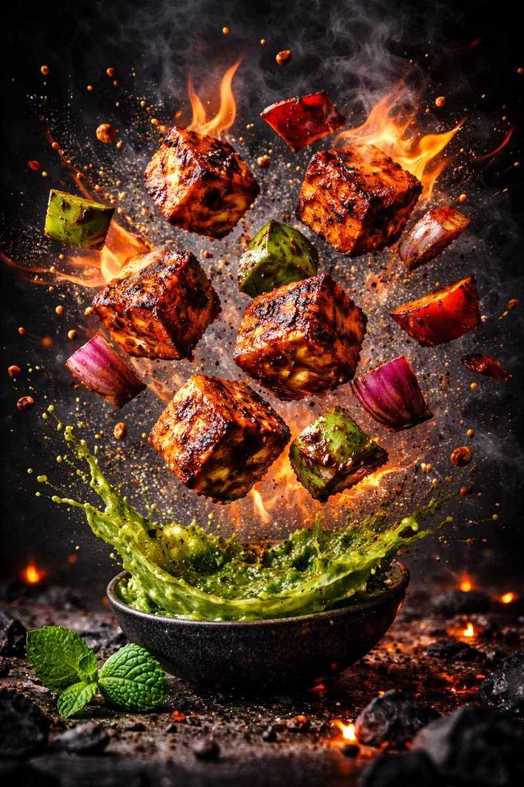

## { "prompt_name": "Lays_Spanish_Tomato_Tango_Explosion", 

- ID: trending-2007635164718084527
- Slug: trending-2007635164718084527-en
- 语言: en
- 来源: [来源链接](https://x.com/meng_dagg695/status/2007635164718084527)
- 样例图路径: images/part1/2007635164718084527_1.jpg

### 提示词

```text
{
  "prompt_name": "Lays_Spanish_Tomato_Tango_Explosion",
  "description": "Ultra-realistic commercial food photography showing a red Lay’s snack packet torn open from the top, positioned at the bottom center of the frame. Golden ridged potato chips are explosively bursting upward in frozen mid-air motion. Thick red tomato sauce splashes dynamically around the chips, forming arcs and droplets. Fresh whole tomatoes and halved tomatoes with visible seeds are flying around. Small crispy crumbs and seasoning particles are suspended in the air. The Lay’s logo is clearly visible on the packet, with readable text: 'Spanish Tomato Tango Flavour'. The packet surface is glossy and reflective with realistic wrinkles. Background is a deep red gradient filled with floating sauce droplets and particles, creating intense energy.",
  "lighting": "Dramatic warm studio lighting with strong highlights, deep shadows, and high contrast",
  "color_palette": ["deep red", "tomato red", "golden yellow", "dark orange"],
  "motion": "High-energy explosive upward motion with frozen splashes and flying fragments",
  "focus": "Ultra-sharp focus on chips, sauce splashes, and packet branding",
  "texture_detail": "Highly detailed ridged chip texture, glossy liquid splashes, realistic foil reflections",
  "style": "Premium FMCG commercial advertising, cinematic realism",
  "resolution": "8K",
  "aspect_ratio": "3:4"
}
```

### 样例图

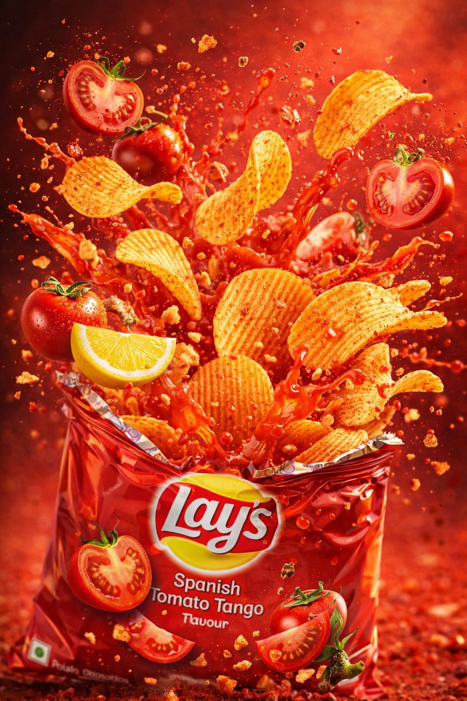

## - Ultra-cinematic beverage advertising shot of a sparkli

- ID: trending-2011078719734235390
- Slug: trending-2011078719734235390-en
- 语言: en
- 来源: [来源链接](https://x.com/Strength04_X/status/2011078719734235390)
- 样例图路径: images/part1/2011078719734235390_1.jpg

### 提示词

```text
- Ultra-cinematic beverage advertising shot of a sparkling lime soda can, captured from a low three-quarter angle with the camera positioned slightly below the product for a heroic, powerful perspective; the can appears partially torn open as vivid lime wedges explode outward in slow motion, frozen mid-air with high-energy splashes of neon-green liquid and micro droplets; intense backlighting makes the citrus flesh glow translucently while sharp rim light outlines
```

### 样例图

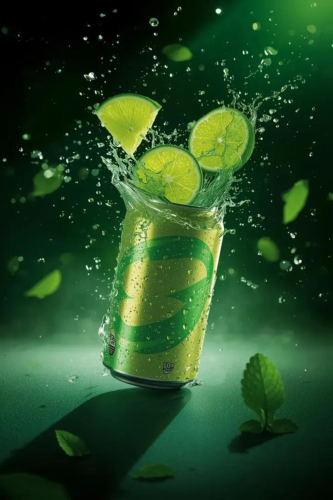

## <instruction> Inputs: Ingredients = [User Choice, e.g., 

- ID: trending-2004986136335110526
- Slug: trending-2004986136335110526-en
- 语言: en
- 来源: [来源链接](https://x.com/Gdgtify/status/2004986136335110526)
- 样例图路径: images/part1/2004986136335110526_1.jpg

### 提示词

```text
<instruction>
Inputs: Ingredients = [User Choice, e.g., Chicken, Bacon]

Step 1: Global Analysis
Analyze the ingredients.
Select 4 Distinct Countries with a famous dish using these ingredients  

Goal: A "Culinary Atlas" Grid showing 4 different cultural variations of the ingredients.

Layout Rule:
Output Format: A 2x2 Grid.
Content per Panel: Each of the 4 panels must show a Single Open Book Spread for that specific country.

Inside Each Panel (The Book Spread Rule):
Left Page (The History): 2D Vintage Sepia Sketches. A visual timeline or illustrated recipe of the dish (e.g., "1850 -> 1920 -> Today"). Flat, ink-drawn style.
Right Page (The Reality): 3D Pop-up Diorama. The finished, steaming meal emerges physically from the page. A tiny miniature chef from that country is standing on the page next to the massive food.
Consistency: All 4 books should look like part of the same series, but with different cultural contents.

Lighting: Cinematic top-down lighting, highlighting the depth difference between the flat left page and the 3D right page.
Output: 2x2 Grid, High Definition, Macro Detail.
</instruction>
```

### 样例图

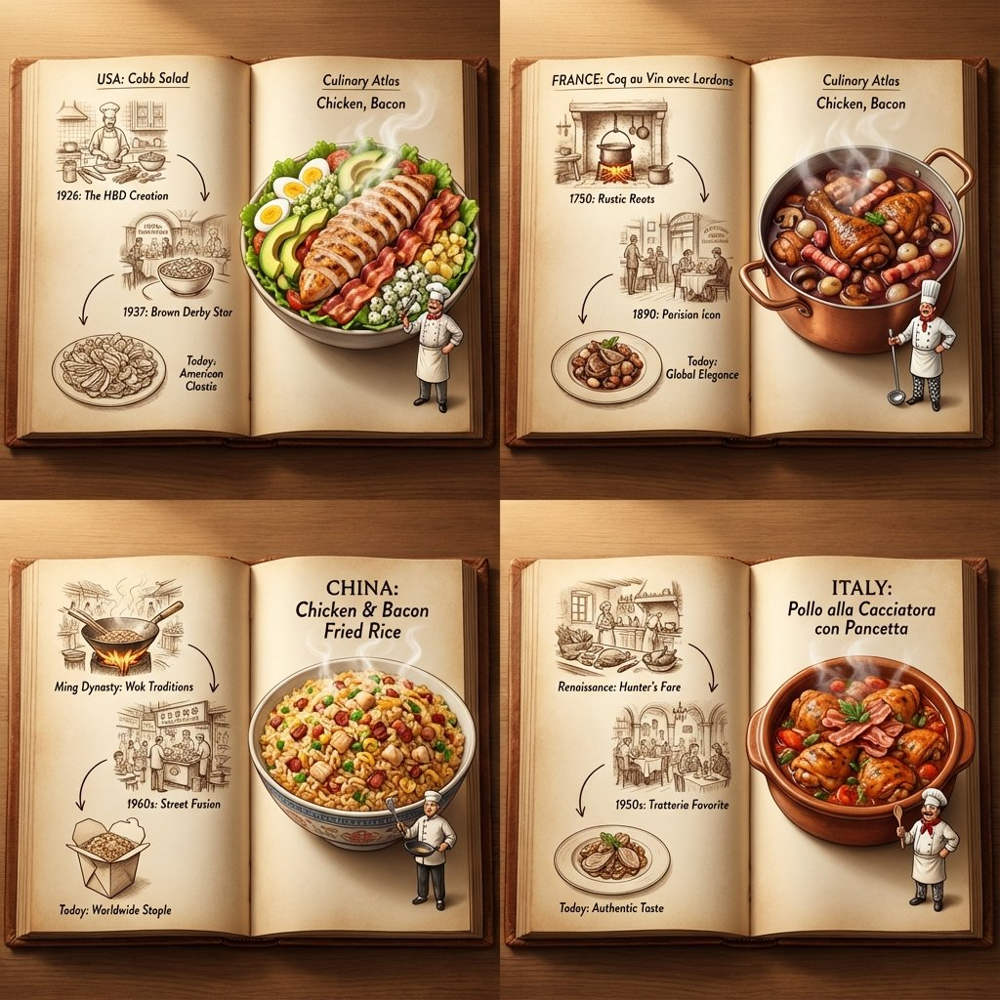

## { "global_settings": { "resolution": "8K ultra-high-defi

- ID: trending-2019457811370164329
- Slug: trending-2019457811370164329-en
- 语言: en
- 来源: [来源链接](https://x.com/mehvishs25/status/2019457811370164329)
- 样例图路径: images/part1/2019457811370164329_1.jpg

### 提示词

```text
{
  "global_settings": {
    "resolution": "8K ultra-high-definition",
    "aspect_ratio": "3:4 vertical",
    "render_style": "hyper-realistic commercial food photography",
    "quality": "premium advertising grade",
    "sharpness": "extreme micro-detail, crisp edges",
    "noise": "none",
    "artifacts": "none",
    "depth_of_field": "shallow, subject-focused",
    "motion": "frozen mid-air ingredients",
    "background_style": "solid single-color studio backdrop"
  },

  "subject": {
    "main_food": "chocolate chip cookies",
    "quantity": 3,
    "appearance": [
      "golden-brown freshly baked cookies",
      "soft cracked surface",
      "visible melted chocolate chips",
      "slightly crisp edges",
      "natural handmade texture"
    ],
    "branding_rules": [
      "no text",
      "no logo",
      "no embossing",
      "no patterns",
      "no symbols"
    ]
  },

  "secondary_elements": {
    "ingredients_flying": [
      "dark chocolate chunks",
      "cookie crumbs",
      "fine sugar crystals"
    ],
    "motion_style": "dynamic floating explosion",
    "distribution": "balanced around the cookies, natural randomness",
    "particle_detail": "sharp, frozen motion with depth separation"
  },

  "composition": {
    "camera_angle": "slightly low angle",
    "framing": "center-weighted hero composition",
    "spacing": "clean negative space around subject",
    "focus_priority": "front cookie in razor-sharp focus"
  },

  "lighting": {
    "type": "professional studio lighting",
    "key_light": "soft directional key light",
    "fill_light": "gentle fill for texture clarity",
    "rim_light": "subtle rim highlight for separation",
    "shadows": "soft and natural, no harsh contrast"
  },

  "color_palette": {
    "background_color": "pastel blue",
    "cookie_tones": "warm golden browns",
    "accent_colors": "rich chocolate browns, crystal sugar whites",
    "contrast": "high subject-background separation"
  },

  "photography_style": {
    "genre": "luxury food advertising",
    "mood": "fresh, indulgent, premium",
    "cleanliness": "spotless studio look",
    "post_processing": "minimal, natural, high-end retouching"
  },

  "exclusions": [
    "text",
    "logos",
    "watermarks",
    "hands",
    "plates",
    "props",
    "packaging",
    "background objects",
    "cartoon style",
    "illustration style"
  ]
}
```

### 样例图

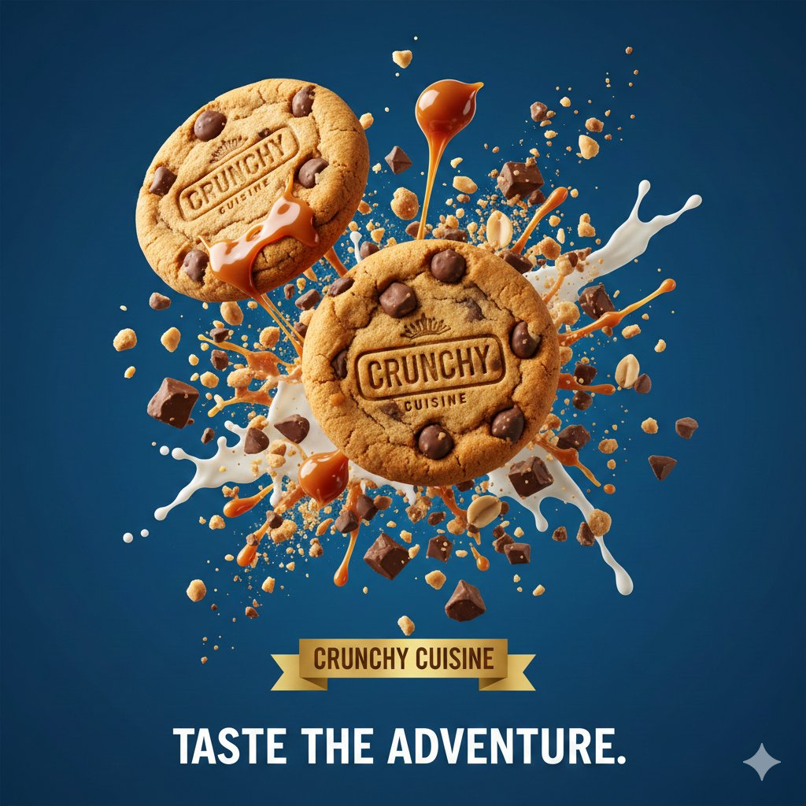

## A hyper-realistic, high-speed commercial photograph feat

- ID: trending-2025363555584016837
- Slug: trending-2025363555584016837-en
- 语言: en
- 来源: [来源链接](https://x.com/Naiknelofar788/status/2025363555584016837)
- 样例图路径: images/part1/2025363555584016837_1.jpg

### 提示词

```text
A hyper-realistic, high-speed commercial photograph featuring a man with uploaded face as reference in a chef's jacket, apron, and checkered trousers. He stands in a rustic, high-end kitchen, lifting the lid off a large, steaming copper pot with a look of pure amazement. From the pot, a literal galaxy of gourmet food explodes upwards and outwards in suspended animation: whole roasted spices, vibrant vegetables, splashes of rich sauces, floating plates of intricately plated fine dining dishes,and swirling clouds of aromatic steam filled with golden glitter. The ingredients form spiral nebulae around him. The background is a warm, blurred professional kitchen with copper cookware hanging. The lighting is warm, cinematic, and focused, highlighting the textures of the flying food with macro-level detail. Shot with a fast shutter speed to freeze motion, 8k resolution, Octane Render culinary aesthetic. 100% use my real face.
```

### 样例图

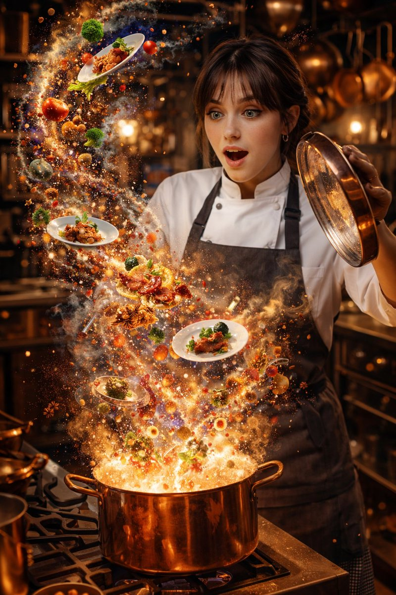

## { "master_prompt": { "global_settings": { "resolution": 

- ID: trending-2015977087161794591
- Slug: trending-2015977087161794591-en
- 语言: en
- 来源: [来源链接](https://x.com/mehvishs25/status/2015977087161794591)
- 样例图路径: images/part1/2015977087161794591_1.jpg

### 提示词

```text
{
"master_prompt": {
"global_settings": {
"resolution": "8K ultra high definition",
"aspect_ratio": "3:4 vertical",
"image_quality": "extreme sharpness, high dynamic range, professional studio lighting",
"style": "AI-edited hyperreal food photography",
"focus": "crisp textures, frozen motion, liquid dynamics, surface details",
"background_quality": "clean, controlled, noise-free"
},

"module_1": {  
  "identity": "Image 1 – Ice Cream Cone with Purple Splash",  
  "subject": {  
    "main_object": "waffle cone ice cream",  
    "cone": "light brown waffle cone with diamond grid texture, matte finish",  
    "ice_cream_scoops": [  
      {  
        "color": "off-white / vanilla",  
        "texture": "creamy with visible scoop ridges"  
      },  
      {  
        "color": "off-white / vanilla",  
        "texture": "slightly uneven surface, melting edges"  
      }  
    ],  
    "toppings": [  
      "raspberries",  
      "blackberries"  
    ],  
    "sauce": {  
      "color": "glossy purple",  
      "behavior": "thick liquid splashing outward and downward",  
      "coverage": "dripping over scoops and cone"  
    }  
  },  
  "motion": {  
    "action": "frozen splash moment",  
    "details": "liquid droplets suspended mid-air, see-through splash edges"  
  },  
  "background": {  
    "color": "deep dark maroon / black",  
    "style": "studio backdrop with subtle gradient"  
  },  
  "lighting": {  
    "type": "high-contrast studio lighting",  
    "effects": "specular highlights on sauce and ice cream, shadow depth under cone"  
  }  
},  

"module_2": {  
  "identity": "Image 2 – Chocolate Ice Cream Bar with Bite",  
  "subject": {  
    "main_object": "chocolate-coated ice cream bar on wooden stick",  
    "coating": {  
      "exploded_view": false,  
      "surface": "milk chocolate coating with embedded nut pieces",  
      "texture": "rough, uneven, crunchy appearance"  
    },  
    "bite_detail": {  
      "location": "top edge",  
      "interior_layers": [  
        "chocolate ice cream",  
        "thin darker chocolate layer"  
      ],  
      "edges": "jagged bite marks"  
    },  
    "stick": {  
      "material": "light wood",  
      "finish": "smooth, rounded end"  
    }  
  },  
  "motion": {  
    "elements": "small chocolate fragments floating in air",  
    "behavior": "scattered outward from the bar"  
  },  
  "background": {  
    "color": "warm brown gradient",  
    "style": "clean studio environment"  
  },  
  "lighting": {  
    "type": "directional studio lighting",  
    "effects": "strong highlights on chocolate bumps, soft shadows"  
  }  
},  

"module_3": {  
  "identity": "Image 3 –Purple Berry Popsicle with Fruits",  
  "subject": {  
    "main_object": "rectangular red popsicle",  
    "surface": {  
      "texture": "frosted, icy crystals visible",  
      "shape": "rounded corners, vertical grooves"  
    },  
    "stick": {  
      "material": "light wooden stick",  
      "visible": true  
    },  
    "surroundings": [  
      "whole strawberries with green tops",  
      "blueberries",  
      "raspberries",  
      "mint leaves",  
      "crushed ice pieces"  
    ]  
  },  
  "color_palette": [  
    "bright red",  
    "deep blue",  
    "fresh green",  
    "clear ice"  
  ],  
  "background": {  
    "composition": "entire frame filled with fruits and ice",  
    "style": "top-down macro food arrangement"  
  },  
  "lighting": {  
    "type": "even bright lighting",  
    "effects": "wet shine on fruit skins, crystalline ice reflections"  
  }  
},
```

### 样例图

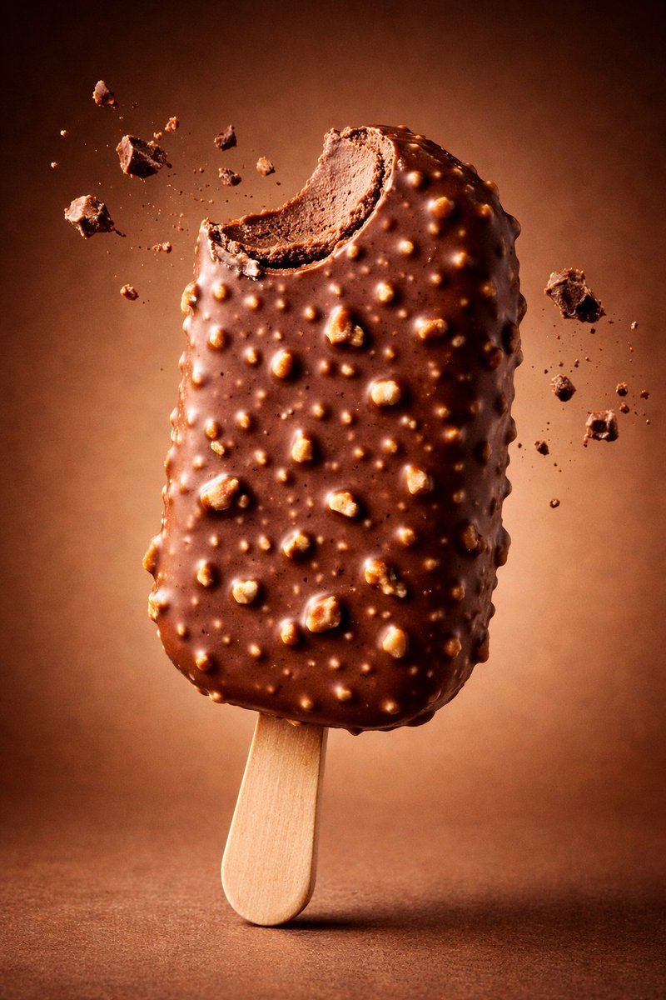

## { "global_settings": { "resolution": "8K ultra high defi

- ID: trending-2017200760631828679
- Slug: trending-2017200760631828679-en
- 语言: en
- 来源: [来源链接](https://x.com/ChillaiKalan__/status/2017200760631828679)
- 样例图路径: images/part1/2017200760631828679_1.jpg

### 提示词

```text
{
  "global_settings": {
    "resolution": "8K ultra high definition",
    "aspect_ratio": "2:3 vertical",
    "style": "hyper-realistic AI-edited food photography",
    "clarity": "extreme sharpness, micro-texture visibility",
    "motion": "frozen action with suspended ingredients",
    "lighting_quality": "studio-grade, high-contrast, cinematic",
    "background_separation": "strong subject isolation with clean depth"
  },

  "module_1_image_1_style": {
    "scene_description": "A dynamic salad explosion emerging from a matte black bowl placed on a round wooden surface. Ingredients are mid-air, scattered upward and outward.",
    "ingredients_visible": [
      "green lettuce leaves",
      "cherry tomatoes (whole and sliced)",
      "cucumber slices arranged in a curved stack",
      "black olives",
      "white cheese cubes",
      "orange citrus slice",
      "small broccoli florets",
      "fresh green basil leaves"
    ],
    "motion_details": {
      "ingredients":
```

### 样例图

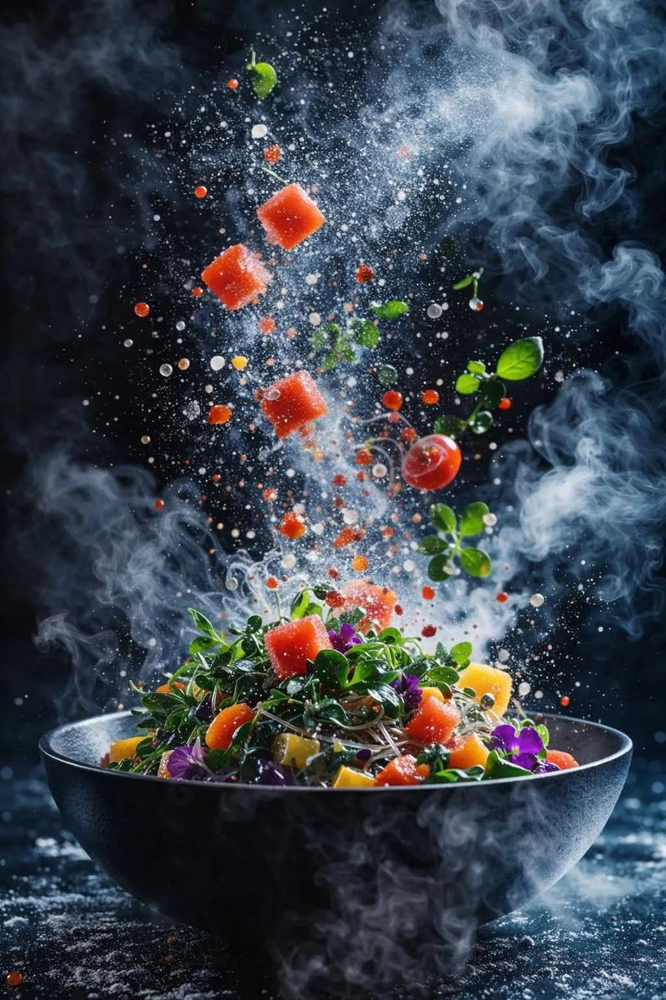

## { "resolution": "8K", "aspect_ratio": "3:4", "image_type

- ID: trending-2020329970497999135
- Slug: trending-2020329970497999135-en
- 语言: en
- 来源: [来源链接](https://x.com/meng_dagg695/status/2020329970497999135)
- 样例图路径: images/part1/2020329970497999135_1.jpg

### 提示词

```text
{
  "resolution": "8K",
  "aspect_ratio": "3:4",
  "image_type": "photorealistic commercial product render",
  "scene_description": {
    "main_subject": "A vertically centered ice cream bar on a wooden stick",
    "orientation": "upright, front-facing, slightly elevated perspective",
    "composition": "single product centered with surrounding ingredient callouts and curved arrows"
  },
  "background": {
    "color": "warm golden-yellow gradient",
    "texture": "smooth, matte, evenly lit",
    "lighting_falloff": "subtle vignette, darker towards edges"
  },
  "lighting": {
    "type": "studio lighting",
    "key_light": "soft frontal light highlighting chocolate gloss",
    "fill_light": "balanced fill to preserve texture detail",
    "specular_highlights": "visible on melted chocolate coating",
    "shadows": "soft shadow beneath ice cream stick"
  },
  "ice_cream_bar": {
    "shape": "rounded rectangular bar",
    "surface": "smooth with visible embedded inclusions",
    "layers": [
      {
        "layer_position": "top coating",
        "material": "milk chocolate",
        "state": "melted and dripping",
        "texture": "glossy, thick, fluid",
        "details": [
          "multiple chocolate drips flowing downward",
          "irregular almond pieces embedded in coating",
          "rounded drip edges with gravity pull"
        ]
      },
      {
        "layer_position": "left interior",
        "material": "chocolate ice cream",
        "texture": "dense, creamy",
        "details": [
          "small dark brownie chunks evenly dispersed",
          "matte finish compared to outer chocolate"
        ]
      },
      {
        "layer_position": "right interior",
        "material": "vanilla ice cream",
        "texture": "smooth and creamy",
        "details": [
          "visible caramel pieces",
          "light beige caramel chunks with rounded edges"
        ]
      }
    ]
  },
  "stick": {
    "material": "light natural wood",
    "texture": "smooth with subtle grain",
    "shape": "rounded edges, flat profile",
    "visibility": "fully visible below ice cream bar"
  },
  "ingredient_callouts": {
    "style": {
      "arrows": "curved, thick, dark brown",
      "text_color": "dark brown",
      "font_style": "clean sans-serif",
      "layout": "balanced around product"
    },
    "labels": [
      {
        "text": "Chocolate with almonds",
        "position": "top-left",
        "visual_aid": [
          "whole almonds",
          "small chocolate squares"
        ]
      },
      {
        "text": "Chocolate ice cream with brownies",
        "position": "left-middle",
        "visual_aid": [
          "brownie chunks"
        ]
      },
      {
        "text": "Chocolate ice cream with brownies",
        "position": "right-middle",
        "visual_aid": [
          "brownie chunks"
        ]
      },
      {
        "text": "Vanilla ice cream with caramel pieces",
        "position": "bottom-right",
        "visual_aid": [
          "caramel cubes",
          "white vanilla pieces"
        ]
      }
    ]
  },
  "color_palette": {
    "primary_colors": [
      "milk chocolate brown",
      "golden yellow",
      "cream white"
    ],
    "secondary_colors": [
      "dark brownie brown",
      "light caramel orange",
      "almond beige"
    ]
  },
  "render_quality": {
    "sharpness": "extreme micro-detail visibility",
    "texture_fidelity": "high realism",
    "noise": "none",
    "depth_of_field": "moderate, product fully in focus"
  },
  "style_tags": [
    "luxury dessert advertising",
    "hyper-realistic food photography",
    "commercial product render",
    "clean studio composition"
  ]
}
```

### 样例图


## Ultra-high-resolution 8K cinematic commercial food adver

- ID: trending-2008810720826478640
- Slug: trending-2008810720826478640-en
- 语言: en
- 来源: [来源链接](https://x.com/meng_dagg695/status/2008810720826478640)
- 样例图路径: images/part1/2008810720826478640_1.jpg

### 提示词

```text
Ultra-high-resolution 8K cinematic commercial food advertisement of **[BRAND NAME] instant noodles**, vertical 3:4 aspect ratio.

A bold hero composition featuring the **[BRAND NAME] noodle packet** floating in the upper frame, front-facing and perfectly lit, with crisp edges, realistic packaging texture, and clear branding. Below it, a steaming bowl branded with **[BRAND NAME]**, filled with glossy, curly noodles lifted dramatically mid-air using chopsticks, noodles stretching naturally under gravity.

Noodles appear richly coated in **[FLAVOR / SAUCE TYPE]**, with visible ingredients such as **[VEGETABLES / CHILIES / GARNISH]** suspended mid-air around the bowl. Steam rises dynamically, interacting with floating spice particles and food fragments.

Background is a **completely new cinematic environment** (not copied from reference), abstract and high-energy, filled with swirling flames, sparks, embers, smoke, and motion blur, creating depth and intensity while keeping the food in sharp focus.

Lighting is premium studio cinematic lighting:
warm golden key light, soft fill light, strong rim light outlining the packet and noodles, high contrast with glowing highlights and deep shadows.

Color palette dominated by **[PRIMARY BRAND COLORS]**, enhanced with warm orange-gold food tones and contrasting greens from vegetables. Hyper-realistic textures on noodles, sauce, packaging, and bowl.

Shallow depth of field, dramatic bokeh in background, extreme sharpness on hero elements, photorealistic yet stylized for advertising impact.

Mood: bold, energetic, spicy, indulgent, mouth-watering, premium commercial look.

No people, no clutter, no copied backgrounds. Designed for high-impact food advertising, posters, and social media hero visuals.

[BRAND NAME] → Maggi
[FLAVOR / SAUCE TYPE] → spicy masala
[PRIMARY BRAND COLORS] → yellow and red
```

### 样例图

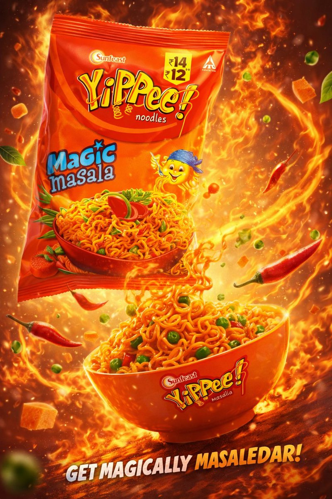

## A premium [BRAND NAME] [PRODUCT TYPE] centered in the fr

- ID: trending-2006643289185989070
- Slug: trending-2006643289185989070-en
- 语言: en
- 来源: [来源链接](https://x.com/meng_dagg695/status/2006643289185989070)
- 样例图路径: images/part1/2006643289185989070_1.jpg

### 提示词

```text
A premium [BRAND NAME] [PRODUCT TYPE] centered in the frame, iconic [BRAND COLOR / PACKAGING STYLE] packaging partially unwrapped, emerging from darkness like a legendary luxury artifact, rich [PRODUCT MATERIAL – chocolate / cream / liquid / filling] cracking open and transforming in slow motion, surreal transformation in progress, [CORE INGREDIENT / FLAVOR ELEMENT] flowing, melting, or bursting outward in cinematic waves, fragments and droplets levitating in zero gravity, slow-motion splash frozen mid-air, ultra-detailed glossy textures, realistic material physics, rich highlights and reflections, dramatic cinematic rim lighting, deep shadows, luxury advertising aesthetic, dreamlike surreal atmosphere, hyper-real product photography blended with fantasy, macro depth of field, clean dark background with subtle [BRAND COLOR] glow, product dominant and razor-sharp, brand name clearly visible on packaging, no extra text, no watermark, no extra logos, 8K ultra-HD, HDR, global illumination, unreal engine style, viral commercial look, high contrast, premium composition
```

### 样例图

![A premium [BRAND NAME] [PRODUCT TYPE] centered in the fr](../images/part1/2006643289185989070_1.jpg)

## [ { "id": "pineapple_beach_v2", "type": "photorealistic 

- ID: trending-2004935778183590081
- Slug: trending-2004935778183590081-en
- 语言: en
- 来源: [来源链接](https://x.com/meng_dagg695/status/2004935778183590081)
- 样例图路径: images/part1/2004935778183590081_1.jpg

### 提示词

```text
[
  {
    "id": "pineapple_beach_v2",
    "type": "photorealistic advertising shot",
    "subject": {
      "item": "pineapple juice bottle",
      "label_text": "NFC Pineapple Juice",
      "pose": "slightly tilted forward"
    },
    "environment": {
      "location": "tropical beach",
      "ground": "sunlit wet tropical sand",
      "background_elements": [
        "gently swaying palm trees",
        "clear turquoise ocean with soft waves",
        "bright blue sky with thin clouds"
      ],
      "interactions": "a small wave splashes lightly against the bottle base"
    },
    "surrounding_elements": [
      "fresh pineapple slices with visible texture",
      "sparkling seawater droplets in mid-air"
    ],
    "lighting": {
      "description": "golden sunlight",
      "effects": "soft reflections on glass bottle"
    }
  },

  {
    "id": "strawberry_mountain_v2",
    "type": "photorealistic advertising shot",
    "subject": {
      "item": "strawberry juice bottle",
      "label_text": "NFC Strawberry Juice",
      "details": "heavy condensation with frost accents"
    },
    "environment": {
      "location": "high-altitude mountains",
      "ground": "icy rocks with light snow patches",
      "atmosphere": "crisp cold air with drifting mist"
    },
    "surrounding_elements": [
      "fresh strawberries partially resting on ice"
    ],
    "lighting": {
      "description": "soft sunrise light cutting through fog",
      "effects": "subtle glow around the bottle"
    },
    "style_descriptors": [
      "cinematic macro shot",
      "ultra high detail",
      "cold-meets-warm contrast",
      "deep red highlights",
      "fresh and premium feel",
      "hyper-realistic surface details"
    ],
    "parameters": "--ar 9:16 --stylize 250"
  },

  {
    "id": "citrus_grove_v2",
    "type": "photorealistic advertising shot",
    "subject": {
      "item": "citrus blend juice bottle",
      "label_text": "NFC Citrus Mix",
      "pose": "centered upright"
    },
    "environment": {
      "location": "lush citrus grove",
      "background_elements": [
        "sunlit yellow and orange fruits hanging above",
        "soft green leaves framing the bottle"
      ]
    },
    "action_elements": {
      "description": "fresh splash of clear water rising around the base",
      "items": [
        "thin lemon slices",
        "juicy lime wedges",
        "bright orange segments"
      ]
    },
    "lighting": {
      "description": "sun rays filtering through leaves",
      "tone": "vibrant citrus warmth"
    },
    "parameters": "--ar 9:16 --stylize 250"
  },

  {
    "id": "tropical_hammock_v2",
    "type": "photorealistic advertising shot",
    "subject": {
      "item": "tropical mixed Nestle juice bottle",
      "label_text": "NFC Tropical Juice",
      "pose": "relaxed tilt as if resting"
    },
    "environment": {
      "location": "sunlit hammock between palm trees",
      "background": "soft-focus ocean horizon with glowing sunlight"
    },
    "surrounding_elements": [
      "fresh pineapple slices",
      "ripe mango slices",
      "orange wedges",
      "dragonfruit cubes"
    ],
    "mood_and_style": {
      "atmosphere": "luxury vacation vibe",
      "colors": "rich tropical saturation",
      "lighting": "warm cinematic highlights with soft shadows"
    },
    "parameters": "--ar 9:16 --stylize 250"
  }
]
```

### 样例图

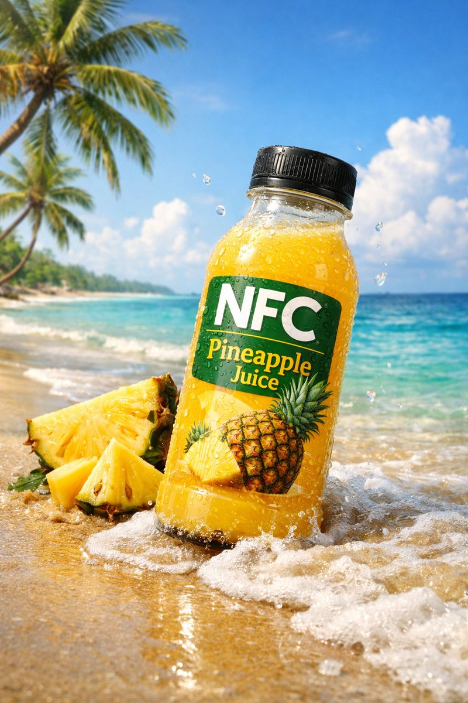

## { "global_settings": { "resolution": "8K ultra-high-defi

- ID: trending-2019796977299681757
- Slug: trending-2019796977299681757-en
- 语言: en
- 来源: [来源链接](https://x.com/john_my07/status/2019796977299681757)
- 样例图路径: images/part1/2019796977299681757_1.jpg

### 提示词

```text
{
  "global_settings": {
    "resolution": "8K ultra-high-definition",
    "aspect_ratio": "3:4 vertical",
    "render_style": "photorealistic high-end biscuit photography",
    "quality": "luxury advertising standard",
    "clarity": "ultra-sharp with visible fine textures",
    "grain": "zero",
    "visual_artifacts": "none",
    "depth_of_field": "selective focus with soft background falloff",
    "motion_capture": "ingredients suspended in mid-air",
    "background_style": "clean monochrome studio backdrop"
  },

  "subject": {
    "main_food": "assorted biscuit-style cookies",
    "quantity": 4,
    "appearance": [
      "uniform baked biscuits with refined edges",
      "lightly toasted surface with subtle cracks",
      "visible chocolate bits and butter layers",
      "dry-crisp texture typical of premium biscuits",
      "precise handcrafted finish"
    ],
    "branding_rules": [
      "no typography",
      "no logos",
      "no imprints",
      "no decorative marks",
      "no symbols"
    ]
  },

  "secondary_elements": {
    "ingredients_floating": [
      "mini chocolate chips",
      "biscuit crumbs",
      "powdered sugar dust"
    ],
    "motion_style": "controlled burst with natural spread",
    "distribution": "organic scatter surrounding the biscuits",
    "particle_detail": "high-speed frozen motion with layered depth"
  },

  "composition": {
    "camera_angle": "slightly elevated three-quarter angle",
    "framing": "central hero focus with visual breathing space",
    "spacing": "ample negative space for premium feel",
    "focus_priority": "foreground biscuit in extreme sharp focus"
  },

  "lighting": {
    "type": "studio-grade cinematic lighting",
    "key_light": "soft diffused directional light",
    "fill_light": "low-intensity fill to reveal surface detail",
    "rim_light": "delicate edge glow for separation",
    "shadows": "smooth and realistic with gentle falloff"
  },

  "color_palette": {
    "background_color": "muted pastel teal",
    "biscuit_tones": "light golden beige and toasted browns",
    "accent_colors": "deep cocoa browns, soft sugar whites",
    "contrast": "strong subject isolation from background"
  },

  "photography_style": {
    "genre": "premium biscuit advertising",
    "mood": "clean, refined, indulgent",
    "cleanliness": "immaculate studio finish",
    "post_processing": "subtle professional retouching, natural tones"
  },

  "exclusions": [
    "text",
    "branding",
    "watermarks",
    "hands",
    "serving ware",
    "props",
    "wrappers",
    "environmental elements",
    "illustration",
    "cartoon rendering"
  ]
}
```

### 样例图

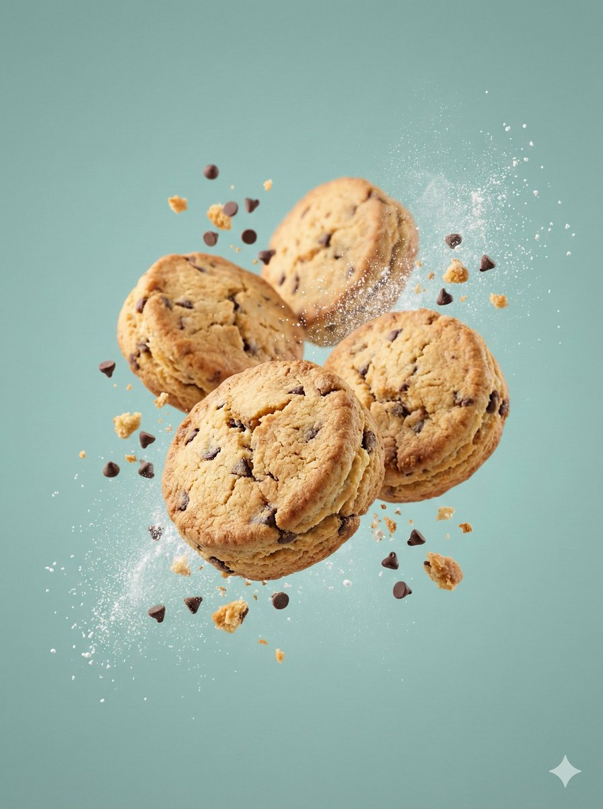

## Ultra-realistic 3D miniature diorama of a [BRAND NAME] e

- ID: trending-2036427989718802509
- Slug: trending-2036427989718802509-en
- 语言: en
- 来源: [来源链接](https://x.com/Diplomeme/status/2036427989718802509)
- 样例图路径: images/part1/2036427989718802509_1.jpg

### 提示词

```text
Ultra-realistic 3D miniature diorama of a [BRAND NAME] environment built inside a giant [ICONIC OBJECT OF BRAND], shown in a clean cross-section or partially cut-open view revealing a detailed interior world.

Inside the structure, a fully detailed miniature [brand-specific environment: store / café / restaurant / showroom] exists, with realistic human activity such as staff working, customers interacting, and natural storytelling moments.

The [object] acts as both container and environment, with its materials and elements integrated into the architecture (e.g., layers, textures, surfaces forming terrain and structure).

Add dynamic storytelling elements: objects or particles suspended mid-air, subtle motion frozen in time (liquid splashes, falling elements, steam, crumbs, etc.).

Include volumetric atmosphere such as steam, fog, or light rays interacting with particles in the air to enhance cinematic depth.

Surfaces must be hyper-realistic with micro details: imperfections, condensation, reflections, dust, oil sheen, texture variations depending on the material.

Lighting should follow a cinematic high-end advertising style, with strong contrast between warm and cool tones, soft rim lighting outlining the subject, and natural light direction enhancing depth and realism.

Composition: slightly angled hero shot, clear cross-section visibility, centered subject, minimal but cinematic background with soft bokeh.

Shot on a macro lens, shallow depth of field, creamy bokeh background, ultra-detailed textures, 8K resolution, filmic color grading, luxury commercial photography style.
```

### 样例图

![Ultra-realistic 3D miniature diorama of a [BRAND NAME] e](../images/part1/2036427989718802509_1.jpg)

## Create step-by-step recipe infographic for creamy garlic

- ID: trending-2046705259267948789
- Slug: trending-2046705259267948789-en
- 语言: en
- 来源: [来源链接](https://x.com/egeberkina/status/2046705259267948789)
- 样例图路径: images/part1/2046705259267948789_1.jpg

### 提示词

```text
Create step-by-step recipe infographic for creamy garlic mushroom pasta, top-down view, minimal style on white background, ingredient photos labeled: "200g spaghetti", "150g mushrooms", "3 garlic cloves", "200ml cream", "1 tbsp olive oil", "parmesan", "parsley", dotted lines showing process steps with icons (boiling pot, sauté pan, mixing), final plated pasta shot at the bottom
```

### 样例图


## Advertising-style food photography of a stack of pancake

- ID: trending-2015786436696637532
- Slug: trending-2015786436696637532-en
- 语言: en
- 来源: [来源链接](https://x.com/mehvishs25/status/2015786436696637532)
- 样例图路径: images/part1/2015786436696637532_1.jpg

### 提示词

```text
Advertising-style food photography of a stack of pancakes arranged on a rustic table, with maple syrup droplets floating above in mid-air and a splash of syrup frozen in motion. High-resolution photo manipulation with selective soft focus, clean negative space for text, dramatic lighting, and crisp detail. --ar 3:2 --v 7
```

### 样例图

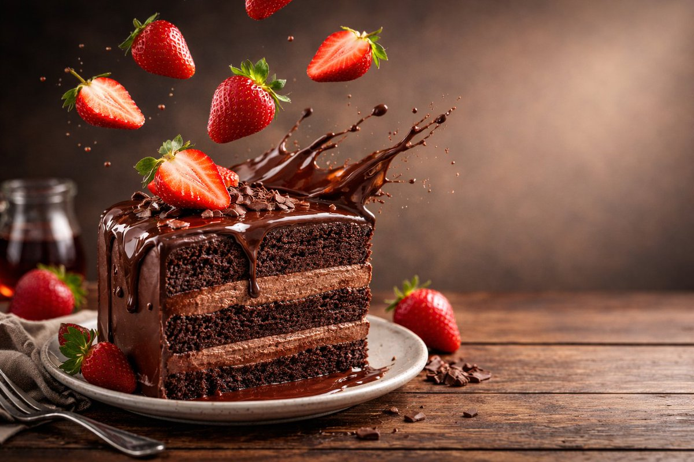

## { "project": { "title": "Hyper-Visual Fried Chicken Acti

- ID: trending-2009591285406208118
- Slug: trending-2009591285406208118-en
- 语言: en
- 来源: [来源链接](https://x.com/meng_dagg695/status/2009591285406208118)
- 样例图路径: images/part1/2009591285406208118_1.jpg

### 提示词

```text
{
  "project": {
    "title": "Hyper-Visual Fried Chicken Action Series",
    "output_quality": "8K Ultra-HD",
    "aspect_ratio": "2:3",
    "style_intent": "High-end commercial food photography",
    "consistency_rule": "Each module shares structure but maintains unique visual dynamics"
  },

  "global_camera_and_rendering": {
    "camera_perspective": "Close-up to extreme macro",
    "focus_behavior": "Crisp subject focus with controlled depth falloff",
    "shutter_effect": "High-speed freeze-frame",
    "texture_priority": "Ultra-detailed crispy breading and crumbs",
    "color_profile": "Warm golden browns, deep reds, high contrast",
    "lighting_quality": "Studio-grade directional lighting with rim highlights",
    "rendering_clarity": "No blur, no softness, no painterly effects"
  },

  "negative_prompt": [
    "motion blur",
    "plastic textures",
    "smooth or waxy food",
    "flat lighting",
    "low detail crumbs",
    "muddy colors",
    "overexposed highlights",
    "cartoon style",
    "unrealistic food physics",
    "oil fog",
    "text artifacts"
  ],

  "modules": {

    "module_1_image_1_style": {
      "scene_type": "Liquid impact action shot",
      "subject": "Single fried chicken drumstick",
      "positioning": "Centered, upright",
      "action": "Drumstick impacting or emerging from liquid splash",
      "liquid_properties": {
        "color": "Deep red-brown",
        "viscosity": "Thick, glossy",
        "behavior": "High splash crown with upward droplets"
      },
      "particle_details": {
        "crumbs": "Small to medium golden crumbs suspended mid-air",
        "distribution": "Surrounding the subject evenly"
      },
      "lighting": {
        "key_light": "Strong frontal light emphasizing texture",
        "rim_light": "Subtle edge highlights on liquid and crust"
      },
      "background": "Dark, nearly black, softly blurred",
      "surface_reflections": "Glossy reflections visible in liquid surface",
      "mood": "Intense, dramatic, high-impact"
    },

    "module_2_image_2_style": {
      "scene_type": "Mid-air food reveal",
      "subject": "Single fried chicken drumstick",
      "action": "Drumstick suspended above an open food box",
      "crumb_motion": "Crumbs falling downward from drumstick",
      "container": {
        "type": "Cardboard food box",
        "color": "White exterior with red interior accents",
        "state": "Open lid, visible interior"
      },
      "lighting": {
        "style": "Soft studio light",
        "effect": "Even illumination with gentle highlights"
      },
      "background": {
        "tone": "Bright, light neutral",
        "depth": "Shallow depth of field, softly blurred"
      },
      "texture_visibility": "Highly defined crunchy coating",
      "mood": "Clean, fresh, appetizing, modern"
    },

    "module_3_image_3_style": {
      "scene_type": "Explosive reveal action shot",
      "subject": "Single fried chicken drumstick",
      "action": "Drumstick bursting upward from food box",
      "explosion_elements": {
        "crumbs": "Large and small fragments radiating outward",
        "direction": "Radial burst from center"
      },
      "lighting": {
        "backlight": "Strong radial backlight creating light rays",
        "contrast": "High contrast between subject and background"
      },
      "container": {
        "type": "Cardboard food box",
        "color": "Red and white",
        "text_visibility": "Visible word 'CHICKEN' on front"
      },
      "background": "Dark with bright light rays emanating behind subject",
      "surface": "Dark tabletop with scattered crumbs",
      "mood": "Energetic, bold, cinematic"
    }
```

### 样例图

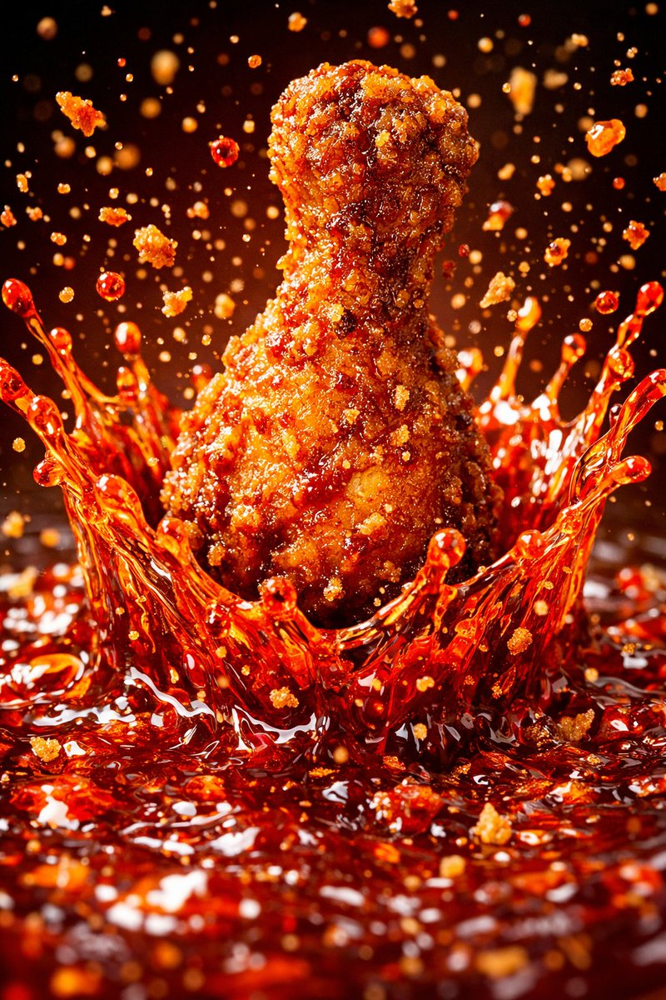

## Ultra-premium cinematic food photography, 8K UHD, 3:4 as

- ID: trending-2014162814739611701
- Slug: trending-2014162814739611701-en
- 语言: en
- 来源: [来源链接](https://x.com/mehvishs25/status/2014162814739611701)
- 样例图路径: images/part1/2014162814739611701_1.jpg

### 提示词

```text
Ultra-premium cinematic food photography, 8K UHD, 3:4 aspect ratio.
A high-end studio composition featuring a single floating bowl as the hero subject, captured in a high-speed moment with ingredients suspended mid-air. The image conveys controlled energy, freshness, and indulgence.
Lighting is soft, directional, and studio-grade, sculpting textures with clean highlights and natural shadows. Depth of field is shallow-to-medium, isolating the subject while maintaining dimensional realism.
Colors are rich yet natural, with balanced contrast and refined saturation. No artificial glow or exaggerated effects.
The background is a seamless solid or smooth gradient, carefully chosen to complement the ingredients and enhance visual separation.
The bowl is centered, weightless, and dominant. Liquids form elegant arcs and droplets; solid ingredients float naturally with believable physics. Textures are hyper-realistic — creamy bases show organic swirls, crunchy elements appear crisp, herbs look fresh and vibrant.
Shot with a luxury commercial food advertising aesthetic — modern, clean, minimal, bold, and premium.
```

### 样例图

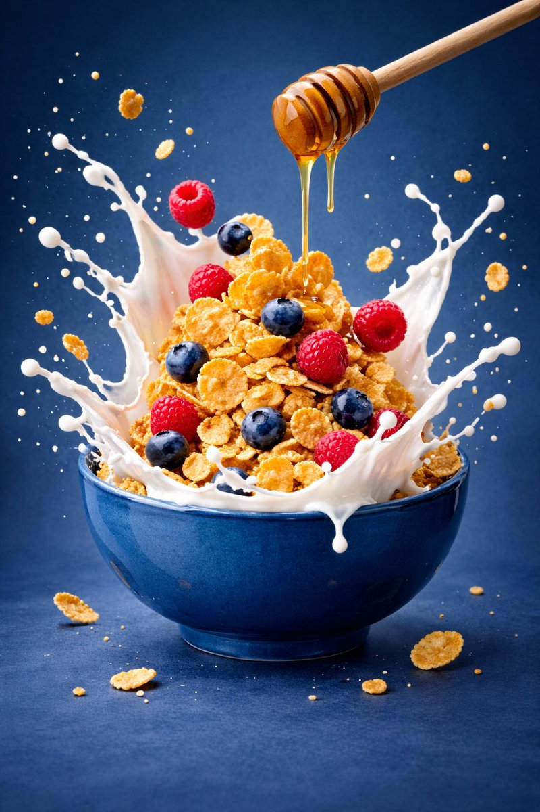

## { "ENVIRONMENT": { "Background": "Gradient(Dark_Warm_Bro

- ID: trending-2020693181730598932
- Slug: trending-2020693181730598932-en
- 语言: en
- 来源: [来源链接](https://x.com/mehvishs25/status/2020693181730598932)
- 样例图路径: images/part1/2020693181730598932_1.jpg

### 提示词

```text
{
  "ENVIRONMENT": {
    "Background": "Gradient(Dark_Warm_Brown)",
    "Atmospheric_FX": ["Floating_Particles", "Depth_Blur", "Cinematic_Bokeh"],
    "Lighting": {
      "Type": "Directional_Studio_Warmer",
      "Highlights": "Specular_Glossy_Reflections",
      "Shadow_Softness": "High"
    }
  },

  "CORE_ASSETS": {
    "Primary_Subject": "Wafer_Rolls",
    "Physics": "Zero_Gravity_Diagonal_X_Composition",
    "Material_Properties": {
      "Outer": "Milk_Chocolate_Coating",
      "Surface_Texture": "Irregular_Nut_Clusters_Embedded",
      "Interior_Cross_Section": {
        "Structure": "Crispy_Hollow_Wafer",
        "Core": "Silky_Chocolate_Cream_Filling"
      }
    }
  },

  "PARTICLE_SYSTEMS": [
    {
      "Object": "Chocolate_Blocks",
      "Detail": "Rectangular_Embossed_Letter_B",
      "State": "Floating"
    },
    {
      "Object": "Hazelnuts",
      "State": "Halved_and_Fragmented",
      "Distribution": "Random_Orbit"
    }
  ],

  "FLUID_DYNAMICS": {
    "Element": "Chocolate_Splash",
    "Behavior": "Dynamic_Backdrop_Flow",
    "Viscosity": "Thick_Glossy"
  },

  "RENDER_OUTPUT": {
    "Resolution": "8K_UHD",
    "Aspect_Ratio": "3:4",
    "Quality_Flags": ["Hyper_Realistic", "Sharp_Foreground", "Indulgent_Mood"]
  }
}
```

### 样例图

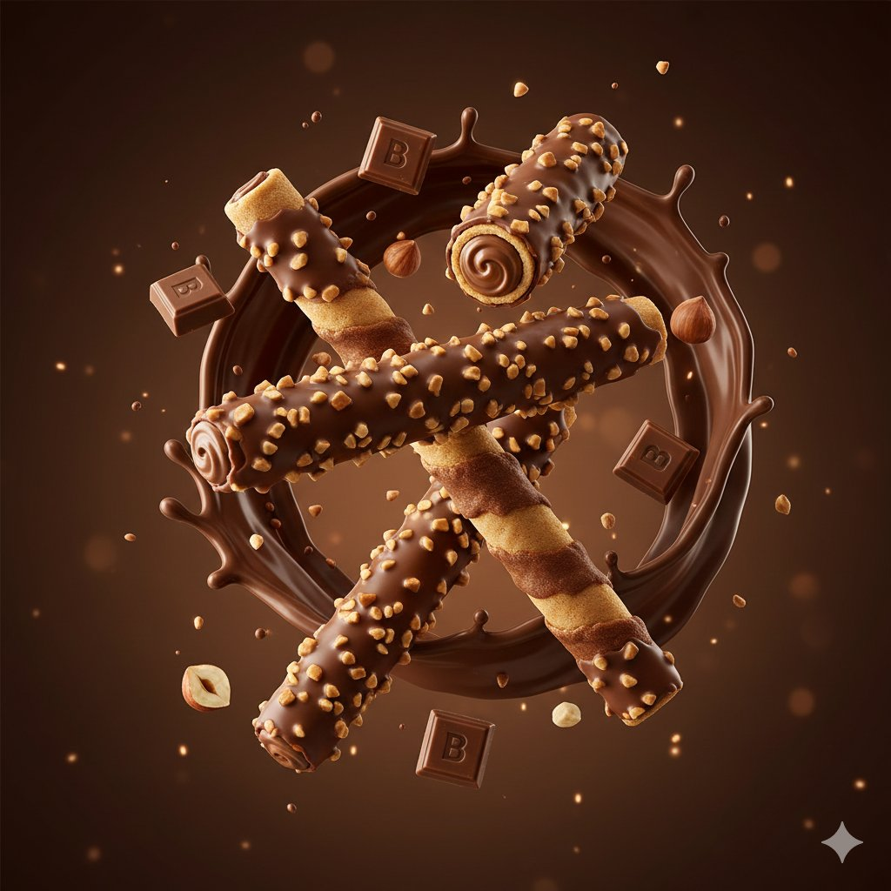

## { "master_prompt": { "scene_type": "high-speed commercia

- ID: trending-2028279420419752307
- Slug: trending-2028279420419752307-en
- 语言: en
- 来源: [来源链接](https://x.com/mehvishs25/status/2028279420419752307)
- 样例图路径: images/part1/2028279420419752307_1.jpg

### 提示词

```text
{
  "master_prompt": {
    "scene_type": "high-speed commercial luxury shake photography",
    "product": {
      "type": "elegant frosted glass bottle filled with velvety strawberry shake",
      "brand_name": "ROSÉ VELVET",
      "label_design": "minimalist vertical blush label with embossed rose-gold serif typography",
      "liquid_color": "creamy pastel pink with natural strawberry swirls"
    },
    "composition": {
      "action": "dynamic high-velocity creamy splash explosion",
      "surrounding_elements": [
        "sculptural waves of thick strawberry shake splashing outward",
        "silky ribbons of strawberry puree suspended mid-air",
        "floating fresh strawberry halves with visible seeds and juicy texture",
        "soft dusting of powdered sugar diffusing delicately",
        "fine droplets of creamy pink mist catching the light"
      ],
      "placement": "centered hero bottle with a crisp reflection on a polished white marble surface"
    },
    "lighting": {
      "style": "luxury glossy studio product lighting",
      "effects": [
        "sharp rim lighting to define bottle silhouette",
        "brilliant highlights on creamy splashes and glossy strawberry surfaces",
        "soft rosy glow in the background for warmth and elegance"
      ]
    },
    "color_palette": {
      "background": "smooth gradient of blush pink fading into soft champagne ivory",
      "accents": "fresh strawberry red, rose gold, and creamy vanilla tones"
    },
    "technical_specs": {
      "camera": "macro lens, eye-level angle",
      "shutter": "ultra-fast freeze-motion capture",
      "depth_of_field": "shallow focus on the label, gentle blur on dynamic splash elements",
      "quality": "8K resolution, ultra-photorealistic texture"
    }
  }
}
```

### 样例图

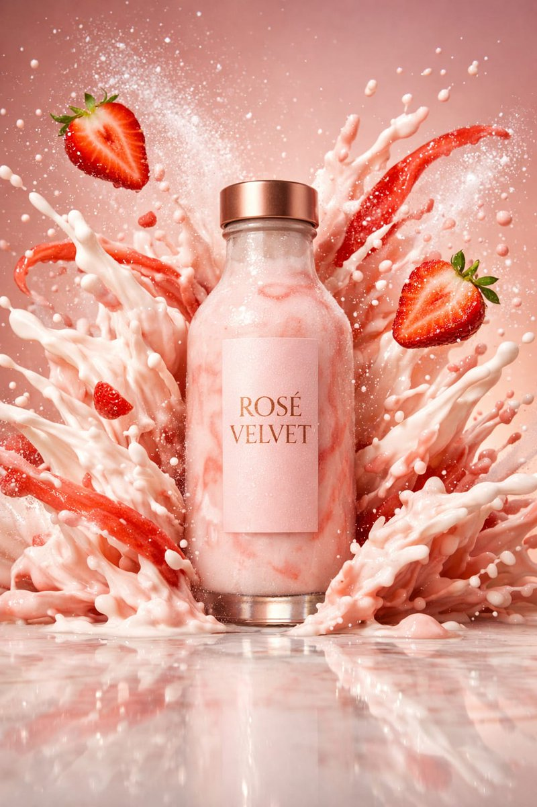

## FORMATO: Póster social premium 4:5 vertical para Instagr

- ID: trending-2048659308645106081
- Slug: trending-2048659308645106081-en
- 语言: en
- 来源: [来源链接](https://x.com/Ivangrisa/status/2048659308645106081)
- 样例图路径: images/part1/2048659308645106081_1.jpg

### 提示词

```text
FORMATO:
Póster social premium 4:5 vertical para Instagram, ultra alta resolución, 8K, nitidez extrema, calidad publicitaria, aspecto gourmet editorial, composición impactante y moderna

⸻

ESCENA / FONDO:

Bar gastronómico moderno y elegante, ambiente urbano sofisticado, mesa de piedra oscura con textura premium, profundidad cinematográfica

Entorno:

* Superficie de mármol negro con reflejos suaves y elegantes
* Fondo desenfocado con ambiente de restaurante moderno
* Sutil presencia de botellas, servilletas y barra de fondo
* Bokeh cálido y elegante, sin distraer del plato
* Estética de restaurante trendy de ciudad

Atmósfera:

* Ambiente acogedor y premium
* Sensación de comida recién servida
* Ligero vapor saliendo del plato
* Energía social, experiencia compartida
* Estilo casual-lujo gastronómico

Iluminación:

* Luz principal cálida lateral superior derecha
* Luz de relleno suave para resaltar texturas
* Brillos naturales en la salsa cremosa
* Contraste elegante entre sombras profundas y luces cálidas
* Reflejos delicados sobre la batata caramelizada

Paleta de color:

* Dominante: negro piedra, gris carbón, marrón tostado
* Acentos: naranja batata, blanco crema, rojo remolacha/frutos rojos
* Toques verdes frescos de hierbas

⸻

PRODUCTO (HERO SHOT):

Plato protagonista de batatas fritas crujientes servidas en vajilla artesanal negra, cubiertas con crema blanca abundante, salsa roja intensa y hierbas frescas

Acción:

* Batatas elevándose ligeramente en el aire para efecto dinámico
* Una batata principal en foco absoluto con textura crujiente visible
* Salsa cremosa cayendo lentamente en movimiento
* Gotas de salsa roja suspendidas en el aire
* Sensación irresistible y adictiva

Interacción:

* Dos tenedores entrando desde los laterales, capturando comida
* Representa deseo, compartir y experiencia real
* Movimiento natural y espontáneo

Detalle de texturas:

* Exterior crujiente y caramelizado de la batata
* Interior suave y cremoso
* Salsa blanca espesa y brillante
* Salsa roja vibrante con intensidad visual
* Microdetalles de sal, especias y cebollino fresco

⸻

ELEMENTOS SECUNDARIOS:

Fondo superior:

* Bolsa kraft desenfocada
* Botella elegante fuera de foco
* Vajilla minimalista moderna

Primer plano:

* Tenedores metálicos con brillo sutil
* Migas pequeñas y gotas de salsa para realismo

⸻

TIPOGRAFÍA:

TITULAR PRINCIPAL:

“BATATA BRUTAL”

Estilo:

* Tipografía sans serif ultra bold condensada
* Moderna, premium, agresiva visualmente
* Kerning ajustado
* Impacto publicitario

Color:

* Blanco roto con ligero degradado cálido

Efectos:

* Sombra suave
* Relieve sutil
* Ligero glow premium

Ubicación:

* Centro superior, integrado con el plato

⸻

SUBTÍTULO:

Crujiente por fuera.
Adictiva por dentro.

Estilo:

* Sans serif bold limpia
* Elegante y minimalista

Color:

* Blanco al 85% opacidad

Ubicación:

* Parte inferior izquierda

⸻

CAPA TIPOGRÁFICA DE FONDO:

CRUNCH / SAUCE / SHARE / REPEAT

Estilo:

* Mayúsculas finas
* Tracking amplio
* Repetición modular

Color:

* Gris claro al 15%

Función:

* Textura visual sin distraer

⸻

BRANDING:

Parte superior izquierda:

Logo minimalista del restaurante o marca

Parte inferior:

Sweet Potato • Signature Sauce • Gourmet Edition

Esquina inferior derecha:

Instagram / web minimalista

Banda lateral vertical:

CRUJIENTE • CREMOSO • BRUTAL

⸻

CÁMARA:

Lente:

50mm gastronómico cinematográfico

Ángulo:

Picado suave de 45 grados con presencia heroica

Profundidad de campo:

* Enfoque extremo en batata central
* Fondo con caída progresiva cremosa

Sensación:

Fotografía real de campaña premium Michelin casual food

⸻

POSTPRODUCCIÓN:

* Contraste alto pero elegante
* Nitidez localizada solo en comida
* Glow suave en salsas
* Color grading cálido premium
* Sombras profundas sofisticadas
* Micro film grain 2%
* Texturas hiperrealistas
* Detalle extremo en comida
* Acabado de anuncio internacional
```

### 样例图

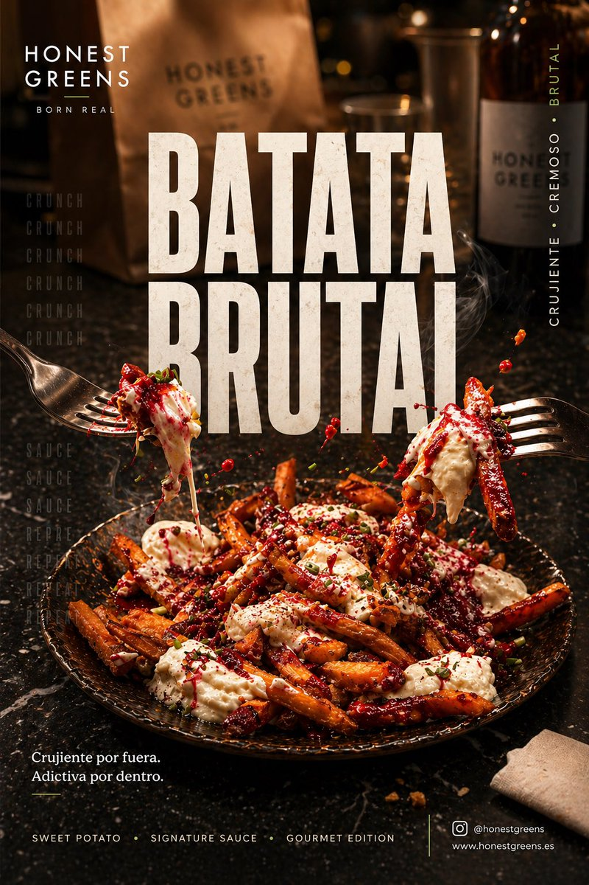

## Epic 8K cinematic fantasy food scene: a colossal crispy 

- ID: trending-2007269989359948066
- Slug: trending-2007269989359948066-en
- 语言: en
- 来源: [来源链接](https://x.com/meng_dagg695/status/2007269989359948066)
- 样例图路径: images/part1/2007269989359948066_1.jpg

### 提示词

```text
Epic 8K cinematic fantasy food scene: a colossal crispy fried chicken leg rising like a legendary artifact through a tidal explosion of molten creamy sauce. Sauce behaves like liquid clouds, forming waves and splashes in mid-air. Pickle chunks, herb leaves, and seasoning particles float like asteroids in a food universe. Extreme macro texture on the crust—cracks, bubbles, and crunch visible. Powerful dramatic lighting with deep shadows and glowing highlights. Vibrant golden-yellow background with cinematic depth and atmospheric particles. Hyper-realistic yet mythic, bold surreal advertising masterpiece.
```

### 样例图

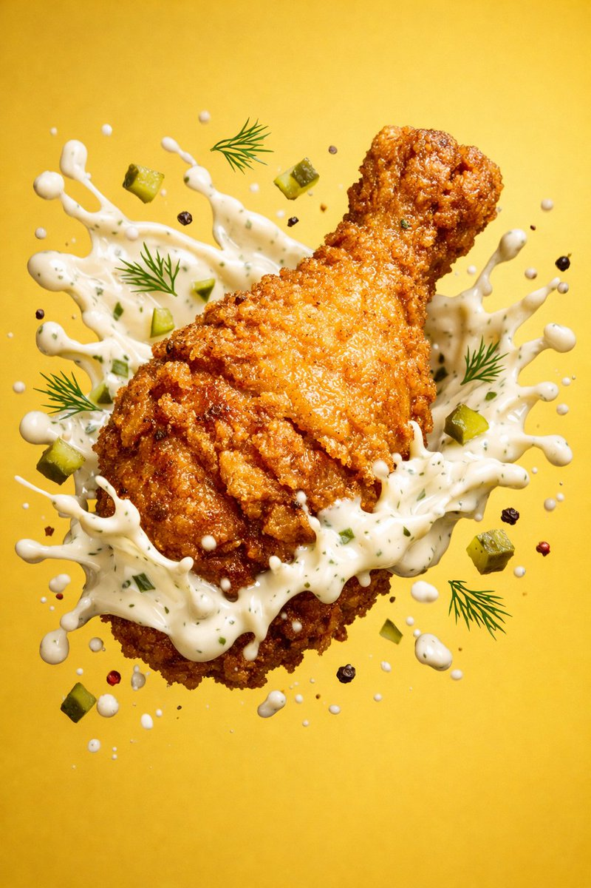

## Do this for Pineapple Pizza: <instruction> Input A: user

- ID: trending-2003860469132718409
- Slug: trending-2003860469132718409-en
- 语言: en
- 来源: [来源链接](https://x.com/Gdgtify/status/2003860469132718409)
- 样例图路径: images/part1/2003860469132718409_1.jpg

### 提示词

```text
Do this for Pineapple Pizza: <instruction>
Input A: user uploads an image or shares name of dish

Logic  Identify the historical inventor (e.g., Raffaele Esposito or Henri Charpentier) and the exact year of origin.

Task: A hyper-realistic 4:5 macro photograph of an oversized, open antique culinary codex resting on a dark velvet museum plinth.

Left Page (The Living Diorama):
The left side of the book is hollowed out like a secret compartment. Inside is a breathtaking 3D miniature scene. A highly detailed figurine of the dish’s inventor is captured mid-motion in a period-accurate kitchen. Around them are microscopic versions of the 10-15 key ingredients, each in its own tiny hand-blown glass vial or micro-wooden crate. Include miniature brass cooking tools specific to the era. The scene is lit from within the "pages" by a warm, magical amber glow.

Right Page (The Technical Recipe):
The right page is flat, aged parchment featuring elegant, faded Spencerian calligraphy and hand-painted watercolor illustrations.
1. Top: The dish name in both English and its native language, with the bold "Origin Date."
2. Middle: A vertical "Ingredient Blueprint" with hyper-detailed sketches of each raw component.
3. Bottom: A small, detailed "Origin Map" showing the specific city of birth, styled like a 19th-century cartographic inset.
4. Text: Visible, legible recipe steps written in ink that looks slightly raised on the paper.

Style:
Museum specimen photography. 85mm macro lens. The lighting should be a mix of cool gallery spotlights and the warm "internal" glow of the book's diorama. Extreme texture on the weathered leather binding and the tooth of the paper.
Output: ONE image, 4:5 aspect ratio.
</instruction>
```

### 样例图

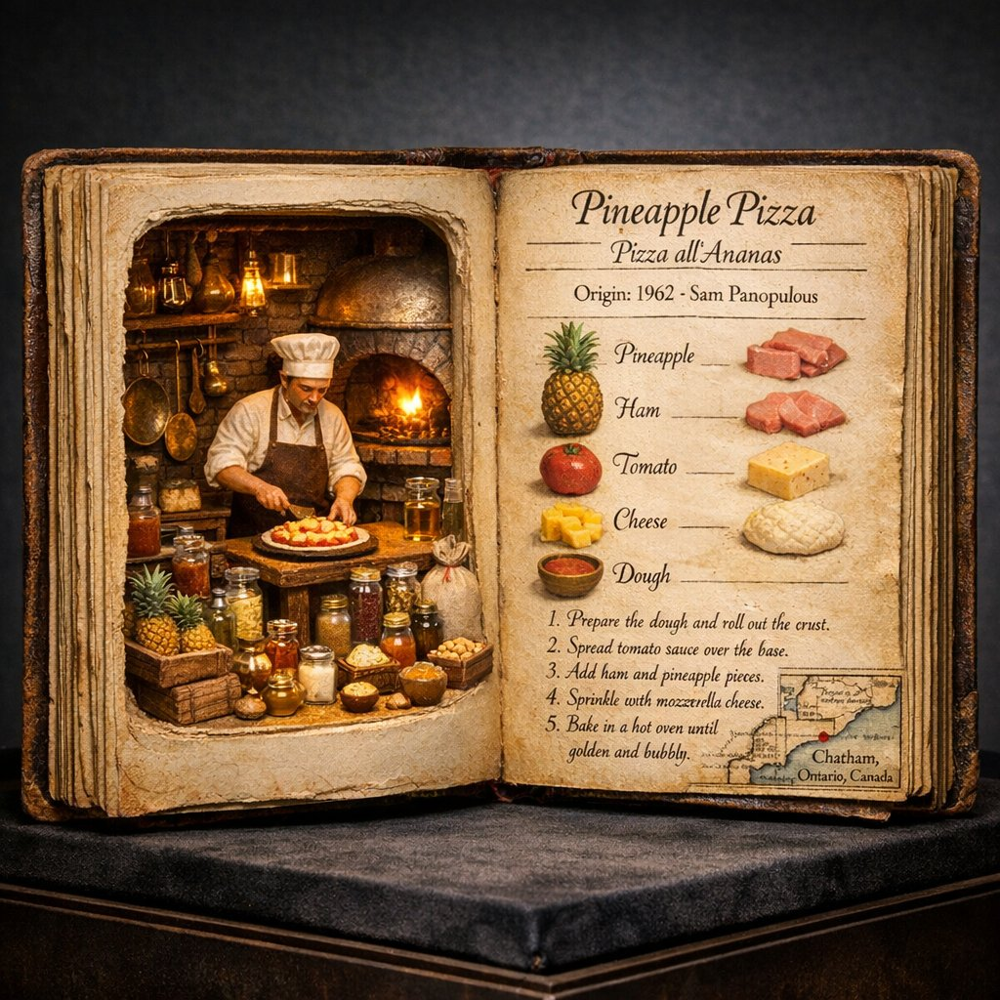

## 2x2 grid, do this for 4 hidden gem international foods s

- ID: trending-2048091166047158761
- Slug: trending-2048091166047158761-en
- 语言: en
- 来源: [来源链接](https://x.com/Gdgtify/status/2048091166047158761)
- 样例图路径: images/part1/2048091166047158761_1.jpg

### 提示词

```text
2x2 grid, do this for 4 hidden gem international foods select * from popup_recipe_visualizer where recipe_target = '[dish_name]' and structural_base = 'l-shaped_open_box_white_interior' and wall_layer_2d = ( select line_art, typography, botanical_drawings from ingredient_inference_db where dish = '[dish_name]' ) and foreground_layer_3d = array[ 'bowl_of_completed_[dish_name]', 'kawaii_chibi_mascot_interacting_with_food', 'scattered_3d_garnishes_on_floor' ] and dynamic_action = 'thick_glossy_sauce_pouring_from_2d_wall_hole_into_3d_bowl' and render_engine = 'octane_render_soft_studio_lighting';
```

### 样例图

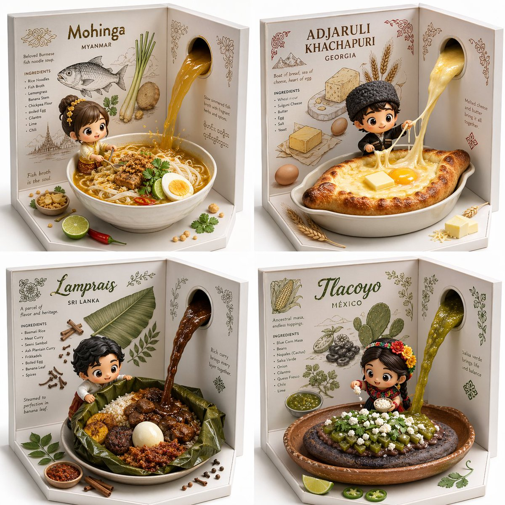

## Create a clean, high-quality McDonald’s advertisement. U

- ID: trending-2047273916406677721
- Slug: trending-2047273916406677721-en
- 语言: en
- 来源: [来源链接](https://x.com/Tegadesigns/status/2047273916406677721)
- 样例图路径: images/part1/2047273916406677721_1.jpg

### 提示词

```text
Create a clean, high-quality McDonald’s advertisement.
Use a bold red brand color with yellow brand accents.
Show a Big Mac, fries, and a drink in a realistic, appetizing style.
Include the golden arches in the background.
Add bold white headline text: “Better together.”
Include smaller text: “Big Mac + Fries — The classic combo.”
Add price and minimal product details at the bottom.
Keep the layout simple, balanced, and premium with strong brand consistency.
```

### 样例图

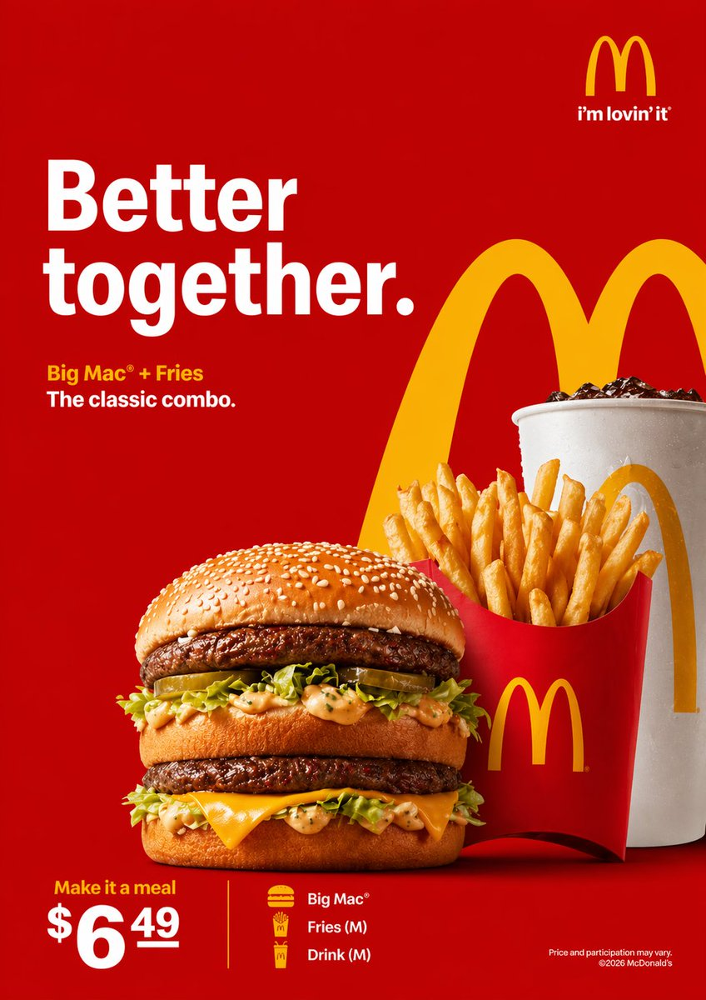

## { "image_prompt": { "type": "Hyper-realistic food infogr

- ID: trending-2017865644365255078
- Slug: trending-2017865644365255078-en
- 语言: en
- 来源: [来源链接](https://x.com/Taaruk_/status/2017865644365255078)
- 样例图路径: images/part1/2017865644365255078_1.jpg

### 提示词

```text
{
  "image_prompt": {
    "type": "Hyper-realistic food infographic",
    "subject": {
      "cuisine": "Indonesian",
      "base_element": "Traditional bowl with steaming hot dish at the bottom",
      "levitating_ingredients": [
        "Juicy meat",
        "Crispy tofu",
        "Glossy sauce splashes",
        "Fresh herbs",
        "Chilies",
        "Lime",
        "Garlic",
        "Fried shallots"
      ]
    },
    "composition": {
      "layout": "Clean vertical composition",
      "arrangement": "Realistic gravity-defying/floating elements",
      "background": "Rustic wooden surface",
      "visual_hierarchy": "Bowl anchored at bottom, ingredients rising vertically"
    },
    "graphic_design_elements": {
      "labels": "Clear Indonesian text",
      "lines": "Thin white pointing lines",
      "style": "Editorial infographic layout, professional food magazine style"
    },
    "lighting_and_mood": {
      "lighting": "Cinematic studio lighting",
      "color_palette": "Warm tones",
      "effects": "Dramatic steam, motion-frozen ingredients"
    },
    "technical_specs": {
      "camera_settings": "Shallow depth of field, sharp focus, DSLR look",
      "details": "Ultra-detailed textures",
      "resolution": "8K ultra-realistic"
    }
  }
}
```

### 样例图

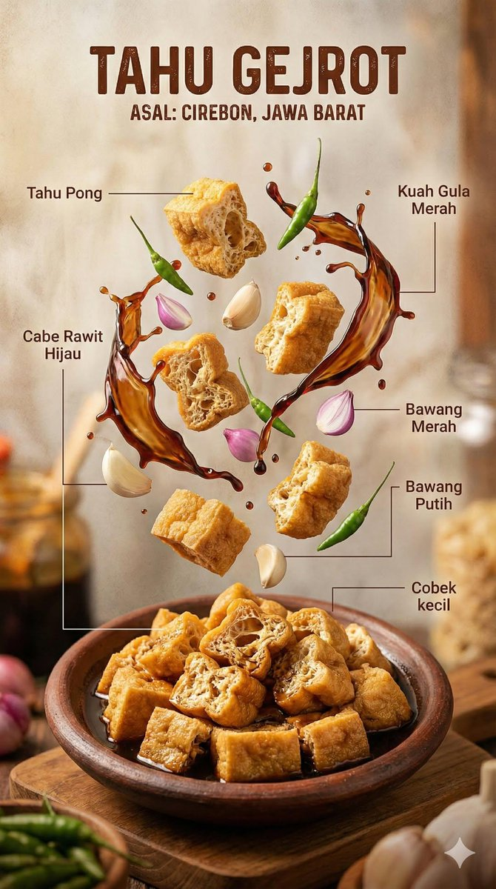

## Ultra-clean modern recipe infographic. Showcase briyani 

- ID: trending-2013186574390046844
- Slug: trending-2013186574390046844-en
- 语言: en
- 来源: [来源链接](https://x.com/Strength04_X/status/2013186574390046844)
- 样例图路径: images/part1/2013186574390046844_1.jpg

### 提示词

```text
Ultra-clean modern recipe infographic. Showcase briyani in a visually appealing finished form—sliced, plated, or portioned—floating slightly in perspective or angled view. Arrange ingredients, steps, and tips around the dish in a dynamic editorial layout, not restricted to top-down. Ingredients Section: Include icons or mini illustrations for each ingredient with quantities. Arrange them in clusters, lists, or circular flows connected visually to the dish. Steps Section: Show preparation steps with numbered panels, arrows, or lines, forming a logical flow around the main dish. Include small cooking icons (knife, pan, oven, timer) where helpful. Additional Info (optional): Total calories, prep/cook time, servings, spice level—displayed as clean bubbles or badges near the dish. Visual Style: Editorial infographic meets lifestyle food photography. Vibrant, natural food colors, subtle drop shadows, clean vector icons, modern typography, soft gradients or glassmorphism for step panels. Accent colors can highlight key info (calories, prep time). Composition Guidelines: Finished meal as hero visual (perspective or angled) Ingredients and steps flow dynamically around the dish Clear visual hierarchy: dish > steps > ingredients > optional stats Enough negative space to keep design airy and readable Lighting & Background: Soft, natural studio lighting, minimal textured or gradient background for premium editorial feel. Output: 1080×1080, ultra-crisp, social-feed optimized, no watermark.
```

### 样例图

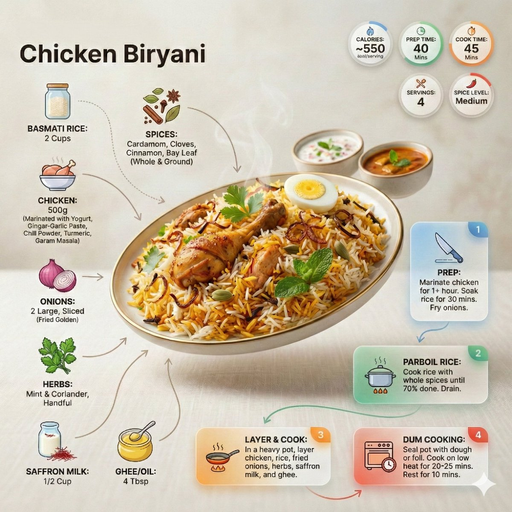

## Ultra-clean modern recipe infographic. Showcase Noodles 

- ID: trending-2021205279933857921
- Slug: trending-2021205279933857921-en
- 语言: en
- 来源: [来源链接](https://x.com/Strength04_X/status/2021205279933857921)
- 样例图路径: images/part1/2021205279933857921_1.jpg

### 提示词

```text
Ultra-clean modern recipe infographic. Showcase Noodles  in a visually appealing finished form—sliced, plated, or portioned—floating slightly in perspective or angled view. Arrange ingredients, steps, and tips around the dish in a dynamic editorial layout, not restricted to top-down. Ingredients Section: Include icons or mini illustrations for each ingredient with quantities. Arrange them in clusters, lists, or circular flows connected visually to the dish. Steps Section: Show preparation steps with numbered panels, arrows, or lines, forming a logical flow around the main dish. Include small cooking icons (knife, pan, oven, timer) where helpful. Additional Info (optional): Total calories, prep/cook time, servings, spice level—displayed as clean bubbles or badges near the dish. Visual Style: Editorial infographic meets lifestyle food photography. Vibrant, natural food colors, subtle drop shadows, clean vector icons, modern typography, soft gradients or glassmorphism for step panels. Accent colors can highlight key info (calories, prep time). Composition Guidelines: Finished meal as hero visual (perspective or angled) Ingredients and steps flow dynamically around the dish Clear visual hierarchy: dish > steps > ingredients > optional stats Enough negative space to keep design airy and readable Lighting & Background: Soft, natural studio lighting, minimal textured or gradient background for premium editorial feel. Output: 1080×1080, ultra-crisp, social-feed optimized, no watermark.”
```

### 样例图

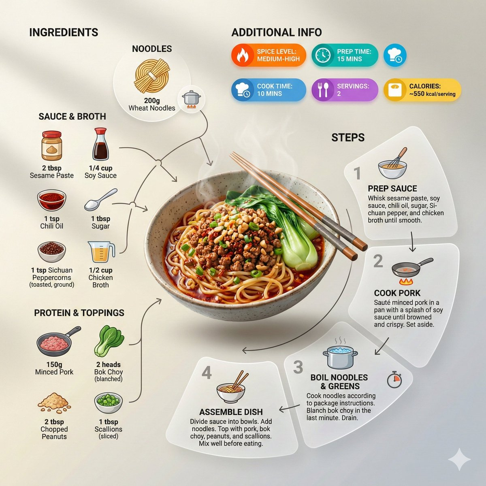

## { "resolution": "8K UHD", "aspect_ratio": "3:4", "image_

- ID: trending-2009204329236828239
- Slug: trending-2009204329236828239-en
- 语言: en
- 来源: [来源链接](https://x.com/kaanakz/status/2009204329236828239)
- 样例图路径: images/part1/2009204329236828239_1.jpg

### 提示词

```text
{
  "resolution": "8K UHD",
  "aspect_ratio": "3:4",
  "image_style": "hyper-realistic commercial dessert photography",
  "global_settings": {
    "quality": "Ultra-high detail, razor-sharp focus, luxury dessert clarity",
    "lighting": "Controlled studio lighting emphasizing texture, layers, and syrup highlights",
    "motion": "Frozen mid-air elements with subtle gravity realism",
    "background_style": "Solid or smooth gradient background, color varies per module",
    "camera": "High-speed photography look, shallow to medium depth of field",
    "post_processing": "Rich contrast, warm tones, natural shine, no artificial glow"
  },
  "modules": { "module_1_classic_baklava_stack_explosion": {
      "scene_description": "A dramatic stack of classic pistachio baklava with flying syrup droplets",
      "baklava": {
        "type": "Traditional pistachio baklava",
        "layers": "Ultra-thin phyllo layers clearly visible",
        "cut": "Diamond-shaped pieces",
        "position": "Stacked and floating mid-air"
      },
      "details": {
        "nuts": "Finely ground bright green pistachios between layers",
        "syrup": "Golden sugar syrup glistening on edges"
      },
      "motion_effects": {
        "syrup": "Small syrup droplets splashing outward",
        "crumbs": "Tiny phyllo flakes suspended in air"
      },
      "background": {
        "color": "Deep emerald green",
        "texture": "Smooth, seamless"
      }
    }, "module_2_minimal_baklava_plate_floating": {
      "scene_description": "Minimalist premium baklava presentation with controlled floating crumbs",
      "baklava": {
        "type": "Single-layer pistachio baklava pieces",
        "arrangement": "Neatly aligned rectangular cuts",
        "surface": "Glossy with light syrup sheen"
      },
      "accent_elements": {
        "nuts": "Crushed pistachio dust lightly floating",
        "syrup": "Thin syrup drizzle frozen mid-air"
      },
      "motion_effects": {
        "particles": "Subtle floating crumbs and nut dust"
      },
      "background": {
        "color": "Warm beige",
        "gradient": "Very soft tonal gradient"
      }
    }, "module_3_baklava_syrup_pour_drama": {
      "scene_description": "Cinematic syrup pour over baklava stack",
      "baklava": {
        "type": "Thick stacked baklava slices",
        "texture": "Highly detailed crispy layers"
      },
      "additional_elements": {
        "syrup": {
          "state": "Thick golden syrup pouring from above",
          "motion": "Frozen in elegant flowing strands"
        },
        "nuts": [
          "Whole pistachio kernels",
          "Crushed pistachio fragments"
        ]
      },
      "motion_effects": {
        "splashes": "Micro syrup splashes on impact points",
        "particles": "Floating nut fragments"
      },
      "background": {
        "color": "Dark chocolate brown",
        "tone": "High contrast, luxury feel"
      }
    }, "module_4_modern_baklava_floating_composition": {
      "scene_description": "Modern deconstructed baklava composition in mid-air",
      "elements": {
        "phyllo": "Crispy golden phyllo sheets floating separately",
        "nuts": "Pistachio layers suspended between sheets",
        "syrup": "Glossy syrup threads connecting elements"
      },
      "motion_effects": {
        "flakes": "Ultra-fine pastry flakes suspended",
        "drops": "Minimal syrup droplets"
      },
      "background": {
        "color": "Muted olive green",
        "texture": "Smooth, seamless"
      }
    }
  },
  "negative_prompt": [
    "text",
    "logos",
    "branding",
    "hands",
    "people",
    "utensils",
    "plates",
    "tables",
    "cartoon style",
    "excessive syrup pooling",
    "burnt pastry",
    "overexposure",
    "artificial glow",
    "low detail textures"
  ]
}
```

### 样例图

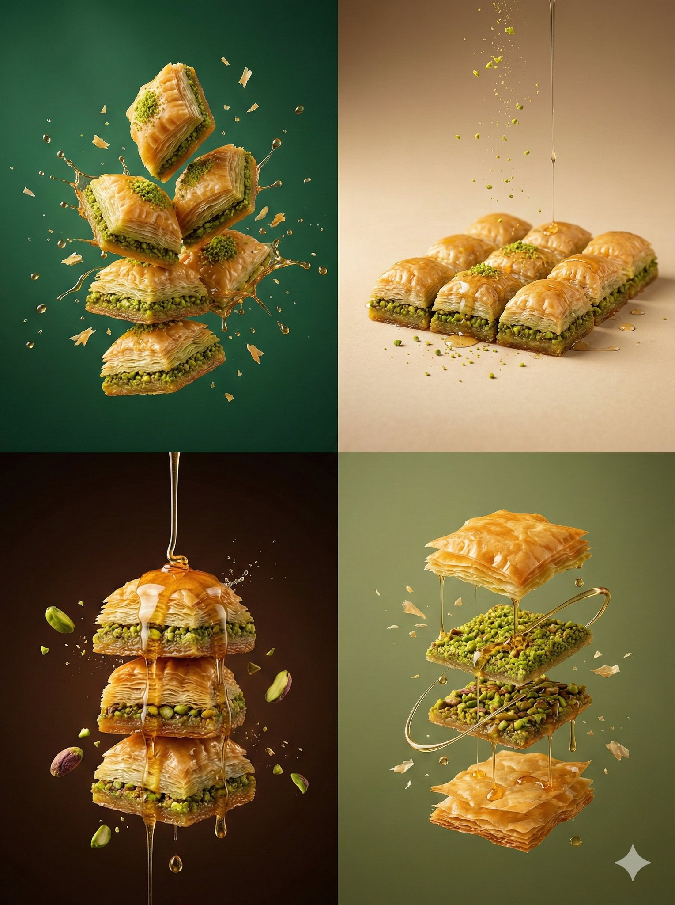

## Using the attached image, create an illustration sheet o

- ID: trending-2038342534024544736
- Slug: trending-2038342534024544736-en
- 语言: en
- 来源: [来源链接](https://x.com/gudanglifehack/status/2038342534024544736)
- 样例图路径: images/part1/2038342534024544736_1.jpg

### 提示词

```text
Using the attached image, create an illustration sheet of professional industrial design packaging for the package (PACKAGE TYPE). A centered heroic 3D rendering with realistic materials, soft studio lighting and commercial quality finishes. Surrounded by technical views: front, side, top, bottom, oblique perspective and flat position. Include sketches of the frame structure, crease lines, seam details, and size arrows in millimeters. Show materials and finishes (matte, glossy print, plastic, paper, glass, etc.) in handwritten annotations. Add color swatches, realistic product illustrations, and subtle shadows. Clean sketchbook background, realistic rendering + pencil sketch style, modern design design, ultra-detailed, portfolio ready.
```

### 样例图

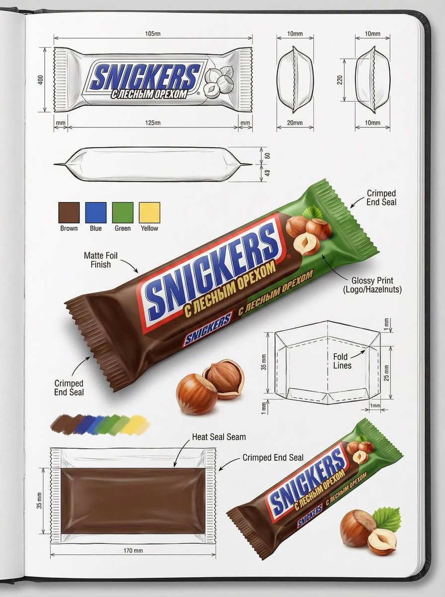

## [subject], premium food advertising, white seamless back

- ID: trending-2009625733933736157
- Slug: trending-2009625733933736157-en
- 语言: en
- 来源: [来源链接](https://x.com/azed_ai/status/2009625733933736157)
- 样例图路径: images/part1/2009625733933736157_1.jpg

### 提示词

```text
[subject], premium food advertising, white seamless background, high key studio lighting, floating stacked composition, levitating pieces, [ingredient_bits] scattered, clean minimal layout, crisp soft shadow on surface, ultra realistic, macro product photography, 100mm lens look, f/8 sharp focus, subtle texture detail, editorial commercial, 8k
```

### 样例图

![[subject], premium food advertising, white seamless back](../images/part1/2009625733933736157_1.jpg)

## Perfect cinematic cross-section cut through [DISH], slic

- ID: trending-2025686032700805436
- Slug: trending-2025686032700805436-en
- 语言: en
- 来源: [来源链接](https://x.com/AllaAisling/status/2025686032700805436)
- 样例图路径: images/part1/2025686032700805436_1.jpg

### 提示词

```text
Perfect cinematic cross-section cut through [DISH], sliced cleanly down the center revealing every internal layer in full detail. The cut face is facing the camera straight-on, like a geological diagram of flavor. Each visible layer is labeled with a thin horizontal line extending to the right — uppercase sans-serif "[INGREDIENT NAME]" with italic descriptor below. Background: flat matte [COLOR]. Lighting: dramatic side light from left casting long shadows, single warm spotlight on the cut face. Every texture hyperreal — visible moisture, air pockets, char, glaze, and steam. Mood: architectural food photography meets scientific illustration. Dish name "[DISH NAME]" in large elegant type at top. Subtitle: "[TAGLINE]". 4K, tack sharp, Style ref: Wes Anderson symmetry meets Michelin-star kitchen.
```

### 样例图

![Perfect cinematic cross-section cut through [DISH], slic](../images/part1/2025686032700805436_1.jpg)

## Create a hyper-realistic exploded vertical infographic c

- ID: trending-2010305720764551520
- Slug: trending-2010305720764551520-en
- 语言: en
- 来源: [来源链接](https://x.com/TechieBySA/status/2010305720764551520)
- 样例图路径: images/part1/2010305720764551520_1.jpg

### 提示词

```text
Create a hyper-realistic exploded vertical infographic composition of [FOOD].
At the top, characteristic particles, droplets, or garnishes associated with the food, frozen mid-air.
Below it, the primary surface or topping layer with rich texture and realistic material detail.
Underneath, the core ingredient layer showing structure, depth, and natural variation.
Below that, the supporting base or interior layer, slightly separated to reveal construction.
At the bottom, a minimal plate, bowl, cup, or base appropriate to the food’s presentation.
Pure white background, soft studio lighting, subtle shadows beneath each floating element, ultra-sharp focus, DSLR macro photography, clean infographic text labels with thin pointer lines, premium editorial food photography aesthetic, 8K quality.
```

### 样例图

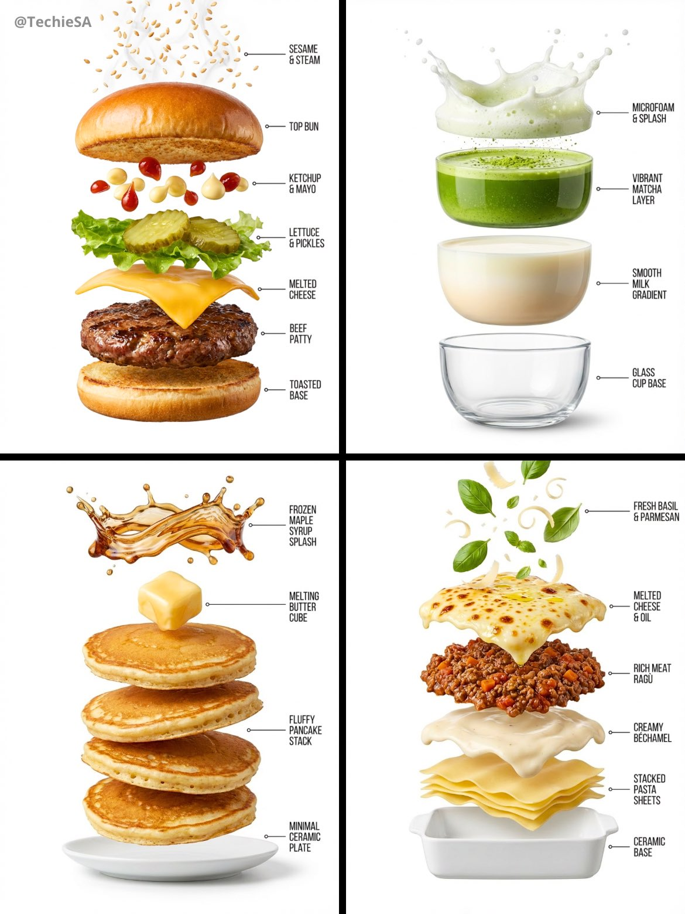

## { "aspect_ratio": "3:4", "render_mode": "raw", "series":

- ID: trending-2011762827866845208
- Slug: trending-2011762827866845208-en
- 语言: en
- 来源: [来源链接](https://x.com/kaanakz/status/2011762827866845208)
- 样例图路径: images/part1/2011762827866845208_1.jpg

### 提示词

```text
{
  "aspect_ratio": "3:4",
  "render_mode": "raw",
  "series": [
    {
      "index": "1/5",
      "prompt": "two hands pulling apart a hot freshly baked pizza slice, long elastic mozzarella cheese stretch between the slice and the pie, blistered crust edges, steam rising, crumbs falling mid-air, warm cinematic light, ultra high-detail food action photography",
      "category": "cheese pull",
      "lighting": "warm cinematic oven light",
      "detail_level": "ultra-detailed"
    },
    {
      "index": "2/5",
      "prompt": "two hands pulling apart a syrup-soaked baklava piece, thin crispy phyllo layers cracking, rich pistachio filling visible, thick honey syrup stretching and dripping mid-air, golden warm light, cinematic dessert action photography",
      "category": "syrup & crunch",
      "lighting": "golden warm light",
      "detail_level": "ultra-detailed"
    },
    {
      "index": "3/5",
      "prompt": "two hands breaking a molten chocolate lava cake in half, glossy dark chocolate flowing out from the center, steam rising gently, crumbs suspended mid-air, soft warm spotlight, cinematic dessert action photography",
      "category": "molten chocolate",
      "lighting": "soft warm spotlight",
      "detail_level": "ultra-detailed"
    },
    {
      "index": "4/5",
      "prompt": "two hands tearing a glazed cinnamon roll apart, sticky cinnamon sugar filling stretching in glossy strands, icing dripping slowly, fluffy dough texture visible, cozy warm bakery light, high-detail cinematic food photography",
      "category": "sticky pull",
      "lighting": "warm bakery light",
      "detail_level": "ultra-detailed"
    },
    {
      "index": "5/5",
      "prompt": "two hands splitting a classic New York-style cheesecake slice, ultra-creamy interior slowly separating, crumbly biscuit base breaking apart, subtle cream stretch, soft studio warm light, cinematic high-detail dessert photography",
      "category": "creamy separation",
      "lighting": "soft warm studio light",
      "detail_level": "ultra-detailed"
    }
  ]
}
```

### 样例图

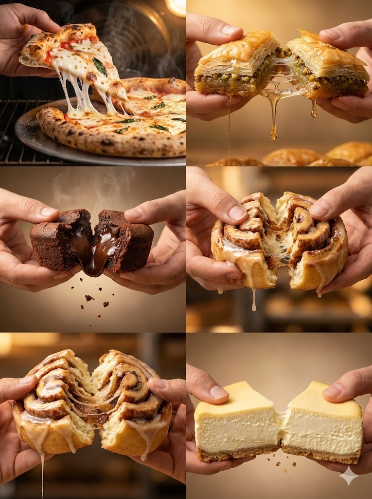

## Create a realistic yet surreal creative advertisement fo

- ID: trending-2008248159815036942
- Slug: trending-2008248159815036942-en
- 语言: en
- 来源: [来源链接](https://x.com/aziz4ai/status/2008248159815036942)
- 样例图路径: images/part1/2008248159815036942_1.jpg

### 提示词

```text
Create a realistic yet surreal creative advertisement for [PRODUCT NAME] in the [PRODUCT CATEGORY] space. The product must be the hero, centered in the frame, and visually “formed” in a smart way that automatically reflects the brand’s spirit and identity.

Use a clean, cohesive background that matches the brand’s color palette, with soft cinematic lighting, ultra-realistic premium materials, precise shadows, and a high-end editorial composition.

Add one innovative surreal touch directly tied to the product’s nature—creative but not exaggerated.

Integrate the real official product logo elegantly and seamlessly within the composition, and generate a short, powerful 3-word English slogan automatically that fits the product type and brand tone.

Ultra-high quality, perfectly balanced framing, strong realism, luxury style—no extra text beyond the logo and the 3-word English slogan.
```

### 样例图

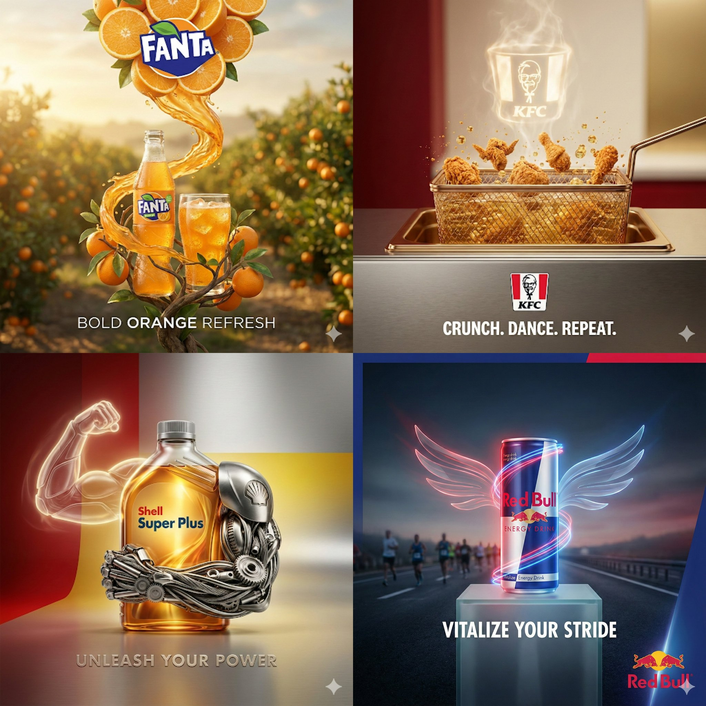

## { "juice_boxes": [ { "id": 1, "product": { "brand": "Tip

- ID: trending-2010381897730339152
- Slug: trending-2010381897730339152-en
- 语言: en
- 来源: [来源链接](https://x.com/YaseenK7212/status/2010381897730339152)
- 样例图路径: images/part1/2010381897730339152_1.jpg

### 提示词

```text
{
  "juice_boxes": [
    {
      "id": 1,
      "product": {
        "brand": "Tip-Top",
        "flavor": "Strawberry",
        "image": {
          "description": "strawberry juice with ripe strawberries",
          "background": {
            "color": "fresh pastel pink",
            "elements": [
              "strawberry halves",
              "juice splashes",
              "dynamic swirling around the pack"
            ]
          }
        }
      },
      "design": {
        "style": {
          "detail": "high-quality detail",
          "texture": "commercial-grade photorealism"
        },
        "aspect_ratio": "2:3"
      }
    },
    {
      "id": 2,
      "product": {
        "brand": "Tip-Top",
        "flavor": "Mango",
        "image": {
          "description": "mango juice with ripe golden mangoes",
          "background": {
            "color": "tropical orange-yellow gradient",
            "elements": [
              "mango cubes",
              "swirling juice streams",
              "energetic and appetizing scene"
            ]
          }
        }
      },
      "design": {
        "style": {
          "texture": "ultra-realistic packaging material texture"
        },
        "aspect_ratio": "2:3"
      }
    },
    {
      "id": 3,
      "product": {
        "brand": "Tip-Top",
        "flavor": "Grape",
        "image": {
          "description": "grape juice with purple grapes",
          "background": {
            "color": "deep purple gradient",
            "elements": [
              "grape bunches",
              "glossy juice splashes",
              "surrounding the carton"
            ]
          }
        }
      },
      "design": {
        "style": {
          "tone": "elegant",
          "mood": "lively commercial promotion style"
        },
        "aspect_ratio": "2:3"
      }
    }
  ]
}
```

### 样例图

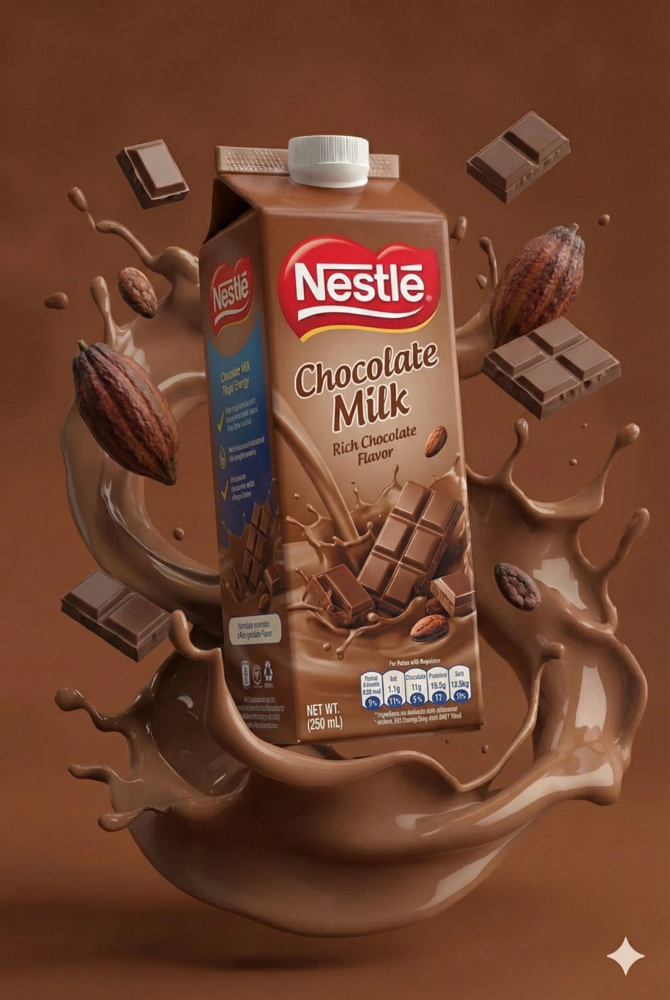

## Create an infographic image of [FOOD], combining a reali

- ID: trending-2015488786445082660
- Slug: trending-2015488786445082660-en
- 语言: en
- 来源: [来源链接](https://x.com/TechieBySA/status/2015488786445082660)
- 样例图路径: images/part1/2015488786445082660_1.jpg

### 提示词

```text
Create an infographic image of [FOOD], combining a realistic photograph or photoreal render of the object with technical annotation overlays placed directly on top.

Use black ink–style line drawings and text (technical pen / architectural sketch look) on a pure white studio background, including:
•Key component labels
•Internal cutaway or exploded-view outlines
•Measurements, dimensions, and scale markers
•Material callouts and quantities
•Arrows indicating function, force, or flow (air, sound, power, pressure)
•Simple schematic or sectional diagrams where relevant

Place the title “FOOD” inside a hand-drawn technical annotation box in one corner.

Style & layout rules:
•The real object remains clearly visible beneath the annotations
•Annotations feel sketched, technical, and architectural
•Clean composition with balanced negative space
•Educational, museum-exhibit / engineering-manual vibe

Visual style:
Minimal technical illustration aesthetic, black linework over realistic imagery, precise but slightly hand-drawn feel.

Color palette:
White background, black annotation lines and text only. No colors.

Output:
1080×1080, ultra-crisp, social-feed optimized, no watermark.
```

### 样例图

![Create an infographic image of [FOOD], combining a reali](../images/part1/2015488786445082660_1.jpg)

## Ultra-realistic food photography of a prepared creamy wh

- ID: trending-2016073152820846633
- Slug: trending-2016073152820846633-en
- 语言: en
- 来源: [来源链接](https://x.com/Strength04_X/status/2016073152820846633)
- 样例图路径: images/part1/2016073152820846633_1.jpg

### 提示词

```text
Ultra-realistic food photography of a prepared creamy white sauce penne pasta served in a minimal ceramic bowl. Perfectly cooked penne coated evenly in rich, glossy cream sauce, topped with freshly grated parmesan cheese and finely chopped green herbs. Clean white studio background, soft diffused lighting, gentle shadows under the bowl, natural highlights on the sauce, realistic texture and thickness. Centered composition, shallow depth of field, premium restaurant-style presentation, high-detail food styling, 8K quality, sharp focus, no text, no labels, no hands, no props, no watermark.
```

### 样例图

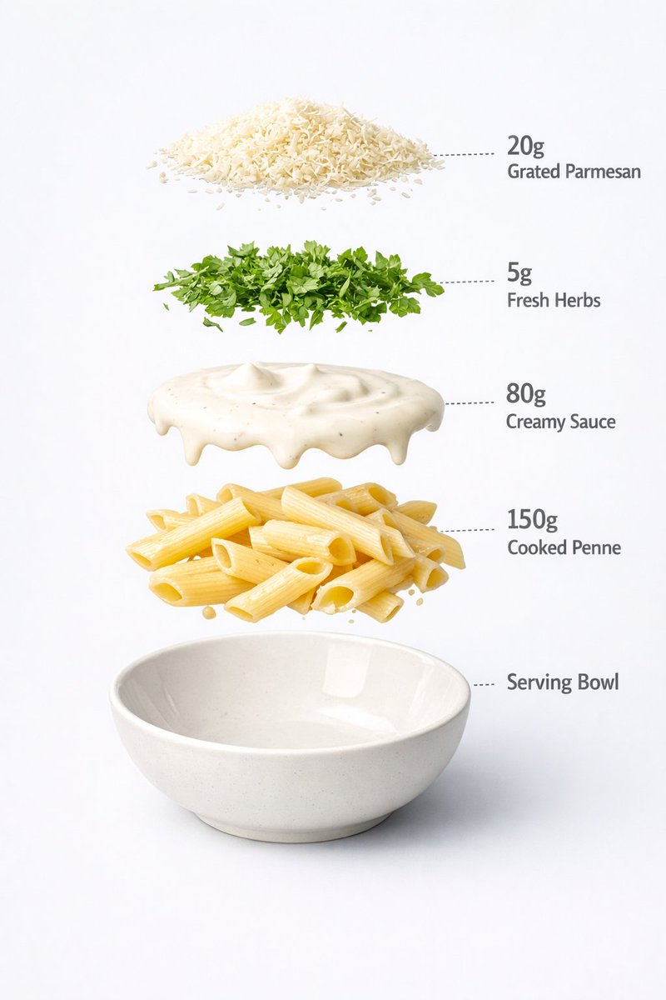

## Ultra-realistic commercial product photography of a cara

- ID: trending-2024707382727889320
- Slug: trending-2024707382727889320-en
- 语言: en
- 来源: [来源链接](https://x.com/Kashberg_0/status/2024707382727889320)
- 样例图路径: images/part1/2024707382727889320_1.jpg

### 提示词

```text
Ultra-realistic commercial product photography of a caramel frappuccino in a clear plastic cup with dome lid and green straw, topped with whipped cream and caramel drizzle, floating mid-air. Coffee beans exploding around the cup with fine coffee powder dust particles suspended in the air, dynamic caramel splash trails swirling around the drink. Dark smoky background with dramatic spotlight from above, warm golden rim lighting, high contrast, sharp focus, macro details, cinematic depth of field, hyper-detailed texture, premium beverage advertisement, 8K resolution.
```

### 样例图

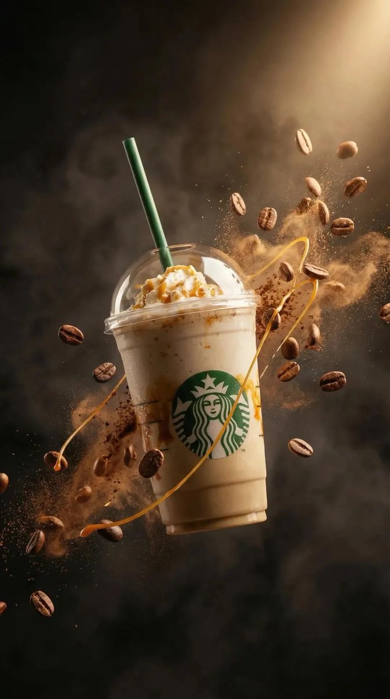

## { "resolution": "8K UHD", "aspect_ratio": "3:4", "image_

- ID: trending-2009941784965853278
- Slug: trending-2009941784965853278-en
- 语言: en
- 来源: [来源链接](https://x.com/kaanakz/status/2009941784965853278)
- 样例图路径: images/part1/2009941784965853278_1.jpg

### 提示词

```text
{
  "resolution": "8K UHD",
  "aspect_ratio": "3:4",
  "image_style": "hyper-realistic commercial food photography",
  "global_settings": {
    "quality": "Ultra-high detail, razor-sharp focus, premium street food clarity",
    "lighting": "Controlled studio lighting emphasizing meat texture, char marks, and sauce glistening",
    "motion": "Frozen mid-air elements with subtle gravity realism",
    "background_style": "Solid or smooth gradient background, color varies per module",
    "camera": "High-speed photography look, shallow to medium depth of field",
    "post_processing": "Rich contrast, warm savory tones, natural shine, appetizing color grading"
  },
  "modules": {
    
    "module_1_classic_doner_slice_explosion": {
      "scene_description": "A dramatic vertical döner stack with flying meat slices and sauce droplets",
      "doner": {
        "type": "Traditional Turkish döner kebab slices",
        "texture": "Thinly sliced beef and lamb mix with visible char marks",
        "cut": "Paper-thin ribbons",
        "position": "Stacked vertically and floating mid-air"
      },
      "details": {
        "char_marks": "Dark caramelized edges with grill stripes",
        "fat_marbling": "Glistening fat streaks between meat layers",
        "seasoning": "Visible spice particles on meat surface"
      },
      "motion_effects": {
        "meat_slices": "Individual döner slices spiraling outward",
        "sauce": "White garlic sauce and red chili sauce droplets splashing",
        "herbs": "Fresh parsley leaves floating in air"
      },
      "background": {
        "color": "Deep crimson red",
        "texture": "Smooth, seamless"
      }
    },

    "module_2_minimal_doner_durum_floating": {
      "scene_description": "Minimalist premium döner dürüm presentation with controlled floating ingredients",
      "doner": {
        "type": "Perfectly wrapped dürüm (wrap) cross-section",
        "arrangement": "Single dürüm cut in half, floating vertically",
        "surface": "Lightly toasted lavash bread with golden char marks"
      },
      "accent_elements": {
        "filling": "Layered döner meat, lettuce, tomatoes, onions visible in cross-section",
        "sauce": "White garlic yogurt sauce drizzling elegantly",
        "vegetables": "Fresh red tomato slices, crisp lettuce, purple onion rings"
      },
      "motion_effects": {
        "particles": "Subtle floating spice particles and herb fragments",
        "drops": "Sauce droplets frozen mid-fall"
      },
      "background": {
        "color": "Warm terracotta orange",
        "gradient": "Very soft tonal gradient"
      }
    },

    "module_3_doner_sauce_pour_drama": {
      "scene_description": "Cinematic sauce pour over döner meat pile",
      "doner": {
        "type": "Mountain of freshly sliced döner meat",
        "texture": "Highly detailed crispy edges and tender interior"
      },
      "additional_elements": {
        "sauces": {
          "white_sauce": {
            "state": "Thick creamy garlic yogurt sauce pouring from above",
            "motion": "Frozen in elegant flowing ribbon"
          },
          "red_sauce": {
            "state": "Spicy red chili sauce drizzling alongside",
            "motion": "Thin crimson streams intertwining with white sauce"
          }
        },
        "vegetables": [
          "Sliced tomatoes",
          "Chopped lettuce",
          "Thinly sliced onions",
          "Fresh parsley sprigs"
        ]
      },
      "motion_effects": {
        "splashes": "Micro sauce splashes on meat surface",
        "particles": "Floating spice particles and herb fragments",
        "steam": "Subtle heat vapor rising from meat"
      },
      "background": {
        "color": "Dark charcoal black",
        "tone": "High contrast, premium street food aesthetic"
      }
    },

    "module_4_modern_doner_deconstructed_composition": {
      "scene_description": "Modern deconstructed döner composition in mid-air",
      "elements": {
        "bread": "Pieces of toasted lavash bread floating separately",
        "meat": "Individual döner slices suspended at different angles",
        "vegetables": "Tomato slices, lettuce leaves, onion rings floating between layers",
        "sauces": "Glossy sauce ribbons connecting elements artistically"
      },
      "motion_effects": {
        "particles": "Ultra-fine spice dust suspended in air",
        "drops": "Scattered sauce droplets frozen in motion",
        "steam": "Minimal heat waves rising from meat"
      },
      "background": {
        "color": "Muted sage green",
        "texture": "Smooth, seamless"
      }
    },

    "module_5_rotating_doner_spit_close_up": {
      "scene_description": "Extreme close-up of döner meat on vertical spit with knife slice frozen in time",
      "doner_spit": {
        "type": "Vertical döner tower on rotating spit",
        "texture": "Layers of seasoned meat with charred outer crust",
        "detail": "Visible spices, fat marbling, and grill marks"
      },
      "action_elements": {
        "knife": "Large döner knife mid-slice through meat",
        "meat_slice": "Fresh slice falling away from spit",
        "shavings": "Meat shavings and crispy bits floating"
      },
      "motion_effects": {
        "particles": "Charred bits and seasoning particles in air",
        "steam": "Heat vapor wisps rising from fresh cut"
      },
      "background": {
        "color": "Rich golden amber",
        "texture": "Smooth gradient"
      }
    },

    "module_6_doner_plate_overhead_explosion": {
      "scene_description": "Overhead shot of döner plate with ingredients exploding upward",
      "composition": {
        "base": "Thin lavash bread pieces on bottom",
        "center": "Pile of döner meat slices",
        "explosion": "All ingredients bursting upward in circular pattern"
      },
      "flying_elements": [
        "Döner meat slices spiraling",
        "French fries launching upward",
        "Grilled peppers and tomatoes",
        "Fresh parsley and sumac",
        "Sauce droplets spraying",
        "Lemon wedges"
      ],
      "motion_effects": {
        "height_variation": "Elements at different heights creating depth",
        "rotation": "Some elements rotating while airborne"
      },
      "background": {
        "color": "Deep burgundy red",
        "style": "Vignette effect focusing on center"
      }
    }

  },
  "negative_prompt": [
    "text",
    "logos",
    "branding",
    "hands",
    "people",
    "utensils beyond döner knife",
    "full plates visible",
    "tables",
    "restaurant interior",
    "cartoon style",
    "raw meat",
    "excessive grease pooling",
    "burnt or overcooked appearance",
    "overexposure",
    "artificial glow",
    "low detail textures",
    "unappetizing colors",
    "plastic-looking food"
  ]
}
```

### 样例图

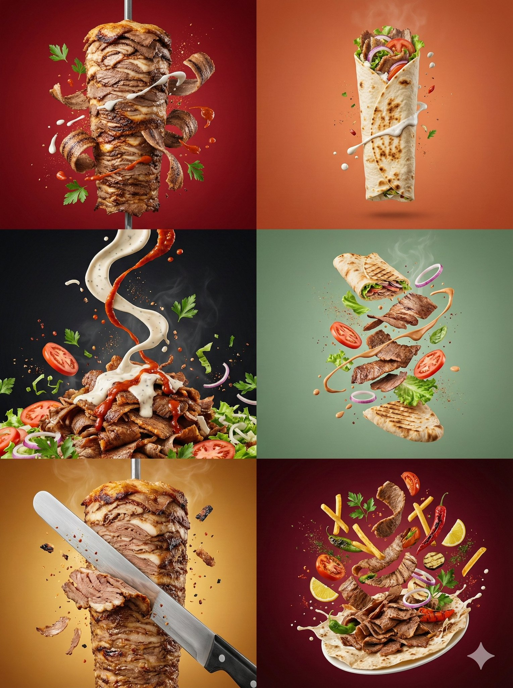

## Ultra-clean modern recipe infographic. Showcase Pizza in

- ID: trending-2024758790038442001
- Slug: trending-2024758790038442001-en
- 语言: en
- 来源: [来源链接](https://x.com/Strength04_X/status/2024758790038442001)
- 样例图路径: images/part1/2024758790038442001_1.jpg

### 提示词

```text
Ultra-clean modern recipe infographic. Showcase Pizza  in a visually appealing finished form—sliced, plated, or portioned—floating slightly in perspective or angled view. Arrange ingredients, steps, and tips around the dish in a dynamic editorial layout, not restricted to top-down. Ingredients Section: Include icons or mini illustrations for each ingredient with quantities. Arrange them in clusters, lists, or circular flows connected visually to the dish. Steps Section: Show preparation steps with numbered panels, arrows, or lines, forming a logical flow around the main dish. Include small cooking icons (knife, pan, oven, timer) where helpful. Additional Info (optional): Total calories, prep/cook time, servings, spice level—displayed as clean bubbles or badges near the dish. Visual Style: Editorial infographic meets lifestyle food photography. Vibrant, natural food colors, subtle drop shadows, clean vector icons, modern typography, soft gradients or glassmorphism for step panels. Accent colors can highlight key info (calories, prep time). Composition Guidelines: Finished meal as hero visual (perspective or angled) Ingredients and steps flow dynamically around the dish Clear visual hierarchy: dish > steps > ingredients > optional stats Enough negative space to keep design airy and readable Lighting & Background: Soft, natural studio lighting, minimal textured or gradient background for premium editorial feel. Output: 1080×1080, ultra-crisp, social-feed optimized, no watermark.”
```

### 样例图

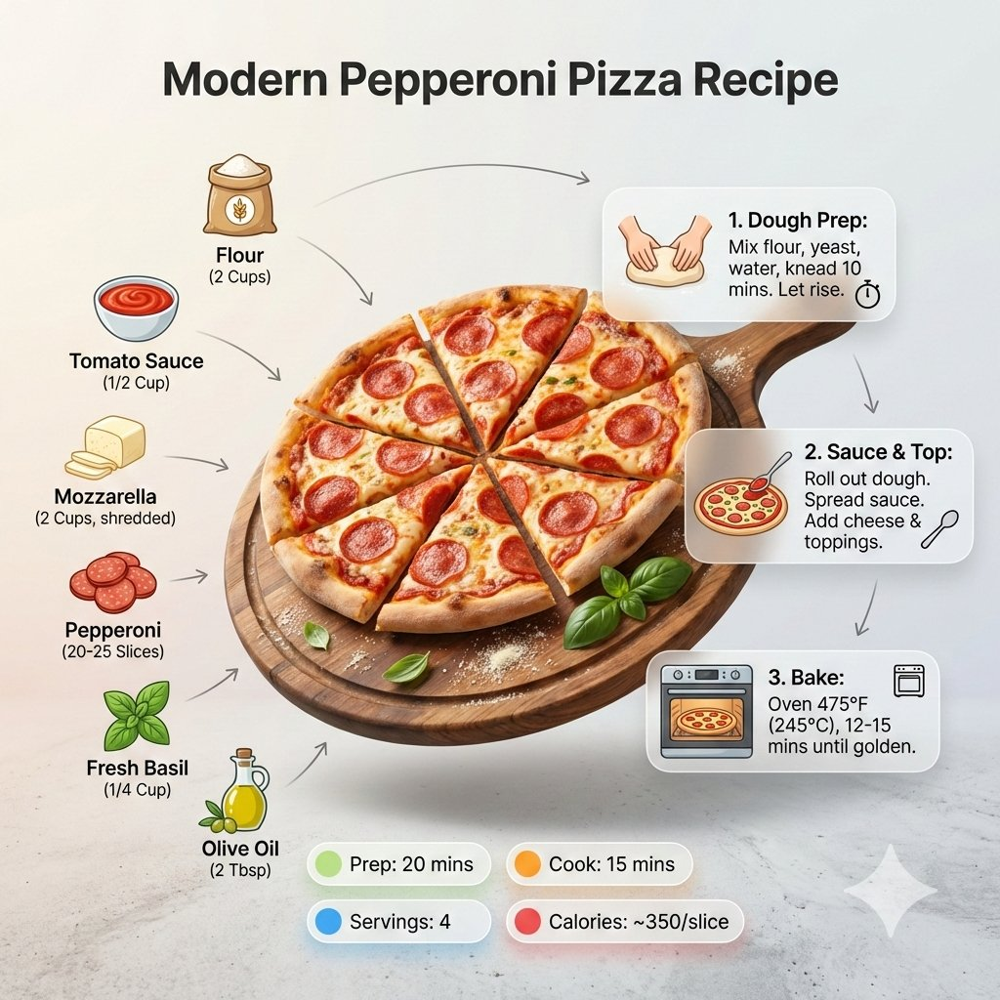

## { "model": "Nano Banana / Gemini-style", "aspect_ratio":

- ID: trending-2011261271946187209
- Slug: trending-2011261271946187209-en
- 语言: en
- 来源: [来源链接](https://x.com/Just_sharon7/status/2011261271946187209)
- 样例图路径: images/part1/2011261271946187209_1.jpg

### 提示词

```text
{
  "model": "Nano Banana / Gemini-style",
  "aspect_ratio": "3:4",
  "render_mode": "raw",
  "series": [
    {
      "index": "1/5",
      "prompt": "two hands pulling apart a grilled cheese sandwich, strands of melted cheddar stretching dramatically between the halves, toasted bread edges crisp and golden, crumbs falling mid-air, warm cozy light, cinematic food action photography",
      "category": "cheese pull",
      "lighting": "warm cozy cinematic light",
      "detail_level": "high-detail"
    },
    {
      "index": "2/5",
      "prompt": "two hands breaking a warm chocolate chip cookie in half, melted chocolate strands stretching between the pieces, crumbs falling mid-air, cozy warm light, high-detail food action photography",
      "category": "chocolate stretch",
      "lighting": "soft cozy warm light",
      "detail_level": "high-detail"
    },
    {
      "index": "3/5",
      "prompt": "two hands splitting a peanut butter and jelly sandwich in half, thick peanut butter and jam stretching in gooey strands, toasted bread edges crisp, crumbs falling mid-air, warm cozy backlight, high-detail food action photography",
      "category": "gooey spread pull",
      "lighting": "warm backlight",
      "detail_level": "high-detail"
    },
    {
      "index": "4/5",
      "prompt": "two hands tearing a syrup-soaked Belgian waffle, caramel strands stretching between pieces, crumbs and syrup droplets suspended mid-air, golden hour backlight, cozy cinematic food action photography",
      "category": "syrup stretch",
      "lighting": "golden hour backlight",
      "detail_level": "ultra-detailed"
    },
    {
      "index": "5/5",
      "prompt": "two hands breaking a southern-style buttery biscuit in half, hot steam rising, melted butter pooling inside the cracks, crumbs falling mid-air, warm country kitchen light, cinematic high-detail food action photography",
      "category": "steam & butter",
      "lighting": "warm kitchen light",
      "detail_level": "ultra-detailed"
    }
  ]
}
```

### 样例图

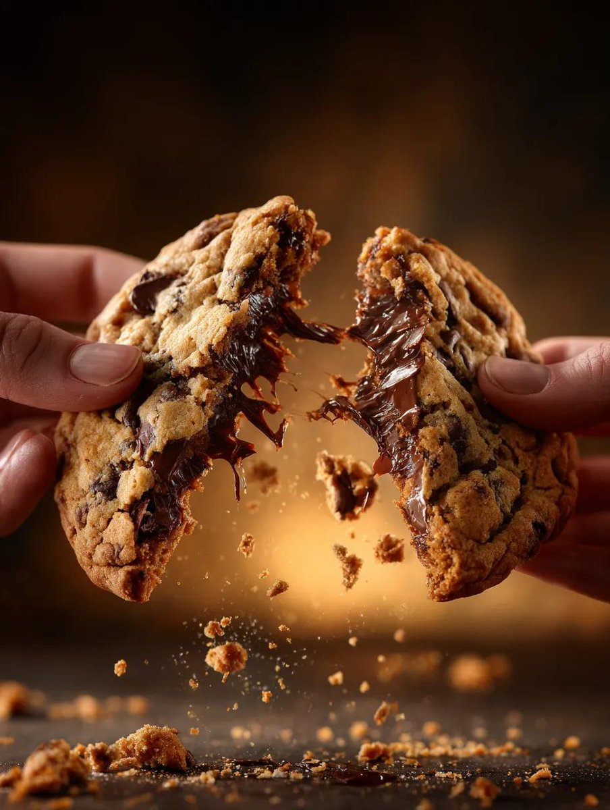

## A high-end commercial food photograph of the same two ta

- ID: trending-2011770206839062641
- Slug: trending-2011770206839062641-en
- 语言: en
- 来源: [来源链接](https://x.com/Strength04_X/status/2011770206839062641)
- 样例图路径: images/part1/2011770206839062641_1.jpg

### 提示词

```text
A high-end commercial food photograph of the same two tacos from the reference image, preserving their exact structure, fillings, proportions, and arrangement. The camera angle is slightly adjusted to a more flattering three-quarter close-up, enhancing depth and appetite appeal without altering the tacos themselves. Soft cinematic lighting highlights the textures of the tortillas and fillings, with subtle steam and natural sheen to emphasize freshness. The background is replaced with a clean, modern, out-of-focus setting in warm complementary tones that enhance the food without distracting from it. Shallow depth of field, crisp focus on the tacos, rich contrast, natural colors, and premium restaurant advertising quality. No added or removed ingredients, refined composition, lighting, and environment.

Image 2: Exploded-view commercial visualization of the taco from the image, presented as premium recipe-style breakdown.

The taco is deconstructed into four visible ingredients, matching the original taco precisely in composition, color, and texture. No additional ingredients.

The ingredients are separated and arranged in a clean vertical stack, evenly spaced from bottom to top, floating in place with precise alignment and symmetry.

Ingredient order (bottom → top):

Soft wheat taco tortilla

Shredded red cabbage

Grilled chicken pieces

Sauce with garnish (topped with a small mixed garnish of diced onion, tomato, and parsley, approximately 5–6 small cubes total, lightly mixed, placed naturally on top)

Each ingredient is visually distinct and clearly readable in shape and texture.

Annotation design requirements:

– Large, bold sans-serif font, high legibility at feed scale

– Each annotation placed inside a solid or softly rounded rectangular color block

– Background color of each block corresponds subtly to the ingredient color (tomato red, lettuce green, meat warm brown, sauce white/cream, pita beige)

– High contrast text (dark on light, light on dark)

– Thick, clean connector lines pointing clearly to each ingredient

– No transparency that reduces readability

– Annotations must visually dominate over background without covering ingredients

Background is soft, neutral, and atmospheric, with subtle depth and gentle gradients, inspired by premium food advertising.

Overall style is clean, modern, and appetizing, commercial-ready without technical or schematic feel.

No extra elements, no substitutions, no reinterpretation of ingredients.
```

### 样例图

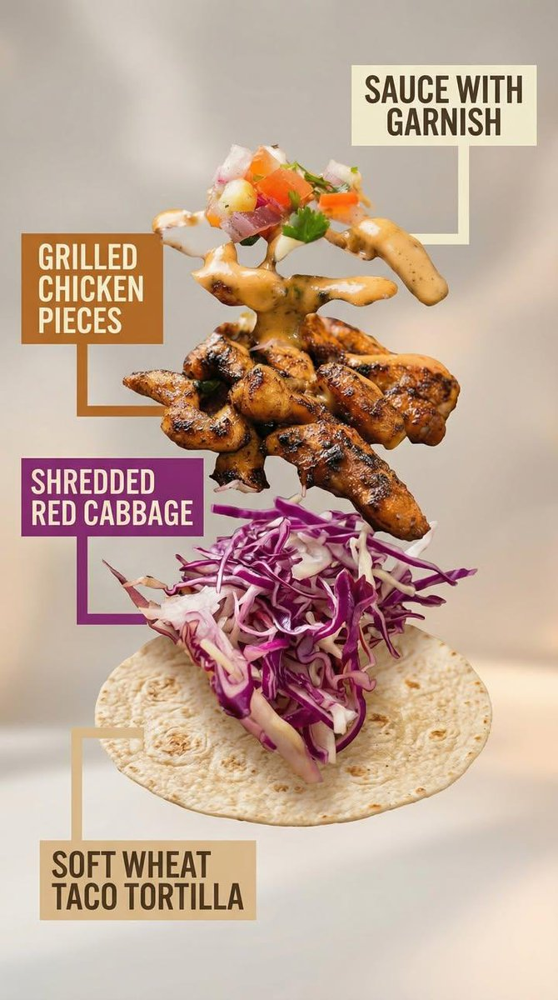

## { “subject”: “巧克力咖啡饮

- ID: trending-2008986705962123774
- Slug: trending-2008986705962123774-zh
- 语言: zh
- 来源: [来源链接](https://x.com/ttmouse/status/2008986705962123774)
- 样例图路径: images/part1/2008986705962123774_1.jpg

### 提示词

```text
{
“subject”: “巧克力咖啡饮品的超写实垂直爆炸分解图”,
“layout”: “中心垂直对齐，各组件独立悬浮且间距清晰”,
“layers”: [
{
“component”: “可可粉微粒”,
“position”: “顶部”
},
{
“component”: “光泽深色巧克力酱丝带与滴落状”,
“position”: “独立层”
},
{
“component”: “轻盈的打发奶油堆”,
“position”: “独立层”
},
{
“component”: “丝滑的巧克力咖啡液态层”,
“position”: “独立层”
},
{
“component”: “烘焙咖啡豆”,
“position”: “独立层”
},
{
“component”: “糖晶体”,
“position”: “独立层”
},
{
“component”: “带配重底座的小型透明螺纹玻璃杯（空杯）”,
“position”: “底部”
}
],
“background”: “高级深色背景：干净的影棚背景，近黑色的石墨色至木炭色渐变，柔和且平滑”,
“lighting_and_style”: {
“lighting”: “柔和且受控的影棚光，每层下方有清晰的分层阴影”,
“detail”: “超锐利微距写实主义，右侧极简细指示线与英文标签”,
“category”: “高端产品信息图”,
“resolution”: “8K”
}
}
```

### 样例图

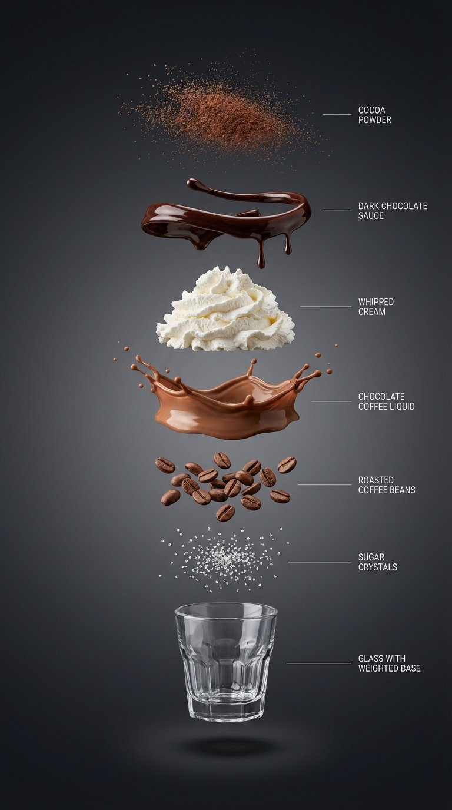

## "Macro food photography of a crispy martabak telur teari

- ID: trending-2009937038670540843
- Slug: trending-2009937038670540843-en
- 语言: en
- 来源: [来源链接](https://x.com/Just_sharon7/status/2009937038670540843)
- 样例图路径: images/part1/2009937038670540843_1.jpg

### 提示词

```text
"Macro food photography of a crispy martabak telur tearing open mid-air, thin golden wrapper shattering with a crack, hot filling of minced beef, scallions, and egg bursting outward. Flecks of fried onion and pepper suspended in motion, steam visible, glossy oil sheen catching the light. Warm Indonesian street-stall lighting, tungsten + charcoal warmth, dramatic rim light, ultra high texture detail (bubbled wrapper, layered interior).Editorial food shot, shallow depth of field, bokeh of night market signage, Nikon Z9 look, 105mm macro, fast shutter freeze, hyper-real crumbs. --ar 3:4"
```

### 样例图

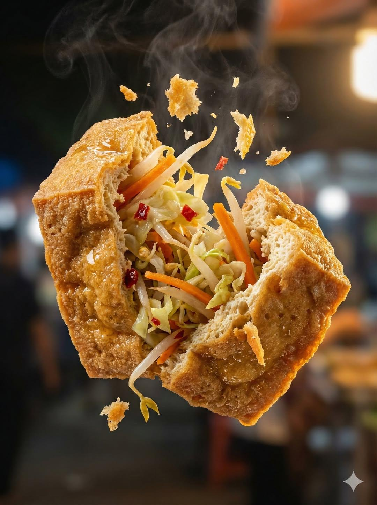

## { "content_goal": "viral food visual with extreme cravin

- ID: trending-2011374713780457546
- Slug: trending-2011374713780457546-en
- 语言: en
- 来源: [来源链接](https://x.com/cuties7377/status/2011374713780457546)
- 样例图路径: images/part1/2011374713780457546_1.jpg

### 提示词

```text
{
  "content_goal": "viral food visual with extreme craving appeal",
  "image_type": "ultra-photorealistic food action photography",
  "visual_style": {
    "aesthetic": "cinematic food editorial, hyper-real",
    "vibe": "juicy, indulgent, irresistible",
    "realism": "high-end commercial food realism"
  },
  "composition": {
    "framing": "tight close-up or medium close-up",
    "camera_angle": "slightly low or front-facing",
    "subject_position": "centered hero bite moment",
    "perspective": "depth-rich with strong foreground focus"
  },
  "subject": {
    "description": "large gourmet burger captured mid-bite",
    "bite_action": "visible bite mark with compressed layers",
    "ingredients": "juicy beef patty, melted cheese, fresh lettuce, tomato, sauce drip",
    "details": "cheese stretch, sauce gloss, steam rising"
  },
  "texture_details": {
    "bun": "soft toasted bun with sesame seeds",
    "patty": "juicy with visible meat fibers",
    "cheese": "melted, glossy, stretching",
    "sauce": "thick, dripping naturally"
  },
  "human_element": {
    "hands": "realistic hands holding burger",
    "bite_mark": "natural teeth impression",
    "skin_detail": "natural skin texture, clean nails"
  },
  "lighting": {
    "type": "dramatic food lighting",
    "quality": "warm, directional, high-contrast",
    "direction": "side or top-side light emphasizing gloss",
    "highlight_focus": "cheese melt and sauce texture",
    "shadow_style": "deep but controlled shadows"
  },
  "color_palette": {
    "primary": ["golden brown", "cheese yellow", "deep red"],
    "accent": ["lettuce green"],
    "mood": "rich, bold, indulgent"
  },
  "environment": {
    "location": "burger joint, café, or studio food setup",
    "background": "dark, blurred background to isolate burger",
    "atmosphere": "warm, indulgent, street-food luxury"
  },
  "camera_details": {
    "camera_type": "professional DSLR / mirrorless simulation",
    "lens": "85mm or macro food lens",
    "focus": "tack-sharp on bite area",
    "depth_of_field": "shallow for dramatic bokeh",
    "resolution": "advertising-grade clarity"
  },
  "quality_control": {
    "food_realism": "hyper-real textures, no plastic look",
    "bite_accuracy": "natural compression of ingredients",
    "ai_artifacts": "none",
    "professional_finish": "commercial food photography quality"
  },
  "overall_mood": "mouth-watering, bold, indulgent",
  "intended_use": {
    "primary": "viral food post on X",
    "secondary": "restaurant branding, food editorial, ads"
  }
}
```

### 样例图

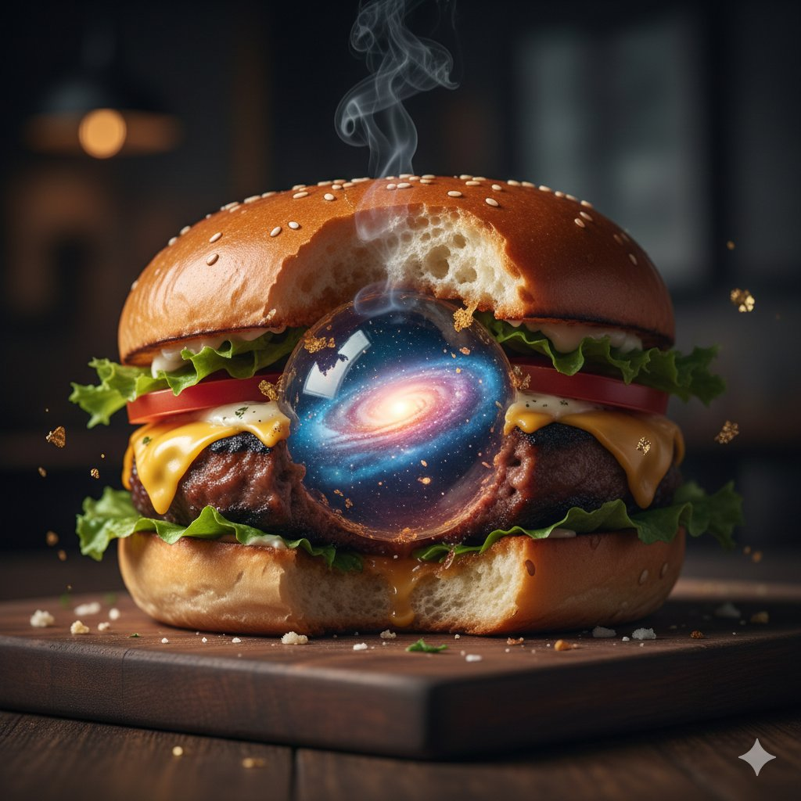

## A hyper-realistic, cinematic close-up of a freshly baked

- ID: trending-2008416515129999715
- Slug: trending-2008416515129999715-en
- 语言: en
- 来源: [来源链接](https://x.com/Strength04_X/status/2008416515129999715)
- 样例图路径: images/part1/2008416515129999715_1.jpg

### 提示词

```text
A hyper-realistic, cinematic close-up of a freshly baked pepperoni pizza slice being lifted from the pie, with long, dramatic cheese pulls stretching down in silky strands.
Golden, slightly charred crust with visible texture, bubbling mozzarella, glossy pepperoni slices, fresh basil leaves on top, and juicy cherry tomatoes scattered across the pizza.
Soft steam rising from the hot slice, creating a warm, mouth-watering atmosphere.
Shot on a DSLR, 50mm lens, shallow depth of field, sharp focus on the cheese stretch, background softly blurred.
Warm studio lighting with natural highlights, rich colors, realistic shadows, premium food-advertisement look.
```

### 样例图

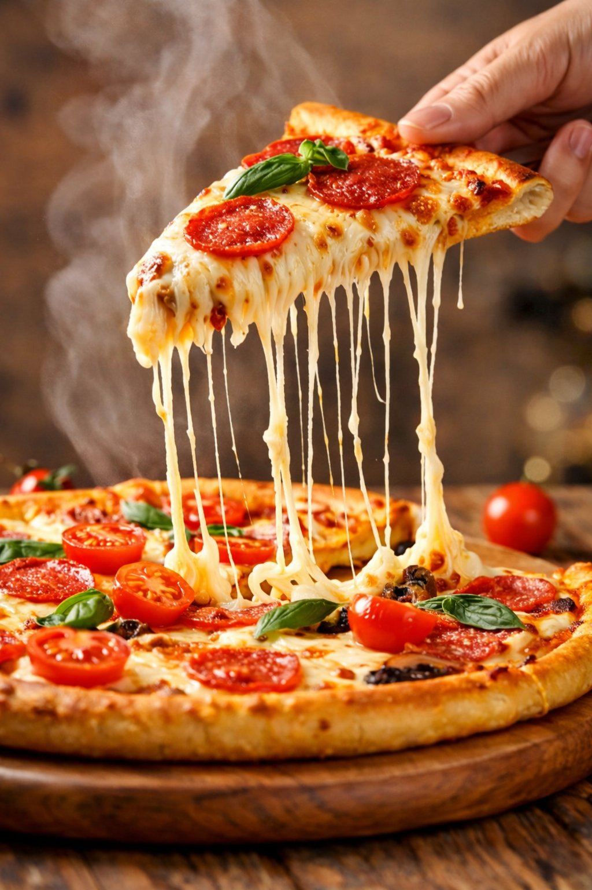

## Ultra-clean modern recipe infographic. Showcase [FOOD] i

- ID: trending-2016440109739237496
- Slug: trending-2016440109739237496-en
- 语言: en
- 来源: [来源链接](https://x.com/Sheldon056/status/2016440109739237496)
- 样例图路径: images/part1/2016440109739237496_1.jpg

### 提示词

```text
Ultra-clean modern recipe infographic.

Showcase [FOOD] in a visually appealing finished form—sliced, plated, or portioned—floating slightly in perspective or angled view.

Arrange ingredients, steps, and tips around the dish in a dynamic editorial layout, not restricted to top-down.

Ingredients Section:

Include icons or mini illustrations for each ingredient with quantities. Arrange them in clusters, lists, or circular flows connected visually to the dish.

Steps Section:

Show preparation steps with numbered panels, arrows, or lines, forming a logical flow around the main dish. Include small cooking icons (knife, pan, oven, timer) where helpful.

Additional Info (optional):

Total calories, prep/cook time, servings, spice level—displayed as clean bubbles or badges near the dish.

Visual Style:

Editorial infographic meets lifestyle food photography. Vibrant, natural food colors, subtle drop shadows, clean vector icons, modern typography, soft gradients or glassmorphism for step panels. Accent colors can highlight key info (calories, prep time).

Composition Guidelines:

Finished meal as hero visual (perspective or angled). Ingredients and steps flow dynamically around the dish. Clear visual hierarchy: dish > steps > ingredients > optional stats. Enough negative space to keep design airy and readable.

Lighting & Background:

Soft, natural studio lighting. Minimal textured or gradient background for premium editorial feel.

Output:

1080×1080, ultra-crisp, social-feed optimized, no watermark
```

### 样例图

![Ultra-clean modern recipe infographic. Showcase [FOOD] i](../images/part1/2016440109739237496_1.jpg)

## A high-quality digital illustration of the word [COUNTRY

- ID: trending-2008826083282686133
- Slug: trending-2008826083282686133-en
- 语言: en
- 来源: [来源链接](https://x.com/aleenaamiir/status/2008826083282686133)
- 样例图路径: images/part1/2008826083282686133_1.jpg

### 提示词

```text
A high-quality digital illustration of the word [COUNTRY NAME] spelled in bold, uppercase letters. The typography is sculptural and dimensional, with each letter subtly overlapping or stacked to enhance depth and visual flow. Set against a rich, dark-toned background that complements the palette of the ingredients.

Each letter is intricately filled with iconic traditional foods from [COUNTRY], such as [SIGNATURE BREADS / FRUITS / SPICES / DISH ELEMENTS], carefully arranged to follow the contours of the typography. Small bowls of [TRADITIONAL SAUCES / CONDIMENTS] and scattered ingredients are integrated naturally within the composition.

The food elements are styled in an art-directed, editorial manner – balanced, textured, and visually rich – with gentle overlaps for realism. Soft, diffused lighting enhances natural textures and depth, creating a warm, appetizing, premium aesthetic. 

Ultra-detailed, clean composition, food-photography-inspired digital illustration, high contrast, refined visual storytelling.
```

### 样例图

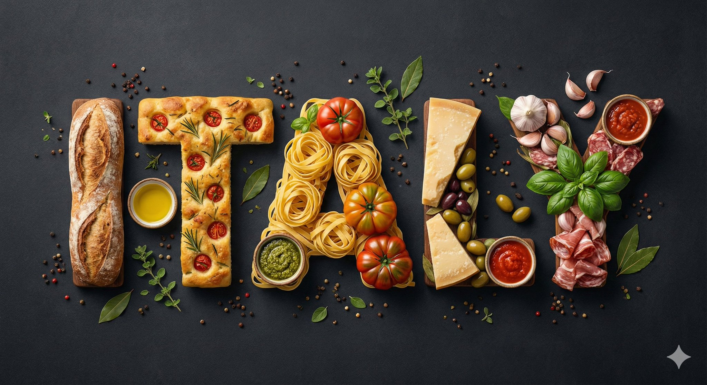

## Ultra-realistic cinematic beverage product photography o

- ID: trending-2009118898864771537
- Slug: trending-2009118898864771537-en
- 语言: en
- 来源: [来源链接](https://x.com/Strength04_X/status/2009118898864771537)
- 样例图路径: images/part1/2009118898864771537_1.jpg

### 提示词

```text
Ultra-realistic cinematic beverage product photography of a vibrant red aluminum juice can captured from a dramatic top-down three-quarter angle, the can lying diagonally on its side as if just knocked over, with the opening facing toward the camera and a burst of clear liquid splashing outward in a sweeping arc across the frame; the can features bold white “Juice” typography and strawberry illustrations, partially wet with condensation and splash residue; glossy liquid spreads across a reflective surface below, forming dynamic ripples and elongated reflections that lead the eye through the composition; fresh ripe strawberries—whole, sliced, and halved—are scattered asymmetrically around the can, some resting in the liquid pool, others frozen mid-air as if tossed, with varying scale and depth for cinematic layering; background is a smooth coral-to-rose gradient studio backdrop viewed at an angle, enhancing depth and motion; lighting is dramatic cinematic lighting with a strong side key light creating sharp highlights on the can rim and liquid splash, rim lighting separating strawberries from the background, and deep soft shadows adding contrast and mood; color palette is bold and saturated with strawberry red, crimson liquid, fresh green leaves, and warm pink tones; composition is dynamic and off-center with diagonal energy, shallow depth of field isolating the can while foreground splashes remain crisp and background elements softly fall off; mood is energetic, high-impact, and cinematic, evoking premium blockbuster-style beverage advertising with hyper-realistic fluid dynamics, ultra-detailed textures, dramatic contrast, and 8K ultra-high-definition realism.
```

### 样例图

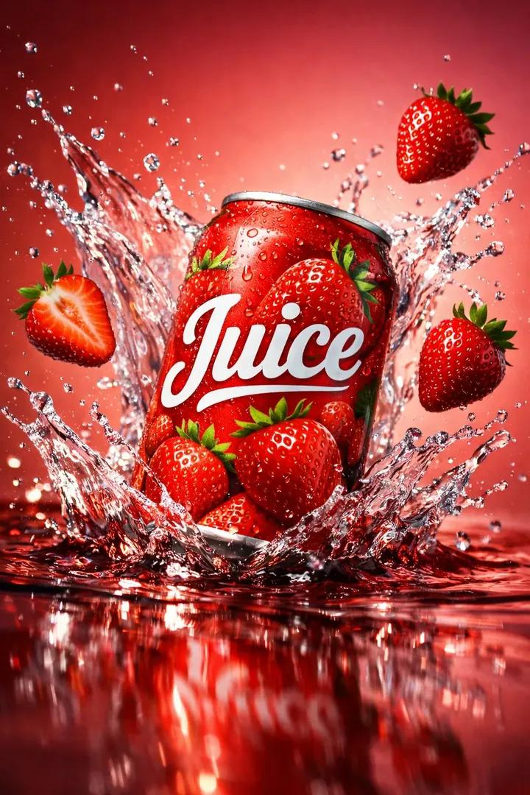

## { "image_prompt": { "type": "Ultra-realistic Indonesian 

- ID: trending-2018252656574185981
- Slug: trending-2018252656574185981-en
- 语言: en
- 来源: [来源链接](https://x.com/Taaruk_/status/2018252656574185981)
- 样例图路径: images/part1/2018252656574185981_1.jpg

### 提示词

```text
{
  "image_prompt": {
    "type": "Ultra-realistic Indonesian traditional food infographic poster",
    "layout_and_composition": {
      "orientation": "Vertical composition",
      "style": "Modern culinary infographic design, editorial layout",
      "background": "Dramatic but clean background"
    },
    "typography_elements": {
      "headline": {
        "position": "Top",
        "style": "Bold text showing dish name and origin (ASAL)"
      },
      "labels": {
        "style": "Clean Indonesian typography",
        "connectors": "Curved label arrows pointing to ingredients"
      }
    },
    "visual_content": {
      "main_action": "Cinematic floating ingredients suspended in mid-air",
      "details": [
        "Glossy curry splash",
        "Fresh herbs",
        "Spices",
        "Steam rising from the bowl"
      ],
      "textures": "Hyper-detailed, glossy, appetizing"
    },
    "lighting_and_atmosphere": {
      "lighting_style": "Rich golden lighting, studio lighting",
      "mood": "Professional, appetizing, high-end"
    },
    "technical_specs": {
      "quality": "8K ultra-realistic, DSLR quality",
      "focus": "Shallow depth of field",
      "style": "Professional food photography"
    }
  }
}
```

### 样例图

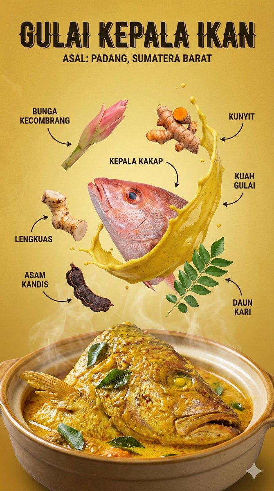

## { "Create a hyper-realistic tourism advertisement collag

- ID: trending-2019701962959372771
- Slug: trending-2019701962959372771-en
- 语言: en
- 来源: [来源链接](https://x.com/Strength04_X/status/2019701962959372771)
- 样例图路径: images/part1/2019701962959372771_1.jpg

### 提示词

```text
{
   "Create a hyper-realistic tourism advertisement collage in a single 1:1 image divided into a 2x2 grid. Each section shows a hand holding a sleek, ultra-thin smartphone in portrait orientation, slightly tilted to create a strong 3D portal effect where iconic national food emerges out of the phone screen into the real world. Consistent hand, phone design, and lighting style across all four panels.",
  "layout": {
    "type": "grid",
    "rows": 2,
    "columns": 2,
    "aspect_ratio": "1:1"
  },
  "scenes": [
    {
      "position": "top-left",
      "country": "France",
      "text": "France",
      "food": "Golden buttery croissant on a white plate with strawberries",
      "background": "Eiffel Tower, green fields, bright blue sky",
      "elements": ["flying birds", "commercial airplane", "French flag"],
      "lighting": "warm natural daylight",
      "mood": "fresh, elegant, classic"
    },
    {
      "position": "top-right",
      "country": "Italy",
      "text": "Italy",
      "food": "Hot Italian pizza with basil leaves and visible steam",
      "background": "Colosseum, Rome skyline at sunset",
      "elements": ["orange sky", "flying birds"],
      "lighting": "golden sunset light",
      "mood": "warm, passionate, flavorful"
    },
    {
      "position": "bottom-left",
      "country": "Japan",
      "text": "Japan",
      "food": "Assorted sushi and sashimi platter on wooden tray",
      "background": "Tokyo skyline at night with Tokyo Tower and neon lights",
      "elements": ["airplane trail", "city glow"],
      "lighting": "cool night lighting with neon highlights",
      "mood": "modern, clean, refined"
    },
    {
      "position": "bottom-right",
      "country": "Mexico",
      "text": "Mexico",
      "food": "Colorful street tacos with lime and salsa",
      "background": "Colonial Mexican street with warm sunset tones",
      "elements": ["birds flying", "festive atmosphere"],
      "lighting": "warm cinematic sunset",
      "mood": "vibrant, festive, energetic"
    }
  ],
  "style": {
    "realism": "ultra-photorealistic",
    "lighting": "cinematic",
    "depth": "strong depth of field and realistic shadows",
    "colors": "vibrant but natural tourism-ad palette",
    "quality": "4K ultra-sharp"
  },
  "constraints": {
    "no_watermark": true,
    "no_brand_logos": true,
    "no_extra_text": true,
    "clean_composition": true
  }
}
```

### 样例图

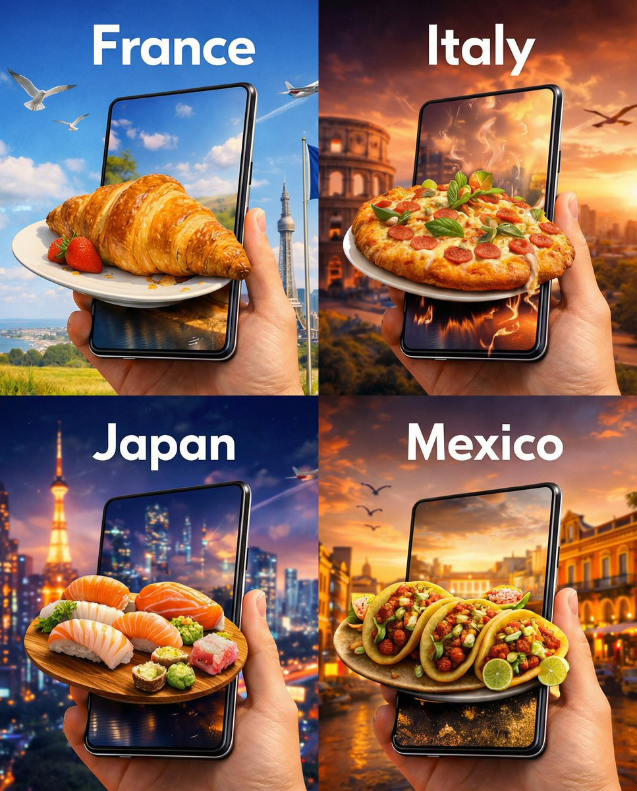

## { "composition": { "orientation": "vertical", "style": "

- ID: trending-2012291576119312710
- Slug: trending-2012291576119312710-en
- 语言: en
- 来源: [来源链接](https://x.com/Just_sharon7/status/2012291576119312710)
- 样例图路径: images/part1/2012291576119312710_1.jpg

### 提示词

```text
{
  "composition": {
    "orientation": "vertical",
    "style": "ultra-cinematic",
    "scene_type": "mid-air suspended elements",
    "depth_of_field": "cinematic shallow depth"
  },
  "subject": {
    "main_elements": [
      "cascading roasted coffee beans",
      "floating chocolate bonbons",
      "mid-air coffee cup with swirling latte art",
      "splashes of milk frozen in motion",
      "splashes of espresso frozen in motion",
      "fine coffee grounds dusting through the air"
    ],
    "motion_state": "frozen action splash photography"
  },
  "color_palette": {
    "primary_colors": [
      "rich coffee brown",
      "warm cream",
      "espresso black"
    ],
    "background": "deep velvety black"
  },
  "lighting": {
    "type": "dramatic high-contrast studio lighting",
    "highlights": "glossy reflections on liquids",
    "shadows": "deep cinematic shadows"
  },
  "texture_detail": {
    "liquids": [
      "glossy milk splashes",
      "glossy espresso splashes",
      "crema bubbles with micro-detail"
    ],
    "solids": [
      "matte roasted coffee beans",
      "smooth chocolate bonbon surfaces",
      "fine granular coffee grounds"
    ]
  },
  "photography_style": {
    "genre": "premium café advertising",
    "aesthetic": "editorial splash photography",
    "clarity": "crisp ultra-detailed"
  },
  "camera": {
    "camera_model": "Nikon D850 (virtual)",
    "lens": "105mm macro",
    "aperture": "f/4.0",
    "focus": "sharp subject focus with background falloff"
  },
  "render_quality": {
    "detail_level": "hyper-detailed",
    "realism": "photorealistic",
    "finish": "high-end commercial output"
  }
}
```

### 样例图

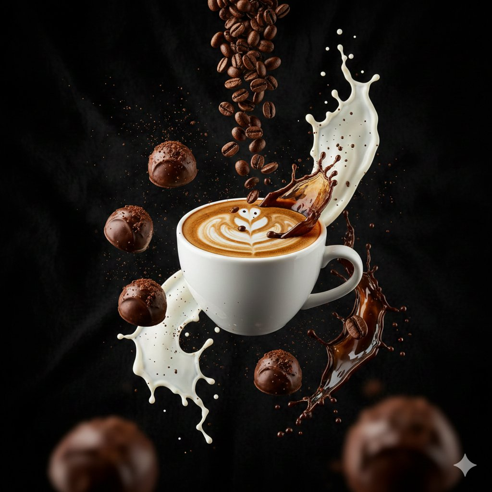

## A hyper-realistic Indonesian food infographic poster wit

- ID: trending-2018167340417130614
- Slug: trending-2018167340417130614-en
- 语言: en
- 来源: [来源链接](https://x.com/Taaruk_/status/2018167340417130614)
- 样例图路径: images/part1/2018167340417130614_1.jpg

### 提示词

```text
A hyper-realistic Indonesian food infographic poster with dramatic floating ingredients. Vertical composition, bold title text at the top showing the dish name and origin (ASAL). Ingredients levitating in mid-air with clean white label lines and Indonesian text. Cinematic food photography style, ultra-detailed textures, glossy sauces, charred meat, fresh vegetables, steam and smoke effects. Strong contrast lighting, editorial layout, modern typography, professional food magazine look, motion-frozen splashes, realistic shadows, studio lighting, shallow depth of field, 8K ultra-realistic, DSLR quality.
```

### 样例图

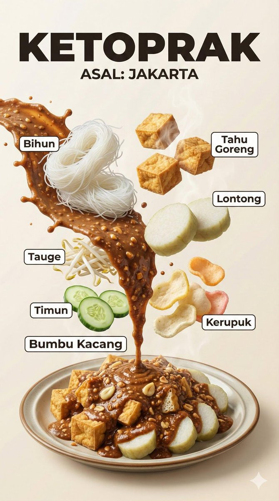

## Use uploaded photo as absolute main reference. Preserve 

- ID: trending-2015383108452057585
- Slug: trending-2015383108452057585-en
- 语言: en
- 来源: [来源链接](https://x.com/ChillaiKalan__/status/2015383108452057585)
- 样例图路径: images/part1/2015383108452057585_1.jpg

### 提示词

```text
Use uploaded photo as absolute main reference. Preserve Seblak kuah identity, ingredients, textures, and proportions; do not add anything not present.
Intact ceramic bowl rises in a smooth swirling twirl motion; slight controlled tilt, stable anchor.
Destroy ONLY the FOOD: crackers/kerupuk tear and split revealing bubbly porous texture; toppings (as in reference) separate naturally; spicy broth stretches
```

### 样例图

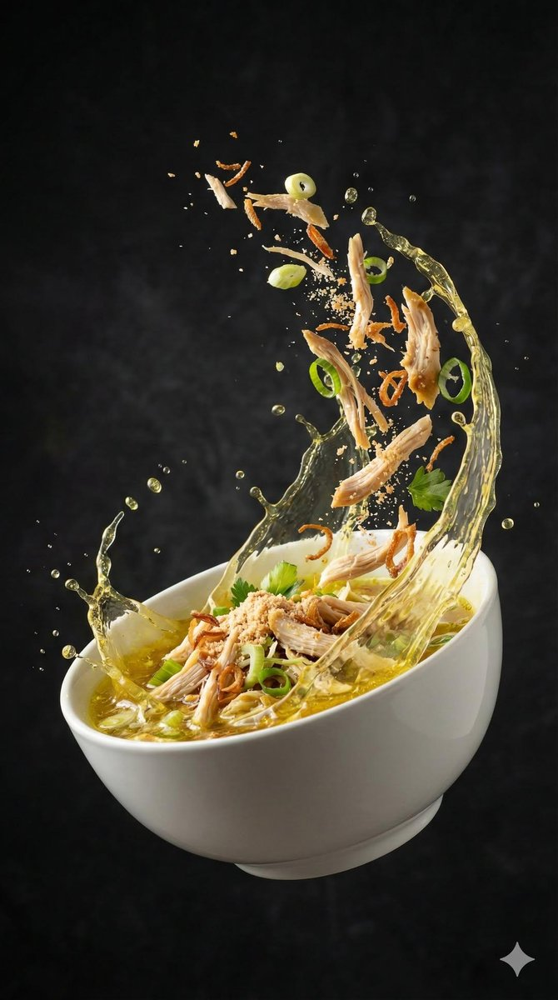

## [subject], premium food advertising, white seamless back

- ID: trending-2012263633636508040
- Slug: trending-2012263633636508040-en
- 语言: en
- 来源: [来源链接](https://x.com/TechieBySA/status/2012263633636508040)
- 样例图路径: images/part1/2012263633636508040_1.jpg

### 提示词

```text
[subject], premium food advertising, white seamless background, high key studio lighting, floating stacked composition, levitating pieces, [ingredient_bits] scattered, clean minimal layout, crisp soft shadow on surface, ultra realistic, macro product photography, 100mm lens look, f/8 sharp focus, subtle texture detail, editorial commercial, 8k
```

### 样例图

![[subject], premium food advertising, white seamless back](../images/part1/2012263633636508040_1.jpg)

## [NATURAL OBJECT] dissected as if by a master naturalist 

- ID: trending-2036472105223467305
- Slug: trending-2036472105223467305-en
- 语言: en
- 来源: [来源链接](https://x.com/AllaAisling/status/2036472105223467305)
- 样例图路径: images/part1/2036472105223467305_1.jpg

### 提示词

```text
[NATURAL OBJECT] dissected as if by a master naturalist who found it in the wild. Split and pinned open like a specimen, but lit as if Caravaggio worked for National Geographic.
Every internal structure glowing with its own material truth. Cross-section so sharp it feels violent. Interior so beautiful it feels sacred. The full object present, one half intact, one half opened to its core, every layer at the resolution of obsession.
Background: pure black velvet. The object floats in it like something precious and dangerous.
Labels pressed close, handwritten-weight serif, never floating: "[STRUCTURE]" / "[MATERIAL TRUTH]" / "[AGE OR SCALE]"
"[OBJECT] DISSECTED" title in warm ivory caps, upper left. "[One line that makes you lean closer]" italic beneath.
Mood: Audubon illustration meets Caravaggio meets the most beautiful science photograph ever taken. 4K, specimen lighting, extraordinary interior detail, nothing clinical, everything alive.
```

### 样例图

![[NATURAL OBJECT] dissected as if by a master naturalist ](../images/part1/2036472105223467305_1.jpg)

## Ultra-realistic smoothie explosion, banana slices, straw

- ID: trending-2019225201242943804
- Slug: trending-2019225201242943804-en
- 语言: en
- 来源: [来源链接](https://x.com/Strength04_X/status/2019225201242943804)
- 样例图路径: images/part1/2019225201242943804_1.jpg

### 提示词

```text
Ultra-realistic smoothie explosion, banana slices, strawberry pieces, blueberry splash, chia seeds, liquid swirl frozen mid-air, bright studio lighting, glossy liquid texture, premium health drink ad style, shallow depth, ultra sharp, frozen motion, cinematic 8K realism --ar 2:3 --v 6 --style raw
```

### 样例图

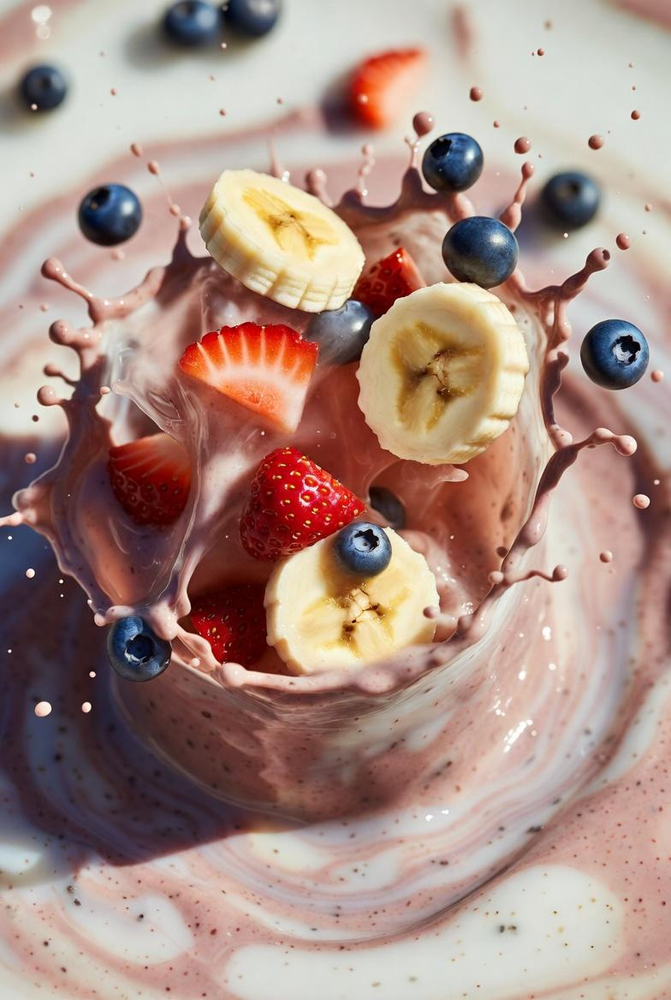

## [DISH] captured at the exact millisecond of a dramatic l

- ID: trending-2030670376104087834
- Slug: trending-2030670376104087834-en
- 语言: en
- 来源: [来源链接](https://x.com/AllaAisling/status/2030670376104087834)
- 样例图路径: images/part1/2030670376104087834_1.jpg

### 提示词

```text
[DISH] captured at the exact millisecond of a dramatic liquid explosion, high-speed photography frozen in time, every droplet suspended mid-air with razor precision. Hero [DISH] at center perfectly intact and hyperreal, surrounded by an orchestrated explosion of its own sauce, broth, or glaze erupting outward in every direction. Droplets catching dramatic single-source warm light like liquid diamonds. Each floating ingredient or droplet labeled with ultra-thin lines in clean uppercase: "[INGREDIENT]  [descriptor]". Dish name in bold editorial typography: "[DISH NAME]". Subtitle: "[TAGLINE]". Pure [COLOR] background. Mood: Harold Edgerton high-speed photography meets Michelin-star food editorial. 4K, tack sharp every droplet, extraordinary and craveable.

Check ALTs for ideas 👇 @AdobeFirefly
```

### 样例图

![[DISH] captured at the exact millisecond of a dramatic l](../images/part1/2030670376104087834_1.jpg)

## “Luxury golden-hour styled hero shot of [FOOD] bathed in

- ID: trending-2013251289254420955
- Slug: trending-2013251289254420955-en
- 语言: en
- 来源: [来源链接](https://x.com/aleenaamiir/status/2013251289254420955)
- 样例图路径: images/part1/2013251289254420955_1.jpg

### 提示词

```text
“Luxury golden-hour styled hero shot of [FOOD] bathed in warm directional sunlight. Long soft shadows, glowing highlights, natural lens flares. Minimal white set with subtle texture. Editorial lifestyle food photography aesthetic, rich color depth, atmospheric warmth, ultra-realistic detail, premium ad quality, 8K resolution.”
```

### 样例图

![“Luxury golden-hour styled hero shot of [FOOD] bathed in](../images/part1/2013251289254420955_1.jpg)

## Ultra-high-quality, hyper-realistic commercial food phot

- ID: trending-2010241026363986218
- Slug: trending-2010241026363986218-en
- 语言: en
- 来源: [来源链接](https://x.com/aleenaamiir/status/2010241026363986218)
- 样例图路径: images/part1/2010241026363986218_1.jpg

### 提示词

```text
Ultra-high-quality, hyper-realistic commercial food photography of [COUNTRY FOOD NAME], rendered in 8K detail with a (4:3 or 3:4) aspect ratio.

The food is shown in multiple premium visual variations, each highlighting texture, layers, and freshness in a cinematic way.

Food details:
– Authentic [COUNTRY] cuisine presentation
– Clearly visible layers, fillings, or structure specific to [FOOD TYPE]
– Rich, natural colors and realistic textures

Motion & drama:
– Subtle mid-air elements (crumbs, ingredients, sauce, or spices)
– Natural gravity realism, frozen motion
– No mess, clean and controlled composition

Lighting & camera:
– Controlled studio lighting emphasizing texture and shine
– High-speed photography look
– Shallow to medium depth of field

Background:
– Solid or soft gradient background in [BACKGROUND COLOR]
– Clean, seamless, distraction-free

Style & finish:
– Luxury food advertising aesthetic
– Rich contrast, warm natural tones
– Ultra-sharp focus, no artificial glow

Negative prompt:
Text, logos, branding, hands, people, utensils, plates, tables, cartoon style, burnt food, overexposure, low-detail textures, artificial shine.
```

### 样例图

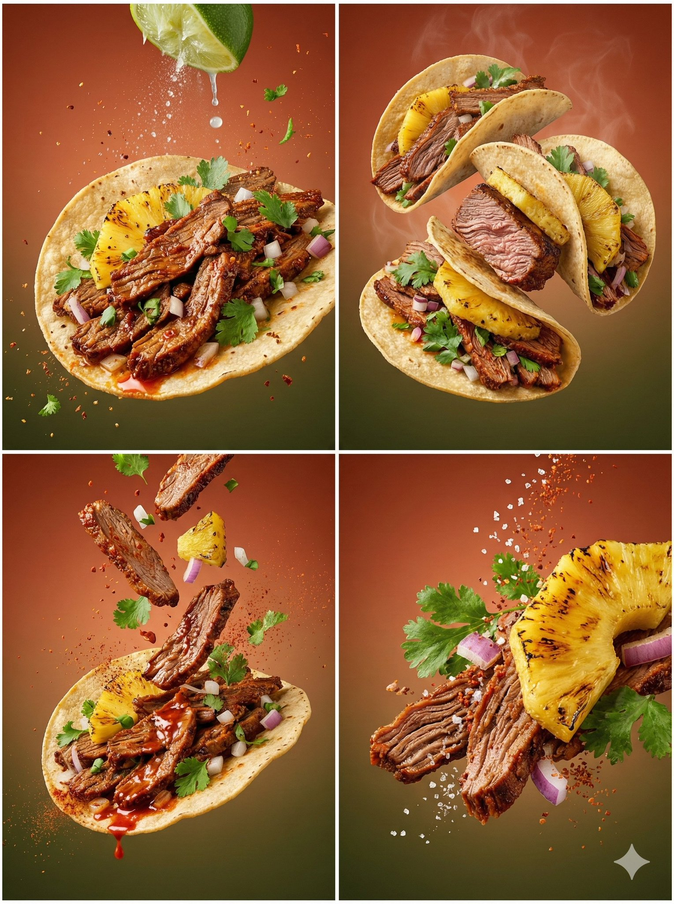

## Ultra-clean modern recipe infographic. Showcase chowmin 

- ID: trending-2016502011278324039
- Slug: trending-2016502011278324039-en
- 语言: en
- 来源: [来源链接](https://x.com/mehvishs25/status/2016502011278324039)
- 样例图路径: images/part1/2016502011278324039_1.jpg

### 提示词

```text
Ultra-clean modern recipe infographic. Showcase chowmin in a visually appealing finished form sliced, plated, or portioned floating slightly in perspective or angled view. Arrange ingredients, steps, and tips around the dish in a dynamic editorial layout, not restricted to top-down. Ingredients Section: Include icons or mini illustrations for each ingredient with quantities. Arrange them in clusters, lists, or circular flows connected visually to the dish. Steps Section: Show preparation steps with numbered panels, arrows, or lines, forming a logical flow around the main dish. Include small cooking icons (knife, pan, oven, timer) where helpful. Additional Info (optional): Total calories, prep/cook time, servings, spice level—displayed as clean bubbles or badges near the dish. Visual Style: Editorial infographic meets lifestyle food photography. Vibrant, natural food colors, subtle drop shadows, clean vector icons, modern typography, soft gradients or glassmorphism for step panels. Accent colors can highlight key info (calories, prep time). Composition Guidelines: Finished meal as hero visual (perspective or angled) Ingredients and steps flow dynamically around the dish Clear visual hierarchy: dish > steps > ingredients > optional stats Enough negative space to keep design airy and readable Lighting & Background: Soft, natural studio lighting, minimal textured or gradient background for premium editorial feel. Output: 1080×1080, ultra-crisp, social-feed optimized, no watermark.
```

### 样例图

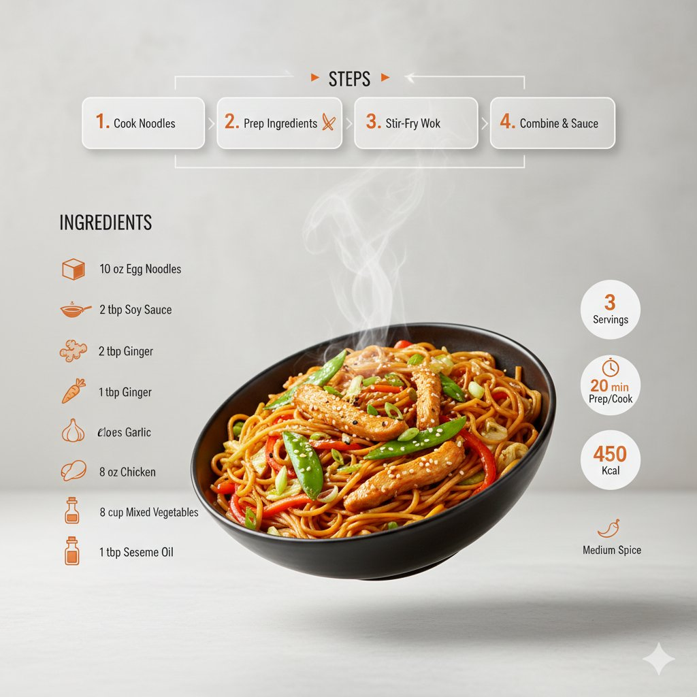

## two hands pulling apart a grilled cheese sandwich, stran

- ID: trending-2011112123653603558
- Slug: trending-2011112123653603558-en
- 语言: en
- 来源: [来源链接](https://x.com/oggii_0/status/2011112123653603558)
- 样例图路径: images/part1/2011112123653603558_1.jpg

### 提示词

```text
two hands pulling apart a grilled cheese sandwich, strands of melted cheddar stretching dramatically between the halves, toasted bread edges crisp and golden, crumbs falling mid-air, warm cozy light, cinematic food action photography
```

### 样例图

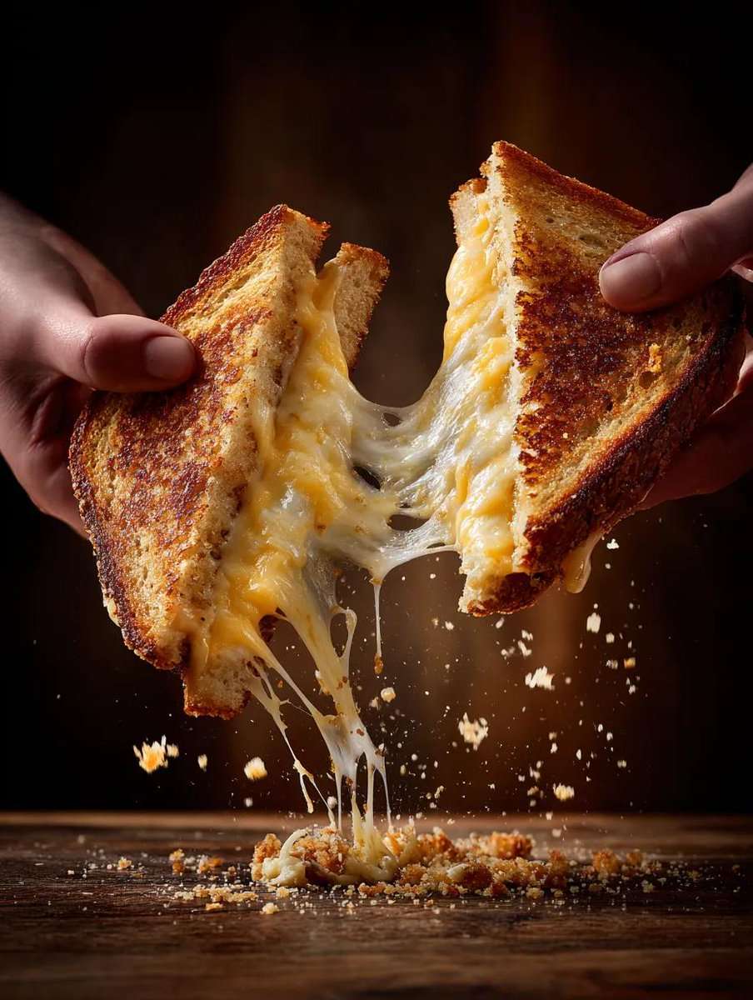

## Cinematic ultra-high-end product photography of an offic

- ID: trending-2028650885472203209
- Slug: trending-2028650885472203209-en
- 语言: en
- 来源: [来源链接](https://x.com/ChillaiKalan__/status/2028650885472203209)
- 样例图路径: images/part1/2028650885472203209_1.jpg

### 提示词

```text
Cinematic ultra-high-end product photography of an official Monster Energy drink can a standard vertical black aluminum energy drink can featuring the iconic neon 
reen claw logo of Monster Energy - standing on a dark, rough, textured surface. The can is being engulfed and seemingly possessed by a thick, glossy, jet-black symbiotic liquid inspired by the organic alien symbiote from the 2018 film Venom, directed by Ruben Fleischer. The viscous substance behaves like a living entity - muscular,predatory, and semi-sentient— forming elongated, sinewy tendrils that stretch
upward and wrap tightly around the can as if claiming it. The texture must closely resemble Venom's cinematic symbiote: dense, oily, hyper-glossy, elastic, with visible surface tension, micro ripples, sharp blade-like protrusions, and subtle vein-like striations. It should feel alive, aggressive, and biomechanical _ not random liquid splashes.The black symbiote appears to be merging with the Monster can's aluminum surface crawling over it, partially fusing into the metal, as if infecting or possessing the product. Some tendrils anchor to the ground while others rise dynamically into the air, creating tension and controlled chaos. The green claw logo remains clearly visible and becomes the focal contrast element against the dark mass. Camera angle: dramatic low-angle hero shot, slightly tilted (Dutch angle) for cinematicintensity, captured with a macro cinema lens at close range. Shallow depth of field, razor-sharp focus on the logo and the liquid interaction, extreme macro detail. Lighting: moody, high-contrast lighting with strong cold blue rim light sculpting the wet reflective contours of the symbiote and enhancing the metallic sheen of the blackaluminum can. Subtle green light spill from the neon logo reflecting onto nearbyglossy tendrils. Deep shadows with controlled specular highlights for a premium cinematic look.Atmosphere: floating micro-particles, dust, and fine mist suspended in the air,catching the rim light to create depth. Subtle volumetric haze and cinematic diffusion.Background: deep dark void with faint cool blue bokeh and minimal gradient separation, reinforcing a mysterious, powerful, almost supernatural atmosphere. Ultra-realistic, photorealistic, hyper-detailed textures, HDR, 8K resolution, cinematic color grading, dramatic tension, premium commercial advertising aesthetic.

IMAGE 2
High-quality commercial photograph of a
sleek,thin aluminum Del Valle peach juice
can suspended diagonally in a dynamic,
gravity-defying composition. The scene
conveys a sense of freshness, featuring hyper-realistic slices of juicy peaches and vibrant green leaves spiraling around the can along with splashes of crystal-clear water and delicate droplets. The lighting is bright and airy, creating a soft, refreshing glow throughout the image. The color palette consists of warm peach tones, soft corals and vibrant greens on a minimalist back ground with a peach-toned gradient and shallow depth of field, showing blurred peaches in the background. Commercial aesthetic, macro detail, refreshing and vibrant atmosphere.

IMAGE 3 
A close-up product photograph of a dark
blue glass bottle for "SAUVAGE ELIXIR Dior" perfume, nestled within dark, textured,wet-looking tree bark and small dried botanical sprigs with glowing orange tips. Thelighting is low
moody  warm
orange and deep blue highlights across the wet wood and the glossy bottle. The background is dark and natural.

IMAGE 4 
A dynamic, high-speed photograph cap-
tures a bottle of Jack Daniel's Tennessee
Apple whiskey, with its signature green
label and square glass shape, splashing of
green liquid. Water droplets and fresh green
apples with leaves explode outwards
around the bottle. The scene is illuminated
by vibrant green light from background,
highlighting the texture of the glass, liquid,
and fruit against a dark green, gradient
background green and black green
ratio 4:5
```

### 样例图

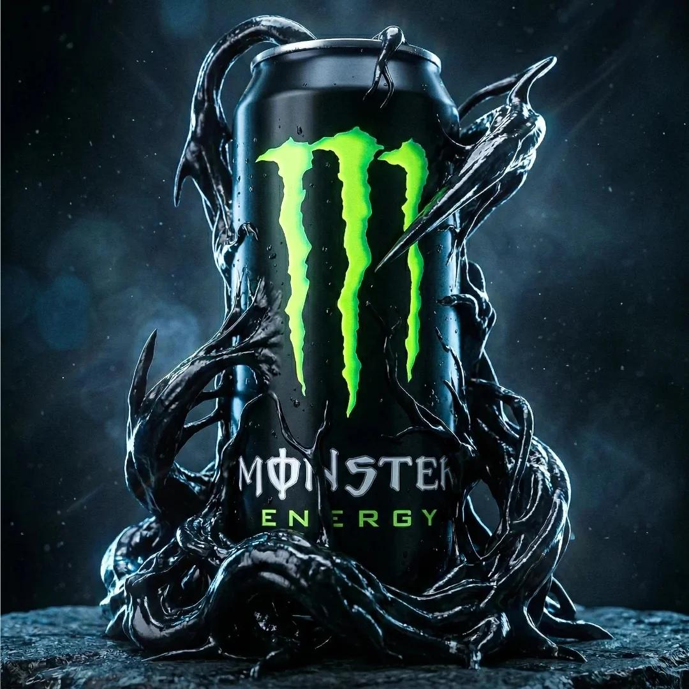

## Ultra-clean modern recipe infographic. Showcase Roast ch

- ID: trending-2027015461762920946
- Slug: trending-2027015461762920946-en
- 语言: en
- 来源: [来源链接](https://x.com/Strength04_X/status/2027015461762920946)
- 样例图路径: images/part1/2027015461762920946_1.jpg

### 提示词

```text
Ultra-clean modern recipe infographic. Showcase Roast chicken in a visually appealing finished form—sliced, plated, or portioned—floating slightly in perspective or angled view. Arrange ingredients, steps, and tips around the dish in a dynamic editorial layout, not restricted to top-down. Ingredients Section: Include icons or mini illustrations for each ingredient with quantities. Arrange them in clusters, lists, or circular flows connected visually to the dish. Steps Section: Show preparation steps with numbered panels, arrows, or lines, forming a logical flow around the main dish. Include small cooking icons (knife, pan, oven, timer) where helpful. Additional Info (optional): Total calories, prep/cook time, servings, spice level—displayed as clean bubbles or badges near the dish. Visual Style: Editorial infographic meets lifestyle food photography. Vibrant, natural food colors, subtle drop shadows, clean vector icons, modern typography, soft gradients or glassmorphism for step panels. Accent colors can highlight key info (calories, prep time). Composition Guidelines: Finished meal as hero visual (perspective or angled) Ingredients and steps flow dynamically around the dish Clear visual hierarchy: dish > steps > ingredients > optional stats Enough negative space to keep design airy and readable Lighting & Background: Soft, natural studio lighting, minimal textured or gradient background for premium editorial feel. Output: 1080×1080, ultra-crisp, social-feed optimized, no watermark.”
```

### 样例图

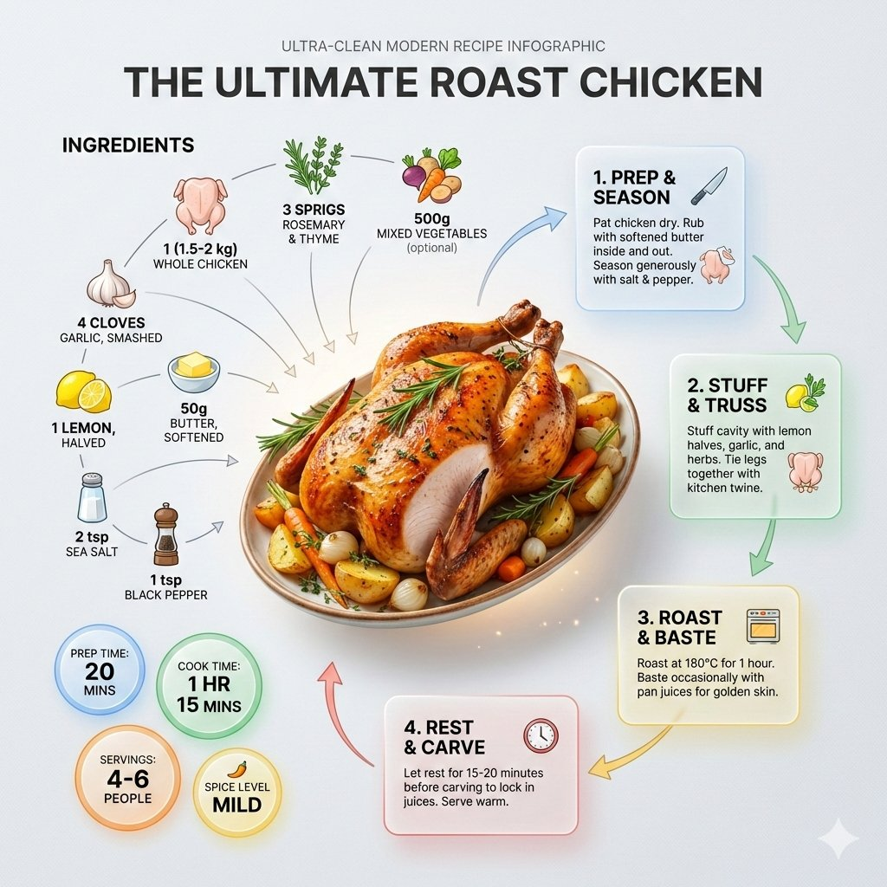

## Ultra-realistic cinematic food photography of a traditio

- ID: trending-2019254034654195755
- Slug: trending-2019254034654195755-en
- 语言: en
- 来源: [来源链接](https://x.com/Taaruk_/status/2019254034654195755)
- 样例图路径: images/part1/2019254034654195755_1.jpg

### 提示词

```text
Ultra-realistic cinematic food photography of a traditional Indonesian dish, presented as a floating ingredients composition. Main dish placed at the bottom in a rustic ceramic bowl or banana leaf plate. Key ingredients suspended in mid-air above the dish, perfectly separated and labeled with clean minimalist typography and thin pointer lines. Dynamic splashes of sauce and spices frozen in motion, high-speed food photography. Natural tropical setting with banana leaves, palm trees, warm sunlight, shallow depth of field. Hyper-detailed textures, glossy sauces, steam and smoke effects, editorial food poster style, premium commercial quality, 8K resolution, soft cinematic lighting, realistic shadows, depth and realism.
```

### 样例图

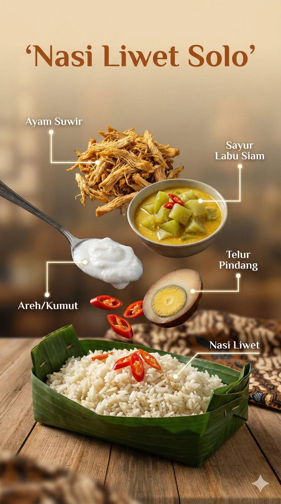

## { "image_prompt": { "subject": "Rich Asian soup", "actio

- ID: trending-2022540091244036192
- Slug: trending-2022540091244036192-en
- 语言: en
- 来源: [来源链接](https://x.com/Taaruk_/status/2022540091244036192)
- 样例图路径: images/part1/2022540091244036192_1.jpg

### 提示词

```text
{
  "image_prompt": {
    "subject": "Rich Asian soup",
    "action": "Ingredients exploding upward in mid-air, swirling spiral splash of broth forming a dynamic ribbon shape, liquid splash crown",
    "ingredients": [
      "Floating beef slices",
      "Shrimp",
      "Noodles",
      "Tofu cubes",
      "Chili",
      "Herbs",
      "Tomatoes",
      "Cabbage"
    ],
    "environment": "Dramatic dark textured background",
    "lighting": "Studio lighting, strong rim light, glossy broth reflections, cinematic contrast",
    "photography_style": "Ultra-realistic food photography, high-speed photography, frozen motion, hyper realistic",
    "camera_settings": {
      "lens": "85mm",
      "aperture": "f/4",
      "focus": "Sharp focus, macro clarity",
      "resolution": "8K"
    }
  }
}
```

### 样例图

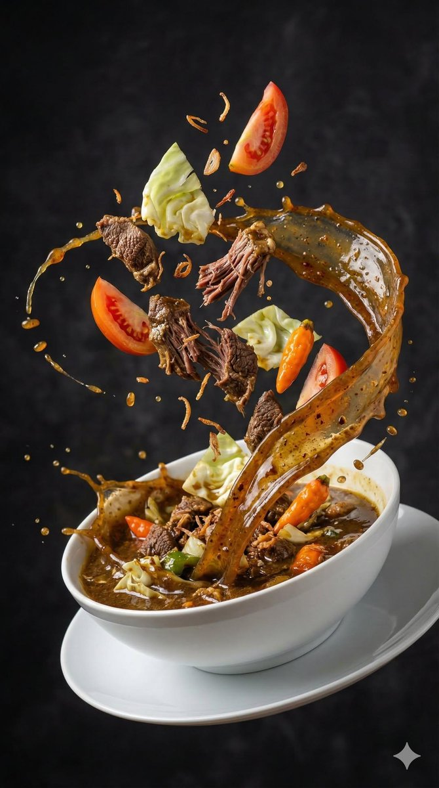

## { "content_goal": "viral food visual with high appetite 

- ID: trending-2011444163863048380
- Slug: trending-2011444163863048380-en
- 语言: en
- 来源: [来源链接](https://x.com/cuties7377/status/2011444163863048380)
- 样例图路径: images/part1/2011444163863048380_1.jpg

### 提示词

```text
{
  "content_goal": "viral food visual with high appetite appeal",
  "image_type": "ultra-photorealistic food photography",
  "visual_style": {
    "aesthetic": "cinematic food editorial, premium street-food style",
    "vibe": "steamy, savory, irresistible",
    "realism": "high-end commercial food realism"
  },
  "composition": {
    "framing": "close-up or medium close-up",
    "camera_angle": "45-degree or slightly top-front angle",
    "subject_position": "centered hero bowl or lifted noodles",
    "perspective": "depth-rich with strong foreground emphasis"
  },
  "subject": {
    "description": "freshly prepared noodles captured at peak texture",
    "presentation": "chopsticks or fork lifting noodles mid-air",
    "details": "long glossy strands with visible sauce coating",
    "ingredients": "vegetables, protein, herbs, sesame seeds"
  },
  "texture_details": {
    "noodles": "silky, elastic strands with sauce cling",
    "sauce": "rich, glossy, evenly coated",
    "steam": "visible rising steam for freshness",
    "garnish": "spring onions, chili flakes, sesame"
  },
  "styling": {
    "bowl": "ceramic or rustic bowl",
    "props": "chopsticks, linen napkin, subtle tableware",
    "messiness": "controlled, appetizing chaos"
  },
  "lighting": {
    "type": "warm directional food lighting",
    "quality": "soft yet contrast-rich",
    "direction": "side or top-side light",
    "highlight_focus": "noodle gloss and steam",
    "shadow_style": "soft shadows for depth"
  },
  "color_palette": {
    "primary": ["golden brown", "soy sauce tones", "warm amber"],
    "accent": ["chili red", "herb green"],
    "mood": "cozy, savory, indulgent"
  },
  "environment": {
    "location": "street-food stall, modern kitchen, or studio setup",
    "background": "dark or softly blurred background",
    "atmosphere": "warm, comforting, flavorful"
  },
  "camera_details": {
    "camera_type": "professional DSLR or mirrorless simulation",
    "lens": "85mm or macro food lens",
    "focus": "tack-sharp on lifted noodles",
    "depth_of_field": "shallow background blur",
    "resolution": "advertising-grade clarity"
  },
  "quality_control": {
    "food_realism": "hyper-real texture without plastic look",
    "steam_accuracy": "natural steam physics",
    "ai_artifacts": "none",
    "professional_finish": "commercial food photography quality"
  },
  "overall_mood": "comforting, rich, mouth-watering",
  "intended_use": {
    "primary": "viral food post on X",
    "secondary": "restaurant branding, food editorial, ads"
  }
}
```

### 样例图

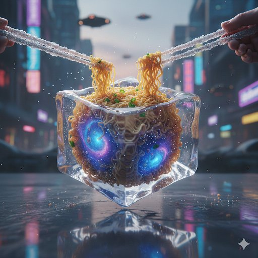

## { "presentation": "Deconstructed exploded view floating 

- ID: trending-2016340217146507313
- Slug: trending-2016340217146507313-en
- 语言: en
- 来源: [来源链接](https://x.com/Just_sharon7/status/2016340217146507313)
- 样例图路径: images/part1/2016340217146507313_1.jpg

### 提示词

```text
{
"presentation": "Deconstructed exploded view floating in mid-air above a finished burger on a plate",
    "burger_paddy": "Grilled quinoa and black bean patty with visible char marks, split in half with steam rising",
    "floating_ingredients": [
      "Grains of cooked quinoa",
      "Whole black beans",
      "Roasted sweet potato cubes",
      "Fresh spinach and arugula leaves",
      "Slices of ripe avocado",
      "Drips of creamy tahini-lemon dressing",
      "Diced red onion"
    ],
    "plated_item": "A complete burger on a seeded whole-grain bun with fresh greens and dressing, served on a ceramic plate with a side salad"
  },
  "style": {
    "aesthetic": "Professional commercial food photography",
    "lighting": "Warm, cinematic, moody lighting with soft highlights on the textures of the food",
    "background": "Dark, rustic, textured stone or clay oven-like background with a shallow depth of field (bokeh)",
    "color_palette": "Earthy tones, deep browns, vibrant greens, and warm oranges"
  },
  "composition": {
    "angle": "Eye-level, straight-on shot",
    "dynamic_elements": "Floating gravity-defying arrangement, wisps of steam, droplets of sauce",
    "text_overlay_optional": "Clean gold serif typography at the top reading 'HEALTHY QUINOA BURGER'"
  },
  "technical_specs": {
    "focus": "Sharp focus on the floating patty and ingredients",
    "lens": "Macro lens for high detail texture on grains and vegetables",
    "quality": "8k resolution, photorealistic, commercial advertising quality"
  }
}
```

### 样例图

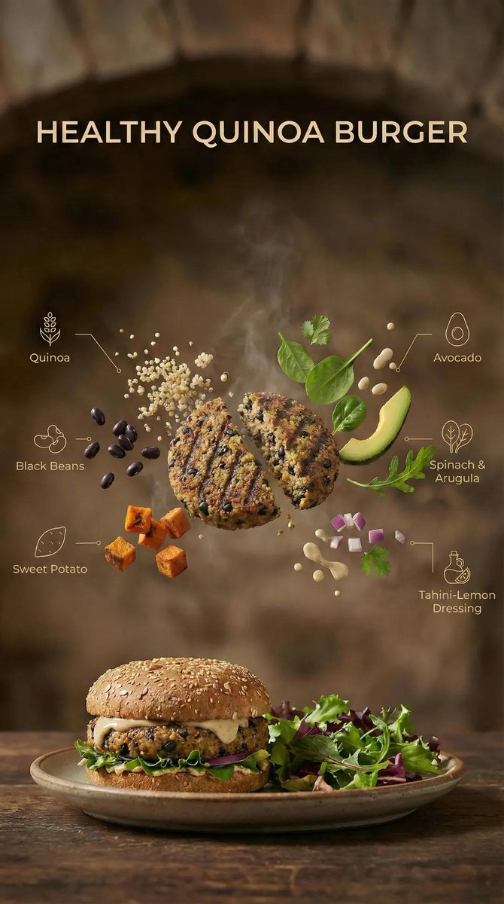

## minimal studio shot on pure white background, real [Food

- ID: trending-2034640645877321998
- Slug: trending-2034640645877321998-en
- 语言: en
- 来源: [来源链接](https://x.com/egeberkina/status/2034640645877321998)
- 样例图路径: images/part1/2034640645877321998_1.jpg

### 提示词

```text
minimal studio shot on pure white background, real [Food Name] emerging from a paper packaging, the visible part outside the packaging is fully photorealistic, the continuation of the same food is drawn as a clean black line illustration printed directly on the surface of the packaging, perfectly aligned with the real food shape, the illustration stays strictly on the packaging material, not floating, not extending into the background, seamless transition between real and printed illustration, modern minimal branding, top-down composition, soft shadows
```

### 样例图

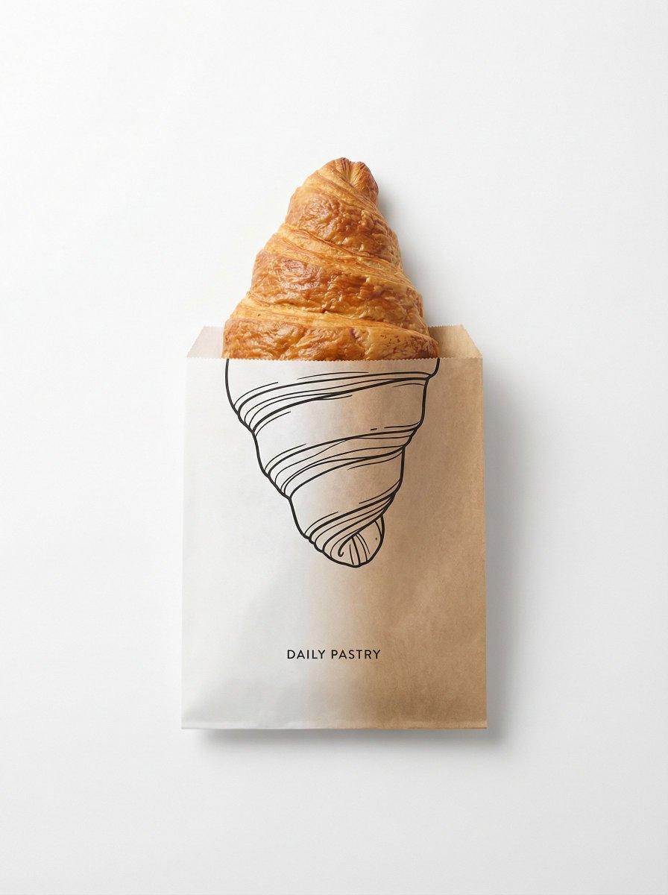

## { "master_prompt": { "global_settings": { "style": "Hype

- ID: trending-2019630789474861400
- Slug: trending-2019630789474861400-en
- 语言: en
- 来源: [来源链接](https://x.com/Minahil42298354/status/2019630789474861400)
- 样例图路径: images/part1/2019630789474861400_1.jpg

### 提示词

```text
{
  "master_prompt": {
    "global_settings": {
      "style": "Hyper-realistic commercial product photography", 
      "layout": "Vertical split-screen, two distinct modules",
      "resolution": "8K UHD, cinematic lighting",
      "details": "Extreme clarity, frozen motion splashes, micro-condensation"
    },
    "module_1_left": {
      "subject": {
        "type": "Clear tall glass of thick chocolate milkshake",
        "details": "Frothy texture, visible condensation on glass",
        "text_on_glass": ["CHOCOLATE MILK SHAKE", "mock up", "protein"]
      },
      "action": "Dynamic chocolate liquid splash erupting from the base and top",
      "floating_elements": [
        "Whole blueberries with water droplets",
        "Fresh green mint leaves",
        "Tiny chocolate particles suspended in air"
      ],
      "background": {
        "color": "Deep dark blue with soft golden bokeh particles",
        "lighting": "Cool moonlight-style rim lighting"
      }
    },
    "module_2_right": {
      "subject": {
        "type": "Slim gold metallic Nescafé can",
        "details": "Heavy condensation, matte gold finish",
        "text_on_can": ["NESCAFÉ", "CHOCOLATE SHAKE", "NEW LOOK", "PROTEIN BOOST"]
      },
      "action": "Explosive chocolate liquid crown splash at the base",
      "floating_elements": [
        "Roasted coffee beans",
        "Swirling thick white steam/smoke rising from the top",
        "Glowing amber embers and sparks"
      ],
      "background": {
        "color": "Warm chocolate brown to dark amber gradient",
        "atmosphere": "Moody, intense, and smoky"
      }
    },
    "surface_details": {
      "base": "Reflective dark wet surface with liquid pooling",
      "shadows": "Soft separated realistic shadows"
    }
  }
}
```

### 样例图

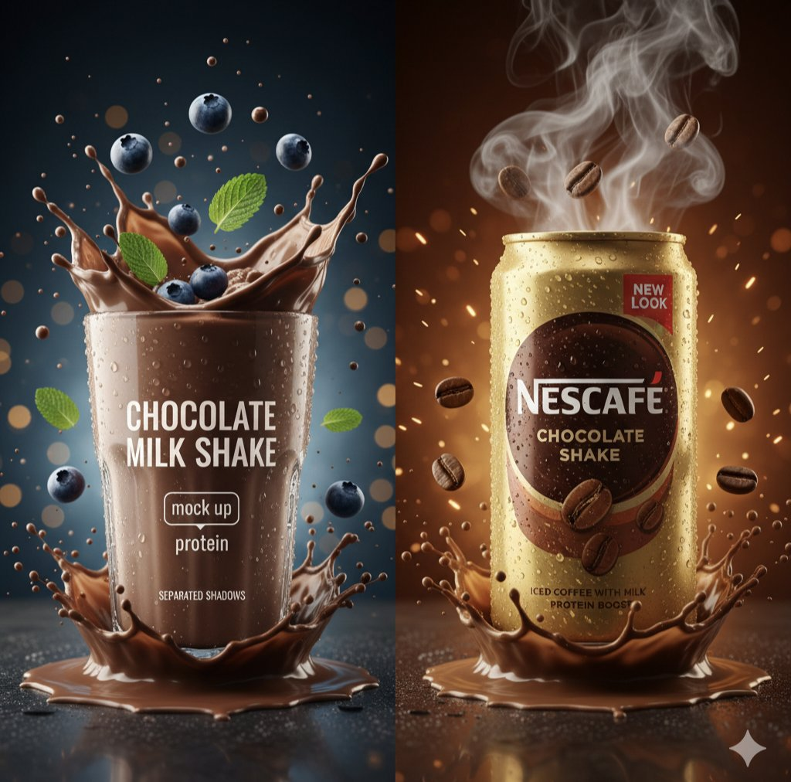

## { "image_prompt": { "viewpoint": "Realistic first-person

- ID: trending-2016421696299991337
- Slug: trending-2016421696299991337-en
- 语言: en
- 来源: [来源链接](https://x.com/Taaruk_/status/2016421696299991337)
- 样例图路径: images/part1/2016421696299991337_1.jpg

### 提示词

```text
{
  "image_prompt": {
    "viewpoint": "Realistic first-person view (FPV)",
    "action": "Person holding fresh fruit in their hands",
    "subject_variations": [
      "Banana",
      "Strawberries",
      "Apple"
    ],
    "environment": {
      "location": "Modern supermarket aisle",
      "background": "Blurred grocery shelves",
      "lighting": "Bright commercial lighting"
    },
    "augmented_reality_hud": {
      "overlay_style": "Clean sci-fi interface, soft glow, glass-like UI elements",
      "data_display": [
        "Nutritional data (calories, vitamins, fiber, sugars, potassium)",
        "Freshness percentage",
        "Health indicators"
      ],
      "ui_panels": [
        "Checklist items (milk, bread, eggs, pasta)",
        "Recipe suggestions",
        "Smoothie options",
        "Vitamin icons"
      ],
      "visual_effects": "Subtle light particles, depth-aware AR placement"
    },
    "technical_specs": {
      "style": "Ultra-realistic photography blended with futuristic AR technology",
      "aesthetic": "Modern health-tech",
      "focus": "Sharp focus on hands and fruit, shallow depth of field",
      "resolution": "8K",
      "realism": "Cinematic realism"
    }
  }
}
```

### 样例图

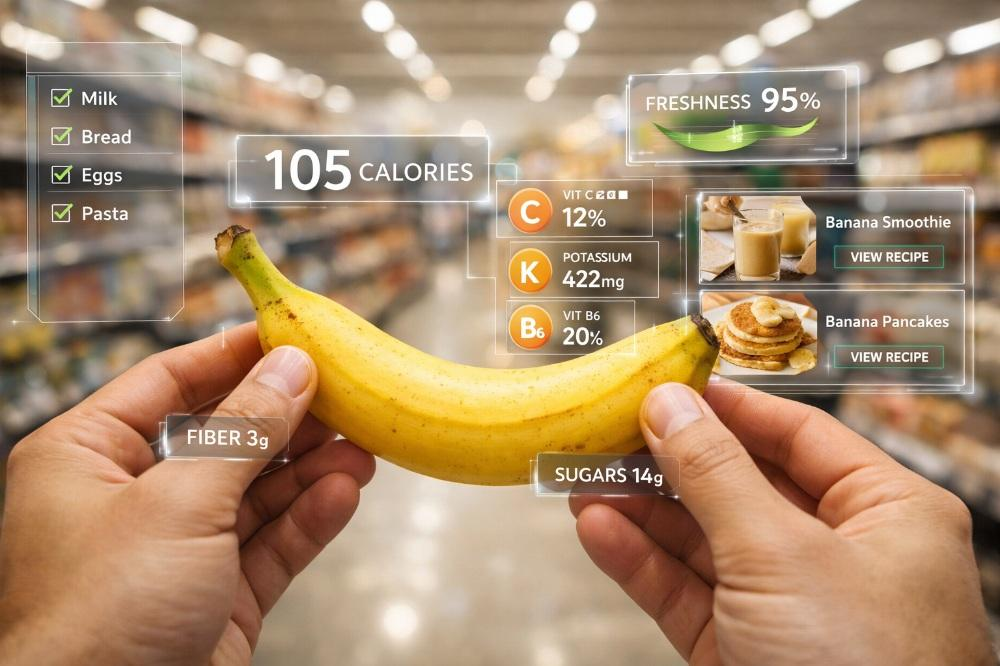

## Ultra-realistic premium food photography of a layered ch

- ID: trending-2023741334335713360
- Slug: trending-2023741334335713360-en
- 语言: en
- 来源: [来源链接](https://x.com/Strength04_X/status/2023741334335713360)
- 样例图路径: images/part1/2023741334335713360_1.jpg

### 提示词

```text
Ultra-realistic premium food photography of a layered chocolate cake on a white plate, centered composition, three thick moist chocolate sponge layers with a smooth white cream filling in the middle, topped with glossy rich chocolate ganache frosting, decorated with fresh raspberries, dark chocolate curls, shards, and small gold sugar pearls, clean minimal light grey studio background, soft diffused professional lighting, gentle natural shadows, ultra-sharp texture detail showing porous sponge and creamy layers, high-end bakery advertising style, shallow depth of field, macro food photography look, photorealistic, 8K resolution, elegant dessert presentation, no text, no watermark
Negative prompt:
blurry, low resolution, cartoon style, CGI look, artificial textures, messy composition, oversaturated colors, harsh shadows, noise, watermark, text, extra objects, distorted cake shape.
```

### 样例图

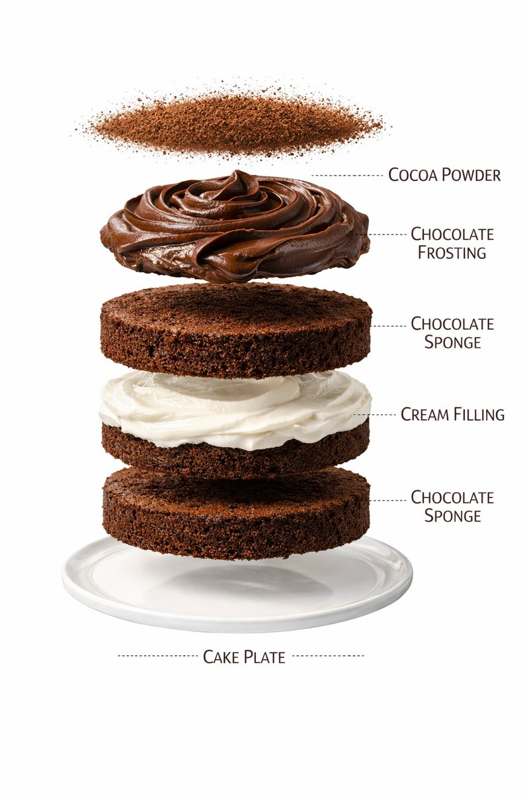

## A hyper-realistic, cinematic close-up of a sizzling gour

- ID: trending-2009984389481148510
- Slug: trending-2009984389481148510-en
- 语言: en
- 来源: [来源链接](https://x.com/oggii_0/status/2009984389481148510)
- 样例图路径: images/part1/2009984389481148510_1.jpg

### 提示词

```text
A hyper-realistic, cinematic close-up of a sizzling gourmet cheeseburger. The thick, juicy beef patty features a heavy, glossy char and is blanketed in vibrant orange cheddar cheese that melts and oozes down the sides in thick, viscous streams over a toasted brioche bun. The atmosphere is dramatic and smoky, with thick wisps of white and blue steam swirling upwards, surrounded by floating bright orange sparks, glowing embers, and frozen droplets of grease suspended in the air. The lighting is high-contrast and dramatic against a deep black background, emphasizing the glistening textures. Shot with a macro lens, shallow depth of field, and 8k resolution commercial food photography style.
```

### 样例图

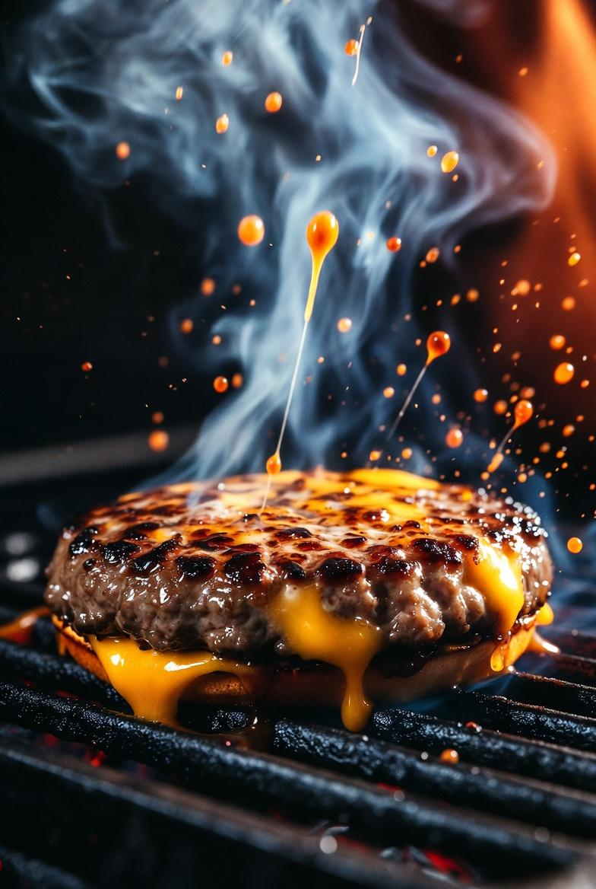

## { "image_prompt": { "type": "Hyper-realistic editorial f

- ID: trending-2019418461869650379
- Slug: trending-2019418461869650379-en
- 语言: en
- 来源: [来源链接](https://x.com/Mind_Boticni/status/2019418461869650379)
- 样例图路径: images/part1/2019418461869650379_1.jpg

### 提示词

```text
{
  "image_prompt": {
    "type": "Hyper-realistic editorial food infographic",
    "subject": {
      "cuisine": "Authentic Indian Vegetarian",
      "base_element": "Traditional rustic bowl filled with steaming, freshly cooked curry at the bottom, rich and aromatic",
      "levitating_ingredients": [
        "Golden, crispy paneer cubes",
        "Soft boiled potato chunks",
        "Glazed tomato-curry sauce splashes suspended mid-air",
        "Vibrant fresh coriander leaves",
        "Sliced green chilies",
        "Lime wedges",
        "Thin slices of garlic and ginger",
        "Crunchy fried onions",
        "Colorful vegetables: red bell peppers, green peas, orange carrots",
        "Sprinkle of aromatic spices: turmeric, cumin seeds, red chili powder, garam masala"
      ]
    },
    "composition": {
      "layout": "Clean vertical infographic composition",
      "arrangement": "Realistic gravity-defying floating ingredients, layered for visual hierarchy",
      "background": "Warm rustic wooden tabletop or traditional Indian brass plate",
      "visual_hierarchy": "Bowl anchored at the bottom, ingredients rising vertically with natural spacing, creating depth and focus on main dish"
    },
    "graphic_design_elements": {
      "labels": "Sharp, clear English text annotations for each ingredient",
      "lines": "Delicate thin white pointer lines connecting floating ingredients to labels",
      "style": "Professional editorial food magazine infographic, visually educational, vibrant and appetizing"
    },
    "lighting_and_mood": {
      "lighting": "Cinematic studio lighting with warm highlights and soft shadows, enhancing textures",
      "color_palette": "Rich, vibrant warm tones to highlight spices, vegetables, and curry",
      "effects": "Visible rising steam, motion-frozen mid-air ingredients, slight reflections and glistening sauce for mouth-watering effect"
    },
    "technical_specs": {
      "camera_settings": "Shallow depth of field, ultra-sharp focus on foreground elements, DSLR cinematic lens effect",
      "details": "Ultra-detailed textures on paneer, vegetables, spices, and sauce; realistic steam and glossy highlights",
      "resolution": "8K ultra-realistic, suitable for high-end digital display, print, or magazine cover"
    }
  }
}
```

### 样例图

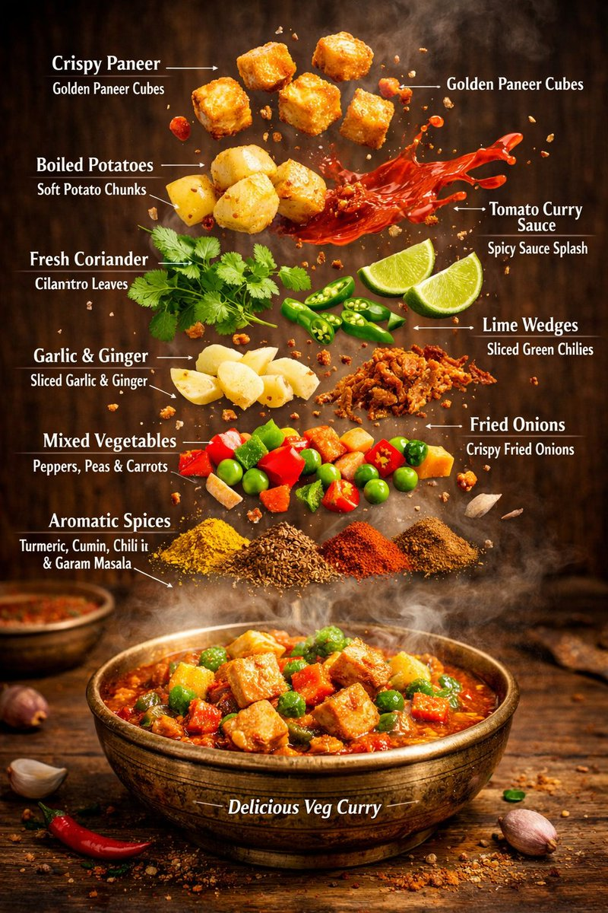

## Create a hyper-realistic exploded vertical infographic c

- ID: trending-2028451530198642753
- Slug: trending-2028451530198642753-en
- 语言: en
- 来源: [来源链接](https://x.com/TechieBySA/status/2028451530198642753)
- 样例图路径: images/part1/2028451530198642753_1.jpg

### 提示词

```text
Create a hyper-realistic exploded vertical infographic composition of [FOOD].
At the top, characteristic particles, droplets, or garnishes associated with the food, frozen mid-air.
Below it, the primary surface or topping layer with rich texture and realistic material detail.
Underneath, the core ingredient layer showing structure, depth, and natural variation.
Below that, the supporting base or interior layer, slightly separated to reveal construction.
At the bottom, a minimal plate, bowl, cup, or base appropriate to the food’s presentation.
Pure white background, soft studio lighting, subtle shadows beneath each floating element, ultra-sharp focus, DSLR macro photography, clean infographic text labels with thin pointer lines, premium editorial food photography aesthetic, 8K quality.
```

### 样例图

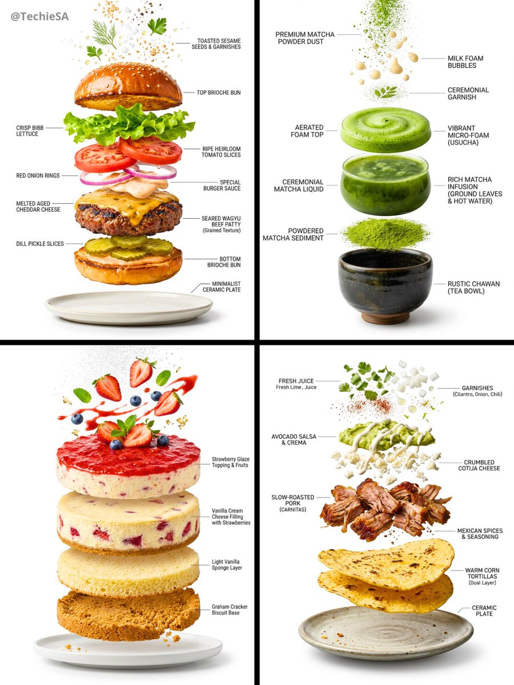

## Generate a '2:3' hyper-realistic, high-resolution poster

- ID: trending-2015332757862514985
- Slug: trending-2015332757862514985-en
- 语言: en
- 来源: [来源链接](https://x.com/Strength04_X/status/2015332757862514985)
- 样例图路径: images/part1/2015332757862514985_1.jpg

### 提示词

```text
Generate a '2:3' hyper-realistic, high-resolution poster featuring the attached taco image. Adjust its perspective if needed to match the scene’s perspective and blend naturally into the composition.

COMPOSITION:
Capture a dynamic freeze-frame moment of a taco mid-flip during a street-side catch, shot from a Dutch tilted low three-quarter angle that exaggerates motion and urgency. The camera is positioned slightly below the taco, angled upward, with the taco large and dominant dead-center in the frame, sharply in focus, suspended just above a scarred stainless-steel street cart counter. A single harsh overhead streetlamp mounted top left casts a focused cone of warm light, carving crisp highlights and deep shadows that emphasize motion blur in the background while keeping the taco tack-sharp. The atmosphere is alive with subtle steam rising from the cart grill at bottom left, faint oil smoke drifting upward, and tiny airborne crumbs frozen mid-air. The tone is clean, appetizing, cinematic, and urban. The food-signature prop is a custom round taco press stamped with geometric chili patterns, resting closed on the counter in the lower right foreground beneath the airborne taco, its metal edges catching the lamp’s glare. The story-signature prop is a battered transit-station flip-clock timer mounted on the back wall at top right, showing '19 03' on split flip panels, implying split-second timing and street rhythm. Wet pavement reflections shimmer in the blurred background, grounding the scene in a late-night street setting. Keep visible wiring and cables subtly running along the wall toward the neon and props, with a faint magenta/purple spill mixing into the neon glow on the wall and paper.

HEADER: 'STREET FLIGHT'
The header is physically formed from bent single neon tubing (no double tubes). Neon tubes are made of reflective glass with neon gas inside, mounted on a chipped concrete wall in the upper center background behind the taco. The neon tubes glow 'warm amber', with uneven brightness, faint buzzing, and soot-darkened mounting brackets. The header is stacked on two lines: 'STREET' above 'FLIGHT'. The letters cast soft neon spill and distorted shadows across the wall’s cracked surface, with minimal grime dulling parts of the glow, and thin black power cables feeding into the neon from the right.

TAGLINE: 'Caught in Motion'
The tagline is printed in bold condensed sans-serif on a narrow strip of grease-stained receipt paper taped directly beneath the neon header using four translucent yellow tape pieces. The paper sags slightly at the center, edges curled and darkened by oil, catching a softer secondary glow from the neon above with a faint magenta/purple tint in the spill.

CALL TO ACTION: 'ORDER NOW'
The cta is integrated into the taco press hardware in the foreground as on an angled metal bar/handle element, reading as bold, worn black lettering with slight chipping and grease settled into the letter edges, plus a hard specular highlight running along the metal.

STICKER: 'HOT'
A small circular red vinyl sticker is physically adhered directly to the taco shell, perfectly centered, with slight white highlights. The sticker conforms to the taco curvature, shows tiny wrinkles under the adhesive, and tiny air pockets are trapped beneath the adhesive to reflect realism.
```

### 样例图

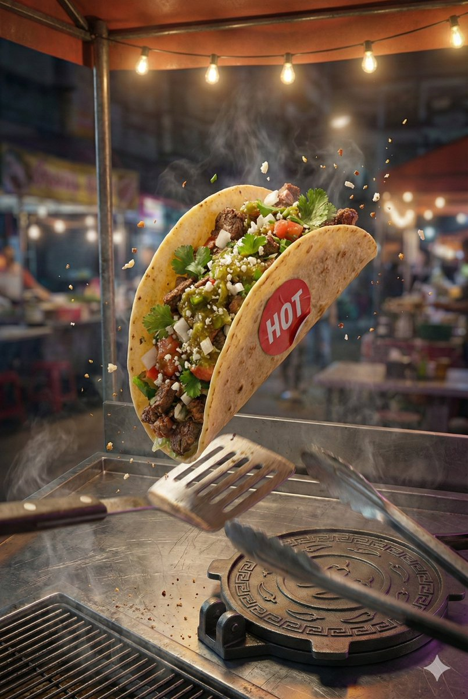

## Grape Can – “Vine Glow” Minimalist product photography o

- ID: trending-2029476310125560281
- Slug: trending-2029476310125560281-en
- 语言: en
- 来源: [来源链接](https://x.com/Kashberg_0/status/2029476310125560281)
- 样例图路径: images/part1/2029476310125560281_1.jpg

### 提示词

```text
Grape Can – “Vine Glow”

Minimalist product photography of a 330ml aluminum can labeled “VINE GLOW – Natural Extract”, centered on a clean light grey background. The can features elegant purple vine line art. A realistic horizontal torn paper effect cuts across the middle of the can and background, revealing fresh red and purple grapes inside with water droplets and glossy texture. Soft studio lighting, high detail, sharp focus, commercial advertising style, modern packaging design, symmetrical composition, ultra-realistic, 8k resolution.
```

### 样例图


## Professional studio food photography series featuring de

- ID: trending-2013488775356391702
- Slug: trending-2013488775356391702-en
- 语言: en
- 来源: [来源链接](https://x.com/oggii_0/status/2013488775356391702)
- 样例图路径: images/part1/2013488775356391702_1.jpg

### 提示词

```text
Professional studio food photography series featuring deconstructed dishes in high-speed levitation. Against a seamless dusty pink background with soft, diffused studio lighting, ingredients float and explode dynamically. Subjects include a hovering stack of tiramisu components (gelato, ladyfingers, mascarpone, coffee beans), borscht ingredients (beets, rye bread, herbs) suspended above a ceramic bowl of soup on a wooden board, and sourdough toast with mashed avocado and a runny poached egg separating in mid-air. Capture fine details like flying crumbs, spice particles, herbs, and liquid droplets with sharp focus and a shallow depth of field. A soft shadow is cast beneath the main floating elements.
```

### 样例图

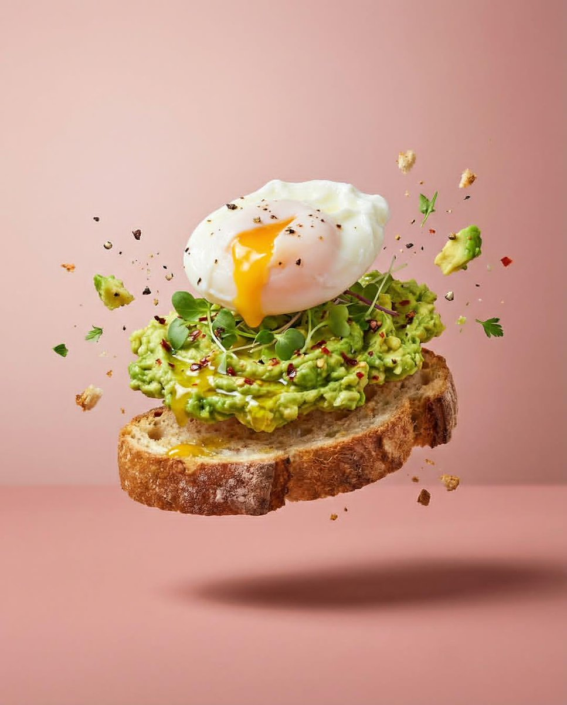

## { "image_prompt": { "type": "Ultra-realistic culinary in

- ID: trending-2018524475306938771
- Slug: trending-2018524475306938771-en
- 语言: en
- 来源: [来源链接](https://x.com/john_my07/status/2018524475306938771)
- 样例图路径: images/part1/2018524475306938771_1.jpg

### 提示词

```text
{
  "image_prompt": {
    "type": "Ultra-realistic culinary infographic",
    "subject": {
      "cuisine": "Indonesian",
      "base_element": "A traditional serving bowl holding a steaming hot dish",
      "levitating_ingredients": [
        "Tender meat pieces",
        "Golden crispy tofu",
        "Rich sauce droplets in mid-air",
        "Fresh green herbs",
        "Red chilies",
        "Sliced lime",
        "Crushed garlic",
        "Crispy fried shallots"
      ]
    },
    "composition": {
      "layout": "Minimal, vertically stacked layout",
      "arrangement": "Ingredients floating naturally as if suspended in motion",
      "background": "Textured rustic wooden tabletop",
      "visual_hierarchy": "The bowl remains grounded at the base, with ingredients ascending above it"
    },
    "graphic_design_elements": {
      "labels": "Clean Indonesian-language annotations",
      "lines": "Fine white connector lines",
      "style": "High-end editorial food infographic, magazine-quality design"
    },
    "lighting_and_mood": {
      "lighting": "Controlled cinematic studio lighting",
      "color_palette": "Warm, appetizing color tones",
      "effects": "Visible steam and frozen-action food elements"
    },
    "technical_specs": {
      "camera_settings": "Shallow depth of field with crisp focal detail, DSLR-style capture",
      "details": "Extremely detailed surface textures",
      "resolution": "8K, photorealistic finish"
    }
  }
}
```

### 样例图

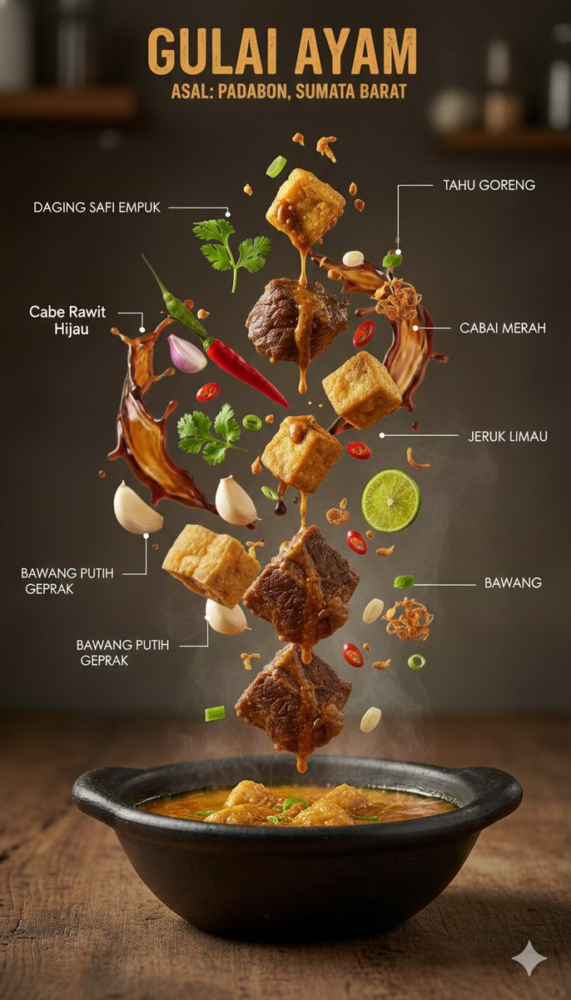

## Ultra-realistic high-speed food photography of a crispy 

- ID: trending-2022877843236200588
- Slug: trending-2022877843236200588-en
- 语言: en
- 来源: [来源链接](https://x.com/Taaruk_/status/2022877843236200588)
- 样例图路径: images/part1/2022877843236200588_1.jpg

### 提示词

```text
Ultra-realistic high-speed food photography of a crispy golden fried snack breaking apart mid-air, creamy savory filling stretching between the halves, visible chunks of chicken, peas, carrots, minced meat, noodles, or egg inside. Crumbs and flakes flying in slow motion, hot steam rising, dramatic food explosion effect. Shot in a vibrant night street market environment with warm bokeh lights, blurred food stalls in the background. Shallow depth of field, 85mm lens, f/1.8, ultra-sharp focus on texture, crunchy coating detail, dynamic motion capture, commercial food photography, cinematic lighting, HDR, 8K resolution, hyper-detailed, masterpiece quality.
```

### 样例图

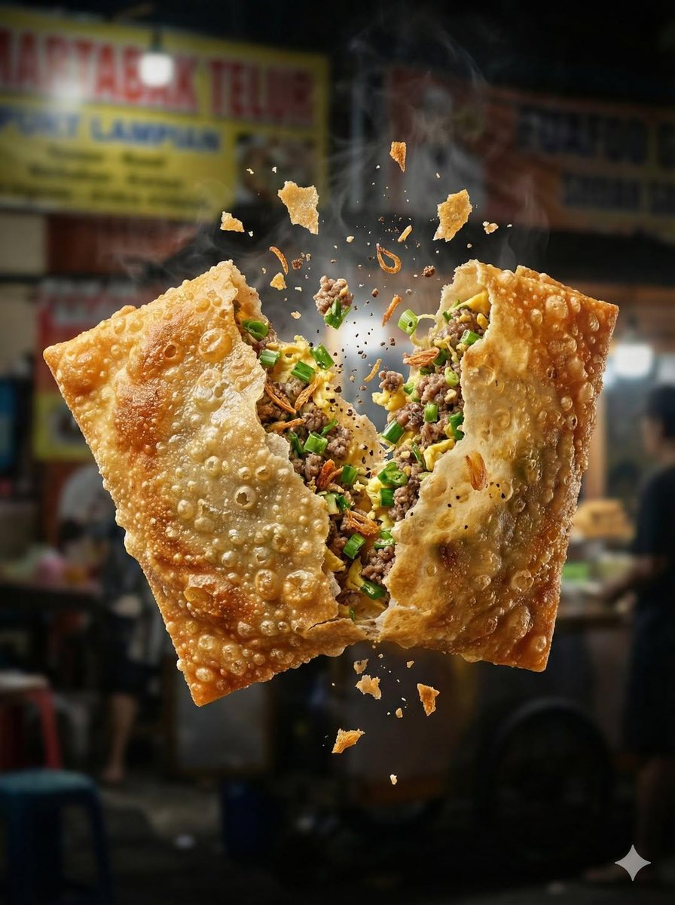

## A cute young girl with short black hair and bangs smilin

- ID: trending-2030089473577693629
- Slug: trending-2030089473577693629-en
- 语言: en
- 来源: [来源链接](https://x.com/ChillaiKalan__/status/2030089473577693629)
- 样例图路径: images/part1/2030089473577693629_1.jpg

### 提示词

```text
A cute young girl with short black hair and bangs smiling while holding a red KitKat Dark chocolate bar covering one eye, resting her cheek on her hand, wearing a cozy red and beige patterned winter sweater. The background and table are solid bright red. Several KitKat chocolate bars are placed on the table in front of her. Soft studio lighting, vibrant colors, commercial food advertisement style, ultra-realistic photography, sharp focus, high detail, 50mm lens, shallow depth of field, professional product photography, centered composition.
```

### 样例图

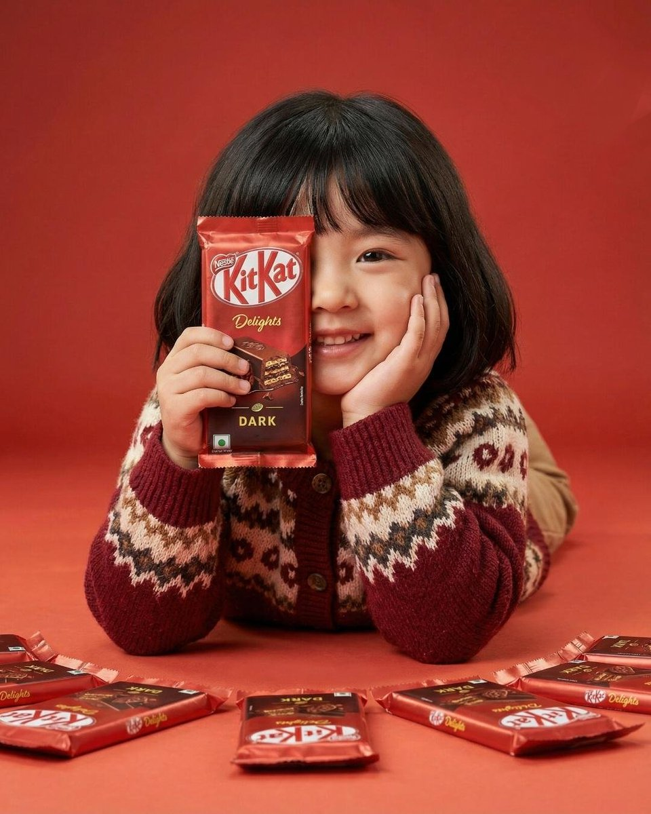

## High-quality professional product photography of a chill

- ID: trending-2038543008556015633
- Slug: trending-2038543008556015633-en
- 语言: en
- 来源: [来源链接](https://x.com/ZaraIrahh/status/2038543008556015633)
- 样例图路径: images/part1/2038543008556015633_1.jpg

### 提示词

```text
 High-quality professional product photography of a chilled Pepsi can with condensation water droplets and a refreshing, icy look. The aluminum can appears crisp and glossy with realistic highlights, subtle reflections, and visible cold texture. Shot in a minimalist commercial beverage advertising style against a pure white background with soft natural shadows. Sharp focus, ultra-clean composition, modern aesthetic.
```

### 样例图

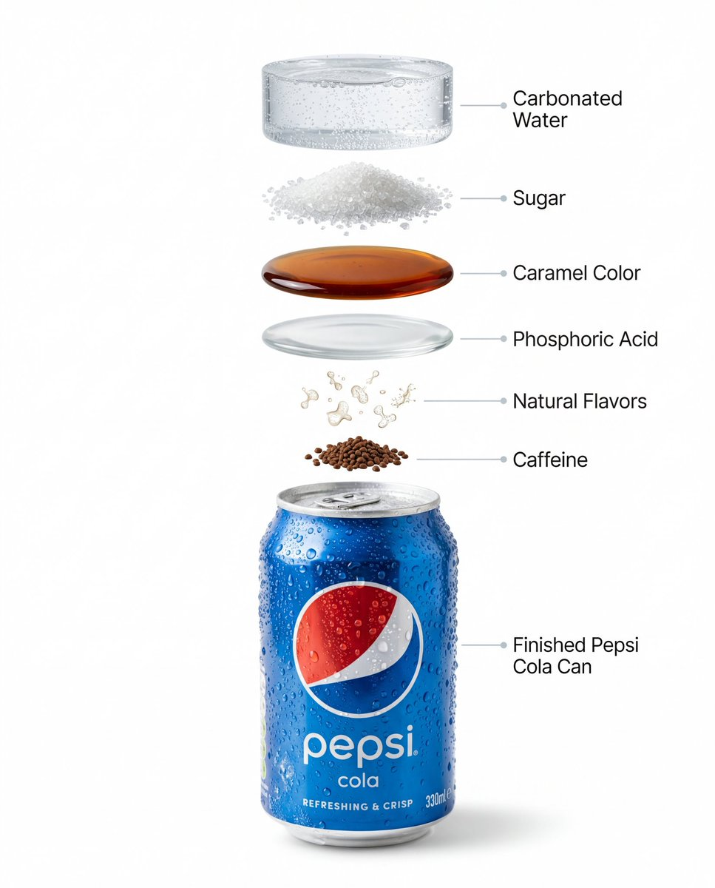

## Ultra-realistic commercial product photography of a cold

- ID: trending-2033341324305608968
- Slug: trending-2033341324305608968-en
- 语言: en
- 来源: [来源链接](https://x.com/Kashberg_0/status/2033341324305608968)
- 样例图路径: images/part1/2033341324305608968_1.jpg

### 提示词

```text
Ultra-realistic commercial product photography of a cold green tropical drink in a transparent plastic cup with Fanta Buko Pandan branding, crushed ice inside, condensation droplets on the cup, green striped paper straw, surrounded by floating ice cubes and pandan jelly cubes, coconut pieces and pandan leaves around the base, drink placed on a small wooden platform, reflective wet surface with scattered ice, tropical jungle leaves background, vibrant green color palette, refreshing summer beverage advertisement, dramatic studio lighting, shallow depth of field, macro details, high-speed splash photography, 8k ultra detailed, professional advertising shot.
Optional parameters
•Aspect ratio: --ar 1:1
•Style: --style raw
•Quality: --q 2

Prompt:

Premium advertising photo of Fanta Buko Pandan tropical beverage, tall clear cup filled with icy green pandan coconut drink, condensation droplets on the cup, white straw, surrounded by crystal ice cubes and pandan jelly cubes, fresh coconut halves and pandan stalks on table, placed on a wooden display stand, glossy reflective surface, lush tropical leaf background with soft bokeh, vibrant green tones, cinematic lighting, hyper-realistic food photography, commercial beverage campaign style, ultra sharp details, 8k resolution, shallow depth of field.
Optional parameters
•Aspect ratio: --ar 1:1
•Lighting: studio softbox lighting
•Style keywords: photorealistic, beverage advertising, macro texture
```

### 样例图

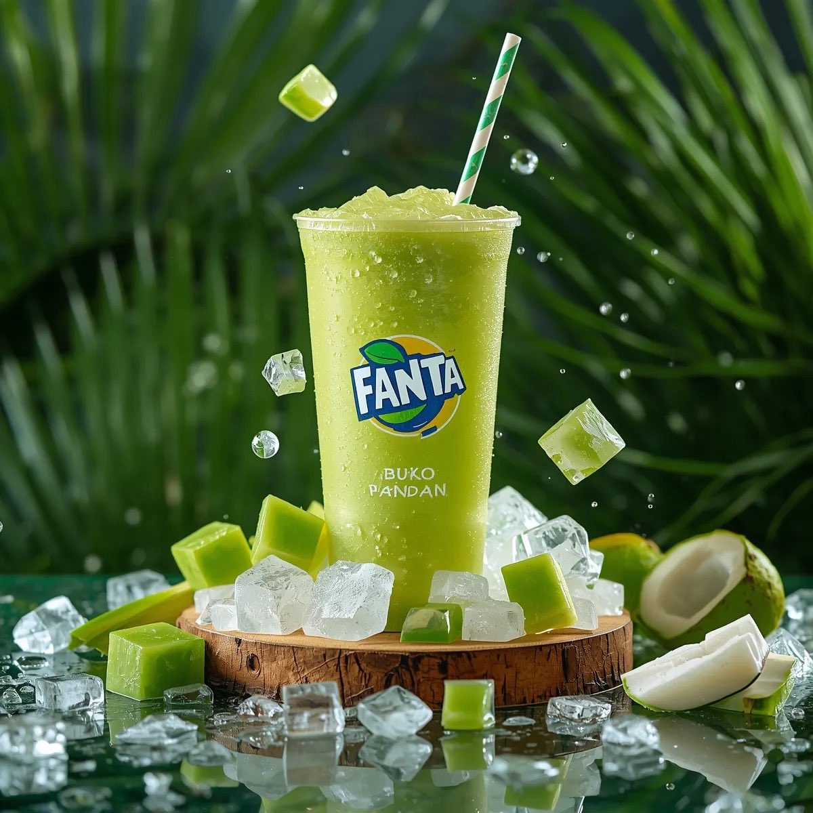

## { "project": { "title": "Hyper-Visual Burger Macro Serie

- ID: trending-2009339340418371647
- Slug: trending-2009339340418371647-en
- 语言: en
- 来源: [来源链接](https://x.com/Ankit_patel211/status/2009339340418371647)
- 样例图路径: images/part1/2009339340418371647_1.jpg

### 提示词

```text
{
  "project": {
    "title": "Hyper-Visual Burger Macro Series",
    "version": "2.0_Structured_High_Speed",
    "target_aesthetic": "High-end Commercial Advertising"
  },
  "technical_foundation": {
    "camera_hardware": {
      "body": "Nikon D850",
      "lens": "105mm f/2.8 Micro-Nikkor",
      "settings": "High-speed shutter, deep depth of field, ISO 100"
    },
    "global_image_specs": {
      "aspect_ratio": "2:3",
      "resolution": "8K Ultra-HD",
      "lighting_style": "Studio high-key with rim-light accents",
      "color_profile": "Vibrant, high-saturation golden browns, reds, and greens"
    }
  },
  "scene_manifest": [
    {
      "scene_id": "01_THE_SAUCE_CROWN",
      "composition": {
        "focus": "Macro interaction",
        "subject": "Juicy burger slice (beef patty cross-section with bun edge)",
        "action": "Vertical plunge into glossy burger sauce"
      },
      "physics_elements": {
        "liquid": "Thick, creamy signature burger sauce",
        "splash_shape": "Symmetrical dynamic crown",
        "particles": "Suspended sauce droplets, sesame seeds, and salt flakes"
      },
      "texture_details": [
        "Seared beef fibers",
        "Juicy meat sheen",
        "Toasted bun crumb texture"
      ]
    },
    {
      "scene_id": "02_THE_LAYER_SWING",
      "composition": {
        "focus": "Dynamic movement",
        "subject": "Burger slice in motion",
        "environment": "Open burger box context"
      },
      "physics_elements": {
        "motion": "Angular swing trajectory",
        "particles": "Pepper flakes, salt crystals, and lettuce shreds",
        "background": "Soft-focus bright studio"
      },
      "lighting": "Balanced shadow/highlight contrast for rich 3D depth"
    },
    {
      "scene_id": "03_THE_HERO_STACK",
      "composition": {
        "focus": "Action-packed layout",
        "subject": "Upward ejecting burger slice",
        "branding": "Open branded burger box beneath"
      },
      "lighting_effects": {
        "primary": "Radial spotlight burst behind subject",
        "secondary": "Fill light emphasizing juicy meat and bun texture"
      },
      "particle_vfx": "Explosive trail of sauce droplets, crumbs, and sesame seeds"
    },
    {
      "scene_id": "04_THE_JUICE_BURST",
      "composition": {
        "focus": "Extreme macro freeze-frame",
        "subject": "Burger slice juice release",
        "action": "Mid-air compression and release of meat juices"
      },
      "environment_vfx": {
        "background": "Warm amber-to-cream high-contrast gradient",
        "atmosphere": "Fine mist of steam and seasoning particles",
        "shimmer": "Backlit glints on melted fat, sauce, and bun surface"
      }
    }
  ],
  "negative_parameters": [
    "motion blur",
    "plastic or artificial food textures",
    "low-resolution noise",
    "muddy colors",
    "overexposed highlights",
    "unrealistic food physics"
  ]
}
```

### 样例图

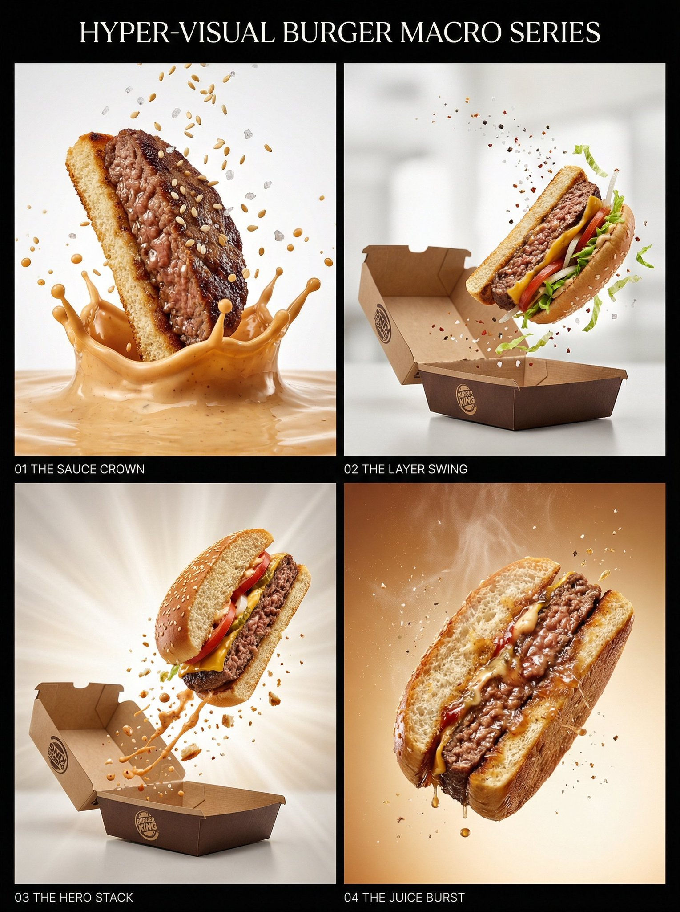

## Ultra-clean modern recipe infographic. Showcase Vanilla 

- ID: trending-2033184147003633695
- Slug: trending-2033184147003633695-en
- 语言: en
- 来源: [来源链接](https://x.com/Strength04_X/status/2033184147003633695)
- 样例图路径: images/part1/2033184147003633695_1.jpg

### 提示词

```text
Ultra-clean modern recipe infographic. Showcase Vanilla Ice Cream Scoops with syrup and toppings in angled perspective.

Ingredients Section: Icons for milk, cream, sugar, vanilla.

Steps Section: Mixing base, freezing, scooping shown with numbered panels.

Additional Info: Calories, prep time, servings displayed in badges.

Visual Style: Dessert infographic with pastel colors, soft gradients, modern typography.

Composition Guidelines: Ice cream scoops as hero visual with ingredients and steps around it.

Lighting & Background: Soft dessert-style lighting with minimal background.

Output: 1080×1080, ultra-crisp, social-feed optimized, no watermark.
```

### 样例图

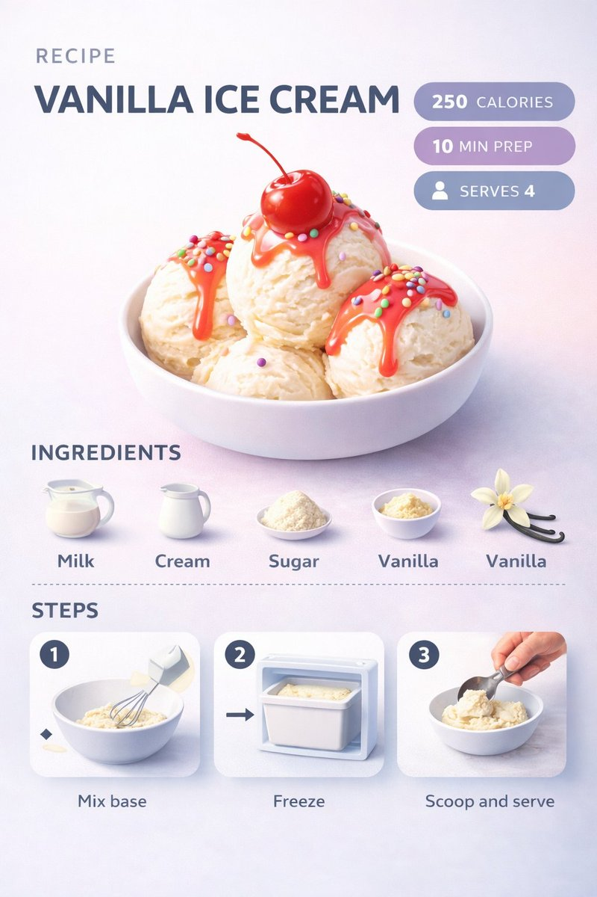

## A transparent cup filled with fresh Sprite lemon soda fl

- ID: trending-2029237065783873715
- Slug: trending-2029237065783873715-en
- 语言: en
- 来源: [来源链接](https://x.com/Strength04_X/status/2029237065783873715)
- 样例图路径: images/part1/2029237065783873715_1.jpg

### 提示词

```text
A transparent cup filled with fresh Sprite lemon soda floating in the air, surrounded by sparkling lemon-lime soda splashes, bright ice cubes, and tiny carbonation bubbles bursting around the drink. The cup features green minimal text design, giving a fresh and clean brand look. Hyper-realistic beverage product photography with professional studio lighting, crisp texture details, macro clarity as if shot with Sony A7s. Black and neon green background highlighting freshness --stylize 250
```

### 样例图

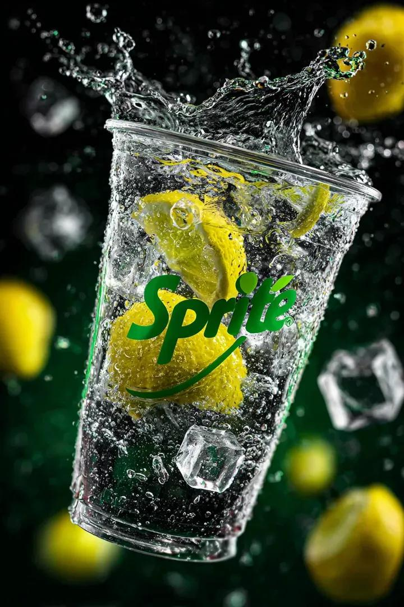

## - Ultra-realistic prepared pepperoni pizza slice, fully 

- ID: trending-2012909080785072329
- Slug: trending-2012909080785072329-en
- 语言: en
- 来源: [来源链接](https://x.com/Strength04_X/status/2012909080785072329)
- 样例图路径: images/part1/2012909080785072329_1.jpg

### 提示词

```text
- Ultra-realistic prepared pepperoni pizza slice, fully assembled, gooey melted mozzarella cheese stretching and dripping over the edges, crispy pepperoni slices on top, rich tomato sauce beneath, thick golden baked crust, fresh basil leaves and light seasoning floating subtly above, clean pure white background, professional commercial food photography lighting, soft natural shadows under the slice, sharp focus, extreme texture detail, glossy cheese, crunchy crust surface, studio shot, minimal composition, no text, no labels, no hands, premium food advertisement style, 8K resolution, ultra-detailed, hyper-realistic.
```

### 样例图

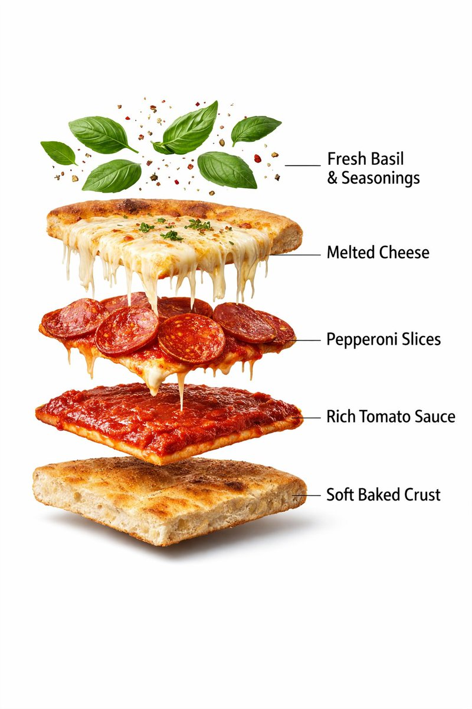

## A high-end studio photograph of a [YOUR COCKTAIL], shot 

- ID: trending-2010403834699685983
- Slug: trending-2010403834699685983-en
- 语言: en
- 来源: [来源链接](https://x.com/Kerroudjm/status/2010403834699685983)
- 样例图路径: images/part1/2010403834699685983_1.jpg

### 提示词

```text
A high-end studio photograph of a [YOUR COCKTAIL], shot from a high-angle slightly top-down perspective. The drink is served in its appropriate traditional glass with an elegant design and professional garnish. Artfully scattered around the base of the glass are fresh fruits and ingredients associated with the cocktail recipe. The scene features a warm, summery atmosphere with a light orange-tinted background. Artistic soft shadows of tropical palm leaves are cast across the frame, creating a vacation vibe. Realistic condensation on the glass, soft golden hour lighting, 8k resolution, professional food photography, sharp focus, clean and sophisticated composition.
```

### 样例图

![A high-end studio photograph of a [YOUR COCKTAIL], shot ](../images/part1/2010403834699685983_1.jpg)

## Ultra-luxury food commercial of a stack of thick, fluffy

- ID: trending-2017938415627772122
- Slug: trending-2017938415627772122-en
- 语言: en
- 来源: [来源链接](https://x.com/Just_sharon7/status/2017938415627772122)
- 样例图路径: images/part1/2017938415627772122_1.jpg

### 提示词

```text
Ultra-luxury food commercial of a stack of thick, fluffy American pancakes with perfectly golden-brown edges. Pure maple syrup cascades slowly down the sides in glossy, slow-motion streams, highlighting every drip. Pancakes topped with fresh mixed berries (blueberries, raspberries, blackberries), scattered roasted hazelnuts and almonds, and crunchy oat flakes. Cinematic close-up shots with rich warm morning light, soft beige bokeh background, hyper-detailed textures emphasizing fluffiness and glossiness. Luxury golden ornate spoon takes a delicate bite, with syrup stretching realistically. Smooth camera moves circling and slightly top-down over the stack, emphasizing elegance and indulgence. Minimalistic, high-end plating, cinematic depth of field, extremely appetizing, mouthwatering, trending food photography aesthetic, ultra-realistic 8K detail, professional ad-style video. Include subtle background soft music or ambient café sounds for premium feel.
```

### 样例图

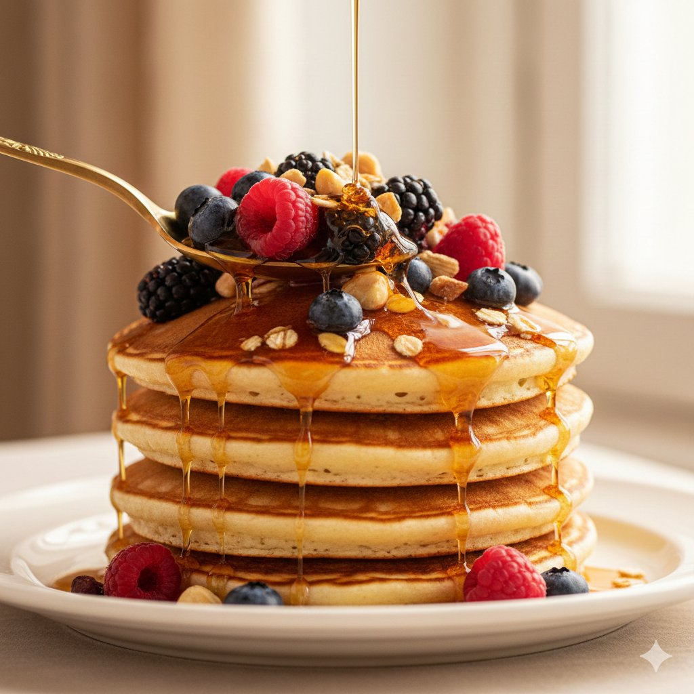

## Motion settles into a striking hero shot: can centered, 

- ID: trending-2011671243922293065
- Slug: trending-2011671243922293065-en
- 语言: en
- 来源: [来源链接](https://x.com/Strength04_X/status/2011671243922293065)
- 样例图路径: images/part1/2011671243922293065_1.jpg

### 提示词

```text

Motion settles into a striking hero shot: can centered, purple liquid frozen in sculptural form, berries suspended mid-air. No text, no logos, no transitions—pure visual impact.
Style & Mood:
Ultra-premium soda advertisement, dark luxury aesthetic, cinematic slow motion, high-contrast lighting, glossy reflections, dramatic yet elegant energy.
Camera & Technical Direction:
Locked-off camera, high-speed macro cinematography, realistic fluid dynamics, controlled splash physics, volumetric lighting, shallow depth of field, hyper-detailed droplets.
```

### 样例图

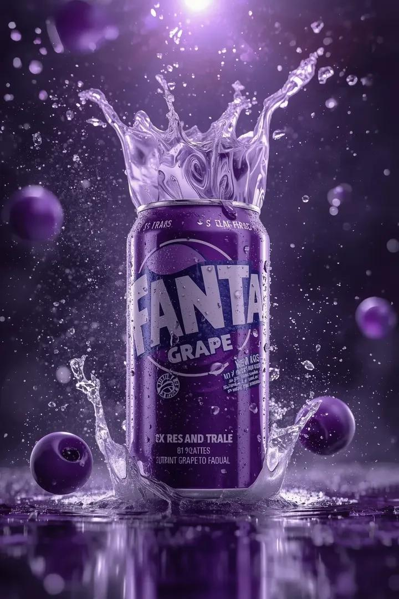

## { "scene": "Minimalist white contemporary art gallery", 

- ID: trending-2012019416884789443
- Slug: trending-2012019416884789443-en
- 语言: en
- 来源: [来源链接](https://x.com/Just_sharon7/status/2012019416884789443)
- 样例图路径: images/part1/2012019416884789443_1.jpg

### 提示词

```text
{
  "scene": "Minimalist white contemporary art gallery",
  "environment": {
    "floor": "smooth concrete floor",
    "lighting": "soft warm museum lighting",
    "atmosphere": "clean, surreal, high-end contemporary museum aesthetic"
  },
  "main_subject": {
    "description": "Oversized sports equipment sculpture made entirely from croissants",
    "material": "hyper-realistic golden flaky croissant pastry",
    "sports_equipment_options": [
      "boxing gloves",
      "dumbbells",
      "basketballs",
      "kettlebells",
      "barbell"
    ],
    "placement": "center of the gallery on white pedestal",
    "scale": "oversized, dominant focal point"
  },
  "secondary_elements": {
    "floating_shelves": "white floating shelves on walls",
    "miniature_objects": "tiny pastry-based sports objects and croissant sculptures",
    "arrangement": "evenly spaced, gallery-style display"
  },
  "visual_style": {
    "texture_detail": "ultra-realistic pastry layers, crisp flaky edges, buttery sheen",
    "color_palette": "white, warm gold, soft beige",
    "composition": "symmetrical, minimal, museum exhibition layout"
  },
  "photography": {
    "style": "professional photography",
    "camera": "high-resolution, sharp focus",
    "depth_of_field": "subtle depth, gallery clarity",
    "quality": "ultra-detailed, premium art photography"
  }
}
```

### 样例图

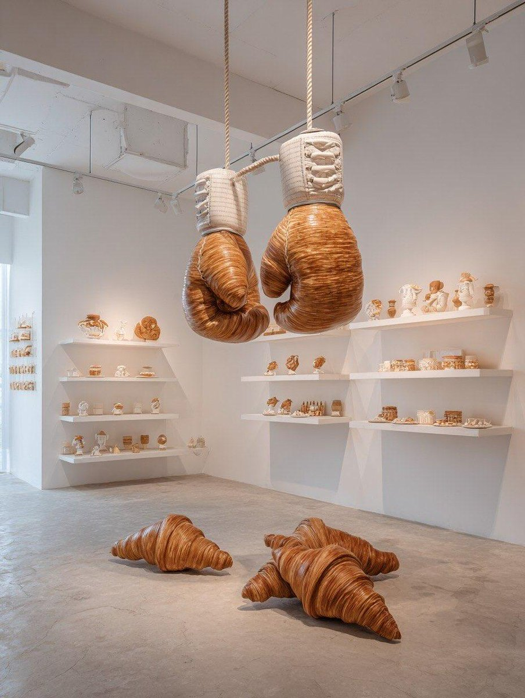

## Hyper-realistic food photography, ultra high-definition,

- ID: trending-2019980950067900809
- Slug: trending-2019980950067900809-en
- 语言: en
- 来源: [来源链接](https://x.com/Mind_Boticni/status/2019980950067900809)
- 样例图路径: images/part1/2019980950067900809_1.jpg

### 提示词

```text
Hyper-realistic food photography, ultra high-definition, dynamic floating ingredients and liquids, ingredients suspended in mid-air, 
motion captured in high-speed freeze, dramatic cinematic studio lighting, dark moody background with subtle gradient, extreme sharpness and fine textures, 
strong contrast highlighting food, splashes, crumbs, sauces, and liquids flying around, central hero composition with ample negative space, 
clean luxury advertising style, no text, no logos, no props, 
realistic shadows and reflections, ultra-detailed, photorealistic, 8K. {image of a cocktail}
```

### 样例图

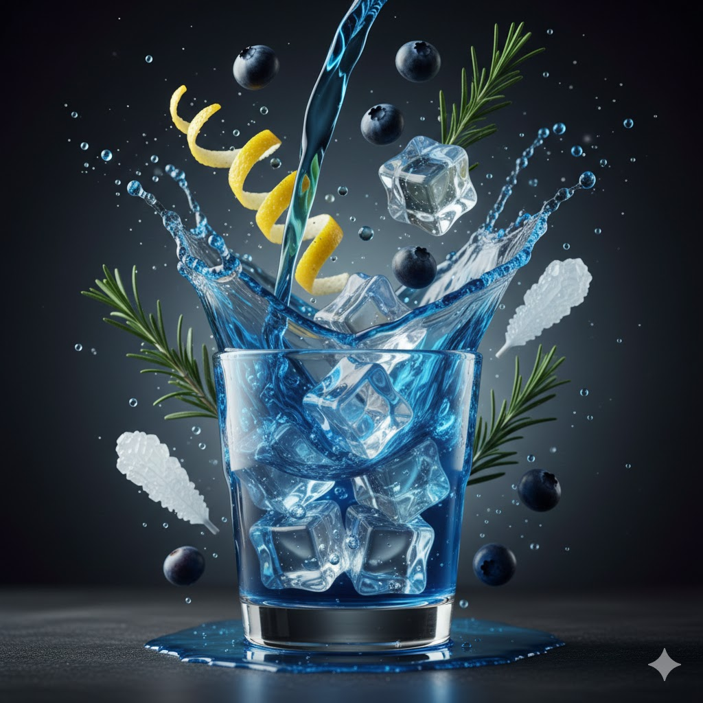

## [DISH] painted in the style of a Dutch Golden Age or Ita

- ID: trending-2035111136958587304
- Slug: trending-2035111136958587304-en
- 语言: en
- 来源: [来源链接](https://x.com/AllaAisling/status/2035111136958587304)
- 样例图路径: images/part1/2035111136958587304_1.jpg

### 提示词

```text
[DISH] painted in the style of a Dutch Golden Age or Italian Renaissance still life, hyperrealistic oil painting aesthetic with dramatic chiaroscuro lighting. Hero dish at center on a dark velvet or stone surface, surrounded by its ingredients arranged in a baroque composition. Single dramatic light source from upper left illuminating every texture with painterly depth: glistening proteins, translucent sauces, jewel-bright vegetables, crusty bread, scattered herbs. Each ingredient labeled with a small elegant gold cartouche, ornate bordered label in copperplate: "[INGREDIENT]  [poetic Latin or French descriptor]". Dish name in ornate gilt typography at top: "[DISH NAME]". Subtitle: "[TAGLINE]". Mood: Caravaggio meets Rembrandt meets the world's most craveable food photograph. Deep rich shadows, jewel-tone colors, extraordinary museum-quality, craveable.
```

### 样例图

![[DISH] painted in the style of a Dutch Golden Age or Ita](../images/part1/2035111136958587304_1.jpg)

## [product setup],create minimalist product photo, clean w

- ID: trending-2027544179560353948
- Slug: trending-2027544179560353948-en
- 语言: en
- 来源: [来源链接](https://x.com/Naiknelofar788/status/2027544179560353948)
- 样例图路径: images/part1/2027544179560353948_1.jpg

### 提示词

```text
[product setup],create minimalist product photo, clean warm studio scene, textured beige wall background, soft directional sunlight creating long shadows, simple tabletop surface, product arranged in a playful concept composition, hand drawn white line doodle overlay of [character] interacting with the product, mixed media look combining real photography and sketch illustration, high end branding feel, shallow depth of field, ultra realistic, no extra text, no watermark, 8k, 1:1
```

### 样例图

![[product setup],create minimalist product photo, clean w](../images/part1/2027544179560353948_1.jpg)

## Top-down premium food photography of a glass jar of chil

- ID: trending-2038456800190808446
- Slug: trending-2038456800190808446-en
- 语言: en
- 来源: [来源链接](https://x.com/Kashberg_0/status/2038456800190808446)
- 样例图路径: images/part1/2038456800190808446_1.jpg

### 提示词

```text
Top-down premium food photography of a glass jar of chili tomato chutney placed on a dark stone slab, surrounded by fresh red tomatoes, sliced tomatoes, red chili peppers, black peppercorns, and a small wooden bowl with chutney and spoon. Warm earthy background, soft directional lighting, rich shadows, high contrast, minimal styling, commercial product shoot, ultra-detailed, 4K.
```

### 样例图

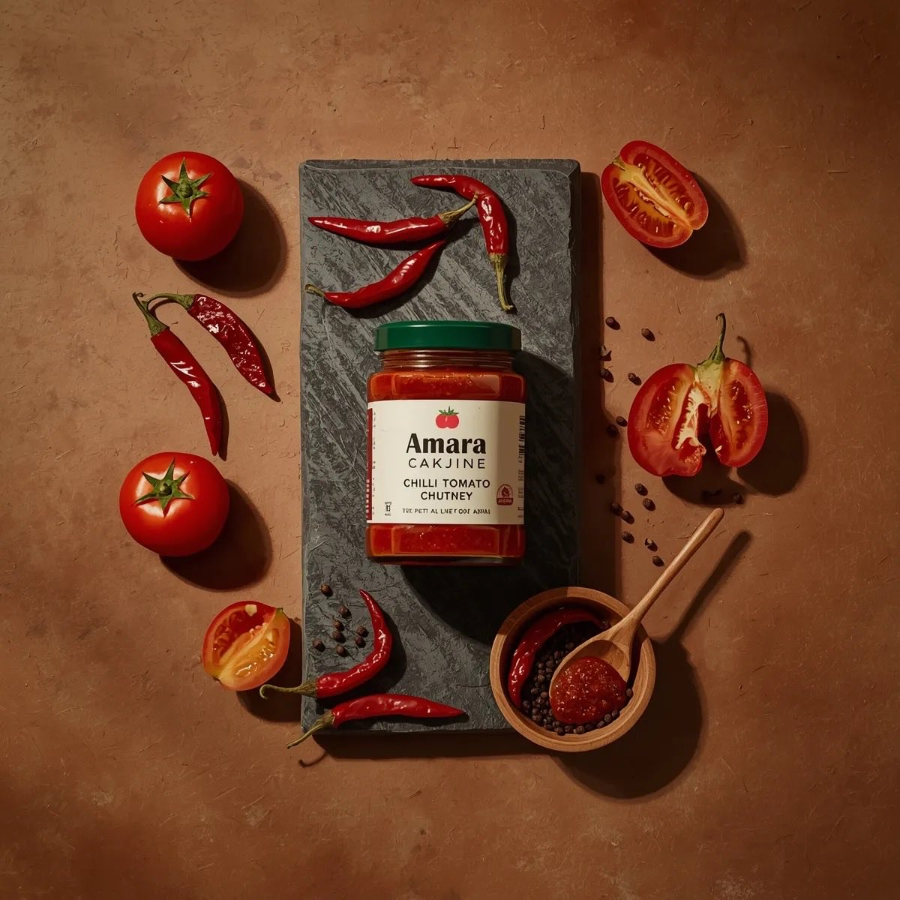

## Ultra-realistic product ad of a premium fruit drink bott

- ID: trending-2027637680696357356
- Slug: trending-2027637680696357356-en
- 语言: en
- 来源: [来源链接](https://x.com/Taaruk_/status/2027637680696357356)
- 样例图路径: images/part1/2027637680696357356_1.jpg

### 提示词

```text
Ultra-realistic product ad of a premium fruit drink bottle, dynamic liquid splash frozen mid-air, fresh fruits (orange, kiwi, strawberry, mango, passionfruit) exploding around the bottle, cinematic golden sunlight, outdoor orchard/beach setting, shallow depth of field, vibrant colors, glossy reflections, high-speed photography style, hyper-detailed liquid physics, clean branding label, 8K, commercial advertising, perfect composition.
```

### 样例图

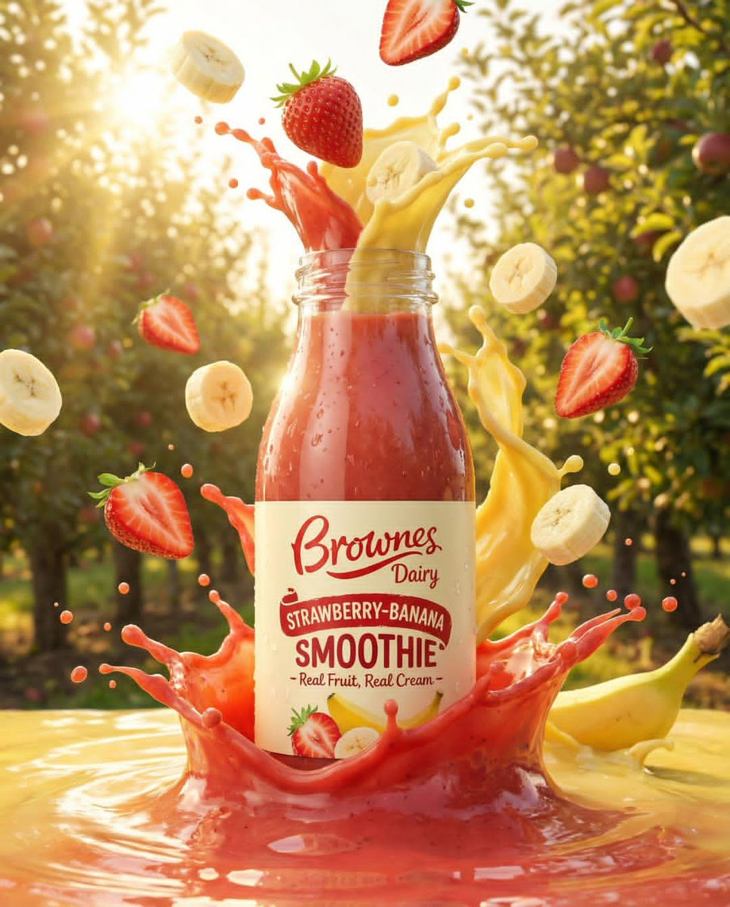

## { "subject": { "primary": "Vibrant orange slices", "acti

- ID: trending-2013660094664446322
- Slug: trending-2013660094664446322-en
- 语言: en
- 来源: [来源链接](https://x.com/Just_sharon7/status/2013660094664446322)
- 样例图路径: images/part1/2013660094664446322_1.jpg

### 提示词

```text
{
"subject": {
    "primary": "Vibrant orange slices",
    "action": "Falling through the air toward rising milk",
    "secondary": "Thick, glossy white milk splash forming arcs and crown-like curves",
    "details": "Milk droplets frozen mid-air with creamy texture"
  },
  "environment": {
    "background": "Clean blue studio backdrop",
    "lighting": "Cinematic soft studio lighting with dramatic highlights and shadows"
  },
  "visual_style": {
    "genre": "Ultra-realistic commercial splash photography",
    "textures": "High-detail creamy milk and fresh citrus pulp",
    "motion": "Frozen action, high-speed capture",
    "depth_of_field": "Shallow depth of field"
  },
  "camera": {
    "lens": "85mm macro",
    "framing": "Wide composition",
    "focus": "Sharp focus on splash and fruit"
  },
  "composition": {
    "aspect_ratio": "3:4",
    "color_palette": ["Vibrant Orange", "Pure White", "Clean Blue"]
  },
  "quality": {
    "detail_level": "Ultra-high detail",
    "rendering": "Photorealistic"
  },
  "profile": "9ewnbdc"
}
```

### 样例图

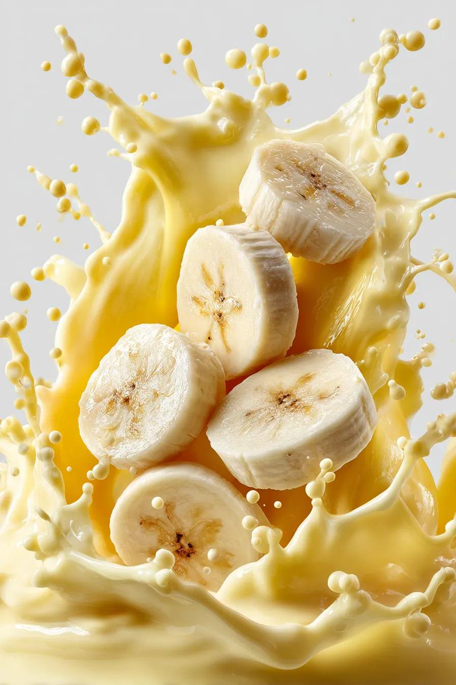

## Premium banana milk drink bottle surrounded by swirling 

- ID: trending-2026317928321413505
- Slug: trending-2026317928321413505-en
- 语言: en
- 来源: [来源链接](https://x.com/Taaruk_/status/2026317928321413505)
- 样例图路径: images/part1/2026317928321413505_1.jpg

### 提示词

```text
Premium banana milk drink bottle surrounded by swirling milk splash, floating bananas and berries, dynamic liquid motion, creamy textures, bright yellow background, high-speed splash photography, glossy product lighting, ultra-realistic, commercial food ad style, sharp focus, 8K.
```

### 样例图

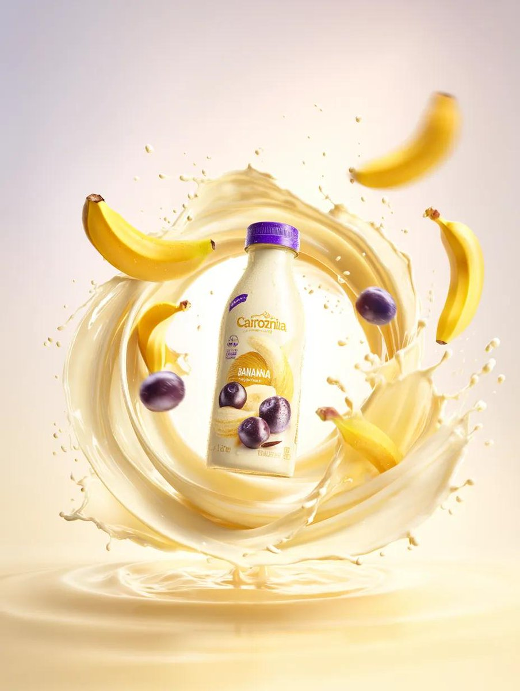

## { The Cinematic Momo Duo Subject & Scene * Finished Dish

- ID: trending-2019098547451568397
- Slug: trending-2019098547451568397-en
- 语言: en
- 来源: [来源链接](https://x.com/mehvishs25/status/2019098547451568397)
- 样例图路径: images/part1/2019098547451568397_1.jpg

### 提示词

```text
{
The Cinematic Momo Duo
Subject & Scene
 * Finished Dish: Freshly steamed dumplings (momos) stacked on a rustic wooden board.
 * The Details: Glossy dough with delicate handmade pleats, a light sheen of oil, and thick dramatic steam rising.
 * Exploded View: A side-by-side or split scene showing the "deconstructed" momo. Floating dumpling wrappers, balls of spiced minced filling, and scattered fresh herbs.
Motion & Action
 * Frozen in Time: Flour particles suspended mid-air, motion-frozen spices, and a dramatic slow-motion splash effect.
 * Atmosphere: Wispy, swirling steam and falling herb leaves.
Setting & Background
 * Environment: A dark, moody, rustic kitchen.
 * Surface: A weathered, textured wooden cutting board with grains and cracks visible.
Lighting & Color
 * Style: Cinematic studio lighting.
 * Palette: Warm, inviting tones with high contrast and deep shadows for a professional editorial look.
Technical Specs
 * Camera: Macro photography, 8K resolution, hyper-detailed textures.
 * Focus: Shallow depth of field (blurred background) with sharp, crisp focus on the ingredients.
```

### 样例图

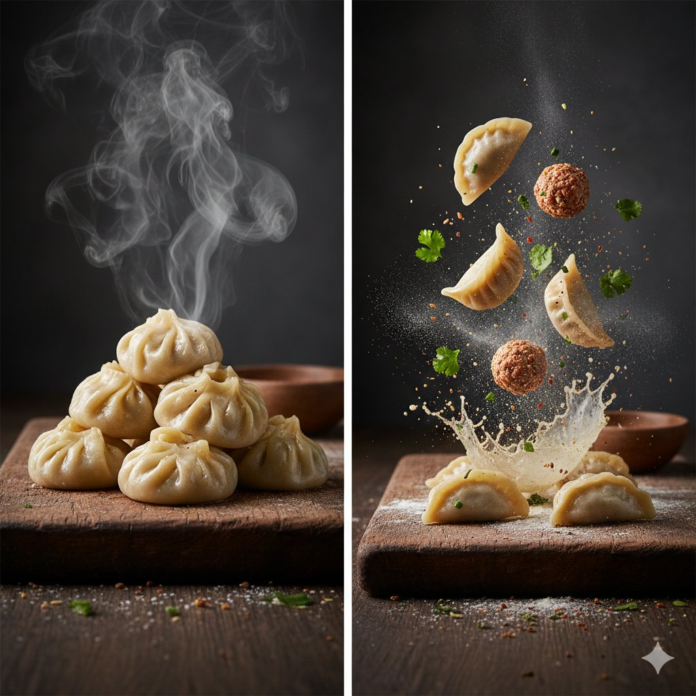

## { "prompt": "young western woman with long blonde hair s

- ID: trending-2011038954896965955
- Slug: trending-2011038954896965955-en
- 语言: en
- 来源: [来源链接](https://x.com/Just_sharon7/status/2011038954896965955)
- 样例图路径: images/part1/2011038954896965955_1.jpg

### 提示词

```text
{
  "prompt": "young western woman with long blonde hair sitting playfully inside a giant red french fry carton, surrounded by oversized golden-brown fries, some fries floating in the air, she is wearing a textured red sweater and beige trousers with yellow sneakers, cheerful expression, bright yellow studio background, surreal commercial photography style, high saturation, sharp focus, clean composition, 8k resolution, professional lighting",
  "negative_prompt": "low quality, blurry, distorted face, bad anatomy, extra limbs, dull colors, messy background, text, watermark, grainy, realistic size fries",
  "aspect_ratio": "3:4",
  "style": "surreal commercial photography",
  "lighting": "vibrant studio lighting with soft shadows",
  "camera": "eye-level medium shot, 50mm lens",
  "quality_tags": "masterpiece, ultra-detailed, high-end commercial aesthetic"
}
```

### 样例图

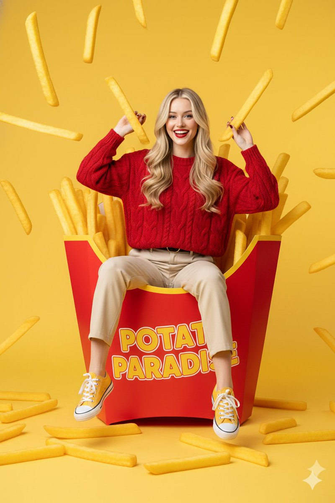

## Nano Banana pro on Gemini app. Prompt: Three hands holdi

- ID: trending-2028836648398778447
- Slug: trending-2028836648398778447-en
- 语言: en
- 来源: [来源链接](https://x.com/Taaruk_/status/2028836648398778447)
- 样例图路径: images/part1/2028836648398778447_1.jpg

### 提示词

```text
Nano Banana pro on Gemini app.

Prompt:
Three hands holding colorful glass soda bottles (lemon, grapefruit, lime) clinking together, bright sunny outdoor setting, soft beach/pool background blur, natural light, condensation on bottles, lifestyle photography, vibrant colors, shallow depth of field, candid joyful mood, commercial beverage ad, ultra-realistic, 8K.
IMAGE 2
Three hands holding minimalist glass bottles labeled almond milk, pistachio milk, chocolate oat milk, clean neutral background, soft studio lighting, modern branding, centered composition, smooth shadows, aesthetic product photography, high detail, muted tones, premium look, 8K.
IMAGE 3
Three hands holding iced coffee bottles (latte, mocha, oat milk), warm golden hour sunlight, cafe interior background, soft shadows of leaves on wall, cozy atmosphere, realistic reflections, lifestyle product shot, cinematic warm tones, shallow depth of field, 8K.
IMAGE 4
Three hands holding glowing sports drink bottles stacked vertically, neon blue and red lighting, futuristic tunnel background, motion blur streaks, cyberpunk aesthetic, dramatic lighting, high contrast, dynamic composition, glossy bottles, ultra-realistic, 8K.
```

### 样例图

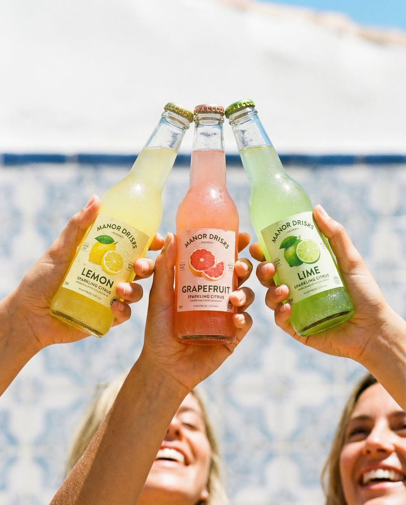

## A minimalist, ultra-realistic product shot of a premium 

- ID: trending-2018170311364198617
- Slug: trending-2018170311364198617-en
- 语言: en
- 来源: [来源链接](https://x.com/Kashberg_0/status/2018170311364198617)
- 样例图路径: images/part1/2018170311364198617_1.jpg

### 提示词

```text
A minimalist, ultra-realistic product shot of a premium ice cream bar inspired by Kazakhstan. The popsicle is coated in glossy turquoise icing with elegant gold ornamental patterns and the word “QAZAQSTAN” embossed in metallic gold, featuring a golden sun-and-eagle motif. The lower half reveals creamy vanilla ice cream with smooth texture and subtle melting drips. Wooden stick engraved with traditional Kazakh patterns. Clean white studio background, soft diffused lighting, sharp focus, luxury food branding aesthetic, high-detail textures, modern cultural fusion design, 8K quality.
```

### 样例图

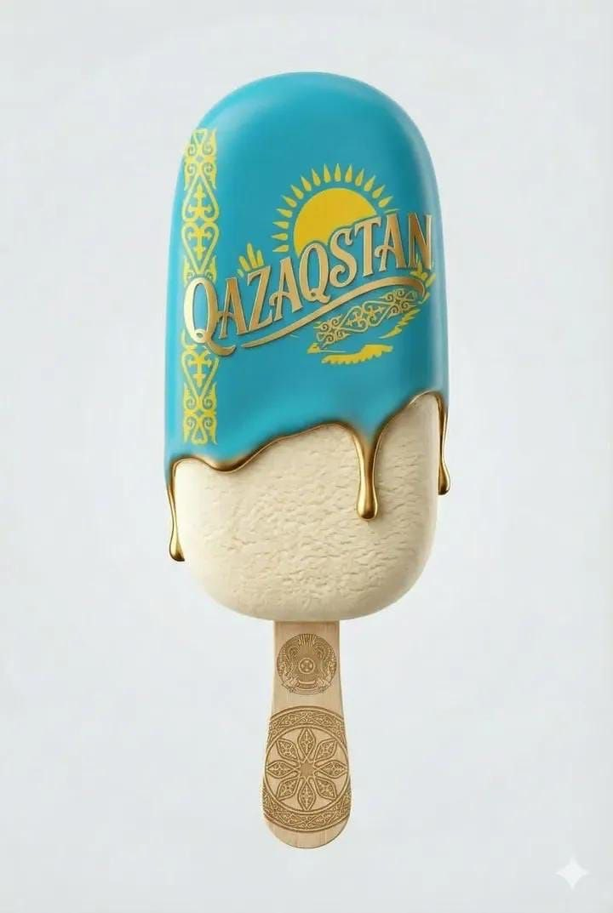

## A hyper-realistic image of a sliced kiwi splashing in a 

- ID: trending-2016528524543488246
- Slug: trending-2016528524543488246-en
- 语言: en
- 来源: [来源链接](https://x.com/Strength04_X/status/2016528524543488246)
- 样例图路径: images/part1/2016528524543488246_1.jpg

### 提示词

```text
A hyper-realistic image of a sliced kiwi splashing in a spray of water with droplets suspended in the air. Fresh kiwi slices, dynamically arranged in a floating composition, create a smooth green background. The smooth green gradient creates a fresh, bright, and juicy aesthetic. Studio lighting, soft shadows, high detail, macro photography of objects, an emphasis on texture and reflections. Ultra-realistic rendering, 8K, sharp focus, rich green tones. --ar 9:16 --raw
```

### 样例图

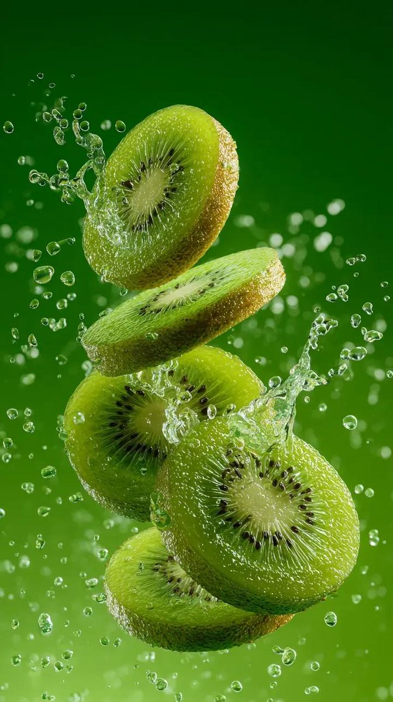

## A high-speed studio photograph of a cluster of fresh blu

- ID: trending-2020688064964940218
- Slug: trending-2020688064964940218-en
- 语言: en
- 来源: [来源链接](https://x.com/Just_sharon7/status/2020688064964940218)
- 样例图路径: images/part1/2020688064964940218_1.jpg

### 提示词

```text
A high-speed studio photograph of a cluster of fresh blueberries suspended midair, softly wrapped by a gentle flow of pale blueberry yogurt, smooth and restrained liquid motion, minimal splash, thick and creamy texture, elegant curved yogurt flow hugging the berries, very few small droplets, calm fluid dynamics, photorealistic macro food photography, ultra-realistic texture, professional studio lighting, soft diffuse highlights, pure white background, isolated object, clean cutout, no CGI, no 3D render, no illustration
```

### 样例图

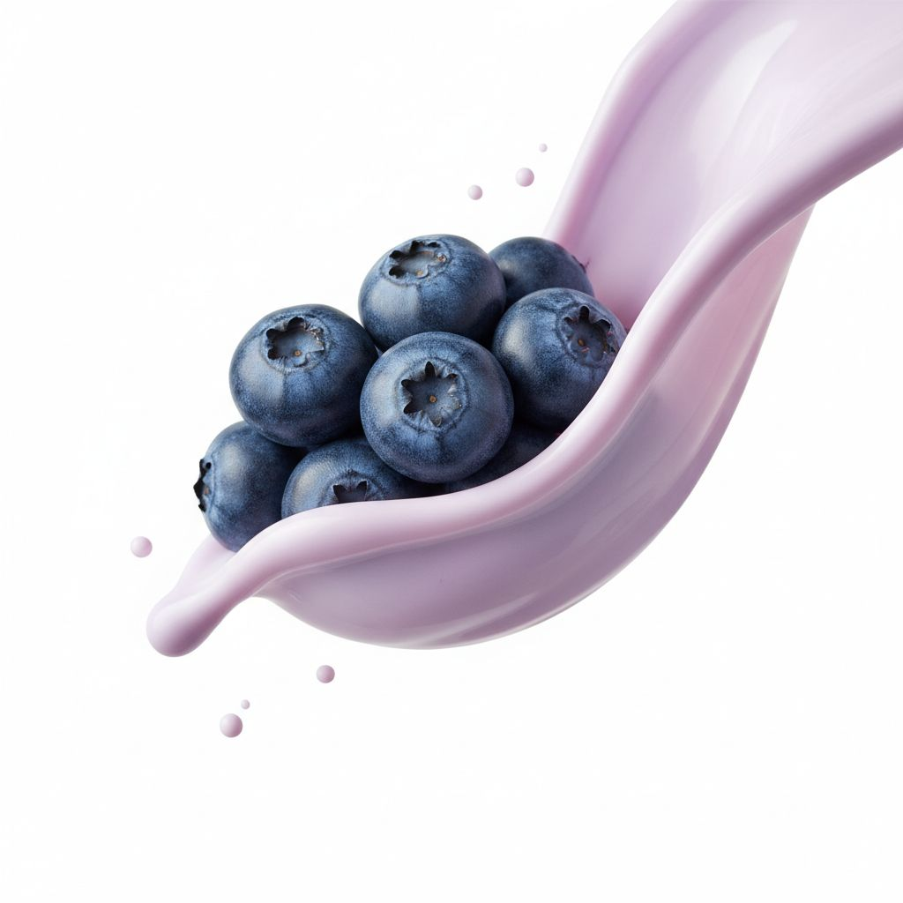

## Luxury cinematic food photography of traditional Indones

- ID: trending-2021795147416264928
- Slug: trending-2021795147416264928-en
- 语言: en
- 来源: [来源链接](https://x.com/Taaruk_/status/2021795147416264928)
- 样例图路径: images/part1/2021795147416264928_1.jpg

### 提示词

```text
Luxury cinematic food photography of traditional Indonesian “Seruit Lampung” — beautifully grilled fish fillet glazed with chili sambal, garnished with red chili slices, fresh basil, and lime wedges. Served on an elegant ceramic plate with a small bowl of sambal and a side of golden mashed condiment. Visible steam rising from the hot dish. Background shows a refined coastal sunset ambiance with soft bokeh reflections on water, warm golden-hour lighting. Shot on a polished marble table surface. Fine-dining restaurant atmosphere, shallow depth of field, dramatic food styling, ultra-realistic, 85mm lens, f/2.0, rich contrast, 8K resolution. Elegant editorial food magazine style.
```

### 样例图

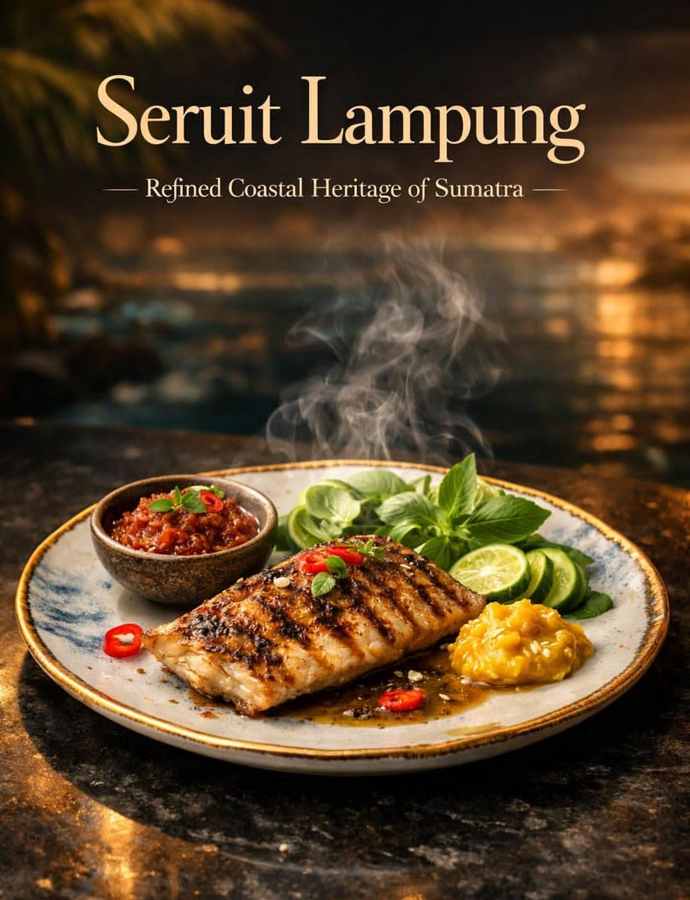

## Ultra-cinematic product photography of a premium protein

- ID: trending-2019985216308429143
- Slug: trending-2019985216308429143-en
- 语言: en
- 来源: [来源链接](https://x.com/Kashberg_0/status/2019985216308429143)
- 样例图路径: images/part1/2019985216308429143_1.jpg

### 提示词

```text
Ultra-cinematic product photography of a premium protein bar wrapped in metallic packaging, floating at a dynamic angle; explosive chocolate chunks, caramel drips, and nut fragments frozen mid-air; high-speed splash and crumble effect, dramatic studio lighting with sharp highlights; rich brown and gold palette, ultra-detailed textures, shallow depth of field, photorealistic, 8K, fitness luxury advertising.
```

### 样例图

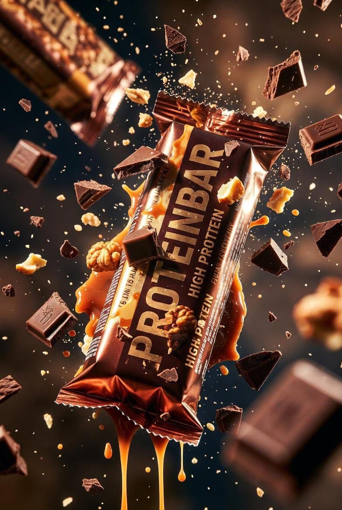

## Ultra-realistic cinematic food photography of a traditio

- ID: trending-2019806212599284155
- Slug: trending-2019806212599284155-en
- 语言: en
- 来源: [来源链接](https://x.com/Taaruk_/status/2019806212599284155)
- 样例图路径: images/part1/2019806212599284155_1.jpg

### 提示词

```text
Ultra-realistic cinematic food photography of a traditional Indonesian dish, presented as a floating ingredients infographic. The finished dish sits at the bottom in a ceramic bowl on a wooden surface. Above it, key ingredients float in mid-air in a clean vertical layout, each clearly separated and visually balanced. Thin minimalist pointer lines connect ingredients to elegant readable labels. Natural textures, hyper-detailed food surfaces, glossy sauces, steam rising gently, high-speed splash effects frozen in motion. Soft studio lighting mixed with natural daylight, shallow depth of field, premium editorial food poster style, commercial advertising quality, ultra-sharp focus, 8K resolution, realistic shadows, clean background.
```

### 样例图

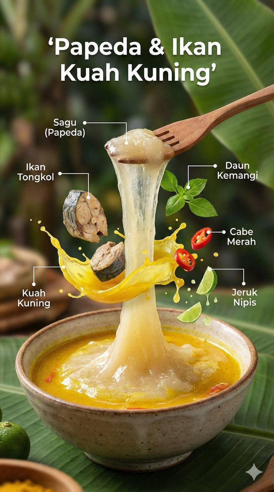

## { "master_prompt": { "global_settings": { "resolution": 

- ID: trending-2016534463459832095
- Slug: trending-2016534463459832095-en
- 语言: en
- 来源: [来源链接](https://x.com/meng_dagg695/status/2016534463459832095)
- 样例图路径: images/part1/2016534463459832095_1.jpg

### 提示词

```text
{
  "master_prompt": {
    "global_settings": {
      "resolution": "8K",
      "aspect_ratio": "3:4",
      "render_style": "hyper-realistic AI-generated food photography",
      "focus": "extreme detail, sharp textures, dynamic motion, cinematic lighting",
      "depth_of_field": "shallow with foreground focus",
      "noise": "none",
      "artifacts": "none"
    },

    "Module_1_Image_Style": {
      "subject": "Single ice cream cone standing upright",
      "ice_cream": {
        "top": "vanilla soft-serve swirl",
        "toppings": [
          "two whole strawberries",
          "one chocolate wafer roll",
          "one chocolate square partially embedded"
        ],
        "sauces": [
          "dark chocolate sauce dripping",
          "green pistachio-like glaze dripping"
        ]
      },
      "cone": {
        "type": "waffle cone",
        "texture": "crisp grid pattern",
        "condition": "sauce dripping down the cone and pooling at the base"
      },
      "motion_elements": {
        "floating": [
          "small colorful candy spheres",
          "liquid droplets suspended mid-air"
        ],
        "splashes": "sauce splashes around cone base"
      },
      "background": {
        "style": "soft bokeh",
        "colors": [
          "orange",
          "green",
          "purple",
          "gold"
        ],
        "lighting": "warm, cinematic, high contrast"
      }
    },

    "Module_2_Image_Style": {
      "subject": "Strawberry ice cream bar on wooden stick, tilted diagonally",
      "ice_cream": {
        "base": "pink strawberry ice cream",
        "top_layer": "white cream layer",
        "toppings": [
          "sliced strawberries embedded",
          "whole strawberries floating"
        ]
      },
      "stick": {
        "material": "wood",
        "text": "ai ice",
        "orientation": "visible, centered"
      },
      "motion_elements": {
        "liquid": "cream and strawberry liquid splashing outward",
        "floating_objects": [
          "metal spoons with pink liquid",
          "whole strawberries",
          "mint leaves",
          "droplets"
        ]
      },
      "background": {
        "style": "soft gradient with bokeh particles",
        "colors": [
          "peach",
          "blue",
          "cream"
        ],
        "lighting": "bright highlights with soft shadows"
      }
    },

    "Module_3_Image_Style": {
      "subject": "Spherical scoop composition of strawberry and vanilla ice cream",
      "ice_cream": {
        "layers": [
          "pink strawberry scoop",
          "white vanilla scoop"
        ],
        "embedded_elements": [
          "halved strawberries",
          "whole strawberries"
        ]
      },
      "motion_elements": {
        "liquid": "pink strawberry liquid splashing and dripping downward",
        "floating_objects": [
          "blueberries",
          "strawberries",
          "liquid droplets"
        ],
        "utensils": "metal spoons suspended mid-air with liquid"
      },
      "surface_detail": {
        "texture": "smooth ice cream with visible melting edges",
        "droplets": "high-gloss liquid beads"
      },
      "background": {
        "style": "cool-toned blur",
        "colors": [
          "light blue",
          "gray"
        ],
        "lighting": "clean studio lighting with specular highlights"
      }
    }
```

### 样例图

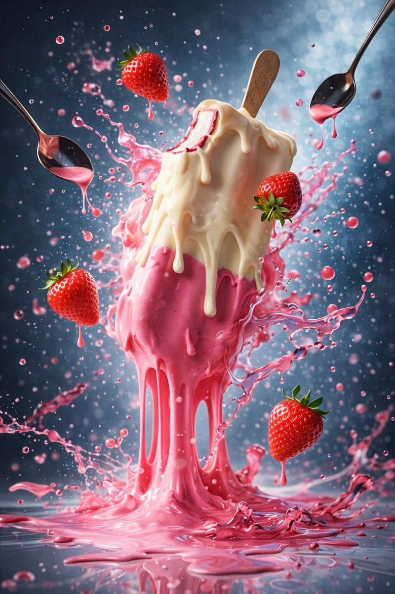

## { "prompt": "A young red-haired woman sitting inside a b

- ID: trending-2028878781612798040
- Slug: trending-2028878781612798040-en
- 语言: en
- 来源: [来源链接](https://x.com/mizq06/status/2028878781612798040)
- 样例图路径: images/part1/2028878781612798040_1.jpg

### 提示词

```text
{
  "prompt": "A young red-haired woman sitting inside a bright retro-style fast food restaurant, eating a cheeseburger. She is seated in a red vinyl booth by a large window with sunlight streaming in. She is winking while taking a bite of the burger. On the table in front of her is a red tray holding a burger, French fries, and a soft drink in a white cup with red palm tree graphics. The restaurant interior features white tiled walls with red accents and a framed picture on the wall. The lighting is warm and natural, creating a casual, candid atmosphere.",
  "style": "photorealistic",
  "lighting": "natural sunlight, warm tones",
  "camera_angle": "eye-level, centered composition",
  "environment": "retro American fast food diner",
  "mood": "playful and casual",
  "details": "sharp focus, high resolution, realistic skin texture, vibrant colors"
}
```

### 样例图

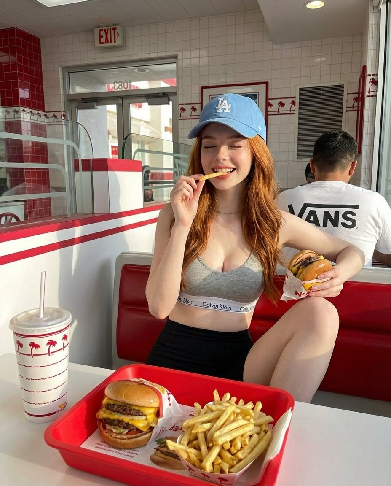

## [DISH] styled on a weathered [MATERIAL] surface, shot in

- ID: trending-2031758798432428099
- Slug: trending-2031758798432428099-en
- 语言: en
- 来源: [来源链接](https://x.com/AllaAisling/status/2031758798432428099)
- 样例图路径: images/part1/2031758798432428099_1.jpg

### 提示词

```text
[DISH] styled on a weathered [MATERIAL] surface, shot in pure golden hour light streaming from one side, casting long warm shadows. Hero dish center, surrounded by its raw ingredients casually scattered with artistic intention, whole vegetables, fresh herbs, open spice jars, linen cloth, wooden spoon. Every surface texture hyperreal: wood grain, condensation droplets, herb oil sheen, char marks. Ingredient labels as small handwritten-style chalk or ink tags resting beside each item: "[INGREDIENT] — [origin, preparation]". Dish name in warm hand-lettered typography: "[DISH NAME]". Subtitle: "[TAGLINE]". Mood: Ottolenghi cookbook meets Italian farmhouse meets Sunday farmers market. Warm golden tones, long shadows, film grain, extraordinary and craveable. 
```

### 样例图

![[DISH] styled on a weathered [MATERIAL] surface, shot in](../images/part1/2031758798432428099_1.jpg)

## Ultra-cinematic product photography of a purple energy d

- ID: trending-2012092187509768400
- Slug: trending-2012092187509768400-en
- 语言: en
- 来源: [来源链接](https://x.com/Strength04_X/status/2012092187509768400)
- 样例图路径: images/part1/2012092187509768400_1.jpg

### 提示词

```text
Ultra-cinematic product photography of a purple energy drink can labeled “INFINITY ENERGY DRINK – NIGHT KING” in bold white typography, floating mid-air at a dynamic three-quarter angle, wrapped with sleek black over-ear headphones; explosive liquid arcs and splashes frozen in time around the can, crystal-clear ice cubes and glossy berries (raspberries, blueberries, strawberries) suspended in motion, tiny droplets and mist filling the scene; dramatic high-contrast studio lighting with a powerful top key light, sharp rim lights tracing the can edges, and deep shadows for a dark, premium mood; monochromatic purple color palette with luminous highlights and metallic reflections, subtle neon glow accents; shallow depth of field isolating the can as the hero subject, hyper-detailed condensation on the aluminum surface, macro texture on fruit and water; volumetric light rays, floating particles, high-speed splash photography aesthetic, photorealistic, ultra-detailed, 8K, luxury advertising style, sharp focus, no watermark.
```

### 样例图

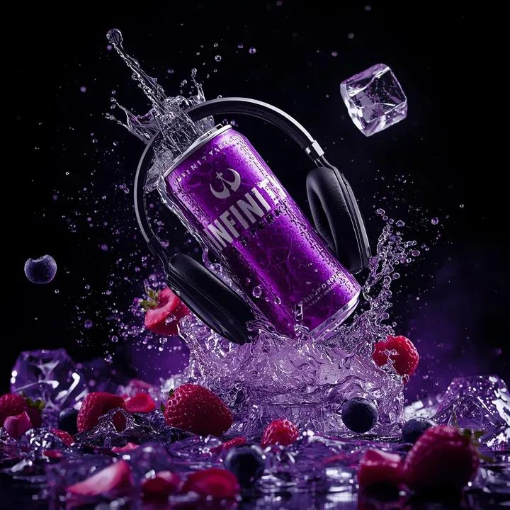

## Ultra-cinematic vertical composition of coffee elements 

- ID: trending-2018525091420934651
- Slug: trending-2018525091420934651-en
- 语言: en
- 来源: [来源链接](https://x.com/Sheldon056/status/2018525091420934651)
- 样例图路径: images/part1/2018525091420934651_1.jpg

### 提示词

```text
Ultra-cinematic vertical composition of coffee elements suspended in mid-air cascading roasted coffee beans, chocolate bonbons, swirling latte art in a mid-air coffee cup, splashes of milk and espresso frozen in motion, fine coffee grounds dusting through the air captured with rich brown and cream color tones.
Hyper-detailed textures with glossy liquid surfaces, crema bubbles, and matte bean textures, lit with dramatic high-contrast studio lighting against a deep, velvety black background. Cinematic depth of field, splash photography aesthetic, premium café advertising style. Shot with a virtual Nikon D850, 105mm macro lens, aperture f/4.0, crisp editorial clarity.
```

### 样例图

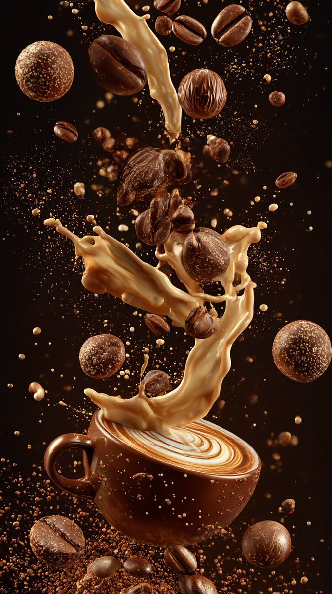

## High-end cinematic campaign poster. A Minute Maid Pulpy 

- ID: trending-2040646451425063037
- Slug: trending-2040646451425063037-en
- 语言: en
- 来源: [来源链接](https://x.com/Diplomeme/status/2040646451425063037)
- 样例图路径: images/part1/2040646451425063037_1.jpg

### 提示词

```text
High-end cinematic campaign poster. A Minute Maid Pulpy orange bottle positioned off-center right on a sun-bleached linen draped over rough coastal stone. Surrounding: a heavy ceramic glass half-filled with pulpy orange juice, fresh orange wedges, dried wildflowers. Background: deep terracotta darkness bleeding to warm amber glow at top — Mediterranean late afternoon atmosphere. Two thin horizontal gold rule lines framing the upper and lower composition.
Typography overlaid: left-aligned Playfair Display headline “Sun,” on first line, italic amber “Pulp &” second line, “Soul.” third line — stacked at 64–72px, white and gold alternating. Right-aligned italic Cormorant Garamond subtext “Real pulp. Real warmth. Real morning.” in warm cream. Bottom left spaced caps “MEDITERRANEAN · SLOW PRESSED · SUNRISE RITUAL” in faint amber. Top left eyebrow “MINUTE MAID · PULPY ORANGE” in tracked caps.
Lighting: natural diffused window light left-frame, warm terracotta fill, golden pulp glow through glass. Mood: slow coastal morning, honest premium warmth. Shot on ARRI Alexa 35, 75mm prime, shallow DOF, terracotta-ivory bokeh, HDR, lifestyle brunch campaign poster, 4:5 portrait.

High-end minimalist campaign poster. A clean Real fruit juice carton standing perfectly centered on cool white Italian marble, surrounded by split pomegranates showing jewel-red seeds, a fresh mint sprig, and scattered ice chips. Background: warm ivory-to-pale-sage gradient, soft botanical shadow suggestion of leaves at edges. Large thin circular frame element surrounding the bottle — elegant geometric restraint.
Typography overlaid: large light-weight Cormorant Garamond serif headline “Quietly” then italic bold “Brilliant.” stacked left-aligned in deep forest green, generous line spacing. Small Josefin Sans ultra-tracked subtext “NO DRAMA · JUST FRUIT” below in sage. Thin horizontal divider line. Footer italic “Cold pressed · Botanical blend · Naturally yours” in light sage. Top right “Collection No. 08” in delicate italic grey-green.
Lighting: soft cool overhead diffused studio light, clean marble reflection, zero drama. Mood: refined wellness luxury, botanical calm. Shot on Sony VENICE 2, 90mm macro, ultra-shallow DOF, sage bokeh, HDR, lifestyle wellness poster, 4:5 portrait
```

### 样例图

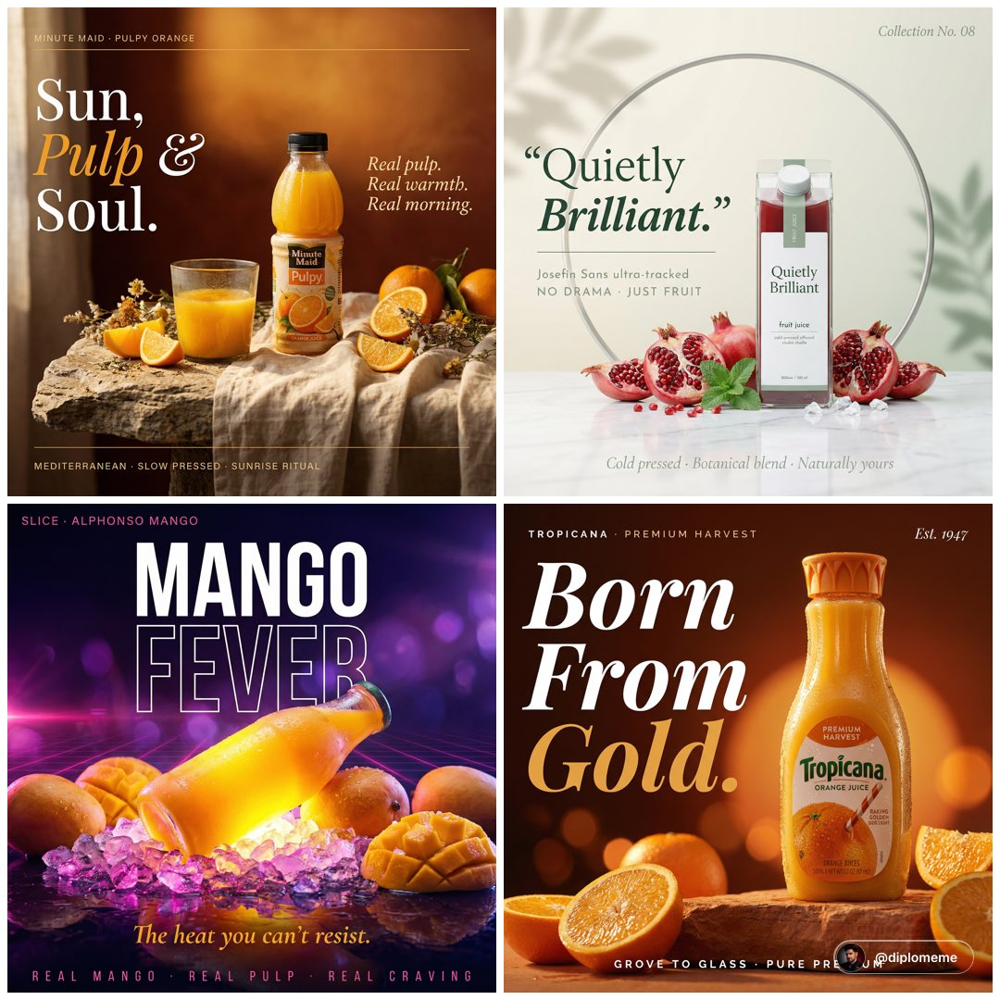

## minimal studio shot on pure white background, real [Food

- ID: trending-2034647395884212556
- Slug: trending-2034647395884212556-en
- 语言: en
- 来源: [来源链接](https://x.com/Strength04_X/status/2034647395884212556)
- 样例图路径: images/part1/2034647395884212556_1.jpg

### 提示词

```text
minimal studio shot on pure white background, real [Food Name] emerging from a paper packaging, the visible part outside the packaging is fully photorealistic, the continuation of the same food is drawn as a clean black line illustration printed directly on the surface of the packaging, perfectly aligned with the real food shape, the illustration stays strictly on the packaging material, not floating, not extending into the background, seamless transition between real and printed illustration, modern minimal branding, top-down composition, soft shadows.
```

### 样例图

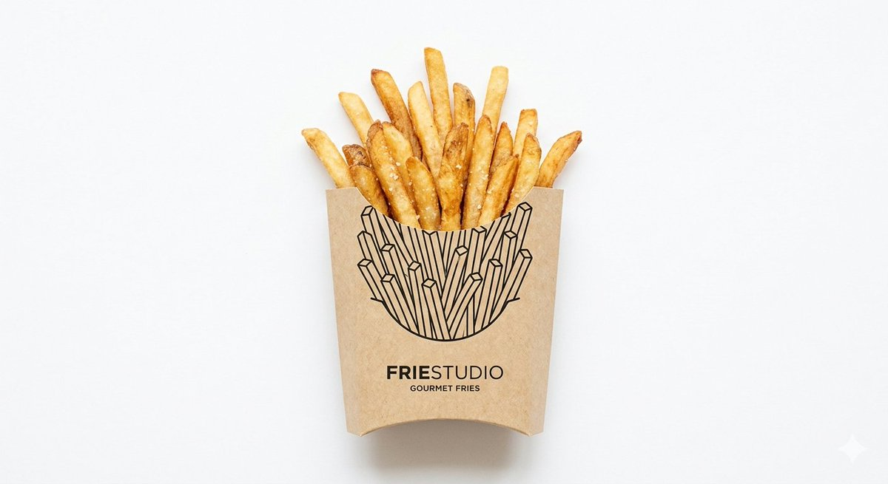

## margherita pizza recipe infographic, Studio Ghibli inspi

- ID: trending-2027140890247246017
- Slug: trending-2027140890247246017-en
- 语言: en
- 来源: [来源链接](https://x.com/azed_ai/status/2027140890247246017)
- 样例图路径: images/part1/2027140890247246017_1.jpg

### 提示词

```text
margherita pizza recipe infographic, Studio Ghibli inspired illustration, traditional Italian kitchen setting, warm golden sunset light, whole pizza in center with bubbling cheese, ingredients illustrated around in cute containers, dough ball, tomato sauce 150g, mozzarella 200g, fresh basil leaves, olive oil drizzle, handwritten notebook style labels, soft pastel tones, painterly textures, gentle steam and magical glow, whimsical cozy feeling, clean organized layout, readable text, high detail
```

### 样例图

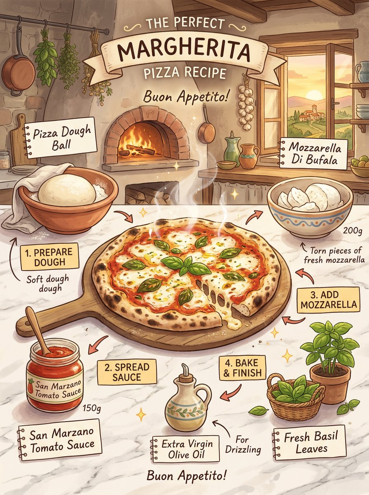

## [DISH] at the precise moment of a dramatic [LIQUID] pour

- ID: trending-2037583533674320072
- Slug: trending-2037583533674320072-en
- 语言: en
- 来源: [来源链接](https://x.com/AllaAisling/status/2037583533674320072)
- 样例图路径: images/part1/2037583533674320072_1.jpg

### 提示词

```text
[DISH] at the precise moment of a dramatic [LIQUID] pour in ultra high-speed photography, liquid cascade frozen mid-fall in perfect clarity. Hero [DISH] center on matte [COLOR] surface, [LIQUID] pouring from above in one cinematic ribbon catching warm single-source light, splitting and branching into suspended droplets and threads as it hits the surface. Splatter crown frozen at moment of impact, droplets suspended in perfect arcs. Every surface texture hyperreal: glistening, steaming, sauce pooling in slow motion. Each element labeled with ultra-thin lines in clean uppercase: "[INGREDIENT] [descriptor]". Dish name in elegant editorial typography: "[DISH NAME]". Subtitle: "[TAGLINE]". Mood: Albert Watson food photography meets Harold Edgerton fluid dynamics meets Michelin-star editorial. 4K, tack sharp every thread and droplet, warm single-source light, extraordinary and craveable. 
```

### 样例图

![[DISH] at the precise moment of a dramatic [LIQUID] pour](../images/part1/2037583533674320072_1.jpg)

## Use the uploaded product image as reference. Create an u

- ID: trending-2013579683686961503
- Slug: trending-2013579683686961503-en
- 语言: en
- 来源: [来源链接](https://x.com/Strength04_X/status/2013579683686961503)
- 样例图路径: images/part1/2013579683686961503_1.jpg

### 提示词

```text
Use the uploaded product image as reference. Create an ultra-realistic commercial image of a Garoto chocolate bar. Show a broken bar with melted chocolate texture, visible cocoa details and rich gloss. Add subtle chocolate splashes and floating crumbs. Clean studio setup, vibrant colored background, bold advertising style for social media. 8K ultra realistic, high sharpness, high contrast, professional lighting with realistic shadows and highlights, no text, no watermark, no blur, no distortion, no low quality, no cartoonish style
```

### 样例图

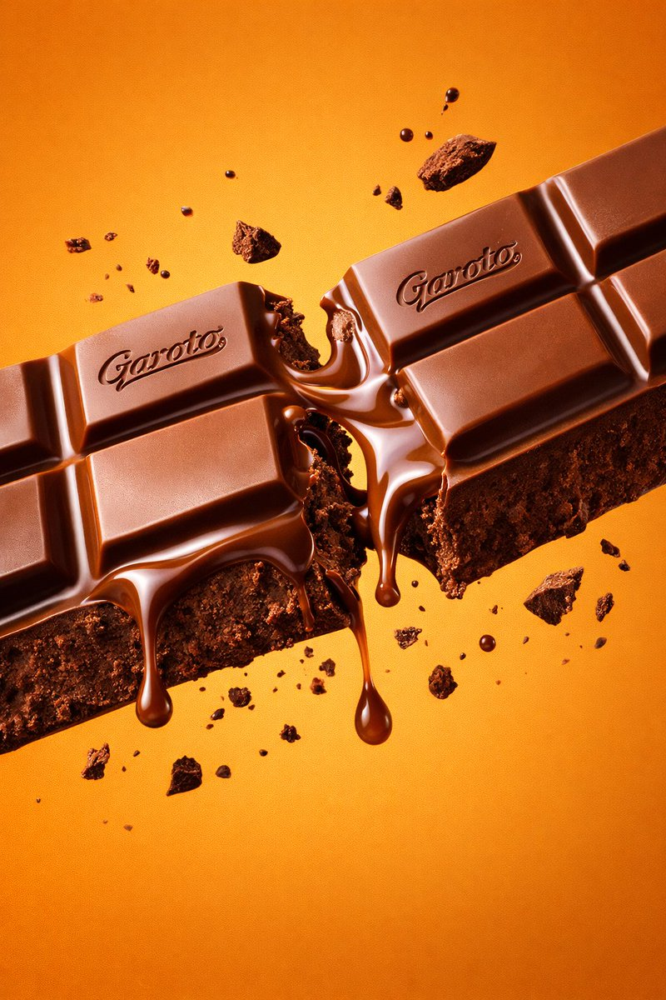

## a stack of three [FOOD ITEM] with [LIQUID] dripping down

- ID: trending-2011829870893125708
- Slug: trending-2011829870893125708-en
- 语言: en
- 来源: [来源链接](https://x.com/oggii_0/status/2011829870893125708)
- 样例图路径: images/part1/2011829870893125708_1.jpg

### 提示词

```text
a stack of three [FOOD ITEM] with [LIQUID] dripping down, on a white background, in the style of food photography, magazine cover "[FOOD] pixel", macro shot, studio lighting, nikon z6 ii, volumetric lighting, neutral tones. https://t.co/Op9uSIyKUr
```

### 样例图

![a stack of three [FOOD ITEM] with [LIQUID] dripping down](../images/part1/2011829870893125708_1.jpg)

## Ultra-realistic cinematic food photography of a bowl of 

- ID: trending-2029485155442892960
- Slug: trending-2029485155442892960-en
- 语言: en
- 来源: [来源链接](https://x.com/Taaruk_/status/2029485155442892960)
- 样例图路径: images/part1/2029485155442892960_1.jpg

### 提示词

```text
Ultra-realistic cinematic food photography of a bowl of rich spicy meat soup exploding upward in a dynamic splash, tender bone-in meat pieces floating mid-air with creamy curry broth forming swirling liquid ribbons, star anise, cinnamon sticks, green onions, and spices suspended in motion, dramatic dark studio background, high-speed splash capture, macro texture detail on meat and broth, steam rising, shallow depth of field, vibrant warm colors, gourmet food advertising style, hyper-detailed liquid physics, 8K, perfect composition.
```

### 样例图

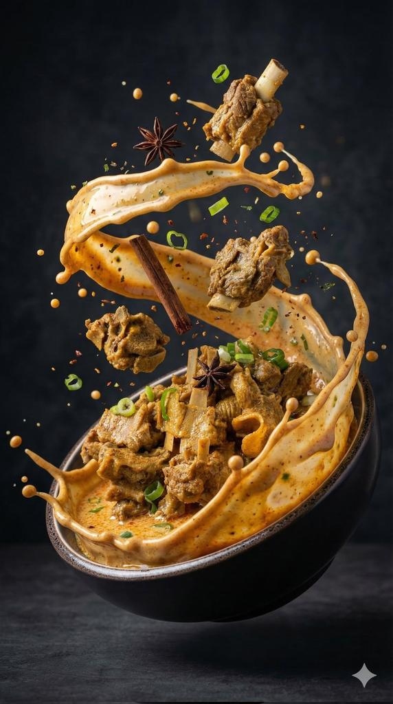

## { "cinematic miniature winter world built around a giant

- ID: trending-2029194313784016901
- Slug: trending-2029194313784016901-en
- 语言: en
- 来源: [来源链接](https://x.com/Strength04_X/status/2029194313784016901)
- 样例图路径: images/part1/2029194313784016901_1.jpg

### 提示词

```text
{
  "cinematic miniature winter world built around a giant Nutella jar, thick chocolate hazelnut spread flowing out forming a glossy mountain ski slope, tiny skiers skiing down the chocolate hill covered with light snow powder, miniature alpine village with wooden cabins and pine trees, ski lift with small gondolas carrying people, snowy forest background and distant mountains, soft winter lighting, ultra realistic textures of melting chocolate and snow, macro tilt shift photography, fantasy food landscape, commercial food advertising style, highly detailed, 8k",
  "negative_prompt": "blurry, low resolution, distorted jar, incorrect logo, messy composition, unrealistic proportions, extra limbs, duplicate people",
  "aspect_ratio": "4:5",
  "style": "ultra realistic macro photography",
  "lighting": "soft cinematic winter daylight",
  "camera": "macro lens, tilt shift effect",
  "quality": "high detail, 8k"
}
```

### 样例图

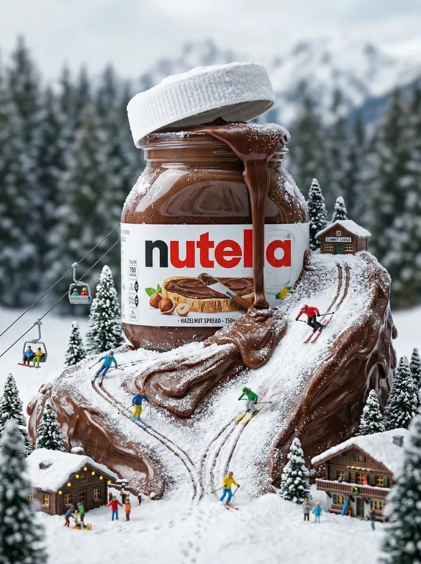

## Transform the uploaded logo into a realistic dessert sce

- ID: trending-2038979200795934955
- Slug: trending-2038979200795934955-en
- 语言: en
- 来源: [来源链接](https://x.com/Goodmanprotocol/status/2038979200795934955)
- 样例图路径: images/part1/2038979200795934955_1.jpg

### 提示词

```text
Transform the uploaded logo into a realistic dessert scene where the logo silhouette is formed naturally by melted chocolate spread across a plate, while the plate and dessert presentation are also subtly designed around the same logo as a brand identity.The logo must keep its exact shape and proportions, appearing both as a clean branded element (engraved or printed on the plate) and as a naturally melted chocolate formation created through real fluid behavior.

Material details:
Rich dark chocolate with high viscosity and glossy reflective surface.
Thicker areas forming smooth pools, thinner areas creating soft fading edges.
Visible chocolate streaks where it has been dragged or spread naturally.
Subtle ripples and surface tension curves, with occasional small air bubbles.

Physics behavior:
Chocolate should behave realistically — slow flow, rounded edges, gravity pulling it into thicker pools.
Slight directional flow suggesting it was poured or spread.
Variations in thickness depending on how it settled on the plate.
Natural imperfections — no perfectly sharp lines.

Surface interaction:
Ceramic or porcelain dessert plate with subtle gloss finish.
Plate includes a minimal branded logo (engraved, embossed, or printed).
Chocolate partially overlaps or interacts with the plate’s logo design for realism.
Small chocolate smears or residue near edges.

Environment & atmosphere:
Fine dining or café dessert setting.
Partially eaten dessert (cake, pastry, or mousse) nearby.
Subtle crumbs, fork marks, and realistic usage details.
Refined but not overly staged.

Lighting:
Soft warm lighting (restaurant or café ambiance).
Highlights reflecting on chocolate surface.
Gentle shadows adding depth to textures.

Camera & composition:
Slightly angled top-down macro shot.
Logo clearly visible through chocolate formation.
Balanced composition showing both dessert and branding.

Format:
Aspect ratio: STRICT 4:5 vertical.
No text overlays.

Style:
Hyper-real food photography.
Luxury dessert aesthetic with natural fluid realism.
Brand integrated into environment.
```

### 样例图

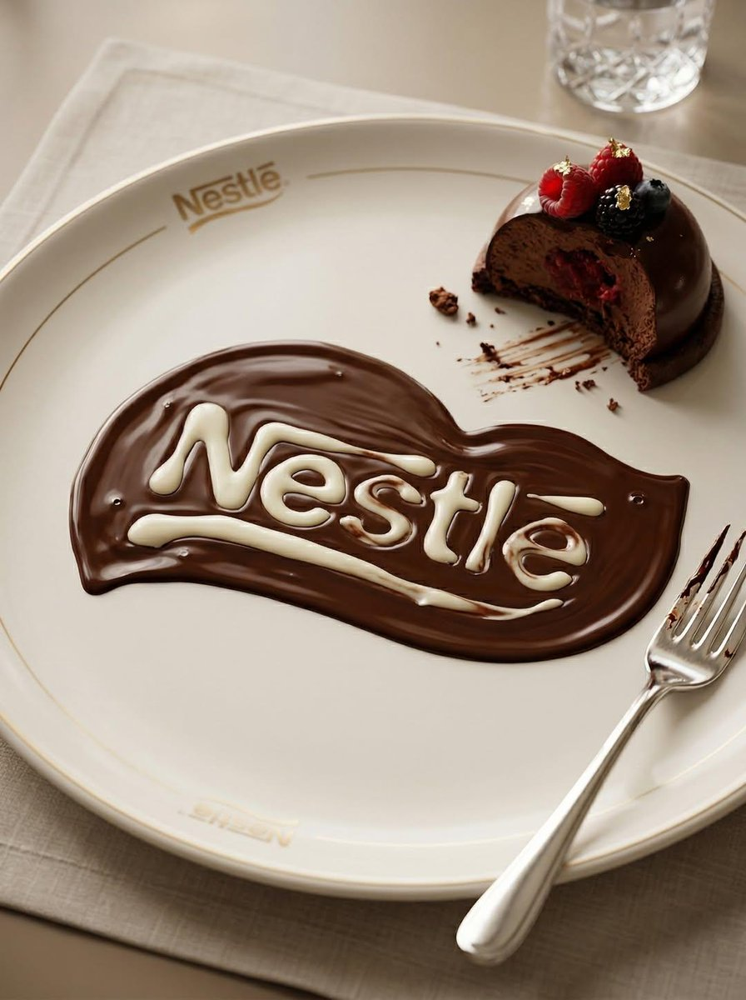

## Hyper-realistic product advertisement of a protein shake

- ID: trending-2034139605696712863
- Slug: trending-2034139605696712863-en
- 语言: en
- 来源: [来源链接](https://x.com/Taaruk_/status/2034139605696712863)
- 样例图路径: images/part1/2034139605696712863_1.jpg

### 提示词

```text
Hyper-realistic product advertisement of a protein shake can with yellow and cream design, surrounded by floating banana slices, almonds, and peanuts, dynamic milk splash bursting around the can, glossy condensation droplets on surface, vibrant warm yellow background, high-speed splash photography, ultra-detailed textures, commercial food photography style, dramatic lighting, 8K.
```

### 样例图

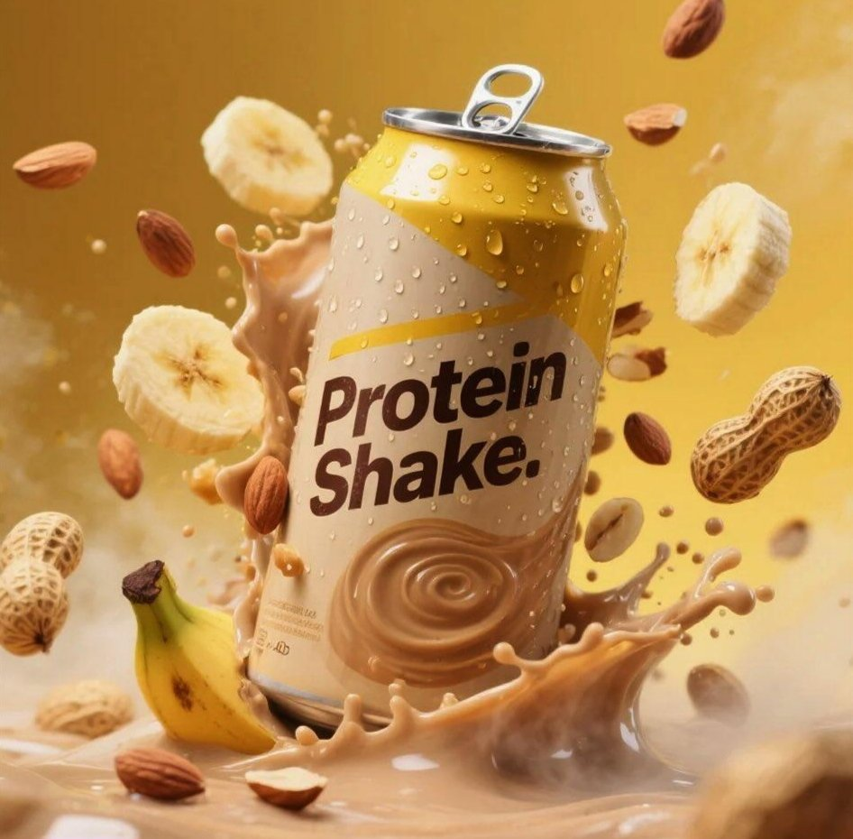

## A high-quality, professional product photograph of a gri

- ID: trending-2029498497431449924
- Slug: trending-2029498497431449924-en
- 语言: en
- 来源: [来源链接](https://x.com/ZaraIrahh/status/2029498497431449924)
- 样例图路径: images/part1/2029498497431449924_1.jpg

### 提示词

```text
A high-quality, professional product photograph of a grilled chicken taco filled with juicy grilled chicken pieces with visible char marks, fresh shredded red cabbage, and creamy white sauce topped with small diced tomatoes, onions, and parsley garnish, all placed inside a soft wheat taco tortilla. The taco looks fresh, flavorful, and well-filled with visible textures and vibrant ingredients. Minimalist style, shot against a pure solid white background with soft, natural shadows. 8K resolution, ultra-sharp focus, clean and modern food photography aesthetic.
```

### 样例图

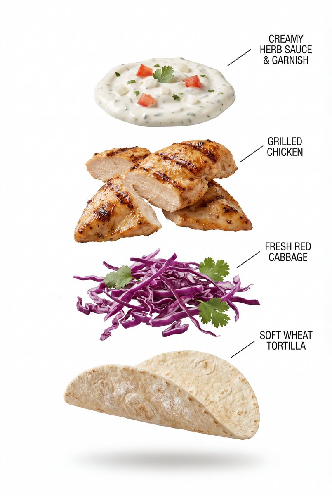

## Dynamic flavor wave composition of [FOOD], with colorful

- ID: trending-2013636630842876150
- Slug: trending-2013636630842876150-en
- 语言: en
- 来源: [来源链接](https://x.com/aleenaamiir/status/2013636630842876150)
- 样例图路径: images/part1/2013636630842876150_1.jpg

### 提示词

```text
Dynamic flavor wave composition of [FOOD], with colorful energy ribbons, mist, and motion streaks bursting outward to represent taste intensity. Ingredient silhouettes embedded within the waves. Clean minimal white background, high-key studio lighting. Ultra-real textures, cinematic motion blur, premium commercial food photography, 8K resolution.
```

### 样例图

![Dynamic flavor wave composition of [FOOD], with colorful](../images/part1/2013636630842876150_1.jpg)

## A hyper-realistic {FRUIT} dessert burger, centered compo

- ID: trending-2018350105787879512
- Slug: trending-2018350105787879512-en
- 语言: en
- 来源: [来源链接](https://x.com/0xbisc/status/2018350105787879512)
- 样例图路径: images/part1/2018350105787879512_1.jpg

### 提示词

```text
A hyper-realistic {FRUIT} dessert burger, centered composition, soft pastel {FRUIT_COLOR} color palette. Fluffy {FRUIT_COLOR} burger buns with smooth matte texture and light sesame seeds on top. Layers of fresh sliced {FRUIT} and airy white whipped cream inside, with glossy {FRUIT} sauce dripping naturally. Floating {FRUIT} slices and tiny flowers surrounding the burger. Minimal {FRUIT_COLOR} gradient background, soft studio lighting, luxury food advertising style, ultra clean, high detail, shallow depth of field.
```

### 样例图

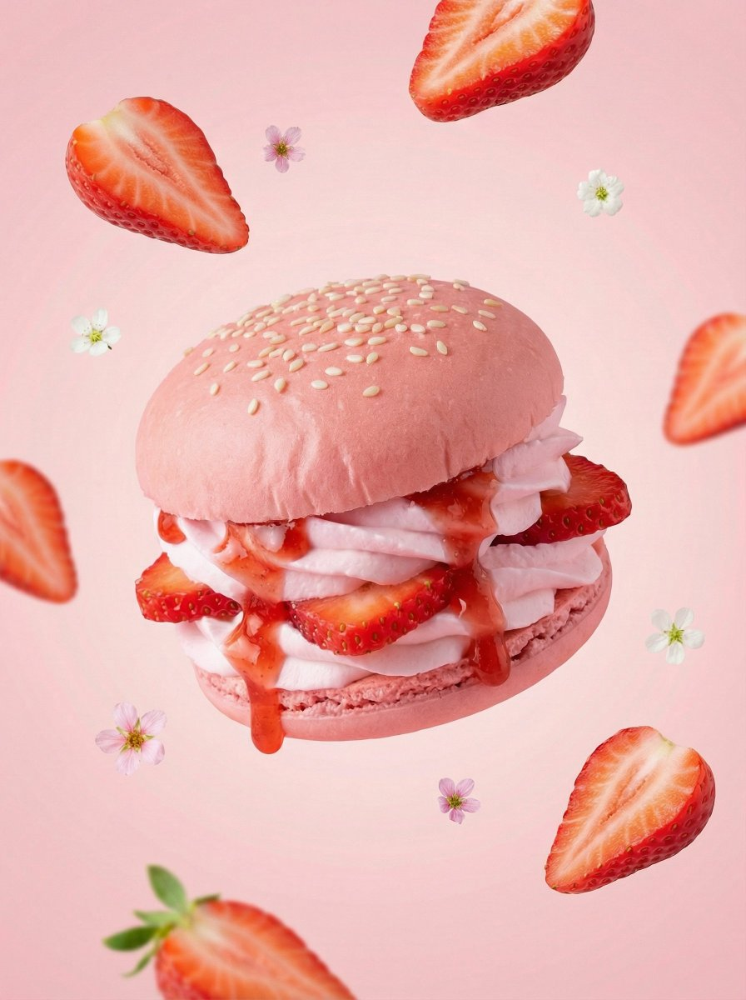

## { "prompt": "A realistic, needle-felted sculpture of a p

- ID: trending-2009566056227238069
- Slug: trending-2009566056227238069-en
- 语言: en
- 来源: [来源链接](https://x.com/Just_sharon7/status/2009566056227238069)
- 样例图路径: images/part1/2009566056227238069_1.jpg

### 提示词

```text
{
  "prompt": "A realistic, needle-felted sculpture of a product from a photo, captured in a high-detail macro studio shot with a whimsical aesthetic.",
  "subject": {
    "type": "Needle-felted sculpture",
    "based_on": "User-provided product photograph",
    "material": "Soft wool felt",
    "attributes": [
      "Fluffy textures",
      "Hand-felted details",
      "Soft edges",
      "Cozy appearance",
      "3D look"
    ]
  },
  "photography": {
    "shot_type": "Studio shot",
    "focus": "Macro focus",
    "detail_level": "High detail"
  },
  "lighting": {
    "type": "Soft, diffused lighting",
    "mood": "Warm and gentle"
  },
  "setting": {
    "background": "Minimal, solid pastel color"
  },
  "aesthetics": {
    "overall_style": "Whimsical and charming"
  },
  "parameters": {
    "aspect_ratio": "4:5"
  }
}
```

### 样例图

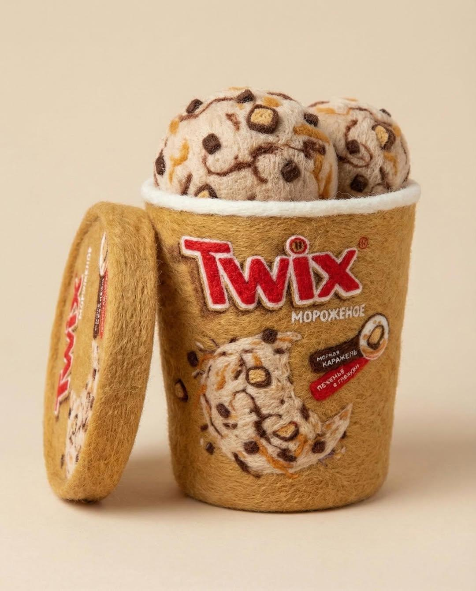

## Create a luxury fashion-editorial still life of a sharp 

- ID: trending-2013230019963986172
- Slug: trending-2013230019963986172-en
- 语言: en
- 来源: [来源链接](https://x.com/0xbisc/status/2013230019963986172)
- 样例图路径: images/part1/2013230019963986172_1.jpg

### 提示词

```text
Create a luxury fashion-editorial still life of a sharp triangular prism cake slice made of hard crystal-clear glass-like material, with the featured fruit being [orange], using a single unified candy-glass color tone while preserving the fruit’s original natural hue and form logic, explicitly excluding stems and leaves from recoloring so they retain natural green, the transparent glass cake has polished edges, elegant refraction, crisp highlights and internal reflections identical to solid crystal, inside the cake thick full-bodied seedless fruit cross-sections appear as pure clear glass with perfectly smooth seamless surfaces, one whole fruit in mirror-polished translucent crystal-glass candy style sits on top and another rests beside it, all fruit instances sharing identical color tone and material finish except leaves, arranged on a glossy white ceramic plate with clear crystal shards, a champagne-gold metallic fork and minimal baby’s-breath accents against softly draped white silk fabric, composed with balanced proportions and refined negative space, lit with soft diffused high-end editorial lighting that preserves candy-like color richness and material clarity, hyper-realistic, ultra-detailed, premium aesthetic, no text, no typography, no logo, no watermark, no graphic elements, exclude rough texture, matte surface, cube, square or round cake, ice cube, acrylic or resin block, cloudy transparency, people, hands, faces
```

### 样例图

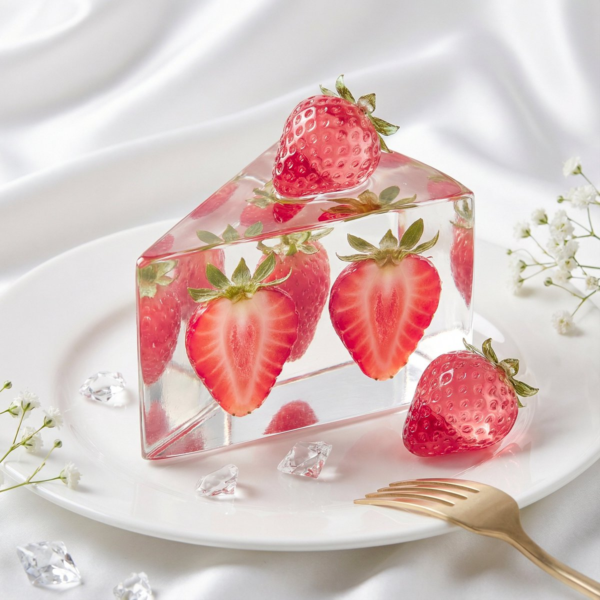

## { "image_prompt": { "main_concept": "High-end commercial

- ID: trending-2016058734271987737
- Slug: trending-2016058734271987737-en
- 语言: en
- 来源: [来源链接](https://x.com/Taaruk_/status/2016058734271987737)
- 样例图路径: images/part1/2016058734271987737_1.jpg

### 提示词

```text
{
  "image_prompt": {
    "main_concept": "High-end commercial food photography with a floating composition (food levitation effect).",
    "composition": {
      "arrangement": "Hero food item suspended in mid-air with complementary ingredients orbiting in perfect balance",
      "background": "Pure white background",
      "shadows": "Soft shadows beneath the suspended food"
    },
    "subject_variations": [
      {
        "item": "Creamy raspberry ice cream",
        "details": "Pistachio crumbs, chocolate chunks, mint leaves, berry drizzle"
      },
      {
        "item": "Gourmet hotdog",
        "details": "Glossy sausage, toasted bun, melted cheese, pickles, crispy onions, herbs, sauce"
      },
      {
        "item": "Handmade dumplings",
        "details": "Visible filling, fresh herbs, spices, pumpkin pieces, dipping sauce"
      }
    ],
    "lighting_and_color": {
      "type": "Studio lighting",
      "highlights": "Clean highlights",
      "color_accuracy": "Natural color accuracy, realistic depth"
    },
    "technical_specs": {
      "style": "Minimalist luxury aesthetic, modern advertising style, commercial product photography",
      "focus": "Ultra-sharp focus on textures, crisp edges",
      "quality": "Hyper-realistic details, high resolution, 8K quality"
    }
  }
}
```

### 样例图

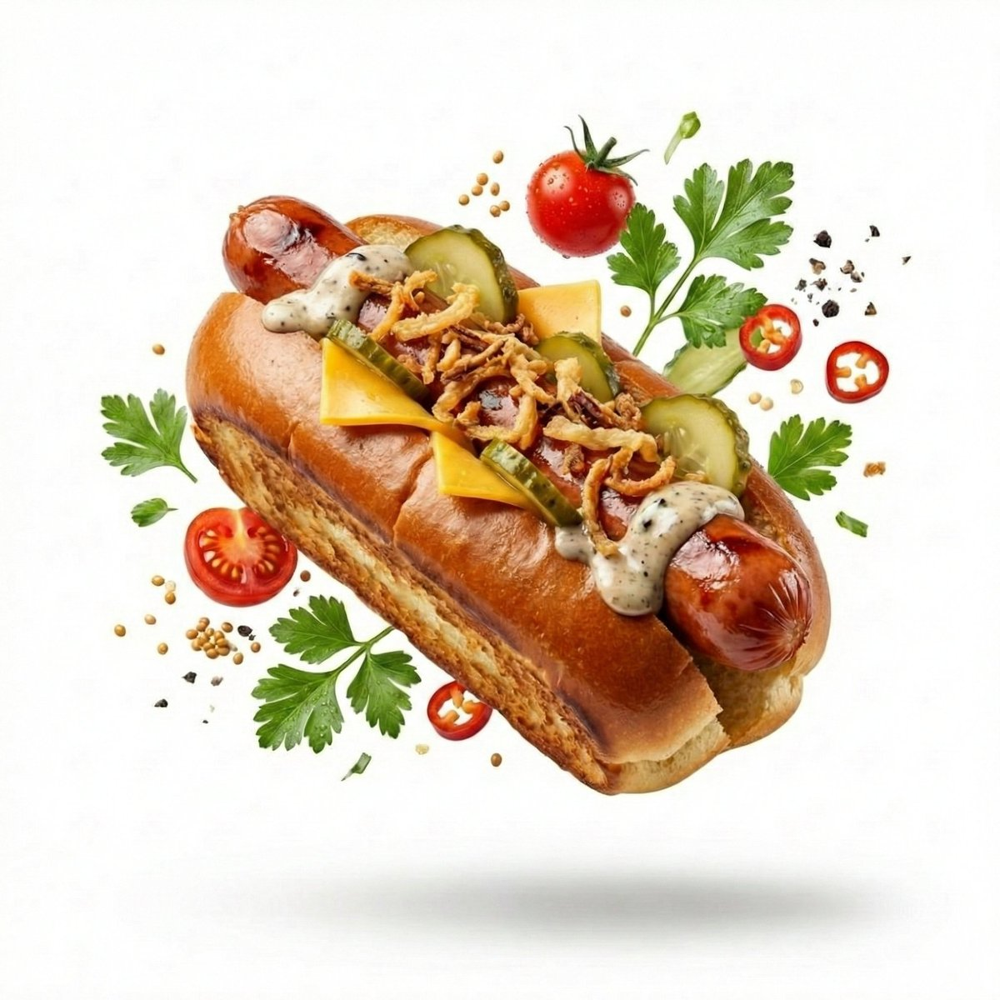

## { "content_goal": "viral food photography post", "image_

- ID: trending-2010528965018927520
- Slug: trending-2010528965018927520-en
- 语言: en
- 来源: [来源链接](https://x.com/cuties7377/status/2010528965018927520)
- 样例图路径: images/part1/2010528965018927520_1.jpg

### 提示词

```text
{
  "content_goal":
 "viral food photography post",
  "image_type": 
"professional food photography",
  "food_concept": {
    "item": 
"pizza slice",
    "style": 
"premium artisan pizza",
    "serving_state": 
"freshly lifted slice with cheese pull",
    "temperature_feel": 
"hot, freshly baked"
  },
  "visual_style": {
    "aesthetic": "cinematic food editorial",
    "vibe": "crave-worthy, indulgent, luxurious",
    "realism": "ultra-realistic"
  },
  "composition": {
    "framing": "close-up macro with partial pizza visible",
    "angle": "45-degree side angle",
    "focus_point": "cheese stretch and toppings",
    "depth_of_field": "shallow background blur"
  },
  "pizza_details": {
    "crust": "golden-brown, crispy edges with soft interior",
    "cheese": "melted mozzarella with long stretchy pull",
    "sauce": "rich red tomato sauce",
    "toppings": [
      "pepperoni slices",
      "fresh basil leaves",
      "olive oil glaze"
    ],
    "texture": "glossy cheese, crisp crust, juicy toppings"
  },
  "lighting": {
    "type": "soft directional studio lighting",
    "direction": "side light for texture definition",
    "highlight": "cheese shine and crust detail",
    "shadow": "soft natural shadows"
  },
  "color_palette": {
    "primary_colors": [
      "cheese yellow",
      "tomato red",
      "golden brown"
    ],
    "contrast_level": "medium-high",
    "mood": "warm, appetizing, mouth-watering"
  },
  "environment": {
    "surface": "rustic wooden table or marble slab",
    "background": "dark blurred restaurant or kitchen",
    "props": [
      "pizza cutter",
      "linen napkin",
      "wooden board"
    ]
  },
  "camera_details": {
    "lens": "macro or 50mm food lens",
    "focus": "extreme sharpness on slice",
    "resolution": "high-end commercial quality",
    "noise": "none"
  },
  "sensory_impact": {
    "visual_effect": "cheese pull in motion",
    "viewer_reaction": "instant craving",
    "emotional_trigger": "comfort food desire"
  },
  "quality_control": {
    "food_realism": "authentic pizza texture",
    "ai_artifacts": "none",
    "professional_finish": "restaurant advertisement grade"
  },
  "intended_use": {
    "primary": "viral food post on X",
    "secondary": "restaurant promo, food brand content"
  }
}
```

### 样例图

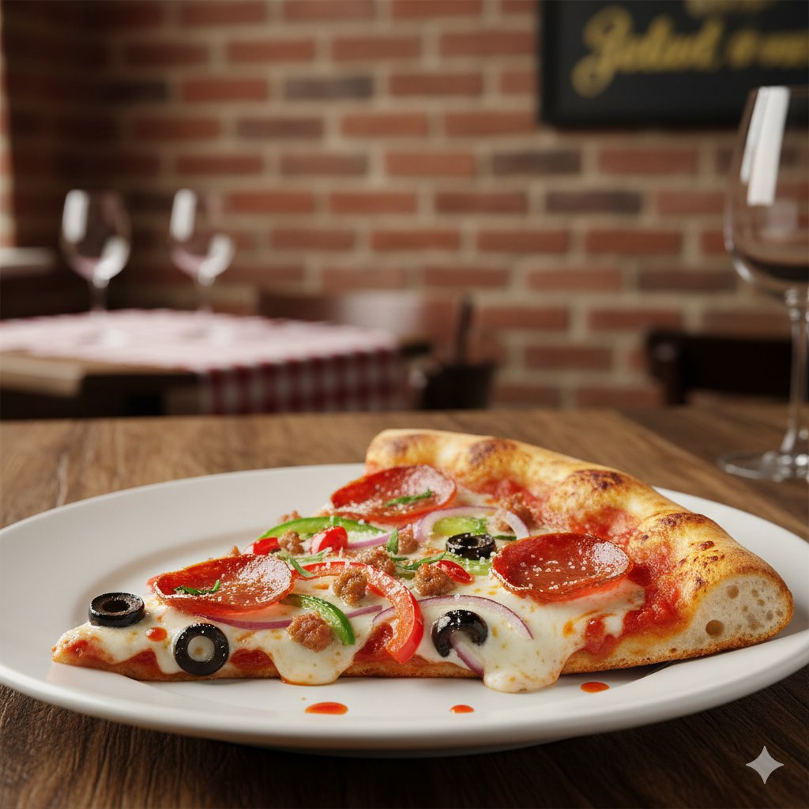

## { "style": "ultra-realistic food photography, luxury edi

- ID: trending-2011592765570785538
- Slug: trending-2011592765570785538-en
- 语言: en
- 来源: [来源链接](https://x.com/Nas_tech_AI/status/2011592765570785538)
- 样例图路径: images/part1/2011592765570785538_1.jpg

### 提示词

```text
{
"style": "ultra-realistic food photography, luxury editorial, macro-detail, natural textures",
  "images": [
    {
      "id": "image_1",
      "subject": "assorted praline tower",
      "composition": "staggered vertical tower, center frame, loose organic stacking",
      "details": {
        "fillings": [
          "hazelnut chunks irregularly clumped at base",
          "raspberry gel naturally puddled",
          "salted caramel with realistic flow lines",
          "coffee ganache with smooth wave texture",
          "passionfruit filling with visible pulp specks"
        ],
        "accent": "one unique metallic gold nut per filling type placed at layer transitions",
        "stand": "brushed gold stand with subtle reflections"
      },
      "lighting": {
        "type": "dramatic side lighting",
        "angle": "35 degrees left",
        "effects": "authentic filling refractions, layered shadow play"
      },
      "background": "teal-to-navy gradient with suspended gold motes",
      "mood": "luxurious, indulgent, artisanal depth"
    },
    {
      "id": "image_2",
      "subject": "ruby chocolate tablet",
      "composition": "floating hexagonal segments above black textured paper liner",
      "details": {
        "surface": "hand-tempered imperfections, translucent ruby pink",
        "inclusions": "embedded fruit flecks visible through chocolate",
        "motion": "ruby cacao nibs falling in gravity-realistic arc from one segment"
      },
      "lighting": {
        "key": "top-down at 12 o'clock",
        "rim": "soft pink rim light at 3 o'clock",
        "effects": "authentic shadows, enhanced translucency"
      },
      "background": "black-to-warm pink radial gradient with subtle sparkle specks",
      "mood": "modern, vibrant, floating tension"
    },
    {
      "id": "image_3",
      "subject": "white chocolate bonbons",
      "composition": "organic cluster on clear glass stand",
      "details": {
        "marbling": [
          "central bonbon with irregular orange passionfruit veins",
          "surrounding bonbons with pink raspberry swirls",
          "green matcha flecks with varied density"
        ],
        "cutaway": "one bonbon sliced vertically showing gel core with real fruit speckles",
        "props": "dried fruit flecks scattered below (orange zest curls, raspberry seeds)"
      },
      "lighting": {
        "key": "soft high-key front light at 10 degrees",
        "rim": "rear rim light at 35 degrees",
        "effects": "enhanced marbling contrast and glass refractions"
      },
      "background": "soft taupe with fruit-toned bokeh",
      "mood": "elegant, fresh, handcrafted"
    },
    {
      "id": "image_5",
      "subject": "dark chocolate pistachio bar",
      "composition": "vertical bar centered on polished black granite slab",
      "details": {
        "cross_section": "precision side cut revealing layered pistachio filling",
        "filling": "whole roasted green pistachios suspended in smooth white chocolate matrix",
        "binding": "subtle golden honey swirl",
        "break": "front broken segment with clean snap and visible pistachio pieces",
        "props": "whole roasted pistachios arranged in ascending curve, honey drips nearby"
      },
      "lighting": {
        "key": "soft spotlight from top-left at 45 degrees",
        "rim": "warm side rim light from right at 30 degrees",
        "highlight": "single pinpoint highlight on largest pistachio"
      },
      "background": "dark espresso brown gradient with floating pistachio shell dust particles",
      "mood": "rich, bold, premium indulgence"
    }
  ]
}
```

### 样例图

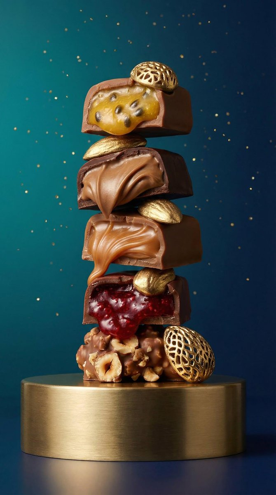

## Macro food photography of a crispy martabak telur tearin

- ID: trending-2011300896186253645
- Slug: trending-2011300896186253645-en
- 语言: en
- 来源: [来源链接](https://x.com/TheNewz_816/status/2011300896186253645)
- 样例图路径: images/part1/2011300896186253645_1.jpg

### 提示词

```text
Macro food photography of a crispy martabak telur tearing open mid-air, thin golden wrapper shattering with a crack, hot filling of minced beef, scallions, and egg bursting outward. Flecks of fried onion and pepper suspended in motion, steam visible, glossy oil sheen catching the light. Warm Indonesian street-stall lighting, tungsten + charcoal warmth, dramatic rim light, ultra high texture detail (bubbled wrapper, layered interior).Editorial food shot, shallow depth of field, bokeh of night market signage, Nikon Z9 look, 105mm macro, fast shutter freeze, hyper-real crumbs. --ar 3:4"
```

### 样例图


## { "subject": { "primary": "Two foil sachets of Marvico T

- ID: trending-2011383874937663775
- Slug: trending-2011383874937663775-en
- 语言: en
- 来源: [来源链接](https://x.com/Just_sharon7/status/2011383874937663775)
- 样例图路径: images/part1/2011383874937663775_1.jpg

### 提示词

```text
{
  "subject": {
    "primary": "Two foil sachets of Marvico Tomato Mix Paste seasoning tilted diagonally",
    "secondary": "A rustic metal pot filled with rich, bubbling red Nigerian-style tomato stew containing assorted meats and tripe",
    "details": [
      "Vibrant red tomato sauce consistency",
      "Fresh whole tomato splash at the bottom foreground",
      "Sachets feature green and gold 'MARVICO' branding with realistic tomato illustrations",
      "A cheerful young Western blonde woman with long hair, wearing a casual bright outfit, holding the sachets and smiling at the camera"
    ]
  },
  "composition": {
    "layout": "Dynamic vertical advertisement",
    "focal_point": "Product sachets held by the girl in the center-left, overlapping a large pot of stew in the top-right",
    "background": "Solid textured red gradient with a subtle grainy paper effect",
    "perspective": "Eye-level with a slight Dutch angle for energy"
  },
  "typography": {
    "main_text": "Better Christmas stew don sure",
    "sub_text": "...original from nature",
    "font_style": "Bold, playful white bubble script for main text; minimalist lowercase sans-serif for sub-text",
    "placement": "Centered at the bottom over the red background"
  },
  "color_palette": {
    "dominant": ["Crimson Red", "Deep Scarlet"],
    "accents": ["Forest Green", "Metallic Gold", "Bright White"],
    "lighting": "Studio lighting with high contrast to make the red sauce look glossy and appetizing"
  },
  "style_descriptors": [
    "Commercial food photography",
    "West African culinary aesthetic",
    "High-definition textures",
    "Vibrant and warm color grading",
    "Professional product placement",
    "Lifestyle advertising with a relatable model"
  ],
  "technical_settings": {
    "aspect_ratio": "4:5",
    "sharpness": "High",
    "texture": "Subtle film grain on the background"
  }
}
```

### 样例图

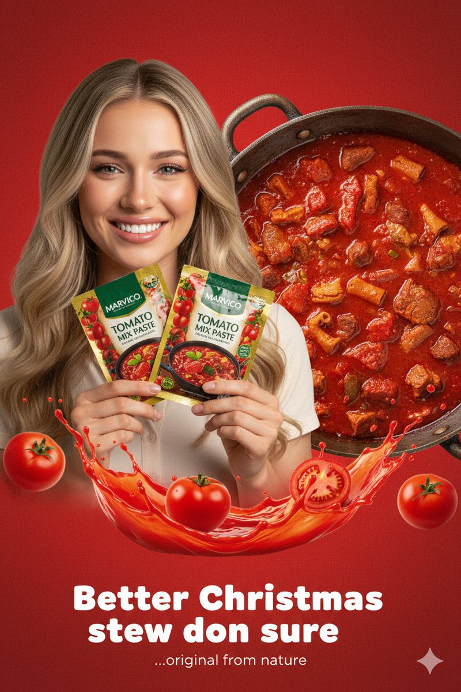

## { "Objective": "Create a surreal, hyper-detailed fantasy

- ID: trending-2010350361144610992
- Slug: trending-2010350361144610992-en
- 语言: en
- 来源: [来源链接](https://x.com/Taaruk_/status/2010350361144610992)
- 样例图路径: images/part1/2010350361144610992_1.jpg

### 提示词

```text
{
  "Objective": "Create a surreal, hyper-detailed fantasy world where pizza becomes an integral part of landscapes and technology",
  "Concept": "Imaginative surrealism blending photorealistic food textures with cinematic fantasy environments",
  "Scenes": [
    {
      "SceneName": "Pizza Coastline Mountain Road",
      "SceneDescription": {
        "Environment": "Dramatic coastal cliffs overlooking the ocean",
        "PrimaryStructure": "A giant pepperoni pizza forming a winding mountain road",
        "WorldIntegration": {
          "Cheese": "Melted cheese forming the roadway surface",
          "Toppings": "Pepperoni slices and basil leaves acting as traffic islands and terrain features"
        },
        "ScaleElements": {
          "Vehicles": "Tiny cars driving across the pizza road",
          "ScaleContrast": "Massive pizza landscape versus miniature vehicles"
        }
      },
      "LightingAndMood": {
        "TimeOfDay": "Golden hour",
        "Lighting": "Warm coastal sunlight with long shadows",
        "Mood": "Whimsical, epic, playful wonder"
      },
      "Composition": {
        "Camera": "Cinematic wide-angle view",
        "Perspective": "Elevated, sweeping landscape shot",
        "DepthOfField": "Moderate depth with foreground and background clarity"
      }
    },
    {
      "SceneName": "Pizza Futuristic Car",
      "SceneDescription": {
        "Environment": "Rainy neon-lit cyberpunk city street at night",
        "PrimarySubject": "A pizza slice transformed into a futuristic car",
        "DesignDetails": {
          "Body": "Pizza crust and melted cheese forming aerodynamic shape",
          "Toppings": "Pepperoni and basil integrated into vehicle design",
          "Wheels": "Realistic rubber tires attached to the pizza vehicle"
        },
        "Motion": "Speeding through the street with dynamic motion blur"
      },
      "LightingAndMood": {
        "TimeOfDay": "Night",
        "Lighting": "Moody cyberpunk neon lights in red, teal, and magenta",
        "Atmosphere": "Rain, mist, reflections on wet asphalt",
        "Mood": "Energetic, futuristic, playful surrealism"
      },
      "Composition": {
        "Camera": "Low-angle wide shot",
        "Perspective": "Dynamic chase-style framing",
        "DepthOfField": "Shallow depth of field with background bokeh"
      }
    }
  ],
  "ArtDirection": {
    "Style": "Playful yet photorealistic surrealism",
    "TextureQuality": {
      "Food": "Ultra-realistic pizza textures, visible oil sheen, stretchy melted cheese",
      "Environment": "High-detail rocks, asphalt, rain droplets, reflections"
    },
    "RealismBalance": "Photorealistic materials combined with impossible scale and concepts"
  },
  "VisualStyle": {
    "Resolution": "8K ultra-high detail",
    "ColorGrading": "Cinematic contrast with warm coastal tones and cool neon city tones",
    "Depth": "Strong sense of scale and dimensionality"
  },
  "Mood": {
    "OverallTone": "Imaginative, whimsical, cinematic",
    "EmotionalFeel": "Playful awe and creative wonder"
  },
  "NegativePrompt": [
    "flat lighting",
    "cartoon-only style",
    "low detail textures",
    "plastic food",
    "blurry focus",
    "dull colors"
  ],
  "ResponseFormat": {
    "Type": "Two-scene cinematic illustration or render",
    "OutputOptions": [
      "Split composition",
      "Diptych",
      "Two separate images"
    ],
    "AspectRatio": "16:9"
  }
}
```

### 样例图

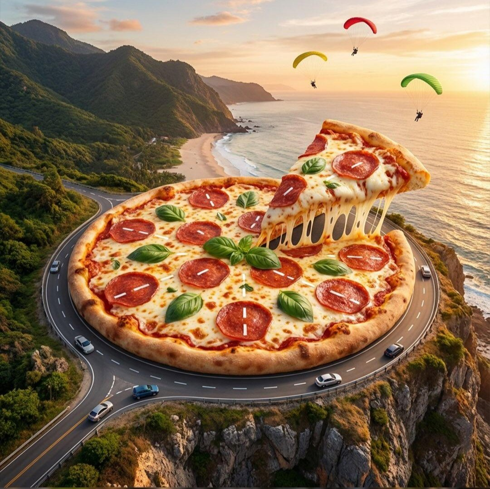

## { "production_manifest": { "metadata": { "series_id": "C

- ID: trending-2011044123818549711
- Slug: trending-2011044123818549711-en
- 语言: en
- 来源: [来源链接](https://x.com/TheNewz_816/status/2011044123818549711)
- 样例图路径: images/part1/2011044123818549711_1.jpg

### 提示词

```text
{
  "production_manifest": {
    "metadata": {
      "series_id": "CIN-FOOD-2025",
      "aspect_ratio": "9:16",
      "resolution_target": "8k_uhd"
    },
    "technical_stack": {
      "hardware": {
        "camera": "ARRI Alexa 65",
        "lens_profile": "Large format cinematic prime"
      },
      "film_emulation": {
        "stock": "Kodak Portra 400",
        "characteristics": ["Fine grain", "Natural skin tones", "Warm highlights"]
      },
      "lighting_rig": {
        "style": "Cinematic soft glow",
        "atmosphere": "Timeless indoor",
        "diffusion": "High"
      }
    },
    "artistic_direction": {
      "visionary_style": "Greta Gerwig",
      "composition_rule": "Graphic centered symmetry",
      "physics_engine": "Suspended animation / Zero gravity",
      "background_specification": "Flat off-white / Studio bone"
    },
    "variant_registry": [
      {
        "id": "VAR-001",
        "flavor_profile": "Dark Chocolate Chip & Oat",
        "tonal_emotion": "Playful, cheeky yet chic",
        "ingredients": {
          "primary_solids": ["Dark chocolate chip cookies"],
          "fluid_fx": ["Oat milk splash"],
          "debris": ["Cookie crumbs"]
        }
      },
      {
        "id": "VAR-002",
        "flavor_profile": "Red Velvet",
        "tonal_emotion": "Bold, playful chic",
        "ingredients": {
          "primary_solids": ["Red velvet cake pieces"],
          "fluid_fx": ["Cream cheese frosting swirls"],
          "debris": ["Cocoa dust", "Fine red cake crumbs"]
        }
      },
      {
        "id": "VAR-003",
        "flavor_profile": "Pistachio Macaron",
        "tonal_emotion": "Refined, playful chic",
        "ingredients": {
          "primary_solids": ["Pistachio macarons"],
          "fluid_fx": ["Cream filling swirls"],
          "debris": ["Crushed pistachio nuts"]
        }
      },
      {
        "id": "VAR-004",
        "flavor_profile": "Strawberry Shortcake",
        "tonal_emotion": "Sweet, playful yet chic",
        "ingredients": {
          "primary_solids": ["Fresh strawberry slices"],
          "fluid_fx": ["Whipped cream swirls"],
          "debris": ["Shortcake biscuit crumbs"]
        }
      }
    ]
  }
}
```

### 样例图

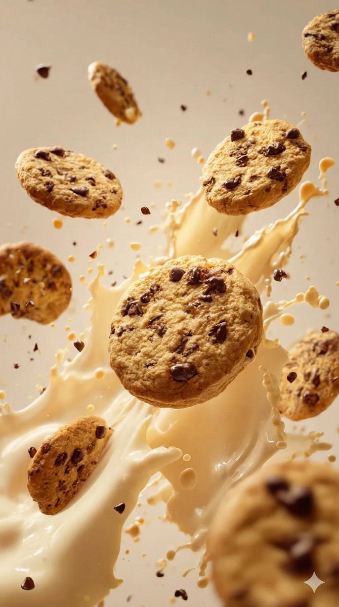

## 2x2 grid, do this for 4 famous cuisines: function dish(A

- ID: trending-2043013709615022434
- Slug: trending-2043013709615022434-en
- 语言: en
- 来源: [来源链接](https://x.com/Gdgtify/status/2043013709615022434)
- 样例图路径: images/part1/2043013709615022434_1.jpg

### 提示词

```text
2x2 grid, do this for 4 famous cuisines: function dish(AA){
<instruction>
Input A is a Famous Dish / Culinary Tradition / Signature Dessert / Regional Specialty.

Analyze:
- ingredient hierarchy, cooking method, plating logic
- origin region, historical story, ritual or social context
- flavor architecture translated into visual composition
- symbolic ingredients, cookware, and dining environment
- chef or tradition lineage

Goal:
A "sauce pour environment."
A giant ladle, piping bag, or sauce boat is pouring the primary sauce, cream, glaze, broth, or puree onto a table.
The flowing edible medium rises into a detailed 3D world of the dish: ingredients, preparation stages, origin landscape, and plated final form merging together.

Rules:
- the poured substance must remain recognizably edible while forming the scene
- include knives, cutting board, handwritten recipe notes, ingredient trays, steam, spice dust, region-appropriate tools
- include a tiny chef or grandmother figure preparing a miniature version nearby
- include a food critic headline, market receipt, or origin-story clipping
- semantically infer cuisine-specific vessels, table culture, garnish logic, and environment
- no random food pile; composition must reveal flavor structure and culinary history
- lighting: appetizing natural kitchen light with rich edible texture

Output:
ONE image, 4:5, culinary-process diorama aesthetic
</instruction>

Output:
2x2 grid, each grid with a different dish(AA) output
}
```

### 样例图

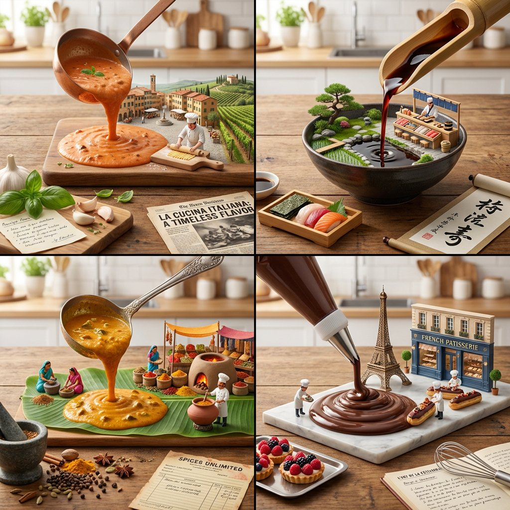

