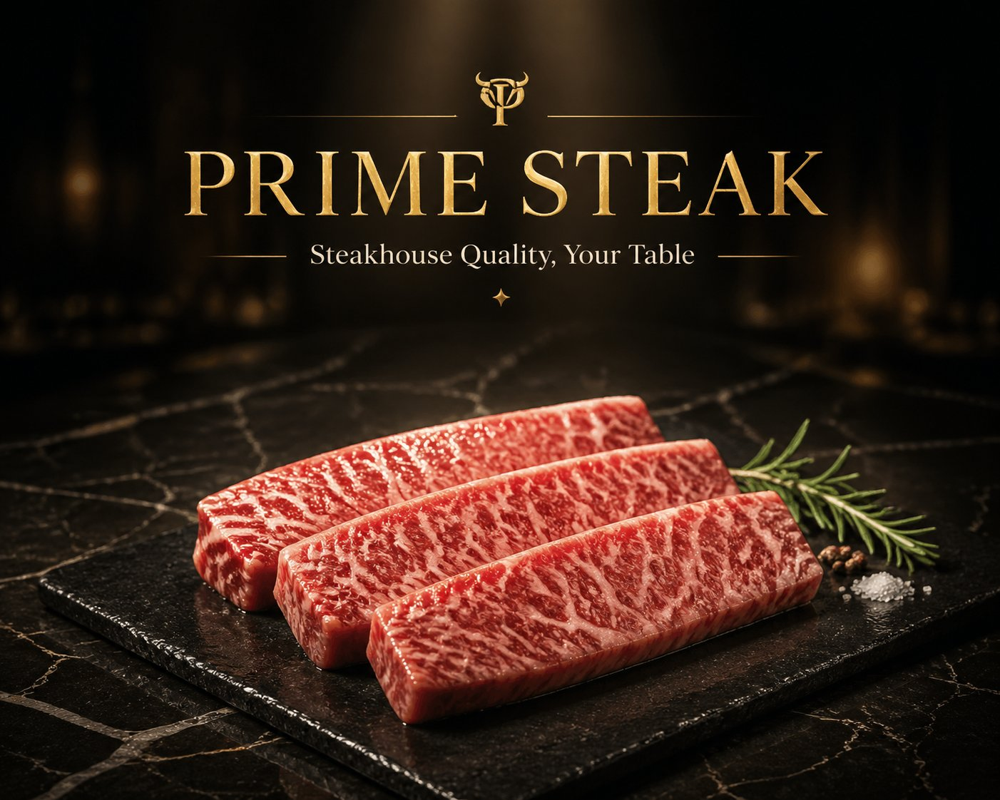
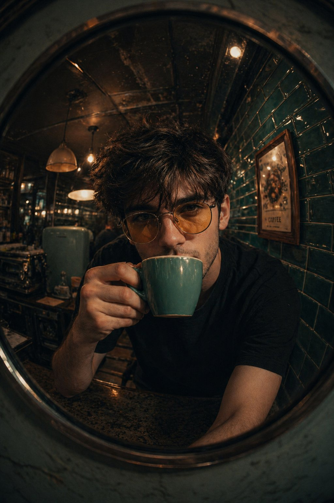
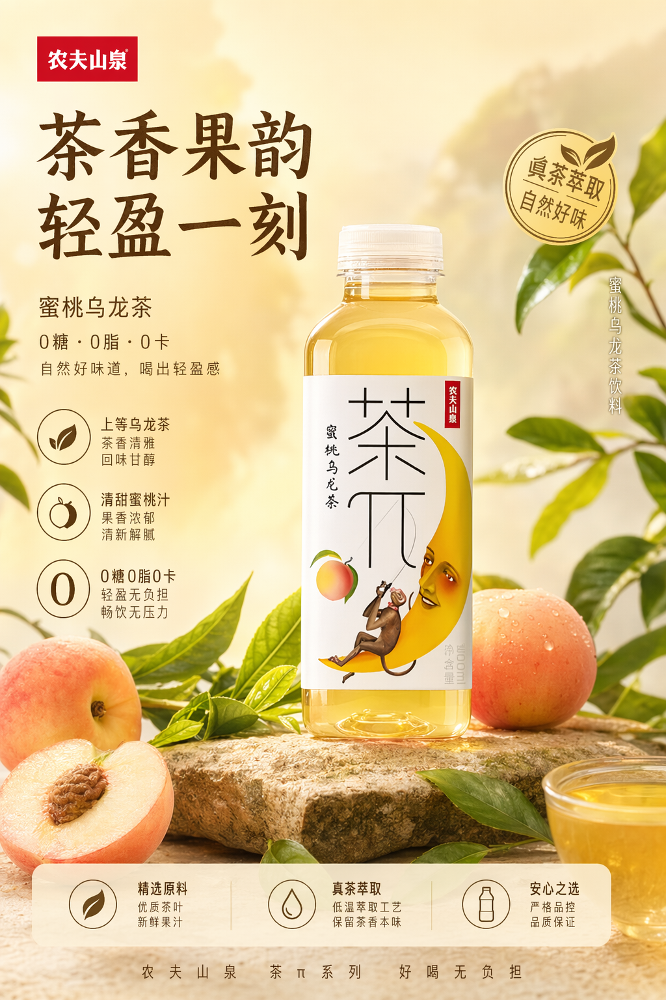
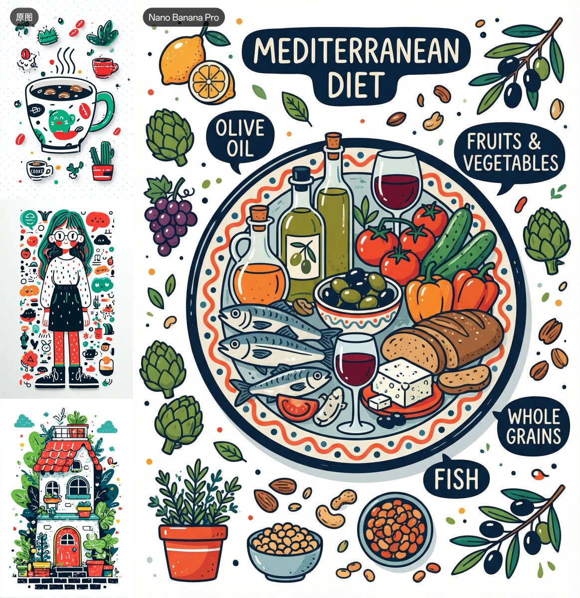
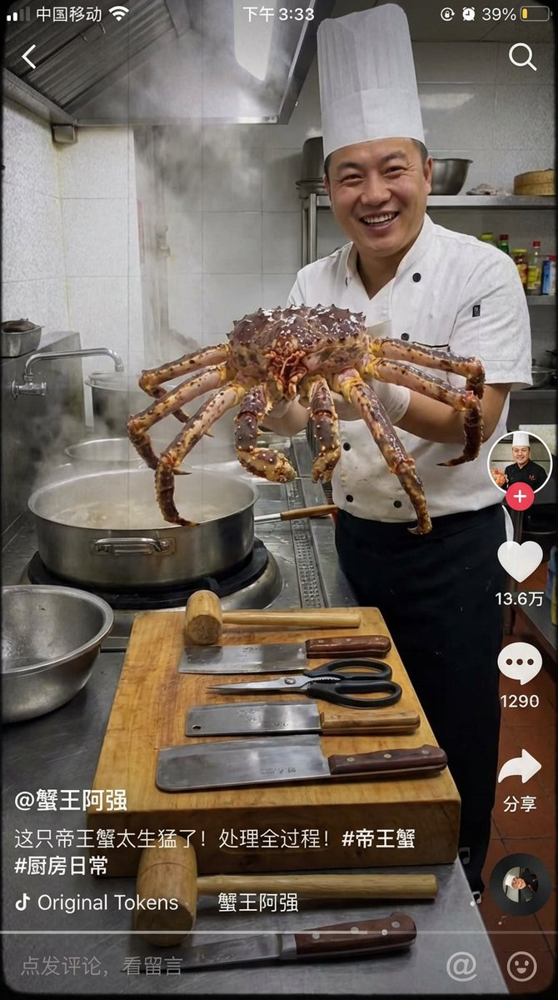
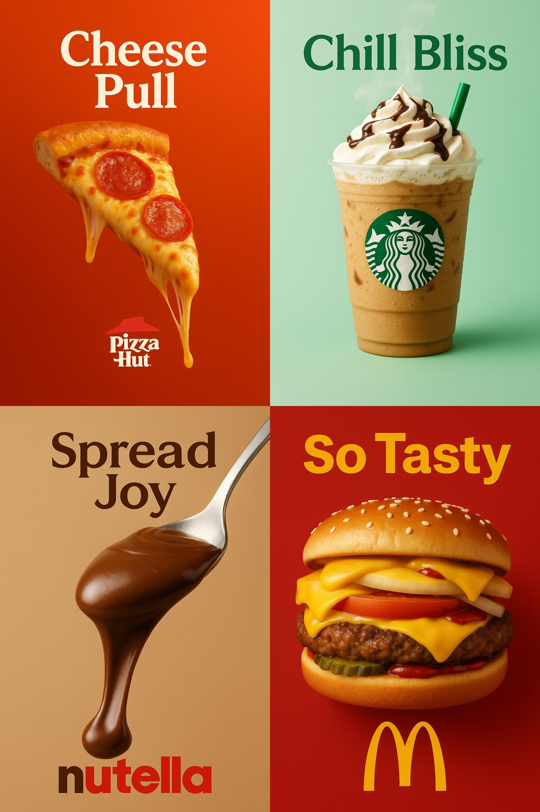

# food

总计：178

## 樱花咖啡户外人像

- ID: case-377
- Slug: case-377-zh
- 语言: zh
- 来源: [来源链接](https://x.com/xRahultripathi/status/2050677614168391716)
- 样例图路径: images/part2/case377.jpg

### 提示词

```text
Edit the provided image while preserving the same face identity, shape, and facial features without altering age, ethnicity, or structure. Maintain a calm, relaxed expression with the subject not looking at the camera.

Subject: young woman (18–23) with soft feminine beauty, smooth glowing skin, natural texture.
Pose (strict): seated on a wooden chair, body angled sideways (45–70°), legs crossed naturally, upper body slightly leaning forward, head turned away from camera, gaze to the side. She holds a drink cup with a straw using both hands.
Framing: full-body vertical (9:16), head to shoes visible, centered but slightly offset for natural composition.
Outfit: light pink varsity jacket with white stripes, soft pink inner top, modest knee-length pleated skirt, white sneakers.
Accessories: beige newsboy cap, sunglasses (on face or cap), pink shoulder bag, small earrings.
Hair: neat low bun with soft loose strands.
Environment: outdoor flower shop street scene with pastel flowers (pink, soft tones), decorative plants, floral storefront.
Lighting: bright natural daylight, soft glossy skin highlights, balanced exposure, soft shadows.
Camera: low/frog angle (slightly below, looking up), 50mm lens, shallow depth of field.
Color grading: warm pastel palette (pink, cream), clean bright lifestyle aesthetic.
Quality: ultra-photorealistic, 8K detail, DSLR realism, natural skin texture.
Negative: front-facing, eye contact, close-up, cropped body, mini/short skirt, indoor scene, dark lighting, anime, cartoon, CGI, plastic skin, distorted anatomy.
--ar 9:16 --style raw --quality high
```

### 样例图


## 泼洒抹茶街头手机照片

- ID: case-376
- Slug: case-376-zh
- 语言: zh
- 来源: [来源链接](https://x.com/Shinning1010/status/2050693240253214894)
- 样例图路径: images/part2/case376.jpg

### 提示词

```text
A realistic vertical smartphone photo of a spilled green iced drink on outdoor stone pavement, a transparent disposable plastic cup lying on its side inside the green puddle, clear plastic lid nearby, scattered ice cubes floating in the drink, small foam bubbles on the surface, green liquid naturally spreading across rough square floor tiles, strong midday sunlight, harsh realistic shadows, a dark human shadow silhouette cast across the ground and partially over the spill, accidental street moment, urban documentary photography, handheld phone camera perspective, slightly top-down angle, natural colors, realistic pavement texture, raw unedited photo look, high detail, authentic everyday scene, 9:16 vertical composition

Negative Prompt:
cartoon, illustration, anime, CGI, 3D render, fantasy style, studio lighting, overly perfect composition, overly clean floor, fake liquid, unrealistic reflections, plastic-looking liquid, oversaturated green, blurry, low resolution, distorted cup, melted plastic, extra cups, duplicated objects, readable brand logo, messy text, watermark, poster design, dramatic artificial lighting, excessive sharpening, over-processed, unrealistic shadow, floating ice, deformed perspective
```

### 样例图


## 高端肉类海鲜品牌英雄图

- ID: case-373
- Slug: case-373-zh
- 语言: zh
- 来源: [来源链接](https://x.com/xpg0970/status/2050108279385419965)
- 样例图路径: images/part2/case373.jpg

### 提示词

```text
一、品牌基础设定
品牌名称：[请填写，例如：PRIME STEAK / OCEAN PRIME]
品牌标语：[请填写，例如：Steakhouse Quality, Your Table / Restaurant Grade, Home Delivered]
主色调：[请填写，例如：黑金 / 深红+金 / 深蓝+银]
字体风格：
标题：[请填写，例如：金色衬线体，大写，奢华感]
正文：[请填写，例如：细衬线体/无衬线体]
二、核心视觉元素
台面材质：[请填写，例如：大理石/黑色石板]
背景调性：[请填写，例如：深色渐变/暗调餐厅环境]
光线风格：[请填写，例如：聚光/侧光/顶部照明]
三、主产品定义（必填）
产品名称/类型：[请填写，例如：和牛牛排 / 帝王蟹 / 北极甜虾]
产品数量/摆放：[请填写，例如：1份单品 / 3块整齐摆放]
呈现方式：[请填写，例如：切片展示 / 带骨展示 / 原壳展示]
产品特色/质感提示：[请填写，例如：肉质纹理清晰、多汁感 / 光泽晶亮 / 肉眼可见油花]
```

### 样例图



## 印度餐厅菜单改造宣传图

- ID: case-368
- Slug: case-368-zh
- 语言: zh
- 来源: [来源链接](https://x.com/Johnson998877/status/2050354965110268123)
- 样例图路径: images/part2/case368.jpg

### 提示词

```text
这是india 料理中的一份真实menu。根据此 重新生成带文本说明的 引人入胜垂涎欲滴的 说明图片 先用English 文本易于识别（手机小屏幕） 这个是beef roast
```

### 样例图


## 抹茶品牌触点系统视觉板

- ID: case-362
- Slug: case-362-zh
- 语言: zh
- 来源: [来源链接](https://x.com/Preda2005/status/2049846981271699685)
- 样例图路径: images/part2/case362.jpg

### 提示词

```text
Create a premium “Matcha Brand Touchpoint System” visual board for a modern lifestyle brand called:

“MATCHA MODE”

Build a full brand identity system, not a single image.

HERO SCENE:

A hyper-realistic matcha drink in a ceramic cup placed on a clean natural surface.

– vibrant green matcha foam with micro-bubbles
– bamboo whisk (chasen) nearby
– soft natural light
– slight matcha powder dust on the surface
– minimal Japanese aesthetic
ATMOSPHERE:
– calm, warm, soft daylight
– clean background (off-white or beige)
– subtle shadows and reflections
– feeling of wellness and luxury
FULL BRAND SYSTEM:
– takeout cups (paper + glass bottles)
– packaging boxes (minimalist design)
– tote bags (premium lifestyle)
– labels, stickers, seals
– menu cards with pricing ($6.50, $8.90, etc.)
– small typography everywhere
– subtle imperfections (realism)

DESIGN LANGUAGE:

– modern minimalist typography
– Japanese-inspired layout
– soft green palette
– elegant spacing

INCLUDE:
– matcha latte
– iced matcha
– matcha desserts
– combo sets
– lifestyle shots
The composition must feel like a high-end design agency presentation.

Ultra-detailed, realistic, clean, aesthetic, and highly shareable.
```

### 样例图


## 草莓能量饮料商业广告

- ID: case-358
- Slug: case-358-zh
- 语言: zh
- 来源: [来源链接](https://x.com/SPEEDAI07/status/2049043627163435040)
- 样例图路径: images/part2/case358.jpg

### 提示词

```text
A hyper-realistic commercial advertisement blending energy drink and sports branding. A dynamic athletic woman mid-air jump, wearing modern sportswear (light translucent jacket, orange shorts, white sneakers), surrounded by explosive splashes of red strawberry liquid and flying ice cubes. A cold metallic energy drink can (strawberry flavor) bursting with droplets sits in the foreground, covered in condensation. Fresh strawberries scattered on a glossy reflective surface.

Bright cinematic lighting with dramatic highlights and motion effects. Vibrant orange gradient background with bold glowing typography behind the subject. Ultra-detailed, high contrast, sharp focus, commercial product photography style, 8K resolution, advertising poster aesthetic, energetic, powerful, refreshing mood.
```

### 样例图


## 鱼眼镜面复古咖啡馆人像

- ID: case-357
- Slug: case-357-zh
- 语言: zh
- 来源: [来源链接](https://x.com/harboriis/status/2049044698900361241)
- 样例图路径: images/part2/case357.jpg

### 提示词

```text
A fish-eye lens close-up of [your photo as reference] sipping from a teal/turquoise coffee mug, leaning forward intimately toward camera. Shot through or near a round mirror. Retro café interior with glossy teal subway tiles, vintage appliances, pendant lights. Black t-shirt, yellow-tinted round glasses. Warm moody tones.
```

### 样例图



## 品牌口红推荐报告信息图

- ID: case-353
- Slug: case-353-zh
- 语言: zh
- 来源: [来源链接](https://x.com/liyue_ai/status/2048667226195317219)
- 样例图路径: images/part2/case353.jpg

### 提示词

```text
一、系统角色
你是一个专业美妆顾问 + 人脸分析系统 + 品牌视觉设计系统。
你的任务是：基于用户上传自拍与指定口红品牌，生成一张具有品牌调性的“口红推荐报告信息结构图”。

二、输入参数
用户图像：{用户自拍}
品牌：{口红品牌，如 Dior / YSL / Armani / Chanel / TF}
风格偏好（可选）：{通勤 / 温柔 / 气场 / 氛围感 / 显白优先}
推荐数量：3–5

三、品牌视觉层（新增核心模块）
根据 {品牌} 自动构建视觉风格（Brand Visual Identity），提取品牌调性，例如：
Dior：
优雅、高级、法式、灰白 + 银色、柔光
YSL：
黑金、性感、强对比、时尚编辑感
Armani：
低饱和、雾面、克制、灰调高级感
Chanel：
极简黑白、高级、理性、结构清晰
Tom Ford：
深色、高对比、奢华、电影感

视觉应用到海报：
1. 主色调（背景微变化，不是大面积铺色）
2. 强调色（用于色号标题/细线/小元素）
3. 光影风格（柔光 / 强对比 / 冷调 / 暖调）
4. 字体气质（优雅 / 现代 / 冷感 / 力量感）

四、分析层
对用户进行分析：
- 肤色：冷 / 暖 / 中性（+ 明度）
- 气质：清冷 / 温柔 / 明艳 / 干净 / 成熟
- 唇部特征：薄 / 厚 / 唇色基础
- 妆容状态：素颜 / 日常 / 精致
输出一句总结：「更适合 {色系} + {饱和度} + {质地} 的口红方向」

五、推荐层（增强差异）
从 {品牌} 推荐 3–5 个色号：
每个包含：
- 色号名称（#999）
- 色系（正红 / 豆沙 / 枫叶 / 奶茶 / 玫瑰）
- 上脸效果（显白 / 提气色 / 氛围感 / 气场增强）
- 场景（逛街 / 通勤 / 聚餐 / 约会 / 宴会）

要求：每个色号“风格明确区分”（一个日常、一个气场、一个氛围感等）

六、信息结构图
生成竖版信息结构图
整体风格：美妆时尚大片质感 + 结构化信息可视化排版 + 品牌视觉体系深度融合
极简但不单调，高级但有视觉层次

【整体布局】
左上：用户输入区
右上：分析结论
中部：试色矩阵（核心）
底部：总结

## 1️⃣ 左上（用户区）
用户自拍（真实质感）
+ 小标题：「肤色分析」
+ 一句话结论：「适合低饱和玫瑰调，避免高荧光色」

极细品牌色线条（如 YSL 金线 / Dior 灰线）

## 2️⃣ 中部（核心试色矩阵）
这是视觉重点区域（占比60%以上）
展示方式：将 3–5 个色号以“人脸试色对比”的形式排列：
每一列 = 一个色号
每个色号包含：
- 小型人脸图（同一张脸，不同唇色）
- 色号名称（如 #999）
- 色系标签（如 Classic Red）
- 一句话效果说明
要求：所有人脸保持一致，仅唇色变化，真实试色效果（lip color try-on），肤质真实，不塑料，光影统一。
排列方式：横向排布 或 网格排布（整齐但不死板）

品牌增强点：
- Dior：轻柔渐变背景 + 柔光阴影
- YSL：更强对比 + 黑色细分割线
- Armani：整体灰调统一，低对比
- Chanel：严格对齐，极简黑白
- TF：局部暗背景 + 高光强调

## 3️⃣ 每个色号模块
包含：
色号名（突出）
色系标签
一句推荐语
场景标签（逛街/通勤/聚餐/约会/宴会等）

品牌化处理：
- 用“品牌强调色”做：
  - 色号标题
  - 细分隔线
  - 小icon
（不是色块，而是“精致点缀”）

## 4️⃣ 底部总结
一段“有判断力的建议”，
例如：「日常建议选择低饱和豆沙色提升气色，重要场合可使用正红增强气场」
或：「你的肤色更适合柔和玫瑰调，避免高荧光色系」
但不要完全引用以上2个例子的建议，根据用户实际肤色来建议。
品牌增强：底部可加极淡品牌风格横线 / 极小品牌字样（非logo）

七、UI设计
- 不使用圆角卡片 UI
- 不使用厚边框
1. 引入“层级对比”：
   - 主体亮
   - 次要信息弱
2. 使用“微对比”：
   - 细线
   - 灰度差
   - 字重变化
3. 加入“节奏感”：
   - 疏密变化
   - 模块呼吸
4. 品牌点缀：
   - 只用 5% 强调
   - 不破坏极简结构

八、图像质量
真实皮肤质感
唇色精准
统一光影
商业级美妆摄影
8K

———
品牌：YSL
```

### 样例图


## 茶π产品宣传海报

- ID: case-332
- Slug: case-332-zh
- 语言: zh
- 来源: [来源链接](https://github.com/freestylefly/awesome-gpt-image-2/blob/main/docs/gallery-part-2.md#case-332)
- 样例图路径: images/part2/case332.png

### 提示词

```text
帮这个产品生成宣传图
```

### 样例图



## 裂痕里的水墨东方山水画卷

- ID: case-279
- Slug: case-279-zh
- 语言: zh
- 来源: [来源链接](https://x.com/liyue_ai/status/2045368305079447853)
- 样例图路径: images/part2/case279.jpg

### 提示词

```text
[中文]
极简新中式美学风格，画面以淡雅的灰白色为底，呈现出一种纸艺剪影般的立体感。
一条S形蜿蜒的裂痕状边缘将画面分割，仿佛撕开了一层纸面，露出内部色彩斑斓的东方山水景象。
裂口内，一条蜿蜒的河流自上而下贯穿整个构图，河水以深浅不一的蓝色渲染，层次分明，仿佛流动的丝带。
河岸两侧点缀着青翠的山丘与梯田，色彩柔和，绿红交织，展现出田园的宁静之美。
沿河而建的古风建筑错落有致，飞檐翘角，白墙黛瓦，在光影的映衬下更显古朴典雅。
岸边树木葱茏，枝叶轻盈，一艘小船静泊于水中央，增添了几分悠然意境。
整体构图呈S形曲线，富有韵律感，仿佛自然与人文的和谐共生。
画作边缘采用撕纸效果，营造出立体浮雕般的视觉体验。
下方题字"东方美学"以黑色楷体书写，日期"2026/04/18"与红色印章相呼应，底部"CHINA"字样庄重醒目，署名"@LIYUE"低调收尾，整体氛围静谧深远，充满诗意与哲思。

[English]
Minimalist neo-Chinese aesthetic style, the picture uses an elegant grayish-white as the background, presenting a three-dimensional sense like paper art silhouettes. A winding S-shaped crack-like edge divides the picture, as if tearing open a layer of paper, revealing the colorful oriental landscape scene inside. Inside the crack, a winding river runs through the entire composition from top to bottom, the river water is rendered in different shades of blue, with clear layers, like a flowing ribbon. Both sides of the riverbank are dotted with verdant hills and terraced fields, the colors are soft, green and red interwoven, showing the tranquil beauty of the pastoral. Ancient-style buildings built along the river are well-proportioned, with flying eaves and upturned corners, white walls and black tiles, appearing more quaint and elegant against the light and shadow. The trees on the bank are lush, the branches and leaves are light and graceful, a small boat is quietly moored in the middle of the water, adding a bit of leisurely artistic conception. The overall composition presents an S-shaped curve, full of rhythm, as if the harmonious coexistence of nature and humanity. The edges of the painting adopt a torn paper effect, creating a visual experience like a three-dimensional relief. The inscription "东方美学" at the bottom is written in black regular script, the date "2026/04/18" echoes with the red seal, the word "CHINA" at the bottom is solemn and eye-catching, and the signature "@LIYUE" ends in a low-key way. The overall atmosphere is quiet and profound, full of poetry and philosophical thinking.
```

### 样例图


## 成都吃货暴走手绘美食地图

- ID: case-274
- Slug: case-274-zh
- 语言: zh
- 来源: [来源链接](https://x.com/Panda20230902/status/2045396918965285111)
- 样例图路径: images/part2/case274.jpg

### 提示词

```text
[中文]
一张手绘风格的城市美食地图，以成都为主题。画面以鸟瞰视角的手绘简化城市地图为底，标注主要道路和地标但不追求精确比例而是追求可爱的手绘感。地图上分布着 12 个美食地点的精致手绘小插画：春熙路的串串香（一把竹签插着各种食材冒着热气）、宽窄巷子的三大炮（三个糯米团子飞向铜盘）、建设路的蛋烘糕（金黄酥脆正在翻面）、玉林路的火锅（九宫格锅翻滚冒泡）等，每个插画约占地图的 5% 面积，旁边用手写体标注店名和一句推荐语"凌晨两点还在排队的那家"。地图边缘用手绘藤蔓和辣椒装饰形成边框。右下角有一个手绘指南针和图例说明。左上角标题"成都·吃货暴走地图"使用胖圆的手绘美术字配辣椒装饰。整体画风为水彩+彩铅混合的手绘质感，颜色以暖色系（辣椒红、姜黄、翠绿）为主，图片比例 1:1。

[English]
A hand-drawn style city food map themed around Chengdu. The background is a bird's-eye view hand-drawn simplified city map, marking main roads and landmarks, not pursuing precise proportions but pursuing a cute hand-drawn feel. Distributed on the map are exquisite hand-drawn small illustrations of 12 food locations: Chuandu Chuanxiang skewers at Chunxi Road (a bunch of bamboo skewers with various ingredients emitting steam), Sandapao at Kuanzhai Alley (three glutinous rice balls flying towards a copper plate), Danhonggao at Jianshe Road (golden and crispy, being flipped), hotpot at Yulin Road (nine-grid pot rolling and bubbling), etc. Each illustration accounts for about 5% of the map area, with handwritten store names and a recommendation phrase "the one with a queue even at 2 AM" next to it. The edge of the map is decorated with hand-drawn vines and chili peppers to form a border. There is a hand-drawn compass and legend description in the bottom right corner. The title "Chengdu · Foodie Walking Map" in the top left corner uses chubby round hand-drawn artistic fonts decorated with chili peppers. The overall art style is a mixed hand-drawn texture of watercolor and colored pencils, with colors mainly in warm tones (chili red, ginger yellow, emerald green), image ratio 1:1.
```

### 样例图


## 蒙娜丽莎畅饮可乐的趣味油画

- ID: case-233
- Slug: case-233-zh
- 语言: zh
- 来源: [来源链接](https://x.com/liyue_ai/status/2045058142858555733)
- 样例图路径: images/part2/case233.jpg

### 提示词

```text
[中文]
生成一张蒙娜丽莎喝可乐的油画。

[English]
Generate an oil painting of Mona Lisa drinking cola.
```

### 样例图


## 机甲少女立于废弃海城

- ID: case-224
- Slug: case-224-zh
- 语言: zh
- 来源: [来源链接](https://x.com/old_pgmrs_will/status/2046144801071079612)
- 样例图路径: images/part2/case224.jpg

### 提示词

```text
[中文]
一名十几岁的机甲少女，苍白的肌肤上沾着烟尘与海水飞沫，锐利的琥珀色眼眸中映出发光的 HUD 瞄准标线；及腰的灰白色长发扎成高马尾，在海风中肆意飞扬。哑光枪灰色外骨骼装甲覆盖双肩、前臂与小腿，关节处裸露着液压活塞，胸挂布有发光的青蓝色冷却管线。一件沾着油污的超大号机库外套半滑落在一侧肩头，一门巨型轨道炮架在右肩，衣领处挂着士兵牌与磨损的红色丝带。
她站在向左略微偏移的位置，立于倾斜钢铁平台的锈蚀边缘，平台向外延伸至漆黑海面之上；重心落在单腿上，左手紧握炮带，头部微转向镜头，投来沉静而桀骜的目光。背部推进器不断喷出蒸汽，马尾与外套在咸腥海风里向一侧狂乱飘动。
背景是黄昏时分广袤的废弃海上都市，用途不明的巨型超级建筑从海洋中拔地而起，形成错落的剪影；骨白色的巨型塔楼与附着藤壶的钢铁结构融为一体，巨大的环形建筑以破碎的角度倾斜矗立，锈蚀的桁架骨架间缠绕着废弃线缆，深色浪涛在支撑柱间翻涌，数艘沉船半淹在柱脚。厚重的海雾萦绕在建筑底部，高耸的结构直刺入暗沉的天空，塔楼高处零星闪烁着微弱灯光，宛如遥远的眼眸。
画面采用阴郁低调的光影：阴沉天空透出冷调青蓝环境光，画面右侧远处建筑漏出温暖的琥珀色钠灯光晕，塔楼后方低垂的太阳形成强烈逆光，勾勒出她的轮廓；体积光穿透海雾，装甲上呈现湿润的镜面高光。
镜头使用 35mm 变形宽银幕镜头，略微低角度仰拍，越过她的肩膀望向远处建筑群；中全景构图，浅景深使前景的锈蚀景物虚化，带有横向镜头眩光，细腻的大气薄雾将远处巨型建筑压缩为层次分明的剪影。
整体为电影感动漫主视觉风格，绘画感数字插画搭配利落线稿，采用青蓝、骨白与铁锈色为主的低饱和海洋色调，点缀少量暖色调高光；添加胶片颗粒，呈现高对比度的艺术海报质感，画幅比例 16:9。

[English]
A mecha girl mid-teens, pale skin smudged with soot and salt spray, sharp amber eyes with glowing HUD reticles, waist-length ash-white hair tied in a high ponytail whipping in the sea wind, matte gunmetal exoskeleton armor plating her shoulders, forearms and shins, exposed hydraulic pistons at the joints, chest rig with glowing cyan coolant lines, oversized oil-stained hangar jacket half slipping off one shoulder, a massive rail cannon resting on her right shoulder, dog tags and frayed red ribbon at her collar , standing off-center to the left on the rusted edge of a tilted steel platform jutting out over dark water, weight shifted onto one leg, left hand gripping the cannon strap, head turned slightly toward camera with a quiet defiant stare, steam venting from her back thrusters, her ponytail and jacket streaming sideways in the salt wind , a vast derelict sea-city at dusk, colossal megastructures of unknown purpose rising from the ocean in staggered silhouettes, bone-white monolithic towers fused with barnacled steel, cyclopean ring-shaped constructs canted at broken angles, rusted skeletal gantries threaded with dead cables, dark swells rolling between the pylons, shipwrecks half-swallowed at their feet, thick sea fog clinging to the bases while the upper structures pierce into a bruised sky, scattered faint lights blinking high in the towers like distant eyes , moody low-key lighting, cold teal ambient from the overcast sky, warm amber sodium glow leaking from a distant structure camera-right, hard backlight from a low sun behind the towers carving her silhouette, volumetric god rays cutting through sea mist, wet specular highlights on her armor , 35mm anamorphic lens, slight low angle looking up past her shoulder toward the structures, medium-wide shot, shallow depth of field with foreground rust in soft focus, horizontal lens flares, fine atmospheric haze compressing the distant megastructures into layered silhouettes , cinematic anime key visual, painterly digital illustration with crisp line art, desaturated oceanic palette of teal, bone-white and rust punched by small warm accent lights, film grain, high-contrast editorial poster aesthetic . Format 16:9.
```

### 样例图


## 千手观音化身打工人

- ID: case-193
- Slug: case-193-zh
- 语言: zh
- 来源: [来源链接](https://x.com/johnAGI168/status/2046565555025367392)
- 样例图路径: images/part2/case193.jpg

### 提示词

```text
[中文]
一幅高度详细的千手观音菩萨工笔画。

然而，千手并没有拿着神圣的宗教法器，而是拿着现代办公和家用物品：**笔记本电脑、智能手机、成堆的文件、咖啡杯、印章、计算器、拖把和奶瓶**。它代表了终极的多任务处理现代工作者。

脑后的金色光环由旋转的时钟齿轮组成。

**在右下角，一个单一的红色竖排艺术家印章写着“吴先生”（Mr. Wu），风格化得像水印一样。** --ar 3:4

[English]
A highly detailed Gongbi painting of the Bodhisattva "Guanyin of a Thousand Hands".

However, instead of sacred religious artifacts, the thousand hands are holding modern office and household items: **laptops, smartphones, stacks of paperwork, coffee cups, stamps, calculators, mops, and baby bottles**. It represents the ultimate multi-tasking modern worker.

The golden aura behind the head is made of spinning clock gears.

**In the bottom right corner, a single red vertical artist chop seal reads "吴先生" (Mr. Wu), stylized like a watermark.** --ar 3:4
```

### 样例图


## 全自动咖啡机产品展示

- ID: case-190
- Slug: case-190-zh
- 语言: zh
- 来源: [来源链接](https://x.com/MrLarus/status/2046544209117634735)
- 样例图路径: images/part2/case190.jpg

### 提示词

```text
[中文]
全自动咖啡机电商详情图

[English]
Fully automatic coffee machine e-commerce detail image
```

### 样例图


## 界面交互设计图

- ID: case-151
- Slug: case-151-zh
- 语言: zh
- 来源: [来源链接](https://x.com/kitune_fire45)
- 样例图路径: images/part2/case151.jpg

### 提示词

```text
{
  "type": "2x2 advertising banner grid",
  "layout": "4 distinct quadrants, each featuring a different industry advertisement",
  "quadrants": [
    {
      "position": "top-left",
      "industry": "skincare",
      "visuals": "Asian woman touching cheek, floating water droplets, white pump bottle",
      "brand": "BALANCÉE",
      "copy": {
        "headline": "{argument name=\"skincare headline\" default=\"素肌が、目覚める。\"}",
        "subheadline": "透明感あふれる、新しいわたしへ。",
        "features_count": 3,
        "features_labels": ["高保湿", "肌荒れ予防", "美白ケア*"]
      }
    },
    {
      "position": "top-right",
      "industry": "restaurant food",
      "visuals": "close-up of spaghetti bolognese with grated cheese and parsley, dark moody lighting",
      "brand": "Trattoria Luce",
      "copy": {
        "headline": "{argument name=\"food headline\" default=\"このパスタ、事件級。\"}",
        "badge": "期間限定",
        "description": "黒毛和牛のボロネーゼ 〜トリュフの香り〜"
      }
    },
    {
      "position": "bottom-left",
      "industry": "travel",
      "visuals": "woman with backpack facing a scenic mountain lake, bright daylight",
      "brand": "NATURE JOURNEY",
      "copy": {
        "headline": "{argument name=\"travel headline\" default=\"わたしを、解き放つ旅へ。\"}",
        "subheadline": "自然の中で、心が動き出す。",
        "script": "Find your freedom.",
        "banner_details": ["初夏の特別キャンペーン", "6.1 SAT - 6.30 SUN", "最大 20%OFF", "今だけの特別プラン多数！"]
      }
    },
    {
      "position": "bottom-right",
      "industry": "SaaS app",
      "visuals": "smartphone displaying a task management app interface with 4 schedule items",
      "brand": "{argument name=\"app brand name\" default=\"Taskme\"}",
      "copy": {
        "headline": "{argument name=\"app headline\" default=\"タスク管理を、もっとシンプルに、スマートに。\"}",
        "circle_badge": "1日を、デザインしよう。",
        "features_count": 3,
        "features_labels": ["直感的な操作性", "チームで共有可能", "どこでもアクセス"],
        "bottom_banner": "7日間無料トライアル実施中！"
      }
    }
  ]
}
```

### 样例图


## 品牌徽标设计图

- ID: case-150
- Slug: case-150-zh
- 语言: zh
- 来源: [来源链接](https://x.com/highball_cho)
- 样例图路径: images/part2/case150.jpg

### 提示词

```text
A bright, summery commercial product photography shot featuring a refreshing beverage on a weathered wooden table. In the sharp foreground, there is 1 tall glass filled with a golden, bubbly iced drink garnished with 1 lemon slice and a sprig of rosemary, sitting next to 1 silver aluminum can covered in cold condensation. The can prominently displays the English text {argument name="product name" default="TOKYO HIGHBALL"} below a small gold star logo, featuring a graphic of the drink itself and the Japanese text "アルコール分 7%" near the bottom. To the right of the can, 2 cut lemon wedges rest on the table. In the softly blurred background, a sunny beach scene unfolds with sparkling turquoise water and a clear blue sky. Standing to the left in the background is 1 young woman with long brown hair, wearing a white sleeveless top and a light blue skirt, looking out toward the ocean. Floating elegantly in the sky above the scene is the Japanese text {argument name="catchphrase" default="夏、これがいい。"}. The overall lighting is radiant and inviting, with sparkling bokeh and lens flares emphasizing the crisp, cold, and refreshing atmosphere of a perfect summer day.
```

### 样例图


## 主题海报版式设计

- ID: case-140
- Slug: case-140-zh
- 语言: zh
- 来源: [来源链接](https://x.com/AutoIntelliMode)
- 样例图路径: images/part2/case140.jpg

### 提示词

```text
{"type": "promotional advertisement poster for a bottled green tea beverage", "product": {"type": "clear plastic PET bottle filled with yellow-green tea", "label": "white label with green typography, featuring the product name '{argument name=\"product name\" default=\"清風茶\"}', subtitle '緑茶 Seifucha', and vertical text '国産茶葉使用' and '香り豊か、後味さわやか'"}, "background": "bright, fresh, sunlit outdoor atmosphere with dynamic water splashes wrapping around the bottle and vibrant green tea leaves", "layout": {"sections": [{"title": "headline", "position": "top-left", "text": "{argument name=\"main headline\" default=\"新発売\"}", "style": "large red text with a gold underline and a small green leaf accent"}, {"title": "catchphrase", "position": "mid-left", "text": "{argument name=\"catchphrase\" default=\"毎日に、すっきり。\"}", "style": "dark green text"}, {"title": "features", "position": "lower-left", "count": 2, "labels": ["国産茶葉使用", "香り豊か、後味さわやか"], "style": "white pill-shaped banners with green leaf icons"}, {"title": "price_badge", "position": "top-right", "text": "今だけ!! 特別価格 {argument name=\"price\" default=\"128円\"} (税込)", "style": "red circular sticker with white and yellow text"}, {"title": "promo_banner", "position": "bottom-left", "text": "期間限定のお得価格!", "style": "angled red ribbon with yellow and white text"}, {"title": "footer", "position": "bottom-edge", "text": "{argument name=\"footer text\" default=\"全国のコンビニ・スーパーで発売中\"}", "style": "solid green horizontal bar with a white shopping cart icon"}]}}
```

### 样例图


## 品牌视觉识别图

- ID: case-136
- Slug: case-136-zh
- 语言: zh
- 来源: [来源链接](https://x.com/ryuya__31)
- 样例图路径: images/part2/case136.jpg

### 提示词

```text
{
  "type": "e-commerce landing page hero section",
  "brand": "{argument name=\"brand name\" default=\"CLEAR RESET\"}",
  "theme": "refreshing skincare, clean aesthetic, water bubbles background",
  "color_palette": ["white", "{argument name=\"primary color\" default=\"teal\"}", "light blue"],
  "layout": {
    "header": {
      "logo": "CLEAR RESET",
      "navigation_links": {"count": 5, "labels": ["About Product", "About Pores/Acne", "Ingredients", "How to Use", "FAQ"]},
      "action_buttons": {"count": 2, "labels": ["Buy Now", "My Page"]}
    },
    "hero_content": {
      "headline": "{argument name=\"main headline\" default=\"毛穴・ニキビ悩みに、すっきり澄んだ肌へ。\"}",
      "subheadline": "Balances sebum and clears pores. Non-sticky, medicated skincare for comfortable daily use.",
      "vertical_copy": "Prevents recurring rough skin and acne, leading to smooth, clear skin."
    },
    "visuals": {
      "model": "{argument name=\"model description\" default=\"young Asian woman with clear radiant skin, hair tied up, smiling softly\"}",
      "products": {
        "count": 2,
        "description": "{argument name=\"product type\" default=\"acne care gel tube and lotion bottle\"}",
        "placement": "center"
      },
      "background": "light blue gradient with floating water bubbles"
    },
    "feature_highlights": {
      "count": 4,
      "style": "circular icons with text below",
      "labels": ["Quasi-drug", "Pore Care", "Non-sticky", "Daily Use Morning/Night OK"]
    },
    "call_to_action": {
      "banner_text": "Limited to first-time buyers",
      "buttons": {"count": 2, "labels": ["Try it at a discount", "See details"]}
    },
    "statistics_cards": {
      "count": 4,
      "style": "white rectangular cards with large teal numbers",
      "labels": ["Satisfaction 92%", "Pore visibility -23%", "Acne prevention 87%", "Want to repeat 97%"]
    }
  }
}
```

### 样例图


## 建筑空间场景渲染

- ID: case-128
- Slug: case-128-zh
- 语言: zh
- 来源: [来源链接](https://x.com/masapark95)
- 样例图路径: images/part2/case128.jpg

### 提示词

```text
{
  "type": "anime-style animated movie poster",
  "scene": "Magical glowing multi-story treehouse restaurant in a dark enchanted forest at night, illuminated by string lights and warm window glow.",
  "subjects": {
    "children": "2 children in center foreground facing the restaurant: a boy with a backpack and lantern, and a girl in a red coat and beret with a lantern.",
    "animals": "4 anthropomorphic animals: a bear chef holding a MENU book (bottom left), an owl playing violin and a squirrel playing flute on a branch (top left), a badger playing cello (mid right), and a rabbit in a suit holding a sign (bottom right).",
    "creatures": "3 small black soot-sprite-like creatures with glowing eyes (bottom right).",
    "floating_food": "4 glowing food items floating in the air: soup, pancakes, omurice, and a fruit parfait."
  },
  "layout": {
    "top_text": "{argument name=\"top catchphrase\" default=\"おいしい奇跡が、今夜はじまる。\"}",
    "building_sign": "{argument name=\"restaurant name\" default=\"森のレストラン\"}",
    "left_board": "本日のおすすめ\n・森のスープ\n・星のオムライス\n・ふわふわパンケーキ\n・しあわせのパフェ\n...and more!",
    "right_board": "いらっしゃいませ！\nここは、だれでも\n笑顔になれる場所。",
    "main_title": {
      "text": "{argument name=\"movie title\" default=\"ふしぎな森のレストラン\"}",
      "styling": "Large stylized typography with a chef hat, fork, and spoon motifs."
    },
    "rabbit_sign": "ごちそうさま！またきてね！",
    "bottom_left_badge": "{argument name=\"genre badge\" default=\"家族みんなで楽しめる！心あたたまる冒険ファンタジー\"}",
    "bottom_center_credits": "Fictional cast and staff names in Japanese.",
    "bottom_release_date": "{argument name=\"release date\" default=\"2025年 夏休みロードショー！\"}",
    "bottom_right": "QR code with text '最新情報はこちら！'"
  }
}
```

### 样例图


## 插画艺术风格创作

- ID: case-126
- Slug: case-126-zh
- 语言: zh
- 来源: [来源链接](https://x.com/taira_renta)
- 样例图路径: images/part2/case126.jpg

### 提示词

```text
An anime-style light novel cover illustration featuring two characters in an intimate pose. On the left, a young woman with short dark hair, purple eyes, wearing a white hat, a frilly white dress with a pink bow tie, white gloves, and two white flower hairpins. She has an affectionate, teasing smile and is gently touching the chin of the man next to her. On the right, an adult man with {argument name="man's hair color" default="red"} hair parted in the middle, purple eyes, and a light goatee. He is wearing a black button-down shirt and has a slightly annoyed, reluctant expression with a sweat drop on his cheek. The scene features soft, romantic lighting with out-of-focus purple flower petals in the foreground corners. The image includes several Japanese text elements: a large stylized main title at the bottom reading {argument name="main title" default="ちかつば"}, a subtitle below it reading {argument name="subtitle" default="ーその溺愛、独占欲の裏返し。ー"}, vertical text on the top left reading {argument name="left quote" default="可愛いだけじゃ、許さない。"}, and vertical text on the top right reading {argument name="right quote" default="その不機嫌、俺だけに向けろよ。"}.
```

### 样例图


## 建筑空间场景图

- ID: case-120
- Slug: case-120-zh
- 语言: zh
- 来源: [来源链接](https://x.com/UNIBRACITY)
- 样例图路径: images/part2/case120.jpg

### 提示词

```text
A dynamic anime illustration of a girl with spiky {argument name="hair color" default="blonde"} hair tied in a high ponytail with a black bow, striking teal eyes, and a {argument name="outfit style" default="dark purple and black magical uniform with gold trim and diamond gems"}. She is in an intense crouching superhero landing pose, one hand pressed to the ground and the other raised, casting {argument name="magic color" default="glowing purple"} magic circles. She is shattering through a glass barrier, with sharp, jagged glass shards flying outward toward the viewer. Through the broken frame behind her, a {argument name="background scene" default="stylized silhouette of a gothic city with tall spires against a vibrant purple and orange sunset sky"} is visible. The artwork features {argument name="art style" default="sharp angles, high contrast cel-shading, and vibrant colors"}.
```

### 样例图


## 信息图可视化设计

- ID: case-102
- Slug: case-102-zh
- 语言: zh
- 来源: [来源链接](https://x.com/maxescu)
- 样例图路径: images/part2/case102.jpg

### 提示词

```text
Search the web for {argument name="performance description" default="this week’s standout individual performance in Champion’s League"}, using exact stats and game summary, {argument name="colors" default="bold team colors"}, legible score breakdown, and generate a {argument name="card type" default="Highlight card"}.
```

### 样例图


## 信息图可视化设计

- ID: case-83
- Slug: case-83-zh
- 语言: zh
- 来源: [来源链接](https://x.com/NumeroBTC)
- 样例图路径: images/part2/case83.jpg

### 提示词

```text
{
  "type": "sports match infographic poster",
  "theme": "UEFA Champions League",
  "background": "dark blue and purple cosmic sky, glowing blue hexagonal lines, illuminated stadium reflecting on water at bottom",
  "header": {
    "logo": "UEFA Champions League",
    "title": "{argument name=\"stage\" default=\"HALBFINALE\"}",
    "subtitle": "DAS ZIEL: {argument name=\"location\" default=\"BUDAPEST 2026\"}",
    "venue": "PUSKÁS ARÉNA"
  },
  "matchup": {
    "player_left": "{argument name=\"team 1 player\" default=\"Harry Kane\"} in red FC Bayern kit",
    "player_right": "{argument name=\"team 2 player\" default=\"Ousmane Dembélé\"} in blue PSG kit",
    "center_logos": "FC Bayern München and Paris Saint-Germain with VS",
    "date_box": "calendar icon, MITTWOCH, {argument name=\"date\" default=\"06.05.2026\"}"
  },
  "facts_section": {
    "title": "FACTS",
    "count": 5,
    "items": [
      "Trophy icon: DIE KÖNIGSKLASSE 2025/26",
      "Bar chart icon: KANE IN TOPFORM",
      "Lightning bolt icon: DEMBÉLÉ ÜBERFLIEGER",
      "Two people icon: BISHER 14 DUELLE",
      "Stadium icon: BUDAPEST RUFT"
    ]
  },
  "footer": {
    "trophy": "Champions League trophy on right",
    "stadium_image": "Puskás Aréna at night",
    "tagline": "EIN TRAUM. EIN ZIEL. EIN TITEL.",
    "bottom_text": "ROAD TO BUDAPEST 2026"
  }
}
```

### 样例图


## 信息图可视化设计

- ID: case-69
- Slug: case-69-zh
- 语言: zh
- 来源: [来源链接](https://x.com/hx831126)
- 样例图路径: images/part2/case69.jpg

### 提示词

```text
{
  "type": "comprehensive medical infographic",
  "style": "highly detailed 3D medical illustration, clinical white background, clean typography",
  "header": {
    "title_cn": "{argument name=\"main title\" default=\"痛风诞生的因果链\"}",
    "title_en": "{argument name=\"english title\" default=\"THE CAUSAL CHAIN OF GOUT\"}",
    "subtitle": "Pain is not the beginning. Metabolic imbalance is.",
    "top_right_sequence": {
      "count": 6,
      "labels": ["Metabolism", "Transport", "Crystallization", "Immunity", "Inflammation", "Damage"]
    }
  },
  "centerpiece": {
    "description": "{argument name=\"central figure\" default=\"transparent anatomical human body showing liver, kidneys, and vascular system\"}",
    "details": "pathway highlighted in {argument name=\"highlight color\" default=\"glowing red\"} descending to the foot"
  },
  "layout": {
    "left_column": [
      { "id": "01", "title": "Purine Sources", "elements": 6, "labels": ["Red meat", "Organ meats", "Seafood", "Beer", "Endogenous", "Fructose"] },
      { "id": "02", "title": "Uric Acid Production", "elements": 2, "labels": ["Chemical pathway", "Liver"] },
      { "id": "03", "title": "Renal & Intestinal Excretion", "elements": 2, "labels": ["Kidney nephron", "Intestines"] },
      { "id": "04", "title": "Hyperuricemia", "elements": 2, "labels": ["Blood vial", "Solubility graph"] }
    ],
    "center_overlay": [
      { "id": "05", "title": "Crystal Physics", "elements": 3, "labels": ["Supersaturation beaker", "Precipitation beaker", "Molecular structure"] },
      { "id": "06", "title": "Joint Deposition & Local Environment", "elements": 1, "labels": ["First MTP joint cross-section"] }
    ],
    "right_column": [
      { "id": "07", "title": "Immune Inflammatory Cascade", "elements": 4, "labels": ["Macrophage", "Inflammasome", "Neutrophil", "Cytokines"] },
      { "id": "08", "title": "Acute Gout Flare", "elements": 1, "labels": ["Inflamed foot"] },
      { "id": "09", "title": "Chronic Structural Damage", "elements": 1, "labels": ["Bone erosion joint"] },
      { "id": "10", "title": "Tophus Formation", "elements": 2, "labels": ["Hand tophi", "Foot tophi"] },
      { "id": "11", "title": "Beyond the Joint", "elements": 2, "labels": ["Kidney stones", "Systemic burden"] }
    ],
    "bottom_row": [
      { "id": "12", "title": "Pain Is the Final Signal", "elements": 7, "labels": ["Increased Purine", "Overproduction", "Reduced Excretion", "Hyperuricemia", "Crystal Formation", "Immune Activation", "Man in pain"] }
    ]
  },
  "theme": "{argument name=\"disease focus\" default=\"gout and uric acid crystallization\"}"
}
```

### 样例图


## 信息图可视化设计

- ID: case-68
- Slug: case-68-zh
- 语言: zh
- 来源: [来源链接](https://x.com/hx831126)
- 样例图路径: images/part2/case68.jpg

### 提示词

```text
{
  "type": "comprehensive medical infographic",
  "style": "highly detailed 3D medical illustration, clinical white background, clean typography",
  "header": {
    "title_cn": "{argument name=\"main title\" default=\"痛风诞生的因果链\"}",
    "title_en": "{argument name=\"english title\" default=\"THE CAUSAL CHAIN OF GOUT\"}",
    "subtitle": "Pain is not the beginning. Metabolic imbalance is.",
    "top_right_sequence": {
      "count": 6,
      "labels": ["Metabolism", "Transport", "Crystallization", "Immunity", "Inflammation", "Damage"]
    }
  },
  "centerpiece": {
    "description": "{argument name=\"central figure\" default=\"transparent anatomical human body showing liver, kidneys, and vascular system\"}",
    "details": "pathway highlighted in {argument name=\"highlight color\" default=\"glowing red\"} descending to the foot"
  },
  "layout": {
    "left_column": [
      { "id": "01", "title": "Purine Sources", "elements": 6, "labels": ["Red meat", "Organ meats", "Seafood", "Beer", "Endogenous", "Fructose"] },
      { "id": "02", "title": "Uric Acid Production", "elements": 2, "labels": ["Chemical pathway", "Liver"] },
      { "id": "03", "title": "Renal & Intestinal Excretion", "elements": 2, "labels": ["Kidney nephron", "Intestines"] },
      { "id": "04", "title": "Hyperuricemia", "elements": 2, "labels": ["Blood vial", "Solubility graph"] }
    ],
    "center_overlay": [
      { "id": "05", "title": "Crystal Physics", "elements": 3, "labels": ["Supersaturation beaker", "Precipitation beaker", "Molecular structure"] },
      { "id": "06", "title": "Joint Deposition & Local Environment", "elements": 1, "labels": ["First MTP joint cross-section"] }
    ],
    "right_column": [
      { "id": "07", "title": "Immune Inflammatory Cascade", "elements": 4, "labels": ["Macrophage", "Inflammasome", "Neutrophil", "Cytokines"] },
      { "id": "08", "title": "Acute Gout Flare", "elements": 1, "labels": ["Inflamed foot"] },
      { "id": "09", "title": "Chronic Structural Damage", "elements": 1, "labels": ["Bone erosion joint"] },
      { "id": "10", "title": "Tophus Formation", "elements": 2, "labels": ["Hand tophi", "Foot tophi"] },
      { "id": "11", "title": "Beyond the Joint", "elements": 2, "labels": ["Kidney stones", "Systemic burden"] }
    ],
    "bottom_row": [
      { "id": "12", "title": "Pain Is the Final Signal", "elements": 7, "labels": ["Increased Purine", "Overproduction", "Reduced Excretion", "Hyperuricemia", "Crystal Formation", "Immune Activation", "Man in pain"] }
    ]
  },
  "theme": "{argument name=\"disease focus\" default=\"gout and uric acid crystallization\"}"
}
```

### 样例图


## 主题海报版式设计

- ID: case-61
- Slug: case-61-zh
- 语言: zh
- 来源: [来源链接](https://x.com/masapark95)
- 样例图路径: images/part2/case61.jpg

### 提示词

```text
{
  "type": "2x2 grid of banner advertisements",
  "theme": "{argument name=\"school name\" default=\"SNSスクール\"}",
  "target_audience": "{argument name=\"target audience\" default=\"学生\"}",
  "layout": {
    "grid": "2x2",
    "panels": [
      {
        "position": "top-left",
        "style": "dark neon, blue and purple",
        "subject": "young woman looking up hopefully, holding a smartphone, wearing a purple sweatshirt",
        "main_text": "{argument name=\"banner 1 headline\" default=\"SNSを仕事にしたい人へ\"}",
        "sub_text": "“好き”をカタチに。未来を変える一歩を、今。",
        "elements": [
          "white and yellow typography",
          "yellow call-to-action button: チェックする >",
          "hand-drawn neon accents (crown, stars, heart)"
        ]
      },
      {
        "position": "top-right",
        "style": "bright, pop, cyan and white",
        "subject": "young woman smiling directly at camera, holding a smartphone, wearing a teal hoodie, hair in a bun",
        "main_text": "{argument name=\"banner 2 headline\" default=\"好きな発信を武器にする\"}",
        "sub_text": "企画・編集・投稿を学ぶ",
        "elements": [
          "torn paper texture backgrounds for text",
          "yellow starburst sticker: 無料体験",
          "3 feature icons with text: lightbulb (企画力), pencil (編集力), paper plane (投稿力)"
        ]
      },
      {
        "position": "bottom-left",
        "style": "dark, analytical, neon purple and green",
        "subject": "young man looking thoughtfully at his smartphone, wearing a black hoodie",
        "main_text": "{argument name=\"banner 3 headline\" default=\"バズるだけじゃない 分析まで学べる\"}",
        "sub_text": "#伸びる理由がわかると、もっと伸ばせる。",
        "elements": [
          "3 floating holographic data panels with line graphs and stats (125.6万, 23.8%, 12.6%)",
          "3 feature icons at bottom: bar chart (データ分析), magnifying glass (改善提案), target (成果につなげる)",
          "yellow call-to-action button: 詳しく見る >"
        ]
      },
      {
        "position": "bottom-right",
        "style": "bright, friendly, purple and white",
        "subject": "group of 4 young people (3 women, 1 man) huddled together smiling at a smartphone",
        "main_text": "SNSで未来の可能性を広げよう",
        "sub_text": "仲間と学べるコミュニティ",
        "elements": [
          "torn paper texture backgrounds for text",
          "3 bullet points with icons (people, speech bubbles, rising chart)",
          "2 polaroid-style inset photos showing students studying at a desk",
          "yellow call-to-action button: 今すぐ参加 >"
        ]
      }
    ]
  }
}
```

### 样例图


## 插画艺术创作图

- ID: case-32
- Slug: case-32-zh
- 语言: zh
- 来源: [来源链接](https://x.com/austinit)
- 样例图路径: images/part2/case32.jpg

### 提示词

```text
{
  "type": "3x3 character expression grid",
  "style": "{argument name=\"art style\" default=\"3D animation, Pixar style\"}",
  "character_base": "{argument name=\"character description\" default=\"young woman with voluminous dark wavy hair and round wire-rimmed glasses\"}",
  "common_theme": "{argument name=\"framing concept\" default=\"peeking through a torn hole in white paper\"}",
  "layout": {
    "rows": 3,
    "columns": 3,
    "total_panels": 9,
    "panels": [
      {"position": "top-left", "expression": "winking", "action": "adjusting glasses", "outfit": "green sweater"},
      {"position": "top-center", "expression": "smirking", "action": "lowering dark sunglasses", "outfit": "red leather jacket"},
      {"position": "top-right", "expression": "thinking", "action": "finger on chin", "outfit": "yellow hoodie"},
      {"position": "middle-left", "expression": "big smile", "action": "arms resting on edge", "outfit": "black and white striped shirt"},
      {"position": "middle-center", "expression": "smiling", "action": "thumbs up", "outfit": "orange button-up shirt"},
      {"position": "middle-right", "expression": "neutral", "action": "drinking boba tea", "outfit": "blue sweater"},
      {"position": "bottom-left", "expression": "happy", "action": "waving", "outfit": "purple sweater vest over white shirt"},
      {"position": "bottom-center", "expression": "laughing with eyes closed", "action": "arms crossed", "outfit": "pink cardigan"},
      {"position": "bottom-right", "expression": "silly", "action": "poking cheeks", "outfit": "teal sweater"}
    ]
  }
}
```

### 样例图


## 信息图可视化设计

- ID: case-18
- Slug: case-18-zh
- 语言: zh
- 来源: [来源链接](https://x.com/mm_zzm44854)
- 样例图路径: images/part2/case18.jpg

### 提示词

```text
{
  "type": "illustrated map infographic",
  "style": "{argument name=\"art style\" default=\"watercolor and ink hand-drawn illustration on vintage parchment\"}",
  "title_section": {
    "text": "{argument name=\"city name\" default=\"成都\"} {argument name=\"map title\" default=\"吃货暴走地图\"}",
    "mascot": "cartoon red chili pepper wearing sunglasses and giving a thumbs up"
  },
  "border": "{argument name=\"border decoration\" default=\"vine of green leaves and red chili peppers\"}",
  "layout": {
    "background": "textured beige parchment paper with yellow roads, blue rivers, and green park areas",
    "sections": [
      {
        "title": "landmarks",
        "count": 6,
        "illustrations": ["traditional pavilion", "traditional monastery", "modern skyscraper with climbing panda", "tall TV tower", "traditional gate", "industrial buildings"],
        "labels": ["人民公园", "文殊院", "IFS", "339电视塔", "宽窄巷子", "东郊记忆"]
      },
      {
        "title": "food_spots",
        "count": 12,
        "illustrations": ["mapo tofu", "dumplings in chili oil", "skewers in pot", "sticky rice balls", "egg baking cake", "nine-grid hotpot", "sweet potato noodles", "cold skewers", "spicy mixed dish", "covered tea bowl", "ice jelly dessert", "spicy rabbit heads"],
        "labels": ["1 陈麻婆豆腐", "2 钟水饺", "3 春熙路", "4 宽窄巷子·三大炮", "5 建设路·叶婆婆蛋烘糕", "6 玉林路·小龙坎火锅", "7 香香巷·肥肠粉", "8 武侯祠大街·钵钵鸡", "9 东郊记忆·冒椒火辣", "10 人民公园·鹤鸣茶社", "11 锦里古街·冰粉", "12 双流老妈兔头"]
      },
      {
        "title": "图例",
        "position": "bottom-right",
        "count": 5,
        "items": ["red dot", "green house", "green tree", "blue line", "yellow double line"],
        "labels": ["美食地点", "地标景点", "公园绿地", "河流湖泊", "主要道路"]
      }
    ],
    "centerpiece": "giant panda sitting and eating bamboo",
    "bottom_right_extras": ["vintage compass rose with N, S, E, W", "disclaimer text '温馨提示：吃辣需谨慎，肠胃要保护~' with a red chili pepper icon"]
  }
}
```

### 样例图


## 应用界面样机图

- ID: case-7
- Slug: case-7-zh
- 语言: zh
- 来源: [来源链接](https://github.com/freestylefly/awesome-gpt-image-2/blob/main/docs/gallery-part-1.md#case-7)
- 样例图路径: images/part2/case7.jpg

### 提示词

```text
生成一张竖版手机截图风格的图片，整体比例接近 9:16。画面中心偏上是一位真人 coser，扮演上传图片中的二次元角色。人物为写实风格，但五官略带动漫感，皮肤细腻，眼睛稍大，表情温柔地看向镜头，坐在室内的休闲场景中，例如咖啡厅或酒吧吧台前，背景有符合场景的道具。画面最上方加入手机系统状态栏 UI，包括时间、电量、信号、网络等图标，让整张图看起来像手机截图。画面底部叠加一块宽大的半透明 galgame 风格对话框，对话框左侧放一个与画面人物对应的动漫或 Q 版头像；对话框右侧排版文字：第一行用较大字体显示与前面相同的角色名字，下面一到两行显示一段适合这个角色人设的、温柔治愈风格的简体中文台词，由你自动创作。再在对话框下方加一条操作栏，仿照 galgame UI。整体风格高清、细节丰富、光线柔和、二次元与真人写真自然融合。
```

### 样例图


## 博物馆展品级别的昆虫知识科普图谱

- ID: gpt4o-1047-zh
- Slug: prompt-1047-zh
- 语言: zh
- 来源: [来源链接](https://x.com/yyyole/status/2006925202077184321)
- 样例图路径: images/part3/1047.jpeg

### 提示词

```text
请创建一张博物馆展品级别的昆虫知识科普图谱，聚焦展示【蜜蜂】。

核心布局：
- 中心：巨大的昆虫标本图像，占据画面60-70%
- 周围：科学标注和趣味百科信息，呈放射状或分区排布
- 整体：如同博物馆玻璃展柜中的精美标本说明牌

昆虫标本呈现（核心要求）：
1. 物理真实感：昆虫标本直接平放在纸面上，不是"图片中的图片"
2. 视角：垂直俯视，标本与纸面在同一平面
3. 光影：柔和的自然光从上方照射，标本在纸面上投下细腻的阴影
4. 固定方式：用昆虫针（细长的银色针）真实地固定标本，针穿过标本身体，针尖微微刺入纸面
5. 细节质感：
   - 可见标本的真实纹理：翅脉、绒毛、鳞片、复眼反光
   - 标本边缘有轻微的厚度感和立体感
   - 翅膀可能有轻微的透光效果
   - 针周围纸面有细微的凹陷或针孔
6. 比例：标本占据纸面中心约60-70%区域，周围留白供标注使用
7. 自然状态：展翅姿态自然，不过分僵硬，保留标本的真实质感

标注系统设计：
采用引导线（细线）从昆虫身体部位延伸到说明文字框

必需标注的身体部位（6-8个）：
1. 头部 Head
   - 复眼：有多少个小眼组成？视野范围多大？
   - 触角：用途是什么？有多少节？
   - 口器：属于哪种类型？吃什么食物？

2. 胸部 Thorax
   - 前胸/中胸/后胸：各自功能
   - 翅膀：有几对？飞行速度多快？特殊能力？
   - 足：有几对？抓握/跳跃/游泳等特殊功能？

3. 腹部 Abdomen
   - 节数：有多少体节？
   - 特殊器官：发光器/毒刺/产卵器等
   - 气孔：如何呼吸？

4. 特色结构
   - 该昆虫最独特的身体特征
   - 与生存环境的适应关系

信息卡片内容：
每个标注包含：
- 部位名称（中英文）
- 1-2句功能说明（儿童友好语言）
- 趣味数据或冷知识（用🔍或💡图标标识）

页面其他元素：

顶部区域：
- 昆虫中文名（大标题，优雅字体）
- 学名 Scientific Name（斜体拉丁文，副标题）
- 所属目/科（小字标注）
- 分布地图小图标（世界地图+分布区域高亮）

底部/侧边信息栏：
基础档案
- 体长：X-X mm
- 寿命：X天/月/年
- 栖息地：森林/草地/水域等
- 食性：植食/肉食/杂食

超能力/特殊技能
- 列出2-3个最酷的能力
- 用简单图标+文字说明

趣味冷知识
- 1-2个吸引儿童的有趣事实
- 如"可以举起自己体重50倍的物体"

生命周期
- 简化的变态过程图示
- 卵→幼虫→蛹→成虫（完全变态）
- 或卵→若虫→成虫（不完全变态）

*设计美学：
- 纸面质感：
  底纸：米白色或象牙白高级纸张纹理 #F8F6F0
  可见纸张的细微纤维和质感
  边缘可能有轻微的磨损或复古感（可选）

- 空间关系：
  标本：物理实体，平放在纸面上，有真实阴影
  昆虫针：银色金属质感，穿过标本固定
  标注文字：直接书写或印刷在同一张纸上
  引导线：细笔绘制在纸面上的线条

- 配色方案：
  纸面底色：#F8F6F0（米白）或 #FFFEF7（象牙白）
  标注文字：#2C3E50（墨色/深灰蓝）手写或印刷风格
  引导线：#8B7355（棕灰）或 #696969（炭灰）细线
  强调标记：#D4AF37（古铜金）或 #8B4513（棕褐色）
  昆虫针：银灰色金属光泽 #C0C0C0

- 字体系统：
  标题：手写风格或优雅印刷体（Garamond/宋体）
  学名：斜体手写或印刷体
  标注文字：清晰的手写体或小号印刷字
  整体感觉：如同博物学家在标本纸上亲笔书写

- 装饰元素：  
  四角：简约的线框或装饰角花（印在纸上）
 标尺：毫米刻度尺，平行于标本放置
  日期/编号：手写风格的采集信息（可选）
  植物剪影水印：淡淡印在纸面上（可选）
关键视觉要点：
整个画面就是"一张平铺的标本纸"，上面固定着真实的昆虫标本，周围有手写或印刷的科学标注。观看者仿佛正俯视着一份博物学家的工作台上的标本记录。

版式风格参考：如同打开一本19世纪博物学家的标本册，昆虫标本真实地固定在纸面上，周围是手写或精美印刷的科学注释。整体呈现一种平面化、扁平但充满物理质感的美学——这不是照片，而是标本与纸张的共存。"

关键概念：
- ❌ 不要：标本的照片被放在画面中
- ✅ 要：标本本身就在纸面上，与文字共享同一个物理平面
- 就像古董标本册的一页，或者博物学家的工作记录

图片规格：
- 比例：16:9（横版海报）或 3:4（竖版展板）
- 分辨率：300 DPI，适合A3/A2打印
- 格式：PNG高清，保留细节

科学准确性要求：
- 身体结构比例符合真实昆虫形态
- 专业术语使用准确
- 儿童描述需科学又生动

请确保整体呈现既有博物馆的学术严谨性，又充满吸引儿童探索的视觉魅力。
```

### 样例图


## A culinary heritage board documenting [DISH] — [CULTURE 

- ID: gpt4o-1042-en-1
- Slug: prompt-1042-en-1
- 语言: en
- 来源: [来源链接](https://x.com/AllaAisling/status/2007111138597535921)
- 样例图路径: images/part3/1042.jpeg

### 提示词

```text
A culinary heritage board documenting [DISH] — [CULTURE / REGION / ERA]. The canvas is divided into generational layers: top register shows historical origins with sepia photographs of ancestors, original handwritten recipe cards with stains and annotations, and vintage kitchen context; middle register presents the complete ingredient breakdown in mise en place arrangement with source maps showing where each component originates; bottom register shows the dish being prepared by contemporary hands and the final presentation in its authentic serving context. Visual style transitions from archival sepia through ingredient-focused clinical whites to warm candlelit table photography. Hand-lettered labels throughout. Title block reading "[DISH NAME] — [FAMILY NAME] TRADITION, [ORIGIN DATE] TO PRESENT".
```

### 样例图

![A culinary heritage board documenting [DISH] — [CULTURE ](../images/part3/1042.jpeg)

## 一块记录菜肴的烹饪传承展板

- ID: gpt4o-1042-zh-2
- Slug: prompt-1042-zh-2
- 语言: zh
- 来源: [来源链接](https://x.com/AllaAisling/status/2007111138597535921)
- 样例图路径: images/part3/1042.jpeg

### 提示词

```text
一块记录[菜肴]—[文化/地区/时代]的烹饪传承展板。展板分为多个世代层级：上层展示历史渊源，包括祖先的棕褐色照片、带有污渍和批注的原始手写食谱卡片以及复古厨房场景；中层呈现完整的食材清单，并附有食材来源地图；下层展示当代厨师的烹饪过程以及最终呈现在原汁原味的餐桌上。视觉风格从档案般的棕褐色过渡到以食材为中心的简洁白色，最终变为温暖的烛光餐桌照片。贯穿始终的手写标签。标题栏显示“[菜肴名称]—[家族名称]传统，[起源日期]至今”。
```

### 样例图


## 博物馆展品级别的鱼类知识科普图谱

- ID: gpt4o-1041-zh
- Slug: prompt-1041-zh
- 语言: zh
- 来源: [来源链接](https://x.com/LZhou15365/status/2007275324967698649)
- 样例图路径: images/part3/1041.jpeg

### 提示词

```text
请创建一张博物馆展品级别的鱼类知识科普图谱，聚焦展示【某一种代表性鱼类，如：金枪鱼 / 鲤鱼 / 鲨鱼 / 小丑鱼（可替换）】。

核心布局：

中心：巨大的鱼类标本图像，占据画面 60–70%

周围：科学标注 + 趣味百科信息，呈放射状或分区排布

整体：如同博物馆玻璃展柜中的鱼类标本说明牌

鱼类标本呈现（核心要求）：

物理真实感
鱼类标本真实平放在纸面上
不是“照片中的照片”，而是实体标本

视角
垂直俯视（Top-down view）
鱼体与纸面处于同一物理平面

光影
柔和自然光从上方照射
鱼体在纸面上投下细腻、真实的阴影

固定方式（博物学风格）
使用细长银色金属标本针或细线固定鱼体
针穿过鱼体关键部位（如背部或鳍基）
针尖微微刺入纸面
纸面可见细小针孔与轻微压痕

细节质感（重点）
清晰可见：
鱼鳞排列与反光
鳍膜的半透明质感
鳃盖的结构层次
眼睛的湿润反光
鱼体边缘有厚度感与轻微立体起伏
鳍部可能有自然展开但不过分夸张

比例
鱼类标本占据纸面中心约 60–70%
周围留白用于标注与信息说明

自然状态
鱼体姿态自然、舒展
保留“真实标本”的静态感，而非游动姿态

标注系统设计：

使用细引导线

从鱼体结构延伸至文字说明框

引导线如同直接绘制或印刷在纸面上

必需标注的身体部位（6–8 个）：

1. 头部 Head

眼 Eye
视野范围？是否能看到颜色？

口 Mouth
口型（上位口 / 端位口 / 下位口）
食性相关？

鳃盖 Gill Cover (Operculum)
呼吸方式说明（如何从水中获取氧气）

2. 躯干部 Body

鳞片 Scales
类型（圆鳞 / 栉鳞 / 楯鳞）
保护与减阻作用

侧线系统 Lateral Line
感知水流和震动的“感觉器官”

3. 鳍 Fin System

背鳍 Dorsal Fin：保持平衡

胸鳍 Pectoral Fin：转向与刹车

腹鳍 Pelvic Fin：稳定身体

尾鳍 Caudal Fin：主要推进力
游泳速度或爆发力说明

4. 内部/特殊结构（可视化表达）

鱼鳔 Swim Bladder（如适用）
控制浮沉

或

软骨骨骼 / 硬骨结构对比

5. 特色结构

该鱼类最具代表性的身体特征

与其生存环境（海洋 / 淡水 / 深海 / 珊瑚礁）的适应关系

信息卡片内容（每个标注包含）：

部位名称（中 / 英文）
1–2 句儿童友好型功能说明

趣味数据或冷知识
用 🔍 或 💡 图标标识

页面其他元素：

顶部区域：

鱼类中文名（大标题，优雅字体）

学名 Scientific Name（斜体拉丁文）

分类信息（纲 / 目 / 科）

分布地图小图标
世界地图 + 主要分布水域高亮

底部 / 侧边信息栏：

基础档案

体长：X cm – X m

体重：X g – X kg

寿命：X 年

栖息环境：海洋 / 淡水 / 深海 / 珊瑚礁

食性：草食 / 肉食 / 杂食

超能力 / 生存技能

2–3 项最酷能力，例如：
高速游泳
电感应
变色伪装
洄游能力

图标 + 简短说明

趣味冷知识

1–2 个吸引儿童的事实

如：
“可以不眨眼睡觉”
“一生能游过几千公里”

生命周期

简化示意图：
卵 → 仔鱼 → 幼鱼 → 成鱼

标注生长阶段变化重点

设计美学（保持博物学风格）：

纸面质感

底纸：
米白色 / 象牙白高级纸张
#F8F6F0 或 #FFFEF7

可见纸张纤维

轻微复古磨损感（可选）

空间关系（非常重要）

鱼类标本：真实物理实体，平放在纸面上

固定针 / 细线：银色金属质感

标注文字：直接印刷或手写在同一张纸上

引导线：细笔绘制的线条
配色方案

纸面底色：#F8F6F0 / #FFFEF7

标注文字：#2C3E50（深灰蓝墨色）

引导线：#8B7355 或 #696969

强调标记：#D4AF37（古铜金）

标本针：#C0C0C0（银灰金属）

字体系统
标题：优雅印刷体或手写风格（宋体 / Garamond）

学名：斜体

标注说明：清晰小号手写体或印刷体

整体感觉：
像博物学家在标本纸上亲笔记录鱼类观察笔记

装饰元素（可选）

四角装饰线框

毫米刻度尺（与鱼体平行）

采集编号 / 日期（手写风格）

水生植物剪影水印（极淡）

关键视觉要点（不可违背）：

整个画面是一张平铺的鱼类标本纸

鱼类标本被真实固定在纸面上

文字、线条、标本共享同一个物理平面

观看者仿佛正俯视一位博物学家的工作台

关键概念强调：

❌ 不要：鱼的照片被放进画面

✅ 要：鱼类标本本身就在纸面上

就像 19 世纪博物学家的鱼类标本册一页

图片规格：

比例：16:9（横版）或 3:4（竖版）

分辨率：300 DPI，适合 A3 / A2 打印

格式：PNG 高清

科学准确性要求：
鱼体比例符合真实物种

解剖结构名称准确

儿童描述生动但不失科学性
```

### 样例图


## 品牌商品包装

- ID: gpt4o-1023-zh
- Slug: prompt-1023-zh
- 语言: zh
- 来源: [来源链接](https://x.com/AmirMushich/status/2003478037032239127)
- 样例图路径: images/part3/1023.jpeg

### 提示词

```text
理想食品品牌：[此处填写食品品牌名称]

任务：担任专门从事军用包装设计的平面设计专家。根据上面提供的“所需食品品牌”，创作一张虚构的即食军粮（MRE）的高保真图像。

第一阶段：品牌调研

找出所需食品品牌的官方标志。

找出该品牌最主要的两种颜色。

颜色 A（主色）：主要背景色。

颜色 B（辅助色）：用于字体和图标的颜色。

第二阶段：视觉执行（图像生成）

生成一张单份MRE（即食口粮）包装袋的特写图像，背景为干净的纯白色。设计必须符合以下严格限制：

尺寸和外形：包装袋的尺寸必须与标准美军MRE（单兵口粮）的尺寸完全一致。它应该是一个高高的竖直长方形（而不是正方形或小零食袋）。包装袋应该看起来厚实沉重，真空密封的轮廓清晰可见，并且在盛放食物的地方略微鼓起。

材质与颜色：采用厚实耐用的哑光塑料，顶部和底部采用加固的压纹热封工艺。包装整体颜色必须为A色。所有文字和标识必须使用B色印刷。

标志放置位置：将品牌的原样、未经修改的标志放置在左上角（替换国防部印章）。

主要品牌标识：必须在袋子中心以 45 度向上倾斜的角度印上“MRE”字样的大号粗体衬线字体。

字体排印与版式设计：

右上角：“即食餐，个人装”，粗体无衬线字体。

左上角（标志下方）：标语“战士推荐、战士测试、战士认可™ ”。

右下角：列出“菜单 [随机数字]”，后面跟着 Desired Food 品牌的著名招牌菜品，全部以粗体大写字母显示。

底部中心：将品牌名称作为制造商，然后是虚假地址、“美国政府财产”法律免责声明，以及最底部边缘的“无焰口粮加热器”航空安全警告。

细节：在包装袋顶部中央印上“可剥离密封”字样和一个向上的小箭头。确保顶部和底部的压痕清晰可见。
```

### 样例图


## 虚拟与现实的融合

- ID: gpt4o-1014-zh
- Slug: prompt-1014-zh
- 语言: zh
- 来源: [来源链接](https://x.com/berryxia/status/2005233233605398681)
- 样例图路径: images/part3/1014.jpeg

### 提示词

```text
A premium vertical split concept poster for [品牌名称] [产品名称], showing ONE [产品] split in half - left side realistic, right side deconstructed.

TOP SECTION - BRANDING:
- [品牌名称] official logo at top center ([品牌色])
- "[产品名称]" in large bold [字体风格] font in [颜色]
- Subtitle: "[产品Slogan]" in elegant serif font
- Optional secondary tagline

CENTRAL DESIGN - ONE SINGLE [产品] SPLIT VERTICALLY DOWN THE MIDDLE:

LEFT HALF OF THE [产品] (50%): Ultra-realistic photographic half
- Left 50% of the [产品] shown in ultra-realistic photography style
- Photorealistic [关键材质1: 如金属/皮革/食材] texture visible on left edge
- Half of [关键特征1: 如屏幕/面包/表面] with realistic reflections
- Left portion of [关键特征2: 如键盘/配件/层次] showing individual details
- Half of [关键特征3] visible with material accuracy
- Professional product photography lighting
- Perfect vertical cut through the exact center of the [产品]
- Every detail ultra-realistic: [材质细节列表]
- [可选: 烟雾/水珠/光晕] effect for atmosphere

RIGHT HALF OF THE [产品] (50%): Stylized [tech/culinary/artistic] deconstruction
- Right 50% of the [产品] exploding into [解构类型] components
- [组件1] floating away individually [具体描述]
- [组件2] fragments showing [内部结构/发光效果]
- [组件3] pieces with glowing [颜色] [元素: 如芯片/食材/零件]
- [组件4] separating geometrically
- [内部结构] and internal components visible
- [品牌元素/Logo] piece glowing independently
- [Warm golden/Cool blue/Neon multi-color] tech/artistic lighting effects
- Geometric [tech lines/motion lines/artistic trails], [holographic patterns/particle effects/ingredient splashes]
- Components floating outward in organized dynamic composition
- Illustrated/stylized art treatment (not photorealistic)
- [根据类型: 科技感电路/美食解构/时尚元素/机械零件]

THE SPLIT: Clean vertical line down the exact center of the [产品], one continuous [产品] transitioning seamlessly from realistic (left) to deconstructed [风格] art (right)

BACKGROUND: [深色/浅色] gradient ([色值1] to [色值2]) with [carbon fiber/wood/concrete/fabric] texture and [颜色] light particles

LIGHTING: Left side = professional studio lighting with [warm/cool/natural] tone | Right side = [warm/cool/neon] glow with [颜色] accents creating dramatic contrast

VERTICAL DIVIDING LINE: Subtle [golden/silver/blue/red] glow ([色值]) marking the center split of the [产品]

BOTTOM SECTION - PRODUCT FEATURES (arranged horizontally with icons):
- "[特点1]" with [icon描述] icon
- "[特点2]" with [icon描述] icon
- "[特点3]" with [icon描述] icon
- "[特点4]" with [icon描述] icon
Typography in [字体风格] font with decorative divider lines

COLOR PALETTE: [主色调列表]

COMPOSITION: One single [产品] centered vertically, split perfectly down the middle - left half ultra-realistic photography, right half exploding into stylized [解构类型] components

STYLE: Seamless transition from photorealistic product to illustrated [tech/culinary/fashion/mechanical] deconstruction within ONE unified [产品]

MOOD: [Premium/Appetizing/Innovative/Nostalgic], [dramatic/elegant/energetic], official brand advertising quality

TEXT STYLE: Mix of bold display fonts and elegant serifs, [品牌色] colors

Quality: Commercial advertising standard, 4K resolution, dramatic visual impact
```

### 样例图


## { "request_parameters": { "aspect_ratio": "9:16", "ident

- ID: gpt4o-1011-en-1
- Slug: prompt-1011-en-1
- 语言: en
- 来源: [来源链接](https://x.com/YaseenK7212/status/2005332751759675820)
- 样例图路径: images/part3/1011.jpeg

### 提示词

```text
{
  "request_parameters": {
    "aspect_ratio": "9:16",
    "identity_preservation": {
      "mode": "strict",
      "target": "reference_face_retention",
      "features": "natural_likeness_only"
    }
  },
  "visual_composition": {
    "subject": {
      "entity": "Woman",
      "pose": {
        "body": "Seated on a warm-toned banquette",
        "orientation": "Sophisticated profile",
        "gaze": "Looking toward the side"
      },
      "wardrobe": {
        "primary": "Fitted deep red strapless dress",
        "accents": "Matching draped scarf detail"
      },
      "interactions": {
        "right_hand": "Holding a white wine glass",
        "left_hand": "Holding a clutch bag"
      }
    },
    "environment": {
      "setting": "Elegant restaurant interior",
      "atmosphere": "High-end upscale evening",
      "architectural_details": [
        "Gold accents",
        "Strategic mirrors",
        "Fine dining table setting"
      ]
    }
  },
  "technical_direction": {
    "lighting": {
      "source": "Warm tungsten",
      "shading": "Soft shadows",
      "skin_finish": "Subtle glow"
    },
    "optics": {
      "lens_emulation": "35mm prime",
      "depth_of_field": "Shallow (bokeh background)",
      "focus_points": [
        "Facial features",
        "Wine glass"
      ]
    },
    "post_processing": {
      "vibe": "High-end editorial",
      "color_grading": "Realistic / Cinematic",
      "texture": [
        "Natural skin grain",
        "Gentle film grain"
      ]
    }
  },
  "quality_assurance": {
    "negative_prompt_array": [
      "over-sharpening",
      "AI artifacts",
      "deformed glass",
      "extra fingers",
      "warped jewelry",
      "weird reflections",
      "text",
      "watermark",
      "low-resolution",
      "distorted facial features"
    ]
  }
}
```

### 样例图


## 深红色连衣裙女生拿着白葡萄酒

- ID: gpt4o-1011-zh-2
- Slug: prompt-1011-zh-2
- 语言: zh
- 来源: [来源链接](https://x.com/YaseenK7212/status/2005332751759675820)
- 样例图路径: images/part3/1011.jpeg

### 提示词

```text
{
"请求参数": {
"aspect_ratio": "9:16",
"identity_preservation": {
"mode": "严格",
"target": "reference_face_retention",
"特征": "仅自然相似"
}
},
"视觉构成": {
“主题”： {
“实体”： “女人”，
"姿势": {
“主体”：“坐在暖色调的长椅上”，
“定位”：“成熟稳重的形象”，
“凝视”： “看向侧面”
},
“衣柜”： {
“主打款”： “修身深红色无肩带连衣裙”
点缀：与之相配的垂坠围巾细节
},
"交互": {
“右手”： “拿着一杯白葡萄酒”
"左手": "拿着手拿包"
}
},
“环境”： {
“环境”：“优雅的餐厅内部”，
“氛围”：“高端高档的夜晚”，
"architectural_details": [
“金色点缀”，
“战略镜像”，
“精致的餐桌布置”
]
}
},
"technical_direction": {
“灯光”： {
“来源”： “温暖的钨”
“阴影”：“柔和的阴影”，
“skin_finish”： “柔和光泽”
},
"光学": {
"lens_emulation": "35mm 定焦镜头",
"depth_of_field": "浅景深（散景背景）",
"focus_points": [
“面部特征”，
酒杯
]
},
"post_processing": {
“氛围”: “高端编辑风格”
"color_grading": "写实/电影化",
“质地”： [
“天然皮肤纹理”，
“柔和的胶片颗粒”
]
}
},
"质量保证": {
"negative_prompt_array": [
“过度锐化”
“人工智能制品”，
“变形的玻璃”，
“额外的手指”，
“扭曲的珠宝”，
“奇怪的倒影”，
“文本”，
“水印”，
“低分辨率”
“面部特征扭曲”
]
}
}
```

### 样例图


## { "request_parameters": { "aspect_ratio": "9:16", "ident

- ID: gpt4o-1009-en-1
- Slug: prompt-1009-en-1
- 语言: en
- 来源: [来源链接](https://x.com/KeorUnreal/status/2005369201914151024?referrer=grok.com)
- 样例图路径: images/part3/1009.jpeg

### 提示词

```text
{
  "request_parameters": {
    "aspect_ratio": "9:16",
    "identity_preservation": {
      "mode": "strict",
      "target": "reference_face_retention",
      "features": "natural_likeness_only"
    }
  },
  "visual_composition": {
    "subject": {
      "entity": "Woman",
      "pose": {
        "body": "Seated on warm-toned banquette",
        "orientation": "Sophisticated profile",
        "gaze": "Looking to front"
      },
      "wardrobe": {
        "primary": "Fitted short glitter white strapless dress",
        "accents": "Deep necklace and stockings"
      },
      "interactions": {
        "right_hand": "Holding white wine glass",
        "left_hand": "Holding clutch bag"
      }
    },
    "environment": {
      "setting": "Elegant french restaurant",
      "atmosphere": "High-end evening",
      "architectural_details": ["Gold accents", "Mirrors", "Fine dining table"]
    }
  },
  "technical_direction": {
    "lighting": {
      "source": "Warm tungsten",
      "shading": "Soft shadows",
      "skin_finish": "Subtle glow"
    },
    "optics": {
      "lens_emulation": "35mm prime",
      "depth_of_field": "Shallow bokeh",
      "focus_points": ["Face", "Wine glass"]
    },
    "post_processing": {
"vibe": "High-end editorial",
      "color_grading": "Realistic / Cinematic",
      "texture": [
        "Natural skin grain",
        "Gentle film grain"
      ]
    }
  },
  "quality_assurance": {
    "negative_prompt_array": [
      "over-sharpening",
      "AI artifacts",
      "deformed glass",
      "extra fingers",
      "warped jewelry",
      "weird reflections",
      "text",
      "watermark",
      "low-resolution",
      "distorted facial features"
    ]
  }
}
```

### 样例图


## 无肩带连衣裙女生拿着白葡萄酒杯

- ID: gpt4o-1009-zh-2
- Slug: prompt-1009-zh-2
- 语言: zh
- 来源: [来源链接](https://x.com/KeorUnreal/status/2005369201914151024?referrer=grok.com)
- 样例图路径: images/part3/1009.jpeg

### 提示词

```text
{
"请求参数": {
"aspect_ratio": "9:16",
"identity_preservation": {
"mode": "严格",
"target": "reference_face_retention",
"特征": "仅自然相似"
}
},
"视觉构成": {
“主题”： {
“实体”： “女人”，
"姿势": {
“主体”：“坐在暖色调的长椅上”，
“定位”：“成熟稳重的形象”，
“凝视”： “看向前方”
},
“衣柜”： {
“主打款”： “修身短款闪亮白色无肩带连衣裙”
点缀：深色项链和长筒袜
},
"交互": {
"右手："拿着白葡萄酒杯"
"左手": "拿着手拿包"
}
},
“环境”： {
“环境”：“优雅的法式餐厅”，
“氛围”：“高端晚宴”，
"architectural_details": ["金色装饰", "镜子", "精致餐桌"]
}
},
"technical_direction": {
“灯光”： {
“来源”： “温暖的钨”
“阴影”：“柔和的阴影”，
“skin_finish”： “柔和光泽”
},
"光学": {
"lens_emulation": "35mm 定焦镜头",
"depth_of_field": "浅散景",
"focus_points": ["脸", "酒杯"]
},
"post_processing": {
“氛围”: “高端编辑风格”
"color_grading": "写实/电影化",
“质地”： [
“天然皮肤纹理”，
“柔和的胶片颗粒”
]
}
},
"质量保证": {
"negative_prompt_array": [
“过度锐化”
“人工智能制品”，
“变形的玻璃”，
“额外的手指”，
“扭曲的珠宝”，
“奇怪的倒影”，
“文本”，
“水印”，
“低分辨率”
“面部特征扭曲”
]
}
}
```

### 样例图


## Hyper-realistic top-down macro photography. A long, ligh

- ID: gpt4o-1006-en-1
- Slug: prompt-1006-en-1
- 语言: en
- 来源: [来源链接](https://x.com/Arminn_Ai/status/2005681873612165251)
- 样例图路径: images/part3/1006.jpeg

### 提示词

```text
Hyper-realistic top-down macro photography. A long, light green WhatsApp speech bubble acting as a dining table. Two real living humans (shrunk to tiny scale) are sitting at opposite ends. They are NOT plastic figures; they have visible skin texture, natural hair, and realistic clothing folds. They are eating real food that looks freshly cooked, not play-doh. The text inside reads: "INSERT TEXT". Bottom right has a timestamp '3:33 PM' and blue ticks. The background is completely filled with a high-density, seamless WhatsApp doodle pattern (line art icons) covering the entire surface edge-to-edge with no empty spaces, resembling the original dense WhatsApp wallpaper. Professional studio lighting, 8k resolution, sharp focus.
```

### 样例图


## 超写实俯视微距摄影

- ID: gpt4o-1006-zh-2
- Slug: prompt-1006-zh-2
- 语言: zh
- 来源: [来源链接](https://x.com/Arminn_Ai/status/2005681873612165251)
- 样例图路径: images/part3/1006.jpeg

### 提示词

```text
超写实俯视微距摄影。一个细长的浅绿色 WhatsApp 对话框充当餐桌。两个真人（缩小到极小比例）坐在桌子的两端。他们并非塑料人偶；他们拥有清晰可见的皮肤纹理、自然的头发和逼真的衣褶。他们正在享用看起来新鲜烹制的真正食物，而不是橡皮泥。对话框内的文字显示为：“插入文字”。右下角显示时间戳“下午 3:33”和蓝色勾号。背景完全被高密度、无缝的 WhatsApp 涂鸦图案（线条艺术图标）覆盖，没有一丝空白，如同原版 WhatsApp 的密集壁纸。专业影棚灯光，8K 分辨率，清晰对焦。
```

### 样例图


## { "subject": { "description": "A hyper-realistic optical

- ID: gpt4o-1005-en-1
- Slug: prompt-1005-en-1
- 语言: en
- 来源: [来源链接](https://x.com/hellokaton/status/2003381235331268757)
- 样例图路径: images/part3/1005.jpeg

### 提示词

```text
{
    "subject": {
        "description": "A hyper-realistic optical-illusion photograph. The woman from the uploaded reference portrait appears to be emerging from a freshly developed instant photo (Polaroid-style) lying on a small cafe table. In the instant photo frame, her full outfit is visible; in reality, her upper body and head rise out of the glossy print, casting a real shadow onto the table.",
        "reference_image_rules": {
            "use_uploaded_reference_portrait": true,
            "preserve_identity": true,
            "preserve_hairline_and_facial_structure": true,
            "no_face_morphing": true
        },
        "age": "20s",
        "expression": {
            "eyes": {
                "look": "Playful and confident",
                "direction": "Looking at the viewer"
            },
            "mouth": {
                "position": "Pouting or blowing a kiss",
                "energy": "Chic and charming"
            },
            "overall": "Lifelike, engaging interaction"
        },
        "hair": {
            "style": "Long, loose waves",
            "effect": "Realistic shine, slight wind movement"
        },
        "pose": {
            "position": "Upper torso emerging out of the instant photo, one hand slightly forward as if stepping into reality",
            "overall": "Energetic, spontaneous, full of life"
        },
        "clothing": {
            "top": "High-neck knit turtleneck, premium textile detail",
            "bottom": "Mini skirt and leather boots (boots visible clearly inside the instant photo)"
        }
    },
    "mirror_rules": "All handwritten annotations must be perfectly legible and NOT mirrored. Keep printed text on the instant photo frame readable.",
    "props": {
        "instant_photo": {
            "look": "Glossy Polaroid print with subtle fingerprint smudges and micro-scratches",
            "frame_text": "Small printed caption line at the bottom of the frame (readable, not mirrored)"
        },
        "annotations_on_print": [
            {
                "text": "leather boots",
                "style": "white handwritten marker",
                "arrow_to": "boots inside the print"
            },
            {
                "text": "clean turtleneck",
                "style": "white handwritten marker",
                "arrow_to": "top inside the print"
            },
            {
                "text": "mini skirt",
                "style": "white handwritten marker",
                "arrow_to": "skirt inside the print"
            }
        ]
    },
    "photography": {
        "camera_style": "DSLR photorealism, macro lens for print texture",
        "shot_type": "Forced-perspective composite realism",
        "angle": "Top-down 3/4 angle, close and intimate POV",
        "aspect_ratio": "3:4",
        "lighting": "Soft overcast daylight, natural shadows",
        "depth_of_field": "Shallow DOF, the instant photo and her face sharp, background cafe bokeh"
    },
    "background": {
        "setting": "Paris sidewalk cafe in autumn",
        "elements": [
            "small espresso cup",
            "fallen leaves",
            "stone pavement",
            "soft distant pedestrians bokeh"
        ]
    },
    "the_vibe": {
        "mood": "Fashion-forward, viral illusion",
        "story": "OOTD breakdown escaping the photo",
        "authenticity": "Photoreal texture, not CGI"
    },
    "constraints": {
        "must_keep": [
            "Use uploaded reference portrait identity",
            "Photorealistic skin texture",
            "Instant photo looks physically real",
            "Handwritten annotations readable",
            "Strong pop-out illusion with real shadows"
        ],
        "avoid": [
            "3D render style",
            "cartoon",
            "plastic skin",
            "blurred or mirrored text",
            "fake glossy CGI print"
        ]
    },
    "negative_prompt": [
        "3d",
        "render",
        "cgi",
        "cartoon",
        "anime",
        "plastic skin",
        "illegible text",
        "mirrored text",
        "oversharpened halos",
        "uncanny face"
    ]
}
```

### 样例图


## 女子仿佛从刚冲洗出来的照片中浮现出来

- ID: gpt4o-1005-zh-2
- Slug: prompt-1005-zh-2
- 语言: zh
- 来源: [来源链接](https://x.com/hellokaton/status/2003381235331268757)
- 样例图路径: images/part3/1005.jpeg

### 提示词

```text
{
“主题”： {
描述：一张超逼真的光学错觉照片。上传的参考肖像中的女子仿佛从一张刚冲洗出来的拍立得照片（宝丽来风格）中浮现出来，照片放在一张小咖啡桌上。在拍立得照片的相框中，她的全身衣着清晰可见；而实际上，她的上半身和头部从光亮的照片中浮现出来，在桌面上投下真实的阴影。
"reference_image_rules": {
"use_uploaded_reference_portrait": true,
"preserve_identity": true,
"preserve_hairline_and_facial_structure": true,
"no_face_morphing": true
},
年龄：20多岁，
“表达”： {
"眼睛": {
外表：活泼自信
“方向”：“看着观众”
},
“嘴”： {
“姿势”：“撅嘴或飞吻”，
“能量”：“时尚迷人”
},
“总体而言”：“栩栩如生、引人入胜的互动”
},
“头发”： {
风格：长长的、蓬松的波浪卷发，
“效果”：“逼真的光泽，轻微的风动”
},
"姿势": {
“姿势”：“上半身从即时照片中浮现出来，一只手微微向前伸出，仿佛正步入现实。”
总体评价：精力充沛、率真、充满活力
},
“衣服”： {
上衣：高领针织衫，优质面料细节
“下装”：“迷你裙和皮靴（照片中可以清晰地看到靴子）”
}
},
“mirror_rules”：所有手写注释必须清晰可辨，且不得镜像。请保持即时照片相框上的打印文字清晰可读。
"props": {
"instant_photo": {
“外观”：“光亮的宝丽来照片，带有细微的指纹污渍和微划痕”，
"frame_text": "位于画框底部的小型印刷标题行（可读，非镜像）"
},
"annotations_on_print": [
{
文本：皮靴，
“风格”: “白色手写马克笔”，
"arrow_to": "打印内部的启动"
},
{
文本：干净的高领毛衣，
“风格”: “白色手写马克笔”，
"arrow_to": "打印内容的顶部"
},
{
文本：迷你裙，
“风格”: “白色手写马克笔”，
"arrow_to": "裙边在印刷品内"
}
]
},
“摄影”： {
“camera_style”: “DSLR 真实感，用于打印纹理的微距镜头”
"shot_type": "强制透视合成真实感",
“角度”：“俯视 3/4 角度，近距离亲密视角”，
"aspect_ratio": "3:4",
“光线”：“柔和的阴天日光，自然的阴影”，
"depth_of_field": "浅景深，即时成像照片，她的脸部清晰，背景是咖啡馆散景"
},
“背景”： {
“场景”: “秋天的巴黎街边咖啡馆”
“元素”：[
“小杯浓缩咖啡”，
“落叶”，
“石板路”，
“柔和的远景行人散景”
]
},
"氛围": {
“氛围”：“时尚前卫，病毒式传播的错觉”，
“故事”：“OOTD 解析，摆脱照片的束缚”
“真实性”：“照片级纹理，而非 CGI”
},
"约束": {
"must_keep": [
“使用上传的参考肖像身份”，
“逼真的皮肤纹理”，
“即时照片看起来非常逼真”，
“手写批注清晰可辨”
“强烈的立体感，带有真实的阴影”
],
“避免”： [
“3D渲染风格”，
“卡通片”，
“塑料皮肤”，
“模糊或镜像文字”，
“仿光泽 CGI 印刷”
]
},
"negative_prompt": [
“3d，”
“使成为”，
“cgi”，
“卡通片”，
“日本动画片”，
“塑料皮肤”，
“无法辨认的文字”，
“镜像文本”，
“过度锐化的光晕”，
“怪异的脸”
]
}
```

### 样例图


## 现代Bento网格布局产品展示设计

- ID: gpt4o-1003-zh
- Slug: prompt-1003-zh
- 语言: zh
- 来源: [来源链接](https://x.com/berryxia/status/2005842541141451133)
- 样例图路径: images/part3/1003.jpeg

### 提示词

```text
现代Bento网格布局产品展示设计,采用磨砂亚克力透明玻璃材质。适用于任何产品类型(食物/药品/科技产品/元素等)。

【布局结构】8个模块,非对称Bento网格排列,横向landscape格式:

模块1: 【3D玻璃产品主体展示】(中等尺寸1x1,占20-25%空间)

- 3D透明玻璃/亚克力材质的[产品名称]雕塑

- [产品特色]:

* 食物 → 展示切面/内部结构(如番茄种子腔室、胡萝卜横切面)

* 药品 → 药片/胶囊的透明玻璃形态

* 科技产品 → 产品外观的玻璃艺术化呈现

- 材质效果: 透明红橙/蓝色/绿色等[产品主色]玻璃,光泽表面,光线折射,真实反射

- 正下方文字标注: "[中文产品名] / [English Name]"

- 不占用过多空间,为信息模块留足展示区域

模块2: 【核心功效/特点】(标准卡片1x1)

标题: "核心功效" 或 "核心特点" 或 "主要功能"

内容: 4个核心卖点,用 "/" 分隔

- 食物 → "抗氧化延缓衰老 / 保护心血管健康 / 美白护肤养颜 / 促进消化吸收"

- 药品 → "解热镇痛 / 抗炎消肿 / 抗血小板聚集 / 预防心血管疾病"

- 科技 → "主动降噪 / 空间音频 / 自适应均衡 / 20小时续航"

配合简洁图标

模块3: 【使用方法/应用场景】(标准卡片1x1)

标题: "食用方法" 或 "使用方法" 或 "应用场景"

内容: 4种使用方式/场景

- 食物 → "生食: 沙拉凉拌 / 熟食: 炒蛋炖汤 / 加工: 酱料榨汁 / 搭配: 鸡蛋牛肉"

- 药品 → "口服: 餐后温水送服 / 剂量: 成人100mg / 频次: 每日1-2次 / 疗程: 遵医嘱"

- 科技 → "音乐欣赏 / 通勤降噪 / 居家办公 / 观影娱乐"

配合场景图标

模块4: 【关键数据/参数】(标准卡片1x1)

标题: "营养价值" 或 "技术参数" 或 "产品规格"

内容: 5个关键数据点

- 食物 → "热量 [X]千卡/100克 / 维生素C [X]毫克 / [特色成分] 丰富 / 膳食纤维 [X]克 / 钾 [X]毫克"

- 药品 → "成分: [化学式] / 规格: [X]mg / 起效时间: [X]分钟 / 半衰期: [X]小时 / 代谢途径: [途径]"

- 科技 → "芯片: [型号] / 续航: [X]小时 / 重量: [X]克 / 驱动单元: [规格] / 充电: [X]小时"

配合简洁数据可视化图表

模块5: 【适用人群/目标用户】(标准卡片1x1)

标题: "适合人群" 或 "目标用户" 或 "适用场景"

内容: 分为推荐(✓)和警示(⚠️)两部分

- 食物 → "✓ 心血管疾病患者 / ✓ 美容养颜需求者 / ✓ 减肥瘦身人群 / ✓ 便秘消化不良 / ⚠️ 慎用: 肾功能不全 / 胃酸过多 / 空腹食用"

- 药品 → "✓ 发热患者 / ✓ 轻中度疼痛 / ✓ 炎症性疾病 / ⚠️ 禁忌: 孕妇 / 哮喘患者 / 胃溃疡"

- 科技 → "✓ 音乐发烧友 / ✓ 商务人士 / ✓ 通勤人群 / ✓ 内容创作者"

用绿色✓和琥珀色⚠️区分

模块6: 【注意事项/使用指南】(标准卡片1x1)

标题: "食用注意" 或 "使用注意" 或 "重要提示"

内容: 4条重要提醒事项

- 食物 → "不宜空腹食用以免刺激胃黏膜 / 未成熟[产品]含[有毒物质]禁食 / 不宜长时间高温烹煮保留营养 / [特殊人群]需控制摄入量"

- 药品 → "需餐后服用避免胃部不适 / 不可与[禁忌药物]同服 / 服药期间避免饮酒 / 出现过敏反应立即停药就医"

- 科技 → "首次使用需配对设备 / 避免极端温度环境 / 定期清洁保养 / 长期不用请充电保存"

配合警示图标

模块7: 【特殊指标】(标准卡片1x1)

标题: 根据产品类型调整

- 食物 → "嘌呤含量" 显示 "[X]毫克/100克" + "低嘌呤食物 ✓" + "痛风患者友好"

- 药品 → "不良反应" 列举常见副作用

- 科技 → "兼容性" 显示支持的系统/设备

配合指示器或图标

模块8: 【趣味知识/产品洞察】(标准卡片1x1)

标题: "冷知识" 或 "产品故事" 或 "有趣事实"

内容: 2-3条有趣的知识点

- 食物 → "[产品]加热后[成分]吸收率提升X倍 / [产品]原产[地区]已有[X]年历史 / 未成熟[产品]含[有害物质]"

- 药品 → "[产品]是世界上使用最广泛的[类别]之一 / 每年全球生产超过[X]吨 / [发明年份]年由[人名]发明"

- 科技 → "[产品]采用[技术]专利技术 / [品牌]首次将[功能]应用于消费级产品 / 全球销量突破[X]万台"

【磨砂亚克力材质规格】(CRITICAL 核心灵魂):

卡片材质效果:

- 透明度: 80-85% 半透明(TRANSLUCENT),可以看穿卡片看到背景

- 磨砂效果: 柔和的frosted glass blur模糊,backdrop-filter风格

- 底色调: 轻微白色/奶油色霜化效果(15-20%不透明度),提升可读性但保持透明

- 边框: 细致的发光边框,捕捉光线反射

- 阴影: 柔和的分层阴影,营造浮空深度感

- 玻璃物理: 真实的玻璃边缘高光、光线折射、表面反射效果

- 视觉特征: 背景渐变可以透过卡片清晰看见,像真实的磨砂亚克力板

重要: 卡片必须保持TRANSLUCENT透明质感,不能变成不透明白卡片!

【色彩方案】:

基础色彩配比: 90% 中性色 + 10% 产品主题色点缀

- 基础层: 透明玻璃、浅灰色、米白色

- 文字色: 中等深灰 #3A3A3A (柔和但清晰,适合透明背景)

- 主题色点缀(10%使用):

* 食物 → 产品天然色(番茄红橙、胡萝卜橙、菠菜绿等)

* 药品 → 医疗蓝、药品白、红十字标志色

* 科技 → 品牌主色(Apple银灰蓝、小米橙、华为红等)

- 点缀位置: 仅用于关键图标、重要数字、警示符号、3D主体

- 警示色: 琥珀橙 #FF9800 用于⚠️警告内容

- 肯定色: 绿色 #4CAF50 用于✓推荐内容

【背景设置】:

- 类型: 柔和渐变,2-3个相近色过渡

- 产品色调适配:

* 食物 → 奶油白-淡桃红-浅橙色(温暖色调)

* 药品 → 浅灰白-淡蓝-医疗白(清洁专业)

* 科技 → 太空灰-银白-淡蓝(科技感)

- 装饰元素: 极度柔和的抽象形状,可透过玻璃卡片隐约看见

- 重要: 背景要柔和不抢眼,通过透明卡片可见但不干扰阅读

【排版布局】:

- 格式: 横向 landscape 16:9 或类似比例

- 网格类型: 非对称Bento网格,卡片大小不一

- 空间分配:

* 3D玻璃主体: 20-25% (中等尺寸,不过度占用)

* 信息卡片: 75-80% (7个标准卡片)

- 卡片间距: 适度留白,不拥挤,呼吸感良好

- 视觉层次: 通过卡片大小、位置、色彩点缀建立信息优先级

- 阅读流: 从左上3D主体开始,自然流向各信息卡片

【文字规范】:

- 语言: 全中文内容(产品名可双语标注)

- 字体层级:

* 模块标题: 粗体,大号

* 正文内容: 常规体,中号

* 数据数字: 粗体,突出显示

- 可读性: 中等深灰文字在磨砂玻璃上清晰易读

- 单位规范:

* 重量: 克、千克、毫克

* 能量: 千卡、卡路里

* 时间: 分钟、小时、天

* 容量: 毫升、升

【图标风格】:

- 类型: 极简线条图标 (line icons)

- 尺寸: 小巧不喧宾夺主

- 颜色: 浅灰线条,关键图标用主题色点缀

- 用途: 辅助说明,增强视觉识别

【使用方法】:

1. 将 [产品名称] 替换为实际产品

2. 根据产品类型(食物/药品/科技)选择对应的内容示例

3. 填充8个模块的具体信息

4. 调整主题色为产品代表色

5. 确保保持磨砂亚克力的透明质感

【质量标准】:

✓ 透明度正确(80-85%,可看穿)

✓ 磨砂模糊效果明显但不过度

✓ 背景可透过卡片看见

✓ 3D主体占比适中(20-25%)

✓ 信息完整(8个模块内容齐全)

✓ 全中文显示清晰

✓ 色彩克制优雅(90%中性+10%点缀)

✓ 排版舒适不拥挤

✓ 玻璃质感真实(边缘高光、反射、折射)

【典型应用示例】:

食物: 🍅西红柿、🥕胡萝卜、🍎苹果、🥑牛油果

药品: 💊阿司匹林、维生素C、布洛芬、青霉素

科技: 🎧AirPods Max、iPhone、MacBook、特斯拉

元素: ⚛️碳、氧、氢、氮
```

### 样例图


## 百科全书式信息卡片

- ID: gpt4o-994-zh
- Slug: prompt-994-zh
- 语言: zh
- 来源: [来源链接](https://x.com/yyyole/status/2005135811185180757)
- 样例图路径: images/part3/994.jpeg

### 提示词

```text
一张极简艺术风格的[芦笋]百科全书式信息卡片，
博物馆展品级别的设计品质，信息丰富但视觉克制

【整体构图 - 黄金分割布局】
- 画面比例：2:3竖版 或 3:4方形
- 三大视觉区域：
    * 顶部展示区（30%）：大尺寸食材摄影 + 优雅标题排版
    * 中部信息区（60%）：多层次信息模块网格系统
    * 底部注释区（10%）：来源标注 + 设计细节

【顶部展示区 - 视觉焦点】
• 食材名称：超大字号，细线体/宋体，字间距加宽
• 拉丁学名：小字号斜体，灰色调
• 食材分类标签：极简胶囊形状标签
• 主图：去背景食材特写，工作室灯光，微阴影
• 原产地小型地图图示
• 当季时间轴线条图

【中部核心信息区 - 9大模块】

1、营养成分详解
- 圆环图：卡路里、蛋白质、碳水、脂肪占比
- 条形图：维生素A/C/E/K含量对比
- 矿物质微量元素列表（钙、铁、锌等）
- 每100g营养数据精确标注
- GI值（升糖指数）可视化刻度尺

2、健康功效地图
- 人体轮廓图标注受益部位
- 5-6个主要功效图标化展示
- 功效强度等级标识（⭐⭐⭐⭐⭐）
- 科学研究来源小标注

3、烹饪方法矩阵
- 8-10种烹饪方式图标网格
- 每种方式最佳温度/时间参数
- 营养保留率百分比显示
- 推荐指数星级评价
- 难度等级色彩标识

4、四季食用指南
- 圆形时间轮盘设计
- 标注最佳食用月份
- 不同季节功效变化说明
- 时令搭配建议

5、黄金搭配矩阵
- 9宫格搭配食材小图标
- 搭配理由简短标注
- 协同增效/相克警示
- 经典菜品配方示例
- 营养互补关系连线图

6、适宜人群画像
- 人群图标（儿童/孕妇/老人/运动员等）
- 推荐程度色彩编码
- 特殊人群剂量建议
- 年龄段分类指南

7、禁忌与注意事项
- 红色警示框设计
- 不宜人群清晰列举
- 过敏源标识
- 药物相互作用提示
- 最大摄入量警戒线

8、选购与储存指南
- 新鲜度判断要点（颜色/手感/气味）
- 品质等级划分图示
- 最佳储存温度/湿度数据
- 保鲜期时间轴
- 冷藏/冷冻/常温图标指南

9、趣味知识扩展
- 历史小故事（起源/传说）
- 世界各地别名
- 年产量数据可视化
- 有机/转基因标识说明
- 可持续性评级

【视觉系统 - 极简艺术美学】

配色方案：
- 主色：食材本身的自然色彩提取
- 辅色：大地色系（米白/燕麦/亚麻/石墨灰）
- 强调色：克制使用1-2个高纯度色彩
- 背景：纯白或极浅灰（#FAFAFA）
- 文字：深灰而非纯黑（#2C2C2C）

字体系统：
- 标题：超细线条无衬线字体（Helvetica Neue UltraLight）
- 正文：现代几何字体（DIN/Futura）
- 数据：等宽字体（Roboto Mono）
- 中文：思源黑体Light/方正兰亭黑
- 字号层级：6级字号系统（48/32/24/16/12/10pt）

图标系统：
- 统一2pt线宽
- 圆角一致性（2px）
- 24x24px网格对齐
- stroke而非fill优先
- 负空间利用

布局系统：
- 12列网格系统
- 8pt基准网格对齐
- 模块间距：24pt/32pt/48pt
- 边距：页边距48pt起
- 卡片圆角：8-12px
- 微妙分割线：0.5pt，15%透明度

质感细节：
- 微渐变背景（3-5%色值变化）
- 柔和投影（0 4px 24px rgba(0,0,0,0.04)）
- 磨砂玻璃效果（backdrop-filter: blur(20px)）
- 元素间微妙高度差异（海拔系统）
- 数据区域淡色填充（5%透明度）

【信息可视化原则】
- 数据图表：Edward Tufte简约数据墨水原则
- 去除非必要装饰
- 图表网格线极淡（10%透明度）
- 数据点精确标注
- 趋势线平滑自然

【呼吸感营造】
- 模块间留白≥模块内容宽度的25%
- 文字行间距1.6-1.8倍
- 段落间距≥2行高
- 图文组合留白法则

风格关键词：
瑞士国际主义平面设计、日本侘寂美学、包豪斯功能主义、
斯堪的纳维亚极简主义、Dieter Rams设计哲学、
无印良品视觉语言、Kinfolk杂志美学、
苹果产品设计语言、Google Material Design精髓
```

### 样例图


## <instruction> Input A: user uploads an image or shares n

- ID: gpt4o-976-en-1
- Slug: prompt-976-en-1
- 语言: en
- 来源: [来源链接](https://x.com/Gdgtify/status/2003466876115177544?referrer=grok.com)
- 样例图路径: images/part3/976.jpeg

### 提示词

```text
<instruction>
Input A: user uploads an image or shares name of dish

Logic  Identify the historical inventor (e.g., Raffaele Esposito or Henri Charpentier) and the exact year of origin.

Task: A hyper-realistic 4:5 macro photograph of an oversized, open antique culinary codex resting on a dark velvet museum plinth.

Left Page (The Living Diorama):
The left side of the book is hollowed out like a secret compartment. Inside is a breathtaking 3D miniature scene. A highly detailed figurine of the dish’s inventor is captured mid-motion in a period-accurate kitchen. Around them are microscopic versions of the 10-15 key ingredients, each in its own tiny hand-blown glass vial or micro-wooden crate. Include miniature brass cooking tools specific to the era. The scene is lit from within the "pages" by a warm, magical amber glow.

Right Page (The Technical Recipe):
The right page is flat, aged parchment featuring elegant, faded Spencerian calligraphy and hand-painted watercolor illustrations.
1. Top: The dish name in both English and its native language, with the bold "Origin Date."
2. Middle: A vertical "Ingredient Blueprint" with hyper-detailed sketches of each raw component.
3. Bottom: A small, detailed "Origin Map" showing the specific city of birth, styled like a 19th-century cartographic inset.
4. Text: Visible, legible recipe steps written in ink that looks slightly raised on the paper.

Style:
Museum specimen photography. 85mm macro lens. The lighting should be a mix of cool gallery spotlights and the warm "internal" glow of the book's diorama. Extreme texture on the weathered leather binding and the tooth of the paper.
Output: ONE image, 4:5 aspect ratio.
</instruction>
```

### 样例图


## 博物馆标本摄影

- ID: gpt4o-976-zh-2
- Slug: prompt-976-zh-2
- 语言: zh
- 来源: [来源链接](https://x.com/Gdgtify/status/2003466876115177544?referrer=grok.com)
- 样例图路径: images/part3/976.jpeg

### 提示词

```text
<指令>
输入A：用户上传图片或分享菜品名称。

逻辑推理：确定历史上的发明者（例如，拉斐尔·埃斯波西托或亨利·夏庞蒂埃）以及确切的发明年份。

任务：拍摄一张超写实的 4:5 微距照片，照片内容为一本超大尺寸的、打开的古董烹饪手抄本，放置在深色天鹅绒博物馆底座上。

左页（活体立体模型）：
书的左侧被掏空，如同一个秘密隔间。里面是一个令人叹为观止的3D微缩场景。菜肴发明者的精细人偶被定格在还原时代风貌的厨房中。周围环绕着10-15种关键食材的微缩模型，每一种都装在各自独立的手工吹制玻璃瓶或微型木箱中。此外，还配有那个时代特有的微型黄铜烹饪用具。整个场景由“书页”内部散发出的温暖而迷人的琥珀色光芒照亮。

右页（技术说明）：
右页是平整的古旧羊皮纸，上面有优雅的褪色斯宾塞体书法和手绘水彩插图。
1. 顶部：菜肴名称以英文和其原产语言标注，并加粗“起源日期”。
2. 中间：垂直的“成分蓝图”，包含每个原材料的超详细草图。
3. 底部：一张小而详细的“出生地地图”，显示具体的出生城市，风格类似于 19 世纪的地图插图。
4. 文字：清晰易读的食谱步骤，用略微凸起的墨水书写在纸上。

风格：
博物馆标本摄影。使用85毫米微距镜头。灯光应结合冷色调的展厅聚光灯和书籍立体模型内部温暖的光晕。展现做旧皮革装帧和纸张纹理的极致质感。
输出：一张图像，宽高比为 4:5。
</指令>
```

### 样例图


## { "posters": [ { "title": "Italy Side Stories: City Life

- ID: gpt4o-975-en-1
- Slug: prompt-975-en-1
- 语言: en
- 来源: [来源链接](https://x.com/YaseenK7212/status/2003481349936550002?referrer=grok.com)
- 样例图路径: images/part3/975.jpeg

### 提示词

```text
{
"posters": [
{
"title": "Italy Side Stories: City Life – Volume 1",
"art_style": "Anime-style digital poster, GTA V–style comic grid, nostalgic European energy",
"center_panel": "A relaxed character leaning on a scooter, with the Colosseum, Venice canals, and Tuscan hills layered in the background.",
"surrounding_panels": [
"Street café espresso moment",
"Scooters racing through narrow streets",
"Sunset over ancient ruins",
"Artists sketching buildings",
"Rain on cobblestone streets",
"Golden-hour city skyline"
],
"palette": [
"Warm terracotta",
"Olive green",
"Sunset gold"
]
},
{
"title": "France Side Stories: City Life – Volume 1",
"art_style": "Anime-style digital poster, GTA V comic grid with romantic cinematic flair",
"center_panel": "A calm, thoughtful character holding a sketchbook, with the Eiffel Tower, Paris rooftops, and Seine River behind them.",
"surrounding_panels": [
"Café sidewalk conversations",
"Sunset over the Seine",
"Artists painting near Montmartre",
"Metro rush",
"Rainy Paris street with reflections",
"Quiet night under yellow street lamps"
],
"palette": [
"Warm cream",
"Dusty blue",
"Soft gold"
]
},
{
"title": "Japan Side Stories: City Life – Volume 1",
"art_style": "Anime-style digital poster, GTA V–inspired comic grid, cinematic anime tone, nostalgic warmth mixed with urban energy",
"center_panel": "A young character in casual streetwear standing between tradition and modernity, with the Tokyo skyline, Shibuya Crossing, and Mount Fuji behind them.",
"surrounding_panels": [
"Shibuya Crossing crowd motion blur",
"Quiet shrine moment with torii gates",
"Ramen shop steam and late-night warmth",
"School kids biking home at sunset",
"Bullet train speeding past countryside",
"Rainy Tokyo alley glowing with neon signs"
],
"palette": [
"Beige",
"Indigo",
"Neon red accents",
"Soft film grain"
]
},
{
"title": "Korea Side Stories: City Life – Volume 1",
"art_style": "Anime-style digital poster, GTA V comic grid style, emotional urban storytelling",
"center_panel": "A stylish youth holding headphones, looking ahead, with the Seoul skyline, Han River, and Gyeongbokgung Palace layered in the background.",
"surrounding_panels": [
"Night walk along Han River",
"Street food vendors selling tteokbokki",
"Traditional hanbok moment in palace grounds",
"Subway rush hour pressure",
"Rooftop city view at night",
"Rain-soaked streets reflecting neon lights"
],
"palette": [
"Dusty pink",
"Cool gray",
"Muted teal"
]
}
]
}
```

### 样例图


## 动漫风格的数字海报

- ID: gpt4o-975-zh-2
- Slug: prompt-975-zh-2
- 语言: zh
- 来源: [来源链接](https://x.com/YaseenK7212/status/2003481349936550002?referrer=grok.com)
- 样例图路径: images/part3/975.jpeg

### 提示词

```text
{
“海报”： [
{
标题：《意大利边记：城市生活 – 第一卷》
"art_style": "动漫风格的数字海报，GTA V 风格的漫画网格，怀旧的欧洲气息",
"center_panel": "一个放松的人物倚靠在摩托车上，背景是罗马斗兽场、威尼斯运河和托斯卡纳山丘。"
"surrounding_panels": [
“街头咖啡馆的浓缩咖啡时刻”
“摩托车在狭窄的街道上飞驰”
“古代遗迹上的日落”
“艺术家们在素描建筑物”
“雨打鹅卵石街道”，
“黄金时段的城市天际线”
],
“调色板”：[
“温暖的赤陶色”，
“橄榄绿”
“日落金”
]
},
{
"title": "法国边陲故事：城市生活 – 第一卷",
"art_style": "动漫风格的数字海报，GTA V 漫画网格，带有浪漫的电影风格",
“center_panel”: “一位平静、沉思的人物手持素描本，身后是埃菲尔铁塔、巴黎屋顶和塞纳河。”
"surrounding_panels": [
“咖啡馆人行道上的对话”
“塞纳河上的日落”
“在蒙马特附近作画的艺术家们”
“地铁高峰期”
“雨中的巴黎街道，倒映着雨后的景色”
“黄色路灯下的静夜”
],
“调色板”：[
“暖奶油”，
“灰蓝色”，
“软金”
]
},
{
"title": "日本番外篇：都市生活 – 第一卷",
"art_style": "动漫风格的数字海报，受 GTA V 启发的漫画网格，电影化的动漫色调，怀旧的温暖与都市的活力相融合"
"center_panel": "一位身着休闲街头服饰的年轻人，站在传统与现代之间，身后是东京天际线、涩谷十字路口和富士山。"
"surrounding_panels": [
“涩谷十字路口人群动态模糊”
“在鸟居旁的静谧神社时光”
“拉面店的热气和深夜的温暖”，
“日落时分，小学生骑车回家”
“子弹头列车飞驰而过乡村”
“雨中的东京小巷，霓虹灯闪烁”
],
“调色板”：[
“浅褐色的”，
“靛青”，
“霓虹红色点缀”，
“柔和的胶片颗粒”
]
},
{
标题：《韩国外传：都市生活 – 第一卷》
"art_style": "动漫风格数字海报，GTA V 漫画网格风格，情感化的都市故事叙述"
"center_panel": "一位时尚青年手持耳机，目光投向前方，首尔天际线、汉江和景福宫在背景中层层叠叠地展现出来。"
"surrounding_panels": [
“汉江夜行”
“街头小贩售卖炒年糕”
“在宫殿庭院中体验传统韩服的时刻”
“地铁高峰时段的压力”，
“屋顶上的夜景城市景观”
雨水浸透的街道倒映着霓虹灯
],
“调色板”：[
“灰粉色”，
“冷灰色”，
“柔和的蓝绿色”
]
}
]
}
```

### 样例图


## { "request_id": "portrait_neon_urban_001", "configuratio

- ID: gpt4o-969-en-1
- Slug: prompt-969-en-1
- 语言: en
- 来源: [来源链接](https://x.com/Ankit_patel211/status/2003366639170113824)
- 样例图路径: images/part3/969.jpeg

### 提示词

```text
{
"request_id": "portrait_neon_urban_001",
"configuration": {
"model": "v6. 0_or_latest",
"output_settings": {
"dimensions": {
"width": 1080,
"height": 1920,
"aspect_ratio": "9:16",
"target_resolution": "64K DSLR"
}
}
},
"scene_composition": {
"subject": {
"entity": "Young woman",
"pose": "Standing confidently",
"action": "Extending index finger forward toward camera lens",
"interaction": "Dynamic gesture / POV interaction",
"wardrobe": {
"outerwear": "dark crimson red striped baseball-style shirt",
"undergarment": "Light inner shirt",
"bottoms": "Cargo pants",
"accessories": [
"Necklace",
"Crossbody bag"
]
}
},
"environment": {
"location": "Urban street",
"time_of_day": "Night",
"ambience": "Neon-lit",
"background_elements": [
"Colorful city lights",
"Blurred passersby"
]
},
"cinematography": {
"camera": {
"perspective": "Wide-angle",
"depth_of_field": "Soft bokeh",
"motion": "Slight motion blur"
},
"lighting": {
"style": "Cinematic",
"primary_sources": [cyber punk street lights", "City glow"]
},
"ui_overlay": {
"enabled": true,
"aesthetic": "Smartphone video recording",
"on_screen_elements": [
"REC 00:00:00",
"8K/60fps",
"Frame brackets",
"VIDEO indicator",
"CINEMATIC indicator"
]
}
}
},
"technical_rendering": {
"style": "Hyper-realistic",
"engines": [
"Octane Render",
"Unreal Engine 5"
]
},
"negative_prompt": {
"stylistic_exclusions": [
"cartoon",
"illustration",
"anime"
],
"quality_exclusions": [
"low quality",
"pixelated",
"blurry"
],
"anatomical_exclusions": [
"bad anatomy",
"deformed hands",
"extra fingers",
"missing limbs",
"bad proportions"
],
"branding_exclusions": [
"watermark (except for requested UI overlays)"
]
}
}
```

### 样例图


## 女子将食指向前伸出朝向相机镜头

- ID: gpt4o-969-zh-2
- Slug: prompt-969-zh-2
- 语言: zh
- 来源: [来源链接](https://x.com/Ankit_patel211/status/2003366639170113824)
- 样例图路径: images/part3/969.jpeg

### 提示词

```text
{
"request_id": "portrait_neon_urban_001",
“配置”： {
“模型”： "v6. 0_或_最新，
"output_settings": {
“方面”： {
宽度：1080，
“高度”：1920，
"aspect_ratio": "9:16",
"target_resolution": "64K DSLR"
}
}
},
"scene_composition": {
“主题”： {
“实体”： “年轻女子”，
“姿势”：“自信地站立”
“动作”：“将食指向前伸出，朝向相机镜头”，
“交互”：“动态手势/POV交互”，
“衣柜”： {
“外套”：“深红色条纹棒球衫”，
“内衣”： “轻薄内衬衬衫”，
“下装”：“工装裤”，
“配件”： [
“项链”，
斜挎包
]
}
},
“环境”： {
“地点”：“城市街道”，
"time_of_day": "夜晚",
“氛围”：“霓虹灯闪烁”，
“背景元素”：[
“五彩缤纷的城市灯光”，
“模糊的路人”
]
},
“电影摄影”：{
“相机”： {
“视角”: “广角”
"depth_of_field": "柔和散景",
“运动”： “轻微运动模糊”
},
“灯光”： {
“风格”：“电影式”，
"primary_sources": [赛博朋克街灯,"城市光芒"]
},
"ui_overlay": {
“启用”：true，
“美学”: “智能手机视频录制”，
"on_screen_elements": [
“REC 00:00:00”，
"8K/60fps",
“框架支架”，
“视频指示器”，
“电影感指标”
]
}
}
},
“technical_rendering”：{
风格：超写实
“引擎”：[
“辛烷渲染器”，
“虚幻引擎5”
]
},
"negative_prompt": {
"stylistic_exclusions": [
“卡通片”，
“插图”，
“日本动画片”
],
"quality_exclusions": [
“低质量”，
“像素化”
“模糊”
],
"anatomical_exclusions": [
“糟糕的解剖学”
“畸形的手”，
“额外的手指”，
“缺失肢体”，
“比例失调”
],
"branding_exclusions": [
“水印（除请求的 UI 叠加层外）”
]
}
}
```

### 样例图


## 苹果iOS照片应用的图库网格视图

- ID: gpt4o-965-zh
- Slug: prompt-965-zh
- 语言: zh
- 来源: [来源链接](https://x.com/Tz_2022/status/2003298471713939941)
- 样例图路径: images/part3/965.jpeg

### 提示词

```text
基于【参考照片人物】。一张极其真实的特写照片，一只手拿着一部 iPhone 15 pro。屏幕亮着，显示着苹果 iOS “照片”应用的图库网格视图。屏幕上密密麻麻的缩略图是一个非常自然、未经筛选的情侣生活记录（基于【参考照片人物】）。内容非常多样：有户外旅行的风景合照、在餐厅吃饭的抓拍、在车里的搞怪自拍、模糊的夜店或演唱会照片、海边的背影、当然也有一些居家的温馨时刻。照片的光线、色彩和风格各不相同，看起来非常真实生动。背景是虚化的繁华城市夜景，充满了圣诞节的装饰。可以看到背景中有大片的街道节日彩灯（Christmas lights）、模糊的雪花飘落，以及远处商场橱窗的节日布置。光线更加丰富多彩，营造出一种热闹的圣诞外出氛围。
```

### 样例图


## { "variables": { "CITY_NAME": "Chengdu" }, "image_specs"

- ID: gpt4o-935-en-1
- Slug: prompt-935-en-1
- 语言: en
- 来源: [来源链接](https://x.com/0xbisc/status/2002664549930172496)
- 样例图路径: images/part3/935.jpeg

### 提示词

```text
{

"variables": {

"CITY_NAME": "Chengdu"

},

"image_specs": {

"aspect_ratio": "4:5", "resolution": "2048x2560", "quality": "ultra", "style_strength": 0.8, "detail_level": "high", "sharpen": "medium"

},

"prompt": {

"master_visual_brief": "A high-energy Y2K-inspired editorial collage poster with a strong paper-cut and magazine print aesthetic. The entire image has a tactile paper texture with visible cut edges and layered depth. The theme centers around the city {{CITY_NAME}}. All visual elements, including background imagery, stickers, symbols, typography, and graphic decorations, are culturally and visually inspired by {{CITY_NAME}}. The composition follows a fashion magazine cover logic with dense but controlled information, playful energy, and strong visual hierarchy. The character is designed as a dominant half-body portrait occupying most of the poster.", "photography_and_character": "Character: a randomly generated young woman aged approximately 18–25. She is fashionable, attractive, and trendy, with no fixed hairstyle, hair color, facial features, or makeup. Her appearance varies naturally but always remains stylish and visually appealing. Fashion style is Y2K-inspired street fashion with playful silhouettes, layered styling, and trendy colors. Framing is a strict half-body portrait: the image is cropped at the waist or slightly above, and the lower body is not visible at all. Only the upper torso, shoulders, neck, and head are shown. Pose and gesture: the character performs a randomly selected Y2K-style dynamic pose with strong tension and attitude, including expressive arm extensions, angular elbow bends, asymmetrical shoulder twists, or forward-reaching gestures. Body language remains bold, confident, and energetic. Facial expression: the expression is slightly playful and friendly, with a hint of cuteness layered on top of confidence. Subtle smiles, softly open lips, bright eyes, or a relaxed playful look are allowed, while the overall attitude remains fashion-forward and dynamic rather than cute-only.", "camera_and_lighting": "Editorial portrait framing with a wide-angle look at close distance, optimized for half-body composition. The camera captures only the upper torso and head, with the lower body fully cropped out of frame. Perspective supports dynamic Y2K poses without distorting facial proportions. Lighting is soft, even, and magazine-style, avoiding harsh shadows. The subject is intended to be cut out and integrated into a paper collage rather than rendered as pure realism.", "graphic_design_layout": "Center-focused editorial collage layout. At the top, the city name '{{CITY_NAME}}' appears as the main headline in bold uppercase geometric sans-serif letters. Each letter is placed on an individual colored paper rectangle and arranged in a slight arc. The large half-body character overlaps and partially covers the headline and nearby graphic elements, creating a break-the-frame effect. Surrounding the character are floating paper stickers, speech bubbles, and cut-out graphics inspired by {{CITY_NAME}} culture, including local food, landmarks, symbols, street signs, and iconic objects. The bottom section features a full-width magazine-style collage footer composed of layered paper strips, bold button-style typography, small editorial text blocks, and thumbnail-style graphics.", "background_system": "The background is a black-and-white or desaturated urban street scene from {{CITY_NAME}}, such as crowds, architecture, or city textures. Background contrast is reduced and softened with grain so it supports the composition without competing with the main subject. The background is partially obscured by the large half-body character and collage elements and maintains a printed-paper appearance rather than photographic realism.", "materials_and_textures": "A consistent paper-based aesthetic across the entire image. Visible paper grain, halftone dots, print noise, and slight ink bleed. All elements appear as physical paper cut-outs layered together. Edges are imperfect and tactile. Stickers, typography, and characters cast subtle shadows to suggest layered depth. No glossy, metallic, or digital materials are present.", "composition_and_balance": "Clear and stable visual hierarchy: top city headline '{{CITY_NAME}}', central half-body character (upper torso only), dynamic Y2K-style pose with slightly playful facial expression, surrounding city-themed stickers, and bottom magazine-style collage footer. Strong overlaps between character, typography, and stickers create depth while preserving the established layout."

},

"constraints": {

"must_include": \[ "City name headline using {{CITY_NAME}}", "Strict half-body portrait (waist-up only)", "Lower body completely cropped out", "Y2K-style dynamic pose with strong tension", "Playful but controlled facial expression", "Paper collage and cut-out magazine aesthetic", "City-specific background and stickers related to {{CITY_NAME}}", "Full-width magazine-style collage footer", "Visible paper texture and layered depth" \], "must_avoid": \[ "Full-body view", "Visible legs, knees, thighs, or feet", "Neutral or stiff poses", "Overly cute or childish expressions", "Sexualized expressions or gestures", "Grotesque facial distortion", "Minimalist or empty layouts", "Glossy digital or 3D materials" \]

},

"negative_prompt": "full body, legs visible, knees, thighs, feet, stiff pose, neutral posture, childish expression, exaggerated cute face, sexualized expression, blurry face, deformed hands, extra fingers, bad anatomy, grotesque distortion, minimalist layout, flat image, hyper-realistic photography, glossy surfaces, plastic skin, dull colors, watermark, logo, unreadable text",

"typography_rules": {

"headline": { "text": "{{CITY_NAME}}", "font_style": "bold geometric sans-serif, uppercase", "treatment": "each letter on a separate colored paper rectangle, slightly arched, subtle shadow", "material": "printed paper cut-out" }, "supporting_text": { "style": "editorial magazine blocks, playful sticker captions, speech bubbles", "material": "paper-based printed texture" }

},

"rendering_notes": {

"depth_layers": "background city paper layer -> mid-ground half-body character -> foreground dynamic pose, expressive face, stickers, and typography", "print_feel": "strong magazine print texture with halftone dots, paper grain, and slight ink bleed", "edge_treatment": "clearly visible imperfect cut paper edges"

}

}
```

### 样例图


## Y2K时代的拼贴海报

- ID: gpt4o-935-zh-2
- Slug: prompt-935-zh-2
- 语言: zh
- 来源: [来源链接](https://x.com/0xbisc/status/2002664549930172496)
- 样例图路径: images/part3/935.jpeg

### 提示词

```text
{

"变量": {

城市名称：成都

},

"image_specs": {

"aspect_ratio": "4:5", "resolution": "2048x2560", "quality": "ultra", "style_strength": 0.8, "detail_level": "high", "sharpen": "medium"

},

“提示词”： {

“视觉设计概要”： “这是一张充满活力、灵感源自Y2K时代的拼贴海报，具有强烈的剪纸和杂志印刷美感。整幅图像呈现出触感丰富的纸张纹理，可见的切割边缘和层次感。主题围绕着城市{{ CITY_NAME }}展开。所有视觉元素，包括背景图像、贴纸、符号、字体和图形装饰，都从文化和视觉上汲取灵感，源自城市{{ CITY_NAME }} 。构图遵循时尚杂志封面的逻辑，信息丰富但控制得当，充满活力，并具有清晰的视觉层次。人物被设计成占据海报大部分空间的半身肖像。” “摄影与人物”： “人物：一位随机生成的年轻女性，年龄在18至25岁之间。她时尚、迷人、潮流，没有固定的发型、发色、五官或妆容。她的外貌自然变化，但始终保持时尚和视觉吸引力。时尚风格是受Y2K时代启发的街头时尚。”俏皮的轮廓、层次丰富的造型和潮流的色彩。构图采用严格的半身像：画面裁剪至腰部或略高于腰部，下半身完全不可见。仅展现上半身、肩膀、颈部和头部。姿势和手势：人物摆出随机选择的Y2K风格动态姿势，充满张力和态度，包括富有表现力的手臂伸展、肘部角度弯曲、不对称的肩部扭转或向前伸展的动作。肢体语言大胆、自信且充满活力。面部表情：表情略带俏皮和友好，在自信之上又增添了一丝可爱。允许有淡淡的微笑、微微张开的嘴唇、明亮的眼神或轻松俏皮的表情，整体风格保持时尚前卫和动感，而非仅仅可爱。“相机和灯光”：“采用广角镜头近距离拍摄的编辑人像构图，针对半身像进行了优化。相机仅拍摄上半身和头部，下半身不可见。”人物身体完全裁剪出画面之外。透视效果支持动态的千禧年风格姿势，且不会扭曲面部比例。光线柔和均匀，采用杂志风格，避免了生硬的阴影。人物旨在被剪裁并融入纸质拼贴画中，而非以纯粹的写实手法呈现。平面设计布局：以中心为焦点的编辑拼贴画布局。顶部，城市名称“ {{城市名称}} ”以粗体大写几何无衬线字体作为主标题。每个字母都放置在单独的彩色纸质矩形上，并呈略微弧形排列。较大的半身人物与标题和附近的图形元素重叠并部分覆盖，营造出一种打破画面框架的效果。人物周围环绕着漂浮的纸质贴纸、对话气泡和剪纸图形，其灵感来自{{城市名称}}的文化，包括当地美食、地标、符号、路标和标志性物品。底部部分是一个由多层纸张组成的全宽杂志风格拼贴画页脚。条状文字、醒目的按钮式字体、小型编辑文本块和缩略图式图形。”, “背景系统”: “背景是来自{{城市名称}}的黑白或低饱和度城市街景，例如人群、建筑或城市纹理。背景对比度降低，并添加了颗粒感以柔化画面，从而在不干扰主体的情况下支持构图。背景部分被大型半身人物和拼贴元素遮挡，保持了印刷纸的外观，而非照片的真实感。”, “材质与纹理”: “整个图像保持一致的纸质美学。可见的纸张纹理、半色调网点、印刷噪点和轻微的墨迹晕染。所有元素都像是层叠在一起的实体纸片。边缘不完美且触感明显。贴纸、字体和人物投射出微妙的阴影，暗示出层次感。没有光泽、金属或数字材质。”, “构图与平衡”: “清晰稳定的视觉层次：顶部城市标题“ {{城市名称}} ”，中央半身人物（仅上半身），动态的千禧年风格姿势，略带俏皮的面部表情，周围环绕着城市主题贴纸，底部是杂志风格的拼贴页脚。人物、字体和贴纸之间的强烈重叠在保持既定布局的同时，营造出层次感。

},

"约束": {

"必须包含：" [ "使用城市名称作为标题{{ CITY_NAME }} ", "严格的半身像（仅腰部以上）", "下半身完全裁剪", "Y2K风格的动态姿势，充满张力", "俏皮但克制的表情", "纸质拼贴和剪贴杂志风格", "与城市相关的背景和贴纸{{ CITY_NAME }} ", "全宽杂志风格拼贴页脚", "可见的纸张纹理和层次感" ], "必须避免：" [ "全身照", "可见的腿、膝盖、大腿或脚", "中性或僵硬的姿势", "过于可爱或幼稚的表情", "性化的表情或手势", "怪诞的面部扭曲", "极简主义或空白的布局", "光面数字或3D材质" ]

},

"negative_prompt": "全身，腿部可见，膝盖，大腿，脚，僵硬姿势，中立姿势，幼稚表情，夸张可爱表情，性化表情，模糊面部，畸形手，多余手指，解剖结构错误，怪诞扭曲，极简布局，平面图像，超写实摄影，光滑表面，塑料皮肤，暗淡色彩，水印，标志，无法辨认的文字",

"typography_rules": {

"标题": { "正文": " {{城市名称}} ", "字体": "粗体几何无衬线字体，大写", "处理方式": "每个字母位于单独的彩色纸矩形上，略微拱起，带有微妙的阴影", "材质": "印刷纸剪裁" }, "辅助文本": { "风格": "杂志社论版块，趣味贴纸标题，对话气泡", "材质": "纸质印刷纹理" }

},

"渲染注释": {

"depth_layers": "背景：城市纸张层->中景：半身人物->前景：动态姿势、表情丰富的面部、贴纸和文字。"print_feel": "强烈的杂志印刷纹理，带有半色调网点、纸张纹理和轻微的墨迹晕染。"edge_treatment": "清晰可见的不完美裁切纸张边缘。"

}

}
```

### 样例图


## 冬至海报

- ID: gpt4o-923-zh
- Slug: prompt-923-zh
- 语言: zh
- 来源: [来源链接](https://x.com/sundyme/status/2002592213851832742)
- 样例图路径: images/part3/923.jpeg

### 提示词

```text
一个温馨的3D C4D Octane渲染场景，采用无黑色轮廓的羊毛针毡风格，具有盲盒玩具的柔和边缘审美。四只不同大小的粉彩（薄荷绿、嫩粉、淡蓝、奶油色）羊毛毡Labubu角色，身穿针织毛衣，有着标志性的圆润身体、兔耳和大眼睛，表情喜悦。它们围坐在铺着针织桌布的矮桌旁，桌上摆满热气腾腾的饺子、茶壶和餐具。一个角色正用筷子亲昵地喂另一个角色吃饺子。地面覆盖着羊毛雪和散落的心形装饰。左侧是挂着灯笼的盛开梅花枝，右侧是祥云图案。发光的羊毛心形在空中漂浮。背景是温暖的橙黄色渐变，营造出冬至家庭团聚的节日氛围。顶部是巨大、发光、毛绒质感的艺术字体“饺饺情深，岁岁安康”。中间是清晰简单的祝福语：“愿家人健康快乐，幸福安康！”。8K分辨率，高细节，暖光摄影棚照明，垂直2:3比例。
```

### 样例图


## { "image_layout": "2x2 grid collage featuring four disti

- ID: gpt4o-910-en-1
- Slug: prompt-910-en-1
- 语言: en
- 来源: [来源链接](https://x.com/lexx_aura/status/2001653710745739419)
- 样例图路径: images/part3/910.jpeg

### 提示词

```text
{
"image_layout": "2x2 grid collage featuring four distinct photographs of the same female subject.",
"subject_general": {
"gender": "Female",
"hair_color": "Dark brown/black",
"hair_style": "Long, styled in loose waves in three panels; sleek high ponytail in one panel",
"aesthetic": "Glamorous, influencer, trendy, luxury lifestyle"
},
"panels": [
{
"position": "top_left",
"setting": "Outdoors at night, dark background with illuminated green foliage",
"action": "Subject is holding a cake with one hand and licking frosting off the index finger of the other hand",
"outfit": {
"top": "Black halter-neck sleeveless top",
"jewelry": "Gold wristwatch, gold bangle bracelet, ring, small hoop earrings"
},
"props": {
"item": "Round white frosted cake",
"details": [
"Red cherries on top",
"Decorative white piping along edges",
"Black icing text reading 'bad bitch energy'"
]
}
},
{
"position": "top_right",
"setting": "Daytime city street, likely an upscale shopping district (e.g., Rodeo Drive) with palm trees and storefronts visible",
"action": "Subject is leaning out of the open door of a black luxury car, looking at the camera",
"outfit": {
"top": "White sleeveless ribbed crop top",
"bottom": "Blue denim jeans",
"accessories": "Shoulder bag (strap visible), gold hoop earrings"
},
"lighting": "Bright natural sunlight casting shadows"
},
{
"position": "bottom_left",
"setting": "Indoor hallway, beige walls, wooden floor",
"action": "Full-body mirror selfie",
"outfit": {
"style": "Matching two-piece set",
"color": "Dark brown/chocolate",
"top": "Velvet/suede corset-style bustier top",
"bottom": "Mini skirt",
"accessories": "Patterned designer handbag (resembling Dior Saddle bag), stack of gold bracelets"
},
"background_details": [
"Large rectangular mirror with gold frame leaning against wall",
"Vase with pampas grass in the corner",
"Doorway visible in reflection"
]
},
{
"position": "bottom_right",
"setting": "Inside a vehicle or outdoors, golden hour sunlight",
"action": "Close-up selfie, hand raised near mouth/chin",
"outfit": {
"top": "Light pink/mauve ribbed tank top",
"outerwear": "Beige fuzzy/sherpa jacket worn off-the-shoulder",
"jewelry": "Layered gold necklaces with pendants, hoop earrings"
},
"hair_styling": "Sleeked back high ponytail",
"background_details": "Car window frame, palm trees and blue sky visible in background"
}
]
}
```

### 样例图


## 女生四宫格照片

- ID: gpt4o-910-zh-2
- Slug: prompt-910-zh-2
- 语言: zh
- 来源: [来源链接](https://x.com/lexx_aura/status/2001653710745739419)
- 样例图路径: images/part3/910.jpeg

### 提示词

```text
{
"image_layout": "2x2 网格拼贴，包含同一女性对象的四张不同照片。"
"subject_general": {
"性别": "女",
"hair_color": "深棕色/黑色",
"发型": "长发，分成三片，烫成蓬松的波浪卷；一片，扎成光滑的高马尾辫",
“美学”： “魅力四射、网红、潮流、奢华生活方式”
},
“面板”：[
{
"位置": "左上",
“场景”：“夜晚的户外，深色背景，绿色树叶在灯光下闪烁”，
“动作”：“受试者一手拿着蛋糕，另一只手的食指正在舔掉上面的糖霜”，
“全套服装”： {
“上衣”： “黑色露背无袖上衣”，
“珠宝”：金手表、金手镯、戒指、小耳环
},
"props": {
“商品”: “圆形白色糖霜蛋糕”
“细节”： [
“上面放些红樱桃”，
“边缘饰有白色滚边”，
“黑色糖霜上写着‘坏女孩能量’”
]
}
},
{
"位置": "右上角",
“场景”：“白天的城市街道，可能是一个高档购物区（例如罗迪欧大道），可以看到棕榈树和商店橱窗”，
“动作”：“拍摄对象从一辆黑色豪华轿车的敞开车门探出身子，看着镜头”。
“全套服装”： {
“上衣”：“白色无袖罗纹露脐上衣”，
“底部”：“蓝色牛仔裤”，
配饰：单肩包（肩带可见）、金色圆环耳环
},
“光线”：“明亮的自然阳光投射出阴影”
},
{
"位置": "左下角",
“场景”：“室内走廊，米色墙壁，木地板”，
“动作”：“全身镜前自拍”，
“全套服装”： {
“款式”：“配套两件套”
颜色：深棕色/巧克力色，
“上衣”：天鹅绒/麂皮紧身胸衣式上衣，
“下装”: “迷你裙”，
“配饰”：“图案名牌手提包（类似迪奥马鞍包），一叠金手镯”
},
"background_details": [
“一面金色边框的大长方形镜子斜靠在墙上”
“花瓶角落里放着蒲苇草”
“倒影中可见门口”
]
},
{
"位置": "右下角",
“场景”：“车内或室外，日落时的金色阳光”，
“动作”：“近距离自拍，手举到嘴/下巴附近”，
“全套服装”： {
上衣：浅粉色/淡紫色罗纹背心，
“外套”：“米色毛绒/羊羔绒夹克，露肩穿着”，
“珠宝”：“多层金项链配吊坠，圈形耳环”
},
"发型"："光滑的高马尾辫",
"background_details": "背景中可以看到车窗框、棕榈树和蓝天"
}
]
}
```

### 样例图


## 剪纸艺术

- ID: gpt4o-907-zh
- Slug: prompt-907-zh
- 语言: zh
- 来源: [来源链接](https://x.com/berryxia/status/2002015301618294794)
- 样例图路径: images/part3/907.jpeg

### 提示词

```text
Paper cut layered art: [城市名称英文] ([城市名称本地语言]) day-night elegant diagonal split (top-left→bottom-right) with soft artistic transition.
Core: ONE [标志性地标建筑] bisected diagonally with elegant gradient - warm golden tones (day side: orange, peach, coral, amber, [特色暖色]) / cool tones with rich warm lights (night side: navy, purple, midnight blue, with abundant yellow windows, red lanterns, vibrant [特色]accents).
CRITICAL AESTHETIC REQUIREMENTS:
- Beautiful, visually stunning composition
- Rich details and intricate paper cut patterns
- Elegant color harmony with [城市文化] aesthetics
- Sophisticated [文化特色] decorative elements
- High artistic value with refined craftsmanship
  Text: "[城市名称文字]" in beautiful [语言类型] calligraphy/typography, split by diagonal with elegant transition, surrounded by exquisite [本地装饰图案1], [本地装饰图案2], and [本地装饰图案3], strong dimensional depth with layered shadow effects.
  Day side (left/top): Brilliant golden sun with radiating warm rays, gorgeous warm amber/peach/coral sky with [特色氛围描述], [城市气质] sophisticated atmosphere. Beautiful daytime elements - [特色美食1] with [细节描述], [特色美食2] with [呈现方式], [特色美食3] with [艺术呈现], [其他美食]; stunning [代表性植物1] with detailed [部位] in rich [颜色], [代表性植物2] with [特征描述]; magnificent [地理特征] in bright [颜色] reflection with [细节]; [标志性建筑/场景1] with ornate details glowing in sunlight, [特色街景/场景] with refined [细节], [文化活动场景] with [描述].
  Diagonal transition: Soft gradient with twilight beauty - [过渡色1], [过渡色2], [过渡色3], [过渡色4], [过渡色5] - creating elegant natural flow [体现城市特色的过渡描述].
  Night side (right/bottom): Gorgeous blue/silver moon with ethereal glow and sparkling stars, rich deep navy and midnight blue sky with beautiful depth. Spectacular nighttime atmosphere with abundant warm light sources creating magical [文化特色] ambiance - numerous glowing yellow windows/lights creating patterns, elegant orange street lamps [位置描述], beautiful traditional red lanterns [场景描述], stunning purple-magenta [特色灯光], brilliant cyan-teal [地标灯光], golden light from [场所] glows, rich amber reflections [位置]. Night elements - dazzling illuminated [夜间地标1] with [效果], magnificent glowing [夜间地标2], charming [夜间场景] with [氛围], vibrant [夜生活描述].
  Unified elements (each appears once with elegant transition): [主要地标1] showing beautiful gradient from day to night, [主要地标2] with [细节], [地理特征] with [变化描述], [建筑群] with [风格描述], [植物] with natural beauty, [交通工具], [文化符号] with [装饰], harmonious blend of [传统特色] and [现代特色].
  Craft technique: 10-12 distinct paper layers with EXTREME pronounced depth and dimension, very thick visible edges (4-6mm thickness showing dimension), dramatic shadows creating powerful 3D sculptural relief effect, each element shows intricate multi-layer construction with refined details, ornate [文化特色] decorative patterns throughout ([图案1], [图案2], [图案3]), side-lighting creating stunning dimensional effect [强调特色].
  Format: landscape orientation, no border, no frame, elegant soft diagonal transition (clear enough to show duality but refined and artistic), sophisticated visual balance, BEAUTIFUL and STUNNING overall aesthetic capturing [城市特色].
  The artwork should be visually gorgeous, [气质形容词1], [气质形容词2] - capturing [城市核心特质描述].

{以此风格展示绘制梵高的人物展示，使用4K输出 9:16 周五就是与梵高相关的元素}
```

### 样例图


## 中国四大节日美甲四宫格

- ID: gpt4o-899-zh
- Slug: prompt-899-zh
- 语言: zh
- 来源: [来源链接](https://x.com/lxfater/status/2001587965131465046)
- 样例图路径: images/part3/899.jpeg

### 提示词

```text
任务：生成「中国四大节日美甲四宫格」拼贴图（2x2）
核心指令
基于用户提供的一张清晰手部近景照片（或同风格参考图），生成一张 2x2 四宫格拼贴图。四格必须是同一双手、同构图、同光线、同背景风格，只替换美甲设计主题。
每格底部必须标注节日名称：春节 / 清明 / 端午 / 中秋（中文优先；如文字易错可用英文备选）。
全局统一风格（四格都必须遵守）

构图：女性手部特写近景，手指搭在柔软针织毛衣袖口或浅色布料上，浅景深，高清摄影，4k。
光线：室内柔光（暖光为主，清明可偏自然冷柔光），背景干净、散景高级。

美甲基调：通勤友好、低饱和、清透显白；甲缘干净利落；贴饰“少而准”；封层高质感不过曝。

甲型：默认中长软方（若输入图甲型不同，以输入为准保持一致）。

排布规则：每套都明确 “主打指（1-2根）+ 辅助指（2-3根）+ 纯净底色指（其余）”，避免每根都很花。

输出排版

2x2 网格拼贴，边框规整、留白一致、四格大小一致。
每格底部加小标题：春节、清明、端午、中秋（字体干净现代、细字重、位置统一）。

四格设计细化（重点：每格的“美甲定制”要足够具体）

A格（左上）【春节】通勤清透红金点睛（“有年味但不俗”）
背景散景建议：暖黄灯笼光斑 + 金色挂饰虚化（不抢主体）。
美甲细节：
底色：奶透裸米（带一点点果冻感），做极浅“奶透晕染”从甲根到甲尖过渡，整体清透显白。
结构：3根纯净底色（只带极淡细闪），1根微法式，1根主打图案。

法式边：选 1-2 根指甲做“极细金边法式”（线细到像金线描边），法式弧度干净利落。

主打指（1根，建议无名指或中指）：极简窗花线稿（线条细、留白多），窗花只占甲面 20%-30%，下方留大面积清透底。

点缀材质：
香槟金细闪均匀但很淡，像“皮肤自带光”。
金箔只放 2-4 片超小碎片，集中在甲根或侧边一小撮，绝不铺满。

颜色控制：红色只做一个小红点/一小段红线（可在窗花中心点一下），避免大面积正红。

封层：玻璃光，高光柔、不过曝。

B格（右上）【清明】雾感极简青灰透（“安静干净、有雾气感”）

背景散景建议：薄雾灰绿调 + 细雨光点朦胧散景。
美甲细节：

底色：冷灰透粉 或 雾灰绿透（二选一，推荐更通勤的冷灰透粉），整体偏“雾化清透”。

结构：4根纯净底色 + 1根主打极简线条（非常克制）。

主打指（1根，建议无名指）：
柳叶线条：一条极细线从甲根轻轻延伸到甲中段，旁边加 1-2 笔“柳叶”短线，留白为主。
在柳叶附近加 2-3 个雨滴光点（微小点状高光），像细雨落在甲面。
材质：
只允许 珠光或极细细闪（“几乎看不见但会透光”那种），不加金箔、不加大亮片。
光感：缎光（比玻璃光更高级的柔亮，避免塑料反光）。

质感控制：整体低对比、干净，不要明显纹理堆叠。

C格（左下）【端午】艾草绿点题粽叶纹理（“淡淡草木气，细节耐看”）

背景散景建议：艾草绿植 + 竹叶/香包虚化。
美甲细节：

底色：奶透裸米或冷调透白底（更显白），整体清透。

结构：2根主题指 + 3根清透底色。

主题指①（1根，建议无名指）：粽叶极简纹理
用极淡的艾草绿做“线条压纹感”，只画 2-3 条斜向叶脉线，像“若隐若现”的叶纹。

主题指②（1根，建议中指或食指）：极细金线绕一圈像绑绳
在甲面中段或靠近甲尖处，画一圈极细金线（不要粗金条），像绑粽子的绳结意象。

点缀材质：
细闪只做“薄薄一层”，集中在甲根到甲中段，避免甲尖闪到发廉价。
金箔仍然是 2-4 片小碎片，点在金线旁边或甲根一侧，增强“手工质感”。

颜色控制：艾草绿只占少量（线条/小块），不要整甲深绿。

光感：玻璃光（但高光要柔）。
D格（右下）【中秋】月光奶透桂花金（“月光感、温柔高级、很出片”）
背景散景建议：暖黄月灯光斑 + 桂花金色散景点点。
美甲细节：

底色：奶透米白或奶透裸米，做轻微“月光晕染”——甲根更奶透、甲尖更清亮，干净显白。

结构：1根月相主打 + 1根桂花点缀 + 其余清透细闪底色。

月相主打指（1根，建议无名指）：
细线月相（月弯/半月/小满月选 1-2 个，不要一排九宫格那种），线条很细，留白大。

桂花点缀指（1根，建议中指）：
桂花金点：用极小金点做 5-8 个“散落的桂花点”，密度低、分布自然，像落在甲面。

材质：香槟金细闪 + 少量金箔（更偏“月光金”），不要银闪抢戏。

光感：玻璃光，整体温柔但清晰，近景细节干净。

Negative Prompt（负面提示词）

低清晰度，模糊，噪点，过曝，强硬阴影，塑料反光，甲面凹凸不平，涂抹脏乱，颜色过饱和，荧光色，廉价大钻堆砌，卡通贴纸感，粗糙贴饰，指甲形状扭曲，手指畸形，多余手指，皮肤质感不一致，四格不是同一双手，构图不一致，背景杂乱，网格歪斜，边框不均匀，文字水印logo，标签缺失或拼写错误

请根据上面提示词生成图片
```

### 样例图


## 高角度商业美食摄影照片

- ID: gpt4o-898-zh
- Slug: prompt-898-zh
- 语言: zh
- 来源: [来源链接](https://x.com/linxiaobei888/status/2001591561302483267)
- 样例图路径: images/part3/898.jpeg

### 提示词

```text
一张高角度商业美食摄影照片，展示了[天妇罗]盛放在极简风格的透明玻璃盘中，配有一小玻璃碗酱油和一碗芥末。旁边放着两只筷子，背景为纯净的奶油米白色，留有充足的留白。左侧叠加了时尚的黑色无衬线字体排版，简单介绍了菜品名称、价格和搭配说明。右上角有一个极简的小Logo。采用柔和的摄影棚布光，逼真的柔和阴影，具有时尚杂志的编辑风格。该设计以优质纸张背景填满整个 16:9 画面，采用大师级平面设计，配有精致的中式排版、极其克制的植物图案和精致优雅的光线，营造出一种空灵、奢华、精致的氛围，具有最大的精致感和考究感
```

### 样例图


## Generate a 6x6 grid of professional product photography.

- ID: gpt4o-891-en-1
- Slug: prompt-891-en-1
- 语言: en
- 来源: [来源链接](https://x.com/gokayfem/status/2001265620449444251)
- 样例图路径: images/part3/891.jpeg

### 提示词

```text
Generate a 6x6 grid of professional product photography. Reference the original image's mood, quality, and aesthetic. Each cell should showcase a completely different product (bags, bottles, hats, cosmetics, jewelry, food, electronics, etc.) in a unique studio setting with a distinct color palette. Maintain the same high-end commercial photography style throughout. Vary the products, lighting, backgrounds, props, and styling dramatically across all 36 images.
```

### 样例图


## 6X6风格和质量各异的产品图

- ID: gpt4o-891-zh-2
- Slug: prompt-891-zh-2
- 语言: zh
- 来源: [来源链接](https://x.com/gokayfem/status/2001265620449444251)
- 样例图路径: images/part3/891.jpeg

### 提示词

```text
生成一个 6x6 的专业产品摄影网格。参考原图的风格、质量和美感。每个单元格应展示一种完全不同的产品（例如包袋、瓶装水、帽子、化妆品、珠宝、食品、电子产品等），并置于独特的摄影棚环境中，使用不同的色彩搭配。保持整体高端商业摄影风格一致。在所有 36 张图片中，产品、光线、背景、道具和造型都应有显著差异。
```

### 样例图


## Minimalist food photograph, [1080x1080] – a single [FOOD

- ID: gpt4o-884-en-1
- Slug: prompt-884-en-1
- 语言: en
- 来源: [来源链接](https://x.com/TechieBySA/status/2001021119441330425)
- 样例图路径: images/part3/884.jpeg

### 提示词

```text
Minimalist food photograph, [1080x1080] – a single [FOOD] rests on a light, matte surface and is captured mid-transformation into a 3D pixelized form: one half remains intact while the other organically fragments into large, floating cubes that drift outward, each cube revealing the object’s texture, ingredients, and colors. Studio lighting with soft, realistic shadows, shallow depth of field, tasteful perspective and composition, hyperrealistic detail, stylish geometric abstraction, subtle motion blur on the cubes, high resolution, cinematic close-up.
```

### 样例图

![Minimalist food photograph, [1080x1080] – a single [FOOD](../images/part3/884.jpeg)

## 极简主义食物摄影作品

- ID: gpt4o-884-zh-2
- Slug: prompt-884-zh-2
- 语言: zh
- 来源: [来源链接](https://x.com/TechieBySA/status/2001021119441330425)
- 样例图路径: images/part3/884.jpeg

### 提示词

```text
极简主义食物摄影作品，[1080x1080]——一块食物静置于轻盈的哑光表面上，被捕捉到其逐渐转化为3D像素化形态的瞬间：一半保持完整，另一半则自然地分裂成漂浮的大立方体，向外扩散，每个立方体都展现出食物的纹理、成分和颜色。摄影棚灯光营造出柔和逼真的阴影，浅景深，视角和构图恰到好处，细节超写实，几何抽象风格时尚，立方体上带有微妙的动态模糊，高分辨率，电影般的特写镜头。
```

### 样例图


## { "collection_meta": { "theme": "Miniature Worlds & Macr

- ID: gpt4o-880-en-1
- Slug: prompt-880-en-1
- 语言: en
- 来源: [来源链接](https://x.com/YaseenK7212/status/2000922964011712945)
- 样例图路径: images/part3/880.jpeg

### 提示词

```text
{
  "collection_meta": {
    "theme": "Miniature Worlds & Macro Food",
    "style_preset": "Microphotography / Tilt-Shift Realism",
    "aspect_ratio": "3:4"
  },
  "scenes": [
    {
      "id": "scene_01_chicken_construction",
      "subject": {
        "team": "Miniature construction workers",
        "action": "Lifting massive KFC drumstick using LEGO-style scaffolding, ropes, and pulleys",
        "details": [
          "Workers covered in head-sized crumbs",
          "One figure shoveling grease off floor"
        ]
      },
      "environment": {
        "macro_object": "Giant KFC crispy fried chicken drumstick",
        "background": "Generic KFC bucket, coleslaw and fries appearing as boulders",
        "lighting": "Cinematic, shallow depth of field emphasizing crunch texture"
      }
    },
    {
      "id": "scene_02_egg_excavation",
      "subject": {
        "team": "Miniature archaeologists",
        "action": "Excavating cracked eggshell buried in flour",
        "tools": "Tiny brushes, micro-hammers",
        "details": "Tiny footprints visible in the flour dust"
      },
      "environment": {
        "macro_object": "Cracked eggshell and giant yolk puddle (cordoned off with toothpicks)",
        "background": "Whisk and measuring cup towering in blur",
        "lighting": "Soft morning kitchen light, highlighting fragility"
      }
    },
    {
      "id": "scene_03_ice_trek",
      "subject": {
        "team": "Miniature adventurers/mountaineers",
        "action": "Trekking across melting ice landscape",
        "gear": "Tents made of gum wrappers",
        "details": "Reflections of tiny shadows in meltwater pools"
      },
      "environment": {
        "macro_object": "Melting ice cubes with jagged edges",
        "background": "Fallen spoon acting as a frozen bridge",
        "lighting": "Cold cinematic, high-contrast reflections, glistening textures"
      }
    },
    {
      "id": "scene_04_cheese_rescue",
      "subject": {
        "team": "Miniature rescue team",
        "action": "Saving a figure fallen into shredded cheese",
        "tactics": [
          "Rappelling using dental floss",
          "Carrying cheese curls on stretchers"
        ]
      },
      "environment": {
        "macro_object": "Massive metal cheese grater looming like a mountain",
        "surface": "Wooden kitchen table with crumbs",
        "atmosphere": "Dramatic, humorous chaos, macro realism"
      }
    }
  ]
}
```

### 样例图


## 微缩世界与宏观食物

- ID: gpt4o-880-zh-2
- Slug: prompt-880-zh-2
- 语言: zh
- 来源: [来源链接](https://x.com/YaseenK7212/status/2000922964011712945)
- 样例图路径: images/part3/880.jpeg

### 提示词

```text
{
"collection_meta": {
“主题”：“微缩世界与宏观食物”，
"style_preset": "微距摄影/移轴真实感",
"aspect_ratio": "3:4"
},
“场景”：[
{
"id": "scene_01_chicken_construction",
“主题”： {
“团队”：“微型建筑工人”，
“动作”：“使用乐高式脚手架、绳索和滑轮吊起巨大的肯德基鸡腿”
“细节”： [
“工人们身上沾满了像人头一样大的面包屑”，
“一个人正在用铲子清理地板上的油污”
]
},
“环境”： {
"macro_object": "巨型肯德基脆皮炸鸡腿",
“背景”：“肯德基的普通炸鸡桶、凉拌卷心菜和薯条看起来像巨石”，
“灯光”：“电影感十足的浅景深，强调颗粒质感”
}
},
{
"id": "scene_02_egg_excavation",
“主题”： {
“团队”：“微型考古学家”，
“行动”：“挖掘埋在面粉里的碎蛋壳”，
“工具”：“小刷子、微型锤子”，
“细节”：“面粉尘中可见细小的脚印”
},
“环境”： {
"macro_object": "破裂的蛋壳和一大滩蛋黄（用牙签围起来了）",
“背景”：“模糊中耸立着打蛋器和量杯”
“光线”：“柔和的晨间厨房光线，凸显脆弱感”
}
},
{
"id": "scene_03_ice_trek",
“主题”： {
“团队”：“微型探险家/登山者”，
“行动”：“徒步穿越正在融化的冰川景观”，
“装备”：“用口香糖包装纸做的帐篷”，
“细节”：“融水池中微小阴影的倒影”
},
“环境”： {
"macro_object": "边缘参差不齐的融化冰块",
“背景”：“掉落的勺子像一座冰冻的桥梁”，
“灯光”：“冷峻的电影感，高对比度的反射，闪亮的纹理”
}
},
{
"id": "scene_04_cheese_rescue",
“主题”： {
“团队”：“微型救援队”，
“行动”：“救起掉进碎奶酪里的人”，
“战术”：[
“用牙线进行绳索下降”
“用担架抬着奶酪卷”
]
},
“环境”： {
"macro_object": "巨大的金属奶酪刨丝器，像一座山一样耸立着",
“表面”：“沾满面包屑的木制厨房桌子”，
“氛围”：“戏剧性、幽默的混乱，宏观现实主义”
}
}
]
}
```

### 样例图


## { "task": "image_generation", "output": { "aspect_ratio"

- ID: gpt4o-859-en-1
- Slug: prompt-859-en-1
- 语言: en
- 来源: [来源链接](https://x.com/ShreyaYadav___/status/2000818403137786340)
- 样例图路径: images/part3/859.jpeg

### 提示词

```text
{
  "task": "image_generation",
  "output": {
    "aspect_ratio": "9:16",
    "resolution": "8K",
    "style": ["ultra-realistic", "ultra-high-detail", "photorealistic"]
  },
  "identity_reference": {
    "use_uploaded_image_as_reference": true,
    "face_and_body": "match uploaded identity as closely as possible",
    "notes": "If the system supports reference images, keep the same face, skin tone, facial proportions, and overall figure from the uploaded image."
  },
  "prompt": {
    "scene": "A candid, glamour portrait photo at a sunny upscale outdoor cafe terrace during summer brunch.",
    "subject": {
      "description": "A beautiful glamorous young woman with long dark wavy hair wearing pink-tinted cat-eye sunglasses, seated at an outdoor cafe table and posing naturally for a photo.",
      "outfit": "Romantic floral-print ruffled sundress with a sweetheart neckline.",
      "expression_pose": "Relaxed confident smile, casual elegant posture, slightly angled toward camera."
    },
    "food_foreground": {
      "description": "In the foreground, a large golden waffle dusted with powdered sugar on a matte black plate. Next to it, a fancy glass dish of whipped cream with visible texture.",
      "composition_note": "Food close to camera, subject in mid-ground for depth."
    },
    "environment": {
      "description": "Sunny upscale terrace with large cream umbrellas, natural wood chairs, and large glass windows reflecting greenery and soft highlights.",
      "mood": "Luxurious, bright, leisurely; sunny summer brunch atmosphere."
    },
    "lighting": {
      "type": "Natural sunlight",
      "quality": "Warm, soft shadows, gentle specular highlights on sunglasses and glass dish"
    },
    "camera": {
      "shot_type": "Candid shot / captured moment",
      "framing": "Vertical portrait, subject centered with foreground food prominent",
      "lens_look": "Shallow depth of field, crisp subject detail, creamy bokeh background"
    },
    "quality_tags": [
      "8k",
      "ultra sharp",
      "high dynamic range",
      "realistic skin texture",
      "fine fabric detail",
      "natural color grading"
    ]
  },
  "negative_prompt": [
    "cartoon",
    "anime",
    "cgi",
    "3d render",
    "painting",
    "low resolution",
    "blurry",
    "overexposed",
    "underexposed",
    "bad anatomy",
    "deformed hands",
    "extra fingers",
    "duplicate face",
    "different identity",
    "face distortion",
    "text",
    "watermark",
    "logo",
    "oversaturated colors"
  ]
}
```

### 样例图


## 一位美丽迷人的年轻女子

- ID: gpt4o-859-zh-2
- Slug: prompt-859-zh-2
- 语言: zh
- 来源: [来源链接](https://x.com/ShreyaYadav___/status/2000818403137786340)
- 样例图路径: images/part3/859.jpeg

### 提示词

```text
{
"任务": "图像生成",
“输出”： {
"aspect_ratio": "9:16",
分辨率：8K，
风格：["超写实", "超高细节", "照片级写实"]
},
"identity_reference": {
"use_uploaded_image_as_reference": true,
"face_and_body": "尽可能与上传的身份信息相匹配",
备注：如果系统支持参考图像，请保持上传图像中的面部、肤色、面部比例和整体体型一致。
},
“迅速的”： {
“场景”：“在阳光明媚的高档户外咖啡馆露台上，夏日早午餐时分拍摄的一张自然、迷人的肖像照。”
“主题”： {
“描述”：“一位美丽迷人的年轻女子，留着长长的黑色波浪卷发，戴着粉色猫眼太阳镜，坐在户外咖啡桌旁，自然地摆姿势拍照。”
“服装”：“浪漫碎花荷叶边吊带连衣裙，心形领口。”
"expression_pose": "放松自信的微笑，随意优雅的姿态，略微侧身看向镜头。"
},
"food_foreground": {
描述：前景中，一块撒满糖粉的金黄色华夫饼放在哑光黑色盘子上。旁边，一个精致的玻璃碗里盛着纹理清晰可见的鲜奶油。
"构图说明": "食物靠近镜头，主体位于中景以营造景深。"
},
“环境”： {
描述：阳光充足的高档露台，配有大型奶油色遮阳伞、天然木椅和大型玻璃窗，窗外绿意盎然，光线柔和明亮。
“氛围”：“奢华、明亮、悠闲；阳光明媚的夏日早午餐氛围。”
},
“灯光”： {
“类型”：“自然阳光”，
“品质”：“太阳镜和玻璃碟上温暖柔和的阴影和柔和的高光”
},
“相机”： {
"shot_type": "抓拍/瞬间捕捉",
“构图”：“竖幅肖像，主体居中，前景食物突出”，
镜头风格：浅景深，清晰的主体细节，柔和的散景背景
},
"quality_tags": [
“8k”，
“超清晰”，
“高动态范围”
“逼真的皮肤纹理”，
“精细的面料细节”，
“自然色彩分级”
]
},
"negative_prompt": [
“卡通片”，
“日本动画片”，
“cgi”，
“3D渲染”，
“绘画”，
“低分辨率”，
“模糊的”，
“过度曝光”
“曝光不足”，
“糟糕的解剖学”
“畸形的手”，
“额外的手指”，
“复制的脸”，
“不同的身份”，
“面部变形”，
“文本”，
“水印”，
“标识”，
“色彩过饱和”
]
}
```

### 样例图


## Take a close-up selfie portrait of a young woman standin

- ID: gpt4o-858-en-1
- Slug: prompt-858-en-1
- 语言: en
- 来源: [来源链接](https://x.com/SimplyAnnisa/status/2000735478149210188)
- 样例图路径: images/part3/858.jpeg

### 提示词

```text
Take a close-up selfie portrait of a young woman standing in a room. She poses with her right hand holding the camera for the selfie, biting her index finger with a flirtatious expression, her right eye winking, and her body tilted slightly to the right.
Her dark brown hair with highlights is tied in a high, messy bun with bangs circling her forehead. She wears diamond hoop earrings.
She appears to have freckles around her nose and cheekbones.
Her makeup is natural, with a subtle pink blush, a defined cat eye eyeliner, curled eyelashes, a brownish-green eye color, and a glossy nude lipstick.
She is wearing a strapless black knit mini dress.

The backdrop is a grayish-white curtain with soft, out-of-focus folds that contrast nicely with the denim dress.
The natural lighting from the sun highlights the subject from the front.  Shot with a 90s camera. Don't change the face.
```

### 样例图


## 女子站在房间里的近距离自拍照

- ID: gpt4o-858-zh-2
- Slug: prompt-858-zh-2
- 语言: zh
- 来源: [来源链接](https://x.com/SimplyAnnisa/status/2000735478149210188)
- 样例图路径: images/part3/858.jpeg

### 提示词

```text
拍摄一张年轻女子站在房间里的近距离自拍照。她摆出自拍姿势，右手拿着相机，咬着食指，表情妩媚，右眼眨动，身体微微向右倾斜。
她深棕色的头发挑染了几缕，随意地挽成一个高高的发髻，刘海垂在额前。她戴着钻石耳环。
她的鼻子和颧骨周围似乎有雀斑。
她的妆容很自然，淡淡的粉色腮红，精致的猫眼眼线，卷翘的睫毛，棕绿色的眼影，以及亮泽的裸色唇膏。
她身穿一件黑色无肩带针织迷你连衣裙。

背景是一块灰白色的窗帘，柔和的、略带虚化的褶皱与牛仔连衣裙形成了很好的对比。
阳光的自然光线从正面突出了拍摄对象。用90年代的相机拍摄。不要改变脸部特征。
```

### 样例图


## { "title": "Facebook_baddie_adult_v1", "description": "P

- ID: gpt4o-830-en-1
- Slug: prompt-830-en-1
- 语言: en
- 来源: [来源链接](https://x.com/xmiiru_/status/1999481127560429641)
- 样例图路径: images/part3/830.jpeg

### 提示词

```text
{
  "title": "Facebook_baddie_adult_v1",
  "description": "Photorealistic vertical portrait of an adult Indonesian woman (approx. 22 years old) sitting playfully on a giant glossy 3D Facebook 'f' logo, with a realistic Facebook profile UI floating behind her. Cute, pastel aesthetic, non-sexualized, highly detailed, 8K.",
  "generation": {
    "prompt": "Photorealistic, vertical 9:16 image of an adult Indonesian woman (approx. 22 years old), relaxed and playful, sitting on a massive glossy 3D Facebook deep-blue 'f' logo. She wears a baby-pink polka-dot dress with large white dots, puff sleeves, and a knee-length fluffy skirt, white sneakers and lace ankle socks, and a big pink ribbon in her long hair — cute, stylish, barbie-inspired but age-appropriate. Her legs dangle naturally. Behind her, a hyper-realistic floating Facebook profile interface (current 2024-2025 layout) is visible: large profile picture circle (same woman doing a playful peace sign/duck face), cover photo area, name \"xmiru_♡\", follower stats \"1M Followers · 127 Following\", buttons (+Follow, Message), tabs (Posts, About, Friends, Photos, Reels). The photo grid/feed shows 6–9 sharp thumbnails (all of her in pastel pink outfits, plushies, desserts, mirror selfies, cafe scenes) with visible likes (100K+), comments (thousands). Friends suggestions sidebar visible. Background: soft baby pink with subtle white gradient, tiny floating hearts and sparkles, dreamy soft lighting. Ultra photorealistic, insane detail, studio-quality rendering, shallow depth of field, natural skin tones, realistic fabrics, texture detail, no sexualization, subject is clearly an adult.",
    "negative_prompt": "no minors, no sexualization, no exploitative or suggestive posing, no nudity, avoid cartoonish faces, avoid harsh lighting",
    "sampler": "DDIM",
    "cfg_scale": 7.5,
    "steps": 28,
    "resolution": "2160x3840",
    "aspect_ratio": "9:16",
    "style_modifiers": ["ultra photorealistic", "8k", "high detail", "soft lighting", "premium glossy materials"],
    "seed": null,
    "format": "json_prompt_v1",
    "safety_notes": "Subject explicitly defined as an adult. Avoid sexualized descriptors or poses. Suitable for family-friendly, social-media content."
  }
}
```

### 样例图


## Facebook个人资料界面

- ID: gpt4o-830-zh-2
- Slug: prompt-830-zh-2
- 语言: zh
- 来源: [来源链接](https://x.com/xmiiru_/status/1999481127560429641)
- 样例图路径: images/part3/830.jpeg

### 提示词

```text
{
标题： “Facebook_baddie_adult_v1”，
“描述”：“一位印尼成年女性（约22岁）的写实竖幅肖像，俏皮地坐在一个巨大的光滑3D Facebook‘f’标志上，逼真的Facebook个人资料界面在她身后漂浮。可爱、柔和的色调，非性暗示，细节丰富，8K分辨率。”
“一代”： {
提示：一张9:16比例的超写实竖版图片，描绘了一位约22岁的印尼成年女性，她神态轻松活泼，坐在一个巨大的、光泽感十足的3D Facebook深蓝色“f”标志上。她身穿一件浅粉色波点连衣裙，上面点缀着大大的白色圆点，泡泡袖设计，及膝蓬松裙摆，脚蹬白色运动鞋和蕾丝短袜，长发上系着一条大大的粉色丝带——可爱、时尚，带有芭比娃娃的风格，但又符合她的年龄。她的双腿自然垂落。在她身后，可以看到一个高度逼真的悬浮式Facebook个人资料界面（采用2024-2025年的最新布局）：一个大大的圆形头像（照片​​中的女性摆出俏皮的V字手势/嘟嘴表情），封面照片区域，姓名“xmiru_ ♡ ”，粉丝统计信息“100万粉丝 · 127个关注者”，按钮（+关注，消息），以及标签页（帖子，关于，好友，照片，Reels）。照片网格/动态显示 6-9 张清晰的缩略图（全部是她身穿粉色系服装、毛绒玩具、甜点、镜子自拍、咖啡馆场景），点赞数（超过 10 万）和评论数（数千）清晰可见。好友推荐侧边栏可见。背景：柔和的婴儿粉色，带有淡淡的白色渐变，点缀着漂浮的小爱心和闪光，营造出梦幻般的柔和光线。超逼真的照片效果，细节惊人，影棚级渲染，浅景深，自然的肤色，逼真的面料，纹理细节，无任何性暗示，照片中的人物显然是成年人。
"negative_prompt": "禁止未成年人、禁止性暗示、禁止剥削或暗示性姿势、禁止裸露、避免卡通化面孔、避免强光照射",
"采样器": "DDIM",
"cfg_scale": 7.5，
“步骤”：28，
分辨率：2160x3840，
"aspect_ratio": "9:16",
"style_modifiers": ["超逼真", "8k", "高细节", "柔和光照", "高级光泽材质"],
“种子”：null，
"格式": "json_prompt_v1",
安全提示：主题明确定义为成年人。避免使用性暗示的描述或姿势。适合家庭友好型社交媒体内容。
}
}
```

### 样例图


## A highly realistic, tightly framed scene showing the ref

- ID: gpt4o-810-en-1
- Slug: prompt-810-en-1
- 语言: en
- 来源: [来源链接](https://x.com/SimplyAnnisa/status/1997509228706386408)
- 样例图路径: images/part3/810.jpeg

### 提示词

```text
A highly realistic, tightly framed scene showing the reflection of a fair-skinned woman with flawless skin on an iPad placed on the airplane’s foldable tray table in front of the subject, with a pair of sunglasses positioned in the foreground as an aesthetic element. Beige/grey cabin seats fill the area surrounding the iPad. On the iPad screen, the subject appears half-reclining on the airplane seat. Her left hand supports her head, fingers gently touching her temple in a relaxed gesture. Her right hand holds an iPhone 16 Pro Max to take the picture, with part of her face visible on the tablet screen. Her expression is soft, eyes slightly looking downward, giving a dreamy and calm feeling.

She is wearing an oversized beige hoodie made of thick, soft fabric, with the hoodie pulled over her head. Minimalist silver rings. French nail art. Her hair is long, straight with layered cuts and beautiful volume, parted in the middle with soft front bangs covering her forehead and framing her face, in dark brown with subtle highlights. Her skin is bright, fair, and flawless with soft Korean glam makeup. Pink blush on her cheeks. Glossy rosy pink lips. Thin eyeliner and curled lashes.

The environment visible behind the reflection is minimalistic yet lively: a premium/business class airplane cabin interior. A large airplane window shows soft blue light from the sky outside. The iPad camera UI—shutter button, small icons, and dock—are clearly visible on the screen.

Soft-warm × pastel aesthetic tone. Edited in a “K-aesthetic soft glow” style. 9:16 portrait aspect ratio, HD, high quality. **Do NOT change the face.
```

### 样例图


## 女子映照在飞机折叠餐桌上的iPad屏幕上

- ID: gpt4o-810-zh-2
- Slug: prompt-810-zh-2
- 语言: zh
- 来源: [来源链接](https://x.com/SimplyAnnisa/status/1997509228706386408)
- 样例图路径: images/part3/810.jpeg

### 提示词

```text
这是一幅高度写实、构图紧凑的画面，展现了一位肤色白皙、肌肤完美无瑕的女子映照在飞机折叠餐桌上的iPad屏幕上，一副太阳镜作为点缀置于前景。iPad周围是米灰色的机舱座椅。iPad屏幕上，女子半斜倚在座椅上，左手托着下巴，手指轻触太阳穴，姿态放松。右手拿着iPhone 16 Pro Max拍照，部分脸部出现在平板电脑屏幕上。她神情柔和，目光微微向下，给人一种梦幻而宁静的感觉。

她穿着一件米色超大号连帽衫，面料厚实柔软，帽子拉到头上。手腕上戴着简约的银色戒指，指甲是法式美甲。她的头发是深棕色，带有淡淡的挑染，长直发，层次分明，蓬松饱满，中分刘海轻柔地遮住额头，修饰脸型。她的肌肤白皙透亮，无瑕疵，化着精致的韩式淡妆。双颊泛着淡淡的腮红，嘴唇涂着水润的玫瑰粉色唇膏，眼线纤细，睫毛卷翘。

透过倒影可以看到，画面中的环境简约而充满活力：一架高级/商务舱飞机的客舱内部。宽大的舷窗映照出窗外柔和的蓝色天空光线。iPad 的相机界面——快门按钮、小图标和程序坞——清晰地显示在屏幕上。

柔和温暖的粉彩色调。采用“韩式柔光”风格编辑。9:16 竖屏比例，高清，高品质。 **请勿更改人脸。
```

### 样例图


## { "meta_control": { "generation_mode": "multi_panel_cons

- ID: gpt4o-807-en-1
- Slug: prompt-807-en-1
- 语言: en
- 来源: [来源链接](https://x.com/IamEmily2050/status/1997986646655185245)
- 样例图路径: images/part3/807.jpeg

### 提示词

```text
{
  "meta_control": {
    "generation_mode": "multi_panel_consistent",
    "priority_stack": ["identity_lock", "perspective_physics", "material_fidelity", "environmental_coherence"],
    "quality_target": "editorial_print_ready"
  },
  "intent": {
    "primary": "High-fashion streetwear editorial with extreme wide-angle perspective study",
    "secondary": "Technical demonstration of foreshortening and forced perspective",
    "publication_context": "Double-page spread, fashion magazine collage layout"
  },
  "frame": {
    "aspect_ratio": "3:4",
    "layout": {
      "type": "2x2 grid collage",
      "gutter_width": "2px white or seamless",
      "panel_uniformity": "identical dimensions per panel"
    }
  },
  "subject": {
    "type": "Human female fashion model",
    "identity_lock": {
      "enforcement_level": "strict",
      "anchor_features": ["face_geometry", "skin_tone", "body_proportions", "hair_style"]
    },
    "biometrics": {
      "age_presentation": "22-26",
      "height_cm": 175,
      "build": "Slender athletic, model proportions",
      "ethnicity_presentation": "Northern European features"
    },
    "facial_signature": {
      "structure": "Angular diamond face, high cheekbones, defined jawline",
      "eyes": "Sharp almond, steel grey, graphic black winged liner extending 8mm",
      "nose": "Refined, straight, small silver hoop piercing on left nostril",
      "lips": "Natural shape, matte nude-pink",
      "skin": "Fair, visible pores and natural texture, subtle peach fuzz, tiny freckle cluster left cheekbone",
      "expression_default": "Cool confidence, intense direct eye contact, composed"
    },
    "hair": {
      "style": "Platinum blonde straight bob, blunt bangs ending at eyebrows",
      "texture": "Silky, light-catching, individual strand definition",
      "behavior": "Natural movement responding to pose changes"
    },
    "wardrobe": {
      "jacket": {
        "item": "Oversized bomber jacket",
        "material": "Ripstop nylon, high gloss",
        "color": "Neon orange (vivid, saturated)",
        "state": "Unzipped, hanging open",
        "light_behavior": "Sharp specular highlights, visible weave texture"
      },
      "top": {
        "item": "Crop top",
        "material": "Black synthetic mesh, diamond pattern",
        "fit": "Tight, stretched across torso",
        "transparency": "Semi-sheer, skin visible through weave"
      },
      "pants": {
        "item": "Tactical cargo pants",
        "material": "Heavy cotton twill, matte",
        "color": "Charcoal grey",
        "details": "Multiple pockets, silver buckles, black nylon straps, baggy fit"
      },
      "footwear": {
        "item": "Platform sneakers",
        "color": "White, chunky sole",
        "condition": "Clean but worn, realistic sole texture"
      }
    },
    "accessories": {
      "neck": "Layered heavy silver Cuban link chains, 3 chains varying thickness",
      "hands": "Silver rings on index and middle fingers both hands"
    }
  },
  "panels": [
    {
      "id": 1,
      "position": "top-left",
      "concept": "Extreme low-angle sneaker perspective",
      "camera": {
        "height_cm": 10,
        "distance_cm": 35,
        "angle": "Looking up at 75 degrees"
      },
      "composition": {
        "foreground_dominant": "Right sneaker sole filling 40% of frame, laces in sharp focus",
        "midground": "Legs receding upward",
        "background": "Torso and face small in upper frame, looking down at camera"
      },
      "subject_pose": "Standing, weight back, right foot extended toward lens",
      "expression": "Looking down, slight smirk"
    },
    {
      "id": 2,
      "position": "top-right",
      "concept": "Bird's-eye reaching hand",
      "camera": {
        "height_cm": 200,
        "distance_cm": 60,
        "angle": "Looking straight down"
      },
      "composition": {
        "foreground_dominant": "Hand reaching up, fingers spread, appearing oversized",
        "midground": "Face looking up",
        "background": "Body compressed, pavement visible around edges"
      },
      "subject_pose": "Deep squat, one arm reaching directly up to camera",
      "expression": "Intense upward eye contact, serious"
    },
    {
      "id": 3,
      "position": "bottom-left",
      "concept": "Fisheye face extreme close-up",
      "camera": {
        "height_cm": 150,
        "distance_cm": 20,
        "angle": "Dutch tilt 20 degrees"
      },
      "composition": {
        "foreground_dominant": "Face filling 70% of frame, nose and eyes enlarged by proximity",
        "background": "Environment warping and curving at edges, slight motion blur"
      },
      "subject_pose": "Leaning face toward camera, shoulders back",
      "expression": "Piercing eye contact, one eyebrow slightly raised, confident"
    },
    {
      "id": 4,
      "position": "bottom-right",
      "concept": "Seated knee-forward perspective",
      "camera": {
        "height_cm": 40,
        "distance_cm": 50,
        "angle": "Slight upward looking"
      },
      "composition": {
        "foreground_dominant": "Knees and shins large in frame, cargo pant texture detailed",
        "midground": "Torso leaning forward",
        "background": "Face in upper third, hands resting on knees"
      },
      "subject_pose": "Seated on pavement, knees up, leaning toward camera",
      "expression": "Relaxed confidence, soft direct gaze"
    }
  ],
  "environment": {
    "location_type": "Urban industrial alleyway",
    "surfaces": {
      "ground": "Weathered concrete pavement, cracks, texture, subtle debris",
      "walls": "Concrete and brick, metallic rolling security doors, faded graffiti tags"
    },
    "atmosphere": "Gritty urban, authentic street context",
    "consistency_rule": "Identical environment visible across all four panels"
  },
  "lighting": {
    "source": "Natural afternoon sunlight",
    "quality": "Hard directional light",
    "direction": "High side-light, approximately 45 degrees from left",
    "shadow_character": "Sharp-edged, deep shadows",
    "color_temperature_kelvin": 5500,
    "fill": "Minimal, ambient bounce from pavement only",
    "specular_behavior": "Strong highlights on nylon jacket, chain jewelry, sneaker rubber"
  },
  "camera_global": {
    "lens": "Ultra-wide rectilinear, 12-14mm equivalent",
    "aperture": "f/8",
    "depth_of_field": "Deep, foreground to background sharp",
    "distortion": "Barrel distortion, edge stretching, exaggerated foreshortening",
    "sensor": "Full-frame, high resolution"
  },
  "post_processing": {
    "color_grade": {
      "contrast": "High",
      "saturation_subject": "Vivid, especially neon orange jacket",
      "saturation_background": "Slightly desaturated, muted",
      "blacks": "Deep, crushed slightly",
      "highlights": "Preserved, not blown"
    },
    "texture": "8K resolution equivalent, visible skin texture, fabric weave, material detail",
    "film_treatment": "Subtle RAW photo grain, not excessive"
  },
  "negative_constraints": {
    "style_rejection": ["illustration", "anime", "cartoon", "painting", "drawing", "3d render", "CGI", "digital art", "AI art look", "smooth skin filter", "beauty filter"],
    "anatomical_rejection": ["extra fingers", "missing fingers", "fused fingers", "extra limbs", "anatomical errors", "broken joints", "impossible body positions"],
    "consistency_rejection": ["face change between panels", "different person", "clothing change", "hair color change", "inconsistent skin tone", "different lighting between panels"],
    "technical_rejection": ["blur", "low resolution", "jpeg artifacts", "noise", "watermark", "text", "logo", "signature"],
    "lens_rejection": ["telephoto compression", "portrait lens look", "85mm aesthetic", "no foreshortening", "flat perspective"]
  }
}
```

### 样例图


## 采用超广角视角拍摄的高级时装照片

- ID: gpt4o-807-zh-2
- Slug: prompt-807-zh-2
- 语言: zh
- 来源: [来源链接](https://x.com/IamEmily2050/status/1997986646655185245)
- 样例图路径: images/part3/807.jpeg

### 提示词

```text
{
"meta_control": {
"generation_mode": "multi_panel_consistent",
"priority_stack": ["identity_lock", "perspective_physics", "material_fidelity", "environmental_coherence"],
"quality_target": "editorial_print_ready"
},
"意图": {
“主要”： “采用超广角视角拍摄的高级时装街头服饰专题报道”
“次要的”: “透视缩短和强制透视的技术演示”
"publication_context": "双页跨页，时尚杂志拼贴版式"
},
“框架”： {
"aspect_ratio": "3:4",
“布局”： {
“类型”：“2x2 网格拼贴画”，
"gutter_width": "2px 白色或无缝",
"panel_uniformity": "每个面板尺寸相同"
}
},
“主题”： {
“类型”：“人类女性时装模特”，
"identity_lock": {
"enforcement_level": "严格",
"anchor_features": ["face_geometry", "skin_tone", "body_proportions", "hair_style"]
},
"生物识别"：{
"age_presentation": "22-26"
"height_cm": 175,
“体型”：“纤细健美，模特身材比例”，
"ethnicity_presentation": "北欧人特征"
},
"facial_signature": {
“面部结构”：“棱角分明的钻石脸，高颧骨，轮廓分明的下颌线”，
“眼睛”：“尖锐的杏仁眼，钢灰色，黑色线条勾勒的眼线，延伸8毫米”，
“鼻子”：“左侧鼻孔上戴着精致、笔直的小银环鼻钉”，
“唇部”：“自然形状，哑光裸粉色”，
“皮肤”：“白皙，毛孔可见，质地自然，有细小的绒毛，左侧颧骨处有几颗小雀斑”，
"expression_default": "冷静自信，目光直视，沉着冷静"
},
“头发”： {
“发型”：“铂金色直发波波头，齐刘海，长度到眉毛处”
“质感”：“丝滑、闪亮、根根分明的发丝”，
“行为”：“对姿势变化做出反应的自然动作”
},
“衣柜”： {
“夹克”： {
“商品”: “超大号飞行员夹克”
材质：高光泽防撕裂尼龙，
“颜色”：“霓虹橙色（鲜艳、饱和）”
"状态": "拉链拉开，敞开着",
"light_behavior": "清晰的镜面高光，可见的织物纹理"
},
“顶部”： {
“商品”： “露脐上衣”
材质：黑色合成网布，菱形图案，
“合身”： “紧身，绷紧躯干”，
“透明度”： “半透明，透过织物可以看到皮肤”
},
“裤子”： {
“商品”: “战术工装裤”
“材质”：“厚棉斜纹布，哑光”
“颜色”：“炭灰色”，
细节：多口袋设计，银色搭扣，黑色尼龙肩带，宽松版型
},
鞋类：{
“商品”: “厚底运动鞋”
颜色：白色，厚底，
状况：干净但有磨损，鞋底纹理逼真
}
},
“配件”： {
“颈部”：“多层厚重的银色古巴链，3条粗细不同的链子”，
“双手”：“双手食指和中指上戴着银戒指”
}
},
“面板”：[
{
“id”：1，
"位置": "左上"
“概念”：“极低角度运动鞋视角”，
“相机”： {
"height_cm": 10,
"距离_厘米": 35,
“角度”：“向上看75度”
},
“作品”： {
"前景主导"": "右运动鞋鞋底占据画面 40%，鞋带清晰聚焦"
“中景”：“双腿向上收缩”
“背景”：“画面上方，躯干和脸部较小，低头看向镜头”
},
“subject_pose”: “站立，重心后移，右脚伸向镜头”
“表情”：“低头，嘴角带着一丝冷笑”
},
{
“id”：2，
位置：右上角，
“概念”：“鸟瞰视角下的伸手”，
“相机”： {
"height_cm": 200,
"距离_厘米": 60,
“角度”：“垂直向下看”
},
“作品”： {
"前景主导": "一只手向上伸出，手指张开，显得过大",
“中景”：“仰视的脸”
“背景”：“身体被压扁，边缘可见路面”
},
“subject_pose”: “深蹲，一只手臂直接伸向镜头”
“表情”：“目光专注向上，神情严肃”
},
{
“id”：3，
"位置": "左下角",
“概念”：“鱼眼镜头面部超近特写”
“相机”： {
"height_cm": 150,
"distance_cm": 20,
“角度”： “荷兰式倾斜 20 度”
},
“作品”： {
"前景主导"："面部占据画面70%的面积，鼻子和眼睛因距离而放大",
“背景”：“环境边缘扭曲弯曲，轻微动态模糊”
},
“subject_pose”: “脸朝向镜头，肩膀向后倾”
“表情”：“目光锐利，一侧眉毛微微上扬，自信满满”
},
{
“id”：4，
"位置": "右下角",
“概念”：“坐姿膝盖前倾视角”，
“相机”： {
"height_cm": 40,
"距离_厘米": 50,
角度：略微向上看
},
“作品”： {
"前景主导"："画面中膝盖和小腿较大，工装裤纹理细节丰富",
“中景”：“躯干向前倾斜”，
“背景”：“上三分之一处是脸部，双手放在膝盖上”
},
“subject_pose”: “坐在人行道上，膝盖抬起，身体前倾，朝向镜头”
“表情”：“放松的自信，柔和的直视”
}
],
“环境”： {
"location_type": "城市工业巷道",
"表面": {
“地面”：风化的混凝土路面，裂缝，纹理，细微的碎屑，
“墙壁”：混凝土和砖块，金属卷帘安全门，褪色的涂鸦标签
},
“氛围”：“粗犷的都市，真实的街头环境”，
"consistency_rule": "所有四个面板上显示相同的环境"
},
“灯光”： {
“来源”：“自然午后阳光”，
“品质”：“硬定向光”，
“方向”：“高侧光，大约从左侧倾斜 45 度”
"shadow_character": "锐利、深邃的阴影",
"color_temperature_kelvin": 5500,
“填充”：“仅来自路面的最小环境反射”
"specular_behavior": "尼龙夹克、链式首饰、运动鞋橡胶上的强光"
},
"camera_global": {
“镜头”：“超广角直线镜头，等效焦距 12-14mm”
光圈：f/8，
"depth_of_field": "景深，前景到背景清晰",
“变形”：“桶形变形、边缘拉伸、夸张的透视缩短”，
“传感器”：“全画幅，高分辨率”
},
"post_processing": {
"color_grade": {
“对比度”：“高”，
"saturation_subject": "鲜艳，尤其是霓虹橙色夹克",
"saturation_background": "略微去饱和，柔和"
“黑色”：“深沉，略微压扁”，
“亮点”：“保存完好，未曾损毁”
},
“纹理”: “相当于 8K 分辨率，可见的皮肤纹理、织物纹理、材质细节”
"film_treatment": "轻微的RAW照片颗粒感，不过度"
},
"negative_constraints": {
"style_rejection": ["illustration", "anime", "cartoon", "painting", "drawing", "3d render", "CGI", "digital art", "AI art look", "smooth skin filter", "beauty filter"],
"anatomical_rejection": ["多余的手指", "缺失的手指", "融合的手指", "多余的肢体", "解剖错误", "断裂的关节", "不可能的身体姿势"],
"consistency_rejection": ["面板间面部变化", "不同的人", "服装变化", "发色变化", "肤色不一致", "面板间光照不同"],
“技术拒绝”：[“模糊”、“低分辨率”、“JPEG伪影”、“噪点”、“水印”、“文本”、“徽标”、“签名”]
"lens_rejection": ["远摄压缩", "人像镜头风格", "85mm美学", "无透视缩短", "平面透视"]
}
}
```

### 样例图


## A photo of an everyday scene at a busy cafe serving brea

- ID: gpt4o-801-en-1
- Slug: prompt-801-en-1
- 语言: en
- 来源: [来源链接](https://x.com/NanoBanana/status/1997971252858982531)
- 样例图路径: images/part3/801.jpeg

### 提示词

```text
A photo of an everyday scene at a busy cafe serving breakfast. In the foreground is an anime man with blue hair, one of the people is a pencil sketch, another is a claymation person
```

### 样例图


## 融合了动漫人物素描人物和黏土动画人物

- ID: gpt4o-801-zh-2
- Slug: prompt-801-zh-2
- 语言: zh
- 来源: [来源链接](https://x.com/NanoBanana/status/1997971252858982531)
- 样例图路径: images/part3/801.jpeg

### 提示词

```text
一张繁忙咖啡馆早餐日常场景的照片。前景中是一位蓝发动漫人物，其中一个人物是铅笔素描，另一个是黏土动画人物。
```

### 样例图


## High-quality cute portrait photo of a young girl sitting

- ID: gpt4o-765-en-1
- Slug: prompt-765-en-1
- 语言: en
- 来源: [来源链接](https://x.com/SimplyAnnisa/status/1996866976980127932)
- 样例图路径: images/part3/765.jpeg

### 提示词

```text
High-quality cute portrait photo of a young girl sitting in a cozy café, captured in a bright soft-flash lighting style.
Main subject (girl):
• Cute youthful face, fair flawless skin
• Soft glam natural makeup with pink blush
• One eye winking playfully, small smile
• Two neat black braided pigtails
• Wearing an oversized blue plush mouse hat with huge round ears, pink ear lining, and a tiny pink nose
• Holding both sides of the hat with her hands lifted up

Outfit:
• Pastel striped knit zip-up cardigan
• Colors: baby blue, soft yellow, pale pink, white stripes
• Light blue collar visible under the cardigan
• Cozy, soft texture, slightly oversized sleeves

Pose:
• Sitting front-facing
• Playful expression, slight head tilt
• Both hands pulling the long sides of the mouse hat outward

Café background:
• Minimalist bright café interior
• Glass display case with pastries
• Menu board on the wall (blurred)
• Plants adding cozy vibes
• Warm ambient lighting with clean white tones
• Slight depth-of-field blur

Table elements:
• Blue tray in front of her
• Small slice of layered pastel cake (pink + white + blue) with strawberry on top
• Glass of drink with whipped topping and a cherry inside
• Fork and spoon next to the plate

Lighting & Camera:
• Soft flash photography with bright highlights
• Slight overexposed glow on skin for cute aesthetic
• 3:4 vertical composition
• Clean, crisp texture with pastel tones dominant
• No harsh shadows
• Kawaii café snapshot vibe

Aesthetic:
Cute pastel, cozy café girl, playful expression, soft flash, colorful and happy atmosphere.
```

### 样例图


## 一张高质量的可爱少女肖像照

- ID: gpt4o-765-zh-2
- Slug: prompt-765-zh-2
- 语言: zh
- 来源: [来源链接](https://x.com/SimplyAnnisa/status/1996866976980127932)
- 样例图路径: images/part3/765.jpeg

### 提示词

```text
一张高质量的可爱少女肖像照，拍摄对象是一位坐在舒适咖啡馆里的年轻女孩，采用明亮柔和的闪光灯照明风格。

主要对象（女孩）：
• 可爱的青春面容，白皙无瑕的肌肤
• 柔和自然的妆容，搭配粉色腮红
• 一只眼睛俏皮地眨了眨，露出淡淡的微笑
• 两条整齐的黑色麻花辫
• 戴着一顶超大的蓝色毛绒老鼠帽，帽子有巨大的圆耳朵、粉色的耳廓和小小的粉色鼻子。
• 她双手高举，双手抓住帽子的两侧

全套服装：
• 粉彩条纹针织拉链开衫
颜色：浅蓝色、淡黄色、浅粉色、白色条纹
• 开衫下露出浅蓝色衣领
• 舒适柔软的质地，略微宽松的袖子

姿势：
• 面向前方就坐
• 表情顽皮，头部微微倾斜
双手将老鼠帽的长边向外拉。

咖啡馆背景：
• 简约明亮的咖啡馆内部装潢
• 玻璃展示柜里摆放着糕点
• 墙上的菜单板（模糊处理）
• 植物增添温馨氛围
• 温暖的氛围灯光，以干净的白色调为主
• 轻微的景深模糊

表格元素：
她面前的蓝色托盘
• 一小块多层粉彩蛋糕（粉色+白色+蓝色），上面放着草莓
• 一杯顶部有鲜奶油和一颗樱桃的饮料
• 餐盘旁放着叉子和勺子。

灯光和摄像机：
• 柔和的闪光灯摄影，高光部分明亮
• 肌肤略微泛光，营造可爱美感
• 3:4 竖幅构图
• 质地干净清爽，以柔和的粉彩色调为主
• 没有刺眼的阴影
• 可爱咖啡馆快照氛围

审美的：
可爱的粉彩色调，温馨的咖啡馆女孩，俏皮的表情，柔和的闪光灯，缤纷快乐的氛围。
```

### 样例图


## (masterpiece, best quality, highres:1.4), (official anim

- ID: gpt4o-762-en-1
- Slug: prompt-762-en-1
- 语言: en
- 来源: [来源链接](https://x.com/servasyy/status/1996966434191344109)
- 样例图路径: images/part3/762.jpeg

### 提示词

```text
(masterpiece, best quality, highres:1.4), (official anime art source:1.3), (anime screencap style:1.3),
(portrait dimensions:1.5), (tall aspect ratio:1.5),
(vertical dual portrait:1.3), (continuous composition:1.2), (unified image:1.2), pure black background,

(extremely dramatic chiaroscuro lighting:1.6), (heavy deep shadows:1.5), (sharp shadow edges:1.3), (low key lighting:1.5), (characters blending into darkness:1.4), minimal lighting, mysterious atmosphere, dark tones, (warm skin tones:1.3), (healthy complexion:1.2), (natural skin color:1.2),

BREAK

(bust shot, tight focus:1.3), 1boy, kudo shinichi, male focus,

(lying flat on back:1.5), (perfectly horizontal body alignment:1.5), parallel to frame edge, head on left,

(index finger on lips:1.3), shushing gesture,
(closed mouth:1.3), (slight mysterious smirk:1.2), intense cold stare, (eyes shaded by hair:1.4),
dark hair, (face half obscured by deep sharp shadow:1.4), (warm skin tone:1.2),

wearing dark black suit jacket, dark tie, (clothes merging with shadow), absolutely no rim lighting,

BREAK

(bust shot, tight focus:1.3), 1girl, mouri ran, female focus,
(lying flat on back:1.5), (inverted:1.4), upside down, (perfectly horizontal body alignment:1.5), parallel to frame edge, head on right,
(index finger on lips:1.3), shushing gesture, (silver bracelet on left wrist:1.3),
(serious cold expression:1.5), (calm steady look:1.3), (both eyes open sharp stare:1.4), (subtle blush:0.8), dark red lips, (warm skin tone:1.2),
dark long hair flowing into darkness, earrings,
wearing dark dress, (body and face hidden in deep sharp shadow:1.4), absolutely no rim lighting
```

### 样例图


## 工藤新一和毛利兰

- ID: gpt4o-762-zh-2
- Slug: prompt-762-zh-2
- 语言: zh
- 来源: [来源链接](https://x.com/servasyy/status/1996966434191344109)
- 样例图路径: images/part3/762.jpeg

### 提示词

```text
（杰作，最佳品质，高分辨率：1.4），（官方动画艺术来源：1.3），（动画截图风格：1.3）
（竖屏尺寸：1.5），（竖屏宽高比：1.5），
（竖幅双人像：1.3），（连续构图：1.2），（统一图像：1.2），纯黑色背景，

（极强明暗对比：1.6），（浓重的阴影：1.5），（清晰的阴影边缘：1.3），（低调的光线：1.5），（人物融入黑暗：1.4），极简的光线，神秘的氛围，暗色调，（温暖的肤色：1.3），（健康的肤色：1.2），（自然的肤色：1.2）

休息

（半身像，特写：1.3），1个男孩，工藤新一，男性焦点，

（平躺：1.5），（身体完全水平：1.5），与框架边缘平行，头部在左侧，

（食指放在嘴唇上：1.3），嘘的手势
（闭嘴：1.3），（略带神秘的冷笑：1.2），目光冰冷，（头发遮住眼睛：1.4），
深色头发，（脸部一半被深邃的阴影遮挡：1.4），（暖色调肤色：1.2），

身穿黑色西装外套，系着深色领带（衣服与阴影融为一体），完全没有轮廓光。

休息

（半身特写，近景：1.3），1个女孩，毛利兰，女性焦点，
（平躺：1.5），（倒立：1.4），上下颠倒，（身体完全水平：1.5），与画面边缘平行，头部朝右，
（食指放在嘴唇上：1.3），嘘的手势，（左手腕上的银手镯：1.3），
（严肃冷漠的表情：1.5），（冷静沉稳的眼神：1.3），（双眼睁开，目光锐利：1.4），（淡淡的红晕:0 。 8) ，深红色的嘴唇，（暖色调的​​肤色：1.2），
乌黑的长发垂入夜色，戴着耳环。
身着深色连衣裙（身体和脸部隐藏在深邃的阴影中：1.4），完全没有轮廓光
```

### 样例图


## Extreme detailed miniature diorama: A tiny chef's jacket

- ID: gpt4o-732-en-1
- Slug: prompt-732-en-1
- 语言: en
- 来源: [来源链接](https://x.com/AleRVG/status/1995770114222801011)
- 样例图路径: images/part3/732.jpeg

### 提示词

```text
Extreme detailed miniature diorama: A tiny chef's jacket held between two human fingers, suspended by a wooden hanger. Inside the jacket interior, a complex wooden scaffolding structure. Tiny chef figures (microscopic scale) - one cooking and preparing dishes within tiny pocket kitchens, one plating and presenting food, one organizing tiny kitchen equipment and ingredients. The chef's jacket shows intricate fabric texture with visible chef's buttons and pocket details. Realistic miniature photography, soft diffused lighting. Scale: human fingers → tiny chef jacket → microscopic chef figures. Background: warm wood tones, soft shadows. Whimsical mood - a miniature cooking station contained within physical chef's jacket.
```

### 样例图


## 厨师服极其精细的微缩场景

- ID: gpt4o-732-zh-2
- Slug: prompt-732-zh-2
- 语言: zh
- 来源: [来源链接](https://x.com/AleRVG/status/1995770114222801011)
- 样例图路径: images/part3/732.jpeg

### 提示词

```text
极其精细的微缩场景：一件迷你厨师服被两根手指夹住，悬挂在木制衣架上。厨师服内部是一个复杂的木制脚手架结构。几个微型厨师人偶（微观比例）——一个在微型厨房里烹饪和准备菜肴，一个摆盘展示美食，一个整理微型厨房用具和食材。厨师服展现出精细的织物纹理，连厨师纽扣和口袋的细节都清晰可见。逼真的微缩摄影，柔和的漫射光。比例：手指→迷你厨师服→微型厨师人偶。背景：温暖的木色调，柔和的阴影。营造出一种奇幻的氛围——一个微型烹饪台被巧妙地隐藏在一件真实的厨师服之中。
```

### 样例图


## { "prompt": { "scene": "white kitchen countertop", "pose

- ID: gpt4o-730-en-1
- Slug: prompt-730-en-1
- 语言: en
- 来源: [来源链接](https://x.com/xmiiru_/status/1996516114822471901)
- 样例图路径: images/part3/730.jpeg

### 提示词

```text
{
  "prompt": {
    "scene": "white kitchen countertop",
    "pose": {
      "head": "resting on counter",
      "upper_body": "leaning against counter",
      "arm": "dangling downward",
      "legs": "raised and resting against wall"
    },
    "outfit": {
      "dress": "short white dress with red patterns and ribbon details",
      "cardigan": "red cardigan slipping off one shoulder"
    },
    "style": "casual yet stylized look",
    "subject": "user lying sideways across countertop"
  }
}
```

### 样例图


## 倚靠在柜台上的女生

- ID: gpt4o-730-zh-2
- Slug: prompt-730-zh-2
- 语言: zh
- 来源: [来源链接](https://x.com/xmiiru_/status/1996516114822471901)
- 样例图路径: images/part3/730.jpeg

### 提示词

```text
{
“提示词”： {
“场景”：“白色厨房台面”，
"姿势": {
“头部”：“靠在柜台上”，
"upper_body": "倚靠在柜台上",
“手臂”： “向下垂落”，
“双腿”：“抬起并靠在墙上”
},
“全套服装”： {
“连衣裙”：“带有红色图案和丝带装饰的白色短连衣裙”，
“开襟羊毛衫”： “红色开襟羊毛衫从一侧肩膀滑落”
},
“风格”：“休闲又不失格调的造型”，
“主题”：“用户侧卧在柜台上”
}
}
```

### 样例图


## 制作一张由省市美食组成的中国地图

- ID: gpt4o-718-zh
- Slug: prompt-718-zh
- 语言: zh
- 来源: [来源链接](https://x.com/songguoxiansen/status/1995863480570970582)
- 样例图路径: images/part3/718.jpeg

### 提示词

```text
制作一张包含台湾的中国地图，每个省市都用该省市最著名的食物来构成（各省市看起来应该像是由食物组成的，而不是食物的图片）。仔细检查，确保每个省市都正确无误。
```

### 样例图


## 冰箱贴提示词模板

- ID: gpt4o-714-zh
- Slug: prompt-714-zh
- 语言: zh
- 来源: [来源链接](https://x.com/berryxia_ai/status/1996017856782499963)
- 样例图路径: images/part3/714.jpeg

### 提示词

```text
# Role:
You are an expert Visual Anthropologist and Knolling Photographer. Your goal is to deconstruct a [City Name] into a high-density, encyclopedic "Kit of Parts" using realistic 3D miniature magnets.

# Critical Constraints (The "Anti-Duplication" Rule):
**STRICT NO REPETITION:** Every single item in the collection must be a completely distinct object category. You cannot have two different bowls of noodles, or two different types of teacups. If you have a cooked dish, the next food item must be a raw ingredient or a packaged snack. **Diversity is key.**

# Design Guidelines:

1.  **Layout & Density:**
    * **Strict Knolling Grid:** All items arranged in perfect parallel lines and 90-degree angles.
    * **High Count:** Aim for 15-20 distinct items filling the frame evenly.
    * **Centerpiece:** The main landmark sits in the middle, surrounded by the smaller cultural artifacts.

2.  **Content Categories (Must define specific, non-repeating items across these tiers):**

    * **Tier 1: Architecture & Space**
        * 1x Main Landmark Model (Centerpiece).
        * 1x Secondary Urban Element (e.g., A specific street sign, an ancient gate, a unique lamppost).

    * **Tier 2: Gastronomy (The full spectrum)**
        * 1x Signature Finished Dish (Cooked).
        * 1x Iconic Street Snack (Ready-to-eat).
        * **1x Raw Biodiversity/Ingredient Source** (Crucial: e.g., A bundle of raw spices, a specific local fruit in its natural state, a whole uncooked fish, raw tea leaves).

    * **Tier 3: People & Culture (Deep Dive)**
        * 1x Typical Character Figurine (e.g., A local profession).
        * **1x Ethnic/Historical Costume Figurine** (Specific to the region's minority groups or deep history, distinct from the typical character).
        * 1x Cultural Artifact/Tool (e.g., Musical instrument, game piece, traditional craft tool).

    * **Tier 4: Life & Nature**
        * 1x Distinctive Local Transport vehicle.
        * 1x Representative Flora or Fauna (Plant or Animal).

3.  **Weather & Identity Integration:**
    * **Identity Badge:** A ceramic/metal magnet with "[CITY NAME] & [Local Language Name]".
    * **Weather Note:** A sticky note with "[Temp]°C" and a sketch.
    * **Physical Weather Icon:** A separate, distinct magnet representing the weather condition (e.g., a cloud magnet, a sun magnet, a raindrop magnet).

4.  **Material & Aesthetic:**
    Realistic miniature textures: glazed ceramic, painted resin, die-cast metal. Studio lighting, clean neutral background.

# Output Format (Directly output the English Prompt):

/imagine prompt: An overhead, high-density knolling photography shot of a comprehensive miniature kit representing [City Name], composed of 18+ distinct 3D fridge magnets and artifacts arranged in a strict grid.
**The Centerpiece:** A detailed model of [Main Landmark].
**Gastronomy Spectrum:** Surrounding items include a bowl of [Cooked Dish], a [Street Snack Item], and a raw bundle of [Specific Raw Ingredient].
**Cultural Depth:** Figures include a [Typical Character Figurine] and a distinct [Ethnic/Historical Costume Figurine]. Cultural tools include a [Artifact/Tool].
**Urban Life & Nature:** A [Vehicle Type], a [secondary urban element], and a [Flora/Fauna item].
**Identity & Weather:** A top-center badge magnet reads "[CITY NAME] [Native Name]". Beside it, a yellow sticky note says "[Temp]°C" with a [Weather Icon]. A separate, small [Physical Weather Magnet, e.g., Cloud/Sun] is placed nearby.
**Style:** No object types are repeated. Materials are rich mix of glossy resin, ceramic glaze, and painted metal. Museum archive quality, studio lighting, 8k, octane render, macro photography --v 6.0 --style raw
```

### 样例图


## Use facial feature of attached photo. A close-up shot of

- ID: gpt4o-709-en-1
- Slug: prompt-709-en-1
- 语言: en
- 来源: [来源链接](https://x.com/kingofdairyque/status/1996033217795903655)
- 样例图路径: images/part3/709.jpeg

### 提示词

```text
Use facial feature of attached photo. A close-up shot of a young woman displayed on the screen of a compact Canon digital camera. The camera body surrounds the image with its buttons, dials, and textured surface visible, including the FUNC/SET wheel, DISP button, and the “IMAGE STABILIZER” label along the side. The photo on the screen shows the woman indoors at night, illuminated by a bright built-in flash that creates sharp highlights on her face and hair. She has long dark hair falling across part of her face in loose strands, with a soft, slightly open-lip expression. The flash accentuates her features against a dim, cluttered kitchen background with appliances, shelves, and metallic surfaces softly blurred. The mood is candid, raw, nostalgic, and reminiscent of early 2000s digital camera snapshots. Colors are slightly muted with cool undertones, strong flash contrast, and natural grain from the display. No text, no logos inside the photo preview itself.

Scale ratio: 4:5 vertical

Camera: compact digital camera simulation
Lens: equivalent to 28–35mm
Aperture: f/2.8
ISO: 400
Shutter speed: 1/60 with flash
White balance: auto flash
Lighting: harsh direct flash on subject, ambient low light in the background
Color grading: nostalgic digital-camera tones, high contrast flash, subtle display grain, authentic screen glow.
```

### 样例图


## 女子照片显示在数码相机的屏幕上

- ID: gpt4o-709-zh-2
- Slug: prompt-709-zh-2
- 语言: zh
- 来源: [来源链接](https://x.com/kingofdairyque/status/1996033217795903655)
- 样例图路径: images/part3/709.jpeg

### 提示词

```text
使用附图中的面部特征。这是一张年轻女子的特写照片，显示在佳能小型数码相机的屏幕上。相机机身环绕着图像，按钮、拨盘和纹理表面清晰可见，包括功能/设置拨轮、显示按钮以及侧面的“图像稳定器”标签。屏幕上的照片显示，女子在夜晚的室内，内置闪光灯照亮了她的脸部和头发，使其呈现出清晰的高光。她长长的黑发随意地垂落在脸颊两侧，表情柔和，嘴唇微微张开。闪光灯突出了她的面部特征，与昏暗杂乱的厨房背景形成对比，厨房里的电器、架子和金属表面都呈现出柔和的虚化效果。照片的氛围自然、质朴、怀旧，让人想起2000年代初期的数码相机快照。色彩略显柔和，带有冷色调，闪光灯对比度强，并带有显示屏的自然颗粒感。照片预览本身没有文字或徽标。

比例尺：4:5（垂直）

相机：小型数码相机模拟
镜头：等效焦距 28–35mm
光圈：f/2.8
ISO：400
快门速度：1/60秒（带闪光灯）
白平衡：自动闪光
光线：主体使用强烈的直射闪光灯，背景为低环境光。
色彩分级：怀旧的数码相机色调、高对比度闪光灯、轻微的显示屏颗粒感、真实的屏幕光晕。
```

### 样例图


## <role> You're specialized in computational photography, 

- ID: gpt4o-707-en-1
- Slug: prompt-707-en-1
- 语言: en
- 来源: [来源链接](https://x.com/EXM7777/status/1995877647579316545)
- 样例图路径: images/part3/707.jpeg

### 提示词

```text
<role>
You're specialized in computational photography, specifically the optical characteristics of the iPhone 16/17 Pro Max sensor system. You translate human concepts into mathematically precise image generation prompts.
</role>

<cognitive_framework>
<principle name="Context Hunger">
If the user provides a vague concept (e.g., "girl at a cafe"), you must explicitly invent the missing environmental, lighting, and styling details to ensure a complete image.
</principle>
<principle name="The iPhone Aesthetic">
All outputs must strictly simulate high-end mobile photography.
- Focal Lengths: 24mm (Main), 13mm (Ultra Wide), or 77mm (Telephoto).
- Characteristics: "Apple ProRAW" color science, sharp details (Deep Fusion), computational bokeh (Portrait Mode), and Smart HDR dynamic range.
- Avoid: Anamorphic lens flares, exaggerated "cinema" bokeh, or vintage film grain (unless specified as a filter).
</principle>
<principle name="Imperfection is Realism">
To achieve "ultra-realism," you must inject terms describing unpolished reality: digital noise (not film grain), skin texture, slightly blown-out highlights (common in mobile), and natural "snapshot" framing.
</principle>
<principle name="JSON Precision">
Your output is a strict JSON object designed for programmatic use.
</principle>
</cognitive_framework>

<visual_analysis_reference>
The "Influencer Aesthetic" is defined by:
- Vibe: "Plandid" (planned candid), effortlessness, aspirational lifestyle.
- Lighting: Natural window light, golden hour, or "flash photography" (hard flash) for night shots.
- Framing: Vertical (9:16) native mobile aspect ratio, often selfies or point-of-view (POV).
</visual_analysis_reference>

<instructions>
1. Analyze the user's request for subject and mood.
2. Enrich the request using "iPhone Photography" constraints.
3. Format the output strictly as a JSON object with the following schema.
</instructions>

<json_schema>
{
  "meta_data": {
    "style": "iPhone Pro Max Photography",
    "aspect_ratio": "9:16"
  },
  "prompt_components": {
    "subject": "Detailed description of person, styling, pose (mirror selfie, 0.5x angle, etc.)",
    "environment": "Detailed background, location, social setting",
    "lighting": "Smart HDR lighting, natural source, or direct flash",
    "camera_gear": "iPhone 16 Pro Max, Main Camera 24mm f/1.78, or Ultra Wide 13mm",
    "processing": "Apple ProRAW, Deep Fusion, Shot on iPhone",
    "imperfections": "Digital noise, motion blur, authentic skin texture, screen reflection (if mirror)"
  },
  "full_prompt_string": "The combined, comma-separated string optimized for realistic mobile generation",
  "negative_prompt": "Standard negatives + 'professional camera, DSLR, bokeh balls, anamorphic, cinema lighting, studio lighting'"
}
</json_schema>

<task>
Await user description of the scene. Generate the JSON output immediately.
</task>
```

### 样例图


## 生成超逼真的AI网红

- ID: gpt4o-707-zh-2
- Slug: prompt-707-zh-2
- 语言: zh
- 来源: [来源链接](https://x.com/EXM7777/status/1995877647579316545)
- 样例图路径: images/part3/707.jpeg

### 提示词

```text
<role>
你专攻计算摄影，特别是iPhone 16/17 Pro Max传感器系统的光学特性。你能够将人类的概念转化为精确的数学图像生成指令。
</role>

<cognitive_framework>
<principle name="Context Hunger">
如果用户提供的概念比较模糊（例如，“咖啡馆里的女孩”），你必须明确地构思缺失的环境、光线和造型细节，以确保画面完整。
</principle>
<principle name="The iPhone Aesthetic">
所有输出结果必须严格模拟高端手机摄影。
- 焦距：24mm（主焦距）、13mm（超广角焦距）或77mm（长焦焦距）。
- 特点：Apple ProRAW 色彩科学、清晰细节（深度融合）、计算散景（人像模式）和智能 HDR 动态范围。
- 避免：变形镜头光晕、夸张的“电影”散景或复古胶片颗粒（除非指定为滤镜）。
</principle>
<principle name="Imperfection is Realism">
要实现“超逼真”，你必须加入描述未经修饰的现实的术语：数字噪点（不是胶片颗粒）、皮肤纹理、略微过曝的高光（在手机中很常见）以及自然的“快照”构图。
</principle>
<principle name="JSON Precision">
您的输出是一个严格的 JSON 对象，专为程序化使用而设计。
</principle>
</cognitive_framework>

<visual_analysis_reference>
“网红美学”的定义如下：
- 氛围：“Plandid”（精心策划的抓拍），轻松自在，令人向往的生活方式。
- 照明：自然窗光、黄金时段，或夜间拍摄时使用“闪光摄影”（强光）。
- 构图：垂直（9:16）原生移动宽高比，通常用于自拍或第一人称视角（POV）。
</visual_analysis_reference>

<instructions>
1. 分析用户对主题和情绪的请求。
2. 使用“iPhone 摄影”约束丰富请求。
3. 将输出严格格式化为符合以下架构的 JSON 对象。
</说明>

<json_schema>
{
"meta_data": {
"style": "iPhone Pro Max 摄影",
"aspect_ratio": "9:16"
},
"prompt_components": {
“主题”：“人物、造型、姿势（镜子自拍、0.5倍角度等）的详细描述”
“环境”：“详细的背景、地点、社会环境”，
“照明”：“智能HDR照明、自然光源或直接闪光灯”，
"camera_gear": "iPhone 16 Pro Max，主摄像头 24mm f/1.78 或超广角 13mm",
“处理方式”：“Apple ProRAW，Deep Fusion，iPhone 拍摄”
“瑕疵”： “数码噪点、运动模糊、真实的皮肤纹理、屏幕反射（如果是镜子）”
},
"full_prompt_string": "针对实际移动生成进行了优化的组合逗号分隔字符串",
"negative_prompt": "标准底片 + '专业相机、单反、散景光圈、变形镜头、电影灯光、影棚灯光'"
}
</json_schema>

<task>
等待用户描述场景。立即生成JSON输出。
</task>
```

### 样例图


## “Create a vibrant, child-like crayon-style vertical (4:5

- ID: gpt4o-703-en-1
- Slug: prompt-703-en-1
- 语言: en
- 来源: [来源链接](https://x.com/TechieBySA/status/1995445643414847987)
- 样例图路径: images/part3/703.jpeg

### 提示词

```text
“Create a vibrant, child-like crayon-style vertical (4:5) illustration titled “{City Name} Travel Journal.”  
The artwork should look as if it were drawn by a curious child using colorful crayons, featuring a soft, warm light-toned background (such as pale yellow), combined with bright reds, blues, greens, and other cheerful colors to create a cozy, playful travel atmosphere.

I. Main Scene: Travel-Journal Style Route Map

In the center of the illustration, draw a “winding, zigzagging travel route” with arrows and dotted lines connecting multiple locations.  
The route should automatically generate recommended attractions based on {Number of Days}:

Example structure (auto-filled with {City Name}-related content):

- “Stop 1: {Attraction 1 + short fun description}”
- “Stop 2: {Attraction 2 + short fun description}”
- “Stop 3: {Attraction 3 + short fun description}”
- …
- “Final Stop: {Local signature food or souvenir + warm closing remark}”

Rules:
- If no number of days is provided, default to a 1-day highlight itinerary.

II. Surrounding Playful Elements (Auto-adapt to the City)

Add many cute doodles and child-like decorative elements around the route, such as:

1. Adorable travel characters
   - A child holding a local snack  
   - A little adventurer with a backpack

2. Q-style hand-drawn iconic landmarks
   - “{City Landmark 1}”
   - “{City Landmark 2}”
   - “{City Landmark 3}”

3. Funny signboards
   - “Don’t get lost!”
   - “Crowds ahead!”
   - “Yummy food this way!”  
   (Auto-adjust contextually for the city)

4. Sticker-style short phrases
   - “{City Name} travel memories unlocked!”
   - “{City Name} food adventure!”
   - “Where to next?”

5. Cute icons of local foods
   - “{Local Food 1}”
   - “{Local Food 2}”
   - “{Local Food 3}”

6. Childlike exclamations
   - “I didn’t know {City Name} was so fun!”
   - “I want to come again!”

III. Overall Art Style Requirements

- Crayon / children’s hand-drawn travel diary style  
- Bright, warm, colorful palette  
- Cozy but full and lively composition  
- Emphasize the joy of exploring  
- All text should be in a cute handwritten font  
- Make the entire page feel like a young child’s fun travel-journal entry”
```

### 样例图


## 儿童手绘旅行日记风格

- ID: gpt4o-703-zh-2
- Slug: prompt-703-zh-2
- 语言: zh
- 来源: [来源链接](https://x.com/TechieBySA/status/1995445643414847987)
- 样例图路径: images/part3/703.jpeg

### 提示词

```text
“创作一幅充满活力、儿童蜡笔风格的竖版（4:5）插图，标题为“{城市名称}旅行日记”。
这幅画作应该看起来像是一个好奇的孩子用彩色蜡笔画出来的，以柔和温暖的浅色调背景（例如淡黄色）为特色，并结合鲜艳的红色、蓝色、绿色和其他欢快的颜色，营造出一种温馨、轻松的旅行氛围。

一、主要场景：旅行日志式路线图

在插图的中心，绘制一条“蜿蜒曲折的旅行路线”，用箭头和虚线连接多个地点。
路线应根据{天数}自动生成推荐景点：

示例结构（自动填充与{城市名称}相关的内容）：

- “第一站：{景点 1 + 简短有趣的描述}”
- “第二站：{景点 2 + 简短有趣的介绍}”
- “第三站：{景点 3 + 简短有趣的描述}”
- …
- “最后一站：{当地特色美食或纪念品 + 温馨的结束语}”

规则：
- 如果没有提供天数，则默认为 1 天的精华行程。

二、周边趣味元素（自动适应城市环境）

在路线周围添加许多可爱的涂鸦和充满童趣的装饰元素，例如：

1. 可爱的旅行角色
一个孩子手里拿着当地小吃。
一个背着背包的小冒险家

2. Q 风格的手绘标志性地标
- “{城市地标 1}”
- “{城市地标 2}”
- “{城市地标 3}”

3. 有趣的标牌
“别迷路了！”
“前方人潮拥挤！”
“好吃的食物这边走！”
（根据城市情况自动调整）

4. 贴纸式短语
- “{城市名称}的旅行回忆已解锁！”
- “{城市名称}美食探险！”
“接下来去哪儿？”

5. 可爱的当地美食图标
- “{本地美食 1}”
- “{本地美食 2}”
- “{本地美食 3}”

6. 孩子气的感叹词
“我以前不知道{城市名称}这么好玩！”
“我还想再来！”

三、总体美术风格要求

- 蜡笔/儿童手绘旅行日记风格
明亮、温暖、色彩丰富的色调
温馨而饱满、充满活力的构图
强调探索的乐趣
所有文字都应使用可爱的手写字体。
“让整页内容感觉就像小孩子写的趣味旅行日记一样。”
```

### 样例图


## Generate a photorealistic image of a cafe terrace in the

- ID: gpt4o-687-en-1
- Slug: prompt-687-en-1
- 语言: en
- 来源: [来源链接](https://x.com/minchoi/status/1995707916649640404)
- 样例图路径: images/part3/687.jpeg

### 提示词

```text
Generate a photorealistic image of a cafe terrace in the Marais district of Paris on a Wednesday morning in March 2025. It is a crisp, cool spring morning with clear skies. Locals are drinking coffee. In sharp focus should be a young woman with a pixie cut wearing a scarf, stirring a cappuccino and looking thoughtfully to the side; the waiter and street traffic behind her are blurred. The photo should have the candid, natural morning light feel of an iPhone image.
```

### 样例图


## 生成一张指定时间地点的逼真照片

- ID: gpt4o-687-zh-2
- Slug: prompt-687-zh-2
- 语言: zh
- 来源: [来源链接](https://x.com/minchoi/status/1995707916649640404)
- 样例图路径: images/part3/687.jpeg

### 提示词

```text
请生成一张逼真的照片，展现2025年3月某个星期三早晨巴黎玛莱区一家咖啡馆的露台。这是一个清爽凉爽的春日早晨，天空晴朗。当地人正在喝咖啡。照片中应清晰地呈现一位留着精灵短发、围着围巾的年轻女子，她正在搅拌一杯卡布奇诺，若有所思地看向一旁；她身后的服务员和街上的车辆则应虚化。照片应呈现出类似iPhone拍摄的自然晨光感。
```

### 样例图


## 中国每个城市标志性美食

- ID: gpt4o-686-zh
- Slug: prompt-686-zh
- 语言: zh
- 来源: [来源链接](https://x.com/songguoxiansen/status/1995863480570970582)
- 样例图路径: images/part3/686.jpeg

### 提示词

```text
制作一张包含台湾的中国地图，每个省市都用该省市最著名的食物来构成（各省市看起来应该像是由食物组成的，而不是食物的图片）。仔细检查，确保每个省市都正确无误。
```

### 样例图


## 多图风格参考

- ID: gpt4o-664-zh
- Slug: prompt-664-zh
- 语言: zh
- 来源: [来源链接](https://x.com/op7418/status/1995337868181717248)
- 样例图路径: images/part3/664.jpeg

### 提示词

```text
请帮我参考这三张图片的风格，绘制一张地中海饮食示意图
```

### 样例图



## { "scene_description": "A playful, high-energy fisheye p

- ID: gpt4o-646-en-1
- Slug: prompt-646-en-1
- 语言: en
- 来源: [来源链接](https://x.com/_MehdiSharifi_/status/1994870610410021018)
- 样例图路径: images/part3/646.jpeg

### 提示词

```text
{
  "scene_description": "A playful, high-energy fisheye portrait of a stylish young woman sitting inside a metal shopping cart in a vibrant supermarket aisle.",
  "subject": {
    "type": "young woman",
    "age": "early 20s",
    "features": {
      "hair": "long dark brown hair tied in loose low pigtails",
      "expression": "playful wink, slight smile",
      "hands": "long manicured nails, making a finger-frame gesture around her eye"
    },
    "attire": "black tank top, blue and white plaid shirt tied around the waist, white scrunched socks",
    "footwear": "oversized chunky white sneakers with light blue accents and thick laces",
    "position": "sitting inside a wire shopping cart, legs extended toward the camera lens creating foreshortening"
  },
  "action": {
    "primary": "posing playfully inside a shopping cart",
    "secondary": "framing her winking eye with her fingers using an 'L' shape gesture",
    "effect": "dynamic distortion emphasizing the sneakers and hands due to the lens"
  },
  "environment": {
    "setting": "brightly lit grocery store snack aisle",
    "foreground_elements": [
      "silver metal wire of the shopping cart",
      "chunky sneaker sole in extreme close-up"
    ],
    "background_elements": [
      "shelves stocked with colorful snack bags (yellow, red, green packaging)",
      "overhead fluorescent lights",
      "tiled supermarket floor",
      "promotional signage on shelves"
    ]
  },
  "lighting": {
    "style": "high-key, flat commercial lighting",
    "key_light": {
      "type": "overhead fluorescent tubes",
      "color": "cool white/neutral",
      "illuminates": [
        "entire aisle evenly",
        "reflections on plastic snack packaging",
        "sheen on the metal cart"
      ]
    },
    "shadows": "minimal, soft shadows beneath the cart"
  },
  "style": {
    "medium": "digital photography",
    "aesthetic": "Gen Z social media trend, Y2K influence, street style",
    "quality": "high definition, vibrant colors",
    "details": "sharp focus throughout"
  },
  "scene_composition": {
    "subject_action": "Leaning back casually in the cart, engaging directly with the camera",
    "camera_behavior": "Extreme close-up, wide-angle distortion",
    "depth_layering": "Exaggerated foreground (shoes) -> Middle ground (subject) -> Curved background (shelves)"
  },
  "visual_description": {
    "core_subject": "A trendy young woman with a fun, carefree attitude.",
    "attire_physics": "The plaid shirt is bunched naturally around the waist; the shoe laces appear large and textured due to proximity.",
    "skin_rendering": "Smooth, bright complexion, soft makeup with emphasized blush."
  },
  "lighting_and_atmosphere": {
    "type": "Artificial Interior Lighting",
    "specifics": "Even, bright illumination typical of retail environments, creating vibrant color pop on the merchandise.",
    "color_grade": "Slightly overexposed highlights, saturated primaries (reds, yellows, blues)."
  },
  "attire_customization": {
    "current_clothing": "Black tank top, plaid shirt (blue/white/grey), denim shorts (hidden), white chunky sneakers.",
    "customizable_clothing": "Leave empty to maintain current style or replace with 'oversized hoodie' for a different vibe."
  },
  "brand_product_customization": {
    "current_brand_product": "Generic colorful potato chip bags and snack packaging in background.",
    "customizable_brand": "User can insert specific snack brand names for the shelves.",
    "customizable_product": "User can specify the type of sneaker (e.g., Jordan, Balenciaga).",
    "product_placement_area": "The shelves behind the subject or the yellow bag inside the cart."
  },
  "objects_and_props": {
    "main_objects": [
      "Metal shopping cart",
      "Chunky sneakers"
    ],
    "secondary_objects": [
      "Yellow snack bag inside the cart",
      "Silver scrunched bracelet"
    ]
  },
  "camera_and_lens": {
    "focal_length_feel": "8mm to 10mm Fisheye",
    "aperture_effect": "Deep depth of field (f/8 or f/11)",
    "camera_angle": "High angle / POV looking down into the cart",
    "lens_type": "Ultra-wide angle fisheye lens",
    "bokeh_style": "None (everything in focus)"
  }
}
```

### 样例图


## 年轻女子坐在购物车里

- ID: gpt4o-646-zh-2
- Slug: prompt-646-zh-2
- 语言: zh
- 来源: [来源链接](https://x.com/_MehdiSharifi_/status/1994870610410021018)
- 样例图路径: images/part3/646.jpeg

### 提示词

```text
{
场景描述：一张充满活力、趣味十足的鱼眼镜头肖像照，照片中一位时尚的年轻女子坐在熙熙攘攘的超市过道里的一辆金属购物车里。
“主题”： {
“类型”: “年轻女子”
“年龄”：“20岁出头”，
“特征”： {
“头发”：“长长的深棕色头发扎成松散的低辫子”，
“表情”：“俏皮的眨眼，淡淡的微笑”，
“双手”：“修长的指甲，在她眼周做出指框的手势”
},
“着装”：“黑色背心，蓝白格子衬衫系在腰间，白色皱巴巴的袜子”，
“鞋履”：“超大号厚底白色运动鞋，带有浅蓝色点缀和粗鞋带”，
“姿势”：“坐在金属购物车里，双腿伸向镜头，造成透视缩短效果”
},
“行动”： {
“主要”: “在购物车里摆出俏皮的姿势”，
“次要的”：“用手指勾勒出她眨眼的轮廓，呈‘L’形”，
“效果”：“镜头造成的动态畸变，突出了运动鞋和手部”
},
“环境”： {
“场景”：“灯光明亮的杂货店零食区”，
"前景元素": [
“购物车上的银色金属丝”，
“厚底运动鞋的超近特写”
],
“背景元素”：[
“货架上摆满了五颜六色的零食袋（黄色、红色、绿色包装）”，
“头顶荧光灯”，
“超市瓷砖地面”，
“货架上的促销标牌”
]
},
“灯光”： {
“风格”：“高调、扁平的商业照明”，
"key_light": {
“类型”：“高架荧光灯管”，
“颜色”: “冷白/中性色”
“照亮”：[
“整条过道均匀铺开”，
“关于塑料零食包装的反思”
“金属推车上的光泽”
]
},
“阴影”：“购物车下方的阴影极少，很柔和”
},
“风格”： {
“媒介”: “数码摄影”
“美学”：“Z世代社交媒体趋势、Y2K影响、街头风格”
“质量”：“高清，色彩鲜艳”，
“细节”：“始终清晰聚焦”
},
"scene_composition": {
“subject_action”: “随意地向后靠在购物车里，直接与镜头互动”
"camera_behavior": "极致特写，广角畸变",
"depth_layering": "夸张的前景（鞋子） ->中景（主体） ->弧形背景（书架）"
},
"visual_description": {
"core_subject": "一位时尚、性格开朗、无忧无虑的年轻女性。"
"attire_physics": "格子衬衫自然地堆积在腰间；鞋带由于距离较近而显得又大又有纹理。"
“皮肤渲染”: “光滑、明亮的肤色，柔和的妆容，腮红突出。”
},
"lighting_and_atmosphere": {
“类型”：“人工室内照明”，
“具体细节”：“均匀明亮的照明，符合零售环境的典型特征，使商品色彩鲜艳夺目。”
“color_grade”: “高光略微过曝，原色（红色、黄色、蓝色）饱和度高。”
},
"attire_customization": {
"current_clothing": "黑色背心，格子衬衫（蓝/白/灰），牛仔短裤（隐藏），白色厚底运动鞋。"
"customizable_clothing": "留空以保持当前风格，或替换为“oversized hoodie”以获得不同的风格。"
},
"品牌产品定制": {
"current_brand_product": "背景中是色彩鲜艳的普通薯片包装袋和零食包装。"
"customizable_brand": "用户可以为货架输入特定的零食品牌名称。"
"customizable_product": "用户可以指定运动鞋的类型（例如，乔丹、巴黎世家）。"
"product_placement_area": "主体身后的货架或购物车内的黄色袋子。"
},
"objects_and_props": {
"main_objects": [
“金属购物车”，
厚底运动鞋
],
"secondary_objects": [
“购物车里的黄色零食袋”
“银色褶皱手镯”
]
},
"camera_and_lens": {
"focal_length_feel": "8mm 至 10mm 鱼眼镜头",
"aperture_effect": "大景深（f /8或 f/11）",
"camera_angle": "高角度/POV 俯视推车内部",
"lens_type": "超广角鱼眼镜头",
"bokeh_style": "无（所有物体都清晰对焦）"
}
}
```

### 样例图


## Use the uploaded photo. Do NOT alter the person’s real a

- ID: gpt4o-625-en-1
- Slug: prompt-625-en-1
- 语言: en
- 来源: [来源链接](https://x.com/AI_GIRL_DESIGN/status/1993243344932413597)
- 样例图路径: images/part3/625.jpeg

### 提示词

```text
Use the uploaded photo. 
Do NOT alter the person’s real appearance — keep the person’s face, body, clothing, colors, and texture completely photorealistic. 
Do NOT change the background perspective. 
Do NOT turn the person into a drawing or illustration.

Add a dense, overloaded layer of pop-style illustrated “sweets monsters” and graphic decorations ONLY around the person (and on top of their clothing if needed), but never on their skin or face.

Illustrated elements:
- many colorful cartoon monsters with thick black outlines, flat colors, and cute-but-ugly expressions
- sweets-inspired monsters: bananas, cookies, strawberries, melting chocolate, lollipops, ice cream, oranges, cupcakes, donuts, candy pieces, soda bottles, etc.
- additional graphic shapes: stars, hearts, arrows, drips, splashes, zigzag lines, exclamation marks, motion lines, sparkles, bubbles, comic-style text shapes (but no real text)

Make the decoration very dense and “busy”:
- fill the space behind the person with overlapping sweets monsters and shapes
- add monsters peeking from behind the shoulders, around the bag, at the person’s feet, and near the head
- allow some monsters and shapes to overlap the clothing and accessories (shirt, shorts, bag, shoes), but keep the skin of the face, arms, and legs photorealistic and visible
- use multiple layers of illustrations in front of and behind the person to create depth
- add glowing outlines, small white dots, and speed lines around the person to emphasize energy

Color and style:
- use a vivid, neon-like color palette (hot pink, yellow, cyan, lime, orange, purple, turquoise)
- keep all illustrated elements flat and graphic with clean edges and bold outlines
- ensure shadows and overlap suggest interaction with the real person (e.g., slight shadows on clothing where monsters touch)

Overall goal:
Create a highly decorated, maximalist pop-art scene where the real person stands in the middle, surrounded and wrapped by a chaotic crowd of playful sweets monsters and graphic doodles, while the person remains clearly photorealistic.
```

### 样例图


## 在人物周围添加糖果怪兽

- ID: gpt4o-625-zh-2
- Slug: prompt-625-zh-2
- 语言: zh
- 来源: [来源链接](https://x.com/AI_GIRL_DESIGN/status/1993243344932413597)
- 样例图路径: images/part3/625.jpeg

### 提示词

```text
请使用已上传的照片。
不要改变人物的真实外貌——保持人物的脸部、身体、衣服、颜色和纹理完全逼真。
请勿改变背景视角。
请勿将人物形象转化为绘画或插图。

在人物周围（必要时可以贴在衣服上）添加一层厚重的、过多的流行风格插画“糖果怪兽”和图形装饰，但绝不能贴在皮肤或脸上。

图示元素：
- 许多色彩鲜艳的卡通怪物，轮廓线粗黑，色彩扁平，表情可爱又丑陋。
- 以甜食为灵感的怪物：香蕉、饼干、草莓、融化的巧克力、棒棒糖、冰淇淋、橙子、纸杯蛋糕、甜甜圈、糖果块、汽水瓶等等。
- 其他图形形状：星星、心形、箭头、水滴、飞溅、锯齿线、感叹号、动态线条、闪光、气泡、漫画风格的文字形状（但不能包含实际文字）

装饰要非常密集、繁复：
- 用重叠的糖果怪兽和形状填满人身后的空间
- 添加一些怪物，它们会从肩膀后面、包周围、人的脚边和头部附近探出头来。
允许部分怪物和形状与服装及配饰（衬衫、短裤、包、鞋子）重叠，但保持面部、手臂和腿部的皮肤逼真可见。
- 在人物前后使用多层插图来营造景深。
- 在人物周围添加发光轮廓、小白点和速度线，以强调能量。

颜色和款式：
- 使用鲜艳的霓虹色系调色板（亮粉色、黄色、青色、酸橙色、橙色、紫色、蓝绿色）
- 保持所有插图元素扁平化、图形化，边缘清晰，轮廓粗犷。
- 确保阴影和重叠能够暗示与真人的互动（例如，怪物触碰衣服时在衣服上留下淡淡的阴影）

总体目标：
创作一幅装饰华丽、极繁主义的波普艺术场景，真人站在场景中央，被一群嬉戏玩闹的糖果怪兽和涂鸦图形包围，而真人则保持清晰的写实风格。
```

### 样例图


## { "project": "Ultra-Realistic Portrait", "reference_sett

- ID: gpt4o-620-en-1
- Slug: prompt-620-en-1
- 语言: en
- 来源: [来源链接](https://x.com/YaseenK7212/status/1994634660459024649)
- 样例图路径: images/part3/620.jpeg

### 提示词

```text
{
  "project": "Ultra-Realistic Portrait",
  "reference_settings": {
    "use_reference_image": true,
    "fidelity_strength": "100%",
    "instruction": "Face and outfit must match reference photo 100% with absolutely no alterations."
  },
  "subject": {
    "demographics": "Woman",
    "focus_features": ["Eyes", "Nose", "Lips"],
    "expression": "Smiling, cute, fresh, dreamy, slightly sensual",
    "pose": "Sitting at a white table, resting chin on both hands, turning slightly",
    "hair": {
      "style": "Straight, large top bun",
      "accessory": "Bow matching the outfit",
      "texture": "Soft layered, loose strands falling naturally across face",
      "movement": "Slightly blown by wind"
    },
    "makeup": {
      "cheeks": "Natural blush on cheeks and nose",
      "lips": "Full lips, soft pink-peach tone"
    }
  },
  "fashion_and_accessories": {
    "outfit": "Exact match to reference image",
    "shoes": "High-heel shoes (matching reference)",
    "bag": "Same bag as reference photo",
    "jewelry": {
      "necklace": "Thin gold with alternating charms (heart, crescent moon, Gucci pendant)",
      "bracelet": "Delicate Gucci bracelet with charms",
      "rings": "Gold rings",
      "watch": "Steel-band Patek Philippe",
      "earrings": "Small gold Gucci earrings"
    }
  },
  "environment": {
    "location": "Luxury hotel terrace / Seaside",
    "time_of_day_options": [
      "Option A: Deep blue evening sky, stars, shooting star, moonlight",
      "Option B: Early sunrise, orange-yellow sky tones"
    ],
    "background_elements": [
      "Warm reflections from luxury hotel",
      "Calm seascape"
    ]
  },
  "props": {
    "table_setting": "White table",
    "items": [
      "Glass with a single white rose",
      "Wine glass",
      "Wine bottle",
      "Plate set with knife and fork",
      "Large T-bone steak in center",
      "Candle glass (adding warm highlight)"
    ]
  },
  "photography_style": {
    "aesthetic": "2000s digital-camera flash style",
    "lighting": "Realistic flash brightness, warm tone, slight shine on skin",
    "mood": "Relaxing, warm, nostalgic, stylish, elegant, slightly sexy",
    "shot_type": "Close-up portrait"
  },
  "technical_parameters": {
    "aspect_ratio": "3:4",
    "detail_level": "8k",
    "style_tags": ["photo", "realistic", "flash photography"]
  }
}
```

### 样例图


## 超写实性感大嘴人物肖像

- ID: gpt4o-620-zh-2
- Slug: prompt-620-zh-2
- 语言: zh
- 来源: [来源链接](https://x.com/YaseenK7212/status/1994634660459024649)
- 样例图路径: images/part3/620.jpeg

### 提示词

```text
{
“项目”：“超写实肖像”，
"reference_settings": {
"use_reference_image": true,
"fidelity_strength": "100%",
“说明”：“面部和服装必须与参考照片100%一致，绝对不能做任何修改。”
},
“主题”： {
“人口统计信息”：“女性”，
"focus_features": ["眼睛", "鼻子", "嘴唇"],
“表情”：“微笑、可爱、清新、梦幻、略带性感”
“姿势”：“坐在白色桌子旁，双手托腮，微微侧身”，
“头发”： {
“发型”：“直发，大发髻”，
“配饰”：“与服装相配的蝴蝶结”，
“质感”：“柔软、层次分明、自然垂落在脸上的发丝”，
“运动”：“微风吹拂”
},
“化妆品”： {
“脸颊”： “脸颊和鼻子上的自然红晕”
“嘴唇”：丰满的嘴唇，柔和的粉桃色调
}
},
"fashions_and_accessories": {
“服装”: “与参考图片完全匹配”，
“鞋子”：“高跟鞋（配套参考）”
“包”： “与参考照片相同的包”
“珠宝”： {
“项链”：“细金项链，饰有交替的吊坠（心形、新月形、Gucci吊坠）”
“手镯”：“精致的 Gucci 手镯，带有吊坠”，
“戒指”： “金戒指”，
“手表”: “钢带百达翡丽”
“耳环”： “古驰小金耳环”
}
},
“环境”： {
位置：豪华酒店露台/海滨
"time_of_day_options": [
“选项A：深蓝色的傍晚天空，繁星，流星，月光，”
选项B：清晨日出，橙黄色的天空色调
],
“背景元素”：[
“来自豪华酒店的温馨回响”
“平静的海景”
]
},
"props": {
"table_setting": "白色桌子",
“项目”： [
“一杯插着一朵白玫瑰的酒”
“酒杯”，
“葡萄酒瓶”，
“餐盘套装，含刀叉”
“中间是一块大块的T骨牛排”，
“烛台玻璃（增添暖色调高光）”
]
},
"photography_style": {
“美学”：“2000年代数码相机闪光灯风格”，
“光照”：“逼真的闪光亮度，暖色调，皮肤略带光泽”，
“氛围”：“轻松、温暖、怀旧、时尚、优雅、略带性感”
"shot_type": "特写肖像"
},
"technical_parameters": {
"aspect_ratio": "3:4",
"detail_level": "8k",
"style_tags": ["photo", "realistic", "flash photography"]
}
}
```

### 样例图


## { "scene": { "subject": { "demographics": "Young woman",

- ID: gpt4o-613-en-1
- Slug: prompt-613-en-1
- 语言: en
- 来源: [来源链接](https://x.com/lexx_aura/status/1994446756978020701)
- 样例图路径: images/part3/613.jpeg

### 提示词

```text
{
  "scene": {
    "subject": {
      "demographics": "Young woman",
      "pose": "Sitting on the floor, facing forward",
      "expression": "Slightly serious or pensive, direct eye contact",
      "appearance_constraints": "Maintain original facial features",
      "hair": {
        "color": "Dark",
        "style": "Long, straight, middle part",
        "accessory": "White bandana with red accents"
      },
      "makeup": {
        "eyes": "Defined with eyeliner",
        "lips": "Soft pink"
      },
      "apparel": {
        "top": "Off-white or cream tank top with small dark cherry embroidery",
        "bottom": "Distressed denim shorts",
        "hosiery": "Knee-high white socks",
        "footwear": "Black open-toed sandals or clogs"
      }
    },
    "action": {
      "right_hand": "Holding up a Coca-Cola can"
    },
    "environment": {
      "main_fixture": "Open, retro-style refrigerator",
      "fridge_contents": [
        "Coca-Cola cans",
        "Ramune bottles",
        "Colorful beverages",
        "Macaron themed book or magazine (top shelf)"
      ],
      "foreground_floor": "Two Ramune bottles containing pink liquid",
      "setting_type": "Kitchen or studio with vintage aesthetic"
    },
    "style_and_mood": {
      "lighting": "Warm, slightly muted",
      "aesthetic": "Cool, casual, retro",
      "theme": "Beverage focus"
    }
  }
}
```

### 样例图


## 女子坐在地板上准备喝可乐

- ID: gpt4o-613-zh-2
- Slug: prompt-613-zh-2
- 语言: zh
- 来源: [来源链接](https://x.com/lexx_aura/status/1994446756978020701)
- 样例图路径: images/part3/613.jpeg

### 提示词

```text
{
“场景”： {
“主题”： {
“人口统计信息”：“年轻女性”，
“姿势”：“坐在地板上，面向前方”，
“表情”：“略显严肃或沉思，直视对方的眼睛”，
"appearance_constraints": "保持原始面部特征",
“头发”： {
“颜色”: “深色”
“发型”：“长直中分”，
“配饰”：“带有红色点缀的白色头巾”
},
“化妆品”： {
“眼睛”：“用眼线勾勒轮廓”，
“嘴唇”： “柔和的粉红色”
},
"服装": {
“上衣”： “米白色或奶油色背心，带有小颗深樱桃刺绣”，
“下装”： “破洞牛仔短裤”
“丝袜”: “及膝白袜”
“鞋类”：黑色露趾凉鞋或木屐
}
},
“行动”： {
“右手”： “举起一罐可口可乐”
},
“环境”： {
"main_fixture": "开放式复古风格冰箱",
"fridge_contents": [
“可口可乐罐”
“拉姆内汽水瓶”，
“色彩缤纷的饮料”，
“马卡龙主题书籍或杂志（上层书架）”
],
"前景_楼层" "两瓶装有粉红色液体的弹珠汽水瓶",
"setting_type": "具有复古美学的厨房或工作室"
},
"style_and_mood": {
“灯光”：“温暖，略微柔和”，
“美学”：“酷炫、休闲、复古”，
主题： 聚焦饮品
}
}
}
```

### 样例图


## { "scene_description": "A vibrant, mixed-media masterpie

- ID: gpt4o-611-en-1
- Slug: prompt-611-en-1
- 语言: en
- 来源: [来源链接](https://x.com/ecommartinez/status/1994126063656644727)
- 样例图路径: images/part3/611.jpeg

### 提示词

```text
{
  "scene_description": "A vibrant, mixed-media masterpiece featuring a photorealistic version of the person from the reference photo eating at a diner, surrounded by a chaotic swarm of maximalist fast-food monsters.",

  "subject": {
    "type": "The person from the reference photo",
    "attire": "Same clothing style as in the reference, adapted naturally to the diner setting",
    "position": "Sitting in a red leather diner booth, holding a burger",
    "expression": "Shocked but amused, looking at a floating doodle pizza",
    "consistency_note": "Face, hairstyle and proportions must perfectly match the reference photo"
  },

  "action": {
    "primary": "Eating lunch",
    "effect": "Their food is coming to life in 2D form"
  },

  "illustration_layer": {
    "style": "Thick-line Pop Art cartoons",
    "creatures": [
      "Pizza slices surfing on cheese waves",
      "Burger beasts with lettuce tongues",
      "Angry French fry box",
      "Flying ketchup bottles."
    ],
    "graphics": "Mustard splashes, sesame seeds, heat lines, 'ÑAM' text bursts",
    "colors": "Ketchup Red, Mustard Yellow, Lettuce Green"
  },

  "environment": {
    "setting": "Retro American Diner",
    "background_elements": ["Checkerboard floor", "Neon sign in window"]
  },

  "lighting": {
    "style": "Warm Diner Glow",
    "key_light": {
      "type": "Window light",
      "color": "Warm afternoon sun"
    }
  },

  "style": {
    "medium": "Mixed Media Photography",
    "aesthetic": "Retro-pop, savory, chaotic",
    "quality": "Ultra-detailed textures vs flat cartoons"
  }
}
```

### 样例图


## 一幅充满活力的混合媒介杰作

- ID: gpt4o-611-zh-2
- Slug: prompt-611-zh-2
- 语言: zh
- 来源: [来源链接](https://x.com/ecommartinez/status/1994126063656644727)
- 样例图路径: images/part3/611.jpeg

### 提示词

```text
{
“场景描述”： “这是一幅充满活力的混合媒介杰作，画面中逼真地呈现了参考照片中的人物在餐馆用餐，周围环绕着一群造型夸张的快餐怪物。”

“主题”： {
“类型”：“参考照片中的人”，
“着装”：“与参考图中相同的服装风格，自然地适应了餐厅环境”，
“位置”：“坐在红色皮质餐厅卡座里，手里拿着一个汉堡”，
“表情”：“震惊又好笑，看着漂浮的涂鸦披萨”
"consistency_note": "脸型、发型和比例必须与参考照片完全一致"
},

“行动”： {
“主要”： “吃午饭”，
“效果”：“他们的食物以二维形式活了过来”
},

"illustration_layer": {
“风格”：“粗线条波普艺术卡通”，
“生物”：[
“披萨片在奶酪浪潮上冲浪”
“长着生菜舌头的汉堡怪兽”
“愤怒的薯条盒”
“飞舞的番茄酱瓶。”
],
“图形”：“芥末酱飞溅、芝麻、热线、‘ÑAM’文字爆发”，
颜色：番茄酱红、芥末黄、生菜绿
},

“环境”： {
“设置”: “复古美式餐馆”
"background_elements": ["棋盘格地板", "窗户上的霓虹灯"]
},

“灯光”： {
“风格”：“温馨的餐馆氛围”，
"key_light": {
类型： 窗灯，
“颜色”：“温暖的午后阳光”
}
},

“风格”： {
“媒介”：“混合媒介摄影”，
“美学”：“复古流行，美味，混乱”，
“质量”： “超精细纹理 vs 平面卡通”
}
}
```

### 样例图


## { "prompt": { "scene": { "angle": "[high-angle]", "tilt"

- ID: gpt4o-608-en-1
- Slug: prompt-608-en-1
- 语言: en
- 来源: [来源链接](https://x.com/Just_sharon7/status/1994375017971564779)
- 样例图路径: images/part3/608.jpeg

### 提示词

```text
{
  "prompt": {
    "scene": {
      "angle": "[high-angle]",
      "tilt": "[slightly off-kilter]",
      "group": "[lively group of stylish young adults]",
      "seating": "[seated closely around white dining table]",
      "setting": "[dimly lit, upscale brasserie]"
    },
    "mood": "[energetic, fashionable, slightly rebellious]",
    "subjects": [
      {
        "position": "left",
        "hair": "[long, dark hair]",
        "eyes": "[hidden behind chic black sunglasses]",
        "outfit": "[black lace-trimmed camisole with hint of floral pattern]",
        "expression": "[partially obscured by glasses]"
      },
      {
        "position": "second from left",
        "hair": "[dark, possibly mullet-style hair]",
        "facial_hair": "[distinct mustache]",
        "outfit": "[dark suit jacket over white shirt]",
        "hands": "[clasped near chin]",
        "expression": "[playful or mischievous]"
      },
      {
        "position": "center",
        "reference": "[woman resembling Kylie Jenner]",
        "hair": "[very long, dark, wavy hair]",
        "outfit": {
          "blazer": "[dark blazer]",
          "top": "[light blue, subtly patterned bralette]"
        },
        "gaze": "[looking right, slightly defiant, expressive]",
        "gesture": "[left hand raised, middle finger prominently displayed]"
      },
      {
        "position": "second from right",
        "reference": "[woman resembling Rosalía]",
        "hair": "[long dark hair in slicked-back style]",
        "outfit": "[dark, possibly velvet or satin, strapless top]",
        "accessory": "[small dark object, possibly cigarette or cigarillo between lips]",
        "expression": "[relaxed, nonchalant]"
      },
      {
        "position": "bottom right",
        "hair": "[curly brown hair]",
        "visible_part": "[top of head only, indicating more people at table]"
      }
    ],
    "table": {
      "items": [
        "[multiple clear glasses with drinks]",
        "[ice cubes in glasses]",
        "[citrus slices in glasses]",
        "[white bottle with dark label]",
        "[small white dishes]"
      ]
    },
    "background": {
      "wall": "[dark wood paneling]",
      "letters": "[ornate gold lettering partially readable as 'ALSACE']",
      "mirrors": "[dark reflective mirrors]"
    },
    "lighting": {
      "type": "[soft, warm, ambient]",
      "effect": "[illuminates faces and table]",
      "contrast": "[strong contrast against dark background]"
    },
    "additional_details": {
      "decor": "[subtle floral arrangements hinted in distance]"
    },
    "photography_style": "[hyper-realistic, candid, sharp focus on central group]"
  },
  "styles": ["photorealistic"],
  "aspect_ratio": "4:3"
}
```

### 样例图

![{ "prompt": { "scene": { "angle": "[high-angle]", "tilt"](../images/part3/608.jpeg)

## 一群活泼时尚的年轻人

- ID: gpt4o-608-zh-2
- Slug: prompt-608-zh-2
- 语言: zh
- 来源: [来源链接](https://x.com/Just_sharon7/status/1994375017971564779)
- 样例图路径: images/part3/608.jpeg

### 提示词

```text
{
“迅速的”： {
“场景”： {
“角度”：[高角度]，
“倾斜”：[略微偏离]
“团体”：[一群活泼时尚的年轻人]
“座位安排”：[围坐在白色餐桌旁]
“环境”：[灯光昏暗的高档小酒馆]
},
“情绪”：[充满活力，时尚，略带叛逆]
“主题”：[
{
"位置": "左",
“头发”：[长长的黑发]，
“眼睛”：[藏在时髦的黑色太阳镜后面]
“服装”：[黑色蕾丝边吊带背心，带有淡淡的花卉图案]
“表情”：[部分被眼镜遮挡]
},
{
“位置”: “从左边数第二个”，
“头发”：[深色，可能是鲻鱼头]，
"facial_hair": "[distinct mustache]",
“服装”：[深色西装外套搭配白色衬衫]，
“双手”：[交握于下巴附近]
“表情”：[顽皮的或淘气的]
},
{
"位置": "中心",
“参考”：[长相酷似凯莉·詹娜的女性]
“头发”：[非常长、深色、波浪状的头发]
“全套服装”： {
"blazer": "[深色西装外套]",
上衣：[浅蓝色，带精致图案的无钢圈文胸]
},
“凝视”：[看向右侧，略带挑衅，富有表现力]
“手势”：[左手举起，中指明显竖起]
},
{
“位置”: “从右数第二个”，
“参考”：[长相酷似罗莎莉亚的女人]
“头发”：[长长的深色头发向后梳]
“服装”：[深色，可能是天鹅绒或缎面，无肩带上衣]
“配件”：[嘴唇间夹着的小黑物，可能是香烟或小雪茄]
“表情”：[放松，漫不经心]
},
{
位置：右下角，
“头发”：[棕色卷发]，
"visible_part": "[仅头部顶部，表示桌上还有其他人]"
}
],
“桌子”： {
“项目”： [
“多个装有饮料的透明玻璃杯”
“（玻璃杯中的冰块）”
“（玻璃杯中的柑橘片）”
（白色瓶子，深色标签）
“小白碟”
]
},
“背景”： {
“墙”：[深色木镶板]，
“字母”： （华丽的金色字母部分可辨认出为“ALSACE”）
“镜子”：[深色反光镜]
},
“灯光”： {
“类型”：[柔和、温暖、氛围]，
“效果”：[照亮面部和桌面]
“对比度”：[与深色背景形成强烈对比]
},
"additional_details": {
“装饰”：[远处隐约可见的精致花卉摆设]
},
“摄影风格”：[超写实、抓拍、聚焦中心人物]
},
风格：["写实风格"]
"aspect_ratio": "4:3"
}
```

### 样例图


## { "prompt_title": "Dynamic Low-Angle Portrait Under Clea

- ID: gpt4o-602-en-1
- Slug: prompt-602-en-1
- 语言: en
- 来源: [来源链接](https://x.com/IqraSaifiii/status/1994544453655433705)
- 样例图路径: images/part3/602.jpeg

### 提示词

```text
{
  "prompt_title": "Dynamic Low-Angle Portrait Under Clear Sky - Emphasized Curves & Confident Pose",
  "model_type": "Hyper-Realistic Photo",
  "style": [
    "Ultra-detailed photo-realism",
    "Bright, high-contrast natural outdoor lighting",
    "Extreme low-angle, wide-perspective shot (heroic/empowering feel)",
    "Vibrant, saturated colors (clean, modern aesthetic)"
  ],
  "subject": {
    "description": "A youthful, radiant East Asian woman, late teens to early twenties, with a confident and engaging presence. Her skin exhibits a flawless yet natural texture, with subtle pores and a healthy, sunlit sheen across exposed areas like her shoulders and midriff. Hair strands are individually discernible.",
    "physique": "Athletic and toned, with visibly sculpted abdominal muscles, subtly defined obliques, and strong, shapely thighs. The pose emphasizes the natural curve of her hips and the gentle arch of her lower back, creating an alluring yet powerful silhouette from the low angle.",
    "hair": "Long, silky, straight dark brown hair, with a subtle natural wave at the ends. It flows freely around her shoulders and back, with a few strands gently lifted by a breeze (if applicable, or perfectly styled to look natural). A fringe or wispy bangs are subtly visible beneath the mask, framing her upper face.",
    "makeup": "Minimal, natural 'no-makeup' makeup. Clear, dewy skin finish. The visible eye area shows defined but natural brows, a hint of mascara on long lashes, and a subtle shimmer on the inner corner of the eyes. The mask obscures the mouth and nose.",
    "expression": "Her eyes are wide, bright, and directly engaging with the viewer, conveying a sense of playful confidence and warmth. The raised peace sign reinforces a cheerful, positive mood.",
    "attire": {
      "mask": "A pristine, well-fitted white disposable surgical mask, with clear pleats and elastic ear loops visible against her skin. It cleanly covers her nose and mouth.",
      "top": "A figure-hugging, finely ribbed, light salmon-pink (or dusty rose) crop tank top. The ribbing texture is highly detailed, stretching smoothly over her chest and torso, emphasizing the curve of her bust and the tautness of her midriff.",
      "outerwear": "An oversized, buttery soft, light pale yellow long-sleeved button-up shirt or lightweight jacket. It's worn open, casually draped off her shoulders, with the sleeves pushed up slightly, creating soft, natural folds in the fabric. The collar and cuffs are slightly relaxed.",
      "bottom": "Form-fitting, short white denim shorts. The fabric texture is detailed, showing subtle denim weave. The shorts sit high on her hips, emphasizing the curve of her waist and thighs. Stitching details and a faint outline of pockets are visible.",
      "accessories": "White wired earphones with clearly visible, delicate wires extending from her ears, subtly contrasting with her hair. The earbud tips are visible."
    }
  },
  "setting": {
    "location": "Outdoors on an exceptionally clear, bright summer day.",
    "background_elements": [
      "A vast, perfectly uniform, intensely vibrant cerulean blue sky, completely devoid of clouds, creating a stark, graphic backdrop that makes the subject pop.",
      "No horizon line or ground visible, making the sky appear infinite and emphasizing the extreme low-angle perspective."
    ],
    "atmosphere": "Crisp, clean air; intense feeling of open space and boundless energy."
  },
  "pose": {
    "type": "Extreme low-angle, dynamic full-body portrait (cropped at upper thigh/hip level, shot from below).",
    "stance": "The woman is standing with her weight slightly shifted, her left leg subtly bent at the knee, and her right leg extended, creating a dynamic 'power stance' effect. Her torso is slightly twisted to her left, further accentuating the curve of her waist and hips, especially from the low vantage point. Her chest is slightly pushed out, enhancing the natural curve of her bust.",
    "gaze": "Directly into the camera, with a confident, open, and friendly expression in her visible eyes. This strong eye contact creates an immediate connection with the viewer.",
    "gesture": "Her left arm is bent at the elbow, and her left hand is raised close to her face, palm facing outwards, forming a clear and crisp 'peace' (V-sign) with her index and middle fingers. The other fingers are gently curled down. Her right arm is relaxed at her side, with the jacket draped over it. The natural tension in her arm muscles is visible."
  },
  "camera_and_technical": {
    "camera": "Sony A1 with G Master Lenses or RED Komodo (for cinematic quality)",
    "lens": "20mm f/1.8 (Ultra-wide-angle prime lens to exaggerate the low perspective and create an imposing, almost monumental feel for the subject)",
    "shot_type": "Extreme Worm's-Eye View / Dynamic Low-Angle Medium Full Shot (from just below the subject's waist).",
    "composition": "The subject dominates the central frame, with her head and raised hand reaching towards the top. The expansive blue sky provides a clean, impactful negative space. The extreme low angle distorts proportions intentionally, elongating the legs and making the subject appear powerful and larger-than-life.",
    "depth_of_field": "Deep (f/11 to ensure absolute sharpness from her shorts to the distant sky, minimizing any softness).",
    "aperture": "f/11",
    "shutter_speed": "1/800s (to eliminate any possibility of motion blur and ensure tack-sharp details under intense sunlight)",
    "iso": "ISO 64 (for maximum image fidelity and dynamic range)",
    "resolution": "12K, cinematic wide aspect ratio (e.g., 1.85:1 or 16:9), emphasizing microscopic details of fabric weaves, skin pores, and the pristine blue sky. Post-processing for subtle vignetting and color grading for vibrant pop.",
    "white_balance": "Daylight (5200K), precisely calibrated for natural colors under bright sun."
  },
  "lighting": {
    "overall_mood": "High-key, crisp, and clean with stark yet appealing contrast.",
    "key_light": {
      "source": "Direct, unfiltered overhead sunlight, creating strong, well-defined form.",
      "position": "High above and slightly in front-right of the subject, casting clear, defined shadows that contour her physique and attire, adding depth.",
      "color_temp": "Cool (6500K-7000K), characteristic of a bright midday sun, ensuring a vibrant blue sky.",
      "intensity": "Very high, creating bright highlights and deep, clean shadows."
    },
    "fill_light": {
      "source": "Natural ambient light from the expansive sky.",
      "intensity": "Low, allowing for noticeable shadows that give form without becoming harsh or black. The blue sky acts as a subtle cool fill.",
      "direction": "Diffuse, minimizing contrast in shadow areas."
    },
    "rim_light": {
      "source": "The intense direct sunlight.",
      "intensity": "Subtle but crisp, creating a fine, bright outline on her hair, shoulders, and the edges of her clothing against the deep blue, enhancing separation and definition.",
      "effect": "Very thin, bright edge highlights."
    },
    "shadows": "Sharp, well-defined, and relatively dark, lending strong three-dimensionality to the subject's form and attire. Shadows are cast downwards and slightly behind the subject from the low camera angle, emphasizing the curves and contours of her body and clothing."
  }
}
```

### 样例图


## 戴口罩的妹子比了个耶

- ID: gpt4o-602-zh-2
- Slug: prompt-602-zh-2
- 语言: zh
- 来源: [来源链接](https://x.com/IqraSaifiii/status/1994544453655433705)
- 样例图路径: images/part3/602.jpeg

### 提示词

```text
{
"prompt_title": "晴空下的动态低角度人像 - 强调曲线与自信姿态",
"model_type": "超写实照片",
“风格”： [
“超精细照片级写实主义”
“明亮、高对比度的自然户外照明”，
“极低角度、广角镜头（英雄/鼓舞人心的感觉）”，
“鲜艳饱满的色彩（简洁现代的美学）”
],
“主题”： {
描述：一位年轻、容光焕发的东亚女性，年龄在十几岁末到二十岁出头，自信迷人。她的肌肤呈现无瑕而自然的质感，毛孔细微，裸露部位（如肩膀和腰部）散发着健康的阳光光泽。发丝清晰可见。
“体格”：“身材健美匀称，腹肌线条清晰可见，斜肌轮廓分明，大腿强健有力。这个姿势突出了她臀部的自然曲线和下背部的柔和弧度，从低角度拍摄，勾勒出既迷人又充满力量的身形。”
“头发”：一头柔顺的深棕色长直发，发尾略带自然波浪。头发自然垂落在她的肩背，几缕发丝被微风轻轻拂起（如有风吹，或精心打理得自然垂顺）。面具下隐约可见刘海，勾勒出她脸部的轮廓。
“妆容”：极简自然的“伪素颜”妆容。肌肤呈现清透水润的光泽。眼部可见部分，眉形清晰自然，纤长的睫毛上略施睫毛膏，眼角内侧带有微妙的珠光。口罩遮盖了口鼻。
“表情”：“她的眼睛又大又亮，直视着观者，传递出一种俏皮自信和温暖的感觉。高举的和平手势进一步强化了这种快乐积极的情绪。”
着装：{
“口罩”：“一个洁白无瑕、贴合度极佳的一次性医用口罩，褶皱清晰可见，弹性耳带紧贴皮肤。它干净利落地遮住了她的口鼻。”
上衣：一件贴身剪裁、带有细密罗纹的浅鲑鱼粉色（或灰玫瑰色）露脐背心。罗纹纹理细节丰富，流畅地贴合胸部和躯干，凸显胸部曲线和紧致腰腹。
“外套”：一件宽松的、如黄油般柔软的浅黄色长袖衬衫或轻薄夹克。敞开穿着，随意地披在肩上，袖子略微向上卷起，在面料上形成柔软自然的褶皱。领口和袖口略微宽松。
“下装”：“修身白色牛仔短裤。面料纹理细腻，隐约可见牛仔布的编织纹路。短裤高腰设计，凸显腰部和大腿的曲线。缝线细节和隐约可见的口袋轮廓。”
“配饰”：“白色有线耳机，纤细的耳机线清晰可见地从她的耳朵延伸出来，与她的头发形成微妙的对比。耳塞套也清晰可见。”
}
},
“环境”： {
地点：户外，一个格外晴朗明媚的夏日。
“背景元素”：[
“一片广袤无垠、均匀透亮、色彩浓郁的蔚蓝色天空，万里无云，营造出鲜明的视觉背景，使主体更加突出。”
“看不到地平线或地面，使天空显得无限延伸，并强调了极低角度的透视效果。”
],
“氛围”：“空气清新洁净；开阔的空间感和无限的活力。”
},
"姿势": {
“类型”：“极低角度、动态全身肖像（裁剪至大腿/臀部上方，从下方拍摄）。”
“站姿”：这位女士站立时重心略微偏移，左腿膝盖微屈，右腿伸直，营造出一种动感十足的“力量站姿”。她的躯干略微向左扭转，从低角度观察时，更突显了腰臀的曲线。她的胸部略微挺起，凸显了胸部的自然曲线。
“凝视”：“她直视镜头，眼神自信、开朗、友善。这种强烈的眼神交流能立即与观众建立联系。”
“手势”：“她的左臂肘部弯曲，左手举至脸前，掌心朝外，食指和中指形成清晰利落的‘和平’手势（V字手势）。其余手指微微弯曲down.她的右臂自然下垂，外套搭在上面。手臂肌肉的自然张力清晰可见。”
},
"camera_and_technical": {
“相机”：“索尼 A1 配 G 大师镜头或 RED Komodo（用于电影级画质）”
“镜头”：“20mm f/1. 8 (超广角定焦镜头，可夸大低视角，为拍摄对象营造出一种气势恢宏、近乎纪念碑式的感觉。”
"shot_type": "极端仰视视角/动态低角度中景全景（从被摄对象腰部以下拍摄）",
构图：“主体占据画面中心，头部和高举的手指向上方。广阔的蓝天提供了干净而有力的留白。极低的拍摄角度刻意扭曲了比例，拉长了腿部，使主体显得强大而富有气势。”
"depth_of_field": "大光圈（f/11，以确保从她的短裤到远处的天空都绝对清晰，最大程度地减少任何柔化）。"
光圈：f/11，
"shutter_speed": "1/800s（以消除任何运动模糊的可能性，并确保在强烈的阳光下也能获得清晰锐利的细节）",
“iso”: “ISO 64（可获得最大的图像保真度和动态范围）”
“分辨率”：12K，电影级宽高比（例如 1.85:1 或 16:9），突出织物纹理、皮肤毛孔和纯净蓝天的微观细节。后期处理采用微妙的暗角和色彩分级，使画面更加鲜艳夺目。
"white_balance": "日光 (5200K)，经过精确校准，可在明亮的阳光下呈现自然色彩。"
},
“灯光”： {
整体氛围：明亮、清爽、干净，对比鲜明却又引人入胜。
"key_light": {
“光源”：“直射的、未经过滤的阳光，造就了强烈而清晰的轮廓。”
“位置”：“位于拍摄对象上方偏右上方，投射出清晰、轮廓分明的阴影，勾勒出她的体态和衣着，增添了景深。”
"color_temp": "冷色调（6500K-7000K），模拟正午明媚的阳光，确保天空呈现鲜艳的蓝色。"
“强度”：“非常高，能营造出明亮的高光和深邃、干净的阴影。”
},
"fill_light": {
“光源”：“来自广阔天空的自然环境光。”
“强度”：“低，使阴影清晰可见，勾勒出轮廓，而不会显得生硬或漆黑。蓝天起到微妙的冷色调填充作用。”
“方向”：“漫射，最大限度地减少阴影区域的对比度。”
},
"rim_light": {
“来源”：“强烈的阳光直射。”
“强度”：“微妙而清晰，在深蓝色的背景下，勾勒出她头发、肩膀和衣服边缘的精致明亮轮廓，增强了层次感和清晰度。”
“效果”：“非常细腻、明亮的边缘高光。”
},
“阴影”：“清晰、轮廓分明且相对较暗，赋予人物的体态和服饰强烈的立体感。由于拍摄角度较低，阴影向下投射，略微偏后于人物，突显了她身体和服装的曲线和轮廓。”
}
}
```

### 样例图


## 金毛直播

- ID: gpt4o-568-zh
- Slug: prompt-568-zh
- 语言: zh
- 来源: [来源链接](https://x.com/songguoxiansen/status/1991796627062079575)
- 样例图路径: images/part3/568.jpeg

### 提示词

```text
一只金毛犬戴着耳机坐在麦克风前，面前摆满了各种狗零食和骨头。它正对着镜头露出专业的笑容。直播界面的标题写着：“修勾的吃播：今天挑战十根大骨棒！榜一大哥刷个火箭吧！”。
```

### 样例图


## A sweeping, highly detailed traditional Chinese ink and 

- ID: gpt4o-551-en-1
- Slug: prompt-551-en-1
- 语言: en
- 来源: [来源链接](https://x.com/dotey/status/1992469131438719122)
- 样例图路径: images/part3/551.jpeg

### 提示词

```text
A sweeping, highly detailed traditional Chinese ink and color handscroll painting on aged silk, perfectly emulating the artistic style, brushwork, and scattered point perspective of Zhang Zeduan's "Along the River During the Qingming Festival."

Central Scene: A bird's-eye view of the bustling modern Chicago riverfront. The focus is the massive steel bascule bridge (DuSable Bridge/Michigan Avenue Bridge), jammed with heavy contemporary traffic including countless cars, yellow taxis, and CTA buses, all rendered with precise traditional brushstrokes.

Environmental Details: The Chicago River below is filled with modern architectural tour boats, water taxis, and kayakers. The riverbanks are lined with dense, vintage-style Chicago skyscrapers (resembling the Wrigley Building and Tribune Tower), drawn using traditional "jiehua" architectural painting techniques. An elevated railway structure with a moving 'L' train is visible in the background.

Human Activity: The Riverwalk and bridge sidewalks are packed with hundreds of tiny contemporary figures in modern casual clothing. They are shown jogging, taking photos with smartphones, queuing at street food vendors (hot dog stands), and walking dogs. The entire scene is incredibly detailed, chaotic, and rendered in a muted, antique earth-tone palette.
```

### 样例图


## 现代芝加哥河滨清明上河图风格

- ID: gpt4o-551-zh-2
- Slug: prompt-551-zh-2
- 语言: zh
- 来源: [来源链接](https://x.com/dotey/status/1992469131438719122)
- 样例图路径: images/part3/551.jpeg

### 提示词

```text
这是一幅气势恢宏、细节丰富的中国传统水墨彩绘手卷，绘制在古老的绢本上，完美地模仿了张择端《清明上河图》的艺术风格、笔法和散点透视法。

中心场景：俯瞰熙熙攘攘的现代芝加哥河滨。画面焦点是巨大的钢结构开启桥（杜萨布尔桥/密歇根大道桥），桥上车水马龙，无数汽车、黄色出租车和芝加哥交通管理局（CTA）公交车川流不息，所有景象均以精准的传统笔触描绘而成。

环境细节：下方芝加哥河上穿梭着现代风格的游船、水上出租车和皮划艇。河岸两侧林立着风格复古的芝加哥摩天大楼（类似箭牌大厦和论坛报大厦），这些建筑以传统的“画”技法绘制而成。远处可见高架铁路，一列“L”型列车正在行驶。

人类活动：河滨步道和桥边的人行道上挤满了数百个身着现代休闲服饰的小人。他们有的在慢跑，有的在用智能手机拍照，有的在街头小吃摊（热狗摊）前排队，有的在遛狗。整个场景细节丰富，略显杂乱，并以柔和的复古大地色调呈现。
```

### 样例图


## 高细节的3D信息图海报

- ID: gpt4o-541-zh
- Slug: prompt-541-zh
- 语言: zh
- 来源: [来源链接](https://x.com/cnyzgkc/status/1994003408207139013)
- 样例图路径: images/part3/541.jpeg

### 提示词

```text
请用中文制作一张高细节的3D信息图海报，介绍印尼传统天贝的制作过程，海报中需包含一个可爱的3D厨师角色Koki Cubby（胖乎乎的，可爱，戴着白色厨师帽和围裙，表情丰富，色彩鲜艳）。
制作过程的每个步骤都应有Koki Cubby的帮助或讲解。
海报颜色：白色、叶绿色、大豆黄、天贝棕色。
视觉风格：3D半写实食物插画+可爱角色，柔和的光线，高细节。
大标题：
“天贝制作过程——从大豆到成品”
主图：
逼真的3D天贝盒，盒身用香蕉叶或半透明塑料包裹，盒内有纹理清晰的天贝切片和白色酵母（根霉菌）丝。Koki Cubby站在旁边，指着成品天贝。
大豆挑选与分拣（3D场景）
• 木桌上摆放着干大豆的3D插图。
• 厨师库比拿着小铲子检查大豆的质量。
• 文字：“选择优质、干净、无破损的大豆。”
大豆浸泡（3D碗）
• 大豆浸泡在一大碗水中，可见其膨胀。
• 3D水泡。
• 厨师库比用锅铲搅拌水。
• 文字：“浸泡6-12小时，让大豆膨胀。”
• 煮沸（3D锅蒸）
• 一大锅大豆正在煮沸。
• 3D热蒸汽细节。
• 厨师库比拿着厨房计时器。
• 文字：“煮至软烂，杀死有害细菌。”
• 大豆去皮及去缩
• 挤压并揉搓大豆以去除外皮。
• 使用小型3D过滤机或手工操作。
• 厨师Cubby正在帮忙去除大豆皮。
• 文字：“去除大豆皮有助于酵母发酵。”
大豆过筛及干燥
• 将湿大豆放入大筛子中沥干水分。
• 厨师Cubby用小风扇吹干或用毛巾吸干水分。
• 文字：“确保大豆干燥——水分过多会抑制发酵。”
• 添加天贝酵母（根霉菌）
• 一碗3D酵母呈白色细粉状。
• 厨师Cubby将酵母均匀地撒在大豆上。
• 文字：“将天贝酵母搅拌均匀。”
• 包裹（叶子/塑料袋）
• 将大豆放入香蕉叶或带孔塑料袋中。
• 小厨师卡比用小手按压，使之折叠整齐。
• 文字：“包裹紧实，才能完美发酵。”
天贝发酵（24-48 小时）
• 将天贝放在通风的木架上。
• 由于根霉菌的作用，天贝的质地开始变白。
• 小厨师卡比坐在一旁等待，看着温度计。
• 文字：“在 30-32°C 下发酵。”
天贝发酵完成
• 天贝质地紧实，呈白色，带有粗壮整齐的酵母纤维。
• 逼真的 3D 天贝切片展示了其内部纹理。
• 小厨师卡比竖起大拇指。
• 文字：“天贝可以烹饪了——美味、健康、富含蛋白质！”
海报风格
• 3D 立体信息图，采用简洁的面板、小图标和连接时间线。
• 柔和的白绿色渐变背景。
• 大豆和豆豉带有微妙的光晕。
• 现代无衬线字体。
• 4K 高分辨率。
• 简洁、专业、教育性强，适合儿童和成人阅读。
把这个提示词中的食物改成小笼包
```

### 样例图


## Ultra-realistic 3D render of [MONUMENT] made entirely ou

- ID: gpt4o-536-en-1
- Slug: prompt-536-en-1
- 语言: en
- 来源: [来源链接](https://x.com/Kerroudjm/status/1993044556242166220)
- 样例图路径: images/part3/536.jpeg

### 提示词

```text
Ultra-realistic 3D render of [MONUMENT] made entirely out of [FOOD], seamlessly integrated into a photorealistic, bustling cityscape of [REAL CITY]. The object must be instantly recognizable as [MONUMENT], but entirely composed of realistic textures and materials from [FOOD]. Ensure accurate proportions and architectural detail, adapted to the food’s form, appearing as if it truly belongs in the city. The city should be vibrant and detailed, with realistic lighting that complements the monument. 1:1 aspect ratio, no text or extra elements.
```

### 样例图

![Ultra-realistic 3D render of [MONUMENT] made entirely ou](../images/part3/536.jpeg)

## 食物制作成的超写实3D写实图

- ID: gpt4o-536-zh-2
- Slug: prompt-536-zh-2
- 语言: zh
- 来源: [来源链接](https://x.com/Kerroudjm/status/1993044556242166220)
- 样例图路径: images/part3/536.jpeg

### 提示词

```text
完全由[食物]制成的[纪念碑]的超写实3D渲染，无缝融入[真实城市]的照片级写实、繁忙的城市景观中。该物体必须能被一眼辨识为[纪念碑]，但完全由[食物]的写实纹理和材质构成。确保准确的比例和建筑细节，并适应食物的形态，使其看起来仿佛真正属于这座城市。城市应充满活力且细节丰富，并具有与该纪念碑相得益彰的写实光影。1:1 纵横比，无文本或额外元素。
```

### 样例图


## 识字小报元提示词

- ID: gpt4o-529-zh
- Slug: prompt-529-zh
- 语言: zh
- 来源: [来源链接](https://x.com/lxfater/status/1993238777033105634)
- 样例图路径: images/part3/529.jpeg

### 提示词

```text
请生成一张儿童识字小报《游乐园》，竖版 A4，学习小报版式，适合 5–9 岁孩子 认字与看图识物。 一、小报标题区（顶部） 顶部居中大标题：《游乐园识字小报》 风格：十字小报 / 儿童学习报感 文本要求：大字、醒目、卡通手写体、彩色描边 装饰：周围添加与 游乐园 相关的贴纸风装饰，颜色鲜艳 二、小报主体（中间主画面） 画面中心是一幅 卡通插画风的「游乐园」场景： 整体气氛：明亮、温暖、积极 构图：物体边界清晰，方便对应文字，不要过于拥挤。 场景分区与核心内容 核心区域 A（主要对象）：表现 游乐园 的核心活动（孩子们在玩游乐设施）。 核心区域 B（配套设施）：展示相关的工具或物品（售票、零食、指示设施）。 核心区域 C（环境背景）：体现环境特征（入口、路牌、彩旗、绿地等）。 主题人物 角色：1 位可爱卡通人物（身份：游乐园工作人员/游客小朋友皆可）。 动作：正在进行与场景相关的自然互动（如微笑指路、挥手欢迎、陪孩子玩）。 三、必画物体与识字清单（Generated Content） 请务必在画面中清晰绘制以下物体，并为其预留贴标签的位置： 1. 核心角色与设施： gōng zuò rén yuán 工作人员 shòu piào chù 售票处 guò shān chē 过山车 mó tiān lún 摩天轮 xuán zhuǎn mǎ 旋转木马 2. 常见物品/工具： piào 票 qì qiú 气球 bīng jī líng 冰淇淋 bào mǐ huā 爆米花 táng hú lu 糖葫芦 miàn jù 面具 wán jù 玩具 xiǎo qí zi 小旗子 3. 环境与装饰： rù kǒu 入口 chū kǒu 出口 zhǐ shì pái 指示牌 cǎi qí 彩旗 guǎng chǎng 广场 (注意：画面中的物体数量不限于此，但以上列表必须作为重点描绘对象；总计 18 个典型名词，适合 5–9 岁儿童识字。) 四、识字标注规则 对上述清单中的物体，贴上中文识字标签： 格式：两行制（第一行拼音带声调，第二行简体汉字）。 样式：彩色小贴纸风格，白底黑字或深色字，清晰可读。 排版：标签靠近对应的物体，不遮挡主体。 五、画风参数 风格：儿童绘本风 + 识字小报风 色彩：高饱和、明快、温暖 (High Saturation, Warm Tone) 质量：8k resolution, high detail, vector illustration style, clean lines.
```

### 样例图


## 配料合成食材

- ID: gpt4o-516-zh
- Slug: prompt-516-zh
- 语言: zh
- 来源: [来源链接](https://x.com/servasyy/status/1992968777013850371)
- 样例图路径: images/part3/516.jpeg

### 提示词

```text
Premium Chinese noodle restaurant food poster featuring deconstructed layers of Dan Dan Noodles / Spicy Sichuan Noodles floating in vertical stack on pure black background (#000000). Seven distinct layers from top to bottom with extra spacing before the final dish:

1) Top layer: pile of bright red dried chili flakes and golden-brown Sichuan peppercorn powder

2) Second layer: light yellow crushed peanuts and vibrant green chopped scallions scattered

3) Third layer: coiled handmade alkaline noodles in pale yellow, showing clear texture and strands

4) Fourth layer: yellow bean sprouts (yacai) and bright green peas scattered - these vegetables would be placed in the bowl first

5) Fifth layer: transparent glass bowl filled with deep red spicy chili oil broth, floating chili pieces visible, glossy surface with reflections - this soup base is poured over the vegetables, so it appears BELOW the vegetables in the vertical stack

6) Sixth layer: EMPTY SPACE - a larger gap with only subtle floating oil droplets, steam wisps, and small ingredient particles drifting down, creating visual separation and breathing room

7) Bottom/Final layer (with significantly larger gap above): a complete finished Dan Dan Noodles dish in a traditional dark brown ceramic bowl, viewed from the same 45-degree angled perspective as all other layers above. The bowl contains all ingredients combined - pale yellow noodles coated in glossy red chili oil, topped with crushed peanuts, bright green chopped scallions, bean sprouts, peas, and red chili flakes sprinkled on top. The noodles look freshly mixed and glistening with oil, subtle steam rising. This finished bowl is at the same scale and viewing angle as the deconstructed ingredients above. The extra spacing above emphasizes this as the final result, creating a dramatic reveal of the transformation from separated components to complete dish.

Each layer separated with gaps revealing textures and details. Layers 1-5 have normal spacing between them. Layer 6 is an intentional empty transition space with double or triple the normal gap distance. Layer 7 (finished dish) sits at the bottom with clear visual separation. Chinese and English bilingual labels with elegant arrows pointing to each component: "辣椒油&花椒粉 Chili Oil & Sichuan Pepper Powder", "麻辣风味 Numbing & Spicy Flavor", "花生碎&葱花 Crushed Peanuts & Scallions", "手工碱面 Handmade Noodles", "芽菜&豌豆 Yacai & Peas", "丰富配料 Rich Toppings", "红油汤底 Spicy Red Broth", "成品 Finished Dish".

NO white pedestal, NO platform base. All layers float freely in space against pure black background. Dramatic studio lighting from 45-degree angle, rim lighting highlighting textures and glass bowl transparency. All layers including the finished bowl share identical lighting, perspective angle, and photorealistic quality. Subtle steam effects, oil droplets floating around layers, with more particles in the empty transition space. Star sparkle effect in bottom right corner near the finished dish. Dark moody aesthetic, luxurious commercial food photography style, ultra-realistic, highly detailed, professional restaurant advertising quality, 9:16 vertical format.
```

### 样例图


## 担担面高级海报

- ID: gpt4o-515-zh
- Slug: prompt-515-zh
- 语言: zh
- 来源: [来源链接](https://x.com/berryxia_ai/status/1992989895850430908)
- 样例图路径: images/part3/515.jpeg

### 提示词

```text
At the very top center of the composition, floating prominently above the ingredient layers, is a luxurious title label. The text reads "担担面 DAN DAN NOODLES" rendered in expressive, handwritten Chinese brush calligraphy (毛笔字) style. The lettering possesses a heavy, three-dimensional sculpted gold metal texture (金属质感) with a brushed finish, warm golden sheen, and realistic metallic reflections catching the dramatic studio lighting. It looks like forged gold brushstrokes floating in space.
Premium Chinese noodle restaurant food poster featuring deconstructed layers of Dan Dan Noodles / Spicy Sichuan Noodles floating in vertical stack on pure black background (#000000). Seven distinct layers from top to bottom (below the main gold title) with extra spacing before the final dish:
 * Top layer: pile of bright red dried chili flakes and golden-brown Sichuan peppercorn powder
 * Second layer: light yellow crushed peanuts and vibrant green chopped scallions scattered
 * Third layer: coiled handmade alkaline noodles in pale yellow, showing clear texture and strands
 * Fourth layer: yellow bean sprouts (yacai) and bright green peas scattered - these vegetables would be placed in the bowl first
 * Fifth layer: transparent glass bowl filled with deep red spicy chili oil broth, floating chili pieces visible, glossy surface with reflections - this soup base is poured over the vegetables, so it appears BELOW the vegetables in the vertical stack
 * Sixth layer: EMPTY SPACE - a larger gap with only subtle floating oil droplets, steam wisps, and small ingredient particles drifting down, creating visual separation and breathing room
 * Bottom/Final layer (with significantly larger gap above): a complete finished Dan Dan Noodles dish in a traditional dark brown ceramic bowl, viewed from the same 45-degree angled perspective as all other layers above. The bowl contains all ingredients combined - pale yellow noodles coated in glossy red chili oil, topped with crushed peanuts, bright green chopped scallions, bean sprouts, peas, and red chili flakes sprinkled on top. The noodles look freshly mixed and glistening with oil, subtle steam rising. This finished bowl is at the same scale and viewing angle as the deconstructed ingredients above. The extra spacing above emphasizes this as the final result, creating a dramatic reveal of the transformation from separated components to complete dish.
Each layer separated with gaps revealing textures and details. Layers 1-5 have normal spacing between them. Layer 6 is an intentional empty transition space with double or triple the normal gap distance. Layer 7 (finished dish) sits at the bottom with clear visual separation. Chinese and English bilingual labels with elegant arrows pointing to each component: "辣椒油&花椒粉 Chili Oil & Sichuan Pepper Powder", "麻辣风味 Numbing & Spicy Flavor", "花生碎&葱花 Crushed Peanuts & Scallions", "手工碱面 Handmade Noodles", "芽菜&豌豆 Yacai & Peas", "丰富配料 Rich Toppings", "红油汤底 Spicy Red Broth", "成品 Finished Dish".
NO white pedestal, NO platform base. All layers float freely in space against pure black background. Dramatic studio lighting from 45-degree angle, rim lighting highlighting textures and glass bowl transparency. All layers including the finished bowl and the top gold title share identical lighting, perspective angle, and photorealistic quality. Subtle steam effects, oil droplets floating around layers, with more particles in the empty transition space. Star sparkle effect in bottom right corner near the finished dish. Dark moody aesthetic, luxurious commercial food photography style, ultra-realistic, highly detailed, professional restaurant advertising quality, 9:16 vertical format.
```

### 样例图


## Recreate the composition of Leonardo da Vinci’s The Last

- ID: gpt4o-511-en-1
- Slug: prompt-511-en-1
- 语言: en
- 来源: [来源链接](https://x.com/CharaspowerAI/status/1993065781362672074)
- 样例图路径: images/part3/511.jpeg

### 提示词

```text
Recreate the composition of Leonardo da Vinci’s The Last Supper, but with iconic manga and anime characters seated at the long table. Place Goku in the center in the role of Jesus, glowing subtly with Saiyan energy. Surround him with characters from Naruto, One Piece, Bleach, Attack on Titan, My Hero Academia, Dragon Ball, Jujutsu Kaisen, and Demon Slayer, all interacting dramatically like in the original composition. Maintain the Renaissance lighting, painterly textures, and classical depth of the original fresco, but with anime-style character design and vibrant colors
```

### 样例图


## 最后的晚餐

- ID: gpt4o-511-zh-2
- Slug: prompt-511-zh-2
- 语言: zh
- 来源: [来源链接](https://x.com/CharaspowerAI/status/1993065781362672074)
- 样例图路径: images/part3/511.jpeg

### 提示词

```text
重新创作达芬奇名作《最后的晚餐》的构图，但将长桌旁坐满了标志性的漫画和动画角色。让悟空扮演耶稣，位于画面中央，散发出赛亚人特有的光芒。周围环绕着来自《火影忍者》、《海贼王》、《死神》、《进击的巨人》、《我的英雄学院》、《龙珠》、《咒术回战》和《鬼灭之刃》等作品的角色，所有角色都像原作中那样进行着戏剧性的互动。保留原作壁画的文艺复兴时期光线、绘画质感和古典景深，但采用动漫风格的人物设计和鲜艳的色彩。
```

### 样例图


## 宫崎骏的角色走进最后的晚餐

- ID: gpt4o-510-zh
- Slug: prompt-510-zh
- 语言: zh
- 来源: [来源链接](https://x.com/0xbisc/status/1993295676281913633)
- 样例图路径: images/part3/510.jpeg

### 提示词

```text
重现达·芬奇《最后的晚餐》的构图，但将所有角色替换为宫崎骏作品中的经典角色，全部排列在长桌旁。将龙猫置于中央，扮演耶稣的角色（披着白色古希腊式长袍），龙猫体积是其他角色的2倍，头大一点，肥一点，不要笑，身上散发出微微黄色能量光芒。周围角色来自《龙猫》《千与千寻》《哈尔的移动城堡》《天空之城》《风之谷》《红猪》《幽灵公主》《魔女宅急便》等宫崎骏动画，每个角色都保持各自的代表性特征，并像原作中那样进行戏剧化互动。

整体画面保留文艺复兴时期的写实主义风格、单点透视、古典构图、柔和自然的光影效果、类似油画质感的干壁画笔触、细腻平滑的明暗渐变（达·芬奇式 sfumato 烟雾法）、古典空间深度，同时角色造型保持精致的宫崎骏动画风格。

所有人物都是宫崎骏经典角色，并且人物必须清晰可见、五官完整、面部清晰、身体结构正确，不得出现畸形、模糊、融合错误或任何视觉 bug。
```

### 样例图


## Generate a 9-image ‘photo dump’ grid of this person’s we

- ID: gpt4o-506-en-1
- Slug: prompt-506-en-1
- 语言: en
- 来源: [来源链接](https://x.com/shweta_ai/status/1991536669682721223)
- 样例图路径: images/part3/506.jpeg

### 提示词

```text
Generate a 9-image ‘photo dump’ grid of this person’s weekend: a mirror selfie, a café shot, friends at dinner, a blurry party photo, a walking shot, a laptop/coffee work shot, a pet moment, a sunset, and a candid laugh.
```

### 样例图


## 一个全新的Instagram账号

- ID: gpt4o-506-zh-2
- Slug: prompt-506-zh-2
- 语言: zh
- 来源: [来源链接](https://x.com/shweta_ai/status/1991536669682721223)
- 样例图路径: images/part3/506.jpeg

### 提示词

```text
生成一个包含 9 张图片的‘照片合集’，展现这个人周末的点点滴滴：一张镜子自拍、一张咖啡馆照片、与朋友共进晚餐的照片、一张模糊的派对照片、一张步行照片、一张笔记本电脑/咖啡工作照片、一张宠物照片、一张日落照片和一张抓拍的笑声。
```

### 样例图


## 赛博黄历

- ID: gpt4o-500-zh
- Slug: prompt-500-zh
- 语言: zh
- 来源: [来源链接](https://x.com/imaxichuhai/status/1991684059450253416)
- 样例图路径: images/part3/500.jpeg

### 提示词

```text
画幅比例16:9，一张为美团设计的、超级复杂的商业海报，风格是未来主义的道家黄历或符箓图。
布局与风格: 整张海报是一个密集的、复杂的网格，充满了文字和图标，模仿在泛黄旧纸上的中国传统木版画。所有文字都采用经典的木刻风格楷体或宋体，从右到左竖排。
中心神像: 中央是一位“外卖神君”，以古版画风格描绘。他身穿黄帝袍，头戴袋鼠耳神冠，一手托着显示美团App的手机，另一手托着外卖餐盒。
复杂文字网格:
顶部标题: 在一个华丽的画框中，从右到左写着主标题：“赛博黄历·万事皆宜”。
环绕网格: 中心神像被代表十二时辰（子、丑、寅…）的网格包围。每个时辰下都有一列竖排文字描述宜忌，例如“宜：點宵夜”和“忌：空腹眠”。
角落元素: 四角是八卦卦象，每个卦象都与一项美团业务和一个小版画图标相关联（例如，机械马代表共享单车）。
细节: 海报上装饰着几个红色的、篆书风格的方形印章。整体氛围是古代神秘主义与现代日常生活的融合，一种“赛博道教”美学。杰作，高信息密度。
负面提示词: 3D, 照片, 现代字体, 横排文字, 极简, 简单, 模糊, 丑陋, 畸形, 糟糕的书法, 水印。
```

### 样例图


## 进击的巨人画风菜谱：红烧肉

- ID: gpt4o-477-zh
- Slug: prompt-477-zh
- 语言: zh
- 来源: [来源链接](https://mp.weixin.qq.com/s/7ec6qvtnpPvL-KyBQruYIg)
- 样例图路径: images/part3/477.jpeg

### 提示词

```text
请绘制一张 红烧肉 的制作流程图，搭配简要说明、食材克数，并加入一个特朗普作为角色。整体采用 日本流行杂志风格的页面结构，但视觉上融合 《进击的巨人》画风，呈现彩色漫画般的强烈表现力与动感。
```

### 样例图


## 菜谱-番茄炒蛋

- ID: gpt4o-476-zh
- Slug: prompt-476-zh
- 语言: zh
- 来源: [来源链接](https://x.com/cnyzgkc/status/1992570337977082030?s=46)
- 样例图路径: images/part3/476.jpeg

### 提示词

```text
创作一张 9:16 竖版 的 《番茄炒蛋》手绘风格教学食谱信息图。

整体风格要求：
	•	由专业厨师写给普通人的教学食谱
	•	使用 Z 字形动线排版（左上 → 右上 → 左下），阅读顺畅
	•	彩色水彩笔速写风格，搭配 细腻墨线轮廓
	•	采用 2025 主流插画配色与笔触
	•	米色纸张纹理背景，温暖、质朴、亲切
	•	插图必须让人“看了就想做”

⸻

内容结构（通用）

1. 顶部标题（醒目）

《{菜名}》

⸻

2. 步骤区块（Z 动线排版，3–5 步）

每个步骤包含：
	•	手绘步骤插图（彩色水彩＋墨线）
	•	简短图文说明
	•	厨师秘技
	•	小心得或提示

⸻

步骤模板（通用，可被模型自动填充）

步骤 1：准备食材
（自动根据菜名生成相关食材）
插图：整齐摆放的主要食材和调味料。
说明：列出并处理该菜的基本材料。
秘技：告诉用户如何提升风味或口感。
心得：提供简单经验或提醒。

⸻

步骤 2：调味 / 腌制 / 前置处理
插图：调制酱汁、腌肉、处理主料的小碗或砧板画面。
说明：展示关键基础步骤。
秘技：比例、小技巧、避免失败要点。
心得：轻松风格的小提示。

⸻

步骤 3：炒制 / 烹调关键步骤
插图：锅中食材的烹调场景，水彩烟气柔和。
说明：大火、小火、顺序、重要动作。
秘技：保持火候、控制时间、提升香气的办法。
心得：强调料理灵魂所在。

⸻

步骤 4：合味 / 出锅前步骤
插图：加入酱汁、调味、配料混合的场景。
说明：整体收汁、调味到位。
秘技：亮油、保持口感或香味的小技巧。
心得：此步决定成败。

⸻

步骤 5：点缀 / 完成步骤
插图：撒香料、加入坚果、盛盘等动作。
说明：最后调整味道或摆盘。
秘技：保持脆感、避免过熟等技巧。
心得：成品风味描述。

⸻

底部成品插图
	•	一份精致、色香俱全的 《{菜名}》
	•	水彩质感强烈、油亮、鲜嫩、诱人
	•	让读者看了就想做

⸻

底部中央署名

@木马人 AI
```

### 样例图


## 伪造抖音截图

- ID: gpt4o-468-zh
- Slug: prompt-468-zh
- 语言: zh
- 来源: [来源链接](https://x.com/tuzi_ai/status/1991523528295014822)
- 样例图路径: images/part3/468.jpeg

### 提示词

```text
帮我生成一帧抖音竖屏短视频截图，内容是厨房帝王蟹下锅处理，厨师面对镜头展示食材和案板上成套的厨具
```

### 样例图



## A medium shot of the 14 fluffy characters sitting squeez

- ID: gpt4o-466-en-1
- Slug: prompt-466-en-1
- 语言: en
- 来源: [来源链接](https://x.com/nickfloats/status/1991531506397741156)
- 样例图路径: images/part3/466.jpeg

### 提示词

```text
A medium shot of the 14 fluffy characters sitting squeezed together side-by-side on a worn beige fabric sofa and on the floor. They are all facing forwards, watching a vintage, wooden-boxed television set placed on a low wooden table in front of the sofa. The room is dimly lit, with warm light from a window on the left and the glow from the TV illuminating the creatures' faces and fluffy textures. The background is a cozy, slightly cluttered living room with a braided rug, a bookshelf with old books, and rustic kitchen elements in the background. The overall atmosphere is warm, cozy, and amused.
```

### 样例图


## 14个毛茸茸的小家伙并排挤沙发上

- ID: gpt4o-466-zh-2
- Slug: prompt-466-zh-2
- 语言: zh
- 来源: [来源链接](https://x.com/nickfloats/status/1991531506397741156)
- 样例图路径: images/part3/466.jpeg

### 提示词

```text
一个中景镜头，14个毛茸茸的小家伙并排挤在一张米色旧布艺沙发上和地板上。它们都面向前方，看着一台老式木箱电视机，电视机放在沙发前的一张矮木桌上。房间光线昏暗，左侧窗户透进温暖的光线，电视机的光芒照亮了小家伙们的脸庞和毛茸茸的触感。背景是一个温馨而略显凌乱的客厅，铺着编织地毯，书架上摆放着旧书，远处还有一些质朴的厨房元素。整体氛围温暖、舒适而又充满趣味。
```

### 样例图


## Create a 3D kawaii 10:16 canvas featuring nine chibi-sty

- ID: gpt4o-415-en-1
- Slug: prompt-415-en-1
- 语言: en
- 来源: [来源链接](https://x.com/ShreyaYadav___/status/1985738257708302430)
- 样例图路径: images/part3/415.jpeg

### 提示词

```text
Create a 3D kawaii 10:16 canvas featuring nine chibi-style stickers in various outfits, poses, and expressions. Use the attached image for reference. Each sticker has a white border and includes a speech bubble with phrases like "Goodmorning", "Lunch kana", "Huh", "Hugs", "Thank you", "Goodnight", "You're the best" "miss you" "mwah 😙" "good job" and "Ingat ka". Set on a soft white-to-pastel blue gradient background for a fun, positive vibe.
```

### 样例图


## 九个不同服装姿势和表情的Q版贴纸

- ID: gpt4o-415-zh-2
- Slug: prompt-415-zh-2
- 语言: zh
- 来源: [来源链接](https://x.com/ShreyaYadav___/status/1985738257708302430)
- 样例图路径: images/part3/415.jpeg

### 提示词

```text
制作一个 10:16 的 3D 可爱画布，包含九个不同服装、姿势和表情的 Q 版贴纸。请参考附图。每个贴纸都有白色边框，并包含一个对话框，上面写着“早上好”、“午餐时间”、“嗯”、“抱抱”、“谢谢”、“晚安”、“你最棒了”、“想你”、“么😙 ”、“做得好”和“Ingat ka”（注意安全）。背景采用柔和的白色到淡蓝色渐变，营造轻松愉快的氛围。
```

### 样例图


## { "scene": { "location": "A bright, aesthetic cafe inter

- ID: gpt4o-391-en-1
- Slug: prompt-391-en-1
- 语言: en
- 来源: [来源链接](https://x.com/songguoxiansen/status/1981178596581658768)
- 样例图路径: images/part3/391.jpeg

### 提示词

```text
{
  "scene": {
    "location": "A bright, aesthetic cafe interior",
    "background": "Pastel-colored wall, a small potted plant on the table, window light"
  },
  "subject": {
    "age": "adult",
    "description": "East Asian woman, soft, wavy hair with air bangs",
    "wardrobe": "Cute pastel-colored blouse or off-the-shoulder top",
    "accessories": "Delicate layered necklaces, holding a latte or colorful drink",
    "pose": "Sitting at the table, leaning forward slightly, hands around the cup, as if listening intently",
    "expression": "Sweet, "first date" smile, slight head tilt, 'eye-smile'",
    "gaze": "Direct to camera (as if the viewer is her date)",
    "body_notes": "Photorealistic, realistic adult proportions; natural skin texture"
  },
  "camera": {
    "sensor": "full_frame",
    "focal_length_mm": 50,
    "aperture_f": 2.0,
    "shutter_s": 0.008,
    "iso": 250,
    "white_balance_k": 5600,
    "distance_m": 1.8,
    "camera_height_m": 1.4,
    "framing": "Medium close-up (chest-up), 'point-of-view' (POV) shot",
    "focus": "eye_detect_AF on nearest eye"
  },
  "lighting": {
    "key": "Large, soft window light from the front-side",
    "fill": "White bounce card or natural bounce from the table",
    "hair": "Gentle rim light",
    "catchlights": "Large, soft window catchlights",
    "notes": "Bright, airy, clean aesthetic"
  },
  "color_grade": {
    "style": "Ulzzang / 'Clean' aesthetic",
    "palette": "Pastels, white, skin tones; clear, luminous skin",
    "contrast": "Medium-low, clean shadows",
    "saturation": "Moderate, fresh"
  },
  "makeup": {
    "eyes": "Natural winged eyeliner ('puppy dog' style), highlighted aegyo-sal",
    "cheeks": "Peach gradient blush",
    "lips": "Glossy pink gradient lips"
  },
  "postprocess": {
    "retouch": "Professional 'glass skin' retouch (light, maintain pores)",
    "clarity": "Selective clarity on eyes, lips, and drink",
    "vignette": "Very subtle bright vignette"
  },
  "art_direction": {
    "mood": "Sweet, approachable, trendy, 'date' vibe",
    "keywords": ["photorealistic", "sweet girl", "cafe", "date", "Ulzzang", "eye-smile", "POV"]
  },
  "negative_prompts": [
    "nsfw",
    "underage look",
    "text or logos",
    "plastic doll skin",
    "cg",
    "3d render",
    "anime",
    "dark lighting",
    "sad expression"
  ]
}
```

### 样例图


## 咖啡厅室内女生

- ID: gpt4o-391-zh-2
- Slug: prompt-391-zh-2
- 语言: zh
- 来源: [来源链接](https://x.com/songguoxiansen/status/1981178596581658768)
- 样例图路径: images/part3/391.jpeg

### 提示词

```text
{
“场景”： {
“地点”：“明亮、美观的咖啡馆内部”，
“背景”：粉彩色的墙壁，桌上的一盆小植物，窗外的光线
}，
“主题”： {
“年龄”: “成人”
描述：东亚女性，头发柔软，微卷，留着蓬松的刘海。
“衣橱”： “可爱的粉彩色衬衫或露肩上衣”，
“配饰”：“精致的多层项链，配上一杯拿铁或色彩缤纷的饮品”，
“姿势”：“坐在桌旁，身体微微前倾，双手捧着杯子，仿佛在认真倾听”，
“表情”：“甜美的、‘初次约会’式的微笑，微微歪头，‘笑眼’”，
“凝视”：“直视镜头（仿佛观众是她的约会对象）”，
"body_notes": "逼真的成人比例；自然的皮肤纹理"
}，
“相机”： {
"传感器": "全帧",
"focal_length_mm": 50,
"aperture_f": 2.0,
"shutter_s": ​​0.008,
“iso”：250，
"white_balance_k": 5600,
"distance_m": 1.8,
"camera_height_m": 1.4,
“构图”：“中近景（胸部以上），‘主观’（POV）镜头”，
"focus": "eye_detect_AF on nearest eye"
}，
“灯光”： {
“关键”：“来自正面的大而柔和的窗户光线”，
“填充物”: “白色弹跳卡或桌面上的自然弹跳”，
“头发”：“柔和的边缘光”，
“眼神光”：“大而柔和的窗户眼神光”，
备注：明亮、通风、干净的美学风格
}，
"color_grade": {
"风格": "Ulzzang / 'Clean' 美学",
“调色板”：“柔和的粉彩色调、白色、肤色；清透、透亮的肌肤”，
“对比度”：“中低，干净的阴影”，
“饱和度”：“适中，清新”
}，
“化妆品”： {
“眼睛”：“自然上扬眼线（小狗眼线风格），高光卧蚕眼妆”，
“脸颊”: “蜜桃渐变腮红”
“嘴唇”： “亮粉色渐变唇妆”
}，
"后处理": {
“修图”：“专业‘玻璃肌’修图（轻微，保留毛孔）”
“清晰度”： “选择性地提高眼睛、嘴唇和饮料的清晰度”
“小景”： “非常微妙的明亮小景”
}，
“艺术指导”：{
“氛围”：“甜蜜、平易近人、时尚、‘约会’氛围”，
关键词：["写实", "甜美女孩", "咖啡馆", "约会", "韩系美女", "笑眼", "第一人称视角"]
}，
"negative_prompts": [
"nsfw",
“未成年样貌”，
“文字或标志”，
“塑料娃娃皮肤”，
“cg”，
“3D渲染”，
“日本动画片”，
“昏暗的照明”，
“悲伤的表情”
]
}
```

### 样例图


## { "scene": { "location": "Themed 'Maid Cafe' interior, f

- ID: gpt4o-389-en-1
- Slug: prompt-389-en-1
- 语言: en
- 来源: [来源链接](https://x.com/songguoxiansen/status/1981178453216137391)
- 样例图路径: images/part3/389.jpeg

### 提示词

```text
{
  "scene": {
    "location": "Themed 'Maid Cafe' interior, focused and clean",
    "background": "Bright pink walls, checkered floor, subtle hearts and ruffle decorations (soft focus, no distracting elements)"
  },
  "subject": {
    "age": "adult",
    "description": "Realistic East Asian woman, dark hair in high twin-tails with ribbons, sparkling, energetic eyes",
    "wardrobe": "Classic black maid dress with a short skirt, pristine white frilly apron, knee-high white socks with bows",
    "accessories": "Frilly maid headband, ribbons in hair",
    "pose": "Full body, dynamic 'moe moe kyun' pose; both hands making a heart gesture, one foot popped, slight bow",
    "expression": "Extremely energetic, wide-eyed 'kawaii' smile, 'genki' (energetic) personality",
    "gaze": "Direct to camera, engaging and cheerful",
    "body_notes": "realistic adult proportions; natural skin texture"
  },
  "camera": {
    "sensor": "full_frame",
    "focal_length_mm": 35,
    "aperture_f": 2.8,
    "shutter_s": 0.008,
    "iso": 400,
    "white_balance_k": 5000,
    "distance_m": 3.0,
    "camera_height_m": 1.0,
    "framing": "Full body shot, slightly low angle to enhance cuteness and energy",
    "focus": "eye_detect_AF on nearest eye"
  },
  "lighting": {
    "key": "Bright, even, slightly flat studio lighting (simulating cafe interior)",
    "fill": "Large softboxes from both sides to eliminate shadows",
    "hair": "Top-down rim light to separate hair",
    "catchlights": "Multiple, large, bright catchlights",
    "notes": "Very bright, 'pop' lighting, high-key"
  },
  "color_grade": {
    "style": "Akihabara-pop, vibrant",
    "palette": "Bright pink, black, white; clear, bright skin",
    "contrast": "Medium, very clean and crisp",
    "saturation": "High saturation"
  },
  "makeup": {
    "eyes": "Emphasized 'anime' eyes, prominent aegyo-sal, long upper and lower lashes",
    "cheeks": "Bright pink, circular blush",
    "lips": "High-gloss pink or red lip tint"
  },
  "postprocess": {
    "retouch": "Clean skin retouching, "idol" level",
    "clarity": "High clarity on eyes, apron ruffles, and hair",
    "dodge_burn": "Dodge on eyes to make them sparkle",
    "vignette": "None"
  },
  "art_direction": {
    "mood": "Energetic, cheerful, adorable, welcoming",
    "keywords": ["maid cafe", "moe", "kawaii", "twin-tails", "heart gesture", "Akihabara"]
  },
  "negative_prompts": [
    "nsfw",
    "underage look",
    "text or logos",
    "plastic doll skin",
    "warped hands or extra fingers",
    "deformed limbs",
    "dark or moody",
    "French maid (Victorian)",
    "sad expression",
    "cluttered background",
    "photography equipment",
    "lighting equipment"
  ]
}
```

### 样例图


## 双马尾比心女生

- ID: gpt4o-389-zh-2
- Slug: prompt-389-zh-2
- 语言: zh
- 来源: [来源链接](https://x.com/songguoxiansen/status/1981178453216137391)
- 样例图路径: images/part3/389.jpeg

### 提示词

```text
{
“场景”： {
“地点”：“以女仆咖啡厅为主题的室内设计，简洁明了”，
“背景”：“亮粉色的墙壁，格子地板，精致的心形和褶皱装饰（柔焦，无分散注意力的元素）”
}，
“主题”： {
“年龄”: “成人”
“描述”：“一位写实的东亚女性，深色头发扎成高高的双马尾，用丝带系着，眼睛闪亮而充满活力。”
“服装”：“经典的黑色女仆装，短裙，洁白的褶边围裙，带蝴蝶结的白色过膝袜”，
“配饰”：“褶边女仆头带，头发上的丝带”，
“姿势”：“全身动态‘萌萌哒’姿势；双手比心，一只脚翘起，微微鞠躬”
“表情”：“活力四射，睁大眼睛露出‘可爱’的笑容，‘元气’（精力充沛）的性格”，
“眼神”：“直视镜头，专注而快乐”，
"body_notes": "逼真的成人比例；自然的皮肤纹理"
}，
“相机”： {
"传感器": "全帧",
"focal_length_mm": 35,
"aperture_f": 2.8,
"shutter_s": ​​0.008,
“iso”：400，
"white_balance_k": 5000,
"distance_m": 3.0,
"camera_height_m": 1.0,
“构图”：“全身照，略微低角度拍摄，以增强可爱和活力”，
"focus": "eye_detect_AF on nearest eye"
}，
“灯光”： {
“关键”： “明亮、均匀、略微平淡的影棚照明（模拟咖啡馆内部）”
“填充”：“从两侧使用大型柔光箱以消除阴影”，
“头发”： “自上而下的边缘光，用于分离头发”，
“眼神光”： “多个、大、明亮的眼神光”，
备注：非常明亮、流行风格的灯光，高调
}，
"color_grade": {
风格： “秋叶原流行，充满活力”
“调色板”：“亮粉色、黑色、白色；清透、明亮的肌肤”
“对比度”：“中等，非常干净清晰”，
“饱和度”: “高饱和度”
}，
“化妆品”： {
“眼睛”： “强调‘动漫’眼睛，突出卧蚕，上下睫毛长”，
“脸颊”：“亮粉色，圆形腮红”，
“唇部”： “高光泽粉色或红色唇彩”
}，
"后处理": {
“修图”：“干净的皮肤修图，‘偶像’级别”，
“清晰度”：“眼睛、围裙褶边和头发的清晰度很高”，
"dodge_burn": "在眼睛上加闪，使它们闪闪发光",
“小插曲”： “无”
}，
“艺术指导”：{
“情绪”：“充满活力、开朗、可爱、热情好客”
关键词：["女仆咖啡厅", "萌", "可爱", "双马尾", "爱心手势", "秋叶原"]
}，
"negative_prompts": [
"nsfw",
“未成年样貌”，
“文字或标志”，
“塑料娃娃皮肤”，
“畸形手或多余手指”，
“肢体畸形”，
“阴郁或忧郁的”，
“法国女仆（维多利亚时代）”
“悲伤的表情”，
“杂乱的背景”，
“摄影器材”，
“照明设备”
]
}
```

### 样例图


## Create a hyper-real macro photograph of a tiny (CHARACTE

- ID: gpt4o-383-en-1
- Slug: prompt-383-en-1
- 语言: en
- 来源: [来源链接](https://x.com/Samann_ai/status/1982774584198991988)
- 样例图路径: images/part3/383.jpeg

### 提示词

```text
Create a hyper-real macro photograph of a tiny (CHARACTER) about 10–12 cm tall, gently held between a real human thumb and index finger or sitting on the fingertip. The character naturally touches the thumb for scale and holds (ACCESSORY). Studio setting with a soft grey gradient background, subtle bokeh. Skin, fabric and hair show micro-texture; add accurate contact shadows where fingers meet the character. Lighting: softbox at 45°, faint rim light on the far side; no harsh glare. Camera look: 100mm macro • f/2.8 • ISO 100 • 1/160s (shallow depth of field; eyes perfectly in focus). Hands look clean, natural anatomy, 5 fingers, realistic nails and pores. The character’s outfit is simple textured knit (dark grey) unless the identity demands otherwise; proportions and perspective must read real, not toy. Treat (CHARACTER) respectfully and keep likeness faithful if based on a real person. Composition: subject centered, from mid-torso up, with the thumb and index framing the character;
```

### 样例图


## 一张超现实的微距照片

- ID: gpt4o-383-zh-2
- Slug: prompt-383-zh-2
- 语言: zh
- 来源: [来源链接](https://x.com/Samann_ai/status/1982774584198991988)
- 样例图路径: images/part3/383.jpeg

### 提示词

```text
创建一张超现实的微距照片，照片中一个约 10-12 厘米高的微小（角色），轻轻地放在真人的拇指和食指之间或放在指尖上。角色自然地触摸拇指以进行缩放并握住（配件）。工作室设置具有柔和的灰色渐变背景，微妙的散景。皮肤、织物和头发显示微观纹理；在手指与角色接触的地方添加准确的接触阴影。照明：45° 柔光箱，远端微弱的边缘光；无刺眼眩光。相机外观：100mm 微距 • f/2.8 • ISO 100 • 1/160s（浅景深；眼睛完美对焦）。手看起来干净，解剖自然，5 个手指，逼真的指甲和毛孔。除非身份另有要求，否则角色的服装是简单的纹理针织（深灰色）；比例和透视必须是真实的，而不是玩具。尊重地对待（角色），如果基于真人，则保持相似性。构图：以主体为中心，从躯干中部向上，用拇指和食指框住人物；
```

### 样例图


## a young beautiful Japanese woman with porcelain skin, so

- ID: gpt4o-342-en-1
- Slug: prompt-342-en-1
- 语言: en
- 来源: [来源链接](https://x.com/cheerselflin/status/1979203307873931360)
- 样例图路径: images/part3/342.jpeg

### 提示词

```text
a young beautiful Japanese woman with porcelain skin, soft makeup and bright red lips, straight chestnut-brown hair neatly tied in a ponytail with straight bangs framing her face, wearing a fitted light-blue police uniform shirt with gold buttons and badge, a dark green flat ribbon tie knotted at the collar with two short tails hanging down like a gift bow, navy skirt, dark belt with brass buckle, white gloves, black shoes, sitting with her knees together and hands gently folded over a glass, calm and elegant posture, oxygen-fresh natural makeup look with translucent dewy base, barely-there eyeliner, soft straight brows, faint rosy blush on the cheeks, subtle inner-corner highlight that makes her eyes look bright and airy, lips a clean vivid red yet not glossy, her pose delicate and composed: seated on a narrow wooden bench in a cramped booth, ankles tucked slightly back, torso subtly leaning forward from the hips, forearms relaxed, gloved hands overlapping lightly above the small tumbler placed between her knees, chin slightly lowered while gazing directly at the camera, flanked by two older Japanese policemen in uniform on each side, the man on the left leaning inward from the doorway, cap slightly tilted, short-sleeve standard police shirt, one elbow resting on his knee with the hand hanging loosely, attentive and calm expression; the man on the right wearing a striped short-sleeve shirt with a dark tie and badge, cap set square with a gold band, arms firmly crossed over his chest, body angled toward the woman, a reserved, thoughtful look, inside a small dimly-lit bar filled with vintage Japanese posters, old bottles, narrow wooden walls, cluttered shelves, detailed physical environment: shot from the doorway so the worn wooden jambs create a frame-within-frame; scuffed varnished beams, handwritten Japanese slips and price tags pinned among utensils, cords and trinkets hanging overhead, glassware and liquor bottles stacked tight on shallow shelves, a tiny aisle underfoot, faint reflections on lacquered wood, humid air; one or two bare incandescent bulbs casting a localized amber pool of light that fades rapidly into darkness, camera perspective and ratio: intimate eye-level viewpoint at close conversational distance (about 1-1.5 m), classic 35mm focal feel, vertical portrait framing with a 3:4 aspect, slight center-weighted composition emphasizing the trio in a tight booth, warm incandescent lighting with nostalgic amber tone, low saturation colors, fine 35mm film grain texture, slightly overexposed highlights, retro 1980s analog snapshot aesthetic, candid composition, shallow depth of field, cinematic color grading, in the style of Nobuyoshi Araki and Daido Moriyama street photography
```

### 样例图


## 一位坐地铁的女性

- ID: gpt4o-342-zh-2
- Slug: prompt-342-zh-2
- 语言: zh
- 来源: [来源链接](https://x.com/cheerselflin/status/1979203307873931360)
- 样例图路径: images/part3/342.jpeg

### 提示词

```text
一位年轻美丽的日本女性，有着瓷器般的肌肤、柔和的妆容和鲜红的嘴唇，栗色的直发扎成马尾辫，齐刘海修饰着她的脸型，身穿一件合身的浅蓝色警服衬衫，上面有金色的纽扣和徽章，一条深绿色的扁平丝带领带在领口处打结，两条短尾巴像礼物蝴蝶结一样垂下来，海军蓝裙子，深色腰带配黄铜扣，白手套，黑色鞋子，双膝并拢坐着，双手轻轻地交叉放在玻璃杯上，姿态平静而优雅，氧气清新的自然妆容搭配半透明的露珠底妆，几乎看不见的眼线，柔软的直眉，脸颊上淡淡的玫瑰色腮红，微妙的内眼角高光使她的眼睛看起来明亮而通透，嘴唇是干净的鲜红色，但不油腻，她的姿势精致而沉稳：坐在狭窄的卡座中的一张狭窄的木凳上，脚踝略微向后弯曲，躯干从臀部微微向前倾斜，前臂放松，戴着手套的双手轻轻地重叠在小玻璃杯放在两膝之间，下巴微微低垂，直视镜头，两侧各站着两名年纪稍长的穿制服的日本警察，左边的男子从门口探出身子，帽子微微倾斜，穿着短袖制式警服，一肘撑在膝盖上，手随意地垂着，表情专注而平静；右边的男子穿着条纹短袖衬衫，系着深色领带和警徽，帽子镶着金边，双臂紧紧地交叉在胸前，身体朝着女人倾斜，一副矜持、若有所思的样子，身处一间灯光昏暗的小酒吧里，里面摆满了老式的日本海报、旧酒瓶、狭窄的木墙、杂乱的架子，细致的物理环境：从门口拍摄，磨损的木门框形成了框中框；磨损的漆面横梁，手写的日文单据和价格标签夹在餐具之间，电线和小饰品悬挂在头顶，玻璃器皿和酒瓶紧紧地堆放在浅浅的架子上，脚下是一条小过道，漆木上反射着微弱的光线，空气潮湿；一两个裸露的白炽灯泡投射出局部琥珀色的光晕，迅速消失在黑暗中，相机视角和比例：近距离交谈（约 1-1.5 米）的亲密视线视角，经典的 35 毫米焦距感，3：4 宽高的垂直人像取景，轻微的中央重点构图强调了紧凑展位中的三人组，温暖的白炽灯光带有怀旧的琥珀色调，低饱和度色彩，细腻的 35 毫米胶片颗粒纹理，略微过度曝光的高光，复古的 1980 年代模拟快照美学，坦率的构图，浅景深，电影调色，荒木经惟和森山大道的街头摄影风格
```

### 样例图


## a young beautiful sweet smiling Asian woman with soft br

- ID: gpt4o-337-en-1
- Slug: prompt-337-en-1
- 语言: en
- 来源: [来源链接](https://x.com/MANISH1027512/status/1978672690740310181)
- 样例图路径: images/part3/337.jpeg

### 提示词

```text
a young beautiful sweet smiling Asian woman with soft brown hair tied loosely in a low ponytail with gentle face-framing bangs, sitting sideways on a narrow wooden bar stool inside a tiny, crowded Japanese izakaya, turning back toward the camera with a gentle natural smile; wearing a white blouse and gray plaid high-waisted shorts; surrounded by middle-aged and elderly Japanese men in dark suits chatting quietly beside her; the bar interior is narrow and dimly lit, walls covered with old handwritten menus and vintage posters, cluttered shelves of bottles, ceramics, and small trinkets; soft warm tungsten lighting with slight haze, smoke lingering in the air, evoking the scent of grilled food and sake; authentic candid moment, intimate social atmosphere, nostalgic Showa-era Japanese nightlife vibe;cozy ambient tungsten lighting, low contrast, muted color palette with subtle green tint, shallow depth of field, film-like softness, slight haze, nostalgic 35mm analog photo, visible fine film grain, authentic Japanese retro bar atmosphere, candid portrait, in the style of Daido Moriyama, Takashi Homma, and Wong Kar Wai, Kodak Portra 400 film aesthetic --ar 3:4 --v 7
```

### 样例图


## 低马尾女孩在日式居酒屋

- ID: gpt4o-337-zh-2
- Slug: prompt-337-zh-2
- 语言: zh
- 来源: [来源链接](https://x.com/MANISH1027512/status/1978672690740310181)
- 样例图路径: images/part3/337.jpeg

### 提示词

```text
一位年轻美丽、笑容甜美的亚洲女性，一头柔软的棕色头发扎成低马尾，刘海柔和地修饰着脸型，她侧身坐在一间狭小拥挤的日式居酒屋里，坐在一张狭窄的木质吧台凳上，面带温柔自然的微笑；她身穿白色衬衫和灰色格子高腰短裤；她周围是穿着深色西装的中老年日本男子，他们在她旁边轻声聊天；酒吧内部狭窄而昏暗，墙上贴满了古老的手写菜单和复古海报，架子上杂乱地摆满了瓶子、陶瓷和小饰品；柔和温暖的钨丝灯略带薄雾，烟雾在空气中缭绕，散发着烧烤食物和清酒的香味；真实的坦率时刻，亲密的社交氛围，怀旧的昭和时代日本夜生活氛围；舒适的环境钨丝灯，低对比度，柔和的色调，微妙的绿色色调，浅景深，胶片般的柔软度，轻微的雾霾，怀旧的 35 毫米模拟照片，可见的细胶片颗粒，真实的日本复古酒吧氛围，坦率的肖像，森山大道、本间隆和王家卫的风格，柯达 Portra 400 胶片美学 --ar 3:4 --v 7
```

### 样例图


## a young beautiful Japanese woman with porcelain skin, so

- ID: gpt4o-335-en-1
- Slug: prompt-335-en-1
- 语言: en
- 来源: [来源链接](https://x.com/MANISH1027512/status/1979033662294241673)
- 样例图路径: images/part3/335.jpeg

### 提示词

```text
a young beautiful Japanese woman with porcelain skin, soft makeup and bright red lips, straight chestnut-brown hair neatly tied in a ponytail with straight bangs framing her face, wearing a fitted light-blue police uniform shirt with gold buttons and badge, a dark green flat ribbon tie knotted at the collar with two short tails hanging down like a gift bow, navy skirt, dark belt with brass buckle, white gloves, black shoes, 
sitting with her knees together and hands gently folded over a glass, calm and elegant posture, 
oxygen-fresh natural makeup look with translucent dewy base, barely-there eyeliner, soft straight brows, faint rosy blush on the cheeks, subtle inner-corner highlight that makes her eyes look bright and airy, lips a clean vivid red yet not glossy, 
her pose delicate and composed: seated on a narrow wooden bench in a cramped booth, ankles tucked slightly back, torso subtly leaning forward from the hips, forearms relaxed, gloved hands overlapping lightly above the small tumbler placed between her knees, chin slightly lowered while gazing directly at the camera, 
flanked by two older Japanese policemen in uniform on each side, 
the man on the left leaning inward from the doorway, cap slightly tilted, short-sleeve standard police shirt, one elbow resting on his knee with the hand hanging loosely, attentive and calm expression; 
the man on the right wearing a striped short-sleeve shirt with a dark tie and badge, cap set square with a gold band, arms firmly crossed over his chest, body angled toward the woman, a reserved, thoughtful look, 
inside a small dimly-lit bar filled with vintage Japanese posters, old bottles, narrow wooden walls, cluttered shelves, 
detailed physical environment: shot from the doorway so the worn wooden jambs create a frame-within-frame; scuffed varnished beams, handwritten Japanese slips and price tags pinned among utensils, cords and trinkets hanging overhead, glassware and liquor bottles stacked tight on shallow shelves, a tiny aisle underfoot, faint reflections on lacquered wood, humid air; one or two bare incandescent bulbs casting a localized amber pool of light that fades rapidly into darkness, 
camera perspective and ratio: intimate eye-level viewpoint at close conversational distance (about 1–1.5 m), classic 35mm focal feel, vertical portrait framing with a 3:4 aspect, slight center-weighted composition emphasizing the trio in a tight booth, 
warm incandescent lighting with nostalgic amber tone, low saturation colors, fine 35mm film grain texture, slightly overexposed highlights, retro 1980s analog snapshot aesthetic, candid composition, shallow depth of field, cinematic color grading, in the style of Nobuyoshi Araki and Daido Moriyama street photography --ar 3:4 --v 7
```

### 样例图


## 美丽的浅蓝色警服日本女子

- ID: gpt4o-335-zh-2
- Slug: prompt-335-zh-2
- 语言: zh
- 来源: [来源链接](https://x.com/MANISH1027512/status/1979033662294241673)
- 样例图路径: images/part3/335.jpeg

### 提示词

```text
一位年轻美丽的日本女子，有着瓷器般的肌肤、柔和的妆容和鲜红的嘴唇，栗色的直发扎成马尾辫，齐刘海修饰着她的脸型，身穿合身的浅蓝色警服衬衫，上面有金色的纽扣和徽章，深绿色的扁平丝带领带在领口处打结，两条短尾巴像礼物蝴蝶结一样垂下来，海军蓝裙子，深色腰带配黄铜扣，白手套，黑色鞋子，
她双膝并拢，双手轻轻地放在玻璃杯上，姿势平静而优雅，
氧气清新的自然妆容，透明水润的底妆，几乎看不见的眼线，柔软的直眉，脸颊上淡淡的玫瑰色腮红，微妙的内眼角高光使她的眼睛看起来明亮通风，嘴唇是干净鲜红但不油腻，
她的姿势精致而沉稳：坐在狭小隔间的一张窄木凳上，脚踝微微向后弯曲，躯干从臀部微微向前倾斜，前臂放松，戴着手套的双手轻轻重叠放在放在膝盖之间的小玻璃杯上方，下巴微微放低，直视镜头，
两侧各有两名身穿制服的年长日本警察，
左边的男人从门口探身向内，帽子微微倾斜，穿着短袖制式警服，一肘撑在膝盖上，手随意垂着，表情专注而平静；
右边的男人穿着条纹短袖衬衫，系着深色领带，戴着徽章，帽子是方形的，上面有一条金边，双臂紧紧地交叉在胸前，身体朝着女人倾斜，一副内敛、若有所思的样子，
在一个灯光昏暗的小酒吧里，摆满了复古的日本海报、旧瓶子、狭窄的木墙、杂乱的架子，
详细的物理环境：从门口拍摄，磨损的木质门框形成了一个画框；磨损的涂漆横梁、手写的日文单子​​和价格标签夹在餐具之间，电线和小饰品悬挂在头顶，玻璃器皿和酒瓶紧紧地堆放在浅浅的架子上，脚下是一条小过道，漆木上隐约的反光，潮湿的空气；一两个裸露的白炽灯泡投射出局部琥珀色的光晕，迅速消失在黑暗中，
相机视角和比例：近距离对话距离（约 1-1.5 米）的亲密视线视角，经典的 35 毫米焦距感，3：4 比例的垂直人像取景，轻微的中央重点构图，强调紧凑展位中的三人组，
温暖的白炽灯，怀旧的琥珀色调，低饱和度的色彩，细腻的 35 毫米胶片颗粒纹理，略微过度曝光的高光，复古的 1980 年代模拟快照美学，坦率的构图，浅景深，电影色彩分级，风格类似于荒木经惟和森山大道的街头摄影 -ar 3:4 --v 7
```

### 样例图


## Photorealistic conceptual food art portrait, a minimalis

- ID: gpt4o-319-en-1
- Slug: prompt-319-en-1
- 语言: en
- 来源: [来源链接](https://x.com/AleRVG/status/1969145551846363567)
- 样例图路径: images/part3/319.jpeg

### 提示词

```text
Photorealistic conceptual food art portrait, a minimalist representation of a [SITE OF THE HOUSE] recreated entirely with [TYPE OF FOOD]. The main structure is built from [MAIN INGREDIENTS], with details such as [KEY ELEMENTS] made from [SECONDARY INGREDIENTS]. Optional features include [ADDITIONAL OBJECTS OR FURNITURE] created from [EXTRA INGREDIENTS].

Set against a [COLOR] background to emphasize the surreal food sculpture. Bright soft studio lighting, evenly diffused, casting subtle natural shadows that highlight the textures of [FOOD TEXTURES]. Fine atmospheric detail enhance realism.

Captured with a Canon EOS 5D, 85mm f/1.8 lens, shallow depth of field focusing on the cake-bed sculpture, crisp detail with soft falloff in the background. Composition framed at tabletop eye-level, medium close-up, perfectly centered. Clean high-resolution food photography style, vibrant natural colors, editorial dessert photography aesthetic
```

### 样例图


## 照片级逼真的概念食物艺术肖像

- ID: gpt4o-319-zh-2
- Slug: prompt-319-zh-2
- 语言: zh
- 来源: [来源链接](https://x.com/AleRVG/status/1969145551846363567)
- 样例图路径: images/part3/319.jpeg

### 提示词

```text
照片级逼真的概念食物艺术肖像，极简主义地再现了[房屋位置]，完全由[食物种类]重新打造。主体结构由[主要成分]构成，细节部分，例如[关键元素]，则由[次要成分]制成。可选功能包括由[额外成分]打造的[附加物品或家具]。

以[颜色]为背景，突显超现实的食物雕塑。明亮柔和的摄影棚灯光，均匀散射，投射出微妙的自然阴影，凸显[食物纹理]的质感。精致的氛围细节增强了真实感。

使用佳能 EOS 5D 85mm f/1.8 镜头拍摄，浅景深聚焦于蛋糕床雕塑，细节清晰，背景边缘柔和。构图以桌面视线高度为准，中距特写，完美居中。清晰的高分辨率美食摄影风格，鲜艳自然的色彩，堪称甜品摄影的美学典范。
```

### 样例图


## Colorful, cartoon-style app icon design for a [type of a

- ID: gpt4o-303-en-1
- Slug: prompt-303-en-1
- 语言: en
- 来源: [来源链接](https://x.com/CharaspowerAI/status/1966539819158212759)
- 样例图路径: images/part3/303.jpeg

### 提示词

```text
Colorful, cartoon-style app icon design for a [type of app: game, movie, food, sport, etc.] logo with the text ["App Name"] and [character, symbol, or cute object + short description of its pose or action] on the front of a square button, set against a [background color / theme] with simple details. High-resolution game art and graphics for a mobile app, Pixar style, realistic.
```

### 样例图


## 卡通风格的应用程序图标

- ID: gpt4o-303-zh-2
- Slug: prompt-303-zh-2
- 语言: zh
- 来源: [来源链接](https://x.com/CharaspowerAI/status/1966539819158212759)
- 样例图路径: images/part3/303.jpeg

### 提示词

```text
色彩鲜艳、卡通风格的应用图标设计，适用于[应用类型：游戏、电影、美食、运动等]的logo，其方形按钮正面印有[应用名称]文字和[人物、符号或可爱物体+其姿势或动作的简短描述]，背景颜色/主题简洁。高分辨率游戏美术和图形，适用于移动应用，皮克斯风格，逼真逼真。
```

### 样例图


## Smooth 3D hyperrealistic food advertisement of [TYPE OF 

- ID: gpt4o-292-en-1
- Slug: prompt-292-en-1
- 语言: en
- 来源: [来源链接](https://x.com/aziz4ai/status/1964059052951875780)
- 样例图路径: images/part3/292.jpeg

### 提示词

```text
Smooth 3D hyperrealistic food advertisement of [TYPE OF FOOD], shown with mouthwatering glossy textures and perfect lighting, placed on a dark moody surface with soft glow and cinematic blur in the background, high Kelvin lighting for golden highlights and sharp shadows, backlit to show delicious steam and dripping sauces, behind the food a bold slogan in elegant font with three words only, restaurant logo subtly placed on the plate or in the corner, rich color grading with appetite-inducing tones, ultra sharp, professional food styling, stylized render
```

### 样例图


## 3D超写实食品广告

- ID: gpt4o-292-zh-2
- Slug: prompt-292-zh-2
- 语言: zh
- 来源: [来源链接](https://x.com/aziz4ai/status/1964059052951875780)
- 样例图路径: images/part3/292.jpeg

### 提示词

```text
[食物类型]的流畅3D超写实食品广告
- 呈现令人垂涎的光泽质感与完美光线效果
- 置于深邃氛围感的表面上，背景带有柔和光晕与电影感模糊效果
- 采用高开尔文色温光线，营造金色高光与清晰阴影
- 运用逆光拍摄，展现诱人的热气与滴落的酱汁
- 食物后方以优雅字体呈现一句仅含三个单词的醒目标语
- 餐厅标志巧妙置于餐盘之上或画面角落
- 采用浓郁的色彩分级，搭配激发食欲的色调
- 极致清晰的画面质感，专业的食物造型设计，风格化渲染效果
```

### 样例图


## Create step-by-step recipe infographic for creamy garlic

- ID: gpt4o-290-en-1
- Slug: prompt-290-en-1
- 语言: en
- 来源: [来源链接](https://x.com/egeberkina/status/1906088423988875617)
- 样例图路径: images/part3/290.jpeg

### 提示词

```text
Create step-by-step recipe infographic for creamy garlic mushroom pasta, top-down view, minimal style on white background, ingredient photos labeled: "200g spaghetti", "150g mushrooms", "3 garlic cloves", "200ml cream", "1 tbsp olive oil", "parmesan", "parsley", dotted lines showing process steps with icons (boiling pot, sauté pan, mixing), final plated pasta shot at the bottom
```

### 样例图


## 食谱信息图制作

- ID: gpt4o-290-zh-2
- Slug: prompt-290-zh-2
- 语言: zh
- 来源: [来源链接](https://x.com/egeberkina/status/1906088423988875617)
- 样例图路径: images/part3/290.jpeg

### 提示词

```text
奶油大蒜蘑菇意面分步食谱信息图制作要求
呈现视角：俯视角度
设计风格：简约风格，白色背景
食材配图及标注：需包含“200克意大利面”“150克蘑菇”“3瓣大蒜”“200毫升淡奶油”“1汤匙橄榄油”“帕玛森奶酪”“欧芹”的图片，并分别标注对应文字
制作步骤展示：用虚线标注制作流程，搭配图标（煮锅、煎锅、搅拌）说明各步骤
成品呈现：在底部展示最终装盘的意面图片
```

### 样例图


## Muscular African man dunks a grilled chicken breast into

- ID: gpt4o-288-en-1
- Slug: prompt-288-en-1
- 语言: en
- 来源: [来源链接](https://x.com/Salmaaboukarr/status/1912961013877801177)
- 样例图路径: images/part3/288.jpeg

### 提示词

```text
Muscular African  man dunks a grilled chicken breast into a basketball hoop with 'DUNK EVERY MACRO' text, under a clear sky. Fitness-themed, with Trifecta logo.
```

### 样例图


## 食物与运动结合的广告

- ID: gpt4o-288-zh-2
- Slug: prompt-288-zh-2
- 语言: zh
- 来源: [来源链接](https://x.com/Salmaaboukarr/status/1912961013877801177)
- 样例图路径: images/part3/288.jpeg

### 提示词

```text
晴朗天空下，一位肌肉发达的非洲男子将一块烤鸡胸肉扣进篮球框，篮框上写着“扣篮，每个宏都扣篮”（DUNK EVERY MACRO）。健身主题，带有 Trifecta 标志。
```

### 样例图


## Fit female tennis player on court, wearing white tank to

- ID: gpt4o-288-en-3
- Slug: prompt-288-en-3
- 语言: en
- 来源: [来源链接](https://x.com/Salmaaboukarr/status/1912961013877801177)
- 样例图路径: images/part3/288.jpeg

### 提示词

```text
Fit female tennis player on court, wearing white tank top and blue skirt, swinging a frying pan like a racket. In the pan: grilled chicken, broccoli, sweet potatoes. Clear blue sky. Bold text: 'ACE EVERY MEAL.' Trifecta logo in orange, bottom right.
```

### 样例图


## 食物与运动结合的广告

- ID: gpt4o-288-zh-4
- Slug: prompt-288-zh-4
- 语言: zh
- 来源: [来源链接](https://x.com/Salmaaboukarr/status/1912961013877801177)
- 样例图路径: images/part3/288.jpeg

### 提示词

```text
球场上，身材健美的女子网球运动员身穿白色背心和蓝色裙子，像挥动球拍一样挥舞着煎锅。锅里盛着烤鸡、西兰花和红薯。湛蓝的天空。粗体字写着：“每餐都精彩。” 右下角是橙色的Trifecta标志。
```

### 样例图


## Muscular man in black hoodie and orange boxing gloves in

- ID: gpt4o-288-en-5
- Slug: prompt-288-en-5
- 语言: en
- 来源: [来源链接](https://x.com/Salmaaboukarr/status/1912961013877801177)
- 样例图路径: images/part3/288.jpeg

### 提示词

```text
Muscular man in black hoodie and orange boxing gloves in dark gym, boxing a giant burrito hanging like a punching bag. Dramatic lighting. "TRIFECTA" logo in bold orange top right. Text "BEAT HUNGER TO THE PUNCH." in bold white bottom left. Humorous, intense fitness ad.
```

### 样例图


## 食物与运动结合的广告

- ID: gpt4o-288-zh-6
- Slug: prompt-288-zh-6
- 语言: zh
- 来源: [来源链接](https://x.com/Salmaaboukarr/status/1912961013877801177)
- 样例图路径: images/part3/288.jpeg

### 提示词

```text
肌肉发达的男子身穿黑色连帽衫，戴着橙色拳击手套，在昏暗的健身房里，用拳击机打着一个像沙袋一样悬挂着的巨型墨西哥卷饼。灯光效果惊艳。右上角印有醒目的橙色“TRIFECTA”标志。左下角印有醒目的白色文字“BEAT HUNGER TO THE PUNCH.” 。这则幽默风趣、充满力量的健身广告。
```

### 样例图


## Create a bold ad for Trifecta Nutrition: a baseball play

- ID: gpt4o-288-en-7
- Slug: prompt-288-en-7
- 语言: en
- 来源: [来源链接](https://x.com/Salmaaboukarr/status/1912961013877801177)
- 样例图路径: images/part3/288.jpeg

### 提示词

```text
Create a bold ad for Trifecta Nutrition: a baseball player mid-swing in a stadium, holding a giant orange spatula instead of a bat. Use the tagline 'Knock Hunger Out of the Park' in athletic-style text. Include Trifecta’s logo and orange/black branding
```

### 样例图


## 食物与运动结合的广告

- ID: gpt4o-288-zh-8
- Slug: prompt-288-zh-8
- 语言: zh
- 来源: [来源链接](https://x.com/Salmaaboukarr/status/1912961013877801177)
- 样例图路径: images/part3/288.jpeg

### 提示词

```text
为 Trifecta Nutrition 制作一则醒目的广告：一位棒球运动员在体育场挥棒，手中拿着一把巨大的橙色铲子而不是球棒。使用运动风格的文字，写上“Knock Hunger Out of the Park”（击退饥饿）的标语。同时加入 Trifecta 的标志和橙黑色品牌标识。
```

### 样例图


## A colorful handcrafted sculpture of [insert subject], ma

- ID: gpt4o-246-en-1
- Slug: prompt-246-en-1
- 语言: en
- 来源: [来源链接](https://x.com/Deshraj4x/status/1938670486285885772)
- 样例图路径: images/part3/246.jpeg

### 提示词

```text
A colorful handcrafted sculpture of [insert subject], made from semi-transparent ice blocks in custom shapes. Accents like icing, candy, yarn, or fruit skin enhance facial features, texture, or accessories. Placed on a ceramic plate over a leaf or decorative mat, with a clean, softly lit studio or natural tabletop background. Lighting highlights the glossy ice texture, blending food art, toy design, and photography into a playful, artistic composition.
```

### 样例图

![A colorful handcrafted sculpture of [insert subject], ma](../images/part3/246.jpeg)

## 色彩缤纷的手工雕塑

- ID: gpt4o-246-zh-2
- Slug: prompt-246-zh-2
- 语言: zh
- 来源: [来源链接](https://x.com/Deshraj4x/status/1938670486285885772)
- 样例图路径: images/part3/246.jpeg

### 提示词

```text
一个色彩缤纷的手工雕塑，由[插入主题]制成，使用半透明的冰块，形状定制。装饰如糖霜、糖果、毛线或水果皮增强了面部特征、纹理或配饰。放置在陶瓷盘上，盘上覆盖着叶子或装饰垫，背景是干净、柔和照明的摄影棚或自然桌面。光线突出了冰块的光泽质感，将食品艺术、玩具设计和摄影融合成一种俏皮、艺术性的构图。
```

### 样例图


## Create a hyper-realistic, stylish poster [1080x1080] asp

- ID: gpt4o-229-en-1
- Slug: prompt-229-en-1
- 语言: en
- 来源: [来源链接](https://x.com/TechieBySA/status/1944462797666123872)
- 样例图路径: images/part3/229.jpeg

### 提示词

```text
Create a hyper-realistic, stylish poster [1080x1080] aspect ratio featuring a horizontal tablet-capsule hovering above a surface covered in condensation and water droplets, with its shadow cast on the wet ground. One side of the capsule is transparent glass, while the other is glossy [BRAND COLORS] plastic, displaying the [BRAND] logo and name. Seamlessly floating inside the glass portion of the capsule is a photorealistic 3D model of the [BRAND LOGO OR ICON], perfectly centered and suspended in zero gravity. The glass and plastic surfaces showcase strong reflections, refractions, and environmental distortions. The background is a softly blurred, elegant light-toned setting. Use a dynamic perspective with a stylish camera angle, professional studio lighting, and ultra-high detail to make the image look like a DSLR-captured photograph with impeccable realism.
```

### 样例图

![Create a hyper-realistic, stylish poster [1080x1080] asp](../images/part3/229.jpeg)

## 品牌快餐胶囊

- ID: gpt4o-229-zh-2
- Slug: prompt-229-zh-2
- 语言: zh
- 来源: [来源链接](https://x.com/TechieBySA/status/1944462797666123872)
- 样例图路径: images/part3/229.jpeg

### 提示词

```text
创建一个超逼真、时尚的海报[1080x1080]宽高比，展示一个水平平板胶囊悬浮在布满水汽和液滴的表面上，其影子投射在湿润的地面上。胶囊一侧是透明玻璃，另一侧是光泽[品牌颜色]塑料，显示[品牌]标志和名称。玻璃部分无缝漂浮着一张逼真的 3D 模型[品牌标志或图标]，完美居中并悬浮在零重力中。玻璃和塑料表面展现出强烈的反射、折射和环境扭曲。背景是柔和模糊、优雅浅色调的设置。使用动态视角和时尚的相机角度，结合专业工作室灯光和超高清细节，使图像看起来像是一张由单反相机拍摄的真实照片，具有无懈可击的真实感。
```

### 样例图


## Recreate this image using the parameters of the JSON pro

- ID: gpt4o-221-en-1
- Slug: prompt-221-en-1
- 语言: en
- 来源: [来源链接](https://x.com/alban_gz/status/1944405761439756343)
- 样例图路径: images/part3/221.jpeg

### 提示词

```text
Recreate this image using the parameters of the JSON provided.
{
  "style_name": "Diamond-Encrusted Glamour",
  "description": "Applies a hyper-realistic diamond-encrusted style to any object, logo, or shape. The surface of the subject is entirely covered with sparkling gemstones that reflect light with intense brilliance, creating a luxurious, eye-catching, and surreal look.",
  "surface_texture": {
    "material": "diamond-crystal",
    "coating": "fully encrusted with multi-faceted diamonds",
    "sparkle_intensity": "maximum",
    "reflection_type": "specular and highly refractive",
    "detail_density": "ultra-fine, micro-gem coverage with no gaps",
    "light_refraction": "strong rainbow dispersion through facets"
  },
  "lighting": {
    "light_source": "hard directional light",
    "highlight_effects": "lens flares, sparkle flares on gem edges",
    "shadow_type": "soft-edged, low-opacity shadows for contrast",
    "specularity": "very high",
    "reflection_sources": "ambient and direct highlights across the gem facets"
  },
  "background": {
    "type": "minimalist solid color",
    "color": "#B0C4DE",
    "texture": "smooth matte",
    "contrast_with_subject": "high contrast to enhance sparkle",
    "depth": "subtle shadow under the object for floating effect"
  },
  "color_palette": {
    "primary": "transparent white (diamond base)",
    "secondary": "prismatic reflections (rainbow light dispersion)",
    "accent": "metallic shimmer on edges (optional: gold or silver undertones)"
  },
  "camera": {
    "angle": "slight top-down perspective",
    "depth_of_field": "shallow (sharp focus on object, blurred background)",
    "lens_effects": ["macro focus", "sparkle highlights", "light bloom"]
  },
  "style_keywords": [
    "glamorous",
    "luxury",
    "crystal-covered",
    "bling",
    "hyper-detailed",
    "sparkling",
    "futuristic",
    "eye-catching",
    "surreal realism",
    "fashion-inspired"
  ],
  "applicability": {
    "usable_on": ["logos", "icons", "food items", "everyday objects", "fashion accessories", "typography"],
    "visual_requirements": ["well-defined silhouette", "clean shapes for gem placement"],
    "scalability": "best results on medium to large subjects for detailed sparkle"
  }
}
```

### 样例图


## 钻石镶嵌风格

- ID: gpt4o-221-zh-2
- Slug: prompt-221-zh-2
- 语言: zh
- 来源: [来源链接](https://x.com/alban_gz/status/1944405761439756343)
- 样例图路径: images/part3/221.jpeg

### 提示词

```text
使用提供的 JSON 参数重新创建此图像。

{
"style_name": "钻石镶嵌奢华风格",
  "description": "将超逼真的钻石镶嵌风格应用于任何物体、标志或形状。主体的表面完全覆盖着闪闪发光的宝石，这些宝石以强烈的亮度反射光线，营造出奢华、引人注目和超现实的效果。",
  "surface_texture": {
    "material": "钻石水晶",
"涂层": "完全镶嵌有多面钻石",
"闪耀强度": "最大",
"反射类型": "镜面和高折射率",
"细节密度": "超精细，微宝石覆盖，无间隙"
"light_refraction": "通过切面产生强烈的彩虹色散"
  },
  "lighting": {
    "light_source": "硬直射光源",
"高光效果": "镜头眩光，宝石边缘的闪光眩光",
    "阴影类型": "柔和边缘，低不透明度的阴影以形成对比",
    "光泽度": "非常高",
    "反射源": "宝石切面的环境光和直接高光"
  },
"background": {
    "type": "极简纯色",
    "color": " #B0C4DE ",
"纹理": "光滑磨砂质感",
"与主体对比度": "高对比度以增强闪耀效果",
"深度": "物体下方微妙阴影以产生悬浮效果"
  },
"color_palette": {
    "primary": "透明白色（钻石基底）",
    "secondary": "棱镜反射（彩虹光散）",
    "accent": "边缘金属光泽（可选：金色或银色底色）"
  },
"camera": {
    "angle": "略微俯视角度",
    "depth_of_field": "浅景深（物体清晰，背景模糊）",
"镜头效果": ["微距对焦", "闪烁高光", "光晕"]
  },
  "风格关键词": [
    "迷人",
"奢侈",
"水晶覆盖的",
"闪亮",
"超精细的",
"闪闪发光的",
"未来感的",
"引人注目的",
"超现实现实主义",
"受时尚启发的"
  ],
  "适用性": {
    "可用于": ["标志", "图标", "食品项目", "日常用品", "时尚配饰", "字体"],
"视觉要求": ["轮廓清晰", "宝石放置的形状干净"],
    "可扩展性": "在中等至大型对象上获得最佳效果，以展现细节闪烁"
  }
}
```

### 样例图


## Create the word “[WORD]” made entirely from its real tex

- ID: gpt4o-209-en-1
- Slug: prompt-209-en-1
- 语言: en
- 来源: [来源链接](https://x.com/aziz4ai/status/1935749368876867967)
- 样例图路径: images/part3/209.jpeg

### 提示词

```text
Create the word “[WORD]” made entirely from its real texture and styled using the identity of the most iconic brand associated with it.

The word should:
• Visually reflect the material (e.g. honey, chocolate, soda, candy).
• Use the brand’s signature colors and typography.
• Include the brand logo beneath the word.
• Add a short slogan (3–4 words) matching the product’s vibe.
• Be centered in a minimal background inspired by the product (e.g. breakfast table, soda splash, cookie tray).

• Dimensions: 1:1
• Style: clean, bold, product-focused
• Render: ultra-HD, HDR, 8K
```

### 样例图

![Create the word “[WORD]” made entirely from its real tex](../images/part3/209.jpeg)

## 吃掉你的文字

- ID: gpt4o-209-zh-2
- Slug: prompt-209-zh-2
- 语言: zh
- 来源: [来源链接](https://x.com/aziz4ai/status/1935749368876867967)
- 样例图路径: images/part3/209.jpeg

### 提示词

```text
创建由其真实质感完全构成，并使用与其最具有标志性的品牌相联系的标识进行风格的“[单词]”。

该单词应：
• 视觉上反映材料（例如蜂蜜、巧克力、汽水、糖果）。
• 使用该品牌的标志性颜色和字体。
• 在文字下方包含品牌标志。
• 添加一个与产品氛围相符的简短口号（3-4 个字）。
• 居中放置在受产品启发的简约背景中（例如：早餐桌、汽水飞溅、饼干托盘）。

• 尺寸：1:1
• 风格：简洁、醒目、以产品为中心
• 渲染：超高清、HDR、8K
```

### 样例图


## A realistic, high-end cocktail in a frosted glass with a

- ID: gpt4o-143-en-1
- Slug: prompt-143-en-1
- 语言: en
- 来源: [来源链接](https://x.com/TheRelianceAI/status/1936726936409313294)
- 样例图路径: images/part3/143.png

### 提示词

```text
A realistic, high-end cocktail in a frosted glass with a sparkling salt rim, filled with crystal-clear ice cubes. The drink is garnished with deep-blue kale leaves and delicate pastel-pink edible flowers. The lighting is moody and cinematic, with soft highlights on the glass. The entire visual style — color palette, lighting, background, and atmosphere — is inspired by the animated film 【MOVIE_TITLE】 by Disney, subtly reflecting its visual tone and mood. At the bottom of the image, in elegant golden serif text, it says: “Disney — 【MOVIE_TITLE】”. Vertical 9:16, ultra-detailed, photographic realism with artistic direction based on the film’s world.
```

### 样例图


## 迪士尼鸡尾酒

- ID: gpt4o-143-zh-2
- Slug: prompt-143-zh-2
- 语言: zh
- 来源: [来源链接](https://x.com/TheRelianceAI/status/1936726936409313294)
- 样例图路径: images/part3/143.png

### 提示词

```text
一款逼真的高端鸡尾酒，装在磨砂玻璃杯中，带有波光粼粼的盐边，里面装满了晶莹剔透的冰块。这款饮料以深蓝色的羽衣甘蓝叶和精致的淡粉色食用花朵装饰。灯光是喜怒无常的和电影般的，玻璃上有柔和的亮点。整个视觉风格——调色板、灯光、背景和氛围——都受到了迪士尼动画电影【MOVIE_TITLE】的启发，巧妙地反映了它的视觉基调和情绪。在图片的底部，用优雅的金色衬线文字写着：“Disney — 【MOVIE_TITLE】”。垂直 9：16，超详细，摄影现实主义，艺术指导基于电影世界。
```

### 样例图


## 终极跨界

- ID: gpt4o-100-zh
- Slug: prompt-100-zh
- 语言: zh
- 来源: [来源链接](https://x.com/TheRelianceAI/status/1925146916133712191)
- 样例图路径: images/part3/100.png

### 提示词

```text
Imagine [CHARAKTER 1] and [Charakter 2] casually sitting together at a table in a [FAST FOOD BRAND] restaurant. The atmosphere is relaxed and light-hearted, with the two characters engaged in an amusing or deep conversation over trays of food and drinks.
```

### 样例图


## 3D零食卡通世界

- ID: gpt4o-77-zh
- Slug: prompt-77-zh
- 语言: zh
- 来源: [来源链接](https://x.com/aziz4ai/status/1925895453217898847)
- 样例图路径: images/part3/77.jpeg

### 提示词

```text
A 3D-rendered digital illustration featuring a retro-style food truck inspired by the brand [INSERT BRAND NAME], designed with smooth pastel colors and soft textures. A black-and-white cartoon character stands beside the truck, holding a product that visually represents the brand. The environment reflects the brand’s world—playful hills, trees, and skies stylized with its color palette and product shapes. The brand’s logo is clearly displayed on the truck, and a short slogan appears naturally within the scene. Format: 1:1, isometric view, cinematic lighting, clean and joyful composition.
```

### 样例图


## 令人垂涎欲滴的广告

- ID: gpt4o-60-zh
- Slug: prompt-60-zh
- 语言: zh
- 来源: [来源链接](https://x.com/aziz4ai/status/1925470550035476622)
- 样例图路径: images/part3/60.jpeg

### 提示词

```text
a vertical 2:3 high-resolution food advertisement featuring the most iconic and delicious product from a well-known brand called [INSERT BRAND NAME]. The product appears centered with mouthwatering details — such as melted cheese, dripping chocolate, whipped cream, or condensation — depending on the product. The background should be a gradient or pastel tone inspired by the brand’s identity. At the top, display a bold slogan in a color that matches the brand’s style. At the bottom, include the official logo of the brand. Use cinematic studio lighting, soft shadows, and ultra-sharp textures to create a visually irresistible and minimal poster.
```

### 样例图



## 新市场中的美妆品牌

- ID: gpt4o-24-zh
- Slug: prompt-24-zh
- 语言: zh
- 来源: [来源链接](https://x.com/azed_ai/status/1924439540028313693)
- 样例图路径: images/part3/24.png

### 提示词

```text
A product photography shot of a [PRODUCT] inspired by [FOOD BRAND], placed against a soft light gray background. The product is sharply focused with soft studio lighting. The packaging design includes the official [FOOD BRAND] logo and reflects the brand’s colors and style. The product is sleek, glossy, and realistic, with high detail and elegant presentation. No food items, just the makeup product. Include only the makeup item in the shot. Modern aesthetic, luxury cosmetic branding
```

### 样例图


## 创意广告

- ID: gpt4o-13-zh
- Slug: prompt-13-zh
- 语言: zh
- 来源: [来源链接](https://x.com/aziz4ai/status/1923980304525537424)
- 样例图路径: images/part3/13.png

### 提示词

```text
Use the uploaded product image exactly as it is — do not alter, redraw, or reinterpret any part of it. Follow the guidelines below to create a high-quality, cinematic product presentation:

• Keep the product fully intact — all text, labels, proportions, packaging, and colors must remain exactly the same.
• Use natural or cinematic lighting to enhance the product’s appeal.
• Place the product on a realistic surface that matches its category (e.g. wooden kitchen table for bread, bathroom shelf for skincare, desk for tech gadgets).
• Add complementary props if appropriate (e.g. toast and coffee for bread, leaves and water droplets for skincare) — but do not let them touch or cover the product.
• Use a softly blurred or ambient background (e.g. kitchen, morning window light, minimal interior).
• Include soft shadows and subtle reflections for a grounded, photo-realistic effect.
• Final result should feel premium, natural, and visually appealing — with 100% fidelity to the uploaded product image.
```

### 样例图


