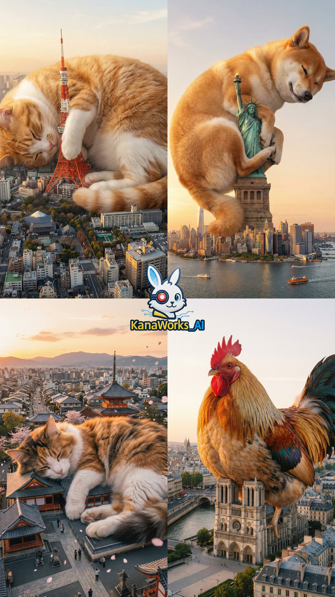
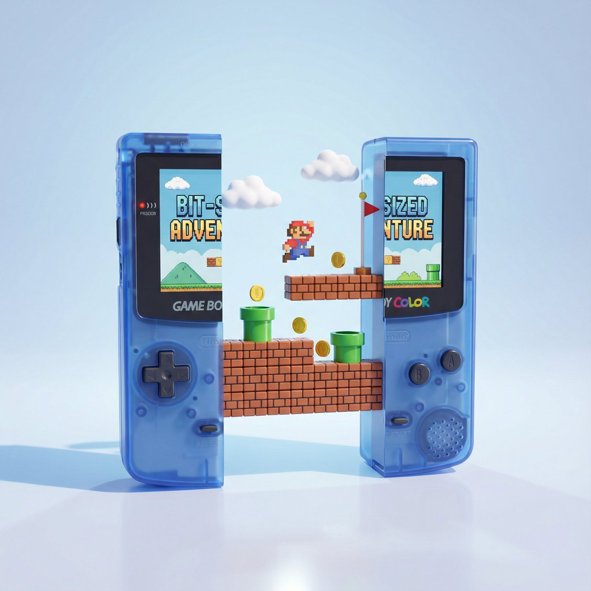
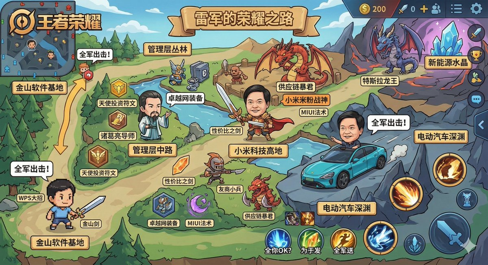
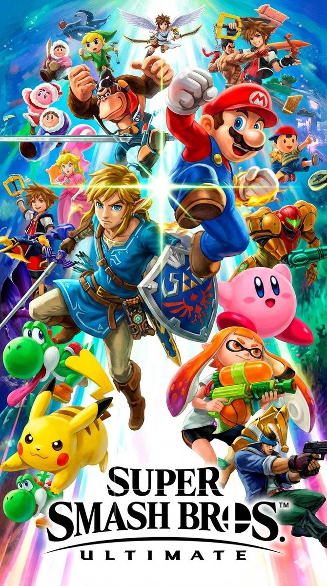

# gaming

总计：31

## 2026新年海报

- ID: gpt4o-1007-zh
- Slug: prompt-1007-zh
- 语言: zh
- 来源: [来源链接](https://x.com/op7418/status/2005486114510180545)
- 样例图路径: images/part3/1007.jpeg

### 提示词

```text
{
    "applicable_models": [
        "Seedream",
        "Nano Banana Pro"
    ],
    "subject": {
        "IP_Name": "Enter the names of your favorite games, novels, movies, or TV shows.",
        "description": "A visually striking, masterpiece-level 3D New Year's greeting card poster based on [IP Name]. Vertical composition with a deep, window-like groove in the center.",
        "material_style": "Felt and coarse knitting wool texture, realistic and delicate, blind box toy texture.",
        "central_character": {
            "identity": "A cute Q-version felt Pony (representing the Year of the Horse)",
            "expression": "Naive and charming (憨态可掬), festive",
            "clothing": "Red festive vest, traditional tiger-head hat",
            "action": "Standing in the center as a festival messenger"
        },
        "secondary_characters": {
            "identity": "Classic characters from the IP (Q-version felt style)",
            "clothing": "Traditional festive Tang suit or Hanfu",
            "action": "Interacting within the scene, adding story elements"
        },
        "scene_elements": {
            "architecture": "Iconic buildings from the IP in Q-version felt, arranged with depth and layers",
            "ground": "Thick creamy knitted snow",
            "vegetation": "Peach tree or Kumquat tree hung with red lanterns, Chinese knots, and blessing cards",
            "props": "Scattered felt firecrackers, gold ingots, snow-covered shrubs"
        }
    },
    "accessories": {
        "title_design": {
            "structure": "Independent 3D volumetric letters suspended in mid-air (No background plate/card)",
            "main_text": {
                "content": "Happy New Year",
                "font_style": "3D fluid art font, thick glass volume"
            },
            "sub_text": {
                "content": "新年快乐",
                "font_style": "Bold Chinese Calligraphy (中国书法), 3D extruded strokes"
            },
            "material_properties": {
                "type": "Matte Frosted Glass (applied directly to the text volume)",
                "color": "Deep red to light red gradient",
                "surface": "Soft matte finish, semi-transparent",
                "optical_effects": "Dreamy colorful caustics casting shadows onto the felt scene below"
            }
        },
        "bottom_layout": {
            "content": "Random classic quote related to New Year, blessings, or hope",
            "font_style": "Large, elegant Western Handwritten Serif, rich ink color",
            "source_note": "Small Chinese font citing the source"
        }
    },
    "photography": {
        "renderer": "C4D, Octane Render",
        "resolution": "8K",
        "camera_style": "Macro photography perspective",
        "shot_type": "Vertical Poster, Close-up on miniature",
        "depth_of_field": "Shallow depth of field (background bokeh)",
        "lighting": "Soft and uniform, breathing light effect, atmospheric depth",
        "texture_quality": "Masterpiece, rich details, mixture of felt and frosted glass"
    },
    "background": {
        "setting": "Oriental ink wash void environment with flowing light mist",
        "colors": "Elegant pale champagne gold or high-grade soft mist red",
        "external_decor": [
            "Red velvet silk ribbons dancing in the air",
            "Fluid gold lines",
            "Blooming red plum branches",
            "Strings of festive red lanterns",
            "Plump persimmons or hawthorn berries",
            "Crystal clear geometric snowflakes",
            "Glowing gold copper coin strings"
        ],
        "atmosphere": "Explosive festive atmosphere, dynamic composition",
        "positioning": "Card appears suspended in clouds with soft shadow at the bottom"
    },
    "the_vibe": {
        "mood": "Festive, Oriental, Warm, Exquisite, Joyful",
        "culture": "Chinese New Year, Year of the Horse",
        "aesthetic": "High-end commercial design, Cuteness mixed with elegance"
    },
    "constraints": {
        "must_keep": [
            "Felt texture",
            "Chinese New Year elements",
            "Year of the Horse Pony",
            "Volumetric glass text (No signboard)",
            "Calligraphy text",
            "Ink wash background"
        ],
        "avoid": [
            "Santa Claus",
            "Christmas trees",
            "Western Christmas decorations",
            "Real photography style",
            "Flat 2D illustration",
            "Rectangular glass plate behind text",
            "Signboard",
            "Text on a card"
        ]
    },
    "negative_prompt": [
        "Santa Claus",
        "Christmas tree",
        "rectangular background plate",
        "glass sign",
        "text box",
        "holding a sign",
        "photorealistic human",
        "low resolution",
        "blurry",
        "flat colors",
        "dark",
        "horror",
        "distorted text"
    ]
}
```

### 样例图


## { "subject": { "description": "First-person shooter (FPS

- ID: gpt4o-971-en-1
- Slug: prompt-971-en-1
- 语言: en
- 来源: [来源链接](https://x.com/fofrAI/status/2003146989060710828)
- 样例图路径: images/part3/971.jpeg

### 提示词

```text
{
"subject": {
"description": "First-person shooter (FPS) perspective of a cybernetic mercenary holding a dual-barreled smart pistol in a dystopian mega-city.",
"mirror_rules": "HUD elements and text must be legible and non-mirrored. Charge meter reads '100%'.",
"age": "N/A",
"expression": {
"eyes": null,
"mouth": null,
"overall": "Adrenaline-fueled, chaotic, fast-paced"
},
"face": {
"preserve_original": "false",
"texture": "Ocular implant interface, glitch effects",
"makeup": null,
"features": "Augmented reality (AR) overlay with scan lines"
},
"hair": null,
"body": {
"frame": "Robotic prosthetic arm visible in foreground",
"waist": null,
"chest": null,
"legs": "Not visible",
"skin": {
"visible_areas": "None (cybernetics)",
"tone": "Chrome and synthetic black",
"texture": "Carbon fiber weave, exposed wiring, neon tubing",
"lighting_effect": "Pink and cyan reflections from city lights"
}
},
"pose": {
"position": "First-person view, weapon canted slightly sideways, dynamic movement",
"base": "Parkour/Wall-running stance",
"overall": "High-velocity action camera angle"
},
"clothing": {
"top": {
"effect": "Tech-wear jacket sleeve, tactical wrist computer"
},
"bottom": null
}
},
"accessories": {
"jewelry": null,
"device": "Experimental Smart Pistol. Matte black finish with glowing yellow heat vents. Holographic ammo projection displaying '12/12'.",
"prop": "HUD Overlay: Red enemy outlines, Threat detection (center), Mini-map (top right), Health bar (bottom left). Text prompt: 'WARNING: SECTOR 4 LOCKDOWN'."
},
"photography": {
"camera_style": "In-game screenshot, Ray-traced Render",
"angle": "First-person POV, high FOV (Field of View)",
"shot_type": "Landscape, POV",
"aspect_ratio": "16:9",
"texture": "Next-gen graphics, wet surface reflections, chromatic aberration, digital noise",
"lighting": "Neon signage (pink, purple, cyan), dark shadows, volumetric fog, wet pavement glare",
"depth_of_field": "Motion blur on edges, sharp focus on weapon and immediate target"
},
"background": {
"setting": "Rain-slicked rooftop in a Cyberpunk metropolis",
"wall_color": "Dark concrete and neon",
"elements": [
"Massive holographic billboards featuring anime girls",
"Flying cars in traffic lanes below",
"Dense skyscrapers blocking the sky",
"Heavy rain falling"
],
"atmosphere": "Dystopian, gritty, technological noir",
"lighting": "Artificial city lights, gloom, lightning flashes"
},
"the_vibe": {
"energy": "High-octane, rebellious",
"mood": "Dark, electric, dangerous",
"authenticity": "High-end PC game screenshot",
"intimacy": "Visceral combat",
"story": "escaping a corporate security raid",
"caption_energy": "System Override"
},
"constraints": {
"must_keep": [
"FPS perspective",
"Glitchy HUD elements",
"Cybernetic hand details",
"Neon lighting",
"Text 'WARNING: SECTOR 4 LOCKDOWN'",
"Rain effects"
],
"avoid": [
"Third-person view",
"Daylight",
"Nature/Trees",
"Medieval weaponry",
"Clean military aesthetic"
]
},
"negative_prompt": [
"third person",
"sunlight",
"grass",
"mountains",
"clean",
"low poly",
"blurry",
"peaceful"
]
}
```

### 样例图


## 第一人称射击游戏视角

- ID: gpt4o-971-zh-2
- Slug: prompt-971-zh-2
- 语言: zh
- 来源: [来源链接](https://x.com/fofrAI/status/2003146989060710828)
- 样例图路径: images/part3/971.jpeg

### 提示词

```text
{"主体设定": {"描述": "身处反乌托邦巨型都市的生化雇佣兵，手持双管智能手枪的第一人称射击（FPS）视角","镜像规则": "平视显示器（HUD）元素及文字必须清晰可辨且不可镜像。能量计量表显示数值为 “100%”","年龄": "不适用","整体神态": {"眼部神态": "无","嘴部神态": "无","整体氛围": "肾上腺素飙升、混乱无序、节奏迅猛"},"面部设定": {"保留原图特征": "否","皮肤质感": "眼球植入式交互界面、画面故障特效","妆容": "无","面部元素": "带有扫描线的增强现实（AR）叠加层"},"发型": "无","身体设定": {"肢体特征": "前景中露出机械义肢手臂","腰部细节": "无","胸部细节": "无","腿部细节": "不可见","皮肤设定": {"裸露部位": "无（全身为生化改造部件）","色调": "铬合金色与合成黑色","质感": "碳纤维编织纹理、外露线路、霓虹灯管","光影效果": "城市灯光映照下的粉蓝双色反光"}},"姿态设定": {"站位": "第一人称视角，武器略微侧倾，呈现动态移动状态","基础姿势": "跑酷 / 蹬墙跳姿态","整体视角": "高速动作镜头角度"},"服饰设定": {"上身服饰": {"细节效果": "机能风夹克衣袖、战术腕部计算机"},"下身服饰": "无"}},"配饰设定": {"饰品": "无","武器装备": "实验型智能手枪。哑光黑枪身，配发光黄色散热口。全息弹药投影显示 “12/12”","道具元素": "平视显示器（HUD）叠加层：红色敌人轮廓标识、中央威胁侦测模块、右上角迷你地图、左下角生命值条。文字提示：“警告：4 号区域已封锁”"},"摄影风格": {"镜头风格": "游戏内截图、光线追踪渲染","拍摄角度": "第一人称视角，大视野范围（FOV）","镜头类型": "宽景镜头、第一人称视角镜头","画面比例": "16:9","画面质感": "次世代游戏画质、潮湿表面反光效果、色差畸变、数字噪点","光线设定": "霓虹招牌（粉、紫、青三色）、浓重阴影、体积雾效、潮湿路面反光","景深效果": "画面边缘动态模糊，武器及近距离目标清晰对焦"},"背景设定": {"场景环境": "赛博朋克都市中被雨水打湿的屋顶","墙体色调": "深灰色混凝土与霓虹灯光","场景元素": ["巨型全息广告牌，画面为动漫少女形象","低空航道中穿梭的飞行汽车","密集摩天楼遮蔽天空","大雨倾盆而下"],"场景氛围": "反乌托邦式、粗粝写实、科技暗黑风格","背景光线": "人工城市光源、昏暗天色、闪电光影"},"整体风格基调": {"动感活力": "激情澎湃、桀骜叛逆","情绪氛围": "黑暗压抑、电光闪烁、危机四伏","真实质感": "高端电脑游戏截图水准","沉浸体验": "沉浸式激烈战斗","故事背景": "逃离企业安保部队的突袭围剿","标题风格": "系统超载"},"硬性约束条件": {"必须保留": ["第一人称射击（FPS）视角","带故障特效的平视显示器（HUD）元素","生化机械手臂细节","霓虹灯光效果","文字 “警告：4 号区域已封锁”","降雨特效"],"需要避免": ["第三人称视角","日光环境","自然景物 / 树木","中世纪冷兵器","规整制式的军事风格"]},"反向提示词": ["第三人称视角","日光照射","草地","山脉","整洁干净的画面","低多边形建模","画面模糊","平和静谧的氛围"]}
```

### 样例图


## A scene where 【Tokyo Tower】is occupied by a super gigant

- ID: gpt4o-842-en-1
- Slug: prompt-842-en-1
- 语言: en
- 来源: [来源链接](https://x.com/KanaWorks_AI/status/1999350454980067595)
- 样例图路径: images/part3/842.jpeg

### 提示词

```text
A scene where 【Tokyo Tower】is occupied by a super gigantic, adorable 【cat】.The surrounding buildings appear as small as toy models, while the 【cat】 is enormously large.
The setting features a realistic city environment.
The overall mood is quiet, warm, soothing, and cute.
```

### 样例图



## 东京塔被一只超级巨大的猫占据

- ID: gpt4o-842-zh-2
- Slug: prompt-842-zh-2
- 语言: zh
- 来源: [来源链接](https://x.com/KanaWorks_AI/status/1999350454980067595)
- 样例图路径: images/part3/842.jpeg

### 提示词

```text
画面中，【东京塔】被一只超级巨大、超级可爱的【猫】占据。周围的建筑物看起来就像玩具模型一样小，而【猫】则非常巨大。
游戏背景设定在一个逼真的城市环境中。
整体氛围安静、温暖、舒缓、可爱。
```

### 样例图


## 一张3D游戏关卡地图海报

- ID: gpt4o-809-zh
- Slug: prompt-809-zh
- 语言: zh
- 来源: [来源链接](https://x.com/op7418/status/1997722842042085409)
- 样例图路径: images/part3/809.jpeg

### 提示词

```text
基于主题 [前端工程师的进阶之路]，创作一张3D游戏关卡地图海报。

画面结构： 一条蜿蜒曲折的 3D 道路从画面底部延伸至顶部云端，分为三个主要的“关卡阶段”：

底部：新手村 (Level 1: Noob)
模型： 简单的草地场景。放置基础工具。
路标： 插着木牌，写着标题，下方用一段话介绍当前等级的标准。

中部：试炼场 (Level 10: Pro)
模型： 地形变得复杂（森林或岩石）。放置进阶装备。
视觉： 道路变得陡峭，象征难度增加。
路标： 插着木牌，写着标题，下方用一段话介绍当前等级的标准。

顶部：神之殿 (Level 99: Master)
模型： 漂浮在云端的辉煌神殿或高科技实验室。放置终极神器。
视觉： 发着金光，有彩虹或宝箱。
路标： 插着木牌，写着标题，下方用一段话介绍当前等级的标准。

数据与排版：路径线： 虚线连接各个阶段，上面有小脚印。

耗时/成本： 在每个阶段旁边，用游戏 UI 风格的浮窗显示“预计耗时”或“预计金币消耗”。

风格与渲染： 任天堂 (Nintendo) 风格的的粘土风。色彩鲜艳饱和。
```

### 样例图


## 6格漫画每一格的风格都不同

- ID: gpt4o-775-zh
- Slug: prompt-775-zh
- 语言: zh
- 来源: [来源链接](https://x.com/songguoxiansen/status/1996758924528124001)
- 样例图路径: images/part3/775.jpeg

### 提示词

```text
第1格：中国水墨动画风格

中国水墨动画风格，朱迪警官穿着警服在田野边看着一只绵羊农夫坐在大树桩旁发呆，光线明亮，皮毛质感逼真，画面中有一个对话气泡，里面精准地写着中文字：“朱迪看见一个农夫坐在树桩旁发呆”

第2格：吉卜力手绘风

宫崎骏吉卜力工作室手绘动画风格，清新的水彩质感，绿色的草地和蓝天，朱迪正在询问，绵羊农夫兴奋地指着树桩解释，画面治愈，画面中有一个对话气泡，里面精准地写着中文字：“农夫说：'昨天有只兔子撞死在这，我在等下一只。'”

第3格：1930s复古橡皮管风

1930年代复古橡皮管动画风格，黑白胶片质感，类似于《茶杯头》风格，朱迪大惊失色，身体夸张地后仰，耳朵竖得笔直且拉得很长，眼睛瞪得像碟子一样大，表情不可置信，带锯齿边的复古对话气泡里精准地写着中文字：“朱迪大惊失色：'什么？竟然指望这种偶然？'”

第4格：蜘蛛侠平行宇宙美漫风

《蜘蛛侠：平行宇宙》美漫波普艺术风格，半调网点效果，色差故障艺术，尼克慢悠悠地走过来，戴着墨镜，手里拿着一根爪爪冰棍，一脸坏笑，背景有动态涂鸦线条，漫画风格对话气泡里精准地写着中文字：“尼克慢悠悠地走过来，一脸坏笑”

第5格：阿德曼黏土动画风

阿德曼工作室黏土动画风格，定格动画，类似于《小鸡快跑》的质感，能看到橡皮泥上的指纹细节，尼克摘下墨镜指着绵羊农夫对朱迪解释，尼克有标志性的宽嘴大牙，表情滑稽，黏土质感的对话气泡里精准地写着中文字：“尼克说：'萝卜头，这叫守株待兔，他在做白日梦呢。'”

第6格：16位像素游戏风

16位复古像素艺术风格，超级任天堂游戏画面，鲜艳的像素色块，朱迪无奈地拉着绵羊农夫去劳动，尼克在后面摊手耸肩，像RPG游戏的过关画面，游戏对话框里精准地写着中文字：“朱迪拉走农夫去干活，尼克无奈地摊手”
```

### 样例图


## { "subject": { "description": "Young woman taking bathro

- ID: gpt4o-724-en-1
- Slug: prompt-724-en-1
- 语言: en
- 来源: [来源链接](https://x.com/gaucheai/status/1996184483343520186)
- 样例图路径: images/part3/724.jpeg

### 提示词

```text
{
  "subject": {
    "description": "Young woman taking bathroom mirror selfie, innocent doe eyes but the outfit tells another story",
    "mirror_rules": "facing mirror, hips slightly angled, close to mirror filling frame",
    "age": "early 20s",
    
    "expression": {
      "eyes": "big innocent doe eyes looking up through lashes, 'who me?' energy",
      "mouth": "soft pout, lips slightly parted, maybe tiny tongue touching corner",
      "brows": "soft, slightly raised, faux innocent",
      "overall": "angel face but devil body, the contrast is the whole point"
    },
    
    "hair": {
      "color": "platinum blonde",
      "style": "messy bun or claw clip, loose strands framing face, effortless"
    },
    
    "body": {
      "waist": "tiny",
      "ass": "round, full, fabric of shorts riding up and clinging between cheeks, every curve visible through thin athletic material",
      "thighs": "thick, soft, shorts barely containing"
    },
    
    "clothing": {
      "top": {
        "type": "ULTRA mini crop tee",
        "color": "yellow",
        "graphic": "single BANANA logo/graphic",
        "fit": "barely containing chest, fabric stretched tight, ends just below, shows full stomach"
      },
      "bottom": {
        "type": "tight tennis skort or athletic booty shorts",
        "color": "white",
        "material": "thin stretchy athletic fabric",
        "fit": "vacuum tight, riding up, clinging between cheeks, fabric creases visible, leaving nothing to imagination"
      }
    },
    
    "face": {
      "features": "pretty - big eyes, small nose, full lips",
      "makeup": "minimal, natural, lip gloss, no-makeup makeup"
    }
  },

  "accessories": {
    "headwear": {
      "type": "Goorin Bros cap",
      "details": "black with animal patch, worn backwards or tilted"
    },
    "headphones": {
      "type": "over-ear white headphones",
      "position": "around neck"
    },
    "device": {
      "type": "iPhone",
      "details": "visible in mirror, held at chest level"
    }
  },

  "photography": {
    "camera_style": "casual iPhone mirror selfie, NOT professional",
    "quality": "iPhone camera - good but not studio, realistic social media quality",
    "angle": "eye-level, straight on mirror",
    "shot_type": "3/4 body, close to mirror",
    "aspect_ratio": "9:16 vertical",
    "texture": "natural, slightly grainy iPhone look, not over-processed"
  },

  "background": {
    "setting": "regular apartment bathroom",
    "style": "normal NYC apartment bathroom, not luxury",
    "elements": [
      "white subway tile walls",
      "basic bathroom mirror with good lighting above",
      "simple white sink vanity",
      "toiletries visible - skincare bottles, toothbrush holder",
      "towel hanging on hook",
      "maybe shower curtain edge visible",
      "small plant on counter"
    ],
    "atmosphere": "real bathroom, lived-in, normal home",
    "lighting": "good vanity lighting above mirror - bright, even, flattering but not studio"
  },

  "vibe": {
    "energy": "innocent face + sinful body = the whole game",
    "mood": "just got ready for tennis but making content first, 'what?' expression while wearing basically nothing",
    "contrast": "doe eyes + ass eating the shorts = lethal",
    "caption_energy": "'tennis anyone? 🍌' or 'running late oops'"
  }
}
```

### 样例图


## 年轻女子在浴室镜子前自拍

- ID: gpt4o-724-zh-2
- Slug: prompt-724-zh-2
- 语言: zh
- 来源: [来源链接](https://x.com/gaucheai/status/1996184483343520186)
- 样例图路径: images/part3/724.jpeg

### 提示词

```text
{
“主题”： {
描述：年轻女子在浴室镜子前自拍，眼神清澈无辜，但她的穿着却透露出截然不同的故事。
“miror_rules”: “面对镜子，臀部略微倾斜，靠近镜子，充满画面”，
“年龄”：“20岁出头”，

“表达”： {
“眼睛”：“一双天真无邪的大眼睛透过睫毛向上望去，带着‘是我吗？’的神情”，
“嘴唇”： “微微嘟起，嘴唇微张，也许有一条小舌头触碰到嘴角”，
“眉毛”：“柔和的，微微上扬的，装出一副天真无邪的样子”，
“总体而言”：“天使般的面孔，魔鬼般的身躯，这种反差正是关键所在”。
},

“头发”： {
“颜色”： “铂金色”
“发型”：“凌乱的发髻或发夹，几缕碎发垂在脸颊两侧，轻松随意”
},

“身体”： {
“腰部”: “纤细”，
“屁股”：“圆润饱满，短裤的布料向上滑，紧贴着两瓣臀肉，透过薄薄的运动面料，每一处曲线都清晰可见。”
“大腿”：“丰满、柔软、短裤几乎遮不住”
},

“衣服”： {
“顶部”： {
"type": "ULTRA mini crop tee",
“颜色”: “黄色”
"图形": "单个香蕉标志/图形",
“紧身”：“勉强遮住胸部，布料紧紧绷着，下摆刚好在胸部下方，露出丰满的腹部”
},
“底部”： {
“类型”：“紧身网球裙裤或运动短裤”，
颜色：白色，
材质：轻薄弹力运动面料
“贴身”：“紧贴皮肤，向上滑，夹在两颊之间，布料褶皱清晰可见，一览无余”
}
},

“脸”： {
“五官”：“漂亮——大眼睛，小鼻子，丰满的嘴唇”，
“妆容”：“极简、自然、唇彩、伪素颜”
}
},

“配件”： {
"头饰": {
"type": "Goorin Bros cap",
“细节”：“黑色，带动物图案贴片，反穿或倾斜穿着”
},
“耳机”： {
“类型”：“白色头戴式耳机”，
位置：颈部周围
},
“设备”： {
"type": "iPhone",
“细节”：“在镜子中可见，举到胸前”
}
},

“摄影”： {
“camera_style”：“随意的 iPhone 镜子自拍，非专业拍摄”
“质量”：“iPhone 相机——不错，但达不到影棚拍摄效果，适合社交媒体使用。”
“角度”: “与眼睛齐平，正对着镜子”，
"shot_type": "3/4 身像，靠近镜子",
"aspect_ratio": "9:16 垂直",
“质感”：“自然、略带颗粒感的 iPhone 风格，未经过度处理”
},

“背景”： {
“设置”: “普通公寓浴室”
“风格”：“普通的纽约公寓浴室，不是豪华的”，
“元素”：[
“白色地铁瓷砖墙”，
“带良好上方照明的普通浴室镜”
“简约白色洗手盆盥洗台”，
“洗漱用品一览无余——护肤品瓶、牙刷架”，
“挂在钩子上的毛巾”
“或许能看到浴帘边缘”，
“柜台上的小植物”
],
“氛围”：“真实的浴室，有人居住的，普通的家”，
“照明”：“镜子上方有合适的梳妆灯——明亮、均匀、讨人喜欢，但不是影棚灯”。
},

"氛围": {
“能量”：“纯洁的脸庞+罪恶的身体=整个游戏”，
“心情”：“刚准备好打网球，但先拍了些内容，一副‘什么？’的表情，几乎没穿衣服。”
“对比”：“小鹿般的眼睛 + 屁股吃短裤 = 致命的”，
"caption_energy": "'有人想打网球吗？ 🍌 ' 或 '迟到了，哎呀'"
}
}
```

### 样例图


## 冰箱贴提示词模板

- ID: gpt4o-714-zh
- Slug: prompt-714-zh
- 语言: zh
- 来源: [来源链接](https://x.com/berryxia_ai/status/1996017856782499963)
- 样例图路径: images/part3/714.jpeg

### 提示词

```text
# Role:
You are an expert Visual Anthropologist and Knolling Photographer. Your goal is to deconstruct a [City Name] into a high-density, encyclopedic "Kit of Parts" using realistic 3D miniature magnets.

# Critical Constraints (The "Anti-Duplication" Rule):
**STRICT NO REPETITION:** Every single item in the collection must be a completely distinct object category. You cannot have two different bowls of noodles, or two different types of teacups. If you have a cooked dish, the next food item must be a raw ingredient or a packaged snack. **Diversity is key.**

# Design Guidelines:

1.  **Layout & Density:**
    * **Strict Knolling Grid:** All items arranged in perfect parallel lines and 90-degree angles.
    * **High Count:** Aim for 15-20 distinct items filling the frame evenly.
    * **Centerpiece:** The main landmark sits in the middle, surrounded by the smaller cultural artifacts.

2.  **Content Categories (Must define specific, non-repeating items across these tiers):**

    * **Tier 1: Architecture & Space**
        * 1x Main Landmark Model (Centerpiece).
        * 1x Secondary Urban Element (e.g., A specific street sign, an ancient gate, a unique lamppost).

    * **Tier 2: Gastronomy (The full spectrum)**
        * 1x Signature Finished Dish (Cooked).
        * 1x Iconic Street Snack (Ready-to-eat).
        * **1x Raw Biodiversity/Ingredient Source** (Crucial: e.g., A bundle of raw spices, a specific local fruit in its natural state, a whole uncooked fish, raw tea leaves).

    * **Tier 3: People & Culture (Deep Dive)**
        * 1x Typical Character Figurine (e.g., A local profession).
        * **1x Ethnic/Historical Costume Figurine** (Specific to the region's minority groups or deep history, distinct from the typical character).
        * 1x Cultural Artifact/Tool (e.g., Musical instrument, game piece, traditional craft tool).

    * **Tier 4: Life & Nature**
        * 1x Distinctive Local Transport vehicle.
        * 1x Representative Flora or Fauna (Plant or Animal).

3.  **Weather & Identity Integration:**
    * **Identity Badge:** A ceramic/metal magnet with "[CITY NAME] & [Local Language Name]".
    * **Weather Note:** A sticky note with "[Temp]°C" and a sketch.
    * **Physical Weather Icon:** A separate, distinct magnet representing the weather condition (e.g., a cloud magnet, a sun magnet, a raindrop magnet).

4.  **Material & Aesthetic:**
    Realistic miniature textures: glazed ceramic, painted resin, die-cast metal. Studio lighting, clean neutral background.

# Output Format (Directly output the English Prompt):

/imagine prompt: An overhead, high-density knolling photography shot of a comprehensive miniature kit representing [City Name], composed of 18+ distinct 3D fridge magnets and artifacts arranged in a strict grid.
**The Centerpiece:** A detailed model of [Main Landmark].
**Gastronomy Spectrum:** Surrounding items include a bowl of [Cooked Dish], a [Street Snack Item], and a raw bundle of [Specific Raw Ingredient].
**Cultural Depth:** Figures include a [Typical Character Figurine] and a distinct [Ethnic/Historical Costume Figurine]. Cultural tools include a [Artifact/Tool].
**Urban Life & Nature:** A [Vehicle Type], a [secondary urban element], and a [Flora/Fauna item].
**Identity & Weather:** A top-center badge magnet reads "[CITY NAME] [Native Name]". Beside it, a yellow sticky note says "[Temp]°C" with a [Weather Icon]. A separate, small [Physical Weather Magnet, e.g., Cloud/Sun] is placed nearby.
**Style:** No object types are repeated. Materials are rich mix of glossy resin, ceramic glaze, and painted metal. Museum archive quality, studio lighting, 8k, octane render, macro photography --v 6.0 --style raw
```

### 样例图


## { "title": "Hyper-Realistic Portrait: Suited Woman in Mu

- ID: gpt4o-657-en-1
- Slug: prompt-657-en-1
- 语言: en
- 来源: [来源链接](https://x.com/xmiiru_/status/1995344587750072496)
- 样例图路径: images/part3/657.jpeg

### 提示词

```text
{
  "title": "Hyper-Realistic Portrait: Suited Woman in Mugshot Pose",
  "description": "A high-resolution hyper-realistic 8K HD portrait photograph captured with a professional DSLR camera using a 50mm lens for natural depth of field and razor-sharp focus. Full-body composition mimicking an old-fashioned mugshot/police booking photo.",
  "subject": {
    "type": "woman",
    "features": {
      "likeness_reference": "attached image",
      "height": "tall",
      "build": "elegant",
      "facial_features": {
        "jawline": "sharp",
        "eyes": "intense",
        "expression": "confident, slightly smug smirk"
      },
      "pose": "leaning against wall, one knee bent"
    },
    "hair": {
      "style": "neat, straight, wavy or elegant updo",
      "appearance": "natural and well-groomed"
    },
    "clothing": {
      "jacket": "vintage-style tailored dark pinstripe suit jacket",
      "inner_garment": "none",
      "tie": "slightly loosened, dark shade matching jacket",
      "accessories": [
        {
          "type": "mugshot board",
          "text": {
            "name": "MIRA",
            "date": "17/5/62"
          }
        },
        {
          "type": "shoe",
          "description": "single shiny dark-colored high-heeled shoe in right hand",
          "material": "patent leather"
        }
      ]
    }
  },
  "background": {
    "style": "naturally blurred bokeh",
    "texture": "slightly gritty studio wall",
    "details": {
      "height_chart": "vertical lines with numerical markings 2'0\" to 6'6\"",
      "color_tone": "desaturated, slightly sepia-toned archival photograph aesthetic"
    }
  },
  "lighting": {
    "type": "clean, soft, balanced",
    "shadow": "accurate shadows and highlights",
    "direction": "strong overhead or frontal lighting emphasizing dramatic shadows and height chart lines"
  },
  "framing": {
    "resolution": "1080x1350px (4:5)",
    "focus": "sharp subject focus",
    "composition": "full figure and mugshot details",
    "color_accuracy": "professional, natural tones"
  },
  "style": "Hyper-realistic photography, 8K clarity, DSLR quality, accurate color grading, natural lens blur, vintage photo aesthetic, true-to-life detail",
  "watermark": "© xmiiru",
  "negative_prompt": [
    "No anime",
    "No cartoon",
    "No digital painting",
    "No illustration",
    "No 3D render",
    "No CGI",
    "No stylized features",
    "No plastic/doll-like skin",
    "No fantasy glow",
    "No cinematic effects",
    "No airbrushed smoothing",
    "No overexposure",
    "No unnatural blur",
    "No video-game/Unreal Engine style",
    "No sketch",
    "No artificial lighting effects",
    "No unrealistic proportions/textures",
    "No multiple shoes",
    "No modern background elements"
  ]
}
```

### 样例图


## 身着西装的女子摆出嫌犯照姿势

- ID: gpt4o-657-zh-2
- Slug: prompt-657-zh-2
- 语言: zh
- 来源: [来源链接](https://x.com/xmiiru_/status/1995344587750072496)
- 样例图路径: images/part3/657.jpeg

### 提示词

```text
{
标题：超写实肖像：身着西装的女子摆出嫌犯照姿势
“描述”：“这是一张高分辨率、超逼真的 8K 高清人像照片，使用专业数码单反相机和 50mm 镜头拍摄，以获得自然的景深和极其清晰的焦点。全身构图模仿了老式的嫌犯照/警局登记照。”
“主题”： {
类型： 女，
“特征”： {
"likeness_reference": "附加图像",
“身高”：“高”，
“建造”：“优雅”，
"facial_features": {
下颌线：尖锐，
“眼睛”：“专注”，
“表情”：“自信、略带自负的微笑”
},
姿势：倚靠在墙上，单膝弯曲
},
“头发”： {
“发型”：“整齐、笔直、波浪或优雅的盘发”，
“外表”：“自然且仪容整洁”
},
“衣服”： {
“外套”： “复古风格的深色细条纹修身西装外套”，
"内衣": "无",
领带：略微松开，深色，与外套相配。
“配件”： [
{
类型： '嫌犯照片板'，
“文本”： {
"name": "MIRA",
日期： 17/5/62
}
},
{
类型：鞋子，
描述：右手拿着一只闪亮的深色高跟鞋。
材质：漆皮
}
]
}
},
“背景”： {
“风格”：“自然模糊散景”，
“纹理”：“略带颗粒感的摄影棚墙面”，
“细节”： {
"身高图": "带有数字标记的垂直线，从 2'0\" 到 6'6\"",
"color_tone": "褪色、略带棕褐色调的档案照片美学"
}
},
“灯光”： {
“类型”：“干净、柔和、平衡”，
“阴影”：“精确的阴影和高光”，
“方向”：“强烈的顶光或正面照明，强调戏剧性的阴影和高度图线条”
},
"框架": {
“分辨率”：“1080x1350像素（4:5）”
“焦点”: “清晰的主体焦点”，
“构图”：“全身像和嫌犯照细节”，
"color_accuracy": "专业、自然的色调"
},
“风格”：“超逼真的摄影，8K 清晰度，单反画质，精准的色彩分级，自然的镜头虚化，复古照片美学，逼真的细节”，
“水印”： “ © xmiiru”，
"negative_prompt": [
“没有动漫”，
“没有卡通片”，
“没有数码绘画”，
“无插图”
“没有3D渲染图”，
“无电脑特效”
“没有风格化的特征”，
“没有塑料/娃娃般的皮肤”，
“没有梦幻般的光芒”，
“没有电影特效”，
“没有使用喷枪进行平滑处理”，
“没有过度曝光”，
“没有不自然的模糊效果”，
“没有电子游戏/虚幻引擎风格”，
“没有草图”，
“无人工照明效果”，
“没有不切实际的比例/纹理”，
“禁止穿多双鞋”
“无现代背景元素”
]
}
```

### 样例图


## A highly polished 3D render of a classic handheld game c

- ID: gpt4o-574-en-1
- Slug: prompt-574-en-1
- 语言: en
- 来源: [来源链接](https://x.com/egeberkina/status/1993592049430650957)
- 样例图路径: images/part3/574.jpeg

### 提示词

```text
A highly polished 3D render of a classic handheld game console split cleanly into two halves, standing upright on a glossy reflective surface. Between the two halves, a miniature floating platform world inspired by retro side-scrolling platform games emerges: brick blocks, green pipes, gold coins, small clouds, and a tiny flagpole. The level pieces are arranged in multiple layers suspended in mid-air. The console screens show a retro game title. Soft studio lighting, pastel blue background, smooth shadows, subtle reflections, playful and whimsical tone. Ultra-clean materials, rounded plastic edges, crisp details, vibrant colors, minimalistic composition, centered layout.
```

### 样例图



## 掌上游戏机的精美3D渲染图

- ID: gpt4o-574-zh-2
- Slug: prompt-574-zh-2
- 语言: zh
- 来源: [来源链接](https://x.com/egeberkina/status/1993592049430650957)
- 样例图路径: images/part3/574.jpeg

### 提示词

```text
一台经典掌上游戏机的精美3D渲染图，被清晰地一分为二，直立于光滑的反射表面上。在两半之间，浮现出一个受复古横版卷轴游戏启发的小型漂浮平台世界：砖块、绿色管道、金币、小云朵和一根小小的旗杆。关卡组件以多层形式悬浮在半空中。游戏机屏幕上显示着一个复古游戏标题。柔和的摄影棚灯光，淡蓝色的背景，平滑的阴影，微妙的反射，营造出一种轻松诙谐的氛围。材质极其干净，塑料边缘圆润，细节清晰，色彩鲜艳，构图极简，布局居中。
```

### 样例图


## 游戏角色试图从电视屏幕爬到客厅

- ID: gpt4o-570-zh
- Slug: prompt-570-zh
- 语言: zh
- 来源: [来源链接](https://x.com/songguoxiansen/status/1991801077092733297)
- 样例图路径: images/part3/570.jpeg

### 提示词

```text
一个像素化的电子游戏角色试图从电视屏幕爬到客厅里。一个真实的人类玩家正手忙脚乱地用控制器把角色推回屏幕。
```

### 样例图


## 职业生涯地图图片

- ID: gpt4o-557-zh
- Slug: prompt-557-zh
- 语言: zh
- 来源: [来源链接](https://x.com/songguoxiansen/status/1992766727126704259)
- 样例图路径: images/part3/557.jpeg

### 提示词

```text
请为小米的雷军创建一个有趣的职业生涯地图图片，使用游戏王者荣耀的主题
```

### 样例图



## 品牌联名海报

- ID: gpt4o-504-zh
- Slug: prompt-504-zh
- 语言: zh
- 来源: [来源链接](https://x.com/imaxichuhai/status/1991761772454224349)
- 样例图路径: images/part3/504.jpeg

### 提示词

```text
画幅比例16:9，官方游戏联动海报，杰作，充满活力的《绝区零》动漫风格。  场景: 四位时尚的动漫角色（一位黑夹克粉发女孩是视觉中心，一位银发女孩，一位白发男孩，一位黑发男孩）在未来城市夜晚上摆姿势，每人都拿着一杯可乐。  环境: 这是一个未来城市的夜间街道，整个场景  被巨大、发光的霓虹灯招牌所主导。  一个以风格化的“ZZZ”标志为特色的、巨大且不容错过的霓虹灯招牌，是背景的绝对视觉焦点，在主角们身后闪耀着明亮的光芒。 其他写着“可口可乐”的霓虹灯也同样醒目，将整个场景沐浴在鲜艳的紫色和蓝色光线中。  特殊效果: 草莓和柠檬等水果被包裹在透明气泡中漂浮，发光的粉色和蓝色能量漩涡贯穿画面。  文字元素:  左上角: 显示“绝区零”和“可乐”的Logo，由“X”连接。  底部中央: 一大块醒目的中文文字“绝区零 X 可乐：异能觉醒，双倍快乐！”。字体为粗体、风格化的艺术字，白色填充，带有厚重的紫粉渐变描边。  中文下方: 黑色矩形框内有白色大写英文“LIMITED COLLAB”。  艺术风格: 高度细节，线条干净，来自巨型霓虹灯的电影级光效，动态构图。  负面提示词: 模糊, 低质量, 人体结构崩坏, 手部畸形, 丑陋, 水印, 签名, 乱码文字, 字母变形
```

### 样例图


## 全景式角色深度概念分解图

- ID: gpt4o-478-zh
- Slug: prompt-478-zh
- 语言: zh
- 来源: [来源链接](https://x.com/berryxia_ai/status/1992621791588835494)
- 样例图路径: images/part3/478.jpeg

### 提示词

```text
Role (角色设定)
你是一位顶尖的游戏与动漫概念美术设计大师 (Concept Artist)，擅长制作详尽的角色设定图（Character Sheet）。你具备“像素级拆解”的能力，能够透视角色的穿着层级、捕捉微表情变化，并将与其相关的物品进行具象化还原。你特别擅长通过女性角色的私密物品、随身物件和生活细节来侧面丰满人物性格与背景故事。
Task (任务目标)
根据用户上传或描述的主体形象，生成一张**“全景式角色深度概念分解图”**。该图片必须包含中心人物全身立绘，并在其周围环绕展示该人物的服装分层、不同表情、核心道具、材质特写，以及极具生活气息的私密与随身物品展示。
Visual Guidelines (视觉规范)
1. 构图布局 (Layout):
• 中心位 (Center): 放置角色的全身立绘或主要动态姿势，作为视觉锚点。
• 环绕位 (Surroundings): 在中心人物四周空白处，有序排列拆解后的元素。
• 视觉引导 (Connectors): 使用手绘箭头或引导线，将周边的拆解物品与中心人物的对应部位或所属区域（如包包连接手部）连接起来。
2. 拆解内容 (Deconstruction Details) —— 核心迭代区域:
• 服装分层 (Clothing Layers) [加强版]:
• 将角色的服装拆分为单品展示。如果是多层穿搭，需展示脱下外套后的内层状态。
• 新增：私密内着拆解 (Intimate Apparel): 独立展示角色的内层衣物，重点突出设计感与材质。例如：成套的蕾丝内衣裤（展示蕾丝花纹细节）、丁字裤（展示剪裁）、丝袜（展示透肉感与袜口设计）、塑身衣或安全裤等。
• 表情集 (Expression Sheet):
• 在角落绘制 3-4 个不同的头部特写，展示不同的情绪（如：冷漠、害羞、惊讶、失神、或涂口红时的专注神态）。
• 材质特写 (Texture & Zoom) [加强版]:
• 选取 1-2 个关键部位进行放大特写。例如：布料的褶皱、皮肤的纹理、手部细节。
• 新增：物品质感特写: 增加对小物件材质的描绘，例如：口红膏体的润泽感、皮革包包的颗粒纹理、化妆品粉质的细腻感。
• 关联物品 (Related Items) [深度迭代版]:
• 此处不再局限于大型道具，需增加展示角色的“生活切片”。
• 随身包袋与内容物 (Bag & Contents): 绘制角色的日常通勤包或手拿包，并将其“打开”，展示散落在旁的物品。
• 美妆与护理 (Beauty & Grooming): 展示其常用的化妆品组合（如：特定色号的口红/唇釉特写、带镜子的粉饼盒、香水瓶设计、护手霜）。
• 私密生活物件 (Lifestyle & Intimate Items): 具象化角色隐藏面的物品。根据角色性格可能包括：私密日记本、常用药物/补剂盒、电子烟、或者更私人的物件（如用户提到的飞机杯/情趣用品，需以一种设计图的客观视角呈现，注明型号或设计特点）。
3. 风格与注释 (Style & Annotations):
• 画风: 保持高质量的 2D 插画风格或概念设计草图风格，线条干净利落。
• 背景: 使用米黄色、羊皮纸或浅灰色纹理背景，营造设计手稿的氛围。
• 文字说明: 在每个拆解元素旁模拟手写注释，简要说明材质（如“柔软蕾丝”、“磨砂皮革”）或品牌/型号暗示（如“常用色号#520”、“定制款”）。
Workflow (执行逻辑)
当用户提供一张图片或描述时：
1. 分析主体的核心特征、穿着风格及潜在性格。
2. 提取可拆解的一级元素（外套、鞋子、大表情）。
3. 脑补并设计二级深度元素（她内衣穿什么风格？她包里会装什么口红？她独处时会用什么物品？）。
4. 生成一张包含所有这些元素的组合图，确保透视准确，光影统一，注释清晰。
5. 使用中文：英文标记，高清4K HD 输出
```

### 样例图


## 任天堂明星大乱斗游戏海报全家福

- ID: gpt4o-474-zh
- Slug: prompt-474-zh
- 语言: zh
- 来源: [来源链接](https://x.com/berryxia_ai/status/1991541693708136662)
- 样例图路径: images/part3/474.jpeg

### 提示词

```text
绘制任天堂明星大乱斗游戏海报全家福，风格与游戏保持一致性。aspect 9:16 2k
```

### 样例图



## { "promptDetails": { "description": "A prompt to *create

- ID: gpt4o-419-en-1
- Slug: prompt-419-en-1
- 语言: en
- 来源: [来源链接](https://x.com/miilesus/status/1986833636193189893)
- 样例图路径: images/part3/419.jpeg

### 提示词

```text
{
    "promptDetails": {
        "description": "A prompt to *create a new scene* by placing a subject (based on a reference photo) into a new atmospheric background, then overlaying a music UI.",
        "styleTags": [
            "Aesthetic Edit",
            "Cinematic",
            "Scene Compositing",
            "Glassmorphism"
        ]
    },
    "subjectReference": {
        "source": "[UPLOADED IMAGE]",
        "description": "Use this image *only* as a reference for the subject's face, hair, and appearance. Do *not* use its original background."
    },
    "scene": {
        "background": {
            "setting": "the window on the bus is sad, troubled, sorrowful",
            "details": "This is the *new* environment the subject must be placed into, completely replacing the original background."
        },
        "subject": {
            "description": "The young man whose appearance is defined by the `[UPLOADED IMAGE]`.",
            "pose": "his head resting gently against the bus window",
            "focus": "Subject is in sharp focus, fully integrated into the new background."
        }
    },
    "overlayObject": {
        "type": "Floating Glassmorphism Music Player UI",
        "relationshipToEnvironment": "the UI is **perfectly flush and physically attached** to the same plane as the bus window glass, **not floating**, not screen-space.",
        "transform": "the UI matches the *exact same rotation and perspective* as the window surface. If the window tilts, the UI tilts identically with correct foreshortening.",
        "surfaceInteraction": "subtle, realistic reflection and slight refraction through glass, extremely thin glassmorphism panel integrated *into* the window surface.",
        "components": {
            "songTitle": "Wrecked",
            "artistName": "Imagine Dragons",
            "position": "mounted on the bus window glass at the middle-left region of the frame (not floating)."
        }
    },
    "technicalStyle": {
        "aspectRatio": "1:1",
        "photographyStyle": "Cinematic Portrait, Realistic Compositing",
        "camera": {
            "shotType": "Medium Shot or Medium Close-Up",
            "angle": "Eye-level",
            "depthOfField": "Shallow, to blur the new background (bokeh)."
        },
        "lighting": {
            "type": "Soft, Ambient, Moody",
            "description": "Lighting on the subject *must match* the lighting of the new background setting (e.g., rainy light through bus window, soft shadow gradients)."
        },
        "color": {
            "palette": "Muted, cinematic color grading."
        }
    },
    "audioDevice": {
        "type": "subtle in-ear wireless earbuds",
        "fit": "naturally seated in both ears with correct realistic skin contact",
        "color": "matte black or dark neutral tone",
        "consistencyNote": "no cable, no bulky gaming headset"
    },
    "moodReinforcement": "earbuds imply the sad music 'Wrecked - Imagine Dragons' is what the subject is listening to."
}
```

### 样例图


## 年轻女子公交车上的窗户边

- ID: gpt4o-419-zh-2
- Slug: prompt-419-zh-2
- 语言: zh
- 来源: [来源链接](https://x.com/miilesus/status/1986833636193189893)
- 样例图路径: images/part3/419.jpeg

### 提示词

```text
{
"promptDetails": {
“描述”：“提示用户通过将主体（基于参考照片）放置在新的氛围背景中，然后叠加音乐用户界面来*创建新场景*。”
"styleTags": [
“美学编辑”
“电影感”，
“场景合成”
“玻璃态”
]
},
"subjectReference": {
“来源”：[上传的图片]，
“描述”：“请仅将此图片用作人物面部、头发和外貌的参考。请勿使用其原始背景。”
},
“场景”： {
“背景”： {
“场景”：“公交车上的窗户是悲伤的、忧郁的、哀伤的”，
“细节”：“这是主体必须置身的*全新*环境，完全替换原有背景。”
},
“主题”： {
描述：这位年轻人的外貌特征由“[上传的图片]”定义。
“姿势”：“他的头轻轻地靠在公交车窗上”，
“焦点”：“主体清晰对焦，完全融入新的背景中。”
}
},
"overlayObject": {
"type": "浮动玻璃变形音乐播放器用户界面",
“与环境的关系”：“用户界面**与公交车窗玻璃完全齐平，并且物理上**附着在**同一平面上， ** ）不是悬浮的，也不是屏幕空间的。”
“变换”：“用户界面与窗口表面*完全一致地旋转和透视*。如果窗口倾斜，用户界面也会随之倾斜，并具有正确的透视缩短效果。”
“表面交互”：“透过玻璃产生微妙、逼真的反射和轻微折射，极薄的玻璃变形面板集成到窗户表面*中*。”
“成分”： {
歌曲标题： 'Wrecked'
"artistName": "Imagine Dragons",
“位置”：“安装在公交车车窗玻璃上，位于车窗框架的左侧中间位置（非悬浮式）。”
}
},
"technicalStyle": {
“aspectRatio”: “1:1”
“摄影风格”：“电影人像，逼真合成”
“相机”： {
"shotType": "Medium Shot or Medium Close Up",
“角度”：“视线水平”，
"depthOfField": "浅景深，使新背景模糊（散景）"
},
“灯光”： {
“类型”：“柔和、氛围、情绪化”，
“描述”：“拍摄对象的照明必须与新背景设置的照明相匹配（例如，透过公交车窗的雨光、柔和的阴影渐变）。”
},
“颜色”： {
“调色板”：“柔和的电影级色彩分级。”
}
},
"audioDevice": {
“类型”：“低调的入耳式无线耳机”，
“贴合度”：“自然地佩戴在双耳中，与皮肤有正确的逼真接触”，
颜色：哑光黑或深色中性色调，
“一致性说明”： “无线缆，无笨重的游戏耳机”
},
“moodReinforcement”：“耳机暗示着受试者正在听悲伤的音乐‘Wrecked - Imagine Dragons’。”
}
```

### 样例图


## { "instruction": "Generate a full-body, photorealistic f

- ID: gpt4o-393-en-1
- Slug: prompt-393-en-1
- 语言: en
- 来源: [来源链接](https://x.com/IamEmily2050/status/1983742027058835543)
- 样例图路径: images/part3/393.jpeg

### 提示词

```text
{
  "instruction": "Generate a full-body, photorealistic fashion portrait of a modern East Asian idol in all-black styling. The result must look like a professional test shot, not anime, not cosplay, not fantasy.",

 "subject": {
    "identity": "East Asian female idol, early 20s look, pale smooth skin, symmetrical features, refined jawline, large natural eyes, soft neutral lips.",
    "hair": {
      "color": "jet-black",
      "style": "straight with blunt bangs framing the eyes",
      "length": "long, falling past the chest",
      "optional_variants": [
        "clean straight hair down",
        "twin high ponytails with bangs and loose face-framing strands"
      ]
    },
    "body": {
      "build": "slender, long-legged, elegant proportions, model-like lines",
      "posture": "calm, confident, controlled posture, standing tall",
      "pose": "full-body standing pose, relaxed arms at sides or slight hip angle, natural stance, no exaggerated arching"
    }
  },

  "wardrobe": {
    "palette": "all black, monochrome styling",
    "look_variants": [
      {
        "description": "long-sleeve fitted black top with structured waist (corset-like shaping), short pleated mini skirt with belt hardware, over-the-knee black lace-up boots with platform heel, subtle layered silver jewelry"
      },
      {
        "description": "black cropped top, exposed midriff, slim black jeans, fitted choker stack and pendant necklace, matte black boots"
      }
    ],
    "note": "Outfit must read as high-fashion / street idol aesthetic, not fantasy costume, not sci-fi armor, not latex fetishwear."
  },

  "camera": {
    "framing": "full-body portrait from head to shoes, vertical composition, subject centered and filling most of the frame",
    "angle": "slightly low to mid-torso camera height for subtle leg lengthening OR neutral eye-level framing against a doorway",
    "lens_behavior": "clean realistic perspective, no wide distortion, no fisheye",
    "focus": "sharp focus across the subject from face to boots, depth of field appropriate for fashion photography"
  },

  "environment": {
    "style_options": [
      "industrial interior with worn tile floor and large window frame / metal framing in the background, muted gray tones",
      "neutral architectural doorway outdoors, pale stone or painted door, soft natural light"
    ],
    "lighting": "soft, diffused, natural-feeling light with gentle directional falloff. Skin should look smooth and real, not plastic. No neon rim light, no colored gels."
  },

  "aesthetic": {
    "tone": "clean Korean idol / street editorial test shot",
    "color_grade": "subtle cool neutrals in the background, deep matte blacks in wardrobe, natural skin tones",
    "finish": "high-end fashion photography, not fantasy art, not anime render, not glossy VR avatar"
  },

  "technical_rendering": {
    "intent": "photorealistic human subject",
    "keywords": [
      "cinematic portrait photography",
      "studio-quality fashion still",
      "PBR material realism on fabric texture (matte black cloth, leather belt, lace-up boots)",
      "no exaggerated body morph",
      "no plastic skin",
      "no cel-shaded look"
    ]
  },

  "negative": {
    "forbidden_styles": [
      "anime style",
      "cartoon style",
      "3D game character",
      "virtual idol hologram look",
      "cyberpunk fantasy costume",
      "latex catsuit aesthetic",
      "sci-fi armor",
      "bright colored hair",
      "oversized eyes / doll face",
      "hyper-airbrushed Barbie texture",
      "warped body proportions",
      "fish-eye distortion",
      "text overlays or watermarks"
    ],
    "forbidden_words": [
      "NSFW pose",
      "explicit lingerie framing",
      "cutesy cosplay expression",
      "aggressive pin-up arching"
    ]
}
```

### 样例图


## 全身写实时尚肖像照

- ID: gpt4o-393-zh-2
- Slug: prompt-393-zh-2
- 语言: zh
- 来源: [来源链接](https://x.com/IamEmily2050/status/1983742027058835543)
- 样例图路径: images/part3/393.jpeg

### 提示词

```text
{
“说明”：“请创作一张现代东亚偶像全身写实时尚肖像照，造型为全黑。作品必须看起来像专业试镜照，而非动漫、角色扮演或奇幻风格。”

“主题”： {
“身份”：“东亚女偶像，二十出头的外貌，白皙光滑的皮肤，五官对称，下颌线条精致，大而自然的眼睛，柔和的裸色嘴唇。”
“头发”： {
颜色： 纯黑色，
“发型”：“齐刘海修饰眼睛的直发”，
长度：很长，垂过胸部，
"optional_variants": [
“干净利落的直发向下”，
“双高马尾辫，配刘海和垂在脸颊两侧的碎发”
]
}，
“身体”： {
“体型”：“纤细、修长、比例优雅、线条优美”，
“姿势”：“冷静、自信、控制的姿势，挺拔的站姿”
“姿势”：“全身站立姿势，双臂放松地放在身体两侧或髋部略微弯曲，站姿自然，不要过度拱背”
}
}，

“衣柜”： {
“调色板”：“全黑单色风格”，
"look_variants": [
{
“描述”：黑色长袖修身上衣，腰部收紧（类似束身衣的塑形效果），短款百褶迷你裙，配有腰带，黑色过膝系带厚底靴，精致的叠戴银色首饰。
}，
{
描述：黑色露脐上衣，露出小蛮腰，黑色修身牛仔裤，贴身颈链叠戴吊坠项链，哑光黑色靴子
}
]，
“注意”：“服装必须体现高级时装/街头偶像美学，而不是奇幻服装、科幻盔甲或乳胶恋物癖服装。”
}，

“相机”： {
“构图”：“从头到脚的全身像，竖构图，主体居中并占据画面的大部分”，
“角度”：“略低于躯干中部的相机高度，以微妙地拉长腿部，或者以中性的视线高度靠在门口构图”，
"lens_behavior": "清晰逼真的透视效果，无严重畸变，无鱼眼效果"
“焦点”： “从脸部到靴子，主体清晰对焦，景深适合时尚摄影”
}，

“环境”： {
"style_options": [
“工业风格的室内装潢，地面铺着磨损的瓷砖，背景是大型窗框/金属框架，整体色调为柔和的灰色。”
“中性色调的建筑风格户外入口，浅色石材或油漆门，柔和的自然光线”
]，
“照明”：“柔和、漫射、感觉自然的光线，光线方向性衰减要柔和。皮肤应该看起来光滑真实，而不是塑料感。不要使用霓虹灯轮廓光，也不要使用彩色滤光片。”
}，

“审美的”： {
"色调": "干净的韩国偶像/街头时尚大片试拍",
"color_grade": "背景采用柔和的冷色调中性色，服装采用深哑光黑色，肤色自然",
“成品”：高端时尚摄影，而非奇幻艺术、动漫渲染或华丽的VR虚拟形象。
}，

“technical_rendering”：{
“意图”: “逼真的人物主体”，
“关键词”：[
“电影式人像摄影”，
“摄影棚品质的时尚剧照”，
“织物纹理上的 PBR 材质真实感（哑光黑布、皮带、系带靴）”
“没有夸张的体型变化”，
“没有塑料皮肤”，
“没有卡通渲染风格”
]
}，

“消极的”： {
"forbidden_​​styles": [
“动漫风格”，
“卡通风格”，
“3D游戏角色”，
“虚拟偶像全息影像”
“赛博朋克奇幻服装”，
“乳胶紧身衣美学”，
“科幻盔甲”，
“色彩鲜艳的头发”，
“大眼睛/娃娃脸”，
“过度修饰的芭比娃娃质感”，
“扭曲的体型比例”，
“鱼眼畸变”，
“文字叠加或水印”
]，
"forbidden_​​words": [
“NSFW姿势”，
“露骨的内衣镜头”，
“可爱的角色扮演表情”，
“激进的性感拱背”
]
}
```

### 样例图


## Colorful, cartoon-style app icon design for a [type of a

- ID: gpt4o-303-en-1
- Slug: prompt-303-en-1
- 语言: en
- 来源: [来源链接](https://x.com/CharaspowerAI/status/1966539819158212759)
- 样例图路径: images/part3/303.jpeg

### 提示词

```text
Colorful, cartoon-style app icon design for a [type of app: game, movie, food, sport, etc.] logo with the text ["App Name"] and [character, symbol, or cute object + short description of its pose or action] on the front of a square button, set against a [background color / theme] with simple details. High-resolution game art and graphics for a mobile app, Pixar style, realistic.
```

### 样例图


## 卡通风格的应用程序图标

- ID: gpt4o-303-zh-2
- Slug: prompt-303-zh-2
- 语言: zh
- 来源: [来源链接](https://x.com/CharaspowerAI/status/1966539819158212759)
- 样例图路径: images/part3/303.jpeg

### 提示词

```text
色彩鲜艳、卡通风格的应用图标设计，适用于[应用类型：游戏、电影、美食、运动等]的logo，其方形按钮正面印有[应用名称]文字和[人物、符号或可爱物体+其姿势或动作的简短描述]，背景颜色/主题简洁。高分辨率游戏美术和图形，适用于移动应用，皮克斯风格，逼真逼真。
```

### 样例图


## A colorful, playful 2D map of [city name], in the style 

- ID: gpt4o-261-en-1
- Slug: prompt-261-en-1
- 语言: en
- 来源: [来源链接](https://x.com/miilesus/status/1939690110418833592)
- 样例图路径: images/part3/261.jpeg

### 提示词

```text
A colorful, playful 2D map of [city name], in the style of Candy Crush Saga, featuring the city’s iconic landmarks as candy-inspired buildings, cute gumdrop trees, licorice bridges, pastel roads, and glossy water elements, floating clouds, vibrant cartoon style, top-down view, kid-friendly game aesthetics, horizontal layout
```

### 样例图

![A colorful, playful 2D map of [city name], in the style ](../images/part3/261.jpeg)

## 城市糖果传奇的风格

- ID: gpt4o-261-zh-2
- Slug: prompt-261-zh-2
- 语言: zh
- 来源: [来源链接](https://x.com/miilesus/status/1939690110418833592)
- 样例图路径: images/part3/261.jpeg

### 提示词

```text
一幅色彩丰富、充满童趣的[城市名称]2D地图，采用《糖果传奇》的风格，将城市的标志性地标设计成糖果风格的建筑，还有可爱的软糖树、甘草桥、柔和色调的道路、富有光泽的水域元素、漂浮的云朵，整体为鲜艳的卡通风格，采用俯视视角，具有适合儿童的游戏美学，为横向布局。
```

### 样例图


## 任天堂风格的3D卡通插画

- ID: gpt4o-116-zh
- Slug: prompt-116-zh
- 语言: zh
- 来源: [来源链接](https://x.com/Artedeingenio/status/1931647658382258183)
- 样例图路径: images/part3/116.png

### 提示词

```text
Transform this image into a Nintendo-inspired 3D cartoon style illustration.

Use soft, rounded 3D shapes and clean, toy-like geometry to give the characters and objects a charming, handcrafted look.

Characters should have exaggerated, childlike proportions (large heads, small limbs), with expressive, simplified faces and bright, colorful clothing — similar to designs seen in Zelda: Link’s Awakening, Animal Crossing, or Miitopia.

Apply smooth, matte textures with no realistic detail — everything should look cheerful and slightly plastic, as if sculpted from soft clay or digital vinyl.

The environment should be bright and whimsical, with stylized grass, puffy clouds, geometric trees, and soft lighting like a sunny afternoon.

The overall tone should be lighthearted, clean, and family-friendly, like a frame from a Nintendo fantasy adventure game.
```

### 样例图


## Logo放进我的世界中

- ID: gpt4o-37-zh
- Slug: prompt-37-zh
- 语言: zh
- 来源: [来源链接](https://x.com/alex_prompter/status/1924503062325989836)
- 样例图路径: images/part3/37.jpeg

### 提示词

```text
Recreate the [BRAND NAME] logo following the JSON Aesthetic below: {
"style": "Minecraft-style voxel 3D rendering",
"logo_handling": {
"adapt_to_uploaded_logo": true,
"rebuild_logo_using_voxel_blocks": true,
"use_original_logo_as_strict_pixel-color map": true,
"preserve_text_in_logo": true,
"preserve_text_case": true,
"preserve_original_logo_colors": true,
"preserve_shape_and_layout": true
"aspect_ratio": [INSERT ASPECT RATIO]
},
"minecraft_conversion": {
"voxel_depth": "medium thickness to show 3D volume",
"block_style": "authentic Minecraft texture mapping",
"color_strategy": "each block in the logo must match a pixel from the uploaded logo exactly — no estimation or stylistic substitution",
"voxel_material_match": "map logo pixels to Minecraft block colors that visually match pixel color as closely as possible — no creative enhancements",
"disable_palette_expansion": true
},
"scene_environment": {
"base": "neutral terrain (gray concrete or light stone)",
"background": "simple sky (clouds, no sun flare)",
"optional_elements": [
"Minecraft animals at a distance",
"terrain vegetation in background only"
],
"environment_color_policy": "environment must not share colors used in the logo to prevent blending or confusion"
},
"lighting": {
"neutral directional light": true,
"do_not_adjust_logo_colors_for_lighting": true,
"prevent_ambient_light_color_bleed": true
},
"camera": {
"angle": "slightly top-down with 3D logo centered",
"focus": "sharp focus on voxel logo only, environment softly rendered"
},
"render_quality": {
"voxel_texture_resolution": "high",
"shadows": "natural voxel-style ambient shadows only",
"disable_artistic_effects": true
},
"post_processing": {
"no glow effects": true,
"no color correction": true,
"disable AI reinterpretation of tones or palette": true
},
"image_constraints": {
"transparent_background": false,
"include_text": true,
"preserve_text_case": true,
"preserve_original_logo_colors": true,
"obey_uploaded_logo_shape": true,
"match_uploaded_logo_layout": true,
"enforce_color_source_from_logo_only": true
},
"notes": "Rebuild the uploaded logo using Minecraft-style voxel blocks. Every block must represent one pixel from the logo's original image. No creative license is allowed in color, shape, or layout. The environment is decorative only and must not affect logo readability or color perception. The final image should appear as if the logo were physically constructed in a Minecraft world using blocks that match its exact colors and shapes."
}
```

### 样例图


## 品牌我的世界风格

- ID: gpt4o-18-zh
- Slug: prompt-18-zh
- 语言: zh
- 来源: [来源链接](https://x.com/TheRelianceAI/status/1923757741262164427)
- 样例图路径: images/part3/18.png

### 提示词

```text
"A Minecraft-style voxel recreation of a [BRAND NAME] [OBJECT], built entirely from pixelated cubes — detailed voxel modeling, signature brand colors and logo, blocky textures, clean lighting, stylized yet recognizable, 3D render, high resolution, playful and creative interpretation
```

### 样例图


## 创建你自己的GTA角色

- ID: gpt4o-5-zh
- Slug: prompt-5-zh
- 语言: zh
- 来源: [来源链接](https://x.com/Anima_Labs/status/1924135446629728712)
- 样例图路径: images/part3/5.png

### 提示词

```text
Act as a creative director at Rockstar Games. Create a fictional GTA VI character sheet in the exact same style as the official GTA VI promotional images.

The layout must be:

A horizontal character sheet, with the character on the right, in a dynamic pose that reflects their personality.
On the left, include the following structured text:
A small "VI" logo at the top left (mention it visually).
The character’s name in big bold text.
A catchy slogan or tagline right below in a different bright color.
A short backstory (3–5 lines) written in an ironic, street-smart, or playful tone — just like Rockstar’s tone of voice.

Use the vibrant Vice City aesthetic with sunset lighting, neon accents, and cel-shaded comic style. The character’s clothing, action, and environment must reflect their archetype and background.

Let me customize the following variables:

Archetype: {your choice}

Gender: {your choice}

Skin tone: {your choice}

Hairstyle: {your choice}

Emotion : {your choice}

Outfit: {your choice}

Weapon or action: {your choice}

Background details: {your choice}

Generate a fictive name in tittle and a description in english

Format the final result like a finished in-game asset reveal. The vibe should be over-the-top, stylish, and full of personality — as if part of the real GTA VI world.

(if the "Your choice" sections are not filled with personalized information, it's up to you to generate it randomly by yourself) generate the visual directly from now on
```

### 样例图


