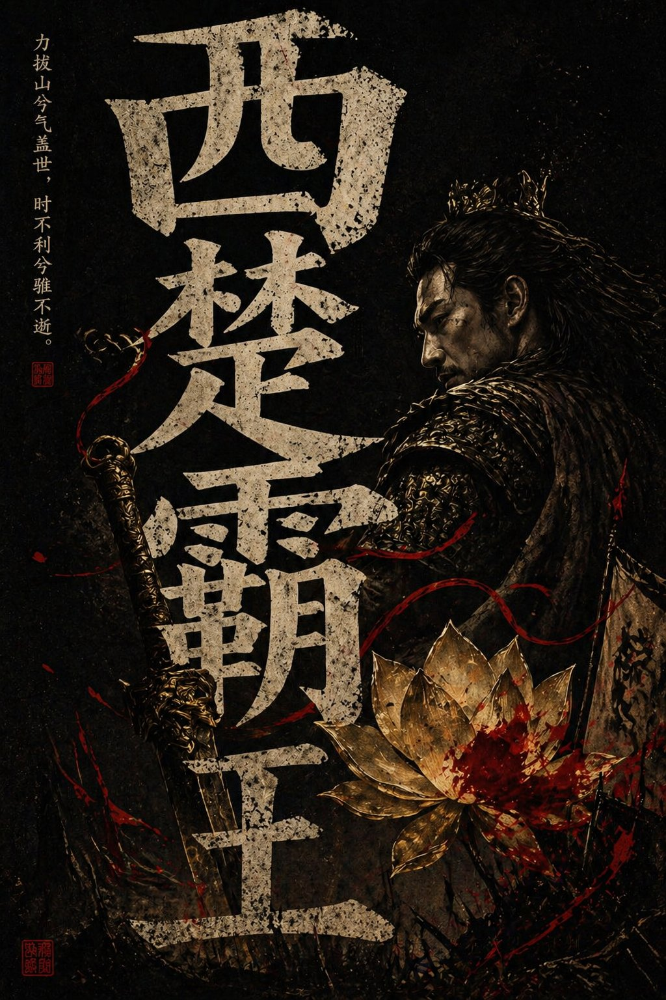

# History & Classical Themes

总计：8

## 古希腊三哲时间轴城市图

- ID: case-375
- Slug: case-375-zh
- 语言: zh
- 来源: [来源链接](https://x.com/ToroJushiAi/status/2050713034503409874)
- 样例图路径: images/part2/case375.jpg

### 提示词

```text
二千五百年前，柏拉图，苏格拉底， 亚力士多德，坐在雅典街头聊天，聊出了世界文明史的源头。

背景可以加上他们聊天内容，按时间轴的走向，重叠在古希腊雅典的城市风光中。
```

### 样例图


## 西楚霸王国风暗黑海报

- ID: case-352
- Slug: case-352-zh
- 语言: zh
- 来源: [来源链接](https://x.com/stellimbris/status/2048633434961072617)
- 样例图路径: images/part2/case352.jpg

### 提示词

```text
竖版国风暗黑海报，黑色纯背景，中央巨大的中文标题字，占据画面大部分空间，字体为粗粝做旧的米白色石刻/旧纸质感，带明显颗粒、磨损、裂痕与噪点；整体构图层次丰富，强烈黑白金红对比，东方审美，神秘、压抑、欲望与审判感并存 电影海报质感 高级平面设计，极致细节 纸张纹理 印章落款 小字标语，4K
```

### 样例图



## 《赤壁怀古》长卷图

- ID: case-338
- Slug: case-338-zh
- 语言: zh
- 来源: [来源链接](https://github.com/freestylefly/awesome-gpt-image-2/blob/main/docs/gallery-part-2.md#case-338)
- 样例图路径: images/part2/case338.png

### 提示词

```text
帮我生成一张《赤壁怀古》的长卷图，带整篇《赤壁赋》文字
```

### 样例图


## 明朝登基宝玉的推文页面

- ID: case-292
- Slug: case-292-zh
- 语言: zh
- 来源: [来源链接](https://x.com/tuzi_ai/status/2045193918736736365)
- 样例图路径: images/part2/case292.jpg

### 提示词

```text
[中文]
创建一个宝玉（查阅 https://x.com/dotey 这个推主的主页及部分推文）穿越到明朝，登基之后依据其业务/个性，绘制的其新的X帖子页面。

[English]
Create a new X post page illustrated for Baoyu (refer to the homepage and some posts of this Twitter user at https://x.com/dotey) after time-traveling to the Ming Dynasty and ascending the throne, based on his business/personality.
```

### 样例图


## 朱元璋登基后的推特主页

- ID: case-234
- Slug: case-234-zh
- 语言: zh
- 来源: [来源链接](https://x.com/liyue_ai/status/2045021302315249738)
- 样例图路径: images/part2/case234.jpg

### 提示词

```text
[中文]
创建一个明朝朱元璋登基之后的X帖子页面

[English]
Create an X post page of Zhu Yuanzhang after his ascension to the throne in the Ming Dynasty
```

### 样例图


## 兰亭集序书法帖意境图

- ID: case-232
- Slug: case-232-zh
- 语言: zh
- 来源: [来源链接](https://x.com/liyue_ai/status/2045137549149286858)
- 样例图路径: images/part2/case232.jpg

### 提示词

```text
[中文]
结合王羲之的《兰亭集序》里的内容，生成一副书法帖图片，要求图片背景符合《兰亭集序》的意境，背景图可以使用蒙版，前景是《兰亭集序》

[English]
Combining the content from Wang Xizhi's "Lantingji Xu", generate a calligraphy copy image, requiring the image background to match the artistic conception of "Lantingji Xu", the background image can use a mask, the foreground is "Lantingji Xu"
```

### 样例图


## 古风明朝帝王群像长卷

- ID: case-226
- Slug: case-226-zh
- 语言: zh
- 来源: [来源链接](https://x.com/liyue_ai/status/2045071977279635962)
- 样例图路径: images/part2/case226.jpg

### 提示词

```text
[中文]
根据上传图片的风格，生成明朝各个皇帝的头像，头像下面有他们的谥号和名字

[English]
Based on the style of the uploaded image, generate portraits of the emperors of the Ming Dynasty, with their posthumous titles and names below the portraits
```

### 样例图


## 大唐玄武门之变的朋友圈

- ID: case-167
- Slug: case-167-zh
- 语言: zh
- 来源: [来源链接](https://x.com/Tz_2022/status/2046523491940225366)
- 样例图路径: images/part2/case167.jpg

### 提示词

```text
[中文]
玄武门之变的朋友圈

[English]
WeChat Moments of the Xuanwu Gate Incident
```

### 样例图


