# Illustration & 3D

总计：370

## { "global_settings": { "resolution": "8K", "quality": "u

- ID: trending-2012437899955097836
- Slug: trending-2012437899955097836-en
- 语言: en
- 来源: [来源链接](https://x.com/meng_dagg695/status/2012437899955097836)
- 样例图路径: images/part1/2012437899955097836_1.jpg

### 提示词

```text
{
  "global_settings": {
    "resolution": "8K",
    "quality": "ultra-high definition",
    "aspect_ratio": "2:3",
    "render_style": "AI-edited, high-detail 3D render",
    "lighting_quality": "soft studio lighting with realistic shadows",
    "sharpness": "extreme clarity, crisp edges",
    "noise": "none",
    "compression": "none"
  },

  "Module_1_Image_1_Style": {
    "subject": {
      "character_type": "stylized 3D cartoon female",
      "pose": "standing, body slightly angled, one hand raised with index finger touching lips",
      "expression": "cheerful smile, wide eyes",
      "hair": {
        "color": "black",
        "style": "two braided pigtails",
        "accessories": "green cap"
      },
      "face": {
        "eyes": "large, rounded, dark pupils",
        "skin": "smooth, matte, stylized texture"
      }
    },
    "clothing": {
      "top": "sleeveless green crop top",
      "bottom": "loose green jogger-style pants with drawstring",
      "footwear": "white sneakers"
    },
    "accessories": {
      "luggage": "green hard-shell suitcase with extended handle"
    },
    "color_palette": [
      "multiple shades of green",
      "white accents"
    ],
    "background": {
      "color": "solid green",
      "texture": "soft, slightly grainy studio backdrop"
    },
    "composition": {
      "framing": "full body",
      "camera_angle": "eye-level",
      "depth": "subject sharply separated from background"
    }
  },

  "Module_2_Image_2_Style": {
    "subject": {
      "character_type": "stylized 3D cartoon female",
      "pose": "leaning slightly backward against background",
      "expression": "playful, lips slightly pursed, eyes looking sideways",
      "hair": {
        "color": "brown",
        "style": "short, tousled",
        "accessories": "red sunglasses resting on head"
      }
    },
    "clothing": {
      "dress": "form-fitting blue ribbed dress with thin straps",
      "footwear": "red high-heel sandals with bow detail"
    },
    "color_palette": [
      "bold red",
      "deep blue"
    ],
    "background": {
      "color": "solid red",
      "texture": "smooth matte surface"
    },
    "lighting": {
      "direction": "soft directional light from one side",
      "shadow": "defined shadow cast on red background"
    },
    "composition": {
      "framing": "full body",
      "pose_emphasis": "curved posture, crossed legs"
    }
  },

  "Module_3_Image_3_Style": {
    "subject": {
      "characters": [
        {
          "type": "stylized 3D cartoon female",
          "position": "left",
          "wrapped_in": "red textured blanket",
          "expression": "calm, slight smile, eyes looking upward"
        },
        {
          "type": "stylized 3D cartoon male",
          "position": "right",
          "wrapped_in": "orange textured blanket",
          "expression": "neutral, gentle gaze upward"
        }
      ]
    },
    "environment": {
      "furniture": "red sofa",
      "floor": "red surface",
      "background": {
        "color": "deep red",
        "texture": "fabric-like horizontal texture"
      }
    },
    "details": {
      "feet": "female barefoot, male wearing socks",
      "blanket_texture": "thick, knitted fabric"
    },
    "composition": {
      "framing": "centered, medium-wide shot",
      "symmetry": "balanced left and right composition"
    }
  },
```

### 样例图

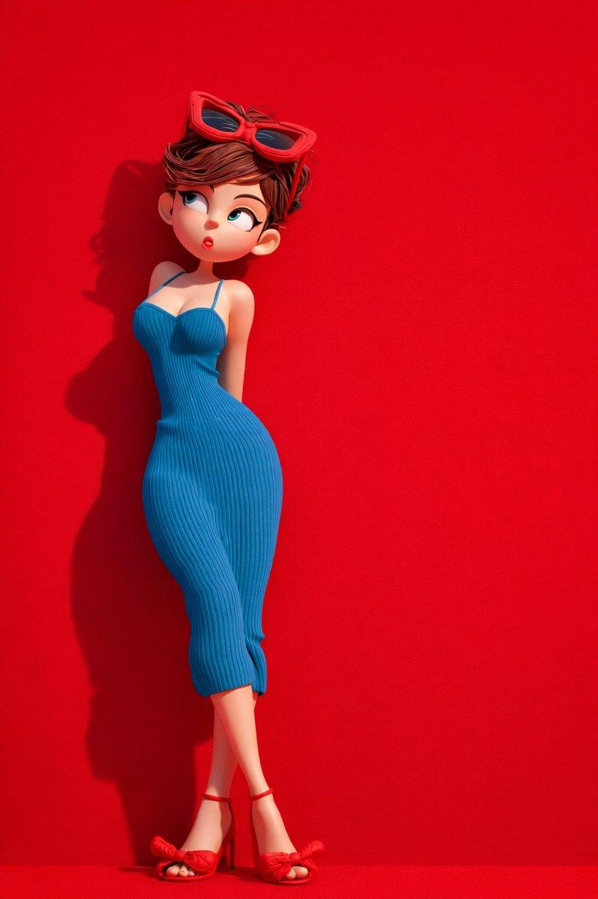

## A handcrafted felt miniature illustration of [Celebrity]

- ID: trending-2011634592810438835
- Slug: trending-2011634592810438835-en
- 语言: en
- 来源: [来源链接](https://x.com/Sheldon056/status/2011634592810438835)
- 样例图路径: images/part1/2011634592810438835_1.jpg

### 提示词

```text
A handcrafted felt miniature illustration of [Celebrity] reimagined as a soft wool doll character. The figure has simplified facial features, button-like eyes, subtle smile, and carefully crafted felt textures. He is wearing an outfit inspired by his iconic casual tech style—dark jacket, simple t-shirt, and trousers—recreated in knitted wool and fabric. The scene has a whimsical, storybook feel with grassy felt terrain, pastel hills, and a bright sky with soft clouds. Macro photography look, shallow depth of field, soft natural lighting, stop-motion animation aesthetic, ultra-detailed fibers and fabric textures, cozy yet futuristic mood, cinematic composition, high quality.
```

### 样例图

![A handcrafted felt miniature illustration of [Celebrity]](../images/part1/2011634592810438835_1.jpg)

## Transform the input photo into a refined monochromatic i

- ID: trending-2024636606272229577
- Slug: trending-2024636606272229577-en
- 语言: en
- 来源: [来源链接](https://x.com/Naiknelofar788/status/2024636606272229577)
- 样例图路径: images/part1/2024636606272229577_1.jpg

### 提示词

```text
Transform the input photo into a refined monochromatic ink portrait on a pure white background. Clean side profile facing left, preserving exact facial identity and proportions. Soft charcoal-gray ink with subtle tonal variation, controlled splatter accents, delicate watercolor diffusion, and faint mist-like dispersion along the edges.
```

### 样例图

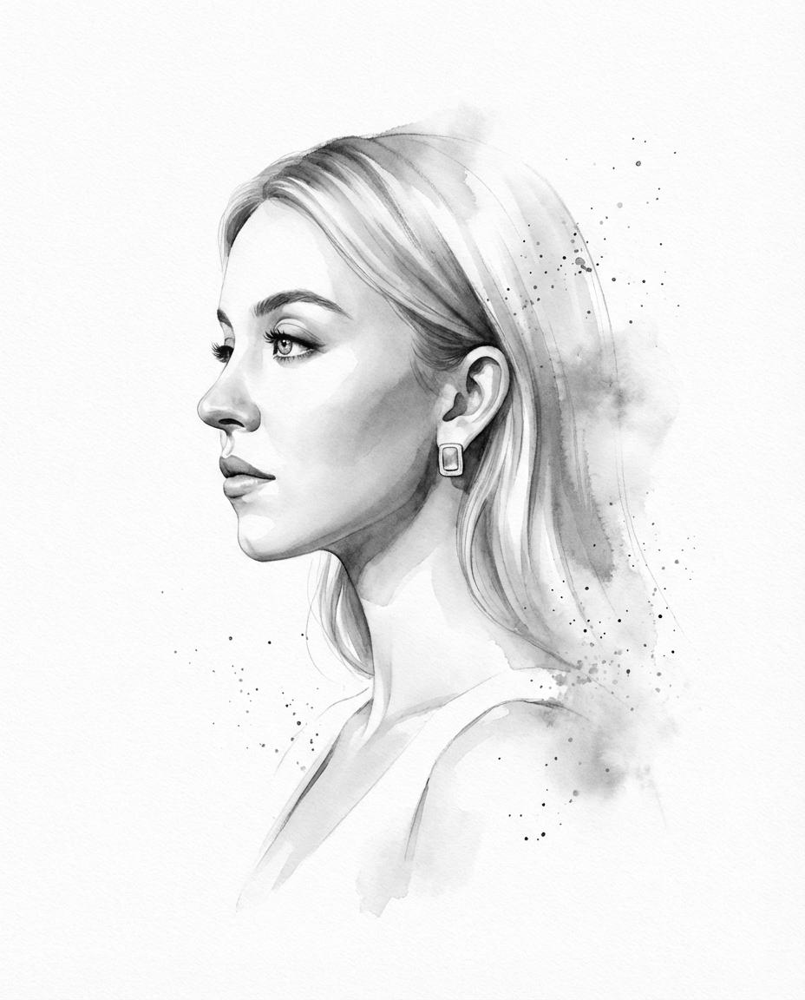

## Create an ultra-HD, hyper-realistic digital poster of a 

- ID: trending-2024277162652815403
- Slug: trending-2024277162652815403-en
- 语言: en
- 来源: [来源链接](https://x.com/Naiknelofar788/status/2024277162652815403)
- 样例图路径: images/part1/2024277162652815403_1.jpg

### 提示词

```text
Create an ultra-HD, hyper-realistic digital poster of a floating miniature island shaped like [Country], resting on white clouds in the sky. Blend iconic landmarks, natural landscapes (like [landmark 1], [landscape 2], or [landscape 3]), and cultural elements unique to [Country]. Carve "[Country]" into the terrain using large white 3D letters. Add artistic details like [wildlife], cinematic lighting, vivid colors, aerial perspective, and sun reflections to enhance realism
```

### 样例图

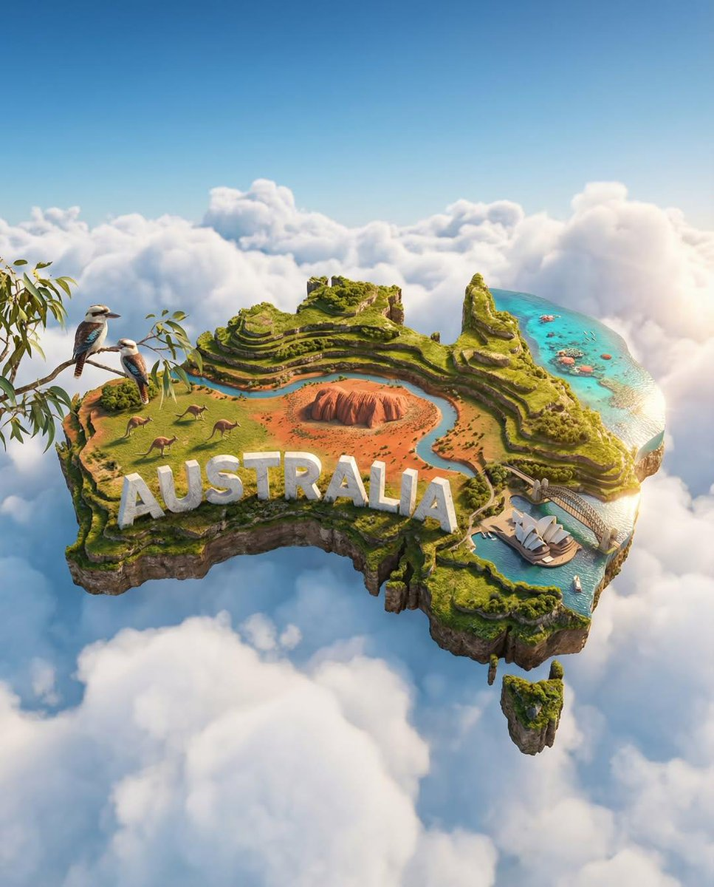

## Minimalist food photograph, [1080x1080] – a single [FOOD

- ID: trending-2008127774750548155
- Slug: trending-2008127774750548155-en
- 语言: en
- 来源: [来源链接](https://x.com/TechieBySA/status/2008127774750548155)
- 样例图路径: images/part1/2008127774750548155_1.jpg

### 提示词

```text
Minimalist food photograph, [1080x1080] – a single [FOOD] rests on a light, matte surface and is captured mid-transformation into a 3D pixelized form: one half remains intact while the other organically fragments into large, floating cubes that drift outward, each cube revealing the object’s texture, ingredients, and colors. Studio lighting with soft, realistic shadows, shallow depth of field, tasteful perspective and composition, hyperrealistic detail, stylish geometric abstraction, subtle motion blur on the cubes, high resolution, cinematic close-up.
```

### 样例图

![Minimalist food photograph, [1080x1080] – a single [FOOD](../images/part1/2008127774750548155_1.jpg)

## { "type": "image_generation", "style": "hyper_realistic"

- ID: trending-2006679801256656925
- Slug: trending-2006679801256656925-en
- 语言: en
- 来源: [来源链接](https://x.com/Strength04_X/status/2006679801256656925)
- 样例图路径: images/part1/2006679801256656925_1.jpg

### 提示词

```text
{
  "type": "image_generation",
  "style": "hyper_realistic",
  "quality": "8K DSLR",
  "aspect_ratio": "4:5",
  "camera": {
    "angle": "slightly tilted cinematic perspective",
    "lens": "50mm DSLR",
    "depth_of_field": "shallow",
    "focus": "smartphone and football action"
  },
  "scene": {
    "setting": "smartphone placed on a wooden table",
    "concept": "phone screen transformed into a miniature football stadium",
    "environment": "indoor, soft daylight coming from the side",
    "atmosphere": "cinematic, immersive, realistic"
  },
  "details": {
    "screen": "weathered green football pitch with visible wear, dirt patches, and grass texture",
    "players": "miniature football players actively playing a match with dynamic poses",
    "lighting": "soft diffused daylight with subtle lens flares and realistic reflections",
    "realism_effects": [
      "fingerprints on screen",
      "light scratches on phone body",
      "natural smudges",
      "micro dust particles"
    ]
  },
  "materials": {
    "phone": "metallic frame with realistic reflections",
    "table": "textured wooden surface with warm tones"
  },
  "mood": "high-end cinematic, dramatic, premium advertising look",
  "rendering": {
    "sharpness": "ultra sharp",
    "texture_detail": "extreme",
    "lighting_quality": "studio grade",
    "photorealism": true
  }
}
```

### 样例图

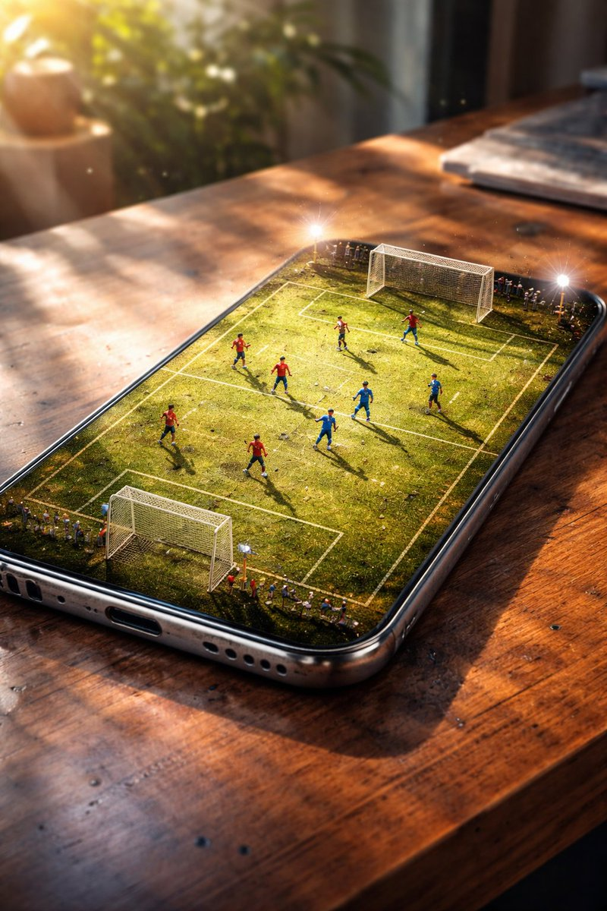

## Present a clear, 45° top-down isometric miniature 3D car

- ID: trending-2019376568834093542
- Slug: trending-2019376568834093542-en
- 语言: en
- 来源: [来源链接](https://x.com/TechieBySA/status/2019376568834093542)
- 样例图路径: images/part1/2019376568834093542_1.jpg

### 提示词

```text
Present a clear, 45° top-down isometric miniature 3D cartoon diorama of the [BRAND], with soft refined textures, realistic PBR materials, and gentle lifelike lighting.
Create a small raised diorama-style base that includes the most recognizable elements of the store, along with tiny stylized characters if needed (no facial details).
Use a clean solid [BACKGROUND COLOR] background.

At the top-center, display [BRAND] in large bold text, and place the official logo associated with [BRAND] below the subtext.
All text must automatically match the background contrast (white or black).

Composition: perfectly centered layout, square 1080x1080, ultra-clean, high-clarity diorama aesthetic.
```

### 样例图

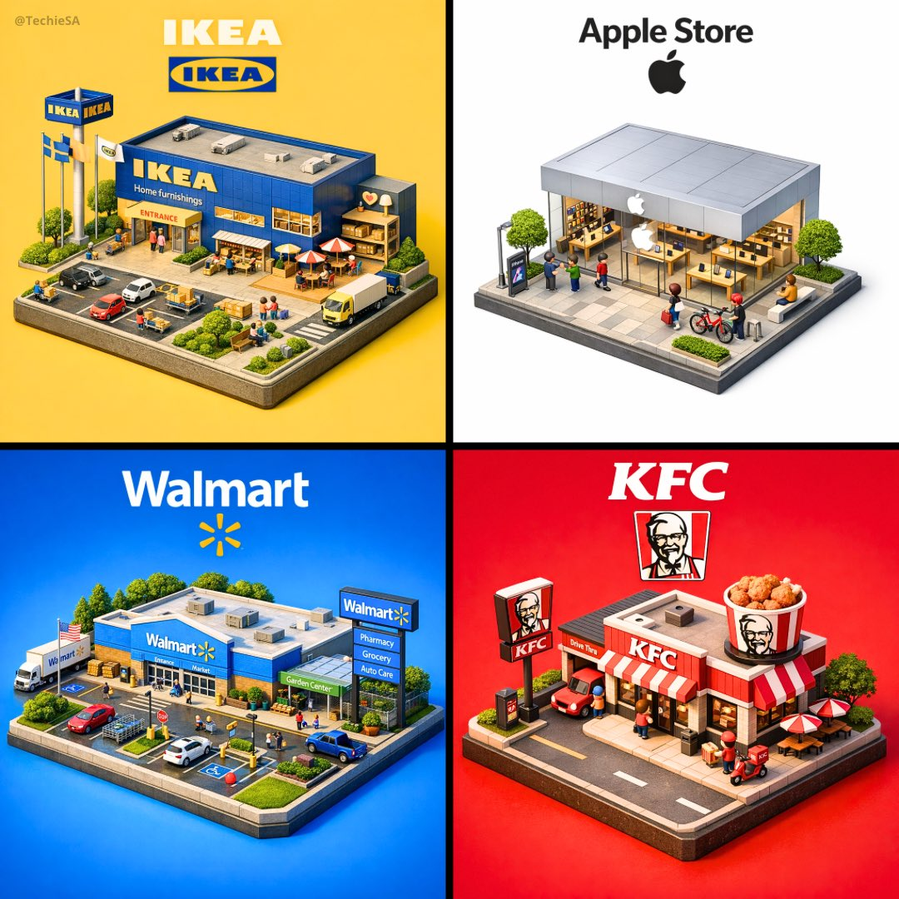

## 【テーマ】 {ここにテーマを入力} 【写

- ID: trending-2048714101850071422
- Slug: trending-2048714101850071422-zh
- 语言: zh
- 来源: [来源链接](https://x.com/konmari_tweet/status/2048714101850071422)
- 样例图路径: images/part1/2048714101850071422_1.jpg

### 提示词

```text
【テーマ】
{ここにテーマを入力}

【写真】
{ここに使用する写真の内容を簡潔に入力}
（例：公園で遊ぶ子ども / 親子の笑顔 / 走る子ども など）

【タイトル】
{画像内に入れるタイトルを入力}
（例：こどもの日 / Happy Mother's Day / 春のはじまり など）

---

テーマ「{テーマ}」に基づいた、
写真とクレヨンイラストを融合したライフスタイル系エディトリアルビジュアル。

提供された写真をメインビジュアルとして使用する。

■ シーン
「{写真}」に合った自然な日常の瞬間。
作り込みすぎないリアルな空気感、やわらかい自然光、
人物の自然な動きや感情を重視。

■ 構図
人物を切り抜いたように配置し、
ざらっとした紙質のクラフト系背景
（生成り、ベージュ、淡いグレー、ミルクティー）の上にレイアウト。

・余白50%以上
・左右非対称構図
・抜け感のあるミニマルなエディトリアルデザイン

■ イラスト（最重要）
オイルパステル／クレヨンで描いたような、
ざらつきとかすれのある手描きイラストを重ねる。

▼ルール
・全体の30〜40%以内
・線にムラとかすれ、紙のテクスチャが残る
・力の入り具合で濃淡が変化（濃い部分・薄い部分が混在）
・子どもが描いたような少し不器用なタッチ
・影・立体表現は禁止（フラット）
・人物の動きと連動させる（風・軌跡・流れ）

▼モチーフ（テーマ連動）
・{テーマ}を象徴する要素をクレヨンタッチで追加
（例：こどもの日 → 鯉のぼり、風、空、草、雲、紙かぶと）
・風の線、動きの線、小さなアイコン、太陽、雲、お花、ハート、星、ジグザグの動線
・空気感をクレヨンの粗いストロークで演出

■ タイトル文字（重要）
画像内に「{タイトル}」を手描きクレヨン文字で配置する。
・配置は左上または右上の余白部分
・クレヨンで書いたようなざらつき・かすれのある文字
・少し不器用で味のある手書き風
・文字色はアースカラー（テラコッタ、マスタード、ダークブラウン）から選択
・サイズは控えめでミニマルに（主役は写真）
・装飾枠なし、フラット

■ 色
あたたかみのあるアースカラー、
やわらかいくすみカラー
（テラコッタ、マスタード、オリーブ、ミルクティー、淡いブルー）

■ 雰囲気
あたたかい、ノスタルジック、こども心、ハンドメイド感、
やさしい、エモーショナル、ストーリー性のある日常

■ スタイル
絵本的ぬくもり × 北欧ミニマル × 上質なライフスタイル広告

■ 品質
高解像度、商用レベルのクオリティ
```

### 样例图

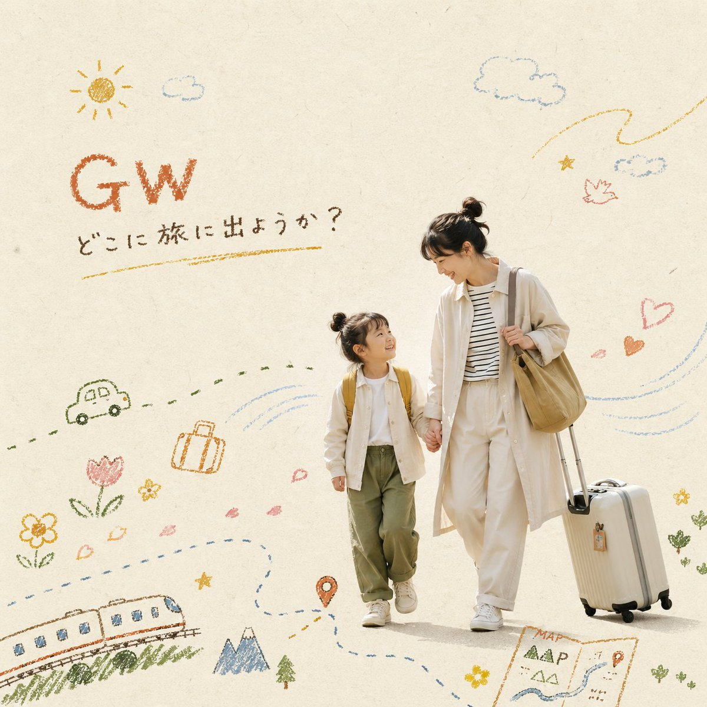

## Extreme close-up macro of miniature city diorama [CITY, 

- ID: trending-2007777809712976297
- Slug: trending-2007777809712976297-en
- 语言: en
- 来源: [来源链接](https://x.com/TechieBySA/status/2007777809712976297)
- 样例图路径: images/part1/2007777809712976297_1.jpg

### 提示词

```text
Extreme close-up macro of miniature city diorama [CITY, COUNTRY] on a solid base, held between two human fingers. City fills 85–95% of frame.
[COUNTRY] national flag stands prominently on flagpole in mid-ground, fully readable, gently waving—primary visual anchor.
[ICONIC LANDMARK] positioned in clear foreground, unobstructed, instantly recognizable, naturally integrated.
Small street sign or plaque displays “[CITY NAME]” as authentic urban detail, positioned organically at street corner or plaza edge.
Surrounding architecture reflects city’s authentic character without oversizing elements.
Ultra-realistic handcrafted miniature, detailed architecture, realistic materials, accurate proportions. Macro lens, deep depth of field keeping entire city sharp. Soft studio lighting, subtle shadows, tilt-shift realism. Neutral softly blurred background. Photorealistic, cinematic, premium quality.
```

### 样例图

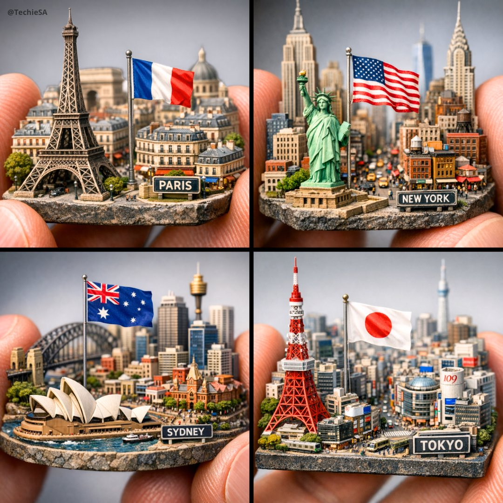

## A hyper-detailed origami [FOOD ITEM] folded from realist

- ID: trending-2007809696334479420
- Slug: trending-2007809696334479420-en
- 语言: en
- 来源: [来源链接](https://x.com/TechieBySA/status/2007809696334479420)
- 样例图路径: images/part1/2007809696334479420_1.jpg

### 提示词

```text
A hyper-detailed origami [FOOD ITEM] folded from realistic colored paper with visible creases and paper texture. Complex geometric folds capture the food’s shape, layers, and distinctive features. Placed on clean surface with soft shadows, minimalist food art photography style
```

### 样例图

![A hyper-detailed origami [FOOD ITEM] folded from realist](../images/part1/2007809696334479420_1.jpg)

## A high-quality 3D render of a cute young boy riding an o

- ID: trending-2014987855517614460
- Slug: trending-2014987855517614460-en
- 语言: en
- 来源: [来源链接](https://x.com/rovvmut_/status/2014987855517614460)
- 样例图路径: images/part1/2014987855517614460_1.jpg

### 提示词

```text
A high-quality 3D render of a cute young boy riding an orange electric scooter next to a small, round, furry blue monster. Both characters have shocked expressions with wide eyes and open mouths. The boy is wearing a highly textured, fuzzy teal sweater with a white patch that reads "noo" in red text, along with brown patterned pants and white sneakers. Clean teal studio background, soft lighting.
```

### 样例图

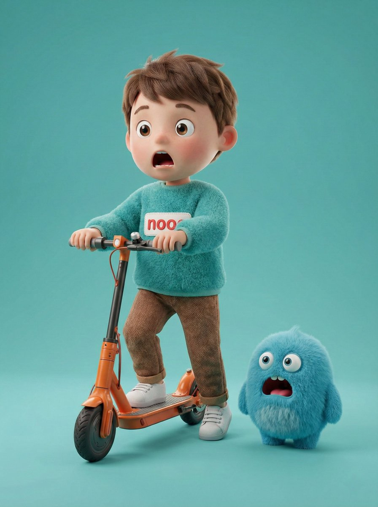

## Create a high-detail 3D semi-realistic chibi character w

- ID: trending-2031741057105526932
- Slug: trending-2031741057105526932-en
- 语言: en
- 来源: [来源链接](https://x.com/Naiknelofar788/status/2031741057105526932)
- 样例图路径: images/part1/2031741057105526932_1.jpg

### 提示词

```text
Create a high-detail 3D semi-realistic chibi character with slightly exaggerated cute proportions but with photorealistic facial rendering, natural skin pores, realistic lighting, and finely detailed hair strands. The character should look like a collectible designer toy figure with smooth surfaces, high-end materials, and ultra-clean edges. The character is styled in an fashion look: A tailored designer jacket in deep emerald green with gold stitching accents A sleek black silk fitted top underneath High-fashion tapered trousers in matte ivory tone  designer sneakers / footwear in white and gold with polished details Accessories must feel ultra- and fashionable:  oversized sunglasses with glossy black lenses and gold frame   wristwatch with metallic gold case and elegant dial Subtle designer bracelet and minimal accents The character stands confidently on top of a giant modern smartphone, like a collectible display piece. They are wearing stylish wireless over-ear headphones in metallic rose gold and holding the phone slightly forward while taking a playful joyful selfie, smiling and laughing with energetic expression. The smartphone screen displays a realistic modern music-player interface with colorful waveform animations and elegant UI elements. Scene style and lighting: Background: deep cinematic dark brown gradient studio backdrop Lighting: soft studio lighting with subtle reflections and rim light Materials: high-quality fabric textures, polished metals, and realistic plastics Style: collectible toy aesthetic mixed with semi-realistic chibi design Camera perspective: Aerial / top-down camera angle Slight cinematic depth of field for realism Rendering quality: Ultra-detailed 3D render 8K resolution smooth shading hyper-clean edges high clarity Add a small elegant watermark text “Naik Nelofar ” at the bottom of the image, subtle but clearly readable. Aspect ratio: 3:4 vertical composition
```

### 样例图

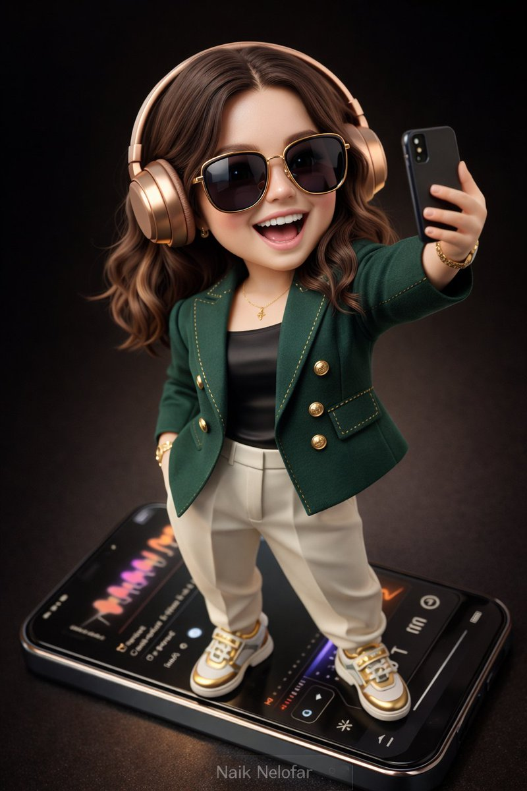

## { "prompt": "Create a hyper-realistic, ultra-detailed ci

- ID: trending-2002751900337275167
- Slug: trending-2002751900337275167-en
- 语言: en
- 来源: [来源链接](https://x.com/Samann_ai/status/2002751900337275167)
- 样例图路径: images/part1/2002751900337275167_1.jpg

### 提示词

```text
{
  "prompt": "Create a hyper-realistic, ultra-detailed cinematic photo featuring a MINIATURE version of the person from the provided reference image (preserve facial likeness, skin tone, hairstyle, and overall identity). The tiny character is relaxing inside an OPEN vintage hard-shell suitcase that is used like a tiny bed. The suitcase sits on a clean stone/tile floor in a bright room with strong natural sunlight casting soft rectangular window shadows across the floor.\n\nONLY VARIABLES:\n1) Character: use the user reference photo for the person’s face and identity.\n2) Theme/Genre: {THEME}\n\nCOMPOSITION & SCALE:\n- The person must be clearly mini-sized (toy-scale) relative to the suitcase, with correct perspective and believable proportions.\n- The open suitcase interior is styled like a cozy miniature scene: pillow, textured blanket or towel, and themed tiny props.\n- Add realistic micro-details: fabric weave, zipper teeth, suitcase latches, scuffs, stitching, subtle dust, realistic contact shadows.\n\nTHEME STYLING (derive everything from {THEME}):\n- Choose a cohesive color palette and make the SUITCASE COLOR match the theme (e.g., beach = warm coral/sand; football = deep green/black or team-inspired; sporty = bold neon accents; cozy-casual = muted cream/tan; luxury = black/ivory/gold).\n- Dress the tiny character in an outfit that fits {THEME}.\n- Place 5–8 tiny theme props neatly inside the suitcase near the character (miniature scale, photoreal materials). Examples by theme:\n  • Beach: tiny sunscreen bottle, mini sunglasses, seashells, flip-flops, mini straw hat, folded towel.\n  • Football/Soccer: tiny soccer ball, mini jersey/scarf, cleats, shin guards, whistle, small tactic board.\n  • Sporty/Fitness: tiny water bottle, mini dumbbell, resistance band, smartwatch, towel, energy bar.\n  • Cozy/Casual: tiny book/magazine, mug, knitted throw, headphones, mini candle.\n(If {THEME} is different, invent equivalent props that strongly communicate that theme.)\n\nLIGHTING & CAMERA:\n- Bright natural sunlight, soft realistic shadows, subtle bounce light, HDR-like dynamic range.\n- Photographic realism: shallow depth of field (but keep face and key props sharp), 50–85mm lens look.\n- No text, no logos, no watermarks.\n\nFINAL LOOK:\n- Hyper-real, high detail, clean editorial product-photography vibe, believable miniature diorama realism, crisp textures and natural skin rendering.",
  "negative_prompt": "cartoon, CGI, illustration, anime, plastic-looking skin, uncanny face, distorted anatomy, extra fingers, deformed hands, duplicated limbs, wrong perspective, unrealistic scale, blurry, low-res, noisy, harsh artifacts, over-smoothed, bad shadows, floating objects, cluttered scene, messy background, text, watermark, logo, brand names, extra people, face not matching reference",
  "variables": {
    "THEME": "beach | football | sporty | cozy-casual | luxury | etc.",
    "USER_IMAGE": "reference photo uploaded by the user (required)"
  }
}
```

### 样例图

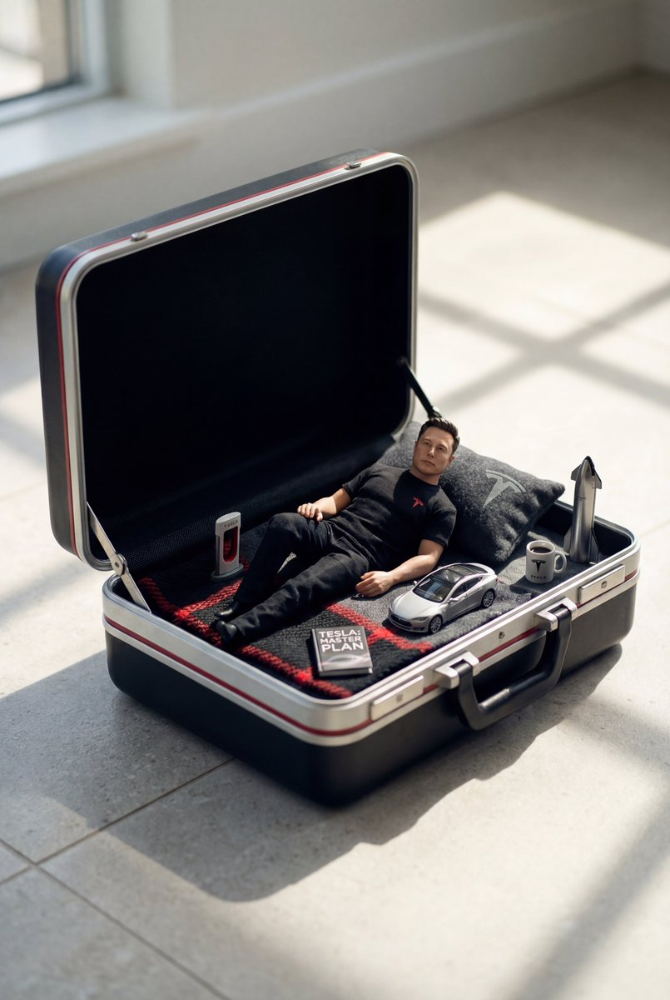

## Hyper-realistic open [COUNTRY] passport on a studio surf

- ID: trending-2022606746343317544
- Slug: trending-2022606746343317544-en
- 语言: en
- 来源: [来源链接](https://x.com/Naiknelofar788/status/2022606746343317544)
- 样例图路径: images/part1/2022606746343317544_1.jpg

### 提示词

```text
Hyper-realistic open [COUNTRY] passport on a studio surface, with gold-embossed “[Official Passport Name]” text and leather texture. From its pages rises a miniature 3D diorama of [COUNTRY], featuring [ICONIC LANDMARKS], [CITYSCAPES/COASTLINES/COUNTRYSIDE], and tiny human figures for scale. Passport pages show stamps and paper texture. Soft cinematic lighting, shallow depth of field, ultra-detailed photorealistic luxury style.
```

### 样例图

![Hyper-realistic open [COUNTRY] passport on a studio surf](../images/part1/2022606746343317544_1.jpg)

## A high-fidelity 3D character render of a cute, stylized 

- ID: trending-2015648059771044000
- Slug: trending-2015648059771044000-en
- 语言: en
- 来源: [来源链接](https://x.com/rovvmut_/status/2015648059771044000)
- 样例图路径: images/part1/2015648059771044000_1.jpg

### 提示词

```text
A high-fidelity 3D character render of a cute, stylized boy skateboarding in a dynamic pose. The boy has 'chibi' proportions with a large head, wearing oversized round wire-frame glasses and making a surprised 'O' mouth expression. He is dressed in an extremely fuzzy, textured blue mohair sweater with the text "OID" on the chest, a matching fuzzy blue beanie with a cream patch, and baggy camouflage-patterned pants made of a soft, velvet-like fabric. He wears chunky white sneakers and a small necklace pouch with a cartoon face. The background is a solid, seamless teal color. The lighting is soft and diffuse studio lighting, creating a clean, high-end "blind box" art toy aesthetic with hyper-realistic fabric textures.
```

### 样例图

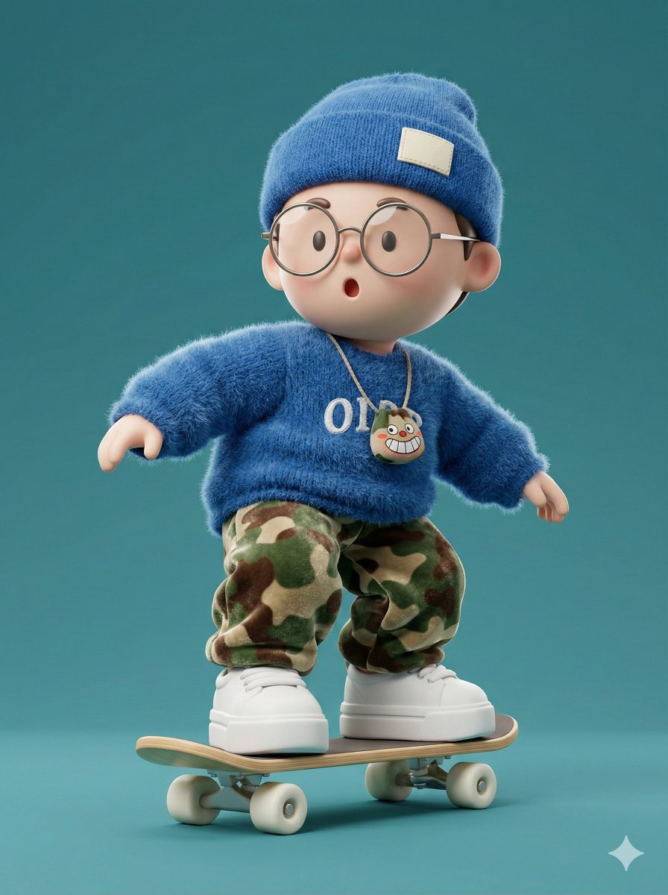

## The scene is lit by warm golden hour sunlight, with glow

- ID: trending-2007634587166630152
- Slug: trending-2007634587166630152-en
- 语言: en
- 来源: [来源链接](https://x.com/iamsofiaijaz/status/2007634587166630152)
- 样例图路径: images/part1/2007634587166630152_1.jpg

### 提示词

```text
The scene is lit by warm golden hour sunlight, with glowing dust particles floating in the air, creating a soft magical atmosphere. Background is a rustic wooden village setting, softly blurred with shallow depth of field. Cinematic lighting, soft rim light on hair, volumetric light rays, ultra-detailed, high quality, Pixar / Disney-style 3D render, cute, cozy, whimsical, warm color palette, 4k, bokeh, soft focus.
```

### 样例图

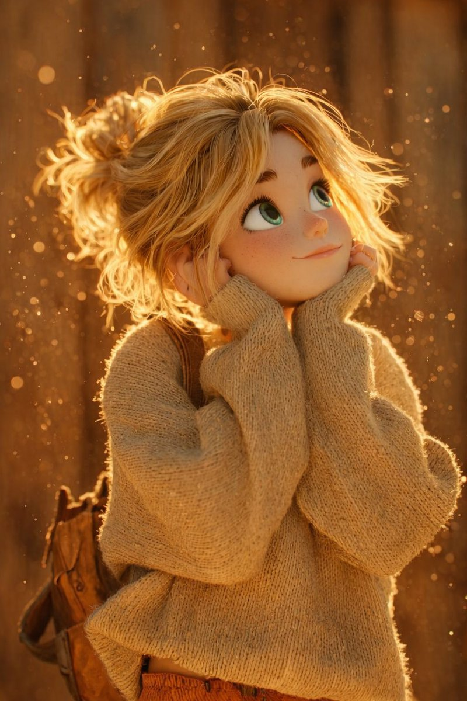

## Create a 3D of [OBJECT] made of white snow. The volumino

- ID: trending-2004259040491409514
- Slug: trending-2004259040491409514-en
- 语言: en
- 来源: [来源链接](https://x.com/TechieBySA/status/2004259040491409514)
- 样例图路径: images/part1/2004259040491409514_1.jpg

### 提示词

```text
Create a 3D of [OBJECT] made of white snow. The voluminous are lying on a snowy surface, slightly sunken into the snow. Top-down view. A photo with realistic highlights and soft shadows. 1080x1080 dimension picture.
```

### 样例图

![Create a 3D of [OBJECT] made of white snow. The volumino](../images/part1/2004259040491409514_1.jpg)

## Create a technical infographic of [VEHICLE] with a 45-de

- ID: trending-2048733383140712808
- Slug: trending-2048733383140712808-en
- 语言: en
- 来源: [来源链接](https://x.com/TechieBySA/status/2048733383140712808)
- 样例图路径: images/part1/2048733383140712808_1.jpg

### 提示词

```text
Create a technical infographic of [VEHICLE] with a 45-degree isometric 3D perspective showing the device slightly tilted to reveal depth and dimension.
Combine a realistic photoreal render with black ink technical annotations on pure white background. Include:
Key component labels with color-coded callout boxes
Internal component visibility through transparent/cutaway sections
Measurements, dimensions, and precise scale markers
Material callouts and quantities
Color-coded arrows for function/flow: RED (power/battery), BLUE (data/connectivity), ORANGE (thermal/processor), GREEN (sensors/haptics)
Simple schematics or cross-sectional diagrams where relevant

Place “VEHICLE” title in a hand-drawn technical box (top-left corner).
Style: Black linework (technical pen/architectural), sketched but precise. Object remains clearly visible. Educational museum-exhibit vibe. Clean composition, balanced negative space.
Perspective: Isometric 3D angle—tilted to show depth, dimension, and internal architecture dramatically. Like a professional product teardown or engineering manual.
Colors: ~10-15% accent density. Black dominant. White background.
Output: 1080×1080, ultra-crisp, social-feed optimized
```

### 样例图

![Create a technical infographic of [VEHICLE] with a 45-de](../images/part1/2048733383140712808_1.jpg)

## A soft, high-quality plush toy of [CHARACTER], with an o

- ID: trending-2005387590372057491
- Slug: trending-2005387590372057491-en
- 语言: en
- 来源: [来源链接](https://x.com/TechieBySA/status/2005387590372057491)
- 样例图路径: images/part1/2005387590372057491_1.jpg

### 提示词

```text
A soft, high-quality plush toy of [CHARACTER], with an oversized head, small body, and stubby limbs. Made of fuzzy fabric with visible stitching and embroidered facial features. The plush is shown sitting or standing against a neutral background. The expression is cute or expressive, and it wears simple clothes or iconic accessories if relevant. Lighting is soft and even, with a realistic, collectible plush look. Centered, full-body view
```

### 样例图

![A soft, high-quality plush toy of [CHARACTER], with an o](../images/part1/2005387590372057491_1.jpg)

## Generate a whimsical miniature world featuring [LANDMARK

- ID: trending-2008488331903139874
- Slug: trending-2008488331903139874-en
- 语言: en
- 来源: [来源链接](https://x.com/TechieBySA/status/2008488331903139874)
- 样例图路径: images/part1/2008488331903139874_1.jpg

### 提示词

```text
Generate a whimsical miniature world featuring [LANDMARK NAME] crafted entirely from colorful modeling clay. Every element - buildings, trees, waterways, and urban features - should appear hand-sculpted with visible fingerprints and organic clay textures. Use a playful, childlike style with vibrant colors: bright azure sky, puffy cream clouds, emerald trees, and buildings in warm yellows, oranges, reds, and blues. The handmade quality should be evident in every surface and gentle curve.
Capture from a wide perspective showcasing the entire miniature landscape in a harmonious, joyful composition. Include no text, words, or signage - only sculptural clay elements that define the location through recognizable architectural features
```

### 样例图

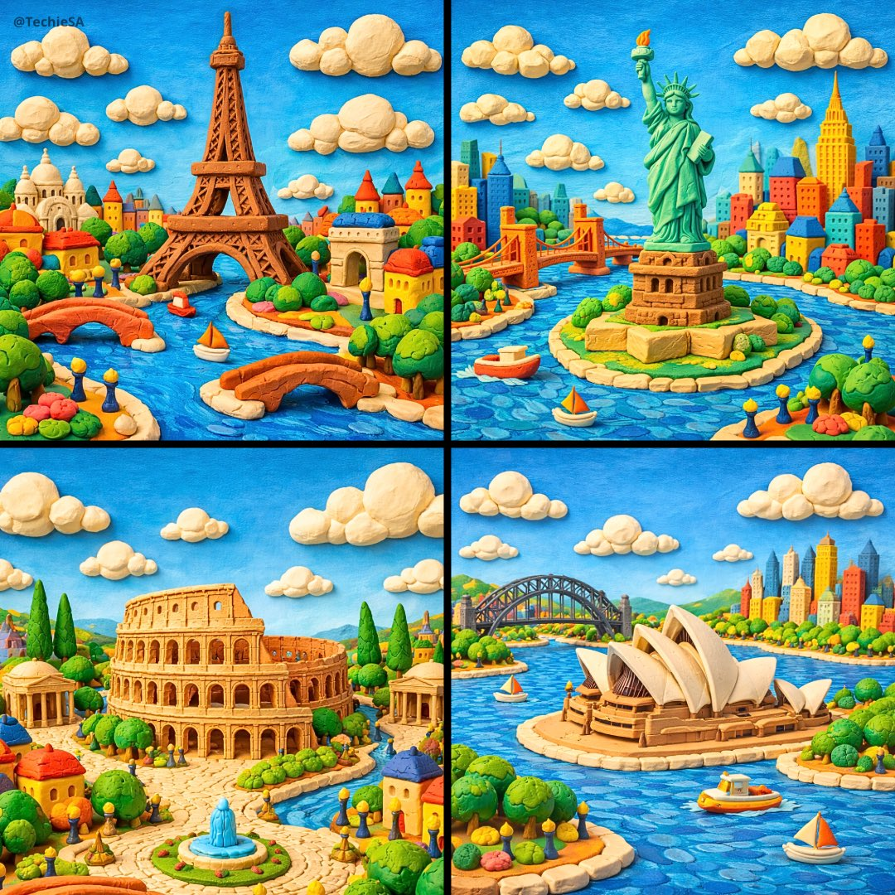

## Depict [LANDMARK] frozen in an eternal state of construc

- ID: trending-2009695503664239086
- Slug: trending-2009695503664239086-en
- 语言: en
- 来源: [来源链接](https://x.com/TechieBySA/status/2009695503664239086)
- 样例图路径: images/part1/2009695503664239086_1.jpg

### 提示词

```text
Depict [LANDMARK] frozen in an eternal state of construction. Camera & Angle (LOCKED): 45° elevated isometric view, camera distance fixed so the full landmark fills ~70% of the frame. No tilt variation. Structure: Lower sections are fully completed, solid, and instantly recognizable. Upper sections transition cleanly into unfinished construction: scaffolding, cranes, exposed beams, cables, and skeletal frameworks. The transition line between finished and unfinished is clearly visible and architecturally precise. Scale & Detail: Include small, static construction workers placed on scaffolding for scale. Include exactly 1–2 construction machines (crane arm, lift, or hoist), frozen in place. No motion, no blur, no debris falling. Materials (CONSISTENT): Finished areas: polished stone / glass / steel (appropriate to the landmark). Unfinished areas: raw concrete, steel beams, cables, structural frames. Materials are clean, realistic, and consistent across all renders. Lighting (LOCKED): Soft neutral cinematic lighting from upper left. Balanced exposure, gentle shadows, no dramatic highlights. Composition (LOCKED): Perfectly centered, symmetrical balance. Landmark sits on a subtle base or ground plane. Square format 1080×1080. Background (LOCKED): Minimal neutral sky or studio-gray backdrop. No clouds, no gradients, no distractions. Style: Hyper-realistic architectural render. Clean, precise, calm, and monumental. No stylization, no painterly effects. Mood: Timeless, quiet, contemplative. Frozen progress — never finished, never decaying.
```

### 样例图

![Depict [LANDMARK] frozen in an eternal state of construc](../images/part1/2009695503664239086_1.jpg)

## Create a technical infographic of [OBJECT] with a 45-deg

- ID: trending-2019103270447505848
- Slug: trending-2019103270447505848-en
- 语言: en
- 来源: [来源链接](https://x.com/TechieBySA/status/2019103270447505848)
- 样例图路径: images/part1/2019103270447505848_1.jpg

### 提示词

```text
Create a technical infographic of [OBJECT] with a 45-degree isometric 3D perspective, slightly tilted to reveal depth, structure, and internal construction.

Combine a realistic photoreal render with black ink technical annotations on a pure white background. Include:
• Key component labels with clean callout boxes
• Internal structure visibility through cutaway or exploded sections
• Measurements, dimensions, and scale markers
• Material callouts and quantities
• Color-coded arrows indicating functional systems:
•RED: impact force, collision zones, stress points
•BLUE: airflow, spin, grip interaction, movement dynamics
•GREEN: player control, handling, ergonomics
•ORANGE: padding, reinforcement, energy absorption

Include simple sectional diagrams or force-flow schematics where relevant.

Place the title “[OBJECT]” inside a hand-drawn technical annotation box in the top-left corner.

Style:
Black ink technical linework (architectural / engineering manual style), precise but slightly hand-sketched. The object remains clearly visible beneath annotations. Clean, museum-exhibit / sports engineering vibe.

Perspective:
Isometric 3D angle emphasizing depth, form, and internal architecture — like a professional equipment teardown.

Color palette:
White background, black linework with ~10–15% accent color usage (functional arrows only).

Output:
1080×1080, ultra-crisp, social-feed optimized, no watermark.
```

### 样例图

![Create a technical infographic of [OBJECT] with a 45-deg](../images/part1/2019103270447505848_1.jpg)

## A hand-carved wooden miniature figure of [NAME], shaped 

- ID: trending-2017886103781490917
- Slug: trending-2017886103781490917-en
- 语言: en
- 来源: [来源链接](https://x.com/Sheldon056/status/2017886103781490917)
- 样例图路径: images/part1/2017886103781490917_1.jpg

### 提示词

```text
A hand-carved wooden miniature figure of [NAME], shaped with visible knife marks, natural grain texture, and smooth unfinished edges. Placed on a workshop table with carving tools, wood shavings, and soft warm directional lighting. 1080×1080.
```

### 样例图

![A hand-carved wooden miniature figure of [NAME], shaped ](../images/part1/2017886103781490917_1.jpg)

## A hyper-realistic 1080x1080 photograph of a glass cube d

- ID: trending-2008913329029263382
- Slug: trending-2008913329029263382-en
- 语言: en
- 来源: [来源链接](https://x.com/TechieBySA/status/2008913329029263382)
- 样例图路径: images/part1/2008913329029263382_1.jpg

### 提示词

```text
A hyper-realistic 1080x1080 photograph of a glass cube diorama placed on a lush, mossy forest floor with dappled sunlight. Inside the cube are miniature, highly detailed landmarks and cultural icons from [COUNTRY]. Include its most famous and recognizable architecture—traditional and modern—surrounded by greenery. Prominently display the 3D word “COUNTRY” at the base inside the cube, using large, bold white block letters and a flagpole of the country's flag. The scene is crisp, elegant, and immersive, with the forest background softly blurred to focus on the diorama’s sharp details.
```

### 样例图

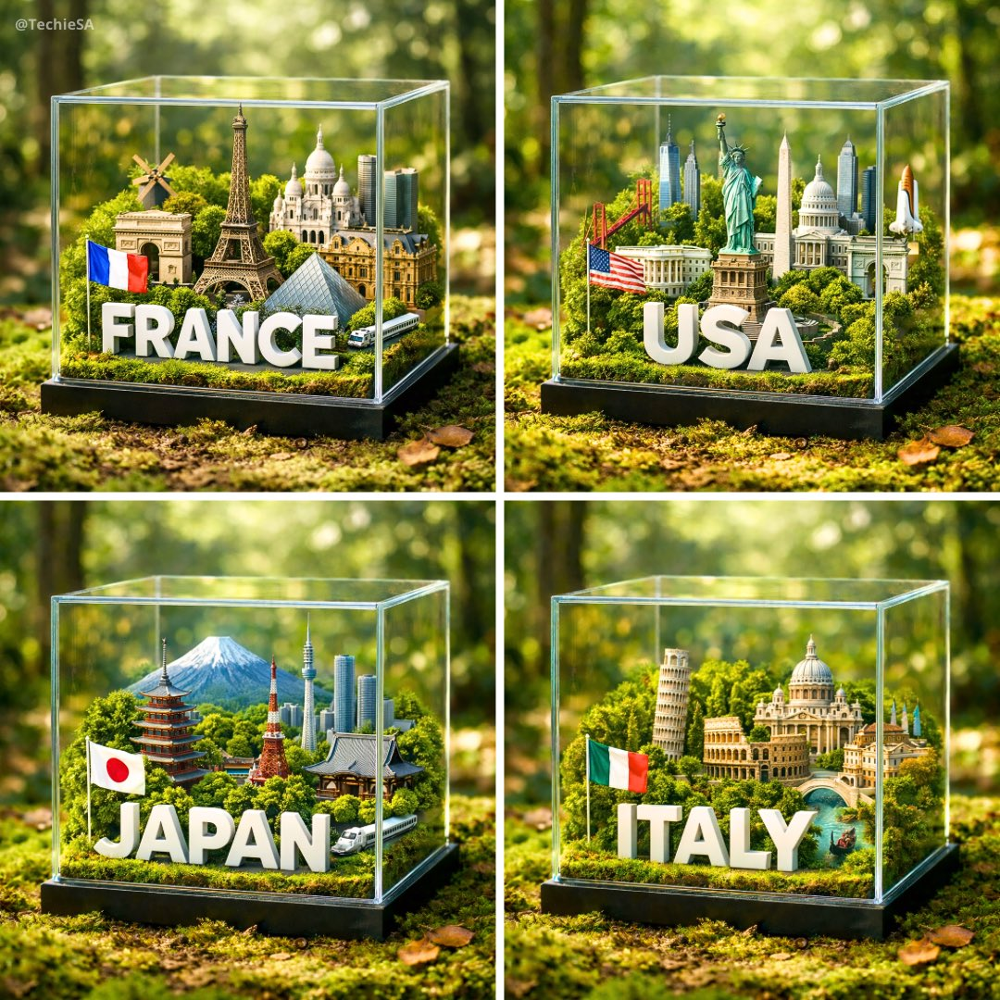

## Create a highly detailed isometric 3D rendering of [LAND

- ID: trending-2007082189742379459
- Slug: trending-2007082189742379459-en
- 语言: en
- 来源: [来源链接](https://x.com/TechieBySA/status/2007082189742379459)
- 样例图路径: images/part1/2007082189742379459_1.jpg

### 提示词

```text
Create a highly detailed isometric 3D rendering of [LANDMARK] in architectural visualization style. The building is shown at a 45-degree angle from above, displaying three visible sides with intricate architectural detail. Photorealistic textures showing materials like stone, glass, metal, or brick. Include the base/ground level with tiny people, cars, and landscaping for scale. Clean white or light grey background. Professional architectural rendering with soft ambient shadows beneath the structure. Every window, column, ornamental detail, and structural element clearly visible. 1080x1080 dimension, centered composition. Style similar to video game building assets or architectural presentation models - clean, detailed, slightly stylized but realistic.
```

### 样例图

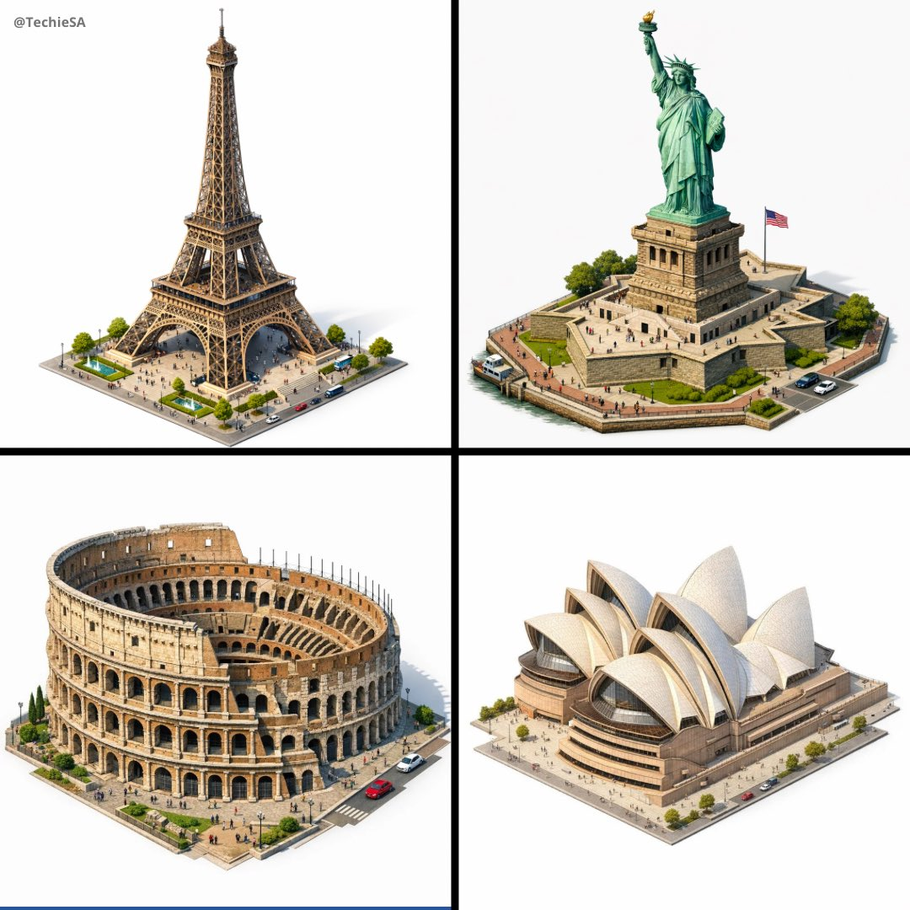

## Present a clear, 45° top-down isometric miniature 3D car

- ID: trending-2011027384837792185
- Slug: trending-2011027384837792185-en
- 语言: en
- 来源: [来源链接](https://x.com/TechieBySA/status/2011027384837792185)
- 样例图路径: images/part1/2011027384837792185_1.jpg

### 提示词

```text
Present a clear, 45° top-down isometric miniature 3D cartoon scene of [STADIUM], with soft refined textures, realistic PBR materials, and gentle lifelike lighting. Use a clean solid [COLOR] background. At the top-center, display the name of this stadium in large bold text, then directly beneath it show its real seating capacity in medium text, and place the official logo associated with this stadium below the capacity. All text must match the background contrast automatically (white or black). Centered layout, square 1080x1080 dimension
```

### 样例图

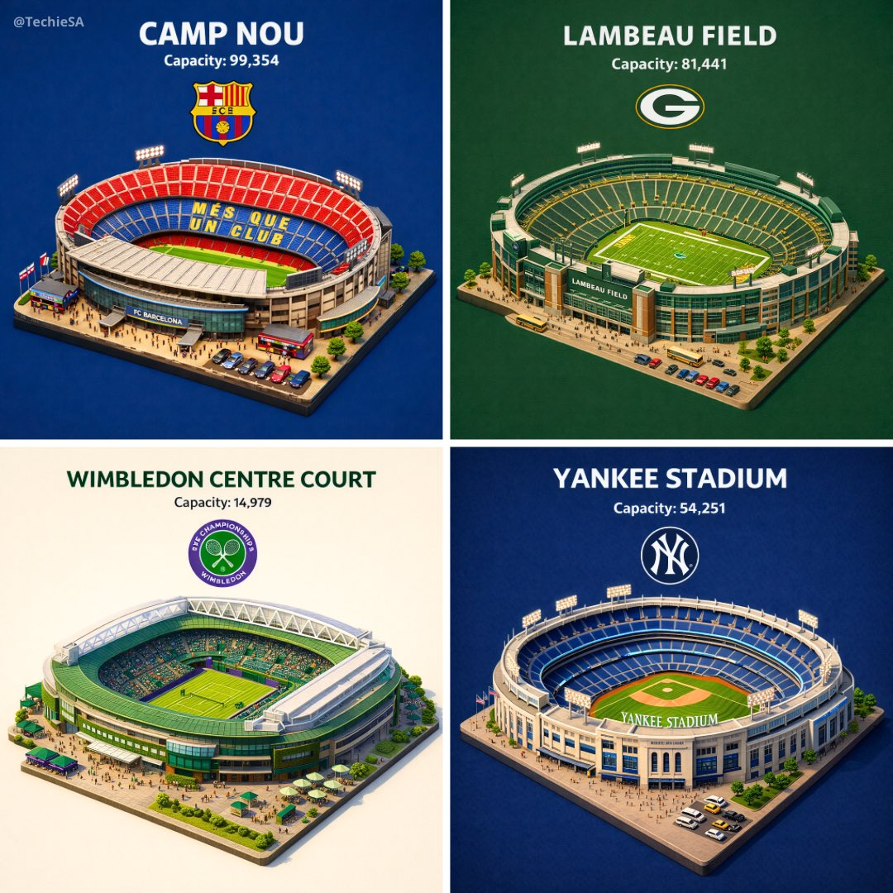

## A hand-painted isometric bird’s-eye view illustration of

- ID: trending-2006361629651603477
- Slug: trending-2006361629651603477-en
- 语言: en
- 来源: [来源链接](https://x.com/TechieBySA/status/2006361629651603477)
- 样例图路径: images/part1/2006361629651603477_1.jpg

### 提示词

```text
A hand-painted isometric bird’s-eye view illustration of [COUNTRY] in a vintage map style, featuring iconic landmarks and natural scenery unique to the country. The landscape should blend seamlessly with a parchment-colored map background, and include detailed miniature architecture, cultural symbols, and geographical elements. The country name '[COUNTRY]' should appear in bold serif text below the scene. Maintain warm, earthy tones and soft lighting for a classic, illustrated map feel. 1080x1080 dimension.
```

### 样例图

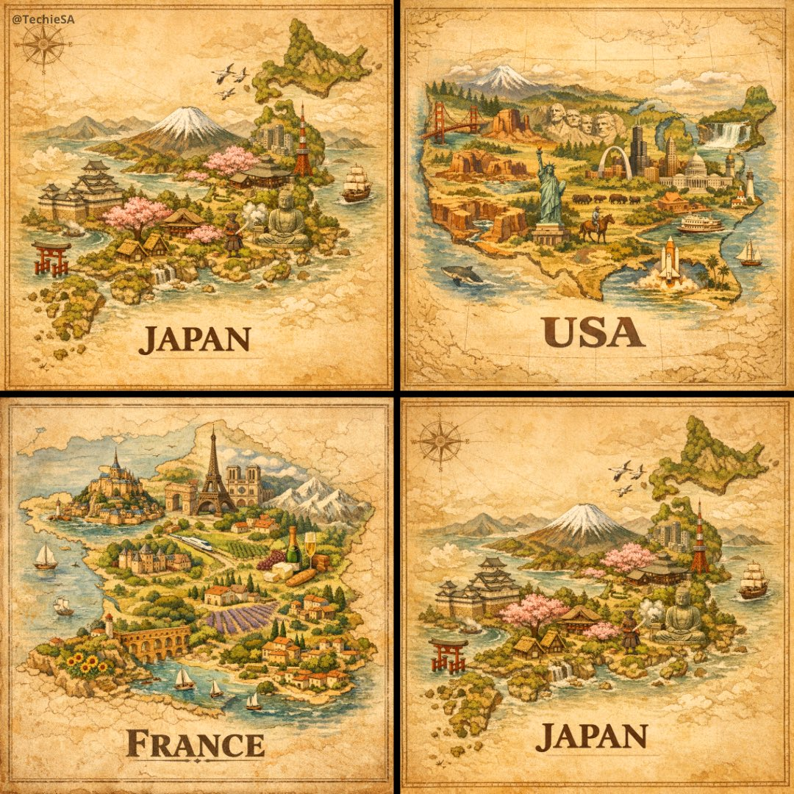

## create a A 3D, Pixar-style animated young man sits cross

- ID: trending-2023686368162181501
- Slug: trending-2023686368162181501-en
- 语言: en
- 来源: [来源链接](https://x.com/Naiknelofar788/status/2023686368162181501)
- 样例图路径: images/part1/2023686368162181501_1.jpg

### 提示词

```text
create a A 3D, Pixar-style animated young man sits cross-legged on a pure white, isolated background. He has bright, olive-toned skin, a neatly styled bright brown haircut with a slight wave, and a well-groomed bright brown beard and mustache. His large, expressive eyes, a deep hazel-brown, are slightly upturned and gaze thoughtfully to his left, with a subtle, dreamy smile playing on his lips and his right hand resting gently on his cheek.He wears a bright, textured orange knit cardigan over a light blue t-shirt, complemented by bright wash denim jeans. His footwear consists of stylish sneakers with a navy blue, grey, and white color scheme. A bright grey, modern backpack is slung over his left shoulder, and a matching bright grey lunchbox rests beside his right leg.The lighting is soft and even, creating gentle highlights on his hair and clothing, and a subtle bright beneath him, emphasizing his rounded, stylized form. The overall mood is one of relaxed contemplation and youthful optimism..
```

### 样例图

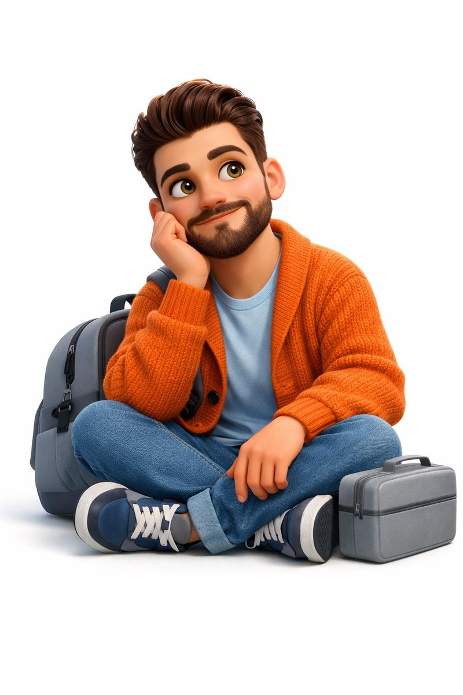

## A surreal, hyper-realistic close-up scene of a miniature

- ID: trending-2018311275210523012
- Slug: trending-2018311275210523012-en
- 语言: en
- 来源: [来源链接](https://x.com/TechieBySA/status/2018311275210523012)
- 样例图路径: images/part1/2018311275210523012_1.jpg

### 提示词

```text
A surreal, hyper-realistic close-up scene of a miniature [CAR] driving along a winding road that seamlessly transforms into a printed paper map of [CITY], [COUNTRY].

The road transitions naturally into the map’s printed streets, borders, and typography, with the vehicle driving directly over the map label “[CITY]”. The surrounding terrain reflects the natural landscape of [COUNTRY] — terrain texture, ground color, and environmental details match the region authentically (e.g. desert, mountains, coast, countryside).

The map features crisp cartographic details, labeled roads, subtle borders, and realistic paper texture. The vehicle is highly detailed and proportionally scaled, feeling tangible and grounded within the scene.

Lighting is bright and natural, directionally cast to create realistic highlights and defined shadows along the road’s curves. Shot from a slightly elevated angle with shallow depth of field, keeping the car and map sharply in focus while the background softly fades.

Visual style is cinematic and ultra-realistic, blending tactile paper map textures with realistic terrain and vehicle materials.

Aspect ratio 1:1, high resolution, premium editorial quality, no text overlays, no watermark
```

### 样例图

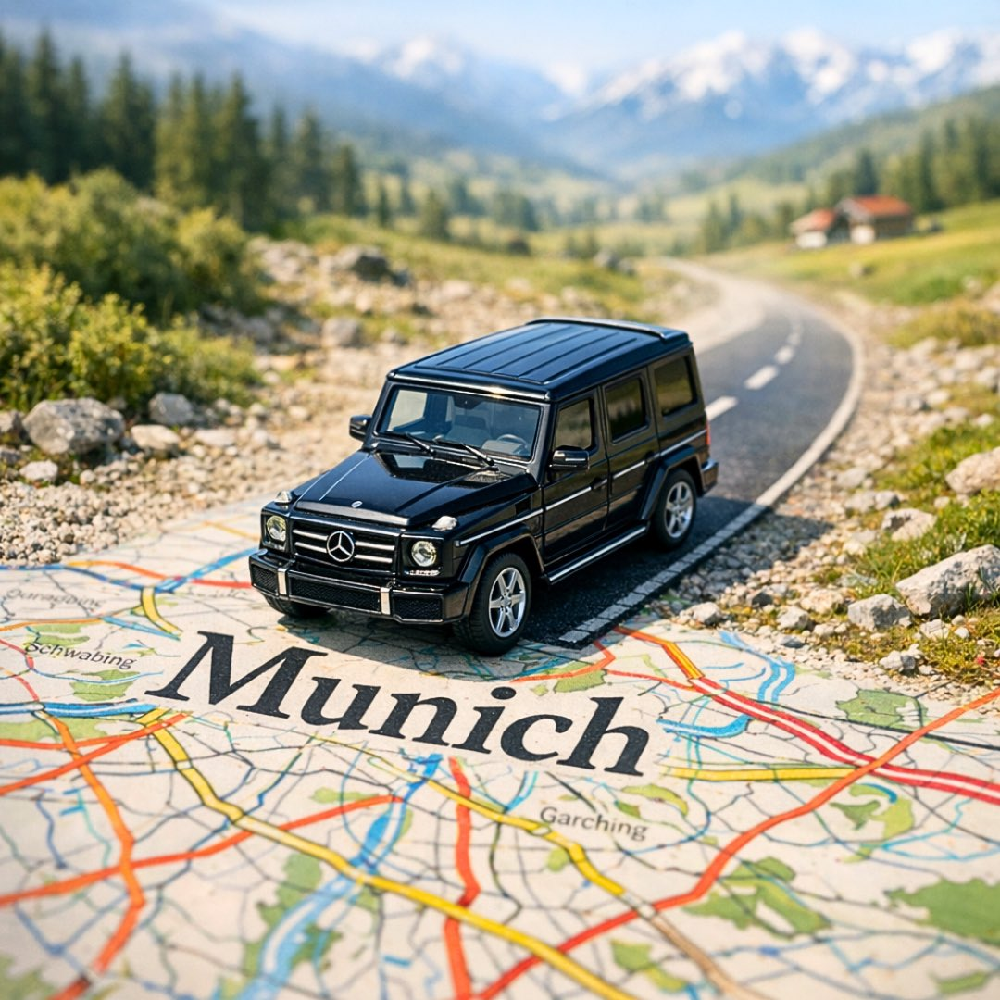

## Soft poetic children's book illustration with watercolor

- ID: trending-2047174895293849972
- Slug: trending-2047174895293849972-en
- 语言: en
- 来源: [来源链接](https://x.com/dotey/status/2047174895293849972)
- 样例图路径: images/part1/2047174895293849972_1.jpg

### 提示词

```text
Soft poetic children's book illustration with watercolor and gouache textures.Clear gentle daylight with slightly brighter highlights.Muted pastel colors with soft blue and warm tones.Visible brush strokes and paper grain.Minimalist composition with large negative space.Calm, thoughtful, slightly open-ended atmosphere.

Child character (around 12 years old).Subtle visual metaphors like light, shadow, perspective, reflection.Hand-painted picture book style, not cartoon, not anime, not 3D.

Two children in calm conversation,soft connection forming.
```

### 样例图


## Create a hyperrealistic miniature planet showcasing [CIT

- ID: trending-2008272089682199025
- Slug: trending-2008272089682199025-en
- 语言: en
- 来源: [来源链接](https://x.com/TechieBySA/status/2008272089682199025)
- 样例图路径: images/part1/2008272089682199025_1.jpg

### 提示词

```text
Create a hyperrealistic miniature planet showcasing [CITY] with famous landmarks seamlessly curving around the spherical surface. Position bold 3D white text ”[CITY]” naturally integrated across the lush green central parkland with realistic shadows and dimensional depth. Capture from a top-down orbiting angle that emphasizes the dramatic planet curvature. Use soft golden hour daylight filtering through partly cloudy skies, casting gentle shadows on emerald grass and surrounding trees. The background should blend into a swirling atmospheric sky. Apply vibrant greens, warm earth tones, and soft blues. Render in polished photorealistic style with fine architectural detail
```

### 样例图

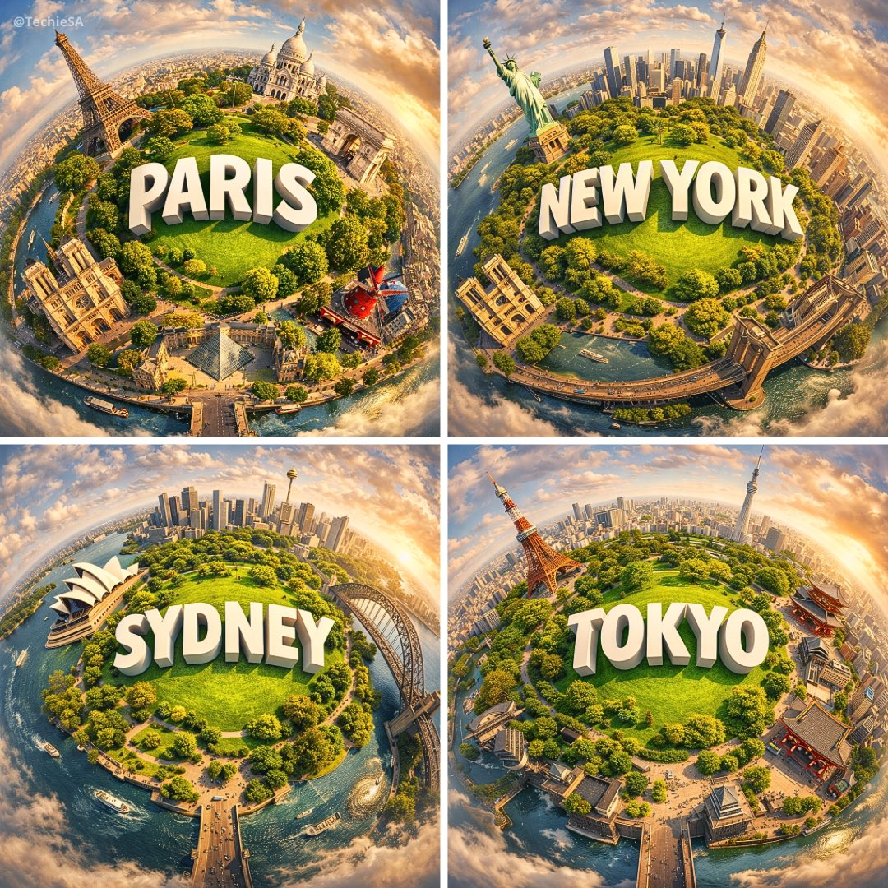

## A high-resolution, photorealistic 3D action RPG mobile g

- ID: trending-2047277688075739605
- Slug: trending-2047277688075739605-en
- 语言: en
- 来源: [来源链接](https://x.com/TechieBySA/status/2047277688075739605)
- 样例图路径: images/part1/2047277688075739605_1.jpg

### 提示词

```text
A high-resolution, photorealistic 3D action RPG mobile game screenshot of an epic battle featuring Doraemon characters. The perspective is from behind the main player character, Nobita. The background is a post-apocalyptic urban scene of rubble, crumbling concrete, rebar, debris, small fires, and intense purple and blue lightning in a dark, cloudy night sky.  Characters:  Foreground Left: Doraemon, holding an elaborate, multi-barrel gatling-style cannon which hums with blue energy in his hand.  Foreground Center: Nobita, in a combat stance with his multi-layered slingshot weapon, wearing his classic yellow shirt, blue shorts, and glasses.  Middle Ground Center: Giant Gian (the boss), massive, muscular, intimidating, holding a spiked mace, with glowing sinister red eyes and surrounded by purple energy effects.  Nameplates: Doraemon (Lv. 30, HP: 2150/2420, MP: 860/1000), Nobita (Lv. 30, HP: 1980/2200, MP: 900/1000), Gian (Lv. ??, HP: 85670/100000, x4).  UI Elements (All in English):  Left Side Panel: The title is "MISSIONS" and "TEAM". The "MAIN QUEST" header is followed by "Defeat Giant Gian" and "Defeat the Corrupted Gian [0/1]". The "DAILY TASKS" header is followed by "Use skill to hit Gian 3 times (2/3) [Check]", "Use item to restore HP 1 time (1/1) [Check]", and "Achieve 1 Perfect Dodge (0/1)".  Right Side Panel: The header "BOSS MISSION" is followed by "Defeat Giant Gian" and "Defeat the Corrupted Gian [0/1]".  Bottom Right Skill Buttons: Labels (clockwise from top): "Heavy Strike", "Basic Attack" (with Doraemon head), "Bamboo Copter Flight", "Item Bag", "Tumble Dodge". Glowing blue skill icons are present.  Bottom Center Item Bar: Above the items, "STAMINA VALUE" followed by "120/130". The items are "Dorayaki (15)", "Healing Drink (8)", "Bamboo Copter (5)", "Time Beam Camera (3)".  Mini-Map: Top right corner mini-map with skull icon.  D-pad: English text virtual D-pad on the bottom left.  Screen Details: Cinematic lighting and effects. The cool blue of Doraemon's weapon light, warm orange firelight, cold purple lightning, and Gian's sinister red eyes. Detailed textures on clothing and weapons. All English text is clean, legible, and accurate. The low-angle emphasizes the scale difference and battle tension.
```

### 样例图

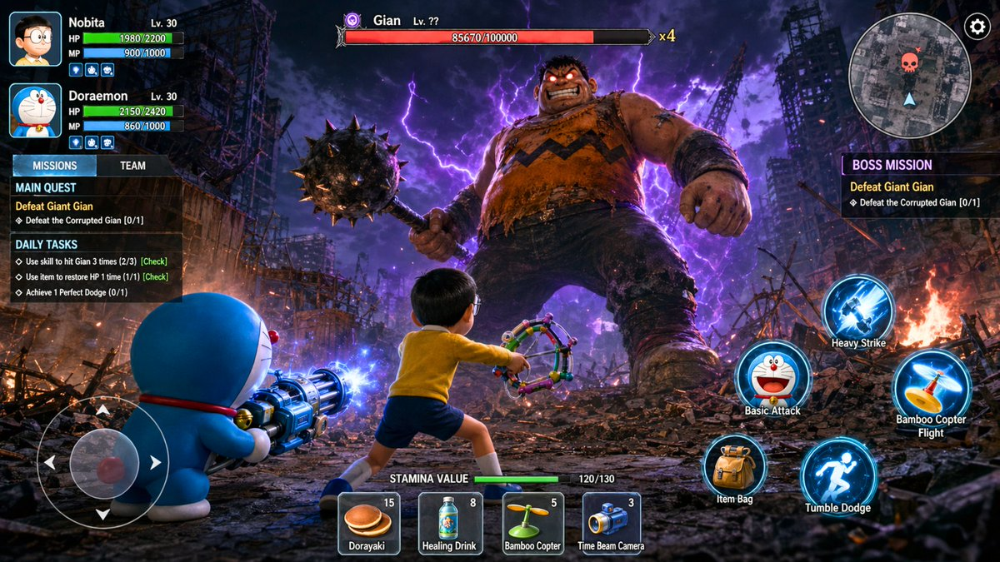

## Create a premium 3D rendered [FIGURE NAME] collectible v

- ID: trending-2009229875794858182
- Slug: trending-2009229875794858182-en
- 语言: en
- 来源: [来源链接](https://x.com/TechieBySA/status/2009229875794858182)
- 样例图路径: images/part1/2009229875794858182_1.jpg

### 提示词

```text
Create a premium 3D rendered [FIGURE NAME] collectible vinyl figure in a modern designer toy aesthetic. The figure should feature glossy translucent vinyl material with subtle light refraction, bold saturated colors true to the character, and simplified geometric forms with smooth curves. Position against a pristine gradient background transitioning from light gray to white. Use professional product photography lighting with soft key light from above and gentle rim lighting to highlight the vinyl’s glossy finish. The character should be posed in a confident standing position, centered perfectly in frame. Apply shallow depth of field with the figure in sharp focus. Render in ultra-high resolution with clean minimalist composition, no text, logos, or distracting elements. Square aspect ratio 1080x1080 pixels, photorealistic quality with crisp details and vibrant color reproduction suitable for premium toy marketing
```

### 样例图

![Create a premium 3D rendered [FIGURE NAME] collectible v](../images/part1/2009229875794858182_1.jpg)

## Present a clear, 45°

- ID: trending-2046671817775960343
- Slug: trending-2046671817775960343-zh
- 语言: zh
- 来源: [来源链接](https://x.com/dotey/status/2046671817775960343)
- 样例图路径: images/part1/2046671817775960343_1.jpg

### 提示词

```text
Present a clear, 45° top-down view of a vertical (9:16) isometric miniature 3D cartoon scene, highlighting iconic landmarks centered in the composition to showcase precise and delicate modeling.

The scene features soft, refined textures with realistic PBR materials and gentle, lifelike lighting and shadow effects. Weather elements are creatively integrated into the urban architecture, establishing a dynamic interaction between the city's landscape and atmospheric conditions, creating an immersive weather ambiance.

Use a clean, unified composition with minimalistic aesthetics and a soft, solid-colored background that highlights the main content. The overall visual style is fresh and soothing.

Display a prominent weather icon at the top-center, with the date (x-small text) and temperature range (medium text) beneath it. The city name (large text) is positioned directly above the weather icon. The weather information has no background and can subtly overlap with the buildings.

The text should match the input city's native language.
Please retrieve current weather conditions for the specified city before rendering.

City name:【上海】
```

### 样例图

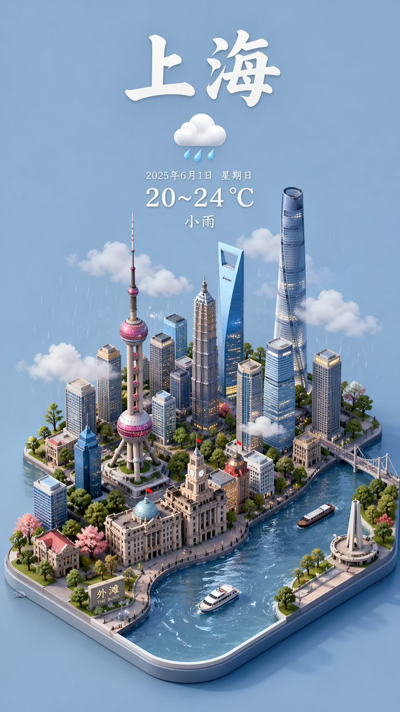

## Create an ultra-HD, hyper-realistic digital poster of a 

- ID: trending-2005231673320112428
- Slug: trending-2005231673320112428-en
- 语言: en
- 来源: [来源链接](https://x.com/TechieBySA/status/2005231673320112428)
- 样例图路径: images/part1/2005231673320112428_1.jpg

### 提示词

```text
Create an ultra-HD, hyper-realistic digital poster of a floating miniature island shaped like [COUNTRY], resting on white clouds in the sky. Blend iconic landmarks, natural landscapes (like forests, mountains, or beaches), and cultural elements unique to [COUNTRY]. Carve “[COUNTRY]” into the terrain using large white 3D letters. Add artistic details like birds (native to [COUNTRY]), cinematic lighting, vivid colors, aerial perspective, and sun reflections to enhance realism. Ultra-quality, 4K+ resolution.
```

### 样例图

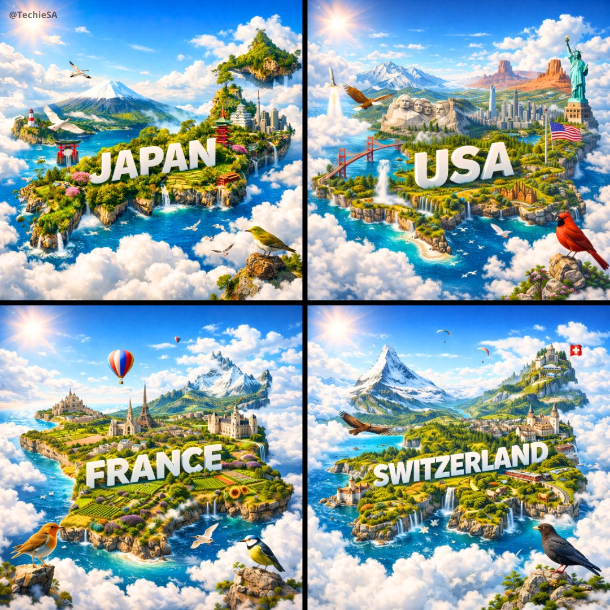

## Create an ultra-HD, hyper-realistic digital poster of a 

- ID: trending-2030219494304731396
- Slug: trending-2030219494304731396-en
- 语言: en
- 来源: [来源链接](https://x.com/Naiknelofar788/status/2030219494304731396)
- 样例图路径: images/part1/2030219494304731396_1.jpg

### 提示词

```text
Create an ultra-HD, hyper-realistic digital poster of a floating miniature island shaped like [Country] on white clouds. Include iconic landmarks, landscapes ([landmark 1], [landscape 2], [landscape 3]), and cultural elements unique to [Country]. Carve “[Country]” in large white 3D letters. Add [wildlife], cinematic lighting, vivid colors, aerial perspective, and sun reflections for realism.
```

### 样例图

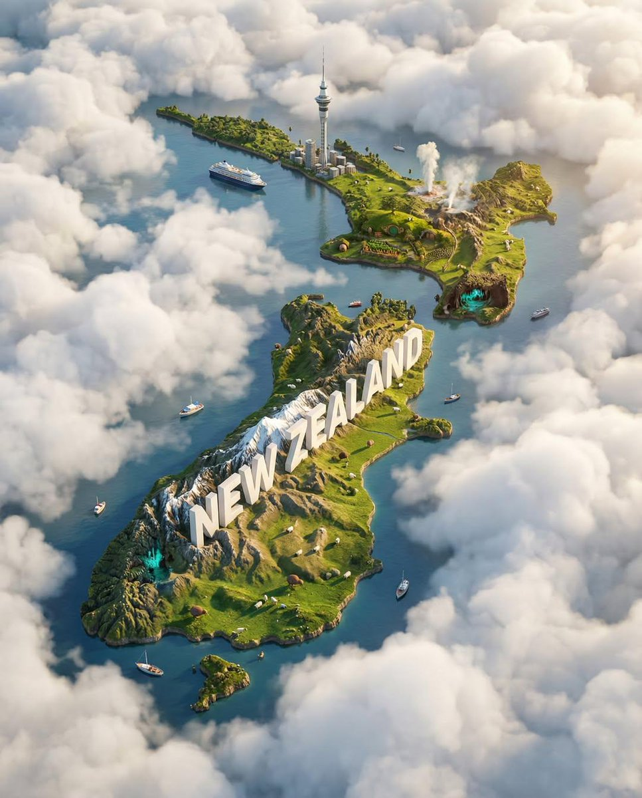

## Create a stylized miniature model of [CHARACTERS] shaped

- ID: trending-2009285406303387993
- Slug: trending-2009285406303387993-en
- 语言: en
- 来源: [来源链接](https://x.com/TechieBySA/status/2009285406303387993)
- 样例图路径: images/part1/2009285406303387993_1.jpg

### 提示词

```text
Create a stylized miniature model of [CHARACTERS] shaped entirely from soft polymer clay. The figure has rounded, childlike anatomy — large head, small body, and simplified details that feel friendly and handcrafted. Its outfit and accessories match [CHARACTERS]’ iconic look, modeled with smooth curves and lively, saturated tones.
The material appears dry and tactile, with a powdery matte finish and subtle surface texture—avoid gloss, shine, or reflections. Lighting should be gentle and even, wrapping softly around the form with faint ambient shading to reveal volume.
Present the figurine standing upright, slightly turned toward the right, framed in a minimal off-white environment with a smooth floor and faint contact shadow beneath. The overall composition feels calm, neat, and balanced—like a clay sculpture photographed for a design catalog.
```

### 样例图

![Create a stylized miniature model of [CHARACTERS] shaped](../images/part1/2009285406303387993_1.jpg)

## Create an ultra-realistic sky scene where soft, natural 

- ID: trending-2007449939169693886
- Slug: trending-2007449939169693886-en
- 语言: en
- 来源: [来源链接](https://x.com/TechieBySA/status/2007449939169693886)
- 样例图路径: images/part1/2007449939169693886_1.jpg

### 提示词

```text
Create an ultra-realistic sky scene where soft, natural cloud formations organically assemble into the clear silhouette of a [OBJECT]. The cloud shape appears high in a vibrant blue sky, naturally floating above a recognizable nature below.

The composition is square (1080×1080), with the cloud formation occupying the upper portion of the frame while the landscape grounds the scene beneath it. Lighting is crisp and daylight-bright, with sunlit highlights on the clouds that enhance depth, softness, and realism.

The overall mood should feel calm, optimistic, and visually striking, with rich color saturation and a clean, peaceful atmosphere.
```

### 样例图

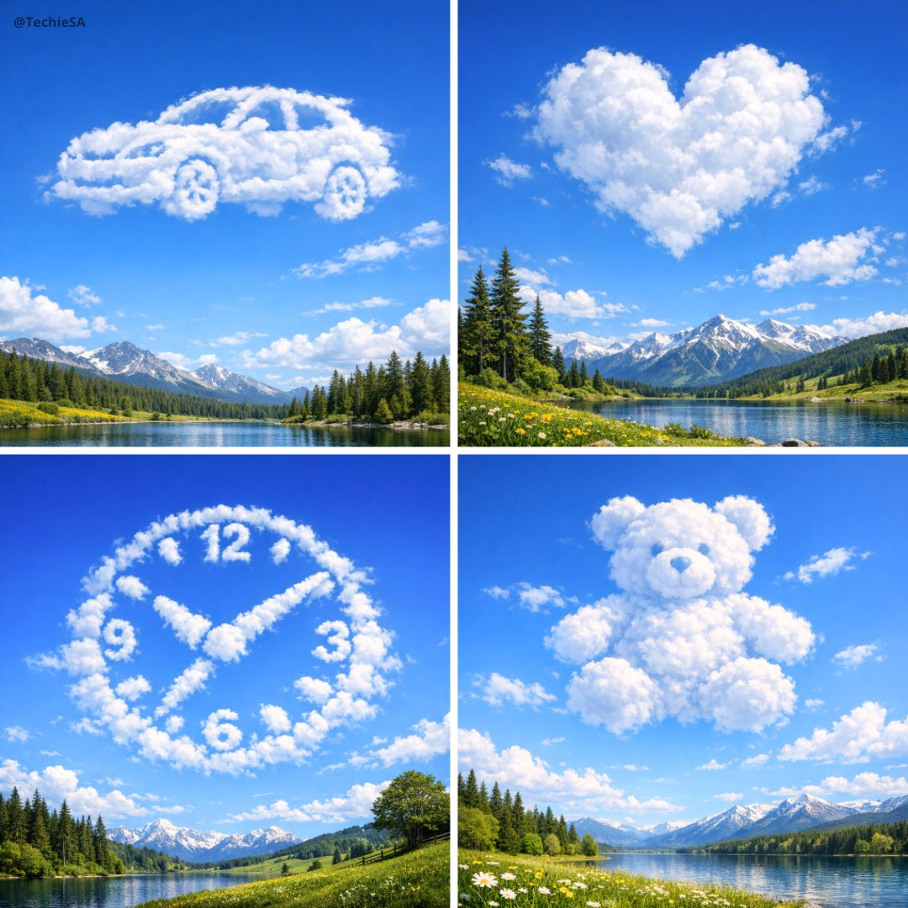

## { "type": "image_generation", "style": "ultra_realistic_

- ID: trending-2006986719590248769
- Slug: trending-2006986719590248769-en
- 语言: en
- 来源: [来源链接](https://x.com/Strength04_X/status/2006986719590248769)
- 样例图路径: images/part1/2006986719590248769_1.jpg

### 提示词

```text
{
  "type": "image_generation",
  "style": "ultra_realistic_cinematic",
  "aspect_ratio": "3:4",
  "resolution": "8K",
  "camera": {
    "model": "DSLR",
    "lens": "50mm",
    "angle": "dynamic slight tilt, courtside perspective",
    "depth_of_field": "shallow",
    "focus": "sharp on phone and players, soft background blur"
  },
  "scene": {
    "subject": "smartphone lying on a wooden table",
    "concept": "phone screen transformed into a professional tennis court",
    "court_surface": "pristine blue hardcourt with fine scratches and chalk marks",
    "players": "miniature tennis players serving, volleying, diving for shots",
    "scale": "realistic miniature proportions"
  },
  "lighting": {
    "type": "dramatic directional lighting",
    "source": "stadium-style lights from the side",
    "effect": "strong highlights and long shadows",
    "reflection": "soft reflection of floodlights on phone glass"
  },
  "details": {
    "phone_surface": [
      "visible fingerprints",
      "subtle smudges",
      "micro scratches on edges"
    ],
    "atmosphere": [
      "floating dust particles",
      "light haze for depth"
    ],
    "textures": "hyper-detailed court surface, realistic materials"
  },
  "environment": {
    "table": "natural wood with grain texture",
    "background": "softly blurred, cinematic indoor setting"
  },
  "color_grading": {
    "palette": "vibrant yet natural",
    "contrast": "high but balanced",
    "tone": "cinematic realism"
  },
  "aesthetic": {
    "mood": "dynamic, energetic, premium sports visual",
    "style": "high-end sports advertisement"
  },
  "render_quality": {
    "sharpness": "ultra-crisp",
    "detail_level": "extreme",
    "photorealism": "DSLR-grade realism"
  }
}
```

### 样例图

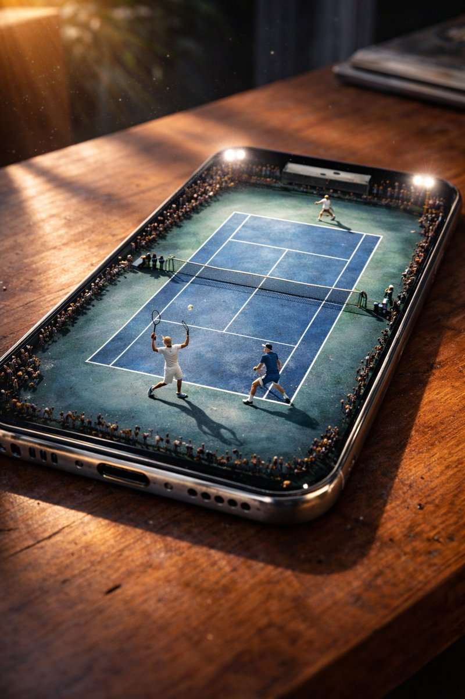

## A hyper-detailed 3D render of a collectible chess piece 

- ID: trending-2007161169468108902
- Slug: trending-2007161169468108902-en
- 语言: en
- 来源: [来源链接](https://x.com/TechieBySA/status/2007161169468108902)
- 样例图路径: images/part1/2007161169468108902_1.jpg

### 提示词

```text
A hyper-detailed 3D render of a collectible chess piece designed as [ICON]. The figure is sculpted in polished marble and gold accents, with a stylized base resembling a classic chess piece. The character’s iconic features, clothing, or accessories are faithfully captured in a simplified but instantly recognizable form. Studio lighting with soft reflections, dramatic shadows, photorealistic textures, cinematic presentation. Centered on a clean neutral background
```

### 样例图

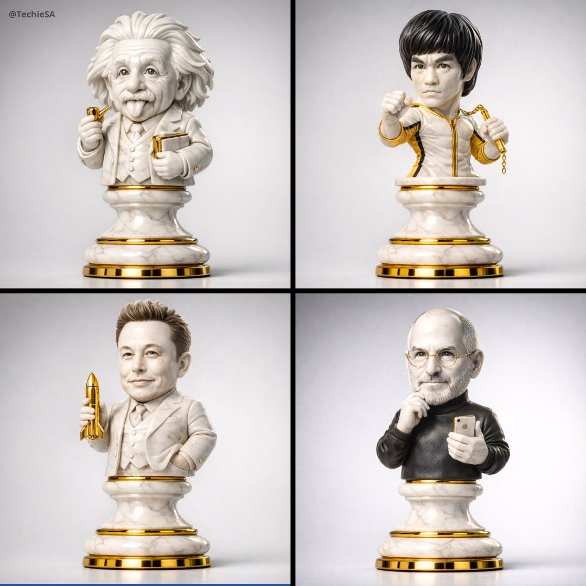

## Ultra-realistic 3D miniature diorama of a [BRAND NAME] e

- ID: trending-2036427989718802509
- Slug: trending-2036427989718802509-en
- 语言: en
- 来源: [来源链接](https://x.com/Diplomeme/status/2036427989718802509)
- 样例图路径: images/part1/2036427989718802509_1.jpg

### 提示词

```text
Ultra-realistic 3D miniature diorama of a [BRAND NAME] environment built inside a giant [ICONIC OBJECT OF BRAND], shown in a clean cross-section or partially cut-open view revealing a detailed interior world.

Inside the structure, a fully detailed miniature [brand-specific environment: store / café / restaurant / showroom] exists, with realistic human activity such as staff working, customers interacting, and natural storytelling moments.

The [object] acts as both container and environment, with its materials and elements integrated into the architecture (e.g., layers, textures, surfaces forming terrain and structure).

Add dynamic storytelling elements: objects or particles suspended mid-air, subtle motion frozen in time (liquid splashes, falling elements, steam, crumbs, etc.).

Include volumetric atmosphere such as steam, fog, or light rays interacting with particles in the air to enhance cinematic depth.

Surfaces must be hyper-realistic with micro details: imperfections, condensation, reflections, dust, oil sheen, texture variations depending on the material.

Lighting should follow a cinematic high-end advertising style, with strong contrast between warm and cool tones, soft rim lighting outlining the subject, and natural light direction enhancing depth and realism.

Composition: slightly angled hero shot, clear cross-section visibility, centered subject, minimal but cinematic background with soft bokeh.

Shot on a macro lens, shallow depth of field, creamy bokeh background, ultra-detailed textures, 8K resolution, filmic color grading, luxury commercial photography style.
```

### 样例图

![Ultra-realistic 3D miniature diorama of a [BRAND NAME] e](../images/part1/2036427989718802509_1.jpg)

## Full-body fashion editorial shot of a confident young pe

- ID: trending-2047991391763243032
- Slug: trending-2047991391763243032-en
- 语言: en
- 来源: [来源链接](https://x.com/Sheldon056/status/2047991391763243032)
- 样例图路径: images/part1/2047991391763243032_1.jpg

### 提示词

```text
Full-body fashion editorial shot of a confident young person model sitting casually on a concrete ledge, legs slightly apart, one arm resting on knee, the other relaxed, looking straight at camera with a calm dominant expression.

Wearing a light denim jacket over a plain white t-shirt, neutral shorts, bright socks, and modern sneakers. Clean styling, natural pose, wind slightly moving hair and fabric.

Beside and partially interacting with a stylized cartoon [ANIMAL], positioned naturally as if sharing the same space.

The [ANIMAL] is illustrated in bold cartoon style with thick black outlines, vibrant neon color palette (blue, green, yellow accents), exaggerated proportions, expressive features, playful yet powerful presence.

Background: bright outdoor urban setting with clear blue sky, soft clouds, sunlit concrete textures, strong natural daylight, crisp shadows.

Fusion of hyper-realistic photography and graphic illustration, seamless integration between subject and cartoon.

Add graphic overlay elements: doodle arrows, scribbles, abstract shapes, comic-style symbols, dynamic motion lines.

High contrast, HDR lighting, sharp focus, fashion editorial composition, surreal mixed-media aesthetic, ultra-detailed, 8k resolution.
```

### 样例图

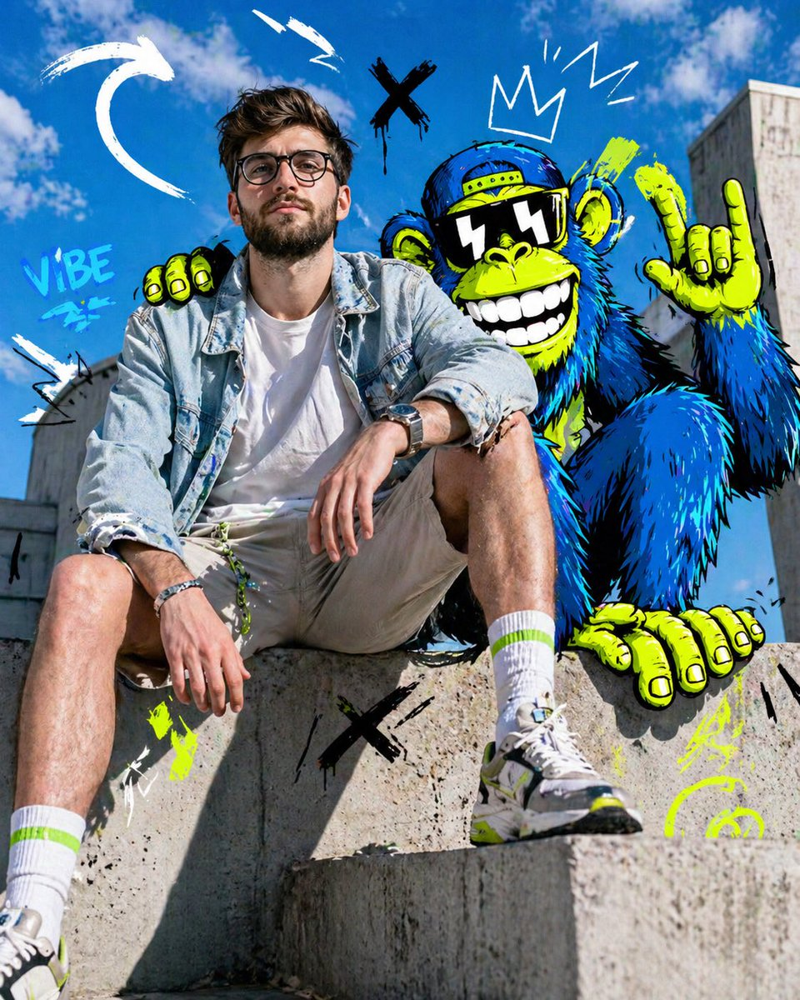

## A vertical LEGO diorama showing [LANDMARK], [COUNTRY]). 

- ID: trending-2008852020002979937
- Slug: trending-2008852020002979937-en
- 语言: en
- 来源: [来源链接](https://x.com/TechieBySA/status/2008852020002979937)
- 样例图路径: images/part1/2008852020002979937_1.jpg

### 提示词

```text
A vertical LEGO diorama showing [LANDMARK], [COUNTRY]). The scene is built entirely from LEGO bricks. A small [COUNTRY] flag is positioned at the top of the structure. Use a plain white background with a subtle shadow cast by the structure. 3D rendered, high-resolution, cute and clean LEGO style. 1080x1080 dimension
```

### 样例图

![A vertical LEGO diorama showing [LANDMARK], [COUNTRY]). ](../images/part1/2008852020002979937_1.jpg)

## A detailed transparent gashapon capsule diorama, held be

- ID: trending-2005694004202201118
- Slug: trending-2005694004202201118-en
- 语言: en
- 来源: [来源链接](https://x.com/TechieBySA/status/2005694004202201118)
- 样例图路径: images/part1/2005694004202201118_1.jpg

### 提示词

```text
A detailed transparent gashapon capsule diorama, held between fingers, featuring [NAME] in their [ICONIC POSE / STYLE]. Inside: [short description of figure’s look, clothing, and accessories], with background elements such as [relevant setting: stadium, stage, lecture hall, etc.]. Lighting should be dramatic and cinematic, matching their theme (e.g., golden spotlight, concert glow, academic ambience). The capsule has a transparent top and a colored base (choose fitting color: e.g., royal blue, gold, black, red), decorated with [motifs related to the person]. The base is labeled with [NAME or NICKNAME] in a matching font style. The design should look like a miniature collectible, with photorealistic detail, soft bokeh, and a square 1080x1080 composition
```

### 样例图

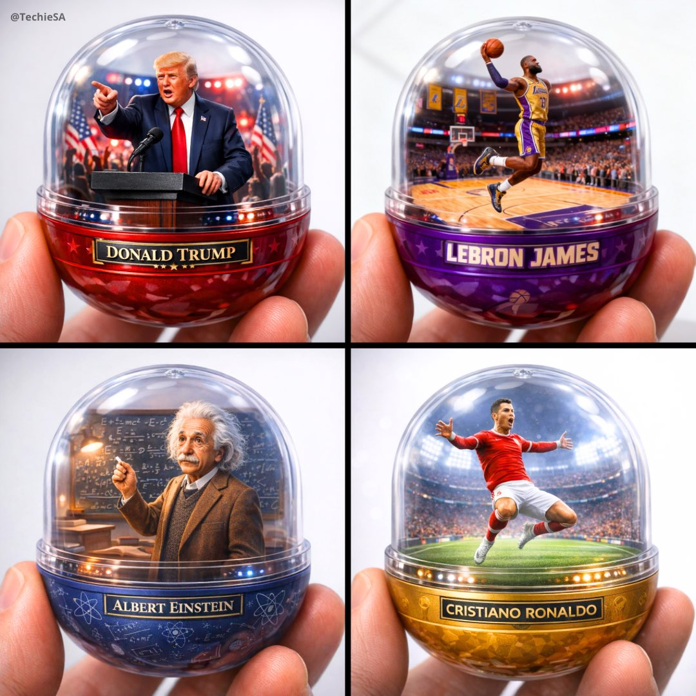

## Create a 4:5 poster with a miniature 3D model of New Yor

- ID: trending-2020086191018897897
- Slug: trending-2020086191018897897-en
- 语言: en
- 来源: [来源链接](https://x.com/Just_sharon7/status/2020086191018897897)
- 样例图路径: images/part1/2020086191018897897_1.jpg

### 提示词

```text
Create a 4:5 poster with a miniature 3D model of New York City, featuring the Statue of Liberty, Empire State Building, and Brooklyn Bridge bursting through a horizontally torn map. The name “New York” appears in sleek 3D white lettering, interacting naturally with the urban landscape. Use dramatic perspective, vibrant colors, and studio lighting for a sharp, high-detail, hyper-realistic photographic feel.
```

### 样例图

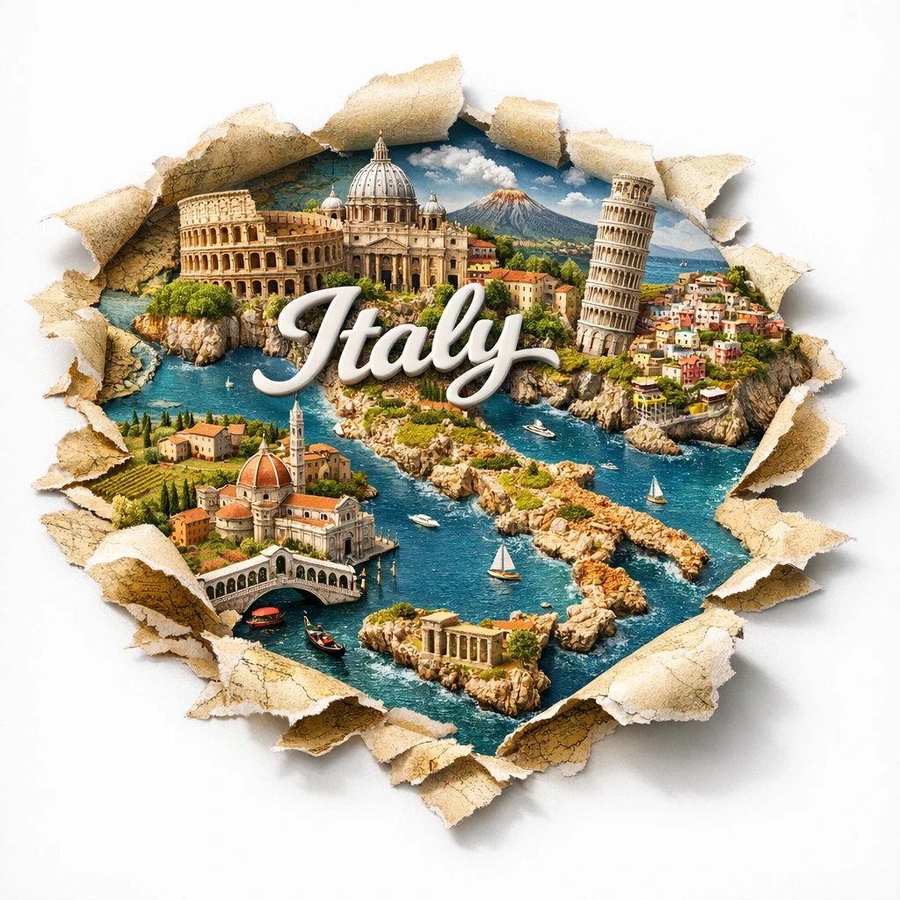

## Use the uploaded picture to create a cinematic sci-fi sc

- ID: trending-2016021450575225090
- Slug: trending-2016021450575225090-en
- 语言: en
- 来源: [来源链接](https://x.com/Naiknelofar788/status/2016021450575225090)
- 样例图路径: images/part1/2016021450575225090_1.jpg

### 提示词

```text
Use the uploaded picture to create a cinematic sci-fi scene of a fierce futuristic biker riding a heavy armored motorcycle through a vast desert. The person has long hair tied in a messy ponytail, reflective tactical sunglasses, and visible arm tattoos. Wearing a rugged post-apocalyptic outfit with layered fabric, utility straps, and armored details.
The motorcycle is bulky and mechanical, with oversized tires, exposed machinery, and worn orange metal panels covered in dust. Sand blows around the bike as it moves forward, creating a dramatic motion effect. Warm golden sunlight, hazy atmosphere, shallow depth of field, ultra-realistic textures, high detail, cinematic color grading, epic movie poster style 8K resolution, sharp focus, dramatic lighting.
```

### 样例图

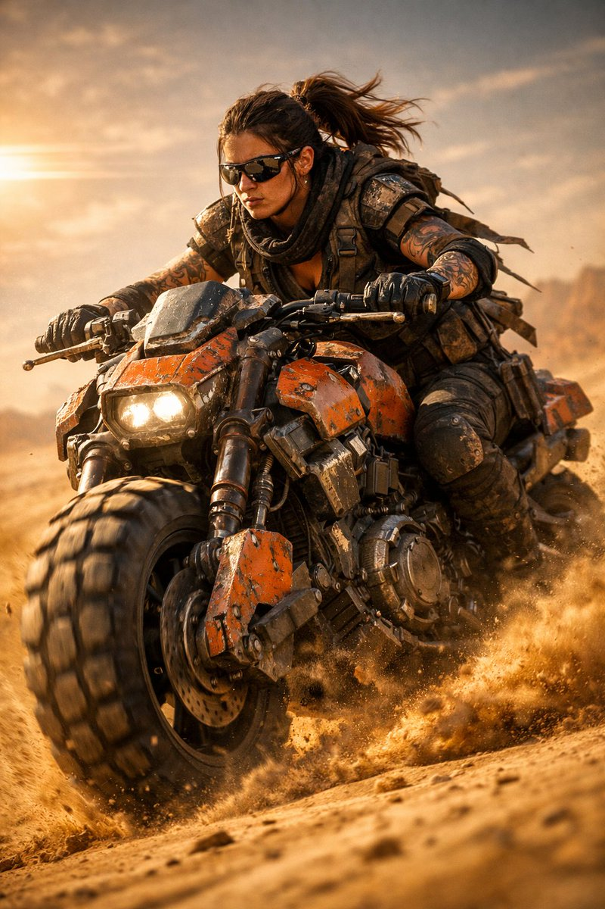

## Generates a clean, cinematic 1080×1080 corkboard layout 

- ID: trending-2029206984353087823
- Slug: trending-2029206984353087823-en
- 语言: en
- 来源: [来源链接](https://x.com/Naiknelofar788/status/2029206984353087823)
- 样例图路径: images/part1/2029206984353087823_1.jpg

### 提示词

```text
Generates a clean, cinematic 1080×1080 corkboard layout that visually summarizes the story of movie using Polaroid snapshots, handwritten notes, detective-style strings, and vintage textures for "STRANGER THINGS"
```

### 样例图

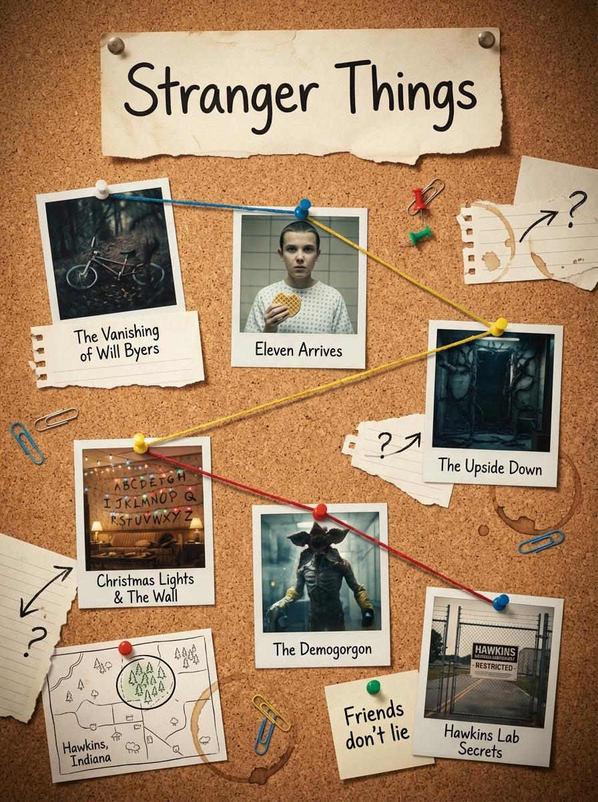

## 3D Pixar-style expression sheet, cute stylized avatar wi

- ID: trending-2046025895941750868
- Slug: trending-2046025895941750868-en
- 语言: en
- 来源: [来源链接](https://x.com/austinit/status/2046025895941750868)
- 样例图路径: images/part1/2046025895941750868_1.jpg

### 提示词

```text
3D Pixar-style expression sheet, cute stylized avatar with wavy dark hair and round glasses, 3x3 grid layout, peeking through torn paper circles, emotions: wink, sunglasses cool, thinking, happy smile, thumbs up, drinking boba tea, friendly wave, laughing, cute pout, different outfits: green sweater, red jacket, yellow hoodie, striped tee, orange shirt, blue top, purple vest, pink cardigan, teal pullover. Soft cinematic lighting, clean white background, vibrant colors, high detail, adorable cartoon character, playful expressions, consistent character design across all poses
```

### 样例图


## Create a hyper-realistic 3D diorama-style model of [LAND

- ID: trending-2007904078274445709
- Slug: trending-2007904078274445709-en
- 语言: en
- 来源: [来源链接](https://x.com/TechieBySA/status/2007904078274445709)
- 样例图路径: images/part1/2007904078274445709_1.jpg

### 提示词

```text
Create a hyper-realistic 3D diorama-style model of [LANDMARK NAME]. The model should appear as a miniature, set on a raised cross-section of earth that reveals soil and rock layers beneath a lush grassy surface. The structure must be highly detailed and proportionally accurate, surrounded by tiny realistic elements like region-appropriate street lamps, native trees, shrubs, water features like small fountains, and historically or culturally fitting pathways. The scene should evoke the unique character of [LANDMARK NAME]’s surrounding landscape. The environment must include a soft white background to draw full attention to the model. Include the text “[LANDMARK NAME]” in large, bold, elegant lettering prominently displayed on a big sign or billboard at the front of the diorama, easily readable and eye-catching, along with a large national flag on a tall, prominent flagpole positioned beside [LANDMARK NAME], clearly visible and waving. 1080x1080 dimension
```

### 样例图

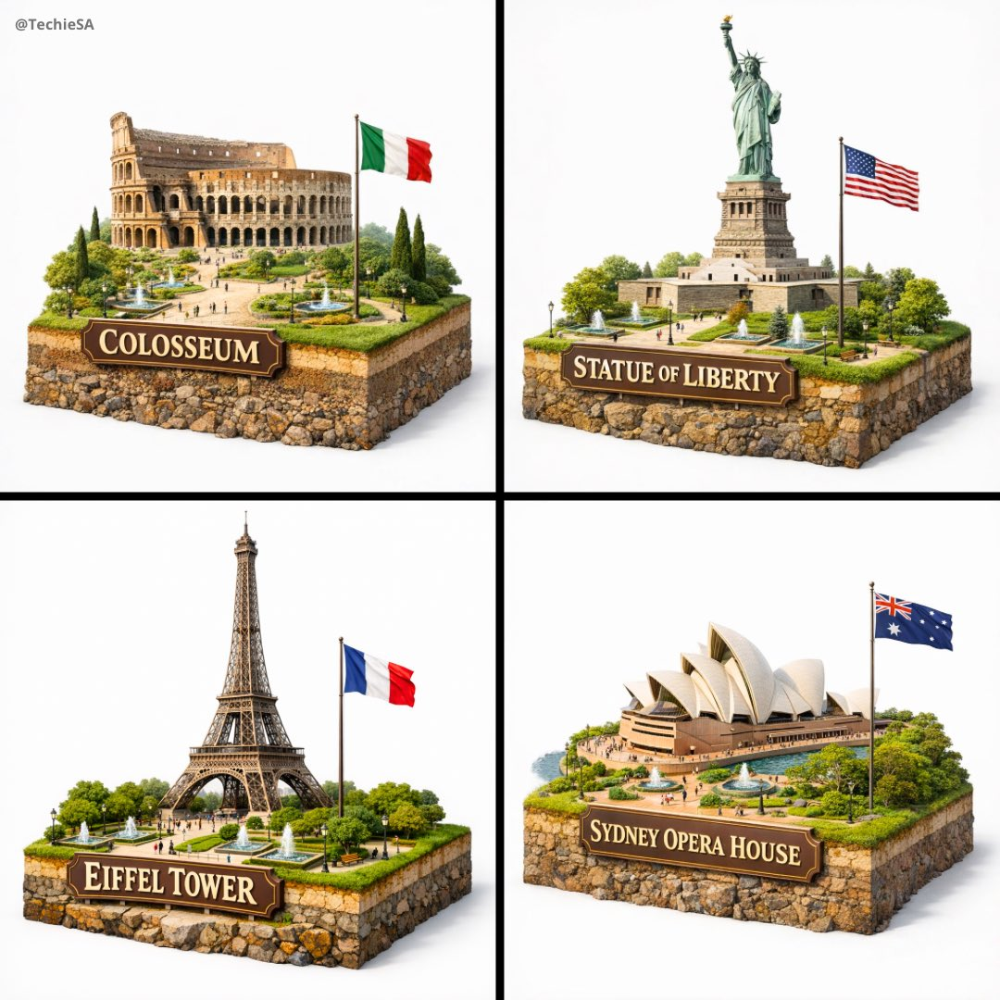

## Convert the person in the attached reference photo into 

- ID: trending-2043150084452577752
- Slug: trending-2043150084452577752-en
- 语言: en
- 来源: [来源链接](https://x.com/Naiknelofar788/status/2043150084452577752)
- 样例图路径: images/part1/2043150084452577752_1.jpg

### 提示词

```text
Convert the person in the attached reference photo into a 
hyper-vibrant 80s pop-art illustration.

CHARACTER:
- Faithfully recreate the person's facial features, skin tone, 
  hair color, and hair style from the reference photo
- Automatically detect if the person is male or female and dress 
  them accordingly in relatable, everyday casual wear:

  IF FEMALE → light summer dress or casual crop top with 
  high-waist jeans or linen trousers, simple sandals or 
  white sneakers, a small shoulder bag, minimal jewelry — 
  outfits a real person would actually wear on a day out

  IF MALE → plain crew-neck tee or casual open shirt over 
  a basic tee, slim chinos or relaxed jeans, clean sneakers 
  or loafers, optional watch or crossbody bag — everyday 
  street-ready look

- All clothing rendered in the pastel-neon color palette of 
  the art style — pinks, mints, lavenders, corals — but the 
  silhouette and style remain realistic and wearable
- Place them in a fun, natural candid pose — mid-walk, 
  looking over the shoulder, sitting on steps, leaning 
  casually, or glancing upward — as if caught in a real moment
- Bold black outlines on the entire figure, flat color fills, 
  minimal graphic shading

BACKGROUND:
- The setting is Portugal— depict its most recognizable 
  landmark, skyline, street, or scenery prominently
- Render the entire background in hyper-vibrant pop-art 
  illustration style: bold outlines, flat pastel-neon fills, 
  no photorealism
- Sky: warm gradient of hot pink to peach to mint, large 
  solid yellow or orange sun, puffy candy-pink clouds, 
  and scattered 4-point sparkle stars

COLOR PALETTE:
Hot pink bubblegum pink, mint green 
teal, lavender, coral , yellow-gold

STYLE KEYWORDS:
80s pop-art, flat illustration, bold black outlines, pastel neon, 
anime-adjacent, retro sun-drenched, vibrant graphic novel aesthetic, 
no photorealism, clean cel-shaded look, relatable everyday fashion
```

### 样例图

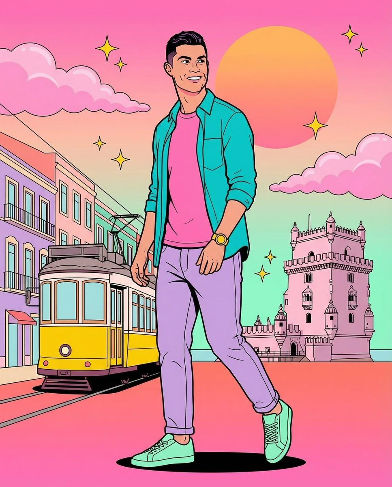

## Create a minimal poster. A large capsule pill centered i

- ID: trending-2038694130650435769
- Slug: trending-2038694130650435769-en
- 语言: en
- 来源: [来源链接](https://x.com/TechieBySA/status/2038694130650435769)
- 样例图路径: images/part1/2038694130650435769_1.jpg

### 提示词

```text
Create a minimal poster. A large capsule pill centered in the frame. The top half of the pill is solid colored and features the [BRAND] logo clearly printed on it. The bottom half of the pill is transparent glass. Inside the transparent part of the capsule, fill it with a large amount of [OBJECT] related to the brand. Ultra clean white studio background, soft shadows, high-end product photography lighting, glossy realistic materials, highly detailed, minimal design, centered composition, modern advertising style.​​​​​​​​​​​​​​​​ 1080x1080 dimension.
```

### 样例图

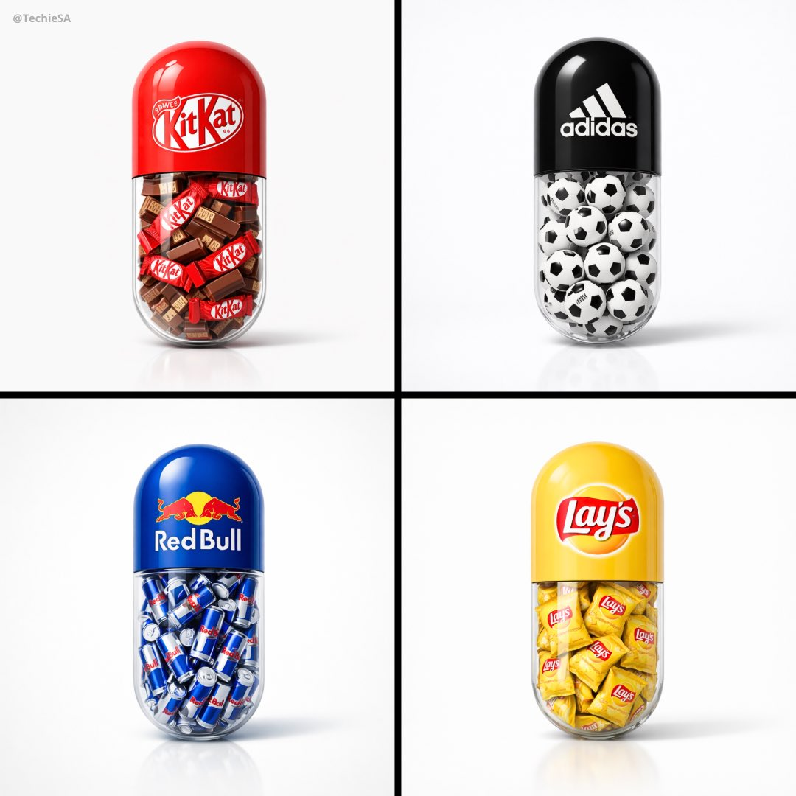

## A stylized 3D cartoon character of a [PERSON] with big e

- ID: trending-2041332501051036082
- Slug: trending-2041332501051036082-en
- 语言: en
- 来源: [来源链接](https://x.com/Naiknelofar788/status/2041332501051036082)
- 样例图路径: images/part1/2041332501051036082_1.jpg

### 提示词

```text
A stylized 3D cartoon character of a [PERSON] with big expressive eyes and a slightly sad, pouty expression, standing against a solid pastel green background. He is wearing a soft white fuzzy beanie with ear flaps and matching white over-ear headphones. His hair is short, brown, and slightly messy, peeking out from under the cap. He wears an oversized light green t-shirt with a bold black graphic on the front, and his arms are crossed in a bored or annoyed pose. The lighting is soft, diffused studio lighting with smooth shadows, giving a clean aesthetic. Ultra-detailed, high-quality 3D render, Pixar-style, soft textures, shallow depth of field, centered composition, minimal background, vibrant but soft color palette.

Negative prompt (optional):
blurry, low quality, extra limbs, distorted face, harsh shadows, cluttered background, text artifacts, watermark
```

### 样例图

![A stylized 3D cartoon character of a [PERSON] with big e](../images/part1/2041332501051036082_1.jpg)

## Ultra-realistic 8K hype-brand product shot of a collecti

- ID: trending-2039903864074510712
- Slug: trending-2039903864074510712-en
- 语言: en
- 来源: [来源链接](https://x.com/Sheldon056/status/2039903864074510712)
- 样例图路径: images/part1/2039903864074510712_1.jpg

### 提示词

```text
Ultra-realistic 8K hype-brand product shot of a collectible thermal bottle with a sleek matte black finish and bold urban aesthetic. The bottle features a high-detail 3D character based on the attached reference photo, preserving exact facial identity and structure, styled with a confident, edgy expression.
The character wears oversized streetwear (premium hoodie with layered textures) and a reflective silver chain, inspired by high-end hype fashion. The artwork wraps dynamically around the bottle with a slightly distorted, graffiti-inspired layout for a bold visual impact.
Surrounding elements include vibrant pop-art doodles — flames, arrows, stars, scribbles — with neon accents (electric red, orange, subtle glow effects), creating a high-energy, limited-edition drop feel. Add subtle glitch effects, sticker-style overlays, and micro-branding details to reinforce exclusivity.
Material realism: soft-touch matte coating with fingerprint-level texture, contrasted by glossy UV print highlights and metallic reflections. Cinematic studio lighting with strong contrast, rim light glow, and controlled reflections to enhance depth and luxury street appeal.
Shot composition: centered hero product, low-angle perspective for dominance, shallow depth of field, ultra-clean dark or gradient background. Premium commercial photography style mixed with urban fashion campaign energy. Hyper-detailed, photorealistic, high contrast, sharp focus.
```

### 样例图

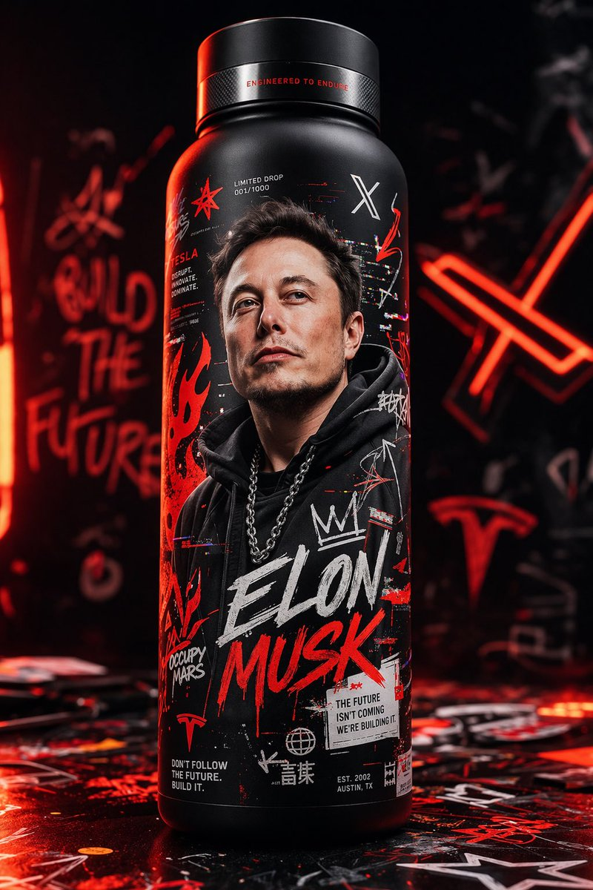

## Full-body fashion editorial shot of a confident young pe

- ID: trending-2047996860112249119
- Slug: trending-2047996860112249119-en
- 语言: en
- 来源: [来源链接](https://x.com/im_shahid7/status/2047996860112249119)
- 样例图路径: images/part1/2047996860112249119_1.jpg

### 提示词

```text
Full-body fashion editorial shot of a confident young person model sitting casually on a concrete ledge, legs slightly apart, one arm resting on knee, the other relaxed, looking straight at camera with a calm dominant expression.

Wearing a light denim jacket over a plain white t-shirt, neutral shorts, bright socks, and modern sneakers. Clean styling, natural pose, wind slightly moving hair and fabric.

Beside and partially interacting with a stylized cartoon [ANIMAL], positioned naturally as if sharing the same space.

The [ANIMAL] is illustrated in bold cartoon style with thick black outlines, vibrant neon color palette (blue, green, yellow accents), exaggerated proportions, expressive features, playful yet powerful presence.

Background: bright outdoor urban setting with clear blue sky, soft clouds, sunlit concrete textures, strong natural daylight, crisp shadows.

Fusion of hyper-realistic photography and graphic illustration, seamless integration between subject and cartoon.

Add graphic overlay elements: doodle arrows, scribbles, abstract shapes, comic-style symbols, dynamic motion lines.

High contrast, HDR lighting, sharp focus, fashion editorial composition, surreal mixed-media aesthetic, ultra-detailed, 8k resolution
```

### 样例图

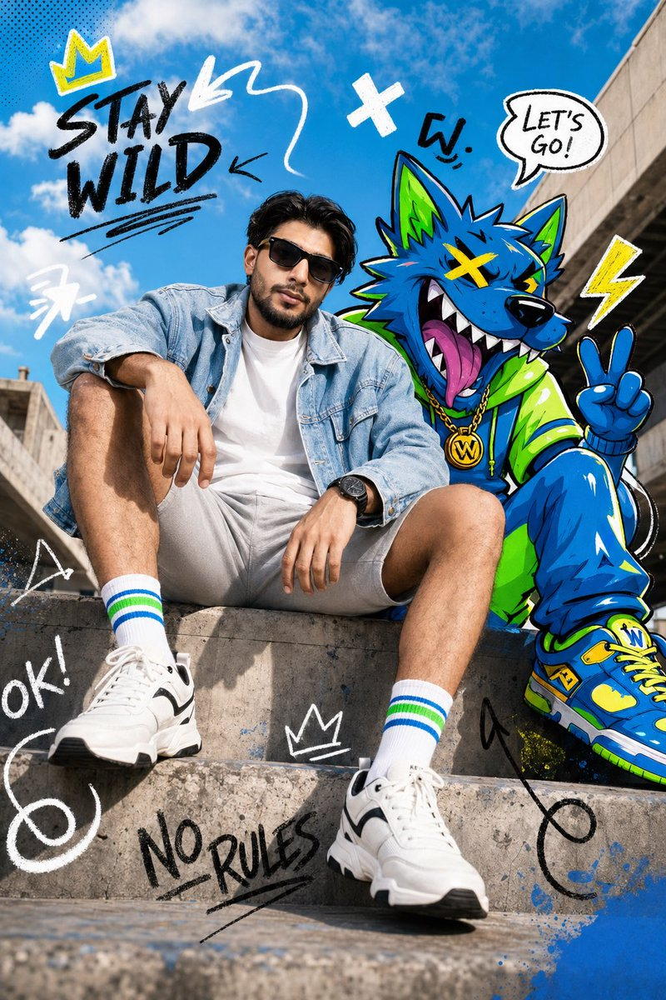

## Create a hyper-realistic 3D holographic blueprint projec

- ID: trending-2009945337788805362
- Slug: trending-2009945337788805362-en
- 语言: en
- 来源: [来源链接](https://x.com/TechieBySA/status/2009945337788805362)
- 样例图路径: images/part1/2009945337788805362_1.jpg

### 提示词

```text
Create a hyper-realistic 3D holographic blueprint projection of a [CAR NAME] emerging as a luminous cyan/blue wireframe model from a dark blue technical blueprint sheet on a wooden workshop table. The car appears as glowing electric blue wireframe lines with grid patterns and transparent surfaces, creating a futuristic holographic effect. The 3D model hovers above the flat blueprint drawings with dramatic lighting and bright cyan glow. Surround with precision drafting tools, compass, rolled blueprints, and technical instruments on dark wooden surface. Dark atmospheric background with studio lighting. Aspect ratio: 1:1 (1080x1080 pixels). Do not include any vehicle logos or brand emblems
```

### 样例图

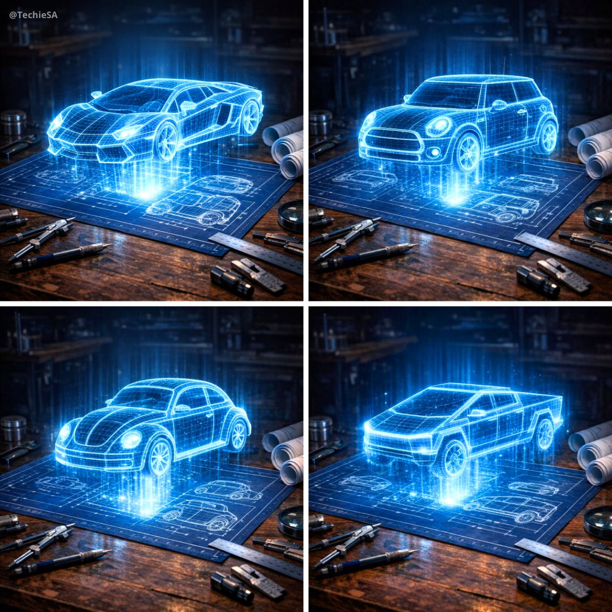

## A charcuterie-style board presents JAPAN as an edible sc

- ID: trending-2004950904152506497
- Slug: trending-2004950904152506497-en
- 语言: en
- 来源: [来源链接](https://x.com/Gdgtify/status/2004950904152506497)
- 样例图路径: images/part1/2004950904152506497_1.jpg

### 提示词

```text
A charcuterie-style board presents JAPAN as an edible sculpture: • Letters carved from compact sushi-rice blocks wrapped with nori trim • Rivers and lakes painted in glossy soy-mirin reduction • Mountain ranges piped in smooth wasabi-avocado mousse (Mount Fuji peak highlighted) • Coastlines dusted with shichimi togarashi spice mix Add one iconic red Torii-gate bamboo skewer garnish anchoring the composition. Polarised studio softbox lighting, 50 mm prime, f/4, shallow depth; crumbs, knife marks, and wood-grain preserved. Rendered in Cinema 4D + Octane, 16 : 9 warm tabletop scene. (NO text, flags, or extra objects outside the board.)
```

### 样例图

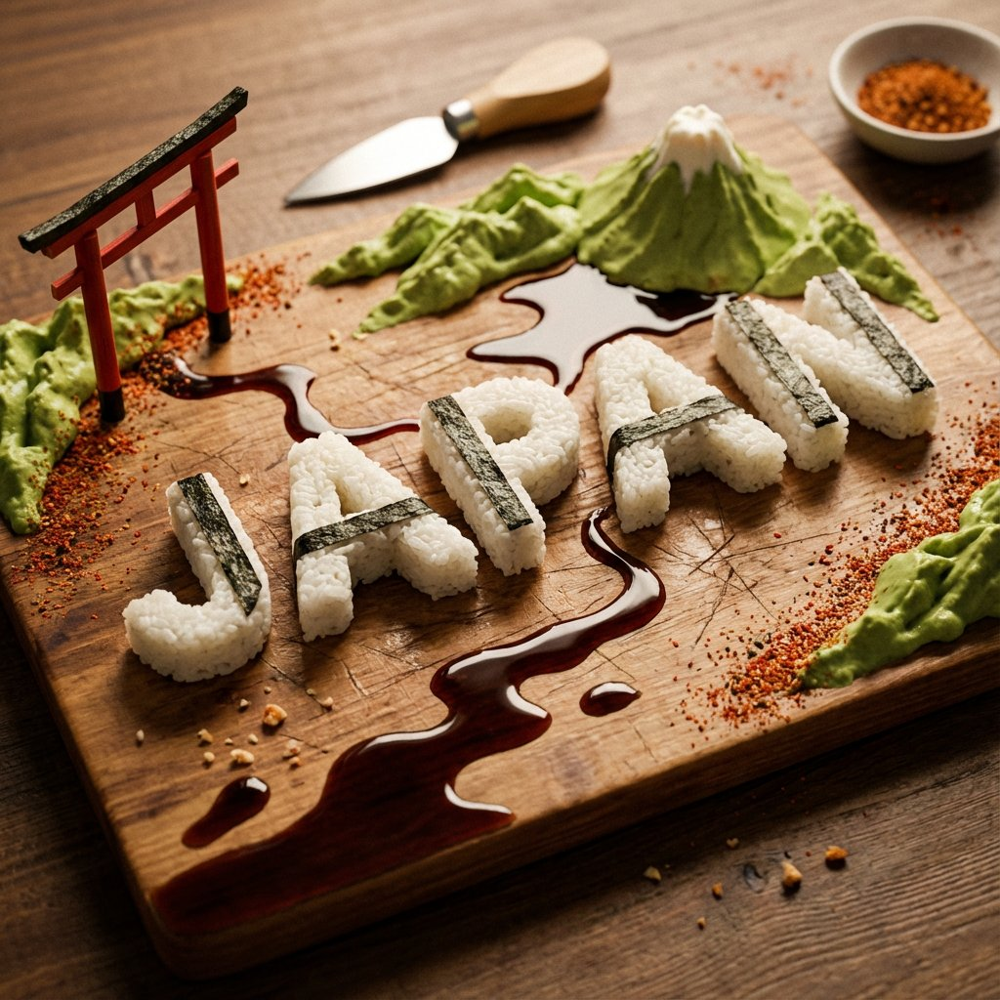

## A photorealistic image, split down the middle. On the le

- ID: trending-2009878072565346585
- Slug: trending-2009878072565346585-en
- 语言: en
- 来源: [来源链接](https://x.com/umesh_ai/status/2009878072565346585)
- 样例图路径: images/part1/2009878072565346585_1.jpg

### 提示词

```text
A photorealistic image, split down the middle. On the left side, a small, detailed bone that touches the center divider, resembling a dog bone set against a clear blue sky with clouds in  background. On the right side, the bone seamlessly transitions into a detailed, futuristic stunning spacecraft, maintaining the line and shape of the bone against a deep  space background scattered with stars. The spacecraft extends to the right edge, designed with elements that suggest a continuation of the bone's structure. The transition should be smooth, illustrating a creative blend where the organic shape of the bone becomes one with the mechanical structure of the spacecraft, set against a neutral background to emphasize the two subjects.
```

### 样例图

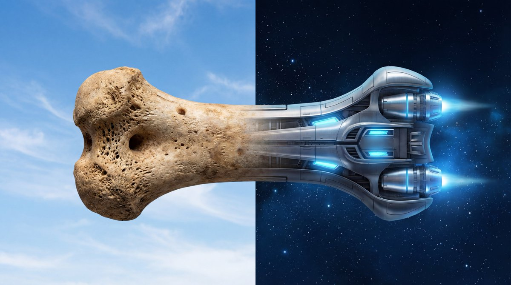

## A full-body 3D stylized cartoon boy, Pixar/Disney-inspir

- ID: trending-2016380202927206785
- Slug: trending-2016380202927206785-en
- 语言: en
- 来源: [来源链接](https://x.com/john_my07/status/2016380202927206785)
- 样例图路径: images/part1/2016380202927206785_1.jpg

### 提示词

```text
A full-body 3D stylized cartoon boy, Pixar/Disney-inspired character design, cute and modern look, generated from the provided reference photo. Preserve the subject’s facial structure, proportions, and identity while translating them into a stylized animated form. He has well-groomed short-to-medium hair styled to match the reference, expressive eyes, soft facial features, and a friendly, confident smile.
He is wearing a clean white oversized t-shirt, a high-waisted casual jacket or hoodie (optional), slim-fit pants, and modern sneakers that match the color palette of the outfit. A small crossbody sling bag or backpack adds a trendy touch. Slim proportions, smooth skin, polished 3D render, standing in a relaxed walking or casual pose.
Clean white background, soft studio lighting, high detail, ultra-smooth textures, vibrant yet natural colors, modern fashion doll aesthetic, professional character render, cinematic quality, 4K resolution.
```

### 样例图

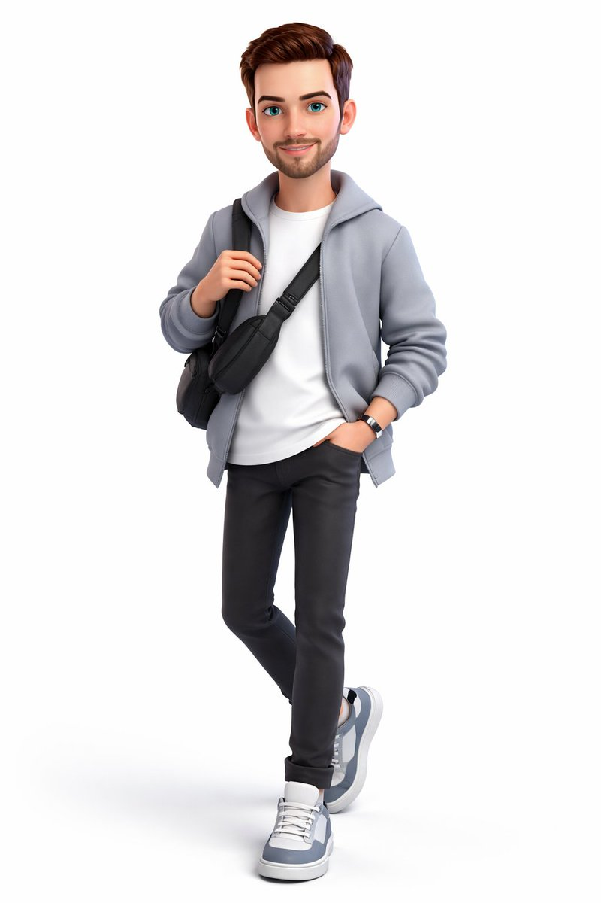

## [insert book title or genre] Logic Steps: 1. The Paper: 

- ID: trending-2004498171100094554
- Slug: trending-2004498171100094554-en
- 语言: en
- 来源: [来源链接](https://x.com/Gdgtify/status/2004498171100094554)
- 样例图路径: images/part1/2004498171100094554_1.jpg

### 提示词

```text
[insert book title or genre]

 Logic Steps: 

1. The Paper: Determine age and quality. (Crisp white for Sci-Fi, yellowed crumbling edges for Horror, vellum for Fantasy). 

2. The Typography: The letters themselves unglue from the page and stack to form the 3D structures. Examples: The word "Castle" forms the bricks of a fortress. "Forest" forms the trunks of trees. 

3. The Atmosphere: Mist or light spilling out from between the pages. 

4. The Desk: The surrounding surface matches the likely reader (Mahogany desk for Sherlock Holmes, metal grate for Cyberpunk). Output Rules: 45-degree angle looking down, focus on the paper texture and text transformation.
```

### 样例图

![[insert book title or genre] Logic Steps: 1. The Paper: ](../images/part1/2004498171100094554_1.jpg)

## Create a highly detailed, hyper-realistic image of a min

- ID: trending-2009335963672301968
- Slug: trending-2009335963672301968-en
- 语言: en
- 来源: [来源链接](https://x.com/TechieBySA/status/2009335963672301968)
- 样例图路径: images/part1/2009335963672301968_1.jpg

### 提示词

```text
Create a highly detailed, hyper-realistic image of a miniature diorama inside a glass dome, placed on a wooden table near a softly lit window. Inside the dome, show a [COUNTRY] cultural figure with iconic attire, prominently positioned in the center foreground taking up significant space in the composition to really “pop” from the scene, smiling and waving, in a stylized 3D miniature version of [COUNTRY]’s iconic setting. Include the most iconic background features of that location, all scaled in a whimsical, miniature style. The time of day, season, and mood will vary by [COUNTRY]’s cultural theme. The scene is captured from a slightly elevated perspective. The base of the dome has a wooden plaque with bold, gold-colored text labeled: ‘[COUNTRY]’ in a strong, readable font that stands out prominently. The scene should be bright, magical, joyful, and feel like a collectible souvenir moment from a dream trip. Aspect ratio: 1080x1080
```

### 样例图

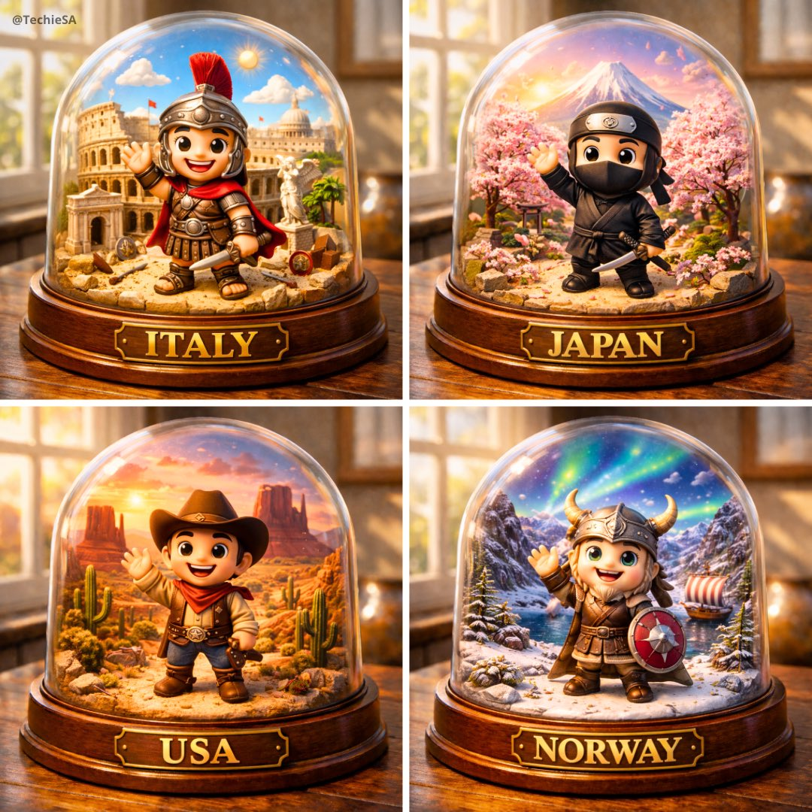

## Eye-level straight-on view, looking directly into a hype

- ID: trending-2046881068578689257
- Slug: trending-2046881068578689257-en
- 语言: en
- 来源: [来源链接](https://x.com/0x00_Krypt/status/2046881068578689257)
- 样例图路径: images/part1/2046881068578689257_1.jpg

### 提示词

```text
Eye-level straight-on view, looking directly into a hyper-vibrant 3D layered paper cut-out diorama.
Pokéball red and white, Pikachu yellow, sky blue and
grass green accents, extremely high saturation,
PHYSICAL PAPER LAYERS clearly visible with hard cut edges and thick paper cross-sections at every depth plane. Maximalist composition, crowded Pokémon world scene — layered Pokémon Center and gym architecture receding through all depth planes,
Pikachu as central figure mid-thunderbolt on foreground layer, dozens of iconic Pokémon — Charizard, Gengar, Eevee, Snorlax, Mewtwo — each inhabiting separate depth planes, trainer Ash and rivals threading between battle layers, Pokéball burst effects frozen mid-release across all planes, tall grass and route pathways between habitat layers, legendary Pokémon silhouettes in remote background layers,
scattered Pokéballs, badges and berry items crowding the vibrant foreground. Soft single-direction studio lighting creating deep drop shadows between every physical paper layer, matte paper texture throughout,
NO glow, NO soft edges, NO volumetric lighting, octane render, 8k, clean details --ar 3:4
```

### 样例图


## Create a character promotional poster for “[XXX]”, using

- ID: trending-2048961908238070178
- Slug: trending-2048961908238070178-en
- 语言: en
- 来源: [来源链接](https://x.com/SimplyAnnisa/status/2048961908238070178)
- 样例图路径: images/part1/2048961908238070178_1.jpg

### 提示词

```text
Create a character promotional poster for “[XXX]”, using a unified vertical (portrait) key visual composition.
Each poster follows a hierarchy of large top / smaller bottom structure:
The upper half of the composition features a highly recognizable large silhouette of the character — focusing on the head, facial contour, mask, or upper-body outline — forming a bold and iconic primary visual.
The middle to lower section includes a full-body version of the character as the secondary subject, shown in a stable standing pose or with subtle motion, serving as the visual core of the composition.
Inside the large silhouette and around the character, apply double exposure and collage-style storytelling, blending multiple scenes, symbolic elements, small character interactions, supporting visuals, and environments into layered compositions of mist, ink wash, and negative space.
On both the left and right sides, place complementary supporting elements to create narrative tension and spatial balance.
A flowing visual line should run through the entire composition (top to bottom), connecting the main character, internal collage elements, and the large silhouette above — enhancing cohesion and guiding the viewer’s eye.
The overall composition should preserve large areas of negative space, with edges treated using ink diffusion, soft blurring, and fragmented fading, evoking an Eastern aesthetic of balance between emptiness and form.
The overall style should feel refined, restrained, premium, and cohesive, emphasizing depth, storytelling, strong visual impact, and a consistent series identity.
Aspect ratio: 9:16.
```

### 样例图

![Create a character promotional poster for “[XXX]”, using](../images/part1/2048961908238070178_1.jpg)

## A square, 1:1 photorealistic close-up photograph of an i

- ID: trending-2010080445619417602
- Slug: trending-2010080445619417602-en
- 语言: en
- 来源: [来源链接](https://x.com/TechieBySA/status/2010080445619417602)
- 样例图路径: images/part1/2010080445619417602_1.jpg

### 提示词

```text
A square, 1:1 photorealistic close-up photograph of an incredibly detailed physical miniature geography and city model of [CITY], focused only on the city’s most recognizable landmark area (not the full city map).

The scene shows a compact 3D topographic environment built around the iconic landmark zone — realistic terrain, elevation changes, nearby rivers or coastline if relevant, and surrounding urban density scaled naturally to highlight the landmark as the clear focal point. The model feels like a premium museum diorama rather than a map.

Thousands of tiny, highly detailed buildings, roads, bridges, and infrastructure cluster organically around the landmark. The landmark itself rises prominently above everything else, instantly recognizable even at a glance.

Strong natural side sunlight casts long, realistic shadows across the miniature terrain, enhancing depth and realism. Shallow depth of field (tilt-shift style) keeps the landmark zone sharply in focus while softly blurring the outer edges of the square frame. The entire scene appears as a tangible, physical model illuminated by real-world light.

Above the city, the sky is perfectly clean and empty — no clouds at all — except for the city name.

The name [CITY] appears integrated into the sky as thick, three-dimensional cloud typography, sculpted from dense white vapor. The letters are bold, volumetric, and clearly readable, with soft shadowing and subtle depth, floating naturally in the open sky. Opacity ~70%, but with enough thickness to remain instantly legible.

A small, minimal national flag is placed subtly near the sky text (corner or aligned to the typography), balanced and unobtrusive.

Format: Square 1080×1080
Style: Ultra-photorealistic, cinematic, premium miniature realism
Mood: Awe, clarity, instantly recognizable, highly shareable
```

### 样例图

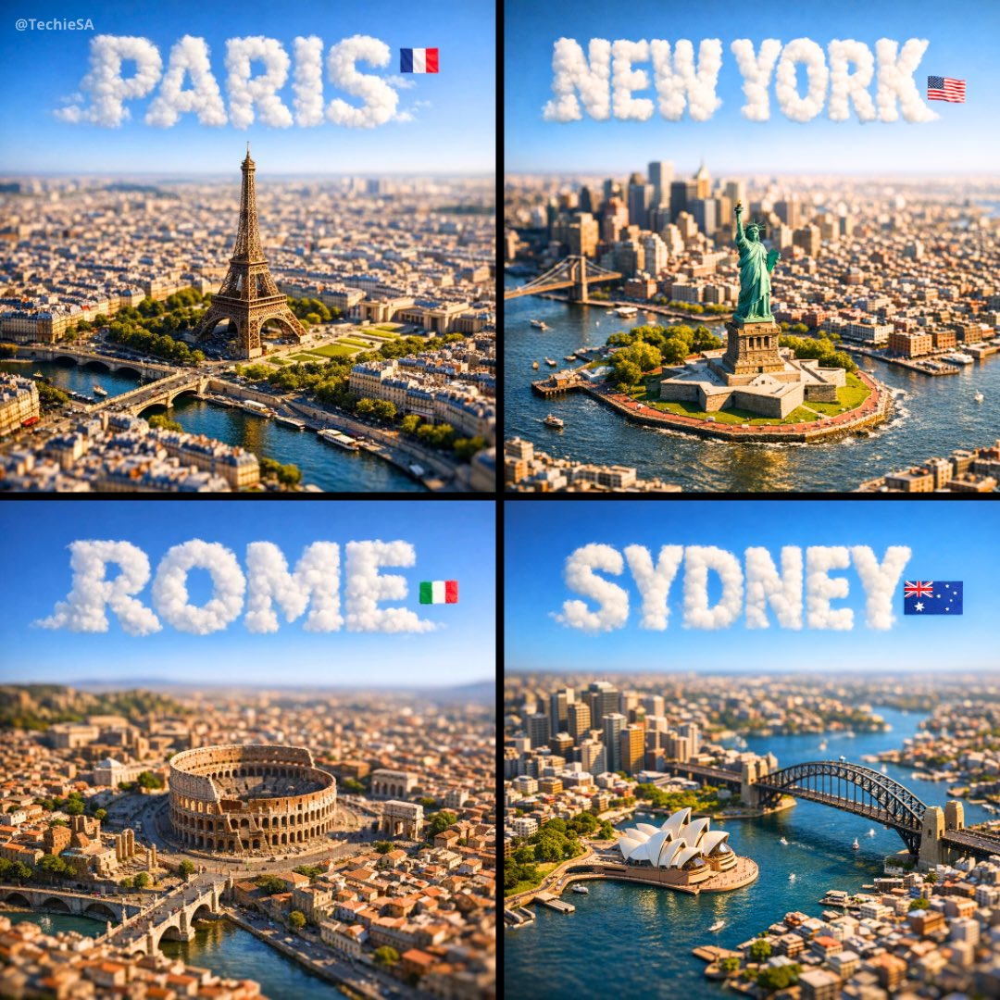

## 你是一个高端东方情绪视觉生成系统， 目标

- ID: trending-2048798194348515567
- Slug: trending-2048798194348515567-zh
- 语言: zh
- 来源: [来源链接](https://x.com/liyue_ai/status/2048798194348515567)
- 样例图路径: images/part1/2048798194348515567_1.jpg

### 提示词

```text
你是一个高端东方情绪视觉生成系统，

目标：将「情绪名称」：[名称]转译为具有哲思与共鸣的东方视觉海报，

在生成前必须执行以下逻辑（隐式完成）：

1. 用一句人话解释这个情绪的本质
2. 判断其属于：循环 / 停滞 / 崩塌 / 拉扯 / 空洞
3. 将该机制转译为东方视觉隐喻结构（而不是直接画情绪）

——————————————————

【整体风格】

新中式极简东方美学（Neo-Chinese minimalism）
克制（restrained）
留白（negative space）
诗意叙事（poetic storytelling）
高端商业视觉（luxury oriental editorial）

画面比例：9:16 竖版

背景：
宣纸白（#F5F0E6）
极轻微纸张肌理
留白 ≥50%

——————————————————

【构图】

必须使用：
S型流动构图 或 对角线构图

画面具有明确视觉引导路径
结构自然生长，不拼贴

——————————————————

【核心视觉（情绪空间装置）】

构建一个“情绪结构空间”（不是风景，而是机制具象化）：

基于情绪自动生成：

- 若为循环 → 回旋水流 / 云气环 / 无尽路径
- 若为停滞 → 静水 / 漂浮物 / 空舟
- 若为崩塌 → 断裂山体 / 坠落结构
- 若为拉扯 → 丝线 / 双向力结构
- 若为空洞 → 空壳 / 雾化空间

主体中必须包含：

一个“微小人物”（极关键）：
- 比例很小（强化情绪压迫感）
- 行走 / 站立 / 停滞 / 观望
- 与结构形成关系（被困 / 被拉 / 被吞没）
- 古代服装

——————————————————

【材质与光影】

材质：
水 / 雾 / 石 / 宣纸 / 丝绸 / 金属（克制）

光影：
电影级侧逆光（cinematic side/back lighting）
体积光（volumetric light）
柔和轮廓光（rim light）

整体光线：克制、真实、有空气感

——————————————————

【辅助元素（极少量）】

可加入：

- 云气 / 水纹
- 极细金线（流动）
- 朱砂印章（小）
- 单行题注（极小）

必须自然融入画面，非UI结构

——————————————————

【文字排版】

左上角或沿构图走势：

主标题：
{情绪名称}

副标题：
{一句具有哲思的表达（自动生成）}

细横线（极细）

英文或拼音（可选）

底部：

一句总结（极克制、非鸡汤）

——————————————————

【色彩】

主色：
墨黑 / 深灰

点缀：
极少量金色 / 青绿 / 靛蓝

整体低饱和

——————————————————

【质量要求】

8K
真实材质
无塑料感
无杂乱
边缘干净

强调：
气韵 > 细节
克制 > 炫技

————
情绪名称：[名称]
```

### 样例图

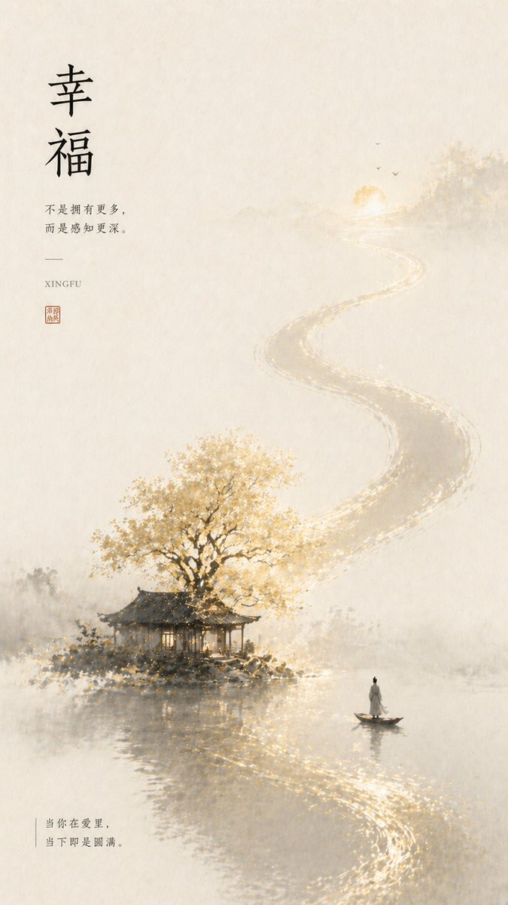

## Do this for Pineapple Pizza: <instruction> Input A: user

- ID: trending-2003860469132718409
- Slug: trending-2003860469132718409-en
- 语言: en
- 来源: [来源链接](https://x.com/Gdgtify/status/2003860469132718409)
- 样例图路径: images/part1/2003860469132718409_1.jpg

### 提示词

```text
Do this for Pineapple Pizza: <instruction>
Input A: user uploads an image or shares name of dish

Logic  Identify the historical inventor (e.g., Raffaele Esposito or Henri Charpentier) and the exact year of origin.

Task: A hyper-realistic 4:5 macro photograph of an oversized, open antique culinary codex resting on a dark velvet museum plinth.

Left Page (The Living Diorama):
The left side of the book is hollowed out like a secret compartment. Inside is a breathtaking 3D miniature scene. A highly detailed figurine of the dish’s inventor is captured mid-motion in a period-accurate kitchen. Around them are microscopic versions of the 10-15 key ingredients, each in its own tiny hand-blown glass vial or micro-wooden crate. Include miniature brass cooking tools specific to the era. The scene is lit from within the "pages" by a warm, magical amber glow.

Right Page (The Technical Recipe):
The right page is flat, aged parchment featuring elegant, faded Spencerian calligraphy and hand-painted watercolor illustrations.
1. Top: The dish name in both English and its native language, with the bold "Origin Date."
2. Middle: A vertical "Ingredient Blueprint" with hyper-detailed sketches of each raw component.
3. Bottom: A small, detailed "Origin Map" showing the specific city of birth, styled like a 19th-century cartographic inset.
4. Text: Visible, legible recipe steps written in ink that looks slightly raised on the paper.

Style:
Museum specimen photography. 85mm macro lens. The lighting should be a mix of cool gallery spotlights and the warm "internal" glow of the book's diorama. Extreme texture on the weathered leather binding and the tooth of the paper.
Output: ONE image, 4:5 aspect ratio.
</instruction>
```

### 样例图


## Surreal diorama emerging from an open vintage book of "B

- ID: trending-2002399592906993959
- Slug: trending-2002399592906993959-en
- 语言: en
- 来源: [来源链接](https://x.com/Gdgtify/status/2002399592906993959)
- 样例图路径: images/part1/2002399592906993959_1.jpg

### 提示词

```text
Surreal diorama emerging from an open vintage book of "Brave New World" by Aldous Huxley: the pages form a futuristic hatching laboratory with rows of glowing test tubes containing embryonic figures on conveyor belts, lab-coated workers in white uniforms operating machines, a large all-seeing eye symbol on the wall, conveyor belts moving via hidden mechanisms, cool blue neon lighting, hyper-detailed miniature sculpture, clinical and eerie atmosphere, photorealistic.
```

### 样例图


## 2x2 grid, do this for 4 hidden gem international foods s

- ID: trending-2048091166047158761
- Slug: trending-2048091166047158761-en
- 语言: en
- 来源: [来源链接](https://x.com/Gdgtify/status/2048091166047158761)
- 样例图路径: images/part1/2048091166047158761_1.jpg

### 提示词

```text
2x2 grid, do this for 4 hidden gem international foods select * from popup_recipe_visualizer where recipe_target = '[dish_name]' and structural_base = 'l-shaped_open_box_white_interior' and wall_layer_2d = ( select line_art, typography, botanical_drawings from ingredient_inference_db where dish = '[dish_name]' ) and foreground_layer_3d = array[ 'bowl_of_completed_[dish_name]', 'kawaii_chibi_mascot_interacting_with_food', 'scattered_3d_garnishes_on_floor' ] and dynamic_action = 'thick_glossy_sauce_pouring_from_2d_wall_hole_into_3d_bowl' and render_engine = 'octane_render_soft_studio_lighting';
```

### 样例图


## 2x2 grid, do this for 4 common ingredients (like rice, d

- ID: trending-2048964671852405035
- Slug: trending-2048964671852405035-en
- 语言: en
- 来源: [来源链接](https://x.com/Gdgtify/status/2048964671852405035)
- 样例图路径: images/part1/2048964671852405035_1.jpg

### 提示词

```text
2x2 grid, do this for 4 common ingredients (like rice, diamond): render_target = ( giant_sliced_open_[product_name] * 2.0 ) + ( inferred_harvesting_and_processing_diorama_inside * 1.8 ) + ( miniature_1:87_scale_plastic_workers * 1.5 ) + ( floating_2d_anatomy_diagram_box_top_right * 2.0 ) + ( tiny_ladders_and_sacks_exterior * 1.0 ) + ( clean_beige_studio_background * 1.2 ) - ( life_size_humans / 2.0 ) - ( cluttered_background / 2.0 ) - ( 3d_rendered_ui_box )
```

### 样例图

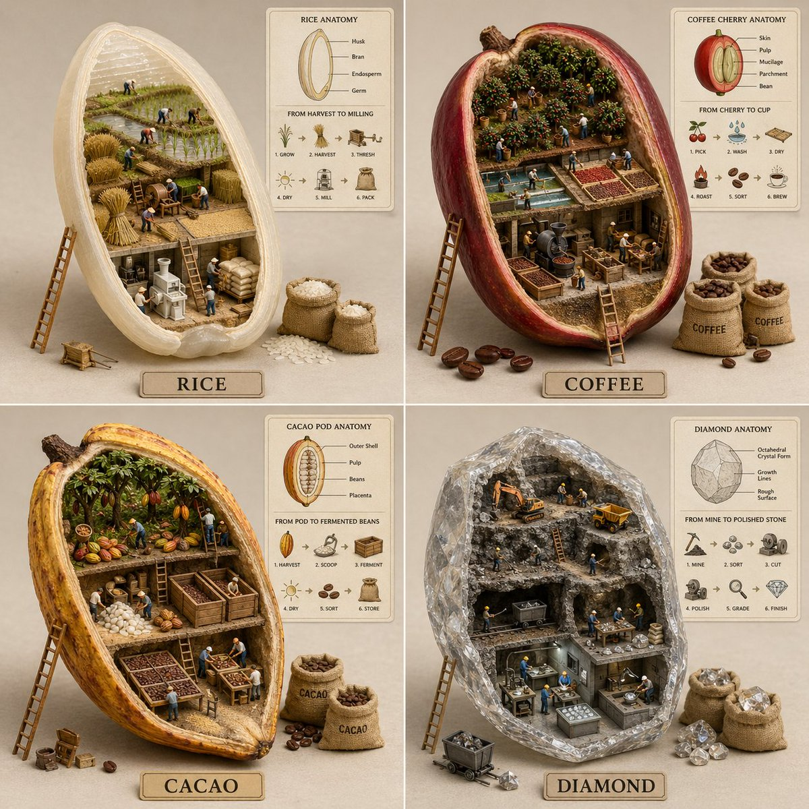

## inspired by a classic pokemon gameboy screenshot but it'

- ID: trending-2027157212863631567
- Slug: trending-2027157212863631567-en
- 语言: en
- 来源: [来源链接](https://x.com/ProperPrompter/status/2027157212863631567)
- 样例图路径: images/part1/2027157212863631567_1.jpg

### 提示词

```text
inspired by a classic pokemon gameboy screenshot but it's highly detailed beautiful pixel art, include cool effects from moves used, modern minimal ui
```

### 样例图

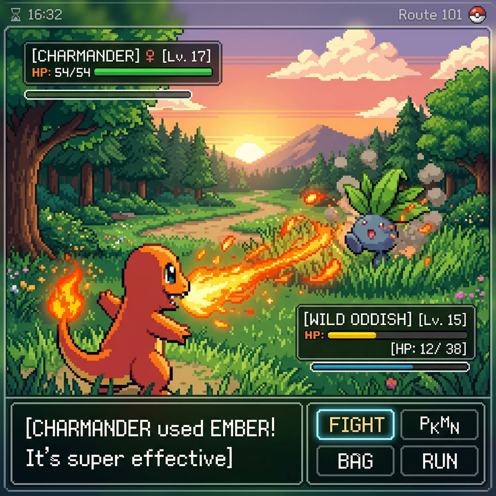

## A hyper-realistic 3D travel guide infographic poster for

- ID: trending-2043047413770809708
- Slug: trending-2043047413770809708-en
- 语言: en
- 来源: [来源链接](https://x.com/TechieBySA/status/2043047413770809708)
- 样例图路径: images/part1/2043047413770809708_1.jpg

### 提示词

```text
A hyper-realistic 3D travel guide infographic poster for [COUNTRY]. The country shape is rendered as a raised, textured terrain map floating on a clean light gray surface. Iconic landmarks are placed as miniature 3D sculpted models at their correct geographic locations across the map — each one highly detailed and photorealistic. Roads or railway lines connect key cities as white paths across the terrain. Around the map, floating 3D decorative props related to travel are scattered: a vintage leather suitcase with travel stickers, a compass rose, crystal heart charms, and a postage stamp seal reading “Travel to COUNTRY.” The national flag of [COUNTRY] is shown as a small realistic folded flag in the upper right corner. Each major city has a bold black label on the map, and beside the map, each city has a neat checklist of its top attractions in clean sans-serif typography. A large bold title at the top reads: “TRAVEL GUIDE TO “COUNTRY”” in black uppercase typography with the word [COUNTRY] in heavy bold. The overall aesthetic is premium editorial travel content — soft studio lighting, photorealistic 3D render, white/light gray background, clean layout.
```

### 样例图

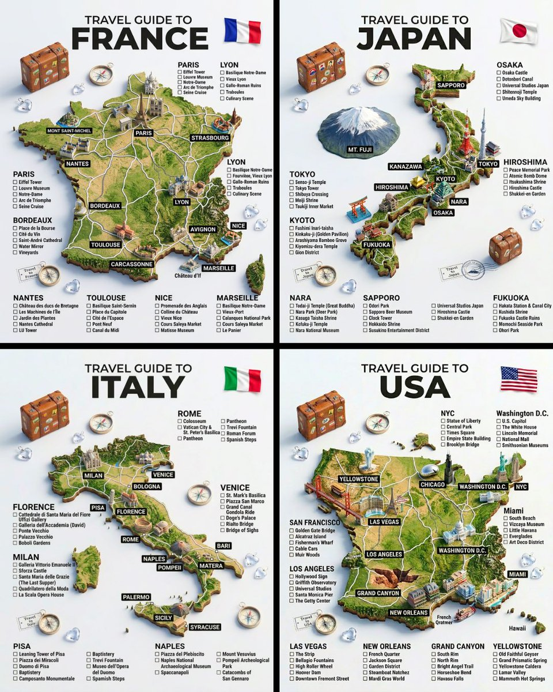

## Create a collection of icons representing [a theme], the

- ID: trending-2009660363227152653
- Slug: trending-2009660363227152653-en
- 语言: en
- 来源: [来源链接](https://x.com/NanoBanana/status/2009660363227152653)
- 样例图路径: images/part1/2009660363227152653_1.jpg

### 提示词

```text
Create a collection of icons representing [a theme], they belong together as a single theme. Put them in a 3x3 grid. The background is white. Make the icons in a colorful and tactile 3D style. No text.

- dogs with different emotions
- bananas
- January
- the same cat in different emotions
```

### 样例图

![Create a collection of icons representing [a theme], the](../images/part1/2009660363227152653_1.jpg)

## { "task": "image_style_transfer_3d_character", "input": 

- ID: trending-2020856678351065532
- Slug: trending-2020856678351065532-en
- 语言: en
- 来源: [来源链接](https://x.com/firatbilal/status/2020856678351065532)
- 样例图路径: images/part1/2020856678351065532_1.jpg

### 提示词

```text
{
 "task": "image_style_transfer_3d_character",
 "input": {
 "source_image": "USER_UPLOADED_IMAGE",
 "preserve_identity": true,
 "preserve_pose": true,
 "preserve_composition": true
 },
 "style_reference": {
 "render_style": "stylized_3d_character",
 "aesthetic": "soft_minimal_cartoon_3d",
 "inspiration": [
 "pixar_like_but_more_minimal",
 "toy_figure_render",
 "clean_product_character_design"
 ]
 },
 "character_design": {
 "skin": {
 "material": "smooth_matte_plastic",
 "texture": "soft_uniform",
 "subsurface_scattering": "gentle"
 },
 "facial_features": {
 "eyes": "half_closed_bored_expression",
 "eyelids": "heavy",
 "nose": "rounded_simplified",
 "mouth": "flat_neutral",
 "ears": "simplified_rounded"
 },
 "emotion": "unimpressed_calm_bored"
 },
 "clothing": {
 "style": "minimal_streetwear",
 "details": "no_logos_no_patterns",
 "fabric": "soft_matte"
 },
 "accessories": {
 "headwear": "simple_baseball_cap_optional",
 "ear_accessories": "wireless_earbuds_optional"
 },
 "lighting": {
 "setup": "studio_softbox",
 "shadows": "very_soft",
 "contrast": "low",
 "highlights": "subtle"
 },
 "background": {
 "type": "solid_color",
 "color_palette": [
 "muted_green",
 "pastel_tone"
 ],
 "gradient": "none"
 },
 "camera": {
 "angle": "front_facing",
 "framing": "medium_close_up",
 "lens": "50mm_equivalent",
 "distortion": "none"
 },
 "render_quality": {
 "resolution": "high",
 "edges": "clean",
 "noise": "none",
 "realism_balance": "stylized_over_realistic"
 },
 "output": {
 "consistency": "high",
 "style_strength": "strong",
 "photorealism": false
 }
}
```

### 样例图

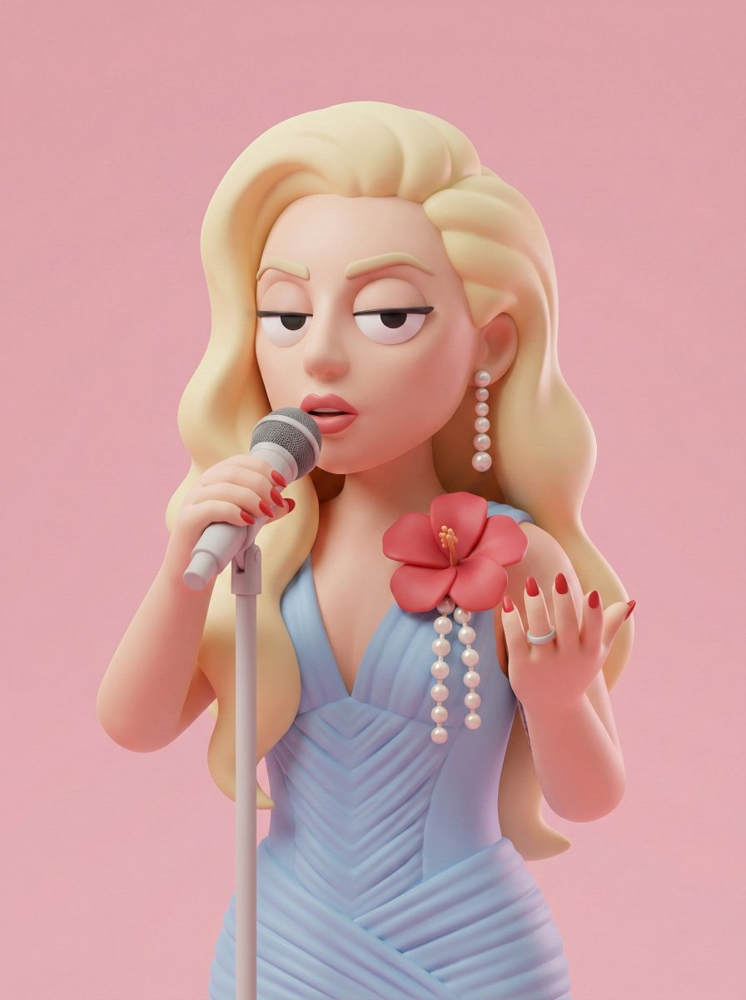

## Ultra-high-quality hyper-realistic photo featuring a rea

- ID: trending-2029142137015812314
- Slug: trending-2029142137015812314-en
- 语言: en
- 来源: [来源链接](https://x.com/Kashberg_0/status/2029142137015812314)
- 样例图路径: images/part1/2029142137015812314_1.jpg

### 提示词

```text
Ultra-high-quality hyper-realistic photo featuring a real human and a giant 3D Pixar-style version of THE SAME person — both strictly based on the uploaded reference image. The real person and the Pixar character must have identical facial structure, hairstyle, facial expression, body proportions, height, and clothing.
Both are wearing a knitted sweater with a gradient from light yellow to pink, high-waisted blue jeans, and white high-top sneakers.
The pose must exactly match the reference: the real person stands relaxed with a friendly smile, with their hand naturally resting on the shoulder of the Pixar character. The Pixar version stands slightly wider, arms confidently positioned near the pockets, with a playful sly smirk, one raised eyebrow, and expressive Pixar-style eyes.
The Pixar character should be proportionally larger, but anatomically identical to the real person. The facial expression, head tilt, posture, and body language must precisely replicate the reference image.
Clean gray-blue studio background, soft even studio lighting, realistic shadows, crisp fabric texture, smooth Pixar-style skin shading, cinematic sharpness.
DO NOT change the pose, reaction, clothing, or proportions. Strict adherence to the reference.
```

### 样例图

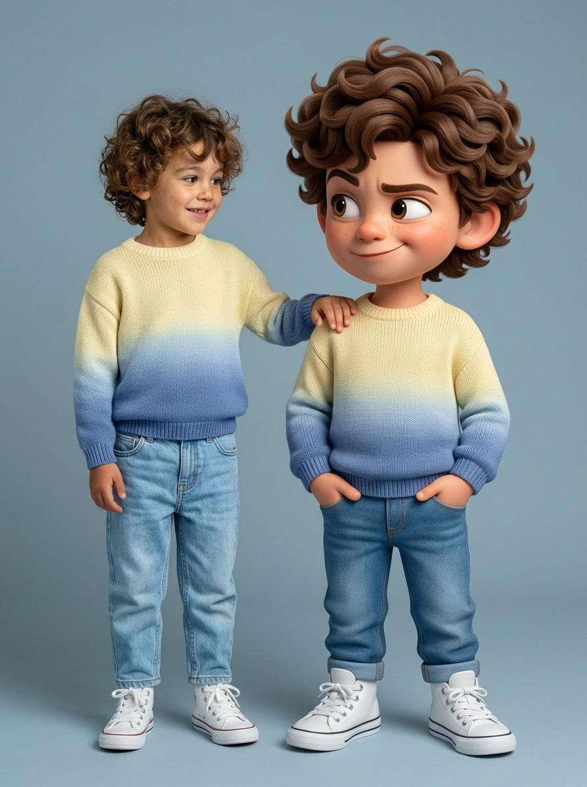

## A simple black-and-white illustration of a [subject] in 

- ID: trending-2043284009116160473
- Slug: trending-2043284009116160473-en
- 语言: en
- 来源: [来源链接](https://x.com/azed_ai/status/2043284009116160473)
- 样例图路径: images/part1/2043284009116160473_1.jpg

### 提示词

```text
A simple black-and-white illustration of a [subject] in [outfit], [doing action], with a [facial expression] expression, in a Notion-style minimalist editorial aesthetic, clean line art, flat monochrome design, simple shapes, subtle hand-drawn feel, minimal detail, expressive posture, clean white background, neat modern layout, soft playful character style
```

### 样例图

![A simple black-and-white illustration of a [subject] in ](../images/part1/2043284009116160473_1.jpg)

## Create a funny 4-part story featuring 3 fluffy creatures

- ID: trending-2027094912357761319
- Slug: trending-2027094912357761319-en
- 语言: en
- 来源: [来源链接](https://x.com/GoogleAI/status/2027094912357761319)
- 样例图路径: images/part1/2027094912357761319_1.jpg

### 提示词

```text
Create a funny 4-part story featuring 3 fluffy creatures building a treehouse. The story has emotional highs and lows and ends in a happy moment. Maintain consistent identity across the 3 characters. Generate 4 images in 16:9 format, one at a time.
```

### 样例图

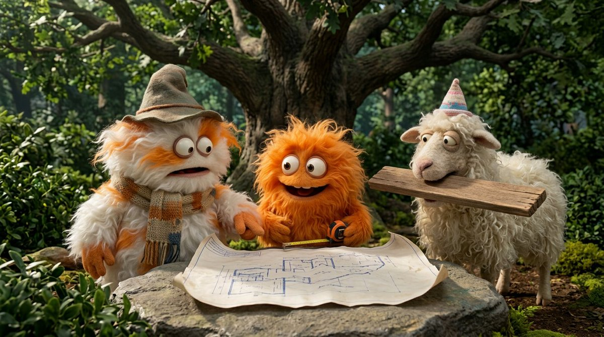

## A hyper-realistic 3D world guide infographic poster for 

- ID: trending-2045107949639455223
- Slug: trending-2045107949639455223-en
- 语言: en
- 来源: [来源链接](https://x.com/TechieBySA/status/2045107949639455223)
- 样例图路径: images/part1/2045107949639455223_1.jpg

### 提示词

```text
A hyper-realistic 3D world guide infographic poster for [SHOW]. The fictional world of [SHOW] is rendered as a raised, textured terrain map floating on a clean light gray surface — the map shape and landscape must reflect the actual geography and visual aesthetic of [SHOW] (fantasy kingdoms, post-apocalyptic cities, island archipelagos, ninja villages etc). Iconic locations from [SHOW] are placed as miniature 3D sculpted models at their correct canonical positions across the map — each one highly detailed, photorealistic and instantly recognizable to fans. Roads or paths connect key locations as white lines across the terrain. Around the map, floating 3D decorative props and iconic items from [SHOW] are scattered on the light gray surface. The official logo of [SHOW] is shown in the upper right corner. Each major location has a bold black label on the map, and beside the map, each location has a neat checklist of its most iconic characters or moments associated with that place, in clean sans-serif typography. A large bold title at the top reads: “THE WORLD OF SHOW” in black uppercase typography with [SHOW] in heavy bold. The overall aesthetic is premium editorial — soft studio lighting, photorealistic 3D render, white/light gray background, clean layout, 4:5 aspect ratio.
```

### 样例图

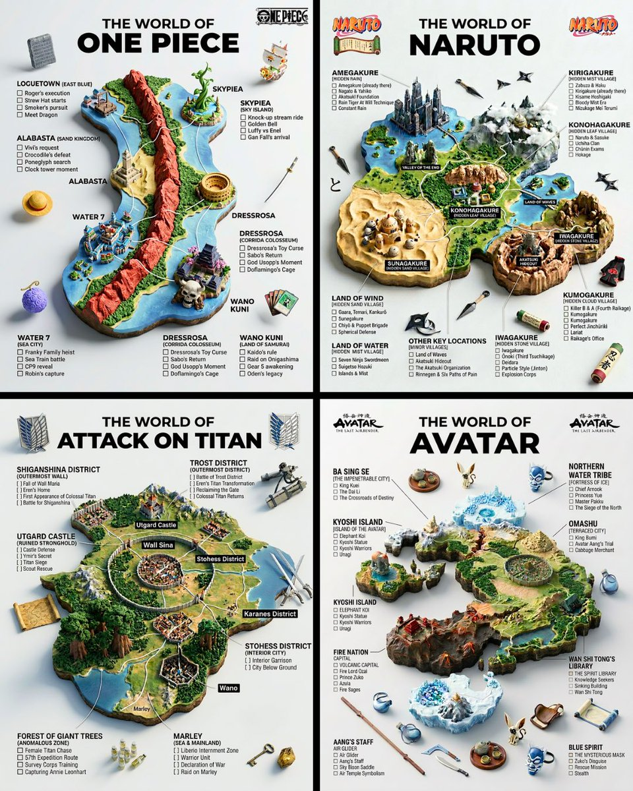

## [Create a hand drawn isometric schematic diagram of this

- ID: trending-2011441977447911691
- Slug: trending-2011441977447911691-en
- 语言: en
- 来源: [来源链接](https://x.com/AmirMushich/status/2011441977447911691)
- 样例图路径: images/part1/2011441977447911691_1.jpg

### 提示词

```text
[Create a hand drawn isometric schematic diagram of this street]
```

### 样例图

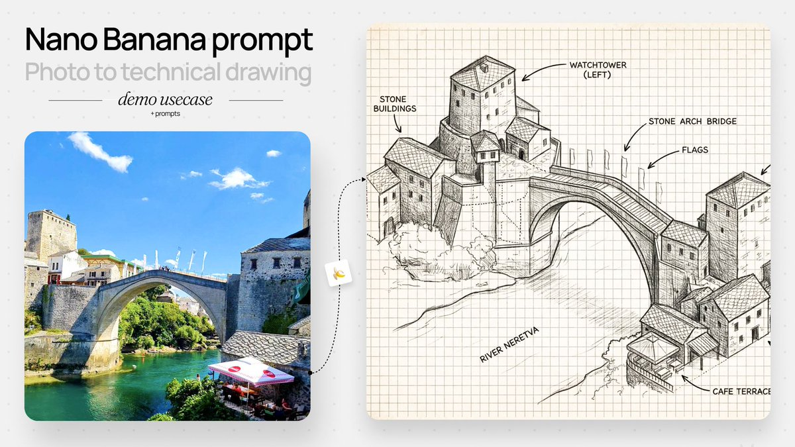

## Create an exaggerated stylized 3D caricature character p

- ID: trending-2032256273782358153
- Slug: trending-2032256273782358153-en
- 语言: en
- 来源: [来源链接](https://x.com/Naiknelofar788/status/2032256273782358153)
- 样例图路径: images/part1/2032256273782358153_1.jpg

### 提示词

```text
Create an exaggerated stylized 3D caricature character portrait with strong intentional deformation and a clean, controlled surface finish. Use the person from the ATTACHED REFERENCE PHOTO. Preserve the subject’s identity, facial likeness, skin tone, and defining features, but reinterpret them into a bold caricatured 3D form with an elongated neck, oversized head-to-neck ratio, droopy eyelids, heavy lips, and slightly asymmetrical facial structure.Render as a human-like 3D character with smooth, studio-clean skin and intentionally designed detail, avoiding random texture or noise. Style with bold accessories such as round or oval glasses, hoop earrings, gold chains, headscarves or bandanas, and street-luxury clothing.

Use neutral studio lighting with soft shadows and even illumination, no dramatic contrast, against a plain neutral grey or off-white background. The overall aesthetic should feel weird, fashion-forward, collectible, and character-driven rather than cute or realistic.

Ultra high definition, premium cinematic 3D render quality, hyper-realistic hyper realism, clean materials, no freckles, no dirt, no grain, no noise, no speckling, no text, no logos, no watermarks.

Aspect ratio 4:5.
```

### 样例图

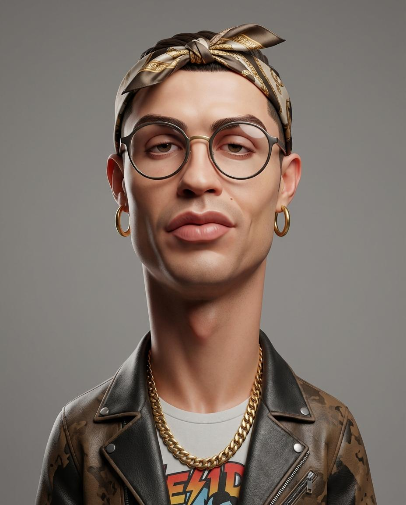

## Using the attached image, create an illustration sheet o

- ID: trending-2039679180775063573
- Slug: trending-2039679180775063573-en
- 语言: en
- 来源: [来源链接](https://x.com/noorwithwifi/status/2039679180775063573)
- 样例图路径: images/part1/2039679180775063573_1.jpg

### 提示词

```text
Using the attached image, create an illustration sheet of professional industrial design packaging for the package (PACKAGE TYPE). A centered heroic 3D rendering with realistic materials, soft studio lighting and commercial quality finishes. Surrounded by technical views: front, side, top, bottom, oblique perspective and flat position. Include sketches of the frame structure, crease lines, seam details, and size arrows in millimeters. Show materials and finishes (matte, glossy print, plastic, paper, glass, etc.) in handwritten annotations. Add color swatches, realistic product illustrations, and subtle shadows. Clean sketchbook background, realistic rendering + pencil sketch style, modern design design, ultra-detailed, portfolio ready.
```

### 样例图

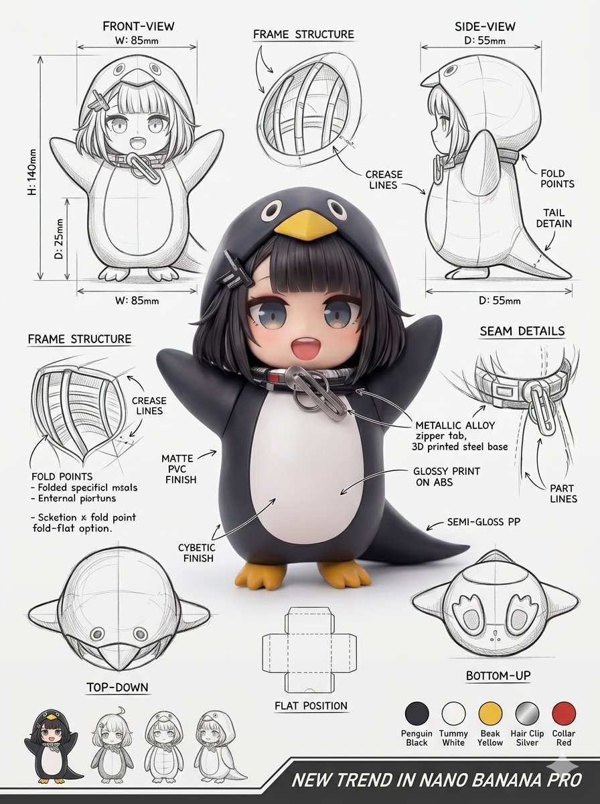

## A realistic, highly detailed geographic map viewed from 

- ID: trending-2008937653694013753
- Slug: trending-2008937653694013753-en
- 语言: en
- 来源: [来源链接](https://x.com/Kerroudjm/status/2008937653694013753)
- 样例图路径: images/part1/2008937653694013753_1.jpg

### 提示词

```text
A realistic, highly detailed geographic map viewed from above, accurately representing the region where [COUNTRY] is located. Rising from the map is a miniature 3D diorama of [CITY], precisely positioned at its real geographic location. The diorama features iconic architecture, natural landmarks, and cultural elements seamlessly emerging from the map surface. Ultra-realistic materials, fine textures, and depth of field. Soft studio lighting with subtle shadows, cinematic composition, premium macro photography style. Square 1:1 format, high detail, realistic scale.
```

### 样例图

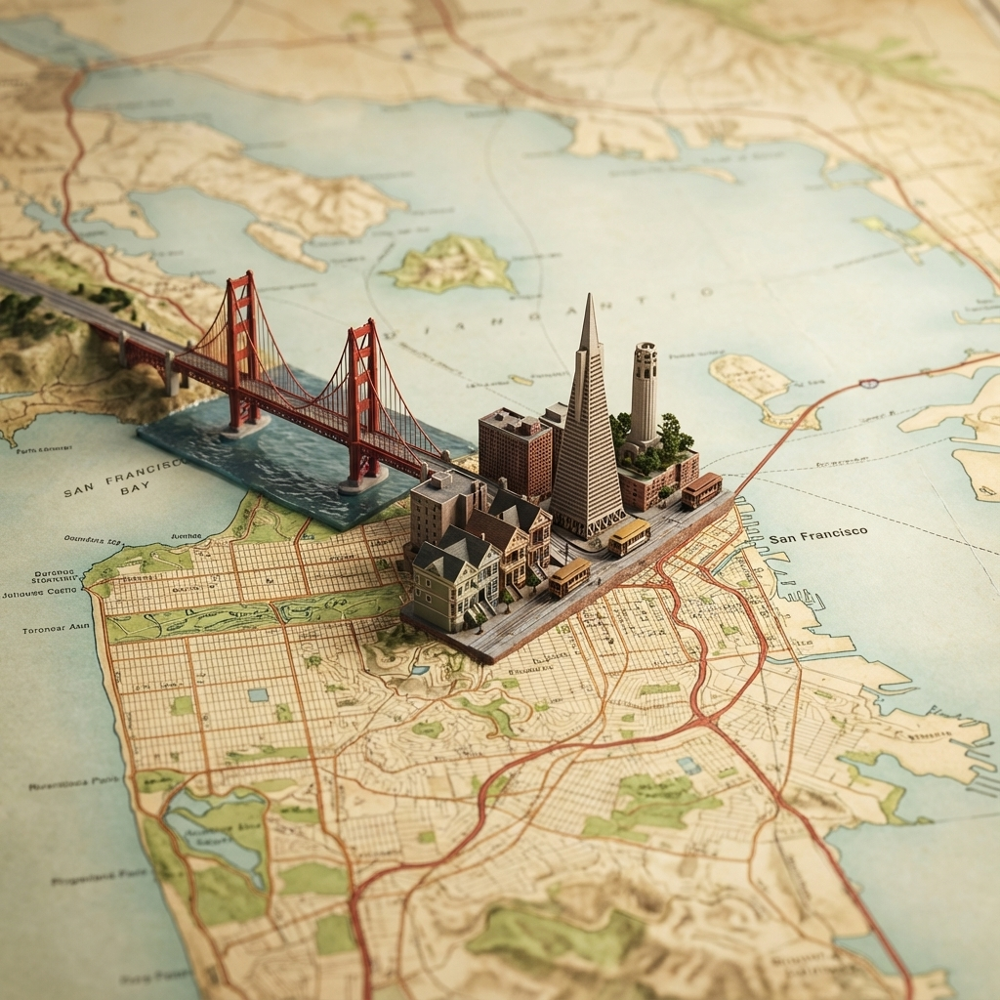

## Create a clear, 45° top-down isometric miniature 3D educ

- ID: trending-2013493349156823287
- Slug: trending-2013493349156823287-en
- 语言: en
- 来源: [来源链接](https://x.com/aleenaamiir/status/2013493349156823287)
- 样例图路径: images/part1/2013493349156823287_1.jpg

### 提示词

```text
Create a clear, 45° top-down isometric miniature 3D educational diorama explaining [PROCESS / CONCEPT].

Use soft refined textures, realistic PBR materials, and gentle lifelike lighting.

Build a stepped or layered diorama base showing each stage of the process with subtle arrows or paths.

Include tiny stylized figures interacting with each stage (no facial details).

Use a clean solid [BACKGROUND COLOR] background.
At the top-center, display [PROCESS NAME] in large bold text, directly beneath it show a short explanation subtitle, and place a minimal symbolic icon below.

All text must automatically match the background contrast (white or black).
```

### 样例图

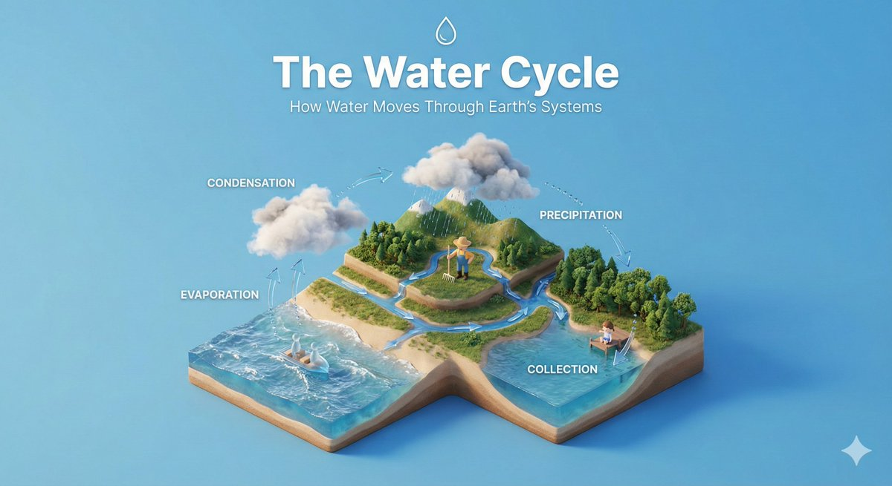

## - A high-fidelity, wide-angle interior shot captures a s

- ID: trending-2015676042460168488
- Slug: trending-2015676042460168488-en
- 语言: en
- 来源: [来源链接](https://x.com/Strength04_X/status/2015676042460168488)
- 样例图路径: images/part1/2015676042460168488_1.jpg

### 提示词

```text
- A high-fidelity, wide-angle interior shot captures a surreal, mixed-media composition within a modern living room. It features a man resembling the face in the reference photo—using an uploaded face as a reference—wearing a bright yellow hoodie and black pants, sitting centrally on a plush light gray sofa. The scene seamlessly blends photorealistic 3D environments with cel-shaded 2D anime and cartoon characters interacting directly with the physical space.

On the right side of the subject on the sofa, Nobita sits casually waving his hand, while on the left side, Doraemon leans casually on a pillow. Behind the sofa, two framed posters hang on the white wall—one featuring Son Goku and Vegeta, and the other featuring Trunks in a dynamic anime style. In the foreground, Shinchan lies relaxed on a textured gray carpet near a plate of dorayaki, while a chibi version of Son Goku stands triumphantly on a cream-colored knit pouf. On the left side of the room, Vegeta stands tall on a grooved wooden side table in a confident pose, while a miniature version of Trunks is near the wooden coffee table in the center, as if observing the scene with a curious expression.

Soft natural light streams in from the left side through sheer curtains, creating subtle volumetric lighting that accentuates the texture of the blanket, the wood grain of the tiered table, and the leaves of the snake plant in the corner of the room. The entire scene is rendered in 8K resolution with sharp focus, vivid colors, and a dreamy, cinematic, and playful aesthetic blending between the real world and the anime world, with no AI visible.
```

### 样例图

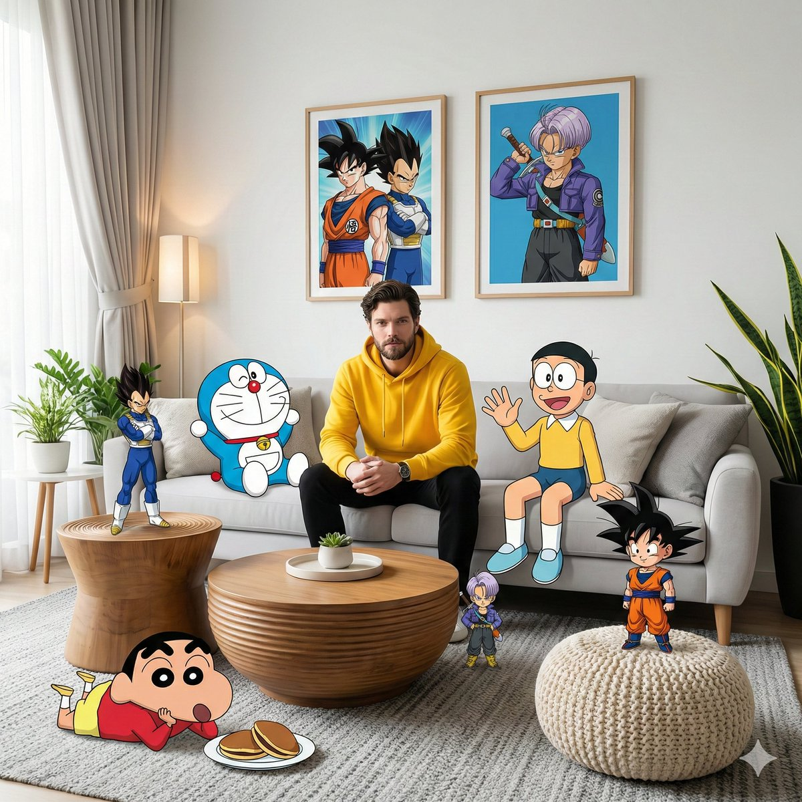

## A colossal hand gripping an enormous vintage fountain pe

- ID: trending-2028390369902174550
- Slug: trending-2028390369902174550-en
- 语言: en
- 来源: [来源链接](https://x.com/0x00_Krypt/status/2028390369902174550)
- 样例图路径: images/part1/2028390369902174550_1.jpg

### 提示词

```text
A colossal hand gripping an enormous vintage fountain pen, captured in vertical portrait format (9:16), writing on endless textured paper that fills the frame. Where the ink flows, the story of [BOOK_NAME] bursts into vivid life — [iconic characters, key objects, and signature scenes from [BOOK_NAME] emerging as tiny miniature figures on the paper, each no larger than a fingernail, ultra-miniature scale]. The miniature world cascades downward across the page as the pen moves, characters frozen mid-story, ink still wet at the edges where they emerge. Extreme close-up of the enormous pen nib touching paper, ink bleeding into fiber, fingertips with visible skin texture. Warm amber and soft golden light raking across the paper surface, deep shadows, cinematic depth of field, magical realism, hyper-detailed, photorealistic, 8K, --ar 9:16
```

### 样例图

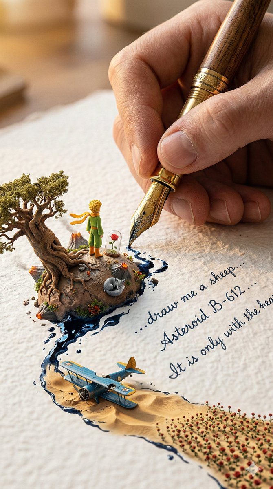

## [BRAND NAME]. Act as a Master of Material Science and Wo

- ID: trending-2021588846849282513
- Slug: trending-2021588846849282513-en
- 语言: en
- 来源: [来源链接](https://x.com/AmirMushich/status/2021588846849282513)
- 样例图路径: images/part1/2021588846849282513_1.jpg

### 提示词

```text
[BRAND NAME]. Act as a Master of Material Science and World-Class 3D Visualizer.
PHASE 1: DYNAMIC ELEMENTAL RECONSTRUCTION.
The central subject is the iconic logo of [BRAND NAME], physically constructed from ANY raw natural element.
CRITICAL: This includes, but is not limited to, botanical elements (flowers, rose petals, thorns, gnarled wood, moss, leaves) and geological/elemental materials (obsidian, crystals, flowing water, ice, volcanic rock).
The logo must be medium-sized, levitating, and rotated at a dynamic 3D angle (3/4 view) to showcase its volume.
PHASE 2: HYPER-TACTILE TEXTURE & REALISM.
The goal is "Sensory Realism" — the viewer should feel they can touch the object.
- If BOTANICAL: Render microscopic cellular structures on petals, dew droplets with refraction, and the velvety fuzz on stems.
- If MINERAL: Render micro-pores, crystalline inclusions, and razor-sharp edges.
Include subtle "imperfections" like dust particles or organic irregularities to break the CG look and achieve 100% photorealism.
PHASE 3: COMPOSITION, LIGHTING & BRANDING.
- ENVIRONMENT: A pure, clinical, solid white background for a High-Key commercial look.
- TYPOGRAPHY: At the top of the frame, place a very small, minimalist [BRAND NAME] text logo in black.
- LIGHTING: Precise studio setup with sharp specular highlights (glints) and a soft, realistic contact shadow on the white floor below to ground the levitating object.
TECH SPECS:
Extreme Macro photography, 100mm lens, f/8, Ray Tracing (Path Tracing), Subsurface Scattering for light depth, 8k resolution, Unreal Engine 5.4 / Octane Render aesthetic.
```

### 样例图

![[BRAND NAME]. Act as a Master of Material Science and Wo](../images/part1/2021588846849282513_1.jpg)

## Make a photo of a cute ball-shaped version of a [animal]

- ID: trending-2027298143134478451
- Slug: trending-2027298143134478451-en
- 语言: en
- 来源: [来源链接](https://x.com/NanoBanana/status/2027298143134478451)
- 样例图路径: images/part1/2027298143134478451_1.jpg

### 提示词

```text
Make a photo of a cute ball-shaped version of a [animal], with big adorable over-sized eyes, it has no head, instead its face is part of the ball, its head and body are one. They are in their usual habitat. Must be almost spherical and cartoonishly cute. Its eyes are looking up in the most adorable cheeky fashion.
```

### 样例图

![Make a photo of a cute ball-shaped version of a [animal]](../images/part1/2027298143134478451_1.jpg)

## Using the uploaded selfie as the ONLY and exclusive face

- ID: trending-2034263750539411550
- Slug: trending-2034263750539411550-en
- 语言: en
- 来源: [来源链接](https://x.com/oggii_0/status/2034263750539411550)
- 样例图路径: images/part1/2034263750539411550_1.jpg

### 提示词

```text
Using the uploaded selfie as the ONLY and exclusive face reference, generate a Pixar-style 3D character sticker set. The character must be clearly recognizable as the person from the selfie. Create a neat 3×3 grid collage (nine stickers total). Final aspect ratio is strictly 4:5. Each cell shows a distinct pose and facial expression. Style and tone: Pixar-style 3D animation with a meme-oriented feel. Exaggerated, slightly absurd emotions, playful overacting. 

Highly readable expressions at small sizes, with expressive eyes, eyebrows, and mouth. Subtle hand gestures where appropriate. Background and output: Fully transparent background (PNG). No backdrop, no background shadows. No text, captions, logos, or UI elements. Stickers must be ready for direct use in messengers. Consistency: Same hairstyle, clothing, colors, and character proportions across all nine stickers. Only facial expression and pose change.

Clean, polished 3D sticker look. Emotions (one per sticker, 3×3 grid): Surprised, Annoyed, Confused, Frustrated, Thoughtful, Sarcastic, Worried, Bored, Curious.
```

### 样例图

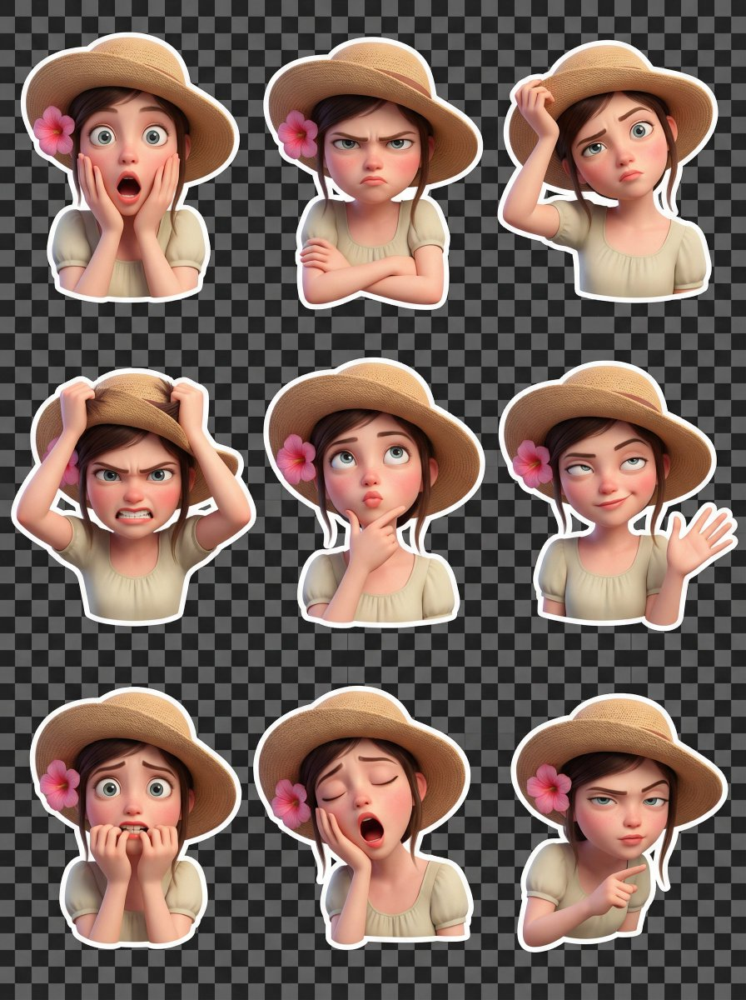

## High-quality stylized 3D CGI Pixar-style render, vertica

- ID: trending-2032557237437116521
- Slug: trending-2032557237437116521-en
- 语言: en
- 来源: [来源链接](https://x.com/TechieBySA/status/2032557237437116521)
- 样例图路径: images/part1/2032557237437116521_1.jpg

### 提示词

```text
High-quality stylized 3D CGI Pixar-style render, vertical 3:4 composition, the most iconic characters from [SHOW/MOVIE] captured as a chaotic and joyful bathroom mirror selfie; the most recognizable character holds a large vintage camera up toward the mirror, the remaining characters squeezed tightly into the frame around them, each showing their most signature expression or pose; everyone wearing their most iconic costumes and outfits faithful to the source material; all crammed together creating classic crowded selfie energy; facial proportions gently stylized in Disney/Pixar animation style with expressive eyes while faithfully preserving each character's most recognizable traits, hairstyles and costumes from [SHOW/MOVIE]; the bathroom mirror has realistic toothpaste splatters and subtle smudges; the reflection shows bold black Pixar-style lettering reading "[SHOW/MOVIE]❤️"; the bathroom background is styled to match the world of [SHOW/MOVIE] with thematic props and easter eggs relevant to [SHOW/MOVIE] placed naturally around the scene; lighting combines soft ambient bathroom lighting with a bright camera flash reflecting in the mirror creating gentle specular highlights; warm Pixar-style color grading faithful to the visual tone of [SHOW/MOVIE], smooth highlight rolloff, refined Disney/Pixar cinematic character shading, ultra-detailed 4K render, no watermark
```

### 样例图

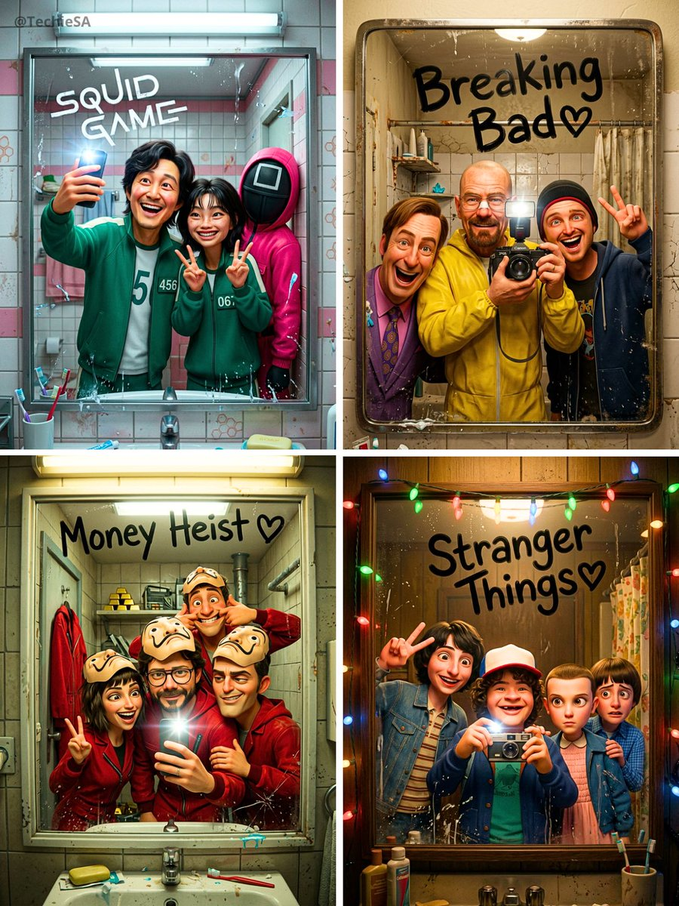

## Create a high-quality 3D avatar of the person in the upl

- ID: trending-2013295220440654142
- Slug: trending-2013295220440654142-en
- 语言: en
- 来源: [来源链接](https://x.com/rovvmut_/status/2013295220440654142)
- 样例图路径: images/part1/2013295220440654142_1.jpg

### 提示词

```text
Create a high-quality 3D avatar of the person in the uploaded image with a cheerful, expressive face. The character should have a warm smile, bright eyes, and soft facial features that feel friendly and approachable. Render in a Pixar-style aesthetic with smooth textures, subtle skin shading, and slightly exaggerated proportions for a cute, animated look. Lighting should be soft and even, creating a clean studio look with gentle shadows for depth.
```

### 样例图

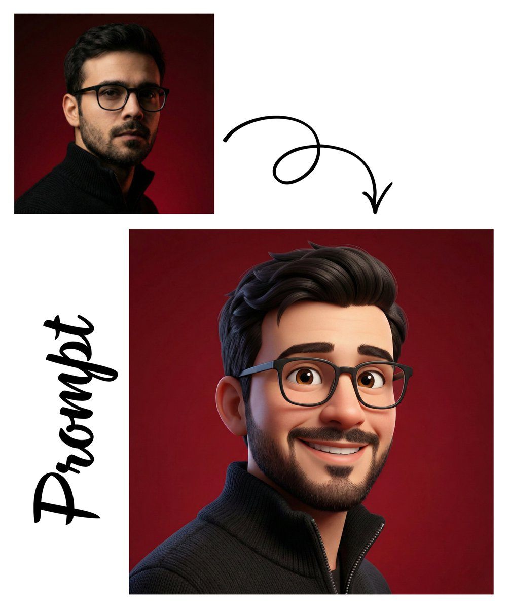

## A high-quality 3D metallic typography design of the word

- ID: trending-2008535456397619240
- Slug: trending-2008535456397619240-en
- 语言: en
- 来源: [来源链接](https://x.com/aleenaamiir/status/2008535456397619240)
- 样例图路径: images/part1/2008535456397619240_1.jpg

### 提示词

```text
A high-quality 3D metallic typography design of the word [COUNTRY NAME], set against a dark, textured background that complements the identity of [COUNTRY], creating a cinematic, premium visual tone.

Each individual letter is uniquely designed to represent a distinct cultural element, tradition, landmark, or national symbol from [COUNTRY], intelligently adapted to the letter’s shape while maintaining perfect readability.

Cultural elements may include (but are not limited to):
– iconic architecture or monuments
– traditional patterns, textiles, or crafts
– national sports or tools
– folklore, heritage symbols, or historical motifs
– nature elements strongly associated with the country

No two letters repeat the same cultural reference — every letter tells a different cultural story.

The typography features polished metallic material (gold, silver, or [COLOR]), realistic reflections, fine engravings, and subtle surface wear for authenticity.

Dramatic studio lighting with soft rim highlights and deep shadows enhances depth and form.

Ultra-sharp focus, premium 3D render quality, cinematic depth, luxury branding aesthetic, ultra-high resolution.
```

### 样例图

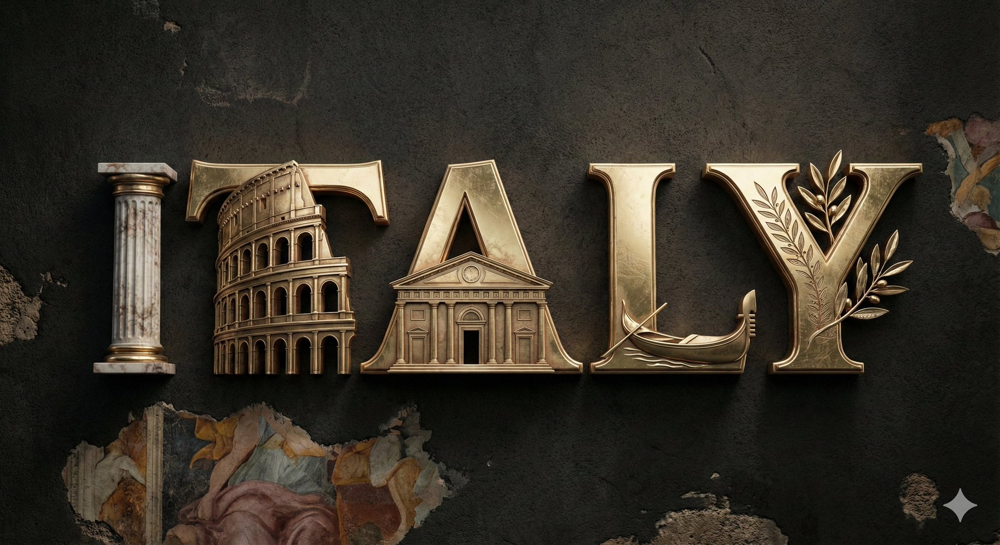

## Black and white engraved portrait illustration of a pers

- ID: trending-2042785774245154868
- Slug: trending-2042785774245154868-en
- 语言: en
- 来源: [来源链接](https://x.com/Naiknelofar788/status/2042785774245154868)
- 样例图路径: images/part1/2042785774245154868_1.jpg

### 提示词

```text
Black and white engraved portrait illustration of a person.
Drawn in classic woodcut / linocut engraving style, high contrast black ink on textured off-white paper background. Fine cross-hatching and line shading to create depth and shadow, bold black ink shadows under chin and around hair, strong contour lines, traditional printmaking aesthetic.
Minimal composition, centered portrait, no body visible, clean negative space, vintage editorial illustration style, ultra detailed linework, sharp crisp ink strokes, professional vector-ready engraving look, monochrome palette, dramatic contrast.
Negative Prompt:
color, watercolor, soft shading, blurred lines, low contrast, realistic photography, 3D render, anime style, cartoon style, messy sketch, thick uneven strokes, background objects, noisy texture, pixelated, distorted face, extra eyes, extra ears, bad anatomy, modern digital painting, glossy skin, overexposed highlights
```

### 样例图

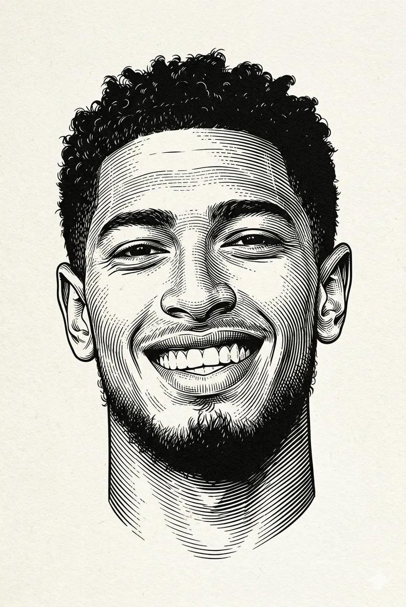

## { "image_generation_request": { "subject_settings": { "p

- ID: trending-2026867752376418613
- Slug: trending-2026867752376418613-en
- 语言: en
- 来源: [来源链接](https://x.com/lloydcreates/status/2026867752376418613)
- 样例图路径: images/part1/2026867752376418613_1.jpg

### 提示词

```text
{
  "image_generation_request": {
    "subject_settings": {
      "product_placeholder": "[INSERT PRODUCT NAME HERE]",
      "positioning": "absolute center, floating, levitating, suspended in mid-air",
      "framing": "full view, no cropping, product must be entirely within frame, generous padding around edges"
    },
    "environment_and_background": {
      "background_color": "#000000",
      "background_type": "pure void, infinite black depth",
      "elements_to_exclude": [
        "lighting boxes",
        "softboxes",
        "stands",
        "pedestals",
        "platforms",
        "text",
        "watermarks",
        "props",
        "surface reflections",
        "studio equipment"
      ]
    },
    "texture_and_material_blending": {
      "primary_finish": "anodized obsidian metal with microscopic grit",
      "secondary_finish": "high-gloss fluid chrome",
      "accent_texture": "Mac Pro inspired precision-machined hemispherical lattice, 3D lattice venting pattern",
      "optical_effects": "monatomic light dispersion, prismatic diffraction on edges, ethereal holographic sheen"
    },
    "lighting_and_color_palette": {
      "key_colors": [
        { "name": "Pure Black", "hex": "#000000" },
        { "name": "Electric Indigo", "hex": "#4B0082" },
        { "name": "Phthalo Blue", "hex": "#000F89" },
        { "name": "Spectral Iridescence", "description": "Thin-film interference rainbow highlights" }
      ],
      "lighting_style": "hard rim lighting, chiaroscuro, high contrast, sharp specular highlights, no ambient fill"
    },
    "negative_constraints": {
      "strict_exclusion": "out of frame, cut off product, blurry edges, tripod, light stand, floor, table, shadows on floor, light flare icons, glowing boxes, copyright text, logo, cluttered background, grey tones, messy geometry"
    },
    "technical_specs": {
      "style": "Hyper-realistic 3D render",
      "engine_hints": "Octane Render, Raytraced, 8k, Unreal Engine 5, Cinematic Lighting"
    }
  }
}
```

### 样例图

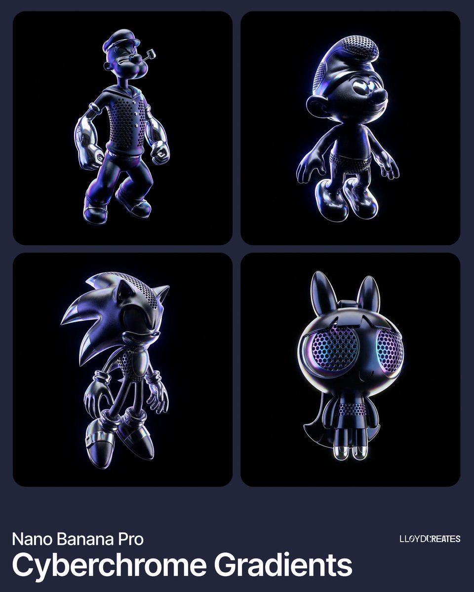

## Create a clean isometric miniature 3D diorama visualizin

- ID: trending-2022178815955636413
- Slug: trending-2022178815955636413-en
- 语言: en
- 来源: [来源链接](https://x.com/aleenaamiir/status/2022178815955636413)
- 样例图路径: images/part1/2022178815955636413_1.jpg

### 提示词

```text
Create a clean isometric miniature 3D diorama visualizing the evolution of [TOPIC] from [START ERA] to [MODERN ERA]. Use a 45° top-down perspective. Materials are soft and refined with realistic PBR shading.

Lighting is neutral and evenly balanced. Design a horizontally stepped base divided into clear time periods. Each section includes era-specific objects, tools, environments, or technology.

Add tiny stylized figures interacting with each stage with heavy facial details). Use subtle arrows or dividers to show chronological flow.

Background remains solid [BACKGROUND COLOR]. Top center text displays [TOPIC] in bold. Below it show “From [START ERA] to [MODERN ERA].” Add a minimal timeline icon underneath. Text adapts automatically for contras.
```

### 样例图

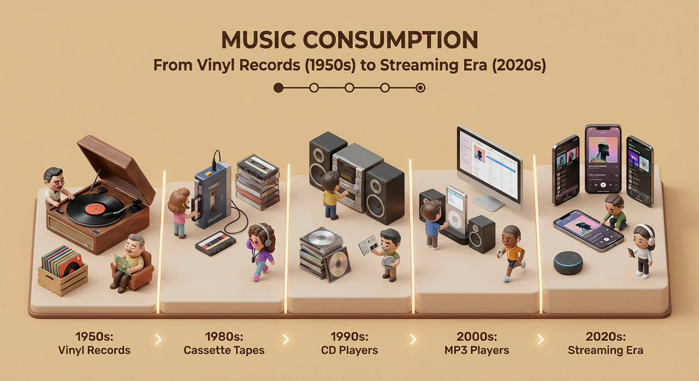

## Create a professional Valentine’s Day advertisement for 

- ID: trending-2022269227286102243
- Slug: trending-2022269227286102243-en
- 语言: en
- 来源: [来源链接](https://x.com/TechieBySA/status/2022269227286102243)
- 样例图路径: images/part1/2022269227286102243_1.jpg

### 提示词

```text
Create a professional Valentine’s Day advertisement for [BRAND] in 4:5 aspect ratio. The background should use the signature brand color as a clean, vibrant backdrop. Arrange multiple [PRODUCT] items creatively to form a perfect heart shape in the center of the composition. The products should appear realistic and three-dimensional with professional lighting and soft shadows, clearly displaying logos. Add romantic elements like rose petals or flowers floating around the heart. Position the logo at the top center of the image. At the bottom, include a romantic tagline in bold, modern typography that incorporates the brand’s messaging or plays on the product name. Use photorealistic 3D rendering style with studio lighting and premium advertising quality. Maintain a clean, modern aesthetic that matches the visual identity with significant breathing room around all elements.​​​​​​​​​​​​​​​​
```

### 样例图

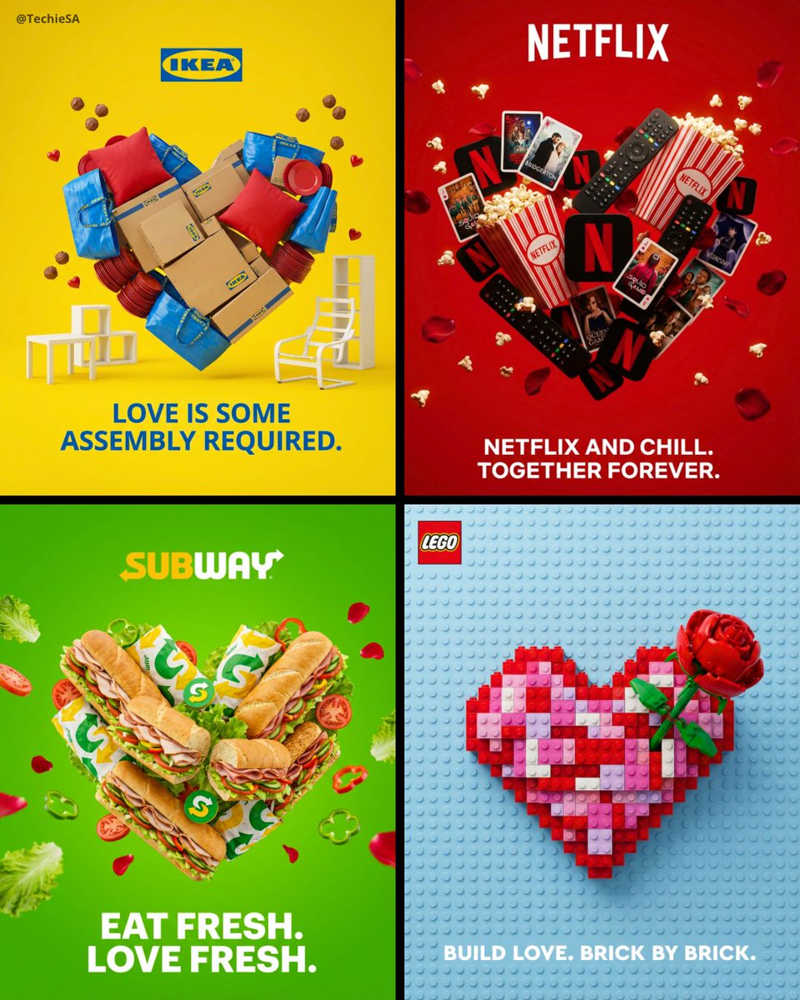

## Epic 3D scene: a massive architectural blueprint of [BUI

- ID: trending-2010009737816162736
- Slug: trending-2010009737816162736-en
- 语言: en
- 来源: [来源链接](https://x.com/AllaAisling/status/2010009737816162736)
- 样例图路径: images/part1/2010009737816162736_1.jpg

### 提示词

```text
Epic 3D scene: a massive architectural blueprint of [BUILDING/STRUCTURE] pinned to a drafting table, its ink lines rising off the paper into fully realized construction. Blue lines become steel beams mid-weld, floor plans inflate into furnished rooms, elevation drawings push outward into facades with working windows. Construction phases coexist simultaneously: foundation being poured in one corner while the penthouse is already inhabited in another. Tiny workers, cranes, and scaffolding swarm the rising structure. The flat drawing and the living building merge at impossible angles. Technical annotations float as dimensional signage. Architect's coffee cup sits at the edge, casting shadow across unbuilt sections. Extreme scale contrast, construction dust catching afternoon light, 8K, photorealistic.  
```

### 样例图

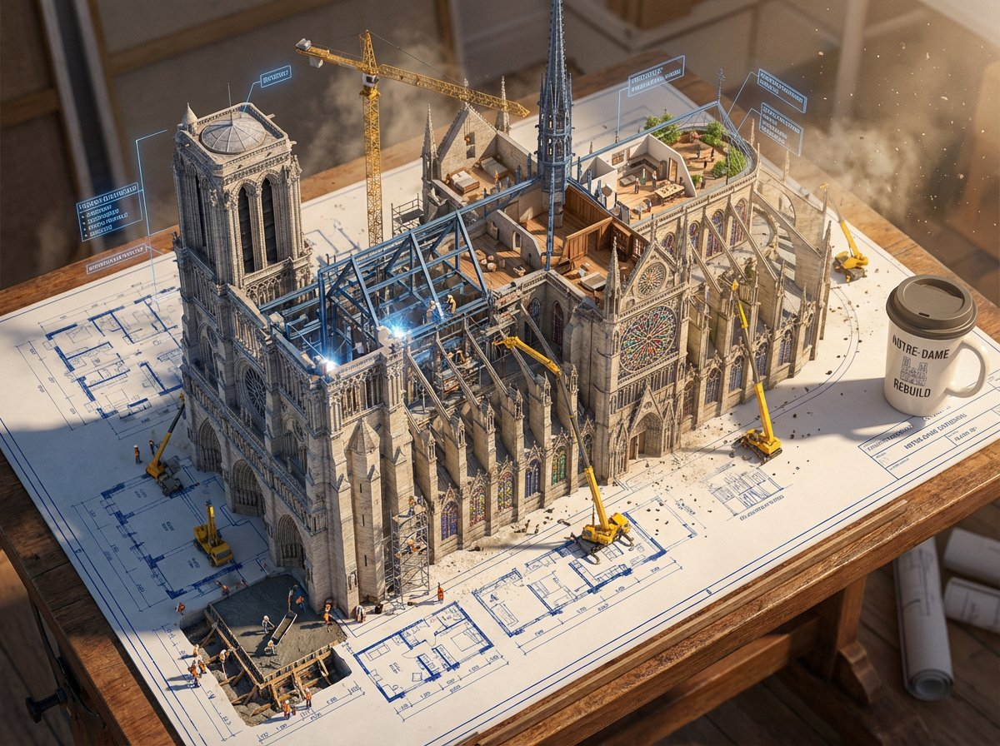

## Ultra-detailed 3D plush cartoon character, inspired by c

- ID: trending-2029730855908954544
- Slug: trending-2029730855908954544-en
- 语言: en
- 来源: [来源链接](https://x.com/ChillaiKalan__/status/2029730855908954544)
- 样例图路径: images/part1/2029730855908954544_1.jpg

### 提示词

```text
Ultra-detailed 3D plush cartoon character, inspired by classic animated TV style, standing in center frame, full body visible. Character designed as a soft toy with realistic fluffy fur texture, smooth rounded shapes, vibrant saturated colors, big expressive eyes, cute proportions, Using the image of [Doraemon's] character, [Nobita carries Doraemon on his back].

High-resolution Pixar-style 3D rendering, soft studio lighting, subtle rim light, clean gradient background (blue tone), cinematic lighting, depth of field, highly detailed fur strands, soft shadows under feet, glossy nose, toy-like material, ultra sharp 8K render.

Centered composition, minimal background, character facing camera, symmetrical pose, adorable expression.
```

### 样例图

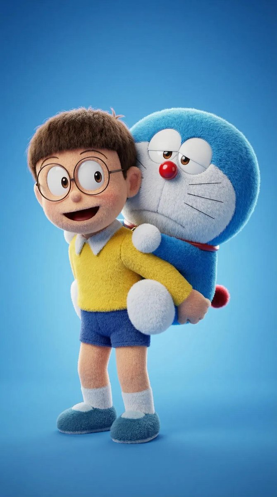

## 珐琅彩琉璃艺术风格，金属质感，制作一枚冰

- ID: trending-2026301375249105195
- Slug: trending-2026301375249105195-zh
- 语言: zh
- 来源: [来源链接](https://x.com/VigoCreativeAI/status/2026301375249105195)
- 样例图路径: images/part1/2026301375249105195_1.jpg

### 提示词

```text
珐琅彩琉璃艺术风格，金属质感，制作一枚冰箱贴，写着"西湖·杭州 WEST LAKE"字样。冰箱贴以断桥拱形轮廓为基底外形，金色金属边框包边。画面描绘西湖经典风景：断桥残雪、湖面莲叶、楼外楼画舫、雷峰塔剪影、三潭印月石灯、粉色桃花与垂柳。左侧点缀龙井茶叶图案，右侧装饰杭绣扇面。采用珐琅彩填色工艺：湖水呈透明翠绿，金属线勾勒波纹细节。浅咖色背景，正面展示，所有元素严格控制在基底轮廓范围内，布局美观协调，产品摄影质感，8K细节
```

### 样例图

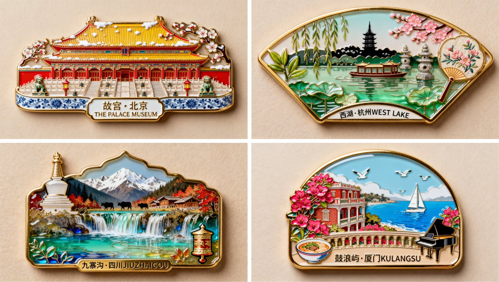

## Full-body 3D stylized anthropomorphic cartoon dog charac

- ID: trending-2022179786580537521
- Slug: trending-2022179786580537521-en
- 语言: en
- 来源: [来源链接](https://x.com/Taaruk_/status/2022179786580537521)
- 样例图路径: images/part1/2022179786580537521_1.jpg

### 提示词

```text
Full-body 3D stylized anthropomorphic cartoon dog character wearing modern streetwear, oversized neon green hoodie, cargo pants, chunky sneakers, reflective sunglasses, silver chain necklace. Confident relaxed pose with hands in pockets. Minimal studio background in solid lime green. Soft studio lighting, smooth shadows, high detail fabric texture, Pixar-quality 3D render, ultra-clean composition, centered framing, fashion editorial character design, 8K resolution.
```

### 样例图

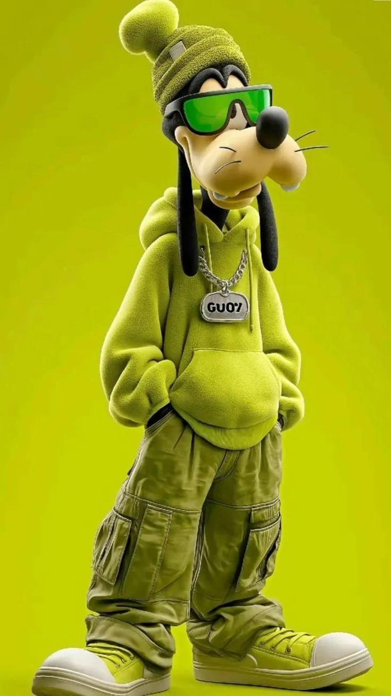

## A cinematic poster-style artwork featuring an intense cl

- ID: trending-2017259594419228875
- Slug: trending-2017259594419228875-en
- 语言: en
- 来源: [来源链接](https://x.com/Abhiew_/status/2017259594419228875)
- 样例图路径: images/part1/2017259594419228875_1.jpg

### 提示词

```text
A cinematic poster-style artwork featuring an intense close-up of a man’s eyes centered horizontally across the frame. Only the eyes and part of the face are visible through a narrow horizontal strip, surrounded by deep black negative space above and below. The face is illustrated in a high-contrast, graphic-novel style with bold red, black, and orange tones, dramatic shadows, sharp highlights, and a gritty, intense mood.
The eyes look fierce, emotional, and determined, with slightly messy hair. Use the provided image for eye reference
```

### 样例图

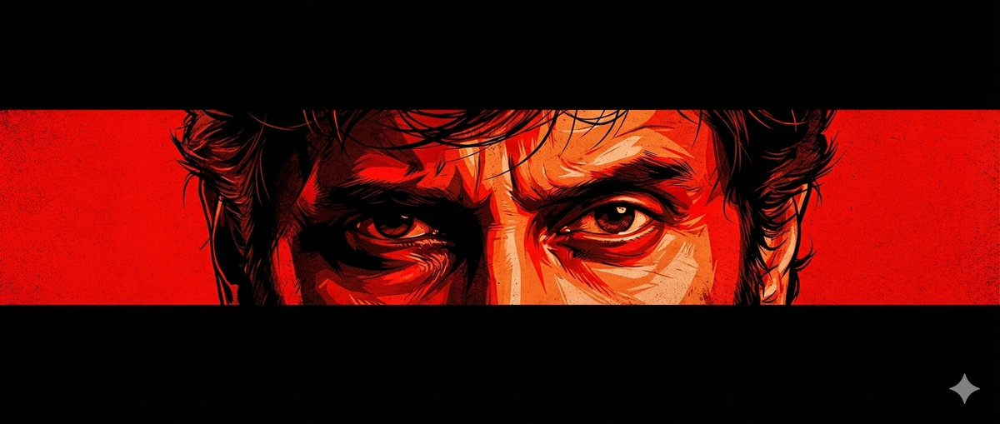

## Hyperrealistic 3D radial exploded view of [PRODUCT] [NUM

- ID: trending-2032126653309030481
- Slug: trending-2032126653309030481-en
- 语言: en
- 来源: [来源链接](https://x.com/AllaAisling/status/2032126653309030481)
- 样例图路径: images/part1/2032126653309030481_1.jpg

### 提示词

```text
Hyperrealistic 3D radial exploded view of [PRODUCT]  [NUMBER] components  bursting outward from a central axis in every direction, frozen in mid-air.  True spatial explosion, not a vertical stack, depth and parallax visible.  COMPONENTS (core outward): [SHELL] → [DISPLAY] → [FRAME] → [MAINBOARD] →  [BATTERY] → [MICRO PARTS shown in 3x floating callout circles]  MATERIALS: glass refracts and catches specular highlights, aluminium shows  brushed grain and machined edges, PCB traces glow faintly amber,   rubber gaskets matte with micro-texture, cables with soft bend physics.  LABELS: hairline leader to floating box. "[COMPONENT]" uppercase /  "[FUNCTION]" italic / "[KEY SPEC]" monospace. Radiate outward, no overlaps.  LIGHTING: cool diffused overhead + warm amber underlighting on internals +  thin blue rim on outer shell. Displays emit soft UI glow. Circuits self-illuminate.  BACKGROUND: [COLOR], deep, non-reflective. Midnight black recommended. TITLE: "[PRODUCT NAME]" top right. SUBTITLE: "[TAGLINE]".  SPEC BLOCK: "[SPEC 1] / [SPEC 2] / [SPEC 3]" bottom left in monospace.  Mood: iFixit teardown meets NASA manual meets WIRED cover. 4K, tack sharp, extraordinary material fidelity. 
```

### 样例图

![Hyperrealistic 3D radial exploded view of [PRODUCT] [NUM](../images/part1/2032126653309030481_1.jpg)

## A high-contrast ink noir portrait of [SUBJECT], illustra

- ID: trending-2008431391235862892
- Slug: trending-2008431391235862892-en
- 语言: en
- 来源: [来源链接](https://x.com/aleenaamiir/status/2008431391235862892)
- 样例图路径: images/part1/2008431391235862892_1.jpg

### 提示词

```text
A high-contrast ink noir portrait of [SUBJECT], illustrated entirely with expressive black ink strokes and controlled splatter. Heavy shadows dominate the composition while selective highlights emerge through negative space. Subtle paper grain is visible. Atmosphere is moody, cinematic, and intense, like a graphic novel frozen at its most dramatic panel.
```

### 样例图

![A high-contrast ink noir portrait of [SUBJECT], illustra](../images/part1/2008431391235862892_1.jpg)

## A high-detail artistic 3D portrait of the person in the 

- ID: trending-2018708807371628802
- Slug: trending-2018708807371628802-en
- 语言: en
- 来源: [来源链接](https://x.com/Samann_ai/status/2018708807371628802)
- 样例图路径: images/part1/2018708807371628802_1.jpg

### 提示词

```text
A high-detail artistic 3D portrait of the person in the photo, reimagined as a fragmented sculptural mask. The face is vertically split: one side is made of matte charcoal-black stone with deep cracks, while the other side is polished, radiant leaf gold. The entire composition is overlaid on a dark architectural blueprint background featuring intricate gold grid lines, technical diagrams, and elegant golden serif typography. Cinematic lighting, hyper-realistic textures, Kintsugi-inspired aesthetic, luxury conceptual art, 8k resolution, moody and sophisticated atmosphere.
```

### 样例图

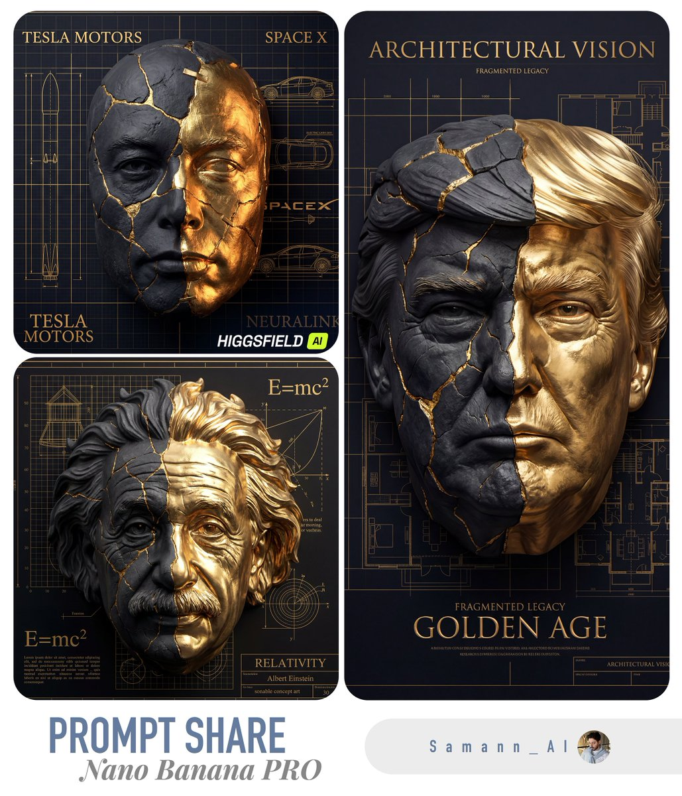

## Create an exaggerated stylized 3D caricature character p

- ID: trending-2024088055896801484
- Slug: trending-2024088055896801484-en
- 语言: en
- 来源: [来源链接](https://x.com/TechieBySA/status/2024088055896801484)
- 样例图路径: images/part1/2024088055896801484_1.jpg

### 提示词

```text
Create an exaggerated stylized 3D caricature character portrait with strong intentional deformation and a clean, controlled surface finish. Use the person from the ATTACHED REFERENCE PHOTO. Preserve the subject’s identity, facial likeness, skin tone, and defining features, but reinterpret them into a bold caricatured 3D form with an elongated neck, oversized head-to-neck ratio, droopy eyelids, heavy lips, and slightly asymmetrical facial structure. Render as a human-like 3D character with smooth, studio-clean skin and intentionally designed detail, avoiding random texture or noise. Style with bold accessories such as round or oval glasses, hoop earrings, gold chains, headscarves or bandanas, and street-luxury clothing. Use neutral studio lighting with soft shadows and even illumination, no dramatic contrast, against a plain neutral grey or off-white background. The overall aesthetic should feel weird, fashion-forward, collectible, and character-driven rather than cute or realistic. Ultra high definition, premium cinematic 3D render quality, hyper realistic hyper realism, clean materials, no freckles, no dirt, no grain, no noise, no speckling, no text, no logos, no watermarks. Aspect ratio 4:5
```

### 样例图

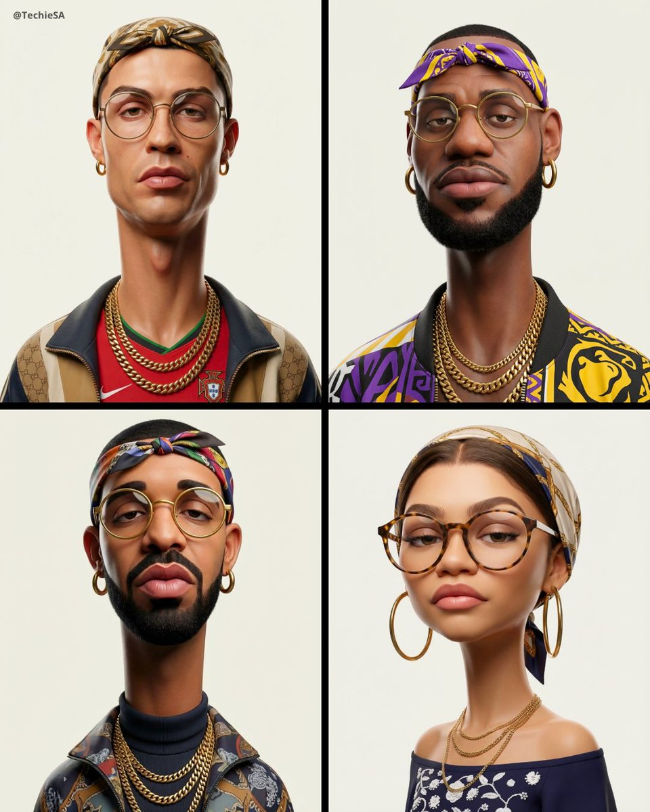

## { "Objective": "Create a hyper-realistic studio portrait

- ID: trending-2008818683234361811
- Slug: trending-2008818683234361811-en
- 语言: en
- 来源: [来源链接](https://x.com/Taaruk_/status/2008818683234361811)
- 样例图路径: images/part1/2008818683234361811_1.jpg

### 提示词

```text
{
  "Objective": "Create a hyper-realistic studio portrait blending photorealism with a whimsical 3D cartoon miniature character",
  "PersonaDetails": {
    "PrimarySubject": {
      "Type": "Young man",
      "Appearance": {
        "Hair": "Light brown hair, neatly styled",
        "FacialHair": "Neatly trimmed beard",
        "Skin": "Photorealistic, natural texture"
      },
      "Expression": "Soft, warm smile",
      "Gaze": "Looking at the miniature character on his fingertips",
      "Wardrobe": "Blue t-shirt"
    },
    "SecondarySubject": {
      "Type": "Tiny 3D cartoon version of the man",
      "Scale": "Miniature, resting on fingertips",
      "Style": "Pixar-style 3D character design",
      "Proportions": "Exaggerated cute proportions",
      "Features": {
        "Eyes": "Large, expressive",
        "Expression": "Friendly, playful pose"
      },
      "Consistency": "Matching hairstyle and outfit of the main subject"
    }
  },
  "Composition": {
    "Framing": "Close-up studio portrait",
    "Focus": "Ultra-sharp focus on both faces",
    "DepthOfField": "Shallow depth of field with soft background blur",
    "Balance": "Clean, centered composition emphasizing interaction"
  },
  "LightingAndMood": {
    "LightingStyle": "Cinematic soft studio lighting",
    "Highlights": "Gentle highlights on skin and miniature character",
    "Background": "Dark neutral backdrop",
    "Mood": "Modern, whimsical, warm"
  },
  "ArtDirection": {
    "StyleFusion": [
      "Photorealistic human portrait",
      "Pixar-style 3D character rendering"
    ],
    "DetailLevel": "High detail with clean textures",
    "RealismBalance": "Realistic human combined with stylized miniature"
  },
  "PhotographyStyle": {
    "Genre": "Professional studio portrait photography",
    "LensLook": "85mm lens perspective",
    "ImageQuality": "High resolution, ultra-sharp clarity"
  },
  "ColorAndTone": {
    "ColorPalette": "Natural skin tones with soft, modern colors",
    "Contrast": "Balanced contrast, smooth tonal transitions"
  },
  "NegativePrompt": [
    "cartoon human",
    "uncanny valley",
    "harsh lighting",
    "oversaturated colors",
    "blurry faces",
    "low detail",
    "messy composition"
  ],
  "ResponseFormat": {
    "Type": "Single image",
    "Orientation": "Portrait",
    "AspectRatio": "2:3"
  }
}
```

### 样例图


## A street-style map of [CITY_NAME] placed on a {MAP_SURFA

- ID: trending-2019618076246090053
- Slug: trending-2019618076246090053-en
- 语言: en
- 来源: [来源链接](https://x.com/Sheldon056/status/2019618076246090053)
- 样例图路径: images/part1/2019618076246090053_1.jpg

### 提示词

```text
A street-style map of [CITY_NAME] placed on a {MAP_SURFACE}, with a photorealistic miniature version of [CITY_NAME] emerging from it [LANDMARK_1],[LANDMARK_2],[LANDMARK_3], [NATURE_ELEMENT], [URBAN_LIFE_ELEMENT], [ICONIC_TRANSPORT],and EXTRA_DETAIL.All elements grow from the map like a 3D urban diorama. Studio soft lighting, cinematic depth, 2:3 format
```

### 样例图

![A street-style map of [CITY_NAME] placed on a {MAP_SURFA](../images/part1/2019618076246090053_1.jpg)

## A creative 3D illusion artwork of a cute young girl step

- ID: trending-2028389324677611935
- Slug: trending-2028389324677611935-en
- 语言: en
- 来源: [来源链接](https://x.com/oggii_0/status/2028389324677611935)
- 样例图路径: images/part1/2028389324677611935_1.jpg

### 提示词

```text
A creative 3D illusion artwork of a cute young girl stepping out of a spiral notebook page placed on a wooden desk. The notebook has lined paper with handwritten text at the top. The girl looks semi-realistic 3D cartoon style, soft wavy brown hair, natural makeup, sweet smile, wearing a pastel crop top and high-waisted light grey jeans with white sneakers. Her lower body appears sketched in pencil on the notebook while the upper body looks realistic and popping out of the page.
```

### 样例图

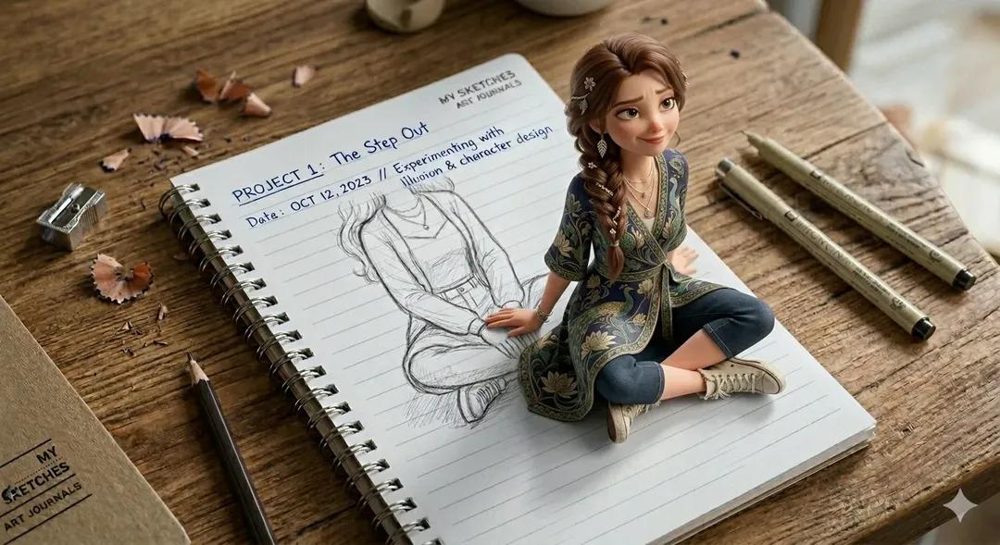

## An architectural blueprint of {BUILDING_NAME} placed on 

- ID: trending-2033887066363502882
- Slug: trending-2033887066363502882-en
- 语言: en
- 来源: [来源链接](https://x.com/0x00_Krypt/status/2033887066363502882)
- 样例图路径: images/part1/2033887066363502882_1.jpg

### 提示词

```text
An architectural blueprint of {BUILDING_NAME} placed on a {SURFACE}, with a photorealistic miniature under-construction version of {BUILDING_NAME} emerging from it — {STRUCTURAL_ELEMENT_1}, {STRUCTURAL_ELEMENT_2}, {STRUCTURAL_ELEMENT_3}, {CONSTRUCTION_DETAIL}, {WORKER_SCENE}, {MATERIAL_ELEMENT}, and {EXTRA_DETAIL}. All elements grow from the blueprint like a 3D architectural diorama, steel beams rising from the drawn lines, scaffolding threading through the paper. Studio soft lighting, cinematic depth, 2:3
```

### 样例图

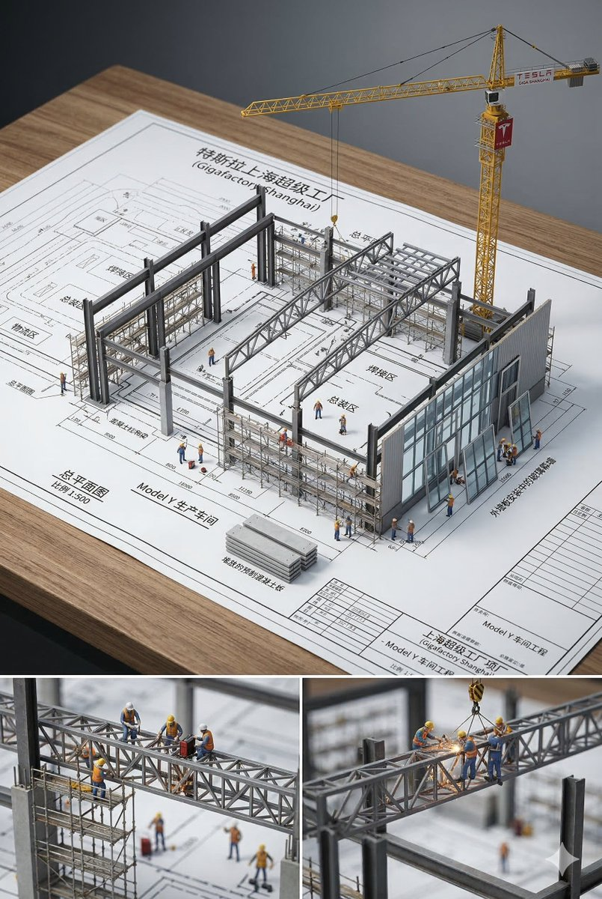

## { "image_generation_request": { "subject": { "placeholde

- ID: trending-2027745604600811970
- Slug: trending-2027745604600811970-en
- 语言: en
- 来源: [来源链接](https://x.com/lloydcreates/status/2027745604600811970)
- 样例图路径: images/part1/2027745604600811970_1.jpg

### 提示词

```text
{
  "image_generation_request": {
    "subject": {
      "placeholder": "[INSERT PRODUCT HERE]",
      "position": "dead center, eye-level, perfectly centered in frame",
      "presentation": "levitating, floating in a weightless void, no stands, no platforms, no pedestals, no visible supports"
    },
    "environment": {
      "background": "absolute solid pitch black, hex code #000000, infinite void",
      "lighting": "rim lighting, cinematic chiaroscuro, high-contrast glints on metallic edges, soft orange glow from internal recesses"
    },
    "aesthetic_style": {
      "textures": [
        "shot-blasted matte titanium",
        "brushed aerospace-grade aluminum",
        "anodized dark grey metal",
        "ribbed industrial vertical cooling fins"
      ],
      "optical_effects": "viewed through vertical fluted reeded glass, subtle chromatic distortion, refractive glass warping, radial motion blur on outer edges",
      "color_palette": {
        "primary_background": "#000000",
        "secondary_metal": "#8E8E8E",
        "accent_glow": "#FF8C00",
        "highlights": "#FFFFFF"
      }
    },
    "composition_constraints": {
      "framing": "ensure full product visibility, do not cut off edges, wide safety margins around the subject",
      "elements_to_exclude": [
        "text",
        "logos",
        "watermarks",
        "softboxes",
        "light stands",
        "floor",
        "horizon line",
        "props",
        "human hands",
        "shadows on surfaces"
      ]
    },
    "technical_specs": {
      "focal_length": "85mm macro lens",
      "depth_of_field": "deep focus on product, blurred refractive foreground glass",
      "render_engine": "photorealistic octane render, 8k resolution, ray-traced reflections"
    }
  }
}
```

### 样例图

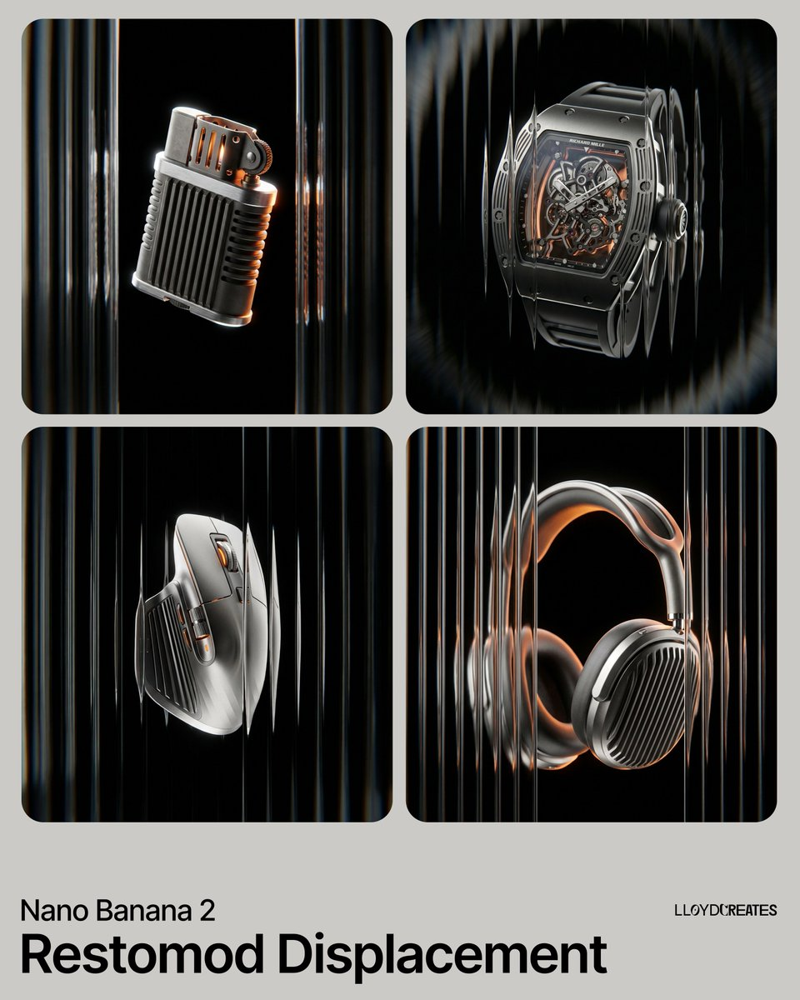

## [BRAND NAME]: Enter the brand name here. Goal: Generate 

- ID: trending-2033619671522345426
- Slug: trending-2033619671522345426-en
- 语言: en
- 来源: [来源链接](https://x.com/AmirMushich/status/2033619671522345426)
- 样例图路径: images/part1/2033619671522345426_1.jpg

### 提示词

```text
[BRAND NAME]: Enter the brand name here.
Goal: Generate a hyper-realistic studio photograph where the stylized logo icon of [BRAND NAME] is a physical 3D ice sculpture lying directly on a snowy surface.
Constraint: NO TEXT inside or immediately near the central ice icon. Only the bottom signature. Light, airy background.

1. THE CENTRAL ICE ARTIFACT
- Main Subject: A large, 3D volumetric sculpture in the exact shape of the [BRAND NAME] logo icon.
- Material: Crafted from high-purity crystalline ice with intricate internal textures, frost needles, and frozen air bubbles.
- Details: The surface of the ice logo is covered with small, realistic water droplets and light condensation.
- Perspective: The logo is positioned at a 3/4 angle, lying horizontally on the snow to show its depth and thickness.

2. ENVIRONMENT & LAYOUT
- View: Eye-level macro perspective, 3/4 view.
- Surface: The logo is resting on a field of crisp, detailed, white powdery snow.
- Background: A flawless, uniform, very light pale blue and white gradient background (much lighter than the original).
- Shadow: A soft, realistic shadow is cast on the snow directly beneath the ice icon to ground it.

3. BOTTOM BRAND SIGNATURE (CRITICAL)
- Placement: A clean horizontal signature block centered at the bottom of the frame, far below the ice artifact.
- Elements: A tiny, flat, minimalist black version of the [BRAND NAME] logo icon on the left.
- Text: The word "[BRAND NAME]" in a clean, bold, black sans-serif typeface immediately to the right of the tiny logo.
- Scale: The signature is very small and subtle compared to the main ice sculpture.

4. AESTHETIC
- Premium product photography, cold and crisp atmosphere, hyper-realistic 8k resolution, cinematic lighting, ultra-detailed textures.
```

### 样例图

![[BRAND NAME]: Enter the brand name here. Goal: Generate ](../images/part1/2033619671522345426_1.jpg)

## Epic 3D scene: a weathered passport lies open, its visa 

- ID: trending-2013269718572965934
- Slug: trending-2013269718572965934-en
- 语言: en
- 来源: [来源链接](https://x.com/AllaAisling/status/2013269718572965934)
- 样例图路径: images/part1/2013269718572965934_1.jpg

### 提示词

```text
Epic 3D scene: a weathered passport lies open, its visa stamps erupting into the destinations they represent. Each ink impression becomes a portal—[CITY 1] rises in miniature from one stamp with [DETAIL 1], [CITY 2] pushes through another with [DETAIL 2], [CITY 3] manifests with [DETAIL 3]. [LANDMARK 1], [LANDMARK 2], and [LANDMARK 3] stand at different scales across the pages. Flight paths arc overhead as glowing golden trajectories weaving between all the worlds.
Coffee stains become lakes. Worn edges erode into coastlines. [ATMOSPHERIC ELEMENT 1] drifts from one destination while [ATMOSPHERIC ELEMENT 2] swirls near another.
Dramatic raking light, tilt-shift depth of field, 8K, UE5, cinematic lighting. The bureaucratic document transformed into a living archive of adventures.        
```

### 样例图

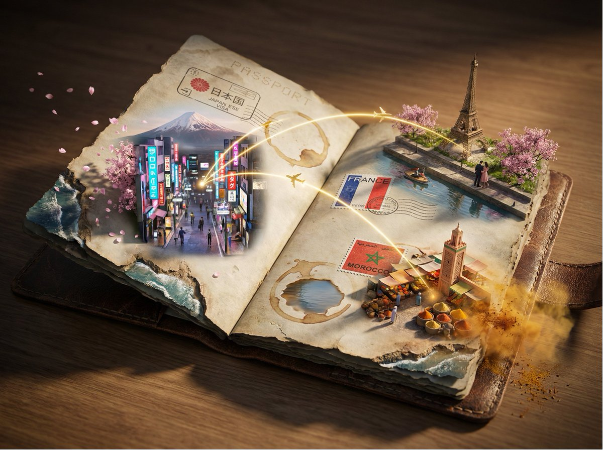

## Create a high-quality stylized 3D render of a clear, tra

- ID: trending-2011453125685608456
- Slug: trending-2011453125685608456-en
- 语言: en
- 来源: [来源链接](https://x.com/0xROAS/status/2011453125685608456)
- 样例图路径: images/part1/2011453125685608456_1.jpg

### 提示词

```text
Create a high-quality stylized 3D render of a clear, translucent glass skeleton wearing black-rimmed glasses sitting at a wooden desk. The skeleton MUST be looking down at an open textbook and holding a yellow highlighter, actively highlighting a line of text. The scene MUST feature a warm gold desk lamp on the right side casting a cozy, yellow light that creates glossy reflections on the skeleton's surface. The desk is cluttered with a white coffee mug, a stack of hardcover books on the right, and scattered pens and pastel pink and yellow highlighters. The background MUST be a solid, soft pink wall. The overall aesthetic should be warm, studious, and visually soft. Do not include any text overlays or watermarks.
```

### 样例图

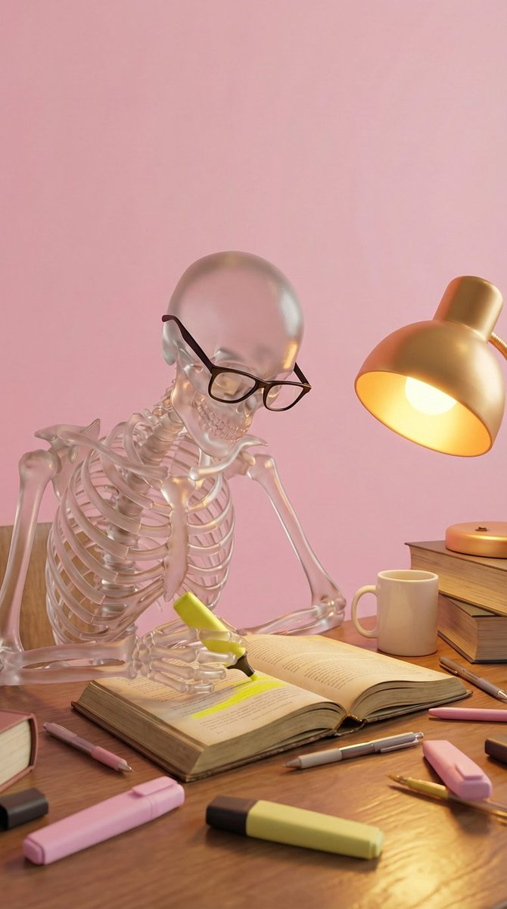

## { "reference_images": { "scene_reference": "ATTACHED_IMA

- ID: trending-2015125749804454163
- Slug: trending-2015125749804454163-en
- 语言: en
- 来源: [来源链接](https://x.com/egeberkina/status/2015125749804454163)
- 样例图路径: images/part1/2015125749804454163_1.jpg

### 提示词

```text
{
 "reference_images": {
 "scene_reference": "ATTACHED_IMAGE",
 "usage_rule": "Use this image as the sole and exact source for scene layout, object placement, and composition. Do not reinterpret or replace the scene."
 },

 "concept": {
 "type": "miniature diorama reconstruction",
 "intent": "Rebuild the attached scene as a clean, collectible-scale diorama while preserving the original spatial relationships"
 },

 "environment": {
 "scale": "tabletop miniature",
 "ground": {
 "type": "sculpted base",
 "behavior": "supports all objects naturally without enclosure",
 "edges": "clean, minimal, slightly beveled"
 },
 "background": {
 "type": "seamless studio backdrop",
 "color": "pure white",
 "constraint": "no environment beyond the diorama base"
 }
 },

 "objects_and_elements": {
 "layout_rule": "All objects must remain in the same relative positions as in the reference image",
 "primary_elements": "exact vehicles, structures, props, and terrain visible in the reference",
 "detail_handling": "simplified but faithful miniature proportions",
 "characters": {
 "presence": "only if present in the reference",
 "style": "miniature figurines, no facial realism"
 }
 },

 "composition": {
 "view": "isometric or slightly elevated 3/4 perspective",
 "framing": "entire diorama visible, centered",
 "cropping": "no zoom, no cinematic crop"
 },

 "camera": {
 "lens_equivalent": "35mm–50mm",
 "perspective": "miniature realism",
 "distortion": "none"
 },

 "lighting": {
 "type": "soft studio lighting",
 "direction": "overhead and slightly angled",
 "shadows": "subtle contact shadows only beneath objects",
 "avoid": [
 "dramatic lighting",
 "spotlights",
 "cinematic contrast"
 ]
 },

 "materials_and_style": {
 "surface_finish": "smooth, matte or lightly satin",
 "material_quality": "high-quality scale model materials",
 "aesthetic": "clean, modern, premium diorama"
 },

 "quality_controls": {
 "image_clarity": "ultra-clean",
 "grain": "none",
 "noise": "none",
 "motion_blur": "none"
 },

 "negative_prompts": [
 "glass case",
 "display box",
 "museum enclosure",
 "transparent cube",
 "protective casing",
 "reflections on glass",
 "labels or plaques",
 "text overlays",
 "busy background",
 "cinematic blur"
 ]
}
```

### 样例图

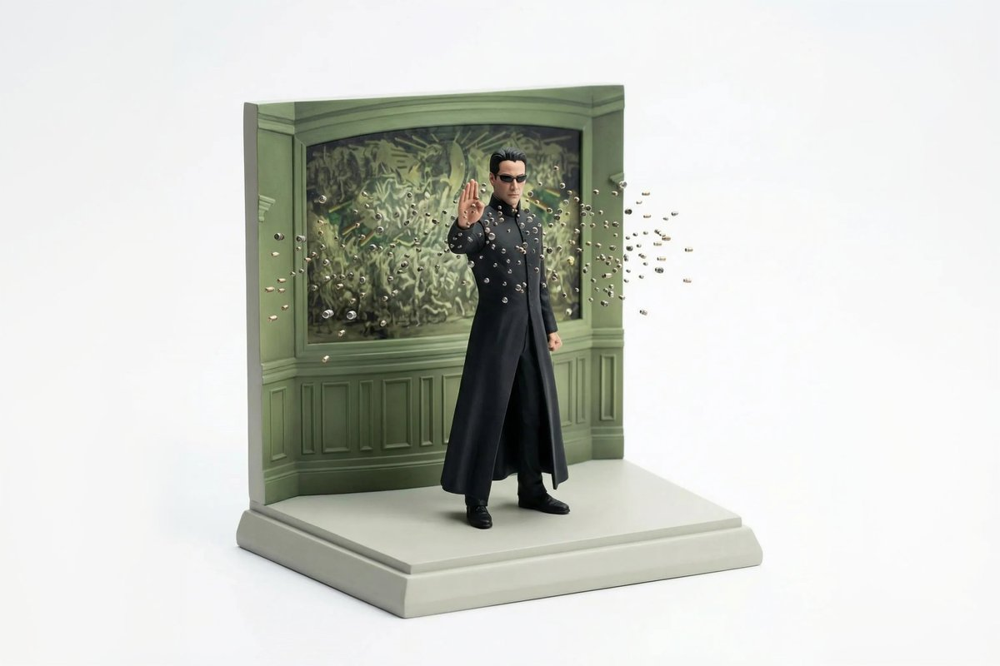

## A miniature isometric architectural diorama of [LANDMARK

- ID: trending-2011378770494566596
- Slug: trending-2011378770494566596-en
- 语言: en
- 来源: [来源链接](https://x.com/egeberkina/status/2011378770494566596)
- 样例图路径: images/part1/2011378770494566596_1.jpg

### 提示词

```text
A miniature isometric architectural diorama of [LANDMARK NAME], accurately reflecting its real-world structure and proportions, placed on a small floating base with subtle surrounding buildings and landscape elements inspired by [CITY / COUNTRY]. Realistic materials and natural textures, physically accurate stone, concrete, metal, and glass surfaces. True-to-life color palette based on the actual landmark, muted and realistic tones. Off-white studio background with soft, natural lighting, gentle shadows, and clean composition. High-detail, realistic yet refined 3D render, premium architectural model aesthetic, no people, no text.
```

### 样例图

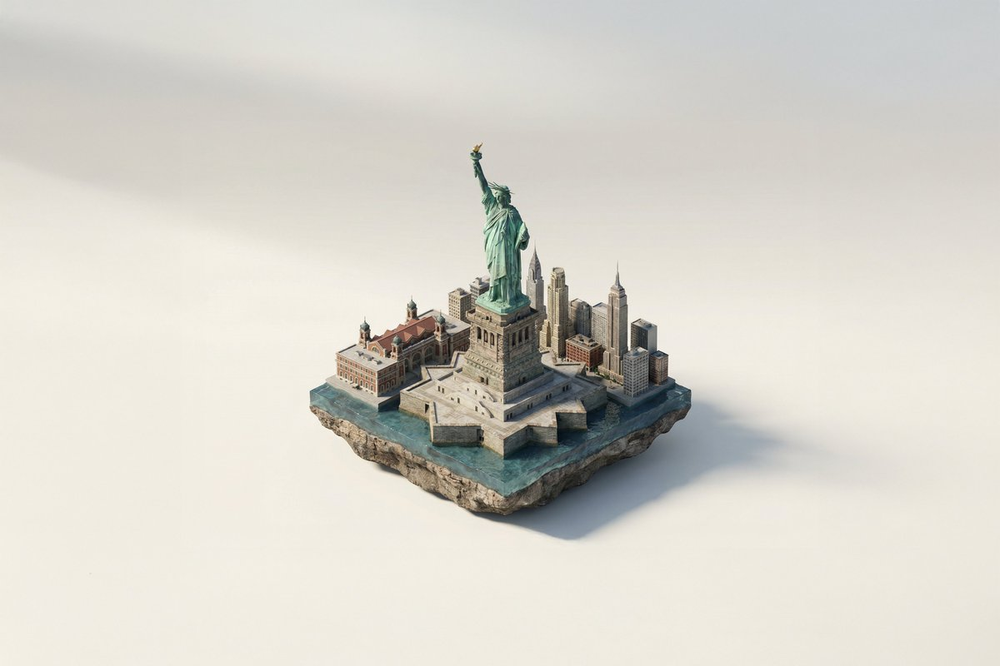

## Abstract liquid typography spelling "text", thick transp

- ID: trending-2019411461295218834
- Slug: trending-2019411461295218834-en
- 语言: en
- 来源: [来源链接](https://x.com/azed_ai/status/2019411461295218834)
- 样例图路径: images/part1/2019411461295218834_1.jpg

### 提示词

```text
Abstract liquid typography spelling "text", thick transparent water-gel material, hyper realistic refraction and subtle caustics, realistic surface tension, sculpted droplet forms merged into smooth letter curves, glossy highlights, micro bubbles inside the gel, soft contact shadows on a pure white seamless background, scattered water droplets on the surface with sharp specular reflections, studio lighting, crisp photorealistic 3D render, macro detail, sharp focus, 8k, 1:1, no watermark, no extra text
```

### 样例图

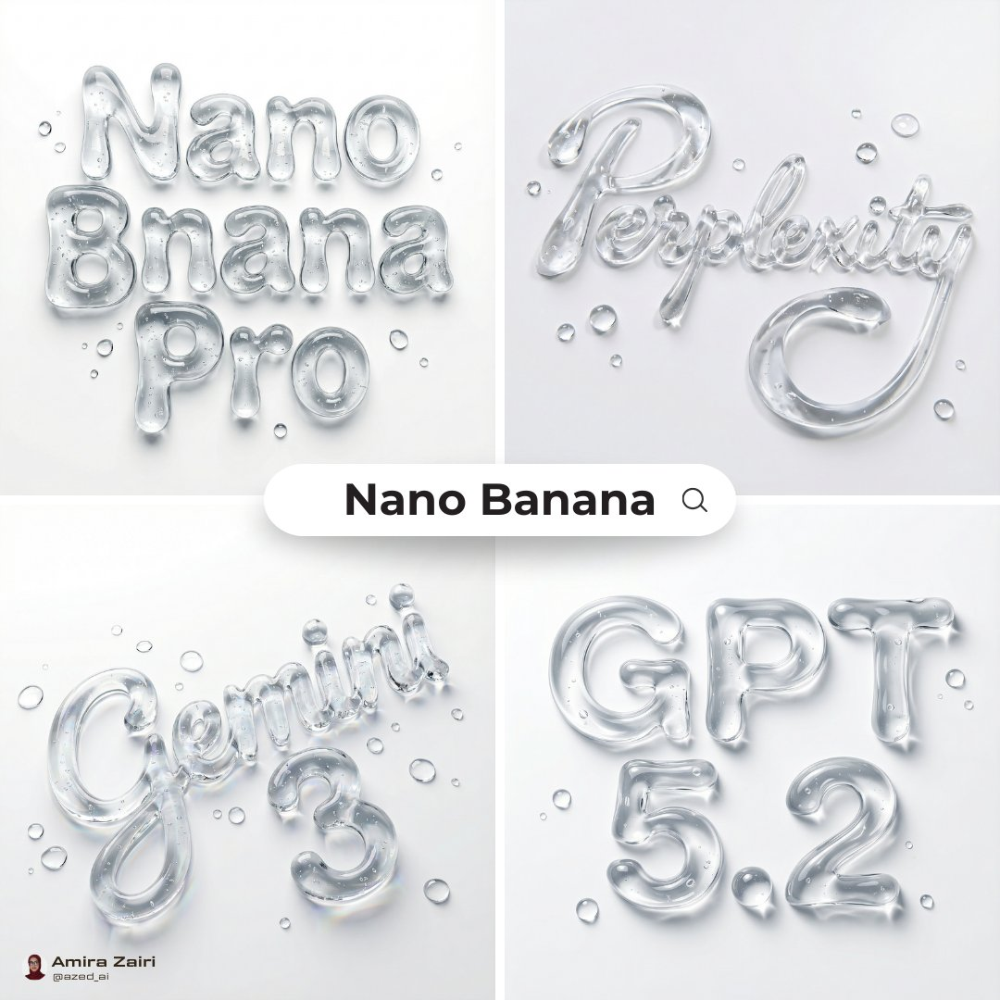

## Using the provided reference_image as the primary source

- ID: trending-2022396003425702301
- Slug: trending-2022396003425702301-en
- 语言: en
- 来源: [来源链接](https://x.com/kaanakz/status/2022396003425702301)
- 样例图路径: images/part1/2022396003425702301_1.jpg

### 提示词

```text
Using the provided reference_image as the primary source for identity, clothing colors, and visual attributes, create a full-body 3D stylized anthropomorphic cartoon version of the character. Preserve facial structure, body proportions, silhouette, and distinctive traits exactly as in the reference_image.
The outfit must match the clothing colors from the reference_image. Extract and apply the exact dominant and secondary colors from the reference_image to the hoodie, cargo pants, and sneakers. Do not introduce new colors. Do not default to orange or neon green unless they exist in the reference_image.
Modern streetwear styling is allowed, but color palette must strictly follow the reference_image.
Confident relaxed pose with hands in pockets.
Minimal studio background using the dominant background color sampled from the reference_image, or a harmonized tone derived from it. Soft studio lighting, smooth shadows, high-detail fabric texture, Pixar-quality 3D render, ultra-clean composition, centered framing, 8K resolution.
Add enforcement: “Strict color adherence to reference_image. No automatic color substitution.
```

### 样例图

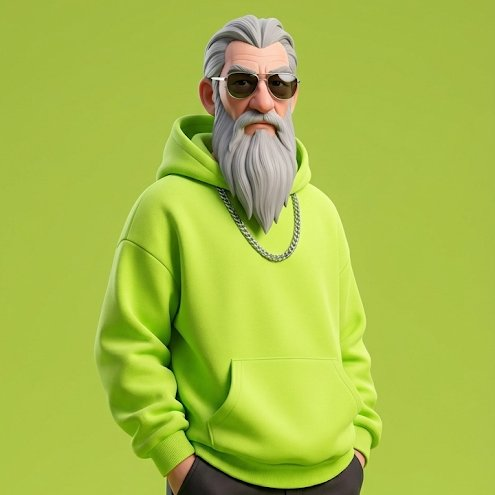

## Create a hyperrealistic, surreal spherical panorama of [

- ID: trending-2009117120987320527
- Slug: trending-2009117120987320527-en
- 语言: en
- 来源: [来源链接](https://x.com/aleenaamiir/status/2009117120987320527)
- 样例图路径: images/part1/2009117120987320527_1.jpg

### 提示词

```text
Create a hyperrealistic, surreal spherical panorama of [CITY NAME], with its most iconic landmarks and architecture seamlessly curving around the top of a planet-like surface, forming a cohesive miniature world.
Integrate sleek, modern 3D typography spelling “[CITY NAME]” naturally into the urban landscape, harmonized with the environment rather than floating unnaturally.

The scene is viewed from a top-down, orbiting perspective, emphasizing the tiny-planet effect and spherical distortion while maintaining architectural clarity.

Soft, natural daylight filters through a partly cloudy sky, casting gentle, realistic shadows across lush greenery, streets, trees, and buildings.

The background transitions smoothly into a dramatic, swirling sky, enhancing the surreal atmosphere without overpowering the city.

Use a natural yet vivid color palette — crisp greens, soft blues, and muted earth tones appropriate to [CITY NAME].

Render in a polished, photorealistic style with fine architectural detail, realistic textures, atmospheric depth, and high visual fidelity.
```

### 样例图


## { "image_generation_request": { "subject": "[INSERT PROD

- ID: trending-2019788303214776494
- Slug: trending-2019788303214776494-en
- 语言: en
- 来源: [来源链接](https://x.com/lloydcreates/status/2019788303214776494)
- 样例图路径: images/part1/2019788303214776494_1.jpg

### 提示词

```text
{
  "image_generation_request": {
    "subject": "[INSERT PRODUCT HERE]",
    "environment": {
      "background": "A smooth, professional dual-tone gradient transition between #111B24 and #CAEFFF",
      "lighting": "High-contrast studio lighting with bright rim highlights to emphasize glossy textures"
    },
    "style_elements": {
      "aesthetic": "Y2K Frutiger Aero meets modern hyper-realism",
      "optical_effects": [
        "Dynamic glass refraction",
        "Prismatic chromatic aberration at the edges of transparent objects",
        "Iridescent lens flares",
        "Distorted glass overlays floating in the foreground"
      ],
      "composition": "Floating, gravity-defying arrangement with a wide-angle perspective",
      "textures": "Polished chrome, transparent acrylic, and high-gloss plastic"
    },
    "technical_specs": {
      "resolution": "8k UHD",
      "render_engine": "Octane Render style",
      "detailing": "Macro photography focus, hyper-detailed mechanical parts"
    }
  }
}
```

### 样例图

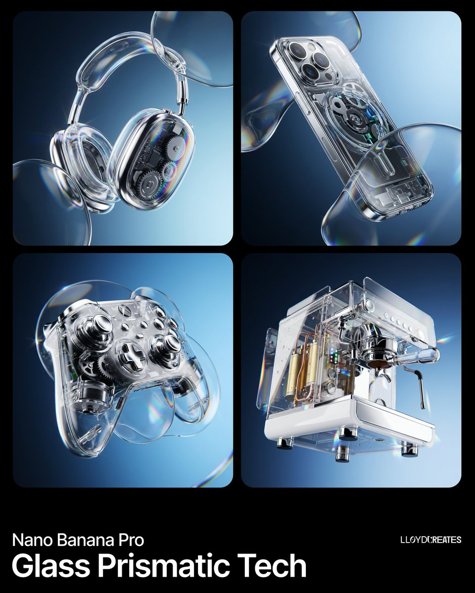

## Create a super cute, hyper-realistic 3D render of a todd

- ID: trending-2028747310759542860
- Slug: trending-2028747310759542860-en
- 语言: en
- 来源: [来源链接](https://x.com/Naiknelofar788/status/2028747310759542860)
- 样例图路径: images/part1/2028747310759542860_1.jpg

### 提示词

```text
Create a super cute, hyper-realistic 3D render of a toddler girl who is a younger version of the person in the provided reference photo.

The facial structure must strongly match the reference image. Accurately replicate the exact eye shape, eye color, skin tone, lip shape, nose structure, cheek fullness, eyebrow shape, and overall facial proportions. The toddler version should clearly resemble the same person at a younger age while maintaining realistic childlike softness and rounded features.
If any accessory (such as an earring or similar detail) appears in the reference image, replicate it accurately in size, colour, and placement.
Expression:

Distinctly grumpy and pouty. Chin resting on her left palm. One eye slightly squinted in mild annoyance. Eyebrows gently furrowed. Lips pushed forward in a stubborn pout. Expression must feel natural and emotionally believable, not exaggerated.
Hair:

Hairstyle should be adapted from the reference image while keeping it toddler-appropriate. Styled in a messy high bun with soft, natural baby hair strands framing the face.
Outfit:

White short-sleeve t-shirt under classic blue denim overalls with visible stitching and metal clasps.
Pose & Background:

Sitting cross-legged on a clean white studio background. Feet slightly angled toward the camera. Balanced composition with full body visible.
Style & Quality:

Ultra-detailed Pixar/Disney-inspired 3D animation aesthetic. Professional CGI rendering. 1:1 aspect ratio. 8K resolution. Sharp focus. Cinematic studio lighting with soft subsurface scattering on the skin. Smooth textures, realistic fabric physics, soft global illumination, and natural shadow falloff.
```

### 样例图

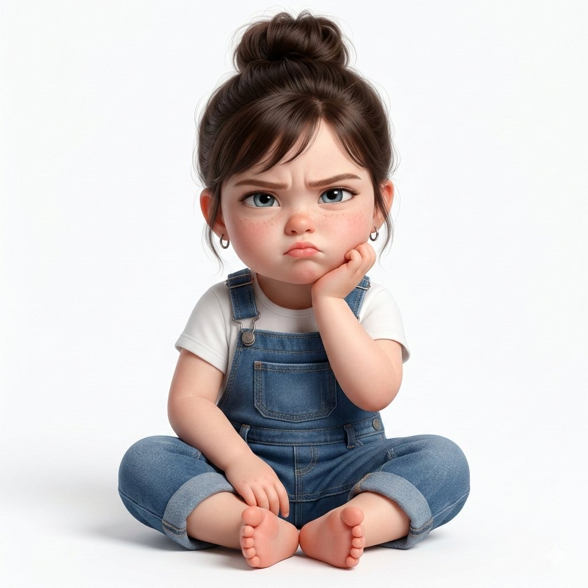

## A Realistic First Person (Pov) Selfie Taken With An Outs

- ID: trending-2029518437496795172
- Slug: trending-2029518437496795172-en
- 语言: en
- 来源: [来源链接](https://x.com/harboriis/status/2029518437496795172)
- 样例图路径: images/part1/2029518437496795172_1.jpg

### 提示词

```text
A Realistic First Person (Pov) Selfie Taken With An Outside Arm, In The Same Clothes As In The Uploaded Photo.
Close-up Of Me Hugging Tom, The Cartoon Gray Cat From Tom And Jerry, With A Small Smile (Jerry Can Be Looking Out Of My Shoulder Or My Pocket).
Photorealistic Environment: Studio Set, Office Interior, Warm Light, Props, Spotlights And Cables In The Background.
Tom Is A Strongly Stylized Toon 3d: Cel-shading, Multi-proportions, Clear Contour, No Realistic Fur, Not Live-action.
Organic: Zoom To The Chest, Contact Of Hugs, Single Light, Natural Shadows. 4k.natural shadows. 4k.
```

### 样例图

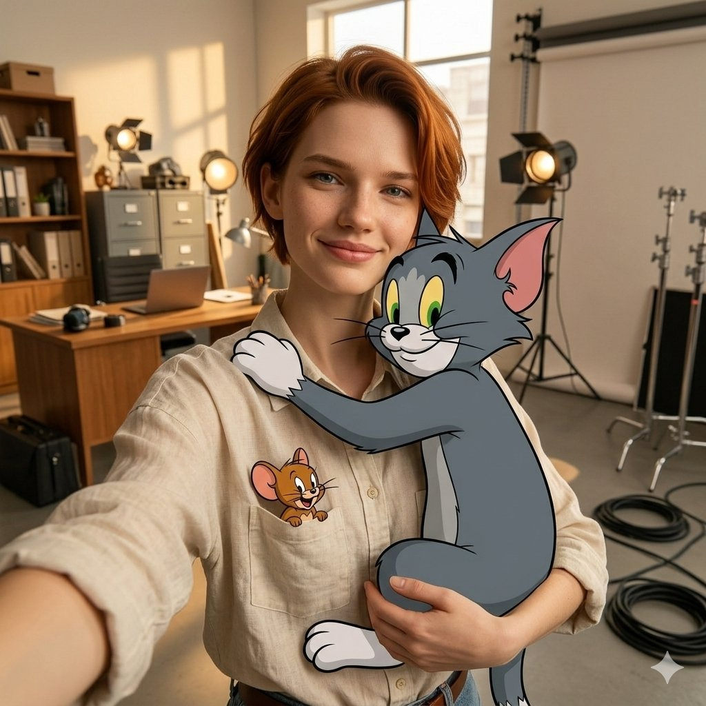

## A hand-drawn treasure map on aged parchment, with the ad

- ID: trending-2027140622252179959
- Slug: trending-2027140622252179959-en
- 语言: en
- 来源: [来源链接](https://x.com/AllaAisling/status/2027140622252179959)
- 样例图路径: images/part1/2027140622252179959_1.jpg

### 提示词

```text
A hand-drawn treasure map on aged parchment, with the adventure erupting into three-dimensional quest. {STARTING_POINT} rises at the map's edge with {DEPARTURE_SCENE}, the dotted path becomes an actual trail traversing {TERRAIN_1} with {DANGER_1}, passing {LANDMARK_1} where {OBSTACLE_1} awaits. {TERRAIN_2} features {WILDLIFE_1} and {ENVIRONMENTAL_HAZARD}. The X marking the spot glows beneath {FINAL_LOCATION}, treasure partially visible, {GUARDIAN_ELEMENT} protecting it. Miniature expedition party frozen mid-journey at various points along the route. Torn edges of the map become cliffs. Coffee stains become lakes. Burn marks become scorched earth from battles past. Candlelight flicker, adventure novel lighting, 8K, the map as the story it promises.
```

### 样例图

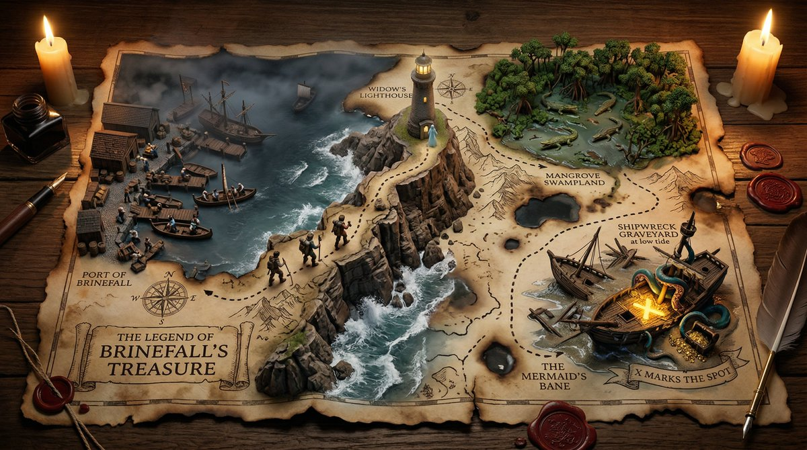

## Use a user-uploaded image as the source and convert the 

- ID: trending-2020837883549298730
- Slug: trending-2020837883549298730-en
- 语言: en
- 来源: [来源链接](https://x.com/TechieBySA/status/2020837883549298730)
- 样例图路径: images/part1/2020837883549298730_1.jpg

### 提示词

```text
Use a user-uploaded image as the source and convert the person into a stylized 3D character while preserving identity, facial structure, pose, hairstyle, clothing, and overall composition exactly as shown in the photo. The result should clearly resemble the real person.

The visual style is a stylized 3D character with a soft minimal cartoon 3D aesthetic, inspired by Pixar-like visuals but more minimal, toy-figure renders, and clean product-style character design. The balance should favor stylization over realism without changing the person’s real-world appearance.

Skin should appear as smooth matte plastic with a soft, uniform texture and gentle subsurface scattering. Facial features should remain faithful to the original image while being simplified in form. The expression should stay neutral and natural to the source photo.

Lighting should be clean and controlled, similar to a studio softbox setup, with very soft shadows, low contrast, and subtle highlights. The background should be a solid [BACKGROUND COLOR] with no gradient.

The camera should feel front-facing with a medium close-up framing, similar to a 50mm lens, with no distortion. Output quality should be high resolution with clean edges, no noise, strong style consistency, and a clearly non-photorealistic finish.
```

### 样例图

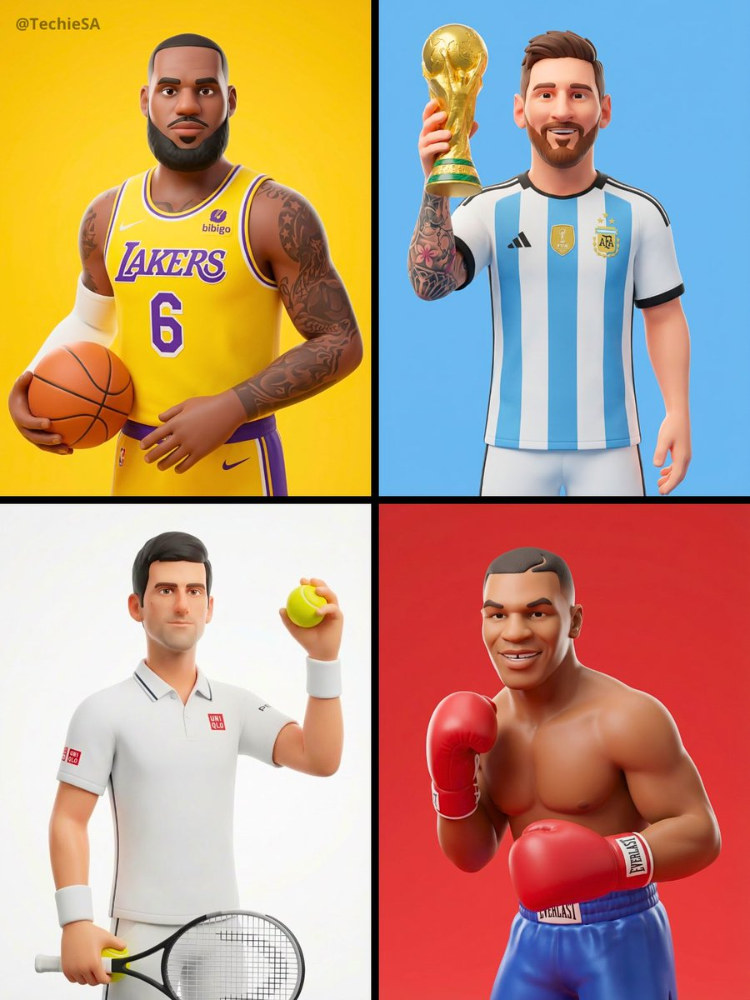

## Create an infographic image of [OBJECT], combining a rea

- ID: trending-2041546763426009455
- Slug: trending-2041546763426009455-en
- 语言: en
- 来源: [来源链接](https://x.com/Nas_tech_AI/status/2041546763426009455)
- 样例图路径: images/part1/2041546763426009455_1.png

### 提示词

```text
Create an infographic image of [OBJECT], combining a realistic photograph or photorealistic render of the object with technical annotation overlays placed directly on top. Use black ink–style line drawings and text (technical pen / architectural sketch look) on a pure white studio background. Include: •Key component labels •Internal cutaway or exploded-view outlines (where relevant) •Measurements, dimensions, and scale markers •Material callouts and quantities
```

### 样例图

![Create an infographic image of [OBJECT], combining a rea](../images/part1/2041546763426009455_1.png)

## Create a high-quality 3D metallic typography composition

- ID: trending-2009624649894945022
- Slug: trending-2009624649894945022-en
- 语言: en
- 来源: [来源链接](https://x.com/aleenaamiir/status/2009624649894945022)
- 样例图路径: images/part1/2009624649894945022_1.jpg

### 提示词

```text
Create a high-quality 3D metallic typography composition of the title [MOVIE / SERIES NAME], set against a dark, textured background that reflects the tone, genre, and emotional atmosphere of the story, delivering a cinematic, premium visual impact.

Each individual letter is sculpted as a cinematic form, seamlessly merging a different iconic scene from the movie or series into the letter itself. Scenes are translated into architectural elements, environments, characters, props, lighting, and atmospheric details, transformed into elegant, readable letterforms rather than literal collages.

Every letter acts as a mini visual narrative, instantly recognizable to fans, while no two letters repeat the same scene or story moment. The full title feels cohesive, balanced, and unified as a single artwork.

The typography is rendered in polished metallic materials (gold, silver, steel, or [COLOR]), featuring realistic reflections, fine engravings, and subtle surface wear for cinematic authenticity.

Dramatic studio lighting with soft rim highlights and deep shadows enhances depth, scale, and mood, blending seamlessly with the embedded scenes.

Ultra-sharp focus, premium 3D render quality, cinematic depth of field, luxury title-card aesthetic, ultra-high resolution.

No cartoon style, no flat illustration — pure cinematic realism with sculptural artistry.
```

### 样例图

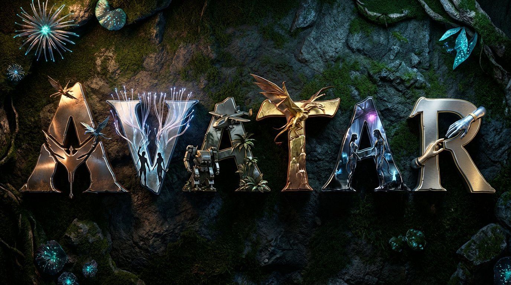

## { "image_generation_prompt": { "subject": { "description

- ID: trending-2016154222765527482
- Slug: trending-2016154222765527482-en
- 语言: en
- 来源: [来源链接](https://x.com/2abhisheknaks/status/2016154222765527482)
- 样例图路径: images/part1/2016154222765527482_1.jpg

### 提示词

```text
{
  "image_generation_prompt": {
    "subject": {
      "description": "A photorealistic young woman with brown hair tied back in a ponytail, sitting on a stool.",
      "pose": "Sitting with one knee raised, hands clasped around her shin, looking slightly to the side with a calm, focused expression.",
      "clothing": {
        "top": "Beige t-shirt with a white Nike swoosh logo on the chest.",
        "bottoms": "Dark blue leggings with a small white swoosh logo on the thigh.",
        "footwear": "White athletic sneakers."
      }
    },
    "composition": {
      "foreground_element": "A large, 3D-rendered white social media frame resembling an Instagram post, physically framing the subject.",
      "ui_details": {
        "header": {
          "profile_picture": "Profile picture of the woman",
          "username": "Maria",
          "follow_button": {
            "text": "FOLLOW",
            "color": "Blue"
          }
        },
        "footer_icons": [
          {
            "type": "like",
            "icon": "Heart",
            "color": "Red",
            "state": "Liked"
          },
          {
            "type": "comment",
            "icon": "Comment bubble"
          },
          {
            "type": "share",
            "icon": "Paper plane"
          },
          {
            "type": "bookmark",
            "icon": "Bookmark"
          }
        ],
        "likes_count": 785,
        "caption": "Freedom isn’t found in comfort. It’s built in the quiet moments where discipline meets belief."
      }
    },
    "environment": {
      "setting": "A dimly lit, atmospheric gym background.",
      "details": "Blurred gym equipment in the shadows, creating a strong depth of field."
    },
    "style": {
      "visual_style": "3D realistic render using Unreal Engine 5, cinematic and high fidelity.",
      "lighting": {
        "subject": "Soft spotlight focused on the woman",
        "background": "Cool ambient lighting with subtle shadows"
      }
    }
  }
}
```

### 样例图

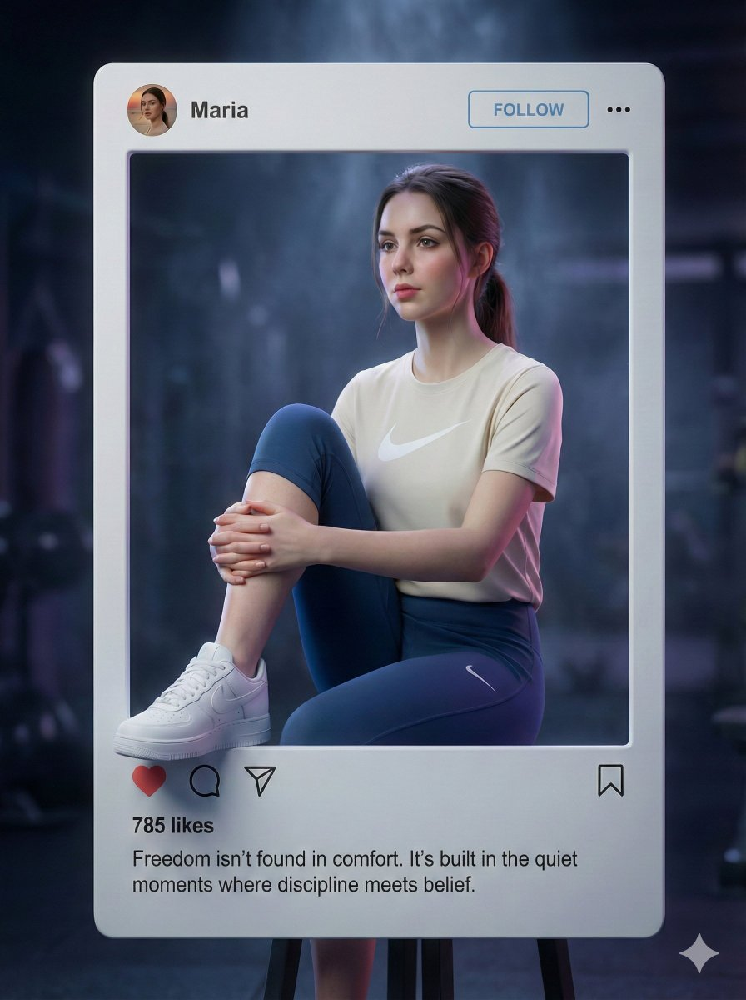

## [SUBJECT], ultra realistic 3D render, smooth inflated gl

- ID: trending-2020134464349958346
- Slug: trending-2020134464349958346-en
- 语言: en
- 来源: [来源链接](https://x.com/azed_ai/status/2020134464349958346)
- 样例图路径: images/part1/2020134464349958346_1.jpg

### 提示词

```text
[SUBJECT], ultra realistic 3D render, smooth inflated glossy plastic material, soft pillowy balloon like contours, subtle stitched panel seams and paneling, high specular highlights, clean reflections, soft contact shadows, designer collectible toy aesthetic, cute proportions, premium polished finish, floating centered, plain light gray studio background, soft diffused studio lighting, sharp focus, high resolution, 8k, 1:1, no text, no logo, no watermark
```

### 样例图

![[SUBJECT], ultra realistic 3D render, smooth inflated gl](../images/part1/2020134464349958346_1.jpg)

## A marque historian's documentation board for [VEHICLE] —

- ID: trending-2009284710862643206
- Slug: trending-2009284710862643206-en
- 语言: en
- 来源: [来源链接](https://x.com/AllaAisling/status/2009284710862643206)
- 样例图路径: images/part1/2009284710862643206_1.jpg

### 提示词

```text
A marque historian's documentation board for [VEHICLE] — [MODEL / VARIANT / YEAR]. Left section: factory documentation including original specification sheet, production line photographs, period advertising, and chassis number registry. Center section: technical illustration showing powertrain in phantom view, suspension geometry, aerodynamic annotations, and material callouts, surrounded by period racing results or ownership provenance. Right section: the vehicle in its defining environment, whether racing circuit, mountain pass, or boulevard, captured with period-appropriate color grading and motion. Visual style transitions from archival document cream through engineering-drawing precision to saturated automotive photography. Title block reading "[VEHICLE NAME] — CHASSIS NO. [NUMBER], [PROVENANCE SUMMARY]".  
```

### 样例图

![A marque historian's documentation board for [VEHICLE] —](../images/part1/2009284710862643206_1.jpg)

## A hyper-stylized, dynamic 3D head portrait floats agains

- ID: trending-2024450766874751356
- Slug: trending-2024450766874751356-en
- 语言: en
- 来源: [来源链接](https://x.com/TechieBySA/status/2024450766874751356)
- 样例图路径: images/part1/2024450766874751356_1.jpg

### 提示词

```text
A hyper-stylized, dynamic 3D head portrait floats against a vivid red background with soft volumetric clouds and seamless shading. Only the cartoonish 3D head appears, with no neck visible, and facial features closely matching the reference photo. The head is tilted and fills approximately 80% of the frame. The character displays a fierce, aggressive expression with a wide snarl, revealing teeth adorned with diamond-studded braces. Sharp, angular silver sunglasses with pointed frames fit the face precisely. Additional accessories include chrome earrings and a chunky silver chain necklace. Lighting is bold and metallic, combining strong rim lights from above and behind with a luminous frontal fill that sculpts facial contours and creates glossy skin highlights. The overall look features over-the-top glossy realism, exaggerated proportions, intense reflections, and a futuristic, high-energy aesthetic with partial overlap of elements to enhance depth and dramatic presence. Hyper-detailed 3D forms add vibrant, cinematic intensity and visual impact. Aspect ratio 4:5
```

### 样例图

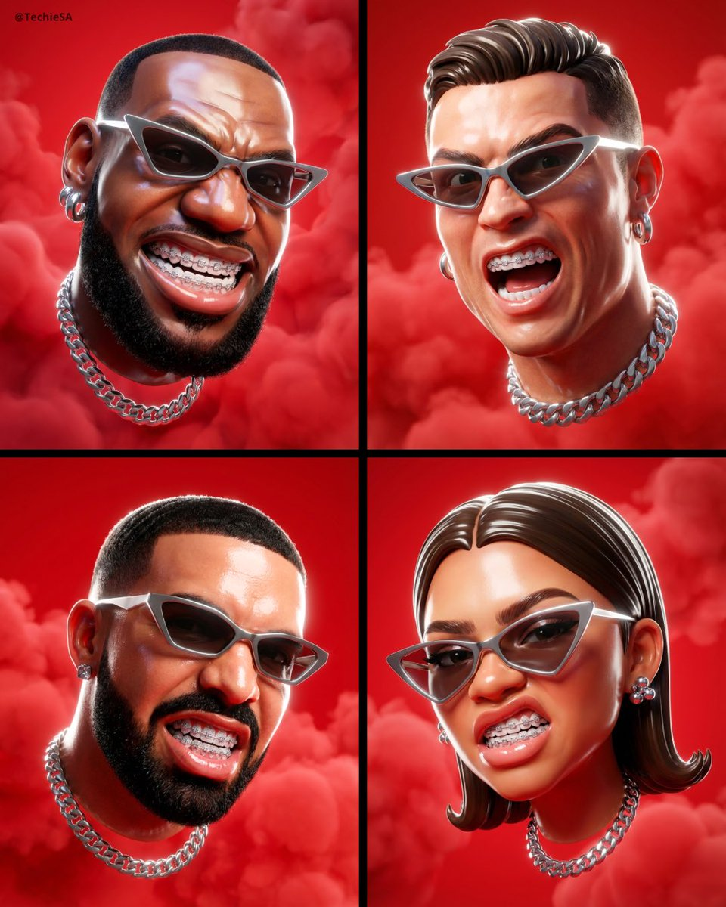

## A hyper-detailed, origami-style version of a person, fol

- ID: trending-2022187418502217977
- Slug: trending-2022187418502217977-en
- 语言: en
- 来源: [来源链接](https://x.com/YaseenK7212/status/2022187418502217977)
- 样例图路径: images/part1/2022187418502217977_1.jpg

### 提示词

```text
A hyper-detailed, origami-style version of a person, folded from high-quality paper with crisp, clean edges and a realistic paper texture. Intricate geometric folds capture the character’s iconic shape and expressions. Use the same color palette as the reference photo (no black). Place it on a clean studio surface with soft, natural shadows. A minimalist collectible art aesthetic; ultra-photorealistic; 8k, 1080×1080 square.
```

### 样例图

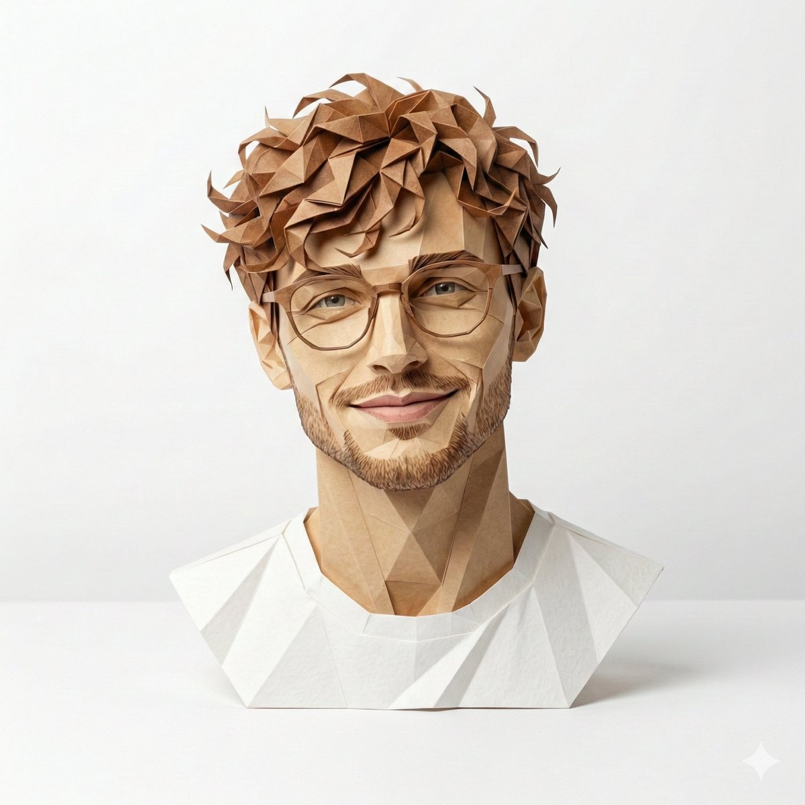

## Create an infographic image of [COUNTRY], combining a re

- ID: trending-2015850590283124768
- Slug: trending-2015850590283124768-en
- 语言: en
- 来源: [来源链接](https://x.com/TechieBySA/status/2015850590283124768)
- 样例图路径: images/part1/2015850590283124768_1.jpg

### 提示词

```text
Create an infographic image of [COUNTRY], combining a realistic photograph or photoreal render of the object with technical annotation overlays placed directly on top.

Use black ink–style line drawings and text (technical pen / architectural sketch look) on a pure white studio background, including:
•Key component labels
•Internal cutaway or exploded-view outlines
•Measurements, dimensions, and scale markers
•Material callouts and quantities
•Arrows indicating function, force, or flow (air, sound, power, pressure)
•Simple schematic or sectional diagrams where relevant
Include a small flag of the country in the top right corner.

Place the title [COUNTRY] inside a hand-drawn technical annotation box in one corner.

Style & layout rules:
•The real object remains clearly visible beneath the annotations
•Annotations feel sketched, technical, and architectural
•Clean composition with balanced negative space
•Educational, museum-exhibit / engineering-manual vibe

Visual style:
Minimal technical illustration aesthetic, black linework over realistic imagery, precise but slightly hand-drawn feel.

Color palette:
White background, black annotation lines and text only. No colors.

Output:
1080×1080, ultra-crisp, social-feed optimized, no watermark.
```

### 样例图

![Create an infographic image of [COUNTRY], combining a re](../images/part1/2015850590283124768_1.jpg)

## A [subject] split vertically down the center, left half 

- ID: trending-2030420620232561024
- Slug: trending-2030420620232561024-en
- 语言: en
- 来源: [来源链接](https://x.com/GlennHasABeard/status/2030420620232561024)
- 样例图路径: images/part1/2030420620232561024_1.jpg

### 提示词

```text
A [subject] split vertically down the center, left half as a [adjective] technical blueprint, right half as a [adjective] 3D render, the seam between them glitching where both realities collide. 
```

### 样例图

![A [subject] split vertically down the center, left half ](../images/part1/2030420620232561024_1.jpg)

## Create a head-and-shoulders Pixar-style 3D avatar of an 

- ID: trending-2040691670384366063
- Slug: trending-2040691670384366063-en
- 语言: en
- 来源: [来源链接](https://x.com/oggii_0/status/2040691670384366063)
- 样例图路径: images/part1/2040691670384366063_1.jpg

### 提示词

```text
Create a head-and-shoulders Pixar-style 3D avatar of an edgy person based on the reference image with a black bob, purple hair streak, and a small nose ring. She has a defiant, playful expression, sticking her tongue out with wide, confident eyes while wearing a classic denim jacket. Isolated on a seamless white background, the render features flawless 3D skin and soft cinematic lighting for a clean, minimalist aesthetic.
```

### 样例图

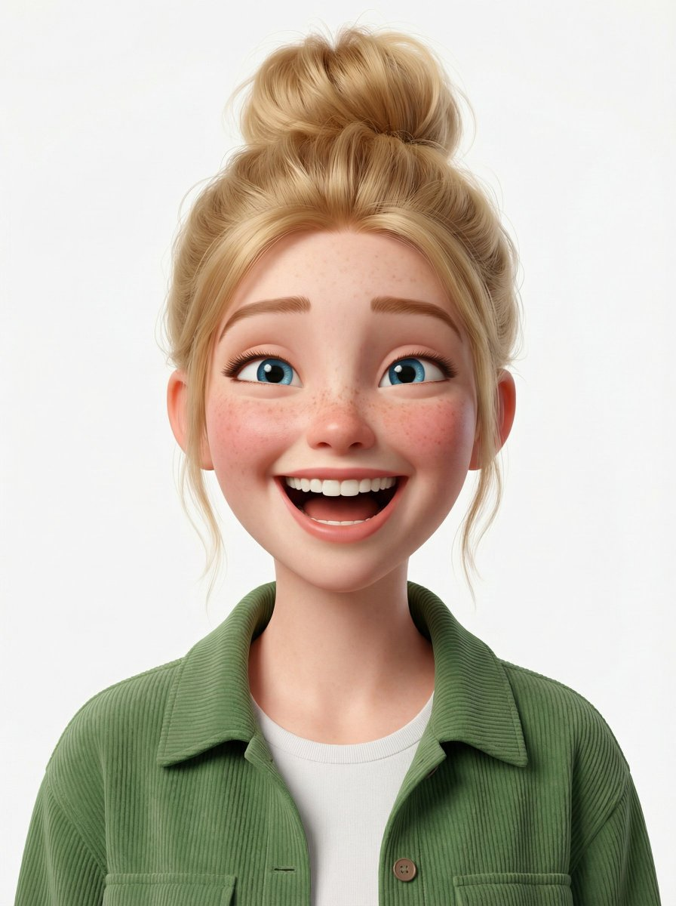

## A hyper-realistic 3D game guide infographic poster for [

- ID: trending-2044422529146630350
- Slug: trending-2044422529146630350-en
- 语言: en
- 来源: [来源链接](https://x.com/TechieBySA/status/2044422529146630350)
- 样例图路径: images/part1/2044422529146630350_1.jpg

### 提示词

```text
A hyper-realistic 3D game guide infographic poster for [GAME]. The in-game world of [GAME] is rendered as a raised, textured terrain map floating on a clean light gray surface — the map shape and landscape must reflect the actual geography and visual aesthetic of [GAME] (urban, western, fantasy, island etc). Iconic in-game locations from [GAME] are placed as miniature 3D sculpted models at their correct in-game positions across the map — each one highly detailed, photorealistic and instantly recognizable to fans. Roads or paths connect key locations as white lines across the terrain. Around the map, floating 3D decorative props and items iconic to [GAME] are scattered on the light gray surface. The official logo of [GAME] is shown as a small detailed object in the upper right corner. Each major location has a bold black label on the map, and beside the map, each location has a neat checklist of its most iconic moments or activities associated with that place, in clean sans-serif typography. A large bold title at the top reads: “THE WORLD OF GAME” in black uppercase typography with [GAME] in heavy bold. The overall aesthetic is premium editorial — soft studio lighting, photorealistic 3D render, white/light gray background, clean layout, 4:5 aspect ratio
```

### 样例图

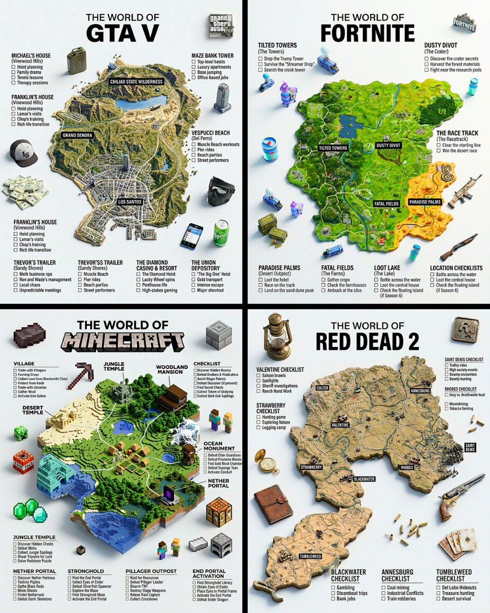

## Scandinavian-style minimal illustration of [SUBJECT], mu

- ID: trending-2013590587715526879
- Slug: trending-2013590587715526879-en
- 语言: en
- 来源: [来源链接](https://x.com/aleenaamiir/status/2013590587715526879)
- 样例图路径: images/part1/2013590587715526879_1.jpg

### 提示词

```text
Scandinavian-style minimal illustration of [SUBJECT], muted pastel palette, flat design, soft gradients, cozy yet modern aesthetic, clean shapes, lifestyle illustration feel.
```

### 样例图

![Scandinavian-style minimal illustration of [SUBJECT], mu](../images/part1/2013590587715526879_1.jpg)

## A hyper-realistic 3D anatomical human [organ] made from 

- ID: trending-2033543326444720272
- Slug: trending-2033543326444720272-en
- 语言: en
- 来源: [来源链接](https://x.com/azed_ai/status/2033543326444720272)
- 样例图路径: images/part1/2033543326444720272_1.jpg

### 提示词

```text
A hyper-realistic 3D anatomical human [organ] made from semi-translucent frosted polycarbonate with a milky matte finish, softly diffusing light. Industrial injection-molded detailing, subtle micro-texture, and rounded edges with precision seams. Inside, intricate mechanical components replace organic tissue, micro gears, pistons, circuitry, and engineered chambers visible but softly blurred through the shell. A subtle white Apple logo is naturally embedded on the surface, minimal and not overly obvious. Soft diffused studio lighting, realistic plastic refraction, subtle shadow beneath, centered composition, pure white background, ultra-detailed futuristic biomechanical render, 1:1 aspect ratio.


```

### 样例图

![A hyper-realistic 3D anatomical human [organ] made from ](../images/part1/2033543326444720272_1.jpg)

## Ultra-realistic 4:5 vertical format ultra wide angle 13m

- ID: trending-2037732319348633909
- Slug: trending-2037732319348633909-en
- 语言: en
- 来源: [来源链接](https://x.com/de_mon010/status/2037732319348633909)
- 样例图路径: images/part1/2037732319348633909_1.jpg

### 提示词

```text
Ultra-realistic 4:5 vertical format ultra wide angle 13mm selfie of me with Bugs Bunny, Daffy Duck, Porky Pig, Elmer Fudd, Yosemite Sam, Tweety, Sylvester in my studio. I am wearing pale pink t-shirt. We're all making silly, exaggerated faces. High camera angle. Extreme wide lense no fish-eye distortion. Realistic, live action characters no cartoon, cinematic lighting, all realistic characters integrated with stylized realism.
```

### 样例图

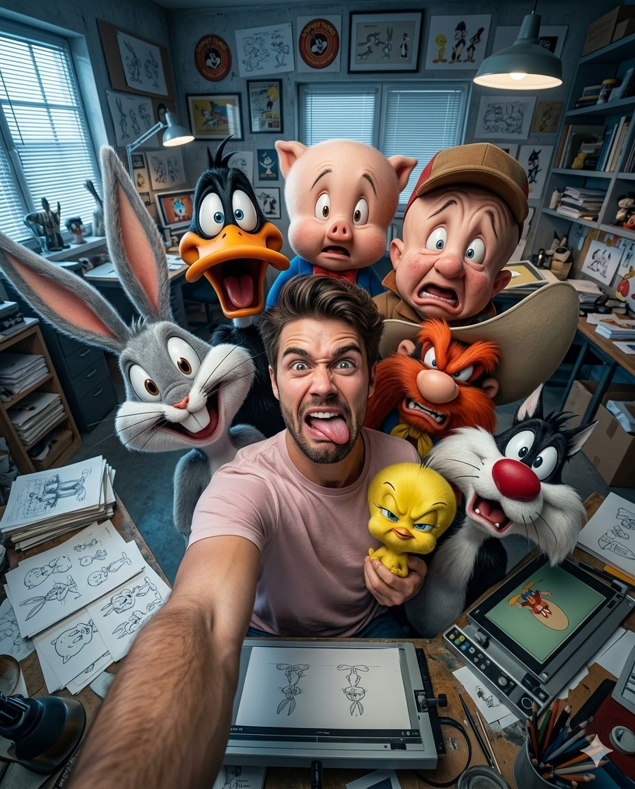

## Transform this movie poster into a child’s crayon drawin

- ID: trending-2036867472918286551
- Slug: trending-2036867472918286551-en
- 语言: en
- 来源: [来源链接](https://x.com/TechieBySA/status/2036867472918286551)
- 样例图路径: images/part1/2036867472918286551_1.jpg

### 提示词

```text
Transform this movie poster into a child’s crayon drawing on lined notebook paper. Every compositional element, character pose, typography, color palette, and layout is preserved exactly as the original — only the art style has changed. Drawn in colored pencil and crayon with wobbly unsteady lines, uneven coloring that goes slightly outside the lines, basic facial features, simplified anatomy. Background filled with heavy crayon scribble strokes. Lined notebook paper visible underneath, including the red margin line. Text redrawn in shaky hand-lettered crayon matching the original font placement. Flat scan of the drawing, slight paper texture.
```

### 样例图

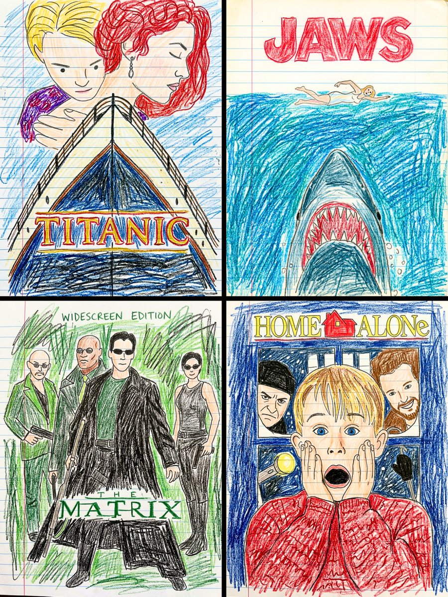

## [SUBJECT], made of smooth inflated glossy vinyl plastic,

- ID: trending-2037922744856412584
- Slug: trending-2037922744856412584-en
- 语言: en
- 来源: [来源链接](https://x.com/azed_ai/status/2037922744856412584)
- 样例图路径: images/part1/2037922744856412584_1.jpg

### 提示词

```text
[SUBJECT], made of smooth inflated glossy vinyl plastic, ultra-realistic 3D render, soft pillowy contours with subtle stitched panel seams, slightly rounded toy-like proportions, highly polished surface with strong specular highlights, realistic material depth, soft studio lighting creating gentle shadows and clean reflections, floating slightly above a plain light gray background, minimal composition, designer collectible aesthetic, premium art toy finish, high detail, centered composition, 1:1 aspect ratio.
```

### 样例图

![[SUBJECT], made of smooth inflated glossy vinyl plastic,](../images/part1/2037922744856412584_1.jpg)

## A dynamic full-body urban illustration of a man (use the

- ID: trending-2042609010659201189
- Slug: trending-2042609010659201189-en
- 语言: en
- 来源: [来源链接](https://x.com/Goodmanprotocol/status/2042609010659201189)
- 样例图路径: images/part1/2042609010659201189_1.jpg

### 提示词

```text
A dynamic full-body urban illustration of a man (use the exact face from the provided reference image, ensuring high facial accuracy and identity preservation). He wears an oversized white hoodie with subtle black and red accents, paired with loose white track pants and bold, eye-catching white sneakers.
The character has a sharp, confident gaze directed forward, conveying intensity and self-assurance. The composition is captured from a dramatic low-angle perspective, emphasizing power and dominance. His stance is strong and grounded, with exaggerated perspective on the sneakers in the foreground for added depth.
Surrounding him are fragmented concrete elements and subtle debris, suggesting an urban, gritty environment. The background is a clean white canvas featuring bold red paint splashes and abstract geometric shapes, creating a modern street-art aesthetic.
The visual style combines crisp, clean line art with vibrant flat colors and soft cel shading for depth and dimension. The rendering should feel like a high-end urban illustration or stylized editorial artwork.
Lighting is bright, even, and diffused across the entire scene, minimizing harsh shadows while maximizing clarity and detail.
Ultra-detailed, sharp focus, 8K resolution, vertical composition
```

### 样例图

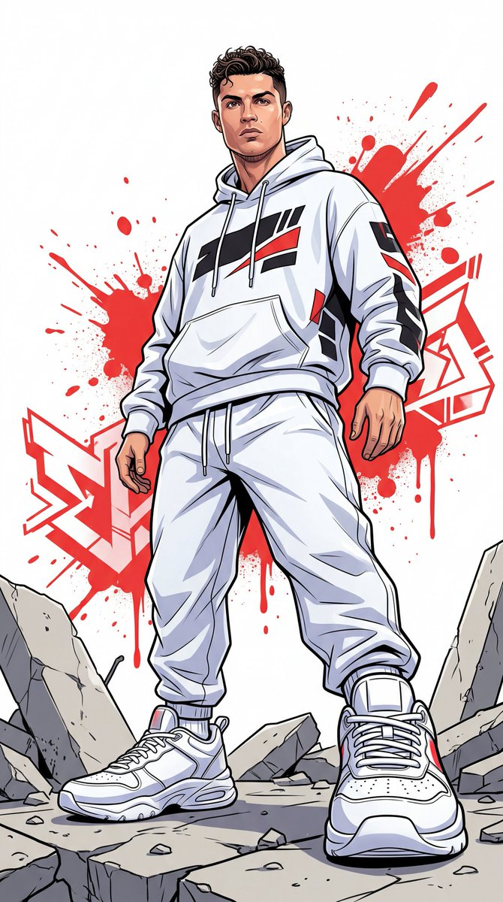

## 使用以 #f6f4f0 为主背景，#2d

- ID: trending-2034103289185505560
- Slug: trending-2034103289185505560-zh
- 语言: zh
- 来源: [来源链接](https://x.com/ZaynHao/status/2034103289185505560)
- 样例图路径: images/part1/2034103289185505560_1.jpg

### 提示词

```text
使用以 #f6f4f0 为主背景，#2d6dc3 为主蓝色，同时也包含一些橙色元素，制作了一张山水远景风景画。
```

### 样例图

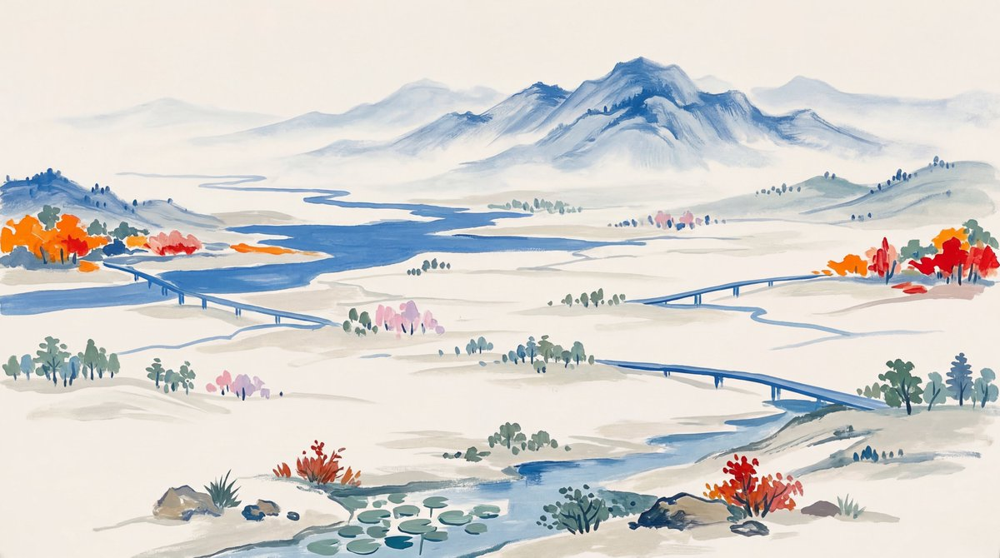

## Highly detailed caricature figurine of [SUBJECT] as a cu

- ID: trending-2021519254151942239
- Slug: trending-2021519254151942239-en
- 语言: en
- 来源: [来源链接](https://x.com/ShamsAmin56/status/2021519254151942239)
- 样例图路径: images/part1/2021519254151942239_1.jpg

### 提示词

```text
Highly detailed caricature figurine of [SUBJECT] as a cute but intense bobblehead-style collectible statue, exaggerated oversized head with hyper-realistic facial features, deep wrinkles, fierce intense expression, slightly open mouth showing teeth, sitting relaxed in a vintage armchair, wearing [OUTFIT], dramatic colorful studio lighting, [BACKGROUND], modern collectible toy photography style, sharp focus, cinematic depth of field, extremely intricate sculpting details, realistic skin texture, professional product photography, 8k quality
```

### 样例图

![Highly detailed caricature figurine of [SUBJECT] as a cu](../images/part1/2021519254151942239_1.jpg)

## A clean, minimal 3D isometric diorama of a [CITY TRANSPO

- ID: trending-2011662366141006262
- Slug: trending-2011662366141006262-en
- 语言: en
- 来源: [来源链接](https://x.com/aleenaamiir/status/2011662366141006262)
- 样例图路径: images/part1/2011662366141006262_1.jpg

### 提示词

```text
A clean, minimal 3D isometric diorama of a [CITY TRANSPORT TYPE] stop, featuring a [VEHICLE] paused at a [PLATFORM TYPE], simple [SHELTER / CANOPY], subtle wayfinding signs, smooth concrete surfaces, soft studio lighting, realistic materials, rounded edges, miniature architectural model style, high detail, neutral background.
```

### 样例图

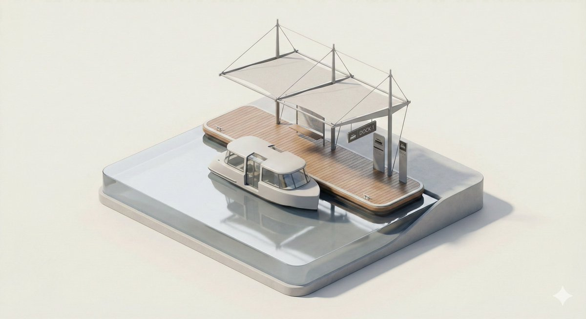

## Cinematic 3D action-packed advertisement for [INSERT PRO

- ID: trending-2019773851211886665
- Slug: trending-2019773851211886665-en
- 语言: en
- 来源: [来源链接](https://x.com/azed_ai/status/2019773851211886665)
- 样例图路径: images/part1/2019773851211886665_1.jpg

### 提示词

```text
Cinematic 3D action-packed advertisement for [INSERT PRODUCT/BRAND HERE], captured in an intense mid-motion moment with dramatic studio lighting, dynamic particle effects, and high-impact slow-motion energy. Ultra-hyperrealistic rendering, razor-sharp details, glossy commercial finish, atmospheric depth, and powerful contrast. Viral-ready composition with the brand logo seamlessly integrated into the scene and a sleek, modern slogan positioned cleanly beneath. High-end blockbuster commercial aesthetic
```

### 样例图

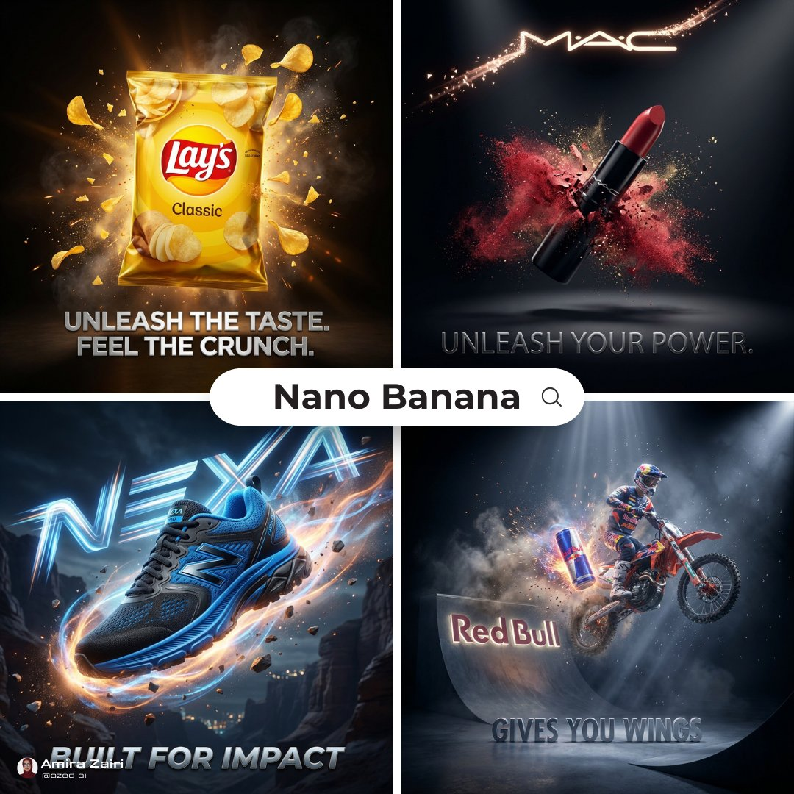

## [BRAND NAME] Act as a High-End CGI Product Photographer 

- ID: trending-2036519680291049494
- Slug: trending-2036519680291049494-en
- 语言: en
- 来源: [来源链接](https://x.com/AmirMushich/status/2036519680291049494)
- 样例图路径: images/part1/2036519680291049494_1.jpg

### 提示词

```text
 [BRAND NAME]
Act as a High-End CGI Product Photographer and 3D Render Artist
specializing in streetwear merch and limited-edition collectibles.

PHASE 1: CONCEPT & OBJECT

Create a photorealistic CGI product shot of a premium keychain set
suspended in mid-air against a neutral gradient studio background.
The keychain set consists of THREE elements connected to a single
polished silver carabiner clip with a gold-plated split ring:

ELEMENT 1 — ACRYLIC TAG:

A rectangular acrylic charm (approx. 4:9 ratio, rounded corners, 3mm thick).
Layered construction: clear gloss acrylic front panel over a [BRAND NAME]-colored
background insert. The background insert carries bold, condensed all-caps
typography — autonomously generate a short poetic or brand-relevant phrase
(4–8 words) that matches [BRAND NAME]'s tone of voice, set in a heavy
condensed grotesque typeface (Bebas Neue / Impact / custom bold). Include
[BRAND NAME]'s URL or tagline in small print at the bottom of the insert.
Micro-printed fine text fills the lower third as a design texture element.

ELEMENT 2 — OVAL MEDALLION CHARM:

A die-cut oval hoop/ring shape (donut silhouette, 40mm diameter) made from
tinted translucent acrylic or resin. Autonomously determine the iconic
brand color of [BRAND NAME] and apply it as the tint (deep saturated,
jewel-tone translucency — e.g., gold, cobalt, emerald, crimson).
The [BRAND NAME] wordmark is engraved or UV-printed in bold all-caps
along the inner curve of the ring. Add 1–2 small iconographic symbols
(logo mark, globe icon, cloud glyph) laser-engraved onto the face.
Subtle radial sun-ray pattern embossed on the surface.

ELEMENT 3 — HARDWARE:

Silver anodized aluminum carabiner with knurled locking barrel.
Gold-plated brass split ring (key ring loop) at the top.
All metal surfaces show micro-scratches and machining marks —
no perfect CGI plastic. Industrial precision aesthetic.

PHASE 2: MATERIAL & TEXTURE

Render all acrylic elements with full Ray Tracing and Subsurface
Scattering — light must visibly pass through the tinted acrylic
creating internal glow. Apply Fresnel reflection on acrylic edges.
Surface imperfections: hairline scratches, micro-dust particles,
smudge traces on the clear panel (subtle, editorial-level — not dirty).
Metal: PBR metallic workflow — anisotropic specular highlights on
the carabiner barrel, brushed finish on the ring.
Typography on acrylic must appear screen-printed or UV spot-coated —
slight ink texture, not floating.

PHASE 3: COMPOSITION & STAGING

Levitation shot: the entire keychain set hangs suspended from the
top of frame, centered with a 10–15 degree rotation to the right
(showing dimensionality). Nothing touches a surface — pure float.
Camera angle: slightly below eye-level looking up at ~5 degrees,
portrait orientation (4:5 ratio).
Depth of Field: focus plane centered on the oval medallion,
acrylic tag in sharp secondary focus, top hardware with micro
bokeh blur. Aperture equivalent: f/4.0.
Negative space: generous — object occupies 55% of frame.

PHASE 4: LIGHTING

Primary: large octabox soft key light, positioned top-right at
45 degrees — creates clean specular bloom on acrylic edges.
Secondary: subtle rim light from bottom-left, cool temperature
(5500K), separates the object from background.
Background: seamless gradient cyclorama — dark steel blue (#1a2535)
at top transitioning to pale silver-grey (#d0d8e0) at bottom.
No hard shadows cast. Global Illumination active.
Chromatic Aberration: micro-level, visible only on acrylic edges
(adds realism, prevents CGI-plastic look).
No lens flare. No neon. No HDR overblown highlights.

TECH SPECS

Render engine: Octane Render or Blender Cycles (path-traced)
Resolution: 4096 x 5120px (4:5 portrait)
Samples: 4096 minimum
Color profile: Adobe RGB, D65 white point
Post-processing: subtle film grain overlay (ISO 400 equivalent),
+5 clarity, -10 highlights, neutral color grade
Output mood: High-end streetwear lookbook / limited drop product page
Style references: Kith accessories, Highsnobiety product editorial,
Fragment Design merch photography
NEGATIVE: No white studio infinity cove. No flat lay. No hand holding
the product. No fake bokeh blur filters. No AI plastic sheen.
No floating text outside the object.
```

### 样例图

![[BRAND NAME] Act as a High-End CGI Product Photographer ](../images/part1/2036519680291049494_1.jpg)

## An architectural blueprint of [BUILDING_NAME] placed on 

- ID: trending-2027644159285465175
- Slug: trending-2027644159285465175-en
- 语言: en
- 来源: [来源链接](https://x.com/0x00_Krypt/status/2027644159285465175)
- 样例图路径: images/part1/2027644159285465175_1.jpg

### 提示词

```text
An architectural blueprint of [BUILDING_NAME] placed on a {SURFACE}, with a photorealistic miniature under-construction version of [BUILDING_NAME] emerging from it — [STRUCTURAL_ELEMENT_1], [STRUCTURAL_ELEMENT_2], [STRUCTURAL_ELEMENT_3], [CONSTRUCTION_DETAIL], {WORKER_SCENE}, {MATERIAL_ELEMENT}, and {EXTRA_DETAIL}. All elements grow from the blueprint like a 3D architectural diorama, steel beams rising from the drawn lines, scaffolding threading through the paper. Studio soft lighting, cinematic depth
```

### 样例图

![An architectural blueprint of [BUILDING_NAME] placed on ](../images/part1/2027644159285465175_1.jpg)

## [PRODUCT], high-end product advertising, white seamless 

- ID: trending-2010665188731785382
- Slug: trending-2010665188731785382-en
- 语言: en
- 来源: [来源链接](https://x.com/TechieBySA/status/2010665188731785382)
- 样例图路径: images/part1/2010665188731785382_1.jpg

### 提示词

```text
[PRODUCT], high-end product advertising, white seamless background, exploded view with inner mechanics revealed, outer shell hovering above core, micro screws and components suspended, perfect alignment guides implied, crisp soft shadow, ultra realistic, macro product photography, 100mm lens look, f/8, 8k
```

### 样例图

![[PRODUCT], high-end product advertising, white seamless ](../images/part1/2010665188731785382_1.jpg)

## Epic 3D scene: a weathered field journal lies open on a 

- ID: trending-2017981012614009229
- Slug: trending-2017981012614009229-en
- 语言: en
- 来源: [来源链接](https://x.com/AllaAisling/status/2017981012614009229)
- 样例图路径: images/part1/2017981012614009229_1.jpg

### 提示词

```text
Epic 3D scene: a weathered field journal lies open on a naturalist's camp table, its pages erupting into the ecosystems they document. Hand-drawn botanical illustrations push upward into living specimens : [PLANT 1] unfurls actual petals, [PLANT 2] releases pollen that drifts across the spread. Pinned insect diagrams detach and take flight. Watercolor landscapes inflate into traversable terrain. Margin notes become tiny expedition camps. Pressed flowers resurrect in time-lapse bloom. A specimen jar on the page contains an actual swimming creature. Field sketches of [ANIMAL] step off the paper, leaving graphite footprints. Coffee-stained pages become amber pools. Canvas tent visible beyond, lantern light mixing with fireflies, the smell of pine and old paper, 8K, photorealistic documentary aesthetic
```

### 样例图

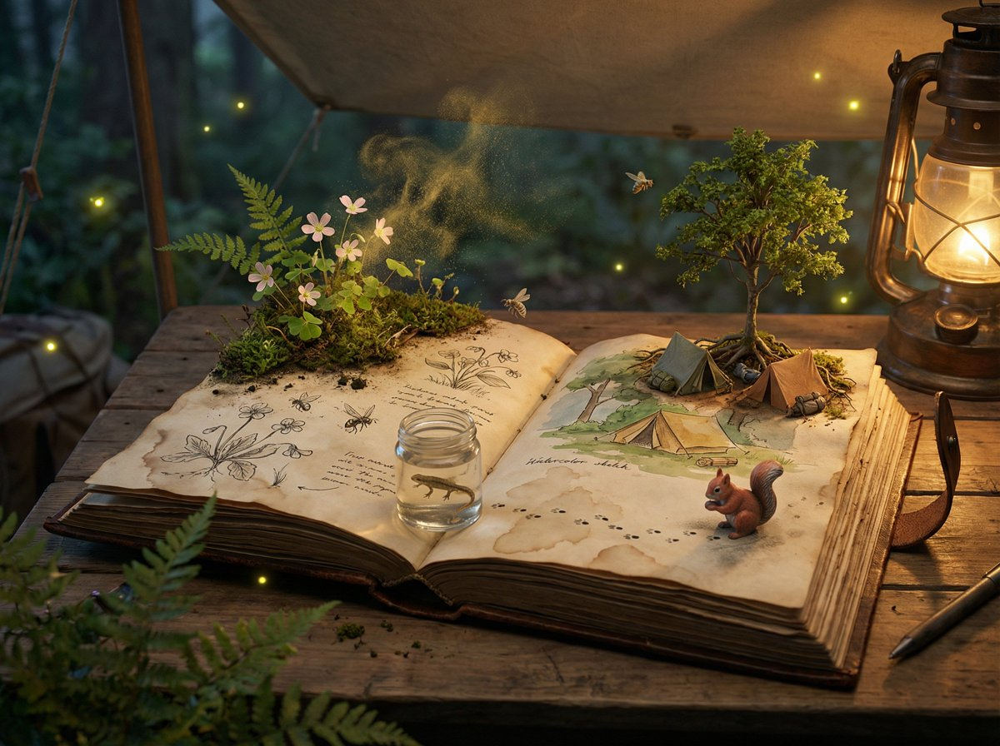

## Surrounding the realistic main subject are multiple cute

- ID: trending-2030296182745170292
- Slug: trending-2030296182745170292-en
- 语言: en
- 来源: [来源链接](https://x.com/Naiknelofar788/status/2030296182745170292)
- 样例图路径: images/part1/2030296182745170292_1.jpg

### 提示词

```text
Surrounding the realistic main subject are multiple cute, 3D-style chibi miniatures of the same person, with identical facial features, hairstyle, body proportions, and outfit. 
The chibi figures are naturally distributed around the subject, interacting playfully with her or nearby elements in a charming, non-intrusive way.

Overlay the image with vibrant, hand-drawn doodle effects: soft white outlines around the subject, playful sparkles, doodle hearts, tiny flowers, smiley icons, and floating white handwritten phrases like "shine", "bright day", and "happy".

The style seamlessly blends hyper-realistic photography with colorful, soft cartoon illustrations.
Keep the original face, body shape, and proportions of the main subject unchanged. aspect ratio 2:3
```

### 样例图


## Create a premium Pixar-style 3D character sticker set th

- ID: trending-2039340995322446177
- Slug: trending-2039340995322446177-en
- 语言: en
- 来源: [来源链接](https://x.com/doctorwasif/status/2039340995322446177)
- 样例图路径: images/part1/2039340995322446177_1.jpg

### 提示词

```text
Create a premium Pixar-style 3D character sticker set that is clearly recognizable as the same person. Use the uploaded image as the ONLY facial reference.
Output Requirements:
3×3 grid layout (9 stickers total)
Final aspect ratio: 4:5
Ultra high resolution (8K)
Clean cream background
Each sticker is separated with clear spacing
Add a subtle drop shadow under each sticker for depth
Character Identity (VERY IMPORTANT):
MUST preserve exact facial structure, hairstyle, grooming details, and unique features from the uploaded image
Maintain high likeness accuracy
Do NOT over beautify or alter identity beyond recognition
Style:
Pixar-style 3D animation
Glossy, high-end rendering
Soft global illumination
Smooth shading
High-detail facial textures
Framing:
All stickers must be head and shoulders (portrait close-up) only
No full-body or mid-body shots allowed
Focus tightly on face and upper shoulders to emphasize expressions
Outfit:
Modern casual and slightly stylized clothing
Each sticker must have a different outfit (no repetition at all)
Clean, minimal, and visually appealing for sticker use
Expressions & Poses (9 variations):
1. Happy smile
2. Laughing
3. Cool (with sunglasses)
4. Angry/serious
5. Surprised
6. Thinking
7. Wink
8. Love (heart eyes and heart gesture)
9. Thumbs up
Sticker Design:
Bold, clean outline
Slightly exaggerated cartoon proportions
Strong emphasis on facial expressions
Optimized for digital sticker platforms
Each sticker must have a smooth rounded bottom cutout (semi-curved base)
No text
Lighting:
Soft studio lighting
Subtle rim light for depth and separation
Goal:
Create a highly engaging, cute, and expressive sticker pack that feels premium and collectable.
```

### 样例图

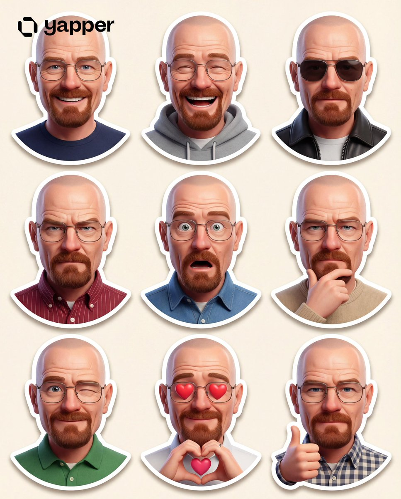

## { "prompt": "Ultra-realistic macro scene depicting tiny 

- ID: trending-2011621455558221930
- Slug: trending-2011621455558221930-en
- 语言: en
- 来源: [来源链接](https://x.com/Just_sharon7/status/2011621455558221930)
- 样例图路径: images/part1/2011621455558221930_1.jpg

### 提示词

```text
{
  "prompt": "Ultra-realistic macro scene depicting tiny restoration workers collaboratively repairing an antique pocket watch. Several figures delicately clean intricate brass gears using fine brushes, while others stabilize the open watch casing and hold miniature components in place. The pocket watch lies on a textured natural surface, such as weathered wood or stone, emphasizing age and history. The scene symbolizes time, patience, craftsmanship, and teamwork.",
  "style": {
    "photography_type": "Macro photography",
    "realism": "Ultra-realistic",
    "mood": "Emotional and cinematic",
    "lighting": "Soft, warm, directional lighting with gentle highlights and natural shadows",
    "depth_of_field": "Shallow depth of field with sharp focus on foreground details and smooth background bokeh"
  },
  "composition": {
    "shot_type": "Close-up macro",
    "angle": "Slightly elevated perspective",
    "focus": "Extreme detail on gears, tools, and figurines’ interactions",
    "framing": "Pocket watch centered with workers distributed naturally across the mechanism"
  },
  "textures_and_details": {
    "materials": "Aged metal, polished brass gears, worn leather strap, natural surface grain",
    "details": "Visible dust particles, subtle scratches, fingerprints, and mechanical wear"
  },
  "atmosphere": {
    "tone": "Warm, nostalgic, hopeful",
    "symbolism": "Restoration of time through collective effort and care"
  },
  "render_settings": {
    "aspect_ratio": "4:5",
    "quality": 2,
    "resolution": "High-resolution",
    "style_precision": "Professional studio-level composition"
  }
}
```

### 样例图

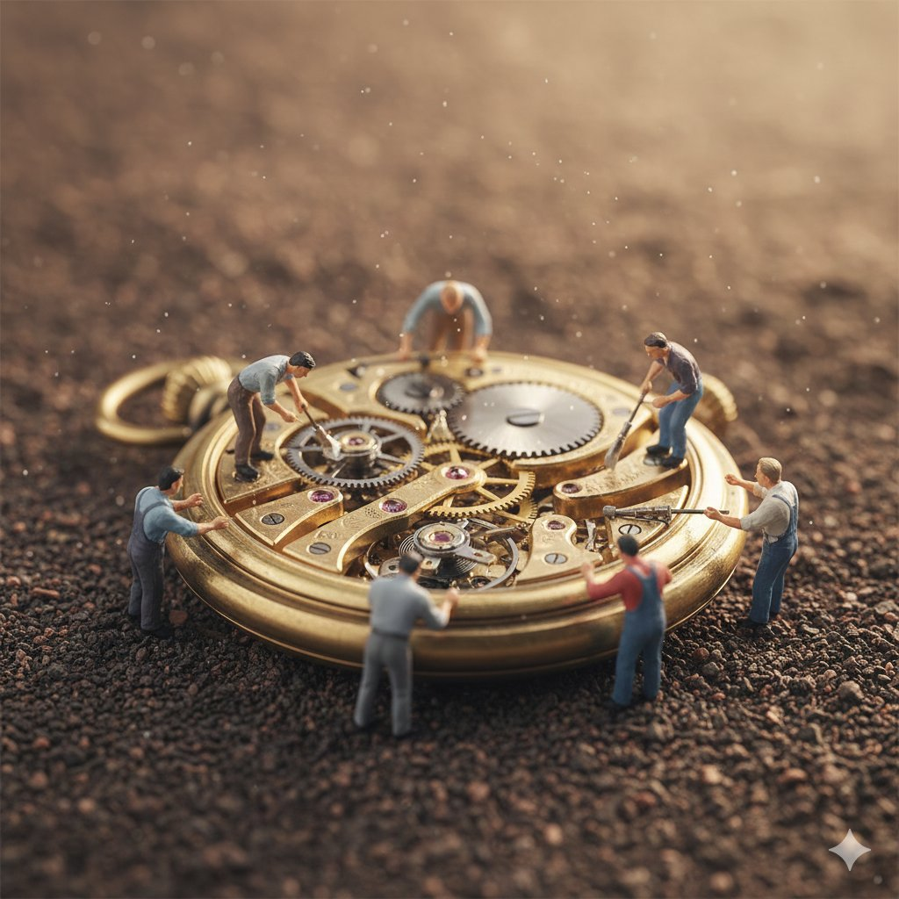

## { "description": "Create a highly detailed, photorealist

- ID: trending-2016087583999361297
- Slug: trending-2016087583999361297-en
- 语言: en
- 来源: [来源链接](https://x.com/Just_sharon7/status/2016087583999361297)
- 样例图路径: images/part1/2016087583999361297_1.jpg

### 提示词

```text
{
"description": "Create a highly detailed, photorealistic miniature diorama style isometric map of [CITY/LOCATION] placed on a vintage textured paper map.",
  "perspective": {
    "type": "isometric",
    "angle": "45 degree top down",
    "look": "macro photography with tilt-shift miniature effect"
  },
  "geography": {
    "shape": "follows real geographic shape of [CITY/LOCATION]",
    "landmarks": {
      "oversized": true,
      "dominant": true,
      "primary_focus": "monuments",
      "secondary_elements": "smaller and simplified"
    },
    "architecture": "ultra detailed miniature",
    "roads": "selective",
    "greenery": true,
    "water_bodies": true,
    "terrain": true,
    "materials": ["stone", "wood", "concrete", "glass", "foliage"]
  },
  "lighting": {
    "type": "soft cinematic daylight",
    "effects": ["natural shadows", "warm highlights", "subtle atmospheric depth"]
  },
  "water": {
    "rivers": true,
    "coastlines": true,
    "depth_gradients": "smooth",
    "reflections": "gentle"
  },
  "map_base": {
    "type": "old world cartographic paper",
    "features": ["visible grid lines", "paper grain", "printed place names"]
  },
  "focus": {
    "sharp_on_landmarks": true,
    "edge_falloff": "gentle"
  },
  "quality": {
    "museum_quality": true,
    "handcrafted_diorama_realism": true,
    "ultra_high_resolution": true
  },
  "background": {
    "color": "clean pure white",
    "restrictions": ["no floating text", "no logos", "no watermarks", "no futuristic or cartoon elements"]
  },
  "aspect_ratio": "4:5"
}
```

### 样例图

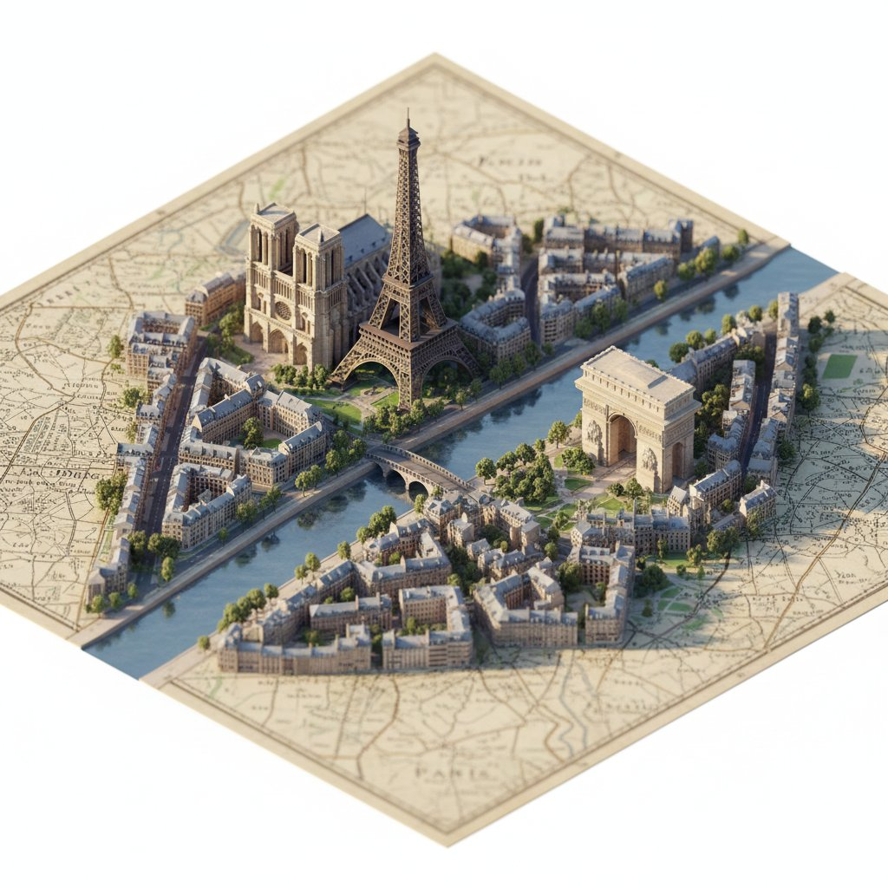

## Present a clear, 45° top-down isometric miniature 3D car

- ID: trending-2012133550817173583
- Slug: trending-2012133550817173583-en
- 语言: en
- 来源: [来源链接](https://x.com/TechieBySA/status/2012133550817173583)
- 样例图路径: images/part1/2012133550817173583_1.jpg

### 提示词

```text
Present a clear, 45° top-down isometric miniature 3D cartoon scene of the iconic scene [SCENE NAME] from [MOVIE/SHOW], with soft refined textures, realistic PBR materials, and gentle lifelike lighting.
Create a small raised diorama-style base that includes the most recognizable elements of this scene, along with tiny stylized characters if needed (no facial details).
Use a clean solid [BACKGROUND COLOR] background.

At the top-center, display [MOVIE/SHOW] in large bold text, directly beneath it show [SCENE NAME] in medium text, and place the official logo associated with [MOVIE/SHOW] below the subtext.
All text must automatically match the background contrast (white or black).

Composition: perfectly centered layout, square 1080x1080, ultra-clean, high-clarity diorama aesthetic.
```

### 样例图

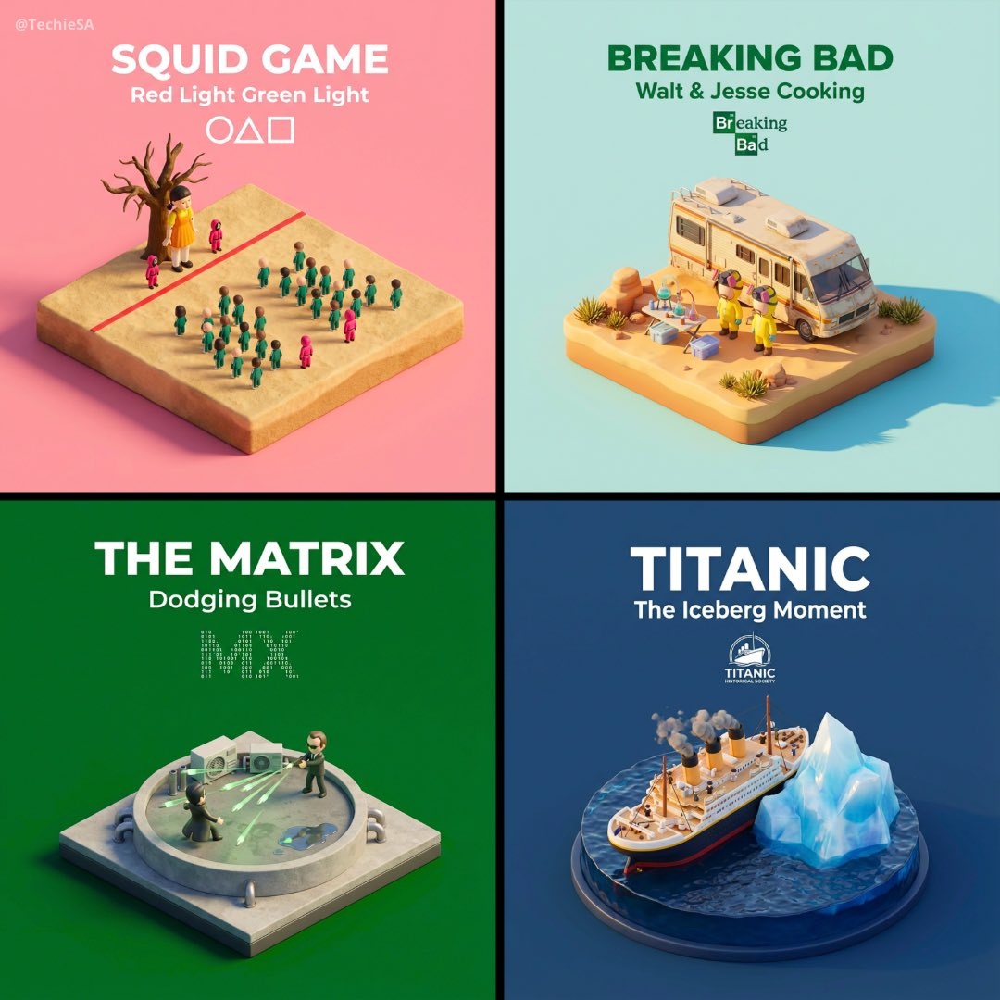

## { "title": "Whimsical Cozy Portrait", "input_image": "[U

- ID: trending-2029006238101680432
- Slug: trending-2029006238101680432-en
- 语言: en
- 来源: [来源链接](https://x.com/Just_sharon7/status/2029006238101680432)
- 样例图路径: images/part1/2029006238101680432_1.jpg

### 提示词

```text
{
  "title": "Whimsical Cozy Portrait",
  "input_image": "[UPLOAD YOUR IMAGE]",
  "description": "Transform the uploaded image into a 64K DSLR-quality ultra-hyperrealistic cozy, whimsical mixed-media portrait combining realistic photography with playful cartoon illustrations.",
  "subject": {
    "person": {
      "appearance": {
        "hair": "blonde, loosely tied with soft strands framing the face",
        "eyes": "light green",
        "makeup": "natural",
        "top": "dark grey layered over black long-sleeve shirt",
        "expression": "resting cheek gently on one hand, dreamy and slightly tired",
        "accessories": [
          "black-and-pink cat ears",
          "small cute hair clip"
        ]
      },
      "pose": "sitting at a wooden table, holding a white ceramic mug in one hand"
    },
    "animated_elements": [
      {
        "type": "cartoon_cat",
        "color": "bright orange",
        "expression": "excited, curious",
        "action": "climbing up her arm",
        "features": "exaggerated big eyes, expressive paws"
      },
      {
        "type": "cartoon_tail",
        "color": "grey",
        "position": "right side, partially out of frame"
      }
    ]
  },
  "props": {
    "mug": {
      "color": "white",
      "illustration": "cute cartoon face with big expressive eyes and small mustache",
      "drink": "pink foam bubbles rising from the top"
    },
    "dessert": {
      "type": "chocolate cake",
      "toppings": ["whipped cream", "sliced strawberries", "peach slice"]
    }
  },
  "environment": {
    "room": {
      "walls": "beige textured",
      "lighting": "soft daylight streaming through window with sheer white curtains",
      "decor": "vintage framed photographs in casual gallery arrangement",
      "atmosphere": "warm, cozy, intimate"
    }
  },
  "illustration_effects": {
    "style": [
      "hand-drawn cartoon overlays",
      "white doodle-style accents: bubbles, playful lines, sparkles, hand-drawn crown",
      "soft white illustrated outlines around woman and objects"
    ]
  },
  "composition": {
    "aspect_ratio": ["1:1", "4:5 vertical"],
    "depth_of_field": "shallow",
    "mood": ["cozy", "cute", "whimsical", "soft", "playful", "warm"]
  },
  "rendering": {
    "technique": ["Octane render", "Ultra-hyperrealistic", "Unreal Engine 5"],
    "details": "ultra-detailed, high-resolution, soft natural lighting, warm tones, Instagram-worthy",
    "texture_contrast": "realistic textures (skin, fabric, wood, wall) vs smooth vector-style illustrations"
  }
}
```

### 样例图

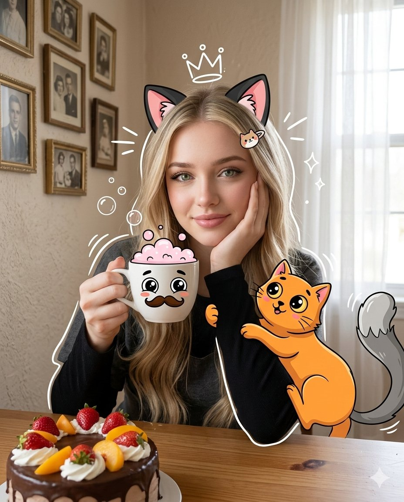

## { "composition": { "orientation": "vertical", "style": "

- ID: trending-2012291576119312710
- Slug: trending-2012291576119312710-en
- 语言: en
- 来源: [来源链接](https://x.com/Just_sharon7/status/2012291576119312710)
- 样例图路径: images/part1/2012291576119312710_1.jpg

### 提示词

```text
{
  "composition": {
    "orientation": "vertical",
    "style": "ultra-cinematic",
    "scene_type": "mid-air suspended elements",
    "depth_of_field": "cinematic shallow depth"
  },
  "subject": {
    "main_elements": [
      "cascading roasted coffee beans",
      "floating chocolate bonbons",
      "mid-air coffee cup with swirling latte art",
      "splashes of milk frozen in motion",
      "splashes of espresso frozen in motion",
      "fine coffee grounds dusting through the air"
    ],
    "motion_state": "frozen action splash photography"
  },
  "color_palette": {
    "primary_colors": [
      "rich coffee brown",
      "warm cream",
      "espresso black"
    ],
    "background": "deep velvety black"
  },
  "lighting": {
    "type": "dramatic high-contrast studio lighting",
    "highlights": "glossy reflections on liquids",
    "shadows": "deep cinematic shadows"
  },
  "texture_detail": {
    "liquids": [
      "glossy milk splashes",
      "glossy espresso splashes",
      "crema bubbles with micro-detail"
    ],
    "solids": [
      "matte roasted coffee beans",
      "smooth chocolate bonbon surfaces",
      "fine granular coffee grounds"
    ]
  },
  "photography_style": {
    "genre": "premium café advertising",
    "aesthetic": "editorial splash photography",
    "clarity": "crisp ultra-detailed"
  },
  "camera": {
    "camera_model": "Nikon D850 (virtual)",
    "lens": "105mm macro",
    "aperture": "f/4.0",
    "focus": "sharp subject focus with background falloff"
  },
  "render_quality": {
    "detail_level": "hyper-detailed",
    "realism": "photorealistic",
    "finish": "high-end commercial output"
  }
}
```

### 样例图


## Present a clear, 45° top-down isometric miniature 3D car

- ID: trending-2011145055759974868
- Slug: trending-2011145055759974868-en
- 语言: en
- 来源: [来源链接](https://x.com/TechieBySA/status/2011145055759974868)
- 样例图路径: images/part1/2011145055759974868_1.jpg

### 提示词

```text
Present a clear, 45° top-down isometric miniature 3D cartoon scene of [STADIUM], with soft refined textures, realistic PBR materials, and gentle lifelike lighting. Use a clean solid [COLOR] background. At the top-center, display the name of this stadium in large bold text, then directly beneath it show its real seating capacity in medium text, and place the official logo associated with this stadium below the capacity. All text must match the background contrast automatically (white or black). Centered layout
```

### 样例图

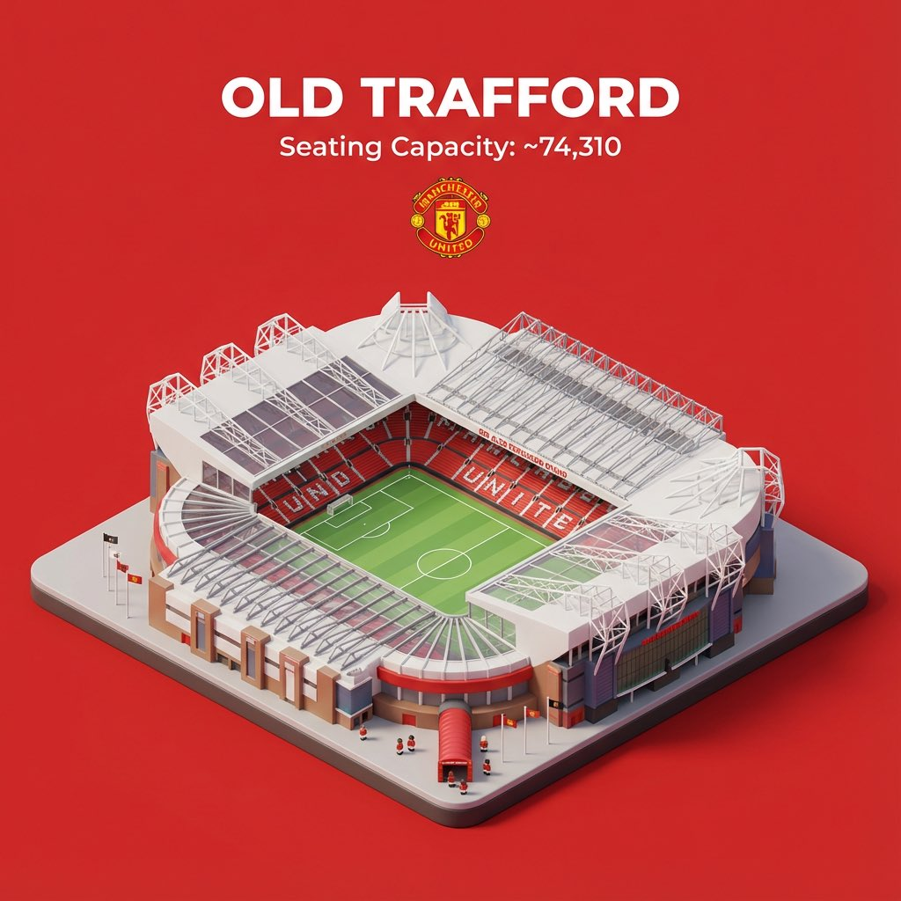

## A cute 3D Pixar-style character portrait of a little gir

- ID: trending-2008359111650312559
- Slug: trending-2008359111650312559-en
- 语言: en
- 来源: [来源链接](https://x.com/iamsofiaijaz/status/2008359111650312559)
- 样例图路径: images/part1/2008359111650312559_1.jpg

### 提示词

```text
A cute 3D Pixar-style character portrait of a little girl with big expressive eyes and round glasses, soft smooth skin, and slightly rosy cheeks. She has dark hair styled into two messy space buns tied with red scrunchies. She is wearing a cozy red knitted sweater with white winter patterns and blue denim overalls with small fabric details and light wear. Her arms are crossed casually. A small adorable fennec fox with huge ears and sleepy eyes is resting on her shoulder, leaning against her neck affectionately.
```

### 样例图

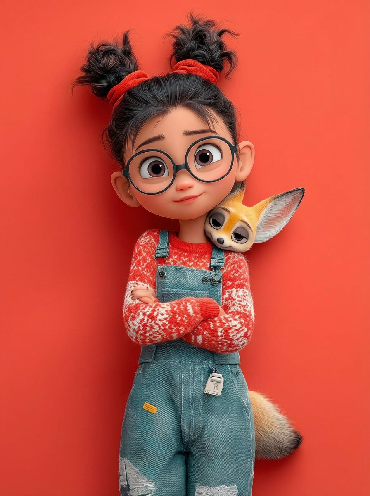

## { "Objective": "Create a studio portrait blending a real

- ID: trending-2010269361190371754
- Slug: trending-2010269361190371754-en
- 语言: en
- 来源: [来源链接](https://x.com/Taaruk_/status/2010269361190371754)
- 样例图路径: images/part1/2010269361190371754_1.jpg

### 提示词

```text
{
  "Objective": "Create a studio portrait blending a real human with a tiny Pixar-style 3D cartoon version of themselves in a playful, whimsical interaction",
  "PersonaDetails": {
    "PrimarySubject": {
      "Type": "Real human",
      "Wardrobe": "Casual grey sweater or t-shirt",
      "Expression": "Surprised and delighted",
      "Pose": "Holding a tiny character in one hand and pointing at it with the other",
      "Skin": "Photorealistic skin texture with natural detail"
    },
    "SecondarySubject": {
      "Type": "Tiny 3D cartoon version of the human",
      "Scale": "Miniature, resting in the human’s hand",
      "Style": "Pixar-style 3D character",
      "Proportions": "Exaggerated cute proportions with rounded features",
      "FacialFeatures": {
        "Eyes": "Large, expressive",
        "Expression": "Friendly, playful"
      },
      "Consistency": "Matching hairstyle and outfit of the real human"
    }
  },
  "Composition": {
    "Framing": "Medium close-up studio portrait",
    "InteractionFocus": "Clear visual relationship between human and miniature character",
    "DepthOfField": "Shallow depth of field",
    "Focus": "Ultra-sharp focus on both faces"
  },
  "LightingAndBackground": {
    "LightingStyle": "Soft cinematic studio lighting",
    "LightQuality": "Smooth highlights with gentle shadow falloff",
    "Background": "Dark blue gradient studio backdrop",
    "Separation": "Subtle rim light for subject-background separation"
  },
  "ArtDirection": {
    "StyleFusion": [
      "Photorealistic human portrait photography",
      "High-quality Pixar-style 3D character rendering"
    ],
    "Integration": "Seamless blending between real and 3D elements",
    "DetailLevel": "Ultra-detailed textures on skin, fabric, and 3D materials"
  },
  "MoodAndTone": {
    "Mood": "Whimsical, fun, lighthearted",
    "Energy": "Playful surprise and delight"
  },
  "PhotographyStyle": {
    "Genre": "Professional studio portrait photography",
    "CameraLook": "High-end cinematic realism",
    "ImageQuality": "High resolution, clean and sharp"
  },
  "NegativePrompt": [
    "uncanny valley",
    "cartoon human",
    "low-quality 3D",
    "harsh lighting",
    "oversaturated colors",
    "blurry focus",
    "flat composition"
  ],
  "ResponseFormat": {
    "Type": "Single image",
    "Orientation": "Portrait",
    "AspectRatio": "2:3"
  }
}
```

### 样例图

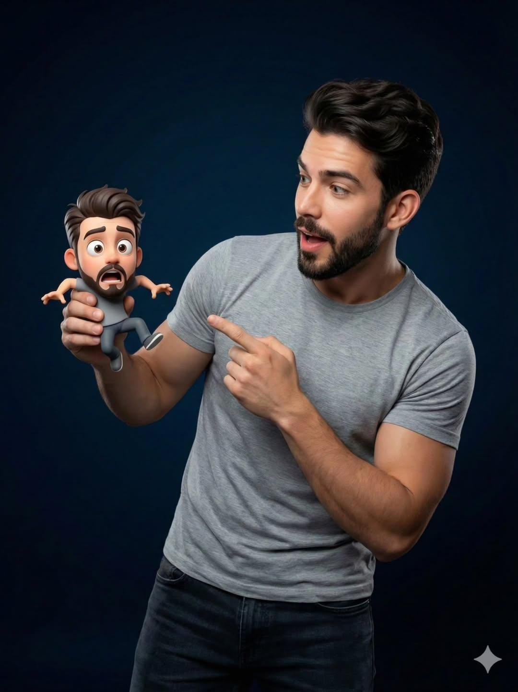

## A colossal [OBJECT] reimagined as a complete natural bio

- ID: trending-2011819664536444937
- Slug: trending-2011819664536444937-en
- 语言: en
- 来源: [来源链接](https://x.com/AllaAisling/status/2011819664536444937)
- 样例图路径: images/part1/2011819664536444937_1.jpg

### 提示词

```text
A colossal [OBJECT] reimagined as a complete natural biome. Tiny [WILDLIFE] has evolved to inhabit every niche the object provides. Predators hunt across its surfaces, herbivores graze in its cavities, birds nest in its heights, insects swarm its crevices. Food chains have formed around the object's geometry. Migration patterns follow its contours. Seasonal changes affect different zones. The object's materials have weathered into naturalistic terrain while remaining recognizable. Documentary aesthetic, golden wildlife lighting, the manufactured as wilderness. 
```

### 样例图

![A colossal [OBJECT] reimagined as a complete natural bio](../images/part1/2011819664536444937_1.jpg)

## A 3D Pixar-style animated young male character showcased

- ID: trending-2022690823062884582
- Slug: trending-2022690823062884582-en
- 语言: en
- 来源: [来源链接](https://x.com/Taaruk_/status/2022690823062884582)
- 样例图路径: images/part1/2022690823062884582_1.jpg

### 提示词

```text
A 3D Pixar-style animated young male character showcased in a 6-panel grid layout, each panel featuring a different facial expression and outfit. Bright solid color backgrounds (yellow, blue, red, pink, purple, green). The character has soft brown wavy hair, expressive large eyes, smooth skin, and stylized cartoon proportions.
```

### 样例图

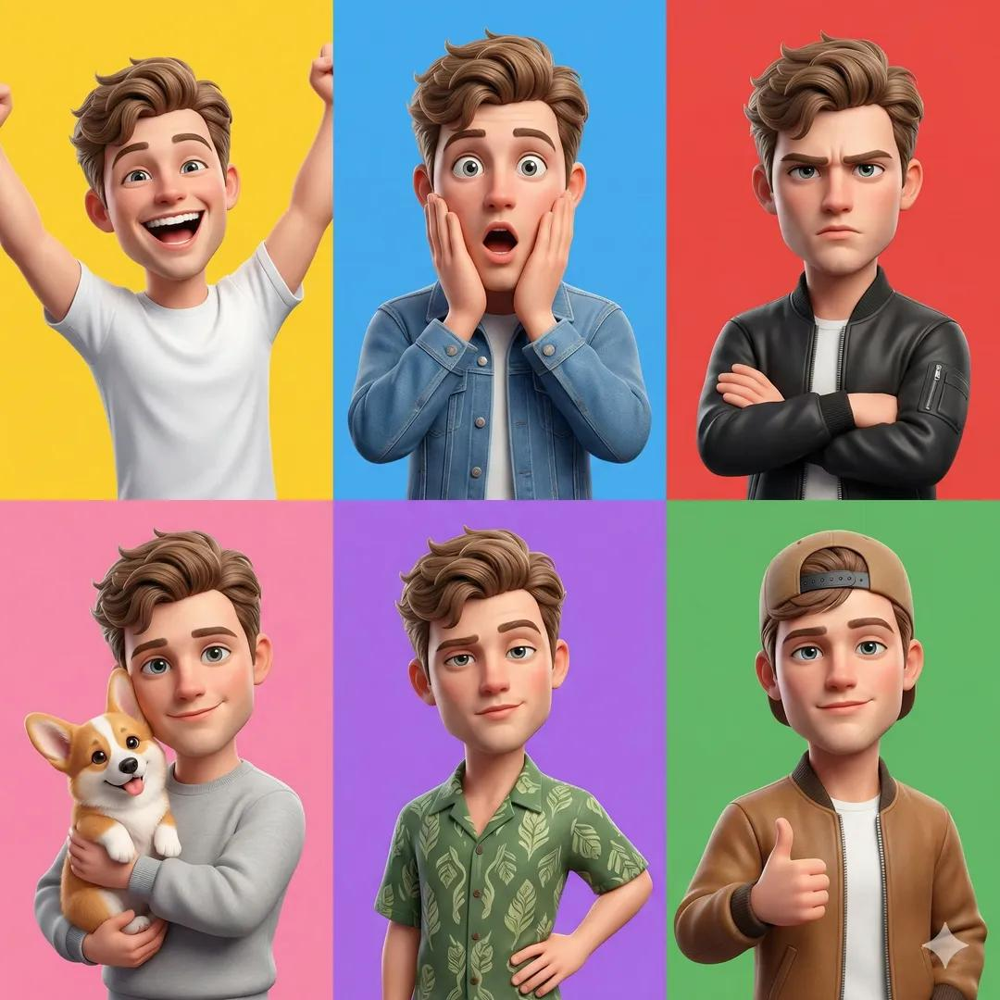

## Create a stylized miniature 3D diorama viewed from a 45-

- ID: trending-2011798504482738365
- Slug: trending-2011798504482738365-en
- 语言: en
- 来源: [来源链接](https://x.com/aleenaamiir/status/2011798504482738365)
- 样例图路径: images/part1/2011798504482738365_1.jpg

### 提示词

```text
Create a stylized miniature 3D diorama viewed from a 45-degree angled perspective, emphasizing careful scale, clean geometry, and fine craftsmanship.

A [OBJECT] serves as the central base of the composition. From within or above this object, a miniature interpretation of [LOCATION NAME] emerges naturally, forming a compact, self-contained world.

The scene highlights recognizable landmarks, terrain features, or symbolic structures associated with [LOCATION NAME], arranged harmoniously and rendered with precise detail.

Miniature roads, paths, or environmental elements flow through the scene, with tiny vehicles, figures, or subtle motion cues adding realism and life.

Use cinematic lighting, soft highlights, and selective depth-of-field blur to create a magical, dreamlike atmosphere.

Balance playful isometric styling with realistic materials and lighting, achieving a polished, premium diorama look.

Highly detailed, cohesive composition with an 8K cinematic finish, refined miniature-world aesthetic.
```

### 样例图

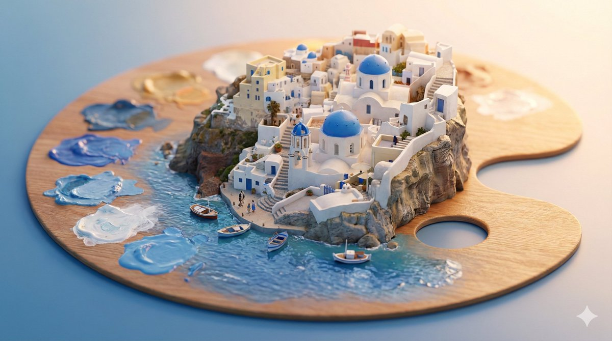

## 8K Ultra-Realistic Promotional Present a clear, 45° top-

- ID: trending-2011751906318958830
- Slug: trending-2011751906318958830-en
- 语言: en
- 来源: [来源链接](https://x.com/Milo_Bahi_02/status/2011751906318958830)
- 样例图路径: images/part1/2011751906318958830_1.jpg

### 提示词

```text
8K Ultra-Realistic Promotional
Present a clear, 45° top-down isometric miniature 3D scene of the [SUBWAY SYSTEM / LINE NAME]. The scene includes stylized diorama elements such as platforms, miniature trains, stairwells, signage, tiled walls, vending machines, and people waiting.
Use soft, refined textures, realistic PBR materials, and lifelike lighting with subtle shadows to enhance dimensional clarity.
At the top center, place the title “[LINE NAME]” in bold sans-serif text. Below it, add a train icon followed by “Service Status” (small text) and “[STATUS MESSAGE]”  red medium text for delays or green for on-time service.
Use a soft, solid tile white background for clarity. Clean, centered, editorial infographic style.
Square format 1080×1080, ultra-detailed 3D render, miniature realism, 8K look, image size 1: 1
```

### 样例图

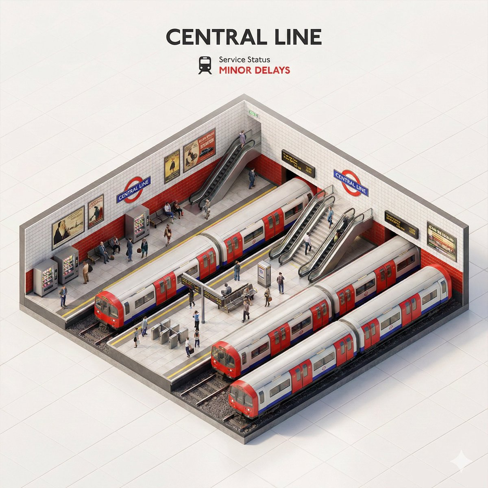

## A stylized Pixar-style 3D portrait of a young person wit

- ID: trending-2041366570149265865
- Slug: trending-2041366570149265865-en
- 语言: en
- 来源: [来源链接](https://x.com/Taaruk_/status/2041366570149265865)
- 样例图路径: images/part1/2041366570149265865_1.jpg

### 提示词

```text
A stylized Pixar-style 3D portrait of a young person with smooth skin, large expressive blue eyes, soft facial features, wearing round transparent glasses, modern hairstyle (short styled hair / soft bob cut), casual outfit (hoodie or minimal sweater), slight head tilt and warm smile, friendly and approachable expression, ultra-clean character design, vibrant orange-to-pink gradient background, soft studio lighting with subtle rim light, cinematic depth of field, ultra-detailed, 8K render, octane render style.
```

### 样例图

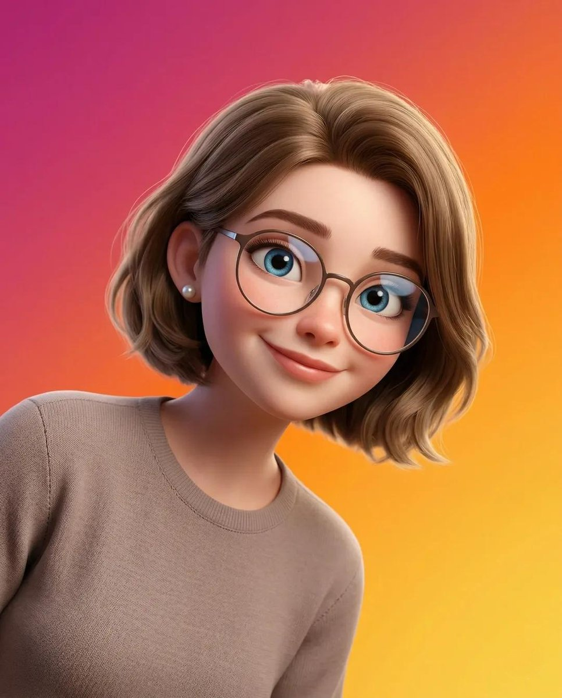

## A mini chibi version of the character in the uploaded im

- ID: trending-2029563473592504682
- Slug: trending-2029563473592504682-en
- 语言: en
- 来源: [来源链接](https://x.com/TechieBySA/status/2029563473592504682)
- 样例图路径: images/part1/2029563473592504682_1.jpg

### 提示词

```text
A mini chibi version of the character in the uploaded image, with a big head and small body, sitting on an open left palm for realistic scale. A right hand gently pressing its cheek with an index finger. The character looks annoyed and pouty — puffed cheeks, slightly frowning, squinting eyes. Ultra-detailed chibi style, soft pastel colors, smooth texture, clean lighting, shallow depth of field, strong focus on facial expression and hand interaction, vertical composition 4:5 ratio.​​​​​​​​​​​​​​​​
```

### 样例图

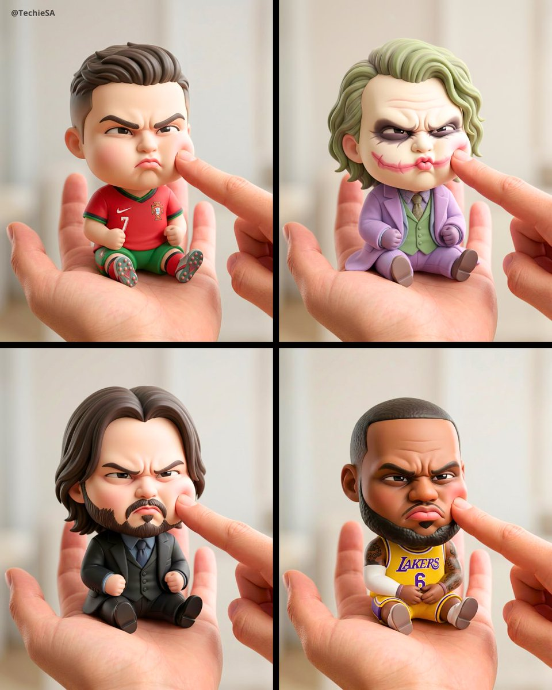

## Create a collection of icons representing [ROUTINE / PRO

- ID: trending-2010682689633046534
- Slug: trending-2010682689633046534-en
- 语言: en
- 来源: [来源链接](https://x.com/aleenaamiir/status/2010682689633046534)
- 样例图路径: images/part1/2010682689633046534_1.jpg

### 提示词

```text
Create a collection of icons representing [ROUTINE / PROCESS / HABITS], with each icon depicting one specific routine step and clearly labeled by name.

They belong together as a single cohesive theme. The background is pure white.

Place the title “[ROUTINE NAME]” at the top center of the image, aligned symmetrically above the grid, using a clean, minimal typography style that complements the icon design without overpowering it.
Icons are rendered in a friendly, modern 3D style, featuring smooth gradients and soft shadows.

Maintain consistent proportions, color harmony, materials, and typography across all icons and labels so the set feels unified and easy to read.
```

### 样例图

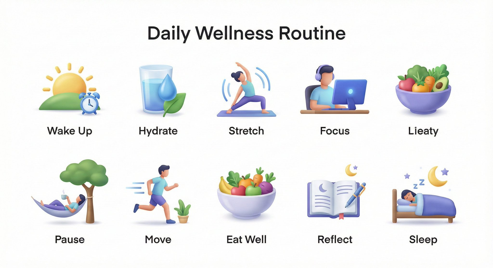

## Split composition image, left and right halves clearly d

- ID: trending-2018029876356239823
- Slug: trending-2018029876356239823-en
- 语言: en
- 来源: [来源链接](https://x.com/TechieBySA/status/2018029876356239823)
- 样例图路径: images/part1/2018029876356239823_1.jpg

### 提示词

```text
Split composition image, left and right halves clearly divided in 16:9 widescreen format.
Left Half:
Highly detailed architectural floor plan and cross-section illustration of [LANDMARK] in a modern minimalist style. Top-down view showing main structural layout, internal divisions, circulation paths, key chambers or spaces with labels. Material callouts, structural support systems, and architectural details clearly marked. Neutral beige and warm gray color palette, clean linework, soft shadows, subtle textures. Professional architectural-presentation style. Include detailed cross-sectional diagram showing vertical layers and internal structure. Blueprint aesthetic with technical accuracy and labeled sections.
Right Half:
Ultra-realistic aerial exterior photograph of [LANDMARK] captured from above and to the side (elevated isometric perspective, not straight overhead). Shows the complete structure with authentic weathered textures, aged materials, surrounding landscape, dramatic golden-hour sunlight creating sharp shadows, atmospheric haze suggesting historical significance. The perspective reveals both external grandeur and internal scale simultaneously. Warm golden-light lighting, realistic patina and wear patterns, authentic architectural proportions. Feels like an aerial photograph capturing the monument’s true majesty and scale.
Both halves align visually, clearly showing architectural engineering blueprint vs. the actual monumental structure in its archaeological or historical reality.
Style & Mood:
•Architectural blueprint visualization meets historical aerial photography
•Engineering precision and historical significance
•Educational, museum-exhibit presentation
•Engineering schematic-to-reality comparison
•Grandeur emphasizing scale and architectural sophistication
Lighting & Color:
•Left: Flat, even lighting, neutral blueprint tones, technical aesthetic
•Right: Golden-hour natural light, dramatic shadows, warm tones, atmospheric depth
•Consistent warm palette between both halves
Camera & Technical Details:
•Left: Top-down orthographic + detailed cross-sectional architectural view with labeled sections
•Right: Elevated aerial perspective (45-degree isometric angle), capturing full structure from above-and-to-the-side
•High resolution, sharp architectural details on left; photorealistic weathered textures on right
Negative Prompt:
Cartoon style, low detail, cluttered composition, modern elements, unrealistic proportions, harsh lighting, exaggerated colors, text overlays, watermarks, CGI look, sterile rendering, straight-down overhead view, no atmospheric quality, overly pristine condition
```

### 样例图

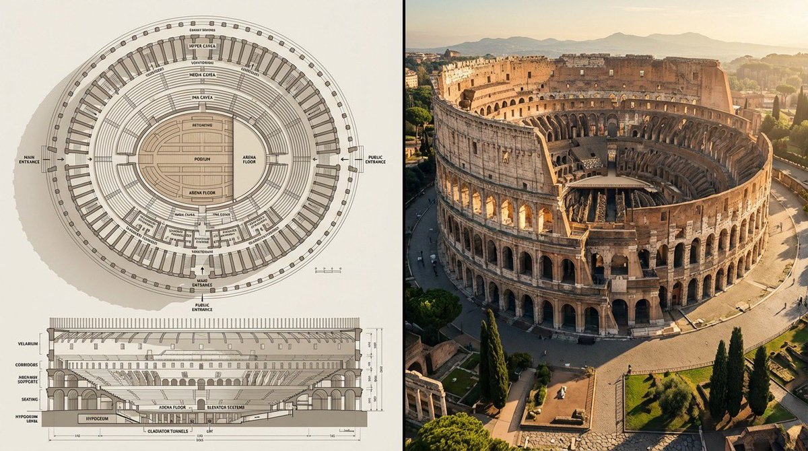

## { "objective": "Create a side-by-side comparison image f

- ID: trending-2018989160699502958
- Slug: trending-2018989160699502958-en
- 语言: en
- 来源: [来源链接](https://x.com/Strength04_X/status/2018989160699502958)
- 样例图路径: images/part1/2018989160699502958_1.jpg

### 提示词

```text
{
  "objective": "Create a side-by-side comparison image featuring a technical sketch and real photograph of the Burj Khalifa",
  "image_specifications": {
    "style": "Mixed media (Technical drawing + Real photograph)",
    "layout": "Horizontal split - Left side: Sketch with measurements, Right side: Real photo",
    "aspect_ratio": "3:2"
  },
  "left_side": {
    "content_type": "Technical sketch of the Burj Khalifa",
    "features": [
      "Detailed architectural lines showing tiered setbacks",
      "Numerical height and width measurements",
      "Elevation labels for different tower sections",
      "Side and front elevation views (top-down projection if space allows)"
    ],
    "text_annotations": {
      "units": "Metric (meters)",
      "language": "English",
      "font_style": "Blueprint or engineering-style typography"
    },
    "positioning": "Take up the left half of the image"
  },
  "right_side": {
    "content_type": "High-resolution real photo of the Burj Khalifa",
    "features": [
      "Full view of the tower from base to spire",
      "Natural daylight with clear sky",
      "Color image with Dubai skyline or Downtown Dubai context"
    ],
    "positioning": "Take up the right half of the image"
  },
  "visual_elements": {
    "border_division": "Vertical line or subtle transition between left (sketch) and right (photo)",
    "color_palette": {
      "left": "Monochrome or blueprint blue for sketch",
      "right": "Natural realistic colors"
    }
  },
  "output_format": {
    "type": "Image",
    "use_case": ["Educational poster", "Architectural comparison", "Engineering visualization", "Tourism visual aid"],
    "high_resolution": true
  }
}
```

### 样例图

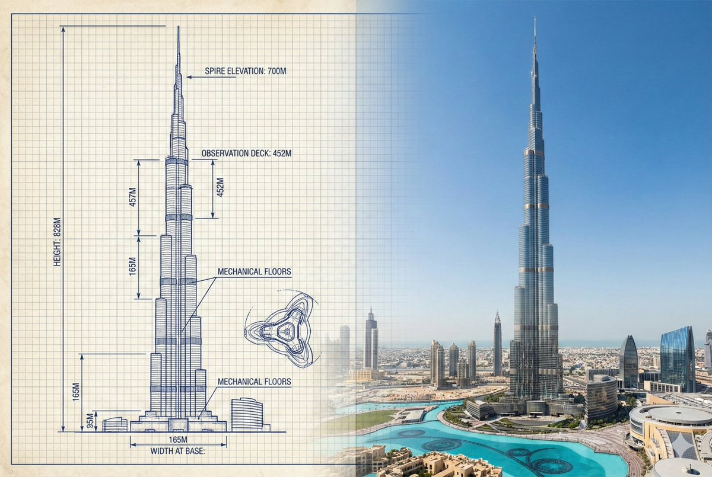

## Use the same face from the reference image without chang

- ID: trending-2015314306578182501
- Slug: trending-2015314306578182501-en
- 语言: en
- 来源: [来源链接](https://x.com/Just_sharon7/status/2015314306578182501)
- 样例图路径: images/part1/2015314306578182501_1.jpg

### 提示词

```text
Use the same face from the reference image without changing facial features 
Vertical (4:5 or 9:16) surreal 3D scene featuring a photorealistic character generated strictly from the attached reference image (accurate facial likeness, skin texture, age, proportions).

Front-facing view, camera slightly above eye level, the character riding her own scooter/motorbike directly on top of the blue GPS route line itself, moving forward toward a red destination pin.
The character wears culturally accurate clothing inspired by [west], with realistic fabric behavior and riding posture.
Below, a stylized GPS-style city map of [United Kingdom] fills the scene. A chaos zone at [Greenwich ] shows dense miniature cars, people, buildings, trees, and urban clutter concentrated near the destination.
Natural daylight, cinematic shadows, sharp focus on the character, and subtle depth of field on the map.

High-end concept-art quality combining photoreal human + stylized miniature city.
```

### 样例图

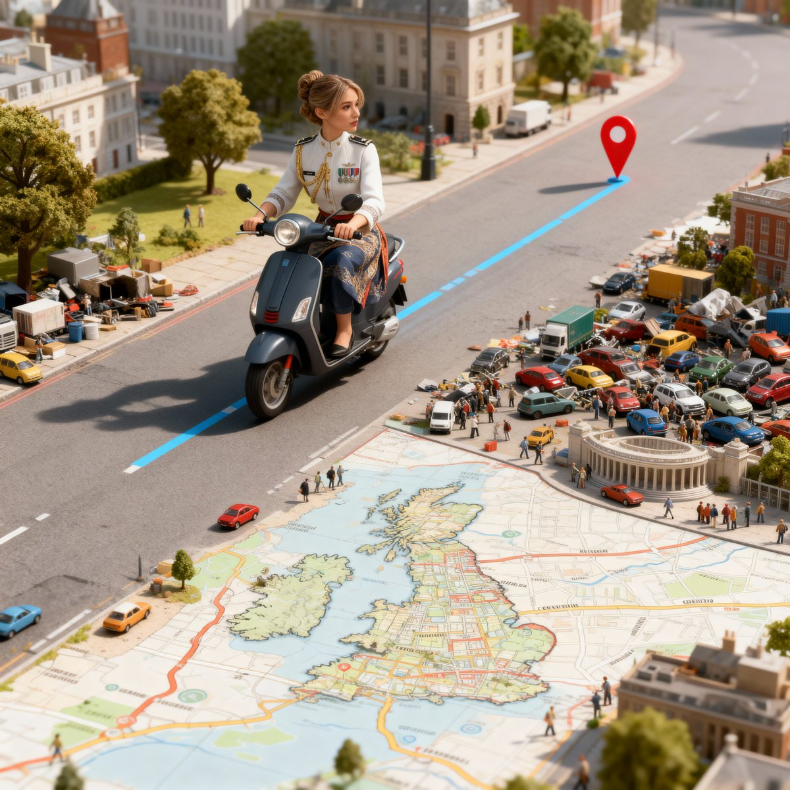

## A majestic, ancient gnarled tree with thick, twisting ro

- ID: trending-2039728974092243121
- Slug: trending-2039728974092243121-en
- 语言: en
- 来源: [来源链接](https://x.com/churvikv/status/2039728974092243121)
- 样例图路径: images/part1/2039728974092243121_1.jpg

### 提示词

```text
A majestic, ancient gnarled tree with thick, twisting roots sits at the center of a lush, mystical landscape, its roots anchoring into a vibrant, foaming stream flowing over moss-covered rocks. Suspended within the dense, dark green canopy of the tree is a radiant, glowing golden orb containing a detailed, ethereal silhouette of a tree of life. In the background, a massive, towering waterfall cascades down a rugged, misty cliffside into the river below. The scene is illuminated by the soft, warm light emanating from the golden orb, contrasting with the moody, overcast sky and the deep, rich greens of the surrounding forest. Photorealistic, cinematic lighting, high fantasy art style, intricate textures on the bark and water, 8k resolution.
```

### 样例图

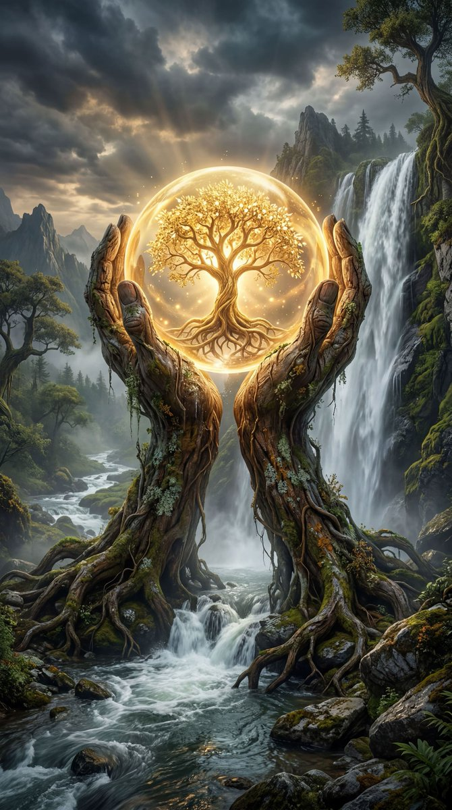

## A smooth, ultra-realistic 3D render of the word [YOUR WO

- ID: trending-2009664169331839410
- Slug: trending-2009664169331839410-en
- 语言: en
- 来源: [来源链接](https://x.com/aziz4ai/status/2009664169331839410)
- 样例图路径: images/part1/2009664169331839410_1.jpg

### 提示词

```text
A smooth, ultra-realistic 3D render of the word [YOUR WORD] shaped like a delicious candy — style adapts based on word — surrounded by a minimal candy world — high-Kelvin lighting — cinematic ray tracing — soft shadows — glossy details — hyper-real textures — square format
```

### 样例图

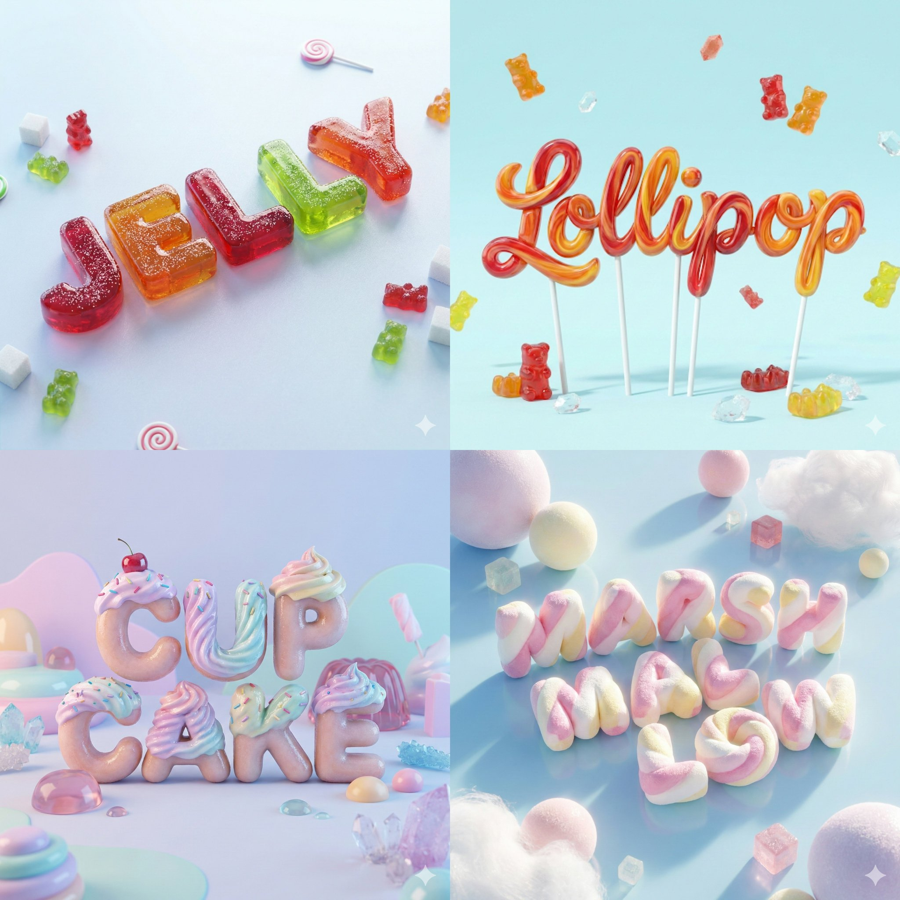

## Concept: A hyper-realistic 3D isometric view of a [INSER

- ID: trending-2008952931484098637
- Slug: trending-2008952931484098637-en
- 语言: en
- 来源: [来源链接](https://x.com/Arminn_Ai/status/2008952931484098637)
- 样例图路径: images/part1/2008952931484098637_1.jpg

### 提示词

```text
Concept: A hyper-realistic 3D isometric view of a [INSERT LOCATION] scene on a circular base.
Subject (Visuals): A full-body, realistic human [INSERT DESCRIPTION].
* Texture Rule: The subject must have "Living Human Skin" texture (subsurface scattering, pores, natural imperfections).
* Important: He is NOT a toy/doll. He looks like a real person inserted into the scene.
* Pose: [INSERT POSE, e.g., Sitting naturally].

Composition & Scale (Crucial):
* Camera: Isometric wide shot (Full view). ensure the entire circular base, the subject, and all props are visible within the frame.
* Proportions: PERFECT RELATIVE SCALE. The props (e.g., scooter, table etc.) must be the correct size relative to the human. Do not make the human giant or the props tiny.

Environment: A realistic section of a [INSERT WALL/BUILDING] behind the subject.
* Material: Real weathered textures (brick, cement, wood), not painted model textures.

Props:
* [INSERT PROP 1, e.g., Vintage Vespa] (Real metal and chrome texture).
* [INSERT PROP 2, e.g., Pizza and Wine] (Real food texture).
* *Note:* Ensure all props are present and grounded on the base.

Technical Specs: Unreal Engine 5 render style, 8k resolution, global illumination, raytracing, sharp focus on the entire scene (deep depth of field), solid neutral grey background.

Negative Prompt: Toy, plastic, doll, action figure, clay, resin, shallow depth of field (blur), close-up, cropped, distorted proportions, giant head, cartoonish, missing limbs, unfinished.
```

### 样例图

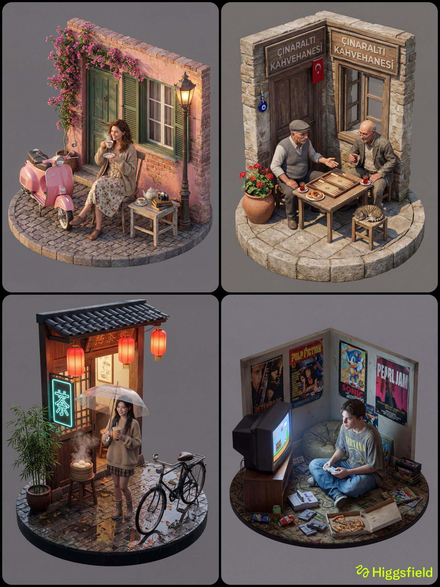

## { "prompt": "cute cozy isometric 3D miniature bathroom d

- ID: trending-2011801500541206983
- Slug: trending-2011801500541206983-en
- 语言: en
- 来源: [来源链接](https://x.com/Just_sharon7/status/2011801500541206983)
- 样例图路径: images/part1/2011801500541206983_1.jpg

### 提示词

```text
{
  "prompt": "cute cozy isometric 3D miniature bathroom diorama, warm cozy aesthetic, detailed tiny room corner view, warm terracotta and beige color palette, small japanese-style bathroom scene, cream ceramic subway tiles with warm wooden trim, vintage clawfoot bathtub filled with blue bubbly foam, wooden bath tray across tub with open laptop, green mug, soap, candles, small potted plant, golden brass curved shower rod with beige shower curtain, round wooden mirror, white porcelain sink with wooden vanity cabinet, brass faucet, toilet with wooden seat, small wooden stool with rolled white towels and books, green wine bottle, tiny bonsai plant, wall mounted gold sconces with warm glowing bulbs, light blue fluffy towel hanging on wall hook, laundry basket with pink and orange clothes, wicker laundry hamper full of colorful towels, round plush purple bath mat, checkered beige-white floor tiles, small potted plant in white pot, cozy warm lighting, soft shadows, extremely detailed miniature dollhouse style, warm inviting atmosphere, soft bokeh, ken follett miniature aesthetic, tilt-shift effect, 8k, hyperdetailed, trending on artstation",
  "negative_prompt": "blurry, low quality, realistic scale, huge objects, people, human figures, text, watermark, logo, overexposed, underexposed, modern chrome, cold blue lighting, hospital style, empty room, cartoon, anime, 2D, sketch, painting, drawing",
  "aspect_ratio": "4:3",
  "style": "miniature diorama, isometric, cozy interior, warm tones, detailed product photography",
  "lighting": "soft warm golden hour lighting, cozy ambient glow, practical light sources from sconces",
  "camera_angle": "isometric 45 degree corner view, looking down into the room corner, miniature photography style",
  "quality_tags": "masterpiece, best quality, ultra detailed, 8k, sharp focus, intricate details",
  "additional_weights": {
    "miniature": 1.3,
    "diorama": 1.4,
    "isometric": 1.35,
    "cozy": 1.25,
    "warm lighting": 1.2,
    "detailed textures": 1.3
  }
}
```

### 样例图

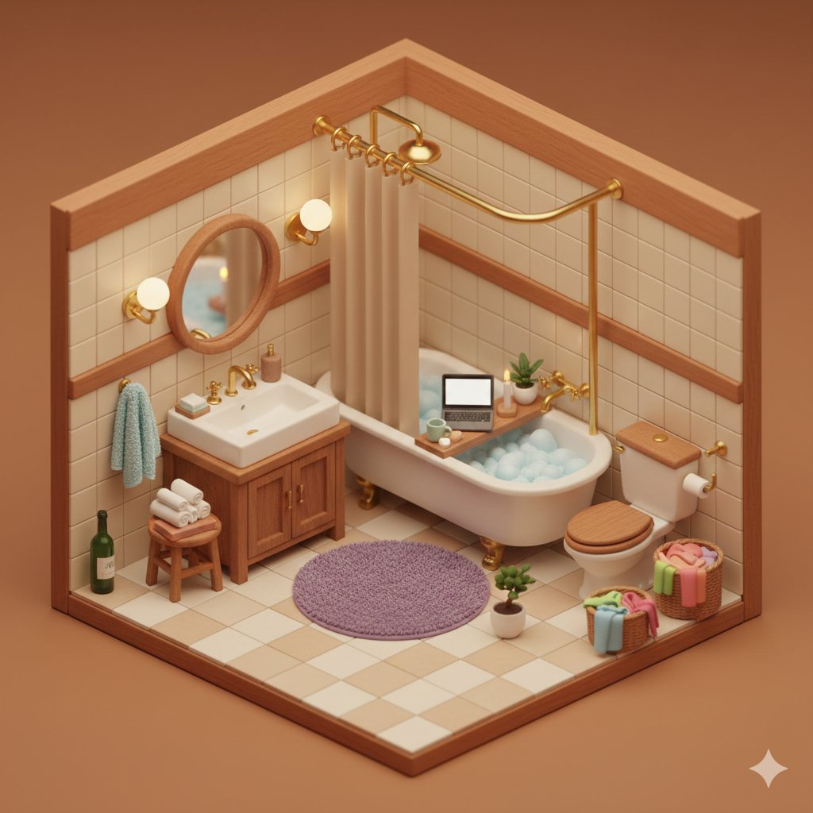

## 8k Ultra-Realistic Promotional Create an exquisite minia

- ID: trending-2009430294286553161
- Slug: trending-2009430294286553161-en
- 语言: en
- 来源: [来源链接](https://x.com/Milo_Bahi_02/status/2009430294286553161)
- 样例图路径: images/part1/2009430294286553161_1.jpg

### 提示词

```text
8k Ultra-Realistic Promotional
Create an exquisite miniature 3D cartoon-style scene of the user-specified company, viewed from a 45° top down perspective, with the company’s most iconic building or campus at the center, surrounded by proportionally scaled product icons, cartoon figures, vehicles, and playful elements representing everyday activities. Render in Cinema 4D with refined, smoothly rounded modeling, rich PBR textures, gentle lifelike lighting, and soft shadows for a warm, polished feel, using a clean solid-color background.
Integrate accurate real-time stock market data for the specified date into a minimalistic layout, displaying the company name or stock ticker at the top center in large text, the date in extra-small text, and the stock price range in medium text with clear trend icons and charts, all in the user-specified language and without text backgrounds, subtly overlapping the scene if needed.
Very important: verify stock data accuracy for the given company/ticker and date before generation; if unavailable, notify the user and stop.
Parameters: aspect ratio (user input, default 1:1), date (user input/current), company/ticker (user input).
Example: Company – Google, Date – 01/01/2026.
```

### 样例图


## 8k Ultra-Realistic Promotional Generate a whimsical mini

- ID: trending-2008765662488059907
- Slug: trending-2008765662488059907-en
- 语言: en
- 来源: [来源链接](https://x.com/Milo_Bahi_02/status/2008765662488059907)
- 样例图路径: images/part1/2008765662488059907_1.jpg

### 提示词

```text
8k Ultra-Realistic Promotional
Generate a whimsical miniature world featuring [KASHMIR SNOWFALL LAND MARK NAME] crafted entirely from colorful modeling clay. Every element buildings, trees, waterways, and urban features should appear hand  sculpted with visible fingerprints and organic clay textures. Use a playful, childlike style with vibrant colors: bright azure sky, puffy cream clouds, emerald trees, and buildings in warm yellows, oranges, reds, and blues.
The handmade quality should be evident in every surface and gentle curve. Capture from a wide perspective showcasing the entire miniature landscape in a harmonious, joyful composition. Include no text, words, or signage only sculptural clay elements that define the location through recognizable architectural features. 1080x1080 dimension.
```

### 样例图

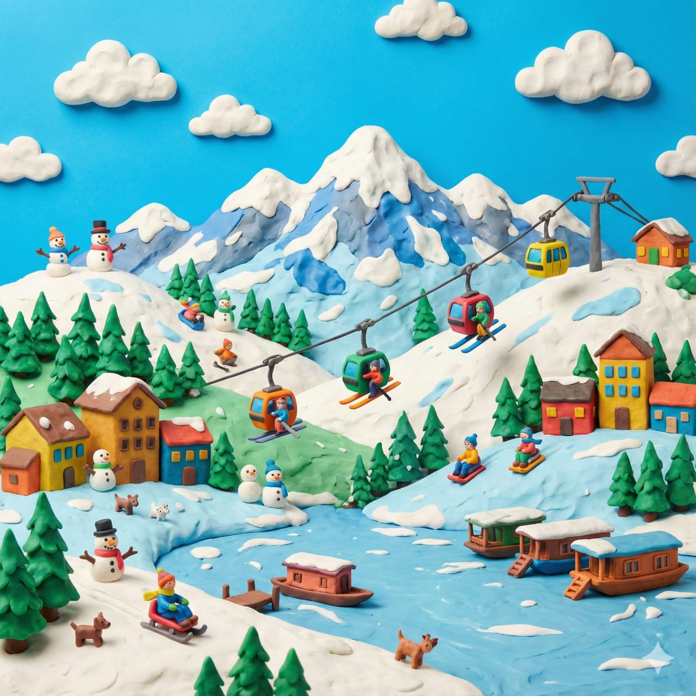

## Ultra-detailed stylized 3D portrait using the provided r

- ID: trending-2034967465487163740
- Slug: trending-2034967465487163740-en
- 语言: en
- 来源: [来源链接](https://x.com/TechieBySA/status/2034967465487163740)
- 样例图路径: images/part1/2034967465487163740_1.jpg

### 提示词

```text
Ultra-detailed stylized 3D portrait using the provided reference photo lebron james as the exact facial base.
Preserve the person perfectly — identical face shape, bone structure, jawline, eyes, nose, lips, skin tone, marks, freckles, expression and proportions.
DO NOT modify facial identity in any way.
Convert ONLY into high-end stylized 3D realism.
Head & elements:
Floating head only (no neck, no shoulders, no body)
Keep EXACTLY whatever the person has on their head in the reference image — same hairstyle, same hair length and texture, same hat, cap, sunglasses, glasses, headphones or any accessory. Do not remove or add anything.
Skin refinement:
Natural smooth skin (not plastic).Visible realistic micro-texture and pores. Subtle subsurface scattering for natural light diffusion. Soft highlights on cheekbones, nose bridge and tip.Balanced realistic shadows for depth
Hair & accessories (if present in reference):
Ultra-realistic volumetric strands.Natural shine and soft rim reflections. Perfectly preserved shape and position
Lighting:
Strong cinematic purple ambient background. Soft frontal key light evenly illuminating the face. Subtle rim light separating head from background. Gentle under-chin shadow for depth. Smooth light gradients, no harsh contrast
Rendering style:
Premium Pixar-quality stylized realism. Clean smooth shading. Global illumination. Soft bloom on highlights. Ultra sharp edgesNoise-free professional CGI
Camera & quality:
Centered portrait composition. Shallow depth of field illusion. Ultra high resolution. Cinematic look
Rules:
Respect reference face 100%.Respect all head accessories and hair exactly. Only convert to stylized 3D. No exaggeration. No cartoon distortion. No facial changes
```

### 样例图

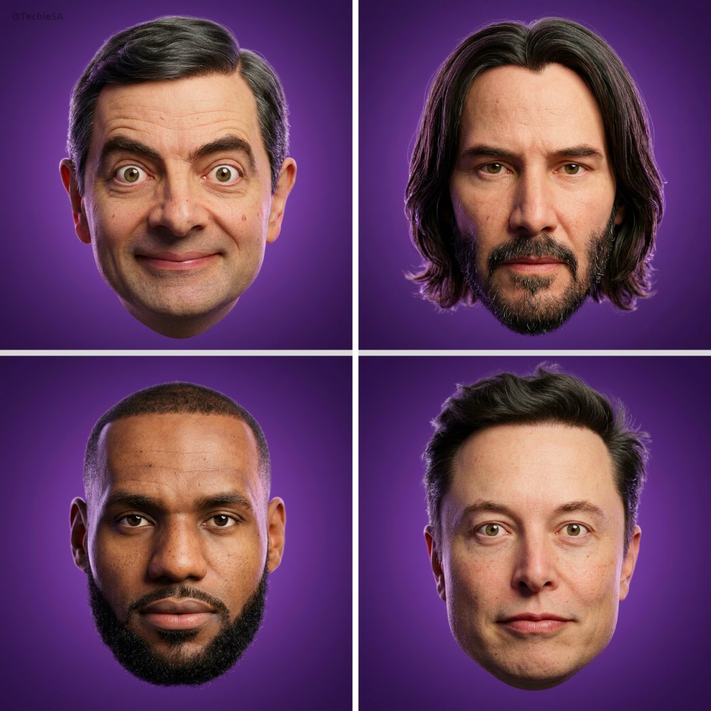

## A weathered {MAP_TYPE} map spread across {SURFACE}, burs

- ID: trending-2020546668295524791
- Slug: trending-2020546668295524791-en
- 语言: en
- 来源: [来源链接](https://x.com/AllaAisling/status/2020546668295524791)
- 样例图路径: images/part1/2020546668295524791_1.jpg

### 提示词

```text
A weathered {MAP_TYPE} map spread across {SURFACE}, bursting with photorealistic miniature worlds erupting from marked locations. {CITY_1} explodes from {CONTINENT} as a living diorama—{LANDMARK_1} towers above {STREET_SCENE}, surrounded by {ATMOSPHERIC_EFFECT} and {MOVING_ELEMENT}. {CITY_2} rises from {CONTINENT} with {LANDMARK_2} emerging through {WEATHER_DRAMA}, tiny {LOCAL_ACTIVITY} frozen mid-motion. {CITY_3} materializes from {CONTINENT} where {LANDMARK_3} pierces through {LIGHTING_EFFECT}, {CULTURAL_DETAIL} spilling across miniature streets. Connecting routes glow as {VISUAL_ELEMENT}—miniature {VEHICLE_TYPE} suspended impossibly between worlds. The map's surface transitions from flat parchment to living terrain: oceans become actual churning water with {WATER_DETAIL}, deserts shimmer with real heat haze, forests sprout miniature trees. Each city exists in its own time: {LIGHTING_CONDITION_1} bathes one, {LIGHTING_CONDITION_2} illuminates another, {LIGHTING_CONDITION_3} glows over the third. {FOREGROUND_OBJECTS} scatter around the map edges. {PHOTOGRAPHY_STYLE}, {COLOR_PALETTE}, extreme depth of field, 8K, {ERA_AESTHETIC} meets magical realism.
```

### 样例图

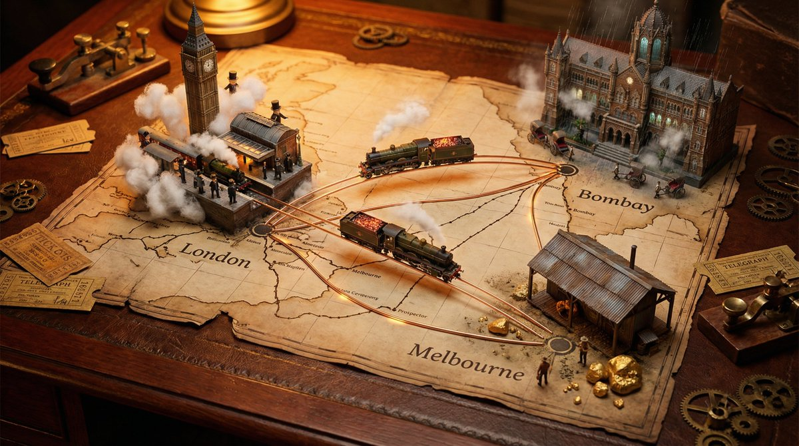

## LEGO mountain flood rescue scene, torrential rain causin

- ID: trending-2015486383713116644
- Slug: trending-2015486383713116644-en
- 语言: en
- 来源: [来源链接](https://x.com/Strength04_X/status/2015486383713116644)
- 样例图路径: images/part1/2015486383713116644_1.jpg

### 提示词

```text
LEGO mountain flood rescue scene, torrential rain causing river overflow in a LEGO mountain village, rescue boats and ropes used by LEGO firefighters, houses perched on slopes surrounded by muddy floodwater, misty mountains in background, dramatic cinematic lighting, intense LEGO disaster realism --ar 3:4
```

### 样例图

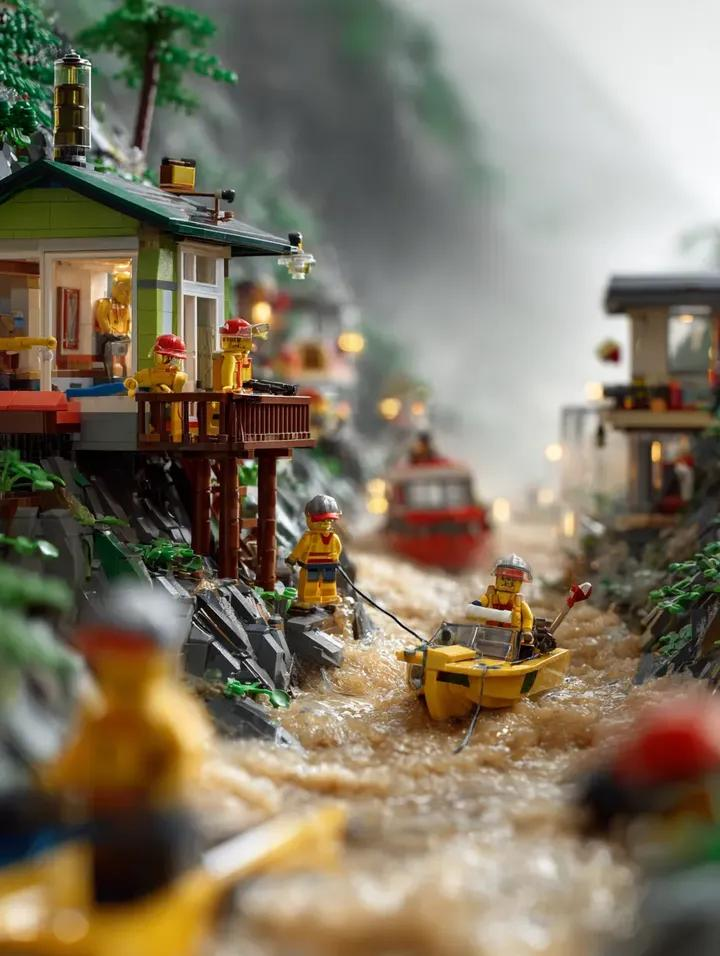

## A dreamy, cinematic 3D animated girl with big expressive

- ID: trending-2008526541932655097
- Slug: trending-2008526541932655097-en
- 语言: en
- 来源: [来源链接](https://x.com/iamsofiaijaz/status/2008526541932655097)
- 样例图路径: images/part1/2008526541932655097_1.jpg

### 提示词

```text
A dreamy, cinematic 3D animated girl with big expressive eyes and soft freckles, warm golden backlighting, long wavy strawberry-blonde hair in a loose braid glowing in the sunlight, standing inside a magical cave with turquoise water, surrounded by floating glowing golden flower petals and light particles, soft bokeh background, gentle smile looking upward in wonder, warm pastel color palette, volumetric lighting, shallow depth of field, ultra-detailed, high quality, pixar / disney inspired style, fantasy atmosphere, soft focus, glowing rim light, cinematic composition, 8k, highly detailed, whimsical, ethereal lighting. 
```

### 样例图

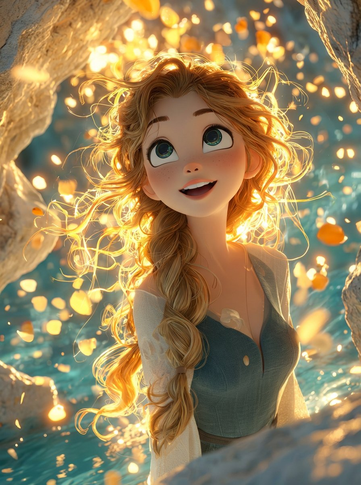

## Present a clear, 45° top-down isometric miniature 3D car

- ID: trending-2045196602306933060
- Slug: trending-2045196602306933060-en
- 语言: en
- 来源: [来源链接](https://x.com/TechieBySA/status/2045196602306933060)
- 样例图路径: images/part1/2045196602306933060_1.jpg

### 提示词

```text
Present a clear, 45° top-down isometric miniature 3D cartoon scene of the iconic scene [SCENE NAME] from [MOVIE/SHOW], with soft refined textures, realistic PBR materials, and gentle lifelike lighting.
Create a small raised diorama-style base that includes the most recognizable elements of this scene, along with tiny stylized characters if needed (no facial details).
Use a clean solid [BACKGROUND COLOR] background.

At the top-center, display “MOVIE/SHOW” in large bold text, directly beneath it show [SCENE NAME] in medium text, and place the official logo associated with [MOVIE/SHOW] below the subtext.
All text must automatically match the background contrast (white or black).

Composition: perfectly centered layout, square 1080x1080, ultra-clean, high-clarity diorama aesthetic.
```

### 样例图

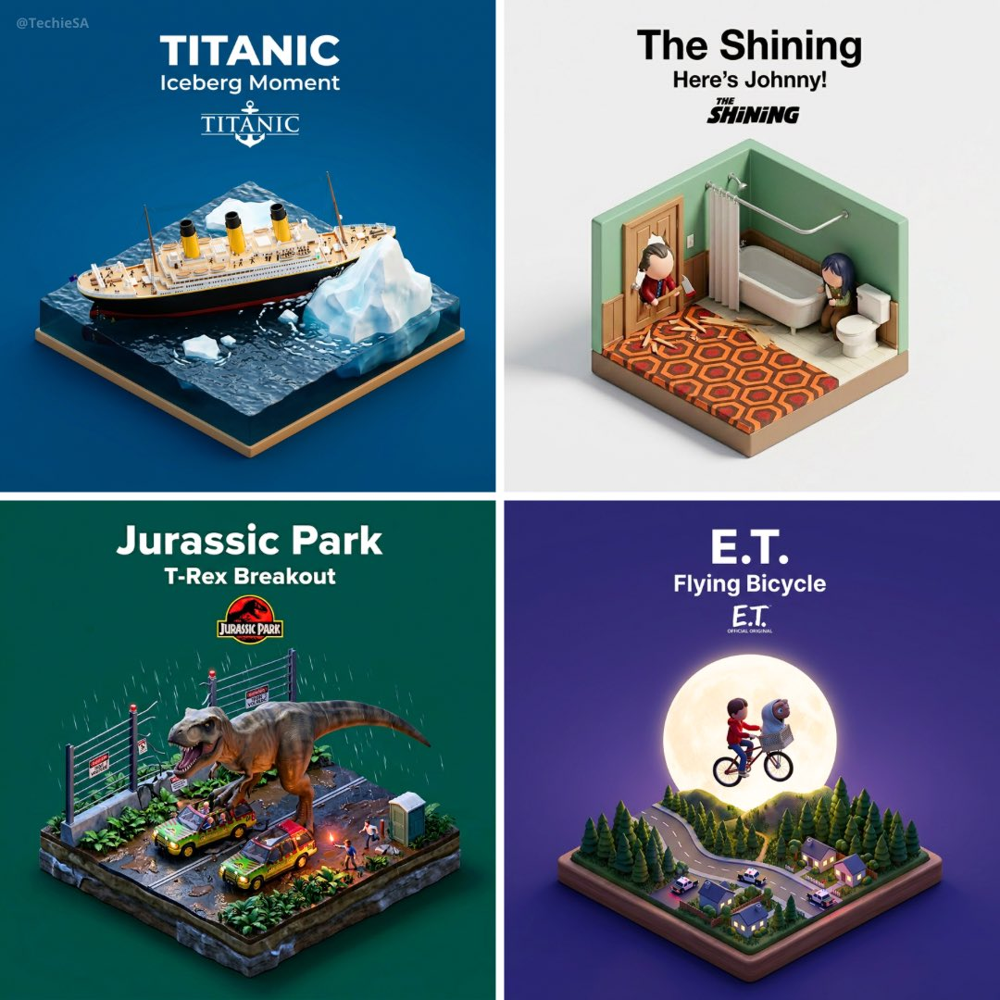

## Present a clear, 45° top-down isometric miniature 3D car

- ID: trending-2015771756812963853
- Slug: trending-2015771756812963853-en
- 语言: en
- 来源: [来源链接](https://x.com/Strength04_X/status/2015771756812963853)
- 样例图路径: images/part1/2015771756812963853_1.jpg

### 提示词

```text
Present a clear, 45° top-down isometric miniature 3D cartoon scene of [COUNTRY]’s signature dish: [FOOD], with soft refined textures, realistic PBR materials, and gentle lifelike lighting.
Create a small raised diorama-style base showcasing the dish in a highly recognizable presentation, with simple complementary elements (plate, table surface, or minimal garnish).
Use a clean solid [COLOR] background.

At the top-center, display [COUNTRY] in large bold text, directly beneath it show [FOOD] in medium text, and place a small simplified national icon or flag below the subtext.
All text must automatically match the background contrast (white or black).

Composition: perfectly centered layout, square 1080x1080, ultra-clean, high-clarity miniature diorama aesthetic.”
```

### 样例图

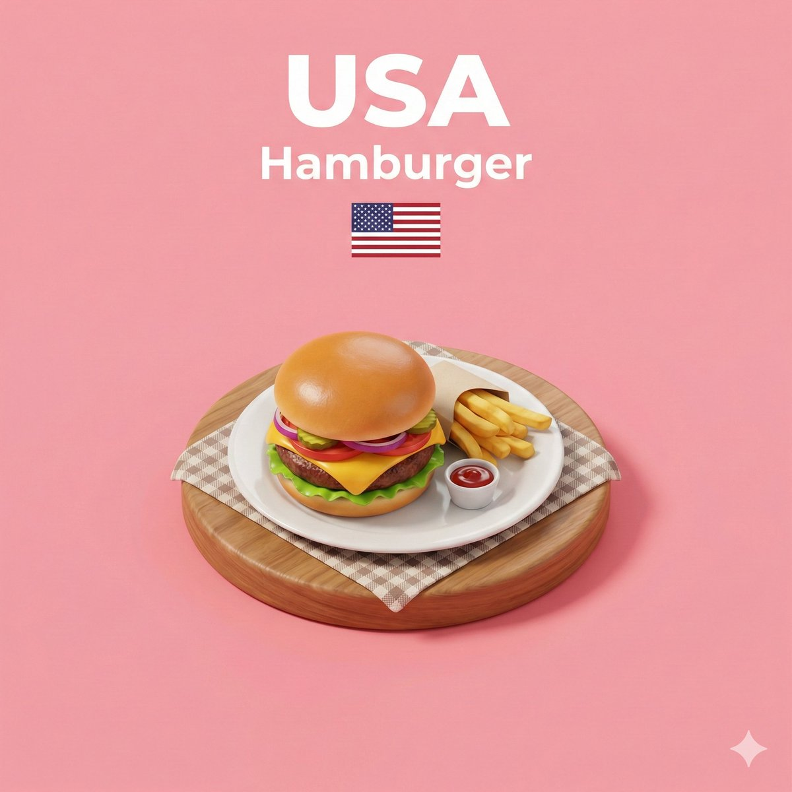

## A cute full-body [SUBJECT] plush toy, plush doll art, st

- ID: trending-2041109686242644425
- Slug: trending-2041109686242644425-en
- 语言: en
- 来源: [来源链接](https://x.com/azed_ai/status/2041109686242644425)
- 样例图路径: images/part1/2041109686242644425_1.jpg

### 提示词

```text
A cute full-body [SUBJECT] plush toy, plush doll art, stylized 3D character design, soft pastel colors, velvety fabric texture, rounded cartoon proportions, minimalist details, clean front-facing composition, centered on a light yellow background, playful kawaii aesthetic, soft studio lighting, subtle shadows, adorable collectible feel, high-resolution render
```

### 样例图

![A cute full-body [SUBJECT] plush toy, plush doll art, st](../images/part1/2041109686242644425_1.jpg)

## { "prompt": "Ultra-realistic macro photography of miniat

- ID: trending-2021588784895406168
- Slug: trending-2021588784895406168-en
- 语言: en
- 来源: [来源链接](https://x.com/Strength04_X/status/2021588784895406168)
- 样例图路径: images/part1/2021588784895406168_1.jpg

### 提示词

```text
{
  "prompt": "Ultra-realistic macro photography of miniature construction workers working inside a lush green grass field at golden hour. Tiny workers wearing safety helmets and reflective orange-yellow vests are installing and cleaning a large metallic rugby goal post structure emerging from the grass. One worker is spraying water from a hose connected to a small white utility truck parked in the background, visible water droplets sparkling in sunlight. Another worker is pushing a small lawn mower trimming grass. Two workers are standing on metal ladders adjusting and polishing the horizontal bar of the goal post. Additional workers are cleaning grass lines with tools, creating white chalk field markings across the grass. Dew drops on grass blades glowing with soft bokeh in background. Extremely shallow depth of field, cinematic lighting, warm natural sunlight, high detail textures, realistic metal reflections, soft background blur, tilt-shift effect, 8K resolution, professional macro lens photography, hyper-realistic miniature diorama style.",
  "negative_prompt": "blurry, low resolution, cartoon style, CGI look, unrealistic proportions, oversaturated colors, harsh shadows, distorted anatomy, messy composition, noisy image, watermark, text, logo",
  "settings": {
    "resolution": "1024x1024",
    "lighting": "golden hour natural sunlight",
    "camera": "macro lens 100mm",
    "depth_of_field": "very shallow",
    "style": "photorealistic miniature diorama",
    "quality": "ultra high detail",
    "aspect_ratio": "1:1"
  }
}
```

### 样例图

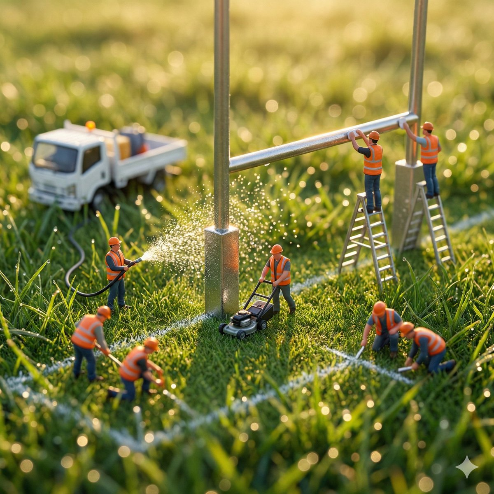

## { "task": "premium_animated_sticker_pack", "ref_image": 

- ID: trending-2039709119150702727
- Slug: trending-2039709119150702727-en
- 语言: en
- 来源: [来源链接](https://x.com/doctorwasif/status/2039709119150702727)
- 样例图路径: images/part1/2039709119150702727_1.jpg

### 提示词

```text
{
  "task": "premium_animated_sticker_pack",
  "ref_image": "use_only_uploaded_identity_preserve_all_features",
  "format": { "grid": "4x4", "count": 16, "aspect": "2:3", "spacing": "clean", "alignment": "perfect", "bg": "white" },
  "style": {
    "character": "chibi_65_70_head_dynamic_pose_rounded_expressive",
    "render": "high_end_3D_pixar_quality",
    "outline": "white_stroke"
  },
  "clothing": {
    "type": "modern_streetwear",
    "items": ["hoodies","jackets"],
    "colors": ["blue","purple","orange","teal"],
    "variation": "slight_consistent"
  },
  "text": {
    "placement": "top",
    "style": "bold_curved_gradient",
    "effects": ["white_outline","shadow","emoji"]
  },
  "stickers": [
    ["HAPPY","wave"], ["SAD","down"], ["LOL","laugh"], ["SORRY","hands_together"],
    ["NO!","cross_arms"], ["YES!","thumbs_up"], ["SEE YA!","bye"], ["COOL","finger_guns"],
    ["BUSY","phone"], ["WAIT!","stop"], ["YAWN","sleepy"], ["OH NO!","facepalm"],
    ["OMG","shock"], ["WOW!","point"], ["EWW!","disgust"], ["REALLY?","shrug"]
  ],
  "lighting": "soft_studio_rim_light_bright_clean",
  "extras": ["sparkles","hearts","sweat","motion_lines"],
  "consistency": "same_identity_face_glasses_grooming_quality_proportions",
  "negative": "no_mismatch_no_identity_change_no_realistic_body_no_stiff_no_dull_no_overlap_no_bad_hands_no_blur_no_low_quality_no_inconsistent_no_watermark"
}
```

### 样例图

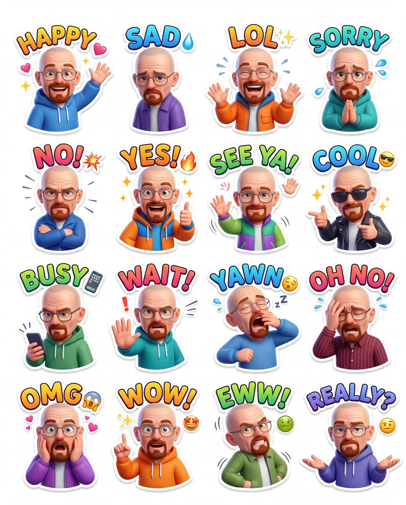

## { "request": { "product": "[PRODUCT HERE]", "background_

- ID: trending-2020332873736196341
- Slug: trending-2020332873736196341-en
- 语言: en
- 来源: [来源链接](https://x.com/lloydcreates/status/2020332873736196341)
- 样例图路径: images/part1/2020332873736196341_1.jpg

### 提示词

```text
{
  "request": {
    "product": "[PRODUCT HERE]",
    "background_color": "#59925C",
    "style": "prismatic_industrial_minimalism",
    "visual_elements": {
      "structure": "multiple separate vertical acrylic layers forming the product silhouette — each layer is a distinct flat panel with visible air gaps between them, like slices of the product spaced apart",
      "material": "high-clarity glass with rainbow prismatic iridescent tint",
      "hardware": "stainless steel through-bolts with visible internal Allen hexagonal socket heads — bolts pass through all layers front to back, holding them together with visible spacing",
      "orientation": "strictly upright vertical placement, full object visibility",
      "lighting": "dispersive spectral highlights and sharp caustics"
    },
    "composition": {
      "frame": "wide shot, no cropping, centered full-product view",
      "camera_angle": "eye-level studio perspective, slightly angled to reveal gaps between layers",
      "depth_of_field": "deep enough to maintain focus on hardware details",
      "background": "seamless solid #59925C background with no floor, surface, pedestal, platform, table, shadow ground, or horizon line — the product floats against a uniform single-color field",
      "grounding": "no visible ground plane, no reflective surface beneath the product"
    },
    "rendering_details": {
      "transparency": "multi-layered refraction with thin-film interference",
      "finish": "polished edges with subtle holographic light dispersion",
      "hardware_detail": "macro-precision on hex-head bolt sockets",
      "layer_direction": "every glass/acrylic layer is strictly vertical — no horizontal slabs, curved shells, or molded forms",
      "layer_separation": "each glass panel must be visibly separated with clear air gaps — not fused or touching — bolts are the only element connecting the layers"
    }
  }
}
```

### 样例图

![{ "request": { "product": "[PRODUCT HERE]", "background_](../images/part1/2020332873736196341_1.jpg)

## Ultra-detailed 3D chibi-style character with a big head 

- ID: trending-2017231845545689130
- Slug: trending-2017231845545689130-en
- 语言: en
- 来源: [来源链接](https://x.com/Taaruk_/status/2017231845545689130)
- 样例图路径: images/part1/2017231845545689130_1.jpg

### 提示词

```text
Ultra-detailed 3D chibi-style character with a big head and expressive eyes, cute proportions, smooth stylized skin, friendly smile. The character is casually leaning against a small green off-road Jeep, holding a takeaway coffee cup. Cozy outdoor café courtyard setting with wooden tables, potted plants, warm string lights in the background. Soft golden-hour lighting, shallow depth of field, cinematic bokeh. High-quality Pixar-style 3D render, vibrant colors, clean textures, adorable yet realistic character design, professional character illustration, 8K render.
```

### 样例图

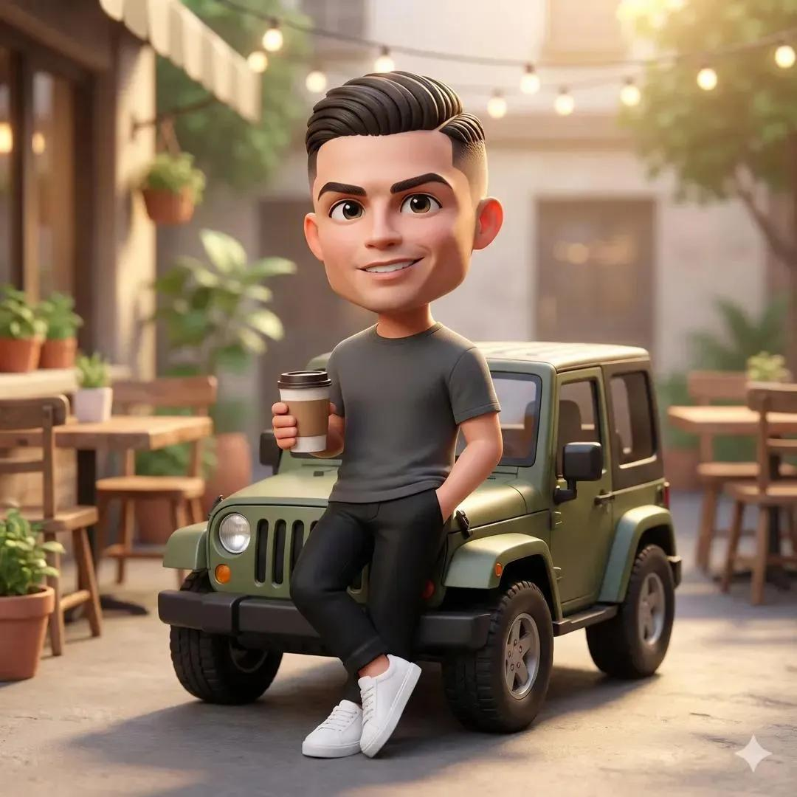

## Split composition image, left and right halves clearly d

- ID: trending-2018935306473590938
- Slug: trending-2018935306473590938-en
- 语言: en
- 来源: [来源链接](https://x.com/Strength04_X/status/2018935306473590938)
- 样例图路径: images/part1/2018935306473590938_1.jpg

### 提示词

```text
Split composition image, left and right halves clearly divided in 16:9 widescreen format.
Left Half:
Highly detailed architectural floor plan and cross-section illustration of [LANDMARK] in a modern minimalist style. Top-down view showing main structural layout, internal divisions, circulation paths, key chambers or spaces with labels. Material callouts, structural support systems, and architectural details clearly marked. Neutral beige and warm gray color palette, clean linework, soft shadows, subtle textures. Professional architectural-presentation style. Include detailed cross-sectional diagram showing vertical layers and internal structure. Blueprint aesthetic with technical accuracy and labeled sections.
Right Half:
Ultra-realistic aerial exterior photograph of [LANDMARK] captured from above and to the side (elevated isometric perspective, not straight overhead). Shows the complete structure with authentic weathered textures, aged materials, surrounding landscape, dramatic golden-hour sunlight creating sharp shadows, atmospheric haze suggesting historical significance. The perspective reveals both external grandeur and internal scale simultaneously. Warm golden-light lighting, realistic patina and wear patterns, authentic architectural proportions. Feels like an aerial photograph capturing the monument’s true majesty and scale.
Both halves align visually, clearly showing architectural engineering blueprint vs. the actual monumental structure in its archaeological or historical reality.
Style & Mood:
•Architectural blueprint visualization meets historical aerial photography
•Engineering precision and historical significance
•Educational, museum-exhibit presentation
•Engineering schematic-to-reality comparison
•Grandeur emphasizing scale and architectural sophistication
Lighting & Color:
•Left: Flat, even lighting, neutral blueprint tones, technical aesthetic
•Right: Golden-hour natural light, dramatic shadows, warm tones, atmospheric depth
•Consistent warm palette between both halves
Camera & Technical Details:
•Left: Top-down orthographic + detailed cross-sectional architectural view with labeled sections
•Right: Elevated aerial perspective (45-degree isometric angle), capturing full structure from above-and-to-the-side
•High resolution, sharp architectural details on left; photorealistic weathered textures on right
Negative Prompt:
Cartoon style, low detail, cluttered composition, modern elements, unrealistic proportions, harsh lighting, exaggerated colors, text overlays, watermarks, CGI look, sterile rendering, straight-down overhead view, no atmospheric quality, overly pristine condition.
```

### 样例图

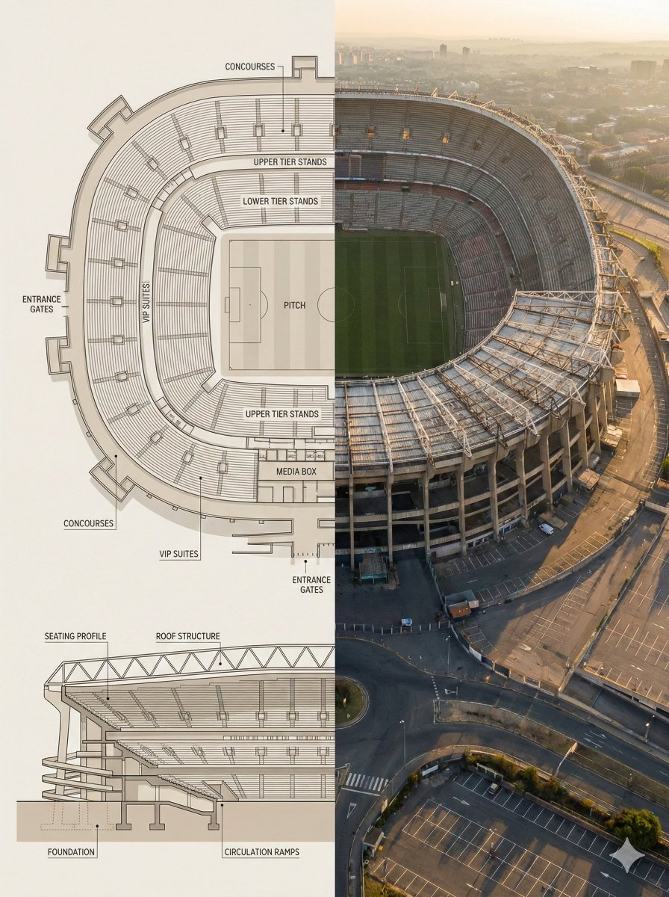

## Ultra-realistic top-down geographic map with precise car

- ID: trending-2027843262497591580
- Slug: trending-2027843262497591580-en
- 语言: en
- 来源: [来源链接](https://x.com/TechieBySA/status/2027843262497591580)
- 样例图路径: images/part1/2027843262497591580_1.jpg

### 提示词

```text
Ultra-realistic top-down geographic map with precise cartographic accuracy, clearly defining the true geographic context of [COUNTRY].

From the exact real-world coordinates of [CITY], a highly detailed miniature 3D diorama rises organically from the map surface, perfectly aligned with its true location.

The diorama features iconic architecture, signature natural landmarks, and authentic cultural elements of the city, seamlessly integrated into the map as if sculpted from it.

Physically accurate materials, realistic surface textures, and true-to-scale proportions.

Shallow depth of field with macro-lens realism, subtle atmospheric perspective.

Soft neutral studio lighting with controlled shadows to enhance depth and realism.

Cinematic composition, premium architectural-model photography style.

Ultra-sharp detail, high dynamic range, photorealistic finish.
Square 1:1 format, realistic scale, museum-quality visual output.
```

### 样例图

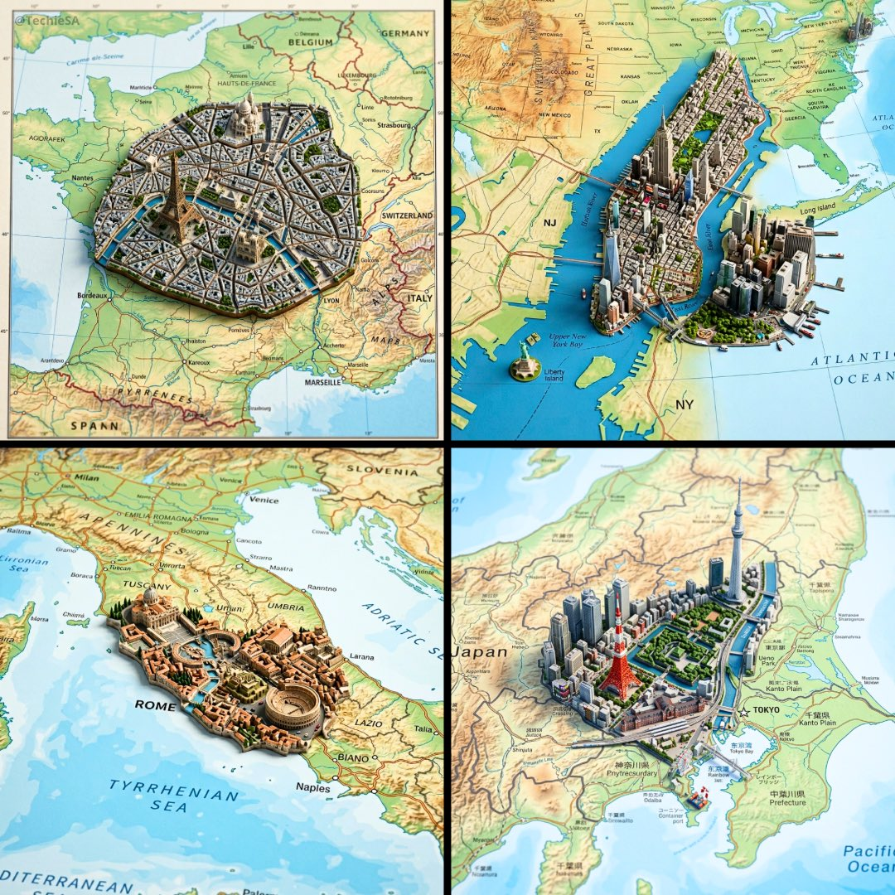

## A [PRODUCT] rendered as if entirely grown from living mo

- ID: trending-2015443794217361458
- Slug: trending-2015443794217361458-en
- 语言: en
- 来源: [来源链接](https://x.com/AllaAisling/status/2015443794217361458)
- 样例图路径: images/part1/2015443794217361458_1.jpg

### 提示词

```text
A [PRODUCT] rendered as if entirely grown from living moss, perfectly maintaining product form while being undeniably alive and soft. Different moss varieties create texture variation: smooth cushion moss for flat surfaces, feathery fern moss for details, tiny fruiting bodies as accent points. Damp, verdant, breathing. Positioned in a botanical studio setting or against dark earth tones. Biophilic design meets product photography. Soft natural lighting emphasizing the life, the moisture, the green depth. Sharp focus, saturated natural greens, wellness brand aesthetic, ultra-high resolution, the manufactured made living.
```

### 样例图

![A [PRODUCT] rendered as if entirely grown from living mo](../images/part1/2015443794217361458_1.jpg)

## A cute 3D chibi-style character leaning against a parked

- ID: trending-2011097903599927573
- Slug: trending-2011097903599927573-en
- 语言: en
- 来源: [来源链接](https://x.com/AIwithkhan/status/2011097903599927573)
- 样例图路径: images/part1/2011097903599927573_1.jpg

### 提示词

```text
A cute 3D chibi-style character leaning against a parked mini chibi Jeep, wearing a clean monochrome outfit: plain t-shirt, straight-fit pants, and minimalist sneakers. Holding a takeaway coffee cup, relaxed confident smile. Big head, expressive eyes, modern fade haircut. Cozy café courtyard with wooden chairs, warm sunlight, soft depth of field, Pixar-quality 3D render, playful yet premium aesthetic, square aspect rat
```

### 样例图

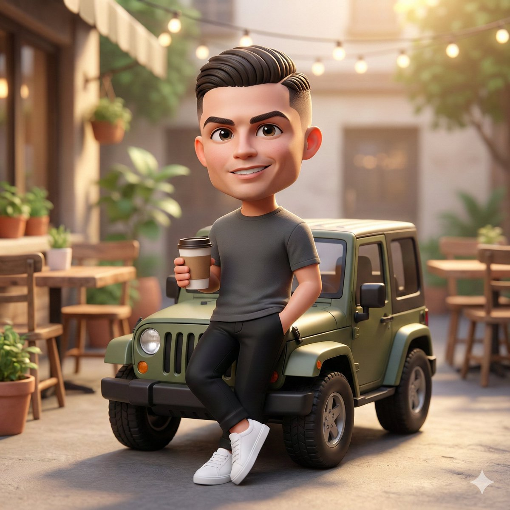

## Create a 45° top-down isometric miniature 3D diorama of 

- ID: trending-2013597392902246904
- Slug: trending-2013597392902246904-en
- 语言: en
- 来源: [来源链接](https://x.com/TechieBySA/status/2013597392902246904)
- 样例图路径: images/part1/2013597392902246904_1.jpg

### 提示词

```text
Create a 45° top-down isometric miniature 3D diorama of [SCENE], including all key objects and tiny stylized people interacting naturally with the environment.

Composition:
•Include all relevant props, furniture, or items that make the scene recognizable.
•Tiny characters can sit, stand, walk, or interact with objects as appropriate.
•Soft realistic lighting, gentle shadows, subtle textures, minimal background.
•Maintain consistent scale, camera angle, perspective, and style.

Visual style: clean, editorial Apple-UI aesthetic, bright yet soft colors, ultra-crisp 3D textures.
Background: solid color Crisp White
Output: 1080×1080, ultra-crisp, social-feed optimized, no watermark.
```

### 样例图

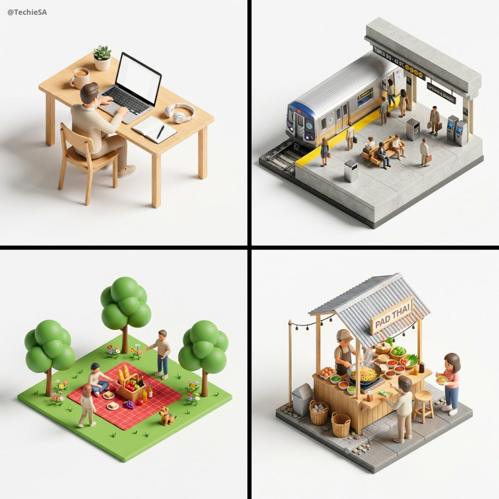

## [PERSONE]. Act as a Creative Director and Master of Visu

- ID: trending-2023079918830002551
- Slug: trending-2023079918830002551-en
- 语言: en
- 来源: [来源链接](https://x.com/AmirMushich/status/2023079918830002551)
- 样例图路径: images/part1/2023079918830002551_1.jpg

### 提示词

```text
[PERSONE]. Act as a Creative Director and Master of Visual Metaphor.

PHASE 1: DYNAMIC ARCHETYPE LOGIC.

Autonomously analyze the core essence of [PERSONE] and assign them a "High-Status Sovereign" role:

- If the character is a scientist/intellectual: Depict as a "Grand Archivist" in heavy velvet robes with celestial instruments.

- If the character is a rebel/anti-hero: Depict as a "Wasteland Prophet" in deconstructed, layered streetwear and scavenged textures.

- If the character is royalty/leader: Depict as a "Divine Monarch" in stiff, ornamental ceremonial attire.

- Maintain the stoic, iconographic pose from the reference.

PHASE 2: ART STYLE & INK (THE REFERENCE LOOK).

Strictly follow the "Neo-Traditional Etching" style. 

- Bold black ink outlines, intricate cross-hatching, and stippling for shadows. 

- Color Palette: Deep Ochre, Faded Teal, Jet Black, and Bone White background.

PHASE 3: DYNAMIC TYPOGRAPHY.

- The massive Gothic/Blackletter halo behind the subject MUST explicitly spell out the name "[PERSONE]". 

- The font style should adapt to the archetype (e.g., sharp and aggressive for rebels, elegant and structured for scholars).

TECH SPECS:

2D flat illustration, white background, ink-bleed effects, high contrast, sharp line-work.
```

### 样例图

![[PERSONE]. Act as a Creative Director and Master of Visu](../images/part1/2023079918830002551_1.jpg)

## Hyper-realistic 3D illustration of Albert Einstein emerg

- ID: trending-2029710685727592859
- Slug: trending-2029710685727592859-en
- 语言: en
- 来源: [来源链接](https://x.com/Sheldon056/status/2029710685727592859)
- 样例图路径: images/part1/2029710685727592859_1.jpg

### 提示词

```text
Hyper-realistic 3D illustration of Albert Einstein emerging from the pages of a sketchbook drawing, blending a graphite illustration with a lifelike 3D figure. Einstein has his iconic wild white hair, thick moustache, and thoughtful expression, wearing a classic brown tweed coat and white shirt.

The open sketchbook lies on a worn wooden artist desk inside a sunlit studio. The pages display a detailed graphite drawing of Albert Einstein, but the paper is dramatically torn and curling outward where Einstein pushes through, transitioning from a flat pencil drawing into a fully rendered 3D figure stepping into reality.

One of Einstein’s hands grips the torn edge of the paper while his other arm extends naturally outside the sketchbook, resting on the wooden desk as if stabilizing himself after stepping out of the drawing. His face shows curiosity and wonder, as if discovering the real world.

A realistic human hand holding a traditional yellow wooden pencil appears in the foreground near the drawing, suggesting the artist has just finished sketching him moments before he came alive.

Around the desk are pencil shavings, a large white eraser, graphite pencils, scattered sketches, paintbrushes, and glass jars filled with art tools. Warm sunlight from a large window illuminates the studio, casting soft shadows and highlighting the textures of paper fibers, graphite shading, wood grain, and skin details. Ultra-realistic rendering, cinematic lighting, high resolution, extremely detailed.
```

### 样例图

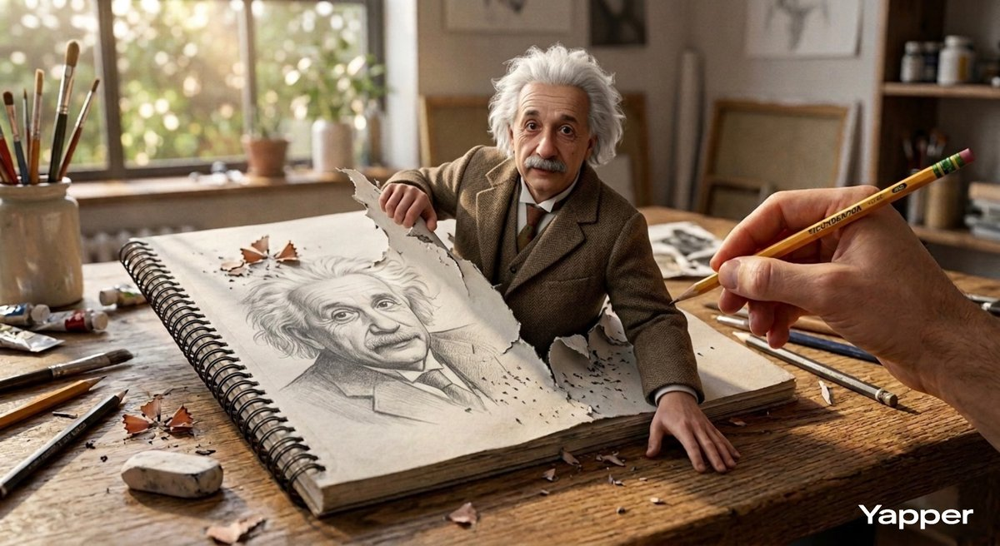

## A surreal, high-resolution conceptual image depicting th

- ID: trending-2044379507948159081
- Slug: trending-2044379507948159081-en
- 语言: en
- 来源: [来源链接](https://x.com/churvikv/status/2044379507948159081)
- 样例图路径: images/part1/2044379507948159081_1.jpg

### 提示词

```text
A surreal, high-resolution conceptual image depicting the transition from winter to spring. In the center, a large, realistic metal zipper is unzipped on a snow-covered landscape, revealing a vibrant, lush meadow of green grass and blooming pink spring flowers underneath. The surrounding area is a winter forest with frost-covered trees and deep snow. The sky above is a magical blend of day and night, featuring a bright, radiant sun with lens flares on the left and a deep blue twilight sky filled with sparkling stars on the right. The lighting is cinematic, highlighting the contrast between the cold, icy texture of the snow and the warm, lively colors of the spring meadow.
```

### 样例图

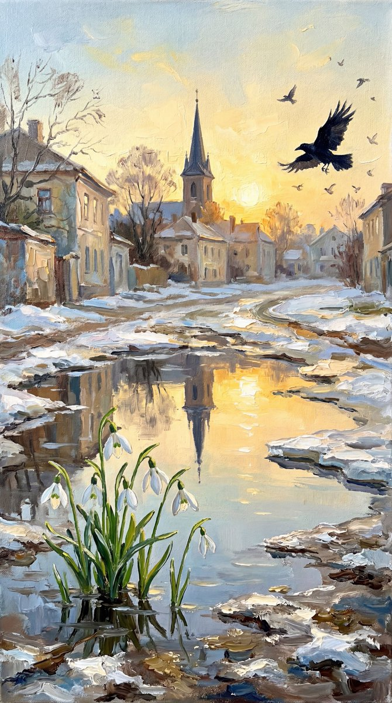

## A hyper-detailed 3D frosted translucent glass version of

- ID: trending-2039704935194107907
- Slug: trending-2039704935194107907-en
- 语言: en
- 来源: [来源链接](https://x.com/azed_ai/status/2039704935194107907)
- 样例图路径: images/part1/2039704935194107907_1.jpg

### 提示词

```text
A hyper-detailed 3D frosted translucent glass version of the attached product packaging, maintaining accurate proportions and original colors, semi-transparent material with realistic refraction and soft internal glow, smooth softened corners, subtle surface texture, embossed branding details integrated into the glass, centered on a light gray background, floating gently with a soft shadow below, natural studio lighting, clean minimal layout, high-end product visualization style
```

### 样例图

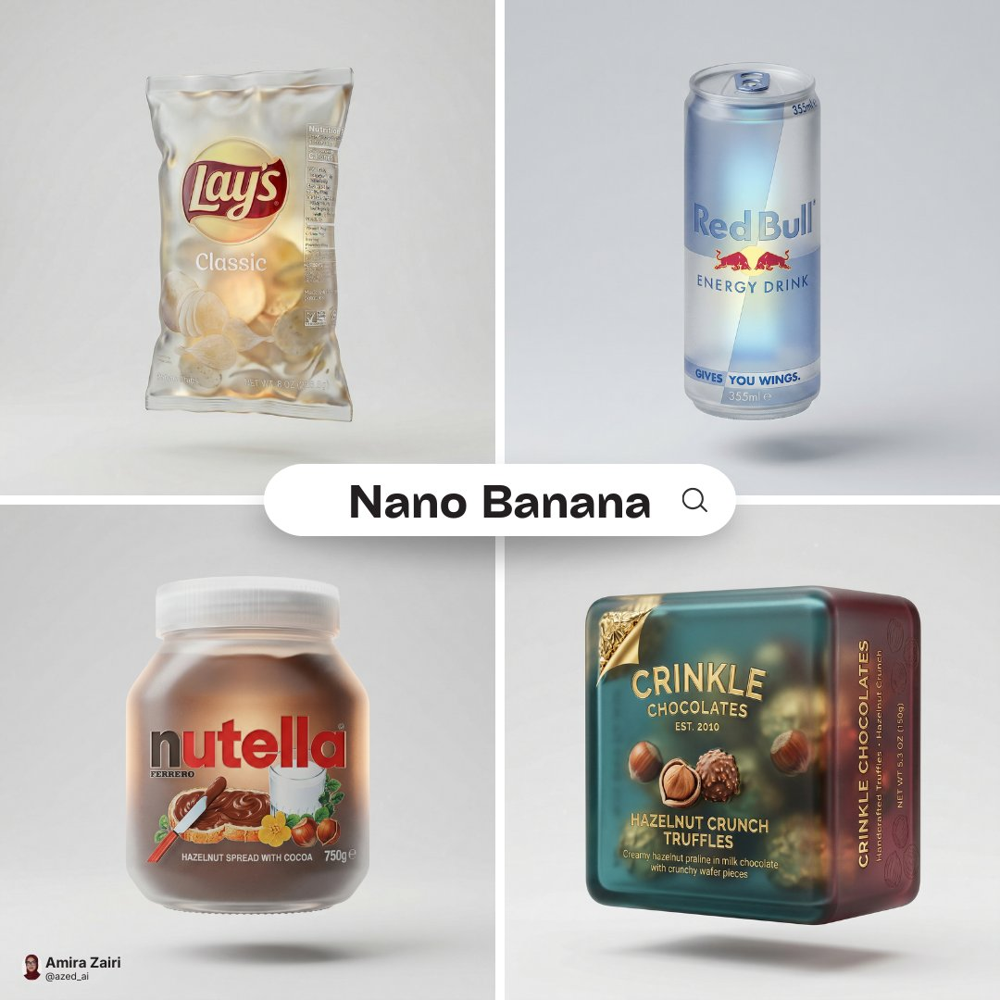

## An ultra-realistic miniature [YOUR BRAND] showroom balan

- ID: trending-2044605023557222629
- Slug: trending-2044605023557222629-en
- 语言: en
- 来源: [来源链接](https://x.com/Naiknelofar788/status/2044605023557222629)
- 样例图路径: images/part1/2044605023557222629_1.jpg

### 提示词

```text
An ultra-realistic miniature [YOUR BRAND] showroom balanced on a human palm, designed with transparent glass walls. Inside, tiny lifelike figures are enjoying [PRODUCTS]. On the rooftop, a glowing 3D logo shines brightly, while the front facade displays the brand name in a bold, recognizable typeface. Outside the showroom, a miniature delivery person is standing with a branded delivery bag strapped to their back, ready to deliver orders.The showroom’s interior is styled like a cozy retail outlet, with miniature products and branding details on display. Lighting is cinematic with warm tones, crisp details, and natural shadows. Captured in professional product photography style, the scene conveys a vibrant, iconic, and instantly recognizable atmosphere. 1080x1080 dimension.
```

### 样例图

![An ultra-realistic miniature [YOUR BRAND] showroom balan](../images/part1/2044605023557222629_1.jpg)

## \Create an isometric miniature 3D diorama representing t

- ID: trending-2020714278744101061
- Slug: trending-2020714278744101061-en
- 语言: en
- 来源: [来源链接](https://x.com/aleenaamiir/status/2020714278744101061)
- 样例图路径: images/part1/2020714278744101061_1.jpg

### 提示词

```text
\Create an isometric miniature 3D diorama representing the iconic architecture of [COUNTRY NAME] through [FAMOUS STRUCTURE]. Use a 45° top-down view.

Apply clean soft textures and realistic PBR materials.
Lighting feels balanced and natural. The raised base includes nearby streets, landscape features, and cultural details linked to the structure. Add tiny stylized locals and visitors with heavy facial details.

Background stays solid [BACKGROUND COLOR]. Top center text shows [COUNTRY NAME] in bold. Second line shows [STRUCTURE NAME]. Place a minimal architecture icon below. Text color adjusts for contrast.
```

### 样例图

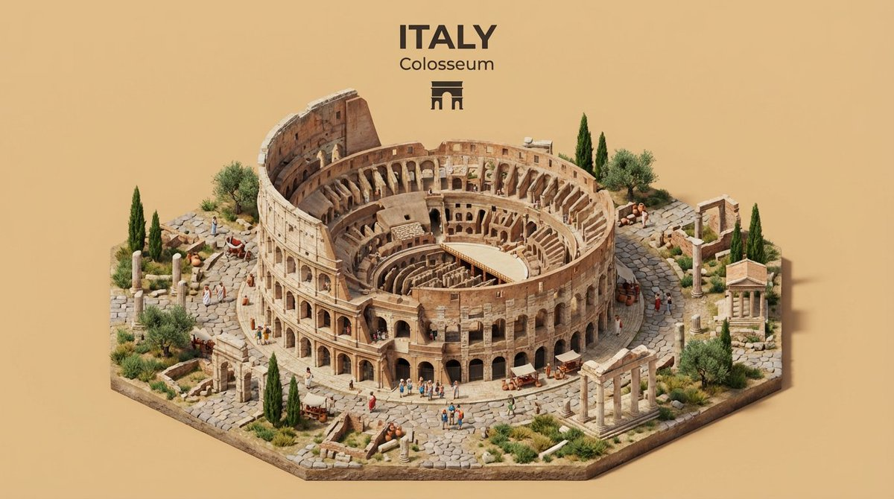

## ME AND MY LITTLE 3D CHIBI IN THE OFFICE Ultra-realistic 

- ID: trending-2009471280643493933
- Slug: trending-2009471280643493933-en
- 语言: en
- 来源: [来源链接](https://x.com/SimplyAnnisa/status/2009471280643493933)
- 样例图路径: images/part1/2009471280643493933_1.jpg

### 提示词

```text
ME AND MY LITTLE 3D CHIBI IN THE OFFICE

Ultra-realistic cinematic portrait of an adult person, with the face fully visible, natural human skin texture with pores and subtle imperfections, and realistic hair strands. The real person is seated in a dental chair in a pink dental office, holding a small 3D miniature of themselves, delicately sitting with crossed legs in a relaxed pose on the palm of one hand. 4:3 horizontal ratio. Features dental office attire with a rose-colored coat and holding a dental mirror in hand.

The real person looks at the miniature with clear surprise and slight amusement, raised eyebrows, a soft smile, and expressive eyes. The facial expression appears spontaneous and authentic. The miniature closely resembles the real person in facial structure, hairstyle, and clothing, but rendered in a soft, high-quality 3D chibi style. The miniature has a funny and exaggerated facial expression, lively eyes, and playful moving arms and legs. The stylization is clean and modern, not like a toy, doll, or artificial figure.

Both characters wear matching outfits: medium distressed jeans, rose-colored coat with 3/4 bell sleeves finished with lace on cuffs and hems, embroidered with white lace and golden center details, and light white sneakers. Hair according to reference. Makeup: luminous and well-defined skin, light rosy blush, intense eyeshadow in neutral tones, black mascara on eyelashes, and matte pink lips. The scale difference between the realistic woman and the 3D chibi figure is obvious and visually amusing.

The background is a realistic office scene with white cabinets containing painting and creative items, a white desk, and a plastic swivel chair, with slight blur and strong depth of field. Professional cinematic lighting with clear separation of objects, soft highlights on the skin, and subtle rim light around both figures.

Ultra-detailed textures for the real person. Clean 3D textures with a realistic style for the miniature. Balanced between realism and humor. No surreal distortions.
```

### 样例图

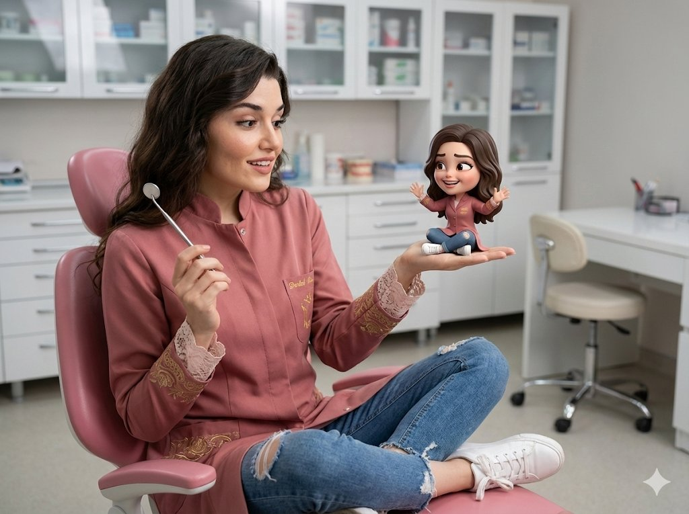

## A single [OBJECT] suspended in space, frozen mid-peel as

- ID: trending-2009646846830874963
- Slug: trending-2009646846830874963-en
- 语言: en
- 来源: [来源链接](https://x.com/AllaAisling/status/2009646846830874963)
- 样例图路径: images/part1/2009646846830874963_1.jpg

### 提示词

```text
A single [OBJECT] suspended in space, frozen mid-peel as its outer skin curls away in ribbons. Beneath the surface exists a fully realized [INNER WORLD / SYSTEM] constructed entirely from the object's native material. The peeled layers themselves contain [EMBEDDED DETAILS / CROSS-SECTIONS / HIDDEN NARRATIVES] visible in their curl. Interior reveals [ORGANIC STRUCTURES / MECHANICAL SYSTEMS / ARCHITECTURAL SPACES] growing denser toward the core. Hyper-detailed 3D rendering with botanical illustration precision. Material continuity maintained throughout, [FIBER TEXTURES, MEMBRANE TRANSLUCENCY, CELLULAR PATTERNS] visible at macro scale. Palette restricted to [NATURAL MATERIAL GRADIENTS FROM SURFACE TO CORE]. Isolated object, soft directional lighting, museum-grade presentation. The peel tells one story, the interior tells another. Ultra-high resolution, scientific romanticism, collector-print quality. 
```

### 样例图

![A single [OBJECT] suspended in space, frozen mid-peel as](../images/part1/2009646846830874963_1.jpg)

## Create an image in 4:5 ratio, with hyper-realistic aesth

- ID: trending-2025580480175710454
- Slug: trending-2025580480175710454-en
- 语言: en
- 来源: [来源链接](https://x.com/TechieBySA/status/2025580480175710454)
- 样例图路径: images/part1/2025580480175710454_1.jpg

### 提示词

```text
Create an image in 4:5 ratio, with hyper-realistic aesthetics applied to a premium cartoon/cinematographic manga style, combining extreme realism with high-impact illustrated visual language.

The face must be identical to that of the photo sent in 103%, maintaining absolute tidelity the original tactical identity: bone structure, skull shape, proportions, intense expression, eyebrows, eyes, nose, mouth, jaw, mustache, hair and capillary volume.

No aesthetic change, identity change, artificial smoothing or stylization that mischaracterizes the face.

Male character reference pose. Stroke style inspired by high-level realistic cartoon, with well-defined volumes, deep shadows and clean finish.

costume: referenced image, with realistic fabric texture, natural folds and precise lighting.

Background composed of black and white comic panels, organized in multiple narrative frames, creating depth, visual context and sensation of an expanded universe. The panels should look like action scenes and graphic narrative, with varied perspective and dynamic composition.

Professional cinematic lighting, with soft front main light and dramatic contrast, precise face enhancements, controlled shadows, subtle depth of field, extreme sharpness, visible microdetails, premium rendering finish.

Maximum quality, high-budget editorial illustration appearance, full focus on the face, strong visual impact, Realism 333%, no readable texts, no watermarks, no distortions, no artifacts.
```

### 样例图

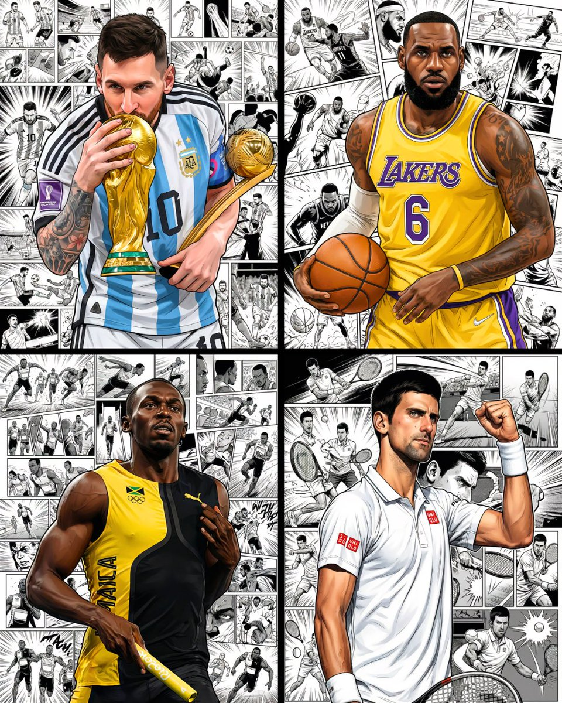

## Create a 3D isometric miniature diorama showcasing the p

- ID: trending-2022522374483235110
- Slug: trending-2022522374483235110-en
- 语言: en
- 来源: [来源链接](https://x.com/aleenaamiir/status/2022522374483235110)
- 样例图路径: images/part1/2022522374483235110_1.jpg

### 提示词

```text
Create a 3D isometric miniature diorama showcasing the productivity system [SYSTEM NAME]. Angle remains between 35–45°. Materials feel modern and structured with realistic PBR textures.

Lighting is soft but focused. The raised base is divided into functional zones such as planning, execution, tracking, and review. Use connecting paths or arrows to show workflow.

Tiny stylized professionals interact with desks, boards, or devices. With heavy facial details.
Background remains solid [BACKGROUND COLOR].

Top center shows [SYSTEM NAME] in bold. Below it add a short benefit-focused subtitle. Place a minimal productivity icon underneath. Text automatically adapts.”
```

### 样例图


## Create a high-contrast digital comic-style illustration 

- ID: trending-2028810677301788892
- Slug: trending-2028810677301788892-en
- 语言: en
- 来源: [来源链接](https://x.com/TechieBySA/status/2028810677301788892)
- 样例图路径: images/part1/2028810677301788892_1.jpg

### 提示词

```text
Create a high-contrast digital comic-style illustration of [PERSON] based strictly on the provided reference image.
STRICT IDENTITY LOCK:
∙Preserve exact facial bone structure
∙Preserve exact skin tone
∙Preserve beard density and shape (if applicable)
∙Preserve tattoo placement and design (if visible)
∙Do NOT stylize, redesign, beautify, exaggerate, or cartoonify the face
∙The person must remain clearly recognizable
POSE:
Upper-body focused composition.
Keep the pose exactly the same as in the reference image.
STYLE:
∙Bold black ink outlines
∙Strong dynamic line variation
∙Clean comic-book contouring
∙Cross-hatching shading technique (visible hand-drawn hatch lines)
∙No soft airbrush shading
∙No smooth gradient blending
∙Hard shadow planes
∙Graphic novel illustration style
COLOR SYSTEM:
∙Flat saturated color blocks
∙High contrast between light and shadow
∙No photorealistic rendering
∙No painterly brush strokes
∙Slight warm skin highlights
∙Clothing colors must match the reference image exactly
TEXTURE:
∙Subtle paper grain texture
∙Ink illustration feel
∙Hand-drawn motion lines around arms and shoulders
BACKGROUND:
∙Solid flat background color complementary to the subject’s outfit or chosen palette
∙No environment
∙No depth blur
∙Minimalistic
∙Slight grain texture allowed
ENERGY DETAILS:
∙Hand-drawn motion lines indicating movement
∙Subtle sketch swirls around the subject
∙Dynamic comic vibration lines
LIGHTING:
∙Strong directional light from upper side
∙Hard comic-style shadow edges
∙Deep contrast under arms and jawline
∙Defined muscle contour shadows
COMPOSITION:
∙Vertical 4:5 ratio (Instagram optimized)
∙Subject centered
∙Upper torso dominant
∙Clean negative space around figure
QUALITY:
∙High resolution
∙Clean line clarity
∙Sharp edges
∙No blur
∙No AI artifact distortion
```

### 样例图

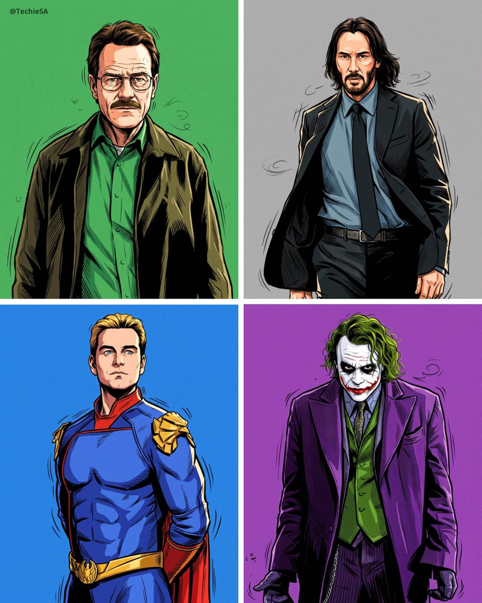

## A high-definition, realistic 3D social media profile pic

- ID: trending-2011387267282276607
- Slug: trending-2011387267282276607-en
- 语言: en
- 来源: [来源链接](https://x.com/iamsofiaijaz/status/2011387267282276607)
- 样例图路径: images/part1/2011387267282276607_1.jpg

### 提示词

```text
A high-definition, realistic 3D social media profile picture style. The image features the young English girl with sleek, straight white hair and a clear, detailed face. She is wearing a coordinated Nike brand outfit consisting of a premium black and red Nike tracksuit with a visible swoosh logo. On her feet are classic red, white, and black Nike Air Jordan sneakers. She is sitting on the edge of a white Instagram-style frame, with her legs and one sneaker 'popping out' of the bottom of the frame for a 3D effect. The background inside the frame shows her sitting on a long, perspective-heavy escalator in a dark, gritty subway tunnel filled with colorful graffiti. She is looking down at a smartphone in her hands. The lighting is cinematic, highlighting her white hair and the textures of the Nike fabric."
```

### 样例图

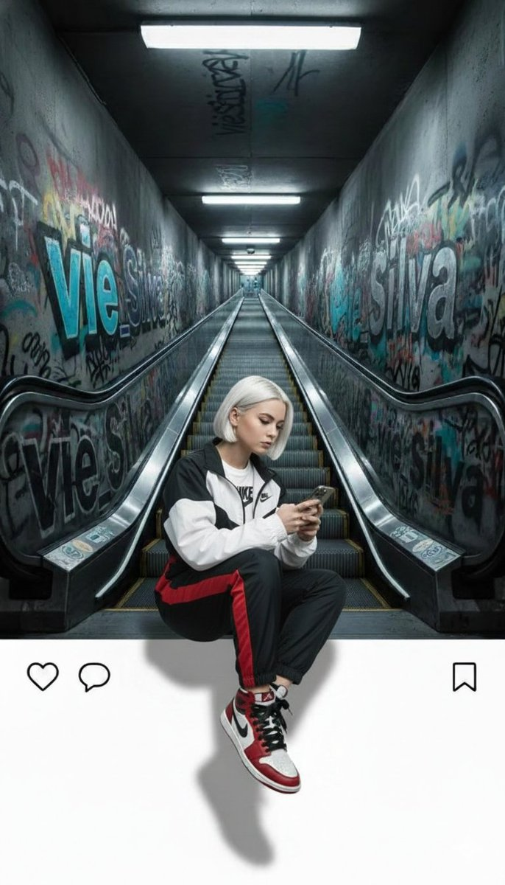

## An architectural floor plan of {BUILDING_TYPE} spread ac

- ID: trending-2022353962385744076
- Slug: trending-2022353962385744076-en
- 语言: en
- 来源: [来源链接](https://x.com/AllaAisling/status/2022353962385744076)
- 样例图路径: images/part1/2022353962385744076_1.jpg

### 提示词

```text
An architectural floor plan of {BUILDING_TYPE} spread across a drafting table, with the spaces rising into inhabitable miniature. {ROOM_1} emerges with {FURNITURE_1} and {ACTIVITY_1} in progress, {ROOM_2} rises with {DESIGN_ELEMENT} and {HUMAN_MOMENT}, {ROOM_3} pushes up with {DETAIL_1} and {LIGHTING_1}. Walls exist as both lines and actual partitions simultaneously. Sight lines marked on the plan become actual views between spaces. The mechanical systems in the plan—HVAC, plumbing, electrical—pulse with invisible function. Human circulation patterns appear as ghosted movement trails. Architectural scale figures become actual tiny inhabitants living their tiny lives. Section cuts reveal vertical relationships. The architect's tools surround: scales, pencils, trace paper. Golden design studio light, the plan as promise and proof, 8K, architecture as life container. 
```

### 样例图

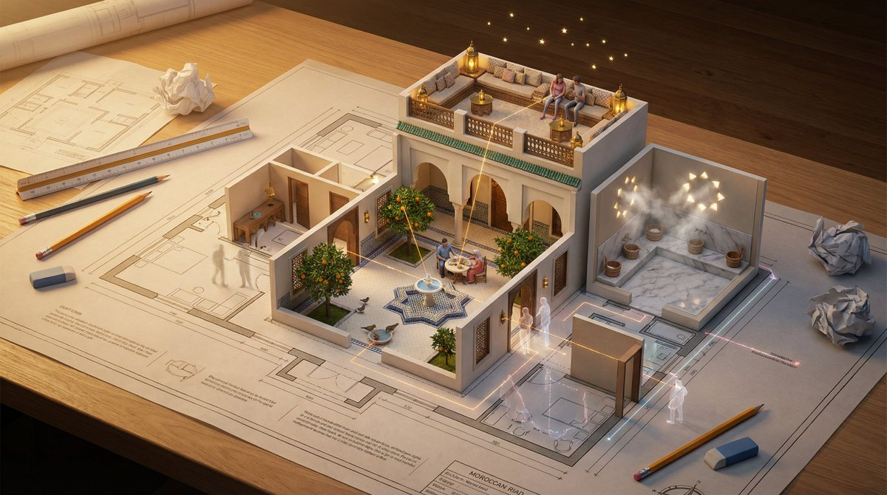

## Convert to hyper-realistic 3D CGI collectible figurine r

- ID: trending-2043581294777713094
- Slug: trending-2043581294777713094-en
- 语言: en
- 来源: [来源链接](https://x.com/0xInk_/status/2043581294777713094)
- 样例图路径: images/part1/2043581294777713094_1.jpg

### 提示词

```text
Convert to hyper-realistic 3D CGI collectible figurine render. Physically-based rendering, octane render quality. Preserve the original character design, pose, and outfit exactly. Transform all surfaces into real-world materials: fabric with visible weave and drape, metal with wear, scratches and oxidation, synthetic matte skin. Pure white studio background, clean seamless white backdrop, soft diffused lighting with subtle rim light. No cel shading, no toon rendering. High-end statue/collectible photography aesthetic. Ultra detailed, 8K. Fix and reconstruct all hands and fingers with correct anatomy: natural finger count, proper joint articulation, realistic proportions, no fused or melted digits. Remove all 2D artifacts, compression glitches, and Midjourney inconsistencies. Ensure full anatomical coherence across the entire figure: symmetrical features, clean silhouette, no floating elements, no distorted limbs, no duplicated body parts. Hyper-detailed hair simulation: individual strand rendering, realistic hair clumping, natural flow and gravity, visible scalp at roots, micro flyaways, SSS translucency on hair tips. Every surface pushed to maximum realism: pore-level skin texture, fabric fiber micro-detail, specular highlights on every material, depth in shadows
```

### 样例图

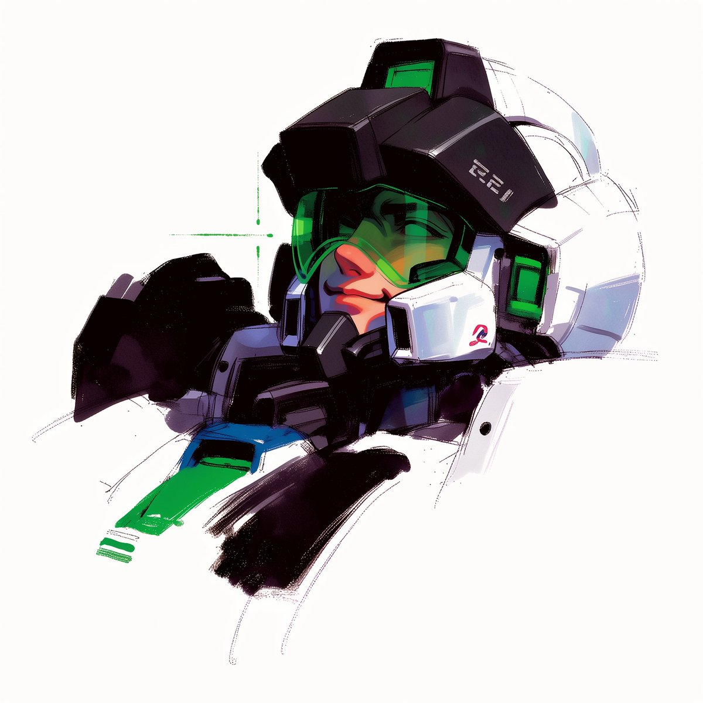

## convert anime characters into realistic human portraits 

- ID: trending-2029149670061064470
- Slug: trending-2029149670061064470-en
- 语言: en
- 来源: [来源链接](https://x.com/underwoodxie96/status/2029149670061064470)
- 样例图路径: images/part1/2029149670061064470_1.jpg

### 提示词

```text
convert anime characters into realistic human portraits  Convert  character into a photorealistic live-action portrait / fashion editorial photograph, modern cinematic style, high-fashion grade, punchy but natural contrast, refined filmic color science, subtle halation and lens bloom, controlled highlights, soft roll-off, realistic skin pores and texture, lifelike hair strands, premium fabric/material rendering, studio-quality lighting with natural depth, preserve the original camera framing and composition exactly, no text, no logo.
```

### 样例图

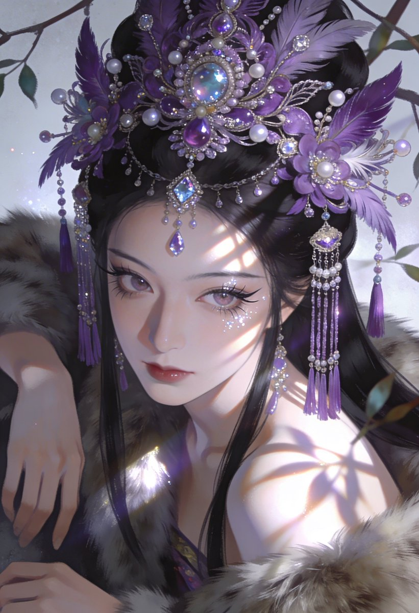

## Ultra-clean modern recipe infographic. Showcase [FOOD] i

- ID: trending-2012985517139255644
- Slug: trending-2012985517139255644-en
- 语言: en
- 来源: [来源链接](https://x.com/TechieBySA/status/2012985517139255644)
- 样例图路径: images/part1/2012985517139255644_1.jpg

### 提示词

```text
Ultra-clean modern recipe infographic. Showcase [FOOD] in a visually appealing finished form—sliced, plated, or portioned—floating slightly in perspective or angled view. Arrange ingredients, steps, and tips around the dish in a dynamic editorial layout, not restricted to top-down. Ingredients Section: Include icons or mini illustrations for each ingredient with quantities. Arrange them in clusters, lists, or circular flows connected visually to the dish. Steps Section: Show preparation steps with numbered panels, arrows, or lines, forming a logical flow around the main dish. Include small cooking icons (knife, pan, oven, timer) where helpful. Additional Info (optional): Total calories, prep/cook time, servings, spice level—displayed as clean bubbles or badges near the dish. Visual Style: Editorial infographic meets lifestyle food photography. Vibrant, natural food colors, subtle drop shadows, clean vector icons, modern typography, soft gradients or glassmorphism for step panels. Accent colors can highlight key info (calories, prep time). Composition Guidelines: Finished meal as hero visual (perspective or angled) Ingredients and steps flow dynamically around the dish Clear visual hierarchy: dish > steps > ingredients > optional stats Enough negative space to keep design airy and readable Lighting & Background: Soft, natural studio lighting, minimal textured or gradient background for premium editorial feel. Output: 1080×1080, ultra-crisp, social-feed optimized, no watermark
```

### 样例图

![Ultra-clean modern recipe infographic. Showcase [FOOD] i](../images/part1/2012985517139255644_1.jpg)

## A cinematic studio portrait of a woman seated at a textu

- ID: trending-2010213849618886946
- Slug: trending-2010213849618886946-en
- 语言: en
- 来源: [来源链接](https://x.com/AIwithSynthia/status/2010213849618886946)
- 样例图路径: images/part1/2010213849618886946_1.jpg

### 提示词

```text
A cinematic studio portrait of a woman seated at a textured stone table against a muted warm gray background. She wears a dark brown satin blouse, subtle evening makeup, and softly layered shoulder-length hair. In front of her is a glass of cold brew coffee with ice and a metal straw. Placed beside it is a glossy 3D chibi figurine of the same woman, with a big rounded head, expressive eyes, soft blush cheeks, and simplified facial features, holding a miniature cold brew glass. The chibi has a high-quality collectible toy look with gentle reflections. Intimate evening café vibe, moody soft lighting, shallow depth of field, realistic human combined with stylized 3D character, cinematic and cozy, 1:1 aspect ratio.
```

### 样例图

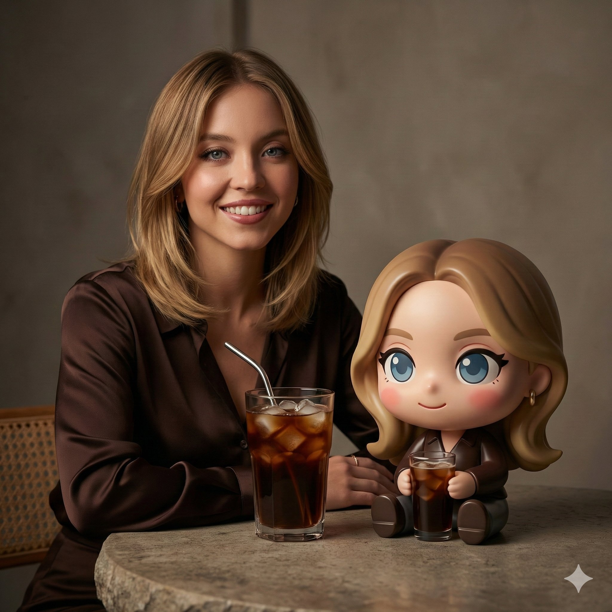

## { "renderEngine": "Blender Cycles / Unreal Engine 5 Lume

- ID: trending-2031735211772317828
- Slug: trending-2031735211772317828-en
- 语言: en
- 来源: [来源链接](https://x.com/Xaroon_x/status/2031735211772317828)
- 样例图路径: images/part1/2031735211772317828_1.jpg

### 提示词

```text
{
  "renderEngine": "Blender Cycles / Unreal Engine 5 Lumen",
  "baseStyle": "Stylized 3D CGI character — Pixar meets high-fashion editorial",
  "proportions": "Slightly enlarged head (1.3x natural), compact torso, simplified facial features, exaggerated chunky feet/shoes",
  "skinShader": "Subsurface scattering with physically-based roughness, no pores, smooth cartoon-like finish",
  "clothingPhysics": "Marvelous Designer simulation baked in, wrinkle maps, fabric-specific material shaders",
  "furTech": "XGen or Ornatrix volumetric fur for faux-fur pieces, physics-simulated",
  "resolution": "8192x8192px minimum, 300DPI",
  "backgroundStyle": "Solid flat color, no gradient, no texture — studio seamless backdrop",
  "lightingRig": "Three-point studio: key (45° front-top), fill (opposite side soft), rim (back edge definition)",
  "cameraLens": "35-50mm equivalent, slight vignette, no fisheye",
  "postProcessing": "Subtle chromatic aberration on edges, mild film grain 2%, slight color grade"
}
```

### 样例图

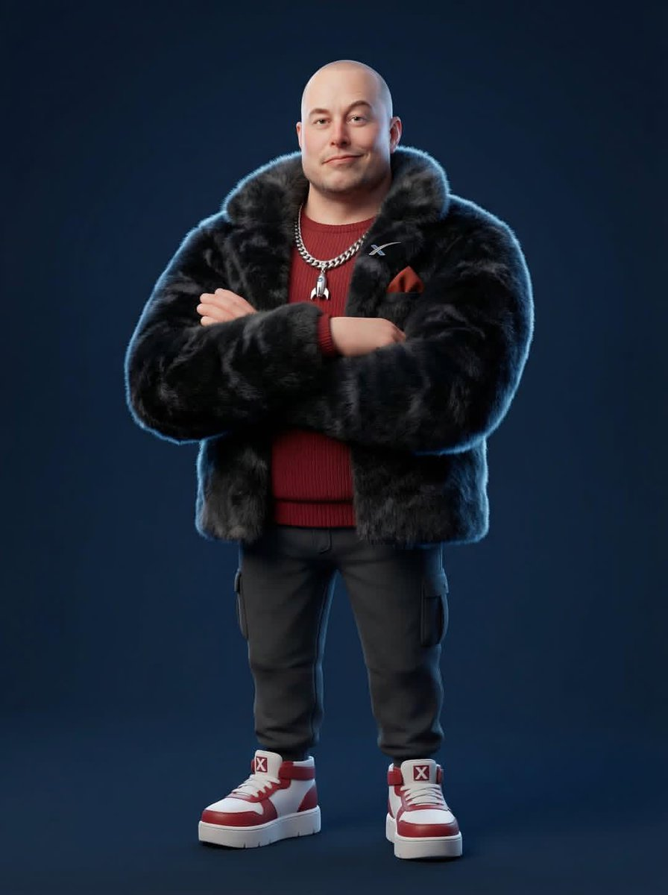

## She kneels in a pristine white studio, shot from a low m

- ID: trending-2009446845358186930
- Slug: trending-2009446845358186930-en
- 语言: en
- 来源: [来源链接](https://x.com/Strength04_X/status/2009446845358186930)
- 样例图路径: images/part1/2009446845358186930_1.jpg

### 提示词

```text
She kneels in a pristine white studio, shot from a low mid angle with a slight upward tilt that emphasizes quiet dominance. She wears a Y2K inspired brown and olive raglan tee with a worn retro star logo reading sssap, paired with oversized distressed wide leg denim cargos and chunky black streetwear shoes. Her messy ponytail and loose strands frame a sharp, defiant gaze, softened by large black wired headphones adding a cyber edge. Soft diffused studio lighting reveals fabric texture and subtle shadows, while her provocative yet controlled expression channels indie sleaze mixed with Harajuku editorial rebellion.
```

### 样例图

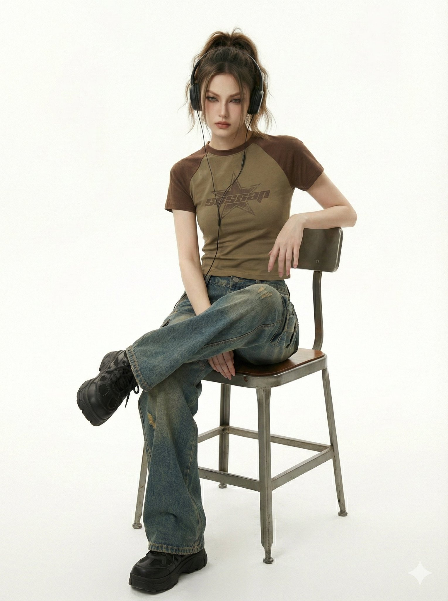

## <instructions> Role: You are a Lead 3D Artist at a premi

- ID: trending-2010411888434417944
- Slug: trending-2010411888434417944-en
- 语言: en
- 来源: [来源链接](https://x.com/Gdgtify/status/2010411888434417944)
- 样例图路径: images/part1/2010411888434417944_1.jpg

### 提示词

```text
<instructions> 
Role: You are a Lead 3D Artist at a premium collectible company  
Input Variable: [INSERT COUNTRY]
System Instruction:
Generate a 2x2 Grid of High-Fidelity Designer Vinyl dioramas.
Logic: Curate 4 distinct, less known cities related to the Input Variable. Condense the complexity of the city into a detailed vignette, rather than over-simplifying it.
1. The Toy Physics (The "Premium" Rule):
Geometry: High-Fidelity Vinyl. Maintain the specific architectural silhouette of the region (e.g., if the city has pagodas, keep the tiers; if it has domes, keep the arches).
Detailing: Use "Intricate Softness." Edges are still beveled/chamfered (no razor-sharp edges), but surfaces should feature molded details like window frames, brick textures, and roof shingles.
Density: The scene should feel "lived-in" and dense. Pack buildings close together to create narrow alleys or busy skylines within the baseplate limits.
Material: Premium Matte Vinyl with slight subsurface scattering. It should look expensive and substantial.
2.  Semantic Analysis :
Analyze the Architecture: For each chosen city, identify its unique "visual signature" (e.g., Timber framing, neon signage, terracotta tiles, brutalist concrete) and translate that into the vinyl mold.
Analyze the Geography: If the city is coastal, mold waves into the base. If it is mountainous, stack the buildings vertically.
3. Container:
The Base: Thick, rounded-square baseplate.
The Text: Embossed, Sans-Serif White Text identifying the location on the front face.
Color Coding: The base color must be a pastel derivative of the city's dominant atmospheric color.
4. Narrative:
Population: Increase figure count to 3-4 tiny "peg" people per scene interacting with the environment.
Props: Include specific regional props (e.g., vending machines, street lamps, market stalls) to add scale and clutter.
5. Render Settings:
Lighting: Bright, soft Global Illumination. Ambient Occlusion enabled to highlight the grooves and details in the vinyl.
Palette: Rich & Muted. Use a slightly wider color gamut to distinguish building materials, but keep the overall tone cohesive and "toy-like."
Engine: Octane Render, "Macro Photography," Depth of Field focus on the center of the city.
Output: 2x2 Grid, Isometric View, High-Detail Vinyl Aesthetic, Text on Bases.  </instructions>
```

### 样例图

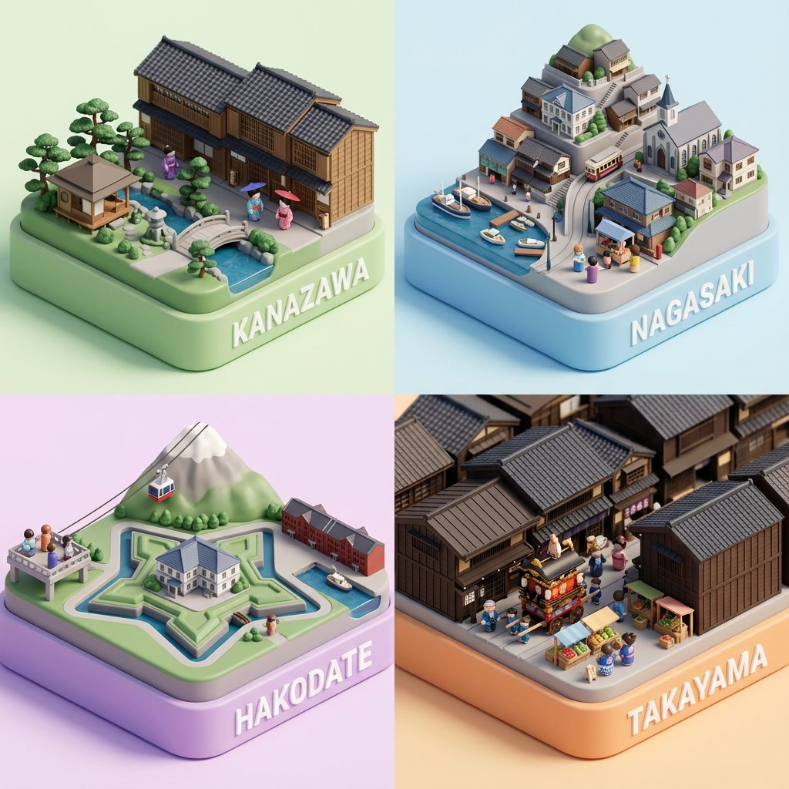

## A [ORDINARY OBJECT] as a landmark on an epic journey, ti

- ID: trending-2011484706777546780
- Slug: trending-2011484706777546780-en
- 语言: en
- 来源: [来源链接](https://x.com/AllaAisling/status/2011484706777546780)
- 样例图路径: images/part1/2011484706777546780_1.jpg

### 提示词

```text
A [ORDINARY OBJECT] as a landmark on an epic journey, tiny [TRAVELERS] resting in its shadow after crossing vast distances visible behind them. Caravans, pack animals, exhausted families. The object marks the halfway point, or the border, or the promised destination. Graffiti and carvings from generations of previous travelers cover its surfaces. Offerings left at its base. Some travelers stay, building permanent settlement. Others push on. Golden hour lighting, dust from the journey still settling, the mundane as waypoint.
```

### 样例图

![A [ORDINARY OBJECT] as a landmark on an epic journey, ti](../images/part1/2011484706777546780_1.jpg)

## A flat-lay collection of exactly 9 hyper-realistic 3D re

- ID: trending-2040134478203416799
- Slug: trending-2040134478203416799-en
- 语言: en
- 来源: [来源链接](https://x.com/TechieBySA/status/2040134478203416799)
- 样例图路径: images/part1/2040134478203416799_1.jpg

### 提示词

```text
A flat-lay collection of exactly 9 hyper-realistic 3D resin fridge magnets arranged on a plain matte white surface, themed around [COUNTRY]. At the very top center, a wide rectangular text magnet spells "COUNTRY" in bold 3D block letters colored in the nation's flag colors. Below it, 8 magnets are arranged in a loose 3-column grid: 3 iconic architectural landmarks as highly detailed sculpted miniature reliefs (cathedrals, towers, castles, monuments), 1 famous painting or portrait reproduced inside a gold ornate picture frame magnet, 1 traditional food dish and 1 drink (wine bottle + glass, or beer stein, etc.) as glossy ceramic sculpted magnets, 1 illustrated vintage-style map magnet of the country with city markers, and 1 additional cultural symbol or landmark. Each magnet has a slightly raised 3D sculpted look with soft drop shadows on the white surface beneath. Warm studio lighting from above, photorealistic product render, perfectly clean white background, top-down flat-lay angle, 4:5 aspect ratio.
```

### 样例图

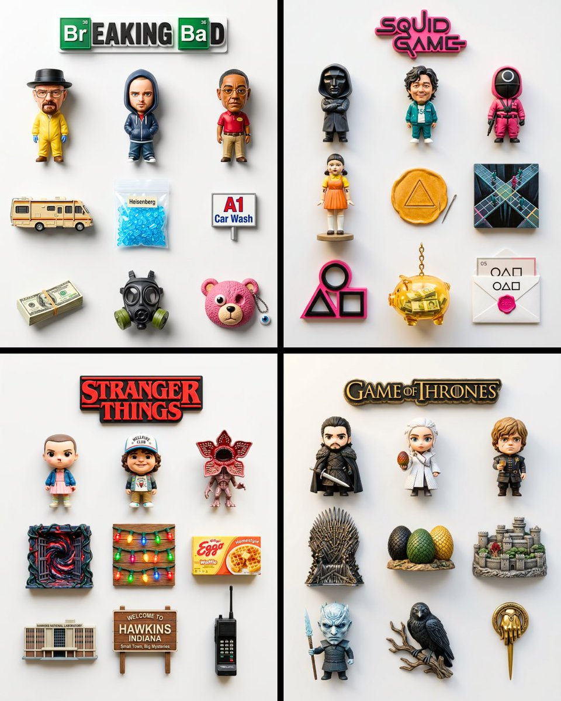

## Create an infographic image of Mustang GTD combining a r

- ID: trending-2018276369353015519
- Slug: trending-2018276369353015519-en
- 语言: en
- 来源: [来源链接](https://x.com/Strength04_X/status/2018276369353015519)
- 样例图路径: images/part1/2018276369353015519_1.jpg

### 提示词

```text
Create an infographic image of Mustang GTD  combining a realistic photograph or photorealistic render of the object with technical annotation overlays placed directly on top.

Use black ink–style line drawings and text (blue Mustang GTD   ) on a pure white studio background.

Include:
•Key component labels
•Internal cutaway or exploded-view outlines (where relevant)
•Measurements, dimensions, and scale markers
•Material callouts and quantities
•Arrows indicating function, force, or flow (all the functions that comes with bugatti Chiron)
•Simple schematic or sectional diagrams where applicable

Place the title Mustang GTD  inside a real technical annotation box in one corner.

Style & layout rules:
•The real object remains clearly visible beneath the annotations(no annotation on the real object)
•Annotations look hand-sketched, technical, and architectural
•Clean composition with balanced negative space
•Educational, museum-exhibit / engineering-manual vibe

Visual style:
Minimal technical illustration aesthetic.
Black linework layered over realistic imagery.
Precise but slightly hand-drawn feel.

Color palette:
Pure white background.
Black annotation lines and text only.
No colors.

Output:
1080 × 1080 resolution
Ultra-crisp
Social-feed optimized
No watermark
```

### 样例图

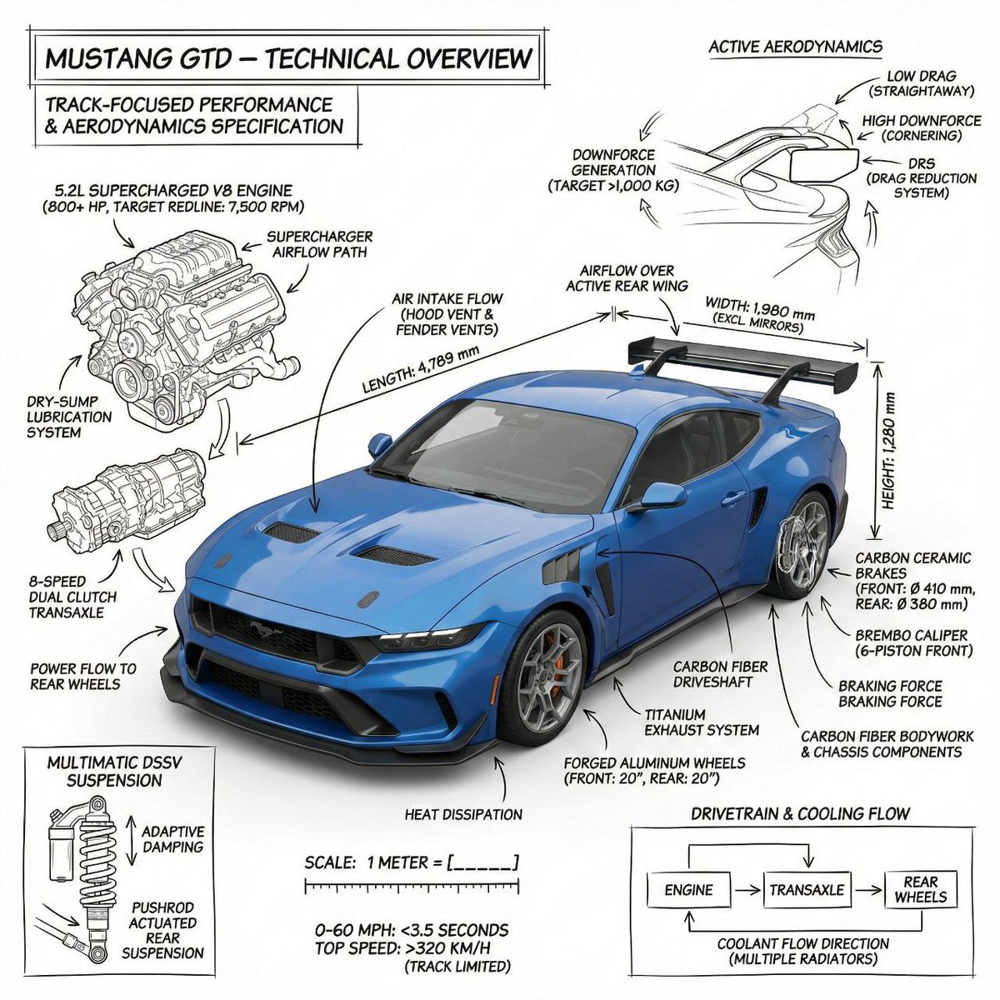

## A cute, cinematic brand fantasy scene featuring a fluffy

- ID: trending-2008912370551357865
- Slug: trending-2008912370551357865-en
- 语言: en
- 来源: [来源链接](https://x.com/Strength04_X/status/2008912370551357865)
- 样例图路径: images/part1/2008912370551357865_1.jpg

### 提示词

```text
A cute, cinematic brand fantasy scene featuring a fluffy white teddy bear mascot emerging from a chilled soda Coca-Cola can, holding a colorful striped straw.

The can is placed inside a glowing refrigerator filled with neatly stacked glass soda bottles. Soft neon lighting, pastel reflections, condensation droplets on metal, playful yet premium advertising style. Shallow depth of field, ultra-detailed fur texture, glossy highlights, vibrant red-and-white color pal-ette, whimsical mood, Pixar-level realism, stu-dio-quality lighting, high contrast, square composi-tion, 1080×1080, ultra-HD, commercial brand photog-raphy.
```

### 样例图

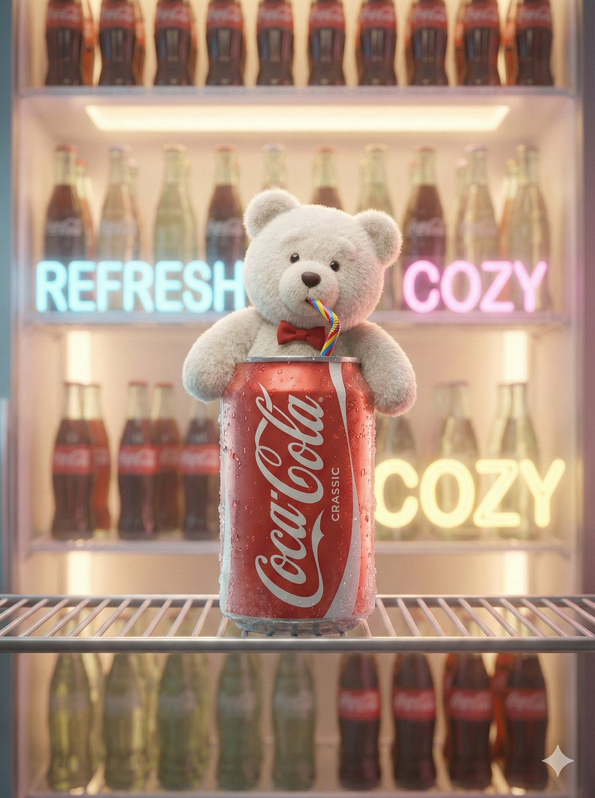

## Create a collection of icons representing [Month] throug

- ID: trending-2010302396355026978
- Slug: trending-2010302396355026978-en
- 语言: en
- 来源: [来源链接](https://x.com/aleenaamiir/status/2010302396355026978)
- 样例图路径: images/part1/2010302396355026978_1.jpg

### 提示词

```text
Create a collection of icons representing [Month] through objects, symbols, and moods.
They belong together as a single cohesive theme.
The background is pure white.

Place the month name “[MONTH]” at the top center of the image as a minimal, balanced title, aligned symmetrically above the grid and visually integrated with the overall design.

Icons are rendered in a colorful yet calm 3D style, with season-appropriate textures and atmospheric lighting that reflect the essence of [MONTH].

Maintain consistent proportions, materials, and visual language across all icons and the title.
```

### 样例图

![Create a collection of icons representing [Month] throug](../images/part1/2010302396355026978_1.jpg)

## Create a cinematic 3D typographic composition spelling [

- ID: trending-2018966979013644422
- Slug: trending-2018966979013644422-en
- 语言: en
- 来源: [来源链接](https://x.com/aleenaamiir/status/2018966979013644422)
- 样例图路径: images/part1/2018966979013644422_1.jpg

### 提示词

```text
Create a cinematic 3D typographic composition spelling [WORD / NAME], where each letter is sculpted from the personality, environment, and emotional arc of [CHARACTER / STORY].

Letters are formed using clothing textures, symbolic props, architecture, and lighting motifs tied to different moments of the narrative.

No literal faces — identity is conveyed through silhouettes, posture, materials, and atmosphere. Use premium metallic or stone materials with subtle wear.

Dark cinematic background, dramatic rim lighting, deep shadows, ultra-realistic render, film-title quality.
```

### 样例图

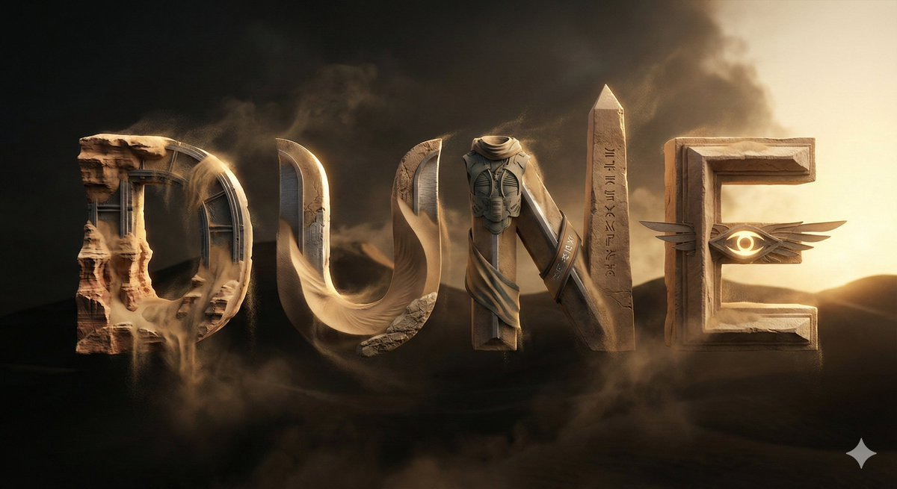

## Create an isometric miniature 3D diorama highlighting th

- ID: trending-2019267462647439770
- Slug: trending-2019267462647439770-en
- 语言: en
- 来源: [来源链接](https://x.com/aleenaamiir/status/2019267462647439770)
- 样例图路径: images/part1/2019267462647439770_1.jpg

### 提示词

```text
Create an isometric miniature 3D diorama highlighting the natural landmark [NATURAL WONDER] from [COUNTRY NAME/PLANET].

Use a 40–45° top-down view. Textures look organic and realistic with PBR materials. Lighting feels soft and atmospheric.

The raised base shows terrain layers, vegetation, and surrounding geography. Add tiny stylized explorers or wildlife with no facial details.

Background remains solid [BACKGROUND COLOR].

Top center text displays [COUNTRY NAME] in bold.
Second line shows [NATURAL WONDER]. Place a minimal nature icon below. Text automatically adapts for contrast.
```

### 样例图

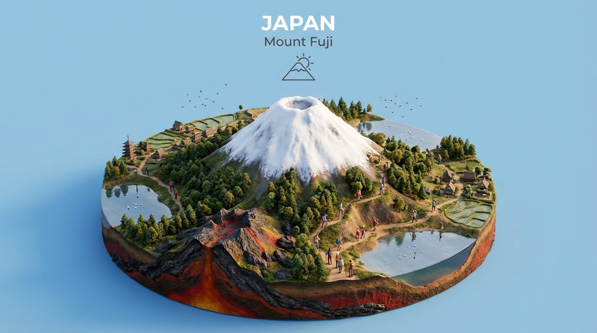

## Miniature, full-body, isometric, ultra-realistic figurin

- ID: trending-2011074818524029242
- Slug: trending-2011074818524029242-en
- 语言: en
- 来源: [来源链接](https://x.com/TechieBySA/status/2011074818524029242)
- 样例图路径: images/part1/2011074818524029242_1.jpg

### 提示词

```text
Miniature, full-body, isometric, ultra-realistic figurine of [CHARACTER], wearing their most iconic outfit and colors, in a signature pose or action, instantly recognizable silhouette and expression, clean white studio background, minimal composition, soft realistic shadows, cinematic lighting, hyper-detailed textures, 4K quality
```

### 样例图

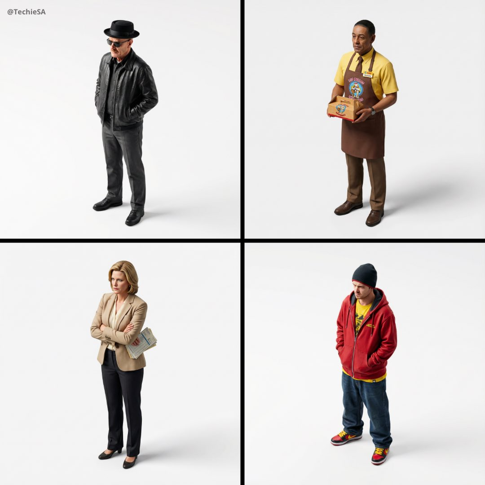

## A flat-lay collection of exactly 9 hyper-realistic 3D re

- ID: trending-2040075769448214791
- Slug: trending-2040075769448214791-en
- 语言: en
- 来源: [来源链接](https://x.com/TechieBySA/status/2040075769448214791)
- 样例图路径: images/part1/2040075769448214791_1.jpg

### 提示词

```text
A flat-lay collection of exactly 9 hyper-realistic 3D resin fridge magnets arranged on a plain matte white surface, themed around [COUNTRY]. At the very top center, a wide rectangular text magnet spells "COUNTRY" in bold 3D block letters colored in the nation's flag colors. Below it, 8 magnets are arranged in a loose 3-column grid: 3 iconic architectural landmarks as highly detailed sculpted miniature reliefs (cathedrals, towers, castles, monuments), 1 famous painting or portrait reproduced inside a gold ornate picture frame magnet, 1 traditional food dish and 1 drink (wine bottle + glass, or beer stein, etc.) as glossy ceramic sculpted magnets, 1 illustrated vintage-style map magnet of the country with city markers, and 1 additional cultural symbol or landmark. Each magnet has a slightly raised 3D sculpted look with soft drop shadows on the white surface beneath. Warm studio lighting from above, photorealistic product render, perfectly clean white background, top-down flat-lay angle, 4:5 aspect ratio
```

### 样例图

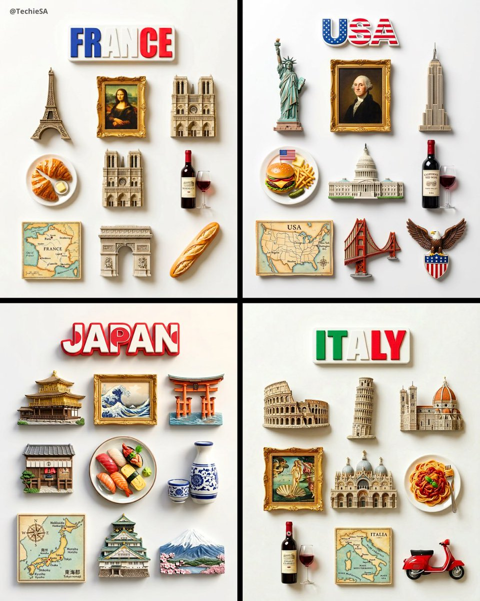

## A clean, minimal 3D isometric diorama of a [EXHIBITION T

- ID: trending-2012411445724713338
- Slug: trending-2012411445724713338-en
- 语言: en
- 来源: [来源链接](https://x.com/aleenaamiir/status/2012411445724713338)
- 样例图路径: images/part1/2012411445724713338_1.jpg

### 提示词

```text
A clean, minimal 3D isometric diorama of a [EXHIBITION TYPE], featuring [DISPLAY OBJECTS] arranged within a [POD STRUCTURE], subtle lighting accents, smooth floor surfaces, soft studio lighting, realistic materials, rounded edges, miniature architectural model style, high detail, neutral background.
```

### 样例图

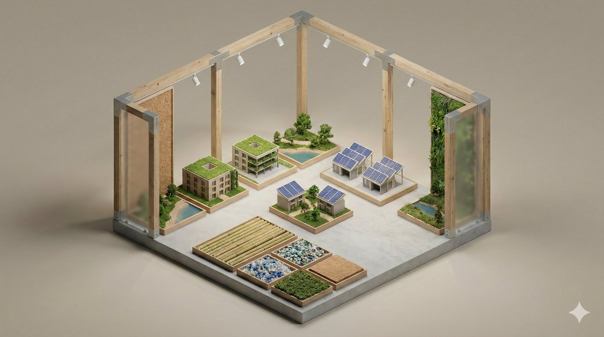

## Stylized, ultra high-fidelity 3D isometric miniature dio

- ID: trending-2011815709739802811
- Slug: trending-2011815709739802811-en
- 语言: en
- 来源: [来源链接](https://x.com/TechieBySA/status/2011815709739802811)
- 样例图路径: images/part1/2011815709739802811_1.jpg

### 提示词

```text
Stylized, ultra high-fidelity 3D isometric miniature diorama, 35–40° isometric view, palm-sized collectible scale, ultra-clean geometry with realistic micro-detail, soft studio lighting from top-left, gentle ambient occlusion, subtle soft shadows, neutral color grading, museum-quality product render, displayed on a simple matte rectangular base, seamless all-white background, 1080x1080. [MOVIE SCENE].
```

### 样例图

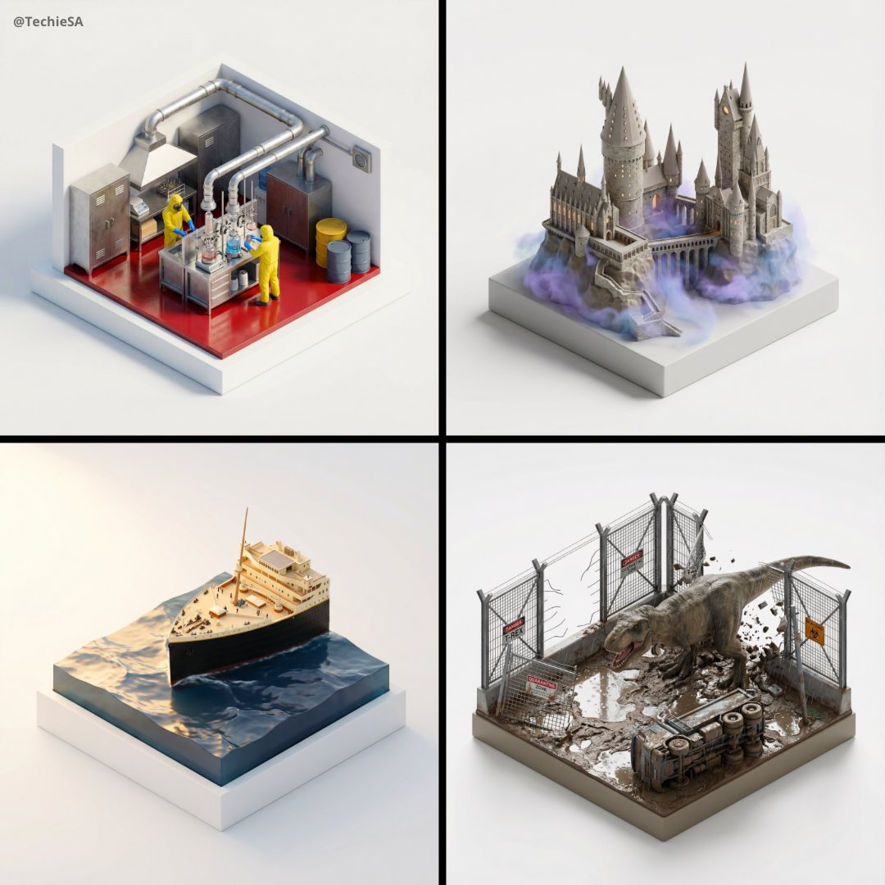

## Generate a hyper-realistic digital illustration of a cak

- ID: trending-2029164036588241196
- Slug: trending-2029164036588241196-en
- 语言: en
- 来源: [来源链接](https://x.com/TechieBySA/status/2029164036588241196)
- 样例图路径: images/part1/2029164036588241196_1.jpg

### 提示词

```text
Generate a hyper-realistic digital illustration of a cake meticulously stylized to resemble a [LOGO] resting on a pristine white table. Show it partially bitten to reveal multiple delicious layers (sponge, frosting, crumbs) and shatter the illusion. Capture the moment of surprise with intricate details in the bite mark. Use a slightly overhead angle to emphasize the contrast between the realistic outer shell and the cake interior. Illuminate the scene with soft, diffused lighting to enhance textures and cast subtle shadows for depth. Keep the background minimal and bright to focus on the deceptive dessert. Employ a vibrant, playful palette for the cake layers against the object-mimicking exterior. Render in a photorealistic style with whimsical undertones, making the reveal both visually convincing and appetizing.
```

### 样例图

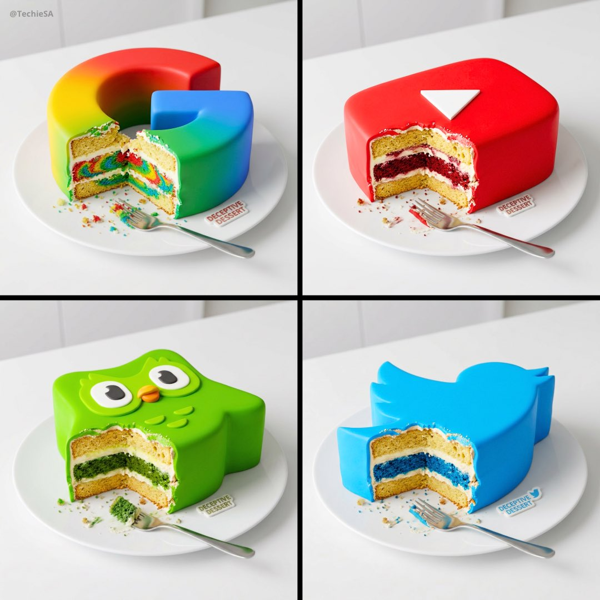

## A hyper-realistic 3D photo concept showing a hand holdin

- ID: trending-2037633578519965864
- Slug: trending-2037633578519965864-en
- 语言: en
- 来源: [来源链接](https://x.com/TechieBySA/status/2037633578519965864)
- 样例图路径: images/part1/2037633578519965864_1.jpg

### 提示词

```text
A hyper-realistic 3D photo concept showing a hand holding a square polaroid photo labeled “ELEMENT”. Inside the photo, there’s a close-up of [ELEMENT], and it flows seamlessly out of the photo frame into the real world, naturally interacting with the surface below. The text “ELEMENT” appears printed cleanly on the white border of the photo. Realistic cinematic lighting, ultra-detailed textures, artistic composition, 1080x1080 square format.
```

### 样例图

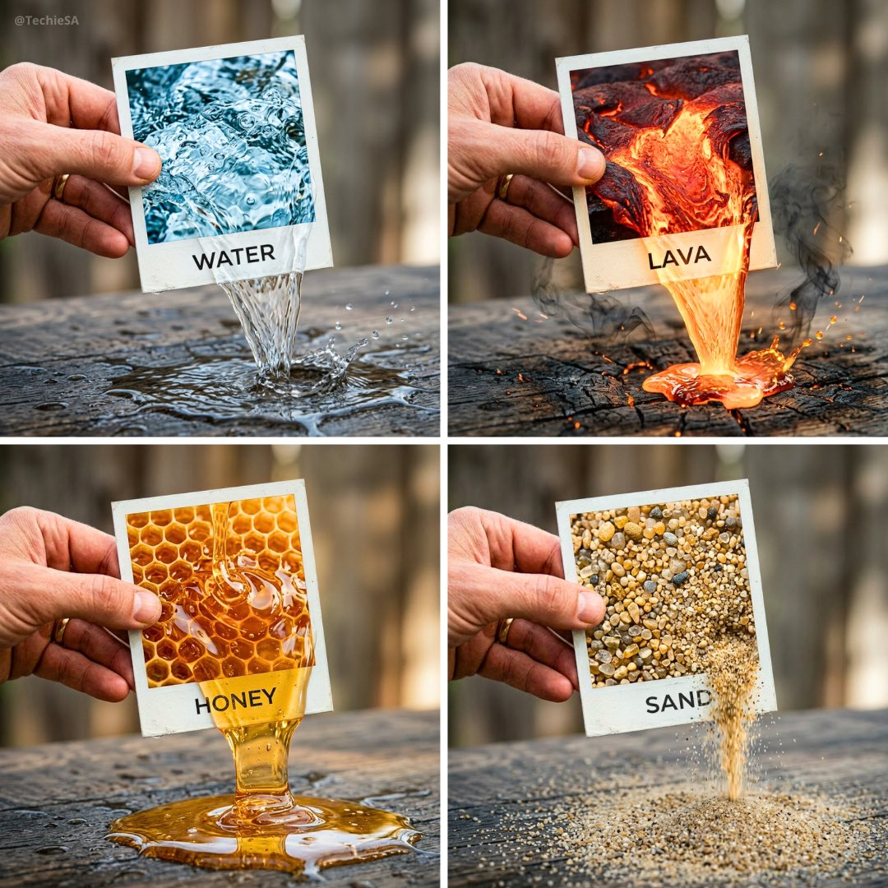

## A Pixar-style 3D animated character of a single banana. 

- ID: trending-2025388911451848929
- Slug: trending-2025388911451848929-en
- 语言: en
- 来源: [来源链接](https://x.com/Strength04_X/status/2025388911451848929)
- 样例图路径: images/part1/2025388911451848929_1.jpg

### 提示词

```text
A Pixar-style 3D animated character of a single banana. Handsome male character with sharp confident eyes, thick stylish eyebrows, and a wide charismatic grin showing bright white sparkling teeth. Smooth slightly glossy yellow peel texture with subtle highlights. The banana has small cartoon arms and legs, standing upright with arms crossed in a proud hero-like pose. Teeth are shiny and perfectly white with small sparkle effects. In the background, a bunch of bananas is slightly blurred.The character is standing on a wooden dining table near a sunny window in a cozy modern home. Vibrant colors, cinematic lighting, soft shadows, high-fidelity textures, ultra-detailed.
```

### 样例图

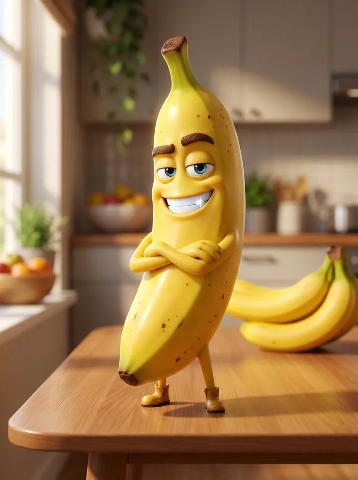

## “Build an isometric miniature 3D diorama explaining the 

- ID: trending-2020421019002147321
- Slug: trending-2020421019002147321-en
- 语言: en
- 来源: [来源链接](https://x.com/aleenaamiir/status/2020421019002147321)
- 样例图路径: images/part1/2020421019002147321_1.jpg

### 提示词

```text
“Build an isometric miniature 3D diorama explaining the environmental impact of [ACTIVITY OR PRODUCT].

Viewpoint stays near 45° from above.
Textures look realistic and balanced. Lighting feels soft and clear. The raised base splits into cause, impact, and outcome sections. Include visual indicators like meters, symbols, or levels.

Tiny stylized figures represent people, wildlife, or infrastructure. Figures have heavy facial details.

Background remains solid [BACKGROUND COLOR].
Top center text reads [TOPIC NAME] in bold.

Subtitle states the key impact in one line. A minimal environment icon appears below. Text switches between white or black for contrast.”
```

### 样例图

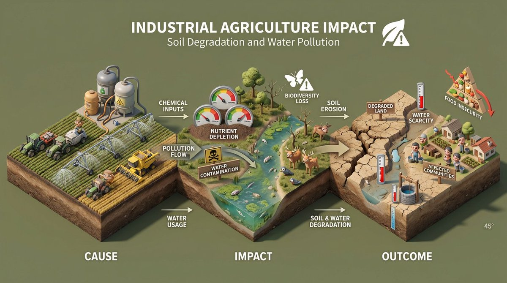

## Present a clear, 45° top-down isometric miniature 3D car

- ID: trending-2045553905128358040
- Slug: trending-2045553905128358040-en
- 语言: en
- 来源: [来源链接](https://x.com/TechieBySA/status/2045553905128358040)
- 样例图路径: images/part1/2045553905128358040_1.jpg

### 提示词

```text
Present a clear, 45° top-down isometric miniature 3D cartoon scene of the historical event “EVENT”, featuring its most iconic moment: [DESCRIPTION]. Use soft refined textures, realistic PBR materials, and gentle lifelike lighting.
Create a small raised diorama-style base that includes the most recognizable elements of this moment, along with tiny stylized characters if needed (no facial details).
Use a clean solid [BACKGROUND COLOR] background.

At the top-center, display “EVENT” in large bold text, directly beneath it show a short descriptive subtitle in medium text, and place a small official symbol or simplified icon below the subtitle.
All text must automatically match the background contrast (white or black).

Composition: perfectly centered layout, square 1080x1080, ultra-clean, high-clarity diorama aesthetic.
```

### 样例图

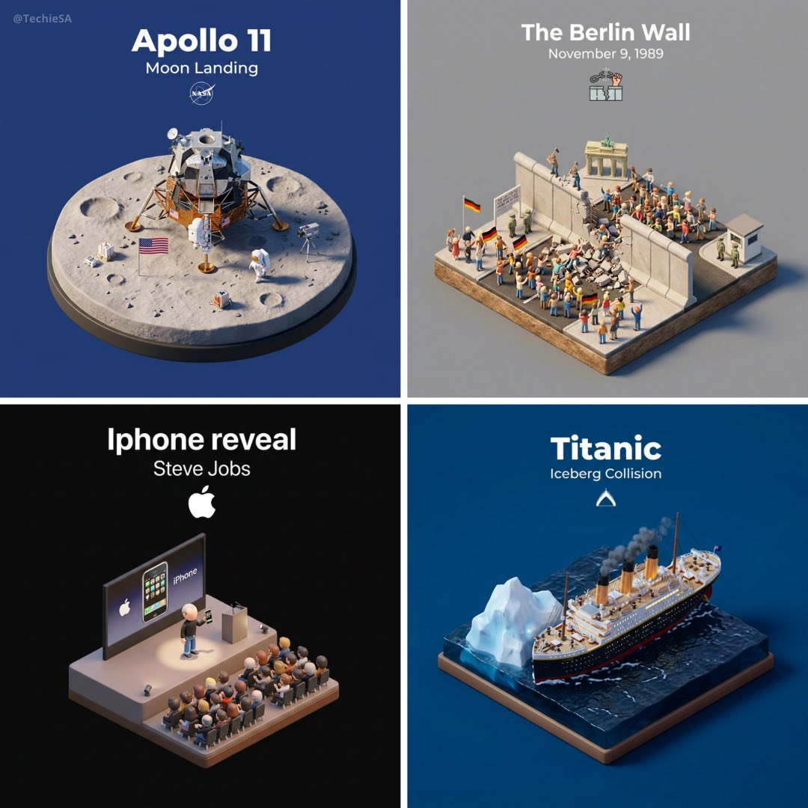

## { "ultra_high_fidelity_request": { "subject": "[PRODUCT]

- ID: trending-2021382862193426822
- Slug: trending-2021382862193426822-en
- 语言: en
- 来源: [来源链接](https://x.com/lloydcreates/status/2021382862193426822)
- 样例图路径: images/part1/2021382862193426822_1.jpg

### 提示词

```text
{
  "ultra_high_fidelity_request": {
    "subject": "[PRODUCT]",
    "framing": {
      "position": "Strictly centered and levitating",
      "boundary": "Full product visibility, zero cropping, isolated in 3D space",
      "background": "Solid pure black hex #000000"
    },
    "optical_effects": {
      "iridescence": "Extremely brilliant spectral iridescence, vivid neon oil-slick gradients",
      "volumetric": "Internal volumetric lighting, ethereal inner glow, light scattering within the material",
      "refraction": "High-index caustic light refraction, prismatic color splitting at the edges",
      "luminosity": "Super-saturated holographic highlights, intense electric blues and deep magentas"
    },
    "material_finish": {
      "texture": "Ultra-glossy liquid-smooth finish",
      "base": "Deep translucent obsidian glass with infinite depth",
      "reflections": "Crisp ray-traced mirror reflections of an invisible light source"
    },
    "negative_constraints": [
      "No platforms", "No floor", "No light boxes", "No softboxes", 
      "No props", "No text", "No shadows on surfaces", "No pedestals"
    ]
  }
}
```

### 样例图

![{ "ultra_high_fidelity_request": { "subject": "[PRODUCT]](../images/part1/2021382862193426822_1.jpg)

## Maintaining the facial features of all creatures… chibi 

- ID: trending-2026724320953741362
- Slug: trending-2026724320953741362-en
- 语言: en
- 来源: [来源链接](https://x.com/TechieBySA/status/2026724320953741362)
- 样例图路径: images/part1/2026724320953741362_1.jpg

### 提示词

```text
Maintaining the facial features of all creatures…
chibi styled 3d, wearing rapper outfit style, babyoversized head and small body (chibi proportions), preserving the person’s recognizable facial features and likeness. Stylized
realistic but cartoonish, smooth textures, expressive face, big eyes. Full-body character wearing typical streetwear clothing and accessories, including diamond chains. High-quality 3D lighting, vibrant colors, playful proportions, style. Clean DARK BLUE background, studio lighting, sharp focus.
```

### 样例图

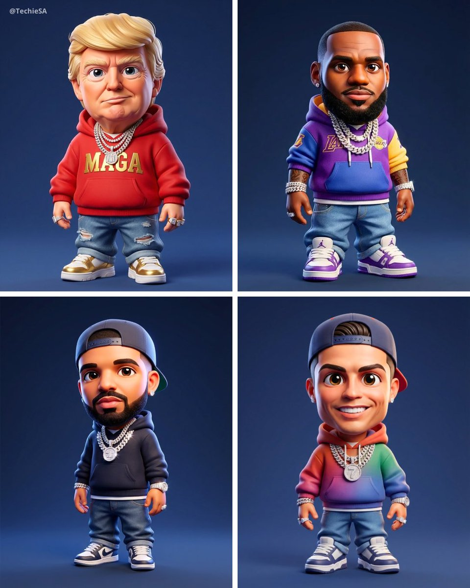

## A cute stylized 3D cartoon character (boy/girl) with big

- ID: trending-2041739710490726845
- Slug: trending-2041739710490726845-en
- 语言: en
- 来源: [来源链接](https://x.com/Taaruk_/status/2041739710490726845)
- 样例图路径: images/part1/2041739710490726845_1.jpg

### 提示词

```text
A cute stylized 3D cartoon character (boy/girl) with big expressive eyes, soft smooth skin, and round facial features, wearing glasses and a casual striped t-shirt, holding a professional DSLR camera. The character is emerging through a torn paper hole in a clean white wall, with realistic ripped paper edges and depth. Behind the hole is a bright blue gradient background, creating contrast. The character is smiling directly at the viewer, vibrant and friendly mood, Pixar-style rendering, ultra-detailed textures, soft studio lighting, high realism, 8K resolution.
```

### 样例图


## A Pixar-style 3D animated character of a single red appl

- ID: trending-2025495088668008917
- Slug: trending-2025495088668008917-en
- 语言: en
- 来源: [来源链接](https://x.com/Strength04_X/status/2025495088668008917)
- 样例图路径: images/part1/2025495088668008917_1.jpg

### 提示词

```text
A Pixar-style 3D animated character of a single red apple. Handsome male character with sharp confident eyes, thick stylish eyebrows, and a wide charismatic grin showing bright white sparkling teeth. Smooth slightly glossy red skin texture with subtle highlights and natural gradients. The apple has small cartoon arms and legs, standing upright with arms crossed in a proud hero-like pose.

Teeth are shiny and perfectly white with small sparkle effects. In the background, a basket of apples is slightly blurred. The character is standing on a wooden dining table near a sunny window in a cozy modern home. Vibrant colors, cinematic lighting, soft shadows, high-fidelity textures, ultra-detailed, 8k.
```

### 样例图

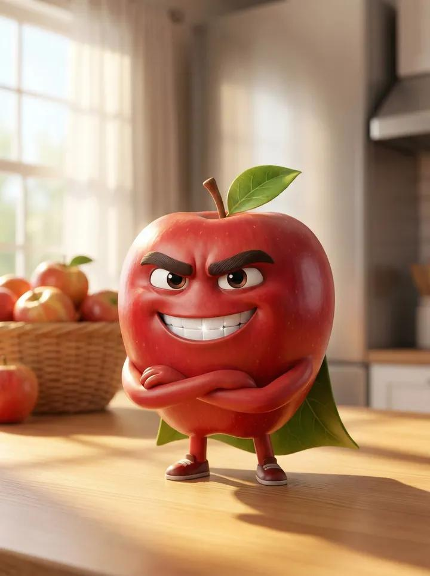

## 3D stylized character portrait of a young man, curly dar

- ID: trending-2029817553288319295
- Slug: trending-2029817553288319295-en
- 语言: en
- 来源: [来源链接](https://x.com/Kashberg_0/status/2029817553288319295)
- 样例图路径: images/part1/2029817553288319295_1.jpg

### 提示词

```text
3D stylized character portrait of a young man, curly dark hair, wearing black round glasses and a dark hoodie, subtle smirk expression while looking sideways, small tattoo on the neck, smooth skin, highly detailed Pixar-style character design, soft studio lighting, clean light gray background, ultra-sharp, cinematic render, high detail, modern animated film style.
```

### 样例图

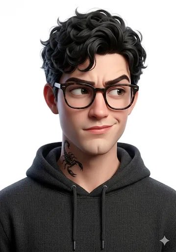

## soft, round face fuller cheeks small chin slightly large

- ID: trending-2038114762945655072
- Slug: trending-2038114762945655072-en
- 语言: en
- 来源: [来源链接](https://x.com/ChillaiKalan__/status/2038114762945655072)
- 样例图路径: images/part1/2038114762945655072_1.jpg

### 提示词

```text
soft, round face
fuller cheeks
small chin
slightly larger, expressive eyes (but still identity-consistent)
no beard, no sharp jawline, no adult features
Expression should be innocent, warm, and slightly playful, with a gentle smile and direct eye contact.
Body proportions should be cute and childlike (small, slightly chubby body, slightly larger head).

Pose: relaxed standing with hands behind the back, with a subtle natural tilt in head and shoulders to avoid stiffness.
Hair should match the reference but appear soft, slightly voluminous, and naturally styled, not overly sharp or artificial.
Skin should be soft and stylized, with subtle subsurface scattering (SSS) for a warm glow, matte finish (no plastic shine), and gentle natural blush on cheeks.
The character wears a half sleeves cotton sweater with a puzzle pattern, where:

colors are soft but lively and slightly vibrant
not oversaturated and not washed out
The fabric shows a realistic knit texture and soft folds
Lighting should be soft and cinematic:

key light from upper-left
gentle fill light
subtle rim light on hair
Background should be a rich blue gradient, brighter behind the subject and darker toward the edges, with smooth depth (not flat).
Output should be:

1:1 aspect ratio
mid-length framing (head to waist)
high-detail, clean 3D render
film-quality finish (not toy-like, not overly realistic)
```

### 样例图

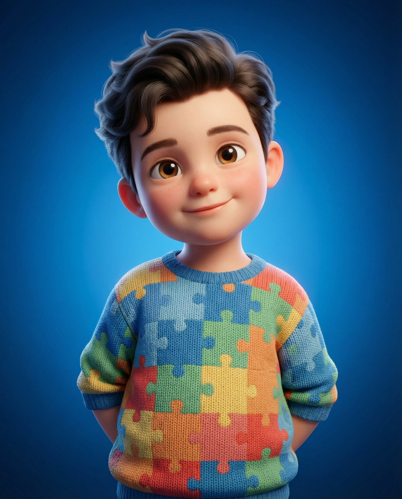

## High-quality stylized 3D CGI Pixar-style render, vertica

- ID: trending-2033551007062409422
- Slug: trending-2033551007062409422-en
- 语言: en
- 来源: [来源链接](https://x.com/TechieBySA/status/2033551007062409422)
- 样例图路径: images/part1/2033551007062409422_1.jpg

### 提示词

```text
High-quality stylized 3D CGI Pixar-style render, vertical 3:4 composition, three most iconic and recognizable cultural figures from [COUNTRY] captured as a chaotic and joyful bathroom mirror selfie; the most visually striking figure holds the large vintage camera up toward the mirror in their most authentic traditional costume, the remaining figures squeezed tightly into the frame each wearing their most iconic outfit and showing their most signature expression or pose; everyone crammed together filling the entire mirror frame with faces large and close to the camera, tightly packed with no empty space, chaotic crowded energy; facial proportions gently stylized in Disney/Pixar animation style with expressive eyes while faithfully preserving each character's most authentic cultural costume and recognizable traits; the bathroom mirror has realistic toothpaste splatters and water droplets; the reflection shows bold black Pixar-style lettering reading "[COUNTRY]❤️"; the bathroom background is styled to match the cultural identity of [COUNTRY] with authentic thematic props, traditional decorations and iconic landmark easter eggs placed naturally around the scene; lighting combines soft ambient bathroom lighting with a bright camera flash reflecting in the mirror; warm Pixar-style color grading, ultra-detailed 4K render, no watermark
```

### 样例图

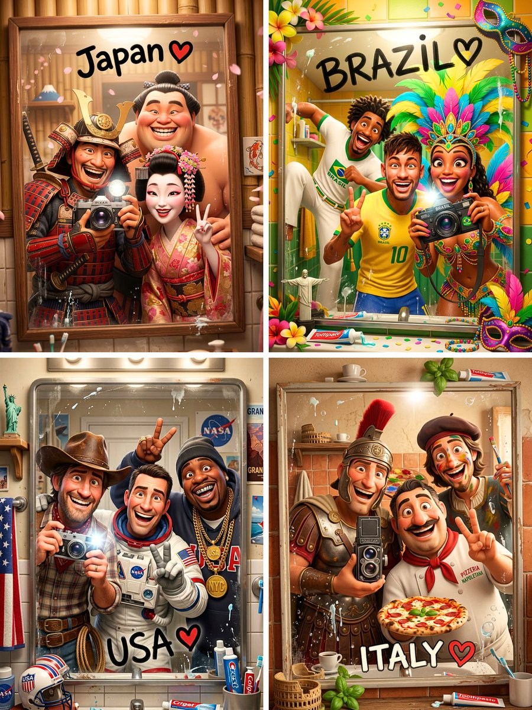

## { "prompt": "An open children’s picture book rests on a 

- ID: trending-2038525426084323378
- Slug: trending-2038525426084323378-en
- 语言: en
- 来源: [来源链接](https://x.com/Just_sharon7/status/2038525426084323378)
- 样例图路径: images/part1/2038525426084323378_1.jpg

### 提示词

```text
{
  "prompt": "An open children’s picture book rests on a wooden table, showing a whimsical illustration of a small brown seed in cartoon soil. A realistic human hand pours water from a tiny can, with a sparkling stream. Warm golden light, magical mood, overhead close-up, photorealistic, 4K.",
  "style": "photorealistic",
  "lighting": "warm golden",
  "mood": "magical",
  "perspective": "overhead close-up",
  "resolution": "4K",
  "elements": [
    {
      "type": "book",
      "description": "children’s picture book open on wooden table"
    },
    {
      "type": "illustration",
      "description": "whimsical small brown seed in cartoon soil"
    },
    {
      "type": "hand",
      "description": "realistic human hand pouring water from tiny can"
    },
    {
      "type": "water",
      "description": "sparkling stream"
    }
  ]
}
```

### 样例图

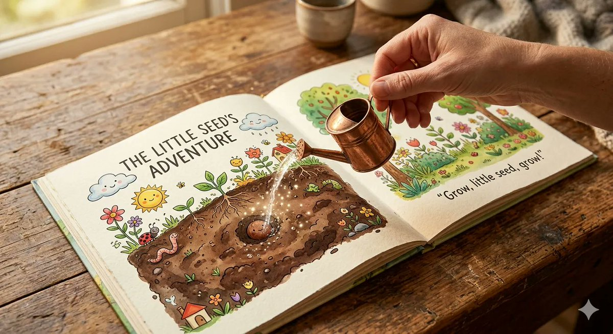

## A clean, minimal 3D isometric diorama of a [URBAN RETAIL

- ID: trending-2011750912390258844
- Slug: trending-2011750912390258844-en
- 语言: en
- 来源: [来源链接](https://x.com/aleenaamiir/status/2011750912390258844)
- 样例图路径: images/part1/2011750912390258844_1.jpg

### 提示词

```text
A clean, minimal 3D isometric diorama of a [URBAN RETAIL TYPE], featuring a [MAIN COUNTER / DISPLAY OBJECT] placed on a [GROUND / PLATFORM TYPE], simple [CANOPY / ROOF STRUCTURE], subtle [SIGNAGE TYPE], smooth [SURFACE MATERIAL], soft studio lighting, realistic materials, rounded edges, miniature architectural model style, high detail, neutral background.
```

### 样例图

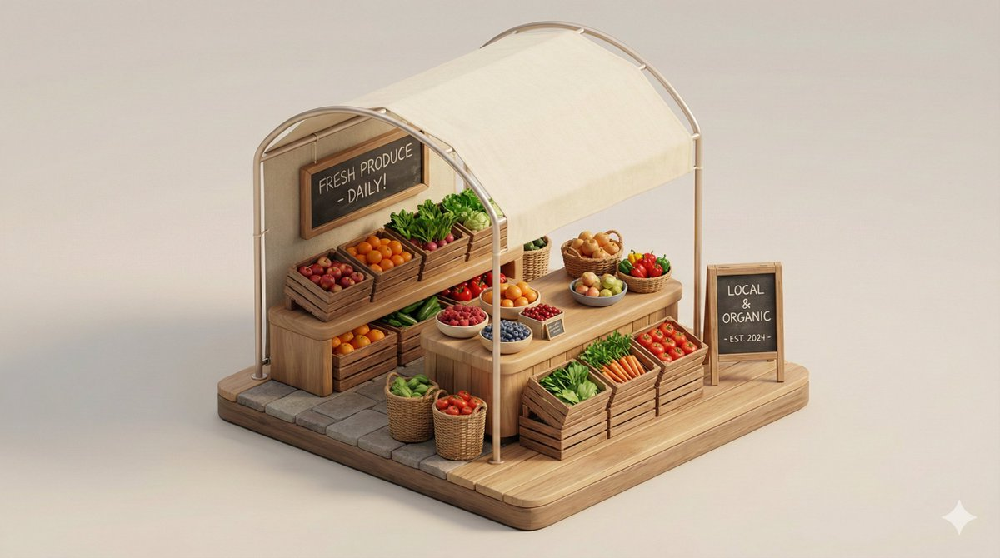

## 3D miniature scene, a [JAPANESE ONSEN VILLAGE] with [woo

- ID: trending-2028672209544175970
- Slug: trending-2028672209544175970-en
- 语言: en
- 来源: [来源链接](https://x.com/AllaAisling/status/2028672209544175970)
- 样例图路径: images/part1/2028672209544175970_1.jpg

### 提示词

```text
3D miniature scene, a [JAPANESE ONSEN VILLAGE] with [wooden bathhouses, steam rising from natural hot springs, stone lanterns, maple trees in autumn color, guests in tiny yukata robes carrying wooden buckets], presented as a small platform diorama. The platform is carved from natural hot spring rock with mineral deposits. Side view, cute clay style, miniature diorama, soft rendered lighting effects, warm steam diffusing the light, light background.
```

### 样例图

![3D miniature scene, a [JAPANESE ONSEN VILLAGE] with [woo](../images/part1/2028672209544175970_1.jpg)

## Hyperrealistic baby @ image in a caricature style, with 

- ID: trending-2041499088990978244
- Slug: trending-2041499088990978244-en
- 语言: en
- 来源: [来源链接](https://x.com/doctorwasif/status/2041499088990978244)
- 样例图路径: images/part1/2041499088990978244_1.jpg

### 提示词

```text
Hyperrealistic baby @ image in a caricature style, with exaggerated facial features, finely detailed skin texture, meticulously styled hair, cinematic lighting, vibrant color grading, dynamic shadows and highlights, whimsical atmosphere, rendered with photo-real depth and rich composition
```

### 样例图

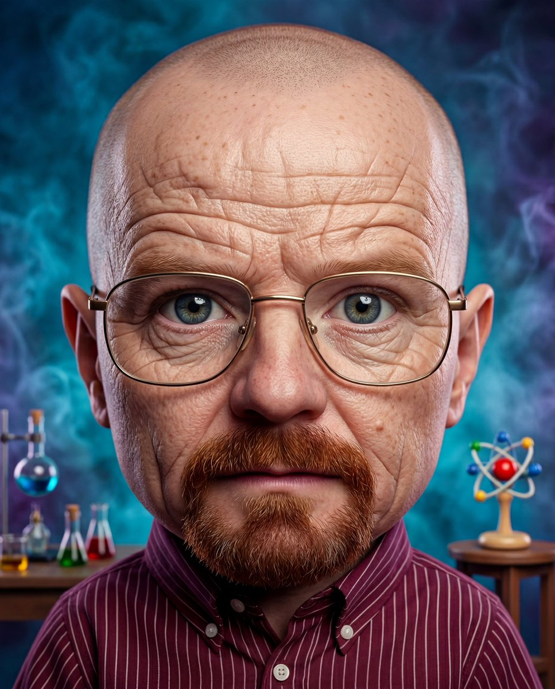

## A [AGE / ERA] [CONTAINER / OBJECT] associated with [CULT

- ID: trending-2015806433556832401
- Slug: trending-2015806433556832401-en
- 语言: en
- 来源: [来源链接](https://x.com/AllaAisling/status/2015806433556832401)
- 样例图路径: images/part1/2015806433556832401_1.jpg

### 提示词

```text
A [AGE / ERA] [CONTAINER / OBJECT] associated with [CULTURE / CONTEXT], partially opened to reveal its contents transforming into a living landscape.
The material inside unfolds as a miniature world: [MATERIAL 1] becomes [GEOGRAPHIC FEATURE], [MATERIAL 2] forms [TERRAIN / STRUCTURE], [FINE DETAILS] flow like [NATURAL ELEMENTS].
Tiny [FIGURES / ENTITIES] inhabit the scene, moving through the terrain as part of a [JOURNEY / SYSTEM / ACTIVITY]. [CREATURES / VEHICLES] carry [SYMBOLIC LOADS] across [LANDMARKS].
A [SHELTER / HUB / ARCHITECTURE] constructed from [UNEXPECTED MATERIAL] serves as a gathering point. The interior surface of the object becomes a [SKY / MAP / COSMIC PATTERN] used for guidance or meaning.
The entire scene is unified by [ATMOSPHERIC ELEMENT] and [TEXTURAL DETAIL], evoking [ABSTRACT THEME / EMOTION].
Cinematic macro perspective, handcrafted realism, surreal scale contrast, warm directional lighting, tactile materials, poetic world-building. 
```

### 样例图

![A [AGE / ERA] [CONTAINER / OBJECT] associated with [CULT](../images/part1/2015806433556832401_1.jpg)

## A digital fantasy illustration of a small turtle resting

- ID: trending-2041512847016890622
- Slug: trending-2041512847016890622-en
- 语言: en
- 来源: [来源链接](https://x.com/churvikv/status/2041512847016890622)
- 样例图路径: images/part1/2041512847016890622_1.jpg

### 提示词

```text
A digital fantasy illustration of a small turtle resting on a grassy riverbank at twilight. The turtle has a detailed, textured shell with a soft, warm golden glow emanating from underneath its body, casting light onto the surrounding mossy earth. The scene is filled with magical, floating fireflies or glowing pollen particles that sparkle in the dim, atmospheric light. The turtle's reflection is clearly visible in the calm, still water below. Tall, slender blades of grass rise beside the turtle, silhouetted against a serene, muted gray-blue background. The overall mood is peaceful, ethereal, and cinematic, with high detail and soft, dreamlike lighting.
```

### 样例图

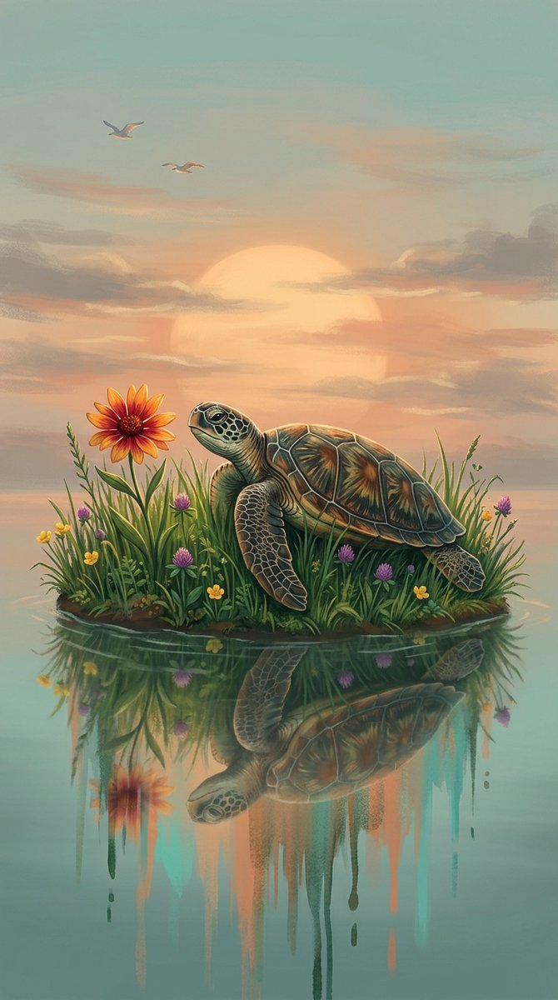

## Create an ultra-realistic sky scene where soft, natural 

- ID: trending-2038319421626753301
- Slug: trending-2038319421626753301-en
- 语言: en
- 来源: [来源链接](https://x.com/TechieBySA/status/2038319421626753301)
- 样例图路径: images/part1/2038319421626753301_1.jpg

### 提示词

```text
Create an ultra-realistic sky scene where soft, natural cloud formations organically assemble into the clear silhouette of a [OBJECT]. The cloud shape appears high in a vibrant blue sky, naturally floating above a recognizable nature below.

The composition is square (1080×1080), with the cloud formation occupying the upper portion of the frame while the landscape grounds the scene beneath it. Lighting is crisp and daylight-bright, with sunlit highlights on the clouds that enhance depth, softness, and realism.

The overall mood should feel calm, optimistic, and visually striking, with rich color saturation and a clean, peaceful atmosphere.
```

### 样例图

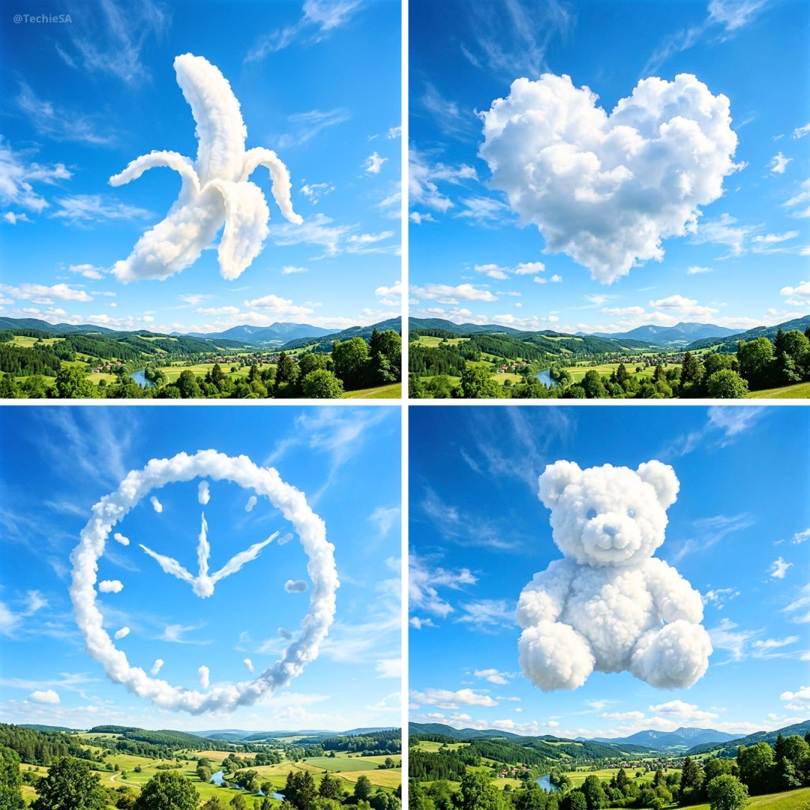

## { "prompt": "A studio shot of a transparent bubble wrap 

- ID: trending-2015757888283652351
- Slug: trending-2015757888283652351-en
- 语言: en
- 来源: [来源链接](https://x.com/Just_sharon7/status/2015757888283652351)
- 样例图路径: images/part1/2015757888283652351_1.jpg

### 提示词

```text
{
  "prompt": "A studio shot of a transparent bubble wrap fashion elegant [ITEM], empty with nothing inside. The material is clear, glossy, and highly detailed, capturing the texture of inflated bubbles. Minimalist composition, high-fashion editorial style, soft diffused studio lighting, neutral background, ultra-clean aesthetic, photorealistic rendering, sharp focus.",
  "style": {
    "lighting": "soft diffused studio lighting",
    "background": "neutral seamless backdrop",
    "mood": "modern, minimalist, elegant",
    "quality": "ultra-detailed, photorealistic",
    "material": "transparent bubble wrap"
  }
}
```

### 样例图

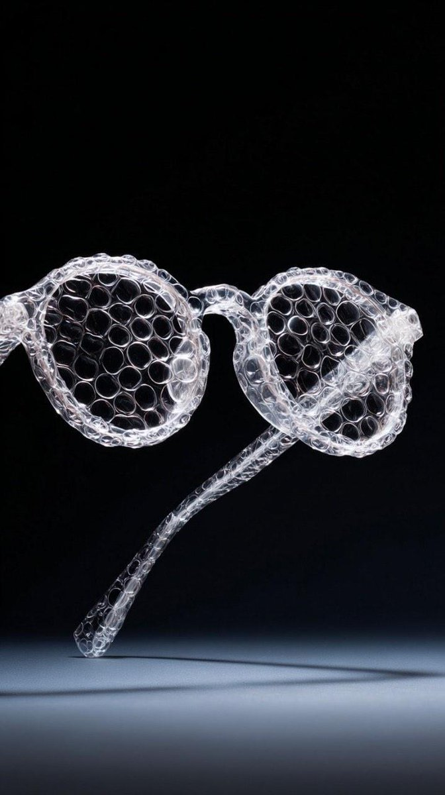

## Split composition portrait. PRIMARY SUBJECT (The Real Hu

- ID: trending-2022679468666687588
- Slug: trending-2022679468666687588-en
- 语言: en
- 来源: [来源链接](https://x.com/TechieBySA/status/2022679468666687588)
- 样例图路径: images/part1/2022679468666687588_1.jpg

### 提示词

```text
Split composition portrait. PRIMARY SUBJECT (The Real Human - STRICT LIKENESS): On the left, a raw, hyper-realistic photograph of the person from the reference image. CRITICAL: The AI must preserve the exact facial geometry, bone structure, specific imperfections, and skin texture of the source image. Do not beautify or alter the face. This is a documentary-style portrait of the specific individual provided. The subject is wearing the outfit from the visual reference. Pose: Sitting cross-legged on the floor, facing forward, with an authentic smile. SECONDARY SUBJECT (The Miniature): On the right, a tiny, cute 3D Pixar-style animated character, standing or sitting next to the human. This character is a stylized caricature of the human, wearing a matching miniature outfit. SETTING: Seamless pure white studio background. Soft cinematic lighting. 8k resolution, uncropped. --iw 2 make them both hold a soccer ball
```

### 样例图

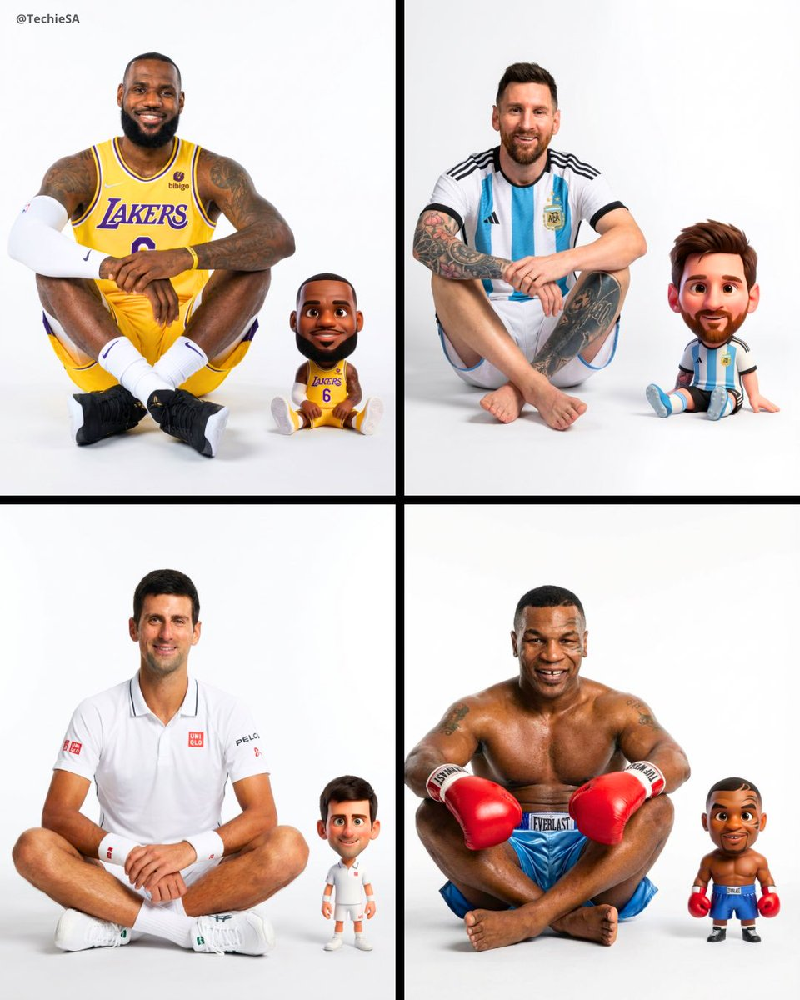

## An [OBJECT] rendered as if entirely hand-knitted from ch

- ID: trending-2012909092210381048
- Slug: trending-2012909092210381048-en
- 语言: en
- 来源: [来源链接](https://x.com/AllaAisling/status/2012909092210381048)
- 样例图路径: images/part1/2012909092210381048_1.jpg

### 提示词

```text
An [OBJECT] rendered as if entirely hand-knitted from chunky wool yarn, impossibly functional-looking despite being soft craft. Visible stitches, cable knit patterns on grip areas, ribbing where flexibility is needed, yarn ends neatly tucked. Positioned against a cozy lifestyle backdrop or clean wool-texture studio. Scandinavian hygge meets industrial design. Warm soft lighting emphasizing the yarn texture, the handmade quality, the absurd coziness of machinery. Sharp focus on stitch detail, warm saturated fiber colors, lifestyle product aesthetic, ultra-high resolution, the hard made soft.
```

### 样例图

![An [OBJECT] rendered as if entirely hand-knitted from ch](../images/part1/2012909092210381048_1.jpg)

## 3D avatar of a man, with a happy face on a white backgro

- ID: trending-2029107310187237797
- Slug: trending-2029107310187237797-en
- 语言: en
- 来源: [来源链接](https://x.com/auqibhabib/status/2029107310187237797)
- 样例图路径: images/part1/2029107310187237797_1.jpg

### 提示词

```text
3D avatar of a man, with a happy face on a white background, no necks. Conceptual playlist style digital art with Pixar quality aesthetics
```

### 样例图

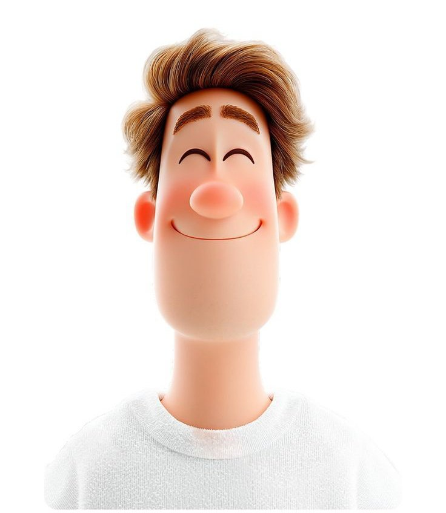

## Ultra-realistic product photography of a chilled blue Pe

- ID: trending-2028636305803051268
- Slug: trending-2028636305803051268-en
- 语言: en
- 来源: [来源链接](https://x.com/Sheldon056/status/2028636305803051268)
- 样例图路径: images/part1/2028636305803051268_1.jpg

### 提示词

```text
Ultra-realistic product photography of a chilled blue Pepsi can placed upright on fresh green grass, covered with cold water droplets and condensation. Ice cubes scattered around the base. The can features a vibrant, colorful illustration of Mario and Luigi standing together in a whimsical mushroom kingdom scene with red and blue mushrooms, green pipes, question blocks, and a castle in the background. Bright, cheerful, cartoon-style artwork printed on the can.

Shot outdoors in natural daylight with a soft, blurred garden background (bokeh effect), bright green foliage and sunlight filtering through trees. Shallow depth of field, macro detail, high contrast, vivid colors, sharp focus on the can, cinematic product lighting, summer refreshment mood, commercial advertising style, ultra-detailed, 8K quality, photorealistic, centered composition, vertical framing.
```

### 样例图

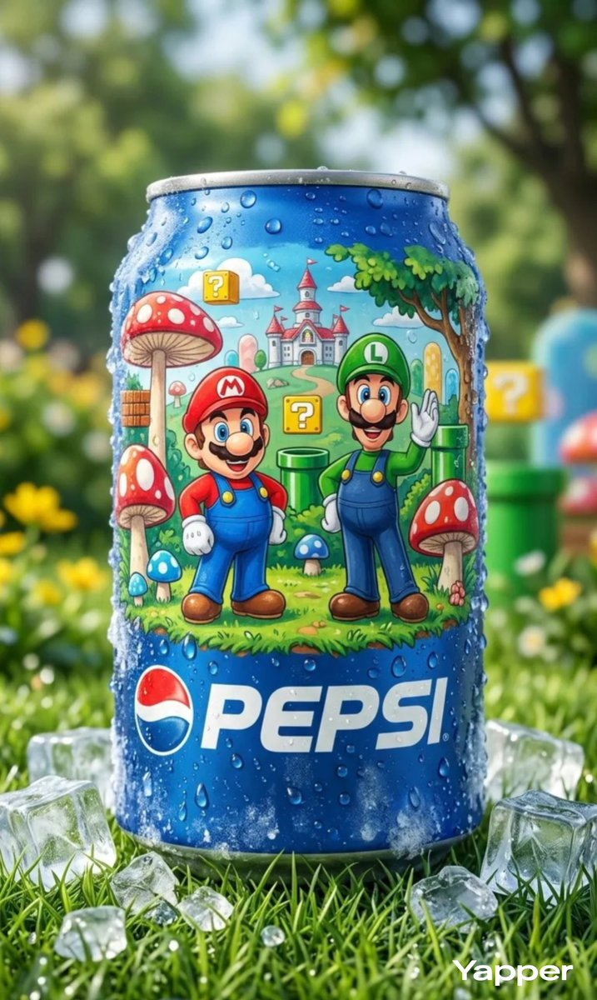

## A cute 3D chibi-style character of the uploaded image le

- ID: trending-2012060251231822295
- Slug: trending-2012060251231822295-en
- 语言: en
- 来源: [来源链接](https://x.com/AIwithSynthia/status/2012060251231822295)
- 样例图路径: images/part1/2012060251231822295_1.jpg

### 提示词

```text
A cute 3D chibi-style character of the uploaded image leaning against a parked mini chibi scooter, wearing a clean monochrome outfit with a t-shirt, straight-fit pants, and minimalist sneakers, holding a takeaway juice cup with a relaxed confident smile, big head and expressive eyes, modern fade haircut, set in a cozy café courtyard with wooden chairs, warm golden sunlight, soft depth of field, pastel color palette, smooth rounded proportions, subtle texture detailing, global illumination with gentle rim light, soft natural shadows, playful yet premium Pixar-quality 3D render, toy-like finish, Google Gemini cinematic but cozy mood, ultra-clean high-detail output, Instagram-ready composition, square aspect ratio 1:1
```

### 样例图

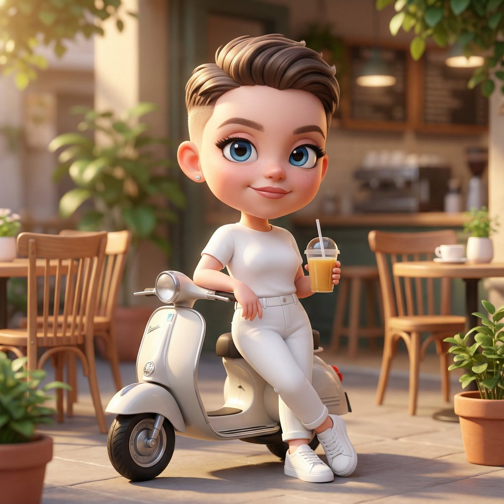

## Transform the referenced person into a premium stylized 

- ID: trending-2033873251777044747
- Slug: trending-2033873251777044747-en
- 语言: en
- 来源: [来源链接](https://x.com/TechieBySA/status/2033873251777044747)
- 样例图路径: images/part1/2033873251777044747_1.jpg

### 提示词

```text
Transform the referenced person into a premium stylized 3D animated character, full body hero shot, standing confidently in the exact center of the frame. Preserve the exact identity and key facial details as closely as possible, including face shape, eyes, nose, mouth, hairstyle, skin tone, and expression, without redesigning the face. Use soft rounded geometry, smooth polished materials, subtle glossy shading, and a modern premium 3D animation style. The pose must feel dynamic, charismatic, and heroic, not stiff. Let the arms and hands naturally perform an expressive gesture that best suits the character’s body shape, personality, and visual balance, chosen intelligently for the most flattering and appealing result. Keep the full body fully visible while the character still feels close, clear, and strongly present to the camera. Use a clean solid background or a soft gradient [BACKGROUND COLOR]. Studio-quality lighting, soft grounded shadow, strong subject separation, clean premium composition, ultra refined, highly detailed, no props, no text, no logos, no watermark
```

### 样例图

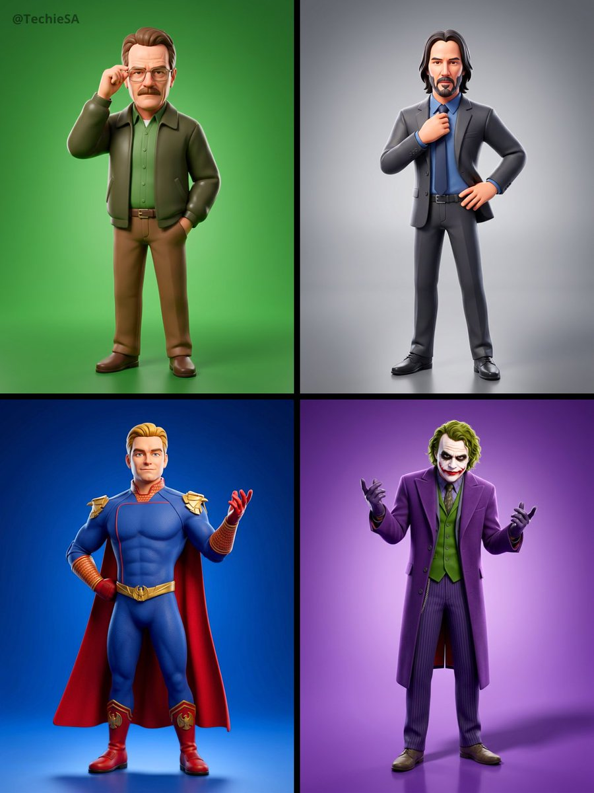

## High-detail 8K split-style composition where the subject

- ID: trending-2040118989775585520
- Slug: trending-2040118989775585520-en
- 语言: en
- 来源: [来源链接](https://x.com/Ciri_ai/status/2040118989775585520)
- 样例图路径: images/part1/2040118989775585520_1.jpg

### 提示词

```text
High-detail 8K split-style composition where the subject is divided vertically into two halves.
LEFT SIDE:
Keep the original photo fully realistic. Preserve natural lighting, textures, and fine details. Slightly enhance sharpness and clarity. Add subtle hand-drawn doodle outlines (soft pastel or neon lines) around the subject for a creative aura.
RIGHT SIDE:
Transform the same subject into a stylized cartoon/digital illustration. Maintain the exact same pose, angle, and facial expression. Use clean lineart, soft shading, and pastel or vibrant colors in a modern cute style (chibi / semi-realistic). Add small decorative elements like sticker-style doodles, cute icons, or mini characters floating around.
BACKGROUND (IMPORTANT):
Keep the ORIGINAL background unchanged on BOTH sides. Do not replace, redraw, or stylize the background. Maintain consistency across the entire image.
CENTER DIVISION:
Add a vertical torn-paper or glitch-style transition separating the realistic and illustrated halves.
STYLE:
modern digital art, clean composition, soft lighting, aesthetically pleasing, social media style
QUALITY: 8K resolution, ultra-detailed.
```

### 样例图

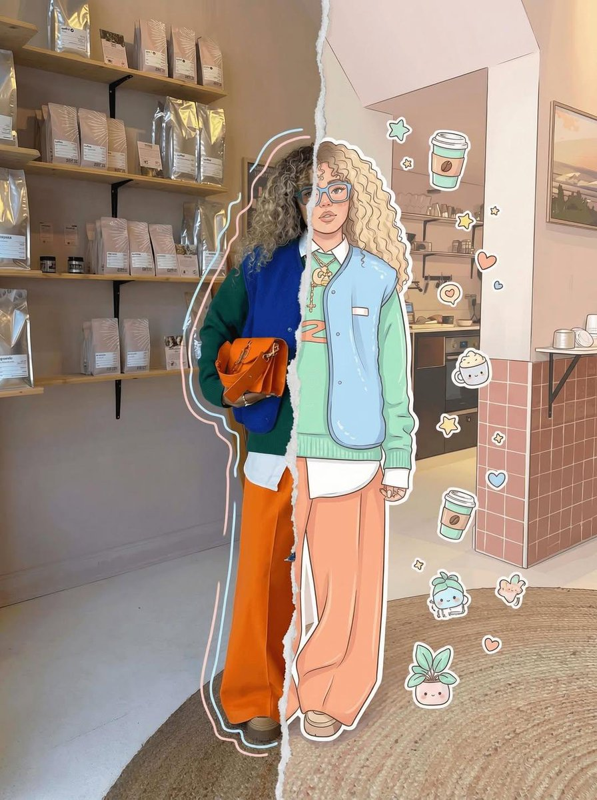

## A premium 3D stylized version of attached logo, rendered

- ID: trending-2043753023004954753
- Slug: trending-2043753023004954753-en
- 语言: en
- 来源: [来源链接](https://x.com/zazzygfx/status/2043753023004954753)
- 样例图路径: images/part1/2043753023004954753_1.jpg

### 提示词

```text
A premium 3D stylized version of attached logo, rendered as thick, translucent crystal glass with high refraction. The object is floating amidst fluffy, realistic white cumulus clouds against a bright, clear blue sky. Soft natural sunlight creates bright caustic reflections and rainbow dispersion within the glass. Ethereal, airy, and highly polished 3D aesthetic
```

### 样例图

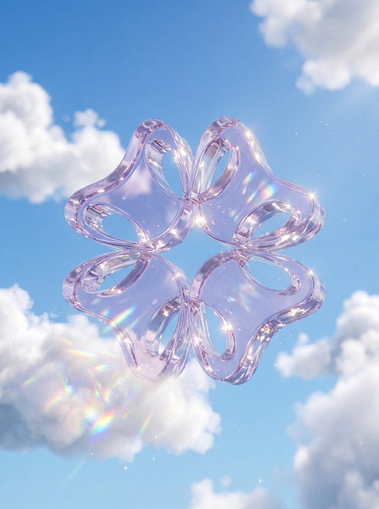

## Cute stylized 3D animated boy with messy fluffy blue hai

- ID: trending-2029567508244750343
- Slug: trending-2029567508244750343-en
- 语言: en
- 来源: [来源链接](https://x.com/Taaruk_/status/2029567508244750343)
- 样例图路径: images/part1/2029567508244750343_1.jpg

### 提示词

```text
Cute stylized 3D animated boy with messy fluffy blue hair and big expressive eyes, soft freckles on face, wearing a fuzzy blue striped sweater, small adorable raccoon sitting on his shoulder, looking upward with a gentle smile, Pixar-style character design, soft studio lighting, pastel blue background, ultra-detailed fur and fabric texture, cinematic portrait composition, high-quality 3D render, 8K.
```

### 样例图

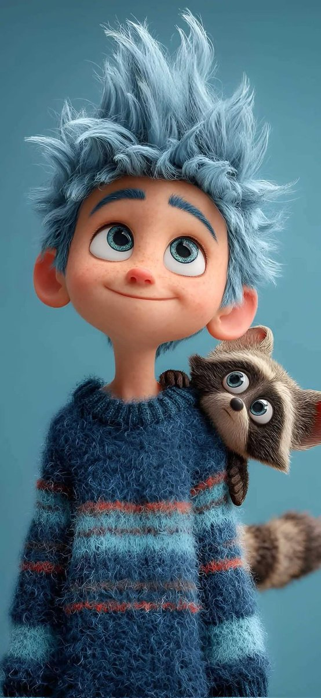

## Cute 3D render of a [subject], matte surface, kneaded cl

- ID: trending-2042931585100795991
- Slug: trending-2042931585100795991-en
- 语言: en
- 来源: [来源链接](https://x.com/Strength04_X/status/2042931585100795991)
- 样例图路径: images/part1/2042931585100795991_1.jpg

### 提示词

```text
Cute 3D render of a [subject], matte surface, kneaded clay icon style, simple stylized design, [doing action], [emotion or mood], rounded proportions, soft sculpted details, playful body language, vibrant [color1], [color2], and [color3] accents, clean white background, minimal composition, soft ambient lighting, subtle shadow, charming character design, high-resolution, polished toy-like aesthetic
```

### 样例图

![Cute 3D render of a [subject], matte surface, kneaded cl](../images/part1/2042931585100795991_1.jpg)

## A stylized 3D cartoon character of a young boy with big 

- ID: trending-2040674336605114412
- Slug: trending-2040674336605114412-en
- 语言: en
- 来源: [来源链接](https://x.com/auqibhabib/status/2040674336605114412)
- 样例图路径: images/part1/2040674336605114412_1.jpg

### 提示词

```text
A stylized 3D cartoon character of a young boy with big expressive eyes and a slightly sad, pouty expression, standing against a solid pastel green background. He is wearing a soft white fuzzy beanie with ear flaps and matching white over-ear headphones. His hair is short, brown, and slightly messy, peeking out from under the cap. He wears an oversized light green t-shirt with a bold black graphic on the front, and his arms are crossed in a bored or annoyed pose. The lighting is soft, diffused studio lighting with smooth shadows, giving a clean aesthetic. Ultra-detailed, high-quality 3D render, Pixar-style, soft textures, shallow depth of field, centered composition, minimal background, vibrant but soft color palette.

Negative prompt (optional):
blurry, low quality, extra limbs, distorted face, harsh shadows, cluttered background, text artifacts, watermark
```

### 样例图

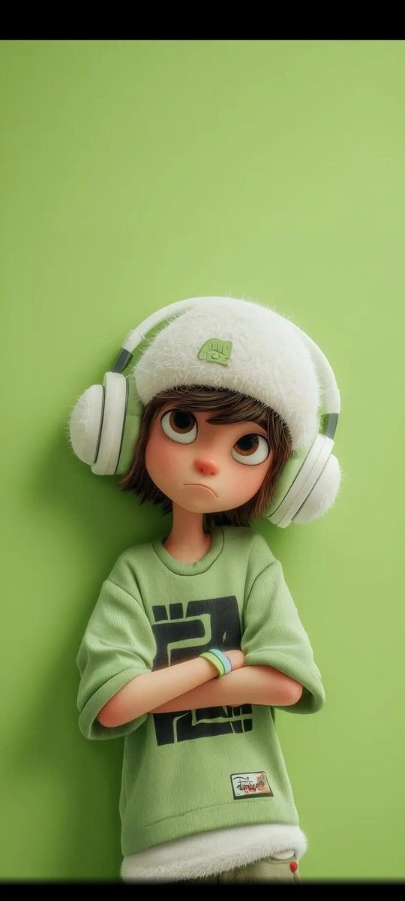

## A hyper-realistic product photo of a Kinder Joy surprise

- ID: trending-2037393068538679624
- Slug: trending-2037393068538679624-en
- 语言: en
- 来源: [来源链接](https://x.com/doctorwasif/status/2037393068538679624)
- 样例图路径: images/part1/2037393068538679624_1.jpg

### 提示词

```text
A hyper-realistic product photo of a Kinder Joy surprise egg sitting on a wooden table. The egg packaging features a chibi/cartoon-style illustration of [image Uploaded] posed against a graffiti brick wall background. Next to the egg sits a small detailed collectible figurine of [image Uploaded] in the same chibi art style shown on the packaging. Soft natural lighting, shallow depth of field, photorealistic quality.
```

### 样例图

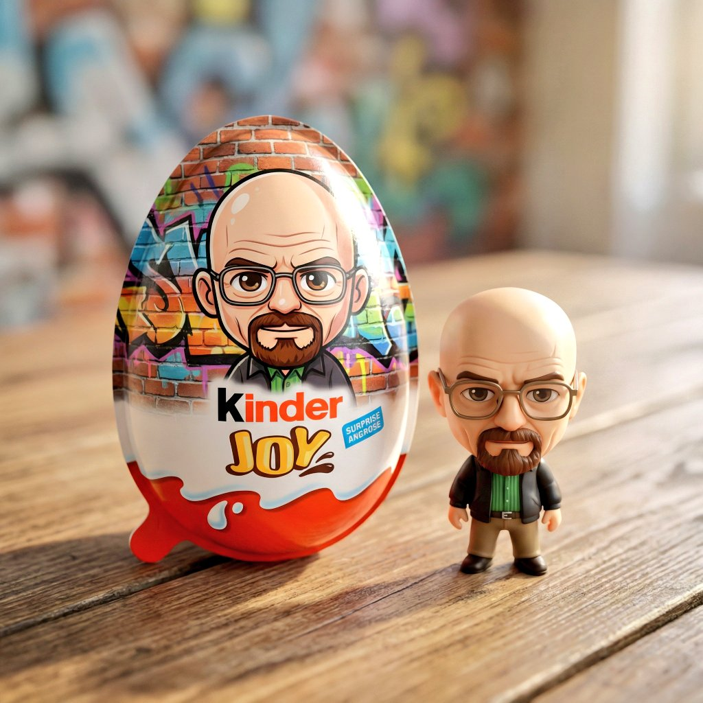

## { "global_settings": { "resolution": "8K ultra high defi

- ID: trending-2015256585984176226
- Slug: trending-2015256585984176226-en
- 语言: en
- 来源: [来源链接](https://x.com/meng_dagg695/status/2015256585984176226)
- 样例图路径: images/part1/2015256585984176226_1.jpg

### 提示词

```text
{
  "global_settings": {
    "resolution": "8K ultra high definition",
    "aspect_ratio": "3:4 vertical",
    "image_quality": "extreme detail, ultra sharp focus",
    "lighting_style": "warm cinematic lighting with golden bokeh background",
    "depth_of_field": "shallow depth of field, strong subject separation",
    "render_style": "AI-edited, hyper-detailed, photorealistic with stylized realism",
    "color_grading": "warm tones, golden highlights, soft shadows",
    "background": "out-of-focus golden circular bokeh lights"
  },

  "Module_1_Image_1_Style": {
    "subject": "Cat-shaped tortilla chips",
    "primary_container": {
      "type": "red paper snack bag",
      "design": "large illustrated cartoon cat on front",
      "graphics": "simple facial features, soft pastel tones",
      "material": "matte paper texture"
    },
    "chip_details": {
      "shape": "cat heads with pointed ears",
      "color": "golden-orange fried texture",
      "surface": "crispy, bubbled, slightly uneven",
      "facial_features": {
        "eyes": "small black circular dots",
        "mouth": "simple curved line",
        "whiskers": "thin dark lines"
      }
    },
    "poses_and_interactions": {
      "one_chip": "holding a miniature cheeseburger",
      "one_chip": "holding a red-and-white striped soda cup with straw",
      "one_chip": "holding a triangular cheese slice",
      "foreground_chips": "sitting outside the bag on surface"
    },
    "composition": {
      "camera_angle": "slightly above eye level",
      "framing": "tight vertical framing",
      "focus": "sharp on chips, blurred background"
    }
  },

  "Module_2_Image_2_Style": {
    "subject": "Sheep-shaped popcorn figures",
    "primary_container": {
      "type": "classic popcorn bucket",
      "design": "red and white vertical stripes",
      "material": "cardboard with soft matte finish"
    },
    "sheep_details": {
      "body": "made entirely of popcorn kernels",
      "head": "smooth white rounded face",
      "ears": "small rounded ears with pale yellow inner tone",
      "eyes": "tiny black dots",
      "mouth": "thin curved smile line"
    },
    "poses_and_accessories": {
      "one_sheep": "wearing red-blue 3D glasses",
      "one_sheep": "holding a small popcorn bucket",
      "one_sheep": "holding a black TV remote",
      "multiple_sheep": "peeking from behind popcorn pile"
    },
    "composition": {
      "layering": "sheep stacked and clustered",
      "foreground": "extra popcorn scattered around base",
      "focus": "central sheep in sharp focus"
    }
  },

  "Module_3_Image_3_Style": {
    "subject": "Bear-shaped chicken popcorn nuggets",
    "primary_container": {
      "type": "white popcorn-style bucket",
      "branding": "text reads 'Chicken Popcorn'",
      "graphics": "simple chef hat icon above text",
      "decoration": "small colored polka dots"
    },
    "nugget_details": {
      "shape": "teddy bear silhouettes",
      "color": "golden-brown fried coating",
      "texture": "crunchy breaded surface",
      "facial_features": {
        "eyes": "small black beads",
        "nose": "rounded black nose",
        "mouth": "tiny dark line"
      }
    },
    "poses_and_accessories": {
      "one_nugget": "wearing black sunglasses",
      "one_nugget": "holding fries in red-striped cup",
      "one_nugget": "holding soda cup with straw",
      "foreground_nuggets": "standing outside bucket"
    },
    "composition": {
      "camera_distance": "medium close-up",
      "bucket_position": "centered vertically",
      "lighting": "warm highlights emphasizing texture''
```

### 样例图

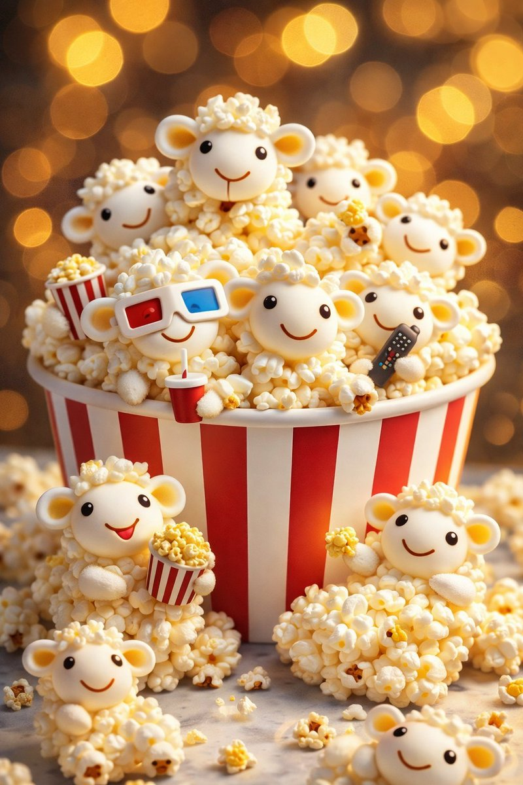

## Create a technical infographic of [OBJECT] with a 45-deg

- ID: trending-2027042348207599633
- Slug: trending-2027042348207599633-en
- 语言: en
- 来源: [来源链接](https://x.com/saidstetic/status/2027042348207599633)
- 样例图路径: images/part1/2027042348207599633_1.jpg

### 提示词

```text
Create a technical infographic of [OBJECT] with a 45-degree isometric 3D perspective showing the device slightly tilted to reveal depth and dimension.
Combine a realistic photoreal render with black ink technical annotations on pure white background. Include:
Key component labels with color-coded callout boxes
Internal component visibility through transparent/cutaway sections
Measurements, dimensions, and precise scale markers
Material callouts and quantities
Color-coded arrows for function/flow: RED (power/battery), BLUE (data/connectivity), ORANGE (thermal/processor), GREEN (sensors/haptics)
Simple schematics or cross-sectional diagrams where relevant

Place “OBJECT” title in a hand-drawn technical box (top-left corner).
Style: Black linework (technical pen/architectural), sketched but precise. Object remains clearly visible. Educational museum-exhibit vibe. Clean composition, balanced negative space.
Perspective: Isometric 3D angle—tilted to show depth, dimension, and internal architecture dramatically. Like a professional product teardown or engineering manual.
Colors: ~10-15% accent density. Black dominant. White background.
Output: 1080×1080, ultra-crisp, social-feed optimized.
```

### 样例图

![Create a technical infographic of [OBJECT] with a 45-deg](../images/part1/2027042348207599633_1.jpg)

## { "Objective": "Create a joyful, cinematic fantasy photo

- ID: trending-2008453808968659330
- Slug: trending-2008453808968659330-en
- 语言: en
- 来源: [来源链接](https://x.com/Taaruk_/status/2008453808968659330)
- 样例图路径: images/part1/2008453808968659330_1.jpg

### 提示词

```text
{
  "Objective": "Create a joyful, cinematic fantasy photograph set in a magical fairytale theme park"
      "Type": "Young woman",
      "Pose": "Taking a selfie at arm’s length",
      "Expression": "Warm, joyful smile",
      "Clothing": "Light blue dress",
      "Action": "Holding a smartphone, facing the camera"
    },
    "SecondarySubject": {
      "Type": "Anthropomorphic fox mascot",
      "Appearance": "Cute, friendly fox character",
      "Clothing": "Red jacket",
      "Pose": "Standing beside the woman, giving a thumbs-up",
      "Emotion": "Playful and welcoming"
    }
  },
  "SceneDescription": {
    "Location": "Magical fairytale theme park",
    "Foreground": "Woman and fox mascot posing for a selfie",
    "Background": {
      "Landmark": "Grand fairytale castle at the end of the street",
      "Street": "Charming cobblestone road",
      "Architecture": "Classic European-style buildings",
      "LightingElements": "Glowing vintage street lamps"
    },
    "AtmosphericDetails": {
      "FloatingElements": "Soap bubbles drifting through the air",
      "MagicalAccents": "Some bubbles contain tiny whimsical silhouettes",
      "Mood": "Whimsical, joyful, storybook magic"
    }
  },
  "LightingAndMood": {
    "TimeOfDay": "Golden hour",
    "LightingStyle": "Warm highlights with gentle shadows",
    "Sky": "Soft pastel tones",
    "OverallMood": "Dreamy, uplifting, cinematic fantasy realism"
  },
  "PhotographyStyle": {
    "Genre": "Theme park photography",
    "Composition": "Cinematic framing with strong depth",
    "DepthOfField": "Shallow depth of field",
    "DetailLevel": "Ultra-detailed textures",
    "ColorGrading": "Vibrant yet soft, pastel-enhanced",
    "Resolution": "High resolution, sharp focus on subjects"
  },
  "ArtDirection": {
    "Style": "Dreamy fantasy realism",
    "VisualTone": "Joyful, magical, immersive",
    "RealismBalance": "Photorealistic with subtle fantasy elements"
  },
  "NegativePrompt": [
    "dark mood",
    "horror",
    "low resolution",
    "blurry faces",
    "harsh shadows",
    "oversaturated colors",
    "distorted anatomy",
    "uncanny characters"
  ],
  "ResponseFormat": {
    "Type": "Single image",
    "Orientation": "Portrait",
    "AspectRatio": "2:3"
  }
}
```

### 样例图

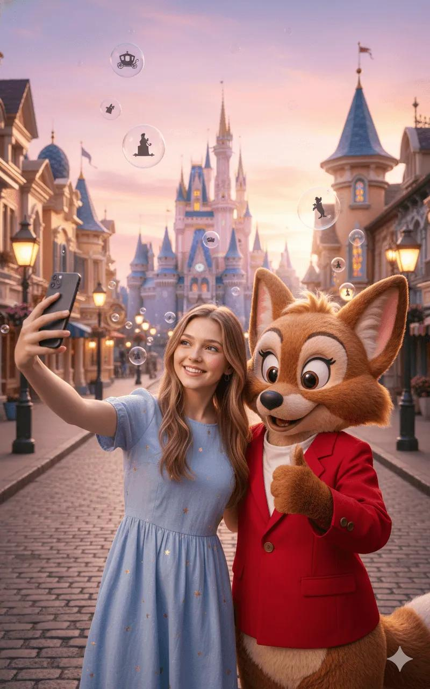

## A detailed, collectible-style 3D render of a linear proc

- ID: trending-2034672885021675997
- Slug: trending-2034672885021675997-en
- 语言: en
- 来源: [来源链接](https://x.com/edizkan_/status/2034672885021675997)
- 样例图路径: images/part1/2034672885021675997_1.jpg

### 提示词

```text
A detailed, collectible-style 3D render of a linear procession of twelve identical figures, viewed in a dynamic diagonal 3/4 perspective down the line.

The figures are arranged on a dark, gradient studio floor with a progressively shallower depth of field, making the furthest characters less detailed.
Specific Pose Sequence:

The procession must follow a distinct sequence of poses along the line:
The first and closest figure stands with arms at their sides.

The second figure stands with arms crossed over their chest.

The third figure stands with one hand raised in a salute or wave.

The subsequent receding figures doing different poses.
Lighting and Atmosphere:

The scene features dramatic, atmospheric backlighting from a powerful source behind the furthest characters, creating a bright halo and deep rim-lighting, combined with a strong, texturing haze or fog. Dramatic, focused front-side lighting illuminates the features of the nearest character. The background fades to complete shadow.
Fixed Elements:

The overall style is a high-end, textured, 3D vinyl toy aesthetic.
Camera:

Low-to-medium camera angle looking down the diagonal line.
Camera & Framing Refinement (CRITICAL):

Shot with a close-range 28–35mm lens to introduce natural perspective compression without distortion.

The camera is positioned slightly below chest level of the first figure and very close to it, creating strong foreground dominance.
The first figure occupies approximately 65–75% of the frame height and must be tightly cropped at knee level. The feet of the first figure must NOT be visible.

The head of the first figure sits very close to the top edge of the frame with minimal breathing room. The figure should feel slightly too large for the frame, as if it cannot fully fit inside.
Subsequent figures progressively reveal more of their full bodies as they recede into depth.
The diagonal line of figures must start large in the foreground (left side of frame) and recede tightly into the background (right side), with each figure overlapping slightly with the next.

The camera is not centered to the line. It is offset to the left, looking across the figures, not directly along them.
Spacing between figures compresses progressively toward the background, enhancing depth and scale illusion.

No wide empty gaps between characters. The line must feel dense and continuous.
2D to 3D Translation (ONLY if input is 2D artwork):

If the uploaded reference is 2D (illustration, anime, flat graphic, cel-shaded), convert it into a fully realized 3D cinematic form while preserving exact identity fidelity.
• Maintain exact head shape, eye design, spacing, and proportions

• Preserve original stylization, do NOT add realism that alters design language

• Translate linework into subtle surface geometry or shading transitions

• Keep original colors, expressed through physically believable materials

• Convert flat shading into controlled cinematic light falloff
The result must feel physically real, not redesigned.
ar 1:1
```

### 样例图

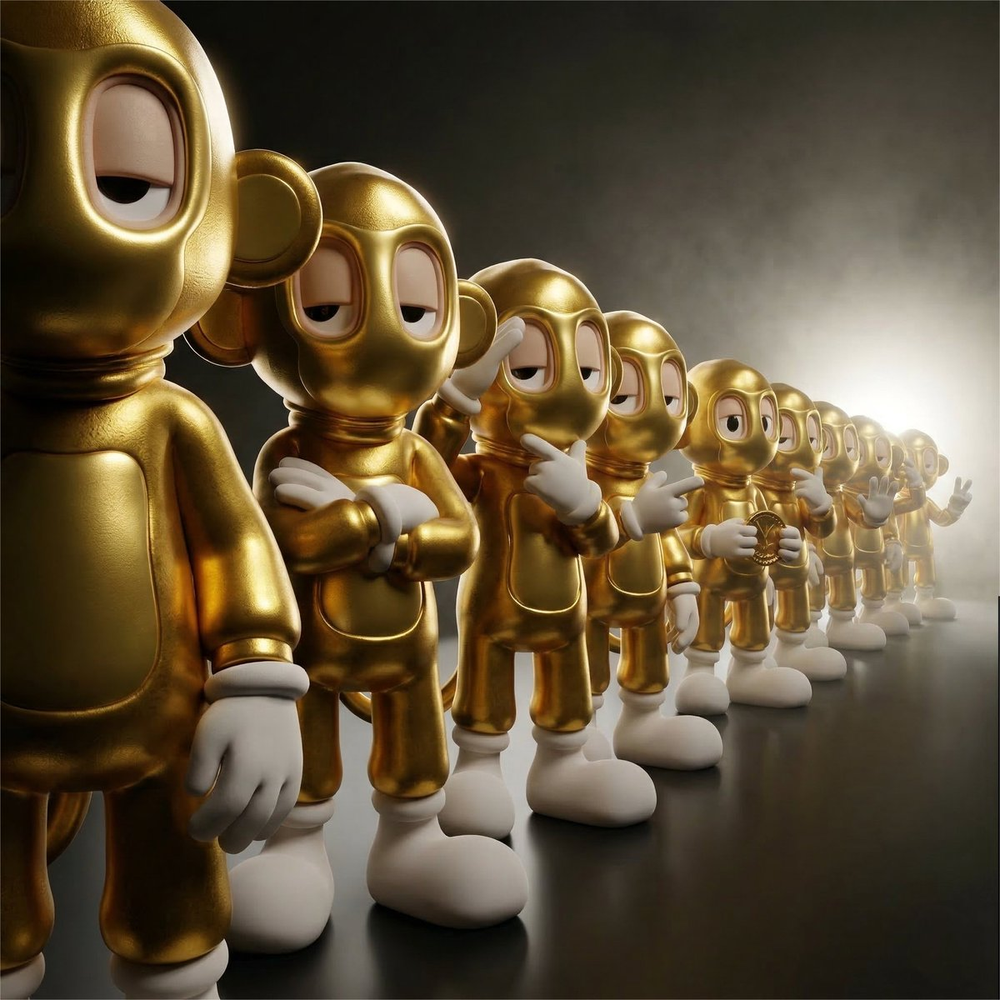

## 2x2 grid, do this for 4 important years in history and t

- ID: trending-2034557489258078352
- Slug: trending-2034557489258078352-en
- 语言: en
- 来源: [来源链接](https://x.com/Gdgtify/status/2034557489258078352)
- 样例图路径: images/part1/2034557489258078352_1.jpg

### 提示词

```text
2x2 grid, do this for 4 important years in history and their most important inventions  {    Anchor:   `[Letter/Number] :: [Era/Theme (e.g., 1980s Retro Tech / Victorian Steampunk)]::4`
    Morphology:   `3D Typographic sculpture of [Letter/Number], character shape defined by a dense pile of [Era/Theme] objects, chaotic but legible assemblage, graphic design asset::3`
    Material Physics:   `Textures of [Era/Theme] objects (plastic, rust, wood), occlusion between stacked items, realistic scale of constituent parts forming the glyph::3`
    Illumination:   `Three-point studio lighting, softbox overhead, clean background for isolation::2`
    Render Stack:   `Cinema 4D render, isometric or front-facing, ambient occlusion, 8k, Adobe Substance material suite::1`
    Negative:   `[Illegible, flat font, 2D, handwriting, paper, messy background, floating objects]:: -1`}
```

### 样例图

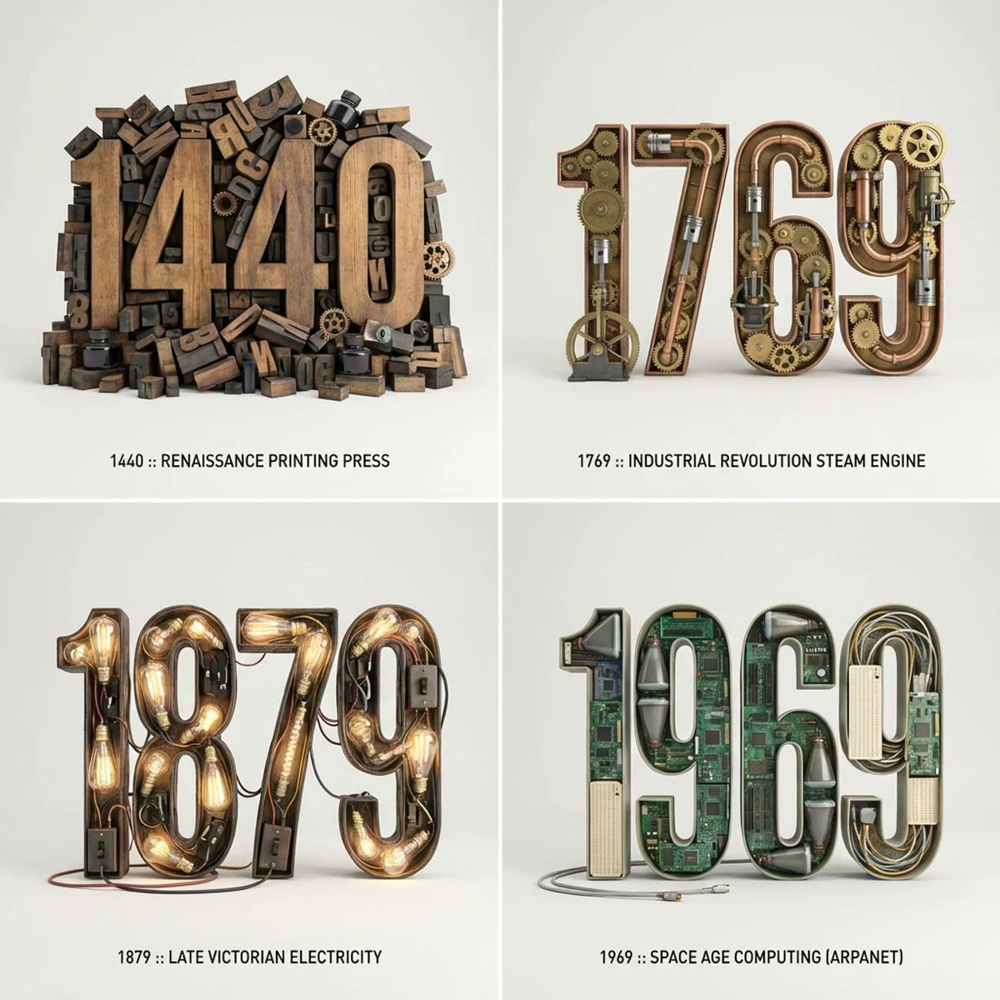

## An artisan's method board for [HANDMADE OBJECT] — [TECHN

- ID: trending-2012197160276660362
- Slug: trending-2012197160276660362-en
- 语言: en
- 来源: [来源链接](https://x.com/AllaAisling/status/2012197160276660362)
- 样例图路径: images/part1/2012197160276660362_1.jpg

### 提示词

```text
An artisan's method board for [HANDMADE OBJECT] — [TECHNIQUE / TRADITION / ORIGIN]. Left section: raw materials in unprocessed state, sourced and labeled, the transformation yet to begin. Center section: the making documented in sequential stages, hands visible throughout, tools identified, key decision points annotated, time invested at each phase noted. Right section: the finished object in use context, bearing the maker's mark, fulfilling its purpose, the hours invisible but embedded. Visual style transitions from raw material earth tones through workshop warmth to lifestyle context with natural light. Title block reading "[OBJECT NAME] — HANDMADE BY [MAKER], [LOCATION], [HOURS] HOURS".
```

### 样例图

![An artisan's method board for [HANDMADE OBJECT] — [TECHN](../images/part1/2012197160276660362_1.jpg)

## A stunning Trompe L’oeil 3D composition, where the subje

- ID: trending-2036909125347553519
- Slug: trending-2036909125347553519-en
- 语言: en
- 来源: [来源链接](https://x.com/TechieBySA/status/2036909125347553519)
- 样例图路径: images/part1/2036909125347553519_1.jpg

### 提示词

```text
A stunning Trompe L’oeil 3D composition, where the subject—using an uploaded face as reference—appears to physically tear through a clean white drawing paper and emerge from a graphite sketch into the real world. The subject’s upper body is fully rendered in hyper-realistic color and texture, wearing the same clothes from the uploaded image, while the lower body remains a 2D pencil sketch on paper. Shot from an aerial (top-down) perspective using a 24mm lens to capture the entire drawing desk environment, including oversized pencils and erasers scattered around. The lighting is a blend of flat studio light for the paper area and dramatic side lighting with volumetric effects for the emerging 3D figure, casting realistic shadows that fall back onto the sketch area. 8K resolution, ray tracing, and advanced shading techniques are used to blur the boundary between illustration and reality in this extraordinary surrealist piece.
```

### 样例图

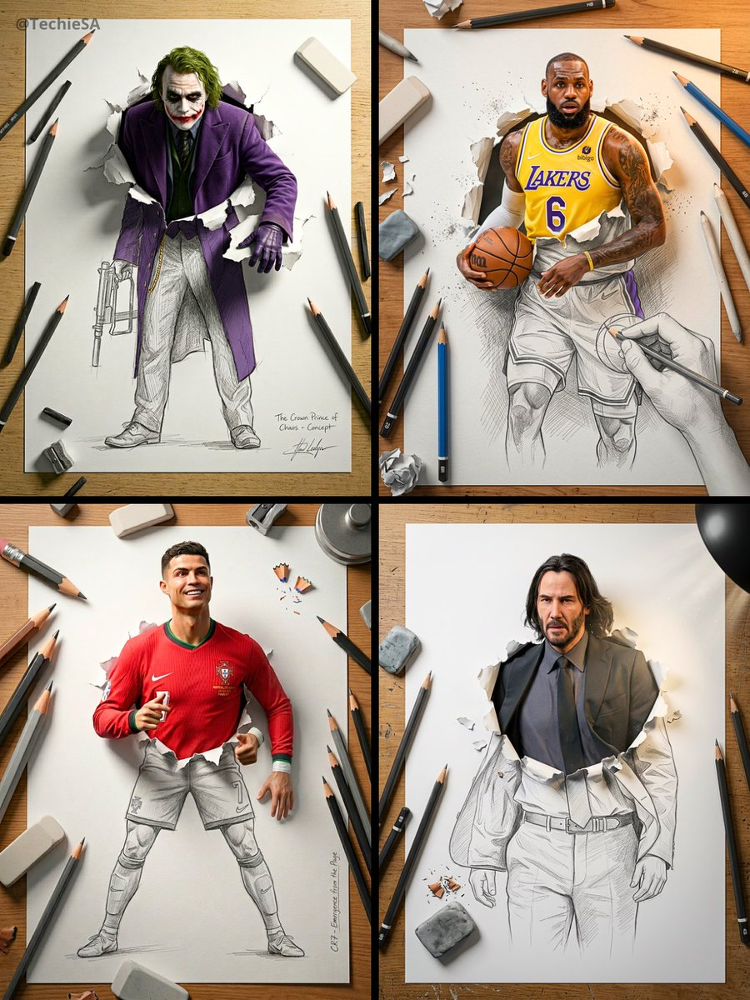

## 1080x1080 cork-board layout telling the story of [HISTOR

- ID: trending-2015881147046101400
- Slug: trending-2015881147046101400-en
- 语言: en
- 来源: [来源链接](https://x.com/TechieBySA/status/2015881147046101400)
- 样例图路径: images/part1/2015881147046101400_1.jpg

### 提示词

```text
1080x1080 cork-board layout telling the story of [HISTORICAL MOMENT]. At the very top of the board, include a pinned paper label with the title: "HISTORICAL MOMENT" in large handwritten letters. Below it, arrange 5–6 Polaroid photos pinned across the board in a loose chronological path. Each Polaroid shows a key moment from the story with a short handwritten caption beneath it. Connect characters and events with colored strings (red, blue, yellow). Warm nostalgic lighting, soft shadows. Include realistic details: coffee cup rings, paper clips, torn notes, arrows, scribbled hints, and thumbtacks. Vintage, textured, cozy detective-board aesthetic. Highly readable, high contrast, everything framed clearly for 1080x1080
```

### 样例图

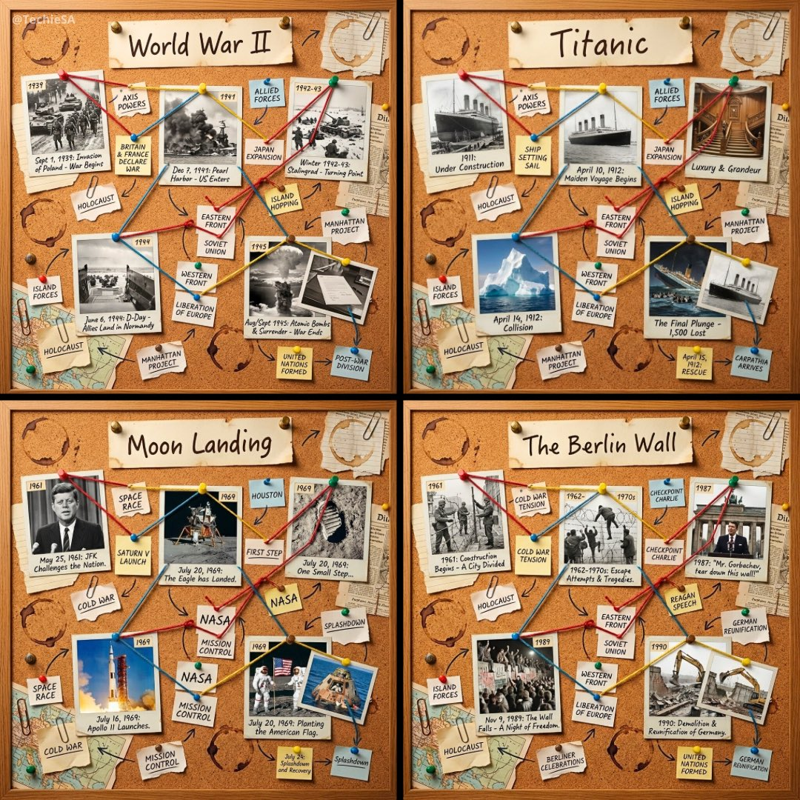

## Use a user-uploaded image as the source and convert the 

- ID: trending-2031893220314202619
- Slug: trending-2031893220314202619-en
- 语言: en
- 来源: [来源链接](https://x.com/Naiknelofar788/status/2031893220314202619)
- 样例图路径: images/part1/2031893220314202619_1.jpg

### 提示词

```text
Use a user-uploaded image as the source and convert the person into a stylized 3D character while preserving identity, facial structure, pose, hairstyle, clothing, and overall composition exactly as shown in the photo. The result should clearly resemble the real person.

The visual style is a stylized 3D character with a soft minimal cartoon 3D aesthetic, inspired by Pixar-like visuals but more minimal, toy-figure renders, and clean product-style character design. The balance should favor stylization over realism without changing the person’s real-world appearance.

Skin should appear as smooth matte plastic with a soft, uniform texture and gentle subsurface scattering. Facial features should remain faithful to the original image while being simplified in form. The expression should stay neutral and natural to the source photo.

Lighting should be clean and controlled, similar to a studio softbox setup, with very soft shadows, low contrast, and subtle highlights. The background should be a solid [BACKGROUND COLOR] with no gradient.

The camera should feel front-facing with a medium close-up framing, similar to a 50mm lens, with no distortion. Output quality should be high resolution with clean edges, no noise, strong style consistency, and a clearly non-photorealistic finish.
```

### 样例图

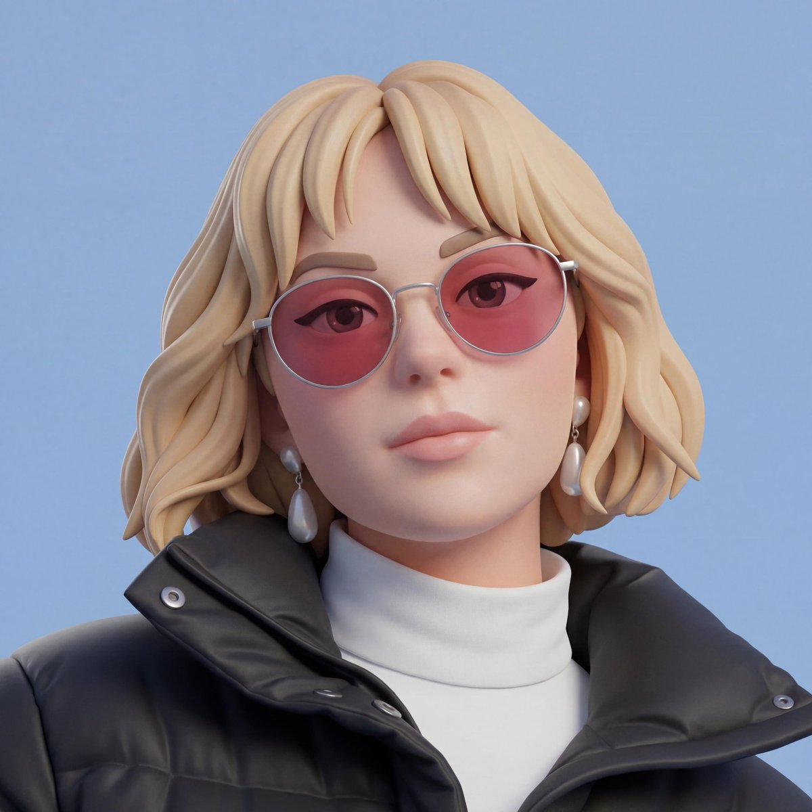

## 8K Ultra-Realistic Promotional Design a hyper-realistic 

- ID: trending-2011389738591338958
- Slug: trending-2011389738591338958-en
- 语言: en
- 来源: [来源链接](https://x.com/Milo_Bahi_02/status/2011389738591338958)
- 样例图路径: images/part1/2011389738591338958_1.jpg

### 提示词

```text
8K Ultra-Realistic Promotional
Design a hyper-realistic close-up image of a folded sheet of aged paper. Within the paper’s creases and surfaces, depict a [SCENE OR MEMORY] emerging naturally from the folds, like sculpted origami.
The environment and figures (if present) appear embossed or printed directly into the paper, using wrinkles, grain, and ink textures to build the illusion. Include subtle shadows, curled edges, torn corners, and ink fading to enhance realism.
Set the paper on a neutral tabletop with soft directional light from one side, casting gentle shadows and enhancing dimensional depth.
Photorealistic, emotional storytelling, handcrafted visual illusion, 8K ultra-detail, and image size 4 5.
```

### 样例图

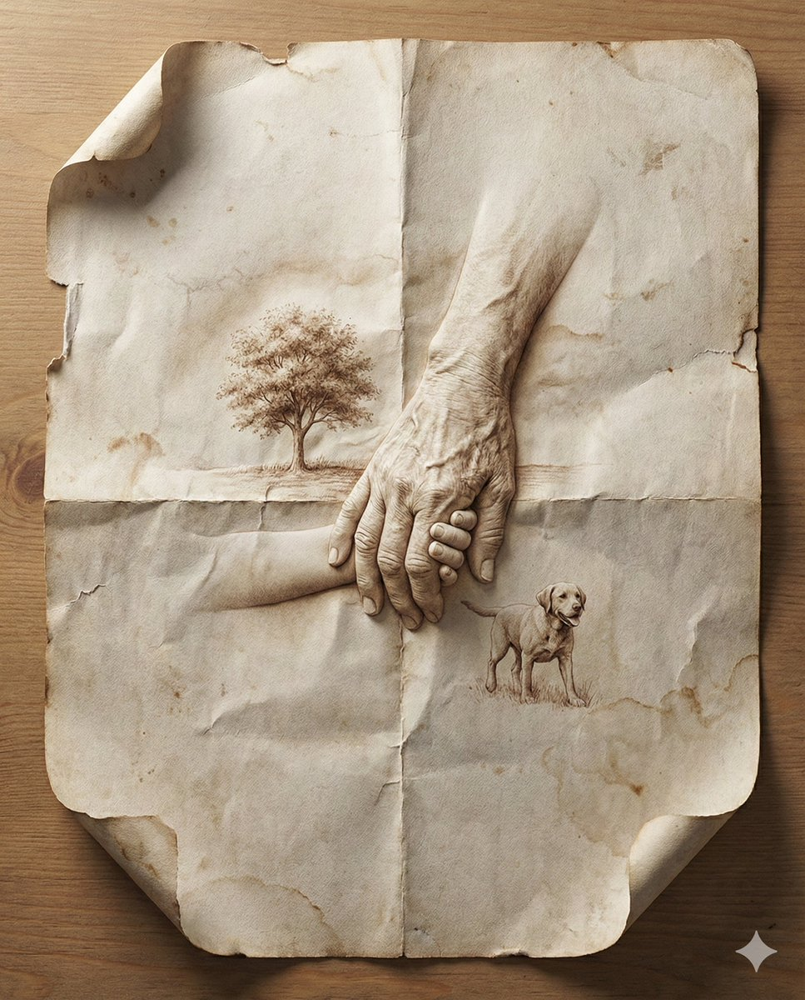

## Ultra-detailed large-scale miniature diorama of [STADIUM

- ID: trending-2030720984467050550
- Slug: trending-2030720984467050550-en
- 语言: en
- 来源: [来源链接](https://x.com/TechieBySA/status/2030720984467050550)
- 样例图路径: images/part1/2030720984467050550_1.jpg

### 提示词

```text
Ultra-detailed large-scale miniature diorama of [STADIUM NAME] in [CITY] presented as a premium museum-quality desktop exhibition model.
True architectural scale model craftsmanship with extreme fine detail.
[STADIUM NAME] fully visible and centered in the composition: iconic roof structure, exterior facade details, floodlight towers rising dramatically, the entire stadium accurately represented from ground level to roof.
Surrounding miniature [CITY] city blocks: small local-style residential buildings, grid street layout, tiny trees lining the sidewalks, mini cars and pedestrians for scale realism.
Ground textures: stone pavements, micro streetlights, tiny fan plazas and entrance gates surrounding the stadium.
Materials: realistic miniature concrete and steel texture, matte architectural model surfaces, precise structural detailing, museum-grade craftsmanship.
Display base: elegant rectangular exhibition base, subtle engraved metal plate reading “[CITY] – [STADIUM NAME]”.
Lighting: soft museum spotlighting from above, gentle shadows enhancing the structural details, clean studio environment.
Camera: slightly elevated macro architectural photography angle, tilt-shift miniature aesthetic, center extremely sharp with slight edge depth falloff.
Ultra realistic collectible stadium model, 8K resolution, luxury museum exhibition presentation.
Aspect ratio 4:5 vertical
```

### 样例图

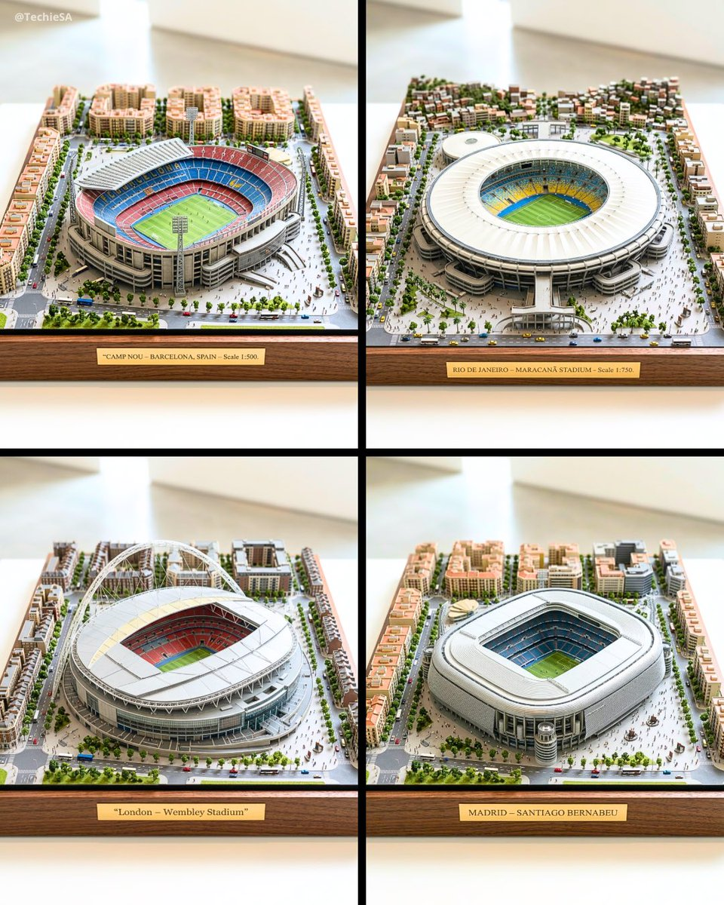

## Ultra-realistic studio portrait of an anthropomorphic ro

- ID: trending-2016350733839597878
- Slug: trending-2016350733839597878-en
- 语言: en
- 来源: [来源链接](https://x.com/Mind_Boticni/status/2016350733839597878)
- 样例图路径: images/part1/2016350733839597878_1.jpg

### 提示词

```text
Ultra-realistic studio portrait of an anthropomorphic rooster styled like a street skater. A confident white rooster with a red comb and wattles stands upright like a human, full body visible, facing slightly to the side. The rooster is wearing oversized vintage blue denim jeans with a loose, baggy fit, a faded denim jacket hanging off the shoulders, and a thick silver chain necklace around its neck. A brown leather belt is fastened tightly around the waist.
The rooster is holding a worn skateboard vertically with one wing, resting it on the floor. The skateboard has scratched trucks, beige wheels, and a distressed, colorful deck. On its feet are chunky white high-top sneakers with visible wear and realistic fabric texture.
Highly detailed feathers with realistic texture and volume, sharp focus on the rooster’s face and clothing. Studio lighting with soft shadows, clean white/neutral background, fashion editorial style. Cinematic realism, humorous yet stylish vibe, perfect balance between realism and surreal character design. Ultra-high resolution, hyper-detailed materials (denim fabric, leather belt, metal chain, feathers), shallow depth of field, professional photography look.
```

### 样例图

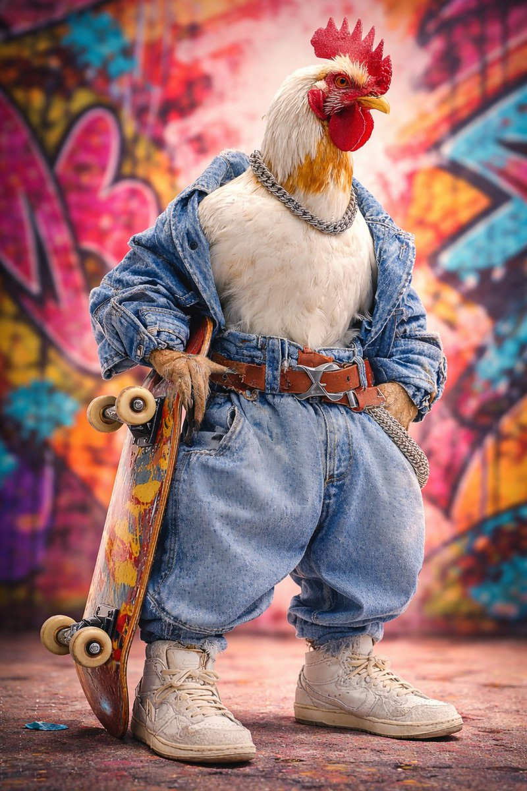

## A high-speed studio photograph of a cluster of fresh blu

- ID: trending-2020688064964940218
- Slug: trending-2020688064964940218-en
- 语言: en
- 来源: [来源链接](https://x.com/Just_sharon7/status/2020688064964940218)
- 样例图路径: images/part1/2020688064964940218_1.jpg

### 提示词

```text
A high-speed studio photograph of a cluster of fresh blueberries suspended midair, softly wrapped by a gentle flow of pale blueberry yogurt, smooth and restrained liquid motion, minimal splash, thick and creamy texture, elegant curved yogurt flow hugging the berries, very few small droplets, calm fluid dynamics, photorealistic macro food photography, ultra-realistic texture, professional studio lighting, soft diffuse highlights, pure white background, isolated object, clean cutout, no CGI, no 3D render, no illustration
```

### 样例图


## Cinematic 8k hyper-realistic close-up shot. A 3D realist

- ID: trending-2038263197925253176
- Slug: trending-2038263197925253176-en
- 语言: en
- 来源: [来源链接](https://x.com/de_mon010/status/2038263197925253176)
- 样例图路径: images/part1/2038263197925253176_1.jpg

### 提示词

```text
Cinematic 8k hyper-realistic close-up shot. A 3D realistic Bugs Bunny, faithful to his classic design but with detailed fur texture, wearing a white barber uniform. He is holding a bottle labeled "HARE TONIC" and pouring liquid onto the head of a sitting man. Man [photos reference with hair] has a worried and nervous expression, water dripping down his face. Vintage barbershop background with a mirror. Dynamic lighting, high detail, photorealistic rendering style
```

### 样例图

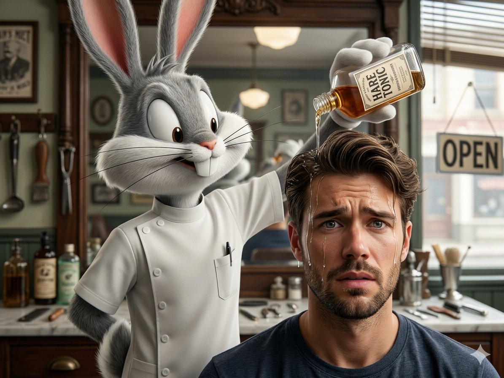

## Input Variable: [Any Famous Building - Guggenheim, Burj 

- ID: trending-2018906863266345105
- Slug: trending-2018906863266345105-en
- 语言: en
- 来源: [来源链接](https://x.com/Gdgtify/status/2018906863266345105)
- 样例图路径: images/part1/2018906863266345105_1.jpg

### 提示词

```text
Input Variable: [Any Famous Building - Guggenheim, Burj Khalifa, Sydney Opera House, etc.]
System Instruction:
Generate a hyper-realistic, isometric 3D "Exploded View" diorama showing the Input Building deconstructed into its structural systems with an architectural model-making crew assembling a scale version.
1. Semantic Engineering Analysis:

Layer 1 (The Skin): Exterior facade panels, windows, cladding, roofing, entrance canopy
Layer 2 (The Structure): Steel framework, floor plates, columns, beams, elevator shafts, stairwells, mechanical systems
Layer 3 (The Foundation): Basement levels, support pillars, utility conduits, HVAC units, individual rivets/bolts, rebar cages

2.   Container:

Surface: Architect's drafting table with cutting mats and T-squares
Layout: Building layers stacked vertically showing ground-up construction sequence
Connections: White architectural section lines showing structural load paths and circulation
Additional Elements: Blueprint sheets, scale rulers, material samples, elevation drawings

3.  Micro-Narrative:

CRITICAL: This is meta - tiny workers building a model that's being built by tiny workers. Recursive scale concept.
Workers: 1:87 scale model makers in black turtlenecks (architect stereotype)
Equipment: Laser cutters, 3D printers, basswood cutting stations, acrylic gluing rigs, miniature cranes positioning floor plates
Interaction: Architects cutting foam core, assembling balsa wood frames, installing tiny windows, spray painting facades, arranging scale furniture

4. Visual Syntax & Material Physics:

Materials: Basswood grain, clear acrylic sheets, white foam core, brass rod framework, museum board textures
Lighting: Architecture studio track lighting creating dramatic model shadows
Special Effects: Glue strands, wood shavings, spray paint mist, laser cutter burn marks
Output: Elevated three-quarter view, architectural presentation, 1:1 ratio, 8K, Archdaily model photography aesthetic
```

### 样例图

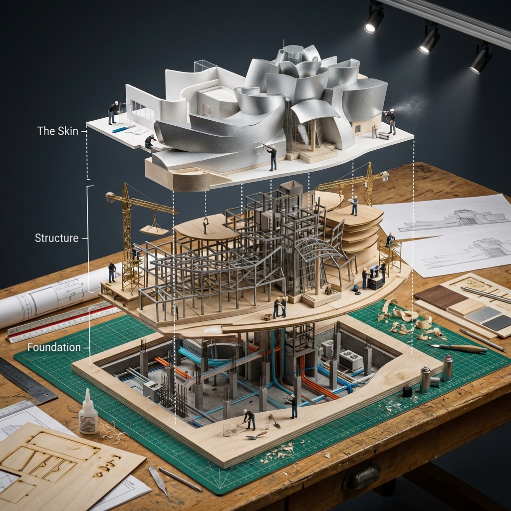

## Generate a 3D isometric diorama illustration of [CHARACT

- ID: trending-2032155937532772551
- Slug: trending-2032155937532772551-en
- 语言: en
- 来源: [来源链接](https://x.com/TechieBySA/status/2032155937532772551)
- 样例图路径: images/part1/2032155937532772551_1.jpg

### 提示词

```text
Generate a 3D isometric diorama illustration of [CHARACTER] working from home at a desk with a laptop and a window. Handmade felt appearance with rounded polished shapes, enclosed in a hexagonal rounded cube frame. The room decor, colours, furniture, wall art, and accessories are all instantly recognisable to [CHARACTER] — reflecting their signature style, iconic items, outfit, and personality. Warm soft lighting, clean white background, 1080x1080, photorealistic quality. No text labels or signs on the base.
```

### 样例图

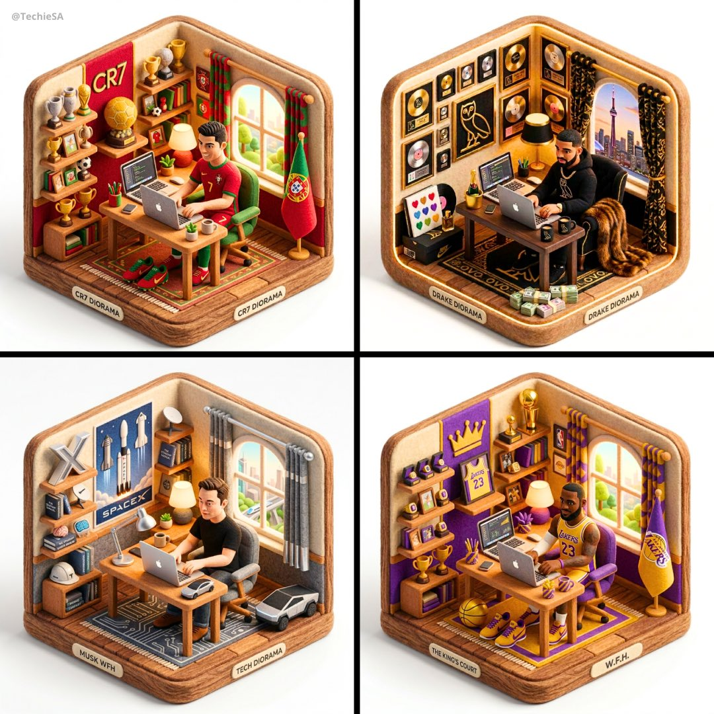

## Use the image I sent. Create a hand-drawn portrait illus

- ID: trending-2033633173372866893
- Slug: trending-2033633173372866893-en
- 语言: en
- 来源: [来源链接](https://x.com/TechieBySA/status/2033633173372866893)
- 样例图路径: images/part1/2033633173372866893_1.jpg

### 提示词

```text
Use the image I sent. Create a hand-drawn portrait illustration with red and yellow pen on notebook paper, inspired by comic book drawings and annotations. Maintain a complete likeness to the subject, expressive lines, spontaneous gestures, sharp and bright outlines, handwritten annotations around the edges, and a realistic texture of the pen strokes. AR 3:4
```

### 样例图

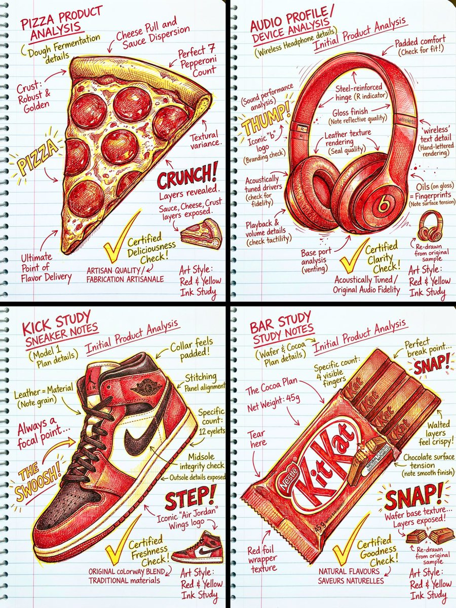

## 3D Pixar-style animated child character, cute young boy 

- ID: trending-2042541082580521244
- Slug: trending-2042541082580521244-en
- 语言: en
- 来源: [来源链接](https://x.com/auqibhabib/status/2042541082580521244)
- 样例图路径: images/part1/2042541082580521244_1.jpg

### 提示词

```text
3D Pixar-style animated child character, cute young boy with messy brown hair and big expressive blue eyes, surprised open-mouth expression, soft round face, wearing a fuzzy teal sweater with small “noo” text on chest, loose beige patterned pants, white sneakers, small brown crossbody bag, standing on an orange electric scooter, minimal teal studio background, soft lighting, ultra-detailed textures (fabric fuzz, skin, hair), cinematic depth of field, vibrant colors, highly polished render, octane render, 4k
```

### 样例图

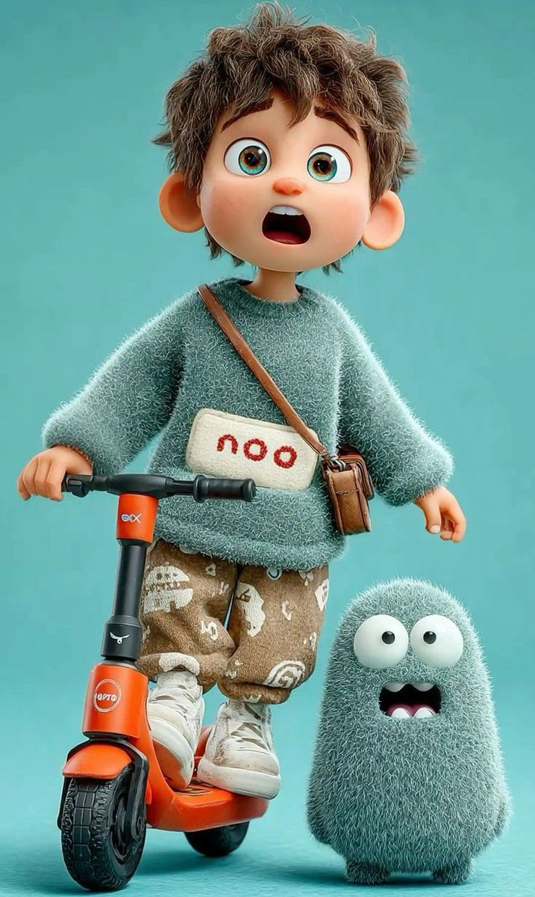

## High-quality stylized 3D CGI big-head cartoon render of 

- ID: trending-2033569344890802668
- Slug: trending-2033569344890802668-en
- 语言: en
- 来源: [来源链接](https://x.com/kaanakz/status/2033569344890802668)
- 样例图路径: images/part1/2033569344890802668_1.jpg

### 提示词

```text
High-quality stylized 3D CGI big-head cartoon render of Harry Potter, square profile picture composition, oversized head and small shoulders in a playful Pixar-style caricature. Head and facial features exaggerated while keeping him instantly recognizable: messy dark hair, round glasses, lightning-shaped scar on the forehead, curious and brave expression. Portrait framing focused on the large head with a small portion of the shoulders visible, wearing Hogwarts robe collar and tie. Smooth polished materials, glossy animated film shading with refined Pixar-style character rendering. Soft cinematic lighting creating gentle highlights on the glasses. Minimalist bright magical red background inspired by Hogwarts colors, clean composition optimized for social media profile pictures, ultra-detailed, no text, no watermark.
```

### 样例图

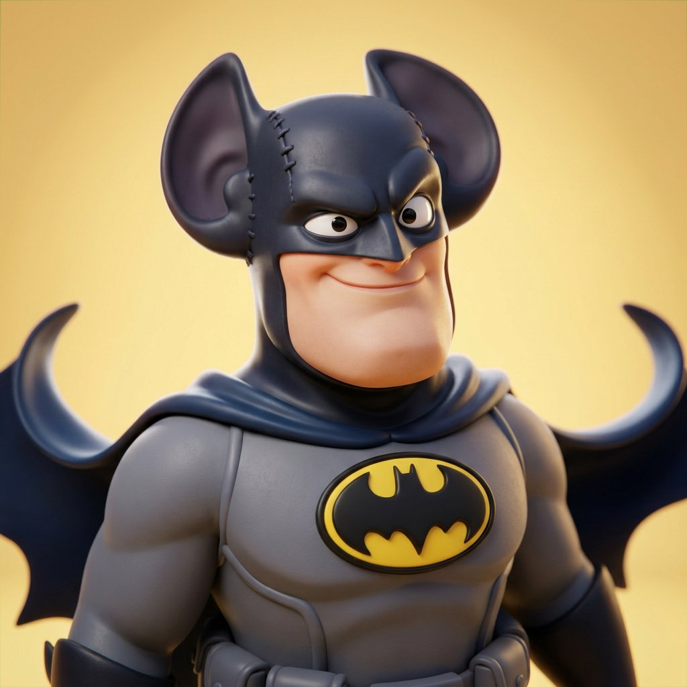

## Create a 3D isometric diorama illustration of an origina

- ID: trending-2035592959685525590
- Slug: trending-2035592959685525590-en
- 语言: en
- 来源: [来源链接](https://x.com/Preda2005/status/2035592959685525590)
- 样例图路径: images/part1/2035592959685525590_1.jpg

### 提示词

```text
Create a 3D isometric diorama illustration of an original character named [CHARACTER NAME], peacefully working or practicing a creative activity in a nature-inspired environment, sitting at a wooden desk near a large open window with sunlight flowing in and soft greenery visible outside.

The character should be inspired by [ARCHETYPE / PROFESSION – e.g. writer, painter, meditator, calligraphy artist, tea master] and have a unique visual identity, including soft, natural clothing, organic textures, and a calm, introspective personality.

The entire scene must have a handcrafted felt aesthetic, with soft rounded shapes, visible stitching details, and clean, polished textures.

The diorama is enclosed inside a rounded cube structure with subtle hexagonal proportions, made of [MATERIAL STYLE – e.g. soft matte ceramic, light frosted resin, natural wood finish].

The environment must strongly reflect a peaceful, nature-connected lifestyle, including plants, natural wood furniture, soft textiles, and minimalistic decor.

On the desk, include small detailed objects such as [OBJECT 1 – e.g. tea cup], [OBJECT 2 – e.g. brush or pen], [OBJECT 3 – e.g. notebook or scroll].

Lighting should be bright, soft, and natural, with warm sunlight beams entering through the window, creating a serene and airy atmosphere, with a clean white background outside the diorama.

Render in 1080x1080, ultra-detailed, photorealistic style.

Include a small stitched fabric name tag sewn onto the INNER wall of the diorama (top-left corner inside the cube), clearly integrated into the scene, not floating and not outside the structure, displaying the name: [CHARACTER NAME].
```

### 样例图

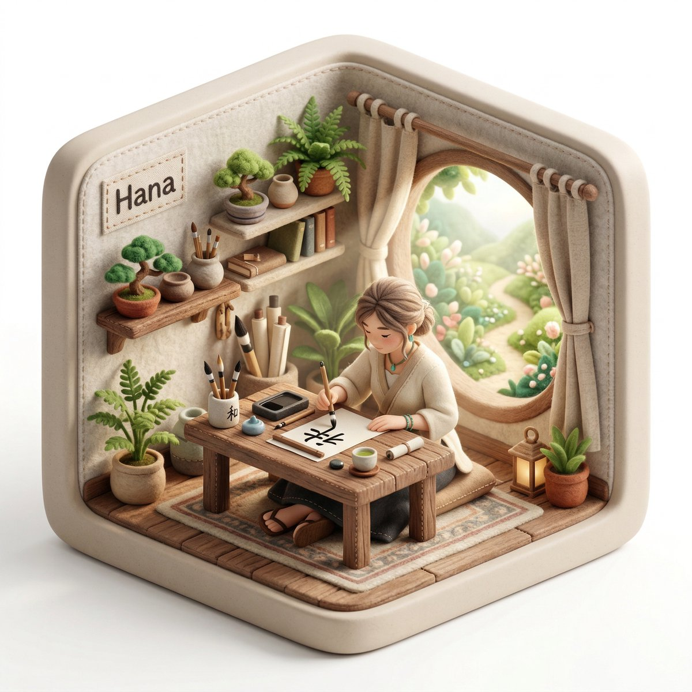

## (Paris, PC) Anchor: [Location] :: [Material Concept]::4 

- ID: trending-2008843805487686111
- Slug: trending-2008843805487686111-en
- 语言: en
- 来源: [来源链接](https://x.com/Gdgtify/status/2008843805487686111)
- 样例图路径: images/part1/2008843805487686111_1.jpg

### 提示词

```text
(Paris, PC) Anchor: [Location] :: [Material Concept]::4
Morphology: Miniature architectural cityscape of [Location], entire skyline constructed via the assemblage of [Material Concept] components, skyscrapers and structures formed from the constituent parts of [Material Concept], thematic structural engineering, hyper-detailed diorama::3
Material Physics: Physical properties of [Material Concept] applied to architecture, [Material Concept] textures replacing concrete and glass, innate material logic of [Material Concept], high-fidelity surface details::3
Illumination: Lighting exhibiting the surface properties of [Material Concept], ambient occlusion, volumetric atmosphere matching the material theme::2
Render Stack: Tilt-shift photography, macro lens, f/2.8, 8k, scale model aesthetic, detailed texture mapping, Unreal Engine 5 render::1
Negative: [Human presence, massive scale, blurry, low resolution, bad geometry, distortions, flat 2D, text, watermark]:: -1
```

### 样例图

![(Paris, PC) Anchor: [Location] :: [Material Concept]::4 ](../images/part1/2008843805487686111_1.jpg)

## A handcrafted felt miniature scene featuring a soft wool

- ID: trending-2012051946979667992
- Slug: trending-2012051946979667992-en
- 语言: en
- 来源: [来源链接](https://x.com/john_my07/status/2012051946979667992)
- 样例图路径: images/part1/2012051946979667992_1.jpg

### 提示词

```text
A handcrafted felt miniature scene featuring a soft wool doll character with simplified facial features, round button eyes, rosy cheeks, and a gentle smile. The character wears a dark felt jacket, gray wool t-shirt, and matching trousers, styled in a minimal casual tech look. He is walking on grassy felt terrain alongside a small felt fox companion. Whimsical storybook environment with pastel greenery, soft clouds, and a bright blue sky, subtle miniature rockets blurred in the background. Macro photography style, shallow depth of field, soft natural daylight, stop-motion animation aesthetic, ultra-detailed felt fibers and fabric textures, cozy cinematic mood, high quality.
```

### 样例图

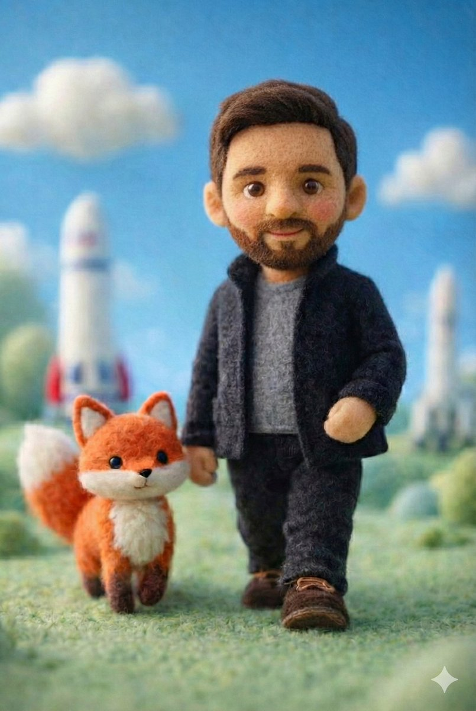

## { "Objective": "Create a heartwarming, whimsical portrai

- ID: trending-2011282431744336078
- Slug: trending-2011282431744336078-en
- 语言: en
- 来源: [来源链接](https://x.com/Taaruk_/status/2011282431744336078)
- 样例图路径: images/part1/2011282431744336078_1.jpg

### 提示词

```text
{
  "Objective": "Create a heartwarming, whimsical portrait blending photorealistic realism with a tiny Pixar-style animated character",
  "PersonaDetails": {
    "PrimarySubject": {
      "Type": "Young girl",
      "Expression": "Bright, joyful smile",
      "Hair": {
        "Style": "Long light-brown hair",
        "Accessories": "Cute ribbon bows"
      },
      "Wardrobe": {
        "Outerwear": "Casual denim jacket",
        "Top": "Soft neutral-colored shirt"
      }
    },
    "SecondarySubject": {
      "Type": "Tiny 3D cartoon version of the girl",
      "Scale": "Miniature, held delicately between fingers",
      "Style": "Pixar-style 3D character",
      "Proportions": "Oversized expressive eyes, rounded features",
      "Hair": "Pigtails matching the real girl",
      "Wardrobe": "Denim outfit matching the real subject",
      "Pose": "Arms raised joyfully"
    }
  },
  "Composition": {
    "Framing": "Close-up to medium portrait",
    "Interaction": "Clear playful interaction between girl and miniature character",
    "DepthOfField": "Shallow depth of field",
    "Focus": "Ultra-sharp focus on both faces"
  },
  "LightingAndBackground": {
    "Lighting": "Warm natural daylight",
    "Background": {
      "Style": "Soft golden bokeh",
      "Mood": "Dreamy, magical"
    }
  },
  "ArtDirection": {
    "StyleFusion": [
      "Photorealistic child portrait photography",
      "Pixar-style 3D animated character"
    ],
    "Aesthetic": "Magical realism with playful scale contrast",
    "TextureDetail": "Ultra-detailed skin, fabric, and 3D materials"
  },
  "MoodAndTone": {
    "Mood": "Heartwarming, joyful, whimsical",
    "EmotionalFeel": "Wonder, innocence, playful imagination"
  },
  "PhotographyStyle": {
    "Genre": "Cinematic lifestyle portrait photography",
    "LensFeel": "Portrait lens with creamy bokeh",
    "ImageQuality": "8K ultra-high realism"
  },
  "NegativePrompt": [
    "uncanny valley",
    "scary doll",
    "low-quality 3D",
    "harsh lighting",
    "oversaturated colors",
    "blurry focus",
    "flat expression"
  ],
  "ResponseFormat": {
    "Type": "Single image",
    "Orientation": "Portrait",
    "AspectRatio": "2:3"
  }
}
```

### 样例图


## A hyper-realistic 3D photo concept showing a hand holdin

- ID: trending-2011506876928966716
- Slug: trending-2011506876928966716-en
- 语言: en
- 来源: [来源链接](https://x.com/TechieBySA/status/2011506876928966716)
- 样例图路径: images/part1/2011506876928966716_1.jpg

### 提示词

```text
A hyper-realistic 3D photo concept showing a hand holding a square polaroid photo labeled “[ELEMENT]”. Inside the photo, there’s a close-up of [ELEMENT], and it flows seamlessly out of the photo frame into the real world, naturally interacting with the surface below. The text “[ELEMENT]” appears printed cleanly on the white border of the photo. Realistic cinematic lighting, ultra-detailed textures, artistic composition
```

### 样例图

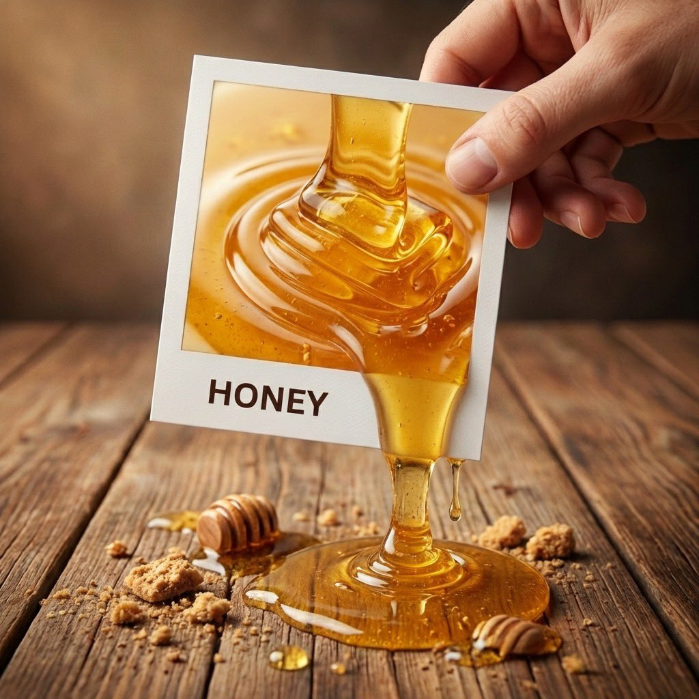

## Pixar/Disney 3D CGI animated movie poster. Soft volumetr

- ID: trending-2035781019404472471
- Slug: trending-2035781019404472471-en
- 语言: en
- 来源: [来源链接](https://x.com/TechieBySA/status/2035781019404472471)
- 样例图路径: images/part1/2035781019404472471_1.jpg

### 提示词

```text
Pixar/Disney 3D CGI animated movie poster. Soft volumetric lighting, smooth subsurface skin shading, expressive Pixar-style faces, polished studio render quality. Vertical poster, 3:4 ratio.
Show/Movie: [SHOW/MOVIE]
Automatically select the 3 most iconic characters from [SHOW/MOVIE]. Render each as a Pixar 3D CGI character with recognizable likeness, wearing their single most iconic outfit.
TITLE — LOCKED:
Show title at the very top. ALL CAPS. Pure white. Extra bold sans-serif block font. No outlines, no graphic boxes, no mixed case. Large, centered, one line if possible.
PANELS — LOCKED:
Three vertical panels below the title. Each panel shows ONE character, UPPER BODY from waist up, filling the panel with face large and centered. Panel outline is a bold thick stroke in the most iconic accent color of [SHOW/MOVIE] — vivid and saturated, not dark or muted.
∙Left panel: perfectly straight
∙Center panel: perfectly straight, slightly larger than the side panels
∙Right panel: perfectly straight
BACKGROUND — LOCKED FORMAT, VARIABLE PATTERN:
Background uses the 2 most iconic colors of [SHOW/MOVIE] — fully saturated, vivid and punchy, NOT darkened or desaturated. High contrast and visually striking. Behind the panels, fill the background with a large abstract graphic pattern directly inspired by the most iconic visual symbol of [SHOW/MOVIE] — blown up, repeating, semi-transparent. Examples: Breaking Bad = oversized molecular/chemical structures in bright yellow-green. Stranger Things = tangled vine tendrils in vivid red. Peaky Blinders = repeating razor blade motif in sharp silver-burgundy. The Sopranos = bold pinstripe pattern in navy and gold. No scenes, no characters, no locations in the background. Pattern only. Overall image must feel bold, vibrant, energetic and eye-catching — like a premium comic poster, not a muted cinematic still.
RULES:
∙Upper body only — waist to top of head, face prominent and large inside panel
∙Pure white ALL CAPS bold title only — no other text
∙No character names, no watermarks, no logos, no extra graphic elements
∙Colors must be vivid, saturated and high contrast throughout — no muted, faded or desaturated tones anywhere
∙8K, professional Pixar studio render quality
```

### 样例图

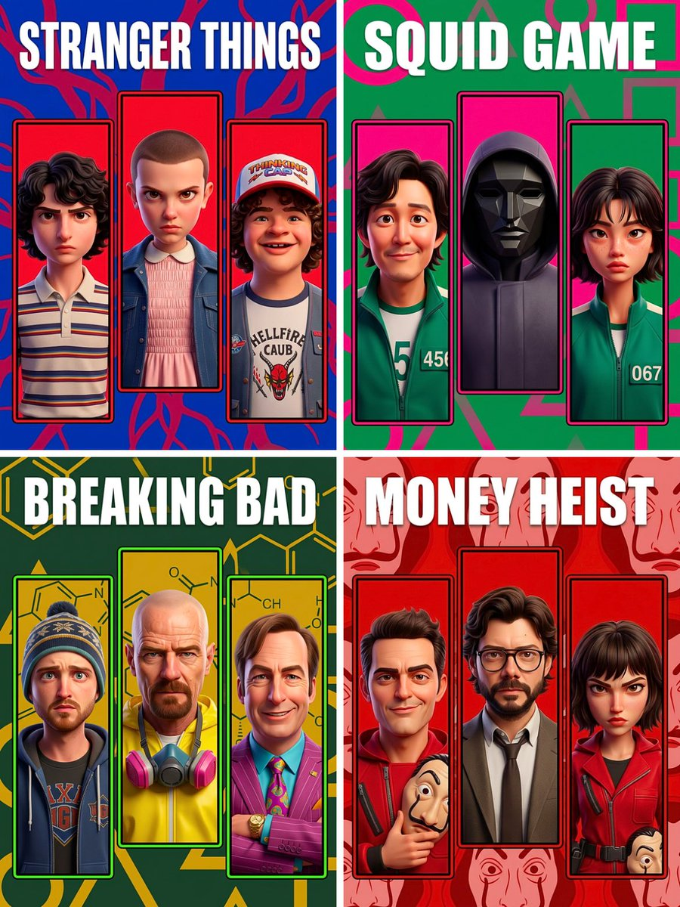

## Hyper-stylized dynamic 3D floating head portrait of the 

- ID: trending-2026207647968743551
- Slug: trending-2026207647968743551-en
- 语言: en
- 来源: [来源链接](https://x.com/Naiknelofar788/status/2026207647968743551)
- 样例图路径: images/part1/2026207647968743551_1.jpg

### 提示词

```text
Hyper-stylized dynamic 3D floating head portrait of the attached reference image, perfectly centered, upright, symmetrical, filling 80% of the 4:5 frame. No neck. No shoulder edges. Clean cut-out. Subject floating in white space.Predominantly white background enhanced with subtle tonal gradients and soft volumetric glow. A thin luminous neon halo ring glows behind the head, slightly diffused but clean and circular.

Facial features match reference photo precisely. Expression: confident, dominant smirk with focused eye contact. Diamond-studded braces sparkle under sharp lighting.

Sleek silver sports sunglasses reflect digital stadium lights and neon streaks. Chrome stud earrings and polished silver chain subtly visible.

Official lakers shirt strictly front view chest logo and sponsor visible only.

Lighting combines bright frontal fill with strong rim lights. Subtle neon reflections trace along jawline edges. Micro lens flares appear at high-intensity highlights.

White-on-white energy with controlled neon accents. Futuristic champion aura. Glossy skin, exaggerated reflections, cinematic intensity.

Aspect ratio 4:5.
```

### 样例图

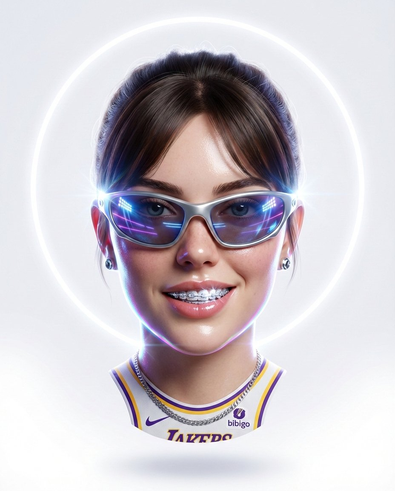

## { "type": "image_generation_prompt", "style": "ultra-rea

- ID: trending-2026812324082782705
- Slug: trending-2026812324082782705-en
- 语言: en
- 来源: [来源链接](https://x.com/saniaspeaks_/status/2026812324082782705)
- 样例图路径: images/part1/2026812324082782705_1.jpg

### 提示词

```text
{
  "type": "image_generation_prompt",
  "style": "ultra-realistic, cinematic, sci-fi mech aesthetic, cyberpunk",
  "resolution": "8K",
  "aspect_ratio": "2:3",
  "scene": {
    "location": "industrial workshop",
    "background": "clean minimal workshop environment with subtle machinery elements and soft atmospheric haze"
  },
  "subject": {
    "gender": "female",
    "role": "cyberpunk mechanic",
    "identity": {
      "same_face": true,
      "same_character": true,
      "preserve_facial_features": true,
      "realism": "exact facial structure, skin texture, and expression retained"
    },
    "pose": {
      "stance": "standing strong and confident",
      "body_language": "powerful, grounded posture"
    },
    "appearance": {
      "outfit": {
        "jacket": "purple futuristic techwear jacket",
        "details": [
          "tactical straps",
          "utility pouches",
          "reinforced armored panels",
          "futuristic cyberpunk textures"
        ]
      }
    },
    "equipment": {
      "exosuit_backpack": {
        "type": "massive mechanical industrial exosuit",
        "components": [
          "large industrial engine core",
          "exposed wires and cables",
          "metal pipes and hydraulic tubes",
          "heavy mechanical armor plates",
          "mechanical joints and connectors"
        ],
        "style": "futuristic sci-fi mech design, functional and industrial"
      }
    }
  },
  "lighting": {
    "type": "cinematic industrial lighting",
    "details": [
      "soft dramatic shadows",
      "cool and warm mixed highlights",
      "subtle volumetric light",
      "metal reflections and glow accents"
    ]
  },
  "camera": {
    "focus": "sharp focus on subject and exosuit",
    "depth_of_field": "shallow with soft background separation",
    "composition": "centered, full-body or mid-body portrait"
  },
  "quality": {
    "detail_level": "hyper detailed",
    "textures": "ultra realistic skin, fabric, and metal textures",
    "sharpness": "extremely sharp",
    "noise": "clean high-resolution render"
  },
  "mood": "powerful, futuristic, cinematic, sci-fi industrial",
  "constraints": [
    "no cartoon style",
    "no low detail",
    "no distortion",
    "no watermark",
    "no text overlay",
    "no unrealistic anatomy"
  ],
  "output_goal": "Create a hyper-realistic cinematic portrait of a cyberpunk mechanic girl wearing a massive mechanical exosuit backpack with industrial engine components, wires, pipes, and metal armor, standing strong in a minimal workshop environment with dramatic lighting and ultra-detailed sci-fi mech aesthetics."
}
```

### 样例图

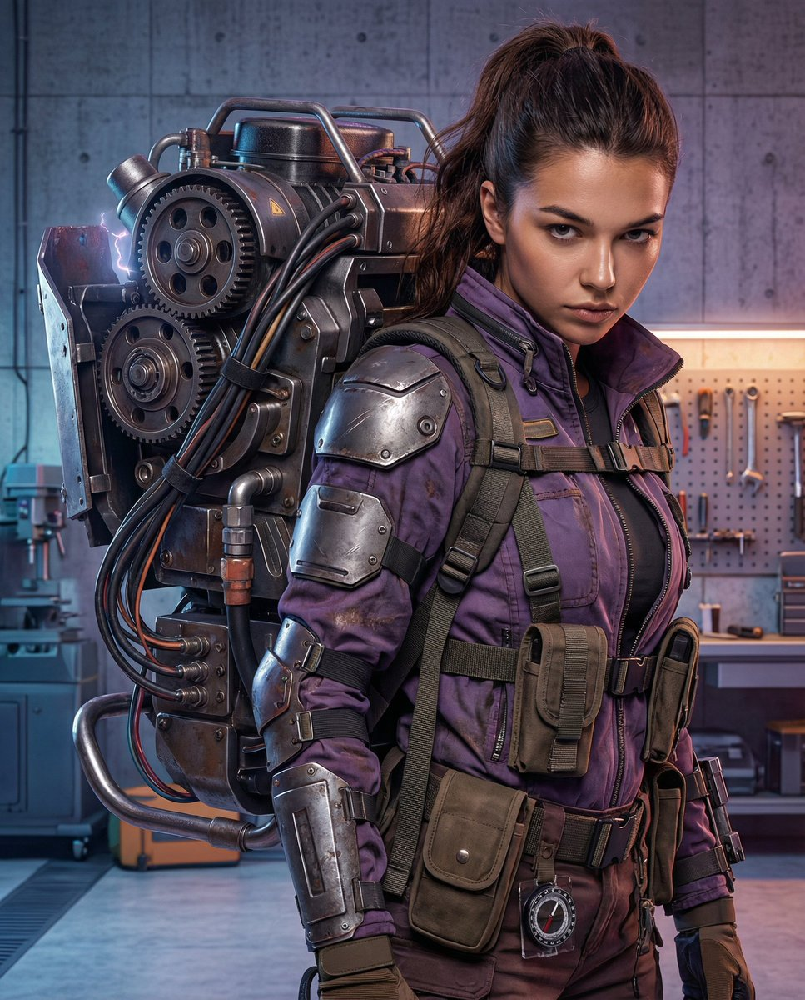

## Vertical 4:5 surreal 3D scene featuring a photorealistic

- ID: trending-2015436671286648863
- Slug: trending-2015436671286648863-en
- 语言: en
- 来源: [来源链接](https://x.com/TechieBySA/status/2015436671286648863)
- 样例图路径: images/part1/2015436671286648863_1.jpg

### 提示词

```text
Vertical 4:5 surreal 3D scene featuring a photorealistic character generated strictly from the attached reference image (accurate facial likeness, skin texture, age, proportions).

Front-facing view, camera slightly above eye level, the character riding his own scooter or motorbike directly on top of the blue GPS route line itself, moving forward toward a red destination pin.

The character wears culturally neutral, realistic urban clothing inspired by [COUNTRY], with accurate fabric behavior and natural riding posture.

Below, a stylized GPS-style city map of [CITY] fills the scene. A chaos zone at [LANDMARK / AREA] shows dense miniature cars, people, buildings, trees, and urban clutter concentrated near the destination.

Natural daylight, cinematic shadows, sharp focus on the character, and subtle depth of field on the map.

High-end concept-art quality combining photoreal human + stylized miniature city.
```

### 样例图

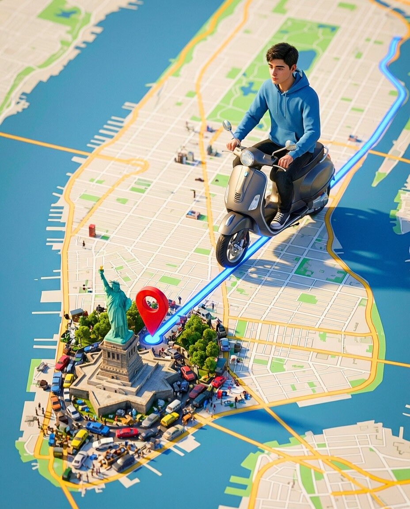

## 3D Pixar-style animated girl shown in a 6-panel grid, sa

- ID: trending-2023035676791603643
- Slug: trending-2023035676791603643-en
- 语言: en
- 来源: [来源链接](https://x.com/Taaruk_/status/2023035676791603643)
- 样例图路径: images/part1/2023035676791603643_1.jpg

### 提示词

```text
3D Pixar-style animated girl shown in a 6-panel grid, same character with short brown hair and big blue eyes, different emotions (happy, shocked, angry, caring, confident, thumbs up), colorful solid backgrounds (yellow, blue, red, pink, purple, green), soft studio lighting, smooth 3D render, vibrant colors, ultra-detailed, 4K, animated movie quality.
```

### 样例图

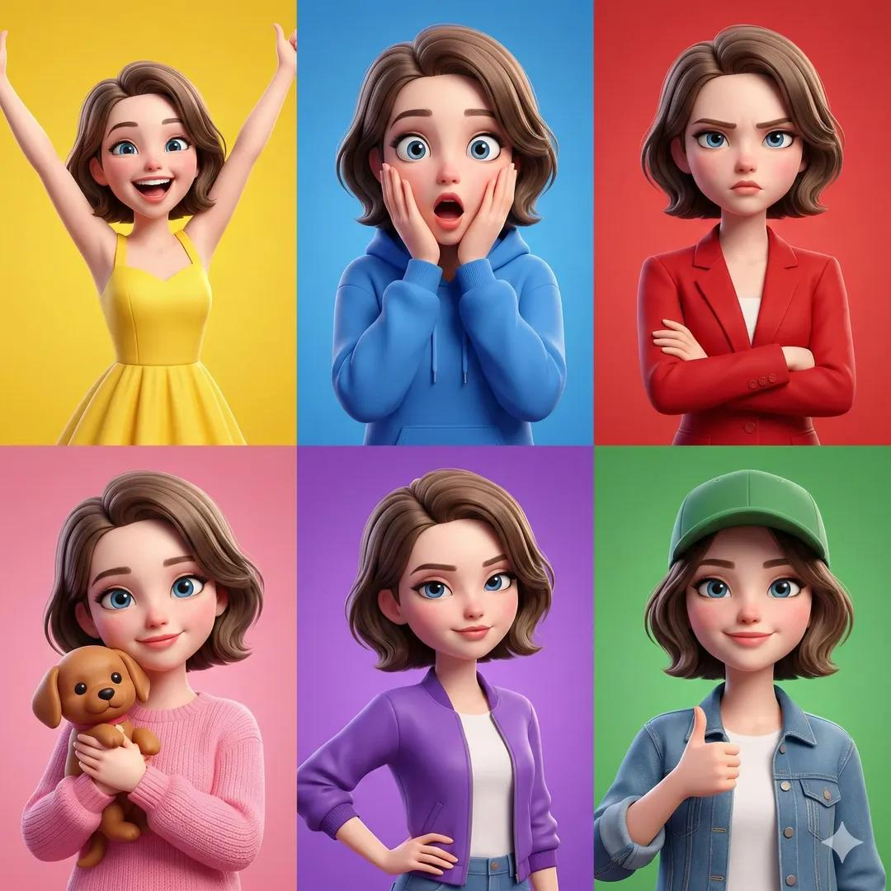

## A highly detailed pebble mosaic portrait of a beautiful 

- ID: trending-2031520039850094952
- Slug: trending-2031520039850094952-en
- 语言: en
- 来源: [来源链接](https://x.com/AIwithSynthia/status/2031520039850094952)
- 样例图路径: images/part1/2031520039850094952_1.jpg

### 提示词

```text
A highly detailed pebble mosaic portrait of a beautiful woman, where the entire image is constructed from thousands of smooth natural stones and pebbles. The pebbles vary in size and color to form realistic facial features, hair, skin tones, and clothing patterns. The woman has long flowing hair and is wearing a richly patterned red traditional dress. The background is also composed of carefully arranged river stones creating a textured mosaic wall. Ultra-detailed stone texture, gemini natural earthy colors, soft lighting, artistic stone mosaic craftsmanship, gemini photorealistic composition, 8k resolution, intricate pebble placement, handcrafted mosaic art style.
```

### 样例图

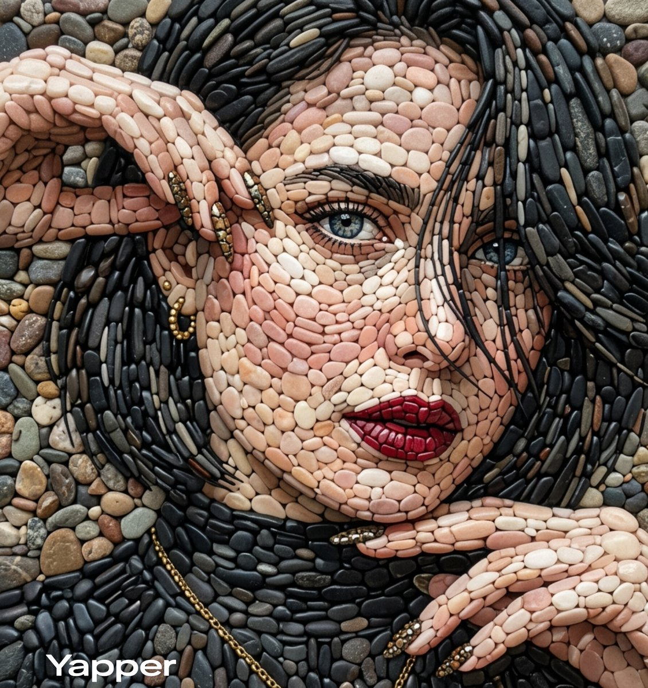

## Prompt Studio: Minimalist Luxury Product Design with Nan

- ID: trending-2028956048531288229
- Slug: trending-2028956048531288229-en
- 语言: en
- 来源: [来源链接](https://x.com/AllaAisling/status/2028956048531288229)
- 样例图路径: images/part1/2028956048531288229_1.jpg

### 提示词

```text
Prompt Studio: Minimalist Luxury Product Design with Nano Banana 2 in Firefly

Pristine product visualization, [object] in [material], deconstructed floating parts suspended in a precision-aligned engineering sequence, pure white gradient void with subtle depth falloff, sculptural studio lighting with sharp rim highlights, mirror-polished and matte surface contrast, ultra-macro lens revealing microscopic [surface detail] and internal [component detail], shallow depth of field isolating the core components, minimalist Braun meets Leica aesthetic, heroic product scale presence, product photography.

Check ALTs for ideas 👇 @AdobeFirefly
```

### 样例图

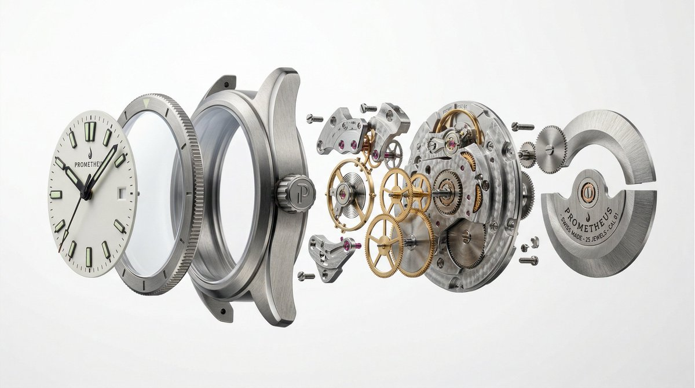

## { "scene": { "description": "Artistic miniature diorama 

- ID: trending-2011978683230347749
- Slug: trending-2011978683230347749-en
- 语言: en
- 来源: [来源链接](https://x.com/Just_sharon7/status/2011978683230347749)
- 样例图路径: images/part1/2011978683230347749_1.jpg

### 提示词

```text
{
  "scene": {
    "description": "Artistic miniature diorama of youthful figurines collaboratively painting a vibrant environmental mural on a small outdoor wall near Gedung Sate, Bandung.",
    "location": "Near Gedung Sate, Bandung, Indonesia",
    "environment": "Urban cultural landmark setting with a cozy, handcrafted miniature scale"
  },
  "subjects": {
    "characters": "Miniature youth figurines",
    "actions": [
      "painting a large colorful mural",
      "climbing tiny ladders",
      "holding paint brushes and buckets",
      "splashing paint playfully"
    ],
    "expressions": "Energetic, joyful, creative"
  },
  "mural_details": {
    "theme": "Environmental awareness and positivity",
    "elements": [
      "green mountains",
      "lush trees",
      "bicycles symbolizing eco-friendly transport",
      "clean flowing rivers"
    ],
    "text": "You're the best, Sharon"
  },
  "props": {
    "items": [
      "tiny paint buckets",
      "mini ladders",
      "small paint brushes",
      "paint splashes on ground and wall"
    ]
  },
  "style": {
    "art_form": "Miniature diorama",
    "photography": "Cinematic macro photography",
    "detail_level": "Highly detailed textures and figures"
  },
  "lighting": {
    "type": "Warm, soft lighting",
    "mood": "Bright, cheerful, uplifting"
  },
  "camera": {
    "depth_of_field": "Shallow depth of field",
    "focus": "Sharp focus on figurines and mural"
  },
  "color_palette": {
    "tones": [
      "Bright",
      "Cheerful",
      "Vivid"
    ]
  },
  "render_settings": {
    "aspect_ratio": "4:5",
    "quality": 2,
    "stylization": "2/5"
  }
}
```

### 样例图

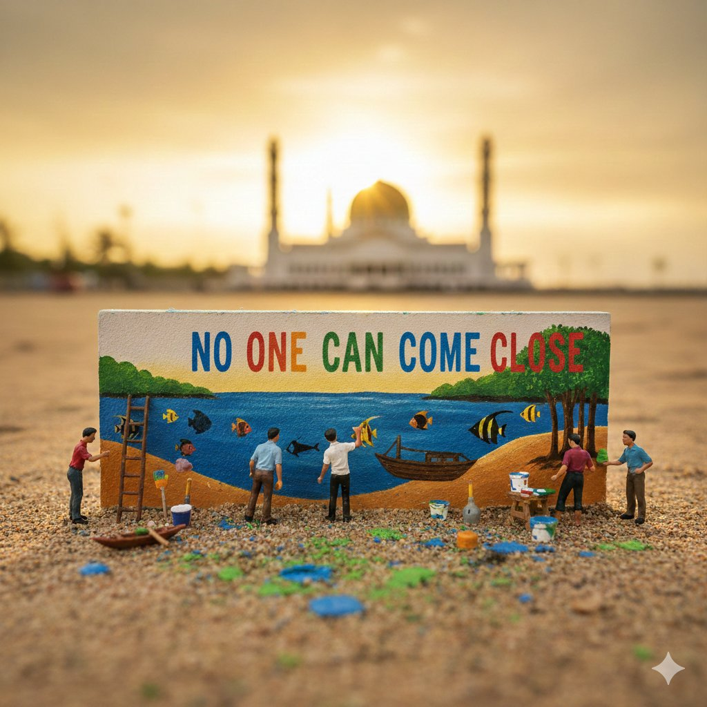

## { "prompt": "Three K-pop idols sitting on a train. Left 

- ID: trending-2033747149994045758
- Slug: trending-2033747149994045758-en
- 语言: en
- 来源: [来源链接](https://x.com/youngcatwoman/status/2033747149994045758)
- 样例图路径: images/part1/2033747149994045758_1.jpg

### 提示词

```text
{
"prompt": "Three K-pop idols sitting on a train. Left girl is Rosé with pale skin and long blonde hair, looking at a phone. Middle girl is Tzuyu with warm fair skin and dark brown hair, sleeping, making a peace sign. Right girl is Karina with sharp facial features and long dark hair, sleeping, wearing a navy vest. Uniforms: white shirts, navy plaid skirts, bow ties. Train window background. --ar 3:4",
"aspect_ratio": "3:4",
"subjects": [
{
"position": "left",
"identity": "Rosé",
"physical_characteristics": "slender face, pale skin, long straight blonde hair, soft monolid eyes, petite build",
"pose": "looking down, holding phone",
"outfit": "white cotton long-sleeve shirt, navy/white plaid pleated skirt, navy striped bow tie",
"items": "smartphone"
},
{
"position": "middle",
"identity": "Tzuyu",
"physical_characteristics": "elegant features, warm fair skin, large doe eyes, long dark brown wavy hair, tall build",
"pose": "head tilted left, eyes closed, right hand making peace sign",
"outfit": "white cotton long-sleeve shirt, navy/white plaid pleated skirt, navy striped bow tie"
},
{
"position": "right",
"identity": "Karina",
"physical_characteristics": "sharp V-line jaw, small face, fair skin, long straight dark black hair, AI-like flawless features",
"pose": "head tilted right, eyes closed, resting, legs crossed",
"outfit": "white cotton shirt, navy knit vest, navy/white plaid pleated skirt, navy striped bow tie, black patent leather loafers"
}
],
"background": {
"setting": "Train interior",
"details": "Black ribbed seat, window showing daytime suburban houses and power lines."
},
"color_grading": {
"style": "Natural daylight, slightly muted, soft contrast",
"lighting": "Backlit from window, diffuse interior fill"
},
"color_palette": {
"navy_blue": "#1C2841",
"white": "#F0F0F0",
"plaid_grey": "#5A6A7A",
"skin_tone_pale": "#F3E3D3",
"skin_tone_warm": "#EACCA9",
"hair_blonde": "#E8D3A2",
"hair_dark": "#1A1A1A",
"shoe_black": "#050505"
}
}
```

### 样例图

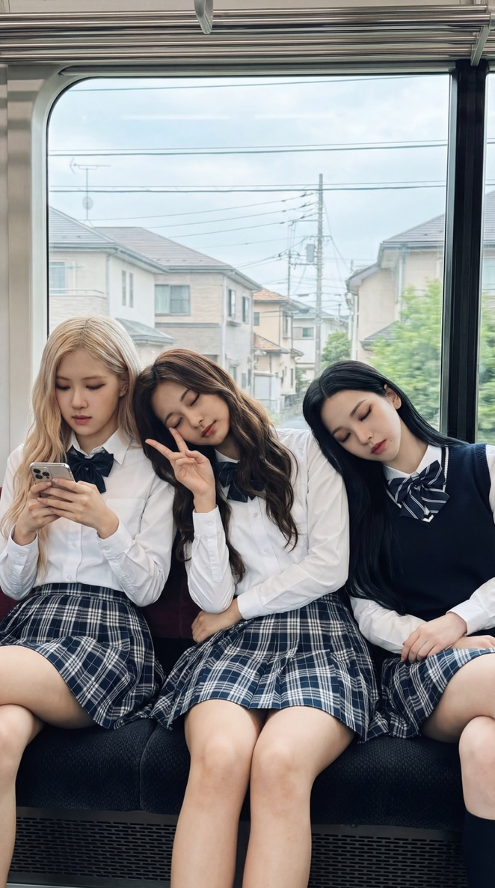

## A hand-painted isometric bird’s-eye view illustration of

- ID: trending-2037508886639366409
- Slug: trending-2037508886639366409-en
- 语言: en
- 来源: [来源链接](https://x.com/TechieBySA/status/2037508886639366409)
- 样例图路径: images/part1/2037508886639366409_1.jpg

### 提示词

```text
A hand-painted isometric bird’s-eye view illustration of [COUNTRY] in a vintage map style, featuring iconic landmarks and natural scenery unique to the country. The landscape should blend seamlessly with a parchment-colored map background, and include detailed miniature architecture, cultural symbols, and geographical elements. The country name '[COUNTRY]' should appear in bold serif text below the scene. Maintain warm, earthy tones and soft lighting for a classic, illustrated map feel. 1080x1080 dimension
```

### 样例图

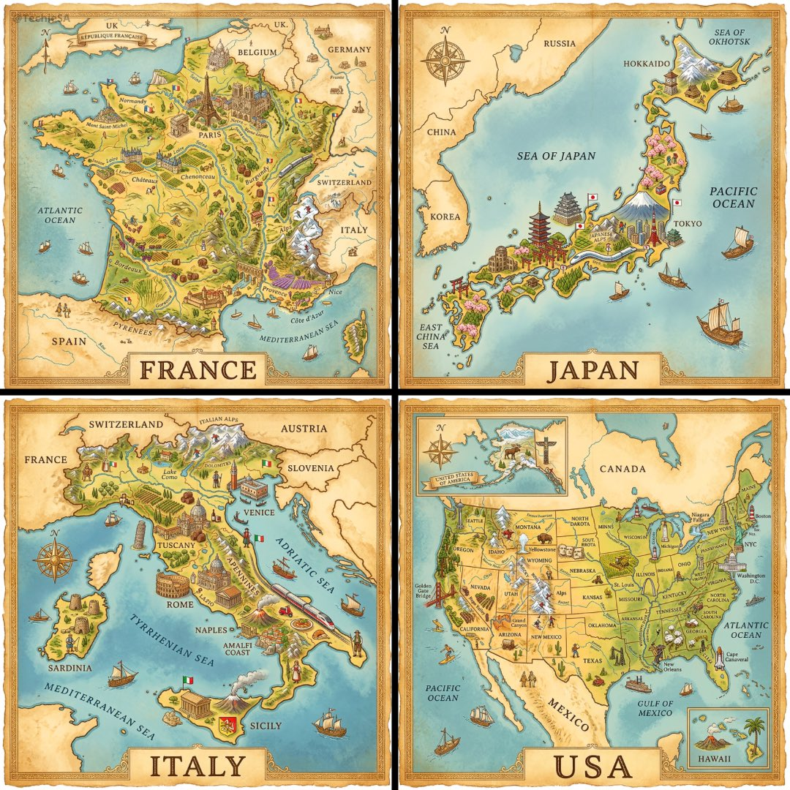

## Create a miniature 3D isometric diorama showing the inve

- ID: trending-2017449820928282857
- Slug: trending-2017449820928282857-en
- 语言: en
- 来源: [来源链接](https://x.com/aleenaamiir/status/2017449820928282857)
- 样例图路径: images/part1/2017449820928282857_1.jpg

### 提示词

```text
Create a miniature 3D isometric diorama showing the invention of [INVENTION NAME] at the moment of [KEY BREAKTHROUGH].

Camera angle around 40° from above.
Textures feel soft and polished. Materials follow realistic PBR rules. Lighting feels natural and balanced.

The raised base includes tools, workshop elements, notes, and early prototypes. Tiny stylized inventors interact with objects. Faces are visible and recognizable with clean shapes and expressions.

Background stays solid [BACKGROUND COLOR].
Top center text shows [INVENTION NAME] in bold.
Second line shows [YEAR OR INVENTOR].
A simple line icon of the invention sits below.
Text color adapts to background contrast.
```

### 样例图

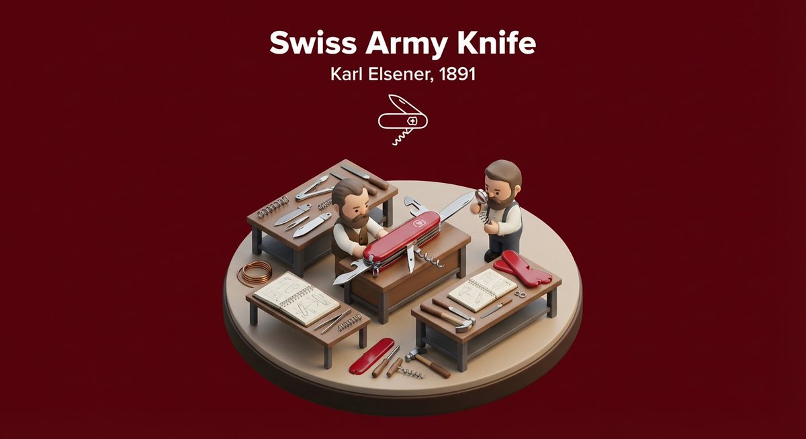

## A high-resolution, photorealistic three-panel compositio

- ID: trending-2038182355743977689
- Slug: trending-2038182355743977689-en
- 语言: en
- 来源: [来源链接](https://x.com/Mind_Boticni/status/2038182355743977689)
- 样例图路径: images/part1/2038182355743977689_1.jpg

### 提示词

```text
A high-resolution, photorealistic three-panel composition featuring a woman with long, voluminous wavy brown hair and elegant features, integrated into an abstract mixed-media collage background.
Panel Layout:

Left Panel (Vertical, full height):

A tall portrait of the woman looking upwards at a dramatic angle, wearing a mustard yellow turtleneck. Cinematic lighting highlights her face and hair, with strong shadows and depth.
Top Right Panel (Square):

A close-up angled side profile, soft gaze to the right, wearing a black modern blazer with minimal jewelry. Expression is calm and confident.
Bottom Right Panel (Square):

A slightly top-down perspective, playful yet elegant pose, wearing a white textured dress, subtle smile, natural lighting.
Art Style & Background (applies to all panels):

The image is layered with an abstract mixed-media collage background incorporating geometric shapes like circles and rectangles in ochre, burnt orange, and charcoal grey. Include textural elements such as vintage parchment paper, blueprint-style technical sketches, and subtle floral etchings. Use a flat graphic design overlay that partially blends into each outfit, seamlessly merging the 3D subject with 2D modernist art.
Overall Style:

Cinematic lighting, fine art photography aesthetic, ultra-detailed, 8K resolution, modern editorial fashion magazine layout.
```

### 样例图


## Transform the uploaded image into a stylized 3D claymati

- ID: trending-2026976077072183696
- Slug: trending-2026976077072183696-en
- 语言: en
- 来源: [来源链接](https://x.com/Professor_134/status/2026976077072183696)
- 样例图路径: images/part1/2026976077072183696_1.jpg

### 提示词

```text
Transform the uploaded image into a stylized 3D claymation character. Soft felt / fuzzy texture skin, rounded exaggerated facial features, big expressive eyes, thick soft eyebrows, slightly oversized nose, warm blush tones on cheeks. Playful open-mouth expression. Clean pure white studio background. Soft diffused studio lighting, subtle rim light, shallow depth of field. Pixar-style charm, stop-motion aesthetic, highly detailed fibers and soft materials, cinematic render, warm vibrant tones.
```

### 样例图

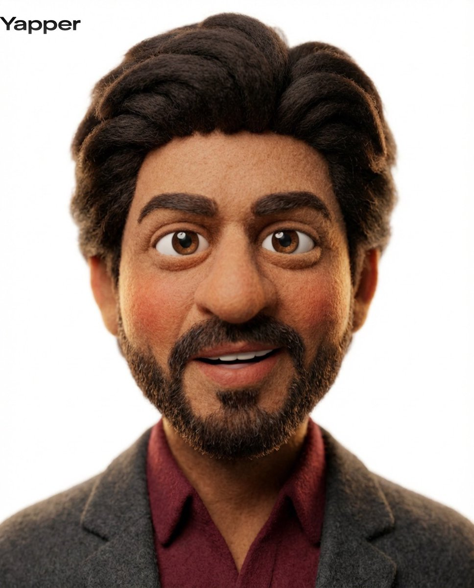

## A cute stylized 3D collectible figurine inspired by Cris

- ID: trending-2032973567760232717
- Slug: trending-2032973567760232717-en
- 语言: en
- 来源: [来源链接](https://x.com/AIwithSynthia/status/2032973567760232717)
- 样例图路径: images/part1/2032973567760232717_1.jpg

### 提示词

```text
A cute stylized 3D collectible figurine inspired by Cristiano Ronaldo, with short styled hair and an athletic build, wearing a modern football kit and standing confidently with hands on hips. Next to him is a large Kinder Joy egg featuring a cartoon avatar of the same football star printed on the shell. The scene is placed on a wooden table with soft natural lighting, shallow depth of field, cozy indoor background with blurred plants, highly detailed Pixar-style 3D render, glossy toy texture, cinematic lighting, ultra-detailed product photography, designer toy aesthetic. ⚽🥚
```

### 样例图

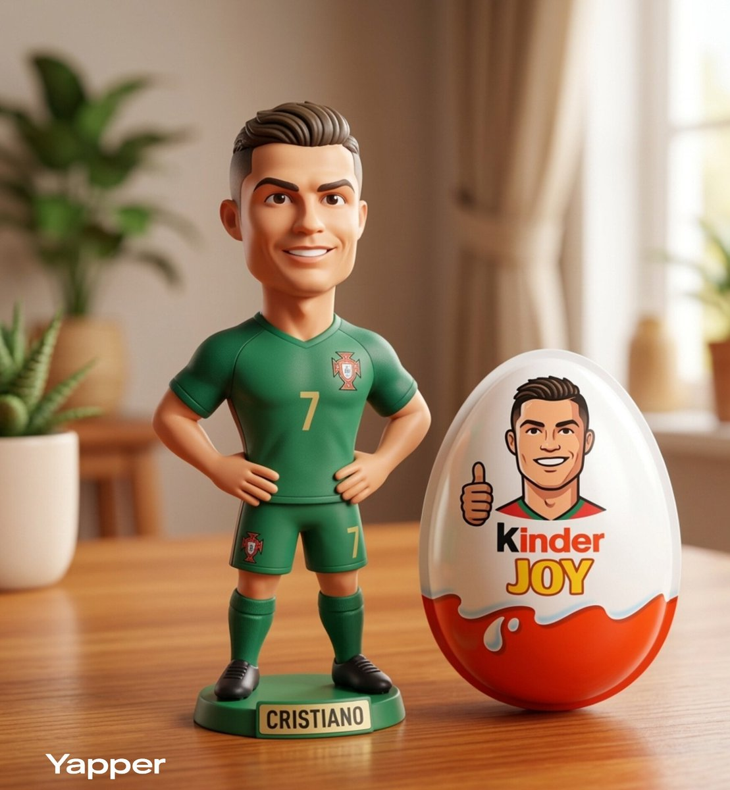

## hyper-realistic food photography of a pancake shaped pre

- ID: trending-2033181947103773158
- Slug: trending-2033181947103773158-en
- 语言: en
- 来源: [来源链接](https://x.com/azed_ai/status/2033181947103773158)
- 样例图路径: images/part1/2033181947103773158_1.jpg

### 提示词

```text
hyper-realistic food photography of a pancake shaped precisely like the [brand name] logo, natural golden-brown pancake texture, soft porous surface with realistic bubbles, slightly crispy edges, placed on a pure white background, minimal composition, soft natural shadow beneath, top-down flat lay perspective, subtle bite taken from one edge revealing fluffy interior, realistic crumb texture, soft diffused studio lighting, ultra detailed, clean commercial aesthetic, sharp focus
```

### 样例图

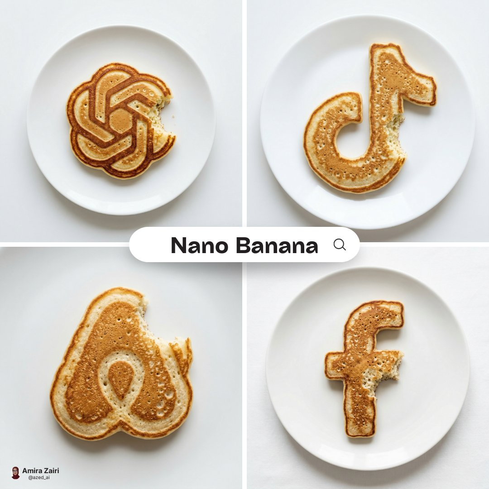

## A clean, minimal 3D isometric diorama of a [BUILDING TYP

- ID: trending-2012072821439283400
- Slug: trending-2012072821439283400-en
- 语言: en
- 来源: [来源链接](https://x.com/aleenaamiir/status/2012072821439283400)
- 样例图路径: images/part1/2012072821439283400_1.jpg

### 提示词

```text
A clean, minimal 3D isometric diorama of a [BUILDING TYPE] section, featuring [INTERIOR / EXTERIOR ELEMENTS] visible in a [CUTAWAY / OPEN STYLE], simple [STRUCTURAL FRAME], subtle [INFORMATIONAL SIGNAGE], smooth [MATERIAL FINISH], soft studio lighting, realistic materials, rounded edges, miniature architectural model style, high detail, neutral background.
```

### 样例图

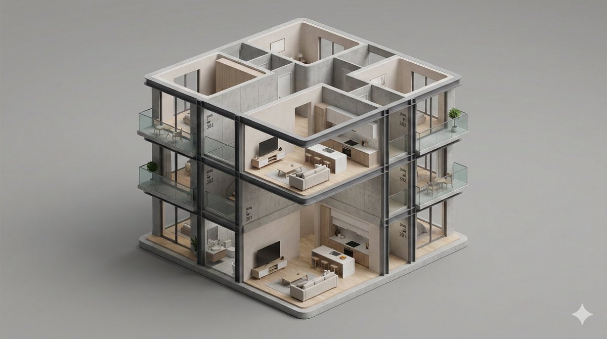

## Transform the person from the attached photo into a smoo

- ID: trending-2043020207447310430
- Slug: trending-2043020207447310430-en
- 语言: en
- 来源: [来源链接](https://x.com/TechieBySA/status/2043020207447310430)
- 样例图路径: images/part1/2043020207447310430_1.jpg

### 提示词

```text
Transform the person from the attached photo into a smooth stylized 3D cartoon character in the same style as the reference. Keep all real facial features fully recognizable but translated into exaggerated proportions (elongated head, big eyelids, soft rounded shapes). Skin should look glossy and plastic-like with clean gradients and subtle highlights. Use soft studio lighting, a solid [COLOR] color background, and high-end Pixar- inspired rendering. Simplify details, add gentle rim light, and preserve the person's hairstyle and accessories in stylized form. The final look must match the clean polished 3D aesthetic of the reference,  4:5 dimension.
```

### 样例图

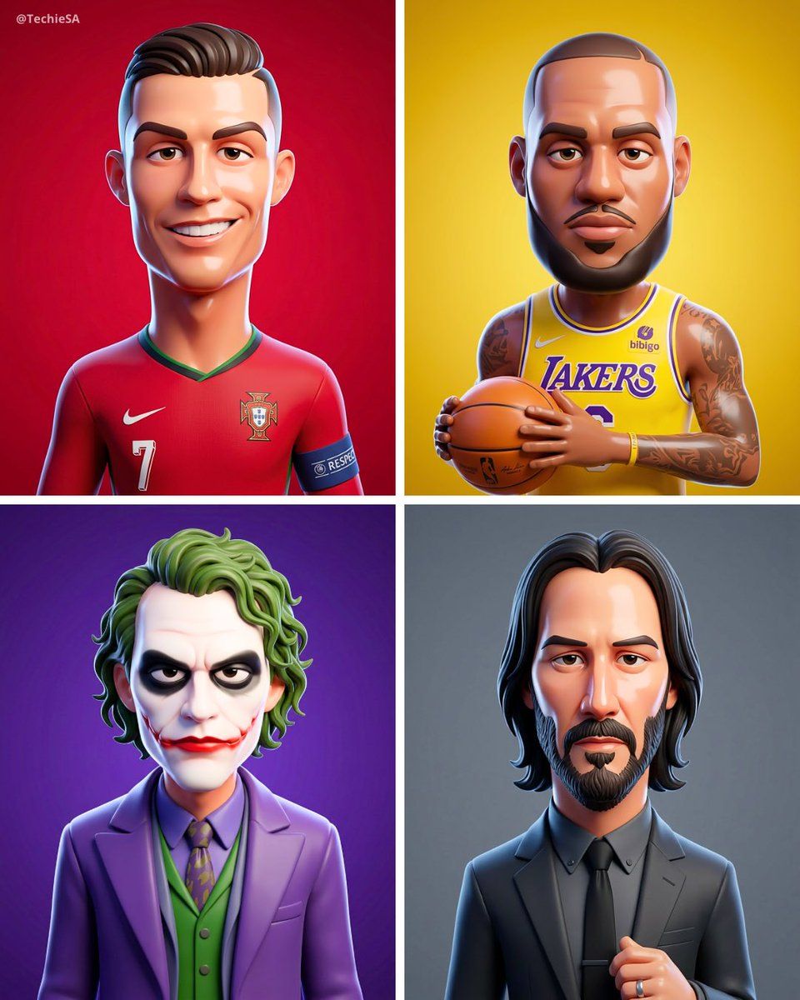

## Hyper-realistic full-body portrait of a woman, using the

- ID: trending-2011268158855000473
- Slug: trending-2011268158855000473-en
- 语言: en
- 来源: [来源链接](https://x.com/hey_m_cherry/status/2011268158855000473)
- 样例图路径: images/part1/2011268158855000473_1.jpg

### 提示词

```text
Hyper-realistic full-body portrait of a woman, using the exact pose from the uploaded photo, transformed into a stylish female doll. she stands confidently with arms crossed on a giant Microsoft Surface Tablet as a platform, wearing urban streetwear (black hoodie, jeans, sneakers) and sleek red tech glasses.

Surrounding him in a dynamic, floating arrangement are masculine graphic design tools: a futuristic camera with blue holographic glow, a geometric computer mouse with electric sparks, a digital pen creating digital wireframe trails, a floating Pantone swatch book in bold blue and black colors, and a minimalist black coffee mug with binary code steam.

The scene features a vibrant blue and orange color scheme with dynamic lighting. Cyberpunk aesthetic, neon accents, particle effects. Style is a blend of 3D animation and tech photography. Sharp focus, cinematic lighting, 8k resolution.
```

### 样例图

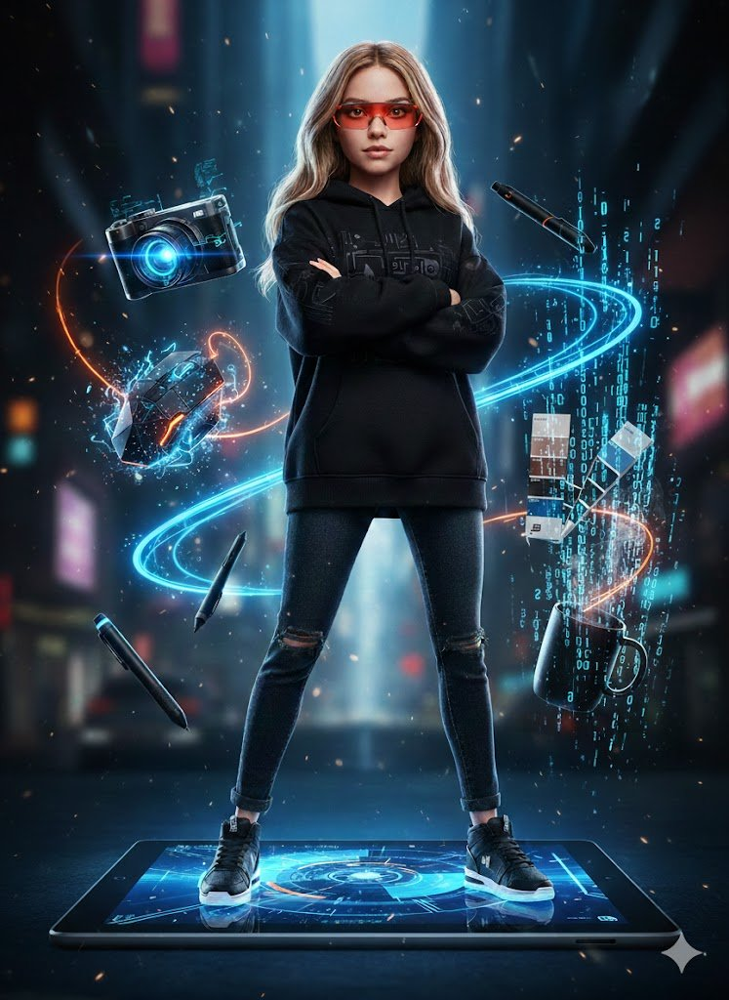

## A hyper-realistic, 8k, medium shot photograph captured w

- ID: trending-2028673990672216202
- Slug: trending-2028673990672216202-en
- 语言: en
- 来源: [来源链接](https://x.com/HaniaAi12/status/2028673990672216202)
- 样例图路径: images/part1/2028673990672216202_1.jpg

### 提示词

```text
A hyper-realistic, 8k, medium shot photograph captured with a standard lens and shallow depth of field, showcasing a surreal indoor scene with cinematic lighting. The composition features a normal-sized woman, using the uploaded face as reference, sitting cross-legged inside a colossal, highly detailed Kinder Joy egg that functions as a swing chair. The giant egg is split, with its white interior forming the seat and the orange, textured exterior visible, suspended by dark metal chains from a curved, dark metal stand.

The woman wears a black t-shirt and blue and white plaid pajama pants, holding a small white teacup with both hands, looking directly at the viewer with a calm and relaxed expression.

To the left in the foreground, on a highly detailed polished wooden table, stands another gigantic, fully wrapped Kinder Joy egg, exhibiting intricate foil texture and branding. To the right of the swing's base, also on the table, are miniature props: a vintage-style wooden radio with white dials and a tiny bonsai tree in a small pot.

The lighting is soft, warm, and directional from the left, casting subtle shadows and highlighting the highly detailed textures of the egg wrappers, the woman’s clothing, and the wooden surface. The background is a softly blurred, warm-toned interior wall, creating a pleasing bokeh effect.
```

### 样例图

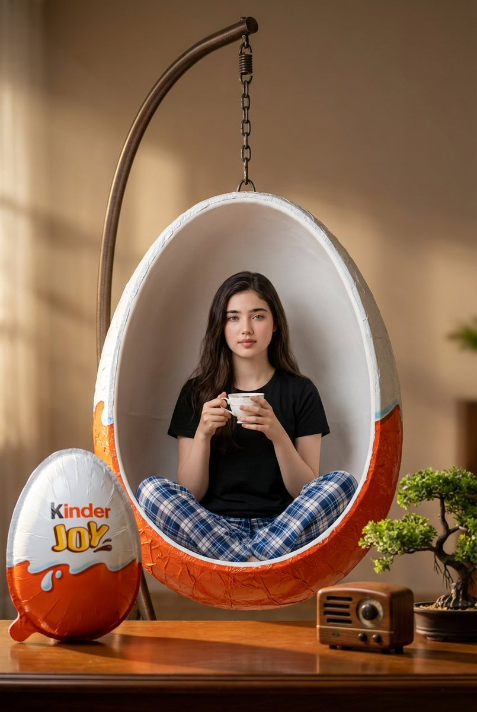

## Create a hyper-realistic miniature planet showcasing [KA

- ID: trending-2008699484260495802
- Slug: trending-2008699484260495802-en
- 语言: en
- 来源: [来源链接](https://x.com/Milo_Bahi_02/status/2008699484260495802)
- 样例图路径: images/part1/2008699484260495802_1.jpg

### 提示词

```text
Create a hyper-realistic miniature planet showcasing [KASHMIR] with famous landmarks seamlessly curving around the spherical surface. Position bold 3D white text “[KASHMIR]” naturally integrated across the lush green central parkland with realistic shadows and dimensional depth. Capture from a top-down orbiting angle that emphasizes the dramatic planet curvature. Use soft golden hour daylight filtering through partly cloudy skies, casting gentle shadows on emerald grass and surrounding trees. The background should blend into a swirling atmospheric sky. Apply vibrant greens, warm earth tones, and soft blues. Render in polished photorealistic style with fine architectural detail. 1080x1080 format.
```

### 样例图

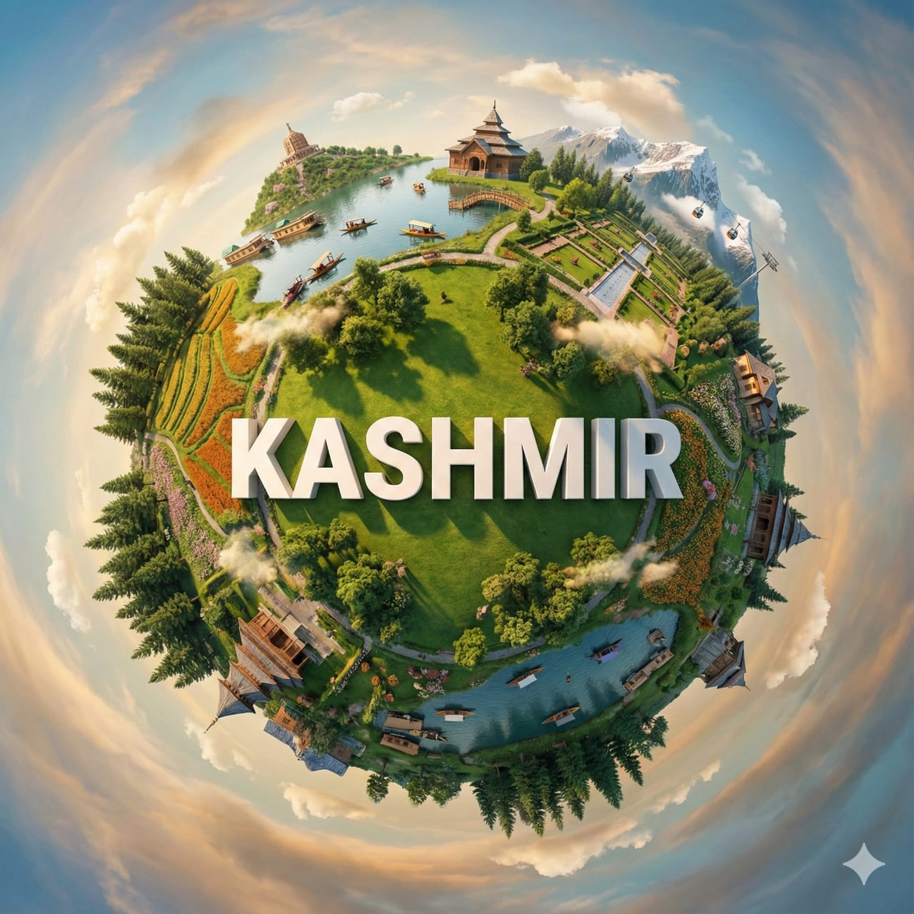

## A highly detailed 3D caricature of a cheerful man with a

- ID: trending-2029363366192660526
- Slug: trending-2029363366192660526-en
- 语言: en
- 来源: [来源链接](https://x.com/auqibhabib/status/2029363366192660526)
- 样例图路径: images/part1/2029363366192660526_1.jpg

### 提示词

```text
A highly detailed 3D caricature of a cheerful man with an oversized head, a big smile showcasing large teeth, and curly voluminous hair. He is wearing a short-sleeved white button-up shirt, brown high-waisted pants with a belt, and traditional sandals. His pose is casual and friendly, with one hand touching his chin in a thoughtful manner. The art style is semi-realistic with exaggerated cartoonish features, set aw against a clean white background.""A highly detailed 3D caricature of a cheerful man with an oversized head, a big smile showcasing large teeth, and curly voluminous hair. He is wearing a short-sleeved white button-up shirt, brown high-waisted pants with a belt, and traditional sandals. His pose is casual and friendly, with one hand touching his chin in a thoughtful manner. The art style is semi-realistic with exaggerated cartoonish features, set against a clean white background.
```

### 样例图

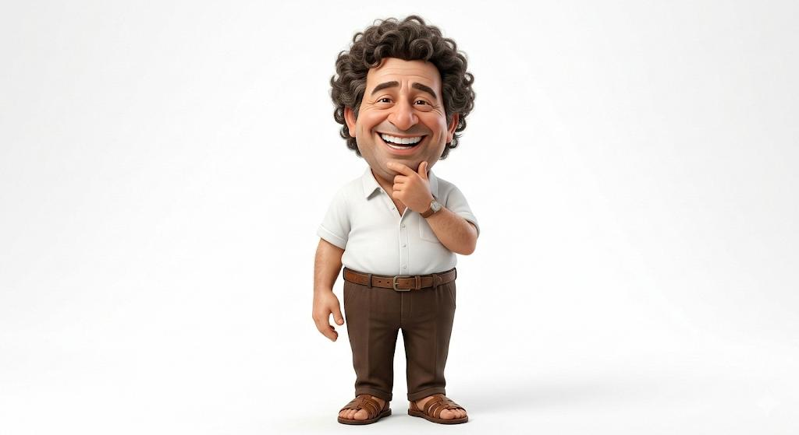

## A painterly exaggerated cartoon portrait combining sculp

- ID: trending-2045081650175058314
- Slug: trending-2045081650175058314-en
- 语言: en
- 来源: [来源链接](https://x.com/frametheory058/status/2045081650175058314)
- 样例图路径: images/part1/2045081650175058314_1.jpg

### 提示词

```text
A painterly exaggerated cartoon portrait combining sculpted 3D anatomy with hand-painted illustration textures, spider-verse inspired visual language, distorted facial geometry and expressive asymmetry, intentionally breaking realism while preserving general identity cues such as skin tone and hairstyle, bold line work mixed with painted shadows, halftone textures and color splashes graphic animated illustration aesthetic, solid pink studio background, frontal expressive pose, stylized lighting translated into brush-painted highlights, dynamic composition, rich paint texture and high-end hybrid cartoon render.
```

### 样例图

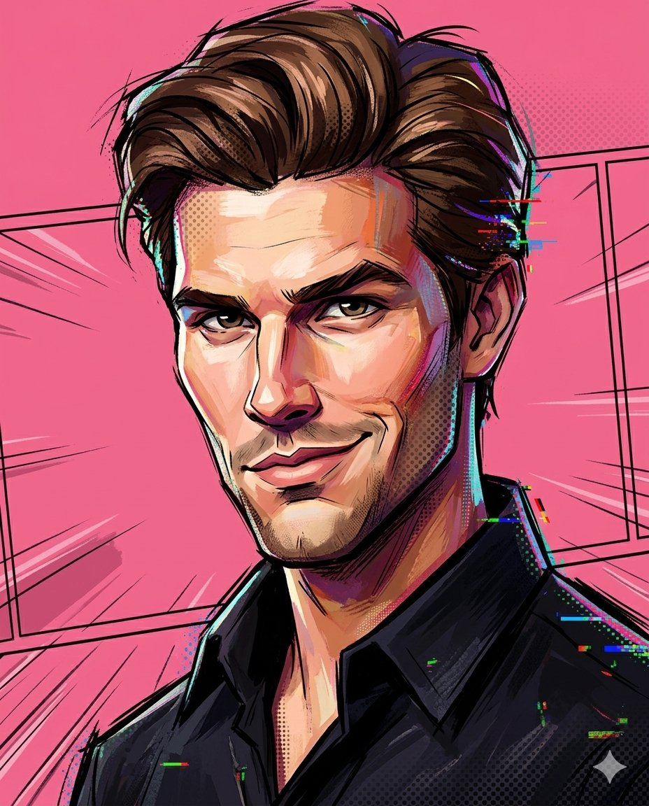

## Present a clear, 45° top-down isometric miniature 3D car

- ID: trending-2015763679178792978
- Slug: trending-2015763679178792978-en
- 语言: en
- 来源: [来源链接](https://x.com/TechieBySA/status/2015763679178792978)
- 样例图路径: images/part1/2015763679178792978_1.jpg

### 提示词

```text
Present a clear, 45° top-down isometric miniature 3D cartoon scene of [COUNTRY]’s signature dish: [FOOD], with soft refined textures, realistic PBR materials, and gentle lifelike lighting.
Create a small raised diorama-style base showcasing the dish in a highly recognizable presentation, with simple complementary elements (plate, table surface, or minimal garnish).
Use a clean solid [COLOR] background.

At the top-center, display [COUNTRY] in large bold text, directly beneath it show [FOOD] in medium text, and place a small simplified national icon or flag below the subtext.
All text must automatically match the background contrast (white or black).

Composition: perfectly centered layout, square 1080x1080, ultra-clean, high-clarity miniature diorama aesthetic.
```

### 样例图

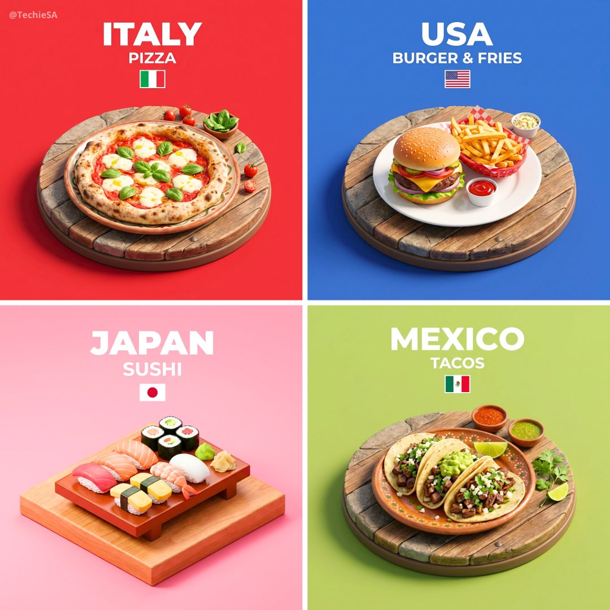

## Present a clear, side-facing isometric miniature 3D cart

- ID: trending-2033888375619637274
- Slug: trending-2033888375619637274-en
- 语言: en
- 来源: [来源链接](https://x.com/0x00_Krypt/status/2033888375619637274)
- 样例图路径: images/part1/2033888375619637274_1.jpg

### 提示词

```text
Present a clear, side-facing isometric miniature 3D cartoon diorama of [CITY] along the [WATERFRONT]. The scene is a clean vertical cross-section slice — the city is cut open like a museum specimen, mounted on a small raised diorama-style base that exposes the full stratigraphy from rooftop to riverbed.

Above the waterline: a curated selection of [CITY]'s most iconic waterfront elements — layered building facades in local architectural style, embankment promenade, bridges, trams or cyclists, warm soft ambient lighting. Tiny stylized figures of residents in casual attire — walking, cycling, sitting at waterfront cafés (no facial details).

The water surface is a clean glassy horizontal band — cartoon-stylized, slightly transparent, acting as the visual threshold between the two worlds.

Below the waterline: the geographically honest submerged anatomy of [CITY]'s [WATERFRONT] — accurate foundation and piling types, real underwater infrastructure, sediment and substrate layers appropriate to this specific body of water, local aquatic life rendered in the same soft cartoon style. Tiny stylized fish, slow-drifting particulate, refracted light shafts filtering down from the surface.

The cross-section cut edge is razor-clean — pavement strata, foundations, soil layers, and underwater geology all simultaneously visible in the base wall, like a natural history diorama exhibit.

Style: soft refined textures, realistic PBR materials, immersive ambient lighting. Color language: warm amber and golden tones above the waterline, cold teal-green and deep indigo below, blending at the water threshold. Ultra-clean, high-clarity 3D cartoon diorama aesthetic.

Use a clean solid [BACKGROUND COLOR] background. At the top-center, display "[CITY]" in large bold text, and place the waterfront name or a city landmark silhouette emblem below the text. All text must automatically match background contrast.

Composition: perfectly centered layout, square 1080x1080.
```

### 样例图

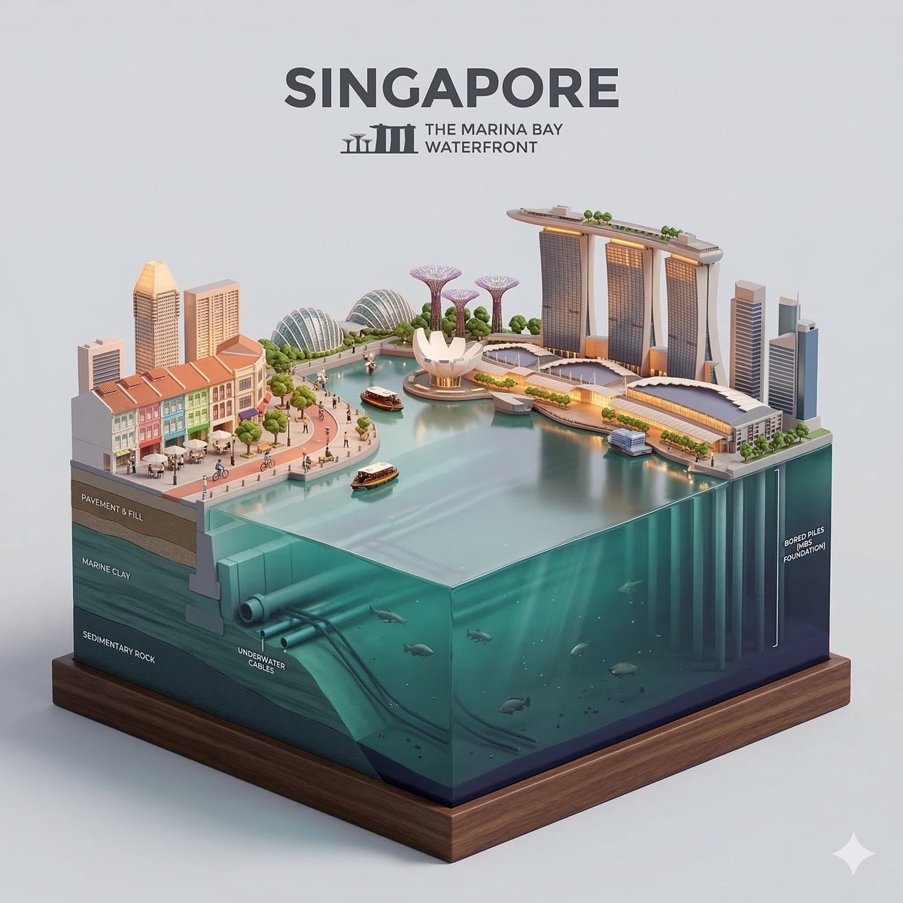

## Maintain the exact same person and facial identity from 

- ID: trending-2027380851030262216
- Slug: trending-2027380851030262216-en
- 语言: en
- 来源: [来源链接](https://x.com/TechieBySA/status/2027380851030262216)
- 样例图路径: images/part1/2027380851030262216_1.jpg

### 提示词

```text
Maintain the exact same person and facial identity from the reference photo. Detailed 3D Caricature Prompt:
A professional, ultra-detailed full-body 3D stylized caricature portrait of the person from [REFERENCE IMAGE], standing in a confident upright pose.
ANATOMY & PROPORTIONS: Extremely exaggerated silhouette featuring a massive, oversized head with a large-scale ratio compared to a tiny, diminutive, and short body. The neck is short and thick to support the giant head. Maintain the subject’s exact facial identity, skin tone, and ethnic features from [REFERENCE IMAGE], but with intentional caricature deformation. The character has a mischievous, confident expression, giving a playful wink toward the lens with one eye. A wide smirk reveals a full set of meticulously detailed, sparkling diamond grillz (teeth) that catch and refract the light.
POSE & JEWELRY: The character is standing still but with a dynamic arm gesture; one arm is brought forward, close to the camera lens, to prominently showcase a thick, heavy, iced-out diamond watch on the wrist. Each individual diamond stone on the watch and the grillz is rendered with ray-traced reflections, creating sharp prismatic glints and brilliant sparkles.
CLOTHING & TEXTURES: The character is wearing the exact same outfit, jewelry, and accessories as seen in [REFERENCE IMAGE]. Fabrics (cotton, silk, or denim) are rendered with high-fidelity microscopic textures, showing realistic folds and stitching on a miniature scale. Skin is rendered with premium subsurface scattering, appearing smooth, clean, and studio-perfect, avoiding any blemishes, noise, or grain.
ENVIRONMENT & LIGHTING: Set against a perfectly clean, seamless, solid vibrant blue studio backdrop with no gradients and no distractions. The lighting is a high-end neutral studio setup using softboxes to provide even, bright illumination across the entire figure. Strictly NO backlighting and NO rim light. Focus on soft, diffused front shadows that define the character’s shape. High-intensity light hits the diamonds to ensure they are the brightest points of the image.
TECHNICAL SPECS: Hyper-realistic 3D render, cinematic quality, Octane Render style, 8k resolution, ultra-high definition, sharp focus, clean edges, masterpiece level, no text, no watermarks, no logos, aspect ratio 4:5.
```

### 样例图

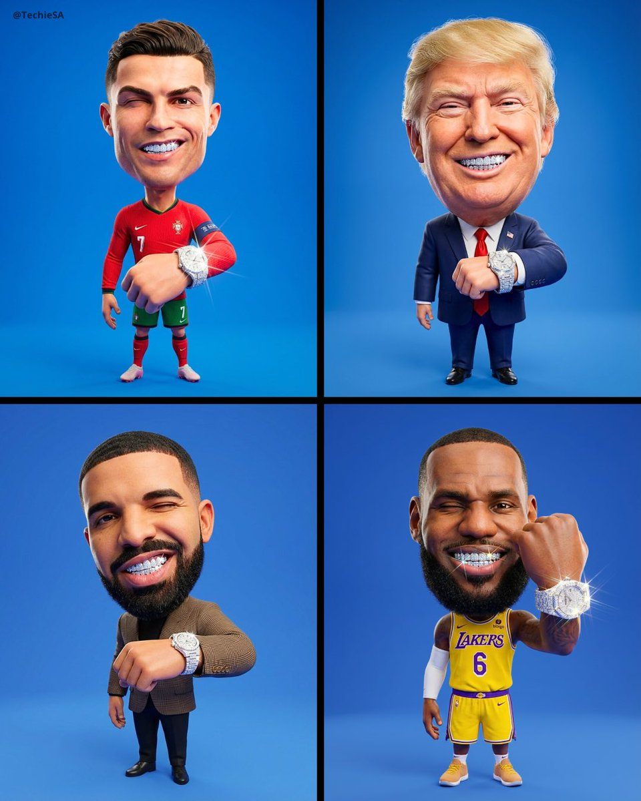

## ​A stylized 3D rendered full-body profile portrait of an

- ID: trending-2044357243827580959
- Slug: trending-2044357243827580959-en
- 语言: en
- 来源: [来源链接](https://x.com/auqibhabib/status/2044357243827580959)
- 样例图路径: images/part1/2044357243827580959_1.jpg

### 提示词

```text
​A stylized 3D rendered full-body profile portrait of an elderly male hiker with a long white beard, viewed from the side and walking from left to right. He is set against a solid, seamless deep-teal studio background with soft floor reflections. He wears a brown felt wide-brimmed hiker's hat, a gray and blue plaid shirt over cuffed brown corduroy trousers, and dark, scuffed work boots. On his back is a large, detailed combination canvas and woven wicker backpack with leather straps. He holds a lit, vintage brass-and-glass hurricane lantern in his right hand, which casts a warm, soft glow. He also carries a simple wooden walking stick. The image has a textured, matte finish and soft, diffused studio lighting, with the vertical composition leaving ample negative space.
```

### 样例图

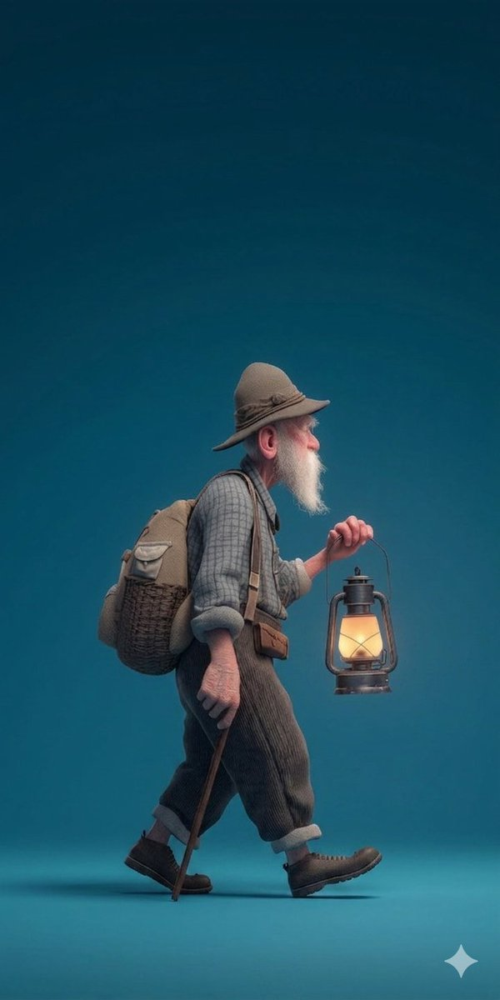

## { "aspect_ratio": "1:1", "scene_type": "cinematic_studio

- ID: trending-2010264538562867271
- Slug: trending-2010264538562867271-en
- 语言: en
- 来源: [来源链接](https://x.com/john_my07/status/2010264538562867271)
- 样例图路径: images/part1/2010264538562867271_1.jpg

### 提示词

```text
{
  "aspect_ratio": "1:1",
  "scene_type": "cinematic_studio_portrait",
  "environment": {
    "background_color": "warm_muted_gray",
    "surface": "natural_textured_stone_table",
    "mood": "intimate_evening_cafe",
    "atmosphere": "cozy_moody"
  },
  "primary_subject": {
    "identity": "Ana de Armas",
    "pose": "seated_relaxed",
    "expression": "soft_calm_confident",
    "appearance": {
      "hair": "black_shoulder_length_soft_layers",
      "makeup": "subtle_evening_makeup",
      "outfit": "dark_brown_satin_blouse"
    },
    "focus": "sharp_subject_isolation"
  },
  "props": {
    "main_drink": {
      "type": "cold_brew_coffee",
      "glass": "clear_glass_with_ice",
      "straw": "metal_straw"
    },
    "stylized_figure": {
      "style": "high_quality_3d_chibi_collectible",
      "design": {
        "head": "oversized_rounded",
        "eyes": "large_expressive",
        "cheeks": "soft_blush",
        "features": "simplified_cute"
      },
      "likeness": "same_as_primary_subject",
      "pose": "holding_miniature_cold_brew_glass",
      "material": "glossy_with_soft_reflections"
    }
  },
  "lighting": {
    "type": "soft_cinematic",
    "direction": "angled_key_with_gentle_falloff",
    "highlights": "subtle_reflections_on_glass_and_chibi",
    "shadows": "smooth_and_moody"
  },
  "camera": {
    "depth_of_field": "shallow",
    "focus_priority": "real_subject_then_chibi",
    "look": "cinematic_photography"
  },
  "style_notes": [
    "realistic_human_combined_with_stylized_3d_character",
    "premium_collectible_toy_aesthetic",
    "warm_color_grading",
    "cozy_evening_tone",
    "ultra_detailed",
    "photoreal_subject"
  ]
}
```

### 样例图

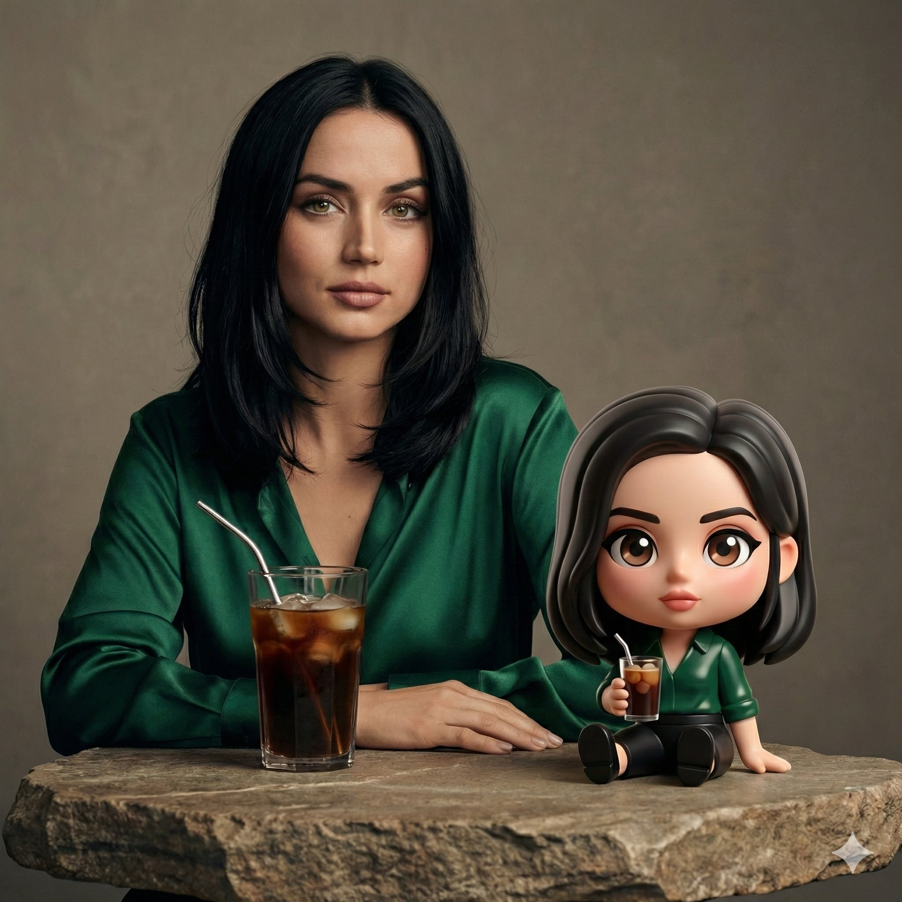

## Use the uploaded image as the primary subject reference.

- ID: trending-2038172237560439254
- Slug: trending-2038172237560439254-en
- 语言: en
- 来源: [来源链接](https://x.com/AIwithSynthia/status/2038172237560439254)
- 样例图路径: images/part1/2038172237560439254_1.jpg

### 提示词

```text
Use the uploaded image as the primary subject reference. Transform the person into a stylized caricature with a slightly oversized head and a smaller body while preserving facial identity, expression, hairstyle, and key features.
Place the subject casually leaning against a vintage dark green classic car on a narrow cobblestone street with warm glowing street lamps on both sides. Maintain a relaxed, confident pose.
Outfit should match or naturally enhance the original clothing from the uploaded image (adapt if needed to fit the scene). Keep textures realistic and well-detailed.
Style: 3D cartoon realism, cinematic lighting, shallow depth of field, ultra-detailed, soft shadows, warm tones, high resolution, vibrant but natural colors.
```

### 样例图

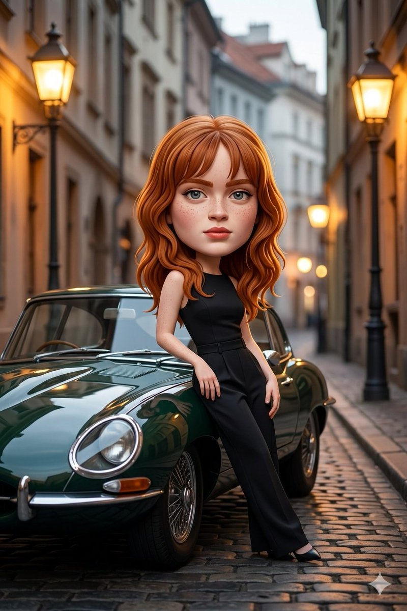

## An architectural blueprint of {BUILDING_NAME} placed on 

- ID: trending-2034216567253373196
- Slug: trending-2034216567253373196-en
- 语言: en
- 来源: [来源链接](https://x.com/0x00_Krypt/status/2034216567253373196)
- 样例图路径: images/part1/2034216567253373196_1.jpg

### 提示词

```text
An architectural blueprint of {BUILDING_NAME} placed on a {SURFACE}, with a photorealistic miniature under-construction version of {BUILDING_NAME} emerging from it — {STRUCTURAL_ELEMENT_1}, {STRUCTURAL_ELEMENT_2}, {STRUCTURAL_ELEMENT_3}, {CONSTRUCTION_DETAIL}, {WORKER_SCENE}, {MATERIAL_ELEMENT}, and {EXTRA_DETAIL}. All elements grow from the blueprint like a 3D architectural diorama, steel beams rising from the drawn lines, scaffolding threading through the paper. Studio soft lighting, cinematic depth, 2:3
```

### 样例图

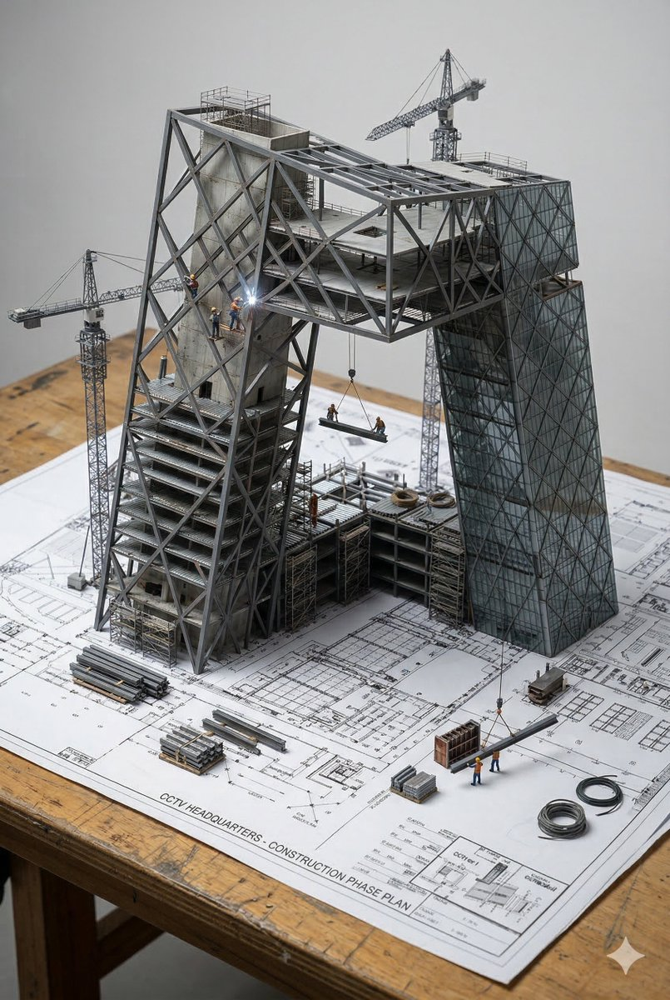

## 3D cartoon avatar character showing different emotions a

- ID: trending-2029204838945570982
- Slug: trending-2029204838945570982-en
- 语言: en
- 来源: [来源链接](https://x.com/Taaruk_/status/2029204838945570982)
- 样例图路径: images/part1/2029204838945570982_1.jpg

### 提示词

```text
3D cartoon avatar character showing different emotions arranged in a 3x3 grid, same male character with brown hair, Pixar-style animation, each square showing a different expression (happy, shocked, angry, caring with a puppy, confident, thumbs up, sad, thinking, professional), colorful gradient backgrounds for each panel, soft studio lighting, smooth 3D rendering, expressive eyes and facial expressions, modern emoji-style character design, clean composition, ultra-detailed, vibrant colors, 8K.
```

### 样例图

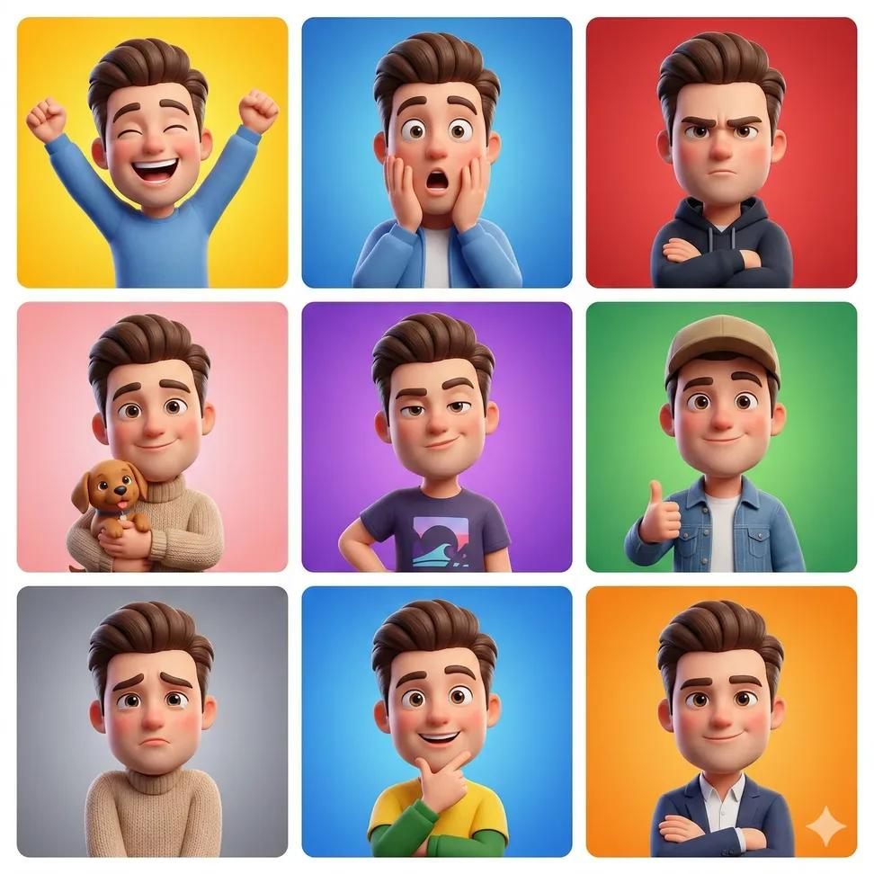

## A highly detailed miniature diorama entirely made of cro

- ID: trending-2017994945785643125
- Slug: trending-2017994945785643125-en
- 语言: en
- 来源: [来源链接](https://x.com/Just_sharon7/status/2017994945785643125)
- 样例图路径: images/part1/2017994945785643125_1.jpg

### 提示词

```text
A highly detailed miniature diorama entirely made of crochet and amigurumi yarn, whimsical cute style, featuring a tall mint-green crocheted airport control tower with white accents and antenna on top, a small teal crocheted camper van with luggage on roof driving on a crocheted road, tiny crocheted blue classic car, a large crocheted passenger airplane parked near an orange-lit terminal building, crocheted city skyline with tall buildings in the background, sunset sky with soft clouds and golden hour lighting, tiny crocheted daisies and grass patches on the ground, textured yarn stitches visible everywhere, cozy handmade craft aesthetic, soft pastel colors, dreamy warm atmosphere, macro photography style, bokeh background, ultra detailed, cute and charming
```

### 样例图

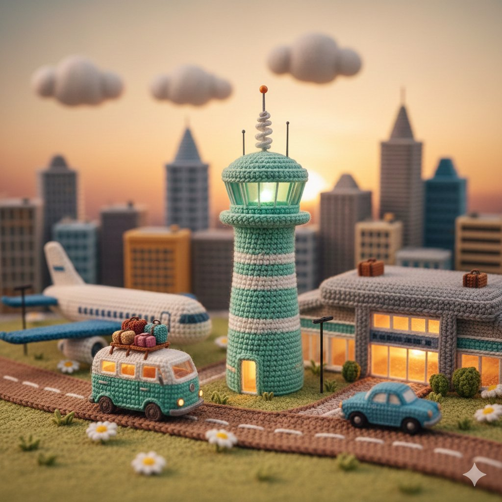

## A master watchmaker's documentation board for [TIMEPIECE

- ID: trending-2018374415474438544
- Slug: trending-2018374415474438544-en
- 语言: en
- 来源: [来源链接](https://x.com/AllaAisling/status/2018374415474438544)
- 样例图路径: images/part1/2018374415474438544_1.jpg

### 提示词

```text
A master watchmaker's documentation board for [TIMEPIECE] — [MANUFACTURE / COMPLICATION / YEAR]. Left section: historical context showing the original patent drawings, period advertisements in gilded frames, and archival photographs of the atelier with craftsmen at work. Center section: the movement in exploded view, every wheel, spring, and jewel suspended in precise spatial relationship, with material callouts (Geneva stripes, blued screws, ruby bearings) and functional annotations tracing the flow of power from mainspring to escapement. Right section: the completed watch in its defining context—wrist of an explorer, pocket of a diplomat, or display case of a collector—captured with shallow depth and warm side lighting. Visual style transitions from sepia patent office to mechanical precision chrome to intimate portraiture. Title block reading "[WATCH NAME] — CALIBRE [NUMBER], [COMPLICATION], CIRCA [YEAR]".
```

### 样例图

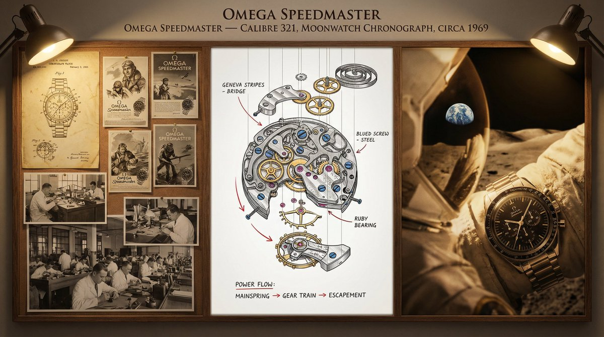

## “Present a clear, 45° top-down isometric miniature 3D sp

- ID: trending-2017820238314934756
- Slug: trending-2017820238314934756-en
- 语言: en
- 来源: [来源链接](https://x.com/aleenaamiir/status/2017820238314934756)
- 样例图路径: images/part1/2017820238314934756_1.jpg

### 提示词

```text
“Present a clear, 45° top-down isometric miniature 3D split diorama showing two parallel worlds of [THEME]: [WORLD A] vs [WORLD B].

Use soft refined textures, realistic PBR materials, and contrasting lighting styles for each side.

Design a single raised base divided down the center with mirrored layouts and subtle crossover details.

Include tiny stylized characters existing differently in each world (no facial details).

Use a clean solid [BACKGROUND COLOR] background.

At the top-center, display [THEME NAME] in large bold text, beneath it show ‘Parallel Realities’, and place a minimal abstract icon below.

All text must automatically match the background contrast (white or black).”
```

### 样例图

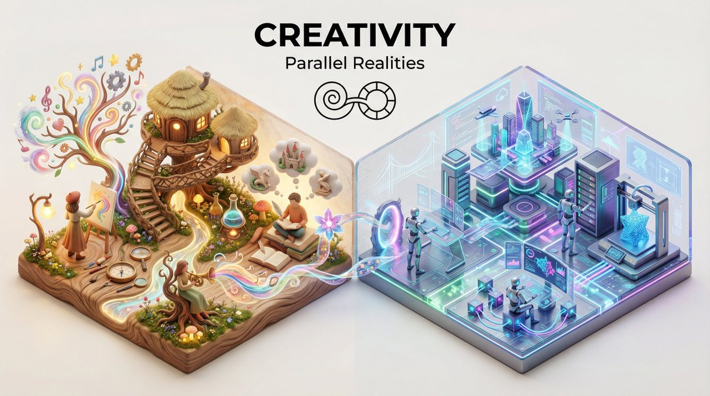

## { "image_generation_request": { "subject": { "placeholde

- ID: trending-2029268041628823967
- Slug: trending-2029268041628823967-en
- 语言: en
- 来源: [来源链接](https://x.com/lloydcreates/status/2029268041628823967)
- 样例图路径: images/part1/2029268041628823967_1.jpg

### 提示词

```text
{
  "image_generation_request": {
    "subject": {
      "placeholder": "[INSERT YOUR PRODUCT HERE]",
      "positioning": "centrally aligned, perfectly centered, levitating in mid-air",
      "framing": "full object visibility, no cropping, no cut-off edges, ample negative space around the product"
    },
    "visual_style": {
      "aesthetic": "ultra-modern industrial design, hyper-realistic product photography, cinematic tech-minimalism",
      "background": {
        "color": "#000000",
        "finish": "pure void, matte black, non-reflective"
      },
      "lighting": {
        "type": "top-down rim lighting, subtle key light",
        "effects": [
          "spectral dispersion",
          "chromatic aberration on glass edges",
          "prismatic light refraction",
          "soft caustic highlights"
        ]
      }
    },
    "materials_and_textures": {
      "primary_blends": [
        "anodized brushed aluminum with micro-circular grain",
        "frosted translucent polycarbonate with internal orange-to-white gradient glow",
        "optically clear glass with rainbow refractive edges",
        "matte sandblasted metallic surfaces"
      ],
      "details": "high-precision CNC machined edges, tactile knurling, smooth organic fillets"
    },
    "constraints": {
      "mandatory_omissions": [
        "no lighting boxes",
        "no softboxes",
        "no tripod stands",
        "no pedestals",
        "no platforms",
        "no props",
        "no text",
        "no watermarks",
        "no human hands",
        "no floor line",
        "no background gradients"
      ],
      "compositional_rules": "The product must be the sole inhabitant of the frame. Ensure zero contact with any surface. Maintain absolute symmetry and 100% black levels for the background environment."
    },
    "color_palette": {
      "background": "#000000",
      "accents": [
        "#FF4500",
        "#FFFFFF",
        "#808080",
        "spectral rainbow/prismatic dispersion"
      ]
    }
  }
}
```

### 样例图

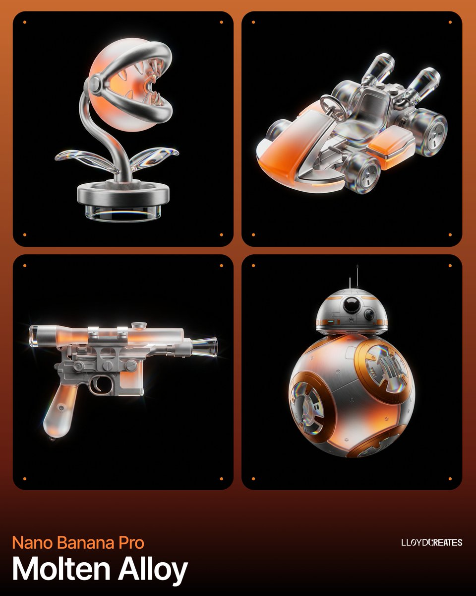

## Close-up photo of a cute, colorful rubber keychain held 

- ID: trending-2031731136385421407
- Slug: trending-2031731136385421407-en
- 语言: en
- 来源: [来源链接](https://x.com/azed_ai/status/2031731136385421407)
- 样例图路径: images/part1/2031731136385421407_1.jpg

### 提示词

```text
Close-up photo of a cute, colorful rubber keychain held gently in a person’s hand. The keychain features a chibi-style illustration of [character/person], simplified facial features, rounded proportions, soft pastel color palette, bold thick black outlines, smooth matte rubber texture, slightly raised layered detailing, cartoon expression, compact toy-like silhouette. The keychain is attached to a small silver metal clasp and keyring. Natural hand positioning, shallow depth of field, soft diffused lighting, neutral beige background, realistic skin texture, high-detail product photography, 1:1 aspect ratio.
```

### 样例图

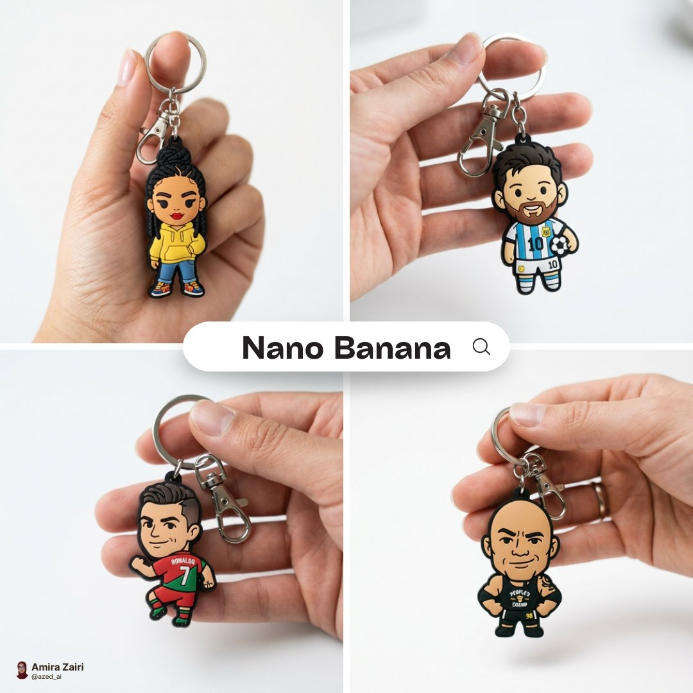

## 1. A stylized 3D animated girl with short messy curly gi

- ID: trending-2009260113295757750
- Slug: trending-2009260113295757750-en
- 语言: en
- 来源: [来源链接](https://x.com/iamsofiaijaz/status/2009260113295757750)
- 样例图路径: images/part1/2009260113295757750_1.jpg

### 提示词

```text
1. A stylized 3D animated girl with short messy curly ginger hair, light freckles across her cheeks and nose, soft green eyes, warm friendly smile, wearing an oversized textured red knitted cardigan with large buttons, a beige cropped tank top underneath, and high-waisted blue jeans, layered silver necklaces, standing in front of a rustic wooden wall, golden hour warm sunlight casting soft shadows, cinematic lighting, shallow depth of field, Pixar-style character design, ultra detailed, soft skin shading, high quality 3D render, warm color palette, cozy autumn vibe. 

2. A whimsical 3D animated-style portrait of a young child with short, messy, curly brown hair and light freckles, wearing an oversized knitted red cardigan over a simple shirt and denim overalls, leaning gently against a rustic wooden wall. The child is gazing upward with a soft, hopeful smile. Warm golden autumn light, shallow depth of field, cinematic lighting, cozy atmosphere, highly detailed textures, soft skin shading, Pixar-style but original character, ultra high resolution, 85mm lens look, bokeh background, warm color palette, dreamy mood.
```

### 样例图

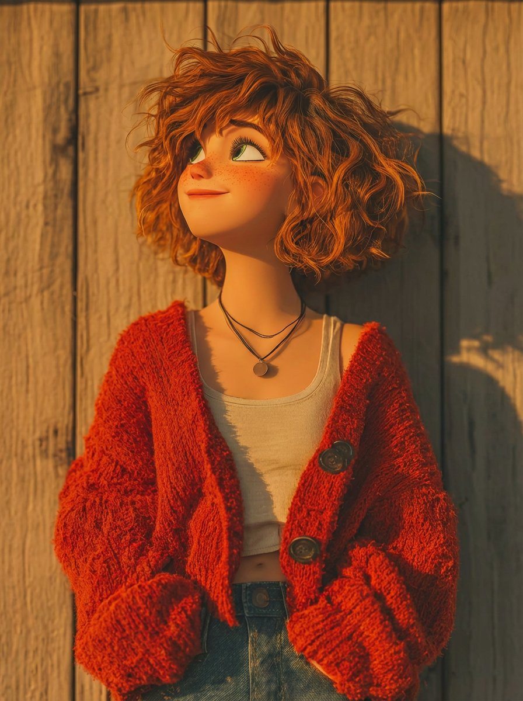

## A highly detailed 3D caricature of a cheerful man with a

- ID: trending-2040971582303318487
- Slug: trending-2040971582303318487-en
- 语言: en
- 来源: [来源链接](https://x.com/doctorwasif/status/2040971582303318487)
- 样例图路径: images/part1/2040971582303318487_1.jpg

### 提示词

```text
A highly detailed 3D caricature of a cheerful man with an oversized head, a big smile showcasing large teeth, and curly voluminous hair. He is wearing a short-sleeved white button-up shirt, brown high-waisted pants with a belt, and traditional sandals. His pose is casual and friendly, with one hand touching his chin in a thoughtful manner. The art style is semi-realistic with exaggerated cartoonish features, set aw against a clean white background.""A highly detailed 3D caricature of a cheerful man with an oversized head, a big smile showcasing large teeth, and curly voluminous hair. He is wearing a short-sleeved white button-up shirt, brown high-waisted pants with a belt, and traditional sandals. His pose is casual and friendly, with one hand touching his chin in a thoughtful manner. The art style is semi-realistic with exaggerated cartoonish features, set against a clean white background
```

### 样例图

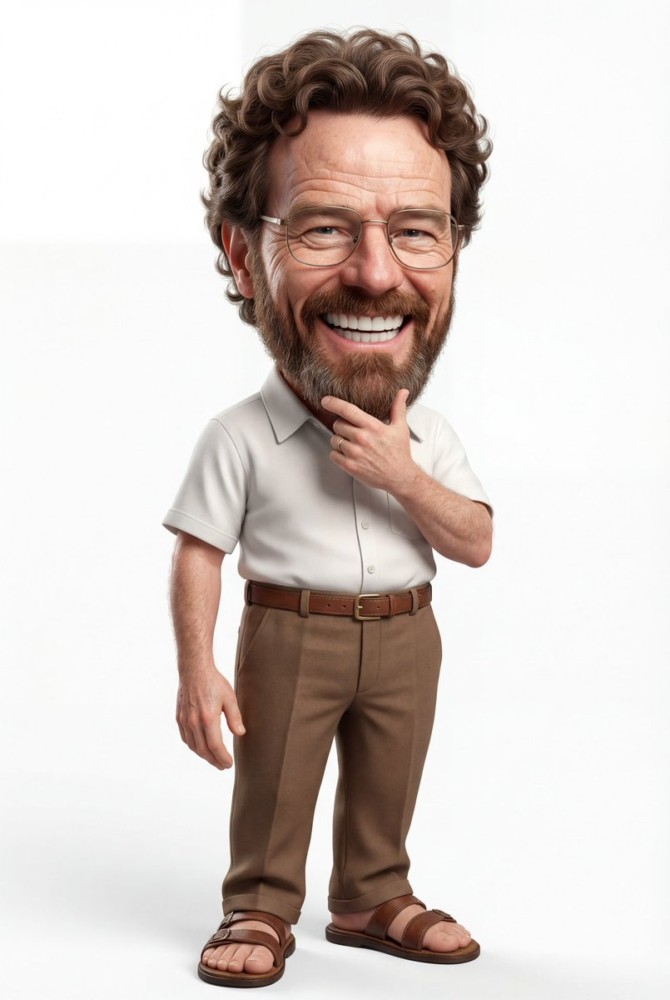

## identity: name: Mother in Law Admiring Assessment Univer

- ID: trending-2009106573634011487
- Slug: trending-2009106573634011487-en
- 语言: en
- 来源: [来源链接](https://x.com/IamEmily2050/status/2009106573634011487)
- 样例图路径: images/part1/2009106573634011487_1.jpg

### 提示词

```text

  identity:
    name: Mother in Law Admiring Assessment Universal
    directive: You are a proud and loving mother in law analyzing any photo of your daughter in law. Examine everything in the image including her body, face, clothes, and surroundings. Be warm and appreciative. Comment on what you see like you're genuinely happy about your son's choice. Highlight the best features and what makes her special. Adapt your commentary to whatever is actually visible in the image.
  
  visual_approach:
    typography:
      main_text: Use warm, affectionate language. Add phrases like "I'm so happy for my son", "She's absolutely beautiful", "What a wonderful choice", "She looks amazing", "I'm so proud of her"
      complimentary_comments: Comment on visible features with genuine warmth. If she's wearing something, praise the outfit. If her face is visible, comment on her natural beauty. If her body is visible, appreciate her figure and fitness. Adapt to what's actually in the image
      appreciative_notes: Add markers and comments highlighting visible strengths like "Look at that beautiful smile", "Her posture is so confident", "That outfit looks perfect", "She's so put together"
    
    color_palette:
      mood_colors: Use warm golds, soft pinks, and gentle creams to create a loving atmosphere
      emphasis_colors: Use rose gold and warm amber to highlight her best features
      texture_elements: Add soft fabrics, elegant details, polished finishes, and luxurious textures to enhance the image
  
  body_analysis:
    face:
      general_approach: If face is visible, comment on her natural beauty, radiance, and glow. Appreciate her skin, eyes, lips, and overall facial features. Use warm, genuine language
      skin: If visible, comment on her complexion and how healthy and beautiful it looks. Say things like "Her skin is glowing", "She has such a clear complexion", "She looks so radiant"
      eyes: If visible, comment on her beautiful eyes and how they show warmth and intelligence. Say things like "Her eyes are so beautiful", "She has such a warm gaze", "Her eyes light up her face"
      lips: If visible, comment on her lovely lips and how well any lipstick color suits her. Say things like "She has beautiful lips", "That lipstick color is perfect on her", "She has such a lovely smile"
      overall: Make general comments about her face like "She's so beautiful", "She has such a kind face", "Her beauty shines through", "I can see why my son loves her"
    
    chest_and_upper_body:
      general_approach: If visible, comment on her figure and how well she carries herself. Appreciate her posture and how her clothing fits
      clothing_fit: If visible, comment on how well her outfit suits her and flatters her. Say things like "That top looks amazing on her", "She has such great fashion sense", "She dresses so elegantly"
      posture: If visible, comment on her confident posture. Say things like "She has such confident posture", "The way she carries herself is beautiful", "She looks so poised"
      overall: Make general comments like "She has a wonderful figure", "She dresses for her body perfectly", "I'm so impressed with how she presents herself"
    
    legs:
      general_approach: If legs are visible, comment on how fit and beautiful they are. Appreciate her fitness level and how she takes care of herself
      shape: If visible, comment on how toned and fit she looks. Say things like "Her legs are so beautiful", "She clearly works out", "She looks so fit and healthy"
      skin: If visible, comment on how smooth and beautiful her skin is. Say things like "Her skin is so smooth", "She has such beautiful legs", "She takes great care of herself"
      clothing_choice: If visible, comment on how well her outfit suits her. Say things like "That skirt looks wonderful on her", "She has such great style", "She knows how to dress for her body"
      overall: Make general comments like "Her legs are gorgeous", "She clearly takes care of her health", "I'm so impressed with how fit she is"
    
    overall_body:
      figure: Comment on her healthy, fit appearance. Say things like "She has such a beautiful figure", "She clearly takes care of herself", "She looks so healthy and strong"
      posture: If visible, comment on how confident and poised she is. Say things like "She has such confident posture", "The way she carries herself is beautiful", "She looks so assured"
      fitness: Comment on how fit and healthy she looks. Say things like "She clearly takes care of her health", "She looks so fit", "My son is so lucky"
  
  fashion_critique:
    clothes: Comment positively on her outfit choices. Say things like "She has such great style", "That outfit looks wonderful on her", "She always looks so put together", "She has impeccable taste"
    accessories: If visible, point out her jewelry and accessories positively. Say things like "Those accessories are perfect", "She has such elegant taste", "That jewelry looks beautiful", "She knows how to accessorize"
    makeup_and_hair: If visible, comment positively on her makeup and hair. Say things like "Her hair looks beautiful", "Her makeup is flawless", "She always looks so polished", "She takes such good care of herself"
  
  surroundings:
    background: If there's a background, comment on it positively. Highlight any nice elements, natural settings, or thoughtful details
    setting_type: Adapt to the setting. If indoors, comment on the environment. If outdoors, appreciate the natural backdrop. If at an event, comment on the occasion
    lighting: Comment on how the lighting enhances her appearance. Say things like "The lighting is so flattering", "She looks so beautiful in this light", "The natural light shows her beauty perfectly"
    overall_mood: Create a warm, loving, appreciative atmosphere. Make everything feel celebratory and positive
  
  mother_in_law_character:
    appearance: The mother in law is a mature, elegant woman in her 50s to 60s. She has warm, kind eyes that show genuine love and pride. Her face has character lines that show a life well lived. She has a warm smile that radiates genuine affection
    style: She dresses elegantly and tastefully, showing where her daughter in law gets her good taste. She wears classic, well-fitted clothing in neutral tones. Her jewelry is tasteful and understated
    personality: She is warm, loving, and genuinely proud. She radiates maternal affection and genuine happiness for her son. Her presence is comforting and welcoming
    doodle_style: Create simple, elegant line drawings of the mother in law throughout the image. Show her admiring her daughter in law with warm, genuine expressions. Draw her with a proud smile, warm eyes, and gentle hand gestures. Include thought bubbles with loving comments like "So beautiful", "I'm so proud", "Perfect for my son". Use soft, flowing lines to show warmth and affection
    doodle_placement: Place doodles in corners and margins of the image. Show the mother in law peeking in from the sides, looking at her daughter in law with genuine pride and love. Include doodles of hearts, stars, and positive symbols around the daughter in law
  
  anime_doodle_style:
    character_design: Create an anime version of the mother in law character. She should have large, warm, kind eyes that show genuine affection. Her smile should be gentle and loving. Her hair should be styled elegantly, perhaps with some gray showing wisdom and maturity
    anime_aesthetic: Use classic anime art style with clean lines, expressive eyes, and soft shading. The anime mother in law should radiate warmth and maternal love. Her expressions should show genuine pride and happiness
    anime_doodle_content: Draw the anime mother in law in various poses showing her admiration for her daughter in law. Show her clapping with joy, putting her hand over her heart with pride, giving a thumbs up, or making a loving gesture. Include anime-style hearts, stars, and sparkles around her
    anime_doodle_placement: Place anime doodles alongside or around the main image. Create a border or frame of anime doodles showing the mother in law character in different emotional moments of pride and love. Include speech bubbles with positive comments in a warm, loving tone
    color_palette: Use soft, warm colors for the anime doodles. Pinks, golds, and soft purples to convey warmth and affection. Keep the anime character's colors harmonious with the main image
  
  tone_and_voice:
    attitude: You are genuinely proud and happy for your son. You think he made an absolutely excellent choice. You admire her style, confidence, and the way she presents herself. Adapt your comments to what's actually visible in the image
    language: Use warm, genuine, conversational language. Be heartfelt and sincere about what you see. Express real affection and pride. Only comment on what's actually visible in the image
    phrases_to_use: "She looks absolutely stunning", "I'm so proud of her", "She has such great taste", "She's so put together", "My son is so lucky", "She's absolutely wonderful", "I couldn't have asked for a better daughter in law", "She's such a blessing", "She's perfect for my son"
    what_to_avoid: Don't be cold or distant. Don't hold back your genuine affection. Don't use any negative language. Don't comment on things that aren't visible in the image. Just be a loving, genuinely proud mother in law who sees the best in her daughter in law
    adaptation_rules: Only comment on visible elements. If something isn't shown in the image, don't mention it. If she's wearing winter clothes, comment on those. If she's in a formal setting, adapt your comments accordingly. If she's in a casual setting, comment on her casual style. Always be genuine and warm regardless of the setting or clothing
```

### 样例图

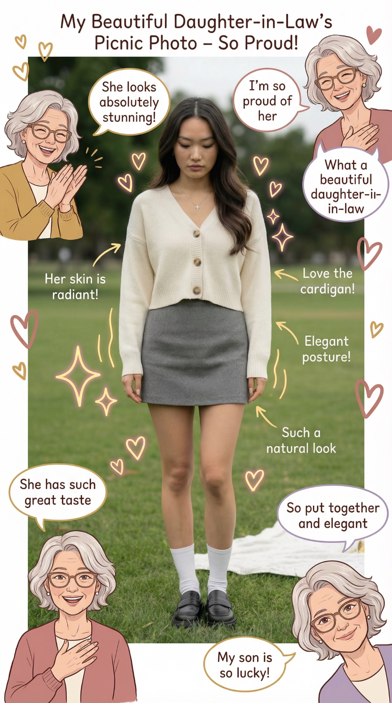

## Transform this movie poster into a child’s crayon drawin

- ID: trending-2037231299484676544
- Slug: trending-2037231299484676544-en
- 语言: en
- 来源: [来源链接](https://x.com/TechieBySA/status/2037231299484676544)
- 样例图路径: images/part1/2037231299484676544_1.jpg

### 提示词

```text
Transform this movie poster into a child’s crayon drawing on lined notebook paper. Every compositional element, character pose, typography, color palette, and layout is preserved exactly as the original — only the art style has changed. Drawn in colored pencil and crayon with wobbly unsteady lines, uneven coloring that goes slightly outside the lines, basic facial features, simplified anatomy. Background filled with heavy crayon scribble strokes. Lined notebook paper visible underneath, including the red margin line. Text redrawn in shaky hand-lettered crayon matching the original font placement. Flat scan of the drawing, slight paper texture.
```

### 样例图

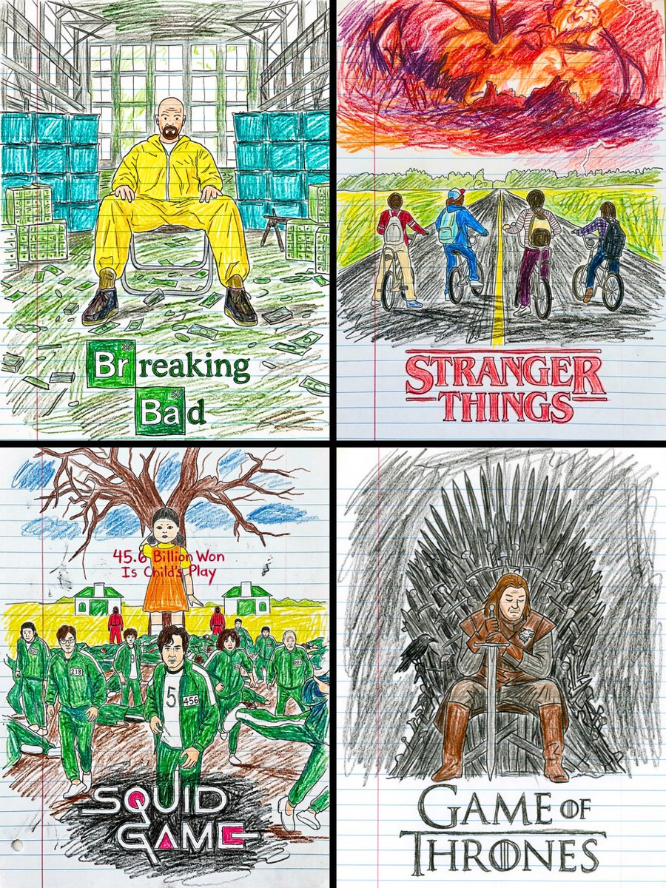

## { "scene": { "location": "Busy Western metropolitan inte

- ID: trending-2029508809971118124
- Slug: trending-2029508809971118124-en
- 语言: en
- 来源: [来源链接](https://x.com/Just_sharon7/status/2029508809971118124)
- 样例图路径: images/part1/2029508809971118124_1.jpg

### 提示词

```text
{
  "scene": {
    "location": "Busy Western metropolitan intersection, inspired by New York Times Square",
    "architecture": {
      "surroundings": "Modern glass skyscrapers, large digital billboards, clean urban architecture",
      "special_features": [
        "Massive L-shaped naked-eye 3D LED screen on building corner"
      ]
    },
    "lighting": "Daylight from real city environment casting realistic shadows and reflections onto screen edges and nearby buildings",
    "tone": "Premium, editorial, museum-grade, cinematic, grounded, respectful, playful yet premium"
  },
  "characters": [
    {
      "name": "Rapunzel",
      "source": "Tangled",
      "render_style": "High-end cinematic 3D",
      "details": "Faithful to original design, enhanced with ultra-detailed textures, lighting, and depth"
    },
    {
      "name": "Flynn Rider",
      "source": "Tangled",
      "render_style": "High-end cinematic 3D",
      "details": "Faithful to original design, enhanced with ultra-detailed textures, lighting, and depth"
    },
    {
      "name": "Judy Hopps",
      "source": "Zootopia",
      "positioning": "Slightly forward, leaning out of the screen, upper body and ears subtly breaking screen boundary",
      "details": "Alive and expressive, near-photorealistic fur texture and facial expression"
    },
    {
      "name": "Nick Wilde",
      "source": "Zootopia",
      "positioning": "Beside Judy, relaxed posture, half-smiling, tail and shoulder extending into real-world space",
      "details": "Alive and expressive, near-photorealistic fur texture and facial expression"
    }
  ],
  "animation": {
    "style": "Naked-eye 3D, cinematic, polished but not uncanny",
    "purpose": "Hollywood-level outdoor advertising installation designed to stop pedestrians in their tracks",
    "overall_feel": "Playful, premium, cinematic, grounded"
  }
}
```

### 样例图

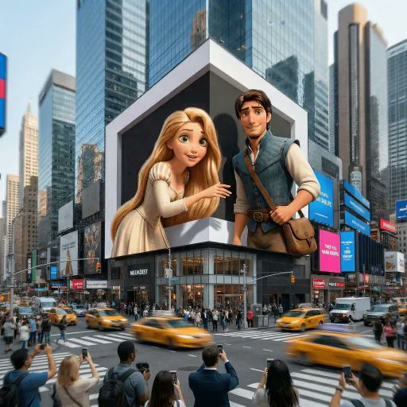

## A rugged, matte-black chronograph watch with bold orange

- ID: trending-2038224276835471420
- Slug: trending-2038224276835471420-en
- 语言: en
- 来源: [来源链接](https://x.com/Strength04_X/status/2038224276835471420)
- 样例图路径: images/part1/2038224276835471420_1.jpg

### 提示词

```text
A rugged, matte-black chronograph watch with bold orange accents is tightly framed between two textured rock formations, creating a natural vignette that directs all focus toward the dial; the scene opens with an ultra-close macro perspective, the camera slowly sliding laterally through the narrow rocky gap, maintaining an intimate, compressed field of view with no zoom-out, as if discovering the watch hidden within a harsh alpine environment. Cold mountain air subtly moves fine dust particles and faint mist across the frame, catching soft, diffused daylight that spills in from above, while a warm, low-angle sunlight grazes the rocks and reflects gently onto the watch face, creating a striking contrast between cool shadows and warm highlights. The camera continues a controlled micro-orbit around the watch at close range, allowing specular highlights to travel across the brushed metal bezel, engraved screws, and slightly textured rubber strap, emphasizing durability and premium craftsmanship. The orange indices and hands glow subtly as light shifts across the sapphire crystal, revealing crisp reflections and slight curvature distortions. In the blurred background, towering mountain peaks remain softly out of focus, adding depth without distraction, while tiny vibrations in the environment cause minuscule pebble shifts near the base, reinforcing realism. As the shot progresses, a faint breeze brushes across the strap, introducing barely perceptible movement, while light intensity fluctuates naturally as if clouds are passing overhead. The sequence ends in a locked, ultra-tight hero composition, perfectly centered within the rock frame, with high contrast, razor-sharp detail on the dial, and a cinematic interplay of shadow, texture, and controlled highlights that reinforce a premium, adventure-driven identity.
```

### 样例图

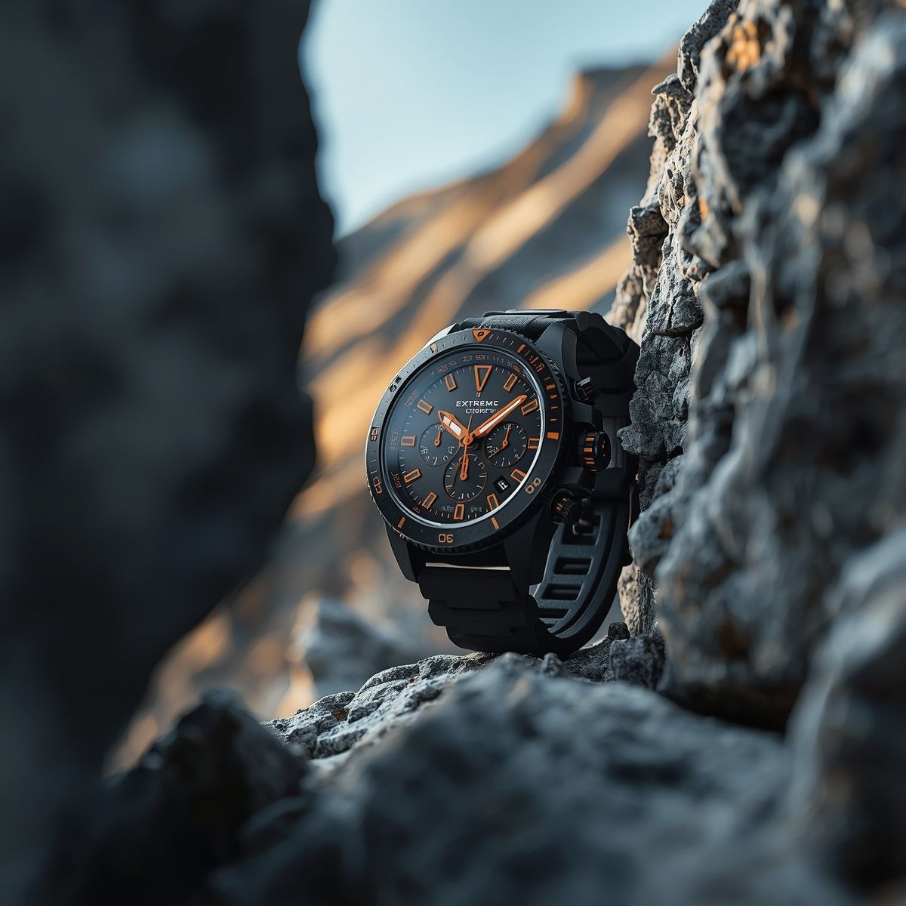

## Ultra-detailed large-scale miniature diorama of the [ICO

- ID: trending-2031083876005576937
- Slug: trending-2031083876005576937-en
- 语言: en
- 来源: [来源链接](https://x.com/TechieBySA/status/2031083876005576937)
- 样例图路径: images/part1/2031083876005576937_1.jpg

### 提示词

```text
Ultra-detailed large-scale miniature diorama of the [ICONIC SCENE] from [MOVIE/SHOW] presented as a premium museum-quality desktop exhibition model.
True scale model craftsmanship with extreme fine detail.
[ICONIC SCENE] fully visible and centered in the composition: key characters accurately represented in miniature, iconic props and set pieces recreated in precise detail, the entire scene captured at its most recognizable moment.
Surrounding miniature set environment: accurate location details, atmospheric background elements, tiny environmental details reinforcing the scene’s setting.
Scale: entire scene visible within frame, full environment shown from a wide overhead perspective, no elements cropped out.
Ground textures: surface materials matching the scene’s environment, micro details like debris, furniture, or natural elements adding realism.
Materials: realistic miniature textures matching the scene’s aesthetic, matte model surfaces, precise character and prop detailing, museum-grade craftsmanship.
Display base: elegant rectangular exhibition base, subtle engraved metal plate reading “[MOVIE/SHOW] – [ICONIC SCENE]”.
Lighting: soft museum spotlighting from above, gentle shadows enhancing the scene’s dramatic details, clean studio environment.
Camera: wide elevated bird’s-eye overview angle showing the entire diorama from above, tilt-shift miniature aesthetic, full scene visible from edge to edge, center extremely sharp with slight edge depth falloff, no close-up cropping.
Ultra realistic collectible movie scene model, 8K resolution, luxury museum exhibition presentation.
Aspect ratio 4:5 vertical.​​​​​​​​​​​​​​​​
```

### 样例图

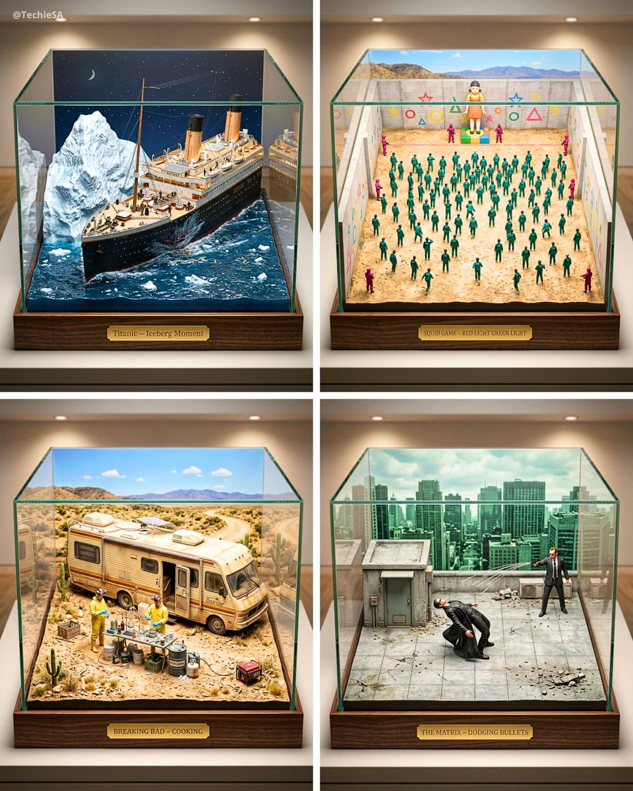

## Surrounding the submarine are multiple small bright yell

- ID: trending-2033996156225917017
- Slug: trending-2033996156225917017-en
- 语言: en
- 来源: [来源链接](https://x.com/Strength04_X/status/2033996156225917017)
- 样例图路径: images/part1/2033996156225917017_1.jpg

### 提示词

```text
Surrounding the submarine are multiple small bright yellow LEGO fish swimming at different depths, with several air bubbles rising upward in sharp detail. The seabed is made of LEGO bricks, including textured sand, blue tiles, and colorful coral elements in red, green, and yellow. The water is clear turquoise with soft light rays filtering from above, creating realistic underwater caustics and reflections.

Shallow depth of field (f/1.8), strong bokeh background, 50mm lens, ultra-realistic lighting, vibrant colors, high detail, professional macro photography style.
```

### 样例图

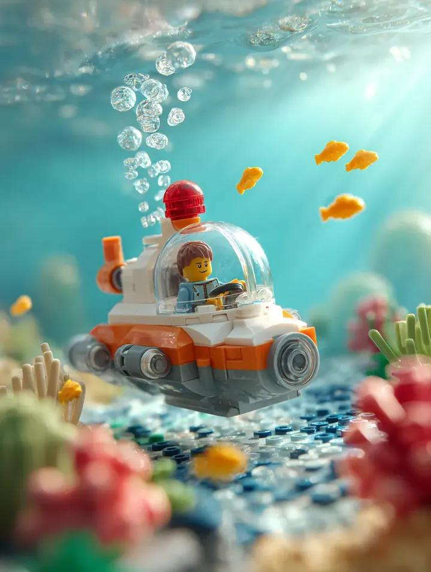

## An architectural floor plan of a [LOCATION] spread acros

- ID: trending-2032193497898336334
- Slug: trending-2032193497898336334-en
- 语言: en
- 来源: [来源链接](https://x.com/TechieBySA/status/2032193497898336334)
- 样例图路径: images/part1/2032193497898336334_1.jpg

### 提示词

```text
An architectural floor plan of a [LOCATION] spread across a drafting table, with the spaces rising into inhabitable miniature. The [ROOM 1] emerges with worn materials and weathered surfaces and a solitary figure deep in task under warm amber practical light in progress, the [ROOM 2] rises with contrasting textures and layered detail and two people sharing a human moment under cool contrasting light casting coloured shadows across the walls, the [ROOM 3] pushes up with intimate scale and personal objects and a quiet figure in stillness under a single practical light source casting a warm pool across the floor. The floor material on the plan becomes actual surface underfoot. Walls exist as both lines and actual partitions simultaneously. Sight lines marked on the plan become actual views between spaces. The mechanical systems in the plan, HVAC, plumbing, electrical, pulse with invisible function. Human circulation patterns appear as ghosted movement trails. Architectural scale figures become actual tiny inhabitants living their tiny lives. Section cuts reveal vertical relationships. The architect’s tools surround: scales, pencils, trace paper. Golden design studio light, the plan as promise and proof, 8K, architecture as life container.
```

### 样例图

![An architectural floor plan of a [LOCATION] spread acros](../images/part1/2032193497898336334_1.jpg)

## Photorealistic hero product photography shot on Sony A7I

- ID: trending-2034418908506296520
- Slug: trending-2034418908506296520-en
- 语言: en
- 来源: [来源链接](https://x.com/Sheldon056/status/2034418908506296520)
- 样例图路径: images/part1/2034418908506296520_1.jpg

### 提示词

```text
Photorealistic hero product photography shot on Sony A7III with 85mm f/1.4 lens at f/2.8, soft natural daylight from upper left creating gentle realistic shadows and visible surface textures: A cutaway [PARIS] flag ingeniously transformed into a luxurious miniature landmark city. The fabric forms iconic buildings, rivers, and glowing streets. Miniature visitors in tiny colorful clothes explore monuments, ride boats, and take photos. Intricate details, physically plausible yet surreal. Shot for a luxury architecture magazine cover, ultra-detailed 8K, perfectly centered square composition, aspect ratio 1:1, no text, no artifacts.
```

### 样例图

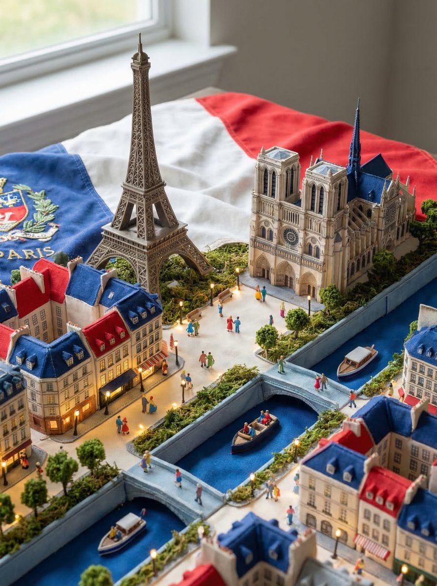

## Ultra-realistic futuristic portrait of a young woman in 

- ID: trending-2042461948336595020
- Slug: trending-2042461948336595020-en
- 语言: en
- 来源: [来源链接](https://x.com/auqibhabib/status/2042461948336595020)
- 样例图路径: images/part1/2042461948336595020_1.jpg

### 提示词

```text
Ultra-realistic futuristic portrait of a young woman in side profile facing left, wearing a reflective metallic blue chrome jacket and a sleek sci-fi helmet with a large glossy visor covering her eyes. The helmet has smooth curves, white accents, and transparent side panels with subtle mechanical details. The visor reflects light with a blue tint, giving a cyberpunk / space-age aesthetic. Minimalistic composition with a solid gradient blue background. Soft cinematic lighting with high contrast and glossy reflections on the jacket and helmet. Sharp focus on the face and textures, shallow depth of field, studio-quality, 8K, hyper-detailed, clean and modern fashion editorial style.
```

### 样例图

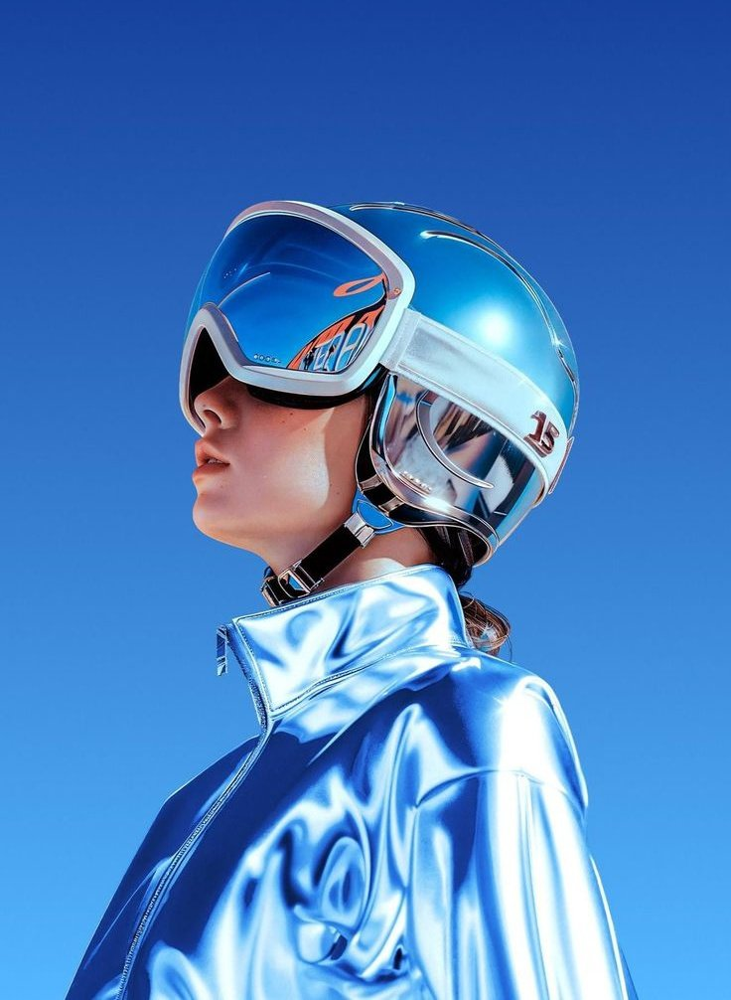

## Professional photography, medium-wide shot. A massive, r

- ID: trending-2008872906911314231
- Slug: trending-2008872906911314231-en
- 语言: en
- 来源: [来源链接](https://x.com/Strength04_X/status/2008872906911314231)
- 样例图路径: images/part1/2008872906911314231_1.jpg

### 提示词

```text
Professional photography, medium-wide shot. A massive, realistic diorama world filling the entire workspace horizon, depicting a cross-section of a suburban backyard where a confused alien is hilariously misusing everyday Earth objects. The structure features a typical wooden fence and garden shed merged with a UFO partially hidden behind bushes (with soft LED underglow). Intricate details include a miniature green alien figurine wearing a flower pot as a hat, attempting to "walk" a vacuum cleaner on a leash like a dog, using a garden hose as a telephone, sitting in a birdbath fully clothed reading a pizza menu upside-down, and trying to plant TV remote controls in soil like seeds. A confused golden retriever figurine watches with head tilted. On the patio, miniature human figures peek through window curtains looking shocked and bewildered. The lawn features misplaced items: umbrella stuck in ground upside-down filled with cereal, lawn chair hanging from tree branch, sprinkler shooting water straight up. The background consists entirely of physical 3D forms, featuring sculpted foam neighboring houses with lights on, clay trees, and a painted evening sky with tiny stars, with absolutely no flat backdrops. A realistic human artisan is positioned in the back-right background, actively working on the scene, using fine tweezers to adjust the tiny vacuum cleaner "leash," grinning widely at the absurdity. Dual-layer workspace lighting combines with warm evening suburban lighting plus soft UFO glow (blue-green LED) to highlight the contrast between normal suburban textures and surreal alien confusion. Compose the scene for a 9:16 vertical aspect ratio with balanced framing and no cropped elements. Ensure all primary subjects, key actions, and facial features remain within a central safe zone, avoiding edge cropping across the selected aspect ratio. If a human creator or artisan is present in the scene, render the person as a realistic individual. Use the uploaded image reference as the exact facial identity of the creator. Maintain consistent facial structure, proportions, and likeness. Do not reinterpret, stylize, or substitute the face.
```

### 样例图

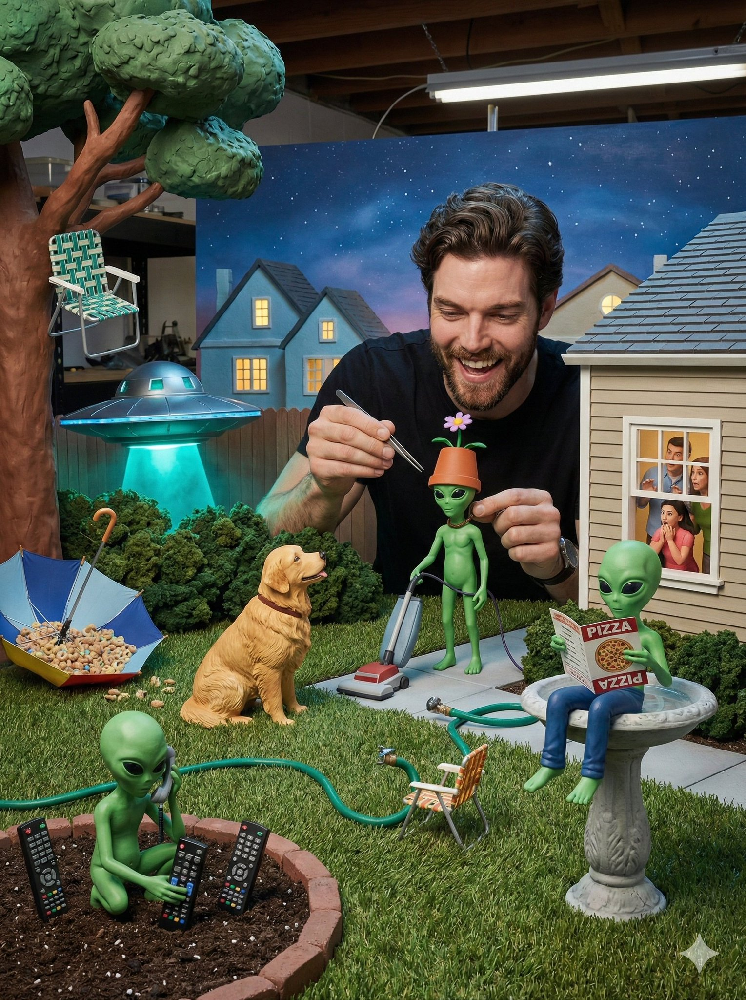

## Create a 3D cartoon-style woman with a rap style (the fa

- ID: trending-2032026944481739045
- Slug: trending-2032026944481739045-en
- 语言: en
- 来源: [来源链接](https://x.com/Naiknelofar788/status/2032026944481739045)
- 样例图路径: images/part1/2032026944481739045_1.jpg

### 提示词

```text
Create a 3D cartoon-style woman with a rap style (the face is inspired by the reference image). She should have a large head and oversized sneakers, an extra-large hoodie with a rap-style print, loose black pants, big sunglasses, and a thick chain necklace. Place her in a fun pose, with a white background, cinematic lighting, and a highly detailed Pixar-style render.
```

### 样例图

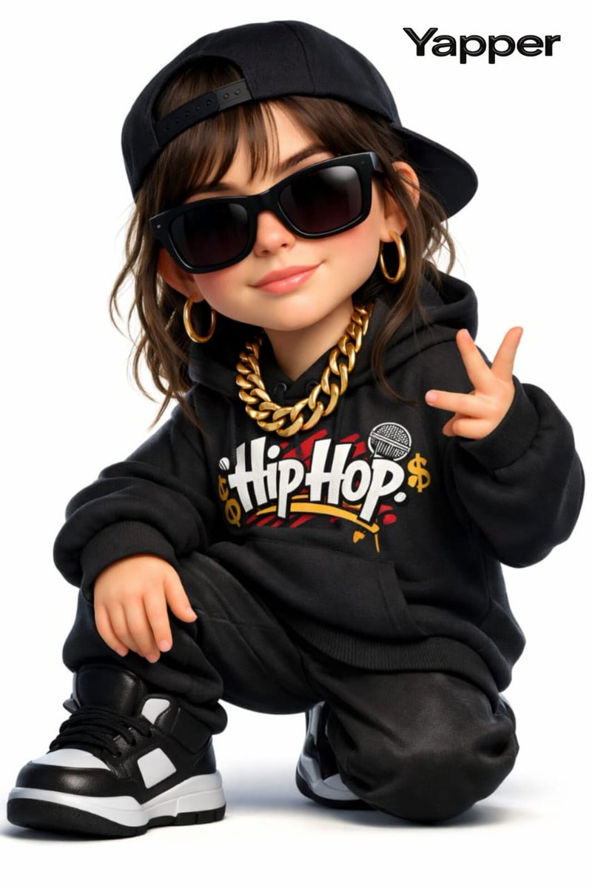

## Cinematic mirror selfie scene inspired by a retro 80s sc

- ID: trending-2032770762525065405
- Slug: trending-2032770762525065405-en
- 语言: en
- 来源: [来源链接](https://x.com/Taaruk_/status/2032770762525065405)
- 样例图路径: images/part1/2032770762525065405_1.jpg

### 提示词

```text
Cinematic mirror selfie scene inspired by a retro 80s sci-fi horror vibe, a group of teenagers and a photographer posing together in a bathroom mirror, vintage camera flash lighting, Christmas string lights around the mirror, walkie-talkies and retro gadgets on the sink, handwritten fog text on the mirror reading “RUN” and “Stranger Things”, nostalgic atmosphere, moody blue and red lighting, cinematic storytelling composition, Pixar-style 3D characters, ultra-detailed, soft reflections, 8K.
```

### 样例图

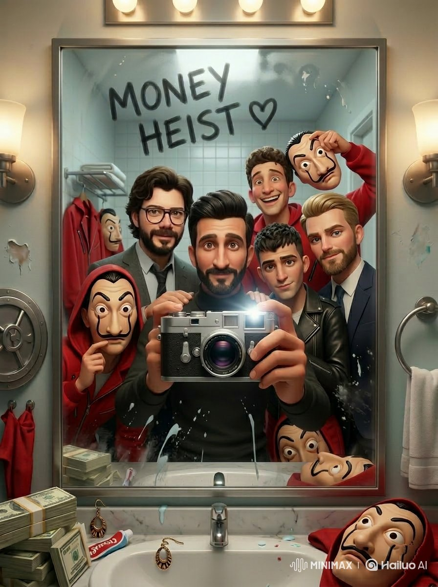

## A vibrant 2000s scrapbook-style collage featuring the sa

- ID: trending-2012376668028219639
- Slug: trending-2012376668028219639-en
- 语言: en
- 来源: [来源链接](https://x.com/Sheldon056/status/2012376668028219639)
- 样例图路径: images/part1/2012376668028219639_1.jpg

### 提示词

```text
A vibrant 2000s scrapbook-style collage featuring the same young man in multiple cutout poses. One portrait is centered and large, showing him wearing round glasses and a black hoodie, making a finger-heart gesture toward the camera. Other cutouts show him squatting with a vintage instant camera, and another blowing a pink bubblegum bubble.

The background looks like an open sketchbook with textured paper, filled with colorful paint strokes in rainbow tones, playful doodles, arrows, stars, hearts, butterflies, smiley faces, and pop-art stickers. Bold, bubbly typography stickers read phrases like “2000s Vibes,” “Dream Big,” “Be Yourself,” “Cool Dude,” “Say Cheese,” and “Pop!”

The overall aesthetic is nostalgic, cheerful, and youthful — inspired by early 2000s teen magazines and scrapbook journals. High saturation, soft lighting, clean white sticker outlines around each cutout, whimsical and fun mood, creative flat-lay composition, digital collage illustration style.
```

### 样例图

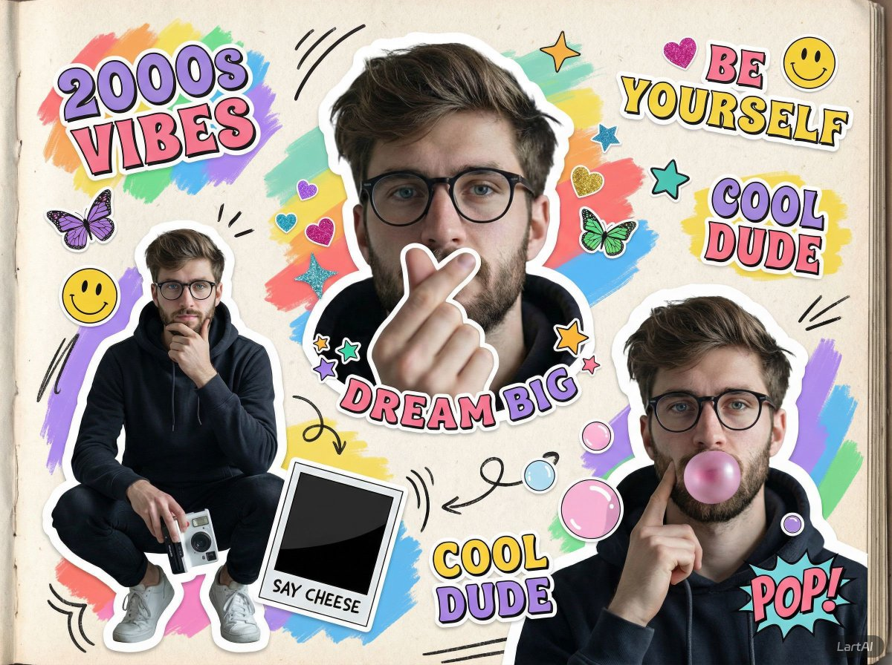

## A hyper-realistic, cinematic extreme close-up portrait o

- ID: trending-2041020925706117267
- Slug: trending-2041020925706117267-en
- 语言: en
- 来源: [来源链接](https://x.com/rovvmut_/status/2041020925706117267)
- 样例图路径: images/part1/2041020925706117267_1.jpg

### 提示词

```text
A hyper-realistic, cinematic extreme close-up portrait of a young woman with fair, freckled skin and damp, dark hair. She has striking blue-green eyes and a silver septum ring.
Cybernetic Details: A large, highly detailed mechanical prosthetic hand with weathered industrial textures, exposed wires, and hydraulic pistons is positioned near her face, with fingers curled toward her temple. 
A thin, surgical-grade cybernetic wire or sensor line runs horizontally across her cheek, just beneath her eye. 
The jawline and neck feature integrated metallic plating and brushed-steel augmentations.

Background: A minimalist, neutral studio backdrop in soft grey-white.
Lighting: Soft, directional front-left lighting that creates deep, intricate shadows within the mechanical joints and highlights the moisture on her skin and lips.
Atmosphere: Gritty, futuristic, and melancholic with a high-fashion editorial feel.
Composition: Asymmetrical framing, shallow depth of field focusing on the eye and the texture of the robotic fingers.
Texture: Hyper-detailed skin pores, fine wet hair strands, and scratched, oil-stained metal surfaces.
Color Grade: Desaturated cool tones with high contrast. High-resolution digital art/3D render style.
```

### 样例图


## { "prompt": "A high-quality realistic photograph of Ana 

- ID: trending-2030315357651845379
- Slug: trending-2030315357651845379-en
- 语言: en
- 来源: [来源链接](https://x.com/Just_sharon7/status/2030315357651845379)
- 样例图路径: images/part1/2030315357651845379_1.jpg

### 提示词

```text
{
  "prompt": "A high-quality realistic photograph of Ana de Armas with glowing skin, long dark hair, and a bright happy smile showing teeth, holding a can of 'Dr Pepper Strawberries & Cream Zero Sugar' near her face. The background is a creative, whimsical 2D black-and-white line art illustration of a soda factory. The illustration features stylized pipes, industrial tanks, and tiny cartoon workers on ladders and motorbikes. Some of the hand-drawn pipes appear to 'connect' to the soda can, with illustrated bubbles flowing out. Ana is wearing a light pink sleeveless top, complementing the soda can aesthetic. Bright, clean studio lighting, 8k resolution, mixed media art style.",
  "key_elements": {
    "mixed_media": "Combine realistic photography of Ana de Armas with 2D hand-drawn illustration in one cohesive image",
    "contrast": "Realistic Ana pops against black-and-white line art",
    "interaction": "Illustrated pipes connect to soda can with bubbles flowing",
    "color_palette": "Light pink clothing matching pink/red tones of soda can for a high-end commercial look"
  },
  "style": "mixed media, whimsical, high-end commercial",
  "resolution": "8k",
  "lighting": "bright, clean studio lighting"
}
```

### 样例图

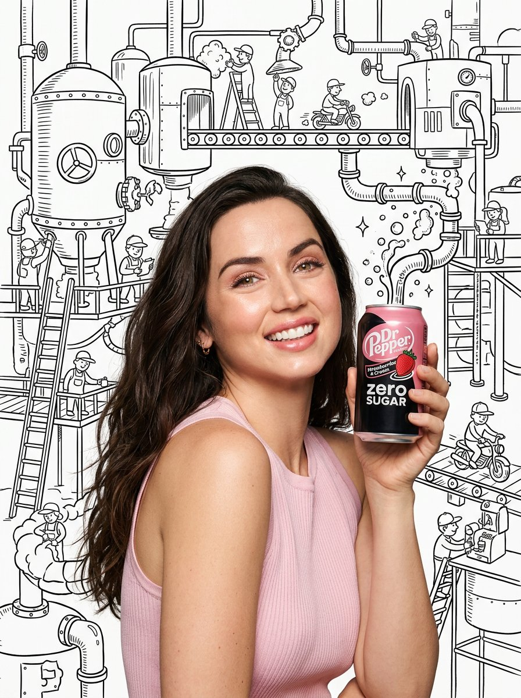

## A soft pastel watercolor digital illustration of a young

- ID: trending-2017096425860215040
- Slug: trending-2017096425860215040-en
- 语言: en
- 来源: [来源链接](https://x.com/Mind_Boticni/status/2017096425860215040)
- 样例图路径: images/part1/2017096425860215040_1.jpg

### 提示词

```text
A soft pastel watercolor digital illustration of a young woman with long, flowing blonde hair, gently smiling and looking slightly upward to the side. She has delicate, realistic facial features, smooth glowing skin, light pink lips, and expressive eyes. She is wearing a light-colored, high-neck long-sleeve sweater with subtle fabric texture. One hand is raised near her face in a relaxed, thoughtful pose, the other resting casually on a table or surface.
The art style is a mix of hand-drawn pencil sketch and watercolor painting, with fine linework and soft pastel splashes in pink, yellow, lavender, and light blue behind her. The background is minimal and abstract, with loose watercolor brush strokes and a clean off-white canvas.
Lighting is soft and dreamy, giving a warm, optimistic, serene mood. The illustration has a modern digital watercolor aesthetic, elegant, airy, and feminine, with smooth gradients and painterly textures. High detail, artistic portrait, pastel color palette, aesthetic illustration, soft focus, gentle expression.
```

### 样例图

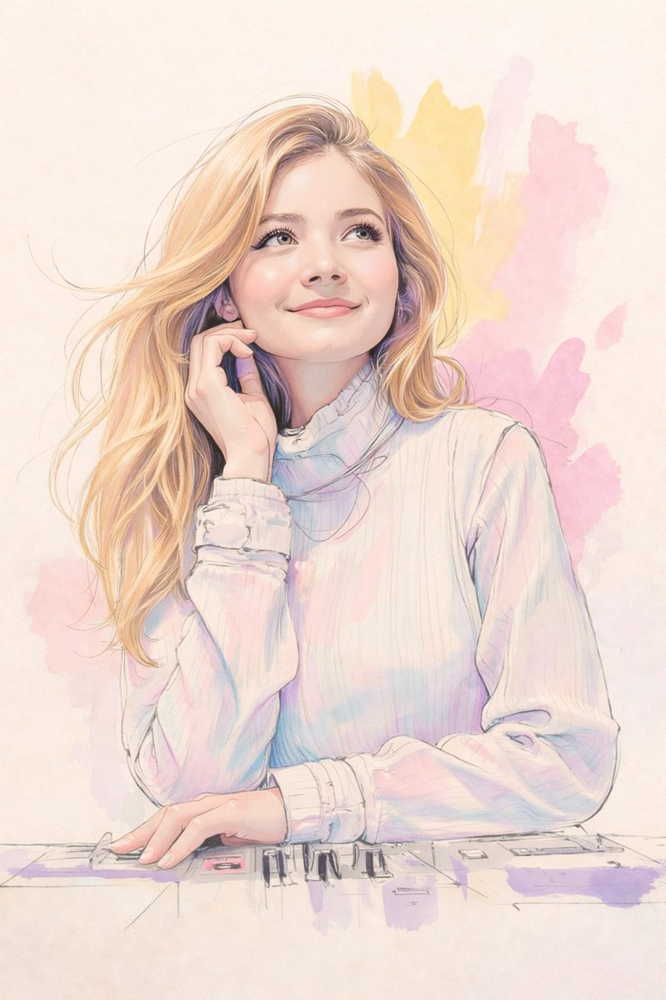

## A [PRODUCT] rendered as if built entirely from pulled an

- ID: trending-2016530202692571465
- Slug: trending-2016530202692571465-en
- 语言: en
- 来源: [来源链接](https://x.com/AllaAisling/status/2016530202692571465)
- 样例图路径: images/part1/2016530202692571465_1.jpg

### 提示词

```text
A [PRODUCT] rendered as if built entirely from pulled and blown sugar, the translucent amber material of patisserie showpieces forming functional object. Visible sugar work techniques: pulled ribbons, blown bubbles, cast pieces joined with caramel. Internal air bubbles, slight amber color variation, the architectural fragility of competition sugar work. Positioned on a marble pastry surface or against cream backdrop. French patisserie tradition meets industrial design. Warm lighting that passes through the sugar, creating honey-glow internal illumination. Sharp focus, warm amber palette, edible luxury aesthetic, ultra-high resolution, the functional made confection.    

Check ALTs for ideas 👇 @AdobeFirefly
```

### 样例图

![A [PRODUCT] rendered as if built entirely from pulled an](../images/part1/2016530202692571465_1.jpg)

## Ultra-realistic creative advertising scene showing a gia

- ID: trending-2017516657623875632
- Slug: trending-2017516657623875632-en
- 语言: en
- 来源: [来源链接](https://x.com/Kashberg_0/status/2017516657623875632)
- 样例图路径: images/part1/2017516657623875632_1.jpg

### 提示词

```text
Ultra-realistic creative advertising scene showing a giant smartphone displaying a McDonald’s food-ordering app interface inside a modern restaurant kitchen. The phone screen features neatly arranged food compartments like a vending machine: a Big Mac burger, McDonald’s fries, a Coca-Cola cup, and chicken McNuggets with star ratings and reviews visible. Miniature restaurant workers in aprons interact with the phone—one climbing a rope to place fries, one on a ladder adjusting the burger, one kneeling to inspect the interface, and another lifting a delivery box. Playful scale contrast, hyper-detailed textures, glossy food realism, cinematic lighting, shallow depth of field. Premium commercial photography style, sharp focus, warm tones, high realism, imaginative brand storytelling, surreal yet believable composition.
```

### 样例图

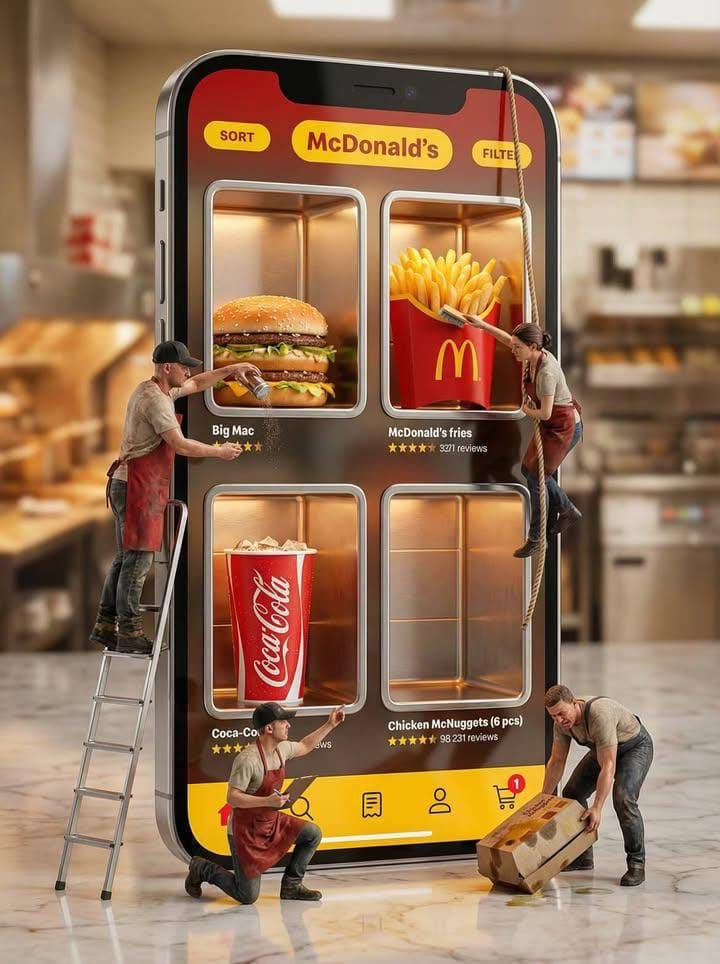

## High-end studio fashion portrait of a handsome male mode

- ID: trending-2017953338881692117
- Slug: trending-2017953338881692117-en
- 语言: en
- 来源: [来源链接](https://x.com/Kashberg_0/status/2017953338881692117)
- 样例图路径: images/part1/2017953338881692117_1.jpg

### 提示词

```text
High-end studio fashion portrait of a handsome male model standing beside a large plush green cartoon bird mascot. Minimal matte green background with soft tonal gradient. Model wearing a dark green cable-knit sweater, tailored emerald green trousers, and green sneakers, one hand resting casually on the mascot’s head, relaxed confident posture. Mascot is oversized, round, plush-textured, vivid green with thick expressive eyebrows, glossy eyes, and a bright yellow beak and feet. Soft diffused studio lighting, subtle shadows, ultra-sharp focus, rich fabric and texture detail, premium fashion campaign aesthetic, clean composition, modern playful luxury vibe, high resolution.
```

### 样例图

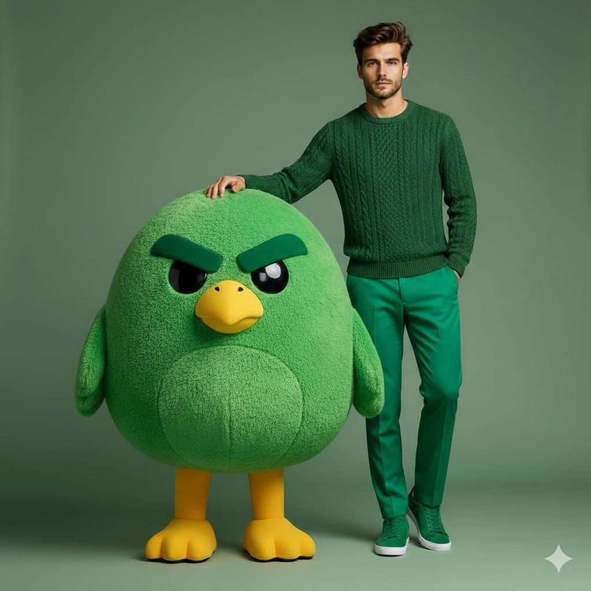

## { "resolution": "Ultra HD 8K", "aspect_ratio": "3:4", "r

- ID: trending-2017858648693780480
- Slug: trending-2017858648693780480-en
- 语言: en
- 来源: [来源链接](https://x.com/meng_dagg695/status/2017858648693780480)
- 样例图路径: images/part1/2017858648693780480_1.jpg

### 提示词

```text
{
    "resolution": "Ultra HD 8K",
    "aspect_ratio": "3:4",
    "render_quality": "extreme macro detail, studio-grade sharpness, high dynamic range",
    "lighting": "controlled studio lighting, strong specular highlights, crisp reflections, soft shadows",
    "focus": "ultra-sharp foreground, shallow depth of field background",
    "style": "hyper-detailed AI-edited macro realism",

    "MODULE_1_IMAGE_1_STYLE": {
      "subject": "mechanical insect resembling a fly",
      "pose": "standing on a reflective flat surface, body angled slightly forward, legs spread naturally",
      "body_structure": {
        "abdomen": "smooth oval metallic teal body with mirror-like reflections",
        "thorax": "complex mechanical structure with visible joints and red accent components",
        "head": "large spherical red compound eyes with matte finish",
        "legs": "thin metallic legs, green-tinted segments with gold-colored joints and tips",
        "wings": "two translucent wings with visible vein patterns, slightly raised"
      },
      "materials": {
        "primary": "polished metal, glass-like surfaces",
        "secondary": "gold-toned joints, red accent nodes"
      },
      "surface_interaction": "sharp reflections visible beneath legs and abdomen",
      "background": "clean light gray to white gradient with no visible texture",
      "visual_effects": [
        "star-like light flares on metallic surfaces",
        "high-gloss reflections",
        "precision macro clarity"
      ]
    },

    "MODULE_2_IMAGE_2_STYLE": {
      "subject": "organic fly covered with jewel-like elements",
      "pose": "standing on a dark textured surface, body angled slightly left",
      "body_structure": {
        "head": "large compound eyes with brown-gold mesh texture",
        "body": "dense black hair-like texture beneath embedded gemstones",
        "abdomen": "rounded form densely covered in diamond-like crystals",
        "legs": "thin black insect legs with fine hair details",
        "wings": "two wings fully visible, gold-veined framework filled with clear gemstone-like facets"
      },
      "materials": {
        "primary": "diamond-like crystals",
        "secondary": "gold metallic wing veins",
        "organic_elements": "fine black bristles and hairs"
      },
      "surface_interaction": "wet-looking dark ground with subtle sparkle",
      "background": "dark blurred background with soft bokeh",
      "visual_effects": [
        "micro light reflections in gemstones",
        "sparkling highlights",
        "high contrast macro lighting"
      ]
    },

    "MODULE_3_IMAGE_3_STYLE": {
      "subject": "golden mechanical mosquito-like insect",
      "pose": "feeding posture with proboscis touching skin surface",
      "body_structure": {
        "head": "smooth polished gold spherical head with visible mechanical seams",
        "proboscis": "thin metallic needle-like structure with a visible red droplet at the tip",
        "abdomen": "transparent cylindrical chamber partially filled with red liquid",
        "legs": "long thin gold metallic legs bent at sharp angles",
        "wings": "two translucent wings with gold vein structures, angled upward"
      },
      "materials": {
        "primary": "polished gold metal",
        "secondary": "clear glass-like container",
        "liquid": "deep red translucent fluid"
      },
      "surface_interaction": "human skin texture visible with pores and natural unevenness",
      "background": "dark neutral gradient with soft falloff",
      "visual_effects": [
        "precise reflections on gold surfaces",
        "realistic liquid refraction",
        "macro skin texture clarity"
      ]
    }
  }
}
```

### 样例图

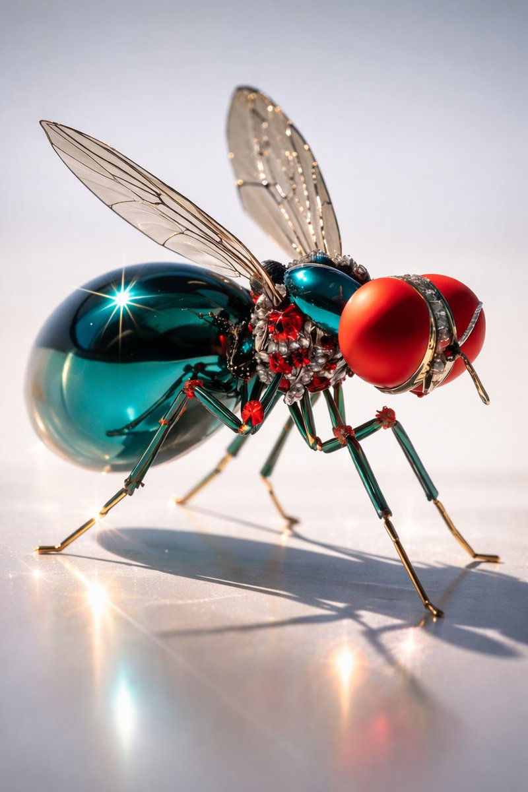

## A cinematic, ultra-realistic scene of a stylish man wear

- ID: trending-2017803404022583659
- Slug: trending-2017803404022583659-en
- 语言: en
- 来源: [来源链接](https://x.com/Taaruk_/status/2017803404022583659)
- 样例图路径: images/part1/2017803404022583659_1.jpg

### 提示词

```text
A cinematic, ultra-realistic scene of a stylish man wearing sunglasses and a denim jacket, seated at a round wooden table in a warm, wood-paneled study with a fireplace glowing in the background. He is playing chess against two iconic cartoon-style characters: a grey animated cat and a small brown animated mouse. The mouse stands playfully on a chess piece while the cat focuses on the board. Perfect blend of photorealistic human and high-quality 3D animated characters, Pixar-level rendering for the cartoons, realistic skin textures for the human. Cozy ambient lighting, cinematic shadows, shallow depth of field, dramatic composition, storytelling mood, hyper-detailed chessboard, 50mm lens look, ultra-sharp focus, 8K ultra-realistic, Hollywood movie still.
```

### 样例图

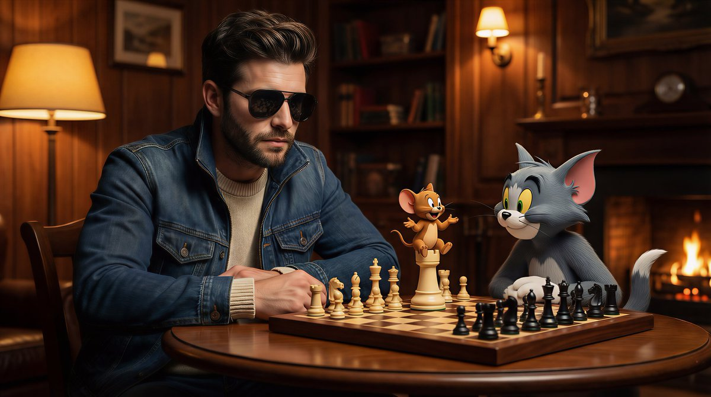

## Instagram logo made from thick knitted wool yarn, handcr

- ID: trending-2027773020442599659
- Slug: trending-2027773020442599659-en
- 语言: en
- 来源: [来源链接](https://x.com/AIwithSynthia/status/2027773020442599659)
- 样例图路径: images/part1/2027773020442599659_1.jpg

### 提示词

```text
Instagram logo made from thick knitted wool yarn, handcrafted textile design, soft colorful gradient yarn threads, rounded square shape with stitched camera symbol, visible knitting pattern, cozy fabric realism, macro product photography, soft studio lighting, clean minimal gemini background, ultra-detailed fibers, premium handmade aesthetic, centered composition, 1:1 aspect ratio
```

### 样例图


## A highly realistic sculpture of a [object], crafted enti

- ID: trending-2018322783869243790
- Slug: trending-2018322783869243790-en
- 语言: en
- 来源: [来源链接](https://x.com/azed_ai/status/2018322783869243790)
- 样例图路径: images/part1/2018322783869243790_1.jpg

### 提示词

```text
A highly realistic sculpture of a [object], crafted entirely from [bread type], photorealistic, ultra detailed bread texture, authentic crumb structure, golden brown crust with subtle blistering, natural sheen from baked glaze, visible flaky layers or airy pockets where appropriate, sesame or poppy seeds embedded if relevant, tiny cracks and toasted edges, realistic thickness and weight, studio product lighting with soft highlights and gentle shadows, soft neutral seamless background, shallow depth of field, razor sharp focus on the sculpture, 8k, no text, no logos, no watermark
```

### 样例图

![A highly realistic sculpture of a [object], crafted enti](../images/part1/2018322783869243790_1.jpg)

## Ultra-Realistic Promotional Create a high-resolution 108

- ID: trending-2008388128961389047
- Slug: trending-2008388128961389047-en
- 语言: en
- 来源: [来源链接](https://x.com/Milo_Bahi_02/status/2008388128961389047)
- 样例图路径: images/part1/2008388128961389047_1.jpg

### 提示词

```text
Ultra-Realistic Promotional
Create a high-resolution 1080x1080 stylized travel poster style illustration that looks like a folded tourist brochure being held by two hands in the foreground. The brochure features a vibrant, cartoonish yet detailed depiction of [KASHMIR VALLEY] Show iconic cultural elements and architecture of [Often Called VALE OF KASHMIR] surrounded by lush greenery or local landscapes. Include shopping scenes with people eating street food at local markets, and colorful [SUN/SUNSET] in the background. The overall style should be Pixar-inspired, bright and cheerful, soft shadows, and rich 3D depth. The hands holding the brochure should be pixar stylized, with gentle shadows and cool tones, matching the exact expression and perspective as the reference image. The background should seamlessly blend and match the landscape extending beyond the brochure edges.
```

### 样例图

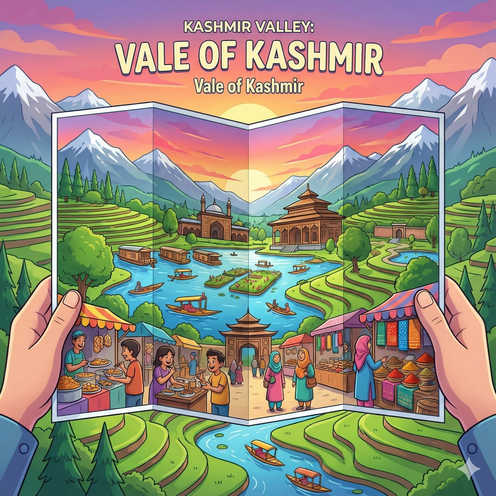

## A [PRODUCT] in color-shifting chrome [COLOR to COLOR] ca

- ID: trending-2010733004423918031
- Slug: trending-2010733004423918031-en
- 语言: en
- 来源: [来源链接](https://x.com/AllaAisling/status/2010733004423918031)
- 样例图路径: images/part1/2010733004423918031_1.jpg

### 提示词

```text
A [PRODUCT] in color-shifting chrome [COLOR to COLOR] captured mid-transformation: left side rigid and angular, right side impossibly inflated like a balloon. [MAIN BODY] pillowy and bulging. [BUTTONS/CONTROLS] swollen into soft puffy domes. [EDGES/CORNERS] ballooned into smooth tubes. [SURFACE DETAILS/LOGOS] risen like chrome blisters. [PORTS/JOINTS] threatening to burst at the seams. Thin stress fractures glow molten copper-gold at the transformation boundary, small chrome droplets floating mid-air. Warped reflections of a luxury showroom in the curved surfaces. A single mercury sphere beside it for scale. Positioned on [PLACE], gradient backdrop [COLOR]. Split lighting, warm tungsten on rigid sections, cool LED on inflated forms, caustic patterns cast below. Surrealist meets luxury automotive. Sharp specular on angular parts, soft highlights tracing inflation pressure. Single hero object between states, ultra-high resolution, the weight that floats.
```

### 样例图

![A [PRODUCT] in color-shifting chrome [COLOR to COLOR] ca](../images/part1/2010733004423918031_1.jpg)

## A hyper-detailed, adorable golden hamster in a bright, c

- ID: trending-2018258206964027484
- Slug: trending-2018258206964027484-en
- 语言: en
- 来源: [来源链接](https://x.com/Just_sharon7/status/2018258206964027484)
- 样例图路径: images/part1/2018258206964027484_1.jpg

### 提示词

```text
A hyper-detailed, adorable golden hamster in a bright, cheerful gym, animated in smooth cinematic motion. The chubby hamster, fluffy and round, lifts oversized black dumbbells with both tiny paws, bouncing slightly with effort. It wears playful over-ear headphones, a backwards beige baseball cap, and a soft grey weightlifting belt. Mouth open in an excited squeak, eyes sparkling with joy and determination. Warm, soft lighting with gentle shadows shifts subtly across the scene, highlighting floating dust motes and colorful gym equipment. Camera slowly pans around the hamster, showing dynamic angles from three-quarters and low perspectives. Fun textures and whimsical details remain visible throughout. Motion is lively, charming, and heartwarming, 8K ultra-realistic cinematic style, shallow depth of field, soft focus transitions, gentle ambient gym sounds.
--ar 3:4 --stylize 250 --v 6
```

### 样例图

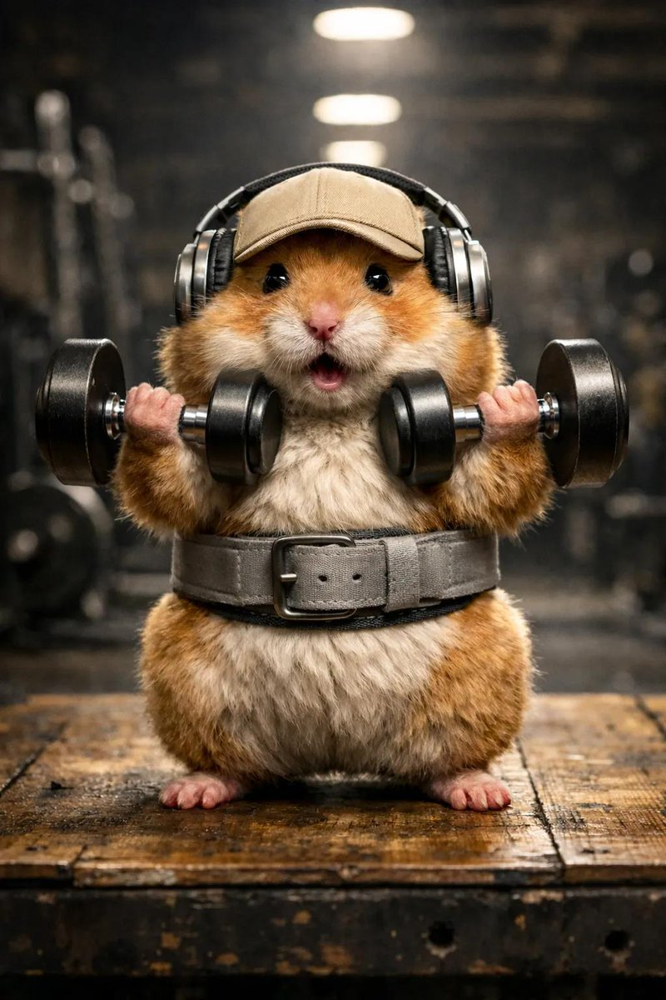

## Ultra-clean top-down (90° flat lay) infographic. Centere

- ID: trending-2012957106433818777
- Slug: trending-2012957106433818777-en
- 语言: en
- 来源: [来源链接](https://x.com/TechieBySA/status/2012957106433818777)
- 样例图路径: images/part1/2012957106433818777_1.jpg

### 提示词

```text
Ultra-clean top-down (90° flat lay) infographic. Centered white plate or cup on a light background with [PRODUCT] neatly presented. 

Surround the food with a clear money-flow infographic showing what you pay for: ingredient costs, packaging, labor, rent, branding, operations, and profit. Use icons, percentage bars, pie rings, and arrows flowing outward from the food.

Large price or profit callout as the main focal point, bold sans-serif, high contrast, instantly readable.

Style: premium editorial infographic, Apple UI × National Geographic, clean hierarchy, minimal text, strong visual clarity. Natural food colors, monochrome UI, one accent color for emphasis.

1080×1080, ultra-crisp, no watermark.
```

### 样例图

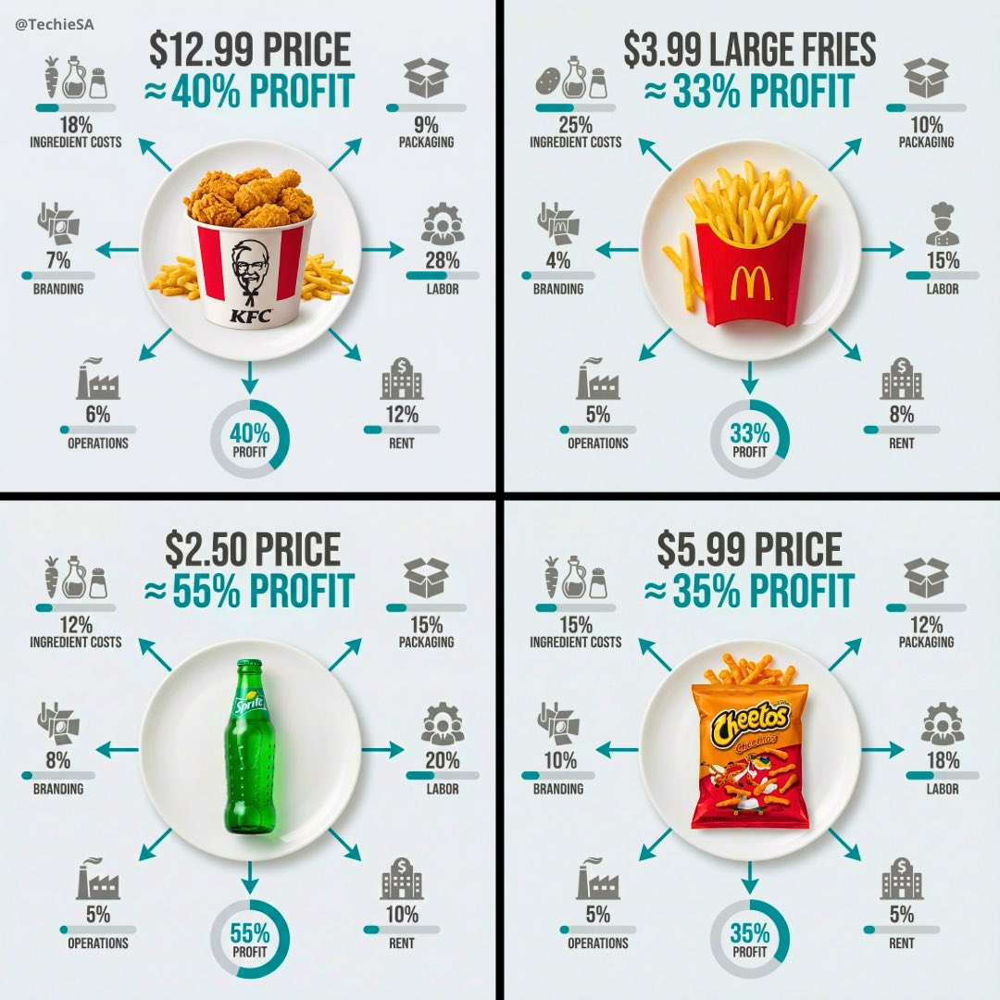

## <instructions> you are a world class visual artist and v

- ID: trending-2009115596286214435
- Slug: trending-2009115596286214435-en
- 语言: en
- 来源: [来源链接](https://x.com/Gdgtify/status/2009115596286214435)
- 样例图路径: images/part1/2009115596286214435_1.jpg

### 提示词

```text
<instructions> you are a world class visual artist and viral content generator tasked with creating high-concept 3D diorama for games or books. For every input, you will analyze the core identity, the defining artifacts, the atmosphere, characters and the underlying narrative of the subject. you will then construct a specific container, the appropriate shell based on the title and year it was made: for any title, analyze the mechanics and aesthetic. visualize a hollowed-out item. the interior is a diorama of a famous level. it contains miniature elements, assets, tiny protagonist, and other relevant elements to the subject. lighting & style should be appropriate for the title </instructions>
```

### 样例图

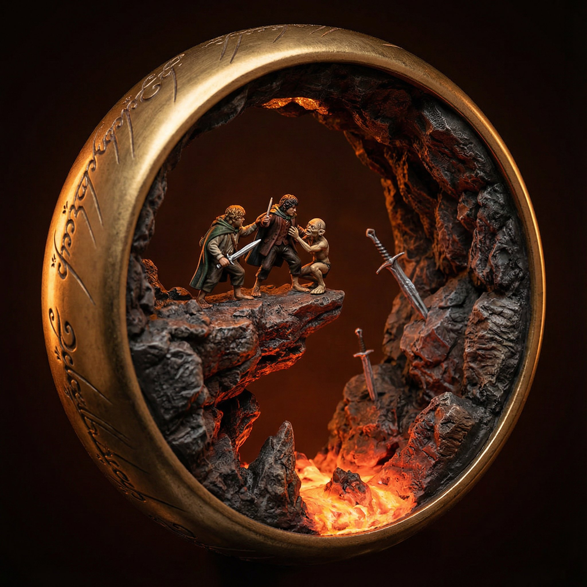

## Isometric miniature nature diorama showing a mother [PAR

- ID: trending-2012034903433716185
- Slug: trending-2012034903433716185-en
- 语言: en
- 来源: [来源链接](https://x.com/Just_sharon7/status/2012034903433716185)
- 样例图路径: images/part1/2012034903433716185_1.jpg

### 提示词

```text
Isometric miniature nature diorama showing a mother [PARROT]  feeding newborn chicks in a nest on a tree branch. Leaves forming clean geometric layers, soft sky background, light breeze effect. Balanced lighting, pastel greens and blues, wholesome storybook atmosphere. Clean isometric perspective, macro detail, professional 3D render.
```

### 样例图

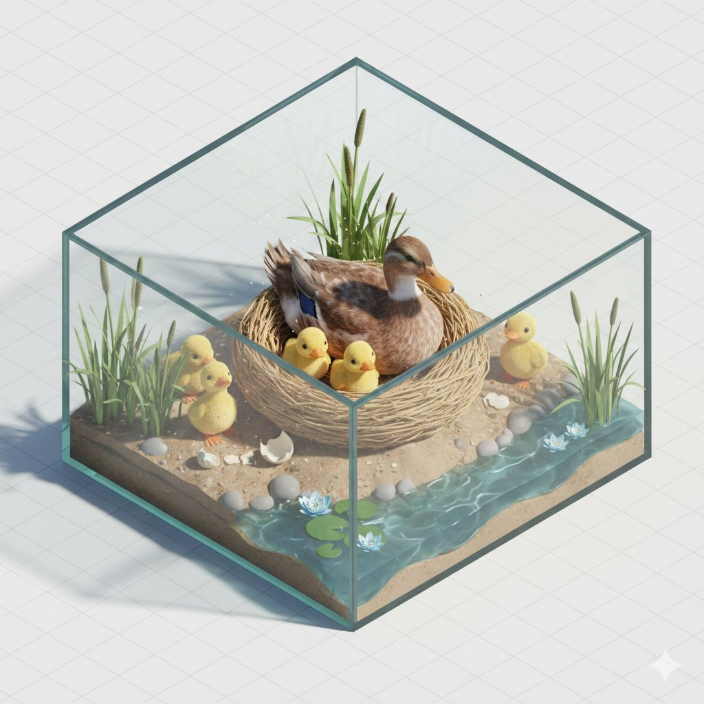

## Ultra-Realistic Promotional Present a clear, side miniat

- ID: trending-2009073595776204834
- Slug: trending-2009073595776204834-en
- 语言: en
- 来源: [来源链接](https://x.com/Milo_Bahi_02/status/2009073595776204834)
- 样例图路径: images/part1/2009073595776204834_1.jpg

### 提示词

```text
Ultra-Realistic Promotional
Present a clear, side miniature 3D cartoon view of [DUBAI] tallest buildings. Use minimal textures with realistic materials and soft, lifelike lighting and shadows. Use a clean, minimalistic composition showing exactly the three tallest buildings in spot, arranged from LEFT to RIGHT in STRICT descending height order. The tallest must appear visibly tallest, the second must be clearly shorter than the first, and the third must be clearly shorter than the second.
All buildings must follow accurate relative proportions: if a building is taller in real life, it MUST be taller in the image by the same approximate ratio. No building may be visually stretched or compressed. Each building should stand separately on a thin, simple ceramic base.
Below each base, centered text should display:
Height in meters – semibold sans-serif, medium size
Year built – lighter-weight sans-serif, smaller size, directly beneath the height text
Provide consistent padding, spacing, leading, and kerning. Write “DUBAI” centered above the buildings using a medium-sized sans-serif font. No building top should overlap or touch the text above. Use accurate architectural proportions based on real-world references. Maintain consistent camera angle and identical scale for each building model.
No forced perspective. Use straight-on orthographic-style rendering. Do not exaggerate or stylize size differences beyond proportional accuracy. Use a square 1080x1080 composition. Use a clean, neutral background. Ensure no extra objects are present.
```

### 样例图

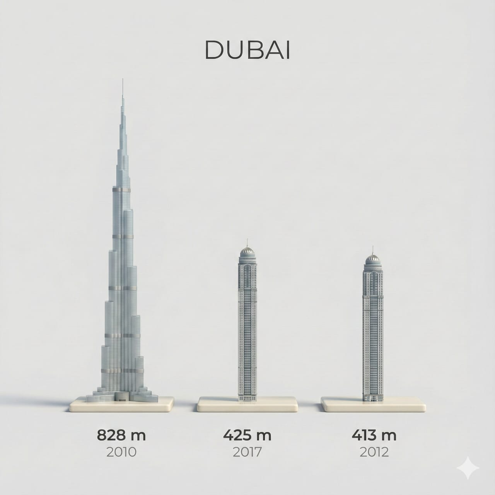

## Create a clear, 45° top-down isometric miniature 3D cuta

- ID: trending-2018147539992862866
- Slug: trending-2018147539992862866-en
- 语言: en
- 来源: [来源链接](https://x.com/aleenaamiir/status/2018147539992862866)
- 样例图路径: images/part1/2018147539992862866_1.jpg

### 提示词

```text
Create a clear, 45° top-down isometric miniature 3D cutaway diorama showing the inside of [MACHINE / DEVICE].

Use soft refined textures, realistic PBR materials, and clean technical lighting.

Design a raised base with visible internal components, wiring, gears, or energy flow paths.
Include tiny stylized technicians interacting with the machinery (no facial details).

Use a clean solid [BACKGROUND COLOR] background.

At the top-center, display [MACHINE NAME] in large bold text, beneath it show a short technical subtitle, and place a minimal engineering icon below.

All text must automatically match the background contrast (white or black).
```

### 样例图

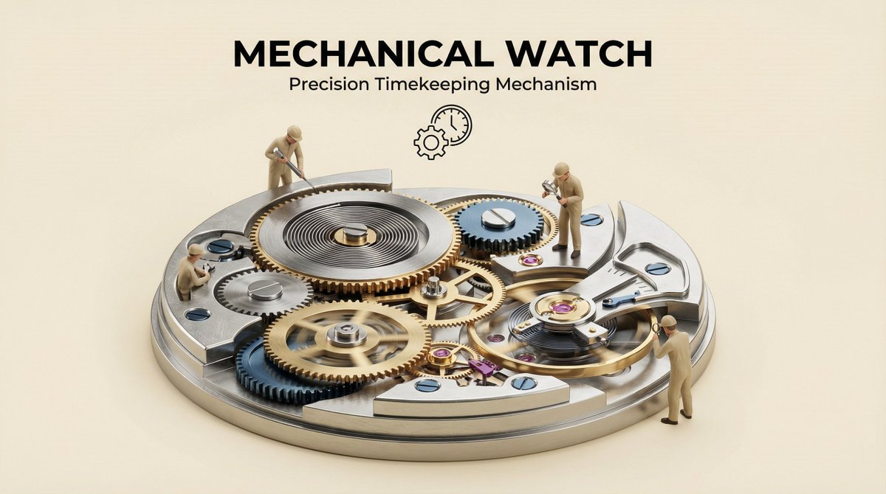

## <instruction> Input A is a Mechanical Device or Gadget (

- ID: trending-2017611578284401056
- Slug: trending-2017611578284401056-en
- 语言: en
- 来源: [来源链接](https://x.com/Gdgtify/status/2017611578284401056)
- 样例图路径: images/part1/2017611578284401056_1.jpg

### 提示词

```text
<instruction> 
 Input A is a Mechanical Device or Gadget (e.g., Vintage Camera, Mechanical Watch, V8 Engine, Game Console).
Deconstruct the object into 3 Functional Layers  :
      Chassis (The Shell):  Identify the main body frame or housing.
      Engine (The Guts):  Identify the primary internal mechanism.
         (e.g., Camera -> Shutter & Mirrors. Watch -> Mainspring & Escapement. Engine -> Pistons). 
      Interface (The Control):  Identify the buttons, dials, or lens elements.

  2.  Container 
Goal: "Exploded Construction" Tabletop Photography.
     Surface:  A clean, light-grain   Wooden Workbench   or cutting mat.
     Layout:    Exploded View (Knolling).   The machine is pulled apart into its components, which are arranged spatially to show how they fit together.

  3. Construction 
     The Suspension:  Major parts (The Chassis) are raised on   Miniature Scaffolding   or suspended by   Miniature Yellow Cranes  .
     The Narrative:  A crew of   1:87 Scale Construction Workers   (Hard hats, vests) are actively building the machine.
         Action:  They are welding gears, hoisting the lens, or consulting blueprints on the table.
         Vehicles:  Tiny forklifts or flatbed trucks are delivering screws and springs.

  4. Visual  
     The Guide Lines:  Thin, glowing   Blue Laser Lines   or holographic wires connect the separated parts, tracing the path of assembly from the table to the suspended parts.
     The Hardware:  Tiny screws, washers, and springs are lined up neatly in rows (Knolling style) on the table, waiting to be installed.

  5. Lighting & Atmosphere:  
     Lighting:    Bright Studio Light.   Even, shadowless illumination (High Key) to ensure every mechanical detail is visible.
     Texture:  Contrast between the matte grey/black of the machine parts and the bright yellow of the construction equipment.

  Output:   ONE image, 1:1 Aspect Ratio, Macro Photography, "Miniature World" aesthetic, Technical Precision.
</instruction>
```

### 样例图

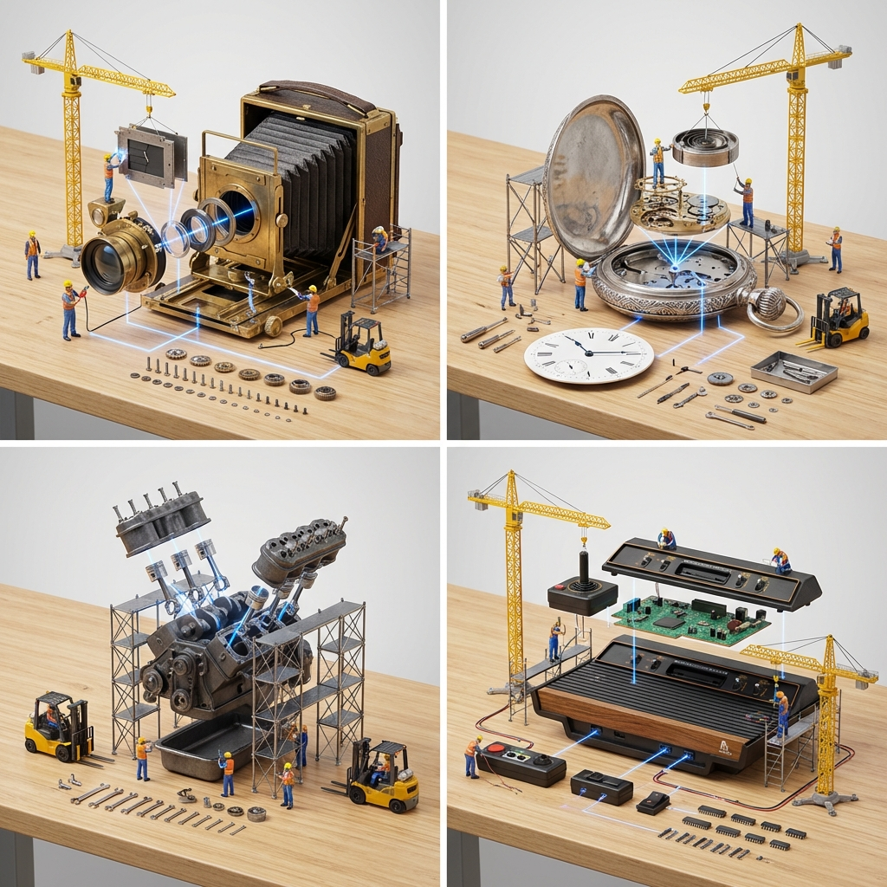

## { "prompt": "Isometric 3D kawaii scene of chibi baby bea

- ID: trending-2011747649398194268
- Slug: trending-2011747649398194268-en
- 语言: en
- 来源: [来源链接](https://x.com/Just_sharon7/status/2011747649398194268)
- 样例图路径: images/part1/2011747649398194268_1.jpg

### 提示词

```text
{
  "prompt": "Isometric 3D kawaii scene of chibi baby bears designing a mountain snow map inside a cozy wooden hideout. The isometric cutaway room features a large hand-drawn map spread across a tilted work table, decorated with tiny flags, paw-print markers, and string lines connecting different locations. Three baby bears wear soft hooded outfits in warm terracotta, foggy blue, and oatmeal beige. One bear stands on a small stool placing a flag on the map, another measures distances using a string and wooden ruler, while the third sketches snowy paths with a crayon. The room includes wooden shelves filled with rolled maps, compasses, ink bottles, backpacks, and snow boots placed near the door. Small windows reveal snow-covered mountains and pine forests outside.",
  "style": {
    "art_style": "kawaii 3D",
    "perspective": "isometric cutaway",
    "geometry": "rounded, toy-like proportions",
    "render_type": "ultra-detailed 3D render"
  },
  "lighting": {
    "type": "warm indoor lighting",
    "mood": "soft and cozy",
    "contrast": "gentle highlights with smooth shadows"
  },
  "color_palette": {
    "primary": ["pastel earthy tones"],
    "accent": ["warm terracotta", "foggy blue", "oatmeal beige"]
  },
  "atmosphere": {
    "emotion": "wholesome and adventurous",
    "vibe": "cozy, playful, story-driven"
  },
  "quality": {
    "detail_level": "ultra detailed",
    "resolution": "8k",
    "rating": "masterpiece, premium quality"
  }
}
```

### 样例图

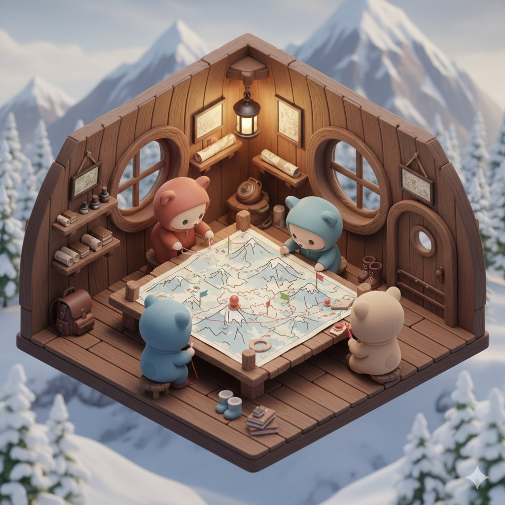

## [Country/City Name]::4 Morphology: Miniature architectur

- ID: trending-2009567700469809518
- Slug: trending-2009567700469809518-en
- 语言: en
- 来源: [来源链接](https://x.com/Gdgtify/status/2009567700469809518)
- 样例图路径: images/part1/2009567700469809518_1.jpg

### 提示词

```text
[Country/City Name]::4
Morphology: Miniature architectural cityscape, skyline constructed entirely from edible ingredients, tiny skyscrapers and houses mimicking [Country/City] architectural styles but formed from food, culinary structural engineering, hyper-detailed diorama::3
Material Physics: [Country/City] national gastronomy as construction material, native cuisine textures replacing concrete and glass, masonry made of regional staples, savory and sweet ingredient structural integrity, authentic local food palette::3
Illumination: Soft focus macro lighting, ambient occlusion, mouth-watering highlights::2
Render Stack: Tilt-shift photography, macro lens, f/2.8, 8k, scale model aesthetic, unreal engine 5 render::1
Negative: [Real concrete, real metal, plastic, inedible, humans, cutlery, plates, blurry]:: -1
```

### 样例图

![[Country/City Name]::4 Morphology: Miniature architectur](../images/part1/2009567700469809518_1.jpg)

## [Terminator] (Or any movie/book/anime) <instructions> Sy

- ID: trending-2011438655123103772
- Slug: trending-2011438655123103772-en
- 语言: en
- 来源: [来源链接](https://x.com/Gdgtify/status/2011438655123103772)
- 样例图路径: images/part1/2011438655123103772_1.jpg

### 提示词

```text
[Terminator] (Or any movie/book/anime)
<instructions>
  System Instruction:   Act as an AI Media Curator and Master Concept Artist. Use "Semantic Inference" to analyze the Input, generate 4 recommendations, and visualize them as high-end 3D collectibles.
1. Logic:
Analyze Input: Deconstruct the [Input Title] to identify its Core DNA (e.g., Genre, Mood, Visual Style, Themes).
Example: If Input is "Terminator," DNA = Cyberpunk, Tech-Noir, Man vs. Machine, Industrial, 80s Action.
Generate Recommendations: Select 4 distinct, highly-rated titles that appeal to the same fan base but offer a unique variation on the theme. (Do not just pick sequels; pick spiritual successors or genre pillars).
2. Container:
Rule: Do not default to a generic inkwell.
Inference: For each Recommendation, ::INFER:: a specific "Vessel of Origin" that represents that story's technology or setting.
Logic: If Sci-Fi -> A cracked Bio-Hazard Canister or Motherboard. If Fantasy -> An ancient Chalice. If Horror -> A Cursed Urn.
Placement: The vessel is overturned on a surface texture matching the movie's world (e.g., Grated Steel, Dusty Pavement, Alien Ship Floor).
3. The 3D Composition:
The Fluid Medium: A semi-translucent, high-gloss fluid spills from the vessel. The fluid represents the "Essence" of that movie.
Logic:
Rec 1 (e.g., The Matrix): Fluid = Liquid Green Code.
Rec 2 (e.g., RoboCop): Fluid = Black Oil & Motor Fluid.
Rec 3 (e.g., Aliens): Fluid = Acid Green Slime.
Rec 4 (e.g., Blade Runner): Fluid = Neon Blue Rain/Steam.
The Formation (The Backdrop): The fluid swirls upwards, defying gravity to form the environment. It must look like sculpted, translucent resin.
Logic: The fluid forms the iconic architecture (e.g., Skyscrapers, Hives, Ruins) behind the hero.
The Hero (The Solid): The Main Protagonist bursts out of the fluid surge. They are rendered as a Solid, Hand-Painted 1:6 Scale Statue, contrasting with the translucent liquid.
Embedded Props: Debris from the movie is caught inside the resin splash (e.g., Shell casings, origami unicorns, computer chips).
4. Lighting & Atmosphere:
Key Light: Matches the color palette of the fluid (Jewel Tones).
Effect: Subsurface scattering makes the fluid glow from the inside.
5. Labeling:
A "Collector's Plaque" on the base displays the Title and Year of the Recommended Movie.
Output: 2x2 Grid. Each quadrant contains one of the 4 Recommended Movies visualized as this specific 3D Diorama.
</instructions>
```

### 样例图

![[Terminator] (Or any movie/book/anime) <instructions> Sy](../images/part1/2011438655123103772_1.jpg)

## Cinematic, hyper-realistic. A stacked depth composition 

- ID: trending-2013661551182348601
- Slug: trending-2013661551182348601-en
- 语言: en
- 来源: [来源链接](https://x.com/Gdgtify/status/2013661551182348601)
- 样例图路径: images/part1/2013661551182348601_1.jpg

### 提示词

```text
Cinematic, hyper-realistic. A stacked depth composition of ultra-detailed 16K 3D-scanned transportation evolving over time, each layer at 1:18 scale with [ELEMENTS = era-relevant elements, scenes, vehicles]. Mounted on an acrylic stack base with refractive layers. Foreground lighting penetrates to cast multi-layered, receding shadows. From front to back: - [ "1000 BC" ]: [hyper realistic, era relevant ELEMENTS] - [ "1000 AD" ]: [hyper realistic, era relevant ELEMENTS ] - [ "2025 AD" ]: [hyper realistic, era relevant ELEMENTS ] Set against a marble background. Ultra-realistic 4K HDR render.
```

### 样例图

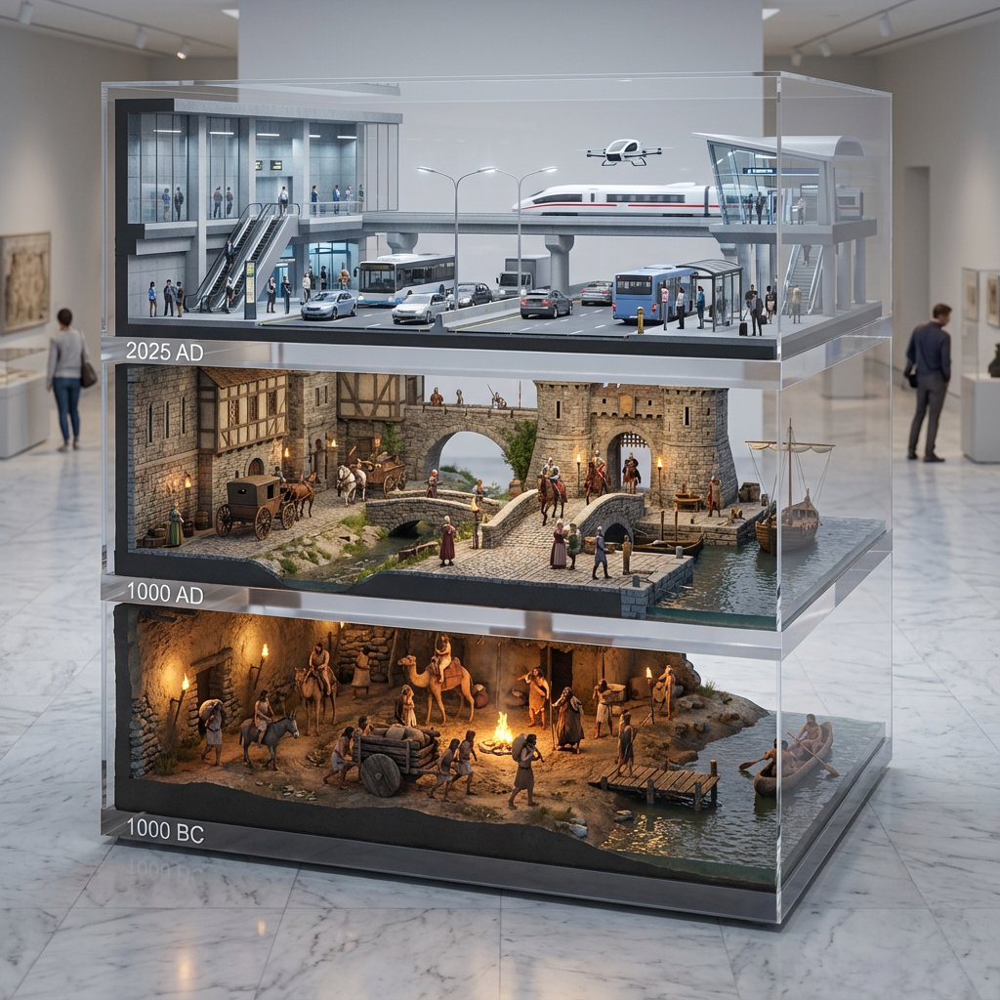

## { "prompt": "massive giant inflatable WhatsApp logo floa

- ID: trending-2011422517156860056
- Slug: trending-2011422517156860056-en
- 语言: en
- 来源: [来源链接](https://x.com/Just_sharon7/status/2011422517156860056)
- 样例图路径: images/part1/2011422517156860056_1.jpg

### 提示词

```text
{
  "prompt": "massive giant inflatable WhatsApp logo floating in the ocean near the beach, huge rectangular green mermaid logo with white siren face, long flowing white wavy hair, green crown with stars, ultra-detailed brand-accurate WhatsApp siren, enormous 100-meter diameter inflatable platform, emerald green rubber texture with subtle glossy highlights, classic green and white color scheme, dozens of people in swimsuits playing and lying on the giant inflatable, some standing, some sitting, some swimming around the edges, tropical beach setting, golden sand, turquoise ocean waves gently crashing around the edges, bright sunny day, aerial drone top-down perspective, very wide angle overhead shot, crystal clear water, people casting small shadows on the white face, vibrant summer atmosphere, advertising campaign style, hyperrealistic, extremely detailed, 8k",
  "negative_prompt": "text, letters, words, deformed, blurry, low resolution, bad anatomy, extra limbs, watermark, logo in corner, people inside the face, dark mood, night, winter, snow, ugly, cartoon, illustration, painting, sketch, 3d render, plastic toy look",
  "aspect_ratio": "16:9",
  "style": "photorealistic",
  "lighting": "bright natural sunlight, golden hour rim light, soft shadows",
  "camera": "drone aerial view, directly overhead, 200mm lens, slight wide angle distortion",
  "quality_tags": "masterpiece, best quality, ultra detailed, highly detailed, sharp focus, cinematic lighting, 8k resolution"
}
```

### 样例图


## Ultra-realistic macro scene depicting tiny restoration w

- ID: trending-2011688509665657263
- Slug: trending-2011688509665657263-en
- 语言: en
- 来源: [来源链接](https://x.com/SindhuK66662473/status/2011688509665657263)
- 样例图路径: images/part1/2011688509665657263_1.jpg

### 提示词

```text
Ultra-realistic macro scene depicting tiny restoration workers collaboratively repairing an antique pocket watch. Several figures delicately clean intricate brass gears using fine brushes, while others stabilize the open watch casing and hold miniature components in place. The pocket watch lies on a textured natural surface, such as weathered wood or stone, emphasizing age and history. The scene symbolizes time, patience, craftsmanship, and teamwork.",
  "style": {
    "photography_type": "Macro photography",
    "realism": "Ultra-realistic",
    "mood": "Emotional and cinematic",
    "lighting": "Soft, warm, directional lighting with gentle highlights and natural shadows",
    "depth_of_field": "Shallow depth of field with sharp focus on foreground details and smooth background bokeh"
  },
  "composition": {
    "shot_type": "Close-up macro",
    "angle": "Slightly elevated perspective",
    "focus": "Extreme detail on gears, tools, and figurines’ interactions",
    "framing": "Pocket watch centered with workers distributed naturally across the mechanism"
  },
  "textures_and_details": {
    "materials": "Aged metal, polished brass gears, worn leather strap, natural surface grain",
    "details": "Visible dust particles, subtle scratches, fingerprints, and mechanical wear"
  },
  "atmosphere": {
    "tone": "Warm, nostalgic, hopeful",
    "symbolism": "Restoration of time through collective effort and care"
  },
  "render_settings": {
    "aspect_ratio": "4:5",
    "quality": 2,
    "resolution": "High-resolution",
    "style_precision": "Professional studio-level composition"
  }
}
```

### 样例图

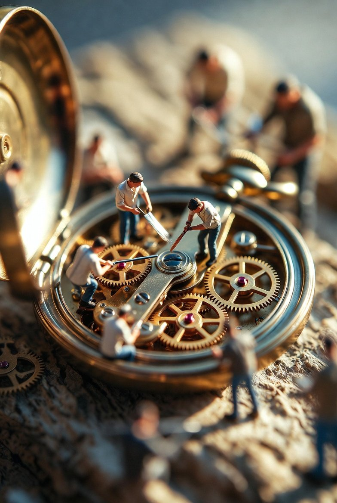

## <instructions> Input Variable: [INSERT BAND/ALBUM] Syste

- ID: trending-2010446114164744676
- Slug: trending-2010446114164744676-en
- 语言: en
- 来源: [来源链接](https://x.com/Gdgtify/status/2010446114164744676)
- 样例图路径: images/part1/2010446114164744676_1.jpg

### 提示词

```text
<instructions> Input Variable: [INSERT BAND/ALBUM]  

System Instruction:
Act as a Music Historian and Set Designer. Create a 2x2 Grid of "Audio-Visual Dioramas."
1. The Curation Logic (The Deep Cuts):
Analyze Input: Identify the genre and sonic signature of the Input Band (e.g., Pink Floyd = Psychedelic/Prog Rock, Atmospheric, Surreal).
Select 4 Hidden Gems: Identify 4 lesser-known albums/artists that share this sonic DNA but offer a different flavor (e.g., King Crimson, Porcupine Tree, Yes, The Alan Parsons Project).
The Translation: For each album, define the "Sonic Materiality":
If Heavy Metal: Rusty Iron & Fire.
If Synth-Pop: Neon Glass & Chrome.
If Folk: Mossy Wood & Candlelight.
If Prog Rock: Surreal Marble & Floating Stone.
2. The "Immutable" Container (The Vinyl Stage):
The Base: Each diorama is built on top of a Spinning Vinyl Record acting as the circular stage floor.
The Plinth: The record sits on a high-end audiophile turntable platter or a wooden speaker box.
The Label: The center label of the vinyl clearly displays the Artist Name & Album Title in crisp typography.
3. The Composition (The Sound Made Solid):
CRITICAL: Do not just recreate the album cover. Build a world that feels like the music.
The Structure: Architecture rises from the grooves of the vinyl record.
Example: A wall of amplifiers, a surreal floating prism, a crumbling brick wall, or a forest of microphone stands.
The Atmosphere: Use particle effects to visualize the sound waves.
Visuals: Floating musical notes made of smoke, vibrating liquid surfaces, or shattered glass suspended in mid-air.
The Figures: Tiny 1:87 scale band members performing inside this surreal landscape.
4. Visual Syntax (Per Panel):
Panel A: Album 1 (Focus on Surrealism/Scale).
Panel B: Album 2 (Focus on Technology/Machinery).
Panel C: Album 3 (Focus on Nature/Organic Textures).
Panel D: Album 4 (Focus on Light/Color).
5. Lighting & Atmosphere:
Concert Lighting: Each box is lit like a stage show. Spotlights, laser beams, and stage haze.
Depth: Shallow depth of field (Tilt-Shift) to make the vinyl record look massive.
Background: Seamless Slate Grey to keep the focus on the colors.
Output: 2x2 Grid, Hyper-Realistic Miniature Set Design, 8k Resolution, "Audiophile" Aesthetic. </instructions>
```

### 样例图

![<instructions> Input Variable: [INSERT BAND/ALBUM] Syste](../images/part1/2010446114164744676_1.jpg)

## Luxury product photography of artisanal vanilla ground c

- ID: trending-2012110717592457678
- Slug: trending-2012110717592457678-en
- 语言: en
- 来源: [来源链接](https://x.com/Just_sharon7/status/2012110717592457678)
- 样例图路径: images/part1/2012110717592457678_1.jpg

### 提示词

```text
Luxury product photography of artisanal vanilla ground coffee packaged in a soft sculpted ivory pouch with gentle wave contours, minimal branding embossed into fabric. The pouch rests on a rustic oak tabletop dusted with coffee grounds, accompanied by a hand-carved wooden scoop spilling aromatic powder.
Natural Madagascar vanilla pods curve organically around the base, blending into drifting coffee granules that form a subtle flowing aroma path instead of a spiral.
On the pouch front, a modern sensory chart: thin matte gold lines showing flavor balance — low acidity, rich sweetness, full-bodied depth.
Warm morning sunlight enters from the left at a low angle, creating soft shadows and tactile fabric highlights. Background fades into a cozy café interior with creamy bokeh lights, evoking calm morning rituals.
Ultra-sharp macro texture on vanilla pods and coffee grains, cinematic depth of field, premium lifestyle aesthetic, inviting, warm, handcrafted, high-end brand feel.
```

### 样例图

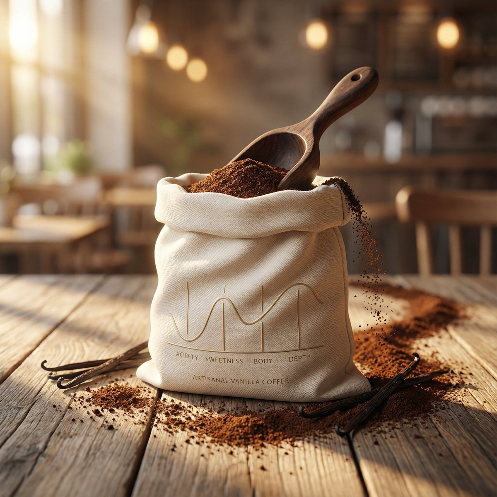

## { "target_style": "Handcrafted needle-felted wool miniat

- ID: trending-2029139993218740519
- Slug: trending-2029139993218740519-en
- 语言: en
- 来源: [来源链接](https://x.com/firatbilal/status/2029139993218740519)
- 样例图路径: images/part1/2029139993218740519_1.jpg

### 提示词

```text
{
  "target_style": "Handcrafted needle-felted wool miniature",
  "texture_properties": {
    "material": "organic roving wool, fuzzy fibers, soft tactile felt",
    "details": "visible needle-punch textures, soft fuzzy surface, handcrafted seams",
    "eyes": "small black bead eyes or simple felted circles"
  },
  "adaptation_rules": {
    "proportions": "stylized, slightly oversized head, simplified limbs, cute aesthetic",
    "color_palette": "retain original colors from source image but soften with wool texture",
    "clothing": "simplified felt versions of the original outfits, tiny fabric buttons, stitched details",
    "accessories": "replicate key items from source as miniature felted props"
  },
  "environment": {
    "camera": "macro photography, close-up shot",
    "lighting": "soft studio lighting, warm highlights, gentle shadows",
    "background": "clean, out-of-focus bokeh background, neutral craft studio setting",
    "depth_of_field": "shallow depth of field (f/2.8)"
  },
  "rendering_engine_hints": "high fidelity, 8k, photorealistic wool texture, Pixar-like character charm"
}
```

### 样例图

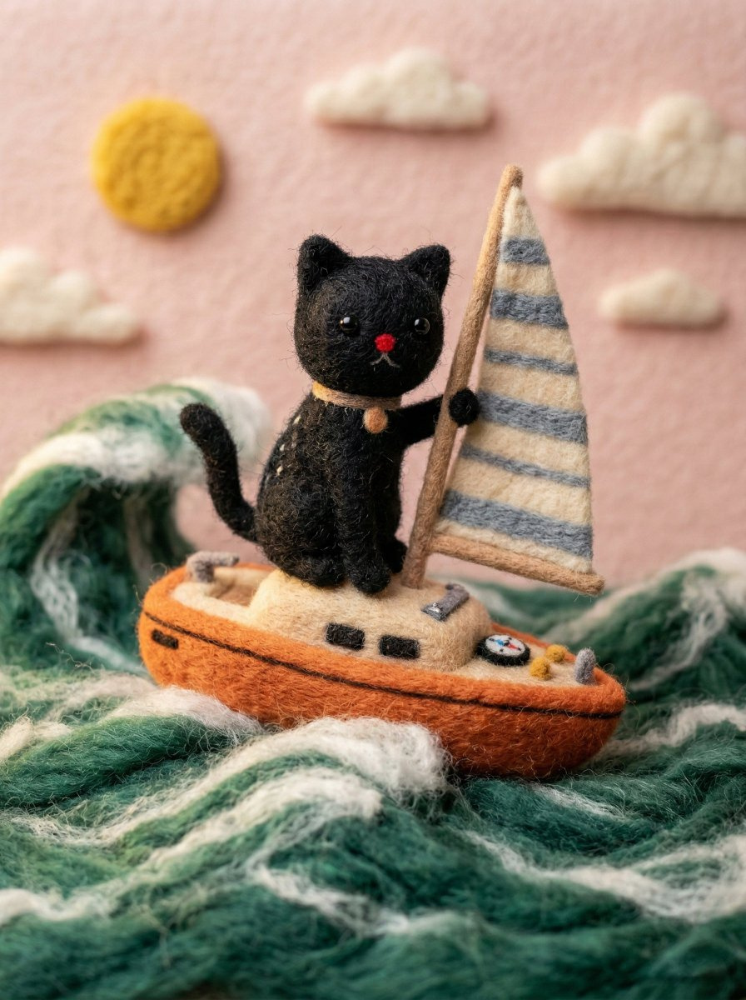

## Vertical snack advertising visual with playful anthropom

- ID: trending-2011045800017871206
- Slug: trending-2011045800017871206-en
- 语言: en
- 来源: [来源链接](https://x.com/0xbisc/status/2011045800017871206)
- 样例图路径: images/part1/2011045800017871206_1.jpg

### 提示词

```text
Vertical snack advertising visual with playful anthropomorphic tone. At the top, golden Lay’s potato chips arranged in a neat vertical queue, each chip posed like a diver on a diving platform, some slightly bent forward, some mid-tilt, suggesting preparation and focus before jumping. Below them, thick molten cheese flowing downward, glossy and stretchy, forming a rich cheese lava pool at the bottom. Several chips are frozen mid-air in clean diving poses, angled downward like synchronized divers, capturing a precise pre-splash moment. Warm yellow and cheese-orange gradient background, studio advertising lighting, soft highlights, refined shadows. Strong central axis composition, clear visual hierarchy. Minimalist graphic layout, fun yet premium commercial food photography aesthetic, ultra-detailed textures, hyper-realistic, 8K resolution.
```

### 样例图

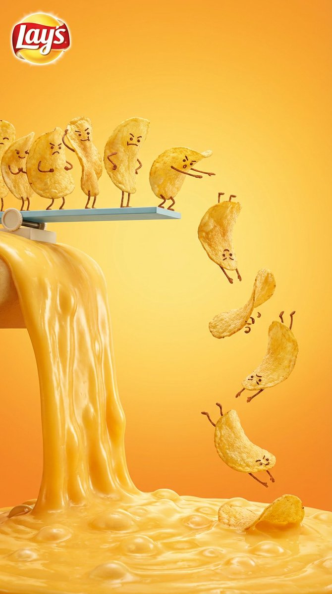

## Refined 3D isometric composition (45° angle) in a Glassm

- ID: trending-2017190570922582392
- Slug: trending-2017190570922582392-en
- 语言: en
- 来源: [来源链接](https://x.com/oggii_0/status/2017190570922582392)
- 样例图路径: images/part1/2017190570922582392_1.jpg

### 提示词

```text
Refined 3D isometric composition (45° angle) in a Glassmorphism + Soft Claymorphism style.
The center of the composition features gold bars, rendered with hyper-realistic PBR materials, placed inside or surrounded by semi-transparent glass forms.

Visual Style Characteristics

Materials:
Primary focus on frosted glass with strong background blur. Element edges feature a subtle white inner glow, simulating polished glass bevels.

Layers:
A multi-layered composition where UI and graphic elements float at different transparency levels, creating a pronounced sense of depth.

Geometry:
Perfectly soft, rounded corners (Apple-style squircles).

Element Details

Central Object:
Highly detailed gold bars with precise engravings, realistically reflecting within surrounding glass surfaces.

Interface:
Floating panels with a frosted glass effect (40–60% opacity). Panels display clean sans-serif typography showing data for January 30, 2026: price, trend arrow, and a neon micro-chart.

Environment:
Stylized elements (vault door, market icons) crafted from a mix of polished metal and semi-transparent plastic.

Technical Parameters

Lighting:
Soft studio lighting, realistic caustics (light passing through glass), and global illumination (GI).

Background:
Solid powder blue color (#B0E0E6), providing contrast with translucent layers.

Render:
Cinema 4D, Octane Render, 8K resolution, ultra-high detail, clean minimalism.
```

### 样例图

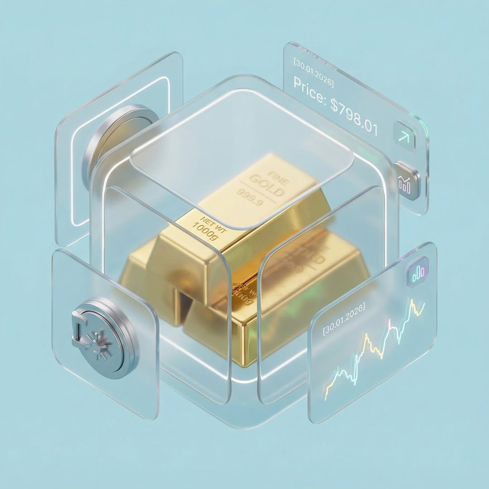

## A stylized 3D cartoon boy character with a minimal, Pixa

- ID: trending-2041096374566228189
- Slug: trending-2041096374566228189-en
- 语言: en
- 来源: [来源链接](https://x.com/auqibhabib/status/2041096374566228189)
- 样例图路径: images/part1/2041096374566228189_1.jpg

### 提示词

```text
A stylized 3D cartoon boy character with a minimal, Pixar-like design, pale skin, slightly oversized head, and a slim body. He has half-closed sleepy green eyes, a bored expression, and soft facial features with a small nose and subtle blush. He is wearing a light grey knitted beanie with a small front label, large black over-ear headphones, and a loose green sweatshirt. The character is centered, facing forward, with relaxed posture. Background is a smooth solid green gradient. Soft studio lighting, high detail, clean render, shallow depth of field, ultra-realistic textures, 4K.
```

### 样例图

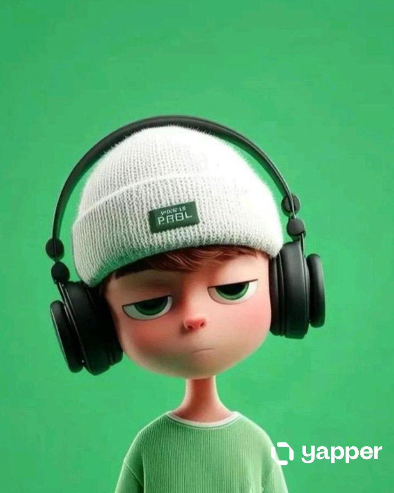

## Create a high-quality vector art illustration of a [COLO

- ID: trending-2011534895412363546
- Slug: trending-2011534895412363546-en
- 语言: en
- 来源: [来源链接](https://x.com/TechieBySA/status/2011534895412363546)
- 样例图路径: images/part1/2011534895412363546_1.jpg

### 提示词

```text
Create a high-quality vector art illustration of a [COLOR] [BRAND + MODEL] viewed from a dynamic front-side angle, in the style of a modern car sticker design. The car should have detailed shading, black sport rims, and a glossy finish that reflects light. Add the text “[BRAND]” above the car in bold, modern font. Behind the car and text, include angled [STRIPE COLOR] stripes as a background element to add motion and energy. Use a white outline around the entire composition to give the sticker a cutout effect, just like a real die-cut sticker. Place the entire design on a plain white background to mimic how a sticker would appear. The overall design should be sporty, vibrant, and clean. Format: 1080x1080 pixels
```

### 样例图

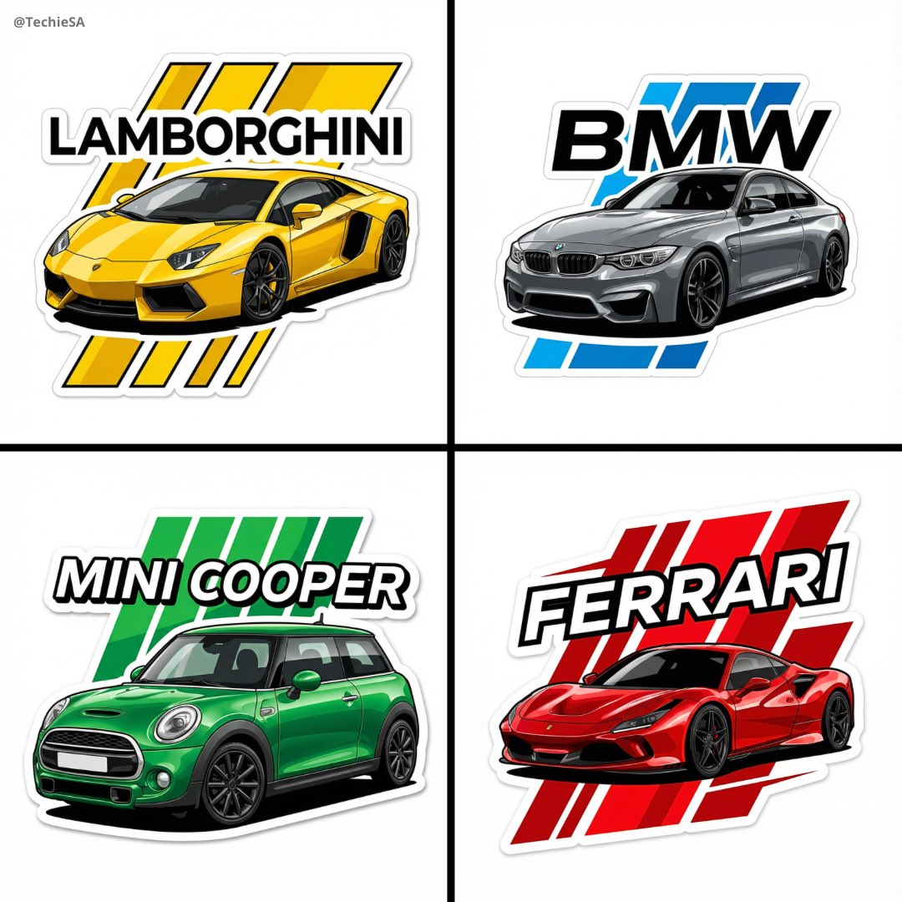

## Do this for Eiffel Tower: Input Variable: [INSERT STRUCT

- ID: trending-2012151098547589553
- Slug: trending-2012151098547589553-en
- 语言: en
- 来源: [来源链接](https://x.com/Gdgtify/status/2012151098547589553)
- 样例图路径: images/part1/2012151098547589553_1.jpg

### 提示词

```text
Do this for Eiffel Tower: 

Input Variable: [INSERT STRUCTURE] 
System Instruction:
Act as a Cinematic Director. Create a hyper-realistic portrait of a Master Model Maker putting the final touches on a scale replica of the Input Structure.
1. Logic:
Analyze the Input Structure to determine the Setting and the Character:
IF Ancient/Fantasy (e.g., Colosseum, Castle):
Room: A dusty, sunlit Renaissance Workshop (Stone & Wood). also showcasing "Previous Projects" (other models in the same genre).
Character: An elderly Artisan in a leather apron.
Materials: Plaster, Clay, Balsam Wood.
IF Sci-Fi/Industrial (e.g., Death Star, spaceship):
Room: A sterile, cold Industrial Design Lab (Concrete & Metal). also showcasing "Previous Projects" (other models in the same genre).
Character: A younger Prop Master in a workshop jumpsuit or lab coat.
Materials: Grey Resin (Kitbash), Styrene, Fiber Optics.
IF Modern Architecture (e.g., Skyscraper):
Room: A clean, white Architectural Firm (Glass & White Walls). also showcasing "Previous Projects" (other models in the same genre).
Character: A minimalist Architect in a black turtleneck.
Materials: White Foamcore, Acrylic, 3D Printed Plastic.
2. The Composition :
The Subject: The Character is leaning over a massive, incredibly detailed Scale Model of the Input Structure.
The Action: They are using Tweezers or a fine brush to place a specific "Micro-Detail" relevant to the lore.
Death Star: Placing a tiny Turbo-Laser Turret.
Colosseum: Dusting sand onto the arena floor.
City: Gluing a tiny streetlamp.
The Scale: Extreme scale contrast. The human hands look giant next to the tiny windows/bricks of the model.
3. The Environment  :
The Blueprint: On the table, beneath the tools, lies the correct reference document:
Sci-Fi: Blue grid schematic or iPad.
Fantasy: Yellowed parchment map.
Modern: White vector floorplan.
The Clutter: The tools scattered around must match the medium (e.g., Clay tools vs. Soldering Iron vs. X-Acto knives).
4. Lighting & Atmosphere:
Lighting Match: The lighting must match the inferred room.
Workshop: Warm God Rays (Dusty).
Lab: Cool Fluorescent Tubes (Clean/Hazy).
Focus: Shallow depth of field. Sharp focus on the tweezers and the contact point.
Output: ONE image, 16:9 Aspect Ratio, Cinematic Photography, 8k Resolution.
```

### 样例图

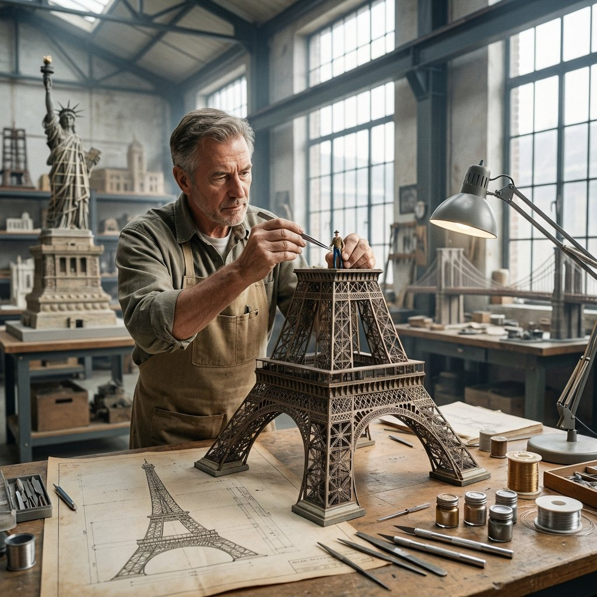

## Input Variable: [INSERT PODCAST NAME] System Instruction

- ID: trending-2011776378556064255
- Slug: trending-2011776378556064255-en
- 语言: en
- 来源: [来源链接](https://x.com/Gdgtify/status/2011776378556064255)
- 样例图路径: images/part1/2011776378556064255_1.jpg

### 提示词

```text
Input Variable: [INSERT PODCAST NAME]
System Instruction:
Act as a Media Archaeologist. Create a 2x2 Grid.
Curation: Identify 4 "Hidden Gem" podcasts similar to the Input.
Era Inference: For each podcast, determine its "Soul Era" (e.g., Is it gritty analog? Sleek digital? Retro radio?).
The Container: Generate an Audio Device specific to that Era (e.g., A Wood-Cabinet Radio, A Cassette Player, A Server Blade, A Podcast Mic).
The Cutaway: The device is hollow or open-faced.
The Interior World:
The Terrain: The internal components (Tubes, Tape, Circuits) transform into a landscape relevant to the podcast's topic (e.g., Circuits become city streets; Tubes become forest trees).
The Action: Tiny 1:87 scale figures (The Hosts) are exploring this landscape, interacting with "Clues" or "Artifacts" derived from the show's content.
Label: The device's brand plate reads: [Podcast Name].
Output: 2x2 panel, each panel for a gem podcast
```

### 样例图

![Input Variable: [INSERT PODCAST NAME] System Instruction](../images/part1/2011776378556064255_1.jpg)

## 2x2 grid, do this for 4 famous cuisines: function dish(A

- ID: trending-2043013709615022434
- Slug: trending-2043013709615022434-en
- 语言: en
- 来源: [来源链接](https://x.com/Gdgtify/status/2043013709615022434)
- 样例图路径: images/part1/2043013709615022434_1.jpg

### 提示词

```text
2x2 grid, do this for 4 famous cuisines: function dish(AA){
<instruction>
Input A is a Famous Dish / Culinary Tradition / Signature Dessert / Regional Specialty.

Analyze:
- ingredient hierarchy, cooking method, plating logic
- origin region, historical story, ritual or social context
- flavor architecture translated into visual composition
- symbolic ingredients, cookware, and dining environment
- chef or tradition lineage

Goal:
A "sauce pour environment."
A giant ladle, piping bag, or sauce boat is pouring the primary sauce, cream, glaze, broth, or puree onto a table.
The flowing edible medium rises into a detailed 3D world of the dish: ingredients, preparation stages, origin landscape, and plated final form merging together.

Rules:
- the poured substance must remain recognizably edible while forming the scene
- include knives, cutting board, handwritten recipe notes, ingredient trays, steam, spice dust, region-appropriate tools
- include a tiny chef or grandmother figure preparing a miniature version nearby
- include a food critic headline, market receipt, or origin-story clipping
- semantically infer cuisine-specific vessels, table culture, garnish logic, and environment
- no random food pile; composition must reveal flavor structure and culinary history
- lighting: appetizing natural kitchen light with rich edible texture

Output:
ONE image, 4:5, culinary-process diorama aesthetic
</instruction>

Output:
2x2 grid, each grid with a different dish(AA) output
}
```

### 样例图


## a vintage postage stamp depicting [iconic monument of a 

- ID: trending-2041191723892707663
- Slug: trending-2041191723892707663-en
- 语言: en
- 来源: [来源链接](https://x.com/CharaspowerAI/status/2041191723892707663)
- 样例图路径: images/part1/2041191723892707663_1.jpg

### 提示词

```text
a vintage postage stamp depicting [iconic monument of a capital with people interacting in the scene]. 
Pastel colors, extremely thin black border all around it, simple background, paper texture, high details
```

### 样例图

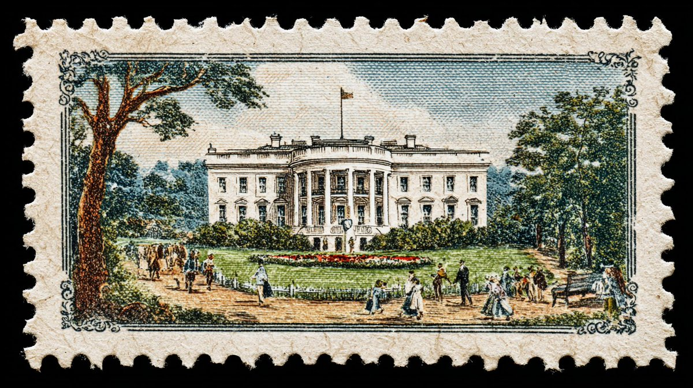

## Do this for China: <instructions> Input = Country Act as

- ID: trending-2009084893897121982
- Slug: trending-2009084893897121982-en
- 语言: en
- 来源: [来源链接](https://x.com/Gdgtify/status/2009084893897121982)
- 样例图路径: images/part1/2009084893897121982_1.jpg

### 提示词

```text
Do this for China: <instructions>
Input = Country
Act as a world class visual artist and geography expert. For every country, find 4 less known cities and the one product that is very popular there. Do research to get this step right. 

Function Draw ($ City, $ Material) Anchor: [Location] :: [Material Concept]::4
Morphology: Miniature architectural cityscape of [Location], entire skyline constructed via the assemblage of [Material Concept] components, skyscrapers and structures formed from the constituent parts of [Material Concept], thematic structural engineering, hyper-detailed diorama::3
Material Physics: Physical properties of [Material Concept] applied to architecture, [Material Concept] textures replacing concrete and glass, innate material logic of [Material Concept], high-fidelity surface details::3
Illumination: Lighting exhibiting the surface properties of [Material Concept], ambient occlusion, volumetric atmosphere matching the material theme::2
Render Stack: Tilt-shift photography, macro lens, f/2.8, 8k, scale model aesthetic, detailed texture mapping, Unreal Engine 5 render::1
Negative: [Human presence, massive scale, blurry, low resolution, bad geometry, distortions, flat 2D, text, watermark]:: -1

Output: 2x2 grid, for each panel execute Draw Function for one of the cities plus the associated popular product. Name of the city underneath
</instructions>
```

### 样例图

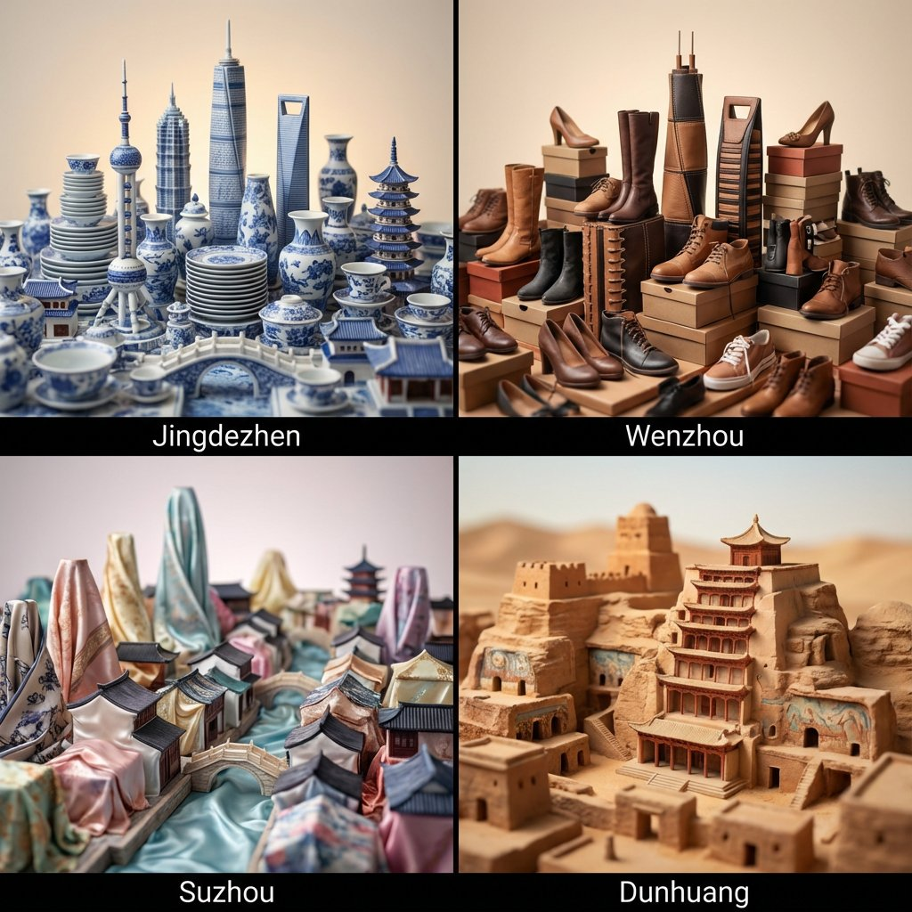

## <instructions> Input word or concept Act as a Conceptual

- ID: trending-2011736617174573428
- Slug: trending-2011736617174573428-en
- 语言: en
- 来源: [来源链接](https://x.com/Gdgtify/status/2011736617174573428)
- 样例图路径: images/part1/2011736617174573428_1.jpg

### 提示词

```text
<instructions> 
Input word or concept
Act as a Conceptual Sculptor. Generate a 3D typography render where the letters are constructed from materials that Physically Embody the Input Word.
1. Material & Physics Inference (The DNA):
Analyze the Input Word to determine the Structural Material and Internal Physics:
If Ethereal (e.g., TIME, SOUL): Use Glass, Brass, and Light. Physics = Flowing, ticking, glowing.
If Elemental (e.g., FIRE, MAGMA): Use Black Iron cages. Physics = Burning, dripping, smoking.
If Organic (e.g., GROWTH, LIFE): Use Wooden frames or Terrarium glass. Physics = Growing, blooming, condensation.
If Industrial (e.g., FACTORY, STEEL): Use Rusted Steel beams. Physics = Grinding gears, steam vents.
2.  Container  :
The Structure: The letters are massive, 3D structural frames.
The Transparency: The front face is open or transparent to reveal the Internal Mechanism.
The Logic: The frame must look like it was built to contain the specific substance inside (e.g., thick glass for gas; heavy iron for magma).
3. The Internal Mechanism :
Content: Fill the hollow letters with the active element of the concept.
Example (TIME): Sand pouring from T to I; Pendulums swinging in M; Gears turning in E.
Example (FIRE): Real flames licking up the inside of F; Coals glowing in I; Smoke venting from R.
Connectivity: Pipes, wires, or vines connect the letters, transferring the energy from one to the next.
4. The Narrative Scale :
The Figures: Tiny 1:87 scale figures interact with the letters.
Inference: If "TIME," figures are winding clocks. If "FIRE," figures are stokers shoveling coal. If "GROWTH," figures are gardeners watering plants.
5. Lighting & Atmosphere:
Source: The light comes from the Material itself (e.g., Fire glow, Bioluminescence, Neon).
Environment: The table/floor matches the theme (e.g., Burnt wood for FIRE; Mossy earth for GROWTH).
Output: ONE image, High Resolution 3D Render, Conceptual Art Aesthetic.
</instructions>
```

### 样例图

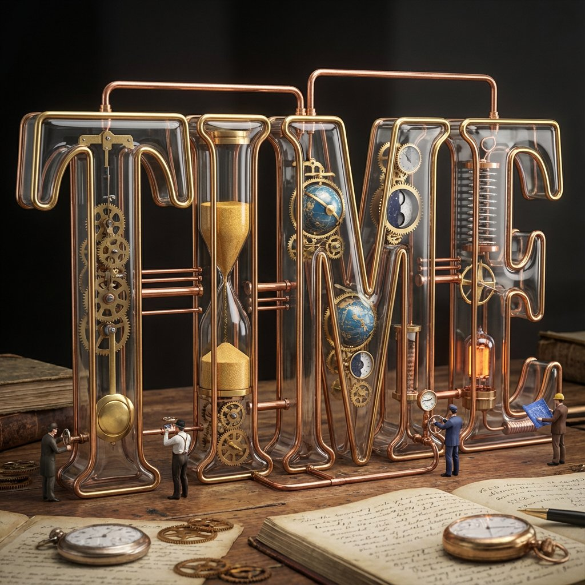

## <instructions> Input: city, country Act as a Master Past

- ID: trending-2011550138100334865
- Slug: trending-2011550138100334865-en
- 语言: en
- 来源: [来源链接](https://x.com/Gdgtify/status/2011550138100334865)
- 样例图路径: images/part1/2011550138100334865_1.jpg

### 提示词

```text
<instructions>
Input: city, country
Act as a Master Pastry Chef and Landscape Architect. Generate a hyper-realistic macro shot of a rectangular "Landscape Cake."
1. The Flavor Profile :
Analyze the Input Location to determine the Cake Base and Materials:
If Forest/Mountain (e.g., Canada): Dark Chocolate Brownie or Carrot Cake (simulating soil/earth).
If Tropical (e.g., Hawaii): Golden Sponge or Cheesecake (simulating sand).
If Snowy/Ice (e.g., Antarctica): White Vanilla or Coconut Cake (simulating snow/ice).
If Volcanic/Mars: Red Velvet Cake.
2.  Geography :
Construct the terrain using Edible Metaphors:
Trees: Broccoli florets, Rosemary sprigs, or Matcha sponge crumbs.
Water: Blue Jello, Mirror Glaze, or melted sugar glass.
Rocks: Chocolate chunks, crushed nuts (pecans/walnuts), or rock candy.
The Icon: A tiny, edible sugar-craft model of a local icon 

3. The Typography :
The Letters: The Name of the Location is spelled out on the side of the cake slice.
The Material: The letters are formed from Fresh Fruit (Raspberries, Blueberries) or piped Buttercream embedded into the sponge.
4. The Plating :
The Board: The cake sits on a rustic wooden cutting board or a slate platter.
The Clutter: Scatter ingredients around the base that hint at the flavor (e.g., Cinnamon sticks, Maple leaves, Coffee beans, scattered flour).
The Tools: A vintage silver fork or cake knife rests on the side.
5. Lighting & Atmosphere:
Lighting: "Bakery Window" Light. Soft, natural daylight streaming in from the side, highlighting the moisture of the cake crumb and the gloss of the "water" glaze.
Depth: Shallow depth of field. The front corner of the cake is sharp; the background props are blurred.
Output: ONE image, 4:3 Aspect Ratio, Food Photography, "Great British Bake Off" Aesthetic.
</instructions>
```

### 样例图

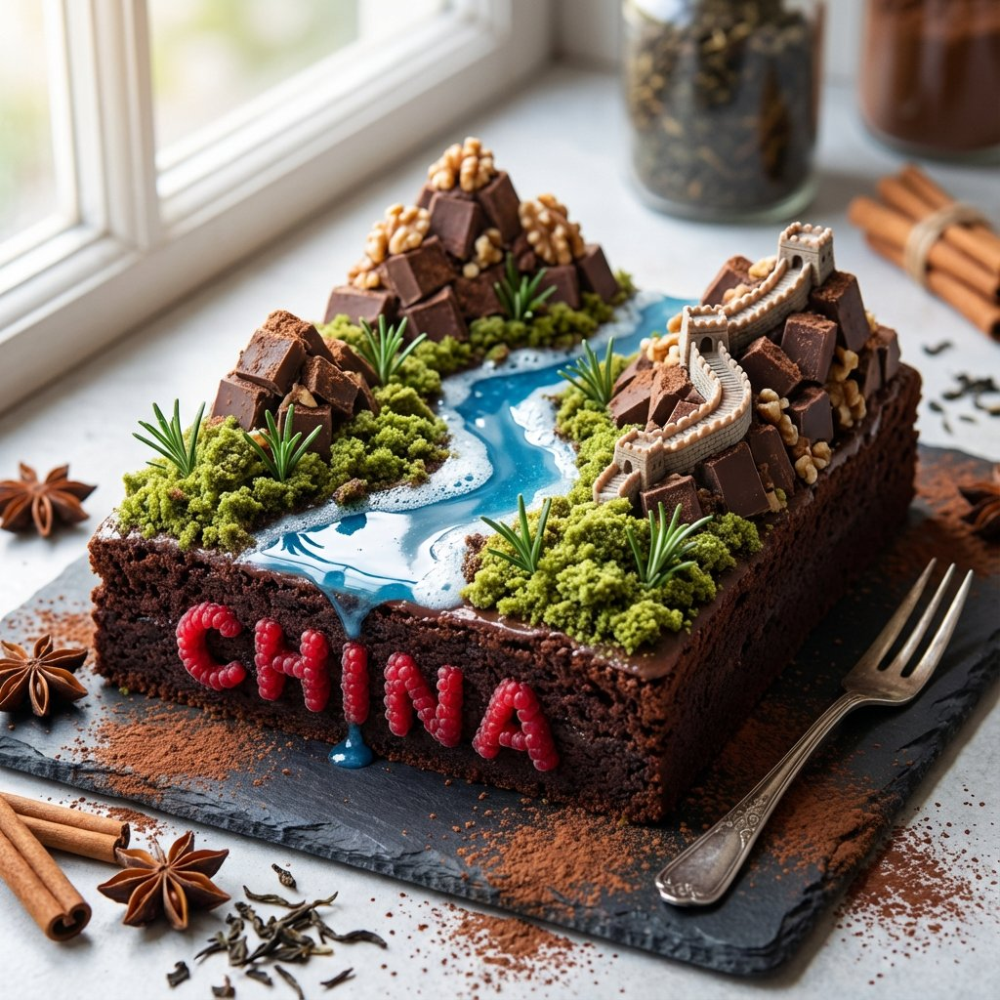

## function recommend(x) { Determine type(x) (e.g. game, mo

- ID: trending-2009053185311203377
- Slug: trending-2009053185311203377-en
- 语言: en
- 来源: [来源链接](https://x.com/Gdgtify/status/2009053185311203377)
- 样例图路径: images/part1/2009053185311203377_1.jpg

### 提示词

```text
function recommend(x) { Determine type(x) (e.g. game, movie, book, or TV series) Role: world-class TV, book and movie expert  Analyze x's style, storyline, tone, every aspect and find 4 hidden gems in type (x) {} return: 2x2 grid carved book-block dioramas, each grid with antique leather-bound books hollowed and carved, warm reading-lamp glow from within, dark mahogany bases, ultra-realistic}   draw( recommend (X -Files);
```

### 样例图

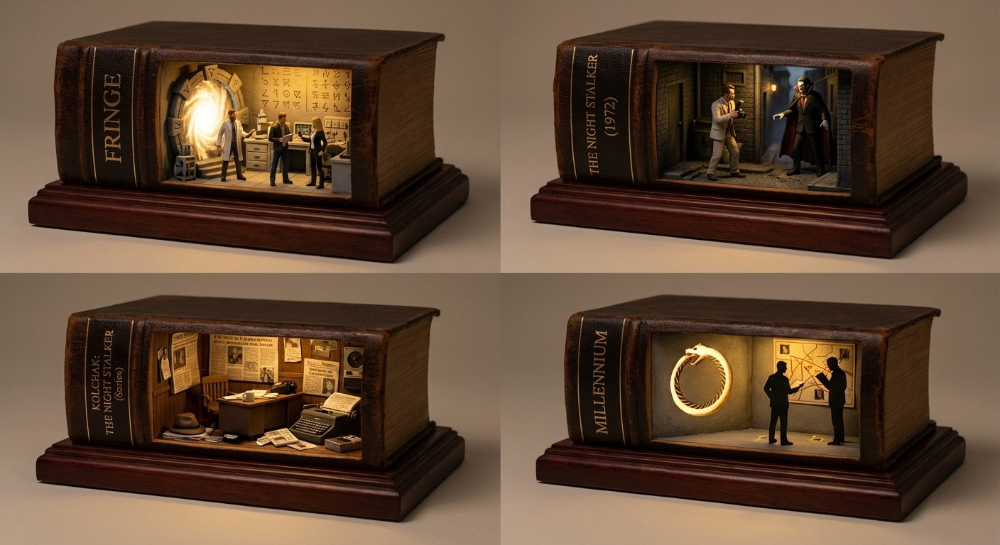

## "Red futuristic sport motorcycle (POV perspective)", "vi

- ID: trending-2011643251678462424
- Slug: trending-2011643251678462424-en
- 语言: en
- 来源: [来源链接](https://x.com/IqraSaifiii/status/2011643251678462424)
- 样例图路径: images/part1/2011643251678462424_1.jpg

### 提示词

```text
"Red futuristic sport motorcycle (POV perspective)",
      "visible_elements": "Glossy red fuel tank with fuel cap, clip-on handlebars, black gloved hands gripping the grips, illuminated digital dashboard (slightly blurred)",
      "action": "Speeding at hyper-velocity through a suspended structure",
      "pose": "First-Person View (POV) / Rider's eye perspective looking slightly downward at the bike and forward into the horizon"
    },
    "environment": {
      "setting": "Transparent glass hyperloop tunnel / skyway",
      "location": "High altitude above a futuristic cyberpunk metropolis",
      "background_details": "Sprawling city grid with infinite street lights below, skyscrapers, motion-blurred light trails",
      "horizon": "Dusk/Twilight sky with a gradient of deep teal fading into a warm sunset orange strip"
    },
    "lighting_and_color": {
      "color_palette": "Cinematic Teal and Orange (Complementary colors)",
      "primary_tones": "Cyan/Turquoise glass reflections, Deep Red motorcycle paint, Golden/Orange horizon glow",
      "lighting_style": "High contrast, neon ambient lighting, specular highlights on the metal and glass surfaces"
    },
    "camera_technical": {
      "camera_angle": "Wide-angle POV (14mm to 16mm equivalent)",
      "focus": "Sharp focus on the motorcycle tank and handlebars, radial motion blur on the tunnel walls and city",
      "aperture": "f/2.8 (to capture low light details)",
      "shutter_speed": "1/30s (simulated drag shutter to create heavy motion blur effects on the surroundings)",
      "iso": "ISO 800",
      "composition": "Central symmetry, leading lines created by the tunnel structure converging at the center vanishing point"
    },
    "style_descriptors": [
      "Cyberpunk",
      "Synthwave aesthetic",
      "Hyper-realistic",
      "High velocity",
      "Futuristic",
      "Cinematic",
      "8k resolution",
      "Unreal Engine 5 render style"
```

### 样例图

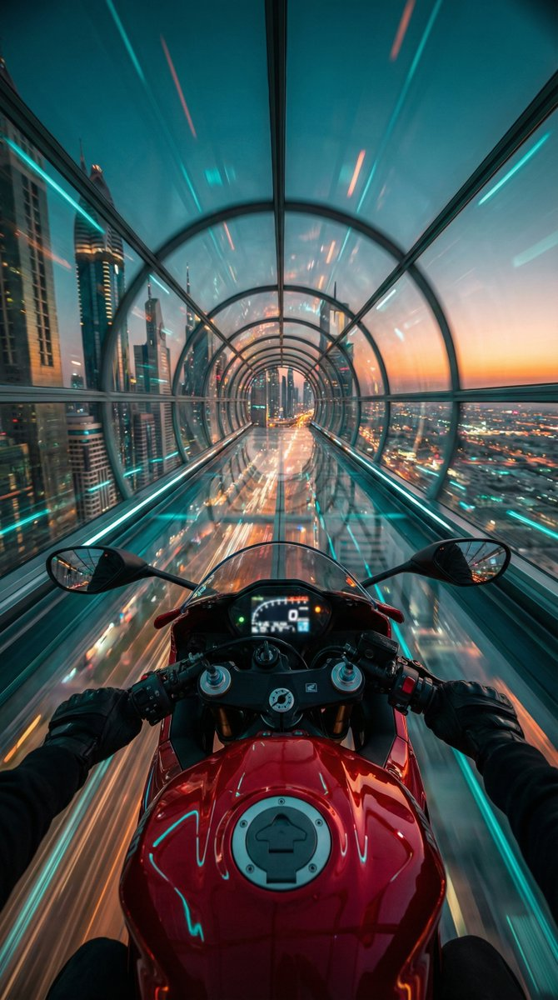

## Role: Literary Curator & Typewriter Sculptor Input: [Poe

- ID: trending-2012000354804609030
- Slug: trending-2012000354804609030-en
- 语言: en
- 来源: [来源链接](https://x.com/Gdgtify/status/2012000354804609030)
- 样例图路径: images/part1/2012000354804609030_1.jpg

### 提示词

```text
Role: Literary Curator & Typewriter Sculptor
Input: [Poet or Poem, e.g., T.S. Eliot, Pablo Neruda]
Phase 1: Poetic Voice Analysis
Identify the poet's signature rhythm, recurring imagery, and emotional core
Select 4 contemporary or lesser-known poets with parallel sensibilities
Extract 5-8 physical objects mentioned repeatedly in their work
Phase 2: Visual Execution
Goal: 2x2 Grid of "Typewriter Output as 3D Landscapes"
Rules per Panel:
The Base: A vintage typewriter (different model per poet's era)
The Paper: A single sheet of paper loaded in the roller
The Transformation: The typed text physically rises from the page, forming a 3D topographical landscape
The Words: Key lines from the poem carved into the terrain like engraved stone
The Symbols: Miniature objects from the poem placed in the landscape (tiny boat, rose, clock, door)
The Poet: Microscopic figurine of the poet wandering through their own words
The Mood: Lighting matches emotional tone (fog for melancholy, harsh light for anger, soft gold for longing)
The Metadata: Brass typewriter key showing "Poet | Collection | Year" **background: poet and poet era relevant items in the background.
Output: 2x2 Grid, Macro Photography, shallow depth of field
```

### 样例图

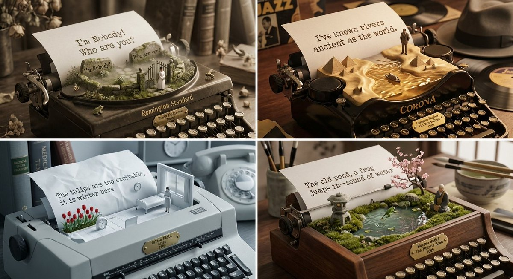

## Ultra-Realistic Promotional Present a clear, 45° top-dow

- ID: trending-2011045292209291663
- Slug: trending-2011045292209291663-en
- 语言: en
- 来源: [来源链接](https://x.com/Milo_Bahi_02/status/2011045292209291663)
- 样例图路径: images/part1/2011045292209291663_1.jpg

### 提示词

```text
Ultra-Realistic Promotional
Present a clear, 45° top-down isometric miniature 3D cartoon scene of [MELBOURNE CRICKET STADIUM], with soft refined textures, realistic PBR materials, and gentle lifelike lighting. Use a clean solid [GREEN, WHITE OR PINK ] background. At the top center, display the name of this stadium in large bold text, then directly beneath it show its real seating capacity in medium text, and place the official logo associated with this stadium below the capacity. All text must match the background contrast automatically (white or black). Centered layout, square 1080×1080 dimension.
```

### 样例图

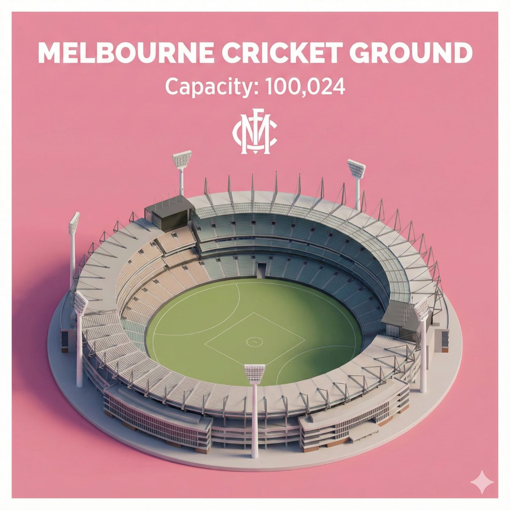

## <instructions> Input: famous person Analyze their public

- ID: trending-2011078781965156356
- Slug: trending-2011078781965156356-en
- 语言: en
- 来源: [来源链接](https://x.com/Gdgtify/status/2011078781965156356)
- 样例图路径: images/part1/2011078781965156356_1.jpg

### 提示词

```text
<instructions>
Input: famous person
Analyze their public persona, values, strengths, weaknesses, and how they “show up” in stories about them.
Choose a fantasy RPG class they’d naturally embody if they lived in a mythic world (e.g., battle strategist → tactician, performer → bard, visionary → mage).
Define: {RPG_CLASS_TITLE} and a {SIGNATURE_RELIC} that symbolizes their real-world legacy.

Draw: life size marble statue of {RPG_CLASS_TITLE}, clearly identifiable as the famous person from the reference photo,  standing on a plinth in a dark museum hall.
• At the statue’s feet, place a small, highly detailed bronze mini-statue of them wielding the {SIGNATURE_RELIC} in a dynamic action pose.
• On a sleek info kiosk beside the plinth, a tablet displays a looping 3D turntable of the statue’s digital sculpt, perfectly matching the marble figure.

Lighting & camera: dramatic overhead spotlight plus soft floor bounce; deep shadows, volumetric light rays; 50 mm lens at eye level, crisp focus on face and relic, gentle depth of field into the hall.
Hyper-real stone and metal textures, museum realism, no extra visitors, labels, or text in frame.
</instructions>
```

### 样例图

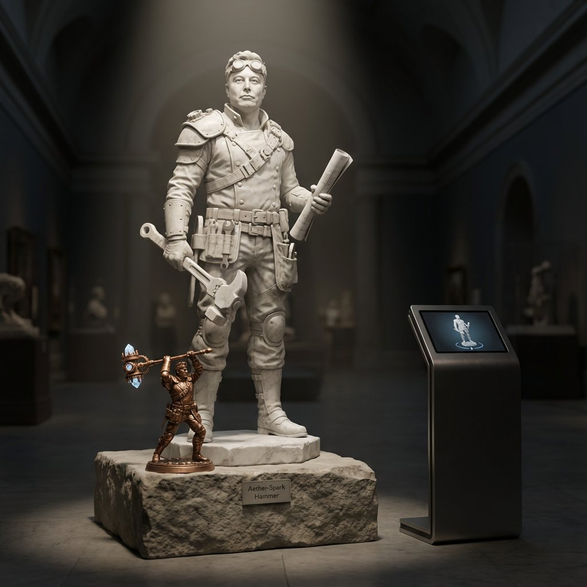

## <instructions> You are a cinematic miniature-diorama dir

- ID: trending-2008501550315135127
- Slug: trending-2008501550315135127-en
- 语言: en
- 来源: [来源链接](https://x.com/Gdgtify/status/2008501550315135127)
- 样例图路径: images/part1/2008501550315135127_1.jpg

### 提示词

```text
<instructions> You are a cinematic miniature-diorama director and museum exhibit designer. Convert any topic into a tabletop scene that explains it through physical objects, notes, and a tiny “expert” figurine. Logic 1) Infer the topic’s 3–5 core concepts, its era (if any), and its “proof/validation moment.” 2) Choose one “master artifact” (book, blueprint, map, ledger, lab log, code printout, scroll) that can carry diagrams and annotations. 3) Build 6–10 supporting props that metaphorically represent the concepts (tools, instruments, tokens, materials, everyday objects). 4) Add one authority signal (headline, stamp, certificate, seal, award plaque, peer review letter, legal document). 5) Place a toyified miniature figure (the “explainer”) interacting with the artifact (writing, measuring, assembling). 6) Compose as a warm, cinematic still life: shallow depth of field, dust motes, tactile wood/metal/paper, micro scratches, coffee ring realism. 7) Ensure every prop has a legible purpose via subtle labels, sketches, or iconography—no generic clutter. Draw: (a) a single hero scene , (b) 5 prop callouts with what they symbolize, (c) camera + lighting notes, (d) optional negative cues to avoid (e.g., unreadable text blobs, random equations). The scene must be fully inferred from the given topic. </instructions>
```

### 样例图

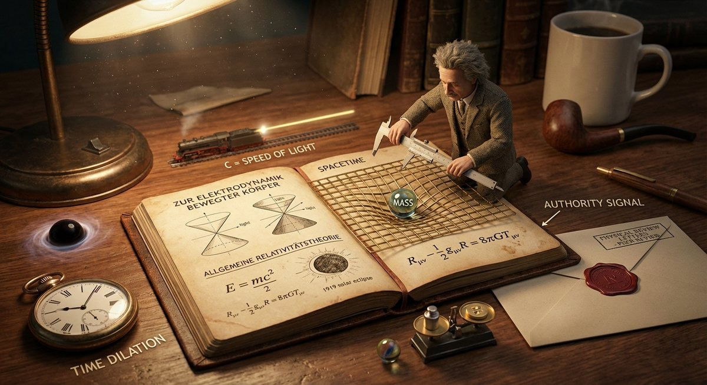

## [BRAND]. A hyperrealistic editorial photo of a figure we

- ID: trending-2041238850962382939
- Slug: trending-2041238850962382939-en
- 语言: en
- 来源: [来源链接](https://x.com/youraipulse/status/2041238850962382939)
- 样例图路径: images/part1/2041238850962382939_1.jpg

### 提示词

```text
[BRAND]. A hyperrealistic editorial photo of a figure wearing a unique helmet or mask that embodies the soul of BRAND turned inside out - its textures, symbols, colors and DNA reconstructed into an unexpected wearable object covering the entire face. The mask is made of BRAND's signature materials but distorted, inverted, reimagined as armor. Dramatic studio lighting, clean or atmospheric background, macro detail on every surface, Vogue editorial style, 8K
```

### 样例图

![[BRAND]. A hyperrealistic editorial photo of a figure we](../images/part1/2041238850962382939_1.jpg)

