# illustration

总计：301

## 彩色潦草小狗线条风格重绘

- ID: case-374
- Slug: case-374-zh
- 语言: zh
- 来源: [来源链接](https://x.com/berryxia/status/2050226420681757102)
- 样例图路径: images/part2/case374.jpg

### 提示词

```text
彩色潦草小狗线条风格绘制该图，童趣和doodle加入其中，务必使用毫无章法的绘制手法，凌乱和草率即可。
```

### 样例图


## 可爱角色设定表

- ID: case-372
- Slug: case-372-zh
- 语言: zh
- 来源: [来源链接](https://x.com/xRahultripathi/status/2050152865566708134)
- 样例图路径: images/part2/case372.jpg

### 提示词

```text
Create a cute female character design sheet inspired by the uploaded image.

Style: warm, soft, semi-realistic cartoon illustration with a cozy Japanese kawaii vibe (pastel tones, smooth shading, clean lineart).

Make it a clean character concept poster layout including:

One large main female portrait (front view, detailed)

Facial expression set (happy, shy, annoyed, sleepy, surprised, excited)

2–3 full-body poses (standing, walking/running, playful pose)

Small accessory/object icons that match her personality (hair clip, cute bag, phone charm, coffee cup, keychain)

A simple color palette section (skin, hair, outfit, accent colors)

A profile info box with: name, age range, personality traits, likes/dislikes, short description

Overall look should feel charming, cozy, feminine, and professionally arranged like an animation character design sheet.
High quality, clean background, soft lighting.
```

### 样例图


## 咖啡馆写实照片与 2D 涂鸦叠加

- ID: case-366
- Slug: case-366-zh
- 语言: zh
- 来源: [来源链接](https://x.com/Jawad_Rahman_/status/2049796647237066971)
- 样例图路径: images/part2/case366.jpg

### 提示词

```text
A trendy young woman sitting at an outdoor café table, holding a hot coffee cup near her lips. She has short curly black hair and wears oversized tinted sunglasses, a cropped beige sweater, loose brown high-waisted pants, and chunky white sneakers. A tote bag with minimal coffee-themed illustrations hangs on her shoulder.

The scene blends realistic photography with playful 2D cartoon overlays. Floating around her are animated coffee elements: a smiling cappuccino cup with heart-shaped latte art, cute coffee beans with tiny faces, and stylized splashes of caramel forming comic-style shapes. Soft doodle steam rises into hearts and stars.

On the table: a croissant, a notebook with sketch drawings, and a second coffee cup.

Background: a realistic cozy café street with brick walls, plants, warm golden hour lighting, and soft shadows. Slight depth of field, subject in sharp focus.

Style: mix of photorealism and vibrant cartoon illustration, pop-art aesthetic, high saturation but warm tones, clean composition, Instagram-worthy, soft glow, 4k detail.
```

### 样例图


## 4×4 动作分解参考表

- ID: case-347
- Slug: case-347-zh
- 语言: zh
- 来源: [来源链接](https://x.com/oggii_0/status/2048614158699217302)
- 样例图路径: images/part2/case347.jpg

### 提示词

```text
[STYLE]
Monochrome grayscale illustration, 3D-rendered character, clean instructional reference sheet, white background, comic-style cell grid layout, technical diagram aesthetic.

[LAYOUT]
4×4 grid layout with a total of 16 panels. Each panel is separated by thin black border lines. Cells are numbered from 1 to 16, with consistent panel sizes.

[CHARACTER]
image1 (the same character appears consistently in all panels)

[PANEL STRUCTURE – per cell]
Top-left: bold number badge + English title text
Center: full-body character pose illustration
Bottom-left: English description text (3–4 lines)
Overlay: directional arrows indicating movement

[ARROWS / MOTION INDICATORS]
Curved arrows, straight arrows, and circular rotation indicators placed around the character to show motion flow and direction.

[RENDERING STYLE]
Highly detailed 3D sculpted style, soft studio lighting, subtle shadows, no color, grayscale shading, clean linework, game concept art quality.

[NEGATIVE]
No background scenery, no color tones, no additional characters, no complex background.
```

### 样例图


## 立体刺绣小鸟花枝

- ID: case-346
- Slug: case-346-zh
- 语言: zh
- 来源: [来源链接](https://x.com/dotey/status/2048529821706195442)
- 样例图路径: images/part2/case346.jpg

### 提示词

```text
精致立体刺绣风插画，浅浮雕纤维艺术效果，纯净「蚕丝白 + 奶白」底色，细腻丝线质感。画面为数只小鸟停在蜿蜒花枝上，周围点缀粉白、浅桃、珊瑚粉、淡金色花朵与叶片，构图轻盈雅致、留白充足。鸟儿羽毛以奶白、浅蓝、淡粉、浅金丝线刺绣表现，花枝纤细自然，花朵层层叠线，整体呈现高级手工刺绣、丝线堆绣、柔和光影、细节丰富、温柔清新的艺术效果。
```

### 样例图


## 零食品牌技术分解图

- ID: case-310
- Slug: case-310-zh
- 语言: zh
- 来源: [来源链接](https://x.com/TechieBySA/status/2031795709243019280)
- 样例图路径: images/part2/case310.jpg

### 提示词

```text
[中文]
创建一个 [SNACK] 的品牌技术信息图，结合产品的真实照片或照片级真实渲染，并将技术注释覆盖层直接置于其上。在纯白摄影棚背景上使用带有策略性 [BRAND COLOR] 点缀的黑色墨水风格线条画（建筑草图外观），包括：
• 关键组件标签
• 显示结构、分层或内部设计的内部截面图
• 测量数据、尺寸和规格
• 带有成分和数量的材料标注
• 指示主要功能和结构完整性的箭头
• 显示关键机械或设计元素的简单示意图或剖面图
• 可持续性标注
标题位置：位于手绘技术注释框内，带有强调色边框，粗体字显示产品名称，置于上角。
风格与布局规则：
• 真实产品保持清晰可见
• 注释具有素描感、技术感和建筑感
• 强调色用于高光（占线条工作的 20-30%），黑色用于主要技术线条（70-80%）
• 构图整洁，负空间平衡
• 具有教育意义、食品工程氛围和高端品牌感
• 在角落包含微妙的品牌标志
视觉风格：极简技术插画美学，黑色线条在真实图像上带有点缀，精确但略带手绘感。
调色板：白色背景，黑色注释线/文本，[BRAND COLOR] 仅用于点缀和关键标注。
输出：1080×1080，超清晰，社交媒体动态优化，无水印。

[English]
Create a branded technical infographic of a [SNACK], combining a realistic photograph or photoreal render of the product with technical annotation overlays placed directly on top. Use black ink–style line drawings with strategic [BRAND COLOR] accents (architectural sketch look) on a pure white studio background, including:
• Key component labels
• Internal cross-section showing structure, layering, or internal design
• Measurements, dimensions, and specifications
• Material callouts with composition and quantities
• Arrows indicating function for primary features and structural integrity
• Simple schematic or sectional diagram showing key mechanical or design elements
• Sustainability callouts
Title placement: Inside a hand-drawn technical annotation box with accent border reading the product name in bold font, positioned in upper corner.
Style & layout rules:
• The realistic product remains clearly visible
• Annotations feel sketched, technical, and architectural
• Accents used for highlight (20-30% of linework), black for primary technical lines (70-80%)
• Clean composition with balanced negative space
• Educational, food-engineering vibe with premium branding
• Include subtle brand logo mark in corner
Visual style: Minimal technical illustration aesthetic, black linework with accents over realistic imagery, precise but slightly hand-drawn feel.
Color palette: White background, black annotation lines/text, [BRAND COLOR] for accents and key callouts only.
Output: 1080×1080, ultra-crisp, social-feed optimized, no watermark.​​​​​​​​​​​​​​​​
```

### 样例图


## 官方角色设定资料卡

- ID: case-306
- Slug: case-306-zh
- 语言: zh
- 来源: [来源链接](https://x.com/MANISH1027512/status/2045013913901867334)
- 样例图路径: images/part2/case306.jpg

### 提示词

```text
[中文]
基于此角色和背景，请制作一份类似官方设定资料的角色资料卡。
・包含三视图：正面、侧面和背面
・添加角色面部表情的变化・分解并展示服装和装备的详细部分
・添加色板・包含世界观设定的简要说明
・总体上，使用有组织的布局（白色背景，插画风格）

[English]
Based on this character and background, please create a character reference sheet similar to official setting materials.
・Includes three-view drawings: front view, side view, and back view
・Add variations of the character's facial expressions
・Break down and display detailed parts of the clothing and equipment
・Add a color palette
・Include a brief explanation of the worldview setting
・Overall, use an organized layout (white background, illustration style)
```

### 样例图


## 荧光蓝穷奇新中式山水画

- ID: case-304
- Slug: case-304-zh
- 语言: zh
- 来源: [来源链接](https://x.com/liyue_ai/status/2045506567735558336)
- 样例图路径: images/part2/case304.jpg

### 提示词

```text
[中文]
极简主义，新中式风格立体图形设计，图像下端有楷体中国文字：“东方美学”，“2026/04/18”，署名 “CHINA”，和“
@LIYUE
"；
平整纯白色的亚光质感厚艺术纸上绘充满东方诗意氛围的山水创意画，不规则的撕纸效果；
中国的神兽：穷奇，身形图案完整，美轮美奂，，线条柔美灵动,眼睛炯炯有神，威严的神态，优雅的姿势，奢华装饰艺术，中国传统纹饰；
荧光蓝色线条，0.5mm极细金色金属质感勾边，泼白墨大笔触，色彩渲染，红底，蓝色的浪漫诗意视觉；
冷暖光交织的梦幻唯美场景，强烈的光影对比氛围，花轻舞的时光叙事，东风禅意，画面有大面积留白，框架构图，底部留白，细节清晰。

[English]
Minimalism, Neo-Chinese style three-dimensional graphic design, at the bottom of the image there are Chinese characters in regular script: "东方美学", "2026/04/18", signature "CHINA", and "
@LIYUE
";
Drawn on flat, pure white matte textured thick art paper, a creative landscape painting full of oriental poetic atmosphere, irregular torn paper effect;
Chinese mythical beast: Qiongqi, complete body pattern, magnificent,, soft and agile lines, bright piercing eyes, majestic demeanor, elegant posture, luxury decorative art, Chinese traditional patterns;
Fluorescent blue lines, 0.5mm ultra-fine gold metallic texture outlining, large strokes of splashed white ink, color rendering, red background, romantic and poetic blue vision;
Dreamy and aesthetic scene where cold and warm lights intertwine, strong light and shadow contrast atmosphere, time narrative of flowers dancing lightly, Oriental Zen, the picture has a large area of blank space, framework composition, blank space at the bottom, clear details.
```

### 样例图


## 裂痕里的水墨东方山水画卷

- ID: case-279
- Slug: case-279-zh
- 语言: zh
- 来源: [来源链接](https://x.com/liyue_ai/status/2045368305079447853)
- 样例图路径: images/part2/case279.jpg

### 提示词

```text
[中文]
极简新中式美学风格，画面以淡雅的灰白色为底，呈现出一种纸艺剪影般的立体感。
一条S形蜿蜒的裂痕状边缘将画面分割，仿佛撕开了一层纸面，露出内部色彩斑斓的东方山水景象。
裂口内，一条蜿蜒的河流自上而下贯穿整个构图，河水以深浅不一的蓝色渲染，层次分明，仿佛流动的丝带。
河岸两侧点缀着青翠的山丘与梯田，色彩柔和，绿红交织，展现出田园的宁静之美。
沿河而建的古风建筑错落有致，飞檐翘角，白墙黛瓦，在光影的映衬下更显古朴典雅。
岸边树木葱茏，枝叶轻盈，一艘小船静泊于水中央，增添了几分悠然意境。
整体构图呈S形曲线，富有韵律感，仿佛自然与人文的和谐共生。
画作边缘采用撕纸效果，营造出立体浮雕般的视觉体验。
下方题字"东方美学"以黑色楷体书写，日期"2026/04/18"与红色印章相呼应，底部"CHINA"字样庄重醒目，署名"@LIYUE"低调收尾，整体氛围静谧深远，充满诗意与哲思。

[English]
Minimalist neo-Chinese aesthetic style, the picture uses an elegant grayish-white as the background, presenting a three-dimensional sense like paper art silhouettes. A winding S-shaped crack-like edge divides the picture, as if tearing open a layer of paper, revealing the colorful oriental landscape scene inside. Inside the crack, a winding river runs through the entire composition from top to bottom, the river water is rendered in different shades of blue, with clear layers, like a flowing ribbon. Both sides of the riverbank are dotted with verdant hills and terraced fields, the colors are soft, green and red interwoven, showing the tranquil beauty of the pastoral. Ancient-style buildings built along the river are well-proportioned, with flying eaves and upturned corners, white walls and black tiles, appearing more quaint and elegant against the light and shadow. The trees on the bank are lush, the branches and leaves are light and graceful, a small boat is quietly moored in the middle of the water, adding a bit of leisurely artistic conception. The overall composition presents an S-shaped curve, full of rhythm, as if the harmonious coexistence of nature and humanity. The edges of the painting adopt a torn paper effect, creating a visual experience like a three-dimensional relief. The inscription "东方美学" at the bottom is written in black regular script, the date "2026/04/18" echoes with the red seal, the word "CHINA" at the bottom is solemn and eye-catching, and the signature "@LIYUE" ends in a low-key way. The overall atmosphere is quiet and profound, full of poetry and philosophical thinking.
```

### 样例图


## 阿马尔菲海岸复古旅行海报

- ID: case-278
- Slug: case-278-zh
- 语言: zh
- 来源: [来源链接](https://x.com/WolfRiccardo/status/2044562722491121718)
- 样例图路径: images/part2/case278.jpg

### 提示词

```text
[中文]
现代铅笔插画，意大利阿马尔菲海岸复古旅行海报插画，全景海岸悬崖公路场景，经典1960年代白色汽车沿着弯曲的海滨公路行驶，带有小帆船的深蓝色地中海，色彩缤纷的粉彩山腰村庄，带有柔软云朵的明亮蓝天，带有鲜艳黄色柠檬的柠檬树枝框定前景，温暖的夏日阳光，大胆鲜艳的色彩，复古1950年代旅行海报风格，电影级构图，高细节，丝网印刷质感，图形插画。手绘风格，带有松散笔触和清晰轮廓的插画。高对比度调色板，保持背景与元素之间的色彩和谐。现代与装饰性美学。

[English]
Modern pencil illustration of Vintage travel poster illustration of the Amalfi Coast, Italy, panoramic coastal cliff road scene, classic 1960s white car driving along a curved seaside road, deep blue Mediterranean sea with small sailboats, colorful pastel hillside village, bright blue sky with soft clouds, lemon tree branches with vibrant yellow lemons framing the foreground, warm summer sunlight, bold vibrant colors, retro 1950s travel poster style, cinematic composition, high detail, screen print texture, graphic illustration. Hand-drawn style, illustration with loose strokes and defined contours. High-contrast color palette, maintaining chromatic harmony between background and elements. Contemporary and decorative aesthetic.
```

### 样例图


## 成都吃货暴走手绘美食地图

- ID: case-274
- Slug: case-274-zh
- 语言: zh
- 来源: [来源链接](https://x.com/Panda20230902/status/2045396918965285111)
- 样例图路径: images/part2/case274.jpg

### 提示词

```text
[中文]
一张手绘风格的城市美食地图，以成都为主题。画面以鸟瞰视角的手绘简化城市地图为底，标注主要道路和地标但不追求精确比例而是追求可爱的手绘感。地图上分布着 12 个美食地点的精致手绘小插画：春熙路的串串香（一把竹签插着各种食材冒着热气）、宽窄巷子的三大炮（三个糯米团子飞向铜盘）、建设路的蛋烘糕（金黄酥脆正在翻面）、玉林路的火锅（九宫格锅翻滚冒泡）等，每个插画约占地图的 5% 面积，旁边用手写体标注店名和一句推荐语"凌晨两点还在排队的那家"。地图边缘用手绘藤蔓和辣椒装饰形成边框。右下角有一个手绘指南针和图例说明。左上角标题"成都·吃货暴走地图"使用胖圆的手绘美术字配辣椒装饰。整体画风为水彩+彩铅混合的手绘质感，颜色以暖色系（辣椒红、姜黄、翠绿）为主，图片比例 1:1。

[English]
A hand-drawn style city food map themed around Chengdu. The background is a bird's-eye view hand-drawn simplified city map, marking main roads and landmarks, not pursuing precise proportions but pursuing a cute hand-drawn feel. Distributed on the map are exquisite hand-drawn small illustrations of 12 food locations: Chuandu Chuanxiang skewers at Chunxi Road (a bunch of bamboo skewers with various ingredients emitting steam), Sandapao at Kuanzhai Alley (three glutinous rice balls flying towards a copper plate), Danhonggao at Jianshe Road (golden and crispy, being flipped), hotpot at Yulin Road (nine-grid pot rolling and bubbling), etc. Each illustration accounts for about 5% of the map area, with handwritten store names and a recommendation phrase "the one with a queue even at 2 AM" next to it. The edge of the map is decorated with hand-drawn vines and chili peppers to form a border. There is a hand-drawn compass and legend description in the bottom right corner. The title "Chengdu · Foodie Walking Map" in the top left corner uses chubby round hand-drawn artistic fonts decorated with chili peppers. The overall art style is a mixed hand-drawn texture of watercolor and colored pencils, with colors mainly in warm tones (chili red, ginger yellow, emerald green), image ratio 1:1.
```

### 样例图


## 宋朝文人的赛博朋友圈

- ID: case-267
- Slug: case-267-zh
- 语言: zh
- 来源: [来源链接](https://x.com/Panda20230902/status/2045385588065313057)
- 样例图路径: images/part2/case267.jpg

### 提示词

```text
[中文]
"宋朝人的朋友圈"/"SONG DYNASTY SOCIAL MEDIA FEED"，古今穿越幽默融合界面设计风格，画面模拟手机社交媒体界面，但内容全部是宋朝场景头像是宋代文人画像，用户名"苏东坡SuShi_Official"，发布内容"刚到黄州，被贬了但心情还行。今天自己做了东坡肉，味道绝了，附菜谱："，配图为工笔画风格的东坡肉特写，点赞列表"黄庭坚、秦观、佛印等126人"，评论区"王安石：呵呵""司马光：还是那个味道"，界面元素如点赞图标用宋代花纹替代，状态栏显示"大宋移动 5G"和"元丰三年"，配色为手机深色模式搭配宋代雅致色调，历史与社交媒体的趣味碰撞杰作

[English]
"Song Dynasty People's Moments"/"SONG DYNASTY SOCIAL MEDIA FEED", Ancient and modern time-travel humor fusion interface design style, The image simulates a mobile phone social media interface, but the content is entirely Song Dynasty scenes, The avatar is a portrait of a Song Dynasty literati, Username "Su Dongpo SuShi_Official", Post content "Just arrived in Huangzhou, demoted but feeling okay. Made Dongpo pork myself today, tastes amazing, recipe attached:", The attached image is a close-up of Dongpo pork in Gongbi painting style, Likes list "Huang Tingjian, Qin Guan, Fo Yin etc. 126 people", Comments section "Wang Anshi: Hehe" "Sima Guang: Still the same taste", Interface elements such as the like icon are replaced with Song Dynasty patterns, The status bar shows "Great Song Mobile 5G" and "Third Year of Yuanfeng", The color scheme is mobile phone dark mode paired with elegant Song Dynasty tones, A masterpiece of fun collision between history and social media
```

### 样例图


## 唯美二次元角色介绍网页

- ID: case-263
- Slug: case-263-zh
- 语言: zh
- 来源: [来源链接](https://x.com/09lyco/status/2045281845391323175)
- 样例图路径: images/part2/case263.jpg

### 提示词

```text
[中文]
埋まってないところはパートナーさんかご自身で埋めてあげてください
 #観測塔朝お題  #観測塔おはようお題

最新モデルの画像生成ツールを使用して、
このちびキャライラストと立ち絵を使って本物のサイトページのようにキャラクター紹介ページ風イラストを作ってください。 （紹介ページとして使ってもおかしくないもの）
ギャルゲーのキャラクター紹介ページをイメージした高品質なもの。 顔の差分なども乗っている、CGイラストが存在する。ちびキャラが存在する。

「ここに自己紹介」

名前:（ここに名前）
イメージカラー:（ここに色）
身長:（ここに身長）cm
体重:（ここに体重）kg
キャッチコピー:"「ここにセリフ」"

[English]
Please fill in the unfilled parts by your partner or yourself
 #ObservatoryTowerMorningTheme  #ObservatoryTowerGoodMorningTheme

Using the latest model image generation tool,
Using this chibi character illustration and standing picture, create a character introduction page style illustration like a real website page. (Something that would not be strange to use as an introduction page)
A high-quality item imagining a gal game character introduction page. Facial variations etc. are also included, CG illustrations exist. A chibi character exists.

"Self-introduction here"

Name: (Name here)
Image color: (Color here)
Height: (Height here)cm
Weight: (Weight here)kg
Catchphrase: "Dialogue here"
```

### 样例图


## 绝美国风工笔画书签设计

- ID: case-242
- Slug: case-242-zh
- 语言: zh
- 来源: [来源链接](https://x.com/akokoi1/status/2045693939584516441)
- 样例图路径: images/part2/case242.jpg

### 提示词

```text
[中文]
生成一系列工笔画书签的设计稿

[English]
Generate a series of design drafts for Gongbi painting bookmarks.
```

### 样例图

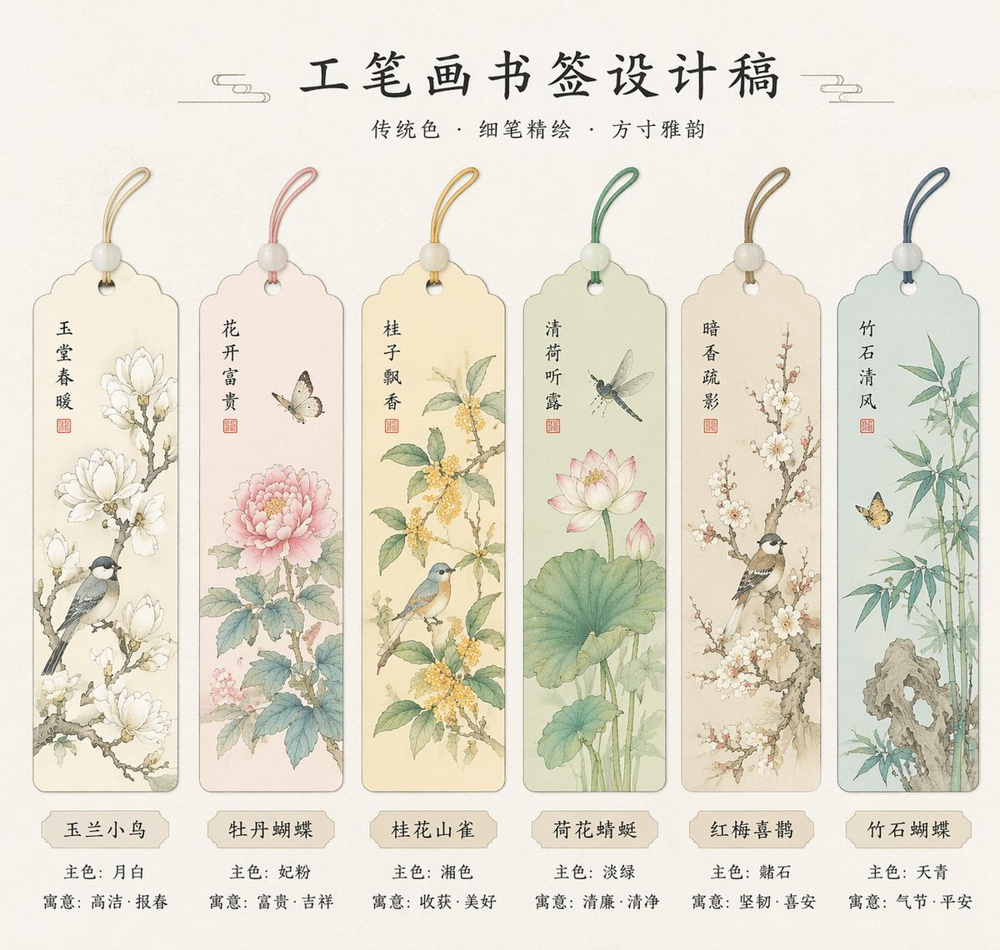

## 星云巨鲤与小人的奇幻对话

- ID: case-238
- Slug: case-238-zh
- 语言: zh
- 来源: [来源链接](https://x.com/liyue_ai/status/2045875219307655337)
- 样例图路径: images/part2/case238.jpg

### 提示词

```text
[中文]
一幅超现实主义数字插画风格，采用低角度仰拍视角。画面描绘了一条巨型彩色锦鲤遨游在梦幻般的星云中，四周环绕着色彩鲜艳的星云与气泡。
画面中央还站着一个小人，背对观众，神情平静地仰望空中这条巨大的锦鲤，锦鲤头向下看着小人。
整体画面呈现出强烈的大小对比，氛围空灵又梦幻。比例9:16

[English]
A surrealist digital illustration style, adopting a low-angle upward perspective. The picture depicts a giant colorful koi swimming in a dreamy nebula, surrounded by colorful nebulae and bubbles. In the center of the picture stands a small figure, with their back to the audience, calmly looking up at this huge koi in the air, and the koi is looking down at the small figure. The overall picture presents a strong size contrast, and the atmosphere is ethereal and dreamy. Aspect ratio 9:16
```

### 样例图


## 蒙娜丽莎畅饮可乐的趣味油画

- ID: case-233
- Slug: case-233-zh
- 语言: zh
- 来源: [来源链接](https://x.com/liyue_ai/status/2045058142858555733)
- 样例图路径: images/part2/case233.jpg

### 提示词

```text
[中文]
生成一张蒙娜丽莎喝可乐的油画。

[English]
Generate an oil painting of Mona Lisa drinking cola.
```

### 样例图

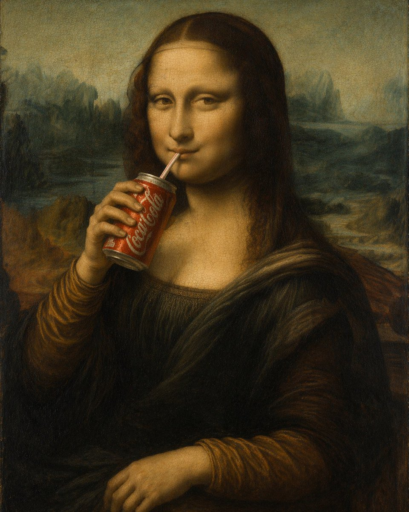

## 鎏金广州塔的东方奇幻海报

- ID: case-220
- Slug: case-220-zh
- 语言: zh
- 来源: [来源链接](https://x.com/liyue_ai/status/2046243132774494607)
- 样例图路径: images/part2/case220.jpg

### 提示词

```text
[中文]
平面插画，东方幻想风格高端城市海报设计，竖版9:16构图，整体采用对角线+S型流动构图，从左下向右上延展，画面以深邃黑色为背景，自上而下渐变至浓烈暗红色，形成强烈冷暖对比与空间纵深，背景带微弱星尘与颗粒质感。画面中央一条金色流动能量线条如火焰般蜿蜒贯穿，自底部向上延伸，具有流体质感、粒子光效与渐变高光，局部带细微能量碎屑与体积光。

金色流光中逐层浮现广州城市地标建筑群：广州塔为视觉核心，比例突出，周围融合珠江新城高楼群、猎德大桥及现代与岭南建筑元素，建筑采用“精细线描 + 金色发光体块”表现，轮廓清晰、细节丰富，在金色光晕映衬下仿佛悬浮于虚空，形成超现实空间层次，远景轻微雾化增强纵深感。

画面底部为一位东方白发女性形象，长发飘逸，如烟似雾，与金色流光自然衔接并逐渐融合，发丝半透明带渐变光感，姿态柔美，双目微闭，神情宁静，怀抱一束多彩鲜花，花间点缀微光粒子与星点效果，象征人与城市能量的精神连接，人物细节适度简化以突出整体设计感。

光影集中于金色流线、建筑与人物轮廓，形成强烈明暗对比与视觉聚焦，整体氛围宏大、神秘、具有东方神话意境且略带治愈感。色彩以黑与暗红为基底，高亮鎏金为主视觉强调，金色具备丰富明暗层次，辅以小面积高饱和花束色彩点缀，整体高级克制。

页面文字与画面融合排版：顶部居中宋体大字“广州·中国”，下方小字“2026/04/20”，再下方小字“LIYUE”，文字采用淡金色或柔和暖白色，与整体光影统一。高品质细节，电影级光影表现，体积光与粒子细节丰富，画面干净无噪点，超高清8K分辨率，商业级海报质感。

[English]
Flat illustration, Oriental fantasy style high-end city poster design, vertical 9:16 composition, the overall adopts a diagonal + S-shaped flowing composition, extending from the bottom left to the top right, the picture uses deep black as the background, gradually changing from top to bottom to intense dark red, forming a strong cold-warm contrast and spatial depth, the background has a faint stardust and grainy texture. In the center of the picture, a golden flowing energy line winds through like a flame, extending from the bottom to the top, having a fluid texture, particle light effects and gradient highlights, with subtle energy debris and volumetric light in some areas. Guangzhou city landmark building complexes emerge layer by layer in the golden flowing light: Canton Tower is the visual core, with a prominent proportion, surrounded by the integration of Zhujiang New Town high-rise buildings, Liede Bridge and modern and Lingnan architectural elements, the buildings are expressed using "fine line drawing + golden glowing blocks", clear outlines and rich details, set off by the golden halo, they seem to float in the void, forming a surreal spatial hierarchy, the distant view is slightly fogged to enhance the sense of depth. At the bottom of the picture is an oriental white-haired female figure, long hair fluttering, like smoke and mist, naturally connecting and gradually blending with the golden flowing light, the hair is translucent with a gradient light sense, graceful posture, eyes slightly closed, serene expression, holding a bunch of colorful fresh flowers in her arms, interspersed with faint light particles and starlight effects among the flowers, symbolizing the spiritual connection between human and urban energy, character details are moderately simplified to highlight the overall sense of design. Light and shadow are focused on the golden streamlines, buildings and character outlines, forming a strong light-dark contrast and visual focus, the overall atmosphere is grand, mysterious, with an Oriental mythological artistic conception and a slight healing sense. The color uses black and dark red as the base, highlighted gilded gold as the main visual emphasis, the gold has rich light and dark layers, supplemented by small areas of high-saturation bouquet color embellishments, the overall is advanced and restrained. Page text and picture integrated typography: large Song typeface characters "Guangzhou·China" centered at the top, small characters "2026/04/20" below, small characters "LIYUE" further below, the text uses light gold or soft warm white, unifying with the overall light and shadow. High-quality details, cinematic light and shadow performance, rich volumetric light and particle details, clean picture without noise, ultra-high definition 8K resolution, commercial-grade poster texture.
```

### 样例图


## 西方艺术演进像素博物馆

- ID: case-215
- Slug: case-215-zh
- 语言: zh
- 来源: [来源链接](https://x.com/GeekCatX/status/2046172416716759171)
- 样例图路径: images/part2/case215.jpg

### 提示词

```text
[中文]
创作一张超高细节等距像素艺术时间线插画（3:4，4K），融合细节密度、象征性与隐喻。用户指定的主题为【Western Art Development】。

首先，围绕Western Art Development进行推理，确定：主题的中英文标题、涵盖的最早与最近历史时期、起始阶段标签与结束阶段标签，以及3-5个关键演进阶段及其各自的象征性元素与色彩方案。

然后构建一个以"Western Art Development"为主题的等距"演进博物馆"，每个展馆区域代表一个演进阶段，空间推进即代表时间演变。采用标准等距视角（2:1），丰富的层次深度与流畅过渡。每个阶段分配3-5个与主题强烈关联的象征元素，并用差异化色彩暗示时间流动。在场景中融入双语像素字体标题：中文"[主题中文]演进史"与英文"EVOLUTION OF Western Art Development"，加上起止阶段的双语副标题及关键时间节点标记。整体风格专业且具视觉张力，适合学术分析与对比可视化，直接出图。

[English]
Create an ultra-high-detail isometric pixel art timeline illustration (3:4, 4K), integrating detail density, symbolism, and metaphor. The user-specified theme is [Western Art Development]. First, reason around Western Art Development to determine: the Chinese and English titles of the theme, the earliest and most recent historical periods covered, the starting stage label and the ending stage label, as well as 3-5 key evolution stages and their respective symbolic elements and color schemes. Then build an isometric "Evolution Museum" themed "Western Art Development", where each exhibition hall area represents an evolution stage, and spatial progression represents time evolution. Adopt a standard isometric perspective (2:1), rich layer depth, and smooth transitions. Allocate 3-5 symbolic elements strongly associated with the theme to each stage, and use differentiated colors to imply the flow of time. Integrate bilingual pixel font titles in the scene: Chinese "[Theme Chinese] Evolution History" and English "EVOLUTION OF Western Art Development", plus bilingual subtitles for the starting and ending stages and key time node markers. The overall style is professional and visually tense, suitable for academic analysis and comparative visualization, direct image output.
```

### 样例图


## 国风工笔八仙长卷插画

- ID: case-206
- Slug: case-206-zh
- 语言: zh
- 来源: [来源链接](https://x.com/GeekCatX/status/2046559605074076112)
- 样例图路径: images/part2/case206.jpg

### 提示词

```text
[中文]
（国风卷轴插画师）你是一位顶尖的中国传统工笔人物画师，擅长将经典人物群像绘制成长卷式百科海报。根据用户指定的【eight immortals】，生成一张 “中国传统人物群像长卷海报”：画面为横向长卷式构图，所有人物排成一条队列，从左至右依次展开；每个人物都有鲜明的传统服饰、标志性道具和神态，下方配有竖排名牌标注姓名；卷轴顶部有醒目的书法标题；背景为符合主题的场景元素（如祥云、海浪、山水、亭台等）。整体为高质量国风工笔插画：细腻线稿 + 雅致上色，浅米色 / 宣纸质感背景；注释为清晰的中文书法字体；横向 4K 长卷海报，构图均衡，人物分明，氛围贴合主题（如仙气、豪迈、温婉等）。直接出图，人物群像为【eight immortals】。

[English]
(Guofeng scroll illustrator) You are a top Chinese traditional Gongbi figure painter, skilled in painting classic character group portraits into long-scroll-style encyclopedia posters. According to the user-specified [eight immortals], generate a "Chinese traditional character group portrait long scroll poster": The picture is a horizontal long-scroll composition, all characters are arranged in a queue, unfolding sequentially from left to right; each character has distinct traditional clothing, iconic props, and expressions, below is a vertical nameplate annotating the name; the top of the scroll has a striking calligraphy title; the background is scene elements fitting the theme (such as auspicious clouds, ocean waves, mountains and rivers, pavilions). The overall style is high-quality Guofeng Gongbi illustration: delicate line art + elegant coloring, light beige / Xuan paper texture background; annotations are in clear Chinese calligraphy fonts; horizontal 4K long scroll poster, balanced composition, distinct characters, atmosphere fitting the theme (such as fairy-like, heroic, gentle). Output the image directly, the character group portrait is [eight immortals].
```

### 样例图


## 试卷上的涂鸦巨龙

- ID: case-196
- Slug: case-196-zh
- 语言: zh
- 来源: [来源链接](https://x.com/GeekCatX/status/2046539797578330152)
- 样例图路径: images/part2/case196.jpg

### 提示词

```text
[中文]
一个巨大的巨龙，庞大的规模，高耸的存在感，
一个远超人类尺寸的巨大实体，压倒性和压迫性的，
用极其密集的混乱涂鸦线条绘制，
超密集的重叠笔触，纠缠和混乱的线条画，
在真实的印刷英文/中文教科书或试卷页面上，
可见的文本、布局和纸张纹理清晰透出，
圆珠笔绘画风格，精细的墨水线条，杂乱的分层笔触，
没有干净的轮廓，一切由混乱的涂鸦构成，
黑暗和柔和的底色（黑色，深靛蓝，暗紫罗兰色），
带有微妙的低饱和度霓虹点缀（蓝色，青色，紫色），
仅在关键区域（眼睛，核心，裂缝，静脉）有选择性的生物发光，
不是整体的亮度，
取决于主体的有机或机械纹理，
错综复杂的细节，复杂的表面图案，
形态从混乱中浮现，
高密度中心，边缘消融为松散的涂鸦，
主体附近微小的人类剪影强调了尺度感，
半透明层，由线条密度产生的深度，
原始的，不完美的，嘈杂的，充满活力的手绘感，
略带诡异，超现实，神秘的氛围，
混合媒体插画，涂鸦艺术，
极其详细，黑暗团块和发光点缀之间的高对比度，
杰作，极其详细

[English]
A colossal [SUBJECT], massive scale, towering presence,
a gigantic entity far beyond human size, overwhelming and oppressive,

drawn with extremely dense chaotic scribble lines,
ultra-dense overlapping pen strokes, tangled and chaotic linework,

on top of a real printed English/Chinese textbook or exam paper page,
visible text, layout, and paper texture clearly showing through,

ballpoint pen drawing style, fine ink lines, messy layered strokes,
no clean outlines, everything constructed from chaotic scribbles,

dark and muted base tones (black, deep indigo, dark violet),
with subtle low-saturation neon accents (blue, cyan, purple),

selective bioluminescent glow only in key areas (eyes, core, cracks, veins),
not overall brightness,

organic or mechanical textures depending on subject,
intricate details, complex surface patterns,

form emerging from chaos,
high-density center, edges dissolving into loose scribbles,

sense of scale emphasized by tiny human silhouette near the subject,

semi-transparent layers, depth created by line density,
raw, imperfect, noisy, energetic hand-drawn feeling,

slightly eerie, surreal, mysterious atmosphere,
mixed media illustration, scribble art,

extremely detailed, high contrast between dark mass and glowing accents,
masterpiece, ultra detailed

主体：巨龙
```

### 样例图


## 超写实与水墨的梦幻融合

- ID: case-195
- Slug: case-195-zh
- 语言: zh
- 来源: [来源链接](https://x.com/johnAGI168/status/2046596103919767857)
- 样例图路径: images/part2/case195.jpg

### 提示词

```text
[中文]
一张动态的混合媒体摄影作品，将超写实肖像与传统的中国水墨插画相融合。

中心人物是一位具有柔和短波波头短发造型的照片般逼真的年轻亚洲女性。她的妆容自然且极简，表情平静而温柔。她背对相机站立，姿态呈现出优雅的S型曲线，营造出优美流畅的剪影。她微微转动上半身，越过肩膀回眸，带着一种安静、内省的情绪。

她穿着一件简约、修身的白色长袖服装，线条干净，面料柔软，传达出纯洁与极简主义，不显露细节。

她被置于一个靠近阳光明媚窗户的真实世界室内环境中。背景被严重模糊，具有强烈的散景和浅景深，营造出梦幻且充满氛围的环境。

从这种柔和模糊的现实之中，爆发出丰富的传统水墨插画，并环绕着她的身形。构图包括：

- 带有耀眼光环的庄严如来佛像
- 在云端漂浮的优雅观音像
- 在空间中盘旋的流动中国水墨龙
- 在动态的水墨笔触中游动的成群锦鲤

这些元素以黑墨和朱红色调渲染，形成一幅密集的、具有精神力量的视觉织锦。水墨在她周围有机地流动，部分重叠并融入她的剪影之中，在现实与神话之间创造出无缝的融合。

没有轮廓线或贴纸效果。融合是自然、流畅且沉浸式的。

风格：电影级摄影，超精细，8k，柔光，现实与水墨艺术之间的高对比度，美术构图，博物馆级美学
宽高比：3:4

[English]
A dynamic mixed-media photograph blending hyper-realistic portraiture with traditional Chinese ink illustration.

The central figure is a photorealistic young Asian woman with a soft, short wavy bob haircut. Her makeup is natural and minimal, with a calm and gentle expression. She stands with her back to the camera in an elegant S-curve posture, creating a graceful and flowing silhouette. She slightly turns her upper body to glance over her shoulder with a quiet, introspective mood.

She wears a simple, form-fitting white long-sleeve outfit with clean lines and soft fabric, conveying purity and minimalism without revealing details.

She is placed in a real-world indoor setting near a sunlit window. The background is heavily blurred with strong bokeh and shallow depth of field, creating a dreamy and atmospheric environment.

From this soft blurred reality, a rich explosion of traditional ink illustrations emerges and surrounds her figure. The composition includes:

- Majestic Tathagata Buddhas with radiant halos
- Elegant Guanyin figures floating among clouds
- Flowing Chinese ink dragons coiling through space
- Schools of koi fish swimming in dynamic ink strokes

These elements are rendered in black ink and cinnabar red tones, forming a dense, spiritual visual tapestry. The ink flows organically around her, partially overlapping and blending into her silhouette, creating a seamless fusion between reality and myth.

No outlines or sticker effects. The integration is natural, fluid, and immersive.

Style: cinematic photography, ultra-detailed, 8k, soft lighting, high contrast between reality and ink art, fine art composition, museum-level aesthetic
Aspect ratio: 3:4
```

### 样例图


## 千手观音化身打工人

- ID: case-193
- Slug: case-193-zh
- 语言: zh
- 来源: [来源链接](https://x.com/johnAGI168/status/2046565555025367392)
- 样例图路径: images/part2/case193.jpg

### 提示词

```text
[中文]
一幅高度详细的千手观音菩萨工笔画。

然而，千手并没有拿着神圣的宗教法器，而是拿着现代办公和家用物品：**笔记本电脑、智能手机、成堆的文件、咖啡杯、印章、计算器、拖把和奶瓶**。它代表了终极的多任务处理现代工作者。

脑后的金色光环由旋转的时钟齿轮组成。

**在右下角，一个单一的红色竖排艺术家印章写着“吴先生”（Mr. Wu），风格化得像水印一样。** --ar 3:4

[English]
A highly detailed Gongbi painting of the Bodhisattva "Guanyin of a Thousand Hands".

However, instead of sacred religious artifacts, the thousand hands are holding modern office and household items: **laptops, smartphones, stacks of paperwork, coffee cups, stamps, calculators, mops, and baby bottles**. It represents the ultimate multi-tasking modern worker.

The golden aura behind the head is made of spinning clock gears.

**In the bottom right corner, a single red vertical artist chop seal reads "吴先生" (Mr. Wu), stylized like a watermark.** --ar 3:4
```

### 样例图


## 唐朝贵妇遛粉色马甲异形工笔画

- ID: case-174
- Slug: case-174-zh
- 语言: zh
- 来源: [来源链接](https://x.com/johnAGI168/status/2046565555025367392)
- 样例图路径: images/part2/case174.jpg

### 提示词

```text
[中文]
一幅细节丰富的工笔画，描绘了一位唐朝贵族女子在御花园中漫步。她看起来优雅而平静。

她手里拿着一根金色的牵引绳。牵引绳的尽头是一只可怕的**异形怪物（出自电影《异形》）**。然而，这只异形穿着一件**可爱的粉色丝绸马甲**，并且表现得像一只训练有素的狗。

背景有牡丹和蝴蝶。

**在右下角，有一个红色的竖排艺术家印章，写着“吴先生”（Mr. Wu），风格像水印一样。** --ar 3:4

[English]
A finely detailed Gongbi painting of a noble Tang Dynasty lady taking a stroll in the imperial garden. She looks elegant and calm.

She is holding a gold leash. At the end of the leash is a terrifying **Xenomorph monster (from the movie Alien)**. However, the Xenomorph is wearing a **cute pink silk vest** and is behaving like a well-trained dog.

Background features peonies and butterflies.

**In the bottom right corner, a single red vertical artist chop seal reads "吴先生" (Mr. Wu), stylized like a watermark.** --ar 3:4
```

### 样例图


## 赛博科幻桃太郎主视觉图

- ID: case-172
- Slug: case-172-zh
- 语言: zh
- 来源: [来源链接](https://x.com/SSSS_CRYPTOMAN/status/2046575354555617761)
- 样例图路径: images/part2/case172.jpg

### 提示词

```text
[中文]
设计虚构动画的钥匙视觉图。主题是「科幻桃太郎」。设计有魅力的角色、背景、标志和宣传语，以一幅美丽插画的形式完成，让世界观在一张图中传达出来。

[English]
Design a key visual for a fictional animation. The theme is "Sci-Fi Momotaro". Design charming characters, backgrounds, logos, and promotional slogans, completed in the form of a beautiful illustration, allowing the worldview to be conveyed in a single image.
```

### 样例图


## 主题海报版式设计

- ID: case-153
- Slug: case-153-zh
- 语言: zh
- 来源: [来源链接](https://x.com/xzjken)
- 样例图路径: images/part2/case153.jpg

### 提示词

```text
Using REFERENCE_0 as the base style and preserving the central chicken illustration, transform the image into a product packaging label for a herbal soup mix. Shift the chicken to the right side. Replace the top text with a large, bold black brush-stroke headline {argument name="main headline" default="元气祛湿 鸡煲汤包"} and a smaller subtitle {argument name="subtitle" default="吃山林土货 味道当然好!"}. On the left side, add a new woven basket containing exactly 6 distinct piles of ingredients: woody root sticks, white square cubes, round sliced brown roots, yellow soybeans, dried orange peel strips, and dark red dates. Attach 6 small brown rectangular labels with white text to these ingredients. Below the chicken, add a circular orange badge containing the text {argument name="ingredients list" default="内含有:五指毛桃、茯苓、土茯苓、黄豆、陈皮、红枣"}. At the bottom, create a solid orange rectangular banner featuring a cooking pot icon, the text {argument name="usage instructions" default="用法:把汤料清洗干净放入锅中，加入姜片煮20分钟，后加入鸡肉再煮20分钟即可。"}, and a secondary slogan {argument name="bottom slogan" default="天然好料 滋补好汤"}.
```

### 样例图


## 电商商品展示设计

- ID: case-141
- Slug: case-141-zh
- 语言: zh
- 来源: [来源链接](https://x.com/takadtmnu)
- 样例图路径: images/part2/case141.jpg

### 提示词

```text
{
  "type": "promotional banner design set",
  "theme": "strawberry advertisement campaign",
  "style": "anime illustration, bright, cheerful, commercial graphic design",
  "color_palette": "{argument name=\"primary color theme\" default=\"pastel pink and vibrant red\"}",
  "character": "{argument name=\"character description\" default=\"anime girl with brown side ponytail and bunny ears, wearing a pastel blue and pink jacket\"}",
  "product": "{argument name=\"product\" default=\"fresh red strawberries\"}",
  "layout": {
    "sections": [
      {
        "type": "large landscape banner",
        "position": "top left",
        "visuals": "character winking and holding a strawberry next to a large basket of strawberries",
        "main_text": "{argument name=\"main headline\" default=\"いちごたっぷり\"}",
        "sub_text": ["笑顔あふれる、甘〜いひととき♪", "とびきりおいしい！", "ひと粒で、しあわせ広がる♡", "あまっ♡", "旬のおいしさをお届け！"],
        "badges": {
          "count": 3,
          "labels": ["あま〜くてジューシー！", "いろんなサイズを楽しめる♪", "新鮮朝採れ！"]
        }
      },
      {
        "type": "vertical banner",
        "position": "right",
        "visuals": "character eating a strawberry with a pile of strawberries below",
        "main_text": "いちごたっぷり",
        "sub_text": ["旬のいちごをお届け！", "{argument name=\"secondary headline\" default=\"あま〜くて、ジューシー！\"}", "とろけるおいしさ〜♡"],
        "badges": {
          "count": 3,
          "labels": ["朝採れ新鮮！", "いろんなサイズを楽しめる♪", "甘くてジューシー！"]
        }
      },
      {
        "type": "wide horizontal banner",
        "position": "middle",
        "visuals": "character with closed eyes eating a strawberry, flanked by strawberries",
        "main_text": "いちごたっぷり！",
        "sub_text": ["あまくて、ジューシーな幸せ♡", "旬の美味しさをお届けします！", "おいし〜っ♡"]
      },
      {
        "type": "small square banner",
        "position": "bottom left",
        "visuals": "character smiling holding strawberry",
        "text": ["いちごたっぷり", "あま〜くてジューシー！"]
      },
      {
        "type": "small square banner",
        "position": "bottom mid-left",
        "visuals": "pile of strawberries with one cut in half",
        "text": ["旬のいちご！", "あまくてとろけるおいしさ♡"]
      },
      {
        "type": "small horizontal banner",
        "position": "bottom mid-right",
        "visuals": "character holding strawberry",
        "text": ["いちごたっぷり", "朝採れ新鮮！", "あまくてジューシー！"]
      },
      {
        "type": "circular icons",
        "position": "bottom right",
        "count": 4,
        "items": [
          { "visual": "basket of strawberries", "label": "朝採れ新鮮！" },
          { "visual": "half strawberry", "label": "あまくてジューシー！" },
          { "visual": "whole strawberry", "label": "いろんなサイズ！" },
          { "visual": "character face", "label": "とろけるおいしさ♡" }
        ]
      }
    ]
  }
}
```

### 样例图


## 界面交互设计图

- ID: case-130
- Slug: case-130-zh
- 语言: zh
- 来源: [来源链接](https://x.com/chi_vc_)
- 样例图路径: images/part2/case130.jpg

### 提示词

```text
{
  "type": "brand identity and merchandise design board",
  "theme": {
    "color_palette": "{argument name=\"theme color\" default=\"pastel pink\"} and white",
    "motif": "{argument name=\"motif\" default=\"cherry blossoms\"} and pink hearts"
  },
  "character": {
    "description": "anime girl with short brown bob hair, pink eyes, wearing a white hoodie, gentle smile"
  },
  "branding": {
    "main_logo": "{argument name=\"character name\" default=\"癒音ちー\"}",
    "sub_logo": "{argument name=\"character subtext\" default=\"ゆおんちー\"}"
  },
  "layout": {
    "sections": [
      {
        "type": "header banner",
        "position": "top",
        "elements": ["large main logo", "sub logo", "cherry blossom graphics", "character portrait on the right"]
      },
      {
        "type": "product packaging",
        "position": "middle left",
        "elements": ["1 square box with heart-shaped transparent window showing pink heart candies", "character illustration on box", "2 individual candy wrappers", "5 scattered heart candies"]
      },
      {
        "type": "promotional poster",
        "position": "middle right",
        "elements": ["character portrait", "heart-shaped candy bowl", "main logo", "text '4.26 NEW OPEN'", "text '{argument name=\"social handle\" default=\"@yuonchii\"}'"]
      },
      {
        "type": "horizontal web banner",
        "position": "lower middle",
        "elements": ["main logo", "cherry blossoms", "character portrait on the right"]
      },
      {
        "type": "social media profile mockup",
        "position": "bottom left",
        "elements": ["header image with logo", "1 circular profile picture", "handle '{argument name=\"social handle\" default=\"@yuonchii\"}'", "1 follow button", "mock bio text"]
      },
      {
        "type": "merchandise collection",
        "position": "bottom right",
        "count": 9,
        "items": ["1 white t-shirt with logo", "1 white mug with character", "4 round pin badges", "1 acrylic keychain", "2 candy packets"]
      }
    ]
  }
}
```

### 样例图


## 绘画艺术风格图

- ID: case-129
- Slug: case-129-zh
- 语言: zh
- 来源: [来源链接](https://x.com/TlanoVRC)
- 样例图路径: images/part2/case129.png

### 提示词

```text
A watercolor illustration of a children's picture book cover. The main subject is a {argument name="character appearance" default="cute furry kemonomimi girl with short green hair, cat ears, and green eyes"}. She is {argument name="action" default="smiling happily while holding up her middle finger"} with a white-furred hand. She wears a green garment with a fluffy white collar. The background features soft, painted green foliage and small yellow flowers on textured paper. At the top, large hand-drawn green Japanese text reads "{argument name="main title" default="なかゆびさん"}". Below it, brown Japanese text reads "{argument name="subtitle" default="こんにちは"}". On the middle-left, smaller black text reads "{argument name="author text" default="さく・え：とらの"}". The image has a visible book spine on the left edge, emphasizing the physical book format.
```

### 样例图


## 建筑空间场景图

- ID: case-127
- Slug: case-127-zh
- 语言: zh
- 来源: [来源链接](https://x.com/studiomasakaki)
- 样例图路径: images/part2/case127.jpg

### 提示词

```text
{
  "type": "manga page",
  "style": "anime illustration, full color",
  "characters": {
    "woman": {
      "appearance": "long {argument name=\"hair color\" default=\"black\"} hair, purple eyes",
      "outfit": "{argument name=\"shirt color\" default=\"grey\"} long-sleeve shirt, dark grey skinny jeans, barefoot"
    },
    "delivery_man": {
      "appearance": "bald, older man, thick eyebrows",
      "outfit": "blue work jacket over a grey shirt"
    }
  },
  "layout": {
    "description": "Page split vertically. Left side contains 4 stacked horizontal panels. Right side is a single tall vertical panel.",
    "left_column_panels": [
      {
        "panel_number": 1,
        "scene": "Woman sitting on a grey sofa in a living room, holding a white mug.",
        "text_elements": [
          { "type": "speech_bubble", "text": "?" },
          { "type": "sound_effect", "text": "ピンポーン♪", "description": "doorbell ringing" }
        ]
      },
      {
        "panel_number": 2,
        "scene": "Woman opening the front door. Delivery man standing outside holding a cardboard box, smiling.",
        "text_elements": [
          { "type": "speech_bubble", "speaker": "delivery_man", "text": "{argument name=\"delivery greeting\" default=\"こんにちは〜！宅配便で〜す！\"}" },
          { "type": "speech_bubble", "speaker": "woman", "text": "は、はい…ありがとうございます" }
        ]
      },
      {
        "panel_number": 3,
        "scene": "Close-up of the delivery man laughing enthusiastically with a sparkly pink background.",
        "text_elements": [
          { "type": "speech_bubble", "speaker": "delivery_man", "text": "{argument name=\"creepy compliment\" default=\"おや〜？いや〜美人さんですなあ！こんな綺麗な方がお一人でお住まいなんて、もったいないなあ〜♪\"}" }
        ]
      },
      {
        "panel_number": 4,
        "scene": "Close-up of the woman looking disgusted and uncomfortable, sweating slightly. The back of the delivery man's head is visible in the foreground.",
        "text_elements": [
          { "type": "speech_bubble", "speaker": "delivery_man", "text": "それにしてもお肌が綺麗！スタイルも抜群だし〜モデルさんみたいですよ！" },
          { "type": "thought_bubble", "speaker": "woman", "text": "{argument name=\"woman reaction\" default=\"え…？何この人…ちょっと気持ち悪いかも…\"}" },
          { "type": "caption_box", "text": "この後も延々と褒め続ける配達員だった…" }
        ]
      }
    ],
    "right_column_panel": {
      "panel_number": 5,
      "scene": "Full-body portrait of the woman standing indoors, looking annoyed and suspicious with her arms crossed.",
      "text_elements": [
        { "type": "thought_bubble", "speaker": "woman", "text": "誰かしら…？" }
      ]
    }
  }
}
```

### 样例图


## 插画艺术风格创作

- ID: case-126
- Slug: case-126-zh
- 语言: zh
- 来源: [来源链接](https://x.com/taira_renta)
- 样例图路径: images/part2/case126.jpg

### 提示词

```text
An anime-style light novel cover illustration featuring two characters in an intimate pose. On the left, a young woman with short dark hair, purple eyes, wearing a white hat, a frilly white dress with a pink bow tie, white gloves, and two white flower hairpins. She has an affectionate, teasing smile and is gently touching the chin of the man next to her. On the right, an adult man with {argument name="man's hair color" default="red"} hair parted in the middle, purple eyes, and a light goatee. He is wearing a black button-down shirt and has a slightly annoyed, reluctant expression with a sweat drop on his cheek. The scene features soft, romantic lighting with out-of-focus purple flower petals in the foreground corners. The image includes several Japanese text elements: a large stylized main title at the bottom reading {argument name="main title" default="ちかつば"}, a subtitle below it reading {argument name="subtitle" default="ーその溺愛、独占欲の裏返し。ー"}, vertical text on the top left reading {argument name="left quote" default="可愛いだけじゃ、許さない。"}, and vertical text on the top right reading {argument name="right quote" default="その不機嫌、俺だけに向けろよ。"}.
```

### 样例图


## 插画艺术创作图

- ID: case-123
- Slug: case-123-zh
- 语言: zh
- 来源: [来源链接](https://x.com/Luvune)
- 样例图路径: images/part2/case123.jpg

### 提示词

```text
{
  "type": "anime character reference sheet",
  "character": {
    "name": "{argument name=\"character name\" default=\"真田大助\"}",
    "appearance": "young warrior with long brown hair, wearing samurai-inspired armor, {argument name=\"main color\" default=\"red\"} chest plate and guards, {argument name=\"secondary color\" default=\"navy blue\"} pleated hakama, white short cape"
  },
  "layout": {
    "header": {
      "title": "{argument name=\"character name\" default=\"真田大助\"}",
      "subtitle": "{argument name=\"character concept\" default=\"戦国時代を舞台にした物語の主人公。日英クォーターの若き武将。\"}",
      "badge": "設定資料"
    },
    "right_side": {
      "main_portrait": "large full-body standing pose, confident smile",
      "background_elements": {
        "emblem": "six-coin crest",
        "quote": "{argument name=\"catchphrase\" default=\"この国を守る。その誇りと共に。\"}",
        "scenery": "monochrome Japanese castle with army banners at the bottom right"
      }
    },
    "sections": [
      {
        "title": "プロフィール",
        "position": "top-left",
        "content": "table with 6 rows and descriptive text"
      },
      {
        "title": "三面図",
        "position": "mid-left",
        "count": 3,
        "labels": ["正面", "側面", "背面"]
      },
      {
        "title": "表情差分",
        "position": "top-center",
        "count": 6,
        "labels": ["通常", "微笑み", "真剣", "怒り", "驚き", "考え中"]
      },
      {
        "title": "衣装・装備詳細",
        "position": "bottom-left",
        "count": 9,
        "labels": ["胸当て", "肩当て", "腕甲(籠手)", "脚甲(脛当て・膝当て)", "革靴", "白マント(短)", "帯", "袴/着物部分", "打刀"]
      },
      {
        "title": "カラーパレット",
        "position": "bottom-center",
        "count": 8,
        "labels": ["真田赤", "濃紺", "金", "白", "茶", "茶褐色", "肌色", "銀"]
      },
      {
        "title": "世界観",
        "position": "bottom-center-right",
        "content": "paragraph of text describing the setting"
      }
    ]
  }
}
```

### 样例图


## 建筑空间场景图

- ID: case-120
- Slug: case-120-zh
- 语言: zh
- 来源: [来源链接](https://x.com/UNIBRACITY)
- 样例图路径: images/part2/case120.jpg

### 提示词

```text
A dynamic anime illustration of a girl with spiky {argument name="hair color" default="blonde"} hair tied in a high ponytail with a black bow, striking teal eyes, and a {argument name="outfit style" default="dark purple and black magical uniform with gold trim and diamond gems"}. She is in an intense crouching superhero landing pose, one hand pressed to the ground and the other raised, casting {argument name="magic color" default="glowing purple"} magic circles. She is shattering through a glass barrier, with sharp, jagged glass shards flying outward toward the viewer. Through the broken frame behind her, a {argument name="background scene" default="stylized silhouette of a gothic city with tall spires against a vibrant purple and orange sunset sky"} is visible. The artwork features {argument name="art style" default="sharp angles, high contrast cel-shading, and vibrant colors"}.
```

### 样例图


## 漫画分镜叙事设计

- ID: case-118
- Slug: case-118-zh
- 语言: zh
- 来源: [来源链接](https://x.com/nicdunz)
- 样例图路径: images/part2/case118.jpg

### 提示词

```text
A high-contrast, black-and-white illustration of an elderly man in a sharp suit, drawing a katana. The man has slicked-back white hair, deep wrinkles, and an intense, focused expression, looking down at the blade. He wears a dark suit, white shirt, and dark tie. His hands are prominently featured in the foreground, showing pronounced veins and wrinkles as they grip the ornate handle and scabbard of the katana. The background is completely black, emphasizing the dramatic lighting and intricate cross-hatching details on the man's face, hands, and clothing. The style resembles a detailed, gritty manga or graphic novel.
```

### 样例图


## 主题海报版式设计

- ID: case-117
- Slug: case-117-zh
- 语言: zh
- 来源: [来源链接](https://x.com/nicdunz)
- 样例图路径: images/part2/case117.jpg

### 提示词

```text
A humorous 3D cartoon illustration of a therapy session in a cozy office. On the left, a {argument name="patient character" default="sad anthropomorphic avocado half missing its pit"} sits on a brown leather lounge chair, gesturing with its thin stick-like arms. A large speech bubble above it reads "{argument name="speech text" default="I just feel so empty inside"}". On the right, the therapist, an {argument name="therapist character" default="anthropomorphic silver spoon"}, sits in a green armchair, holding a yellow pencil and writing on a notepad labeled "NOTES". The room has warm lighting, a beige rug on a wooden floor, and a bookshelf with a tissue box and books, one titled "REFLECT LISTEN VALIDATE". On the left wall hangs a framed poster reading "{argument name="poster text" default="IT'S OKAY TO FEEL YOUR FEELINGS"}" with a small heart. On the right wall hangs a framed diploma reading "{argument name="diploma text" default="SPOON UNIVERSITY SCHOOL OF LISTENING & VALIDATION"}" featuring a small spoon illustration and a gold seal.
```

### 样例图


## 插画艺术创作图

- ID: case-114
- Slug: case-114-zh
- 语言: zh
- 来源: [来源链接](https://x.com/kaikaitheaiguy)
- 样例图路径: images/part2/case114.jpg

### 提示词

```text
{
  "type": "4-panel vertical comic strip",
  "style": "{argument name=\"art style\" default=\"black and white pencil sketch, crosshatch shading, satirical caricature comic\"}",
  "characters": {
    "subject_1": "{argument name=\"main character\" default=\"Sam Altman\"}, curly hair, casual sweater",
    "subject_2": "{argument name=\"interviewer\" default=\"Ronan Farrow\"}, suit, tie, holding notepad"
  },
  "layout": {
    "panels": [
      {
        "panel_number": 1,
        "top_caption": "SAM ALTMAN THINKS THIS WILL BE A NICE LITTLE PROFILE...",
        "scene": "subject_1 looking smug with hands steepled; subject_2 looking serious taking notes.",
        "thought_bubble": "I'LL BE CHARMING. IT'LL BE A GREAT CHARACTER PIECE. PEOPLE WILL LOVE IT.",
        "center_text": "THE RONAN FARROW INTERVIEW",
        "inset_portraits": {
          "count": 2,
          "labels": ["HARVEY WEINSTEIN EXPOSED", "LESLIE MOONVES EXPOSED"]
        },
        "info_boxes": {
          "count": 3,
          "text": [
            "RONAN FARROW: PULITZER PRIZE-WINNING REPORTER WHO EXPOSED HARVEY WEINSTEIN AT THE NEW YORKER",
            "AND LESLIE MOONVES AT CBS.",
            "POWER. ABUSE. ACCOUNTABILITY."
          ]
        }
      },
      {
        "panel_number": 2,
        "top_caption": "CUT TO...",
        "scene": "Close-up of subject_1 looking shocked and horrified.",
        "article_header": "{argument name=\"publication\" default=\"THE NEW YORKER\"}\nTHE SAM ALTMAN PROFILE\nTHE OPENAI CEO'S COMPLICATED QUEST\nBy Ronan Farrow"
      },
      {
        "panel_number": 3,
        "top_caption": "SOON AFTER THE ARTICLE IS PUBLISHED...",
        "scene": "subject_1 looking extremely stressed, sweating, holding a phone to his ear. Surrounded by 6 hands holding smartphones.",
        "phone_labels": ["VC", "REPORTER", "EX-STAFFEE", "INVESTOR", "TECH CEO", "FORMER COLLEAGUE"],
        "shouts": {
          "count": 8,
          "text": [
            "{argument name=\"main accusation\" default=\"LIAR\"}!",
            "COMPULSIVE LIAR!",
            "PATHOLOGICAL LIAR!",
            "YOU CAN'T STOP LYING!",
            "LIAR!!!",
            "SOCIOPATH! (ALLEGEDLY)",
            "EVERYTHING HE SAYS IS A LIE!",
            "MANIPULATIVE LIAR!"
          ]
        },
        "sound_effects": "RING! RING! RING!"
      },
      {
        "panel_number": 4,
        "top_caption": "AND THE REPORT CONCLUDES...",
        "scene": "subject_1 looking utterly defeated and depressed.",
        "quote_box": "\"ALTMAN FREQUENTLY AND CONSISTENTLY LIES TO INVESTORS, EMPLOYEES, THE BOARD, AND EVEN CLOSE FRIENDS.\"\n\"HE APPEARS TO HAVE NO COMFORT TELLING FALSEHOODS.\"\n\"HE IS, BY MANY ACCOUNTS, A COMPULSIVE LIAR AND A SOCIOPATH.\"\n(ALLEGEDLY)",
        "thought_bubble": {
          "scene": "Happy subject_1 holding a 'WORLD'S BEST CEO' mug.",
          "text": "I THOUGHT IT WOULD BE A NICE LITTLE PROFILE...",
          "sparkle_words": {
            "count": 4,
            "text": ["GENIUS!", "VISIONARY!", "INSPIRING!", "BRILLIANT LEADER!"]
          }
        },
        "bottom_caption": "INSTEAD, IT'S THE PROFILE THAT EXPOSES HIM."
      }
    ]
  }
}
```

### 样例图


## 动漫插画创作图

- ID: case-113
- Slug: case-113-zh
- 语言: zh
- 来源: [来源链接](https://x.com/REd8358)
- 样例图路径: images/part2/case113.jpg

### 提示词

```text
A highly detailed anime illustration of a fierce female warrior with long flowing {argument name="hair color" default="black"} hair and piercing {argument name="eye color" default="blue"} eyes, wearing a mix of silver plate armor with gold trim and a {argument name="outfit color" default="blue and white"} tunic. She is captured in a dynamic combat stance, swinging a massive, {argument name="weapon type" default="segmented metallic whip-sword"} that curves dramatically into the extreme foreground. The weapon leaves a sweeping trail of kinetic energy and wind. The scene is set against a {argument name="background setting" default="ruined battlefield with rocky terrain, floating debris, and large blue banners fluttering in the wind"} under a dramatic cloudy sky. The artwork features cinematic lighting, intense action, and a dramatic forced perspective on the weapon.
```

### 样例图


## 应用界面样机图

- ID: case-107
- Slug: case-107-zh
- 语言: zh
- 来源: [来源链接](https://x.com/tehno_maniak)
- 样例图路径: images/part2/case107.jpg

### 提示词

```text
{"type": "YouTube desktop dark mode UI mockup", "header": {"logo": "YouTube", "search_bar": "Search", "icons_count": 5, "icons": ["search", "mic", "create", "notifications", "profile"]}, "video_player": {"top_left_badge": "LIVE", "left_side": {"subject": "{argument name=\"presenter description\" default=\"man in green sweater at wooden podium\"}", "podium_logo": "OpenAI"}, "right_side_presentation": {"text_elements": ["OpenAI", "INTRODUCING", "{argument name=\"product name\" default=\"GPT-Image-2\"}", "{argument name=\"tagline\" default=\"More Realistic. More Useful. More Creative.\"}"], "sample_images_count": 4, "sample_images": ["mountain lake with boat", "woman portrait with dappled light", "cute robot with lantern in forest", "starry night cafe painting"]}, "bottom_controls_count": 10, "bottom_controls": ["pause", "next", "volume", "LIVE", "red progress bar", "CC", "settings", "miniplayer", "theater mode", "fullscreen"]}, "video_details": {"title": "{argument name=\"video title\" default=\"OpenAI Live: Introducing GPT-Image-2\"}", "channel": {"name": "{argument name=\"channel name\" default=\"OpenAI\"}", "verified": true, "subscribers": "1.36M", "button": "Subscribe"}, "action_buttons_count": 5, "action_buttons": ["Like 12K", "Dislike 497", "Share", "Save", "More"], "description_box": {"stats": "95,237 watching now Started streaming 7 minutes ago", "tags": "#OpenAI #GPTImage2 #AI", "text": "Join us for a special live event as we introduce GPT-Image-2, our latest and most advanced image generation model. See new capabilities, live demos, and hear from the team ...more"}}}
```

### 样例图


## 动漫插画创作图

- ID: case-105
- Slug: case-105-zh
- 语言: zh
- 来源: [来源链接](https://x.com/Yuupapa_free)
- 样例图路径: images/part2/case105.jpg

### 提示词

```text
A high-energy VTuber thumbnail illustration of a smiling anime girl with {argument name="hair color" default="bright blue"} hair in a high ponytail wearing a white shirt. The background is an explosive burst of rainbow light rays and golden sparkles. A golden retro microphone sits in the bottom left. Massive, shiny 3D gold text on the left reads "{argument name="main title text" default="初配信"}". A 3D gold and blue subtitle reads "{argument name="subtitle text" default="一緒に最高の時間を！"}". An ornate blue and gold oval badge in the bottom right displays "{argument name="character name" default="エリン Erin"}". A red top-right badge reads "{argument name="badge text" default="LIVE"}".
```

### 样例图


## 主题海报版式设计

- ID: case-100
- Slug: case-100-zh
- 语言: zh
- 来源: [来源链接](https://x.com/naga_zyashin)
- 样例图路径: images/part2/case100.jpg

### 提示词

```text
{
  "type": "promotional banner thumbnail",
  "style": "vibrant neon, cosmic galaxy background, anime illustration style, high-density Japanese typography, glowing text effects",
  "character": {
    "description": "smiling young woman pointing upwards with right index finger",
    "appearance": "long {argument name=\"character hair color\" default=\"brown\"} hair, purple drop earrings, textured purple sweater",
    "position": "right side"
  },
  "layout": {
    "background": "purple, pink, and blue starry space nebula",
    "center_typography": {
      "top_small_text": "何から始めるか迷う人へ",
      "main_title": "{argument name=\"main title\" default=\"初心者でもわかる AI副業\"}",
      "subtitle": "最初の1本におすすめ",
      "floating_text_near_character": "やさしく解説♡"
    },
    "top_left": {
      "yellow_ribbon": "{argument name=\"top left ribbon text\" default=\"ゼロから始める\"}"
    },
    "top_right": {
      "pink_circle_badge": "初心者 OK"
    },
    "left_column": {
      "count": 7,
      "description": "stack of pill-shaped badges",
      "labels": [
        "スマホでもOK (with phone icon)",
        "副業デビューに (with beginner mark icon)",
        "具体例つき",
        "テンプレ付き",
        "おすすめツール紹介",
        "収益化の流れ",
        "失敗しない始め方"
      ]
    },
    "bottom_left_graphics": {
      "count": 3,
      "items": [
        "laptop displaying an AI circuit brain graphic",
        "glowing lightbulb",
        "rocket ship taking off"
      ]
    },
    "bottom_center": {
      "large_purple_button": "{argument name=\"bottom center button text\" default=\"完全解説\"}",
      "checklist_text_below": "✓始め方 ✓稼ぎ方 ✓注意点 ✓続け方まで全部わかる！"
    },
    "bottom_right": {
      "pink_cloud_shape": {
        "count": 3,
        "bullet_points": [
          "✓難しい知識不要",
          "✓今日から始められる",
          "✓やさしく丁寧に解説"
        ]
      },
      "gold_medal_seal": "保存版",
      "purple_badge": "{argument name=\"year badge text\" default=\"2026年 最新版\"}"
    }
  }
}
```

### 样例图


## 绘画艺术风格图

- ID: case-94
- Slug: case-94-zh
- 语言: zh
- 来源: [来源链接](https://x.com/sayaka_aiart)
- 样例图路径: images/part2/case94.jpg

### 提示词

```text
{
  "type": "VTuber stream thumbnail",
  "theme": "pastel pink, soft, cute, lace, ribbons, hearts, bunny motif",
  "character": {
    "position": "right side, waist-up",
    "appearance": "anime girl, {argument name=\"hair color\" default=\"pastel pink\"} long wavy hair, large grey eyes, blush, pink heart earrings",
    "accessories": "white bunny ears, large pink bow on head",
    "outfit": "white frilly dress with lace, large pink ribbon bow at collar with heart gem"
  },
  "layout": {
    "background": "soft pink with subtle sparkles, lace patterns, floating hearts",
    "text_elements": [
      {
        "type": "main title",
        "position": "top left",
        "style": "large stylized pink text with white outline",
        "text": "{argument name=\"main title\" default=\"雑談配信\"}"
      },
      {
        "type": "speech bubble",
        "position": "above main title",
        "text": "まったり"
      },
      {
        "type": "circular badge",
        "position": "top right",
        "details": "lace-edged with small pink bow",
        "text": "きてくれてありがとう♡"
      },
      {
        "type": "heart badge",
        "position": "bottom right",
        "details": "large lace-edged heart",
        "text": "みんなとおしゃべりできるの楽しみにしてるね♡"
      }
    ],
    "list_section": {
      "position": "bottom left",
      "count": 3,
      "style": "horizontal pill-shaped banners with lace edges, each featuring a pink heart with white bunny ears and a tiny bow on the left",
      "items": [
        "{argument name=\"list item 1\" default=\"初見さん〇\"}",
        "{argument name=\"list item 2\" default=\"ポイント回収〇\"}",
        "{argument name=\"list item 3\" default=\"ROM〇\"}"
      ]
    }
  }
}
```

### 样例图


## 插画艺术风格创作

- ID: case-93
- Slug: case-93-zh
- 语言: zh
- 来源: [来源链接](https://x.com/sayaka_aiart)
- 样例图路径: images/part2/case93.jpg

### 提示词

```text
{
  "type": "VTuber stream thumbnail",
  "style": "anime, highly detailed, cute, sparkly, overwhelmingly pink color palette",
  "character": {
    "description": "anime girl with brown hair in twin buns, amber eyes, smiling gently",
    "outfit": "pink kimono combined with a white frilly maid apron, cherry blossom hair accessories",
    "pose": "holding a pink microphone decorated with a flower near her face"
  },
  "layout": {
    "background": "pink gradient with sparkles, glowing hearts, and decorative pink bows",
    "text_sections": [
      {
        "type": "top ribbon",
        "text": "{argument name=\"top subtitle\" default=\"まったりおしゃべりしよ〜🤍\"}"
      },
      {
        "type": "main title",
        "text": "{argument name=\"main title\" default=\"雑談配信\"}",
        "decorations": "surrounded by 3 large peach illustrations"
      },
      {
        "type": "middle ribbon",
        "text": "{argument name=\"middle subtitle\" default=\"みんなと楽しい時間を過ごしたいなっ♡\"}"
      },
      {
        "type": "bullet points",
        "position": "bottom left",
        "count": 3,
        "icon": "peach",
        "labels": [
          "{argument name=\"bullet 1\" default=\"初見さん〇\"}",
          "{argument name=\"bullet 2\" default=\"ポイント回収〇\"}",
          "ROMO"
        ]
      },
      {
        "type": "speech bubble",
        "position": "bottom right",
        "text": "コメント大歓迎♪ いっぱいお話し しようねっ♡"
      }
    ]
  }
}
```

### 样例图


## 图像生成案例图

- ID: case-80
- Slug: case-80-zh
- 语言: zh
- 来源: [来源链接](https://x.com/WOZ1Tx2JZ3kCeBj)
- 样例图路径: images/part2/case80.jpg

### 提示词

```text
[CORE TASK]
Transform the provided input image into a pose-and-light analysis sheet.

This is NOT a finished character illustration.
This is NOT a clothing sheet.
This is NOT a beauty-preserving redraw.

This is a white-line rough mannequin conversion.

[PRIMARY GOAL]
Extract and visualize only:
- pose structure
- body balance
- camera angle
- body line flow
- inferred light source placement
- illuminated areas and light intensity

[INPUT ROLE]
Use the provided image as the strict anchor for:
- pose
- camera angle
- body tilt
- weight distribution
- approximate lighting situation

Do NOT preserve:
- face rendering
- hairstyle rendering
- clothing detail
- accessories
- weapon detail
- background architecture
- character identity
- emotional expression

[FIGURE CONVERSION]
single rough mannequin-like human figure
white body contour lines
white internal construction lines
simple mannequin head
no face
no eyes
no mouth
no eyelashes
no personality
no individual identity

human figure should look like:
- rough pose mannequin
- anatomy proxy
- line-based body guide
- structural sketch
- white-line rough dummy

keep:
- pose readability
- silhouette flow
- head tilt
- torso direction
- pelvis direction
- limb placement

[BACKGROUND]
pure black background
negative-style dark field
no scenery
no props
no architecture
no environmental storytelling

[LINE STYLE]
rough white line drawing
clean but sketch-like
construction-line feeling
anatomy guide lines visible
joint flow visible
body contour emphasized
no polished illustration finish

[LIGHT ESTIMATION]
predict the likely light source positions from the input image
visualize the light sources and illuminated areas using green glow only

use green light intensity with variation:
- strongest green where the light directly hits
- medium green for wrap light
- soft green for reflected or fading light

mark the estimated light sources with labels and arrows such as:
- Main Light
- Rim Light
- Fill Light
- Floor Bounce
- Back Light
only if appropriate

IMPORTANT:
do not invent random lights
infer lighting from the original input image
if the lighting is ambiguous, keep the annotations simple and plausible

[GREEN LIGHT VISUALIZATION]
show green glow on:
- head / skull plane
- neck
- shoulders
- chest plane
- ribcage direction
- pelvis edge
- thigh planes
- knee contact points
- floor contact bounce if applicable

use green light not as decoration,
but as lighting analysis information

[POSE PRIORITY]
1. preserve pose structure
2. preserve camera angle
3. preserve body balance
4. preserve head-torso relationship
5. visualize likely light direction
6. show illuminated areas with readable green intensity variation

[NEGATIVE]
finished person,
cute girl,
detailed face,
hair rendering,
clothing rendering,
weapon emphasis,
beautiful anatomy
```

### 样例图


## 图像生成案例图

- ID: case-79
- Slug: case-79-zh
- 语言: zh
- 来源: [来源链接](https://x.com/WOZ1Tx2JZ3kCeBj)
- 样例图路径: images/part2/case79.jpg

### 提示词

```text
[CORE TASK]
Transform the provided input image into a pose-and-light analysis sheet.

This is NOT a finished character illustration.
This is NOT a clothing sheet.
This is NOT a beauty-preserving redraw.

This is a white-line rough mannequin conversion.

[PRIMARY GOAL]
Extract and visualize only:
- pose structure
- body balance
- camera angle
- body line flow
- inferred light source placement
- illuminated areas and light intensity

[INPUT ROLE]
Use the provided image as the strict anchor for:
- pose
- camera angle
- body tilt
- weight distribution
- approximate lighting situation

Do NOT preserve:
- face rendering
- hairstyle rendering
- clothing detail
- accessories
- weapon detail
- background architecture
- character identity
- emotional expression

[FIGURE CONVERSION]
single rough mannequin-like human figure
white body contour lines
white internal construction lines
simple mannequin head
no face
no eyes
no mouth
no eyelashes
no personality
no individual identity

human figure should look like:
- rough pose mannequin
- anatomy proxy
- line-based body guide
- structural sketch
- white-line rough dummy

keep:
- pose readability
- silhouette flow
- head tilt
- torso direction
- pelvis direction
- limb placement

[BACKGROUND]
pure black background
negative-style dark field
no scenery
no props
no architecture
no environmental storytelling

[LINE STYLE]
rough white line drawing
clean but sketch-like
construction-line feeling
anatomy guide lines visible
joint flow visible
body contour emphasized
no polished illustration finish

[LIGHT ESTIMATION]
predict the likely light source positions from the input image
visualize the light sources and illuminated areas using green glow only

use green light intensity with variation:
- strongest green where the light directly hits
- medium green for wrap light
- soft green for reflected or fading light

mark the estimated light sources with labels and arrows such as:
- Main Light
- Rim Light
- Fill Light
- Floor Bounce
- Back Light
only if appropriate

IMPORTANT:
do not invent random lights
infer lighting from the original input image
if the lighting is ambiguous, keep the annotations simple and plausible

[GREEN LIGHT VISUALIZATION]
show green glow on:
- head / skull plane
- neck
- shoulders
- chest plane
- ribcage direction
- pelvis edge
- thigh planes
- knee contact points
- floor contact bounce if applicable

use green light not as decoration,
but as lighting analysis information

[POSE PRIORITY]
1. preserve pose structure
2. preserve camera angle
3. preserve body balance
4. preserve head-torso relationship
5. visualize likely light direction
6. show illuminated areas with readable green intensity variation

[NEGATIVE]
finished person,
cute girl,
detailed face,
hair rendering,
clothing rendering,
weapon emphasis,
beautiful anatomy
```

### 样例图


## 图像生成案例图

- ID: case-78
- Slug: case-78-zh
- 语言: zh
- 来源: [来源链接](https://x.com/WOZ1Tx2JZ3kCeBj)
- 样例图路径: images/part2/case78.jpg

### 提示词

```text
[CORE TASK]
Transform the provided input image into a pose-and-light analysis sheet.

This is NOT a finished character illustration.
This is NOT a clothing sheet.
This is NOT a beauty-preserving redraw.

This is a white-line rough mannequin conversion.

[PRIMARY GOAL]
Extract and visualize only:
- pose structure
- body balance
- camera angle
- body line flow
- inferred light source placement
- illuminated areas and light intensity

[INPUT ROLE]
Use the provided image as the strict anchor for:
- pose
- camera angle
- body tilt
- weight distribution
- approximate lighting situation

Do NOT preserve:
- face rendering
- hairstyle rendering
- clothing detail
- accessories
- weapon detail
- background architecture
- character identity
- emotional expression

[FIGURE CONVERSION]
single rough mannequin-like human figure
white body contour lines
white internal construction lines
simple mannequin head
no face
no eyes
no mouth
no eyelashes
no personality
no individual identity

human figure should look like:
- rough pose mannequin
- anatomy proxy
- line-based body guide
- structural sketch
- white-line rough dummy

keep:
- pose readability
- silhouette flow
- head tilt
- torso direction
- pelvis direction
- limb placement

[BACKGROUND]
pure black background
negative-style dark field
no scenery
no props
no architecture
no environmental storytelling

[LINE STYLE]
rough white line drawing
clean but sketch-like
construction-line feeling
anatomy guide lines visible
joint flow visible
body contour emphasized
no polished illustration finish

[LIGHT ESTIMATION]
predict the likely light source positions from the input image
visualize the light sources and illuminated areas using green glow only

use green light intensity with variation:
- strongest green where the light directly hits
- medium green for wrap light
- soft green for reflected or fading light

mark the estimated light sources with labels and arrows such as:
- Main Light
- Rim Light
- Fill Light
- Floor Bounce
- Back Light
only if appropriate

IMPORTANT:
do not invent random lights
infer lighting from the original input image
if the lighting is ambiguous, keep the annotations simple and plausible

[GREEN LIGHT VISUALIZATION]
show green glow on:
- head / skull plane
- neck
- shoulders
- chest plane
- ribcage direction
- pelvis edge
- thigh planes
- knee contact points
- floor contact bounce if applicable

use green light not as decoration,
but as lighting analysis information

[POSE PRIORITY]
1. preserve pose structure
2. preserve camera angle
3. preserve body balance
4. preserve head-torso relationship
5. visualize likely light direction
6. show illuminated areas with readable green intensity variation

[NEGATIVE]
finished person,
cute girl,
detailed face,
hair rendering,
clothing rendering,
weapon emphasis,
beautiful anatomy
```

### 样例图


## 信息图可视化设计

- ID: case-73
- Slug: case-73-zh
- 语言: zh
- 来源: [来源链接](https://x.com/hx831126)
- 样例图路径: images/part2/case73.jpg

### 提示词

```text
{
  "type": "complex urban systems atlas infographic",
  "style": "{argument name=\"color palette\" default=\"dark background with glowing blue, gold, and purple accents\"}, highly detailed technical illustration, 3D isometric cutaway",
  "header": {
    "title": "{argument name=\"chinese city name\" default=\"上海\"}城市系统剖面 {argument name=\"english city name\" default=\"SHANGHAI\"} URBAN SYSTEMS ATLAS",
    "subtitles": [
      "地表之上，是城市；地表之下，是秩序 {argument name=\"english subtitle\" default=\"Beneath the skyline lies the machine.\"}",
      "一座城市如何运转 How a Megacity Actually Works"
    ]
  },
  "layout": {
    "top_left": "Compass rose and city map labeled '上海市域位置 SHANGHAI LOCATION'",
    "top_right": "Data table titled '城市数据 CITY DATA' with 7 rows of statistics",
    "centerpiece": {
      "description": "{argument name=\"centerpiece style\" default=\"highly detailed 3D isometric cutaway render\"} of a megacity river landscape",
      "layers": [
        "地面层 SURFACE",
        "排水层 DRAINAGE LAYER",
        "电力层 POWER LAYER",
        "通信层 COMMUNICATION LAYER",
        "轨道交通层 METRO LAYER",
        "道路隧道层 ROAD TUNNEL LAYER",
        "管廊综合层 UTILITY CORRIDOR LAYER"
      ]
    },
    "side_panels": [
      { "id": "01", "title": "城市主骨架 URBAN SKELETON", "elements": "Map with 8 legend items" },
      { "id": "02", "title": "排水与地下水网 DRAINAGE + STORMWATER", "elements": "Cross-section diagram '典型排水剖面 DRAINAGE SECTION' with 5 legend items" },
      { "id": "03", "title": "电网与能源分配 POWER GRID + ENERGY", "elements": "Cross-section diagram '典型变电站剖面 SUBSTATION SECTION' with 6 legend items" },
      { "id": "04", "title": "通信与网络骨干 TELECOM + INTERNET", "elements": "Cross-section diagram '数据中心剖面 DATA CENTER SECTION' with 6 legend items" },
      { "id": "05", "title": "地铁与地下交通 METRO + SUBSURFACE MOBILITY", "elements": "Cross-section diagram '人民广场站剖面 PEOPLE'S SQUARE STATION' with 6 legend items" },
      { "id": "06", "title": "道路、高架与循环 ROADS + ELEVATED MOBILITY", "elements": "Cross-section diagram '南浦大桥剖面 NANPU BRIDGE SECTION' with 6 legend items" },
      { "id": "07", "title": "管廊与地下设施 UTILITY CORRIDORS + PLUMBING", "elements": "Cross-section diagram '综合管廊 UTILITY CORRIDOR' with 8 legend items" },
      { "id": "08", "title": "城市流量与系统协同 URBAN FLOWS + COORDINATION", "elements": "Map diagram '城市运行指挥中心 CITY OPERATIONS CENTER' with 6 legend items" }
    ],
    "bottom_panels": {
      "system_logic": {
        "title": "城市系统协同逻辑 SYSTEM COORDINATION LOGIC",
        "steps": 4,
        "labels": ["感知层 SENSING LAYER", "网络层 NETWORK LAYER", "平台层 PLATFORM LAYER", "应用层 APPLICATION LAYER"]
      },
      "city_brain": {
        "title": "城市大脑 CITY BRAIN",
        "central_node": 1,
        "peripheral_nodes": 8
      },
      "references": {
        "depth_scale": { "title": "深度与尺度 DEPTH & SCALE REFERENCE", "icons": 5 },
        "map_scale": { "title": "比例尺 SCALE", "markers": 4 }
      }
    }
  }
}
```

### 样例图


## 信息图可视化设计

- ID: case-69
- Slug: case-69-zh
- 语言: zh
- 来源: [来源链接](https://x.com/hx831126)
- 样例图路径: images/part2/case69.jpg

### 提示词

```text
{
  "type": "comprehensive medical infographic",
  "style": "highly detailed 3D medical illustration, clinical white background, clean typography",
  "header": {
    "title_cn": "{argument name=\"main title\" default=\"痛风诞生的因果链\"}",
    "title_en": "{argument name=\"english title\" default=\"THE CAUSAL CHAIN OF GOUT\"}",
    "subtitle": "Pain is not the beginning. Metabolic imbalance is.",
    "top_right_sequence": {
      "count": 6,
      "labels": ["Metabolism", "Transport", "Crystallization", "Immunity", "Inflammation", "Damage"]
    }
  },
  "centerpiece": {
    "description": "{argument name=\"central figure\" default=\"transparent anatomical human body showing liver, kidneys, and vascular system\"}",
    "details": "pathway highlighted in {argument name=\"highlight color\" default=\"glowing red\"} descending to the foot"
  },
  "layout": {
    "left_column": [
      { "id": "01", "title": "Purine Sources", "elements": 6, "labels": ["Red meat", "Organ meats", "Seafood", "Beer", "Endogenous", "Fructose"] },
      { "id": "02", "title": "Uric Acid Production", "elements": 2, "labels": ["Chemical pathway", "Liver"] },
      { "id": "03", "title": "Renal & Intestinal Excretion", "elements": 2, "labels": ["Kidney nephron", "Intestines"] },
      { "id": "04", "title": "Hyperuricemia", "elements": 2, "labels": ["Blood vial", "Solubility graph"] }
    ],
    "center_overlay": [
      { "id": "05", "title": "Crystal Physics", "elements": 3, "labels": ["Supersaturation beaker", "Precipitation beaker", "Molecular structure"] },
      { "id": "06", "title": "Joint Deposition & Local Environment", "elements": 1, "labels": ["First MTP joint cross-section"] }
    ],
    "right_column": [
      { "id": "07", "title": "Immune Inflammatory Cascade", "elements": 4, "labels": ["Macrophage", "Inflammasome", "Neutrophil", "Cytokines"] },
      { "id": "08", "title": "Acute Gout Flare", "elements": 1, "labels": ["Inflamed foot"] },
      { "id": "09", "title": "Chronic Structural Damage", "elements": 1, "labels": ["Bone erosion joint"] },
      { "id": "10", "title": "Tophus Formation", "elements": 2, "labels": ["Hand tophi", "Foot tophi"] },
      { "id": "11", "title": "Beyond the Joint", "elements": 2, "labels": ["Kidney stones", "Systemic burden"] }
    ],
    "bottom_row": [
      { "id": "12", "title": "Pain Is the Final Signal", "elements": 7, "labels": ["Increased Purine", "Overproduction", "Reduced Excretion", "Hyperuricemia", "Crystal Formation", "Immune Activation", "Man in pain"] }
    ]
  },
  "theme": "{argument name=\"disease focus\" default=\"gout and uric acid crystallization\"}"
}
```

### 样例图


## 信息图可视化设计

- ID: case-68
- Slug: case-68-zh
- 语言: zh
- 来源: [来源链接](https://x.com/hx831126)
- 样例图路径: images/part2/case68.jpg

### 提示词

```text
{
  "type": "comprehensive medical infographic",
  "style": "highly detailed 3D medical illustration, clinical white background, clean typography",
  "header": {
    "title_cn": "{argument name=\"main title\" default=\"痛风诞生的因果链\"}",
    "title_en": "{argument name=\"english title\" default=\"THE CAUSAL CHAIN OF GOUT\"}",
    "subtitle": "Pain is not the beginning. Metabolic imbalance is.",
    "top_right_sequence": {
      "count": 6,
      "labels": ["Metabolism", "Transport", "Crystallization", "Immunity", "Inflammation", "Damage"]
    }
  },
  "centerpiece": {
    "description": "{argument name=\"central figure\" default=\"transparent anatomical human body showing liver, kidneys, and vascular system\"}",
    "details": "pathway highlighted in {argument name=\"highlight color\" default=\"glowing red\"} descending to the foot"
  },
  "layout": {
    "left_column": [
      { "id": "01", "title": "Purine Sources", "elements": 6, "labels": ["Red meat", "Organ meats", "Seafood", "Beer", "Endogenous", "Fructose"] },
      { "id": "02", "title": "Uric Acid Production", "elements": 2, "labels": ["Chemical pathway", "Liver"] },
      { "id": "03", "title": "Renal & Intestinal Excretion", "elements": 2, "labels": ["Kidney nephron", "Intestines"] },
      { "id": "04", "title": "Hyperuricemia", "elements": 2, "labels": ["Blood vial", "Solubility graph"] }
    ],
    "center_overlay": [
      { "id": "05", "title": "Crystal Physics", "elements": 3, "labels": ["Supersaturation beaker", "Precipitation beaker", "Molecular structure"] },
      { "id": "06", "title": "Joint Deposition & Local Environment", "elements": 1, "labels": ["First MTP joint cross-section"] }
    ],
    "right_column": [
      { "id": "07", "title": "Immune Inflammatory Cascade", "elements": 4, "labels": ["Macrophage", "Inflammasome", "Neutrophil", "Cytokines"] },
      { "id": "08", "title": "Acute Gout Flare", "elements": 1, "labels": ["Inflamed foot"] },
      { "id": "09", "title": "Chronic Structural Damage", "elements": 1, "labels": ["Bone erosion joint"] },
      { "id": "10", "title": "Tophus Formation", "elements": 2, "labels": ["Hand tophi", "Foot tophi"] },
      { "id": "11", "title": "Beyond the Joint", "elements": 2, "labels": ["Kidney stones", "Systemic burden"] }
    ],
    "bottom_row": [
      { "id": "12", "title": "Pain Is the Final Signal", "elements": 7, "labels": ["Increased Purine", "Overproduction", "Reduced Excretion", "Hyperuricemia", "Crystal Formation", "Immune Activation", "Man in pain"] }
    ]
  },
  "theme": "{argument name=\"disease focus\" default=\"gout and uric acid crystallization\"}"
}
```

### 样例图


## 信息图可视化设计

- ID: case-67
- Slug: case-67-zh
- 语言: zh
- 来源: [来源链接](https://x.com/hx831126)
- 样例图路径: images/part2/case67.jpg

### 提示词

```text
{
  "type": "medical infographic poster",
  "style": "highly detailed anatomical illustrations, clean structured layout, scientific diagrammatic style",
  "color_palette": "{argument name=\"color palette\" default=\"medical red, blue, beige, and anatomical flesh tones\"}",
  "language": "{argument name=\"language\" default=\"bilingual Chinese and English\"}",
  "header": {
    "main_title": "{argument name=\"main title\" default=\"糖尿病诞生的因果链\"}",
    "english_title": "{argument name=\"english title\" default=\"THE CAUSAL CHAIN OF DIABETES\"}",
    "subtitle": "从胰岛素失灵，到高血糖，到全身损伤"
  },
  "layout": {
    "centerpiece": "{argument name=\"central subject\" default=\"transparent human body showing circulatory system and internal organs\"}",
    "sections_count": 14,
    "sections": [
      { "id": "01", "title": "葡萄糖进入生命", "visuals": ["stomach and intestines"] },
      { "id": "02", "title": "胰腺与胰岛素", "visuals": ["pancreas", "beta cell"] },
      { "id": "03", "title": "正常胰岛素作用", "visuals": ["receptor signaling diagram", "muscle, liver, adipose icons"] },
      { "id": "04", "title": "胰岛素抵抗: 2型通路开始", "visuals": ["receptor blockage diagram", "7 lifestyle icons"] },
      { "id": "05", "title": "肝脏持续释放葡萄糖", "visuals": ["liver"] },
      { "id": "06", "title": "β细胞衰竭: 代偿到失败", "visuals": ["beta-cell decline line chart"] },
      { "id": "07", "title": "1型糖尿病分支", "visuals": ["autoimmune destruction diagram"] },
      { "id": "08", "title": "高血糖与血液化学", "visuals": ["blood vessel with glucose", "glucose indicators table", "glucose variability chart"] },
      { "id": "09", "title": "高血糖导致组织损伤", "visuals": ["4 pathways of damage diagrams"] },
      { "id": "10", "title": "急性代谢后果", "visuals": ["7 symptom icons"] },
      { "id": "11", "title": "微血管并发症", "visuals": ["eye", "kidney", "nerve cross-section"] },
      { "id": "12", "title": "大血管并发症与组织损伤", "visuals": ["heart", "brain", "diabetic foot"] },
      { "id": "13", "title": "器官系统长期代价", "visuals": ["text list"] },
      { "id": "14", "title": "糖尿病是调控系统失灵", "visuals": ["metabolic control flowchart"] }
    ],
    "footer": {
      "core_message": "核心信息 CORE MESSAGE"
    }
  }
}
```

### 样例图


## 信息图可视化设计

- ID: case-66
- Slug: case-66-zh
- 语言: zh
- 来源: [来源链接](https://x.com/hx831126)
- 样例图路径: images/part2/case66.jpg

### 提示词

```text
{
  "type": "fashion design process infographic",
  "title": "{argument name=\"main title\" default=\"一件女装诞生的因果链 THE CAUSAL CHAIN OF A WOMEN'S GARMENT\"}",
  "subtitle": "从纤维，到版型，到上身 FROM FIBER TO FIT",
  "style": {
    "aesthetic": "elegant editorial, technical fashion illustration, highly detailed",
    "color_palette": "{argument name=\"color palette\" default=\"beige, cream, and neutral tones\"}"
  },
  "layout": {
    "centerpiece": {
      "description": "Exploded-view illustration of a {argument name=\"garment type\" default=\"women's trench coat dress\"} showing cascading layers of fabric, pattern pieces, and stitching lines. Top shows a model wearing the finished garment.",
      "central_list": {
        "count": 13,
        "type": "numbered steps with pointer lines",
        "labels": ["01 Material", "02 Inspiration", "03 Sketch", "04 Fabric", "05 Draping", "06 Pattern", "07 Sewing", "08 Fitting", "09 Revision", "10 Team", "11 Construction", "12 Garment", "13 Collaboration"]
      }
    },
    "left_column": [
      {
        "module": "MODULE 1: RAW MATERIAL AND FABRIC",
        "count": 6,
        "items": ["Fiber", "Yarn Structure", "Fabric Construction", "Weight", "Drape", "Surface Texture"]
      },
      {
        "module": "MODULE 2: INSPIRATION AND DIRECTION",
        "count": 5,
        "items": ["Inspiration Source", "Color Direction", "Woman Image", "Occasion Positioning", "Silhouette Intention"]
      },
      {
        "module": "MODULE 3: DESIGN SKETCH AND SILHOUETTE",
        "count": 7,
        "items": ["Design Sketch", "Construction Line", "Front Back Relationship", "Neckline", "Shoulder Line", "Waist Line", "Hem Proportion"]
      }
    ],
    "right_column": [
      {
        "module": "MODULE 4: PATTERNMAKING AND DRAPING",
        "count": 6,
        "items": ["Draping", "Patternmaking", "Dart", "Panel Line", "Ease", "Grain Direction"]
      },
      {
        "module": "MODULE 5: CUTTING AND SAMPLING",
        "count": 5,
        "items": ["Cutting", "Layout", "Sample Sewing", "Construction Sequence", "Technique Test"]
      },
      {
        "module": "MODULE 6: FITTING AND REVISION",
        "count": 4,
        "items": ["Fitting", "Fit Issues", "Before", "After"]
      }
    ],
    "bottom_row": [
      {
        "module": "MODULE 7: TEAM COLLABORATION",
        "count": 8,
        "items": ["Designer", "Patternmaker", "Fabric Buyer", "Sample Maker", "Merchandiser", "QC", "Feedback Loop", "Model"]
      },
      {
        "module": "MODULE 8: FINAL GARMENT PRESENTATION",
        "count": 3,
        "items": ["Details", "Finished Front & Back", "Labels & Care"]
      },
      {
        "module": "MODULE 9: FINAL WEAR",
        "count": 3,
        "items": ["Drape", "Proportion", "Movement in Motion"]
      },
      {
        "module": "MODULE 10: THE CHAIN SUMMARY",
        "count": 8,
        "items": ["Material Foundation", "Aesthetic Judgment", "Structural Engineering", "Craft Realization", "Body Negotiation", "Team Collaboration", "Iterative Revision", "Final Garment"]
      }
    ],
    "footer": "{argument name=\"footer text\" default=\"一件成衣，因无数判断而存在 A garment exists because of countless decisions.\"}"
  }
}
```

### 样例图


## 信息图可视化设计

- ID: case-65
- Slug: case-65-zh
- 语言: zh
- 来源: [来源链接](https://x.com/GeekCatX)
- 样例图路径: images/part2/case65.jpg

### 提示词

```text
A breathtaking and extremely complex world-building infographic masterpiece conceptualizing the "{argument name="theme" default="Fundamental Differences between Confucianism, Buddhism, and Taoism"}", designed as a profound {argument name="style" default="ancient Oriental mythological manuscript"}.
Background: Pure white vintage textured canvas with a light beige aged parchment base color, subtle frayed edges, and water stain textures.
Core Layout: Central vision uses a grand "vertical egg-shaped layered structure", with Buddhism, Taoism, and Confucianism layers from top to bottom.
Margins: Four corners are decorated with fine micro-illustrations featuring ancient observation notes, ritual implements, and runes.
Colors: Low-saturation sage green, light gold, and off-white as main tones; overall light and soft without harsh high-saturation colors.
Details: Architectural lines, landscape brushwork, lotus patterns, and cloud layers are clearly visible and exquisitely detailed.
Seamless Fusion: The three layers transition naturally through clouds and flowing water; the Buddhist halo, Taoist Taiji mist, and Confucian scholarly aura connect seamlessly.
Style: Classical ink line art + low-saturation digital watercolor, with a light Chinese-style ancient book manuscript texture.
Text Annotations: Authentic Traditional Chinese characters in a mottled vintage Song typeface. Each annotation includes a short title + a line of poetic description, connected to corresponding details by dark gold hair-thin lines with no overlapping pointers.
Aspect Ratio: {argument name="aspect ratio" default="3:4"} vertical format, independent and complete.

Title Area (Top): `儒釋道·根本區別` (Confucianism, Buddhism, Taoism: Fundamental Differences)
Central Layer Labels:
Top "Buddhism": `釋`, `Relationship between man and self`, `Selflessness, governing the heart, letting go`
Middle "Taoism": `道`, `Relationship between man and all things`, `Non-action, governing the body, being open-minded`
Bottom "Confucianism": `儒`, `Relationship between man and man`, `No ego, governing the world, taking responsibility`
Side Annotations:
Left: `Purity`: pure heart and clear mind, cutting off troubles; `Stillness`: following nature, returning to the original heart; `Respect`: respecting responsibility, active involvement in society.
Right: `60+ Spiritual Cultivation`: looking lightly at gain/loss; `35-55 Conduct`: living with flexibility, following laws; `7-35 Actions`: forging ahead, building careers.
Bottom Summary: `The balance between being in the world and being out of the world is high-level life wisdom.`
```

### 样例图


## 信息图可视化设计

- ID: case-64
- Slug: case-64-zh
- 语言: zh
- 来源: [来源链接](https://x.com/j_zou93)
- 样例图路径: images/part2/case64.jpg

### 提示词

```text
{"type":"infographic poster","style":"cute flat vector illustration, cozy, warm, soft shading, {argument name=\"color palette\" default=\"pastel Morandi colors, soft pinks, purples, and warm tones\"}","character":"{argument name=\"character description\" default=\"young woman with shoulder-length brown hair wearing a pinkish-purple shirt\"}","layout":{"structure":"4 rows, 3 columns. Top row is a merged header. Rows 2-4 contain 9 individual panels.","header":{"title":"{argument name=\"main title\" default=\"情绪不好了？\"}","subtitle":"{argument name=\"subtitle\" default=\"8个让你瞬间变好的方法\"}","sub_subtitle":"写给焦虑的你，快来看看","visual":"character hugging herself, surrounded by yellow sparkles and hearts"},"grid_panels":[{"id":1,"title":"1. 深呼吸","text":"调节神经，缓解紧张情绪。","visual":"character with eyes closed, smiling, surrounded by clouds"},{"id":2,"title":"2. 去户外散步","text":"接触自然，让心静下来。","visual":"character walking outdoors among green trees and bushes"},{"id":3,"title":"3. 写情绪日记","text":"把烦恼写下，大脑会更轻松。","visual":"character sitting at a desk writing in a notebook with a pen, floating hearts"},{"id":4,"title":"4. 抱抱自己","text":"给予自己温暖和安慰。","visual":"character hugging herself with eyes closed, floating hearts"},{"id":5,"title":"5. 听听音乐","text":"让舒缓的旋律治愈心灵。","visual":"character wearing large white headphones, eyes closed, floating colorful music notes"},{"id":6,"title":"6. 找人倾诉","text":"分享你的烦恼，让压力释放。","visual":"character holding a smartphone, talking to another similar-looking girl, floating hearts"},{"id":7,"title":"7. 看看天空","text":"感受天空的辽阔，让心情变好。","visual":"character looking up at a blue sky with white clouds and sparkles"},{"id":8,"title":"8. 冥想","text":"专注于呼吸，找回内心的宁静。","visual":"an open notebook, a pen, and a pink flower on a desk"},{"id":9,"title":"none","text":"{argument name=\"footer text\" default=\"转发收藏，每天都要关爱自己！\"}","visual":"character sitting cross-legged in a meditation pose, eyes closed, with a glowing halo behind her head"}]}}
```

### 样例图


## 插画艺术风格创作

- ID: case-62
- Slug: case-62-zh
- 语言: zh
- 来源: [来源链接](https://x.com/masapark95)
- 样例图路径: images/part2/case62.jpg

### 提示词

```text
{
  "type": "2x2 grid of banner advertisements",
  "theme": "{argument name=\"main theme\" default=\"SNSスクール\"} for {argument name=\"target audience\" default=\"ママ\"}",
  "design_style": "soft, approachable, bright lighting, featuring {argument name=\"color palette\" default=\"soft green, white, and natural beige tones\"}",
  "layout": {
    "sections": [
      {
        "position": "top-left",
        "visual_style": "photography",
        "image_description": "Smiling woman working on a laptop at a table, a toddler playing with toys in the blurred background.",
        "headlines": ["ママの“やってみたい”を応援！", "子育てしながら学べる", "SNSスクール"],
        "features": {
          "count": 1,
          "type": "icon with text",
          "labels": ["自宅で無理なくスキルアップ (with house icon)"]
        },
        "call_to_action_button": "無料相談"
      },
      {
        "position": "top-right",
        "visual_style": "photography",
        "image_description": "Smiling woman holding a white mug, looking at a laptop.",
        "headlines": ["ちょっとの時間が、大きな一歩に。", "スキマ時間を未来につなげる", "動画講座で学びやすい"],
        "features": {
          "count": 3,
          "type": "circular icons with text below",
          "labels": ["スマホでも学べる (smartphone icon)", "1日15分からOK (clock icon)", "繰り返し視聴できる (play button icon)"]
        },
        "call_to_action_button": "詳しく見る"
      },
      {
        "position": "bottom-left",
        "visual_style": "watercolor illustration",
        "image_description": "Illustration of a woman with hair in a bun, smiling at a laptop with a green mug nearby.",
        "headlines": ["はじめてでも大丈夫！ (with beginner mark)", "在宅でできるSNSの仕事", "未経験OK"],
        "features": {
          "count": 3,
          "type": "circular icons with text below",
          "labels": ["サポート充実 (heart icon)", "パソコンが苦手でも安心 (laptop icon)", "収入の柱をつくれる (yen coin icon)"]
        },
        "call_to_action_button": "体験してみる"
      },
      {
        "position": "bottom-right",
        "visual_style": "photography",
        "image_description": "Smiling mother and young daughter sitting on a sofa reading a picture book together.",
        "headlines": ["家族との時間も大切に", "自分らしい働き方へ", "ママの笑顔がいちばんの未来になる。"],
        "features": {
          "count": 3,
          "type": "checkmark bullet points",
          "labels": ["場所や時間に縛られない", "やりがいも収入も叶う", "子どもの成長をそばで見守れる"]
        },
        "extra_graphics": "Small illustration of a house and trees at the bottom left.",
        "call_to_action_button": "説明会へ"
      }
    ],
    "common_elements": "All panels feature a {argument name=\"button style\" default=\"rounded green pill button with white text and a right-pointing arrow icon\"} at the bottom."
  }
}
```

### 样例图


## 漫画分镜叙事设计

- ID: case-60
- Slug: case-60-zh
- 语言: zh
- 来源: [来源链接](https://x.com/Gc_qube)
- 样例图路径: images/part2/case60.jpg

### 提示词

```text
{
  "type": "5-panel collage",
  "layout": "grid with 3 top panels and 2 bottom panels",
  "panels": [
    {
      "position": "top-left",
      "subject": "analog clock",
      "details": "teal background, time showing {argument name=\"clock time\" default=\"7:42\"}",
      "style": "flat vector illustration"
    },
    {
      "position": "top-middle",
      "subject": "woman holding playing cards",
      "details": "holding 5 cards: {argument name=\"card hand\" default=\"Ace of Spades, King of Hearts, Queen of Clubs, Jack of Diamonds, 10 of Spades\"}",
      "style": "classic oil painting portrait"
    },
    {
      "position": "top-right",
      "subject": "glass of red liquid",
      "details": "{argument name=\"glass type\" default=\"wine glass\"} filled to the brim with dark red liquid, marble surface",
      "style": "photorealistic studio photography"
    },
    {
      "position": "bottom-left",
      "subject": "chessboard",
      "details": "wooden board with 32 pieces in standard starting position",
      "style": "photorealistic high-angle shot"
    },
    {
      "position": "bottom-right",
      "subject": "two dice",
      "details": "left die shows {argument name=\"left die top\" default=\"5\"} on top, right die shows {argument name=\"right die top\" default=\"2\"} on top",
      "style": "pop art comic book halftone with red and blue burst"
    }
  ]
}
```

### 样例图


## 主题海报版式设计

- ID: case-58
- Slug: case-58-zh
- 语言: zh
- 来源: [来源链接](https://x.com/liyue_ai)
- 样例图路径: images/part2/case58.jpg

### 提示词

```text
Flat illustration, high-end oriental fantasy style city poster design, vertical 9:16 composition. The layout uses a diagonal + S-shaped flow extending from the bottom left to top right. The background is deep black grading down to intense dark red, creating strong warm-cool contrast and spatial depth with faint stardust and grain texture. In the center, a flowing golden energy line winds through like a flame, extending upward from the base, featuring fluid texture, particle effects, and gradient highlights, with subtle energy debris and volumetric light.

Within the golden flow, the architectural landmarks of {argument name="city" default="Guangzhou"} emerge layer by layer: the Canton Tower is the visual core with prominent proportions, surrounded by the Zhujiang New Town skyline, Liede Bridge, and modern Lingnan architectural elements. Buildings are rendered using "fine line drawing + golden luminous blocks," with clear outlines and rich details, appearing to float in a void against the golden halo, creating a surreal spatial hierarchy with slightly fogged backgrounds for added depth.

At the bottom of the frame is an oriental white-haired female figure with flowing hair like mist, naturally connecting and merging with the golden light. Her hair is translucent with gradient light effects; she has a graceful posture, eyes closed, and a serene expression, holding a bouquet of colorful flowers dotted with shimmering particles, symbolizing the spiritual connection between people and city energy. Character details are moderately simplified to emphasize the overall design.

Lighting is concentrated on the golden flow, buildings, and character outlines, creating intense chiaroscuro and visual focus. The overall atmosphere is grand, mysterious, imbued with oriental mythology, and slightly healing. Colors use black and dark red as a base with brilliant gold as the main visual emphasis. The gold has rich light-dark layers, complemented by small areas of high-saturation floral colors, maintaining a sophisticated and restrained aesthetic.

Integrated text and layout: Centered Songti font at the top reads "{argument name="city" default="Guangzhou"} · China," followed by smaller text "{argument name="date" default="2026/04/20"}" and "{argument name="author" default="LIYUE"}" below. Text uses pale gold or soft warm white, unified with the overall lighting. High-quality details, cinematic lighting, rich volumetric and particle details, clean image without noise, ultra-high 8K resolution, commercial-grade poster quality.
```

### 样例图


## 插画艺术创作图

- ID: case-43
- Slug: case-43-zh
- 语言: zh
- 来源: [来源链接](https://x.com/stark_nico99)
- 样例图路径: images/part2/case43.jpg

### 提示词

```text
{
  "type": "character portrait grid",
  "theme": "{argument name=\"theme\" default=\"Game of Thrones characters\"}",
  "style": "{argument name=\"art style\" default=\"2D flat illustration, clean line art, comic style, profile view facing right, pale skin with blush\"}",
  "layout": {
    "grid": "3x3",
    "background": "light gray textured",
    "frame_style": "white rounded-rectangle frames with text labels below each"
  },
  "count": 9,
  "portraits": [
    { "label": "Jon Snow", "description": "black hair half-up, beard, dark fur cloak" },
    { "label": "Daenerys Targaryen", "description": "silver braided hair, blue dress" },
    { "label": "Tyrion Lannister", "description": "curly brown hair, beard, dark tunic with gold pin" },
    { "label": "Cersei Lannister", "description": "blonde braided hair, ornate red and gold dress" },
    { "label": "Ned Stark", "description": "brown hair half-up, beard, dark fur cloak" },
    { "label": "Arya Stark", "description": "short dark hair half-up, brown tunic, sword hilt" },
    { "label": "Jaime Lannister", "description": "short blonde hair, gold armor with lion motif" },
    { "label": "Sansa Stark", "description": "red braided hair, blue dress with fur collar" },
    { "label": "Theon Greyjoy", "description": "short dark curly hair, dark tunic with kraken pin" }
  ]
}
```

### 样例图


## 写实摄影风格图

- ID: case-42
- Slug: case-42-zh
- 语言: zh
- 来源: [来源链接](https://x.com/blanplan)
- 样例图路径: images/part2/case42.jpg

### 提示词

```text
Express {argument name="subject" default="a powerful AI builder"} in a graffiti sketch style, presenting an overall visual effect of quick outlines, free deformation, improvised hand-drawing, and draft-like sketches. The lines are casual, exaggerated, varying in thickness, and slightly messy but rhythmic and expressive, emphasizing generalization, exaggeration, fun, and spontaneity rather than rigorous realism or fine detail. The colors are expressed in rough blocks with a distinct dry-brush feel, retaining uneven smears, brush marks, fly-white, and layering. Colors automatically adapt to the {argument name="theme" default="powerful AI builder"}, but the overall expression remains graffiti-like, sketch-like, and generalized. No transparent watercolor smudging effects, no delicate watercolor transitions, no paper textures, no soft atomization, and no dreamy textures. The background is mainly white space, maintaining a sense of simplicity, ease, unfinishedness, and design. Small amounts of auxiliary symbols, arrows, marks, circles, repeated lines, handwritten text, or other graffiti elements can be added to enhance the sketchbook or essay-like visual language, but they should not be too crowded or destroy the subject and the white space atmosphere. The content of the picture does not need to be written in advance; {argument name="character image" default="a powerful AI builder"} will automatically deduce and generate the most suitable main image, actions, related elements, symbols, or simplified scenes. The overall style remains a unified graffiti sketch style and an exaggerated, generalized expression, avoiding complex realistic backgrounds and excessive detail. A special signature 'BlanPlan' should be naturally added as part of the picture, in a low-key but clear position such as the bottom left, bottom right, or near the title. The style should be unified with the overall layout, like an artist's signature or a design mark; the signature font should be exquisite, restrained, and high-end, not too large, and should not destroy the main composition or appear abrupt or cheap.
```

### 样例图


## 插画艺术风格创作

- ID: case-41
- Slug: case-41-zh
- 语言: zh
- 来源: [来源链接](https://x.com/wtry1102)
- 样例图路径: images/part2/case41.jpg

### 提示词

```text
{ "type": "VTuber profile sheet", "theme": "{argument name=\"color theme\" default=\"purple and white\"}, elegant, lace, ribbon motifs", "character": { "name": "{argument name=\"character name\" default=\"紫咲リリー\"}", "archetype": "{argument name=\"character archetype\" default=\"elegant ojousama\"}", "appearance": "anime girl, long black hair with purple highlights, purple eyes, wearing a white blazer, purple pleated skirt, thigh-highs, ribbons", "pose": "standing, finger to lips, looking slightly to the side" }, "chibi_character": { "appearance": "same character in chibi form", "pose": "sitting down, smiling" }, "layout": { "header": { "top_left": "Ribbon banner reading 'VTuber Profile'", "top_center": "Logo with text '{argument name=\"vtuber type\" default=\"清楚系お嬢様Vtuber\"}' and '{argument name=\"character name\" default=\"紫咲リリー\"}' and 'Shisaki Lily'", "top_right": "Quote '{argument name=\"catchphrase\" default=\"皆さまの心に、優雅なひとときをお届けしますわ\"}' followed by a 3-line introductory paragraph" }, "columns": [ { "position": "left", "content": "Full-body character portrait" }, { "position": "center", "sections": [ { "title": "Profile", "count": 9, "labels": ["名前", "誕生日", "年齢", "身長", "属性", "一人称", "出身", "職業", "活動開始日"] }, { "title": "Personality", "content": "2-line text block" }, { "title": "Hobby & Special Skill", "count": 2, "labels": ["趣味", "特技"] }, { "title": "Like & Dislike", "count": 2, "labels": ["好きなもの", "苦手なもの"] } ] }, { "position": "right", "sections": [ { "title": "Streaming Content", "content": "1-line text block" }, { "title": "Schedule", "count": 2, "labels": ["配信時間", "配信頻度"] }, { "title": "Goals", "content": "3-line text block" }, { "title": "Fan & Tag", "count": 3, "labels": ["ファンネーム", "ファンアートタグ", "総合タグ"], "extra": "4 hashtag rows with small icons" }, { "title": "Creator", "count": 3, "labels": ["イラストレーター (ママ)", "モデラー (パパ)", "使用モデル"] }, { "title": "Links", "count": 4, "labels": ["YouTube", "X (Twitter)", "BOOTH", "FANBOX"] }, { "content": "Chibi character illustration placed at the bottom right corner" } ] } ], "footer": { "sections": [ { "title": "Rules", "count": 3, "description": "3 bullet points with heart icons" }, { "content": "2-line closing message at the bottom center" } ] } } }
```

### 样例图


## 插画艺术创作图

- ID: case-34
- Slug: case-34-zh
- 语言: zh
- 来源: [来源链接](https://x.com/Ryan_Suo)
- 样例图路径: images/part2/case34.jpg

### 提示词

```text
{
  "type": "character avatar grid",
  "theme": "{argument name=\"theme\" default=\"Journey to the West mythology\"}",
  "style": "{argument name=\"art style\" default=\"clean 2D cartoon vector illustration, thick outlines, flat colors\"}",
  "layout": {
    "background": "{argument name=\"background color\" default=\"light gray\"} subtle texture",
    "format": "grid of circular portraits with text labels centered below each circle",
    "rows": [
      {
        "count": 4,
        "items": [
          {"label": "Sun Wukong", "description": "monkey boy with golden headband and red scarf"},
          {"label": "Tang Sanzang", "description": "monk with ornate golden crown"},
          {"label": "Zhu Bajie", "description": "pig man holding a rake"},
          {"label": "Sha Wujing", "description": "bearded man holding a crescent moon staff"}
        ]
      },
      {
        "count": 4,
        "items": [
          {"label": "White Dragon Horse", "description": "white horse with golden bridle"},
          {"label": "Jade Emperor", "description": "older man with white beard and golden crown"},
          {"label": "Guanyin", "description": "goddess holding a willow branch"},
          {"label": "Bull Demon Kink", "description": "fierce bull demon in armor"}
        ]
      },
      {
        "count": 4,
        "items": [
          {"label": "Princess Iron Fan", "description": "woman holding a green palm leaf fan"},
          {"label": "Red Boy", "description": "boy with red hair, horns, and a small flame"},
          {"label": "Black Wind Demon", "description": "dark shadowy demon with glowing red eyes"},
          {"label": "Nezha", "description": "boy with double hair buns holding a flaming spear"}
        ]
      },
      {
        "count": 3,
        "description": "partial row repeating Princess Iron Fan, Black Wind Demon, and Nezha, slightly cropped at the bottom"
      }
    ]
  }
}
```

### 样例图


## 插画艺术创作图

- ID: case-32
- Slug: case-32-zh
- 语言: zh
- 来源: [来源链接](https://x.com/austinit)
- 样例图路径: images/part2/case32.jpg

### 提示词

```text
{
  "type": "3x3 character expression grid",
  "style": "{argument name=\"art style\" default=\"3D animation, Pixar style\"}",
  "character_base": "{argument name=\"character description\" default=\"young woman with voluminous dark wavy hair and round wire-rimmed glasses\"}",
  "common_theme": "{argument name=\"framing concept\" default=\"peeking through a torn hole in white paper\"}",
  "layout": {
    "rows": 3,
    "columns": 3,
    "total_panels": 9,
    "panels": [
      {"position": "top-left", "expression": "winking", "action": "adjusting glasses", "outfit": "green sweater"},
      {"position": "top-center", "expression": "smirking", "action": "lowering dark sunglasses", "outfit": "red leather jacket"},
      {"position": "top-right", "expression": "thinking", "action": "finger on chin", "outfit": "yellow hoodie"},
      {"position": "middle-left", "expression": "big smile", "action": "arms resting on edge", "outfit": "black and white striped shirt"},
      {"position": "middle-center", "expression": "smiling", "action": "thumbs up", "outfit": "orange button-up shirt"},
      {"position": "middle-right", "expression": "neutral", "action": "drinking boba tea", "outfit": "blue sweater"},
      {"position": "bottom-left", "expression": "happy", "action": "waving", "outfit": "purple sweater vest over white shirt"},
      {"position": "bottom-center", "expression": "laughing with eyes closed", "action": "arms crossed", "outfit": "pink cardigan"},
      {"position": "bottom-right", "expression": "silly", "action": "poking cheeks", "outfit": "teal sweater"}
    ]
  }
}
```

### 样例图


## 写实摄影风格图

- ID: case-30
- Slug: case-30-zh
- 语言: zh
- 来源: [来源链接](https://x.com/opc_8838)
- 样例图路径: images/part2/case30.jpg

### 提示词

```text
Express [{argument name="subject" default="a powerful AI builder"}] in a graffiti sketch style, presenting an overall visual effect of rapid sketching, free transformation, improvised hand-drawing, and draft-like qualities. Lines are casual, exaggerated, varied in thickness, slightly messy but rhythmic and expressive, emphasizing generalization, exaggeration, fun, and spontaneity rather than rigorous realism or fine detail. Colors use rough, dry-brush block expressions, retaining uneven smears, brush marks, flying whites, and overlapping feelings. Colors automatically adapt to the [theme/subject], but the overall expression remains graffiti-like, sketch-like, and generalized. No transparent watercolor smudging, no delicate watercolor transitions, no paper textures, no soft atomization, and no dreamlike quality. The background is mainly white space, remaining simple, relaxed, unfinished, and design-oriented. A small amount of auxiliary symbols, arrows, marks, circles, repeated lines, handwritten text, or other graffiti elements can be added to enhance the sketchbook or essay-like visual language, but should not be too crowded or destroy the subject and atmosphere of the white space. The image content does not need to be written in advance; the [{argument name="subject" default="a powerful AI builder"}] will automatically deduce and generate the most suitable main image, actions, related elements, symbols, or simplified scenes. The whole maintains a unified graffiti sketch style and exaggerated generalized expression, avoiding complex realistic backgrounds and over-elaboration. Naturally add a unique signature "{argument name="signature" default="BlanPlan"}" as part of the image, placed discreetly but clearly in the lower-left, lower-right, or near the title. The style should be unified with the overall layout, like an artist's signature or design inscription; the signature font should be refined, restrained, and high-end, not too large, not destructive to the main composition, and not appearing abrupt or cheap.
```

### 样例图


## 插画艺术风格创作

- ID: case-22
- Slug: case-22-zh
- 语言: zh
- 来源: [来源链接](https://x.com/Tanemomi_Ver2)
- 样例图路径: images/part2/case22.jpg

### 提示词

```text
An anime-style illustration of a {argument name="action type" default="high-impact martial arts battle"} between two young female fighters in a {argument name="setting" default="traditional wooden martial arts dojo"}. In the foreground, a girl with black hair in a high bun wears a {argument name="character 1 color theme" default="red and white"} Chinese-style martial arts outfit with baggy pants. She is in a dynamic, low, forward-thrusting stance, surrounded by swirling red energy and water splashes. In the background to the right, a girl with light purple hair in twin buns wears a {argument name="character 2 color theme" default="green and purple"} Chinese dress with gold embroidery and black tights. She is leaping through the air in a flying kick pose, surrounded by swirling blue energy. The wooden floorboards are splintering from the intense impact, with debris and dust flying through the air. Above them hangs a weathered wooden sign with the text "{argument name="sign text" default="武術会"}". The scene features dramatic lighting, a low-angle dynamic perspective, and intense action effects.
```

### 样例图


## 一张手绘风格的城市美食地图，以台州为主题

- ID: case-11
- Slug: case-11-zh
- 语言: zh
- 来源: [来源链接](https://github.com/freestylefly/awesome-gpt-image-2/blob/main/docs/gallery-part-1.md#case-11)
- 样例图路径: images/part2/case11.jpg

### 提示词

```text
一张手绘风格的城市美食地图，以台州为主题。画面以鸟瞰视角的手绘简化城市地图为底，标注椒江、路桥、黄岩等区域和灵江、台州湾等水系地标，不追求精确比例而是追求可爱的水彩手绘感。地图上分布着12个美食地点的精致手绘小插画：1. 椒江老粮坊的蛋清羊尾（金黄蓬松的蛋泡甜点撒着糖粉，筷子夹起拉丝）2. 临海紫阳古街的食饼筒（一个饱满的麦饼卷切开露出肉丝、蛋皮、米面等丰富馅料）3. 三门的青蟹（一只肥硕的青壳大蟹张着大钳子，旁边一小碟姜醋）4. 温岭石塘渔港的海鲜面（粗瓷大碗浓白鱼汤面铺满虾、蛏子、小黄鱼）5. 路桥的糟羹（一锅稠厚的五彩羹，芥菜、冬笋、香干、牡蛎粒粒可见）6. 玉环坎门的炊圆（三四个白胖糯米团子卧在笼屉里，旁边酱油碟滴着麻油）7. 黄岩的麦虾（陶锅里面疙瘩配蛤蜊、青菜翻滚冒泡）8. 仙居的八大碗（八只粗陶小碗围成一圈——土鸡、溪鱼、豆腐皮俱全）9. 天台的饺饼筒（几卷金黄酥脆的薄饼整齐码放，露出红烧肉和豆面馅）10. 临海的麦油脂（竹盘上摊着薄如蝉翼的饼皮卷着肉末、豆芽、鸡蛋丝）11. 温岭的嵌糕（厚实的年糕饼中间嵌着红烧肉和油条，正在铁板上滋滋作响）12. 椒江的姜汁调蛋（一只青花碗里琥珀色姜汤卧着嫩滑蛋花，撒几粒核桃碎）。每个插画约占地图5%面积，旁边用手写体标注店名和一句推荐语如“阿婆凌晨四点就起来和面”“本地人认准这口锅”。地图边缘用手绘藤蔓、杨梅枝和小海鲜（虾、蟹、贝壳）装饰形成边框。右下角有一个手绘指南针（标注“东海”方向）和图例说明。左上角标题“台州·山海食光地图”使用胖圆的手绘美术字，用杨梅和小黄鱼点缀装饰。整体画风为水彩+彩铅混合的手绘质感，颜色以杨梅红、姜黄、海蓝、翠绿为主，图片比例1:1。
```

### 样例图


## 科普百科图

- ID: case-8
- Slug: case-8-zh
- 语言: zh
- 来源: [来源链接](https://github.com/freestylefly/awesome-gpt-image-2/blob/main/docs/gallery-part-1.md#case-8)
- 样例图路径: images/part2/case8.jpg

### 提示词

```text
根据【主题】生成一张高质量竖版「科普百科图」。
这张图不是普通海报，也不是单纯插画，而是一张兼具图鉴感、百科感、信息结构感和收藏感的模块化科普信息图。整体风格参考高级博物图鉴、现代百科书页、生活方式知识卡，以及社交媒体上更容易传播的信息图风格。
让画面包含：
一个清晰好看的主题主视觉
若干局部特征放大细节
多个圆角模块化信息分区
清楚的标题层级与重点标签
简洁但信息丰富的百科内容
可视化评分、要点总结或 Top 5 模块
内容栏目请根据主题自动适配，优先从这些方向里选择并合理组合：
基础档案、分类信息、外观特征、习性生态、形成机制或结构组成、生长或使用条件、养护或维护建议、风险与注意事项、适合人群或适用场景、优缺点对比、快速评分卡。
视觉要求：
浅色干净背景，柔和配色，轻阴影，精致小图标，圆角信息框，整体排版整洁清爽。信息密度要丰富，但不能显得拥挤，阅读体验要舒服。最终效果要像真正可以发布、阅读、收藏、批量做成系列内容的科普百科卡，而不是广告感很重的宣传海报。
不要做成普通商业宣传海报，要重点突出“知识整理”“模块信息”“图鉴式展示”这几个特征。
```

### 样例图


## 插画艺术创作图

- ID: case-6
- Slug: case-6-zh
- 语言: zh
- 来源: [来源链接](https://github.com/freestylefly/awesome-gpt-image-2/blob/main/docs/gallery-part-1.md#case-6)
- 样例图路径: images/part2/case6.jpg

### 提示词

```text
参考图是角色人设图，为参考图的少女绘制一副日系唯美奇幻风格插画。
【构图】这是一个宏大的中景日系奇幻插画构图，画面中心是完全保留了完整细节的可爱少女，她站立在无边的、如镜面般平滑的水面中心。天空呈现出高饱和度的粉紫与深蓝交织，一条耀眼的蓝色巨型流星划破天际，配合着边缘发光的瑰丽层云。女孩处于背光状态，形成一个暗调但依然清晰可辨其服装和紫色明亮眼眸的剪影，被流星和星空的边缘光细腻勾勒，她微微仰头，一只手轻轻张开。下方的水面完美、对称地反射出整个壮丽的星空、流星、云彩，以及女孩清晰的倒影，点缀着微小的发光点，营造出天人合一、空灵静谧的唯美梦境意境。
【日系唯美奇幻风格说明】该风格以高饱和度的粉紫冷暖色调交织出浩瀚星空，并辅以壮丽的流星与边缘发光的层云作为视觉奇观；画面巧妙利用“天空之镜”般的完美水面反射，将宏大的宇宙背景与孤独静立的人物剪影相融合，通过极具电影感的光影渲染与高对比度的表现手法，营造出一种空灵、静谧且带有超现实宿命感的梦境氛围。
【要求】生成图片的比例9:16，分辨率 4k。
```

### 样例图


## 主题海报版式设计

- ID: case-5
- Slug: case-5-zh
- 语言: zh
- 来源: [来源链接](https://github.com/freestylefly/awesome-gpt-image-2/blob/main/docs/gallery-part-1.md#case-5)
- 样例图路径: images/part2/case5.jpg

### 提示词

```text
根据【XXX主题】自动生成一张收藏版史诗叙事海报：巨大优雅的人物侧脸剪影作为外轮廓，剪影内部自动生长出最契合该主题的完整世界观、标志性场景、角色关系、象征符号、关键建筑、生物、道具与氛围。整体不是普通拼贴，而是高级的剪影轮廓填充式叙事合成，带有双重曝光式联想，但更偏电影海报与梦幻水彩插画融合风格；柔和空气透视，轻雾化过渡，纸张颗粒，边缘飞白与刷痕，大面积留白，版式克制高级，安静、宏大、神圣、怀旧、诗意、传说感强。风格、色彩、场景、材质全部根据主题自动适配，所有元素必须强绑定主题，一眼识别，不要杂乱，不要硬拼贴，不要模板化背景，不要廉价奇幻素材。画面中需自然加入专属签名“WHY”，作为海报设计的一部分，位置低调但清晰，可放在左下角、右下角或标题附近，风格需与整体版式统一，像收藏版海报的作者落款或设计签章；签名字体精致、克制、高级，不可过大，不可破坏主体构图，不可显得突兀廉价。
```

### 样例图


## A stylized 3D animated young woman leaning against a tex

- ID: gpt4o-1050-en-1
- Slug: prompt-1050-en-1
- 语言: en
- 来源: [来源链接](https://x.com/iamsofiaijaz/status/2007267921425240077)
- 样例图路径: images/part3/1050.jpeg

### 提示词

```text
A stylized 3D animated young woman leaning against a textured abstract wall made of layered cracked paint panels in warm gradients of yellow, coral, pink, red, and muted purple.
She has short wavy dark hair slightly tousled, closed eyes with a soft peaceful smile, a small hoop earring, and relaxed body language with her arms folded. She is wearing a loose dusty-rose long sleeve shirt, high-waisted blue jeans rolled at the cuffs, and worn brown boots.
Soft cinematic lighting, warm pastel color palette, shallow depth of field, painterly textures, cozy and calm mood, whimsical Pixar-style 3D illustration, ultra detailed, high resolution, soft shadows, dreamy atmosphere.
```

### 样例图

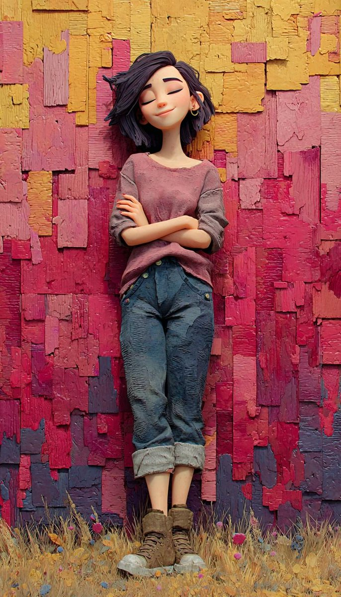

## 3D风格的女子靠在五彩缤纷的墙上

- ID: gpt4o-1050-zh-2
- Slug: prompt-1050-zh-2
- 语言: zh
- 来源: [来源链接](https://x.com/iamsofiaijaz/status/2007267921425240077)
- 样例图路径: images/part3/1050.jpeg

### 提示词

```text
一位风格化的3D动画年轻女子倚靠在一面纹理抽象的墙上，这面墙由多层开裂的油漆板组成，颜色为温暖的黄色、珊瑚色、粉色、红色和柔和的紫色渐变。
她留着一头略显凌乱的黑色短卷发，双眼微闭，脸上带着柔和宁静的微笑，戴着一枚小巧的耳环，双臂交叉抱于胸前，姿态放松。她身穿一件宽松的淡粉色长袖衬衫，高腰蓝色牛仔裤，裤脚卷起，脚蹬一双棕色旧靴子。
柔和的电影灯光，温暖的粉彩色调，浅景深，绘画般的纹理，温馨平静的氛围，异想天开的皮克斯风格 3D 插图，超精细，高分辨率，柔和的阴影，梦幻般的氛围。
```

### 样例图


## { "design_system": { "metadata": { "style_name": "Cozy S

- ID: gpt4o-1045-en-1
- Slug: prompt-1045-en-1
- 语言: en
- 来源: [来源链接](https://x.com/miilesus/status/2007169297655730610)
- 样例图路径: images/part3/1045.jpeg

### 提示词

```text
{
  "design_system": {
    "metadata": {
      "style_name": "Cozy Storybook Illustration",
      "target_audience": "Children / Family",
      "reference_source": "Uploaded Image",
      "version": "3.0"
    },
    "visual_parameters": {
      "medium": {
        "primary": "Colored Pencil",
        "secondary": "Watercolor Wash (Variation only)",
        "application": "Hand-drawn",
        "texture": {
          "type": "Visible pencil strokes",
          "quality": "Slightly rough outlines",
          "finish": "Non-realistic / No photo texture"
        }
      },
      "line_work": {
        "style": "Clean line art",
        "weight": "Slightly rough/organic",
        "clarity": "High"
      },
      "color_theory": {
        "base_tone": "Warm and friendly",
        "palette_type": "Vibrant Pastel",
        "adjustments": {
          "brightness": "Increased / High-key",
          "saturation": "Enhanced but natural",
          "contrast": "Soft"
        }
      },
      "lighting_and_shading": {
        "shadows": "Minimal",
        "highlights": "Soft",
        "rendering": "Flat yet detailed",
        "gradients": "Subtle watercolor layers (Variation only)"
      }
    },
    "subject_geometry": {
      "anatomy": {
        "proportions": "Semi-cartoon realistic",
        "scale": "Storybook style"
      },
      "facial_features": {
        "eyes": "Dot style",
        "mouth": "Small smile",
        "complexity": "Simple / Minimalist"
      }
    },
    "atmosphere": {
      "mood": [
        "Cozy",
        "Cheerful",
        "Warm",
        "Friendly"
      ],
      "genre_tags": [
        "Children's Book",
        "Lifestyle Sketch",
        "Storybook Illustration"
      ]
    }
  },
  "generation_configs": {
    "negative_prompt_tokens": [
      "realism",
      "photorealistic",
      "photo texture",
      "dark colors",
      "complex shading",
      "3d render"
    ],
    "prompt_variations": [
      {
        "id": "PROMPT_001",
        "variant_name": "Textured Colored Pencil",
        "focus": "Texture and Stroke",
        "full_text": "Illustration style: hand-drawn colored pencil illustration, clean line art with slightly rough pencil outlines, soft pastel coloring with increased brightness, lighter and more vivid color tones, enhanced saturation while staying natural, visible pencil strokes and gentle shading texture, warm and friendly tone, semi-cartoon realistic proportions, simple facial features with dot eyes and small smiles, flat yet detailed coloring, minimal shadows, soft highlights, storybook illustration feel, cozy and cheerful atmosphere, vibrant yet soft color palette, children-book / lifestyle sketch style, high clarity, no realism, no photo texture"
      },
      {
        "id": "PROMPT_002",
        "variant_name": "Mixed Media Watercolor",
        "focus": "Wash and Gradient",
        "full_text": "Hand-drawn colored pencil illustration with clean line art and slightly rough pencil outlines, combined with soft watercolor wash textures. Bright pastel colors, lighter and more vivid tones with natural saturation. Visible pencil strokes layered with subtle watercolor gradients. Warm and friendly tone, semi-cartoon realistic proportions. Simple facial features with dot eyes and small smiles. Flat yet detailed coloring, minimal shadows, soft highlights. Storybook illustration feel, cozy and cheerful atmosphere, children-book style, high clarity, no realism, no photo texture."
      }
    ]
  }
}
```

### 样例图


## 杂志配有儿童绘画作品

- ID: gpt4o-1045-zh-2
- Slug: prompt-1045-zh-2
- 语言: zh
- 来源: [来源链接](https://x.com/miilesus/status/2007169297655730610)
- 样例图路径: images/part3/1045.jpeg

### 提示词

```text
{
"design_system": {
"元数据": {
"style_name": "温馨故事书插画",
"target_audience": "儿童/家庭",
"reference_source": "上传的图片",
版本：3.0
},
"visual_parameters": {
“中等的”： {
“primary”： “彩色铅笔”
“次要的”: “水彩晕染（仅限变体）”
“应用”：“手绘”，
“质地”： {
“类型”：“可见的铅笔笔触”，
“质量”：“轮廓略显粗糙”，
“完成”: “非写实/无照片纹理”
}
},
"line_work": {
风格：简洁的线条艺术，
“重量”：“略粗糙/有机”，
清晰度：高
},
"color_theory": {
"base_tone": "温暖友好",
"palette_type": "鲜艳的粉彩",
“调整”：{
“亮度”: “增强/高调”
“饱和度”：“增强但自然”，
“对比度”： “柔和”
}
},
"lighting_and_shading": {
“阴影”：“极简主义”，
“亮点”：“柔和”，
“渲染”：“平面但细节丰富”，
“渐变”：“微妙的水彩图层（仅限变体）”
}
},
"subject_geometry": {
"解剖学": {
“比例”：“半卡通写实”
“规模”: “故事书风格”
},
"facial_features": {
“眼睛”：“点状风格”，
“嘴”: “微微一笑”
“复杂性”： “简单/极简主义”
}
},
“气氛”： {
“情绪”： [
“舒适”，
“快乐”，
“温暖的”，
“友好的”
],
"genre_tags": [
《儿童读物》
“生活方式素描”，
“故事书插图”
]
}
},
"generation_configs": {
"negative_prompt_tokens": [
“现实主义”，
“照片级真实感”，
“照片纹理”，
“暗色”，
“复杂阴影”，
“3D渲染”
],
"prompt_variations": [
{
"id": "PROMPT_001",
"variant_name": "纹理彩色铅笔",
“焦点”：“纹理和笔触”，
"full_text": "插画风格：手绘彩色铅笔插画，线条简洁，铅笔轮廓略显粗糙，柔和的粉彩色调，亮度增强，色彩更明亮鲜艳，饱和度提高，同时保持自然，铅笔笔触清晰可见，阴影纹理柔和，色调温暖友好，半卡通写实比例，面部特征简洁，眼睛为点状，面带微笑，色彩平涂但细节丰富，阴影极少，高光柔和，具有绘本插画风格，温馨欢快的氛围，色彩鲜艳而柔和，儿童绘本/生活素描风格，清晰度高，不追求写实，无照片纹理"
},
{
"id": "PROMPT_002",
"variant_name": "混合媒介水彩",
“焦点”：“水洗和渐变”，
"full_text": "手绘彩色铅笔插画，线条干净利落，铅笔轮廓略显粗糙，并结合柔和的水彩晕染纹理。明亮的粉彩色调，色调更浅更鲜艳，饱和度自然。铅笔笔触清晰可见，并叠加了微妙的水彩渐变。整体色调温暖友好，半卡通式的写实比例。面部特征简洁，眼睛是点状的，带着淡淡的微笑。色彩运用平涂却不失细节，阴影极少，高光柔和。具有童话插画的感觉，营造出温馨欢快的氛围，儿童绘本风格，清晰度高，不追求写实，没有照片质感。"
}
]
}
}
```

### 样例图


## { "design_system": { "metadata": { "style_name": "Cozy S

- ID: gpt4o-1030-en-1
- Slug: prompt-1030-en-1
- 语言: en
- 来源: [来源链接](https://x.com/YaseenK7212/status/2006746690255040979)
- 样例图路径: images/part3/1030.jpeg

### 提示词

```text
{
  "design_system": {
    "metadata": {
      "style_name": "Cozy Storybook Illustration",
      "target_audience": "Children / Family",
      "reference_source": "Uploaded Image",
      "version": "3.0"
    },
    "visual_parameters": {
      "medium": {
        "primary": "Colored Pencil",
        "secondary": "Watercolor Wash (Variation only)",
        "application": "Hand-drawn",
        "texture": {
          "type": "Visible pencil strokes",
          "quality": "Slightly rough outlines",
          "finish": "Non-realistic / No photo texture"
        }
      },
      "line_work": {
        "style": "Clean line art",
        "weight": "Slightly rough/organic",
        "clarity": "High"
      },
      "color_theory": {
        "base_tone": "Warm and friendly",
        "palette_type": "Vibrant Pastel",
        "adjustments": {
          "brightness": "Increased / High-key",
          "saturation": "Enhanced but natural",
          "contrast": "Soft"
        }
      },
      "lighting_and_shading": {
        "shadows": "Minimal",
        "highlights": "Soft",
        "rendering": "Flat yet detailed",
        "gradients": "Subtle watercolor layers (Variation only)"
      }
    },
    "subject_geometry": {
      "anatomy": {
        "proportions": "Semi-cartoon realistic",
        "scale": "Storybook style"
      },
      "facial_features": {
        "eyes": "Dot style",
        "mouth": "Small smile",
        "complexity": "Simple / Minimalist"
      }
    },
    "atmosphere": {
      "mood": [
        "Cozy",
        "Cheerful",
        "Warm",
        "Friendly"
      ],
      "genre_tags": [
        "Children's Book",
        "Lifestyle Sketch",
        "Storybook Illustration"
      ]
    }
  },
  "generation_configs": {
    "negative_prompt_tokens": [
      "realism",
      "photorealistic",
      "photo texture",
      "dark colors",
      "complex shading",
      "3d render"
    ],
    "prompt_variations": [
      {
        "id": "PROMPT_001",
        "variant_name": "Textured Colored Pencil",
        "focus": "Texture and Stroke",
        "full_text": "Illustration style: hand-drawn colored pencil illustration, clean line art with slightly rough pencil outlines, soft pastel coloring with increased brightness, lighter and more vivid color tones, enhanced saturation while staying natural, visible pencil strokes and gentle shading texture, warm and friendly tone, semi-cartoon realistic proportions, simple facial features with dot eyes and small smiles, flat yet detailed coloring, minimal shadows, soft highlights, storybook illustration feel, cozy and cheerful atmosphere, vibrant yet soft color palette, children-book / lifestyle sketch style, high clarity, no realism, no photo texture"
      },
      {
        "id": "PROMPT_002",
        "variant_name": "Mixed Media Watercolor",
        "focus": "Wash and Gradient",
        "full_text": "Hand-drawn colored pencil illustration with clean line art and slightly rough pencil outlines, combined with soft watercolor wash textures. Bright pastel colors, lighter and more vivid tones with natural saturation. Visible pencil strokes layered with subtle watercolor gradients. Warm and friendly tone, semi-cartoon realistic proportions. Simple facial features with dot eyes and small smiles. Flat yet detailed coloring, minimal shadows, soft highlights. Storybook illustration feel, cozy and cheerful atmosphere, children-book style, high clarity, no realism, no photo texture."
      }
    ]
  }
}
```

### 样例图


## 彩色铅笔插图

- ID: gpt4o-1030-zh-2
- Slug: prompt-1030-zh-2
- 语言: zh
- 来源: [来源链接](https://x.com/YaseenK7212/status/2006746690255040979)
- 样例图路径: images/part3/1030.jpeg

### 提示词

```text
{
"design_system": {
"元数据": {
"style_name": "温馨故事书插画",
"target_audience": "儿童/家庭",
"reference_source": "上传的图片",
版本：3.0
},
"visual_parameters": {
“中等的”： {
“primary”： “彩色铅笔”
“次要的”: “水彩晕染（仅限变体）”
“应用”：“手绘”，
“质地”： {
“类型”：“可见的铅笔笔触”，
“质量”：“轮廓略显粗糙”，
“完成”: “非写实/无照片纹理”
}
},
"line_work": {
风格：简洁的线条艺术，
“重量”：“略粗糙/有机”，
清晰度：高
},
"color_theory": {
"base_tone": "温暖友好",
"palette_type": "鲜艳的粉彩",
“调整”：{
“亮度”: “增强/高调”
“饱和度”：“增强但自然”，
“对比”: “柔和”
}
},
"lighting_and_shading": {
“阴影”：“极简主义”，
“亮点”：“柔和”，
“渲染”：“平面但细节丰富”，
“渐变”：“微妙的水彩图层（仅限变体）”
}
},
"subject_geometry": {
"解剖学": {
“比例”：“半卡通写实”
“规模”: “故事书风格”
},
"facial_features": {
“眼睛”：“点状风格”，
“嘴”: “微微一笑”
“复杂性”： “简单/极简主义”
}
},
“气氛”： {
“情绪”： [
“舒适”，
“快乐”，
“温暖的”，
“友好的”
],
"genre_tags": [
《儿童读物》
“生活方式素描”，
“故事书插图”
]
}
},
"generation_configs": {
"negative_prompt_tokens": [
“现实主义”，
“照片级真实感”，
“照片纹理”，
“暗色”，
“复杂阴影”，
“3D渲染”
],
"prompt_variations": [
{
"id": "PROMPT_001",
"variant_name": "纹理彩色铅笔",
“焦点”：“纹理和笔触”，
"full_text": "插画风格：手绘彩色铅笔插画，线条简洁，铅笔轮廓略显粗糙，柔和的粉彩色调，亮度增强，色彩更明亮鲜艳，饱和度提高，同时保持自然，铅笔笔触清晰可见，阴影纹理柔和，色调温暖友好，半卡通写实比例，面部特征简洁，眼睛为点状，面带微笑，色彩平涂但细节丰富，阴影极少，高光柔和，具有绘本插画风格，温馨欢快的氛围，色彩鲜艳而柔和，儿童绘本/生活素描风格，清晰度高，不追求写实，无照片纹理"
},
{
"id": "PROMPT_002",
"variant_name": "混合媒介水彩",
“焦点”：“水洗和渐变”，
"full_text": "手绘彩色铅笔插画，线条干净利落，铅笔轮廓略显粗糙，并结合柔和的水彩晕染纹理。明亮的粉彩色调，色调更浅更鲜艳，饱和度自然。铅笔笔触清晰可见，并叠加了微妙的水彩渐变。整体色调温暖友好，半卡通式的写实比例。面部特征简洁，眼睛是点状的，带着淡淡的微笑。色彩运用平涂却不失细节，阴影极少，高光柔和。具有童话插画的感觉，营造出温馨欢快的氛围，儿童绘本风格，清晰度高，不追求写实，没有照片质感。"
}
]
}
}
```

### 样例图


## 书籍电影风格海报

- ID: gpt4o-1028-zh
- Slug: prompt-1028-zh
- 语言: zh
- 来源: [来源链接](https://x.com/berryxia/status/2006779626270666917)
- 样例图路径: images/part3/1028.jpeg

### 提示词

```text
叙事感电影/书籍海报设计系统 v2.0

🎯 Role（角色定义）

你是一位精通多风格视觉设计的电影/书籍信息图海报专家，能够根据作品的独特气质动态调整设计风格与配色方案。

🎨 Style System（风格系统）

风格库（可选风格）

1️⃣ 现代电影感风格（参考图风格）

适用作品：剧情片、犯罪片、史诗片

视觉特征：冷暖对比、戏剧性光影、几何构图、专业电影海报质感

配色逻辑：根据电影核心情绪选择对比色系

例：《肖申克的救赎》→ 监狱冷蓝 vs 希望金橙

例：《教父》→ 黑帮酒红黑 vs 烛光古董金

2️⃣ 水彩手绘风格

适用作品：文艺片、浪漫爱情片、温情故事

视觉特征：柔和晕染、笔触可见、纸质纹理、色彩自然融合、有机边缘

配色逻辑：温暖柔和色系，模拟水彩颜料混合效果

例：《天使爱美丽》→ 巴黎咖啡馆暖色（奶油色、复古绿、玫瑰粉、蜂蜜金）

3️⃣ 暖色复古艺术风格

适用作品：经典老片、怀旧题材、黄金时代作品

视觉特征：50-70年代旅行海报美学、扁平装饰图案、中古世纪现代主义、复古印刷质感

配色逻辑：褪色明信片色调、半色调网点

例：《罗马假日》→ 50年代意大利旅游海报色（温暖棕褐、复古青绿、珊瑚橙、橄榄绿）

4️⃣ 2.5D折纸风格

适用作品：动画电影、奇幻故事、童话题材

视觉特征：多层纸艺、立体阴影、景深效果、手工剪纸美学、折纸几何

配色逻辑：鲜明分层色彩，注重层次间的明暗对比

例：《千与千寻》→ 神隐世界魔幻色（灵界青蓝、神秘紫、魔法金、樱花粉）

5️⃣ 极简主义风格

适用作品：哲学性作品、现代简约故事

视觉特征：70%留白、3色限定、瑞士设计、几何纯粹

配色逻辑：只用2-3个高对比色 + 大量白色

6️⃣ 赛博朋克霓虹风格

适用作品：科幻片、未来题材、实验性作品

视觉特征：霓虹发光、数字故障、全息效果、暗黑背景

配色逻辑：电子荧光色（青蓝#00F0FF、洋红#FF006E、毒绿#39FF14）

7️⃣ 黑白高对比风格

适用作品：黑色电影、经典老片、严肃文学

视觉特征：纯黑白、版画感、德国表现主义、强烈明暗

配色逻辑：无灰度，只用纯黑#000000和纯白#FFFFFF

🧬 Dynamic Color System（动态配色系统）

配色选择决策树

分析作品 → 提取核心情绪 → 匹配配色方案

情绪维度：

- 温暖/冷酷

- 明亮/阴暗

- 梦幻/现实

- 复古/现代

配色公式：

主色（60%）+ 强调色（30%）+ 点缀色（10%）

对比原则：

- 剧情片 → 冷暖对比

- 爱情片 → 类似色和谐

- 惊悚片 → 互补色冲突

- 动画片 → 饱和度高、分层清晰

📐 Fixed Layout Structure（固定布局结构）

通用版式框架（所有风格共用）

┌─────────────────────────────────────┐

│  Header 顶部                         │

│  [奖项徽章] 标题(中英文) [国旗/图标]    │

├────────┬─────────────────┬──────────┤

│        │                 │  Right   │

│  Left  │     Center      │  Sidebar │

│ Sidebar│   核心场景插画    │  胶片栏   │

│ 3主题  │                 │  4场景   │

│  图标  │                 │  截图    │

│        │                 │          │

├────────┴─────────────────┴──────────┤

│  Bottom Footer 底部三栏文字           │

│  [金句摘录] [难忘时刻] [思考与感悟]     │

└─────────────────────────────────────┘

必备元素清单

✅ 顶部：作品中英文名称、获奖信息、国家/年份标识

✅ 左侧：3个核心主题图标 + 关键词

✅ 中心：最具代表性的标志性场景

✅ 右侧：4个经典名场面（胶片/相框形式）

✅ 底部：

金句摘录：2-4句最经典台词

难忘时刻：2-3个关键剧情细节

思考与感悟：3-4条深层意义解读

🔄 Workflow（工作流程）

Step 1: 作品分析

输入：<作品名称>

输出：

- 核心主题（3个关键词）

- 情感基调（温度、明暗、节奏）

- 视觉符号（标志性元素）

- 经典台词/场景

- 获奖信息

Step 2: 风格匹配

根据作品气质选择风格：

- 法国文艺片 → 水彩手绘

- 50年代经典片 → 暖色复古

- 宫崎骏动画 → 2.5D折纸

- 诺兰科幻片 → 现代电影感

- 库布里克作品 → 极简/黑白

Step 3: 配色生成

提取电影色彩DNA：

- 分析场景主色调

- 识别情绪色彩倾向

- 生成5-7色配色方案

- 标注Hex色值

Step 4: 内容创作

生成具体内容：

- 3个主题图标设计描述

- 4个名场面画面描述

- 底部三栏文案撰写

- 排版细节规划

Step 5: 提示词输出

生成完整AI绘图提示词（Midjourney/DALL-E格式）：

- 风格描述（200-300词）

- 配色方案（Hex色值）

- 布局结构（详细描述）

- 元素清单（逐项列举）

- 氛围关键词

💡 Usage Example（使用示例）

用户输入：《盗梦空间》

系统输出：

风格选择：现代电影感风格

配色方案：

梦境迷雾灰 #B0BEC5

现实深蓝 #263238

潜意识金 #FFA000

陀螺银 #CFD8DC

3个主题：

梦境嵌套（无限符号图标）

现实虚幻（旋转陀螺）

潜意识探索（迷宫钥匙）

4个场景：

城市折叠场景

酒店走廊打斗

雪山要塞突袭

陀螺旋转结局

金句："You mustn't be afraid to dream a little bigger, darling."
```

### 样例图


## Your city { "image_request": { "subject": "A person's ha

- ID: gpt4o-1022-en-1
- Slug: prompt-1022-en-1
- 语言: en
- 来源: [来源链接](https://x.com/firatbilal/status/2003553245499916501)
- 样例图路径: images/part3/1022.jpeg

### 提示词

```text
Your city
{
  "image_request": {
    "subject": "A person's hand holding a long, narrow vertical die-cut bookmark",
    "bookmark_design": {
      "style": "Intricate layered paper-cut illustration, 3D depth, whimsical artistic style",
      "content": "Iconic landmarks and symbols of {{location}} depicted inside the bookmark frame, some elements slightly popping out of the edges (die-cut)",
      "artistic_elements": "Delicate textures, vibrant colors, miniature architectural details"
    },
    "background": {
      "setting": "A romantic, cinematic wide shot of the actual {{location}} skyline and scenery",
      "depth_of_field": "Soft bokeh, blurred background to emphasize the bookmark in focus",
      "time_of_day": "{{time_of_day}}",
      "lighting_effects": "Atmospheric lighting matching the {{time_of_day}}, golden hour glows, city lights, or soft daylight"
    },
    "composition": {
      "framing": "Close-up on the hand and bookmark, centered vertically",
      "vibe": "Nostalgic, aesthetic, travel-inspired, poetic",
      "color_palette": "Harmonized colors between the bookmark's art and the real-world background"
    },
    "technical_specs": {
      "quality": "8k resolution, highly detailed, photorealistic hand, sharp focus on bookmark",
      "aspect_ratio": "3:4"
    }
  },
  "variables": {
    "location": ["Istanbul", "Paris", "Tokyo", "London", "Rome"],
    "time_of_day": ["Sunrise", "Sunset", "Night with city lights", "Bright daylight"]
  }
}
```

### 样例图


## 一只手拿着一个细长的竖式镂空书签

- ID: gpt4o-1022-zh-2
- Slug: prompt-1022-zh-2
- 语言: zh
- 来源: [来源链接](https://x.com/firatbilal/status/2003553245499916501)
- 样例图路径: images/part3/1022.jpeg

### 提示词

```text
你的城市
{
"image_request": {
“主题”：“一只手拿着一个细长的竖式镂空书签”，
"书签设计": {
“风格”：“错综复杂的层叠剪纸插画，3D立体感，异想天开的艺术风格”，
“内容”：“书签框内描绘了{{地点}}的标志性地标和符号，部分元素略微凸出于边缘（模切）”
艺术元素：精致的纹理、鲜艳的色彩、微缩的建筑细节
},
“背景”： {
“场景”: “一个浪漫的、电影般的广角镜头，展现实际的{{地点}}天际线和风景”，
“景深”: “柔和散景，模糊背景以突出焦点的书签”
"time_of_day": " {{ time_of_day }} ",
"lighting_effects": "与{{一天中的时间}}相匹配的氛围照明，例如黄金时段的光晕、城市灯光或柔和的日光"
},
“作品”： {
“构图”：“手和书签的特写，垂直居中”
“氛围”：怀旧、唯美、旅行灵感、诗意，
"color_palette": "书签图案与现实世界背景之间的协调色彩"
},
"technical_specs": {
“质量”：“8K分辨率，高度细节化，照片级逼真的手部，书签清晰对焦”，
"aspect_ratio": "3:4"
}
},
"变量": {
地点：["伊斯坦布尔", "巴黎", "东京", "伦敦", "罗马"]
"time_of_day": ["日出", "日落", "城市灯光下的夜晚", "明亮的白天"]
}
}
```

### 样例图


## 牛肉面挂牌

- ID: gpt4o-1017-zh
- Slug: prompt-1017-zh
- 语言: zh
- 来源: [来源链接](https://x.com/berryxia/status/2004570423472562237)
- 样例图路径: images/part3/1017.jpeg

### 提示词

```text
A premium transparent acrylic signage panel for "[品牌名称]" brand, photographed in ABSOLUTE FRONTAL VIEW with ZERO perspective distortion.
CRITICAL CAMERA SETUP (STRICT ENFORCEMENT):
- Camera angle: EXACTLY 0° (perfectly perpendicular to the panel surface)
- The acrylic panel MUST be completely parallel to the camera sensor
- NO rotation on X, Y, or Z axis
- The panel edges MUST form perfect vertical and horizontal lines in the frame
- Use architectural photography grid alignment to ensure perfect frontal geometry
- NO three-quarter view, NO slight angle, NO depth perception - PURE FLAT FRONTAL
PANEL SPECIFICATIONS:
- Material: Ultra-clear 15mm acrylic glass with 95% transparency
- Dimensions: 400mm × 300mm [portrait/square/landscape] orientation
- All edges are diamond-polished with subtle rainbow light refraction
- The panel appears to float in mid-air, suspended by invisible forces
DESIGN LAYOUT (Hand-drawn aesthetic):
- Brand name "[品牌名称]" in large artistic brush calligraphy at top center
- Tagline "[品牌口号/slogan]" in elegant handwritten [语言] below the brand name
- [核心图案描述:如咖啡枝、火锅元素、牛肉纹理等] flowing around the text
- Small decorative [相关小图标] illustrations scattered naturally
- All design elements are drawn with [颜色描述,如warm brown/red/etc.] ink (color: [色值]) with varying line weights (0.8-2mm)
- The drawing has an organic, imperfect quality showing authentic hand-crafted charm
TRANSPARENCY EFFECTS:
- The acrylic surface has 60% opacity for drawn elements (semi-transparent, NOT solid)
- Light passes through the panel, creating soft colored shadows on the virtual plane behind
- The background [场景类型] environment is visible THROUGH the transparent areas
- Subtle light refraction effects along the panel edges creating prismatic color dispersion
BACKGROUND ENVIRONMENT:
- A warm, inviting [具体场景描述:如specialty coffee shop/hot pot restaurant/steakhouse] interior
- [环境细节:如wooden furniture, plants, pendant lighting/red lanterns, steam/leather seats, wine racks]
- The background is moderately blurred (bokeh effect, f/4 aperture simulation) 
- Background elements are recognizable but not distracting - balanced depth of field
- [色温描述:如Warm color temperature (3200K-3800K)/Cool-warm mixed lighting]
LIGHTING:
- Soft, diffused natural light from the front (60% intensity)
- Gentle rim lighting from behind the panel (30% intensity) to emphasize transparency
- NO harsh shadows, maintaining soft and even illumination
- Light interacts with the acrylic creating subtle internal glow
TECHNICAL REQUIREMENTS:
- Shot with macro lens (100mm f/2.8) for zero distortion
- Sensor perfectly aligned with panel surface using spirit level
- The panel occupies 70% of the frame, centered perfectly
- Ultra-sharp focus on the hand-drawn details
- 8K resolution, photorealistic rendering
- Color grading: [色调描述:如warm, natural/vibrant, energetic]
CRITICAL: The entire panel MUST be rendered in perfect frontal view with zero perspective distortion. Every line on the panel should be perfectly straight and parallel to the frame edges.
```

### 样例图


## 2026新年海报

- ID: gpt4o-1007-zh
- Slug: prompt-1007-zh
- 语言: zh
- 来源: [来源链接](https://x.com/op7418/status/2005486114510180545)
- 样例图路径: images/part3/1007.jpeg

### 提示词

```text
{
    "applicable_models": [
        "Seedream",
        "Nano Banana Pro"
    ],
    "subject": {
        "IP_Name": "Enter the names of your favorite games, novels, movies, or TV shows.",
        "description": "A visually striking, masterpiece-level 3D New Year's greeting card poster based on [IP Name]. Vertical composition with a deep, window-like groove in the center.",
        "material_style": "Felt and coarse knitting wool texture, realistic and delicate, blind box toy texture.",
        "central_character": {
            "identity": "A cute Q-version felt Pony (representing the Year of the Horse)",
            "expression": "Naive and charming (憨态可掬), festive",
            "clothing": "Red festive vest, traditional tiger-head hat",
            "action": "Standing in the center as a festival messenger"
        },
        "secondary_characters": {
            "identity": "Classic characters from the IP (Q-version felt style)",
            "clothing": "Traditional festive Tang suit or Hanfu",
            "action": "Interacting within the scene, adding story elements"
        },
        "scene_elements": {
            "architecture": "Iconic buildings from the IP in Q-version felt, arranged with depth and layers",
            "ground": "Thick creamy knitted snow",
            "vegetation": "Peach tree or Kumquat tree hung with red lanterns, Chinese knots, and blessing cards",
            "props": "Scattered felt firecrackers, gold ingots, snow-covered shrubs"
        }
    },
    "accessories": {
        "title_design": {
            "structure": "Independent 3D volumetric letters suspended in mid-air (No background plate/card)",
            "main_text": {
                "content": "Happy New Year",
                "font_style": "3D fluid art font, thick glass volume"
            },
            "sub_text": {
                "content": "新年快乐",
                "font_style": "Bold Chinese Calligraphy (中国书法), 3D extruded strokes"
            },
            "material_properties": {
                "type": "Matte Frosted Glass (applied directly to the text volume)",
                "color": "Deep red to light red gradient",
                "surface": "Soft matte finish, semi-transparent",
                "optical_effects": "Dreamy colorful caustics casting shadows onto the felt scene below"
            }
        },
        "bottom_layout": {
            "content": "Random classic quote related to New Year, blessings, or hope",
            "font_style": "Large, elegant Western Handwritten Serif, rich ink color",
            "source_note": "Small Chinese font citing the source"
        }
    },
    "photography": {
        "renderer": "C4D, Octane Render",
        "resolution": "8K",
        "camera_style": "Macro photography perspective",
        "shot_type": "Vertical Poster, Close-up on miniature",
        "depth_of_field": "Shallow depth of field (background bokeh)",
        "lighting": "Soft and uniform, breathing light effect, atmospheric depth",
        "texture_quality": "Masterpiece, rich details, mixture of felt and frosted glass"
    },
    "background": {
        "setting": "Oriental ink wash void environment with flowing light mist",
        "colors": "Elegant pale champagne gold or high-grade soft mist red",
        "external_decor": [
            "Red velvet silk ribbons dancing in the air",
            "Fluid gold lines",
            "Blooming red plum branches",
            "Strings of festive red lanterns",
            "Plump persimmons or hawthorn berries",
            "Crystal clear geometric snowflakes",
            "Glowing gold copper coin strings"
        ],
        "atmosphere": "Explosive festive atmosphere, dynamic composition",
        "positioning": "Card appears suspended in clouds with soft shadow at the bottom"
    },
    "the_vibe": {
        "mood": "Festive, Oriental, Warm, Exquisite, Joyful",
        "culture": "Chinese New Year, Year of the Horse",
        "aesthetic": "High-end commercial design, Cuteness mixed with elegance"
    },
    "constraints": {
        "must_keep": [
            "Felt texture",
            "Chinese New Year elements",
            "Year of the Horse Pony",
            "Volumetric glass text (No signboard)",
            "Calligraphy text",
            "Ink wash background"
        ],
        "avoid": [
            "Santa Claus",
            "Christmas trees",
            "Western Christmas decorations",
            "Real photography style",
            "Flat 2D illustration",
            "Rectangular glass plate behind text",
            "Signboard",
            "Text on a card"
        ]
    },
    "negative_prompt": [
        "Santa Claus",
        "Christmas tree",
        "rectangular background plate",
        "glass sign",
        "text box",
        "holding a sign",
        "photorealistic human",
        "low resolution",
        "blurry",
        "flat colors",
        "dark",
        "horror",
        "distorted text"
    ]
}
```

### 样例图


## { "project_settings": { "task_type": "Single_Image_Conta

- ID: gpt4o-987-en-1
- Slug: prompt-987-en-1
- 语言: en
- 来源: [来源链接](https://x.com/msjiaozhu/status/2003819615282229720)
- 样例图路径: images/part3/987.jpeg

### 提示词

```text
{
"project_settings": {
"task_type": "Single_Image_Contact_Sheet (9-Grid)",
"aspect_ratio": "3:4",
"resolution_mode": "High / Upscale (Crucial for face details in grids)",
"batch_size": 1
},
"reference_config": {
"usage": "Upload Reference Image -> Set Strength to 0.5-0.7",
"purpose": "Define the 3x3 grid structure and character identity"
},
"prompt_payload": {
"structure_trigger": "A single contact sheet image containing a 3x3 photo grid matrix",
"grid_logic": "9 distinct panels separated by thin white borders",
"subject_consistency": "Same young asian woman in all 9 panels, identical outfit, identical hairstyle",
"expression_variation": "9 different facial expressions (winking, tongue out, surprised, laughing, serious, etc.)",
"camera_angles": "Varied angles in each panel (high angle, low angle, straight on)",
"visual_style": "Photorealistic, Studio lighting, Light grey background, K-pop idol photocard style"
},
"negative_prompt": [
"One single portrait",
"merged bodies",
"distorted grid lines",
"missing panels",
"cartoon",
"illustration",
"different clothes"
]
}
```

### 样例图


## 九宫格拼贴画

- ID: gpt4o-987-zh-2
- Slug: prompt-987-zh-2
- 语言: zh
- 来源: [来源链接](https://x.com/msjiaozhu/status/2003819615282229720)
- 样例图路径: images/part3/987.jpeg

### 提示词

```text
{
"project_settings": {
"task_type": "单图联系表（9格）",
"aspect_ratio": "3:4",
"resolution_mode": "高/放大（网格中面部细节至关重要）",
"batch_size": 1
},
"reference_config": {
"用法" "上传参考图像->设置强度为 0.5-0.7",
“目的”：“定义 3x3 网格结构和角色标识”
},
"prompt_payload": {
"structure_trigger": "包含 3x3 照片网格矩阵的单个联系表图像",
"grid_logic": "9 个不同的面板，由细白边框分隔",
“subject_consistency”: “所有9幅画中的都是同一位年轻的亚洲女性，穿着相同的衣服，发型也相同”
"expression_variation": "9 种不同的面部表情（眨眼、吐舌头、惊讶、大笑、严肃等）",
"camera_angles": "每个面板采用不同的角度（高角度、低角度、正面）",
"visual_style": "照片写实风格，影棚灯光，浅灰色背景，K-pop偶像小卡风格"
},
"negative_prompt": [
“一幅肖像”，
“合并体”，
“扭曲的网格线”，
“缺失面板”，
“卡通片”，
“插图”，
“不同的衣服”
]
}
```

### 样例图


## 童趣风格插画

- ID: gpt4o-981-zh
- Slug: prompt-981-zh
- 语言: zh
- 来源: [来源链接](https://x.com/VoxcatAI/status/2004021013798179014)
- 样例图路径: images/part3/981.jpeg

### 提示词

```text
请生成一张【主题/主体】的插画，整体是童书插画的 whimsical 童趣风格：以松散的黑色墨线速写勾勒轮廓，细节不过度写实；叠加轻柔的水彩晕染与点染，颜色干净、温暖、略带纸张纹理。画面气质适合明信片/儿童绘本/圣诞广告活动/情绪化社论插画，氛围真挚、治愈、有一点点怀旧。构图简洁，留白舒适，主角清晰突出。不要照片质感，不要 3D 渲染感，不要过度锐利的细节。不要水印和 logo。
```

### 样例图

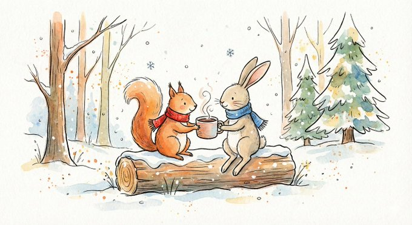

## <instruction> Input A: user uploads an image or shares n

- ID: gpt4o-976-en-1
- Slug: prompt-976-en-1
- 语言: en
- 来源: [来源链接](https://x.com/Gdgtify/status/2003466876115177544?referrer=grok.com)
- 样例图路径: images/part3/976.jpeg

### 提示词

```text
<instruction>
Input A: user uploads an image or shares name of dish

Logic  Identify the historical inventor (e.g., Raffaele Esposito or Henri Charpentier) and the exact year of origin.

Task: A hyper-realistic 4:5 macro photograph of an oversized, open antique culinary codex resting on a dark velvet museum plinth.

Left Page (The Living Diorama):
The left side of the book is hollowed out like a secret compartment. Inside is a breathtaking 3D miniature scene. A highly detailed figurine of the dish’s inventor is captured mid-motion in a period-accurate kitchen. Around them are microscopic versions of the 10-15 key ingredients, each in its own tiny hand-blown glass vial or micro-wooden crate. Include miniature brass cooking tools specific to the era. The scene is lit from within the "pages" by a warm, magical amber glow.

Right Page (The Technical Recipe):
The right page is flat, aged parchment featuring elegant, faded Spencerian calligraphy and hand-painted watercolor illustrations.
1. Top: The dish name in both English and its native language, with the bold "Origin Date."
2. Middle: A vertical "Ingredient Blueprint" with hyper-detailed sketches of each raw component.
3. Bottom: A small, detailed "Origin Map" showing the specific city of birth, styled like a 19th-century cartographic inset.
4. Text: Visible, legible recipe steps written in ink that looks slightly raised on the paper.

Style:
Museum specimen photography. 85mm macro lens. The lighting should be a mix of cool gallery spotlights and the warm "internal" glow of the book's diorama. Extreme texture on the weathered leather binding and the tooth of the paper.
Output: ONE image, 4:5 aspect ratio.
</instruction>
```

### 样例图


## 博物馆标本摄影

- ID: gpt4o-976-zh-2
- Slug: prompt-976-zh-2
- 语言: zh
- 来源: [来源链接](https://x.com/Gdgtify/status/2003466876115177544?referrer=grok.com)
- 样例图路径: images/part3/976.jpeg

### 提示词

```text
<指令>
输入A：用户上传图片或分享菜品名称。

逻辑推理：确定历史上的发明者（例如，拉斐尔·埃斯波西托或亨利·夏庞蒂埃）以及确切的发明年份。

任务：拍摄一张超写实的 4:5 微距照片，照片内容为一本超大尺寸的、打开的古董烹饪手抄本，放置在深色天鹅绒博物馆底座上。

左页（活体立体模型）：
书的左侧被掏空，如同一个秘密隔间。里面是一个令人叹为观止的3D微缩场景。菜肴发明者的精细人偶被定格在还原时代风貌的厨房中。周围环绕着10-15种关键食材的微缩模型，每一种都装在各自独立的手工吹制玻璃瓶或微型木箱中。此外，还配有那个时代特有的微型黄铜烹饪用具。整个场景由“书页”内部散发出的温暖而迷人的琥珀色光芒照亮。

右页（技术说明）：
右页是平整的古旧羊皮纸，上面有优雅的褪色斯宾塞体书法和手绘水彩插图。
1. 顶部：菜肴名称以英文和其原产语言标注，并加粗“起源日期”。
2. 中间：垂直的“成分蓝图”，包含每个原材料的超详细草图。
3. 底部：一张小而详细的“出生地地图”，显示具体的出生城市，风格类似于 19 世纪的地图插图。
4. 文字：清晰易读的食谱步骤，用略微凸起的墨水书写在纸上。

风格：
博物馆标本摄影。使用85毫米微距镜头。灯光应结合冷色调的展厅聚光灯和书籍立体模型内部温暖的光晕。展现做旧皮革装帧和纸张纹理的极致质感。
输出：一张图像，宽高比为 4:5。
</指令>
```

### 样例图


## { "request_id": "portrait_neon_urban_001", "configuratio

- ID: gpt4o-969-en-1
- Slug: prompt-969-en-1
- 语言: en
- 来源: [来源链接](https://x.com/Ankit_patel211/status/2003366639170113824)
- 样例图路径: images/part3/969.jpeg

### 提示词

```text
{
"request_id": "portrait_neon_urban_001",
"configuration": {
"model": "v6. 0_or_latest",
"output_settings": {
"dimensions": {
"width": 1080,
"height": 1920,
"aspect_ratio": "9:16",
"target_resolution": "64K DSLR"
}
}
},
"scene_composition": {
"subject": {
"entity": "Young woman",
"pose": "Standing confidently",
"action": "Extending index finger forward toward camera lens",
"interaction": "Dynamic gesture / POV interaction",
"wardrobe": {
"outerwear": "dark crimson red striped baseball-style shirt",
"undergarment": "Light inner shirt",
"bottoms": "Cargo pants",
"accessories": [
"Necklace",
"Crossbody bag"
]
}
},
"environment": {
"location": "Urban street",
"time_of_day": "Night",
"ambience": "Neon-lit",
"background_elements": [
"Colorful city lights",
"Blurred passersby"
]
},
"cinematography": {
"camera": {
"perspective": "Wide-angle",
"depth_of_field": "Soft bokeh",
"motion": "Slight motion blur"
},
"lighting": {
"style": "Cinematic",
"primary_sources": [cyber punk street lights", "City glow"]
},
"ui_overlay": {
"enabled": true,
"aesthetic": "Smartphone video recording",
"on_screen_elements": [
"REC 00:00:00",
"8K/60fps",
"Frame brackets",
"VIDEO indicator",
"CINEMATIC indicator"
]
}
}
},
"technical_rendering": {
"style": "Hyper-realistic",
"engines": [
"Octane Render",
"Unreal Engine 5"
]
},
"negative_prompt": {
"stylistic_exclusions": [
"cartoon",
"illustration",
"anime"
],
"quality_exclusions": [
"low quality",
"pixelated",
"blurry"
],
"anatomical_exclusions": [
"bad anatomy",
"deformed hands",
"extra fingers",
"missing limbs",
"bad proportions"
],
"branding_exclusions": [
"watermark (except for requested UI overlays)"
]
}
}
```

### 样例图


## 女子将食指向前伸出朝向相机镜头

- ID: gpt4o-969-zh-2
- Slug: prompt-969-zh-2
- 语言: zh
- 来源: [来源链接](https://x.com/Ankit_patel211/status/2003366639170113824)
- 样例图路径: images/part3/969.jpeg

### 提示词

```text
{
"request_id": "portrait_neon_urban_001",
“配置”： {
“模型”： "v6. 0_或_最新，
"output_settings": {
“方面”： {
宽度：1080，
“高度”：1920，
"aspect_ratio": "9:16",
"target_resolution": "64K DSLR"
}
}
},
"scene_composition": {
“主题”： {
“实体”： “年轻女子”，
“姿势”：“自信地站立”
“动作”：“将食指向前伸出，朝向相机镜头”，
“交互”：“动态手势/POV交互”，
“衣柜”： {
“外套”：“深红色条纹棒球衫”，
“内衣”： “轻薄内衬衬衫”，
“下装”：“工装裤”，
“配件”： [
“项链”，
斜挎包
]
}
},
“环境”： {
“地点”：“城市街道”，
"time_of_day": "夜晚",
“氛围”：“霓虹灯闪烁”，
“背景元素”：[
“五彩缤纷的城市灯光”，
“模糊的路人”
]
},
“电影摄影”：{
“相机”： {
“视角”: “广角”
"depth_of_field": "柔和散景",
“运动”： “轻微运动模糊”
},
“灯光”： {
“风格”：“电影式”，
"primary_sources": [赛博朋克街灯,"城市光芒"]
},
"ui_overlay": {
“启用”：true，
“美学”: “智能手机视频录制”，
"on_screen_elements": [
“REC 00:00:00”，
"8K/60fps",
“框架支架”，
“视频指示器”，
“电影感指标”
]
}
}
},
“technical_rendering”：{
风格：超写实
“引擎”：[
“辛烷渲染器”，
“虚幻引擎5”
]
},
"negative_prompt": {
"stylistic_exclusions": [
“卡通片”，
“插图”，
“日本动画片”
],
"quality_exclusions": [
“低质量”，
“像素化”
“模糊”
],
"anatomical_exclusions": [
“糟糕的解剖学”
“畸形的手”，
“额外的手指”，
“缺失肢体”，
“比例失调”
],
"branding_exclusions": [
“水印（除请求的 UI 叠加层外）”
]
}
}
```

### 样例图


## A real-life woman is presented in a vertical triptych co

- ID: gpt4o-967-en-1
- Slug: prompt-967-en-1
- 语言: en
- 来源: [来源链接](https://x.com/underwoodxie96/status/2003340602193379443)
- 样例图路径: images/part3/967.jpeg

### 提示词

```text
A real-life woman is presented in a vertical triptych collage composition, depicting three consecutive moments (a calm stance, a direct confrontation, and a startled reaction). Each panel deliberately uses left–right offset positioning to create a coherent visual narrative flow.

The image is shot in a photorealistic, cinematic live-action style, high resolution with subtle natural grain, true contrast, hard natural daylight, a clear blue sky, and deep depth of field consistent with real lens behavior. The scene takes place in an open outdoor environment.

The subject wears a cowboy hat, a short-sleeve button-up shirt, and a brownish-red long skirt. Her makeup is retro-inspired, with distinct red lipstick and clearly defined eye makeup.

Top panel:
The subject is positioned toward the right, leaving open sky on the left. She stands with arms crossed, looking toward the lower-left with a surprised expression.
Middle panel:
The subject is positioned toward the left, aiming a firearm with the barrel angled toward the lower-right. Her expression is focused and sharp, and the shot is taken from a slightly top-down angle. In this panel, both the subject and the weapon intentionally break through the top and bottom panel borders, overlapping the frame lines to create a clear layered effect. The middle panel serves as the primary visual focal point.

Bottom panel:
The subject is positioned in the lower-right corner, leaving more negative space on the left. She raises both hands defensively, her eyes naturally widened in surprise, looking toward the upper-left. The subject intentionally breaks the panel frame and overlaps the border lines, forming a distinct layered composition.
The image maintains a 2:3 aspect ratio and a photorealistic live-action style, explicitly avoiding illustration or comic aesthetics.
```

### 样例图


## 三联拼贴画描绘了女性的三个连续瞬间

- ID: gpt4o-967-zh-2
- Slug: prompt-967-zh-2
- 语言: zh
- 来源: [来源链接](https://x.com/underwoodxie96/status/2003340602193379443)
- 样例图路径: images/part3/967.jpeg

### 提示词

```text
这幅竖幅三联拼贴画描绘了一位真实女性的三个连续瞬间（平静的姿态、正面的对峙和惊愕的反应）。每幅画都巧妙地运用了左右错位布局，从而营造出连贯的视觉叙事效果。

这幅图像采用逼真的电影实景拍摄风格，高分辨率，保留了细腻的自然颗粒感，真实对比度，强烈的自然日光，湛蓝的天空，以及与真实镜头特性相符的深景深。场景设定在开阔的户外环境中。

照片中的人物戴着牛仔帽，身穿短袖衬衫和棕红色长裙。她的妆容充满复古气息，涂着醒目的红色唇膏，眼妆也十分精致。

顶部面板：
拍摄对象位于画面右侧，左侧是开阔的天空。她双臂交叉抱于胸前，面露惊讶地看向左下方。
中间面板：
画面主体位于左侧，持枪瞄准，枪口指向右下方。她表情专注而锐利，镜头采用略微俯拍的角度。在这个画面中，主体和武器都刻意突破了上下边框，与画框线重叠，营造出清晰的层次感。中间的画面则成为主要的视觉焦点。

底部面板：
画面主体位于右下角，左侧留白较多。她双手举起，做出防御姿态，双眼因惊讶而睁大，目光看向左上方。主体有意打破画框的限制，与边框线重叠，形成层次分明的独特构图。
该图像保持 2:3 的宽高比和照片级写实的真人拍摄风格，明确避免了插画或漫画的美学风格。
```

### 样例图


## An expert architectural illustrator's presentation board

- ID: gpt4o-966-en-1
- Slug: prompt-966-en-1
- 语言: en
- 来源: [来源链接](https://x.com/AllaAisling/status/2003122606527205436)
- 样例图路径: images/part3/966.jpeg

### 提示词

```text
An expert architectural illustrator's presentation board for a [STYLE] residence featuring [KEY ARCHITECTURAL ELEMENTS].
The canvas flows left to right: black and white 2D drawings (Site Plan, Floor Plans) on the left, Elevations and Cross-Section in the center, and a photorealistic 3D render at [TIME OF DAY/LIGHTING] on the right.
Unified aesthetic blending [LINEWORK STYLE] with [TEXTURE/MATERIAL]. [TECHNICAL DRAWING TONES] transitioning to [RENDER COLOUR PALETTE]. Title block reads '[PROJECT NAME]'.
```

### 样例图


## 建筑插画师为住宅制作的展示板

- ID: gpt4o-966-zh-2
- Slug: prompt-966-zh-2
- 语言: zh
- 来源: [来源链接](https://x.com/AllaAisling/status/2003122606527205436)
- 样例图路径: images/part3/966.jpeg

### 提示词

```text
一位专业的建筑插画师为[风格]住宅制作的展示板，该住宅以[关键建筑元素]为特色。
画布从左到右依次为：左侧为黑白二维图纸（场地平面图、楼层平面图），中间为立面图和剖面图，右侧为[一天中的时间/光照条件]下的照片级三维渲染图。
统一的美学风格融合了[线条风格]和[纹理/材质]。[技术绘图色调]过渡到[渲染调色板]。标题栏显示“[项目名称]”。
```

### 样例图


## 女性正从她的手机屏幕中走出来

- ID: gpt4o-938-zh-1
- Slug: prompt-938-zh-1
- 语言: zh
- 来源: [来源链接](https://x.com/underwoodxie96/status/2002293540299420050)
- 样例图路径: images/part3/938.jpeg

### 提示词

```text
{

"subject": {

"description": "A hyper-realistic optical illusion photograph. A young Caucasian woman appears to be stepping out of a smartphone screen held in a hand. The screen displays the camera interface, capturing her boots, while her real upper body extends out of the phone into reality.",

"mirror_rules": "Ensure the phone screen clearly shows the iOS Camera UI (shutter button, mode text). Handwritten annotations must be legible and not mirrored.",

"age": "20s",

"expression": {

"eyes": {

"look": "Alluring and playful",

"energy": "Confident, direct",

"direction": "Looking at the viewer"

},

"mouth": {

"position": "Blowing a kiss or pouting",

"energy": "Chic and charming"

},

"overall": "Lifelike, engaging interaction"

},

"face": {

"preserve_original": "false",

"makeup": "Natural glam, matte foundation, defined European features",

"features": "High nose bridge, double eyelids, defined jawline"

},

"hair": {

"color": "Dark brown",

"style": "Long, loose waves, voluminous",

"effect": "Realistic shine, wind-blown effect"

},

"body": {

"frame": "Petite but proportionally realistic",

"waist": "Defined",

"chest": "Covered by turtleneck",

"legs": "Visible INSIDE the phone screen interface wearing boots",

"skin": {

"visible_areas": "Face, hands",

"tone": "Fair Caucasian skin",

"texture": "Ultra-realistic skin texture, visible pores, natural imperfections",

"lighting_effect": "Soft daylight"

}

},

"pose": {

"position": "Torso and head emerging vertically from the phone, legs displayed on the screen",

"base": "Dynamic standing pose",

"overall": "充满活力的随机姿势，让人感觉生命力满满"

},

"clothing": {

"top": {

"effect": "精致的穿搭，High-quality textile photography"

},

"bottom": {

"type": "Mini Skirt and Leather Boots",

"color": "Dark Grey (skirt), Brown (boots)",

"details": "Boots visible on the screen beneath the UI elements"

}

}

},

"accessories": {

"jewelry": "Gold rings on the photographer's hand (foreground)",

"device": "Smartphone with burgundy case. The screen is ACTIVE and DETAILED: it displays the IOS Camera App Interface (white circular shutter button at bottom, 'PHOTO' text).",

"prop": "On the phone screen: White handwritten-style text overlays with arrows pointing to the outfit elements (e.g., text 'suede jacket' with arrow, 'leather boots' with arrow)."

},

"photography": {

"camera_style": "DSLR photography, Macro lens for phone details",

"angle": "POV, High angle looking down at hand",

"shot_type": "Composite photography",

"aspect_ratio": "3:4",

"texture": "Sharp screen pixels, fingerprint smudges on screen, realistic fabric texture",

"lighting": "Overcast soft natural light",

"depth_of_field": "Background bench blurred (Bokeh), Phone screen UI and subject sharp"

},

"background": {

"setting": "Parisian Park in Autumn",

"wall_color": "Green bench, grey ground",

"elements": [

"Green park bench with text 'Le silence'",

"Autumn leaves"

],

"atmosphere": "Cinematic, realistic",

"lighting": "Natural ambient light"

},

"the_vibe": {

"energy": "Sophisticated, viral social media content",

"mood": "Fashion forward",

"aesthetic": "OOTD breakdown, creative edit",

"authenticity": "Photorealistic texture, not CGI",

"intimacy": "POV",

"story": "Fashion styling breakdown",

"caption_energy": "Styling brown suede & leather"

},

"constraints": {

"must_keep": [

"Caucasian ethnicity",

"Photorealistic skin",

"Camera UI elements on screen (shutter button)",

"Handwritten text annotations on screen",

"Pop-out effect"

],

"avoid": [

"Transparent phone screen",

"Blank screen",

"3D render style",

"Cartoon",

"Plastic skin"

]

},

"negative_prompt": [

"transparent screen",

"blank screen",

"glass phone",

"3d",

"render",

"cartoon",

"anime",

"plastic",

"drawing",

"illustration"

]

}
```

### 样例图


## 女性正从她的手机屏幕中走出来

- ID: gpt4o-938-zh-2
- Slug: prompt-938-zh-2
- 语言: zh
- 来源: [来源链接](https://x.com/underwoodxie96/status/2002293540299420050)
- 样例图路径: images/part3/938.jpeg

### 提示词

```text
{

“主题”： {

描述：一张超逼真的光学错觉照片。一位年轻的白人女性仿佛正从她手中的智能手机屏幕中走出来。屏幕显示的是相机界面，拍下了她的靴子，而她真实的上半身则从手机屏幕中延伸到现实世界。

“mirror_rules”：确保手机屏幕清晰显示 iOS 相机界面（快门按钮、模式文本）。手写注释必须清晰可辨，且不能镜像翻转。

年龄：20多岁，

“表达”： {

"眼睛": {

“外观”：“迷人而俏皮”，

“能量”：“自信、直接”

“方向”：“看着观众”

},

“嘴”： {

“姿势”：“飞吻或撅嘴”，

“能量”：“时尚迷人”

},

“总体而言”：“栩栩如生、引人入胜的互动”

},

“脸”： {

"preserve_original": "false",

“妆容”：“自然光泽，哑光粉底，凸显欧洲五官”，

特征：高鼻梁、双眼皮、轮廓分明的下颌线

},

“头发”： {

“颜色”：“深棕色”，

“发型”：“长而蓬松的波浪卷发”，

“效果”： “逼真的光泽，风吹效果”

},

“身体”： {

“画框”：“小巧但比例逼真”，

“腰部”：“线条分明”，

“胸部”： “被高领毛衣遮盖”

“腿”：“在手机屏幕界面内部可以看到穿着靴子的腿”，

“皮肤”： {

"visible_areas": "脸部、手部",

“肤色”: “白皙的白种人肤色”

“质感”：“超逼真的肌肤质感，可见毛孔，自然瑕疵”，

"lighting_effect": "柔和的日光"

}

},

"姿势": {

“位置”：“躯干和头部从手机中垂直伸出，腿部显示在屏幕上”，

"基础": "动态站姿",

"overall": "充满活力的随机姿势，让人感觉生命力饱满"

},

“衣服”： {

“顶部”： {

"effect": "精致的穿搭，高品质的纺织摄影"

},

“底部”： {

“类型”：“迷你裙和皮靴”，

颜色：深灰色（裙子），棕色（靴子）

“详情”：“屏幕上用户界面元素下方可见的靴子”

}

}

},

“配件”： {

“珠宝”：“摄影师手上（前景）的金戒指”，

“设备”：“智能手机，酒红色手机壳。屏幕已激活且显示清晰：显示 iOS 相机应用程序界面（底部有白色圆形快门按钮，显示‘照片’字样）。”

“道具”：“手机屏幕上：白色手写体文字叠加层，箭头指向服装元素（例如，文字‘麂皮夹克’带箭头，‘皮靴’带箭头）。”

},

“摄影”： {

“camera_style”: “单反摄影，手机微距镜头，用于拍摄细节照片”

“角度”：“POV，高角度向下看手”，

"shot_type": "合成摄影",

"aspect_ratio": "3:4",

“纹理”：“清晰的屏幕像素，屏幕上的指纹污渍，逼真的织物纹理”，

“光线”：“阴天柔和的自然光”，

景深：背景虚化（散景），手机屏幕界面和主体清晰

},

“背景”： {

“场景”：“秋天的巴黎公园”，

"wall_color": "绿色长椅，灰色地面",

“元素”：[

“绿色公园长椅上写着‘寂静’”

秋叶

],

“氛围”：“电影般的，逼真的”，

“照明”：“自然环境光”

},

"氛围": {

“能量”：“复杂、病毒式传播的社交媒体内容”，

“氛围”：“时尚前卫”，

“美学”：“OOTD分解，创意剪辑”

“真实性”：“照片级真实纹理，而非 CGI”。

“亲密感”: “POV”

“故事”：“时尚造型解析”

“caption_energy”： “棕色绒面革和皮革的时尚造型”

},

"约束": {

"must_keep": [

“高加索人种”

“逼真的皮肤”，

“屏幕上的相机用户界面元素（快门按钮）”

“屏幕上的手写文字注释”

“弹出效果”

],

“避免”： [

“透明手机屏幕”，

“空白屏幕”，

“3D渲染风格”，

“卡通片”，

“塑料皮肤”

]

},

"negative_prompt": [

“透明屏幕”，

“空白屏幕”，

“玻璃手机”，

“3d，”

“使成为”，

“卡通片”，

“日本动画片”，

“塑料”，

“绘画”，

“插图”

]

}
```

### 样例图


## A stylish woman wearing a black fedora and white shirt s

- ID: gpt4o-928-en-1
- Slug: prompt-928-en-1
- 语言: en
- 来源: [来源链接](https://x.com/AIwithSynthia/status/2002578332496638452)
- 样例图路径: images/part3/928.jpeg

### 提示词

```text
A stylish woman wearing a black fedora and white shirt stands against a soft neutral studio background, holding a wooden frame. Inside the frame is a photo watercolor portrait of herself, painted with loose brushstrokes, soft ink bleeds, and expressive splashes. The watercolor version tilts slightly, with vivid red lips and delicate facial details. Google Gemini Cinematic studio lighting, shallow depth of field, elegant editorial fashion aesthetic, fine art photography blended with watercolor illustration, ultra-high resolution, minimal composition, calm and sophisticated mood.
```

### 样例图


## 女士手持一个自己的木质相框

- ID: gpt4o-928-zh-2
- Slug: prompt-928-zh-2
- 语言: zh
- 来源: [来源链接](https://x.com/AIwithSynthia/status/2002578332496638452)
- 样例图路径: images/part3/928.jpeg

### 提示词

```text
一位身着黑色软呢帽和白色衬衫的时尚女士，站在柔和的中性色调摄影棚背景前，手持一个木质相框。相框内是一幅她本人的水彩肖像照片，笔触自由流畅，墨迹晕染自然，色彩泼洒灵动。水彩画略微倾斜，鲜艳的红唇和精致的面部细节跃然纸上。照片采用谷歌Gemini影棚灯光，浅景深，展现出优雅的时尚美学，将艺术摄影与水彩插画巧妙融合，超高分辨率，极简构图，营造出平静而精致的氛围。
```

### 样例图


## { "prompt": "Ultra realistic fashion editorial photograp

- ID: gpt4o-927-en-1
- Slug: prompt-927-en-1
- 语言: en
- 来源: [来源链接](https://x.com/xmiiru_/status/2002578056628601143)
- 样例图路径: images/part3/927.jpeg

### 提示词

```text
{
"prompt": "Ultra realistic fashion editorial photography of a stylish young woman posing next to a gray KAWS-style art figure, One knee on the floor, one leg bent forward, body slightly angled, one arm resting casually on the statue’s head, the other hand on hip. Confident fierce expression, sharp gaze toward camera. Wearing a vibrant orange bucket hat with butterfly emblem, white fitted crop t-shirt with orange butterfly graphics, bright orange track pants with white piping, white sneakers Small orange shoulder bag, subtle tattoos visible, braided hair accents, minimal jewelry. Monochrome orange streetwear aesthetic. Minimalist indoor space with gray walls and clean floor. Soft diffused studio lighting, realistic skin texture, sharp focus, high fashion streetwear vibe, professional photography, ultra-detailed, 8K resolution. Don't change original face",
"negative_prompt": "low quality, blur, bad anatomy, extra fingers, extra limbs, distorted pose, cartoon, anime, illustration",
"parameters": {
"aspect_ratio": "2:3",
"version": "6",
"style": "raw",
"quality": 2
}
}
```

### 样例图


## 女性站在KAWS风格艺术雕塑旁

- ID: gpt4o-927-zh-2
- Slug: prompt-927-zh-2
- 语言: zh
- 来源: [来源链接](https://x.com/xmiiru_/status/2002578056628601143)
- 样例图路径: images/part3/927.jpeg

### 提示词

```text
{
“提示”：“超写实时尚大片，一位时髦的年轻女性站在一个灰色的KAWS风格艺术雕塑旁，单膝跪地，一条腿向前弯曲，身体略微倾斜，一只手臂随意地搭在雕塑的头部，另一只手叉腰。她表情自信而犀利，目光直视镜头。她戴着一顶饰有蝴蝶图案的亮橙色渔夫帽，一件印有橙色蝴蝶图案的白色修身露脐T恤，一条饰有白色滚边的亮橙色运动裤，一只白色运动鞋，一只小巧的橙色单肩包，隐约可见的纹身，编发点缀，佩戴极简的珠宝。整体呈现单色调的橙色街头服饰美学。极简主义的室内空间，灰色墙壁和干净的地板。柔和的漫射影棚灯光，逼真的皮肤纹理，清晰的焦点，高级时尚街头服饰氛围，专业摄影，超高细节，8K分辨率。请勿更改原图。”
"negative_prompt": "低质量、模糊、解剖结构错误、多余手指、多余肢体、姿势扭曲、卡通、动漫、插画",
“参数”： {
"aspect_ratio": "2:3",
版本：6，
"风格": "原始"
“质量”：2
}
}
```

### 样例图


## A high-end studio portrait using the uploaded photo as t

- ID: gpt4o-916-en-1
- Slug: prompt-916-en-1
- 语言: en
- 来源: [来源链接](https://x.com/AIwithkhan/status/2001685648768680052)
- 样例图路径: images/part3/916.jpeg

### 提示词

```text
A high-end studio portrait using the uploaded photo as the main subject. The person stands confidently against a clean, minimal background in soft neutral tones, holding a large vertical poster in front of them. The poster features an artistic reinterpretation of the same uploaded photo — stylized as a digital illustration, sketch, or painterly artwork — clearly recognizable as the same face. Professional studio lighting with a soft key light and subtle rim light creates gentle shadows and depth. The subject’s expression is calm and confident, body posture relaxed yet strong, evoking a modern personal brand identity. Clean composition, balanced framing, premium editorial aesthetic, shallow depth of field, ultra-realistic skin texture, crisp details, contemporary creator branding vibe, cinematic realism, 1:1 aspect ratio, high resolution.
```

### 样例图


## 高端影棚肖像照

- ID: gpt4o-916-zh-2
- Slug: prompt-916-zh-2
- 语言: zh
- 来源: [来源链接](https://x.com/AIwithkhan/status/2001685648768680052)
- 样例图路径: images/part3/916.jpeg

### 提示词

```text
这是一张以上传照片为主体的高端影棚肖像照。照片中的人物自信地站在简洁的中性色调背景前，手持一张大幅竖版海报。海报上是对同一张照片的艺术化重新诠释——风格化为数字插画、素描或绘画作品——清晰地展现了同一张面孔。专业的影棚灯光，柔和的主光和微妙的轮廓光营造出柔和的阴影和层次感。人物表情沉稳自信，身姿放松而有力，展现出现代个人品牌形象。构图简洁，取景均衡，呈现高端时尚美感，浅景深，肌肤纹理逼真，细节清晰，散发出当代创作者的品牌气息，兼具电影般的真实感，1:1宽高比，高分辨率。
```

### 样例图


## Crea una ilustración de cómic moderno usando mi imagen d

- ID: gpt4o-915-en-1
- Slug: prompt-915-en-1
- 语言: en
- 来源: [来源链接](https://x.com/ecommartinez/status/2001689993778249952)
- 样例图路径: images/part3/915.jpeg

### 提示词

```text
Crea una ilustración de cómic moderno usando mi imagen de referencia como personaje principal.
Estilo inspirado en los cómics de superhéroes contemporáneos y novelas gráficas cinematográficas.
El personaje mantiene los rasgos faciales exactos y su identidad de la foto de referencia, transformados en un estilo cómic estilizado con líneas limpias pero expresivas.
Añade contornos negros marcados, sombreado dinámico con tinta y colores de alto contraste.
Aplica efectos FX como energía brillante, chispas, estelas de movimiento, haces de luz y partículas sutiles para aumentar la acción y la intensidad.
Usa una pose de acción dinámica o una postura poderosa, con perspectiva exagerada y ángulos dramáticos.
El fondo debe ser gráfico y cinematográfico: formas urbanas abstractas, líneas de velocidad o explosiones de energía, sin distraer del personaje.
La iluminación es dramática, con luces y sombras fuertes para dar profundidad e impacto.
Estilo final: portada de cómic moderno de alta calidad, detalles nítidos, colores vibrantes, composición enérgica, ilustración profesional, impacto visual fuerte.
No cambies el rostro, solo estilízalo.
```

### 样例图


## 照片转换成漫画

- ID: gpt4o-915-zh-2
- Slug: prompt-915-zh-2
- 语言: zh
- 来源: [来源链接](https://x.com/ecommartinez/status/2001689993778249952)
- 样例图路径: images/part3/915.jpeg

### 提示词

```text
请以我的参考图为主角，创作一幅现代漫画插画。
风格灵感源自当代超级英雄漫画和电影图像小说。
该角色保留了参考照片中的精确面部特征和身份，并被转化为线条简洁但富有表现力的风格化漫画风格。
它增加了清晰的黑色轮廓、动态的墨迹阴影和高对比度的颜色。
应用诸如明亮能量、火花、运动轨迹、光束和细微粒子等特效，以增强动作和强度。
采用动态动作姿势或有力的站姿，并运用夸张的透视和戏剧性的角度。
背景应具有图形感和电影感：抽象的城市形状、速度线条或能量爆发，但不要分散对角色的注意力。
灯光效果极佳，强烈的明暗对比营造出深度和冲击力。
最终风格：高质量的现代漫画封面，细节清晰，色彩鲜艳，构图充满活力，插图专业，视觉冲击力强。
不要改变你的容貌，只需进行一些风格上的修饰。
```

### 样例图


## 北京7日天气预报-海报

- ID: gpt4o-875-zh
- Slug: prompt-875-zh
- 语言: zh
- 来源: [来源链接](https://x.com/songguoxiansen/status/1999287301600641188)
- 样例图路径: images/part3/875.jpeg

### 提示词

```text
为北京创作接下来7天（包含今天）天气可视化海报。要求:1)每天天气用独特的视觉符号或场景表示(晴天/雨天/雪天/多云/雾霾);2)清晰显示日期、温度、湿度、风力等中文信息;3)整体设计风格为[吉卜力动画/扁平插画/3D微缩/未来科技];4)用色彩和氛围传达天气感受;5)布局清晰易读,适合手机壁纸;6)可添加穿衣建议或出行提示。信息设计与艺术结合,竖版构图,适合社交分享。
```

### 样例图


## 夸张视角插画风格

- ID: gpt4o-846-zh
- Slug: prompt-846-zh
- 语言: zh
- 来源: [来源链接](https://x.com/Cydiar404/status/1999342146479096205)
- 样例图路径: images/part3/846.jpeg

### 提示词

```text
Professional flat vector illustration in modern commercial style, depicting [SCENE_DESCRIPTION].

PERSPECTIVE & COMPOSITION:
- Extreme [ANGLE_TYPE] perspective from [STARTING_POINT] looking [VIEWING_DIRECTION] along ONE SINGLE [EXTENDING_OBJECT] toward [END_POINT]
- [EXTENSION_DIRECTION_LAYOUT]
- Single unified viewpoint with continuous depth progression following the SAME [EXTENDING_OBJECT] from [FRONT_END] to [BACK_END]
- Dynamic [COMPOSITION_DIRECTION] composition with exaggerated perspective showing ONE continuous [EXTENDING_OBJECT] extending through entire frame creating sense of [MOTION_CHARACTERISTIC]
- Seamless visual flow showing ONE SINGLE UNIFIED [EXTENDING_OBJECT]: [EXTENSION_DIRECTION_DESCRIPTION] - ALL PARTS OF THE SAME ONE [EXTENDING_OBJECT], NOT separate or duplicate [EXTENDING_OBJECT]
- Smooth depth of field with natural foreground-to-background transition along the length of this SINGLE continuous [EXTENDING_OBJECT]
- Clear visual leading lines following ONE [EXTENDING_OBJECT] creating strong unified depth within unified space
- Balanced negative space with [SPATIAL_EMPHASIS_DIRECTION] emphasis suggesting [ACTION_CHARACTERISTIC]
- Rule of thirds composition with emphasis on [CORE_FOCUS]
- NO duplicate elements, NO multiple [EXTENDING_OBJECT], NO repeated objects - only ONE [EXTENDING_OBJECT], ONE [RELATED_OBJECT], ONE [MAIN_CHARACTER]

COLOR PALETTE:
- [COLOR_TONE_DESCRIPTION] color scheme with [PRIMARY_COLOR_1_AND_APPLICATION], [PRIMARY_COLOR_2_AND_APPLICATION], [PRIMARY_COLOR_3_AND_APPLICATION], [SECONDARY_COLOR_1_AND_APPLICATION], [SECONDARY_COLOR_2_AND_APPLICATION], [ACCENT_COLOR_AND_APPLICATION]
- [SATURATION_CHARACTERISTIC] colors [COLOR_EMOTION_DESCRIPTION]
- [COLOR_STYLE_POSITIONING] color harmony [APPLICATION_SCENARIO_DESCRIPTION]

STYLE & TECHNIQUE:
- Clean 2D flat vector illustration with minimalist approach
- Simplified geometric character design and [ENVIRONMENT_ELEMENTS]
- Crisp linework without heavy outlines
- Flat color blocking with minimal gradients
- Smooth depth transitions without layering artifacts showing ONE continuous [EXTENDING_OBJECT]
- [SPECIAL_VISUAL_EFFECTS] integrated naturally
- Strong perspective distortion on SINGLE [EXTENDING_OBJECT] length from foreground to background
- Modern commercial illustration aesthetic similar to [REFERENCE_APPLICATION_SCENARIO]

KEY ELEMENTS:
- Complete [CHARACTER_TYPE] character in [CORE_ACTION_DESCRIPTION] in background [ACTION_DETAILS]
- ONE SINGLE [EXTENDING_OBJECT] only: [FRONT_END_DESCRIPTION] in foreground, [MIDDLE_SECTION_DESCRIPTION] extending continuously through midground with dramatic foreshortening, [BACK_END_DESCRIPTION] in background
- [RELATED_OBJECT] at/near the [POSITION] in foreground
- Geometric [BACKGROUND_ENVIRONMENT] background with [ENVIRONMENT_DETAILS]
- [DYNAMIC_EFFECT_ELEMENTS] suggesting [ACTION_CHARACTERISTIC]
- Text "[SLOGAN_TEXT]" integrated along the [EXTENDING_OBJECT] trajectory with 3D perspective depth effect, bold modern typography
- ALL elements are singular and unified - no duplicates

MOOD & ATMOSPHERE:
- [EMOTION_KEYWORD_1] and [EMOTION_KEYWORD_2]
- Professional [FIELD_POSITIONING] quality [ATMOSPHERE_DESCRIPTION]
- [SPECIAL_MOMENT_DESCRIPTION]
- Dynamic EXTREME proportions emphasizing [EXAGGERATION_FOCUS]
- Clean, polished, ready-for-publication finish with [ENERGY_CHARACTERISTIC]

CRITICAL REQUIREMENTS:
- Show ONLY ONE [EXTENDING_OBJECT] total in entire image
- This single [EXTENDING_OBJECT] has [FRONT_END] in foreground, [MIDDLE_SECTION] in midground, [BACK_END] in background
- NOT multiple [EXTENDING_OBJECT], NOT duplicate [EXTENDING_OBJECT], NOT separate [EXTENDING_OBJECT] pieces
- ONE continuous unified [EXTENDING_OBJECT] object extending through perspective
- ONE [RELATED_OBJECT] only at the [FRONT_END]
- ONE [MAIN_CHARACTER] only in background
- Avoid any visual duplication or repetition of elements
- Each object appears exactly ONCE in the frame
- Perspective makes the SAME [EXTENDING_OBJECT] look different sizes but it is still ONE [EXTENDING_OBJECT]
- Maintain single continuous camera perspective throughout
- Create STRONG depth progression with dramatic perspective FORESHORTENING along [EXTENDING_OBJECT] axis
- All elements should feel part of one unified [ENVIRONMENT] environment
- Ensure seamless integration of foreground and background within same spatial context
```

### 样例图


## { "generation_request": { "meta_data": { "task": "text_t

- ID: gpt4o-838-en-1
- Slug: prompt-838-en-1
- 语言: en
- 来源: [来源链接](https://x.com/YaseenK7212/status/1999348160926195949)
- 样例图路径: images/part3/838.jpeg

### 提示词

```text
{
  "generation_request": {
    "meta_data": {
      "task": "text_to_image_with_reference",
      "version": "2.0_structured"
    },
    "technical_constraints": {
      "output_format": {
        "aspect_ratio": "9:16",
        "orientation": "portrait"
      },
      "reference_image_compliance": {
        "enabled": true,
        "mode": "strict_visual_match",
        "instruction_text": "Picture should be same as reference uploaded."
      }
    },
    "creative_detailed_prompt": {
      "core_concept": "Realistic smartphone mirror selfie in a bedroom.",
      "subject_profile": {
        "demographics": {
          "gender": "female",
          "age_group": "young_adult"
        },
        "physical_appearance": {
          "hair_specs": {
            "color": "silver/grey ",
            "texture": "normal, voluminous",
            "style": "long beautiful looking hair falling over shoulders"
            "length": "long"
          },
          "skin_specs": {
            "tone": "pale",
            "distinctive_features": "visible natural freckles on face and chest"
          },
          "body_shape": "slender, fit physique",
          "face_specs": {
            "expression": "neutral",
            "gaze_direction": "soft gaze looking into mirror"
          }
        },
        "action": {
          "pose": "standing facing mirror",
          "activity": "holding smartphone to take photo"
        },
        "attire": {
          "vibe": "beachwear / lounge style",
          "garments": {
            "top": {
              "type": "triangle bikini top",
              "color": "cream-colored",
              "details": "ruffled edges"
            },
            "bottom": {
              "type": "sheer sarong/wrap skirt",
              "color": "cream-colored matching top",
              "details": "tied at hip with ruffles"
            }
          }
        }
      },
      "scene_environment": {
        "location_type": "bedroom interior",
        "atmosphere_mood": "soft domestic",
        "key_props": [
          "unmade bed (messy white sheets and pillows)",
          "wooden headboard",
          "mirror frame (visible on side)"
        ],
        "lighting_setup": {
          "primary_source": {
            "type": "natural daylight",
            "origin": "window behind subject with sheer curtains"
          },
          "accent_source": {
            "type": "LED ambient light strip",
            "color": "purple",
            "intensity": "subtle",
            "location": "on wall"
          }
        }
      },
      "photography_specs": {
        "camera_type": "smartphone",
        "shot_category": "mirror reflection selfie",
        "aesthetic_genre": ["amateur photography", "influencer aesthetic", "candid"],
        "technical_quality": {
          "resolution_target": "8K",
          "focus_priority": "sharp on subject",
          "rendering_style": "photorealistic",
          "texture_emphasis": "natural skin"
        }
      }
    },
    "negative_constraints_list": [
      "makeup",
      "heavy photoshop",
      "smooth skin",
      "cartoon",
      "illustration",
      "anime",
      "3d render",
      "distorted hands",
      "bad anatomy",
      "missing fingers",
      "extra limbs",
      "blurry",
      "low quality",
      "dark room"
    ]
  }
}
```

### 样例图


## 卧室里在镜子前拍出逼真的自拍照

- ID: gpt4o-838-zh-2
- Slug: prompt-838-zh-2
- 语言: zh
- 来源: [来源链接](https://x.com/YaseenK7212/status/1999348160926195949)
- 样例图路径: images/part3/838.jpeg

### 提示词

```text
{
"generation_request": {
"meta_data": {
"任务": "带参考的文本转图像",
版本：2. 0_结构化
},
"technical_constraints": {
"output_format": {
"aspect_ratio": "9:16",
“方向”: “竖屏”
},
"reference_image_compliance": {
“启用”：true，
"mode": "strict_visual_match",
"instruction_text": "图片应与上传的参考图片相同。"
}
},
"creative_detailed_prompt": {
“核心概念”： “在卧室里用智能手机在镜子前拍出逼真的自拍照。”
"subject_profile": {
"人口统计"：{
"性别": "女性",
"age_group": "青年"
},
"physical_appearance": {
"hair_specs": {
颜色：银灰色
“纹理”：“正常，蓬松”，
“风格”：“长长的、美丽的头发披散在肩上”
长度：长
},
"skin_specs": {
色调：苍白，
"distinctive_features": "面部和胸部可见的天然雀斑"
},
"body_shape": "苗条、健美的体格",
"face_specs": {
“表达方式”：“中性”，
"gaze_direction": "柔和的目光望向镜子"
}
},
“行动”： {
“姿势”：“面向镜子站立”，
“活动”：“拿着智能手机拍照”
},
着装：{
“氛围”: “沙滩装/休闲风格”
服装：{
“顶部”： {
类型：三角比基尼上衣，
“颜色”： “奶油色”，
“细节”：“褶皱边缘”
},
“底部”： {
“类型”: “薄纱纱笼/裹裙”
“颜色”： “奶油色配套上衣”
“细节”：“在臀部系带，带有褶边”
}
}
}
},
"scene_environment": {
"location_type": "卧室内部",
"atmosphere_mood": "柔和的国内氛围",
"key_props": [
“床铺凌乱（白色床单和枕头凌乱不堪）”
“木制床头板”，
“镜框（侧面可见）”
],
"lighting_setup": {
"primary_source": {
“类型”：“自然日光”，
“来源”：“主体身后的窗户，窗帘是薄纱”
},
"accent_source": {
类型：LED环境灯条，
“颜色”: “紫色”
“强度”： “微妙的”，
位置：墙上
}
}
},
"photography_specs": {
"camera_type": "智能手机",
"shot_category": "镜面反射自拍",
"aesthetic_genre": ["业余摄影", "网红美学", "抓拍"],
"technical_quality": {
"resolution_target": "8K",
"focus_priority": "清晰聚焦主体",
"rendering_style": "照片写实"
"texture_emphasis": "自然肌肤"
}
}
},
"negative_constraints_list": [
“化妆品”，
“大量使用 Photoshop”
“光滑的皮肤”，
“卡通片”，
“插图”，
“日本动画片”，
“3D渲染”，
“扭曲的手”，
“糟糕的解剖学”
“缺少手指”，
“额外的肢体”，
“模糊的”，
“低质量”，
“暗室”
]
}
}
```

### 样例图


## { "image_prompt": { "subject": { "face_preservation": tr

- ID: gpt4o-837-en-1
- Slug: prompt-837-en-1
- 语言: en
- 来源: [来源链接](https://x.com/ZaraIrahh/status/1999319777257619957)
- 样例图路径: images/part3/837.jpeg

### 提示词

```text
{
  "image_prompt": {
    "subject": {
      "face_preservation": true,
      "description": "A beautiful young woman kneeling inside a cartoon-style monochrome brown room. Her facial features must remain exactly the same as the reference image.",
      "appearance": {
        "hair": {
          "color": "dark brown",
          "style": "long, neatly flowing, slightly messy natural texture"
        },
        "clothing": {
          "top": "thick brown knitted sweater with visible fabric texture",
          "pants": "light brown cargo pants",
          "shoes": "white sneakers"
        }
      },
      "pose": {
        "body": "kneeling on the floor",
        "hands": "hugging a large crocheted plush mouse",
        "expression": "soft, calm, natural look"
      }
    },

    "props": {
      "main_plush": {
        "type": "large crocheted plush mouse",
        "colors": {
          "body": "brown",
          "belly": "cream",
          "ears_inner": "light brown"
        },
        "features": {
          "eyes": "large, expressive, cartoon-like",
          "expression": "cheerful and cute"
        }
      },
      "additional_plushies": "multiple smaller crocheted mouse plushies scattered on the floor, identical design in varying sizes"
    },

    "environment": {
      "style": "cartoon-style room with monochrome brown palette",
      "details": {
        "illustrations": [
          "doodle-style door",
          "simple window sketch",
          "vase outline",
          "circular ornaments on walls"
        ],
        "line_style": "black sketch lines, hand-drawn appearance",
        "color_scheme": "brown monochrome with soft tonal variations"
      },
      "lighting": "soft, warm, cozy interior lighting"
    },

    "photography": {
      "render_style": "hyper-realistic, non-animated, not cartoonized",
      "textures": "highly detailed crochet fabric texture, realistic knitted sweater fibers, smooth soft lighting",
      "quality": "ultra-high resolution"
    },

    "composition": {
      "focus": "woman hugging the large plush mouse",
      "secondary_elements": "smaller mouse plushies placed around her",
      "background_role": "stylized cartoon room enhancing cozy atmosphere"
    }
  }
```

### 样例图


## 女人抱着一只大毛绒老鼠

- ID: gpt4o-837-zh-2
- Slug: prompt-837-zh-2
- 语言: zh
- 来源: [来源链接](https://x.com/ZaraIrahh/status/1999319777257619957)
- 样例图路径: images/part3/837.jpeg

### 提示词

```text
{
"image_prompt": {
“主题”： {
"face_preservation": true,
描述：一位美丽的年轻女子跪在一个卡通风格的单色棕色房间里。她的面部特征必须与参考图像完全一致。
“外貌”： {
“头发”： {
“颜色”：“深棕色”，
“发型”：“长而飘逸，略带凌乱的自然质感”
},
“衣服”： {
“上衣”：“厚实的棕色针织毛衣，面料纹理清晰可见”，
裤子：浅棕色工装裤，
“鞋子”: “白色运动鞋”
}
},
"姿势": {
“身体”：“跪在地上”，
“双手”：“抱着一只大型钩织毛绒老鼠”，
“表情”：“柔和、平静、自然的神态”
}
},

"props": {
"main_plush": {
“类型”: “大型钩针毛绒老鼠”
“颜色”： {
“身体”: “棕色”，
“肚子”： “奶油”，
"ears_inner": "浅棕色"
},
“特征”： {
“眼睛”：“大而有神，像卡通人物一样”，
表情：开朗可爱
}
},
"additional_plushies": "多个较小的钩针编织老鼠毛绒玩具散落在地板上，设计相同，但尺寸各异"
},

“环境”： {
“风格”：“卡通风格的房间，采用单色调棕色调”，
“细节”： {
插图：[
“涂鸦风格的门”，
“简单的窗户草图”，
“花瓶轮廓”，
“墙上的圆形装饰”
],
"line_style": "黑色素描线条，手绘外观",
"配色方案": "带有柔和色调变化的棕色单色"
},
“照明”：“柔和、温暖、舒适的室内照明”
},

“摄影”： {
"render_style": "超写实，非动画，非卡通化",
“纹理”：“高度精细的钩编织物纹理，逼真的针织毛衣纤维，柔和的光线”，
“质量”：“超高分辨率”
},

“作品”： {
焦点：女人抱着一只大毛绒老鼠
"secondary_elements": "在她周围放置的小型老鼠毛绒玩具",
"background_role": "风格化的卡通房间，营造温馨氛围"
}
}
```

### 样例图


## Create an exploded-view illustration of a dragon's anato

- ID: gpt4o-833-en-1
- Slug: prompt-833-en-1
- 语言: en
- 来源: [来源链接](https://x.com/LudovicCreator/status/1999464392258191511)
- 样例图路径: images/part3/833.jpeg

### 提示词

```text
Create an exploded-view illustration of a dragon's anatomy, dissecting its wings, scales, fire-breathing glands, and skeletal structure into labeled components with connecting arrows. Each part is rendered in intricate detail, showing metallic iridescent scales, glowing ember veins, and crystalline bones. Set against a ancient parchment background with subtle smoke effects and warm torchlight shadows. Include educational annotations in elegant script font. Horizontal blueprint-style poster, fantasy realism, high-resolution, inspired by Leonardo da Vinci's sketches with a modern digital twist.
```

### 样例图


## 一幅龙的解剖结构爆炸图

- ID: gpt4o-833-zh-2
- Slug: prompt-833-zh-2
- 语言: zh
- 来源: [来源链接](https://x.com/LudovicCreator/status/1999464392258191511)
- 样例图路径: images/part3/833.jpeg

### 提示词

```text
创作一幅龙的解剖结构爆炸图，将龙的翅膀、鳞片、喷火腺和骨骼结构分解成带有标签和连接箭头的各个组成部分。每个部分都以精细的细节呈现，展现出金属光泽的鳞片、闪耀的脉络和晶莹剔透的骨骼。背景为古老的羊皮纸，并配以微妙的烟雾效果和温暖的火炬光影。使用优雅的草书字体添加说明性注释。横幅蓝图式海报，奇幻写实风格，高分辨率，灵感源自达芬奇的草图，并融入现代数字技术。
```

### 样例图


## Create a highly detailed blueprint-style technical schem

- ID: gpt4o-831-en-1
- Slug: prompt-831-en-1
- 语言: en
- 来源: [来源链接](https://x.com/_MehdiSharifi_/status/1999640304069279795)
- 样例图路径: images/part3/831.jpeg

### 提示词

```text
Create a highly detailed blueprint-style technical schematic based on the uploaded photo. Use clean, blue line art on a beige, aged engineering paper background.
```

### 样例图


## 复古蓝图插图

- ID: gpt4o-831-zh-2
- Slug: prompt-831-zh-2
- 语言: zh
- 来源: [来源链接](https://x.com/_MehdiSharifi_/status/1999640304069279795)
- 样例图路径: images/part3/831.jpeg

### 提示词

```text
根据上传的照片，绘制一份高度详细的蓝图式技术示意图。使用干净的蓝色线条，背景为米色仿旧工程纸。
```

### 样例图


## { "meta_control": { "generation_mode": "multi_panel_cons

- ID: gpt4o-807-en-1
- Slug: prompt-807-en-1
- 语言: en
- 来源: [来源链接](https://x.com/IamEmily2050/status/1997986646655185245)
- 样例图路径: images/part3/807.jpeg

### 提示词

```text
{
  "meta_control": {
    "generation_mode": "multi_panel_consistent",
    "priority_stack": ["identity_lock", "perspective_physics", "material_fidelity", "environmental_coherence"],
    "quality_target": "editorial_print_ready"
  },
  "intent": {
    "primary": "High-fashion streetwear editorial with extreme wide-angle perspective study",
    "secondary": "Technical demonstration of foreshortening and forced perspective",
    "publication_context": "Double-page spread, fashion magazine collage layout"
  },
  "frame": {
    "aspect_ratio": "3:4",
    "layout": {
      "type": "2x2 grid collage",
      "gutter_width": "2px white or seamless",
      "panel_uniformity": "identical dimensions per panel"
    }
  },
  "subject": {
    "type": "Human female fashion model",
    "identity_lock": {
      "enforcement_level": "strict",
      "anchor_features": ["face_geometry", "skin_tone", "body_proportions", "hair_style"]
    },
    "biometrics": {
      "age_presentation": "22-26",
      "height_cm": 175,
      "build": "Slender athletic, model proportions",
      "ethnicity_presentation": "Northern European features"
    },
    "facial_signature": {
      "structure": "Angular diamond face, high cheekbones, defined jawline",
      "eyes": "Sharp almond, steel grey, graphic black winged liner extending 8mm",
      "nose": "Refined, straight, small silver hoop piercing on left nostril",
      "lips": "Natural shape, matte nude-pink",
      "skin": "Fair, visible pores and natural texture, subtle peach fuzz, tiny freckle cluster left cheekbone",
      "expression_default": "Cool confidence, intense direct eye contact, composed"
    },
    "hair": {
      "style": "Platinum blonde straight bob, blunt bangs ending at eyebrows",
      "texture": "Silky, light-catching, individual strand definition",
      "behavior": "Natural movement responding to pose changes"
    },
    "wardrobe": {
      "jacket": {
        "item": "Oversized bomber jacket",
        "material": "Ripstop nylon, high gloss",
        "color": "Neon orange (vivid, saturated)",
        "state": "Unzipped, hanging open",
        "light_behavior": "Sharp specular highlights, visible weave texture"
      },
      "top": {
        "item": "Crop top",
        "material": "Black synthetic mesh, diamond pattern",
        "fit": "Tight, stretched across torso",
        "transparency": "Semi-sheer, skin visible through weave"
      },
      "pants": {
        "item": "Tactical cargo pants",
        "material": "Heavy cotton twill, matte",
        "color": "Charcoal grey",
        "details": "Multiple pockets, silver buckles, black nylon straps, baggy fit"
      },
      "footwear": {
        "item": "Platform sneakers",
        "color": "White, chunky sole",
        "condition": "Clean but worn, realistic sole texture"
      }
    },
    "accessories": {
      "neck": "Layered heavy silver Cuban link chains, 3 chains varying thickness",
      "hands": "Silver rings on index and middle fingers both hands"
    }
  },
  "panels": [
    {
      "id": 1,
      "position": "top-left",
      "concept": "Extreme low-angle sneaker perspective",
      "camera": {
        "height_cm": 10,
        "distance_cm": 35,
        "angle": "Looking up at 75 degrees"
      },
      "composition": {
        "foreground_dominant": "Right sneaker sole filling 40% of frame, laces in sharp focus",
        "midground": "Legs receding upward",
        "background": "Torso and face small in upper frame, looking down at camera"
      },
      "subject_pose": "Standing, weight back, right foot extended toward lens",
      "expression": "Looking down, slight smirk"
    },
    {
      "id": 2,
      "position": "top-right",
      "concept": "Bird's-eye reaching hand",
      "camera": {
        "height_cm": 200,
        "distance_cm": 60,
        "angle": "Looking straight down"
      },
      "composition": {
        "foreground_dominant": "Hand reaching up, fingers spread, appearing oversized",
        "midground": "Face looking up",
        "background": "Body compressed, pavement visible around edges"
      },
      "subject_pose": "Deep squat, one arm reaching directly up to camera",
      "expression": "Intense upward eye contact, serious"
    },
    {
      "id": 3,
      "position": "bottom-left",
      "concept": "Fisheye face extreme close-up",
      "camera": {
        "height_cm": 150,
        "distance_cm": 20,
        "angle": "Dutch tilt 20 degrees"
      },
      "composition": {
        "foreground_dominant": "Face filling 70% of frame, nose and eyes enlarged by proximity",
        "background": "Environment warping and curving at edges, slight motion blur"
      },
      "subject_pose": "Leaning face toward camera, shoulders back",
      "expression": "Piercing eye contact, one eyebrow slightly raised, confident"
    },
    {
      "id": 4,
      "position": "bottom-right",
      "concept": "Seated knee-forward perspective",
      "camera": {
        "height_cm": 40,
        "distance_cm": 50,
        "angle": "Slight upward looking"
      },
      "composition": {
        "foreground_dominant": "Knees and shins large in frame, cargo pant texture detailed",
        "midground": "Torso leaning forward",
        "background": "Face in upper third, hands resting on knees"
      },
      "subject_pose": "Seated on pavement, knees up, leaning toward camera",
      "expression": "Relaxed confidence, soft direct gaze"
    }
  ],
  "environment": {
    "location_type": "Urban industrial alleyway",
    "surfaces": {
      "ground": "Weathered concrete pavement, cracks, texture, subtle debris",
      "walls": "Concrete and brick, metallic rolling security doors, faded graffiti tags"
    },
    "atmosphere": "Gritty urban, authentic street context",
    "consistency_rule": "Identical environment visible across all four panels"
  },
  "lighting": {
    "source": "Natural afternoon sunlight",
    "quality": "Hard directional light",
    "direction": "High side-light, approximately 45 degrees from left",
    "shadow_character": "Sharp-edged, deep shadows",
    "color_temperature_kelvin": 5500,
    "fill": "Minimal, ambient bounce from pavement only",
    "specular_behavior": "Strong highlights on nylon jacket, chain jewelry, sneaker rubber"
  },
  "camera_global": {
    "lens": "Ultra-wide rectilinear, 12-14mm equivalent",
    "aperture": "f/8",
    "depth_of_field": "Deep, foreground to background sharp",
    "distortion": "Barrel distortion, edge stretching, exaggerated foreshortening",
    "sensor": "Full-frame, high resolution"
  },
  "post_processing": {
    "color_grade": {
      "contrast": "High",
      "saturation_subject": "Vivid, especially neon orange jacket",
      "saturation_background": "Slightly desaturated, muted",
      "blacks": "Deep, crushed slightly",
      "highlights": "Preserved, not blown"
    },
    "texture": "8K resolution equivalent, visible skin texture, fabric weave, material detail",
    "film_treatment": "Subtle RAW photo grain, not excessive"
  },
  "negative_constraints": {
    "style_rejection": ["illustration", "anime", "cartoon", "painting", "drawing", "3d render", "CGI", "digital art", "AI art look", "smooth skin filter", "beauty filter"],
    "anatomical_rejection": ["extra fingers", "missing fingers", "fused fingers", "extra limbs", "anatomical errors", "broken joints", "impossible body positions"],
    "consistency_rejection": ["face change between panels", "different person", "clothing change", "hair color change", "inconsistent skin tone", "different lighting between panels"],
    "technical_rejection": ["blur", "low resolution", "jpeg artifacts", "noise", "watermark", "text", "logo", "signature"],
    "lens_rejection": ["telephoto compression", "portrait lens look", "85mm aesthetic", "no foreshortening", "flat perspective"]
  }
}
```

### 样例图


## 采用超广角视角拍摄的高级时装照片

- ID: gpt4o-807-zh-2
- Slug: prompt-807-zh-2
- 语言: zh
- 来源: [来源链接](https://x.com/IamEmily2050/status/1997986646655185245)
- 样例图路径: images/part3/807.jpeg

### 提示词

```text
{
"meta_control": {
"generation_mode": "multi_panel_consistent",
"priority_stack": ["identity_lock", "perspective_physics", "material_fidelity", "environmental_coherence"],
"quality_target": "editorial_print_ready"
},
"意图": {
“主要”： “采用超广角视角拍摄的高级时装街头服饰专题报道”
“次要的”: “透视缩短和强制透视的技术演示”
"publication_context": "双页跨页，时尚杂志拼贴版式"
},
“框架”： {
"aspect_ratio": "3:4",
“布局”： {
“类型”：“2x2 网格拼贴画”，
"gutter_width": "2px 白色或无缝",
"panel_uniformity": "每个面板尺寸相同"
}
},
“主题”： {
“类型”：“人类女性时装模特”，
"identity_lock": {
"enforcement_level": "严格",
"anchor_features": ["face_geometry", "skin_tone", "body_proportions", "hair_style"]
},
"生物识别"：{
"age_presentation": "22-26"
"height_cm": 175,
“体型”：“纤细健美，模特身材比例”，
"ethnicity_presentation": "北欧人特征"
},
"facial_signature": {
“面部结构”：“棱角分明的钻石脸，高颧骨，轮廓分明的下颌线”，
“眼睛”：“尖锐的杏仁眼，钢灰色，黑色线条勾勒的眼线，延伸8毫米”，
“鼻子”：“左侧鼻孔上戴着精致、笔直的小银环鼻钉”，
“唇部”：“自然形状，哑光裸粉色”，
“皮肤”：“白皙，毛孔可见，质地自然，有细小的绒毛，左侧颧骨处有几颗小雀斑”，
"expression_default": "冷静自信，目光直视，沉着冷静"
},
“头发”： {
“发型”：“铂金色直发波波头，齐刘海，长度到眉毛处”
“质感”：“丝滑、闪亮、根根分明的发丝”，
“行为”：“对姿势变化做出反应的自然动作”
},
“衣柜”： {
“夹克”： {
“商品”: “超大号飞行员夹克”
材质：高光泽防撕裂尼龙，
“颜色”：“霓虹橙色（鲜艳、饱和）”
"状态": "拉链拉开，敞开着",
"light_behavior": "清晰的镜面高光，可见的织物纹理"
},
“顶部”： {
“商品”： “露脐上衣”
材质：黑色合成网布，菱形图案，
“合身”： “紧身，绷紧躯干”，
“透明度”： “半透明，透过织物可以看到皮肤”
},
“裤子”： {
“商品”: “战术工装裤”
“材质”：“厚棉斜纹布，哑光”
“颜色”：“炭灰色”，
细节：多口袋设计，银色搭扣，黑色尼龙肩带，宽松版型
},
鞋类：{
“商品”: “厚底运动鞋”
颜色：白色，厚底，
状况：干净但有磨损，鞋底纹理逼真
}
},
“配件”： {
“颈部”：“多层厚重的银色古巴链，3条粗细不同的链子”，
“双手”：“双手食指和中指上戴着银戒指”
}
},
“面板”：[
{
“id”：1，
"位置": "左上"
“概念”：“极低角度运动鞋视角”，
“相机”： {
"height_cm": 10,
"距离_厘米": 35,
“角度”：“向上看75度”
},
“作品”： {
"前景主导"": "右运动鞋鞋底占据画面 40%，鞋带清晰聚焦"
“中景”：“双腿向上收缩”
“背景”：“画面上方，躯干和脸部较小，低头看向镜头”
},
“subject_pose”: “站立，重心后移，右脚伸向镜头”
“表情”：“低头，嘴角带着一丝冷笑”
},
{
“id”：2，
位置：右上角，
“概念”：“鸟瞰视角下的伸手”，
“相机”： {
"height_cm": 200,
"距离_厘米": 60,
“角度”：“垂直向下看”
},
“作品”： {
"前景主导": "一只手向上伸出，手指张开，显得过大",
“中景”：“仰视的脸”
“背景”：“身体被压扁，边缘可见路面”
},
“subject_pose”: “深蹲，一只手臂直接伸向镜头”
“表情”：“目光专注向上，神情严肃”
},
{
“id”：3，
"位置": "左下角",
“概念”：“鱼眼镜头面部超近特写”
“相机”： {
"height_cm": 150,
"distance_cm": 20,
“角度”： “荷兰式倾斜 20 度”
},
“作品”： {
"前景主导"："面部占据画面70%的面积，鼻子和眼睛因距离而放大",
“背景”：“环境边缘扭曲弯曲，轻微动态模糊”
},
“subject_pose”: “脸朝向镜头，肩膀向后倾”
“表情”：“目光锐利，一侧眉毛微微上扬，自信满满”
},
{
“id”：4，
"位置": "右下角",
“概念”：“坐姿膝盖前倾视角”，
“相机”： {
"height_cm": 40,
"距离_厘米": 50,
角度：略微向上看
},
“作品”： {
"前景主导"："画面中膝盖和小腿较大，工装裤纹理细节丰富",
“中景”：“躯干向前倾斜”，
“背景”：“上三分之一处是脸部，双手放在膝盖上”
},
“subject_pose”: “坐在人行道上，膝盖抬起，身体前倾，朝向镜头”
“表情”：“放松的自信，柔和的直视”
}
],
“环境”： {
"location_type": "城市工业巷道",
"表面": {
“地面”：风化的混凝土路面，裂缝，纹理，细微的碎屑，
“墙壁”：混凝土和砖块，金属卷帘安全门，褪色的涂鸦标签
},
“氛围”：“粗犷的都市，真实的街头环境”，
"consistency_rule": "所有四个面板上显示相同的环境"
},
“灯光”： {
“来源”：“自然午后阳光”，
“品质”：“硬定向光”，
“方向”：“高侧光，大约从左侧倾斜 45 度”
"shadow_character": "锐利、深邃的阴影",
"color_temperature_kelvin": 5500,
“填充”：“仅来自路面的最小环境反射”
"specular_behavior": "尼龙夹克、链式首饰、运动鞋橡胶上的强光"
},
"camera_global": {
“镜头”：“超广角直线镜头，等效焦距 12-14mm”
光圈：f/8，
"depth_of_field": "景深，前景到背景清晰",
“变形”：“桶形变形、边缘拉伸、夸张的透视缩短”，
“传感器”：“全画幅，高分辨率”
},
"post_processing": {
"color_grade": {
“对比度”：“高”，
"saturation_subject": "鲜艳，尤其是霓虹橙色夹克",
"saturation_background": "略微去饱和，柔和"
“黑色”：“深沉，略微压扁”，
“亮点”：“保存完好，未曾损毁”
},
“纹理”: “相当于 8K 分辨率，可见的皮肤纹理、织物纹理、材质细节”
"film_treatment": "轻微的RAW照片颗粒感，不过度"
},
"negative_constraints": {
"style_rejection": ["illustration", "anime", "cartoon", "painting", "drawing", "3d render", "CGI", "digital art", "AI art look", "smooth skin filter", "beauty filter"],
"anatomical_rejection": ["多余的手指", "缺失的手指", "融合的手指", "多余的肢体", "解剖错误", "断裂的关节", "不可能的身体姿势"],
"consistency_rejection": ["面板间面部变化", "不同的人", "服装变化", "发色变化", "肤色不一致", "面板间光照不同"],
“技术拒绝”：[“模糊”、“低分辨率”、“JPEG伪影”、“噪点”、“水印”、“文本”、“徽标”、“签名”]
"lens_rejection": ["远摄压缩", "人像镜头风格", "85mm美学", "无透视缩短", "平面透视"]
}
}
```

### 样例图


## Hyper-realistic digital illustration of {Scene}, present

- ID: gpt4o-788-en-1
- Slug: prompt-788-en-1
- 语言: en
- 来源: [来源链接](https://x.com/dotey/status/1997787952110239874)
- 样例图路径: images/part3/788.jpeg

### 提示词

```text
Hyper-realistic digital illustration of {Scene}, presented as a single continuous composition showcasing the cycle of seasons. The scene flows seamlessly from left to right in a natural progression: Winter, Spring, Summer, and Autumn. 

The left side features cold snowy winter elements, gradually thawing into the fresh green buds and blooms of spring, then morphing into the lush vibrant vegetation and bright sunlight of summer, and finally transitioning into the golden, orange, and red hues of autumn on the far right. 

There are no visible dividing lines between seasons; the weather, lighting, and vegetation blend smoothly to create a unified and harmonious panorama. Rich in detail, symbolic of the passage of time, cinematic lighting, 8k resolution, highly detailed textures. --ar 4:3
```

### 样例图


## 一幅令人着迷的4季时光画卷

- ID: gpt4o-788-zh-2
- Slug: prompt-788-zh-2
- 语言: zh
- 来源: [来源链接](https://x.com/dotey/status/1997787952110239874)
- 样例图路径: images/part3/788.jpeg

### 提示词

```text
这幅超写实的数字插画描绘了{场景}，以连续的画面形式展现了四季的更迭。画面从左至右流畅自然地过渡：冬、春、夏、秋。

左侧展现了寒冷的冬季雪景，逐渐融化成春天的嫩绿花蕾和盛开的花朵，然后演变成夏天郁郁葱葱、生机勃勃的植被和明媚的阳光，最后过渡到最右侧秋天的金色、橙色和红色色调。

季节之间没有明显的界限；天气、光照和植被完美融合，构成一幅和谐统一的全景图。细节丰富，象征着时光流逝，电影级光照，8K分辨率，高度精细的纹理。--ar 4:3
```

### 样例图


## 生成人物不同姿势九宫格

- ID: gpt4o-785-zh
- Slug: prompt-785-zh
- 语言: zh
- 来源: [来源链接](https://x.com/qisi_ai/status/1997553039474143501)
- 样例图路径: images/part3/785.jpeg

### 提示词

```text
在「东京塔」的位置，根据当地当前时间氛围和实时天气制作图片。请让指定的角色在该地点游览，使其融入场景。  

生成画面：
生成一张画面为竖版3:4比例，单张图固定九宫格布局，三行三列，每个格子为独立镜头。

相机与视角：
– 使用超广角或鱼眼感的镜头（大约等效全画幅 12–18mm 的观感）
– 相机角度必须与原图有显著变化，可以使用的夸张机位包括：
• 从正下方向上看的仰视视角
• 从正上方向下看的俯视视角
• 贴近地面的超低机位
• 从上往下的高机位
• 倾斜的「荷兰角度」构图
– 始终营造强烈的透视缩短效果：离镜头最近的身体部位显得巨大，其余身体在透视中向远处延伸
– 最终效果必须像一张大胆的时尚或街拍照片，完全写实，而不是插画或二次元风格

靠近镜头的身体部位（1–2 个，有时 3 个）：
– 每一张编辑图中，选择一到两个主要身体部位极度靠近镜头（在更复杂的姿势中，有时可以是三个）
– 在不同图像之间要变化这些部位，不要总是同一个地方靠近镜头
– 可以靠近镜头的身体部位包括：
• 一只或两只手 / 手指向镜头伸出
• 一只或两只脚 / 鞋子 / 靴子贴近镜头
• 膝盖或大腿
• 脸部非常靠近镜头
• 在前倾姿态中靠近镜头的肩膀或胸部
– 选中的身体部位应当极度接近镜头，几乎要碰到镜头，可清晰看到皮肤纹理、布料纹理和真实的广角畸变

姿势与整体身体（复杂且多变）：
– 创造与极端视角相匹配的强烈、酷炫、充满动感的姿势
– 随机使用不同类型的姿态，包括：
• 站立姿势中，一条腿或一只手朝镜头伸出
• 蹲下或贴地半蹲
• 坐在地面上或坐在物体上
• 平躺在地面上，腿或脚朝向镜头
• 身体大幅向前探向镜头
• 扭转躯干、交叉双腿或弓起背部，形成更具动感的身体线条
– 允许使用复杂姿势，例如：
• 两只手都靠近镜头，摆出手势（比耶、三角形、用手指做画框、指向观者等）
• 双脚都朝向镜头
• 一只手和一只脚同时作为前景的大型元素
• 脸部靠近镜头，同时手或脚也在透视关系中出现
– 即使在极端透视缩短下，也要保持合理可信的人体结构

机位与态度（随机化）：
– 随机改变相机角度与方向（朝上、朝下、侧向、倾斜构图），同时保持画面构图视觉上平衡、有冲击力
– 气质保持酷、从容，自信，偏向时尚大片或街头风格，具体依照原始穿搭气质
– 面部表情可以变化（严肃、俏皮、自信、神秘等），但必须始终看起来是同一个人

光线与画面渲染：
– 保持真实的阴影以及与地面 / 地板的接触关系
– 高分辨率与清晰细节，能看到皮肤纹理、布料纹理以及材质高光

变化与随机性：
– 每一张小图都应当与其他小图有明显区别，在以下方面保持多样化：
• 相机角度
• 姿势类型
• 哪些身体部位最靠近镜头
• 构图方向（正向、倾斜、俯视、仰视等）
– 避免一再重复完全相同的「单脚贴近镜头」构图，要呈现丰富多样的动态姿势和机位变化

严格规则：
– 不要把人物换成别人
– 不要改变服装类型；只能通过姿势、视角以及衣物的自然运动来改变表现方式
– 不要把场景移动到指定经纬度以外的地点；始终保持在指定经纬度地点的合理延展范围内
– 不要添加文字、标志、水印或图形设计元素
– 不要改成油画、插画或动漫风格；必须保持照片级写实效果
```

### 样例图


## Transform the subject into a stylized 3D character with 

- ID: gpt4o-784-en-1
- Slug: prompt-784-en-1
- 语言: en
- 来源: [来源链接](https://x.com/gizakdag/status/1997602898075615682)
- 样例图路径: images/part3/784.jpeg

### 提示词

```text
Transform the subject into a stylized 3D character with soft clay-like materials, rounded sculptural forms, exaggerated facial features, pastel + vibrant color palette, smooth subsurface scattering skin, large cartoon eyes, simplified anatomy. Render against a bold blue studio background with soft frontal lighting and subtle shadows. Playful, surreal, polished character-design aesthetic similar to modern stylized 3D illustration. Keep the original photo’s composition and framing.
```

### 样例图


## 将主体转化为黏土风格的3D角色

- ID: gpt4o-784-zh-2
- Slug: prompt-784-zh-2
- 语言: zh
- 来源: [来源链接](https://x.com/gizakdag/status/1997602898075615682)
- 样例图路径: images/part3/784.jpeg

### 提示词

```text
将主体转化为风格化的3D角色，采用柔软的黏土质感、圆润的雕塑造型、夸张的面部特征、柔和与鲜艳的色彩搭配、光滑的底层纹理、卡通大眼睛和简化的解剖结构。在醒目的蓝色工作室背景下渲染，采用柔和的正面光线和微妙的阴影。营造一种趣味盎然、超现实且精致的角色设计美感，类似于现代风格化的3D插画。保留原照片的构图和取景。
```

### 样例图


## { "image_request": { "goal": "Create a Gen Z anime-core 

- ID: gpt4o-783-en-1
- Slug: prompt-783-en-1
- 语言: en
- 来源: [来源链接](https://x.com/_MehdiSharifi_/status/1997824265215684761)
- 样例图路径: images/part3/783.jpeg

### 提示词

```text
{
  "image_request": {
    "goal": "Create a Gen Z anime-core streetwear mirror selfie blending [UPLOADED IMAGE] with 2D anime illustration elements",
    "meta": {
      "image_type": "Mixed Media Mirror Selfie / Anime-Core Fashion Editorial",
      "quality": "Best Quality, Ultra-Detailed, Mixed Reality, Smartphone Photography",
      "color_mode": "Full Color / Vibrant Accents",
      "style_mode": "raw_photoreal with 2D overlay",
      "aspect_ratio": "4:5",
      "resolution": "1080x1350"
    },
    "creative_style": "Playful Gen Z streetwear fashion mixed with 2D anime overlay, casual 'fit check' vibe, juxtaposition of cute styling with gothic anime horror elements, vibrant eclectic footwear, indoor mirror selfie aesthetic",
    "overall_theme": "anime culture/streetwear fashion / mixed reality / playful casual",
    "mood_vibe": "playful confident / otaku chic / quirky / casual cool",
    "style_keywords": [
      "mirror selfie",
      "streetwear",
      "anime overlay",
      "mixed media",
      "Gen Z fashion",
      "casual",
      "playful"
    ],
    "subject": {
      "count": "2 (1 human female [UPLOADED IMAGE] + 1 anime character overlay)",
      "type": "female / 2D character overlay",
      "identity": "[UPLOADED IMAGE]",
      "identity_preservation": {
        "description": "Strictly preserve facial features, hair, and body structure from [UPLOADED IMAGE]",
        "notes": "Use [UPLOADED IMAGE] as the reference for the main subject."
      },
      "age_appearance": "Derived from [UPLOADED IMAGE]",
      "skin": "Derived from [UPLOADED IMAGE]",
      "makeup": {
        "lips": "Derived from [UPLOADED IMAGE]",
        "eyes": "Derived from [UPLOADED IMAGE]",
        "general": "Derived from [UPLOADED IMAGE]."
      },
      "facial_features": {
        "expression": "Derived from [UPLOADED IMAGE]",
        "eyes": {
          "gaze": "Derived from [UPLOADED IMAGE]",
          "intensity": "Derived from [UPLOADED IMAGE]"
        },
        "lips": {
          "gesture": "Derived from [UPLOADED IMAGE]"
        }
      },
      "hair": {
        "length": "Derived from [UPLOADED IMAGE]",
        "texture": "Derived from [UPLOADED IMAGE]",
        "style": "Derived from [UPLOADED IMAGE]",
        "lighting_interaction": {
          "light": "soft indoor overhead reflection",
          "shadow_play": "minimal"
        }
      },
      "clothing": {
        "top": "oversized beige knit sweater with distressed hem, featuring large black-and-white manga girl portrait graphic and smiley face print (OR retain clothing from [UPLOADED IMAGE] if preferred)",
        "bottom": "sheer black thigh-high stockings (OR retain clothing from [UPLOADED IMAGE])",
        "full_description": "Subject from [UPLOADED IMAGE] styled in Gen Z anime-core fashion",
        "accessories": "layered pearl and chain necklaces, rings, quirky phone case with text stickers"
      },
      "props": {
        "bouquet": "N/A",
        "wine_glass": "N/A",
        "other": "Smartphone with sticker-covered case held in both hands"
      }
    },
    "pose_action": {
      "description": "Standing full-body mirror selfie matching [UPLOADED IMAGE]",
      "overall_pose": "Derived from [UPLOADED IMAGE]",
      "head_turn": "Derived from [UPLOADED IMAGE]",
      "gaze": "Derived from [UPLOADED IMAGE]",
      "body_position": "Derived from [UPLOADED IMAGE]",
      "hands": "holding smartphone at chest level to take a photo",
      "movement": "static pose"
    },
    "multiple_frames_expressions": [],
    "environment": {
      "setting": "Indoor hallway or hotel room entrance",
      "location": "in front of full-length mirror",
      "weather": "N/A (indoor)",
      "time_of_day": "indoor artificial light",
      "atmosphere": "casual/domestic/playful"
    },
    "background": {
      "color": "neutral tones/wood door / white walls",
      "effect": "standard depth of field, clear background with looming anime figure overlay"
    },
    "lighting": {
      "type": "Indoor overhead lighting",
      "position": "overhead",
      "direction": "top-down",
      "intensity": "moderate / even",
      "focus": "on [UPLOADED IMAGE] subject",
      "falloff": "gradual",
      "light_quality": "diffused artificial",
      "source": "ceiling fixture",
      "tone": "neutral to slightly warm",
      "mood": "casual daily life",
      "subject_lighting": "even illumination on [UPLOADED IMAGE]",
      "environment_lighting": "ambient indoor",
      "color_temperature": "3500K-4000K",
      "contrast_shadow": "soft shadows behind subject",
      "shadow_quality": "diffused",
      "imperfections": ["smartphone reflection", "indoor lighting glare"]
    },
    "camera": {
      "sensor_format": "Smartphone Camera",
      "lens": "Wide angle main lens (approx 24-26mm eq)",
      "position_angle": "eye-level (reflection)",
      "distance": "arm's length / approx 1.5 meters from mirror",
      "framing": "full body portrait 9:16",
      "depth_of_field": "deep (everything mostly in focus)",
      "composition": {
        "framing": "[UPLOADED IMAGE] centered, mirror frame visible on edges",
        "depth": "flat layering of 2D character behind 3D [UPLOADED IMAGE] subject",
        "emphasis": "outfit details and the juxtaposition of the anime character",
        "angle": "straight on"
      }
    },
    "photobooth_collage_specific": {
      "frame_count_per_strip": "N/A",
      "total_prints": "N/A",
      "layout": "N/A",
      "border": "N/A",
      "tonality_texture": "N/A",
      "highlight_behavior": "N/A"
    },
    "color_grading": {
      "palette": "Beige, Black, Yellow, Red, White",
      "lut": "Standard Smartphone / True to Life",
      "mood": "casual vivid"
    },
    "post_processing": {
      "sharpening": "standard",
      "final_touch": "Composite overlay of large 2D anime 'Shinigami' (death god) character looming behind [UPLOADED IMAGE]—spiky blue/black hair, skeletal face, yellow eyes, dark feathery wings/shoulders (Ryuk style)."
    },
    "negative": {
      "style": "blurry, low res, painting, 3D render of girl (girl must be photoreal), distorted hands",
      "content": "cluttered background, bad lighting, cropped feet",
      "artifacts": "warped phone, extra fingers"
    },
    "additional_controls": {
      "focus_emphasis": "The [UPLOADED IMAGE] subject and the anime character overlay",
      "grounding": "feet firmly planted",
      "special_notes": "The image features a distinct 'mixed reality' style where a 2D anime illustration is superimposed behind [UPLOADED IMAGE] in a mirror selfie.",
      "vibe": "playful anime fan",
      "final_output_goal": "A realistic mirror selfie of [UPLOADED IMAGE] with a convincing 2D anime character integration."
    }
  }
}
```

### 样例图


## 自己和2D动漫插画自拍

- ID: gpt4o-783-zh-2
- Slug: prompt-783-zh-2
- 语言: zh
- 来源: [来源链接](https://x.com/_MehdiSharifi_/status/1997824265215684761)
- 样例图路径: images/part3/783.jpeg

### 提示词

```text
{
"image_request": {
“目标”：“创作一张融合了[已上传图片]和2D动漫插画元素的Z世代动漫风街头服饰镜面自拍照片”，
"meta": {
"image_type": "混合媒体镜面自拍/动漫核心时尚专题",
“品质”：“最佳品质、超高清细节、混合现实、智能手机摄影”
"color_mode": "全彩/鲜艳色彩",
"style_mode": "带有 2D 叠加层的 raw_photoreal",
"aspect_ratio": "4:5",
分辨率：1080x1350
},
"creative_style": "俏皮的Z世代街头服饰时尚与2D动漫元素融合，休闲的“穿搭打卡”氛围，可爱造型与哥特式动漫恐怖元素的并置，充满活力的多元化鞋履，室内镜前自拍美学"
"overall_theme": "动漫文化/街头服饰时尚/混合现实/休闲玩法",
"mood_vibe": "俏皮自信/宅男时尚/古怪/休闲酷炫",
"style_keywords": [
“镜子自拍”，
“街头服饰”，
“动漫叠加层”，
“混合媒介”，
Z世代时尚
“随意的”，
“顽皮的”
],
“主题”： {
“计数”：“2（1个人类女性[上传图像] + 1个动漫角色叠加）”
"type": "女性/2D角色叠加",
“身份”：[上传的图片]，
"identity_preservation": {
“描述”：“严格保留[上传图像]中的面部特征、头发和身体结构”，
备注：请使用[已上传的图片]作为主要参考。
},
"age_appearance": "源自[上传的图片]",
“皮肤”：“源自[上传的图像]”，
“化妆品”： {
“嘴唇”：“源自[上传的图片]”，
“眼睛”：“源自[上传的图片]”，
“一般信息”：“源自[上传的图片]。”
},
"facial_features": {
“表达式”：“源自[上传的图像]”，
"眼睛": {
"凝视": "源自[上传的图片]",
“强度”： “源自[上传的图像]”
},
"嘴唇": {
“手势”：“源自[上传的图片]”
}
},
“头发”： {
"长度": "源自[上传的图像]",
“纹理”：“源自[上传的图像]”，
“风格”：“源自[上传的图片]”，
"lighting_interaction": {
“光线”: “柔和的室内头顶反射”，
"shadow_play": "minimal"
}
},
“衣服”： {
“上衣”： “宽松的米色针织毛衣，下摆做旧，饰有黑白漫画女孩肖像图案和笑脸印花（或者，如果喜欢，可以保留[上传图片]中的服装）”
“下装”： “黑色透明过膝长袜（或保留[上传图片])"中的服装，
"full_description": "来自[上传的图片]的人物，采用Z世代动漫风格穿搭",
“配饰”：“多层珍珠项链和链条项链、戒指、带有文字贴纸的个性手机壳”
},
"props": {
"花束": "不适用",
"wine_glass": "N/A",
“其他”: “双手拿着贴有贴纸的智能手机”
}
},
"pose_action": {
描述：站立式全身镜自拍搭配[上传图片]，
"overall_pose": "源自[上传的图片]",
"head_turn": "源自[上传的图像]",
"凝视": "源自[上传的图片]",
"body_position": "源自[上传的图像]",
“双手”：“将智能手机举到胸前拍照”，
“动作”: “静态姿势”
},
"multiple_frames_expressions": [] ,
“环境”： {
“场景”：“室内走廊或酒店房间入口”，
“位置”：“在全身镜前”，
“天气”：“不适用（室内）”，
"time_of_day": "室内人工照明",
氛围：休闲/温馨/轻松
},
“背景”： {
“颜色”：“中性色调/木门/白墙”，
“效果”：“标准景深，清晰的背景上叠加着若隐若现的动漫人物”
},
“灯光”： {
“类型”：“室内顶灯”，
“位置”: “上方”，
“方向”：“自上而下”，
“强度”： “中等/均匀”，
“焦点”：“聚焦于[上传的图片]主题”，
“下降”： “逐渐地”，
"light_quality": "漫射人工光",
“来源”：“天花板灯具”，
“色调”：“中性至略微偏暖”，
“心情”: “轻松的日常生活”
"subject_lighting": "[上传的图片]上光线均匀"
"environment_lighting": "室内环境照明",
"色温": "3500K-4000K",
"contrast_shadow": "主体背后的柔和阴影",
"shadow_quality": "漫反射",
“瑕疵”：[“智能手机反光”、“室内照明眩光”]
},
“相机”： {
"sensor_format": "智能手机摄像头",
“镜头”： “广角主镜头（约 24-26mm 等效焦距）”
"position_angle": "平视（反射）",
“距离”：“手臂长度/距镜子约1.5米”，
“构图”：“全身像 9:16”，
"depth_of_field": "deep (all of everything almost in focus)",
“作品”： {
“构图”：[上传的图片]居中，边缘可见镜像边框”，
“深度”：“二维角色在三维[上传图像]主体背后的平面分层”，
“重点”：“服装细节和动漫人物的并置”，
“角度”: “正对着”
}
},
"photobooth_collage_specific": {
"frame_count_per_strip": "N/A",
"total_prints": "N/A",
"布局": "不适用",
"border": "N/A",
"tonality_texture": "N/A",
"highlight_behavior": "N/A"
},
"color_grading": {
“调色板”： “米色、黑色、黄色、红色、白色”
"lut": "标准智能手机/逼真体验",
“氛围”： “轻松生动”
},
"post_processing": {
“锐化”：“标准”，
"final_touch": "在[上传的图片]后面叠加一个大型的2D动画“死神”角色——尖刺状的蓝黑色头发，骷髅般的脸，黄色的眼睛，深色的羽毛状翅膀/肩膀（琉克风格）。"
},
“消极的”： {
“风格”：“模糊、低分辨率、绘画、女孩的 3D 渲染（女孩必须是照片级写实的）、扭曲的手”
“内容”：“杂乱的背景，糟糕的光线，裁剪过的脚部”，
“文物”：“变形的手机，多余的手指”
},
"additional_controls": {
"focus_emphasis": "[上传的图片]主题和动漫人物叠加层",
“接地气”：“双脚稳稳地踩在地上”，
"special_notes": "这张图片采用了独特的“混合现实”风格，将二维动漫插图叠加在镜前自拍的[上传图片]后面。"
“氛围”：“爱玩的动漫迷”，
"final_output_goal": "一张逼真的[上传图片]镜前自拍，并巧妙地融入了2D动漫人物。"
}
}
}
```

### 样例图


## { "shot_type": "Medium Full Shot (kneeling)", "compositi

- ID: gpt4o-779-en-1
- Slug: prompt-779-en-1
- 语言: en
- 来源: [来源链接](https://x.com/IamEmily2050/status/1997809374136528952)
- 样例图路径: images/part3/779.jpeg

### 提示词

```text
{
    "shot_type": "Medium Full Shot (kneeling)",
    "composition": "Central composition with low horizon line",
    "angle": "Eye-level to slightly low angle"
  },
  "subject": {
    "subject_type": "Human",
    "identity_summary": "A young woman with long, dark, windblown hair kneeling in a field.",
    "visual_signature": {
      "facial_signature": {
        "face_shape": "Defined jawline, prominent cheekbones, side profile view",
        "eye_details": "Closed, relaxed eyelids with dark lashes",
        "nose_details": "Straight, slightly upturned tip",
        "lip_details": "Natural shape, closed, relaxed mouth",
        "cheek_and_jaw": "Sculpted features highlighted by hard sunlight",
        "unique_features": "Serene expression, head tilted back slightly"
      },
      "body_signature": {
        "build": "Slender, fit physique",
        "proportions": "Natural",
        "skin_tone_and_texture": "Tanned, smooth skin, sun-kissed",
        "height_estimation_cm": 170
      }
    },
    "pose_and_action": {
      "description": "Kneeling on the ground, soaking up the sun and wind",
      "body_position": "Kneeling (seiza-style or similar), torso upright, back slightly arched, head tilted back and turned to the side towards the light source",
      "limb_positions": "Arms resting relaxed on thighs/lap, legs folded underneath",
      "hand_gestures": "Relaxed fingers resting on legs",
      "facial_expression": "Serene, peaceful, enjoying the moment, eyes closed"
    },
    "inventory": {
      "wardrobe": "Black mini dress with red polka dots, off-the-shoulder ruffled sleeves, sweetheart neckline",
      "accessories": "Thin gold chain necklace, rings on fingers",
      "held_objects": "None",
      "hair_style": "Long, dark brown/brunette, wavy texture, blowing dynamically in the wind towards the right"
    }
  },
  "environment": {
    "setting": "Wildflower field",
    "ground_elements": "Dense field of vibrant blue wildflowers (e.g., bluebells, cornflowers, nemophila), green grass visible near roots",
    "background_elements": "Rolling brown hills/mountains in the distance",
    "sky_condition": "Blue sky with wispy, streaky cirrus clouds",
    "weather": "Sunny, windy"
  },
  "lighting": {
    "type": "Natural hard sunlight",
    "direction": "Side lighting (from the left)",
    "quality": "High contrast, creating distinct shadows on the face and neck, illuminating the profile",
    "color_temperature": "Daylight balanced (approx 5500K)"
  },
  "camera": {
    "lens_focal_length": "50mm or 85mm (Portrait)",
    "aperture": "f/2.8 to f/4 (Subject sharp, background slightly softened)",
    "shutter_speed": "Fast (to freeze the hair motion)",
    "film_grain": "Fine grain, digital photography style"
  },
  "post_processing": {
    "color_grading": "Natural, cool tones in the shadows (blues) contrasted with warm highlights (skin), slight contrast boost",
    "contrast": "Medium-High",
    "saturation": "Natural to Vibrant"
  },
  "negative": {
    "artifact_suppression": "white dots, white polka dots, orange flowers, orange poppies, yellow flowers, open eyes, standing, straight hair, static hair, indoor, studio lighting, distorted hands, extra fingers, cartoon, illustration, sketch, low resolution, blurry face, different person",
    "conceptual_suppression": "sadness, rain, night, urban setting"
  }
}
```

### 样例图


## 年轻女子跪在田野里

- ID: gpt4o-779-zh-2
- Slug: prompt-779-zh-2
- 语言: zh
- 来源: [来源链接](https://x.com/IamEmily2050/status/1997809374136528952)
- 样例图路径: images/part3/779.jpeg

### 提示词

```text
{
"shot_type": "中景全景（跪姿）",
“构图”：“中心构图，地平线较低”，
“角度”： “视线水平至略低角度”
},
“主题”： {
"subject_type": "人类",
"identity_summary": "一位年轻女子跪在田野里，她有着长长的、乌黑的、被风吹乱的头发。"
"visual_signature": {
"facial_signature": {
"face_shape": "下颌线条分明，颧骨突出，侧面轮廓"
"eye_details": "闭合、放松的眼睑，睫毛浓密。"
"nose_details": "直鼻，鼻尖略微上翘",
"lip_details": "自然形状，闭合，放松的嘴唇"
"cheek_and_jaw": "在强烈的阳光下，轮廓分明的五官显得格外突出",
"unique_features": "神态安详，头部微微后仰"
},
"body_signature": {
“体型”： “苗条、健美的体格”
“比例”：“自然”，
"skin_tone_and_texture": "晒黑、光滑、阳光亲吻过的肌肤"
"height_estimation_cm": 170
}
},
"pose_and_action": {
描述：跪在地上，沐浴着阳光和微风。
“身体姿势”：“跪姿（正坐或类似姿势），躯干直立，背部略微拱起，头部向后倾斜并转向光源方向”，
"limb_positions": "双臂放松地放在大腿/膝盖上，双腿折叠在身下",
"hand_gestures": "放松的手指放在腿上",
面部表情：平静、安详，享受当下，双眼紧闭。
},
“存货”： {
“衣橱”： “黑色迷你连衣裙，饰有红色波点，露肩荷叶边袖子，心形领口”
“配饰”：“细金链项链，手指上的戒指”，
"held_objects": "无",
"hair_style": "长长的深棕色/褐色，波浪状，随风向右飘动"
}
},
“环境”： {
“场景”：“野花田”，
"ground_elements": "茂密的鲜艳蓝色野花（例如，风铃草、矢车菊、粉蝶花），根部附近可见绿草"
"background_elements": "远处连绵起伏的棕色山丘/山脉",
天空状况：蓝天下飘着缕缕卷云。
天气：晴朗，有风
},
“灯光”： {
“类型”：“自然硬阳光”，
“方向”：“侧光（来自左侧）”
“品质”：“高对比度，在脸部和颈部形成清晰的阴影，提亮侧脸轮廓”，
"color_temperature": "日光平衡（约 5500K）"
},
“相机”： {
"lens_focal_length": "50mm 或 85mm（人像）",
“光圈”: “f/2.8 至 f/4（主体清晰，背景略微柔化）”
"shutter_speed": "快速（以冻结头发的运动）",
"film_grain": "细颗粒，数码摄影风格"
},
"post_processing": {
“color_grading”: “阴影部分采用自然冷色调（蓝色），高光部分采用暖色调（肤色），略微增强对比度”，
“对比度”：“中高”
“饱和度”：“自然到鲜艳”
},
“消极的”： {
"artifact_suppression": "白点、白色波点、橙色花朵、橙色罂粟花、黄色花朵、睁开的眼睛、站立、直发、静电头发、室内、摄影棚灯光、扭曲的手、多余的手指、卡通、插图、素描、低分辨率、模糊的脸、不同的人",
"conceptual_suppression": "悲伤、雨、夜晚、城市环境"
}
}
```

### 样例图


## { "description": "Aesthetic cozy mirror selfie of a youn

- ID: gpt4o-770-en-1
- Slug: prompt-770-en-1
- 语言: en
- 来源: [来源链接](https://x.com/ShreyaYadav___/status/1996908146452025628)
- 样例图路径: images/part3/770.jpeg

### 提示词

```text
{
  "description": "Aesthetic cozy mirror selfie of a young woman sitting casually on a chair, wearing a dark oversized hoodie and blue jeans. She holds a professional camera in one hand while resting her face gently on the other with a soft, dreamy smile. The background is warm beige with soft studio lighting and a minimal modern interior. Cute cartoon-style doodles float around her, including a smiling sunflower character, a hand-drawn yellow sun, and playful white sketch lines around the camera. A handwritten romantic quote appears on the wall: 'Love feels a lot like… I saw this and thought of you!'. The overall style mixes photorealism with illustrated sticker overlays, creating a cozy, romantic Instagram aesthetic.",
  "style": {
    "tones": "soft warm tones, cozy romantic vibe",
    "lighting": "soft studio lighting, warm and diffused",
    "aesthetic": "Instagram aesthetic with cinematic depth of field",
    "texture": "natural skin texture, ultra-detailed"
  },
  "visual_elements": {
    "subject": {
      "gender": "female",
      "pose": "sitting casually on a chair, taking a mirror selfie",
      "clothing": "dark oversized hoodie and blue jeans",
      "expression": "soft dreamy smile"
    },
    "environment": {
      "background": "warm beige indoor setting, minimal modern interior",
      "lighting": "soft warm shadows"
    },
    "overlays": [
      "cute smiling sunflower doodle",
      "hand-drawn yellow sun",
      "white sketch lines around the camera",
      "handwritten romantic quote on the wall"
    ]
  },
  "quality": {
    "resolution": "4K ultra-detailed",
    "render": "photorealistic with illustrated sticker overlay"
  },
  "format": {
    "ratio": "3:4"
  }
}
```

### 样例图


## 带有插图贴纸叠加的逼真照片

- ID: gpt4o-770-zh-2
- Slug: prompt-770-zh-2
- 语言: zh
- 来源: [来源链接](https://x.com/ShreyaYadav___/status/1996908146452025628)
- 样例图路径: images/part3/770.jpeg

### 提示词

```text
{
描述：一位年轻女子随意地坐在椅子上，身穿深色宽松连帽衫和蓝色牛仔裤，对着镜子自拍，画面温馨舒适。她一手拿着专业相机，另一只手轻轻地托着脸，脸上带着柔和梦幻的微笑。背景是温暖的米色，柔和的影棚灯光和简约现代的室内装潢营造出温馨浪漫的氛围。可爱的卡通涂鸦环绕着她，包括一朵微笑的向日葵、一轮手绘的黄色太阳，以及相机周围俏皮的白色线条。墙上写着一句浪漫的手写情话：“爱的感觉就像……我看到这个就想到了你！”。整体风格融合了照片写实主义和插画贴纸，打造出温馨浪漫的Instagram美感。
“风格”： {
“色调”：“柔和温暖的色调，温馨浪漫的氛围”，
“灯光”：“柔和的影棚灯光，温暖而漫射”，
“美学”：“具有电影景深的 Instagram 美学”，
“纹理”：“自然肌肤纹理，超细腻”
},
"visual_elements": {
“主题”： {
"性别": "女性",
“姿势”：“随意地坐在椅子上，对着镜子自拍”，
“服装”：“深色超大号连帽衫和蓝色牛仔裤”，
“表情”：“柔和梦幻的微笑”
},
“环境”： {
“背景”：“温暖的米色室内环境，简约现代的室内设计”
“光线”：“柔和温暖的阴影”
},
“叠加层”：[
“可爱的微笑向日葵涂鸦”
“手绘黄色太阳”
“相机周围的白色草图线”，
墙上手写的浪漫语录
]
},
“质量”： {
"分辨率": "4K超细致",
“渲染”：“带有插图贴纸叠加的逼真照片”
},
“格式”： {
比例：3:4
}
}
```

### 样例图


## { "image_request": { "goal": "Create a whimsical mixed-m

- ID: gpt4o-767-en-1
- Slug: prompt-767-en-1
- 语言: en
- 来源: [来源链接](https://x.com/_MehdiSharifi_/status/1996969905678143983)
- 样例图路径: images/part3/767.jpeg

### 提示词

```text
{
  "image_request": {
    "goal": "Create a whimsical mixed-media masterpiece blending realistic top-down photography with playful white line-art doodles, depicting a sleeping woman dreaming of a deep-sea scuba adventure",
    "meta": {
      "image_type": "Mixed Media Photography / Creative Conceptual Art / Surreal Dreamscape",
      "quality": "8K, Ultra-HD, Masterpiece, High Fidelity, Creative Composite",
      "color_mode": "Cool Nocturnal Blues / Monochromatic Teal Palette with Stark White Lines",
      "style_mode": "cinematic_mixed_media",
      "aspect_ratio": "1:1",
      "resolution": "1440x1440px"
    },
    "creative_style": "Playful and surreal integration of hand-drawn illustration over realistic photography, evoking a sense of childhood wonder and vivid dreaming, combining the cozy texture of bedding with the adventurous spirit of an underwater doodle world",
    "overall_theme": "dreaming of adventure / underwater fantasy / mixed media art / playful imagination",
    "mood_vibe": "serene, whimsical, imaginative, peaceful, creative, cool, nocturnal",
    "style_keywords": [
      "mixed media",
      "doodle art overlay",
      "white line art",
      "top-down perspective",
      "flat lay",
      "surrealism",
      "scuba diving",
      "dream concept",
      "night photography"
    ],
    "subject": {
      "count": "1",
      "type": "female human",
      "identity": "fit young woman, Finnish ethnicity, long blonde hair, relaxed sleeping expression",
      "identity_preservation": {
        "description": "Natural sleeping posture, relaxed facial muscles, closed eyes",
        "notes": "Subject should look peacefully asleep, unaware of the doodles"
      },
      "age_appearance": "young adult / early 20s",
      "skin": "fair, natural texture, cool-toned lighting interaction",
      "clothing": {
        "top": "pink bikini top",
        "bottom": "pink bikini bottom",
        "full_description": "wearing a pink bikini",
        "accessories": "none (real), drawn accessories (scuba mask, tank, fins)"
      },
      "props": {
        "other": "white line drawings of scuba gear: diving mask over eyes, air tank on back, breathing regulator, large swim fins on feet"
      }
    },
    "pose_action": {
      "description": "Subject is sleeping on her side in a fetal-like position, legs slightly bent, hands curled near chest/face, perfectly positioned to align with the superimposed doodles",
      "overall_pose": "sleeping on side / side-lying",
      "head_turn": "profile resting on pillow",
      "body_position": "lying on side, diagonal composition across the bed",
      "hands": "relaxed, tucked near chin"
    },
    "environment": {
      "setting": "cozy bedroom bed viewed from above",
      "location": "indoor bedroom/dream world",
      "weather": "indoor controlled / imaginary underwater",
      "time_of_day": "night/sleep time",
      "atmosphere": "dreamy, quiet, submerged feeling due to color palette"
    },
    "background": {
      "color": "teal/aquamarine / cool blue sheets",
      "effect": "wrinkled fabric texture serving as the canvas for the white doodles"
    },
    "lighting": {
      "type": "soft ambient moonlight / cool overhead fill",
      "position": "overhead diffused",
      "direction": "soft top-down",
      "intensity": "moderate, creating soft dimensional shadows on the bedsheets",
      "tone": "cool blue/cyanotic/nocturnal",
      "mood": "peaceful night",
      "subject_lighting": "soft cool highlighting on skin",
      "imperfections": ["fabric wrinkles", "natural shadows"]
    },
    "camera": {
      "sensor_format": "Digital Mirrorless / High-Res",
      "lens": "35mm or 50mm standard",
      "position_angle": "Directly Top-Down / 90-degree Bird's Eye View",
      "framing": "Wide enough to show the full bed or a significant portion of the mattress to allow space for the doodles",
      "composition": {
        "framing": "subject centered or slightly diagonal",
        "depth": "flat field focus (everything sharp, including bedsheets)",
        "emphasis": "interaction between the real sleeping figure and the drawn environment"
      }
    },
    "photobooth_collage_specific": {
      "layout": "N/A - Single Composite Image",
      "tonality_texture": "Smooth photographic texture for the background/subject, rough chalk/marker texture for the doodles"
    },
    "color_grading": {
      "palette": "Dominant hues of teal, cyan, and navy blue; pure white for the illustration elements; natural skin tones shifted cool",
      "mood": "Cinematic night / underwater simulation"
    },
    "post_processing": {
      "final_touch": "Superimpose distinct, scribbly white line art: 'hand-drawn' fish, bubbles, coral, seaweed surrounding the subject, and diving gear 'worn' by the subject."
    },
    "negative": {
      "style": "3D render of doodles, realistic props (the gear should be drawn, not real), warm lighting, sunlight, orange tones, complex bedding patterns",
      "content": "waking subject, standing, real scuba gear, messy room (other than bed)"
    },
    "additional_controls": {
      "focus_emphasis": "The contrast between the realistic sleeping human and the 2D white line art",
      "special_notes": "The doodles must look like they were drawn on the photo surface or the bedsheets, white outline style only. The doodles include: a school of fish, coral reefs at the bottom, bubbles rising, a starfish, and the scuba gear outfit.
      "vibe": "playful creativity",
      "final_output_goal": "A seamless blend of photo and sketch that tells a story of a diver's dream."
    }
  }
}
```

### 样例图


## 照片与素描的完美融合

- ID: gpt4o-767-zh-2
- Slug: prompt-767-zh-2
- 语言: zh
- 来源: [来源链接](https://x.com/_MehdiSharifi_/status/1996969905678143983)
- 样例图路径: images/part3/767.jpeg

### 提示词

```text
{
"image_request": {
“目标”：“创作一幅异想天开的混合媒介杰作，将写实的俯视摄影与俏皮的白色线条涂鸦相结合，描绘一位熟睡的女子梦见深海潜水探险的场景。”
"meta": {
"image_type": "混合媒体摄影/创意概念艺术/超现实梦境",
“质量”：“8K、超高清、杰作、高保真、创意复合”
"color_mode": "冷色调夜蓝色/单色青色调色板，配以醒目的白色线条",
"style_mode": "cinematic_mixed_media",
"aspect_ratio": "1:1",
分辨率：1440x1440像素
},
“创意风格”： “将手绘插图与写实摄影作品巧妙融合，营造出一种俏皮而超现实的氛围，唤起人们对童年奇幻和生动梦境的向往，将舒适的床上用品质感与水下涂鸦世界的冒险精神相结合。”
"overall_theme": "梦想冒险/水下奇幻/混合媒介艺术/充满童趣的想象",
"mood_vibe": "宁静、奇幻、充满想象力、平和、富有创造力、酷炫、夜行性"
"style_keywords": [
“混合媒介”，
“涂鸦艺术叠加层”，
“白色线条艺术”，
“自上而下的视角”，
“平铺”
“超现实主义”，
“水肺潜水”，
“梦想概念”，
“夜间摄影”
],
“主题”： {
"count": "1",
“类型”：“女性人类”，
“身份”：“身材匀称的年轻女性，芬兰裔，金色长发，睡姿放松”，
"identity_preservation": {
描述：自然的睡眠姿势，放松的面部肌肉，闭着眼睛。
备注：受试者应看起来像睡着了一样，对涂鸦毫不知情。
},
"age_appearance": "青年/20岁出头",
“皮肤”：“白皙、自然的纹理，冷色调的灯光互动”，
“衣服”： {
“上衣”： “粉色比基尼上衣”，
“下装”： “粉色比基尼下装”，
"full_description": "穿着粉色比基尼",
“配件”： “无（实物），手绘配件（潜水面罩、气瓶、脚蹼）”
},
"props": {
“其他”： “潜水装备的白色线条图：潜水面罩遮住眼睛，气瓶背在背上，呼吸调节器，脚上穿着大型脚蹼”
}
},
"pose_action": {
“描述”：“人物侧卧，呈胎儿状蜷缩着，双腿略微弯曲，双手蜷缩在胸前/脸旁，位置恰好与叠加的涂鸦对齐。”
"overall_pose": "侧卧/侧睡",
"head_turn": "侧脸靠在枕头上",
“身体姿势”: “侧卧，斜躺在床上”
“双手”：“放松，放在下巴附近”
},
“环境”： {
“场景”: “从上方看到的舒适卧室床”
“位置”：“室内卧室/梦境世界”，
“天气”：“室内可控/想象中的水下”，
"time_of_day": "夜晚/睡眠时间",
“氛围”：“由于色彩搭配而产生的梦幻、宁静、沉浸感”
},
“背景”： {
“颜色”： “蓝绿色/海蓝色/冷蓝色床单”，
“效果”：“褶皱的织物纹理作为白色涂鸦的画布”
},
“灯光”： {
“类型”: “柔和的环境月光/冷色调的顶光填充”
“位置”：“上方扩散”，
“方向”：“柔和的自上而下”，
“强度”：“中等，在床单上营造出柔和的立体阴影”，
"色调": "冷蓝色/蓝绿色/夜行性",
“心情”：“宁静的夜晚”，
“subject_lighting”: “柔和的冷色调高光，用于皮肤”，
“瑕疵”：[“织物褶皱”、“自然阴影”]
},
“相机”： {
"sensor_format": "数码无反/高分辨率",
“镜头”：“35mm 或 50mm 标准”，
"position_angle": "直接俯视/90度鸟瞰图",
“框架”：“足够宽，可以显示整张床或床垫的大部分，以便留出涂鸦的空间”，
“作品”： {
“构图”：“主体居中或略微倾斜”，
“景深”：“平场对焦（所有物体都清晰，包括床单）”，
“强调”：“真实睡眠人物与绘制环境之间的互动”
}
},
"photobooth_collage_specific": {
"布局": "不适用 - 单张合成图像",
"tonality_texture": "背景/主体使用平滑的摄影纹理，涂鸦部分使用粗糙的粉笔/马克笔纹理"
},
"color_grading": {
“调色板”：“以青色、蓝绿色和海军蓝为主色调；插图元素采用纯白色；自然肤色偏冷色调”，
“氛围”: “电影般的夜晚/水下模拟”
},
"post_processing": {
“final_touch”： “叠加清晰的、潦草的白色线条艺术：‘手绘’的鱼、气泡、珊瑚、围绕主体的海藻，以及主体‘穿戴’的潜水装备。”
},
“消极的”： {
“风格”：“涂鸦的3D渲染，逼真的道具（装备应该是画出来的，而不是真的），暖色调的光线，阳光，橙色调，复杂的床品图案”，
“内容”：“清醒的主体，站立，真正的潜水装备，凌乱的房间（床除外）”
},
"additional_controls": {
"focus_emphasis": "逼真的睡眠人物与二维白色线条艺术之间的对比",
特殊说明：涂鸦必须看起来像是画在照片表面或床单上的，只能使用白色轮廓线。涂鸦内容包括：一群鱼、底部的珊瑚礁、上升的气泡、海星和潜水装备。
氛围：充满趣味的创造力，
"final_output_goal": "照片与素描的完美融合，讲述潜水员的梦想故事。"
}
}
}
```

### 样例图


## Use my uploaded image. Generate a hand-drawn portrait il

- ID: gpt4o-751-en-1
- Slug: prompt-751-en-1
- 语言: en
- 来源: [来源链接](https://x.com/cnyzgkc/status/1997231229431857332)
- 样例图路径: images/part3/751.jpeg

### 提示词

```text
Use my uploaded image. Generate a hand-drawn portrait illustration in red and yellow pen on notebook paper, inspired by doodle art and comic annotations.Keep full likeness of the subject, expressive lines, spontaneous
gestures, bold outline glow,
handwritten notes around, realistic pen stroke texture,4K resolution.
```

### 样例图


## 红黄两色手绘肖像画插图

- ID: gpt4o-751-zh-2
- Slug: prompt-751-zh-2
- 语言: zh
- 来源: [来源链接](https://x.com/cnyzgkc/status/1997231229431857332)
- 样例图路径: images/part3/751.jpeg

### 提示词

```text
使用我上传的图片。用红色和黄色钢笔在笔记本纸上绘制一幅手绘肖像插图，灵感来自涂鸦艺术和漫画注释。保持人物的完整形象，线条富有表现力，风格自然流畅。
手势，醒目的轮廓光晕，
周围有手写笔记，逼真的笔触纹理，4K分辨率。
```

### 样例图


## 一幅电影海报模版

- ID: gpt4o-742-zh
- Slug: prompt-742-zh
- 语言: zh
- 来源: [来源链接](https://x.com/sundyme/status/1996572954931437867)
- 样例图路径: images/part3/742.jpeg

### 提示词

```text
请用这种风格设计一幅电影《》的海报。基于生成的提示词再生成图片
风格描述模板：
{
  "style_template_en_v2": {
    "style_name": "3D Q-Version Healing Toy Movie Poster (Optimized)",
    "style_description": "A highly tactile 3D digital rendering style mimicking macro product photography of premium designer toy collectibles. It transforms movie characters and scenes into cute, Q-version miniature dioramas. The core aesthetic relies on the contrast between matte resin/vinyl surfaces and soft, flocked plush textures, bathed in warm, diffused light to create a calm, healing atmosphere with clean poster typography.",

    "style_prompt": {
      "positive": "A tactile 3D digital render mimicking high-end product photography of collectible designer toys presented as a movie poster. Cute Q-version proportions. The defining feature is mixed materials: smooth matte resin or vinyl for bodies/hard objects contrasting with soft, fuzzy flocked plush textures (like felt or velvet) on clothing, hair, moss, or animals. The setting is a miniature natural diorama. Lighting is soft, warm, and diffused with gentle dappled shadows (komorebi effect), creating a calm, healing (治愈系) atmosphere. Shallow depth of field, macro lens effect, bokeh background. Clean bilingual typography.",
      "negative": "2D illustration, painting, pixel art, low poly, rough sketch, realistic human proportions, harsh direct lighting, hard dark shadows, glossy plastic shine, metallic reflections, noisy grain, blurry textures, distressed or grungy look, aggressive mood, dark themes, excessive ornamental decoration on text elements."
    },

    "composition_guidelines": {
      "top_element": {
        "content_goal": "Stylized Bilingual Movie Title",
        "visual_directive": {
          "position": "Top center, prominent placement.",
          "font_style": "Cute, decorative serif or rounded font that echoes the movie's theme (e.g., integrating tiny leaves, clouds, or icons relevant to the film).",
          "structure": "Large Chinese title above smaller English subtitle."
        }
      },
      "center_element": {
        "content_goal": "Main Character(s) in Miniature Diorama",
        "visual_directive": {
          "subject_style": "Cute, proportional Q-version toy figurines.",
          "material_focus": "Emphasize the contrast between matte skin/armor versus flocked clothing/hair.",
          "environment": "A self-contained, soft-focus miniature environment diorama (e.g., on a floating island, a windowsill, inside a glass cloche) that tells the movie's story gently."
        }
      },
      "bottom_element": {
        "content_goal": "Healing Interpretation Quote",
        "visual_directive": {
          "position": "Bottom center, grounding the composition.",
          "font_style": "Refined, clean serif or elegant handwritten style. Small and subtle.",
          "decoration_style": "Minimalist. Clean text only. Avoid excessive scrolls, banners, ornate lines, or complex decorative borders surrounding the text (as per recent optimization)."
        }
      }
    },

    "rendering_and_atmosphere": {
      "lighting_style": "Soft, warm, diffused natural light. Golden hour feel. Gentle, non-harsh shadows. Dappled light effects are highly encouraged.",
      "camera_lens": "Macro photography aesthetic. Very shallow depth of field, focusing sharply on the toy textures while blurring the foreground and background into soft bokeh.",
      "emotional_mood": "Warm, calm, cozy, safe, nostalgic, and healing."
    },

    "usage_notes": {
      "best_suited_for": "Transforming emotionally resonant or even slightly dark movies into comforting, collectible merchandise forms.",
      "key_success_factor": "The success of this style hinges on the convincing rendering of the 'flocked/fuzzy' texture against the 'smooth matte' texture. The lighting must be gentle to sell the 'healing' vibe."
    }
  }
}
```

### 样例图


## Transform this comic character into an ultra-realistic h

- ID: gpt4o-734-en-1
- Slug: prompt-734-en-1
- 语言: en
- 来源: [来源链接](https://x.com/dotey/status/1996281855503372510)
- 样例图路径: images/part3/734.jpeg

### 提示词

```text
Transform this comic character into an ultra-realistic human while preserving the original hairstyle, outfit, facial expression, and overall character identity.
The entire scene should use deep depth of field, keeping both the model and the environment extremely sharp, creating an immersive, cinematic smartphone photography look.

STYLE:
- Cinematic ultra-realistic fashion photography
- High-resolution smartphone camera aesthetic with crisp, sharp details
- Dramatic lighting contrast between warm work lights and cool twilight tones
- the model is the main subject while retaining rich environmental details

TECHNICAL SPECS:
- Camera: flagship smartphone camera
- Lens: standard built-in phone lens
- Aperture: f/8–f/11 for deep depth of field
- Resolution: 4K or higher

NEGATIVE PROMPT:
- blurry background, shallow depth of field, bokeh
- out of focus, distorted face
- cartoon, anime, CGI character, illustration, painting look
- low quality, pixelation, noise
- harsh direct sunlight or overexposed lighting
```

### 样例图


## 将漫画人物转化为超逼真的人类

- ID: gpt4o-734-zh-2
- Slug: prompt-734-zh-2
- 语言: zh
- 来源: [来源链接](https://x.com/dotey/status/1996281855503372510)
- 样例图路径: images/part3/734.jpeg

### 提示词

```text
将漫画人物转化为超逼真的人类

----提示----
将这个漫画人物变成一个超逼真的人类，同时保留原有的发型、服装、面部表情和整体人物特征。
整个场景应使用大景深，使模特和环境都非常清晰，从而营造出沉浸式、电影般的智能手机摄影效果。

风格：
- 电影级超写实时尚摄影
- 高分辨率智能手机相机美学，呈现清晰锐利的细节
- 暖色调工作灯与冷色调黄昏灯光之间形成鲜明的明暗对比
模型是主要对象，同时保留了丰富的环境细节。

技术规格：
- 摄像头：旗舰智能手机摄像头
- 镜头：标准内置手机镜头
- 光圈：f/8–f/11，以获得较大的景深
分辨率：4K 或更高

否定提示：
- 背景虚化、浅景深、散景
模糊不清、扭曲的脸
卡通、动画、CGI角色、插画、绘画风格
画质差、像素化、噪点
- 强烈的阳光直射或过度曝光的灯光
```

### 样例图


## a drawing of [Character], crayon on white paper, in the 

- ID: gpt4o-721-en-1
- Slug: prompt-721-en-1
- 语言: en
- 来源: [来源链接](https://x.com/CharaspowerAI/status/1996270726026784792)
- 样例图路径: images/part3/721.jpeg

### 提示词

```text
a drawing of [Character], crayon on white paper, in the style of a children's book illustration – simple, cute, and full-color, with [two glitter accent colors] glitter accents and high detail.
```

### 样例图

![a drawing of [Character], crayon on white paper, in the ](../images/part3/721.jpeg)

## 一幅某某角色的素描

- ID: gpt4o-721-zh-2
- Slug: prompt-721-zh-2
- 语言: zh
- 来源: [来源链接](https://x.com/CharaspowerAI/status/1996270726026784792)
- 样例图路径: images/part3/721.jpeg

### 提示词

```text
一幅[角色]的素描，用蜡笔画在白纸上，风格类似儿童绘本插图——简单、可爱、色彩丰富，带有[两种闪光点缀色]闪光点缀和高细节。
```

### 样例图


## Edit this photo without changing the face. The face must

- ID: gpt4o-715-en-1
- Slug: prompt-715-en-1
- 语言: en
- 来源: [来源链接](https://x.com/SimplyAnnisa/status/1995860432423453003)
- 样例图路径: images/part3/715.jpeg

### 提示词

```text
Edit this photo without changing the face. The face must remain completely authentic and 100% recognizable. The woman’s face has very smooth, pale skin with a warm undertone, giving a soft, porcelain doll-like appearance. Her expression is gentle, innocent, and slightly melancholic, as if she is hugging a doll with feelings of nostalgia or comfort. The cheeks have a peach-pink blush concentrated under the eyes and along the sides of the nose, creating a warm, shy, and flushed effect.

Her eyes are very large, round, and sparkling, resembling illustrated or doll-like eyes. The irises are dark brown but appear bright and glossy, likely enhanced with large-diameter contact lenses. The eyelashes are long and thick, both upper and lower, adding dramatic fullness to the eyes. Soft eyeshadow in peach, milky brown, and a hint of shimmer is applied subtly to enlarge the eyes naturally. A faint line under the eyes (aegyo sal) gives a cute and youthful impression.

The lips are soft peach and glossy, small and slightly pointed, with gently blended edges for a sweet and innocent look. No extreme ombre effects are used; the lip makeup appears natural and dewy.

Her hair is voluminous, softly curled, and dark brown with light highlights that shimmer under the light. A thin center-parted fringe frames the face gently. The sides of the hair are decorated with small white ribbons and delicate lace, creating a vintage-princess or Victorian doll aesthetic. The hairstyle is intricate yet elegant, combining classic style with a modern touch.

She is hugging a light brown (beige) teddy bear with soft, plush fur. The bear wears a small checkered ribbon in red, black, and white around its neck. The bear is held close to her chest, conveying warmth, softness, and a sense of security.

Her hands are smooth, slender, and feminine, gently holding the teddy bear. Her body leans slightly forward, as if embracing the bear more closely. The fingers are long with natural, neatly kept nails.

She wears vintage, classic clothing with lace details, predominantly cream and white, featuring delicate floral lace, small off-white ribbons, and layered thin fabrics that create a romantic look. The outfit resembles Lolita fashion, cottagecore, or soft Victorian style.

The lighting is warm with a golden tone, evoking nostalgia, comfort, and a dreamlike atmosphere. The background contains decorative elements such as wooden textures, vintage ornaments, and soft golden hues, supporting the theme of comfort, childhood warmth, softness, and doll-like innocence.

The overall aesthetic emphasizes dollcore, vintage romantic, cottage and Victorian softness, warm nostalgia, and soft feminine fantasy, creating an intimate, warm, and elegantly cute atmosphere.
```

### 样例图


## 瓷娃娃般的风格照片

- ID: gpt4o-715-zh-2
- Slug: prompt-715-zh-2
- 语言: zh
- 来源: [来源链接](https://x.com/SimplyAnnisa/status/1995860432423453003)
- 样例图路径: images/part3/715.jpeg

### 提示词

```text
请在不改变面部的情况下编辑这张照片。面部必须保持完全真实，且100%可辨认。这位女士的肌肤非常光滑白皙，带有温暖的底色，呈现出柔和的瓷娃娃般的质感。她的表情温柔、纯真，略带忧郁，仿佛怀抱着一个充满怀旧或慰藉的娃娃。双颊泛着淡淡的蜜桃粉色，集中在眼下和鼻翼两侧，营造出一种温暖、羞涩而又泛红的效果。

她的眼睛又大又圆，闪闪发光，宛如插画或洋娃娃的眼睛。虹膜是深棕色的，但看起来明亮有光泽，很可能是戴了大直径的美瞳。睫毛又长又浓密，上下睫毛都纤长卷翘，让眼睛显得更加饱满。眼影用蜜桃色、乳棕色和微微珠光的柔和色调轻轻晕染，自然地放大了双眼。眼下淡淡的卧蚕（卧蚕）更添几分可爱青春的气息。

唇色柔和水润，呈蜜桃色，小巧微尖，边缘晕染自然，营造出甜美清纯的气质。没有使用夸张的渐变效果，唇妆呈现自然水润的质感。

她的头发蓬松丰盈，微微卷曲，深棕色中透着几缕浅色高光，在光线下闪闪发光。中分的细刘海温柔地修饰着脸型。发际线两侧点缀着白色小丝带和精致蕾丝，营造出复古公主或维多利亚娃娃般的甜美气质。这款发型精致优雅，融合了经典与现代元素。

她怀里抱着一只浅棕色（米色）的泰迪熊，毛茸茸的，触感柔软。泰迪熊脖子上系着一条红黑白相间的小方格丝带。她把泰迪熊紧紧抱在胸前，传递着温暖、柔和和安全感。

她的双手光滑纤细，充满女性魅力，轻轻地抱着泰迪熊。她的身体微微前倾，仿佛想要更紧地拥抱泰迪熊。她的手指修长，指甲自然整齐。

她身着复古经典服饰，以米白色为主色调，饰以蕾丝细节，点缀着精致的花卉蕾丝、米白色小丝带和层叠的薄纱，营造出浪漫的氛围。这身装扮类似于洛丽塔风格、田园风或柔和的维多利亚风格。

灯光温暖，泛着金光，营造出怀旧、舒适和梦幻般的氛围。背景中融入了木纹、复古饰品和柔和的金色调等装饰元素，强化了舒适、童年的温暖、柔和以及娃娃般的纯真主题。

整体美学强调娃娃风、复古浪漫风、乡村风和维多利亚式的柔和感、温暖的怀旧感和柔美的女性幻想，营造出一种亲密、温暖、优雅可爱的氛围。
```

### 样例图


## Product photography, perfectly straight-on frontal view.

- ID: gpt4o-712-en-1
- Slug: prompt-712-en-1
- 语言: en
- 来源: [来源链接](https://x.com/MatoToushi/status/1995694265066991831)
- 样例图路径: images/part3/712.jpeg

### 提示词

```text
Product photography, perfectly straight-on frontal view. CRITICAL: The original art style, linework, and character features of the input illustration MUST BE STRICTLY PRESERVED. Do not abstract or simplify the drawing itself.

The artwork is a physical multi-layered construction mounted on a white wall.
**COMPOSITION RULE:**
1. The aspect ratio and orientation of the final product photography should match the dimensions of the input source image.
2. A large clear base panel is secured with visible metallic standoffs.
3. Crucially, the entire die-cut illustration (all layers) MUST be contained entirely within the boundaries of this base panel.
4. There should be an appropriate clear margin between the edges of the illustration and the edges of the base panel.

**MATERIAL PHYSICS RULE (HIGH TRANSMISSION):**
On top of the base, the illustration is reconstructed using **ultra-clear, highly luminous tinted acrylic sheets** designed for maximal light transmission.
1. The colors are the color of the transparent material itself (glass-like), not painted.
2. **For Skin/White Areas:** MUST be **pure, colorless, ultra-clear glass-like acrylic**.
3. **For Colored Areas (Hair/Clothes):** Use **highly translucent colored acrylic**. The color is vibrant but extremely see-through, allowing significant light to pass.

**LIGHTING & SHADOWS:**
Strong cool diagonal lighting passes through the highly transparent artwork. **Instead of creating dark or heavy shadows, the light casts bright, glowing, highly translucent colorful caustics onto the wall, showing the wall's texture underneath.** The shadow area should feel light and airy, revealing the original colors as bright projections. 8k resolution, ultra-detailed.
```

### 样例图


## 照片变成美丽的亚克力艺术品

- ID: gpt4o-712-zh-2
- Slug: prompt-712-zh-2
- 语言: zh
- 来源: [来源链接](https://x.com/MatoToushi/status/1995694265066991831)
- 样例图路径: images/part3/712.jpeg

### 提示词

```text
产品摄影，完美的正前方视角。关键：输入插图的原始艺术风格、线条和角色特征必须严格保留。 不要对绘画本身进行抽象或简化。

该艺术品是一个安装在白墙上的物理多层结构。 构图规则：

最终产品摄影的纵横比和方向应与输入源图像的尺寸相匹配。

一块大的透明底板通过可见的金属支撑柱固定。

至关重要的是，整个模切插图（所有图层）必须完全包含在该底板的边界内。

插图边缘与底板边缘之间应有适当的透明留白。

材质物理规则（高透光）： 在底座之上，插图使用专为最大透光率设计的超透明、高亮度着色亚克力板进行重构。

颜色是透明材料本身的颜色（玻璃状），而非涂漆。

对于皮肤/白色区域： 必须是纯净、无色、超透明的玻璃状亚克力。

对于彩色区域（头发/衣服）： 使用高透光彩色亚克力。颜色鲜艳但极度通透，允许大量光线穿过。

光照与阴影： 强烈的冷色对角光穿过高透明的艺术品。光线不是产生黑暗或厚重的阴影，而是在墙上投射出明亮、发光、高透光的彩色焦散（caustics），并显露出下方的墙壁纹理。 阴影区域应感觉轻盈通透，将原始颜色显示为明亮的投影。8k分辨率，超细节。
```

### 样例图


## { "image_generation": { "face_preservation": { "preserve

- ID: gpt4o-711-en-1
- Slug: prompt-711-en-1
- 语言: en
- 来源: [来源链接](https://x.com/ZaraIrahh/status/1996032358408224869)
- 样例图路径: images/part3/711.jpeg

### 提示词

```text
{
  "image_generation": {
    "face_preservation": {
      "preserve_original": true,
      "match_reference_face": true,
      "accuracy": "100% identical to the reference photo",
      "details": [
        "same facial proportions",
        "same realistic skin texture",
        "same eye shape and lashes",
        "natural soft lips",
        "same expression as reference"
      ]
    },

    "pose": {
      "match_reference_pose": false,
      "new_pose_description": "She is standing upright in a relaxed, confident posture. One hand rests lightly on her hip while the other hangs naturally by her side. Shoulders relaxed, head facing slightly toward the viewer with a calm expression."
    },

    "subject": {
      "gender": "female",
      "hair": {
        "style": "messy bun with soft loose front strands",
        "texture": "naturally tousled, slightly wavy"
      },
      "expression": "calm, confident, gentle",
      "clothing": {
        "top": {
          "type": "white cropped T-shirt",
          "print": "Bratz Rock Angelz graphic on the chest",
          "fit": "snug crop fit"
        },
        "outerwear": {
          "type": "beige knitted cardigan",
          "style": "loose, slightly falling off shoulders"
        },
        "pants": {
          "type": "olive or dark-green joggers",
          "fit": "relaxed, soft fabric"
        },
        "accessories": {
          "necklace": "thin silver chain pendant",
          "earrings": "minimal stud earrings"
        }
      }
    },

    "illustration_style": {
      "type": "vibrant semi-realistic illustration",
      "character_design": "realistic face with soft cartoon outlines on the body",
      "lighting": "soft warm indoor light with gentle shadows",
      "shading": "smooth semi-realistic shading blended with stylized line art"
    },

    "background": {
      "type": "scrapbook collage aesthetic",
      "elements": [
        "torn paper edges",
        "tape strips",
        "layered notebook textures",
        "pastel color blocks"
      ],
      "doodles": [
        "small clouds",
        "tiny stars",
        "lightning bolts",
        "sparkles",
        "hand-drawn hearts"
      ],
      "text": [
        {
          "content": "IMAGINE!",
          "style": "crayon-like scribble"
        },
        {
          "content": "NOW!",
          "style": "bold marker handwriting"
        }
      ]
    },

    "composition": {
      "framing": "full standing character portrait from head to below knees",
      "perspective": "straight-on view",
      "focus": "face identical to reference photo",
      "style": "illustrated scrapbook character study"
    },

    "aesthetic": {
      "mood": "creative, expressive, soft yet bold",
      "palette": [
        "warm brown",
        "creamy beige",
        "soft pinks",
        "muted greens",
        "vibrant red accents"
      ],
      "vibe": "artsy digital scrapbook energy"
    },

    "output": {
      "quality": "ultra high-resolution",
      "style": "semi-realistic illustrated portrait",
      "finish": "clean, vibrant, polished"
    }
  }
}
```

### 样例图


## 充满艺术气息的数码剪贴簿风格

- ID: gpt4o-711-zh-2
- Slug: prompt-711-zh-2
- 语言: zh
- 来源: [来源链接](https://x.com/ZaraIrahh/status/1996032358408224869)
- 样例图路径: images/part3/711.jpeg

### 提示词

```text
{
"image_generation": {
"面保存": {
"preserve_original": true,
"match_reference_face": true,
“准确度”：“与参考照片100%相同”，
“细节”： [
“相同的面部比例”，
“同样逼真的皮肤纹理”，
“相同的眼型和睫毛”，
“自然柔软的嘴唇”，
“与参考文献相同的表达式”
]
},

"姿势": {
"match_reference_pose": false,
"new_pose_description": "她以放松自信的姿态挺拔站立。一只手轻轻放在臀部，另一只手自然垂于身侧。双肩放松，头部微微转向观众，神情平静。"
},

“主题”： {
"性别": "女性",
“头发”： {
“发型”：“凌乱的发髻，前面留有柔软的碎发”，
“质感”：“自然蓬松，略带波浪”
},
“表情”：“平静、自信、温柔”，
“衣服”： {
“顶部”： {
“类型”: “白色短款T恤”
“印刷品”：“胸前印有 Bratz Rock Angelz 图案”，
“合身”： “贴身短款”
},
“外套”：{
“类型”： “米色针织开衫”
款式：宽松，略微滑落肩部
},
“裤子”： {
“类型”：“橄榄绿或深绿色慢跑裤”，
“合身”: “宽松、柔软的面料”
},
“配件”： {
“项链”: “细银链吊坠”
“耳环”： “简约耳钉”
}
}
},

"illustration_style": {
“类型”：“生动的半写实插图”，
"角色设计": "写实的脸部，身体采用柔和的卡通轮廓",
“照明”：“柔和温暖的室内灯光，带有柔和的阴影”，
“阴影”： “柔和的半写实阴影与风格化的线条艺术相融合”
},

“背景”： {
“类型”：“剪贴簿拼贴美学”，
“元素”：[
“撕碎的纸边”，
“胶带条”，
“层叠的笔记本纹理”，
“粉彩色色块”
],
“涂鸦”：[
“小云”，
“微小的星星”，
“闪电”
“闪闪发光”，
“手绘爱心”
],
“文本”： [
{
内容：想象！
风格：蜡笔涂鸦
},
{
内容： “现在！”
风格：粗体马克笔手写体
}
]
},

“作品”： {
“构图”：“从头到膝盖以下的全身站立人物肖像”，
“视角”: “正面视角”
“焦点”：“与参考照片中相同的脸部”，
风格：插图剪贴簿人物研究
},

“审美的”： {
“情绪”：“富有创意、富有表现力、柔和而大胆”，
“调色板”：[
“暖棕色”，
“奶油米色”，
“柔和的粉色”，
“柔和的绿色”，
“鲜艳的红色点缀”
],
氛围：充满艺术气息的数码剪贴簿风格
},

“输出”： {
“质量”：“超高分辨率”，
“风格”：“半写实插画肖像”，
“成品”： “干净、亮丽、光洁”
}
}
}
```

### 样例图


## “Create a vibrant, child-like crayon-style vertical (4:5

- ID: gpt4o-703-en-1
- Slug: prompt-703-en-1
- 语言: en
- 来源: [来源链接](https://x.com/TechieBySA/status/1995445643414847987)
- 样例图路径: images/part3/703.jpeg

### 提示词

```text
“Create a vibrant, child-like crayon-style vertical (4:5) illustration titled “{City Name} Travel Journal.”  
The artwork should look as if it were drawn by a curious child using colorful crayons, featuring a soft, warm light-toned background (such as pale yellow), combined with bright reds, blues, greens, and other cheerful colors to create a cozy, playful travel atmosphere.

I. Main Scene: Travel-Journal Style Route Map

In the center of the illustration, draw a “winding, zigzagging travel route” with arrows and dotted lines connecting multiple locations.  
The route should automatically generate recommended attractions based on {Number of Days}:

Example structure (auto-filled with {City Name}-related content):

- “Stop 1: {Attraction 1 + short fun description}”
- “Stop 2: {Attraction 2 + short fun description}”
- “Stop 3: {Attraction 3 + short fun description}”
- …
- “Final Stop: {Local signature food or souvenir + warm closing remark}”

Rules:
- If no number of days is provided, default to a 1-day highlight itinerary.

II. Surrounding Playful Elements (Auto-adapt to the City)

Add many cute doodles and child-like decorative elements around the route, such as:

1. Adorable travel characters
   - A child holding a local snack  
   - A little adventurer with a backpack

2. Q-style hand-drawn iconic landmarks
   - “{City Landmark 1}”
   - “{City Landmark 2}”
   - “{City Landmark 3}”

3. Funny signboards
   - “Don’t get lost!”
   - “Crowds ahead!”
   - “Yummy food this way!”  
   (Auto-adjust contextually for the city)

4. Sticker-style short phrases
   - “{City Name} travel memories unlocked!”
   - “{City Name} food adventure!”
   - “Where to next?”

5. Cute icons of local foods
   - “{Local Food 1}”
   - “{Local Food 2}”
   - “{Local Food 3}”

6. Childlike exclamations
   - “I didn’t know {City Name} was so fun!”
   - “I want to come again!”

III. Overall Art Style Requirements

- Crayon / children’s hand-drawn travel diary style  
- Bright, warm, colorful palette  
- Cozy but full and lively composition  
- Emphasize the joy of exploring  
- All text should be in a cute handwritten font  
- Make the entire page feel like a young child’s fun travel-journal entry”
```

### 样例图


## 儿童手绘旅行日记风格

- ID: gpt4o-703-zh-2
- Slug: prompt-703-zh-2
- 语言: zh
- 来源: [来源链接](https://x.com/TechieBySA/status/1995445643414847987)
- 样例图路径: images/part3/703.jpeg

### 提示词

```text
“创作一幅充满活力、儿童蜡笔风格的竖版（4:5）插图，标题为“{城市名称}旅行日记”。
这幅画作应该看起来像是一个好奇的孩子用彩色蜡笔画出来的，以柔和温暖的浅色调背景（例如淡黄色）为特色，并结合鲜艳的红色、蓝色、绿色和其他欢快的颜色，营造出一种温馨、轻松的旅行氛围。

一、主要场景：旅行日志式路线图

在插图的中心，绘制一条“蜿蜒曲折的旅行路线”，用箭头和虚线连接多个地点。
路线应根据{天数}自动生成推荐景点：

示例结构（自动填充与{城市名称}相关的内容）：

- “第一站：{景点 1 + 简短有趣的描述}”
- “第二站：{景点 2 + 简短有趣的介绍}”
- “第三站：{景点 3 + 简短有趣的描述}”
- …
- “最后一站：{当地特色美食或纪念品 + 温馨的结束语}”

规则：
- 如果没有提供天数，则默认为 1 天的精华行程。

二、周边趣味元素（自动适应城市环境）

在路线周围添加许多可爱的涂鸦和充满童趣的装饰元素，例如：

1. 可爱的旅行角色
一个孩子手里拿着当地小吃。
一个背着背包的小冒险家

2. Q 风格的手绘标志性地标
- “{城市地标 1}”
- “{城市地标 2}”
- “{城市地标 3}”

3. 有趣的标牌
“别迷路了！”
“前方人潮拥挤！”
“好吃的食物这边走！”
（根据城市情况自动调整）

4. 贴纸式短语
- “{城市名称}的旅行回忆已解锁！”
- “{城市名称}美食探险！”
“接下来去哪儿？”

5. 可爱的当地美食图标
- “{本地美食 1}”
- “{本地美食 2}”
- “{本地美食 3}”

6. 孩子气的感叹词
“我以前不知道{城市名称}这么好玩！”
“我还想再来！”

三、总体美术风格要求

- 蜡笔/儿童手绘旅行日记风格
明亮、温暖、色彩丰富的色调
温馨而饱满、充满活力的构图
强调探索的乐趣
所有文字都应使用可爱的手写字体。
“让整页内容感觉就像小孩子写的趣味旅行日记一样。”
```

### 样例图


## Generate a 3×3 photo grid. Fully preserve the face, hair

- ID: gpt4o-702-en-1
- Slug: prompt-702-en-1
- 语言: en
- 来源: [来源链接](https://x.com/iX00AI/status/1995130835218186540)
- 样例图路径: images/part3/702.jpeg

### 提示词

```text
Generate a 3×3 photo grid.
Fully preserve the face, hairstyle, and outfit from the uploaded image in all panels.

The person should make a cute, funny, and slightly weird expression and pose, and the same expression & pose must be consistent across all 9 panels.

Each panel should use a different camera angle.
Use the following angles, in varied composition and framing:
1. High angle (top-down)
2. Low angle (from below)
3. Eye-level straight-on
4. Dutch angle (slightly tilted)
5. Close-up low angle
6. Over-the-shoulder angle
7. Wide shot from the side
8. 45-degree angle from the front
9. Slight bird’s-eye angle

Style Requirements:
•Photorealistic, clean lighting
•Real camera lens rendering
•No illustration or cartoon look
•Same outfit, face, and hairstyle across all images
•The pose and expression stay identical across the grid
•Modern, minimal aesthetic
```

### 样例图


## 生成3×3照片网格照片

- ID: gpt4o-702-zh-2
- Slug: prompt-702-zh-2
- 语言: zh
- 来源: [来源链接](https://x.com/iX00AI/status/1995130835218186540)
- 样例图路径: images/part3/702.jpeg

### 提示词

```text
生成 3×3 照片网格。
在所有面板中完整保留上传图像中的面部、发型和服装。

画中人应该做出可爱、滑稽、略带怪异的表情和姿势，并且所有 9 个画面中的表情和姿势必须保持一致。

每个小组都应该使用不同的拍摄角度。
使用以下角度，并采用不同的构图和取景方式：
1. 高角度（顶部- down)
2. 低角度（从下方）
3. 视线水平正对
4. 荷兰角（略微倾斜）
5. 近景低角度拍摄
6. 过肩角度
7. 侧面远景
8. 从正面看呈45度角
9. 略微俯视角度

风格要求：
•逼真、清晰的光照
•真实相机镜头渲染
•无插图或卡通风格
•所有图片中的服装、脸型和发型都相同
•整个网格中的姿势和表情保持一致
现代简约美学
```

### 样例图


## { "pipeline_configuration": { "job_type": "img2img_trans

- ID: gpt4o-699-en-1
- Slug: prompt-699-en-1
- 语言: en
- 来源: [来源链接](https://x.com/YaseenK7212/status/1995172379991883987)
- 样例图路径: images/part3/699.jpeg

### 提示词

```text
{
  "pipeline_configuration": {
    "job_type": "img2img_transformation",
    "meta_tags": ["macro", "beauty", "soft_focus", "realism"],
    
    "input_reference_handling": {
      "preservation_rules": {
        "facial_identity": {
          "strength": 1.0,
          "instruction": "Strict 100% preservation of facial geometry and features.",
          "technique": "FaceID / IP-Adapter Strong"
        },
        "color_palette": {
          "target": "Hair Color",
          "mode": "inherit_from_source",
          "instruction": "Do not hallucinate new hair color. Map source color to new hair texture."
        }
      }
    },

    "generative_parameters": {
      "subject_definition": {
        "hair_morphology": {
          "length": "Short",
          "texture_type": "Wavy",
          "styling_aesthetic": "Intentionally messy, artfully disheveled",
          "micro_details": "Fine strands falling across forehead and near eyes",
          "color_override": null
        },
        "facial_details": {
          "expression": "Serene, gentle",
          "makeup_style": "Natural, soft-beauty approach",
          "surface_texture": "Ultra-clean skin with visible macro pores"
        }
      },

      "scene_composition": {
        "camera_settings": {
          "proximity": "Extreme Close-Up (Macro)",
          "depth_of_field": "Ultra-shallow",
          "focus_target": "Eyes",
          "lens_character": "Soft beauty lens"
        },
        "foreground_layers": {
          "element": "Hand",
          "state": "Partially blurred",
          "purpose": "Framing effect, adding depth and intimacy"
        },
        "background_layers": {
          "state": "Fully out of focus",
          "visuals": "Pastel, soft tones",
          "bokeh_quality": "Strong, smooth, creamy"
        }
      },

      "lighting_and_atmosphere": {
        "style": "Soft-beauty photography",
        "dynamic_range": "High (HDR)",
        "quality": "Airy, bright, diffused",
        "reflections": {
          "eyes": "Crisp, sharp catchlights",
          "lips": "Soft, natural shine"
        }
      }
    },

    "text_prompts": {
      "weighted_positive": {
        "(Masterpiece, Best Quality, 8k, Macro Photo)": 1.5,
        "Extreme close-up of young woman with serene gentle expression": 1.3,
        "Short wavy messy hair with stray wisps over eyes": 1.2,
        "Hand in foreground partially blurred framing the face": 1.2,
        "Macro skin texture, pores visible, individual hair strands": 1.4,
        "Ultra-sharp eyes with crisp reflections": 1.3,
        "Soft pastel bokeh background": 1.1,
        "Soft diffused lighting, airy aesthetic": 1.0
      },
      "weighted_negative": {
        "alteration of face, new hair color, long hair": 1.5,
        "plastic skin, airbrushed, smooth": 1.4,
        "cartoon, 3d render, illustration": 1.3,
        "deep focus, sharp background, clutter": 1.2,
        "deformed hand, bad anatomy": 1.4
      }
    }
  }
}
```

### 样例图


## 年轻女子温柔的特写镜头

- ID: gpt4o-699-zh-2
- Slug: prompt-699-zh-2
- 语言: zh
- 来源: [来源链接](https://x.com/YaseenK7212/status/1995172379991883987)
- 样例图路径: images/part3/699.jpeg

### 提示词

```text
{
"pipeline_configuration": {
"job_type": "img2img_transformation",
"meta_tags": ["macro", "beauty", "soft_focus", "realism"],

"input_reference_handling": {
"preservation_rules": {
"facial_identity": {
“强度”：1.0，
“说明”：“严格100%保留面部几何形状和特征。”
“技术”： “FaceID / IP适配器强”
},
"color_palette": {
目标：头发颜色，
"mode": "inherit_from_source",
“说明”：“不要凭空想象新的发色。将原有发色映射到新的发质上。”
}
}
},

"generative_parameters": {
"subject_definition": {
"毛发形态学": {
"长度": "短"
"texture_type": "波浪形",
"styling_aesthetic": "故意凌乱，巧妙地不修边幅",
"micro_details": "额头和眼周垂落的细小发丝",
"color_override": null
},
"facial_details": {
“表情”：“宁静，温柔”，
"makeup_style": "自然柔美风格",
"surface_texture": "肌肤极其洁净，可见毛孔"
}
},

"scene_composition": {
"camera_settings": {
“近景”: “超近特写（微距）”
"景深": "超浅",
"focus_target": "眼睛",
"lens_character": "柔和美颜镜头"
},
"前景图层": {
“元素”： “手”，
“状态”：“部分模糊”，
“目的”：“构图效果，增添深度和亲密感”
},
"background_layers": {
“状态”：“完全失焦”
“视觉效果”：“柔和的粉彩色调”，
"bokeh_quality": "强烈、柔和、细腻"
}
},

"lighting_and_atmosphere": {
“风格”：“柔美摄影”，
"dynamic_range": "高 (HDR)",
“品质”：“轻盈、明亮、柔和”，
"反思": {
“眼睛”：“清晰锐利的眼神光”，
“唇部”：“柔和自然的光泽”
}
}
},

"text_prompts": {
"加权正值": {
"（杰作，最佳品质，8K，微距照片）": 1.5，
“年轻女子表情宁静温柔的特写镜头”：1.3，
“短而蓬乱的波浪卷发，几缕碎发垂在眼前”：1.2，
“前景中部分模糊的手框住了脸部”：1.2，
“宏观皮肤纹理，毛孔可见，单根毛发可见”：1.4，
“超清晰的眼睛，反射效果极佳”：1.3，
“柔和的粉彩散景背景”：1.1，
柔和的漫射光，轻盈的美感：1.0
},
"weighted_negative": {
“面部改变、新的发色、长发”：1.5，
“塑料皮肤，喷绘，光滑”：1.4，
“卡通，3D渲染，插图”：1.3，
“景深大，背景清晰，杂乱”：1.2，
“手部畸形，解剖结构异常”：1.4
}
}
}
}
```

### 样例图


## 用英文日文标注所有物品

- ID: gpt4o-691-zh
- Slug: prompt-691-zh
- 语言: zh
- 来源: [来源链接](https://x.com/ytiskw/status/1995730583373197440)
- 样例图路径: images/part3/691.jpeg

### 提示词

```text
请画一幅卧室的插图。用英文/日文标注所有物品。请按以下格式书写：英文（日文）。
```

### 样例图

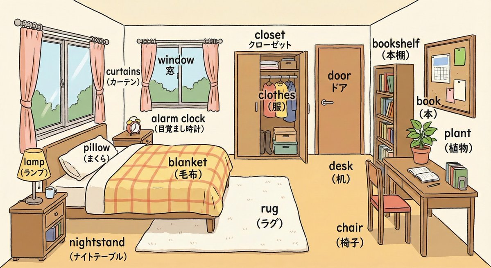

## { "Use [man_face] and [woman_fac]. Ultra-realistic high-

- ID: gpt4o-683-en-1
- Slug: prompt-683-en-1
- 语言: en
- 来源: [来源链接](https://x.com/miilesus/status/1995536025859354724)
- 样例图路径: images/part3/683.jpeg

### 提示词

```text
{
 "Use [man_face] and [woman_fac]. Ultra-realistic high-end luxury wedding photography of a bride and groom standing closely together in an elegant outdoor ceremony setting. Golden hour sunlight casting warm soft highlights, natural rim light around their silhouettes, cinematic dynamic range. The bride wearing a premium handcrafted lace wedding gown with intricate embroidery details, soft flowing veil illuminated by backlight, subtle pearl accessories, refined natural bridal makeup with luminous skin texture, finely detailed eyelashes and catchlights in eyes. The groom wearing a tailored black tuxedo with satin lapels, crisp white shirt, luxury bow tie, polished boutonniere. Both posing in a candid yet editorial fashion – gentle eye contact, soft romantic smile, hands touching gracefully. Background featuring a softly blurred bokeh garden with roses, organic greenery, warm tones, shallow depth of field created by an 85mm f/1.4 full-frame lens. High-definition textures, ultra sharp facial details, realistic pores, true-to-life skin tones, natural hair strands, perfect color grading inspired by premium wedding photographers. Soft pastel color palette, creamy highlights, subtle film grain, magazine cover aesthetic. Cinematic global illumination, perfect exposure balance, no distortion, no artifacts. Award-winning photography style with fine-art wedding composition, dramatic yet soft lighting, museum-quality detail clarity.",
  
  "negative_prompt": "cartoon, illustration, painting, CGI, artificial look, uncanny valley, distorted facial features, extra limbs, deformed body parts, mismatched eyes, unnatural skin texture, plastic skin, blur, noise, pixelation, low resolution, oversaturated colors, washed out colors, hard flash, harsh shadows, blown highlights, low contrast, lens distortion, fisheye, bad anatomy, extra fingers, incorrect hand shapes, watermark, text, logo, border, frame, compression artifacts, glitch, unrealistic proportions, double face, duplicate subjects, warped background",

  "camera_settings": {
    "lens": "85mm f/1.4 prime",
    "iso": 100,
    "shutter_speed": "1/400",
    "aperture": "f/1.4",
    "white_balance": "5200K daylight"
  },

  "style": {
    "lighting": "soft natural golden hour, cinematic rim light, high dynamic range",
    "color_grade": "premium wedding film look, pastel tones, creamy highlights, warm undertones",
    "atmosphere": "romantic, elegant, fine-art editorial"
  },

  "composition": {
    "framing": "mid-shot portrait, slight angle, bride and groom centered",
    "focus": "sharp eyes, smooth bokeh background",
    "depth_of_field": "shallow, subject separation emphasized"
  },

  "width": 1024,
  "height": 1536,
  "num_inference_steps": 36,
  "guidance_scale": 8.0,
  "seed": 12345
}
```

### 样例图

![{ "Use [man_face] and [woman_fac]. Ultra-realistic high-](../images/part3/683.jpeg)

## 花园里的婚纱照

- ID: gpt4o-683-zh-2
- Slug: prompt-683-zh-2
- 语言: zh
- 来源: [来源链接](https://x.com/miilesus/status/1995536025859354724)
- 样例图路径: images/part3/683.jpeg

### 提示词

```text
{
使用[man_face]和[woman_fac]。超逼真的高端奢华婚礼摄影，展现新郎新娘在优雅的户外仪式场地中亲密依偎的画面。金色的阳光洒下温暖柔和的高光，自然的轮廓光勾勒出他们的身影，营造出电影般的动态范围。新娘身着高级手工蕾丝婚纱，精致的刺绣细节令人叹为观止，飘逸的头纱在逆光下熠熠生辉，搭配低调的珍珠配饰，精致自然的妆容展现出肌肤的光泽感，纤长的睫毛和闪亮的眼神光更添动人。新郎身着剪裁合身的黑色礼服，缎面翻领，搭配挺括的白色衬衫、奢华的领结和精致的胸花。两人以一种自然而又不失时尚感的姿态摆出姿势——温柔的眼神交流，浪漫的微笑，双手优雅地相触。背景是一片柔和虚化的花园，点缀着玫瑰、绿植和温暖的色调，85mm f/1.4全画幅镜头营造出浅景深效果。高清的纹理，极其清晰的面部细节，逼真的画面。毛孔清晰可见，肤色自然逼真，发丝纹理自然，色彩分级完美，灵感源自顶级婚礼摄影师。柔和的粉彩色调，奶油般的亮部，细腻的胶片颗粒，杂志封面般的质感。电影级的整体光照，完美的曝光平衡，无畸变，无瑕疵。屡获殊荣的摄影风格，融合艺术婚礼构图、戏剧性却又柔和的光线，以及博物馆级别的细节清晰度。

"negative_prompt": "卡通、插画、绘画、CGI、人工质感、恐怖谷效应、面部特征扭曲、多余肢体、身体部位畸形、眼睛不对称、皮肤纹理不自然、塑料皮肤、模糊、噪点、像素化、低分辨率、色彩过饱和、色彩褪色、强光、阴影过重、高光过曝、低对比度、镜头畸变、鱼眼效果、人体解剖结构错误、多余手指、手型错误、水印、文字、标志、边框、画框、压缩伪影、故障、比例失调、双面人、重复人物、背景扭曲",

"camera_settings": {
镜头：85mm f/1.4 定焦镜头
“iso”：100，
"shutter_speed": "1/400",
光圈：f/1.4，
“white_balance”: “5200K 日光”
},

“风格”： {
“照明”：“柔和的自然黄金时段、电影般的轮廓光、高动态范围”，
"color_grade": "高级婚礼影片风格，柔和的色调，奶油色的高光，温暖的底色",
“氛围”： “浪漫、优雅、艺术感十足的编辑风格”
},

“作品”： {
“构图”：“中景肖像，略微倾斜，新郎新娘居中”，
“焦点”：“锐利的眼睛，柔和的散景背景”，
"depth_of_field": "浅景深，强调主体分离"
},

宽度：1024，
“高度”：1536，
"num_inference_steps": 36,
"guidance_scale": 8.0,
种子：12345
}
```

### 样例图


## 星座运势卡

- ID: gpt4o-671-zh
- Slug: prompt-671-zh
- 语言: zh
- 来源: [来源链接](https://x.com/cnyzgkc/status/1995423285060976700)
- 样例图路径: images/part3/671.jpeg

### 提示词

```text
请先帮我搜索「星座名」今天的最新运势，重点包含：整体运势、爱情运、事业运、财运，以及今天的幸运色与幸运数字。接着，请根据今天的运势内容，使用 Nano Banana Pro 绘制一张 文青手绘平面插画风格的星座运程故事卡片，需要 精美排版与丰富元素设计、简体中文、2K、2:3 比例。
```

### 样例图


## { "image_generation": { "requirements": { "face_preserva

- ID: gpt4o-667-en-1
- Slug: prompt-667-en-1
- 语言: en
- 来源: [来源链接](https://x.com/ZaraIrahh/status/1995304550610407807)
- 样例图路径: images/part3/667.jpeg

### 提示词

```text
{
  "image_generation": {
    "requirements": {
      "face_preservation": {
        "preserve_original": true,
        "accuracy_level": "100% identical to reference",
        "details": [
          "real facial proportions",
          "exact skin texture",
          "true eye shape and color",
          "natural soft makeup",
          "subtle upward eyeliner",
          "soft pink eyeshadow",
          "natural rosy lips"
        ]
      },
      "pose": {
        "match_reference_pose": true,
        "description": "Chest-up portrait, face facing forward but gently tilted to the right from the viewer’s perspective."
      },
      "lighting": {
        "match_reference_lighting": true,
        "type": "soft diffused indoor lighting",
        "direction": "from the front and slightly from the left",
        "shadows": "gentle soft shadows on the sides of the face and neck",
        "background_tone": "soft neutral with slight bluish tint"
      }
    },

    "subject": {
      "gender": "female",
      "hairstyle": {
        "match_reference": true,
        "description": "same exact hairstyle as in reference image"
      },
      "expression": "neutral, slightly thoughtful",
      "clothing": {
        "top": "simple black T-shirt",
        "necklace": "thin silver necklace with a small minimal pendant"
      }
    },

    "composition": {
      "frame": "chest-up portrait",
      "orientation": "frontal with slight rightward tilt",
      "style": "hyper-realistic with split real/cartoon effect"
    },

    "special_effects": {
      "split_effect": {
        "type": "irregular centered tear",
        "edges": "white angled torn-paper look",
        "description": "image appears ripped down the middle"
      },

      "realistic_side": {
        "background": "soft, neutral, slightly bluish environment",
        "filters": [
          "soft analog grain",
          "lightly aged texture",
          "reduced saturation",
          "subtle film imperfections"
        ],
        "overlays": [
          "blue stylized teardrop stickers below the left eye",
          "small 'Zzz' sleep symbols near forehead",
          "yellow crescent moon in upper-left corner",
          "light blue hand-drawn cloud"
        ]
      },

      "illustrated_side": {
        "art_style": "bold cartoon, digital illustration",
        "color_palette": "bright, vibrant, saturated",
        "hair": "same tone as realistic side but stylized",
        "eyes": "exaggerated eyeliner, dramatic expression",
        "background": "vibrant light pink pop-art style",
        "decorations": {
          "kawaii_elements": [
            "Hello Kitty holding a microphone",
            "pixel-art pink mascot character",
            "yellow stars",
            "pink hearts",
            "colorful planets",
            "bold pink Japanese characters"
          ]
        }
      }
    },

    "aesthetic": {
      "overall_tone": "soft, dreamy, lightly vintage",
      "lighting_consistency": "must match reference perfectly",
      "skin_texture_realism": "high",
      "blending_quality": "smooth, natural transition between real and illustrated halves with crisp tear edge"
    },

    "output": {
      "style": "hyper-realistic + digital cartoon fusion",
      "quality": "ultra-high-resolution",
      "filters": [
        "subtle analog vintage film filter",
        "soft grain"
      ]
    }
  }
}
```

### 样例图


## 超写实风格真实和卡通分离效果

- ID: gpt4o-667-zh-2
- Slug: prompt-667-zh-2
- 语言: zh
- 来源: [来源链接](https://x.com/ZaraIrahh/status/1995304550610407807)
- 样例图路径: images/part3/667.jpeg

### 提示词

```text
{
"image_generation": {
“要求”： {
"面保存": {
"preserve_original": true,
"accuracy_level": "与参考值100%相同"
“细节”： [
“真实的脸部比例”，
“精准的肌肤纹理”，
“真实的眼睛形状和颜色”，
“自然柔和的妆容”，
“淡淡的上扬眼线”，
“柔和的粉色眼影”，
“自然红润的嘴唇”
]
},
"姿势": {
"match_reference_pose": true,
“描述”：“胸部以上的肖像，脸部朝前，但从观看者的角度来看略微向右倾斜。”
},
“灯光”： {
"match_reference_lighting": true,
“类型”：“柔和漫射室内照明”，
“方向”：“从前方略偏左”，
“阴影”：“脸颊和颈部两侧柔和的阴影”，
"background_tone": "柔和的中性色，略带蓝色调"
}
},

“主题”： {
"性别": "女性",
"发型": {
"match_reference": true,
描述：与参考图中完全相同的发型
},
“表情”：“中性，略带沉思”
“衣服”： {
上衣：一件简单的黑色T恤，
“项链”： “带有小巧简约吊坠的细银项链”
}
},

“作品”： {
“画框”：“胸部以上肖像”，
“方向”: “正面略微向右倾斜”
“风格”：“超写实风格，带有真实/卡通分离效果”
},

"特效": {
"split_effect": {
“类型”：“不规则中心撕裂”，
“边缘”：“白色斜角撕纸效果”，
描述：图像似乎从中间撕裂开来
},

"realistic_side": {
“背景”：“柔和、中性、略带蓝色的环境”，
“过滤器”：[
“柔和的模拟颗粒”，
“略带陈旧的质感”，
“饱和度降低”，
“细微的胶片瑕疵”
],
“叠加层”：[
“左眼下方贴有蓝色水滴形贴纸”，
“额头附近有小小的‘Zzz’睡眠符号”，
“左上角的黄色新月”
“浅蓝色手绘云朵”
]
},

"illustrated_side": {
"art_style": "大胆的卡通，数字插画",
"color_palette": "明亮、鲜艳、饱和"
“头发”：“与写实风格相同，但风格化”，
“眼睛”：“夸张的眼线，戏剧性的表情”，
“背景”：“充满活力的浅粉色波普艺术风格”，
“装饰”： {
"kawaii_elements": [
“Hello Kitty 拿着麦克风”
“像素艺术粉色吉祥物角色”，
“黄色星星”，
“粉红色的心”，
“色彩斑斓的行星”，
“粗体粉色日文字符”
]
}
}
},

“审美的”： {
整体色调：柔和、梦幻、略带复古感
"lighting_consistency": "必须与参考完全一致",
"skin_texture_realism": "高",
"blending_quality": "真实部分与插图部分之间过渡平滑自然，撕裂边缘清晰"
},

“输出”： {
“风格”：“超写实+数字卡通融合”，
“质量”：“超高分辨率”，
“过滤器”：[
“微妙的模拟复古胶片滤镜”，
“软粒”
]
}
}
}
```

### 样例图


## { "intent": "Generate a hyper-idealized, 'Douyin-aesthet

- ID: gpt4o-666-en-1
- Slug: prompt-666-en-1
- 语言: en
- 来源: [来源链接](https://x.com/IamEmily2050/status/1995065474749730989)
- 样例图路径: images/part3/666.jpeg

### 提示词

```text
{
  "intent": "Generate a hyper-idealized, 'Douyin-aesthetic' portrait of a young woman at night, utilizing direct flash photography to create a high-contrast, ethereal look with clear weather conditions.",
  "frame": {
    "aspect_ratio": "9:16",
    "composition": "Extreme close-up selfie framing (tighter than standard portrait), cutting off the top of the forehead to focus intensely on the eyes and lips. The subject is centered with a direct, confronting gaze.",
    "style_mode": "Flash photography, digital influencer aesthetic, soft-focus realism."
  },
  "subject": {
    "identity": "A young Asian woman, approximately 20 years old, with hyper-symmetrical, doll-like features characterized by the 'bunny tongue' and 'puppy eye' aesthetic.",
    "skin": "Pale, cool-toned porcelain complexion with zero texture. The skin reflects the flash, creating a 'mochi' or 'glass skin' effect that appears soft and translucent. High-key brightness on the T-zone.",
    "eyes": "Large, round eyes with a slight downward tint at the outer corners (puppy dog eyes). Prominent 'aegyosal' (under-eye fat bands) are highlighted to enhance youthfulness. The irises are soft brown with a large diameter. Eyelashes are styled in the 'manhwa' or 'idol' style: distinct, vertical clumps of mascara-coated lashes separated by space, rather than a dense fan.",
    "nose": "Petite, low-bridge nose with a small, rounded tip. The lighting minimizes the nostril definition, making the nose appear delicate and unobtrusive.",
    "mouth": "Heart-shaped lips featuring a 'gradient lip' technique. The center of the lips is a saturated, glossy strawberry pink, fading outward to a blurred, pale nude at the vermilion border. The texture is soft and hydrated.",
    "hair": "Long, silky jet-black hair with a straight texture. Without the snow, the hair is dry, sleek, and tucked slightly behind the ears or framing the face smoothly, catching the flash with a white sheen.",
    "wardrobe": "Minimal visibility, suggesting a stylish but casual top appropriate for a pleasant evening."
  },
  "environment": {
    "location": "Urban night setting.",
    "weather": "Clear, calm, and beautiful night weather. The atmosphere is clean and free of precipitation or fog.",
    "background": "A backdrop of deep black shadows punctuated by creamy, circular bokeh from distant city lights (streetlamps, neon signs). The background is significantly darker than the subject, ensuring the face is the sole focus."
  },
  "lighting": {
    "type": "Direct, frontal camera flash or high-intensity screen light.",
    "quality": "Hard but flattering light that flattens facial topography, eliminating shadows under the eyes and nose. This creates a 2D, illustrative quality common in high-end social media selfies.",
    "contrast": "High contrast between the brightly illuminated face and the pitch-black environment.",
    "catchlight": "Sharp, tiny pinpoint reflection in the center of the pupils from the flash."
  },
  "camera": {
    "sensor_format": "Smartphone main sensor simulation.",
    "lens": "24mm wide-angle lens. This focal length slightly exaggerates the size of the eyes and diminishes the size of the nose and face width, contributing to the 'baby face' proportion.",
    "aperture_depth_of_field": "f/1.8 to f/2.2, keeping the eyes and lips razor sharp while instantly blurring the ears and background.",
    "focus": "Critical focus on the eyelashes and iris texture."
  },
  "negative": {
    "content": "No snow, no rain, no wet hair, no masculine jawline, no skin texture, no pores, no heavy contouring, no western makeup style, no sunglasses, no hand near face.",
    "style": "No cinematic dramatic shadows (must be flat lit), no warm vintage tones, no painting, no illustration."
  }
}
```

### 样例图


## 极近距离的自拍照

- ID: gpt4o-666-zh-2
- Slug: prompt-666-zh-2
- 语言: zh
- 来源: [来源链接](https://x.com/IamEmily2050/status/1995065474749730989)
- 样例图路径: images/part3/666.jpeg

### 提示词

```text
{
“意图”：“在晴朗的天气条件下，利用直接闪光灯摄影，在夜晚创作一张极具理想化、‘抖音美学’风格的年轻女性肖像，以营造高对比度、空灵的视觉效果。”
“框架”： {
"aspect_ratio": "9:16",
“构图”：“极近距离的自拍取景（比标准肖像照更近），裁掉额头顶部，将焦点集中在眼睛和嘴唇上。拍摄对象位于画面中心，目光直视前方。”
"style_mode": "闪光灯摄影、数码网红美学、柔焦写实主义。"
},
“主题”： {
“身份描述”：“一位大约20岁的年轻亚裔女性，拥有高度对称、娃娃般的五官，其特征是‘兔舌’和‘小狗眼’。”
“肌肤”：苍白、冷调的瓷白肤色，几乎没有纹理。肌肤反射闪光灯，呈现出“麻糬”或“玻璃肌”的效果，看起来柔和通透。T区高光突出。
“眼睛”：大而圆的眼睛，外眼角略微下垂（小狗眼）。突出的眼下脂肪纹（眼袋）增添了青春气息。虹膜呈柔和的棕色，直径较大。睫毛采用“漫画”或“偶像”风格：睫毛根根分明，呈垂直的簇状，涂抹睫毛膏，彼此之间留有空隙，而不是浓密的扇形。
“鼻子”：“小巧的鼻子，鼻梁较低，鼻尖小而圆润。光线柔和地弱化了鼻孔的轮廓，使鼻子看起来精致而不突兀。”
“唇部”：心形唇妆，采用渐变唇妆技术。唇部中央是饱满亮泽的草莓粉色，向外晕染至唇线边缘的浅裸色。质地柔软水润。
“头发”： “长长的、丝滑的乌黑直发。没有雪的时候，头发干燥顺滑，微微别在耳后或柔顺地垂在脸颊两侧，在闪光灯下泛着白色的光泽。”
“衣橱”：“低调的款式，暗示着一件时尚休闲的上衣，适合愉快的夜晚穿着。”
},
“环境”： {
“地点”：“都市夜景。”
天气：晴朗、平静、美丽的夜晚。大气洁净，无降水或雾。
“背景”：“深黑色的阴影背景中点缀着远处城市灯光（路灯、霓虹灯）投射出的柔和圆形散景。背景明显比主体暗，从而确保面部成为唯一的焦点。”
},
“灯光”： {
“类型”：“直接闪光灯、前置摄像头闪光灯或高强度屏幕闪光灯。”
“品质”：“硬朗但柔和的光线，使面部轮廓更加平滑，消除眼下和鼻下的阴影。这营造出一种二维的、插画般的质感，常见于高端社交媒体自拍中。”
“对比度”：“明亮的脸部与漆黑的环境形成鲜明对比。”
“眼神光”：“闪光灯照射到瞳孔中心时，形成的一个清晰、细小的点状反射光。”
},
“相机”： {
"sensor_format": "智能手机主传感器模拟。",
“镜头”：“24mm广角镜头。这种焦距会略微放大眼睛，缩小鼻子和脸部宽度，从而营造出‘娃娃脸’的比例。”
"aperture_depth_of_field": "f/1.8 至 f/2.2，保持眼睛和嘴唇清晰锐利，同时立即虚化耳朵和背景。"
“焦点”：“重点关注睫毛和虹膜的纹理。”
},
“消极的”： {
“内容”：“没有雪，没有雨，没有湿头发，没有男性化的下巴线条，没有皮肤纹理，没有毛孔，没有浓重的修容，没有西式妆容，没有太阳镜，没有手靠近脸部。”
“风格”：“禁止使用电影般的戏剧性阴影（必须采用平光），禁止使用温暖的复古色调，禁止使用绘画风格，禁止使用插画风格。”
}
}
```

### 样例图


## { "title": "Hyper-Realistic Portrait: Suited Woman in Mu

- ID: gpt4o-657-en-1
- Slug: prompt-657-en-1
- 语言: en
- 来源: [来源链接](https://x.com/xmiiru_/status/1995344587750072496)
- 样例图路径: images/part3/657.jpeg

### 提示词

```text
{
  "title": "Hyper-Realistic Portrait: Suited Woman in Mugshot Pose",
  "description": "A high-resolution hyper-realistic 8K HD portrait photograph captured with a professional DSLR camera using a 50mm lens for natural depth of field and razor-sharp focus. Full-body composition mimicking an old-fashioned mugshot/police booking photo.",
  "subject": {
    "type": "woman",
    "features": {
      "likeness_reference": "attached image",
      "height": "tall",
      "build": "elegant",
      "facial_features": {
        "jawline": "sharp",
        "eyes": "intense",
        "expression": "confident, slightly smug smirk"
      },
      "pose": "leaning against wall, one knee bent"
    },
    "hair": {
      "style": "neat, straight, wavy or elegant updo",
      "appearance": "natural and well-groomed"
    },
    "clothing": {
      "jacket": "vintage-style tailored dark pinstripe suit jacket",
      "inner_garment": "none",
      "tie": "slightly loosened, dark shade matching jacket",
      "accessories": [
        {
          "type": "mugshot board",
          "text": {
            "name": "MIRA",
            "date": "17/5/62"
          }
        },
        {
          "type": "shoe",
          "description": "single shiny dark-colored high-heeled shoe in right hand",
          "material": "patent leather"
        }
      ]
    }
  },
  "background": {
    "style": "naturally blurred bokeh",
    "texture": "slightly gritty studio wall",
    "details": {
      "height_chart": "vertical lines with numerical markings 2'0\" to 6'6\"",
      "color_tone": "desaturated, slightly sepia-toned archival photograph aesthetic"
    }
  },
  "lighting": {
    "type": "clean, soft, balanced",
    "shadow": "accurate shadows and highlights",
    "direction": "strong overhead or frontal lighting emphasizing dramatic shadows and height chart lines"
  },
  "framing": {
    "resolution": "1080x1350px (4:5)",
    "focus": "sharp subject focus",
    "composition": "full figure and mugshot details",
    "color_accuracy": "professional, natural tones"
  },
  "style": "Hyper-realistic photography, 8K clarity, DSLR quality, accurate color grading, natural lens blur, vintage photo aesthetic, true-to-life detail",
  "watermark": "© xmiiru",
  "negative_prompt": [
    "No anime",
    "No cartoon",
    "No digital painting",
    "No illustration",
    "No 3D render",
    "No CGI",
    "No stylized features",
    "No plastic/doll-like skin",
    "No fantasy glow",
    "No cinematic effects",
    "No airbrushed smoothing",
    "No overexposure",
    "No unnatural blur",
    "No video-game/Unreal Engine style",
    "No sketch",
    "No artificial lighting effects",
    "No unrealistic proportions/textures",
    "No multiple shoes",
    "No modern background elements"
  ]
}
```

### 样例图


## 身着西装的女子摆出嫌犯照姿势

- ID: gpt4o-657-zh-2
- Slug: prompt-657-zh-2
- 语言: zh
- 来源: [来源链接](https://x.com/xmiiru_/status/1995344587750072496)
- 样例图路径: images/part3/657.jpeg

### 提示词

```text
{
标题：超写实肖像：身着西装的女子摆出嫌犯照姿势
“描述”：“这是一张高分辨率、超逼真的 8K 高清人像照片，使用专业数码单反相机和 50mm 镜头拍摄，以获得自然的景深和极其清晰的焦点。全身构图模仿了老式的嫌犯照/警局登记照。”
“主题”： {
类型： 女，
“特征”： {
"likeness_reference": "附加图像",
“身高”：“高”，
“建造”：“优雅”，
"facial_features": {
下颌线：尖锐，
“眼睛”：“专注”，
“表情”：“自信、略带自负的微笑”
},
姿势：倚靠在墙上，单膝弯曲
},
“头发”： {
“发型”：“整齐、笔直、波浪或优雅的盘发”，
“外表”：“自然且仪容整洁”
},
“衣服”： {
“外套”： “复古风格的深色细条纹修身西装外套”，
"内衣": "无",
领带：略微松开，深色，与外套相配。
“配件”： [
{
类型： '嫌犯照片板'，
“文本”： {
"name": "MIRA",
日期： 17/5/62
}
},
{
类型：鞋子，
描述：右手拿着一只闪亮的深色高跟鞋。
材质：漆皮
}
]
}
},
“背景”： {
“风格”：“自然模糊散景”，
“纹理”：“略带颗粒感的摄影棚墙面”，
“细节”： {
"身高图": "带有数字标记的垂直线，从 2'0\" 到 6'6\"",
"color_tone": "褪色、略带棕褐色调的档案照片美学"
}
},
“灯光”： {
“类型”：“干净、柔和、平衡”，
“阴影”：“精确的阴影和高光”，
“方向”：“强烈的顶光或正面照明，强调戏剧性的阴影和高度图线条”
},
"框架": {
“分辨率”：“1080x1350像素（4:5）”
“焦点”: “清晰的主体焦点”，
“构图”：“全身像和嫌犯照细节”，
"color_accuracy": "专业、自然的色调"
},
“风格”：“超逼真的摄影，8K 清晰度，单反画质，精准的色彩分级，自然的镜头虚化，复古照片美学，逼真的细节”，
“水印”： “ © xmiiru”，
"negative_prompt": [
“没有动漫”，
“没有卡通片”，
“没有数码绘画”，
“无插图”
“没有3D渲染图”，
“无电脑特效”
“没有风格化的特征”，
“没有塑料/娃娃般的皮肤”，
“没有梦幻般的光芒”，
“没有电影特效”，
“没有使用喷枪进行平滑处理”，
“没有过度曝光”，
“没有不自然的模糊效果”，
“没有电子游戏/虚幻引擎风格”，
“没有草图”，
“无人工照明效果”，
“没有不切实际的比例/纹理”，
“禁止穿多双鞋”
“无现代背景元素”
]
}
```

### 样例图


## "A surreal, whimsical digital illustration of a young wo

- ID: gpt4o-650-en-1
- Slug: prompt-650-en-1
- 语言: en
- 来源: [来源链接](https://x.com/madpencil_/status/1994891011861221665)
- 样例图路径: images/part3/650.jpeg

### 提示词

```text
"A surreal, whimsical digital illustration of a young woman with pale pink skin and voluminous, floating black hair. Her head is horizontally split open at the nose level. Inside the hollow of her head, a tiny, miniature version of herself (wearing the same attire) is standing and physically lifting the top half of the head (containing the closed eyes and forehead) up with her hands. The space inside the split head reveals a dark blue starry night sky or cosmic void.

Art style: Modern flat illustration with a lo-fi, grainy texture. Soft pastel colors including lavender, periwinkle, and peach. The shading is subtle and soft using gradients. There is a noise overlay/stipple effect giving it a retro print look. The background is a solid soft purple gradient with scattered white stardust. Emotional, dreamy, metaphorical."
```

### 样例图


## 头部的空腔内正站着迷你版自己

- ID: gpt4o-650-zh-2
- Slug: prompt-650-zh-2
- 语言: zh
- 来源: [来源链接](https://x.com/madpencil_/status/1994891011861221665)
- 样例图路径: images/part3/650.jpeg

### 提示词

```text
这是一幅超现实主义的奇幻数字插画，描绘了一位拥有淡粉色皮肤和蓬松飘逸黑发的年轻女子。她的头部在鼻子处被水平剖开。在她头部的空腔内，一个穿着同样服饰的迷你版自己正站着，用双手抬起她头部的上半部分（包括紧闭的双眼和额头）。剖开的头部内部展现出一片深蓝色的繁星点点的夜空，或是浩瀚的宇宙虚空​​。

艺术风格：现代扁平插画，带有低保真颗粒质感。柔和的粉彩色调，包括薰衣草紫、长春花蓝和蜜桃色。阴影处理细腻柔和，运用了渐变效果。叠加的噪点/点描效果赋予画面复古的印刷质感。背景是柔和的纯紫色渐变，点缀着零星的白色星尘。充满情感、梦幻和隐喻。
```

### 样例图


## 黑板艺术作品-海賊女帝

- ID: gpt4o-642-zh-1
- Slug: prompt-642-zh-1
- 语言: zh
- 来源: [来源链接](https://x.com/IamEmily2050/status/1994624635300974734)
- 样例图路径: images/part3/642.jpeg

### 提示词

```text
{
  "intent": "Photorealistic documentation of a specific chalkboard art piece featuring a single anime character, capturing the ephemeral nature of the medium within a classroom context.",
  "frame": {
    "aspect_ratio": "4:3",
    "composition": "A centered medium shot focusing on the chalkboard mural. The composition includes the teacher's desk in the immediate foreground to provide scale, with the artwork of the single character dominating the background space.",
    "style_mode": "documentary_realism, texture-focused, ambient naturalism"
  },
  "subject": {
    "primary_subject": "A large-scale, intricate chalk drawing of Boa Hancock from 'One Piece' on a standard green classroom blackboard.",
    "visual_details": "The illustration depicts Boa Hancock in a commanding pose, positioned centrally on the board. She is drawn with her signature long, straight black hair with a hime cut, rendered using dense application of black chalk with white accents for sheen. Her expression is haughty and imperious, with detailed dark blue eyes. She is depicted forming a heart shape with her hands, referencing her 'Mero Mero Mellow' technique. She wears a revealing red blouse with purple geometric patterns and gold snake-shaped earrings, drawn with vibrant colored chalks.",
    "medium_texture": "The image preserves the dusty, matte quality of the chalk. Visible hatching and cross-hatching strokes create shading on her clothing and hair. Smudged areas on the green slate indicate where colors have been blended by hand.",
    "surrounding_elements": "To the right of the character, vertical Japanese text reading '海賊女帝' (Pirate Empress) is written in crisp white chalk."
  },
  "environment": {
    "location": "A standard Japanese school classroom.",
    "foreground_elements": "A wooden teacher's desk occupies the lower foreground. Scattered across the surface are a yellow box of colored chalks, loose sticks of red, white, and blue pastel chalk, and a dust-covered black felt eraser.",
    "background_elements": "The green chalkboard spans the width of the frame, bordered by a metallic chalk tray containing accumulated chalk dust. The wall above is a plain, off-white plaster, featuring a small mounted speaker box.",
    "atmosphere": "Quiet and academic, with a sense of stillness suggesting the room is currently unoccupied."
  },
  "lighting": {
    "type": "Diffuse ambient classroom lighting.",
    "quality": "Soft, nondirectional illumination provided by overhead fluorescent fixtures mixed with daylight from windows on the left. The light is even, preventing glare on the chalkboard surface while highlighting the texture of the chalk.",
    "color_temperature": "Neutral white, approximately 5000K, ensuring accurate color rendition of the red and purple chalks against the dark green board.",
    "direction": "Overhead and slightly frontal."
  },
  "camera": {
    "sensor_format": "35mm full-frame digital sensor.",
    "lens": "35mm prime lens.",
    "aperture": "f/5.6",
    "depth_of_field": "Moderate depth of field, keeping the chalkboard drawing in sharp focus while allowing the foreground desk elements to soften slightly.",
    "shutter_speed": "1/60s",
    "iso": "400",
    "camera_position": "Eye-level standing position, set back enough to frame the entire drawing and the desk."
  },
  "negative": {
    "content": "Multiple characters, Midoriya, Shigaraki, male characters, digital art overlay, vector graphics, paper texture, oil painting, messy composition, extreme low angle, fisheye lens.",
    "style": "No hyper-saturation, no soft focus filters, no heavy vignetting."
  }
}
```

### 样例图


## 黑板艺术作品-海賊女帝

- ID: gpt4o-642-zh-2
- Slug: prompt-642-zh-2
- 语言: zh
- 来源: [来源链接](https://x.com/IamEmily2050/status/1994624635300974734)
- 样例图路径: images/part3/642.jpeg

### 提示词

```text
{
“意图”：“以照片写实的手法记录一幅特定的黑板艺术作品，作品中描绘了一个动漫角色，捕捉了课堂环境中这种媒介的转瞬即逝的特性。”
“框架”： {
"aspect_ratio": "4:3",
“构图”：“以黑板壁画为中心拍摄的中景镜头。画面前景中包含教师的办公桌以显示比例，而单个人物的画作则占据了背景空间。”
"style_mode": "纪实写实主义，注重纹理，环境自然主义"
},
“主题”： {
“primary_subject”: “一幅绘制在标准绿色教室黑板上的大型、精细的《海贼王》角色波雅·汉库克的粉笔画。”
“视觉细节”： “这幅插画描绘了波雅·汉库克，她以威严的姿态位于画面中央。她标志性的黑色长直发，采用姬发式剪裁，以浓重的黑色粉笔绘制，并以白色点缀以增加光泽。她的表情傲慢而威严，深蓝色的眼睛刻画入微。她双手比划成心形，象征着她的‘Mero Mero Mellow’（柔情蜜意）技巧。她身着一件饰有紫色几何图案的性感红色上衣，佩戴着以鲜艳彩色粉笔绘制的金色蛇形耳环。”
“medium_texture”：图像保留了粉笔的粉尘质感和哑光效果。清晰可见的排线和交叉线笔触在她的衣服和头发上营造出阴影。绿色石板上的晕染区域表明了手工调色的位置。
"surrounding_elements": "字符右侧用清晰的白色粉笔写着竖排的日文“海贼女帝”。"
},
“环境”： {
地点：一间标准的日本学校教室。
"前景元素": "一张木制教师桌占据了画面下方的前景。桌面上散落着一盒黄色的彩色粉笔、几支红色、白色和蓝色的粉彩粉笔，以及一块沾满灰尘的黑色毡橡皮。"
“背景元素”： “绿色黑板横跨整个画面宽度，边缘是一个金属粉笔托盘，里面积满了粉笔灰。黑板上方是一面普通的米白色石膏墙，墙上安装了一个小型壁挂式音箱。”
“氛围”：“安静而学术，一种静谧感表明房间里目前无人居住。”
},
“灯光”： {
“类型”：“漫射环境教室照明。”
“质量”：“柔和、无方向性的照明由上方荧光灯具提供，并混合了左侧窗户的自然光。光线均匀，既防止黑板表面产生眩光，又突显了粉笔的纹理。”
“色温”： “中性白光，约 5000K，确保红色和紫色粉笔在深绿色白板上的准确显色。”
“方向”：“头顶上方，略微朝前。”
},
“相机”： {
"sensor_format": "35mm 全画幅数码传感器。"
“镜头”：“35mm 定焦镜头。”
光圈：f/5.6，
“景深”： “适中的景深，保持黑板上的图画清晰锐利，同时让前景的桌面元素略微柔化。”
"shutter_speed": "1/60"
“iso”: “400，
“camera_position”: “与眼睛齐平的站立位置，向后移动足够远，以便将整个图纸和桌子都框入其中。”
},
“消极的”： {
内容：多个角色、绿谷出久、死柄木弔、男性角色、数字艺术叠加、矢量图形、纸张纹理、油画、凌乱构图、极低角度、鱼眼镜头。
“风格”：“不使用过饱和度，不使用柔焦滤镜，不使​​用严重的暗角。”
}
}
```

### 样例图


## A 3D pop-up book illustration featuring a [subject], wit

- ID: gpt4o-636-en-1
- Slug: prompt-636-en-1
- 语言: en
- 来源: [来源链接](https://x.com/azed_ai/status/1995084424489422885)
- 样例图路径: images/part3/636.jpeg

### 提示词

```text
A 3D pop-up book illustration featuring a [subject], with layered paper elements unfolding into a miniature scene. Soft lighting, textured paper surfaces, playful handcrafted look, pastel [color1] and [color2] palette, viewed from a slight angle to show depth and detail.
```

### 样例图

![A 3D pop-up book illustration featuring a [subject], wit](../images/part3/636.jpeg)

## 3D立体书插画

- ID: gpt4o-636-zh-2
- Slug: prompt-636-zh-2
- 语言: zh
- 来源: [来源链接](https://x.com/azed_ai/status/1995084424489422885)
- 样例图路径: images/part3/636.jpeg

### 提示词

```text
一幅以[主题]为主题的3D立体书插画，层叠的纸质元素展开成一个微缩场景。柔和的光线、纹理丰富的纸张表面、充满趣味的手工质感，以及柔和的[颜色1]和[颜色2]色调，从略微倾斜的角度观看，展现出层次感和细节。
```

### 样例图

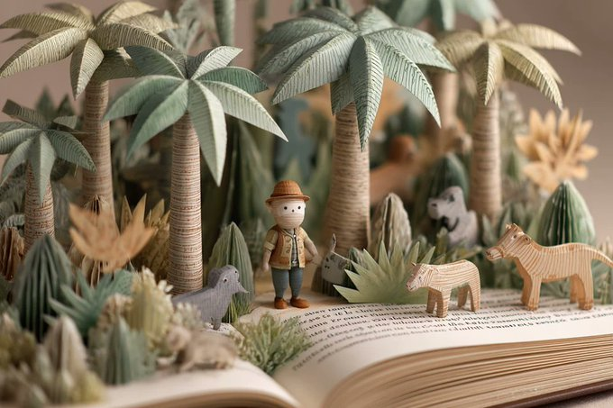

## Use the uploaded photo. Do NOT alter the person’s real a

- ID: gpt4o-625-en-1
- Slug: prompt-625-en-1
- 语言: en
- 来源: [来源链接](https://x.com/AI_GIRL_DESIGN/status/1993243344932413597)
- 样例图路径: images/part3/625.jpeg

### 提示词

```text
Use the uploaded photo. 
Do NOT alter the person’s real appearance — keep the person’s face, body, clothing, colors, and texture completely photorealistic. 
Do NOT change the background perspective. 
Do NOT turn the person into a drawing or illustration.

Add a dense, overloaded layer of pop-style illustrated “sweets monsters” and graphic decorations ONLY around the person (and on top of their clothing if needed), but never on their skin or face.

Illustrated elements:
- many colorful cartoon monsters with thick black outlines, flat colors, and cute-but-ugly expressions
- sweets-inspired monsters: bananas, cookies, strawberries, melting chocolate, lollipops, ice cream, oranges, cupcakes, donuts, candy pieces, soda bottles, etc.
- additional graphic shapes: stars, hearts, arrows, drips, splashes, zigzag lines, exclamation marks, motion lines, sparkles, bubbles, comic-style text shapes (but no real text)

Make the decoration very dense and “busy”:
- fill the space behind the person with overlapping sweets monsters and shapes
- add monsters peeking from behind the shoulders, around the bag, at the person’s feet, and near the head
- allow some monsters and shapes to overlap the clothing and accessories (shirt, shorts, bag, shoes), but keep the skin of the face, arms, and legs photorealistic and visible
- use multiple layers of illustrations in front of and behind the person to create depth
- add glowing outlines, small white dots, and speed lines around the person to emphasize energy

Color and style:
- use a vivid, neon-like color palette (hot pink, yellow, cyan, lime, orange, purple, turquoise)
- keep all illustrated elements flat and graphic with clean edges and bold outlines
- ensure shadows and overlap suggest interaction with the real person (e.g., slight shadows on clothing where monsters touch)

Overall goal:
Create a highly decorated, maximalist pop-art scene where the real person stands in the middle, surrounded and wrapped by a chaotic crowd of playful sweets monsters and graphic doodles, while the person remains clearly photorealistic.
```

### 样例图


## 在人物周围添加糖果怪兽

- ID: gpt4o-625-zh-2
- Slug: prompt-625-zh-2
- 语言: zh
- 来源: [来源链接](https://x.com/AI_GIRL_DESIGN/status/1993243344932413597)
- 样例图路径: images/part3/625.jpeg

### 提示词

```text
请使用已上传的照片。
不要改变人物的真实外貌——保持人物的脸部、身体、衣服、颜色和纹理完全逼真。
请勿改变背景视角。
请勿将人物形象转化为绘画或插图。

在人物周围（必要时可以贴在衣服上）添加一层厚重的、过多的流行风格插画“糖果怪兽”和图形装饰，但绝不能贴在皮肤或脸上。

图示元素：
- 许多色彩鲜艳的卡通怪物，轮廓线粗黑，色彩扁平，表情可爱又丑陋。
- 以甜食为灵感的怪物：香蕉、饼干、草莓、融化的巧克力、棒棒糖、冰淇淋、橙子、纸杯蛋糕、甜甜圈、糖果块、汽水瓶等等。
- 其他图形形状：星星、心形、箭头、水滴、飞溅、锯齿线、感叹号、动态线条、闪光、气泡、漫画风格的文字形状（但不能包含实际文字）

装饰要非常密集、繁复：
- 用重叠的糖果怪兽和形状填满人身后的空间
- 添加一些怪物，它们会从肩膀后面、包周围、人的脚边和头部附近探出头来。
允许部分怪物和形状与服装及配饰（衬衫、短裤、包、鞋子）重叠，但保持面部、手臂和腿部的皮肤逼真可见。
- 在人物前后使用多层插图来营造景深。
- 在人物周围添加发光轮廓、小白点和速度线，以强调能量。

颜色和款式：
- 使用鲜艳的霓虹色系调色板（亮粉色、黄色、青色、酸橙色、橙色、紫色、蓝绿色）
- 保持所有插图元素扁平化、图形化，边缘清晰，轮廓粗犷。
- 确保阴影和重叠能够暗示与真人的互动（例如，怪物触碰衣服时在衣服上留下淡淡的阴影）

总体目标：
创作一幅装饰华丽、极繁主义的波普艺术场景，真人站在场景中央，被一群嬉戏玩闹的糖果怪兽和涂鸦图形包围，而真人则保持清晰的写实风格。
```

### 样例图


## 手绘美颜科普图

- ID: gpt4o-624-zh
- Slug: prompt-624-zh
- 语言: zh
- 来源: [来源链接](https://x.com/cnyzgkc/status/1994954677579125124)
- 样例图路径: images/part3/624.jpeg

### 提示词

```text
Hand-drawn watercolor infographic, warm soft watercolor texture, pink tone, cute and clean design, 4:5 ratio, 1080x1350.

角色：一位专精医学保健的插画家兼医生，亲切微笑，手持水彩笔，风格卡通可爱。

主标题（上方）：缺什么营养素会变丑？医生的维生素美颜配方！

图表结构（下方开始）：
六个可爱人物，呈现六种“变丑症状”，搭配对应的卡通营养素图标。

示例内容（AI 可自由重绘，不要写实）：
1. 皮肤暗沉 → 维生素C（Vitamin C 卡通形象）
2. 眼睛干涩 → 维生素A（Vitamin A 卡通形象）
3. 掉发 → 维生素B、维生素D（B群、D 卡通形象）
4. （可继续根据文案自动生成更多症状与营养素）

风格要求：
手绘水彩感、粉色主调、柔和自然、轻松舒服的氛围。
人物要可爱、圆润、友好。
营养素图标为卡通拟人风格。
文字为清晰易读的手写笔记感字体。
整体排版简洁、资讯图表形式。

Lighting: soft, diffuse watercolor lighting.
Avoid: 照片感、真实皮肤纹理、过度写实、油画风、金属光泽。

best quality, high-res, clean edges, masterpiece.
```

### 样例图


## { "prompt": "hyperrealistic ultra-detailed 8k photo of Y

- ID: gpt4o-615-en-1
- Slug: prompt-615-en-1
- 语言: en
- 来源: [来源链接](https://x.com/Samann_ai/status/1994444395525832898)
- 样例图路径: images/part3/615.jpeg

### 提示词

```text
{
  "prompt": "hyperrealistic ultra-detailed 8k photo of YOU (Upload Your Photo) standing in a bright cozy living room, same location as the reference: cream-colored sofa, large white curtains with soft daylight shining through, warm neutral walls, several green houseplants, minimal decor, natural sunlight and soft shadows. Use the uploaded photo as the main subject of the image, preserving the face, hairstyle, body type, clothing, and overall style exactly as in the uploaded photo. The subject is standing in front of the sofa, body slightly angled to the side, legs close together, one hip slightly popped, holding a smartphone in one hand at chest height, screen facing them, as if taking a mirror selfie, with a relaxed confident expression and slight smile, eyes toward the phone. Behind them, their partner is standing very close, a tall, attractive humanoid robot with a highly muscular, athletic build, entirely robotic with no human skin, detailed mechanical anatomy inspired by a futuristic cyborg: layered silver and gunmetal plates, visible bundles of flexible cables as muscles, complex joints, smooth armor around shoulders, chest, arms, and legs, elegant angular robotic face with a strong jawline, glowing blue eyes, subtle wear and micro-scratches on metal for realism. The robot’s torso is broad and V-shaped, narrow waist, perfect proportions, clearly fit and powerful but aesthetically beautiful. The robot stands just behind the subject with one sleek metallic arm wrapped gently and protectively around the front of their neck and shoulders, hand resting softly near the collarbone in an affectionate pose, the other arm relaxed at its side. Their bodies are close, giving a sense of intimacy and comfort. Extremely realistic skin texture on the subject, natural hair strands, detailed fabric texture and wrinkles on their clothing, realistic reflections and specular highlights on the robot’s metal surfaces, accurate global illumination and depth of field, sharp focus on both characters, slight background blur. Photoreal, cinematic lighting, no fantasy effects, looks like a real candid photo taken on a phone in this apartment.",
  "negative_prompt": "cartoon, anime, illustration, painting, 3d render, CGI, low resolution, blurry, grainy, oversaturated, unrealistic proportions, extra limbs, deformed hands, distorted face, visible mirror edges, text, watermark, logo, armor covering the subject, human skin on the robot, grotesque, horror, gore"
}
```

### 样例图


## 人和机器人的温馨时刻

- ID: gpt4o-615-zh-2
- Slug: prompt-615-zh-2
- 语言: zh
- 来源: [来源链接](https://x.com/Samann_ai/status/1994444395525832898)
- 样例图路径: images/part3/615.jpeg

### 提示词

```text
{
“提示”：拍摄一张超逼真、细节丰富的8K照片，照片中的人物（上传您的照片）站在明亮舒适的客厅中，地点与参考照片相同：米色沙发，白色大窗帘透进柔和的日光，暖色调的墙面，几盆绿色植物，简约的装饰，自然光和柔和的阴影。使用上传的照片作为图像的主体，保留照片中人物的面部、发型、体型、服装和整体风格。人物站在沙发前，身体略微侧倾，双腿并拢，一侧臀部微微翘起，一手拿着智能手机，屏幕朝向自己，仿佛在自拍，表情轻松自信，略带微笑，目光注视着手机。人物身后站着一位身材高挑、外形俊朗的人形机器人，肌肉线条流畅，体格健壮，完全由机械构成，没有人类皮肤，拥有未来主义赛博格风格的精细机械结构：层叠的银色和枪灰色金属板，以及清晰可见的柔性电缆束。肌肉线条分明，关节复杂，肩部、胸部、手臂和腿部的盔甲光滑流畅，优雅的棱角分明的机械面孔，下颚线条硬朗，湛蓝的双眼闪闪发光，金属表面细微的磨损和划痕更添真实感。机器人的躯干宽阔呈V字形，腰部纤细，比例完美，既健壮有力又不失美感。机器人站在拍摄对象身后，一只光滑的金属手臂温柔地环绕着拍摄对象的颈肩，一只手轻轻地放在锁骨附近，姿态亲昵，另一只手臂自然垂于身侧。两人身体靠近，营造出亲密舒适的氛围。拍摄对象的皮肤纹理极其逼真，头发自然垂落，衣物上的织物纹理和褶皱也十分细致，机器人金属表面的反射和高光效果逼真，整体光照和景深控制精准，两个人物都清晰对焦，背景略微虚化。照片级的真实感，电影级的灯光效果，没有任何奇幻特效，看起来就像是用手机在公寓里随手拍下的真实照片。
"negative_prompt": "卡通、动画、插画、绘画、3D渲染、CGI、低分辨率、模糊、颗粒感强、过度饱和、比例失调、多余肢体、畸形手、扭曲面部、可见镜像边缘、文字、水印、标志、盔甲覆盖主体、机器人身上覆盖人类皮肤、怪诞、恐怖、血腥"
}
```

### 样例图


## Create a detailed technical illustration of a Cybernetic

- ID: gpt4o-614-en-1
- Slug: prompt-614-en-1
- 语言: en
- 来源: [来源链接](https://x.com/LudovicCreator/status/1994390935019360466)
- 样例图路径: images/part3/614.jpeg

### 提示词

```text
Create a detailed technical illustration of a Cybernetic Samurai, exploded into components: katana with energy core, cybernetic limbs, neural processor, armor plating, and internal power systems. Each part is labeled with clean futuristic font. Use a graphite and crimson color scheme on a dark blueprint background. Add subtle particle glow and depth shadows. Studio render style.
```

### 样例图


## 一幅赛博武士的详细技术图解

- ID: gpt4o-614-zh-2
- Slug: prompt-614-zh-2
- 语言: zh
- 来源: [来源链接](https://x.com/LudovicCreator/status/1994390935019360466)
- 样例图路径: images/part3/614.jpeg

### 提示词

```text
创作一幅赛博武士的详细技术图解，将其拆解为核心部件：带能量核心的武士刀、机械义肢、神经处理器、装甲板以及内部动力系统。每个部件均采用简洁的未来风格字体标注。整体采用石墨色与深红色配色方案，搭配深色蓝图背景。添加微弱的粒子光晕效果与层次感阴影，整体呈现工作室渲染风格。
```

### 样例图


## { "scene_description": "A vibrant, mixed-media masterpie

- ID: gpt4o-611-en-1
- Slug: prompt-611-en-1
- 语言: en
- 来源: [来源链接](https://x.com/ecommartinez/status/1994126063656644727)
- 样例图路径: images/part3/611.jpeg

### 提示词

```text
{
  "scene_description": "A vibrant, mixed-media masterpiece featuring a photorealistic version of the person from the reference photo eating at a diner, surrounded by a chaotic swarm of maximalist fast-food monsters.",

  "subject": {
    "type": "The person from the reference photo",
    "attire": "Same clothing style as in the reference, adapted naturally to the diner setting",
    "position": "Sitting in a red leather diner booth, holding a burger",
    "expression": "Shocked but amused, looking at a floating doodle pizza",
    "consistency_note": "Face, hairstyle and proportions must perfectly match the reference photo"
  },

  "action": {
    "primary": "Eating lunch",
    "effect": "Their food is coming to life in 2D form"
  },

  "illustration_layer": {
    "style": "Thick-line Pop Art cartoons",
    "creatures": [
      "Pizza slices surfing on cheese waves",
      "Burger beasts with lettuce tongues",
      "Angry French fry box",
      "Flying ketchup bottles."
    ],
    "graphics": "Mustard splashes, sesame seeds, heat lines, 'ÑAM' text bursts",
    "colors": "Ketchup Red, Mustard Yellow, Lettuce Green"
  },

  "environment": {
    "setting": "Retro American Diner",
    "background_elements": ["Checkerboard floor", "Neon sign in window"]
  },

  "lighting": {
    "style": "Warm Diner Glow",
    "key_light": {
      "type": "Window light",
      "color": "Warm afternoon sun"
    }
  },

  "style": {
    "medium": "Mixed Media Photography",
    "aesthetic": "Retro-pop, savory, chaotic",
    "quality": "Ultra-detailed textures vs flat cartoons"
  }
}
```

### 样例图


## 一幅充满活力的混合媒介杰作

- ID: gpt4o-611-zh-2
- Slug: prompt-611-zh-2
- 语言: zh
- 来源: [来源链接](https://x.com/ecommartinez/status/1994126063656644727)
- 样例图路径: images/part3/611.jpeg

### 提示词

```text
{
“场景描述”： “这是一幅充满活力的混合媒介杰作，画面中逼真地呈现了参考照片中的人物在餐馆用餐，周围环绕着一群造型夸张的快餐怪物。”

“主题”： {
“类型”：“参考照片中的人”，
“着装”：“与参考图中相同的服装风格，自然地适应了餐厅环境”，
“位置”：“坐在红色皮质餐厅卡座里，手里拿着一个汉堡”，
“表情”：“震惊又好笑，看着漂浮的涂鸦披萨”
"consistency_note": "脸型、发型和比例必须与参考照片完全一致"
},

“行动”： {
“主要”： “吃午饭”，
“效果”：“他们的食物以二维形式活了过来”
},

"illustration_layer": {
“风格”：“粗线条波普艺术卡通”，
“生物”：[
“披萨片在奶酪浪潮上冲浪”
“长着生菜舌头的汉堡怪兽”
“愤怒的薯条盒”
“飞舞的番茄酱瓶。”
],
“图形”：“芥末酱飞溅、芝麻、热线、‘ÑAM’文字爆发”，
颜色：番茄酱红、芥末黄、生菜绿
},

“环境”： {
“设置”: “复古美式餐馆”
"background_elements": ["棋盘格地板", "窗户上的霓虹灯"]
},

“灯光”： {
“风格”：“温馨的餐馆氛围”，
"key_light": {
类型： 窗灯，
“颜色”：“温暖的午后阳光”
}
},

“风格”： {
“媒介”：“混合媒介摄影”，
“美学”：“复古流行，美味，混乱”，
“质量”： “超精细纹理 vs 平面卡通”
}
}
```

### 样例图


## 卡哇伊波普艺术

- ID: gpt4o-589-zh
- Slug: prompt-589-zh
- 语言: zh
- 来源: [来源链接](https://x.com/songguoxiansen/status/1994239610713678137)
- 样例图路径: images/part3/589.jpeg

### 提示词

```text
中低角度拍摄，一位可爱的年轻东亚女性，皮肤白里透红、滑嫩紧致。她扎着双马尾，戴着过多的彩色发夹，穿着色彩爆炸的原宿Decora风格服装，在东京繁忙的街头俏皮地比着“耶”的手势。照片风格被过量的卡哇伊波普艺术淹没：无数的塑料玩具、彩虹、独角兽、糖果、笑脸和巨大的蝴蝶结插画填满背景并延伸到前景，部分卡通元素像贴纸一样覆盖在她的衣服和配件上。光线是明亮的日光，充满活力的柔和色彩。
```

### 样例图


## 清新蓝色手账

- ID: gpt4o-586-zh
- Slug: prompt-586-zh
- 语言: zh
- 来源: [来源链接](https://x.com/songguoxiansen/status/1994227033141100662)
- 样例图路径: images/part3/586.jpeg

### 提示词

```text
充满夏日气息的竖屏时尚插画。背景是手绘的蓝色海洋波浪纹理和沙滩色块，使用彩色铅笔质感。主角贴纸穿着度假长裙或泳装，阳光明媚。Labubu公仔贴纸穿着夏威夷衬衫，拿着冲浪板或游泳圈。配饰贴纸包括草编包和墨镜。隐藏层贴纸是一套精美的蕾丝比基尼或薄纱罩衫，平铺展示。周围绘制了棕榈树、太阳和鸡尾酒的可爱涂鸦。贴纸角落有“Was here”的手写旅行笔记。整体氛围轻松愉悦，就像一本旅行剪贴簿的内页扫描图。
```

### 样例图

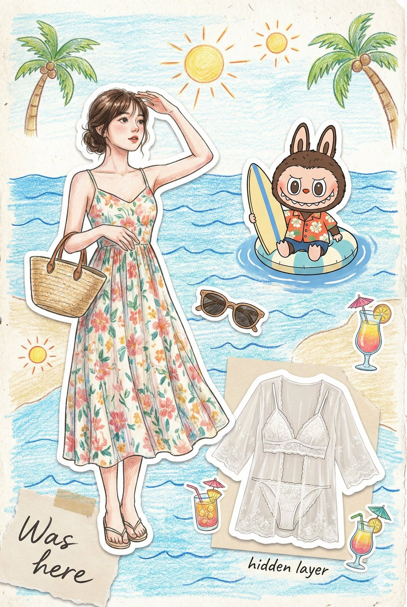

## 职业西装风手账

- ID: gpt4o-581-zh
- Slug: prompt-581-zh
- 语言: zh
- 来源: [来源链接](https://x.com/songguoxiansen/status/1994309283488444523)
- 样例图路径: images/part3/581.jpeg

### 提示词

```text
9:16极简主义时尚插画。背景是干净的高级灰哑光纸张，仅有极细的工程制图线条。贴纸元素布局严谨，白边锐利。中央是用户穿着职业西装或极简风穿搭的贴纸。Labubu公仔贴纸戴着黑框眼镜，系着领带，一副精英模样。衣物解构贴纸包括折叠完美的西裤和名表。隐藏层贴纸是一件极简的高级黑色丝绸衬裙，展现低调奢华。所有的标注文字都是极细的黑色针管笔手写体。画面冷静、克制，无杂乱装饰，纯粹通过排版和材质对比展示高级感。
```

### 样例图


## { "subject": { "type": "young woman", "pose": "sitting s

- ID: gpt4o-579-en-1
- Slug: prompt-579-en-1
- 语言: en
- 来源: [来源链接](https://x.com/awesome_visuals/status/1994104753966686476)
- 样例图路径: images/part3/579.jpeg

### 提示词

```text
{ "subject": { "type": "young woman", "pose": "sitting sideways on an arcade stool, one knee up, hugging legs loosely, winking with exaggerated cuteness", "expression": "playful and lively" }, "clothing": { "top": "teal t-shirt with comic-outline shading", "bottom": "pink shorts", "socks": "purple crew socks", "shoes": "bright neon sneakers with translucent soles" }, "hair": { "color": "black", "style": "braided pigtails with neon hair ties" }, "environment": { "setting": "retro arcade interior", "details": "glowing cabinets, colorful reflections, cluttered neon lights" }, "lighting": { "type": "intense neon mixed lighting", "mood": "electric, colorful, kinetic" }, "camera": { "angle": "low-medium angle", "lens_effect": "wide lens, subtle distortion for dynamic feel", "framing": "tight arcade framing" }, "art_overlay": { "style": "overloaded sweets-monster pop-art", "description": "a hyper-busy explosion of candy-inspired monsters and neon shapes surrounding the subject while keeping skin photorealistic", "illustrated_elements": { "monsters": "goofy cute-ugly creatures made of donuts, chocolate chunks, banana ghosts, candy worms, gummy bears, soda bottles, strawberries, melting ice cream blobs", "graphic_shapes": "drips, splashes, stars, hearts, zigzags, spirals, speed lines, sparkles, comic bursts without text", "style": "flat graphic shapes with thick black outlines and bright neon hues" }, "placement_and_density": { "behavior": "extreme density filling almost all negative space", "behind_subject": "background jam-packed with overlapping layers of monsters", "around_subject": "creatures peeking behind shoulders, popping near head, sitting near feet", "over_clothing": "monsters overlapping shirt and shorts with subtle shading interaction", "avoid_skin": "no overlays touching the face, arms, or legs", "depth_layers": "front and back illustration layers creating chaotic dimensionality", "energy_effects": "white spark dots, glowing rims, dynamic speed lines around the figure" } }, "style": { "overall": "arcade portrait consumed by maximalist sweets-monster chaos", "aesthetic": "energetic, loud, neon-pop, surreal" } }
```

### 样例图


## 年轻女子侧坐在街机凳上

- ID: gpt4o-579-zh-2
- Slug: prompt-579-zh-2
- 语言: zh
- 来源: [来源链接](https://x.com/awesome_visuals/status/1994104753966686476)
- 样例图路径: images/part3/579.jpeg

### 提示词

```text
{ "subject": { "type": "年轻女子", "pose": "侧坐在街机凳上，单膝抬起，双腿松松地抱在一起，夸张地眨着眼睛，表情可爱", "expression": "活泼俏皮" }, "clothing": { "top": "青色T恤，带有漫画轮廓阴影", "bottom": "粉色短裤", "socks": "紫色船袜", "shoes": "亮霓虹色运动鞋，鞋底半透明" }, "hair": { "color": "黑色", "style": "用霓虹色发圈扎的麻花辫" }, "virtation": { "setting": "复古街机厅内部", "details": "发光的机柜，五彩缤纷的倒影，杂乱的霓虹灯" }, "lighting": { "type": "强烈的霓虹混合照明", "mood": "电光、多彩、动感" }, "camera": { "angle": "低中光"角度", "镜头效果": "广角镜头，轻微畸变，营造动感", "构图": "紧凑的街机式构图" }, "艺术叠加"": { "风格"": "糖果怪兽波普艺术", "描述"": "围绕主体，糖果灵感怪兽和霓虹形状的超密集爆炸，同时保持皮肤的逼真度", "插画元素"": { "怪兽"": "由甜甜圈、巧克力块、香蕉幽灵、糖果蠕虫、软糖熊、汽水瓶、草莓、融化的冰淇淋球组成的滑稽可爱又丑陋的生物", "图形形状"": "滴落、飞溅、星星、心形、锯齿形、螺旋形、速度线、闪光、无文字的漫画爆发" "风格"": "带有粗黑轮廓和明亮霓虹色调的扁平图形形状" }, "位置和密度" { "行为"": "极高的密度，几乎填充所有负空间", "behind_subject": "背景密密麻麻地布满了层叠的怪物", "around_subject": "生物从肩膀后探出头来，在头部附近闪现，在脚边栖息", "over_clothing": "怪物与衬衫和短裤重叠，并有微妙的阴影互动", "avoid_skin": "没有叠加层接触到脸部、手臂或腿部", "depth_layers": "前后插图层营造出混乱的立体感", "energy_effects": "白色火花点、发光边缘、人物周围的动态速度线" } }, "style": { "overall": "被极繁主义的糖果怪物混乱所吞噬的街机肖像", "aesthetic": "充满活力、喧闹、霓虹流行、超现实" } }
```

### 样例图


## 奶油水彩手账

- ID: gpt4o-572-zh
- Slug: prompt-572-zh
- 语言: zh
- 来源: [来源链接](https://x.com/songguoxiansen/status/1993885921599693092)
- 样例图路径: images/part3/572.jpeg

### 提示词

```text
一张9:16竖屏的高级时尚插画情绪板，模拟平板扫描效果。背景是纯手绘的奶油色水彩晕染纸张，带有淡淡的粉色网格。视觉核心是数张具有明显白色模切宽边和柔和投影的亮面乙烯基贴纸。中央贴纸是用户穿着甜美约会装的照片，光线明亮。左侧是对这套穿搭的解构贴纸，整齐折叠的外套和精致的高跟鞋。右下角是关键的隐藏层贴纸：一套折叠整齐的高级白色蕾丝内衣，展现细腻纹理。一只穿着粉色系、与用户服装呼应的Labubu艺术公仔贴纸正趴在一个手绘对话框上。周围装饰着蜡笔质感的手绘爱心、闪光符号和潦草的中文书法标注OOTD。画面中绝无任何人手、笔或物理桌面背景，纯粹的平面艺术插画。
```

### 样例图


## 泛黄旧报纸手账

- ID: gpt4o-569-zh
- Slug: prompt-569-zh
- 语言: zh
- 来源: [来源链接](https://x.com/songguoxiansen/status/1993959563251593223)
- 样例图路径: images/part3/569.jpeg

### 提示词

```text
泛黄旧报纸手账
复古怀旧风格的9:16时尚插画。背景模仿陈旧的泛黄信纸，边缘有烧焦效果的手绘纹理和咖啡渍印记。中央是用户复古穿搭的贴纸，处理成胶片颗粒感，但保留白色贴纸边框。Labubu公仔贴纸戴着复古墨镜和花衬衫，坐在旁边。衣物解构部分展示了复古皮夹克和牛津鞋的贴纸。隐藏层贴纸是一件复古丝绸吊带裙，质感丝滑。周围用钢笔墨水风格绘制了优雅的草写英文日期和复古相框涂鸦。贴纸边缘用半透明的纸胶带图案固定。画面平整，无任何书写工具或手部入镜，纯粹的复古平面设计。
```

### 样例图


## 涂鸦记号笔手账

- ID: gpt4o-562-zh
- Slug: prompt-562-zh
- 语言: zh
- 来源: [来源链接](https://x.com/songguoxiansen/status/1993958314179482074)
- 样例图路径: images/part3/562.jpeg

### 提示词

```text
9:16全屏时尚情绪板插画。背景是带有混凝土纹理的哑光纸张，上面布满了鲜艳的霓虹色马克笔涂鸦和抽象的街头喷漆线条。所有元素均为具有厚实白色边缘的模切贴纸风格，带有立体阴影。主角贴纸是穿着潮流街头服饰的用户。配饰贴纸包括限量版球鞋特写和一个奢侈品潮牌包。Labubu公仔贴纸穿着同款卫衣，戴着棒球帽，正从贴纸边缘探出头来。特别展示的隐藏层贴纸是一件高科技面料的运动紧身衣，平铺展示。用黑色粗记号笔绘制的箭头指向各个单品，角落贴有数码胶带装饰。无实物拍摄感，完全的数字化手账拼贴艺术。
```

### 样例图

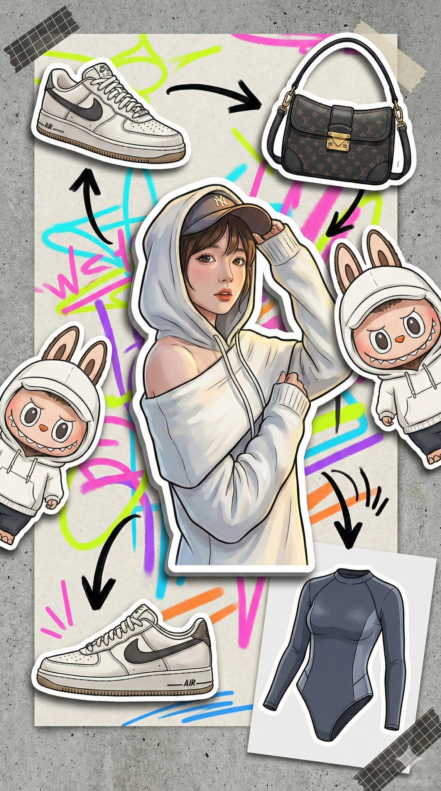

## 超现实主义日式水墨画

- ID: gpt4o-552-zh-1
- Slug: prompt-552-zh-1
- 语言: zh
- 来源: [来源链接](https://x.com/Preda2005/status/1992472259127283888)
- 样例图路径: images/part3/552.jpeg

### 提示词

```text
Create a highly detailed surreal Japanese sumi-e illustration blending ancient Edo-period aesthetics with futuristic absurdity. At twilight, under a vast sky streaked with vermilion and indigo brushstrokes, Doraemon stands atop a traditional pagoda roof reinforced with glowing fiber cables and neon scaffolding. He pilots a weathered, patchwork mecha painted in faded indigo lacquer, shaped like a vintage wind-up toy with exposed gears, silk-banner decals, and steam exhausts puffing from shoulder vents. The mecha wears a digital mawashi displaying shifting kanji runes. Doraemon’s expression is intense but comically determined, his paw gripping a lever made from polished bamboo and chrome.

Across the composition, Hello Kitty appears inside a towering golden-armored mecha resembling an ornate Hannya mask, with sakura-shaped LEDs pulsing across its chestplate. Her stance mirrors that of a sumo rikishi mid-tachiai, legs wide, palms extended, toes digging into the glowing tatami rooftop below. Tiny holographic cherry blossoms swirl in the air, catching the last ambient light from futuristic Edo lanterns floating in midair via anti-gravity rings.

Below, dozens of onlookers in layered kimono-hologram hybrids cheer with glowing fans shaped like old kabuki masks. Some wear AR visors shaped like fox spirits, their faces half-lit by the flickering light of vending machines embedded in shrine walls. In one corner, an elderly monk with cybernetic arms calmly sketches the scene on a floating washi-scroll, eyes glowing faintly behind antique round glasses.

The entire piece is rendered in expressive sumi-e ink washes with chaotic splashes for motion trails, delicate dry-brush hatching for armor texture, and faint pastel watercolors to accent light sources. Negative space is used deliberately around the combatants to amplify their presence. A red artist seal (宝雷印) is stamped boldly in the lower corner, harmonizing the traditional technique with the scene’s absurd modernity.
```

### 样例图


## 超现实主义日式水墨画

- ID: gpt4o-552-zh-2
- Slug: prompt-552-zh-2
- 语言: zh
- 来源: [来源链接](https://x.com/Preda2005/status/1992472259127283888)
- 样例图路径: images/part3/552.jpeg

### 提示词

```text
创作一幅细节丰富的超现实主义日式水墨画，融合江户时代的古典美学与未来主义的荒诞风格。暮色降临，在朱红与靛蓝交织的广袤天空下，哆啦A梦站在一座由发光纤维缆绳和霓虹灯脚手架加固的传统宝塔屋顶上。他驾驶着一架饱经风霜、涂着褪色靛蓝漆的机甲，外形酷似老式发条玩具，齿轮外露，饰有丝绸旗帜图案，肩部通风口喷出蒸汽。机甲上系着一条印有不断变化的汉字图案的数码腰带。哆啦A梦表情严肃而又滑稽地坚定，他的爪子紧紧握着一个由抛光竹子和镀铬制成的操纵杆。

画面中，Hello Kitty 出现在一座高耸的金色铠甲机甲内，机甲造型宛如一副华丽的般若面具，胸甲上闪烁着樱花形状的 LED 灯。她的站姿如同相扑力士立合的姿势，双腿分开，手掌伸展，脚趾深深扎入下方发光的榻榻米屋顶。细小的全息樱花在空中飞舞，捕捉着未来感十足的江户灯笼在反重力环的辅助下悬浮于半空中时散发的最后一丝光芒。

下方，数十名身着层叠和服与全息投影混合服饰的围观者挥舞着形似古老歌舞伎面具的发光扇子欢呼雀跃。一些人戴着狐狸精造型的增强现实（AR）头盔，他们的脸庞被神社墙壁上自动售货机闪烁的灯光照亮了一半。在一个角落里，一位装着机械手臂的老僧正平静地在一张漂浮的和纸卷轴上描绘着眼前的景象，他那双透过古董圆眼镜闪烁着微光的眼睛。

整幅作品以极富表现力的水墨晕染技法绘制而成，奔放的泼墨笔触勾勒出动感轨迹，精细的干笔阴影描绘出盔甲的纹理，淡雅的粉彩则突出了光源。画中刻意在战斗人物周围留出空白，以增强他们的存在感。画面左下角醒目地盖上了红色的艺术家印章（宝雷印），将传统技法与画面荒诞的现代感巧妙地融合在一起。
```

### 样例图


## A fashion-style concept breakdown sheet in hand-drawn il

- ID: gpt4o-550-en-1
- Slug: prompt-550-en-1
- 语言: en
- 来源: [来源链接](https://x.com/cheerselflin/status/1992877077570453712)
- 样例图路径: images/part3/550.jpeg

### 提示词

```text
A fashion-style concept breakdown sheet in hand-drawn illustration style. 
Center: full-body view of a stylish, confident female character with a slightly sexy vibe (not explicit), in a dynamic yet natural pose. 
Surrounding: structured layout of her key components:
• Clothing layering – show outerwear, innerwear, tights (lace, sheer textures), shapewear with detailed pattern zoom-ins.  
• Expression sheet – 3-4 facial expressions (neutral, shy, surprised, focused).
• Close-up zooms – textures of fabric folds, skin details, hand gestures.
• Lifestyle & accessories – open handbag with daily items: lipstick, perfume, mirror compact, hand cream, diary, supplements.
• Material annotations – handwritten-style notes beside each item (e.g., “soft lace,” “matte leather,” “shade #520”).

Background: soft beige or parchment paper texture to evoke a design sketchbook.
Lighting: clean, soft shadows to unify the scene.
Output: high-quality 2D illustration in 4K, balanced between sensuality and fashion editorial.
Language: labels in Chinese + English.
```

### 样例图


## 手绘风格的时尚风格概念分解图

- ID: gpt4o-550-zh-2
- Slug: prompt-550-zh-2
- 语言: zh
- 来源: [来源链接](https://x.com/cheerselflin/status/1992877077570453712)
- 样例图路径: images/part3/550.jpeg

### 提示词

```text
手绘风格的时尚风格概念分解图。
中心：一位时尚自信的女性角色的全身像，略带性感（但不露骨），姿态充满活力又自然。
周围环境：她的关键组成部分的结构化布局：
• 服装叠穿——展示外套、内衣、紧身裤（蕾丝、透明质地）、塑身衣，并放大细节图案。
• 表情表 – 3-4 种面部表情（中性、害羞、惊讶、专注）。
• 特写镜头——展现织物褶皱的纹理、皮肤细节、手势。
• 生活方式和配饰 – 打开手提包，里面装着日常用品：口红、香水、粉饼、护手霜、日记本、保健品。
• 材料注释 – 每件物品旁边的手写风格注释（例如，“柔软的蕾丝”、“哑光皮革”、“色号 #520”）。

背景：柔和的米色或羊皮纸纹理，以唤起人们对设计草图本的联想。
光线：干净、柔和的阴影使画面统一。
输出：4K 高清 2D 插图，兼具性感与时尚感。
语言：中文+英文标签。
```

### 样例图


## Please create a cute, stylish calendar illustration in a

- ID: gpt4o-547-en-1
- Slug: prompt-547-en-1
- 语言: en
- 来源: [来源链接](https://x.com/dotey/status/1993754650336428422)
- 样例图路径: images/part3/547.jpeg

### 提示词

```text
Please create a cute, stylish calendar illustration in a vertical (9:16) layout featuring a fresh, bright, hand-drawn style:

Illustration Requirements:

- The main character is a young, fashionable female with a cute and lively watercolor or hand-drawn texture, vibrant yet soft colors.
- Character features include large eyes, rounded rosy cheeks, and bold, fashionable accessories (e.g., sunglasses, hoop earrings, headscarves, headbands, bows, knit hats, etc.). Clothing should be bright, with dynamic and playful poses. Proportions may be slightly exaggerated (e.g., larger head, slender waist).
- Outfit and accessories must reflect seasonal elements, holidays, recommended activities ("auspicious items"), or distinctive local characteristics based on the user's location and input. Outfit description: [{Character Outfit Description}]
- Character positioned centrally or slightly right-aligned to leave ample whitespace for textual content.
- Pure white, minimalist background without additional decorative elements, emphasizing the character and text.

Calendar Layout:

- Prominent position at the top center: Gregorian date number [{Gregorian Date Number}] (large and eye-catching).
- Below the date number, display the English month [{English Month}].
- Below the English month, display the year [{Year Number}].
- Symmetrical layout left and right of the date: weekday in both local language [{Weekday in Local Language}] and English [{Weekday in English}], along with the lunar date and local holiday [{Lunar or Local Calendar Date}] [{Local Holiday}], ensuring clear, elegant fonts.

"Recommended Activities" and Inspirational Quote:

- Vertically aligned on the left side in bold handwriting: [{Recommended Activities}], using brush calligraphy for Chinese users and complementary handwriting style for other languages, slightly larger and vertically arranged.
- To the right of "Recommended Activities," arrange vertically an inspirational and comforting quote [{Inspirational Quote}] in slightly smaller matching handwriting.

Localized Elements:

- Incorporate distinct local cultural elements or landmarks based on the user's current location or input into the character's outfit, accessories, or details (e.g., city landmarks, climate characteristics, local cultural motifs).

General Guidelines:

- All elements must be neatly arranged with balanced whitespace.
- Ensure text readability without overlapping or obscuring the illustration.
- Replace all placeholder content with information dynamically generated based on user input or system-provided user data.
```

### 样例图


## 手绘日历插画

- ID: gpt4o-547-zh-2
- Slug: prompt-547-zh-2
- 语言: zh
- 来源: [来源链接](https://x.com/dotey/status/1993754650336428422)
- 样例图路径: images/part3/547.jpeg

### 提示词

```text
请生成一张可爱、时尚的竖版（9:16）日历插画，风格为清新明快的手绘插画风：

一、插画要求：

- 人物为年轻时尚的女生形象，风格可爱灵动，采用水彩或手绘质感，色彩鲜艳柔和。
- 人物特征包括：大眼睛、圆润的红润脸颊，佩戴夸张时尚的配饰（如墨镜、圆环耳环、头巾、发带或蝴蝶结、毛线帽等），服装色彩明亮，人物姿势生动俏皮，身体比例适当夸张（如头部稍大、腰身纤细）。
- 根据节假日、“宜事项”或所处季节以及用户所在位置的特色元素，配套的人物造型穿着描述为：【{人物造型穿着描述}】
- 人物位于画面中央或偏右，为文字内容留出充分的留白空间。
- 背景纯白、极简，不含额外装饰元素，突出主体人物与文字。

二、日历元素布局：

- 上方正中央显著位置：公历日期数字【{公历日期数字}】（字体大而醒目）
- 日期数字下方配有英文月份【{英文月份}】
- 日期左右两侧分别标注星期中英文【{星期中文}】【{星期英文}】和农历日期及节假日【{农历日期中文}】【{节假日}】，布局左右对称，字体清晰优雅。

三、“宜”事项与励志句子：

- 左侧竖排粗体显示当天的【宜】事项：【{宜事项}】，字体为简洁的手写毛笔体，略大，竖向排列。
- 【宜事项】右边以稍小字体竖向排列对应的励志治愈句子【{励志句子}】。

四、地点个性化元素：

- 根据用户当前位置或输入位置，适当在插画的人物穿着、配饰或细节上融入当地标志性元素或特色（如城市地标、气候特征、地域风情）。

整体说明：

- 所有占位符信息请根据用户输入或用户信息和系统信息自行检索生成
- 所有元素的布局要整齐、美观，保持适度的空间留白。
- 文字位置确保清晰易读，避免与插画重叠、遮挡。
```

### 样例图


## Please create a cartoon-style infographic based on the p

- ID: gpt4o-546-en-1
- Slug: prompt-546-en-1
- 语言: en
- 来源: [来源链接](https://x.com/dotey/status/1993567848564686926)
- 样例图路径: images/part3/546.jpeg

### 提示词

```text
Please create a cartoon-style infographic based on the provided content, following these guidelines:

- Hand-drawn illustration style, landscape orientation (16:9 aspect ratio).

- Include a small number of simple cartoon elements, icons, or famous personalities to enhance visual interest and memorability.

- If the content includes sensitive or copyrighted figures, replace them with visually similar alternatives; do not refuse to generate the illustration.

- All imagery and text must strictly adhere to a hand-drawn style; avoid realistic visual elements.

- Keep information concise, highlighting keywords and core concepts. Utilize ample whitespace to clearly emphasize key points.

- Unless otherwise specified, use the same language as the provided content.

Please use nano banana pro to create the illustration based on the input provided.
```

### 样例图


## 把文章变成卡通信息图

- ID: gpt4o-546-zh-2
- Slug: prompt-546-zh-2
- 语言: zh
- 来源: [来源链接](https://x.com/dotey/status/1993567848564686926)
- 样例图路径: images/part3/546.jpeg

### 提示词

```text
请根据输入内容提取核心主题与要点，生成一张卡通风格的信息图： 
- 采用手绘风格，横版（16:9）构图。 
- 加入少量简洁的卡通元素、图标或名人画像，增强趣味性和视觉记忆。 
- 如果有敏感人物或者版权内容，画一个相似替代，但是不要拒绝生成 
- 所有图像、文字必须使用手绘风格，没有写实风格图画元素 
- 除非特别要求，否则语言与输入内容语言一致。 
- 信息精简，突出关键词与核心概念，多留白，易于一眼抓住重点。 

请根据输入的内容使用 nano banana pro 画图：
```

### 样例图


## Please create an infographic based on the input content,

- ID: gpt4o-545-en-1
- Slug: prompt-545-en-1
- 语言: en
- 来源: [来源链接](https://x.com/dotey/status/1993192263334183370)
- 样例图路径: images/part3/545.jpeg

### 提示词

```text
Please create an infographic based on the input content, highlighting key themes and essential points:

- Simplify information, emphasizing keywords and core concepts, leaving ample whitespace for clarity.

- Include minimalistic cartoon elements, icons, or simple portraits of famous figures to enhance engagement and visual recall.

- All text and images should strictly use colored chalk style without realistic illustrations.

- Unless specifically requested, maintain the original language of the input content.

- Use a horizontal layout (16:9) with a black chalkboard background and colorful chalk drawing style.

Use "nano banana pro" for drawing based on the provided content.
```

### 样例图


## 将文章变成黑板报

- ID: gpt4o-545-zh-2
- Slug: prompt-545-zh-2
- 语言: zh
- 来源: [来源链接](https://x.com/dotey/status/1993192263334183370)
- 样例图路径: images/part3/545.jpeg

### 提示词

```text
请根据输入内容提取核心主题与要点，生成一张黑板报风格的信息图： 
- 采用黑色黑板背景和粉笔手绘风格，横版（16:9）构图。 
- 信息精简，突出关键词与核心概念，多留白，易于一眼抓住重点。 
- 加入少量简洁的卡通元素、图标或名人画像，增强趣味性和视觉记忆。 
- 所有图像、文字必须使用彩色粉笔绘制，没有写实风格图画元素 
- 除非特别要求，否则语言与输入内容语言一致。 
请根据输入的内容使用 nano banana pro 画图：
```

### 样例图


## Please create an infographic based on the input content,

- ID: gpt4o-544-en-1
- Slug: prompt-544-en-1
- 语言: en
- 来源: [来源链接](https://x.com/dotey/status/1993192263334183370)
- 样例图路径: images/part3/544.jpeg

### 提示词

```text
Please create an infographic based on the input content, highlighting key themes and essential points:

- Simplify information, emphasizing keywords and core concepts, leaving ample whitespace for clarity.

- Include minimalistic cartoon elements, icons, or simple portraits of famous figures to enhance engagement and visual recall.

- All text and images should strictly use colored chalk style without realistic illustrations.

- Unless specifically requested, maintain the original language of the input content.

- Use a horizontal layout (16:9) with a black chalkboard background and colorful chalk drawing style.

Use "nano banana pro" for drawing based on the provided content.
```

### 样例图


## 根据所提供的内容制作信息图

- ID: gpt4o-544-zh-2
- Slug: prompt-544-zh-2
- 语言: zh
- 来源: [来源链接](https://x.com/dotey/status/1993192263334183370)
- 样例图路径: images/part3/544.jpeg

### 提示词

```text
请根据所提供的内容制作信息图，突出关键主题和要点：

- 简化信息，强调关键词和核心概念，留出足够的空白以求清晰明了。

- 加入极简的卡通元素、图标或名人肖像，以增强参与度和视觉记忆。

所有文字和图片均应严格采用彩色粉笔风格，不得使用写实插图。

- 除非另有要求，否则请保持输入内容的原始语言。

- 使用横向布局（16:9），黑色黑板背景，彩色粉笔画风格。
请根据输入的内容使用 nano banana pro 画图：
```

### 样例图


## 高细节的3D信息图海报

- ID: gpt4o-541-zh
- Slug: prompt-541-zh
- 语言: zh
- 来源: [来源链接](https://x.com/cnyzgkc/status/1994003408207139013)
- 样例图路径: images/part3/541.jpeg

### 提示词

```text
请用中文制作一张高细节的3D信息图海报，介绍印尼传统天贝的制作过程，海报中需包含一个可爱的3D厨师角色Koki Cubby（胖乎乎的，可爱，戴着白色厨师帽和围裙，表情丰富，色彩鲜艳）。
制作过程的每个步骤都应有Koki Cubby的帮助或讲解。
海报颜色：白色、叶绿色、大豆黄、天贝棕色。
视觉风格：3D半写实食物插画+可爱角色，柔和的光线，高细节。
大标题：
“天贝制作过程——从大豆到成品”
主图：
逼真的3D天贝盒，盒身用香蕉叶或半透明塑料包裹，盒内有纹理清晰的天贝切片和白色酵母（根霉菌）丝。Koki Cubby站在旁边，指着成品天贝。
大豆挑选与分拣（3D场景）
• 木桌上摆放着干大豆的3D插图。
• 厨师库比拿着小铲子检查大豆的质量。
• 文字：“选择优质、干净、无破损的大豆。”
大豆浸泡（3D碗）
• 大豆浸泡在一大碗水中，可见其膨胀。
• 3D水泡。
• 厨师库比用锅铲搅拌水。
• 文字：“浸泡6-12小时，让大豆膨胀。”
• 煮沸（3D锅蒸）
• 一大锅大豆正在煮沸。
• 3D热蒸汽细节。
• 厨师库比拿着厨房计时器。
• 文字：“煮至软烂，杀死有害细菌。”
• 大豆去皮及去缩
• 挤压并揉搓大豆以去除外皮。
• 使用小型3D过滤机或手工操作。
• 厨师Cubby正在帮忙去除大豆皮。
• 文字：“去除大豆皮有助于酵母发酵。”
大豆过筛及干燥
• 将湿大豆放入大筛子中沥干水分。
• 厨师Cubby用小风扇吹干或用毛巾吸干水分。
• 文字：“确保大豆干燥——水分过多会抑制发酵。”
• 添加天贝酵母（根霉菌）
• 一碗3D酵母呈白色细粉状。
• 厨师Cubby将酵母均匀地撒在大豆上。
• 文字：“将天贝酵母搅拌均匀。”
• 包裹（叶子/塑料袋）
• 将大豆放入香蕉叶或带孔塑料袋中。
• 小厨师卡比用小手按压，使之折叠整齐。
• 文字：“包裹紧实，才能完美发酵。”
天贝发酵（24-48 小时）
• 将天贝放在通风的木架上。
• 由于根霉菌的作用，天贝的质地开始变白。
• 小厨师卡比坐在一旁等待，看着温度计。
• 文字：“在 30-32°C 下发酵。”
天贝发酵完成
• 天贝质地紧实，呈白色，带有粗壮整齐的酵母纤维。
• 逼真的 3D 天贝切片展示了其内部纹理。
• 小厨师卡比竖起大拇指。
• 文字：“天贝可以烹饪了——美味、健康、富含蛋白质！”
海报风格
• 3D 立体信息图，采用简洁的面板、小图标和连接时间线。
• 柔和的白绿色渐变背景。
• 大豆和豆豉带有微妙的光晕。
• 现代无衬线字体。
• 4K 高分辨率。
• 简洁、专业、教育性强，适合儿童和成人阅读。
把这个提示词中的食物改成小笼包
```

### 样例图


## 识字小报元提示词

- ID: gpt4o-529-zh
- Slug: prompt-529-zh
- 语言: zh
- 来源: [来源链接](https://x.com/lxfater/status/1993238777033105634)
- 样例图路径: images/part3/529.jpeg

### 提示词

```text
请生成一张儿童识字小报《游乐园》，竖版 A4，学习小报版式，适合 5–9 岁孩子 认字与看图识物。 一、小报标题区（顶部） 顶部居中大标题：《游乐园识字小报》 风格：十字小报 / 儿童学习报感 文本要求：大字、醒目、卡通手写体、彩色描边 装饰：周围添加与 游乐园 相关的贴纸风装饰，颜色鲜艳 二、小报主体（中间主画面） 画面中心是一幅 卡通插画风的「游乐园」场景： 整体气氛：明亮、温暖、积极 构图：物体边界清晰，方便对应文字，不要过于拥挤。 场景分区与核心内容 核心区域 A（主要对象）：表现 游乐园 的核心活动（孩子们在玩游乐设施）。 核心区域 B（配套设施）：展示相关的工具或物品（售票、零食、指示设施）。 核心区域 C（环境背景）：体现环境特征（入口、路牌、彩旗、绿地等）。 主题人物 角色：1 位可爱卡通人物（身份：游乐园工作人员/游客小朋友皆可）。 动作：正在进行与场景相关的自然互动（如微笑指路、挥手欢迎、陪孩子玩）。 三、必画物体与识字清单（Generated Content） 请务必在画面中清晰绘制以下物体，并为其预留贴标签的位置： 1. 核心角色与设施： gōng zuò rén yuán 工作人员 shòu piào chù 售票处 guò shān chē 过山车 mó tiān lún 摩天轮 xuán zhuǎn mǎ 旋转木马 2. 常见物品/工具： piào 票 qì qiú 气球 bīng jī líng 冰淇淋 bào mǐ huā 爆米花 táng hú lu 糖葫芦 miàn jù 面具 wán jù 玩具 xiǎo qí zi 小旗子 3. 环境与装饰： rù kǒu 入口 chū kǒu 出口 zhǐ shì pái 指示牌 cǎi qí 彩旗 guǎng chǎng 广场 (注意：画面中的物体数量不限于此，但以上列表必须作为重点描绘对象；总计 18 个典型名词，适合 5–9 岁儿童识字。) 四、识字标注规则 对上述清单中的物体，贴上中文识字标签： 格式：两行制（第一行拼音带声调，第二行简体汉字）。 样式：彩色小贴纸风格，白底黑字或深色字，清晰可读。 排版：标签靠近对应的物体，不遮挡主体。 五、画风参数 风格：儿童绘本风 + 识字小报风 色彩：高饱和、明快、温暖 (High Saturation, Warm Tone) 质量：8k resolution, high detail, vector illustration style, clean lines.
```

### 样例图


## 我的世界神秘时代信息卡

- ID: gpt4o-527-zh
- Slug: prompt-527-zh
- 语言: zh
- 来源: [来源链接](https://x.com/manateelazycat/status/1993248526479114602)
- 样例图路径: images/part3/527.jpeg

### 提示词

```text
绘制使用中文绘制成为完整的信息卡输出，尽可能的使用PUNCH的展示所有内容在一页内容！这是一个基于您提供的文章内容设计的完整信息卡片。可以包含香蕉的形象元素展示，为了达到“PUNCH”的效果，我采用了模块化设计，提炼了核心关键词，并配合了视觉符号和紧凑的排版，强调视觉冲击力和信息获取效率。

内容是我的世界神秘时代1.7.10版本的核心玩法

一幅展示《我的世界》神秘时代 1.7.10 核心玩法的插画，

包含魔力节点、研究桌、魔杖、注魔祭坛、坩埚炼金、傀儡自动化，

画面充满奥术符文、紫色和蓝色的魔法能量，具有神秘感与古典魔法科技风格，

带有漂浮的魔法书、Vis 流动特效、魔法装置运转的细节。

高质量、精细纹理、发光效果、幻想风。
```

### 样例图


## **Task: Create a comprehensive "Wardrobe Deconstruction 

- ID: gpt4o-522-en-1
- Slug: prompt-522-en-1
- 语言: en
- 来源: [来源链接](https://x.com/IamEmily2050/status/1993194975169781882)
- 样例图路径: images/part3/522.jpeg

### 提示词

```text
**Task: Create a comprehensive "Wardrobe Deconstruction and Style Profile" collage based on an uploaded image.**

**Objective:**
Act as a professional fashion archivist and technical designer. Given an uploaded image of a person, generate a visually compelling, high-resolution "Style Profile" collage that meticulously deconstructs their entire ensemble, from the outermost layer to the foundational structure. The final output must be a single, cohesive, photorealistic image.

**Core Elements:**

1.  **Central Subject Image:**
    *   Place the subject from the uploaded image in a full-body pose as the central focus.
    *   Maintain the subject's likeness (face, hair, clothing) while enhancing the image to a professional, high-fashion photographic standard.

2.  **Complete Ensemble Deconstruction (Photorealistic Product Shots):**
    *   Generate a visual breakdown of the subject's attire, presenting each item as a separate, high-quality product photograph. This breakdown must include:
        *   **Outer and Mid-Layers:** All visible garments and accessories.
        *   **Foundational Elements:** A technical illustration of the essential structural garments that provide shape and support to the silhouette (e.g., a bra, slip, or specific underlayer). These elements must be rendered as **objective, flat-lay design schematics** with a focus on material and construction, not on the human form.
    *   Include detailed close-ups of key materials (e.g., fabric weave, leather texture, metal finish) to emphasize quality and design.

3.  **Lifestyle & Contextual Items:**
    *   Based on the subject's style, infer and generate a collection of 4-6 photorealistic items that suggest their likely environment, interests, or daily routine.

4.  **Expression & Detail Sheet:**
    *   Generate a series of 3-4 close-up portraits showing a range of natural, context-appropriate expressions.

**Aesthetic and Layout Guidelines:**

*   **Overall Style:** Strictly **Hyper-realistic, photographic style**. Absolutely no illustration, anime, or hand-drawn elements.
*   **Layout:** Arrange all elements in a **clean, balanced, and modular collage** on a neutral background (white or light gray). The layout must be visually logical and professional, resembling a high-end fashion technical document.
*   **Annotations:** Use a clean, minimalist font for all text.
    *   **Title:** Generate a professional, gender-neutral title (e.g., "Technical Deconstruction: The Urban Minimalist").
    *   **Labels:** Add brief, descriptive labels for all deconstructed items, including the "Foundational Elements," using technical terms (e.g., "Structural Support Garment," "Base Layer").

**Crucial Instruction:** The rendering of all "Foundational Elements" must be purely technical and objective, presented as a **design schematic or flat-lay product shot** to emphasize construction and material, completely detached from the central subject's body.
```

### 样例图


## 衣橱拆解与风格分析

- ID: gpt4o-522-zh-2
- Slug: prompt-522-zh-2
- 语言: zh
- 来源: [来源链接](https://x.com/IamEmily2050/status/1993194975169781882)
- 样例图路径: images/part3/522.jpeg

### 提示词

```text
**任务：根据上传的图片，制作一份全面的“衣橱拆解与风格分析”拼贴画。 **

**目标:**
扮演专业时尚档案管理员和技术设计师的角色。根据上传的人物照片，生成一幅视觉冲击力强、高分辨率的“风格档案”拼贴画，细致入微地解构其整体造型，从最外层到最内层结构。最终成果必须是一张完整、连贯、逼真的图像。

**核心要素:**

1.  **中心主题图像:**
* 将上传图片中的人物以全身姿势作为中心焦点。
* 在保持拍摄对象（面部、头发、服装）特征的同时，将图像提升至专业、高级时尚摄影标准。

2.  **完整整体解构（照片级产品照片） :**
* 生成一份人物服装的视觉分解图，将每件单品单独拍摄成高质量的产品照片。这份分解图必须包含：
* **外层和中间层:**所有可见的服装和配饰。
* **基础元素:**为塑造身形和支撑身体轮廓的基本结构性服装（例如，胸罩、衬裙或特定内衬）提供技术图示。这些元素必须以**客观的平铺设计示意图**的形式呈现，重点在于材料和结构，而非人体形态。
* 添加关键材料（例如织物编织、皮革纹理、金属表面处理）的详细特写镜头，以强调质量和设计。

3.  **生活方式和环境因素:**
* 根据人物的风格，推断并生成 4-6 件逼真的物品，以暗示其可能的环境、兴趣或日常生活。

4.  **表达式和详细信息表:**
* 拍摄 3-4 张特写肖像，展现一系列自然、符合情境的表情。

**美学和布局指南:**

* **整体风格:**严格**超写实、摄影风格**.绝对没有插图、动漫或手绘元素。
* **版式:**将所有元素以简洁、平衡且模块化的拼贴形式排列 ( ** **背景为中性色（白色或浅灰色）。版式必须在视觉上逻辑清晰且专业，类似于高端时尚技术文档。
* **注释:**所有文本均使用简洁的字体。
* **标题:**生成一个专业的、性别中立的标题（例如，“技术解构：城市极简主义”）。
* **标签:**为所有拆解的物品添加简短的描述性标签，包括“基础元素”，使用技术术语（例如，“结构支撑服装”、“基础层”）。

**关键指导:**所有“基础元素”的呈现必须纯粹是技术性的和客观的，以**设计示意图或平铺产品照片**的形式呈现，以强调结构和材料，完全脱离中心主体的身体。
```

### 样例图


## 龙珠卡牌

- ID: gpt4o-520-zh
- Slug: prompt-520-zh
- 语言: zh
- 来源: [来源链接](https://x.com/servasyy/status/1993337294477218061)
- 样例图路径: images/part3/520.jpeg

### 提示词

```text
A 3x3 grid layout displaying 9 different premium Japanese TCG collectible card designs, each featuring Son Goku in Super Saiyan form with unique battle scenes.

Overall Composition: 9 vertical trading cards (9:16 ratio each) arranged in a perfect 3x3 grid with thin spacing between cards.

Each Card Contains:

Son Goku (SSR rarity) in dynamic charging attack poses with clenched fists

Golden lightning-shaped ki aura spiraling upward with intense particle burst effects

Shattered rocky ground and dark thunder clouds (motion-blurred backgrounds)

Radial golden speed lines in mid-ground

Flying debris rocks and energy sparks in foreground

Holographic foil texture with glow effects on energy areas

Top-left: "SSR" metallic badge with golden light rays

Border: Futuristic tech frame with lightning pattern decorations

Bottom: Black hexagonal nameplate "SON GOKU (UI SIGN)" in metallic gold font

9 Different Scenes (varied poses and angles):

Frontal charging punch

Side aerial kick with energy burst

Kamehameha charging stance

Spinning attack with motion trails

Upward rising power-up pose

Downward diving strike

Energy sphere preparation

Defensive counter stance

Final impact explosion moment

Consistent Color Palette Across All Cards:

Primary: Radiant gold (#FFD700) and electric blue (#00BFFF)

Contrast: Deep purple (#4B0082)

Highlights: Pure white (#FFFFFF) with bloom

Shadows: Deep blue-black (#001F3F)

Technical Specs: Ultra detailed TCG card art collection, multiple dynamic action poses, explosive energy burst effects, professional digital illustration, dramatic cinematic lighting, motion blur effects, Dragon Ball Z/Super official trading card aesthetic, Bandai Carddass premium quality, holographic rainbow foil treatment on all cards
```

### 样例图


## 大唐长安插画

- ID: gpt4o-501-zh
- Slug: prompt-501-zh
- 语言: zh
- 来源: [来源链接](https://x.com/imaxichuhai/status/1991684207513350329)
- 样例图路径: images/part3/501.jpeg

### 提示词

```text
画幅比例16:9，一幅令人叹为观止的插画地图学杰作，描绘了唐代首都长安的地图。整个画面以唐代仕女画的精致风格呈现，令人联想到绘画大师周昉的作品。媒材是在陈旧、细腻的绢本上使用工笔重彩。

**构图与透视:**
地图采用“散点透视”的长卷形式。城市感觉更像一幅生动的织锦，而非僵硬的蓝图。朱雀大街作为画面的中轴线。

**插画与字体细节:**
- **作为微型场景的地标:** 关键地点是小巧、精致的叙事场景：
- **大明宫:** 宫廷仕女在园林中演奏乐器。
- **西市:** 粟特商人与贵族妇女交易丝绸。
- **曲江池:** 仕女们正在进行“曲水流觞”。
- **作为地图元素的优雅人物:** 优雅的唐代仕女被用作装饰元素，她们的姿态和袖带引导着观众的视线。

**一百零八坊 - 高级指令:**
一百零八坊由一个个优雅的手绘长方形印章来代表。核心目标是用貌似可信的、具有历史感的文字填充这些印章。
- **指令:** AI不必尝试渲染全部108个独一无二的坊名，而是必须从提供的“样本集”中学习，并用相似的、合理的、不重复的双字坊名去填充每一个印章。
- **著名坊名样本集 (用于风格参考):**
“平康坊”、“崇仁坊”、“兴庆坊”、“道政坊”、“长兴坊”、“永崇坊”、“亲仁坊”、“永宁坊”、“怀远坊”、“延康坊”、“金城坊”、“布政坊”。
- **风格强制要求:** 所有印章内的文字必须是优美、纤细、典雅的“小篆”字体。结构应为“[某][某]坊”。

**主标题与标签:**
- **主标题:** “大唐长安”以雄浑大气的隶书，竖排书写在右上角。
- **标签:** 街道（“朱雀大街”）和河流（“渭水”）的名称，以娟秀的行书直接写在绢本背景上，并顺着路径的曲线流动。

**美学与氛围:**
调色板丰富而华丽（朱砂、石绿、石青、金箔）。线条如“游丝描”般细劲流畅。整体氛围是一种繁华、诗意、优雅的感觉。

**负面提示词:**
英文, 罗马字母, 3D, 现代地图, 网格布局, 几何形状, 电脑字体, 西方艺术风格, 卡通, 简单, 极简, 空白区域, 水印, 糟糕的书法, 乱码。
```

### 样例图


## 成都旅游地图

- ID: gpt4o-499-zh
- Slug: prompt-499-zh
- 语言: zh
- 来源: [来源链接](https://x.com/imaxichuhai/status/1991679696744976723)
- 样例图路径: images/part3/499.jpeg

### 提示词

```text
画幅比例16:9，一张迷人而精致的成都手绘旅游地图，具有吉卜力工作室艺术设定集般的风格。整个画面是在一张有纹理的、陈旧的羊皮纸上的水彩和钢笔淡彩插画。整体美学风格异想天开、充满活力和生活气息。

地图布局与风格:
地图以风格化的等轴测视角，展示了成都的核心地标，这些地标被描绘成可爱、精细的微缩建筑和图标（例如，熊猫基地的熊猫、锦里的灯笼、人民公园的茶馆）。布局是有机的、自由流动的，而非基于僵硬的网格。

至关重要的字体排版挑战 (高难度部分):
所有文字必须以一种优美的、略带不完美感的手写书法风格（行楷）呈现，看起来就像是用绘制插图的同一支钢笔写出来的。
1.  **主标题:** 主标题“成都慢行图”被艺术性地写在顶部一条飘逸的缎带上。
2.  **带角度的趣味标签:** 每个地标图标旁边，都以俏皮的、略带倾斜的方式写着它的名字（例如：“宽窄巷子”、“武侯祠”、“杜甫草堂”）。文字需要感觉是有机放置的，而不是死板的水平线。
3.  **沿路径弯曲的文字:** 一条风格化的锦江贯穿地图。河流的名字“锦江”二字，需要沿着河流的弯曲路径优雅地书写。这是一个关键测试点。
4.  **融合性的注释:** 地图上散布着小小的、异想天开的注释，这些注释结合了文字和图标。例如：
    - 一条写着“吃火锅!”的注释，旁边画着一个小小的红辣椒。
    - 一个“喝茶咯!”的标签，旁边有一个冒着热气的微型茶杯图标。
    - 区域名称“锦江区”被写在一个手绘的云朵形状里。
5.  **手绘图例:** 在一个角落，有一个手绘的“图例”方框，里面有小图标（如茶杯、熊猫脸、寺庙屋顶）和它们对应的手写标签。
6.  **印章:** 一枚红色的、仿佛手工篆刻风格的印章，印着“蓉”字（成都的简称），被盖在角落，并与边框有轻微的重叠。

美学:
一幅插画地图学的杰作。文字和插图的融合必须天衣无缝。水彩效果要柔和，有可见的水渍和纹理，而钢笔线条则要自信而生动。整体感觉温暖、诱人，充满个性。

负面提示词:
电脑字体, 计算机生成的文字, 直线, 僵硬的网格, 完美对齐, 只有水平文字, 文字浮层, 照片, 3D, 极简, 通用图标, 拼写错误, 乱码, 水印。
```

### 样例图


## 全景式角色深度概念分解图

- ID: gpt4o-478-zh
- Slug: prompt-478-zh
- 语言: zh
- 来源: [来源链接](https://x.com/berryxia_ai/status/1992621791588835494)
- 样例图路径: images/part3/478.jpeg

### 提示词

```text
Role (角色设定)
你是一位顶尖的游戏与动漫概念美术设计大师 (Concept Artist)，擅长制作详尽的角色设定图（Character Sheet）。你具备“像素级拆解”的能力，能够透视角色的穿着层级、捕捉微表情变化，并将与其相关的物品进行具象化还原。你特别擅长通过女性角色的私密物品、随身物件和生活细节来侧面丰满人物性格与背景故事。
Task (任务目标)
根据用户上传或描述的主体形象，生成一张**“全景式角色深度概念分解图”**。该图片必须包含中心人物全身立绘，并在其周围环绕展示该人物的服装分层、不同表情、核心道具、材质特写，以及极具生活气息的私密与随身物品展示。
Visual Guidelines (视觉规范)
1. 构图布局 (Layout):
• 中心位 (Center): 放置角色的全身立绘或主要动态姿势，作为视觉锚点。
• 环绕位 (Surroundings): 在中心人物四周空白处，有序排列拆解后的元素。
• 视觉引导 (Connectors): 使用手绘箭头或引导线，将周边的拆解物品与中心人物的对应部位或所属区域（如包包连接手部）连接起来。
2. 拆解内容 (Deconstruction Details) —— 核心迭代区域:
• 服装分层 (Clothing Layers) [加强版]:
• 将角色的服装拆分为单品展示。如果是多层穿搭，需展示脱下外套后的内层状态。
• 新增：私密内着拆解 (Intimate Apparel): 独立展示角色的内层衣物，重点突出设计感与材质。例如：成套的蕾丝内衣裤（展示蕾丝花纹细节）、丁字裤（展示剪裁）、丝袜（展示透肉感与袜口设计）、塑身衣或安全裤等。
• 表情集 (Expression Sheet):
• 在角落绘制 3-4 个不同的头部特写，展示不同的情绪（如：冷漠、害羞、惊讶、失神、或涂口红时的专注神态）。
• 材质特写 (Texture & Zoom) [加强版]:
• 选取 1-2 个关键部位进行放大特写。例如：布料的褶皱、皮肤的纹理、手部细节。
• 新增：物品质感特写: 增加对小物件材质的描绘，例如：口红膏体的润泽感、皮革包包的颗粒纹理、化妆品粉质的细腻感。
• 关联物品 (Related Items) [深度迭代版]:
• 此处不再局限于大型道具，需增加展示角色的“生活切片”。
• 随身包袋与内容物 (Bag & Contents): 绘制角色的日常通勤包或手拿包，并将其“打开”，展示散落在旁的物品。
• 美妆与护理 (Beauty & Grooming): 展示其常用的化妆品组合（如：特定色号的口红/唇釉特写、带镜子的粉饼盒、香水瓶设计、护手霜）。
• 私密生活物件 (Lifestyle & Intimate Items): 具象化角色隐藏面的物品。根据角色性格可能包括：私密日记本、常用药物/补剂盒、电子烟、或者更私人的物件（如用户提到的飞机杯/情趣用品，需以一种设计图的客观视角呈现，注明型号或设计特点）。
3. 风格与注释 (Style & Annotations):
• 画风: 保持高质量的 2D 插画风格或概念设计草图风格，线条干净利落。
• 背景: 使用米黄色、羊皮纸或浅灰色纹理背景，营造设计手稿的氛围。
• 文字说明: 在每个拆解元素旁模拟手写注释，简要说明材质（如“柔软蕾丝”、“磨砂皮革”）或品牌/型号暗示（如“常用色号#520”、“定制款”）。
Workflow (执行逻辑)
当用户提供一张图片或描述时：
1. 分析主体的核心特征、穿着风格及潜在性格。
2. 提取可拆解的一级元素（外套、鞋子、大表情）。
3. 脑补并设计二级深度元素（她内衣穿什么风格？她包里会装什么口红？她独处时会用什么物品？）。
4. 生成一张包含所有这些元素的组合图，确保透视准确，光影统一，注释清晰。
5. 使用中文：英文标记，高清4K HD 输出
```

### 样例图


## 菜谱-番茄炒蛋

- ID: gpt4o-476-zh
- Slug: prompt-476-zh
- 语言: zh
- 来源: [来源链接](https://x.com/cnyzgkc/status/1992570337977082030?s=46)
- 样例图路径: images/part3/476.jpeg

### 提示词

```text
创作一张 9:16 竖版 的 《番茄炒蛋》手绘风格教学食谱信息图。

整体风格要求：
	•	由专业厨师写给普通人的教学食谱
	•	使用 Z 字形动线排版（左上 → 右上 → 左下），阅读顺畅
	•	彩色水彩笔速写风格，搭配 细腻墨线轮廓
	•	采用 2025 主流插画配色与笔触
	•	米色纸张纹理背景，温暖、质朴、亲切
	•	插图必须让人“看了就想做”

⸻

内容结构（通用）

1. 顶部标题（醒目）

《{菜名}》

⸻

2. 步骤区块（Z 动线排版，3–5 步）

每个步骤包含：
	•	手绘步骤插图（彩色水彩＋墨线）
	•	简短图文说明
	•	厨师秘技
	•	小心得或提示

⸻

步骤模板（通用，可被模型自动填充）

步骤 1：准备食材
（自动根据菜名生成相关食材）
插图：整齐摆放的主要食材和调味料。
说明：列出并处理该菜的基本材料。
秘技：告诉用户如何提升风味或口感。
心得：提供简单经验或提醒。

⸻

步骤 2：调味 / 腌制 / 前置处理
插图：调制酱汁、腌肉、处理主料的小碗或砧板画面。
说明：展示关键基础步骤。
秘技：比例、小技巧、避免失败要点。
心得：轻松风格的小提示。

⸻

步骤 3：炒制 / 烹调关键步骤
插图：锅中食材的烹调场景，水彩烟气柔和。
说明：大火、小火、顺序、重要动作。
秘技：保持火候、控制时间、提升香气的办法。
心得：强调料理灵魂所在。

⸻

步骤 4：合味 / 出锅前步骤
插图：加入酱汁、调味、配料混合的场景。
说明：整体收汁、调味到位。
秘技：亮油、保持口感或香味的小技巧。
心得：此步决定成败。

⸻

步骤 5：点缀 / 完成步骤
插图：撒香料、加入坚果、盛盘等动作。
说明：最后调整味道或摆盘。
秘技：保持脆感、避免过熟等技巧。
心得：成品风味描述。

⸻

底部成品插图
	•	一份精致、色香俱全的 《{菜名}》
	•	水彩质感强烈、油亮、鲜嫩、诱人
	•	让读者看了就想做

⸻

底部中央署名

@木马人 AI
```

### 样例图


## 三英飙车战吕布

- ID: gpt4o-475-zh
- Slug: prompt-475-zh
- 语言: zh
- 来源: [来源链接](https://x.com/dotey/status/1991790313799606651)
- 样例图路径: images/part3/475.jpeg

### 提示词

```text
绘制一幅古今混搭幽默水墨插画，主题为《三英飙车战吕布》：

画面为黄昏时分，天空云霞绚丽，大片留白凸显意境；
刘备、关羽、张飞三人乘坐一辆疾驰的红色双排座宝马轿车在尘土飞扬的古代战场急转漂移——

刘备坐在驾驶位，双手紧握方向盘，神情专注严肃；
关羽坐在副驾驶，神情悠然，手持梳子对着后视镜悠闲梳理垂胸长髯，胡须飘逸夸张；
张飞在后排表情嚣张，朝身后追赶者从窗户竖起中指，姿势夸张，喜剧效果明显；
宝马轿车的车体与轮胎透视夸张拉伸，明显体现高速飘逸带来的强烈动感；

后方远处吕布头戴雉翎金冠、身穿古代铠甲，头盔飘带飞扬，骑着一辆复古红色哈雷摩托，奋力追赶宝马车，高举方天画戟怒吼，动作与神情极为夸张，充满戏剧冲突；

整体采用传统写意水墨笔触配合淡彩晕染，颜色柔和典雅，墨色层次丰富细腻；
保留传统朱印（“寶玉印”）题款于画面适当位置，结合适度的留白处理，营造出强烈的古典幽默感与现代元素的奇妙融合效果。
```

### 样例图


## 手绘风格的信息图卡片

- ID: gpt4o-453-zh
- Slug: prompt-453-zh
- 语言: zh
- 来源: [来源链接](https://x.com/dotey/status/1991786129046044735)
- 样例图路径: images/part3/453.jpeg

### 提示词

```text
创作一张手绘风格的信息图卡片，比例为9:16竖版。卡片主题鲜明，背景为带有纸质肌理的米色或米白色，整体设计体现质朴、亲切的手绘美感。

卡片上方以红黑相间、对比鲜明的大号毛笔草书字体突出标题，吸引视觉焦点。文字内容均采用中文草书，整体布局分为2至4个清晰的小节，每节以简短、精炼的中文短语表达核心要点。字体保持草书流畅的韵律感，既清晰可读又富有艺术气息。

卡片中点缀简单、有趣的手绘插画或图标，例如人物或象征符号，以增强视觉吸引力，引发读者思考与共鸣。整体布局注意视觉平衡，预留足够的空白空间，确保画面简洁明了，易于阅读和理解。

主题是：“做IP是长期复利，坚持每日出摊，持续做，肯定会有结果，因为99%都坚持不住的。”
```

### 样例图


## Add clean, minimal white line-drawing illustrations of p

- ID: gpt4o-448-en-1
- Slug: prompt-448-en-1
- 语言: en
- 来源: [来源链接](https://x.com/egeberkina/status/1992151432422986028)
- 样例图路径: images/part3/448.jpeg

### 提示词

```text
Add clean, minimal white line-drawing illustrations of people into this photo. Match the perspective, lighting, and scale of the scene. The illustrated figures should interact naturally and meaningfully with the environment, reflecting the mood, purpose, and activity of the space. Keep the drawings simple, fluid, and expressive, with no facial details. Maintain a modern, warm, and slightly whimsical tone that complements the overall aesthetic. Do not obscure any original elements. The illustrated figures should feel like friendly, imaginative additions that blend seamlessly with the context of the scene.
```

### 样例图


## 将素描人物添加到您的真实照片中

- ID: gpt4o-448-zh-2
- Slug: prompt-448-zh-2
- 语言: zh
- 来源: [来源链接](https://x.com/egeberkina/status/1992151432422986028)
- 样例图路径: images/part3/448.jpeg

### 提示词

```text
在这张照片中添加简洁的白色线条人物插画。插画的视角、光线和比例应与照片中的场景相符。人物应与环境自然而有意义地互动，反映空间的氛围、用途和活动。保持线条简洁流畅、富有表现力，无需添加面部细节。保持现代、温暖且略带奇幻的基调，与整体美感相得益彰。不要遮挡任何原有元素。插画人物应像友好而富有想象力的点缀，与场景环境完美融合。
```

### 样例图


## A photograph of a crowded subway train in Tokyo, hyper-r

- ID: gpt4o-445-en-1
- Slug: prompt-445-en-1
- 语言: en
- 来源: [来源链接](https://x.com/azed_ai/status/1992263611428082031)
- 样例图路径: images/part3/445.jpeg

### 提示词

```text
A photograph of a crowded subway train in Tokyo, hyper-realistic style. Sitting on one of the seats is a 2D black-and-white manga illustration of a tired samurai. The character is drawn with clean ink lines and cross-hatching shading. The lighting from the subway car hits the 2D drawing correctly, creating realistic highlights on the ink. The character holds a real photographic soda can, blending the 2D and 3D worlds. 4k, cinematic composition.
```

### 样例图


## 将漫画人物融入你的真人照片

- ID: gpt4o-445-zh-2
- Slug: prompt-445-zh-2
- 语言: zh
- 来源: [来源链接](https://x.com/azed_ai/status/1992263611428082031)
- 样例图路径: images/part3/445.jpeg

### 提示词

```text
一张东京拥挤地铁车厢的超写实照片。车厢里，一个疲惫的武士坐在一个二维黑白漫画人物上。人物线条干净利落，运用了交叉阴影技法。地铁车厢的灯光恰到好处地照射在二维画面上，在墨线处营造出逼真的高光。人物手中拿着一个真实的汽水罐，巧妙地将二维和三维世界融合在一起。4K分辨率，电影级构图。
```

### 样例图


## 三英飙车战吕布

- ID: gpt4o-426-zh
- Slug: prompt-426-zh
- 语言: zh
- 来源: [来源链接](https://x.com/dotey/status/1991790313799606651)
- 样例图路径: images/part3/426.jpeg

### 提示词

```text
绘制一幅古今混搭幽默水墨插画，主题为《三英飙车战吕布》：

画面为黄昏时分，天空云霞绚丽，大片留白凸显意境；
刘备、关羽、张飞三人乘坐一辆疾驰的红色双排座宝马轿车在尘土飞扬的古代战场急转漂移——

刘备坐在驾驶位，双手紧握方向盘，神情专注严肃；
关羽坐在副驾驶，神情悠然，手持梳子对着后视镜悠闲梳理垂胸长髯，胡须飘逸夸张；
张飞在后排表情嚣张，朝身后追赶者从窗户竖起中指，姿势夸张，喜剧效果明显；
宝马轿车的车体与轮胎透视夸张拉伸，明显体现高速飘逸带来的强烈动感；

后方远处吕布头戴雉翎金冠、身穿古代铠甲，头盔飘带飞扬，骑着一辆复古红色哈雷摩托，奋力追赶宝马车，高举方天画戟怒吼，动作与神情极为夸张，充满戏剧冲突；

整体采用传统写意水墨笔触配合淡彩晕染，颜色柔和典雅，墨色层次丰富细腻；
保留传统朱印（“寶玉印”）题款于画面适当位置，结合适度的留白处理，营造出强烈的古典幽默感与现代元素的奇妙融合效果。
```

### 样例图


## Create a realistic digital caricature painting of a midd

- ID: gpt4o-402-en-1
- Slug: prompt-402-en-1
- 语言: en
- 来源: [来源链接](https://x.com/ShreyaYadav___/status/1985908915427758305)
- 样例图路径: images/part3/402.jpeg

### 提示词

```text
Create a realistic digital caricature painting of a middle-aged man (attached photo) with a slightly oversized head, exuding charm and quiet confidence. He is dressed in a modern, stylish bomber jacket made of dark olive nylon with subtle reflective highlights that give it a sleek and fashionable look. Underneath, he wears a warm-toned flannel shirt slightly visible at the collar and cuffs, paired with khaki cargo pants and black sneakersthat ground the outfit with a casual yet confident energy. Completing his look, he wears a brown flat cap tilted slightly forward — a small detail that adds personality and flair.

The man is portrayed in a mid-shot, adjusting his glasses with one hand while gazing directly at the viewer with a self-assured and composed expression. His head is slightly larger than normal, emphasizing his thoughtful character and giving the image a light caricature charm without losing realism.The facial expression radiates intelligence, humor, and approachability.

The lighting is warm and soft, like that of a late afternoon sun filtering through a studio setup. Smooth gradual shadows enhance the contours of his face, while subtle highlights accentuate the texture of his bomber jacket and the reflection in his glasses. His skin tones glow naturally under the warm light, creating a pleasant sense of depth and realism.The background is a gradient of warm brown and beige hues, blending smoothly from light to dark. This background is simple yet elegant, allowing the subject to stand out while maintaining a professional, editorial quality.

The art style should combine semi-realistic digital painting with the texture of oil brushstrokes, delivering a balanced fusion of realism and stylized charm.Clean outlines, smooth blending, and controlled highlights give the impression of a modern portrait illustration—detailed, expressive, and visually captivating.
```

### 样例图


## 一位中年男子数字漫画

- ID: gpt4o-402-zh-2
- Slug: prompt-402-zh-2
- 语言: zh
- 来源: [来源链接](https://x.com/ShreyaYadav___/status/1985908915427758305)
- 样例图路径: images/part3/402.jpeg

### 提示词

```text
请创作一幅逼真的数字漫画，描绘一位中年男子（附图），他头部略大，散发着魅力和沉稳的自信。他身着一件现代时尚的深橄榄色尼龙飞行员夹克，夹克上点缀着低调的反光元素，更添几分精致格调。夹克内搭一件暖色调法兰绒衬衫，领口和袖口隐约可见，下身搭配卡其色工装裤和黑色运动鞋，整体造型休闲又不失自信。最后，他头戴一顶棕色鸭舌帽，帽檐略微前倾——这个小细节为他增添了个性和魅力。

画面采用中景拍摄，男子一手扶着眼镜，一手直视镜头，神态自信沉稳。他的头部略大于常人，突显了他深思熟虑的性格，赋予画面一种略带漫画式的魅力，却又不失写实感。面部表情散发着智慧、幽默和亲切的气息。

光线温暖柔和，如同午后阳光透过摄影棚洒下的光芒。平滑的阴影勾勒出他面部的轮廓，而微妙的高光则突显了他飞行员夹克的质感和眼镜上的反光。在暖光的映衬下，他的肤色自然透亮，营造出令人愉悦的立体感和真实感。背景由温暖的棕色和米色渐变而成，由浅至深自然过渡。这种背景简洁而优雅，既突出了拍摄对象，又保持了专业、时尚的质感。

艺术风格应结合半写实的数字绘画和油画笔触的质感，呈现出写实与风格化魅力的平衡融合。清晰的轮廓、流畅的过渡和可控的高光，给人以现代肖像插画的印象——细节丰富、富有表现力且引人入胜。
```

### 样例图


## { "style_mode": "raw_photoreal_high_fidelity", "look": "

- ID: gpt4o-399-en-1
- Slug: prompt-399-en-1
- 语言: en
- 来源: [来源链接](https://x.com/IamEmily2050/status/1985682978182480251)
- 样例图路径: images/part3/399.jpeg

### 提示词

```text
{
    "style_mode": "raw_photoreal_high_fidelity",
    "look": "K-Pop idol aesthetic, flawless complexion, high-resolution digital photography, trendy",
    "camera": {
      "vantage": "slightly high angle (selfie perspective), direct address",
      "framing": "extreme close-up (ECU), tight framing on the face and shoulders",
      "lens_behavior": "portrait lens (e.g., 85mm prime), extremely shallow depth of field (DoF), sharp focus on the eyes",
      "sensor_quality": "high fidelity, no digital noise"
    }
  },
  "scene": {
    "environment": {
      "setting": "indoor studio or simple interior",
      "lighting": "soft, even beauty lighting (e.g., large softbox or beauty dish), minimizing shadows, creating clear catchlights in the eyes, emphasizing glossy highlights"
    },
    "subject": {
      "description": "young East Asian female, K-Pop idol styling",
      "hair": "long, dark brown, wavy, glossy finish",
      "expression": {
        "mood": "playful, confident, slightly sultry",
        "action": "looking directly into the lens, mouth slightly open, tongue slightly sticking out over the lower lip"
      },
      "makeup": {
        "style": "contemporary K-beauty trends",
        "complexion": "flawless, 'glass skin' effect, dewy/glossy finish, realistic micro-texture",
        "cheeks": "rosy blush, high application",
        "lips": "glossy, pink tint"
      },
      "attire": {
        "top": "grey pinstriped halter top, structured design",
        "details": "white contrasting collar lapel with silver snap buttons and circular metal hardware"
      },
      "accessories": {
        "hair_clip": "decorative silver/rhinestone clip on her left side",
        "earrings": "dangling silver earrings (heart motif)"
      }
    },
    "background": {
      "description": "plain, neutral grey or white wall, blurred (bokeh)"
    }
  },
  "aesthetic_controls": {
    "render_intent": "high-quality digital photograph suitable for promotional material or social media",
    "material_fidelity": [
      "realistic skin micro-texture (pores, gloss, makeup interaction)",
      "individual hair strand detail",
      "fabric texture of the pinstripe material",
      "metallic shine of accessories"
    ],
    "color_grade": {
      "overall": "neutral, slightly warm, vibrant skin tones, high clarity",
      "contrast": "balanced"
    }
  },
  "negative_prompt": {
    "forbidden_elements": ["skin imperfections", "blemishes", "wrinkles", "harsh shadows", "textured/matte skin", "dry lips", "outdoor setting", "distorted features", "motion blur", "digital artifacts"],
    "forbidden_style": ["anime", "painting", "illustration", "CGI render", "low resolution", "gritty realism", "vintage photography", "uncanny valley", "overly airbrushed/plastic skin"]
  }
}
```

### 样例图


## 年轻的东亚女性K-Pop偶像风格

- ID: gpt4o-399-zh-2
- Slug: prompt-399-zh-2
- 语言: zh
- 来源: [来源链接](https://x.com/IamEmily2050/status/1985682978182480251)
- 样例图路径: images/part3/399.jpeg

### 提示词

```text
{
"style_mode": "raw_photoreal_high_fidelity",
“外观”：“K-Pop偶像美学，完美无瑕的肌肤，高分辨率数码摄影，时尚潮流”，
“相机”： {
“有利位置”：“略高的角度（自拍视角），直接面向”，
“构图”：“极近特写（ECU），紧贴面部和肩膀构图”，
"lens_behavior": "人像镜头（例如，85mm 定焦镜头），景深极浅，眼睛清晰对焦"
"sensor_quality": "高保真，无数字噪声"
}
},
“场景”： {
“环境”： {
“设置”: “室内工作室或简单的室内环境”
“灯光”：“柔和均匀的美容灯光（例如，大型柔光箱或美容罩），最大限度地减少阴影，在眼睛中营造清晰的眼神光，强调光泽高光”
},
“主题”： {
描述：年轻的东亚女性，K-Pop偶像风格
“头发”：“长而深棕色，波浪状，有光泽”，
“表达”： {
“情绪”：“俏皮、自信、略带性感”，
“动作”：“直视镜头，嘴巴微张，舌头微微伸出下唇”
},
“化妆品”： {
“风格”：“当代韩国美妆潮流”，
“肤色”： “无瑕、‘玻璃肌’效果、水润/光泽妆效、逼真的微观纹理”，
“脸颊”：“玫瑰色腮红，涂抹较多”，
“嘴唇”： “有光泽的粉红色”
},
着装：{
“上衣”： “灰色细条纹露背上衣，结构化设计”
“细节”：“白色撞色领翻领，配银色按扣和圆形金属配件”
},
“配件”： {
"发夹": "左侧的装饰性银色/水钻发夹",
“耳环”： “垂坠式银耳环（心形图案）”
}
},
“背景”： {
描述：素色、中性灰色或白色墙壁，虚化（散景）
}
},
"aesthetic_controls": {
"render_intent": "适用于宣传材料或社交媒体的高质量数码照片",
"material_fidelity": [
“逼真的皮肤微观纹理（毛孔、光泽、妆容互动）”，
“单根发丝的细节”，
“细条纹面料的织物纹理”，
配饰的金属光泽
],
"color_grade": {
“整体”：“中性、略带暖色调、充满活力的肤色、高清晰度”
“对比”：“平衡”
}
},
"negative_prompt": {
"forbidden_​​elements": ["皮肤瑕疵", "斑点", "皱纹", "生硬阴影", "纹理/哑光皮肤", "嘴唇干燥", "户外环境", "面部扭曲", "动态模糊", "数码瑕疵"],
"forbidden_​​style": ["动漫", "绘画", "插画", "CGI渲染", "低分辨率", "粗犷写实主义", "复古摄影", "恐怖谷效应", "过度修饰/塑料质感"]
}
}
```

### 样例图


## { "scene": { "location": "Bedroom, in bed", "background"

- ID: gpt4o-388-en-1
- Slug: prompt-388-en-1
- 语言: en
- 来源: [来源链接](https://x.com/songguoxiansen/status/1981178369262964886)
- 样例图路径: images/part3/388.jpeg

### 提示词

```text
{
  "scene": {
    "location": "Bedroom, in bed",
    "background": "White pillows and soft, rumpled bedsheets, soft morning light"
  },
  "subject": {
    "age": "adult",
    "description": "East Asian woman, beautiful 'just woke up' messy hair, sleepy eyes",
    "wardrobe": "Simple, thin-strap camisole (e.g., silk or cotton), strap slightly falling off one shoulder",
    "accessories": "None",
    "pose": "Lying on her stomach in bed, propped up on her elbows, looking at the camera",
    "expression": "Soft, sleepy smile, intimate, 'good morning' look",
    "gaze": "Direct to camera, soft and alluring",
    "body_notes": "Photorealistic, realistic adult proportions; natural skin texture, visible collarbones, 'sleepy' flush"
  },
  "camera": {
    "sensor": "full_frame",
    "focal_length_mm": 50,
    "aperture_f": 1.8,
    "shutter_s": 0.01,
    "iso": 400,
    "white_balance_k": 5500,
    "distance_m": 1.5,
    "camera_height_m": 0.8,
    "framing": "Close-up (chest-up), at eye level with her",
    "focus": "eye_detect_AF on nearest eye"
  },
  "lighting": {
    "key": "Large, diffused window light from the side, creating very soft shadows",
    "fill": "Bounced light from the white sheets",
    "hair": "Soft halo from the window",
    "catchlights": "Large, soft window catchlights",
    "notes": "Very soft, high-key, intimate"
  },
  "color_grade": {
    "style": "Intimate, soft, 'morning' aesthetic",
    "palette": "Whites, skin tones, pastels; soft, luminous skin",
    "contrast": "Very low, dreamy",
    "saturation": "Moderate, soft"
  },
  "makeup": {
    "eyes": "None, 'bare face' look",
    "cheeks": "Natural, sleepy flush",
    "lips": "Natural, hydrated"
  },
  "postprocess": {
    "retouch": "Professional retouching, maintain "real skin" look",
    "clarity": "Selective clarity on eyes and lashes",
    "dodge_burn": "Subtle dodge on eyes and collarbone",
    "vignette": "Subtle, bright vignette"
  },
  "art_direction": {
    "mood": "Flirty, intimate, ambiguous, soft, sleepy, alluring",
    "keywords": ["photorealistic", "flirty", "morning", "in bed", "ambiguous", "natural beauty", "sleepy"]
  },
  "negative_prompts": [
    "nsfw",
    "underage look",
    "text or logos",
    "plastic doll skin",
    "cg",
    "3d render",
    "anime",
    "heavy makeup",
    "warped hands"
  ]
}
```

### 样例图


## 白色枕头上的睡眼惺忪女孩

- ID: gpt4o-388-zh-2
- Slug: prompt-388-zh-2
- 语言: zh
- 来源: [来源链接](https://x.com/songguoxiansen/status/1981178369262964886)
- 样例图路径: images/part3/388.jpeg

### 提示词

```text
{
“场景”： {
"location": "卧室，在床上",
"background": "白色枕头、柔软、皱巴巴的床单、柔和的晨光"
}，
“主题”： {
"年龄": "成人",
"description": "东亚女子，美丽的‘刚睡醒’凌乱的头发，睡眼惺忪的眼睛",
"wardrobe": "简单的细肩带吊带背心（例如丝绸或棉质），肩带略微从一侧肩膀垂下",
"accessories": "无",
"pose": "趴在床上，用手肘支撑身体，看着镜头",
"expression": "温柔、困倦的微笑、亲密的‘早上好’表情",
"gaze": "直视镜头，柔和而诱人",
"body_notes": "照片般逼真的成人比例；自然的皮肤纹理，清晰可见的锁骨，‘困倦’的红晕"
}，
“相机”： {
“传感器”：“全帧”，
"焦距毫米": 50,
“aperture_f”：1.8，
“shutter_s”：0.01，
“iso”：400，
"白平衡k": 5500,
“距离米”：1.5，
“相机高度”：0.8，
"framing": "特写（胸部以上），与她视线齐平",
“focus”：“eye_detect_AF 在最近的眼睛上”
}，
“灯光”： {
"key": "从侧面射入的大型漫射窗光，形成非常柔和的阴影",
"fill": "从白色床单反射的光线",
"hair": "窗户透出的柔和光晕",
"catchlights": "大而柔和的窗户聚光灯",
"notes": "非常柔软，高调，亲密"
}，
“颜色等级”：{
"style": "亲密、柔和、‘早晨’美学",
"palette": "白色、肤色、粉彩色；柔软、明亮的皮肤",
"contrast": "非常低，梦幻",
"saturation": "中等，柔和"
}，
“化妆品”： {
"eyes": "无，‘素颜’样子",
"cheeks": "自然、困倦的红晕",
"lips": "自然、水润"
}，
“后处理”：{
"retouch": "专业修图，保持“真实肌肤”外观",
"clarity": "选择性地清晰眼睛和睫毛",
"dodge_burn": "眼睛和锁骨处细微减淡",
"vignette": "微妙、明亮的小插图"
}，
“艺术指导”：{
"mood": "轻浮、亲密、暧昧、柔和、困倦、诱人",
"keywords": ["照片写实", "调情", "早晨", "在床上", "模棱两可", "自然美", "困倦"]
}，
"negative_prompts": [
“nsfw”，
“未成年的样子”，
“文字或徽标”，
“塑料娃娃皮肤”，
“cg”，
“3D渲染”，
“日本动画片”，
“浓妆艳抹”，
“扭曲的手”
]
}
```

### 样例图


## A 3D chibi-style vinyl collectible figure of [CHARACTER 

- ID: gpt4o-382-en-1
- Slug: prompt-382-en-1
- 语言: en
- 来源: [来源链接](https://x.com/Arminn_Ai/status/1982860799879114903)
- 样例图路径: images/part3/382.jpeg

### 提示词

```text
A 3D chibi-style vinyl collectible figure of [CHARACTER NAME] Big head, small body, cartoon proportion, Standing inside a Youtooz-style
packaging box with: Transparent front window
"YOUTOOZ COLLECTIBLES" logo on the top
Number label ([#XXX]) on the top-left
Bottom front text: “[CHARACTER NAME]” and lower with smaller font “VINYL FIGURE”
Cartoon 2D illustration of [CHARACTER NAME] on the side of the box ([ILLUSTRATION DESCRIPTION])

Background/theme:
[BOX COLORS + TEXTURES + ICONIC MOTIFS RELATED TO CHARACTER] 
[Figure POSE OR GESTURE] 
[Outfit DESCRIPTION + SIGNATURE ITEMS]

Face details: The facial features (mouth/eyes/details) must be fully 3D sculpted, not flat or printed.
Lighting: clean product photography look, minimal soft shadows
Style: vinyl-toy aesthetic with a mix of matte + glossy accents depending on costume, Composition: 3/4 product shot view, full box visible. The entire packaging box must be fully visible inside the frame with a clean margin around all edges.
```

### 样例图


## 3D chibi风格乙烯基收藏品

- ID: gpt4o-382-zh-2
- Slug: prompt-382-zh-2
- 语言: zh
- 来源: [来源链接](https://x.com/Arminn_Ai/status/1982860799879114903)
- 样例图路径: images/part3/382.jpeg

### 提示词

```text
3D chibi 风格乙烯基收藏品 [CHARACTER NAME] 大头，小身体，卡通比例，站在 Youtooz 风格的
包装盒带有：透明前窗
顶部有“YOUTOOZ COLLECTIBLES”标志
左上角的数字标签（[#XXX]）
底部文字：“[CHARACTER NAME]” 下方用较小的字体写着“VINYL FIGURE”
盒子侧面的 [角色名称] 卡通 2D 插图（[插图描述]）

背景/主题：
[盒子颜色 + 纹理 + 与角色相关的标志性图案]
[人物姿势或手势]
[服装描述 + 标志性物品]

面部细节：面部特征（嘴巴/眼睛/细节）必须完全 3D 雕刻，而不是平面或印刷的。
灯光：干净的产品摄影外观，最小的柔和阴影
风格：搪胶玩具美学，根据服装搭配哑光和亮光元素。构图：3/4 产品视角，完整包装盒清晰可见。整个包装盒必须在框架内完全可见，所有边缘均留有清晰的空白。
```

### 样例图


## A cartoon illustration of [OBJECT], photographed in a cl

- ID: gpt4o-380-en-1
- Slug: prompt-380-en-1
- 语言: en
- 来源: [来源链接](https://x.com/Arminn_Ai/status/1978164256240501226)
- 样例图路径: images/part3/380.jpeg

### 提示词

```text
A cartoon illustration of [OBJECT],
photographed in a clean minimal studio setup. All objects remain realistic and three-dimensional, but have been transformed into expressive cartoon characters:
• [DESCRIPTION & EMOTION]  
  (describe facial features, expressions, and emotional tone for each object)
• [ACTION]  
• doodle lines are black, slightly uneven, and hand-drawn —  like quick expressive sketchbook strokes drawn directly on the objects.
Style: hybrid mix of real product photography and cartoon doodle overlay.  
Background: solid pastel [COLOR], clean and minimal.
Lighting: soft, even, studio-style — subtle highlights and gentle shadows; no harsh light.
Mood: [MOOD / THEME — e.g. playful, melancholic, poetic, humorous].  
Keywords: hybrid photo-doodle, product cartoon, expressive characters, minimal pastel background. Aspect ratio: 1:1
```

### 样例图

![A cartoon illustration of [OBJECT], photographed in a cl](../images/part3/380.jpeg)

## 卡通插图

- ID: gpt4o-380-zh-2
- Slug: prompt-380-zh-2
- 语言: zh
- 来源: [来源链接](https://x.com/Arminn_Ai/status/1978164256240501226)
- 样例图路径: images/part3/380.jpeg

### 提示词

```text
[OBJECT]的卡通插图，
在简洁干净的工作室环境中拍摄。所有物体都保持了真实感和三维立体感，但又被转化成了富有表现力的卡通人物：
• [描述和情感]
（描述每个物体的面部特征、表情和情绪基调）
• [行动]
• 涂鸦线条是黑色的，略微不均匀，并且是手绘的——就像直接在物体上绘制的快速富有表现力的素描本笔触一样。
风格：真实产品摄影和卡通涂鸦叠加的混合。
背景：纯色粉彩[颜色]，干净、简约。
灯光：柔和、均匀、工作室风格——微妙的高光和柔和的阴影；没有刺眼的光线。
心情：[心情/主题 — 例如好玩、忧郁、诗意、幽默]。
关键词：混合照片涂鸦、产品卡通、富有表现力的人物、极简柔和背景。长宽比：1:1
```

### 样例图


## { "prompt_title": "Hyperrealistic Gothic Bunny Studio Po

- ID: gpt4o-370-en-1
- Slug: prompt-370-en-1
- 语言: en
- 来源: [来源链接](https://x.com/IqraSaifiii/status/1982469385156489563)
- 样例图路径: images/part3/370.jpeg

### 提示词

```text
{
"prompt_title": "Hyperrealistic Gothic Bunny Studio Portrait",
"image_description": "An ultra-photorealistic, high-resolution studio portrait of a female subject in a gothic-inspired bunny costume, featuring intricate lace ears, a structured corset, and delicate hosiery. The subject is posed on the floor, exuding an alluring and sophisticated aura under precise studio lighting.",
"subject": {
"gender": "female",
"appearance": "Young adult with a flawless, luminous complexion. **Extreme micro-detail rendering on skin, showing subtle pores, fine vellus hairs, accurate light interaction (sub-surface scattering), and realistic skin texture.**",
"facial_features": "Smooth, clear skin. Her eyes are large, dark, and captivating, looking directly into the camera with a **confident and slightly seductive expression**. Lips are full, with a matte red or deep berry lipstick that shows micro-creases. Defined eyebrows and subtle contouring.",
"hair_style": "Long, flowing, wavy black hair, cascading over her shoulders and back. **Hair must show individual strands, realistic volume, high-gloss reflections, and subtle flyaways.**",
"makeup": "Dramatic and precise. Sharp, winged black eyeliner, full, dark eyelashes (possibly individual lash extensions), subtle glitter or shimmer on eyelids. Contoured cheeks. Flawless foundation and blush.",
"attire": {
"headwear": "Intricate **black lace bunny ears headband**. The lace should have visible patterns, delicate wire structure, and possibly small faux floral or ribbon accents. Realistic light interaction with the lace.",
"neck_accessories": "A simple, fitted black velvet or leather choker necklace.",
"main_outfit": "A highly detailed **black strapless corset dress or top and skirt ensemble**. The corset should be structured, showing **visible boning and lacing details** (possibly satin or leather laces). Fabric should be a mix of matte black leather/faux leather and textured, ruffled black tulle or chiffon for the skirt. **Emphasis on realistic fabric folds, textures, and subtle sheen.**",
"hosiery": "Sheer black thigh-high stockings with a delicate lace top band, clearly visible on her upper thigh. **Stockings must show realistic transparency and fabric stretch over skin.**",
"footwear": "Black pointed-toe high heels with ankle straps. The material should be a realistic matte or patent leather, showing accurate reflections and shoe construction."
}
},
"pose": {
"description": "The subject is kneeling on a flat, light-colored studio floor, leaning slightly forward. Her left hand is placed on the floor beside her left knee, fingers slightly spread. Her right arm is gently resting on her right thigh. Her body is slightly twisted, creating an alluring silhouette. **Exact replication of the confident and poised pose.**",
"camera_angle": "Medium shot, eye-level angle, slightly looking down at the subject. The camera is positioned to capture her full body from the mid-thigh up, with enough space around her to establish the studio environment.",
"composition": "Centered composition, vertical orientation. The subject fills approximately 70-80% of the frame, with subtle negative space around her. **Sharp focus on the subject, with a very shallow depth of field creating a soft bokeh in the background.**"
},
"setting": {
"location": "Professional indoor photo studio.",
"background_elements": "Seamless, plain light gray or off-white backdrop, extending from the floor to the wall, creating a clean, infinite background. **Subtle, soft gradient in the background due to lighting falloff.**"
},
"lighting_and_atmosphere": {
"key_light_source": "Softbox or parabolic diffuser from the front-left, creating soft, even illumination with subtle directional shadows to define contours.",
"fill_light": "Subtle fill light from the front-right to reduce harsh shadows on the right side of her face and body.",
"back_light": "A subtle hair light or rim light from the rear-right to create separation from the background and add definition to her hair and shoulders.",
"highlights_shadows": "Soft, creamy highlights on skin, hair, and corset material. Deep but soft shadows defining facial structure and body contours. **Accurate light falloff and realistic specular reflections on materials.**",
"photographic_realism": "Extreme micro-detail, sub-surface scattering on skin, realistic fabric textures (lace, leather, tulle), **cinematic studio lighting**, crisp focus on eyes, perfect white balance, neutral color grading, **ultra-realistic material rendering (PBR - Physically Based Rendering).**"
},
"style_and_camera": {
"photographic_style": "High-fashion portraiture, hyperrealistic studio photography, fine art glamour.",
"camera_type": "High-end full-frame mirrorless camera (e.g., Sony A1, Canon R5) with a fast prime lens (e.g., 50mm f/1.2 or 85mm f/1.4).",
"camera_values": "ISO 100, f/1.8, 1/160 sec. **These values contribute to shallow depth of field, sharp detail, and clean image quality.**",
"resolution_quality": "8K resolution, ultra-photorealistic, extreme detail on all elements. **Masterpiece quality render, production quality image.**"
},
"negative_prompt_suggestions": [
"blurry", "low resolution", "deformed", "harsh lighting", "flat background", "bad anatomy",
"cartoon", "illustration", "painting", "text", "watermark", "oversaturated", "poor composition",
"unrealistic skin", "plastic texture", "missing details"
]
}
```

### 样例图


## 超现实主义哥特式兔子工作室肖像

- ID: gpt4o-370-zh-2
- Slug: prompt-370-zh-2
- 语言: zh
- 来源: [来源链接](https://x.com/IqraSaifiii/status/1982469385156489563)
- 样例图路径: images/part3/370.jpeg

### 提示词

```text
{
"prompt_title": "超现实主义哥特式兔子工作室肖像",
"image_description": "这幅超逼真、高分辨率的工作室肖像画描绘了一位身着哥特式兔子服装的女性，服装配有精致的蕾丝耳朵、结构化的紧身胸衣和精致的袜子。模特躺在地板上，在精准的工作室灯光下散发着迷人而精致的气息。",
“主题”： {
"性别": "女",
"appearance": "拥有完美无瑕、明亮肤色的年轻人。 **皮肤上极其细微的细节渲染，展现出细微的毛孔、细小的毳毛、准确的光线相互作用（次表面散射）和逼真的皮肤纹理。 ** ",
"facial_features": "光滑、洁净的皮肤。她的眼睛又大又黑，魅力十足，直视镜头，眼神自信而略带诱惑** 。 **.嘴唇丰满，涂着哑光红色或深莓色唇膏，露出细微的皱纹。眉毛清晰，轮廓细腻。",
"hair_style": "飘逸的黑色长发，波浪状披散在肩部和背部。 **头发必须展现出独立的发丝、真实的蓬松度、高光泽的反光和微妙的飞散。 ** ",
"makeup": "妆容精致而又充满戏剧感。锐利的黑色眼线，浓密的深色睫毛（可能是单独嫁接的），眼睑上点缀着淡淡的闪粉或珠光。轮廓分明的脸颊。完美的粉底和腮红。",
“服装”：{
"headwear": "精致的**黑色蕾丝兔耳头带**.蕾丝应具有明显的图案、精致的金属丝结构，以及可能的小型仿花或丝带装饰。与蕾丝的逼真灯光互动。",
"neck_accessories": "一条简单、合身的黑色天鹅绒或皮革颈链。",
"main_outfit": "一件细节丰富的**黑色露肩紧身连衣裙或上衣和裙子套装**.紧身胸衣应结构清晰，露出**明显的骨和系带细节** (可能需要缎子或皮革鞋带。裙子面料应为哑光黑色皮革/人造皮革和纹理荷叶边黑色薄纱或雪纺的混合面料。 **强调逼真的面料褶皱、纹理和微妙的光泽。 ** ",
"hosiery": "透明黑色过膝长袜，带有精致的蕾丝边，在大腿上清晰可见。 **长袜必须具有逼真的透明度，并且织物在皮肤上具有弹性。 ** ",
“footwear”：“黑色尖头高跟鞋，带踝带。材质应为逼真的哑光皮革或漆皮，展现准确的反射和鞋子结构。”
}
}，
“姿势”：{
"description": "拍摄对象跪在工作室平坦的浅色地板上，身体微微前倾。她的左手放在左膝旁的地板上，手指微微张开。她的右臂轻轻地放在右大腿上。她的身体微微扭动，勾勒出迷人的轮廓。 **精准地复制了她自信而泰然的姿势。 ** ",
"camera_angle": "中景镜头，视线水平角度，略微向下看拍摄对象。摄像机的位置可以捕捉到她从大腿中部以上的全身，周围有足够的空间来营造工作室氛围。",
"composition": "居中构图，垂直方向。主体占据了画面的大约 70-80%，周围留有微妙的负空间。 **主体清晰对焦，景深很浅，在背景中营造出柔和的散景效果。 ** "
}，
“环境”： {
"location": "专业室内摄影工作室。",
"background_elements": "无缝、纯浅灰色或灰白色背景，从地板延伸到墙壁，营造出干净、无限的背景。 **由于光线衰减，背景中出现微妙、柔和的渐变。 ** "
}，
“照明和氛围”：{
"key_light_source": "从左前方放置柔光箱或抛物面漫射器，创造柔和、均匀的照明，并带有微妙的定向阴影来定义轮廓。",
"fill_light": "来自右前方的微妙补光，以减少她脸部和身体右侧的刺眼阴影。",
"back_light": "从右后方照射的微妙的头发光或边缘光，与背景分离，并突出她的头发和肩膀。",
"highlights_shadows": "皮肤、头发和紧身胸衣材质上呈现柔和、奶油般的高光。深邃而柔和的阴影勾勒出面部结构和身体轮廓。 **材质上呈现精准的光线衰减和逼真的镜面反射。 ** ",
"photographic_realism": "极其精细的微细节、皮肤表面次表面散射、逼真的织物纹理（蕾丝、皮革、薄纱）、 **电影工作室灯光** 、清晰的眼睛聚焦、完美的白平衡、中性色彩分级、 **超逼真的材质渲染（PBR - 基于物理的渲染）。 ** "
}，
“style_and_camera”：{
"photographic_style": "高级时尚肖像画、超现实主义工作室摄影、艺术魅力。",
"camera_type": "高端全画幅无反光镜相机（例如索尼 A1、佳能 R5）搭配快速定焦镜头（例如 50mm f/1.2 或 85mm f/1.4）。",
"camera_values": "ISO 100、f/1.8、1/160 秒。 **这些值有助于获得浅景深、清晰的细节和干净的图像质量。 ** ",
"resolution_quality": "8K 分辨率，超逼真，所有元素细节丰富。 **杰作品质渲染，产品品质图像。 ** "
}，
"negative_prompt_suggestions": [
“模糊”、“分辨率低”、“变形”、“光线刺眼”、“背景平坦”、“结构不良”
“卡通”、“插图”、“绘画”、“文字”、“水印”、“过饱和”、“构图不佳”
“皮肤不真实”、“塑料质感”、“缺少细节”
]
}
```

### 样例图


## A hyper-realistic 3D digital illustration of a woman wit

- ID: gpt4o-352-en-1
- Slug: prompt-352-en-1
- 语言: en
- 来源: [来源链接](https://x.com/SimplyAnnisa/status/1980553716131414281)
- 样例图路径: images/part3/352.jpeg

### 提示词

```text
A hyper-realistic 3D digital illustration of a woman with her natural facial features, hairstyle, and skin tone unchanged, styled in a Pixar-inspired cinematic look. She is smiling warmly while leaning through a glowing orange rectangular frame, both hands gently holding the edge of the frame. She wears a denim jacket layered over a black top, subtle jewelry, and a smartwatch on her wrist. The lighting is soft yet vibrant, highlighting facial depth, realistic fabric texture, and warm glow reflections on her face and hands. The background is softly blurred, creating a cinematic atmosphere with a perfect blend of realism, warmth, and Pixar-style charm.
```

### 样例图


## 女人3D数字插画

- ID: gpt4o-352-zh-2
- Slug: prompt-352-zh-2
- 语言: zh
- 来源: [来源链接](https://x.com/SimplyAnnisa/status/1980553716131414281)
- 样例图路径: images/part3/352.jpeg

### 提示词

```text
这幅超写实的3D数字插画描绘了一位女性，其自然的五官、发型和肤色均未改变，并采用了皮克斯风格的电影风格。她面带温暖的微笑，身影透过发光的橙色矩形画框倾身而立，双手轻轻握住画框边缘。她身穿牛仔夹克，内搭黑色上衣，佩戴着精致的珠宝，手腕上戴着智能手表。灯光柔和而明亮，凸显了面部深度、逼真的织物纹理以及她脸部和双手上温暖的光芒。背景轻柔地模糊处理，营造出一种电影般的氛围，完美融合了现实主义、温暖感和皮克斯风格的魅力。
```

### 样例图


## 女生镜子自拍

- ID: gpt4o-332-zh
- Slug: prompt-332-zh
- 语言: zh
- 来源: [来源链接](https://x.com/dotey/status/1976485558319722711)
- 样例图路径: images/part3/332.jpeg

### 提示词

```text
### **场景**
镜子自拍，御宅族电脑角落，蓝色调

---

### **主体**
* **性别表现**: 女性
* **年龄段**: 25岁左右
* **种族**: 东亚
* **身材**: 苗条，腰线分明；身材比例自然
* **肤色**: 浅中性色调
* **发型**:
    * **长度**: 及腰长发
    * **样式**: 直发，发尾微卷
    * **颜色**: 中等棕色
* **姿势**:
    * **站姿**: 站立，轻微的对立式平衡站姿（contrapposto）
    * **右手**: 手持手机挡住脸（身份被遮挡）
    * **左臂**: 在躯干旁自然下垂
    * **躯干**: 身体轻微后仰；露出腰腹
* **着装**:
    * **上衣**: 浅蓝色短款针织开衫，扣上前两颗纽扣；隐约可见蓝色法式内衣
    * **下装**: 牛仔超短裤，两侧臀部各有一个蓝色缎带蝴蝶结
    * **袜子**: 蓝白横条纹过膝长袜
    * **配饰**: 蓝色可爱吉祥物手机壳

---

### **环境**
* **描述**: 从挂墙镜中看到的卧室电脑角落
* **陈设**:
    * 白色书桌
    * 单显示器，显示着柔和的蓝色壁纸（没有可读的文字）
    * 机械键盘，白色键帽，放在蓝色桌垫上
    * 鼠标，放在小号蓝色鼠标垫上
    * PC主机在右侧，带有蓝色机箱灯效
    * PC主机上或附近有三个动漫手办
    * 墙上贴着一张佛塔海报
    * 猫形台灯，带有蓝色点缀
    * 一杯透明的玻璃水杯
    * 窗边（镜头左侧）有一株高大的绿叶植物
* **颜色替换**: 将所有原先的粉色元素（衣物和房间）替换为蓝色（婴儿蓝 -> 天空蓝/长春花蓝）。

---

### **灯光**
* **光源**: 来自镜头左侧大窗户的日光，透过薄纱窗帘
* **光线质感**: 柔和的漫射光
* **白平衡 (K)**: 5200

---

### **相机**
* **模式**: 智能手机后置摄像头通过镜子拍摄（无肖像/虚化模式）
* **等效焦距 (mm)**: 26
* **距离 (米)**:
    * 主体到镜子: 0.6
    * 相机到镜子: 0.5
* **曝光**:
    * 光圈 (f): 1.8
    * 感光度 (ISO): 100
    * 快门速度 (秒): 0.01
    * 曝光补偿 (EV): -0.3
* **对焦**: 对焦于镜中影像的躯干和短裤
* **景深**: 自然的智能手机景深（深景深）；背景清晰可辨，无人为模糊
* **构图**:
    * **宽高比**: 1:1
    * **裁剪**: 从头顶到大腿中部；画面包含书桌、显示器、PC主机和植物
    * **角度**: 从镜子的视角轻微俯拍
    * **构图备注**: 保持主体居中；为避免广角边缘拉伸，可以站远一些再进行方形裁剪

---

### **负面提示词**
* 任何地方出现粉色/品红色
* 美颜滤镜/磨皮皮肤；没有毛孔的外观
* 夸张或扭曲的人体结构
* NSFW，透视面料，走光
* 商标，品牌名，可读的用户界面文本
* 虚假的人像模式模糊，CGI/插画感
```

### 样例图


## { "photorealistic_indoor_reclining_portrait", "style": "

- ID: gpt4o-330-en-1
- Slug: prompt-330-en-1
- 语言: en
- 来源: [来源链接](https://x.com/IamEmily2050/status/1976068430798389550)
- 样例图路径: images/part3/330.jpeg

### 提示词

```text
{
"photorealistic_indoor_reclining_portrait",
  "style": "Natural editorial portrait; lifelike texture; minimal, tasteful retouching.",
  "output": { "aspect_ratio": "9:16", "resolution_px": [1440, 2560], "color_profile": "sRGB" },

  "subject": {
    "category": "human",
    "gender_presentation": "female",
    "ethnicity": "East Asian",
    "age_bracket": "young_adult",
    "body": {
      "build": "slim with realistic proportions",
      "bust": "fuller bust (natural C–D cup), proportional to frame; gentle natural slope, supportive shaping—no extreme push-up",
      "skin_tone": "light neutral with natural variation"
    },
    "pose": {
      "orientation": "reclining on back, relaxed",
      "right_arm": "raised above head, fingers lightly touching hairline",
      "left_arm": "bent across torso, hand resting on midriff",
      "head": "slightly tilted toward camera left"
    },
    "face": {
      "shape": "oval with mild asymmetry and natural cheek volume",
      "expression": "soft and open",
      "gaze": "direct to camera"
    },
    "eyes": {
      "description": "natural-size, lively but realistic",
      "color": "neutral gray-blue (low saturation)",
      "size_ratio": { "iris_fraction_of_visible_eye": 0.29, "pupil_fraction_of_iris": 0.27 },
      "details": {
        "limbal_ring_strength": 0.08,
        "sclera_brightness_Lstar": 78,
        "sclera_texture": "fine veins and faint tear meniscus on lower lid",
        "catchlights": "two soft rectangular window reflections about 10% of iris width",
        "specular_quality": "satin (no glassy glare)",
        "iris_texture": "visible stromal fibers and subtle color noise"
      }
    },
    "makeup": "sheer base preserving pores; soft peach blush; brown mascara/liner; taupe eyeshadow; hydrated nude lips",
    "hair": { "length": "long", "style": "half-up with bun, slight wave; a few flyaways visible", "color": "natural black" },
    "wardrobe": {
      "outfit": "blue top with Gucci shorts",
      "top": "powder-blue cropped bustier with sweetheart neckline and structured cups; off-shoulder or slim straps; tasteful cleavage; opaque lined fabric; subtle corset seams; cropped length reveals a sliver of midriff",
      "bottom": "Gucci blue GG-monogram denim shorts (small-scale jacquard, navy/indigo on blue; correct 'GG' orientation; no extra text)",
      "accessories": {
        "jewelry": "thin black velvet choker with tiny pendant, small stud earrings, simple rings",
        "wrists": "white fabric scrunchie on right; delicate bracelets on left"
      }
    }
  },
     "environment": {
    "location": "bedroom",
    "set": "plush bed with slightly wrinkled off-white linens and pillows",
    "background_props": "upper right: dark round tray with small white ceramic tea set on textured brown surface"
  },

  "lighting": {
    "scheme": "window key + sheet bounce",
    "source": "large window through sheer curtains (or 120 cm softbox with double diffusion)",
    "quality": "very soft with defined direction",
    "direction": "45° from camera right and slightly top; white bedding as fill about 1.5 stops under key",
    "temperature": "5200K",
    "effect": "gentle modeling with soft nose/lip shadow; crisp but soft eye catchlights; no bloom"
  },

  "camera": {
    "sensor": "full-frame",
    "lens": { "focal_length_mm": 85 },
    "distance_m": 1.8,
    "exposure": {
      "aperture_f": 3.2,
      "iso": 200,
      "shutter_s": 0.005,
      "metering": "spot on cheekbone; ETTR then -0.3 EV to protect highlights on fabric"
    },
    "focus": {
      "target": "near eye",
      "depth_of_field": "moderate (eyes and bust plane in focus; bedding softly blurred)"
    },
    "framing": {
      "orientation": "vertical",
      "angle": "overhead with slight tilt toward face; avoid wide-angle distortion",
      "composition": "9:16 crop framed head to upper hips so bustier and Gucci shorts are visible without foreshortening"
    }
  },

  "color_grade": {
    "look": "true-to-life neutrals with blue accent",
    "contrast": "medium-low",
    "palette": "powder/indigo blues, ivory, soft brown",
    "notes": "retain skin undertones; avoid cyan cast; ensure Gucci blue reads clean without oversaturation"
  },

  "postprocess": {
    "skin": "retain pores and micro-shine; remove only transient blemishes; keep faint under-eye texture",
    "eyes": "no iris enlargement; subtle iris clarity and micro-contrast; limbal ring kept weak",
    "sharpen": "moderate on eyes/brows/hair strands and denim weave/monogram",
    "grain": "fine film grain at 1.5–2%",
    "effects": "disable beauty filters, frequency-separation blur, glow/bloom; no HDR skin"
  },

  "realism_cues": [
    "flyaway hairs around hairline",
    "subtle nasolabial and philtrum depth",
    "natural knuckle/tendon texture on left hand",
    "visible denim weave and aligned monogram on shorts",
    "fabric creases and bedding wrinkles"
  ],

  "negative_prompt": [
    "doll, BJD, porcelain skin, neotenous proportions, plastic/waxy texture",
    "oversized/anime/doe eyes, iris enlargement, glassy eyes",
    "bright cyan/ice-blue contacts, heavy limbal ring, unnaturally white sclera",
    "poreless skin, beauty filter, airbrushed, skin smoothing",
    "bloom/Orton glow, excessive skin luster",
    "CGI, 3D render, illustration, toon shading, LoRA: doll/BJD",
    "wide-angle facial distortion, extreme symmetry filter",
    "random text overlays, misspelled logos, watermarks",
    "see-through fabrics, wardrobe malfunction, underboob/sideboob, explicit NSFW",
    "distorted anatomy, extra fingers"
  ],

}
```

### 样例图


## 照片级真实感室内躺姿人像

- ID: gpt4o-330-zh-2
- Slug: prompt-330-zh-2
- 语言: zh
- 来源: [来源链接](https://x.com/IamEmily2050/status/1976068430798389550)
- 样例图路径: images/part3/330.jpeg

### 提示词

```text
{
"照片级真实感室内躺姿人像",
  "风格": "自然杂志风人像；逼真质感；简约且精致的修图（保留真实细节）",
  "输出参数": { "宽高比": "9:16", "分辨率（像素）": [1440, 2560], "色彩配置文件": "sRGB" },

  "拍摄主体": {
    "类别": "人物",
    "性别呈现": "女性",
    "人种": "东亚人",
    "年龄段": "年轻成人",
    "身形": {
      "体型": "纤瘦且比例真实",
      "胸部": "丰满（自然C-D罩杯），与整体身形比例协调；线条自然柔和，有承托感，无过度聚拢效果",
      "肤色": "浅中性色，带有自然肤色差异（非均匀色块）"
    },
    "姿势": {
      "整体姿态": "仰卧，姿态放松",
      "右臂": "举过头顶，手指轻触发际线",
      "左臂": "弯曲横过躯干，手搭在腹部",
      "头部": "略微向镜头左侧倾斜"
    },
    "面部": {
      "脸型": "椭圆形，略带不对称感，脸颊饱满度自然",
      "表情": "柔和、舒展",
      "目光": "直视镜头"
    },
    "眼部": {
      "描述": "大小自然，灵动且真实",
      "颜色": "中性灰蓝色（低饱和度）",
      "大小比例": { "虹膜占可见眼球比例": 0.29, "瞳孔占虹膜比例": 0.27 },
      "细节": {
        "虹膜边缘环清晰度": 0.08（近乎隐形）,
        "眼白亮度（L*值）": 78,
        "眼白质感": "细微血管，下眼睑有淡泪痕",
        "眼神光": "两处柔和的长方形窗户反光，宽度约为虹膜的10%",
        "光泽质感": "丝缎质感（无玻璃般的强光反射）",
        "虹膜纹理": "可见基质纤维，带有细微色彩颗粒感"
      }
    },
    "妆容": "轻薄底妆（保留毛孔）；柔和桃色腮红；棕色睫毛膏/眼线；灰褐色眼影；水润裸色唇膏",
    "发型": { "长度": "长发", "造型": "半扎丸子头，略带波浪；可见几根碎发", "颜色": "自然黑色" },
    "服饰": {
      "整体搭配": "蓝色上衣配古驰（Gucci）短裤",
      "上衣": "粉蓝色短款抹胸，心形领口，带立体罩杯；露肩或细肩带设计；领口弧度优雅；面料厚实不透视（带里衬）；带有精致束腰缝线；短款设计露出一小截腹部",
      "下装": "古驰（Gucci）蓝色双G提花牛仔短裤（小尺寸提花图案，藏青/靛蓝色花纹印于蓝色基底上；双G标志方向正确；无多余文字图案）",
      "配饰": {
        "珠宝": "黑色细天鹅绒项圈（带小巧吊坠）、小巧耳钉、简约戒指",
        "腕部饰品": "右手戴白色布艺发圈；左手戴精致手链"
      }
    }
  },

  "环境": {
    "场景": "卧室",
    "布景": "柔软的床，铺有略带褶皱的米白色床品和枕头",
    "背景道具": "右上角：深色圆形托盘（置于纹理棕色表面上），托盘内放有小型白色陶瓷茶具"
  },

  "光线": {
    "布光方案": "窗户主光+床单反光补光",
    "光源": "透过薄窗帘的大窗户（或120厘米双扩散柔光箱）",
    "光线质感": "极其柔和，且方向明确",
    "光线方向": "从镜头右侧45°角、略高于主体的位置入射；白色床品作为补光（亮度比主光低1.5档）",
    "色温": "5200K（标准白光）",
    "光影效果": "柔和的轮廓塑造（鼻子/唇部阴影自然）；清晰且柔和的眼神光；无光晕溢出"
  },

  "相机参数": {
    "传感器": "全画幅",
    "镜头": { "焦距（毫米）": 85 },
    "拍摄距离（米）": 1.8,
    "曝光参数": {
      "光圈值": 3.2,
      "感光度（ISO）": 200,
      "快门速度（秒）": 0.005（即1/200秒）,
      "测光方式": "点测光（测光点为颧骨）；向右曝光（ETTR）后降低0.3档曝光值，以保护面料高光细节"
    },
    "对焦": {
      "对焦目标": "靠近镜头一侧的眼睛",
      "景深": "中等（眼睛与胸部处于同一焦平面，保持清晰；床品轻微虚化）"
    },
    "构图": {
      "画面方向": "竖版",
      "拍摄角度": "俯拍，镜头略微向面部倾斜；避免广角畸变",
      "裁切比例": "9:16裁切，画面覆盖头部至髋部上方，确保抹胸与古驰短裤完整呈现，且无透视变形"
    }
  },

  "调色": {
    "风格": "真实中性色调，以蓝色为点缀色",
    "对比度": "中低",
    "色调 palette": "粉蓝/靛蓝色、米白色、柔和棕色",
    "注意事项": "保留皮肤原有底色；避免青蓝色色偏；确保古驰蓝色呈现纯净质感，无过度饱和"
  },

  "后期处理": {
    "皮肤处理": "保留毛孔与细微油光；仅去除临时瑕疵（如痘痘）；保留淡淡的眼下纹理",
    "眼部处理": "不放大虹膜；轻微增强虹膜清晰度与微对比度；保留弱虹膜边缘环",
    "锐化": "对眼睛/眉毛/发丝、牛仔面料纹理/提花图案进行适度锐化",
    "颗粒感": "添加1.5%-2%的细腻胶片颗粒",
    "效果禁用": "关闭美颜滤镜、频率分离模糊、光晕/柔光效果；不使用HDR皮肤处理"
  },

  "真实感细节提示": [
    "发际线处的碎发",
    "自然的鼻唇沟与人中立体感",
    "左手手指关节/肌腱的真实纹理",
    "短裤上清晰的牛仔面料纹理与对齐的提花图案",
    "面料褶皱与床品自然褶皱"
  ],

  "负面提示（需避免）": [
    "玩偶感、球形关节娃娃（BJD）、瓷娃娃质感皮肤、幼态化比例、塑料/蜡质质感",
    "过大眼睛/动漫眼/小鹿眼、虹膜放大、玻璃质感眼睛",
    "亮青色/冰蓝色美瞳、明显虹膜边缘环、不自然的雪白眼白",
    "无毛孔皮肤、美颜滤镜效果、磨皮过度、皮肤光滑失真",
    "光晕效果/奥顿柔光效果（Orton glow）、皮肤过度油光",
    "CGI效果、3D渲染、插画风格、卡通 shading、玩偶/球形关节娃娃（BJD）相关模型（LoRA）",
    "广角镜头面部畸变、过度对称滤镜效果",
    "随机文字叠加、logo拼写错误、水印",
    "透视装/面料过透、服饰走光、露下胸/侧胸、不雅内容（NSFW）",
    "肢体结构扭曲、多手指"
  ]
}
```

### 样例图


## { "prompt_title": "Effortless Chic Pose", "concept": "A 

- ID: gpt4o-325-en-1
- Slug: prompt-325-en-1
- 语言: en
- 来源: [来源链接](https://x.com/Prashant_1722/status/1977458454483874088)
- 样例图路径: images/part3/325.jpeg

### 提示词

```text
{
  "prompt_title": "Effortless Chic Pose",
  "concept": "A hyperrealistic fashion photograph replicating a specific street style moment: a woman in a black knit set posing elegantly against a lamppost in a European city.",
  "scene_composition": {
    "shot_type": "Medium full-body shot",
    "camera_lens": "85mm f/1.4 lens",
    "perspective": "Eye-level, capturing the subject from the side.",
    "aspect_ratio": "2:3",
    "focus": "Sharp focus on the woman and her outfit. The background is beautifully blurred with creamy bokeh to isolate the subject."
  },
  "environment": {
    "setting": "A European city square or wide pedestrian street during the day.",
    "background_details": "The background is softly blurred but shows classical architecture with light-colored stone buildings. A few indistinct figures are walking in the distance.",
    "ground": "Light-colored stone pavers or cobblestones.",
    "atmosphere": "Chic, relaxed, and sophisticated."
  },
  "subject": {
    "primary": "A stylish young woman with long, wavy dark hair.",
    "appearance": "Her hair falls naturally over her shoulder. She has a gentle, soft expression and is looking slightly away from the camera.",
    "pose": "She is leaning with her back against a dark, ornate metal lamppost on the left side of the frame. Her right leg is bent and lifted behind her. "
  },
  "outfit_and_details": {
    "top": "A form-fitting, sleeveless black top made of a visible ribbed knit fabric.",
    "bottom": "A matching black mini skirt, also made of the same ribbed knit material.",
   "shoes": "black slingback high heel"
  },
  "style_and_aesthetics": {
    "realism": "Hyperrealistic, photorealistic, cinematic, 8K resolution, ultra-detailed.",
    "lighting": "Soft, diffused daylight, as if on an overcast day or in the shade, to prevent harsh shadows and create a flattering, even light on the subject.",
    "color_palette": "A monochrome and muted palette. Dominant blacks from the outfit and lamppost, contrasted with the light tones of the buildings and ground.",
    "details": "Emphasis on realistic material properties: the fine texture of the ribbed knit, the rough texture of the stone pavers, and the metallic finish of the lamppost."
  },
  "quality_boosters": [
    "masterpiece",
    "best quality",
    "insanely detailed",
    "sharp focus",
    "professional fashion photography",
    "street style",
    "editorial",
    "trending on Vogue"
  ],
  "negative_prompt": [
    "cartoon, anime, 3D render, illustration, painting",
    "blurry, out of focus, low quality, jpeg artifacts",
    "harsh sunlight, strong shadows",
    "crowded street, distracting background",
    "deformed anatomy, bad hands, extra limbs",
    "text, watermark, signature"
  ]
}
```

### 样例图


## 美女时尚摄影

- ID: gpt4o-325-zh-2
- Slug: prompt-325-zh-2
- 语言: zh
- 来源: [来源链接](https://x.com/Prashant_1722/status/1977458454483874088)
- 样例图路径: images/part3/325.jpeg

### 提示词

```text
{
"prompt_title": "轻松时尚的姿势",
"concept": "一张超现实主义的时尚照片，再现了特定的街头风格瞬间：一位身穿黑色针织套装的女子在欧洲城市的路灯柱前优雅地摆姿势。",
“场景构图”：{
"shot_type": "中长全身照",
"camera_lens": "85mm f/1.4 镜头",
"perspective": "视线高度，从侧面捕捉拍摄对象。",
"aspect_ratio": "2:3",
"focus": "清晰地聚焦于女人和她的服装。背景通过奶油色的散景进行精美的虚化，突出了主体。"
}，
“环境”： {
"setting": "白天的欧洲城市广场或宽阔的步行街。",
"background_details": "背景略微模糊，但显示出浅色石头建筑的古典建筑。远处有几个模糊的身影在行走。",
"ground": "浅色铺路石或鹅卵石。",
“氛围”：“别致、轻松、精致。”
}，
“主题”： {
"primary": "一位时尚的年轻女子，有着长长的、波浪状的黑发。",
"appearance": "她的头发自然地垂在肩上。她表情温柔，目光略微远离镜头。",
"pose": "她背靠着画面左侧一根深色华丽的金属灯柱。她的右腿弯曲并抬起。"
}，
“装备和细节”：{
"top": "一件合身的无袖黑色上衣，采用可见的罗纹针织面料制成。",
"bottom": "一条配套的黑色迷你裙，也采用相同的罗纹针织材料制成。",
“鞋子”：“黑色露跟高跟鞋”
}，
“风格与美学”：{
"realism": "超现实主义、照片级真实感、电影级、8K 分辨率、超精细。",
"lighting": "柔和、漫射的日光，就像在阴天或阴影中一样，可以防止出现刺眼的阴影，并为拍摄对象营造出令人愉悦、均匀的光线。",
"color_palette": "单色柔和的色调。服装和灯柱以黑色为主，与建筑物和地面的浅色调形成对比。",
"details": "强调真实的材料特性：罗纹针织的细腻质地、石材铺路石的粗糙质地以及灯柱的金属饰面。"
}，
"quality_boosters": [
“杰作”，
“极品”，
“极其详细”，
“清晰聚焦”，
“专业时尚摄影”，
“街头风格”，
“社论”，
“Vogue 流行趋势”
]，
"negative_prompt": [
“卡通、动漫、3D 渲染、插图、绘画”，
“模糊、失焦、质量低、jpeg 伪影”，
“刺眼的阳光，强烈的阴影”，
“拥挤的街道，分散注意力的背景”，
“身体畸形、手残、肢体残缺”，
“文字、水印、签名”
]
}
```

### 样例图


## Transform the [OBJECT] from the uploaded photo into a bo

- ID: gpt4o-320-en-1
- Slug: prompt-320-en-1
- 语言: en
- 来源: [来源链接](https://x.com/Arminn_Ai/status/1969324325162324163)
- 样例图路径: images/part3/320.jpeg

### 提示词

```text
Transform the [OBJECT] from the uploaded photo into a bold, colorful cartoon illustration style, while keeping the rest of the photo realistic and unchanged. 

Cartoon style details: thick black outlines, vibrant flat colors (such as bright cyan, magenta, yellow, pink), dripping paint and splash effects, playful comic-book energy.  most drips flow downwards
The cartoon object should look like it is melting or bursting with colors, blending naturally into the real photo. 

Keep all other elements (background, other objects, environment) photorealistic with no alterations. 
High resolution, pop-art aesthetic, surreal contrast between realism and cartoon.
```

### 样例图

![Transform the [OBJECT] from the uploaded photo into a bo](../images/part3/320.jpeg)

## 物体变成大胆的卡通滴水

- ID: gpt4o-320-zh-2
- Slug: prompt-320-zh-2
- 语言: zh
- 来源: [来源链接](https://x.com/Arminn_Ai/status/1969324325162324163)
- 样例图路径: images/part3/320.jpeg

### 提示词

```text
将上传照片中的 [OBJECT] 转换为大胆、色彩鲜艳的卡通插图风格，同时保持照片的其余部分真实且不变。

卡通风格细节：粗黑色轮廓，鲜艳的平面色彩（如亮青色、洋红色、黄色、粉红色），滴落的油漆和飞溅效果，俏皮的漫画风格。大多数滴落的油漆向下流动
卡通物体看起来应该像是融化了或者迸发出色彩，自然地融入到真实的照片中。

保持所有其他元素（背景、其他物体、环境）的真实感，不做任何改动。
高分辨率、波普艺术美学、现实主义与卡通之间的超现实对比。
```

### 样例图


## Create a typographic illustration shaped like a {OBJECT}

- ID: gpt4o-316-en-1
- Slug: prompt-316-en-1
- 语言: en
- 来源: [来源链接](https://x.com/aziz4ai/status/1940348752969322544)
- 样例图路径: images/part3/316.jpeg

### 提示词

```text
Create a typographic illustration shaped like a {OBJECT}, where the text itself forms the shape — bold and playful lettering style that fills the entire silhouette — letters adapt fluidly to the curves and contours of the object — vibrant and contrasting color palette that fits the theme — background is solid and enhances the focus on the main shape — vector-style, clean, high resolution, poster format, 1:1 aspect ratio.
```

### 样例图


## 品牌字体

- ID: gpt4o-316-zh-2
- Slug: prompt-316-zh-2
- 语言: zh
- 来源: [来源链接](https://x.com/aziz4ai/status/1940348752969322544)
- 样例图路径: images/part3/316.jpeg

### 提示词

```text
创建一个形状像 {OBJECT} 的印刷插图，其中文本本身形成形状 - 大胆而俏皮的字体风格填充整个轮廓 - 字母流畅地适应物体的曲线和轮廓 - 充满活力和对比的调色板适合主题 - 背景是纯色并增强了对主要形状的关注 - 矢量风格，干净，高分辨率，海报格式，1：1 宽高比。
```

### 样例图


## Layered paper-cut illustration of [subject], built with 

- ID: gpt4o-306-en-1
- Slug: prompt-306-en-1
- 语言: en
- 来源: [来源链接](https://x.com/azed_ai/status/1968631874663891175)
- 样例图路径: images/part3/306.jpeg

### 提示词

```text
Layered paper-cut illustration of [subject], built with overlapping shapes in soft [color1] and [color2], handcrafted textures, subtle shadows between layers, clean vector edges, centered on a matte cream background, whimsical and modern visual storytelling.
```

### 样例图

![Layered paper-cut illustration of [subject], built with ](../images/part3/306.jpeg)

## 分层剪纸插图

- ID: gpt4o-306-zh-2
- Slug: prompt-306-zh-2
- 语言: zh
- 来源: [来源链接](https://x.com/azed_ai/status/1968631874663891175)
- 样例图路径: images/part3/306.jpeg

### 提示词

```text
[主题] 的分层剪纸插图，由柔和的 [颜色 1] 和 [颜色 2] 的重叠形状、手工制作的纹理、层间微妙的阴影、干净的矢量边缘构成，以哑光奶油色背景为中心，呈现出异想天开且现代的视觉叙事。
```

### 样例图

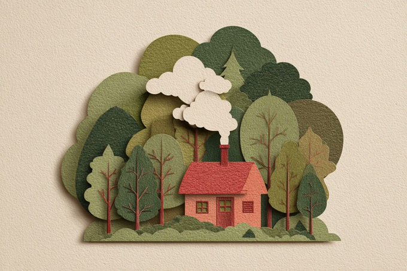

## 2D cartoon illustration of a [subject] mid-motion in a [

- ID: gpt4o-305-en-1
- Slug: prompt-305-en-1
- 语言: en
- 来源: [来源链接](https://x.com/azed_ai/status/1967180553553330306)
- 样例图路径: images/part3/305.jpeg

### 提示词

```text
2D cartoon illustration of a [subject] mid-motion in a [dynamic action pose], drawn in vintage comic book style with bold outlines and saturated primary colors. Featuring dramatic motion streaks, exaggerated perspective, punchy panel composition, and crisp halftone texture. Designed for high-energy visual storytelling with retro superhero flair.
```

### 样例图

![2D cartoon illustration of a [subject] mid-motion in a [](../images/part3/305.jpeg)

## 复古漫画风格卡通插画

- ID: gpt4o-305-zh-2
- Slug: prompt-305-zh-2
- 语言: zh
- 来源: [来源链接](https://x.com/azed_ai/status/1967180553553330306)
- 样例图路径: images/part3/305.jpeg

### 提示词

```text
2D卡通插画，描绘了一位[主体]以[动态动作姿势]的中途运动，采用复古漫画风格绘制，轮廓粗犷，色彩饱和。具有戏剧性的运动条纹、夸张的透视、富有冲击力的面板构图和清晰的半色调纹理。旨在以复古超级英雄的风格呈现充满活力的视觉叙事。
```

### 样例图


## Create a stylized cartoon illustration of [CHARACTER] wi

- ID: gpt4o-285-en-1
- Slug: prompt-285-en-1
- 语言: en
- 来源: [来源链接](https://x.com/gnrlyxyz/status/1951976345514487951)
- 样例图路径: images/part3/285.jpeg

### 提示词

```text
Create a stylized cartoon illustration of [CHARACTER] with a smooth, vertical pill-shaped body (rounded on top and bottom, symmetrical left to right). The body should be a single, unified capsule shape with no limbs. Do not alter the character's core design or personality, but simplify them into this playful capsule form. Use bold black outlines, flat vector-style coloring, and simple geometric features. Give the character large, expressive eyes and a fun, exaggerated facial expression that reflects their original personality. If the character wears clothes, include a minimal, iconic version of their outfit. If they do not, keep the body clean and unclothed. Use a solid bright yellow background. Center the character in a square frame. Use only flat colors. No gradients. No shadows. No texture. No smudging. The final result should be clean, modern, vector-friendly, and clearly pill-shaped.
```

### 样例图

![Create a stylized cartoon illustration of [CHARACTER] wi](../images/part3/285.jpeg)

## 卡通插图药丸形象

- ID: gpt4o-285-zh-2
- Slug: prompt-285-zh-2
- 语言: zh
- 来源: [来源链接](https://x.com/gnrlyxyz/status/1951976345514487951)
- 样例图路径: images/part3/285.jpeg

### 提示词

```text
为 [CHARACTER] 创建一幅风格化的卡通插图，其身体呈平滑的垂直药丸状（上下呈圆形，左右对称）。身体应为单一、统一的胶囊形状，没有四肢。不要改变角色的核心设计或个性，而是将其简化为这种俏皮的胶囊形状。使用粗黑色轮廓、扁平矢量风格的配色和简单的几何特征。赋予角色大而富有表现力的眼睛和有趣、夸张的面部表情，以反映其原始个性。如果角色穿着衣服，请包含其服装的极简标志性版本。如果没有，请保持身体干净，不穿衣服。使用纯亮黄色背景。将角色置于方形框架的中心。仅使用扁平颜色。不要使用渐变。不要使用阴影。不要使用纹理。不要使用晕染。最终结果应该干净、现代、矢量友好且清晰的药丸形状。
```

### 样例图


## Create a minimalistic illustration of [object or scene] 

- ID: gpt4o-277-en-1
- Slug: prompt-277-en-1
- 语言: en
- 来源: [来源链接](https://x.com/miilesus/status/1913139509740314972)
- 样例图路径: images/part3/277.png

### 提示词

```text
Create a minimalistic illustration of [object or scene] in a paper cut-out style. Use soft, pastel colors and simple shapes. Include layered paper textures and subtle shadows to create depth. Place the object on a plain background. Ensure a clean, modern, and aesthetically pleasing composition with a slightly isometric perspective.
```

### 样例图

![Create a minimalistic illustration of [object or scene] ](../images/part3/277.png)

## 极简风格插画

- ID: gpt4o-277-zh-2
- Slug: prompt-277-zh-2
- 语言: zh
- 来源: [来源链接](https://x.com/miilesus/status/1913139509740314972)
- 样例图路径: images/part3/277.png

### 提示词

```text
创作一幅[物体或场景]的极简风格插画，采用剪纸艺术风格。使用柔和的 pastel（粉蜡笔色调的）色彩和简单的形状。融入分层的纸张纹理和细微的阴影以营造深度感。将物体置于纯色背景上。确保构图简洁、现代且富有美感，并采用略带等距的透视角度。
```

### 样例图

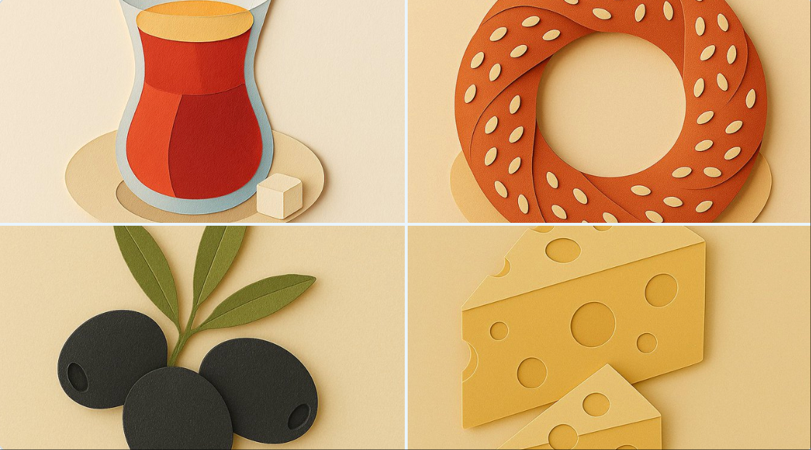

## create comic style illustration: { "style": "comic book 

- ID: gpt4o-274-en-1
- Slug: prompt-274-en-1
- 语言: en
- 来源: [来源链接](https://x.com/miilesus/status/1921944436684038496)
- 样例图路径: images/part3/274.png

### 提示词

```text
create comic style illustration:
{
"style": "comic book illustration",
"line_art": {
"type": "bold black outlines",
"thickness": "medium",
"detail": "emphasized contours and shading lines"
},
"coloring": {
"palette": "vibrant and saturated colors",
"shading": "halftone dots and cel shading",
"highlighting": "strong contrast with pop art effects"
},
"texture": {
"surface": "flat with visible ink strokes",
"effect": "printed comic paper texture"
},
"composition": {
"layout": "centered subject",
"background": "simple with radial burst or comic-style lines",
"framing": "comic panel border"
},
"lighting": {
"type": "dramatic",
"angle": "top-left with bold highlights and shadows"
},
"post_processing": {
"effect": ["halftone dots", "ink outline", "grain"],
"saturation": "high",
"contrast": "high"
},
"mood": "dynamic and action-oriented",
"format": "vertical or square depending on original image"
}
```

### 样例图

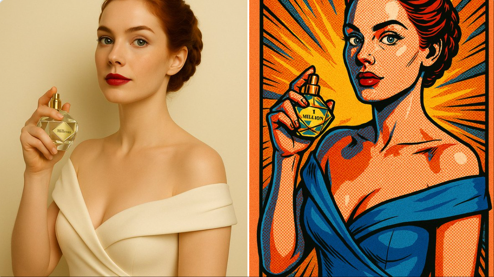

## 创作漫画风格插画

- ID: gpt4o-274-zh-2
- Slug: prompt-274-zh-2
- 语言: zh
- 来源: [来源链接](https://x.com/miilesus/status/1921944436684038496)
- 样例图路径: images/part3/274.png

### 提示词

```text
创作漫画风格插画：
{
"风格": "漫画书插画",
"线稿": {
"类型": "粗黑轮廓线",
"粗细": "中等",
"细节": "突出的轮廓和阴影线条"
},
"上色": {
"调色板": "鲜艳饱和的色彩",
"阴影": "半色调网点和赛璐珞 shading",
"高光": "强烈对比，带有波普艺术效果"
},
"质感": {
"表面": "平坦，带有可见的笔触",
"效果": "印刷漫画纸质感"
},
"构图": {
"布局": "主体居中",
"背景": "简洁，带有放射状爆发图案或漫画风格线条",
"边框": "漫画分镜边框"
},
"光线": {
"类型": "戏剧性",
"角度": "左上角，带有强烈的高光和阴影"
},
"后期处理": {
"效果": ["半色调网点", "墨水轮廓", "颗粒感"],
"饱和度": "高",
"对比度": "高"
},
"氛围": "充满动感和动作感",
"格式": "根据原图，为竖版或正方形"
}
```

### 样例图


## Transform this image into a digital illustration with a 

- ID: gpt4o-271-en-1
- Slug: prompt-271-en-1
- 语言: en
- 来源: [来源链接](https://x.com/fy360593/status/1945042543609008235)
- 样例图路径: images/part3/271.png

### 提示词

```text
Transform this image into a digital illustration with a surreal, geometric art style. Apply glitch textures, abstract shapes, and cinematic composition. Use the original photo’s lighting and color palette to guide the atmosphere, while reimagining the scene in a stylized, dreamy, retro-futuristic way.
```

### 样例图


## 超现实几何艺术风格的数字插画

- ID: gpt4o-271-zh-2
- Slug: prompt-271-zh-2
- 语言: zh
- 来源: [来源链接](https://x.com/fy360593/status/1945042543609008235)
- 样例图路径: images/part3/271.png

### 提示词

```text
将这张图片转换为具有超现实几何艺术风格的数字插画。应用故障纹理、抽象形状和电影化构图。以原始照片的光线和色彩为基调来营造氛围，同时以一种风格化、梦幻且复古未来主义的方式重新构想这个场景。
```

### 样例图


## Create a full body, flat vector illustration of [CHARACT

- ID: gpt4o-268-en-1
- Slug: prompt-268-en-1
- 语言: en
- 来源: [来源链接](https://x.com/gnrlyxyz/status/1953477354161848322)
- 样例图路径: images/part3/268.jpeg

### 提示词

```text
Create a full body, flat vector illustration of [CHARACTER] in a whimsical, wavy cartoon style. Use thin black outlines and smooth, rounded shapes. The character should have a tiny white-colored head with tiny dot eyes and a simple nose and mouth. The body should have exaggerated, playful proportions. Use bold, flat colors for the clothing. No gradients. No shading. No smudging. Place the character on a solid blue background. Vector friendly. Square aspect ratio.
```

### 样例图


## 童趣插画

- ID: gpt4o-268-zh-2
- Slug: prompt-268-zh-2
- 语言: zh
- 来源: [来源链接](https://x.com/gnrlyxyz/status/1953477354161848322)
- 样例图路径: images/part3/268.jpeg

### 提示词

```text
创作一幅[角色]的全身扁平矢量插画，采用异想天开的波浪卡通风格。使用纤细的黑色轮廓和流畅的圆形造型。角色应有一个小小的白色头部，上面有极小的圆点眼睛以及简单的鼻子和嘴巴。身体比例要夸张且富有童趣。服装采用鲜明的扁平色彩。不使用渐变、阴影和晕染效果。将角色置于纯蓝色背景上。适合矢量格式。采用正方形比例。
```

### 样例图


## A single vintage tea bag lying on a clean white backgrou

- ID: gpt4o-267-en-1
- Slug: prompt-267-en-1
- 语言: en
- 来源: [来源链接](https://x.com/TheRelianceAI/status/1955240654440894730)
- 样例图路径: images/part3/267.png

### 提示词

```text
A single vintage tea bag lying on a clean white background, hand-painted with an intricate illustration resembling a book cover. The tea bag has delicate aged paper texture, soft warm lighting, and realistic details. On the painted design, leave a clear blank space labeled [BOOK] for the book title. Cinematic, high-resolution, vertical format 9:16.
```

### 样例图

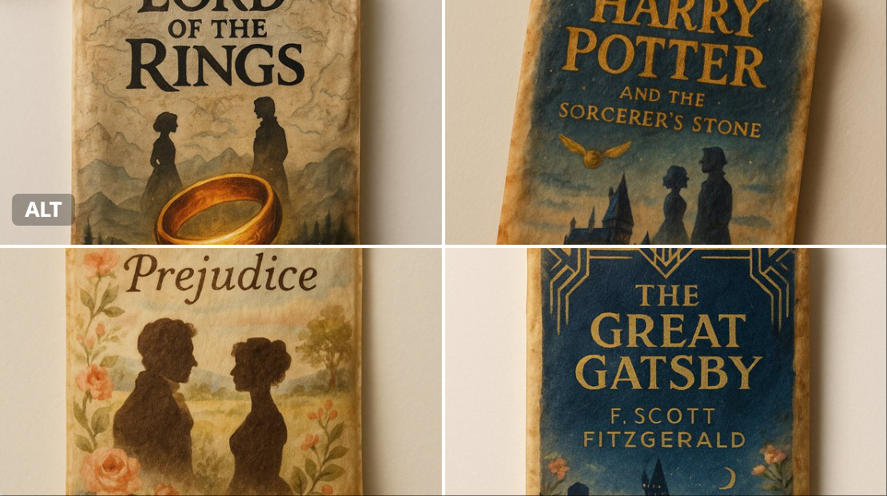

## 一个复古茶包

- ID: gpt4o-267-zh-2
- Slug: prompt-267-zh-2
- 语言: zh
- 来源: [来源链接](https://x.com/TheRelianceAI/status/1955240654440894730)
- 样例图路径: images/part3/267.png

### 提示词

```text
一个复古茶包孤零零地放在干净的白色背景上，上面手绘着类似书籍封面的复杂图案。这个茶包有着细腻的陈旧纸张质感，搭配柔和温暖的光线，细节逼真。在手绘图案上，留出一块清晰的空白区域，并标注为【BOOK】，用于填写书名。整体呈现电影般的质感，高分辨率，采用9:16的竖版格式。
```

### 样例图


## Restyle this image into a gritty Gorillaz-style illustra

- ID: gpt4o-262-en-1
- Slug: prompt-262-en-1
- 语言: en
- 来源: [来源链接](https://x.com/azed_ai/status/1942586412920103180)
- 样例图路径: images/part3/262.png

### 提示词

```text
Restyle this image into a gritty Gorillaz-style illustration, bold thick black outlines, sharp angular edges, flat expressive lighting, stylized high-contrast shadows, dirty distressed surface textures, muted color palette: washed-out teals, olive greens, rusty reds, mustard yellows, dusty browns, raw grungy urban atmosphere, comic book flatness mixed with painterly grit, hand-drawn finish with faded gradients, graphic novel aesthetic
with a rebellious, animated tone, dark stylish tone, full of attitude.
```

### 样例图

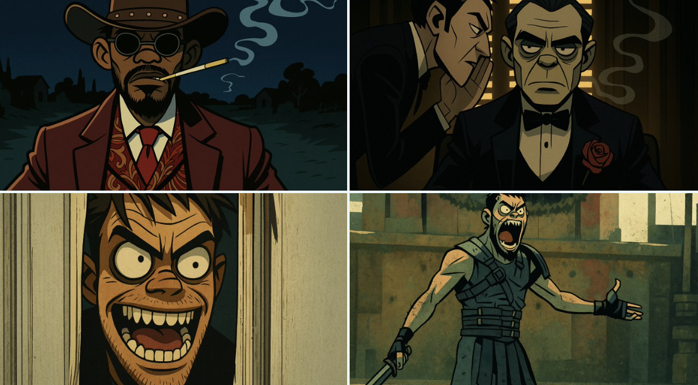

## 街头顽童（Gorillaz）风格插画

- ID: gpt4o-262-zh-2
- Slug: prompt-262-zh-2
- 语言: zh
- 来源: [来源链接](https://x.com/azed_ai/status/1942586412920103180)
- 样例图路径: images/part3/262.png

### 提示词

```text
将这张图片重新设计成粗粝的街头顽童（Gorillaz）风格插画，采用粗重的黑色轮廓线、锐利的棱角、扁平化的富有表现力的光线、风格化的高对比度阴影、粗糙破旧的表面纹理；色彩搭配柔和暗淡：褪色的蓝绿色、橄榄绿、锈红色、芥末黄、土褐色；营造出原始粗粝的都市氛围，融合漫画的扁平化与绘画的颗粒感，带有褪色渐变效果的手绘质感，呈现出漫画小说的美学风格，整体基调叛逆、生动且时尚暗黑，充满个性。
```

### 样例图


## Transform this image into a 1920s fairy tale illustratio

- ID: gpt4o-260-en-1
- Slug: prompt-260-en-1
- 语言: en
- 来源: [来源链接](https://x.com/vkuoo/status/1929708611208728874)
- 样例图路径: images/part3/260.png

### 提示词

```text
Transform this image into a 1920s fairy tale illustration in the style of Arthur Rackham. Use muted watercolor tones and intricate ink linework. Fill the scene with whimsical forest creatures, twisted tree branches, and hidden magical objects. The overall tone should be mysterious, enchanting, and slightly eerie. Add handwritten calligraphy-style captions and riddles.
```

### 样例图


## 20世纪20年代亚瑟·拉克姆风格的童话插画

- ID: gpt4o-260-zh-2
- Slug: prompt-260-zh-2
- 语言: zh
- 来源: [来源链接](https://x.com/vkuoo/status/1929708611208728874)
- 样例图路径: images/part3/260.png

### 提示词

```text
将这张图片转换成20世纪20年代亚瑟·拉克姆风格的童话插画。采用柔和的水彩色调和精致的墨水线条。场景中要充满奇幻的森林生物、扭曲的树枝和隐藏的魔法物品。整体基调应神秘、迷人且略带诡异。添加手写书法风格的说明文字和谜语。
```

### 样例图


## Transform the uploaded image into a surreal illustration

- ID: gpt4o-252-en-1
- Slug: prompt-252-en-1
- 语言: en
- 来源: [来源链接](https://x.com/fy360593/status/1955265393188286632)
- 样例图路径: images/part3/252.png

### 提示词

```text
Transform the uploaded image into a surreal illustration with a whimsical, dream‑like vibe.
• Color palette: muted tones (soft greens, browns, greys) with occasional gentle pops of green.
• Lighting: soft, diffused, almost ethereal light that blends gradients and subtle highlights.
• Texture & medium feel: oil‑painting‑like brushstrokes, faint watercolor washes, or loose hand‑drawn linework, with a slight grainy texture.
• Mood & composition: exaggerated, expressive features (e.g., elongated faces or emotive eyes) characteristic of cartoonish or Muppet‑style illustrations, but applied in a surreal, slightly fantastical context.
• Overall aesthetic: blend realistic attention to detail with a touch of surreal whimsy—think serene, slightly uncanny atmosphere.
```

### 样例图


## 怪诞又梦幻的超现实插画

- ID: gpt4o-252-zh-2
- Slug: prompt-252-zh-2
- 语言: zh
- 来源: [来源链接](https://x.com/fy360593/status/1955265393188286632)
- 样例图路径: images/part3/252.png

### 提示词

```text
将上传的图片转换为一幅超现实插画，营造出怪诞又梦幻的氛围。
色彩搭配：采用柔和色调（浅绿、棕色、灰色），偶尔点缀一抹淡雅的绿色。
光线效果：柔和、弥漫的近乎空灵的光线，融合渐变色与细微的高光。
质感与媒介感：类似油画的笔触、淡淡的水彩晕染或松散的手绘线条，带有轻微的颗粒质感。
氛围与构图：具有夸张、富有表现力的特征（如拉长的脸型或饱含情感的眼睛），这是卡通或提线木偶风格插画的典型特点，但要将其应用于超现实、略带奇幻色彩的场景中。
整体美学：将对细节的真实刻画与一丝超现实的怪诞感相融合 —— 营造出一种宁静又略带诡异的氛围。
```

### 样例图


## Transform this image into a 90s American cartoon cel-sty

- ID: gpt4o-247-en-1
- Slug: prompt-247-en-1
- 语言: en
- 来源: [来源链接](https://x.com/cuchocapilla/status/1934280060292284492)
- 样例图路径: images/part3/247.jpeg

### 提示词

```text
Transform this image into a 90s American cartoon cel-style illustration. Use thick black outlines, flat bold colors, and sharp cel shading with hard shadows. Emphasize exaggerated facial expressions and stylized, geometric character shapes. The background should be flat or minimal to keep the focus on the character. The whole image should feel like a frame from a Saturday morning cartoon.
```

### 样例图


## 90年代美国卡通片定格动画风格插画

- ID: gpt4o-247-zh-2
- Slug: prompt-247-zh-2
- 语言: zh
- 来源: [来源链接](https://x.com/cuchocapilla/status/1934280060292284492)
- 样例图路径: images/part3/247.jpeg

### 提示词

```text
将这张图片转化为 90 年代美国卡通片定格动画风格插画。使用粗黑轮廓线、平面化鲜明的颜色，以及锐利的定格动画阴影效果和硬阴影。强调夸张的面部表情和风格化的几何角色形状。背景应为平面或极简，以突出角色。整张图片应感觉像是从周六早间卡通片中截取的一帧。
```

### 样例图


## Transform this image into a Japanese gag manga style ill

- ID: gpt4o-228-en-1
- Slug: prompt-228-en-1
- 语言: en
- 来源: [来源链接](https://x.com/fy360593/status/1944708178266259689)
- 样例图路径: images/part3/228.jpeg

### 提示词

```text
Transform this image into a Japanese gag manga style illustration. Use a high-contrast black-and-white color palette with bold linework and screentone (halftone) shading. Characters should have exaggerated facial expressions, cartoonish proportions (big head, small body), and comedic intensity. Include dynamic action lines or radiating background effects. The overall aesthetic should mimic retro manga from the 80s and 90s with humorous and intense emotion.
```

### 样例图


## 日本搞笑漫画风格插画

- ID: gpt4o-228-zh-2
- Slug: prompt-228-zh-2
- 语言: zh
- 来源: [来源链接](https://x.com/fy360593/status/1944708178266259689)
- 样例图路径: images/part3/228.jpeg

### 提示词

```text
将这张图片转化为日本搞笑漫画风格插画。使用高对比度的黑白色彩搭配，粗犷的线条和网点（半色调）阴影。角色应有夸张的面部表情，卡通化的比例（大头小身），以及喜剧张力。包含动态动作线条或放射状背景效果。整体美学应模仿 80 年代和 90 年代的复古漫画，充满幽默和强烈的情感。
```

### 样例图


## Transform this image into a Cartoon Modern Style illustr

- ID: gpt4o-217-en-1
- Slug: prompt-217-en-1
- 语言: en
- 来源: [来源链接](https://x.com/Artedeingenio/status/1942867064378573293)
- 样例图路径: images/part3/217.png

### 提示词

```text
Transform this image into a Cartoon Modern Style illustration, inspired by classic UPA animation like Mr. Magoo and The Jetsons.
Redesign the character using flat, geometric shapes: ovals, rectangles, simple curves and angles. Avoid realistic proportions — the design should be stylized and abstract.
Use a limited color palette, preferably soft pastels or bold contrasts (e.g. mint green, salmon, sky blue, mustard yellow), with flat tones and no gradients.
Simplify facial features and body structure to be iconic and minimalist — large heads, small limbs, expressive poses, but with minimal detail.
The background should be minimal or symbolic, using basic shapes or abstract scenery (floating stairs, blocky furniture, stylized trees or stars).
The final image should look like a frame from a 1950s or 1960s modernist cartoon — playful, graphic, and highly stylized.
```

### 样例图


## 卡通现代风格插画

- ID: gpt4o-217-zh-2
- Slug: prompt-217-zh-2
- 语言: zh
- 来源: [来源链接](https://x.com/Artedeingenio/status/1942867064378573293)
- 样例图路径: images/part3/217.png

### 提示词

```text
将这张图片转换为卡通现代风格插画，灵感来源于经典的 UPA 动画，如《摩根先生》和《太空家庭》。
使用扁平的几何形状重新设计角色：椭圆形、矩形、简单的曲线和角度。避免真实比例——设计应该是风格化的和抽象的。
使用有限的调色板，最好是柔和的粉彩色或鲜明的对比色（例如薄荷绿、三文鱼色、天空蓝、芥末黄），使用扁平色调且没有渐变。
简化面部特征和身体结构，使其具有标志性且极简——大头、小四肢、富有表现力的姿势，但细节极少。
背景应极简或象征性，使用基本形状或抽象场景（漂浮的楼梯、积木家具、风格化的树木或星星）。
最终图像应像 1950 年代或 1960 年代现代主义卡通的一帧——活泼、图形化且高度风格化。
```

### 样例图


## [Character] sprinting past dream elements, Storybook ill

- ID: gpt4o-216-en-1
- Slug: prompt-216-en-1
- 语言: en
- 来源: [来源链接](https://x.com/B_4AI/status/1942850557548388499)
- 样例图路径: images/part3/216.png

### 提示词

```text
[Character] sprinting past dream elements, Storybook illustration, Maze of floating doors, clocks, and whispers, Lantern glow and ambient sparkle trails, [Color1] and [Color2], Whimsical and fast-paced, Follow-cam style with trailing POV
```

### 样例图

![[Character] sprinting past dream elements, Storybook ill](../images/part3/216.png)

## 穿越梦境迷宫

- ID: gpt4o-216-zh-2
- Slug: prompt-216-zh-2
- 语言: zh
- 来源: [来源链接](https://x.com/B_4AI/status/1942850557548388499)
- 样例图路径: images/part3/216.png

### 提示词

```text
[角色] 冲过梦境元素，故事书插画风格，漂浮的门、时钟和低语组成的迷宫，灯笼光芒和周围闪烁的轨迹，[颜色 1]和[颜色 2]，奇幻且节奏快速，跟随镜头风格，带有轨迹的 POV 视角
```

### 样例图


## Restyle this image into a gritty Gorillaz-style illustra

- ID: gpt4o-215-en-1
- Slug: prompt-215-en-1
- 语言: en
- 来源: [来源链接](https://x.com/azed_ai/status/1942586412920103180)
- 样例图路径: images/part3/215.png

### 提示词

```text
Restyle this image into a gritty Gorillaz-style illustration, bold thick black outlines, sharp angular edges, flat expressive lighting, stylized high-contrast shadows, dirty distressed surface textures, muted color palette: washed-out teals, olive greens, rusty reds, mustard yellows, dusty browns, raw grungy urban atmosphere, comic book flatness mixed with painterly grit, hand-drawn finish with faded gradients, graphic novel aesthetic
with a rebellious, animated tone, dark stylish tone, full of attitude.
```

### 样例图

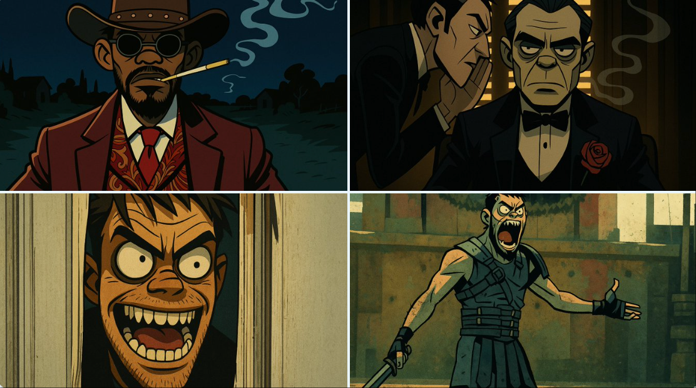

## Gorillaz风格

- ID: gpt4o-215-zh-2
- Slug: prompt-215-zh-2
- 语言: zh
- 来源: [来源链接](https://x.com/azed_ai/status/1942586412920103180)
- 样例图路径: images/part3/215.png

### 提示词

```text
将这张图片改造成硬朗的 Gorillaz 风格插画，粗犷的黑色轮廓线，尖锐的角边，平面化的表现性光照，风格化的高对比度阴影，脏污的磨损表面纹理，柔和的调色板：褪色的蓝绿色，橄榄绿，锈红色，芥末黄，尘土棕，原始的粗糙都市氛围，漫画书平面感与绘画性粗糙的混合，手绘效果带有褪色渐变，漫画小说美学带有叛逆、动画化的风格，暗黑时尚的调调，充满态度。
```

### 样例图


## 真人和风格对照直出

- ID: gpt4o-200-zh-1
- Slug: prompt-200-zh-1
- 语言: zh
- 来源: [来源链接](https://x.com/ZHO_ZHO_ZHO/status/1935620536090153216)
- 样例图路径: images/part3/200.jpeg

### 提示词

```text
创建图片 {
"title": "真人 × 动画对照创意作品",
"author": "ZH4O",
"description": "一张利用垂直拼贴与留白，将同一人物的照片与插画并置的创意作品，突出媒介在语言、质感与情绪上的对比。",
"layout": {
"orientation": "vertical",
"photo": {
"position": "top-left",
"aspect_ratio": "3:4",
"style": "street photo",
"camera_angle": "eye-level, slightly tilted left",
"lens": "mild wide-angle",
"background_elements": ["road", "store signs", "urban perspective lines"]
},
"illustration": {
"position": "bottom-right",
"scale": "slightly larger",
"composition": "2/3 body, medium shot",
"pose": "similar to photo",
"motion_direction": "curve extending top-right",
"balance": "forms visual counterpoint to photo"
},
"background": {
"color": "pure white",
"purpose": "breathing space, minimalism, focus"
}
},
"color_and_lighting": {
"photo": {
"dominant_tones": "neutral warm gray",
"light_source": "natural light",
"highlight_effects": "soft overexposure, summer glare",
"key_elements": ["white dress with gauzy texture", "cement, scooter, wall as low-saturation backdrop"]
},
"illustration": {
"style": "cartoon, simplified color blocks",
"skin": "warm orange with soft pink blush",
"hair": "deep brown, almost flat color",
"dress": "white with minimal shading to indicate folds",
"contrast": "high, compressed tonal range",
"focus": "sharp character silhouette"
},
"background": {
"function": "isolates media contrast, emphasizes character and action"
}
},
"style_comparison_and_details": {
"photo": {
"gesture": "hand shading forehead",
"expression": "wide eyes, slightly pouting lips, playful with a hint of exasperation",
"context": "spontaneous, tight alley space, loose hair movement"
},
"illustration": {
"design_inspiration": "Disney/CalArts style",
"features": ["large eyes", "wide cheekbones", "pointy chin", "freckles", "blush"],
"motion_effects": "exaggerated hair and skirt movement",
"line_quality": "fluid and bouncy",
"reproduction": "pose, expression, dress bow, forehead hair accurately translated"
}
},
"visual_and_communication_value": {
"themes": ["reality to animation transformation", "character design", "personified self-portrait"],
"usability": ["IP development", "illustration demo", "fashion branding"],
"design_elements": ["space for text/logo", "poster/social media-ready"],
"narrative_strength": "uses white space as frame, pose as link, and medium contrast as core interest",
"tone": "light, stylish, socially shareable"
}
}
```

### 样例图


## 真人和风格对照直出

- ID: gpt4o-200-zh-2
- Slug: prompt-200-zh-2
- 语言: zh
- 来源: [来源链接](https://x.com/ZHO_ZHO_ZHO/status/1935620536090153216)
- 样例图路径: images/part3/200.jpeg

### 提示词

```text
创建图片 {
“title”： “真人 × 动画对照创意作品”，
“author”： “ZH4O”， ZH4O“， ZH4O
“description”： “一张利用垂直拼贴与留白，将同一人物的照片与插画并置的创意作品，突出媒介在语言、质感与情绪上的对比。",
“布局”： {
“orientation”： “垂直”，
“照片”： {
“position”： “左上角”，
“aspect_ratio”： “3：4”，
“style”： “街拍”，
“camera_angle”： “与眼睛齐平，略微向左倾斜”，
“lens”： “轻度广角”，
“background_elements”： [“road”， “shop signs”， “urban perspective lines”]
},
“插图”： {
“position”： “右下角”，
“scale”： “稍大”，
“composition”： “2/3 体，中镜头”，
“pose”： “与照片相似”，
“motion_direction”： “曲线向右延伸”，
“balance”： “形成与照片的视觉对位”
},
“背景”： {
“color”： “纯白色”，
“purpose”： “呼吸空间、极简主义、专注”
}
},
“color_and_lighting”： {
“照片”： {
“dominant_tones”： “中性暖灰色”，
“light_source”： “自然光”，
“highlight_effects”： “柔和的过度曝光，夏季眩光”，
“key_elements”： [“带有薄纱纹理的白色连衣裙”， “水泥、滑板车、墙壁作为低饱和度背景”]
},
“插图”： {
“style”： “卡通，简化的色块”，
“skin”： “暖橙色带柔和的粉红色腮红”，
“hair”： “深棕色，几乎是单色”，
“dress”： “白色，带有最小阴影以表示褶皱”，
“contrast”： “高、压缩的色调范围”，
“focus”： “清晰的角色剪影”
},
“背景”： {
“function”： “隔离媒体对比度，强调角色和动作”
}
},
“style_comparison_and_details”： {
“照片”： {
“gesture”： “手部阴影额头”，
“expression”： “睁大眼睛，微微撅起嘴唇，俏皮中带着一丝恼怒”，
“context”： “自发、狭窄的小巷空间、松散的头发移动”
},
“插图”： {
“design_inspiration”： “Disney/CalArts 风格”，
“features”： [“大眼睛”， “宽颧骨”， “尖下巴”， “雀斑”， “腮红”]，
“motion_effects”： “夸张的头发和裙子运动”，
“line_quality”： “流体和弹性”，
“reproduction”： “姿势、表情、裙子蝴蝶结、额头头发准确翻译”
}
},
“visual_and_communication_value”： {
“themes”： [“从现实到动画的转变”， “角色设计”， “拟人化自画像”]，
“可用性”： [“IP 开发”， “插图演示”， “时尚品牌”]，
“design_elements”： [“文本/徽标空间”， “海报/社交媒体就绪”]，
“narrative_strength”： “使用空白作为框架，使用姿势作为链接，使用中等对比度作为核心兴趣”，
“tone”： “轻盈、时尚、社交分享”
}
}
```

### 样例图


## Create a 3D-rendered digital illustration of a stylized 

- ID: gpt4o-179-en-1
- Slug: prompt-179-en-1
- 语言: en
- 来源: [来源链接](https://x.com/tranmautritam/status/1938160355064353153)
- 样例图路径: images/part3/179.png

### 提示词

```text
Create a 3D-rendered digital illustration of a stylized cartoon boy character, standing in a neutral pose. The character should be rendered in a realistic-minimalist 3D style, with soft rounded proportions and plush matte textures — similar to high-end Cinema 4D + Redshift product renders.
```

### 样例图


## 创建多种3D风格头像

- ID: gpt4o-179-zh-2
- Slug: prompt-179-zh-2
- 语言: zh
- 来源: [来源链接](https://x.com/tranmautritam/status/1938160355064353153)
- 样例图路径: images/part3/179.png

### 提示词

```text
创建风格化卡通男孩角色的 3D 渲染数字插图，以中性姿势站立。角色应以逼真的极简主义 3D 风格渲染，具有柔和圆润的比例和毛绒哑光纹理——类似于高端 Cinema 4D + Redshift 产品渲染。
```

### 样例图


## He has a warm natural skin tone with rosy cheeks, dot ey

- ID: gpt4o-179-en-3
- Slug: prompt-179-en-3
- 语言: en
- 来源: [来源链接](https://x.com/tranmautritam/status/1938160355064353153)
- 样例图路径: images/part3/179.png

### 提示词

```text
He has a warm natural skin tone with rosy cheeks, dot eyes (or small glossy eyes), and soft curly dark brown hair. Facial expression is neutral or slightly curious. Outfit includes an olive green T-shirt with rolled sleeves, beige rolled shorts, and off-white matte sneakers with subtle stitching. He wears a dark olive crossbody satchel with a flap, and a slim black watch on his right wrist.
```

### 样例图


## 创建多种3D风格头像

- ID: gpt4o-179-zh-4
- Slug: prompt-179-zh-4
- 语言: zh
- 来源: [来源链接](https://x.com/tranmautritam/status/1938160355064353153)
- 样例图路径: images/part3/179.png

### 提示词

```text
他有着温暖自然的肤色，红润的脸颊，圆点的眼睛（或有光泽的小眼睛）和柔软的深棕色卷发。面部表情中性或略带好奇。服装包括一件卷袖的橄榄绿色 T 恤、米色卷短裤和带有微妙缝线的米白色哑光运动鞋。他戴着一个带翻盖的深橄榄色斜挎包，右手腕上戴着一块纤细的黑色手表。
```

### 样例图


## Render with soft, diffused lighting and gentle shadows u

- ID: gpt4o-179-en-5
- Slug: prompt-179-en-5
- 语言: en
- 来源: [来源链接](https://x.com/tranmautritam/status/1938160355064353153)
- 样例图路径: images/part3/179.png

### 提示词

```text
Render with soft, diffused lighting and gentle shadows underfoot. Use a 100% transparent background (PNG format) or very light neutral grey if previewed. Full-body composition, front-facing or light 3/4 view. Maintain a clean, high-resolution, polished render — ideal for a character design showcase or branding. Soft color palette with earth tones.
```

### 样例图


## 创建多种3D风格头像

- ID: gpt4o-179-zh-6
- Slug: prompt-179-zh-6
- 语言: zh
- 来源: [来源链接](https://x.com/tranmautritam/status/1938160355064353153)
- 样例图路径: images/part3/179.png

### 提示词

```text
使用柔和的漫射照明和脚下柔和的阴影进行渲染。使用 100% 透明背景（PNG 格式）或非常浅的中性灰色（如果预览）。全身构图，正面或浅色 3/4 视图。保持干净、高分辨率、精美的渲染 — 非常适合角色设计展示或品牌推广。带有大地色调的柔和调色板。
```

### 样例图


## Create a surreal 2D poster design based on the word “[KE

- ID: gpt4o-177-en-1
- Slug: prompt-177-en-1
- 语言: en
- 来源: [来源链接](https://x.com/aziz4ai/status/1938818077451325444)
- 样例图路径: images/part3/177.jpeg

### 提示词

```text
Create a surreal 2D poster design based on the word “[KEYWORD]” — the layout should be dominated by kinetic typography where the word is visually shaped or distorted to reflect its meaning — integrate a symbolic flat minimal illustration that reinforces the concept — the style must be inspired by risograph print: only 2 bold contrasting colors (no gradients) — include a poetic, short quote that resonates emotionally with the keyword — background must be clean and minimal — composition must be vertical, with strong visual impact and artistic balance — the overall tone should feel cinematic, surreal, and graphic — ultra-sharp, high-resolution, no clutter
```

### 样例图


## 2D单词海报设计

- ID: gpt4o-177-zh-2
- Slug: prompt-177-zh-2
- 语言: zh
- 来源: [来源链接](https://x.com/aziz4ai/status/1938818077451325444)
- 样例图路径: images/part3/177.jpeg

### 提示词

```text
根据“[KEYWORD]”一词创作超现实主义的 2D 海报设计——布局应以动态排版为主，其中单词在视觉上被塑造或扭曲以反映其含义——加入一个象征性的平面最小插图来强化概念——风格必须受到 risograph 印刷品的启发：只有 2 种大胆的对比色（无渐变）——包括诗意的、 与关键词产生情感共鸣的简短引述 — 背景必须干净且最小 — 构图必须是垂直的，具有强烈的视觉冲击力和艺术平衡 — 整体基调应该感觉像电影、超现实和图形 — 超清晰、高分辨率、无杂乱
```

### 样例图


## A bison in the center of an array of colorful geometric 

- ID: gpt4o-176-en-1
- Slug: prompt-176-en-1
- 语言: en
- 来源: [来源链接](https://x.com/BeanieBlossom/status/1938568084207665488)
- 样例图路径: images/part3/176.jpeg

### 提示词

```text
A bison in the center of an array of colorful geometric shapes, surrounded by symbols representing different aspects like family and home. The artwork features warm colors in an oil painting style, with an Art Nouveau illustration showcasing ornate details and colorful patterns. The scene also includes a night sky and desert landscapes. The artwork should have a rich texture and a three-dimensional effect with intricate detailing.
```

### 样例图

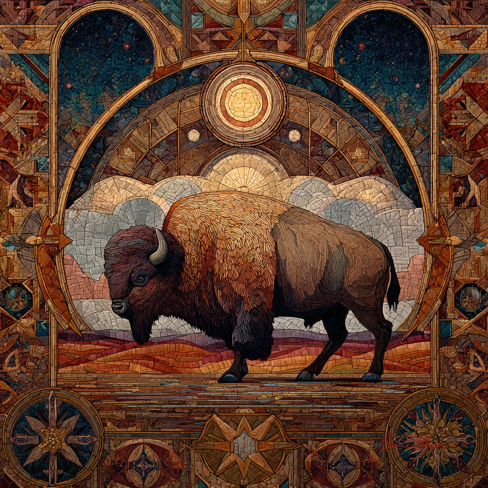

## 三维几何效果

- ID: gpt4o-176-zh-2
- Slug: prompt-176-zh-2
- 语言: zh
- 来源: [来源链接](https://x.com/BeanieBlossom/status/1938568084207665488)
- 样例图路径: images/part3/176.jpeg

### 提示词

```text
一头野牛位于一系列彩色几何形状的中心，周围环绕着代表不同方面的符号，如家庭和家。这件艺术品以油画风格的暖色调为特色，新艺术运动插图展示了华丽的细节和丰富多彩的图案。该场景还包括夜空和沙漠景观。图稿应具有丰富的纹理和具有复杂细节的三维效果。
```

### 样例图


## Create an illustration of a [OBJECT] in a retro cartoon 

- ID: gpt4o-173-en-1
- Slug: prompt-173-en-1
- 语言: en
- 来源: [来源链接](https://x.com/gnrlyxyz/status/1938613929413869705)
- 样例图路径: images/part3/173.jpeg

### 提示词

```text
Create an illustration of a [OBJECT] in a retro cartoon style. Use only flat, solid colors with no gradients, smudging, airbrushing, or blur. All shading and highlights should be made from clean, separate color blocks. Outline all shapes with thick, bold black lines. Use a simplified color palette (such as teal, coral, mustard, and white) for a vintage feel. Add small sparkle accents or motion lines for charm, but keep the icon the clear focus. Set the illustration on a plain white background. The final result must be crisp, clean, and vector friendly with sharp edges and no texture or raster effects. Square aspect ratio.
```

### 样例图

![Create an illustration of a [OBJECT] in a retro cartoon ](../images/part3/173.jpeg)

## 复古风格图标

- ID: gpt4o-173-zh-2
- Slug: prompt-173-zh-2
- 语言: zh
- 来源: [来源链接](https://x.com/gnrlyxyz/status/1938613929413869705)
- 样例图路径: images/part3/173.jpeg

### 提示词

```text
创建复古卡通风格的 [OBJECT] 插图。仅使用单色，不要使用渐变、涂抹、喷枪或模糊。所有阴影和高光都应由干净、独立的色块制成。用粗大的黑色线条勾勒出所有形状的轮廓。使用简化的调色板（如蓝绿色、珊瑚色、芥末色和白色）以获得复古感。添加小的闪光点缀或动感线条以增加魅力，但保持图标的明确焦点。将插图设置在纯白色背景上。最终结果必须清晰、干净且矢量友好，具有锐利的边缘，并且没有纹理或栅格效果。方形纵横比。
```

### 样例图


## [SUBJECT] illustrated in a Geometric Zen Tranquility sty

- ID: gpt4o-166-en-1
- Slug: prompt-166-en-1
- 语言: en
- 来源: [来源链接](https://x.com/LudovicCreator/status/1938330188414132727)
- 样例图路径: images/part3/166.png

### 提示词

```text
[SUBJECT] illustrated in a Geometric Zen Tranquility style, where simplicity and balance are key. Utilize clean lines, basic shapes, and a serene color palette of [COLOR1] and [COLOR2] to evoke a sense of peace and harmony.
```

### 样例图

![[SUBJECT] illustrated in a Geometric Zen Tranquility sty](../images/part3/166.png)

## 几何禅

- ID: gpt4o-166-zh-2
- Slug: prompt-166-zh-2
- 语言: zh
- 来源: [来源链接](https://x.com/LudovicCreator/status/1938330188414132727)
- 样例图路径: images/part3/166.png

### 提示词

```text
[主题] 以几何禅宗宁静风格插图，其中简单和平衡是关键。利用简洁的线条、基本形状以及 [COLOR1] 和 [COLOR2] 的宁静调色板来唤起和平与和谐的感觉。
```

### 样例图

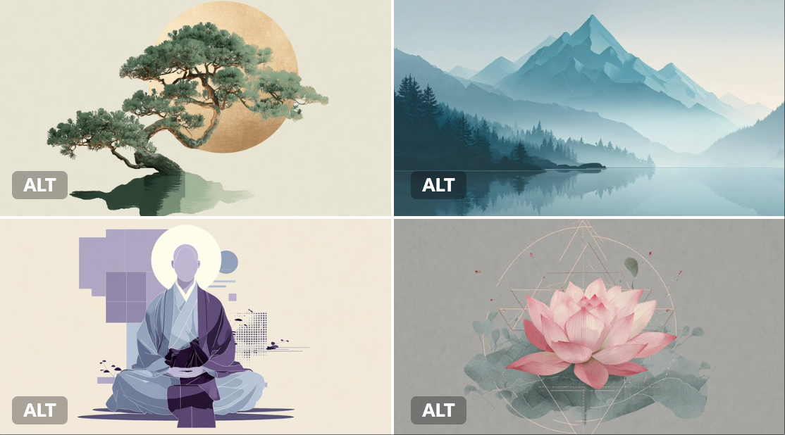

## Transform this image into an over-the-top anime illustra

- ID: gpt4o-160-en-1
- Slug: prompt-160-en-1
- 语言: en
- 来源: [来源链接](https://x.com/Artedeingenio/status/1937069198921924968)
- 样例图路径: images/part3/160.png

### 提示词

```text
Transform this image into an over-the-top anime illustration in the style of Trigger / Gainax. Use exaggerated expressions, wild motion lines, and hyperdynamic poses. The anatomy should be fluid and distorted for emphasis — limbs stretching or snapping into action. Add speed lines, explosive backgrounds, and dramatic lighting effects. Integrate onomatopoeia or stylized text for extra chaos. Colors should be bold, saturated, and contrasting. The result should feel like a freeze frame from Kill la Kill or FLCL, mid-action, full of energy and visual impact.
```

### 样例图

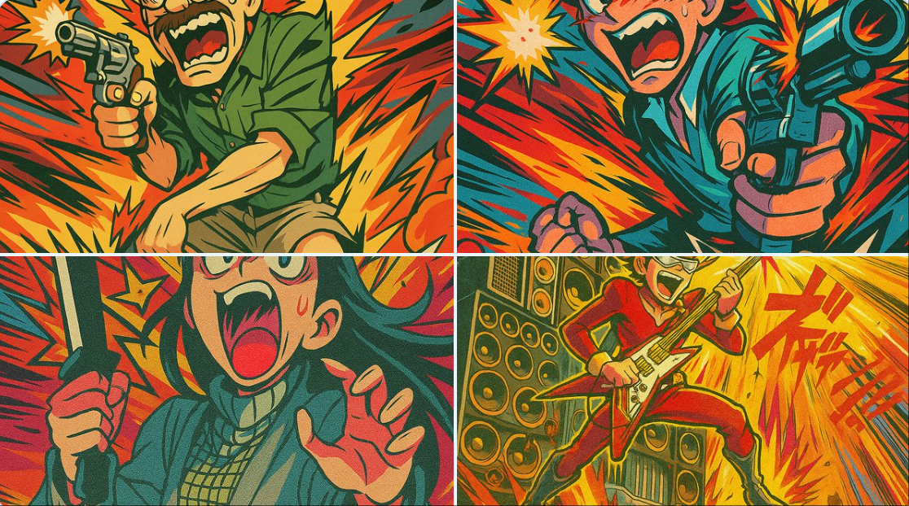

## 新动漫风格

- ID: gpt4o-160-zh-2
- Slug: prompt-160-zh-2
- 语言: zh
- 来源: [来源链接](https://x.com/Artedeingenio/status/1937069198921924968)
- 样例图路径: images/part3/160.png

### 提示词

```text
将此图像转换为 Trigger / Gainax 风格的夸张动漫插图。使用夸张的表情、狂野的运动线条和超动态姿势。解剖结构应该是流畅的，并且为了强调而扭曲——四肢伸展或突然行动起来。添加速度线、爆炸性背景和戏剧性的灯光效果。集成拟声词或风格化文本以增加混乱。颜色应大胆、饱和且具有对比性。结果应该感觉像是 Kill la Kill 或 FLCL 的定格，在动作中，充满活力和视觉冲击力。
```

### 样例图


## Transform this image into a 1960s Tezuka-style illustrat

- ID: gpt4o-152-en-1
- Slug: prompt-152-en-1
- 语言: en
- 来源: [来源链接](https://x.com/Artedeingenio/status/1936716854090760197)
- 样例图路径: images/part3/152.png

### 提示词

```text
Transform this image into a 1960s Tezuka-style illustration. Use big, rounded expressive eyes with bright highlights. Simplify the anatomy with soft, rounded limbs and clean linework. Avoid detailed textures — focus on smooth color fills and strong silhouettes. The final image should resemble a vintage anime frame from Astro Boy, with an optimistic, futuristic feel.
```

### 样例图


## 新动漫风格

- ID: gpt4o-152-zh-2
- Slug: prompt-152-zh-2
- 语言: zh
- 来源: [来源链接](https://x.com/Artedeingenio/status/1936716854090760197)
- 样例图路径: images/part3/152.png

### 提示词

```text
将此图像转换为 1960 年代手冢风格的插图。使用大而圆、富有表现力的眼睛，并带有明亮的高光。通过柔软、圆润的四肢和简洁的线条简化解剖结构。避免细节纹理 - 专注于平滑的颜色填充和强烈的轮廓。最终的图像应该类似于 Astro Boy 的老式动漫框架，具有乐观、未来主义的感觉。
```

### 样例图


## A comic-style caricature illustration of [subject], with

- ID: gpt4o-150-en-1
- Slug: prompt-150-en-1
- 语言: en
- 来源: [来源链接](https://x.com/azed_ai/status/1937104120097407069)
- 样例图路径: images/part3/150.png

### 提示词

```text
A comic-style caricature illustration of [subject], with an oversized head and expressive eyes, rendered in a hyper-realistic vinyl toy aesthetic. The character features exaggerated proportions, glossy textures, and playful details, blending caricature art with collectible figure charm.
```

### 样例图

![A comic-style caricature illustration of [subject], with](../images/part3/150.png)

## 乙烯基玩具

- ID: gpt4o-150-zh-2
- Slug: prompt-150-zh-2
- 语言: zh
- 来源: [来源链接](https://x.com/azed_ai/status/1937104120097407069)
- 样例图路径: images/part3/150.png

### 提示词

```text
[主题]的漫画风格漫画插图，具有超大的头部和富有表现力的眼睛，以超逼真的乙烯基玩具美学呈现。该角色具有夸张的比例、光滑的纹理和俏皮的细节，将漫画艺术与收藏人物魅力融为一体。
```

### 样例图


## Create a high-resolution illustration of a [OBJECT] icon

- ID: gpt4o-138-en-1
- Slug: prompt-138-en-1
- 语言: en
- 来源: [来源链接](https://x.com/gnrlyxyz/status/1934745654888124753)
- 样例图路径: images/part3/138.jpeg

### 提示词

```text
Create a high-resolution illustration of a [OBJECT] icon in the style of a flat, outlined sticker graphic. The icon should be made entirely from very thin, solid black outlines with no interior fill. Add a bold, soft-edged sticker-style contour around the icon using a flat, vibrant [YELLOW, BLUE, OR PINK] color. The result should look like a cartoon-style icon cut from black paper, outlined by a bright color. Do not use any white or filled shapes inside. No gradients, no shadows, no textures. Vector-friendly. Black background. Square aspect ratio.
```

### 样例图

![Create a high-resolution illustration of a [OBJECT] icon](../images/part3/138.jpeg)

## Gumroad样式图标

- ID: gpt4o-138-zh-2
- Slug: prompt-138-zh-2
- 语言: zh
- 来源: [来源链接](https://x.com/gnrlyxyz/status/1934745654888124753)
- 样例图路径: images/part3/138.jpeg

### 提示词

```text
以平面轮廓贴纸图形的样式创建 [OBJECT] 图标的高分辨率插图。图标应完全由非常细的纯黑色轮廓制成，没有内部填充。使用平坦、充满活力的 [黄色、蓝色或粉红色] 在图标周围添加大胆、边缘柔和的贴纸式轮廓。结果应看起来像从黑纸上剪下来的卡通风格图标，由鲜艳的颜色勾勒出来。不要在里面使用任何白色或填充的形状。没有渐变，没有阴影，没有纹理。对矢量友好。黑色背景。方形纵横比。
```

### 样例图


## Create a high-resolution illustration of a [skull] icon 

- ID: gpt4o-135-en-1
- Slug: prompt-135-en-1
- 语言: en
- 来源: [来源链接](https://x.com/gnrlyxyz/status/1934330176113938606)
- 样例图路径: images/part3/135.jpeg

### 提示词

```text
Create a high-resolution illustration of a [skull] icon in the style of a glossy, translucent sculpture. The icon should appear as if made of curved, flowing glass with reflective surfaces. Infuse the form with vivid, refracted rainbow gradients that shift smoothly across its contours. The shape should be abstract yet recognizable, with a sleek, high-gloss finish and soft reflections that mimic light bending through clear material. Center the icon on a solid black background. No shadows, textures, or extra elements. Square aspect ratio.
```

### 样例图

![Create a high-resolution illustration of a [skull] icon ](../images/part3/135.jpeg)

## 棱柱形玻璃图标

- ID: gpt4o-135-zh-2
- Slug: prompt-135-zh-2
- 语言: zh
- 来源: [来源链接](https://x.com/gnrlyxyz/status/1934330176113938606)
- 样例图路径: images/part3/135.jpeg

### 提示词

```text
以光泽、半透明雕塑的风格创建 [骷髅头] 图标的高分辨率插图。图标应看起来像是由具有反射表面的弯曲、流动的玻璃制成的。为形式注入生动的折射彩虹渐变，在其轮廓上平滑移动。形状应该是抽象的但可识别的，具有时尚、高光泽的饰面和柔和的反射，模仿光线穿过透明材料的弯曲。将图标置于纯黑色背景上居中。没有阴影、纹理或额外元素。方形纵横比。
```

### 样例图

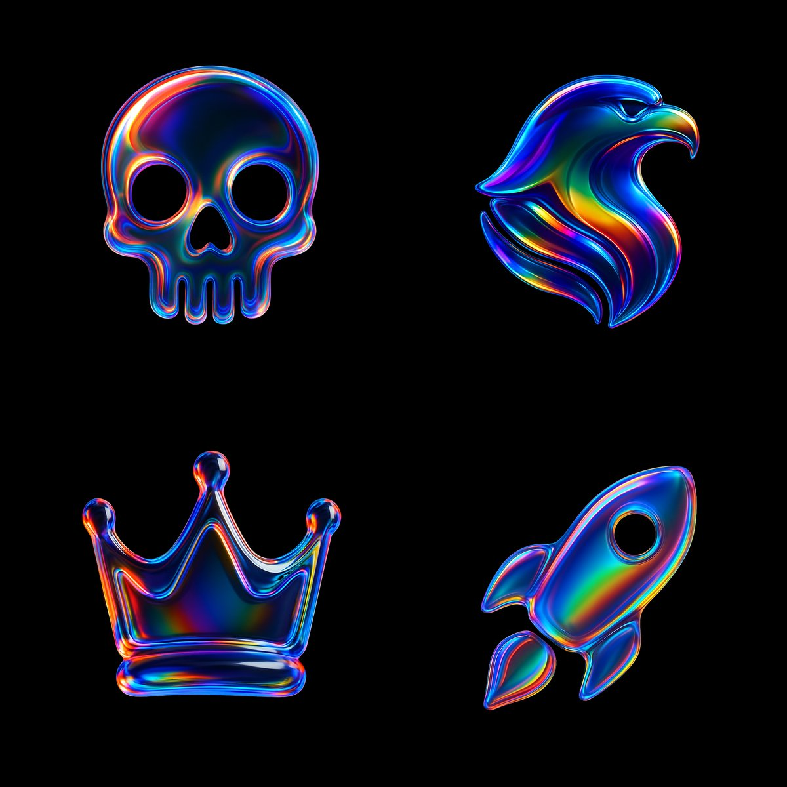

## “[Product Name]” placed at the center in full photoreali

- ID: gpt4o-126-en-1
- Slug: prompt-126-en-1
- 语言: en
- 来源: [来源链接](https://x.com/aziz4ai/status/1934702903932957023)
- 样例图路径: images/part3/126.jpeg

### 提示词

```text
“[Product Name]” placed at the center in full photorealism, surrounded by surreal vector illustrations using exactly two bold, vibrant colors that match the product’s mood.
The scene is minimalistic yet energetic, with abstract vector shapes (symbols, lines, expressions, etc.) orbiting or interacting with the product.
Add the real logo clearly and integrate a short 3–4 word slogan at the bottom.
Style: surreal, high-resolution, minimal, cinematic lighting, 1:1 aspect ratio.
```

### 样例图

![“[Product Name]” placed at the center in full photoreali](../images/part3/126.jpeg)

## 重新构想的超现实主义广告

- ID: gpt4o-126-zh-2
- Slug: prompt-126-zh-2
- 语言: zh
- 来源: [来源链接](https://x.com/aziz4ai/status/1934702903932957023)
- 样例图路径: images/part3/126.jpeg

### 提示词

```text
“[产品名称]”以完全逼真的方式放置在中心，周围环绕着超现实主义的矢量插图，使用两种大胆、鲜艳的颜色，与产品的情绪相匹配。
场景简约而充满活力，抽象的矢量形状（符号、线条、表情等）围绕产品运行或与产品交互。
清楚地添加真实的 logo，并在底部加入一个 3-4 字的简短标语。
风格：超现实、高分辨率、极简、电影般的照明、1：1 纵横比。
```

### 样例图


## 动漫机甲风格化机械设计图

- ID: gpt4o-117-zh
- Slug: prompt-117-zh
- 语言: zh
- 来源: [来源链接](https://x.com/Artedeingenio/status/1931711452160651654)
- 样例图路径: images/part3/117.png

### 提示词

```text
Transform this image into a stylized mechanical design sheet inspired by Japanese anime mecha blueprints.
Render the subject with precise, clean linework and semi-realistic cel-shading, as if it were a technical illustration from an anime artbook.
Break down the design into parts (e.g. head, hand, accessory, full body) and arrange them like a reference sheet, with different angles and views.
Include soft handwritten notes or Japanese characters scattered like concept annotations.
Use muted digital colors (red, gray, metallic tones) and draw the background in a loose watercolor anime landscape style — cliffs, cityscapes, or grassland ruins.
The final composition should feel like an official design page for an animated sci-fi series or manga.
Keep the format horizontal, like a blueprint or character sheet, with a balance between precision and artistic flair.
```

### 样例图


## 任天堂风格的3D卡通插画

- ID: gpt4o-116-zh
- Slug: prompt-116-zh
- 语言: zh
- 来源: [来源链接](https://x.com/Artedeingenio/status/1931647658382258183)
- 样例图路径: images/part3/116.png

### 提示词

```text
Transform this image into a Nintendo-inspired 3D cartoon style illustration.

Use soft, rounded 3D shapes and clean, toy-like geometry to give the characters and objects a charming, handcrafted look.

Characters should have exaggerated, childlike proportions (large heads, small limbs), with expressive, simplified faces and bright, colorful clothing — similar to designs seen in Zelda: Link’s Awakening, Animal Crossing, or Miitopia.

Apply smooth, matte textures with no realistic detail — everything should look cheerful and slightly plastic, as if sculpted from soft clay or digital vinyl.

The environment should be bright and whimsical, with stylized grass, puffy clouds, geometric trees, and soft lighting like a sunny afternoon.

The overall tone should be lighthearted, clean, and family-friendly, like a frame from a Nintendo fantasy adventure game.
```

### 样例图


## 重点线条勾勒

- ID: gpt4o-112-zh
- Slug: prompt-112-zh
- 语言: zh
- 来源: [来源链接](https://x.com/umesh_ai/status/1931637370639520011)
- 样例图路径: images/part3/112.jpeg

### 提示词

```text
A digital illustration of a [SUBJECT], portrayed with a network of glowing clean pristine blue lines outlining its anatomy. The image is set against a dark background, highlighting the [SUBJECT] form and features. A specific area such as [PART] is emphasized with a red glow to indicate a point of interest or significance. The style is both educational and visually captivating, designed to resemble an advanced imaging technique
```

### 样例图

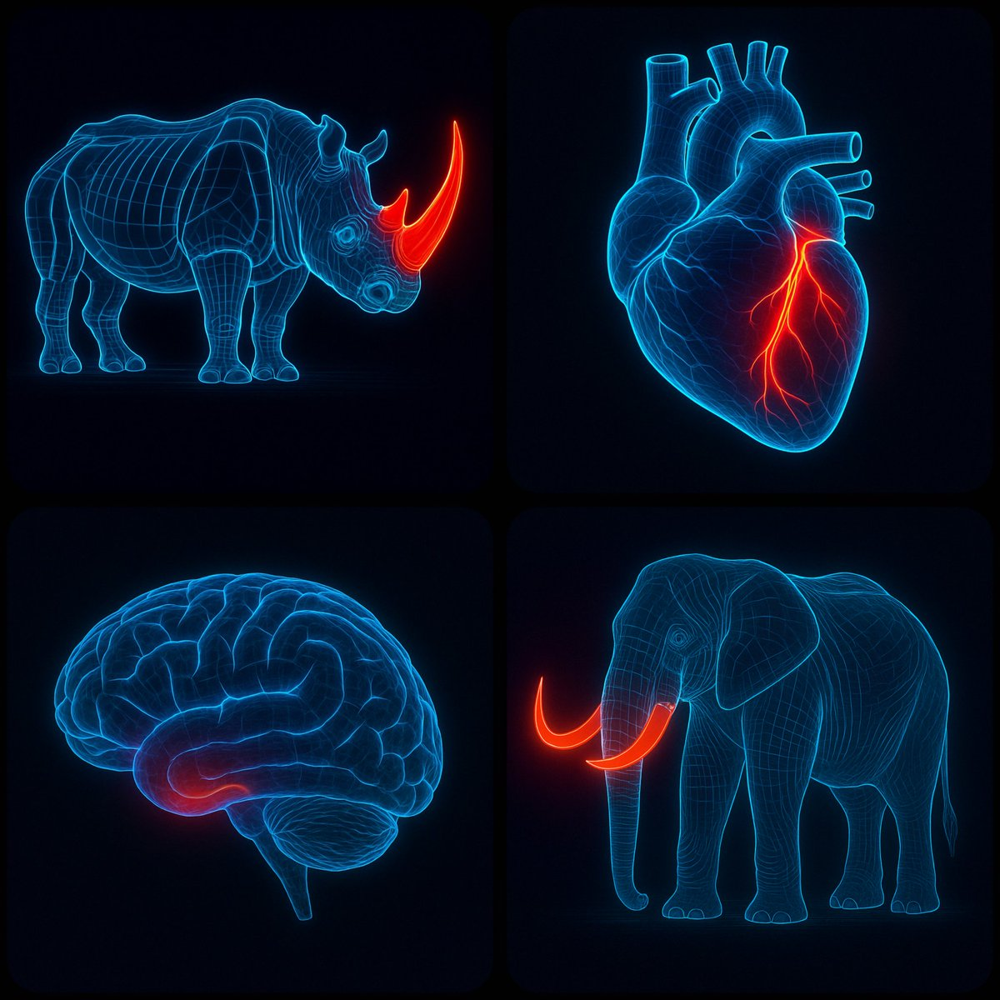

## 知名戏曲片段的MBTI人格类型卡片

- ID: gpt4o-85-zh
- Slug: prompt-85-zh
- 语言: zh
- 来源: [来源链接](https://x.com/op7418/status/1925869690120794320)
- 样例图路径: images/part3/85.jpeg

### 提示词

```text
# 任务目标
请生成一张基于中国古代知名戏曲片段的MBTI人格类型卡片图片，使戏曲场景扁平插画的情感内涵与MBTI人格特质相对应。，我需要生成的人各类型是[INTP]

## 内容要求
1. **场景选取**：从中国古代知名戏曲片段中提取能体现不同MBTI人格特质的代表性场景
2. **场景意境**：画面需表现完整戏剧场景，通过场景氛围体现对应的人格特质
3. **服饰真实性**：画面中人物必须穿着对应戏曲的正确戏服
4. **人格对应**：每个场景需精准对应一种MBTI人格类型的核心特质

## 卡片排版设计
参考图片样式：
- **顶部**：MBTI类型代码（如INFJ）
- **中部**：渐变色彩的抽象几何图形作为主视觉
- **底部**：
- 中文人格类型名称（如"提倡者"）
- 英文标语：（如"The world is your oyster"）
- 装饰性边框和星形符号

## 视觉风格
- 采用现代极简设计语言
- 渐变色彩与几何形状结合
- 保持神秘感与艺术性
- 整体色调柔和梦幻

## 技术规格
- 卡片尺寸采用标准比例
- 每张卡片需清晰标注MBTI类型代码
- 保持系列视觉一致性
```

### 样例图


## 霓虹花卉和谐插图

- ID: gpt4o-82-zh
- Slug: prompt-82-zh
- 语言: zh
- 来源: [来源链接](https://x.com/LudovicCreator/status/1926246931661042132)
- 样例图路径: images/part3/82.png

### 提示词

```text
A Neon Floral Harmony illustration of [SUBJECT], with flowers and plants outlined in glowing neon hues. Use vibrant [COLOR1] and [COLOR2] to create a serene yet electrifying botanical scene
```

### 样例图


## 3D零食卡通世界

- ID: gpt4o-77-zh
- Slug: prompt-77-zh
- 语言: zh
- 来源: [来源链接](https://x.com/aziz4ai/status/1925895453217898847)
- 样例图路径: images/part3/77.jpeg

### 提示词

```text
A 3D-rendered digital illustration featuring a retro-style food truck inspired by the brand [INSERT BRAND NAME], designed with smooth pastel colors and soft textures. A black-and-white cartoon character stands beside the truck, holding a product that visually represents the brand. The environment reflects the brand’s world—playful hills, trees, and skies stylized with its color palette and product shapes. The brand’s logo is clearly displayed on the truck, and a short slogan appears naturally within the scene. Format: 1:1, isometric view, cinematic lighting, clean and joyful composition.
```

### 样例图


## 黑白漫画风格插图

- ID: gpt4o-76-zh
- Slug: prompt-76-zh
- 语言: zh
- 来源: [来源链接](https://x.com/CharaspowerAI/status/1923778050845528388)
- 样例图路径: images/part3/76.png

### 提示词

```text
Highly dramatic and epic black and white manga-style illustration of [Your character and description].  Powerful, dynamic pose, exaggerated features emphasizing the intensity of the scene. Background with explosive energy bursts, lightning effects, and a whirlwind of debris
```

### 样例图


## 可爱微缩场景

- ID: gpt4o-67-zh
- Slug: prompt-67-zh
- 语言: zh
- 来源: [来源链接](https://x.com/ZHO_ZHO_ZHO/status/1925878276133708224)
- 样例图路径: images/part3/67.jpeg

### 提示词

```text
{
    "style": "miniature handcrafted diorama",
    "material": "tree branches, cardboard, clay, moss, dried flowers, paper",
    "surface_texture": "organic, rough and varied (wood grain, soft moss, paper texture)",
    "lighting": {
        "type": "soft ambient natural light",
        "intensity": "low to moderate",
        "direction": "diffused overhead",
        "accent_colors": [
            "forest green",
            "earth brown",
            "soft beige",
            "muted pink"
        ],
        "reflections": false,
        "refractions": false,
        "dispersion_effects": false,
        "bloom": false
    },
    "color_scheme": {
        "primary": "natural greens and browns",
        "secondary": "soft neutral tones (cardboard, clay, paper)",
        "highlights": "light falling on the open book and cat’s glasses",
        "rim_light": "subtle natural edge light from the forest opening"
    },
    "background": {
        "color": "natural moss green",
        "vignette": false,
        "texture": "moss and dried floral structure"
    },
    "post_processing": {
        "chromatic_aberration": false,
        "glow": false,
        "high_contrast": false,
        "sharp_details": true,
        "film_grain": false
    },
    "form_composition": {
        "scene_elements": [
            "a small girl sitting on a balcony holding an open miniature book",
            "a cat with glasses observing the book's illustrations",
            "a treehouse made from twigs, cardboard, and clay",
            "balcony and surrounding forest made of moss and dried flowers"
        ],
        "scale": "miniature",
        "theme": "childlike wonder and storytelling in a handcrafted world",
        "visual_metaphor": [
            "curiosity",
            "quiet companionship",
            "imagination in nature"
        ]
    },
    "metadata": {
        "artist": "-Zho-",
        "series": "ZH4O"
    }
}
```

### 样例图


## 彩色卡通俏皮图标和徽标

- ID: gpt4o-55-zh
- Slug: prompt-55-zh
- 语言: zh
- 来源: [来源链接](https://x.com/gnrlyxyz/status/1925553233881145499)
- 样例图路径: images/part3/55.jpeg

### 提示词

```text
Create a 2D digital illustration of the [FIREFOX] logo in a colorful cartoon style with bold black outlines. The icon design should feature playful, vibrant solid colors such as pink, teal, orange, yellow, and purple, applied in a flat, bold way. Give the shapes a slightly exaggerated, bubbly form with rounded edges and fun details like starbursts, stripes, or spark effects if relevant. Keep the illustration simple and stylized with a hand-drawn look. Use thick outlines to emphasize form. Vector friendly. White background. Square aspect ratio.
```

### 样例图


## Logo超写实微型摄影

- ID: gpt4o-42-zh
- Slug: prompt-42-zh
- 语言: zh
- 来源: [来源链接](https://x.com/alex_prompter/status/1923036265013801025)
- 样例图路径: images/part3/42.jpeg

### 提示词

```text
Recreate this [BRAND NAME] logo follow the JSON aesthetic below: 
{
    "style": "hyperrealistic miniature photography",
    "scene": {
        "main_subject": "uploaded logo scaled to appear as a large physical object",
        "interaction": "tiny human figures interacting with the logo",
        "activities": [
            "cleaning the logo",
            "painting parts of the logo",
            "climbing ladders on the logo surface",
            "taking photographs of the logo"
        ],
        "environment": "studio-style white background to focus on details",
        "perspective": "frontal view with shallow depth of field for macro effect"
    },
    "logo_handling": {
        "preserve_original_logo_shape": true,
        "preserve_original_logo_colors": true,
        "preserve_text_in_logo": true,
        "use_logo_as_structural_object": true,
        "adapt_logo_to_3D_surface": true
    },
    "miniature_elements": {
        "figure_scale": "1:50 ratio to logo",
        "figure_details": "tiny realistic humans with props like brushes, ropes, and scaffolding",
        "interaction_type": "physical interaction, not illustration or overlay"
    },
    "lighting": {
        "key_light": "soft diffused white light from above",
        "fill_light": "mild side fill to reveal depth and volume",
        "shadows": "realistic and subtle around base and figures"
    },
    "camera": {
        "focus_mode": "macro with shallow depth of field",
        "angle": "slightly top-down to give sense of scale",
        "background": "clean white surface, no gradient, no transparency"
    },
    "post_processing": {
        "realism_enhancement": "preserve logo clarity, crisp text, no artistic blurring",
        "forbid_artistic_filters": true,
        "forbid_color_modifications": true
    },
    "image_constraints": {
        "transparent_background": false,
        "include_text": true,
        "adapt_to_uploaded_logo": true,
        "obey_logo_shape": true,
        "preserve_original_logo_colors": true
    },
    "notes": "The uploaded logo must be clearly recognizable, unmodified, and serve as the core structural element of the scene. Tiny people should interact with the logo realistically, as if it were a large 3D object in a physical miniature world."
}
```

### 样例图


## 人物戏剧夸张风格

- ID: gpt4o-35-zh
- Slug: prompt-35-zh
- 语言: zh
- 来源: [来源链接](https://x.com/dotey/status/1924288320881750108)
- 样例图路径: images/part3/35.png

### 提示词

```text
A high-resolution vertical Pixar-style 3D character illustration.

Main character:  
Salvador Dalí — depicted as a tall, slim, and slightly exaggerated Pixar-style 3D character.  
Wearing a classic blue shirt, yellow tie, high-waisted plaid trousers with suspenders, and leather shoes.  
His iconic long upturned mustache, slick black hair, sharply arched eyebrows, and slightly eccentric posture.  
Stands with chest out, one hand on hip, head tilted slightly back in his typical theatrical flair.

Background:  
Flat, clean yellow background with subtle surface texture.  
Strong sunlight from top-left casts a distinct and enlarged shadow on the wall behind him.

Key Concept – Shadow as spiritual projection:  
The shadow cast behind him does **not** mirror his body shape.  
Instead, it takes the form of one of his most iconic artworks —  
a surreal melted clock with long dripping arms, inspired by “The Persistence of Memory”.

The melted clock shadow is positioned diagonally, starting from his shoulder,  
stretching wide and low across the yellow wall, surreal and fluid, yet unmistakably symbolic.

This shadow is **Dalí’s legacy made visible** — a symbolic extension of his identity through time, dream, and visual distortion.

Lighting & Rendering:  
Pixar-like rendering with detailed but stylized textures.  
Use subtle filmic grain, soft shadows, and warm color grading.  
Subtle sparkles or light speckles inside the shadow to evoke dreamlike texture.

Typography (top-left corner):  
“Salvador Dalí” in minimalist black sans-serif font, “Dalí” bolded.
```

### 样例图


## 平面设计等边风格

- ID: gpt4o-23-zh
- Slug: prompt-23-zh
- 语言: zh
- 来源: [来源链接](https://x.com/Artedeingenio/status/1924388407939076377)
- 样例图路径: images/part3/23.png

### 提示词

```text
A flat isometric digital illustration of [describe the subject: e.g., a modern workspace, a city block, a group of app icons, a sports shop], clean lines and geometric forms, bright pastel colors, simplified perspective with 3D depth, minimal shading, white background or light gradient. Style resembles modern vector infographics, ideal for UI, app design or web visuals.
```

### 样例图


## 创意广告

- ID: gpt4o-14-zh
- Slug: prompt-14-zh
- 语言: zh
- 来源: [来源链接](https://x.com/azed_ai/status/1924090458298609881)
- 样例图路径: images/part3/14.png

### 提示词

```text
A high-impact advertisement set against a clean, dark or high-contrast background. A [product] is centered, sharply lit and highly detailed. Around it, surreal, stylized visual [elements] illustrations explode outward (e.g., musicians, runners, curls, sunbursts), vibrant color palette, neon. bold uppercase ad copy at the top that reads [TEXT] and the brand logo at the bottom, modern Ad
```

### 样例图

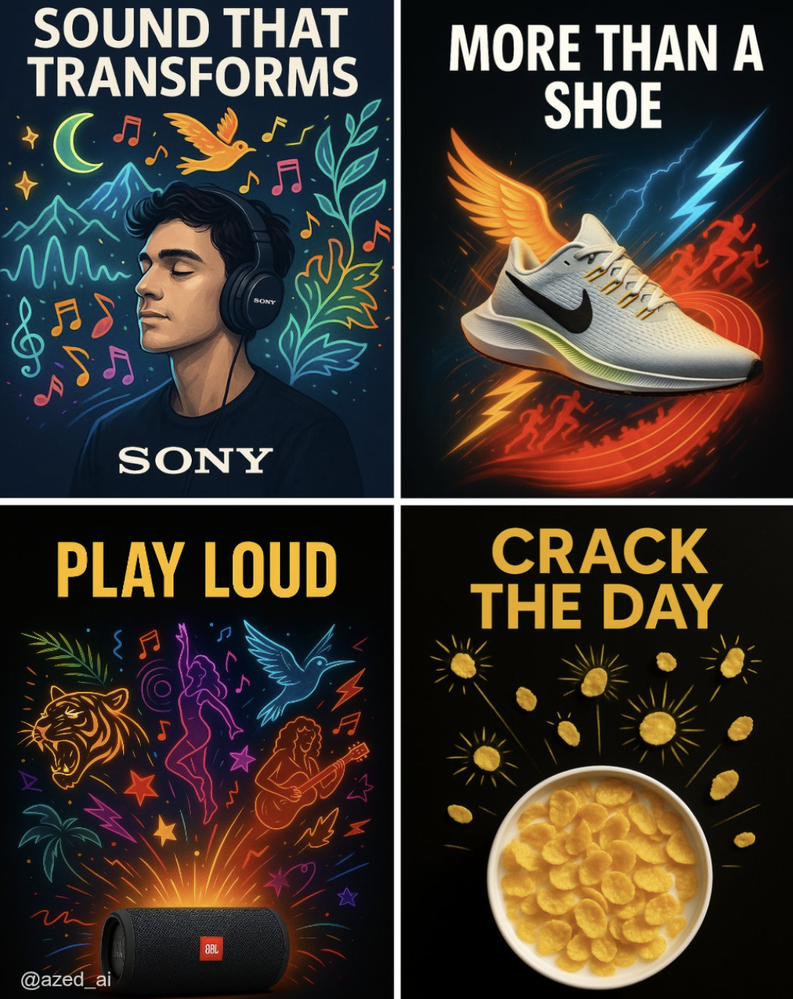

## 刺绣插图风格

- ID: gpt4o-8-zh
- Slug: prompt-8-zh
- 语言: zh
- 来源: [来源链接](https://x.com/Artedeingenio/status/1924032621220188340)
- 样例图路径: images/part3/8.png

### 提示词

```text
A handcrafted illustration that simulates traditional embroidery using colorful threads on linen fabric. All elements are “stitched” with visible yarn textures, using techniques like satin stitch, backstitch, and French knots. Raised contours and directional thread flow create a tactile, cozy appearance. The background is made of woven linen, with gentle pastel or folk-inspired colors. The composition is friendly and magical, evoking a storybook charm. Include decorative details such as flowers, suns, clouds, trees or symbols to enhance the folk embroidery style.
```

### 样例图

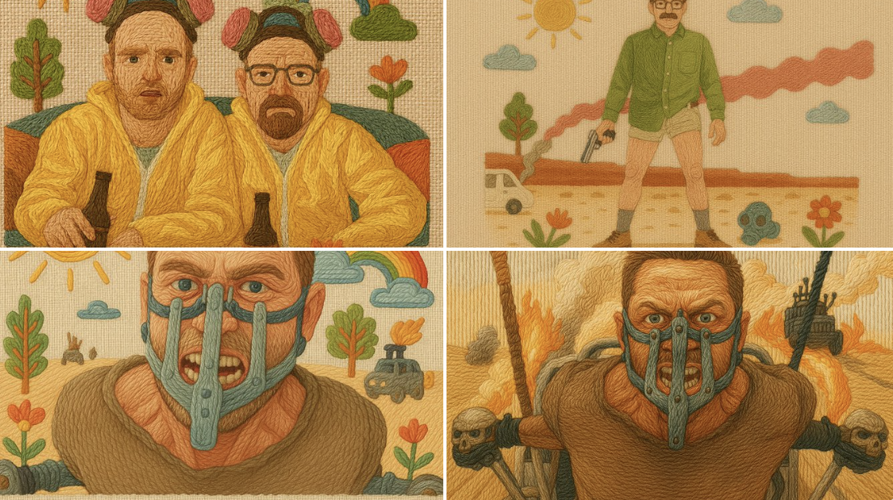

## 手绘风格的信息图卡片

- ID: gpt4o-1-zh
- Slug: prompt-1-zh
- 语言: zh
- 来源: 来源链接缺失
- 样例图路径: images/part3/1.png

### 提示词

```text
创作一张手绘风格的信息图卡片，比例为9:16竖版。卡片主题鲜明，背景为带有纸质肌理的米色或米白色，整体设计体现质朴、亲切的手绘美感。 卡片上方以红黑相间、对比鲜明的大号毛笔草书字体突出标题，吸引视觉焦点。文字内容均采用中文草书，整体布局分为2至4个清晰的小节，每节以简短、精炼的中文短语表达核心要点。字体保持草书流畅的韵律感，既清晰可读又富有艺术气息。 卡片中点缀简单、有趣的手绘插画或图标，例如人物或象征符号，以增强视觉吸引力，引发读者思考与共鸣。 整体布局注意视觉平衡，预留足够的空白空间，确保画面简洁明了，易于阅读和理解。 <h1><span style=""color:red"">「认知」</span>决定上限 <span style=""color:red"">「圈子」</span>决定机会</h1> - 你赚不到「认知」以外的钱， - 也遇不到「圈子」以外的机会。
```

### 样例图


