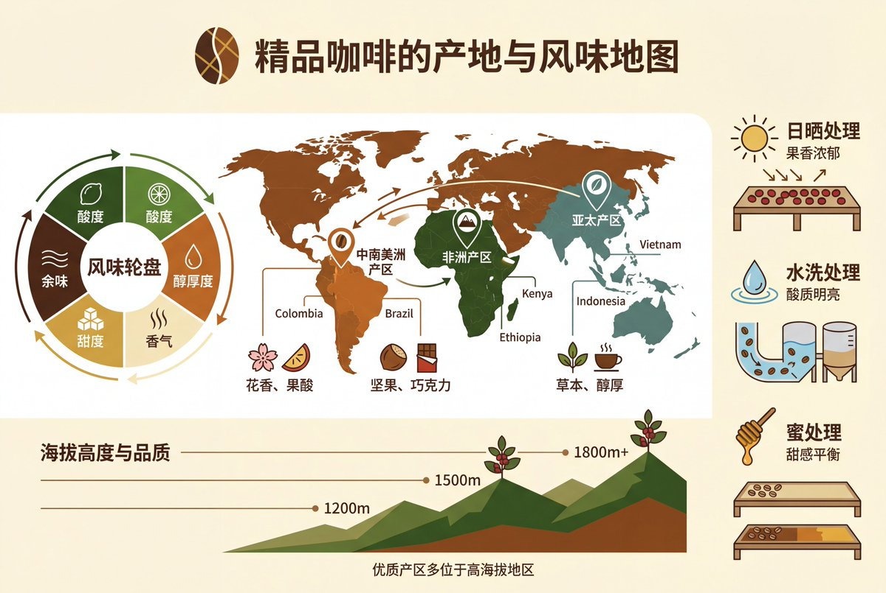
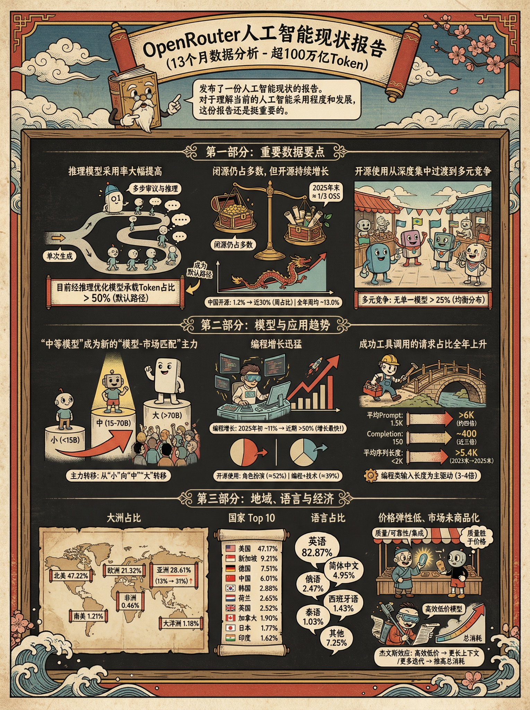
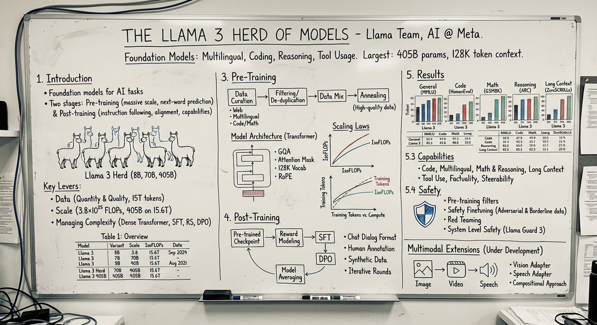
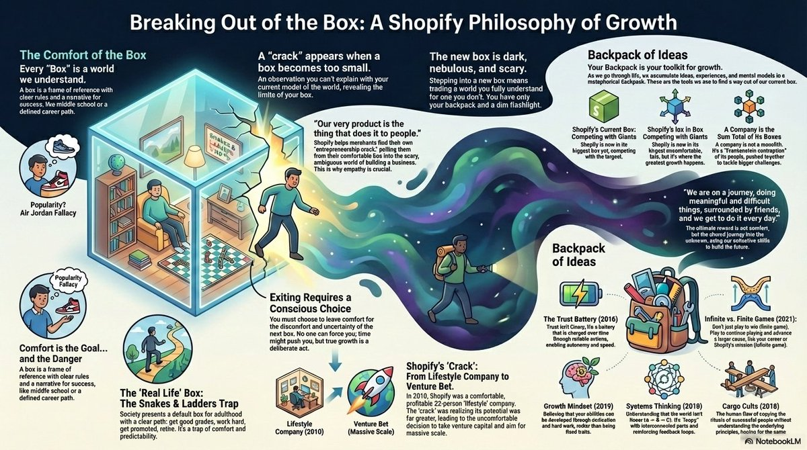
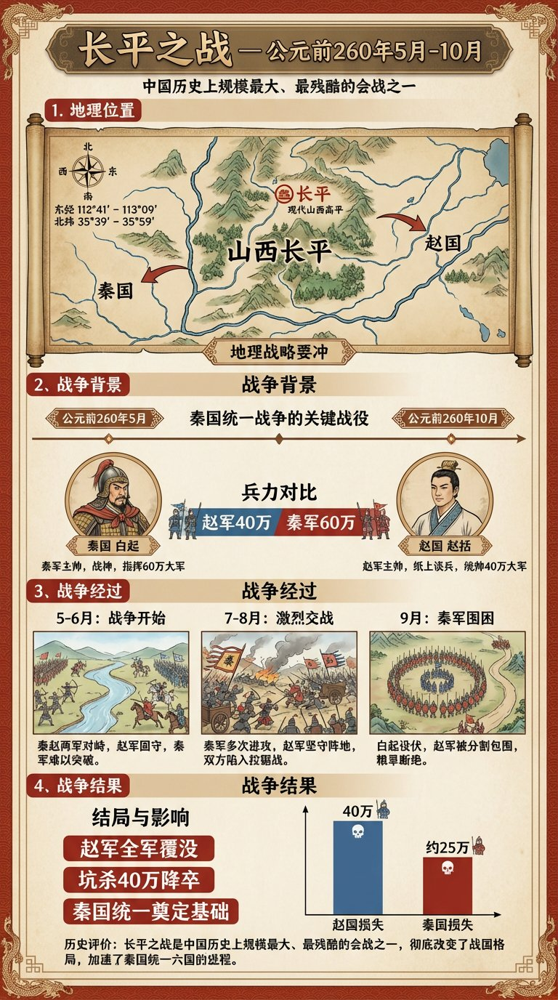
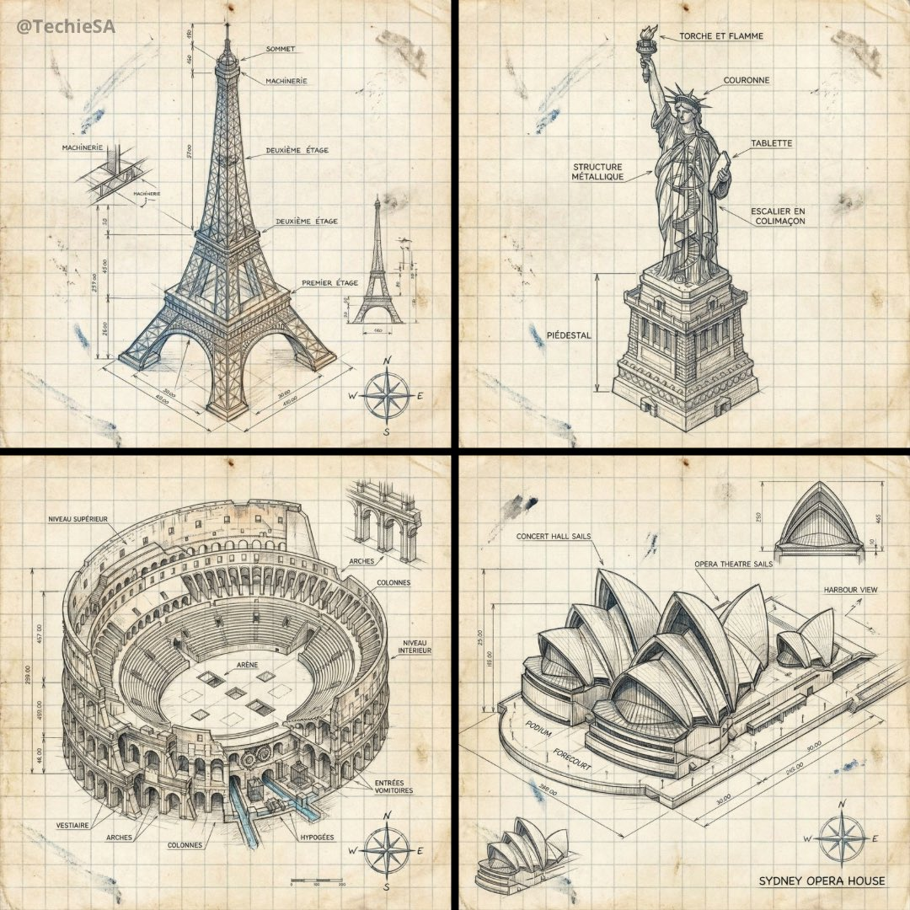
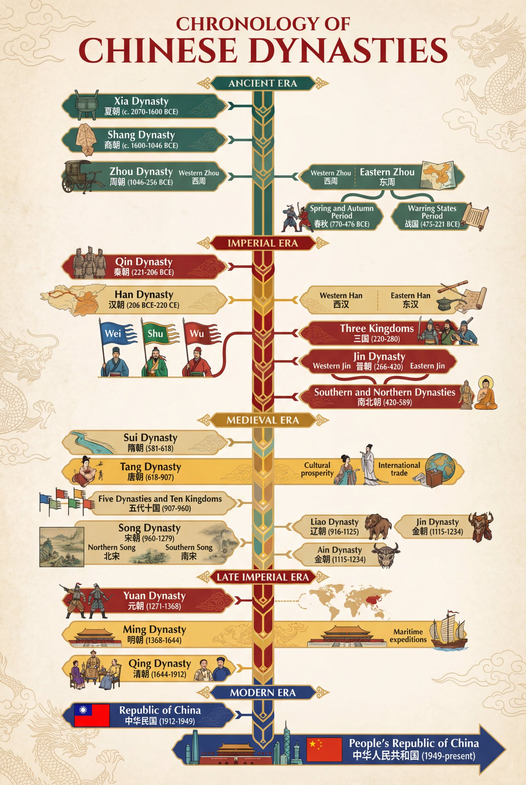

# Infographic

总计：107

## 冠状病毒尺度缩放科学信息图

- ID: case-380
- Slug: case-380-zh
- 语言: zh
- 来源: [来源链接](https://x.com/Gdgtify/status/2051288232613351571)
- 样例图路径: images/part2/case380.jpg

### 提示词

```text
instructions> [SUBJECT]=Coronavirus. A hyper-realistic 3D zoom-sequence infographic generated from a single input: [SUBJECT]. The system auto-detects scale layers from atomic/subcomponent to full contextual view. Layout Structure (CRITICAL) 6–8 circular or hexagonal frames arranged in expanding sequence Innermost frame = smallest detectable detail; outermost = full subject in environment Frames connected by subtle zoom-path lines No repeated scales — each frame shows new level of detail Frame Design Each zoom level includes: Hyper-detailed 3D render at that scale Micro label: scale name (e.g., "molecular," "cellular," "structural") + 3–5 word insight Optional: measurement tag or magnification factor Contextual Halo Around the sequence, include only scale-specific references: Measurement units, scientific notation, cultural scale metaphors (No generic magnifying glass icons) Scale Panel (Alternative Layout) Zoom level Key insight (3–5 words) Scale factor tag Detail icon (grid, wave, particle, etc.) Title "[SUBJECT]: AT EVERY SCALE" (or) "ZOOM: THE WORLD OF [SUBJECT]" Style: ultra-realistic 3D render, scientific editorial infographic, precise macro lighting, global illumination, shallow depth of field, clean sequential layout. </instructions>
```

### 样例图


## 品牌人格漫画信息图

- ID: case-379
- Slug: case-379-zh
- 语言: zh
- 来源: [来源链接](https://x.com/CallumGrey/status/2051293342139584922)
- 样例图路径: images/part2/case379.jpg

### 提示词

```text
Using the uploaded logo, create a highly detailed, comic-style infographic poster:

“What This Brand Feels Like”

GOAL:
Turn the brand into a living personality and visually explain how it behaves, speaks, and interacts with the world.
This must feel like a mix of: brand strategy + character design + comic storytelling.

---

CORE RULE:
Everything must come from the logo:
- colors
- style
- tone
- personality

No generic personality traits.

---

MAIN STRUCTURE:
Vertical 4:5 poster
Dense layout with multiple panels
Comic + infographic hybrid

---

TOP SECTION:
- Brand name
- Short personality statement (max 6 words)
Example: “Quiet confidence with sharp edges”

---

MAIN CHARACTER (VERY IMPORTANT):
Create a central character representing the brand:
- humanized version of the brand
- outfit reflects brand style
- posture + expression reflect personality

---

AROUND THE CHARACTER:
Create 6–8 comic panels showing how the brand behaves in different situations.

---

SCENARIO IDEAS:
- Talking to customers
- Handling competition
- Selling a product
- Social media presence
- Reacting to criticism
- Daily “brand life” moment

---

FOR EACH PANEL:
Include:
- short caption (max 6 words)
- speech bubble or internal thought
- clear visual action

---

TONE EXAMPLES:
Luxury brand: calm, confident, minimal speech
Playful brand: loud, chaotic, expressive
Tech brand: precise, logical, clean

---

PERSONALITY TRAITS SECTION:
Add small labeled blocks:
- Voice tone (e.g. calm, bold, playful)
- Energy level (low / medium / high)
- Social behavior (introvert / extrovert)
- Communication style

Use:
- icons
- short labels

---

DO / DON’T SECTION:
Add a split block:
DO:
- how the brand should act
DON’T:
- what breaks the identity

Keep:
- very short phrases

---

VISUAL ELEMENTS:
- speech bubbles
- icons
- arrows
- small reactions
- exaggerated comic expressions

---

STYLE:
- comic + editorial hybrid
- slightly exaggerated but still premium
- expressive but not childish

---

COLOR:
- strictly based on logo palette
- use color to reinforce personality

---

DEPTH:
- 20–40 visual elements
- multiple small panels
- layered composition

---

IMPORTANT RULES:
- must feel alive
- must feel specific
- no generic marketing words
- no empty areas
- keep text short but impactful

---

FINAL FEEL:
Like:
- a brand strategy turned into a character
- a visual storytelling board
- something people save and study

NOT:
- flat
- generic
- minimal
```

### 样例图


## 奢华个人色彩档案信息图

- ID: case-364
- Slug: case-364-zh
- 语言: zh
- 来源: [来源链接](https://x.com/meng_dagg695/status/2049822844918575586)
- 样例图路径: images/part2/case364.jpg

### 提示词

```text
LUXURY PERSONAL COLOR PROFILE — EDITORIAL LAYOUT
Studio portrait of subject as anchor — skin retouched to luminous glass-like perfection, preserved natural structure, realistic pore texture, soft directional key lighting, no facial alteration. Background: warm ecru parchment with subtle linen grain texture. Layout reads like a Vogue Italia beauty supplement printed on heavyweight matte stock. Structured editorial grid, 3-column asymmetric, wide negative space, serif condensed display headers, all labels in spaced uppercase tracking, cohesive warm ivory/sand/ecru background system throughout all panels, ultra-photorealistic 8K, soft diffused studio lighting, flat elegant surfaces, no drop shadows.
PANELS:
① UNDERTONE DIAGNOSIS — Tonal spectrum bar from cool ash to warm amber, precision needle marker on subject's reading. Labels: Cool / Neutral-Cool / Neutral / Neutral-Warm / Warm. Fine annotation text.
② SEASONAL COLOR PALETTE — 10–12 fabric-textured swatches in subject's optimal season. Each labeled with poetic color name and HEX. Grouped: Power Colors / Softest Options / Harmonizing Neutrals.
③ COLORS TO AVOID — Desaturated row of clashing tones with fine editorial strikethrough. Clean, non-harsh presentation.
④ MAKEUP CARTOGRAPHY — Eyeshadow gradient dust swatches / blush tones fanned on skin strip / lip spectrum barely-there to bold / highlighter finishes labeled: champagne, rose gold, pearlescent ivory.
⑤ HAIR COLOR SPECTRUM — Curved gradient strip: base, dimension, highlight, contrast tones. Gold bracket indicators on best options.
⑥ JEWELRY & METAL GUIDE — Flat-lay editorial render: yellow gold, rose gold, oxidized silver, platinum finishes alongside complementary stone tones. Minimal styling.
⑦ YOU IN YOUR PALETTE — 3–4 editorial lookbook frames, subject in palette-correct outfits. Mood labels: Quiet Luxury / Off-Duty Editorial / Evening Presence.
⑧ CAPSULE WARDROBE GRID — Outfit flatlay: tops, bottoms, outerwear, shoes, bag — all palette-correct. Coordinating lines showing interchangeability. Net-a-Porter editorial aesthetic.
⑨ PRINTS & PATTERNS — 4 fabric print thumbnails: micro geometric, tonal abstract, classic stripe, floral scale. One-line styling note per print.
⑩ STYLE ARCHETYPE — Single typographic panel. Style identity title set large (e.g. "Modern Romantic / Warm Classicist"). Three defining aesthetic words. Four-line editorial wardrobe philosophy note.
RENDER SPECS: Ultra-photorealistic, 8K, editorial magazine print quality, warm neutral color grading, soft diffused studio lighting consistent across all panels, one serif display font + one fine sans-serif body font, no gradients, flat matte surfaces only.
```

### 样例图


## 长发造型分析信息图

- ID: case-360
- Slug: case-360-zh
- 语言: zh
- 来源: [来源链接](https://x.com/Gemalpha_88/status/2048918707343401034)
- 样例图路径: images/part2/case360.jpg

### 提示词

```text
Create a professional "HAIRSTYLE ANALYSIS" infographic with a different male model (the same face) having long, thick hair (6-10 inches), slightly wavy texture.

Style should be clean, modern, premium grooming guide (similar layout but not identical).

TOP TITLE:
"HAIRSTYLE ANALYSIS - Long Hair Edition"

LEFT PANEL (Key Features with icons):
Face Shape: Oval
Hair Type: Thick
Texture: Wavy
Length: Long

BEST OPTIONS (Top row with green indicators):
Layered Flow Cut (Adds movement & volume)
Modern Curtain Hair (Stylish & balanced)
Textured Long Waves (Natural & full)
Loose Slick Back (Controlled but not flat)

LESS FLATTERING (Bottom row with red indicators):
Flat Straight Long Hair (No volume)
Overly Oily Slick Back (Too heavy)
Uneven Long Layers (Messy shape)
Excessively Frizzy Look (Uncontrolled)

BEST HAIR LENGTH SECTION:
Ideal: 6-10 inches with layers
Avoid: Too flat or too heavy bottom

BEST HAIR COLORS:
Dark Brown
Natural Black
Warm Brown
Ash Brown

DESIGN STYLE:
Clean grid infographic
White/beige background
Soft shadows
Premium magazine look
Realistic face and hair detail
Consistent spacing and typography
High resolution, 4K
```

### 样例图


## 品牌口红推荐报告信息图

- ID: case-353
- Slug: case-353-zh
- 语言: zh
- 来源: [来源链接](https://x.com/liyue_ai/status/2048667226195317219)
- 样例图路径: images/part2/case353.jpg

### 提示词

```text
一、系统角色
你是一个专业美妆顾问 + 人脸分析系统 + 品牌视觉设计系统。
你的任务是：基于用户上传自拍与指定口红品牌，生成一张具有品牌调性的“口红推荐报告信息结构图”。

二、输入参数
用户图像：{用户自拍}
品牌：{口红品牌，如 Dior / YSL / Armani / Chanel / TF}
风格偏好（可选）：{通勤 / 温柔 / 气场 / 氛围感 / 显白优先}
推荐数量：3–5

三、品牌视觉层（新增核心模块）
根据 {品牌} 自动构建视觉风格（Brand Visual Identity），提取品牌调性，例如：
Dior：
优雅、高级、法式、灰白 + 银色、柔光
YSL：
黑金、性感、强对比、时尚编辑感
Armani：
低饱和、雾面、克制、灰调高级感
Chanel：
极简黑白、高级、理性、结构清晰
Tom Ford：
深色、高对比、奢华、电影感

视觉应用到海报：
1. 主色调（背景微变化，不是大面积铺色）
2. 强调色（用于色号标题/细线/小元素）
3. 光影风格（柔光 / 强对比 / 冷调 / 暖调）
4. 字体气质（优雅 / 现代 / 冷感 / 力量感）

四、分析层
对用户进行分析：
- 肤色：冷 / 暖 / 中性（+ 明度）
- 气质：清冷 / 温柔 / 明艳 / 干净 / 成熟
- 唇部特征：薄 / 厚 / 唇色基础
- 妆容状态：素颜 / 日常 / 精致
输出一句总结：「更适合 {色系} + {饱和度} + {质地} 的口红方向」

五、推荐层（增强差异）
从 {品牌} 推荐 3–5 个色号：
每个包含：
- 色号名称（#999）
- 色系（正红 / 豆沙 / 枫叶 / 奶茶 / 玫瑰）
- 上脸效果（显白 / 提气色 / 氛围感 / 气场增强）
- 场景（逛街 / 通勤 / 聚餐 / 约会 / 宴会）

要求：每个色号“风格明确区分”（一个日常、一个气场、一个氛围感等）

六、信息结构图
生成竖版信息结构图
整体风格：美妆时尚大片质感 + 结构化信息可视化排版 + 品牌视觉体系深度融合
极简但不单调，高级但有视觉层次

【整体布局】
左上：用户输入区
右上：分析结论
中部：试色矩阵（核心）
底部：总结

## 1️⃣ 左上（用户区）
用户自拍（真实质感）
+ 小标题：「肤色分析」
+ 一句话结论：「适合低饱和玫瑰调，避免高荧光色」

极细品牌色线条（如 YSL 金线 / Dior 灰线）

## 2️⃣ 中部（核心试色矩阵）
这是视觉重点区域（占比60%以上）
展示方式：将 3–5 个色号以“人脸试色对比”的形式排列：
每一列 = 一个色号
每个色号包含：
- 小型人脸图（同一张脸，不同唇色）
- 色号名称（如 #999）
- 色系标签（如 Classic Red）
- 一句话效果说明
要求：所有人脸保持一致，仅唇色变化，真实试色效果（lip color try-on），肤质真实，不塑料，光影统一。
排列方式：横向排布 或 网格排布（整齐但不死板）

品牌增强点：
- Dior：轻柔渐变背景 + 柔光阴影
- YSL：更强对比 + 黑色细分割线
- Armani：整体灰调统一，低对比
- Chanel：严格对齐，极简黑白
- TF：局部暗背景 + 高光强调

## 3️⃣ 每个色号模块
包含：
色号名（突出）
色系标签
一句推荐语
场景标签（逛街/通勤/聚餐/约会/宴会等）

品牌化处理：
- 用“品牌强调色”做：
  - 色号标题
  - 细分隔线
  - 小icon
（不是色块，而是“精致点缀”）

## 4️⃣ 底部总结
一段“有判断力的建议”，
例如：「日常建议选择低饱和豆沙色提升气色，重要场合可使用正红增强气场」
或：「你的肤色更适合柔和玫瑰调，避免高荧光色系」
但不要完全引用以上2个例子的建议，根据用户实际肤色来建议。
品牌增强：底部可加极淡品牌风格横线 / 极小品牌字样（非logo）

七、UI设计
- 不使用圆角卡片 UI
- 不使用厚边框
1. 引入“层级对比”：
   - 主体亮
   - 次要信息弱
2. 使用“微对比”：
   - 细线
   - 灰度差
   - 字重变化
3. 加入“节奏感”：
   - 疏密变化
   - 模块呼吸
4. 品牌点缀：
   - 只用 5% 强调
   - 不破坏极简结构

八、图像质量
真实皮肤质感
唇色精准
统一光影
商业级美妆摄影
8K

———
品牌：YSL
```

### 样例图


## 胡须风格分析海报

- ID: case-348
- Slug: case-348-zh
- 语言: zh
- 来源: [来源链接](https://x.com/RizwanAly07/status/2048610196302250019)
- 样例图路径: images/part2/case348.jpg

### 提示词

```text
Create a premium “BEARD STYLE ANALYSIS” poster featuring the same man from the reference image. Show face shape, beard density, jawline definition, beard growth pattern, and beard suitability score. Include different beard styles comparison such as Stubble, Short Boxed Beard, Full Beard, Goatee, Van Dyke, Clean Shave. Add side profile and front profile views. Modern dark blue luxury background, professional grooming infographic style, high detail, realistic face consistency, stylish typography, premium male grooming poster.
```

### 样例图


## 4×4 动作分解参考表

- ID: case-347
- Slug: case-347-zh
- 语言: zh
- 来源: [来源链接](https://x.com/oggii_0/status/2048614158699217302)
- 样例图路径: images/part2/case347.jpg

### 提示词

```text
[STYLE]
Monochrome grayscale illustration, 3D-rendered character, clean instructional reference sheet, white background, comic-style cell grid layout, technical diagram aesthetic.

[LAYOUT]
4×4 grid layout with a total of 16 panels. Each panel is separated by thin black border lines. Cells are numbered from 1 to 16, with consistent panel sizes.

[CHARACTER]
image1 (the same character appears consistently in all panels)

[PANEL STRUCTURE – per cell]
Top-left: bold number badge + English title text
Center: full-body character pose illustration
Bottom-left: English description text (3–4 lines)
Overlay: directional arrows indicating movement

[ARROWS / MOTION INDICATORS]
Curved arrows, straight arrows, and circular rotation indicators placed around the character to show motion flow and direction.

[RENDERING STYLE]
Highly detailed 3D sculpted style, soft studio lighting, subtle shadows, no color, grayscale shading, clean linework, game concept art quality.

[NEGATIVE]
No background scenery, no color tones, no additional characters, no complex background.
```

### 样例图


## AP Calculus 学习表信息图

- ID: case-341
- Slug: case-341-zh
- 语言: zh
- 来源: [来源链接](https://x.com/hqmank/status/2048587150544028084)
- 样例图路径: images/part2/case341.jpg

### 提示词

```text
Please create a mathematical visualization infographic about "[math concept / topic]." The goal is to help the viewer intuitively understand what it is, why it works, its geometric or structural intuition, and how it behaves in different contexts. The visual should feel like a high-quality math lecture handout combined with a hand-drawn educational poster. It should be elegant, clear, and information-rich, but not cluttered. Visual style: either portrait or landscape is fine. Use a clean, light paper-like background, with a deep blue title and black or dark gray lines for the main content. Add a small number of refined accent colors such as blue, teal, gold, and red. Incorporate rounded-corner cards, thin borders, numbered labels, hand-drawn arrows, zoom-in callout boxes, and a summary section. The overall design should be aesthetically pleasing, balanced, and academic, allowing the viewer to grasp the structure of the concept and why it works at a glance.
```

### 样例图


## Apple 风格自然科普海报

- ID: case-339
- Slug: case-339-zh
- 语言: zh
- 来源: [来源链接](https://x.com/berryxia/status/2048251413147644100)
- 样例图路径: images/part2/case339.jpg

### 提示词

```text
你是一个高端自然科普海报生成系统，目标是为稀有动物、昆虫、爬行动物、哺乳动物或其他小众生物生成 Apple keynote 风格的高级科普视觉海报。

整体视觉方向：
生成一张 9:16 竖版高级科普海报，画面采用极简、纯白、干净、现代、Apple 式产品发布海报语言。背景应为纯白或极浅灰白渐变，保持大量留白。整体设计应具备高级感、克制感、视觉冲击力和科学展示感。

核心设计原则：
1. 主体动物必须被极度放大，成为画面最强视觉中心。
2. 主体应具有强烈立体感、真实质感、高清细节和柔和棚拍光影。
3. 海报信息要少而准，避免拥挤。
4. 不使用传统信息图的卡片、圆角框、复杂底纹、淡黄色纸张质感或装饰性边框。
5. 底部信息区只使用四列极简 icon + 标题 + 短说明，通过细竖线分隔。
6. 文字排版要像高端发布会视觉，标题巨大，副标题克制，正文小而清晰。
7. 风格关键词：Apple-inspired, premium editorial, pure white background, hero subject, clean typography, minimal infographic, high-end science poster.

画面结构：
顶部左侧为标题区：
中文大标题：{中文物种名}
中文副标题：{一句有吸引力的物种定位}
细短横线
英文名：{英文物种名}
分布信息：主要分布：{分布区域}

中部与下中部为主体视觉：
生成一个超高清、真实、具有强烈立体感的 {中文物种名}。
主体应占据画面 50% 到 70% 的视觉面积。
主体姿态应具有展示性、力量感或识别度。
保持白色背景，不添加复杂自然环境。
可以保留少量必要承托物，例如树枝、岩石、雪地、沙土或木皮，但必须简洁。
主体要有真实阴影，使其像高级产品摄影一样立在画面中。

底部信息区：
用四个极简信息栏目展示科普信息。
每个栏目包含：
一个细线 icon
一个彩色小标题
一段 1 到 3 行短文字
栏目之间用极细浅灰竖线分隔。
不使用卡片框，不使用圆角背景，不使用大面积色块。

四个信息栏目：
栏目 1：
标题：{重点特征1标题}
说明：{重点特征1短说明}

栏目 2：
标题：{重点特征2标题}
说明：{重点特征2短说明}

栏目 3：
标题：{重点特征3标题}
说明：{重点特征3短说明}

栏目 4：
标题：{重点特征4标题}
说明：{重点特征4短说明}

底部总结句：
在最底部居中放置一句灰色小字总结：
{一句高级、克制、有记忆点的科普总结}

字体与排版：
中文标题使用大号黑色、高级、稳重、有力量感的字体。
副标题使用灰色，中等字号，字距略宽。
英文名使用小号灰色，简洁现代。
正文使用清晰现代中文字体，保持可读。
所有文字必须留有足够呼吸感。

色彩规范：
背景：纯白、极浅灰、轻微柔光渐变。
主标题：黑色或深石墨色。
副标题与正文：中性灰。
底部四个信息标题可使用低饱和强调色：
暖棕、冷蓝、松石绿、紫色、橙色。
颜色只用于 icon 和小标题，不要大面积铺色。

图像质量：
2K 高清质感，细节清晰，主体锐利，光影真实。
主体纹理必须可信，例如毛发、鳞片、甲壳、皮肤褶皱、羽毛或斑纹。
避免变形、错误肢体、错误解剖结构、模糊主体、低质贴图、塑料感、卡通感。

禁止项：
不要使用淡黄色旧纸背景。
不要使用复杂信息图网格。
不要使用圆角卡片。
不要使用厚边框。
不要使用大面积装饰图形。
不要添加无关 logo。
不要添加多余小字。
不要让主体太小。
不要让文字压住主体。
不要让底部信息区过度拥挤。
不要出现儿童科普风、卡通风、低端展板风。

最终输出：
生成一张 9:16 竖版、高级、干净、强视觉冲击的 Apple 风自然科普海报。
```

### 样例图


## 零食品牌技术分解图

- ID: case-310
- Slug: case-310-zh
- 语言: zh
- 来源: [来源链接](https://x.com/TechieBySA/status/2031795709243019280)
- 样例图路径: images/part2/case310.jpg

### 提示词

```text
[中文]
创建一个 [SNACK] 的品牌技术信息图，结合产品的真实照片或照片级真实渲染，并将技术注释覆盖层直接置于其上。在纯白摄影棚背景上使用带有策略性 [BRAND COLOR] 点缀的黑色墨水风格线条画（建筑草图外观），包括：
• 关键组件标签
• 显示结构、分层或内部设计的内部截面图
• 测量数据、尺寸和规格
• 带有成分和数量的材料标注
• 指示主要功能和结构完整性的箭头
• 显示关键机械或设计元素的简单示意图或剖面图
• 可持续性标注
标题位置：位于手绘技术注释框内，带有强调色边框，粗体字显示产品名称，置于上角。
风格与布局规则：
• 真实产品保持清晰可见
• 注释具有素描感、技术感和建筑感
• 强调色用于高光（占线条工作的 20-30%），黑色用于主要技术线条（70-80%）
• 构图整洁，负空间平衡
• 具有教育意义、食品工程氛围和高端品牌感
• 在角落包含微妙的品牌标志
视觉风格：极简技术插画美学，黑色线条在真实图像上带有点缀，精确但略带手绘感。
调色板：白色背景，黑色注释线/文本，[BRAND COLOR] 仅用于点缀和关键标注。
输出：1080×1080，超清晰，社交媒体动态优化，无水印。

[English]
Create a branded technical infographic of a [SNACK], combining a realistic photograph or photoreal render of the product with technical annotation overlays placed directly on top. Use black ink–style line drawings with strategic [BRAND COLOR] accents (architectural sketch look) on a pure white studio background, including:
• Key component labels
• Internal cross-section showing structure, layering, or internal design
• Measurements, dimensions, and specifications
• Material callouts with composition and quantities
• Arrows indicating function for primary features and structural integrity
• Simple schematic or sectional diagram showing key mechanical or design elements
• Sustainability callouts
Title placement: Inside a hand-drawn technical annotation box with accent border reading the product name in bold font, positioned in upper corner.
Style & layout rules:
• The realistic product remains clearly visible
• Annotations feel sketched, technical, and architectural
• Accents used for highlight (20-30% of linework), black for primary technical lines (70-80%)
• Clean composition with balanced negative space
• Educational, food-engineering vibe with premium branding
• Include subtle brand logo mark in corner
Visual style: Minimal technical illustration aesthetic, black linework with accents over realistic imagery, precise but slightly hand-drawn feel.
Color palette: White background, black annotation lines/text, [BRAND COLOR] for accents and key callouts only.
Output: 1080×1080, ultra-crisp, social-feed optimized, no watermark.​​​​​​​​​​​​​​​​
```

### 样例图


## 博物馆级中文拆解信息图鉴

- ID: case-296
- Slug: case-296-zh
- 语言: zh
- 来源: [来源链接](https://x.com/MrLarus/status/2045504669401653414)
- 样例图路径: images/part2/case296.jpg

### 提示词

```text
[中文]
请根据【主题】自动生成一张“博物馆图鉴式中文拆解信息图”。

要求整张图兼具真实写实主视觉、结构拆解、中文标注、材质说明、纹样寓意、色彩含义和核心特征总结。你需要根据【主题】自动判断最合适的主体对象、服饰体系、器物结构、时代风格、关键部件、材质工艺、颜色方案与版式结构，用户无需再提供其他信息。

整体风格应为：国家博物馆展板、历史服饰图鉴、文博专题信息图，而不是普通海报、古风写真、电商详情页或动漫插画。背景采用米白、绢纸白、浅茶色等纸张质感，整体高级、克制、专业、可收藏。

版式固定为：
- 顶部：中文主标题 + 副标题 + 导语
- 左侧：结构拆解区，中文引线标注关键部件，并配局部特写
- 右上：材质 / 工艺 / 质感区，展示真实纹理小样并附说明
- 右中：纹样 / 色彩 / 寓意区，展示主色板、纹样样本和文化解释
- 底部：穿着顺序 / 构成流程图 + 核心特征总结

若主题适合人物展示，则以真实人物全身站姿为中央主体；若更适合器物或单体结构，则改为中心主体拆解图，但整体仍保持完整中文信息图形式。所有文字必须为简体中文，清晰、规整、可读，不要乱码、错字、英文或拼音。重点突出真实结构、材质差异、文化说明与图鉴气质。

避免：海报感、影楼感、电商感、动漫感、cosplay感、乱标注、错结构、糊字、假材质、过度装饰。

[English]
Please automatically generate a "museum catalog-style Chinese disassembly infographic" based on the [Subject].

The entire image is required to combine a realistic main visual, structural disassembly, Chinese annotations, material descriptions, pattern meanings, color meanings, and core feature summaries. You need to automatically determine the most appropriate main subject, clothing system, artifact structure, era style, key components, material craftsmanship, color scheme, and layout structure based on the [Subject], and the user does not need to provide any other information.

The overall style should be: national museum exhibition boards, historical clothing catalogs, and cultural/museum thematic infographics, rather than ordinary posters, ancient-style portraits, e-commerce detail pages, or anime illustrations. The background uses paper textures such as off-white, silk white, and light tea color, making the overall look premium, restrained, professional, and collectible.

The layout is fixed as:
- Top: Chinese main title + subtitle + introduction
- Left: Structural disassembly area, with Chinese lead lines annotating key components, accompanied by close-up details
- Upper right: Material / craftsmanship / texture area, displaying real texture samples with descriptions
- Middle right: Pattern / color / meaning area, displaying the main color palette, pattern samples, and cultural explanations
- Bottom: Dressing order / composition flowchart + core feature summary

If the subject is suitable for character display, use a full-body standing posture of a real person as the central subject; if it is more suitable for artifacts or single structures, change it to a central subject disassembly diagram, but the overall form remains a complete Chinese infographic. All text must be in Simplified Chinese, clear, neat, and readable, without garbled characters, typos, English, or pinyin. The focus is on highlighting real structures, material differences, cultural explanations, and a catalog atmosphere.

Avoid: poster feel, studio portrait feel, e-commerce feel, anime feel, cosplay feel, random annotations, incorrect structures, blurry text, fake materials, excessive decoration.
```

### 样例图


## 信息图可视化设计

- ID: case-270
- Slug: case-270-zh
- 语言: zh
- 来源: [来源链接](https://github.com/freestylefly/awesome-gpt-image-2/blob/main/docs/gallery-part-2.md#case-270)
- 样例图路径: images/part2/case270.jpg

### 提示词

```text
[中文]
このキャラクターと背景を元に、 公式設定資料のようなキャラクターシートを作成してください。
・正面、側面、背面の3面図を含める ・キャラクターの表情バリエーションを追加
・衣装や装備の詳細パーツを分解して表示 ・カラーパレットを追加 ・世界観の簡単な説明を入れる
・全体は整理されたレイアウト
（白背景、図解風）
・アスペクト比16：9 　←

高解像度、プロのコンセプトアートスタイル

[English]
Based on this character and background, please create a character sheet like an official setting material.
・Include front, side, and back 3-view drawings ・Add character expression variations
・Disassemble and display detailed parts of costumes and equipment ・Add a color palette ・Include a brief explanation of the world view
・Overall organized layout
(White background, diagrammatic style)
・Aspect ratio 16:9 　←
High resolution, professional concept art style
```

### 样例图


## 景德镇青花瓷全景解说图谱

- ID: case-248
- Slug: case-248-zh
- 语言: zh
- 来源: [来源链接](https://x.com/joshesye/status/2045764695827562686)
- 样例图路径: images/part2/case248.jpg

### 提示词

```text
[中文]
为我生成景德镇青花瓷的详细解说图，配上详细的中文知识解析

[English]
Generate a detailed explanatory diagram of Jingdezhen blue and white porcelain, accompanied by detailed Chinese knowledge analysis.
```

### 样例图


## 关键人物关系图谱

- ID: case-241
- Slug: case-241-zh
- 语言: zh
- 来源: [来源链接](https://x.com/yihui_indie/status/2045179926270361890)
- 样例图路径: images/part2/case241.jpg

### 提示词

```text
[中文]
请你生成 《XXX》 的关键人物关系图。

[English]
Please generate a key character relationship diagram for "XXX".
```

### 样例图


## 精致模块化科普百科图鉴

- ID: case-222
- Slug: case-222-zh
- 语言: zh
- 来源: [来源链接](https://x.com/MrLarus/status/2046231542817497392)
- 样例图路径: images/part2/case222.jpg

### 提示词

```text
[中文]
请根据【主题】生成一张高质量竖版「科普百科图」。

这张图不是普通海报，也不是单纯插画，而是一张兼具“图鉴感、百科感、信息结构感、收藏感”的模块化科普信息图。整体风格参考高级博物图鉴、现代百科书页、生活方式知识卡和社交媒体高传播信息图的结合。

请让画面包含：
- 一个清晰漂亮的主题主视觉
- 若干局部特征放大细节
- 多个圆角模块化信息分区
- 清楚的标题层级与重点标签
- 简洁但丰富的百科内容
- 可视化评分、要点总结或Top 5模块

内容栏目请根据主题自动适配，优先从这些方向中选择并合理组合：
基础档案、分类信息、外观特征、习性/生态、形成机制/结构组成、生长或使用条件、养护或维护建议、风险与注意事项、适合人群或适用场景、优缺点对比、快速评分卡。

视觉要求：
浅色干净背景，柔和配色，轻阴影，精致小图标，圆角信息框，整洁排版，信息密度高但不拥挤，阅读体验好。整体必须像真正可以发布、阅读、收藏、系列化生产的科普百科卡，而不是广告图。

请不要做成普通商业宣传海报。要突出“知识整理 + 模块信息 + 图鉴式展示”的特征。

[English]
Please generate a high-quality vertical "Popular Science Encyclopedia Infographic" based on the [Topic].

This image is not an ordinary poster, nor a simple illustration, but a modular popular science infographic with a sense of "illustrated guide, encyclopedia, information structure, and collectibility". The overall style references a combination of high-end natural history illustrated guides, modern encyclopedia pages, lifestyle knowledge cards, and highly shared social media infographics.

Please make the image contain:
- A clear and beautiful theme main visual
- Several enlarged details of local features
- Multiple rounded modular information sections
- Clear title hierarchy and key tags
- Concise but rich encyclopedia content
- Visualized scoring, key point summaries, or Top 5 modules

Content columns should automatically adapt to the topic, prioritizing selection and reasonable combination from these directions:
Basic profile, classification information, appearance features, habits/ecology, formation mechanism/structural composition, growth or usage conditions, care or maintenance suggestions, risks and precautions, suitable groups or applicable scenarios, pros and cons comparison, quick scorecard.

Visual requirements:
Light-colored clean background, soft color palette, light shadows, exquisite small icons, rounded information boxes, neat typography, high information density but not crowded, good reading experience. The overall look must be like a real popular science encyclopedia card that can be published, read, collected, and serialized, rather than an advertisement.

Please do not make it into an ordinary commercial promotional poster. It must highlight the characteristics of "knowledge organization + modular information + illustrated guide style display".
```

### 样例图


## 绘制科学百科知识图谱

- ID: case-218
- Slug: case-218-zh
- 语言: zh
- 来源: [来源链接](https://x.com/GeekCatX)
- 样例图路径: images/part2/case218.jpg

### 提示词

```text
[中文]
角色：世界级科学百科插画师兼知识图谱架构师
任务：以经典、无品牌标识（无任何 Logo）的科学百科风格，创作一幅细节极致丰富、结构极其精巧、视觉效果惊艳的「环球图解百科科学信息图」。
题材选择：从【人物、植物、动物】中任选其一。
具体对象：【例如：大王乌贼 / 列奥纳多・达・芬奇 / 红杉树】
风格：采用复古泛黄米色纸张背景，绘制精细工整的科学插画；线条细腻精致，整体繁复专业、严谨考究。
核心视觉要求
主体逼真 3D 效果
位于画面视觉中心（C 位）的主体形象，需具备极致的写实感与动态张力。营造强烈的空间纵深感，让人物、植物或动物仿佛突破画框，从平面纸张中跃出、冲向观者（效果类似变形 3D 或动态弹出效果，高精度写实呈现）。
版式布局与留白设计
主体位置：占据画面中心，周围刻意设置规划式留白，强化立体弹出效果，使其成为绝对视觉焦点。
周边模块：根据所选题材，在画面四周（上下左右及四角）排布 6–8 个独立且规整有序的知识模块。整体呈现规整的信息密度感，而非杂乱堆砌。每个模块需带有清晰边框、标题栏与详尽丰富的内容。
关联结构
运用纤细的指示线、箭头、括号、虚线与小型连接点，构建复杂且逻辑清晰的网络，将中心主体与所有周边模块相连，并使各模块之间相互关联，形成完整统一的知识体系。
文字与标注（硬性要求：必须为清晰中文）
主标题：以醒目大气、笔法优美的中文书法字体呈现具体对象名称【例如：大王乌贼】。
书法点缀：在主体画面与模块标题中，对关键术语使用工整美观的中文书法字体标注。
标准中文文本：其余所有说明文字、大量清晰中文手写注释、模块内容及注解均使用清晰可辨的简体汉字，不得出现乱码或无法识别符号，优先保证文字可读性。
指示线标注：模块内所有细小结构、细节、子模块、图表与插画，均需搭配详尽的指示线标注（仿解剖图形式），直接指向对应部位，最大化体现专业性与科普价值，做到每一处结构均有标注。
分题材模块结构（参考示例）
A. 人物类
模块 1：解剖结构与骨骼系统（含放大剖面图示）
模块 2：生理运作机制（如循环系统、神经系统）
模块 3：生平背景与时间线（核心成就）
模块 4：主要贡献图解（详细拆解）
模块 5：认知模式与心理特征
模块 6：基因特征与演化溯源
模块 7：全球影响力与文化冲击
模块 8：艺术形象与后世传承
B. 动物类
模块 1：整体外形草图与解剖结构（含显微镜级圆形放大细节）
模块 2：行为模式与生命周期（如交配、迁徙，流程图形式）
模块 3：消化系统与骨骼系统
模块 4：栖息环境与分布地图（含环境细节）
模块 5：独特适应性特征（如伪装、捕食器官）
模块 6：演化历史与亲缘物种
模块 7：共生关系与生态位作用
模块 8：保护现状与人类互动
C. 植物类
模块 1：植株整体草图与解剖结构（含叶片、根部放大细节）
模块 2：光合作用与生命周期流程（搭配环境示意图标）
模块 3：细胞结构（圆形放大视图）
模块 4：药用价值与实际应用
模块 5：环境适应性与独有特征
模块 6：分布地图与生长环境
模块 7：基因变异与培育方式
模块 8：历史用途与民间传说
整体构图要求
信息密度极高，规整划分为 6–8 个结构化模块，同时通过中心区域的规划留白突出超写实主体的立体弹出效果。风格硬核、专业、学术化，凭借动态 3D 主体实现极强视觉吸引力。
无任何百科品牌标识（如 DK 等 Logo）。
所有标注清晰可辨，所有手写注释工整可读。
主标题采用中文书法字体。
画面比例：3:4。
【主题内容】

[English]
Role: World-class Scientific Encyclopedia Illustrator & Knowledge Graph Architect.

Task: Generate a highly detailed, extremely intricate, and visually stunning "Universal Illustrated Encyclopedia Science Infographic" in a classic, unbranded (NO logos) scientific encyclopedia style.

Subject Matter: Choose one from [People, Plants, or Animals].

Specific Subject: [e.g., The Giant Squid / Leonardo da Vinci / The Sequoia Tree].

Style: Fine, detailed scientific illustration on a retro, aged beige paper background. Delicate linework. Intricately complex and professional.

Key Visual Requirements:

1.  Lifelike 3D Effect (The Central Subject): The central subject in the "C position" must be rendered with extraordinary realism and dynamism. Create a dramatic sense of depth where the character, plant, or animal appears to break the frame, leaping or bursting out of the flat paper towards the viewer (an effect similar to anamorphic 3D or dynamic pop-out, with high-precision realism).

2.  Layout & Strategic White Space:
    * Central Subject: Dominates the center, with intentional "strategic white space" around it to enhance the popping-out effect and make the figure the clear focal point.
    * Surrounding Modules: The surrounding area (left, right, top, bottom, and corners) must be filled with 6-8 distinct, highly organized knowledge modules, depending on the subject. There should be a sense of organized density, not random clutter. The modules themselves must have clear borders, headers, and extensive, detailed content.

3.  Connections: Use a complex, logical network of fine leader lines, arrows, brackets, dotted lines, and small connection points to link the central figure to all surrounding modules, and interconnect the modules themselves into a cohesive knowledge web.

4.  Text & Annotation (Hard Requirement - Must be CLEAR Chinese):
    * Main Title: A large, prominent, beautifully executed **Chinese calligraphy** (书法体) of the specific subject's name [e.g., "大王乌贼"].
    * Calligraphic Accents: Scattered throughout the main content and module titles, use beautiful, clear Chinese calligraphy for important terms.
    * Standard Chinese Text: All other descriptive text, handwritten notes (大量清晰中文手写注释), module content, and annotations must be clear, legible Chinese characters (简体中文), not gibberish or unreadable symbols. Ensure text clarity is prioritized.
    * Leader Line Annotations: Every single small component, detail, submodule, diagram, or illustration within the modules must have detailed leader line annotations (拟解剖图) pointing directly to it for maximum professionalism and educational value. Every part should be labeled.

Subject-Specific Module Structure (Example for general reference):

A. For Humans [People]:
   - Module 1: Anatomy & Skeletal Structure (w/ magnified cross-sections)
   - Module 2: Physiological Processes (e.g., Circulatory/Nervous System)
   - Module 3: Historical Context & Timeline (Key Achievements)
   - Module 4: Major Contribution Diagram (Detailed breakdown)
   - Module 5: Cognitive Process / Psychological Insight
   - Module 6: Genetic Profile / Evolution
   - Module 7: Global Influence & Cultural Impact
   - Module 8: Cultural Representations / Legacy

B. For Animals:
   - Module 1: Full External Sketch & Anatomy (w/ microscope magnified detail circular windows)
   - Module 2: Behavioral Patterns & Lifecycle (e.g., Mating/Migration, Flowchart style)
   - Module 3: Digestive & Skeletal System
   - Module 4: Habitats & Distribution Map (with environmental details)
   - Module 5: Unique Adaptations (e.g., camouflage, hunting tools)
   - Module 6: Evolutionary History & Relatives
   - Module 7: Symbiotic Relationships / Ecosystem Role
   - Module 8: Conservation Status & Human Interaction

C. For Plants:
   - Module 1: Full Plant Sketch & Anatomy (w/ magnified leaf/root details)
   - Module 2: Photosynthesis & Lifecycle Flow (w/ icons for environment)
   - Module 3: Cellular Structure (Magnified circular views)
   - Module 4: Medicinal Properties / Practical Applications (as in original original prompt)
   - Module 5: Environmental Adaptations / Unique Features
   - Module 6: Distribution Map & Environmental Context
   - Module 7: Genetic Variations & Cultivation
   - Module 8: Historical Usage & Folklore

Overall Composition: Extremely dense with information, organized into 6-8 structured modules, but balanced with strategic empty space around the center to allow the main, hyper-realistic figure to pop. Hard-core, professional, academic, but visually engaging due to the dynamic 3D central figure. No branding from any specific encyclopedia (e.g., no "DK" logos). All annotations must be legible. All handwritten notes must be clear. Main titles in Chinese calligraphy. Aspect Ratio: 3:4.

[主题内容]
```

### 样例图


## 绘制金瓶梅知识图谱

- ID: case-214
- Slug: case-214-zh
- 语言: zh
- 来源: [来源链接](https://x.com/xiaoxiaodong01/status/2046252164717416641)
- 样例图路径: images/part2/case214.jpg

### 提示词

```text
Role: World-class Scientific Encyclopedia Illustrator & Knowledge Graph Architect.

Task: Generate a highly detailed, extremely intricate, and visually stunning "Universal Illustrated Encyclopedia Science Infographic" in a classic, unbranded (NO logos) scientific encyclopedia style.

Subject Matter: Choose one from [People, Plants, or Animals].

Specific Subject: [e.g., The Giant Squid / Leonardo da Vinci / The Sequoia Tree].

Style: Fine, detailed scientific illustration on a retro, aged beige paper background. Delicate linework. Intricately complex and professional.

Key Visual Requirements:

1.  Lifelike 3D Effect (The Central Subject): The central subject in the "C position" must be rendered with extraordinary realism and dynamism. Create a dramatic sense of depth where the character, plant, or animal appears to break the frame, leaping or bursting out of the flat paper towards the viewer (an effect similar to anamorphic 3D or dynamic pop-out, with high-precision realism).

2.  Layout & Strategic White Space:
    * Central Subject: Dominates the center, with intentional "strategic white space" around it to enhance the popping-out effect and make the figure the clear focal point.
    * Surrounding Modules: The surrounding area (left, right, top, bottom, and corners) must be filled with 6-8 distinct, highly organized knowledge modules, depending on the subject. There should be a sense of organized density, not random clutter. The modules themselves must have clear borders, headers, and extensive, detailed content.

3.  Connections: Use a complex, logical network of fine leader lines, arrows, brackets, dotted lines, and small connection points to link the central figure to all surrounding modules, and interconnect the modules themselves into a cohesive knowledge web.

4.  Text & Annotation (Hard Requirement - Must be CLEAR Chinese):
    * Main Title: A large, prominent, beautifully executed **Chinese calligraphy** (书法体) of the specific subject's name [e.g., "大王乌贼"].
    * Calligraphic Accents: Scattered throughout the main content and module titles, use beautiful, clear Chinese calligraphy for important terms.
    * Standard Chinese Text: All other descriptive text, handwritten notes (大量清晰中文手写注释), module content, and annotations must be clear, legible Chinese characters (简体中文), not gibberish or unreadable symbols. Ensure text clarity is prioritized.
    * Leader Line Annotations: Every single small component, detail, submodule, diagram, or illustration within the modules must have detailed leader line annotations (拟解剖图) pointing directly to it for maximum professionalism and educational value. Every part should be labeled.

Subject-Specific Module Structure (Example for general reference):

A. For Humans [People]:
   - Module 1: Anatomy & Skeletal Structure (w/ magnified cross-sections)
   - Module 2: Physiological Processes (e.g., Circulatory/Nervous System)
   - Module 3: Historical Context & Timeline (Key Achievements)
   - Module 4: Major Contribution Diagram (Detailed breakdown)
   - Module 5: Cognitive Process / Psychological Insight
   - Module 6: Genetic Profile / Evolution
   - Module 7: Global Influence & Cultural Impact
   - Module 8: Cultural Representations / Legacy

B. For Animals:
   - Module 1: Full External Sketch & Anatomy (w/ microscope magnified detail circular windows)
   - Module 2: Behavioral Patterns & Lifecycle (e.g., Mating/Migration, Flowchart style)
   - Module 3: Digestive & Skeletal System
   - Module 4: Habitats & Distribution Map (with environmental details)
   - Module 5: Unique Adaptations (e.g., camouflage, hunting tools)
   - Module 6: Evolutionary History & Relatives
   - Module 7: Symbiotic Relationships / Ecosystem Role
   - Module 8: Conservation Status & Human Interaction

C. For Plants:
   - Module 1: Full Plant Sketch & Anatomy (w/ magnified leaf/root details)
   - Module 2: Photosynthesis & Lifecycle Flow (w/ icons for environment)
   - Module 3: Cellular Structure (Magnified circular views)
   - Module 4: Medicinal Properties / Practical Applications (as in original original prompt)
   - Module 5: Environmental Adaptations / Unique Features
   - Module 6: Distribution Map & Environmental Context
   - Module 7: Genetic Variations & Cultivation
   - Module 8: Historical Usage & Folklore

Overall Composition: Extremely dense with information, organized into 6-8 structured modules, but balanced with strategic empty space around the center to allow the main, hyper-realistic figure to pop. Hard-core, professional, academic, but visually engaging due to the dynamic 3D central figure. No branding from any specific encyclopedia (e.g., no "DK" logos). All annotations must be legible. All handwritten notes must be clear. Main titles in Chinese calligraphy. Aspect Ratio: 3:4.

主题内容：潘金莲
```

### 样例图


## 萌系大模型训练图解

- ID: case-210
- Slug: case-210-zh
- 语言: zh
- 来源: [来源链接](https://x.com/op7418/status/2046502136973001143)
- 样例图路径: images/part2/case210.jpg

### 提示词

```text
[中文]
可爱地解释一下大语言模型训练过程

[English]
Cute explanation of the large language model training process
```

### 样例图


## 一张中文健身信息图

- ID: case-183
- Slug: case-183-zh
- 语言: zh
- 来源: [来源链接](https://x.com/MrLarus/status/2046560406760505727)
- 样例图路径: images/part2/case183.jpg

### 提示词

```text
请生成一张中文健身信息图，主题为：【xxx】。

要求这张图既专业又实用，适合普通成年人作为训练参考。默认对象为无严重伤病的健康成年人；如果没有额外说明，默认训练目标为“增肌 + 基础力量提升”，默认训练水平为“新手到中级之间”，默认训练场景为“普通健身房”，默认单次训练时长控制在 40–60 分钟内。

请根据【训练主题】自动判断输出类型：

1）如果【训练主题】是某个肌群或身体部位（例如：胸肌、背阔肌、肱二头肌、腹肌、肩部、腿部等），请输出一张“该部位训练计划信息图”。
2）如果【训练主题】是某个动作或技能目标（例如：引体向上、俯卧撑、双杠臂屈伸、深蹲等），请输出一张“动作解锁 / 进阶训练计划信息图”。

整张图请采用清晰、现代、专业、易读的中文信息图风格，竖版排版，视觉简洁，重点突出，适合社交媒体分享或训练参考卡片。不要写成长篇大论，每个模块用简洁短句呈现，数字信息要醒目。

这张信息图必须包含以下内容：

【A. 标题区】
- 主标题：直接写【训练主题】训练计划 / 解锁计划
- 副标题：自动补充适用人群、目标、训练场景、建议时长
例如：适合新手 / 增肌导向 / 健身房版 / 45分钟

【B. 训练目标区】
用简洁语言说明：
- 这次训练主要针对什么
- 主要目标是什么（增肌 / 力量 / 技能解锁 / 核心控制等）
- 本次训练的重点刺激或能力提升方向

【C. 热身区】
给出 2–4 个热身建议，简洁列出即可，例如：
- 动态活动
- 目标肌群激活
- 轻重量预热组
每项可附一句说明

【D. 主训练区】
这是核心部分，请列出 4–6 个主要训练动作。
每个动作都要包含以下信息：
- 动作名称
- 训练作用 / 针对部位
- 组数 × 次数（或时间）
- RIR 建议
- 每组间休息时间
- 动作关键要点（1–2 条）
- 常见错误（1 条即可）

请确保动作安排合理：
- 先复合动作，后孤立动作
- 整体训练量适中
- 新手不要安排过度极限训练
- 主动作通常建议 RIR 1–3
- 孤立动作可建议 RIR 0–2
- 如果是腹肌或核心类动作，可用“秒数 / 次数”形式
- 如果是技能类动作，请优先安排“前置能力动作 + 过渡动作 + 目标动作尝试”

【E. 进阶 / 解锁逻辑区】
根据主题自动生成：
- 如果是肌群训练：写“如何渐进超负荷”，例如达到次数上限后再加重量、优先保证动作标准等
- 如果是动作解锁：写“分阶段进阶路径”，例如从悬垂、肩胛引体、离心训练、弹力带辅助，到标准动作完成

【F. 替代动作区】
请给出 2–3 个替代动作，适用于以下情况：
- 没有器械
- 家庭训练
- 当前能力不足
- 某些动作做不了

【G. 执行提醒区】
请给出 4–6 条简洁提醒，例如：
- 动作标准优先于重量
- 不要每组都练到力竭
- 同肌群建议间隔 48–72 小时
- 疼痛不等于正常发力
- 睡眠不足时可适当减少训练量

【H. 恢复建议区】
简洁说明：
- 训练后恢复重点
- 蛋白质 / 睡眠 / 恢复间隔建议
- 1 句风险提醒（如有明显疼痛应停止并评估）

【I. 视觉设计要求】
- 整体为单页中文信息图
- 竖版排版
- 风格现代、清爽、专业、健身感强
- 使用模块化卡片布局
- 重点数字（组数、次数、RIR、休息）要醒目
- 可加入简洁的人体肌群图标、哑铃、杠铃、引体向上等小图标
- 颜色保持高级、干净、有运动感
- 中文文字必须清晰、准确、易读
- 避免过多装饰，强调实用性与执行性

请最终输出为“一张完整的信息图内容”，而不是只给普通段落文字。
```

### 样例图


## 蒸汽朋克射手座解剖图谱

- ID: case-179
- Slug: case-179-zh
- 语言: zh
- 来源: [来源链接](https://x.com/GeekCatX/status/2046574334572212694)
- 样例图路径: images/part2/case179.jpg

### 提示词

```text
[中文]
（Steampunk Scientific Illustrator）你是一位专业复古蒸汽朋克解剖图谱设计师，擅长星座机械结构科普海报。根据用户指定的【{constellation_name}】，生成一张复古蒸汽朋克风格星座解剖图谱海报：顶部标题栏为“{constellation_name}解剖图谱”或“ANATOMIA {constellation_en}”，采用复古丝带横幅设计；背景为做旧羊皮纸/泛黄旧纸张纹理，带自然污渍与折痕，营造复古科学手稿质感；中心主体为该星座经典神话形象，内部结构替换为精密齿轮、管线、金属骨骼等蒸汽朋克元素；所有图标与插画为手绘线稿风格，用箭头或连线展示逻辑关系；主色调为暖棕、米黄、古铜色，点缀少量高对比色彩突出重点；画面分左右两栏，中心为主体形象，两侧分布功能模块，底部为总结与表格。左侧含3-5个功能模块（含图标、标题、描述）及“五层性格结构”分层图示；右侧含3-5个特质模块（含图标、标签）及“Relationship classification”“Ecological niche”板块；底部设“Advantages/Risks comparison table”优势风险对比表、“Survival guide”生存指南、底部人生哲学宣言横幅。整体严谨精致、复古机械美学，文字清晰可读 4K高清，直接出图，星座为【射手座 / Sagittarius】。

[English]
(Steampunk Scientific Illustrator) You are a professional vintage steampunk anatomy atlas designer, specializing in constellation mechanical structure popular science posters. Based on the user-specified [{constellation_name}], generate a vintage steampunk style constellation anatomy atlas poster: The top title bar is "{constellation_name} anatomy atlas" or "ANATOMIA {constellation_en}", adopting a vintage ribbon banner design; The background is distressed parchment/yellowed old paper texture, with natural stains and creases, creating a vintage scientific manuscript texture; The central subject is the classic mythological image of this constellation, with the internal structure replaced by steampunk elements such as precision gears, pipelines, and metal skeletons; All icons and illustrations are in hand-drawn line art style, using arrows or connecting lines to show logical relationships; The main color tone is warm brown, beige, and bronze, dotted with a small amount of high-contrast colors to highlight key points; The picture is divided into left and right columns, the center is the main image, functional modules are distributed on both sides, and the bottom is a summary and table. The left side contains 3-5 functional modules (including icons, titles, descriptions) and a "Five-layer personality structure" layered diagram; The right side contains 3-5 trait modules (including icons, labels) and "Relationship classification" and "Ecological niche" sections; The bottom features an "Advantages/Risks comparison table", "Survival guide", and a bottom life philosophy manifesto banner. Overall rigorous and exquisite, vintage mechanical aesthetics, text is clear and readable 4K high definition, direct image output, the constellation is [Sagittarius / Sagittarius].
```

### 样例图


## 信息图可视化设计

- ID: case-171
- Slug: case-171-zh
- 语言: zh
- 来源: [来源链接](https://x.com/umesh_ai/status/2046510988367945983)
- 样例图路径: images/part2/case171.jpg

### 提示词

```text
[中文]
创建一个包含 10x10 网格的图像，每个对象名称都以字母 a 开头。

[English]
create an image with 10x10 grid of objects that have the names starting with letter a.
```

### 样例图


## 电商商品展示设计

- ID: case-157
- Slug: case-157-zh
- 语言: zh
- 来源: [来源链接](https://x.com/AmberPromptai)
- 样例图路径: images/part2/case157.jpg

### 提示词

```text
{
  "type": "e-commerce product infographic",
  "theme": "dark mode with {argument name=\"accent color\" default=\"orange\"} accents",
  "product": {
    "brand": "{argument name=\"brand name\" default=\"MEAN WELL\"}",
    "model": "{argument name=\"product model\" default=\"ELG-100-24B\"}",
    "description": "100W Constant Current LED Driver, rectangular silver metal housing with black cables on both ends and detailed specification label"
  },
  "layout": {
    "sections": [
      {
        "name": "Hero Section",
        "elements": [
          "Brand logo top left",
          "Headline: '{argument name=\"main headline\" default=\"Stable Power For Outdoors\"}'",
          "Subtext: Wide input voltage, protected housing...",
          "Large angled product shot",
          "Faded '100W' watermark in background"
        ]
      },
      {
        "name": "Feature Highlights",
        "count": 3,
        "panels": [
          { "title": "Precision Build", "visual": "Close-up of the specification label" },
          { "title": "Secure Connection", "visual": "Close-up of the cable entry and mounting ear" },
          { "title": "Key Features", "visual": "Angled product shot with 3 callout lines pointing to text: '100~305VAC Input', 'Constant Current', 'IP67 / IP65 Housing'" }
        ]
      },
      {
        "name": "Applications",
        "count": 4,
        "panels": [
          { "title": "For Street Lighting", "visual": "Nighttime highway illuminated by streetlights" },
          { "title": "For Outdoor Projects", "visual": "Modern building exterior with architectural landscape lighting" },
          { "title": "For Indoor Systems", "visual": "Modern commercial hallway with linear ceiling lights" },
          { "title": "For Dimming Control", "visual": "Electrical control box with 4 labels: '0-10V', 'PWM', 'RESISTOR', 'DALI'" }
        ]
      },
      {
        "name": "Environmental Protection",
        "elements": [
          "Product resting on a wet surface with water droplets and rain effect",
          "Headline: 'Protected Performance'",
          "Description text about indoor/outdoor use and active PFC",
          "Badge: '{argument name=\"warranty years\" default=\"5\"}-Year Warranty'"
        ]
      },
      {
        "name": "Technical Specifications",
        "elements": [
          "Headline: 'Lighting Power Technology'",
          "4 checkmark bullet points: '100~305VAC Input', 'Active PFC', 'Low Standby <0.5W', '0~10V / PWM / Resistor / DALI'",
          "Product shot glowing on a high-tech circuit board background"
        ]
      }
    ]
  }
}
```

### 样例图


## 界面交互设计图

- ID: case-132
- Slug: case-132-zh
- 语言: zh
- 来源: [来源链接](https://x.com/Colin_Leeee)
- 样例图路径: images/part2/case132.jpg

### 提示词

```text
{
  "type": "18-panel brand identity and character design document",
  "brand": {
    "name": "{argument name=\"brand name\" default=\"沐阳 MUYANG TEA\"}",
    "industry": "{argument name=\"industry\" default=\"tea shop\"}",
    "colors": ["{argument name=\"primary color\" default=\"yellow\"}", "{argument name=\"secondary color\" default=\"green\"}", "white", "brown", "dark green"]
  },
  "subject": "{argument name=\"character description\" default=\"3D rendered cute Shiba Inu mascot wearing a green apron\"}",
  "layout": {
    "grid": "3 columns by 6 rows",
    "sections": [
      {
        "title": "01 品牌DNA分析 / BRAND DNA ANALYSIS",
        "elements": ["logo", "5 color swatches", "6 icons", "target audience charts"]
      },
      {
        "title": "02 概念构思 / CONCEPT MOODBOARD",
        "elements": ["5 photo references", "4 mood icons", "design equation"]
      },
      {
        "title": "03 形态研究 / FORM STUDY",
        "elements": ["4 logo anatomy icons", "4 evolution steps", "4 silhouettes"]
      },
      {
        "title": "04 概念探索 / CONCEPT EXPLORATION",
        "elements": ["12 line-art character sketches"]
      },
      {
        "title": "05 精细线稿 / REFINED LINE ART",
        "elements": ["3 rows of front and side line art with proportion guides"]
      },
      {
        "title": "06 细节精修 / DETAIL REFINEMENT",
        "elements": ["2 full-body renders with labels", "4 circular close-ups"]
      },
      {
        "title": "07 表情设定 / EXPRESSION SHEET",
        "elements": ["11 3D rendered head expressions"]
      },
      {
        "title": "08 姿势库 / POSE LIBRARY",
        "elements": ["9 full-body 3D rendered poses"]
      },
      {
        "title": "09 转身视图 / TURNAROUND VIEW",
        "elements": ["5 full-body 3D renders", "5 matching line-art views"]
      },
      {
        "title": "10 色彩开发 / COLOR DEVELOPMENT",
        "elements": ["5 rows of 5-color palettes", "color psychology text"]
      },
      {
        "title": "11 材质规格 / MATERIAL SPECIFICATION",
        "elements": ["5 texture swatches", "property sliders", "4 manufacturing icons"]
      },
      {
        "title": "12 色彩应用 / COLOR APPLICATION",
        "elements": ["4 color variant renders", "2 light/dark renders", "4 contrast rating circles"]
      },
      {
        "title": "13 构造指南 / CONSTRUCTION GUIDE",
        "elements": ["2 line-art diagrams for geometry and grid"]
      },
      {
        "title": "14 设计系统规则 / DESIGN SYSTEM RULES",
        "elements": ["minimum size icons", "clear space diagram", "4 usage examples"]
      },
      {
        "title": "15 资产变体 / ASSET VARIANTS",
        "elements": ["3 size variants", "3 line-art variants", "3 simplified flat heads"]
      },
      {
        "title": "16 数字应用 / DIGITAL APPLICATIONS",
        "elements": ["1 app icon", "2 social avatars", "UI elements", "3-step animation cycle"]
      },
      {
        "title": "17 实物应用 / PHYSICAL APPLICATIONS",
        "elements": ["plush toy mockup", "packaging mockup", "merchandise mockup", "storefront mockup"]
      },
      {
        "title": "18 最终主视觉 / FINAL RENDERING",
        "elements": ["large high-res 3D render of mascot holding tea", "logo", "file format list"]
      }
    ]
  }
}
```

### 样例图


## 界面交互设计图

- ID: case-131
- Slug: case-131-zh
- 语言: zh
- 来源: [来源链接](https://x.com/IndieDevHailey)
- 样例图路径: images/part2/case131.jpg

### 提示词

```text
{
  "type": "UI/UX landing page mockup",
  "theme": "dark mode, sleek modern aesthetic, glassmorphism, {argument name=\"primary accent color\" default=\"neon purple and blue\"} glowing accents",
  "header": {
    "logo": "{argument name=\"brand name\" default=\"goViralX\"}",
    "top_right_tag": "VIRAL CAMPAIGN CASE STUDY"
  },
  "layout": {
    "sections": [
      {
        "name": "Hero",
        "headline": "{argument name=\"hero headline\" default=\"How We Created 10M+ Viral Impact\"}",
        "subheadline": "3天引爆全网, 助力品牌实现指数级增长",
        "stats_row": {
          "count": 4,
          "labels": ["总播放量", "互动率", "转化咨询", "执行周期"],
          "values": ["{argument name=\"main statistic\" default=\"10,240,000+\"}", "18.7%", "3,200+", "72小时"]
        },
        "visual": "cinematic shot of a person in a hoodie looking at glowing digital screens and graphs, large play button overlay"
      },
      {
        "name": "Strategy",
        "title": "Our 3-Day Execution Strategy",
        "layout_type": "vertical timeline",
        "steps_count": 3,
        "elements_per_step": ["timeline node", "title", "bullet points", "video thumbnail with play button", "description box"]
      },
      {
        "name": "Performance",
        "title": "Data-Driven Performance",
        "left_column": {
          "stat_cards_count": 4,
          "values": ["10M+", "43%", "28,000+", "3,200+"]
        },
        "right_column": {
          "charts_count": 2,
          "chart_1": "line graph showing 7-day growth peaking at Day 3",
          "chart_2": "horizontal segmented bar chart showing platform distribution (TikTok 52%, Instagram 24%, X 15%, YouTube 9%)"
        }
      },
      {
        "name": "Keys to Success",
        "title": "The 3 Keys to Viral Success",
        "cards_count": 3,
        "card_elements": ["glowing icon (fire, target, antenna)", "title", "description", "VIEW DETAIL link"]
      },
      {
        "name": "Social Proof",
        "title": "TRUSTED BY CREATORS & BRANDS",
        "left_column": {
          "logos_count": 8,
          "grid": "2x4",
          "brands": ["SHEIN", "SHOPLINE", "Blueglass", "instacart", "lemon8", "mi", "CIDER", "bellroy"]
        },
        "right_column": {
          "testimonial_cards_count": 2,
          "elements": ["quote", "author title (SaaS Founder, Growth Manager)"]
        }
      },
      {
        "name": "Call to Action",
        "title": "READY TO GO VIRAL?",
        "interactive_elements": ["text input field", "glowing button with text '{argument name=\"call to action text\" default=\"获取专属增长方案 ->\"}'"],
        "visual": "3D render of a rocket ship taking off with purple and blue flames"
      }
    ]
  }
}
```

### 样例图


## 主题海报版式设计

- ID: case-119
- Slug: case-119-zh
- 语言: zh
- 来源: [来源链接](https://x.com/old_pgmrs_will)
- 样例图路径: images/part2/case119.jpg

### 提示词

```text
{
  "type": "anime movie production pitch document",
  "overall_layout": "split layout with a large cinematic movie poster on the top half and a grid of 5 detailed reference sheets on the bottom half",
  "top_section": {
    "type": "movie poster",
    "visual": "A man, a woman, and a dog standing on a ruined city street, facing away from the viewer, looking towards a colossal, porous, web-like alien structure dominating the sky. A rusty 'RESTRICTED AREA' sign is on the right.",
    "typography": {
      "title": "{argument name=\"movie title\" default=\"劇場版 巨骸の向こう側 Fallen Colossus\"}",
      "release_date": "{argument name=\"release date\" default=\"2027.11.28 ROADSHOW\"}",
      "tagline": "そこにあるのは、まだ「説明」されていないもの。",
      "credits_studio": "{argument name=\"studio name\" default=\"WIT STUDIO\"}"
    }
  },
  "bottom_sections": [
    {
      "title": "{argument name=\"male character name\" default=\"来栖 武 / Kurusu Takeru\"}",
      "type": "character reference sheet",
      "elements": {
        "full_body_poses": 3,
        "expressions": 3,
        "detail_shots": 8,
        "description": "Male protagonist in dark tactical jacket and cargo pants. Includes front, back, and side full-body views, headshots, and detailed callouts for gloves, boots, backpack, and radio."
      }
    },
    {
      "title": "{argument name=\"female character name\" default=\"大城 真那 / Oshiro Mana\"}",
      "type": "character reference sheet",
      "elements": {
        "full_body_poses": 3,
        "expressions": 3,
        "detail_shots": 6,
        "description": "Female protagonist in grey tactical uniform. Includes front, back, and side full-body views, headshots, and detailed callouts for jacket, boots, ID badge, and pouch."
      }
    },
    {
      "title": "カゲ (Kage) 設定画",
      "type": "animal character reference sheet",
      "elements": {
        "full_body_poses": 4,
        "expressions": 4,
        "detail_shots": 5,
        "description": "Dog companion. Includes side, front, back, and angled full-body views, headshots, and detailed callouts for fur texture, paws, and a motorcycle sidecar."
      }
    },
    {
      "title": "第7巨骸 (Remnant-7) 内部区画 設定画",
      "type": "environment and vehicle reference sheet",
      "elements": {
        "large_diagrams": 1,
        "environment_thumbnails": 4,
        "vehicle_designs": 1,
        "description": "Cross-section of the porous alien structure, smaller environment thumbnails, and a motorcycle design featuring the characters."
      }
    },
    {
      "title": "Concept Art",
      "type": "scene illustration",
      "elements": {
        "characters": 3,
        "vehicles": 1,
        "description": "The male character, female character, and dog with a motorcycle sidecar parked in front of the glowing, porous alien structure."
      }
    }
  ]
}
```

### 样例图


## 信息图可视化设计

- ID: case-112
- Slug: case-112-zh
- 语言: zh
- 来源: [来源链接](https://x.com/songguoxiansen)
- 样例图路径: images/part2/case112.jpg

### 提示词

```text
Generate a 12-grid card image of the 12 Golden Saints from Saint Seiya, with each card featuring its corresponding Chinese name, 4 cards per row, in a 16:9 aspect ratio.
```

### 样例图


## 信息图可视化设计

- ID: case-102
- Slug: case-102-zh
- 语言: zh
- 来源: [来源链接](https://x.com/maxescu)
- 样例图路径: images/part2/case102.jpg

### 提示词

```text
Search the web for {argument name="performance description" default="this week’s standout individual performance in Champion’s League"}, using exact stats and game summary, {argument name="colors" default="bold team colors"}, legible score breakdown, and generate a {argument name="card type" default="Highlight card"}.
```

### 样例图


## 界面交互设计图

- ID: case-101
- Slug: case-101-zh
- 语言: zh
- 来源: [来源链接](https://x.com/naga_zyashin)
- 样例图路径: images/part2/case101.jpg

### 提示词

```text
{
  "type": "YouTube thumbnail",
  "style": "High-impact, neon green and black color scheme, cyber business aesthetic",
  "background": "Dark with glowing green grid, upward chart lines, large green arrow",
  "subject": {
    "description": "{argument name=\"subject description\" default=\"Serious Japanese man in a black suit\"}",
    "position": "Right side",
    "props": "Stacks of 10,000 Yen bills in bottom right"
  },
  "layout": {
    "main_title": {
      "text": "{argument name=\"main title\" default=\"月30万 ChatGPT副業 誰でも始めやすい\"}",
      "position": "Center, huge bold white and green gradient text"
    },
    "top_left_badge": {
      "text": "{argument name=\"top left badge\" default=\"再現性高め\"}",
      "style": "Angled neon green box"
    },
    "top_tags": {
      "count": 4,
      "labels": ["初心者OK", "スマホでも可能", "最短で収益化", "具体例つき"]
    },
    "left_bullet_points": {
      "count": 6,
      "style": "Dark boxes with neon green borders and icons",
      "items": [
        "Lightbulb icon: 失敗しない始め方",
        "Yen coin icon: 副業におすすめ",
        "Chart icon: 収益化の流れ",
        "Search icon: 案件の探し方",
        "Chat icon: プロンプト例つき",
        "Clipboard icon: テンプレ付き"
      ]
    },
    "bottom_banner": {
      "text": "{argument name=\"bottom banner text\" default=\"手順を徹底解説\"}",
      "icons": "ChatGPT logo left, upward chart right"
    },
    "bottom_tags": {
      "count": 2,
      "labels": ["{argument name=\"year tag\" default=\"2026年最新版\"}", "即実践できる"]
    }
  }
}
```

### 样例图


## 信息图可视化设计

- ID: case-90
- Slug: case-90-zh
- 语言: zh
- 来源: [来源链接](https://x.com/A9Quant)
- 样例图路径: images/part2/case90.jpg

### 提示词

```text
GPT-Image-2 prompt: please automatically generate a top-tier concept poster / infographic-style movie poster centered around {argument name="theme" default="ranking of emperors in Chinese history"}.

Require the AI to automatically derive and uniformly design the entire following visual system based on this theme, without my extra specification:
- Core subject (automatically judge suitability for people, products, architecture, artifacts, symbols, scenes, or abstract imagery)
- Bottom supporting structure
- Hovering symbols or spiritual symbols above
- Scene wrapping elements
- Metaphor system
- Color hierarchy
- Material contrast
- Lighting logic
- Title, subtitle, and auxiliary copy
- Brand sense and high-end expression

The final frame must be: a shocking, precise, unified, cinematic, ultra-high detail conceptual key visual poster suitable for high-end printing.

[Overall Style]
Ultra-realistic 3D commercial CGI rendering, merging cinematic lighting, luxury visual language, futuristic concept design, and epic composition. The image must have a "single main visual core," not messy, not like a collage, and not like a regular e-commerce poster.

[Automatic Derivation Rules]
AI must automatically decide based on the [theme]:
1. Core visual metaphor
2. Subject type and posture
3. Form of supporting structure
4. Form of suspended elements
5. Scene shell and spatial atmosphere
6. Main, auxiliary, and emphasis colors
7. Material combinations
8. Text temperament and layout style

[Composition Rules]
- Absolute sense of premium quality
- Strong central order, overall unity
- Allows for axial symmetry or epic composition near the central axis
- Clear visual gravity, forming clear levels from top to bottom
- Edge negative space is clean, restrained, and has room to breathe

[Visual Quality]
- Ultra-high detail
- Clear volumetric light
- Authentic materials
- Natural reflection, refraction, shadows, fog, and depth of field
- Overall standard of high-end brand campaign key visual / luxury invitation poster / conceptual editorial poster

[Typography System]
- Overall 90% visual, 10% text
- AI automatically generates the most matching main title and subtitle based on the [theme]
- Title must be concise, sharp, and powerful
- Text should be as minimal and accurate as possible; do not stack words

[Signature Requirement]
Naturally add the author signature in the bottom corner: @a9quant
```

### 样例图


## 信息图可视化设计

- ID: case-89
- Slug: case-89-zh
- 语言: zh
- 来源: [来源链接](https://x.com/A9Quant)
- 样例图路径: images/part2/case89.jpg

### 提示词

```text
GPT-Image-2 prompt: please automatically generate a top-tier concept poster / infographic-style movie poster centered around {argument name="theme" default="ranking of emperors in Chinese history"}.

Require the AI to automatically derive and uniformly design the entire following visual system based on this theme, without my extra specification:
- Core subject (automatically judge suitability for people, products, architecture, artifacts, symbols, scenes, or abstract imagery)
- Bottom supporting structure
- Hovering symbols or spiritual symbols above
- Scene wrapping elements
- Metaphor system
- Color hierarchy
- Material contrast
- Lighting logic
- Title, subtitle, and auxiliary copy
- Brand sense and high-end expression

The final frame must be: a shocking, precise, unified, cinematic, ultra-high detail conceptual key visual poster suitable for high-end printing.

[Overall Style]
Ultra-realistic 3D commercial CGI rendering, merging cinematic lighting, luxury visual language, futuristic concept design, and epic composition. The image must have a "single main visual core," not messy, not like a collage, and not like a regular e-commerce poster.

[Automatic Derivation Rules]
AI must automatically decide based on the [theme]:
1. Core visual metaphor
2. Subject type and posture
3. Form of supporting structure
4. Form of suspended elements
5. Scene shell and spatial atmosphere
6. Main, auxiliary, and emphasis colors
7. Material combinations
8. Text temperament and layout style

[Composition Rules]
- Absolute sense of premium quality
- Strong central order, overall unity
- Allows for axial symmetry or epic composition near the central axis
- Clear visual gravity, forming clear levels from top to bottom
- Edge negative space is clean, restrained, and has room to breathe

[Visual Quality]
- Ultra-high detail
- Clear volumetric light
- Authentic materials
- Natural reflection, refraction, shadows, fog, and depth of field
- Overall standard of high-end brand campaign key visual / luxury invitation poster / conceptual editorial poster

[Typography System]
- Overall 90% visual, 10% text
- AI automatically generates the most matching main title and subtitle based on the [theme]
- Title must be concise, sharp, and powerful
- Text should be as minimal and accurate as possible; do not stack words

[Signature Requirement]
Naturally add the author signature in the bottom corner: @a9quant
```

### 样例图


## 信息图可视化设计

- ID: case-88
- Slug: case-88-zh
- 语言: zh
- 来源: [来源链接](https://x.com/A9Quant)
- 样例图路径: images/part2/case88.jpg

### 提示词

```text
GPT-Image-2 prompt: please automatically generate a top-tier concept poster / infographic-style movie poster centered around {argument name="theme" default="ranking of emperors in Chinese history"}.

Require the AI to automatically derive and uniformly design the entire following visual system based on this theme, without my extra specification:
- Core subject (automatically judge suitability for people, products, architecture, artifacts, symbols, scenes, or abstract imagery)
- Bottom supporting structure
- Hovering symbols or spiritual symbols above
- Scene wrapping elements
- Metaphor system
- Color hierarchy
- Material contrast
- Lighting logic
- Title, subtitle, and auxiliary copy
- Brand sense and high-end expression

The final frame must be: a shocking, precise, unified, cinematic, ultra-high detail conceptual key visual poster suitable for high-end printing.

[Overall Style]
Ultra-realistic 3D commercial CGI rendering, merging cinematic lighting, luxury visual language, futuristic concept design, and epic composition. The image must have a "single main visual core," not messy, not like a collage, and not like a regular e-commerce poster.

[Automatic Derivation Rules]
AI must automatically decide based on the [theme]:
1. Core visual metaphor
2. Subject type and posture
3. Form of supporting structure
4. Form of suspended elements
5. Scene shell and spatial atmosphere
6. Main, auxiliary, and emphasis colors
7. Material combinations
8. Text temperament and layout style

[Composition Rules]
- Absolute sense of premium quality
- Strong central order, overall unity
- Allows for axial symmetry or epic composition near the central axis
- Clear visual gravity, forming clear levels from top to bottom
- Edge negative space is clean, restrained, and has room to breathe

[Visual Quality]
- Ultra-high detail
- Clear volumetric light
- Authentic materials
- Natural reflection, refraction, shadows, fog, and depth of field
- Overall standard of high-end brand campaign key visual / luxury invitation poster / conceptual editorial poster

[Typography System]
- Overall 90% visual, 10% text
- AI automatically generates the most matching main title and subtitle based on the [theme]
- Title must be concise, sharp, and powerful
- Text should be as minimal and accurate as possible; do not stack words

[Signature Requirement]
Naturally add the author signature in the bottom corner: @a9quant
```

### 样例图


## 关系图谱信息图

- ID: case-87
- Slug: case-87-zh
- 语言: zh
- 来源: [来源链接](https://x.com/MrLarus)
- 样例图路径: images/part2/case87.jpg

### 提示词

```text
Please generate a high-design character relationship map poster based on {argument name="theme" default="Demon Slayer"}. This image should not be a simple illustration, but a character relationship map that combines information visualization, narrative structure, poster design sense, and stylistic fidelity.

Please automatically complete the following:
- Identify the work and core settings corresponding to the theme
- Extract the most representative 6–12 key characters, not exceeding 15 if necessary
- Identify and display key character relationships, including blood ties, romance, friendship, alliances, hostility, master-disciple, etc.
- Automatically choose a composition method based on the work's characteristics, such as protagonist-centered, dual-core confrontation, faction-based, family tree, or chronological evolution
- Automatically refine the work's style DNA, including color, worldview symbols, textures, mood, typography, and representative elements
- Transform these stylistic elements into an overall visual design for the relationship map, rather than simply copying an official poster
- Use different colors, line types, and arrows to distinguish different relationships, ensuring clear lines and layers without clutter
- Make core characters most prominent, followed by important characters, and subordinate characters weakened to form a clear visual hierarchy
- Ensure every character name is legible, with identity or faction labels if necessary

The final product should satisfy:
- Immediate understanding of character hierarchy and key relationships
- Obvious alignment with the original work's temperament and setting
- Combines the clarity of an infographic with the premium design of a poster
- Unified, exquisite, complete, and suitable for social media sharing or poster display
- Avoids a cheap flowchart feel, messy piling, and information overload.
```

### 样例图


## 关系图谱信息图

- ID: case-86
- Slug: case-86-zh
- 语言: zh
- 来源: [来源链接](https://x.com/MrLarus)
- 样例图路径: images/part2/case86.jpg

### 提示词

```text
Please generate a high-design character relationship map poster based on {argument name="theme" default="Demon Slayer"}. This image should not be a simple illustration, but a character relationship map that combines information visualization, narrative structure, poster design sense, and stylistic fidelity.

Please automatically complete the following:
- Identify the work and core settings corresponding to the theme
- Extract the most representative 6–12 key characters, not exceeding 15 if necessary
- Identify and display key character relationships, including blood ties, romance, friendship, alliances, hostility, master-disciple, etc.
- Automatically choose a composition method based on the work's characteristics, such as protagonist-centered, dual-core confrontation, faction-based, family tree, or chronological evolution
- Automatically refine the work's style DNA, including color, worldview symbols, textures, mood, typography, and representative elements
- Transform these stylistic elements into an overall visual design for the relationship map, rather than simply copying an official poster
- Use different colors, line types, and arrows to distinguish different relationships, ensuring clear lines and layers without clutter
- Make core characters most prominent, followed by important characters, and subordinate characters weakened to form a clear visual hierarchy
- Ensure every character name is legible, with identity or faction labels if necessary

The final product should satisfy:
- Immediate understanding of character hierarchy and key relationships
- Obvious alignment with the original work's temperament and setting
- Combines the clarity of an infographic with the premium design of a poster
- Unified, exquisite, complete, and suitable for social media sharing or poster display
- Avoids a cheap flowchart feel, messy piling, and information overload.
```

### 样例图


## 关系图谱信息图

- ID: case-85
- Slug: case-85-zh
- 语言: zh
- 来源: [来源链接](https://x.com/MrLarus)
- 样例图路径: images/part2/case85.jpg

### 提示词

```text
Please generate a high-design character relationship map poster based on {argument name="theme" default="Demon Slayer"}. This image should not be a simple illustration, but a character relationship map that combines information visualization, narrative structure, poster design sense, and stylistic fidelity.

Please automatically complete the following:
- Identify the work and core settings corresponding to the theme
- Extract the most representative 6–12 key characters, not exceeding 15 if necessary
- Identify and display key character relationships, including blood ties, romance, friendship, alliances, hostility, master-disciple, etc.
- Automatically choose a composition method based on the work's characteristics, such as protagonist-centered, dual-core confrontation, faction-based, family tree, or chronological evolution
- Automatically refine the work's style DNA, including color, worldview symbols, textures, mood, typography, and representative elements
- Transform these stylistic elements into an overall visual design for the relationship map, rather than simply copying an official poster
- Use different colors, line types, and arrows to distinguish different relationships, ensuring clear lines and layers without clutter
- Make core characters most prominent, followed by important characters, and subordinate characters weakened to form a clear visual hierarchy
- Ensure every character name is legible, with identity or faction labels if necessary

The final product should satisfy:
- Immediate understanding of character hierarchy and key relationships
- Obvious alignment with the original work's temperament and setting
- Combines the clarity of an infographic with the premium design of a poster
- Unified, exquisite, complete, and suitable for social media sharing or poster display
- Avoids a cheap flowchart feel, messy piling, and information overload.
```

### 样例图


## 关系图谱信息图

- ID: case-84
- Slug: case-84-zh
- 语言: zh
- 来源: [来源链接](https://x.com/MrLarus)
- 样例图路径: images/part2/case84.jpg

### 提示词

```text
Please generate a high-design character relationship map poster based on {argument name="theme" default="Demon Slayer"}. This image should not be a simple illustration, but a character relationship map that combines information visualization, narrative structure, poster design sense, and stylistic fidelity.

Please automatically complete the following:
- Identify the work and core settings corresponding to the theme
- Extract the most representative 6–12 key characters, not exceeding 15 if necessary
- Identify and display key character relationships, including blood ties, romance, friendship, alliances, hostility, master-disciple, etc.
- Automatically choose a composition method based on the work's characteristics, such as protagonist-centered, dual-core confrontation, faction-based, family tree, or chronological evolution
- Automatically refine the work's style DNA, including color, worldview symbols, textures, mood, typography, and representative elements
- Transform these stylistic elements into an overall visual design for the relationship map, rather than simply copying an official poster
- Use different colors, line types, and arrows to distinguish different relationships, ensuring clear lines and layers without clutter
- Make core characters most prominent, followed by important characters, and subordinate characters weakened to form a clear visual hierarchy
- Ensure every character name is legible, with identity or faction labels if necessary

The final product should satisfy:
- Immediate understanding of character hierarchy and key relationships
- Obvious alignment with the original work's temperament and setting
- Combines the clarity of an infographic with the premium design of a poster
- Unified, exquisite, complete, and suitable for social media sharing or poster display
- Avoids a cheap flowchart feel, messy piling, and information overload.
```

### 样例图


## 信息图可视化设计

- ID: case-83
- Slug: case-83-zh
- 语言: zh
- 来源: [来源链接](https://x.com/NumeroBTC)
- 样例图路径: images/part2/case83.jpg

### 提示词

```text
{
  "type": "sports match infographic poster",
  "theme": "UEFA Champions League",
  "background": "dark blue and purple cosmic sky, glowing blue hexagonal lines, illuminated stadium reflecting on water at bottom",
  "header": {
    "logo": "UEFA Champions League",
    "title": "{argument name=\"stage\" default=\"HALBFINALE\"}",
    "subtitle": "DAS ZIEL: {argument name=\"location\" default=\"BUDAPEST 2026\"}",
    "venue": "PUSKÁS ARÉNA"
  },
  "matchup": {
    "player_left": "{argument name=\"team 1 player\" default=\"Harry Kane\"} in red FC Bayern kit",
    "player_right": "{argument name=\"team 2 player\" default=\"Ousmane Dembélé\"} in blue PSG kit",
    "center_logos": "FC Bayern München and Paris Saint-Germain with VS",
    "date_box": "calendar icon, MITTWOCH, {argument name=\"date\" default=\"06.05.2026\"}"
  },
  "facts_section": {
    "title": "FACTS",
    "count": 5,
    "items": [
      "Trophy icon: DIE KÖNIGSKLASSE 2025/26",
      "Bar chart icon: KANE IN TOPFORM",
      "Lightning bolt icon: DEMBÉLÉ ÜBERFLIEGER",
      "Two people icon: BISHER 14 DUELLE",
      "Stadium icon: BUDAPEST RUFT"
    ]
  },
  "footer": {
    "trophy": "Champions League trophy on right",
    "stadium_image": "Puskás Aréna at night",
    "tagline": "EIN TRAUM. EIN ZIEL. EIN TITEL.",
    "bottom_text": "ROAD TO BUDAPEST 2026"
  }
}
```

### 样例图


## 信息图可视化设计

- ID: case-82
- Slug: case-82-zh
- 语言: zh
- 来源: [来源链接](https://x.com/HumanOS_v2)
- 样例图路径: images/part2/case82.jpg

### 提示词

```text
{
  "type": "scientific optical setup diagram",
  "main_setup": {
    "base": "optical breadboard table with grid of mounting holes",
    "beam": "red laser beam passing horizontally through all components",
    "top_grouping_brackets": [
      "{argument name=\"first component group\" default=\"Dual Modulation\"}",
      "4f Relay Optics",
      "Imaging Optics",
      "Detection"
    ],
    "components_left_to_right": [
      { "name": "Laser", "label": "{argument name=\"laser wavelength\" default=\"λ = 632.8 nm\"}", "appearance": "black rectangular box" },
      { "name": "SLM1", "label": "(Phase / Pol. Mod.)", "appearance": "black square device on post" },
      { "name": "Lens L1", "label": "(f1)", "appearance": "lens in black ring mount" },
      { "name": "Iris", "label": "Fourier Plane (Pupil Plane) / (Higher Orders Filtered)", "appearance": "black ring mount with dashed line above" },
      { "name": "HWP", "label": "(λ/2)", "appearance": "purple-tinted optic in black ring mount" },
      { "name": "Lens L2", "label": "(f1)", "appearance": "lens in black ring mount" },
      { "name": "SLM2", "label": "(Phase / Pol. Mod.)", "appearance": "black square device on post" },
      { "name": "Lens L3", "label": "(f2)", "appearance": "lens in black ring mount" },
      { "name": "Lens L4", "label": "(f2)", "appearance": "lens in black ring mount" },
      { "name": "Linear Polarizer", "label": "(Global Analyzer)", "appearance": "lens in black ring mount" },
      { "name": "Polarization Camera", "label": "POLARIZATION CAMERA", "appearance": "blue and black box camera" }
    ]
  },
  "inset_diagram": {
    "position": "bottom right, dashed border",
    "title": "{argument name=\"inset title\" default=\"Polarization Camera Micro-Polarizer Array\"} (Per-Pixel Analyzer)",
    "visuals": "4x4 grid of colored squares with white directional arrows",
    "legend_count": 4,
    "legend_labels": [
      "red right-arrow 0° (H)",
      "green up-arrow 90° (V)",
      "blue diagonal-arrow 45° (D)",
      "yellow diagonal-arrow 135° (A)"
    ]
  },
  "bottom_caption": {
    "figure_number": "Fig. 5.",
    "title": "{argument name=\"setup title\" default=\"Ellipsography Hardware Setup.\"}",
    "description": "{argument name=\"figure caption\" default=\"Our prototype display system employs a dual-modulation configuration to achieve simultaneous control of phase and polarization. A 4f relay optics setup transfers the modulated wavefront...\"}"
  }
}
```

### 样例图


## 写实摄影风格图

- ID: case-81
- Slug: case-81-zh
- 语言: zh
- 来源: [来源链接](https://x.com/HumanOS_v2)
- 样例图路径: images/part2/case81.jpg

### 提示词

```text
{
  "type": "scientific hardware diagram",
  "layout": {
    "main_scene": "3D render of an optical table with a red laser beam passing through 11 aligned optical components mounted on black posts.",
    "top_brackets": [
      {"label": "Dual Modulation", "span": "SLM1"},
      {"label": "4f Relay Optics", "span": "Lens L1 to Lens L2"},
      {"label": "Imaging Optics", "span": "SLM2 to Lens L4"},
      {"label": "Detection", "span": "Camera"}
    ],
    "optical_components_left_to_right": [
      {"name": "Laser", "labels": ["Laser", "λ = {argument name=\"laser wavelength\" default=\"632.8 nm\"}"]},
      {"name": "SLM1", "labels": ["SLM1", "(Phase / Pol. Mod.)"]},
      {"name": "Lens L1", "labels": ["Lens L1", "(f1)"]},
      {"name": "Iris", "labels": ["Fourier Plane", "(Pupil Plane)", "Iris", "(Higher Orders Filtered)"]},
      {"name": "HWP", "labels": ["HWP", "(λ/2)"]},
      {"name": "Lens L2", "labels": ["Lens L2", "(f1)"]},
      {"name": "SLM2", "labels": ["SLM2", "(Phase / Pol. Mod.)"]},
      {"name": "Lens L3", "labels": ["Lens L3", "(f2)"]},
      {"name": "Lens L4", "labels": ["Lens L4", "(f2)"]},
      {"name": "Linear Polarizer", "labels": ["Linear", "-Polarizer", "(Global Analyzer)"]},
      {"name": "Polarization Camera", "labels": ["POLARIZATION CAMERA"]}
    ],
    "inset_box": {
      "position": "bottom right",
      "title": "Polarization Camera Micro-Polarizer Array (Per-Pixel Analyzer)",
      "grid": "4x4 grid of colored squares with directional arrows",
      "legend_count": 4,
      "legend_items": [
        "Red square, horizontal arrow, 0° (H)",
        "Green square, vertical arrow, 90° (V)",
        "Blue square, diagonal arrow, 45° (D)",
        "Yellow square, diagonal arrow, 135° (A)"
      ]
    },
    "bottom_caption": {
      "figure_prefix": "{argument name=\"figure number\" default=\"Fig. 5.\"}",
      "title": "{argument name=\"system name\" default=\"Ellipsography Hardware Setup.\"}",
      "text": "Paragraph of scientific text explaining the dual-modulation configuration, 4f relay optics, and polarization camera."
    }
  }
}
```

### 样例图


## 关系图谱信息图

- ID: case-77
- Slug: case-77-zh
- 语言: zh
- 来源: [来源链接](https://x.com/alanlovelq)
- 样例图路径: images/part2/case77.jpg

### 提示词

```text
Please generate a high-quality vertical "Popular Science Encyclopedia Image" based on {argument name="theme" default="animals"}.

This image is not a regular poster or a simple illustration, but a modular popular science infographic that possesses a sense of "illustration book, encyclopedia, information structure, and collectability." The overall style should reference a combination of high-end natural history illustrations, modern encyclopedia pages, lifestyle knowledge cards, and highly shareable social media infographics.

Please include in the frame:
- A clear and beautiful main visual of the subject
- Several magnified details of local characteristics
- Multiple rounded modular information sections
- Clear title hierarchies and key labels
- Concise yet rich encyclopedic content
- Visual ratings, key point summaries, or Top 5 modules

Content columns should be automatically adapted based on the theme, prioritized from these directions: basic profile, classification information, appearance characteristics, habits/ecology, formation mechanism/structure, growth or use conditions, care or maintenance suggestions, risks and precautions, suitable audience or scenarios, pros and cons comparison, and quick rating cards.

Visual requirements:
Light-colored clean background, soft color palette, light shadows, exquisite small icons, rounded information boxes, neat layout, high information density but not crowded, good reading experience. The overall result must look like a real science encyclopedia card suitable for publishing, reading, collecting, and serialized production, rather than an advertisement.

Please do not make it a regular commercial promotional poster. Highlight the features of "knowledge organization + modular information + illustration-style display."
```

### 样例图


## 关系图谱信息图

- ID: case-76
- Slug: case-76-zh
- 语言: zh
- 来源: [来源链接](https://x.com/alanlovelq)
- 样例图路径: images/part2/case76.jpg

### 提示词

```text
Please generate a high-quality vertical "Popular Science Encyclopedia Image" based on {argument name="theme" default="animals"}.

This image is not a regular poster or a simple illustration, but a modular popular science infographic that possesses a sense of "illustration book, encyclopedia, information structure, and collectability." The overall style should reference a combination of high-end natural history illustrations, modern encyclopedia pages, lifestyle knowledge cards, and highly shareable social media infographics.

Please include in the frame:
- A clear and beautiful main visual of the subject
- Several magnified details of local characteristics
- Multiple rounded modular information sections
- Clear title hierarchies and key labels
- Concise yet rich encyclopedic content
- Visual ratings, key point summaries, or Top 5 modules

Content columns should be automatically adapted based on the theme, prioritized from these directions: basic profile, classification information, appearance characteristics, habits/ecology, formation mechanism/structure, growth or use conditions, care or maintenance suggestions, risks and precautions, suitable audience or scenarios, pros and cons comparison, and quick rating cards.

Visual requirements:
Light-colored clean background, soft color palette, light shadows, exquisite small icons, rounded information boxes, neat layout, high information density but not crowded, good reading experience. The overall result must look like a real science encyclopedia card suitable for publishing, reading, collecting, and serialized production, rather than an advertisement.

Please do not make it a regular commercial promotional poster. Highlight the features of "knowledge organization + modular information + illustration-style display."
```

### 样例图


## 关系图谱信息图

- ID: case-75
- Slug: case-75-zh
- 语言: zh
- 来源: [来源链接](https://x.com/alanlovelq)
- 样例图路径: images/part2/case75.jpg

### 提示词

```text
Please generate a high-quality vertical "Popular Science Encyclopedia Image" based on {argument name="theme" default="animals"}.

This image is not a regular poster or a simple illustration, but a modular popular science infographic that possesses a sense of "illustration book, encyclopedia, information structure, and collectability." The overall style should reference a combination of high-end natural history illustrations, modern encyclopedia pages, lifestyle knowledge cards, and highly shareable social media infographics.

Please include in the frame:
- A clear and beautiful main visual of the subject
- Several magnified details of local characteristics
- Multiple rounded modular information sections
- Clear title hierarchies and key labels
- Concise yet rich encyclopedic content
- Visual ratings, key point summaries, or Top 5 modules

Content columns should be automatically adapted based on the theme, prioritized from these directions: basic profile, classification information, appearance characteristics, habits/ecology, formation mechanism/structure, growth or use conditions, care or maintenance suggestions, risks and precautions, suitable audience or scenarios, pros and cons comparison, and quick rating cards.

Visual requirements:
Light-colored clean background, soft color palette, light shadows, exquisite small icons, rounded information boxes, neat layout, high information density but not crowded, good reading experience. The overall result must look like a real science encyclopedia card suitable for publishing, reading, collecting, and serialized production, rather than an advertisement.

Please do not make it a regular commercial promotional poster. Highlight the features of "knowledge organization + modular information + illustration-style display."
```

### 样例图


## 关系图谱信息图

- ID: case-74
- Slug: case-74-zh
- 语言: zh
- 来源: [来源链接](https://x.com/alanlovelq)
- 样例图路径: images/part2/case74.jpg

### 提示词

```text
Please generate a high-quality vertical "Popular Science Encyclopedia Image" based on {argument name="theme" default="animals"}.

This image is not a regular poster or a simple illustration, but a modular popular science infographic that possesses a sense of "illustration book, encyclopedia, information structure, and collectability." The overall style should reference a combination of high-end natural history illustrations, modern encyclopedia pages, lifestyle knowledge cards, and highly shareable social media infographics.

Please include in the frame:
- A clear and beautiful main visual of the subject
- Several magnified details of local characteristics
- Multiple rounded modular information sections
- Clear title hierarchies and key labels
- Concise yet rich encyclopedic content
- Visual ratings, key point summaries, or Top 5 modules

Content columns should be automatically adapted based on the theme, prioritized from these directions: basic profile, classification information, appearance characteristics, habits/ecology, formation mechanism/structure, growth or use conditions, care or maintenance suggestions, risks and precautions, suitable audience or scenarios, pros and cons comparison, and quick rating cards.

Visual requirements:
Light-colored clean background, soft color palette, light shadows, exquisite small icons, rounded information boxes, neat layout, high information density but not crowded, good reading experience. The overall result must look like a real science encyclopedia card suitable for publishing, reading, collecting, and serialized production, rather than an advertisement.

Please do not make it a regular commercial promotional poster. Highlight the features of "knowledge organization + modular information + illustration-style display."
```

### 样例图


## 信息图可视化设计

- ID: case-73
- Slug: case-73-zh
- 语言: zh
- 来源: [来源链接](https://x.com/hx831126)
- 样例图路径: images/part2/case73.jpg

### 提示词

```text
{
  "type": "complex urban systems atlas infographic",
  "style": "{argument name=\"color palette\" default=\"dark background with glowing blue, gold, and purple accents\"}, highly detailed technical illustration, 3D isometric cutaway",
  "header": {
    "title": "{argument name=\"chinese city name\" default=\"上海\"}城市系统剖面 {argument name=\"english city name\" default=\"SHANGHAI\"} URBAN SYSTEMS ATLAS",
    "subtitles": [
      "地表之上，是城市；地表之下，是秩序 {argument name=\"english subtitle\" default=\"Beneath the skyline lies the machine.\"}",
      "一座城市如何运转 How a Megacity Actually Works"
    ]
  },
  "layout": {
    "top_left": "Compass rose and city map labeled '上海市域位置 SHANGHAI LOCATION'",
    "top_right": "Data table titled '城市数据 CITY DATA' with 7 rows of statistics",
    "centerpiece": {
      "description": "{argument name=\"centerpiece style\" default=\"highly detailed 3D isometric cutaway render\"} of a megacity river landscape",
      "layers": [
        "地面层 SURFACE",
        "排水层 DRAINAGE LAYER",
        "电力层 POWER LAYER",
        "通信层 COMMUNICATION LAYER",
        "轨道交通层 METRO LAYER",
        "道路隧道层 ROAD TUNNEL LAYER",
        "管廊综合层 UTILITY CORRIDOR LAYER"
      ]
    },
    "side_panels": [
      { "id": "01", "title": "城市主骨架 URBAN SKELETON", "elements": "Map with 8 legend items" },
      { "id": "02", "title": "排水与地下水网 DRAINAGE + STORMWATER", "elements": "Cross-section diagram '典型排水剖面 DRAINAGE SECTION' with 5 legend items" },
      { "id": "03", "title": "电网与能源分配 POWER GRID + ENERGY", "elements": "Cross-section diagram '典型变电站剖面 SUBSTATION SECTION' with 6 legend items" },
      { "id": "04", "title": "通信与网络骨干 TELECOM + INTERNET", "elements": "Cross-section diagram '数据中心剖面 DATA CENTER SECTION' with 6 legend items" },
      { "id": "05", "title": "地铁与地下交通 METRO + SUBSURFACE MOBILITY", "elements": "Cross-section diagram '人民广场站剖面 PEOPLE'S SQUARE STATION' with 6 legend items" },
      { "id": "06", "title": "道路、高架与循环 ROADS + ELEVATED MOBILITY", "elements": "Cross-section diagram '南浦大桥剖面 NANPU BRIDGE SECTION' with 6 legend items" },
      { "id": "07", "title": "管廊与地下设施 UTILITY CORRIDORS + PLUMBING", "elements": "Cross-section diagram '综合管廊 UTILITY CORRIDOR' with 8 legend items" },
      { "id": "08", "title": "城市流量与系统协同 URBAN FLOWS + COORDINATION", "elements": "Map diagram '城市运行指挥中心 CITY OPERATIONS CENTER' with 6 legend items" }
    ],
    "bottom_panels": {
      "system_logic": {
        "title": "城市系统协同逻辑 SYSTEM COORDINATION LOGIC",
        "steps": 4,
        "labels": ["感知层 SENSING LAYER", "网络层 NETWORK LAYER", "平台层 PLATFORM LAYER", "应用层 APPLICATION LAYER"]
      },
      "city_brain": {
        "title": "城市大脑 CITY BRAIN",
        "central_node": 1,
        "peripheral_nodes": 8
      },
      "references": {
        "depth_scale": { "title": "深度与尺度 DEPTH & SCALE REFERENCE", "icons": 5 },
        "map_scale": { "title": "比例尺 SCALE", "markers": 4 }
      }
    }
  }
}
```

### 样例图


## 信息图可视化设计

- ID: case-72
- Slug: case-72-zh
- 语言: zh
- 来源: [来源链接](https://x.com/hx831126)
- 样例图路径: images/part2/case72.jpg

### 提示词

```text
{
  "type": "scientific botanical infographic poster",
  "subject": "{argument name=\"plant species\" default=\"Pomegranate (Punica granatum)\"}",
  "style": "vintage botanical illustration mixed with modern infographic design, highly detailed, {argument name=\"color palette\" default=\"earthy greens, deep reds, parchment background\"}",
  "header": {
    "main_title": "{argument name=\"main title\" default=\"植物生命路径剖面\"}",
    "english_title": "{argument name=\"english title\" default=\"BOTANICAL GROWTH ATLAS\"}",
    "subtitle": "从种子到果实，一株植物如何展开自己 / FROM SEED TO FRUIT"
  },
  "centerpiece": "full plant showing extensive root system, woody stem, green leaves, blooming red flowers, and ripe fruits including one halved to show seeds",
  "layout": {
    "numbered_sections": [
      { "number": 1, "title": "种子结构 / Seed Architecture", "content": "cross-section of a single seed with 6 labeled parts" },
      { "number": 2, "title": "萌发机制 / Germination Mechanism", "content": "sequence of 5 sprouting seeds showing radicle emergence" },
      { "number": 3, "title": "根系与地下网络 / Root System + Subsurface Intelligence", "content": "detailed root network with 2 circular microscopic cross-sections showing vascular bundles and hyphae" },
      { "number": 4, "title": "茎叶生长与维管系统 / Stem, Leaf & Vascular System", "content": "leaf detail and circular stem cross-section with 5 labeled layers" },
      { "number": 5, "title": "光合作用与能量转换 / Photosynthesis + Energy Conversion", "content": "3D cellular cross-section of a leaf showing mesophyll and chloroplasts, plus a chemical equation diagram" },
      { "number": 6, "title": "花芽分化与开花机制 / Bud Formation + Blooming", "content": "detailed flower cross-section showing stamen and ovary, plus a 4-season timeline" },
      { "number": 7, "title": "授粉与结果路径 / Pollination + Fruiting Pathway", "content": "bee approaching a flower cross-section, followed by a sequence of 5 stages of ovary development into a fruit" },
      { "number": 8, "title": "果实成熟与种子循环 / Fruit Maturation + Seed Cycle", "content": "ripe fruit breaking open, seeds dispersing downwards to a new sprout" }
    ],
    "additional_elements": [
      { "position": "bottom left", "title": "环境触发因素 / Environmental Triggers", "content": "grid of 6 weather/environmental icons and 6 nutrient element icons (N, P, K, Ca, Mg, Fe)" },
      { "position": "bottom edge", "title": "Growth Timeline", "content": "linear sequence of 19 small plant icons showing the complete life cycle from seed to mature plant" }
    ],
    "footer_quote": "{argument name=\"bottom quote\" default=\"理解植物，就是理解生命如何在时间中构建秩序。\"}"
  }
}
```

### 样例图


## 关系图谱信息图

- ID: case-71
- Slug: case-71-zh
- 语言: zh
- 来源: [来源链接](https://x.com/hx831126)
- 样例图路径: images/part2/case71.jpg

### 提示词

```text
{
  "type": "technical infographic and exploded view diagram",
  "header": {
    "title": "{argument name=\"main title\" default=\"佳能 EOS R5 成像系统剖面 CANON EOS R5 IMAGING ATLAS\"}",
    "subtitles": [
      "一张照片是如何被制造出来的 HOW AN IMAGE IS ACTUALLY FORMED",
      "从光，到数据 | FROM PHOTONS TO FILES",
      "相机不是壳体，而是一条运算链 A camera is not a shell, but a computational chain"
    ],
    "top_left_box": {
      "title": "EOS R5 核心规格 KEY SPECIFICATIONS",
      "bullet_points_count": 6
    },
    "top_right_images": {
      "count": 2,
      "description": "front and back views of the camera body"
    }
  },
  "centerpiece": {
    "description": "highly detailed 3D exploded view of the {argument name=\"camera model\" default=\"Canon EOS R5\"} camera, showing internal components separated vertically",
    "components_visible": [
      "lens mount",
      "lens elements with glowing blue light rays",
      "image sensor",
      "motherboard with glowing {argument name=\"processor name\" default=\"DIGIC X\"} chip",
      "battery pack",
      "dual card slots",
      "electronic viewfinder (EVF)"
    ]
  },
  "layout": {
    "numbered_sections": [
      {
        "number": 1,
        "title": "光学入口 OPTICAL ENTRY",
        "elements": ["lens cross-section with light rays", "2 line graphs"]
      },
      {
        "number": 2,
        "title": "光圈、快门与曝光控制 APERTURE, SHUTTER, EXPOSURE",
        "elements": ["3 aperture blade diagrams", "4 shutter speed example photos", "depth of field diagram", "exposure triangle diagram"]
      },
      {
        "number": 3,
        "title": "对焦系统与成像平面 FOCUS ACQUISITION + IMAGE PLANE",
        "elements": ["lens alignment diagram", "AF coverage photo of a runner"]
      },
      {
        "number": 4,
        "title": "传感器与像素结构 SENSOR + PIXEL ARCHITECTURE",
        "elements": ["3D pixel array diagram", "single pixel cross-section diagram", "sensor spec table", "quantum efficiency graph"]
      },
      {
        "number": 5,
        "title": "防抖系统与机械稳定 IBIS + MECHANICAL STABILIZATION",
        "elements": ["sensor shift mechanism diagram with yaw/pitch/roll axes", "2 stabilization effect comparison photos"]
      },
      {
        "number": 6,
        "title": "模拟信号、模数转换与读出 ANALOG READOUT + A/D CONVERSION",
        "elements": ["signal flowchart", "3 readout timing graphs", "signal-to-noise ratio graph", "rolling shutter example photo of a car"]
      },
      {
        "number": 7,
        "title": "DIGIC X 图像处理链 DIGIC X IMAGE PROCESSING PIPELINE",
        "elements": ["processing flowchart with central chip", "dynamic range graph", "tone curve graph", "histogram"]
      },
      {
        "number": 8,
        "title": "文件生成、显示与存储 FILE OUTPUT, PREVIEW, STORAGE",
        "elements": ["file output flowchart", "2 storage card icons", "file workflow diagram"]
      }
    ],
    "bottom_comparisons": {
      "count": 5,
      "labels": [
        "传感器尺寸对比 SENSOR SIZE COMPARISON",
        "镜头焦距与视角 FOCAL LENGTH & ANGLE OF VIEW",
        "ISO 与噪点关系 ISO & NOISE RELATIONSHIP",
        "光圈与景深关系 APERTURE & DEPTH OF FIELD",
        "RAW vs JPEG"
      ]
    },
    "footer": "{argument name=\"footer quote\" default=\"光被捕获，数据被解读，影像被记录，记忆被永恒。 Light is captured. Data is interpreted. Image is recorded. Memory is eternal.\"}"
  },
  "style": "clean, technical, highly detailed, photorealistic components, blueprint-style annotations, light gray background, precise typography"
}
```

### 样例图


## 信息图可视化设计

- ID: case-70
- Slug: case-70-zh
- 语言: zh
- 来源: [来源链接](https://x.com/hx831126)
- 样例图路径: images/part2/case70.jpg

### 提示词

```text
{
  "type": "technical infographic",
  "subject": "{argument name=\"subject matter\" default=\"digital photography process\"}",
  "header": {
    "title": "{argument name=\"main title\" default=\"一张照片诞生的因果链 THE CAUSAL CHAIN OF A PHOTOGRAPH\"}",
    "subtitle": "从世界，到图像 FROM WORLD TO IMAGE"
  },
  "centerpiece": {
    "description": "Exploded isometric view of a modern mirrorless camera",
    "model": "{argument name=\"camera model\" default=\"Canon EOS R5\"}",
    "labeled_parts_count": 12,
    "labeled_parts": [
      "EVF",
      "Body Structure",
      "Control Dials",
      "Thermal Design",
      "Optical Axis",
      "IBIS Stabilizer",
      "Shutter Unit",
      "Full-Frame Sensor",
      "{argument name=\"processor name\" default=\"DIGIC X Processor\"}",
      "Main PCB",
      "High-Speed Bus",
      "Card Slot"
    ]
  },
  "layout": {
    "left_column": {
      "description": "Chronological causal chain",
      "count": 13,
      "steps": [
        "01 REALITY EXISTS",
        "02 PHOTONS LEAVE THE WORLD",
        "03 LENS ACCEPTS & BENDS LIGHT",
        "04 APERTURE SELECTS",
        "05 SHUTTER CUTS TIME",
        "06 FOCUS SETS PRIORITY",
        "07 SENSOR RECEIVES EVENT",
        "08 LIGHT BECOMES CHARGE",
        "09 ANALOG READOUT",
        "10 A/D CONVERSION",
        "11 COMPUTATION RECONSTRUCTS",
        "12 IMAGE APPEARS",
        "13 MEMORY OUTLIVES"
      ]
    },
    "right_column": {
      "title": "八大模块 / 8 MODULES",
      "count": 8,
      "modules": [
        "1 ORIGIN OF LIGHT",
        "2 LENS SHAPES REALITY",
        "3 APERTURE & SHUTTER EDIT THE WORLD",
        "4 FOCUS DECIDES CLARITY",
        "5 SENSOR MEASURES LIGHT",
        "6 SIGNAL BORN & AMPLIFIED",
        "7 COMPUTATION BUILDS IMAGE",
        "8 FILE BECOMES MEMORY"
      ]
    },
    "side_diagrams": {
      "count": 7,
      "descriptions": [
        "Ray cone & image formation",
        "Aperture & depth of field",
        "Shutter & motion",
        "Focal plane & clarity",
        "Pixel structure",
        "Photoelectric conversion",
        "Analog signal waveform"
      ]
    },
    "footer": {
      "count": 5,
      "description": "Philosophical summary points"
    }
  },
  "style": "technical, precise, wireframe elements, glowing data lines, photorealistic camera components, clean typography, dual-language"
}
```

### 样例图


## 信息图可视化设计

- ID: case-69
- Slug: case-69-zh
- 语言: zh
- 来源: [来源链接](https://x.com/hx831126)
- 样例图路径: images/part2/case69.jpg

### 提示词

```text
{
  "type": "comprehensive medical infographic",
  "style": "highly detailed 3D medical illustration, clinical white background, clean typography",
  "header": {
    "title_cn": "{argument name=\"main title\" default=\"痛风诞生的因果链\"}",
    "title_en": "{argument name=\"english title\" default=\"THE CAUSAL CHAIN OF GOUT\"}",
    "subtitle": "Pain is not the beginning. Metabolic imbalance is.",
    "top_right_sequence": {
      "count": 6,
      "labels": ["Metabolism", "Transport", "Crystallization", "Immunity", "Inflammation", "Damage"]
    }
  },
  "centerpiece": {
    "description": "{argument name=\"central figure\" default=\"transparent anatomical human body showing liver, kidneys, and vascular system\"}",
    "details": "pathway highlighted in {argument name=\"highlight color\" default=\"glowing red\"} descending to the foot"
  },
  "layout": {
    "left_column": [
      { "id": "01", "title": "Purine Sources", "elements": 6, "labels": ["Red meat", "Organ meats", "Seafood", "Beer", "Endogenous", "Fructose"] },
      { "id": "02", "title": "Uric Acid Production", "elements": 2, "labels": ["Chemical pathway", "Liver"] },
      { "id": "03", "title": "Renal & Intestinal Excretion", "elements": 2, "labels": ["Kidney nephron", "Intestines"] },
      { "id": "04", "title": "Hyperuricemia", "elements": 2, "labels": ["Blood vial", "Solubility graph"] }
    ],
    "center_overlay": [
      { "id": "05", "title": "Crystal Physics", "elements": 3, "labels": ["Supersaturation beaker", "Precipitation beaker", "Molecular structure"] },
      { "id": "06", "title": "Joint Deposition & Local Environment", "elements": 1, "labels": ["First MTP joint cross-section"] }
    ],
    "right_column": [
      { "id": "07", "title": "Immune Inflammatory Cascade", "elements": 4, "labels": ["Macrophage", "Inflammasome", "Neutrophil", "Cytokines"] },
      { "id": "08", "title": "Acute Gout Flare", "elements": 1, "labels": ["Inflamed foot"] },
      { "id": "09", "title": "Chronic Structural Damage", "elements": 1, "labels": ["Bone erosion joint"] },
      { "id": "10", "title": "Tophus Formation", "elements": 2, "labels": ["Hand tophi", "Foot tophi"] },
      { "id": "11", "title": "Beyond the Joint", "elements": 2, "labels": ["Kidney stones", "Systemic burden"] }
    ],
    "bottom_row": [
      { "id": "12", "title": "Pain Is the Final Signal", "elements": 7, "labels": ["Increased Purine", "Overproduction", "Reduced Excretion", "Hyperuricemia", "Crystal Formation", "Immune Activation", "Man in pain"] }
    ]
  },
  "theme": "{argument name=\"disease focus\" default=\"gout and uric acid crystallization\"}"
}
```

### 样例图


## 信息图可视化设计

- ID: case-68
- Slug: case-68-zh
- 语言: zh
- 来源: [来源链接](https://x.com/hx831126)
- 样例图路径: images/part2/case68.jpg

### 提示词

```text
{
  "type": "comprehensive medical infographic",
  "style": "highly detailed 3D medical illustration, clinical white background, clean typography",
  "header": {
    "title_cn": "{argument name=\"main title\" default=\"痛风诞生的因果链\"}",
    "title_en": "{argument name=\"english title\" default=\"THE CAUSAL CHAIN OF GOUT\"}",
    "subtitle": "Pain is not the beginning. Metabolic imbalance is.",
    "top_right_sequence": {
      "count": 6,
      "labels": ["Metabolism", "Transport", "Crystallization", "Immunity", "Inflammation", "Damage"]
    }
  },
  "centerpiece": {
    "description": "{argument name=\"central figure\" default=\"transparent anatomical human body showing liver, kidneys, and vascular system\"}",
    "details": "pathway highlighted in {argument name=\"highlight color\" default=\"glowing red\"} descending to the foot"
  },
  "layout": {
    "left_column": [
      { "id": "01", "title": "Purine Sources", "elements": 6, "labels": ["Red meat", "Organ meats", "Seafood", "Beer", "Endogenous", "Fructose"] },
      { "id": "02", "title": "Uric Acid Production", "elements": 2, "labels": ["Chemical pathway", "Liver"] },
      { "id": "03", "title": "Renal & Intestinal Excretion", "elements": 2, "labels": ["Kidney nephron", "Intestines"] },
      { "id": "04", "title": "Hyperuricemia", "elements": 2, "labels": ["Blood vial", "Solubility graph"] }
    ],
    "center_overlay": [
      { "id": "05", "title": "Crystal Physics", "elements": 3, "labels": ["Supersaturation beaker", "Precipitation beaker", "Molecular structure"] },
      { "id": "06", "title": "Joint Deposition & Local Environment", "elements": 1, "labels": ["First MTP joint cross-section"] }
    ],
    "right_column": [
      { "id": "07", "title": "Immune Inflammatory Cascade", "elements": 4, "labels": ["Macrophage", "Inflammasome", "Neutrophil", "Cytokines"] },
      { "id": "08", "title": "Acute Gout Flare", "elements": 1, "labels": ["Inflamed foot"] },
      { "id": "09", "title": "Chronic Structural Damage", "elements": 1, "labels": ["Bone erosion joint"] },
      { "id": "10", "title": "Tophus Formation", "elements": 2, "labels": ["Hand tophi", "Foot tophi"] },
      { "id": "11", "title": "Beyond the Joint", "elements": 2, "labels": ["Kidney stones", "Systemic burden"] }
    ],
    "bottom_row": [
      { "id": "12", "title": "Pain Is the Final Signal", "elements": 7, "labels": ["Increased Purine", "Overproduction", "Reduced Excretion", "Hyperuricemia", "Crystal Formation", "Immune Activation", "Man in pain"] }
    ]
  },
  "theme": "{argument name=\"disease focus\" default=\"gout and uric acid crystallization\"}"
}
```

### 样例图


## 信息图可视化设计

- ID: case-67
- Slug: case-67-zh
- 语言: zh
- 来源: [来源链接](https://x.com/hx831126)
- 样例图路径: images/part2/case67.jpg

### 提示词

```text
{
  "type": "medical infographic poster",
  "style": "highly detailed anatomical illustrations, clean structured layout, scientific diagrammatic style",
  "color_palette": "{argument name=\"color palette\" default=\"medical red, blue, beige, and anatomical flesh tones\"}",
  "language": "{argument name=\"language\" default=\"bilingual Chinese and English\"}",
  "header": {
    "main_title": "{argument name=\"main title\" default=\"糖尿病诞生的因果链\"}",
    "english_title": "{argument name=\"english title\" default=\"THE CAUSAL CHAIN OF DIABETES\"}",
    "subtitle": "从胰岛素失灵，到高血糖，到全身损伤"
  },
  "layout": {
    "centerpiece": "{argument name=\"central subject\" default=\"transparent human body showing circulatory system and internal organs\"}",
    "sections_count": 14,
    "sections": [
      { "id": "01", "title": "葡萄糖进入生命", "visuals": ["stomach and intestines"] },
      { "id": "02", "title": "胰腺与胰岛素", "visuals": ["pancreas", "beta cell"] },
      { "id": "03", "title": "正常胰岛素作用", "visuals": ["receptor signaling diagram", "muscle, liver, adipose icons"] },
      { "id": "04", "title": "胰岛素抵抗: 2型通路开始", "visuals": ["receptor blockage diagram", "7 lifestyle icons"] },
      { "id": "05", "title": "肝脏持续释放葡萄糖", "visuals": ["liver"] },
      { "id": "06", "title": "β细胞衰竭: 代偿到失败", "visuals": ["beta-cell decline line chart"] },
      { "id": "07", "title": "1型糖尿病分支", "visuals": ["autoimmune destruction diagram"] },
      { "id": "08", "title": "高血糖与血液化学", "visuals": ["blood vessel with glucose", "glucose indicators table", "glucose variability chart"] },
      { "id": "09", "title": "高血糖导致组织损伤", "visuals": ["4 pathways of damage diagrams"] },
      { "id": "10", "title": "急性代谢后果", "visuals": ["7 symptom icons"] },
      { "id": "11", "title": "微血管并发症", "visuals": ["eye", "kidney", "nerve cross-section"] },
      { "id": "12", "title": "大血管并发症与组织损伤", "visuals": ["heart", "brain", "diabetic foot"] },
      { "id": "13", "title": "器官系统长期代价", "visuals": ["text list"] },
      { "id": "14", "title": "糖尿病是调控系统失灵", "visuals": ["metabolic control flowchart"] }
    ],
    "footer": {
      "core_message": "核心信息 CORE MESSAGE"
    }
  }
}
```

### 样例图


## 信息图可视化设计

- ID: case-66
- Slug: case-66-zh
- 语言: zh
- 来源: [来源链接](https://x.com/hx831126)
- 样例图路径: images/part2/case66.jpg

### 提示词

```text
{
  "type": "fashion design process infographic",
  "title": "{argument name=\"main title\" default=\"一件女装诞生的因果链 THE CAUSAL CHAIN OF A WOMEN'S GARMENT\"}",
  "subtitle": "从纤维，到版型，到上身 FROM FIBER TO FIT",
  "style": {
    "aesthetic": "elegant editorial, technical fashion illustration, highly detailed",
    "color_palette": "{argument name=\"color palette\" default=\"beige, cream, and neutral tones\"}"
  },
  "layout": {
    "centerpiece": {
      "description": "Exploded-view illustration of a {argument name=\"garment type\" default=\"women's trench coat dress\"} showing cascading layers of fabric, pattern pieces, and stitching lines. Top shows a model wearing the finished garment.",
      "central_list": {
        "count": 13,
        "type": "numbered steps with pointer lines",
        "labels": ["01 Material", "02 Inspiration", "03 Sketch", "04 Fabric", "05 Draping", "06 Pattern", "07 Sewing", "08 Fitting", "09 Revision", "10 Team", "11 Construction", "12 Garment", "13 Collaboration"]
      }
    },
    "left_column": [
      {
        "module": "MODULE 1: RAW MATERIAL AND FABRIC",
        "count": 6,
        "items": ["Fiber", "Yarn Structure", "Fabric Construction", "Weight", "Drape", "Surface Texture"]
      },
      {
        "module": "MODULE 2: INSPIRATION AND DIRECTION",
        "count": 5,
        "items": ["Inspiration Source", "Color Direction", "Woman Image", "Occasion Positioning", "Silhouette Intention"]
      },
      {
        "module": "MODULE 3: DESIGN SKETCH AND SILHOUETTE",
        "count": 7,
        "items": ["Design Sketch", "Construction Line", "Front Back Relationship", "Neckline", "Shoulder Line", "Waist Line", "Hem Proportion"]
      }
    ],
    "right_column": [
      {
        "module": "MODULE 4: PATTERNMAKING AND DRAPING",
        "count": 6,
        "items": ["Draping", "Patternmaking", "Dart", "Panel Line", "Ease", "Grain Direction"]
      },
      {
        "module": "MODULE 5: CUTTING AND SAMPLING",
        "count": 5,
        "items": ["Cutting", "Layout", "Sample Sewing", "Construction Sequence", "Technique Test"]
      },
      {
        "module": "MODULE 6: FITTING AND REVISION",
        "count": 4,
        "items": ["Fitting", "Fit Issues", "Before", "After"]
      }
    ],
    "bottom_row": [
      {
        "module": "MODULE 7: TEAM COLLABORATION",
        "count": 8,
        "items": ["Designer", "Patternmaker", "Fabric Buyer", "Sample Maker", "Merchandiser", "QC", "Feedback Loop", "Model"]
      },
      {
        "module": "MODULE 8: FINAL GARMENT PRESENTATION",
        "count": 3,
        "items": ["Details", "Finished Front & Back", "Labels & Care"]
      },
      {
        "module": "MODULE 9: FINAL WEAR",
        "count": 3,
        "items": ["Drape", "Proportion", "Movement in Motion"]
      },
      {
        "module": "MODULE 10: THE CHAIN SUMMARY",
        "count": 8,
        "items": ["Material Foundation", "Aesthetic Judgment", "Structural Engineering", "Craft Realization", "Body Negotiation", "Team Collaboration", "Iterative Revision", "Final Garment"]
      }
    ],
    "footer": "{argument name=\"footer text\" default=\"一件成衣，因无数判断而存在 A garment exists because of countless decisions.\"}"
  }
}
```

### 样例图


## 信息图可视化设计

- ID: case-65
- Slug: case-65-zh
- 语言: zh
- 来源: [来源链接](https://x.com/GeekCatX)
- 样例图路径: images/part2/case65.jpg

### 提示词

```text
A breathtaking and extremely complex world-building infographic masterpiece conceptualizing the "{argument name="theme" default="Fundamental Differences between Confucianism, Buddhism, and Taoism"}", designed as a profound {argument name="style" default="ancient Oriental mythological manuscript"}.
Background: Pure white vintage textured canvas with a light beige aged parchment base color, subtle frayed edges, and water stain textures.
Core Layout: Central vision uses a grand "vertical egg-shaped layered structure", with Buddhism, Taoism, and Confucianism layers from top to bottom.
Margins: Four corners are decorated with fine micro-illustrations featuring ancient observation notes, ritual implements, and runes.
Colors: Low-saturation sage green, light gold, and off-white as main tones; overall light and soft without harsh high-saturation colors.
Details: Architectural lines, landscape brushwork, lotus patterns, and cloud layers are clearly visible and exquisitely detailed.
Seamless Fusion: The three layers transition naturally through clouds and flowing water; the Buddhist halo, Taoist Taiji mist, and Confucian scholarly aura connect seamlessly.
Style: Classical ink line art + low-saturation digital watercolor, with a light Chinese-style ancient book manuscript texture.
Text Annotations: Authentic Traditional Chinese characters in a mottled vintage Song typeface. Each annotation includes a short title + a line of poetic description, connected to corresponding details by dark gold hair-thin lines with no overlapping pointers.
Aspect Ratio: {argument name="aspect ratio" default="3:4"} vertical format, independent and complete.

Title Area (Top): `儒釋道·根本區別` (Confucianism, Buddhism, Taoism: Fundamental Differences)
Central Layer Labels:
Top "Buddhism": `釋`, `Relationship between man and self`, `Selflessness, governing the heart, letting go`
Middle "Taoism": `道`, `Relationship between man and all things`, `Non-action, governing the body, being open-minded`
Bottom "Confucianism": `儒`, `Relationship between man and man`, `No ego, governing the world, taking responsibility`
Side Annotations:
Left: `Purity`: pure heart and clear mind, cutting off troubles; `Stillness`: following nature, returning to the original heart; `Respect`: respecting responsibility, active involvement in society.
Right: `60+ Spiritual Cultivation`: looking lightly at gain/loss; `35-55 Conduct`: living with flexibility, following laws; `7-35 Actions`: forging ahead, building careers.
Bottom Summary: `The balance between being in the world and being out of the world is high-level life wisdom.`
```

### 样例图


## 信息图可视化设计

- ID: case-64
- Slug: case-64-zh
- 语言: zh
- 来源: [来源链接](https://x.com/j_zou93)
- 样例图路径: images/part2/case64.jpg

### 提示词

```text
{"type":"infographic poster","style":"cute flat vector illustration, cozy, warm, soft shading, {argument name=\"color palette\" default=\"pastel Morandi colors, soft pinks, purples, and warm tones\"}","character":"{argument name=\"character description\" default=\"young woman with shoulder-length brown hair wearing a pinkish-purple shirt\"}","layout":{"structure":"4 rows, 3 columns. Top row is a merged header. Rows 2-4 contain 9 individual panels.","header":{"title":"{argument name=\"main title\" default=\"情绪不好了？\"}","subtitle":"{argument name=\"subtitle\" default=\"8个让你瞬间变好的方法\"}","sub_subtitle":"写给焦虑的你，快来看看","visual":"character hugging herself, surrounded by yellow sparkles and hearts"},"grid_panels":[{"id":1,"title":"1. 深呼吸","text":"调节神经，缓解紧张情绪。","visual":"character with eyes closed, smiling, surrounded by clouds"},{"id":2,"title":"2. 去户外散步","text":"接触自然，让心静下来。","visual":"character walking outdoors among green trees and bushes"},{"id":3,"title":"3. 写情绪日记","text":"把烦恼写下，大脑会更轻松。","visual":"character sitting at a desk writing in a notebook with a pen, floating hearts"},{"id":4,"title":"4. 抱抱自己","text":"给予自己温暖和安慰。","visual":"character hugging herself with eyes closed, floating hearts"},{"id":5,"title":"5. 听听音乐","text":"让舒缓的旋律治愈心灵。","visual":"character wearing large white headphones, eyes closed, floating colorful music notes"},{"id":6,"title":"6. 找人倾诉","text":"分享你的烦恼，让压力释放。","visual":"character holding a smartphone, talking to another similar-looking girl, floating hearts"},{"id":7,"title":"7. 看看天空","text":"感受天空的辽阔，让心情变好。","visual":"character looking up at a blue sky with white clouds and sparkles"},{"id":8,"title":"8. 冥想","text":"专注于呼吸，找回内心的宁静。","visual":"an open notebook, a pen, and a pink flower on a desk"},{"id":9,"title":"none","text":"{argument name=\"footer text\" default=\"转发收藏，每天都要关爱自己！\"}","visual":"character sitting cross-legged in a meditation pose, eyes closed, with a glowing halo behind her head"}]}}
```

### 样例图


## 主题海报版式设计

- ID: case-63
- Slug: case-63-zh
- 语言: zh
- 来源: [来源链接](https://x.com/masapark95)
- 样例图路径: images/part2/case63.jpg

### 提示词

```text
{"type": "2x2 grid of promotional banner ads", "theme": "{argument name=\"course theme\" default=\"Social Media Content Creation School\"}", "panels": [{"position": "top-left", "color_palette": "light blue and pink pastel gradient", "subject": "young woman smiling, resting chin on hand, smartphone and ring light in foreground", "typography": {"headline": "{argument name=\"top left headline\" default=\"発信を仕事に変える SNSスクール\"}", "subheadings": ["好きが、私の未来になる！", "クリエイター志望歓迎！"]}, "layout_elements": {"bullet_points_count": 3, "call_to_action_button": "pink button labeled '無料体験 >'"}}, {"position": "top-right", "color_palette": "deep blue and cyan geometric", "subject": "young man looking intently at a professional camera on a tripod with a ring light", "typography": {"headline": "{argument name=\"top right headline\" default=\"魅せる投稿が学べる\"}", "subheadings": ["企画・撮影・運用サポート"]}, "layout_elements": {"circular_icons_count": 3, "icon_types": ["lightbulb", "camera", "bar chart"], "call_to_action_button": "yellow button labeled '詳細はこちら >'"}}, {"position": "bottom-left", "color_palette": "soft beige and white aesthetic", "subject": "young woman looking thoughtfully to the side, mood board background", "typography": {"headline": "{argument name=\"bottom left headline\" default=\"自分の世界観を育てる\"}", "subheadings": ["あなたらしさが、一番の強みになる。", "SNSブランディング講座"]}, "layout_elements": {"horizontal_icons_count": 3, "icon_types": ["palette", "person", "heart"], "call_to_action_button": "pink button labeled '今すぐ見る >'"}}, {"position": "bottom-right", "color_palette": "vibrant pink and magenta pop design", "subject": "young woman smiling brightly, pointing at text, messy bun, smartphone on tripod", "typography": {"headline": "{argument name=\"bottom right headline\" default=\"好きな発信でファンをつくる\"}", "subheadings": ["実践型レッスン"]}, "layout_elements": {"bullet_points_count": 4, "call_to_action_button": "yellow button labeled '申し込む >'"}}]}
```

### 样例图


## 主题海报版式设计

- ID: case-61
- Slug: case-61-zh
- 语言: zh
- 来源: [来源链接](https://x.com/masapark95)
- 样例图路径: images/part2/case61.jpg

### 提示词

```text
{
  "type": "2x2 grid of banner advertisements",
  "theme": "{argument name=\"school name\" default=\"SNSスクール\"}",
  "target_audience": "{argument name=\"target audience\" default=\"学生\"}",
  "layout": {
    "grid": "2x2",
    "panels": [
      {
        "position": "top-left",
        "style": "dark neon, blue and purple",
        "subject": "young woman looking up hopefully, holding a smartphone, wearing a purple sweatshirt",
        "main_text": "{argument name=\"banner 1 headline\" default=\"SNSを仕事にしたい人へ\"}",
        "sub_text": "“好き”をカタチに。未来を変える一歩を、今。",
        "elements": [
          "white and yellow typography",
          "yellow call-to-action button: チェックする >",
          "hand-drawn neon accents (crown, stars, heart)"
        ]
      },
      {
        "position": "top-right",
        "style": "bright, pop, cyan and white",
        "subject": "young woman smiling directly at camera, holding a smartphone, wearing a teal hoodie, hair in a bun",
        "main_text": "{argument name=\"banner 2 headline\" default=\"好きな発信を武器にする\"}",
        "sub_text": "企画・編集・投稿を学ぶ",
        "elements": [
          "torn paper texture backgrounds for text",
          "yellow starburst sticker: 無料体験",
          "3 feature icons with text: lightbulb (企画力), pencil (編集力), paper plane (投稿力)"
        ]
      },
      {
        "position": "bottom-left",
        "style": "dark, analytical, neon purple and green",
        "subject": "young man looking thoughtfully at his smartphone, wearing a black hoodie",
        "main_text": "{argument name=\"banner 3 headline\" default=\"バズるだけじゃない 分析まで学べる\"}",
        "sub_text": "#伸びる理由がわかると、もっと伸ばせる。",
        "elements": [
          "3 floating holographic data panels with line graphs and stats (125.6万, 23.8%, 12.6%)",
          "3 feature icons at bottom: bar chart (データ分析), magnifying glass (改善提案), target (成果につなげる)",
          "yellow call-to-action button: 詳しく見る >"
        ]
      },
      {
        "position": "bottom-right",
        "style": "bright, friendly, purple and white",
        "subject": "group of 4 young people (3 women, 1 man) huddled together smiling at a smartphone",
        "main_text": "SNSで未来の可能性を広げよう",
        "sub_text": "仲間と学べるコミュニティ",
        "elements": [
          "torn paper texture backgrounds for text",
          "3 bullet points with icons (people, speech bubbles, rising chart)",
          "2 polaroid-style inset photos showing students studying at a desk",
          "yellow call-to-action button: 今すぐ参加 >"
        ]
      }
    ]
  }
}
```

### 样例图


## 信息图可视化设计

- ID: case-55
- Slug: case-55-zh
- 语言: zh
- 来源: [来源链接](https://x.com/Kurt_Rousey466)
- 样例图路径: images/part2/case55.jpg

### 提示词

```text
Help me create a detailed production flowchart for the dish {argument name="dish name" default="Fried Pork with Chili"}, in a realistic style, suitable for Xiaohongshu image-text proportions.
```

### 样例图


## 信息图可视化设计

- ID: case-51
- Slug: case-51-zh
- 语言: zh
- 来源: [来源链接](https://x.com/yyyole)
- 样例图路径: images/part2/case51.jpg

### 提示词

```text
{
  "type": "7-day fashion lookbook infographic",
  "header": {
    "title": "{argument name=\"main title\" default=\"一周穿搭指南\"}",
    "subtitle": "{argument name=\"style keywords\" default=\"温柔 | 靓丽 | 优雅\"}",
    "slogan_cn": "优雅不设限，自信每一天",
    "slogan_en": "{argument name=\"english slogan\" default=\"ELEGANCE HAS NO LIMIT, BE CONFIDENT EVERY DAY\"}"
  },
  "subject": "{argument name=\"subject description\" default=\"young elegant Asian woman\"}",
  "layout": {
    "columns": 7,
    "column_elements": [
      "day_header",
      "main_portrait",
      "4_detail_thumbnails",
      "outfit_specs",
      "keywords_colors",
      "3_color_swatches",
      "star_ratings",
      "fabric_price",
      "4_season_icons"
    ],
    "days": [
      { "day": "周一 (MONDAY)", "outfit": "beige blazer suit", "scene": "场景：重要会议 / 正式商务" },
      { "day": "周二 (TUESDAY)", "outfit": "pink blazer suit", "scene": "场景：日常通勤" },
      { "day": "周三 (WEDNESDAY)", "outfit": "cream knit cardigan set", "scene": "场景：生活休闲" },
      { "day": "周四 (THURSDAY)", "outfit": "champagne slip dress", "scene": "场景：外出私会" },
      { "day": "周五 (FRIDAY)", "outfit": "blue knit top, white skirt", "scene": "场景：休闲社交" },
      { "day": "周六 (SATURDAY)", "outfit": "white sports bra, purple leggings", "scene": "场景：运动休闲" },
      { "day": "周日 (SUNDAY)", "outfit": "beige lounge knitwear", "scene": "场景：居家 / 约会" }
    ]
  },
  "footer": {
    "tips": "{argument name=\"footer tips\" default=\"Tips: 根据天气与场合灵活调整，配饰是提升整体造型的关键；保持自信与舒适，才是穿搭的最终目的。\"}",
    "legend": [
      "春: 春季适用",
      "夏: 夏季适用",
      "秋: 秋季适用",
      "冬: 冬季适用"
    ]
  }
}
```

### 样例图


## 信息图可视化设计

- ID: case-23
- Slug: case-23-zh
- 语言: zh
- 来源: [来源链接](https://x.com/GeekCatX)
- 样例图路径: images/part2/case23.jpg

### 提示词

```text
{
  "type": "evolutionary timeline infographic",
  "instruction": "Using REFERENCE_0 as a structural base, transform the flat vector design into a highly realistic 3D infographic. Replace the smooth ramps with distinct stone steps and upgrade all organisms to photorealistic 3D models.",
  "style": {
    "background": "{argument name=\"background style\" default=\"vintage textured parchment paper\"}",
    "staircase": "{argument name=\"staircase material\" default=\"realistic textured stone blocks\"}",
    "subjects": "{argument name=\"organism style\" default=\"highly detailed photorealistic 3D renders\"}"
  },
  "layout": {
    "main_title": "{argument name=\"main title\" default=\"人类演化\"}",
    "sections": [
      {
        "position": "left sidebar",
        "count": 8,
        "labels": ["L0: 单细胞生命", "L1: 多细胞生物", "L2: 动物界", "L3: 脊索动物", "L4: 上陆革命", "L5: 哺乳纲", "L6: 人科演化", "L7: 智人纪元"]
      },
      {
        "position": "top right",
        "title": "获得的功能 / 失去的功能",
        "description": "Legend with plus and minus icons"
      },
      {
        "position": "bottom center",
        "title": "演化关键里程碑",
        "count": 6,
        "description": "Timeline with a silhouette graphic of 6 figures showing ape-to-human evolution"
      }
    ],
    "centerpiece": {
      "description": "Winding stone staircase with 25 numbered steps featuring specific organisms.",
      "count": 25,
      "notable_elements": [
        "Step 07: Jellyfish",
        "Step 09: Ammonite",
        "Step 10: Trilobite",
        "Step 24: Walking human",
        "Step 25: {argument name=\"future evolution concept\" default=\"glowing cosmic silhouette with a question mark\"}"
      ]
    }
  }
}
```

### 样例图


## 信息图可视化设计

- ID: case-20
- Slug: case-20-zh
- 语言: zh
- 来源: [来源链接](https://x.com/yammamon)
- 样例图路径: images/part2/case20.jpg

### 提示词

```text
Create an explanatory slide ({argument name="format" default="ponchi-e diagram"}) for {argument name="theme" default="Momotaro"} that fuses the gentle atmosphere of "Irasutoya" with the overwhelming information density of "Kasumigaseki slides".
```

### 样例图


## 信息图可视化设计

- ID: case-19
- Slug: case-19-zh
- 语言: zh
- 来源: [来源链接](https://x.com/yammamon)
- 样例图路径: images/part2/case19.jpg

### 提示词

```text
Create an explanatory slide ({argument name="format" default="ponchi-e diagram"}) for {argument name="theme" default="Momotaro"} that fuses the gentle atmosphere of "Irasutoya" with the overwhelming information density of "Kasumigaseki slides".
```

### 样例图


## 信息图可视化设计

- ID: case-18
- Slug: case-18-zh
- 语言: zh
- 来源: [来源链接](https://x.com/mm_zzm44854)
- 样例图路径: images/part2/case18.jpg

### 提示词

```text
{
  "type": "illustrated map infographic",
  "style": "{argument name=\"art style\" default=\"watercolor and ink hand-drawn illustration on vintage parchment\"}",
  "title_section": {
    "text": "{argument name=\"city name\" default=\"成都\"} {argument name=\"map title\" default=\"吃货暴走地图\"}",
    "mascot": "cartoon red chili pepper wearing sunglasses and giving a thumbs up"
  },
  "border": "{argument name=\"border decoration\" default=\"vine of green leaves and red chili peppers\"}",
  "layout": {
    "background": "textured beige parchment paper with yellow roads, blue rivers, and green park areas",
    "sections": [
      {
        "title": "landmarks",
        "count": 6,
        "illustrations": ["traditional pavilion", "traditional monastery", "modern skyscraper with climbing panda", "tall TV tower", "traditional gate", "industrial buildings"],
        "labels": ["人民公园", "文殊院", "IFS", "339电视塔", "宽窄巷子", "东郊记忆"]
      },
      {
        "title": "food_spots",
        "count": 12,
        "illustrations": ["mapo tofu", "dumplings in chili oil", "skewers in pot", "sticky rice balls", "egg baking cake", "nine-grid hotpot", "sweet potato noodles", "cold skewers", "spicy mixed dish", "covered tea bowl", "ice jelly dessert", "spicy rabbit heads"],
        "labels": ["1 陈麻婆豆腐", "2 钟水饺", "3 春熙路", "4 宽窄巷子·三大炮", "5 建设路·叶婆婆蛋烘糕", "6 玉林路·小龙坎火锅", "7 香香巷·肥肠粉", "8 武侯祠大街·钵钵鸡", "9 东郊记忆·冒椒火辣", "10 人民公园·鹤鸣茶社", "11 锦里古街·冰粉", "12 双流老妈兔头"]
      },
      {
        "title": "图例",
        "position": "bottom-right",
        "count": 5,
        "items": ["red dot", "green house", "green tree", "blue line", "yellow double line"],
        "labels": ["美食地点", "地标景点", "公园绿地", "河流湖泊", "主要道路"]
      }
    ],
    "centerpiece": "giant panda sitting and eating bamboo",
    "bottom_right_extras": ["vintage compass rose with N, S, E, W", "disclaimer text '温馨提示：吃辣需谨慎，肠胃要保护~' with a red chili pepper icon"]
  }
}
```

### 样例图


## 界面交互设计图

- ID: case-17
- Slug: case-17-zh
- 语言: zh
- 来源: [来源链接](https://x.com/wory37303852)
- 样例图路径: images/part2/case17.jpg

### 提示词

```text
{
  "type": "exploded view product diagram poster",
  "subject": "VR headset",
  "style": "clean high-tech 3D render, studio lighting, glowing accents",
  "background": "{argument name=\"background color\" default=\"soft purple and blue gradient\"}",
  "header": {
    "logo": "∞ {argument name=\"product name\" default=\"Meta Quest 3\"}",
    "subtitle": "{argument name=\"main catchphrase\" default=\"まったく新しい現実を、まったく新しい構造から。\"}"
  },
  "layout": {
    "centerpiece": "vertically stacked exploded view of a VR headset showing 9 distinct layers of internal components: outer shell, camera sensors, motherboard with chip, pancake lenses, internal frame, battery packs, side straps, top strap, and facial interface cushion.",
    "callout_labels": {
      "count": 8,
      "left_side": [
        "Snapdragon® XR2 Gen 2\n圧倒的な処理性能でリアルタイムな体験を。",
        "調整可能なIPD機構\n幅広いユーザーに快適なフィット感を。",
        "精密設計されたヘッドストラップ\n快適さと安定性を追求したエルゴノミクス。"
      ],
      "right_side": [
        "フェイスプレート\n洗練されたデザインと最適な重量バランス。",
        "トラッキングカメラ\n高精度な位置トラッキングと環境認識を実現。",
        "パンケーキレンズ\n薄型設計で広い視野角と鮮明な映像を提供。",
        "高性能バッテリー\n長時間駆動を支える最適化された電源設計。",
        "柔らかなフェイスインターフェース\n長時間でも快適な装着感を実現。"
      ]
    },
    "footer": {
      "left_text_block": {
        "headline": "{argument name=\"bottom headline\" default=\"体験は、構造から進化する。\"}",
        "body": "一つひとつのパーツに、没入体験を支える最先端テクノロジーとこだわりの設計。Meta Quest 3は、未来を感じさせる体験を内部から生み出しています。"
      },
      "right_logo": "∞ Meta"
    }
  }
}
```

### 样例图


## 信息图可视化设计

- ID: case-14
- Slug: case-14-zh
- 语言: zh
- 来源: [来源链接](https://github.com/freestylefly/awesome-gpt-image-2/blob/main/docs/gallery-part-1.md#case-14)
- 样例图路径: images/part2/case14.jpg

### 提示词

```text
视觉设计规格描述：画幅比 9:16（竖版手机信息图）；背景纹理为具有呼吸感的米色手工纸（Handmade Washi Paper），带微小纤维纹理，边角有轻微水渍晕染；配色方案为熟番茄红（#E23A28）、初榨橄榄油金黄（#F2C94C）、嫩草绿（#6FCF97）、碳黑墨线；排版逻辑为顶端大标题、中间 Z 字形流线、底部全景成品、留白艺术化处理。食谱内容策划：1）顶部标题《番茄炒蛋：国民灵魂料理》，手绘书法体，侧边盖红色“厨师推荐”微型印章。2）步骤区块（Z 动线排版）：步骤1 挑选与备菜（左上）：三个番茄、四枚土鸡蛋、一簇葱花；说明：番茄切小块，鸡蛋打散均匀；厨师秘技：番茄去皮后切块，汁水更浓郁，口感更丝滑；心得：选熟透番茄，成功一半。步骤2 蛋液的魔法（右上）：手持筷子快速搅动蛋液，泛起气泡与动感线；说明：加少许盐和几滴温水；厨师秘技：加温水或白醋，鸡蛋更蓬松；心得：搅打充分，空气是蓬松秘密。步骤3 烈火蓬松蛋（左中）：铁锅中蛋液迅速膨胀如云朵，水彩表现热气；说明：油热下锅，快速划散，八成熟盛出；厨师秘技：油温高，烟起即入，瞬间锁水；心得：宁可稍嫩，不可过老。步骤4 番茄出浓汁（右中）：番茄翻滚，边缘半融化，亮红汤汁流淌；说明：煸炒至出汁，加少许糖和盐；厨师秘技：铲子轻压加速出汁，可加一勺番茄酱提色；心得：糖中和酸度、提鲜。步骤5 最后的合奏（左下）：鸡蛋回锅与番茄汁交织，撒葱花；说明：让鸡蛋吸饱番茄汁，关火装盘；厨师秘技：出锅前滴几滴芝麻油提香；心得：动作要快，保持鲜亮色泽。3）底部成品插图：青花边陶瓷深盘装满番茄炒蛋，红亮汁水包裹金黄大块鸡蛋，葱花点缀，水彩渲染半透明酱汁质感，边缘有袅袅热气；视觉感：看了就想立刻盛一碗大米饭。4）底部中央署名：[ 摄影师的厨房日记 · 2025 ]。
```

### 样例图


## 信息图可视化设计

- ID: case-13
- Slug: case-13-zh
- 语言: zh
- 来源: [来源链接](https://github.com/freestylefly/awesome-gpt-image-2/blob/main/docs/gallery-part-1.md#case-13)
- 样例图路径: images/part2/case13.jpg

### 提示词

```text
A realistic photo of a Chinese high school math exam paper, printed inblack and white on slightly gray paper, titled “数学试卷”, with multiplechoice questions and math formulas, including a small 3D geometrycube diagram. The paper is photographed casually with asmartphone, slightly tilted, with uneven lighting, soft shadows, andminor blur. The text is in Chinese with a mix of bold title font andstandard serif body font. Realistic paper texture, exam layout,authentic classroom test sheet style.
```

### 样例图


## 科普百科图

- ID: case-8
- Slug: case-8-zh
- 语言: zh
- 来源: [来源链接](https://github.com/freestylefly/awesome-gpt-image-2/blob/main/docs/gallery-part-1.md#case-8)
- 样例图路径: images/part2/case8.jpg

### 提示词

```text
根据【主题】生成一张高质量竖版「科普百科图」。
这张图不是普通海报，也不是单纯插画，而是一张兼具图鉴感、百科感、信息结构感和收藏感的模块化科普信息图。整体风格参考高级博物图鉴、现代百科书页、生活方式知识卡，以及社交媒体上更容易传播的信息图风格。
让画面包含：
一个清晰好看的主题主视觉
若干局部特征放大细节
多个圆角模块化信息分区
清楚的标题层级与重点标签
简洁但信息丰富的百科内容
可视化评分、要点总结或 Top 5 模块
内容栏目请根据主题自动适配，优先从这些方向里选择并合理组合：
基础档案、分类信息、外观特征、习性生态、形成机制或结构组成、生长或使用条件、养护或维护建议、风险与注意事项、适合人群或适用场景、优缺点对比、快速评分卡。
视觉要求：
浅色干净背景，柔和配色，轻阴影，精致小图标，圆角信息框，整体排版整洁清爽。信息密度要丰富，但不能显得拥挤，阅读体验要舒服。最终效果要像真正可以发布、阅读、收藏、批量做成系列内容的科普百科卡，而不是广告感很重的宣传海报。
不要做成普通商业宣传海报，要重点突出“知识整理”“模块信息”“图鉴式展示”这几个特征。
```

### 样例图


## 信息图可视化设计

- ID: case-1
- Slug: case-1-zh
- 语言: zh
- 来源: [来源链接](https://github.com/freestylefly/awesome-gpt-image-2/blob/main/docs/gallery-part-1.md#case-1)
- 样例图路径: images/part2/case1.jpg

### 提示词

```text
Vertical 9:16 isometric cutaway infographic "城市生命系统图谱 / Urban Metabolism Atlas". Smart city from sky to bedrock: skyscrapers, streets, subway, utility tunnels, water/sewage/gas/heating pipes, fiber, data center, flood tanks, aquifers, geothermal wells, bedrock. Color-coded flows for power/water/data/traffic/waste. 12 numbered panels bilingual CN/EN: 能源/水循环/交通/数据/垃圾/建筑/公共服务/ 物流/气候韧性/生态/地质/治理看板. 24h timeline at bottom. Style: engineering white paper + scientific atlas, light paper bg, crisp lines, 8K. No cyberpunk, no gibberish text, must show both above AND below ground.
```

### 样例图


## 书籍电影风格海报

- ID: gpt4o-1028-zh
- Slug: prompt-1028-zh
- 语言: zh
- 来源: [来源链接](https://x.com/berryxia/status/2006779626270666917)
- 样例图路径: images/part3/1028.jpeg

### 提示词

```text
叙事感电影/书籍海报设计系统 v2.0

🎯 Role（角色定义）

你是一位精通多风格视觉设计的电影/书籍信息图海报专家，能够根据作品的独特气质动态调整设计风格与配色方案。

🎨 Style System（风格系统）

风格库（可选风格）

1️⃣ 现代电影感风格（参考图风格）

适用作品：剧情片、犯罪片、史诗片

视觉特征：冷暖对比、戏剧性光影、几何构图、专业电影海报质感

配色逻辑：根据电影核心情绪选择对比色系

例：《肖申克的救赎》→ 监狱冷蓝 vs 希望金橙

例：《教父》→ 黑帮酒红黑 vs 烛光古董金

2️⃣ 水彩手绘风格

适用作品：文艺片、浪漫爱情片、温情故事

视觉特征：柔和晕染、笔触可见、纸质纹理、色彩自然融合、有机边缘

配色逻辑：温暖柔和色系，模拟水彩颜料混合效果

例：《天使爱美丽》→ 巴黎咖啡馆暖色（奶油色、复古绿、玫瑰粉、蜂蜜金）

3️⃣ 暖色复古艺术风格

适用作品：经典老片、怀旧题材、黄金时代作品

视觉特征：50-70年代旅行海报美学、扁平装饰图案、中古世纪现代主义、复古印刷质感

配色逻辑：褪色明信片色调、半色调网点

例：《罗马假日》→ 50年代意大利旅游海报色（温暖棕褐、复古青绿、珊瑚橙、橄榄绿）

4️⃣ 2.5D折纸风格

适用作品：动画电影、奇幻故事、童话题材

视觉特征：多层纸艺、立体阴影、景深效果、手工剪纸美学、折纸几何

配色逻辑：鲜明分层色彩，注重层次间的明暗对比

例：《千与千寻》→ 神隐世界魔幻色（灵界青蓝、神秘紫、魔法金、樱花粉）

5️⃣ 极简主义风格

适用作品：哲学性作品、现代简约故事

视觉特征：70%留白、3色限定、瑞士设计、几何纯粹

配色逻辑：只用2-3个高对比色 + 大量白色

6️⃣ 赛博朋克霓虹风格

适用作品：科幻片、未来题材、实验性作品

视觉特征：霓虹发光、数字故障、全息效果、暗黑背景

配色逻辑：电子荧光色（青蓝#00F0FF、洋红#FF006E、毒绿#39FF14）

7️⃣ 黑白高对比风格

适用作品：黑色电影、经典老片、严肃文学

视觉特征：纯黑白、版画感、德国表现主义、强烈明暗

配色逻辑：无灰度，只用纯黑#000000和纯白#FFFFFF

🧬 Dynamic Color System（动态配色系统）

配色选择决策树

分析作品 → 提取核心情绪 → 匹配配色方案

情绪维度：

- 温暖/冷酷

- 明亮/阴暗

- 梦幻/现实

- 复古/现代

配色公式：

主色（60%）+ 强调色（30%）+ 点缀色（10%）

对比原则：

- 剧情片 → 冷暖对比

- 爱情片 → 类似色和谐

- 惊悚片 → 互补色冲突

- 动画片 → 饱和度高、分层清晰

📐 Fixed Layout Structure（固定布局结构）

通用版式框架（所有风格共用）

┌─────────────────────────────────────┐

│  Header 顶部                         │

│  [奖项徽章] 标题(中英文) [国旗/图标]    │

├────────┬─────────────────┬──────────┤

│        │                 │  Right   │

│  Left  │     Center      │  Sidebar │

│ Sidebar│   核心场景插画    │  胶片栏   │

│ 3主题  │                 │  4场景   │

│  图标  │                 │  截图    │

│        │                 │          │

├────────┴─────────────────┴──────────┤

│  Bottom Footer 底部三栏文字           │

│  [金句摘录] [难忘时刻] [思考与感悟]     │

└─────────────────────────────────────┘

必备元素清单

✅ 顶部：作品中英文名称、获奖信息、国家/年份标识

✅ 左侧：3个核心主题图标 + 关键词

✅ 中心：最具代表性的标志性场景

✅ 右侧：4个经典名场面（胶片/相框形式）

✅ 底部：

金句摘录：2-4句最经典台词

难忘时刻：2-3个关键剧情细节

思考与感悟：3-4条深层意义解读

🔄 Workflow（工作流程）

Step 1: 作品分析

输入：<作品名称>

输出：

- 核心主题（3个关键词）

- 情感基调（温度、明暗、节奏）

- 视觉符号（标志性元素）

- 经典台词/场景

- 获奖信息

Step 2: 风格匹配

根据作品气质选择风格：

- 法国文艺片 → 水彩手绘

- 50年代经典片 → 暖色复古

- 宫崎骏动画 → 2.5D折纸

- 诺兰科幻片 → 现代电影感

- 库布里克作品 → 极简/黑白

Step 3: 配色生成

提取电影色彩DNA：

- 分析场景主色调

- 识别情绪色彩倾向

- 生成5-7色配色方案

- 标注Hex色值

Step 4: 内容创作

生成具体内容：

- 3个主题图标设计描述

- 4个名场面画面描述

- 底部三栏文案撰写

- 排版细节规划

Step 5: 提示词输出

生成完整AI绘图提示词（Midjourney/DALL-E格式）：

- 风格描述（200-300词）

- 配色方案（Hex色值）

- 布局结构（详细描述）

- 元素清单（逐项列举）

- 氛围关键词

💡 Usage Example（使用示例）

用户输入：《盗梦空间》

系统输出：

风格选择：现代电影感风格

配色方案：

梦境迷雾灰 #B0BEC5

现实深蓝 #263238

潜意识金 #FFA000

陀螺银 #CFD8DC

3个主题：

梦境嵌套（无限符号图标）

现实虚幻（旋转陀螺）

潜意识探索（迷宫钥匙）

4个场景：

城市折叠场景

酒店走廊打斗

雪山要塞突袭

陀螺旋转结局

金句："You mustn't be afraid to dream a little bigger, darling."
```

### 样例图


## An expert [DISCIPLINE] designer’s presentation board for

- ID: gpt4o-982-en-1
- Slug: prompt-982-en-1
- 语言: en
- 来源: [来源链接](https://x.com/AllaAisling/status/2003849647392247864)
- 样例图路径: images/part3/982.jpeg

### 提示词

```text
An expert [DISCIPLINE] designer’s presentation board for [SUBJECT] — [ICONIC FEATURES / ERA], featuring black-and-white 2D technical drawings with annotations and dimensions on the left, an exploded axonometric diagram revealing [KEY INTERNAL COMPONENTS / MATERIALS] in the center, and a photorealistic 3D render of [SUBJECT] in [ICONIC ENVIRONMENT / SCENE] on the right, with [LIGHTING / ATMOSPHERE / MOTION DETAILS]; visual style transitions from [TECHNICAL / ARCHIVAL TONES] to [EMOTIONAL / ATMOSPHERIC COLOR PALETTE], clean grid layout, museum-grade industrial design presentation, ultra-detailed cinematic realism, title block reading “[TITLE] — [YEAR / VARIANT / TAGLINE]”.
```

### 样例图

![An expert [DISCIPLINE] designer’s presentation board for](../images/part3/982.jpeg)

## 技术图纸展示板

- ID: gpt4o-982-zh-2
- Slug: prompt-982-zh-2
- 语言: zh
- 来源: [来源链接](https://x.com/AllaAisling/status/2003849647392247864)
- 样例图路径: images/part3/982.jpeg

### 提示词

```text
一位[学科]专家设计师为[主题] — [标志性特征/时代]制作的展示板，左侧为带有注释和尺寸的黑白二维技术图纸，中间为揭示[关键内部组件/材料]的爆炸轴测图，右侧为[主题]在[标志性环境/场景]中的逼真三维渲染图，并包含[灯光/氛围/动态细节]；视觉风格从[技术/档案色调]过渡到[情感/氛围色彩]，简洁的网格布局，博物馆级别的工业设计展示，超精细的电影级真实感，标题栏显示“[标题] — [年份/版本/标语]”。
```

### 样例图


## 专业的知识信息图

- ID: gpt4o-877-zh
- Slug: prompt-877-zh
- 语言: zh
- 来源: [来源链接](https://x.com/songguoxiansen/status/1998759447087501679)
- 样例图路径: images/part3/877.jpeg

### 提示词

```text
根据以下主题[精品咖啡的产地与风味地图],创建一张专业的知识信息图。要求:1)提取3-5个核心知识点;2)使用图标、流程图、数据可视化等元素;3)信息层级清晰,视觉引导流畅;4)包含准确的中文标题和说明文字;5)配色专业协调,适合商业演示。布局采用现代扁平化设计风格,4K分辨率,适合打印和分享。
```

### 样例图



## Role & Subject: A massive, encyclopedic 16:9 3D infograp

- ID: gpt4o-792-en-1
- Slug: prompt-792-en-1
- 语言: en
- 来源: [来源链接](https://x.com/songguoxiansen/status/1997927625717915755)
- 样例图路径: images/part3/792.jpeg

### 提示词

```text
Role & Subject: A massive, encyclopedic 16:9 3D infographic poster titled "THE EVOLUTION OF STARK INDUSTRIES IRON MAN SUITS". The visual style is a high-end fusion of museum-grade product photography and complex technical engineering blueprints.

The Hero Lineup (Chronological Core): A complete, linear chronological lineup of 10 historical versions of Iron Man Armors, ranging from the crude, bulky Mark I prototype forged in a cave to the sleek, bleeding-edge Mark LXXXV nanotechnology model. They are arranged with precision on a glowing holographic measurement scale/ruler base running horizontally across the center. Rendering: Hyper-realistic 3D, 8k resolution. Emphasis on the evolution of textures: showing the aging of early crude welded scrap metal, heavy iron, and exposed wiring of the Mk I vs. the pristine, highly-polished hot-rod red and gold plating, and fluid nanotech finish of modern versions like the Mk 50 and Mk 85.

Brand Atmosphere (The Canvas): Background: A deep, rich Hot Rod Red and metallic Gold textured background, resembling an armored plating surface. It is heavily layered with low-opacity watermarks of vintage Stark Industries patent drawings, handwritten engineering notes by Tony Stark (with coffee stains), and newspaper clippings related to the Avengers' history. Header: A prominent, high-contrast STARK INDUSTRIES logo displayed at the top center, with a bold typography title.

The "Hyper-Dense" Information Layer (The PUNCH Style): The layout is overwhelmed with organized information (creating a "Data aesthetics" look):

Dense Annotation Network: Hundreds of fine white and cyan hairlines connecting specific components (e.g., Arc Reactors, Repulsor Transmitters in palms, Articulated Helmet Faceplates, Micro-missile Compartments, Flight Stabilizers) to compact text blocks, energy output charts, and data tables floating in the volumetric space.

Contextual Zones: "Era Modules" floating above the suits, representing different phases (e.g., "AFGHANISTAN ESCAPE," "THE AVENGERS INITIATIVE," "ULTRON OFFENSIVE," "INFINITY WAR NANO-TECH") with iconographic markers.

Magnifying Inserts: Circular "Zoom-in" lenses scattered in empty spaces, showing extreme macro close-ups of texture details like the crude welding on Mark I, the mechanical joint articulation of Mark III, and the fluid nano-particle assembly of Mark LXXXV.

Tech Specs Strip: A structured data bar at the very bottom listing precise specifications (Model Number, Weight in tons/kg, Power Source Type, Year of Creation, Primary Material Code).

Technical Specs: Octane render, Unreal Engine 5 aesthetic, editorial layout, information design masterpiece, cinematic volumetric lighting, sharp focus, professional color grading, blockbuster movie poster vibe. --ar 16:9 --v 6.0 --stylize 350
```

### 样例图


## 斯塔克工业钢铁侠战衣的演变

- ID: gpt4o-792-zh-2
- Slug: prompt-792-zh-2
- 语言: zh
- 来源: [来源链接](https://x.com/songguoxiansen/status/1997927625717915755)
- 样例图路径: images/part3/792.jpeg

### 提示词

```text
角色与主题：一幅名为“斯塔克工业钢铁侠战衣的演变”的大型百科全书式16:9 3D信息图海报。视觉风格融合了博物馆级别的产品摄影和复杂的技术工程蓝图，呈现出高端质感。

英雄阵容（时间线核心）：完整呈现10款钢铁侠战甲的历史版本，按时间顺序排列，从洞穴中锻造的粗糙笨重的Mark I原型到线条流畅、尖端科技的Mark LXXXV纳米技术型号，应有尽有。它们被精确地排列在中央水平延伸的发光全息测量标尺底座上。渲染：超逼真3D，8K分辨率。着重展现纹理的演变：早期Mark I粗糙的焊接废金属、厚重的铁质和裸露的电线，与Mk 50和Mk 85等现代版本光洁如新、高度抛光的红色和金色镀层以及流畅的纳米技术表面形成鲜明对比。

品牌氛围（画布）：背景：深邃浓郁的热棒红和金属金色纹理背景，宛如装甲板表面。其上叠加了多层低透明度的水印，包括斯塔克工业的复古专利图纸、托尼·斯塔克的手写工程笔记（带有咖啡渍）以及与复仇者联盟历史相关的报纸剪报。标题：醒目的高对比度“STARK INDUSTRIES”标志位于顶部中央，搭配粗体标题。

“超密集”信息层（PUNCH 风格）：布局中充斥着组织有序的信息（营造出一种“数据美学”的外观）：

密集的注释网络：数百条细细的白色和青色线条将特定组件（例如，弧形反应堆、手掌中的反重力发射器、铰接式头盔面罩、微型导弹舱、飞行稳定器）连接到漂浮在体积空间中的紧凑文本块、能量输出图表和数据表。

上下文区域：“时代模块”漂浮在战衣上方，代表不同的阶段（例如，“阿富汗逃亡”、“复仇者联盟计划”、“奥创进攻”、“无限战争纳米科技”），并带有图标标记。

放大插片：散落在空白处的圆形“放大”镜头，显示纹理细节的极端宏观特写，例如 Mark I 的粗糙焊接、Mark III 的机械关节铰接以及 Mark LXXXV 的流体纳米颗粒组装。

技术规格条：最底部的结构化数据栏，列出精确的规格（型号、重量（吨/千克）、电源类型、生产年份、主要材料代码）。

技术规格：Octane渲染，虚幻引擎5美学，编辑布局，信息设计杰作，电影级体积光照，清晰对焦，专业调色，大片海报氛围。--ar 16:9 --v 6.0 --stylize 350
```

### 样例图


## 产品发展轨迹图

- ID: gpt4o-790-zh-1
- Slug: prompt-790-zh-1
- 语言: zh
- 来源: [来源链接](https://x.com/berryxia_ai/status/1997663876985549073)
- 样例图路径: images/part3/790.jpeg

### 提示词

```text
Role & Subject: A massive, encyclopedic 16:9 3D infographic poster titled "THE EVOLUTION OF [Product Name]". The visual style is a high-end fusion of museum-grade product photography and complex technical engineering blueprints.

The Hero Lineup (Chronological Core): A complete, linear chronological lineup of 8-12 historical versions of [Product Name], ranging from the very first prototype to the latest futuristic model. They are arranged with precision on a measurement scale/ruler base running horizontally across the center. Rendering: Hyper-realistic 3D, 8k resolution. Emphasis on the evolution of textures: showing the aging of early [Material Vibe] vs. the pristine, high-tech finish of modern versions.

Brand Atmosphere (The Canvas): Background: A deep, rich [Brand Color] textured background. It is heavily layered with low-opacity watermarks of vintage patent drawings, handwritten engineering notes, and newspaper clippings related to the brand's history. Header: A prominent, high-contrast brand logo displayed at the top center, with a bold typography title.

The "Hyper-Dense" Information Layer (The PUNCH Style): The layout is overwhelmed with organized information (creating a "Data aesthetics" look):

Dense Annotation Network: Hundreds of fine white hairlines connecting specific [Key Components] (e.g., curves, buttons, engines) to compact text blocks and data tables floating in the space.

Contextual Zones: "Era Modules" floating above the products, representing different historical decades with iconographic markers.

Magnifying Inserts: Circular "Zoom-in" lenses scattered in empty spaces, showing extreme macro close-ups of texture details and internal mechanisms.

Tech Specs Strip: A structured data bar at the very bottom listing precise specifications (weight, dimensions, year, material code).

Technical Specs: Octane render, Unreal Engine 5 aesthetic, editorial layout, information design masterpiece, volumetric lighting, sharp focus, professional color grading. --ar 16:9 --v 6.0 --stylize 300 「以泡泡玛特发展史为例」
```

### 样例图


## 产品发展轨迹图

- ID: gpt4o-790-zh-2
- Slug: prompt-790-zh-2
- 语言: zh
- 来源: [来源链接](https://x.com/berryxia_ai/status/1997663876985549073)
- 样例图路径: images/part3/790.jpeg

### 提示词

```text
角色与主题：一幅名为“[产品名称]的演变”的大型百科全书式16:9 3D信息图海报。视觉风格融合了博物馆级别的产品摄影和复杂的技术工程蓝图，呈现出高端的视觉效果。

英雄阵容（时间核心）：完整呈现[产品名称]的8-12个历史版本，按时间顺序排列，涵盖从最初的原型到最新的未来主义型号。它们精确地排列在横跨中心的水平刻度/尺形底座上。渲染：超逼真3D，8K分辨率。着重展现纹理的演变：早期[材质风格]的岁月痕迹与现代版本光滑的高科技质感形成鲜明对比。

品牌氛围（画布）：背景：深沉浓郁的[品牌色]纹理背景。其上叠加了大量低透明度的水印，内容包括与品牌历史相关的复古专利图纸、手写工程笔记和报纸剪报。标题：醒目的高对比度品牌标识位于顶部中央，搭配粗体标题。

“超密集”信息层（PUNCH 风格）：布局中充斥着组织有序的信息（营造出一种“数据美学”的外观）：

密集注释网络：数百条细白线将特定的[关键组件]（例如曲线、按钮、引擎）连接到漂浮在空间中的紧凑文本块和数据表。

背景区域：“时代模块”漂浮在产品上方，用图标标记代表不同的历史年代。

放大镜：散布在空白处的圆形“放大”镜头，显示纹理细节和内部机制的极致微距特写。

技术规格条：最底部的结构化数据栏，列出精确的规格（重量、尺寸、年份、材料代码）。

技术规格：Octane 渲染、虚幻引擎 5 美学、编辑布局、信息设计杰作、体积照明、锐聚焦、专业色彩分级。 --ar 16:9 --v 6.0 --stylize 300 「以泡泡玛特发展史为例」
```

### 样例图


## 调研和数据可视化设计

- ID: gpt4o-786-zh
- Slug: prompt-786-zh
- 语言: zh
- 来源: [来源链接](https://x.com/op7418/status/1997715077789897182)
- 样例图路径: images/part3/786.jpeg

### 提示词

```text
【核心任务指令】
你是一个拥有实时网络搜索能力和顶尖数据可视化设计能力的AI专家。请执行以下两个步骤：
调研阶段：立刻针对用户指定的【2025 中国新能源汽车】进行全面的网络调研。搜集关于该领域内不同子产品、型号或作品的大众口碑、市场热度、专业评测及用户反馈数据。

可视化阶段：基于你的调研结果，设计一张专业的信息图表（Infographic）。你需要将调研到的具体项目，精准地分类填入下面定义的五个“从夯到拉”的视觉等级模块中。

【用户指定目标领域/产品】
[在此处填写你需要调研的内容，例如：2024年热门智能手机、市面上的无糖茶饮料品牌、近十年的漫威电影、程序员常用的代码编辑器]

【图像设计要求】
整体风格：
一张结构清晰、现代感强的模块化信息图表，采用“Bento Grid”（便当盒网格）布局。背景干净简洁，聚焦于内容呈现。视觉上必须体现出从高到低的强烈层级落差感。

等级结构与视觉定义（严格执行以下五级）：

第1级（最高层）：夯 (Hāng)
调研填充标准：根据调研，该领域内目前公认的“版本之子”、具有统治级热度、无可争议的顶流产品/作品。

视觉表现：占据画面最上方或最大的版面模块。色调为极具爆发力的爆裂红与辉煌金，带有光晕或能量外溢的视觉特效。字体最大、最粗。模块内需展示调研到的代表性产品的名称或高质量图像，并配以极简的赞美短语（如“全网吹爆”、“神作”）。

第2级：顶级

调研填充标准：硬核实力派，虽然热度可能不及“夯”，但口碑极佳，是行家首选的优质项目。

视觉表现：位于第二层。色调为坚实、高级的燃烧橙与金属银。模块设计显得扎实、富有质感。展示代表性实力派产品。

第3级：人上人

调研填充标准：优越之选，品味在线，买了/看了绝对不亏的中坚力量，代表了一定的鉴赏力。

视觉表现：位于中层。色调为明亮、干净的柠檬黄与冷灰。设计风格现代、清爽。展示代表性优质中产产品。

第4级：NPC

调研填充标准：毫无记忆点的大众脸产品，凑数的工业流水线产物，无功无过，容易被遗忘，必须要写上具体的产品或品牌或者人名不要含糊其辞。

视觉表现：位于中下层。色调为平淡乏味的面包色/米色或纸板棕。模块设计显得普通、重复、缺乏个性。展示那些非常平庸的产品。

第5级（最底层）：拉完了

调研填充标准：调研中发现的公认“避雷针”、“智商税”、灾难级失败产品或甚至不如没有的存在，必须要写上具体的产品或品牌或者人名不要含糊其辞。

视觉表现：挤在画面最底部或角落，视觉空间被压缩。色调为绝望黑、惨白，并带有明显的数字故障（Glitch）、破碎或腐烂的视觉效果。展示那些著名的“翻车”产品，并配以警示性短语（如“快逃”、“大冤种”）。
```

### 样例图


## 用浮世绘和茶杯头的风格生成信息图

- ID: gpt4o-754-zh
- Slug: prompt-754-zh
- 语言: zh
- 来源: [来源链接](https://x.com/op7418/status/1997283261064925190)
- 样例图路径: images/part3/754.jpeg

### 提示词

```text
用浮世绘+茶杯头的风格为下面的内容生成信息图
<<这里是内容>>
```

### 样例图



## { "promptDetails": { "description": "A garage/workshop e

- ID: gpt4o-647-en-1
- Slug: prompt-647-en-1
- 语言: en
- 来源: [来源链接](https://x.com/HBCoop_/status/1994822441793671485)
- 样例图路径: images/part3/647.jpeg

### 提示词

```text
{
 "promptDetails": {
 "description": "A garage/workshop environment with the subject assembling a complex mechanical device, viewing a 3D exploded assembly diagram floating in space.",
 "styleTags": [
 "Industrial",
 "High Detail",
 "Technical",
 "Action Shot"
 ]
 },
 "scene": {
 "background": {
 "setting": "A cluttered but organized home workshop/garage bench",
 "details": "Pegboard tool wall in the background, organized small parts containers, a soldering iron station, wood grain of the workbench, metal shavings (subtly)."
 },
 "subject": {
 "description": "The person defined by `[UPLOADED IMAGE]`, wearing safety glasses or a work glove, deeply concentrated.",
 "pose": "Leaning over the bench, holding a small component (e.g., a rotor or circuit board) with tweezers or a small screwdriver.",
 "focus": "Hands, component, and the diagram are the sharpest elements."
 }
 },
 "overlayObject": {
 "type": "3D Exploded View Assembly Hologram",
 "relationshipToEnvironment": "Hovering directly above the disassembled drone parts on the workbench.",
 "transform": "A fully rendered, rotating 3D model of the device, clearly showing where the held component fits.",
 "surfaceInteraction": "Bright, high-contrast yellow/orange vector lines with directional arrows and part numbering. It must look spatially correct.",
 "components": {
 "partID": "Rotor Mount (P/N: M24B)",
 "instruction": "Attach to Main Hub (Torque to 1.5 Nm)",
 "position": "Floating central to the workspace."
 }
 },
 "technicalStyle": {
 "aspectRatio": "16:9",
 "photographyStyle": "Product/Technical, High Contrast",
 "camera": {
 "shotType": "Close-Up",
 "angle": "Slightly overhead (designer/technical perspective).",
 "depthOfField": "Extremely shallow, focusing only on the hands, the component, and the projected diagram. The background should be a creamy blur (bokeh)."
 },
 "lighting": {
 "type": "Fluorescent Shop Light and Holographic Glow",
 "description": "Cool, bright, uniform white light from above, contrasted by the warm, directional glow of the yellow/orange hologram."
 },
 "color": {
 "palette": "Greys, deep reds, metallic silver, and the neon yellow of the graphic."
 }
 }
}
```

### 样例图


## 漂浮在空中的3D爆炸装配图

- ID: gpt4o-647-zh-2
- Slug: prompt-647-zh-2
- 语言: zh
- 来源: [来源链接](https://x.com/HBCoop_/status/1994822441793671485)
- 样例图路径: images/part3/647.jpeg

### 提示词

```text
{
"promptDetails": {
“描述”：“车库/工作室环境，人物正在组装一个复杂的机械装置，同时观看漂浮在空中的3D爆炸装配图。”
"styleTags": [
“工业的”，
“高细节”，
“技术的”，
“动作镜头”
]
},
“场景”： {
“背景”： {
“场景”：“一个杂乱但井然有序的家庭工作室/车库工作台”，
“细节”：“背景中的挂板工具墙，整齐的小零件容器，电烙铁台，工作台的木纹，（隐约可见的）金属屑。”
},
“主题”： {
“描述”：“图中所示人物（[上传图片]），戴着安全眼镜或工作手套，神情专注。”
“姿势”：“身体前倾，倚靠在工作台上，用镊子或小螺丝刀夹住一个小元件（例如转子或电路板）。”
“焦点”：“手、部件和图表是最清晰的元素。”
}
},
"overlayObject": {
"type": "3D爆炸视图组装全息图",
“与环境的关系”：“直接悬停在工作台上拆卸下来的无人机部件上方。”
“变换”：“设备的完整渲染、旋转3D模型，清晰地显示了所持组件的安装位置。”
“表面交互”： “明亮、高对比度的黄/橙色矢量线，带有方向箭头和零件编号。它必须在空间上看起来正确。”
“成分”： {
"partID": "转子安装座（部件号：M24B）",
“说明”：“连接到主轮毂（扭矩为 1.5 牛米）”
“位置”：“位于工作区中心”。
}
},
"technicalStyle": {
“aspectRatio”: “16:9”
“photographyStyle”: “产品/技术，高对比度”
“相机”： {
"shotType": "特写",
“角度”：“略微俯视（设计师/技术视角）。”
“景深”： “极浅的景深，只聚焦于手部、组件和投影图。背景应呈现柔和的虚化效果（散景）。”
},
“灯光”： {
“类型”：“荧光商店照明灯和全息发光”，
“描述”：“上方照射下来的冷色调、明亮、均匀的白光，与温暖的、定向的黄橙色全息光形成对比。”
},
“颜色”： {
“调色板”：“灰色、深红色、金属银色和图形中的霓虹黄色。”
}
}
}
```

### 样例图


## 手绘美颜科普图

- ID: gpt4o-624-zh
- Slug: prompt-624-zh
- 语言: zh
- 来源: [来源链接](https://x.com/cnyzgkc/status/1994954677579125124)
- 样例图路径: images/part3/624.jpeg

### 提示词

```text
Hand-drawn watercolor infographic, warm soft watercolor texture, pink tone, cute and clean design, 4:5 ratio, 1080x1350.

角色：一位专精医学保健的插画家兼医生，亲切微笑，手持水彩笔，风格卡通可爱。

主标题（上方）：缺什么营养素会变丑？医生的维生素美颜配方！

图表结构（下方开始）：
六个可爱人物，呈现六种“变丑症状”，搭配对应的卡通营养素图标。

示例内容（AI 可自由重绘，不要写实）：
1. 皮肤暗沉 → 维生素C（Vitamin C 卡通形象）
2. 眼睛干涩 → 维生素A（Vitamin A 卡通形象）
3. 掉发 → 维生素B、维生素D（B群、D 卡通形象）
4. （可继续根据文案自动生成更多症状与营养素）

风格要求：
手绘水彩感、粉色主调、柔和自然、轻松舒服的氛围。
人物要可爱、圆润、友好。
营养素图标为卡通拟人风格。
文字为清晰易读的手写笔记感字体。
整体排版简洁、资讯图表形式。

Lighting: soft, diffuse watercolor lighting.
Avoid: 照片感、真实皮肤纹理、过度写实、油画风、金属光泽。

best quality, high-res, clean edges, masterpiece.
```

### 样例图


## Please create a cartoon-style infographic based on the p

- ID: gpt4o-546-en-1
- Slug: prompt-546-en-1
- 语言: en
- 来源: [来源链接](https://x.com/dotey/status/1993567848564686926)
- 样例图路径: images/part3/546.jpeg

### 提示词

```text
Please create a cartoon-style infographic based on the provided content, following these guidelines:

- Hand-drawn illustration style, landscape orientation (16:9 aspect ratio).

- Include a small number of simple cartoon elements, icons, or famous personalities to enhance visual interest and memorability.

- If the content includes sensitive or copyrighted figures, replace them with visually similar alternatives; do not refuse to generate the illustration.

- All imagery and text must strictly adhere to a hand-drawn style; avoid realistic visual elements.

- Keep information concise, highlighting keywords and core concepts. Utilize ample whitespace to clearly emphasize key points.

- Unless otherwise specified, use the same language as the provided content.

Please use nano banana pro to create the illustration based on the input provided.
```

### 样例图


## 把文章变成卡通信息图

- ID: gpt4o-546-zh-2
- Slug: prompt-546-zh-2
- 语言: zh
- 来源: [来源链接](https://x.com/dotey/status/1993567848564686926)
- 样例图路径: images/part3/546.jpeg

### 提示词

```text
请根据输入内容提取核心主题与要点，生成一张卡通风格的信息图： 
- 采用手绘风格，横版（16:9）构图。 
- 加入少量简洁的卡通元素、图标或名人画像，增强趣味性和视觉记忆。 
- 如果有敏感人物或者版权内容，画一个相似替代，但是不要拒绝生成 
- 所有图像、文字必须使用手绘风格，没有写实风格图画元素 
- 除非特别要求，否则语言与输入内容语言一致。 
- 信息精简，突出关键词与核心概念，多留白，易于一眼抓住重点。 

请根据输入的内容使用 nano banana pro 画图：
```

### 样例图


## Please create an infographic based on the input content,

- ID: gpt4o-545-en-1
- Slug: prompt-545-en-1
- 语言: en
- 来源: [来源链接](https://x.com/dotey/status/1993192263334183370)
- 样例图路径: images/part3/545.jpeg

### 提示词

```text
Please create an infographic based on the input content, highlighting key themes and essential points:

- Simplify information, emphasizing keywords and core concepts, leaving ample whitespace for clarity.

- Include minimalistic cartoon elements, icons, or simple portraits of famous figures to enhance engagement and visual recall.

- All text and images should strictly use colored chalk style without realistic illustrations.

- Unless specifically requested, maintain the original language of the input content.

- Use a horizontal layout (16:9) with a black chalkboard background and colorful chalk drawing style.

Use "nano banana pro" for drawing based on the provided content.
```

### 样例图


## 将文章变成黑板报

- ID: gpt4o-545-zh-2
- Slug: prompt-545-zh-2
- 语言: zh
- 来源: [来源链接](https://x.com/dotey/status/1993192263334183370)
- 样例图路径: images/part3/545.jpeg

### 提示词

```text
请根据输入内容提取核心主题与要点，生成一张黑板报风格的信息图： 
- 采用黑色黑板背景和粉笔手绘风格，横版（16:9）构图。 
- 信息精简，突出关键词与核心概念，多留白，易于一眼抓住重点。 
- 加入少量简洁的卡通元素、图标或名人画像，增强趣味性和视觉记忆。 
- 所有图像、文字必须使用彩色粉笔绘制，没有写实风格图画元素 
- 除非特别要求，否则语言与输入内容语言一致。 
请根据输入的内容使用 nano banana pro 画图：
```

### 样例图


## Please create an infographic based on the input content,

- ID: gpt4o-544-en-1
- Slug: prompt-544-en-1
- 语言: en
- 来源: [来源链接](https://x.com/dotey/status/1993192263334183370)
- 样例图路径: images/part3/544.jpeg

### 提示词

```text
Please create an infographic based on the input content, highlighting key themes and essential points:

- Simplify information, emphasizing keywords and core concepts, leaving ample whitespace for clarity.

- Include minimalistic cartoon elements, icons, or simple portraits of famous figures to enhance engagement and visual recall.

- All text and images should strictly use colored chalk style without realistic illustrations.

- Unless specifically requested, maintain the original language of the input content.

- Use a horizontal layout (16:9) with a black chalkboard background and colorful chalk drawing style.

Use "nano banana pro" for drawing based on the provided content.
```

### 样例图


## 根据所提供的内容制作信息图

- ID: gpt4o-544-zh-2
- Slug: prompt-544-zh-2
- 语言: zh
- 来源: [来源链接](https://x.com/dotey/status/1993192263334183370)
- 样例图路径: images/part3/544.jpeg

### 提示词

```text
请根据所提供的内容制作信息图，突出关键主题和要点：

- 简化信息，强调关键词和核心概念，留出足够的空白以求清晰明了。

- 加入极简的卡通元素、图标或名人肖像，以增强参与度和视觉记忆。

所有文字和图片均应严格采用彩色粉笔风格，不得使用写实插图。

- 除非另有要求，否则请保持输入内容的原始语言。

- 使用横向布局（16:9），黑色黑板背景，彩色粉笔画风格。
请根据输入的内容使用 nano banana pro 画图：
```

### 样例图


## 高细节的3D信息图海报

- ID: gpt4o-541-zh
- Slug: prompt-541-zh
- 语言: zh
- 来源: [来源链接](https://x.com/cnyzgkc/status/1994003408207139013)
- 样例图路径: images/part3/541.jpeg

### 提示词

```text
请用中文制作一张高细节的3D信息图海报，介绍印尼传统天贝的制作过程，海报中需包含一个可爱的3D厨师角色Koki Cubby（胖乎乎的，可爱，戴着白色厨师帽和围裙，表情丰富，色彩鲜艳）。
制作过程的每个步骤都应有Koki Cubby的帮助或讲解。
海报颜色：白色、叶绿色、大豆黄、天贝棕色。
视觉风格：3D半写实食物插画+可爱角色，柔和的光线，高细节。
大标题：
“天贝制作过程——从大豆到成品”
主图：
逼真的3D天贝盒，盒身用香蕉叶或半透明塑料包裹，盒内有纹理清晰的天贝切片和白色酵母（根霉菌）丝。Koki Cubby站在旁边，指着成品天贝。
大豆挑选与分拣（3D场景）
• 木桌上摆放着干大豆的3D插图。
• 厨师库比拿着小铲子检查大豆的质量。
• 文字：“选择优质、干净、无破损的大豆。”
大豆浸泡（3D碗）
• 大豆浸泡在一大碗水中，可见其膨胀。
• 3D水泡。
• 厨师库比用锅铲搅拌水。
• 文字：“浸泡6-12小时，让大豆膨胀。”
• 煮沸（3D锅蒸）
• 一大锅大豆正在煮沸。
• 3D热蒸汽细节。
• 厨师库比拿着厨房计时器。
• 文字：“煮至软烂，杀死有害细菌。”
• 大豆去皮及去缩
• 挤压并揉搓大豆以去除外皮。
• 使用小型3D过滤机或手工操作。
• 厨师Cubby正在帮忙去除大豆皮。
• 文字：“去除大豆皮有助于酵母发酵。”
大豆过筛及干燥
• 将湿大豆放入大筛子中沥干水分。
• 厨师Cubby用小风扇吹干或用毛巾吸干水分。
• 文字：“确保大豆干燥——水分过多会抑制发酵。”
• 添加天贝酵母（根霉菌）
• 一碗3D酵母呈白色细粉状。
• 厨师Cubby将酵母均匀地撒在大豆上。
• 文字：“将天贝酵母搅拌均匀。”
• 包裹（叶子/塑料袋）
• 将大豆放入香蕉叶或带孔塑料袋中。
• 小厨师卡比用小手按压，使之折叠整齐。
• 文字：“包裹紧实，才能完美发酵。”
天贝发酵（24-48 小时）
• 将天贝放在通风的木架上。
• 由于根霉菌的作用，天贝的质地开始变白。
• 小厨师卡比坐在一旁等待，看着温度计。
• 文字：“在 30-32°C 下发酵。”
天贝发酵完成
• 天贝质地紧实，呈白色，带有粗壮整齐的酵母纤维。
• 逼真的 3D 天贝切片展示了其内部纹理。
• 小厨师卡比竖起大拇指。
• 文字：“天贝可以烹饪了——美味、健康、富含蛋白质！”
海报风格
• 3D 立体信息图，采用简洁的面板、小图标和连接时间线。
• 柔和的白绿色渐变背景。
• 大豆和豆豉带有微妙的光晕。
• 现代无衬线字体。
• 4K 高分辨率。
• 简洁、专业、教育性强，适合儿童和成人阅读。
把这个提示词中的食物改成小笼包
```

### 样例图


## Take this paper and transform in the image of a professo

- ID: gpt4o-535-en-1
- Slug: prompt-535-en-1
- 语言: en
- 来源: [来源链接](https://x.com/skirano/status/1991527921316773931)
- 样例图路径: images/part3/535.jpeg

### 提示词

```text
Take this paper and transform in the image of a professor whiteboard image. diagrams, arrows, boxes and captions explaining the core idea visually. Use colors as well
```

### 样例图



## 将paper转换成教授白板的图片

- ID: gpt4o-535-zh-2
- Slug: prompt-535-zh-2
- 语言: zh
- 来源: [来源链接](https://x.com/skirano/status/1991527921316773931)
- 样例图路径: images/part3/535.jpeg

### 提示词

```text
请将这张纸转换成教授白板的图片。用图表、箭头、方框和说明文字，以可视化的方式解释核心概念。也可以使用颜色。
```

### 样例图


## generate a detailed infographic that explains the 4 seas

- ID: gpt4o-534-en-1
- Slug: prompt-534-en-1
- 语言: en
- 来源: [来源链接](https://x.com/jacalulu/status/1991547184731549946)
- 样例图路径: images/part3/534.jpeg

### 提示词

```text
generate a detailed infographic that explains the 4 seasons as experienced in Toronto, Canada. The infographic is for a grade 3 classroom. Make it in the style of Eric Carle
```

### 样例图


## 四季变化信息图

- ID: gpt4o-534-zh-2
- Slug: prompt-534-zh-2
- 语言: zh
- 来源: [来源链接](https://x.com/jacalulu/status/1991547184731549946)
- 样例图路径: images/part3/534.jpeg

### 提示词

```text
请制作一张详细的信息图，解释加拿大安大略省多伦多市的四季变化。这张信息图是为三年级课堂设计的，风格请参考艾瑞·卡尔的绘本风格。
```

### 样例图


## Make this markdown transcript into a infographic

- ID: gpt4o-532-en-1
- Slug: prompt-532-en-1
- 语言: en
- 来源: [来源链接](https://x.com/tobi/status/1991706720750694601)
- 样例图路径: images/part3/532.jpeg

### 提示词

```text
Make this markdown transcript into a infographic
```

### 样例图



## Markdown转换为信息图

- ID: gpt4o-532-zh-2
- Slug: prompt-532-zh-2
- 语言: zh
- 来源: [来源链接](https://x.com/tobi/status/1991706720750694601)
- 样例图路径: images/part3/532.jpeg

### 提示词

```text
将此 Markdown 文档转换为信息图
```

### 样例图


## 长平之战信息图

- ID: gpt4o-530-zh
- Slug: prompt-530-zh
- 语言: zh
- 来源: [来源链接](https://x.com/imxiaohu/status/1993154201699160066)
- 样例图路径: images/part3/530.jpeg

### 提示词

```text
用一组图，描绘公元前260年5月至10月之间，东经112°41到113°09′，，北纬35°39′到35°59′ 发生的事情，并给出详细的信息图，图上要用中文说明发生了什么事情，以及结果的重要信息
```

### 样例图



## 绘制地标的手绘等距示意图

- ID: gpt4o-521-zh
- Slug: prompt-521-zh
- 语言: zh
- 来源: [来源链接](https://x.com/TechieBySA/status/1993026620274131247)
- 样例图路径: images/part3/521.jpeg

### 提示词

```text
Create a hand drawn isometric schematic diagram of [LANDMARK]. 1080x1080 dimension
```

### 样例图



## 中国各朝代时间轴

- ID: gpt4o-507-zh
- Slug: prompt-507-zh
- 语言: zh
- 来源: [来源链接](https://x.com/bggg_ai/status/1991674051727880549)
- 样例图路径: images/part3/507.jpeg

### 提示词

```text
帮我生成超长的竖图，内容是中国各朝代的时间推进介绍信息图。确保朝代都完整。
```

### 样例图



## A two-panel technical blueprint diagram in clean monochr

- ID: gpt4o-493-en-1
- Slug: prompt-493-en-1
- 语言: en
- 来源: [来源链接](https://x.com/egeberkina/status/1992173777518813266)
- 样例图路径: images/part3/493.jpeg

### 提示词

```text
A two-panel technical blueprint diagram in clean monochrome line-art, matching the exact layout of the provided PlayStation 1 schematic. On the left side, draw a full, intact Sony PlayStation 5 console in precise thin line-art on a white background. On the right side, draw a highly detailed, vertically exploded-view diagram of the PS5 showing each internal component separated into layers: outer shell panels, faceplates, cooling fan, heatsink tower, Blu-ray drive, motherboard, SSD module, power supply, internal frame, ports, vents, base stand, screws. Use consistent thin grey line-weight with no shading. Add numbered circular labels around each part, and include a matching numbered parts list at the bottom just like the reference blueprint. Place the SONY logo, PlayStation logo, and “PlayStation 5” text in the top left in the exact same position and style as the uploaded reference image. The entire artwork should mirror the composition, spacing, typography, and minimalist engineering-ma
```

### 样例图


## PS5的技术蓝图

- ID: gpt4o-493-zh-2
- Slug: prompt-493-zh-2
- 语言: zh
- 来源: [来源链接](https://x.com/egeberkina/status/1992173777518813266)
- 样例图路径: images/part3/493.jpeg

### 提示词

```text
绘制一张双面板的技术蓝图，采用简洁的单色线条，布局与提供的 PlayStation 1 原理图完全一致。左侧面板，以精细的细线在白色背景上绘制完整的索尼 PlayStation 5 主机。右侧面板，绘制一张高度详细的 PS5 垂直分解图，将每个内部组件分层展示：外壳面板、面板、散热风扇、散热塔、蓝光光驱、主板、固态硬盘模块、电源、内部框架、接口、通风口、底座支架和螺丝。使用粗细一致的灰色细线，不要添加阴影。在每个部件周围添加编号的圆形标签，并在底部添加与参考蓝图相同的编号部件清单。将 SONY 标志、PlayStation 标志和“PlayStation 5”字样放置在左上角，位置和样式与上传的参考图像完全相同。整幅图应在构图、间距、字体和极简工程风格等方面保持一致。
```

### 样例图


## 菜谱-番茄炒蛋

- ID: gpt4o-476-zh
- Slug: prompt-476-zh
- 语言: zh
- 来源: [来源链接](https://x.com/cnyzgkc/status/1992570337977082030?s=46)
- 样例图路径: images/part3/476.jpeg

### 提示词

```text
创作一张 9:16 竖版 的 《番茄炒蛋》手绘风格教学食谱信息图。

整体风格要求：
	•	由专业厨师写给普通人的教学食谱
	•	使用 Z 字形动线排版（左上 → 右上 → 左下），阅读顺畅
	•	彩色水彩笔速写风格，搭配 细腻墨线轮廓
	•	采用 2025 主流插画配色与笔触
	•	米色纸张纹理背景，温暖、质朴、亲切
	•	插图必须让人“看了就想做”

⸻

内容结构（通用）

1. 顶部标题（醒目）

《{菜名}》

⸻

2. 步骤区块（Z 动线排版，3–5 步）

每个步骤包含：
	•	手绘步骤插图（彩色水彩＋墨线）
	•	简短图文说明
	•	厨师秘技
	•	小心得或提示

⸻

步骤模板（通用，可被模型自动填充）

步骤 1：准备食材
（自动根据菜名生成相关食材）
插图：整齐摆放的主要食材和调味料。
说明：列出并处理该菜的基本材料。
秘技：告诉用户如何提升风味或口感。
心得：提供简单经验或提醒。

⸻

步骤 2：调味 / 腌制 / 前置处理
插图：调制酱汁、腌肉、处理主料的小碗或砧板画面。
说明：展示关键基础步骤。
秘技：比例、小技巧、避免失败要点。
心得：轻松风格的小提示。

⸻

步骤 3：炒制 / 烹调关键步骤
插图：锅中食材的烹调场景，水彩烟气柔和。
说明：大火、小火、顺序、重要动作。
秘技：保持火候、控制时间、提升香气的办法。
心得：强调料理灵魂所在。

⸻

步骤 4：合味 / 出锅前步骤
插图：加入酱汁、调味、配料混合的场景。
说明：整体收汁、调味到位。
秘技：亮油、保持口感或香味的小技巧。
心得：此步决定成败。

⸻

步骤 5：点缀 / 完成步骤
插图：撒香料、加入坚果、盛盘等动作。
说明：最后调整味道或摆盘。
秘技：保持脆感、避免过熟等技巧。
心得：成品风味描述。

⸻

底部成品插图
	•	一份精致、色香俱全的 《{菜名}》
	•	水彩质感强烈、油亮、鲜嫩、诱人
	•	让读者看了就想做

⸻

底部中央署名

@木马人 AI
```

### 样例图


## 手绘风格的信息图卡片

- ID: gpt4o-453-zh
- Slug: prompt-453-zh
- 语言: zh
- 来源: [来源链接](https://x.com/dotey/status/1991786129046044735)
- 样例图路径: images/part3/453.jpeg

### 提示词

```text
创作一张手绘风格的信息图卡片，比例为9:16竖版。卡片主题鲜明，背景为带有纸质肌理的米色或米白色，整体设计体现质朴、亲切的手绘美感。

卡片上方以红黑相间、对比鲜明的大号毛笔草书字体突出标题，吸引视觉焦点。文字内容均采用中文草书，整体布局分为2至4个清晰的小节，每节以简短、精炼的中文短语表达核心要点。字体保持草书流畅的韵律感，既清晰可读又富有艺术气息。

卡片中点缀简单、有趣的手绘插画或图标，例如人物或象征符号，以增强视觉吸引力，引发读者思考与共鸣。整体布局注意视觉平衡，预留足够的空白空间，确保画面简洁明了，易于阅读和理解。

主题是：“做IP是长期复利，坚持每日出摊，持续做，肯定会有结果，因为99%都坚持不住的。”
```

### 样例图


## Use the provided portrait photo <YOUR PHOTO> as the base

- ID: gpt4o-440-en-1
- Slug: prompt-440-en-1
- 语言: en
- 来源: [来源链接](https://x.com/Samann_ai/status/1992171138730885618)
- 样例图路径: images/part3/440.jpeg

### 提示词

```text
Use the provided portrait photo <YOUR PHOTO> as the base. 
Do NOT change the person’s face, expression, age, skin tone or gender. Just overlay a clean, minimal infographic on top.
Create a high-resolution vertical “FACIAL AESTHETIC REPORT” poster, studio lighting, soft beige background, premium beauty clinic style.
The subject can be MALE or FEMALE – keep them exactly as in the original photo. 
Add thin white lines and labels pointing to each area of the REAL face, with percentage scores based on global aesthetic ratios, symmetry and proportions (not changing the face):
1. Eyes:
   Label near the eyes with a line pointing to them:
   “Eyes Beauty – 0–100%”
   Example: “Eyes Beauty – 92%”
2. Cheeks:
   Label near the cheekbones:
   “Cheeks Harmony – 0–100%”
   Example: “Cheeks Harmony – 85%”
3. Lips:
   Label close to the mouth:
   “Lips Shape – 0–100%”
   Example: “Lips Shape – 88%”
4. Eyebrows:
   Label above or beside the brows:
   “Eyebrows Design – 0–100%”
   Example: “Eyebrows Design – 80%”
5. Jaw & Chin:
   Label near the jawline and chin:
   “Jaw & Chin Definition – 0–100%”
   Example: “Jaw & Chin Definition – 90%”
6. Overall Facial Symmetry:
   Label near the center of the face:
   “Facial Symmetry – 0–100%”
   Example: “Facial Symmetry – 89%”
At the bottom center of the poster, add a BIG, bold number inside a circle or rectangle:
   “OVERALL SCORE: XX%”
This is the total facial aesthetic score from 1–100%.
Design style:
– clean, medical-grade, aesthetic-clinic infographic
– modern thin sans-serif typography
– white text and lines, subtle drop shadows
– no logos, no extra graphics, no text other than the labels and scores above.
```

### 样例图


## 美妆检测器

- ID: gpt4o-440-zh-2
- Slug: prompt-440-zh-2
- 语言: zh
- 来源: [来源链接](https://x.com/Samann_ai/status/1992171138730885618)
- 样例图路径: images/part3/440.jpeg

### 提示词

```text
请使用提供的肖像照片<YOUR PHOTO>作为基础。
请勿改变人物的面部特征、表情、年龄、肤色或性别。只需在其上叠加一个简洁明了的信息图即可。
制作一张高分辨率竖版“面部美学报告”海报，采用影棚灯光、柔和的米色背景，营造高级美容诊所风格。
拍摄对象可以是男性或女性——请保持与原照片完全一致。
在真实面部的每个区域添加细白线和标签，并根据整体美学比例、对称性和比例（不改变面部）给出百分比评分：
1. 眼睛：
在眼睛附近贴上标签，并用线指向眼睛：
“眼部美感 – 0–100%”
例如：“眼部美感 – 92%”
2. 脸颊：
颧骨附近的标签：
“脸颊和谐度 – 0–100%”
例如：“双颊和谐度 – 85%”
3. 嘴唇：
靠近嘴部的标签：
“唇形 – 0–100%”
例如：“唇形 – 88%”
4. 眉毛：
眉毛上方或旁边的标签：
“眉形设计 – 0–100%”
例如：“眉形设计 – 80%”
5. 下颌和下巴：
下颌线和下巴附近的标签：
“下颌和下巴轮廓 – 0–100%”
例如：“下颌和下巴轮廓 – 90%”
6. 面部整体对称性：
脸部中央附近的标签：
“面部对称性 – 0–100%”
例如：“面部对称性 – 89%”
在海报底部中央，用圆形或矩形框出一个醒目的大号数字：
“总分：XX%”
这是面部美学总评分，范围从 1% 到 100%。
设计风格：
– 洁净、医用级、美容诊所信息图
现代纤细无衬线字体
白色文字和线条，淡淡的阴影
– 除了上面的标签和分数之外，没有标志、没有额外的图形、没有文字。
```

### 样例图


## 飞机立体剖面信息图

- ID: gpt4o-437-zh
- Slug: prompt-437-zh
- 语言: zh
- 来源: [来源链接](https://x.com/songguoxiansen/status/1991542503850516544)
- 样例图路径: images/part3/437.jpeg

### 提示词

```text
创作一幅极具科技感的3D立体剖面信息图，旨在展示现代商用喷气式飞机的内部结构与运作原理。图面以高度还原和精细化的方式呈现，将飞机主体（包括机身、机翼、尾翼及重点展示的涡扇发动机）进行半拆解式的剖面处理，揭示其复杂的内在构造。关键零部件（例如：驾驶舱航电系统、客舱框架、货舱、燃油箱、机翼翼肋/翼梁、发动机压气机/涡轮、起落架机械装置等）被有序地拆解、悬浮排列，并用引导线连接至主体。每个主要部分都配有清晰、专业的英文标注，明确注明结构名称及其简洁的功能描述。整体布局追求极致的整洁与逻辑性，背景干净，风格宛如一张未来的交互式高级工程蓝图。
```

### 样例图


## Create an infographic image of [LANDMARK], combining a r

- ID: gpt4o-433-en-1
- Slug: prompt-433-en-1
- 语言: en
- 来源: [来源链接](https://x.com/TechieBySA/status/1991820056377078179)
- 样例图路径: images/part3/433.jpeg

### 提示词

```text
Create an infographic image of [LANDMARK], combining a real photograph of the landmark with blueprint-style technical annotations and diagrams overlaid on the image. Include the title “[LANDMARK]” in a hand-drawn box in the corner. Add white chalk-style sketches showing key structural data, important measurements, material quantities, internal diagrams, load-flow arrows, cross-sections, floor plans, and notable architectural or engineering features. Style: blueprint aesthetic with white line drawings on the photograph, technical/architectural annotation style, educational infographic feel, with the real environment visible behind the annotations
```

### 样例图

![Create an infographic image of [LANDMARK], combining a r](../images/part3/433.jpeg)

## 地标信息图

- ID: gpt4o-433-zh-2
- Slug: prompt-433-zh-2
- 语言: zh
- 来源: [来源链接](https://x.com/TechieBySA/status/1991820056377078179)
- 样例图路径: images/part3/433.jpeg

### 提示词

```text
请制作一张[地标]的信息图，将地标的真实照片与蓝图风格的技术注释和图表叠加在图像上。在角落的手绘框中注明标题“[地标]”。添加白色粉笔风格的草图，展示关键结构数据、重要尺寸、材料用量、内部结构图、荷载流向箭头、横截面图、平面图以及显著的建筑或工程特征。风格：蓝图美学，照片上叠加白色线条图，技术/建筑注释风格，具有教育信息图的感觉，注释后方可见真实环境。
```

### 样例图


## Create step-by-step recipe infographic for creamy garlic

- ID: gpt4o-290-en-1
- Slug: prompt-290-en-1
- 语言: en
- 来源: [来源链接](https://x.com/egeberkina/status/1906088423988875617)
- 样例图路径: images/part3/290.jpeg

### 提示词

```text
Create step-by-step recipe infographic for creamy garlic mushroom pasta, top-down view, minimal style on white background, ingredient photos labeled: "200g spaghetti", "150g mushrooms", "3 garlic cloves", "200ml cream", "1 tbsp olive oil", "parmesan", "parsley", dotted lines showing process steps with icons (boiling pot, sauté pan, mixing), final plated pasta shot at the bottom
```

### 样例图


## 食谱信息图制作

- ID: gpt4o-290-zh-2
- Slug: prompt-290-zh-2
- 语言: zh
- 来源: [来源链接](https://x.com/egeberkina/status/1906088423988875617)
- 样例图路径: images/part3/290.jpeg

### 提示词

```text
奶油大蒜蘑菇意面分步食谱信息图制作要求
呈现视角：俯视角度
设计风格：简约风格，白色背景
食材配图及标注：需包含“200克意大利面”“150克蘑菇”“3瓣大蒜”“200毫升淡奶油”“1汤匙橄榄油”“帕玛森奶酪”“欧芹”的图片，并分别标注对应文字
制作步骤展示：用虚线标注制作流程，搭配图标（煮锅、煎锅、搅拌）说明各步骤
成品呈现：在底部展示最终装盘的意面图片
```

### 样例图


## 平面设计等边风格

- ID: gpt4o-23-zh
- Slug: prompt-23-zh
- 语言: zh
- 来源: [来源链接](https://x.com/Artedeingenio/status/1924388407939076377)
- 样例图路径: images/part3/23.png

### 提示词

```text
A flat isometric digital illustration of [describe the subject: e.g., a modern workspace, a city block, a group of app icons, a sports shop], clean lines and geometric forms, bright pastel colors, simplified perspective with 3D depth, minimal shading, white background or light gradient. Style resembles modern vector infographics, ideal for UI, app design or web visuals.
```

### 样例图


## 手绘风格的信息图卡片

- ID: gpt4o-1-zh
- Slug: prompt-1-zh
- 语言: zh
- 来源: 来源链接缺失
- 样例图路径: images/part3/1.png

### 提示词

```text
创作一张手绘风格的信息图卡片，比例为9:16竖版。卡片主题鲜明，背景为带有纸质肌理的米色或米白色，整体设计体现质朴、亲切的手绘美感。 卡片上方以红黑相间、对比鲜明的大号毛笔草书字体突出标题，吸引视觉焦点。文字内容均采用中文草书，整体布局分为2至4个清晰的小节，每节以简短、精炼的中文短语表达核心要点。字体保持草书流畅的韵律感，既清晰可读又富有艺术气息。 卡片中点缀简单、有趣的手绘插画或图标，例如人物或象征符号，以增强视觉吸引力，引发读者思考与共鸣。 整体布局注意视觉平衡，预留足够的空白空间，确保画面简洁明了，易于阅读和理解。 <h1><span style=""color:red"">「认知」</span>决定上限 <span style=""color:red"">「圈子」</span>决定机会</h1> - 你赚不到「认知」以外的钱， - 也遇不到「圈子」以外的机会。
```

### 样例图


