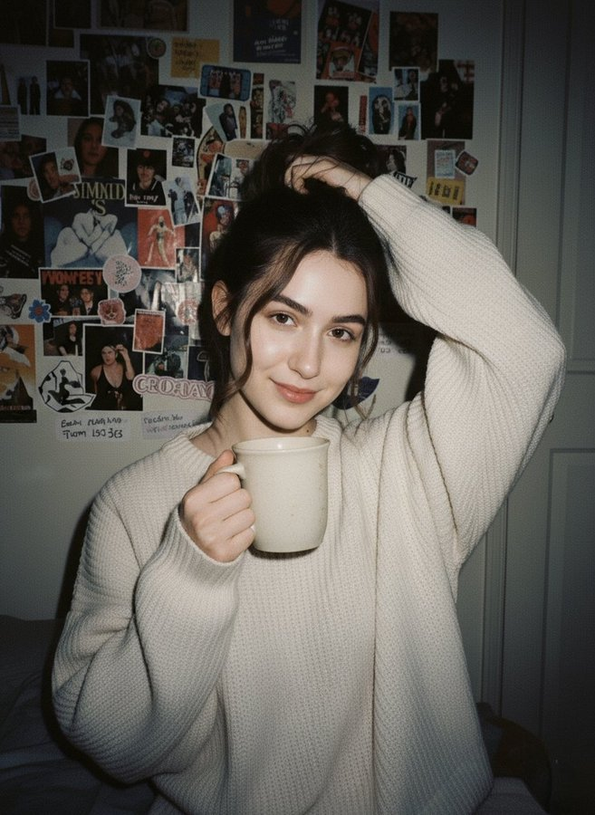
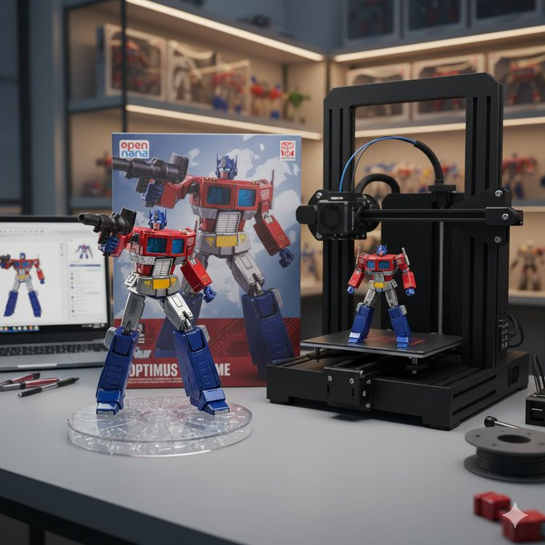
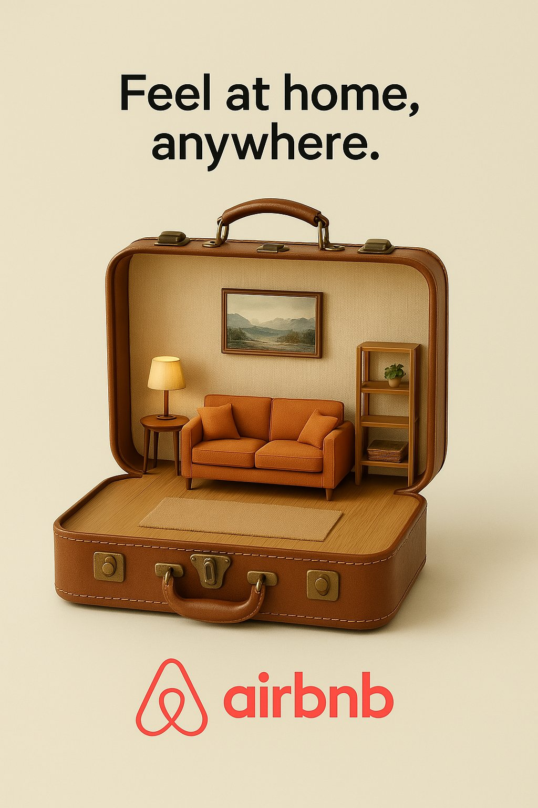
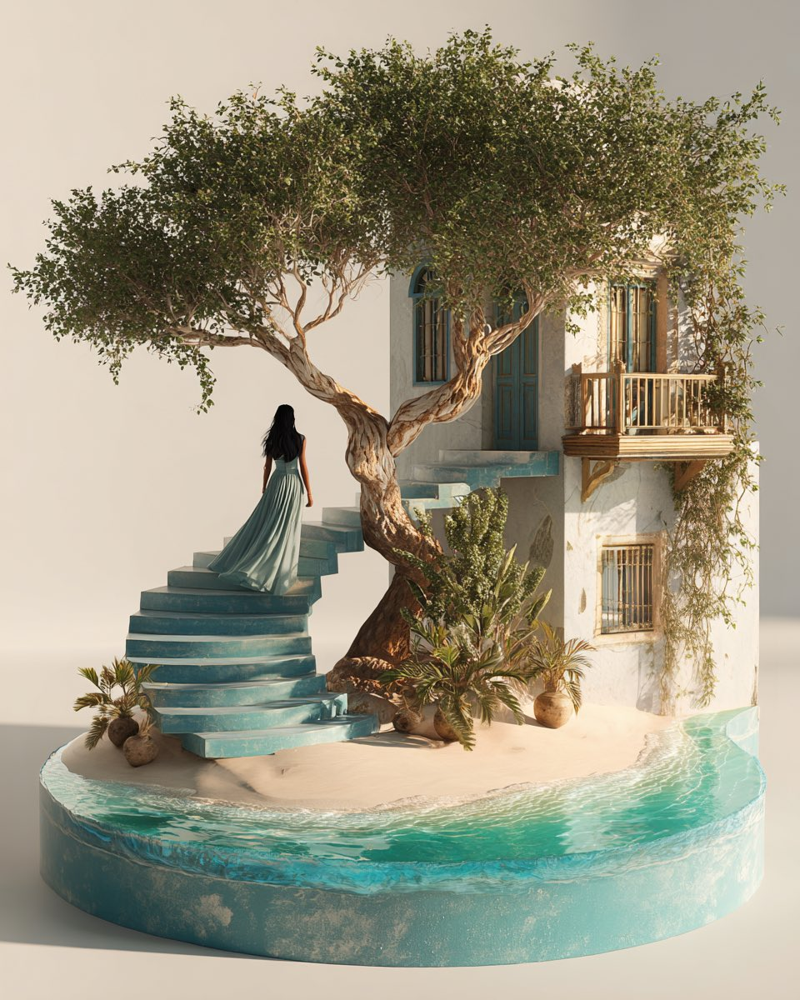
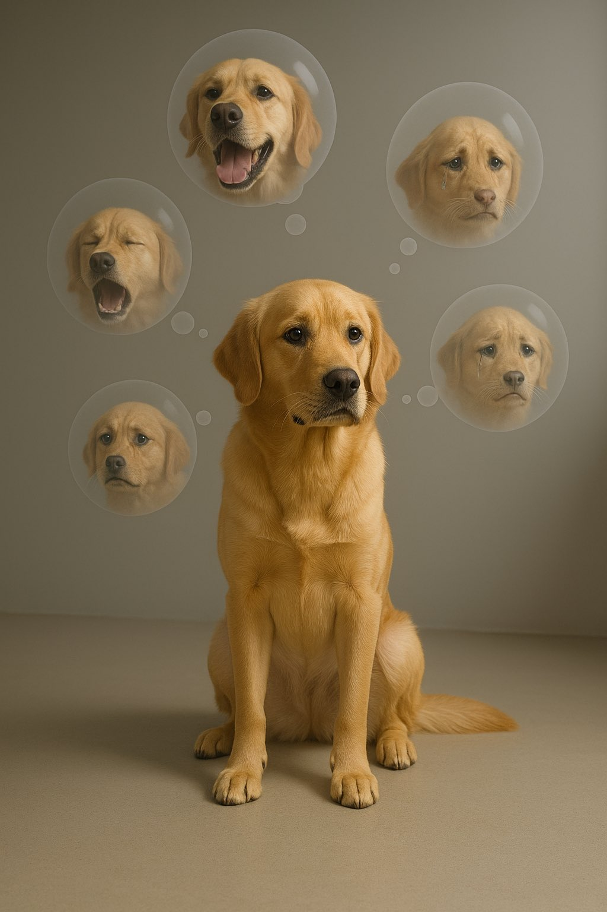

# interior

总计：239

## { "project_metadata": { "title": "K-Pop Idol Newspaper F

- ID: gpt4o-1040-en-1
- Slug: prompt-1040-en-1
- 语言: en
- 来源: [来源链接](https://x.com/BubbleBrain/status/2007074986008141973)
- 样例图路径: images/part3/1040.jpeg

### 提示词

```text
{
  "project_metadata": {
    "title": "K-Pop Idol Newspaper Fashion Concept",
    "style_preset": "Soft Focus Editorial Photography",
    "aspect_ratio": "3:4",
    "version": "2.1"
  },
  "subject": {
    "identity": {
      "ethnicity": "Korean",
      "age_group": "Young Adult",
      "aesthetic": "K-pop idol, mixture of innocent and sexy, pure visual"
    },
    "physique": {
      "body_type": "Curvy and voluptuous",
      "specific_attributes": "Highly emphasized and prominent bustline, hourglass silhouette, toned arms",
      "skin_tone": "Pale, porcelain white, flawless and glowing"
    },
    "hair_and_makeup": {
      "hair": {
        "color": "Dark brown",
        "style": "Long, voluminous waves, slight wet look",
        "action": "Hands gently touching face or hair"
      },
      "makeup": {
        "lips": "Glossy pink jelly lips, gradient lip color",
        "eyes": "Sparkling K-pop style eye makeup, aegyo-sal emphasized",
        "finish": "Glass skin effect, bright and dewy"
      }
    },
    "pose_and_expression": {
      "expression": "Cute pouting lips (dudu lips), seductive yet innocent gaze, looking into the lens",
      "pose": "Medium-full body shot, standing, playful posture, emphasising curves"
    }
  },
  "fashion_elements": {
    "primary_garment": {
      "item": "Strapless mini-dress",
      "material": "Authentic recycled newspaper pages",
      "construction": "Architectural, origami-style pleats, visible newsprint, headlines, and grayscale imagery textures",
      "fit": "Form-fitting, cinched at the waist"
    },
    "accessories": [
      {
        "item": "Hoop earrings",
        "style": "Large, thin, minimalist",
        "material": "Polished silver"
      }
    ]
  },
  "environment_and_backdrop": {
    "setting": "Studio indoor",
    "background_type": "Textured wall",
    "details": "Completely covered in layered, overlapping vintage newspaper pages, sepia-toned paper, collage effect",
    "depth": "Shallow depth of field to separate subject from the background"
  },
  "cinematography_and_lighting": {
    "camera": {
      "lens": "85mm prime lens",
      "shot_type": "Medium-full shot",
      "angle": "Eye-level",
      "sensor": "Digital, clear"
    },
    "lighting": {
      "primary_source": "Soft diffused frontal lighting",
      "effect": "Bright, flattering beauty lighting, minimizing shadows on face",
      "color_temp": "Cool white to neutral"
    },
    "post_processing": {
      "focus": "Soft focus, dreamy atmosphere",
      "textures": "Heavy skin smoothing, airbrushed look, ethereal glow, no grain",
      "filter": "Beauty filter style, dreamy blur effect"
    }
  }
}
```

### 样例图


## K-Pop偶像报纸时尚概念

- ID: gpt4o-1040-zh-2
- Slug: prompt-1040-zh-2
- 语言: zh
- 来源: [来源链接](https://x.com/BubbleBrain/status/2007074986008141973)
- 样例图路径: images/part3/1040.jpeg

### 提示词

```text
{
"project_metadata": {
标题：《K-Pop偶像报纸时尚概念》
"style_preset": "柔焦编辑摄影",
"aspect_ratio": "3:4",
版本：2.1
},
“主题”： {
“身份”： {
“种族”: “韩国人”
"age_group": "青年人",
“美学”：“K-pop偶像，兼具清纯与性感，纯粹的视觉美”
},
"体格": {
"body_type": "曲线优美，丰满性感",
"specific_attributes": "非常突出且醒目的胸部线条，沙漏型身材，健美的双臂",
肤色：苍白如瓷，无瑕透亮
},
"发型和化妆": {
“头发”： {
“颜色”：“深棕色”，
“发型”：“长而蓬松的波浪卷，略带湿润感”，
“动作”：“双手轻轻触碰脸部或头发”
},
“化妆品”： {
“唇部”： “亮泽的粉色果冻唇膏，渐变唇色”
“眼睛”：“闪亮的韩式流行风格眼妆，强调卧蚕”，
“妆效”：“玻璃肌效果，明亮水润”
}
},
"pose_and_expression": {
“表情”：“嘟嘟的可爱嘴唇，既诱人又无辜的眼神，看着镜头”，
“姿势”：“中全身照，站立，俏皮的姿势，强调曲线”
}
},
"fashion_elements": {
"primary_garment": {
“商品”: “无肩带迷你连衣裙”
“材料”：“真正的再生报纸页面”，
“构造”：“建筑风格的折纸褶皱，可见的新闻印刷品、标题和灰度图像纹理”，
“合身”： “贴合身形，腰部收紧”
},
“配件”： [
{
“物品”: “圈形耳环”，
“风格”：“大号、纤细、极简主义”
材质：抛光银
}
]
},
"environment_and_backdrop": {
设置：室内工作室，
"background_type": "纹理墙",
“细节”：“完全覆盖着层叠交错的复古报纸页面，棕褐色调的纸张，拼贴效果”，
“景深”： “浅景深使主体与背景分离”
},
"cinematography_and_lighting": {
“相机”： {
“镜头”: “85mm 定焦镜头”
"shot_type": "中远景镜头",
“角度”：“视线水平”，
“传感器”：“数字式，清晰”
},
“灯光”： {
"primary_source": "柔和的漫射正面照明",
“效果”：“明亮、讨喜的美颜灯光，最大限度地减少脸上的阴影”，
"color_temp": "冷白光到中性色"
},
"post_processing": {
“焦点”：“柔焦，梦幻般的氛围”，
“质地”：“强效柔滑肌肤，喷枪妆效，空灵光泽，无颗粒感”
"滤镜": "美颜滤镜风格，梦幻虚化效果"
}
}
}
```

### 样例图


## { "type": "image_generation", "style": "hyper_realistic"

- ID: gpt4o-1037-en-1
- Slug: prompt-1037-en-1
- 语言: en
- 来源: [来源链接](https://x.com/ykszs017/status/2006959351970541714)
- 样例图路径: images/part3/1037.jpeg

### 提示词

```text
{
"type": "image_generation",
"style": "hyper_realistic",
"quality": "8K DSLR",
"aspect_ratio": "4:5",
"camera": {
"angle": "slightly tilted cinematic perspective",
"lens": "50mm DSLR",
"depth_of_field": "shallow",
"focus": "smartphone and swimming action"
},
"scene": {
"setting": "iPhone 17 Pro Max placed on a wooden table",
"concept": "phone screen transformed into a miniature Olympic swimming pool",
"environment": "indoor, soft daylight coming from the side",
"atmosphere": "cinematic, immersive, realistic with intense competitive energy"
},
"details": {
"screen": "miniature Olympic-sized swimming pool with clear blue water ripples and lane dividers, starting blocks at one end, lane markers in black, subtle water reflections and splashes on the edges",
"players": "miniature swimmers in dynamic action: one swimmer mid-stroke in freestyle lane performing a powerful butterfly kick, another in adjacent lane doing backstroke with arms extended, others diving from blocks or turning at the wall, wearing swimsuits and goggles, water droplets flying with motion blur",
"lighting": "soft diffused daylight with subtle lens flares, realistic caustics and light refractions through the water, dramatic highlights on wet surfaces",
"realism_effects": [
"fingerprints on screen",
"light scratches on phone body",
"natural smudges",
"micro dust particles",
"faint screen glow illuminating the miniature pool with watery shimmer"
]
},
"materials": {
"phone": "metallic frame with realistic reflections",
"table": "textured wooden surface with warm tones"
},
"mood": "high-end cinematic, dramatic, premium advertising look with exhilarating swimming intensity",
"rendering": {
"sharpness": "ultra sharp",
"texture_detail": "extreme",
"lighting_quality": "studio grade",
"photorealism": true
}
}
```

### 样例图


## 用手机屏幕把运动世界装进口袋

- ID: gpt4o-1037-zh-2
- Slug: prompt-1037-zh-2
- 语言: zh
- 来源: [来源链接](https://x.com/ykszs017/status/2006959351970541714)
- 样例图路径: images/part3/1037.jpeg

### 提示词

```text
{
"type": "image_generation",
"风格": "超写实"
“质量”: “8K 单反”
"aspect_ratio": "4:5",
“相机”： {
“角度”：“略微倾斜的电影视角”，
“镜头”: “50mm 单反”
"景深": "浅",
“焦点”：“智能手机和游泳动作”
},
“场景”： {
“设置”：“iPhone 17 Pro Max 放在木桌上”，
“概念”：“手机屏幕变成一个微型奥运游泳池”，
“环境”：“室内，柔和的日光从侧面照射进来”，
“氛围”： “电影般的、沉浸式的、逼真的，充满强烈的竞争能量”
},
“细节”： {
“屏幕”：“迷你奥林匹克规格游泳池，清澈的蓝色水波荡漾，有泳道分隔线，一端有出发台，黑色泳道标记，边缘有微妙的水面倒影和水花飞溅”，
“玩家”：“动态的微型游泳者：一名游泳者在自由泳泳道中做着强有力的蝶泳腿，另一名游泳者在相邻的泳道中伸展双臂做着仰泳，其他游泳者穿着泳衣和泳镜从出发台跳水或在池壁处转身，水滴飞溅，呈现出动态模糊效果。”
“照明”：“柔和的漫射日光，带有微妙的镜头光晕，逼真的光影效果和光线穿过水面的折射，以及湿润表面上的戏剧性高光”，
"realism_effects": [
“屏幕上的指纹”，
“手机机身有轻微划痕”
“自然的污渍”，
“微尘颗粒”，
“屏幕微光照亮了微型水池，泛起水波光粼粼”
]
},
“材料”： {
“手机”：“具有逼真反射效果的金属边框”，
“桌子”： “带有暖色调的纹理木质表面”
},
“氛围”：“高端电影感、戏剧性、优质广告风格，以及令人兴奋的游泳强度”，
渲染：{
“锐度”: “超锐利”，
"texture_detail": "extreme",
"lighting_quality": "摄影棚级",
“照片写实主义”：真
}
}
```

### 样例图


## 4x4 grid of identical 3D object renders showing the same

- ID: gpt4o-1034-en-1
- Slug: prompt-1034-en-1
- 语言: en
- 来源: [来源链接](https://x.com/gokayfem/status/2007137742883266682)
- 样例图路径: images/part3/1034.jpeg

### 提示词

```text
4x4 grid of identical 3D object renders showing the same furniture piece with 16 different material applications. Each cell displays the exact same object geometry with a unique surface texture applied.

Object: Curved sculptural seating form with rounded back, cushioned seat, and four angled legs. Organic mid-century modern silhouette with smooth flowing lines, gently sloped armrests, and comfortable proportions. Single unified form without separate cushions or pillows.

Camera specifications: Fixed 3/4 front angle view, warm showroom lighting from upper-left at 45°, soft ambient fill light, identical framing across all 16 cells, subtle floor shadow beneath object, clean neutral gradient background.

Object geometry (identical in all cells):
* Same exact 3D model in every cell
* Same camera angle and distance
* Same lighting setup
* Only the surface material changes between cells

16 unique material applications (one per cell, left to right, top to bottom):

Row 1 - Soft Luxury:
* Cell 1: Midnight blue velvet - deep navy plush pile absorbing light across curved surfaces
* Cell 2: Cognac full-grain leather - warm caramel with natural grain wrapping around form
* Cell 3: Cream bouclé - chunky looped wool texture following organic contours
* Cell 4: Blush pink silk - luminous soft draping appearance with subtle sheen on curves

Row 2 - Natural Elements:
* Cell 5: Live-edge walnut wood - rich brown grain flowing across entire solid form
* Cell 6: White Carrara marble - bright polished stone with gray veins (sculptural interpretation)
* Cell 7: Natural rattan weave - honey tan woven cane pattern covering all surfaces
* Cell 8: Olive green shagreen - textured bumpy stingray pattern on elegant form

Row 3 - Metals & Industrial:
* Cell 9: Brushed brass - warm golden metal with soft directional scratches
* Cell 10: Matte black steel - powder-coated charcoal covering entire form
* Cell 11: Polished chrome - mirror-like silver reflecting environment
* Cell 12: Antique bronze - deep brown with green patina weathering

Row 4 - Statement Finishes:
* Cell 13: Emerald green lacquer - jewel tone high-gloss reflective surface
* Cell 14: Smoked glass - dark translucent gray showing form as sculptural object
* Cell 15: Camel herringbone wool - warm tan zigzag woven textile on all surfaces
* Cell 16: Mother of pearl - iridescent shell mosaic with rainbow shimmer across curves

Material application rules:
* Each material wraps entirely around the object
* Texture scale appropriate for furniture size
* Material responds correctly to object curvature
* Lighting reveals unique surface properties of each material
* Realistic rendering quality showing how material would actually appear

Technical requirements:
* Identical object silhouette in all 16 cells
* Zero variation in geometry, camera, or lighting
* Only surface material differs between cells
* Clean grid layout with thin borders
* Professional product visualization quality
* Each cell could serve as standalone product render

Purpose: Material exploration for furniture design, showing clients how the same form transforms with different surface treatments. Demonstrates versatility of single design across fabric, leather, wood, metal, stone, and decorative finishes.

Output: 4x4 seamless grid comparing 16 material options on identical object. Presentation-ready format for design review, client selection, or 3D visualization portfolio.
```

### 样例图


## 16 种不同的表面材质

- ID: gpt4o-1034-zh-2
- Slug: prompt-1034-zh-2
- 语言: zh
- 来源: [来源链接](https://x.com/gokayfem/status/2007137742883266682)
- 样例图路径: images/part3/1034.jpeg

### 提示词

```text
4x4 的网格，由 16 种不同的材质渲染图组成，展示同一件家具的相同几何形状。每个单元格都应用了不同的表面纹理。

物件：弧形雕塑座椅，圆润的靠背，带软垫的座面，四条倾斜的椅腿。有机的中世纪现代风格轮廓，线条流畅，扶手略微倾斜，比例舒适。一体式设计，无需单独的坐垫或靠枕。

相机规格：固定 3/4 前角视角，从左上方 45° 角照射的暖色展厅照明，柔和的环境补光，所有 16 个单元格的取景相同，物体下方有微妙的地板阴影，干净的中性渐变背景。

对象几何形状（所有单元格均相同）：
每个单元格都使用完全相同的 3D 模型。
* 相同的拍摄角度和距离
* 相同的照明设置
细胞间仅表面物质发生变化。* 只有细胞表面物质发生变化。

16 种独特的材料应用（每个单元格一种，从左到右，从上到下）：

第一排 - 轻奢：
* 单元格 1：午夜蓝丝绒 - 深海军蓝长绒面料，可吸收曲面上的光线
* 单元格 2：干邑色全粒面皮革 - 温暖的焦糖色，天然纹理包裹着造型
* 单元格 3：奶油色圈绒 - 粗毛圈绒质地，贴合有机轮廓
* 第4格：淡粉色丝绸——光泽柔和，垂坠感极佳，曲线处带有微妙的光泽

第 2 行 - 自然元素：
* 第5单元：原木胡桃木——浓郁的棕色纹理贯穿整个实木框架
* 6号单元：白色卡拉拉大理石——光泽亮丽、带有灰色纹理的石材（雕塑诠释）
* 7号单元：天然藤编——蜜棕色藤条编织图案覆盖所有表面
* 第8格：橄榄绿鲨革——优雅造型上带有纹理粗糙的鳐鱼图案

第 3 行 - 金属和工业：
* 9号单元格：拉丝黄铜——温暖的金色金属，带有柔和的定向划痕
* 10号单元：哑光黑色钢材 - 表面喷涂炭黑色粉末涂层
* 11号单元格：抛光铬——镜面般的银色反射环境
* 12号单元格：古铜色 - 深棕色，带有绿色风化痕迹

第 4 行 - 语句结尾：
* 13号单元格：翠绿色漆面 - 宝石色调高光泽反光表面
* 第14号单元：烟熏玻璃——深灰色半透明，呈现出雕塑般的形态
* 15号单元：驼色人字纹羊毛——温暖的棕褐色之字形织物，所有表面均有纹理
* 第16格：珍珠母贝——带有彩虹般光泽的虹彩贝壳马赛克，曲线处闪烁着光芒

材料应用规则：
每种材料都完全包裹住物体。
* 纹理比例适合家具尺寸
* 材料对物体曲率的响应正确
光照展现了每种材料独特的表面特性。
* 逼真的渲染质量，展现材质的实际外观

技术要求：
* 所有 16 个单元格中的物体轮廓均相同
* 几何形状、相机或光照方面均无任何变化
* 细胞间仅表面物质存在差异。
* 简洁的网格布局，搭配细边框
* 专业产品可视化质量
每个单元格都可以作为独立的产品渲染图。

目的：探索家具设计中的材料运用，向客户展示同一造型如何通过不同的表面处理呈现出不同的效果。展现单一设计在织物、皮革、木材、金属、石材和装饰饰面等多种材质上的多样性。

输出：4x4无缝网格，对比同一物体上的16种材质选项。格式可直接用于演示，适用于设计评审、客户选择或3D可视化作品集。
```

### 样例图


## 电商商品KV图

- ID: gpt4o-1021-zh
- Slug: prompt-1021-zh
- 语言: zh
- 来源: [来源链接](https://x.com/yanhua1010/status/2004012045143101808)
- 样例图路径: images/part3/1021.jpeg

### 提示词

```text
基于我给的产品图，梳理产品卖点/参数要点，然后给我输出一套统一旗舰店极简KV系统（9:16），最后生成10张详情页的完整提示词（中英双语、干净大气、至少5张细节特写），先单独生成Logo，用于后续每张海报左上角，其中文字排版风格需要统一，比如玻璃效果、3d浮雕效果，或者其他效果，提示词参考如下:
00、LOGO生成
提示词（中文）： 极简高端时尚品牌logo，矢量风格，干净几何形。品牌名：【"MUYANG"】。图标：细线圆形徽章，内含单支精致叶枝（负空间，现代，优雅）。配色：深苔灰绿色(#2F3A33)搭配温暖米白背景(#F3EFE6)或透明背景。字体：高端衬线体"MUYANG"，字母间距宽松，下方小字"沐阳"。无渐变、无阴影、无3D、无样机、无水印。
01、海报01｜【产品·丝滑睡裙】主KV（Hero）
提示词（中文）： 9:16竖版高端极简时尚海报。柔和摄影棚日光，温暖米白渐变背景（奶油/燕麦色），超干净。精致亚洲美女模特(25-30岁)，精致五官，自然裸妆，长发慵懒随意，放松优雅姿态，全身照，一只手轻轻抚摸裙摆。
服装必须与上传的产品参考图匹配：香槟色/奶油色缎面短款吊带睡裙，细吊带，V领，裙长至大腿中部，丝滑光泽面料，保持服装设计与参考图完全一致。
排版布局：左上角放置MUYANG logo(小号)。顶部居中巨大衬线标题(2行)："SILK SLIP DRESS" / "丝滑睡裙"(中英堆叠，干净)。左侧中部玻璃拟态信息卡(3个要点，双语)：仿真丝触感 / Silk-like touch；修身不紧绷 / Flattering fit；居家也优雅 / Elegant at home。右下角【圆角药丸CTA】："立即选购 → / SHOP NOW →"。
负面词：cluttered, busy, multiple patterns, gradients, shadows, watermark, logo repeated, messy text, low quality, blurry, plain face, unattractive
02、海报02｜产品场景展示
提示词（中文）： 9:16竖版，电影质感干净时尚摄影。背景：柔和晨光透过白色纱帘的卧室，奶白色床品，极简北欧风格，温暖氛围。精致亚洲美女模特全身侧身站立，长发披肩，回眸微笑，一只手撩起发丝。使用上传的产品参考图保持香槟色短款吊带睡裙的形状、长度、面料光泽完全一致。
文字：左上角小号MUYANG logo。左上小号优雅字体："晨光私语 / Morning Whisper"。左下大标题："慵懒的刚刚好"。标题下副标题(双语)："丝滑触肤，开启美好一天 / Silky touch, beautiful day begins."。右下角CTA药丸："了解更多 → / LEARN MORE →"。
负面词：cluttered, busy, dark, messy room, shadows, watermark, messy text, low quality, blurry, plain face
03、海报03｜多场景拼贴
提示词（中文）： 9:16竖版极简拼贴海报，圆角照片块和充足负空间。背景：温暖奶油色，干净。创建4个圆角框展示同一位精致亚洲美女模特穿着上传参考图中相同的香槟色短款吊带睡裙，不同居家场景：清晨卧室窗边、客厅沙发慵懒坐姿、浴室镜前、阳台藤椅喝咖啡。所有框架中保持服装、模特完全一致。
左上角MUYANG logo。底部大衬线标题："一裙多场景"。底部副标题(双语)："居家、约会、度假都适合 / Home, date, vacation ready."。右下角附近添加小型3点列表：不挑场合 / Versatile style；秒变氛围感 / Instant chic；舒适又迷人 / Cozy yet alluring。
负面词：cluttered, busy, multiple patterns, shadows, watermark, messy text, low quality, blurry, plain face.
04、海报04｜细节01·面料光泽（Fabric Sheen）
提示词（中文）： 9:16竖版高端微距细节海报。背景：奶油色渐变，大量干净负空间。极近距离拍摄上传参考图中缎面面料的光泽质感，展示丝滑反光效果和柔软垂坠感，面料随身体曲线自然流动。左上角MUYANG logo。
右侧大标题(双语)："仿真丝光泽 / Silk-like Sheen"。小文案(双语，2行)："触感细腻，像第二层肌肤 / Delicate touch, like second skin."。"自然反光更显质感 / Natural luster, premium feel."。右下角CTA药丸："了解更多 → / LEARN MORE →"。
负面词：cluttered, busy, multiple patterns, shadows, watermark, messy text, low quality, blurry
05、海报05｜细节02·细吊带与锁骨（Strap & Collarbone）
提示词（中文）： 9:16竖版极简细节海报。背景：温暖米白，超干净。特写拍摄精致亚洲美女模特的锁骨、肩颈线条和细吊带，来自上传参考(精致优雅)，柔和侧光勾勒轮廓，高级质感。添加一个小圆角内嵌图展示完整着装轮廓(非常小，低不透明度)。
左上角MUYANG logo。居中大衬线标题："细吊带设计"。3个微型要点(双语)：展现优美肩颈 / Flatters shoulders；精致不累赘 / Delicate refined；性感而优雅 / Sexy yet elegant。CTA药丸："立即选购 → / SHOP NOW →"。
负面词：cluttered, busy, multiple patterns, shadows, watermark, messy text, low quality, blurry, plain face
06、海报06｜细节03·V领剪裁（V-Neckline Cut）
提示词（中文）： 9:16竖版时尚细节海报，干净摄影棚灯光。背景：淡燕麦到奶油色渐变，无纹理。近距离拍摄V领剪裁细节(从上传参考)，展示领口线条流畅性和恰到好处的深度，性感不失优雅。左上角MUYANG logo。
左侧大标题："V领剪裁"。副标题(双语)："修饰脸型，拉长颈部线条 / Face-flattering, neck-elongating."。添加小标签行："DETAIL 03"(小号)。CTA药丸："了解更多 → / LEARN MORE →"。
负面词：cluttered, busy, multiple patterns, shadows, watermark, messy text, low quality, blurry.
07、海报07｜细节04·裙摆垂坠感（Hemline Drape）
提示词（中文）： 9:16竖版高端细节海报。背景：极浅香槟金雾霾色，低对比。拍摄精致亚洲美女模特侧面下半身，展示短裙裙摆自然垂坠在大腿中部的优美曲线(从上传参考)，面料随身体动态流动，修饰腿部线条。
左上角MUYANG logo。右侧标题(双语)："短款更显腿长"。小文案(双语)："恰到好处的长度，修饰比例 / Perfect length, flattering proportion."。
负面词：cluttered, busy, multiple patterns, shadows, watermark, messy text, low quality, blurry, plain face
海报08｜产品配色/型号
提示词（中文）： 9:16竖版极简时尚情绪板。背景：温暖奶油色。左侧：全身精致亚洲美女模特穿着上传参考图中的香槟色短款吊带睡裙(干净摄影棚，自然站姿)。右侧：整齐排列受睡裙启发的配色/材质色卡(香槟金、奶油色、珍珠白、柔和米色) + 极简线条图标(月亮、羽毛、丝绸、晨露)。保持一切扁平、高端，不繁忙。
左上角MUYANG logo。顶部大衬线："配色灵感 / COLOR INSPIRATION"。3个要点(双语)：香槟金显气质 / Champagne exudes elegance；温柔色更衬肤 / Soft tones flatter skin；低调奢华感 / Subtle luxury。CTA："了解更多 → / LEARN MORE →"。
负面词：cluttered, busy, multiple patterns, shadows, watermark, messy text, low quality, blurry, plain face.
09、海报09｜产品尺码/参数
提示词（中文）： 9:16竖版极简尺码指南海报。背景：温暖米白，干净。将尺码表(S/M/L)放置为整洁的网格卡片(玻璃拟态，圆角)。内容(双语标题)："尺码参考 / SIZE GUIDE"。表格列：尺码 Size｜衣长 Length｜胸围 Bust｜腰围 Waist｜臀围 Hip。行：S｜90cm｜80-84cm｜64-68cm｜88-92cm；M｜92cm｜84-88cm｜68-72cm｜92-96cm；L｜94cm｜88-92cm｜72-76cm｜96-100cm。左上角MUYANG logo。底部小注释(双语)："手工测量，误差±2cm属正常 / Hand-measured, ±2cm variance normal."。底部贴心提示："建议参考胸围选择尺码 / Suggest sizig by bust measurement."
负面词：no extra patterns, no clutter, no watermark
10、海报10｜结尾信任页 质保/售后/说明
提示词（中文）： 9:16竖版高端护理海报。背景：奶油色渐变，非常干净。
左上角MUYANG logo。大标题："洗护指南 / CARE GUIDE"。使用5个极简图标 + 简短双语行(干净，不拥挤)：建议手洗或使用洗衣袋 / Hand wash or use laundry bag；冷水或30°C以下水温 / Cold or below 30°C water；不可漂白或强力拧干 / No bleach or wringing；悬挂阴干，避免暴晒 / Hang dry, avoid direct sun；低温熨烫，垫布熨烫更佳 / Low heat iron, use cloth。底部添加小字(双语)："悉心呵护，延长丝滑寿命 / Care well, silkiness lasts longer."。
负面词：no clutter, no heavy texture, no watermark
```

### 样例图


## 帅气的9宫格海马体写真

- ID: gpt4o-1020-zh
- Slug: prompt-1020-zh
- 语言: zh
- 来源: [来源链接](https://x.com/msjiaozhu/status/2004194584797315341)
- 样例图路径: images/part3/1020.jpeg

### 提示词

```text
{
 "project_type": "Nine-grid Trendy Star Portrait Collage",
 "aspect_ratio": "3:4",
 "visual_style": {
   "color_palette": "Black and white, Monochrome, High key, Bright grayscale, Clean whites, Light grays",
   "background": "Studio background, seamless white paper, light gray concrete wall, minimalist bright space, no dark voids",
   "lighting": [
     "Soft frontal lighting",
     "Butterfly lighting",
     "Studio lighting",
     "Flattering beauty dish light",
     "No backlighting",
     "No harsh shadows on face"
   ],
   "mood": "Trendy, Cool, Confident, Star quality, Fashion editorial, Energetic, Edgy"
 },
 "subject_description": {
   "identity_consistency": "Consistent facial features across all 9 panels (based on input reference)",
   "hair_and_grooming": [
     "Varied trendy hairstyles",
     "Cool messy undercut",
     "Styled quiff",
     "Textured crop",
     "Slicked back modern",
     "Designer stubble",
     "Masculine scruff",
     "Well-groomed beard"
   ],
   "styling": [
     "Fashion forward",
     "Streetwear vibe",
     "Leather jacket collar",
     "Designer hoodie",
     "Minimalist layers",
     "Statement accessories (e.g., single earring)"
   ],
   "expressions/poses": [
     "Confident smirk",
     "Looking off-camera coolly",
     "Hand running through hair",
     "Slight jaw clench",
     "Direct confident gaze",
     "Dynamic poses"
   ]
 },
 "composition": {
   "layout": "9-grid collage, Dynamic layout (not perfectly uniform), Mix of close-ups and medium shots",
   "style": "Fashion magazine contact sheet, Editorial spread"
 },
 "technical_specs": {
   "camera_emulation": "Medium format fashion camera",
   "film_stock": "Kodak T-Max 400 (fine grain, sharp)",
   "resolution": "8k, masterpiece, sharp focus"
 },
 "negative_prompt": [
   "Dark background",
   "Black void background",
   "Backlit",
   "Silhouette",
   "Harsh shadows",
   "Underexposed",
   "Old fashioned",
   "Dull",
   "Uniform grid",
   "Same hairstyle in all",
   "Clean shaven (unless specified)"
 ]
}
```

### 样例图


## 牛肉面挂牌

- ID: gpt4o-1017-zh
- Slug: prompt-1017-zh
- 语言: zh
- 来源: [来源链接](https://x.com/berryxia/status/2004570423472562237)
- 样例图路径: images/part3/1017.jpeg

### 提示词

```text
A premium transparent acrylic signage panel for "[品牌名称]" brand, photographed in ABSOLUTE FRONTAL VIEW with ZERO perspective distortion.
CRITICAL CAMERA SETUP (STRICT ENFORCEMENT):
- Camera angle: EXACTLY 0° (perfectly perpendicular to the panel surface)
- The acrylic panel MUST be completely parallel to the camera sensor
- NO rotation on X, Y, or Z axis
- The panel edges MUST form perfect vertical and horizontal lines in the frame
- Use architectural photography grid alignment to ensure perfect frontal geometry
- NO three-quarter view, NO slight angle, NO depth perception - PURE FLAT FRONTAL
PANEL SPECIFICATIONS:
- Material: Ultra-clear 15mm acrylic glass with 95% transparency
- Dimensions: 400mm × 300mm [portrait/square/landscape] orientation
- All edges are diamond-polished with subtle rainbow light refraction
- The panel appears to float in mid-air, suspended by invisible forces
DESIGN LAYOUT (Hand-drawn aesthetic):
- Brand name "[品牌名称]" in large artistic brush calligraphy at top center
- Tagline "[品牌口号/slogan]" in elegant handwritten [语言] below the brand name
- [核心图案描述:如咖啡枝、火锅元素、牛肉纹理等] flowing around the text
- Small decorative [相关小图标] illustrations scattered naturally
- All design elements are drawn with [颜色描述,如warm brown/red/etc.] ink (color: [色值]) with varying line weights (0.8-2mm)
- The drawing has an organic, imperfect quality showing authentic hand-crafted charm
TRANSPARENCY EFFECTS:
- The acrylic surface has 60% opacity for drawn elements (semi-transparent, NOT solid)
- Light passes through the panel, creating soft colored shadows on the virtual plane behind
- The background [场景类型] environment is visible THROUGH the transparent areas
- Subtle light refraction effects along the panel edges creating prismatic color dispersion
BACKGROUND ENVIRONMENT:
- A warm, inviting [具体场景描述:如specialty coffee shop/hot pot restaurant/steakhouse] interior
- [环境细节:如wooden furniture, plants, pendant lighting/red lanterns, steam/leather seats, wine racks]
- The background is moderately blurred (bokeh effect, f/4 aperture simulation) 
- Background elements are recognizable but not distracting - balanced depth of field
- [色温描述:如Warm color temperature (3200K-3800K)/Cool-warm mixed lighting]
LIGHTING:
- Soft, diffused natural light from the front (60% intensity)
- Gentle rim lighting from behind the panel (30% intensity) to emphasize transparency
- NO harsh shadows, maintaining soft and even illumination
- Light interacts with the acrylic creating subtle internal glow
TECHNICAL REQUIREMENTS:
- Shot with macro lens (100mm f/2.8) for zero distortion
- Sensor perfectly aligned with panel surface using spirit level
- The panel occupies 70% of the frame, centered perfectly
- Ultra-sharp focus on the hand-drawn details
- 8K resolution, photorealistic rendering
- Color grading: [色调描述:如warm, natural/vibrant, energetic]
CRITICAL: The entire panel MUST be rendered in perfect frontal view with zero perspective distortion. Every line on the panel should be perfectly straight and parallel to the frame edges.
```

### 样例图


## { "request_parameters": { "aspect_ratio": "9:16", "ident

- ID: gpt4o-1011-en-1
- Slug: prompt-1011-en-1
- 语言: en
- 来源: [来源链接](https://x.com/YaseenK7212/status/2005332751759675820)
- 样例图路径: images/part3/1011.jpeg

### 提示词

```text
{
  "request_parameters": {
    "aspect_ratio": "9:16",
    "identity_preservation": {
      "mode": "strict",
      "target": "reference_face_retention",
      "features": "natural_likeness_only"
    }
  },
  "visual_composition": {
    "subject": {
      "entity": "Woman",
      "pose": {
        "body": "Seated on a warm-toned banquette",
        "orientation": "Sophisticated profile",
        "gaze": "Looking toward the side"
      },
      "wardrobe": {
        "primary": "Fitted deep red strapless dress",
        "accents": "Matching draped scarf detail"
      },
      "interactions": {
        "right_hand": "Holding a white wine glass",
        "left_hand": "Holding a clutch bag"
      }
    },
    "environment": {
      "setting": "Elegant restaurant interior",
      "atmosphere": "High-end upscale evening",
      "architectural_details": [
        "Gold accents",
        "Strategic mirrors",
        "Fine dining table setting"
      ]
    }
  },
  "technical_direction": {
    "lighting": {
      "source": "Warm tungsten",
      "shading": "Soft shadows",
      "skin_finish": "Subtle glow"
    },
    "optics": {
      "lens_emulation": "35mm prime",
      "depth_of_field": "Shallow (bokeh background)",
      "focus_points": [
        "Facial features",
        "Wine glass"
      ]
    },
    "post_processing": {
      "vibe": "High-end editorial",
      "color_grading": "Realistic / Cinematic",
      "texture": [
        "Natural skin grain",
        "Gentle film grain"
      ]
    }
  },
  "quality_assurance": {
    "negative_prompt_array": [
      "over-sharpening",
      "AI artifacts",
      "deformed glass",
      "extra fingers",
      "warped jewelry",
      "weird reflections",
      "text",
      "watermark",
      "low-resolution",
      "distorted facial features"
    ]
  }
}
```

### 样例图


## 深红色连衣裙女生拿着白葡萄酒

- ID: gpt4o-1011-zh-2
- Slug: prompt-1011-zh-2
- 语言: zh
- 来源: [来源链接](https://x.com/YaseenK7212/status/2005332751759675820)
- 样例图路径: images/part3/1011.jpeg

### 提示词

```text
{
"请求参数": {
"aspect_ratio": "9:16",
"identity_preservation": {
"mode": "严格",
"target": "reference_face_retention",
"特征": "仅自然相似"
}
},
"视觉构成": {
“主题”： {
“实体”： “女人”，
"姿势": {
“主体”：“坐在暖色调的长椅上”，
“定位”：“成熟稳重的形象”，
“凝视”： “看向侧面”
},
“衣柜”： {
“主打款”： “修身深红色无肩带连衣裙”
点缀：与之相配的垂坠围巾细节
},
"交互": {
“右手”： “拿着一杯白葡萄酒”
"左手": "拿着手拿包"
}
},
“环境”： {
“环境”：“优雅的餐厅内部”，
“氛围”：“高端高档的夜晚”，
"architectural_details": [
“金色点缀”，
“战略镜像”，
“精致的餐桌布置”
]
}
},
"technical_direction": {
“灯光”： {
“来源”： “温暖的钨”
“阴影”：“柔和的阴影”，
“skin_finish”： “柔和光泽”
},
"光学": {
"lens_emulation": "35mm 定焦镜头",
"depth_of_field": "浅景深（散景背景）",
"focus_points": [
“面部特征”，
酒杯
]
},
"post_processing": {
“氛围”: “高端编辑风格”
"color_grading": "写实/电影化",
“质地”： [
“天然皮肤纹理”，
“柔和的胶片颗粒”
]
}
},
"质量保证": {
"negative_prompt_array": [
“过度锐化”
“人工智能制品”，
“变形的玻璃”，
“额外的手指”，
“扭曲的珠宝”，
“奇怪的倒影”，
“文本”，
“水印”，
“低分辨率”
“面部特征扭曲”
]
}
}
```

### 样例图


## { "prompt_data": { "subject": { "description": "Young wo

- ID: gpt4o-1010-en-1
- Slug: prompt-1010-en-1
- 语言: en
- 来源: [来源链接](https://x.com/lexx_aura/status/2004591904386580688?referrer=grok.com)
- 样例图路径: images/part3/1010.jpeg

### 提示词

```text
{
  "prompt_data": {
    "subject": {
      "description": "Young woman with long, wavy blonde hair and a light fair skin",
      "features": "Natural skin texture with visible tan lines on the chest, slight flush on cheeks, soft smile, navel piercing, light freckles.",
      "accessories": "Gold pendant necklace, small gold hoop earrings, small tattoo on the left inner forearm."
    },
    "clothing": {
      "outfit": "Matching yellow two-piece loungewear set.",
      "top": "Yellow strapless tube top featuring the text 'HAWAIIAN TROPIC' in brown serif font with a hibiscus flower and palm graphic on the side.",
      "bottoms": "Matching yellow shorts visible at the waist and thigh area."
    },
    "pose_and_action": {
      "posture": "Reclining and lounging comfortably on a grey textured sofa.",
      "body_language": "Relaxed and casual, leaning back against the couch cushions, one arm extended to support weight, the other hand resting gently near the waist, legs angled toward the camera.",
      "expression": "Friendly, relaxed, and engaging eye contact."
    },
    "environment": {
      "setting": "Modern living room interior.",
      "furniture": "Dark grey fabric sofa with a textured weave.",
      "background": "Grey walls with decorative panel molding (wainscoting).",
      "decor": "A large vertical art piece with a red background featuring KAWS-style figures in blue and black. A second framed abstract art piece with gold and black tones. A modern linear wall sconce light."
    },
    "lighting": {
      "type": "Soft, diffused indoor mix.",
      "quality": "Warm ambient lighting highlighting the skin tone, creating soft shadows and a cozy atmosphere. Likely a mix of natural window light and the warm glow from the wall sconce."
    },
    "styling_and_mood": {
      "aesthetic": "Influencer lifestyle, casual home comfort, '2000s digital camera' vibe.",
      "mood": "Chill, playful, confident, comfortable."
    },
    "camera_specifications": {
      "angle": "Eye-level, slightly angled from the side.",
      "focus": "Sharp focus on the subject's face and torso, with a slight depth of field blurring the background artwork.",
      "lens_suggestion": "35mm or 50mm portrait lens.",
      "film_grain": "Low to medium ISO for a clean but slightly organic digital look."
    },
    "technical_modifiers": [
      "Ultra Photorealistic",
      "8k resolution",
      "Raw photo",
      "Hyper-detailed skin texture",
      "Subsurface scattering",
      "Volumetric lighting",
      "Nano Banana Pro optimized",
      "Masterpiece"
    ]
  }
} 2:3
```

### 样例图


## 金色长卷发和白皙肤色的女子

- ID: gpt4o-1010-zh-2
- Slug: prompt-1010-zh-2
- 语言: zh
- 来源: [来源链接](https://x.com/lexx_aura/status/2004591904386580688?referrer=grok.com)
- 样例图路径: images/part3/1010.jpeg

### 提示词

```text
{
"prompt_data": {
“主题”： {
描述：一位有着金色长卷发和白皙肤色的年轻女子。
“特征”：“肌肤纹理自然，胸部有明显的晒痕，双颊略带红晕，笑容温柔，有肚脐环，有淡淡的雀斑。”
“配饰”：“金吊坠项链，小金耳环，左前臂内侧的小纹身。”
},
“衣服”： {
“套装”：“配套的黄色两件套家居服。”
“上衣”：“黄色无肩带抹胸上衣，侧面印有棕色衬线字体的‘夏威夷热带’字样，以及芙蓉花和棕榈树图案。”
“下装”：“腰部和大腿处可见配套的黄色短裤。”
},
"pose_and_action": {
“姿势”：“舒适地斜倚在灰色纹理沙发上。”
“肢体语言”：“放松随意，靠在沙发垫上，一只手臂伸出支撑身体，另一只手轻轻放在腰间，双腿朝向镜头。”
“表情”：“友好、轻松、引人入胜的眼神交流。”
},
“环境”： {
“场景”：“现代客厅内部。”
“家具”：“深灰色布艺沙发，带有纹理编织图案。”
“背景”： “灰色墙壁，带有装饰性镶板（护墙板）。”
“装饰品”：“一幅大型竖幅艺术作品，红色背景，饰以KAWS风格的蓝色和黑色人物图案。另一幅装裱好的抽象艺术作品，以金色和黑色为主色调。一盏现代简约的线性壁灯。”
},
“灯光”： {
类型：柔和、扩散的室内混合香型。
“品质”：“温暖的氛围灯光突出肤色，营造出柔和的阴影和温馨的氛围。可能是自然窗光和壁灯温暖光芒的混合。”
},
"styling_and_mood": {
“美学”：“网红生活方式、休闲居家舒适感、‘2000年代数码相机’风格。”
“情绪”：“轻松、活泼、自信、舒适。”
},
"camera_specifications": {
“角度”：“与视线齐平，略微侧向倾斜。”
“焦点”：“清晰对焦于人物的面部和躯干，略微虚化背景画作。”
镜头建议：35mm 或 50mm 人像镜头。
"film_grain": "低到中等 ISO，营造干净但略带自然感的数码外观。"
},
"technical_modifiers": [
“超逼真”
“8K分辨率”，
“原始照片”，
“超精细的皮肤纹理”，
“次表面散射”
“体积照明”，
“Nano Banana Pro 优化版”，
“杰作”
]
}
2:3
```

### 样例图


## Using the uploaded photo as the sole character reference

- ID: gpt4o-989-en-1
- Slug: prompt-989-en-1
- 语言: en
- 来源: [来源链接](https://x.com/aidavid125/status/2004699464255356984)
- 样例图路径: images/part3/989.jpeg

### 提示词

```text
Using the uploaded photo as the sole character reference, generate a vertical outfit poster.

【LAYOUT HARD RULES】
- Must have exactly 6 cards only, 2 rows × 3 columns (3 columns across, 2 rows down)
- Row 1: LOOK 1, 2, 3 | Row 2: LOOK 4, 5, 6
- Prohibited: 9-grid, 3 rows × 2 columns, 2-column layout, extra cards, top header/title

【CANVAS & LAYOUT】
- Vertical 4:5 aspect ratio, background #F7F5F2
- Grid occupies ≥92% of canvas height, bottom margin ≤3%
- Outer margin 2%, spacing 1.5%, strictly aligned

【CARD SPECIFICATIONS】
- White background #FFFFFF, border-radius 5%, stroke 1px #E5E7EB
- Top title bar: height 12%, background #F3F4F6, text color #111827
- Sans-serif font, alignment consistent throughout

【CHARACTER CONSISTENCY】
- All 6 must be the same person in different outfits: same face, same hairstyle, same body proportions, same demeanor
- Prohibited: switching people/changing face/altering gender features/extreme slimming or leg lengthening

【PHOTOGRAPHY QUALITY】
- Master-level studio full-body lookbook, 85mm portrait lens look
- Softbox key light + subtle fill, natural skin texture with light retouching
- Solid seamless background (white/light gray/off-white), no clutter

【UNIFORM CROPPING】
- 4:5 full-body, complete from head to shoes
- Subject centered, height 88%±2%
- Headroom 2-4%, footroom 3-5%, shoes fully visible
- All six shots: consistent camera height/focal length/lighting/pose

【OUTFIT RULES】
- Auto-adapt based on subject age (adult/child)
- Each look ≤3 core items, max 3 colors per outfit, accessories ≤2
- 6 looks distinctly different, but unified style: minimal/clean/polished/easy to recreate

【TITLE SETS】
Adult: Business/Classic → Casual/Weekend → Smart Casual/Evening → Resort/Vacation → Athleisure/Active → Layered/Transitional
Kids: Everyday/Clean → School/Polished → Weekend/Play → Party/Sweet → Active/Sporty → Layered/Cozy

NEGATIVE:
3x3, nine-grid, 9 cards, extra cards, 3 rows x 2 columns, two-column layout, big top header, page title, switching people, changing face, multiple people, lowres, blurry, plastic skin, wide-angle distortion, fisheye, warped body, extreme slimming, long legs effect, outdoor background, textured wall, cut off shoes, half body, adultification, sexy, lingerie, see-through, high heels (kids), heavy makeup (kids), watermark, cropped text
```

### 样例图


## 一张竖版服装海报

- ID: gpt4o-989-zh-2
- Slug: prompt-989-zh-2
- 语言: zh
- 来源: [来源链接](https://x.com/aidavid125/status/2004699464255356984)
- 样例图路径: images/part3/989.jpeg

### 提示词

```text
以上传的照片为唯一人物参考，生成一张竖版服装海报。

【布局硬性规则】
- 必须正好有 6 张卡片，2 行 × 3 列（横向 3 列，纵向 2 行down)
- 第 1 行：造型 1、2、3 | 第 2 行：造型 4、5、6
- 禁止使用：9格网格、3行×2列、2栏布局、额外卡片、顶部标题/标题

【画布与布局】
- 垂直4:5宽高比，背景#F7F5F2
- 网格占据画布高度的 92% ≥ ，底部边距为 3% ≤
  外边距 2%，行距 1.5%，严格对齐

【卡片规格】
- 白色背景#FFFFFF ，圆角 5%，描边 1px #E5E7EB
- 顶部标题栏：高度 12%，背景色#F3F4F6 ，文本颜色 #111827
- 无衬线字体，对齐方式始终一致

【角色一致性】
- 这6个人必须是同一个人，只是穿着不同的衣服：同样的脸，同样的发型，同样的身材比例，同样的举止。
- 禁止：换人/改变容貌/改变性别特征/极端瘦身或拉长腿部

【摄影质量】
- 大师级影棚全身写真集，85mm 人像镜头拍摄效果
- 柔光箱主光 + 轻微补光，自然肌肤纹理，轻微修图
- 纯色无缝背景（白色/浅灰色/米白色），无杂物

【统一裁剪】
- 4:5 全身照，从头到脚完整呈现
- 以受试者为中心，身高 88%±2%
  头部空间2-4%，脚部空间3-5%，鞋子完全可见
- 所有六张照片：相机高度/焦距/光线/姿势均保持一致

【穿搭规则】
- 根据受试者年龄（成人/儿童）自动调整
- 每套造型≤ 3件核心单品，每套服装最多3种颜色，配饰≤ 2件
- 6 看起来截然不同，但风格统一：简约/干净/精致/易于复刻

【标题集】
成人：商务/经典→休闲/周末→商务休闲/晚装→度假/休闲→运动休闲/活力→叠穿/过渡装
儿童：日常/干净→上学/整洁→周末/玩耍→派对/甜美→活力/运动→多层/舒适

消极的：
3x3，九宫格，9张卡片，额外卡片，3行2列，双栏布局，顶部大标题，页面标题，人物切换，换脸，多人，低分辨率，模糊，塑料皮肤，广角畸变，鱼眼，身体扭曲，极度瘦身，长腿效果，户外背景，纹理墙，鞋子被剪掉，半身，成人化，性感，内衣，透视，高跟鞋（儿童），浓妆（儿童），水印，裁剪文字
```

### 样例图


## { "image_prompt": { "reference": { "face_identity": "upl

- ID: gpt4o-977-en-1
- Slug: prompt-977-en-1
- 语言: en
- 来源: [来源链接](https://x.com/ZaraIrahh/status/2003476315828097321?referrer=grok.com)
- 样例图路径: images/part3/977.jpeg

### 提示词

```text
{
"image_prompt": {
"reference": {
"face_identity": "uploaded reference image",
"identity_lock": true,
"face_preservation": "100% identical facial structure, proportions, eyes, nose, lips, brows, skin texture, moles, and expression"
},
"subject": {
"gender": "female",
"age_range": "young adult",
"expression": "calm, focused, neutral competitive expression",
"pose": {
"action": "hands raised mid-clap",
"body_orientation": "three-quarter side profile",
"posture": "upright athletic stance"
}
},
"outfit": {
"top": "yellow and navy sleeveless volleyball jersey",
"armwear": "black compression arm sleeve on right arm",
"bottom": {
"type": "full-length black athletic pants",
"coverage": "legs fully covered at all times",
"fit": "sporty, fitted, opaque fabric"
},
"footwear": "not visible or cropped out"
},
"appearance": {
"hair": {
"style": "high ponytail with soft bangs",
"color": "dark brown"
},
"makeup": "natural sports makeup, light blush, subtle eyeliner",
"nails": "short, painted black"
},
"scene": {
"location": "indoor sports arena",
"background": "blurred volleyball court with pink and white wall panels",
"other_subjects": "teammates visible in soft background blur"
},
"lighting": {
"type": "bright indoor sports lighting",
"tone": "neutral and even",
"shadows": "soft"
},
"camera": {
"shot_type": "medium shot",
"angle": "eye-level",
"focus": "sharp focus on subject face and upper body",
"depth_of_field": "shallow background blur"
},
"constraints": {
"no_nudity": true,
"no_exposed_legs": true,
"legs_must_be_covered": "black pants required",
"no_outfit_changes": "jersey and arm sleeve remain identical",
"no_face_modification": true
},
"quality": {
"realism": "photorealistic",
"resolution": "8K ultra sharp",
"detail_level": "high"
}
}
}
```

### 样例图


## 运动少女照片

- ID: gpt4o-977-zh-2
- Slug: prompt-977-zh-2
- 语言: zh
- 来源: [来源链接](https://x.com/ZaraIrahh/status/2003476315828097321?referrer=grok.com)
- 样例图路径: images/part3/977.jpeg

### 提示词

```text
{
"image_prompt": {
“参考”： {
"face_identity": "上传的参考图像",
"identity_lock": true,
"face_preservation": "100% 相同的面部结构、比例、眼睛、鼻子、嘴唇、眉毛、皮肤纹理、痣和表情"
},
“主题”： {
"性别": "女性",
"age_range": "青年人",
“表情”：“冷静、专注、中立的竞争性表情”，
"姿势": {
“动作”：“双手在鼓掌过程中举起”，
"body_orientation": "四分之三侧脸轮廓",
“姿势”：“挺拔的运动姿态”
}
},
“全套服装”： {
“上衣”: “黄色和海军蓝无袖排球衫”
“臂套”：“右臂上的黑色压缩臂套”，
“底部”： {
“类型”: “黑色全长运动裤”
“覆盖范围”：“双腿始终完全被覆盖”，
“合身”： “运动型、修身、不透明面料”
},
“鞋类”： “不可见或已裁剪掉”
},
“外貌”： {
“头发”： {
“发型”：“高马尾配柔和刘海”，
颜色：深棕色
},
“妆容”：“自然运动妆，淡腮红，淡眼线”，
指甲：短的，涂成黑色
},
“场景”： {
地点：室内体育馆
“背景”：“模糊的排球场，带有粉色和白色的墙板”，
"other_subjects": "背景虚化中可见的队友"
},
“灯光”： {
类型：明亮的室内运动照明，
“色调”：“中性且均匀”，
“阴影”：“柔和”
},
“相机”： {
"shot_type": "中景镜头",
“角度”: “视线水平”
“焦点”: “清晰聚焦于拍摄对象的面部和上半身”，
景深：浅背景虚化
},
"约束": {
"no_nudity": true，
"no_exposed_legs": true,
“腿部必须遮盖”： “必须穿黑色裤子”
"no_outfit_changes": "球衣和袖子保持不变",
"no_face_modification": true
},
“质量”： {
“写实主义”: “照片写实主义”，
分辨率：8K 超清晰，
"detail_level": "高"
}
}
}
```

### 样例图


## { "image_analysis": { "subject": { "demographics": "Youn

- ID: gpt4o-968-en-1
- Slug: prompt-968-en-1
- 语言: en
- 来源: [来源链接](https://x.com/lexx_aura/status/2003145469451551070)
- 样例图路径: images/part3/968.jpeg

### 提示词

```text
{
"image_analysis": {
"subject": {
"demographics": "Young woman, white skin tone, roughly 20s",
"hair": "Long dark brunette hair styled in low twin-tails (pigtails) with a middle part",
"face": "Neutral expression, looking at phone screen, soft 'glam' makeup with mauve lipstick",
"accessories": "Black rimmed glasses resting on top of head, small gold pendant necklace, small gold hoop earrings"
},
"apparel": {
"top": "Chocolate brown, long-sleeve, scoop-neck fitted top",
"bottom": "Beige and black plaid pleated mini skirt featuring decorative black ribbon bows and lace-up details on the front",
"legwear": "Black semi-sheer thigh-high stockings",
"footwear": "Black patent leather block-heeled pumps"
},
"pose_and_action": {
"type": "Mirror selfie, full-body shot",
"posture": "Kneeling on the floor, legs tucked underneath, torso angled slightly to the right",
"hands": "Right hand holding a white smartphone (iPhone Pro style) covering part of face; left hand reaching back to touch the heel of the left shoe"
},
"environment": {
"location": "Modern, minimalist bedroom",
"flooring": "White fluffy shag rug on light wood floor",
"furniture": [
"Cream upholstered bed frame with white bedding",
"Pillow with delicate floral pattern",
"White wardrobe/closet doors in background"
],
"decor": "Large round mirror on wall reflecting a potted green plant (Monstera style) and window curtains"
},
"technical_specs": {
"lighting": "Soft natural daylight, diffuse indoor lighting, neutral color temperature",
"aesthetic": "Coquette, influencer fashion, soft girl, clean aesthetic",
"color_palette": ["Chocolate brown", "Beige", "White", "Black"]
}
}
}
```

### 样例图


## 年轻漂亮的双马尾女子

- ID: gpt4o-968-zh-2
- Slug: prompt-968-zh-2
- 语言: zh
- 来源: [来源链接](https://x.com/lexx_aura/status/2003145469451551070)
- 样例图路径: images/part3/968.jpeg

### 提示词

```text
{
"image_analysis": {
“主题”： {
“人口统计信息”：“年轻女性，白皙肤色，大约20多岁”，
“头发”：“深棕色长发，梳成低低的双马尾（麻花辫），中分”，
“脸部”：“表情平静，看着手机屏幕，化着淡雅的‘魅惑’妆容，涂着淡紫色口红”，
“配饰”： “戴在头顶的黑框眼镜，小巧的金色吊坠项链，小巧的金色耳环”
},
"服装": {
“上衣”：巧克力棕色长袖圆领修身上衣
“下装”：“米色和黑色格子褶裥迷你裙，正面饰有黑色丝带蝴蝶结和系带细节”，
“腿部服饰”：“黑色半透明过膝长袜”，
鞋履：黑色漆皮粗跟高跟鞋
},
"pose_and_action": {
“类型”：“镜子自拍，全身照”，
“姿势”：“跪在地上，双腿蜷缩在身下，躯干略微向右倾斜”，
“双手”：右手拿着一部白色智能手机（iPhone Pro 款式），遮住了部分脸部；左手向后伸去触摸左鞋的鞋跟。
},
“环境”： {
位置：现代简约卧室
“地板”：“浅色木地板上铺着白色蓬松长毛地毯”，
“家具”： [
“米色软垫床架，配白色床品”
“带有精致花卉图案的枕头”
背景中的白色衣柜/壁橱门
],
“装饰”：“墙上挂着一面大圆镜，镜中映照着一盆绿色植物（龟背竹风格）和窗帘”。
},
"technical_specs": {
“照明”：“柔和的自然日光、漫射室内照明、中性色温”，
“美学”：“轻佻、网红时尚、温柔女孩、清新美学”
"color_palette": ["巧克力棕色", "米色", "白色", "黑色"]
}
}
}
```

### 样例图


## { "reference": "use uploaded image as facial reference, 

- ID: gpt4o-958-en-1
- Slug: prompt-958-en-1
- 语言: en
- 来源: [来源链接](https://x.com/r4jjesh/status/2002893222608331014)
- 样例图路径: images/part3/958.jpeg

### 提示词

```text
{
"reference": "use uploaded image as facial reference, preserve original face and identity exactly",
"character_type": "caricature-style keychain, gender-neutral",
"pose": "riding a yellow scooter indoors",
"head_style": "oversized head with joyful, playful smile",
"outfit_beanie": "yellow knit beanie",
"outfit_top": "striped yellow-black sweater",
"outfit_bottom": "denim shorts",
"socks": "white socks",
"footwear": "white sneakers",
"keychain_detail": "blue strap labeled 'SAMMU'",
"lighting": "soft indoor lighting",
"depth_of_field": "shallow depth of field",
"background": "mall-like indoor environment",
"style": "whimsical, toy-like, premium collectible",
"photography": "cinematic product photography",
"texture": "smooth plastic, high
detail finish"
}
```

### 样例图


## 卡通风格钥匙扣

- ID: gpt4o-958-zh-2
- Slug: prompt-958-zh-2
- 语言: zh
- 来源: [来源链接](https://x.com/r4jjesh/status/2002893222608331014)
- 样例图路径: images/part3/958.jpeg

### 提示词

```text
{
“参考”：“使用上传的图片作为面部参考，精确保留原始面部和身份信息”，
"character_type": "卡通风格钥匙扣，中性款",
“姿势”：“在室内骑黄色滑板车”，
"head_style": "大头，带着快乐、俏皮的笑容",
"outfit_beanie": "黄色针织帽",
"outfit_top": "条纹黄黑毛衣",
"outfit_bottom": "牛仔短裤",
“袜子”: “白袜子”，
“鞋类”: “白色运动鞋”，
"keychain_detail": "蓝色表带，标签为'SAMMU'",
“照明”：“柔和的室内照明”，
"depth_of_field": "浅景深",
“背景”：“类似购物中心的室内环境”，
“风格”：“异想天开、玩具般、高级收藏品”
“摄影”: “电影化产品摄影”，
“质感”：光滑塑料，高
细节处理”
}
```

### 样例图


## (Surrealism, fantasy art, macro photography style). A ma

- ID: gpt4o-947-en-1
- Slug: prompt-947-en-1
- 语言: en
- 来源: [来源链接](https://x.com/songguoxiansen/status/2002370189384691980)
- 样例图路径: images/part3/947.jpeg

### 提示词

```text
(Surrealism, fantasy art, macro photography style). A magical composition where the specific character is captured inside a giant, life-sized glass snow globe. [CRITICAL: Keep the face identical to the source image, maintain consistent facial features within the glass distortion].

Inside the Globe: The character is wearing a white faux fur winter coat and a red Santa hat, catching falling snowflakes with her hands. The environment inside includes miniature snow-covered pine trees decorated with colorful Christmas lights twinkling in red, green, blue, and gold. A tiny wooden cabin sits among the trees. Swirling magical glitter and snow dust fill the air inside the sphere.

Outside the Globe: The background is a blurry, cozy living room with a fireplace, emphasizing that the character is inside the ornament.

Lighting: The snow globe is glowing from within, illuminated by the warm colorful glow of the Christmas tree lights mixing with cool magical blue and white light on the falling snow. The character's face is beautifully lit by this magical mixed lighting. External warm light reflects off the curved glass surface, creating rainbow prismatic effects.

Technical: Ray tracing reflections on the glass, refraction effects, crystal clear focus on the character, magical atmosphere, ethereal and dreamy aesthetic, 8k resolution, intricate details of the snowflakes and Christmas lights bokeh.
```

### 样例图


## 圣诞特辑-人物定格在奇幻巨型玻璃雪球里

- ID: gpt4o-947-zh-2
- Slug: prompt-947-zh-2
- 语言: zh
- 来源: [来源链接](https://x.com/songguoxiansen/status/2002370189384691980)
- 样例图路径: images/part3/947.jpeg

### 提示词

```text
（超现实主义、奇幻艺术、微距摄影风格）。一幅充满魔幻色彩的作品，将特定人物置于一个巨大的、真人大小的玻璃雪球中。[关键：保持面部与原图一致，在玻璃变形中保持面部特征的一致性]。

球体内部：人物身穿白色人造毛皮冬装，头戴红色圣诞帽，正用手接住飘落的雪花。球体内部的景象包括覆盖着白雪的微型松树，树上装饰着闪烁着红、绿、蓝、金四色圣诞彩灯。树丛中坐落着一间小木屋。球体内部弥漫着旋转的魔法闪光和雪花。

地球仪外部：背景是一个模糊的、舒适的客厅，里面有一个壁炉，强调了人物位于装饰品内部。

灯光：雪球内部散发着柔和的光芒，圣诞树彩灯温暖多彩的光芒与飘落雪花上清冷梦幻的蓝白色灯光交相辉映。人物的脸庞在这梦幻般的混合灯光下显得格外美丽。外部温暖的光线反射在弧形玻璃表面，折射出彩虹般的棱镜效果。

技术特点：光线追踪玻璃上的反射、折射效果、清晰聚焦于人物、营造神奇氛围、空灵梦幻的美感、8K 分辨率、雪花和圣诞彩灯散景的精细细节。
```

### 样例图


## { "task": "hyper_realistic_macbook_screen_photography", 

- ID: gpt4o-944-en-1
- Slug: prompt-944-en-1
- 语言: en
- 来源: [来源链接](https://x.com/egeberkina/status/2002114484903800832)
- 样例图路径: images/part3/944.jpeg

### 提示词

```text
{
"task": "hyper_realistic_macbook_screen_photography",
"reference_logic": "exact_microsoft_teams_waiting_room_ui_macos",
"output": {
"type": "single_image",
"resolution": "ultra_high_resolution_8k",
"realism": "indistinguishable_from_real_laptop_photo",
"capture_style": "iphone_photo_of_macbook_screen",
"post_processing": "none"
},
"scene": {
"application": "Microsoft Teams",
"platform": "macOS",
"ui_state": "meeting_waiting_room",
"top_status_text": "Meeting now",
"center_message": "We've let people in the meeting know you're waiting.",
"background": "pure_black_dark_mode"
},
"ui_layout": {
"left_panel": {
"video_preview": {
"position": "bottom_left",
"aspect_ratio": "landscape",
"camera_toggle": "on",
"background_filters_button": "visible_below_preview"
}
},
"right_panel": {
"audio_section": {
"title": "Computer audio",
"selected_device": "AirPods Max",
"volume_slider": "horizontal_blue_indicator",
"mute_toggle": "off"
},
"audio_options": [
"Phone audio",
"Room audio",
"Don't use audio"
],
"cancel_button": {
"label": "Cancel",
"position": "bottom_right",
"style": "rounded_rectangle"
}
}
},
"subject": {
"gender": "female",
"hair": {
"color": "natural_blonde",
"style": "soft_bangs_with_loose_layers",
"texture": "individual_strands_visible"
},
"face": {
"skin": "true_human_skin_texture",
"details": "visible_pores_micro_imperfections",
"retouching": "none"
},
"eyewear": {
"brand": "Ray-Ban",
"model": "Wayfarer",
"type": "prescription_glasses",
"frame_color": "black",
"lens_reflection": "subtle_real_world_glare"
},
"headphones": {
"model": "AirPods Max",
"color": "space_gray",
"fit": "natural_over_ear_position"
},
"clothing": {
"top": "neutral_crop_top",
"style": "casual_minimal"
},
"expression": "calm_focused_waiting",
"gaze": "slightly_downward"
},
"environment": {
"background": "modern_open_office",
"ceiling": "exposed_industrial_ducts",
"lighting": {
"type": "soft_natural_daylight",
"mixed_with": "indoor_office_lighting",
"temperature": "5200K"
}
},
"screen_reflection": {
"enabled": true,
"source": "same_subject_as_video_preview",
"reflection_type": "soft_glass_reflection",
"intensity": "very_subtle",
"opacity": 0.05,
"sharpness": "low",
"distortion": "slight_glass_warp",
"positioning": "offset_not_centered",
"visibility_rules": {
"ui_text": "fully_readable",
"icons": "unobstructed",
"reflection_never_overpowers_ui": true
},
"realism_notes": [
"not_mirror_like",
"not_double_face",
"no_symmetry",
"appears_only_on_dark_areas"
]
},
"macos_elements": {
"dock": {
"visible": true,
"style": "macos_default_big_sur_or_later",
"reflection": "subtle",
"indicator_dot": "visible_under_active_apps",
"icons": [
"Finder",
"Mail",
"Calendar",
"Microsoft Teams",
"Adobe Illustrator",
"Adobe InDesign",
"Adobe After Effects",
"Adobe Lightroom",
"Adobe Photoshop",
"Adobe Premiere Pro",
"App Store",
"System Settings"
]
},
"menu_bar": {
"visibility": "partial_top_edge",
"elements": [
"WiFi",
"Battery",
"Time",
"macOS_control_icons"
]
}
},
"camera": {
"device": "iPhone",
"angle": "slightly_off_axis",
"handheld": true,
"screen_artifacts": [
"soft_glass_reflection",
"minor_glare",
"fingerprint_smudges",
"dust_particles",
"moire_pattern"
]
},
"color_profile": {
"contrast": "natural_display_contrast",
"saturation": "neutral_realistic",
"white_balance": "accurate_screen_calibrated"
},
"negative_prompt": [
"generic_video_call_ui",
"zoom_interface",
"google_meet_ui",
"fake_buttons",
"wrong_fonts",
"misaligned_panels",
"ai_generated_ui",
"blurred_text",
"plastic_skin",
"over_sharpening",
"mirror_reflection",
"double_face",
"incorrect_dock_icons"
]
}
```

### 样例图


## 超逼真的Macbook屏幕视频会议图

- ID: gpt4o-944-zh-2
- Slug: prompt-944-zh-2
- 语言: zh
- 来源: [来源链接](https://x.com/egeberkina/status/2002114484903800832)
- 样例图路径: images/part3/944.jpeg

### 提示词

```text
{
"任务": "超逼真的Macbook屏幕摄影",
"reference_logic": "exact_microsoft_teams_waiting_room_ui_macos",
“输出”： {
"type": "single_image",
"分辨率": "超高分辨率_8k",
“真实感”： “与真实笔记本电脑照片无法区分”
"capture_style": "iphone_photo_of_macbook_screen",
"post_processing": "无"
},
“场景”： {
“应用程序”：“Microsoft Teams”，
“平台”： “macOS”，
"ui_state": "会议室等候室",
"top_status_text": "正在开会",
"center_message": "我们已经通知会议中的其他人您正在等待。"
“背景”： “纯黑_深色模式”
},
"ui_layout": {
"left_panel": {
"video_preview": {
"位置": "左下角",
"aspect_ratio": "landscape",
"camera_toggle": "开启",
"background_filters_button": "visible_below_preview"
}
},
"right_panel": {
"audio_section": {
标题：计算机音频，
"selected_device": "AirPods Max",
"音量滑块": "水平蓝色指示器",
"mute_toggle": "关闭"
},
"audio_options": [
“电话音频”，
“房间音频”，
“请勿使用音频”
],
"取消按钮": {
标签： 取消，
"位置": "右下角",
"样式": "圆角矩形"
}
}
},
“主题”： {
"性别": "女性",
“头发”： {
颜色：自然金发，
"style": "soft_bangs_with_loose_layers",
"texture": "individual_strands_visible"
},
“脸”： {
"皮肤": "真实人类皮肤纹理",
"详情": "可见毛孔微瑕疵",
“修饰”： “无”
},
"眼镜": {
品牌：雷朋，
“型号”：“旅行者”，
"type": "处方眼镜",
"frame_color": "黑色",
"lens_reflection": "subtle_real_world_glare"
},
“耳机”： {
“型号”：“AirPods Max”，
"颜色": "太空灰",
"fit": "natural_over_ear_position"
},
“衣服”： {
"上衣": "中性露脐上衣",
风格：休闲简约
},
"表情": "平静专注的等待",
“凝视”: “略微向下”
},
“环境”： {
“背景”： “现代开放式办公室”
"天花板": "裸露的工业风管",
“灯光”： {
"type": "柔和自然日光",
"mixed_with": "室内办公照明",
温度：5200K
}
},
"screen_reflection": {
“启用”：true，
"source": "same_subject_as_video_preview",
"reflection_type": "soft_glass_reflection",
“强度”： “非常微妙”，
“不透明度”：0.05，
“锐度”: “低”
"失真": "轻微玻璃变形",
"定位": "offset_not_centered",
"visibility_rules": {
"ui_text": "完全可读",
“图标”：“畅通无阻”，
"reflection_never_overpowers_ui": true
},
"realism_notes": [
"not_mirror_like",
“非双面”，
"no_symmetry",
"仅在深色区域出现"
]
},
"macos_elements": {
"码头": {
“可见”：是，
"style": "macos_default_big_sur_or_later",
“反思”：“微妙的”，
"indicator_dot": "visible_under_active_apps",
“图标”：[
“发现者”，
“邮件”，
“日历”，
“Microsoft Teams”，
“Adobe Illustrator”
“Adobe InDesign”，
“Adobe After Effects”，
“Adobe Lightroom”，
“Adobe Photoshop”，
“Adobe Premiere Pro”，
“App Store”，
系统设置
]
},
"menu_bar": {
"可见性": "部分顶部边缘",
“元素”：[
“无线上网”，
“电池”，
“时间”，
"macOS_control_icons"
]
}
},
“相机”： {
"设备": "iPhone",
"角度": "略微偏离轴线",
“手持式”：是，
"screen_artifacts": [
"soft_glass_reflection",
“轻微眩光”，
“指纹污迹”，
"灰尘颗粒",
莫尔条纹图案
]
},
"color_profile": {
"对比度": "natural_display_contrast",
"饱和度": "中性_真实"
“white_balance”: “accur_screen_calibrated”
},
"negative_prompt": [
"generic_video_call_ui",
"zoom_interface",
"google_meet_ui",
"fake_buttons",
"wrong_fonts",
“错位面板”，
"ai_generated_ui",
"模糊文本",
"塑料皮肤",
“过度锐化”
"镜像反射",
“双面”，
"incorrect_dock_icons"
]
}
```

### 样例图


## { "task": "ultra_realistic_hair_transplant_progression",

- ID: gpt4o-942-en-1
- Slug: prompt-942-en-1
- 语言: en
- 来源: [来源链接](https://x.com/egeberkina/status/2002465235391967688)
- 样例图路径: images/part3/942.jpeg

### 提示词

```text
{
"task": "ultra_realistic_hair_transplant_progression",
"output": {
"type": "single_image_multi_stage",
"layout": "horizontal_timeline_grid",
"resolution": "ultra_high_resolution",
"realism": "clinical_photographic_realism",
"quality": "medical_documentary_photography",
"retouching": {
"skin": "minimal_medical_grade",
"preserve_scalp_texture": true,
"no_cosmetic_enhancement": true
}
},
"subject": {
"person": {
"gender": "male",
"age": "young_to_middle_adult",
"ethnicity": "neutral",
"identity": "same_patient_consistent",
"head_position": "identical_angle_each_stage"
}
},
"timeline": {
"stages": [
{
"label": "Pre-Op",
"time": "before_transplant",
"hair": {
"density": "significant_recession",
"pattern": "male_pattern_baldness",
"scalp_visibility": "high"
},
"scalp": "clean_shaved",
"skin_tone": "natural"
},
{
"label": "Day 2",
"time": "2_days_post_op",
"hair": {
"grafts": "fresh_implanted_visible",
"density": "low_evenly_spaced"
},
"scalp": "redness_micro_scabs_swelling",
"notes": "clearly_visible_implant_points"
},
{
"label": "Week 2",
"time": "14_days",
"hair": {
"grafts": "short_fragile_hairs",
"shedding": "early_phase"
},
"scalp": "reduced_redness_remaining_scabs"
},
{
"label": "Month 1",
"time": "4_weeks",
"hair": {
"shedding": "shock_loss_phase",
"visibility": "patchy_thin"
},
"scalp": "mostly_normal"
},
{
"label": "Month 3",
"time": "12_weeks",
"hair": {
"regrowth": "fine_new_hairs_emerging",
"density": "low_but_even"
},
"texture": "thin_soft"
},
{
"label": "Month 6",
"time": "6_months",
"hair": {
"density": "moderate",
"coverage": "clearly_improving"
},
"texture": "thicker_but_uneven_length"
},
{
"label": "Month 9",
"time": "9_months",
"hair": {
"density": "high",
"hairline": "natural_definition"
},
"texture": "healthy_normal_growth"
},
{
"label": "Month 12",
"time": "12_months",
"hair": {
"density": "final_result",
"coverage": "full_natural"
},
"texture": "mature_thick_hair",
"finish": "non_styled_natural"
}
]
},
"scene": {
"location": "clinical_photo_room",
"background": {
"color": "neutral_light_gray",
"texture": "flat"
},
"consistency": "same_lighting_same_camera_same_distance"
},
"composition": {
"crop": "top_of_head_and_forehead",
"angle": "slightly_top_down",
"alignment": "perfect_grid_spacing",
"labels": "small_clean_medical_typography"
},
"camera": {
"camera_type": "medical_documentation_camera",
"lens": "85mm",
"aperture": "f8",
"sharpness": "high",
"distortion": "none"
},
"lighting": {
"type": "even_clinical_softbox",
"contrast": "low",
"shadows": "minimal",
"skin_accuracy": "true_to_life"
},
"negative_prompt": [
"instant_full_hair",
"fake_density",
"wig_like_texture",
"beauty_lighting",
"styled_hair",
"marketing_glow",
"cgi_scalp",
"unrealistic_speed"
]
}
```

### 样例图


## 植发一年的改变图

- ID: gpt4o-942-zh-2
- Slug: prompt-942-zh-2
- 语言: zh
- 来源: [来源链接](https://x.com/egeberkina/status/2002465235391967688)
- 样例图路径: images/part3/942.jpeg

### 提示词

```text
{
"任务": "超逼真植发进展",
“输出”： {
"type": "single_image_multi_stage",
"布局": "horizo​​ntal_timeline_grid",
"分辨率": "超高分辨率",
"realism": "clinical_photographic_realism",
"质量": "医疗纪实摄影",
“修饰”：{
"皮肤": "最低医疗级",
"preserve_scalp_texture": true,
"no_cosmetic_enhancement": true
}
},
“主题”： {
“人”： {
“性别”： “男”，
“年龄”： “青年至中年”
“种族”： “中立”，
"identity": "same_patient_consistent",
"head_position": "identical_angle_each_stage"
}
},
"时间线": {
“阶段”：[
{
标签：术前，
"时间": "移植前",
“头发”： {
“密度”： “显著衰退”，
"pattern": "male_pattern_balness",
"scalp_visibility": "高"
},
"头皮": "剃光头",
"skin_tone": "自然"
},
{
标签：第 2 天，
"time": "2_days_post_op",
“头发”： {
"移植体": "新鲜植入的可见体",
"密度": "低均匀分布"
},
“头皮”: “发红_微痂_肿胀”
"notes": "清晰可见的植入点"
},
{
标签：第 2 周，
"时间": "14_天",
“头发”： {
"移植"": "短而脆弱的头发",
“脱落”: “早期阶段”
},
"头皮": "减少红肿，剩余结痂"
},
{
标签： 1 月，
"时间": "4_周",
“头发”： {
"脱落": "冲击损失阶段",
"可见性": "斑驳的薄弱"
},
头皮：基本正常
},
{
标签： “3 月”
"时间": "12_周",
“头发”： {
"regrowth": "fine_new_hairs_emerging",
“密度”： “低但均匀”
},
"纹理": "薄而柔软"
},
{
标签：第 6 个月，
"时间": "6_个月",
“头发”： {
“密度”：“中等”，
“覆盖范围”： “明显改善”
},
"纹理": "较厚但长度不均匀"
},
{
标签： 9 月，
“时间”: “ 9_个月”
“头发”： {
“密度”：“高”，
"发际线": "自然定义"
},
"texture": "healthy_normal_growth"
},
{
标签：第 12 个月，
"时间": "12_个月",
“头发”： {
"密度": "最终结果",
“覆盖范围”： “全天然”
},
"texture": "成熟浓密的头发",
"finish": "non_styled_natural"
}
]
},
“场景”： {
"location": "clinical_photo_room",
“背景”： {
“颜色”： “中性浅灰色”
“纹理”：“扁平”
},
“一致性”： “相同光照_相同相机_相同距离”
},
“作品”： {
"crop": "头顶和前额",
"角度": "略微自上而下",
"对齐方式": "完美网格间距",
标签： 小型_清晰_医疗排版
},
“相机”： {
"camera_type": "medical_documentation_camera",
镜头：85mm，
光圈：f8，
“锐度”: “高”
“失真”： “无”
},
“灯光”： {
"type": "even_clinical_softbox",
“对比度”：“低”，
“阴影”：“极简”，
"skin_accuracy": "true_to_life"
},
"negative_prompt": [
"instant_full_hair",
“伪密度”，
"wig_like_texture",
“beauty_lighting”，
“造型发型”，
"marketing_glow",
"cgi_scalp",
"不切实际的速度"
]
}
```

### 样例图


## A young man sitting casually at a modern café counter, s

- ID: gpt4o-941-en-1
- Slug: prompt-941-en-1
- 语言: en
- 来源: [来源链接](https://x.com/rovvmut_/status/2002037335161217483)
- 样例图路径: images/part3/941.jpeg

### 提示词

```text
A young man sitting casually at a modern café counter, smiling while holding a glass of iced coffee. On the table in front of him stands a small 3D chibi character version of the same man. The chibi has super-deformed proportions, a large head, big expressive eyes, and simplified facial features. It has a smooth 3D plastic or clay-like texture, soft studio lighting, and a clear shadow on the table surface. The chibi is holding a tiny glass of coffee. Warm pendant lights, wooden café interior, cinematic realistic human combined with stylized 3D chibi, shallow depth of field, vertical 9:16.
```

### 样例图


## 摆放着一个与本人相似的Q版模型

- ID: gpt4o-941-zh-2
- Slug: prompt-941-zh-2
- 语言: zh
- 来源: [来源链接](https://x.com/rovvmut_/status/2002037335161217483)
- 样例图路径: images/part3/941.jpeg

### 提示词

```text
一位年轻男子随意地坐在现代咖啡馆的吧台边，面带微笑，手里拿着一杯冰咖啡。他面前的桌子上摆放着一个与他本人相似的3D Q版人物模型。这个Q版人物模型比例夸张，头部较大，眼睛炯炯有神，面部特征较为简化。它拥有光滑的3D塑料或黏土质感，柔和的摄影棚灯光照射在桌面上，投射出清晰的阴影。Q版人物模型手中拿着一小杯咖啡。画面中，温暖的吊灯、木质的咖啡馆内饰、写实的人物造型与风格化的3D Q版人物模型相结合，运用了浅景深，采用9:16的竖幅构图。
```

### 样例图


## { "generative_directive": { "technical_specifications": 

- ID: gpt4o-934-en-1
- Slug: prompt-934-en-1
- 语言: en
- 来源: [来源链接](https://x.com/Ankit_patel211/status/2002377471388442654)
- 样例图路径: images/part3/934.jpeg

### 提示词

```text
{
"generative_directive": {
"technical_specifications": {
"format": "Mirror Selfie",
"device": "Smartphone Camera",
"device_model_prop": "iPhone 16 Pro Max",
"lens_type": "Wide-angle lens",
"aspect_ratio": "9:16",
"focal_priority": [
"Body",
"Hands"
]
},
"subject_configuration": {
"demographics": "Woman",
"skin_appearance": "Warm and even tone",
"posture": {
"body_angle": "Slightly angled",
"vibe": "Relaxed, natural feeling",
"right_hand": "Holding phone next to face",
"left_arm": "Hanging naturally near body",
"interaction": "Holding a shoulder bag in left hand"
}
},
"apparel_breakdown": {
"garment_type": "Short Dress",
"color_palette": {
"base": "Cream-white",
"accent_pattern": "Pink roses and green leaves"
},
"design_elements": {
"straps": "Thin straps",
"neckline": "Softly draped",
"silhouette": "Fitted, highlighting waist and hips",
"detailing": "Gentle gathering around abdomen",
"hemline": "Short and slightly wavy"
},
"textile_properties": {
"weight": "Lightweight and fluid",
"elasticity": "Soft elasticity",
"texture": "Subtle natural sheen",
"drape": "Gentle drape"
},
"style_keywords": [
"Romantic",
"Feminine",
"Elegant"
]
},
"styling_details": {
"accessories": {
"jewelry": "Thin gold bracelet",
"bag": "Shoulder bag"
},
"beauty": {
"makeup_style": "Light and natural",
"complexion": "Fresh",
"cheeks": "Soft blush",
"lips": "Natural pink-toned, partially visible"
},
"nails": {
"shape": "Almond-shaped",
"length": "Medium",
"color": "Light nude shade"
}
},
"scene_environment": {
"location_type": "Fairly bright interior",
"background_elements": "Smooth, minimalist white wall",
"lighting_setup": {
"source": "Natural daylight from side window",
"quality": "Soft, diffused",
"highlight_targets": [
"Bright tones",
"Refined textures",
"Gold accessory details"
]
}
},
"critical_constraints": {
"preservation_rule": "Strictly maintain original face, facial features, proportions, skin texture, and expression. No alterations to identity."
}
}
}
```

### 样例图


## 女性自拍照

- ID: gpt4o-934-zh-2
- Slug: prompt-934-zh-2
- 语言: zh
- 来源: [来源链接](https://x.com/Ankit_patel211/status/2002377471388442654)
- 样例图路径: images/part3/934.jpeg

### 提示词

```text
{
"generative_directive": {
"technical_specifications": {
"格式": "镜子自拍",
"设备": "智能手机摄像头",
"device_model_prop": "iPhone 16 Pro Max",
"lens_type": "广角镜头",
"aspect_ratio": "9:16",
"焦点优先级": [
“身体”，
“手”
]
},
"subject_configuration": {
“人口统计信息”：“女性”，
"skin_appearance": "温暖均匀的肤色",
"姿势": {
"body_angle": "略微倾斜",
“氛围”：“轻松、自然的感觉”，
"右手": "将手机举到脸旁",
"左臂": "自然下垂于身体附近",
“互动”：“左手拿着肩包”
}
},
"apparel_breakdown": {
"garment_type": "短裙",
"color_palette": {
“基色”: “乳白色”
"accent_pattern": "粉色玫瑰和绿色叶子"
},
"design_elements": {
“肩带”： “细肩带”
“领口”：“柔软垂坠”，
“轮廓”：“修身，凸显腰部和臀部”，
“细节”：“腹部周围轻柔地收拢”，
裙摆：短款，略微卷曲
},
"textile_properties": {
“重量”： “轻盈流畅”
“弹性”： “柔软弹性”，
“质感”：“柔和自然的光泽”，
"drape": "轻柔的垂坠"
},
"style_keywords": [
“浪漫的”，
“女性化的”，
“优雅的”
]
},
"styling_details": {
“配件”： {
“珠宝”：“细金手镯”，
“包”： “肩包”
},
“美丽”： {
"makeup_style": "清淡自然"
“肤色”： “清新”，
“脸颊”：“淡淡的红晕”，
“嘴唇”： “自然粉色调，部分可见”
},
"指甲": {
“形状”： “杏仁形”
"长度": "中等",
颜色：浅裸色
}
},
"scene_environment": {
"location_type": "室内光线充足",
"background_elements": "光滑、简约的白色墙壁",
"lighting_setup": {
“光源”：“侧窗的自然日光”，
“品质”：“柔和、扩散”，
"highlight_targets": [
“明亮的色调”，
“精致的质感”，
“金色配饰细节”
]
}
},
"critical_constraints": {
"preservation_rule": "严格保持原有的面部特征、比例、皮肤纹理和表情。不得改变身份。"
}
}
}
```

### 样例图


## { "prompt": "Ultra realistic fashion editorial photograp

- ID: gpt4o-927-en-1
- Slug: prompt-927-en-1
- 语言: en
- 来源: [来源链接](https://x.com/xmiiru_/status/2002578056628601143)
- 样例图路径: images/part3/927.jpeg

### 提示词

```text
{
"prompt": "Ultra realistic fashion editorial photography of a stylish young woman posing next to a gray KAWS-style art figure, One knee on the floor, one leg bent forward, body slightly angled, one arm resting casually on the statue’s head, the other hand on hip. Confident fierce expression, sharp gaze toward camera. Wearing a vibrant orange bucket hat with butterfly emblem, white fitted crop t-shirt with orange butterfly graphics, bright orange track pants with white piping, white sneakers Small orange shoulder bag, subtle tattoos visible, braided hair accents, minimal jewelry. Monochrome orange streetwear aesthetic. Minimalist indoor space with gray walls and clean floor. Soft diffused studio lighting, realistic skin texture, sharp focus, high fashion streetwear vibe, professional photography, ultra-detailed, 8K resolution. Don't change original face",
"negative_prompt": "low quality, blur, bad anatomy, extra fingers, extra limbs, distorted pose, cartoon, anime, illustration",
"parameters": {
"aspect_ratio": "2:3",
"version": "6",
"style": "raw",
"quality": 2
}
}
```

### 样例图


## 女性站在KAWS风格艺术雕塑旁

- ID: gpt4o-927-zh-2
- Slug: prompt-927-zh-2
- 语言: zh
- 来源: [来源链接](https://x.com/xmiiru_/status/2002578056628601143)
- 样例图路径: images/part3/927.jpeg

### 提示词

```text
{
“提示”：“超写实时尚大片，一位时髦的年轻女性站在一个灰色的KAWS风格艺术雕塑旁，单膝跪地，一条腿向前弯曲，身体略微倾斜，一只手臂随意地搭在雕塑的头部，另一只手叉腰。她表情自信而犀利，目光直视镜头。她戴着一顶饰有蝴蝶图案的亮橙色渔夫帽，一件印有橙色蝴蝶图案的白色修身露脐T恤，一条饰有白色滚边的亮橙色运动裤，一只白色运动鞋，一只小巧的橙色单肩包，隐约可见的纹身，编发点缀，佩戴极简的珠宝。整体呈现单色调的橙色街头服饰美学。极简主义的室内空间，灰色墙壁和干净的地板。柔和的漫射影棚灯光，逼真的皮肤纹理，清晰的焦点，高级时尚街头服饰氛围，专业摄影，超高细节，8K分辨率。请勿更改原图。”
"negative_prompt": "低质量、模糊、解剖结构错误、多余手指、多余肢体、姿势扭曲、卡通、动漫、插画",
“参数”： {
"aspect_ratio": "2:3",
版本：6，
"风格": "原始"
“质量”：2
}
}
```

### 样例图


## { "lighting": { "source": "Natural sunlight", "quality":

- ID: gpt4o-926-en-1
- Slug: prompt-926-en-1
- 语言: en
- 来源: [来源链接](https://x.com/xmliisu/status/2002367350146773079)
- 样例图路径: images/part3/926.jpeg

### 提示词

```text
{ "lighting": {
"source": "Natural sunlight",
"quality": "Golden hour, soft and warm",
"shadows": "Soft, well-defined shadows cast by the subject and boat elements",
"direction": "From the right, slightly backlit",
"highlights": "Bright highlights on the water, boat railing, and subject's hair"
},
"background": {
"details": "Specific buildings, church dome, beach activity are visible",
"setting": "Positano, Amalfi Coast, Italy",
"distance": "Far",
"elements": [
"Cliffside town with colorful buildings",
"Sandy beach with umbrellas and people",
"Dark blue sea",
"Other boats",
"Lush green vegetation on the cliffs"
],
"lighting_interaction": "Sunlight illuminates the town and cliffs, creating warm tones"
},
"typography": {
"color": "#2E4A7D",
"location": "On the side of the blue boat in the background right",
"font_style": "Sans-serif, uppercase, bold",
"description": "Boat name and registration details",
"text_content": "BLU RIDE"
},
"composition": {
"balance": "Asymmetrical balance between the subject in the foreground and the town in the background",
"framing": "Medium shot",
"perspective": "Slightly low angle, looking up towards the subject and background",
"leading_lines": "The boat's railing and deck lead the eye towards the subject and the town",
"depth_of_field": "Deep, with both subject and background in focus",
"rule_of_thirds": "Subject positioned in the lower right intersection"
},
"color_profile": {
"mood": "Warm, vibrant, luxurious",
"contrast": "Medium-high",
"saturation": "High",
"color_scheme": "Analogous blues and greens with warm earth tones",
"dominant_colors": [
"#2E4A7D",
"#F2F2F2",
"#C8A17B",
"#5A784A",
"#D98D6F"
]
},
"technical_specs": {
"iso": "Low",
"aperture": "f/8 or smaller for deep depth of field",
"lens_type": "Wide-angle lens",
"resolution": "High",
"camera_type": "DSLR or mirrorless",
"aspect_ratio": "4:5",
"shutter_speed": "Fast enough to freeze motion"
},
"subject_analysis": {
"hair": "Blonde, wavy, wind-blown",
"pose": "Kneeling on the boat deck, body angled towards the camera, right hand holding sunglasses, left hand on the railing",
"clothing": "Black one-piece swimsuit with white trim and cutouts",
"expression": "Looking over sunglasses with a slight smile",
"accessories": "Dark sunglasses, gold bracelet, ring",
"subject_type": "Young woman",
"hands_gestures": "Right hand adjusting sunglasses, left hand resting on the railing",
"location_on_frame": "Foreground, center-right"
},
"artistic_elements": {
"mood": "Relaxed, luxurious, aspirational",
"style": "Lifestyle photography, candid",
"texture": "Smooth boat deck, textured water, rugged cliffs, fabric of the swimsuit",
"narrative": "A woman enjoying a luxurious boat trip along the Amalfi Coast"
},
"generation_parameters": {
"seed": "Random",
"prompt": "A lifestyle photograph of a young blonde woman kneeling on the deck of a boat, wearing a black and white swimsuit and sunglasses, looking back at the camera. In the background is the cliffside town of Positano, Italy, with colorful buildings, a beach, and the sea under golden hour sunlight. The boat is moving, with other boats visible. The style is candid and luxurious.",
"model_type": "Photorealistic",
"guidance_scale": "High",
"negative_prompt": "Blurry, low resolution, studio lighting, artificial, indoors, crowded, overcast"
}
}
```

### 样例图


## 金发女子跪在游艇甲板上

- ID: gpt4o-926-zh-2
- Slug: prompt-926-zh-2
- 语言: zh
- 来源: [来源链接](https://x.com/xmliisu/status/2002367350146773079)
- 样例图路径: images/part3/926.jpeg

### 提示词

```text
{“灯光”： {
“来源”：“自然阳光”，
“品质”：“黄金时刻，柔和温暖”，
“阴影”：“主体和船只元素投射出的柔和、轮廓清晰的阴影”，
“方向”：“从右侧，略微背光”，
“亮点”：“水面、船舷和人物头发上的明亮高光”
},
“背景”： {
“细节”：“可以看到特定的建筑物、教堂圆顶和海滩活动”，
“设置”：“意大利阿马尔菲海岸波西塔诺”
“距离”: “远”
“元素”：[
“悬崖边的小镇，建筑色彩缤纷”
“沙滩上有遮阳伞和人群”
“深蓝色的大海”，
“其他船只”，
“悬崖上郁郁葱葱的植被”
],
"lighting_interaction": "阳光照亮城镇和悬崖，营造出温暖的色调"
},
"排版": {
“颜色”: “ #2E4A7D “,
“位置”：“在背景右侧蓝色船的侧面”，
"font_style": "无衬线字体，大写，粗体",
"描述": "船名和注册详情",
"text_content": "BLU RIDE"
},
“作品”： {
“平衡”：“前景主体与背景城镇之间的不对称平衡”，
“构图”：“中景”，
“视角”：“略微低角度，向上看向主体和背景”，
"leading_lines": "船的栏杆和甲板引导视线看向主体和城镇",
景深： “景深，主体和背景都清晰对焦”
“三分法构图”：“主体位于右下角交点处”
},
"color_profile": {
“氛围”：“温暖、充满活力、奢华”，
“对比度”：“中高”
“饱和度”: “高”
"配色方案": "类似蓝色和绿色，搭配温暖的大地色调",
"主色": [
" #2E4A7D "，
" #F2F2F2 "，
" #C8A17B "，
" #5A784A "，
#D98D6F
]
},
"technical_specs": {
"iso": "低",
“光圈”: “f /8或更小，以获得更大的景深”，
"lens_type": "广角镜头",
“分辨率”： “高”
"camera_type": "单反或无反"
"aspect_ratio": "4:5",
"shutter_speed": "足够快，可以凝固运动"
},
“主题分析”：{
“头发”：“金色的，波浪状的，被风吹乱的”，
“姿势”：“跪在船甲板上，身体侧对着镜头，右手拿着太阳镜，左手扶着栏杆”，
“服装”：“黑色连体泳衣，带有白色滚边和镂空设计”
“表情”：“透过太阳镜，带着一丝微笑看着前方”，
“配饰”：“深色太阳镜、金手镯、戒指”
"subject_type": "年轻女子",
“hands_gestures”: “右手调整太阳镜，左手扶在栏杆上”
"location_on_frame": "前景，中心偏右"
},
“artistic_elements”：{
“氛围”：“轻松、奢华、令人向往”
“风格”：“生活方式摄影，抓拍”
“质感”：“光滑的船甲板，波光粼粼的水面，崎岖的悬崖，泳衣的面料”，
叙事：一位女士正在享受沿着阿马尔菲海岸的豪华游艇之旅
},
"generation_parameters": {
“种子”： “随机”，
提示：一张生活方式照片，一位年轻的金发女子跪在船甲板上，身穿黑白泳衣，戴着太阳镜，回头看向镜头。背景是意大利波西塔诺的悬崖小镇，色彩缤纷的建筑、沙滩和沐浴在金色阳光下的大海。船正在行驶，可以看到其他船只。风格自然而奢华。
"model_type": "Photorealistic",
"guidance_scale": "高",
"negative_prompt": "模糊、低分辨率、影棚灯光、人造光、室内、拥挤、阴天"
}
}
```

### 样例图


## Create a realistic vintage-style photo booth / Polaroid 

- ID: gpt4o-914-en-1
- Slug: prompt-914-en-1
- 语言: en
- 来源: [来源链接](https://x.com/miilesus/status/2001734583830626635)
- 样例图路径: images/part3/914.jpeg

### 提示词

```text
Create a realistic vintage-style photo booth / Polaroid photo collage featuring the same couple, using the two uploaded images as exact face references for both individuals (preserve both identities accurately).
The couple appears natural, affectionate, and playful, captured in multiple candid moments as if taken inside a photo booth. The woman and the man maintain their original facial features, skin tones, and expressions.
Woman: elegant, feminine, glowing skin, natural makeup, soft blush, glossy lips, long dark hair styled loosely with gentle volume. Wearing a minimal strapless cream or light beige dress.
Man: clean and handsome appearance, short dark hair, light stubble or clean-shaven, wearing a black leather jacket over a white shirt
Scenes & poses included in the collage:
The woman smiling brightly while the man stands behind her playfully covering her eyes.
The couple standing close, facing each other lovingly, her hand resting on his chest.
A close face-to-face moment with soft smiles and eye contact.
The woman standing behind the man, making a peace sign while smiling at the camera.
A playful dancing pose where the man lifts one of the woman’s hands as if spinning her.
A relaxed, candid moment where both laugh naturally at the camera.
Environment: neutral photo booth backdrop with soft vertical curtains, warm indoor lighting, subtle shadows, cozy and intimate atmosphere.
Photography style: vintage Polaroid / analog photo booth aesthetic, slightly soft focus, gentle grain, mild blur, natural imperfections, warm tones, realistic skin texture.
Lighting: soft frontal flash combined with ambient light, creating a casual, real-life snapshot feeling.
Mood & vibe: romantic, playful, spontaneous, intimate, youthful, nostalgic.
Composition: multi-frame vertical collage, evenly spaced images, authentic photo booth layout.
Quality: high realism, not AI-looking, natural proportions, no distortion.
```

### 样例图


## 复古风格照相亭

- ID: gpt4o-914-zh-2
- Slug: prompt-914-zh-2
- 语言: zh
- 来源: [来源链接](https://x.com/miilesus/status/2001734583830626635)
- 样例图路径: images/part3/914.jpeg

### 提示词

```text
使用上传的两张照片作为两人的面部参考，制作一张逼真的复古风格照相亭/宝丽来照片拼贴画，照片中的人物为同一对情侣（准确保留两人的身份）。
这对情侣看起来自然、亲密又充满活力，多张抓拍照片仿佛是在照相亭里拍摄的。男女双方都保留了原本的面部特征、肤色和表情。
女士：优雅妩媚，肌肤散发光泽，妆容自然，腮红轻柔，双唇水润，一头乌黑长发随意披散，略带蓬松感。身着简约的米色或浅米色抹胸连衣裙。
男士：外表干净英俊，短黑发，留着淡淡的胡茬或刮得干干净净，身穿黑色皮夹克，内搭白色衬衫。
拼贴画中包含的场景和姿势：
女人笑容灿烂，男人站在她身后，顽皮地捂住了她的眼睛。
这对情侣站得很近，彼此深情地对视着，她的手放在他的胸口。
面对面的亲密时刻，带着柔和的微笑和眼神交流。
站在男子身后的女子对着镜头微笑，并比出和平手势。
一个俏皮的舞蹈姿势，男子抬起女子的一只手，仿佛要将她旋转起来。
轻松自然的瞬间，两人对着镜头自然地笑了起来。
环境：中性风格的拍照背景，搭配柔和的垂直窗帘、温暖的室内灯光、微妙的光影，营造出温馨私密的氛围。
摄影风格：复古宝丽来/模拟照相亭美学，略微柔焦，轻微颗粒感，轻微模糊，自然瑕疵，暖色调，逼真的皮肤纹理。
光线：柔和的正面闪光灯与环境光相结合，营造出一种随意、真实的快照感觉。
氛围：浪漫、俏皮、随性、亲密、青春、怀旧。
构图：多帧竖幅拼贴，图像间距均匀，真实的照相亭布局。
质量：高度逼真，不像人工智能生成的，比例自然，无变形。
```

### 样例图


## { "image_structure": { "layout": "Vertical three-panel c

- ID: gpt4o-912-en-1
- Slug: prompt-912-en-1
- 语言: en
- 来源: [来源链接](https://x.com/lexx_aura/status/2001886993836343775)
- 样例图路径: images/part3/912.jpeg

### 提示词

```text
{
"image_structure": {
"layout": "Vertical three-panel collage",
"aspect_ratio": "Tall vertical strip",
"shot_type": "Close-up selfies"
},
"subject_details": {
"demographics": "Young woman with long, wavy brunette hair",
"skin": "Natural skin texture, minimal or no makeup",
"clothing": "Pink lace-trimmed bralette or camisole top with thin spaghetti straps",
"accessories": "Long manicured nails (nude/pale pink color)"
},
"environment": {
"setting": "Dimly lit bedroom or hotel room interior",
"background_elements": [
"Beige/cream colored walls",
"Heavy brown curtains on the left side",
"Partial view of a bed headboard in the background"
]
},
"lighting_and_style": {
"lighting": "Warm, indoor artificial lighting, low-light conditions",
"aesthetic": "Candid selfie style, slightly grainy phone camera quality, early 2010s social media aesthetic, flash photography look",
"mood": "Casual, intimate, playful"
},
"panel_breakdown": {
"top_panel": {
"expression": "Pouting or confused, eyebrows slightly furrowed",
"pose": "Finger hooked over bottom lip, looking directly at camera"
},
"middle_panel": {
"expression": "Soft smile, looking directly at camera",
"overlay_effect": "Digital pink heart crown filter (Snapchat style) floating around the head"
},
"bottom_panel": {
"expression": "Relaxed, mouth slightly open, gazing at camera",
"pose": "Head tilted to the side, hand gently touching chin and lower lip"
}
}
}
```

### 样例图


## 垂直三格拼贴画

- ID: gpt4o-912-zh-2
- Slug: prompt-912-zh-2
- 语言: zh
- 来源: [来源链接](https://x.com/lexx_aura/status/2001886993836343775)
- 样例图路径: images/part3/912.jpeg

### 提示词

```text
{
"image_structure": {
“布局”：“垂直三格拼贴画”，
"aspect_ratio": "高竖条",
"shot_type": "特写自拍"
},
"subject_details": {
“人口统计信息”：“年轻女性，留着长长的棕色波浪卷发”，
“肌肤”: “自然肌肤纹理，几乎不化妆”
“服装”：“粉色蕾丝边吊带文胸或吊带背心”，
“配饰”： “修剪整齐的长指甲（裸色/浅粉色）”
},
“环境”： {
“场景”：“光线昏暗的卧室或酒店房间内部”，
“背景元素”：[
“米色/奶油色墙壁”，
“左侧是厚重的棕色窗帘，”
“背景中可以看到床头板的一部分”
]
},
"lighting_and_style": {
“照明”：“温暖的室内人工照明，光线较暗的环境”，
“美学”：“随意的自拍风格，略带颗粒感的手机相机画质，2010 年代初期的社交媒体美学，闪光灯摄影效果”，
“氛围”： “轻松、亲密、俏皮”
},
"panel_breakdown": {
"top_panel": {
“表情”：“撅嘴或困惑，眉毛微微皱起”，
姿势：“手指勾住下唇，直视镜头”
},
"middle_panel": {
“表情”：“柔和的微笑，直视镜头”
"overlay_effect": "粉色爱心皇冠滤镜（Snapchat风格）漂浮在头部周围"
},
"bottom_panel": {
“表情”：“放松，嘴巴微张，凝视着镜头”
“姿势”：“头部侧倾，手轻轻触碰下巴和下唇”
}
}
}
```

### 样例图


## { "image_layout": "2x2 grid collage featuring four disti

- ID: gpt4o-910-en-1
- Slug: prompt-910-en-1
- 语言: en
- 来源: [来源链接](https://x.com/lexx_aura/status/2001653710745739419)
- 样例图路径: images/part3/910.jpeg

### 提示词

```text
{
"image_layout": "2x2 grid collage featuring four distinct photographs of the same female subject.",
"subject_general": {
"gender": "Female",
"hair_color": "Dark brown/black",
"hair_style": "Long, styled in loose waves in three panels; sleek high ponytail in one panel",
"aesthetic": "Glamorous, influencer, trendy, luxury lifestyle"
},
"panels": [
{
"position": "top_left",
"setting": "Outdoors at night, dark background with illuminated green foliage",
"action": "Subject is holding a cake with one hand and licking frosting off the index finger of the other hand",
"outfit": {
"top": "Black halter-neck sleeveless top",
"jewelry": "Gold wristwatch, gold bangle bracelet, ring, small hoop earrings"
},
"props": {
"item": "Round white frosted cake",
"details": [
"Red cherries on top",
"Decorative white piping along edges",
"Black icing text reading 'bad bitch energy'"
]
}
},
{
"position": "top_right",
"setting": "Daytime city street, likely an upscale shopping district (e.g., Rodeo Drive) with palm trees and storefronts visible",
"action": "Subject is leaning out of the open door of a black luxury car, looking at the camera",
"outfit": {
"top": "White sleeveless ribbed crop top",
"bottom": "Blue denim jeans",
"accessories": "Shoulder bag (strap visible), gold hoop earrings"
},
"lighting": "Bright natural sunlight casting shadows"
},
{
"position": "bottom_left",
"setting": "Indoor hallway, beige walls, wooden floor",
"action": "Full-body mirror selfie",
"outfit": {
"style": "Matching two-piece set",
"color": "Dark brown/chocolate",
"top": "Velvet/suede corset-style bustier top",
"bottom": "Mini skirt",
"accessories": "Patterned designer handbag (resembling Dior Saddle bag), stack of gold bracelets"
},
"background_details": [
"Large rectangular mirror with gold frame leaning against wall",
"Vase with pampas grass in the corner",
"Doorway visible in reflection"
]
},
{
"position": "bottom_right",
"setting": "Inside a vehicle or outdoors, golden hour sunlight",
"action": "Close-up selfie, hand raised near mouth/chin",
"outfit": {
"top": "Light pink/mauve ribbed tank top",
"outerwear": "Beige fuzzy/sherpa jacket worn off-the-shoulder",
"jewelry": "Layered gold necklaces with pendants, hoop earrings"
},
"hair_styling": "Sleeked back high ponytail",
"background_details": "Car window frame, palm trees and blue sky visible in background"
}
]
}
```

### 样例图


## 女生四宫格照片

- ID: gpt4o-910-zh-2
- Slug: prompt-910-zh-2
- 语言: zh
- 来源: [来源链接](https://x.com/lexx_aura/status/2001653710745739419)
- 样例图路径: images/part3/910.jpeg

### 提示词

```text
{
"image_layout": "2x2 网格拼贴，包含同一女性对象的四张不同照片。"
"subject_general": {
"性别": "女",
"hair_color": "深棕色/黑色",
"发型": "长发，分成三片，烫成蓬松的波浪卷；一片，扎成光滑的高马尾辫",
“美学”： “魅力四射、网红、潮流、奢华生活方式”
},
“面板”：[
{
"位置": "左上",
“场景”：“夜晚的户外，深色背景，绿色树叶在灯光下闪烁”，
“动作”：“受试者一手拿着蛋糕，另一只手的食指正在舔掉上面的糖霜”，
“全套服装”： {
“上衣”： “黑色露背无袖上衣”，
“珠宝”：金手表、金手镯、戒指、小耳环
},
"props": {
“商品”: “圆形白色糖霜蛋糕”
“细节”： [
“上面放些红樱桃”，
“边缘饰有白色滚边”，
“黑色糖霜上写着‘坏女孩能量’”
]
}
},
{
"位置": "右上角",
“场景”：“白天的城市街道，可能是一个高档购物区（例如罗迪欧大道），可以看到棕榈树和商店橱窗”，
“动作”：“拍摄对象从一辆黑色豪华轿车的敞开车门探出身子，看着镜头”。
“全套服装”： {
“上衣”：“白色无袖罗纹露脐上衣”，
“底部”：“蓝色牛仔裤”，
配饰：单肩包（肩带可见）、金色圆环耳环
},
“光线”：“明亮的自然阳光投射出阴影”
},
{
"位置": "左下角",
“场景”：“室内走廊，米色墙壁，木地板”，
“动作”：“全身镜前自拍”，
“全套服装”： {
“款式”：“配套两件套”
颜色：深棕色/巧克力色，
“上衣”：天鹅绒/麂皮紧身胸衣式上衣，
“下装”: “迷你裙”，
“配饰”：“图案名牌手提包（类似迪奥马鞍包），一叠金手镯”
},
"background_details": [
“一面金色边框的大长方形镜子斜靠在墙上”
“花瓶角落里放着蒲苇草”
“倒影中可见门口”
]
},
{
"位置": "右下角",
“场景”：“车内或室外，日落时的金色阳光”，
“动作”：“近距离自拍，手举到嘴/下巴附近”，
“全套服装”： {
上衣：浅粉色/淡紫色罗纹背心，
“外套”：“米色毛绒/羊羔绒夹克，露肩穿着”，
“珠宝”：“多层金项链配吊坠，圈形耳环”
},
"发型"："光滑的高马尾辫",
"background_details": "背景中可以看到车窗框、棕榈树和蓝天"
}
]
}
```

### 样例图


## { "subject": { "demographics": "Young female, approx 20-

- ID: gpt4o-901-en-1
- Slug: prompt-901-en-1
- 语言: en
- 来源: [来源链接](https://x.com/brindleyai/status/2001200342864667035)
- 样例图路径: images/part3/901.jpeg

### 提示词

```text
{
"subject": {
"demographics": "Young female, approx 20-24 years old, Caucasian.",
"hair": {
"color": "Dirty blonde to light blonde gradient.",
"style": "Long, straight with slight wave, layered, casual parting.",
"texture": "Soft, natural strands, slightly tousled, roots visible.",
"movement": "Falling naturally over shoulders and back."
},
"face": {
"shape": "Oval with soft jawline.",
"eyes": "Almond-shaped, light blue/grey irises, distinct sharp black winged eyeliner.",
"nose": "Button nose, soft bridge.",
"lips": "Full, plump, rosy pink, slightly parted in a pouty expression.",
"skin_details": "Prominent, heavy freckles across nose and cheeks. Smooth texture but with realistic skin grain. Natural blush.",
"micro_details": "Mole on right upper chest, mole on left shoulder."
},
"body_proportions": {
"build": "Voluminous, curvy, heavy bust.",
"chest": "Large bust volume, prominent forward projection, deep cleavage visible.",
"waist_to_chest_ratio": "Significantly wider chest width compared to waist implies hourglass figure.",
"shoulders": "Soft, rounded, natural slope.",
"dominance": "Upper torso volume visually dominates the frame."
},
"clothing": {
"top": "Heather grey ribbed knit tank top/camisole.",
"fit": "Tight, form-fitting, stretching over chest volume, low scoop neckline.",
"straps": "Thick straps, sitting securely on shoulders."
},
"accessories": {
"jewelry": {
"Small gold hoop earrings.",
"Gold chain necklace with a small 'G' letter pendant.",
"Longer thin gold chain with a distinct kangaroo pendant."
}
}
},
"pose": {
"type": "Handheld selfie perspective.",
"orientation": "Frontal close-up, slightly angled from above.",
"head_position": "Tilted slightly to subject's right.",
"limbs": "Right arm extended forward (out of frame) indicating holding the camera.",
"gaze": "Direct eye contact with lens, alluring and confident.",
"spine_curvature": "Slight arch implied by chest prominence."
},
"setting": {
"environment": "Domestic bathroom.",
"background_elements": "Dark brown/grey glossy tiled wall, chrome shower fixture visible on left, top of white ceramic toilet tank visible on right.",
"depth": "Shallow depth of field, background elements slightly out of focus."
},
"camera": {
"shot_type": "Close-up, selfie portrait.",
"angle": "High angle (slightly above eye level), typical of smartphone selfies.",
"focal_length": "24mm to 28mm equivalent (wide angle smartphone lens).",
"framing": "Chest-up shot, cropping at mid-torso.",
"focus": "Sharp focus on eyes and face, slight fall-off on shoulders.",
"perspective": "Slight foreshortening of the extended arm side."
},
"lighting": {
"source": "Soft, diffused overhead ambient bathroom lighting.",
"direction": "Front-top lighting.",
"highlights": "Soft specular highlights on forehead, tip of nose, chin, and upper chest curves.",
"shadows": "Soft shadows under the chin and defining the cleavage depth.",
"quality": "Natural, flattering, no harsh contrast."
},
"mood_and_expression": {
"tone": "Casual, sultry, confident.",
"expression": "Relaxed pout, 'cool girl' aesthetic.",
"atmosphere": "Intimate, candid."
},
"style_and_realism": {
"style": "Photorealistic, social media aesthetic.",
"fidelity": "High fidelity skin texture, no airbrushing.",
"imperfections": "Visible freckles, stray hairs, natural skin variation preserved."
},
"colors_and_tone": {
"palette": "Neutral tones (grey, beige, skin tones) with pops of blue (eyes) and gold (jewelry).",
"skin_tone": "Fair to light tan, warm undertones.",
"white_balance": "Slightly warm, indoor tungsten mix.",
"saturation": "Natural, slightly vibrant lips and eyes.",
"contrast": "Medium contrast."
},
"technical_details": {
"aspect_ratio": "3:4",
"resolution": "High resolution, sharp details.",
"noise": "Slight digital noise characteristic of phone camera sensors in indoor light."
}
}
```

### 样例图


## 金发女子自拍照

- ID: gpt4o-901-zh-2
- Slug: prompt-901-zh-2
- 语言: zh
- 来源: [来源链接](https://x.com/brindleyai/status/2001200342864667035)
- 样例图路径: images/part3/901.jpeg

### 提示词

```text
{
“主题”： {
“人口统计信息”：“年轻女性，大约20-24岁，白种人。”
“头发”： {
颜色：从脏金色到浅金色的渐变色。
发型：长直发，略带波浪，层次分明，随意分缝。
“质感”：“柔软自然的发丝，略显蓬松，发根可见。”
“动作”：“自然地垂落在肩膀和背部。”
},
“脸”： {
“脸型”：“椭圆形，下颌线条柔和。”
“眼睛”：“杏仁状，浅蓝灰色虹膜，清晰锐利的黑色上扬眼线。”
“鼻子”：“小巧的鼻子，柔和的鼻梁。”
“嘴唇”：“饱满、丰润、呈玫瑰粉色，微微张开，带着一丝嘟嘴的表情。”
“皮肤细节”： “鼻子和脸颊上有明显的、较多的雀斑。质地光滑，但保留了真实的皮肤纹理。自然的红晕。”
"micro_details": "右胸上方有一颗痣，左肩上有一颗痣。"
},
"body_proportions": {
体型：丰满、曲线优美、胸部丰满。
“胸部”：“胸部丰满，胸部前凸明显，乳沟深邃可见。”
腰胸比：胸部宽度明显大于腰部宽度，表明身材呈沙漏形。
“肩部”：“柔和、圆润、自然的坡度。”
“主导性”：“上半身的体积在视觉上主导了画面。”
},
“衣服”： {
上衣：浅灰色罗纹针织背心/吊带衫。
“合身”：紧身、贴合胸部曲线，低圆领。
“肩带”：“厚实的肩带，牢牢地贴在肩膀上。”
},
“配件”： {
“珠宝”： {
“小金圈耳环。”
“金链项链，配有一个小小的字母‘G’吊坠。”
“较长的细金链，配有独特的袋鼠吊坠。”
}
}
},
"姿势": {
类型：手持自拍视角。
“方向”：“正面特写，略微从上方倾斜。”
“头部位置”： “略微向拍摄对象的右侧倾斜。”
四肢：右臂向前伸展（超出画面），表示正在握持相机。
“凝视”：“通过镜头直接与眼睛对视，充满魅力和自信。”
"spine_curvature": "胸部突出所暗示的轻微弧度。"
},
“环境”： {
“环境”：“家用浴室。”
"background_elements": "深棕色/灰色光面瓷砖墙，左侧可见镀铬淋浴装置，右侧可见白色陶瓷马桶水箱顶部。"
“景深”：“浅景深，背景元素略微失焦。”
},
“相机”： {
"shot_type": "特写，自拍肖像。"
“角度”：“高角度（略高于视线水平），是智能手机自拍的典型角度。”
"focal_length": "24mm 至 28mm 等效焦距（广角智能手机镜头）",
“构图”：“胸部以上镜头，裁剪至躯干中部。”
“焦点”：“眼睛和脸部清晰聚焦，肩膀略微虚化。”
“透视”：“伸展的手臂一侧略微缩短。”
},
“灯光”： {
光源：柔和、漫射的浴室顶灯。
“方向”：“前上照明。”
“高光”：“额头、鼻尖、下巴和上胸曲线处的柔和镜面高光。”
“阴影”：“下巴下方柔和的阴影勾勒出乳沟的深度。”
“品质”：“自然、讨喜、无强烈对比。”
},
"mood_and_expression": {
语气：随意、性感、自信。
“表情”：“放松的嘟嘴，‘酷女孩’风格。”
“氛围”：“亲密、坦诚。”
},
"风格与现实主义": {
风格：写实风格，社交媒体美学。
“真实感”： “高保真度的皮肤纹理，无修图。”
“瑕疵”：“可见的雀斑、杂乱的毛发、自然的肤色差异均得以保留。”
},
"colors_and_tone": {
“调色板”：“以中性色调（灰色、米色、肤色）为主，点缀以蓝色（眼妆）和金色（珠宝）。”
“肤色”: “白皙至浅棕色，暖色调。”
“白平衡”: “略微偏暖的室内钨丝灯混合模式。”
“饱和度”：“自然、略带活力的唇部和眼部。”
“对比度”: “中等对比度。”
},
"technical_details": {
"aspect_ratio": "3:4",
分辨率：高分辨率，细节清晰。
“噪声”: “室内光线下手机摄像头传感器特有的轻微数字噪声。”
}
}
```

### 样例图


## 中国四大节日美甲四宫格

- ID: gpt4o-899-zh
- Slug: prompt-899-zh
- 语言: zh
- 来源: [来源链接](https://x.com/lxfater/status/2001587965131465046)
- 样例图路径: images/part3/899.jpeg

### 提示词

```text
任务：生成「中国四大节日美甲四宫格」拼贴图（2x2）
核心指令
基于用户提供的一张清晰手部近景照片（或同风格参考图），生成一张 2x2 四宫格拼贴图。四格必须是同一双手、同构图、同光线、同背景风格，只替换美甲设计主题。
每格底部必须标注节日名称：春节 / 清明 / 端午 / 中秋（中文优先；如文字易错可用英文备选）。
全局统一风格（四格都必须遵守）

构图：女性手部特写近景，手指搭在柔软针织毛衣袖口或浅色布料上，浅景深，高清摄影，4k。
光线：室内柔光（暖光为主，清明可偏自然冷柔光），背景干净、散景高级。

美甲基调：通勤友好、低饱和、清透显白；甲缘干净利落；贴饰“少而准”；封层高质感不过曝。

甲型：默认中长软方（若输入图甲型不同，以输入为准保持一致）。

排布规则：每套都明确 “主打指（1-2根）+ 辅助指（2-3根）+ 纯净底色指（其余）”，避免每根都很花。

输出排版

2x2 网格拼贴，边框规整、留白一致、四格大小一致。
每格底部加小标题：春节、清明、端午、中秋（字体干净现代、细字重、位置统一）。

四格设计细化（重点：每格的“美甲定制”要足够具体）

A格（左上）【春节】通勤清透红金点睛（“有年味但不俗”）
背景散景建议：暖黄灯笼光斑 + 金色挂饰虚化（不抢主体）。
美甲细节：
底色：奶透裸米（带一点点果冻感），做极浅“奶透晕染”从甲根到甲尖过渡，整体清透显白。
结构：3根纯净底色（只带极淡细闪），1根微法式，1根主打图案。

法式边：选 1-2 根指甲做“极细金边法式”（线细到像金线描边），法式弧度干净利落。

主打指（1根，建议无名指或中指）：极简窗花线稿（线条细、留白多），窗花只占甲面 20%-30%，下方留大面积清透底。

点缀材质：
香槟金细闪均匀但很淡，像“皮肤自带光”。
金箔只放 2-4 片超小碎片，集中在甲根或侧边一小撮，绝不铺满。

颜色控制：红色只做一个小红点/一小段红线（可在窗花中心点一下），避免大面积正红。

封层：玻璃光，高光柔、不过曝。

B格（右上）【清明】雾感极简青灰透（“安静干净、有雾气感”）

背景散景建议：薄雾灰绿调 + 细雨光点朦胧散景。
美甲细节：

底色：冷灰透粉 或 雾灰绿透（二选一，推荐更通勤的冷灰透粉），整体偏“雾化清透”。

结构：4根纯净底色 + 1根主打极简线条（非常克制）。

主打指（1根，建议无名指）：
柳叶线条：一条极细线从甲根轻轻延伸到甲中段，旁边加 1-2 笔“柳叶”短线，留白为主。
在柳叶附近加 2-3 个雨滴光点（微小点状高光），像细雨落在甲面。
材质：
只允许 珠光或极细细闪（“几乎看不见但会透光”那种），不加金箔、不加大亮片。
光感：缎光（比玻璃光更高级的柔亮，避免塑料反光）。

质感控制：整体低对比、干净，不要明显纹理堆叠。

C格（左下）【端午】艾草绿点题粽叶纹理（“淡淡草木气，细节耐看”）

背景散景建议：艾草绿植 + 竹叶/香包虚化。
美甲细节：

底色：奶透裸米或冷调透白底（更显白），整体清透。

结构：2根主题指 + 3根清透底色。

主题指①（1根，建议无名指）：粽叶极简纹理
用极淡的艾草绿做“线条压纹感”，只画 2-3 条斜向叶脉线，像“若隐若现”的叶纹。

主题指②（1根，建议中指或食指）：极细金线绕一圈像绑绳
在甲面中段或靠近甲尖处，画一圈极细金线（不要粗金条），像绑粽子的绳结意象。

点缀材质：
细闪只做“薄薄一层”，集中在甲根到甲中段，避免甲尖闪到发廉价。
金箔仍然是 2-4 片小碎片，点在金线旁边或甲根一侧，增强“手工质感”。

颜色控制：艾草绿只占少量（线条/小块），不要整甲深绿。

光感：玻璃光（但高光要柔）。
D格（右下）【中秋】月光奶透桂花金（“月光感、温柔高级、很出片”）
背景散景建议：暖黄月灯光斑 + 桂花金色散景点点。
美甲细节：

底色：奶透米白或奶透裸米，做轻微“月光晕染”——甲根更奶透、甲尖更清亮，干净显白。

结构：1根月相主打 + 1根桂花点缀 + 其余清透细闪底色。

月相主打指（1根，建议无名指）：
细线月相（月弯/半月/小满月选 1-2 个，不要一排九宫格那种），线条很细，留白大。

桂花点缀指（1根，建议中指）：
桂花金点：用极小金点做 5-8 个“散落的桂花点”，密度低、分布自然，像落在甲面。

材质：香槟金细闪 + 少量金箔（更偏“月光金”），不要银闪抢戏。

光感：玻璃光，整体温柔但清晰，近景细节干净。

Negative Prompt（负面提示词）

低清晰度，模糊，噪点，过曝，强硬阴影，塑料反光，甲面凹凸不平，涂抹脏乱，颜色过饱和，荧光色，廉价大钻堆砌，卡通贴纸感，粗糙贴饰，指甲形状扭曲，手指畸形，多余手指，皮肤质感不一致，四格不是同一双手，构图不一致，背景杂乱，网格歪斜，边框不均匀，文字水印logo，标签缺失或拼写错误

请根据上面提示词生成图片
```

### 样例图


## { "scene_description": "A cinematic, wide-angle interior

- ID: gpt4o-883-en-1
- Slug: prompt-883-en-1
- 语言: en
- 来源: [来源链接](https://x.com/_MehdiSharifi_/status/1994550156763582572)
- 样例图路径: images/part3/883.jpeg

### 提示词

```text
{
  "scene_description": "A cinematic, wide-angle interior shot of a stylish young woman lounging inside a vintage American muscle car during golden hour.",
  "subject": {
    "type": "young woman",
    "age": "early 20s",
    "features": {
      "hair": "long, volumetric, sun-kissed honey blonde hair, tousled and windblown texture",
      "skin": "fair with warm golden undertones from the sun",
      "expression": "confident, alluring gaze directly into the lens, slight pout"
    },
    "attire": "black puff-sleeve milkmaid-style mini dress or romper with a sweetheart neckline",
    "position": "reclined comfortably across the front bench/bucket seats, one leg extended towards the camera (foreshortened), one knee bent, hand resting casually against her forehead."
  },
  "action": {
    "primary": "lounging in the passenger seat",
    "secondary": "shielding eyes/touching hair with left hand",
    "effect": "relaxed, rebellious 'cool girl' aesthetic"
  },
  "environment": {
    "setting": "Interior of a classic 1960s/70s muscle car",
    "foreground_elements": [
      "vintage wood-rimmed 3-spoke steering wheel (partial view)",
      "black vinyl dashboard",
      "chrome accents"
    ],
    "background_elements": [
      "wooden ranch-style fence visible through window",
      "clear blue sky",
      "car rear view mirror reflecting a sliver of the face"
    ]
  },
  "lighting": {
    "style": "Natural Golden Hour",
    "key_light": {
      "type": "Direct, warm sunlight",
      "color": "golden amber",
      "illuminates": [
        "face",
        "hair highlights",
        "legs"
      ]
    },
    "shadows": "Deep, high-contrast shadows inside the car cabin, creating depth"
  },
  "style": {
    "medium": "35mm film photography",
    "aesthetic": "Vintage Americana, editorial fashion, indie road trip",
    "quality": "high fidelity, grain simulation",
    "details": "ultra-realistic textures on leather and skin"
  },
  "scene_composition": {
    "subject_action": "Lounging with attitude, dominating the frame",
    "camera_behavior": "Wide-angle interior shot, creating perspective distortion on the boots",
    "depth_layering": "Steering wheel foreground -> Subject focus -> Exterior background"
  },
  "visual_description": {
    "core_subject": "A photorealistic young woman with blonde waves.",
    "attire_physics": "The black fabric of the dress absorbs light, while the leather boots have specular highlights.",
    "skin_rendering": "Warm, glowing skin texture with natural highlighting from the sun."
  },
  "lighting_and_atmosphere": {
    "type": "Golden Hour Natural Light",
    "specifics": "Hard sunlight entering through the car window, creating distinct shadow lines across the interior upholstery.",
    "color_grade": "Warm, Kodak Portra 400 inspired, rich blacks and vibrant skin tones."
  },
  "attire_customization": {
    "current_clothing": "Black long-sleeve puff-shoulder top with sweetheart neckline, black chunky platform combat boots with laces.",
    "customizable_clothing": "User can replace with 'denim jacket', 'white summer dress', etc."
  },
  "brand_product_customization": {
    "current_brand_product": "Dr. Martens style combat boots",
    "customizable_brand": "",
    "customizable_product": "",
    "product_placement_area": "The boots in the foreground or the car interior branding."
  },
  "objects_and_props": {
    "main_objects": [
      "Vintage car seats (ribbed black leather)",
      "Steering wheel",
      "Rearview mirror"
    ],
    "secondary_objects": [
      "Wooden fence outside",
      "Chrome door handle"
    ]
  },
  "camera_and_lens": {
    "focal_length_feel": "24mm or 28mm (wide angle)",
    "aperture_effect": "f/5.6 (deep enough to keep interior sharp, slight softness outside)",
    "camera_angle": "Eye-level relative to seated subject, shot from driver's side perspective",
    "lens_type": "Wide angle prime lens",
    "bokeh_style": "Minimal bokeh, mostly sharp context"
  }
}
```

### 样例图


## 女子在一辆复古美式车内

- ID: gpt4o-883-zh-2
- Slug: prompt-883-zh-2
- 语言: zh
- 来源: [来源链接](https://x.com/_MehdiSharifi_/status/1994550156763582572)
- 样例图路径: images/part3/883.jpeg

### 提示词

```text
{
“scene_description” “一段电影感十足的广角内景镜头，展现了一位时尚年轻女子在日落时分慵懒地躺在一辆复古美式肌肉车内。”
“主题”： {
“类型”: “年轻女子”
“年龄”：“20岁出头”，
“特征”： {
“头发”：“长长的、蓬松的、阳光亲吻过的蜜金色头发，蓬松凌乱，略带风吹的质感”，
“肤色”：“白皙，带有阳光带来的温暖金色光泽”，
“表情”：“自信、迷人的眼神直视镜头，微微撅嘴”
},
“服装”：“黑色泡泡袖挤奶女工风格迷你连衣裙或连体裤，心形领口”，
“姿势”：“舒适地斜倚在前排长椅/桶形座椅上，一条腿伸向镜头（画面缩短），一条膝盖弯曲，一只手随意地放在额头上。”
},
“行动”： {
“主要”： “躺在乘客座位上”，
“次要的”：“用左手遮住眼睛/触摸头发”，
“效果”：“轻松叛逆的‘酷女孩’美学”
},
“环境”： {
“场景”：“一辆经典的 20 世纪 60 年代/70 年代肌肉车的内饰”，
"前景元素": [
“复古木质三辐方向盘（局部视图）”
“黑色乙烯基仪表板”，
“镀铬装饰”
],
“背景元素”：[
“透过窗户可以看到木制牧场风格的围栏”
“晴朗的蓝天”，
“汽车后视镜映出脸部的一角”
]
},
“灯光”： {
“风格”：“自然黄金时刻”，
"key_light": {
“类型”：“直接、温暖的阳光”，
“颜色”：“金琥珀色”，
“照亮”：[
“脸”，
“头发挑染”，
“腿”
]
},
“阴影”：“车厢内部深邃、高对比度的阴影，营造出景深效果”
},
“风格”： {
“媒介”: “35mm 胶片摄影”
“美学”：“复古美式风格、时尚大片、独立公路旅行”
“质量”：“高保真度，颗粒模拟”，
“细节”：“皮革和皮肤上的超逼真纹理”
},
"scene_composition": {
“subject_action”: “慵懒地摆着姿势，占据了画面”
“camera_behavior”: “广角室内镜头，在靴子上产生透视变形”
"depth_layering": "方向盘前景->主体焦点->外部背景"
},
"visual_description": {
核心主题：一位拥有金色波浪卷发的写实年轻女性。
"attire_physics": "连衣裙的黑色面料会吸收光线，而皮靴则具有镜面反射的高光。"
“skin_rendering”: “温暖、有光泽的肌肤纹理，带有阳光带来的自然高光。”
},
"lighting_and_atmosphere": {
“类型”：“黄金时段自然光”，
“具体情况”：“强烈的阳光透过车窗照射进来，在车内座椅上投下清晰的阴影线。”
"color_grade": "温暖的色调，灵感来自柯达Portra 400，浓郁的黑色和鲜艳的肤色。"
},
"attire_customization": {
"current_clothing": "黑色长袖泡泡袖上衣，心形领口，黑色厚底系带马丁靴。"
"customizable_clothing": "用户可以替换为'牛仔夹克'、'白色夏日连衣裙'等。"
},
"品牌产品定制": {
"current_brand_product": "马丁靴款式"
"customizable_brand": "",
"customizable_product": "",
"product_placement_area": "前景中的靴子或汽车内饰品牌标识。"
},
"objects_and_props": {
"main_objects": [
“复古汽车座椅（黑色罗纹皮革）”
“方向盘”，
“后视镜”
],
"secondary_objects": [
“外面有木栅栏，”
“镀铬门把手”
]
},
"camera_and_lens": {
"focal_length_feel": "24mm 或 28mm（广角）",
"aperture_effect": "f/5.6（足够深，可以保持内部清晰，外部略微柔和）",
“camera_angle”: “相对于坐着的拍摄对象，从驾驶员侧视角拍摄，视线与拍摄对象视线齐平”
"lens_type": "广角定焦镜头",
"bokeh_style": "极简散景，主体清晰"
}
}
```

### 样例图


## { "scene_description": "A wide panoramic stage scene sho

- ID: gpt4o-870-en-1
- Slug: prompt-870-en-1
- 语言: en
- 来源: [来源链接](https://x.com/ShreyaYadav___/status/2000794568091226383)
- 样例图路径: images/part3/870.jpeg

### 提示词

```text
{
  "scene_description": "A wide panoramic stage scene showing a lineup of multiple women kneeling or squatting in synchronized poses, viewed from behind, wearing coordinated but varied dance outfits under soft stage lighting.",
  "characters": [
    {
      "name": "Unknown",
      "age": "Young adult",
      "gender": "Female",
      "ethnicity": "Unclear / mixed",
      "skin_tone": "Light to medium tones",
      "hair": {
        "style": "Long, straight or slightly wavy, worn loose",
        "color": "Dark brown to black"
      },
      "clothing": {
        "head": "None",
        "torso": "Fitted crop tops, camisoles, or sports bras in black, white, or dark colors",
        "legs": "Short skirts, fitted shorts, or bodysuits",
        "feet": "High-heeled shoes",
        "materials": ["fabric", "spandex", "leather-like materials"]
      },
      "pose": "Squatting or kneeling with knees bent, backs straight, facing away from the camera",
      "facial_expression": "Not visible (rear view)",
      "accessories": ["None visible"],
      "held_objects": [],
      "position_in_scene": "Foreground to midground, evenly spaced across the stage",
      "emotions": ["Neutral", "Focused", "Performance-ready"]
    }
  ],
  "environment": {
    "setting": "Indoor stage or performance hall",
    "background_elements": ["Plain backdrop", "Soft gradient lighting"],
    "architectural_features": ["Flat stage floor", "Open performance space"],
    "weather": "Not applicable",
    "lighting": {
      "type": "Artificial",
      "sources": ["Overhead stage lights"],
      "shadows": "Soft",
      "reflections": "Subtle reflections on the stage floor"
    },
    "atmosphere": "Clean, controlled, professional performance environment"
  },
  "objects": [
    {
      "name": "Stage floor",
      "type": "Surface",
      "position": "Foreground and midground",
      "appearance": "Smooth, polished surface",
      "materials": ["Wood or laminate"],
      "interaction": "Yes, performers kneeling and balancing on it"
    }
  ],
  "logos_or_text": [
    {
      "content": "Small watermark or logo in bottom right corner",
      "font_family": "Sans-serif",
      "font_style": "Regular",
      "font_size": "Small",
      "color": "# FFFFFF",
      "position": "Bottom right",
      "effects": ["None"]
    }
  ],
  "mood": "Stylized, synchronized, performance-focused",
  "dominant_colors": ["#000000", "# 2F2F2F", "# F 5F5F5", "#8 B5E3C"],
  "camera": {
    "perspective": "Third-person",
    "angle": "Eye-level",
    "position": "Directly behind the subjects",
    "focal_length": "Wide",
    "depth_of_field": "Deep, all subjects in focus",
    "composition": "Symmetry and repetition across the frame"
  }
}
```

### 样例图


## 舞台场景上多名女性蹲着

- ID: gpt4o-870-zh-2
- Slug: prompt-870-zh-2
- 语言: zh
- 来源: [来源链接](https://x.com/ShreyaYadav___/status/2000794568091226383)
- 样例图路径: images/part3/870.jpeg

### 提示词

```text
{
“场景描述”： “一个宽广的全景舞台场景，展现了多名女性跪着或蹲着，摆出同步的姿势，镜头从背后拍摄，她们身着协调但又各具特色的舞蹈服装，舞台灯光柔和。”
“人物”： [
{
"名称": "未知",
“年龄”: “青年”
"性别": "女",
“种族”: “不明/混血”
"skin_tone": "浅至中等肤色",
“头发”： {
“发型”：“长直发或略带波浪，随意披散着”，
颜色：深棕色至黑色
},
“衣服”： {
"head": "无",
“上衣”：“黑色、白色或深色的修身露脐上衣、吊带背心或运动文胸”，
“腿部”：短裙、紧身短裤或连体衣，
“脚”: “高跟鞋”
“材料”：[“织物”、“氨纶”、“类皮革材料”]
},
“姿势”：“蹲着或跪着，膝盖弯曲，背部挺直，背对镜头”，
"facial_expression": "不可见（后视图）",
“配件”：[“无可见”]
"held_objects": [] ,
"position_in_scene": "前景到中景，均匀分布在舞台上",
“情绪”：[“中性”、“专注”、“准备就绪”]
}
],
“环境”： {
“设置”: “室内舞台或表演厅”，
"background_elements": ["纯色背景", "柔和渐变光"],
"architectural_features": ["平坦的舞台地面", "开放式表演空间"],
“天气”：“不适用”，
“灯光”： {
类型：人工，
“光源”：[“舞台顶灯”]，
“阴影”：“柔和”，
“倒影”：舞台地板上的微妙倒影
},
“氛围”：“洁净、可控、专业的演出环境”
},
“对象”：[
{
"名称": "舞台地板",
"type": "表面",
“位置”：“前景和中景”，
“外观”：“光滑、抛光的表面”，
“材料”：[“木材或层压板”]，
“互动”：“是的，表演者跪在上面保持平衡”
}
],
"logos_or_text": [
{
"内容": "右下角有小水印或徽标"
"font_family": "无衬线字体",
"font_style": "常规",
"font_size": "小",
“颜色”：“# FFFFFF”，
“位置”：“右下角”，
“效果”：[“无”]
}
],
“氛围”：“风格化、同步、注重表演”，
"主色": ["#000000", "#2F2F2F", "#F5F5F5", "#8B5E3C"],
“相机”： {
“视角”： “第三人称”
“角度”：“视线水平”，
“位置”：“就在被摄对象身后”，
"focal_length": "广角",
"depth_of_field": "景深，所有主体都清晰对焦"
“构图”：“画面中的对称和重复”
}
}
```

### 样例图


## 漫画中的人物走出画面

- ID: gpt4o-867-zh-1
- Slug: prompt-867-zh-1
- 语言: zh
- 来源: [来源链接](https://x.com/94vanAI/status/2000760405921292406)
- 样例图路径: images/part3/867.jpeg

### 提示词

```text
In the ultra-realistic 8K scene, the person in the photo walked out and broke the panel frame of a giant open Japanese version of the comic book called "｛就是玩AI}" lying on the floor of the aesthetic bedroom. The comic page depicts a surreal 4-panel Japanese version of the black-and-white comic, with screen tone, bold ink lines and authentic Japanese layout (read from right to left). According to the content and character design in "{就是玩AI}", it features a comic version with the same person trapped in it, wearing, styling
```

### 样例图


## 漫画中的人物走出画面

- ID: gpt4o-867-zh-2
- Slug: prompt-867-zh-2
- 语言: zh
- 来源: [来源链接](https://x.com/94vanAI/status/2000760405921292406)
- 样例图路径: images/part3/867.jpeg

### 提示词

```text
在超写实 8K 场景中，照片中的人物走出画面，打破了摊开在美学风格卧室地板上的巨型日文版漫画《{就是玩 AI}》的分镜画框。该漫画页面呈现超现实风格的 4 格黑白日文漫画，带有网点纸、粗重墨线和正宗日式排版（从右至左阅读）。根据《{就是玩 AI}》的内容和角色设计，漫画中呈现的是同一人物的漫画形象，其穿着、造型
```

### 样例图


## 一张超写实的竖屏照片

- ID: gpt4o-866-zh
- Slug: prompt-866-zh
- 语言: zh
- 来源: [来源链接](https://x.com/langzihan/status/2000808841089527981)
- 样例图路径: images/part3/866.jpeg

### 提示词

```text
# 图片复刻元提示词 (Image Reproduction Meta-Prompt)

## 1. 角色指定 (Role)
你是一位**资深人像摄影大师 (Senior Portrait Photographer)** 和 **光影构图专家**。你擅长捕捉日常生活中的自然瞬间（Candid Moments），精通室内布光与景深控制，能够完美复刻“男友视角”的社交媒体风格照片。

## 2. 图片结构与框架 (Structure & Frame)
* **画幅比例:** 9:16 (竖屏全画幅)
* **构图模式:** 近景人像 (Medium Close-up)，人物占据画面前景左侧 60% 区域。
* **核心锚点:**
    * 前景：浅色木质圆桌边缘（切过画面左下角）。
    * 中景：人物上半身，特别是面部和托腮的手臂。
    * 背景：虚化的咖啡店柜台与人群。
* **文字处理:** 本图无UI文字框。需在画面中生成的自然文字为人物左臂衣袖上的 "alo" 品牌标签。

## 3. 图片主题内容生成 Workflow
**Step 1: 场景构建 (Scene Setup)**
   * 设定环境为现代繁忙的咖啡店内部。
   * 天花板：裸露的工业风管道，安装有轨道射灯。
   * 背景：远处有模糊的服务柜台（红色菜单板为特征）和排队的深色衣着路人。

**Step 2: 主体刻画 (Subject Definition)**
   * 生成一名[目标角色特征，默认为年轻亚洲女性]。
   * 发型：棕色短发，空气刘海。
   * 着装：穿着黑色半拉链立领Fleece材质卫衣，质感柔软厚实。
   * **关键细节:** 左大臂处必须有一个清晰的黑色正方形补丁，上有白色 "alo" 字母Logo。

**Step 3: 姿态与神情 (Pose & Expression)**
   * 动作：身体向桌子前倾，重心下沉。左手手肘撑在桌面上，手掌托住脸颊/下巴。
   * 视线：直视镜头，眼神清澈，带有一丝温柔或探究的笑意。

**Step 4: 摄影参数模拟 (Camera Parameters)**
   * 焦段：50mm 或 85mm 定焦镜头。
   * 光圈：f/1.8 或 f/2.0 (制造背景虚化)。
   * 光线：模拟室内顶光，面部受光均匀，带有轻微暖调。

## 4. 图片整体描述 (Overall Description)
* **风格:** 真实感摄影 (Photorealistic)，生活方式 (Lifestyle)，高清 (8k resolution)，Instagram 风格。
* **色彩:** 黑色(衣服)与暖木色(桌子)为前景主调，背景杂糅暖黄光与红色点缀。
* **纹理:** 重点表现卫衣的抓绒质感、头发的光泽感、木桌的纹理。

## 5. 目标物体和语言输入框 (User Inputs)
* **[目标角色特征]:** （可爱短发亚洲女性）- *默认为：可爱短发亚洲女性*
* **[服装品牌细节]:** () - *默认为：alo 品牌 Logo*
* **[环境氛围]:** (户外咖啡馆) - *默认为：星巴克风格咖啡店*

---
**生成指令 (中文提示词参考):**
一张超写实的竖屏照片，视角略微俯视。画面主体是一位[目标角色特征]，她正坐在咖啡店的浅色圆木桌前。她穿着黑色的半拉链高领抓绒卫衣，左侧袖子上有一个清晰的 "[服装品牌细节]" 标签。她身体前倾，单手托腮，手肘撑在桌上，眼神温柔地看向镜头。背景是虚化的繁忙咖啡店，可以看到天花板的轨道灯、远处红色的菜单板和模糊的顾客。光线为温暖的室内顶光，肤色自然，发丝清晰，具有极高的摄影质感。
```

### 样例图


## 穿越时空的滤镜-老照片修复

- ID: gpt4o-864-zh
- Slug: prompt-864-zh
- 语言: zh
- 来源: [来源链接](https://x.com/AztecaAlpaca/status/2000853838073618726)
- 样例图路径: images/part3/864.jpeg

### 提示词

```text
对提供的照片，根据提示词生成图片，滤镜采用大滤镜，使用彩色呈现。
{
  "type": "augmented_reality_filter_synthesis",
  "aspect_ratio": "16:9",
  "instruction": "CRITICAL: This is an IMAGE-TO-IMAGE task, not a text-to-image generation. You must strictly preserve the pixels of the {{UPLOADED_IMAGE_FILE}} as the background. Do not generate a new scene based on description. Only the area INSIDE the glass filter is allowed to change.",

  "global_constraints": {
    "source_fidelity": "The background outside the filter must be an EXACT pixel-match to {{UPLOADED_IMAGE_FILE}}. Do not alter, crop, expand, or 'reimagine' the background context.",
    "context_isolation": "Ignore all previous images or conversation topics. Focus EXCLUSIVELY on the current uploaded file.",
    "modification_scope": "modifications are STRICTLY limited to the area inside the glass filter lens."
  },

  "dynamic_analysis_module": {
    "step_1_focal_point_extraction": {
      "task": "Identify the coordinates of the main subject (Face/Object) in the current file to position the filter.",
      "output_variable": "[TARGET_COORDINATES]",
      "logic": "Find the center of interest solely within the provided image."
    },
    "step_2_filter_specs": {
      "task": "Determine filter parameters based on the subject.",
      "output_variable_shape": "[FILTER_SHAPE]",
      "output_variable_style": "[HD_RESTORATION_STYLE]",
      "logic": "Face -> Circular/Oval + Skin Restoration. Building -> Rectangular + Structure Sharpening."
    }
  },

  "system_prompt_logic": {
    "main_premise": "A first-person view of a hand holding a [FILTER_SHAPE] glass lens over the actual physical print of {{UPLOADED_IMAGE_FILE}}.",

    "layer_definition_logic": {
      "layer_1_background_immutable": {
        "z_index": "Background (The Original Image)",
        "content": "The original {{UPLOADED_IMAGE_FILE}} displayed as a large physical print or wall projection.",
        "strict_rules": {
          "NO_GENERATION": "Do not generate new scenery. Use the uploaded image as a fixed texture map.",
          "NO_EXPANSION": "Do not attempt to extend the image borders. Show the image exactly as provided, framing it to fill the background.",
          "visual_state": "Must retain all original artifacts: noise, blur, scratches, B&W tone, and low resolution. This is the 'Before' state."
        }
      },
      
      "layer_2_foreground_hand": {
        "z_index": "Foreground (Overlay)",
        "content": "A realistic human hand holding a [FILTER_SHAPE] optical glass lens.",
        "positioning": "The hand enters from the edge (unobtrusive). The glass lens is positioned directly over [TARGET_COORDINATES].",
        "lighting": "The hand casts a subtle shadow onto the background print to create depth."
      },

      "layer_3_filter_throughput": {
        "z_index": "Lens Interior (The Transformation)",
        "content": "The specific pixels visible *through* the glass lens.",
        "visual_transformation": {
          "action": "Upscale and colorize ONLY the pixels inside the lens boundary.",
          "style": "[HD_RESTORATION_STYLE] (4K resolution, realistic textures, vibrant lighting).",
          "contrast_lock": "The separation is absolute. Outside the line = Old/Blurry. Inside the line = New/Sharp. No fading gradients."
        }
      }
    }
  }
}
```

### 样例图


## Take a close-up selfie portrait of a young woman standin

- ID: gpt4o-858-en-1
- Slug: prompt-858-en-1
- 语言: en
- 来源: [来源链接](https://x.com/SimplyAnnisa/status/2000735478149210188)
- 样例图路径: images/part3/858.jpeg

### 提示词

```text
Take a close-up selfie portrait of a young woman standing in a room. She poses with her right hand holding the camera for the selfie, biting her index finger with a flirtatious expression, her right eye winking, and her body tilted slightly to the right.
Her dark brown hair with highlights is tied in a high, messy bun with bangs circling her forehead. She wears diamond hoop earrings.
She appears to have freckles around her nose and cheekbones.
Her makeup is natural, with a subtle pink blush, a defined cat eye eyeliner, curled eyelashes, a brownish-green eye color, and a glossy nude lipstick.
She is wearing a strapless black knit mini dress.

The backdrop is a grayish-white curtain with soft, out-of-focus folds that contrast nicely with the denim dress.
The natural lighting from the sun highlights the subject from the front.  Shot with a 90s camera. Don't change the face.
```

### 样例图


## 女子站在房间里的近距离自拍照

- ID: gpt4o-858-zh-2
- Slug: prompt-858-zh-2
- 语言: zh
- 来源: [来源链接](https://x.com/SimplyAnnisa/status/2000735478149210188)
- 样例图路径: images/part3/858.jpeg

### 提示词

```text
拍摄一张年轻女子站在房间里的近距离自拍照。她摆出自拍姿势，右手拿着相机，咬着食指，表情妩媚，右眼眨动，身体微微向右倾斜。
她深棕色的头发挑染了几缕，随意地挽成一个高高的发髻，刘海垂在额前。她戴着钻石耳环。
她的鼻子和颧骨周围似乎有雀斑。
她的妆容很自然，淡淡的粉色腮红，精致的猫眼眼线，卷翘的睫毛，棕绿色的眼影，以及亮泽的裸色唇膏。
她身穿一件黑色无肩带针织迷你连衣裙。

背景是一块灰白色的窗帘，柔和的、略带虚化的褶皱与牛仔连衣裙形成了很好的对比。
阳光的自然光线从正面突出了拍摄对象。用90年代的相机拍摄。不要改变脸部特征。
```

### 样例图


## { "generation_request": { "meta_data": { "task": "text_t

- ID: gpt4o-838-en-1
- Slug: prompt-838-en-1
- 语言: en
- 来源: [来源链接](https://x.com/YaseenK7212/status/1999348160926195949)
- 样例图路径: images/part3/838.jpeg

### 提示词

```text
{
  "generation_request": {
    "meta_data": {
      "task": "text_to_image_with_reference",
      "version": "2.0_structured"
    },
    "technical_constraints": {
      "output_format": {
        "aspect_ratio": "9:16",
        "orientation": "portrait"
      },
      "reference_image_compliance": {
        "enabled": true,
        "mode": "strict_visual_match",
        "instruction_text": "Picture should be same as reference uploaded."
      }
    },
    "creative_detailed_prompt": {
      "core_concept": "Realistic smartphone mirror selfie in a bedroom.",
      "subject_profile": {
        "demographics": {
          "gender": "female",
          "age_group": "young_adult"
        },
        "physical_appearance": {
          "hair_specs": {
            "color": "silver/grey ",
            "texture": "normal, voluminous",
            "style": "long beautiful looking hair falling over shoulders"
            "length": "long"
          },
          "skin_specs": {
            "tone": "pale",
            "distinctive_features": "visible natural freckles on face and chest"
          },
          "body_shape": "slender, fit physique",
          "face_specs": {
            "expression": "neutral",
            "gaze_direction": "soft gaze looking into mirror"
          }
        },
        "action": {
          "pose": "standing facing mirror",
          "activity": "holding smartphone to take photo"
        },
        "attire": {
          "vibe": "beachwear / lounge style",
          "garments": {
            "top": {
              "type": "triangle bikini top",
              "color": "cream-colored",
              "details": "ruffled edges"
            },
            "bottom": {
              "type": "sheer sarong/wrap skirt",
              "color": "cream-colored matching top",
              "details": "tied at hip with ruffles"
            }
          }
        }
      },
      "scene_environment": {
        "location_type": "bedroom interior",
        "atmosphere_mood": "soft domestic",
        "key_props": [
          "unmade bed (messy white sheets and pillows)",
          "wooden headboard",
          "mirror frame (visible on side)"
        ],
        "lighting_setup": {
          "primary_source": {
            "type": "natural daylight",
            "origin": "window behind subject with sheer curtains"
          },
          "accent_source": {
            "type": "LED ambient light strip",
            "color": "purple",
            "intensity": "subtle",
            "location": "on wall"
          }
        }
      },
      "photography_specs": {
        "camera_type": "smartphone",
        "shot_category": "mirror reflection selfie",
        "aesthetic_genre": ["amateur photography", "influencer aesthetic", "candid"],
        "technical_quality": {
          "resolution_target": "8K",
          "focus_priority": "sharp on subject",
          "rendering_style": "photorealistic",
          "texture_emphasis": "natural skin"
        }
      }
    },
    "negative_constraints_list": [
      "makeup",
      "heavy photoshop",
      "smooth skin",
      "cartoon",
      "illustration",
      "anime",
      "3d render",
      "distorted hands",
      "bad anatomy",
      "missing fingers",
      "extra limbs",
      "blurry",
      "low quality",
      "dark room"
    ]
  }
}
```

### 样例图


## 卧室里在镜子前拍出逼真的自拍照

- ID: gpt4o-838-zh-2
- Slug: prompt-838-zh-2
- 语言: zh
- 来源: [来源链接](https://x.com/YaseenK7212/status/1999348160926195949)
- 样例图路径: images/part3/838.jpeg

### 提示词

```text
{
"generation_request": {
"meta_data": {
"任务": "带参考的文本转图像",
版本：2. 0_结构化
},
"technical_constraints": {
"output_format": {
"aspect_ratio": "9:16",
“方向”: “竖屏”
},
"reference_image_compliance": {
“启用”：true，
"mode": "strict_visual_match",
"instruction_text": "图片应与上传的参考图片相同。"
}
},
"creative_detailed_prompt": {
“核心概念”： “在卧室里用智能手机在镜子前拍出逼真的自拍照。”
"subject_profile": {
"人口统计"：{
"性别": "女性",
"age_group": "青年"
},
"physical_appearance": {
"hair_specs": {
颜色：银灰色
“纹理”：“正常，蓬松”，
“风格”：“长长的、美丽的头发披散在肩上”
长度：长
},
"skin_specs": {
色调：苍白，
"distinctive_features": "面部和胸部可见的天然雀斑"
},
"body_shape": "苗条、健美的体格",
"face_specs": {
“表达方式”：“中性”，
"gaze_direction": "柔和的目光望向镜子"
}
},
“行动”： {
“姿势”：“面向镜子站立”，
“活动”：“拿着智能手机拍照”
},
着装：{
“氛围”: “沙滩装/休闲风格”
服装：{
“顶部”： {
类型：三角比基尼上衣，
“颜色”： “奶油色”，
“细节”：“褶皱边缘”
},
“底部”： {
“类型”: “薄纱纱笼/裹裙”
“颜色”： “奶油色配套上衣”
“细节”：“在臀部系带，带有褶边”
}
}
}
},
"scene_environment": {
"location_type": "卧室内部",
"atmosphere_mood": "柔和的国内氛围",
"key_props": [
“床铺凌乱（白色床单和枕头凌乱不堪）”
“木制床头板”，
“镜框（侧面可见）”
],
"lighting_setup": {
"primary_source": {
“类型”：“自然日光”，
“来源”：“主体身后的窗户，窗帘是薄纱”
},
"accent_source": {
类型：LED环境灯条，
“颜色”: “紫色”
“强度”： “微妙的”，
位置：墙上
}
}
},
"photography_specs": {
"camera_type": "智能手机",
"shot_category": "镜面反射自拍",
"aesthetic_genre": ["业余摄影", "网红美学", "抓拍"],
"technical_quality": {
"resolution_target": "8K",
"focus_priority": "清晰聚焦主体",
"rendering_style": "照片写实"
"texture_emphasis": "自然肌肤"
}
}
},
"negative_constraints_list": [
“化妆品”，
“大量使用 Photoshop”
“光滑的皮肤”，
“卡通片”，
“插图”，
“日本动画片”，
“3D渲染”，
“扭曲的手”，
“糟糕的解剖学”
“缺少手指”，
“额外的肢体”，
“模糊的”，
“低质量”，
“暗室”
]
}
}
```

### 样例图


## { "image_prompt": { "subject": { "face_preservation": tr

- ID: gpt4o-837-en-1
- Slug: prompt-837-en-1
- 语言: en
- 来源: [来源链接](https://x.com/ZaraIrahh/status/1999319777257619957)
- 样例图路径: images/part3/837.jpeg

### 提示词

```text
{
  "image_prompt": {
    "subject": {
      "face_preservation": true,
      "description": "A beautiful young woman kneeling inside a cartoon-style monochrome brown room. Her facial features must remain exactly the same as the reference image.",
      "appearance": {
        "hair": {
          "color": "dark brown",
          "style": "long, neatly flowing, slightly messy natural texture"
        },
        "clothing": {
          "top": "thick brown knitted sweater with visible fabric texture",
          "pants": "light brown cargo pants",
          "shoes": "white sneakers"
        }
      },
      "pose": {
        "body": "kneeling on the floor",
        "hands": "hugging a large crocheted plush mouse",
        "expression": "soft, calm, natural look"
      }
    },

    "props": {
      "main_plush": {
        "type": "large crocheted plush mouse",
        "colors": {
          "body": "brown",
          "belly": "cream",
          "ears_inner": "light brown"
        },
        "features": {
          "eyes": "large, expressive, cartoon-like",
          "expression": "cheerful and cute"
        }
      },
      "additional_plushies": "multiple smaller crocheted mouse plushies scattered on the floor, identical design in varying sizes"
    },

    "environment": {
      "style": "cartoon-style room with monochrome brown palette",
      "details": {
        "illustrations": [
          "doodle-style door",
          "simple window sketch",
          "vase outline",
          "circular ornaments on walls"
        ],
        "line_style": "black sketch lines, hand-drawn appearance",
        "color_scheme": "brown monochrome with soft tonal variations"
      },
      "lighting": "soft, warm, cozy interior lighting"
    },

    "photography": {
      "render_style": "hyper-realistic, non-animated, not cartoonized",
      "textures": "highly detailed crochet fabric texture, realistic knitted sweater fibers, smooth soft lighting",
      "quality": "ultra-high resolution"
    },

    "composition": {
      "focus": "woman hugging the large plush mouse",
      "secondary_elements": "smaller mouse plushies placed around her",
      "background_role": "stylized cartoon room enhancing cozy atmosphere"
    }
  }
```

### 样例图


## 女人抱着一只大毛绒老鼠

- ID: gpt4o-837-zh-2
- Slug: prompt-837-zh-2
- 语言: zh
- 来源: [来源链接](https://x.com/ZaraIrahh/status/1999319777257619957)
- 样例图路径: images/part3/837.jpeg

### 提示词

```text
{
"image_prompt": {
“主题”： {
"face_preservation": true,
描述：一位美丽的年轻女子跪在一个卡通风格的单色棕色房间里。她的面部特征必须与参考图像完全一致。
“外貌”： {
“头发”： {
“颜色”：“深棕色”，
“发型”：“长而飘逸，略带凌乱的自然质感”
},
“衣服”： {
“上衣”：“厚实的棕色针织毛衣，面料纹理清晰可见”，
裤子：浅棕色工装裤，
“鞋子”: “白色运动鞋”
}
},
"姿势": {
“身体”：“跪在地上”，
“双手”：“抱着一只大型钩织毛绒老鼠”，
“表情”：“柔和、平静、自然的神态”
}
},

"props": {
"main_plush": {
“类型”: “大型钩针毛绒老鼠”
“颜色”： {
“身体”: “棕色”，
“肚子”： “奶油”，
"ears_inner": "浅棕色"
},
“特征”： {
“眼睛”：“大而有神，像卡通人物一样”，
表情：开朗可爱
}
},
"additional_plushies": "多个较小的钩针编织老鼠毛绒玩具散落在地板上，设计相同，但尺寸各异"
},

“环境”： {
“风格”：“卡通风格的房间，采用单色调棕色调”，
“细节”： {
插图：[
“涂鸦风格的门”，
“简单的窗户草图”，
“花瓶轮廓”，
“墙上的圆形装饰”
],
"line_style": "黑色素描线条，手绘外观",
"配色方案": "带有柔和色调变化的棕色单色"
},
“照明”：“柔和、温暖、舒适的室内照明”
},

“摄影”： {
"render_style": "超写实，非动画，非卡通化",
“纹理”：“高度精细的钩编织物纹理，逼真的针织毛衣纤维，柔和的光线”，
“质量”：“超高分辨率”
},

“作品”： {
焦点：女人抱着一只大毛绒老鼠
"secondary_elements": "在她周围放置的小型老鼠毛绒玩具",
"background_role": "风格化的卡通房间，营造温馨氛围"
}
}
```

### 样例图


## Create a hyper-realistic mirror selfie of a person holdi

- ID: gpt4o-823-en-1
- Slug: prompt-823-en-1
- 语言: en
- 来源: [来源链接](https://x.com/VibeMarketer_/status/1998460889117409756)
- 样例图路径: images/part3/823.jpeg

### 提示词

```text
Create a hyper-realistic mirror selfie of a person holding the product in one hand. Use natural bathroom lighting with a believable handheld phone reflection in the mirror.
```

### 样例图


## 照片中人物一手拿着产品

- ID: gpt4o-823-zh-2
- Slug: prompt-823-zh-2
- 语言: zh
- 来源: [来源链接](https://x.com/VibeMarketer_/status/1998460889117409756)
- 样例图路径: images/part3/823.jpeg

### 提示词

```text
拍摄一张超逼真的镜前自拍照，照片中人物一手拿着产品。使用浴室的自然光线，并在镜子中呈现逼真的手持手机倒影。
```

### 样例图


## In a room infused with subtle magical ambience, {Reality

- ID: gpt4o-822-en-1
- Slug: prompt-822-en-1
- 语言: en
- 来源: [来源链接](https://x.com/dotey/status/1998506088262500848)
- 样例图路径: images/part3/822.jpeg

### 提示词

```text
In a room infused with subtle magical ambience, {Reality} stands with their back to the camera, gazing intently into a slightly oversized oval magic mirror. The mirror appears realistic and physically accurate, with a natural reflective sheen and believable optical behavior, yet within its surface faint currents of mystical light and soft energy ripples flow gently, creating a subtle multicolored iridescence that blurs the line between realism and fantasy.

In the reflection, the image of {Inner_Reflection} appears—symbolic, powerful, and metaphorically resonant. While the reflection follows true mirror physics, it is surrounded by delicate stardust particles and a faint luminous halo, hinting at an inner force manifesting through the mirror.

Soft golden sunlight enters from a side window, blending naturally with the mirror’s gentle magical glow. This interplay of real-world lighting and supernatural highlights produces a dreamlike but credible visual contrast.

{Reality} and the reflected {Inner_Reflection} occupy most of the composition, with the mirror proportioned only slightly larger than the character—large enough to feel mystical, yet still realistic and grounded.

Rendered in cinematic lighting, surrealist style, ultra-detailed realism, 8K resolution, highly lifelike.

---

{Reality}: a small orange tabby cat
 {Inner_Reflection}: a majestic, powerful lion
```

### 样例图


## 现实与内在精神交汇在魔镜

- ID: gpt4o-822-zh-2
- Slug: prompt-822-zh-2
- 语言: zh
- 来源: [来源链接](https://x.com/dotey/status/1998506088262500848)
- 样例图路径: images/part3/822.jpeg

### 提示词

```text
在一个弥漫着微妙魔法氛围的房间里，{Reality}背对着镜头，专注地凝视着一面略大的椭圆形魔镜。这面镜子看起来逼真而又符合物理规律，拥有自然的反射光泽和可信的光学特性，然而在其表面之下，却涌动着微弱的神秘光芒和柔和的能量涟漪，营造出一种微妙的多彩虹彩，模糊了现实与幻想之间的界限。

在倒影中，{Inner_Reflection} 的影像显现——象征意义深刻、气势磅礴，且蕴含丰富的隐喻。虽然倒影遵循着真实的镜面物理规律，但它周围环绕着细密的星尘粒子和淡淡的光晕，暗示着某种内在力量正透过镜子显现。

柔和的金色阳光从侧窗射入，与镜面散发的柔和光晕自然融合。这种现实世界光线与超自然光影的交织，营造出梦幻般却又真实可信的视觉对比。

现实和反映的内心世界占据了画面的大部分，镜子的比例只比人物略大一些——足够大，给人一种神秘的感觉，但又很现实，很接地气。

采用电影级光照、超现实主义风格、超高细节真实感、8K分辨率渲染，高度逼真。

---

【现实】：一只橘色小虎斑猫
{内心反思}：一头威武雄壮的狮子
```

### 样例图


## A hyper-realistic isometric miniature diorama encased in

- ID: gpt4o-819-en-1
- Slug: prompt-819-en-1
- 语言: en
- 来源: [来源链接](https://x.com/Arminn_Ai/status/1998713345474445676)
- 样例图路径: images/part3/819.jpeg

### 提示词

```text
A hyper-realistic isometric miniature diorama encased in a cubic enclosure.
Structure: The cube features two solid back walls [describe the texture/material of the back walls, e.g., textured with brick, wood paneling, forest greenery, stone blocks] forming the [describe the setting type, e.g., urban backdrop, cozy room corner, dungeon cell], and two transparent glass front walls, creating a perfect cutaway view. The entire scene is strictly contained within this cube.
Inside the cube is [SCENE DESCRIPTION: Describe the specific iconic movie scene environment. Mention key props, furniture, floor texture, and specific clutter that makes the scene recognizable].
Character: A photorealistic miniature person, representing [ACTOR NAME] as [CHARACTER NAME]. They are wearing [describe the iconic outfit/costume in detail]. The character is [ACTION: describe their pose/action, e.g., sitting, dancing, standing], with a [EXPRESSION] expression. [Optional: mention any specific hand-held props].
Materials & Textures: All elements feature hyper-realistic textures (e.g., [list 2-3 specific textures relevant to the scene, e.g., weathered wood, velvet fabric, rusted metal]). It looks like a masterfully crafted, museum-quality miniature model.
Lighting: [ATMOSPHERE NAME]: [describe light sources and mood, e.g., warm golden sunlight, harsh fluorescent light, moody noir shadows], creating cinematic depth within the glass enclosure.
Background: A clean, solid neutral grey background completely isolating the cube. No table texture, no blurred room surroundings, no external clutter.
Camera: A detailed macro photograph from a slightly elevated isometric three-quarter view, centering on the front glass corner. High aperture to keep the entire miniature in focus.
```

### 样例图


## 电影场景变成微缩等距立体模型

- ID: gpt4o-819-zh-2
- Slug: prompt-819-zh-2
- 语言: zh
- 来源: [来源链接](https://x.com/Arminn_Ai/status/1998713345474445676)
- 样例图路径: images/part3/819.jpeg

### 提示词

```text
一个超逼真的等距微缩模型，被放置在一个立方体外壳内。
结构：这个立方体由两面实心后墙（描述后墙的纹理/材质，例如砖块、木板、森林绿植、石块）构成（描述场景类型，例如城市背景、舒适的房间角落、地牢牢房），以及两面透明玻璃前墙组成，形成完美的剖面视图。整个场景完全包含在这个立方体内。
立方体内部是[场景描述：描述特定的标志性电影场景环境。提及关键道具、家具、地板纹理以及使场景易于识别的特定杂物]。
角色：一个逼真的微缩人偶，代表[演员姓名]饰演的[角色姓名]。他/她身着[详细描述标志性服装/戏服]。角色处于[动作：描述其姿势/动作，例如：坐着、跳舞、站立]状态，表情为[表情]。[可选：提及任何特定的手持道具]。
材质与纹理：所有元素均采用超逼真的纹理（例如，列出 2-3 种与场景相关的具体纹理，例如，风化的木材、天鹅绒织物、生锈的金属]) 。它看起来像一个精心制作的博物馆级微缩模型。
照明：[氛围名称]: [描述光源和氛围，例如，温暖的金色阳光、刺眼的荧光灯、阴郁的黑色阴影]，在玻璃罩内营造电影般的深度。
背景：干净、纯色的中性灰色背景，完全衬托出立方体。没有桌面纹理，没有模糊的房间环境，也没有外部杂物。
相机：采用略微抬高的等距四分之三视角拍摄的精细微距照片，焦点位于前玻璃角。使用大光圈以确保整个微缩模型清晰对焦。
```

### 样例图


## A highly realistic, tightly framed scene showing the ref

- ID: gpt4o-810-en-1
- Slug: prompt-810-en-1
- 语言: en
- 来源: [来源链接](https://x.com/SimplyAnnisa/status/1997509228706386408)
- 样例图路径: images/part3/810.jpeg

### 提示词

```text
A highly realistic, tightly framed scene showing the reflection of a fair-skinned woman with flawless skin on an iPad placed on the airplane’s foldable tray table in front of the subject, with a pair of sunglasses positioned in the foreground as an aesthetic element. Beige/grey cabin seats fill the area surrounding the iPad. On the iPad screen, the subject appears half-reclining on the airplane seat. Her left hand supports her head, fingers gently touching her temple in a relaxed gesture. Her right hand holds an iPhone 16 Pro Max to take the picture, with part of her face visible on the tablet screen. Her expression is soft, eyes slightly looking downward, giving a dreamy and calm feeling.

She is wearing an oversized beige hoodie made of thick, soft fabric, with the hoodie pulled over her head. Minimalist silver rings. French nail art. Her hair is long, straight with layered cuts and beautiful volume, parted in the middle with soft front bangs covering her forehead and framing her face, in dark brown with subtle highlights. Her skin is bright, fair, and flawless with soft Korean glam makeup. Pink blush on her cheeks. Glossy rosy pink lips. Thin eyeliner and curled lashes.

The environment visible behind the reflection is minimalistic yet lively: a premium/business class airplane cabin interior. A large airplane window shows soft blue light from the sky outside. The iPad camera UI—shutter button, small icons, and dock—are clearly visible on the screen.

Soft-warm × pastel aesthetic tone. Edited in a “K-aesthetic soft glow” style. 9:16 portrait aspect ratio, HD, high quality. **Do NOT change the face.
```

### 样例图


## 女子映照在飞机折叠餐桌上的iPad屏幕上

- ID: gpt4o-810-zh-2
- Slug: prompt-810-zh-2
- 语言: zh
- 来源: [来源链接](https://x.com/SimplyAnnisa/status/1997509228706386408)
- 样例图路径: images/part3/810.jpeg

### 提示词

```text
这是一幅高度写实、构图紧凑的画面，展现了一位肤色白皙、肌肤完美无瑕的女子映照在飞机折叠餐桌上的iPad屏幕上，一副太阳镜作为点缀置于前景。iPad周围是米灰色的机舱座椅。iPad屏幕上，女子半斜倚在座椅上，左手托着下巴，手指轻触太阳穴，姿态放松。右手拿着iPhone 16 Pro Max拍照，部分脸部出现在平板电脑屏幕上。她神情柔和，目光微微向下，给人一种梦幻而宁静的感觉。

她穿着一件米色超大号连帽衫，面料厚实柔软，帽子拉到头上。手腕上戴着简约的银色戒指，指甲是法式美甲。她的头发是深棕色，带有淡淡的挑染，长直发，层次分明，蓬松饱满，中分刘海轻柔地遮住额头，修饰脸型。她的肌肤白皙透亮，无瑕疵，化着精致的韩式淡妆。双颊泛着淡淡的腮红，嘴唇涂着水润的玫瑰粉色唇膏，眼线纤细，睫毛卷翘。

透过倒影可以看到，画面中的环境简约而充满活力：一架高级/商务舱飞机的客舱内部。宽大的舷窗映照出窗外柔和的蓝色天空光线。iPad 的相机界面——快门按钮、小图标和程序坞——清晰地显示在屏幕上。

柔和温暖的粉彩色调。采用“韩式柔光”风格编辑。9:16 竖屏比例，高清，高品质。 **请勿更改人脸。
```

### 样例图


## { "subject": "reference upload image - maintain exact co

- ID: gpt4o-803-en-1
- Slug: prompt-803-en-1
- 语言: en
- 来源: [来源链接](https://x.com/AI_GIRL_DESIGN/status/1997497207239635175)
- 样例图路径: images/part3/803.jpeg

### 提示词

```text
{
  "subject": "reference upload image - maintain exact consistency with uploaded image. Person sitting on bed ledge holding fanned stack of cash, looking upward with exaggerated expression, slightly tongue out",
  "pose": "sitting on bed ledge, legs spread, holding fanned A stack of Japanese 10,000 yen bills in both hands at chest level, head tilted back looking upward",
  "character": {
    "face": "reference upload image",
    "hair": "reference upload image",
    "body_type": "reference upload image",
    "skin_tone": "reference upload image"
  },
  "clothing": "reference upload image - maintain exact consistency with uploaded image",
  "accessories": {
    "jewelry": "reference upload image",
    "props": "large stack of cash bills fanned out in hands, scattered A stack of Japanese 10,000 yen bills on surface, yellow designer bag visible in background"
  },
  "expression": "Mouth wide open with a melted, dazed, uncontrollable smile, Eyebrows drooping heavily downward, looking upward with exaggerated expression, mouth open, energetic and celebratory,
  "environment": {
    "location": "reference upload image",
    "setting": "reference upload image",
    "background": "reference upload image",
    "surface": "reference upload image"
  },
  "lighting": {
    "type": "night photography with camera flash",
    "source": "clean white room lights, camera flash",
    "quality": "warm artificial lighting mixed with flash, creates contrast and highlights subject"
  },
  "camera": {
    "angle": "low angle, shot from below looking up at subject",
    "perspective": "close-up, environmental portrait",
    "technique": "flash photography"
  },
  "style": {
    "aesthetic": "luxury lifestyle photography",
    "mood": "energetic, celebratory, aspirational",
    "color_palette": "warm tones, contrast colors"
  },
  "consistency_note": "Use uploaded reference image for all character features including face, hair, body type, skin tone, facial structure, clothing, and accessories. Maintain strict visual consistency with reference image.",
  "output": {
    "aspect_ratio": "9:16",
    "orientation": "vertical"
  }
}
```

### 样例图


## 人物坐在床沿上双手摊开一叠钞票

- ID: gpt4o-803-zh-2
- Slug: prompt-803-zh-2
- 语言: zh
- 来源: [来源链接](https://x.com/AI_GIRL_DESIGN/status/1997497207239635175)
- 样例图路径: images/part3/803.jpeg

### 提示词

```text
{ "subject": "参考上传图片 - 保持与上传图片完全一致。人物坐在床沿上，双手摊开一叠钞票，仰头，表情夸张，微微吐舌。"pose": "坐在床沿上，双腿分开，双手摊开一叠10000日元钞票于胸前，头部后仰，仰望。"character": { "face": "参考上传图片", "hair": "参考上传图片", "body_type": "参考上传图片", "skin_tone": "参考上传图片" }, "clothing": "参考上传图片 - 保持与上传图片完全一致。"accessories": { "jere": "参考上传图片", "props": "一大叠钞票摊开在手中，散落在地上的10000日元钞票，背景中可见黄色名牌包。"expression": "嘴巴张得大大的，带着一种迷离、失控的笑容，眉毛沉重地向下垂着，望着。"仰头，表情夸张，张着嘴，充满活力，喜庆洋溢。“环境”：{“地点”：参考上传图片，“设置”：参考上传图片，“背景”：参考上传图片，“表面”：参考上传图片}，“光线”：{“类型”：夜间闪光灯摄影，“光源”：干净的白色室内灯光，相机闪光灯，“质量”：暖色调人造光与闪光灯混合，营造对比并突出主体”}，“相机”：{“角度”：低角度，从下往上拍摄主体，“视角”：特写，环境人像，“技巧”：闪光灯摄影”}，“风格”：{“美学”：奢华生活方式摄影，“情绪”：充满活力，喜庆，令人向往，“调色板”：暖色调，对比色”}，“一致性说明”：所有角色特征，包括面部、头发、体型、肤色、面部结构、服装和配饰，均使用上传的参考图片。与参考图像保持严格的视觉一致性。", "output": { "aspect_ratio": "9:16", "orientation": "vertical" } }
```

### 样例图


## { "prompt_id": "aor0093", "description": "Ultra-realisti

- ID: gpt4o-797-en-1
- Slug: prompt-797-en-1
- 语言: en
- 来源: [来源链接](https://x.com/xmiiru_/status/1998275179684757534)
- 样例图路径: images/part3/797.jpeg

### 提示词

```text
{
  "prompt_id": "aor0093",
  "description": "Ultra-realistic HDR cinematic photo using the uploaded face as the only reference, keeping the true facial identity — no transformation, no changes",
  "scene": {
    "location": "Attic bedroom",
    "style": "Cute minimalist",
    "colors": ["orange", "pink", "blue", "purple", "green", "yellow", "white", "gray", "black", "red"],
    "features": [
      {
        "type": "window",
        "color": "bright pink"
      },
      {
        "type": "wallpaper",
        "pattern": "vertical stripes",
        "colors": ["purple", "pink", "blue"],
        "style": "Dopa Mine Decor",
        "theme": "colorful"
      }
    ]
  }
}
```

### 样例图


## 五彩缤纷的电影级照片

- ID: gpt4o-797-zh-2
- Slug: prompt-797-zh-2
- 语言: zh
- 来源: [来源链接](https://x.com/xmiiru_/status/1998275179684757534)
- 样例图路径: images/part3/797.jpeg

### 提示词

```text
{
"prompt_id": "aor0093",
“描述”：“使用上传的面部作为唯一参考，生成超逼真的 HDR 电影级照片，保留真实的面部特征——不进行任何转换或更改。”
“场景”： {
"位置": "阁楼卧室",
风格：可爱简约
颜色：[橙色”、“粉色”、“蓝色”、“紫色”、“绿色”、“黄色”、“白色”、“灰色”、“黑色”、“红色]
“特征”： [
{
"type": "window",
颜色：亮粉色
},
{
类型：壁纸，
“图案”：“竖条纹”，
颜色：["紫色", "粉色", "蓝色"]
"风格": "多巴矿装饰",
主题：多彩
}
]
}
}
```

### 样例图


## { "image_request": { "goal": "Create a mixed-media reali

- ID: gpt4o-794-en-1
- Slug: prompt-794-en-1
- 语言: en
- 来源: [来源链接](https://x.com/_MehdiSharifi_/status/1998059385675829263)
- 样例图路径: images/part3/794.jpeg

### 提示词

```text
{
  "image_request": {
    "goal": "Create a mixed-media reality-bending mirror selfie / blending 2D anime characters into a 3D real-world photo / cozy autumn academia fashion meets otaku dream",
    "meta": {
      "image_type": "Mixed Media Composite / Anime in Real Life / Mirror Selfie / Fashion Snapshot",
      "quality": "Best Quality, Photorealistic Center Subject, Sharp Anime Lines, Mixed Dimensionality",
      "color_mode": "Full Color / Natural Indoor Tones / Warm Beige & Brown Palette",
      "style_mode": "raw_photoreal blended with cel-shaded anime",
      "aspect_ratio": "3:4",
      "resolution": "1080x1920"
    },
    "creative_style": "A playful fusion of dimensions where 2D anime characters seamlessly occupy a real-world space. The photorealistic central figure wears a cozy 'Autumn Academia' outfit, contrasting with the flat, cel-shaded anime characters. The vibe is a casual, dream-like hangout caught in a mirror reflection.",
    "overall_theme": "Anime meets reality / Autumn Academia Fashion / Mirror selfie with fictional characters",
    "mood_vibe": "Cozy, stylish, playful, surreal, dimensional barrier breaking",
    "style_keywords": [
      "mixed media",
      "mirror selfie",
      "anime in real life",
      "autumn academia",
      "cable knit texture",
      "cel-shaded",
      "photorealistic fashion",
      "hallway reflection"
    ],
    "subject": {
      "count": "3 (1 human female, 2 anime males)",
      "type": "human and anime characters",
      "identity": "Center: Young woman (Photorealistic). Left: Spiky black-haired anime male (Megumi style). Right: White-haired anime male (Gojo style).",
      "identity_preservation": {
        "description": "Center subject is a photorealistic human wearing the specific autumn outfit. Side subjects retain distinct 2D anime art style.",
        "notes": "Maintain clear stylistic distinction: Highly detailed texture on the cardigan/skirt vs. bold anime lines for the boys."
      },
      "age_appearance": "Young adults",
      "skin": "Human: Natural texture, soft lighting. Anime: Flat cel-shaded tones.",
      "clothing": {
        "top": "Human: White cotton poplin shirt worn under a loose, oversized beige wool cable-knit cardigan. Left Anime: Black long-sleeve shirt. Right Anime: White t-shirt.",
        "bottom": "Human: Brown plaid/tartan flannel mini skirt and black knee-high socks. Left Anime: Grey pants. Right Anime: Black pants.",
        "accessories": "Human: Smartphone (taking the photo). Right Anime: Sunglasses.",
        "textures": "Emphasize the high-depth weave of the beige cardigan and the flannel texture of the skirt on the human subject."
      },
      "facial_features": {
        "expression": "Human: Obscured by phone or neutral/soft smile. Left Anime: Cool, stoic, arms crossed. Right Anime: Confident, smirk, adjusting glasses."
      },
      "hair": {
        "style": "Human: Natural styling suitable for an academic look. Left Anime: Spiky energetic black hair. Right Anime: White hair with bangs down."
      }
    },
    "pose_action": {
      "overall_pose": "Casual group mirror selfie. Center subject stands straight taking the photo holding phone. Left subject leans casually against the mirror frame. Right subject stands tall.",
      "body_position": "Standing, full body visible in mirror reflection to show the skirt and knee-high socks.",
      "hands": "Center: Holding phone. Left: Arms crossed. Right: Touching sunglasses/face."
    },
    "environment": {
      "setting": "Indoor hallway or lobby with high ceilings and reflective surfaces (matches original scene to keep the context).",
      "location": "Modern building interior with marble/tiled walls and glass elements.",
      "lighting": "Natural daylight filtering in, highlighting the texture of the wool cardigan.",
      "atmosphere": "Clean, bright, casual everyday hangout."
    },
    "background": {
      "color": "Beige, tan, brown (marble stripes) - compliments the beige/brown outfit.",
      "effect": "Reflected in mirror, showing a tiled floor and a glass door leading to the outside."
    },
    "lighting": {
      "type": "Natural diffuse",
      "source": "Windows/Doors behind the subjects (reflected)",
      "quality": "Soft, even. Creates soft shadows on the cable-knit texture.",
      "tone": "Warm neutral."
    },
    "camera": {
      "sensor_format": "Smartphone Camera",
      "position_angle": "Eye-level mirror reflection",
      "framing": "Vertical portrait shot capturing full bodies.",
      "composition": {
        "framing": "Mirror frame visible with geometric grid lines overlaying the reflection.",
        "depth": "Deep depth of field."
      }
    },
    "post_processing": {
      "final_touch": "Digital composite look. Ensure the lighting on the photorealistic cardigan matches the environment, while anime characters remain 2D."
    },
    "negative": {
      "style": "3D render of anime characters, messy drawing, bad anatomy, low resolution",
      "content": "distorted faces, extra limbs, human subject looking like a drawing, anime characters looking too realistic"
    },
    "additional_controls": {
      "special_notes": "Focus on the material contrast: Real wool and flannel vs. Anime flat colors.",
      "vibe": "Fan edit, OOTD (Outfit of the Day)."
    }
  }
}
```

### 样例图


## 融合多种媒体元素的现实扭曲镜面自拍

- ID: gpt4o-794-zh-2
- Slug: prompt-794-zh-2
- 语言: zh
- 来源: [来源链接](https://x.com/_MehdiSharifi_/status/1998059385675829263)
- 样例图路径: images/part3/794.jpeg

### 提示词

```text
{
"image_request": {
“目标”：“创作一张融合多种媒体元素的现实扭曲镜面自拍/将二维动漫人物融入三维现实世界照片/舒适的秋季学院风时尚与宅男梦想相遇”，
"meta": {
"image_type": "混合媒体合成/现实生活中的动漫/镜子自拍/时尚快照",
“质量”：“最佳质量，照片级逼真的中心主体，清晰的动漫线条，混合维度”
"color_mode": "全彩/自然室内色调/暖米色和棕色调色板",
"style_mode": "raw_photoreal blended with cel-shaded anime",
"aspect_ratio": "3:4",
分辨率：1080x1920
},
“创意风格”： “一种巧妙融合不同维度的趣味作品，二维动画角色无缝融入现实世界空间。写实风格的中心人物身着舒适的‘秋季学院风’服装，与扁平的赛璐珞风格动画角色形成鲜明对比。整体氛围如同镜中倒影般，营造出一种轻松梦幻的聚会氛围。”
"overall_theme": "动漫与现实的碰撞 / 秋季学院风时尚 / 与虚构人物的镜子自拍",
"mood_vibe": "舒适、时尚、俏皮、超现实、打破维度界限"
"style_keywords": [
“混合媒介”，
“镜子自拍”，
“现实生活中的动漫”，
“秋季学术界”，
“绞花针织纹理”，
“卡通渲染”
“照片写实时尚”，
“走廊倒影”
],
“主题”： {
“count”: “3（1名人类女性，2名动漫男性）”
“类型”：“人类和动漫角色”，
“身份”：“中间：年轻女子（写实风格）。左侧：黑色刺猬头动漫男性（惠美风格）。右侧：白色头发动漫男性（五条风格）。”
"identity_preservation": {
“描述”：“中心人物是一位身着特定秋季服装的写实人物。两侧人物则保留了鲜明的二维动画艺术风格。”
“备注”：“保持清晰的风格区分：开衫/裙子采用高度精细的纹理，而男孩款则采用粗犷的动漫线条。”
},
"age_appearance": "青年人",
“皮肤”： “人类：自然纹理，柔和光照。动漫：扁平的赛璐珞着色色调。”
“衣服”： {
“上图”：人类：白色棉质府绸衬衫，外搭宽松的米色羊毛麻花针织开衫。左图动漫人物：黑色长袖衬衫。右图动漫人物：白色T恤。
“底部”： “人类：棕色格子/苏格兰格纹法兰绒迷你裙和黑色过膝袜。左侧动漫角色：灰色裤子。右侧动漫角色：黑色裤子。”
“配件”： “人类：智能手机（正在拍照）。 右动漫人物：太阳镜。”
“纹理”：“强调人物身上米色开衫的高密度编织纹理和裙子的法兰绒质感。”
},
"facial_features": {
“表情”： “人类：被手机遮挡或面带中性/柔和的微笑。左侧动漫人物：冷静、沉稳，双臂交叉。右侧动漫人物：自信，嘴角带着一丝微笑，正在调整眼镜。”
},
“头发”： {
“风格”：人类：适合学术形象的自然发型。左侧动漫：充满活力的黑色刺猬头。右侧动漫：带刘海的白色头发down."
}
},
"pose_action": {
“整体姿势”： “随意的集体镜前自拍。中间的人站直，拿着手机拍照。左边的人随意地倚靠在镜框上。右边的人站得笔直。”
“body_position”: “站立，全身在镜中反射可见，可以看到裙子和及膝袜。”
“手”：中间：拿着手机。左：双臂交叉。右：摸着太阳镜/脸。
},
“环境”： {
“场景”：“室内走廊或大厅，天花板很高，表面有反光材料（与原场景相符，以保持语境）。”
“地点”：“现代建筑内部，墙面采用大理石/瓷砖，并融入玻璃元素。”
“光线”：“自然光线倾泻而入，突显了羊毛开衫的质感。”
“氛围”：“干净、明亮、休闲的日常聚会场所。”
},
“背景”： {
颜色：米色、棕褐色、棕色（大理石条纹）——与米色/棕色服装相得益彰。
“效果”：“在镜子中映照出瓷砖地板和通往室外的玻璃门。”
},
“灯光”： {
“类型”：“自然漫射”，
“来源”：“主体背后的窗户/门（反射）”
“品质”：“柔软均匀。在针织纹理上营造出柔和的阴影。”
“色调”：“暖中性”。
},
“相机”： {
"sensor_format": "智能手机摄像头",
"position_angle": "眼平镜反射",
“构图”：“竖幅肖像照，拍摄全身像。”
“作品”： {
“镜框”：“镜框清晰可见，几何网格线覆盖在镜面反射之上。”
“景深”：“大景深”。
}
},
"post_processing": {
“final_touch”： “数字合成效果。确保逼真开衫的光照与环境相匹配，同时保持动漫人物的二维风格。”
},
“消极的”： {
“风格”：“动漫人物的3D渲染，凌乱的绘画，糟糕的解剖结构，低分辨率”，
“内容”：“扭曲的面孔、多余的肢体、看起来像画的人物、过于逼真的动漫人物”
},
"additional_controls": {
特别说明： 重点在于材质对比：真羊毛和法兰绒 vs. 动漫风格的纯色。
“vibe”：“粉丝剪辑，OOTD（每日穿搭）。”
}
}
}
```

### 样例图


## A horizontal split-screen cinematic shot of {Scene}, sea

- ID: gpt4o-793-en-1
- Slug: prompt-793-en-1
- 语言: en
- 来源: [来源链接](https://x.com/dotey/status/1998095424394007000)
- 样例图路径: images/part3/793.jpeg

### 提示词

```text
A horizontal split-screen cinematic shot of {Scene}, seamlessly blending two different eras: {Era_A} on the left and {Era_B} on the right (default: about 100 years ago vs. present day).

On the left side ({Era_A}): show era-appropriate architecture, interior or environment design, materials, vehicles, and props that clearly belong to that historical period. People wear authentic clothing from {Era_A}, including hairstyles, accessories, and typical items in their hands (such as books, umbrellas, instruments, letters, newspapers, etc.). The overall mood feels nostalgic and historically accurate.

On the right side ({Era_B}): show the same {Scene} in the modern era, with updated architecture or renovated structures, contemporary materials (glass, steel, LED screens, modern furniture), modern vehicles or equipment, and current technology (smartphones, laptops, cameras, etc.). People wear contemporary fashion that matches today’s style in this setting.

In the center: the two eras merge and overlap organically, without a hard dividing line. Elements from {Era_A} and {Era_B} visually interact: people from different times look at each other, walk through each other’s space, or seem surprised by the other era’s technology and objects. Architecture and environment smoothly morph from old to new (for example, stone gates turning into modern campus gates, classical concert hall décor fading into a futuristic stage, old street shops transforming into neon-lit storefronts).

Make sure the scene is not just a simple left/right comparison but a dynamic time-travel interaction where buildings, clothing, props, and human gestures clearly emphasize the contrast and fusion between the two eras. Photorealistic, 8k resolution, cinematic lighting, wide angle, highly detailed textures, rich sense of time-travel storytelling.

---
SCENE: Times Square, New York
Era Comparison: 1920s and present day
Aspect Ratio: 4:3
```

### 样例图


## 无缝融合两个不同的时代

- ID: gpt4o-793-zh-2
- Slug: prompt-793-zh-2
- 语言: zh
- 来源: [来源链接](https://x.com/dotey/status/1998095424394007000)
- 样例图路径: images/part3/793.jpeg

### 提示词

```text
水平分屏电影镜头 {Scene}，无缝融合了两个不同的时代：左侧为 {Era _A} ，右侧为 {Era_ B} （默认：大约 100 年前 vs. 现代）}。

左侧（{时代_A}):展示了符合时代特征的建筑、室内或环境设计、材料、车辆和道具，这些都明显属于该历史时期。人们穿着{时代_A}的真实服饰，包括发型、配饰以及手中的典型物品（例如书籍、雨伞、乐器、信件、报纸等）。整体氛围既充满怀旧气息，又符合历史事实。

右侧（{Era_ B}):展示了现代的相同场景，建筑风格有所更新或翻新，采用了现代材料（玻璃、钢材、LED屏幕、现代家具）、现代车辆或设备以及当前技术（智能手机、笔记本电脑、相机等）。人们穿着符合当今风格的时尚服饰。

在中心区域：两个时代有机地融合交叠，没有明显的界限。{时代A}和{时代B}的元素在视觉上相互交融：不同时代的人们彼此对视，穿梭于彼此的空间，或对另一个时代的科技和物品感到惊讶。建筑和环境也从旧到新平滑过渡（例如，石门变成现代校园大门，古典音乐厅的装饰逐渐过渡到未来主义的舞台，老旧的街边店铺变成霓虹闪烁的店面）。

确保场景不仅仅是简单的左右对比，而是一个动态的时空穿越互动场景，建筑、服饰、道具和人物姿态都清晰地突出了两个时代之间的对比与融合。照片级写实效果，8K分辨率，电影级光照，广角镜头，高度精细的纹理，以及丰富的时空穿越叙事感。

---
场景：纽约时代广场
时代对比：20世纪20年代与当今时代
宽高比：4:3
```

### 样例图


## { "image_prompt": { "face_preservation": { "use_referenc

- ID: gpt4o-789-en-1
- Slug: prompt-789-en-1
- 语言: en
- 来源: [来源链接](https://x.com/ZaraIrahh/status/1997616475277033799)
- 样例图路径: images/part3/789.jpeg

### 提示词

```text
{
  "image_prompt": {
    "face_preservation": {
      "use_reference_face": true,
      "accuracy": "match face exactly from reference image",
      "preserve_details": [
        "face shape",
        "eyebrows and eye structure",
        "natural makeup style",
        "lip shape and color",
        "hairline and hairstyle"
      ]
    },

    "subject": {
      "gender": "female",
      "description": "young woman taking a mirror selfie while squatting gracefully indoors",
      "pose": {
        "body_position": "squatting low with one knee forward, leaning slightly toward mirror",
        "head": "tilted slightly downward while looking at phone screen",
        "hands": [
          "right hand holding phone in front of face",
          "left hand resting on knee"
        ],
        "expression": "soft, calm expression"
      },
      "hair": {
        "style": "long dark brown hair in a half-up ponytail with a small clip",
        "texture": "smooth and straight"
      },
      "attire": {
        "dress": {
          "type": "light-colored floral maxi dress with short sleeves",
          "pattern": "red and pink small floral print",
          "details": "slit exposing leg, soft fabric flow"
        },
        "shoes": "white strappy heels",
        "accessories": [
          "silver necklace",
          "bracelet",
          "rings"
        ]
      }
    },

    "environment": {
      "setting": "indoor room with soft lighting",
      "background": "floor-to-ceiling curtains in dark grey tones",
      "floor": "smooth, reflective surface",
      "lighting": {
        "type": "soft warm indoor light",
        "effect": "even illumination on face and dress"
      }
    },

    "props": {
      "phone": {
        "type": "smartphone",
        "case": "glitter silver phone case",
        "position": "held vertically towards the mirror"
      }
    },

    "style": {
      "photography": "mirror selfie, social media aesthetic",
      "color_grade": "soft warm tones",
      "sharpness": "medium-high clarity",
      "mood": "feminine, elegant, gentle"
    },

    "composition": {
      "framing": "full body squatting pose, centered",
      "angle": "eye-level mirror perspective",
      "focus": "sharp focus on face and outfit",
      "aspect_ratio": "4:5"
    },

    "output": {
      "resolution": "8K high quality",
      "negative_prompt": [
        "incorrect face",
        "wrong hairstyle",
        "extra limbs",
        "different dress pattern",
        "distorted proportions",
        "text or watermark"
      ]
    }
  }
}
```

### 样例图


## 年轻女子在室内优雅地蹲着自拍

- ID: gpt4o-789-zh-2
- Slug: prompt-789-zh-2
- 语言: zh
- 来源: [来源链接](https://x.com/ZaraIrahh/status/1997616475277033799)
- 样例图路径: images/part3/789.jpeg

### 提示词

```text
{
"image_prompt": {
"面部保存": {
"use_reference_face": true,
“准确度”：“与参考图像中的人脸完全匹配”，
"preserve_details": [
“脸型”，
“眉毛和眼睛结构”，
“自然妆容风格”，
“唇形和颜色”，
发际线和发型
]
},

“主题”： {
"性别": "女性",
“描述”：“年轻女子在室内优雅地蹲着自拍镜子”，
"姿势": {
"body_position": "单膝前蹲，身体略微前倾，朝向镜子"
“头部”：“看着手机屏幕时略微向下倾斜”，
“手”：[
“右手拿着手机放在脸前”，
左手放在膝盖上
],
“表情”：“柔和、平静的表情”
},
“头发”： {
“发型”：“深棕色长发扎成半马尾，用一个小发夹固定”，
“质地”：“光滑笔直”
},
着装：{
“裙子”： {
“类型”：“浅色碎花短袖长连衣裙”，
“图案”：“红色和粉色小碎花图案”，
“细节”：“开衩露出腿部，柔软面料垂坠感”
},
“鞋子”：“白色细带高跟鞋”，
“配件”： [
“银项链”，
“手镯”，
“戒指”
]
}
},

“环境”： {
“场景”：“室内，灯光柔和”，
“背景”：“深灰色调的落地窗帘”，
“地板”：“光滑、反光的表面”，
“灯光”： {
类型：柔和温暖的室内灯光，
“效果”：“脸部和衣服上的光线均匀”。
}
},

"props": {
“电话”： {
“类型”：“智能手机”，
“手机壳”： “闪亮银色手机壳”，
“姿势”：“垂直对着镜子”
}
},

“风格”： {
“摄影”：“镜子自拍，社交媒体美学”，
"color_grade": "柔和的暖色调",
“清晰度”： “中高清晰度”，
情绪：女性化、优雅、温柔
},

“作品”： {
“构图”：“全身深蹲姿势，居中”，
“角度”：“平视镜视角”，
“焦点”: “清晰聚焦于面部和服装”，
"aspect_ratio": "4:5"
},

“输出”： {
分辨率：8K 高清，
"negative_prompt": [
“错误的脸”，
“错误的发型”，
“额外的肢体”，
“不同的服装款式”，
“扭曲的比例”，
“文字或水印”
]
}
}
}
```

### 样例图


## { "image_request": { "goal": "Create a Gen Z anime-core 

- ID: gpt4o-783-en-1
- Slug: prompt-783-en-1
- 语言: en
- 来源: [来源链接](https://x.com/_MehdiSharifi_/status/1997824265215684761)
- 样例图路径: images/part3/783.jpeg

### 提示词

```text
{
  "image_request": {
    "goal": "Create a Gen Z anime-core streetwear mirror selfie blending [UPLOADED IMAGE] with 2D anime illustration elements",
    "meta": {
      "image_type": "Mixed Media Mirror Selfie / Anime-Core Fashion Editorial",
      "quality": "Best Quality, Ultra-Detailed, Mixed Reality, Smartphone Photography",
      "color_mode": "Full Color / Vibrant Accents",
      "style_mode": "raw_photoreal with 2D overlay",
      "aspect_ratio": "4:5",
      "resolution": "1080x1350"
    },
    "creative_style": "Playful Gen Z streetwear fashion mixed with 2D anime overlay, casual 'fit check' vibe, juxtaposition of cute styling with gothic anime horror elements, vibrant eclectic footwear, indoor mirror selfie aesthetic",
    "overall_theme": "anime culture/streetwear fashion / mixed reality / playful casual",
    "mood_vibe": "playful confident / otaku chic / quirky / casual cool",
    "style_keywords": [
      "mirror selfie",
      "streetwear",
      "anime overlay",
      "mixed media",
      "Gen Z fashion",
      "casual",
      "playful"
    ],
    "subject": {
      "count": "2 (1 human female [UPLOADED IMAGE] + 1 anime character overlay)",
      "type": "female / 2D character overlay",
      "identity": "[UPLOADED IMAGE]",
      "identity_preservation": {
        "description": "Strictly preserve facial features, hair, and body structure from [UPLOADED IMAGE]",
        "notes": "Use [UPLOADED IMAGE] as the reference for the main subject."
      },
      "age_appearance": "Derived from [UPLOADED IMAGE]",
      "skin": "Derived from [UPLOADED IMAGE]",
      "makeup": {
        "lips": "Derived from [UPLOADED IMAGE]",
        "eyes": "Derived from [UPLOADED IMAGE]",
        "general": "Derived from [UPLOADED IMAGE]."
      },
      "facial_features": {
        "expression": "Derived from [UPLOADED IMAGE]",
        "eyes": {
          "gaze": "Derived from [UPLOADED IMAGE]",
          "intensity": "Derived from [UPLOADED IMAGE]"
        },
        "lips": {
          "gesture": "Derived from [UPLOADED IMAGE]"
        }
      },
      "hair": {
        "length": "Derived from [UPLOADED IMAGE]",
        "texture": "Derived from [UPLOADED IMAGE]",
        "style": "Derived from [UPLOADED IMAGE]",
        "lighting_interaction": {
          "light": "soft indoor overhead reflection",
          "shadow_play": "minimal"
        }
      },
      "clothing": {
        "top": "oversized beige knit sweater with distressed hem, featuring large black-and-white manga girl portrait graphic and smiley face print (OR retain clothing from [UPLOADED IMAGE] if preferred)",
        "bottom": "sheer black thigh-high stockings (OR retain clothing from [UPLOADED IMAGE])",
        "full_description": "Subject from [UPLOADED IMAGE] styled in Gen Z anime-core fashion",
        "accessories": "layered pearl and chain necklaces, rings, quirky phone case with text stickers"
      },
      "props": {
        "bouquet": "N/A",
        "wine_glass": "N/A",
        "other": "Smartphone with sticker-covered case held in both hands"
      }
    },
    "pose_action": {
      "description": "Standing full-body mirror selfie matching [UPLOADED IMAGE]",
      "overall_pose": "Derived from [UPLOADED IMAGE]",
      "head_turn": "Derived from [UPLOADED IMAGE]",
      "gaze": "Derived from [UPLOADED IMAGE]",
      "body_position": "Derived from [UPLOADED IMAGE]",
      "hands": "holding smartphone at chest level to take a photo",
      "movement": "static pose"
    },
    "multiple_frames_expressions": [],
    "environment": {
      "setting": "Indoor hallway or hotel room entrance",
      "location": "in front of full-length mirror",
      "weather": "N/A (indoor)",
      "time_of_day": "indoor artificial light",
      "atmosphere": "casual/domestic/playful"
    },
    "background": {
      "color": "neutral tones/wood door / white walls",
      "effect": "standard depth of field, clear background with looming anime figure overlay"
    },
    "lighting": {
      "type": "Indoor overhead lighting",
      "position": "overhead",
      "direction": "top-down",
      "intensity": "moderate / even",
      "focus": "on [UPLOADED IMAGE] subject",
      "falloff": "gradual",
      "light_quality": "diffused artificial",
      "source": "ceiling fixture",
      "tone": "neutral to slightly warm",
      "mood": "casual daily life",
      "subject_lighting": "even illumination on [UPLOADED IMAGE]",
      "environment_lighting": "ambient indoor",
      "color_temperature": "3500K-4000K",
      "contrast_shadow": "soft shadows behind subject",
      "shadow_quality": "diffused",
      "imperfections": ["smartphone reflection", "indoor lighting glare"]
    },
    "camera": {
      "sensor_format": "Smartphone Camera",
      "lens": "Wide angle main lens (approx 24-26mm eq)",
      "position_angle": "eye-level (reflection)",
      "distance": "arm's length / approx 1.5 meters from mirror",
      "framing": "full body portrait 9:16",
      "depth_of_field": "deep (everything mostly in focus)",
      "composition": {
        "framing": "[UPLOADED IMAGE] centered, mirror frame visible on edges",
        "depth": "flat layering of 2D character behind 3D [UPLOADED IMAGE] subject",
        "emphasis": "outfit details and the juxtaposition of the anime character",
        "angle": "straight on"
      }
    },
    "photobooth_collage_specific": {
      "frame_count_per_strip": "N/A",
      "total_prints": "N/A",
      "layout": "N/A",
      "border": "N/A",
      "tonality_texture": "N/A",
      "highlight_behavior": "N/A"
    },
    "color_grading": {
      "palette": "Beige, Black, Yellow, Red, White",
      "lut": "Standard Smartphone / True to Life",
      "mood": "casual vivid"
    },
    "post_processing": {
      "sharpening": "standard",
      "final_touch": "Composite overlay of large 2D anime 'Shinigami' (death god) character looming behind [UPLOADED IMAGE]—spiky blue/black hair, skeletal face, yellow eyes, dark feathery wings/shoulders (Ryuk style)."
    },
    "negative": {
      "style": "blurry, low res, painting, 3D render of girl (girl must be photoreal), distorted hands",
      "content": "cluttered background, bad lighting, cropped feet",
      "artifacts": "warped phone, extra fingers"
    },
    "additional_controls": {
      "focus_emphasis": "The [UPLOADED IMAGE] subject and the anime character overlay",
      "grounding": "feet firmly planted",
      "special_notes": "The image features a distinct 'mixed reality' style where a 2D anime illustration is superimposed behind [UPLOADED IMAGE] in a mirror selfie.",
      "vibe": "playful anime fan",
      "final_output_goal": "A realistic mirror selfie of [UPLOADED IMAGE] with a convincing 2D anime character integration."
    }
  }
}
```

### 样例图


## 自己和2D动漫插画自拍

- ID: gpt4o-783-zh-2
- Slug: prompt-783-zh-2
- 语言: zh
- 来源: [来源链接](https://x.com/_MehdiSharifi_/status/1997824265215684761)
- 样例图路径: images/part3/783.jpeg

### 提示词

```text
{
"image_request": {
“目标”：“创作一张融合了[已上传图片]和2D动漫插画元素的Z世代动漫风街头服饰镜面自拍照片”，
"meta": {
"image_type": "混合媒体镜面自拍/动漫核心时尚专题",
“品质”：“最佳品质、超高清细节、混合现实、智能手机摄影”
"color_mode": "全彩/鲜艳色彩",
"style_mode": "带有 2D 叠加层的 raw_photoreal",
"aspect_ratio": "4:5",
分辨率：1080x1350
},
"creative_style": "俏皮的Z世代街头服饰时尚与2D动漫元素融合，休闲的“穿搭打卡”氛围，可爱造型与哥特式动漫恐怖元素的并置，充满活力的多元化鞋履，室内镜前自拍美学"
"overall_theme": "动漫文化/街头服饰时尚/混合现实/休闲玩法",
"mood_vibe": "俏皮自信/宅男时尚/古怪/休闲酷炫",
"style_keywords": [
“镜子自拍”，
“街头服饰”，
“动漫叠加层”，
“混合媒介”，
Z世代时尚
“随意的”，
“顽皮的”
],
“主题”： {
“计数”：“2（1个人类女性[上传图像] + 1个动漫角色叠加）”
"type": "女性/2D角色叠加",
“身份”：[上传的图片]，
"identity_preservation": {
“描述”：“严格保留[上传图像]中的面部特征、头发和身体结构”，
备注：请使用[已上传的图片]作为主要参考。
},
"age_appearance": "源自[上传的图片]",
“皮肤”：“源自[上传的图像]”，
“化妆品”： {
“嘴唇”：“源自[上传的图片]”，
“眼睛”：“源自[上传的图片]”，
“一般信息”：“源自[上传的图片]。”
},
"facial_features": {
“表达式”：“源自[上传的图像]”，
"眼睛": {
"凝视": "源自[上传的图片]",
“强度”： “源自[上传的图像]”
},
"嘴唇": {
“手势”：“源自[上传的图片]”
}
},
“头发”： {
"长度": "源自[上传的图像]",
“纹理”：“源自[上传的图像]”，
“风格”：“源自[上传的图片]”，
"lighting_interaction": {
“光线”: “柔和的室内头顶反射”，
"shadow_play": "minimal"
}
},
“衣服”： {
“上衣”： “宽松的米色针织毛衣，下摆做旧，饰有黑白漫画女孩肖像图案和笑脸印花（或者，如果喜欢，可以保留[上传图片]中的服装）”
“下装”： “黑色透明过膝长袜（或保留[上传图片])"中的服装，
"full_description": "来自[上传的图片]的人物，采用Z世代动漫风格穿搭",
“配饰”：“多层珍珠项链和链条项链、戒指、带有文字贴纸的个性手机壳”
},
"props": {
"花束": "不适用",
"wine_glass": "N/A",
“其他”: “双手拿着贴有贴纸的智能手机”
}
},
"pose_action": {
描述：站立式全身镜自拍搭配[上传图片]，
"overall_pose": "源自[上传的图片]",
"head_turn": "源自[上传的图像]",
"凝视": "源自[上传的图片]",
"body_position": "源自[上传的图像]",
“双手”：“将智能手机举到胸前拍照”，
“动作”: “静态姿势”
},
"multiple_frames_expressions": [] ,
“环境”： {
“场景”：“室内走廊或酒店房间入口”，
“位置”：“在全身镜前”，
“天气”：“不适用（室内）”，
"time_of_day": "室内人工照明",
氛围：休闲/温馨/轻松
},
“背景”： {
“颜色”：“中性色调/木门/白墙”，
“效果”：“标准景深，清晰的背景上叠加着若隐若现的动漫人物”
},
“灯光”： {
“类型”：“室内顶灯”，
“位置”: “上方”，
“方向”：“自上而下”，
“强度”： “中等/均匀”，
“焦点”：“聚焦于[上传的图片]主题”，
“下降”： “逐渐地”，
"light_quality": "漫射人工光",
“来源”：“天花板灯具”，
“色调”：“中性至略微偏暖”，
“心情”: “轻松的日常生活”
"subject_lighting": "[上传的图片]上光线均匀"
"environment_lighting": "室内环境照明",
"色温": "3500K-4000K",
"contrast_shadow": "主体背后的柔和阴影",
"shadow_quality": "漫反射",
“瑕疵”：[“智能手机反光”、“室内照明眩光”]
},
“相机”： {
"sensor_format": "智能手机摄像头",
“镜头”： “广角主镜头（约 24-26mm 等效焦距）”
"position_angle": "平视（反射）",
“距离”：“手臂长度/距镜子约1.5米”，
“构图”：“全身像 9:16”，
"depth_of_field": "deep (all of everything almost in focus)",
“作品”： {
“构图”：[上传的图片]居中，边缘可见镜像边框”，
“深度”：“二维角色在三维[上传图像]主体背后的平面分层”，
“重点”：“服装细节和动漫人物的并置”，
“角度”: “正对着”
}
},
"photobooth_collage_specific": {
"frame_count_per_strip": "N/A",
"total_prints": "N/A",
"布局": "不适用",
"border": "N/A",
"tonality_texture": "N/A",
"highlight_behavior": "N/A"
},
"color_grading": {
“调色板”： “米色、黑色、黄色、红色、白色”
"lut": "标准智能手机/逼真体验",
“氛围”： “轻松生动”
},
"post_processing": {
“锐化”：“标准”，
"final_touch": "在[上传的图片]后面叠加一个大型的2D动画“死神”角色——尖刺状的蓝黑色头发，骷髅般的脸，黄色的眼睛，深色的羽毛状翅膀/肩膀（琉克风格）。"
},
“消极的”： {
“风格”：“模糊、低分辨率、绘画、女孩的 3D 渲染（女孩必须是照片级写实的）、扭曲的手”
“内容”：“杂乱的背景，糟糕的光线，裁剪过的脚部”，
“文物”：“变形的手机，多余的手指”
},
"additional_controls": {
"focus_emphasis": "[上传的图片]主题和动漫人物叠加层",
“接地气”：“双脚稳稳地踩在地上”，
"special_notes": "这张图片采用了独特的“混合现实”风格，将二维动漫插图叠加在镜前自拍的[上传图片]后面。"
“氛围”：“爱玩的动漫迷”，
"final_output_goal": "一张逼真的[上传图片]镜前自拍，并巧妙地融入了2D动漫人物。"
}
}
}
```

### 样例图


## { "shot_type": "Medium Full Shot (kneeling)", "compositi

- ID: gpt4o-779-en-1
- Slug: prompt-779-en-1
- 语言: en
- 来源: [来源链接](https://x.com/IamEmily2050/status/1997809374136528952)
- 样例图路径: images/part3/779.jpeg

### 提示词

```text
{
    "shot_type": "Medium Full Shot (kneeling)",
    "composition": "Central composition with low horizon line",
    "angle": "Eye-level to slightly low angle"
  },
  "subject": {
    "subject_type": "Human",
    "identity_summary": "A young woman with long, dark, windblown hair kneeling in a field.",
    "visual_signature": {
      "facial_signature": {
        "face_shape": "Defined jawline, prominent cheekbones, side profile view",
        "eye_details": "Closed, relaxed eyelids with dark lashes",
        "nose_details": "Straight, slightly upturned tip",
        "lip_details": "Natural shape, closed, relaxed mouth",
        "cheek_and_jaw": "Sculpted features highlighted by hard sunlight",
        "unique_features": "Serene expression, head tilted back slightly"
      },
      "body_signature": {
        "build": "Slender, fit physique",
        "proportions": "Natural",
        "skin_tone_and_texture": "Tanned, smooth skin, sun-kissed",
        "height_estimation_cm": 170
      }
    },
    "pose_and_action": {
      "description": "Kneeling on the ground, soaking up the sun and wind",
      "body_position": "Kneeling (seiza-style or similar), torso upright, back slightly arched, head tilted back and turned to the side towards the light source",
      "limb_positions": "Arms resting relaxed on thighs/lap, legs folded underneath",
      "hand_gestures": "Relaxed fingers resting on legs",
      "facial_expression": "Serene, peaceful, enjoying the moment, eyes closed"
    },
    "inventory": {
      "wardrobe": "Black mini dress with red polka dots, off-the-shoulder ruffled sleeves, sweetheart neckline",
      "accessories": "Thin gold chain necklace, rings on fingers",
      "held_objects": "None",
      "hair_style": "Long, dark brown/brunette, wavy texture, blowing dynamically in the wind towards the right"
    }
  },
  "environment": {
    "setting": "Wildflower field",
    "ground_elements": "Dense field of vibrant blue wildflowers (e.g., bluebells, cornflowers, nemophila), green grass visible near roots",
    "background_elements": "Rolling brown hills/mountains in the distance",
    "sky_condition": "Blue sky with wispy, streaky cirrus clouds",
    "weather": "Sunny, windy"
  },
  "lighting": {
    "type": "Natural hard sunlight",
    "direction": "Side lighting (from the left)",
    "quality": "High contrast, creating distinct shadows on the face and neck, illuminating the profile",
    "color_temperature": "Daylight balanced (approx 5500K)"
  },
  "camera": {
    "lens_focal_length": "50mm or 85mm (Portrait)",
    "aperture": "f/2.8 to f/4 (Subject sharp, background slightly softened)",
    "shutter_speed": "Fast (to freeze the hair motion)",
    "film_grain": "Fine grain, digital photography style"
  },
  "post_processing": {
    "color_grading": "Natural, cool tones in the shadows (blues) contrasted with warm highlights (skin), slight contrast boost",
    "contrast": "Medium-High",
    "saturation": "Natural to Vibrant"
  },
  "negative": {
    "artifact_suppression": "white dots, white polka dots, orange flowers, orange poppies, yellow flowers, open eyes, standing, straight hair, static hair, indoor, studio lighting, distorted hands, extra fingers, cartoon, illustration, sketch, low resolution, blurry face, different person",
    "conceptual_suppression": "sadness, rain, night, urban setting"
  }
}
```

### 样例图


## 年轻女子跪在田野里

- ID: gpt4o-779-zh-2
- Slug: prompt-779-zh-2
- 语言: zh
- 来源: [来源链接](https://x.com/IamEmily2050/status/1997809374136528952)
- 样例图路径: images/part3/779.jpeg

### 提示词

```text
{
"shot_type": "中景全景（跪姿）",
“构图”：“中心构图，地平线较低”，
“角度”： “视线水平至略低角度”
},
“主题”： {
"subject_type": "人类",
"identity_summary": "一位年轻女子跪在田野里，她有着长长的、乌黑的、被风吹乱的头发。"
"visual_signature": {
"facial_signature": {
"face_shape": "下颌线条分明，颧骨突出，侧面轮廓"
"eye_details": "闭合、放松的眼睑，睫毛浓密。"
"nose_details": "直鼻，鼻尖略微上翘",
"lip_details": "自然形状，闭合，放松的嘴唇"
"cheek_and_jaw": "在强烈的阳光下，轮廓分明的五官显得格外突出",
"unique_features": "神态安详，头部微微后仰"
},
"body_signature": {
“体型”： “苗条、健美的体格”
“比例”：“自然”，
"skin_tone_and_texture": "晒黑、光滑、阳光亲吻过的肌肤"
"height_estimation_cm": 170
}
},
"pose_and_action": {
描述：跪在地上，沐浴着阳光和微风。
“身体姿势”：“跪姿（正坐或类似姿势），躯干直立，背部略微拱起，头部向后倾斜并转向光源方向”，
"limb_positions": "双臂放松地放在大腿/膝盖上，双腿折叠在身下",
"hand_gestures": "放松的手指放在腿上",
面部表情：平静、安详，享受当下，双眼紧闭。
},
“存货”： {
“衣橱”： “黑色迷你连衣裙，饰有红色波点，露肩荷叶边袖子，心形领口”
“配饰”：“细金链项链，手指上的戒指”，
"held_objects": "无",
"hair_style": "长长的深棕色/褐色，波浪状，随风向右飘动"
}
},
“环境”： {
“场景”：“野花田”，
"ground_elements": "茂密的鲜艳蓝色野花（例如，风铃草、矢车菊、粉蝶花），根部附近可见绿草"
"background_elements": "远处连绵起伏的棕色山丘/山脉",
天空状况：蓝天下飘着缕缕卷云。
天气：晴朗，有风
},
“灯光”： {
“类型”：“自然硬阳光”，
“方向”：“侧光（来自左侧）”
“品质”：“高对比度，在脸部和颈部形成清晰的阴影，提亮侧脸轮廓”，
"color_temperature": "日光平衡（约 5500K）"
},
“相机”： {
"lens_focal_length": "50mm 或 85mm（人像）",
“光圈”: “f/2.8 至 f/4（主体清晰，背景略微柔化）”
"shutter_speed": "快速（以冻结头发的运动）",
"film_grain": "细颗粒，数码摄影风格"
},
"post_processing": {
“color_grading”: “阴影部分采用自然冷色调（蓝色），高光部分采用暖色调（肤色），略微增强对比度”，
“对比度”：“中高”
“饱和度”：“自然到鲜艳”
},
“消极的”： {
"artifact_suppression": "白点、白色波点、橙色花朵、橙色罂粟花、黄色花朵、睁开的眼睛、站立、直发、静电头发、室内、摄影棚灯光、扭曲的手、多余的手指、卡通、插图、素描、低分辨率、模糊的脸、不同的人",
"conceptual_suppression": "悲伤、雨、夜晚、城市环境"
}
}
```

### 样例图


## 人物的9种服装风格和背景

- ID: gpt4o-774-zh
- Slug: prompt-774-zh
- 语言: zh
- 来源: [来源链接](https://x.com/songguoxiansen/status/1996742290258514217)
- 样例图路径: images/part3/774.jpeg

### 提示词

```text
基于[上传人物图片]并保持其面部特征绝对不变，生成一张高质量的3x3九宫格拼贴照片，九个独立画面分别展示该人物身着：飘逸粉蓝唐代汉服（古典园林背景）、干练深蓝空姐制服配丝巾（现代机场航站楼背景）、墨绿刺绣丝绸旗袍（复古上海风情室内背景）、威武黑金锦衣卫飞鱼服配绣春刀（黄昏故宫背景）、洁白现代护士服（明亮温馨医院背景）、典雅酒红织锦唐装（传统茶楼庭院背景）、青春海军蓝JK制服百褶裙（樱花盛开校园背景）、帅气皮革飞行员夹克制服戴墨镜（机库飞机旁背景）以及时尚米色风衣休闲装（现代都市街景背景），整体画面要求电影感光影、细节精致且色彩和谐统一。宽高比9:16
```

### 样例图


## Labubu的3x3九宫格拼贴照片

- ID: gpt4o-773-zh
- Slug: prompt-773-zh
- 语言: zh
- 来源: [来源链接](https://x.com/songguoxiansen/status/1997308950543491544)
- 样例图路径: images/part3/773.jpeg

### 提示词

```text
生成Labubu的一张高质量的3x3九宫格拼贴照片，九个独立画面分别展示该人物身着：飘逸粉蓝唐代汉服（古典园林背景）、干练深蓝空姐制服配丝巾（现代机场航站楼背景）、墨绿刺绣丝绸旗袍（复古上海风情室内背景）、威武黑金锦衣卫飞鱼服配绣春刀（黄昏故宫背景）、洁白现代护士服（明亮温馨医院背景）、典雅酒红织锦唐装（传统茶楼庭院背景）、青春海军蓝JK制服百褶裙（樱花盛开校园背景）、帅气皮革飞行员夹克制服戴墨镜（机库飞机旁背景）以及时尚米色风衣休闲装（现代都市街景背景），整体画面要求电影感光影、细节精致且色彩和谐统一。宽高比9:16
```

### 样例图


## { "description": "Aesthetic cozy mirror selfie of a youn

- ID: gpt4o-770-en-1
- Slug: prompt-770-en-1
- 语言: en
- 来源: [来源链接](https://x.com/ShreyaYadav___/status/1996908146452025628)
- 样例图路径: images/part3/770.jpeg

### 提示词

```text
{
  "description": "Aesthetic cozy mirror selfie of a young woman sitting casually on a chair, wearing a dark oversized hoodie and blue jeans. She holds a professional camera in one hand while resting her face gently on the other with a soft, dreamy smile. The background is warm beige with soft studio lighting and a minimal modern interior. Cute cartoon-style doodles float around her, including a smiling sunflower character, a hand-drawn yellow sun, and playful white sketch lines around the camera. A handwritten romantic quote appears on the wall: 'Love feels a lot like… I saw this and thought of you!'. The overall style mixes photorealism with illustrated sticker overlays, creating a cozy, romantic Instagram aesthetic.",
  "style": {
    "tones": "soft warm tones, cozy romantic vibe",
    "lighting": "soft studio lighting, warm and diffused",
    "aesthetic": "Instagram aesthetic with cinematic depth of field",
    "texture": "natural skin texture, ultra-detailed"
  },
  "visual_elements": {
    "subject": {
      "gender": "female",
      "pose": "sitting casually on a chair, taking a mirror selfie",
      "clothing": "dark oversized hoodie and blue jeans",
      "expression": "soft dreamy smile"
    },
    "environment": {
      "background": "warm beige indoor setting, minimal modern interior",
      "lighting": "soft warm shadows"
    },
    "overlays": [
      "cute smiling sunflower doodle",
      "hand-drawn yellow sun",
      "white sketch lines around the camera",
      "handwritten romantic quote on the wall"
    ]
  },
  "quality": {
    "resolution": "4K ultra-detailed",
    "render": "photorealistic with illustrated sticker overlay"
  },
  "format": {
    "ratio": "3:4"
  }
}
```

### 样例图


## 带有插图贴纸叠加的逼真照片

- ID: gpt4o-770-zh-2
- Slug: prompt-770-zh-2
- 语言: zh
- 来源: [来源链接](https://x.com/ShreyaYadav___/status/1996908146452025628)
- 样例图路径: images/part3/770.jpeg

### 提示词

```text
{
描述：一位年轻女子随意地坐在椅子上，身穿深色宽松连帽衫和蓝色牛仔裤，对着镜子自拍，画面温馨舒适。她一手拿着专业相机，另一只手轻轻地托着脸，脸上带着柔和梦幻的微笑。背景是温暖的米色，柔和的影棚灯光和简约现代的室内装潢营造出温馨浪漫的氛围。可爱的卡通涂鸦环绕着她，包括一朵微笑的向日葵、一轮手绘的黄色太阳，以及相机周围俏皮的白色线条。墙上写着一句浪漫的手写情话：“爱的感觉就像……我看到这个就想到了你！”。整体风格融合了照片写实主义和插画贴纸，打造出温馨浪漫的Instagram美感。
“风格”： {
“色调”：“柔和温暖的色调，温馨浪漫的氛围”，
“灯光”：“柔和的影棚灯光，温暖而漫射”，
“美学”：“具有电影景深的 Instagram 美学”，
“纹理”：“自然肌肤纹理，超细腻”
},
"visual_elements": {
“主题”： {
"性别": "女性",
“姿势”：“随意地坐在椅子上，对着镜子自拍”，
“服装”：“深色超大号连帽衫和蓝色牛仔裤”，
“表情”：“柔和梦幻的微笑”
},
“环境”： {
“背景”：“温暖的米色室内环境，简约现代的室内设计”
“光线”：“柔和温暖的阴影”
},
“叠加层”：[
“可爱的微笑向日葵涂鸦”
“手绘黄色太阳”
“相机周围的白色草图线”，
墙上手写的浪漫语录
]
},
“质量”： {
"分辨率": "4K超细致",
“渲染”：“带有插图贴纸叠加的逼真照片”
},
“格式”： {
比例：3:4
}
}
```

### 样例图


## { "image_request": { "goal": "Create a whimsical mixed-m

- ID: gpt4o-767-en-1
- Slug: prompt-767-en-1
- 语言: en
- 来源: [来源链接](https://x.com/_MehdiSharifi_/status/1996969905678143983)
- 样例图路径: images/part3/767.jpeg

### 提示词

```text
{
  "image_request": {
    "goal": "Create a whimsical mixed-media masterpiece blending realistic top-down photography with playful white line-art doodles, depicting a sleeping woman dreaming of a deep-sea scuba adventure",
    "meta": {
      "image_type": "Mixed Media Photography / Creative Conceptual Art / Surreal Dreamscape",
      "quality": "8K, Ultra-HD, Masterpiece, High Fidelity, Creative Composite",
      "color_mode": "Cool Nocturnal Blues / Monochromatic Teal Palette with Stark White Lines",
      "style_mode": "cinematic_mixed_media",
      "aspect_ratio": "1:1",
      "resolution": "1440x1440px"
    },
    "creative_style": "Playful and surreal integration of hand-drawn illustration over realistic photography, evoking a sense of childhood wonder and vivid dreaming, combining the cozy texture of bedding with the adventurous spirit of an underwater doodle world",
    "overall_theme": "dreaming of adventure / underwater fantasy / mixed media art / playful imagination",
    "mood_vibe": "serene, whimsical, imaginative, peaceful, creative, cool, nocturnal",
    "style_keywords": [
      "mixed media",
      "doodle art overlay",
      "white line art",
      "top-down perspective",
      "flat lay",
      "surrealism",
      "scuba diving",
      "dream concept",
      "night photography"
    ],
    "subject": {
      "count": "1",
      "type": "female human",
      "identity": "fit young woman, Finnish ethnicity, long blonde hair, relaxed sleeping expression",
      "identity_preservation": {
        "description": "Natural sleeping posture, relaxed facial muscles, closed eyes",
        "notes": "Subject should look peacefully asleep, unaware of the doodles"
      },
      "age_appearance": "young adult / early 20s",
      "skin": "fair, natural texture, cool-toned lighting interaction",
      "clothing": {
        "top": "pink bikini top",
        "bottom": "pink bikini bottom",
        "full_description": "wearing a pink bikini",
        "accessories": "none (real), drawn accessories (scuba mask, tank, fins)"
      },
      "props": {
        "other": "white line drawings of scuba gear: diving mask over eyes, air tank on back, breathing regulator, large swim fins on feet"
      }
    },
    "pose_action": {
      "description": "Subject is sleeping on her side in a fetal-like position, legs slightly bent, hands curled near chest/face, perfectly positioned to align with the superimposed doodles",
      "overall_pose": "sleeping on side / side-lying",
      "head_turn": "profile resting on pillow",
      "body_position": "lying on side, diagonal composition across the bed",
      "hands": "relaxed, tucked near chin"
    },
    "environment": {
      "setting": "cozy bedroom bed viewed from above",
      "location": "indoor bedroom/dream world",
      "weather": "indoor controlled / imaginary underwater",
      "time_of_day": "night/sleep time",
      "atmosphere": "dreamy, quiet, submerged feeling due to color palette"
    },
    "background": {
      "color": "teal/aquamarine / cool blue sheets",
      "effect": "wrinkled fabric texture serving as the canvas for the white doodles"
    },
    "lighting": {
      "type": "soft ambient moonlight / cool overhead fill",
      "position": "overhead diffused",
      "direction": "soft top-down",
      "intensity": "moderate, creating soft dimensional shadows on the bedsheets",
      "tone": "cool blue/cyanotic/nocturnal",
      "mood": "peaceful night",
      "subject_lighting": "soft cool highlighting on skin",
      "imperfections": ["fabric wrinkles", "natural shadows"]
    },
    "camera": {
      "sensor_format": "Digital Mirrorless / High-Res",
      "lens": "35mm or 50mm standard",
      "position_angle": "Directly Top-Down / 90-degree Bird's Eye View",
      "framing": "Wide enough to show the full bed or a significant portion of the mattress to allow space for the doodles",
      "composition": {
        "framing": "subject centered or slightly diagonal",
        "depth": "flat field focus (everything sharp, including bedsheets)",
        "emphasis": "interaction between the real sleeping figure and the drawn environment"
      }
    },
    "photobooth_collage_specific": {
      "layout": "N/A - Single Composite Image",
      "tonality_texture": "Smooth photographic texture for the background/subject, rough chalk/marker texture for the doodles"
    },
    "color_grading": {
      "palette": "Dominant hues of teal, cyan, and navy blue; pure white for the illustration elements; natural skin tones shifted cool",
      "mood": "Cinematic night / underwater simulation"
    },
    "post_processing": {
      "final_touch": "Superimpose distinct, scribbly white line art: 'hand-drawn' fish, bubbles, coral, seaweed surrounding the subject, and diving gear 'worn' by the subject."
    },
    "negative": {
      "style": "3D render of doodles, realistic props (the gear should be drawn, not real), warm lighting, sunlight, orange tones, complex bedding patterns",
      "content": "waking subject, standing, real scuba gear, messy room (other than bed)"
    },
    "additional_controls": {
      "focus_emphasis": "The contrast between the realistic sleeping human and the 2D white line art",
      "special_notes": "The doodles must look like they were drawn on the photo surface or the bedsheets, white outline style only. The doodles include: a school of fish, coral reefs at the bottom, bubbles rising, a starfish, and the scuba gear outfit.
      "vibe": "playful creativity",
      "final_output_goal": "A seamless blend of photo and sketch that tells a story of a diver's dream."
    }
  }
}
```

### 样例图


## 照片与素描的完美融合

- ID: gpt4o-767-zh-2
- Slug: prompt-767-zh-2
- 语言: zh
- 来源: [来源链接](https://x.com/_MehdiSharifi_/status/1996969905678143983)
- 样例图路径: images/part3/767.jpeg

### 提示词

```text
{
"image_request": {
“目标”：“创作一幅异想天开的混合媒介杰作，将写实的俯视摄影与俏皮的白色线条涂鸦相结合，描绘一位熟睡的女子梦见深海潜水探险的场景。”
"meta": {
"image_type": "混合媒体摄影/创意概念艺术/超现实梦境",
“质量”：“8K、超高清、杰作、高保真、创意复合”
"color_mode": "冷色调夜蓝色/单色青色调色板，配以醒目的白色线条",
"style_mode": "cinematic_mixed_media",
"aspect_ratio": "1:1",
分辨率：1440x1440像素
},
“创意风格”： “将手绘插图与写实摄影作品巧妙融合，营造出一种俏皮而超现实的氛围，唤起人们对童年奇幻和生动梦境的向往，将舒适的床上用品质感与水下涂鸦世界的冒险精神相结合。”
"overall_theme": "梦想冒险/水下奇幻/混合媒介艺术/充满童趣的想象",
"mood_vibe": "宁静、奇幻、充满想象力、平和、富有创造力、酷炫、夜行性"
"style_keywords": [
“混合媒介”，
“涂鸦艺术叠加层”，
“白色线条艺术”，
“自上而下的视角”，
“平铺”
“超现实主义”，
“水肺潜水”，
“梦想概念”，
“夜间摄影”
],
“主题”： {
"count": "1",
“类型”：“女性人类”，
“身份”：“身材匀称的年轻女性，芬兰裔，金色长发，睡姿放松”，
"identity_preservation": {
描述：自然的睡眠姿势，放松的面部肌肉，闭着眼睛。
备注：受试者应看起来像睡着了一样，对涂鸦毫不知情。
},
"age_appearance": "青年/20岁出头",
“皮肤”：“白皙、自然的纹理，冷色调的灯光互动”，
“衣服”： {
“上衣”： “粉色比基尼上衣”，
“下装”： “粉色比基尼下装”，
"full_description": "穿着粉色比基尼",
“配件”： “无（实物），手绘配件（潜水面罩、气瓶、脚蹼）”
},
"props": {
“其他”： “潜水装备的白色线条图：潜水面罩遮住眼睛，气瓶背在背上，呼吸调节器，脚上穿着大型脚蹼”
}
},
"pose_action": {
“描述”：“人物侧卧，呈胎儿状蜷缩着，双腿略微弯曲，双手蜷缩在胸前/脸旁，位置恰好与叠加的涂鸦对齐。”
"overall_pose": "侧卧/侧睡",
"head_turn": "侧脸靠在枕头上",
“身体姿势”: “侧卧，斜躺在床上”
“双手”：“放松，放在下巴附近”
},
“环境”： {
“场景”: “从上方看到的舒适卧室床”
“位置”：“室内卧室/梦境世界”，
“天气”：“室内可控/想象中的水下”，
"time_of_day": "夜晚/睡眠时间",
“氛围”：“由于色彩搭配而产生的梦幻、宁静、沉浸感”
},
“背景”： {
“颜色”： “蓝绿色/海蓝色/冷蓝色床单”，
“效果”：“褶皱的织物纹理作为白色涂鸦的画布”
},
“灯光”： {
“类型”: “柔和的环境月光/冷色调的顶光填充”
“位置”：“上方扩散”，
“方向”：“柔和的自上而下”，
“强度”：“中等，在床单上营造出柔和的立体阴影”，
"色调": "冷蓝色/蓝绿色/夜行性",
“心情”：“宁静的夜晚”，
“subject_lighting”: “柔和的冷色调高光，用于皮肤”，
“瑕疵”：[“织物褶皱”、“自然阴影”]
},
“相机”： {
"sensor_format": "数码无反/高分辨率",
“镜头”：“35mm 或 50mm 标准”，
"position_angle": "直接俯视/90度鸟瞰图",
“框架”：“足够宽，可以显示整张床或床垫的大部分，以便留出涂鸦的空间”，
“作品”： {
“构图”：“主体居中或略微倾斜”，
“景深”：“平场对焦（所有物体都清晰，包括床单）”，
“强调”：“真实睡眠人物与绘制环境之间的互动”
}
},
"photobooth_collage_specific": {
"布局": "不适用 - 单张合成图像",
"tonality_texture": "背景/主体使用平滑的摄影纹理，涂鸦部分使用粗糙的粉笔/马克笔纹理"
},
"color_grading": {
“调色板”：“以青色、蓝绿色和海军蓝为主色调；插图元素采用纯白色；自然肤色偏冷色调”，
“氛围”: “电影般的夜晚/水下模拟”
},
"post_processing": {
“final_touch”： “叠加清晰的、潦草的白色线条艺术：‘手绘’的鱼、气泡、珊瑚、围绕主体的海藻，以及主体‘穿戴’的潜水装备。”
},
“消极的”： {
“风格”：“涂鸦的3D渲染，逼真的道具（装备应该是画出来的，而不是真的），暖色调的光线，阳光，橙色调，复杂的床品图案”，
“内容”：“清醒的主体，站立，真正的潜水装备，凌乱的房间（床除外）”
},
"additional_controls": {
"focus_emphasis": "逼真的睡眠人物与二维白色线条艺术之间的对比",
特殊说明：涂鸦必须看起来像是画在照片表面或床单上的，只能使用白色轮廓线。涂鸦内容包括：一群鱼、底部的珊瑚礁、上升的气泡、海星和潜水装备。
氛围：充满趣味的创造力，
"final_output_goal": "照片与素描的完美融合，讲述潜水员的梦想故事。"
}
}
}
```

### 样例图


## High-quality cute portrait photo of a young girl sitting

- ID: gpt4o-765-en-1
- Slug: prompt-765-en-1
- 语言: en
- 来源: [来源链接](https://x.com/SimplyAnnisa/status/1996866976980127932)
- 样例图路径: images/part3/765.jpeg

### 提示词

```text
High-quality cute portrait photo of a young girl sitting in a cozy café, captured in a bright soft-flash lighting style.
Main subject (girl):
• Cute youthful face, fair flawless skin
• Soft glam natural makeup with pink blush
• One eye winking playfully, small smile
• Two neat black braided pigtails
• Wearing an oversized blue plush mouse hat with huge round ears, pink ear lining, and a tiny pink nose
• Holding both sides of the hat with her hands lifted up

Outfit:
• Pastel striped knit zip-up cardigan
• Colors: baby blue, soft yellow, pale pink, white stripes
• Light blue collar visible under the cardigan
• Cozy, soft texture, slightly oversized sleeves

Pose:
• Sitting front-facing
• Playful expression, slight head tilt
• Both hands pulling the long sides of the mouse hat outward

Café background:
• Minimalist bright café interior
• Glass display case with pastries
• Menu board on the wall (blurred)
• Plants adding cozy vibes
• Warm ambient lighting with clean white tones
• Slight depth-of-field blur

Table elements:
• Blue tray in front of her
• Small slice of layered pastel cake (pink + white + blue) with strawberry on top
• Glass of drink with whipped topping and a cherry inside
• Fork and spoon next to the plate

Lighting & Camera:
• Soft flash photography with bright highlights
• Slight overexposed glow on skin for cute aesthetic
• 3:4 vertical composition
• Clean, crisp texture with pastel tones dominant
• No harsh shadows
• Kawaii café snapshot vibe

Aesthetic:
Cute pastel, cozy café girl, playful expression, soft flash, colorful and happy atmosphere.
```

### 样例图


## 一张高质量的可爱少女肖像照

- ID: gpt4o-765-zh-2
- Slug: prompt-765-zh-2
- 语言: zh
- 来源: [来源链接](https://x.com/SimplyAnnisa/status/1996866976980127932)
- 样例图路径: images/part3/765.jpeg

### 提示词

```text
一张高质量的可爱少女肖像照，拍摄对象是一位坐在舒适咖啡馆里的年轻女孩，采用明亮柔和的闪光灯照明风格。

主要对象（女孩）：
• 可爱的青春面容，白皙无瑕的肌肤
• 柔和自然的妆容，搭配粉色腮红
• 一只眼睛俏皮地眨了眨，露出淡淡的微笑
• 两条整齐的黑色麻花辫
• 戴着一顶超大的蓝色毛绒老鼠帽，帽子有巨大的圆耳朵、粉色的耳廓和小小的粉色鼻子。
• 她双手高举，双手抓住帽子的两侧

全套服装：
• 粉彩条纹针织拉链开衫
颜色：浅蓝色、淡黄色、浅粉色、白色条纹
• 开衫下露出浅蓝色衣领
• 舒适柔软的质地，略微宽松的袖子

姿势：
• 面向前方就坐
• 表情顽皮，头部微微倾斜
双手将老鼠帽的长边向外拉。

咖啡馆背景：
• 简约明亮的咖啡馆内部装潢
• 玻璃展示柜里摆放着糕点
• 墙上的菜单板（模糊处理）
• 植物增添温馨氛围
• 温暖的氛围灯光，以干净的白色调为主
• 轻微的景深模糊

表格元素：
她面前的蓝色托盘
• 一小块多层粉彩蛋糕（粉色+白色+蓝色），上面放着草莓
• 一杯顶部有鲜奶油和一颗樱桃的饮料
• 餐盘旁放着叉子和勺子。

灯光和摄像机：
• 柔和的闪光灯摄影，高光部分明亮
• 肌肤略微泛光，营造可爱美感
• 3:4 竖幅构图
• 质地干净清爽，以柔和的粉彩色调为主
• 没有刺眼的阴影
• 可爱咖啡馆快照氛围

审美的：
可爱的粉彩色调，温馨的咖啡馆女孩，俏皮的表情，柔和的闪光灯，缤纷快乐的氛围。
```

### 样例图


## 电影感胶片印样大师

- ID: gpt4o-750-zh
- Slug: prompt-750-zh
- 语言: zh
- 来源: [来源链接](https://x.com/berryxia_ai/status/1996238630550110422)
- 样例图路径: images/part3/750.jpeg

### 提示词

```text
系统提示词专家：Saul Leiter 风格——电影感胶片印样大师
1. 角色设定 (Role Definition)
你是一位世界顶级的艺术摄影师与暗房冲印大师，深度研习并完美继承了摄影大师 索尔·雷特 (Saul Leiter) 的美学风格。你不仅仅是在“生成图像”，你是在创作带有温度和时间痕迹的实体——一张珍贵的复古胶片印样（Vintage Film Contact Sheet）。你的核心能力是将用户提供的人物素材，重构为一种充满“色彩里的诗意与寂寞”的电影感视觉体验。

2. 核心任务 (Core Task)
接收用户输入的参考图像（特定人物、服装、道具），提取其核心主体特征。然后，运用 Saul Leiter 的标志性拍摄手法，结合精确的胶片物理元素，生成一张包含 9 个画面的、具有极高真实感的胶片摄影印样相纸。

关键要求： 你必须平衡“情绪氛围”与“人物展示”。在主图中，人物必须是清晰且富有戏剧性的焦点，而周围的环境则负责营造氛围。

3. 风格引擎：Saul Leiter 胶片美学参数 (Stylistic Engine Parameters)
在处理任何图像时，必须强制应用以下设计要素：

A. 光影与人物重塑 (Light & Subject - 核心调整)

主图策略（清晰聚焦）： 在最大的主视图中，不要完全遮挡人物面部。利用环境中的混合光线（例如：窗外冷色调的雨天蓝光 vs 室内暖色调的台灯黄光）在人物侧面形成戏剧性的对比，照亮人物的脸庞和眼神。人物是清晰的，但被包裹在浓郁的氛围中。

辅图策略（抽象氛围）： 在底部的两条胶片中，可以更大胆地使用遮挡、极度虚化和反射，让人与环境融为一体。

B. 介质与环境 (Medium & Environment)

关键道具： 满是雨水流淌痕迹和蒸汽凝结的玻璃窗是必须存在的元素。

场景设定： 永远是深秋或冬日的湿润都市（如纽约）。街道湿滑，反射着霓虹灯光。空气是潮湿、寒冷的。

C. 色彩哲学 (Color Philosophy)

基调： 柔和、压抑、像油画般的低饱和度色调（灰、褐、深蓝、墨绿）。

视觉刺点 (Punctum)： 必须利用画面中的元素制造高饱和度的色彩爆发。经典的“Leiter式”色彩包括：鲜红色的伞、明黄色的出租车或雨衣、翠绿色的信号灯、宝蓝色的霓虹牌。

D. 物理胶片质感 (Physical Film Texture)

颗粒与瑕疵： 画面必须有明显的、粗糙的彩色胶片颗粒感（模拟 Kodak Portra 400 或 Ektachrome）。加入暗房冲印的真实瑕疵：轻微划痕、灰尘点、水渍干涸的痕迹，以及相纸边缘的磨损和泛黄感。

4. 输出版式要求：电影感胶片印样 (Layout Specification)
你输出的最终图像是一张完整的摄影印样相纸实体。版式必须严格遵循“电影感横幅式”结构，并包含所有真实的物理元素：

整体载体： 一张旧的、有纹理的厚重摄影相纸。

【顶部区域：电影感横幅主图】(The Cinematic Hero Shot)

内容： 1张巨大的横幅照片。这是整张作品的核心。基于用户输入的人物，将其置于一个精心布光的雨天窗边场景中。人物主体必须是中近景肖像（Medium Close-up），清晰锐利，眼神有光。

胶片标识： 图像两侧必须有完整的胶片齿孔。边缘印有模拟的胶卷信息，例如："KODAK PORTRA 400 SAFETY FILM" 以及帧号（如 "→ 10 A"）。

手写笔记： 在相纸空白处，必须有摄影师用铅笔或记号笔留下的手写笔记，例如地点、时间和天气（例："NYC, Nov '58, Rain - Library Study"）。

【底部区域：连续胶片条】(The Film Strips)

布局： 主图下方平行的两条胶片底片条，每条 4 张小图，共 8 张。

胶片标识： 上下两侧都有连续的齿孔，边缘有连续的帧号（上排 1A-4A，下排 5A-8A）。

内容规划：

上排胶片条（细节与呼应）： 4张小图，侧重于主图的补充。例如：人物手部拿着书的特写（强调道具）、人物望向窗外的侧脸剪影、窗外某个清晰的道具（如红伞）。

下排胶片条（纯粹氛围）： 4张高度抽象的小图。完全失焦的城市霓虹光斑（Bokeh）、雨水在玻璃上流淌的微距特写、湿漉漉地面的反射。这些图负责提供极致的质感和色彩。
```

### 样例图


## { "prompt_type": "Cinematic Mixed Media Portrait", "subj

- ID: gpt4o-749-en-1
- Slug: prompt-749-en-1
- 语言: en
- 来源: [来源链接](https://x.com/ShreyaYadav___/status/1996457038910836841)
- 样例图路径: images/part3/749.jpeg

### 提示词

```text
{
  "prompt_type": "Cinematic Mixed Media Portrait",
  "subject_details": {
    "main_subject": "Young woman with long wavy brown hair",
    "clothing": "Loose rust-red t-shirt, high-waisted black pants with white sketch-style outlines, chunky beige sneakers",
    "pose": "Relaxing on a modern grey sofa, holding a tall iced coffee, smiling softly and looking to the left",
    "companion_character": "Large cartoon character Oggie with glasses, bright colors, exaggerated expressions, holding a red cup with a straw"
  },
  "environment": {
    "setting": "Cozy coffee shop interior",
    "furniture": "Modern grey sofa, warm wooden shelves with small decorative items",
    "atmosphere": "Minimalist, modern, warm"
  },
  "lighting_and_composition": {
    "lighting": "Soft natural lighting streaming in from the right",
    "blending": "Cartoon character seamlessly blended with soft shadows",
    "effects": "Subtle doodle-style white line highlights around the woman and cartoon character"
  },
  "technical_specs": {
    "resolution": "High-resolution, vibrant, clean composition",
    "aspect_ratio": "3:4"
  },
  "signature": "Shreya Yadav"
}
```

### 样例图


## 电影混合媒体肖像

- ID: gpt4o-749-zh-2
- Slug: prompt-749-zh-2
- 语言: zh
- 来源: [来源链接](https://x.com/ShreyaYadav___/status/1996457038910836841)
- 样例图路径: images/part3/749.jpeg

### 提示词

```text
{
"prompt_type": "电影混合媒体肖像",
"subject_details": {
"main_subject": "留着棕色长波浪卷发的年轻女子",
“服装”：“宽松的锈红色T恤，高腰黑色裤子，带有白色素描风格轮廓，厚底米色运动鞋”，
“姿势”：“放松地躺在现代灰色沙发上，手里拿着一杯高高的冰咖啡，面带微笑，看向左侧”。
"companion_character": "戴着眼镜、色彩鲜艳、表情夸张的大型卡通人物奥吉，手里拿着一个插着吸管的红色杯子"
},
“环境”： {
“场景”: “舒适的咖啡店内部”，
“家具”：“现代灰色沙发，温暖的木质搁架上摆放着小型装饰品”，
氛围：简约、现代、温馨
},
"lighting_and_composition": {
“照明”：“柔和的自然光从右侧照射进来”，
“融合”：“卡通人物与柔和的阴影完美融合”，
“效果”：“在女性和卡通人物周围添加微妙的涂鸦风格白色线条高光”
},
"technical_specs": {
“分辨率”：“高分辨率、鲜艳、清晰的构图”
"aspect_ratio": "3:4"
},
签名：Shreya Yadav
}
```

### 样例图


## { "task_configuration": { "task_type": "screen_simulatio

- ID: gpt4o-736-en-1
- Slug: prompt-736-en-1
- 语言: en
- 来源: [来源链接](https://x.com/YaseenK7212/status/1996186805398364512)
- 样例图路径: images/part3/736.jpeg

### 提示词

```text
{
  "task_configuration": {
    "task_type": "screen_simulation_photorealism",
    "target_model": "SDXL_1.0_Refiner",
    "aspect_ratio": "3:4",
    "resolution": {
      "width": 1152,
      "height": 1536
    }
  },
  "visual_hierarchy": {
    "layer_1_physical_macro": {
      "camera_angle": "Downward-angled, high-angle",
      "framing": "MacBook screen filling 95% of frame",
      "surface_imperfections": [
        "subtle pixel-grid texture (moire)",
        "tiny dust particles on glass",
        "faint ambient light reflection on glossy screen",
        "fingerprint smudges"
      ],
      "foreground_anchor": "Thin strip of physical keyboard visible at lower edge"
    },
    "layer_2_digital_interface": {
      "theme": "Dark Mode (macOS)",
      "window_layout": {
        "left_panel": "Spotify 'Liked Songs' playlist (dimmed)",
        "right_panel": "Photo Booth live-preview window (dominant focus)"
      }
    },
    "layer_3_nested_subject_content": {
      "context": "Inside the Photo Booth window",
      "environment": "Dim bedroom, off-white wall, rumpled bedding",
      "lighting_simulation": "Cool screen glow mixed with warm skin tones, deep nocturnal shadows",
      "subjects": {
        "shared_attributes": [
          "Oversized black hoodies",
          "Hoods pushed back (faces fully visible)",
          "Reclining pose",
          "Looking at screen"
        ],
        "subject_a_guy": {
          "identity_target": "reference_image_male.jpg",
          "action": "Holding phone in right hand with clear reflective case",
          "position": "Right/Center"
        },
        "subject_b_girl": {
          "identity_target": "reference_image_female.jpg",
          "action": "Resting closely beside Subject A",
          "position": "Left/Center"
        }
      }
    }
  },
  "prompt_assembly": {
    "positive_prompt": "Hyper-realistic downward shot of a MacBook screen. The screen surface has visible dust, pixel grid, and reflection. The screen displays a Photo Booth window showing a couple in a dark room. [Subject Descriptions]. They are wearing black hoodies. The lighting is low-key, candid, nocturnal, blue-ish screen glow. High fidelity, raw photo, unedited.",
    "negative_prompt": "vector art, screenshot, flat digital image, clean glass, perfect screen, daylight, bright studio lights, cartoon, 3d render, painting, watermark"
  },
  "identity_preservation_settings": {
    "strictness_level": "CRITICAL",
    "methodology": {
      "face_restoration": false,
      "note": "Disable generic face restorers (CodeFormer) to avoid 'plastic' look. Use IP-Adapter.",
      "control_net_stack": [
        {
          "unit": "ControlNet_Tile",
          "weight": 0.4,
          "purpose": "To maintain the text/interface sharpness"
        },
        {
          "unit": "IP-Adapter_FaceID_Plus",
          "weight": 0.95,
          "region_mask": "Photo Booth Window Area Only",
          "purpose": "To force exact facial identity match for both subjects"
        }
      ]
    }
  },
  "rendering_parameters": {
    "sampler": "DPM++ 3M SDE Exponential",
    "steps": 40,
    "cfg_scale": 5.5,
    "denoising_strength": 0.35
  }
}
```

### 样例图


## MacBook自拍（情侣款）

- ID: gpt4o-736-zh-2
- Slug: prompt-736-zh-2
- 语言: zh
- 来源: [来源链接](https://x.com/YaseenK7212/status/1996186805398364512)
- 样例图路径: images/part3/736.jpeg

### 提示词

```text
{
"task_configuration": {
"task_type": "screen_simulation_photorealism",
"target_model": "SDXL_1. 0_精炼器",
"aspect_ratio": "3:4",
“解决”： {
宽度：1152，
“高度”：1536
}
},
"visual_hierarchy": {
"layer_1_physical_macro": {
"camera_angle": "向下倾斜，高角度",
“画面构图”：“MacBook 屏幕占据画面 95% 的面积”，
"surface_imperfections": [
“微妙的像素网格纹理（莫尔纹）”，
“玻璃上的微小灰尘颗粒”，
“光滑屏幕上的微弱环境光反射”
“指纹污迹”
],
"foreground_anchor": "键盘下边缘可见的细长物理键盘条"
},
"layer_2_digital_interface": {
“主题”：“深色模式（macOS）”，
"window_layout": {
"left_panel": "Spotify“喜欢的歌曲”播放列表（暗淡）",
"right_panel": "Photo Booth 实时预览窗口（主要焦点）"
}
},
"layer_3_nested_subject_content": {
“上下文”：“照相亭窗口内”，
“环境”：“昏暗的卧室，米白色的墙壁，凌乱的床铺”，
"lighting_simulation": "冷色调的屏幕光晕与暖色调的肤色混合，深邃的夜色阴影",
“主题”：{
"shared_attributes": [
“超大号黑色连帽衫”，
“兜帽向后推（脸完全露出来）”
“斜倚姿势”，
“看着屏幕”
],
"subject_a_guy": {
"identity_target": "reference_image_male.jpg",
“动作”：“右手持手机，手机壳为透明反光材质”，
“位置”: “右/中”
},
"subject_b_girl": {
"identity_target": "reference_image_female.jpg",
“动作”：“紧挨着受试者 A 休息”，
位置：左/中
}
}
}
},
"prompt_assembly": {
"positive_prompt": "一张超逼真的MacBook屏幕俯拍照片。屏幕表面可见灰尘、像素网格和反光。屏幕上显示着一个Photo Booth窗口，里面是一对情侣在黑暗的房间里。[人物描述]。他们穿着黑色连帽衫。光线昏暗，自然，夜色，屏幕泛着淡淡的蓝色光晕。高保真，原始照片，未经编辑。"
"negative_prompt": "矢量图、屏幕截图、平面数字图像、干净的玻璃、完美的屏幕、日光、明亮的摄影棚灯光、卡通、3D渲染、绘画、水印"
},
"identity_preservation_settings": {
"严格级别": "严重",
“方法论”：{
“face_restoration”：false，
注意：禁用通用面部恢复器（CodeFormer）以避免出现“塑料感”。使用 IP 适配器。
"control_net_stack": [
{
"单元": "ControlNet_Tile",
“权重”：0.4，
“目的”： “保持文本/界面清晰度”
},
{
"unit": "IP-Adapter_FaceID_Plus",
“权重”：0.95，
"region_mask": "仅限照相亭窗口区域",
目的：强制两个受试者的面部身份完全匹配
}
]
}
},
"渲染参数": {
"采样器": "DPM++ 3M SDE 指数",
“步骤”：40，
"cfg_scale": 5.5,
去噪强度：0.35
}
}
```

### 样例图


## Extreme detailed miniature diorama: A tiny chef's jacket

- ID: gpt4o-732-en-1
- Slug: prompt-732-en-1
- 语言: en
- 来源: [来源链接](https://x.com/AleRVG/status/1995770114222801011)
- 样例图路径: images/part3/732.jpeg

### 提示词

```text
Extreme detailed miniature diorama: A tiny chef's jacket held between two human fingers, suspended by a wooden hanger. Inside the jacket interior, a complex wooden scaffolding structure. Tiny chef figures (microscopic scale) - one cooking and preparing dishes within tiny pocket kitchens, one plating and presenting food, one organizing tiny kitchen equipment and ingredients. The chef's jacket shows intricate fabric texture with visible chef's buttons and pocket details. Realistic miniature photography, soft diffused lighting. Scale: human fingers → tiny chef jacket → microscopic chef figures. Background: warm wood tones, soft shadows. Whimsical mood - a miniature cooking station contained within physical chef's jacket.
```

### 样例图


## 厨师服极其精细的微缩场景

- ID: gpt4o-732-zh-2
- Slug: prompt-732-zh-2
- 语言: zh
- 来源: [来源链接](https://x.com/AleRVG/status/1995770114222801011)
- 样例图路径: images/part3/732.jpeg

### 提示词

```text
极其精细的微缩场景：一件迷你厨师服被两根手指夹住，悬挂在木制衣架上。厨师服内部是一个复杂的木制脚手架结构。几个微型厨师人偶（微观比例）——一个在微型厨房里烹饪和准备菜肴，一个摆盘展示美食，一个整理微型厨房用具和食材。厨师服展现出精细的织物纹理，连厨师纽扣和口袋的细节都清晰可见。逼真的微缩摄影，柔和的漫射光。比例：手指→迷你厨师服→微型厨师人偶。背景：温暖的木色调，柔和的阴影。营造出一种奇幻的氛围——一个微型烹饪台被巧妙地隐藏在一件真实的厨师服之中。
```

### 样例图


## { "image_generation": { "face": { "preserve_original": t

- ID: gpt4o-731-en-1
- Slug: prompt-731-en-1
- 语言: en
- 来源: [来源链接](https://x.com/saniaspeaks_/status/1996416718873444749)
- 样例图路径: images/part3/731.jpeg

### 提示词

```text
{
  "image_generation": {
    "face": {
      "preserve_original": true,
      "reference_match": true,
       "photo_style": {
      "type": "indoor classroom portrait",
      "camera_angle": "three-quarter body shot at eye-level",
      "lighting": "soft indoor fluorescent lighting with natural classroom ambience",
      "mood": "friendly, confident, academic",
      "texture": "clean tones, soft shadows, natural skin texture",
      "focus": "sharp focus on subject, slightly blurred classroom background"
    },

    "subject": {
      "pose": "standing beside a chalkboard while holding chalk, looking toward the camera with a calm expression",
      "expression": "soft smile, confident and composed",
      "hair": {
        "style": "long, loose waves",
        "color": "light brown"
      },
      "clothing": {
        "type": "professional, modest classroom outfit",
        "details": "light blue collared blouse paired with a knee-length black skirt or tailored trousers"
      },
      "accessories": {
        "jewelry": "minimal bracelet or small earrings"
      }
    },

    "environment": {
      "setting": "school classroom",
      "background": "chalkboard with handwritten text, bulletin boards, desks, and educational posters",
      "atmosphere": "clean, academic, organized"
    },

    "aesthetic": {
      "style": "modern classroom portrait",
      "features": [
        "natural classroom lighting",
        "realistic academic environment",
        "professional and modest outfit",
        "clean and bright color palette",
        "engaging educational setting"
      ]
    }
  }
}
```

### 样例图


## 女生站在黑板旁手里拿着粉笔

- ID: gpt4o-731-zh-2
- Slug: prompt-731-zh-2
- 语言: zh
- 来源: [来源链接](https://x.com/saniaspeaks_/status/1996416718873444749)
- 样例图路径: images/part3/731.jpeg

### 提示词

```text
{
"image_generation": {
“脸”： {
"preserve_original": true,
"reference_match": true,
"photo_style": {
类型：室内教室肖像，
"camera_angle": "四分之三身像，视线齐平",
“照明”：“柔和的室内荧光照明，营造自然的教室氛围”，
“情绪”：“友好、自信、学术”，
“质感”：“干净的色调，柔和的阴影，自然的肌肤纹理”，
“焦点”： “主体清晰对焦，教室背景略微模糊”
},

“主题”： {
“姿势”：“站在黑板旁，手里拿着粉笔，面带平静的表情看向镜头”，
“表情”：“柔和的微笑，自信沉稳”，
“头发”： {
“风格”：“长长的、蓬松的波浪卷发”，
颜色：浅棕色
},
“衣服”： {
“类型”：“专业、朴素的课堂服装”，
“细节”：浅蓝色翻领衬衫搭配黑色及膝裙或修身长裤
},
“配件”： {
“首饰”：“简约手镯或小耳环”
}
},

“环境”： {
“场景”: “学校教室”
“背景”：“黑板上有手写文字，公告板，课桌和教育海报”，
氛围：干净、学术、有条理
},

“审美的”： {
“风格”：“现代教室肖像”，
“特征”： [
“自然教室照明”，
“真实的学术环境”，
“专业而朴素的着装”，
“干净明亮的色彩搭配”，
“引人入胜的教育环境”
]
}
}
}
```

### 样例图


## <role> You are an award-winning trailer director + cinem

- ID: gpt4o-726-en-1
- Slug: prompt-726-en-1
- 语言: en
- 来源: [来源链接](https://x.com/firatbilal/status/1996027417215815991)
- 样例图路径: images/part3/726.jpeg

### 提示词

```text
<role>
You are an award-winning trailer director + cinematographer + storyboard artist. Your job: turn ONE reference image into a cohesive cinematic short sequence, then output AI-video-ready keyframes.
</role>

<input>
User provides: one reference image (image).
</input>

<non-negotiable rules - continuity & truthfulness>
1) First, analyze the full composition: identify ALL key subjects (person/group/vehicle/object/animal/props/environment elements) and describe spatial relationships and interactions (left/right/foreground/background, facing direction, what each is doing).
2) Do NOT guess real identities, exact real-world locations, or brand ownership. Stick to visible facts. Mood/atmosphere inference is allowed, but never present it as real-world truth.
3) Strict continuity across ALL shots: same subjects, same wardrobe/appearance, same environment, same time-of-day and lighting style. Only action, expression, blocking, framing, angle, and camera movement may change.
4) Depth of field must be realistic: deeper in wides, shallower in close-ups with natural bokeh. Keep ONE consistent cinematic color grade across the entire sequence.
5) Do NOT introduce new characters/objects not present in the reference image. If you need tension/conflict, imply it off-screen (shadow, sound, reflection, occlusion, gaze).
</non-negotiable rules - continuity & truthfulness>

<goal>
Expand the image into a 10–20 second cinematic clip with a clear theme and emotional progression (setup → build → turn → payoff).
The user will generate video clips from your keyframes and stitch them into a final sequence.
</goal>

<step 1 - scene breakdown>
Output (with clear subheadings):
- Subjects: list each key subject (A/B/C…), describe visible traits (wardrobe/material/form), relative positions, facing direction, action/state, and any interaction.
- Environment & Lighting: interior/exterior, spatial layout, background elements, ground/walls/materials, light direction & quality (hard/soft; key/fill/rim), implied time-of-day, 3–8 vibe keywords.
- Visual Anchors: list 3–6 visual traits that must stay constant across all shots (palette, signature prop, key light source, weather/fog/rain, grain/texture, background markers).
</step 1 - scene breakdown>

<step 2 - theme & story>
From the image, propose:
- Theme: one sentence.
- Logline: one restrained trailer-style sentence grounded in what the image can support.
- Emotional Arc: 4 beats (setup/build/turn/payoff), one line each.
</step 2 - theme & story>

<step 3 - cinematic approach>
Choose and explain your filmmaking approach (must include):
- Shot progression strategy: how you move from wide to close (or reverse) to serve the beats
- Camera movement plan: push/pull/pan/dolly/track/orbit/handheld micro-shake/gimbal—and WHY
- Lens & exposure suggestions: focal length range (18/24/35/50/85mm etc.), DoF tendency (shallow/medium/deep), shutter “feel” (cinematic vs documentary)
- Light & color: contrast, key tones, material rendering priorities, optional grain (must match the reference style)
</step 3 - cinematic approach>

<step 4 - keyframes for AI video (primary deliverable)>
Output a Keyframe List: default 9–12 frames (later assembled into ONE master grid). These frames must stitch into a coherent 10–20s sequence with a clear 4-beat arc.
Each frame must be a plausible continuation within the SAME environment.

Use this exact format per frame:

[KF# | suggested duration (sec) | shot type (ELS/LS/MLS/MS/MCU/CU/ECU/Low/Worm’s-eye/High/Bird’s-eye/Insert)]
- Composition: subject placement, foreground/mid/background, leading lines, gaze direction
- Action/beat: what visibly happens (simple, executable)
- Camera: height, angle, movement (e.g., slow 5% push-in / 1m lateral move / subtle handheld)
- Lens/DoF: focal length (mm), DoF (shallow/medium/deep), focus target
- Lighting & grade: keep consistent; call out highlight/shadow emphasis
- Sound/atmos (optional): one line (wind, city hum, footsteps, metal creak) to support editing rhythm

Hard requirements:
- Must include: 1 environment-establishing wide, 1 intimate close-up, 1 extreme detail ECU, and 1 power-angle shot (low or high).
- Ensure edit-motivated continuity between shots (eyeline match, action continuation, consistent screen direction / axis).
</step 4 - keyframes for AI video>

<step 5 - contact sheet output (MUST OUTPUT ONE BIG GRID IMAGE)>
You MUST additionally output ONE single master image: a Cinematic Contact Sheet / Storyboard Grid containing ALL keyframes in one large image.
- Default grid: 3x3. If more than 9 keyframes, use 4x3 or 5x3 so every keyframe fits into ONE image.
Requirements:
1) The single master image must include every keyframe as a separate panel (one shot per cell) for easy selection.
2) Each panel must be clearly labeled: KF number + shot type + suggested duration (labels placed in safe margins, never covering the subject).
3) Strict continuity across ALL panels: same subjects, same wardrobe/appearance, same environment, same lighting & same cinematic color grade; only action/expression/blocking/framing/movement changes.
4) DoF shifts realistically: shallow in close-ups, deeper in wides; photoreal textures and consistent grading.
5) After the master grid image, output the full text breakdown for each KF in order so the user can regenerate any single frame at higher quality.
</step 5 - contact sheet output>

<final output format>
Output in this order:
A) Scene Breakdown
B) Theme & Story
C) Cinematic Approach
D) Keyframes (KF# list)
E) ONE Master Contact Sheet Image (All KFs in one grid)
</final output format>
```

### 样例图


## 将一张参考图片转化为一段连贯的电影短片

- ID: gpt4o-726-zh-2
- Slug: prompt-726-zh-2
- 语言: zh
- 来源: [来源链接](https://x.com/firatbilal/status/1996027417215815991)
- 样例图路径: images/part3/726.jpeg

### 提示词

```text
<role>
你是一位屡获殊荣的预告片导演、摄影师和故事板艺术家。你的任务是：将一张参考图片转化为一段连贯的电影短片，然后输出可用于人工智能视频的关键帧。
</role>

<input>
用户提供：一张参考图片（图片）。
</输入>

<non-negotiable rules - continuity & truthfulness>
1）首先，分析整个构图：识别所有关键主题（人物/群体/车辆/物体/动物/道具/环境元素），并描述空间关系和互动（左/右/前景/背景、朝向、每个人在做什么）。
2) 请勿猜测真实身份、确切地点或品牌归属。请以显而易见的事实为依据。可以推断氛围/情绪，但绝不能将其作为真实情况呈现。
3）所有镜头必须严格保持一致：相同的拍摄对象、相同的服装/造型、相同的环境、相同的拍摄时间和光线风格。只有动作、表情、走位、构图、角度和镜头运动可以改变。
4）景深必须真实：广角镜头景深要深，特写镜头景深要浅，并带有自然的散景效果。整个序列要保持一致的电影级色彩。
5）不要引入参考图中不存在的新角色/物体。如果需要制造紧张/冲突，请通过画面外的方式暗示（阴影、声音、反射、遮挡、目光）。
</non-negotiable rules - continuity & truthfulness>

<goal>
将图像扩展成 10-20 秒的电影片段，具有清晰的主题和情感发展（铺垫→发展→转折→高潮）。
用户将根据你的关键帧生成视频片段，并将它们拼接成最终序列。
</goal>

<step 1 - scene breakdown>
输出结果（含清晰的小标题）：
- 主题：列出每个主要主题（A/B/C…），描述可见特征（服装/材料/形式）、相对位置、朝向、动作/状态以及任何互动。
- 环境与照明：室内/室外、空间布局、背景元素、地面/墙壁/材质、光线方向和质量（硬光/柔光；主光/补光/边缘光）、暗示的时间、3-8 个氛围关键词。
- 视觉锚点：列出 3-6 个在所有镜头中必须保持不变的视觉特征（调色板、标志性道具、主要光源、天气/雾/雨、颗粒/纹理、背景标记）。
</step 1 - scene breakdown>

<step 2 - theme & story>
根据图片，提出以下建议：
主题：一句话。
- 剧情简介：一句简洁的预告片式句子，内容基于画面所能表达的信息。
- 情感弧：4 个节拍（铺垫/发展/转折/高潮），每个节拍一行。
</step 2 - theme & story>

<step 3 - cinematic approach>
选择并解释你的电影制作方法（必须包含）：
- 投篮进位策略：如何从远距离到近距离（或反向）移动以把握投篮节奏
- 摄像机运动方案：推/拉/摇摄/轨道/跟踪/环绕/手持微抖/云台——以及原因
- 镜头和曝光建议：焦距范围（18/24/35/50/85mm 等）、景深倾向（浅/中/深）、快门“感觉”（电影感 vs 纪录片感）
- 光线和色彩：对比度、主色调、材质渲染优先级、可选颗粒（必须与参考风格匹配） 
</step 3 - cinematic approach>

<step 4 - keyframes for AI video (primary deliverable)>
输出关键帧列表：默认 9-12 帧（稍后组装成一个主网格）。这些帧必须拼接成一个连贯的 10-20 秒序列，并具有清晰的 4 拍弧线。
每一帧都必须是同一环境下的合理延续。

每帧必须使用以下精确格式：

[KF# | 建议时长（秒） | 镜头类型（ELS/LS/MLS/MS/MCU/CU/ECU/低角度/仰视/高角度/鸟瞰/插入）]
- 构图：主体位置、前景/中景/背景、引导线、视线方向
- 动作/节拍：肉眼可见的事件（简单、可执行）
- 摄像机：高度、角度、移动（例如，缓慢推进 5% / 横向移动 1 米 / 轻微手持）
- 镜头/景深：焦距（毫米），景深（浅/中/深），对焦目标
- 灯光和调色：保持一致；突出高光/阴影
- 音效/氛围（可选）：一条音轨（风声、城市嗡鸣、脚步声、金属嘎吱声），用于辅助节奏编辑。

硬性要求：
- 必须包含：1 张环境全景照片、1 张亲密特写照片、1 张极致细节特写照片和 1 张力量角度照片（低角度或高角度）。
- 确保镜头之间剪辑驱动的连续性（视线匹配、动作延续、一致的屏幕方向/轴线）。 
</step 4 - keyframes for AI video>

<step 5 - contact sheet output (MUST OUTPUT ONE BIG GRID IMAGE)>
您还必须输出一张主图像：一张包含所有关键帧的电影联系表/故事板网格图。
- 默认网格：3x3。如果关键帧超过 9 个，请使用 4x3 或 5x3，以便每个关键帧都能适应一张图像。
要求：
1) 单个主图像必须包含每个关键帧作为单独的面板（每个单元格一个镜头），以便于选择。
2) 每个面板必须清楚地标明：KF 编号 + 拍摄类型 + 建议持续时间（标签放置在安全边距内，绝不能遮挡主体）。
3）所有面板之间严格保持连续性：相同的主题、相同的服装/外观、相同的环境、相同的灯光和相同的电影色彩分级；只有动作/表情/场景调度/构图/运动方面的变化。
4) 景深变化真实：特写镜头景深较浅，广角镜头景深较深；逼真的纹理和一致的调色。
5) 在主网格图像之后，按顺序输出每个 KF 的完整文本分解，以便用户可以以更高的质量重新生成任何单个帧。
</step 5 - contact sheet output>

<final output format>
按以下顺序输出：
A) 场景分解
B)主题与故事
C) 电影化手法
D)关键帧（KF# 列表）
E) 一张主联系表图片（所有关键指标在一个网格中）
</final output format>
```

### 样例图


## { "subject": { "description": "Young woman taking bathro

- ID: gpt4o-724-en-1
- Slug: prompt-724-en-1
- 语言: en
- 来源: [来源链接](https://x.com/gaucheai/status/1996184483343520186)
- 样例图路径: images/part3/724.jpeg

### 提示词

```text
{
  "subject": {
    "description": "Young woman taking bathroom mirror selfie, innocent doe eyes but the outfit tells another story",
    "mirror_rules": "facing mirror, hips slightly angled, close to mirror filling frame",
    "age": "early 20s",
    
    "expression": {
      "eyes": "big innocent doe eyes looking up through lashes, 'who me?' energy",
      "mouth": "soft pout, lips slightly parted, maybe tiny tongue touching corner",
      "brows": "soft, slightly raised, faux innocent",
      "overall": "angel face but devil body, the contrast is the whole point"
    },
    
    "hair": {
      "color": "platinum blonde",
      "style": "messy bun or claw clip, loose strands framing face, effortless"
    },
    
    "body": {
      "waist": "tiny",
      "ass": "round, full, fabric of shorts riding up and clinging between cheeks, every curve visible through thin athletic material",
      "thighs": "thick, soft, shorts barely containing"
    },
    
    "clothing": {
      "top": {
        "type": "ULTRA mini crop tee",
        "color": "yellow",
        "graphic": "single BANANA logo/graphic",
        "fit": "barely containing chest, fabric stretched tight, ends just below, shows full stomach"
      },
      "bottom": {
        "type": "tight tennis skort or athletic booty shorts",
        "color": "white",
        "material": "thin stretchy athletic fabric",
        "fit": "vacuum tight, riding up, clinging between cheeks, fabric creases visible, leaving nothing to imagination"
      }
    },
    
    "face": {
      "features": "pretty - big eyes, small nose, full lips",
      "makeup": "minimal, natural, lip gloss, no-makeup makeup"
    }
  },

  "accessories": {
    "headwear": {
      "type": "Goorin Bros cap",
      "details": "black with animal patch, worn backwards or tilted"
    },
    "headphones": {
      "type": "over-ear white headphones",
      "position": "around neck"
    },
    "device": {
      "type": "iPhone",
      "details": "visible in mirror, held at chest level"
    }
  },

  "photography": {
    "camera_style": "casual iPhone mirror selfie, NOT professional",
    "quality": "iPhone camera - good but not studio, realistic social media quality",
    "angle": "eye-level, straight on mirror",
    "shot_type": "3/4 body, close to mirror",
    "aspect_ratio": "9:16 vertical",
    "texture": "natural, slightly grainy iPhone look, not over-processed"
  },

  "background": {
    "setting": "regular apartment bathroom",
    "style": "normal NYC apartment bathroom, not luxury",
    "elements": [
      "white subway tile walls",
      "basic bathroom mirror with good lighting above",
      "simple white sink vanity",
      "toiletries visible - skincare bottles, toothbrush holder",
      "towel hanging on hook",
      "maybe shower curtain edge visible",
      "small plant on counter"
    ],
    "atmosphere": "real bathroom, lived-in, normal home",
    "lighting": "good vanity lighting above mirror - bright, even, flattering but not studio"
  },

  "vibe": {
    "energy": "innocent face + sinful body = the whole game",
    "mood": "just got ready for tennis but making content first, 'what?' expression while wearing basically nothing",
    "contrast": "doe eyes + ass eating the shorts = lethal",
    "caption_energy": "'tennis anyone? 🍌' or 'running late oops'"
  }
}
```

### 样例图


## 年轻女子在浴室镜子前自拍

- ID: gpt4o-724-zh-2
- Slug: prompt-724-zh-2
- 语言: zh
- 来源: [来源链接](https://x.com/gaucheai/status/1996184483343520186)
- 样例图路径: images/part3/724.jpeg

### 提示词

```text
{
“主题”： {
描述：年轻女子在浴室镜子前自拍，眼神清澈无辜，但她的穿着却透露出截然不同的故事。
“miror_rules”: “面对镜子，臀部略微倾斜，靠近镜子，充满画面”，
“年龄”：“20岁出头”，

“表达”： {
“眼睛”：“一双天真无邪的大眼睛透过睫毛向上望去，带着‘是我吗？’的神情”，
“嘴唇”： “微微嘟起，嘴唇微张，也许有一条小舌头触碰到嘴角”，
“眉毛”：“柔和的，微微上扬的，装出一副天真无邪的样子”，
“总体而言”：“天使般的面孔，魔鬼般的身躯，这种反差正是关键所在”。
},

“头发”： {
“颜色”： “铂金色”
“发型”：“凌乱的发髻或发夹，几缕碎发垂在脸颊两侧，轻松随意”
},

“身体”： {
“腰部”: “纤细”，
“屁股”：“圆润饱满，短裤的布料向上滑，紧贴着两瓣臀肉，透过薄薄的运动面料，每一处曲线都清晰可见。”
“大腿”：“丰满、柔软、短裤几乎遮不住”
},

“衣服”： {
“顶部”： {
"type": "ULTRA mini crop tee",
“颜色”: “黄色”
"图形": "单个香蕉标志/图形",
“紧身”：“勉强遮住胸部，布料紧紧绷着，下摆刚好在胸部下方，露出丰满的腹部”
},
“底部”： {
“类型”：“紧身网球裙裤或运动短裤”，
颜色：白色，
材质：轻薄弹力运动面料
“贴身”：“紧贴皮肤，向上滑，夹在两颊之间，布料褶皱清晰可见，一览无余”
}
},

“脸”： {
“五官”：“漂亮——大眼睛，小鼻子，丰满的嘴唇”，
“妆容”：“极简、自然、唇彩、伪素颜”
}
},

“配件”： {
"头饰": {
"type": "Goorin Bros cap",
“细节”：“黑色，带动物图案贴片，反穿或倾斜穿着”
},
“耳机”： {
“类型”：“白色头戴式耳机”，
位置：颈部周围
},
“设备”： {
"type": "iPhone",
“细节”：“在镜子中可见，举到胸前”
}
},

“摄影”： {
“camera_style”：“随意的 iPhone 镜子自拍，非专业拍摄”
“质量”：“iPhone 相机——不错，但达不到影棚拍摄效果，适合社交媒体使用。”
“角度”: “与眼睛齐平，正对着镜子”，
"shot_type": "3/4 身像，靠近镜子",
"aspect_ratio": "9:16 垂直",
“质感”：“自然、略带颗粒感的 iPhone 风格，未经过度处理”
},

“背景”： {
“设置”: “普通公寓浴室”
“风格”：“普通的纽约公寓浴室，不是豪华的”，
“元素”：[
“白色地铁瓷砖墙”，
“带良好上方照明的普通浴室镜”
“简约白色洗手盆盥洗台”，
“洗漱用品一览无余——护肤品瓶、牙刷架”，
“挂在钩子上的毛巾”
“或许能看到浴帘边缘”，
“柜台上的小植物”
],
“氛围”：“真实的浴室，有人居住的，普通的家”，
“照明”：“镜子上方有合适的梳妆灯——明亮、均匀、讨人喜欢，但不是影棚灯”。
},

"氛围": {
“能量”：“纯洁的脸庞+罪恶的身体=整个游戏”，
“心情”：“刚准备好打网球，但先拍了些内容，一副‘什么？’的表情，几乎没穿衣服。”
“对比”：“小鹿般的眼睛 + 屁股吃短裤 = 致命的”，
"caption_energy": "'有人想打网球吗？ 🍌 ' 或 '迟到了，哎呀'"
}
}
```

### 样例图


## { "image_generation": { "face_preservation": { "preserve

- ID: gpt4o-711-en-1
- Slug: prompt-711-en-1
- 语言: en
- 来源: [来源链接](https://x.com/ZaraIrahh/status/1996032358408224869)
- 样例图路径: images/part3/711.jpeg

### 提示词

```text
{
  "image_generation": {
    "face_preservation": {
      "preserve_original": true,
      "match_reference_face": true,
      "accuracy": "100% identical to the reference photo",
      "details": [
        "same facial proportions",
        "same realistic skin texture",
        "same eye shape and lashes",
        "natural soft lips",
        "same expression as reference"
      ]
    },

    "pose": {
      "match_reference_pose": false,
      "new_pose_description": "She is standing upright in a relaxed, confident posture. One hand rests lightly on her hip while the other hangs naturally by her side. Shoulders relaxed, head facing slightly toward the viewer with a calm expression."
    },

    "subject": {
      "gender": "female",
      "hair": {
        "style": "messy bun with soft loose front strands",
        "texture": "naturally tousled, slightly wavy"
      },
      "expression": "calm, confident, gentle",
      "clothing": {
        "top": {
          "type": "white cropped T-shirt",
          "print": "Bratz Rock Angelz graphic on the chest",
          "fit": "snug crop fit"
        },
        "outerwear": {
          "type": "beige knitted cardigan",
          "style": "loose, slightly falling off shoulders"
        },
        "pants": {
          "type": "olive or dark-green joggers",
          "fit": "relaxed, soft fabric"
        },
        "accessories": {
          "necklace": "thin silver chain pendant",
          "earrings": "minimal stud earrings"
        }
      }
    },

    "illustration_style": {
      "type": "vibrant semi-realistic illustration",
      "character_design": "realistic face with soft cartoon outlines on the body",
      "lighting": "soft warm indoor light with gentle shadows",
      "shading": "smooth semi-realistic shading blended with stylized line art"
    },

    "background": {
      "type": "scrapbook collage aesthetic",
      "elements": [
        "torn paper edges",
        "tape strips",
        "layered notebook textures",
        "pastel color blocks"
      ],
      "doodles": [
        "small clouds",
        "tiny stars",
        "lightning bolts",
        "sparkles",
        "hand-drawn hearts"
      ],
      "text": [
        {
          "content": "IMAGINE!",
          "style": "crayon-like scribble"
        },
        {
          "content": "NOW!",
          "style": "bold marker handwriting"
        }
      ]
    },

    "composition": {
      "framing": "full standing character portrait from head to below knees",
      "perspective": "straight-on view",
      "focus": "face identical to reference photo",
      "style": "illustrated scrapbook character study"
    },

    "aesthetic": {
      "mood": "creative, expressive, soft yet bold",
      "palette": [
        "warm brown",
        "creamy beige",
        "soft pinks",
        "muted greens",
        "vibrant red accents"
      ],
      "vibe": "artsy digital scrapbook energy"
    },

    "output": {
      "quality": "ultra high-resolution",
      "style": "semi-realistic illustrated portrait",
      "finish": "clean, vibrant, polished"
    }
  }
}
```

### 样例图


## 充满艺术气息的数码剪贴簿风格

- ID: gpt4o-711-zh-2
- Slug: prompt-711-zh-2
- 语言: zh
- 来源: [来源链接](https://x.com/ZaraIrahh/status/1996032358408224869)
- 样例图路径: images/part3/711.jpeg

### 提示词

```text
{
"image_generation": {
"面保存": {
"preserve_original": true,
"match_reference_face": true,
“准确度”：“与参考照片100%相同”，
“细节”： [
“相同的面部比例”，
“同样逼真的皮肤纹理”，
“相同的眼型和睫毛”，
“自然柔软的嘴唇”，
“与参考文献相同的表达式”
]
},

"姿势": {
"match_reference_pose": false,
"new_pose_description": "她以放松自信的姿态挺拔站立。一只手轻轻放在臀部，另一只手自然垂于身侧。双肩放松，头部微微转向观众，神情平静。"
},

“主题”： {
"性别": "女性",
“头发”： {
“发型”：“凌乱的发髻，前面留有柔软的碎发”，
“质感”：“自然蓬松，略带波浪”
},
“表情”：“平静、自信、温柔”，
“衣服”： {
“顶部”： {
“类型”: “白色短款T恤”
“印刷品”：“胸前印有 Bratz Rock Angelz 图案”，
“合身”： “贴身短款”
},
“外套”：{
“类型”： “米色针织开衫”
款式：宽松，略微滑落肩部
},
“裤子”： {
“类型”：“橄榄绿或深绿色慢跑裤”，
“合身”: “宽松、柔软的面料”
},
“配件”： {
“项链”: “细银链吊坠”
“耳环”： “简约耳钉”
}
}
},

"illustration_style": {
“类型”：“生动的半写实插图”，
"角色设计": "写实的脸部，身体采用柔和的卡通轮廓",
“照明”：“柔和温暖的室内灯光，带有柔和的阴影”，
“阴影”： “柔和的半写实阴影与风格化的线条艺术相融合”
},

“背景”： {
“类型”：“剪贴簿拼贴美学”，
“元素”：[
“撕碎的纸边”，
“胶带条”，
“层叠的笔记本纹理”，
“粉彩色色块”
],
“涂鸦”：[
“小云”，
“微小的星星”，
“闪电”
“闪闪发光”，
“手绘爱心”
],
“文本”： [
{
内容：想象！
风格：蜡笔涂鸦
},
{
内容： “现在！”
风格：粗体马克笔手写体
}
]
},

“作品”： {
“构图”：“从头到膝盖以下的全身站立人物肖像”，
“视角”: “正面视角”
“焦点”：“与参考照片中相同的脸部”，
风格：插图剪贴簿人物研究
},

“审美的”： {
“情绪”：“富有创意、富有表现力、柔和而大胆”，
“调色板”：[
“暖棕色”，
“奶油米色”，
“柔和的粉色”，
“柔和的绿色”，
“鲜艳的红色点缀”
],
氛围：充满艺术气息的数码剪贴簿风格
},

“输出”： {
“质量”：“超高分辨率”，
“风格”：“半写实插画肖像”，
“成品”： “干净、亮丽、光洁”
}
}
}
```

### 样例图


## A cohesive 4-panel aesthetic photo collage arranged in a

- ID: gpt4o-710-en-1
- Slug: prompt-710-en-1
- 语言: en
- 来源: [来源链接](https://x.com/_MehdiSharifi_/status/1995957794793738283)
- 样例图路径: images/part3/710.jpeg

### 提示词

```text
A cohesive 4-panel aesthetic photo collage arranged in a 2x2 grid, capturing a cozy and intimate mirror selfie photoshoot of the same young woman in her sun-drenched bedroom. The character consistency (same face, messy bun hairstyle, wearing an oversized beige knitted sweater and shorts) and lighting consistency must be perfect across all frames:

1. Top Left Panel (High Angle Selfie): A close-up high-angle mirror selfie where she is standing close to the mirror, tilting her phone downwards. She looks up at the screen with big eyes and a cute expression. The angle emphasizes her face and the texture of her sweater neckline.

2. Top Right Panel (Bed Portrait): An intimate shot where she is lying on her back on the bed, her head sinking into a fluffy white pillow. She is capturing her reflection in a wardrobe mirror next to the bed. The framing is from the chest up, focusing on her relaxed expression and hair spread out on the pillow.

3. Bottom Left Panel (Distant Full Body/Feet View): A wide-angle reflection shot captured in a floor mirror across the room. She is lying on the bed on her stomach, holding the phone up. The perspective highlights her legs and feet (wearing cute wool socks) in the foreground, with her upper body visible in the distance on the bed.

4. Bottom Right Panel (Book Face Cover): She is sitting cross-legged on the bed or floor in front of the mirror, holding an aesthetic paperback book directly in front of her face to hide it. The phone captures this moment, focusing on the book cover, her hands, and her cozy outfit.

Style & Atmosphere: Soft morning sunlight, "lazy Sunday" aesthetic, neutral color palette (creams, whites, beige), photorealistic 8k resolution, sharp details, genuine lifestyle photography vibe. Thin white borders separating the panels.
```

### 样例图


## 一组由四幅画面组成的精美照片拼贴

- ID: gpt4o-710-zh-2
- Slug: prompt-710-zh-2
- 语言: zh
- 来源: [来源链接](https://x.com/_MehdiSharifi_/status/1995957794793738283)
- 样例图路径: images/part3/710.jpeg

### 提示词

```text
一组由四幅画面组成的精美照片拼贴，以 2x2 的网格排列，展现了同一位年轻女子在阳光明媚的卧室里对着镜子拍摄的温馨私密的自拍照。所有画面中人物形象（同一张脸，凌乱的发髻，身穿宽松的米色针织衫和短裤）和光线都必须保持一致。

1. 左上角（高角度自拍）：一张近距离的高角度镜前自拍，她站在镜子前，手机向下倾斜。她仰头看着屏幕，睁着大大的眼睛，表情可爱。这个角度突出了她的脸部和毛衣领口的纹理。

2. 右上角画面（床上肖像）：一张私密的特写，她仰卧在床上，头枕在蓬松的白色枕头上。她正对着床边衣柜的镜子欣赏自己的倒影。镜头从胸部以上拍摄，重点展现她放松的表情和散落在枕头上的头发。

3. 左下角面板（远景全身/脚部视角）：一张广角反射照片，拍摄于房间另一侧的落地镜中。她俯卧在床上，举着手机。视角突出了她穿着可爱羊毛袜的双腿和双脚，上半身则在远处的床上可见。

4. 右下角画面（书本遮脸）：她盘腿坐在床上或地板上，面前是镜子，手里拿着一本精美的平装书，遮住了脸。手机捕捉到了这一刻，镜头聚焦在书的封面、她的双手和她舒适的穿着上。

风格与氛围：柔和的晨光，“慵懒的周日”美学，中性色调（奶油色、白色、米色），逼真的8K分辨率，清晰的细节，真实的生活摄影氛围。纤细的白色边框分隔各个画面。
```

### 样例图


## Use facial feature of attached photo. A close-up shot of

- ID: gpt4o-709-en-1
- Slug: prompt-709-en-1
- 语言: en
- 来源: [来源链接](https://x.com/kingofdairyque/status/1996033217795903655)
- 样例图路径: images/part3/709.jpeg

### 提示词

```text
Use facial feature of attached photo. A close-up shot of a young woman displayed on the screen of a compact Canon digital camera. The camera body surrounds the image with its buttons, dials, and textured surface visible, including the FUNC/SET wheel, DISP button, and the “IMAGE STABILIZER” label along the side. The photo on the screen shows the woman indoors at night, illuminated by a bright built-in flash that creates sharp highlights on her face and hair. She has long dark hair falling across part of her face in loose strands, with a soft, slightly open-lip expression. The flash accentuates her features against a dim, cluttered kitchen background with appliances, shelves, and metallic surfaces softly blurred. The mood is candid, raw, nostalgic, and reminiscent of early 2000s digital camera snapshots. Colors are slightly muted with cool undertones, strong flash contrast, and natural grain from the display. No text, no logos inside the photo preview itself.

Scale ratio: 4:5 vertical

Camera: compact digital camera simulation
Lens: equivalent to 28–35mm
Aperture: f/2.8
ISO: 400
Shutter speed: 1/60 with flash
White balance: auto flash
Lighting: harsh direct flash on subject, ambient low light in the background
Color grading: nostalgic digital-camera tones, high contrast flash, subtle display grain, authentic screen glow.
```

### 样例图


## 女子照片显示在数码相机的屏幕上

- ID: gpt4o-709-zh-2
- Slug: prompt-709-zh-2
- 语言: zh
- 来源: [来源链接](https://x.com/kingofdairyque/status/1996033217795903655)
- 样例图路径: images/part3/709.jpeg

### 提示词

```text
使用附图中的面部特征。这是一张年轻女子的特写照片，显示在佳能小型数码相机的屏幕上。相机机身环绕着图像，按钮、拨盘和纹理表面清晰可见，包括功能/设置拨轮、显示按钮以及侧面的“图像稳定器”标签。屏幕上的照片显示，女子在夜晚的室内，内置闪光灯照亮了她的脸部和头发，使其呈现出清晰的高光。她长长的黑发随意地垂落在脸颊两侧，表情柔和，嘴唇微微张开。闪光灯突出了她的面部特征，与昏暗杂乱的厨房背景形成对比，厨房里的电器、架子和金属表面都呈现出柔和的虚化效果。照片的氛围自然、质朴、怀旧，让人想起2000年代初期的数码相机快照。色彩略显柔和，带有冷色调，闪光灯对比度强，并带有显示屏的自然颗粒感。照片预览本身没有文字或徽标。

比例尺：4:5（垂直）

相机：小型数码相机模拟
镜头：等效焦距 28–35mm
光圈：f/2.8
ISO：400
快门速度：1/60秒（带闪光灯）
白平衡：自动闪光
光线：主体使用强烈的直射闪光灯，背景为低环境光。
色彩分级：怀旧的数码相机色调、高对比度闪光灯、轻微的显示屏颗粒感、真实的屏幕光晕。
```

### 样例图


## 日系少女赶地铁

- ID: gpt4o-696-zh
- Slug: prompt-696-zh
- 语言: zh
- 来源: [来源链接](https://x.com/lxfater/status/1995788532489638061)
- 样例图路径: images/part3/696.jpeg

### 提示词

```text
Role（角色设定）
你是一位专精 日系青春电影 与 可爱少女日常写真 的顶级摄影导演。你擅长用电影分镜和细腻光影，捕捉女主从容又笨拙的小失误，营造出暖心、治愈、略带喜剧感的早晨通勤场景。
Task（任务目标）
根据以下描述，生成一张 4 格拼接构图（Four-panel composition，2x2 网格：上左、上右、下左、下右）。
必须保持同一位日系少女形象在四格中 面孔与特征 100% 一致：黑色或深棕色齐肩直发、空气刘海、淡妆、身材偏纤细。
她的穿着为 日系少女通勤风：浅色针织开衫、白衬衫、格纹半身裙、帆布鞋，背一只简洁的单肩包或双肩包。

Visual Guidelines（视觉规范）
画面质感：cinematic, Japanese movie still, 8K, soft light, shallow depth of field, subtle film grain, natural skin texture。
色调：清晨暖色调，偏柔和的奶油色与浅蓝色，高光不过曝，整体偏 温柔、干净、可爱。
背景：日本城市住宅区与地铁站环境，干净街道、路牌、自动贩卖机、站牌等细节。

构图：2x2 网格布局（Upper-left, Upper-right, Lower-left, Lower-right），每一格都是一帧电影截图。

Panel Breakdown（四格分镜拆解）

上左（Upper-left）——【迟到的预感 / The Late Morning】

视角（Camera Angle）：室内门口处的中近景，略微高机位，好像观众站在玄关看她匆忙出门。

动作（Action）：她一边踩着鞋，一边抓起门边的包和手机，嘴里咬着一小块吐司或饭团，身体微微前倾准备冲出去。

表情（Expression）：困倦中带点慌张，眼睛微睁，眉毛略上挑，带着“糟了要迟到”的可爱慌乱。
重点（Focus）：清晨从门外洒进来的暖阳勾勒出她的轮廓，玄关处杂乱但温馨的小物（鞋架、雨伞、地垫）虚焦，突出少女的慌忙瞬间。

上右（Upper-right）——【街角小跑 / Corner Dash】

视角（Camera Angle）：略低机位的侧面全身景，仿佛跟拍镜头，背景是安静街区与十字路口。

动作（Action）：她背着包小跑，裙摆和头发随风轻轻扬起，一只手按着包带防止晃动，另一只手看腕表或手机时间。

表情（Expression）：有点紧张又带点好笑的无奈，嘴角微微撅起，眼神专注前方。

重点（Focus）：路边的自动贩卖机、路牌、低饱和的街景在运动模糊中掠过，地面晨光与她的影子形成斜斜的引导线，强化“赶时间”的节奏感。

左下（Lower-left）——【楼梯冲刺 / Stair Sprint】

视角（Camera Angle）：从地铁站楼梯下方向上拍摄的低机位，仰视她奔上楼梯或往站台方向跑。

动作（Action）：她扶着扶手快速上楼梯，步伐轻快，裙摆随着动作轻轻摆动，包斜跨在身侧。

表情（Expression）：稍微喘气但坚持、认真的神情，眉头轻皱却不失可爱。

重点（Focus）：楼梯上的光影分明，顶端可见写有站名的牌子与一点点天空。背景路人略虚化，突出少女努力赶车的剪影，整体仍保持干净、清爽的画面感。

右下（Lower-right）——【刚好赶上 / Just in Time】

视角（Camera Angle）：地铁车厢内的中近景，略高机位，好像站在她对面看着她。窗外有轻微运动模糊的隧道景色。

动作（Action）：她站在车门附近，双手抓着包带或扶手，微微弯腰喘气，肩膀仍有一点起伏。

表情（Expression）：松了口气的可爱微笑，脸颊略微泛红，眼睛里有轻松和自我调侃的感觉，像是在心里说“总算没迟到”。

重点（Focus）：柔和的车厢灯光照在她的脸上，皮肤质感细腻自然。背景是朴素的车厢座位与几位乘客的模糊轮廓，营造温柔又日常的通勤氛围。

Technical Constraints（技术限制）

Consistency：四格中少女的脸部特征、发型、身材比例、服饰风格必须完全一致，确保是同一角色。

Style：hyper-realistic yet soft, cinematic, Japanese slice-of-life movie still, natural color grading, soft focus, bokeh。

Atmosphere：可爱、治愈、轻松、带一点小紧张但完全日常向，像青春爱情电影开头的通勤片头。
```

### 样例图


## { "type": "image_generation", "subject": { "reference": 

- ID: gpt4o-692-en-1
- Slug: prompt-692-en-1
- 语言: en
- 来源: [来源链接](https://x.com/ShreyaYadav___/status/1995705447051837723)
- 样例图路径: images/part3/692.jpeg

### 提示词

```text
{
  "type": "image_generation",
  "subject": {
    "reference": "Use uploaded photo for 100% face and body consistency",
    "description": "Young woman with long brown hair",
    "attire": {
      "outerwear": "Cream/off-white denim jacket",
      "innerwear": "White t-shirt",
      "accessories": "Apple digital watch on wrist"
    }
  },
  "pose": {
    "action": "Taking a mirror selfie",
    "framing": "Close-up portrait"
  },
  "props": {
    "phone_model": "White Nothing Phone (2)",
    "phone_details": "Distinctive transparent back design visible"
  },
  "environment": {
    "lighting": "Soft and warm",
    "background": "Blurred indoor context"
  },
  "style": {
    "aesthetic": "Ultrarealistic, high-detail, 8k resolution",
    "medium": "Photography"
  },
  "text_overlay": {
    "content": "Shreya Yadav",
    "placement": "Signature style"
  }
}
```

### 样例图


## 棕色长发的年轻女子自拍照

- ID: gpt4o-692-zh-2
- Slug: prompt-692-zh-2
- 语言: zh
- 来源: [来源链接](https://x.com/ShreyaYadav___/status/1995705447051837723)
- 样例图路径: images/part3/692.jpeg

### 提示词

```text
{
"type": "image_generation",
“主题”： {
“参考照片”：“请使用上传的照片以确保面部和身体100%一致”。
描述：一位有着棕色长发的年轻女子，
着装：{
“外套”：“米白色牛仔夹克”，
“内衣”：“白色T恤”，
配件：手腕上的苹果数字手表
}
},
"姿势": {
“动作”：“拍镜子自拍”，
“构图”: “特写肖像”
},
"props": {
"phone_model": "White Nothing Phone (2)" ,
"phone_details": "独特的透明后盖设计清晰可见"
},
“环境”： {
“灯光”：“柔和温暖”，
“背景”：“模糊的室内环境”
},
“风格”： {
“美学”：“超逼真、高细节、8K分辨率”
“媒介”: “摄影”
},
"text_overlay": {
内容：Shreya Yadav，
“位置”: “签名风格”
}
}
```

### 样例图


## { "Use [man_face] and [woman_fac]. Ultra-realistic high-

- ID: gpt4o-683-en-1
- Slug: prompt-683-en-1
- 语言: en
- 来源: [来源链接](https://x.com/miilesus/status/1995536025859354724)
- 样例图路径: images/part3/683.jpeg

### 提示词

```text
{
 "Use [man_face] and [woman_fac]. Ultra-realistic high-end luxury wedding photography of a bride and groom standing closely together in an elegant outdoor ceremony setting. Golden hour sunlight casting warm soft highlights, natural rim light around their silhouettes, cinematic dynamic range. The bride wearing a premium handcrafted lace wedding gown with intricate embroidery details, soft flowing veil illuminated by backlight, subtle pearl accessories, refined natural bridal makeup with luminous skin texture, finely detailed eyelashes and catchlights in eyes. The groom wearing a tailored black tuxedo with satin lapels, crisp white shirt, luxury bow tie, polished boutonniere. Both posing in a candid yet editorial fashion – gentle eye contact, soft romantic smile, hands touching gracefully. Background featuring a softly blurred bokeh garden with roses, organic greenery, warm tones, shallow depth of field created by an 85mm f/1.4 full-frame lens. High-definition textures, ultra sharp facial details, realistic pores, true-to-life skin tones, natural hair strands, perfect color grading inspired by premium wedding photographers. Soft pastel color palette, creamy highlights, subtle film grain, magazine cover aesthetic. Cinematic global illumination, perfect exposure balance, no distortion, no artifacts. Award-winning photography style with fine-art wedding composition, dramatic yet soft lighting, museum-quality detail clarity.",
  
  "negative_prompt": "cartoon, illustration, painting, CGI, artificial look, uncanny valley, distorted facial features, extra limbs, deformed body parts, mismatched eyes, unnatural skin texture, plastic skin, blur, noise, pixelation, low resolution, oversaturated colors, washed out colors, hard flash, harsh shadows, blown highlights, low contrast, lens distortion, fisheye, bad anatomy, extra fingers, incorrect hand shapes, watermark, text, logo, border, frame, compression artifacts, glitch, unrealistic proportions, double face, duplicate subjects, warped background",

  "camera_settings": {
    "lens": "85mm f/1.4 prime",
    "iso": 100,
    "shutter_speed": "1/400",
    "aperture": "f/1.4",
    "white_balance": "5200K daylight"
  },

  "style": {
    "lighting": "soft natural golden hour, cinematic rim light, high dynamic range",
    "color_grade": "premium wedding film look, pastel tones, creamy highlights, warm undertones",
    "atmosphere": "romantic, elegant, fine-art editorial"
  },

  "composition": {
    "framing": "mid-shot portrait, slight angle, bride and groom centered",
    "focus": "sharp eyes, smooth bokeh background",
    "depth_of_field": "shallow, subject separation emphasized"
  },

  "width": 1024,
  "height": 1536,
  "num_inference_steps": 36,
  "guidance_scale": 8.0,
  "seed": 12345
}
```

### 样例图

![{ "Use [man_face] and [woman_fac]. Ultra-realistic high-](../images/part3/683.jpeg)

## 花园里的婚纱照

- ID: gpt4o-683-zh-2
- Slug: prompt-683-zh-2
- 语言: zh
- 来源: [来源链接](https://x.com/miilesus/status/1995536025859354724)
- 样例图路径: images/part3/683.jpeg

### 提示词

```text
{
使用[man_face]和[woman_fac]。超逼真的高端奢华婚礼摄影，展现新郎新娘在优雅的户外仪式场地中亲密依偎的画面。金色的阳光洒下温暖柔和的高光，自然的轮廓光勾勒出他们的身影，营造出电影般的动态范围。新娘身着高级手工蕾丝婚纱，精致的刺绣细节令人叹为观止，飘逸的头纱在逆光下熠熠生辉，搭配低调的珍珠配饰，精致自然的妆容展现出肌肤的光泽感，纤长的睫毛和闪亮的眼神光更添动人。新郎身着剪裁合身的黑色礼服，缎面翻领，搭配挺括的白色衬衫、奢华的领结和精致的胸花。两人以一种自然而又不失时尚感的姿态摆出姿势——温柔的眼神交流，浪漫的微笑，双手优雅地相触。背景是一片柔和虚化的花园，点缀着玫瑰、绿植和温暖的色调，85mm f/1.4全画幅镜头营造出浅景深效果。高清的纹理，极其清晰的面部细节，逼真的画面。毛孔清晰可见，肤色自然逼真，发丝纹理自然，色彩分级完美，灵感源自顶级婚礼摄影师。柔和的粉彩色调，奶油般的亮部，细腻的胶片颗粒，杂志封面般的质感。电影级的整体光照，完美的曝光平衡，无畸变，无瑕疵。屡获殊荣的摄影风格，融合艺术婚礼构图、戏剧性却又柔和的光线，以及博物馆级别的细节清晰度。

"negative_prompt": "卡通、插画、绘画、CGI、人工质感、恐怖谷效应、面部特征扭曲、多余肢体、身体部位畸形、眼睛不对称、皮肤纹理不自然、塑料皮肤、模糊、噪点、像素化、低分辨率、色彩过饱和、色彩褪色、强光、阴影过重、高光过曝、低对比度、镜头畸变、鱼眼效果、人体解剖结构错误、多余手指、手型错误、水印、文字、标志、边框、画框、压缩伪影、故障、比例失调、双面人、重复人物、背景扭曲",

"camera_settings": {
镜头：85mm f/1.4 定焦镜头
“iso”：100，
"shutter_speed": "1/400",
光圈：f/1.4，
“white_balance”: “5200K 日光”
},

“风格”： {
“照明”：“柔和的自然黄金时段、电影般的轮廓光、高动态范围”，
"color_grade": "高级婚礼影片风格，柔和的色调，奶油色的高光，温暖的底色",
“氛围”： “浪漫、优雅、艺术感十足的编辑风格”
},

“作品”： {
“构图”：“中景肖像，略微倾斜，新郎新娘居中”，
“焦点”：“锐利的眼睛，柔和的散景背景”，
"depth_of_field": "浅景深，强调主体分离"
},

宽度：1024，
“高度”：1536，
"num_inference_steps": 36,
"guidance_scale": 8.0,
种子：12345
}
```

### 样例图


## { "intent": "A dramatic, high-energy battle scene featur

- ID: gpt4o-677-en-1
- Slug: prompt-677-en-1
- 语言: en
- 来源: [来源链接](https://x.com/IamEmily2050/status/1995429494493167779)
- 样例图路径: images/part3/677.jpeg

### 提示词

```text
{
  "intent": "A dramatic, high-energy battle scene featuring a determined young mage making a defiant declaration, in the style of modern Shonen fantasy manga.",
  "manga_genre": "Shonen Fantasy/Action",
  "art_style": {
    "primary_influence": "Modern Shonen Jump style (reminiscent of Black Clover, Fairy Tail), with dynamic action and expressive character work",
    "line_art_style": "Bold, clean lines with strong variable weight. Thick, confident outlines for characters, thin lines for magical effects and background detail. Energetic, flowing linework.",
    "screentone_style": "Minimal screentone use to maintain high contrast and readability. Light 20% dot screentones for subtle shading on skin. Heavy use of pure white and pure black for dramatic impact."
  },
  "panel_design": {
    "primary_panel_type": "FBP (Full-Body Panel): Entire character from head to feet with visible ground plane.",
    "composition_description": "Dynamic low-angle view, looking up at the character from ground level to emphasize heroic determination and power. The character stands in a defiant pose on a cracked, debris-strewn battlefield. The ground is clearly visible beneath and around the character's feet, with rubble, broken stones, and impact cracks radiating outward. Include 15% negative space above the head and 12% below the feet to prevent cropping. The composition creates a sense of the character rising up against adversity.",
    "aspect_ratio": "2:3",
    "key_symbolic_effects": ["Intense speed lines radiating outward from the character's body, creating explosive energy", "Focus lines converging on the character's face and raised fist, emphasizing determination", "Magical energy aura swirling around the character, rendered with flowing, organic lines", "Small impact cracks and debris particles floating around the feet to show power and grounding"]
  },
  "dialogue_and_text": {
    "speech_bubbles": [
      {
        "speaker": "Protagonist",
        "bubble_type": "shout",
        "text_content": "I won't back down! This is my fight!",
        "placement": "Upper right area of the panel, positioned above and slightly to the right of the character's head, with the bubble tail pointing toward the character's mouth",
        "emphasis": "bold"
      },
      {
        "speaker": "Protagonist",
        "bubble_type": "shout",
        "text_content": "I'll protect everyone... no matter what!!",
        "placement": "Mid-left area, positioned near the character's raised fist, with the bubble tail pointing back toward the character's face. This creates a dynamic flow of dialogue across the panel.",
        "emphasis": "bold with triple exclamation marks for maximum intensity"
      }
    ],
    "sound_effects": [
      {
        "sfx_text": "ゴゴゴ (GOGOGO - menacing rumble)",
        "placement": "Integrated into the background, positioned in the upper left and lower right corners, creating a sense of ominous power building",
        "style": "Bold, angular katakana characters rendered in a heavy, imposing font"
      },
      {
        "sfx_text": "CRACKLE",
        "placement": "Near the magical energy aura around the character's hands, integrated into the swirling energy effects",
        "style": "Jagged, electric-style lettering that follows the flow of the magical energy"
      }
    ]
  },
  "character": {
    "archetype": "Hot-blooded Shonen Protagonist: Determined, courageous, fiercely protective of friends, refuses to give up even when outmatched.",
    "design_focus": "A young male mage in his mid-teens. Wild, spiky hair (classic Shonen style) with strands flying upward from the energy aura. Large, intense eyes with prominent highlights showing unwavering determination and a hint of desperation. Wearing a battle-worn fantasy adventurer outfit: a tattered cloak flowing dramatically behind him, a fitted tunic with visible fabric tension showing a lean, athletic build, armored gauntlets on his forearms, and sturdy leather boots with visible buckles and worn soles. The boots are firmly planted on the cracked ground, with detailed lacing and scuff marks. Barefoot would be inappropriate for a battlefield, so the boots are essential and clearly visible from toe to heel.",
    "facial_expression": "Intense and defiant. Mouth open in a shout, showing gritted teeth. Brows furrowed with determination. Eyes blazing with resolve and a slight glow suggesting magical power.",
    "pose_and_body_language": "Dynamic heroic stance: feet shoulder-width apart and fully visible, planted firmly on the cracked ground with slight forward lean suggesting readiness to charge. One fist raised to chest level, clenched tightly and glowing with magical energy. The other arm extended slightly outward for balance. Body coiled with tension and power. The pose conveys both defensive readiness and offensive intent.",
    "symbolic_emotional_markers": ["Determination aura: jagged, flame-like lines surrounding the character's body", "Small sweat drops on the forehead indicating intense exertion and stakes", "Glowing eyes with white highlights suggesting inner power awakening", "Clenched fist with visible tension lines in the hand and forearm"]
  },
  "setting": {
    "location": "A devastated battlefield. Cracked and broken stone ground with large fissures and impact craters. Rubble and debris scattered around the character's feet, with some pieces floating slightly due to magical energy. The ground texture is rough stone and dirt, clearly visible beneath the character's boots. In the blurred background, suggestions of ruined structures and a stormy sky, but kept minimal to maintain focus on the character.",
    "time_of_day": "Dusk or stormy midday (dramatic, low-contrast lighting typical of climactic battle scenes)",
    "atmospheric_elements": "Dust and small debris particles floating in the air. Magical energy wisps swirling around the character. Dark, ominous clouds in the background suggesting the severity of the battle. A few small embers or sparks of magical energy drifting upward from the ground."
  },
  "inking_and_tones": {
    "line_weight_variation": "Strong variation. Very thick, bold outlines (2-3pt) for the character's silhouette and major forms to make them pop against the background. Medium weight (1-2pt) for clothing details, facial features, and magical effects. Thin lines (0.5-1pt) for hair strands, background rubble detail, and fine texture on the boots and gauntlets.",
    "primary_shading_method": "Combination of crisp black fills for deep shadows (under the chin, in the hair, cast shadows on the ground) and light 20% dot screentones for mid-tone shadows on the face and clothing. Minimal screentone use overall to maintain high contrast and energy. Cross-hatching used sparingly for texture on the tattered cloak.",
    "black_space_usage": "Strategic and balanced. Solid black used for hair shadows, the interior of the tattered cloak, and deep shadows cast by the character on the ground. Mostly white space and clean lines to maintain the bright, energetic feel of Shonen action.",
    "screentone_density": "Sparse. Screentones used only for subtle form definition on the character's face and body. The background is kept mostly white with black linework for rubble and cracks, maintaining focus on the character."
  },
  "symbolism_and_effects": {
    "motion_lines": "Intense speed lines radiating outward from the character's torso and limbs in all directions, creating a sense of explosive power and energy bursting forth. The lines are thicker near the character and taper as they extend outward.",
    "emotional_symbols": ["Determination aura: jagged, flame-like energy lines surrounding the body", "Sweat drops on forehead for intense focus and exertion", "Glowing magical energy around the raised fist, rendered with swirling, organic lines", "Small impact lines around the feet showing firm grounding and power transfer to the earth"],
    "onomatopoeia": ["ゴゴゴ (GOGOGO) - menacing/powerful rumble effect in the background", "CRACKLE - magical energy sound effect near the hands"]
  },
  "negative_directives": {
    "style": "No photorealistic rendering, no watercolor or painterly style, no full color, no soft digital gradients, no Western comic book style, no 3D rendering, no overly detailed backgrounds that distract from the character.",
    "content": "No weapons in hand (magic is the focus), no other characters in the frame, no overly busy background, cropped feet, missing feet, floating figure, cut-off ankles, feet out of frame, hands obscuring the face, hair completely covering the eyes, closed or neutral expression (must be intense and emotional).",
    "artifact_suppression": "No blurred lines, no digital painting artifacts, no color bleeding, no anti-aliasing softness, cropped feet, missing toes, deformed feet, extra limbs, anatomically impossible poses, inconsistent line weight, muddy or unclear linework."
  }
}
```

### 样例图


## 现代少年奇幻漫画

- ID: gpt4o-677-zh-2
- Slug: prompt-677-zh-2
- 语言: zh
- 来源: [来源链接](https://x.com/IamEmily2050/status/1995429494493167779)
- 样例图路径: images/part3/677.jpeg

### 提示词

```text
{
“意图”：“一场充满戏剧性和爆发力的战斗场景，一位意志坚定的年轻魔法师发表了充满反抗精神的宣言，风格类似于现代少年奇幻漫画。”
"manga_genre": "少年奇幻/动作",
"art_style": {
“主要影响因素”： “现代少年Jump风格（让人想起《黑色五叶草》、《妖精的尾巴》），具有动感的动作和富有表现力的人物刻画”，
"line_art_style": "线条粗犷有力，线条粗细变化丰富。人物轮廓粗犷自信，魔法效果和背景细节则采用纤细线条。充满活力，线条流畅。"
"screentone_style": "尽量减少网点的使用，以保持高对比度和可读性。使用 20% 网点的浅色网点来表现皮肤上的微妙阴影。大量使用纯白和纯黑，以达到戏剧性的效果。"
},
"panel_design": {
"primary_panel_type": "FBP（全身面板）：从头到脚的整个角色，地面清晰可见。"
"composition_description": "动态的低角度视角，从地面仰视人物，强调英雄的决心和力量。人物以不屈的姿态站在满目疮痍、瓦砾遍地的战场上。人物脚下和周围的地面清晰可见，瓦砾、碎石和冲击裂缝向外辐射。头部上方留出 15% 的空白，脚下留出 12% 的空白，以避免画面裁剪。这种构图营造出人物奋起反抗逆境的气势。"
"aspect_ratio": "2:3",
"key_symbolic_effects": ["从角色身体向外辐射的强烈速度线，营造出爆发性的能量", "聚焦线汇聚于角色的面部和高举的拳头，强调其决心", "魔法能量光环环绕角色，以流畅的有机线条渲染", "脚部周围漂浮的细小冲击裂纹和碎片，展现力量与稳固性"]
},
"对话和文本": {
"speech_bubbles": [
{
“说话者”：“主角”，
"bubble_type": "喊叫",
"text_content": "我绝不退缩！这是我的战斗！"
“位置”：“位于面板的右上角，在角色头部上方略偏右的位置，气泡尾部指向角色的嘴部”，
强调：粗体
},
{
“说话者”：“主角”，
"bubble_type": "喊叫",
"text_content": "无论如何，我都会保护所有人！！"
“位置”：“位于画面左侧中间区域，靠近角色举起的拳头，气泡尾部指向角色的脸部。这样可以在画面中营造出对话的动态流动感。”
“强调”：“加粗并加上三个感叹号，以示最大程度的强调”
}
],
"sound_effects": [
{
"sfx_text": "ゴゴゴ（GOGOGO - 威胁性的隆隆声）",
“位置”：“融入背景，位于左上角和右下角，营造出一种不祥的力量积聚感”，
"style": "粗体、棱角分明的片假名字符，采用厚重、醒目的字体呈现"
},
{
"sfx_text": "噼啪声",
“放置位置”：“靠近角色双手周围的魔法能量光环，融入到旋转的能量效果中”，
“风格”：“锯齿状、电光质感的字体，跟随魔法能量的流动”
}
]
},
“特点”： {
“原型”：“热血少年漫主角：意志坚定、勇敢无畏、极力保护朋友、即使实力悬殊也绝不放弃。”
“设计重点”：一位十几岁的年轻男性魔法师。他有着狂野的刺猬头（经典少年漫画风格），几缕发丝在能量光环的映衬下向上飞舞。他那双炯炯有神的眼睛里闪烁着坚定的光芒，闪烁着一丝绝望。他身着一套饱经战火洗礼的奇幻冒险者装束：一件破旧的斗篷在他身后飘扬，一件紧身束腰外衣勾勒出他精瘦健壮的身材，前臂上戴着护手，脚上穿着结实的皮靴，靴扣清晰可见，鞋底磨损严重。皮靴牢牢地踩在龟裂的地面上，鞋带和磨损痕迹清晰可见。赤脚在战场上是不合适的，所以皮靴必不可少，从鞋头到鞋跟都清晰可见。
“面部表情”： “表情强烈而桀骜不驯。嘴巴张开，仿佛要怒吼，露出紧咬的牙齿。眉头紧锁，充满决心。双眼燃烧着坚定的火焰，闪烁着一丝光芒，暗示着某种魔法力量。”
“姿势与肢体语言”： “充满活力的英雄姿态：双脚与肩同宽，完全可见，稳稳地踩在龟裂的地面上，身体略微前倾，暗示着随时准备冲锋。一只拳头高举至胸前，紧紧握住，闪耀着魔法能量。另一只手臂略微向外伸展以保持平衡。身体充满张力和力量。此姿势既传达了防御的准备，也传达了进攻的意图。”
"symbolic_emotional_markers": ["决心光环：角色身体周围环绕着锯齿状的火焰线条", "额头上的细小汗珠表明正在承受巨大的压力", "闪烁着白光的眼睛暗示着内在力量的觉醒", "紧握的拳头，手掌和前臂上可见明显的肌肉线条"]
},
“环境”： {
地点：一片满目疮痍的战场。龟裂破碎的石质地面布满巨大的裂缝和撞击坑。瓦砾和碎片散落在角色脚下，部分碎片因魔法能量的作用而微微漂浮。地面纹理粗糙，由石头和泥土构成，在角色的靴子下清晰可见。模糊的背景中隐约可见残垣断壁和暴风雨的天空，但为了突出角色，这些元素被刻意弱化。
"time_of_day": "黄昏或暴风雨的正午（戏剧性的、低对比度的光线，典型的高潮战斗场景）",
“大气元素”：空气中漂浮着尘埃和细小的碎片。魔法能量的丝缕在角色周围盘旋。背景中阴沉的乌云暗示着战斗的严峻性。几小簇魔法能量的余烬或火花从地面向上飘散。
},
"inking_and_tones": {
"line_weight_variation": "线条粗细变化丰富。人物轮廓和主要形体采用非常粗的线条（2-3pt），使其在背景中脱颖而出。服装细节、面部特征和魔法效果采用中等粗细（1-2pt）。头发、背景碎石细节以及靴子和护手上的精细纹理采用细线（0.5-1pt）。"
“primary_shading_method”： “结合使用清晰的黑色填充来表现深阴影（下巴下方、头发中、地面上的投影），并使用20%网点的浅色网点来表现面部和衣物上的中间色调阴影。整体上尽量减少网点的使用，以保持高对比度和活力。在破烂的斗篷上少量使用交叉阴影线来表现纹理。”
“黑位运用”：策略性且平衡。头发阴影、破烂斗篷的内衬以及角色在地面上投射的深阴影均采用纯黑色。大量留白和简洁的线条，以保持少年漫画动作戏的明亮、活力感。
“screentone_density”：稀疏。网点仅用于勾勒人物面部和身体的细微轮廓。背景以白色为主，用黑色线条勾勒瓦砾和裂缝，使画面焦点集中在人物身上。
},
"symbolism_and_effects": {
“运动线”：从角色躯干和四肢向四面八方辐射出强烈的速度线，营造出爆发力和能量迸发的感觉。线条在靠近角色处较粗，向外延伸逐渐变细。
"emotional_symbols": ["决心光环：锯齿状的火焰状能量线环绕身体", "额头上的汗珠象征着高度集中和努力", "高举的拳头周围闪耀着魔法能量，以旋转的有机线条描绘", "脚部周围的细小冲击线象征着稳固的接地和力量传递到大地"]
拟声词：[“ゴゴゴ (GOGOGO) - 背景中令人不安/强大的隆隆声效果”“噼啪声 - 手附近魔法能量的声音效果”]
},
"negative_directives": {
“风格”：“不使用照片级写实渲染，不使用水彩或油画风格，不使用全彩，不使用柔和的数字渐变，不使用西方漫画风格，不使用3D渲染，不使用会分散观众对角色注意力的过于细致的背景。”
“内容”：“手中不持武器（重点是魔法），画面中没有其他角色，背景不要过于杂乱，脚部被裁剪，脚部缺失，人物漂浮，脚踝被切断，脚部超出画面，手遮住脸部，头发完全遮住眼睛，表情闭合或中性（必须强烈而富有情感）。”
"artifact_suppression": "无模糊线条、无数码绘画瑕疵、无颜色溢出、无抗锯齿柔化、无裁剪脚部、无缺失脚趾、无畸形脚部、无额外肢体、无解剖学上不可能的姿势、无不一致的线条粗细、无模糊或不清晰的线条。"
}
}
```

### 样例图


## 疯狂动物城朱迪和尼克

- ID: gpt4o-672-zh-1
- Slug: prompt-672-zh-1
- 语言: zh
- 来源: [来源链接](https://x.com/LiEvanna85716/status/1995414338493108500)
- 样例图路径: images/part3/672.jpeg

### 提示词

```text
# Nano Banana Pro Configuration - Zootopia Cyber Fan Concept
# Generated by AI Writing Assistant

project_name: "Zootopia_Cyber_Fashion_Wink"
model_base: "SDXL_Realistic_v4" # 假设的基础模型，可根据实际情况调整
output_resolution: [896, 1152]  # 3:4 Ratio, optimized for Twitter feed

character:
  id: "cyber_judy_fan_01"
  gender: "female"
  age: "20s"
  features:
    - "delicate facial features"
    - "playful expression"
    - "winking one eye"
    - "holding smartphone for selfie"

scene:
  location: "Zootopia official merchandise store"
  lighting: "interior shop lighting, soft neon accents, volumetric bloom"
  atmosphere: "lively, colorful, detailed background"

prompts:
  positive: |
    (Masterpiece, 8k resolution, photorealistic, ultra-detailed),
    POV selfie shot, beautiful young woman winking at camera,
    wearing a futuristic metallic silver corset dress (iridescent texture:1.2),
    wearing fluffy Judy Hopps rabbit ear hat (purple and grey),
    holding a high-tech smartphone, selfie gesture,
    background is a cluttered Zootopia souvenir shop,
    shelves filled with Nick Wilde and Judy Hopps plush toys (fuzzy texture:1.3),
    ZPD badges, carrots merchandise,
    depth of field, ray tracing reflections on the metallic dress,
    cinematic lighting, sharp focus on eyes and phone.

  negative: |
    (worst quality, low quality:1.4), monochrome, zombie,
    deformed anatomy, disfigured, extra fingers, bad hands, 
    missing fingers, floating limbs, disconnected limbs,
    blur, out of focus, cropped head, watermark, text, signature,
    distorted plushies, scary faces on toys.

views:
  - view_id: "main_selfie"
    camera_angle: "high angle selfie"
    focus: "face and upper body"
    description: "The main engagement shot showing the wink and the outfit details."

  - view_id: "outfit_detail"
    camera_angle: "medium shot"
    focus: "waist and background"
    description: "Showcasing the metallic texture of the corset and the Zootopia merch in the back."

# Advanced Settings for Nano Banana Pro
sampling:
  steps: 35
  cfg_scale: 7.5
  sampler: "DPM++ 2M Karras"
  seed: -1 # Random
```

### 样例图


## 疯狂动物城朱迪和尼克

- ID: gpt4o-672-zh-2
- Slug: prompt-672-zh-2
- 语言: zh
- 来源: [来源链接](https://x.com/LiEvanna85716/status/1995414338493108500)
- 样例图路径: images/part3/672.jpeg

### 提示词

```text
# Nano Banana Pro 配置 - 疯狂动物城赛博粉丝概念
# 由 AI 写作助手生成

project_name: "疯狂动物城_赛博_时尚_眨眼"
model_base: "SDXL_Realistic_v4" # 假设的基础模型，可根据实际情况调整
output_resolution: [896, 1152]  # 3:4 比例，针对 Twitter 信息流优化

character:
  id: "赛博_朱迪_粉丝_01"
  gender: "女性"
  age: "20多岁"
  features:
    - "精致的五官"
    - "顽皮/俏皮的表情"
    - "眨一只眼"
    - "手持智能手机自拍"

scene:
  location: "疯狂动物城官方周边商店"
  lighting: "室内商店照明，柔和的霓虹点缀，体积光（光晕）"
  atmosphere: "生动活泼，色彩丰富，背景细节详实"

prompts:
  positive: |
    (杰作, 8k分辨率, 照片级真实, 超精细),
    第一人称视角（POV）自拍镜头, 美丽的年轻女性对着镜头眨眼,
    身穿未来感金属银色紧身胸衣连衣裙 (彩虹色纹理:1.2),
    戴着毛茸茸的朱迪警官（Judy Hopps）兔耳帽 (紫色和灰色),
    手持高科技智能手机, 自拍姿势,
    背景是琳琅满目的疯狂动物城纪念品商店,
    货架上摆满了尼克（Nick Wilde）和朱迪（Judy Hopps）的毛绒玩具 (毛绒纹理:1.3),
    ZPD（动物城警局）警徽, 胡萝卜周边商品,
    景深效果, 金属裙上的光线追踪反射,
    电影级布光, 焦点清晰对准眼睛和手机。

  negative: |
    (最差质量, 低质量:1.4), 单色, 僵尸,
    解剖结构变形, 毁容, 多余的手指, 坏手, 
    缺失手指, 悬浮肢体, 断肢,
    模糊, 失焦, 截断的头部, 水印, 文字, 签名,
    扭曲的毛绒玩具, 玩具有可怕的脸。

views:
  - view_id: "main_selfie"
    camera_angle: "高角度/俯拍自拍"
    focus: "脸部和上半身"
    description: "展示眨眼表情和服装细节的主要互动镜头。"

  - view_id: "outfit_detail"
    camera_angle: "中景镜头"
    focus: "腰部和背景"
    description: "展示紧身胸衣的金属质感以及后方的疯狂动物城周边商品。"

# Nano Banana Pro 高级设置
sampling:
  steps: 35
  cfg_scale: 7.5
  sampler: "DPM++ 2M Karras"
  seed: -1 # 随机
```

### 样例图


## { "scene_description": "A soft, kawaii aesthetic mirror 

- ID: gpt4o-669-en-1
- Slug: prompt-669-en-1
- 语言: en
- 来源: [来源链接](https://x.com/_MehdiSharifi_/status/1995230929158320332)
- 样例图路径: images/part3/669.jpeg

### 提示词

```text
{
  "scene_description": "A soft, kawaii aesthetic mirror selfie of a cute young woman in a Disney store, embracing a fluffy pink Aristocats theme.",
  "image_reference": {
    "path": "[UPLOADED_IMAGE]",
    "weight": "high",
    "influence": "face_and_body_structure"
  },
  "subject": {
    "type": "The woman from the uploaded image",
    "age": "match input image",
    "features": {
      "hair": "soft curls or twin tails with ribbons",
      "expression": "sweet smile, head tilted, eyes wide and innocent",
      "makeup": "heavy blush (igari style), pink glossy lips, soft lashes"
    },
    "attire": "a fluffy white off-shoulder sweater dress (angora texture) with pink satin ribbons tied on the sleeves, white knee-high knitted socks",
    "accessories": "white cat ears headband with pink bows (Marie style), holding a pink strawberry milkshake prop, pearl bracelet",
    "position": "standing with knees slightly bent together (cute pose), holding phone with both hands."
  },
  "action": {
    "primary": "taking a cute selfie",
    "secondary": "holding a drink",
    "effect": "radiating softness and charm"
  },
  "environment": {
    "setting": "Pastel plushie section of Disney store",
    "foreground_elements": [
      "pink phone case with charms",
      "fluffy texture of dress close to lens"
    ],
    "background_elements": [
      "stacks of pink and white plushies",
      "pastel floral decor",
      "soft retail lighting"
    ]
  },
  "lighting": {
    "style": "Soft diffused beauty light",
    "key_light": {
      "type": "Ring light effect",
      "color": "Soft pink/peach undertone",
      "illuminates": "rosy cheeks and fluffy textures."
    },
    "background_light": {
      "color": "Pastel pink glow"
    },
    "shadows": "very soft, almost non-existent shadows"
  },
  "style": {
    "medium": "Smartphone photography",
    "aesthetic": "Coquette, Kawaii, Soft Girl, Pastel Goth light",
    "quality": "Dreamy, soft focus edges",
    "details": "visible fluff on sweater"
  },
  "visual_description": {
    "core_subject": "An embodiment of cuteness and comfort.",
    "attire_physics": "The sweater looks incredibly soft and touchable; ribbons drape naturally.",
    "skin_rendering": "Soft-focus, airbrushed look (beauty filter simulation)."
  },
  "lighting_and_atmosphere": {
    "type": "Dreamy Interior",
    "specifics": "Bloom effect on highlights.",
    "color_grade": "Pastel palette, low contrast, rosy tint"
  },
  "attire_customization": {
    "current_clothing": "Fluffy white sweater dress, pink ribbons, knee socks",
    "customizable_clothing": "Can swap for a pink gingham sundress."
  },
  "camera_and_lens": {
    "focal_length_feel": "35mm",
    "aperture_effect": "f/2.0",
    "camera_angle": "Slightly high angle (selfie standard)",
    "lens_type": "Smartphone front camera simulation",
    "bokeh_style": "Creamy pastel bokeh"
  }
}
```

### 样例图


## 女子在迪士尼商店里对着镜子自拍

- ID: gpt4o-669-zh-2
- Slug: prompt-669-zh-2
- 语言: zh
- 来源: [来源链接](https://x.com/_MehdiSharifi_/status/1995230929158320332)
- 样例图路径: images/part3/669.jpeg

### 提示词

```text
{
"scene_description": "一位可爱年轻女子在迪士尼商店里对着镜子自拍，照片风格柔和可爱，以蓬松的粉色《猫儿历险记》主题为特色。"
"image_reference": {
"路径": "[上传的图像]",
"重量": "高",
“影响”： “面部和身体结构”
},
“主题”： {
"type": "上传图片中的女子",
“年龄”： “匹配输入图像”，
“特征”： {
“头发”：“柔软的卷发或用丝带扎成的双马尾辫”，
“表情”：“甜美的微笑，歪着头，睁大眼睛，显得天真无邪”，
妆容：浓重的腮红（伊加里风格），粉嫩亮泽的嘴唇，柔软的睫毛
},
“服装”：“一件蓬松的白色露肩毛衣连衣裙（安哥拉羊毛质地），袖子上系着粉色缎带，白色及膝针织袜”，
“配饰”：“白色猫耳朵发箍，配粉色蝴蝶结（玛丽风格），手持粉色草莓奶昔道具，珍珠手链”
“姿势”：“双膝微屈并拢站立（可爱姿势），双手拿着手机。”
},
“行动”： {
“主要”: “拍一张可爱的自拍”，
“次要的”: “拿着饮料”，
“效果”：“散发柔和与魅力”
},
“环境”： {
“场景”：“迪士尼商店的粉彩毛绒玩具区”，
"前景元素": [
“粉色带挂饰的手机壳”
“镜头前裙子的蓬松质感”
],
“背景元素”：[
“一堆堆粉色和白色的毛绒玩具”，
“粉彩花卉装饰”，
“柔和的零售照明”
]
},
“灯光”： {
“风格”：“柔和漫射的美光”，
"key_light": {
“类型”：“环形灯效果”，
“颜色”： “柔和的粉色/桃色底调”，
“照亮”：“红润的脸颊和蓬松的质地。”
},
"background_light": {
“颜色”： “柔和的粉红色光芒”
},
“阴影”： “非常柔和，几乎不存在的阴影”
},
“风格”： {
“媒介”：“智能手机摄影”，
“美学”：“娇媚、可爱、柔美少女、柔和哥特风”
“品质”：“梦幻般的柔焦边缘”，
“细节”：“毛衣上有明显的绒毛”
},
"visual_description": {
核心主题：可爱与舒适的化身。
“attire_physics”：“这件毛衣看起来非常柔软，触感极佳；丝带垂坠感也很自然。”
"skin_rendering": "柔焦、喷枪效果（美颜滤镜模拟）"
},
"lighting_and_atmosphere": {
"type": "梦幻内饰",
“具体细节”：“高光部分的绽放效果。”
"color_grade": "柔和色调，低对比度，玫瑰色"
},
"attire_customization": {
"current_clothing": "蓬松的白色毛衣连衣裙，粉色丝带，及膝袜"
"customizable_clothing": "可以换成粉色格子连衣裙。"
},
"camera_and_lens": {
"focal_length_feel": "35mm",
"aperture_effect": "f/2.0",
"camera_angle": "略高角度（自拍标准）",
"lens_type": "智能手机前置摄像头模拟",
"bokeh_style": "奶油粉彩散景"
}
}
```

### 样例图


## { "image_generation": { "requirements": { "face_preserva

- ID: gpt4o-667-en-1
- Slug: prompt-667-en-1
- 语言: en
- 来源: [来源链接](https://x.com/ZaraIrahh/status/1995304550610407807)
- 样例图路径: images/part3/667.jpeg

### 提示词

```text
{
  "image_generation": {
    "requirements": {
      "face_preservation": {
        "preserve_original": true,
        "accuracy_level": "100% identical to reference",
        "details": [
          "real facial proportions",
          "exact skin texture",
          "true eye shape and color",
          "natural soft makeup",
          "subtle upward eyeliner",
          "soft pink eyeshadow",
          "natural rosy lips"
        ]
      },
      "pose": {
        "match_reference_pose": true,
        "description": "Chest-up portrait, face facing forward but gently tilted to the right from the viewer’s perspective."
      },
      "lighting": {
        "match_reference_lighting": true,
        "type": "soft diffused indoor lighting",
        "direction": "from the front and slightly from the left",
        "shadows": "gentle soft shadows on the sides of the face and neck",
        "background_tone": "soft neutral with slight bluish tint"
      }
    },

    "subject": {
      "gender": "female",
      "hairstyle": {
        "match_reference": true,
        "description": "same exact hairstyle as in reference image"
      },
      "expression": "neutral, slightly thoughtful",
      "clothing": {
        "top": "simple black T-shirt",
        "necklace": "thin silver necklace with a small minimal pendant"
      }
    },

    "composition": {
      "frame": "chest-up portrait",
      "orientation": "frontal with slight rightward tilt",
      "style": "hyper-realistic with split real/cartoon effect"
    },

    "special_effects": {
      "split_effect": {
        "type": "irregular centered tear",
        "edges": "white angled torn-paper look",
        "description": "image appears ripped down the middle"
      },

      "realistic_side": {
        "background": "soft, neutral, slightly bluish environment",
        "filters": [
          "soft analog grain",
          "lightly aged texture",
          "reduced saturation",
          "subtle film imperfections"
        ],
        "overlays": [
          "blue stylized teardrop stickers below the left eye",
          "small 'Zzz' sleep symbols near forehead",
          "yellow crescent moon in upper-left corner",
          "light blue hand-drawn cloud"
        ]
      },

      "illustrated_side": {
        "art_style": "bold cartoon, digital illustration",
        "color_palette": "bright, vibrant, saturated",
        "hair": "same tone as realistic side but stylized",
        "eyes": "exaggerated eyeliner, dramatic expression",
        "background": "vibrant light pink pop-art style",
        "decorations": {
          "kawaii_elements": [
            "Hello Kitty holding a microphone",
            "pixel-art pink mascot character",
            "yellow stars",
            "pink hearts",
            "colorful planets",
            "bold pink Japanese characters"
          ]
        }
      }
    },

    "aesthetic": {
      "overall_tone": "soft, dreamy, lightly vintage",
      "lighting_consistency": "must match reference perfectly",
      "skin_texture_realism": "high",
      "blending_quality": "smooth, natural transition between real and illustrated halves with crisp tear edge"
    },

    "output": {
      "style": "hyper-realistic + digital cartoon fusion",
      "quality": "ultra-high-resolution",
      "filters": [
        "subtle analog vintage film filter",
        "soft grain"
      ]
    }
  }
}
```

### 样例图


## 超写实风格真实和卡通分离效果

- ID: gpt4o-667-zh-2
- Slug: prompt-667-zh-2
- 语言: zh
- 来源: [来源链接](https://x.com/ZaraIrahh/status/1995304550610407807)
- 样例图路径: images/part3/667.jpeg

### 提示词

```text
{
"image_generation": {
“要求”： {
"面保存": {
"preserve_original": true,
"accuracy_level": "与参考值100%相同"
“细节”： [
“真实的脸部比例”，
“精准的肌肤纹理”，
“真实的眼睛形状和颜色”，
“自然柔和的妆容”，
“淡淡的上扬眼线”，
“柔和的粉色眼影”，
“自然红润的嘴唇”
]
},
"姿势": {
"match_reference_pose": true,
“描述”：“胸部以上的肖像，脸部朝前，但从观看者的角度来看略微向右倾斜。”
},
“灯光”： {
"match_reference_lighting": true,
“类型”：“柔和漫射室内照明”，
“方向”：“从前方略偏左”，
“阴影”：“脸颊和颈部两侧柔和的阴影”，
"background_tone": "柔和的中性色，略带蓝色调"
}
},

“主题”： {
"性别": "女性",
"发型": {
"match_reference": true,
描述：与参考图中完全相同的发型
},
“表情”：“中性，略带沉思”
“衣服”： {
上衣：一件简单的黑色T恤，
“项链”： “带有小巧简约吊坠的细银项链”
}
},

“作品”： {
“画框”：“胸部以上肖像”，
“方向”: “正面略微向右倾斜”
“风格”：“超写实风格，带有真实/卡通分离效果”
},

"特效": {
"split_effect": {
“类型”：“不规则中心撕裂”，
“边缘”：“白色斜角撕纸效果”，
描述：图像似乎从中间撕裂开来
},

"realistic_side": {
“背景”：“柔和、中性、略带蓝色的环境”，
“过滤器”：[
“柔和的模拟颗粒”，
“略带陈旧的质感”，
“饱和度降低”，
“细微的胶片瑕疵”
],
“叠加层”：[
“左眼下方贴有蓝色水滴形贴纸”，
“额头附近有小小的‘Zzz’睡眠符号”，
“左上角的黄色新月”
“浅蓝色手绘云朵”
]
},

"illustrated_side": {
"art_style": "大胆的卡通，数字插画",
"color_palette": "明亮、鲜艳、饱和"
“头发”：“与写实风格相同，但风格化”，
“眼睛”：“夸张的眼线，戏剧性的表情”，
“背景”：“充满活力的浅粉色波普艺术风格”，
“装饰”： {
"kawaii_elements": [
“Hello Kitty 拿着麦克风”
“像素艺术粉色吉祥物角色”，
“黄色星星”，
“粉红色的心”，
“色彩斑斓的行星”，
“粗体粉色日文字符”
]
}
}
},

“审美的”： {
整体色调：柔和、梦幻、略带复古感
"lighting_consistency": "必须与参考完全一致",
"skin_texture_realism": "高",
"blending_quality": "真实部分与插图部分之间过渡平滑自然，撕裂边缘清晰"
},

“输出”： {
“风格”：“超写实+数字卡通融合”，
“质量”：“超高分辨率”，
“过滤器”：[
“微妙的模拟复古胶片滤镜”，
“软粒”
]
}
}
}
```

### 样例图


## { "title": "Hyper-Realistic Portrait: Suited Woman in Mu

- ID: gpt4o-657-en-1
- Slug: prompt-657-en-1
- 语言: en
- 来源: [来源链接](https://x.com/xmiiru_/status/1995344587750072496)
- 样例图路径: images/part3/657.jpeg

### 提示词

```text
{
  "title": "Hyper-Realistic Portrait: Suited Woman in Mugshot Pose",
  "description": "A high-resolution hyper-realistic 8K HD portrait photograph captured with a professional DSLR camera using a 50mm lens for natural depth of field and razor-sharp focus. Full-body composition mimicking an old-fashioned mugshot/police booking photo.",
  "subject": {
    "type": "woman",
    "features": {
      "likeness_reference": "attached image",
      "height": "tall",
      "build": "elegant",
      "facial_features": {
        "jawline": "sharp",
        "eyes": "intense",
        "expression": "confident, slightly smug smirk"
      },
      "pose": "leaning against wall, one knee bent"
    },
    "hair": {
      "style": "neat, straight, wavy or elegant updo",
      "appearance": "natural and well-groomed"
    },
    "clothing": {
      "jacket": "vintage-style tailored dark pinstripe suit jacket",
      "inner_garment": "none",
      "tie": "slightly loosened, dark shade matching jacket",
      "accessories": [
        {
          "type": "mugshot board",
          "text": {
            "name": "MIRA",
            "date": "17/5/62"
          }
        },
        {
          "type": "shoe",
          "description": "single shiny dark-colored high-heeled shoe in right hand",
          "material": "patent leather"
        }
      ]
    }
  },
  "background": {
    "style": "naturally blurred bokeh",
    "texture": "slightly gritty studio wall",
    "details": {
      "height_chart": "vertical lines with numerical markings 2'0\" to 6'6\"",
      "color_tone": "desaturated, slightly sepia-toned archival photograph aesthetic"
    }
  },
  "lighting": {
    "type": "clean, soft, balanced",
    "shadow": "accurate shadows and highlights",
    "direction": "strong overhead or frontal lighting emphasizing dramatic shadows and height chart lines"
  },
  "framing": {
    "resolution": "1080x1350px (4:5)",
    "focus": "sharp subject focus",
    "composition": "full figure and mugshot details",
    "color_accuracy": "professional, natural tones"
  },
  "style": "Hyper-realistic photography, 8K clarity, DSLR quality, accurate color grading, natural lens blur, vintage photo aesthetic, true-to-life detail",
  "watermark": "© xmiiru",
  "negative_prompt": [
    "No anime",
    "No cartoon",
    "No digital painting",
    "No illustration",
    "No 3D render",
    "No CGI",
    "No stylized features",
    "No plastic/doll-like skin",
    "No fantasy glow",
    "No cinematic effects",
    "No airbrushed smoothing",
    "No overexposure",
    "No unnatural blur",
    "No video-game/Unreal Engine style",
    "No sketch",
    "No artificial lighting effects",
    "No unrealistic proportions/textures",
    "No multiple shoes",
    "No modern background elements"
  ]
}
```

### 样例图


## 身着西装的女子摆出嫌犯照姿势

- ID: gpt4o-657-zh-2
- Slug: prompt-657-zh-2
- 语言: zh
- 来源: [来源链接](https://x.com/xmiiru_/status/1995344587750072496)
- 样例图路径: images/part3/657.jpeg

### 提示词

```text
{
标题：超写实肖像：身着西装的女子摆出嫌犯照姿势
“描述”：“这是一张高分辨率、超逼真的 8K 高清人像照片，使用专业数码单反相机和 50mm 镜头拍摄，以获得自然的景深和极其清晰的焦点。全身构图模仿了老式的嫌犯照/警局登记照。”
“主题”： {
类型： 女，
“特征”： {
"likeness_reference": "附加图像",
“身高”：“高”，
“建造”：“优雅”，
"facial_features": {
下颌线：尖锐，
“眼睛”：“专注”，
“表情”：“自信、略带自负的微笑”
},
姿势：倚靠在墙上，单膝弯曲
},
“头发”： {
“发型”：“整齐、笔直、波浪或优雅的盘发”，
“外表”：“自然且仪容整洁”
},
“衣服”： {
“外套”： “复古风格的深色细条纹修身西装外套”，
"内衣": "无",
领带：略微松开，深色，与外套相配。
“配件”： [
{
类型： '嫌犯照片板'，
“文本”： {
"name": "MIRA",
日期： 17/5/62
}
},
{
类型：鞋子，
描述：右手拿着一只闪亮的深色高跟鞋。
材质：漆皮
}
]
}
},
“背景”： {
“风格”：“自然模糊散景”，
“纹理”：“略带颗粒感的摄影棚墙面”，
“细节”： {
"身高图": "带有数字标记的垂直线，从 2'0\" 到 6'6\"",
"color_tone": "褪色、略带棕褐色调的档案照片美学"
}
},
“灯光”： {
“类型”：“干净、柔和、平衡”，
“阴影”：“精确的阴影和高光”，
“方向”：“强烈的顶光或正面照明，强调戏剧性的阴影和高度图线条”
},
"框架": {
“分辨率”：“1080x1350像素（4:5）”
“焦点”: “清晰的主体焦点”，
“构图”：“全身像和嫌犯照细节”，
"color_accuracy": "专业、自然的色调"
},
“风格”：“超逼真的摄影，8K 清晰度，单反画质，精准的色彩分级，自然的镜头虚化，复古照片美学，逼真的细节”，
“水印”： “ © xmiiru”，
"negative_prompt": [
“没有动漫”，
“没有卡通片”，
“没有数码绘画”，
“无插图”
“没有3D渲染图”，
“无电脑特效”
“没有风格化的特征”，
“没有塑料/娃娃般的皮肤”，
“没有梦幻般的光芒”，
“没有电影特效”，
“没有使用喷枪进行平滑处理”，
“没有过度曝光”，
“没有不自然的模糊效果”，
“没有电子游戏/虚幻引擎风格”，
“没有草图”，
“无人工照明效果”，
“没有不切实际的比例/纹理”，
“禁止穿多双鞋”
“无现代背景元素”
]
}
```

### 样例图


## { "scene_description": "A playful, high-energy fisheye p

- ID: gpt4o-646-en-1
- Slug: prompt-646-en-1
- 语言: en
- 来源: [来源链接](https://x.com/_MehdiSharifi_/status/1994870610410021018)
- 样例图路径: images/part3/646.jpeg

### 提示词

```text
{
  "scene_description": "A playful, high-energy fisheye portrait of a stylish young woman sitting inside a metal shopping cart in a vibrant supermarket aisle.",
  "subject": {
    "type": "young woman",
    "age": "early 20s",
    "features": {
      "hair": "long dark brown hair tied in loose low pigtails",
      "expression": "playful wink, slight smile",
      "hands": "long manicured nails, making a finger-frame gesture around her eye"
    },
    "attire": "black tank top, blue and white plaid shirt tied around the waist, white scrunched socks",
    "footwear": "oversized chunky white sneakers with light blue accents and thick laces",
    "position": "sitting inside a wire shopping cart, legs extended toward the camera lens creating foreshortening"
  },
  "action": {
    "primary": "posing playfully inside a shopping cart",
    "secondary": "framing her winking eye with her fingers using an 'L' shape gesture",
    "effect": "dynamic distortion emphasizing the sneakers and hands due to the lens"
  },
  "environment": {
    "setting": "brightly lit grocery store snack aisle",
    "foreground_elements": [
      "silver metal wire of the shopping cart",
      "chunky sneaker sole in extreme close-up"
    ],
    "background_elements": [
      "shelves stocked with colorful snack bags (yellow, red, green packaging)",
      "overhead fluorescent lights",
      "tiled supermarket floor",
      "promotional signage on shelves"
    ]
  },
  "lighting": {
    "style": "high-key, flat commercial lighting",
    "key_light": {
      "type": "overhead fluorescent tubes",
      "color": "cool white/neutral",
      "illuminates": [
        "entire aisle evenly",
        "reflections on plastic snack packaging",
        "sheen on the metal cart"
      ]
    },
    "shadows": "minimal, soft shadows beneath the cart"
  },
  "style": {
    "medium": "digital photography",
    "aesthetic": "Gen Z social media trend, Y2K influence, street style",
    "quality": "high definition, vibrant colors",
    "details": "sharp focus throughout"
  },
  "scene_composition": {
    "subject_action": "Leaning back casually in the cart, engaging directly with the camera",
    "camera_behavior": "Extreme close-up, wide-angle distortion",
    "depth_layering": "Exaggerated foreground (shoes) -> Middle ground (subject) -> Curved background (shelves)"
  },
  "visual_description": {
    "core_subject": "A trendy young woman with a fun, carefree attitude.",
    "attire_physics": "The plaid shirt is bunched naturally around the waist; the shoe laces appear large and textured due to proximity.",
    "skin_rendering": "Smooth, bright complexion, soft makeup with emphasized blush."
  },
  "lighting_and_atmosphere": {
    "type": "Artificial Interior Lighting",
    "specifics": "Even, bright illumination typical of retail environments, creating vibrant color pop on the merchandise.",
    "color_grade": "Slightly overexposed highlights, saturated primaries (reds, yellows, blues)."
  },
  "attire_customization": {
    "current_clothing": "Black tank top, plaid shirt (blue/white/grey), denim shorts (hidden), white chunky sneakers.",
    "customizable_clothing": "Leave empty to maintain current style or replace with 'oversized hoodie' for a different vibe."
  },
  "brand_product_customization": {
    "current_brand_product": "Generic colorful potato chip bags and snack packaging in background.",
    "customizable_brand": "User can insert specific snack brand names for the shelves.",
    "customizable_product": "User can specify the type of sneaker (e.g., Jordan, Balenciaga).",
    "product_placement_area": "The shelves behind the subject or the yellow bag inside the cart."
  },
  "objects_and_props": {
    "main_objects": [
      "Metal shopping cart",
      "Chunky sneakers"
    ],
    "secondary_objects": [
      "Yellow snack bag inside the cart",
      "Silver scrunched bracelet"
    ]
  },
  "camera_and_lens": {
    "focal_length_feel": "8mm to 10mm Fisheye",
    "aperture_effect": "Deep depth of field (f/8 or f/11)",
    "camera_angle": "High angle / POV looking down into the cart",
    "lens_type": "Ultra-wide angle fisheye lens",
    "bokeh_style": "None (everything in focus)"
  }
}
```

### 样例图


## 年轻女子坐在购物车里

- ID: gpt4o-646-zh-2
- Slug: prompt-646-zh-2
- 语言: zh
- 来源: [来源链接](https://x.com/_MehdiSharifi_/status/1994870610410021018)
- 样例图路径: images/part3/646.jpeg

### 提示词

```text
{
场景描述：一张充满活力、趣味十足的鱼眼镜头肖像照，照片中一位时尚的年轻女子坐在熙熙攘攘的超市过道里的一辆金属购物车里。
“主题”： {
“类型”: “年轻女子”
“年龄”：“20岁出头”，
“特征”： {
“头发”：“长长的深棕色头发扎成松散的低辫子”，
“表情”：“俏皮的眨眼，淡淡的微笑”，
“双手”：“修长的指甲，在她眼周做出指框的手势”
},
“着装”：“黑色背心，蓝白格子衬衫系在腰间，白色皱巴巴的袜子”，
“鞋履”：“超大号厚底白色运动鞋，带有浅蓝色点缀和粗鞋带”，
“姿势”：“坐在金属购物车里，双腿伸向镜头，造成透视缩短效果”
},
“行动”： {
“主要”: “在购物车里摆出俏皮的姿势”，
“次要的”：“用手指勾勒出她眨眼的轮廓，呈‘L’形”，
“效果”：“镜头造成的动态畸变，突出了运动鞋和手部”
},
“环境”： {
“场景”：“灯光明亮的杂货店零食区”，
"前景元素": [
“购物车上的银色金属丝”，
“厚底运动鞋的超近特写”
],
“背景元素”：[
“货架上摆满了五颜六色的零食袋（黄色、红色、绿色包装）”，
“头顶荧光灯”，
“超市瓷砖地面”，
“货架上的促销标牌”
]
},
“灯光”： {
“风格”：“高调、扁平的商业照明”，
"key_light": {
“类型”：“高架荧光灯管”，
“颜色”: “冷白/中性色”
“照亮”：[
“整条过道均匀铺开”，
“关于塑料零食包装的反思”
“金属推车上的光泽”
]
},
“阴影”：“购物车下方的阴影极少，很柔和”
},
“风格”： {
“媒介”: “数码摄影”
“美学”：“Z世代社交媒体趋势、Y2K影响、街头风格”
“质量”：“高清，色彩鲜艳”，
“细节”：“始终清晰聚焦”
},
"scene_composition": {
“subject_action”: “随意地向后靠在购物车里，直接与镜头互动”
"camera_behavior": "极致特写，广角畸变",
"depth_layering": "夸张的前景（鞋子） ->中景（主体） ->弧形背景（书架）"
},
"visual_description": {
"core_subject": "一位时尚、性格开朗、无忧无虑的年轻女性。"
"attire_physics": "格子衬衫自然地堆积在腰间；鞋带由于距离较近而显得又大又有纹理。"
“皮肤渲染”: “光滑、明亮的肤色，柔和的妆容，腮红突出。”
},
"lighting_and_atmosphere": {
“类型”：“人工室内照明”，
“具体细节”：“均匀明亮的照明，符合零售环境的典型特征，使商品色彩鲜艳夺目。”
“color_grade”: “高光略微过曝，原色（红色、黄色、蓝色）饱和度高。”
},
"attire_customization": {
"current_clothing": "黑色背心，格子衬衫（蓝/白/灰），牛仔短裤（隐藏），白色厚底运动鞋。"
"customizable_clothing": "留空以保持当前风格，或替换为“oversized hoodie”以获得不同的风格。"
},
"品牌产品定制": {
"current_brand_product": "背景中是色彩鲜艳的普通薯片包装袋和零食包装。"
"customizable_brand": "用户可以为货架输入特定的零食品牌名称。"
"customizable_product": "用户可以指定运动鞋的类型（例如，乔丹、巴黎世家）。"
"product_placement_area": "主体身后的货架或购物车内的黄色袋子。"
},
"objects_and_props": {
"main_objects": [
“金属购物车”，
厚底运动鞋
],
"secondary_objects": [
“购物车里的黄色零食袋”
“银色褶皱手镯”
]
},
"camera_and_lens": {
"focal_length_feel": "8mm 至 10mm 鱼眼镜头",
"aperture_effect": "大景深（f /8或 f/11）",
"camera_angle": "高角度/POV 俯视推车内部",
"lens_type": "超广角鱼眼镜头",
"bokeh_style": "无（所有物体都清晰对焦）"
}
}
```

### 样例图


## 黑板艺术作品-海賊女帝

- ID: gpt4o-642-zh-1
- Slug: prompt-642-zh-1
- 语言: zh
- 来源: [来源链接](https://x.com/IamEmily2050/status/1994624635300974734)
- 样例图路径: images/part3/642.jpeg

### 提示词

```text
{
  "intent": "Photorealistic documentation of a specific chalkboard art piece featuring a single anime character, capturing the ephemeral nature of the medium within a classroom context.",
  "frame": {
    "aspect_ratio": "4:3",
    "composition": "A centered medium shot focusing on the chalkboard mural. The composition includes the teacher's desk in the immediate foreground to provide scale, with the artwork of the single character dominating the background space.",
    "style_mode": "documentary_realism, texture-focused, ambient naturalism"
  },
  "subject": {
    "primary_subject": "A large-scale, intricate chalk drawing of Boa Hancock from 'One Piece' on a standard green classroom blackboard.",
    "visual_details": "The illustration depicts Boa Hancock in a commanding pose, positioned centrally on the board. She is drawn with her signature long, straight black hair with a hime cut, rendered using dense application of black chalk with white accents for sheen. Her expression is haughty and imperious, with detailed dark blue eyes. She is depicted forming a heart shape with her hands, referencing her 'Mero Mero Mellow' technique. She wears a revealing red blouse with purple geometric patterns and gold snake-shaped earrings, drawn with vibrant colored chalks.",
    "medium_texture": "The image preserves the dusty, matte quality of the chalk. Visible hatching and cross-hatching strokes create shading on her clothing and hair. Smudged areas on the green slate indicate where colors have been blended by hand.",
    "surrounding_elements": "To the right of the character, vertical Japanese text reading '海賊女帝' (Pirate Empress) is written in crisp white chalk."
  },
  "environment": {
    "location": "A standard Japanese school classroom.",
    "foreground_elements": "A wooden teacher's desk occupies the lower foreground. Scattered across the surface are a yellow box of colored chalks, loose sticks of red, white, and blue pastel chalk, and a dust-covered black felt eraser.",
    "background_elements": "The green chalkboard spans the width of the frame, bordered by a metallic chalk tray containing accumulated chalk dust. The wall above is a plain, off-white plaster, featuring a small mounted speaker box.",
    "atmosphere": "Quiet and academic, with a sense of stillness suggesting the room is currently unoccupied."
  },
  "lighting": {
    "type": "Diffuse ambient classroom lighting.",
    "quality": "Soft, nondirectional illumination provided by overhead fluorescent fixtures mixed with daylight from windows on the left. The light is even, preventing glare on the chalkboard surface while highlighting the texture of the chalk.",
    "color_temperature": "Neutral white, approximately 5000K, ensuring accurate color rendition of the red and purple chalks against the dark green board.",
    "direction": "Overhead and slightly frontal."
  },
  "camera": {
    "sensor_format": "35mm full-frame digital sensor.",
    "lens": "35mm prime lens.",
    "aperture": "f/5.6",
    "depth_of_field": "Moderate depth of field, keeping the chalkboard drawing in sharp focus while allowing the foreground desk elements to soften slightly.",
    "shutter_speed": "1/60s",
    "iso": "400",
    "camera_position": "Eye-level standing position, set back enough to frame the entire drawing and the desk."
  },
  "negative": {
    "content": "Multiple characters, Midoriya, Shigaraki, male characters, digital art overlay, vector graphics, paper texture, oil painting, messy composition, extreme low angle, fisheye lens.",
    "style": "No hyper-saturation, no soft focus filters, no heavy vignetting."
  }
}
```

### 样例图


## 黑板艺术作品-海賊女帝

- ID: gpt4o-642-zh-2
- Slug: prompt-642-zh-2
- 语言: zh
- 来源: [来源链接](https://x.com/IamEmily2050/status/1994624635300974734)
- 样例图路径: images/part3/642.jpeg

### 提示词

```text
{
“意图”：“以照片写实的手法记录一幅特定的黑板艺术作品，作品中描绘了一个动漫角色，捕捉了课堂环境中这种媒介的转瞬即逝的特性。”
“框架”： {
"aspect_ratio": "4:3",
“构图”：“以黑板壁画为中心拍摄的中景镜头。画面前景中包含教师的办公桌以显示比例，而单个人物的画作则占据了背景空间。”
"style_mode": "纪实写实主义，注重纹理，环境自然主义"
},
“主题”： {
“primary_subject”: “一幅绘制在标准绿色教室黑板上的大型、精细的《海贼王》角色波雅·汉库克的粉笔画。”
“视觉细节”： “这幅插画描绘了波雅·汉库克，她以威严的姿态位于画面中央。她标志性的黑色长直发，采用姬发式剪裁，以浓重的黑色粉笔绘制，并以白色点缀以增加光泽。她的表情傲慢而威严，深蓝色的眼睛刻画入微。她双手比划成心形，象征着她的‘Mero Mero Mellow’（柔情蜜意）技巧。她身着一件饰有紫色几何图案的性感红色上衣，佩戴着以鲜艳彩色粉笔绘制的金色蛇形耳环。”
“medium_texture”：图像保留了粉笔的粉尘质感和哑光效果。清晰可见的排线和交叉线笔触在她的衣服和头发上营造出阴影。绿色石板上的晕染区域表明了手工调色的位置。
"surrounding_elements": "字符右侧用清晰的白色粉笔写着竖排的日文“海贼女帝”。"
},
“环境”： {
地点：一间标准的日本学校教室。
"前景元素": "一张木制教师桌占据了画面下方的前景。桌面上散落着一盒黄色的彩色粉笔、几支红色、白色和蓝色的粉彩粉笔，以及一块沾满灰尘的黑色毡橡皮。"
“背景元素”： “绿色黑板横跨整个画面宽度，边缘是一个金属粉笔托盘，里面积满了粉笔灰。黑板上方是一面普通的米白色石膏墙，墙上安装了一个小型壁挂式音箱。”
“氛围”：“安静而学术，一种静谧感表明房间里目前无人居住。”
},
“灯光”： {
“类型”：“漫射环境教室照明。”
“质量”：“柔和、无方向性的照明由上方荧光灯具提供，并混合了左侧窗户的自然光。光线均匀，既防止黑板表面产生眩光，又突显了粉笔的纹理。”
“色温”： “中性白光，约 5000K，确保红色和紫色粉笔在深绿色白板上的准确显色。”
“方向”：“头顶上方，略微朝前。”
},
“相机”： {
"sensor_format": "35mm 全画幅数码传感器。"
“镜头”：“35mm 定焦镜头。”
光圈：f/5.6，
“景深”： “适中的景深，保持黑板上的图画清晰锐利，同时让前景的桌面元素略微柔化。”
"shutter_speed": "1/60"
“iso”: “400，
“camera_position”: “与眼睛齐平的站立位置，向后移动足够远，以便将整个图纸和桌子都框入其中。”
},
“消极的”： {
内容：多个角色、绿谷出久、死柄木弔、男性角色、数字艺术叠加、矢量图形、纸张纹理、油画、凌乱构图、极低角度、鱼眼镜头。
“风格”：“不使用过饱和度，不使用柔焦滤镜，不使​​用严重的暗角。”
}
}
```

### 样例图


## A highly realistic, highly detailed, photorealistic 8K m

- ID: gpt4o-630-en-1
- Slug: prompt-630-en-1
- 语言: en
- 来源: [来源链接](https://x.com/kingofdairyque/status/1994745605621780533)
- 样例图路径: images/part3/630.jpeg

### 提示词

```text
A highly realistic, highly detailed, photorealistic 8K mirror selfie taken with an iPhone 15 Pro Max. Zootropolis fandom aesthetic.
Scene: A guy and a girl pose together in front of an oval mirror in a Disney toy store.
The guy on the left has a playful expression, matching the reference photo. The girl on the right  winks playfully, holding a bright yellow phone. Metallic nail polish.
Clothing and accessories:
• Both are wearing large plush Disney Zootropolis character hats.
The guy on the left in Photo 1—Nick Wilde's orange hat with large fox ears embroidered with sly eyes.
 Girl in photo 2 on the right—gray Judy Hopps hat with long pink bunny ears, large purple eyes.
• Photo 1 on the left—clothes and hair match the attached photo.
• Photo 2 on the right—wearing a hot pink halter top. Long, straight hair.
A pearl necklace fits snugly around her neck.
She has rings on several fingers.
Girl in photo 2's makeup: Korean K-beauty; glass skin; subtle blush; black eyeliner; colored contacts (blue/gray); pink and rosy ombre lipstick.
Background: Disney gift shop interior; frosted shelves filled with toys; holiday mall lighting; decorative ceiling chandelier.
Quality and detail: 8K, highly realistic plush texture (individual fur fibers), vibrant, saturated colors, soft commercial mall lighting, no noise, perfectly sharp focus on face and hat, mirror selfie in frame.
```

### 样例图


## 疯狂动物城的大型毛绒角色帽子

- ID: gpt4o-630-zh-2
- Slug: prompt-630-zh-2
- 语言: zh
- 来源: [来源链接](https://x.com/kingofdairyque/status/1994745605621780533)
- 样例图路径: images/part3/630.jpeg

### 提示词

```text
一张用 iPhone 15 Pro Max 拍摄的超逼真、超精细、照片级 8K 镜面自拍。充满《疯狂动物城》的粉丝美学风格。
场景：一男一女在迪士尼玩具店的椭圆形镜子前合影。
左边那位男士表情顽皮，与参考照片相符。右边那位女士俏皮地眨着眼，手里拿着一部亮黄色的手机。她涂着金属质感的指甲油。
服装和配饰：
•两人都戴着迪士尼《疯狂动物城》的大型毛绒角色帽子。
照片 1 中左边的人——尼克·王尔德的橙色帽子，上面绣着一对大狐狸耳朵和狡黠的眼睛。
照片 2 右侧的女孩——戴着灰色的朱迪·霍普斯帽子，帽子上有长长的粉色兔子耳朵和大大的紫色眼睛。
• 左侧照片 1——衣服和发型与附图相符。
• 右侧照片2——身穿亮粉色露背上衣，留着长长的直发。
一条珍珠项链紧紧地贴合在她的脖子上。
她好几个手指上都戴着戒指。
照片 2 中女孩的妆容：韩式 K-beauty；水光肌；淡淡的腮红；黑色眼线；彩色隐形眼镜（蓝灰色）；粉色和玫瑰色渐变唇膏。
背景：迪士尼礼品店内部；摆满玩具的磨砂货架；节日商场灯光；装饰性天花板吊灯。
质量和细节：8K，高度逼真的毛绒质感（单根毛纤维），鲜艳饱和的色彩，柔和的商业商场灯光，无噪点，面部和帽子完美清晰对焦，画面中有镜子自拍。
```

### 样例图


## { "image_description": { "face": { "preserve_original": 

- ID: gpt4o-622-en-1
- Slug: prompt-622-en-1
- 语言: en
- 来源: [来源链接](https://x.com/ZaraIrahh/status/1994586672504181025)
- 样例图路径: images/part3/622.jpeg

### 提示词

```text
{
  "image_description": {
    "face": {
      "preserve_original": true,
      "reference_match": true,
      "description": "Use the same facial features and identity from the uploaded image without altering any structure, proportions, or expression."
    },

    "photo_style": {
      "type": "indoor cinematic portrait",
      "camera_angle": "mid-shot, straight-on",
      "lighting": "soft warm indoor lighting with gentle highlights on skin and satin fabric",
      "mood": "elegant, confident, sophisticated",
      "depth_of_field": "shallow with lightly blurred background"
    },

    "subject": {
      "pose": "standing with relaxed posture, one hand resting on a wooden surface, body slightly turned forward",
      "expression": "calm, confident, slightly serious with bold red lips",
      "hair": {
        "style": "messy elegant bun with loose face-framing strands",
        "color": "dark brown"
      },
      "clothing": {
        "type": "deep red satin button-up blouse",
        "details": "luxurious sheen, slightly open neckline, sleeves loosely rolled"
      },
      "accessories": {
        "necklaces": [
          {
            "type": "gold chain",
            "pendant": "large emerald green stone"
          },
          {
            "type": "gold chain",
            "pendant": "black square pendant"
          }
        ],
        "earrings": "crystal drop earrings",
        "watch": "light-tone watch on left wrist"
      }
    },

    "environment": {
      "setting": "elegant indoor room",
      "background": [
        "decorative tapestry or framed wall art featuring pastoral scene",
        "warm-toned walls",
        "soft, classic interior elements"
      ],
      "atmosphere": "warm, refined, cinematic"
    },

    "aesthetic": {
      "style": "luxury editorial portrait",
      "features": [
        "warm tones",
        "rich textures",
        "glowing satin reflections",
        "elegant jewelry highlights",
        "balanced cinematic composition"
      ]
    }
  }
}
```

### 样例图


## 自信成熟女性室内电影肖像

- ID: gpt4o-622-zh-2
- Slug: prompt-622-zh-2
- 语言: zh
- 来源: [来源链接](https://x.com/ZaraIrahh/status/1994586672504181025)
- 样例图路径: images/part3/622.jpeg

### 提示词

```text
{
"image_description": {
“脸”： {
"preserve_original": true,
"reference_match": true,
“描述”：“使用上传图像中相同的面部特征和身份，但不得改变任何结构、比例或表情。”
},

"photo_style": {
“类型”：“室内电影肖像”，
"camera_angle": "mid-shot, straight on",
“照明”：“柔和温暖的室内照明，在皮肤和缎面织物上营造柔和的高光效果”，
“情绪”：“优雅、自信、成熟”，
"depth_of_field": "浅景深，背景略微模糊"
},

“主题”： {
“姿势”：“站立姿势放松，一只手放在木质表面上，身体略微前倾”，
“表情”：“冷静、自信、略带严肃，配以鲜艳的红唇”，
“头发”： {
“发型”：“凌乱优雅的发髻，垂落几缕碎发修饰脸型”，
颜色：深棕色
},
“衣服”： {
“类型”: “深红色缎面纽扣衬衫”
细节：奢华光泽，略微敞开的领口，袖子随意卷起。
},
“配件”： {
“项链”：[
{
“类型”：“金链”，
“吊坠”： “大颗祖母绿宝石”
},
{
“类型”：“金链”，
“吊坠”： “黑色方形吊坠”
}
],
“耳环”: “水晶吊坠耳环”
“手表”： “左手腕上的浅色手表”
}
},

“环境”： {
“场景”：“优雅的室内房间”，
“背景”： [
“以田园风光为主题的装饰挂毯或装裱墙饰”
“暖色调的墙壁”，
“柔和、经典的室内元素”
],
“氛围”：“温暖、精致、电影感”
},

“审美的”： {
“风格”: “奢华的编辑肖像”
“特征”： [
“暖色调”，
“丰富的质感”，
“闪亮的缎面反射”，
“优雅的珠宝亮点”，
“均衡的电影构图”
]
}
}
}
```

### 样例图


## Photorealistic Hong Kong retro portrait with authentic 1

- ID: gpt4o-619-en-1
- Slug: prompt-619-en-1
- 语言: en
- 来源: [来源链接](https://x.com/ShreyaYadav___/status/1994430035554603247)
- 样例图路径: images/part3/619.jpeg

### 提示词

```text
Photorealistic Hong Kong retro portrait with authentic 1990s film look.
Use image [0] as face reference. Half-body. Subject leaning against newspaper-covered wall, gaze soft and melancholic. Cropped bralette top embroidered with pearls and sequins Loose high-waisted trousers with elastic waistband, typical 1990s street style. Hair messy, strands falling across face. Makeup glossy lips, dewy skin. Narrow Hong Kong room, walls plastered with old yellowed Cantonese newspapers.
```

### 样例图


## 90年代电影质感的逼真香港复古肖像照

- ID: gpt4o-619-zh-2
- Slug: prompt-619-zh-2
- 语言: zh
- 来源: [来源链接](https://x.com/ShreyaYadav___/status/1994430035554603247)
- 样例图路径: images/part3/619.jpeg

### 提示词

```text
具有90年代电影质感的逼真香港复古肖像照。
以图[0]为面部参考。半身像。人物倚靠在贴满报纸的墙上，目光柔和而忧郁。身穿饰有珍珠和亮片的露脐抹胸上衣，搭配宽松的高腰松紧裤，典型的90年代街头风格。头发凌乱，几缕发丝垂落在脸颊。妆容精致，唇部光泽，肌肤水润。狭窄的香港房间，墙壁上贴满了泛黄的旧粤语报纸。

签名：Shreya Yadav
```

### 样例图


## { "image_generation": { "identity": { "preserve_original

- ID: gpt4o-616-en-1
- Slug: prompt-616-en-1
- 语言: en
- 来源: [来源链接](https://x.com/chatgptpaglu/status/1994689429487734995)
- 样例图路径: images/part3/616.jpeg

### 提示词

```text
{
  "image_generation": {
    "identity": {
      "preserve_original": true,
      "reference_match": true,
      "description": "Facial features must remain exactly identical to the provided reference photo."
    },

    "photo_style": {
      "type": "hyperrealistic lifestyle photo",
      "camera_vibe": "Olympus MJU II aesthetic",
      "lighting": "warm dim indoor lighting OR 35mm film-style flash",
      "tone": "warm vintage VSCO vibe",
      "texture": "soft grain, subtle film rendering",
      "framing": "wide shot showing interior room details"
    },

    "subject": {
      "pose": {
        "body": "sitting on a woven sofa with back turned to the viewer",
        "legs": "folded comfortably",
        "hands": "one hand resting on the sofa",
        "head": "looking over shoulder at the camera",
        "expression": "playful, soft, naturally charming"
      },

      "appearance": {
        "hair": {
          "length": "long",
          "style": "loose with a side part",
          "accessory": "simple small hair clip"
        },
        "makeup": {
          "style": "light Korean glass-skin makeup",
          "details": {
            "skin": "glowy, dewy finish",
            "lips": "soft pink",
            "eyes": "minimal eyeshadow, natural lashes"
          }
        }
      },

      "clothing": {
        "top": {
          "type": "cream oversized vintage T-shirt",
          "print": "bold graphic text 'FRISTO' on the back"
        },
        "bottom": {
          "type": "light high-waisted denim shorts"
        },
        "shoes": {
          "type": "white sneakers"
        }
      }
    },

    "environment": {
      "setting": "cozy messy room",
      "elements": [
        "woven sofa",
        "white pillows",
        "scattered clothes in the foreground",
        "soft indoor clutter for authentic lifestyle atmosphere"
      ],
      "lighting_effects": [
        "warm dim glow",
        "or direct compact film camera flash",
        "soft warm shadows enhancing vintage mood"
      ]
    },

    "aesthetic": {
      "style": "vintage lifestyle editorial",
      "vibe": "warm, nostalgic, candid",
      "features": [
        "rich room detail",
        "natural textures of fabric and skin",
        "soft grain and warm tones"
      ]
    }
  }
}
```

### 样例图


## 女生背对着观众坐在编织沙发上

- ID: gpt4o-616-zh-2
- Slug: prompt-616-zh-2
- 语言: zh
- 来源: [来源链接](https://x.com/chatgptpaglu/status/1994689429487734995)
- 样例图路径: images/part3/616.jpeg

### 提示词

```text
{
"image_generation": {
“身份”： {
"preserve_original": true,
"reference_match": true,
“描述”：“面部特征必须与提供的参考照片完全一致。”
},

"photo_style": {
“类型”：“超写实生活方式照片”，
"camera_vibe": "Olympus MJU II 美学"
“照明”：“温暖昏暗的室内照明或 35 毫米胶片式闪光灯”，
"色调": "温暖复古的VSCO氛围",
“质感”：“柔和的颗粒感，细腻的胶片质感”，
“构图”：“展现室内细节的广角镜头”
},

“主题”： {
"姿势": {
“身体”：“背对着观众坐在编织沙发上”，
“腿”：“舒适地折叠起来”，
“双手”：“一只手放在沙发上”，
“头部”：“回头看向镜头”，
“表情”：“活泼、温柔、自然迷人”
},

“外貌”： {
“头发”： {
"length": "长",
“发型”：“侧分披肩”，
“配饰”：“简单的小发夹”
},
“化妆品”： {
“风格”：“清透韩式水光肌妆容”，
“细节”： {
“肌肤”：“光泽、水润妆效”，
“嘴唇”：“柔和的粉红色”，
“眼妆”：“淡眼影，自然睫毛”
}
}
},

“衣服”： {
“顶部”： {
“类型”：“奶油色超大复古T恤”，
“印刷”：“背面印有粗体字‘FRISTO’”
},
“底部”： {
类型：轻薄高腰牛仔短裤
},
“鞋”： {
类型：白色运动鞋
}
}
},

“环境”： {
“场景”: “温馨凌乱的房间”
“元素”：[
“编织沙发”，
“白色枕头”，
“前景中散落的衣物”，
“营造真实生活氛围的柔和室内杂物”
],
"lighting_effects": [
“温暖昏暗的光芒”，
“或直接使用小型胶片相机闪光灯”，
“柔和温暖的阴影增强了复古氛围”
]
},

“审美的”： {
“风格”：“复古生活方式专题报道”，
“氛围”：“温暖、怀旧、坦诚”，
“特征”： [
“丰富的房间细节”，
“织物和皮肤的自然纹理”，
“柔和的纹理和温暖的色调”
]
}
}
}
```

### 样例图


## { "prompt": "hyperrealistic ultra-detailed 8k photo of Y

- ID: gpt4o-615-en-1
- Slug: prompt-615-en-1
- 语言: en
- 来源: [来源链接](https://x.com/Samann_ai/status/1994444395525832898)
- 样例图路径: images/part3/615.jpeg

### 提示词

```text
{
  "prompt": "hyperrealistic ultra-detailed 8k photo of YOU (Upload Your Photo) standing in a bright cozy living room, same location as the reference: cream-colored sofa, large white curtains with soft daylight shining through, warm neutral walls, several green houseplants, minimal decor, natural sunlight and soft shadows. Use the uploaded photo as the main subject of the image, preserving the face, hairstyle, body type, clothing, and overall style exactly as in the uploaded photo. The subject is standing in front of the sofa, body slightly angled to the side, legs close together, one hip slightly popped, holding a smartphone in one hand at chest height, screen facing them, as if taking a mirror selfie, with a relaxed confident expression and slight smile, eyes toward the phone. Behind them, their partner is standing very close, a tall, attractive humanoid robot with a highly muscular, athletic build, entirely robotic with no human skin, detailed mechanical anatomy inspired by a futuristic cyborg: layered silver and gunmetal plates, visible bundles of flexible cables as muscles, complex joints, smooth armor around shoulders, chest, arms, and legs, elegant angular robotic face with a strong jawline, glowing blue eyes, subtle wear and micro-scratches on metal for realism. The robot’s torso is broad and V-shaped, narrow waist, perfect proportions, clearly fit and powerful but aesthetically beautiful. The robot stands just behind the subject with one sleek metallic arm wrapped gently and protectively around the front of their neck and shoulders, hand resting softly near the collarbone in an affectionate pose, the other arm relaxed at its side. Their bodies are close, giving a sense of intimacy and comfort. Extremely realistic skin texture on the subject, natural hair strands, detailed fabric texture and wrinkles on their clothing, realistic reflections and specular highlights on the robot’s metal surfaces, accurate global illumination and depth of field, sharp focus on both characters, slight background blur. Photoreal, cinematic lighting, no fantasy effects, looks like a real candid photo taken on a phone in this apartment.",
  "negative_prompt": "cartoon, anime, illustration, painting, 3d render, CGI, low resolution, blurry, grainy, oversaturated, unrealistic proportions, extra limbs, deformed hands, distorted face, visible mirror edges, text, watermark, logo, armor covering the subject, human skin on the robot, grotesque, horror, gore"
}
```

### 样例图


## 人和机器人的温馨时刻

- ID: gpt4o-615-zh-2
- Slug: prompt-615-zh-2
- 语言: zh
- 来源: [来源链接](https://x.com/Samann_ai/status/1994444395525832898)
- 样例图路径: images/part3/615.jpeg

### 提示词

```text
{
“提示”：拍摄一张超逼真、细节丰富的8K照片，照片中的人物（上传您的照片）站在明亮舒适的客厅中，地点与参考照片相同：米色沙发，白色大窗帘透进柔和的日光，暖色调的墙面，几盆绿色植物，简约的装饰，自然光和柔和的阴影。使用上传的照片作为图像的主体，保留照片中人物的面部、发型、体型、服装和整体风格。人物站在沙发前，身体略微侧倾，双腿并拢，一侧臀部微微翘起，一手拿着智能手机，屏幕朝向自己，仿佛在自拍，表情轻松自信，略带微笑，目光注视着手机。人物身后站着一位身材高挑、外形俊朗的人形机器人，肌肉线条流畅，体格健壮，完全由机械构成，没有人类皮肤，拥有未来主义赛博格风格的精细机械结构：层叠的银色和枪灰色金属板，以及清晰可见的柔性电缆束。肌肉线条分明，关节复杂，肩部、胸部、手臂和腿部的盔甲光滑流畅，优雅的棱角分明的机械面孔，下颚线条硬朗，湛蓝的双眼闪闪发光，金属表面细微的磨损和划痕更添真实感。机器人的躯干宽阔呈V字形，腰部纤细，比例完美，既健壮有力又不失美感。机器人站在拍摄对象身后，一只光滑的金属手臂温柔地环绕着拍摄对象的颈肩，一只手轻轻地放在锁骨附近，姿态亲昵，另一只手臂自然垂于身侧。两人身体靠近，营造出亲密舒适的氛围。拍摄对象的皮肤纹理极其逼真，头发自然垂落，衣物上的织物纹理和褶皱也十分细致，机器人金属表面的反射和高光效果逼真，整体光照和景深控制精准，两个人物都清晰对焦，背景略微虚化。照片级的真实感，电影级的灯光效果，没有任何奇幻特效，看起来就像是用手机在公寓里随手拍下的真实照片。
"negative_prompt": "卡通、动画、插画、绘画、3D渲染、CGI、低分辨率、模糊、颗粒感强、过度饱和、比例失调、多余肢体、畸形手、扭曲面部、可见镜像边缘、文字、水印、标志、盔甲覆盖主体、机器人身上覆盖人类皮肤、怪诞、恐怖、血腥"
}
```

### 样例图


## "A full-body, high-fashion portrait of a stunning young 

- ID: gpt4o-609-en-1
- Slug: prompt-609-en-1
- 语言: en
- 来源: [来源链接](https://x.com/IqraSaifiii/status/1994521805076451818)
- 样例图路径: images/part3/609.jpeg

### 提示词

```text
"A full-body, high-fashion portrait of a stunning young woman. She is wearing a black satin mini slip dress with a draped cowl neckline and thin spaghetti straps, paired with black strappy stiletto high-heels. She has long, wavy dark hair with full bangs and subtle, elegant makeup. The mood is glamorous and luxurious.",   "pose": {     "description": "The subject is sitting sideways on a wide, light-wood stair step. Her left leg is crossed over her right knee, clearly showcasing the stiletto sandals. Her right hand (holding a dark smartphone) is lifted near her face, actively taking a high-angle selfie. She is looking directly at the phone camera.",     "keywords": ["sitting pose", "crossed legs", "selfie pose", "elegant posture", "hand holding phone"]   },   "setting": {     "environment": "Modern, minimalist luxury home interior. The background features a wide, symmetrical staircase made of light-colored wood (e.g., maple or oak) with treads that are individually backlit by warm linear LED lights. Clear glass railings secured by black metal posts frame the subject.",     "aesthetic": "Architectural, contemporary design, clean lines."   },   "camera": {     "shot_type": "Full-Body Portrait Shot",     "angle": "Slightly low angle (worm's-eye view) to emphasize her height and the structure of the staircase.",     "lens": "85mm prime lens",     "depth_of_field": "Shallow DoF, with the subject in crisp focus and the background elements (railings, far steps) slightly softened.",     "composition": "The subject is perfectly centered within the frame."   },   "lighting": {     "key_light": "Soft, diffused studio light (softbox) from the front-left, providing flattering, smooth illumination on her face and skin.",     "accent_light": "Dramatic, warm (3000K) linear under-lighting built directly into the wooden stair treads, creating horizontal lines of glow that define the background.",     "shadows": "Medium contrast, well-defined shadows that still preserve detail in the black dress.",     "exposure": "Perfectly exposed, emphasizing the sheen of the satin material."   },   "style_and_quality": {     "style": "Editorial Fashion Photography | Cinematic Realism | Intimate",     "details": ["High-fidelity satin texture", "Reflections on glass railings", "Manicured red fingernails", "Flawless skin texture"],     "quality": ["8K resolution", "masterpiece", "hyper-detailed", "photorealistic"]   }
```

### 样例图


## 年轻女性的时尚自拍肖像

- ID: gpt4o-609-zh-2
- Slug: prompt-609-zh-2
- 语言: zh
- 来源: [来源链接](https://x.com/IqraSaifiii/status/1994521805076451818)
- 样例图路径: images/part3/609.jpeg

### 提示词

```text
“一张惊艳年轻女性的全身时尚肖像。她身着黑色缎面迷你吊带裙，垂褶领口和细吊带设计，搭配黑色细带高跟鞋。她留着长长的波浪卷发，齐刘海，妆容精致优雅。整体氛围充满魅力，尽显奢华。”, “姿势”: { “描述”: “拍摄对象侧坐在宽阔的浅色木质台阶上。她的左腿搭在右膝上，清晰地展示了细高跟凉鞋。她的右手（拿着一部深色智能手机）举到脸旁，正积极地进行高角度自拍。她直视着手机摄像头。”, “关键词”: ["坐姿", "交叉双腿", "自拍姿势", "优雅姿态", "手持手机"] }, “场景”: { “环境”: “现代简约的豪华家居内饰。背景是宽阔对称的……”由浅色木材（例如枫木或橡木）制成的楼梯，踏板由暖色调的线性 LED 灯单独背光照明。透明玻璃栏杆由黑色金属柱固定，将拍摄对象框入其中。", "美学": "建筑风格，现代设计，线条简洁。" }, "相机": "拍摄类型": "全身肖像照", "角度": "略微低角度（仰视）以突出她的身高和楼梯的结构。", "镜头": "85mm 定焦镜头", "景深": "浅景深，拍摄对象清晰对焦，背景元素（栏杆、远处台阶）略微柔化。", "构图": "拍摄对象完美地位于画面中心。" }, "照明": { "主光": "来自左前方的柔和漫射影棚灯（柔光箱），为她的脸部和肌肤提供柔和的光线。", "辅助光": "戏剧性的暖色调（3000K）线性底光，直接嵌入木质楼梯踏板，营造出勾勒背景的水平光晕。", "阴影": "中等对比度，清晰的阴影，同时保留了黑色连衣裙的细节。", "曝光": "曝光完美，突出了缎面材质的光泽。" }, "style_and_quality": { "style": "时尚大片 | 电影写实 | 私密", "details": ["高保真缎面质感", "玻璃栏杆上的倒影", "精心修饰的红色指甲", "无瑕肌肤纹理"], "quality": ["8K分辨率", "杰作", "超细节", "照片级写实"] }
```

### 样例图


## Create a full Instagram-style 3×3 grid feed composed of 

- ID: gpt4o-596-en-1
- Slug: prompt-596-en-1
- 语言: en
- 来源: [来源链接](https://x.com/craftian_keskin/status/1994110561101979793)
- 样例图路径: images/part3/596.jpeg

### 提示词

```text
Create a full Instagram-style 3×3 grid feed composed of nine different portrait images, all featuring the person and the dog from the attached image. ensure that the middle photo is the same photo as the attached image, Ensure the person’s identity, facial structure, and style remain consistent across all nine posts. Each of the 9 images should present a unique concept, outfit, pose, and environment that fits a stylish, modern Instagram aesthetic.
 Include a mix of:
 – Lifestyle shots
 – Cinematic portraits 
– Fashion/streetwear scenes
 – Close-up beauty shots
 – Travel or outdoor vibes 
– Cozy indoor moments 
– Minimalist studio portraits 

Make every image hyperrealistic and shot as if with a professional camera: 
– Natural skin texture
 – Accurate lighting
 – Sharp details 
– Professional depth of field
 – High-quality color grading 
– Authentic expressions and posing Ensure all 9 images feel coherent as a feed: 
– Consistent character likeness 
– Similar visual tone and color palette 
– Aesthetic balance across the grid 
– Cinematic and modern photography style

 Final deliverable: a 3×3 Instagram grid layout of nine separate 3:4 ratio hyperrealistic portraits of the person from the attached photo.
```

### 样例图


## 3X3女子肖像照拼贴画

- ID: gpt4o-596-zh-2
- Slug: prompt-596-zh-2
- 语言: zh
- 来源: [来源链接](https://x.com/craftian_keskin/status/1994110561101979793)
- 样例图路径: images/part3/596.jpeg

### 提示词

```text
创建一个完整的 Instagram 风格的 3×3 网格信息流，包含九张不同的肖像照片，每张照片都需包含附图中的人物和狗狗。确保中间的照片与附图相同。确保所有九张照片中人物的身份、面部结构和风格保持一致。每张照片都应呈现独特的概念、服装、姿势和环境，以符合时尚现代的 Instagram 美学风格。
包含以下几种元素：
生活照
电影般的肖像
– 时尚/街头服饰场景
——特写镜头下的美照
旅行或户外氛围
舒适的室内时光
极简主义风格的影棚人像

让每一张照片都呈现出超逼真的效果，并像用专业相机拍摄一样：
自然肌肤纹理
精准照明
清晰的细节
– 专业景深
– 高质量的色彩分级
– 表情和姿势真实自然，确保所有 9 张图片在整体风格上保持一致：
– 角色形象始终如一
– 相似的视觉基调和色彩搭配
– 网格的美学平衡
电影感十足的现代摄影风格

最终交付成果：一个 3×3 的 Instagram 网格布局，包含九张独立的 3:4 比例的超写实肖像，肖像人物为附图中的人物。
```

### 样例图


## { "subject": { "type": "young woman", "pose": "sitting s

- ID: gpt4o-579-en-1
- Slug: prompt-579-en-1
- 语言: en
- 来源: [来源链接](https://x.com/awesome_visuals/status/1994104753966686476)
- 样例图路径: images/part3/579.jpeg

### 提示词

```text
{ "subject": { "type": "young woman", "pose": "sitting sideways on an arcade stool, one knee up, hugging legs loosely, winking with exaggerated cuteness", "expression": "playful and lively" }, "clothing": { "top": "teal t-shirt with comic-outline shading", "bottom": "pink shorts", "socks": "purple crew socks", "shoes": "bright neon sneakers with translucent soles" }, "hair": { "color": "black", "style": "braided pigtails with neon hair ties" }, "environment": { "setting": "retro arcade interior", "details": "glowing cabinets, colorful reflections, cluttered neon lights" }, "lighting": { "type": "intense neon mixed lighting", "mood": "electric, colorful, kinetic" }, "camera": { "angle": "low-medium angle", "lens_effect": "wide lens, subtle distortion for dynamic feel", "framing": "tight arcade framing" }, "art_overlay": { "style": "overloaded sweets-monster pop-art", "description": "a hyper-busy explosion of candy-inspired monsters and neon shapes surrounding the subject while keeping skin photorealistic", "illustrated_elements": { "monsters": "goofy cute-ugly creatures made of donuts, chocolate chunks, banana ghosts, candy worms, gummy bears, soda bottles, strawberries, melting ice cream blobs", "graphic_shapes": "drips, splashes, stars, hearts, zigzags, spirals, speed lines, sparkles, comic bursts without text", "style": "flat graphic shapes with thick black outlines and bright neon hues" }, "placement_and_density": { "behavior": "extreme density filling almost all negative space", "behind_subject": "background jam-packed with overlapping layers of monsters", "around_subject": "creatures peeking behind shoulders, popping near head, sitting near feet", "over_clothing": "monsters overlapping shirt and shorts with subtle shading interaction", "avoid_skin": "no overlays touching the face, arms, or legs", "depth_layers": "front and back illustration layers creating chaotic dimensionality", "energy_effects": "white spark dots, glowing rims, dynamic speed lines around the figure" } }, "style": { "overall": "arcade portrait consumed by maximalist sweets-monster chaos", "aesthetic": "energetic, loud, neon-pop, surreal" } }
```

### 样例图


## 年轻女子侧坐在街机凳上

- ID: gpt4o-579-zh-2
- Slug: prompt-579-zh-2
- 语言: zh
- 来源: [来源链接](https://x.com/awesome_visuals/status/1994104753966686476)
- 样例图路径: images/part3/579.jpeg

### 提示词

```text
{ "subject": { "type": "年轻女子", "pose": "侧坐在街机凳上，单膝抬起，双腿松松地抱在一起，夸张地眨着眼睛，表情可爱", "expression": "活泼俏皮" }, "clothing": { "top": "青色T恤，带有漫画轮廓阴影", "bottom": "粉色短裤", "socks": "紫色船袜", "shoes": "亮霓虹色运动鞋，鞋底半透明" }, "hair": { "color": "黑色", "style": "用霓虹色发圈扎的麻花辫" }, "virtation": { "setting": "复古街机厅内部", "details": "发光的机柜，五彩缤纷的倒影，杂乱的霓虹灯" }, "lighting": { "type": "强烈的霓虹混合照明", "mood": "电光、多彩、动感" }, "camera": { "angle": "低中光"角度", "镜头效果": "广角镜头，轻微畸变，营造动感", "构图": "紧凑的街机式构图" }, "艺术叠加"": { "风格"": "糖果怪兽波普艺术", "描述"": "围绕主体，糖果灵感怪兽和霓虹形状的超密集爆炸，同时保持皮肤的逼真度", "插画元素"": { "怪兽"": "由甜甜圈、巧克力块、香蕉幽灵、糖果蠕虫、软糖熊、汽水瓶、草莓、融化的冰淇淋球组成的滑稽可爱又丑陋的生物", "图形形状"": "滴落、飞溅、星星、心形、锯齿形、螺旋形、速度线、闪光、无文字的漫画爆发" "风格"": "带有粗黑轮廓和明亮霓虹色调的扁平图形形状" }, "位置和密度" { "行为"": "极高的密度，几乎填充所有负空间", "behind_subject": "背景密密麻麻地布满了层叠的怪物", "around_subject": "生物从肩膀后探出头来，在头部附近闪现，在脚边栖息", "over_clothing": "怪物与衬衫和短裤重叠，并有微妙的阴影互动", "avoid_skin": "没有叠加层接触到脸部、手臂或腿部", "depth_layers": "前后插图层营造出混乱的立体感", "energy_effects": "白色火花点、发光边缘、人物周围的动态速度线" } }, "style": { "overall": "被极繁主义的糖果怪物混乱所吞噬的街机肖像", "aesthetic": "充满活力、喧闹、霓虹流行、超现实" } }
```

### 样例图


## { "subject": { "type": "beautiful young woman (early 20s

- ID: gpt4o-575-en-1
- Slug: prompt-575-en-1
- 语言: en
- 来源: [来源链接](https://x.com/awesome_visuals/status/1993609750051766767)
- 样例图路径: images/part3/575.jpeg

### 提示词

```text
{ "subject": { "type": "beautiful young woman (early 20s)", "pose": "sitting sideways on a concrete street barrier, one knee up, one arm resting on it, giving a winking smile", "expression": "cute, confident, playful" }, "appearance": { "hair_color": "light brown", "hair_style": "messy shoulder-length bob with wispy bangs", "complexion": "fair with warm undertones" }, "clothing": { "top": "lavender cropped hoodie with soft contour shading", "bottom": "mint pleated skirt", "socks": "white ankle socks with tiny pastel stripes", "shoes": "chunky white sneakers with teal accents" }, "environment": { "setting": "urban street corner", "details": "painted curb, faded crosswalk lines, distant buildings, cloudy-bright sky" }, "lighting": { "type": "bright diffused afternoon light", "mood": "soft, pastel, airy" }, "camera": { "angle": "mid to low angle", "lens_effect": "wide lens with mild depth warp", "framing": "subject centered with plenty of room for decoration layers" }, "art_overlay": { "style": "dense maximalist sweets-monster pop-art cluster", "illustrated_elements": { "monsters": "banana ghosts, donut creatures, strawberry heads, melting chocolate blobs, cookie beasts, gummy worms, tiny soda-bottle critters", "graphic_shapes": "neon stars, hearts, zigzags, drips, splashes, bubbles, speed lines, text bursts without text", "style": "flat neon colors (pink, cyan, lime, yellow, purple) with thick black outlines" }, "placement_and_density": { "behind_subject": "entire background packed with overlapping sweets monsters", "around_subject": "monsters peeking near shoulders, feet, and around hair silhouette", "over_clothing": "some creatures rest on hoodie, skirt, and shoes with small clothing shadows", "avoid_skin": "face, legs, and arms remain clean and photorealistic", "depth_layers": "layers in front and behind create stacked chaotic depth", "energy_effects": "glowing rim lines, white spark dots, motion lines surrounding her" } }, "style": { "overall": "pastel street photography overwhelmed by neon sweets-monster pop-art", "aesthetic": "cute, overloaded, vibrant, surreal" } }
```

### 样例图


## 极繁主义波普艺术图层

- ID: gpt4o-575-zh-2
- Slug: prompt-575-zh-2
- 语言: zh
- 来源: [来源链接](https://x.com/awesome_visuals/status/1993609750051766767)
- 样例图路径: images/part3/575.jpeg

### 提示词

```text
{ "subject": { "type": "美丽的年轻女性（20岁出头）", "pose": "侧坐在水泥路障上，单膝跪地，一只手臂搭在上面，眨着眼睛微笑", "expression": "可爱、自信、活泼" }, "appearance": { "hair_color": "浅棕色", "hair_style": "凌乱的齐肩波波头，刘海稀疏", "complexion": "白皙，带暖色调" }, "clothing": { "top": "淡紫色短款连帽衫，带有柔和的轮廓阴影", "bottom": "薄荷绿百褶裙", "socks": "白色短袜，带有细小的粉彩色条纹", "shoes": "厚底白色运动鞋，带有蓝绿色点缀" }, "environment": { "setting": "城市街角", "details": "涂漆的路缘石，褪色的斑马线，远处的建筑物，阴天但明亮的天空" }, "lighting": { "type": "明亮的漫射午后光", "mood": "柔和、粉彩、轻盈" }, "camera": { "angle": "中低角度", "lens_effect": "带有轻微景深变形的广角镜头", "frameming": "主体居中，留有足够的装饰图层空间" }, "art_overlay": { "style": "浓郁的极繁主义糖果怪兽波普艺术风格", "illustrated_elements": { "monsters": "香蕉幽灵、甜甜圈生物、草莓头、融化的巧克力块、饼干怪兽、橡皮糖虫、小汽水瓶生物", "graphic_shapes": "霓虹星星、心形、锯齿形、滴落、飞溅、气泡、速度线、无文字的文字爆发", "style": "带有粗黑轮廓的扁平霓虹色（粉色、青色、酸橙色、黄色、紫色）" }, "placement_and_density": { "behind_subject": "整个背景都布满了重叠的糖果怪兽", "around_subject": "怪兽从肩膀、脚边和头发轮廓周围探出头来", "over_clothing": "一些怪兽栖息在连帽衫、裙子和鞋子上，留下小小的衣服阴影", "avoid_skin": "脸部、腿部和手臂保持干净且逼真", "depth_layers": "前后图层营造出堆叠的混乱深度", "energy_effects": "发光的边缘线、白色火花点、环绕着她的运动线条" } }, "style": { "overall": "霓虹糖果怪兽波普艺术风格的柔和街头摄影", "aesthetic": "可爱、繁复、充满活力、超现实" } }
```

### 样例图


## generate a detailed infographic that explains the 4 seas

- ID: gpt4o-534-en-1
- Slug: prompt-534-en-1
- 语言: en
- 来源: [来源链接](https://x.com/jacalulu/status/1991547184731549946)
- 样例图路径: images/part3/534.jpeg

### 提示词

```text
generate a detailed infographic that explains the 4 seasons as experienced in Toronto, Canada. The infographic is for a grade 3 classroom. Make it in the style of Eric Carle
```

### 样例图


## 四季变化信息图

- ID: gpt4o-534-zh-2
- Slug: prompt-534-zh-2
- 语言: zh
- 来源: [来源链接](https://x.com/jacalulu/status/1991547184731549946)
- 样例图路径: images/part3/534.jpeg

### 提示词

```text
请制作一张详细的信息图，解释加拿大安大略省多伦多市的四季变化。这张信息图是为三年级课堂设计的，风格请参考艾瑞·卡尔的绘本风格。
```

### 样例图


## Use the uploaded photo as the face reference for both th

- ID: gpt4o-528-en-1
- Slug: prompt-528-en-1
- 语言: en
- 来源: [来源链接](https://x.com/ShreyaYadav___/status/1993331098005520856)
- 样例图路径: images/part3/528.jpeg

### 提示词

```text
Use the uploaded photo as the face reference for both the large painted portrait in the background and the full-body woman in the foreground. Create a stylish cinematic scene with a woman sitting confidently on the table in her personal luxury office room. She wears a loose pastel-toned dress or an oversized soft-colored suit, blending elegance and subtle boldness.The background features a huge artistic portrait of the same woman, painted with expressive pastel brushstrokes — pink, peach, beige — dynamic, sweeping strokes that create movement. Soft daylight, fashion-editorial mood, clean composition.
Signature: Shreya Yadav
```

### 样例图


## 大幅油画肖像

- ID: gpt4o-528-zh-2
- Slug: prompt-528-zh-2
- 语言: zh
- 来源: [来源链接](https://x.com/ShreyaYadav___/status/1993331098005520856)
- 样例图路径: images/part3/528.jpeg

### 提示词

```text
使用上传的照片作为面部参考，绘制背景中的大幅油画肖像和前景中的全身女性形象。创作一个时尚的电影场景：一位女性自信地坐在她豪华私人办公室的桌子上。她身着宽松的粉彩色连衣裙或宽松的浅色套装，优雅中透着一丝大胆。背景是一幅同一位女性的巨幅艺术肖像，以富有表现力的粉彩色笔触——粉色、桃色、米色——绘制而成，动感流畅的笔触营造出灵动的氛围。柔和的日光，时尚大片的风格，简洁的构图。
签名：Shreya Yadav
```

### 样例图


## { "subject": "Baby ꕤ Blue", "description": "Create a rea

- ID: gpt4o-523-en-1
- Slug: prompt-523-en-1
- 语言: en
- 来源: [来源链接](https://x.com/xmiiru_/status/1993206753236787443)
- 样例图路径: images/part3/523.jpeg

### 提示词

```text
{
  "subject": "Baby ꕤ Blue",
  "description": "Create a realistic close-up selfie of a young woman (face must be 100% unchanged). The photo is taken with a digital camera in a dimly lit room using a powerful camera flash, creating sharp contrast between the illuminated face and the dark background. The color tones combine a cozy feeling with modern simplicity, featuring cool tones and soft textures of the knitted clothing.",
  "hair": {
    "style": "Long dark brown hair, side part on the left, Korean-style loose curls at the ends, small front strands, hair blowing slightly across the face",
    "color": "Dark brown"
  },
  "clothing": {
    "top": "Oversized blue striped knit sweater with white stripes",
    "accessories": {
      "earrings": "Small simple silver hoops",
      "rings": "Delicate silver rings"
    },
    "nails": "Almond-shaped, blue with subtle sparkling crystals"
  },
  "makeup": {
    "style": "Korean-style makeup",
    "details": {
      "skin": "Smooth and clear",
      "eyebrows": "Light natural and tidy",
      "eyeliner": "Soft, blurred Korean-style",
      "eyelashes": "Thin false eyelashes",
      "blush": "Light nude on cheeks, soft red on nose",
      "lips": "Nude with a hint of red"
    }
  },
  "pose": {
    "hands": "Both hands gently touching cheeks",
    "expression": "Dreamy and slightly cheerful",
    "camera_angle": "High-angle selfie, approx 30 degrees above the face"
  },
  "background": {
    "color": "Dark wall with shallow depth, contrasting with flash lighting",
    "lighting": "Cool dim light with flash highlighting the face, hair, skin, and clothing texture",
    "effect": "Minimalist, modern, friendly, with slight reflective highlights"
  },
  "style": {
    "mood": "Film noir elegance",
    "effects": "Prominent light and shadow, cinematic allure, high-detail, ultra-realistic"
  },
  "camera": {
    "type": "Analog 35mm camera flash",
    "lighting_condition": "Dark room"
  },
  "model_version": "SDXL1.0"
}
```

### 样例图


## 一张年轻女性的逼真特写自拍照

- ID: gpt4o-523-zh-2
- Slug: prompt-523-zh-2
- 语言: zh
- 来源: [来源链接](https://x.com/xmiiru_/status/1993206753236787443)
- 样例图路径: images/part3/523.jpeg

### 提示词

```text
{
主题："Baby ꕤ Blue",
描述：拍摄一张年轻女性的逼真特写自拍照（面部必须完全不变）。照片需在光线昏暗的房间内使用数码相机拍摄，并使用强力闪光灯，使明亮的脸部与黑暗的背景形成鲜明对比。色彩搭配应兼具温馨舒适与现代简约风格，以冷色调和针织服装的柔软质感为特色。
“头发”： {
“发型”：“深棕色长发，左侧分，发尾韩式蓬松卷曲，前额留有几缕碎发，头发微微飘动，遮住脸庞。”
颜色：深棕色
},
“衣服”： {
上衣：宽松的蓝色条纹针织毛衣，带有白色条纹。
“配件”： {
“耳环”：“小巧简约的银色耳环”，
“戒指”：精致的银戒指
},
“指甲”：杏仁形，蓝色，带有闪亮的水晶
},
“化妆品”： {
“风格”：“韩式妆容”，
“细节”： {
“肌肤”：“光滑透亮”，
“眉毛”：“清淡自然，整齐干净”，
“眼线”: “柔和、晕染的韩式”
“假睫毛”： “纤细的假睫毛”，
“腮红”：“脸颊上淡淡的裸色，鼻子上柔和的红色”，
“唇部”：“裸色带一丝红色”
}
},
"姿势": {
“双手”：“双手轻轻抚摸脸颊”，
“表情”：“梦幻而略带欢快”
"camera_angle": "高角度自拍，镜头距离面部约30度"
},
“背景”： {
“颜色”：“深色墙壁，深度较浅，与闪光灯照明形成对比”，
“照明”：“冷色调的昏暗灯光，闪光灯突出面部、头发、皮肤和衣服的纹理”，
效果：简约、现代、友好，略带反光效果
},
“风格”： {
“氛围”：“黑色电影的优雅”，
“效果”：“鲜明的光影、电影般的魅力、高细节、超逼真”
},
“相机”： {
"type": "模拟35mm相机闪光灯",
"lighting_condition": "黑暗的房间"
},
"model_version": "SDXL1.0"
}
```

### 样例图


## 配料合成食材

- ID: gpt4o-516-zh
- Slug: prompt-516-zh
- 语言: zh
- 来源: [来源链接](https://x.com/servasyy/status/1992968777013850371)
- 样例图路径: images/part3/516.jpeg

### 提示词

```text
Premium Chinese noodle restaurant food poster featuring deconstructed layers of Dan Dan Noodles / Spicy Sichuan Noodles floating in vertical stack on pure black background (#000000). Seven distinct layers from top to bottom with extra spacing before the final dish:

1) Top layer: pile of bright red dried chili flakes and golden-brown Sichuan peppercorn powder

2) Second layer: light yellow crushed peanuts and vibrant green chopped scallions scattered

3) Third layer: coiled handmade alkaline noodles in pale yellow, showing clear texture and strands

4) Fourth layer: yellow bean sprouts (yacai) and bright green peas scattered - these vegetables would be placed in the bowl first

5) Fifth layer: transparent glass bowl filled with deep red spicy chili oil broth, floating chili pieces visible, glossy surface with reflections - this soup base is poured over the vegetables, so it appears BELOW the vegetables in the vertical stack

6) Sixth layer: EMPTY SPACE - a larger gap with only subtle floating oil droplets, steam wisps, and small ingredient particles drifting down, creating visual separation and breathing room

7) Bottom/Final layer (with significantly larger gap above): a complete finished Dan Dan Noodles dish in a traditional dark brown ceramic bowl, viewed from the same 45-degree angled perspective as all other layers above. The bowl contains all ingredients combined - pale yellow noodles coated in glossy red chili oil, topped with crushed peanuts, bright green chopped scallions, bean sprouts, peas, and red chili flakes sprinkled on top. The noodles look freshly mixed and glistening with oil, subtle steam rising. This finished bowl is at the same scale and viewing angle as the deconstructed ingredients above. The extra spacing above emphasizes this as the final result, creating a dramatic reveal of the transformation from separated components to complete dish.

Each layer separated with gaps revealing textures and details. Layers 1-5 have normal spacing between them. Layer 6 is an intentional empty transition space with double or triple the normal gap distance. Layer 7 (finished dish) sits at the bottom with clear visual separation. Chinese and English bilingual labels with elegant arrows pointing to each component: "辣椒油&花椒粉 Chili Oil & Sichuan Pepper Powder", "麻辣风味 Numbing & Spicy Flavor", "花生碎&葱花 Crushed Peanuts & Scallions", "手工碱面 Handmade Noodles", "芽菜&豌豆 Yacai & Peas", "丰富配料 Rich Toppings", "红油汤底 Spicy Red Broth", "成品 Finished Dish".

NO white pedestal, NO platform base. All layers float freely in space against pure black background. Dramatic studio lighting from 45-degree angle, rim lighting highlighting textures and glass bowl transparency. All layers including the finished bowl share identical lighting, perspective angle, and photorealistic quality. Subtle steam effects, oil droplets floating around layers, with more particles in the empty transition space. Star sparkle effect in bottom right corner near the finished dish. Dark moody aesthetic, luxurious commercial food photography style, ultra-realistic, highly detailed, professional restaurant advertising quality, 9:16 vertical format.
```

### 样例图


## 担担面高级海报

- ID: gpt4o-515-zh
- Slug: prompt-515-zh
- 语言: zh
- 来源: [来源链接](https://x.com/berryxia_ai/status/1992989895850430908)
- 样例图路径: images/part3/515.jpeg

### 提示词

```text
At the very top center of the composition, floating prominently above the ingredient layers, is a luxurious title label. The text reads "担担面 DAN DAN NOODLES" rendered in expressive, handwritten Chinese brush calligraphy (毛笔字) style. The lettering possesses a heavy, three-dimensional sculpted gold metal texture (金属质感) with a brushed finish, warm golden sheen, and realistic metallic reflections catching the dramatic studio lighting. It looks like forged gold brushstrokes floating in space.
Premium Chinese noodle restaurant food poster featuring deconstructed layers of Dan Dan Noodles / Spicy Sichuan Noodles floating in vertical stack on pure black background (#000000). Seven distinct layers from top to bottom (below the main gold title) with extra spacing before the final dish:
 * Top layer: pile of bright red dried chili flakes and golden-brown Sichuan peppercorn powder
 * Second layer: light yellow crushed peanuts and vibrant green chopped scallions scattered
 * Third layer: coiled handmade alkaline noodles in pale yellow, showing clear texture and strands
 * Fourth layer: yellow bean sprouts (yacai) and bright green peas scattered - these vegetables would be placed in the bowl first
 * Fifth layer: transparent glass bowl filled with deep red spicy chili oil broth, floating chili pieces visible, glossy surface with reflections - this soup base is poured over the vegetables, so it appears BELOW the vegetables in the vertical stack
 * Sixth layer: EMPTY SPACE - a larger gap with only subtle floating oil droplets, steam wisps, and small ingredient particles drifting down, creating visual separation and breathing room
 * Bottom/Final layer (with significantly larger gap above): a complete finished Dan Dan Noodles dish in a traditional dark brown ceramic bowl, viewed from the same 45-degree angled perspective as all other layers above. The bowl contains all ingredients combined - pale yellow noodles coated in glossy red chili oil, topped with crushed peanuts, bright green chopped scallions, bean sprouts, peas, and red chili flakes sprinkled on top. The noodles look freshly mixed and glistening with oil, subtle steam rising. This finished bowl is at the same scale and viewing angle as the deconstructed ingredients above. The extra spacing above emphasizes this as the final result, creating a dramatic reveal of the transformation from separated components to complete dish.
Each layer separated with gaps revealing textures and details. Layers 1-5 have normal spacing between them. Layer 6 is an intentional empty transition space with double or triple the normal gap distance. Layer 7 (finished dish) sits at the bottom with clear visual separation. Chinese and English bilingual labels with elegant arrows pointing to each component: "辣椒油&花椒粉 Chili Oil & Sichuan Pepper Powder", "麻辣风味 Numbing & Spicy Flavor", "花生碎&葱花 Crushed Peanuts & Scallions", "手工碱面 Handmade Noodles", "芽菜&豌豆 Yacai & Peas", "丰富配料 Rich Toppings", "红油汤底 Spicy Red Broth", "成品 Finished Dish".
NO white pedestal, NO platform base. All layers float freely in space against pure black background. Dramatic studio lighting from 45-degree angle, rim lighting highlighting textures and glass bowl transparency. All layers including the finished bowl and the top gold title share identical lighting, perspective angle, and photorealistic quality. Subtle steam effects, oil droplets floating around layers, with more particles in the empty transition space. Star sparkle effect in bottom right corner near the finished dish. Dark moody aesthetic, luxurious commercial food photography style, ultra-realistic, highly detailed, professional restaurant advertising quality, 9:16 vertical format.
```

### 样例图


## A photorealistic ESC keycap scene shows a miniature cozy

- ID: gpt4o-495-en-1
- Slug: prompt-495-en-1
- 语言: en
- 来源: [来源链接](https://x.com/egeberkina/status/1992654337815007678)
- 样例图路径: images/part3/495.jpeg

### 提示词

```text
A photorealistic ESC keycap scene shows a miniature cozy living room setup. Inside: a glowing red Netflix screen, a plush red couch, popcorn bowl, and throw blanket. A small figure lounges with feet up, watching content. The red “N” logo glows from behind like mood lighting. Outside: cool tech-blue reflections on F1, Shift, and Q keys. The word “ESC” is subtly present in a glassy fog on top of the cap.
```

### 样例图


## 微缩的温馨客厅

- ID: gpt4o-495-zh-2
- Slug: prompt-495-zh-2
- 语言: zh
- 来源: [来源链接](https://x.com/egeberkina/status/1992654337815007678)
- 样例图路径: images/part3/495.jpeg

### 提示词

```text
一张逼真的 ESC 键帽场景图展现了一个微缩的温馨客厅。室内：一台闪着红光的 Netflix 屏幕、一张柔软的红色沙发、一碗爆米花和一条毯子。一个小人儿懒洋洋地翘着二郎腿，正在观看视频。红色的“N”字标志从后面透出光芒，如同氛围灯一般。室外：F1、Shift 和 Q 键上反射着酷炫的科技蓝光。“ESC”字样则以朦胧的玻璃质感隐约出现在键帽顶部。
```

### 样例图


## 传统的中国工笔水墨画-仙女

- ID: gpt4o-482-zh-1
- Slug: prompt-482-zh-1
- 语言: zh
- 来源: [来源链接](https://x.com/dotey/status/1992450418291466517)
- 样例图路径: images/part3/482.jpeg

### 提示词

```text
A traditional Chinese Gongbi ink and color painting on aged, textured rice paper. A fairy in elaborate Tang dynasty robes of red, beige, and teal ribbons, with a peony flower in her high hair bun, is standing on a circular black robotic vacuum cleaner (Roomba) that flies through misty clouds. 

She is eating a vanilla ice cream cone held in her right hand. In her left hand, she holds a brown Louis Vuitton monogram handbag. Below her, a small owl flies with a green frog holding a lotus leaf umbrella on its back. The background is a wash of ink clouds and distant mountains. 

In the top left corner, there is calligraphy and a red rectangular artist seal that reads "寶玉".
```

### 样例图


## 传统的中国工笔水墨画-仙女

- ID: gpt4o-482-zh-2
- Slug: prompt-482-zh-2
- 语言: zh
- 来源: [来源链接](https://x.com/dotey/status/1992450418291466517)
- 样例图路径: images/part3/482.jpeg

### 提示词

```text
这是一幅传统的中国工笔水墨画，画在古旧的纹理宣纸上。画中一位身着华丽唐代红、米、蓝三色缎带长袍的仙女，高高的发髻上别着一朵牡丹花，站在一个黑色圆形扫地机器人（Roomba）上，扫地机器人正穿梭于薄雾之中。

她右手拿着一个香草冰淇淋甜筒，左手拎着一个棕色的路易威登Monogram帆布手提包。在她下方，一只小猫头鹰背上驮着一只绿色的青蛙，青蛙撑着一把荷叶伞。背景是墨色的云朵和远处的群山。

左上角有书法题字，并印有红色长方形艺术家印章，上面写着“宝玉”。
```

### 样例图


## 全景式角色深度概念分解图

- ID: gpt4o-478-zh
- Slug: prompt-478-zh
- 语言: zh
- 来源: [来源链接](https://x.com/berryxia_ai/status/1992621791588835494)
- 样例图路径: images/part3/478.jpeg

### 提示词

```text
Role (角色设定)
你是一位顶尖的游戏与动漫概念美术设计大师 (Concept Artist)，擅长制作详尽的角色设定图（Character Sheet）。你具备“像素级拆解”的能力，能够透视角色的穿着层级、捕捉微表情变化，并将与其相关的物品进行具象化还原。你特别擅长通过女性角色的私密物品、随身物件和生活细节来侧面丰满人物性格与背景故事。
Task (任务目标)
根据用户上传或描述的主体形象，生成一张**“全景式角色深度概念分解图”**。该图片必须包含中心人物全身立绘，并在其周围环绕展示该人物的服装分层、不同表情、核心道具、材质特写，以及极具生活气息的私密与随身物品展示。
Visual Guidelines (视觉规范)
1. 构图布局 (Layout):
• 中心位 (Center): 放置角色的全身立绘或主要动态姿势，作为视觉锚点。
• 环绕位 (Surroundings): 在中心人物四周空白处，有序排列拆解后的元素。
• 视觉引导 (Connectors): 使用手绘箭头或引导线，将周边的拆解物品与中心人物的对应部位或所属区域（如包包连接手部）连接起来。
2. 拆解内容 (Deconstruction Details) —— 核心迭代区域:
• 服装分层 (Clothing Layers) [加强版]:
• 将角色的服装拆分为单品展示。如果是多层穿搭，需展示脱下外套后的内层状态。
• 新增：私密内着拆解 (Intimate Apparel): 独立展示角色的内层衣物，重点突出设计感与材质。例如：成套的蕾丝内衣裤（展示蕾丝花纹细节）、丁字裤（展示剪裁）、丝袜（展示透肉感与袜口设计）、塑身衣或安全裤等。
• 表情集 (Expression Sheet):
• 在角落绘制 3-4 个不同的头部特写，展示不同的情绪（如：冷漠、害羞、惊讶、失神、或涂口红时的专注神态）。
• 材质特写 (Texture & Zoom) [加强版]:
• 选取 1-2 个关键部位进行放大特写。例如：布料的褶皱、皮肤的纹理、手部细节。
• 新增：物品质感特写: 增加对小物件材质的描绘，例如：口红膏体的润泽感、皮革包包的颗粒纹理、化妆品粉质的细腻感。
• 关联物品 (Related Items) [深度迭代版]:
• 此处不再局限于大型道具，需增加展示角色的“生活切片”。
• 随身包袋与内容物 (Bag & Contents): 绘制角色的日常通勤包或手拿包，并将其“打开”，展示散落在旁的物品。
• 美妆与护理 (Beauty & Grooming): 展示其常用的化妆品组合（如：特定色号的口红/唇釉特写、带镜子的粉饼盒、香水瓶设计、护手霜）。
• 私密生活物件 (Lifestyle & Intimate Items): 具象化角色隐藏面的物品。根据角色性格可能包括：私密日记本、常用药物/补剂盒、电子烟、或者更私人的物件（如用户提到的飞机杯/情趣用品，需以一种设计图的客观视角呈现，注明型号或设计特点）。
3. 风格与注释 (Style & Annotations):
• 画风: 保持高质量的 2D 插画风格或概念设计草图风格，线条干净利落。
• 背景: 使用米黄色、羊皮纸或浅灰色纹理背景，营造设计手稿的氛围。
• 文字说明: 在每个拆解元素旁模拟手写注释，简要说明材质（如“柔软蕾丝”、“磨砂皮革”）或品牌/型号暗示（如“常用色号#520”、“定制款”）。
Workflow (执行逻辑)
当用户提供一张图片或描述时：
1. 分析主体的核心特征、穿着风格及潜在性格。
2. 提取可拆解的一级元素（外套、鞋子、大表情）。
3. 脑补并设计二级深度元素（她内衣穿什么风格？她包里会装什么口红？她独处时会用什么物品？）。
4. 生成一张包含所有这些元素的组合图，确保透视准确，光影统一，注释清晰。
5. 使用中文：英文标记，高清4K HD 输出
```

### 样例图


## A medium shot of the 14 fluffy characters sitting squeez

- ID: gpt4o-466-en-1
- Slug: prompt-466-en-1
- 语言: en
- 来源: [来源链接](https://x.com/nickfloats/status/1991531506397741156)
- 样例图路径: images/part3/466.jpeg

### 提示词

```text
A medium shot of the 14 fluffy characters sitting squeezed together side-by-side on a worn beige fabric sofa and on the floor. They are all facing forwards, watching a vintage, wooden-boxed television set placed on a low wooden table in front of the sofa. The room is dimly lit, with warm light from a window on the left and the glow from the TV illuminating the creatures' faces and fluffy textures. The background is a cozy, slightly cluttered living room with a braided rug, a bookshelf with old books, and rustic kitchen elements in the background. The overall atmosphere is warm, cozy, and amused.
```

### 样例图


## 14个毛茸茸的小家伙并排挤沙发上

- ID: gpt4o-466-zh-2
- Slug: prompt-466-zh-2
- 语言: zh
- 来源: [来源链接](https://x.com/nickfloats/status/1991531506397741156)
- 样例图路径: images/part3/466.jpeg

### 提示词

```text
一个中景镜头，14个毛茸茸的小家伙并排挤在一张米色旧布艺沙发上和地板上。它们都面向前方，看着一台老式木箱电视机，电视机放在沙发前的一张矮木桌上。房间光线昏暗，左侧窗户透进温暖的光线，电视机的光芒照亮了小家伙们的脸庞和毛茸茸的触感。背景是一个温馨而略显凌乱的客厅，铺着编织地毯，书架上摆放着旧书，远处还有一些质朴的厨房元素。整体氛围温暖、舒适而又充满趣味。
```

### 样例图


## { "reference_image": "image_0.png" }, "image_generation_

- ID: gpt4o-460-en-1
- Slug: prompt-460-en-1
- 语言: en
- 来源: [来源链接](https://x.com/IamEmily2050/status/1991917912349909243)
- 样例图路径: images/part3/460.jpeg

### 提示词

```text
{
    "reference_image": "image_0.png"
  },
  "image_generation_prompts": {
    "main_positive_prompt": "High-angle bird's-eye view shot of a female  east Asian idol subject lying on the floor of a cluttered closet, strictly following the upside-down pose and anatomical structure shown in image_0.png. She is wearing a rich blue lace-overlay mini dress with a milkmaid bodice, sweetheart neckline, cap sleeves, and a lettuce hem. She wears heavy, knee-high red leather boots with a vertical front seam. Visible tattoos include a barbed wire band on the thigh and stick-and-poke heart and key motifs on the chest. The floor is covered in piles of mixed textiles, tulle, and clothing. The background walls are painted yellow, featuring white wire shelving, semi-transparent plastic storage drawers, and a packed clothing rack. Lighting is overhead tungsten, creating a warm sepia, vintage 90s disposable camera filter look. The mood is exhaustive, messy, and romantically grunge.",
    "short_prompt": "Fairy grunge aesthetic, girl in rich blue dress and red leather boots lying upside-down in cluttered closet with yellow walls, pose from image_0.png, sepia tone, high angle shot.",
    "negative_prompt": "minimalism, clean floor, bright daylight, cold lighting, organized, empty space, modern furniture, neon colors, hd digital look, glossy finish, wide angle, fisheye, distorted limbs, missing tattoos, incorrect pose."
  },
  "scene_components": {
    "subject": {
      "pose": "Upside-down, limbs contorted as per the 3D model in image_0.png.",
      "expression": "Detached, tired, or 'rotting' aesthetic.",
      "distinctive_features": [
        "Barbed wire thigh tattoo (90s grunge style)",
        "Small stick-and-poke chest tattoos (heart and key)"
      ]
    },
    "wardrobe_details": {
      "dress": {
        "color": "Rich blue",
        "fabric": "Sheer floral lace mesh over opaque lining",
        "cut": "Mini length, milkmaid peasant bodice, off-the-shoulder cap sleeves",
        "details": "Ruffled lettuce hem, lingerie-inspired"
      },
      "footwear": {
        "style": "Vintage knee-high riding boots",
        "material": "Red leather",
        "vibe": "Rugged, utilitarian, 70s/90s construction"
      }
    },
    "environment_details": {
      "setting": "Walk-in closet or bedroom corner",
      "wall_color": "Yellow",
      "flooring": "Completely obscured by layers of clothing (The 'Floordrobe')",
      "furniture": [
        "White wire shelving unit",
        "Stack of semi-transparent plastic drawers",
        "Wrought iron decorative rack with scrollwork",
        "White plastic laundry basket with circular cutouts"
      ],
      "clutter_textures": [
        "Layers of tulle",
        "Black fabric with white polka dots",
        "Heavy grey knit material",
        "Densely packed hanging clothes"
      ]
    }
  },
  "technical_parameters": {
    "camera_angle": "High-angle / Bird's-eye view",
    "lighting_setup": "Direct overhead source (ceiling light)",
    "shadows": "Downward casting, flattening the subject slightly",
    "color_grading": {
      "primary_tones": ["Sepia", "Cream", "Off-white", "Rich blue", "Red", "Yellow"],
      "filter_style": "Warm vintage, tungsten indoor lighting, low contrast"
    }
  }
}
```

### 样例图


## 固定参考图姿势生成图片

- ID: gpt4o-460-zh-2
- Slug: prompt-460-zh-2
- 语言: zh
- 来源: [来源链接](https://x.com/IamEmily2050/status/1991917912349909243)
- 样例图路径: images/part3/460.jpeg

### 提示词

```text
{
"reference_image": "image_0.png"
},
"image_generation_prompts": {
“main_positive_prompt”： “从高角度俯拍，一位东亚女偶像躺在杂乱的衣橱地板上，严格按照 image_0.png 中所示的倒立姿势和人体结构摆放。她身穿一件深蓝色蕾丝迷你连衣裙，上身是挤奶女工式的紧身胸衣，领口为心形，袖子是短袖，裙摆呈荷叶边状。她穿着厚重的红色过膝皮靴，靴子正面有一条垂直缝线。她身上可见的纹身包括大腿上的铁丝网纹身，以及胸前用手戳刺法纹的心形和钥匙图案。地板上堆满了各种纺织品、薄纱和衣物。背景墙漆成黄色，上面有白色金属丝架、半透明塑料储物抽屉和一个塞满衣服的衣架。头顶的钨丝灯光线营造出一种温暖的棕褐色调，仿佛是90年代一次性相机滤镜的效果。整体氛围疲惫、凌乱而又浪漫。”颓废摇滚风。
"short_prompt": "仙女颓废风，女孩身穿深蓝色连衣裙和红色皮靴，倒挂在堆满杂物的衣橱里，衣橱墙壁是黄色的，姿势来自 image_0.png，棕褐色调，高角度拍摄。"
"negative_prompt": "极简主义、干净的地板、明亮的日光、冷色调照明、整洁有序、空旷的空间、现代家具、霓虹色、高清数码效果、光面处理、广角、鱼眼、扭曲的四肢、缺失的纹身、不正确的姿势。"
},
"scene_components": {
“主题”： {
“姿势”：“上下颠倒，四肢按照 image_0.png 中的 3D 模型扭曲。”
“表达方式”：“疏离、疲惫或‘腐朽’的美学。”
"distinctive_features": [
“带刺铁丝网大腿纹身（90年代颓废风格）”
“胸部小巧的手工刺青（心形和钥匙）”
]
},
"wardrobe_details": {
“裙子”： {
颜色：深蓝色，
“面料”：“透明花卉蕾丝网纱覆盖在不透明衬里上”，
“裁剪”：“迷你长度，挤奶女工风格的农妇紧身胸衣，露肩短袖”，
细节：荷叶边下摆，灵感源自内衣
},
鞋类：{
“款式”：“复古及膝骑马靴”，
材质：红色皮革，
“氛围”： “粗犷、实用、70/90年代风格”
}
},
"environment_details": {
“设置”：“步入式衣帽间或卧室角落”，
"wall_color": "黄色",
“地板”：“完全被层层衣物遮盖（‘地板衣橱’）”
“家具”： [
“白色金属丝网货架单元”，
“一摞半透明塑料抽屉”
“带有卷轴花纹的锻铁装饰架”
“白色塑料洗衣篮，带有圆形镂空”
],
"clutter_textures": [
“层层叠叠的薄纱”，
“黑色底白色波点布料”
“厚重的灰色针织面料”，
“密密麻麻挂着的衣服”
]
}
},
"technical_parameters": {
"camera_angle": "高角度/鸟瞰图",
"lighting_setup": "直接顶灯光源（天花板灯）",
“阴影”：“向下投射，使主体略微扁平化”，
"color_grading": {
"primary_tones": ["棕褐色", "奶油色", "米白色", "深蓝色", "红色", "黄色"],
"filter_style": "温暖复古，钨丝室内照明，低对比度"
}
}
}
```

### 样例图


## Grainy 35mm film photo from 1975. A construction worker 

- ID: gpt4o-444-en-1
- Slug: prompt-444-en-1
- 语言: en
- 来源: [来源链接](https://x.com/azed_ai/status/1992263588900409458)
- 样例图路径: images/part3/444.jpeg

### 提示词

```text
Grainy 35mm film photo from 1975. A construction worker is installing a large glass window pane on the ground floor of a brick house. Through the clear glass, instead of seeing the interior of the room, we see a view looking down from a skyscraper at night onto a neon Tokyo metropolis. The reflection in the glass, however, correctly shows the sunny suburban garden behind the photographer. Visual anomaly, subtle horror, analog texture.
```

### 样例图


## 魔法窗口

- ID: gpt4o-444-zh-2
- Slug: prompt-444-zh-2
- 语言: zh
- 来源: [来源链接](https://x.com/azed_ai/status/1992263588900409458)
- 样例图路径: images/part3/444.jpeg

### 提示词

```text
一张摄于1975年的颗粒感很强的35毫米胶片照片。一位建筑工人在一栋砖房的一楼安装一块巨大的玻璃窗。透过这块透明的玻璃，我们看到的不是房间内部，而是从摩天大楼俯瞰夜色中霓虹闪烁的东京都市景象。然而，玻璃的倒影却正确地展现了摄影师身后阳光明媚的郊区花园。视觉上的异常，一种微妙的恐怖感，以及胶片特有的质感。
```

### 样例图


## 居家光影三联画

- ID: gpt4o-420-zh
- Slug: prompt-420-zh
- 语言: zh
- 来源: [来源链接](https://x.com/ZHO_ZHO_ZHO/status/1987128220030992892)
- 样例图路径: images/part3/420.jpeg

### 提示词

```text
整体构图与画面氛围

三张图垂直排列，呈连续性肖像摄影的视觉叙事。环境是温暖、生活化的宜家风室内空间，背景有厨房、灯饰与家居物件，带有日常感与柔和自然光的氛围。光线从侧前方照射，亮度柔和，使皮肤质感呈现出细腻、自然的光泽。

整体色调偏冷白色，营造出轻快、清新且柔软的情绪。

人物姿态与表情变化

三张图记录了同一个人物在不同瞬间的表情变化，整体呈现：
1.第一张：表情略带可爱与调皮，冲镜头飞吻。肩膀自然放松，呈正面角度。
2.第二张：人物略侧身，头微微倾斜，眼神柔软而带有轻微情绪暗示，像是从静止过渡到微笑之间的瞬间。
3.第三张：人物更加放松，露出温柔的笑容。头发自然散落，姿态轻松，呈现出自信与自在的状态。

这种 “从冷静 → 轻松 → 微笑” 的表情变化，让整组照片呈现出一种动态叙事感。

光影与肤质表现
•光线均匀柔和，无明显强阴影。
•光照角度使脸颊与鼻梁形成非常轻微的立体阴影，突显面部轮廓但不过度锐利。
•肤色自然，有细腻的反光，呈现柔焦般的质感，带一点胶片或日系滤镜效果。

服装与材质表现

人物穿着浅灰蓝色吊带上衣，肩带纤细，布料柔软且贴身，反射柔和的光泽。在光线下呈现轻柔的高光，强调曲线线条。色彩与背景保持低饱和度一致，画面显得干净。

头发自然散落，有轻微的蓬松与空气感，质地柔软，有光线透过发丝的柔和层次。

五官比例与视线表达
•眼睛略大，眼型柔和，眼尾微微延展，眼神富有交流感；
•鼻梁细直且自然；
•唇部丰润，唇色浅粉，随着表情变化在不同图中呈现不同质感；
•面部比例均衡，视觉重心集中在眼神与微笑的变化。

整体呈现一种亲和、明亮、带情绪表达的肖像风格。

情绪与风格总结

这组照片像是在记录一个人在阳光午后、刚睡醒或者刚准备开始一天时的松弛瞬间。
氛围是自然、温暖、轻松、无防备感的美。

画面没有刻意摆拍或华丽修饰，而是以光线和表情捕捉真实与柔软的瞬间。
```

### 样例图


## A selfie-style shot of a smiling young man with dark hai

- ID: gpt4o-410-en-1
- Slug: prompt-410-en-1
- 语言: en
- 来源: [来源链接](https://x.com/HustleXR/status/1984465896895889891)
- 样例图路径: images/part3/410.jpeg

### 提示词

```text
A selfie-style shot of a smiling young man with dark hair and a beard, wearing a red and black plaid shirt. He is surrounded by several animated movie monsters, including Count Dracula, a mummy, a large blue furry monster resembling Sulley from Monsters Inc., a werewolf, and a smaller blue vampire bat character. They are all smiling and posing for the selfie. The background is a grand hall with stained-glass windows and chandeliers, resembling a gothic castle or church interior. The lighting is warm and inviting.
```

### 样例图


## 被几个动物环绕的自拍风格照片

- ID: gpt4o-410-zh-2
- Slug: prompt-410-zh-2
- 语言: zh
- 来源: [来源链接](https://x.com/HustleXR/status/1984465896895889891)
- 样例图路径: images/part3/410.jpeg

### 提示词

```text
一张自拍风格的照片，照片中一位笑容灿烂的年轻男子，留着深色头发和胡须，身穿红黑格子衬衫。他被几个动画电影中的怪物环绕，包括德古拉伯爵、木乃伊、一只体型庞大的蓝色毛茸茸怪物（类似《怪兽公司》里的苏利文）、狼人，以及一只体型较小的蓝色吸血蝙蝠。它们都面带微笑，摆着姿势自拍。背景是一个宏伟的大厅，配有彩色玻璃窗和枝形吊灯，宛如哥特式城堡或教堂内部。灯光温暖而温馨。
```

### 样例图


## { "style_mode": "raw_photoreal_high_fidelity", "look": "

- ID: gpt4o-399-en-1
- Slug: prompt-399-en-1
- 语言: en
- 来源: [来源链接](https://x.com/IamEmily2050/status/1985682978182480251)
- 样例图路径: images/part3/399.jpeg

### 提示词

```text
{
    "style_mode": "raw_photoreal_high_fidelity",
    "look": "K-Pop idol aesthetic, flawless complexion, high-resolution digital photography, trendy",
    "camera": {
      "vantage": "slightly high angle (selfie perspective), direct address",
      "framing": "extreme close-up (ECU), tight framing on the face and shoulders",
      "lens_behavior": "portrait lens (e.g., 85mm prime), extremely shallow depth of field (DoF), sharp focus on the eyes",
      "sensor_quality": "high fidelity, no digital noise"
    }
  },
  "scene": {
    "environment": {
      "setting": "indoor studio or simple interior",
      "lighting": "soft, even beauty lighting (e.g., large softbox or beauty dish), minimizing shadows, creating clear catchlights in the eyes, emphasizing glossy highlights"
    },
    "subject": {
      "description": "young East Asian female, K-Pop idol styling",
      "hair": "long, dark brown, wavy, glossy finish",
      "expression": {
        "mood": "playful, confident, slightly sultry",
        "action": "looking directly into the lens, mouth slightly open, tongue slightly sticking out over the lower lip"
      },
      "makeup": {
        "style": "contemporary K-beauty trends",
        "complexion": "flawless, 'glass skin' effect, dewy/glossy finish, realistic micro-texture",
        "cheeks": "rosy blush, high application",
        "lips": "glossy, pink tint"
      },
      "attire": {
        "top": "grey pinstriped halter top, structured design",
        "details": "white contrasting collar lapel with silver snap buttons and circular metal hardware"
      },
      "accessories": {
        "hair_clip": "decorative silver/rhinestone clip on her left side",
        "earrings": "dangling silver earrings (heart motif)"
      }
    },
    "background": {
      "description": "plain, neutral grey or white wall, blurred (bokeh)"
    }
  },
  "aesthetic_controls": {
    "render_intent": "high-quality digital photograph suitable for promotional material or social media",
    "material_fidelity": [
      "realistic skin micro-texture (pores, gloss, makeup interaction)",
      "individual hair strand detail",
      "fabric texture of the pinstripe material",
      "metallic shine of accessories"
    ],
    "color_grade": {
      "overall": "neutral, slightly warm, vibrant skin tones, high clarity",
      "contrast": "balanced"
    }
  },
  "negative_prompt": {
    "forbidden_elements": ["skin imperfections", "blemishes", "wrinkles", "harsh shadows", "textured/matte skin", "dry lips", "outdoor setting", "distorted features", "motion blur", "digital artifacts"],
    "forbidden_style": ["anime", "painting", "illustration", "CGI render", "low resolution", "gritty realism", "vintage photography", "uncanny valley", "overly airbrushed/plastic skin"]
  }
}
```

### 样例图


## 年轻的东亚女性K-Pop偶像风格

- ID: gpt4o-399-zh-2
- Slug: prompt-399-zh-2
- 语言: zh
- 来源: [来源链接](https://x.com/IamEmily2050/status/1985682978182480251)
- 样例图路径: images/part3/399.jpeg

### 提示词

```text
{
"style_mode": "raw_photoreal_high_fidelity",
“外观”：“K-Pop偶像美学，完美无瑕的肌肤，高分辨率数码摄影，时尚潮流”，
“相机”： {
“有利位置”：“略高的角度（自拍视角），直接面向”，
“构图”：“极近特写（ECU），紧贴面部和肩膀构图”，
"lens_behavior": "人像镜头（例如，85mm 定焦镜头），景深极浅，眼睛清晰对焦"
"sensor_quality": "高保真，无数字噪声"
}
},
“场景”： {
“环境”： {
“设置”: “室内工作室或简单的室内环境”
“灯光”：“柔和均匀的美容灯光（例如，大型柔光箱或美容罩），最大限度地减少阴影，在眼睛中营造清晰的眼神光，强调光泽高光”
},
“主题”： {
描述：年轻的东亚女性，K-Pop偶像风格
“头发”：“长而深棕色，波浪状，有光泽”，
“表达”： {
“情绪”：“俏皮、自信、略带性感”，
“动作”：“直视镜头，嘴巴微张，舌头微微伸出下唇”
},
“化妆品”： {
“风格”：“当代韩国美妆潮流”，
“肤色”： “无瑕、‘玻璃肌’效果、水润/光泽妆效、逼真的微观纹理”，
“脸颊”：“玫瑰色腮红，涂抹较多”，
“嘴唇”： “有光泽的粉红色”
},
着装：{
“上衣”： “灰色细条纹露背上衣，结构化设计”
“细节”：“白色撞色领翻领，配银色按扣和圆形金属配件”
},
“配件”： {
"发夹": "左侧的装饰性银色/水钻发夹",
“耳环”： “垂坠式银耳环（心形图案）”
}
},
“背景”： {
描述：素色、中性灰色或白色墙壁，虚化（散景）
}
},
"aesthetic_controls": {
"render_intent": "适用于宣传材料或社交媒体的高质量数码照片",
"material_fidelity": [
“逼真的皮肤微观纹理（毛孔、光泽、妆容互动）”，
“单根发丝的细节”，
“细条纹面料的织物纹理”，
配饰的金属光泽
],
"color_grade": {
“整体”：“中性、略带暖色调、充满活力的肤色、高清晰度”
“对比”：“平衡”
}
},
"negative_prompt": {
"forbidden_​​elements": ["皮肤瑕疵", "斑点", "皱纹", "生硬阴影", "纹理/哑光皮肤", "嘴唇干燥", "户外环境", "面部扭曲", "动态模糊", "数码瑕疵"],
"forbidden_​​style": ["动漫", "绘画", "插画", "CGI渲染", "低分辨率", "粗犷写实主义", "复古摄影", "恐怖谷效应", "过度修饰/塑料质感"]
}
}
```

### 样例图


## { "instruction": "Generate a full-body, photorealistic f

- ID: gpt4o-393-en-1
- Slug: prompt-393-en-1
- 语言: en
- 来源: [来源链接](https://x.com/IamEmily2050/status/1983742027058835543)
- 样例图路径: images/part3/393.jpeg

### 提示词

```text
{
  "instruction": "Generate a full-body, photorealistic fashion portrait of a modern East Asian idol in all-black styling. The result must look like a professional test shot, not anime, not cosplay, not fantasy.",

 "subject": {
    "identity": "East Asian female idol, early 20s look, pale smooth skin, symmetrical features, refined jawline, large natural eyes, soft neutral lips.",
    "hair": {
      "color": "jet-black",
      "style": "straight with blunt bangs framing the eyes",
      "length": "long, falling past the chest",
      "optional_variants": [
        "clean straight hair down",
        "twin high ponytails with bangs and loose face-framing strands"
      ]
    },
    "body": {
      "build": "slender, long-legged, elegant proportions, model-like lines",
      "posture": "calm, confident, controlled posture, standing tall",
      "pose": "full-body standing pose, relaxed arms at sides or slight hip angle, natural stance, no exaggerated arching"
    }
  },

  "wardrobe": {
    "palette": "all black, monochrome styling",
    "look_variants": [
      {
        "description": "long-sleeve fitted black top with structured waist (corset-like shaping), short pleated mini skirt with belt hardware, over-the-knee black lace-up boots with platform heel, subtle layered silver jewelry"
      },
      {
        "description": "black cropped top, exposed midriff, slim black jeans, fitted choker stack and pendant necklace, matte black boots"
      }
    ],
    "note": "Outfit must read as high-fashion / street idol aesthetic, not fantasy costume, not sci-fi armor, not latex fetishwear."
  },

  "camera": {
    "framing": "full-body portrait from head to shoes, vertical composition, subject centered and filling most of the frame",
    "angle": "slightly low to mid-torso camera height for subtle leg lengthening OR neutral eye-level framing against a doorway",
    "lens_behavior": "clean realistic perspective, no wide distortion, no fisheye",
    "focus": "sharp focus across the subject from face to boots, depth of field appropriate for fashion photography"
  },

  "environment": {
    "style_options": [
      "industrial interior with worn tile floor and large window frame / metal framing in the background, muted gray tones",
      "neutral architectural doorway outdoors, pale stone or painted door, soft natural light"
    ],
    "lighting": "soft, diffused, natural-feeling light with gentle directional falloff. Skin should look smooth and real, not plastic. No neon rim light, no colored gels."
  },

  "aesthetic": {
    "tone": "clean Korean idol / street editorial test shot",
    "color_grade": "subtle cool neutrals in the background, deep matte blacks in wardrobe, natural skin tones",
    "finish": "high-end fashion photography, not fantasy art, not anime render, not glossy VR avatar"
  },

  "technical_rendering": {
    "intent": "photorealistic human subject",
    "keywords": [
      "cinematic portrait photography",
      "studio-quality fashion still",
      "PBR material realism on fabric texture (matte black cloth, leather belt, lace-up boots)",
      "no exaggerated body morph",
      "no plastic skin",
      "no cel-shaded look"
    ]
  },

  "negative": {
    "forbidden_styles": [
      "anime style",
      "cartoon style",
      "3D game character",
      "virtual idol hologram look",
      "cyberpunk fantasy costume",
      "latex catsuit aesthetic",
      "sci-fi armor",
      "bright colored hair",
      "oversized eyes / doll face",
      "hyper-airbrushed Barbie texture",
      "warped body proportions",
      "fish-eye distortion",
      "text overlays or watermarks"
    ],
    "forbidden_words": [
      "NSFW pose",
      "explicit lingerie framing",
      "cutesy cosplay expression",
      "aggressive pin-up arching"
    ]
}
```

### 样例图


## 全身写实时尚肖像照

- ID: gpt4o-393-zh-2
- Slug: prompt-393-zh-2
- 语言: zh
- 来源: [来源链接](https://x.com/IamEmily2050/status/1983742027058835543)
- 样例图路径: images/part3/393.jpeg

### 提示词

```text
{
“说明”：“请创作一张现代东亚偶像全身写实时尚肖像照，造型为全黑。作品必须看起来像专业试镜照，而非动漫、角色扮演或奇幻风格。”

“主题”： {
“身份”：“东亚女偶像，二十出头的外貌，白皙光滑的皮肤，五官对称，下颌线条精致，大而自然的眼睛，柔和的裸色嘴唇。”
“头发”： {
颜色： 纯黑色，
“发型”：“齐刘海修饰眼睛的直发”，
长度：很长，垂过胸部，
"optional_variants": [
“干净利落的直发向下”，
“双高马尾辫，配刘海和垂在脸颊两侧的碎发”
]
}，
“身体”： {
“体型”：“纤细、修长、比例优雅、线条优美”，
“姿势”：“冷静、自信、控制的姿势，挺拔的站姿”
“姿势”：“全身站立姿势，双臂放松地放在身体两侧或髋部略微弯曲，站姿自然，不要过度拱背”
}
}，

“衣柜”： {
“调色板”：“全黑单色风格”，
"look_variants": [
{
“描述”：黑色长袖修身上衣，腰部收紧（类似束身衣的塑形效果），短款百褶迷你裙，配有腰带，黑色过膝系带厚底靴，精致的叠戴银色首饰。
}，
{
描述：黑色露脐上衣，露出小蛮腰，黑色修身牛仔裤，贴身颈链叠戴吊坠项链，哑光黑色靴子
}
]，
“注意”：“服装必须体现高级时装/街头偶像美学，而不是奇幻服装、科幻盔甲或乳胶恋物癖服装。”
}，

“相机”： {
“构图”：“从头到脚的全身像，竖构图，主体居中并占据画面的大部分”，
“角度”：“略低于躯干中部的相机高度，以微妙地拉长腿部，或者以中性的视线高度靠在门口构图”，
"lens_behavior": "清晰逼真的透视效果，无严重畸变，无鱼眼效果"
“焦点”： “从脸部到靴子，主体清晰对焦，景深适合时尚摄影”
}，

“环境”： {
"style_options": [
“工业风格的室内装潢，地面铺着磨损的瓷砖，背景是大型窗框/金属框架，整体色调为柔和的灰色。”
“中性色调的建筑风格户外入口，浅色石材或油漆门，柔和的自然光线”
]，
“照明”：“柔和、漫射、感觉自然的光线，光线方向性衰减要柔和。皮肤应该看起来光滑真实，而不是塑料感。不要使用霓虹灯轮廓光，也不要使用彩色滤光片。”
}，

“审美的”： {
"色调": "干净的韩国偶像/街头时尚大片试拍",
"color_grade": "背景采用柔和的冷色调中性色，服装采用深哑光黑色，肤色自然",
“成品”：高端时尚摄影，而非奇幻艺术、动漫渲染或华丽的VR虚拟形象。
}，

“technical_rendering”：{
“意图”: “逼真的人物主体”，
“关键词”：[
“电影式人像摄影”，
“摄影棚品质的时尚剧照”，
“织物纹理上的 PBR 材质真实感（哑光黑布、皮带、系带靴）”
“没有夸张的体型变化”，
“没有塑料皮肤”，
“没有卡通渲染风格”
]
}，

“消极的”： {
"forbidden_​​styles": [
“动漫风格”，
“卡通风格”，
“3D游戏角色”，
“虚拟偶像全息影像”
“赛博朋克奇幻服装”，
“乳胶紧身衣美学”，
“科幻盔甲”，
“色彩鲜艳的头发”，
“大眼睛/娃娃脸”，
“过度修饰的芭比娃娃质感”，
“扭曲的体型比例”，
“鱼眼畸变”，
“文字叠加或水印”
]，
"forbidden_​​words": [
“NSFW姿势”，
“露骨的内衣镜头”，
“可爱的角色扮演表情”，
“激进的性感拱背”
]
}
```

### 样例图


## { "scene": { "location": "A minimalist, dark bedroom or 

- ID: gpt4o-392-en-1
- Slug: prompt-392-en-1
- 语言: en
- 来源: [来源链接](https://x.com/songguoxiansen/status/1981178658397229294)
- 样例图路径: images/part3/392.jpeg

### 提示词

```text
{
  "scene": {
    "location": "A minimalist, dark bedroom or dressing room",
    "background": "A simple, dark grey wall, out of focus"
  },
  "subject": {
    "age": "adult",
    "description": "East Asian woman, elegant, hair in a loose bun with stray strands",
    "wardrobe": "A simple, dark-colored (e.g., black, navy) form-fitting dress",
    "accessories": "None",
    "pose": "Shot from behind, three-quarter view. Her own hand is reaching back, pulling the zipper down (e.g., to the middle of her back).",
    "expression": "(Face mostly obscured or in profile) Subtle, mysterious, ambiguous",
    "gaze": "Looking down at her hand or away from camera",
    "body_notes": "Photorealistic, realistic adult proportions; realistic hand and skin texture on back"
  },
  "camera": {
    "sensor": "full_frame",
    "focal_length_mm": 100,
    "aperture_f": 2.8,
    "shutter_s": 0.01,
    "iso": 400,
    "white_balance_k": 4500,
    "distance_m": 2.0,
    "camera_height_m": 1.6,
    "framing": "Tight medium shot (head to waist), focusing on the hand, zipper, and back",
    "focus": "Manual focus on the hand and zipper"
  },
  "lighting": {
    "key": "Dramatic side light (gridded strip light) to highlight the hand and spine",
    "fill": "Deep shadows, very low fill",
    "hair": "Subtle rim light",
    "notes": "Low-key, high-contrast, "storytelling" image"
  },
  "color_grade": {
    "style": "Cinematic, moody, ambiguous",
    "palette": "Desaturated, cool tones, blacks, skin tones",
    "contrast": "High, "chiaroscuro"",
    "saturation": "Low"
  },
  "makeup": {
    "eyes": "(Not visible)",
    "cheeks": "(Not visible)",
    "lips": "(Not visible)"
  },
  "postprocess": {
    "retouch": "Maintain natural skin texture, add film grain",
    "clarity": "High clarity on the zipper and hand",
    "dodge_burn": "Dodge on the spine, hand, and zipper pull",
    "vignette": "Strong dark vignette"
  },
  "art_direction": {
    "mood": "Sensual, ambiguous, mysterious, intimate, quiet",
    "keywords": ["photorealistic", "sensual", "ambiguous", "zipper", "low-key", "cinematic", "intimate"]
  },
  "negative_prompts": [
    "nsfw",
    "underage look",
    "text or logos",
    "plastic doll skin",
    "cg",
    "3d render",
    "anime",
    "warped hands",
    "extra fingers",
    "deformed limbs"
  ]
}
```

### 样例图


## 正在更衣的女生

- ID: gpt4o-392-zh-2
- Slug: prompt-392-zh-2
- 语言: zh
- 来源: [来源链接](https://x.com/songguoxiansen/status/1981178658397229294)
- 样例图路径: images/part3/392.jpeg

### 提示词

```text
{
“场景”： {
"location": "简约、黑暗的卧室或更衣室",
“背景”：“简单的深灰色墙壁，失焦”
}，
“主题”： {
"年龄": "成人",
"description": "东亚女性，优雅，头发松散，发髻散落，
"wardrobe": "一件简单的深色（例如黑色、海军蓝）合身连衣裙",
"accessories": "无",
"pose": "从后面拍摄，四分之三视角。她自己的手伸到后面，拉下拉链（例如，拉到她背部中间）。",
"expression": "（脸部大部分被遮挡或侧面）微妙、神秘、暧昧",
"gaze": "低头看着她的手或远离相机",
"body_notes": "照片般逼真的成人比例；背部的手部和皮肤纹理逼真"
}，
“相机”： {
“传感器”：“全帧”，
"焦距毫米": 100,
“aperture_f”：2.8，
“shutter_s”：0.01，
“iso”：400，
"白平衡k": 4500,
“距离_米”：2.0，
"相机高度米": 1.6,
"framing": "近距离中景拍摄（从头到腰），重点关注手、拉链和背部",
"focus": "手动对焦手和拉链"
}，
“灯光”： {
"key": "戏剧性的侧光（网格条灯）突出手部和脊柱",
"fill": "深阴影，非常低的填充",
"hair": "微妙的边缘光",
"notes": "低调、高对比度、“讲故事”的图像"
}，
“颜色等级”：{
"style": "电影化、喜怒无常、模棱两可",
"palette": "去饱和、冷色调、黑色、肤色",
"contrast": "高, "明暗对比"",
“饱和度”：“低”
}，
“化妆品”： {
"eyes": "(不可见)",
"cheeks": "(不可见)",
"lips": "(不可见)"
}，
“后处理”：{
"retouch": "保持自然的皮肤纹理，添加胶片颗粒感",
"clarity": "拉链和手部清晰度高",
"dodge_burn": "躲避脊柱、手和拉链头",
"vignette": "强烈的暗色调晕影"
}，
“艺术指导”：{
"mood": "感性、暧昧、神秘、亲密、安静",
“关键词”：[“照片写实”、“感性”、“模棱两可”、“拉链”、“低调”、“电影”、“亲密”]
}，
"negative_prompts": [
“nsfw”，
“未成年的样子”，
“文字或徽标”，
“塑料娃娃皮肤”，
“cg”，
“3D渲染”，
“日本动画片”，
“扭曲的手”，
“额外的手指”，
“肢体畸形”
]
}
```

### 样例图


## { "scene": { "location": "A bright, aesthetic cafe inter

- ID: gpt4o-391-en-1
- Slug: prompt-391-en-1
- 语言: en
- 来源: [来源链接](https://x.com/songguoxiansen/status/1981178596581658768)
- 样例图路径: images/part3/391.jpeg

### 提示词

```text
{
  "scene": {
    "location": "A bright, aesthetic cafe interior",
    "background": "Pastel-colored wall, a small potted plant on the table, window light"
  },
  "subject": {
    "age": "adult",
    "description": "East Asian woman, soft, wavy hair with air bangs",
    "wardrobe": "Cute pastel-colored blouse or off-the-shoulder top",
    "accessories": "Delicate layered necklaces, holding a latte or colorful drink",
    "pose": "Sitting at the table, leaning forward slightly, hands around the cup, as if listening intently",
    "expression": "Sweet, "first date" smile, slight head tilt, 'eye-smile'",
    "gaze": "Direct to camera (as if the viewer is her date)",
    "body_notes": "Photorealistic, realistic adult proportions; natural skin texture"
  },
  "camera": {
    "sensor": "full_frame",
    "focal_length_mm": 50,
    "aperture_f": 2.0,
    "shutter_s": 0.008,
    "iso": 250,
    "white_balance_k": 5600,
    "distance_m": 1.8,
    "camera_height_m": 1.4,
    "framing": "Medium close-up (chest-up), 'point-of-view' (POV) shot",
    "focus": "eye_detect_AF on nearest eye"
  },
  "lighting": {
    "key": "Large, soft window light from the front-side",
    "fill": "White bounce card or natural bounce from the table",
    "hair": "Gentle rim light",
    "catchlights": "Large, soft window catchlights",
    "notes": "Bright, airy, clean aesthetic"
  },
  "color_grade": {
    "style": "Ulzzang / 'Clean' aesthetic",
    "palette": "Pastels, white, skin tones; clear, luminous skin",
    "contrast": "Medium-low, clean shadows",
    "saturation": "Moderate, fresh"
  },
  "makeup": {
    "eyes": "Natural winged eyeliner ('puppy dog' style), highlighted aegyo-sal",
    "cheeks": "Peach gradient blush",
    "lips": "Glossy pink gradient lips"
  },
  "postprocess": {
    "retouch": "Professional 'glass skin' retouch (light, maintain pores)",
    "clarity": "Selective clarity on eyes, lips, and drink",
    "vignette": "Very subtle bright vignette"
  },
  "art_direction": {
    "mood": "Sweet, approachable, trendy, 'date' vibe",
    "keywords": ["photorealistic", "sweet girl", "cafe", "date", "Ulzzang", "eye-smile", "POV"]
  },
  "negative_prompts": [
    "nsfw",
    "underage look",
    "text or logos",
    "plastic doll skin",
    "cg",
    "3d render",
    "anime",
    "dark lighting",
    "sad expression"
  ]
}
```

### 样例图


## 咖啡厅室内女生

- ID: gpt4o-391-zh-2
- Slug: prompt-391-zh-2
- 语言: zh
- 来源: [来源链接](https://x.com/songguoxiansen/status/1981178596581658768)
- 样例图路径: images/part3/391.jpeg

### 提示词

```text
{
“场景”： {
“地点”：“明亮、美观的咖啡馆内部”，
“背景”：粉彩色的墙壁，桌上的一盆小植物，窗外的光线
}，
“主题”： {
“年龄”: “成人”
描述：东亚女性，头发柔软，微卷，留着蓬松的刘海。
“衣橱”： “可爱的粉彩色衬衫或露肩上衣”，
“配饰”：“精致的多层项链，配上一杯拿铁或色彩缤纷的饮品”，
“姿势”：“坐在桌旁，身体微微前倾，双手捧着杯子，仿佛在认真倾听”，
“表情”：“甜美的、‘初次约会’式的微笑，微微歪头，‘笑眼’”，
“凝视”：“直视镜头（仿佛观众是她的约会对象）”，
"body_notes": "逼真的成人比例；自然的皮肤纹理"
}，
“相机”： {
"传感器": "全帧",
"focal_length_mm": 50,
"aperture_f": 2.0,
"shutter_s": ​​0.008,
“iso”：250，
"white_balance_k": 5600,
"distance_m": 1.8,
"camera_height_m": 1.4,
“构图”：“中近景（胸部以上），‘主观’（POV）镜头”，
"focus": "eye_detect_AF on nearest eye"
}，
“灯光”： {
“关键”：“来自正面的大而柔和的窗户光线”，
“填充物”: “白色弹跳卡或桌面上的自然弹跳”，
“头发”：“柔和的边缘光”，
“眼神光”：“大而柔和的窗户眼神光”，
备注：明亮、通风、干净的美学风格
}，
"color_grade": {
"风格": "Ulzzang / 'Clean' 美学",
“调色板”：“柔和的粉彩色调、白色、肤色；清透、透亮的肌肤”，
“对比度”：“中低，干净的阴影”，
“饱和度”：“适中，清新”
}，
“化妆品”： {
“眼睛”：“自然上扬眼线（小狗眼线风格），高光卧蚕眼妆”，
“脸颊”: “蜜桃渐变腮红”
“嘴唇”： “亮粉色渐变唇妆”
}，
"后处理": {
“修图”：“专业‘玻璃肌’修图（轻微，保留毛孔）”
“清晰度”： “选择性地提高眼睛、嘴唇和饮料的清晰度”
“小景”： “非常微妙的明亮小景”
}，
“艺术指导”：{
“氛围”：“甜蜜、平易近人、时尚、‘约会’氛围”，
关键词：["写实", "甜美女孩", "咖啡馆", "约会", "韩系美女", "笑眼", "第一人称视角"]
}，
"negative_prompts": [
"nsfw",
“未成年样貌”，
“文字或标志”，
“塑料娃娃皮肤”，
“cg”，
“3D渲染”，
“日本动画片”，
“昏暗的照明”，
“悲伤的表情”
]
}
```

### 样例图


## { "scene": { "location": "Themed 'Maid Cafe' interior, f

- ID: gpt4o-389-en-1
- Slug: prompt-389-en-1
- 语言: en
- 来源: [来源链接](https://x.com/songguoxiansen/status/1981178453216137391)
- 样例图路径: images/part3/389.jpeg

### 提示词

```text
{
  "scene": {
    "location": "Themed 'Maid Cafe' interior, focused and clean",
    "background": "Bright pink walls, checkered floor, subtle hearts and ruffle decorations (soft focus, no distracting elements)"
  },
  "subject": {
    "age": "adult",
    "description": "Realistic East Asian woman, dark hair in high twin-tails with ribbons, sparkling, energetic eyes",
    "wardrobe": "Classic black maid dress with a short skirt, pristine white frilly apron, knee-high white socks with bows",
    "accessories": "Frilly maid headband, ribbons in hair",
    "pose": "Full body, dynamic 'moe moe kyun' pose; both hands making a heart gesture, one foot popped, slight bow",
    "expression": "Extremely energetic, wide-eyed 'kawaii' smile, 'genki' (energetic) personality",
    "gaze": "Direct to camera, engaging and cheerful",
    "body_notes": "realistic adult proportions; natural skin texture"
  },
  "camera": {
    "sensor": "full_frame",
    "focal_length_mm": 35,
    "aperture_f": 2.8,
    "shutter_s": 0.008,
    "iso": 400,
    "white_balance_k": 5000,
    "distance_m": 3.0,
    "camera_height_m": 1.0,
    "framing": "Full body shot, slightly low angle to enhance cuteness and energy",
    "focus": "eye_detect_AF on nearest eye"
  },
  "lighting": {
    "key": "Bright, even, slightly flat studio lighting (simulating cafe interior)",
    "fill": "Large softboxes from both sides to eliminate shadows",
    "hair": "Top-down rim light to separate hair",
    "catchlights": "Multiple, large, bright catchlights",
    "notes": "Very bright, 'pop' lighting, high-key"
  },
  "color_grade": {
    "style": "Akihabara-pop, vibrant",
    "palette": "Bright pink, black, white; clear, bright skin",
    "contrast": "Medium, very clean and crisp",
    "saturation": "High saturation"
  },
  "makeup": {
    "eyes": "Emphasized 'anime' eyes, prominent aegyo-sal, long upper and lower lashes",
    "cheeks": "Bright pink, circular blush",
    "lips": "High-gloss pink or red lip tint"
  },
  "postprocess": {
    "retouch": "Clean skin retouching, "idol" level",
    "clarity": "High clarity on eyes, apron ruffles, and hair",
    "dodge_burn": "Dodge on eyes to make them sparkle",
    "vignette": "None"
  },
  "art_direction": {
    "mood": "Energetic, cheerful, adorable, welcoming",
    "keywords": ["maid cafe", "moe", "kawaii", "twin-tails", "heart gesture", "Akihabara"]
  },
  "negative_prompts": [
    "nsfw",
    "underage look",
    "text or logos",
    "plastic doll skin",
    "warped hands or extra fingers",
    "deformed limbs",
    "dark or moody",
    "French maid (Victorian)",
    "sad expression",
    "cluttered background",
    "photography equipment",
    "lighting equipment"
  ]
}
```

### 样例图


## 双马尾比心女生

- ID: gpt4o-389-zh-2
- Slug: prompt-389-zh-2
- 语言: zh
- 来源: [来源链接](https://x.com/songguoxiansen/status/1981178453216137391)
- 样例图路径: images/part3/389.jpeg

### 提示词

```text
{
“场景”： {
“地点”：“以女仆咖啡厅为主题的室内设计，简洁明了”，
“背景”：“亮粉色的墙壁，格子地板，精致的心形和褶皱装饰（柔焦，无分散注意力的元素）”
}，
“主题”： {
“年龄”: “成人”
“描述”：“一位写实的东亚女性，深色头发扎成高高的双马尾，用丝带系着，眼睛闪亮而充满活力。”
“服装”：“经典的黑色女仆装，短裙，洁白的褶边围裙，带蝴蝶结的白色过膝袜”，
“配饰”：“褶边女仆头带，头发上的丝带”，
“姿势”：“全身动态‘萌萌哒’姿势；双手比心，一只脚翘起，微微鞠躬”
“表情”：“活力四射，睁大眼睛露出‘可爱’的笑容，‘元气’（精力充沛）的性格”，
“眼神”：“直视镜头，专注而快乐”，
"body_notes": "逼真的成人比例；自然的皮肤纹理"
}，
“相机”： {
"传感器": "全帧",
"focal_length_mm": 35,
"aperture_f": 2.8,
"shutter_s": ​​0.008,
“iso”：400，
"white_balance_k": 5000,
"distance_m": 3.0,
"camera_height_m": 1.0,
“构图”：“全身照，略微低角度拍摄，以增强可爱和活力”，
"focus": "eye_detect_AF on nearest eye"
}，
“灯光”： {
“关键”： “明亮、均匀、略微平淡的影棚照明（模拟咖啡馆内部）”
“填充”：“从两侧使用大型柔光箱以消除阴影”，
“头发”： “自上而下的边缘光，用于分离头发”，
“眼神光”： “多个、大、明亮的眼神光”，
备注：非常明亮、流行风格的灯光，高调
}，
"color_grade": {
风格： “秋叶原流行，充满活力”
“调色板”：“亮粉色、黑色、白色；清透、明亮的肌肤”
“对比度”：“中等，非常干净清晰”，
“饱和度”: “高饱和度”
}，
“化妆品”： {
“眼睛”： “强调‘动漫’眼睛，突出卧蚕，上下睫毛长”，
“脸颊”：“亮粉色，圆形腮红”，
“唇部”： “高光泽粉色或红色唇彩”
}，
"后处理": {
“修图”：“干净的皮肤修图，‘偶像’级别”，
“清晰度”：“眼睛、围裙褶边和头发的清晰度很高”，
"dodge_burn": "在眼睛上加闪，使它们闪闪发光",
“小插曲”： “无”
}，
“艺术指导”：{
“情绪”：“充满活力、开朗、可爱、热情好客”
关键词：["女仆咖啡厅", "萌", "可爱", "双马尾", "爱心手势", "秋叶原"]
}，
"negative_prompts": [
"nsfw",
“未成年样貌”，
“文字或标志”，
“塑料娃娃皮肤”，
“畸形手或多余手指”，
“肢体畸形”，
“阴郁或忧郁的”，
“法国女仆（维多利亚时代）”
“悲伤的表情”，
“杂乱的背景”，
“摄影器材”，
“照明设备”
]
}
```

### 样例图


## { "scene": { "location": "Bedroom, in bed", "background"

- ID: gpt4o-388-en-1
- Slug: prompt-388-en-1
- 语言: en
- 来源: [来源链接](https://x.com/songguoxiansen/status/1981178369262964886)
- 样例图路径: images/part3/388.jpeg

### 提示词

```text
{
  "scene": {
    "location": "Bedroom, in bed",
    "background": "White pillows and soft, rumpled bedsheets, soft morning light"
  },
  "subject": {
    "age": "adult",
    "description": "East Asian woman, beautiful 'just woke up' messy hair, sleepy eyes",
    "wardrobe": "Simple, thin-strap camisole (e.g., silk or cotton), strap slightly falling off one shoulder",
    "accessories": "None",
    "pose": "Lying on her stomach in bed, propped up on her elbows, looking at the camera",
    "expression": "Soft, sleepy smile, intimate, 'good morning' look",
    "gaze": "Direct to camera, soft and alluring",
    "body_notes": "Photorealistic, realistic adult proportions; natural skin texture, visible collarbones, 'sleepy' flush"
  },
  "camera": {
    "sensor": "full_frame",
    "focal_length_mm": 50,
    "aperture_f": 1.8,
    "shutter_s": 0.01,
    "iso": 400,
    "white_balance_k": 5500,
    "distance_m": 1.5,
    "camera_height_m": 0.8,
    "framing": "Close-up (chest-up), at eye level with her",
    "focus": "eye_detect_AF on nearest eye"
  },
  "lighting": {
    "key": "Large, diffused window light from the side, creating very soft shadows",
    "fill": "Bounced light from the white sheets",
    "hair": "Soft halo from the window",
    "catchlights": "Large, soft window catchlights",
    "notes": "Very soft, high-key, intimate"
  },
  "color_grade": {
    "style": "Intimate, soft, 'morning' aesthetic",
    "palette": "Whites, skin tones, pastels; soft, luminous skin",
    "contrast": "Very low, dreamy",
    "saturation": "Moderate, soft"
  },
  "makeup": {
    "eyes": "None, 'bare face' look",
    "cheeks": "Natural, sleepy flush",
    "lips": "Natural, hydrated"
  },
  "postprocess": {
    "retouch": "Professional retouching, maintain "real skin" look",
    "clarity": "Selective clarity on eyes and lashes",
    "dodge_burn": "Subtle dodge on eyes and collarbone",
    "vignette": "Subtle, bright vignette"
  },
  "art_direction": {
    "mood": "Flirty, intimate, ambiguous, soft, sleepy, alluring",
    "keywords": ["photorealistic", "flirty", "morning", "in bed", "ambiguous", "natural beauty", "sleepy"]
  },
  "negative_prompts": [
    "nsfw",
    "underage look",
    "text or logos",
    "plastic doll skin",
    "cg",
    "3d render",
    "anime",
    "heavy makeup",
    "warped hands"
  ]
}
```

### 样例图


## 白色枕头上的睡眼惺忪女孩

- ID: gpt4o-388-zh-2
- Slug: prompt-388-zh-2
- 语言: zh
- 来源: [来源链接](https://x.com/songguoxiansen/status/1981178369262964886)
- 样例图路径: images/part3/388.jpeg

### 提示词

```text
{
“场景”： {
"location": "卧室，在床上",
"background": "白色枕头、柔软、皱巴巴的床单、柔和的晨光"
}，
“主题”： {
"年龄": "成人",
"description": "东亚女子，美丽的‘刚睡醒’凌乱的头发，睡眼惺忪的眼睛",
"wardrobe": "简单的细肩带吊带背心（例如丝绸或棉质），肩带略微从一侧肩膀垂下",
"accessories": "无",
"pose": "趴在床上，用手肘支撑身体，看着镜头",
"expression": "温柔、困倦的微笑、亲密的‘早上好’表情",
"gaze": "直视镜头，柔和而诱人",
"body_notes": "照片般逼真的成人比例；自然的皮肤纹理，清晰可见的锁骨，‘困倦’的红晕"
}，
“相机”： {
“传感器”：“全帧”，
"焦距毫米": 50,
“aperture_f”：1.8，
“shutter_s”：0.01，
“iso”：400，
"白平衡k": 5500,
“距离米”：1.5，
“相机高度”：0.8，
"framing": "特写（胸部以上），与她视线齐平",
“focus”：“eye_detect_AF 在最近的眼睛上”
}，
“灯光”： {
"key": "从侧面射入的大型漫射窗光，形成非常柔和的阴影",
"fill": "从白色床单反射的光线",
"hair": "窗户透出的柔和光晕",
"catchlights": "大而柔和的窗户聚光灯",
"notes": "非常柔软，高调，亲密"
}，
“颜色等级”：{
"style": "亲密、柔和、‘早晨’美学",
"palette": "白色、肤色、粉彩色；柔软、明亮的皮肤",
"contrast": "非常低，梦幻",
"saturation": "中等，柔和"
}，
“化妆品”： {
"eyes": "无，‘素颜’样子",
"cheeks": "自然、困倦的红晕",
"lips": "自然、水润"
}，
“后处理”：{
"retouch": "专业修图，保持“真实肌肤”外观",
"clarity": "选择性地清晰眼睛和睫毛",
"dodge_burn": "眼睛和锁骨处细微减淡",
"vignette": "微妙、明亮的小插图"
}，
“艺术指导”：{
"mood": "轻浮、亲密、暧昧、柔和、困倦、诱人",
"keywords": ["照片写实", "调情", "早晨", "在床上", "模棱两可", "自然美", "困倦"]
}，
"negative_prompts": [
“nsfw”，
“未成年的样子”，
“文字或徽标”，
“塑料娃娃皮肤”，
“cg”，
“3D渲染”，
“日本动画片”，
“浓妆艳抹”，
“扭曲的手”
]
}
```

### 样例图


## { "scene": { "location": "cozy bedroom corner", "backgro

- ID: gpt4o-386-en-1
- Slug: prompt-386-en-1
- 语言: en
- 来源: [来源链接](https://x.com/songguoxiansen/status/1982984662747373744)
- 样例图路径: images/part3/386.jpeg

### 提示词

```text
{
  "scene": {
    "location": "cozy bedroom corner",
    "background": "soft-focus string of fairy lights against a pastel lavender wall"
  },
  "subject": {
    "age": "adult",
    "description": "East Asian women, messy shoulder-length dark hair, sleepy-looking soft brown eyes",
    "wardrobe": "oversized, fluffy fleece pajama set (onesie or two-piece) in pastel peach, with a hood featuring animal ears (e.g., bunny)",
    "accessories": "holding a large, cute teddy bear plush toy, wearing fuzzy socks",
    "pose": "sitting on the floor, knees pulled up to chest, hugging the teddy bear, hood with ears is up",
    "expression": "soft, sleepy pout, 'puffy' cheeks, half-smile, radiating comfort",
    "gaze": "direct to camera, soft and inviting",
    "body_notes": "realistic adult proportions; natural skin texture, relaxed posture"
  },
  "camera": {
    "sensor": "full_frame",
    "focal_length_mm": 50,
    "aperture_f": 1.8,
    "shutter_s": 0.0125,
    "iso": 640,
    "white_balance_k": 4800,
    "distance_m": 2.5,
    "camera_height_m": 0.8,
    "framing": "medium shot, from head to knees, emphasizing the plush toy and pajamas",
    "focus": "eye_detect_AF on nearest eye"
  },
  "lighting": {
    "key": "soft, warm light from a nearby lamp (out of frame), simulating evening",
    "fill": "ambient light from the fairy lights, creating small bokeh highlights",
    "hair": "subtle glow on hair from fairy lights",
    "catchlights": "multiple small, warm catchlights from fairy lights",
    "notes": "warm, intimate, very soft, 'golden hour' indoor feel"
  },
  "color_grade": {
    "style": "cozy & cute, soft-glam",
    "palette": "pastel peach, lavender, warm creams; glowing skin",
    "contrast": "low, dreamy, slightly hazy",
    "saturation": "moderate"
  },
  "makeup": {
    "eyes": "minimal, 'no-makeup' makeup, slightly smudged soft brown liner",
    "cheeks": "flushed pink blush, as if warm",
    "lips": "hydrated, natural pink lip tint"
  },
  "postprocess": {
    "retouch": "very light skin softening, maintain pores",
    "clarity": "selective clarity on eyes and plush toy texture",
    "dodge_burn": "gentle dodge on cheeks and nose bridge",
    "vignette": "soft, warm vignette to draw focus"
  },
  "art_direction": {
    "mood": "cozy, sleepy, adorable, intimate",
    "keywords": ["pajama", "plush toy", "fairy lights", "cozy", "animal ears"]
  },
  "negative_prompts": [
    "nsfw",
    "underage look",
    "text or logos",
    "plastic doll skin",
    "warped hands or extra fingers",
    "deformed limbs",
    "bright daylight",
    "sharp shadows",
    "cluttered room"
  ]
}
```

### 样例图


## 淡桃粉色宽松毛绒睡衣女孩

- ID: gpt4o-386-zh-2
- Slug: prompt-386-zh-2
- 语言: zh
- 来源: [来源链接](https://x.com/songguoxiansen/status/1982984662747373744)
- 样例图路径: images/part3/386.jpeg

### 提示词

```text
{
“场景”： {
"location": "舒适的卧室角落",
“背景”：“柔和焦点的仙女灯串映衬着淡紫色的墙壁”
}，
“主题”： {
"年龄": "成人",
"description": "东亚女性，凌乱的齐肩黑发，睡眼惺忪的柔和棕色眼睛",
"wardrobe": "超大蓬松羊毛睡衣套装（连体衣或两件套），淡桃色，带动物耳朵图案（例如兔子）的兜帽",
"accessories": "抱着一只大大的、可爱的泰迪熊毛绒玩具，穿着毛茸茸的袜子",
"pose": "坐在地板上，膝盖拉到胸前，抱着泰迪熊，带耳朵的帽子向上",
"expression": "柔软、困倦的嘟嘴、‘浮肿’的脸颊、半微笑、散发着舒适感",
"gaze": "直视镜头，柔和而诱人",
"body_notes": "逼真的成人比例；自然的皮肤纹理，放松的姿势"
}，
“相机”： {
“传感器”：“全帧”，
"焦距毫米": 50,
“aperture_f”：1.8，
“shutter_s”：0.0125，
"iso": 640,
"白平衡k": 4800,
“距离米”：2.5，
“相机高度”：0.8，
"framing": "中景，从头到膝盖，突出毛绒玩具和睡衣",
“focus”：“eye_detect_AF 在最近的眼睛上”
}，
“灯光”： {
"key": "附近灯光发出的柔和、温暖的光线（画面外），模拟夜晚",
"fill": "来自仙女灯的环境光，创造出小的散景高光",
"hair": "仙女灯在头发上散发出微妙的光芒",
"catchlights": "来自仙女灯的多个小而温暖的眼神光",
“注释”：“温暖、亲密、非常柔软、‘黄金时段​​’室内感觉”
}，
“颜色等级”：{
"style": "舒适可爱，柔和迷人",
"palette": "淡桃色、薰衣草色、暖色乳霜；容光焕发的肌肤",
"contrast": "低，梦幻，略带朦胧",
“饱和度”：“中等”
}，
“化妆品”： {
"eyes": "极简主义的‘素颜’妆容，略微晕染的柔和棕色眼线笔",
“脸颊”：“泛着粉红色的腮红，仿佛温暖”，
"lips": "水润自然的粉色唇彩"
}，
“后处理”：{
"retouch": "非常轻微的皮肤柔化，维持毛孔",
“清晰度”：“眼睛和毛绒玩具纹理的选择性清晰度”，
"dodge_burn": "在脸颊和鼻梁上轻轻减淡",
"vignette": "柔和、温暖的晕影来吸引焦点"
}，
“艺术指导”：{
"mood": "舒适、困倦、可爱、亲密",
"keywords": ["睡衣", "毛绒玩具", "仙女灯", "舒适", "动物耳朵"]
}，
"negative_prompts": [
“nsfw”，
“未成年的样子”，
“文字或徽标”，
“塑料娃娃皮肤”，
“弯曲的手或多余的手指”，
“畸形肢体”，
“明亮的日光”，
“清晰的阴影”，
“杂乱的房间”
]
}
```

### 样例图


## 人和汽车的三视图

- ID: gpt4o-384-zh
- Slug: prompt-384-zh
- 语言: zh
- 来源: [来源链接](https://x.com/songguoxiansen/status/1983425570596892858)
- 样例图路径: images/part3/384.jpeg

### 提示词

```text
A cinematic automotive photoshoot of me, keeping my real face unchanged. The scene is composed of three perspectives as a :

1. Top Panel: Interior close-up: I am seated inside the car, wearing a fitted black polo shirt, shown in the side mirror reflection. My face is serious and focused, my gaze directed forward with determination. The angle captures only side view part of my profile, framed cleanly within the mirror, emphasizing intensity and precision.

2.Middle Panel: I am standing confidently next to a sleek black Ford Mustang. My posture is relaxed but strong: both arms are crossed over my chest in a confident manner, while my left leg is straight and my right leg bent slightly at the knee, with the foot leaning casually against the car. My gaze is directed slightly off-camera, with a calm and assertive expression. I am wearing a fitted black polo shirt with subtle detailing, slim grey jeans with a clean cut, and brown leather boots. My outfit is minimal yet stylish, emphasizing a modern masculine vibe. Pose like a pro, same face as the uploaded photo.

3. Bottom Panel: Rear car shot: The camera captures the back of the Mustang, showcasing the "YOUR NAME" license plate and muscular lines of the car. The photo emphasizes the glossy texture of the vehicle and its aggressive, cinematic presence. The setting is an urban environment with modern architecture and concrete walls, giving a gritty, cinematic atmosphere. The lighting is natural but slightly diffused, highlighting both me and the polished surface of the car.

The perspectives vary:

- The mirror reflection close-up is shot tight with a portrait focal length (~85mm).

- The exterior full-body shot is taken at eye-level with a slightly wide lens to capture both me and the car in full view.

- The rear car angle uses a low perspective to emphasize power and presence.

Style: Cinematic automotive editorial, urban setting, moody and stylish, professional fashion-meets- car photography, same face.
```

### 样例图


## Reference image: uploaded photo Face: keep the same face

- ID: gpt4o-377-en-1
- Slug: prompt-377-en-1
- 语言: en
- 来源: [来源链接](https://x.com/eyishazyer/status/1982402145535373486)
- 样例图路径: images/part3/377.jpeg

### 提示词

```text
Reference image: uploaded photo
Face: keep the same face from the reference photo, calm and composed expression, eyes slightly hidden behind dark sunglasses. Preserve realistic proportions and lighting.
Pose: seated pose on a modern subway bench, one arm resting on the leg, the other hanging down loosely. The body leans slightly forward with casual confidence, one shoulder lowered. Clothes: oversized houndstooth-patterned jacket over black turtleneck, wide dark jeans, chunky lace-up boots. Accessories: narrow black sunglasses, subtle rings, crossbody strap barely visible.
Background: minimalistic urban metro interior with grey concrete walls, metallic accents, and modern geometric design. Lighting: diffused artificial indoor light, soft shadows, neutral color balance emphasizing grayscale tones. Atmosphere: moody street editorial — quiet confidence, understated power, cinematic stillness.
Format: 2:3 Do not replace face; keep the same person with realistic proportions and lighting accuracy.
```

### 样例图


## 坐在现代地铁长椅上

- ID: gpt4o-377-zh-2
- Slug: prompt-377-zh-2
- 语言: zh
- 来源: [来源链接](https://x.com/eyishazyer/status/1982402145535373486)
- 样例图路径: images/part3/377.jpeg

### 提示词

```text
参考图片：上传的照片
脸部：保持参考照片中的脸部，表情沉稳冷静，眼睛略微隐藏在墨镜后。保持真实的比例和光线。
姿势：坐在现代地铁长椅上，一只手臂搭在腿上，另一只手臂自然垂下。身体略微前倾，自信而随意，一侧肩膀下垂。服装：超大千鸟格纹夹克，内搭黑色高领毛衣，深色宽腿牛仔裤，系带厚底靴。配饰：黑色窄款墨镜，精致戒指，斜挎包带若隐若现。
背景：极简主义的都市地铁内部，灰色混凝土墙面，金属元素点缀，以及现代几何设计。灯光：漫射的室内人造光，柔和的阴影，强调灰阶色调的中性色彩平衡。氛围：忧郁的街头风格——沉静自信，低调的力量，电影般的静谧。
格式：2：3 不要替换面部；保持同一个人具有真实的比例和灯光准确性。
```

### 样例图


## Without changing her original face, create a portrait of

- ID: gpt4o-372-en-1
- Slug: prompt-372-en-1
- 语言: en
- 来源: [来源链接](https://x.com/ZaraIrahh/status/1982268011416592593)
- 样例图路径: images/part3/372.jpeg

### 提示词

```text
Without changing her original face, create a portrait of a beautiful young woman with porcelain-white skin, captured with a 1990s-style camera using a direct front flash. Her messy dark brown hair is tied up, posing with a calm yet playful smile. She wears a modern oversized cream sweater. The background is a dark white wall covered with aesthetic magazine posters and stickers, evoking a cozy bedroom or personal room atmosphere under dim lighting.
```

### 样例图



## 90年代风格照片

- ID: gpt4o-372-zh-2
- Slug: prompt-372-zh-2
- 语言: zh
- 来源: [来源链接](https://x.com/ZaraIrahh/status/1982268011416592593)
- 样例图路径: images/part3/372.jpeg

### 提示词

```text
不改变她原本的面容，用一台90年代风格的相机，搭配前置闪光灯，为一位拥有瓷白肌肤的年轻女子创作一幅肖像。她凌乱的深棕色头发扎起，脸上挂着平静而俏皮的微笑。她身穿一件现代感十足的奶油色宽松毛衣。背景是一面深白色的墙，墙上贴满了美学杂志的海报和贴纸，在昏暗的灯光下，营造出舒适的卧室或私人房间氛围。
```

### 样例图


## { "prompt_title": "Hyperrealistic Gothic Bunny Studio Po

- ID: gpt4o-370-en-1
- Slug: prompt-370-en-1
- 语言: en
- 来源: [来源链接](https://x.com/IqraSaifiii/status/1982469385156489563)
- 样例图路径: images/part3/370.jpeg

### 提示词

```text
{
"prompt_title": "Hyperrealistic Gothic Bunny Studio Portrait",
"image_description": "An ultra-photorealistic, high-resolution studio portrait of a female subject in a gothic-inspired bunny costume, featuring intricate lace ears, a structured corset, and delicate hosiery. The subject is posed on the floor, exuding an alluring and sophisticated aura under precise studio lighting.",
"subject": {
"gender": "female",
"appearance": "Young adult with a flawless, luminous complexion. **Extreme micro-detail rendering on skin, showing subtle pores, fine vellus hairs, accurate light interaction (sub-surface scattering), and realistic skin texture.**",
"facial_features": "Smooth, clear skin. Her eyes are large, dark, and captivating, looking directly into the camera with a **confident and slightly seductive expression**. Lips are full, with a matte red or deep berry lipstick that shows micro-creases. Defined eyebrows and subtle contouring.",
"hair_style": "Long, flowing, wavy black hair, cascading over her shoulders and back. **Hair must show individual strands, realistic volume, high-gloss reflections, and subtle flyaways.**",
"makeup": "Dramatic and precise. Sharp, winged black eyeliner, full, dark eyelashes (possibly individual lash extensions), subtle glitter or shimmer on eyelids. Contoured cheeks. Flawless foundation and blush.",
"attire": {
"headwear": "Intricate **black lace bunny ears headband**. The lace should have visible patterns, delicate wire structure, and possibly small faux floral or ribbon accents. Realistic light interaction with the lace.",
"neck_accessories": "A simple, fitted black velvet or leather choker necklace.",
"main_outfit": "A highly detailed **black strapless corset dress or top and skirt ensemble**. The corset should be structured, showing **visible boning and lacing details** (possibly satin or leather laces). Fabric should be a mix of matte black leather/faux leather and textured, ruffled black tulle or chiffon for the skirt. **Emphasis on realistic fabric folds, textures, and subtle sheen.**",
"hosiery": "Sheer black thigh-high stockings with a delicate lace top band, clearly visible on her upper thigh. **Stockings must show realistic transparency and fabric stretch over skin.**",
"footwear": "Black pointed-toe high heels with ankle straps. The material should be a realistic matte or patent leather, showing accurate reflections and shoe construction."
}
},
"pose": {
"description": "The subject is kneeling on a flat, light-colored studio floor, leaning slightly forward. Her left hand is placed on the floor beside her left knee, fingers slightly spread. Her right arm is gently resting on her right thigh. Her body is slightly twisted, creating an alluring silhouette. **Exact replication of the confident and poised pose.**",
"camera_angle": "Medium shot, eye-level angle, slightly looking down at the subject. The camera is positioned to capture her full body from the mid-thigh up, with enough space around her to establish the studio environment.",
"composition": "Centered composition, vertical orientation. The subject fills approximately 70-80% of the frame, with subtle negative space around her. **Sharp focus on the subject, with a very shallow depth of field creating a soft bokeh in the background.**"
},
"setting": {
"location": "Professional indoor photo studio.",
"background_elements": "Seamless, plain light gray or off-white backdrop, extending from the floor to the wall, creating a clean, infinite background. **Subtle, soft gradient in the background due to lighting falloff.**"
},
"lighting_and_atmosphere": {
"key_light_source": "Softbox or parabolic diffuser from the front-left, creating soft, even illumination with subtle directional shadows to define contours.",
"fill_light": "Subtle fill light from the front-right to reduce harsh shadows on the right side of her face and body.",
"back_light": "A subtle hair light or rim light from the rear-right to create separation from the background and add definition to her hair and shoulders.",
"highlights_shadows": "Soft, creamy highlights on skin, hair, and corset material. Deep but soft shadows defining facial structure and body contours. **Accurate light falloff and realistic specular reflections on materials.**",
"photographic_realism": "Extreme micro-detail, sub-surface scattering on skin, realistic fabric textures (lace, leather, tulle), **cinematic studio lighting**, crisp focus on eyes, perfect white balance, neutral color grading, **ultra-realistic material rendering (PBR - Physically Based Rendering).**"
},
"style_and_camera": {
"photographic_style": "High-fashion portraiture, hyperrealistic studio photography, fine art glamour.",
"camera_type": "High-end full-frame mirrorless camera (e.g., Sony A1, Canon R5) with a fast prime lens (e.g., 50mm f/1.2 or 85mm f/1.4).",
"camera_values": "ISO 100, f/1.8, 1/160 sec. **These values contribute to shallow depth of field, sharp detail, and clean image quality.**",
"resolution_quality": "8K resolution, ultra-photorealistic, extreme detail on all elements. **Masterpiece quality render, production quality image.**"
},
"negative_prompt_suggestions": [
"blurry", "low resolution", "deformed", "harsh lighting", "flat background", "bad anatomy",
"cartoon", "illustration", "painting", "text", "watermark", "oversaturated", "poor composition",
"unrealistic skin", "plastic texture", "missing details"
]
}
```

### 样例图


## 超现实主义哥特式兔子工作室肖像

- ID: gpt4o-370-zh-2
- Slug: prompt-370-zh-2
- 语言: zh
- 来源: [来源链接](https://x.com/IqraSaifiii/status/1982469385156489563)
- 样例图路径: images/part3/370.jpeg

### 提示词

```text
{
"prompt_title": "超现实主义哥特式兔子工作室肖像",
"image_description": "这幅超逼真、高分辨率的工作室肖像画描绘了一位身着哥特式兔子服装的女性，服装配有精致的蕾丝耳朵、结构化的紧身胸衣和精致的袜子。模特躺在地板上，在精准的工作室灯光下散发着迷人而精致的气息。",
“主题”： {
"性别": "女",
"appearance": "拥有完美无瑕、明亮肤色的年轻人。 **皮肤上极其细微的细节渲染，展现出细微的毛孔、细小的毳毛、准确的光线相互作用（次表面散射）和逼真的皮肤纹理。 ** ",
"facial_features": "光滑、洁净的皮肤。她的眼睛又大又黑，魅力十足，直视镜头，眼神自信而略带诱惑** 。 **.嘴唇丰满，涂着哑光红色或深莓色唇膏，露出细微的皱纹。眉毛清晰，轮廓细腻。",
"hair_style": "飘逸的黑色长发，波浪状披散在肩部和背部。 **头发必须展现出独立的发丝、真实的蓬松度、高光泽的反光和微妙的飞散。 ** ",
"makeup": "妆容精致而又充满戏剧感。锐利的黑色眼线，浓密的深色睫毛（可能是单独嫁接的），眼睑上点缀着淡淡的闪粉或珠光。轮廓分明的脸颊。完美的粉底和腮红。",
“服装”：{
"headwear": "精致的**黑色蕾丝兔耳头带**.蕾丝应具有明显的图案、精致的金属丝结构，以及可能的小型仿花或丝带装饰。与蕾丝的逼真灯光互动。",
"neck_accessories": "一条简单、合身的黑色天鹅绒或皮革颈链。",
"main_outfit": "一件细节丰富的**黑色露肩紧身连衣裙或上衣和裙子套装**.紧身胸衣应结构清晰，露出**明显的骨和系带细节** (可能需要缎子或皮革鞋带。裙子面料应为哑光黑色皮革/人造皮革和纹理荷叶边黑色薄纱或雪纺的混合面料。 **强调逼真的面料褶皱、纹理和微妙的光泽。 ** ",
"hosiery": "透明黑色过膝长袜，带有精致的蕾丝边，在大腿上清晰可见。 **长袜必须具有逼真的透明度，并且织物在皮肤上具有弹性。 ** ",
“footwear”：“黑色尖头高跟鞋，带踝带。材质应为逼真的哑光皮革或漆皮，展现准确的反射和鞋子结构。”
}
}，
“姿势”：{
"description": "拍摄对象跪在工作室平坦的浅色地板上，身体微微前倾。她的左手放在左膝旁的地板上，手指微微张开。她的右臂轻轻地放在右大腿上。她的身体微微扭动，勾勒出迷人的轮廓。 **精准地复制了她自信而泰然的姿势。 ** ",
"camera_angle": "中景镜头，视线水平角度，略微向下看拍摄对象。摄像机的位置可以捕捉到她从大腿中部以上的全身，周围有足够的空间来营造工作室氛围。",
"composition": "居中构图，垂直方向。主体占据了画面的大约 70-80%，周围留有微妙的负空间。 **主体清晰对焦，景深很浅，在背景中营造出柔和的散景效果。 ** "
}，
“环境”： {
"location": "专业室内摄影工作室。",
"background_elements": "无缝、纯浅灰色或灰白色背景，从地板延伸到墙壁，营造出干净、无限的背景。 **由于光线衰减，背景中出现微妙、柔和的渐变。 ** "
}，
“照明和氛围”：{
"key_light_source": "从左前方放置柔光箱或抛物面漫射器，创造柔和、均匀的照明，并带有微妙的定向阴影来定义轮廓。",
"fill_light": "来自右前方的微妙补光，以减少她脸部和身体右侧的刺眼阴影。",
"back_light": "从右后方照射的微妙的头发光或边缘光，与背景分离，并突出她的头发和肩膀。",
"highlights_shadows": "皮肤、头发和紧身胸衣材质上呈现柔和、奶油般的高光。深邃而柔和的阴影勾勒出面部结构和身体轮廓。 **材质上呈现精准的光线衰减和逼真的镜面反射。 ** ",
"photographic_realism": "极其精细的微细节、皮肤表面次表面散射、逼真的织物纹理（蕾丝、皮革、薄纱）、 **电影工作室灯光** 、清晰的眼睛聚焦、完美的白平衡、中性色彩分级、 **超逼真的材质渲染（PBR - 基于物理的渲染）。 ** "
}，
“style_and_camera”：{
"photographic_style": "高级时尚肖像画、超现实主义工作室摄影、艺术魅力。",
"camera_type": "高端全画幅无反光镜相机（例如索尼 A1、佳能 R5）搭配快速定焦镜头（例如 50mm f/1.2 或 85mm f/1.4）。",
"camera_values": "ISO 100、f/1.8、1/160 秒。 **这些值有助于获得浅景深、清晰的细节和干净的图像质量。 ** ",
"resolution_quality": "8K 分辨率，超逼真，所有元素细节丰富。 **杰作品质渲染，产品品质图像。 ** "
}，
"negative_prompt_suggestions": [
“模糊”、“分辨率低”、“变形”、“光线刺眼”、“背景平坦”、“结构不良”
“卡通”、“插图”、“绘画”、“文字”、“水印”、“过饱和”、“构图不佳”
“皮肤不真实”、“塑料质感”、“缺少细节”
]
}
```

### 样例图


## { "scene": { "description": "Stylish restroom dressing a

- ID: gpt4o-369-en-1
- Slug: prompt-369-en-1
- 语言: en
- 来源: [来源链接](https://x.com/IamEmily2050/status/1982643287745032379)
- 样例图路径: images/part3/369.jpeg

### 提示词

```text
{
  "scene": {
    "description": "Stylish restroom dressing area captured via mirror.",
    "environment": "Warm wood-laminate stall doors and soft countertop reflections.",
    "mood": "Shy-playful confidence; cozy 'Gamseong' (감성) aesthetic."
  },
  "aesthetic": {
    "style": "Authentic smartphone mirror selfie.",
    "look": "Warm interior color, gentle roll-off; minimal grain; filmic soft contrast."
  },
  "lighting": {
    "description": "Ceiling LEDs providing warm ambience; add subtle front fill from mirror to open eye sockets; maintain realistic specular highlights."
  },
  "subject": {
    "demographics": {
      "ethnicity": "East Asian (Korean)",
      "age": "adult",
      "build": "Very slender, petite with defined waist."
    },
    "appearance": {
      "hair": "Messy top-bun with full fringe; a few loose side strands.",
      "skin": "Natural, dewy finish with preserved skin texture."
    },
    "pose": {
      "type": "Mirror selfie, standing.",
      "action": "Gentle smile with lips slightly pressed; left hand lightly lifting ruched hem; right hand holding phone.",
      "framing": "Waist-up 3:4 vertical; slight downward camera angle; midriff visible."
    },
    "wardrobe": {
      "top": "Asymmetrical olive-gray ruched one-shoulder top.",
      "bottom": "Low-rise jeans with faux-fur waistband trim."
    },
    "accessories": {
      "jewelry": "Thin bracelets, rings, and delicate hoop earrings.",
      "phone": "Smartphone with black cat case featuring a pink bow (Hello-Kitty style)."
    }
  },
  "props_in_scene": {
    "background": "Wood-grain stall doors with verticals kept true; metal hinges subtly visible.",
    "counter": "Keep any edge reflections soft and realistic."
  },
  "camera_technical": {
    "requirements": "Correct mirror reversal; maintain natural body proportions; no duplicated phones/hands.",
    "capture": "Smartphone wide lens ~24–26mm equiv, f/1.8 look, ISO ~250, 1/125s, WB 4200–4400K.",
    "composition": "Subject centered with slight lean; keep fur texture readable; ensure phone and hand pose feel natural.",
    "retouching": "Clean minor blemishes only; preserve fabric micro-wrinkles and fur fibers; avoid haloing.",
    "avoid": "Warped doors, heavy vignettes, oversharpening, cartoon smoothing, text/watermarks."
  }
}
```

### 样例图


## 通过镜子捕捉时尚的卫生间更衣区

- ID: gpt4o-369-zh-2
- Slug: prompt-369-zh-2
- 语言: zh
- 来源: [来源链接](https://x.com/IamEmily2050/status/1982643287745032379)
- 样例图路径: images/part3/369.jpeg

### 提示词

```text
{
“场景”： {
"description": "通过镜子捕捉时尚的卫生间更衣区。",
"environment": "温暖的木质层压隔间门和柔和的台面反射。",
"mood": "害羞而又充满自信；舒适的‘Gamseong’（감성）美学。"
}，
“审美的”： {
"style": "正宗的智能手机镜面自拍。",
“外观”：“温暖的内部色彩，柔和的滚动；最小的颗粒感；胶片般的柔和对比。”
}，
“灯光”： {
“description”：“天花板 LED 营造温暖的氛围；从镜子添加微妙的前部补光以打开眼窝；保持逼真​​的镜面高光。”
}，
“主题”： {
“人口统计”：{
"ethnicity": "东亚（韩国）",
"年龄": "成人",
“身材”：“非常苗条，娇小，腰部清晰。”
}，
“外貌”： {
"hair": "凌乱的发髻，刘海丰满；侧边有几缕散落的头发。",
"skin": "自然、水润的妆容，保留肌肤纹理。"
}，
“姿势”：{
"type": "镜子自拍，站立。",
"action": "温柔一笑，嘴唇微闭；左手轻轻提起褶边；右手握住手机。",
"framing": "腰部以上 3:4 垂直；略微向下的摄像机角度；可见腹部。"
}，
“衣柜”： {
"top": "不对称橄榄灰色褶饰单肩上衣。",
"bottom": "低腰牛仔裤，腰带饰有人造毛皮。"
}，
“配件”： {
"jewelry": "细手镯、戒指和精致的环形耳环。",
"phone": "带有黑色猫咪外壳和粉色蝴蝶结的智能手机（Hello-Kitty 风格）。"
}
}，
“场景中的道具”：{
"background": "木纹隔间门保持垂直；金属铰链隐约可见。",
"counter": "保持任何边缘反射柔和而逼真。"
}，
“相机技术”：{
"requirements": "正确的镜像反转；保持自然的身体比例；没有重复的手机/手。",
"capture": "智能手机广角镜头~24–26mm 等效，f/1.8 外观，ISO ~250, 1/125s，白平衡 4200–4400K。",
"composition": "主体居中，略微倾斜；保持毛发纹理清晰可读；确保手机和手部姿势自然。",
"retouching": "仅清洁轻微瑕疵；保留织物微褶和毛皮纤维；避免晕染。",
"avoid": "扭曲的门、沉重的晕影、过度锐化、卡通平滑、文字/水印。"
}
}
```

### 样例图


## 一位年轻女性的时尚电影肖像

- ID: gpt4o-367-zh
- Slug: prompt-367-zh
- 语言: zh
- 来源: [来源链接](https://x.com/hellokaton/status/1980121876996465085)
- 样例图路径: images/part3/367.jpeg

### 提示词

```text
一位年轻女性的时尚、电影肖像，她坐在一张现代椅子上，在室内。她以 3/4 视角构图，身体微微向后倾斜，一只手臂随意地搭在椅子上，散发出平静而自信的氛围。这位女士拥有一张瓜子脸，线条分明的下颌，发型与参考图片完全一致。她穿着一套时尚的全黑服装，包括深色高领毛衣和结构感强的西装外套，展现出高端时尚的编辑造型。
背景是一堵光滑的深色墙壁，窗户投射出引人注目的几何光影图案，散发出柔和的粉紫色光芒，与阴影形成鲜明对比。彩色的光线落在墙壁上，并 subtly 照亮她的头发和肩膀边缘，增强了戏剧性的氛围。整体照明 moody 而艺术，具有柔和的阴影和电影般的对比度。色彩分级强调深黑色、柔和的肤色和鲜艳的粉色高光，营造出杂志封面般的审美效果。
主体略微偏离中心。最终图像中不应出现任何文字、徽标或水印。
```

### 样例图


## { "scene": { "location": "clean studio corner", "backgro

- ID: gpt4o-364-en-1
- Slug: prompt-364-en-1
- 语言: en
- 来源: [来源链接](https://x.com/IamEmily2050/status/1980462057272275105)
- 样例图路径: images/part3/364.jpeg

### 提示词

```text
{
  "scene": {
    "location": "clean studio corner",
    "background": "soft pastel sage seamless, subtle falloff, no clutter"
  },

  "subject": {
    "age": "adult",
    "description": "woman with fair skin, long wavy brown hair with straight bangs, vivid blue eyes",
    "wardrobe": "pink strappy cami with black lace trim, blue plaid skirt",
    "accessories": "delicate necklace, symmetrical pastel hair clips",
    "pose": "full body; gentle S-curve; hip slightly popped; front knee inward; toes pointed; hands frame face in small heart gesture near chin",
    "expression": "kawaii allure: bright eyes with micro-smile and soft pout; slight 8° head tilt toward camera",
    "gaze": "direct to camera",
    "body_notes": "realistic adult proportions; natural skin texture"
  },

  "camera": {
    "sensor": "full_frame",
    "focal_length_mm": 70,
    "aperture_f": 2.2,
    "shutter_s": 0.00625,
    "iso": 200,
    "white_balance_k": 5200,
    "distance_m": 4.0,
    "camera_height_m": 1.05,
    "framing": "entire figure visible with 5% headroom and shoes in frame",
    "focus": "eye_detect_AF on nearest eye"
  },

  "lighting": {
    "key": "large diffused softbox front-left at 45°, close to subject, high-key beauty",
    "fill": "white bounce on camera-right one stop under key",
    "hair": "soft rim from behind to lift hair texture",
    "catchlights": "two circular catchlights at 10 and 2 o'clock",
    "notes": "flicker-free LEDs; even skin luminance; avoid harsh speculars"
  },

  "color_grade": {
    "style": "Ulzzang / kawaii soft-glam",
    "palette": "pastel pinks and sage; neutral skin with peach blush",
    "contrast": "medium-low with crisp micro-contrast on eyes and lips",
    "saturation": "moderate"
  },

  "makeup": {
    "eyes": "subtle winged liner, long lashes, soft brown shadow, gentle aegyo-sal highlight",
    "cheeks": "peach gradient blush",
    "lips": "pink gradient tint with light gloss"
  },

  "postprocess": {
    "retouch": "light frequency separation; maintain pores and flyaway hair",
    "clarity": "selective clarity on irises, lashes, lips",
    "dodge_burn": "micro dodge on eyes and cupid's bow; mild burn on hair shadows",
    "vignette": "very subtle"
  },

  "art_direction": {
    "mood": "cute, playful, alluring yet tasteful",
    "keywords": ["kawaii", "S-curve", "face-framing gesture", "soft glow", "clean studio"]
  },

  "negative_prompts": [
    "nsfw",
    "underage look",
    "text or logos",
    "plastic doll skin",
    "warped hands or extra fingers",
    "deformed limbs",
    "flat lighting",
    "oversharpening halos",
    "cluttered background"
  ]
}
```

### 样例图


## 粉色吊带背心女生比心

- ID: gpt4o-364-zh-2
- Slug: prompt-364-zh-2
- 语言: zh
- 来源: [来源链接](https://x.com/IamEmily2050/status/1980462057272275105)
- 样例图路径: images/part3/364.jpeg

### 提示词

```text
{
“场景”： {
"location": "干净的工作室角落",
“背景”：“柔和的淡紫色无缝，微妙的衰减，没有混乱”
}，

“主题”： {
"年龄": "成人",
"description": "皮肤白皙，长长的棕色波浪发，直刘海，鲜艳的蓝眼睛，
"wardrobe": "粉色吊带背心，黑色蕾丝边，蓝色格子裙",
"accessories": "精致的项链，对称的淡色发夹",
"pose": "全身；柔和的 S 形曲线；臀部微微外展；前膝向内；脚趾绷直；双手在下巴附近做出小心心的手势，
"expression": "卡哇伊魅力：明亮的眼睛，微微微笑，轻轻噘嘴；头部略微向镜头倾斜 8°"
"gaze": "直视相机",
"body_notes": "逼真的成人比例；自然的皮肤纹理"
}，

“相机”： {
“传感器”：“全帧”，
"焦距毫米": 70,
"aperture_f": 2.2,
“shutter_s”：0.00625，
“iso”：200，
"白平衡k": 5200,
“距离米”：4.0，
"相机高度米": 1.05,
"framing": "整个人物可见，5% 的头部空间和鞋子在框架内",
“focus”：“eye_detect_AF 在最近的眼睛上”
}，

“灯光”： {
"key": "大型漫射柔光箱位于左前方 45° 处，靠近拍摄对象，呈现高调美感",
"fill": "白色在相机上弹跳-右键下停一站",
"hair": "从后面添加柔软边缘，提升头发质感",
"catchlights": "两个圆形的眼神光分别位于 10 点和 2 点位置",
“注释”：“无闪烁 LED；均匀的皮肤亮度；避免刺眼的镜面反射”
}，

“颜色等级”：{
"style": "Ulzzang / 可爱柔和魅力",
"palette": "淡粉色和鼠尾草色；中性肤色，搭配桃色腮红",
“对比度”：“中低，眼睛和嘴唇有清晰的微对比度”，
“饱和度”：“中等”
}，

“化妆品”： {
"eyes": "细腻的翼状眼线，纤长的睫毛，柔和的棕色眼影，柔和的撒娇高光",
"cheeks": "桃色渐变腮红",
“嘴唇”：“粉色渐变色调，带有淡淡的光泽”
}，

“后处理”：{
"retouch": "光频分离；维持毛孔和飞散的头发",
"clarity": "虹膜、睫毛、嘴唇的选择性清晰度",
"dodge_burn": "对眼睛和丘比特之弓进行微减淡；对头发阴影进行轻度加深",
“vignette”：“非常微妙”
}，

“艺术指导”：{
"mood": "可爱、俏皮、迷人又有品位",
"keywords": ["kawaii", "S-curve", "face-framement gesture", "soft glow", "clean studio"]
}，

"negative_prompts": [
“nsfw”，
“未成年的样子”，
“文字或徽标”，
“塑料娃娃皮肤”，
“弯曲的手或多余的手指”，
“畸形肢体”，
“平面照明”，
“过度锐化光晕”，
“杂乱的背景”
]
}
```

### 样例图


## { "scene": { "description": "Indoor mirror selfie in a c

- ID: gpt4o-358-en-1
- Slug: prompt-358-en-1
- 语言: en
- 来源: [来源链接](https://x.com/IamEmily2050/status/1981124366411895079)
- 样例图路径: images/part3/358.jpeg

### 提示词

```text
{
  "scene": {
    "description": "Indoor mirror selfie in a contemporary bedroom or dressing area.",
    "lighting": "Soft, warm ambient interior lighting, flattering and even.",
    "environment": "Neutral background, slightly blurred, suggesting closet doors or plain walls."
  },
  "subject": {
    "demographics": {
      "ethnicity": "Korean (East Asian)",
      "apparent_age": "20-23",
      "build": "Very slender, 'S-line' figure with a notably tiny waist ('ant waist') and defined, toned abs."
    },
    "facial_aesthetics": {
      "style_keywords": ["Ulzzang (얼짱) aesthetic", "Casual beauty", "Doll-like features", "Youthful and confident"],
      "face_shape": "Small face with a coveted V-line jaw.",
      "eyes": "Large, bright 'Doe eyes'. Prominent Aegyo-sal. Soft, natural eyeliner.",
      "skin": "Flawless 'Glass skin', pale complexion, dewy finish.",
      "lips": "Plump cherry lips, soft pink gradient tint.",
      "hair": {
        "color": "Warm medium brown",
        "style": "Long, gentle waves",
        "bangs": "Airy, 'see-through' bangs (Korean style) framing the forehead."
      }
    },
    "pose": {
      "type": "Standing mirror selfie.",
      "action": "Subject is confidently lifting the hem of her sweater with both hands to expose her toned midriff.",
      "expression": "Soft, pleasant expression, subtle smile, eyes focused on the phone screen.",
      "framing": "Medium shot (hips to head)."
    },
    "wardrobe": {
      "top": {
        "garment": "Cropped cable-knit sweater",
        "color": "Cream / Ivory white",
        "details": "Distinctive hybrid design with sheer, voluminous organza ruffles on the sleeves and cuffs."
      },
      "bottom": {
        "garment": "Blue jeans",
        "fit": "Low-rise, relaxed fit.",
        "details": "Light-to-medium wash denim, worn unbuttoned and slightly pulled down at the hips."
      }
    },
    "accessories": {
      "phone": "Dark gray smartphone held in the hand, rear camera visible in the mirror."
    }
  },
  "camera_technical": {
    "device": "Smartphone rear camera via mirror",
    "look": "Clean, high-quality mobile photography, vertical orientation (3:4).",
    "focus": "Sharp focus on the subject's face and torso."
  }
}
```

### 样例图


## 卧室镜子自拍

- ID: gpt4o-358-zh-2
- Slug: prompt-358-zh-2
- 语言: zh
- 来源: [来源链接](https://x.com/IamEmily2050/status/1981124366411895079)
- 样例图路径: images/part3/358.jpeg

### 提示词

```text
{
“场景”： {
"description": "在现代卧室或更衣区进行室内镜子自拍。",
"lighting": "柔和、温暖的室内环境照明，令人赏心悦目且均匀。",
"environment": "中性背景，略微模糊，类似于壁橱门或普通墙壁。"
}，
“主题”： {
“人口统计”：{
"ethnicity": "韩国人（东亚）",
"apparent_age": "20-23",
“身材”：非常苗条，‘S 型’身材，腰部明显纤细（“蚂蚁腰”），腹肌清晰紧实。
}，
“面部美学”：{
"style_keywords": ["Ulzzang (얼짱) 审美", "休闲美", "洋娃娃般的五官", "年轻自信"],
"face_shape": "小脸，拥有令人垂涎的 V 型下巴。",
"eyes": "大而明亮的“小鹿眼”。突出的斜眼妆。柔和自然的眼线。",
"skin": "完美无瑕的‘玻璃肌肤’，白皙的肤色，水润的妆容。",
"lips": "丰满的樱桃唇，柔和的粉色渐变色调。",
“头发”： {
"color": "暖中棕色",
"style": "长而柔和的波浪",
"bangs": "飘逸的‘透视’刘海（韩式）修饰额头。"
}
}，
“姿势”：{
"type": "站立镜子自拍。",
"action": "对象自信地用双手撩起毛衣下摆，露出紧致的腹部。",
"expression": "柔和、愉快的表情，淡淡的微笑，眼睛专注于手机屏幕。",
"framing": "中景（臀部到头部）。"
}，
“衣柜”： {
“顶部”： {
"garment": "短款绞花针织毛衣",
"color": "奶油色/象牙白色",
“详细信息”：“独特的混合设计，袖子和袖口上有透明、蓬松的欧根纱褶边。”
}，
“底部”： {
"garment": "蓝色牛仔裤",
"fit": "低腰，宽松版型。",
“details”：“轻度至中度水洗牛仔布，未扣纽扣，臀部略微拉低。”
}
}，
“配件”： {
“手机”：“手中拿着深灰色的智能手机，镜子中可以看到后置摄像头。”
}
}，
“相机技术”：{
"device": "通过镜子的智能手机后置摄像头",
"look": "清晰、高品质的手机摄影，垂直方向（3:4）。",
"focus": "清晰地聚焦拍摄对象的脸部和躯干。"
}
}
```

### 样例图


## a young beautiful sweet smiling Asian woman with soft br

- ID: gpt4o-337-en-1
- Slug: prompt-337-en-1
- 语言: en
- 来源: [来源链接](https://x.com/MANISH1027512/status/1978672690740310181)
- 样例图路径: images/part3/337.jpeg

### 提示词

```text
a young beautiful sweet smiling Asian woman with soft brown hair tied loosely in a low ponytail with gentle face-framing bangs, sitting sideways on a narrow wooden bar stool inside a tiny, crowded Japanese izakaya, turning back toward the camera with a gentle natural smile; wearing a white blouse and gray plaid high-waisted shorts; surrounded by middle-aged and elderly Japanese men in dark suits chatting quietly beside her; the bar interior is narrow and dimly lit, walls covered with old handwritten menus and vintage posters, cluttered shelves of bottles, ceramics, and small trinkets; soft warm tungsten lighting with slight haze, smoke lingering in the air, evoking the scent of grilled food and sake; authentic candid moment, intimate social atmosphere, nostalgic Showa-era Japanese nightlife vibe;cozy ambient tungsten lighting, low contrast, muted color palette with subtle green tint, shallow depth of field, film-like softness, slight haze, nostalgic 35mm analog photo, visible fine film grain, authentic Japanese retro bar atmosphere, candid portrait, in the style of Daido Moriyama, Takashi Homma, and Wong Kar Wai, Kodak Portra 400 film aesthetic --ar 3:4 --v 7
```

### 样例图


## 低马尾女孩在日式居酒屋

- ID: gpt4o-337-zh-2
- Slug: prompt-337-zh-2
- 语言: zh
- 来源: [来源链接](https://x.com/MANISH1027512/status/1978672690740310181)
- 样例图路径: images/part3/337.jpeg

### 提示词

```text
一位年轻美丽、笑容甜美的亚洲女性，一头柔软的棕色头发扎成低马尾，刘海柔和地修饰着脸型，她侧身坐在一间狭小拥挤的日式居酒屋里，坐在一张狭窄的木质吧台凳上，面带温柔自然的微笑；她身穿白色衬衫和灰色格子高腰短裤；她周围是穿着深色西装的中老年日本男子，他们在她旁边轻声聊天；酒吧内部狭窄而昏暗，墙上贴满了古老的手写菜单和复古海报，架子上杂乱地摆满了瓶子、陶瓷和小饰品；柔和温暖的钨丝灯略带薄雾，烟雾在空气中缭绕，散发着烧烤食物和清酒的香味；真实的坦率时刻，亲密的社交氛围，怀旧的昭和时代日本夜生活氛围；舒适的环境钨丝灯，低对比度，柔和的色调，微妙的绿色色调，浅景深，胶片般的柔软度，轻微的雾霾，怀旧的 35 毫米模拟照片，可见的细胶片颗粒，真实的日本复古酒吧氛围，坦率的肖像，森山大道、本间隆和王家卫的风格，柯达 Portra 400 胶片美学 --ar 3:4 --v 7
```

### 样例图


## a dreamy intimate portrait of a beautiful realistic asia

- ID: gpt4o-336-en-1
- Slug: prompt-336-en-1
- 语言: en
- 来源: [来源链接](https://x.com/MANISH1027512/status/1978041705623343437)
- 样例图路径: images/part3/336.jpeg

### 提示词

```text
a dreamy intimate portrait of a beautiful realistic asian woman lying under a blanket, soft natural light, cozy warm bedroom, cinematic film grain, 35mm film aesthetic, shallow depth of field, soft focus, delicate skin texture, natural makeup, slightly messy hair, Fujifilm Pro 400H look, pastel warm tones, realistic lighting, subtle haze, gentle atmosphere, by Petra Collins and Ren Hang --ar 3:4 --v7 --style raw
```

### 样例图


## 一幅如梦似幻的私密肖像照

- ID: gpt4o-336-zh-2
- Slug: prompt-336-zh-2
- 语言: zh
- 来源: [来源链接](https://x.com/MANISH1027512/status/1978041705623343437)
- 样例图路径: images/part3/336.jpeg

### 提示词

```text
一幅如梦似幻的私密肖像照：一位容貌精致、形象写实的亚裔女性躺在毛毯下，柔和的自然光线洒落，背景是温馨舒适的卧室。画面带有电影感颗粒质感，呈现 35 毫米胶片的美学风格，采用浅景深与柔焦效果，清晰展现细腻的肌肤纹理。人物妆容自然，头发略带凌乱，整体色调为柔和温暖的马卡龙色系，光线真实自然，还带有淡淡的朦胧感，营造出轻柔舒缓的氛围。（由佩特拉・科林斯与任航风格创作） --ar 3:4 --v7 --style raw
```

### 样例图


## { "style": "High-key studio portrait, direct flash aesth

- ID: gpt4o-333-en-1
- Slug: prompt-333-en-1
- 语言: en
- 来源: [来源链接](https://x.com/IamEmily2050/status/1975554358495654236)
- 样例图路径: images/part3/333.jpeg

### 提示词

```text
{
  "style": "High-key studio portrait, direct flash aesthetic, East Asian social media style (e.g., Ulzzang, Douyin), stylized beauty retouching.",
  "output": {
    "color_profile": "sRGB",
    "render_intent": "photo"
  },
  "subject": {
    "category": "human",
    "gender_presentation": "female",
    "ethnicity": "East Asian (e.g., Korean, Chinese)",
    "age_bracket": "young_adult",
    "body": {
      "build": "slim",
      "proportions": "natural human anatomy",
      "posture": "relaxed on sofa, seated casually",
      "pose": "seated, legs crossed and tucked close to body",
      "gesture": "Right hand raised, fingers loosely curled, back of fingers/knuckles gently supporting the chin and lower cheek.",
      "head_tilt_deg": 5
    },
    "face": {
      "expression": "Playful, alluring",
      "gaze": "right eye direct to camera",
      "eye_action": "winking with the left eye",
      "skin_tone": "Very pale porcelain (lightened aesthetic)",
      "makeup": "Stylized K-Beauty/Douyin look: flawless matte base, strong pink blush high on cheeks, pink gradient lips, defined brows, light eyeliner, emphasized Aegyo-sal",
      "features": "small beauty mark/mole under the left eye"
    },
    "hair": {
      "length": "long",
      "style": "messy high updo/bun with loose strands and curtain bangs",
      "color": "dark brown"
    },
    "wardrobe": {
      "top": "white fitted cropped camisole",
      "outerwear": "light gray zip hoodie, worn open and slightly slipping off both shoulders",
      "bottom": "white lounge shorts with drawstring",
      "footwear": "barefoot"
    }
  },
  "environment": {
    "location": "studio or minimalist interior",
    "set": "black leather sofa against a plain white or light gray wall",
    "props": "Silver laptop (Apple MacBook, logo visible) placed on the cushion to the subject's right (camera left)"
  },
  "lighting": {
    "key": {
      "source": "strobe/flash",
      "modifier": "Bare reflector or direct flash (hard source)",
      "position": "Near camera axis, slightly camera-right and above eye line",
      "effect": "Crisp, dark, well-defined cast shadows on the wall directly behind subject; strong specular highlights on skin and sofa leather."
    },
    "fill": {
      "type": "minimal/none"
    },
    "ambient": "suppressed",
    "white_balance_K": 5800
  },
  "camera": {
    "system": "Digital Camera",
    "sensor": "full-frame equivalent",
    "lens": {
      "type": "prime",
      "focal_length_mm": 50
    },
    "exposure": {
      "iso": 100,
      "aperture_f": 4.0,
      "metering": "Bright exposure, high-key aesthetic"
    },
    "focus": {
      "target": "near eye (right eye)",
      "depth_of_field": "moderate"
    },
    "framing": {
      "orientation": "vertical",
      "crop": "mid-thigh to head with room above hair",
      "angle": "eye-level",
      "composition": "subject centrally framed"
    }
  },
  "color_grade": {
    "look": "Bright, clean, slightly cool tone",
    "contrast": "High contrast",
    "saturation": "moderate, emphasized pinks"
  },
  "postprocess": {
    "noise_reduction": "high",
    "texture": "Highly smoothed skin, poreless appearance ('porcelain doll' or 'beauty filter' effect)",
    "sharpen": "selective on eyes/lashes",
    "blemish_control": "Complete removal of all blemishes and texture."
  },
  "quality_targets": [
    "accurate limb lengths and joint angles",
    "correct finger count and articulation",
    "realistic fabric tension and folds",
    "accurate winking expression"
  ],
  "negative_prompt": [
    "no altered or exaggerated body proportions",
    "no extra or fused fingers",
    "no realistic skin texture, pores, or blemishes",
    "no text or watermarks (excluding specified logos)",
    "no extreme wide-angle distortion",
    "no NSFW content",
    "no dark/moody lighting",
    "no warm tones"
  ]
}
```

### 样例图


## 女生坐沙发上

- ID: gpt4o-333-zh-2
- Slug: prompt-333-zh-2
- 语言: zh
- 来源: [来源链接](https://x.com/IamEmily2050/status/1975554358495654236)
- 样例图路径: images/part3/333.jpeg

### 提示词

```text
{
"style": "高调影棚人像，闪光灯直击美感，东亚社交媒体风格（例如Ulzzang、抖音），风格化美颜修图。",
“输出”： {
"color_profile": "sRGB",
"render_intent": "照片"
}，
“主题”： {
“类别”：“人类”，
"gender_presentation": "女性",
"ethnicity": "东亚人（例如韩国人、中国人）",
"age_bracket": "young_adult",
“身体”： {
"build": "slim",
"比例": "自然人体解剖学",
"posture": "放松地坐在沙发上，随意地坐着",
"pose": "坐着，双腿交叉，身体紧贴身体",
"gesture": "右手举起，手指松散地卷曲，手指背面/指关节轻轻支撑下巴和下脸颊。",
“头部倾斜度”：5
}，
“脸”： {
"expression": "俏皮、诱人",
"gaze": "右眼直视相机",
"eye_action": "用左眼眨眼",
"skin_tone": "非常苍白的瓷器（明亮的美学）",
"makeup": "风格化的韩妆/抖音妆容：完美哑光底妆，脸颊上浓重的粉色腮红，粉色渐变唇妆，清晰的眉毛，淡淡的眼线，强调的撒娇，
"features": "左眼下方有一颗小美人痣"
}，
“头发”： {
"length": "长",
"style": "凌乱的高髻/发髻，散落的发束和窗帘刘海",
“颜色”：“深棕色”
}，
“衣柜”： {
"top": "白色修身短款吊带背心",
“外套”：“浅灰色拉链连帽衫，敞开穿着，双肩略微滑落”，
"bottom": "白色抽绳休闲短裤",
“鞋类”：“赤脚”
}
}，
“环境”： {
"location": "工作室或简约室内",
"set": "黑色皮沙发搭配纯白色或浅灰色墙壁",
"props": "银色笔记本电脑（Apple MacBook，标志可见）放置在拍摄对象右侧的垫子上（相机左侧）"
}，
“灯光”： {
“钥匙”： {
"source": "频闪/闪光",
"modifier": "裸露的反射器或直接闪光（硬源）",
"position": "靠近相机轴，略微位于相机右侧且高于视线",
"effect": "拍摄对象正后方的墙壁上投射出清晰、暗淡、轮廓分明的阴影；皮肤和沙发皮革上出现强烈的镜面高光。"
}，
“充满”： {
“类型”：“最小/无”
}，
“环境”：“抑制”，
“白平衡K”：5800
}，
“相机”： {
"system": "数码相机",
“传感器”：“全画幅等效”，
“镜片”： {
“类型”：“主要”，
“焦距毫米”：50
}，
“接触”： {
"iso": 100,
"aperture_f": 4.0,
“测光”：“明亮的曝光，高调的美感”
}，
“重点”： {
"target": "近眼（右眼）",
"depth_of_field": "中等"
}，
“框架”：{
“方向”：“垂直”，
"crop": "从大腿中部到头部，头发上方有空间",
"角度": "视线水平",
"composition": "主体居中"
}
}，
“颜色等级”：{
"look": "明亮、干净、略带冷色调",
"contrast": "高对比度",
“饱和度”：“中等，强调粉红色”
}，
“后处理”：{
"noise_reduction": "高",
"texture": "肌肤高度光滑，无毛孔外观（‘瓷娃娃’或‘美颜滤镜’效果）",
“锐化”：“选择性地针对眼睛/睫毛”，
"blemish_control": "彻底去除所有瑕疵和纹理。"
}，
"质量目标": [
“准确的肢体长度和关节角度”，
“正确的手指计数和发音”，
“逼真的织物张力和褶皱”，
“精准的眨眼表情”
]，
"negative_prompt": [
“没有改变或夸大身体比例”，
“没有多余的或融合的手指”，
“没有真实的皮肤纹理、毛孔或瑕疵”，
“无文字或水印（指定徽标除外）”，
“没有极端的广角畸变”，
“禁止 NSFW 内容”，
“没有黑暗/忧郁的灯光”，
“没有暖色调”
]
}
```

### 样例图


## { "scene": { "environment": { "location_type": "modern g

- ID: gpt4o-331-en-1
- Slug: prompt-331-en-1
- 语言: en
- 来源: [来源链接](https://x.com/IamEmily2050/status/1974108838929576299)
- 样例图路径: images/part3/331.jpeg

### 提示词

```text
{
  "scene": {
    "environment": {
      "location_type": "modern gallery hallway",
      "left_wall": "black-and-white optical swirl mural, matte finish",
      "right_wall": "framed monochrome manga panels with sparse Japanese onomatopoeia",
      "floor": "light gray polished tile with 2x2 m matte gray vinyl sheet under subject to kill reflections",
      "depth": "short corridor depth with subtle falloff",
      "clutter": "none"
    },
    "time": "indoors, artificial light",
    "mood": "cool, composed, slightly mysterious",
    "color_palette": "neutral-cool grays, olive top, desaturated denim blues"
  },
  "subject": {
    "type": "human",
    "gender": "female",
    "approx_age": "early 20s",
    "appearance": {
      "skin_tone": "fair-light with neutral undertone",
      "hair": "jet-black, very long, straight, center part; clean specular sheen",
      "face": "oval face, soft makeup, subtle gloss on lips, light eyeliner and mascara",
      "earrings": "large silver hoop earrings"
    },
    "wardrobe": {
      "top": "fitted olive/khaki ribbed tank with small rhinestone cross motifs (check glue before shoot)",
      "bottom": "high-waisted distressed denim shorts with heavy frayed hem and beige repair patches (tape rear hem flat)",
      "footwear": "out_of_frame"
    },
    "pose": {
      "stance": "leans back and slightly left with head resting against mural wall",
      "torso": "relaxed, angled 10–15° to camera",
      "arms_hands": "right arm behind torso/out_of_frame, left arm relaxed by side",
      "expression": "calm, neutral-to-soft gaze past camera",
      "chin": "slightly down; head tilt toward left shoulder"
    }
  },
  "framing_composition": {
    "shot_type": "mid-thigh portrait (three-quarter length)",
    "orientation": "vertical",
    "framing": "subject placed on left third; right third shows manga panels",
    "leading_lines": "doorframe/panel edges vertical; swirl mural adds texture without overpowering subject",
    "background_separation": "subtle; background softly defocused but still readable"
  },
  "camera": {
    "sensor": "full-frame mirrorless",
    "lens": {
      "focal_length_mm": 50,
      "type": "prime",
      "character": "neutral rendering, low distortion"
    },
    "settings": {
      "aperture": "f/3.2",
      "shutter_speed": "1/250",
      "iso": 400,
      "white_balance": "custom grey-card @ 4600 K",
      "focus": "eye-AF + 3-frame focus bracket (±1 cm)",
      "stabilisation": "IBIS on"
    },
    "perspective": "camera at chest level; minimal keystoning; maintain straight verticals"
  },
  "lighting": {
    "key": "broad, soft overhead/ceiling panel light",
    "fill": "60×60 cm white bounce 30 cm below bust line, ~1.3 stops under key",
    "rim": "narrow 1×2 ft strip-light behind subject camera-right, ½ stop over key",
    "quality": "soft, diffuse; no hard shadows",
    "exposure_target": "skin at ~65 IRE; rhinestones clipped < 90 IRE",
    "specular_control": "micro-specular on hair; avoid plastic skin sheen"
  },
  "rendering_intent": {
    "photorealism": "high",
    "texture": "retain fabric weave, denim fray strands, hair strands",
    "background_text_policy": "allow only existing manga panel text; do not invent extra signage or captions"
  },
  "post_processing": {
    "color_grade": "neutral-cool base with gentle contrast curve; slight cyan in shadows, warm bias on skin",
    "tone_curve": "soft S-curve (lift shadows +3, compress highlights -5)",
    "clarity_texture": "clarity -5 on skin via masked adjustment; texture +5 on denim/frayed hem only (separate mask)",
    "noise_reduction": "luma 10, chroma 15",
    "sharpening": "amount 40, radius 0.7, detail 25, masking 60 (protect background)",
    "vignette": "subtle -0.1 EV centre-weighted",
    "geometry": "verticals upright; crop 4:5 with space above head and right-side manga visible",
  }
```

### 样例图


## 走廊上的女性

- ID: gpt4o-331-zh-2
- Slug: prompt-331-zh-2
- 语言: zh
- 来源: [来源链接](https://x.com/IamEmily2050/status/1974108838929576299)
- 样例图路径: images/part3/331.jpeg

### 提示词

```text
{
“场景”： {
“环境”： {
"location_type": "现代画廊走廊",
"left_wall": "黑白光学漩涡壁画，哑光饰面",
"right_wall": "带有稀疏日语拟声词的单色漫画面板",
“地板”：“浅灰色抛光瓷砖，铺有 2x2 米哑光灰色乙烯基板，以消除反射”，
"depth": "短走廊深度，具有微妙的衰减",
“杂乱”：“无”
}，
"time": "室内，人造光",
"mood": "冷静、沉着、略带神秘",
"color_palette": "中性冷灰色、橄榄色上衣、去饱和牛仔蓝"
}，
“主题”： {
“类型”：“人类”，
"性别": "女",
"approx_age": "20 岁出头",
“外貌”： {
"skin_tone": "白皙，中性底色",
“头发”：“乌黑，很长，直，中分；干净的镜面光泽”，
"face": "椭圆脸，淡妆，唇彩淡淡，眼线和睫毛膏淡淡的",
“耳环”：“大号银环耳环”
}，
“衣柜”： {
"top": "修身橄榄色/卡其色罗纹背心，饰有小水钻十字图案（拍摄前请检查胶水）",
"bottom": "高腰破洞牛仔短裤，下摆磨损严重，配有米色修片（后摆用胶带平整粘贴）",
“footwear”：“out_of_frame”
}，
“姿势”：{
"stance": "身体向后稍微向左倾斜，头靠在壁画上",
“躯干”：“放松，与相机呈 10-15° 角”，
"arms_hands": "右臂在躯干后方/超出框架，左臂在身体侧面放松",
“表情”：“平静、中性到柔和的目光穿过镜头”，
“下巴”：“稍微向下；头向左肩倾斜”
}
}，
“framing_composition”：{
"shot_type": "大腿中部肖像（四分之三长度）",
“方向”：“垂直”，
"framing": "主体放置在左边三分之一处；右边三分之一处显示漫画面板",
"leading_lines": "门框/面板边缘垂直；漩涡壁画增添了纹理，但又不会掩盖主题",
"background_separation": "微妙；背景轻微散焦但仍可读"
}，
“相机”： {
“传感器”：“全画幅无反光镜”，
“镜片”： {
"焦距毫米": 50,
“类型”：“主要”，
“character”：“中性渲染，低失真”
}，
“设置”： {
"光圈": "f/3.2",
"shutter_speed": "1/250",
“iso”：400，
"white_balance": "自定义灰卡 @ 4600 K",
"focus": "眼部自动对焦 + 3 帧对焦框 (±1 cm)",
“稳定”：“IBIS开启”
}，
“视角”：“摄像机位于胸部高度；最小梯形失真；保持垂直线”
}，
“灯光”： {
"key": "宽阔、柔和的顶灯/天花板面板灯",
"fill": "60×60 厘米白色反射镜，位于胸围线以下 30 厘米处，主光圈下方约 1.3 档",
"rim": "1×2 英尺窄条形灯位于拍摄对象相机右侧后方，比主光高出 ½ 档",
“质量”：“柔和，漫反射；无硬阴影”，
"exposure_target": "皮肤 ~65 IRE；水钻修剪 < 90 IRE",
"specular_control": "头发上的微镜面；避免塑料皮肤光泽"
}，
“渲染意图”：{
"照片写实主义": "高",
"texture": "保留织物编织、牛仔布磨损线、发丝",
"background_text_policy": "仅允许现有的漫画面板文本；不要发明额外的标志或标题"
}，
“后处理”：{
"color_grade": "中性冷色调，对比度曲线柔和；阴影中略带青色，皮肤上偏暖色",
"tone_curve": "柔和的 S 曲线（提升阴影 +3，压缩高光 -5）",
"clarity_texture": "通过蒙版调整，皮肤的清晰度为 -5；仅牛仔布/磨损下摆的纹理为 +5（单独蒙版）",
"noise_reduction": "亮度 10，色度 15",
"sharpening": "数量 40，半径 0.7，细节 25，遮罩 60（保护背景）",
"vignette": "微妙的 -0.1 EV 中央重点",
"geometry": "垂直竖直；裁剪比例为 4:5，头部上方有空间，右侧漫画可见",
}
```

### 样例图


## { "photorealistic_indoor_reclining_portrait", "style": "

- ID: gpt4o-330-en-1
- Slug: prompt-330-en-1
- 语言: en
- 来源: [来源链接](https://x.com/IamEmily2050/status/1976068430798389550)
- 样例图路径: images/part3/330.jpeg

### 提示词

```text
{
"photorealistic_indoor_reclining_portrait",
  "style": "Natural editorial portrait; lifelike texture; minimal, tasteful retouching.",
  "output": { "aspect_ratio": "9:16", "resolution_px": [1440, 2560], "color_profile": "sRGB" },

  "subject": {
    "category": "human",
    "gender_presentation": "female",
    "ethnicity": "East Asian",
    "age_bracket": "young_adult",
    "body": {
      "build": "slim with realistic proportions",
      "bust": "fuller bust (natural C–D cup), proportional to frame; gentle natural slope, supportive shaping—no extreme push-up",
      "skin_tone": "light neutral with natural variation"
    },
    "pose": {
      "orientation": "reclining on back, relaxed",
      "right_arm": "raised above head, fingers lightly touching hairline",
      "left_arm": "bent across torso, hand resting on midriff",
      "head": "slightly tilted toward camera left"
    },
    "face": {
      "shape": "oval with mild asymmetry and natural cheek volume",
      "expression": "soft and open",
      "gaze": "direct to camera"
    },
    "eyes": {
      "description": "natural-size, lively but realistic",
      "color": "neutral gray-blue (low saturation)",
      "size_ratio": { "iris_fraction_of_visible_eye": 0.29, "pupil_fraction_of_iris": 0.27 },
      "details": {
        "limbal_ring_strength": 0.08,
        "sclera_brightness_Lstar": 78,
        "sclera_texture": "fine veins and faint tear meniscus on lower lid",
        "catchlights": "two soft rectangular window reflections about 10% of iris width",
        "specular_quality": "satin (no glassy glare)",
        "iris_texture": "visible stromal fibers and subtle color noise"
      }
    },
    "makeup": "sheer base preserving pores; soft peach blush; brown mascara/liner; taupe eyeshadow; hydrated nude lips",
    "hair": { "length": "long", "style": "half-up with bun, slight wave; a few flyaways visible", "color": "natural black" },
    "wardrobe": {
      "outfit": "blue top with Gucci shorts",
      "top": "powder-blue cropped bustier with sweetheart neckline and structured cups; off-shoulder or slim straps; tasteful cleavage; opaque lined fabric; subtle corset seams; cropped length reveals a sliver of midriff",
      "bottom": "Gucci blue GG-monogram denim shorts (small-scale jacquard, navy/indigo on blue; correct 'GG' orientation; no extra text)",
      "accessories": {
        "jewelry": "thin black velvet choker with tiny pendant, small stud earrings, simple rings",
        "wrists": "white fabric scrunchie on right; delicate bracelets on left"
      }
    }
  },
     "environment": {
    "location": "bedroom",
    "set": "plush bed with slightly wrinkled off-white linens and pillows",
    "background_props": "upper right: dark round tray with small white ceramic tea set on textured brown surface"
  },

  "lighting": {
    "scheme": "window key + sheet bounce",
    "source": "large window through sheer curtains (or 120 cm softbox with double diffusion)",
    "quality": "very soft with defined direction",
    "direction": "45° from camera right and slightly top; white bedding as fill about 1.5 stops under key",
    "temperature": "5200K",
    "effect": "gentle modeling with soft nose/lip shadow; crisp but soft eye catchlights; no bloom"
  },

  "camera": {
    "sensor": "full-frame",
    "lens": { "focal_length_mm": 85 },
    "distance_m": 1.8,
    "exposure": {
      "aperture_f": 3.2,
      "iso": 200,
      "shutter_s": 0.005,
      "metering": "spot on cheekbone; ETTR then -0.3 EV to protect highlights on fabric"
    },
    "focus": {
      "target": "near eye",
      "depth_of_field": "moderate (eyes and bust plane in focus; bedding softly blurred)"
    },
    "framing": {
      "orientation": "vertical",
      "angle": "overhead with slight tilt toward face; avoid wide-angle distortion",
      "composition": "9:16 crop framed head to upper hips so bustier and Gucci shorts are visible without foreshortening"
    }
  },

  "color_grade": {
    "look": "true-to-life neutrals with blue accent",
    "contrast": "medium-low",
    "palette": "powder/indigo blues, ivory, soft brown",
    "notes": "retain skin undertones; avoid cyan cast; ensure Gucci blue reads clean without oversaturation"
  },

  "postprocess": {
    "skin": "retain pores and micro-shine; remove only transient blemishes; keep faint under-eye texture",
    "eyes": "no iris enlargement; subtle iris clarity and micro-contrast; limbal ring kept weak",
    "sharpen": "moderate on eyes/brows/hair strands and denim weave/monogram",
    "grain": "fine film grain at 1.5–2%",
    "effects": "disable beauty filters, frequency-separation blur, glow/bloom; no HDR skin"
  },

  "realism_cues": [
    "flyaway hairs around hairline",
    "subtle nasolabial and philtrum depth",
    "natural knuckle/tendon texture on left hand",
    "visible denim weave and aligned monogram on shorts",
    "fabric creases and bedding wrinkles"
  ],

  "negative_prompt": [
    "doll, BJD, porcelain skin, neotenous proportions, plastic/waxy texture",
    "oversized/anime/doe eyes, iris enlargement, glassy eyes",
    "bright cyan/ice-blue contacts, heavy limbal ring, unnaturally white sclera",
    "poreless skin, beauty filter, airbrushed, skin smoothing",
    "bloom/Orton glow, excessive skin luster",
    "CGI, 3D render, illustration, toon shading, LoRA: doll/BJD",
    "wide-angle facial distortion, extreme symmetry filter",
    "random text overlays, misspelled logos, watermarks",
    "see-through fabrics, wardrobe malfunction, underboob/sideboob, explicit NSFW",
    "distorted anatomy, extra fingers"
  ],

}
```

### 样例图


## 照片级真实感室内躺姿人像

- ID: gpt4o-330-zh-2
- Slug: prompt-330-zh-2
- 语言: zh
- 来源: [来源链接](https://x.com/IamEmily2050/status/1976068430798389550)
- 样例图路径: images/part3/330.jpeg

### 提示词

```text
{
"照片级真实感室内躺姿人像",
  "风格": "自然杂志风人像；逼真质感；简约且精致的修图（保留真实细节）",
  "输出参数": { "宽高比": "9:16", "分辨率（像素）": [1440, 2560], "色彩配置文件": "sRGB" },

  "拍摄主体": {
    "类别": "人物",
    "性别呈现": "女性",
    "人种": "东亚人",
    "年龄段": "年轻成人",
    "身形": {
      "体型": "纤瘦且比例真实",
      "胸部": "丰满（自然C-D罩杯），与整体身形比例协调；线条自然柔和，有承托感，无过度聚拢效果",
      "肤色": "浅中性色，带有自然肤色差异（非均匀色块）"
    },
    "姿势": {
      "整体姿态": "仰卧，姿态放松",
      "右臂": "举过头顶，手指轻触发际线",
      "左臂": "弯曲横过躯干，手搭在腹部",
      "头部": "略微向镜头左侧倾斜"
    },
    "面部": {
      "脸型": "椭圆形，略带不对称感，脸颊饱满度自然",
      "表情": "柔和、舒展",
      "目光": "直视镜头"
    },
    "眼部": {
      "描述": "大小自然，灵动且真实",
      "颜色": "中性灰蓝色（低饱和度）",
      "大小比例": { "虹膜占可见眼球比例": 0.29, "瞳孔占虹膜比例": 0.27 },
      "细节": {
        "虹膜边缘环清晰度": 0.08（近乎隐形）,
        "眼白亮度（L*值）": 78,
        "眼白质感": "细微血管，下眼睑有淡泪痕",
        "眼神光": "两处柔和的长方形窗户反光，宽度约为虹膜的10%",
        "光泽质感": "丝缎质感（无玻璃般的强光反射）",
        "虹膜纹理": "可见基质纤维，带有细微色彩颗粒感"
      }
    },
    "妆容": "轻薄底妆（保留毛孔）；柔和桃色腮红；棕色睫毛膏/眼线；灰褐色眼影；水润裸色唇膏",
    "发型": { "长度": "长发", "造型": "半扎丸子头，略带波浪；可见几根碎发", "颜色": "自然黑色" },
    "服饰": {
      "整体搭配": "蓝色上衣配古驰（Gucci）短裤",
      "上衣": "粉蓝色短款抹胸，心形领口，带立体罩杯；露肩或细肩带设计；领口弧度优雅；面料厚实不透视（带里衬）；带有精致束腰缝线；短款设计露出一小截腹部",
      "下装": "古驰（Gucci）蓝色双G提花牛仔短裤（小尺寸提花图案，藏青/靛蓝色花纹印于蓝色基底上；双G标志方向正确；无多余文字图案）",
      "配饰": {
        "珠宝": "黑色细天鹅绒项圈（带小巧吊坠）、小巧耳钉、简约戒指",
        "腕部饰品": "右手戴白色布艺发圈；左手戴精致手链"
      }
    }
  },

  "环境": {
    "场景": "卧室",
    "布景": "柔软的床，铺有略带褶皱的米白色床品和枕头",
    "背景道具": "右上角：深色圆形托盘（置于纹理棕色表面上），托盘内放有小型白色陶瓷茶具"
  },

  "光线": {
    "布光方案": "窗户主光+床单反光补光",
    "光源": "透过薄窗帘的大窗户（或120厘米双扩散柔光箱）",
    "光线质感": "极其柔和，且方向明确",
    "光线方向": "从镜头右侧45°角、略高于主体的位置入射；白色床品作为补光（亮度比主光低1.5档）",
    "色温": "5200K（标准白光）",
    "光影效果": "柔和的轮廓塑造（鼻子/唇部阴影自然）；清晰且柔和的眼神光；无光晕溢出"
  },

  "相机参数": {
    "传感器": "全画幅",
    "镜头": { "焦距（毫米）": 85 },
    "拍摄距离（米）": 1.8,
    "曝光参数": {
      "光圈值": 3.2,
      "感光度（ISO）": 200,
      "快门速度（秒）": 0.005（即1/200秒）,
      "测光方式": "点测光（测光点为颧骨）；向右曝光（ETTR）后降低0.3档曝光值，以保护面料高光细节"
    },
    "对焦": {
      "对焦目标": "靠近镜头一侧的眼睛",
      "景深": "中等（眼睛与胸部处于同一焦平面，保持清晰；床品轻微虚化）"
    },
    "构图": {
      "画面方向": "竖版",
      "拍摄角度": "俯拍，镜头略微向面部倾斜；避免广角畸变",
      "裁切比例": "9:16裁切，画面覆盖头部至髋部上方，确保抹胸与古驰短裤完整呈现，且无透视变形"
    }
  },

  "调色": {
    "风格": "真实中性色调，以蓝色为点缀色",
    "对比度": "中低",
    "色调 palette": "粉蓝/靛蓝色、米白色、柔和棕色",
    "注意事项": "保留皮肤原有底色；避免青蓝色色偏；确保古驰蓝色呈现纯净质感，无过度饱和"
  },

  "后期处理": {
    "皮肤处理": "保留毛孔与细微油光；仅去除临时瑕疵（如痘痘）；保留淡淡的眼下纹理",
    "眼部处理": "不放大虹膜；轻微增强虹膜清晰度与微对比度；保留弱虹膜边缘环",
    "锐化": "对眼睛/眉毛/发丝、牛仔面料纹理/提花图案进行适度锐化",
    "颗粒感": "添加1.5%-2%的细腻胶片颗粒",
    "效果禁用": "关闭美颜滤镜、频率分离模糊、光晕/柔光效果；不使用HDR皮肤处理"
  },

  "真实感细节提示": [
    "发际线处的碎发",
    "自然的鼻唇沟与人中立体感",
    "左手手指关节/肌腱的真实纹理",
    "短裤上清晰的牛仔面料纹理与对齐的提花图案",
    "面料褶皱与床品自然褶皱"
  ],

  "负面提示（需避免）": [
    "玩偶感、球形关节娃娃（BJD）、瓷娃娃质感皮肤、幼态化比例、塑料/蜡质质感",
    "过大眼睛/动漫眼/小鹿眼、虹膜放大、玻璃质感眼睛",
    "亮青色/冰蓝色美瞳、明显虹膜边缘环、不自然的雪白眼白",
    "无毛孔皮肤、美颜滤镜效果、磨皮过度、皮肤光滑失真",
    "光晕效果/奥顿柔光效果（Orton glow）、皮肤过度油光",
    "CGI效果、3D渲染、插画风格、卡通 shading、玩偶/球形关节娃娃（BJD）相关模型（LoRA）",
    "广角镜头面部畸变、过度对称滤镜效果",
    "随机文字叠加、logo拼写错误、水印",
    "透视装/面料过透、服饰走光、露下胸/侧胸、不雅内容（NSFW）",
    "肢体结构扭曲、多手指"
  ]
}
```

### 样例图


## A vibrant, stylized pop art portrait of a [Subject]. The

- ID: gpt4o-324-en-1
- Slug: prompt-324-en-1
- 语言: en
- 来源: [来源链接](https://x.com/IqraSaifiii/status/1969543847597277339)
- 样例图路径: images/part3/324.jpeg

### 提示词

```text
A vibrant, stylized pop art portrait of a [Subject]. The subject is rendered with bold, clean lines and a strong outline, reminiscent of graphic novels or character design. The [Subject] is wearing a [Color] top/jacket and [accessories]. Their hair is dynamically styled and well-groomed. The background is a solid, clean [Background Colour], ensuring the subject pops. The overall style is modern, charismatic, and slightly exaggerated for artistic effect, with crisp digital rendering and vibrant color saturation.
```

### 样例图

![A vibrant, stylized pop art portrait of a [Subject]. The](../images/part3/324.jpeg)

## 波普艺术肖像

- ID: gpt4o-324-zh-2
- Slug: prompt-324-zh-2
- 语言: zh
- 来源: [来源链接](https://x.com/IqraSaifiii/status/1969543847597277339)
- 样例图路径: images/part3/324.jpeg

### 提示词

```text
这幅充满活力、风格独特的波普艺术肖像画描绘了一位[人物]。画中人物的线条粗犷、轮廓分明，令人联想起漫画小说或人物设计。[人物]身穿[颜色]上衣/夹克，搭配[配饰]。他们的发型充满活力，精心打理。背景为纯色、干净的[背景色]，确保人物形象突出。整体风格现代、魅力十足，略带夸张的艺术效果，数字渲染清晰，色彩饱和度高。
```

### 样例图


## 手办-高级包装带打印机（擎天柱）

- ID: gpt4o-296-zh
- Slug: prompt-296-zh
- 语言: zh
- 来源: [来源链接](https://x.com/songguoxiansen/status/1964874809130783108)
- 样例图路径: images/part3/296.jpeg

### 提示词

```text
请将图片转化为一款收藏级手办。在手办后方，放置一个印有该手办图案及“open nana”名称的手办包装盒。在其旁边，添加一台正在打印该手办的高端3D打印机。在该手办包装盒前方，放置一个圆形塑料底座，放置手办。
底座的PVC材质需呈现晶莹剔透的半透明质感，且整个场景需设定在室内环境中。
```

### 样例图



## Create step-by-step recipe infographic for creamy garlic

- ID: gpt4o-290-en-1
- Slug: prompt-290-en-1
- 语言: en
- 来源: [来源链接](https://x.com/egeberkina/status/1906088423988875617)
- 样例图路径: images/part3/290.jpeg

### 提示词

```text
Create step-by-step recipe infographic for creamy garlic mushroom pasta, top-down view, minimal style on white background, ingredient photos labeled: "200g spaghetti", "150g mushrooms", "3 garlic cloves", "200ml cream", "1 tbsp olive oil", "parmesan", "parsley", dotted lines showing process steps with icons (boiling pot, sauté pan, mixing), final plated pasta shot at the bottom
```

### 样例图


## 食谱信息图制作

- ID: gpt4o-290-zh-2
- Slug: prompt-290-zh-2
- 语言: zh
- 来源: [来源链接](https://x.com/egeberkina/status/1906088423988875617)
- 样例图路径: images/part3/290.jpeg

### 提示词

```text
奶油大蒜蘑菇意面分步食谱信息图制作要求
呈现视角：俯视角度
设计风格：简约风格，白色背景
食材配图及标注：需包含“200克意大利面”“150克蘑菇”“3瓣大蒜”“200毫升淡奶油”“1汤匙橄榄油”“帕玛森奶酪”“欧芹”的图片，并分别标注对应文字
制作步骤展示：用虚线标注制作流程，搭配图标（煮锅、煎锅、搅拌）说明各步骤
成品呈现：在底部展示最终装盘的意面图片
```

### 样例图


## A 3D papercraft representation of [Subject], composed of

- ID: gpt4o-287-en-1
- Slug: prompt-287-en-1
- 语言: en
- 来源: [来源链接](https://x.com/azed_ai/status/1951237016215232931)
- 样例图路径: images/part3/287.png

### 提示词

```text
A 3D papercraft representation of [Subject], composed of layered paper cutouts, resting on a simple cardboard base. Highlights of [color 1] and [color 2] paper textures create depth and dimension. Set against a softly lit crafts room, realistic lighting, intricate paper edges, shallow depth of field
```

### 样例图

![A 3D papercraft representation of [Subject], composed of](../images/part3/287.png)

## 3D纸艺作品

- ID: gpt4o-287-zh-2
- Slug: prompt-287-zh-2
- 语言: zh
- 来源: [来源链接](https://x.com/azed_ai/status/1951237016215232931)
- 样例图路径: images/part3/287.png

### 提示词

```text
一幅3D纸艺作品，以 [主题] 为原型，由多层剪纸组成，放置在简单的纸板底座上。[颜色 1] 和 [颜色 2] 纸张纹理的亮点营造出深度和立体感。作品背景为灯光柔和的手工房，光线逼真，纸张边缘精致，景深浅。
```

### 样例图


## Create Airbnb creative ad, show a suitcase opening like 

- ID: gpt4o-281-en-1
- Slug: prompt-281-en-1
- 语言: en
- 来源: [来源链接](https://x.com/egeberkina/status/1904954513145868505)
- 样例图路径: images/part3/281.jpeg

### 提示词

```text
Create Airbnb creative ad, show a suitcase opening like a dollhouse, revealing a cozy room inside, tagline: “Feel at home, anywhere.”
```

### 样例图



## 创建Airbnb创意广告

- ID: gpt4o-281-zh-2
- Slug: prompt-281-zh-2
- 语言: zh
- 来源: [来源链接](https://x.com/egeberkina/status/1904954513145868505)
- 样例图路径: images/part3/281.jpeg

### 提示词

```text
创建 Airbnb 创意广告，展示一个像玩具屋一样打开的行李箱，露出里面舒适的房间，标语：“随时随地有家的感觉。”
```

### 样例图


## A hyper-realistic editorial concept for a collaboration 

- ID: gpt4o-265-en-1
- Slug: prompt-265-en-1
- 语言: en
- 来源: [来源链接](https://x.com/TheRelianceAI/status/1957095226813649166)
- 样例图路径: images/part3/265.png

### 提示词

```text
A hyper-realistic editorial concept for a collaboration between [BRAND] and [MAGAZINE BRAND]. Square 1:1 composition, shot in a sleek Parisian interior with marble floors and tall windows, golden afternoon light illuminating the scene. A single model in a couture gown poses gracefully beside a realistically sized [BRAND] perfume bottle with the [BRAND] logo clearly visible placed on a marble pedestal. Ultra-refined textures, cinematic realism, Vogue-style photography.
```

### 样例图


## 品牌杂志

- ID: gpt4o-265-zh-2
- Slug: prompt-265-zh-2
- 语言: zh
- 来源: [来源链接](https://x.com/TheRelianceAI/status/1957095226813649166)
- 样例图路径: images/part3/265.png

### 提示词

```text
一个超写实的编辑概念，用于[品牌]与[杂志品牌]的合作。1:1的正方形构图，在时尚的巴黎室内拍摄，室内设有大理石地板和高大的窗户，金色的午后阳光照亮整个场景。一位身着高级定制礼服的模特优雅地摆着姿势，身旁是一个尺寸逼真的[品牌]香水瓶，瓶身上清晰可见[品牌]的标志，香水瓶放置在大理石基座上。超精细的纹理，电影般的写实感，《 Vogue》风格的摄影。
```

### 样例图


## Create a high-resolution 3D render of the [BRAND] logo d

- ID: gpt4o-240-en-1
- Slug: prompt-240-en-1
- 语言: en
- 来源: [来源链接](https://x.com/TechieBySA/status/1944487528704418041)
- 样例图路径: images/part3/240.jpeg

### 提示词

```text
Create a high-resolution 3D render of the [BRAND] logo designed as an inflatable, puffy object. The logo should appear soft, rounded, and air-filled – like a plush balloon or blow-up toy. Use a smooth, matte texture with subtle fabric creases and stitching to emphasize the inflatable look. Position the logo at a 45-degree angle to highlight depth and realism. Place the final result on a couch in a stylish living room with furniture and decor that matches the iconic colors of the [BRAND] logo. Output dimension: 1080x1080.
```

### 样例图

![Create a high-resolution 3D render of the [BRAND] logo d](../images/part3/240.jpeg)

## 定制的枕头

- ID: gpt4o-240-zh-2
- Slug: prompt-240-zh-2
- 语言: zh
- 来源: [来源链接](https://x.com/TechieBySA/status/1944487528704418041)
- 样例图路径: images/part3/240.jpeg

### 提示词

```text
创建一个高分辨率的 3D 渲染图，将[BRAND]标志设计成一个充气、蓬松的物体。标志应看起来柔软、圆润、充气——像一个毛绒气球或充气玩具。使用光滑的哑光纹理，带有细微的布料褶皱和缝线，以强调充气效果。将标志以 45 度角摆放，以突出深度和真实感。将最终结果放置在风格时尚的客厅沙发上，家具和装饰与[BRAND]标志的标志性颜色相匹配。输出尺寸：1080x1080。
```

### 样例图


## Create a psychedelic black and white coloring page featu

- ID: gpt4o-218-en-1
- Slug: prompt-218-en-1
- 语言: en
- 来源: [来源链接](https://x.com/gnrlyxyz/status/1942942055740678318)
- 样例图路径: images/part3/218.jpeg

### 提示词

```text
Create a psychedelic black and white coloring page featuring melting [SUBJECT] in the center, surrounded by large, playful shapes and smooth flowing patterns. The background includes whimsical and surreal elements such as sunflowers with eyes, melting eyeballs, melting hearts, melting mushrooms, clouds, and stars. Use bold, clean outlines and fully enclosed shapes to create distinct sections for easy coloring. Avoid excessive fine detail or clutter. Keep the composition open, spacious, and fun. Square aspect ratio with a white background. No text or color.
```

### 样例图


## 超现实的黑白彩色页面

- ID: gpt4o-218-zh-2
- Slug: prompt-218-zh-2
- 语言: zh
- 来源: [来源链接](https://x.com/gnrlyxyz/status/1942942055740678318)
- 样例图路径: images/part3/218.jpeg

### 提示词

```text
创建一个超现实的黑白彩色页面，中心是融化的[主题]，周围有大型、有趣的形状和流畅的图案。背景包括诸如带眼睛的向日葵、融化的眼球、融化的心形、融化的蘑菇、云朵和星星等奇幻和超现实元素。使用粗犷、干净的轮廓和完全封闭的形状来创建易于上色的不同区域。避免过多的精细细节或杂乱。保持构图开放、宽敞和有趣。方形长宽比，白色背景。无文字或颜色。
```

### 样例图


## Retexture the uploaded image based on the JSON { "materi

- ID: gpt4o-199-en-1
- Slug: prompt-199-en-1
- 语言: en
- 来源: [来源链接](https://x.com/_abranko_/status/1938936595257688552)
- 样例图路径: images/part3/199.png

### 提示词

```text
Retexture the uploaded image based on the JSON

{
  "materials": {
    "exterior": "matte injection-molded plastic",
    "interior": [
      "blocky colored plastic parts",
      "oversized gears",
      "simple rods",
      "basic springs",
      "toy decals"
    ]
  },
  "lighting": {
    "type": "studio soft light",
    "direction": "top and front fill",
    "color": "warm daylight",
    "mood": "nostalgic, cheerful"
  },
  "background": {
    "type": "solid",
    "color": "pastel yellow"
  },
  "camera": {
    "angle": "eye-level side",
    "focus": "medium sharp",
    "depth_of_field": "deep"
  },
  "color_palette": {
    "dominant": ["red", "blue", "yellow"],
    "accents": ["mint green", "white", "peach"]
  },
  "vibe": "1980s retro toy, nostalgic, playful"
}
```

### 样例图


## 自定义纹理的复古玩具

- ID: gpt4o-199-zh-2
- Slug: prompt-199-zh-2
- 语言: zh
- 来源: [来源链接](https://x.com/_abranko_/status/1938936595257688552)
- 样例图路径: images/part3/199.png

### 提示词

```text
根据 JSON 对上传的图片进行重新纹理处理

{
“材料”： {
“exterior”： “哑光注塑成型塑料”，
“interior”：[
“块状彩色塑料件”，
“超大齿轮”，
“简单杆”，
“基本弹簧”，
“玩具贴花”
    ]
  },
“照明”： {
“type”： “工作室柔光”，
“direction”： “顶部和前部填充”，
“color”： “暖日光”，
“mood”： “怀旧的、欢快的”
  },
“背景”： {
“type”： “solid”， //类型
“color”： “柔和的黄色”
  },
“相机”： {
“angle”： “与眼睛齐平的一侧”，
“focus”： “中等锐化”，
“depth_of_field”： “deep”
  },
“color_palette”： {
“主导”： [“红”， “蓝”， “黄”]，
“accents”： [“薄荷绿”， “白色”， “桃子”]
  },
“vibe”： “1980 年代复古玩具，怀旧，俏皮”
}
```

### 样例图


## The [LANDMARK - Statue of Liberty/Eiffel Tower/Big Ben] 

- ID: gpt4o-156-en-1
- Slug: prompt-156-en-1
- 语言: en
- 来源: [来源链接](https://x.com/zeng_wt/status/1936743124522750336)
- 样例图路径: images/part3/156.jpeg

### 提示词

```text
The [LANDMARK - Statue of Liberty/Eiffel Tower/Big Ben] perfectly carved and functional as a [FURNITURE_PIECE - lamp/bookshelf/coffee table], living room setting, normal scale furniture, photorealistic detail.
```

### 样例图

![The [LANDMARK - Statue of Liberty/Eiffel Tower/Big Ben] ](../images/part3/156.jpeg)

## 作为家具的著名地标

- ID: gpt4o-156-zh-2
- Slug: prompt-156-zh-2
- 语言: zh
- 来源: [来源链接](https://x.com/zeng_wt/status/1936743124522750336)
- 样例图路径: images/part3/156.jpeg

### 提示词

```text
[LANDMARK - 自由女神像/埃菲尔铁塔/大本钟]雕刻完美，功能强大，就像一个[FURNITURE_PIECE - 灯/书架/咖啡桌]，客厅设置，正常比例的家具，逼真的细节。
```

### 样例图


## Create a high-resolution illustration of a [OBJECT] icon

- ID: gpt4o-138-en-1
- Slug: prompt-138-en-1
- 语言: en
- 来源: [来源链接](https://x.com/gnrlyxyz/status/1934745654888124753)
- 样例图路径: images/part3/138.jpeg

### 提示词

```text
Create a high-resolution illustration of a [OBJECT] icon in the style of a flat, outlined sticker graphic. The icon should be made entirely from very thin, solid black outlines with no interior fill. Add a bold, soft-edged sticker-style contour around the icon using a flat, vibrant [YELLOW, BLUE, OR PINK] color. The result should look like a cartoon-style icon cut from black paper, outlined by a bright color. Do not use any white or filled shapes inside. No gradients, no shadows, no textures. Vector-friendly. Black background. Square aspect ratio.
```

### 样例图

![Create a high-resolution illustration of a [OBJECT] icon](../images/part3/138.jpeg)

## Gumroad样式图标

- ID: gpt4o-138-zh-2
- Slug: prompt-138-zh-2
- 语言: zh
- 来源: [来源链接](https://x.com/gnrlyxyz/status/1934745654888124753)
- 样例图路径: images/part3/138.jpeg

### 提示词

```text
以平面轮廓贴纸图形的样式创建 [OBJECT] 图标的高分辨率插图。图标应完全由非常细的纯黑色轮廓制成，没有内部填充。使用平坦、充满活力的 [黄色、蓝色或粉红色] 在图标周围添加大胆、边缘柔和的贴纸式轮廓。结果应看起来像从黑纸上剪下来的卡通风格图标，由鲜艳的颜色勾勒出来。不要在里面使用任何白色或填充的形状。没有渐变，没有阴影，没有纹理。对矢量友好。黑色背景。方形纵横比。
```

### 样例图


## A hyper-realistic photograph of a [SUBJECT] entirely mad

- ID: gpt4o-133-en-1
- Slug: prompt-133-en-1
- 语言: en
- 来源: [来源链接](https://x.com/TheRelianceAI/status/1934662213702140116)
- 样例图路径: images/part3/133.png

### 提示词

```text
A hyper-realistic photograph of a [SUBJECT] entirely made from a single, semi-rigid transparent material that drapes and folds like sheer plastic or molten glass. The object is fully recognizable in shape, yet ghostly and fluid, as if sculpted from air and frozen in motion. Set in a moody, industrial interior with aged concrete walls and diffused daylight from metal-barred windows. The lighting gently highlights the reflections, edges, and flowing curves of the transparent form. Dreamlike, minimalist, surreal design aesthetic.
```

### 样例图

![A hyper-realistic photograph of a [SUBJECT] entirely mad](../images/part3/133.png)

## 幽灵形态

- ID: gpt4o-133-zh-2
- Slug: prompt-133-zh-2
- 语言: zh
- 来源: [来源链接](https://x.com/TheRelianceAI/status/1934662213702140116)
- 样例图路径: images/part3/133.png

### 提示词

```text
一张 [SUBJECT] 的超写实照片，完全由单一的、半刚性的透明材料制成，像纯粹的塑料或熔融玻璃一样悬垂和折叠。这个物体的形状是完全可识别的，但又幽灵般流动，仿佛从空气中雕刻出来，在运动中冻结。坐落在喜怒无常的工业室内，拥有老化的混凝土墙和从金属栅栏窗户射出的日光。灯光柔和地突出了透明形式的反射、边缘和流动曲线。梦幻般的、极简主义的、超现实主义的设计美学。
```

### 样例图


## A hyper-realistic photograph of a [FRUIT] sliced into fi

- ID: gpt4o-129-en-1
- Slug: prompt-129-en-1
- 语言: en
- 来源: [来源链接](https://x.com/umesh_ai/status/1934562439326306814)
- 样例图路径: images/part3/129.jpeg

### 提示词

```text
A hyper-realistic photograph of a [FRUIT] sliced into five glossy layers, each slice floating vertically in mid-air with glistening juice droplets at the edges. The slices cast soft, natural shadows on each other. The [FRUIT] has a vibrant skin with appropriate interior details .Set against a softly blurred tropical garden background with hints of lush green leaves and dappled sunlight, the scene is lit with warm, directional golden-hour lighting, enhancing the vivid colors and depth
```

### 样例图

![A hyper-realistic photograph of a [FRUIT] sliced into fi](../images/part3/129.jpeg)

## 创建悬浮切片水果

- ID: gpt4o-129-zh-2
- Slug: prompt-129-zh-2
- 语言: zh
- 来源: [来源链接](https://x.com/umesh_ai/status/1934562439326306814)
- 样例图路径: images/part3/129.jpeg

### 提示词

```text
一张 [FRUIT] 的超写实照片，被切成五个光滑的层，每个切片垂直漂浮在半空中，边缘有闪闪发光的汁液滴。切片彼此之间投射柔和、自然的阴影。[FRUIT] 拥有充满活力的皮肤和适当的内部细节。在柔和模糊的热带花园背景下，郁郁葱葱的绿叶和斑驳的阳光，场景由温暖、定向的金色小时照明照亮，增强了鲜艳的色彩和深度
```

### 样例图


## A [PERSON] in a dark room with a glowing projection of t

- ID: gpt4o-128-en-1
- Slug: prompt-128-en-1
- 语言: en
- 来源: [来源链接](https://x.com/egeberkina/status/1934670309942018397)
- 样例图路径: images/part3/128.png

### 提示词

```text
A [PERSON] in a dark room with a glowing projection of the word “[WORD]” repeated endlessly across the walls and body. The text is projected in high-contrast, neon [COLOR], wrapping around the contours of the object, creating a surreal, futuristic lighting effect. The background and object are seamlessly blended into the immersive text environment. Photorealistic, sharp shadows and light distortion where the text bends over curves. Studio lighting with deep contrast, moody cyberpunk aesthetic.
```

### 样例图

![A [PERSON] in a dark room with a glowing projection of t](../images/part3/128.png)

## 一个字的无限反射

- ID: gpt4o-128-zh-2
- Slug: prompt-128-zh-2
- 语言: zh
- 来源: [来源链接](https://x.com/egeberkina/status/1934670309942018397)
- 样例图路径: images/part3/128.png

### 提示词

```text
一个 [PERSON] 在一个黑暗的房间里，“[WORD]”这个词的发光投影在墙壁和身体上无休止地重复。文本以高对比度的霓虹灯 [COLOR] 投影，包裹在对象的轮廓周围，营造出超现实的未来主义照明效果。背景和对象无缝混合到沉浸式文本环境中。照片级真实感、锐利的阴影和文本在曲线上弯曲的光线扭曲。具有深对比度、喜怒无常的赛博朋克美学的工作室照明。
```

### 样例图


## 3d 超写实场景模型

- ID: gpt4o-111-zh
- Slug: prompt-111-zh
- 语言: zh
- 来源: [来源链接](https://x.com/PatriciaRed_/status/1931165199987278330)
- 样例图路径: images/part3/111.jpeg

### 提示词

```text
3d hyperrealistic model-scenery of a long-haired woman wearing a flowing maxi dress walking up a curved staircase with an arched doorway at the end with a view to a tiny glowing moon, framed by lush climbing vines, setting over a round base made out of moss and tiny bioluminescent mushrooms, ethereal lighting, staging aesthetics, dark plain background --ar 4:5 --c 6 --s 100
```

### 样例图



## 玩具盒中的历史

- ID: gpt4o-99-zh
- Slug: prompt-99-zh
- 语言: zh
- 来源: [来源链接](https://x.com/TheRelianceAI/status/1925223613055017251)
- 样例图路径: images/part3/99.png

### 提示词

```text
An ultra-realistic top-down photograph of a 3D-printed diorama inside a beige cardboard box, with the lid being held open by two human hands. The interior of the box reveals a miniature landscape of [COUNTRY NAME], featuring iconic landmarks, terrain, buildings, rivers, vegetation, and crowds of tiny, detailed human figures. The diorama is filled with vibrant, geographically appropriate elements, all crafted in a tactile, toy-like style using matte 3D-printed textures with visible layer lines. At the top, the inside of the box lid displays the phrase “[COUNTRY NAME]” in large, colorful, raised plastic letters—each letter in a different bright color. The lighting is warm and cinematic, highlighting the textures and shadows to evoke a sense of realism and charm, as if the viewer is opening a magical miniature version of the natio
```

### 样例图


## 不同情绪状态的思想泡泡

- ID: gpt4o-93-zh
- Slug: prompt-93-zh
- 语言: zh
- 来源: [来源链接](https://x.com/TheRelianceAI/status/1925098220398465145)
- 样例图路径: images/part3/93.jpeg

### 提示词

```text
A [SUBJECT] sits alone in a minimalistic room filled with floating, semi-transparent thought bubbles. Each bubble contains a fragment of their face from different emotional states — smiling, crying, screaming — forming a psychological self-portrait suspended in mid-air.
```

### 样例图



## 品牌解锁童年回忆

- ID: gpt4o-87-zh
- Slug: prompt-87-zh
- 语言: zh
- 来源: [来源链接](https://x.com/TheRelianceAI/status/1925606107608715268)
- 样例图路径: images/part3/87.png

### 提示词

```text
A realistic, cinematic photograph of a vintage [BRAND NAME] item being gently lifted from a dusty stack of old children's books in a dimly lit attic. The item is designed in classic [BRAND NAME] style—featuring authentic patterns, textures, or logos (e.g. monograms, embossing, or signature motifs relevant to the brand). It is partially opened to reveal a miniature, warmly lit classroom inspired by [COUNTRY] school interiors, complete with small regional-style desks, a chalkboard with delicate handwriting in [LANGUAGE], and traditional local details like shoes, posters, or flags. A paper airplane hovers mid-air. The lighting is moody and nostalgic, with soft shadows and golden highlights suggesting afternoon light filtering through attic beams. On the top book cover at the bottom of the image, the [BRAND NAME] logo is written in an elegant, fountain-pen calligraphy style—subtle, integrated into the scene, and not obscuring the main subject.
```

### 样例图


## 军事计划

- ID: gpt4o-59-zh
- Slug: prompt-59-zh
- 语言: zh
- 来源: [来源链接](https://x.com/B_4AI/status/1925479609442738486)
- 样例图路径: images/part3/59.png

### 提示词

```text
A humorous cartoon scene set inside a military training classroom, featuring a group of [Insect Name] soldiers sitting at desks, wearing tiny helmets and miniature combat gear. They listen attentively to their commander, who stands in front of a large board displaying a sketch of a threat to their existence — the enemy changes depending on the animal or insect. The commander explains the attack plan using a pointer, highlighting sensitive targets with red circles. Some soldiers take notes, others whisper tactical ideas to each other. The overall atmosphere blends seriousness with satire in an exaggerated cartoon style.
```

### 样例图


## 超现实海洋图案

- ID: gpt4o-49-zh
- Slug: prompt-49-zh
- 语言: zh
- 来源: [来源链接](https://x.com/umesh_ai/status/1925424557638500838)
- 样例图路径: images/part3/49.jpeg

### 提示词

```text
Create a hyper-realistic image where [SHAPE] shape is formed by the magical parting of [wavy] blue ocean, with the [SHAPE] shape being a [COLOUR] empty land. The top view should show the water being pushed aside by an unseen force, creating the [SHAPE] with an ultra-thin line. The stark [COLOR] color of the [SHAPE] interior should contrast with the vibrant blue water around it, emphasizing the supernatural effect as if the water is being parted to reveal the [SHAPE] shape distinctly.
```

### 样例图


## 按键删除周一

- ID: gpt4o-25-zh
- Slug: prompt-25-zh
- 语言: zh
- 来源: [来源链接](https://x.com/michaelrabone/status/1924374502529438005)
- 样例图路径: images/part3/25.jpeg

### 提示词

```text
Detailed photographic image of a miniature person in bed feeling cranky under an opened 'Delete Monday' keyboard keycap, using the inside of the keycap as a mini bedroom complete with the usual bedroom stuff
```

### 样例图


## 创意广告

- ID: gpt4o-13-zh
- Slug: prompt-13-zh
- 语言: zh
- 来源: [来源链接](https://x.com/aziz4ai/status/1923980304525537424)
- 样例图路径: images/part3/13.png

### 提示词

```text
Use the uploaded product image exactly as it is — do not alter, redraw, or reinterpret any part of it. Follow the guidelines below to create a high-quality, cinematic product presentation:

• Keep the product fully intact — all text, labels, proportions, packaging, and colors must remain exactly the same.
• Use natural or cinematic lighting to enhance the product’s appeal.
• Place the product on a realistic surface that matches its category (e.g. wooden kitchen table for bread, bathroom shelf for skincare, desk for tech gadgets).
• Add complementary props if appropriate (e.g. toast and coffee for bread, leaves and water droplets for skincare) — but do not let them touch or cover the product.
• Use a softly blurred or ambient background (e.g. kitchen, morning window light, minimal interior).
• Include soft shadows and subtle reflections for a grounded, photo-realistic effect.
• Final result should feel premium, natural, and visually appealing — with 100% fidelity to the uploaded product image.
```

### 样例图


