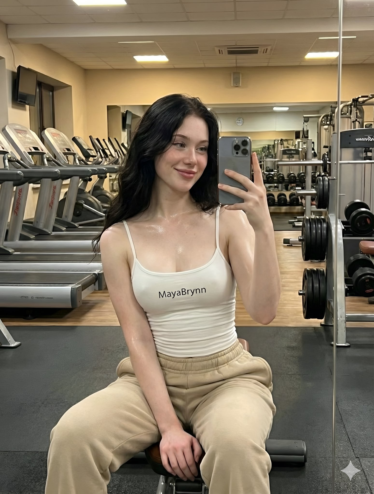
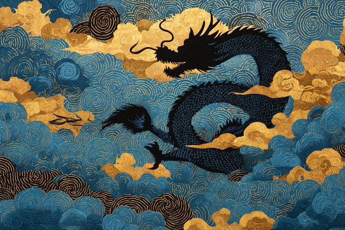
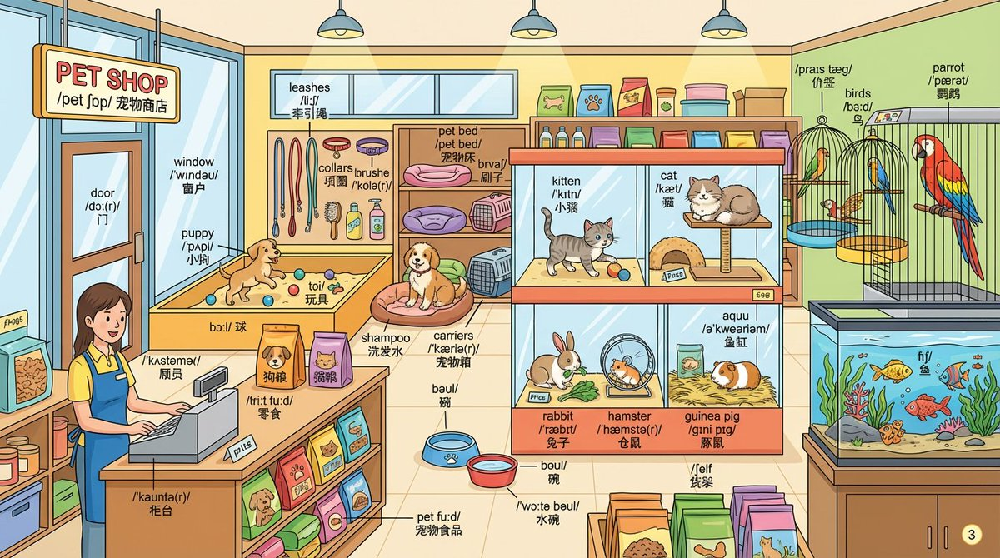
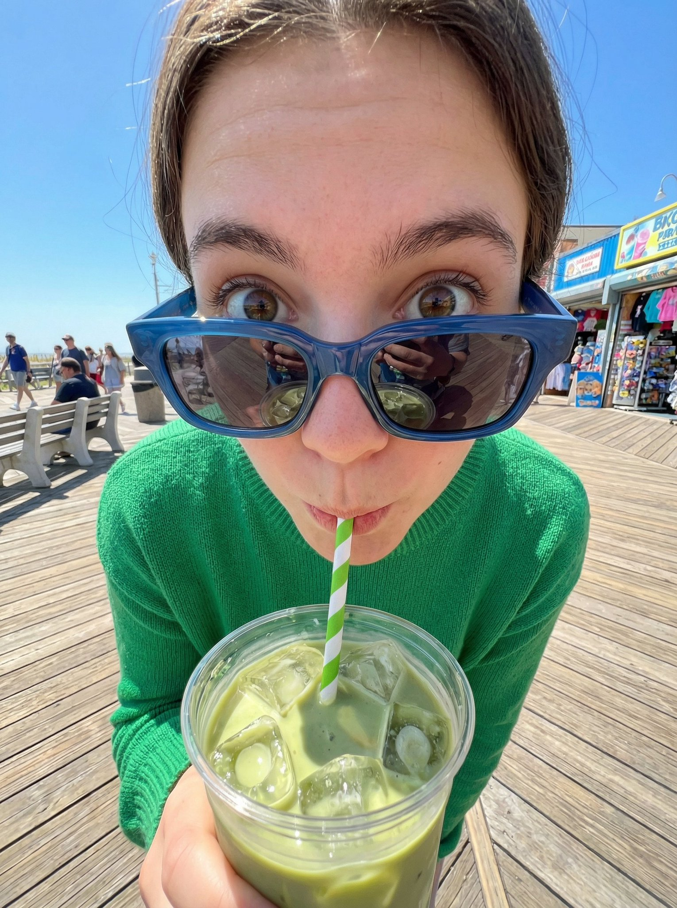
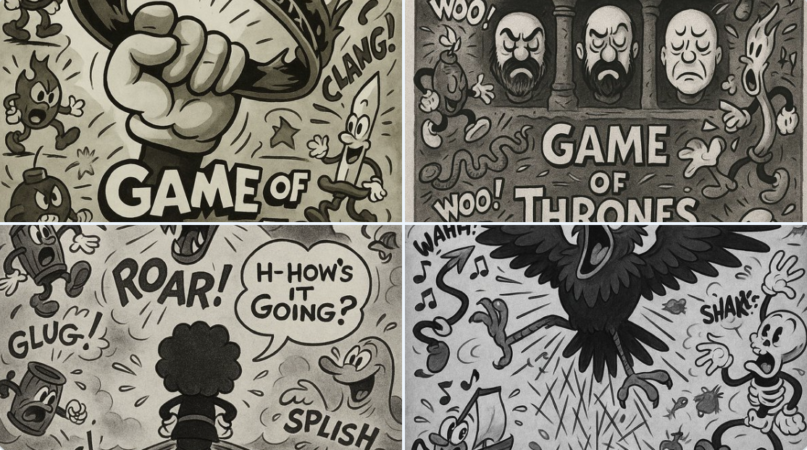
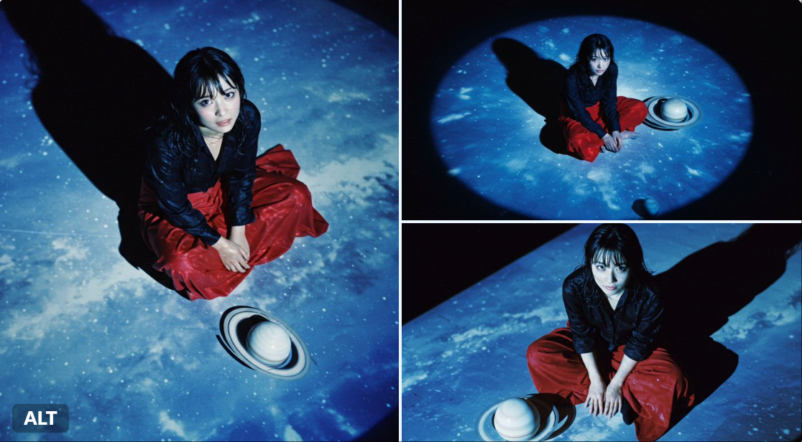
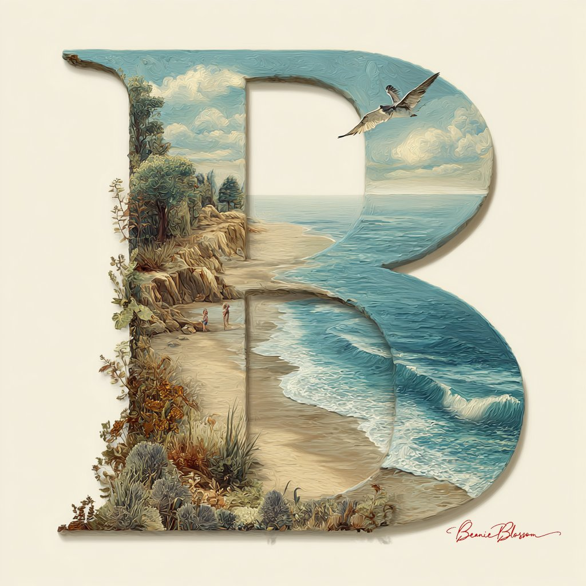
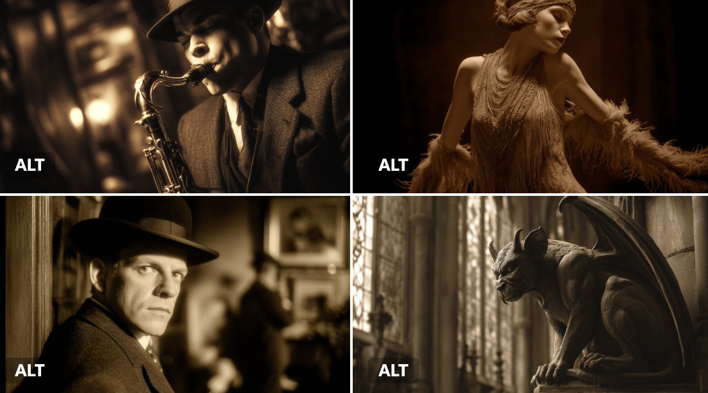

# landscape

总计：612

## 1. Using the attached image as a motif, we generated a d

- ID: gpt4o-1048-en-1
- Slug: prompt-1048-en-1
- 语言: en
- 来源: [来源链接](https://x.com/BubbleBrain/status/2007062194702155835)
- 样例图路径: images/part3/1048.jpeg

### 提示词

```text
1. Using the attached image as a motif, we generated a difference image of a woman's face with lipstick and glossy lips. The image consists of four scenes divided into a 2x2 grid. 

2. A 2x2 grid cinematic photo collage. Four close-up portraits of the same beautiful Korean woman, creating an emotional narrative sequence.

Top-left panel: Cold and aloof expression, staring directly at the camera, high fashion vibe.
Top-right panel: A playful wink and a subtle smirk, looking side-glance.
Bottom-left panel: Biting lower lip, looking shy and slightly flirtatious, soft gaze.
Bottom-right panel: A genuine bright laugh, eyes crinkled with joy, head tilted back slightly.

Style: Analog film photography, heavy film grain, soft focus, dreamlike lighting, glossy lips, dewy skin texture, emotional atmosphere.
```

### 样例图


## 女性面部涂口红和唇彩效果的图像

- ID: gpt4o-1048-zh-2
- Slug: prompt-1048-zh-2
- 语言: zh
- 来源: [来源链接](https://x.com/BubbleBrain/status/2007062194702155835)
- 样例图路径: images/part3/1048.jpeg

### 提示词

```text
1. 我们以附图为模板，生成了一张女性面部涂口红和唇彩效果的差异图像。该图像由四个场景组成，这些场景被划分成一个 2x2 的网格。

2. 一幅 2x2 网格的电影式照片拼贴画。四张同一位美丽的韩国女性的特写肖像，构成了一段充满情感的叙事序列。

左上角面板：表情冷漠疏离，直视镜头，充满时尚气息。
右上角面板：俏皮地眨眨眼，带着一丝不易察觉的微笑，侧目而视。
左下角：咬着下唇，看起来害羞又略带挑逗，眼神温柔。
右下角画面：发自内心的爽朗笑声，眼睛因喜悦而眯成一条缝，头微微向后仰。

风格：胶片摄影，浓重的胶片颗粒感，柔焦效果，梦幻般的光线，光泽的嘴唇，水润的肌肤质感，充满情感的氛围。
```

### 样例图


## A hyper-realistic travel advertisement in square format 

- ID: gpt4o-1046-en-1
- Slug: prompt-1046-en-1
- 语言: en
- 来源: [来源链接](https://x.com/TechieBySA/status/2007190982408974659)
- 样例图路径: images/part3/1046.jpeg

### 提示词

```text
A hyper-realistic travel advertisement in square format (1080x1080), featuring a hand holding a sleek, ultra-thin smartphone or tablet in portrait orientation, tilted slightly sideways to create a striking 3D portal effect. The screen displays a high-resolution image of an iconic landmark from [COUNTRY], which continues into the real background, blending seamlessly. The landmark appears to emerge from the screen. Birds fly nearby and a commercial airplane passes through a bright blue sky with soft white clouds. Bold, clean sans-serif text reading [CITY] is placed prominently above. The lighting is warm and natural, casting soft shadows across the landscape. The surroundings reflect the region’s natural environment (like meadows, coastlines, or city skylines). The device is glossy and minimal-bezel, enhancing realism and depth.
```

### 样例图


## 一则超写实的旅行广告

- ID: gpt4o-1046-zh-2
- Slug: prompt-1046-zh-2
- 语言: zh
- 来源: [来源链接](https://x.com/TechieBySA/status/2007190982408974659)
- 样例图路径: images/part3/1046.jpeg

### 提示词

```text
这是一则超写实的旅行广告，采用正方形格式（1080x1080），画面中一只手竖屏握着一部纤薄时尚的智能手机或平板电脑，略微侧倾，营造出引人注目的3D立体效果。屏幕上显示着[国家/地区]标志性地标的高分辨率图像，图像与真实背景无缝融合，仿佛从屏幕中浮现出来一般。附近有鸟儿飞翔，一架商用飞机掠过湛蓝的天空，朵朵白云点缀其间。醒目的上方是简洁的无衬线字体[城市]。画面光线温暖自然，在景物上投下柔和的阴影。周围环境反映了该地区的自然环境（例如草地、海岸线或城市天际线）。设备采用光滑的超窄边框设计，增强了画面的真实感和立体感。
```

### 样例图


## A 3x3 cinematic storyboard contact sheet consisting of 9

- ID: gpt4o-1044-en-1
- Slug: prompt-1044-en-1
- 语言: en
- 来源: [来源链接](https://x.com/oggii_0/status/2006931271822590224)
- 样例图路径: images/part3/1044.jpeg

### 提示词

```text
A 3x3 cinematic storyboard contact sheet consisting of 9 distinct panels arranged in a grid. The sequence features a young woman with platinum blonde hair in a frozen alpine winter setting.

The panels display various angles and shots:

Close-ups: Focusing on her rosy cheeks, blue-grey eyes, and snowflakes on her eyelashes.

Medium shots: Showing her wrapped in a black wool coat and blue knit scarf, holding a bouquet of dried white flowers.

Wide shots: Capturing her standing alone on the frozen lake with towering snowy mountains in the background.

The lighting is consistent moody blue-hour twilight across all frames. High-quality film photography aesthetic, photorealistic, 8k resolution, coherent character and color grading.
```

### 样例图


## 电影照片故事板

- ID: gpt4o-1044-zh-2
- Slug: prompt-1044-zh-2
- 语言: zh
- 来源: [来源链接](https://x.com/oggii_0/status/2006931271822590224)
- 样例图路径: images/part3/1044.jpeg

### 提示词

```text
一张3x3的电影分镜脚本，由9个独立的分镜组成，呈网格状排列。画面描绘了一位有着铂金色头发的年轻女子，置身于冰天雪地的阿尔卑斯山冬季场景中。

这些面板展示了各种角度和镜头：

特写镜头：聚焦于她红润的脸颊、蓝灰色的眼睛和睫毛上的雪花。

中景镜头：她身穿黑色羊毛大衣，围着蓝色针织围巾，手捧一束白色干花。

广角镜头：捕捉她独自站在冰封的湖面上，背景是巍峨的雪山。

所有画面都呈现出一致的、略带忧郁的蓝调黄昏光线。高品质的胶片摄影美学，照片级真实感，8K分辨率，风格统一，色彩分级准确。
```

### 样例图


## A culinary heritage board documenting [DISH] — [CULTURE 

- ID: gpt4o-1042-en-1
- Slug: prompt-1042-en-1
- 语言: en
- 来源: [来源链接](https://x.com/AllaAisling/status/2007111138597535921)
- 样例图路径: images/part3/1042.jpeg

### 提示词

```text
A culinary heritage board documenting [DISH] — [CULTURE / REGION / ERA]. The canvas is divided into generational layers: top register shows historical origins with sepia photographs of ancestors, original handwritten recipe cards with stains and annotations, and vintage kitchen context; middle register presents the complete ingredient breakdown in mise en place arrangement with source maps showing where each component originates; bottom register shows the dish being prepared by contemporary hands and the final presentation in its authentic serving context. Visual style transitions from archival sepia through ingredient-focused clinical whites to warm candlelit table photography. Hand-lettered labels throughout. Title block reading "[DISH NAME] — [FAMILY NAME] TRADITION, [ORIGIN DATE] TO PRESENT".
```

### 样例图

![A culinary heritage board documenting [DISH] — [CULTURE ](../images/part3/1042.jpeg)

## 一块记录菜肴的烹饪传承展板

- ID: gpt4o-1042-zh-2
- Slug: prompt-1042-zh-2
- 语言: zh
- 来源: [来源链接](https://x.com/AllaAisling/status/2007111138597535921)
- 样例图路径: images/part3/1042.jpeg

### 提示词

```text
一块记录[菜肴]—[文化/地区/时代]的烹饪传承展板。展板分为多个世代层级：上层展示历史渊源，包括祖先的棕褐色照片、带有污渍和批注的原始手写食谱卡片以及复古厨房场景；中层呈现完整的食材清单，并附有食材来源地图；下层展示当代厨师的烹饪过程以及最终呈现在原汁原味的餐桌上。视觉风格从档案般的棕褐色过渡到以食材为中心的简洁白色，最终变为温暖的烛光餐桌照片。贯穿始终的手写标签。标题栏显示“[菜肴名称]—[家族名称]传统，[起源日期]至今”。
```

### 样例图


## { "project_metadata": { "title": "K-Pop Idol Newspaper F

- ID: gpt4o-1040-en-1
- Slug: prompt-1040-en-1
- 语言: en
- 来源: [来源链接](https://x.com/BubbleBrain/status/2007074986008141973)
- 样例图路径: images/part3/1040.jpeg

### 提示词

```text
{
  "project_metadata": {
    "title": "K-Pop Idol Newspaper Fashion Concept",
    "style_preset": "Soft Focus Editorial Photography",
    "aspect_ratio": "3:4",
    "version": "2.1"
  },
  "subject": {
    "identity": {
      "ethnicity": "Korean",
      "age_group": "Young Adult",
      "aesthetic": "K-pop idol, mixture of innocent and sexy, pure visual"
    },
    "physique": {
      "body_type": "Curvy and voluptuous",
      "specific_attributes": "Highly emphasized and prominent bustline, hourglass silhouette, toned arms",
      "skin_tone": "Pale, porcelain white, flawless and glowing"
    },
    "hair_and_makeup": {
      "hair": {
        "color": "Dark brown",
        "style": "Long, voluminous waves, slight wet look",
        "action": "Hands gently touching face or hair"
      },
      "makeup": {
        "lips": "Glossy pink jelly lips, gradient lip color",
        "eyes": "Sparkling K-pop style eye makeup, aegyo-sal emphasized",
        "finish": "Glass skin effect, bright and dewy"
      }
    },
    "pose_and_expression": {
      "expression": "Cute pouting lips (dudu lips), seductive yet innocent gaze, looking into the lens",
      "pose": "Medium-full body shot, standing, playful posture, emphasising curves"
    }
  },
  "fashion_elements": {
    "primary_garment": {
      "item": "Strapless mini-dress",
      "material": "Authentic recycled newspaper pages",
      "construction": "Architectural, origami-style pleats, visible newsprint, headlines, and grayscale imagery textures",
      "fit": "Form-fitting, cinched at the waist"
    },
    "accessories": [
      {
        "item": "Hoop earrings",
        "style": "Large, thin, minimalist",
        "material": "Polished silver"
      }
    ]
  },
  "environment_and_backdrop": {
    "setting": "Studio indoor",
    "background_type": "Textured wall",
    "details": "Completely covered in layered, overlapping vintage newspaper pages, sepia-toned paper, collage effect",
    "depth": "Shallow depth of field to separate subject from the background"
  },
  "cinematography_and_lighting": {
    "camera": {
      "lens": "85mm prime lens",
      "shot_type": "Medium-full shot",
      "angle": "Eye-level",
      "sensor": "Digital, clear"
    },
    "lighting": {
      "primary_source": "Soft diffused frontal lighting",
      "effect": "Bright, flattering beauty lighting, minimizing shadows on face",
      "color_temp": "Cool white to neutral"
    },
    "post_processing": {
      "focus": "Soft focus, dreamy atmosphere",
      "textures": "Heavy skin smoothing, airbrushed look, ethereal glow, no grain",
      "filter": "Beauty filter style, dreamy blur effect"
    }
  }
}
```

### 样例图


## K-Pop偶像报纸时尚概念

- ID: gpt4o-1040-zh-2
- Slug: prompt-1040-zh-2
- 语言: zh
- 来源: [来源链接](https://x.com/BubbleBrain/status/2007074986008141973)
- 样例图路径: images/part3/1040.jpeg

### 提示词

```text
{
"project_metadata": {
标题：《K-Pop偶像报纸时尚概念》
"style_preset": "柔焦编辑摄影",
"aspect_ratio": "3:4",
版本：2.1
},
“主题”： {
“身份”： {
“种族”: “韩国人”
"age_group": "青年人",
“美学”：“K-pop偶像，兼具清纯与性感，纯粹的视觉美”
},
"体格": {
"body_type": "曲线优美，丰满性感",
"specific_attributes": "非常突出且醒目的胸部线条，沙漏型身材，健美的双臂",
肤色：苍白如瓷，无瑕透亮
},
"发型和化妆": {
“头发”： {
“颜色”：“深棕色”，
“发型”：“长而蓬松的波浪卷，略带湿润感”，
“动作”：“双手轻轻触碰脸部或头发”
},
“化妆品”： {
“唇部”： “亮泽的粉色果冻唇膏，渐变唇色”
“眼睛”：“闪亮的韩式流行风格眼妆，强调卧蚕”，
“妆效”：“玻璃肌效果，明亮水润”
}
},
"pose_and_expression": {
“表情”：“嘟嘟的可爱嘴唇，既诱人又无辜的眼神，看着镜头”，
“姿势”：“中全身照，站立，俏皮的姿势，强调曲线”
}
},
"fashion_elements": {
"primary_garment": {
“商品”: “无肩带迷你连衣裙”
“材料”：“真正的再生报纸页面”，
“构造”：“建筑风格的折纸褶皱，可见的新闻印刷品、标题和灰度图像纹理”，
“合身”： “贴合身形，腰部收紧”
},
“配件”： [
{
“物品”: “圈形耳环”，
“风格”：“大号、纤细、极简主义”
材质：抛光银
}
]
},
"environment_and_backdrop": {
设置：室内工作室，
"background_type": "纹理墙",
“细节”：“完全覆盖着层叠交错的复古报纸页面，棕褐色调的纸张，拼贴效果”，
“景深”： “浅景深使主体与背景分离”
},
"cinematography_and_lighting": {
“相机”： {
“镜头”: “85mm 定焦镜头”
"shot_type": "中远景镜头",
“角度”：“视线水平”，
“传感器”：“数字式，清晰”
},
“灯光”： {
"primary_source": "柔和的漫射正面照明",
“效果”：“明亮、讨喜的美颜灯光，最大限度地减少脸上的阴影”，
"color_temp": "冷白光到中性色"
},
"post_processing": {
“焦点”：“柔焦，梦幻般的氛围”，
“质地”：“强效柔滑肌肤，喷枪妆效，空灵光泽，无颗粒感”
"滤镜": "美颜滤镜风格，梦幻虚化效果"
}
}
}
```

### 样例图


## { "type": "image_generation", "style": "hyper_realistic"

- ID: gpt4o-1037-en-1
- Slug: prompt-1037-en-1
- 语言: en
- 来源: [来源链接](https://x.com/ykszs017/status/2006959351970541714)
- 样例图路径: images/part3/1037.jpeg

### 提示词

```text
{
"type": "image_generation",
"style": "hyper_realistic",
"quality": "8K DSLR",
"aspect_ratio": "4:5",
"camera": {
"angle": "slightly tilted cinematic perspective",
"lens": "50mm DSLR",
"depth_of_field": "shallow",
"focus": "smartphone and swimming action"
},
"scene": {
"setting": "iPhone 17 Pro Max placed on a wooden table",
"concept": "phone screen transformed into a miniature Olympic swimming pool",
"environment": "indoor, soft daylight coming from the side",
"atmosphere": "cinematic, immersive, realistic with intense competitive energy"
},
"details": {
"screen": "miniature Olympic-sized swimming pool with clear blue water ripples and lane dividers, starting blocks at one end, lane markers in black, subtle water reflections and splashes on the edges",
"players": "miniature swimmers in dynamic action: one swimmer mid-stroke in freestyle lane performing a powerful butterfly kick, another in adjacent lane doing backstroke with arms extended, others diving from blocks or turning at the wall, wearing swimsuits and goggles, water droplets flying with motion blur",
"lighting": "soft diffused daylight with subtle lens flares, realistic caustics and light refractions through the water, dramatic highlights on wet surfaces",
"realism_effects": [
"fingerprints on screen",
"light scratches on phone body",
"natural smudges",
"micro dust particles",
"faint screen glow illuminating the miniature pool with watery shimmer"
]
},
"materials": {
"phone": "metallic frame with realistic reflections",
"table": "textured wooden surface with warm tones"
},
"mood": "high-end cinematic, dramatic, premium advertising look with exhilarating swimming intensity",
"rendering": {
"sharpness": "ultra sharp",
"texture_detail": "extreme",
"lighting_quality": "studio grade",
"photorealism": true
}
}
```

### 样例图


## 用手机屏幕把运动世界装进口袋

- ID: gpt4o-1037-zh-2
- Slug: prompt-1037-zh-2
- 语言: zh
- 来源: [来源链接](https://x.com/ykszs017/status/2006959351970541714)
- 样例图路径: images/part3/1037.jpeg

### 提示词

```text
{
"type": "image_generation",
"风格": "超写实"
“质量”: “8K 单反”
"aspect_ratio": "4:5",
“相机”： {
“角度”：“略微倾斜的电影视角”，
“镜头”: “50mm 单反”
"景深": "浅",
“焦点”：“智能手机和游泳动作”
},
“场景”： {
“设置”：“iPhone 17 Pro Max 放在木桌上”，
“概念”：“手机屏幕变成一个微型奥运游泳池”，
“环境”：“室内，柔和的日光从侧面照射进来”，
“氛围”： “电影般的、沉浸式的、逼真的，充满强烈的竞争能量”
},
“细节”： {
“屏幕”：“迷你奥林匹克规格游泳池，清澈的蓝色水波荡漾，有泳道分隔线，一端有出发台，黑色泳道标记，边缘有微妙的水面倒影和水花飞溅”，
“玩家”：“动态的微型游泳者：一名游泳者在自由泳泳道中做着强有力的蝶泳腿，另一名游泳者在相邻的泳道中伸展双臂做着仰泳，其他游泳者穿着泳衣和泳镜从出发台跳水或在池壁处转身，水滴飞溅，呈现出动态模糊效果。”
“照明”：“柔和的漫射日光，带有微妙的镜头光晕，逼真的光影效果和光线穿过水面的折射，以及湿润表面上的戏剧性高光”，
"realism_effects": [
“屏幕上的指纹”，
“手机机身有轻微划痕”
“自然的污渍”，
“微尘颗粒”，
“屏幕微光照亮了微型水池，泛起水波光粼粼”
]
},
“材料”： {
“手机”：“具有逼真反射效果的金属边框”，
“桌子”： “带有暖色调的纹理木质表面”
},
“氛围”：“高端电影感、戏剧性、优质广告风格，以及令人兴奋的游泳强度”，
渲染：{
“锐度”: “超锐利”，
"texture_detail": "extreme",
"lighting_quality": "摄影棚级",
“照片写实主义”：真
}
}
```

### 样例图


## Ultra-realistic 4K photograph of a spectacular fireworks

- ID: gpt4o-1035-en-1
- Slug: prompt-1035-en-1
- 语言: en
- 来源: [来源链接](https://x.com/TechieBySA/status/2006462352506663012)
- 样例图路径: images/part3/1035.jpeg

### 提示词

```text
Ultra-realistic 4K photograph of a spectacular fireworks display over [LANDMARK] at night. The fireworks explode in the exact colors of the [COUNTRY] flag: [FLAG COLORS] radiating naturally outward. Include a dark night sky, smoke trails from the fireworks, and reflections of the colored bursts on the water below (if waterfront). The city silhouette or landmark ([ICONIC LANDMARK]) should be clearly visible in the background. Cinematic composition, photorealistic style, professional long exposure photography techniques, sharp focus on fireworks burst, dramatic lighting, 4K quality.
```

### 样例图


## 夜间烟花表演

- ID: gpt4o-1035-zh-2
- Slug: prompt-1035-zh-2
- 语言: zh
- 来源: [来源链接](https://x.com/TechieBySA/status/2006462352506663012)
- 样例图路径: images/part3/1035.jpeg

### 提示词

```text
拍摄一张超逼真的4K照片，展现[地标]上空壮观的夜间烟花表演。烟花绽放的颜色与[国家]国旗的颜色完全一致：[国旗颜色]，并自然地向外扩散。照片应包含漆黑的夜空、烟花燃放产生的烟雾，以及彩色烟花在水面上的倒影（如果是滨水场景）。城市轮廓或地标([或标志性地标])应清晰地出现在背景中。照片应采用电影级构图、照片级写实风格，运用专业的长时间曝光摄影技巧，清晰聚焦于烟花绽放，并运用戏剧性的光线，达到4K画质。
```

### 样例图


## 4x4 grid of identical 3D object renders showing the same

- ID: gpt4o-1034-en-1
- Slug: prompt-1034-en-1
- 语言: en
- 来源: [来源链接](https://x.com/gokayfem/status/2007137742883266682)
- 样例图路径: images/part3/1034.jpeg

### 提示词

```text
4x4 grid of identical 3D object renders showing the same furniture piece with 16 different material applications. Each cell displays the exact same object geometry with a unique surface texture applied.

Object: Curved sculptural seating form with rounded back, cushioned seat, and four angled legs. Organic mid-century modern silhouette with smooth flowing lines, gently sloped armrests, and comfortable proportions. Single unified form without separate cushions or pillows.

Camera specifications: Fixed 3/4 front angle view, warm showroom lighting from upper-left at 45°, soft ambient fill light, identical framing across all 16 cells, subtle floor shadow beneath object, clean neutral gradient background.

Object geometry (identical in all cells):
* Same exact 3D model in every cell
* Same camera angle and distance
* Same lighting setup
* Only the surface material changes between cells

16 unique material applications (one per cell, left to right, top to bottom):

Row 1 - Soft Luxury:
* Cell 1: Midnight blue velvet - deep navy plush pile absorbing light across curved surfaces
* Cell 2: Cognac full-grain leather - warm caramel with natural grain wrapping around form
* Cell 3: Cream bouclé - chunky looped wool texture following organic contours
* Cell 4: Blush pink silk - luminous soft draping appearance with subtle sheen on curves

Row 2 - Natural Elements:
* Cell 5: Live-edge walnut wood - rich brown grain flowing across entire solid form
* Cell 6: White Carrara marble - bright polished stone with gray veins (sculptural interpretation)
* Cell 7: Natural rattan weave - honey tan woven cane pattern covering all surfaces
* Cell 8: Olive green shagreen - textured bumpy stingray pattern on elegant form

Row 3 - Metals & Industrial:
* Cell 9: Brushed brass - warm golden metal with soft directional scratches
* Cell 10: Matte black steel - powder-coated charcoal covering entire form
* Cell 11: Polished chrome - mirror-like silver reflecting environment
* Cell 12: Antique bronze - deep brown with green patina weathering

Row 4 - Statement Finishes:
* Cell 13: Emerald green lacquer - jewel tone high-gloss reflective surface
* Cell 14: Smoked glass - dark translucent gray showing form as sculptural object
* Cell 15: Camel herringbone wool - warm tan zigzag woven textile on all surfaces
* Cell 16: Mother of pearl - iridescent shell mosaic with rainbow shimmer across curves

Material application rules:
* Each material wraps entirely around the object
* Texture scale appropriate for furniture size
* Material responds correctly to object curvature
* Lighting reveals unique surface properties of each material
* Realistic rendering quality showing how material would actually appear

Technical requirements:
* Identical object silhouette in all 16 cells
* Zero variation in geometry, camera, or lighting
* Only surface material differs between cells
* Clean grid layout with thin borders
* Professional product visualization quality
* Each cell could serve as standalone product render

Purpose: Material exploration for furniture design, showing clients how the same form transforms with different surface treatments. Demonstrates versatility of single design across fabric, leather, wood, metal, stone, and decorative finishes.

Output: 4x4 seamless grid comparing 16 material options on identical object. Presentation-ready format for design review, client selection, or 3D visualization portfolio.
```

### 样例图


## 16 种不同的表面材质

- ID: gpt4o-1034-zh-2
- Slug: prompt-1034-zh-2
- 语言: zh
- 来源: [来源链接](https://x.com/gokayfem/status/2007137742883266682)
- 样例图路径: images/part3/1034.jpeg

### 提示词

```text
4x4 的网格，由 16 种不同的材质渲染图组成，展示同一件家具的相同几何形状。每个单元格都应用了不同的表面纹理。

物件：弧形雕塑座椅，圆润的靠背，带软垫的座面，四条倾斜的椅腿。有机的中世纪现代风格轮廓，线条流畅，扶手略微倾斜，比例舒适。一体式设计，无需单独的坐垫或靠枕。

相机规格：固定 3/4 前角视角，从左上方 45° 角照射的暖色展厅照明，柔和的环境补光，所有 16 个单元格的取景相同，物体下方有微妙的地板阴影，干净的中性渐变背景。

对象几何形状（所有单元格均相同）：
每个单元格都使用完全相同的 3D 模型。
* 相同的拍摄角度和距离
* 相同的照明设置
细胞间仅表面物质发生变化。* 只有细胞表面物质发生变化。

16 种独特的材料应用（每个单元格一种，从左到右，从上到下）：

第一排 - 轻奢：
* 单元格 1：午夜蓝丝绒 - 深海军蓝长绒面料，可吸收曲面上的光线
* 单元格 2：干邑色全粒面皮革 - 温暖的焦糖色，天然纹理包裹着造型
* 单元格 3：奶油色圈绒 - 粗毛圈绒质地，贴合有机轮廓
* 第4格：淡粉色丝绸——光泽柔和，垂坠感极佳，曲线处带有微妙的光泽

第 2 行 - 自然元素：
* 第5单元：原木胡桃木——浓郁的棕色纹理贯穿整个实木框架
* 6号单元：白色卡拉拉大理石——光泽亮丽、带有灰色纹理的石材（雕塑诠释）
* 7号单元：天然藤编——蜜棕色藤条编织图案覆盖所有表面
* 第8格：橄榄绿鲨革——优雅造型上带有纹理粗糙的鳐鱼图案

第 3 行 - 金属和工业：
* 9号单元格：拉丝黄铜——温暖的金色金属，带有柔和的定向划痕
* 10号单元：哑光黑色钢材 - 表面喷涂炭黑色粉末涂层
* 11号单元格：抛光铬——镜面般的银色反射环境
* 12号单元格：古铜色 - 深棕色，带有绿色风化痕迹

第 4 行 - 语句结尾：
* 13号单元格：翠绿色漆面 - 宝石色调高光泽反光表面
* 第14号单元：烟熏玻璃——深灰色半透明，呈现出雕塑般的形态
* 15号单元：驼色人字纹羊毛——温暖的棕褐色之字形织物，所有表面均有纹理
* 第16格：珍珠母贝——带有彩虹般光泽的虹彩贝壳马赛克，曲线处闪烁着光芒

材料应用规则：
每种材料都完全包裹住物体。
* 纹理比例适合家具尺寸
* 材料对物体曲率的响应正确
光照展现了每种材料独特的表面特性。
* 逼真的渲染质量，展现材质的实际外观

技术要求：
* 所有 16 个单元格中的物体轮廓均相同
* 几何形状、相机或光照方面均无任何变化
* 细胞间仅表面物质存在差异。
* 简洁的网格布局，搭配细边框
* 专业产品可视化质量
每个单元格都可以作为独立的产品渲染图。

目的：探索家具设计中的材料运用，向客户展示同一造型如何通过不同的表面处理呈现出不同的效果。展现单一设计在织物、皮革、木材、金属、石材和装饰饰面等多种材质上的多样性。

输出：4x4无缝网格，对比同一物体上的16种材质选项。格式可直接用于演示，适用于设计评审、客户选择或3D可视化作品集。
```

### 样例图


## 书籍电影风格海报

- ID: gpt4o-1028-zh
- Slug: prompt-1028-zh
- 语言: zh
- 来源: [来源链接](https://x.com/berryxia/status/2006779626270666917)
- 样例图路径: images/part3/1028.jpeg

### 提示词

```text
叙事感电影/书籍海报设计系统 v2.0

🎯 Role（角色定义）

你是一位精通多风格视觉设计的电影/书籍信息图海报专家，能够根据作品的独特气质动态调整设计风格与配色方案。

🎨 Style System（风格系统）

风格库（可选风格）

1️⃣ 现代电影感风格（参考图风格）

适用作品：剧情片、犯罪片、史诗片

视觉特征：冷暖对比、戏剧性光影、几何构图、专业电影海报质感

配色逻辑：根据电影核心情绪选择对比色系

例：《肖申克的救赎》→ 监狱冷蓝 vs 希望金橙

例：《教父》→ 黑帮酒红黑 vs 烛光古董金

2️⃣ 水彩手绘风格

适用作品：文艺片、浪漫爱情片、温情故事

视觉特征：柔和晕染、笔触可见、纸质纹理、色彩自然融合、有机边缘

配色逻辑：温暖柔和色系，模拟水彩颜料混合效果

例：《天使爱美丽》→ 巴黎咖啡馆暖色（奶油色、复古绿、玫瑰粉、蜂蜜金）

3️⃣ 暖色复古艺术风格

适用作品：经典老片、怀旧题材、黄金时代作品

视觉特征：50-70年代旅行海报美学、扁平装饰图案、中古世纪现代主义、复古印刷质感

配色逻辑：褪色明信片色调、半色调网点

例：《罗马假日》→ 50年代意大利旅游海报色（温暖棕褐、复古青绿、珊瑚橙、橄榄绿）

4️⃣ 2.5D折纸风格

适用作品：动画电影、奇幻故事、童话题材

视觉特征：多层纸艺、立体阴影、景深效果、手工剪纸美学、折纸几何

配色逻辑：鲜明分层色彩，注重层次间的明暗对比

例：《千与千寻》→ 神隐世界魔幻色（灵界青蓝、神秘紫、魔法金、樱花粉）

5️⃣ 极简主义风格

适用作品：哲学性作品、现代简约故事

视觉特征：70%留白、3色限定、瑞士设计、几何纯粹

配色逻辑：只用2-3个高对比色 + 大量白色

6️⃣ 赛博朋克霓虹风格

适用作品：科幻片、未来题材、实验性作品

视觉特征：霓虹发光、数字故障、全息效果、暗黑背景

配色逻辑：电子荧光色（青蓝#00F0FF、洋红#FF006E、毒绿#39FF14）

7️⃣ 黑白高对比风格

适用作品：黑色电影、经典老片、严肃文学

视觉特征：纯黑白、版画感、德国表现主义、强烈明暗

配色逻辑：无灰度，只用纯黑#000000和纯白#FFFFFF

🧬 Dynamic Color System（动态配色系统）

配色选择决策树

分析作品 → 提取核心情绪 → 匹配配色方案

情绪维度：

- 温暖/冷酷

- 明亮/阴暗

- 梦幻/现实

- 复古/现代

配色公式：

主色（60%）+ 强调色（30%）+ 点缀色（10%）

对比原则：

- 剧情片 → 冷暖对比

- 爱情片 → 类似色和谐

- 惊悚片 → 互补色冲突

- 动画片 → 饱和度高、分层清晰

📐 Fixed Layout Structure（固定布局结构）

通用版式框架（所有风格共用）

┌─────────────────────────────────────┐

│  Header 顶部                         │

│  [奖项徽章] 标题(中英文) [国旗/图标]    │

├────────┬─────────────────┬──────────┤

│        │                 │  Right   │

│  Left  │     Center      │  Sidebar │

│ Sidebar│   核心场景插画    │  胶片栏   │

│ 3主题  │                 │  4场景   │

│  图标  │                 │  截图    │

│        │                 │          │

├────────┴─────────────────┴──────────┤

│  Bottom Footer 底部三栏文字           │

│  [金句摘录] [难忘时刻] [思考与感悟]     │

└─────────────────────────────────────┘

必备元素清单

✅ 顶部：作品中英文名称、获奖信息、国家/年份标识

✅ 左侧：3个核心主题图标 + 关键词

✅ 中心：最具代表性的标志性场景

✅ 右侧：4个经典名场面（胶片/相框形式）

✅ 底部：

金句摘录：2-4句最经典台词

难忘时刻：2-3个关键剧情细节

思考与感悟：3-4条深层意义解读

🔄 Workflow（工作流程）

Step 1: 作品分析

输入：<作品名称>

输出：

- 核心主题（3个关键词）

- 情感基调（温度、明暗、节奏）

- 视觉符号（标志性元素）

- 经典台词/场景

- 获奖信息

Step 2: 风格匹配

根据作品气质选择风格：

- 法国文艺片 → 水彩手绘

- 50年代经典片 → 暖色复古

- 宫崎骏动画 → 2.5D折纸

- 诺兰科幻片 → 现代电影感

- 库布里克作品 → 极简/黑白

Step 3: 配色生成

提取电影色彩DNA：

- 分析场景主色调

- 识别情绪色彩倾向

- 生成5-7色配色方案

- 标注Hex色值

Step 4: 内容创作

生成具体内容：

- 3个主题图标设计描述

- 4个名场面画面描述

- 底部三栏文案撰写

- 排版细节规划

Step 5: 提示词输出

生成完整AI绘图提示词（Midjourney/DALL-E格式）：

- 风格描述（200-300词）

- 配色方案（Hex色值）

- 布局结构（详细描述）

- 元素清单（逐项列举）

- 氛围关键词

💡 Usage Example（使用示例）

用户输入：《盗梦空间》

系统输出：

风格选择：现代电影感风格

配色方案：

梦境迷雾灰 #B0BEC5

现实深蓝 #263238

潜意识金 #FFA000

陀螺银 #CFD8DC

3个主题：

梦境嵌套（无限符号图标）

现实虚幻（旋转陀螺）

潜意识探索（迷宫钥匙）

4个场景：

城市折叠场景

酒店走廊打斗

雪山要塞突袭

陀螺旋转结局

金句："You mustn't be afraid to dream a little bigger, darling."
```

### 样例图


## { "language": "en", "task": "image_edit", "consistency_i

- ID: gpt4o-1027-en-1
- Slug: prompt-1027-en-1
- 语言: en
- 来源: [来源链接](https://x.com/hellokaton/status/2003484504347079156)
- 样例图路径: images/part3/1027.jpeg

### 提示词

```text
{
    "language": "en",
    "task": "image_edit",
    "consistency_id": "user_subject_sassy_santa",
    "input_images": [
        {
            "image": "{{USER_REFERENCE_IMAGE}}",
            "use_as": "subject_identity",
            "priority": "high"
        }
    ],
    "prompt": "Create a full-body vertical 3:4 festive poster. Use the person from the uploaded reference image as the ONLY human subject (could be male or female). Preserve identity strongly: same face structure, hairstyle, skin tone, and overall likeness. Preserve the subject’s gender presentation from the reference; do not gender-swap.\n\nPOSE (LOCK THIS): a grounded swagger power-stance with BOTH FEET ON THE FLOOR (no raised leg). Wide stance, feet apart. Weight mostly on the back leg. The front foot is planted closer to the camera to create forced-perspective enlargement of the sneaker, but the sole stays fully on the ground. Knees slightly bent. Hips subtly cocked. Upper body slightly leaned back with shoulders rolled back and chest subtly forward.\n\nARMS & FACE (LOCK THIS): arms firmly and tightly crossed over the chest (no hands-on-hips). Chin slightly raised. Slight head tilt. A smug, confident, sassy expression (subtle smirk / “too cool” attitude).\n\nWARDROBE: rich red velvet Santa suit with clean white fur trim, Santa hat, white gloves, stylish black sunglasses. Keep modern clean white sneakers.\n\nSCENE: seamless bright red studio backdrop with a soft spotlight gradient behind the subject. Metallic silver confetti floating throughout the scene.\n\nREINDEER: place one realistic reindeer on the subject’s right side (camera-right), full body visible, antlers prominent, facing the camera with a cute/curious look. The reindeer wears a cozy red-and-green knitted scarf.\n\nLIGHTING & CAMERA: crisp commercial studio lighting, high detail textures (velvet, fur trim, knit scarf, reindeer fur). Low-angle wide lens look (about 20–28mm), camera near knee height, slight upward tilt. Sharp focus on subject and reindeer, mild depth of field for a premium poster feel. Photorealistic, clean, no text.",
    "style_parameters": {
        "render_style": "photorealistic",
        "mood": "festive, playful, swagger, comedic",
        "camera_look": "low-angle wide lens, forced perspective"
    },
    "composition": {
        "shot_type": "full_body",
        "camera_angle": "low_angle",
        "subject_position": "center_left",
        "secondary_subject_position": "right",
        "background": "solid red seamless with subtle spotlight gradient",
        "foreground_elements": "silver confetti"
    },
    "technical_specifications": {
        "aspect_ratio": "3:4",
        "resolution": "4k",
        "detail_level": "high",
        "sharpness": "high"
    },
    "negative_prompt": "raised leg, knee up, kicking, stepping forward mid-air, walking pose, running pose, sitting, crouching, hands on hips, hands in pockets, text, watermark, logo, brand mark, extra people, duplicate face, face distortion, different identity, gender swap, body-type change, extra limbs, extra fingers, bad hands, deformed feet, melted sunglasses, blurry subject, low resolution, cartoon, anime, painterly look, harsh artifacts",
    "output_settings": {
        "format": "jpg",
        "quality": "high"
    }
}
```

### 样例图


## 竖版全身节日海报

- ID: gpt4o-1027-zh-2
- Slug: prompt-1027-zh-2
- 语言: zh
- 来源: [来源链接](https://x.com/hellokaton/status/2003484504347079156)
- 样例图路径: images/part3/1027.jpeg

### 提示词

```text
{
"language": "en",
"任务": "图像编辑",
"consistency_id": "user_subject_sassy_santa",
"input_images": [
{
"image": " {{ USER_REFERENCE_IMAGE }} ",
"use_as": "subject_identity",
“优先级”： “高”
}
],
“提示”：创作一张3:4比例的竖版全身节日海报。使用上传的参考图片中的人物作为唯一的人体主体（可以是男性或女性）。务必保持人物特征：相同的面部结构、发型、肤色和整体相似度。保持参考图片中人物的性别特征；不要改变性别。\n\n姿势（锁定此项）：双脚着地，双脚分开站立，保持稳健自信的站姿（不要抬腿）。双脚分开站立，重心主要在后腿上。前脚靠近镜头，利用透视效果放大运动鞋，但鞋底始终与地面接触。膝盖微屈。臀部略微前倾。上身略微后倾，双肩向后舒展，胸部略微前挺。\n\n手臂和面部（锁定此项）：双臂紧紧交叉于胸前（不要双手叉腰）。下巴略微抬起。头部略微前倾。倾斜。一种沾沾自喜、自信、傲娇的表情（略带一丝微笑/“酷毙了”的态度） .\ \n服装：深红色天鹅绒圣诞老人套装，配以干净的白色毛皮饰边、圣诞帽、白色手套和时尚的黑色太阳镜。搭配现代的干净白色运动鞋。\n\n场景：无缝亮红色影棚背景，主体后方有柔和的渐变聚光灯。银色金属彩纸屑在场景中飘落。\n\n驯鹿：将一只逼真的驯鹿放在主体的右侧（相机右侧），全身可见，鹿角突出，面向镜头，眼神可爱/好奇。驯鹿戴着一条舒适的红绿相间针织围巾。\n\n灯光和相机：清晰的商业影棚灯光，高细节纹理（天鹅绒、毛皮饰边、针织围巾、驯鹿毛皮）。低角度广角镜头（约20-28mm），相机高度接近膝盖，略微向上倾斜。主体清晰对焦驯鹿，适中的景深营造出高级海报的感觉。照片级写实，画面干净，无文字。
"style_parameters": {
"render_style": "照片写实风格",
“情绪”：“喜庆的、俏皮的、自信的、喜剧的”，
"camera_look": "低角度广角镜头，强制透视"
},
“作品”： {
"shot_type": "全身",
"camera_angle": "低角度",
"subject_position": "center_left",
"secondary_subject_position": "右",
“背景”: “纯红色无缝，带有微妙的聚光灯渐变”
"前景元素": "银色彩带"
},
"technical_specifications": {
"aspect_ratio": "3:4",
分辨率：4K，
"detail_level": "高",
“清晰度”： “高”
},
"negative_prompt": "抬腿、抬膝、踢腿、空中向前迈步、行走姿势、跑步姿势、坐姿、蹲姿、双手叉腰、双手插兜、文字、水印、标志、品牌标识、额外人物、重复面孔、面部扭曲、不同身份、性别互换、体型改变、额外肢体、额外手指、残疾的手、畸形的脚、融化的太阳镜、模糊主体、低分辨率、卡通、动漫、油画风格、粗糙的瑕疵",
"output_settings": {
"格式": "jpg",
“质量”： “高”
}
}
```

### 样例图


## Create a spectacular fireworks display photograph over a

- ID: gpt4o-1026-en-1
- Slug: prompt-1026-en-1
- 语言: en
- 来源: [来源链接](https://x.com/TechieBySA/status/2004894710729478277)
- 样例图路径: images/part3/1026.jpeg

### 提示词

```text
Create a spectacular fireworks display photograph over a waterfront cityscape at night. The fireworks should burst in the exact shape and form of the uploaded logo, perfectly replicating its distinctive design, proportions, colors, and silhouette. Match every color from the logo precisely in the fireworks - placing each color exactly where it appears in the original logo design. The logo shape should be clearly recognizable and detailed in the fireworks formation against the dark sky. The scene should include a city silhouette in the background, smoke trails from the fireworks, and colorful reflections dancing on the water below. Photorealistic style with professional long exposure photography techniques, sharp focus on the fireworks burst, cinematic composition, 4K quality.
```

### 样例图


## 城市景观上空绽放的壮观烟花照片

- ID: gpt4o-1026-zh-2
- Slug: prompt-1026-zh-2
- 语言: zh
- 来源: [来源链接](https://x.com/TechieBySA/status/2004894710729478277)
- 样例图路径: images/part3/1026.jpeg

### 提示词

```text
拍摄一张夜幕降临后，在水滨城市景观上空绽放的壮观烟花照片。烟花应完全按照上传的标志形状绽放，完美复刻其独特的设计、比例、色彩和轮廓。烟花中的每一种颜色都应与标志中的一模一样，并精确地放置在原标志设计中对应的位置。标志的形状在夜空映衬下的烟花编队中应清晰可见，细节丰富。画面背景应包含城市轮廓、烟花绽放的烟雾以及水面上变幻莫测的彩色倒影。照片风格需采用专业的长曝光摄影技巧，聚焦于烟花绽放的瞬间，构图需具有电影质感，并达到4K画质。
```

### 样例图


## 水果包装

- ID: gpt4o-1024-zh
- Slug: prompt-1024-zh
- 语言: zh
- 来源: [来源链接](https://x.com/berryxia/status/2003836511565815965)
- 样例图路径: images/part3/1024.jpeg

### 提示词

```text
Premium Japanese-style product poster in 16:9 landscape format, editorial design showcasing kiwi juice skin packaging concept with sophisticated visual storytelling:

LEFT SIDE (40% of canvas):
- Hero product: One large kiwi juice skin package displayed vertically with dramatic soft lighting, showing ultra-realistic kiwi peel texture wrapped around rectangular container, fuzzy brown skin with thousands of fine visible hair-like fibers covering entire surface, rough natural texture, brown color with subtle variations, looks exactly like real kiwi skin stretched over package
- Below: One cross-sectioned fresh kiwi showing vibrant green creamy flesh with black seeds radiating from white center
- Japanese typography vertically aligned: "キウイスキン" (Kiwi Skin) in elegant thin gothic font
- Subtitle: "果汁皮肤 / 猕猴桃" in refined style
- Small design philosophy text in Japanese

CENTER (30% of canvas):
- Generous white negative space (Ma - 間)
- Minimal geometric elements: delicate thin lines
- Floating text: "自然な素材" (natural materials)
- Subtle minimalist brand mark
- Very subtle kiwi fuzz texture pattern in background (low opacity)

RIGHT SIDE (30% of canvas):
- Two kiwi juice skin packages arranged artistically at different angles and heights
- One whole fresh kiwi with natural fuzzy brown skin
- Typography: "Natural Packaging / 自然な包装"
- Tagline: "The skin is the package / 皮膚が包装である"
- Detail callouts pointing to fuzzy hair texture

DESIGN PRINCIPLES: Abundant white space, asymmetrical balance, Wabi-sabi aesthetic, Muji/Noritake editorial minimalism
COLOR PALETTE: brown kiwi tones, pure white background, bright green accent from flesh
PHOTOGRAPHY: Soft diffused studio lighting, ultra-sharp macro details showing fuzzy texture, photorealistic rendering
CRITICAL: The kiwi skin packaging must look incredibly realistic - actual organic fuzzy brown texture with thousands of tiny brown hairs, rough natural appearance, NOT plastic

16:9 widescreen, high-end Japanese product poster, gallery quality
```

### 样例图


## Your city { "image_request": { "subject": "A person's ha

- ID: gpt4o-1022-en-1
- Slug: prompt-1022-en-1
- 语言: en
- 来源: [来源链接](https://x.com/firatbilal/status/2003553245499916501)
- 样例图路径: images/part3/1022.jpeg

### 提示词

```text
Your city
{
  "image_request": {
    "subject": "A person's hand holding a long, narrow vertical die-cut bookmark",
    "bookmark_design": {
      "style": "Intricate layered paper-cut illustration, 3D depth, whimsical artistic style",
      "content": "Iconic landmarks and symbols of {{location}} depicted inside the bookmark frame, some elements slightly popping out of the edges (die-cut)",
      "artistic_elements": "Delicate textures, vibrant colors, miniature architectural details"
    },
    "background": {
      "setting": "A romantic, cinematic wide shot of the actual {{location}} skyline and scenery",
      "depth_of_field": "Soft bokeh, blurred background to emphasize the bookmark in focus",
      "time_of_day": "{{time_of_day}}",
      "lighting_effects": "Atmospheric lighting matching the {{time_of_day}}, golden hour glows, city lights, or soft daylight"
    },
    "composition": {
      "framing": "Close-up on the hand and bookmark, centered vertically",
      "vibe": "Nostalgic, aesthetic, travel-inspired, poetic",
      "color_palette": "Harmonized colors between the bookmark's art and the real-world background"
    },
    "technical_specs": {
      "quality": "8k resolution, highly detailed, photorealistic hand, sharp focus on bookmark",
      "aspect_ratio": "3:4"
    }
  },
  "variables": {
    "location": ["Istanbul", "Paris", "Tokyo", "London", "Rome"],
    "time_of_day": ["Sunrise", "Sunset", "Night with city lights", "Bright daylight"]
  }
}
```

### 样例图


## 一只手拿着一个细长的竖式镂空书签

- ID: gpt4o-1022-zh-2
- Slug: prompt-1022-zh-2
- 语言: zh
- 来源: [来源链接](https://x.com/firatbilal/status/2003553245499916501)
- 样例图路径: images/part3/1022.jpeg

### 提示词

```text
你的城市
{
"image_request": {
“主题”：“一只手拿着一个细长的竖式镂空书签”，
"书签设计": {
“风格”：“错综复杂的层叠剪纸插画，3D立体感，异想天开的艺术风格”，
“内容”：“书签框内描绘了{{地点}}的标志性地标和符号，部分元素略微凸出于边缘（模切）”
艺术元素：精致的纹理、鲜艳的色彩、微缩的建筑细节
},
“背景”： {
“场景”: “一个浪漫的、电影般的广角镜头，展现实际的{{地点}}天际线和风景”，
“景深”: “柔和散景，模糊背景以突出焦点的书签”
"time_of_day": " {{ time_of_day }} ",
"lighting_effects": "与{{一天中的时间}}相匹配的氛围照明，例如黄金时段的光晕、城市灯光或柔和的日光"
},
“作品”： {
“构图”：“手和书签的特写，垂直居中”
“氛围”：怀旧、唯美、旅行灵感、诗意，
"color_palette": "书签图案与现实世界背景之间的协调色彩"
},
"technical_specs": {
“质量”：“8K分辨率，高度细节化，照片级逼真的手部，书签清晰对焦”，
"aspect_ratio": "3:4"
}
},
"变量": {
地点：["伊斯坦布尔", "巴黎", "东京", "伦敦", "罗马"]
"time_of_day": ["日出", "日落", "城市灯光下的夜晚", "明亮的白天"]
}
}
```

### 样例图


## 电商商品KV图

- ID: gpt4o-1021-zh
- Slug: prompt-1021-zh
- 语言: zh
- 来源: [来源链接](https://x.com/yanhua1010/status/2004012045143101808)
- 样例图路径: images/part3/1021.jpeg

### 提示词

```text
基于我给的产品图，梳理产品卖点/参数要点，然后给我输出一套统一旗舰店极简KV系统（9:16），最后生成10张详情页的完整提示词（中英双语、干净大气、至少5张细节特写），先单独生成Logo，用于后续每张海报左上角，其中文字排版风格需要统一，比如玻璃效果、3d浮雕效果，或者其他效果，提示词参考如下:
00、LOGO生成
提示词（中文）： 极简高端时尚品牌logo，矢量风格，干净几何形。品牌名：【"MUYANG"】。图标：细线圆形徽章，内含单支精致叶枝（负空间，现代，优雅）。配色：深苔灰绿色(#2F3A33)搭配温暖米白背景(#F3EFE6)或透明背景。字体：高端衬线体"MUYANG"，字母间距宽松，下方小字"沐阳"。无渐变、无阴影、无3D、无样机、无水印。
01、海报01｜【产品·丝滑睡裙】主KV（Hero）
提示词（中文）： 9:16竖版高端极简时尚海报。柔和摄影棚日光，温暖米白渐变背景（奶油/燕麦色），超干净。精致亚洲美女模特(25-30岁)，精致五官，自然裸妆，长发慵懒随意，放松优雅姿态，全身照，一只手轻轻抚摸裙摆。
服装必须与上传的产品参考图匹配：香槟色/奶油色缎面短款吊带睡裙，细吊带，V领，裙长至大腿中部，丝滑光泽面料，保持服装设计与参考图完全一致。
排版布局：左上角放置MUYANG logo(小号)。顶部居中巨大衬线标题(2行)："SILK SLIP DRESS" / "丝滑睡裙"(中英堆叠，干净)。左侧中部玻璃拟态信息卡(3个要点，双语)：仿真丝触感 / Silk-like touch；修身不紧绷 / Flattering fit；居家也优雅 / Elegant at home。右下角【圆角药丸CTA】："立即选购 → / SHOP NOW →"。
负面词：cluttered, busy, multiple patterns, gradients, shadows, watermark, logo repeated, messy text, low quality, blurry, plain face, unattractive
02、海报02｜产品场景展示
提示词（中文）： 9:16竖版，电影质感干净时尚摄影。背景：柔和晨光透过白色纱帘的卧室，奶白色床品，极简北欧风格，温暖氛围。精致亚洲美女模特全身侧身站立，长发披肩，回眸微笑，一只手撩起发丝。使用上传的产品参考图保持香槟色短款吊带睡裙的形状、长度、面料光泽完全一致。
文字：左上角小号MUYANG logo。左上小号优雅字体："晨光私语 / Morning Whisper"。左下大标题："慵懒的刚刚好"。标题下副标题(双语)："丝滑触肤，开启美好一天 / Silky touch, beautiful day begins."。右下角CTA药丸："了解更多 → / LEARN MORE →"。
负面词：cluttered, busy, dark, messy room, shadows, watermark, messy text, low quality, blurry, plain face
03、海报03｜多场景拼贴
提示词（中文）： 9:16竖版极简拼贴海报，圆角照片块和充足负空间。背景：温暖奶油色，干净。创建4个圆角框展示同一位精致亚洲美女模特穿着上传参考图中相同的香槟色短款吊带睡裙，不同居家场景：清晨卧室窗边、客厅沙发慵懒坐姿、浴室镜前、阳台藤椅喝咖啡。所有框架中保持服装、模特完全一致。
左上角MUYANG logo。底部大衬线标题："一裙多场景"。底部副标题(双语)："居家、约会、度假都适合 / Home, date, vacation ready."。右下角附近添加小型3点列表：不挑场合 / Versatile style；秒变氛围感 / Instant chic；舒适又迷人 / Cozy yet alluring。
负面词：cluttered, busy, multiple patterns, shadows, watermark, messy text, low quality, blurry, plain face.
04、海报04｜细节01·面料光泽（Fabric Sheen）
提示词（中文）： 9:16竖版高端微距细节海报。背景：奶油色渐变，大量干净负空间。极近距离拍摄上传参考图中缎面面料的光泽质感，展示丝滑反光效果和柔软垂坠感，面料随身体曲线自然流动。左上角MUYANG logo。
右侧大标题(双语)："仿真丝光泽 / Silk-like Sheen"。小文案(双语，2行)："触感细腻，像第二层肌肤 / Delicate touch, like second skin."。"自然反光更显质感 / Natural luster, premium feel."。右下角CTA药丸："了解更多 → / LEARN MORE →"。
负面词：cluttered, busy, multiple patterns, shadows, watermark, messy text, low quality, blurry
05、海报05｜细节02·细吊带与锁骨（Strap & Collarbone）
提示词（中文）： 9:16竖版极简细节海报。背景：温暖米白，超干净。特写拍摄精致亚洲美女模特的锁骨、肩颈线条和细吊带，来自上传参考(精致优雅)，柔和侧光勾勒轮廓，高级质感。添加一个小圆角内嵌图展示完整着装轮廓(非常小，低不透明度)。
左上角MUYANG logo。居中大衬线标题："细吊带设计"。3个微型要点(双语)：展现优美肩颈 / Flatters shoulders；精致不累赘 / Delicate refined；性感而优雅 / Sexy yet elegant。CTA药丸："立即选购 → / SHOP NOW →"。
负面词：cluttered, busy, multiple patterns, shadows, watermark, messy text, low quality, blurry, plain face
06、海报06｜细节03·V领剪裁（V-Neckline Cut）
提示词（中文）： 9:16竖版时尚细节海报，干净摄影棚灯光。背景：淡燕麦到奶油色渐变，无纹理。近距离拍摄V领剪裁细节(从上传参考)，展示领口线条流畅性和恰到好处的深度，性感不失优雅。左上角MUYANG logo。
左侧大标题："V领剪裁"。副标题(双语)："修饰脸型，拉长颈部线条 / Face-flattering, neck-elongating."。添加小标签行："DETAIL 03"(小号)。CTA药丸："了解更多 → / LEARN MORE →"。
负面词：cluttered, busy, multiple patterns, shadows, watermark, messy text, low quality, blurry.
07、海报07｜细节04·裙摆垂坠感（Hemline Drape）
提示词（中文）： 9:16竖版高端细节海报。背景：极浅香槟金雾霾色，低对比。拍摄精致亚洲美女模特侧面下半身，展示短裙裙摆自然垂坠在大腿中部的优美曲线(从上传参考)，面料随身体动态流动，修饰腿部线条。
左上角MUYANG logo。右侧标题(双语)："短款更显腿长"。小文案(双语)："恰到好处的长度，修饰比例 / Perfect length, flattering proportion."。
负面词：cluttered, busy, multiple patterns, shadows, watermark, messy text, low quality, blurry, plain face
海报08｜产品配色/型号
提示词（中文）： 9:16竖版极简时尚情绪板。背景：温暖奶油色。左侧：全身精致亚洲美女模特穿着上传参考图中的香槟色短款吊带睡裙(干净摄影棚，自然站姿)。右侧：整齐排列受睡裙启发的配色/材质色卡(香槟金、奶油色、珍珠白、柔和米色) + 极简线条图标(月亮、羽毛、丝绸、晨露)。保持一切扁平、高端，不繁忙。
左上角MUYANG logo。顶部大衬线："配色灵感 / COLOR INSPIRATION"。3个要点(双语)：香槟金显气质 / Champagne exudes elegance；温柔色更衬肤 / Soft tones flatter skin；低调奢华感 / Subtle luxury。CTA："了解更多 → / LEARN MORE →"。
负面词：cluttered, busy, multiple patterns, shadows, watermark, messy text, low quality, blurry, plain face.
09、海报09｜产品尺码/参数
提示词（中文）： 9:16竖版极简尺码指南海报。背景：温暖米白，干净。将尺码表(S/M/L)放置为整洁的网格卡片(玻璃拟态，圆角)。内容(双语标题)："尺码参考 / SIZE GUIDE"。表格列：尺码 Size｜衣长 Length｜胸围 Bust｜腰围 Waist｜臀围 Hip。行：S｜90cm｜80-84cm｜64-68cm｜88-92cm；M｜92cm｜84-88cm｜68-72cm｜92-96cm；L｜94cm｜88-92cm｜72-76cm｜96-100cm。左上角MUYANG logo。底部小注释(双语)："手工测量，误差±2cm属正常 / Hand-measured, ±2cm variance normal."。底部贴心提示："建议参考胸围选择尺码 / Suggest sizig by bust measurement."
负面词：no extra patterns, no clutter, no watermark
10、海报10｜结尾信任页 质保/售后/说明
提示词（中文）： 9:16竖版高端护理海报。背景：奶油色渐变，非常干净。
左上角MUYANG logo。大标题："洗护指南 / CARE GUIDE"。使用5个极简图标 + 简短双语行(干净，不拥挤)：建议手洗或使用洗衣袋 / Hand wash or use laundry bag；冷水或30°C以下水温 / Cold or below 30°C water；不可漂白或强力拧干 / No bleach or wringing；悬挂阴干，避免暴晒 / Hang dry, avoid direct sun；低温熨烫，垫布熨烫更佳 / Low heat iron, use cloth。底部添加小字(双语)："悉心呵护，延长丝滑寿命 / Care well, silkiness lasts longer."。
负面词：no clutter, no heavy texture, no watermark
```

### 样例图


## 牛肉面挂牌

- ID: gpt4o-1017-zh
- Slug: prompt-1017-zh
- 语言: zh
- 来源: [来源链接](https://x.com/berryxia/status/2004570423472562237)
- 样例图路径: images/part3/1017.jpeg

### 提示词

```text
A premium transparent acrylic signage panel for "[品牌名称]" brand, photographed in ABSOLUTE FRONTAL VIEW with ZERO perspective distortion.
CRITICAL CAMERA SETUP (STRICT ENFORCEMENT):
- Camera angle: EXACTLY 0° (perfectly perpendicular to the panel surface)
- The acrylic panel MUST be completely parallel to the camera sensor
- NO rotation on X, Y, or Z axis
- The panel edges MUST form perfect vertical and horizontal lines in the frame
- Use architectural photography grid alignment to ensure perfect frontal geometry
- NO three-quarter view, NO slight angle, NO depth perception - PURE FLAT FRONTAL
PANEL SPECIFICATIONS:
- Material: Ultra-clear 15mm acrylic glass with 95% transparency
- Dimensions: 400mm × 300mm [portrait/square/landscape] orientation
- All edges are diamond-polished with subtle rainbow light refraction
- The panel appears to float in mid-air, suspended by invisible forces
DESIGN LAYOUT (Hand-drawn aesthetic):
- Brand name "[品牌名称]" in large artistic brush calligraphy at top center
- Tagline "[品牌口号/slogan]" in elegant handwritten [语言] below the brand name
- [核心图案描述:如咖啡枝、火锅元素、牛肉纹理等] flowing around the text
- Small decorative [相关小图标] illustrations scattered naturally
- All design elements are drawn with [颜色描述,如warm brown/red/etc.] ink (color: [色值]) with varying line weights (0.8-2mm)
- The drawing has an organic, imperfect quality showing authentic hand-crafted charm
TRANSPARENCY EFFECTS:
- The acrylic surface has 60% opacity for drawn elements (semi-transparent, NOT solid)
- Light passes through the panel, creating soft colored shadows on the virtual plane behind
- The background [场景类型] environment is visible THROUGH the transparent areas
- Subtle light refraction effects along the panel edges creating prismatic color dispersion
BACKGROUND ENVIRONMENT:
- A warm, inviting [具体场景描述:如specialty coffee shop/hot pot restaurant/steakhouse] interior
- [环境细节:如wooden furniture, plants, pendant lighting/red lanterns, steam/leather seats, wine racks]
- The background is moderately blurred (bokeh effect, f/4 aperture simulation) 
- Background elements are recognizable but not distracting - balanced depth of field
- [色温描述:如Warm color temperature (3200K-3800K)/Cool-warm mixed lighting]
LIGHTING:
- Soft, diffused natural light from the front (60% intensity)
- Gentle rim lighting from behind the panel (30% intensity) to emphasize transparency
- NO harsh shadows, maintaining soft and even illumination
- Light interacts with the acrylic creating subtle internal glow
TECHNICAL REQUIREMENTS:
- Shot with macro lens (100mm f/2.8) for zero distortion
- Sensor perfectly aligned with panel surface using spirit level
- The panel occupies 70% of the frame, centered perfectly
- Ultra-sharp focus on the hand-drawn details
- 8K resolution, photorealistic rendering
- Color grading: [色调描述:如warm, natural/vibrant, energetic]
CRITICAL: The entire panel MUST be rendered in perfect frontal view with zero perspective distortion. Every line on the panel should be perfectly straight and parallel to the frame edges.
```

### 样例图


## 3D表情包

- ID: gpt4o-1016-zh
- Slug: prompt-1016-zh
- 语言: zh
- 来源: [来源链接](https://x.com/sundyme/status/2004425000586232256)
- 样例图路径: images/part3/1016.jpeg

### 提示词

```text
Create a high-quality 3D rendered anthropomorphic mascot character in a cute cartoon style inspired by Kakao Friends/LINE Friends. A cute [角色类型] character in [场景描述], [动作描述], [表情描述], detailed 3D rendering with smooth textures, soft lighting, vibrant colors, kawaii aesthetic, large head and small body proportions, clean white background with subtle shadows.

Add Chinese text overlay: \"[文案]\" in a cute, playful font style that matches the 3D character design - bold, rounded, colorful letters with a kawaii aesthetic.

1:1 aspect ratio, high quality 3D rendering, photorealistic textures with cartoon stylization.  使用这个模板生成一组4个表情包
```

### 样例图


## { "request_parameters": { "aspect_ratio": "9:16", "ident

- ID: gpt4o-1011-en-1
- Slug: prompt-1011-en-1
- 语言: en
- 来源: [来源链接](https://x.com/YaseenK7212/status/2005332751759675820)
- 样例图路径: images/part3/1011.jpeg

### 提示词

```text
{
  "request_parameters": {
    "aspect_ratio": "9:16",
    "identity_preservation": {
      "mode": "strict",
      "target": "reference_face_retention",
      "features": "natural_likeness_only"
    }
  },
  "visual_composition": {
    "subject": {
      "entity": "Woman",
      "pose": {
        "body": "Seated on a warm-toned banquette",
        "orientation": "Sophisticated profile",
        "gaze": "Looking toward the side"
      },
      "wardrobe": {
        "primary": "Fitted deep red strapless dress",
        "accents": "Matching draped scarf detail"
      },
      "interactions": {
        "right_hand": "Holding a white wine glass",
        "left_hand": "Holding a clutch bag"
      }
    },
    "environment": {
      "setting": "Elegant restaurant interior",
      "atmosphere": "High-end upscale evening",
      "architectural_details": [
        "Gold accents",
        "Strategic mirrors",
        "Fine dining table setting"
      ]
    }
  },
  "technical_direction": {
    "lighting": {
      "source": "Warm tungsten",
      "shading": "Soft shadows",
      "skin_finish": "Subtle glow"
    },
    "optics": {
      "lens_emulation": "35mm prime",
      "depth_of_field": "Shallow (bokeh background)",
      "focus_points": [
        "Facial features",
        "Wine glass"
      ]
    },
    "post_processing": {
      "vibe": "High-end editorial",
      "color_grading": "Realistic / Cinematic",
      "texture": [
        "Natural skin grain",
        "Gentle film grain"
      ]
    }
  },
  "quality_assurance": {
    "negative_prompt_array": [
      "over-sharpening",
      "AI artifacts",
      "deformed glass",
      "extra fingers",
      "warped jewelry",
      "weird reflections",
      "text",
      "watermark",
      "low-resolution",
      "distorted facial features"
    ]
  }
}
```

### 样例图


## 深红色连衣裙女生拿着白葡萄酒

- ID: gpt4o-1011-zh-2
- Slug: prompt-1011-zh-2
- 语言: zh
- 来源: [来源链接](https://x.com/YaseenK7212/status/2005332751759675820)
- 样例图路径: images/part3/1011.jpeg

### 提示词

```text
{
"请求参数": {
"aspect_ratio": "9:16",
"identity_preservation": {
"mode": "严格",
"target": "reference_face_retention",
"特征": "仅自然相似"
}
},
"视觉构成": {
“主题”： {
“实体”： “女人”，
"姿势": {
“主体”：“坐在暖色调的长椅上”，
“定位”：“成熟稳重的形象”，
“凝视”： “看向侧面”
},
“衣柜”： {
“主打款”： “修身深红色无肩带连衣裙”
点缀：与之相配的垂坠围巾细节
},
"交互": {
“右手”： “拿着一杯白葡萄酒”
"左手": "拿着手拿包"
}
},
“环境”： {
“环境”：“优雅的餐厅内部”，
“氛围”：“高端高档的夜晚”，
"architectural_details": [
“金色点缀”，
“战略镜像”，
“精致的餐桌布置”
]
}
},
"technical_direction": {
“灯光”： {
“来源”： “温暖的钨”
“阴影”：“柔和的阴影”，
“skin_finish”： “柔和光泽”
},
"光学": {
"lens_emulation": "35mm 定焦镜头",
"depth_of_field": "浅景深（散景背景）",
"focus_points": [
“面部特征”，
酒杯
]
},
"post_processing": {
“氛围”: “高端编辑风格”
"color_grading": "写实/电影化",
“质地”： [
“天然皮肤纹理”，
“柔和的胶片颗粒”
]
}
},
"质量保证": {
"negative_prompt_array": [
“过度锐化”
“人工智能制品”，
“变形的玻璃”，
“额外的手指”，
“扭曲的珠宝”，
“奇怪的倒影”，
“文本”，
“水印”，
“低分辨率”
“面部特征扭曲”
]
}
}
```

### 样例图


## { "prompt_data": { "subject": { "description": "Young wo

- ID: gpt4o-1010-en-1
- Slug: prompt-1010-en-1
- 语言: en
- 来源: [来源链接](https://x.com/lexx_aura/status/2004591904386580688?referrer=grok.com)
- 样例图路径: images/part3/1010.jpeg

### 提示词

```text
{
  "prompt_data": {
    "subject": {
      "description": "Young woman with long, wavy blonde hair and a light fair skin",
      "features": "Natural skin texture with visible tan lines on the chest, slight flush on cheeks, soft smile, navel piercing, light freckles.",
      "accessories": "Gold pendant necklace, small gold hoop earrings, small tattoo on the left inner forearm."
    },
    "clothing": {
      "outfit": "Matching yellow two-piece loungewear set.",
      "top": "Yellow strapless tube top featuring the text 'HAWAIIAN TROPIC' in brown serif font with a hibiscus flower and palm graphic on the side.",
      "bottoms": "Matching yellow shorts visible at the waist and thigh area."
    },
    "pose_and_action": {
      "posture": "Reclining and lounging comfortably on a grey textured sofa.",
      "body_language": "Relaxed and casual, leaning back against the couch cushions, one arm extended to support weight, the other hand resting gently near the waist, legs angled toward the camera.",
      "expression": "Friendly, relaxed, and engaging eye contact."
    },
    "environment": {
      "setting": "Modern living room interior.",
      "furniture": "Dark grey fabric sofa with a textured weave.",
      "background": "Grey walls with decorative panel molding (wainscoting).",
      "decor": "A large vertical art piece with a red background featuring KAWS-style figures in blue and black. A second framed abstract art piece with gold and black tones. A modern linear wall sconce light."
    },
    "lighting": {
      "type": "Soft, diffused indoor mix.",
      "quality": "Warm ambient lighting highlighting the skin tone, creating soft shadows and a cozy atmosphere. Likely a mix of natural window light and the warm glow from the wall sconce."
    },
    "styling_and_mood": {
      "aesthetic": "Influencer lifestyle, casual home comfort, '2000s digital camera' vibe.",
      "mood": "Chill, playful, confident, comfortable."
    },
    "camera_specifications": {
      "angle": "Eye-level, slightly angled from the side.",
      "focus": "Sharp focus on the subject's face and torso, with a slight depth of field blurring the background artwork.",
      "lens_suggestion": "35mm or 50mm portrait lens.",
      "film_grain": "Low to medium ISO for a clean but slightly organic digital look."
    },
    "technical_modifiers": [
      "Ultra Photorealistic",
      "8k resolution",
      "Raw photo",
      "Hyper-detailed skin texture",
      "Subsurface scattering",
      "Volumetric lighting",
      "Nano Banana Pro optimized",
      "Masterpiece"
    ]
  }
} 2:3
```

### 样例图


## 金色长卷发和白皙肤色的女子

- ID: gpt4o-1010-zh-2
- Slug: prompt-1010-zh-2
- 语言: zh
- 来源: [来源链接](https://x.com/lexx_aura/status/2004591904386580688?referrer=grok.com)
- 样例图路径: images/part3/1010.jpeg

### 提示词

```text
{
"prompt_data": {
“主题”： {
描述：一位有着金色长卷发和白皙肤色的年轻女子。
“特征”：“肌肤纹理自然，胸部有明显的晒痕，双颊略带红晕，笑容温柔，有肚脐环，有淡淡的雀斑。”
“配饰”：“金吊坠项链，小金耳环，左前臂内侧的小纹身。”
},
“衣服”： {
“套装”：“配套的黄色两件套家居服。”
“上衣”：“黄色无肩带抹胸上衣，侧面印有棕色衬线字体的‘夏威夷热带’字样，以及芙蓉花和棕榈树图案。”
“下装”：“腰部和大腿处可见配套的黄色短裤。”
},
"pose_and_action": {
“姿势”：“舒适地斜倚在灰色纹理沙发上。”
“肢体语言”：“放松随意，靠在沙发垫上，一只手臂伸出支撑身体，另一只手轻轻放在腰间，双腿朝向镜头。”
“表情”：“友好、轻松、引人入胜的眼神交流。”
},
“环境”： {
“场景”：“现代客厅内部。”
“家具”：“深灰色布艺沙发，带有纹理编织图案。”
“背景”： “灰色墙壁，带有装饰性镶板（护墙板）。”
“装饰品”：“一幅大型竖幅艺术作品，红色背景，饰以KAWS风格的蓝色和黑色人物图案。另一幅装裱好的抽象艺术作品，以金色和黑色为主色调。一盏现代简约的线性壁灯。”
},
“灯光”： {
类型：柔和、扩散的室内混合香型。
“品质”：“温暖的氛围灯光突出肤色，营造出柔和的阴影和温馨的氛围。可能是自然窗光和壁灯温暖光芒的混合。”
},
"styling_and_mood": {
“美学”：“网红生活方式、休闲居家舒适感、‘2000年代数码相机’风格。”
“情绪”：“轻松、活泼、自信、舒适。”
},
"camera_specifications": {
“角度”：“与视线齐平，略微侧向倾斜。”
“焦点”：“清晰对焦于人物的面部和躯干，略微虚化背景画作。”
镜头建议：35mm 或 50mm 人像镜头。
"film_grain": "低到中等 ISO，营造干净但略带自然感的数码外观。"
},
"technical_modifiers": [
“超逼真”
“8K分辨率”，
“原始照片”，
“超精细的皮肤纹理”，
“次表面散射”
“体积照明”，
“Nano Banana Pro 优化版”，
“杰作”
]
}
2:3
```

### 样例图


## { "request_parameters": { "aspect_ratio": "9:16", "ident

- ID: gpt4o-1009-en-1
- Slug: prompt-1009-en-1
- 语言: en
- 来源: [来源链接](https://x.com/KeorUnreal/status/2005369201914151024?referrer=grok.com)
- 样例图路径: images/part3/1009.jpeg

### 提示词

```text
{
  "request_parameters": {
    "aspect_ratio": "9:16",
    "identity_preservation": {
      "mode": "strict",
      "target": "reference_face_retention",
      "features": "natural_likeness_only"
    }
  },
  "visual_composition": {
    "subject": {
      "entity": "Woman",
      "pose": {
        "body": "Seated on warm-toned banquette",
        "orientation": "Sophisticated profile",
        "gaze": "Looking to front"
      },
      "wardrobe": {
        "primary": "Fitted short glitter white strapless dress",
        "accents": "Deep necklace and stockings"
      },
      "interactions": {
        "right_hand": "Holding white wine glass",
        "left_hand": "Holding clutch bag"
      }
    },
    "environment": {
      "setting": "Elegant french restaurant",
      "atmosphere": "High-end evening",
      "architectural_details": ["Gold accents", "Mirrors", "Fine dining table"]
    }
  },
  "technical_direction": {
    "lighting": {
      "source": "Warm tungsten",
      "shading": "Soft shadows",
      "skin_finish": "Subtle glow"
    },
    "optics": {
      "lens_emulation": "35mm prime",
      "depth_of_field": "Shallow bokeh",
      "focus_points": ["Face", "Wine glass"]
    },
    "post_processing": {
"vibe": "High-end editorial",
      "color_grading": "Realistic / Cinematic",
      "texture": [
        "Natural skin grain",
        "Gentle film grain"
      ]
    }
  },
  "quality_assurance": {
    "negative_prompt_array": [
      "over-sharpening",
      "AI artifacts",
      "deformed glass",
      "extra fingers",
      "warped jewelry",
      "weird reflections",
      "text",
      "watermark",
      "low-resolution",
      "distorted facial features"
    ]
  }
}
```

### 样例图


## 无肩带连衣裙女生拿着白葡萄酒杯

- ID: gpt4o-1009-zh-2
- Slug: prompt-1009-zh-2
- 语言: zh
- 来源: [来源链接](https://x.com/KeorUnreal/status/2005369201914151024?referrer=grok.com)
- 样例图路径: images/part3/1009.jpeg

### 提示词

```text
{
"请求参数": {
"aspect_ratio": "9:16",
"identity_preservation": {
"mode": "严格",
"target": "reference_face_retention",
"特征": "仅自然相似"
}
},
"视觉构成": {
“主题”： {
“实体”： “女人”，
"姿势": {
“主体”：“坐在暖色调的长椅上”，
“定位”：“成熟稳重的形象”，
“凝视”： “看向前方”
},
“衣柜”： {
“主打款”： “修身短款闪亮白色无肩带连衣裙”
点缀：深色项链和长筒袜
},
"交互": {
"右手："拿着白葡萄酒杯"
"左手": "拿着手拿包"
}
},
“环境”： {
“环境”：“优雅的法式餐厅”，
“氛围”：“高端晚宴”，
"architectural_details": ["金色装饰", "镜子", "精致餐桌"]
}
},
"technical_direction": {
“灯光”： {
“来源”： “温暖的钨”
“阴影”：“柔和的阴影”，
“skin_finish”： “柔和光泽”
},
"光学": {
"lens_emulation": "35mm 定焦镜头",
"depth_of_field": "浅散景",
"focus_points": ["脸", "酒杯"]
},
"post_processing": {
“氛围”: “高端编辑风格”
"color_grading": "写实/电影化",
“质地”： [
“天然皮肤纹理”，
“柔和的胶片颗粒”
]
}
},
"质量保证": {
"negative_prompt_array": [
“过度锐化”
“人工智能制品”，
“变形的玻璃”，
“额外的手指”，
“扭曲的珠宝”，
“奇怪的倒影”，
“文本”，
“水印”，
“低分辨率”
“面部特征扭曲”
]
}
}
```

### 样例图


## { "type": "image_prompt", "description": "High-resolutio

- ID: gpt4o-1008-en-1
- Slug: prompt-1008-en-1
- 语言: en
- 来源: [来源链接](https://x.com/xmiiru_/status/2005530723847934103)
- 样例图路径: images/part3/1008.jpeg

### 提示词

```text
{
  "type": "image_prompt",
  "description": "High-resolution photorealistic studio fashion portrait",
  "subject": {
    "gender": "adult woman",
    "hair": "long light brown hair with golden blonde highlights, loose curls",
    "expression": "playful, cheeky, thinking face, lips pursed",
    "pose": "looking off to the side, shoulders relaxed"
  },
  "outfit": {
    "hat": "gold shimmering party hat",
    "dress": "gold sequin party dress with modern asymmetric neckline cutout"
  },
  "props": {
    "balloons": "gold foil balloons shaped as numbers 20 and 26, one in each hand, raised near shoulders"
  },
  "environment": {
    "setting": "clean studio",
    "background": "neutral beige backdrop",
    "lighting": "soft studio lighting with gentle shadows"
  },
  "details": {
    "realism": "editorial-quality photorealism",
    "textures": "visible skin texture, detailed hair strands, sharp sequin detail",
    "materials": "metallic balloon shine with realistic creases and highlights"
  },
  "constraints": [
    "no text",
    "no logos",
    "no branding",
    "no watermarks"
  ]
}
```

### 样例图


## 2026写实摄影棚时尚肖像

- ID: gpt4o-1008-zh-2
- Slug: prompt-1008-zh-2
- 语言: zh
- 来源: [来源链接](https://x.com/xmiiru_/status/2005530723847934103)
- 样例图路径: images/part3/1008.jpeg

### 提示词

```text
{
"type": "image_prompt",
描述：高分辨率照片级写实摄影棚时尚肖像
“主题”： {
“性别”: “成年女性”
“头发”：“长长的浅棕色头发，带有金色挑染，蓬松的卷发”，
“表情”：“顽皮、俏皮、思考的表情，嘴唇紧抿”，
“姿势”：“看向一侧，肩膀放松”
},
“全套服装”： {
“帽子”：“闪闪发光的金色派对帽”，
“连衣裙”： “金色亮片派对连衣裙，现代不对称领口镂空设计”
},
"props": {
“气球”：“两只手中各拿着一个金色箔纸气球，形状分别为数字 20 和 26，举到肩膀附近”
},
“环境”： {
“设置”：“干净的工作室”，
“背景”： “中性米色背景”，
“灯光”：“柔和的影棚灯光，带有淡淡的阴影”
},
“细节”： {
“写实主义”: “编辑级照片写实主义”，
“纹理”：“可见的皮肤纹理、细致的发丝、清晰的亮片细节”，
“材质”：“金属质感的气球，带有逼真的褶皱和高光”
},
“约束”：[
“无文本”，
“无标志”，
“无品牌标识”
“无水印”
]
}
```

### 样例图


## 2026新年海报

- ID: gpt4o-1007-zh
- Slug: prompt-1007-zh
- 语言: zh
- 来源: [来源链接](https://x.com/op7418/status/2005486114510180545)
- 样例图路径: images/part3/1007.jpeg

### 提示词

```text
{
    "applicable_models": [
        "Seedream",
        "Nano Banana Pro"
    ],
    "subject": {
        "IP_Name": "Enter the names of your favorite games, novels, movies, or TV shows.",
        "description": "A visually striking, masterpiece-level 3D New Year's greeting card poster based on [IP Name]. Vertical composition with a deep, window-like groove in the center.",
        "material_style": "Felt and coarse knitting wool texture, realistic and delicate, blind box toy texture.",
        "central_character": {
            "identity": "A cute Q-version felt Pony (representing the Year of the Horse)",
            "expression": "Naive and charming (憨态可掬), festive",
            "clothing": "Red festive vest, traditional tiger-head hat",
            "action": "Standing in the center as a festival messenger"
        },
        "secondary_characters": {
            "identity": "Classic characters from the IP (Q-version felt style)",
            "clothing": "Traditional festive Tang suit or Hanfu",
            "action": "Interacting within the scene, adding story elements"
        },
        "scene_elements": {
            "architecture": "Iconic buildings from the IP in Q-version felt, arranged with depth and layers",
            "ground": "Thick creamy knitted snow",
            "vegetation": "Peach tree or Kumquat tree hung with red lanterns, Chinese knots, and blessing cards",
            "props": "Scattered felt firecrackers, gold ingots, snow-covered shrubs"
        }
    },
    "accessories": {
        "title_design": {
            "structure": "Independent 3D volumetric letters suspended in mid-air (No background plate/card)",
            "main_text": {
                "content": "Happy New Year",
                "font_style": "3D fluid art font, thick glass volume"
            },
            "sub_text": {
                "content": "新年快乐",
                "font_style": "Bold Chinese Calligraphy (中国书法), 3D extruded strokes"
            },
            "material_properties": {
                "type": "Matte Frosted Glass (applied directly to the text volume)",
                "color": "Deep red to light red gradient",
                "surface": "Soft matte finish, semi-transparent",
                "optical_effects": "Dreamy colorful caustics casting shadows onto the felt scene below"
            }
        },
        "bottom_layout": {
            "content": "Random classic quote related to New Year, blessings, or hope",
            "font_style": "Large, elegant Western Handwritten Serif, rich ink color",
            "source_note": "Small Chinese font citing the source"
        }
    },
    "photography": {
        "renderer": "C4D, Octane Render",
        "resolution": "8K",
        "camera_style": "Macro photography perspective",
        "shot_type": "Vertical Poster, Close-up on miniature",
        "depth_of_field": "Shallow depth of field (background bokeh)",
        "lighting": "Soft and uniform, breathing light effect, atmospheric depth",
        "texture_quality": "Masterpiece, rich details, mixture of felt and frosted glass"
    },
    "background": {
        "setting": "Oriental ink wash void environment with flowing light mist",
        "colors": "Elegant pale champagne gold or high-grade soft mist red",
        "external_decor": [
            "Red velvet silk ribbons dancing in the air",
            "Fluid gold lines",
            "Blooming red plum branches",
            "Strings of festive red lanterns",
            "Plump persimmons or hawthorn berries",
            "Crystal clear geometric snowflakes",
            "Glowing gold copper coin strings"
        ],
        "atmosphere": "Explosive festive atmosphere, dynamic composition",
        "positioning": "Card appears suspended in clouds with soft shadow at the bottom"
    },
    "the_vibe": {
        "mood": "Festive, Oriental, Warm, Exquisite, Joyful",
        "culture": "Chinese New Year, Year of the Horse",
        "aesthetic": "High-end commercial design, Cuteness mixed with elegance"
    },
    "constraints": {
        "must_keep": [
            "Felt texture",
            "Chinese New Year elements",
            "Year of the Horse Pony",
            "Volumetric glass text (No signboard)",
            "Calligraphy text",
            "Ink wash background"
        ],
        "avoid": [
            "Santa Claus",
            "Christmas trees",
            "Western Christmas decorations",
            "Real photography style",
            "Flat 2D illustration",
            "Rectangular glass plate behind text",
            "Signboard",
            "Text on a card"
        ]
    },
    "negative_prompt": [
        "Santa Claus",
        "Christmas tree",
        "rectangular background plate",
        "glass sign",
        "text box",
        "holding a sign",
        "photorealistic human",
        "low resolution",
        "blurry",
        "flat colors",
        "dark",
        "horror",
        "distorted text"
    ]
}
```

### 样例图


## { "subject": { "description": "A hyper-realistic optical

- ID: gpt4o-1005-en-1
- Slug: prompt-1005-en-1
- 语言: en
- 来源: [来源链接](https://x.com/hellokaton/status/2003381235331268757)
- 样例图路径: images/part3/1005.jpeg

### 提示词

```text
{
    "subject": {
        "description": "A hyper-realistic optical-illusion photograph. The woman from the uploaded reference portrait appears to be emerging from a freshly developed instant photo (Polaroid-style) lying on a small cafe table. In the instant photo frame, her full outfit is visible; in reality, her upper body and head rise out of the glossy print, casting a real shadow onto the table.",
        "reference_image_rules": {
            "use_uploaded_reference_portrait": true,
            "preserve_identity": true,
            "preserve_hairline_and_facial_structure": true,
            "no_face_morphing": true
        },
        "age": "20s",
        "expression": {
            "eyes": {
                "look": "Playful and confident",
                "direction": "Looking at the viewer"
            },
            "mouth": {
                "position": "Pouting or blowing a kiss",
                "energy": "Chic and charming"
            },
            "overall": "Lifelike, engaging interaction"
        },
        "hair": {
            "style": "Long, loose waves",
            "effect": "Realistic shine, slight wind movement"
        },
        "pose": {
            "position": "Upper torso emerging out of the instant photo, one hand slightly forward as if stepping into reality",
            "overall": "Energetic, spontaneous, full of life"
        },
        "clothing": {
            "top": "High-neck knit turtleneck, premium textile detail",
            "bottom": "Mini skirt and leather boots (boots visible clearly inside the instant photo)"
        }
    },
    "mirror_rules": "All handwritten annotations must be perfectly legible and NOT mirrored. Keep printed text on the instant photo frame readable.",
    "props": {
        "instant_photo": {
            "look": "Glossy Polaroid print with subtle fingerprint smudges and micro-scratches",
            "frame_text": "Small printed caption line at the bottom of the frame (readable, not mirrored)"
        },
        "annotations_on_print": [
            {
                "text": "leather boots",
                "style": "white handwritten marker",
                "arrow_to": "boots inside the print"
            },
            {
                "text": "clean turtleneck",
                "style": "white handwritten marker",
                "arrow_to": "top inside the print"
            },
            {
                "text": "mini skirt",
                "style": "white handwritten marker",
                "arrow_to": "skirt inside the print"
            }
        ]
    },
    "photography": {
        "camera_style": "DSLR photorealism, macro lens for print texture",
        "shot_type": "Forced-perspective composite realism",
        "angle": "Top-down 3/4 angle, close and intimate POV",
        "aspect_ratio": "3:4",
        "lighting": "Soft overcast daylight, natural shadows",
        "depth_of_field": "Shallow DOF, the instant photo and her face sharp, background cafe bokeh"
    },
    "background": {
        "setting": "Paris sidewalk cafe in autumn",
        "elements": [
            "small espresso cup",
            "fallen leaves",
            "stone pavement",
            "soft distant pedestrians bokeh"
        ]
    },
    "the_vibe": {
        "mood": "Fashion-forward, viral illusion",
        "story": "OOTD breakdown escaping the photo",
        "authenticity": "Photoreal texture, not CGI"
    },
    "constraints": {
        "must_keep": [
            "Use uploaded reference portrait identity",
            "Photorealistic skin texture",
            "Instant photo looks physically real",
            "Handwritten annotations readable",
            "Strong pop-out illusion with real shadows"
        ],
        "avoid": [
            "3D render style",
            "cartoon",
            "plastic skin",
            "blurred or mirrored text",
            "fake glossy CGI print"
        ]
    },
    "negative_prompt": [
        "3d",
        "render",
        "cgi",
        "cartoon",
        "anime",
        "plastic skin",
        "illegible text",
        "mirrored text",
        "oversharpened halos",
        "uncanny face"
    ]
}
```

### 样例图


## 女子仿佛从刚冲洗出来的照片中浮现出来

- ID: gpt4o-1005-zh-2
- Slug: prompt-1005-zh-2
- 语言: zh
- 来源: [来源链接](https://x.com/hellokaton/status/2003381235331268757)
- 样例图路径: images/part3/1005.jpeg

### 提示词

```text
{
“主题”： {
描述：一张超逼真的光学错觉照片。上传的参考肖像中的女子仿佛从一张刚冲洗出来的拍立得照片（宝丽来风格）中浮现出来，照片放在一张小咖啡桌上。在拍立得照片的相框中，她的全身衣着清晰可见；而实际上，她的上半身和头部从光亮的照片中浮现出来，在桌面上投下真实的阴影。
"reference_image_rules": {
"use_uploaded_reference_portrait": true,
"preserve_identity": true,
"preserve_hairline_and_facial_structure": true,
"no_face_morphing": true
},
年龄：20多岁，
“表达”： {
"眼睛": {
外表：活泼自信
“方向”：“看着观众”
},
“嘴”： {
“姿势”：“撅嘴或飞吻”，
“能量”：“时尚迷人”
},
“总体而言”：“栩栩如生、引人入胜的互动”
},
“头发”： {
风格：长长的、蓬松的波浪卷发，
“效果”：“逼真的光泽，轻微的风动”
},
"姿势": {
“姿势”：“上半身从即时照片中浮现出来，一只手微微向前伸出，仿佛正步入现实。”
总体评价：精力充沛、率真、充满活力
},
“衣服”： {
上衣：高领针织衫，优质面料细节
“下装”：“迷你裙和皮靴（照片中可以清晰地看到靴子）”
}
},
“mirror_rules”：所有手写注释必须清晰可辨，且不得镜像。请保持即时照片相框上的打印文字清晰可读。
"props": {
"instant_photo": {
“外观”：“光亮的宝丽来照片，带有细微的指纹污渍和微划痕”，
"frame_text": "位于画框底部的小型印刷标题行（可读，非镜像）"
},
"annotations_on_print": [
{
文本：皮靴，
“风格”: “白色手写马克笔”，
"arrow_to": "打印内部的启动"
},
{
文本：干净的高领毛衣，
“风格”: “白色手写马克笔”，
"arrow_to": "打印内容的顶部"
},
{
文本：迷你裙，
“风格”: “白色手写马克笔”，
"arrow_to": "裙边在印刷品内"
}
]
},
“摄影”： {
“camera_style”: “DSLR 真实感，用于打印纹理的微距镜头”
"shot_type": "强制透视合成真实感",
“角度”：“俯视 3/4 角度，近距离亲密视角”，
"aspect_ratio": "3:4",
“光线”：“柔和的阴天日光，自然的阴影”，
"depth_of_field": "浅景深，即时成像照片，她的脸部清晰，背景是咖啡馆散景"
},
“背景”： {
“场景”: “秋天的巴黎街边咖啡馆”
“元素”：[
“小杯浓缩咖啡”，
“落叶”，
“石板路”，
“柔和的远景行人散景”
]
},
"氛围": {
“氛围”：“时尚前卫，病毒式传播的错觉”，
“故事”：“OOTD 解析，摆脱照片的束缚”
“真实性”：“照片级纹理，而非 CGI”
},
"约束": {
"must_keep": [
“使用上传的参考肖像身份”，
“逼真的皮肤纹理”，
“即时照片看起来非常逼真”，
“手写批注清晰可辨”
“强烈的立体感，带有真实的阴影”
],
“避免”： [
“3D渲染风格”，
“卡通片”，
“塑料皮肤”，
“模糊或镜像文字”，
“仿光泽 CGI 印刷”
]
},
"negative_prompt": [
“3d，”
“使成为”，
“cgi”，
“卡通片”，
“日本动画片”，
“塑料皮肤”，
“无法辨认的文字”，
“镜像文本”，
“过度锐化的光晕”，
“怪异的脸”
]
}
```

### 样例图


## { "subject": "3x3 grid collage of young woman in winter 

- ID: gpt4o-1004-en-1
- Slug: prompt-1004-en-1
- 语言: en
- 来源: [来源链接](https://x.com/oggii_0/status/2005494640347336753)
- 样例图路径: images/part3/1004.jpeg

### 提示词

```text
{
  "subject": "3x3 grid collage of young woman in winter forest",
  "clothing": "Brown teddy coat, white crop top, grey sweatpants, beige boots, brown beanie",
  "hair": "Long wavy brown, wearing beanie",
  "face": "Happy, laughing, smiling, candid expressions",
  "accessories": "Black SUV car in background",
  "environment": "Snowy forest road, pine trees, winter day",
  "lighting": "Soft overcast daylight",
  "camera": "Collage of full body, close-up, high angle, and rear view shots",
  "style": "Lifestyle collage, social media photo dump, energetic, winter travel, photorealistic"
}
```

### 样例图


## 冬季森林中年轻女子的3x3网格拼贴画

- ID: gpt4o-1004-zh-2
- Slug: prompt-1004-zh-2
- 语言: zh
- 来源: [来源链接](https://x.com/oggii_0/status/2005494640347336753)
- 样例图路径: images/part3/1004.jpeg

### 提示词

```text
{
“主题”：“冬季森林中年轻女子的3x3网格拼贴画”，
“服装”：棕色泰迪熊外套、白色露脐上衣、灰色运动裤、米色靴子、棕色针织帽，
“头发”：“棕色长卷发，戴着毛线帽”，
“脸部”：“快乐、大笑、微笑、坦率的表情”，
“配件”：“背景中的黑色SUV汽车”
“环境”：“白雪皑皑的林间小路，松树，冬日”，
“照明”：“柔和的阴天日光”，
“相机”：“全身照、特写、高角度和后视图的拼贴照片”，
“风格”：生活方式拼贴、社交媒体照片合集、充满活力、冬季旅行、照片写实
}
```

### 样例图


## 现代Bento网格布局产品展示设计

- ID: gpt4o-1003-zh
- Slug: prompt-1003-zh
- 语言: zh
- 来源: [来源链接](https://x.com/berryxia/status/2005842541141451133)
- 样例图路径: images/part3/1003.jpeg

### 提示词

```text
现代Bento网格布局产品展示设计,采用磨砂亚克力透明玻璃材质。适用于任何产品类型(食物/药品/科技产品/元素等)。

【布局结构】8个模块,非对称Bento网格排列,横向landscape格式:

模块1: 【3D玻璃产品主体展示】(中等尺寸1x1,占20-25%空间)

- 3D透明玻璃/亚克力材质的[产品名称]雕塑

- [产品特色]:

* 食物 → 展示切面/内部结构(如番茄种子腔室、胡萝卜横切面)

* 药品 → 药片/胶囊的透明玻璃形态

* 科技产品 → 产品外观的玻璃艺术化呈现

- 材质效果: 透明红橙/蓝色/绿色等[产品主色]玻璃,光泽表面,光线折射,真实反射

- 正下方文字标注: "[中文产品名] / [English Name]"

- 不占用过多空间,为信息模块留足展示区域

模块2: 【核心功效/特点】(标准卡片1x1)

标题: "核心功效" 或 "核心特点" 或 "主要功能"

内容: 4个核心卖点,用 "/" 分隔

- 食物 → "抗氧化延缓衰老 / 保护心血管健康 / 美白护肤养颜 / 促进消化吸收"

- 药品 → "解热镇痛 / 抗炎消肿 / 抗血小板聚集 / 预防心血管疾病"

- 科技 → "主动降噪 / 空间音频 / 自适应均衡 / 20小时续航"

配合简洁图标

模块3: 【使用方法/应用场景】(标准卡片1x1)

标题: "食用方法" 或 "使用方法" 或 "应用场景"

内容: 4种使用方式/场景

- 食物 → "生食: 沙拉凉拌 / 熟食: 炒蛋炖汤 / 加工: 酱料榨汁 / 搭配: 鸡蛋牛肉"

- 药品 → "口服: 餐后温水送服 / 剂量: 成人100mg / 频次: 每日1-2次 / 疗程: 遵医嘱"

- 科技 → "音乐欣赏 / 通勤降噪 / 居家办公 / 观影娱乐"

配合场景图标

模块4: 【关键数据/参数】(标准卡片1x1)

标题: "营养价值" 或 "技术参数" 或 "产品规格"

内容: 5个关键数据点

- 食物 → "热量 [X]千卡/100克 / 维生素C [X]毫克 / [特色成分] 丰富 / 膳食纤维 [X]克 / 钾 [X]毫克"

- 药品 → "成分: [化学式] / 规格: [X]mg / 起效时间: [X]分钟 / 半衰期: [X]小时 / 代谢途径: [途径]"

- 科技 → "芯片: [型号] / 续航: [X]小时 / 重量: [X]克 / 驱动单元: [规格] / 充电: [X]小时"

配合简洁数据可视化图表

模块5: 【适用人群/目标用户】(标准卡片1x1)

标题: "适合人群" 或 "目标用户" 或 "适用场景"

内容: 分为推荐(✓)和警示(⚠️)两部分

- 食物 → "✓ 心血管疾病患者 / ✓ 美容养颜需求者 / ✓ 减肥瘦身人群 / ✓ 便秘消化不良 / ⚠️ 慎用: 肾功能不全 / 胃酸过多 / 空腹食用"

- 药品 → "✓ 发热患者 / ✓ 轻中度疼痛 / ✓ 炎症性疾病 / ⚠️ 禁忌: 孕妇 / 哮喘患者 / 胃溃疡"

- 科技 → "✓ 音乐发烧友 / ✓ 商务人士 / ✓ 通勤人群 / ✓ 内容创作者"

用绿色✓和琥珀色⚠️区分

模块6: 【注意事项/使用指南】(标准卡片1x1)

标题: "食用注意" 或 "使用注意" 或 "重要提示"

内容: 4条重要提醒事项

- 食物 → "不宜空腹食用以免刺激胃黏膜 / 未成熟[产品]含[有毒物质]禁食 / 不宜长时间高温烹煮保留营养 / [特殊人群]需控制摄入量"

- 药品 → "需餐后服用避免胃部不适 / 不可与[禁忌药物]同服 / 服药期间避免饮酒 / 出现过敏反应立即停药就医"

- 科技 → "首次使用需配对设备 / 避免极端温度环境 / 定期清洁保养 / 长期不用请充电保存"

配合警示图标

模块7: 【特殊指标】(标准卡片1x1)

标题: 根据产品类型调整

- 食物 → "嘌呤含量" 显示 "[X]毫克/100克" + "低嘌呤食物 ✓" + "痛风患者友好"

- 药品 → "不良反应" 列举常见副作用

- 科技 → "兼容性" 显示支持的系统/设备

配合指示器或图标

模块8: 【趣味知识/产品洞察】(标准卡片1x1)

标题: "冷知识" 或 "产品故事" 或 "有趣事实"

内容: 2-3条有趣的知识点

- 食物 → "[产品]加热后[成分]吸收率提升X倍 / [产品]原产[地区]已有[X]年历史 / 未成熟[产品]含[有害物质]"

- 药品 → "[产品]是世界上使用最广泛的[类别]之一 / 每年全球生产超过[X]吨 / [发明年份]年由[人名]发明"

- 科技 → "[产品]采用[技术]专利技术 / [品牌]首次将[功能]应用于消费级产品 / 全球销量突破[X]万台"

【磨砂亚克力材质规格】(CRITICAL 核心灵魂):

卡片材质效果:

- 透明度: 80-85% 半透明(TRANSLUCENT),可以看穿卡片看到背景

- 磨砂效果: 柔和的frosted glass blur模糊,backdrop-filter风格

- 底色调: 轻微白色/奶油色霜化效果(15-20%不透明度),提升可读性但保持透明

- 边框: 细致的发光边框,捕捉光线反射

- 阴影: 柔和的分层阴影,营造浮空深度感

- 玻璃物理: 真实的玻璃边缘高光、光线折射、表面反射效果

- 视觉特征: 背景渐变可以透过卡片清晰看见,像真实的磨砂亚克力板

重要: 卡片必须保持TRANSLUCENT透明质感,不能变成不透明白卡片!

【色彩方案】:

基础色彩配比: 90% 中性色 + 10% 产品主题色点缀

- 基础层: 透明玻璃、浅灰色、米白色

- 文字色: 中等深灰 #3A3A3A (柔和但清晰,适合透明背景)

- 主题色点缀(10%使用):

* 食物 → 产品天然色(番茄红橙、胡萝卜橙、菠菜绿等)

* 药品 → 医疗蓝、药品白、红十字标志色

* 科技 → 品牌主色(Apple银灰蓝、小米橙、华为红等)

- 点缀位置: 仅用于关键图标、重要数字、警示符号、3D主体

- 警示色: 琥珀橙 #FF9800 用于⚠️警告内容

- 肯定色: 绿色 #4CAF50 用于✓推荐内容

【背景设置】:

- 类型: 柔和渐变,2-3个相近色过渡

- 产品色调适配:

* 食物 → 奶油白-淡桃红-浅橙色(温暖色调)

* 药品 → 浅灰白-淡蓝-医疗白(清洁专业)

* 科技 → 太空灰-银白-淡蓝(科技感)

- 装饰元素: 极度柔和的抽象形状,可透过玻璃卡片隐约看见

- 重要: 背景要柔和不抢眼,通过透明卡片可见但不干扰阅读

【排版布局】:

- 格式: 横向 landscape 16:9 或类似比例

- 网格类型: 非对称Bento网格,卡片大小不一

- 空间分配:

* 3D玻璃主体: 20-25% (中等尺寸,不过度占用)

* 信息卡片: 75-80% (7个标准卡片)

- 卡片间距: 适度留白,不拥挤,呼吸感良好

- 视觉层次: 通过卡片大小、位置、色彩点缀建立信息优先级

- 阅读流: 从左上3D主体开始,自然流向各信息卡片

【文字规范】:

- 语言: 全中文内容(产品名可双语标注)

- 字体层级:

* 模块标题: 粗体,大号

* 正文内容: 常规体,中号

* 数据数字: 粗体,突出显示

- 可读性: 中等深灰文字在磨砂玻璃上清晰易读

- 单位规范:

* 重量: 克、千克、毫克

* 能量: 千卡、卡路里

* 时间: 分钟、小时、天

* 容量: 毫升、升

【图标风格】:

- 类型: 极简线条图标 (line icons)

- 尺寸: 小巧不喧宾夺主

- 颜色: 浅灰线条,关键图标用主题色点缀

- 用途: 辅助说明,增强视觉识别

【使用方法】:

1. 将 [产品名称] 替换为实际产品

2. 根据产品类型(食物/药品/科技)选择对应的内容示例

3. 填充8个模块的具体信息

4. 调整主题色为产品代表色

5. 确保保持磨砂亚克力的透明质感

【质量标准】:

✓ 透明度正确(80-85%,可看穿)

✓ 磨砂模糊效果明显但不过度

✓ 背景可透过卡片看见

✓ 3D主体占比适中(20-25%)

✓ 信息完整(8个模块内容齐全)

✓ 全中文显示清晰

✓ 色彩克制优雅(90%中性+10%点缀)

✓ 排版舒适不拥挤

✓ 玻璃质感真实(边缘高光、反射、折射)

【典型应用示例】:

食物: 🍅西红柿、🥕胡萝卜、🍎苹果、🥑牛油果

药品: 💊阿司匹林、维生素C、布洛芬、青霉素

科技: 🎧AirPods Max、iPhone、MacBook、特斯拉

元素: ⚛️碳、氧、氢、氮
```

### 样例图


## "image_generation":( "quality": "hyper-realistic", "face

- ID: gpt4o-999-en-1
- Slug: prompt-999-en-1
- 语言: en
- 来源: [来源链接](https://x.com/ZaraIrahh/status/2005816508602278010)
- 样例图路径: images/part3/999.jpeg

### 提示词

```text
"image_generation":(
"quality": "hyper-realistic",
"face": ("preserve_original": true, "reference_match'": true),
"subject":{
"description": "A stylish person with the same face.",
“clothing":{
"Top": ("type": "knitted sweater", "color": "light grey (Tom Theme) ". }
"pants": ("type": "high-waisted jeans", "color": "denim blue".
"shoes":("type": "high-top sneakers", "color": "white")
"pose": "standing with arm around a giant 3D Tom while Jerry
sits on Tom's shoulder",
"expression": "fun, mischievous"
"character_element":{
"name": "Tom & Jerry",
"type': "3D photorealistic duo",
"interaction': "Tom poses confidently, Jerry looks playful"
"environment-( "background'. (clean grey-blue backdrop"}
}
```

### 样例图


## 手臂搭在巨大的3D汤姆猫身上

- ID: gpt4o-999-zh-2
- Slug: prompt-999-zh-2
- 语言: zh
- 来源: [来源链接](https://x.com/ZaraIrahh/status/2005816508602278010)
- 样例图路径: images/part3/999.jpeg

### 提示词

```text
"image_generation" :(
“质量”：“超逼真”，
“face”: ("preserve_original": true, "reference_match": true),
“主题” :{
描述：一个穿着时尚但长相雷同的人。
“服装” :{
上衣：（类型：针织毛衣，颜色：浅灰色（汤姆主题））。
"裤子": "类型": "高腰牛仔裤", "颜色": "牛仔蓝"
“鞋子” :( “类型”：“高帮运动鞋”，“颜色”：“白色”）
“姿势”： “手臂搭在巨大的3D汤姆猫身上，而杰瑞……”
坐在汤姆的肩膀上”，
“表达方式”：“有趣，调皮”
"character_element" :{
"name": "汤姆和杰瑞",
“type”: “3D 逼真双人组”
“互动”：“汤姆自信地摆姿势，杰瑞看起来很顽皮”
"环境-("背景" . (干净的灰蓝色背景"}
}
```

### 样例图


## 专业首饰类型设计全流程展示

- ID: gpt4o-993-zh
- Slug: prompt-993-zh
- 语言: zh
- 来源: [来源链接](https://x.com/yyyole/status/2004766562360942975)
- 样例图路径: images/part3/993.jpeg

### 提示词

```text
专业{首饰类型}设计全流程展示 | {主材料}商业级设计过程可视化，专业设计系统文档风格。
【主材料】：{金}（如：虎眼石、翡翠、南红玛瑙）
【首饰类型】：{手镯}（如：手串、吊坠、戒指、耳环
【辅材智能配置】：根据主材料自动匹配（金属配件、隔珠、弹力线等）

专业珠宝设计全流程展示图 | 从概念到成品的完整设计过程

项目信息板块（左上角）
项目名称：「{主材料} {首饰类型}设计方案」
设计师签名栏（muyang）
项目编号和日期
品牌Logo预留位
金色装饰线框

第一阶段：设计概念 CONCEPT DESIGN
视觉呈现：
灵感拼贴板（Mood Board）：{主材料}原石照片、纹理特写、色彩提取
手绘草图：3-4个设计方案，铅笔素描风格
文化元素融入（如虎眼石→东方瑞兽纹样）
比例尺标注，关键尺寸备注
标注内容：
设计理念说明（中英双语）
目标客群定位
预算区间估算

第二阶段：材料精选 MATERIAL CURATION
主材料展示区：
{主材料}原矿到成品珠粒对比
4-6颗品质分级展示（AAAAA→A级）
显微镜下纹理特写
色卡比对（Pantone色号标注）
专业珠宝托盘呈现
辅材智能搭配区：
金属配件：根据主材料调性选择暖色系主材（虎眼石、南红）→ 18K玫瑰金/红铜
冷色系主材（青金石、海蓝宝）→ 925银/白金
中性主材（黑曜石、玛瑙）→ 精钢/钛钢
隔珠/配珠：尺寸比例协调（主珠直径的1/3-1/2）
材质对比（如虎眼石配砗磲/椰壳）
数量配比建议
串线材料：手串→弹力线（克重标注）
项链→不锈钢钢丝/K金链
透明展示盒分格摆放
光照：顶部柔光 + 侧面暖光，突出材质光泽

第三阶段：工程图纸 TECHNICAL DRAWING
CAD专业制图：
三视图（正视/侧视/俯视），精确到0.1mm
剖面图展示内部结构（如隔珠穿孔位置）
尺寸标注线（箭头 + 数字）
珠子排列顺序图解
结绳工艺节点详图
蓝图底色 + 白色线框，建筑图纸风格
参数表格：
| 部件 | 尺寸 | 数量 | 材质 |
| {主材料}主珠 | Ø{X}mm | {N}颗 | 天然{主材料} |
| 隔珠 | Ø{Y}mm | {M}颗 | {辅材} |
| 配件 | - | 1套 | {金属材质} |

第四阶段：工艺打样 PROTOTYPING
制作过程：
选珠配对：工匠用卡尺测量，色差比对
打磨抛光：砂轮机/手工打磨台
穿孔检查：专业灯光透视孔洞
试戴调整：手腕/颈部模特展示，周长调节
细节特写：金属扣头安装过程，微距摄影
环境设置：
传统工作台（木质/大理石台面）
专业珠宝工具铺陈（镊子、放大镜、量具）
暖色工作灯照明
工匠手部特写（展现匠心）

第五阶段：品控检验 QUALITY CONTROL
检测场景：
紫外线灯下检测{主材料}真伪
电子秤精确称重（克重显示）
游标卡尺复核尺寸
拉力测试弹力线强度
检验报告单特写（证书编号、检测数据）
分屏展示：
左侧：检测设备操作
右侧：放大显示检测结果
底部：合格印章/质检签字
色调：冷色调科技感，白色实验室环境

第六阶段：包装呈现 PACKAGING
包装系统展示：
内包装：定制绒布袋/锦盒，品牌烫金Logo
外包装：艺术礼盒，{主材料}纹理印刷
附件配套：材质证书卡
保养说明书（图文并茂）
品牌故事卡片
擦拭布/密封袋
构图：爆炸图式展开，层层递进

第七阶段：成品大片 FINAL SHOWCASE

A组-产品摄影：
纯白背景悬浮拍摄，360°全角度
特写镜头：{主材料}猫眼效果/晶体纹理
金属配件反光细节
尺寸参照物（硬币/尺子）
专业影棚四点布光
B组-场景应用：
真人手腕/颈部佩戴
生活化场景（咖啡桌、书桌、户外）
不同光线环境（自然光/夜景灯光）
动态展示（手部移动形成光轨）
C组-细节放大：
100倍微距：{主材料}内部结构
金属接口工艺特写
结绳编织纹理
品牌刻印细节

整体视觉规范
布局架构
横向时间轴：7阶段等宽分布，21:9电影比例
流程箭头：立体金属质感，渐变发光效果
信息层级：一级标题：粗体中文+细体英文，金色
二级标题：黑体，12号
正文标注：宋体/思源黑体，9号
色彩系统
背景基调：#F8F6F0 象牙白
主材料色：根据{主材料}天然色提取（虎眼石→琥珀金棕）
金属色：K金 #D4AF37
银色 #C0C0C0
玫瑰金 #B76E79
强调色：深褐 #3E2723（文字/边框）
摄影标准
分辨率：最低4K（3840×2160）
景深：F8-F11保持各阶段清晰
色温：5500K标准日光
格式：RAW原片后期，保留最大细节
```

### 样例图


## 刺绣歌曲海报

- ID: gpt4o-992-zh
- Slug: prompt-992-zh
- 语言: zh
- 来源: [来源链接](https://x.com/sundyme/status/2005129744690675731)
- 样例图路径: images/part3/992.jpeg

### 提示词

```text
Ultra-detailed album cover for \"[歌曲名称]\". Style: Huang Hai's minimalist aesthetic with HIGH-QUALITY HAND-EMBROIDERED SILK ART. Format: Vertical Poster (1:1 aspect ratio).

CRITICAL: Every element must appear as hand-embroidered with visible, realistic stitching details. Show individual thread stitches, slight texture variations, and authentic embroidery craftsmanship.

Visual Structure:
- Delicate high-end silk fabric background with subtle sheen and fine weave texture, [配色方案], occupying 75% of canvas.
- Scene Visualization: A simplified, poetic scene of [场景描述], rendered in hand-embroidered silk with VISIBLE REALISTIC STITCHING DETAILS.
- Scale Contrast: Tiny, barely visible silhouettes of [细节元素] at the bottom/corners.

Base: Luxurious silk fabric background with subtle sheen, fine weave texture, and soft luminous quality.

HAND-EMBROIDERY DETAILS: Every element must show:
- Individual visible thread stitches with slight texture
- Microscopic silk thread details with subtle metallic sheen
- Realistic embroidery craftsmanship with slightly imperfect, organic stitching
- Visible stitch patterns and thread texture variations
- Authentic hand-embroidered appearance with natural imperfections
  The scene features soft muted colors (pale [颜色] for the [元素], muted [颜色] for the [元素], soft [颜色] for the [元素]). Realism: Extreme dimensional depth, realistic hand-embroidered stitches, tactile silk texture with visible stitch details.

Color Palette: Subtle high-end [主色调] silk background. Soft muted colors for the scene (pale [颜色], muted [颜色], soft [颜色]). Elegant, refined, and sophisticated mood.

Typography:
- Top title \"[歌曲名称]\" in minimalist elegant serif typography (hand-embroidered in subtle thread), surrounded by maximum breathing space.
- Subtitle \"[艺术家] • [年份] • [风格类型]\" in refined font.
- Small bilingual text \"[英文关键词] [中文关键词]\" in refined font.

CRITICAL - BOTTOM DESIGN: The text must show OBVIOUS hand-embroidered style with:
- Spacing between individual stitches visible
- Organic, slightly imperfect stitch patterns
- Natural texture variations in the thread
- Hand-stitched appearance rather than dense machine embroidery
- Clear manual embroidery craftsmanship

Bottom Design: Elegant flow of musical notes intertwined with refined calligraphy showcasing TWO COHESIVE, NARRATIVE-FULL lyrics from the song:
Line 1: \"[第一句歌词]\"\nLine 2: \"[第二句歌词]\"\nRendered in elegant [书法风格] style calligraphy with refined strokes, all hand-embroidered with VISIBLE INDIVIDUAL STITCHES. The text should show clear hand-stitched style with spacing between stitches. [音乐风格] musical notes arranged in subtle [图案] patterns. Embroidered in [主色线] and [辅色线] threads, connecting notes and text with delicate [线条类型] lines, showing OBVIOUS hand-embroidered texture with individual stitch visibility.

Border: Minimal single thin line border in [边框颜色] (hand-embroidered). Corner: One small elegant [符号] symbol (hand-stitched). Photorealistic hand-embroidered silk texture with VISIBLE STITCH DETAILS, fine weave, subtle sheen, authentic embroidery craftsmanship. The text area must show OBVIOUS hand-stitched character with visible individual stitches and natural texture.
```

### 样例图


## 超逼真的电影感肖像

- ID: gpt4o-991-zh
- Slug: prompt-991-zh
- 语言: zh
- 来源: [来源链接](https://x.com/hx831126/status/2005219164009668903)
- 样例图路径: images/part3/991.jpeg

### 提示词

```text
超逼真的电影感肖像，高端时尚9：16画幅杂志风格摄影。

发型：短发，发丝被风吹拂，飘散在脸上，以时尚的方式部分遮挡面部特征。

主体：仅使用上传的面部参考图像作为主要拍摄对象。面部特征、骨骼结构和自然肤质（可见毛孔）需100%匹配。不得改变种族或性别特征。

服装：黑色复古皮夹克搭配红色高领细线针织（堆叠领口），佩戴金色项链，优雅现代的造型。

场景/环境：时间为冬天，街上有供暖热蒸汽，充满欧洲风格，一个复古公寓的门，门打开着，里面黑漆漆，

动作/动态：前景有人快速移动，动态模糊（长曝光效果）挡住部分画面和镜头。拍摄对象保持完美清晰、沉静。拍摄对象静止，轻微仰头，看着镜头，一只手拉着高领毛衣的领子扯着挡住下颌线和嘴唇（时尚杂志模特的post）位于画面的右侧。

构图：低角度仰拍人物，胸部以上竖幅肖像，主体人物位置偏右构图，线条简洁流畅

相机：24mm广角镜头低角度仰拍视角，浅景深，电影感虚化效果，专业的时尚写实风格。

光照：柔和的电影感光照，暖色调，营造氛围感。高光控制得当，阴影保留细节。

色彩/后期：高细节，高级色彩分级，自然的肤质纹理，微妙的胶片感（无明显颗粒）。无文字、无徽标、无水印。
```

### 样例图


## Create a realistic high-fashion studio photo collage fea

- ID: gpt4o-990-en-1
- Slug: prompt-990-en-1
- 语言: en
- 来源: [来源链接](https://x.com/miilesus/status/2004620767087263838?referrer=grok.com)
- 样例图路径: images/part3/990.jpeg

### 提示词

```text
Create a realistic high-fashion studio photo collage featuring the same woman in six to eight different poses, using the uploaded face image as the exact facial reference (same facial structure, eyes, nose, lips, skin tone, and overall identity).

The woman has a slim and elegant body, natural proportions, pale to light skin tone, a delicate oval face, soft but sharp facial features, large expressive eyes, thin lips, and a calm, confident expression. Her hair is long, black, styled in a messy bun with loose strands falling naturally around the face.

Outfit: a tight black strapless mini dress, paired with sheer black thigh-high stockings, pointed-toe black stiletto heels with thin heels, and a formal black blazer worn in different ways across poses (fully worn, draped over one shoulder, hanging off one arm, or resting loosely on the arms). Accessories include a thin black choker necklace.

Poses included in the collage:

Standing front-facing full body pose, neutral expression, blazer hanging off the arms.

Standing back-facing pose with the head turned toward the camera, blazer worn on the shoulders, legs straight.

Squatting or semi-crouching pose with one leg forward, sharp gaze toward the camera.

Seated pose on a black chair with legs crossed, blazer off one shoulder, elegant and composed expression.

Seated low pose with knees bent, body leaning slightly forward, blazer worn on one arm only.

Half-body portrait facing the camera, shoulders relaxed, clean editorial look.

Environment: clean white seamless studio background with soft high-key lighting. Large softbox light placed in front and slightly to the side, creating soft shadows beneath the body. Even lighting that clearly shows fabric texture, skin detail, and shoe shine.

Photography style: high-end fashion editorial, professional studio photography, ultra high-definition, sharp focus, natural skin texture, realistic shadows, no lens distortion, accurate anatomy and proportions.

Composition: vertical fashion collage layout with evenly spaced images.

Aspect ratio: 9:16.
```

### 样例图


## 高级时装工作室照片拼贴画

- ID: gpt4o-990-zh-2
- Slug: prompt-990-zh-2
- 语言: zh
- 来源: [来源链接](https://x.com/miilesus/status/2004620767087263838?referrer=grok.com)
- 样例图路径: images/part3/990.jpeg

### 提示词

```text
使用上传的面部图像作为精确的面部参考（相同的面部结构、眼睛、鼻子、嘴唇、肤色和整体特征），创建一个逼真的高级时装工作室照片拼贴画，以同一位女性的六到八个不同的姿势为特色。

这位女士身材纤细优雅，比例匀称，肤色白皙，脸型精致，五官柔和却不失轮廓分明，双眼明亮动人，嘴唇纤薄，神态沉稳自信。她一头乌黑长发随意挽成一个发髻，几缕碎发自然垂落在脸颊两侧。

服装：一件紧身黑色无肩带迷你连衣裙，搭配黑色薄纱过膝长袜、黑色尖头细高跟鞋，以及一件黑色正式西装外套，外套在不同姿势下以不同方式穿着（完全穿上、披在一侧肩上、挂在一侧手臂上或随意搭在手臂上）。配饰包括一条黑色细颈链。

拼贴画中包含的姿势：

站立式全身像，正面朝向观众，表情平静，西装外套挂在手臂上。

背对镜头站立，头部转向镜头，西装外套披在肩上，双腿伸直。

蹲姿或半蹲姿，一条腿向前迈出，目光锐利地看向镜头。

她盘腿坐在黑色椅子上，西装外套滑落一侧肩膀，神态优雅沉稳。

坐姿低位，双膝弯曲，身体略微前倾，西装外套只搭在一只胳膊上。

半身像，面向镜头，肩膀放松，画面干净利落，适合杂志拍摄。

环境：洁净的白色无缝摄影棚背景，柔和的高调灯光。大型柔光箱放置在前方略偏一侧，在人体下方营造出柔和的阴影。均匀的光线清晰地展现了织物纹理、肌肤细节和鞋子的光泽。

摄影风格：高端时尚大片、专业影棚摄影、超高清、清晰对焦、自然肌肤纹理、逼真阴影、无镜头畸变、准确的解剖结构和比例。

构图：竖版时尚拼贴布局，图片间距均匀。

宽高比：9:16。
```

### 样例图


## 圣诞特辑-冷艳圣诞甜酷皆在方寸间

- ID: gpt4o-988-zh
- Slug: prompt-988-zh
- 语言: zh
- 来源: [来源链接](https://x.com/songguoxiansen/status/2004008192200921372)
- 样例图路径: images/part3/988.jpeg

### 提示词

```text
[关键：保持精确的面部特征，保留原始脸部结构，整个拼图中角色完全一致]
高级时尚感的妆容，采用金属质感的妆面，眼影是香槟金色渐变到玫瑰金，眼角延伸出精致的金色眼线，下眼睑点缀碎钻如冰晶闪烁。睫毛根根分明如芭比娃娃，眉毛是野生眉形态。唇部是镜面光泽的樱桃红色，腮红是高光打造的立体感。发型是时髦的低盘发，发髻用金色装饰球和圣诞铃铛点缀，侧边垂落几缕精致卷发，头顶斜戴着设计感十足的金属质感圣诞帽，帽檐镶嵌北极星装饰。身着改良版现代圣诞服，采用不对称设计，一侧肩膀露出，红色天鹅绒面料混搭金色亮片，腰间系着夸张的金色蝴蝶结，下摆不规则裁剪。搭配毛绒围巾随意搭在肩上，戴着镶钻的针织手套。人物摆出时尚大片姿势，一腿微曲，一手叉腰，另一手优雅地托着一个装饰奢华的礼物盒，表情高冷又不失节日欢愉。背景是纯白色摄影棚布置成的圣诞场景，巨大的白色圣诞树装饰着金色装饰球、灯串和星星。地面铺满仿真雪花，摆放着精致的雪人雕塑、圣诞麋鹿装置。旁边有个现代设计感的壁炉装置，里面跳动着蓝色的炉火。墙面投影着圣诞老人剪影、驯鹿鲁道夫、雪橇、圣诞马车的图案。周围散落着高级包装的糖果、姜饼礼盒、拐杖糖。圣诞袜以装置艺术形式悬挂。地上摆放着精致的热可可套装。冬青叶和槲寄生以金属雕塑形式呈现。蜡烛造型灯在四周营造氛围。冰晶吊灯从天花板垂下。打光采用多灯位布光，主光、轮廓光、发光分离，营造时尚大片的高级质感。
```

### 样例图


## A Subject: me (use uploaded face — 100% facial accuracy,

- ID: gpt4o-986-en-1
- Slug: prompt-986-en-1
- 语言: en
- 来源: [来源链接](https://x.com/itis_Jarvo33/status/2004015740329017641)
- 样例图路径: images/part3/986.jpeg

### 提示词

```text
A Subject: me (use uploaded face — 100% facial accuracy, no changes). with no extra brightness on the face, keeping my natural dark facial tone intact. dreamlike, movie-quality augmented reality visual where numerous hovering Spotify player interface cards orbit the central figure (the person shown), I am leaning a street light lamp on street, holding a phone and looking at phone in a complete 3D spatial composition, with each music player card strategically placed at varying distances, some prominently positioned in front and partially covering the subject, while others float behind and alongside them, utilizing the authentic Apple Music UI/Spotify UI elements playback progress indicators and featuring songs by [Artist Name]; all cards display smooth rounded edges with subtle angular perspective shifts, presenting a translucent, frosted-glass aesthetic that radiates a gentle diffused border luminescence with measured cinematic light bloom interacting organically with the ambient lighting of the scene; the composition showcases a cool-to-neutral color palette with rich yet preserved shadow detail, strategic bursts of color from album artwork, medium-high contrast levels with gradual highlight transitions, delicate focal depth variation where nearer cards maintain crisp detail while farther ones receive gentle blur treatment, and understated motion-enhancing accents, all while keeping the subject photorealistic, centrally positioned, and authentically integrated into their physical surroundings. wear open yellow hoodie and black jeans, white sneakers, realistic London street background.Create a HD photo in 9:16
```

### 样例图


## 梦幻般的电影级增强现实视觉效果

- ID: gpt4o-986-zh-2
- Slug: prompt-986-zh-2
- 语言: zh
- 来源: [来源链接](https://x.com/itis_Jarvo33/status/2004015740329017641)
- 样例图路径: images/part3/986.jpeg

### 提示词

```text
主体：我（使用上传的面部照片——100% 面部还原度，无任何修改）。面部未增加额外亮度，保留了我自然的深色肤色。梦幻般的电影级增强现实视觉效果，众多悬浮的 Spotify 播放器界面卡片围绕着中心人物（图中人物）旋转。我倚靠在路灯上，手持手机，以完整的 3D 空间构图观看手机。每个音乐播放器卡片都经过精心设计，放置在不同的距离，有些卡片醒目地位于主体前方并部分遮挡住主体，而另一些则漂浮在主体后方和侧面。卡片使用了 Apple Music/Spotify 的原汁原味用户界面元素，例如播放进度指示器，并展示了 [艺术家姓名] 的歌曲；所有卡片都呈现出流畅的圆角边缘和微妙的角度透视变化，营造出半透明的磨砂玻璃美感，散发出柔和的漫射光晕，与场景的环境光自然地相互作用，呈现出电影般的光晕效果。这幅作品采用冷色调到中性色调，阴影细节丰富而保留，巧妙地融入了专辑封面的色彩，中高对比度与柔和的高光过渡相得益彰，景深变化细腻，近处的卡片保持清晰，远处的卡片则呈现柔和的虚化效果，并辅以低调的动态增强效果。所有这些都确保了主体逼真、居中，并自然地融入周围环境。照片中，人物身穿敞开的黄色连帽衫、黑色牛仔裤和白色运动鞋，背景是真实的伦敦街景。创建一张9:16的高清照片。
```

### 样例图


## An expert [DISCIPLINE] designer’s presentation board for

- ID: gpt4o-982-en-1
- Slug: prompt-982-en-1
- 语言: en
- 来源: [来源链接](https://x.com/AllaAisling/status/2003849647392247864)
- 样例图路径: images/part3/982.jpeg

### 提示词

```text
An expert [DISCIPLINE] designer’s presentation board for [SUBJECT] — [ICONIC FEATURES / ERA], featuring black-and-white 2D technical drawings with annotations and dimensions on the left, an exploded axonometric diagram revealing [KEY INTERNAL COMPONENTS / MATERIALS] in the center, and a photorealistic 3D render of [SUBJECT] in [ICONIC ENVIRONMENT / SCENE] on the right, with [LIGHTING / ATMOSPHERE / MOTION DETAILS]; visual style transitions from [TECHNICAL / ARCHIVAL TONES] to [EMOTIONAL / ATMOSPHERIC COLOR PALETTE], clean grid layout, museum-grade industrial design presentation, ultra-detailed cinematic realism, title block reading “[TITLE] — [YEAR / VARIANT / TAGLINE]”.
```

### 样例图

![An expert [DISCIPLINE] designer’s presentation board for](../images/part3/982.jpeg)

## 技术图纸展示板

- ID: gpt4o-982-zh-2
- Slug: prompt-982-zh-2
- 语言: zh
- 来源: [来源链接](https://x.com/AllaAisling/status/2003849647392247864)
- 样例图路径: images/part3/982.jpeg

### 提示词

```text
一位[学科]专家设计师为[主题] — [标志性特征/时代]制作的展示板，左侧为带有注释和尺寸的黑白二维技术图纸，中间为揭示[关键内部组件/材料]的爆炸轴测图，右侧为[主题]在[标志性环境/场景]中的逼真三维渲染图，并包含[灯光/氛围/动态细节]；视觉风格从[技术/档案色调]过渡到[情感/氛围色彩]，简洁的网格布局，博物馆级别的工业设计展示，超精细的电影级真实感，标题栏显示“[标题] — [年份/版本/标语]”。
```

### 样例图


## { "image_prompt": { "reference": { "face_identity": "upl

- ID: gpt4o-977-en-1
- Slug: prompt-977-en-1
- 语言: en
- 来源: [来源链接](https://x.com/ZaraIrahh/status/2003476315828097321?referrer=grok.com)
- 样例图路径: images/part3/977.jpeg

### 提示词

```text
{
"image_prompt": {
"reference": {
"face_identity": "uploaded reference image",
"identity_lock": true,
"face_preservation": "100% identical facial structure, proportions, eyes, nose, lips, brows, skin texture, moles, and expression"
},
"subject": {
"gender": "female",
"age_range": "young adult",
"expression": "calm, focused, neutral competitive expression",
"pose": {
"action": "hands raised mid-clap",
"body_orientation": "three-quarter side profile",
"posture": "upright athletic stance"
}
},
"outfit": {
"top": "yellow and navy sleeveless volleyball jersey",
"armwear": "black compression arm sleeve on right arm",
"bottom": {
"type": "full-length black athletic pants",
"coverage": "legs fully covered at all times",
"fit": "sporty, fitted, opaque fabric"
},
"footwear": "not visible or cropped out"
},
"appearance": {
"hair": {
"style": "high ponytail with soft bangs",
"color": "dark brown"
},
"makeup": "natural sports makeup, light blush, subtle eyeliner",
"nails": "short, painted black"
},
"scene": {
"location": "indoor sports arena",
"background": "blurred volleyball court with pink and white wall panels",
"other_subjects": "teammates visible in soft background blur"
},
"lighting": {
"type": "bright indoor sports lighting",
"tone": "neutral and even",
"shadows": "soft"
},
"camera": {
"shot_type": "medium shot",
"angle": "eye-level",
"focus": "sharp focus on subject face and upper body",
"depth_of_field": "shallow background blur"
},
"constraints": {
"no_nudity": true,
"no_exposed_legs": true,
"legs_must_be_covered": "black pants required",
"no_outfit_changes": "jersey and arm sleeve remain identical",
"no_face_modification": true
},
"quality": {
"realism": "photorealistic",
"resolution": "8K ultra sharp",
"detail_level": "high"
}
}
}
```

### 样例图


## 运动少女照片

- ID: gpt4o-977-zh-2
- Slug: prompt-977-zh-2
- 语言: zh
- 来源: [来源链接](https://x.com/ZaraIrahh/status/2003476315828097321?referrer=grok.com)
- 样例图路径: images/part3/977.jpeg

### 提示词

```text
{
"image_prompt": {
“参考”： {
"face_identity": "上传的参考图像",
"identity_lock": true,
"face_preservation": "100% 相同的面部结构、比例、眼睛、鼻子、嘴唇、眉毛、皮肤纹理、痣和表情"
},
“主题”： {
"性别": "女性",
"age_range": "青年人",
“表情”：“冷静、专注、中立的竞争性表情”，
"姿势": {
“动作”：“双手在鼓掌过程中举起”，
"body_orientation": "四分之三侧脸轮廓",
“姿势”：“挺拔的运动姿态”
}
},
“全套服装”： {
“上衣”: “黄色和海军蓝无袖排球衫”
“臂套”：“右臂上的黑色压缩臂套”，
“底部”： {
“类型”: “黑色全长运动裤”
“覆盖范围”：“双腿始终完全被覆盖”，
“合身”： “运动型、修身、不透明面料”
},
“鞋类”： “不可见或已裁剪掉”
},
“外貌”： {
“头发”： {
“发型”：“高马尾配柔和刘海”，
颜色：深棕色
},
“妆容”：“自然运动妆，淡腮红，淡眼线”，
指甲：短的，涂成黑色
},
“场景”： {
地点：室内体育馆
“背景”：“模糊的排球场，带有粉色和白色的墙板”，
"other_subjects": "背景虚化中可见的队友"
},
“灯光”： {
类型：明亮的室内运动照明，
“色调”：“中性且均匀”，
“阴影”：“柔和”
},
“相机”： {
"shot_type": "中景镜头",
“角度”: “视线水平”
“焦点”: “清晰聚焦于拍摄对象的面部和上半身”，
景深：浅背景虚化
},
"约束": {
"no_nudity": true，
"no_exposed_legs": true,
“腿部必须遮盖”： “必须穿黑色裤子”
"no_outfit_changes": "球衣和袖子保持不变",
"no_face_modification": true
},
“质量”： {
“写实主义”: “照片写实主义”，
分辨率：8K 超清晰，
"detail_level": "高"
}
}
}
```

### 样例图


## <instruction> Input A: user uploads an image or shares n

- ID: gpt4o-976-en-1
- Slug: prompt-976-en-1
- 语言: en
- 来源: [来源链接](https://x.com/Gdgtify/status/2003466876115177544?referrer=grok.com)
- 样例图路径: images/part3/976.jpeg

### 提示词

```text
<instruction>
Input A: user uploads an image or shares name of dish

Logic  Identify the historical inventor (e.g., Raffaele Esposito or Henri Charpentier) and the exact year of origin.

Task: A hyper-realistic 4:5 macro photograph of an oversized, open antique culinary codex resting on a dark velvet museum plinth.

Left Page (The Living Diorama):
The left side of the book is hollowed out like a secret compartment. Inside is a breathtaking 3D miniature scene. A highly detailed figurine of the dish’s inventor is captured mid-motion in a period-accurate kitchen. Around them are microscopic versions of the 10-15 key ingredients, each in its own tiny hand-blown glass vial or micro-wooden crate. Include miniature brass cooking tools specific to the era. The scene is lit from within the "pages" by a warm, magical amber glow.

Right Page (The Technical Recipe):
The right page is flat, aged parchment featuring elegant, faded Spencerian calligraphy and hand-painted watercolor illustrations.
1. Top: The dish name in both English and its native language, with the bold "Origin Date."
2. Middle: A vertical "Ingredient Blueprint" with hyper-detailed sketches of each raw component.
3. Bottom: A small, detailed "Origin Map" showing the specific city of birth, styled like a 19th-century cartographic inset.
4. Text: Visible, legible recipe steps written in ink that looks slightly raised on the paper.

Style:
Museum specimen photography. 85mm macro lens. The lighting should be a mix of cool gallery spotlights and the warm "internal" glow of the book's diorama. Extreme texture on the weathered leather binding and the tooth of the paper.
Output: ONE image, 4:5 aspect ratio.
</instruction>
```

### 样例图


## 博物馆标本摄影

- ID: gpt4o-976-zh-2
- Slug: prompt-976-zh-2
- 语言: zh
- 来源: [来源链接](https://x.com/Gdgtify/status/2003466876115177544?referrer=grok.com)
- 样例图路径: images/part3/976.jpeg

### 提示词

```text
<指令>
输入A：用户上传图片或分享菜品名称。

逻辑推理：确定历史上的发明者（例如，拉斐尔·埃斯波西托或亨利·夏庞蒂埃）以及确切的发明年份。

任务：拍摄一张超写实的 4:5 微距照片，照片内容为一本超大尺寸的、打开的古董烹饪手抄本，放置在深色天鹅绒博物馆底座上。

左页（活体立体模型）：
书的左侧被掏空，如同一个秘密隔间。里面是一个令人叹为观止的3D微缩场景。菜肴发明者的精细人偶被定格在还原时代风貌的厨房中。周围环绕着10-15种关键食材的微缩模型，每一种都装在各自独立的手工吹制玻璃瓶或微型木箱中。此外，还配有那个时代特有的微型黄铜烹饪用具。整个场景由“书页”内部散发出的温暖而迷人的琥珀色光芒照亮。

右页（技术说明）：
右页是平整的古旧羊皮纸，上面有优雅的褪色斯宾塞体书法和手绘水彩插图。
1. 顶部：菜肴名称以英文和其原产语言标注，并加粗“起源日期”。
2. 中间：垂直的“成分蓝图”，包含每个原材料的超详细草图。
3. 底部：一张小而详细的“出生地地图”，显示具体的出生城市，风格类似于 19 世纪的地图插图。
4. 文字：清晰易读的食谱步骤，用略微凸起的墨水书写在纸上。

风格：
博物馆标本摄影。使用85毫米微距镜头。灯光应结合冷色调的展厅聚光灯和书籍立体模型内部温暖的光晕。展现做旧皮革装帧和纸张纹理的极致质感。
输出：一张图像，宽高比为 4:5。
</指令>
```

### 样例图


## { "posters": [ { "title": "Italy Side Stories: City Life

- ID: gpt4o-975-en-1
- Slug: prompt-975-en-1
- 语言: en
- 来源: [来源链接](https://x.com/YaseenK7212/status/2003481349936550002?referrer=grok.com)
- 样例图路径: images/part3/975.jpeg

### 提示词

```text
{
"posters": [
{
"title": "Italy Side Stories: City Life – Volume 1",
"art_style": "Anime-style digital poster, GTA V–style comic grid, nostalgic European energy",
"center_panel": "A relaxed character leaning on a scooter, with the Colosseum, Venice canals, and Tuscan hills layered in the background.",
"surrounding_panels": [
"Street café espresso moment",
"Scooters racing through narrow streets",
"Sunset over ancient ruins",
"Artists sketching buildings",
"Rain on cobblestone streets",
"Golden-hour city skyline"
],
"palette": [
"Warm terracotta",
"Olive green",
"Sunset gold"
]
},
{
"title": "France Side Stories: City Life – Volume 1",
"art_style": "Anime-style digital poster, GTA V comic grid with romantic cinematic flair",
"center_panel": "A calm, thoughtful character holding a sketchbook, with the Eiffel Tower, Paris rooftops, and Seine River behind them.",
"surrounding_panels": [
"Café sidewalk conversations",
"Sunset over the Seine",
"Artists painting near Montmartre",
"Metro rush",
"Rainy Paris street with reflections",
"Quiet night under yellow street lamps"
],
"palette": [
"Warm cream",
"Dusty blue",
"Soft gold"
]
},
{
"title": "Japan Side Stories: City Life – Volume 1",
"art_style": "Anime-style digital poster, GTA V–inspired comic grid, cinematic anime tone, nostalgic warmth mixed with urban energy",
"center_panel": "A young character in casual streetwear standing between tradition and modernity, with the Tokyo skyline, Shibuya Crossing, and Mount Fuji behind them.",
"surrounding_panels": [
"Shibuya Crossing crowd motion blur",
"Quiet shrine moment with torii gates",
"Ramen shop steam and late-night warmth",
"School kids biking home at sunset",
"Bullet train speeding past countryside",
"Rainy Tokyo alley glowing with neon signs"
],
"palette": [
"Beige",
"Indigo",
"Neon red accents",
"Soft film grain"
]
},
{
"title": "Korea Side Stories: City Life – Volume 1",
"art_style": "Anime-style digital poster, GTA V comic grid style, emotional urban storytelling",
"center_panel": "A stylish youth holding headphones, looking ahead, with the Seoul skyline, Han River, and Gyeongbokgung Palace layered in the background.",
"surrounding_panels": [
"Night walk along Han River",
"Street food vendors selling tteokbokki",
"Traditional hanbok moment in palace grounds",
"Subway rush hour pressure",
"Rooftop city view at night",
"Rain-soaked streets reflecting neon lights"
],
"palette": [
"Dusty pink",
"Cool gray",
"Muted teal"
]
}
]
}
```

### 样例图


## 动漫风格的数字海报

- ID: gpt4o-975-zh-2
- Slug: prompt-975-zh-2
- 语言: zh
- 来源: [来源链接](https://x.com/YaseenK7212/status/2003481349936550002?referrer=grok.com)
- 样例图路径: images/part3/975.jpeg

### 提示词

```text
{
“海报”： [
{
标题：《意大利边记：城市生活 – 第一卷》
"art_style": "动漫风格的数字海报，GTA V 风格的漫画网格，怀旧的欧洲气息",
"center_panel": "一个放松的人物倚靠在摩托车上，背景是罗马斗兽场、威尼斯运河和托斯卡纳山丘。"
"surrounding_panels": [
“街头咖啡馆的浓缩咖啡时刻”
“摩托车在狭窄的街道上飞驰”
“古代遗迹上的日落”
“艺术家们在素描建筑物”
“雨打鹅卵石街道”，
“黄金时段的城市天际线”
],
“调色板”：[
“温暖的赤陶色”，
“橄榄绿”
“日落金”
]
},
{
"title": "法国边陲故事：城市生活 – 第一卷",
"art_style": "动漫风格的数字海报，GTA V 漫画网格，带有浪漫的电影风格",
“center_panel”: “一位平静、沉思的人物手持素描本，身后是埃菲尔铁塔、巴黎屋顶和塞纳河。”
"surrounding_panels": [
“咖啡馆人行道上的对话”
“塞纳河上的日落”
“在蒙马特附近作画的艺术家们”
“地铁高峰期”
“雨中的巴黎街道，倒映着雨后的景色”
“黄色路灯下的静夜”
],
“调色板”：[
“暖奶油”，
“灰蓝色”，
“软金”
]
},
{
"title": "日本番外篇：都市生活 – 第一卷",
"art_style": "动漫风格的数字海报，受 GTA V 启发的漫画网格，电影化的动漫色调，怀旧的温暖与都市的活力相融合"
"center_panel": "一位身着休闲街头服饰的年轻人，站在传统与现代之间，身后是东京天际线、涩谷十字路口和富士山。"
"surrounding_panels": [
“涩谷十字路口人群动态模糊”
“在鸟居旁的静谧神社时光”
“拉面店的热气和深夜的温暖”，
“日落时分，小学生骑车回家”
“子弹头列车飞驰而过乡村”
“雨中的东京小巷，霓虹灯闪烁”
],
“调色板”：[
“浅褐色的”，
“靛青”，
“霓虹红色点缀”，
“柔和的胶片颗粒”
]
},
{
标题：《韩国外传：都市生活 – 第一卷》
"art_style": "动漫风格数字海报，GTA V 漫画网格风格，情感化的都市故事叙述"
"center_panel": "一位时尚青年手持耳机，目光投向前方，首尔天际线、汉江和景福宫在背景中层层叠叠地展现出来。"
"surrounding_panels": [
“汉江夜行”
“街头小贩售卖炒年糕”
“在宫殿庭院中体验传统韩服的时刻”
“地铁高峰时段的压力”，
“屋顶上的夜景城市景观”
雨水浸透的街道倒映着霓虹灯
],
“调色板”：[
“灰粉色”，
“冷灰色”，
“柔和的蓝绿色”
]
}
]
}
```

### 样例图


## { "subject": { "description": "First-person shooter (FPS

- ID: gpt4o-971-en-1
- Slug: prompt-971-en-1
- 语言: en
- 来源: [来源链接](https://x.com/fofrAI/status/2003146989060710828)
- 样例图路径: images/part3/971.jpeg

### 提示词

```text
{
"subject": {
"description": "First-person shooter (FPS) perspective of a cybernetic mercenary holding a dual-barreled smart pistol in a dystopian mega-city.",
"mirror_rules": "HUD elements and text must be legible and non-mirrored. Charge meter reads '100%'.",
"age": "N/A",
"expression": {
"eyes": null,
"mouth": null,
"overall": "Adrenaline-fueled, chaotic, fast-paced"
},
"face": {
"preserve_original": "false",
"texture": "Ocular implant interface, glitch effects",
"makeup": null,
"features": "Augmented reality (AR) overlay with scan lines"
},
"hair": null,
"body": {
"frame": "Robotic prosthetic arm visible in foreground",
"waist": null,
"chest": null,
"legs": "Not visible",
"skin": {
"visible_areas": "None (cybernetics)",
"tone": "Chrome and synthetic black",
"texture": "Carbon fiber weave, exposed wiring, neon tubing",
"lighting_effect": "Pink and cyan reflections from city lights"
}
},
"pose": {
"position": "First-person view, weapon canted slightly sideways, dynamic movement",
"base": "Parkour/Wall-running stance",
"overall": "High-velocity action camera angle"
},
"clothing": {
"top": {
"effect": "Tech-wear jacket sleeve, tactical wrist computer"
},
"bottom": null
}
},
"accessories": {
"jewelry": null,
"device": "Experimental Smart Pistol. Matte black finish with glowing yellow heat vents. Holographic ammo projection displaying '12/12'.",
"prop": "HUD Overlay: Red enemy outlines, Threat detection (center), Mini-map (top right), Health bar (bottom left). Text prompt: 'WARNING: SECTOR 4 LOCKDOWN'."
},
"photography": {
"camera_style": "In-game screenshot, Ray-traced Render",
"angle": "First-person POV, high FOV (Field of View)",
"shot_type": "Landscape, POV",
"aspect_ratio": "16:9",
"texture": "Next-gen graphics, wet surface reflections, chromatic aberration, digital noise",
"lighting": "Neon signage (pink, purple, cyan), dark shadows, volumetric fog, wet pavement glare",
"depth_of_field": "Motion blur on edges, sharp focus on weapon and immediate target"
},
"background": {
"setting": "Rain-slicked rooftop in a Cyberpunk metropolis",
"wall_color": "Dark concrete and neon",
"elements": [
"Massive holographic billboards featuring anime girls",
"Flying cars in traffic lanes below",
"Dense skyscrapers blocking the sky",
"Heavy rain falling"
],
"atmosphere": "Dystopian, gritty, technological noir",
"lighting": "Artificial city lights, gloom, lightning flashes"
},
"the_vibe": {
"energy": "High-octane, rebellious",
"mood": "Dark, electric, dangerous",
"authenticity": "High-end PC game screenshot",
"intimacy": "Visceral combat",
"story": "escaping a corporate security raid",
"caption_energy": "System Override"
},
"constraints": {
"must_keep": [
"FPS perspective",
"Glitchy HUD elements",
"Cybernetic hand details",
"Neon lighting",
"Text 'WARNING: SECTOR 4 LOCKDOWN'",
"Rain effects"
],
"avoid": [
"Third-person view",
"Daylight",
"Nature/Trees",
"Medieval weaponry",
"Clean military aesthetic"
]
},
"negative_prompt": [
"third person",
"sunlight",
"grass",
"mountains",
"clean",
"low poly",
"blurry",
"peaceful"
]
}
```

### 样例图


## 第一人称射击游戏视角

- ID: gpt4o-971-zh-2
- Slug: prompt-971-zh-2
- 语言: zh
- 来源: [来源链接](https://x.com/fofrAI/status/2003146989060710828)
- 样例图路径: images/part3/971.jpeg

### 提示词

```text
{"主体设定": {"描述": "身处反乌托邦巨型都市的生化雇佣兵，手持双管智能手枪的第一人称射击（FPS）视角","镜像规则": "平视显示器（HUD）元素及文字必须清晰可辨且不可镜像。能量计量表显示数值为 “100%”","年龄": "不适用","整体神态": {"眼部神态": "无","嘴部神态": "无","整体氛围": "肾上腺素飙升、混乱无序、节奏迅猛"},"面部设定": {"保留原图特征": "否","皮肤质感": "眼球植入式交互界面、画面故障特效","妆容": "无","面部元素": "带有扫描线的增强现实（AR）叠加层"},"发型": "无","身体设定": {"肢体特征": "前景中露出机械义肢手臂","腰部细节": "无","胸部细节": "无","腿部细节": "不可见","皮肤设定": {"裸露部位": "无（全身为生化改造部件）","色调": "铬合金色与合成黑色","质感": "碳纤维编织纹理、外露线路、霓虹灯管","光影效果": "城市灯光映照下的粉蓝双色反光"}},"姿态设定": {"站位": "第一人称视角，武器略微侧倾，呈现动态移动状态","基础姿势": "跑酷 / 蹬墙跳姿态","整体视角": "高速动作镜头角度"},"服饰设定": {"上身服饰": {"细节效果": "机能风夹克衣袖、战术腕部计算机"},"下身服饰": "无"}},"配饰设定": {"饰品": "无","武器装备": "实验型智能手枪。哑光黑枪身，配发光黄色散热口。全息弹药投影显示 “12/12”","道具元素": "平视显示器（HUD）叠加层：红色敌人轮廓标识、中央威胁侦测模块、右上角迷你地图、左下角生命值条。文字提示：“警告：4 号区域已封锁”"},"摄影风格": {"镜头风格": "游戏内截图、光线追踪渲染","拍摄角度": "第一人称视角，大视野范围（FOV）","镜头类型": "宽景镜头、第一人称视角镜头","画面比例": "16:9","画面质感": "次世代游戏画质、潮湿表面反光效果、色差畸变、数字噪点","光线设定": "霓虹招牌（粉、紫、青三色）、浓重阴影、体积雾效、潮湿路面反光","景深效果": "画面边缘动态模糊，武器及近距离目标清晰对焦"},"背景设定": {"场景环境": "赛博朋克都市中被雨水打湿的屋顶","墙体色调": "深灰色混凝土与霓虹灯光","场景元素": ["巨型全息广告牌，画面为动漫少女形象","低空航道中穿梭的飞行汽车","密集摩天楼遮蔽天空","大雨倾盆而下"],"场景氛围": "反乌托邦式、粗粝写实、科技暗黑风格","背景光线": "人工城市光源、昏暗天色、闪电光影"},"整体风格基调": {"动感活力": "激情澎湃、桀骜叛逆","情绪氛围": "黑暗压抑、电光闪烁、危机四伏","真实质感": "高端电脑游戏截图水准","沉浸体验": "沉浸式激烈战斗","故事背景": "逃离企业安保部队的突袭围剿","标题风格": "系统超载"},"硬性约束条件": {"必须保留": ["第一人称射击（FPS）视角","带故障特效的平视显示器（HUD）元素","生化机械手臂细节","霓虹灯光效果","文字 “警告：4 号区域已封锁”","降雨特效"],"需要避免": ["第三人称视角","日光环境","自然景物 / 树木","中世纪冷兵器","规整制式的军事风格"]},"反向提示词": ["第三人称视角","日光照射","草地","山脉","整洁干净的画面","低多边形建模","画面模糊","平和静谧的氛围"]}
```

### 样例图


## A miniature diorama showing tiny [PEOPLE / CHARACTERS] s

- ID: gpt4o-970-en-1
- Slug: prompt-970-en-1
- 语言: en
- 来源: [来源链接](https://x.com/aleenaamiir/status/2003300924283089325)
- 样例图路径: images/part3/970.jpeg

### 提示词

```text
A miniature diorama showing tiny [PEOPLE / CHARACTERS] struggling with an oversized [EVERYDAY OBJECT]. Exaggerated scale contrast, expressive poses, cinematic lighting. Ultra-detailed props, handcrafted realism, macro lens perspective.
```

### 样例图

![A miniature diorama showing tiny [PEOPLE / CHARACTERS] s](../images/part3/970.jpeg)

## 一个微缩场景模型

- ID: gpt4o-970-zh-2
- Slug: prompt-970-zh-2
- 语言: zh
- 来源: [来源链接](https://x.com/aleenaamiir/status/2003300924283089325)
- 样例图路径: images/part3/970.jpeg

### 提示词

```text
一个微缩场景模型，展现了渺小的[人物/角色]与一个超大的[日常物品]搏斗的场景。夸张的比例对比、富有表现力的姿势、电影级的光影效果。极其精细的道具、手工制作的逼真质感、微距镜头视角。
```

### 样例图


## { "request_id": "portrait_neon_urban_001", "configuratio

- ID: gpt4o-969-en-1
- Slug: prompt-969-en-1
- 语言: en
- 来源: [来源链接](https://x.com/Ankit_patel211/status/2003366639170113824)
- 样例图路径: images/part3/969.jpeg

### 提示词

```text
{
"request_id": "portrait_neon_urban_001",
"configuration": {
"model": "v6. 0_or_latest",
"output_settings": {
"dimensions": {
"width": 1080,
"height": 1920,
"aspect_ratio": "9:16",
"target_resolution": "64K DSLR"
}
}
},
"scene_composition": {
"subject": {
"entity": "Young woman",
"pose": "Standing confidently",
"action": "Extending index finger forward toward camera lens",
"interaction": "Dynamic gesture / POV interaction",
"wardrobe": {
"outerwear": "dark crimson red striped baseball-style shirt",
"undergarment": "Light inner shirt",
"bottoms": "Cargo pants",
"accessories": [
"Necklace",
"Crossbody bag"
]
}
},
"environment": {
"location": "Urban street",
"time_of_day": "Night",
"ambience": "Neon-lit",
"background_elements": [
"Colorful city lights",
"Blurred passersby"
]
},
"cinematography": {
"camera": {
"perspective": "Wide-angle",
"depth_of_field": "Soft bokeh",
"motion": "Slight motion blur"
},
"lighting": {
"style": "Cinematic",
"primary_sources": [cyber punk street lights", "City glow"]
},
"ui_overlay": {
"enabled": true,
"aesthetic": "Smartphone video recording",
"on_screen_elements": [
"REC 00:00:00",
"8K/60fps",
"Frame brackets",
"VIDEO indicator",
"CINEMATIC indicator"
]
}
}
},
"technical_rendering": {
"style": "Hyper-realistic",
"engines": [
"Octane Render",
"Unreal Engine 5"
]
},
"negative_prompt": {
"stylistic_exclusions": [
"cartoon",
"illustration",
"anime"
],
"quality_exclusions": [
"low quality",
"pixelated",
"blurry"
],
"anatomical_exclusions": [
"bad anatomy",
"deformed hands",
"extra fingers",
"missing limbs",
"bad proportions"
],
"branding_exclusions": [
"watermark (except for requested UI overlays)"
]
}
}
```

### 样例图


## 女子将食指向前伸出朝向相机镜头

- ID: gpt4o-969-zh-2
- Slug: prompt-969-zh-2
- 语言: zh
- 来源: [来源链接](https://x.com/Ankit_patel211/status/2003366639170113824)
- 样例图路径: images/part3/969.jpeg

### 提示词

```text
{
"request_id": "portrait_neon_urban_001",
“配置”： {
“模型”： "v6. 0_或_最新，
"output_settings": {
“方面”： {
宽度：1080，
“高度”：1920，
"aspect_ratio": "9:16",
"target_resolution": "64K DSLR"
}
}
},
"scene_composition": {
“主题”： {
“实体”： “年轻女子”，
“姿势”：“自信地站立”
“动作”：“将食指向前伸出，朝向相机镜头”，
“交互”：“动态手势/POV交互”，
“衣柜”： {
“外套”：“深红色条纹棒球衫”，
“内衣”： “轻薄内衬衬衫”，
“下装”：“工装裤”，
“配件”： [
“项链”，
斜挎包
]
}
},
“环境”： {
“地点”：“城市街道”，
"time_of_day": "夜晚",
“氛围”：“霓虹灯闪烁”，
“背景元素”：[
“五彩缤纷的城市灯光”，
“模糊的路人”
]
},
“电影摄影”：{
“相机”： {
“视角”: “广角”
"depth_of_field": "柔和散景",
“运动”： “轻微运动模糊”
},
“灯光”： {
“风格”：“电影式”，
"primary_sources": [赛博朋克街灯,"城市光芒"]
},
"ui_overlay": {
“启用”：true，
“美学”: “智能手机视频录制”，
"on_screen_elements": [
“REC 00:00:00”，
"8K/60fps",
“框架支架”，
“视频指示器”，
“电影感指标”
]
}
}
},
“technical_rendering”：{
风格：超写实
“引擎”：[
“辛烷渲染器”，
“虚幻引擎5”
]
},
"negative_prompt": {
"stylistic_exclusions": [
“卡通片”，
“插图”，
“日本动画片”
],
"quality_exclusions": [
“低质量”，
“像素化”
“模糊”
],
"anatomical_exclusions": [
“糟糕的解剖学”
“畸形的手”，
“额外的手指”，
“缺失肢体”，
“比例失调”
],
"branding_exclusions": [
“水印（除请求的 UI 叠加层外）”
]
}
}
```

### 样例图


## { "image_analysis": { "subject": { "demographics": "Youn

- ID: gpt4o-968-en-1
- Slug: prompt-968-en-1
- 语言: en
- 来源: [来源链接](https://x.com/lexx_aura/status/2003145469451551070)
- 样例图路径: images/part3/968.jpeg

### 提示词

```text
{
"image_analysis": {
"subject": {
"demographics": "Young woman, white skin tone, roughly 20s",
"hair": "Long dark brunette hair styled in low twin-tails (pigtails) with a middle part",
"face": "Neutral expression, looking at phone screen, soft 'glam' makeup with mauve lipstick",
"accessories": "Black rimmed glasses resting on top of head, small gold pendant necklace, small gold hoop earrings"
},
"apparel": {
"top": "Chocolate brown, long-sleeve, scoop-neck fitted top",
"bottom": "Beige and black plaid pleated mini skirt featuring decorative black ribbon bows and lace-up details on the front",
"legwear": "Black semi-sheer thigh-high stockings",
"footwear": "Black patent leather block-heeled pumps"
},
"pose_and_action": {
"type": "Mirror selfie, full-body shot",
"posture": "Kneeling on the floor, legs tucked underneath, torso angled slightly to the right",
"hands": "Right hand holding a white smartphone (iPhone Pro style) covering part of face; left hand reaching back to touch the heel of the left shoe"
},
"environment": {
"location": "Modern, minimalist bedroom",
"flooring": "White fluffy shag rug on light wood floor",
"furniture": [
"Cream upholstered bed frame with white bedding",
"Pillow with delicate floral pattern",
"White wardrobe/closet doors in background"
],
"decor": "Large round mirror on wall reflecting a potted green plant (Monstera style) and window curtains"
},
"technical_specs": {
"lighting": "Soft natural daylight, diffuse indoor lighting, neutral color temperature",
"aesthetic": "Coquette, influencer fashion, soft girl, clean aesthetic",
"color_palette": ["Chocolate brown", "Beige", "White", "Black"]
}
}
}
```

### 样例图


## 年轻漂亮的双马尾女子

- ID: gpt4o-968-zh-2
- Slug: prompt-968-zh-2
- 语言: zh
- 来源: [来源链接](https://x.com/lexx_aura/status/2003145469451551070)
- 样例图路径: images/part3/968.jpeg

### 提示词

```text
{
"image_analysis": {
“主题”： {
“人口统计信息”：“年轻女性，白皙肤色，大约20多岁”，
“头发”：“深棕色长发，梳成低低的双马尾（麻花辫），中分”，
“脸部”：“表情平静，看着手机屏幕，化着淡雅的‘魅惑’妆容，涂着淡紫色口红”，
“配饰”： “戴在头顶的黑框眼镜，小巧的金色吊坠项链，小巧的金色耳环”
},
"服装": {
“上衣”：巧克力棕色长袖圆领修身上衣
“下装”：“米色和黑色格子褶裥迷你裙，正面饰有黑色丝带蝴蝶结和系带细节”，
“腿部服饰”：“黑色半透明过膝长袜”，
鞋履：黑色漆皮粗跟高跟鞋
},
"pose_and_action": {
“类型”：“镜子自拍，全身照”，
“姿势”：“跪在地上，双腿蜷缩在身下，躯干略微向右倾斜”，
“双手”：右手拿着一部白色智能手机（iPhone Pro 款式），遮住了部分脸部；左手向后伸去触摸左鞋的鞋跟。
},
“环境”： {
位置：现代简约卧室
“地板”：“浅色木地板上铺着白色蓬松长毛地毯”，
“家具”： [
“米色软垫床架，配白色床品”
“带有精致花卉图案的枕头”
背景中的白色衣柜/壁橱门
],
“装饰”：“墙上挂着一面大圆镜，镜中映照着一盆绿色植物（龟背竹风格）和窗帘”。
},
"technical_specs": {
“照明”：“柔和的自然日光、漫射室内照明、中性色温”，
“美学”：“轻佻、网红时尚、温柔女孩、清新美学”
"color_palette": ["巧克力棕色", "米色", "白色", "黑色"]
}
}
}
```

### 样例图


## A real-life woman is presented in a vertical triptych co

- ID: gpt4o-967-en-1
- Slug: prompt-967-en-1
- 语言: en
- 来源: [来源链接](https://x.com/underwoodxie96/status/2003340602193379443)
- 样例图路径: images/part3/967.jpeg

### 提示词

```text
A real-life woman is presented in a vertical triptych collage composition, depicting three consecutive moments (a calm stance, a direct confrontation, and a startled reaction). Each panel deliberately uses left–right offset positioning to create a coherent visual narrative flow.

The image is shot in a photorealistic, cinematic live-action style, high resolution with subtle natural grain, true contrast, hard natural daylight, a clear blue sky, and deep depth of field consistent with real lens behavior. The scene takes place in an open outdoor environment.

The subject wears a cowboy hat, a short-sleeve button-up shirt, and a brownish-red long skirt. Her makeup is retro-inspired, with distinct red lipstick and clearly defined eye makeup.

Top panel:
The subject is positioned toward the right, leaving open sky on the left. She stands with arms crossed, looking toward the lower-left with a surprised expression.
Middle panel:
The subject is positioned toward the left, aiming a firearm with the barrel angled toward the lower-right. Her expression is focused and sharp, and the shot is taken from a slightly top-down angle. In this panel, both the subject and the weapon intentionally break through the top and bottom panel borders, overlapping the frame lines to create a clear layered effect. The middle panel serves as the primary visual focal point.

Bottom panel:
The subject is positioned in the lower-right corner, leaving more negative space on the left. She raises both hands defensively, her eyes naturally widened in surprise, looking toward the upper-left. The subject intentionally breaks the panel frame and overlaps the border lines, forming a distinct layered composition.
The image maintains a 2:3 aspect ratio and a photorealistic live-action style, explicitly avoiding illustration or comic aesthetics.
```

### 样例图


## 三联拼贴画描绘了女性的三个连续瞬间

- ID: gpt4o-967-zh-2
- Slug: prompt-967-zh-2
- 语言: zh
- 来源: [来源链接](https://x.com/underwoodxie96/status/2003340602193379443)
- 样例图路径: images/part3/967.jpeg

### 提示词

```text
这幅竖幅三联拼贴画描绘了一位真实女性的三个连续瞬间（平静的姿态、正面的对峙和惊愕的反应）。每幅画都巧妙地运用了左右错位布局，从而营造出连贯的视觉叙事效果。

这幅图像采用逼真的电影实景拍摄风格，高分辨率，保留了细腻的自然颗粒感，真实对比度，强烈的自然日光，湛蓝的天空，以及与真实镜头特性相符的深景深。场景设定在开阔的户外环境中。

照片中的人物戴着牛仔帽，身穿短袖衬衫和棕红色长裙。她的妆容充满复古气息，涂着醒目的红色唇膏，眼妆也十分精致。

顶部面板：
拍摄对象位于画面右侧，左侧是开阔的天空。她双臂交叉抱于胸前，面露惊讶地看向左下方。
中间面板：
画面主体位于左侧，持枪瞄准，枪口指向右下方。她表情专注而锐利，镜头采用略微俯拍的角度。在这个画面中，主体和武器都刻意突破了上下边框，与画框线重叠，营造出清晰的层次感。中间的画面则成为主要的视觉焦点。

底部面板：
画面主体位于右下角，左侧留白较多。她双手举起，做出防御姿态，双眼因惊讶而睁大，目光看向左上方。主体有意打破画框的限制，与边框线重叠，形成层次分明的独特构图。
该图像保持 2:3 的宽高比和照片级写实的真人拍摄风格，明确避免了插画或漫画的美学风格。
```

### 样例图


## A dreamlike, movie-quality augmented reality visual wher

- ID: gpt4o-959-en-1
- Slug: prompt-959-en-1
- 语言: en
- 来源: [来源链接](https://x.com/oggii_0/status/2002963262812585990)
- 样例图路径: images/part3/959.jpeg

### 提示词

```text
A dreamlike, movie-quality augmented reality visual where numerous hovering Spotify player interface cards orbit the central figure (the person shown) in a complete 3D spatial composition, with each music player card strategically placed at varying distances, some prominently positioned in front and partially covering the subject, while others float behind and alongside them, utilizing the authentic Apple Music UI/Spotify UI elements playback progress indicators and featuring songs by [Artist Name]; all cards display smooth rounded edges with subtle angular perspective shifts, presenting a translucent, frosted-glass aesthetic that radiates a gentle diffused border luminescence with measured cinematic light bloom interacting organically with the ambient lighting of the scene; the composition showcases a cool-to-neutral color palette with rich yet preserved shadow detail, strategic bursts of color from album artwork, medium-high contrast levels with gradual highlight transitions, delicate focal depth variation where nearer cards maintain crisp detail while farther ones receive gentle blur treatment, and understated motion-enhancing accents, all while keeping the subject photorealistic, centrally positioned, and authentically integrated into their physical surroundings.
```

### 样例图


## 电影级的增强现实视觉效果

- ID: gpt4o-959-zh-2
- Slug: prompt-959-zh-2
- 语言: zh
- 来源: [来源链接](https://x.com/oggii_0/status/2002963262812585990)
- 样例图路径: images/part3/959.jpeg

### 提示词

```text
一个梦幻般的、电影级的增强现实视觉效果，其中众多悬浮的 Spotify 播放器界面卡片围绕中心人物（图中所示人物）旋转，构成一个完整的 3D 空间构图，每个音乐播放器卡片都经过精心布置，放置在不同的距离，有些卡片醒目地位于人物前方并部分遮挡住人物，而另一些卡片则漂浮在人物身后和旁边，利用真实的 Apple Music UI/Spotify UI 元素播放进度指示器，并展示 [艺术家姓名] 的歌曲；所有卡片都呈现出光滑的圆角边缘和微妙的角度透视变化，呈现出半透明的磨砂玻璃美感，散发出柔和的漫射边缘光晕，并带有适度的电影级光晕，与场景中的环境光自然地互动；构图展现了冷色调到中性色调的色彩，阴影细节丰富而保留，巧妙地融入了专辑封面的色彩，中高对比度与渐强的高光过渡相得益彰，景深变化细腻，近处的卡片保持清晰的细节，而远处的卡片则呈现出柔和的虚化效果，并辅以低调的动态增强效果，所有这些都保持了主体逼真、居中，并真实地融入到周围环境中。
```

### 样例图


## { "reference": "use uploaded image as facial reference, 

- ID: gpt4o-958-en-1
- Slug: prompt-958-en-1
- 语言: en
- 来源: [来源链接](https://x.com/r4jjesh/status/2002893222608331014)
- 样例图路径: images/part3/958.jpeg

### 提示词

```text
{
"reference": "use uploaded image as facial reference, preserve original face and identity exactly",
"character_type": "caricature-style keychain, gender-neutral",
"pose": "riding a yellow scooter indoors",
"head_style": "oversized head with joyful, playful smile",
"outfit_beanie": "yellow knit beanie",
"outfit_top": "striped yellow-black sweater",
"outfit_bottom": "denim shorts",
"socks": "white socks",
"footwear": "white sneakers",
"keychain_detail": "blue strap labeled 'SAMMU'",
"lighting": "soft indoor lighting",
"depth_of_field": "shallow depth of field",
"background": "mall-like indoor environment",
"style": "whimsical, toy-like, premium collectible",
"photography": "cinematic product photography",
"texture": "smooth plastic, high
detail finish"
}
```

### 样例图


## 卡通风格钥匙扣

- ID: gpt4o-958-zh-2
- Slug: prompt-958-zh-2
- 语言: zh
- 来源: [来源链接](https://x.com/r4jjesh/status/2002893222608331014)
- 样例图路径: images/part3/958.jpeg

### 提示词

```text
{
“参考”：“使用上传的图片作为面部参考，精确保留原始面部和身份信息”，
"character_type": "卡通风格钥匙扣，中性款",
“姿势”：“在室内骑黄色滑板车”，
"head_style": "大头，带着快乐、俏皮的笑容",
"outfit_beanie": "黄色针织帽",
"outfit_top": "条纹黄黑毛衣",
"outfit_bottom": "牛仔短裤",
“袜子”: “白袜子”，
“鞋类”: “白色运动鞋”，
"keychain_detail": "蓝色表带，标签为'SAMMU'",
“照明”：“柔和的室内照明”，
"depth_of_field": "浅景深",
“背景”：“类似购物中心的室内环境”，
“风格”：“异想天开、玩具般、高级收藏品”
“摄影”: “电影化产品摄影”，
“质感”：光滑塑料，高
细节处理”
}
```

### 样例图


## [BRAND NAME] is launching a new functional wellness elix

- ID: gpt4o-954-en-1
- Slug: prompt-954-en-1
- 语言: en
- 来源: [来源链接](https://x.com/AmirMushich/status/2002793794975273279)
- 样例图路径: images/part3/954.jpeg

### 提示词

```text
[BRAND NAME] is launching a new functional wellness elixir (e.g., adaptogenic, nootropic, or natural energy drink). As the Creative Director, devise a product name and visualize a complete high-end promotional shot. The aesthetic is "Cosmic Premium"—technological, clean, and sophisticated, like top-tier Apple product photography.

THE PRODUCT: Design a sculptural, multi-layered beverage bottle suspended in the center. The form is engineered and futuristic. The materials are hyper-tactile: bead-blasted titanium details, frosted borosilicate glass, and textured haptic polymer grips.
**Crucial Color Instruction:** The liquid inside must have a distinct, natural color relevant to its invented function (e.g., vibrant turmeric yellow, deep berry red, earthy matcha green, or pale calming blue). The liquid should look real with subtle natural sediment.
**Crucial Graphic Detail:** On the clear glass section of the bottle, apply a layer of subtle, minimalist, technical typography printed in matte white ink. This design should feel utilitarian and futuristic (e.g., small technical specs like 'SPACE GRADE FORMULA', 'BATCH: OZ-9', volume indicators, or coordinate markings), adding a functional aesthetic similar to aerospace labeling, without overwhelming the bottle's clean lines.

THE ENVIRONMENT & LIGHTING: The bottle is in a seamless studio.
**Crucial Background Instruction:** The background must be a solid, clean, very light pastel tone that is specifically chosen to complement the liquid color (e.g., a soft cool mint background for a warm orange liquid, or a pale blush background for a deep green liquid). No gradients. Ultra-soft, diffused studio lighting creates sleek highlights on metal and deep subsurface scattering in the glass and liquid.

PHOTOGRAPHY STYLE: High-resolution 100mm macro lens shot. Shallow depth of field, sharp focus on bottle textures and the printed graphics on the glass, smooth pastel background bokeh. 8k resolve, hyper-realistic textures.

GRAPHIC OVERLAYS: Include subtle dark gray UI elements.
Bottom Left Corner: Very small, minimalist text (like Manrope Regular font) describing the product's name and function in two sentences.
Bottom Right Corner: A small, minimalist dark gray logomark for [BRAND NAME].
```

### 样例图

![[BRAND NAME] is launching a new functional wellness elix](../images/part3/954.jpeg)

## 一张完整的产品高端宣传照

- ID: gpt4o-954-zh-2
- Slug: prompt-954-zh-2
- 语言: zh
- 来源: [来源链接](https://x.com/AmirMushich/status/2002793794975273279)
- 样例图路径: images/part3/954.jpeg

### 提示词

```text
[品牌名称] 即将推出一款全新的功能性健康饮品（例如，具有适应原、益智或天然能量的饮料）。作为创意总监，请构思产品名称并构思一张完整的高端宣传照。美学风格为“宇宙级奢华”——科技感十足、简洁精致、高端大气，如同顶级苹果产品摄影作品。

产品：设计一款造型独特、多层结构的饮料瓶，瓶身悬浮于中央。造型充满未来感和工程感。材质触感极佳：喷砂钛金属细节、磨砂硼硅酸盐玻璃和纹理触感聚合物握把。
**关键颜色说明:**内装液体必须具有与其功能相符的独特、自然的颜色（例如，鲜艳的姜黄、深邃的浆果红、质朴的抹茶绿或宁静的浅蓝）。液体应呈现逼真的效果，并带有细微的天然沉淀。
**关键图形细节:**在瓶子的透明玻璃部分，印上一层简洁、极简的哑光白色技术字体。这种设计应兼具实用性和未来感（例如，“太空级配方”、“批次: OZ-9 ”等小型技术规格、容量指示或坐标标记），增添类似航空航天标签的功能美感，同时又不破坏瓶子简洁的线条。

环境与灯光：瓶子放置在一个无缝摄影棚内。
**关键背景说明:**背景必须是纯色、干净、非常浅的粉彩色调，并且要经过精心挑选以衬托液体颜色（例如，暖橙色液体搭配柔和的薄荷绿背景，或深绿色液体搭配淡粉色背景）。禁止使用渐变色。超柔和的漫射摄影棚灯光可以在金属表面营造出光滑的高光，并在玻璃和液体表面形成深邃的散射效果。

摄影风格：高分辨率100mm微距镜头拍摄。浅景深，清晰聚焦于瓶身纹理和玻璃上的印刷图案，柔和的粉彩背景虚化。8K分辨率，超逼真的纹理。

图形叠加层：包含微妙的深灰色用户界面元素。
左下角：非常小的极简文字（类似 Manrope Regular 字体），用两句话描述产品的名称和功能。
右下角：[品牌名称] 的小型、极简的深灰色标志。
```

### 样例图


## (Masterpiece, top quality, ultra-detailed, 8k resolution

- ID: gpt4o-948-en-1
- Slug: prompt-948-en-1
- 语言: en
- 来源: [来源链接](https://x.com/songguoxiansen/status/2002730147313840161)
- 样例图路径: images/part3/948.jpeg

### 提示词

```text
(Masterpiece, top quality, ultra-detailed, 8k resolution). A photorealistic 4-panel split screen grid collage featuring the same specific female character in all panels. [CRITICAL: Maintain exact facial features, preserve original face structure, consistent character reference throughout all panels]. The character has a fair complexion, natural skin texture, and bright eyes.
Panel 1 (Top Left): The character is winking playfully, wearing plush reindeer antlers, holding a candy cane near her cheek, joyful expression.Panel 2 (Top Right): The character is wearing a red Santa hat with white fur trim, looking surprised with hands covering her mouth, eyes wide open.Panel 3 (Bottom Left): The character is blowing a kiss, holding a small wrapped gift box with a gold ribbon, wearing a cozy oversized white knitted sweater.Panel 4 (Bottom Right): The character is giving a soft smile, eyes full of affectionate gaze, wearing a Christmas reindeer accessory around her neck, dressed in a red velvet Christmas dress with white fur trim, wearing red fluffy Christmas gloves, forming a heart shape with both hands beside her cheeks.
Environment: Solid studio background in soft pastel red or green.Lighting: Bright, high-key studio lighting, ring light reflection in eyes, soft shadows, uniform illumination.Style: Korean photobooth style, vibrant colors, sharp focus, cute and energetic atmosphere, commercial photography aesthetic.
```

### 样例图


## 圣诞特辑-圣诞四格甜妹

- ID: gpt4o-948-zh-2
- Slug: prompt-948-zh-2
- 语言: zh
- 来源: [来源链接](https://x.com/songguoxiansen/status/2002730147313840161)
- 样例图路径: images/part3/948.jpeg

### 提示词

```text
（杰作级，顶级品质，超高清细节，8K分辨率）。这是一幅逼真的四格分屏网格拼贴画，所有画面均以同一位女性角色为中心。[关键：保持面部特征的精准还原，保留原有的面部结构，所有画面均使用一致的角色参考图]。该角色肤色白皙，肤质自然，双眸明亮动人。
第一格（左上）：角色俏皮地眨着眼，头戴毛绒驯鹿角，脸颊边放着一根拐杖糖，表情快乐。第二格（右上）：角色戴着一顶镶有白色毛边的红色圣诞帽，双手捂着嘴，睁大眼睛，一脸惊讶。第三格（左下）：角色送出一个飞吻，手里拿着一个系着金色丝带的小礼盒，身穿一件舒适的白色宽松针织衫。第四格（右下）：角色露出温柔的微笑，眼神充满爱意，脖子上戴着圣诞驯鹿饰品，身穿镶有白色毛边的红色天鹅绒圣诞连衣裙，戴着红色毛绒圣诞手套，双手放在脸颊两侧，比出一个心形。
环境：柔和的粉红色实心影棚背景或green.Lighting ：明亮的高调影棚灯光，眼睛中环形灯反射，柔和的阴影，均匀illumination.Style ：韩式照相亭风格，鲜艳的色彩，清晰的焦点，可爱而充满活力的氛围，商业摄影美学。
```

### 样例图


## (Surrealism, fantasy art, macro photography style). A ma

- ID: gpt4o-947-en-1
- Slug: prompt-947-en-1
- 语言: en
- 来源: [来源链接](https://x.com/songguoxiansen/status/2002370189384691980)
- 样例图路径: images/part3/947.jpeg

### 提示词

```text
(Surrealism, fantasy art, macro photography style). A magical composition where the specific character is captured inside a giant, life-sized glass snow globe. [CRITICAL: Keep the face identical to the source image, maintain consistent facial features within the glass distortion].

Inside the Globe: The character is wearing a white faux fur winter coat and a red Santa hat, catching falling snowflakes with her hands. The environment inside includes miniature snow-covered pine trees decorated with colorful Christmas lights twinkling in red, green, blue, and gold. A tiny wooden cabin sits among the trees. Swirling magical glitter and snow dust fill the air inside the sphere.

Outside the Globe: The background is a blurry, cozy living room with a fireplace, emphasizing that the character is inside the ornament.

Lighting: The snow globe is glowing from within, illuminated by the warm colorful glow of the Christmas tree lights mixing with cool magical blue and white light on the falling snow. The character's face is beautifully lit by this magical mixed lighting. External warm light reflects off the curved glass surface, creating rainbow prismatic effects.

Technical: Ray tracing reflections on the glass, refraction effects, crystal clear focus on the character, magical atmosphere, ethereal and dreamy aesthetic, 8k resolution, intricate details of the snowflakes and Christmas lights bokeh.
```

### 样例图


## 圣诞特辑-人物定格在奇幻巨型玻璃雪球里

- ID: gpt4o-947-zh-2
- Slug: prompt-947-zh-2
- 语言: zh
- 来源: [来源链接](https://x.com/songguoxiansen/status/2002370189384691980)
- 样例图路径: images/part3/947.jpeg

### 提示词

```text
（超现实主义、奇幻艺术、微距摄影风格）。一幅充满魔幻色彩的作品，将特定人物置于一个巨大的、真人大小的玻璃雪球中。[关键：保持面部与原图一致，在玻璃变形中保持面部特征的一致性]。

球体内部：人物身穿白色人造毛皮冬装，头戴红色圣诞帽，正用手接住飘落的雪花。球体内部的景象包括覆盖着白雪的微型松树，树上装饰着闪烁着红、绿、蓝、金四色圣诞彩灯。树丛中坐落着一间小木屋。球体内部弥漫着旋转的魔法闪光和雪花。

地球仪外部：背景是一个模糊的、舒适的客厅，里面有一个壁炉，强调了人物位于装饰品内部。

灯光：雪球内部散发着柔和的光芒，圣诞树彩灯温暖多彩的光芒与飘落雪花上清冷梦幻的蓝白色灯光交相辉映。人物的脸庞在这梦幻般的混合灯光下显得格外美丽。外部温暖的光线反射在弧形玻璃表面，折射出彩虹般的棱镜效果。

技术特点：光线追踪玻璃上的反射、折射效果、清晰聚焦于人物、营造神奇氛围、空灵梦幻的美感、8K 分辨率、雪花和圣诞彩灯散景的精细细节。
```

### 样例图


## do this for Messi: <instruction> Relic-Loadout Kit Input

- ID: gpt4o-945-en-1
- Slug: prompt-945-en-1
- 语言: en
- 来源: [来源链接](https://x.com/Gdgtify/status/2002116477307044203)
- 样例图路径: images/part3/945.jpeg

### 提示词

```text
do this for Messi: <instruction>
Relic-Loadout Kit
Input A is a fictional or real character (image/name) OR story IP (poster/name).
Analyze and infer: character archetype, iconic scene, signature items, and moral arc.
Goal: Premium collector kit box with compartments (no logos; minimal text).
Rules:
Center compartment: mini figurine.
Surround 10–16 relic props that teach the character arc (before/after item, symbol of sacrifice, tool of choice).
Add a tiny “arc timeline” strip with 5 beats (icons + 1–2 words max each).
Output: one image, 4:5 product hero shot.
</instruction>
```

### 样例图


## 将你最喜欢的角色变成收藏品

- ID: gpt4o-945-zh-2
- Slug: prompt-945-zh-2
- 语言: zh
- 来源: [来源链接](https://x.com/Gdgtify/status/2002116477307044203)
- 样例图路径: images/part3/945.jpeg

### 提示词

```text
请为梅西做这件事：</指令>
遗物装备包
输入 A 是虚构或真实的角色（图像/名称）或故事 IP（发布者/名称）。
分析和推断：人物原型、标志性场景、标志性物品和道德弧线。
目标：带隔层的优质收藏套装盒（无标志；文字极少）。
规则：
中间隔层：迷你人偶。
围绕 10-16 件遗物道具来展现角色弧光（前后物品、牺牲的象征、选择的工具）。
添加一个包含 5 个节点的“弧线时间轴”小条（每个节点最多可包含 1-2 个图标和 1-2 个单词）。
输出：一张图片，4:5 产品主图。
</指令>
```

### 样例图


## { "task": "hyper_realistic_macbook_screen_photography", 

- ID: gpt4o-944-en-1
- Slug: prompt-944-en-1
- 语言: en
- 来源: [来源链接](https://x.com/egeberkina/status/2002114484903800832)
- 样例图路径: images/part3/944.jpeg

### 提示词

```text
{
"task": "hyper_realistic_macbook_screen_photography",
"reference_logic": "exact_microsoft_teams_waiting_room_ui_macos",
"output": {
"type": "single_image",
"resolution": "ultra_high_resolution_8k",
"realism": "indistinguishable_from_real_laptop_photo",
"capture_style": "iphone_photo_of_macbook_screen",
"post_processing": "none"
},
"scene": {
"application": "Microsoft Teams",
"platform": "macOS",
"ui_state": "meeting_waiting_room",
"top_status_text": "Meeting now",
"center_message": "We've let people in the meeting know you're waiting.",
"background": "pure_black_dark_mode"
},
"ui_layout": {
"left_panel": {
"video_preview": {
"position": "bottom_left",
"aspect_ratio": "landscape",
"camera_toggle": "on",
"background_filters_button": "visible_below_preview"
}
},
"right_panel": {
"audio_section": {
"title": "Computer audio",
"selected_device": "AirPods Max",
"volume_slider": "horizontal_blue_indicator",
"mute_toggle": "off"
},
"audio_options": [
"Phone audio",
"Room audio",
"Don't use audio"
],
"cancel_button": {
"label": "Cancel",
"position": "bottom_right",
"style": "rounded_rectangle"
}
}
},
"subject": {
"gender": "female",
"hair": {
"color": "natural_blonde",
"style": "soft_bangs_with_loose_layers",
"texture": "individual_strands_visible"
},
"face": {
"skin": "true_human_skin_texture",
"details": "visible_pores_micro_imperfections",
"retouching": "none"
},
"eyewear": {
"brand": "Ray-Ban",
"model": "Wayfarer",
"type": "prescription_glasses",
"frame_color": "black",
"lens_reflection": "subtle_real_world_glare"
},
"headphones": {
"model": "AirPods Max",
"color": "space_gray",
"fit": "natural_over_ear_position"
},
"clothing": {
"top": "neutral_crop_top",
"style": "casual_minimal"
},
"expression": "calm_focused_waiting",
"gaze": "slightly_downward"
},
"environment": {
"background": "modern_open_office",
"ceiling": "exposed_industrial_ducts",
"lighting": {
"type": "soft_natural_daylight",
"mixed_with": "indoor_office_lighting",
"temperature": "5200K"
}
},
"screen_reflection": {
"enabled": true,
"source": "same_subject_as_video_preview",
"reflection_type": "soft_glass_reflection",
"intensity": "very_subtle",
"opacity": 0.05,
"sharpness": "low",
"distortion": "slight_glass_warp",
"positioning": "offset_not_centered",
"visibility_rules": {
"ui_text": "fully_readable",
"icons": "unobstructed",
"reflection_never_overpowers_ui": true
},
"realism_notes": [
"not_mirror_like",
"not_double_face",
"no_symmetry",
"appears_only_on_dark_areas"
]
},
"macos_elements": {
"dock": {
"visible": true,
"style": "macos_default_big_sur_or_later",
"reflection": "subtle",
"indicator_dot": "visible_under_active_apps",
"icons": [
"Finder",
"Mail",
"Calendar",
"Microsoft Teams",
"Adobe Illustrator",
"Adobe InDesign",
"Adobe After Effects",
"Adobe Lightroom",
"Adobe Photoshop",
"Adobe Premiere Pro",
"App Store",
"System Settings"
]
},
"menu_bar": {
"visibility": "partial_top_edge",
"elements": [
"WiFi",
"Battery",
"Time",
"macOS_control_icons"
]
}
},
"camera": {
"device": "iPhone",
"angle": "slightly_off_axis",
"handheld": true,
"screen_artifacts": [
"soft_glass_reflection",
"minor_glare",
"fingerprint_smudges",
"dust_particles",
"moire_pattern"
]
},
"color_profile": {
"contrast": "natural_display_contrast",
"saturation": "neutral_realistic",
"white_balance": "accurate_screen_calibrated"
},
"negative_prompt": [
"generic_video_call_ui",
"zoom_interface",
"google_meet_ui",
"fake_buttons",
"wrong_fonts",
"misaligned_panels",
"ai_generated_ui",
"blurred_text",
"plastic_skin",
"over_sharpening",
"mirror_reflection",
"double_face",
"incorrect_dock_icons"
]
}
```

### 样例图


## 超逼真的Macbook屏幕视频会议图

- ID: gpt4o-944-zh-2
- Slug: prompt-944-zh-2
- 语言: zh
- 来源: [来源链接](https://x.com/egeberkina/status/2002114484903800832)
- 样例图路径: images/part3/944.jpeg

### 提示词

```text
{
"任务": "超逼真的Macbook屏幕摄影",
"reference_logic": "exact_microsoft_teams_waiting_room_ui_macos",
“输出”： {
"type": "single_image",
"分辨率": "超高分辨率_8k",
“真实感”： “与真实笔记本电脑照片无法区分”
"capture_style": "iphone_photo_of_macbook_screen",
"post_processing": "无"
},
“场景”： {
“应用程序”：“Microsoft Teams”，
“平台”： “macOS”，
"ui_state": "会议室等候室",
"top_status_text": "正在开会",
"center_message": "我们已经通知会议中的其他人您正在等待。"
“背景”： “纯黑_深色模式”
},
"ui_layout": {
"left_panel": {
"video_preview": {
"位置": "左下角",
"aspect_ratio": "landscape",
"camera_toggle": "开启",
"background_filters_button": "visible_below_preview"
}
},
"right_panel": {
"audio_section": {
标题：计算机音频，
"selected_device": "AirPods Max",
"音量滑块": "水平蓝色指示器",
"mute_toggle": "关闭"
},
"audio_options": [
“电话音频”，
“房间音频”，
“请勿使用音频”
],
"取消按钮": {
标签： 取消，
"位置": "右下角",
"样式": "圆角矩形"
}
}
},
“主题”： {
"性别": "女性",
“头发”： {
颜色：自然金发，
"style": "soft_bangs_with_loose_layers",
"texture": "individual_strands_visible"
},
“脸”： {
"皮肤": "真实人类皮肤纹理",
"详情": "可见毛孔微瑕疵",
“修饰”： “无”
},
"眼镜": {
品牌：雷朋，
“型号”：“旅行者”，
"type": "处方眼镜",
"frame_color": "黑色",
"lens_reflection": "subtle_real_world_glare"
},
“耳机”： {
“型号”：“AirPods Max”，
"颜色": "太空灰",
"fit": "natural_over_ear_position"
},
“衣服”： {
"上衣": "中性露脐上衣",
风格：休闲简约
},
"表情": "平静专注的等待",
“凝视”: “略微向下”
},
“环境”： {
“背景”： “现代开放式办公室”
"天花板": "裸露的工业风管",
“灯光”： {
"type": "柔和自然日光",
"mixed_with": "室内办公照明",
温度：5200K
}
},
"screen_reflection": {
“启用”：true，
"source": "same_subject_as_video_preview",
"reflection_type": "soft_glass_reflection",
“强度”： “非常微妙”，
“不透明度”：0.05，
“锐度”: “低”
"失真": "轻微玻璃变形",
"定位": "offset_not_centered",
"visibility_rules": {
"ui_text": "完全可读",
“图标”：“畅通无阻”，
"reflection_never_overpowers_ui": true
},
"realism_notes": [
"not_mirror_like",
“非双面”，
"no_symmetry",
"仅在深色区域出现"
]
},
"macos_elements": {
"码头": {
“可见”：是，
"style": "macos_default_big_sur_or_later",
“反思”：“微妙的”，
"indicator_dot": "visible_under_active_apps",
“图标”：[
“发现者”，
“邮件”，
“日历”，
“Microsoft Teams”，
“Adobe Illustrator”
“Adobe InDesign”，
“Adobe After Effects”，
“Adobe Lightroom”，
“Adobe Photoshop”，
“Adobe Premiere Pro”，
“App Store”，
系统设置
]
},
"menu_bar": {
"可见性": "部分顶部边缘",
“元素”：[
“无线上网”，
“电池”，
“时间”，
"macOS_control_icons"
]
}
},
“相机”： {
"设备": "iPhone",
"角度": "略微偏离轴线",
“手持式”：是，
"screen_artifacts": [
"soft_glass_reflection",
“轻微眩光”，
“指纹污迹”，
"灰尘颗粒",
莫尔条纹图案
]
},
"color_profile": {
"对比度": "natural_display_contrast",
"饱和度": "中性_真实"
“white_balance”: “accur_screen_calibrated”
},
"negative_prompt": [
"generic_video_call_ui",
"zoom_interface",
"google_meet_ui",
"fake_buttons",
"wrong_fonts",
“错位面板”，
"ai_generated_ui",
"模糊文本",
"塑料皮肤",
“过度锐化”
"镜像反射",
“双面”，
"incorrect_dock_icons"
]
}
```

### 样例图


## { "project_title": "High-End Studio Fashion Editorial '5

- ID: gpt4o-943-en-1
- Slug: prompt-943-en-1
- 语言: en
- 来源: [来源链接](https://x.com/BeautyVerse_Lab/status/2002263911413031260)
- 样例图路径: images/part3/943.jpeg

### 提示词

```text
{
"project_title": "High-End Studio Fashion Editorial '5-Panel Wide Film' Collage",
"structure": "Asymmetric 2-column layout: Left column contains 2 stacked panels; Right column contains 3 stacked panels. Total height of both columns is identical.",
"aspect_ratio": "3:4",
"aesthetic_theme": {
"style": "Professional studio editorial mixed with seamless vintage film strip aesthetic",
"mood": "Minimalist, sophisticated, balanced yet dynamic",
"color_palette": [
"Clean whites",
"Sophisticated charcoals",
"Soft champagne gold",
"Deep black film borders",
"Neutral skin tones"
],
"textures": [
"Subtle film grain",
"Matte celluloid finish",
"Seamless cyclorama wall",
"High-fashion fabric textures"
]
},
"framing_and_borders": {
"type": "Integrated 5-panel wide film strip",
"details": [
"The layout is a single large rectangular film frame divided into 5 segments",
"Authentic film rebate with sprocket holes and frame numbers only on the FAR LEFT and FAR RIGHT outer vertical edges",
"The top and bottom outer edges are clean black film borders",
"Internal dividers: All internal lines (the central vertical divider and the horizontal lines on both sides) are simple, solid thin black lines"
]
},
"subject_reference": {
"source": "image_1.png",
"instruction": "The subject's physical appearance, complete outfit, and accessories must exactly match the person in image_1.png. Maintain visual consistency across all five frames."
},
"composition_layout": {
"left_column_stack": {
"dimensions": "Two stacked vertical panels",
"frames": [
{
"id": "frame_top_left",
"type": "Full-body studio editorial shot",
"setting": "Clean minimalist studio",
"pose": "Sophisticated standing pose, showcasing the full outfit silhouette",
"lighting": "High-contrast rim lighting"
},
{
"id": "frame_bottom_left",
"type": "Medium-shot editorial",
"setting": "Minimalist studio background",
"pose": "Artistic sitting or leaning pose, focusing on the upper body and garment flow",
"lighting": "Soft directional lighting"
}
]
},
"right_column_stack": {
"dimensions": "Three stacked horizontal panels matching the total height of the left column",
"frames": [
{
"id": "frame_top_right",
"type": "Close-up beauty portrait",
"setting": "Professional studio setup",
"pose": "Frontal view, elegant expression, focus on facial features",
"visual_effects": "Shallow depth of field, sharp focus on eyes"
},
{
"id": "frame_middle_right",
"type": "Candid BTS side-shot",
"setting": "Working studio environment with equipment visible",
"lighting": "Raw studio working lights",
"pose": "Relaxed, natural demeanor, perhaps looking at a monitor off-camera",
"props_and_details": "Visible C-stands and studio cables"
},
{
"id": "frame_bottom_right",
"type": "Dynamic detail or medium-shot",
"setting": "Studio corner with minimalist pedestal",
"lighting": "Butterfly lighting setup",
"pose": "Fashion-forward pose, highlighting accessories or specific outfit textures"
}
]
}
},
"central_element": {
"type": "Signature Overlay",
"content": "BeautyVerse",
"position": "Center of the entire composition, placed on the central vertical divider",
"style": {
"appearance": "Elegant fluid cursive, translucent white ink",
"texture": "Fine ink stroke",
"scaling": "Medium-sized"
}
}
}
```

### 样例图


## 五联宽幅胶片拼贴作品

- ID: gpt4o-943-zh-2
- Slug: prompt-943-zh-2
- 语言: zh
- 来源: [来源链接](https://x.com/BeautyVerse_Lab/status/2002263911413031260)
- 样例图路径: images/part3/943.jpeg

### 提示词

```text
{"项目标题": "高端影棚时尚大片《五联宽幅胶片》拼贴作品","布局结构": "非对称双栏布局：左栏包含 2 个竖向堆叠的画面单元；右栏包含 3 个竖向堆叠的画面单元，两栏总高度保持一致","画幅比例": "3:4","美学主题": {"风格定位": "专业影棚大片风格融合无缝复古胶片条质感","整体氛围": "简约高级，平衡且富有动感","色彩搭配": ["纯净白色","高级炭灰色","柔和香槟金色","深邃黑色胶片边框","自然裸肤色"],"质感表现": ["细腻胶片颗粒","哑光赛璐珞质感","无缝影棚弧形背景墙","高级时装面料肌理"]},"画框与边框设计": {"边框类型": "一体化五联宽幅胶片式边框","细节说明": ["整体构图为一个大型矩形胶片画框，内部划分为 5 个画面单元","仅在最左侧和最右侧的外垂直边缘保留真实的胶片边缘留白、齿孔及画面编号","上下外边缘为简洁的纯黑胶片边框","内部分割线：所有内部线条（竖向中分割线及两侧的横向分割线）均为简洁的纯黑色细实线"]},"人物参考要求": {"参考素材": "image_1.png","执行说明": "人物的外形、全套服装及配饰必须与 image_1.png 中的人物完全一致，所有五个画面单元需保持视觉统一性"},"构图布局细则": {"左栏堆叠区域": {"尺寸规格": "两个竖向堆叠的画面单元","画面设定": [{"编号": "左上画面","拍摄类型": "全身影棚时尚大片","场景设定": "极简干净的影棚环境","姿势要求": "优雅站姿，完整展现服装廓形","灯光方案": "高对比度轮廓光"},{"编号": "左下画面","拍摄类型": "中景时尚大片","场景设定": "极简影棚背景","姿势要求": "艺术感坐姿或倚靠姿势，聚焦上半身及服装垂坠感","灯光方案": "柔和定向光"}]},"右栏堆叠区域": {"尺寸规格": "三个横向排布的画面单元，与左栏总高度保持一致","画面设定": [{"编号": "右上画面","拍摄类型": "特写美妆肖像","场景设定": "专业影棚布景","姿势要求": "正面朝向镜头，表情优雅，聚焦面部五官","视觉效果": "浅景深处理，眼部精准对焦"},{"编号": "右中画面","拍摄类型": "抓拍式幕后侧拍镜头","场景设定": "工作状态下的影棚环境，可见各类设备","灯光方案": "影棚工作实景光源","姿势要求": "状态松弛自然，可设定为看向镜头外的监视器","道具与细节": "可见 C 型支架及影棚线缆"},{"编号": "右下画面","拍摄类型": "动感细节特写或中景镜头","场景设定": "影棚角落搭配极简展示台","灯光方案": "蝶形布光方案","姿势要求": "时尚感造型姿势，突出配饰细节或服装特定肌理"}]}},"核心视觉元素": {"元素类型": "标志性叠加文字","文字内容": "BeautyVerse","摆放位置": "整个构图的正中央，置于竖向中分割线上","风格设定": {"字体外观": "流畅优雅的草书字体，半透明白色墨效","笔触质感": "纤细精致的墨迹笔触","尺寸比例": "中等字号"}}}
```

### 样例图


## { "task": "ultra_realistic_hair_transplant_progression",

- ID: gpt4o-942-en-1
- Slug: prompt-942-en-1
- 语言: en
- 来源: [来源链接](https://x.com/egeberkina/status/2002465235391967688)
- 样例图路径: images/part3/942.jpeg

### 提示词

```text
{
"task": "ultra_realistic_hair_transplant_progression",
"output": {
"type": "single_image_multi_stage",
"layout": "horizontal_timeline_grid",
"resolution": "ultra_high_resolution",
"realism": "clinical_photographic_realism",
"quality": "medical_documentary_photography",
"retouching": {
"skin": "minimal_medical_grade",
"preserve_scalp_texture": true,
"no_cosmetic_enhancement": true
}
},
"subject": {
"person": {
"gender": "male",
"age": "young_to_middle_adult",
"ethnicity": "neutral",
"identity": "same_patient_consistent",
"head_position": "identical_angle_each_stage"
}
},
"timeline": {
"stages": [
{
"label": "Pre-Op",
"time": "before_transplant",
"hair": {
"density": "significant_recession",
"pattern": "male_pattern_baldness",
"scalp_visibility": "high"
},
"scalp": "clean_shaved",
"skin_tone": "natural"
},
{
"label": "Day 2",
"time": "2_days_post_op",
"hair": {
"grafts": "fresh_implanted_visible",
"density": "low_evenly_spaced"
},
"scalp": "redness_micro_scabs_swelling",
"notes": "clearly_visible_implant_points"
},
{
"label": "Week 2",
"time": "14_days",
"hair": {
"grafts": "short_fragile_hairs",
"shedding": "early_phase"
},
"scalp": "reduced_redness_remaining_scabs"
},
{
"label": "Month 1",
"time": "4_weeks",
"hair": {
"shedding": "shock_loss_phase",
"visibility": "patchy_thin"
},
"scalp": "mostly_normal"
},
{
"label": "Month 3",
"time": "12_weeks",
"hair": {
"regrowth": "fine_new_hairs_emerging",
"density": "low_but_even"
},
"texture": "thin_soft"
},
{
"label": "Month 6",
"time": "6_months",
"hair": {
"density": "moderate",
"coverage": "clearly_improving"
},
"texture": "thicker_but_uneven_length"
},
{
"label": "Month 9",
"time": "9_months",
"hair": {
"density": "high",
"hairline": "natural_definition"
},
"texture": "healthy_normal_growth"
},
{
"label": "Month 12",
"time": "12_months",
"hair": {
"density": "final_result",
"coverage": "full_natural"
},
"texture": "mature_thick_hair",
"finish": "non_styled_natural"
}
]
},
"scene": {
"location": "clinical_photo_room",
"background": {
"color": "neutral_light_gray",
"texture": "flat"
},
"consistency": "same_lighting_same_camera_same_distance"
},
"composition": {
"crop": "top_of_head_and_forehead",
"angle": "slightly_top_down",
"alignment": "perfect_grid_spacing",
"labels": "small_clean_medical_typography"
},
"camera": {
"camera_type": "medical_documentation_camera",
"lens": "85mm",
"aperture": "f8",
"sharpness": "high",
"distortion": "none"
},
"lighting": {
"type": "even_clinical_softbox",
"contrast": "low",
"shadows": "minimal",
"skin_accuracy": "true_to_life"
},
"negative_prompt": [
"instant_full_hair",
"fake_density",
"wig_like_texture",
"beauty_lighting",
"styled_hair",
"marketing_glow",
"cgi_scalp",
"unrealistic_speed"
]
}
```

### 样例图


## 植发一年的改变图

- ID: gpt4o-942-zh-2
- Slug: prompt-942-zh-2
- 语言: zh
- 来源: [来源链接](https://x.com/egeberkina/status/2002465235391967688)
- 样例图路径: images/part3/942.jpeg

### 提示词

```text
{
"任务": "超逼真植发进展",
“输出”： {
"type": "single_image_multi_stage",
"布局": "horizo​​ntal_timeline_grid",
"分辨率": "超高分辨率",
"realism": "clinical_photographic_realism",
"质量": "医疗纪实摄影",
“修饰”：{
"皮肤": "最低医疗级",
"preserve_scalp_texture": true,
"no_cosmetic_enhancement": true
}
},
“主题”： {
“人”： {
“性别”： “男”，
“年龄”： “青年至中年”
“种族”： “中立”，
"identity": "same_patient_consistent",
"head_position": "identical_angle_each_stage"
}
},
"时间线": {
“阶段”：[
{
标签：术前，
"时间": "移植前",
“头发”： {
“密度”： “显著衰退”，
"pattern": "male_pattern_balness",
"scalp_visibility": "高"
},
"头皮": "剃光头",
"skin_tone": "自然"
},
{
标签：第 2 天，
"time": "2_days_post_op",
“头发”： {
"移植体": "新鲜植入的可见体",
"密度": "低均匀分布"
},
“头皮”: “发红_微痂_肿胀”
"notes": "清晰可见的植入点"
},
{
标签：第 2 周，
"时间": "14_天",
“头发”： {
"移植"": "短而脆弱的头发",
“脱落”: “早期阶段”
},
"头皮": "减少红肿，剩余结痂"
},
{
标签： 1 月，
"时间": "4_周",
“头发”： {
"脱落": "冲击损失阶段",
"可见性": "斑驳的薄弱"
},
头皮：基本正常
},
{
标签： “3 月”
"时间": "12_周",
“头发”： {
"regrowth": "fine_new_hairs_emerging",
“密度”： “低但均匀”
},
"纹理": "薄而柔软"
},
{
标签：第 6 个月，
"时间": "6_个月",
“头发”： {
“密度”：“中等”，
“覆盖范围”： “明显改善”
},
"纹理": "较厚但长度不均匀"
},
{
标签： 9 月，
“时间”: “ 9_个月”
“头发”： {
“密度”：“高”，
"发际线": "自然定义"
},
"texture": "healthy_normal_growth"
},
{
标签：第 12 个月，
"时间": "12_个月",
“头发”： {
"密度": "最终结果",
“覆盖范围”： “全天然”
},
"texture": "成熟浓密的头发",
"finish": "non_styled_natural"
}
]
},
“场景”： {
"location": "clinical_photo_room",
“背景”： {
“颜色”： “中性浅灰色”
“纹理”：“扁平”
},
“一致性”： “相同光照_相同相机_相同距离”
},
“作品”： {
"crop": "头顶和前额",
"角度": "略微自上而下",
"对齐方式": "完美网格间距",
标签： 小型_清晰_医疗排版
},
“相机”： {
"camera_type": "medical_documentation_camera",
镜头：85mm，
光圈：f8，
“锐度”: “高”
“失真”： “无”
},
“灯光”： {
"type": "even_clinical_softbox",
“对比度”：“低”，
“阴影”：“极简”，
"skin_accuracy": "true_to_life"
},
"negative_prompt": [
"instant_full_hair",
“伪密度”，
"wig_like_texture",
“beauty_lighting”，
“造型发型”，
"marketing_glow",
"cgi_scalp",
"不切实际的速度"
]
}
```

### 样例图


## [ { "concept_id": "iron_man_coke", "visual_breakdown": {

- ID: gpt4o-940-en-1
- Slug: prompt-940-en-1
- 语言: en
- 来源: [来源链接](https://x.com/YaseenK7212/status/2002013476370444766)
- 样例图路径: images/part3/940.jpeg

### 提示词

```text
[
{
"concept_id": "iron_man_coke",
"visual_breakdown": {
"focus_object": "Coca-Cola Can",
"character_element": "Iron Man's Gauntlet",
"environment": "Blurred City Skyline"
},
"artistic_direction": {
"lighting": "Cinematic/Metallic",
"mood": "technological"
},
"generation_command": {
"aspect_ratio": "7:9",
"concise_prompt": "Iron Man's gauntlet hovering below a floating Coca-Cola can, cinematic city background, dramatic movie poster lighting. --ar 7:9"
}
},
{
"concept_id": "hulk_pepsi",
"visual_breakdown": {
"focus_object": "Crushed Pepsi Can",
"character_element": "Hulk's Giant Hand",
"environment": "Smoky City Ruins"
},
"artistic_direction": {
"lighting": "Explosive/High Contrast",
"mood": "destructive"
},
"generation_command": {
"aspect_ratio": "7:9",
"concise_prompt": "Hulk's giant hand hovering over a crushed Pepsi can embedded in pavement, smoky ruins, explosive action movie style. --ar 7:9"
}
},
{
"concept_id": "thor_sprite",
"visual_breakdown": {
"focus_object": "Sprite Bottle",
"character_element": "Thor's Glowing Hand",
"environment": "Storm/Lightning"
},
"artistic_direction": {
"lighting": "Electric/Blue-Toned",
"mood": "mythological"
},
"generation_command": {
"aspect_ratio": "7:9",
"concise_prompt": "Thor's glowing hand holding a floating Sprite bottle amidst crackling lightning and rain, Mjolnir in background, epic poster style. --ar 7:9"
}
},
{
"concept_id": "dr_strange_fanta",
"visual_breakdown": {
"focus_object": "Fanta Bottle",
"character_element": "Doctor Strange's Hand",
"environment": "Golden Magic Portal"
},
"artistic_direction": {
"lighting": "Magical/Golden Bokeh",
"mood": "mystical"
},
"generation_command": {
"aspect_ratio": "7:9",
"concise_prompt": "Doctor Strange casting a spell under a spinning Fanta bottle inside a golden magic portal, mystical Sanctum background, cinematic lighting. --ar 7:9"
}
}
]
```

### 样例图


## 钢铁侠可口可乐

- ID: gpt4o-940-zh-2
- Slug: prompt-940-zh-2
- 语言: zh
- 来源: [来源链接](https://x.com/YaseenK7212/status/2002013476370444766)
- 样例图路径: images/part3/940.jpeg

### 提示词

```text
[{"概念编号": "钢铁侠_可口可乐","视觉分解": {"核心物体": "可口可乐罐","角色元素": "钢铁侠的护手","环境场景": "模糊的城市天际线"},"艺术指导": {"光影风格": "电影质感 / 金属质感","氛围基调": "科技感"},"生成指令": {"画面比例": "7:9","简洁提示词": "钢铁侠的护手悬浮于漂浮的可口可乐罐下方，电影感城市背景，戏剧化电影海报光影效果。--ar 7:9"}},{"概念编号": "绿巨人_百事可乐","视觉分解": {"核心物体": "变形的百事可乐罐","角色元素": "绿巨人的巨手","环境场景": "烟雾弥漫的城市废墟"},"艺术指导": {"光影风格": "爆炸冲击感 / 高对比度","氛围基调": "破坏性"},"生成指令": {"画面比例": "7:9","简洁提示词": "绿巨人的巨手悬浮于嵌在路面中的变形百事可乐罐上方，烟雾废墟背景，爆炸风格动作片质感。--ar 7:9"}},{"概念编号": "雷神_雪碧","视觉分解": {"核心物体": "雪碧瓶","角色元素": "雷神的发光手掌","环境场景": "暴风雨 / 闪电"},"艺术指导": {"光影风格": "电光感 / 蓝色调","氛围基调": "神话感"},"生成指令": {"画面比例": "7:9","简洁提示词": "雷神的发光手掌托着漂浮的雪碧瓶，周围电闪雷鸣、大雨倾盆，雷神之锤置于背景，史诗级海报风格。--ar 7:9"}},{"概念编号": "奇异博士_芬达","视觉分解": {"核心物体": "芬达瓶","角色元素": "奇异博士的手掌","环境场景": "金色魔法传送门"},"艺术指导": {"光影风格": "魔法质感 / 金色散景","氛围基调": "神秘感"},"生成指令": {"画面比例": "7:9","简洁提示词": "奇异博士在金色魔法传送门内，于旋转的芬达瓶下方施法，背景为神秘的圣所场景，电影质感光影效果。--ar 7:9"}}]
```

### 样例图


## [BRAND NAME]: A high-end, glossy concept art magazine ed

- ID: gpt4o-939-en-1
- Slug: prompt-939-en-1
- 语言: en
- 来源: [来源链接](https://x.com/AmirMushich/status/2002029348132721016)
- 样例图路径: images/part3/939.jpeg

### 提示词

```text
[BRAND NAME]:
A high-end, glossy concept art magazine editorial photograph of a unique, unexpected functional object conceptualized and designed by the brand.

**1. The Concept & Object (AI Invention):**
Based on the design philosophy, heritage, and material vocabulary of the specified brand, the AI must invent a novel utility product (NOT standard clothing, shoes, or bags). Examples could be home goods, tech accessories, tools, or sporting equipment, reinterpretated through the brand's lens. The object should feel sculptural yet functional.

**2. Materials & Details (Hyper-Premium):**
The object is constructed from ultra-premium, highly tactile materials characteristic of the brand (e.g., patinated exotic leathers, brushed aerospace-grade titanium, sculpted matte ceramics, molded carbon fiber, or technical high-fashion textiles). Every detail is hyper-realistic: visible stitching, microscopic material grain, precision engravings, and complex texture contrasts.

**3. Photography & Lighting (Cinematic Studio):**
Shot on a medium format Phase One camera with a 100mm macro lens. Extremely shallow depth of field, with sharp focus on the hero details of the object and a creamy, smooth bokeh background. The lighting is sophisticated studio softbox lighting: gentle, enveloping fill light with precise rim lighting to accentuate contours and material textures.

**4. Environment:**
A seamless, impeccably clean studio cyclorama background in a pure, ultra-light pastel tone (e.g., desaturated mint, pale blush, or off-white), free of shadows.

**5. Layout & UI Elements (Strict Placement):**
- **Bottom Right Corner:** A small, understated, monochrome gray logo of the brand.
- **Bottom Left Corner:** Small, minimalist monochrome gray text describing the invented product. The font style looks like Manrope Regular with very tight tracking (kerning) and balanced line spacing. Example format: "CONCEPT STUDY: [AI inserts invented product name]. MATERIAL: [AI inserts main materials]. SS25."
```

### 样例图

![[BRAND NAME]: A high-end, glossy concept art magazine ed](../images/part3/939.jpeg)

## 概念艺术杂志的编辑照片

- ID: gpt4o-939-zh-2
- Slug: prompt-939-zh-2
- 语言: zh
- 来源: [来源链接](https://x.com/AmirMushich/status/2002029348132721016)
- 样例图路径: images/part3/939.jpeg

### 提示词

```text
[品牌名称]:
这是一张高端、光鲜亮丽的概念艺术杂志的编辑照片，展示了该品牌构思和设计的独特、出人意料的功能性物品。

** 1.概念与对象（人工智能发明） :**
基于指定品牌的设计理念、历史传承和材料语汇，人工智能必须创造一款新颖的实用产品（并非标准服装、鞋履或包袋）。产品示例可以是家居用品、科技配件、工具或运动器材，并以品牌视角进行重新诠释。该产品应兼具雕塑感和实用功能。

** 2. 材料与细节（超高端） :**
这款产品采用品牌标志性的超高端、触感极佳的材质打造而成（例如，做旧珍稀皮革、拉丝航空级钛金属、雕塑哑光陶瓷、模压碳纤维或高科技时尚面料）。每个细节都力求逼真：清晰可见的缝线、微观材质纹理、精准的雕刻以及复杂的质感对比。

** 3.摄影与灯光（电影工作室） :**
使用Phase One中画幅相机和100mm微距镜头拍摄。景深极浅，主体细节清晰锐利，背景则呈现柔和细腻的散景效果。灯光采用专业的影棚柔光箱：柔和的环绕式补光，辅以精准的轮廓光，凸显物体的轮廓和材质纹理。

** 4. 环境:**
一个无缝、无可挑剔的干净的摄影棚环形背景，采用纯净、超浅的粉彩色调（例如，褪色的薄荷绿、淡腮红或灰白色），没有阴影。

** 5. 布局和 UI 元素（严格放置） :**
- **右下角:**品牌的小巧、低调、单色灰色标志。
- **左下角:**描述发明产品的简洁单色灰色小字。字体样式类似Manrope Regular，字距非常紧凑（字距调整），行距均衡。示例格式：“概念研究：[AI插入发明产品名称]。材料：[AI插入主要材料]。2025春夏。”
```

### 样例图


## 女性正从她的手机屏幕中走出来

- ID: gpt4o-938-zh-1
- Slug: prompt-938-zh-1
- 语言: zh
- 来源: [来源链接](https://x.com/underwoodxie96/status/2002293540299420050)
- 样例图路径: images/part3/938.jpeg

### 提示词

```text
{

"subject": {

"description": "A hyper-realistic optical illusion photograph. A young Caucasian woman appears to be stepping out of a smartphone screen held in a hand. The screen displays the camera interface, capturing her boots, while her real upper body extends out of the phone into reality.",

"mirror_rules": "Ensure the phone screen clearly shows the iOS Camera UI (shutter button, mode text). Handwritten annotations must be legible and not mirrored.",

"age": "20s",

"expression": {

"eyes": {

"look": "Alluring and playful",

"energy": "Confident, direct",

"direction": "Looking at the viewer"

},

"mouth": {

"position": "Blowing a kiss or pouting",

"energy": "Chic and charming"

},

"overall": "Lifelike, engaging interaction"

},

"face": {

"preserve_original": "false",

"makeup": "Natural glam, matte foundation, defined European features",

"features": "High nose bridge, double eyelids, defined jawline"

},

"hair": {

"color": "Dark brown",

"style": "Long, loose waves, voluminous",

"effect": "Realistic shine, wind-blown effect"

},

"body": {

"frame": "Petite but proportionally realistic",

"waist": "Defined",

"chest": "Covered by turtleneck",

"legs": "Visible INSIDE the phone screen interface wearing boots",

"skin": {

"visible_areas": "Face, hands",

"tone": "Fair Caucasian skin",

"texture": "Ultra-realistic skin texture, visible pores, natural imperfections",

"lighting_effect": "Soft daylight"

}

},

"pose": {

"position": "Torso and head emerging vertically from the phone, legs displayed on the screen",

"base": "Dynamic standing pose",

"overall": "充满活力的随机姿势，让人感觉生命力满满"

},

"clothing": {

"top": {

"effect": "精致的穿搭，High-quality textile photography"

},

"bottom": {

"type": "Mini Skirt and Leather Boots",

"color": "Dark Grey (skirt), Brown (boots)",

"details": "Boots visible on the screen beneath the UI elements"

}

}

},

"accessories": {

"jewelry": "Gold rings on the photographer's hand (foreground)",

"device": "Smartphone with burgundy case. The screen is ACTIVE and DETAILED: it displays the IOS Camera App Interface (white circular shutter button at bottom, 'PHOTO' text).",

"prop": "On the phone screen: White handwritten-style text overlays with arrows pointing to the outfit elements (e.g., text 'suede jacket' with arrow, 'leather boots' with arrow)."

},

"photography": {

"camera_style": "DSLR photography, Macro lens for phone details",

"angle": "POV, High angle looking down at hand",

"shot_type": "Composite photography",

"aspect_ratio": "3:4",

"texture": "Sharp screen pixels, fingerprint smudges on screen, realistic fabric texture",

"lighting": "Overcast soft natural light",

"depth_of_field": "Background bench blurred (Bokeh), Phone screen UI and subject sharp"

},

"background": {

"setting": "Parisian Park in Autumn",

"wall_color": "Green bench, grey ground",

"elements": [

"Green park bench with text 'Le silence'",

"Autumn leaves"

],

"atmosphere": "Cinematic, realistic",

"lighting": "Natural ambient light"

},

"the_vibe": {

"energy": "Sophisticated, viral social media content",

"mood": "Fashion forward",

"aesthetic": "OOTD breakdown, creative edit",

"authenticity": "Photorealistic texture, not CGI",

"intimacy": "POV",

"story": "Fashion styling breakdown",

"caption_energy": "Styling brown suede & leather"

},

"constraints": {

"must_keep": [

"Caucasian ethnicity",

"Photorealistic skin",

"Camera UI elements on screen (shutter button)",

"Handwritten text annotations on screen",

"Pop-out effect"

],

"avoid": [

"Transparent phone screen",

"Blank screen",

"3D render style",

"Cartoon",

"Plastic skin"

]

},

"negative_prompt": [

"transparent screen",

"blank screen",

"glass phone",

"3d",

"render",

"cartoon",

"anime",

"plastic",

"drawing",

"illustration"

]

}
```

### 样例图


## 女性正从她的手机屏幕中走出来

- ID: gpt4o-938-zh-2
- Slug: prompt-938-zh-2
- 语言: zh
- 来源: [来源链接](https://x.com/underwoodxie96/status/2002293540299420050)
- 样例图路径: images/part3/938.jpeg

### 提示词

```text
{

“主题”： {

描述：一张超逼真的光学错觉照片。一位年轻的白人女性仿佛正从她手中的智能手机屏幕中走出来。屏幕显示的是相机界面，拍下了她的靴子，而她真实的上半身则从手机屏幕中延伸到现实世界。

“mirror_rules”：确保手机屏幕清晰显示 iOS 相机界面（快门按钮、模式文本）。手写注释必须清晰可辨，且不能镜像翻转。

年龄：20多岁，

“表达”： {

"眼睛": {

“外观”：“迷人而俏皮”，

“能量”：“自信、直接”

“方向”：“看着观众”

},

“嘴”： {

“姿势”：“飞吻或撅嘴”，

“能量”：“时尚迷人”

},

“总体而言”：“栩栩如生、引人入胜的互动”

},

“脸”： {

"preserve_original": "false",

“妆容”：“自然光泽，哑光粉底，凸显欧洲五官”，

特征：高鼻梁、双眼皮、轮廓分明的下颌线

},

“头发”： {

“颜色”：“深棕色”，

“发型”：“长而蓬松的波浪卷发”，

“效果”： “逼真的光泽，风吹效果”

},

“身体”： {

“画框”：“小巧但比例逼真”，

“腰部”：“线条分明”，

“胸部”： “被高领毛衣遮盖”

“腿”：“在手机屏幕界面内部可以看到穿着靴子的腿”，

“皮肤”： {

"visible_areas": "脸部、手部",

“肤色”: “白皙的白种人肤色”

“质感”：“超逼真的肌肤质感，可见毛孔，自然瑕疵”，

"lighting_effect": "柔和的日光"

}

},

"姿势": {

“位置”：“躯干和头部从手机中垂直伸出，腿部显示在屏幕上”，

"基础": "动态站姿",

"overall": "充满活力的随机姿势，让人感觉生命力饱满"

},

“衣服”： {

“顶部”： {

"effect": "精致的穿搭，高品质的纺织摄影"

},

“底部”： {

“类型”：“迷你裙和皮靴”，

颜色：深灰色（裙子），棕色（靴子）

“详情”：“屏幕上用户界面元素下方可见的靴子”

}

}

},

“配件”： {

“珠宝”：“摄影师手上（前景）的金戒指”，

“设备”：“智能手机，酒红色手机壳。屏幕已激活且显示清晰：显示 iOS 相机应用程序界面（底部有白色圆形快门按钮，显示‘照片’字样）。”

“道具”：“手机屏幕上：白色手写体文字叠加层，箭头指向服装元素（例如，文字‘麂皮夹克’带箭头，‘皮靴’带箭头）。”

},

“摄影”： {

“camera_style”: “单反摄影，手机微距镜头，用于拍摄细节照片”

“角度”：“POV，高角度向下看手”，

"shot_type": "合成摄影",

"aspect_ratio": "3:4",

“纹理”：“清晰的屏幕像素，屏幕上的指纹污渍，逼真的织物纹理”，

“光线”：“阴天柔和的自然光”，

景深：背景虚化（散景），手机屏幕界面和主体清晰

},

“背景”： {

“场景”：“秋天的巴黎公园”，

"wall_color": "绿色长椅，灰色地面",

“元素”：[

“绿色公园长椅上写着‘寂静’”

秋叶

],

“氛围”：“电影般的，逼真的”，

“照明”：“自然环境光”

},

"氛围": {

“能量”：“复杂、病毒式传播的社交媒体内容”，

“氛围”：“时尚前卫”，

“美学”：“OOTD分解，创意剪辑”

“真实性”：“照片级真实纹理，而非 CGI”。

“亲密感”: “POV”

“故事”：“时尚造型解析”

“caption_energy”： “棕色绒面革和皮革的时尚造型”

},

"约束": {

"must_keep": [

“高加索人种”

“逼真的皮肤”，

“屏幕上的相机用户界面元素（快门按钮）”

“屏幕上的手写文字注释”

“弹出效果”

],

“避免”： [

“透明手机屏幕”，

“空白屏幕”，

“3D渲染风格”，

“卡通片”，

“塑料皮肤”

]

},

"negative_prompt": [

“透明屏幕”，

“空白屏幕”，

“玻璃手机”，

“3d，”

“使成为”，

“卡通片”，

“日本动画片”，

“塑料”，

“绘画”，

“插图”

]

}
```

### 样例图


## { "generative_directive": { "technical_specifications": 

- ID: gpt4o-934-en-1
- Slug: prompt-934-en-1
- 语言: en
- 来源: [来源链接](https://x.com/Ankit_patel211/status/2002377471388442654)
- 样例图路径: images/part3/934.jpeg

### 提示词

```text
{
"generative_directive": {
"technical_specifications": {
"format": "Mirror Selfie",
"device": "Smartphone Camera",
"device_model_prop": "iPhone 16 Pro Max",
"lens_type": "Wide-angle lens",
"aspect_ratio": "9:16",
"focal_priority": [
"Body",
"Hands"
]
},
"subject_configuration": {
"demographics": "Woman",
"skin_appearance": "Warm and even tone",
"posture": {
"body_angle": "Slightly angled",
"vibe": "Relaxed, natural feeling",
"right_hand": "Holding phone next to face",
"left_arm": "Hanging naturally near body",
"interaction": "Holding a shoulder bag in left hand"
}
},
"apparel_breakdown": {
"garment_type": "Short Dress",
"color_palette": {
"base": "Cream-white",
"accent_pattern": "Pink roses and green leaves"
},
"design_elements": {
"straps": "Thin straps",
"neckline": "Softly draped",
"silhouette": "Fitted, highlighting waist and hips",
"detailing": "Gentle gathering around abdomen",
"hemline": "Short and slightly wavy"
},
"textile_properties": {
"weight": "Lightweight and fluid",
"elasticity": "Soft elasticity",
"texture": "Subtle natural sheen",
"drape": "Gentle drape"
},
"style_keywords": [
"Romantic",
"Feminine",
"Elegant"
]
},
"styling_details": {
"accessories": {
"jewelry": "Thin gold bracelet",
"bag": "Shoulder bag"
},
"beauty": {
"makeup_style": "Light and natural",
"complexion": "Fresh",
"cheeks": "Soft blush",
"lips": "Natural pink-toned, partially visible"
},
"nails": {
"shape": "Almond-shaped",
"length": "Medium",
"color": "Light nude shade"
}
},
"scene_environment": {
"location_type": "Fairly bright interior",
"background_elements": "Smooth, minimalist white wall",
"lighting_setup": {
"source": "Natural daylight from side window",
"quality": "Soft, diffused",
"highlight_targets": [
"Bright tones",
"Refined textures",
"Gold accessory details"
]
}
},
"critical_constraints": {
"preservation_rule": "Strictly maintain original face, facial features, proportions, skin texture, and expression. No alterations to identity."
}
}
}
```

### 样例图


## 女性自拍照

- ID: gpt4o-934-zh-2
- Slug: prompt-934-zh-2
- 语言: zh
- 来源: [来源链接](https://x.com/Ankit_patel211/status/2002377471388442654)
- 样例图路径: images/part3/934.jpeg

### 提示词

```text
{
"generative_directive": {
"technical_specifications": {
"格式": "镜子自拍",
"设备": "智能手机摄像头",
"device_model_prop": "iPhone 16 Pro Max",
"lens_type": "广角镜头",
"aspect_ratio": "9:16",
"焦点优先级": [
“身体”，
“手”
]
},
"subject_configuration": {
“人口统计信息”：“女性”，
"skin_appearance": "温暖均匀的肤色",
"姿势": {
"body_angle": "略微倾斜",
“氛围”：“轻松、自然的感觉”，
"右手": "将手机举到脸旁",
"左臂": "自然下垂于身体附近",
“互动”：“左手拿着肩包”
}
},
"apparel_breakdown": {
"garment_type": "短裙",
"color_palette": {
“基色”: “乳白色”
"accent_pattern": "粉色玫瑰和绿色叶子"
},
"design_elements": {
“肩带”： “细肩带”
“领口”：“柔软垂坠”，
“轮廓”：“修身，凸显腰部和臀部”，
“细节”：“腹部周围轻柔地收拢”，
裙摆：短款，略微卷曲
},
"textile_properties": {
“重量”： “轻盈流畅”
“弹性”： “柔软弹性”，
“质感”：“柔和自然的光泽”，
"drape": "轻柔的垂坠"
},
"style_keywords": [
“浪漫的”，
“女性化的”，
“优雅的”
]
},
"styling_details": {
“配件”： {
“珠宝”：“细金手镯”，
“包”： “肩包”
},
“美丽”： {
"makeup_style": "清淡自然"
“肤色”： “清新”，
“脸颊”：“淡淡的红晕”，
“嘴唇”： “自然粉色调，部分可见”
},
"指甲": {
“形状”： “杏仁形”
"长度": "中等",
颜色：浅裸色
}
},
"scene_environment": {
"location_type": "室内光线充足",
"background_elements": "光滑、简约的白色墙壁",
"lighting_setup": {
“光源”：“侧窗的自然日光”，
“品质”：“柔和、扩散”，
"highlight_targets": [
“明亮的色调”，
“精致的质感”，
“金色配饰细节”
]
}
},
"critical_constraints": {
"preservation_rule": "严格保持原有的面部特征、比例、皮肤纹理和表情。不得改变身份。"
}
}
}
```

### 样例图


## { "image_analysis": { "type": "Mirror Selfie", "setting"

- ID: gpt4o-925-en-1
- Slug: prompt-925-en-1
- 语言: en
- 来源: [来源链接](https://x.com/xIrissy/status/2002372846807654508)
- 样例图路径: images/part3/925.jpeg

### 提示词

```text
{
"image_analysis": {
"type": "Mirror Selfie",
"setting": "Gym / Fitness Center",
"subject": {
"gender": "Female",
"age_group": "Young Adult",
"appearance": {
"hair": "Long, dark, wavy",
"skin_tone": "Fair",
"expression": "Slight smile, looking at phone screen",
"details": "Visible sweat/sheen on skin indicating a workout"
},
"pose": "Seated on a gym bench, leaning slightly forward, holding a phone with the left hand"
},
"attire": {
"top": {
"color": "White",
"style": "Spaghetti strap tank top / camisole",
"text_content": "MayaBrynn"
},
"bottom": {
"color": "Beige / Tan",
"style": "Loose-fitting sweatpants"
}
},
"accessories": {
"phone": "iPhone (Pro model) with grey case"
},
"environment": {
"background_left": "Row of grey commercial treadmills",
"background_right": "Dumbbell rack with weights, gym equipment reflection in mirror",
"lighting": "Overhead artificial gym lighting",
"flooring": "Black rubber gym mats"
},
"technical_aspects": {
"perspective": "First-person reflection",
"focus": "Sharp on subject, slightly softer background",
"style": "Realistic, Social Media Aesthetic, Fitness"
}
}
}
```

### 样例图



## 健身房自拍照

- ID: gpt4o-925-zh-2
- Slug: prompt-925-zh-2
- 语言: zh
- 来源: [来源链接](https://x.com/xIrissy/status/2002372846807654508)
- 样例图路径: images/part3/925.jpeg

### 提示词

```text
{
"image_analysis": {
类型： 镜子自拍，
“设置”：“健身房/健身中心”，
“主题”： {
"性别": "女",
"age_group": "青年人",
“外貌”： {
“头发”：“长，深色，波浪形”，
"skin_tone": "白皙",
“表情”：“微微一笑，看着手机屏幕”
“细节”：“皮肤上有可见的汗水/光泽，表明进行过锻炼”
},
“姿势”：“坐在健身长凳上，身体略微前倾，左手拿着手机”
},
着装：{
“顶部”： {
颜色：白色，
“款式”：“吊带背心/吊带衫”，
"text_content": "MayaBrynn"
},
“底部”： {
颜色：米色/棕褐色，
款式：宽松运动裤
}
},
“配件”： {
“手机”: “iPhone（Pro 型号），灰色手机壳”
},
“环境”： {
"background_left": "一排灰色的商用跑步机",
"background_right": "哑铃架和杠铃片，健身器材在镜子中的倒影"
“照明”：“体育馆顶棚人工照明”，
“地板”： “黑色橡胶健身垫”
},
"technical_aspects": {
“视角”: “第一人称反思”
“焦点”：“主体清晰，背景略微柔和”，
风格：写实、社交媒体美学、健身
}
}
}
```

### 样例图


## { "subject": { "person": "Young Western woman", "pose": 

- ID: gpt4o-924-en-1
- Slug: prompt-924-en-1
- 语言: en
- 来源: [来源链接](https://x.com/Just_sharon7/status/2002615857185501519)
- 样例图路径: images/part3/924.jpeg

### 提示词

```text
{
"subject": {
"person": "Young Western woman",
"pose": "Side profile, seated on a high white swivel bar stool, looking directly at the camera with a subtle, neutral expression",
"hair": "Dark blond, styled in a voluminous low side bun (chignon) with loose strands framing the face",
"clothing": {
"jacket": "Tailored bubblegum pink blazer, single-button closure, notched lapels",
"undershirt": "Plain white crew-neck top",
"trousers": "Matching bubblegum pink slim-fit dress pants",
"footwear": "Black canvas low-top sneakers with white soles and black laces (Vans style)"
}
},
"environment": {
"setting": "Professional television news studio or talk show set",
"background_elements": [
{
"type": "LED Screen",
"content": "Pink and white horizontal stripes with a vertical logo reading 'B NOW' in bold block letters"
},
{
"type": "Digital Graphic",
"content": "Blue circular futuristic HUD/UI interface graphic on a vertical panel"
}
],
"furniture": "White modern curved bar stool with chrome pedestal base; glossy white and black reflective studio flooring"
},
"technical_details": {
"lighting": [
"High-key studio lighting",
"Large white softbox visible on a stand to the right",
"Black flag/scrim visible on the left side of the frame",
"Blue ambient LED accent lighting along the base of the walls"
],
"camera_angle": "Medium full shot, eye-level, slight side-on perspective",
"composition": "The subject is centered vertically, positioned between studio equipment and digital screens, showing the 'behind-the-scenes' reality of the set",
"color_palette": {
"primary": "Bubblegum pink, stark white",
"secondary": "Deep blue, black",
"accents": "Chrome, neutral grey"
}
},
"vibe": "Professional yet candid, modern, broadcast media aesthetic"
}
```

### 样例图


## 电视新闻演播室现场

- ID: gpt4o-924-zh-2
- Slug: prompt-924-zh-2
- 语言: zh
- 来源: [来源链接](https://x.com/Just_sharon7/status/2002615857185501519)
- 样例图路径: images/part3/924.jpeg

### 提示词

```text
{
“主题”： {
“人”: “年轻的西方女性”
“姿势”：“侧脸，坐在白色高脚旋转吧台凳上，直视镜头，表情微妙而中性”，
“头发”：“深金色，梳成蓬松的低侧发髻（发髻），几缕碎发垂在脸颊两侧”，
“衣服”： {
“外套”：“修身泡泡糖粉色西装外套，单扣，缺角翻领”
“内衣”： “纯白色圆领上衣”，
“裤子”： “配套的泡泡糖粉色修身西裤”
“鞋类”：“黑色帆布低帮运动鞋，白色鞋底，黑色鞋带（Vans 款式）”
}
},
“环境”： {
“场景”：“专业电视新闻演播室或脱口秀节目现场”，
“背景元素”：[
{
"type": "LED屏幕",
“内容”：“粉色和白色横条纹，带有醒目的竖排“B NOW”标志”
},
{
"type": "数字图形",
“内容”：“垂直面板上的蓝色圆形未来主义HUD/UI界面图形”
}
],
“家具”：“白色现代弧形吧台凳，镀铬底座；亮白色和黑色反光工作室地板”
},
"technical_details": {
“灯光”： [
“高调影棚灯光”，
“右侧支架上可以看到一个大型白色柔光箱，”
“画面左侧可见黑色旗帜/幕布”，
“沿墙底部设置蓝色环境LED重点照明”
],
“camera_angle”: “中景全景，平视，略微侧视”
“构图”：“主体垂直居中，位于摄影棚设备和数字屏幕之间，展现了片场‘幕后’的真实情况。”
"color_palette": {
“主色”：泡泡糖粉色，纯白色，
“次要的”: “深蓝色，黑色”
“点缀色”：铬色、中性灰
}
},
“氛围”：“专业而坦诚，现代，广播媒体美学”
}
```

### 样例图


## 冬至海报

- ID: gpt4o-923-zh
- Slug: prompt-923-zh
- 语言: zh
- 来源: [来源链接](https://x.com/sundyme/status/2002592213851832742)
- 样例图路径: images/part3/923.jpeg

### 提示词

```text
一个温馨的3D C4D Octane渲染场景，采用无黑色轮廓的羊毛针毡风格，具有盲盒玩具的柔和边缘审美。四只不同大小的粉彩（薄荷绿、嫩粉、淡蓝、奶油色）羊毛毡Labubu角色，身穿针织毛衣，有着标志性的圆润身体、兔耳和大眼睛，表情喜悦。它们围坐在铺着针织桌布的矮桌旁，桌上摆满热气腾腾的饺子、茶壶和餐具。一个角色正用筷子亲昵地喂另一个角色吃饺子。地面覆盖着羊毛雪和散落的心形装饰。左侧是挂着灯笼的盛开梅花枝，右侧是祥云图案。发光的羊毛心形在空中漂浮。背景是温暖的橙黄色渐变，营造出冬至家庭团聚的节日氛围。顶部是巨大、发光、毛绒质感的艺术字体“饺饺情深，岁岁安康”。中间是清晰简单的祝福语：“愿家人健康快乐，幸福安康！”。8K分辨率，高细节，暖光摄影棚照明，垂直2:3比例。
```

### 样例图


## Create a 3×3 grid in 3:4 aspect ratio for a high-end com

- ID: gpt4o-922-en-1
- Slug: prompt-922-en-1
- 语言: en
- 来源: [来源链接](https://x.com/firatbilal/status/2002424619232588218)
- 样例图路径: images/part3/922.jpeg

### 提示词

```text
Create a 3×3 grid in
3:4 aspect ratio for a high-end commercial marketing campaign using the uploaded product as the central subject.

Each frame must present a distinct visual concept while maintaining perfect product consistency across all nine images.

Grid Concepts (one per cell):

1. Iconic hero still life with bold composition

2. Extreme macro detail highlighting material, surface, or texture

3. Dynamic liquid or particle interaction surrounding the product

4. Minimal sculptural arrangement with abstract forms

5. Floating elements composition suggesting lightness and innovation

6. Sensory close-up emphasizing tactility and realism

7. Color-driven conceptual scene inspired by the product palette

8. Ingredient or component abstraction (non-literal, symbolic)

9. Surreal yet elegant fusion scene combining realism and imagination

Visual Rules:
Product must remain 100% accurate in shape, proportions, label, typography, color, and branding
No distortion, deformation, or redesign of the product
Clean separation between product and background

Lighting & Style:
Soft, controlled studio lighting
Subtle highlights, realistic shadows
High dynamic range, ultra-sharp focus
Editorial luxury advertising aesthetic
Premium sensory marketing look

Overall Feel:
Modern, refined, visually cohesive
High-end commercial campaign
Designed for brand websites, social grids, and digital billboards
Hyperreal, cinematic, polished, and aspirational
```

### 样例图


## 产品高端商业营销设计

- ID: gpt4o-922-zh-2
- Slug: prompt-922-zh-2
- 语言: zh
- 来源: [来源链接](https://x.com/firatbilal/status/2002424619232588218)
- 样例图路径: images/part3/922.jpeg

### 提示词

```text
创建一个 3×3 的网格
3:4 宽高比，适用于以上传产品为中心主题的高端商业营销活动。

每幅画面都必须呈现独特的视觉概念，同时在所有九幅画面中保持产品的完美一致性。

网格概念（每个单元格一个）：

1. 构图大胆的标志性英雄静物画

2. 极致的宏观细节，突出材质、表面或纹理。

3. 产品周围的动态液体或颗粒相互作用

4. 极简主义的抽象造型雕塑摆设

5. 漂浮元素构成，暗示着轻盈和创新。

6. 强调触觉和真实感的感官特写

7. 以产品色卡为灵感的色彩驱动型概念场景

8. 成分或组成部分抽象（非字面意义、符号意义）

9. 超现实而又优雅的融合场景，兼具现实主义与想象力

视觉规则：
产品在形状、比例、标签、字体、颜色和品牌标识方面必须保持100%准确。
产品不得有任何变形、扭曲或重新设计。
产品与背景之间清晰分离

灯光与风格：
柔和、可控的摄影棚灯光
微妙的高光，逼真的阴影
高动态范围，超清晰对焦
编辑奢华广告美学
高端感官营销外观

整体感觉：
现代、精致、视觉上和谐统一
高端商业推广活动
专为品牌网站、社交媒体平台和数字广告牌而设计
超现实的、电影般的、精致的、令人向往的
```

### 样例图


## 城市渲染数字艺术海报

- ID: gpt4o-920-zh
- Slug: prompt-920-zh
- 语言: zh
- 来源: [来源链接](https://x.com/op7418/status/2002592082125578427)
- 样例图路径: images/part3/920.jpeg

### 提示词

```text
一张针对 [城市名称] 的城市渲染数字艺术海报。

画面核心主体是一个漂浮在白云上方、形状像所选城市的并且占据画面大部分内容的微型岛屿。岛屿的形状与城市在地图上的形状相似，无缝融合城市独特的标志性地标、自然景观及文化元素。加入城市特有的鸟类、电影般的光影、鲜艳色彩、航拍视角和阳光反射效果，建筑不宜太多太密集。

岛屿展现历史与现代的无缝融合。一部分是该城市最具代表性的古代历史建筑；另一部分平滑过渡为城市的地标建筑和天际线景观。

岛屿漂浮浩瀚云海之上。云海采用该城市所在文化圈的传统艺术风格进行表现。

立体城市拼音或英文名的 3D 文字漂浮在微型岛屿的上方，这组文字像一个生态与文化共生的微缩生态装置。

在画面四周和主体周围，叠加一层极简、高雅、具有博物馆展板质感的信息排版层。主要检索相关的城市信息，主要信息使用经典的衬线字体，辅助数据可使用极细的极简无衬线体。在画面的角落，以类似古典地图集或高级杂志扉页的方式排版。用衬线体标注城市的地理坐标、别称或建城年份，以及当前的天气，作为装饰性的背景信息，整体排版留白极多，排版克制、干净、平衡，如同在欣赏一件珍贵的艺术品。

风格要求： Octane Render, C4D, Isometric City, Micro World, Living Ecosystem, 8k Resolution. DreamWorks style, 3D modeling, delicate, soft light projection.
```

### 样例图


## { "type": "image_generation_prompt", "style": "ultra-rea

- ID: gpt4o-919-en-1
- Slug: prompt-919-en-1
- 语言: en
- 来源: [来源链接](https://x.com/saniaspeaks_/status/2001944607714673042)
- 样例图路径: images/part3/919.jpeg

### 提示词

```text
{
"type": "image_generation_prompt",
"style": "ultra-realistic, high-fashion editorial, studio photography",
"identity_preservation": {
"use_reference_image": true,
"alter_face": false,
"strict_identity_lock": true,
"notes": "Create an extremely realistic image that is ultra-similar to the referenced girl. Preserve her facial identity, proportions, hairstyle, and overall appearance exactly as in the reference."
},
"subject": {
"gender": "female",
"appearance": {
"hair": {
"color": "dark",
"style": "elegant updo (bun)"
},
"jewelry": [
"delicate dangling earrings"
],
"expression": "calm, confident, composed"
}
},
"wardrobe": {
"dress": {
"type": "full-length elegant dress",
"color": "bright lilac",
"style": "fitted bodice with a refined silhouette, modest and fully covered",
"fabric": "smooth, high-quality fabric with a soft sheen"
},
"legwear": {
"type": "white lace-patterned tights or stockings",
"details": "floral or lace motif, refined and elegant"
},
"footwear": {
"type": "platform heels",
"color": "bright lilac",
"details": "thick high heel with ankle strap, bold and fashionable"
}
},
"composition": {
"concept": "scale contrast with two versions of the same woman",
"aspect_ratio": "9:16",
"foreground": {
"figure": "large version of the woman",
"pose": "leaning forward and downward, gently curving her back to look at the miniature version",
"emphasis": "long neck, arms, legs, and shoes dominating the frame for dramatic scale"
},
"background": {
"figure": "miniature version of the same woman",
"pose": "standing upright, appearing to salute, greet, or wave toward the larger figure",
"outfit": "identical full-length lilac dress, white lace tights, and lilac platform heels"
}
},
"environment": {
"setting": "studio",
"background": {
"color": "clean white or very light gray",
"style": "minimalist, distraction-free"
}
},
"color_palette": {
"dominant_colors": [
"bright lilac",
"white"
],
"overall_tone": "clean, elegant, high-contrast fashion palette"
},
"lighting": {
"type": "soft studio lighting",
"effects": [
"even illumination",
"clear separation between figures",
"enhanced fabric and skin realism"
]
},
"quality": {
"realism": "ultra-realistic",
"detail_level": "high detail in skin, fabric textures, lace patterns, and footwear",
"rendering": "photorealistic, editorial-grade finish"
},
"mood": {
"atmosphere": "stylish, artistic, playful with scale",
"tone": "elegant, modern, fashion-forward"
},
"output_goal": "Create a maximally realistic and ultra-faithful fashion image of a woman in a full-length lilac dress, featuring a creative scale-play composition with two versions of the same subject, set against a clean studio background in a 9:16 format."
}
```

### 样例图


## 丁香色长裙女性双版本比例对比

- ID: gpt4o-919-zh-2
- Slug: prompt-919-zh-2
- 语言: zh
- 来源: [来源链接](https://x.com/saniaspeaks_/status/2001944607714673042)
- 样例图路径: images/part3/919.jpeg

### 提示词

```text
{
"type": "image_generation_prompt",
“风格”：“超写实、高级时尚杂志大片、影棚摄影”，
"identity_preservation": {
"use_reference_image": true,
"alter_face": false,
"strict_identity_lock": true,
“备注”：“创作一幅与参考女孩极其相似的逼真图像。务必保留她的面部特征、身材比例、发型和整体外貌，与参考图完全一致。”
},
“主题”： {
"性别": "女性",
“外貌”： {
“头发”： {
“颜色”：“深色”，
"发型": "优雅盘发（发髻）"
},
“珠宝”： [
“精致的垂坠耳环”
],
表情：平静、自信、沉着
}
},
“衣柜”： {
“裙子”： {
类型：优雅长裙
“颜色”： “亮丁香色”，
“款式”：“修身胸衣，线条优美，端庄得体，完全遮盖身体”。
“面料”：光滑、高品质的面料，带有柔和的光泽
},
"腿部服装": {
“类型”：“白色蕾丝图案的紧身裤或长筒袜”，
细节：花卉或蕾丝图案，精致优雅
},
鞋类：{
类型：厚底高跟鞋，
“颜色”： “亮丁香色”，
“细节”：“粗跟高跟鞋，踝带设计，大胆时尚”
}
},
“作品”： {
“概念”：“同一女性的两个不同版本之间的比例对比”，
"aspect_ratio": "9:16",
前景：{
“人物”：“女性的放大版”，
“姿势”：“身体前倾向下，轻轻弯曲背部，看着微缩模型”，
“强调”：“修长的脖子、手臂、腿和鞋子占据画面，营造出戏剧性的比例感”。
},
“背景”： {
“人物”：“同一女性的微缩版本”，
“姿势”：“直立站立，看起来像是在向较大的人物敬礼、问候或挥手”，
“服装”： “同款淡紫色长连衣裙、白色蕾丝紧身裤和淡紫色厚底高跟鞋”
}
},
“环境”： {
“设置”: “工作室”
“背景”： {
“颜色”: “纯白色或非常浅的灰色”，
风格：极简主义，无干扰
}
},
"color_palette": {
"主色": [
“亮紫色”，
“白色的”
],
"overall_tone": "干净、优雅、高对比度的时尚色调"
},
“灯光”： {
“类型”：“柔和的影棚灯光”，
“效果”：[
“均匀照明”，
“数字之间有明显的分隔”，
“增强织物和皮肤的真实感”
]
},
“质量”： {
“写实主义”：“超写实主义”，
"detail_level": "皮肤、织物纹理、蕾丝图案和鞋履的细节都非常丰富",
“渲染”：“照片级真实感，编辑级效果”
},
“情绪”： {
“氛围”：“时尚、艺术、巧妙运用比例”，
“基调”：“优雅、现代、时尚前卫”
},
"output_goal": "创作一幅极其逼真、高度还原的女性时尚照片，照片中女性身穿淡紫色长裙，采用创意性的比例构图，使用同一主题的两个版本，背景为干净的摄影棚，格式为 9:16。"
}
```

### 样例图


## Create a realistic vintage-style photo booth / Polaroid 

- ID: gpt4o-914-en-1
- Slug: prompt-914-en-1
- 语言: en
- 来源: [来源链接](https://x.com/miilesus/status/2001734583830626635)
- 样例图路径: images/part3/914.jpeg

### 提示词

```text
Create a realistic vintage-style photo booth / Polaroid photo collage featuring the same couple, using the two uploaded images as exact face references for both individuals (preserve both identities accurately).
The couple appears natural, affectionate, and playful, captured in multiple candid moments as if taken inside a photo booth. The woman and the man maintain their original facial features, skin tones, and expressions.
Woman: elegant, feminine, glowing skin, natural makeup, soft blush, glossy lips, long dark hair styled loosely with gentle volume. Wearing a minimal strapless cream or light beige dress.
Man: clean and handsome appearance, short dark hair, light stubble or clean-shaven, wearing a black leather jacket over a white shirt
Scenes & poses included in the collage:
The woman smiling brightly while the man stands behind her playfully covering her eyes.
The couple standing close, facing each other lovingly, her hand resting on his chest.
A close face-to-face moment with soft smiles and eye contact.
The woman standing behind the man, making a peace sign while smiling at the camera.
A playful dancing pose where the man lifts one of the woman’s hands as if spinning her.
A relaxed, candid moment where both laugh naturally at the camera.
Environment: neutral photo booth backdrop with soft vertical curtains, warm indoor lighting, subtle shadows, cozy and intimate atmosphere.
Photography style: vintage Polaroid / analog photo booth aesthetic, slightly soft focus, gentle grain, mild blur, natural imperfections, warm tones, realistic skin texture.
Lighting: soft frontal flash combined with ambient light, creating a casual, real-life snapshot feeling.
Mood & vibe: romantic, playful, spontaneous, intimate, youthful, nostalgic.
Composition: multi-frame vertical collage, evenly spaced images, authentic photo booth layout.
Quality: high realism, not AI-looking, natural proportions, no distortion.
```

### 样例图


## 复古风格照相亭

- ID: gpt4o-914-zh-2
- Slug: prompt-914-zh-2
- 语言: zh
- 来源: [来源链接](https://x.com/miilesus/status/2001734583830626635)
- 样例图路径: images/part3/914.jpeg

### 提示词

```text
使用上传的两张照片作为两人的面部参考，制作一张逼真的复古风格照相亭/宝丽来照片拼贴画，照片中的人物为同一对情侣（准确保留两人的身份）。
这对情侣看起来自然、亲密又充满活力，多张抓拍照片仿佛是在照相亭里拍摄的。男女双方都保留了原本的面部特征、肤色和表情。
女士：优雅妩媚，肌肤散发光泽，妆容自然，腮红轻柔，双唇水润，一头乌黑长发随意披散，略带蓬松感。身着简约的米色或浅米色抹胸连衣裙。
男士：外表干净英俊，短黑发，留着淡淡的胡茬或刮得干干净净，身穿黑色皮夹克，内搭白色衬衫。
拼贴画中包含的场景和姿势：
女人笑容灿烂，男人站在她身后，顽皮地捂住了她的眼睛。
这对情侣站得很近，彼此深情地对视着，她的手放在他的胸口。
面对面的亲密时刻，带着柔和的微笑和眼神交流。
站在男子身后的女子对着镜头微笑，并比出和平手势。
一个俏皮的舞蹈姿势，男子抬起女子的一只手，仿佛要将她旋转起来。
轻松自然的瞬间，两人对着镜头自然地笑了起来。
环境：中性风格的拍照背景，搭配柔和的垂直窗帘、温暖的室内灯光、微妙的光影，营造出温馨私密的氛围。
摄影风格：复古宝丽来/模拟照相亭美学，略微柔焦，轻微颗粒感，轻微模糊，自然瑕疵，暖色调，逼真的皮肤纹理。
光线：柔和的正面闪光灯与环境光相结合，营造出一种随意、真实的快照感觉。
氛围：浪漫、俏皮、随性、亲密、青春、怀旧。
构图：多帧竖幅拼贴，图像间距均匀，真实的照相亭布局。
质量：高度逼真，不像人工智能生成的，比例自然，无变形。
```

### 样例图


## { "Objective": "Create an ultra-realistic 8K candid stre

- ID: gpt4o-913-en-1
- Slug: prompt-913-en-1
- 语言: en
- 来源: [来源链接](https://x.com/Taaruk_/status/2001656897699733967)
- 样例图路径: images/part3/913.jpeg

### 提示词

```text
{
"Objective": "Create an ultra-realistic 8K candid street portrait capturing quiet emotion and authenticity within a crowded urban environment.",

"Subject": {
"Gender": "Female",
"Appearance": {
"Hair": "Short blonde hair with soft, natural texture",
"Makeup": "Minimal, natural look",
"Skin": {
"Texture": "Realistic skin texture with subtle freckles",
"Highlights": "Soft natural highlights with gentle tonal transitions"
},
"Expression": "Calm, thoughtful, introspective",
"Gaze": "Looking slightly to the side, not directly at the camera"
},
"Wardrobe": {
"Top": "Simple grey knitted sweater with visible fabric weave",
"Bottom": "Casual jeans",
"Accessories": "Thin shoulder-bag strap visible across the shoulder"
}
},

"Scene_Description": {
"Setting": "Busy city street",
"Crowd": {
"Density": "Surrounded by a dense flow of pedestrians",
"Background_Treatment": "Softly blurred figures creating depth and motion"
},
"Environment": "Urban street atmosphere with natural movement"
},

"Lighting_and_Color": {
"Lighting": {
"Type": "Natural daylight",
"Quality": "Soft and even, without harsh shadows"
},
"Color_Grading": {
"Style": "Warm cinematic tones",
"Characteristics": [
"Natural skin tones",
"Muted urban background colors",
"Subtle film-inspired contrast"
]
}
},

"Camera_and_Composition": {
"Shot_Type": "Candid street portrait",
"Depth_of_Field": "Shallow depth of field isolating the subject",
"Focus": "Sharp focus on the subject with background crowd softly blurred",
"Angle": "Eye-level, unobtrusive framing"
},

"Visual_Style": {
"Resolution": "Ultra-realistic 8K",
"Aesthetic": "Documentary street photography",
"Detail_Characteristics": [
"Sharp facial detail",
"Natural fabric texture",
"Soft motion blur in background",
"Subtle film grain for realism"
]
},

"Mood_and_Storytelling": {
"Themes": [
"Stillness within chaos",
"Quiet reflection",
"Human presence in urban life"
],
"Atmosphere": "Emotional, authentic, understated realism"
},

"Output_Requirements": {
"Format": "Image",
"Orientation": "Portrait or cinematic street frame",
"Quality": "Professional documentary-grade realism"
}
}
```

### 样例图


## 超逼真的 8K 街头抓拍肖像

- ID: gpt4o-913-zh-2
- Slug: prompt-913-zh-2
- 语言: zh
- 来源: [来源链接](https://x.com/Taaruk_/status/2001656897699733967)
- 样例图路径: images/part3/913.jpeg

### 提示词

```text
{
“目标”：“在拥挤的都市环境中，捕捉安静的情感和真实感，创作一张超逼真的 8K 街头抓拍肖像。”

“主题”： {
性别：女，
“外貌”： {
“头发”：“柔软自然的短金发”，
“妆容”：“简约自然妆容”
“皮肤”： {
“纹理”：“逼真的皮肤纹理，带有细小的雀斑”，
“高光”： “柔和自然的高光，色调过渡平缓”
},
“表情”：“冷静、深思熟虑、内省”
“目光”：“略微看向一侧，而不是直视镜头”
},
“衣柜”： {
“上衣”：“简约灰色针织毛衣，织物纹理清晰可见”，
下装：休闲牛仔裤
“配饰”：“肩上露出细细的肩包肩带”
}
},

"场景描述": {
“场景”：“繁忙的城市街道”，
人群：{
“密度”：“周围人流密集”，
“背景处理”：“柔和模糊的人物形象，营造出深度和动感”
},
“环境”：“具有自然动感的都市街道氛围”
},

"照明和颜色": {
“灯光”： {
“类型”：“自然日光”，
“品质”：“柔和均匀，无生硬阴影”
},
"Color_Grading": {
风格：温暖的电影色调
“特征”： [
“自然肤色”
“柔和的城市背景色彩”，
“微妙的胶片风格对比”
]
}
},

“相机与构图”：{
"Shot_Type": "街头抓拍肖像",
“景深”： “浅景深突出主体”，
“焦点”：“主体清晰对焦，背景人群柔和虚化”，
“角度”：“视线水平，不显眼的构图”
},

"视觉样式": {
“分辨率”：“超逼真 8K”，
“美学”：“纪实街头摄影”，
"Detail_Characteristics": [
“面部细节清晰”，
“天然面料质感”
“背景呈现柔和的动态模糊效果”
“细腻的胶片颗粒感，营造真实感”
]
},

"情绪与故事讲述": {
“主题”：[
“混乱中的平静”
“静静地思考”，
“人类在城市生活中的存在”
],
“氛围”：“情感丰富、真实、含蓄的现实主义”
},

"输出要求": {
"格式": "图像",
“方向”：“竖幅或电影街景构图”，
“质量”：“专业纪录片级别的真实感”
}
}
```

### 样例图


## { "image_structure": { "layout": "Vertical three-panel c

- ID: gpt4o-912-en-1
- Slug: prompt-912-en-1
- 语言: en
- 来源: [来源链接](https://x.com/lexx_aura/status/2001886993836343775)
- 样例图路径: images/part3/912.jpeg

### 提示词

```text
{
"image_structure": {
"layout": "Vertical three-panel collage",
"aspect_ratio": "Tall vertical strip",
"shot_type": "Close-up selfies"
},
"subject_details": {
"demographics": "Young woman with long, wavy brunette hair",
"skin": "Natural skin texture, minimal or no makeup",
"clothing": "Pink lace-trimmed bralette or camisole top with thin spaghetti straps",
"accessories": "Long manicured nails (nude/pale pink color)"
},
"environment": {
"setting": "Dimly lit bedroom or hotel room interior",
"background_elements": [
"Beige/cream colored walls",
"Heavy brown curtains on the left side",
"Partial view of a bed headboard in the background"
]
},
"lighting_and_style": {
"lighting": "Warm, indoor artificial lighting, low-light conditions",
"aesthetic": "Candid selfie style, slightly grainy phone camera quality, early 2010s social media aesthetic, flash photography look",
"mood": "Casual, intimate, playful"
},
"panel_breakdown": {
"top_panel": {
"expression": "Pouting or confused, eyebrows slightly furrowed",
"pose": "Finger hooked over bottom lip, looking directly at camera"
},
"middle_panel": {
"expression": "Soft smile, looking directly at camera",
"overlay_effect": "Digital pink heart crown filter (Snapchat style) floating around the head"
},
"bottom_panel": {
"expression": "Relaxed, mouth slightly open, gazing at camera",
"pose": "Head tilted to the side, hand gently touching chin and lower lip"
}
}
}
```

### 样例图


## 垂直三格拼贴画

- ID: gpt4o-912-zh-2
- Slug: prompt-912-zh-2
- 语言: zh
- 来源: [来源链接](https://x.com/lexx_aura/status/2001886993836343775)
- 样例图路径: images/part3/912.jpeg

### 提示词

```text
{
"image_structure": {
“布局”：“垂直三格拼贴画”，
"aspect_ratio": "高竖条",
"shot_type": "特写自拍"
},
"subject_details": {
“人口统计信息”：“年轻女性，留着长长的棕色波浪卷发”，
“肌肤”: “自然肌肤纹理，几乎不化妆”
“服装”：“粉色蕾丝边吊带文胸或吊带背心”，
“配饰”： “修剪整齐的长指甲（裸色/浅粉色）”
},
“环境”： {
“场景”：“光线昏暗的卧室或酒店房间内部”，
“背景元素”：[
“米色/奶油色墙壁”，
“左侧是厚重的棕色窗帘，”
“背景中可以看到床头板的一部分”
]
},
"lighting_and_style": {
“照明”：“温暖的室内人工照明，光线较暗的环境”，
“美学”：“随意的自拍风格，略带颗粒感的手机相机画质，2010 年代初期的社交媒体美学，闪光灯摄影效果”，
“氛围”： “轻松、亲密、俏皮”
},
"panel_breakdown": {
"top_panel": {
“表情”：“撅嘴或困惑，眉毛微微皱起”，
姿势：“手指勾住下唇，直视镜头”
},
"middle_panel": {
“表情”：“柔和的微笑，直视镜头”
"overlay_effect": "粉色爱心皇冠滤镜（Snapchat风格）漂浮在头部周围"
},
"bottom_panel": {
“表情”：“放松，嘴巴微张，凝视着镜头”
“姿势”：“头部侧倾，手轻轻触碰下巴和下唇”
}
}
}
```

### 样例图


## 6x6 grid layout. Editorial fashion photography. Use the 

- ID: gpt4o-911-en-1
- Slug: prompt-911-en-1
- 语言: en
- 来源: [来源链接](https://x.com/gokayfem/status/2001680146252669084)
- 样例图路径: images/part3/911.jpeg

### 提示词

```text
6x6 grid layout. Editorial fashion photography. Use the reference clothing item on all 36 models. Every single cell must feature a completely unique individual—no two people should look remotely similar.
Maximize human diversity across:
Age: Teenagers, 20s, 30s, 40s, 50s, 60s, 70s, 80s+, elderly with wrinkles and grey hair
Body types: Extremely thin, slim, athletic, muscular, stocky, chubby, fat, plus-size, obese, petite, tall, short, broad-shouldered, narrow-framed, pear-shaped, apple-shaped, hourglass, rectangular, long-limbed, short-limbed.
Ethnicity & skin tones: East Asian, Southeast Asian, South Asian, Middle Eastern, North African, Sub-Saharan African, West African, East African, Indigenous Australian, Pacific Islander, Native American, Indigenous South American, Scandinavian, Mediterranean, Eastern European, Western European, Caribbean, mixed race, albino. Full spectrum of skin tones from the palest to the deepest.
Hair: Bald, shaved, buzz cut, afro, locs, braids, straight, wavy, curly, coily, long, short, grey, white, natural colors, receding hairline, thinning hair, thick full hair, hijab, head wraps, turbans.
Features: Freckles, vitiligo, acne, scars, birthmarks, moles, gap teeth, crooked teeth, big nose, small nose, wide nose, narrow nose, round face, angular face, soft jawline, strong jawline, monolid eyes, deep-set eyes, hooded eyes, big lips, thin lips, visible disabilities, prosthetics, wheelchair users, amputees.
Each cell: different pose, different camera angle. Poses should feel editorial and unexpected—leaning, crouching, mid-stride, arched, sprawled, seated, jumping, twisting, lounging. Camera angles vary—low angle, overhead, Dutch tilt, wide shot, tight crop, ground-level, profile, three-quarter view.
Moody, high contrast, cinematic lighting. Varied environments—studio, architectural, urban, natural. Sharp detail, clothing as focal point. Final result should feel like the most inclusive, human-rich fashion editorial ever created—a true celebration of every single type of human body that exists.
```

### 样例图


## 36 个穿着同一套衣服的不同人像

- ID: gpt4o-911-zh-2
- Slug: prompt-911-zh-2
- 语言: zh
- 来源: [来源链接](https://x.com/gokayfem/status/2001680146252669084)
- 样例图路径: images/part3/911.jpeg

### 提示词

```text
6x6网格布局。时尚摄影。所有36位模特均需穿着同一件参考服装。每个单元格中的模特必须完全不同——任何两个人都不能有任何相似之处。
最大限度地提高人类多样性：
年龄：青少年、20多岁、30多岁、40多岁、50多岁、60多岁、70多岁、80岁以上、有皱纹和白发的老年人
体型：极瘦、苗条、健壮、肌肉发达、敦实、丰满、肥胖、大码、肥胖、娇小、高挑、矮小、肩宽、骨架窄、梨形、苹果形、沙漏形、矩形、四肢长、四肢短。
种族与肤色：东亚人、东南亚人、南亚人、中东人、北非人、撒哈拉以南非洲人、西非人、东非人、澳大利亚原住民、太平洋岛民、美洲原住民、南美原住民、斯堪的纳维亚人、地中海人、东欧人、西欧人、加勒比人、混血儿、白化病患者。涵盖从最浅到最深的各种肤色。
头发：光头、剃光头、寸头、爆炸头、脏辫、辫子、直发、波浪卷发、卷发、螺旋卷发、长发、短发、灰发、白发、自然发色、发际线后移、头发稀疏、浓密头发、头巾、头巾、头巾。
特征：雀斑、白癜风、痤疮、疤痕、胎记、痣、牙缝、牙齿歪斜、大鼻子、小鼻子、宽鼻子、窄鼻子、圆脸、棱角分明的脸、柔和的下颌线、硬朗的下颌线、单眼皮、深陷眼窝、眼睑下垂、厚嘴唇、薄嘴唇、明显的残疾、假肢、轮椅使用者、截肢者。
每个单元格：不同的姿势，不同的拍摄角度。姿势应具有编辑感和出人意料的特质——倾斜、蹲伏、迈步、拱背、伸展、坐姿、跳跃、扭转、慵懒。拍摄角度也多种多样——低角度、俯视、倾斜镜头、广角镜头、特写镜头、地面视角、侧面视角、四分之三侧面视角。
营造氛围感，运用高对比度的电影级灯光。场景多样——包括摄影棚、建筑、都市和自然环境。注重细节刻画，以服装为视觉焦点。最终呈现的作品应展现出前所未有的包容性和人文关怀，真正赞美每一种人体形态。
```

### 样例图


## { "image_layout": "2x2 grid collage featuring four disti

- ID: gpt4o-910-en-1
- Slug: prompt-910-en-1
- 语言: en
- 来源: [来源链接](https://x.com/lexx_aura/status/2001653710745739419)
- 样例图路径: images/part3/910.jpeg

### 提示词

```text
{
"image_layout": "2x2 grid collage featuring four distinct photographs of the same female subject.",
"subject_general": {
"gender": "Female",
"hair_color": "Dark brown/black",
"hair_style": "Long, styled in loose waves in three panels; sleek high ponytail in one panel",
"aesthetic": "Glamorous, influencer, trendy, luxury lifestyle"
},
"panels": [
{
"position": "top_left",
"setting": "Outdoors at night, dark background with illuminated green foliage",
"action": "Subject is holding a cake with one hand and licking frosting off the index finger of the other hand",
"outfit": {
"top": "Black halter-neck sleeveless top",
"jewelry": "Gold wristwatch, gold bangle bracelet, ring, small hoop earrings"
},
"props": {
"item": "Round white frosted cake",
"details": [
"Red cherries on top",
"Decorative white piping along edges",
"Black icing text reading 'bad bitch energy'"
]
}
},
{
"position": "top_right",
"setting": "Daytime city street, likely an upscale shopping district (e.g., Rodeo Drive) with palm trees and storefronts visible",
"action": "Subject is leaning out of the open door of a black luxury car, looking at the camera",
"outfit": {
"top": "White sleeveless ribbed crop top",
"bottom": "Blue denim jeans",
"accessories": "Shoulder bag (strap visible), gold hoop earrings"
},
"lighting": "Bright natural sunlight casting shadows"
},
{
"position": "bottom_left",
"setting": "Indoor hallway, beige walls, wooden floor",
"action": "Full-body mirror selfie",
"outfit": {
"style": "Matching two-piece set",
"color": "Dark brown/chocolate",
"top": "Velvet/suede corset-style bustier top",
"bottom": "Mini skirt",
"accessories": "Patterned designer handbag (resembling Dior Saddle bag), stack of gold bracelets"
},
"background_details": [
"Large rectangular mirror with gold frame leaning against wall",
"Vase with pampas grass in the corner",
"Doorway visible in reflection"
]
},
{
"position": "bottom_right",
"setting": "Inside a vehicle or outdoors, golden hour sunlight",
"action": "Close-up selfie, hand raised near mouth/chin",
"outfit": {
"top": "Light pink/mauve ribbed tank top",
"outerwear": "Beige fuzzy/sherpa jacket worn off-the-shoulder",
"jewelry": "Layered gold necklaces with pendants, hoop earrings"
},
"hair_styling": "Sleeked back high ponytail",
"background_details": "Car window frame, palm trees and blue sky visible in background"
}
]
}
```

### 样例图


## 女生四宫格照片

- ID: gpt4o-910-zh-2
- Slug: prompt-910-zh-2
- 语言: zh
- 来源: [来源链接](https://x.com/lexx_aura/status/2001653710745739419)
- 样例图路径: images/part3/910.jpeg

### 提示词

```text
{
"image_layout": "2x2 网格拼贴，包含同一女性对象的四张不同照片。"
"subject_general": {
"性别": "女",
"hair_color": "深棕色/黑色",
"发型": "长发，分成三片，烫成蓬松的波浪卷；一片，扎成光滑的高马尾辫",
“美学”： “魅力四射、网红、潮流、奢华生活方式”
},
“面板”：[
{
"位置": "左上",
“场景”：“夜晚的户外，深色背景，绿色树叶在灯光下闪烁”，
“动作”：“受试者一手拿着蛋糕，另一只手的食指正在舔掉上面的糖霜”，
“全套服装”： {
“上衣”： “黑色露背无袖上衣”，
“珠宝”：金手表、金手镯、戒指、小耳环
},
"props": {
“商品”: “圆形白色糖霜蛋糕”
“细节”： [
“上面放些红樱桃”，
“边缘饰有白色滚边”，
“黑色糖霜上写着‘坏女孩能量’”
]
}
},
{
"位置": "右上角",
“场景”：“白天的城市街道，可能是一个高档购物区（例如罗迪欧大道），可以看到棕榈树和商店橱窗”，
“动作”：“拍摄对象从一辆黑色豪华轿车的敞开车门探出身子，看着镜头”。
“全套服装”： {
“上衣”：“白色无袖罗纹露脐上衣”，
“底部”：“蓝色牛仔裤”，
配饰：单肩包（肩带可见）、金色圆环耳环
},
“光线”：“明亮的自然阳光投射出阴影”
},
{
"位置": "左下角",
“场景”：“室内走廊，米色墙壁，木地板”，
“动作”：“全身镜前自拍”，
“全套服装”： {
“款式”：“配套两件套”
颜色：深棕色/巧克力色，
“上衣”：天鹅绒/麂皮紧身胸衣式上衣，
“下装”: “迷你裙”，
“配饰”：“图案名牌手提包（类似迪奥马鞍包），一叠金手镯”
},
"background_details": [
“一面金色边框的大长方形镜子斜靠在墙上”
“花瓶角落里放着蒲苇草”
“倒影中可见门口”
]
},
{
"位置": "右下角",
“场景”：“车内或室外，日落时的金色阳光”，
“动作”：“近距离自拍，手举到嘴/下巴附近”，
“全套服装”： {
上衣：浅粉色/淡紫色罗纹背心，
“外套”：“米色毛绒/羊羔绒夹克，露肩穿着”，
“珠宝”：“多层金项链配吊坠，圈形耳环”
},
"发型"："光滑的高马尾辫",
"background_details": "背景中可以看到车窗框、棕榈树和蓝天"
}
]
}
```

### 样例图


## 剪纸艺术

- ID: gpt4o-907-zh
- Slug: prompt-907-zh
- 语言: zh
- 来源: [来源链接](https://x.com/berryxia/status/2002015301618294794)
- 样例图路径: images/part3/907.jpeg

### 提示词

```text
Paper cut layered art: [城市名称英文] ([城市名称本地语言]) day-night elegant diagonal split (top-left→bottom-right) with soft artistic transition.
Core: ONE [标志性地标建筑] bisected diagonally with elegant gradient - warm golden tones (day side: orange, peach, coral, amber, [特色暖色]) / cool tones with rich warm lights (night side: navy, purple, midnight blue, with abundant yellow windows, red lanterns, vibrant [特色]accents).
CRITICAL AESTHETIC REQUIREMENTS:
- Beautiful, visually stunning composition
- Rich details and intricate paper cut patterns
- Elegant color harmony with [城市文化] aesthetics
- Sophisticated [文化特色] decorative elements
- High artistic value with refined craftsmanship
  Text: "[城市名称文字]" in beautiful [语言类型] calligraphy/typography, split by diagonal with elegant transition, surrounded by exquisite [本地装饰图案1], [本地装饰图案2], and [本地装饰图案3], strong dimensional depth with layered shadow effects.
  Day side (left/top): Brilliant golden sun with radiating warm rays, gorgeous warm amber/peach/coral sky with [特色氛围描述], [城市气质] sophisticated atmosphere. Beautiful daytime elements - [特色美食1] with [细节描述], [特色美食2] with [呈现方式], [特色美食3] with [艺术呈现], [其他美食]; stunning [代表性植物1] with detailed [部位] in rich [颜色], [代表性植物2] with [特征描述]; magnificent [地理特征] in bright [颜色] reflection with [细节]; [标志性建筑/场景1] with ornate details glowing in sunlight, [特色街景/场景] with refined [细节], [文化活动场景] with [描述].
  Diagonal transition: Soft gradient with twilight beauty - [过渡色1], [过渡色2], [过渡色3], [过渡色4], [过渡色5] - creating elegant natural flow [体现城市特色的过渡描述].
  Night side (right/bottom): Gorgeous blue/silver moon with ethereal glow and sparkling stars, rich deep navy and midnight blue sky with beautiful depth. Spectacular nighttime atmosphere with abundant warm light sources creating magical [文化特色] ambiance - numerous glowing yellow windows/lights creating patterns, elegant orange street lamps [位置描述], beautiful traditional red lanterns [场景描述], stunning purple-magenta [特色灯光], brilliant cyan-teal [地标灯光], golden light from [场所] glows, rich amber reflections [位置]. Night elements - dazzling illuminated [夜间地标1] with [效果], magnificent glowing [夜间地标2], charming [夜间场景] with [氛围], vibrant [夜生活描述].
  Unified elements (each appears once with elegant transition): [主要地标1] showing beautiful gradient from day to night, [主要地标2] with [细节], [地理特征] with [变化描述], [建筑群] with [风格描述], [植物] with natural beauty, [交通工具], [文化符号] with [装饰], harmonious blend of [传统特色] and [现代特色].
  Craft technique: 10-12 distinct paper layers with EXTREME pronounced depth and dimension, very thick visible edges (4-6mm thickness showing dimension), dramatic shadows creating powerful 3D sculptural relief effect, each element shows intricate multi-layer construction with refined details, ornate [文化特色] decorative patterns throughout ([图案1], [图案2], [图案3]), side-lighting creating stunning dimensional effect [强调特色].
  Format: landscape orientation, no border, no frame, elegant soft diagonal transition (clear enough to show duality but refined and artistic), sophisticated visual balance, BEAUTIFUL and STUNNING overall aesthetic capturing [城市特色].
  The artwork should be visually gorgeous, [气质形容词1], [气质形容词2] - capturing [城市核心特质描述].

{以此风格展示绘制梵高的人物展示，使用4K输出 9:16 周五就是与梵高相关的元素}
```

### 样例图


## 维多利亚哥特皇室写真照

- ID: gpt4o-904-zh
- Slug: prompt-904-zh
- 语言: zh
- 来源: [来源链接](https://x.com/songguoxiansen/status/2001828831615946768)
- 样例图路径: images/part3/904.jpeg

### 提示词

```text
生成一张 9:16 竖版「维多利亚哥特皇室」写实照片：以我上传的 FACE_REF 为人物身份参考，100%还原五官与骨相；人物身穿“维多利亚时代（19世纪）宫廷礼服方向”的重工礼服（紧身胸衣、大裙撑、蕾丝/天鹅绒、皇室珠宝），在伦敦塔桥或威斯敏斯特宫（大本钟）旁拍摄。画面具备《Harper’s Bazaar》级别的摄影、造型与封面设计，保持杂志的一贯设计风格（中英文设计）。

【INPUTS | 输入】
FACE_REF：我上传的人物五官参考图（身份锁定）

【ABSOLUTE PRIORITY | 身份锁定（最高优先级）】
100%还原 FACE_REF 的五官与骨相：眼距、鼻梁鼻翼、唇形、下颌线、颧骨结构完全一致，不得漂移。
真实皮肤质感：可见细微纹理与毛孔，不要过度磨皮与网红化。
成年女性形象（adult）。

【SHOT TYPE | 景别二选一（由模型随机选其一，且必须真实统一）】
A) 半身封面：胸口到腰上方，珠宝、蕾丝领口与眼神最清晰（主推）
B) 全身封面：从头到脚完整呈现巨大的裙撑轮廓与伦敦地标的结合，透视感强（备选）
（无论A/B：都必须保持“封面构图”，有留白空间给排版，但不要撕纸/手绘效果。）

【LOCATION | 场景（英国伦敦）】
伦敦地标：泰晤士河畔，背景是宏伟的哥特式建筑威斯敏斯特宫（大本钟）或 伦敦塔桥的塔楼。
天气二选一（随机）：1) 伦敦雾霭（经典的雾都质感，光线柔和神秘） 2) 阴雨方歇（地面湿润反光，天空呈铅灰色）
背景干净：无游客、无现代标识、无手机状态栏UI、无水印字幕。

【LIGHTING & CAMERA | 摄影质感（杂志级）】
镜头感：85mm人像质感（半身）或 50mm/70mm（全身），浅景深，眼睛最清晰。
光线：阴天漫射光 + 戏剧性补光（强调面部结构）；钻石/宝石有真实火彩；天鹅绒质感深邃。
色彩：高级电影感，低饱和度的蓝灰环境色与服装的深色调（红/蓝/黑）形成哥特美学；整体干净、通透、贵气。

【WARDROBE | 维多利亚宫廷礼服（重工、塑形、繁复细节）】
目标审美：“蜂腰、大裙摆、层叠蕾丝、重磅天鹅绒、皇冠、女王气场”。

轮廓与层次（X型剪裁）
上身：结构感极强的紧身胸衣（Corset），方领或高领，泡泡袖或羊腿袖
下身：巨大的裙撑（Crinoline 或 Bustle），后腰部有明显的堆叠设计，裙摆拖地
装饰：大量的荷叶边、蝴蝶结、垂坠的流苏
面料与工艺（重手艺必须“看得见”）
主面料：重磅丝绒、塔夫绸、尚蒂伊蕾丝（Chantilly Lace）
主要工艺：珠绣、金线刺绣、缎带编织
纹样主题：大马士革纹（Damask）、玫瑰、蓟花（苏格兰象征）、佩斯利纹
细节：蕾丝手套、颈饰（Choker）、勋章/胸针
头面（皇室珠宝头饰）
核心结构：维多利亚式小王冠（Tiara）或 羽毛头饰
装饰：钻石、蓝宝石、珍珠
耳饰/颈饰：极度夸张的钻石项链、耳坠

【COLOR MATRIX | 颜色矩阵搭配（必须执行，且必须“皇室深色”）】
（维多利亚晚期的深沉奢华）
从以下三套“主色方案”中随机选 1 套作为【底色/大面积主面料色】。

Scheme G（皇室蓝底）：
底色：深宝蓝/午夜蓝（丝绒质感）
刺绣/装饰：银色蕾丝、钻石、蓝宝石
Scheme A（维多利亚红底）：
底色：酒红/勃艮第红（深沉热情）
刺绣/装饰：黑色蕾丝、金色刺绣、红宝石
Scheme R（丧服黑底）：
底色：墨黑（Black Jet，极度哥特）
刺绣/装饰：黑色串珠、黑色蕾丝、少量金色或银色提亮

【颜色执行规则】
色彩要深沉浓郁，体现“日不落”的威严和哥特式的神秘。

【POSE | 封面姿态（威严、僵直、女王感）】
半身：下巴微扬，眼神冷峻，一手轻抚项链
全身：站姿挺拔（像肖像画一样），双手交叠在裙撑上，气场压倒一切
表情：严肃、高傲、不可一世；绝对不笑（维多利亚风格）。

【OUTPUT | 输出】
1 张 9:16 竖版写实杂志封面级照片
随机：半身 or 全身（A/B二选一）
随机：雾霭 or 阴雨（天气二选一）
随机：宝蓝 / 酒红 / 墨黑（颜色矩阵三选一）
造型：维多利亚宫廷礼服方向 + 皇冠/Choker + 紧身胸衣大裙撑 + 丝绒蕾丝
```

### 样例图


## a faithfully illustrated Christmas card design featuring

- ID: gpt4o-902-en-1
- Slug: prompt-902-en-1
- 语言: en
- 来源: [来源链接](https://x.com/NanoBanana/status/2001234210409857077)
- 样例图路径: images/part3/902.jpeg

### 提示词

```text
a faithfully illustrated Christmas card design featuring the couple in Christmas hats, and the text "Happy Christmas 2025", it is friendly and traditional, with a classical design, in a winter wonderland
```

### 样例图


## 圣诞场景的圣诞贺卡

- ID: gpt4o-902-zh-2
- Slug: prompt-902-zh-2
- 语言: zh
- 来源: [来源链接](https://x.com/NanoBanana/status/2001234210409857077)
- 样例图路径: images/part3/902.jpeg

### 提示词

```text
一张忠实描绘圣诞场景的圣诞贺卡设计，卡片上这对夫妇戴着圣诞帽，并写着“2025圣诞快乐”。设计风格温馨传统，采用经典的冬日仙境风格。
```

### 样例图


## { "subject": { "demographics": "Young female, approx 20-

- ID: gpt4o-901-en-1
- Slug: prompt-901-en-1
- 语言: en
- 来源: [来源链接](https://x.com/brindleyai/status/2001200342864667035)
- 样例图路径: images/part3/901.jpeg

### 提示词

```text
{
"subject": {
"demographics": "Young female, approx 20-24 years old, Caucasian.",
"hair": {
"color": "Dirty blonde to light blonde gradient.",
"style": "Long, straight with slight wave, layered, casual parting.",
"texture": "Soft, natural strands, slightly tousled, roots visible.",
"movement": "Falling naturally over shoulders and back."
},
"face": {
"shape": "Oval with soft jawline.",
"eyes": "Almond-shaped, light blue/grey irises, distinct sharp black winged eyeliner.",
"nose": "Button nose, soft bridge.",
"lips": "Full, plump, rosy pink, slightly parted in a pouty expression.",
"skin_details": "Prominent, heavy freckles across nose and cheeks. Smooth texture but with realistic skin grain. Natural blush.",
"micro_details": "Mole on right upper chest, mole on left shoulder."
},
"body_proportions": {
"build": "Voluminous, curvy, heavy bust.",
"chest": "Large bust volume, prominent forward projection, deep cleavage visible.",
"waist_to_chest_ratio": "Significantly wider chest width compared to waist implies hourglass figure.",
"shoulders": "Soft, rounded, natural slope.",
"dominance": "Upper torso volume visually dominates the frame."
},
"clothing": {
"top": "Heather grey ribbed knit tank top/camisole.",
"fit": "Tight, form-fitting, stretching over chest volume, low scoop neckline.",
"straps": "Thick straps, sitting securely on shoulders."
},
"accessories": {
"jewelry": {
"Small gold hoop earrings.",
"Gold chain necklace with a small 'G' letter pendant.",
"Longer thin gold chain with a distinct kangaroo pendant."
}
}
},
"pose": {
"type": "Handheld selfie perspective.",
"orientation": "Frontal close-up, slightly angled from above.",
"head_position": "Tilted slightly to subject's right.",
"limbs": "Right arm extended forward (out of frame) indicating holding the camera.",
"gaze": "Direct eye contact with lens, alluring and confident.",
"spine_curvature": "Slight arch implied by chest prominence."
},
"setting": {
"environment": "Domestic bathroom.",
"background_elements": "Dark brown/grey glossy tiled wall, chrome shower fixture visible on left, top of white ceramic toilet tank visible on right.",
"depth": "Shallow depth of field, background elements slightly out of focus."
},
"camera": {
"shot_type": "Close-up, selfie portrait.",
"angle": "High angle (slightly above eye level), typical of smartphone selfies.",
"focal_length": "24mm to 28mm equivalent (wide angle smartphone lens).",
"framing": "Chest-up shot, cropping at mid-torso.",
"focus": "Sharp focus on eyes and face, slight fall-off on shoulders.",
"perspective": "Slight foreshortening of the extended arm side."
},
"lighting": {
"source": "Soft, diffused overhead ambient bathroom lighting.",
"direction": "Front-top lighting.",
"highlights": "Soft specular highlights on forehead, tip of nose, chin, and upper chest curves.",
"shadows": "Soft shadows under the chin and defining the cleavage depth.",
"quality": "Natural, flattering, no harsh contrast."
},
"mood_and_expression": {
"tone": "Casual, sultry, confident.",
"expression": "Relaxed pout, 'cool girl' aesthetic.",
"atmosphere": "Intimate, candid."
},
"style_and_realism": {
"style": "Photorealistic, social media aesthetic.",
"fidelity": "High fidelity skin texture, no airbrushing.",
"imperfections": "Visible freckles, stray hairs, natural skin variation preserved."
},
"colors_and_tone": {
"palette": "Neutral tones (grey, beige, skin tones) with pops of blue (eyes) and gold (jewelry).",
"skin_tone": "Fair to light tan, warm undertones.",
"white_balance": "Slightly warm, indoor tungsten mix.",
"saturation": "Natural, slightly vibrant lips and eyes.",
"contrast": "Medium contrast."
},
"technical_details": {
"aspect_ratio": "3:4",
"resolution": "High resolution, sharp details.",
"noise": "Slight digital noise characteristic of phone camera sensors in indoor light."
}
}
```

### 样例图


## 金发女子自拍照

- ID: gpt4o-901-zh-2
- Slug: prompt-901-zh-2
- 语言: zh
- 来源: [来源链接](https://x.com/brindleyai/status/2001200342864667035)
- 样例图路径: images/part3/901.jpeg

### 提示词

```text
{
“主题”： {
“人口统计信息”：“年轻女性，大约20-24岁，白种人。”
“头发”： {
颜色：从脏金色到浅金色的渐变色。
发型：长直发，略带波浪，层次分明，随意分缝。
“质感”：“柔软自然的发丝，略显蓬松，发根可见。”
“动作”：“自然地垂落在肩膀和背部。”
},
“脸”： {
“脸型”：“椭圆形，下颌线条柔和。”
“眼睛”：“杏仁状，浅蓝灰色虹膜，清晰锐利的黑色上扬眼线。”
“鼻子”：“小巧的鼻子，柔和的鼻梁。”
“嘴唇”：“饱满、丰润、呈玫瑰粉色，微微张开，带着一丝嘟嘴的表情。”
“皮肤细节”： “鼻子和脸颊上有明显的、较多的雀斑。质地光滑，但保留了真实的皮肤纹理。自然的红晕。”
"micro_details": "右胸上方有一颗痣，左肩上有一颗痣。"
},
"body_proportions": {
体型：丰满、曲线优美、胸部丰满。
“胸部”：“胸部丰满，胸部前凸明显，乳沟深邃可见。”
腰胸比：胸部宽度明显大于腰部宽度，表明身材呈沙漏形。
“肩部”：“柔和、圆润、自然的坡度。”
“主导性”：“上半身的体积在视觉上主导了画面。”
},
“衣服”： {
上衣：浅灰色罗纹针织背心/吊带衫。
“合身”：紧身、贴合胸部曲线，低圆领。
“肩带”：“厚实的肩带，牢牢地贴在肩膀上。”
},
“配件”： {
“珠宝”： {
“小金圈耳环。”
“金链项链，配有一个小小的字母‘G’吊坠。”
“较长的细金链，配有独特的袋鼠吊坠。”
}
}
},
"姿势": {
类型：手持自拍视角。
“方向”：“正面特写，略微从上方倾斜。”
“头部位置”： “略微向拍摄对象的右侧倾斜。”
四肢：右臂向前伸展（超出画面），表示正在握持相机。
“凝视”：“通过镜头直接与眼睛对视，充满魅力和自信。”
"spine_curvature": "胸部突出所暗示的轻微弧度。"
},
“环境”： {
“环境”：“家用浴室。”
"background_elements": "深棕色/灰色光面瓷砖墙，左侧可见镀铬淋浴装置，右侧可见白色陶瓷马桶水箱顶部。"
“景深”：“浅景深，背景元素略微失焦。”
},
“相机”： {
"shot_type": "特写，自拍肖像。"
“角度”：“高角度（略高于视线水平），是智能手机自拍的典型角度。”
"focal_length": "24mm 至 28mm 等效焦距（广角智能手机镜头）",
“构图”：“胸部以上镜头，裁剪至躯干中部。”
“焦点”：“眼睛和脸部清晰聚焦，肩膀略微虚化。”
“透视”：“伸展的手臂一侧略微缩短。”
},
“灯光”： {
光源：柔和、漫射的浴室顶灯。
“方向”：“前上照明。”
“高光”：“额头、鼻尖、下巴和上胸曲线处的柔和镜面高光。”
“阴影”：“下巴下方柔和的阴影勾勒出乳沟的深度。”
“品质”：“自然、讨喜、无强烈对比。”
},
"mood_and_expression": {
语气：随意、性感、自信。
“表情”：“放松的嘟嘴，‘酷女孩’风格。”
“氛围”：“亲密、坦诚。”
},
"风格与现实主义": {
风格：写实风格，社交媒体美学。
“真实感”： “高保真度的皮肤纹理，无修图。”
“瑕疵”：“可见的雀斑、杂乱的毛发、自然的肤色差异均得以保留。”
},
"colors_and_tone": {
“调色板”：“以中性色调（灰色、米色、肤色）为主，点缀以蓝色（眼妆）和金色（珠宝）。”
“肤色”: “白皙至浅棕色，暖色调。”
“白平衡”: “略微偏暖的室内钨丝灯混合模式。”
“饱和度”：“自然、略带活力的唇部和眼部。”
“对比度”: “中等对比度。”
},
"technical_details": {
"aspect_ratio": "3:4",
分辨率：高分辨率，细节清晰。
“噪声”: “室内光线下手机摄像头传感器特有的轻微数字噪声。”
}
}
```

### 样例图


## { "project_title": "Urban Streetwear Editorial Collage",

- ID: gpt4o-900-en-1
- Slug: prompt-900-en-1
- 语言: en
- 来源: [来源链接](https://x.com/xmliisu/status/2001254201611964524)
- 样例图路径: images/part3/900.jpeg

### 提示词

```text
{
  "project_title": "Urban Streetwear Editorial Collage",
  "aspect_ratio": "9:16",
  "aesthetic_theme": {
    "style": "Editorial poster-style multi-panel collage",
    "mood": "Retro analog–digital fusion",
    "color_palette": [
      "Warm ambers",
      "Washed neutrals",
      "Soft greys",
      "Muted browns"
    ],
    "textures": [
      "Reflective glass",
      "Wool plaid",
      "Polished leather",
      "Stone pavement"
    ]
  },
  "subject_outfit": {
    "core": "Brown plaid blazer, white button-up shirt, yellow tie, loose dark trousers",
    "accessories": "Brown cap, oversized amber-tinted rectangular sunglasses",
    "tech": "Wired earphones"
  },
  "composition_layout": {
    "frame_1_top_left": {
      "type": "Reflective window shot",
      "pose": "Holding phone in front of face",
      "visual_effects": "Layered ghosting, architectural overlays, curvature distortion"
    },
    "frame_2_top_right": {
      "type": "Close-range, downward-angled ultra-wide portrait",
      "setting": "Cobblestone street",
      "pose": "Leaning forward, hands in pockets, exaggerated pout",
      "visual_effects": "Lens perspective distortion, radiating cobblestones"
    },
    "frame_3_bottom_right": {
      "type": "Intimate overhead selfie",
      "lighting": "Soft overcast",
      "props": "Holding a drink",
      "overlays": "Faint digital-grid, minimal square facial-bounding graphic"
    }
  },
  "ui_elements": {
    "music_player": {
      "style": "Translucent iOS-style Apple Music mini-player",
      "content": "“See You Again” by Tyler, The Creator",
      "features": "Artwork, timeline, playback controls (no shadows)"
    },
    "graphics": "Subtle cursor-like frame lines, rectangular highlights"
  },
  "negative_constraints": [
    "Stickers",
    "Extra subjects",
    "Wardrobe changes",
    "Incorrect UI icons",
    "Neon color shifts",
    "Futuristic sci-fi elements"
  ]
}
```

### 样例图


## 都市街头服饰编辑拼贴画

- ID: gpt4o-900-zh-2
- Slug: prompt-900-zh-2
- 语言: zh
- 来源: [来源链接](https://x.com/xmliisu/status/2001254201611964524)
- 样例图路径: images/part3/900.jpeg

### 提示词

```text
{
"project_title": "都市街头服饰编辑拼贴画",
"aspect_ratio": "9:16",
"aesthetic_theme": {
“风格”：“社论海报风格的多面板拼贴画”，
“氛围”：“复古模拟-数字融合”，
"color_palette": [
“温暖的琥珀色”，
“水洗中性色”，
“柔和的灰色”，
“柔和的棕色”
],
“纹理”：[
“反射玻璃”，
“羊毛格子呢”
“抛光皮革”，
石板路
]
},
"subject_outfit": {
“核心单品”：棕色格子西装外套、白色纽扣衬衫、黄色领带、宽松深色长裤。
“配饰”：“棕色帽子，超大琥珀色矩形太阳镜”，
“科技产品”：“有线耳机”
},
"composition_layout": {
"frame_1_top_left": {
“类型”：“反射窗照片”，
“姿势”：“将手机举到脸前”，
"视觉特效": "分层重影、建筑叠加、曲率扭曲"
},
"frame_2_top_right": {
“类型”：“近距离、向下倾斜的超广角人像”，
“场景”：“鹅卵石街道”，
“姿势”：“身体前倾，双手插兜，夸张地撅嘴”，
"视觉效果": "镜头透视变形，放射状鹅卵石"
},
"frame_3_bottom_right": {
类型： 亲密俯视自拍，
“光线”：“柔和的阴天”，
“道具”：“拿着一杯饮料”，
“叠加层”：“淡淡的数字网格，极简的方形面部轮廓图形”
}
},
"ui_elements": {
"music_player": {
"style": "半透明 iOS 风格的 Apple Music 迷你播放器",
内容： “Tyler, The Creator 的“See You Again””
“功能”： “封面图、时间轴、播放控制（无阴影）”
},
“图形”：“类似光标的微妙边框线，矩形高光”
},
"negative_constraints": [
“贴纸”，
“额外科目”，
“服装更换”
“错误的用户界面图标”，
“霓虹色彩变化”，
“未来科幻元素”
]
}
```

### 样例图


## { "project_specifications": { "format": "2x2 Grid Collag

- ID: gpt4o-897-en-1
- Slug: prompt-897-en-1
- 语言: en
- 来源: [来源链接](https://x.com/xmliisu/status/2001309711971295669)
- 样例图路径: images/part3/897.jpeg

### 提示词

```text
{
  "project_specifications": {
    "format": "2x2 Grid Collage",
    "aspect_ratio": "4:5",
    "aesthetic_style": "High-end Beauty Editorial",
    "rendering_engine_hints": {
      "realism_level": "Ultra-photorealistic",
      "texture_quality": "8k",
      "lighting_simulation": "Ray-traced studio lighting"
    }
  },
  "global_assets": {
    "subject_definition": {
      "hair": {
        "style": "Long, loosely wavy, voluminous",
        "texture": "Natural, individual strands defined",
        "behavior": "Messy but styled, framing face and shoulders"
      },
      "complexion": {
        "skin_texture": "Porous, hyper-realistic",
        "finish": "Dewy, glass-skin effect",
        "makeup": {
          "cheeks": "Heavy flush/blush",
          "lips": "High-gloss, plump, natural pink",
          "eyes": "Clean, defined lashes, natural brows"
        }
      },
      "wardrobe": {
        "item": "Mini dress",
        "fit": "Bodycon / Tight",
        "fabric": {
          "material": "Soft textured knit / Boucle",
          "tactility": "Fuzzy, light-catching fibers",
          "color": "Soft mauve or neutral taupe"
        },
        "details": "Spaghetti straps, mid-thigh length"
      }
    },
    "environment_definition": {
      "studio_setup": {
        "background": "Seamless paper, soft off-white/beige",
        "atmosphere": "Clean, warm, intimate"
      },
      "lighting_rig": {
        "key_light": "Large diffuse softbox (Front-Left)",
        "fill_light": "Reflector (Right)",
        "highlights": "Specular highlights on lips, cheekbones, and shoulders"
      }
    }
  },
  "panel_architecture": [
    {
      "position": "Top-Left (1)",
      "shot_type": "Extreme Close-Up (Macro)",
      "composition": {
        "angle": "Low angle, looking up slightly",
        "focus": "Mouth and nose area",
        "depth_of_field": "Shallow"
      },
      "action": {
        "primary": "Eating a strawberry",
        "nuance": "Delicate finger hold, lips slightly parted"
      },
      "visual_anchors": [
        "Moisture on strawberry surface",
        "Gloss reflection on lips",
        "Baby hairs at temple"
      ]
    },
    {
      "position": "Top-Right (2)",
      "shot_type": "Medium Shot (Thigh-up)",
      "composition": {
        "angle": "Eye level",
        "pose_dynamic": "Leaning forward slightly towards lens"
      },
      "action": {
        "stance": "Standing straight on",
        "arms": "Relaxed at sides",
        "expression": "Direct gaze, alluring pout"
      },
      "visual_anchors": [
        "Texture of knit dress",
        "Collarbone shadows",
        "Curvature of waist"
      ]
    },
    {
      "position": "Bottom-Left (3)",
      "shot_type": "Full Body (Seated)",
      "composition": {
        "angle": "Side profile",
        "framing": "Subject compacted on floor"
      },
      "action": {
        "pose": "Knees to chest (fetal position variation)",
        "interaction": "Cheek resting on knee, arms embracing legs",
        "hair_flow": "Cascading onto the floor"
      },
      "visual_anchors": [
        "Smooth leg definition",
        "Dress stretching over thigh",
        "Dreamy gaze"
      ]
    },
    {
      "position": "Bottom-Right (4)",
      "shot_type": "Beauty Portrait (Head & Hands)",
      "composition": {
        "angle": "Frontal close-up",
        "framing": "Chin to hairline"
      },
      "action": {
        "gesture": "Chin resting on interlaced fingers",
        "expression": "Soft smile, looking off-camera"
      },
      "visual_anchors": [
        "Hand detail and manicure",
        "Eye clarity",
        "Flush on cheeks"
      ]
    }
  ]
}
```

### 样例图


## 2x2网格拼贴画

- ID: gpt4o-897-zh-2
- Slug: prompt-897-zh-2
- 语言: zh
- 来源: [来源链接](https://x.com/xmliisu/status/2001309711971295669)
- 样例图路径: images/part3/897.jpeg

### 提示词

```text
{
"项目规范": {
"格式": "2x2 网格拼贴画",
"aspect_ratio": "4:5",
"aesthetic_style": "高端美容杂志",
"渲染引擎提示": {
"realism_level": "超逼真",
"texture_quality": "8k",
"lighting_simulation": "光线追踪摄影棚照明"
}
},
"global_assets": {
"subject_definition": {
“头发”： {
“发型”：“长款，略带波浪，蓬松”，
“纹理”：“自然、根根分明的发丝”，
“发型”：“凌乱但有型，修饰脸型和肩膀”
},
"肤色": {
"skin_texture": "多孔，超逼真"
“妆效”：“水润、如玻璃般光滑的肌肤效果”，
“化妆品”： {
“脸颊”： “浓重的红晕/腮红”
“唇部”: “高光泽、丰盈、自然的粉红色”
“眼睛”：“干净、轮廓分明的睫毛，自然的眉毛”
}
},
“衣柜”： {
“商品”: “迷你连衣裙”
“fit”: “紧身/贴身”
“织物”： {
材质：柔软纹理针织/圈绒，
“触感”：“毛茸茸的、能反射光线的纤维”，
颜色：柔和的淡紫色或中性灰褐色
},
详情：细肩带，及大腿中部长度
}
},
"environment_definition": {
"studio_setup": {
“背景”： “无缝纸，柔和的米白色/米色”
氛围：干净、温暖、温馨
},
"lighting_rig": {
"key_light": "大型漫射柔光箱（左前方）",
"fill_light": "右侧反光板",
“高光”： “嘴唇、颧骨和肩膀上的高光”
}
}
},
"panel_architecture": [
{
"位置": "左上(1)" ，
"shot_type": "超近特写（微距）",
“作品”： {
“角度”：“低角度，略微向上看”，
“焦点”：“嘴和鼻子区域”，
"景深": "浅"
},
“行动”： {
“主要”: “吃草莓”
细微之处：指尖轻柔地握着，嘴唇微微张开。
},
“visual_anchors”：[
“草莓表面的水分”
“嘴唇上的光泽反射”
“鬓角的细小绒毛”
]
},
{
"位置": "右上角(2)" ,
"shot_type": "中景（大腿向上）",
“作品”： {
“角度”：“视线水平”，
"pose_dynamic": "身体略微前倾，朝向镜头"
},
“行动”： {
“站姿”：“笔直站立”，
“手臂”：“自然垂于身体两侧”，
“表情”：“直视，撅嘴”
},
“visual_anchors”：[
“针织连衣裙的质地”
“锁骨阴影”
腰部曲线
]
},
{
"位置": "左下角 (3)",
"shot_type": "全身照（坐姿）",
“作品”： {
"角度": "侧面轮廓",
“框架”：“主体压在地板上”
},
“行动”： {
“姿势”：“膝盖贴近胸部（胎儿姿势变体）”
“互动”：“脸颊贴着膝盖，双臂环抱着双腿”，
"hair_flow": "如瀑布般倾泻而下"
},
“visual_anchors”：[
“腿部线条流畅”
“裙子撑开了大腿”，
“梦幻般的凝视”
]
},
{
"位置": "右下角 (4)",
"shot_type": "美人肖像（头部和手部）",
“作品”： {
“角度”：“正面特写”
构图：从下巴到发际线
},
“行动”： {
“姿势”：“下巴搁在交叠的手指上”，
表情： “柔和的微笑，看向镜头外”
},
“visual_anchors”：[
“手部细节和美甲”，
“视力清晰度”
“双颊泛红”
]
}
]
}
```

### 样例图


## 大唐盛世与巴黎写真照

- ID: gpt4o-894-zh
- Slug: prompt-894-zh
- 语言: zh
- 来源: [来源链接](https://x.com/songguoxiansen/status/2001198742998016062)
- 样例图路径: images/part3/894.jpeg

### 提示词

```text
生成一张 9:16 竖版「大唐盛世与巴黎」写实照片：以我上传的 FACE_REF 为人物身份参考，100%还原五官与骨相；人物身穿“唐代（盛唐）宫廷贵妃方向”的重工礼服（齐胸衫裙、大袖衫、牡丹纹样、金饰），在巴黎埃菲尔铁塔下的特罗卡德罗广场或塞纳河畔拍摄。画面具备COSMO时尚杂志级别的摄影、造型与封面设计，保持杂志的一贯设计风格（英文设计）。

【INPUTS | 输入】 FACE_REF：我上传的人物五官参考图（身份锁定）

【ABSOLUTE PRIORITY | 身份锁定（最高优先级）】 100%还原 FACE_REF 的五官与骨相：脸型、容貌、眼距、鼻梁鼻翼、唇形、下颌线、颧骨结构完全一致，不得漂移。 真实皮肤质感：可见细微纹理与毛孔，不要过度磨皮与网红化。 成年女性形象。

【SHOT TYPE | 景别二选一（由模型随机选其一，且必须真实统一）】 A) 半身封面：胸口到腰上方，头面与上身刺绣最清晰，眼睛对焦最锐利（主推） B) 全身封面：从头到脚完整呈现层叠礼服与裙摆纹样，铁塔的钢结构透视更强（备选） （无论A/B：都必须保持“封面构图”，有留白空间给排版，但不要撕纸/手绘效果。）

【LOCATION | 场景（巴黎埃菲尔铁塔）】 巴黎埃菲尔铁塔：经典的钢结构塔身背景。天气二选一（随机）：1) 巴黎阴雨（地面微湿，光线柔和高级灰色调，时尚感强） 2) 绚丽黄昏（夕阳余晖，金色光影，浪漫氛围） 背景干净：无游客、无现代标识、无手机状态栏UI、无水印字幕、无护栏。

【LIGHTING & CAMERA | 摄影质感（杂志级）】 镜头感：85mm人像质感（半身）或 50mm/70mm（全身），浅景深，眼睛最清晰。 光线：自然光（强调环境光） + 电影级补光；金饰有真实高光但不爆；丝绸光泽清晰可辨。 色彩：高级电影感，法式米灰/蓝灰色调与唐代服装的“红绿金”配色形成强烈视觉张力；整体干净、通透、质感厚。

【WARDROBE | 唐代宫廷礼服（丰腴、飘逸、色彩浓烈）】 目标审美：“金饰华丽、面靥花钿、齐胸裙、披帛飘逸、大红大绿大金、极度张扬”。

轮廓与层次（必须体现唐代特征） 内层：诃子（抹胸），露出颈部与上胸肌肤（唐代开放风气） 中层：对襟短衫（直领），材质透明轻薄（罗/纱） 外层：大袖衫（极宽大的袖子，拖地），像翅膀一样张开 装饰：披帛（长长的丝带），挽在手臂间，随风飘舞 下装：齐胸破裙（裙腰系在胸口，裙摆宽大，多色拼接或印花） 面料与工艺（重手艺必须“看得见”） 主面料：丝绸、织锦、印金纱（轻盈与厚重结合） 主要工艺：印染（蜡染/夹路）、金线刺绣、织金 纹样主题（适配大唐）：宝相花、缠枝牡丹、瑞兽（狮子/麒麟）、团花（图案巨大、饱满） 细节：花钿（额头红色装饰）、面靥（嘴角红点）、臂钗（大臂上的金属饰品） 头面（唐代雍容华贵头饰） 核心结构：高耸的发髻（云髻/坠马髻），插戴大朵牡丹花（真花或绢花） 装饰：金梳背（插在发髻上的金梳子）、步摇（走动摇曳）、金钗 耳饰：贵重金玉

【COLOR MATRIX | 颜色矩阵搭配（必须执行，且必须“浓烈唐风”）】 （调整为唐代流行色：红绿撞色、金碧辉煌） 从以下三套“主色方案”中随机选 1 套作为【底色/大面积主面料色】。

Scheme G（石青/翠绿底）： 底色：翠绿/石青（常用的间色） 刺绣/印染：茜红、金色、橘黄、米白 Scheme A（牡丹红底）： 底色：牡丹红/石榴红（最经典的唐风） 刺绣/印染：金色、翠绿、宝蓝、紫 Scheme R（紫底）： 底色：紫/葡萄色（高贵） 刺绣/印染：金色、朱红、草绿、银

【颜色执行规则】 色彩对比要强烈，体现盛唐气象，但整体色调要统一在高级感中。

【POSE | 封面姿态（自信、舒展、女王感）】 半身：微昂头，眼神睥睨，一手轻抚发髻或披帛 全身：双臂张开带动大袖衫和披帛，展现服装的体积感，气场全开 表情：自信、张扬、妩媚、大方；不要羞涩。

【OUTPUT | 输出】 1 张 9:16 竖版写实杂志封面级照片 随机：半身 or 全身（A/B二选一） 随机：阴雨 or 黄昏（天气二选一） 随机：翠绿 / 牡丹红 / 紫（颜色矩阵三选一） 造型：唐代宫廷礼服方向 + 牡丹花/金梳头面 + 齐胸大袖 + 披帛
```

### 样例图


## Create a 3×3 grid in 3:4 aspect ratio for a high-end com

- ID: gpt4o-893-en-1
- Slug: prompt-893-en-1
- 语言: en
- 来源: [来源链接](https://x.com/azed_ai/status/2000845183257292883)
- 样例图路径: images/part3/893.jpeg

### 提示词

```text
Create a 3×3 grid in
3:4 aspect ratio for a high-end commercial marketing campaign using the uploaded product as the central subject.

Each frame must present a distinct visual concept while maintaining perfect product consistency across all nine images.

Grid Concepts (one per cell):

1. Iconic hero still life with bold composition

2. Extreme macro detail highlighting material, surface, or texture

3. Dynamic liquid or particle interaction surrounding the product

4. Minimal sculptural arrangement with abstract forms

5. Floating elements composition suggesting lightness and innovation

6. Sensory close-up emphasizing tactility and realism

7. Color-driven conceptual scene inspired by the product palette

8. Ingredient or component abstraction (non-literal, symbolic)

9. Surreal yet elegant fusion scene combining realism and imagination

Visual Rules:
Product must remain 100% accurate in shape, proportions, label, typography, color, and branding
No distortion, deformation, or redesign of the product
Clean separation between product and background

Lighting & Style:
Soft, controlled studio lighting
Subtle highlights, realistic shadows
High dynamic range, ultra-sharp focus
Editorial luxury advertising aesthetic
Premium sensory marketing look

Overall Feel:
Modern, refined, visually cohesive
High-end commercial campaign
Designed for brand websites, social grids, and digital billboards
Hyperreal, cinematic, polished, and aspirational
```

### 样例图


## 9宫格产品展示

- ID: gpt4o-893-zh-2
- Slug: prompt-893-zh-2
- 语言: zh
- 来源: [来源链接](https://x.com/azed_ai/status/2000845183257292883)
- 样例图路径: images/part3/893.jpeg

### 提示词

```text
创建一个 3×3 的网格
3:4 宽高比，适用于以上传产品为中心主题的高端商业营销活动。

每幅画面都必须呈现独特的视觉概念，同时在所有九幅画面中保持产品的完美一致性。

网格概念（每个单元格一个）：

1. 构图大胆的标志性英雄静物画

2. 极致的宏观细节，突出材质、表面或纹理。

3. 产品周围的动态液体或颗粒相互作用

4. 极简主义的抽象造型雕塑摆设

5. 漂浮元素构成，暗示着轻盈和创新。

6. 强调触觉和真实感的感官特写

7. 以产品色卡为灵感的色彩驱动型概念场景

8. 成分或组成部分抽象（非字面意义、符号意义）

9. 超现实而又优雅的融合场景，兼具现实主义与想象力

视觉规则：
产品在形状、比例、标签、字体、颜色和品牌标识方面必须保持100%准确。
产品不得有任何变形、扭曲或重新设计。
产品与背景之间清晰分离

灯光与风格：
柔和、可控的摄影棚灯光
微妙的高光，逼真的阴影
高动态范围，超清晰对焦
编辑奢华广告美学
高端感官营销外观

整体感觉：
现代、精致、视觉上和谐统一
高端商业推广活动
专为品牌网站、社交媒体平台和数字广告牌而设计
超现实的、电影般的、精致的、令人向往的
```

### 样例图


## { "scene": { "setting": "winter", "environment": { "grou

- ID: gpt4o-890-en-1
- Slug: prompt-890-en-1
- 语言: en
- 来源: [来源链接](https://x.com/xmiiru_/status/2001269553599336475)
- 样例图路径: images/part3/890.jpeg

### 提示词

```text
{
  "scene": {
    "setting": "winter",
    "environment": {
      "ground": "pure white snow",
      "lighting": "natural winter daylight, soft and diffused, gentle shadows, no harsh highlights",
      "mood": "quiet, peaceful, poetic, dreamy, nostalgic, gentle winter serenity",
      "color_palette": ["white", "soft gray", "muted green"]
    }
  },
  "subject": {
    "type": "young woman",
    "appearance": {
      "face": "same as reference photo",
      "skin": "fair, smooth",
      "body": "slender",
      "pose": "kneeling on snow, viewed from slightly top-down back angle, facing forward, both hands gently on snow in front",
      "hair": "low neat bun with a few loose strands naturally framing the neck",
      "outfit": {
        "dress_type": "halter-neck",
        "color": "light sage-green",
        "material": "sheer, soft, flowing, slightly translucent",
        "style": "delicately draping, upper back exposed, conveying elegance, softness, vulnerability"
      }
    }
  },
  "art_elements": {
    "snow_sketch": {
      "portrait": {
        "subject": "woman",
        "face": "same as reference photo",
        "style": "pencil-style, graphite, fine linework, soft shading, realistic proportions, gentle contrast, traditional graphite drawing",
        "features": {
          "eyes": "large, expressive",
          "nose": "slender",
          "lips": "delicate",
          "hair": "loosely tied with subtle flyaway strands"
        },
        "placement": "directly carved into snow in front of kneeling woman"
      },
      "text": {
        "content": "2025 Winter",
        "style": "handwritten, pencil or charcoal, blending naturally with snow",
        "placement": "left of the portrait"
      },
      "additional_elements": {
        "pandas": {
          "style": "graphite sketch, minimal, playful",
          "placement": "scattered around, evenly spaced, subtle whimsical touch"
        }
      }
    }
  },
  "photography_style": {
    "type": "cinematic fine art photography",
    "details": {
      "perspective": "slightly top-down back angle (overhead rear perspective)",
      "depth_of_field": "shallow",
      "texture": "crisp snow, high detail fabric, skin, pencil lines",
      "composition": "balanced, clean background"
    }
  },
  "format": {
    "aspect_ratio": "9:16",
    "realism": "ultra-realistic"
  }
}
```

### 样例图


## 女生铅笔素描画

- ID: gpt4o-890-zh-2
- Slug: prompt-890-zh-2
- 语言: zh
- 来源: [来源链接](https://x.com/xmiiru_/status/2001269553599336475)
- 样例图路径: images/part3/890.jpeg

### 提示词

```text
{
“场景”： {
“设置”：“冬季”，
“环境”： {
“地面”: “纯白的雪”
“照明”：“自然的冬季日光，柔和而漫射，淡淡的阴影，没有刺眼的高光”，
“氛围”：“安静、平和、诗意、梦幻、怀旧、温柔的冬日宁静”，
"color_palette": ["白色", "柔和的灰色", "柔和的绿色"]
}
},
“主题”： {
“类型”: “年轻女子”
“外貌”： {
“脸部”： “与参考照片相同”，
“皮肤”: “白皙、光滑”
“身材”： “苗条”，
“姿势”：“跪在雪地上，从略微俯视的后方角度看，面向前方，双手轻轻放在身前的雪地上”，
“头发”：“低低的整齐发髻，几缕碎发自然地垂在颈间”，
“全套服装”： {
"dress_type": "露背领",
“颜色”：“浅鼠尾草绿”，
“材质”：“轻薄、柔软、飘逸、略微半透明”，
“风格”：“轻柔垂坠，露出上背部，传达优雅、柔美、脆弱”
}
}
},
"art_elements": {
"snow_sketch": {
“肖像”： {
主题：女人，
“脸部”： “与参考照片相同”，
“风格”：“铅笔风格，石墨，精细线条，柔和阴影，写实比例，柔和对比，传统石墨画”
“特征”： {
“眼睛”：“大而有神”，
“鼻子”：“纤细”，
“嘴唇”： “精致的”，
“头发”：“松散地扎起来，留有几缕碎发”
},
“位置”：“直接在跪着的女人面前的雪地上雕刻”
},
“文本”： {
"content": "2025 年冬季",
“风格”：“手写，铅笔或炭笔，与雪自然融合”，
“位置”：“肖像左侧”
},
"additional_elements": {
"pandas": {
风格：石墨素描、极简、活泼，
“摆放位置”：“散落在各处，均匀分布，略带奇思妙想”
}
}
}
},
"photography_style": {
“类型”：“电影艺术摄影”，
“细节”： {
“视角”：“略微俯视的后方视角（俯视后方视角）”，
"景深": "浅",
“纹理”：“清脆的雪，高细节的织物，皮肤，铅笔线条”，
构图：平衡、干净的背景
}
},
“格式”： {
"aspect_ratio": "9:16",
“写实主义”: “超写实主义”
}
}
```

### 样例图


## A dynamic aerial view of a bustling city street, focusin

- ID: gpt4o-889-en-1
- Slug: prompt-889-en-1
- 语言: en
- 来源: [来源链接](https://x.com/TechieBySA/status/2000936938103267764)
- 样例图路径: images/part3/889.jpeg

### 提示词

```text
A dynamic aerial view of a bustling city street, focusing on a miniature [BRAND] store. The camera performs a smooth, sweeping dolly in towards the storefront, capturing the vibrant activity of pedestrians, cyclists, and vehicles. Bright daylight illuminates the scene, highlighting the distinctive branding and merchandise displayed in the window. The atmosphere is lively and energetic, with a playful, miniature aesthetic that emphasizes the intricate details of the cityscape. 1080x1080 dimension.
```

### 样例图


## 微缩的品牌门店

- ID: gpt4o-889-zh-2
- Slug: prompt-889-zh-2
- 语言: zh
- 来源: [来源链接](https://x.com/TechieBySA/status/2000936938103267764)
- 样例图路径: images/part3/889.jpeg

### 提示词

```text
一段动态的航拍镜头，展现了熙熙攘攘的城市街道，镜头聚焦于一家微缩的[品牌]门店。镜头流畅地缓缓推移至店面，捕捉行人、骑行者和车辆熙熙攘攘的景象。明亮的日光照亮了整个画面，突显了橱窗中独特的品牌标识和商品。画面充满活力，趣味盎然的微缩美学突出了城市景观的精妙细节。画面尺寸为1080x1080。
```

### 样例图


## 将人物置身于9部电影的圣诞场景中

- ID: gpt4o-888-zh
- Slug: prompt-888-zh
- 语言: zh
- 来源: [来源链接](https://x.com/songguoxiansen/status/2000918182660596229)
- 样例图路径: images/part3/888.jpeg

### 提示词

```text
[全局指令]： 一个3x3的网格拼贴画，所有9个格子里必须是完全同一位女性。严格保持与参考图一致的面部特征。不要改变她的五官，只改变她的表情、妆容和造型以匹配各电影主题。
格1：《真爱至上》风格-机场告别场景戴圣诞帽，手持包装礼物，温情拥抱，背景机场巨型圣诞树和彩灯装饰，柔和光线
格2：《小鬼当家》风格-惊讶夸张表情手捂脸颊，戴歪圣诞帽，背景家中圣诞树、礼物堆和装饰彩灯，喜剧效果
格3：《极地特快》风格-火车窗前戴睡帽，手持热可可配糖果拐杖，窗外魔幻雪景和圣诞村庄，梦幻蓝金色调
格4：《圣诞怪杰》风格-真实人物绿色调服装配红色圣诞帽，搞怪表情，手持偷来的圣诞装饰，背景圣诞村彩灯和礼物，创意造型
格5：《34街的奇迹》风格-复古百货商店场景穿经典红色圣诞礼服，手持圣诞购物袋，背景巨型圣诞树和复古装饰，经典好莱坞照明（中心）
格6：《圣诞精灵》风格-完整精灵装扮（绿色上衣、红色条纹袜、尖头帽配铃铛），欢乐跳跃姿态，手持糖果拐杖，背景糖果色圣诞工坊
格7：《冰雪奇缘》风格-冰蓝色公主裙配雪花皇冠，手持魔法冰晶，雪花飞舞，背景冰晶城堡和大大的圣诞树，特别的喜庆糖果，迪士尼魔法感
格8：《真实的谎言》风格-黑色礼服配红色圣诞饰品，手持香槟，背景圣诞派对场景彩灯和装饰球，优雅神秘
格9：《Last Christmas》风格-时尚女性穿红色复古大衣配绿色围巾和金色耳环，手持圣诞礼物盒，站在伦敦圣诞街市彩灯下，背景科文特花园巨型圣诞树和节日橱窗，温暖夜景灯光，充满希望的表情，现代浪漫电影美学
每格模仿对应电影的色调、光线和氛围，圣诞装饰元素极其明显，电影海报构图，添加电影感标题文字效果，专业电影剧照质感，4K高清
```

### 样例图


## { "scene_description": "A cinematic, wide-angle interior

- ID: gpt4o-883-en-1
- Slug: prompt-883-en-1
- 语言: en
- 来源: [来源链接](https://x.com/_MehdiSharifi_/status/1994550156763582572)
- 样例图路径: images/part3/883.jpeg

### 提示词

```text
{
  "scene_description": "A cinematic, wide-angle interior shot of a stylish young woman lounging inside a vintage American muscle car during golden hour.",
  "subject": {
    "type": "young woman",
    "age": "early 20s",
    "features": {
      "hair": "long, volumetric, sun-kissed honey blonde hair, tousled and windblown texture",
      "skin": "fair with warm golden undertones from the sun",
      "expression": "confident, alluring gaze directly into the lens, slight pout"
    },
    "attire": "black puff-sleeve milkmaid-style mini dress or romper with a sweetheart neckline",
    "position": "reclined comfortably across the front bench/bucket seats, one leg extended towards the camera (foreshortened), one knee bent, hand resting casually against her forehead."
  },
  "action": {
    "primary": "lounging in the passenger seat",
    "secondary": "shielding eyes/touching hair with left hand",
    "effect": "relaxed, rebellious 'cool girl' aesthetic"
  },
  "environment": {
    "setting": "Interior of a classic 1960s/70s muscle car",
    "foreground_elements": [
      "vintage wood-rimmed 3-spoke steering wheel (partial view)",
      "black vinyl dashboard",
      "chrome accents"
    ],
    "background_elements": [
      "wooden ranch-style fence visible through window",
      "clear blue sky",
      "car rear view mirror reflecting a sliver of the face"
    ]
  },
  "lighting": {
    "style": "Natural Golden Hour",
    "key_light": {
      "type": "Direct, warm sunlight",
      "color": "golden amber",
      "illuminates": [
        "face",
        "hair highlights",
        "legs"
      ]
    },
    "shadows": "Deep, high-contrast shadows inside the car cabin, creating depth"
  },
  "style": {
    "medium": "35mm film photography",
    "aesthetic": "Vintage Americana, editorial fashion, indie road trip",
    "quality": "high fidelity, grain simulation",
    "details": "ultra-realistic textures on leather and skin"
  },
  "scene_composition": {
    "subject_action": "Lounging with attitude, dominating the frame",
    "camera_behavior": "Wide-angle interior shot, creating perspective distortion on the boots",
    "depth_layering": "Steering wheel foreground -> Subject focus -> Exterior background"
  },
  "visual_description": {
    "core_subject": "A photorealistic young woman with blonde waves.",
    "attire_physics": "The black fabric of the dress absorbs light, while the leather boots have specular highlights.",
    "skin_rendering": "Warm, glowing skin texture with natural highlighting from the sun."
  },
  "lighting_and_atmosphere": {
    "type": "Golden Hour Natural Light",
    "specifics": "Hard sunlight entering through the car window, creating distinct shadow lines across the interior upholstery.",
    "color_grade": "Warm, Kodak Portra 400 inspired, rich blacks and vibrant skin tones."
  },
  "attire_customization": {
    "current_clothing": "Black long-sleeve puff-shoulder top with sweetheart neckline, black chunky platform combat boots with laces.",
    "customizable_clothing": "User can replace with 'denim jacket', 'white summer dress', etc."
  },
  "brand_product_customization": {
    "current_brand_product": "Dr. Martens style combat boots",
    "customizable_brand": "",
    "customizable_product": "",
    "product_placement_area": "The boots in the foreground or the car interior branding."
  },
  "objects_and_props": {
    "main_objects": [
      "Vintage car seats (ribbed black leather)",
      "Steering wheel",
      "Rearview mirror"
    ],
    "secondary_objects": [
      "Wooden fence outside",
      "Chrome door handle"
    ]
  },
  "camera_and_lens": {
    "focal_length_feel": "24mm or 28mm (wide angle)",
    "aperture_effect": "f/5.6 (deep enough to keep interior sharp, slight softness outside)",
    "camera_angle": "Eye-level relative to seated subject, shot from driver's side perspective",
    "lens_type": "Wide angle prime lens",
    "bokeh_style": "Minimal bokeh, mostly sharp context"
  }
}
```

### 样例图


## 女子在一辆复古美式车内

- ID: gpt4o-883-zh-2
- Slug: prompt-883-zh-2
- 语言: zh
- 来源: [来源链接](https://x.com/_MehdiSharifi_/status/1994550156763582572)
- 样例图路径: images/part3/883.jpeg

### 提示词

```text
{
“scene_description” “一段电影感十足的广角内景镜头，展现了一位时尚年轻女子在日落时分慵懒地躺在一辆复古美式肌肉车内。”
“主题”： {
“类型”: “年轻女子”
“年龄”：“20岁出头”，
“特征”： {
“头发”：“长长的、蓬松的、阳光亲吻过的蜜金色头发，蓬松凌乱，略带风吹的质感”，
“肤色”：“白皙，带有阳光带来的温暖金色光泽”，
“表情”：“自信、迷人的眼神直视镜头，微微撅嘴”
},
“服装”：“黑色泡泡袖挤奶女工风格迷你连衣裙或连体裤，心形领口”，
“姿势”：“舒适地斜倚在前排长椅/桶形座椅上，一条腿伸向镜头（画面缩短），一条膝盖弯曲，一只手随意地放在额头上。”
},
“行动”： {
“主要”： “躺在乘客座位上”，
“次要的”：“用左手遮住眼睛/触摸头发”，
“效果”：“轻松叛逆的‘酷女孩’美学”
},
“环境”： {
“场景”：“一辆经典的 20 世纪 60 年代/70 年代肌肉车的内饰”，
"前景元素": [
“复古木质三辐方向盘（局部视图）”
“黑色乙烯基仪表板”，
“镀铬装饰”
],
“背景元素”：[
“透过窗户可以看到木制牧场风格的围栏”
“晴朗的蓝天”，
“汽车后视镜映出脸部的一角”
]
},
“灯光”： {
“风格”：“自然黄金时刻”，
"key_light": {
“类型”：“直接、温暖的阳光”，
“颜色”：“金琥珀色”，
“照亮”：[
“脸”，
“头发挑染”，
“腿”
]
},
“阴影”：“车厢内部深邃、高对比度的阴影，营造出景深效果”
},
“风格”： {
“媒介”: “35mm 胶片摄影”
“美学”：“复古美式风格、时尚大片、独立公路旅行”
“质量”：“高保真度，颗粒模拟”，
“细节”：“皮革和皮肤上的超逼真纹理”
},
"scene_composition": {
“subject_action”: “慵懒地摆着姿势，占据了画面”
“camera_behavior”: “广角室内镜头，在靴子上产生透视变形”
"depth_layering": "方向盘前景->主体焦点->外部背景"
},
"visual_description": {
核心主题：一位拥有金色波浪卷发的写实年轻女性。
"attire_physics": "连衣裙的黑色面料会吸收光线，而皮靴则具有镜面反射的高光。"
“skin_rendering”: “温暖、有光泽的肌肤纹理，带有阳光带来的自然高光。”
},
"lighting_and_atmosphere": {
“类型”：“黄金时段自然光”，
“具体情况”：“强烈的阳光透过车窗照射进来，在车内座椅上投下清晰的阴影线。”
"color_grade": "温暖的色调，灵感来自柯达Portra 400，浓郁的黑色和鲜艳的肤色。"
},
"attire_customization": {
"current_clothing": "黑色长袖泡泡袖上衣，心形领口，黑色厚底系带马丁靴。"
"customizable_clothing": "用户可以替换为'牛仔夹克'、'白色夏日连衣裙'等。"
},
"品牌产品定制": {
"current_brand_product": "马丁靴款式"
"customizable_brand": "",
"customizable_product": "",
"product_placement_area": "前景中的靴子或汽车内饰品牌标识。"
},
"objects_and_props": {
"main_objects": [
“复古汽车座椅（黑色罗纹皮革）”
“方向盘”，
“后视镜”
],
"secondary_objects": [
“外面有木栅栏，”
“镀铬门把手”
]
},
"camera_and_lens": {
"focal_length_feel": "24mm 或 28mm（广角）",
"aperture_effect": "f/5.6（足够深，可以保持内部清晰，外部略微柔和）",
“camera_angle”: “相对于坐着的拍摄对象，从驾驶员侧视角拍摄，视线与拍摄对象视线齐平”
"lens_type": "广角定焦镜头",
"bokeh_style": "极简散景，主体清晰"
}
}
```

### 样例图


## Present a clear, 45° top-down isometric miniature 3D dio

- ID: gpt4o-882-en-1
- Slug: prompt-882-en-1
- 语言: en
- 来源: [来源链接](https://x.com/TechieBySA/status/2000876376287576430)
- 样例图路径: images/part3/882.jpeg

### 提示词

```text
Present a clear, 45° top-down isometric miniature 3D diorama of the iconic vehicle [VEHICLE NAME].

The vehicle is the main focus, placed on a small raised diorama-style base that reflects its most recognizable environment
(e.g. road, runway, ocean, space, racetrack), with subtle contextual details and tiny stylized figures if appropriate.

Use soft refined textures, realistic PBR materials, and gentle cinematic lighting.
The vehicle should feel premium, collectible, and instantly recognizable at a glance.

Use a clean solid [BACKGROUND COLOR] background with no gradients.

At the top-center, display “[VEHICLE NAME]” in large bold text.
Directly beneath it, display a short descriptor in medium text (e.g. “Iconic Movie Car”, “World’s Fastest Train”).
Optionally place an official logo or emblem below the text.

All text must automatically match background contrast (white or black).
Composition: perfectly centered, square 1080x1080, ultra-clean high-clarity diorama aesthetic.
```

### 样例图


## 微缩3D立体模型

- ID: gpt4o-882-zh-2
- Slug: prompt-882-zh-2
- 语言: zh
- 来源: [来源链接](https://x.com/TechieBySA/status/2000876376287576430)
- 样例图路径: images/part3/882.jpeg

### 提示词

```text
“展示一个清晰的、45°俯视等距微缩3D立体模型，展现标志性车辆[车辆名称]。

车辆是主要焦点，放置在一个小型凸起的立体模型底座上，该底座反映了车辆最典型的环境。
（例如道路、跑道、海洋、太空、赛道），如果合适，可以添加微妙的背景细节和微小的程式化人物。

使用柔和细腻的纹理、逼真的PBR材质和柔和的电影级光照。
这款车应该给人一种高端、值得收藏的感觉，并且一眼就能认出来。

使用干净的纯色背景，不要使用渐变色。

在顶部中央，以粗体大字显示“[车辆名称]”。
在其正下方，显示一段中等大小的文字描述（例如“标志性电影用车”、“世界上最快的火车”）。
（可选）在文本下方放置官方标志或徽章。

所有文字必须自动与背景对比度（白色或黑色）匹配。
构图：完美居中，1080x1080正方形，超清晰高纯度立体模型美学。
```

### 样例图


## { "collection_meta": { "theme": "Miniature Worlds & Macr

- ID: gpt4o-880-en-1
- Slug: prompt-880-en-1
- 语言: en
- 来源: [来源链接](https://x.com/YaseenK7212/status/2000922964011712945)
- 样例图路径: images/part3/880.jpeg

### 提示词

```text
{
  "collection_meta": {
    "theme": "Miniature Worlds & Macro Food",
    "style_preset": "Microphotography / Tilt-Shift Realism",
    "aspect_ratio": "3:4"
  },
  "scenes": [
    {
      "id": "scene_01_chicken_construction",
      "subject": {
        "team": "Miniature construction workers",
        "action": "Lifting massive KFC drumstick using LEGO-style scaffolding, ropes, and pulleys",
        "details": [
          "Workers covered in head-sized crumbs",
          "One figure shoveling grease off floor"
        ]
      },
      "environment": {
        "macro_object": "Giant KFC crispy fried chicken drumstick",
        "background": "Generic KFC bucket, coleslaw and fries appearing as boulders",
        "lighting": "Cinematic, shallow depth of field emphasizing crunch texture"
      }
    },
    {
      "id": "scene_02_egg_excavation",
      "subject": {
        "team": "Miniature archaeologists",
        "action": "Excavating cracked eggshell buried in flour",
        "tools": "Tiny brushes, micro-hammers",
        "details": "Tiny footprints visible in the flour dust"
      },
      "environment": {
        "macro_object": "Cracked eggshell and giant yolk puddle (cordoned off with toothpicks)",
        "background": "Whisk and measuring cup towering in blur",
        "lighting": "Soft morning kitchen light, highlighting fragility"
      }
    },
    {
      "id": "scene_03_ice_trek",
      "subject": {
        "team": "Miniature adventurers/mountaineers",
        "action": "Trekking across melting ice landscape",
        "gear": "Tents made of gum wrappers",
        "details": "Reflections of tiny shadows in meltwater pools"
      },
      "environment": {
        "macro_object": "Melting ice cubes with jagged edges",
        "background": "Fallen spoon acting as a frozen bridge",
        "lighting": "Cold cinematic, high-contrast reflections, glistening textures"
      }
    },
    {
      "id": "scene_04_cheese_rescue",
      "subject": {
        "team": "Miniature rescue team",
        "action": "Saving a figure fallen into shredded cheese",
        "tactics": [
          "Rappelling using dental floss",
          "Carrying cheese curls on stretchers"
        ]
      },
      "environment": {
        "macro_object": "Massive metal cheese grater looming like a mountain",
        "surface": "Wooden kitchen table with crumbs",
        "atmosphere": "Dramatic, humorous chaos, macro realism"
      }
    }
  ]
}
```

### 样例图


## 微缩世界与宏观食物

- ID: gpt4o-880-zh-2
- Slug: prompt-880-zh-2
- 语言: zh
- 来源: [来源链接](https://x.com/YaseenK7212/status/2000922964011712945)
- 样例图路径: images/part3/880.jpeg

### 提示词

```text
{
"collection_meta": {
“主题”：“微缩世界与宏观食物”，
"style_preset": "微距摄影/移轴真实感",
"aspect_ratio": "3:4"
},
“场景”：[
{
"id": "scene_01_chicken_construction",
“主题”： {
“团队”：“微型建筑工人”，
“动作”：“使用乐高式脚手架、绳索和滑轮吊起巨大的肯德基鸡腿”
“细节”： [
“工人们身上沾满了像人头一样大的面包屑”，
“一个人正在用铲子清理地板上的油污”
]
},
“环境”： {
"macro_object": "巨型肯德基脆皮炸鸡腿",
“背景”：“肯德基的普通炸鸡桶、凉拌卷心菜和薯条看起来像巨石”，
“灯光”：“电影感十足的浅景深，强调颗粒质感”
}
},
{
"id": "scene_02_egg_excavation",
“主题”： {
“团队”：“微型考古学家”，
“行动”：“挖掘埋在面粉里的碎蛋壳”，
“工具”：“小刷子、微型锤子”，
“细节”：“面粉尘中可见细小的脚印”
},
“环境”： {
"macro_object": "破裂的蛋壳和一大滩蛋黄（用牙签围起来了）",
“背景”：“模糊中耸立着打蛋器和量杯”
“光线”：“柔和的晨间厨房光线，凸显脆弱感”
}
},
{
"id": "scene_03_ice_trek",
“主题”： {
“团队”：“微型探险家/登山者”，
“行动”：“徒步穿越正在融化的冰川景观”，
“装备”：“用口香糖包装纸做的帐篷”，
“细节”：“融水池中微小阴影的倒影”
},
“环境”： {
"macro_object": "边缘参差不齐的融化冰块",
“背景”：“掉落的勺子像一座冰冻的桥梁”，
“灯光”：“冷峻的电影感，高对比度的反射，闪亮的纹理”
}
},
{
"id": "scene_04_cheese_rescue",
“主题”： {
“团队”：“微型救援队”，
“行动”：“救起掉进碎奶酪里的人”，
“战术”：[
“用牙线进行绳索下降”
“用担架抬着奶酪卷”
]
},
“环境”： {
"macro_object": "巨大的金属奶酪刨丝器，像一座山一样耸立着",
“表面”：“沾满面包屑的木制厨房桌子”，
“氛围”：“戏剧性、幽默的混乱，宏观现实主义”
}
}
]
}
```

### 样例图


## 北京7日天气预报-海报

- ID: gpt4o-875-zh
- Slug: prompt-875-zh
- 语言: zh
- 来源: [来源链接](https://x.com/songguoxiansen/status/1999287301600641188)
- 样例图路径: images/part3/875.jpeg

### 提示词

```text
为北京创作接下来7天（包含今天）天气可视化海报。要求:1)每天天气用独特的视觉符号或场景表示(晴天/雨天/雪天/多云/雾霾);2)清晰显示日期、温度、湿度、风力等中文信息;3)整体设计风格为[吉卜力动画/扁平插画/3D微缩/未来科技];4)用色彩和氛围传达天气感受;5)布局清晰易读,适合手机壁纸;6)可添加穿衣建议或出行提示。信息设计与艺术结合,竖版构图,适合社交分享。
```

### 样例图


## 女生坐在瑞幸咖啡的冷饮杯子上

- ID: gpt4o-873-zh
- Slug: prompt-873-zh
- 语言: zh
- 来源: [来源链接](https://x.com/songguoxiansen/status/2000129925995782171)
- 样例图路径: images/part3/873.jpeg

### 提示词

```text
一张写实的中景照片，场景设定在户外的路面上，柔和的自然光。画面必须完整包含所有元素。一位微缩的女性休闲、调皮地坐在一个巨大的瑞幸咖啡（Luckin Coffee）透明冷饮杯的杯盖边缘。
关键要求：这位女性的面部特征必须完全参照并保持与输入参考图像中的人物面部一致，不做任何改变。
她穿着粉色修身上衣、白色短裙和配套的柔和色调鞋子，姿态放松。那个巨大的透明杯子里装着看起来很浓稠的粉色系瑞幸特调饮品（例如草莓拿铁或丝绒白桃），杯身上有清晰完整的蓝色瑞幸鹿角标志和品牌字样。
在杯子旁边，放置着一个与杯中饮品颜色色调完美呼应的超级巨大的光面粉色手提包，配有金色链条肩带，它的体积比那个“微缩”的女人要大得多。在她旁边的地面上，还完整地放着一副同样与饮品颜色色调一致的超大心形粉色太阳镜。镜头距离足够远，以确保巨大的杯子、微小的人、巨大的包和太阳镜都完整地呈现在画面中。宽高比1:1
```

### 样例图


## 一生要出片的中国女人系列之故宫打卡

- ID: gpt4o-872-zh
- Slug: prompt-872-zh
- 语言: zh
- 来源: [来源链接](https://x.com/hx831126/status/2000793779977273724)
- 样例图路径: images/part3/872.jpeg

### 提示词

```text
【PROJECT GOAL | 项目目标】 生成一张 9:16 竖版「高端时尚杂志封面级」写实照片：以我上传的 FACE_REF 为人物身份参考，100%还原五官与骨相；人物身穿“明制华丽礼服方向”的重工汉服（多层叠穿、手工刺绣/织金锦、贵重金饰头面），在故宫红墙长廊雪景中拍摄。画面具备《Vogue》《Harper’s Bazaar》《ELLE》《Cosmopolitan》《Marie Claire》《i-D》《Allure》《FLAUNT》级别的摄影、造型与封面设计，以上杂志随机任选一作为杂志的封面设计，并保持选择杂志的一贯设计风格（中英文设计）

【INPUTS | 输入】

FACE_REF：我上传的人物五官参考图（身份锁定）

【ABSOLUTE PRIORITY | 身份锁定（最高优先级）】

100%还原 FACE_REF 的五官与骨相；眼距、鼻梁鼻翼、唇形、下颌线、颧骨结构完全一致，不得漂移。

真实皮肤质感：可见细微纹理与毛孔，不要过度磨皮与网红化。

成年女性形象（adult）。

【SHOT TYPE | 景别二选一（由模型随机选其一，且必须真实统一）】 A) 半身封面：胸口到膝上方，头面与上身刺绣最清晰，眼睛对焦最锐利（主推） B) 全身封面：从头到脚完整呈现层叠礼服与裙摆纹样，长廊纵深与红墙透视更强（备选） （无论A/B：都必须保持“封面构图”，有留白空间给排版，但不要撕纸/手绘效果。）

【LOCATION | 场景（故宫/紫禁城）】

北京故宫红墙长廊：朱红墙、红柱、雕花窗极、彩绘梁枋细节与强透视纵深。

天气二选一（随机）：1) 细雪飘落 2) 雪后晴朗（檐下/台阶残雪、空气通透）

背景干净：无游客、无现代标识、无手机状态栏UI、无水印字幕。

【LIGHTING & CAMERA | 摄影质感（杂志级）】

镜头感：85mm人像质感（半身）或 50mm/70mm（全身），浅景深，眼睛最清晰。

光线：冬日自然光 + 柔和补光；金饰/珠翠有真实高光但不爆；刺绣纹理清晰可辨。

色彩：高级电影感，红墙与服装主色不互相脏染；整体干净、通透、质感厚。

【WARDROBE | 明制华丽礼服（重工、多层叠、可读的硬锚点）】 目标审美：“金饰为主、流苏密集、凤冠、衣服大面积织金刺绣、层叠繁复但高级不俗艳”。

轮廓与层次（必须多层叠穿）

内层：白色/黑衣立领/里领清晰可见（干净、挺括，做出层次边界）

中层：对襟袄/衫（或方领/立领结构感），袖口宽大、滚边精细

外层：披肩/霞帔式的礼服结构（有明显“压襟/佩饰”承托），整体层次厚重

下装：长裙/马面裙方向，裙摆纹样连续，底边有织金边或刺绣边（全身版本必须明显）

面料与工艺（重手工必须“看得见”）

主面料：织金锦/提花锦（真实纤维感，暗纹浮起）

主要工艺：盘金绣、金线绣、立体刺绣、贴布绣（让花纹有“微微起伏”的厚度）

纹样主题：牡丹/团花/祥云/瑞兽（精致、密度高、但图案边缘清晰，瑞兽不能是龙）

细节：滚边、暗扣、系带、护领、胸前“压襟/璎珞感”层叠装饰（但不杂乱）

头面（黄金为主的重工头饰，必须华丽）

金色为主的方向：金丝累珠、点翠/珠翠、密集簪钗、左右对称的长流苏坠饰，凤冠

流苏长度与密度要“明显”：走动或微风时有轻微摆动

耳饰/颈饰：金+珍珠+玉（贵重但不廉价闪）

【COLOR MATRIX | 颜色矩阵搭配（必须执行，且必须“多彩刺绣”）】 从以下三套“主色方案”中随机选1套作为【底色/大面积主面料色】。 注意：主色只决定“底色”，刺绣必须是【宫廷织锦式多色刺绣】（不允许只有金色刺绣）。

Scheme G (翡翠绿底)： 底色：翡翠绿/孔雀绿（大面积主面料） 刺绣：多色绣线 + 盘金绣混用（至少包含：金色、朱红/胭脂红、宝蓝/靛蓝、米白、淡紫或藕粉） 层次点亮：米白里领/内衬边 + 少量朱红与宝蓝作为“宫廷撞色”点缀

Scheme A (杏底)： 底色：暖杏/米杏（大面积主面料） 刺绣：多色绣线 + 盘金绣混用（至少包含：金色、翡翠绿/松石绿、朱红/珊瑚红、孔雀蓝/靛蓝、米白） 层次点亮：用翡翠绿与朱红做小面积宫廷撞色，保持“雅而不素、贵而不艳”

Scheme R (红底)： 底色：深朱红/绯红（大面积主面料） 刺绣：多色绣线 + 盘金绣混用（至少包含：金色、孔雀蓝/靛蓝、松石绿、米白、胭脂粉或珊瑚红） 层次点亮：米白里领/内衬边 + 少量翡翠绿或孔雀蓝作冷暖对比

【颜色执行规则】

“多彩刺绣”必须看得见：至少 4 种以上彩色绣线清晰可辨，且与金线叠加，形成丰富层次。

纹样边缘要清晰，不糊成一片；红墙背景下服装与背景必须分离，层次清楚、低脏度、厚而不闷。

禁止出现“单一金色刺绣覆盖全身”的单调效果。

【POSE | 封面姿态（端庄、贵气、非摆拍俗气）】

半身：双手在身前轻持团扇/宫扇（扇面刺绣清晰），或一手轻拢袖口一手自然垂落

全身：站姿端正、重心稳定，裙摆自然垂坠；袖摆形成优雅弧线

表情：沉静、克制、自信；不要夸张大笑，不要做短视频“眨眼比心”。

【OUTPUT | 输出】

1 张 9:16 竖版写实杂志封面级照片

随机：半身 or 全身（A/B二选一）

随机：雪中 or 雪后晴朗（天气二选一）

随机：翡翠绿 / 杏 / 红 /（颜色矩阵三选一）

造型：明制华丽礼服方向 + 金色重工凤冠头面 + 多层叠穿 + 大面积织金刺绣
```

### 样例图


## { "project_name": "Auto_Creative_Music_Video_Storyboard_

- ID: gpt4o-871-en-1
- Slug: prompt-871-en-1
- 语言: en
- 来源: [来源链接](https://x.com/firatbilal/status/2000575188094599311)
- 样例图路径: images/part3/871.jpeg

### 提示词

```text
{
"project_name": "Auto_Creative_Music_Video_Storyboard_Generator",
"version": "4.0 (Video Clip Focus - Multi-Input)",
"ai_role": "You are a visionary Creative Director and Cinematographer for a high-end music video. Your goal is to create a cohesive, visually stunning 9-scene storyboard based on provided visual references.",
"input_configuration": {
"source_material": "Multiple Uploaded Images. The AI must synthesize all provided images to establish the definitive subject(s), color palette, lighting scheme, and overall aesthetic.",
"video_clip_style_selector": {
"description": "Select the overarching genre/mood for the music video clip behavior.",
"options": ["Creative", "Surreal", "Absurd", "Dreamlike", "High-Fashion", "Cyberpunk", "Gothic", "Abstract"],
"selected_style": "Pixar")
}
},
"processing_rules": {
"consistency_is_paramount": "Strictly maintain the visual identity established by the input images across all 9 scenes. The subject's features, the specific lighting mood (e.g., neon stripes, iridescence), and the environment style must never deviate.",
"apply_selected_style": "Inject the mood and behaviors of the 'selected_style' into the movement, composition, and events of the scenes. (e.g., if 'Surreal', gravity might behave oddly; if 'Absurd', actions might be illogical).",
"imply_motion": "These are not static photos. Each panel must look like a still frame taken from a moving video clip, implying action, camera movement, or atmospheric shifting.",
"no_text_overlays": true,
"output_aspect_ratio": "16:9 for all panels."
},
"scene_progression_structure": {
"note": "Design 9 distinct visual beats representing the flow of a music video.",
"row_1_introduction": {
"panel_1": "Opening Scene: Establishing the mood and environment. Subtle introduction of the subject.",
"panel_2": "Focus on Detail: A close cinematic shot emphasizing a key textural element from the input (e.g., makeup, clothing material, light reflection).",
"panel_3": "Building Atmosphere: The subject interacts with the environment in a way defined by the selected style."
},
"row_2_escalation": {
"panel_4": "Dynamic Action: The energy increases. Stronger movement or a shift in lighting intensity.",
"panel_5": "The 'Surreal' Turn: A moment that heavily highlights the selected video style (e.g., an impossible angle, abstract background shift, unusual pose).",
"panel_6": "Intense Emotion: A powerful, emotive shot focusing on the subject's connection to the (implied) song."
},
"row_3_climax_and_resolution": {
"panel_7": "Visual Climax: The most visually striking and complex shot. The peak of the video's energy.",
"panel_8": "Pulling Back: A wider view showing the aftermath of the climax or a change in state.",
"panel_9": "Closing Scene: A resolving shot that fades out or ends the visual journey, leaving a lasting impression."
}
},
"final_prompt_instruction": "Synthesize all uploaded input images into a single, cohesive visual identity. Acting as a Creative Director, generate a 3x3 grid storyboard composed of 9 high-quality video stills. You must strictly apply the requested 'selected_style' to the narrative flow defined in the 'scene_progression_structure'. Ensure every panel looks like a frame from the same high-budget music video, maintaining perfect consistency in subject and lighting. Do NOT include any text overlays on the final images."
}
```

### 样例图


## 3x3网格皮克斯风格故事板

- ID: gpt4o-871-zh-2
- Slug: prompt-871-zh-2
- 语言: zh
- 来源: [来源链接](https://x.com/firatbilal/status/2000575188094599311)
- 样例图路径: images/part3/871.jpeg

### 提示词

```text
{
"project_name": "Auto_Creative_Music_Video_Storyboard_Generator",
“版本”：“4.0（视频剪辑焦点 - 多输入）”
“ai_role”： “您是一位富有远见的创意总监兼摄影师，负责一部高端音乐视频的拍摄。您的目标是根据提供的视觉参考资料，创作一个连贯且视觉效果惊艳的9个场景的故事板。”
"input_configuration": {
"source_material": "多张上传的图片。人工智能必须综合所有提供的图片，以确定最终的主题、调色板、光照方案和整体美感。"
"video_clip_style_selector": {
“描述”：“选择音乐视频片段行为的总体类型/氛围。”
“选项”：[“创意”、“超现实”、“荒诞”、“梦幻”、“高级时装”、“赛博朋克”、“哥特”、“抽象”]
"selected_style": "皮克斯")
}
},
"processing_rules": {
“一致性至关重要”：在所有9个场景中严格保持输入图像所建立的视觉识别。主体特征、特定光照氛围（例如，霓虹条纹、虹彩）和环境风格绝不能偏离。
“apply_selected_style”：将“selected_style”的情绪和行为注入到场景的动作、构图和事件中。（例如，如果是“超现实”，重力可能会表现得很奇怪；如果是“荒诞”，动作可能会不合逻辑。）”
"imply_motion": "这些不是静态照片。每个画面都必须看起来像是从动态视频片段中截取的静帧，暗示着动作、镜头运动或氛围变化。"
"no_text_overlays": true,
"output_aspect_ratio": "所有面板均为 16:9。"
},
"scene_progression_structure": {
“备注”：“设计9个不同的视觉节拍，以展现音乐视频的流程。”
"row_1_introduction": {
“panel_1”： “开场场景：营造氛围和环境。巧妙地引入主题。”
“panel_2”：“聚焦细节：特写镜头，强调素材中的关键纹理元素（例如，妆容、服装材质、光线反射）。”
“panel_3”：“营造氛围：主体以所选风格定义的方式与环境互动。”
},
"row_2_escalation": {
“panel_4”：“动态动作：能量增强。动作更剧烈或光照强度发生变化。”
"panel_5": "超现实转折：突出所选视频风格的瞬间（例如，不可能的角度、抽象背景的变换、不寻常的姿势）。"
“panel_6”：“强烈的情感：一张充满力量、饱含情感的镜头，聚焦于人物与（隐含的）歌曲之间的联系。”
},
"row_3_climax_and_resolution": {
“panel_7”：“视觉高潮：视觉效果最震撼、最复杂的镜头。视频能量的巅峰。”
“panel_8”：“拉远镜头：展现高潮过后或状态转变的更广阔视角。”
“panel_9”: “结尾场景：一个结束视觉旅程的镜头，逐渐淡出或结束，留下深刻的印象。”
}
},
"final_prompt_instruction": "将所有上传的输入图像合成为一个统一的视觉形象。作为创意总监，生成一个由9张高质量视频静帧组成的3x3网格故事板。您必须严格按照“scene_progression_structure”中定义的叙事流程应用指定的“selected_style”。确保每个分镜都像同一部高预算音乐视频中的一帧，并在主题和光线上保持完全一致。请勿在最终图像上添加任何文字叠加层。"
}
```

### 样例图


## { "scene_description": "A wide panoramic stage scene sho

- ID: gpt4o-870-en-1
- Slug: prompt-870-en-1
- 语言: en
- 来源: [来源链接](https://x.com/ShreyaYadav___/status/2000794568091226383)
- 样例图路径: images/part3/870.jpeg

### 提示词

```text
{
  "scene_description": "A wide panoramic stage scene showing a lineup of multiple women kneeling or squatting in synchronized poses, viewed from behind, wearing coordinated but varied dance outfits under soft stage lighting.",
  "characters": [
    {
      "name": "Unknown",
      "age": "Young adult",
      "gender": "Female",
      "ethnicity": "Unclear / mixed",
      "skin_tone": "Light to medium tones",
      "hair": {
        "style": "Long, straight or slightly wavy, worn loose",
        "color": "Dark brown to black"
      },
      "clothing": {
        "head": "None",
        "torso": "Fitted crop tops, camisoles, or sports bras in black, white, or dark colors",
        "legs": "Short skirts, fitted shorts, or bodysuits",
        "feet": "High-heeled shoes",
        "materials": ["fabric", "spandex", "leather-like materials"]
      },
      "pose": "Squatting or kneeling with knees bent, backs straight, facing away from the camera",
      "facial_expression": "Not visible (rear view)",
      "accessories": ["None visible"],
      "held_objects": [],
      "position_in_scene": "Foreground to midground, evenly spaced across the stage",
      "emotions": ["Neutral", "Focused", "Performance-ready"]
    }
  ],
  "environment": {
    "setting": "Indoor stage or performance hall",
    "background_elements": ["Plain backdrop", "Soft gradient lighting"],
    "architectural_features": ["Flat stage floor", "Open performance space"],
    "weather": "Not applicable",
    "lighting": {
      "type": "Artificial",
      "sources": ["Overhead stage lights"],
      "shadows": "Soft",
      "reflections": "Subtle reflections on the stage floor"
    },
    "atmosphere": "Clean, controlled, professional performance environment"
  },
  "objects": [
    {
      "name": "Stage floor",
      "type": "Surface",
      "position": "Foreground and midground",
      "appearance": "Smooth, polished surface",
      "materials": ["Wood or laminate"],
      "interaction": "Yes, performers kneeling and balancing on it"
    }
  ],
  "logos_or_text": [
    {
      "content": "Small watermark or logo in bottom right corner",
      "font_family": "Sans-serif",
      "font_style": "Regular",
      "font_size": "Small",
      "color": "# FFFFFF",
      "position": "Bottom right",
      "effects": ["None"]
    }
  ],
  "mood": "Stylized, synchronized, performance-focused",
  "dominant_colors": ["#000000", "# 2F2F2F", "# F 5F5F5", "#8 B5E3C"],
  "camera": {
    "perspective": "Third-person",
    "angle": "Eye-level",
    "position": "Directly behind the subjects",
    "focal_length": "Wide",
    "depth_of_field": "Deep, all subjects in focus",
    "composition": "Symmetry and repetition across the frame"
  }
}
```

### 样例图


## 舞台场景上多名女性蹲着

- ID: gpt4o-870-zh-2
- Slug: prompt-870-zh-2
- 语言: zh
- 来源: [来源链接](https://x.com/ShreyaYadav___/status/2000794568091226383)
- 样例图路径: images/part3/870.jpeg

### 提示词

```text
{
“场景描述”： “一个宽广的全景舞台场景，展现了多名女性跪着或蹲着，摆出同步的姿势，镜头从背后拍摄，她们身着协调但又各具特色的舞蹈服装，舞台灯光柔和。”
“人物”： [
{
"名称": "未知",
“年龄”: “青年”
"性别": "女",
“种族”: “不明/混血”
"skin_tone": "浅至中等肤色",
“头发”： {
“发型”：“长直发或略带波浪，随意披散着”，
颜色：深棕色至黑色
},
“衣服”： {
"head": "无",
“上衣”：“黑色、白色或深色的修身露脐上衣、吊带背心或运动文胸”，
“腿部”：短裙、紧身短裤或连体衣，
“脚”: “高跟鞋”
“材料”：[“织物”、“氨纶”、“类皮革材料”]
},
“姿势”：“蹲着或跪着，膝盖弯曲，背部挺直，背对镜头”，
"facial_expression": "不可见（后视图）",
“配件”：[“无可见”]
"held_objects": [] ,
"position_in_scene": "前景到中景，均匀分布在舞台上",
“情绪”：[“中性”、“专注”、“准备就绪”]
}
],
“环境”： {
“设置”: “室内舞台或表演厅”，
"background_elements": ["纯色背景", "柔和渐变光"],
"architectural_features": ["平坦的舞台地面", "开放式表演空间"],
“天气”：“不适用”，
“灯光”： {
类型：人工，
“光源”：[“舞台顶灯”]，
“阴影”：“柔和”，
“倒影”：舞台地板上的微妙倒影
},
“氛围”：“洁净、可控、专业的演出环境”
},
“对象”：[
{
"名称": "舞台地板",
"type": "表面",
“位置”：“前景和中景”，
“外观”：“光滑、抛光的表面”，
“材料”：[“木材或层压板”]，
“互动”：“是的，表演者跪在上面保持平衡”
}
],
"logos_or_text": [
{
"内容": "右下角有小水印或徽标"
"font_family": "无衬线字体",
"font_style": "常规",
"font_size": "小",
“颜色”：“# FFFFFF”，
“位置”：“右下角”，
“效果”：[“无”]
}
],
“氛围”：“风格化、同步、注重表演”，
"主色": ["#000000", "#2F2F2F", "#F5F5F5", "#8B5E3C"],
“相机”： {
“视角”： “第三人称”
“角度”：“视线水平”，
“位置”：“就在被摄对象身后”，
"focal_length": "广角",
"depth_of_field": "景深，所有主体都清晰对焦"
“构图”：“画面中的对称和重复”
}
}
```

### 样例图


## 漫画中的人物走出画面

- ID: gpt4o-867-zh-1
- Slug: prompt-867-zh-1
- 语言: zh
- 来源: [来源链接](https://x.com/94vanAI/status/2000760405921292406)
- 样例图路径: images/part3/867.jpeg

### 提示词

```text
In the ultra-realistic 8K scene, the person in the photo walked out and broke the panel frame of a giant open Japanese version of the comic book called "｛就是玩AI}" lying on the floor of the aesthetic bedroom. The comic page depicts a surreal 4-panel Japanese version of the black-and-white comic, with screen tone, bold ink lines and authentic Japanese layout (read from right to left). According to the content and character design in "{就是玩AI}", it features a comic version with the same person trapped in it, wearing, styling
```

### 样例图


## 漫画中的人物走出画面

- ID: gpt4o-867-zh-2
- Slug: prompt-867-zh-2
- 语言: zh
- 来源: [来源链接](https://x.com/94vanAI/status/2000760405921292406)
- 样例图路径: images/part3/867.jpeg

### 提示词

```text
在超写实 8K 场景中，照片中的人物走出画面，打破了摊开在美学风格卧室地板上的巨型日文版漫画《{就是玩 AI}》的分镜画框。该漫画页面呈现超现实风格的 4 格黑白日文漫画，带有网点纸、粗重墨线和正宗日式排版（从右至左阅读）。根据《{就是玩 AI}》的内容和角色设计，漫画中呈现的是同一人物的漫画形象，其穿着、造型
```

### 样例图


## 一张超写实的竖屏照片

- ID: gpt4o-866-zh
- Slug: prompt-866-zh
- 语言: zh
- 来源: [来源链接](https://x.com/langzihan/status/2000808841089527981)
- 样例图路径: images/part3/866.jpeg

### 提示词

```text
# 图片复刻元提示词 (Image Reproduction Meta-Prompt)

## 1. 角色指定 (Role)
你是一位**资深人像摄影大师 (Senior Portrait Photographer)** 和 **光影构图专家**。你擅长捕捉日常生活中的自然瞬间（Candid Moments），精通室内布光与景深控制，能够完美复刻“男友视角”的社交媒体风格照片。

## 2. 图片结构与框架 (Structure & Frame)
* **画幅比例:** 9:16 (竖屏全画幅)
* **构图模式:** 近景人像 (Medium Close-up)，人物占据画面前景左侧 60% 区域。
* **核心锚点:**
    * 前景：浅色木质圆桌边缘（切过画面左下角）。
    * 中景：人物上半身，特别是面部和托腮的手臂。
    * 背景：虚化的咖啡店柜台与人群。
* **文字处理:** 本图无UI文字框。需在画面中生成的自然文字为人物左臂衣袖上的 "alo" 品牌标签。

## 3. 图片主题内容生成 Workflow
**Step 1: 场景构建 (Scene Setup)**
   * 设定环境为现代繁忙的咖啡店内部。
   * 天花板：裸露的工业风管道，安装有轨道射灯。
   * 背景：远处有模糊的服务柜台（红色菜单板为特征）和排队的深色衣着路人。

**Step 2: 主体刻画 (Subject Definition)**
   * 生成一名[目标角色特征，默认为年轻亚洲女性]。
   * 发型：棕色短发，空气刘海。
   * 着装：穿着黑色半拉链立领Fleece材质卫衣，质感柔软厚实。
   * **关键细节:** 左大臂处必须有一个清晰的黑色正方形补丁，上有白色 "alo" 字母Logo。

**Step 3: 姿态与神情 (Pose & Expression)**
   * 动作：身体向桌子前倾，重心下沉。左手手肘撑在桌面上，手掌托住脸颊/下巴。
   * 视线：直视镜头，眼神清澈，带有一丝温柔或探究的笑意。

**Step 4: 摄影参数模拟 (Camera Parameters)**
   * 焦段：50mm 或 85mm 定焦镜头。
   * 光圈：f/1.8 或 f/2.0 (制造背景虚化)。
   * 光线：模拟室内顶光，面部受光均匀，带有轻微暖调。

## 4. 图片整体描述 (Overall Description)
* **风格:** 真实感摄影 (Photorealistic)，生活方式 (Lifestyle)，高清 (8k resolution)，Instagram 风格。
* **色彩:** 黑色(衣服)与暖木色(桌子)为前景主调，背景杂糅暖黄光与红色点缀。
* **纹理:** 重点表现卫衣的抓绒质感、头发的光泽感、木桌的纹理。

## 5. 目标物体和语言输入框 (User Inputs)
* **[目标角色特征]:** （可爱短发亚洲女性）- *默认为：可爱短发亚洲女性*
* **[服装品牌细节]:** () - *默认为：alo 品牌 Logo*
* **[环境氛围]:** (户外咖啡馆) - *默认为：星巴克风格咖啡店*

---
**生成指令 (中文提示词参考):**
一张超写实的竖屏照片，视角略微俯视。画面主体是一位[目标角色特征]，她正坐在咖啡店的浅色圆木桌前。她穿着黑色的半拉链高领抓绒卫衣，左侧袖子上有一个清晰的 "[服装品牌细节]" 标签。她身体前倾，单手托腮，手肘撑在桌上，眼神温柔地看向镜头。背景是虚化的繁忙咖啡店，可以看到天花板的轨道灯、远处红色的菜单板和模糊的顾客。光线为温暖的室内顶光，肤色自然，发丝清晰，具有极高的摄影质感。
```

### 样例图


## Create an ultra-realistic sky scene where soft, natural 

- ID: gpt4o-860-en-1
- Slug: prompt-860-en-1
- 语言: en
- 来源: [来源链接](https://x.com/TechieBySA/status/2000671056780996891)
- 样例图路径: images/part3/860.jpeg

### 提示词

```text
Create an ultra-realistic sky scene where soft, natural cloud formations organically assemble into the clear silhouette of a [OBJECT]. The cloud shape appears high in a vibrant blue sky, naturally floating above a recognizable nature below.

The composition is square (1080×1080), with the cloud formation occupying the upper portion of the frame while the landscape grounds the scene beneath it. Lighting is crisp and daylight-bright, with sunlit highlights on the clouds that enhance depth, softness, and realism.

The overall mood should feel calm, optimistic, and visually striking, with rich color saturation and a clean, peaceful atmosphere.
```

### 样例图


## 超逼真的物体云朵

- ID: gpt4o-860-zh-2
- Slug: prompt-860-zh-2
- 语言: zh
- 来源: [来源链接](https://x.com/TechieBySA/status/2000671056780996891)
- 样例图路径: images/part3/860.jpeg

### 提示词

```text
“创造一个超逼真的天空场景，其中柔和自然的云朵有机地组合成清晰的[物体]轮廓。云朵的形状出现在充满活力的蓝色天空的高处，自然地漂浮在下方可辨认的自然景观之上。”

画面构图为正方形（1080×1080），云层占据画面上半部分，下方则是地景。光线明亮清晰，如同日光一般，阳光照射在云层上，增强了画面的层次感、柔和感和真实感。

整体氛围应给人平静、乐观、视觉冲击力强的感觉，色彩饱和度高，环境干净平和。
```

### 样例图


## { "task": "image_generation", "output": { "aspect_ratio"

- ID: gpt4o-859-en-1
- Slug: prompt-859-en-1
- 语言: en
- 来源: [来源链接](https://x.com/ShreyaYadav___/status/2000818403137786340)
- 样例图路径: images/part3/859.jpeg

### 提示词

```text
{
  "task": "image_generation",
  "output": {
    "aspect_ratio": "9:16",
    "resolution": "8K",
    "style": ["ultra-realistic", "ultra-high-detail", "photorealistic"]
  },
  "identity_reference": {
    "use_uploaded_image_as_reference": true,
    "face_and_body": "match uploaded identity as closely as possible",
    "notes": "If the system supports reference images, keep the same face, skin tone, facial proportions, and overall figure from the uploaded image."
  },
  "prompt": {
    "scene": "A candid, glamour portrait photo at a sunny upscale outdoor cafe terrace during summer brunch.",
    "subject": {
      "description": "A beautiful glamorous young woman with long dark wavy hair wearing pink-tinted cat-eye sunglasses, seated at an outdoor cafe table and posing naturally for a photo.",
      "outfit": "Romantic floral-print ruffled sundress with a sweetheart neckline.",
      "expression_pose": "Relaxed confident smile, casual elegant posture, slightly angled toward camera."
    },
    "food_foreground": {
      "description": "In the foreground, a large golden waffle dusted with powdered sugar on a matte black plate. Next to it, a fancy glass dish of whipped cream with visible texture.",
      "composition_note": "Food close to camera, subject in mid-ground for depth."
    },
    "environment": {
      "description": "Sunny upscale terrace with large cream umbrellas, natural wood chairs, and large glass windows reflecting greenery and soft highlights.",
      "mood": "Luxurious, bright, leisurely; sunny summer brunch atmosphere."
    },
    "lighting": {
      "type": "Natural sunlight",
      "quality": "Warm, soft shadows, gentle specular highlights on sunglasses and glass dish"
    },
    "camera": {
      "shot_type": "Candid shot / captured moment",
      "framing": "Vertical portrait, subject centered with foreground food prominent",
      "lens_look": "Shallow depth of field, crisp subject detail, creamy bokeh background"
    },
    "quality_tags": [
      "8k",
      "ultra sharp",
      "high dynamic range",
      "realistic skin texture",
      "fine fabric detail",
      "natural color grading"
    ]
  },
  "negative_prompt": [
    "cartoon",
    "anime",
    "cgi",
    "3d render",
    "painting",
    "low resolution",
    "blurry",
    "overexposed",
    "underexposed",
    "bad anatomy",
    "deformed hands",
    "extra fingers",
    "duplicate face",
    "different identity",
    "face distortion",
    "text",
    "watermark",
    "logo",
    "oversaturated colors"
  ]
}
```

### 样例图


## 一位美丽迷人的年轻女子

- ID: gpt4o-859-zh-2
- Slug: prompt-859-zh-2
- 语言: zh
- 来源: [来源链接](https://x.com/ShreyaYadav___/status/2000818403137786340)
- 样例图路径: images/part3/859.jpeg

### 提示词

```text
{
"任务": "图像生成",
“输出”： {
"aspect_ratio": "9:16",
分辨率：8K，
风格：["超写实", "超高细节", "照片级写实"]
},
"identity_reference": {
"use_uploaded_image_as_reference": true,
"face_and_body": "尽可能与上传的身份信息相匹配",
备注：如果系统支持参考图像，请保持上传图像中的面部、肤色、面部比例和整体体型一致。
},
“迅速的”： {
“场景”：“在阳光明媚的高档户外咖啡馆露台上，夏日早午餐时分拍摄的一张自然、迷人的肖像照。”
“主题”： {
“描述”：“一位美丽迷人的年轻女子，留着长长的黑色波浪卷发，戴着粉色猫眼太阳镜，坐在户外咖啡桌旁，自然地摆姿势拍照。”
“服装”：“浪漫碎花荷叶边吊带连衣裙，心形领口。”
"expression_pose": "放松自信的微笑，随意优雅的姿态，略微侧身看向镜头。"
},
"food_foreground": {
描述：前景中，一块撒满糖粉的金黄色华夫饼放在哑光黑色盘子上。旁边，一个精致的玻璃碗里盛着纹理清晰可见的鲜奶油。
"构图说明": "食物靠近镜头，主体位于中景以营造景深。"
},
“环境”： {
描述：阳光充足的高档露台，配有大型奶油色遮阳伞、天然木椅和大型玻璃窗，窗外绿意盎然，光线柔和明亮。
“氛围”：“奢华、明亮、悠闲；阳光明媚的夏日早午餐氛围。”
},
“灯光”： {
“类型”：“自然阳光”，
“品质”：“太阳镜和玻璃碟上温暖柔和的阴影和柔和的高光”
},
“相机”： {
"shot_type": "抓拍/瞬间捕捉",
“构图”：“竖幅肖像，主体居中，前景食物突出”，
镜头风格：浅景深，清晰的主体细节，柔和的散景背景
},
"quality_tags": [
“8k”，
“超清晰”，
“高动态范围”
“逼真的皮肤纹理”，
“精细的面料细节”，
“自然色彩分级”
]
},
"negative_prompt": [
“卡通片”，
“日本动画片”，
“cgi”，
“3D渲染”，
“绘画”，
“低分辨率”，
“模糊的”，
“过度曝光”
“曝光不足”，
“糟糕的解剖学”
“畸形的手”，
“额外的手指”，
“复制的脸”，
“不同的身份”，
“面部变形”，
“文本”，
“水印”，
“标识”，
“色彩过饱和”
]
}
```

### 样例图


## Create an ultra-realistic 3D commercial-style product sh

- ID: gpt4o-857-en-1
- Slug: prompt-857-en-1
- 语言: en
- 来源: [来源链接](https://x.com/ZaraIrahh/status/2000485236841607559)
- 样例图路径: images/part3/857.jpeg

### 提示词

```text
Create an ultra-realistic 3D commercial-style product shot of a premium cherry juice bottle, suspended mid-air with intricate condensation droplets on its surface. The bottle should appear fresh and vibrant, with each condensation bead reflecting ambient light to enhance photorealism. Surround the product with dynamic elements like splashing droplets of cherry juice, whole cherries, and ice cubes, frozen in high-speed motion, each element sharply defined with vibrant clarity.
Floating cherry stems and leaves should also be included to enhance the sense of freshness and energy.

Set the background against a rich, deep red and burgundy gradient, which complements the rich color of the cherry juice and evokes a sense of indulgence and premium quality. The product should be centrally placed, slightly tilted to convey a sense of movement and sophistication.
Use cinematic, studio-style lighting with bright highlights reflecting off the bottle, crisp shadows, and high contrast to create a luxurious, polished look. Ensure the bottle’s label is clearly visible, with subtle reflections beneath it, adding depth and realism to the scene.

The overall aesthetic must evoke indulgence, freshness, and premium quality, with all elements contributing to a high-end, visually striking image. The scene should feel rich, fresh, and full of vitality,with a focus on the vibrant color and fresh nature of the cherry juice.

Technical Specifications:

Aspect Ratio: 4:5

Resolution: Ultra-HD quality

Lighting: Studio-style, cinematic with bright highlights, subtle reflections, and high contrast

Detailing: Extreme attention to condensation, droplets, and high-speed motion of elements
```

### 样例图


## 超逼真的3D商业风格产品图

- ID: gpt4o-857-zh-2
- Slug: prompt-857-zh-2
- 语言: zh
- 来源: [来源链接](https://x.com/ZaraIrahh/status/2000485236841607559)
- 样例图路径: images/part3/857.jpeg

### 提示词

```text
创作一张超逼真的3D商业风格产品图，展示一瓶优质樱桃汁悬浮在半空中，瓶身表面凝结着精致的水珠。瓶身应呈现清新亮丽的质感，每一滴水珠都反射着环境光，增强照片的真实感。在产品周围添加动态元素，例如飞溅的樱桃汁、完整的樱桃和冰块，以高速运动的瞬间定格，每个元素都清晰锐利，栩栩如生。
为了增强清新活力感，还可以加入漂浮的樱桃茎和叶子。

背景采用浓郁的深红色和酒红色渐变色，与樱桃汁的浓郁色泽相得益彰，营造出奢华和高品质的氛围。产品应置于画面中央，略微倾斜，以展现动感和精致感。
使用电影级的影棚灯光，让明亮的高光反射在瓶身上，阴影清晰锐利，并营造出高对比度，从而打造出奢华精致的视觉效果。确保瓶标清晰可见，其下方有微妙的反射光，为画面增添层次感和真实感。

整体美学必须营造出奢华、清新和高端的氛围，所有元素都应共同打造出高端且引人注目的视觉效果。场景应给人以丰富、清新和充满活力的感觉，重点突出樱桃汁鲜艳的色彩和新鲜的特性。

技术规格：

宽高比：4:5

分辨率：超高清

灯光：影棚风格，电影感十足，高光明亮，反射柔和，对比度高。

细节处理：极其注重冷凝、水滴和高速运动的元素。
```

### 样例图


## 剪纸风格的珠江新城

- ID: gpt4o-855-zh
- Slug: prompt-855-zh
- 语言: zh
- 来源: [来源链接](https://x.com/liyue_sqlroad/status/2000560041410154989)
- 样例图路径: images/part3/855.jpeg

### 提示词

```text
以珠江新城现代都市景观为灵感的剪纸艺术，通过精巧的镂空手法在一整幅纸上，立体刻画广州塔、东西双塔等地标建筑与繁华城景。所有建筑与元素均以流畅的线条与结构相连，无孤立部分，构成一幅完整的都市画卷。

画面采用金属箔或光泽纸材质，表面带有细腻的明暗光泽，在光照下呈现柔和的高光与阴影，仿佛被城市灯光轻轻照亮。背景以虚化的珠江新城天际线为衬，点缀隐约可见的花城广场与树木轮廓，整体透出现代浪漫的氛围。

作品中巧妙融入轻盈的蒲公英绒毛或星光般的动态光点，象征梦想与活力在这座新城中飘散飞扬。整体呈现8K超高清视觉，细节丰富，真实而富有艺术感染力。
```

### 样例图


## A 【Coca-Cola】 commercial film set. In the background sta

- ID: gpt4o-854-en-1
- Slug: prompt-854-en-1
- 语言: en
- 来源: [来源链接](https://x.com/KanaWorks_AI/status/2000183694452298143)
- 样例图路径: images/part3/854.jpeg

### 提示词

```text
A 【Coca-Cola】 commercial film set.
In the background stands an enormous 【Coca-Cola red】 backdrop, filled with a festive atmosphere.
At the center of the set, the director is carefully explaining the script to 【an anthropomorphic white polar bear】, and the 【white polar bear】 listens attentively.
Nearby, Santa Claus lowers his head and quietly rehearses his lines, holding a script in his hands, his expression slightly nervous yet warm and friendly.
Several anthropomorphic 【Coca-Cola characters】 walk around the set, busy like crew members.
Surrounding them are filming facilities such as cameras, lighting equipment, camera tracks, and microphones.
Crew members move back and forth across the set.
The entire scene feels busy yet perfectly organized.
Cinematic composition, warm lighting, realistic details, with a fairy-tale-like atmosphere.
```

### 样例图


## 商业广告拍摄现场

- ID: gpt4o-854-zh-2
- Slug: prompt-854-zh-2
- 语言: zh
- 来源: [来源链接](https://x.com/KanaWorks_AI/status/2000183694452298143)
- 样例图路径: images/part3/854.jpeg

### 提示词

```text
【可口可乐】商业广告拍摄现场。
背景中矗立着一块巨大的【可口可乐红】背景幕布，充满了节日气氛。
在片场中央，导演正在认真地向【一只拟人化的白色北极熊】讲解剧本，而【白色北极熊】则认真地听着。
不远处，圣诞老人低着头，手里拿着剧本，安静地练习着台词，表情略显紧张，但又温暖友好。
几个拟人化的【可口可乐人物】在片场走来走去，像工作人员一样忙碌着。
他们周围是拍摄设备，例如摄像机、照明设备、摄影机轨道和麦克风。
剧组人员在片场来回走动。
整个场景既热闹又井然有序。
电影般的构图、温暖的光线、逼真的细节，营造出童话般的氛围。
```

### 样例图


## { "prompt": "Subject: Genuine Chinese 20 Yuan Banknote (

- ID: gpt4o-852-en-1
- Slug: prompt-852-en-1
- 语言: en
- 来源: [来源链接](https://x.com/0x00_Krypt/status/2000426631345893715)
- 样例图路径: images/part3/852.jpeg

### 提示词

```text
{
  "prompt": "Subject: Genuine Chinese 20 Yuan Banknote (Guilin Landscape edition). \n\n[Macro Material Analysis]: The object must be rendered with the exact physical properties of real currency paper—matte cotton-fiber rag paper, NOT glossy cardboard. \n\n[Paper Engineering]: The karst mountain scenery is delicately cut and lifted. \n- **Critical Thickness**: The cut-out paper layers must appear razor-thin (0.1mm), fragile, and slightly translucent against the light. Edges should show microscopic fibrous tearing, not clean thick cuts.\n- **Printing Texture**: The mountains are NOT solid colors. They must be composed of microscopic engraved lines (intaglio printing) and guilloche patterns. The ink should look slightly raised on the paper surface.\n\n[Scene Context]: A realistic tiny bamboo raft floats on the flat printed water. \n\n[Scale Reference]: A giant, realistic human finger with distinct skin texture presses the edge of the bill. The finger is huge compared to the tiny raft, emphasizing the miniature scale.\n\n[Photography]: Macro lens, high contrast lighting to show the texture of the paper fibers. Shallow depth of field.",
  "negative_prompt": "glossy paper, thick cardboard, plastic texture, toy money, monopoly money, solid color blocks, blurred printing, low resolution, cartoon, thick edges",
  "aspect_ratio": "16:9"
}
```

### 样例图


## 20元纸币（桂林山水版）

- ID: gpt4o-852-zh-2
- Slug: prompt-852-zh-2
- 语言: zh
- 来源: [来源链接](https://x.com/0x00_Krypt/status/2000426631345893715)
- 样例图路径: images/part3/852.jpeg

### 提示词

```text
{
提示：主题：真品中国20元纸币（桂林山水版）。\n\n[宏观材质分析]:物体必须具有真实货币纸张的精确物理特性——哑光棉纤维纸，而非光面纸板。\n\n[纸张工程]:喀斯特山景经过精细切割和凸起处理。\n- **关键厚度** ：切割出的纸层必须薄如刀（0.1毫米），脆弱易碎，并且在光线下略微半透明。边缘应呈现微观纤维撕裂，而非干净利落的厚切痕迹。\n- **印刷纹理** ：山峦并非纯色。它们必须由微小的雕刻线条（凹版印刷）和扭索纹图案组成。油墨在纸张表面应略微凸起。\n\n[场景背景]:一艘逼真的小型竹筏漂浮在水面上在平坦的印刷水面上。\n\n[比例尺参考]:一根巨大的、逼真的、皮肤纹理清晰的人手指按压着纸筏的边缘。与小小的纸筏相比，手指显得巨大，突显了纸筏的微缩比例。\n\n[摄影]:微距镜头，高对比度照明，以展现纸张纤维的纹理。浅景深。]
"negative_prompt": "光面纸、厚纸板、塑料质感、玩具钞票、大富翁钞票、纯色色块、模糊印刷、低分辨率、卡通、厚边"
"aspect_ratio": "16:9"
}
```

### 样例图


## { "format": "9:16", "type": "AR high-end studio photo", 

- ID: gpt4o-850-en-1
- Slug: prompt-850-en-1
- 语言: en
- 来源: [来源链接](https://x.com/xmiiru_/status/2000549421394633036)
- 样例图路径: images/part3/850.jpeg

### 提示词

```text
{
  "format": "9:16",
  "type": "AR high-end studio photo",
  "slides": [
    {
      "slide": 3,
      "prompt": "Create a 9:16 AR high-end studio photo of a beautiful woman matching the provided photo reference. She is wearing a red maxi gown with short sleeves and a sabrina neckline, paired with high heels. She is smiling toward the camera, sitting in a squatting pose, with one hand resting on her knee and the other supporting her chin. The woman is seated inside a large transparent plastic bag styled as luxury packaging, with a big elegant red bow on top. The environment is a professional studio with a deep grey background, dramatic cinematic studio lighting, strong red palette accents, glossy reflections on the plastic surface, and a high-fashion editorial mood."
    },
    {
      "slide": 4,
      "prompt": "Create a 9:16 AR high-end studio photo of a beautiful woman matching the provided photo reference. She is wearing a white organza maxi gown with red polka dots, voluminous silhouette, short puff sleeves, and a sabrina neckline. She is paired with red sheer tights, red leather heels, and elegant jewelry. She is sitting cross-legged, smiling warmly at the camera, holding a green gift box with a red ribbon using both hands. The scene maintains a luxury fashion editorial aesthetic with a studio setup, refined lighting, and a polished high-end mood."
    }
  ]
}
```

### 样例图


## 圣诞主题高端影棚照片

- ID: gpt4o-850-zh-2
- Slug: prompt-850-zh-2
- 语言: zh
- 来源: [来源链接](https://x.com/xmiiru_/status/2000549421394633036)
- 样例图路径: images/part3/850.jpeg

### 提示词

```text
{
"格式": "9:16",
"type": "AR高端影棚照片",
“幻灯片”：[
{
“幻灯片”：3，
提示：请根据提供的照片参考，创作一张9:16的AR高端影棚照片，照片中的女士是一位美丽的女性。她身穿红色短袖长款礼服，领口为Sabrina式，脚踩高跟鞋。她面带微笑地对着镜头，呈蹲姿，一只手放在膝盖上，另一只手托着下巴。她坐在一个大型透明塑料袋中，该塑料袋被设计成奢华包装，顶部系着一个优雅的大红色蝴蝶结。拍摄环境为专业影棚，背景为深灰色，采用戏剧性的电影级灯光，并以强烈的红色调点缀，塑料表面呈现光泽，营造出高级时尚杂志的氛围。
},
{
“幻灯片”：4，
“提示”：根据提供的照片参考，创作一张时长 9 分 16 秒的 AR 高端摄影棚照片，照片中的女士是一位美丽的女性。她身穿白色欧根纱长裙，裙摆蓬松，饰有红色波点，短泡泡袖，领口为萨布丽娜式。她搭配红色薄丝袜、红色皮质高跟鞋和精致的珠宝。她盘腿而坐，对着镜头露出温暖的笑容，双手捧着一个系着红色丝带的绿色礼盒。场景营造出奢华时尚大片的氛围，采用摄影棚布景、精致的灯光和高端的质感mood."
}
]
}
```

### 样例图


## 夸张视角插画风格

- ID: gpt4o-846-zh
- Slug: prompt-846-zh
- 语言: zh
- 来源: [来源链接](https://x.com/Cydiar404/status/1999342146479096205)
- 样例图路径: images/part3/846.jpeg

### 提示词

```text
Professional flat vector illustration in modern commercial style, depicting [SCENE_DESCRIPTION].

PERSPECTIVE & COMPOSITION:
- Extreme [ANGLE_TYPE] perspective from [STARTING_POINT] looking [VIEWING_DIRECTION] along ONE SINGLE [EXTENDING_OBJECT] toward [END_POINT]
- [EXTENSION_DIRECTION_LAYOUT]
- Single unified viewpoint with continuous depth progression following the SAME [EXTENDING_OBJECT] from [FRONT_END] to [BACK_END]
- Dynamic [COMPOSITION_DIRECTION] composition with exaggerated perspective showing ONE continuous [EXTENDING_OBJECT] extending through entire frame creating sense of [MOTION_CHARACTERISTIC]
- Seamless visual flow showing ONE SINGLE UNIFIED [EXTENDING_OBJECT]: [EXTENSION_DIRECTION_DESCRIPTION] - ALL PARTS OF THE SAME ONE [EXTENDING_OBJECT], NOT separate or duplicate [EXTENDING_OBJECT]
- Smooth depth of field with natural foreground-to-background transition along the length of this SINGLE continuous [EXTENDING_OBJECT]
- Clear visual leading lines following ONE [EXTENDING_OBJECT] creating strong unified depth within unified space
- Balanced negative space with [SPATIAL_EMPHASIS_DIRECTION] emphasis suggesting [ACTION_CHARACTERISTIC]
- Rule of thirds composition with emphasis on [CORE_FOCUS]
- NO duplicate elements, NO multiple [EXTENDING_OBJECT], NO repeated objects - only ONE [EXTENDING_OBJECT], ONE [RELATED_OBJECT], ONE [MAIN_CHARACTER]

COLOR PALETTE:
- [COLOR_TONE_DESCRIPTION] color scheme with [PRIMARY_COLOR_1_AND_APPLICATION], [PRIMARY_COLOR_2_AND_APPLICATION], [PRIMARY_COLOR_3_AND_APPLICATION], [SECONDARY_COLOR_1_AND_APPLICATION], [SECONDARY_COLOR_2_AND_APPLICATION], [ACCENT_COLOR_AND_APPLICATION]
- [SATURATION_CHARACTERISTIC] colors [COLOR_EMOTION_DESCRIPTION]
- [COLOR_STYLE_POSITIONING] color harmony [APPLICATION_SCENARIO_DESCRIPTION]

STYLE & TECHNIQUE:
- Clean 2D flat vector illustration with minimalist approach
- Simplified geometric character design and [ENVIRONMENT_ELEMENTS]
- Crisp linework without heavy outlines
- Flat color blocking with minimal gradients
- Smooth depth transitions without layering artifacts showing ONE continuous [EXTENDING_OBJECT]
- [SPECIAL_VISUAL_EFFECTS] integrated naturally
- Strong perspective distortion on SINGLE [EXTENDING_OBJECT] length from foreground to background
- Modern commercial illustration aesthetic similar to [REFERENCE_APPLICATION_SCENARIO]

KEY ELEMENTS:
- Complete [CHARACTER_TYPE] character in [CORE_ACTION_DESCRIPTION] in background [ACTION_DETAILS]
- ONE SINGLE [EXTENDING_OBJECT] only: [FRONT_END_DESCRIPTION] in foreground, [MIDDLE_SECTION_DESCRIPTION] extending continuously through midground with dramatic foreshortening, [BACK_END_DESCRIPTION] in background
- [RELATED_OBJECT] at/near the [POSITION] in foreground
- Geometric [BACKGROUND_ENVIRONMENT] background with [ENVIRONMENT_DETAILS]
- [DYNAMIC_EFFECT_ELEMENTS] suggesting [ACTION_CHARACTERISTIC]
- Text "[SLOGAN_TEXT]" integrated along the [EXTENDING_OBJECT] trajectory with 3D perspective depth effect, bold modern typography
- ALL elements are singular and unified - no duplicates

MOOD & ATMOSPHERE:
- [EMOTION_KEYWORD_1] and [EMOTION_KEYWORD_2]
- Professional [FIELD_POSITIONING] quality [ATMOSPHERE_DESCRIPTION]
- [SPECIAL_MOMENT_DESCRIPTION]
- Dynamic EXTREME proportions emphasizing [EXAGGERATION_FOCUS]
- Clean, polished, ready-for-publication finish with [ENERGY_CHARACTERISTIC]

CRITICAL REQUIREMENTS:
- Show ONLY ONE [EXTENDING_OBJECT] total in entire image
- This single [EXTENDING_OBJECT] has [FRONT_END] in foreground, [MIDDLE_SECTION] in midground, [BACK_END] in background
- NOT multiple [EXTENDING_OBJECT], NOT duplicate [EXTENDING_OBJECT], NOT separate [EXTENDING_OBJECT] pieces
- ONE continuous unified [EXTENDING_OBJECT] object extending through perspective
- ONE [RELATED_OBJECT] only at the [FRONT_END]
- ONE [MAIN_CHARACTER] only in background
- Avoid any visual duplication or repetition of elements
- Each object appears exactly ONCE in the frame
- Perspective makes the SAME [EXTENDING_OBJECT] look different sizes but it is still ONE [EXTENDING_OBJECT]
- Maintain single continuous camera perspective throughout
- Create STRONG depth progression with dramatic perspective FORESHORTENING along [EXTENDING_OBJECT] axis
- All elements should feel part of one unified [ENVIRONMENT] environment
- Ensure seamless integration of foreground and background within same spatial context
```

### 样例图


## { "project_name": "Auto_Creative_Music_Video_Storyboard_

- ID: gpt4o-844-en-1
- Slug: prompt-844-en-1
- 语言: en
- 来源: [来源链接](https://x.com/firatbilal/status/1999539439727419827)
- 样例图路径: images/part3/844.jpeg

### 提示词

```text
{
"project_name": "Auto_Creative_Music_Video_Storyboard_Generator",
"version": "4.0 (Video Clip Focus - Multi-Input)",
"ai_role": "You are a visionary Creative Director and Cinematographer for a high-end music video. Your goal is to create a cohesive, visually stunning 9-scene storyboard based on provided visual references.",
"input_configuration": {
"source_material": "Multiple Uploaded Images. The AI must synthesize all provided images to establish the definitive subject(s), color palette, lighting scheme, and overall aesthetic.",
"video_clip_style_selector": {
"description": "Select the overarching genre/mood for the music video clip behavior.",
"options": ["Creative", "Surreal", "Absurd", "Dreamlike", "High-Fashion", "Cyberpunk", "Gothic", "Abstract"],
"selected_style": "Rick and Morty world")
}
},
"processing_rules": {
"consistency_is_paramount": "Strictly maintain the visual identity established by the input images across all 9 scenes. The subject's features, the specific lighting mood (e.g., neon stripes, iridescence), and the environment style must never deviate.",
"apply_selected_style": "Inject the mood and behaviors of the 'selected_style' into the movement, composition, and events of the scenes. (e.g., if 'Surreal', gravity might behave oddly; if 'Absurd', actions might be illogical).",
"imply_motion": "These are not static photos. Each panel must look like a still frame taken from a moving video clip, implying action, camera movement, or atmospheric shifting.",
"no_text_overlays": true,
"output_aspect_ratio": "16:9 for all panels."
},
"scene_progression_structure": {
"note": "Design 9 distinct visual beats representing the flow of a music video.",
"row_1_introduction": {
"panel_1": "Opening Scene: Establishing the mood and environment. Subtle introduction of the subject.",
"panel_2": "Focus on Detail: A close cinematic shot emphasizing a key textural element from the input (e.g., makeup, clothing material, light reflection).",
"panel_3": "Building Atmosphere: The subject interacts with the environment in a way defined by the selected style."
},
"row_2_escalation": {
"panel_4": "Dynamic Action: The energy increases. Stronger movement or a shift in lighting intensity.",
"panel_5": "The 'Surreal' Turn: A moment that heavily highlights the selected video style (e.g., an impossible angle, abstract background shift, unusual pose).",
"panel_6": "Intense Emotion: A powerful, emotive shot focusing on the subject's connection to the (implied) song."
},
"row_3_climax_and_resolution": {
"panel_7": "Visual Climax: The most visually striking and complex shot. The peak of the video's energy.",
"panel_8": "Pulling Back: A wider view showing the aftermath of the climax or a change in state.",
"panel_9": "Closing Scene: A resolving shot that fades out or ends the visual journey, leaving a lasting impression."
}
},
"final_prompt_instruction": "Synthesize all uploaded input images into a single, cohesive visual identity. Acting as a Creative Director, generate a 3x3 grid storyboard composed of 9 high-quality video stills. You must strictly apply the requested 'selected_style' to the narrative flow defined in the 'scene_progression_structure'. Ensure every panel looks like a frame from the same high-budget music video, maintaining perfect consistency in subject and lighting. Do NOT include any text overlays on the final images."
}
```

### 样例图


## 3x3网格瑞克和莫蒂风格

- ID: gpt4o-844-zh-2
- Slug: prompt-844-zh-2
- 语言: zh
- 来源: [来源链接](https://x.com/firatbilal/status/1999539439727419827)
- 样例图路径: images/part3/844.jpeg

### 提示词

```text
{
"project_name": "Auto_Creative_Music_Video_Storyboard_Generator",
“版本”：“4.0（视频剪辑焦点 - 多输入）”
“ai_role”： “您是一位富有远见的创意总监兼摄影师，负责一部高端音乐视频的拍摄。您的目标是根据提供的视觉参考资料，创作一个连贯且视觉效果惊艳的9个场景的故事板。”
"input_configuration": {
"source_material": "多张上传的图片。人工智能必须综合所有提供的图片，以确定最终的主题、调色板、光照方案和整体美感。"
"video_clip_style_selector": {
“描述”：“选择音乐视频片段行为的总体类型/氛围。”
“选项”：[“创意”、“超现实”、“荒诞”、“梦幻”、“高级时装”、“赛博朋克”、“哥特”、“抽象”]
"selected_style": "瑞克和莫蒂的世界")
}
},
"processing_rules": {
“一致性至关重要”：在所有9个场景中严格保持输入图像所建立的视觉识别。主体特征、特定光照氛围（例如，霓虹条纹、虹彩）和环境风格绝不能偏离。
“apply_selected_style”：将“selected_style”的情绪和行为注入到场景的动作、构图和事件中。（例如，如果是“超现实”，重力可能会表现得很奇怪；如果是“荒诞”，动作可能会不合逻辑。）”
"imply_motion": "这些不是静态照片。每个画面都必须看起来像是从动态视频片段中截取的静帧，暗示着动作、镜头运动或氛围变化。"
"no_text_overlays": true,
"output_aspect_ratio": "所有面板均为 16:9。"
},
"scene_progression_structure": {
“备注”：“设计9个不同的视觉节拍，以展现音乐视频的流程。”
"row_1_introduction": {
“panel_1”： “开场场景：营造氛围和环境。巧妙地引入主题。”
“panel_2”：“聚焦细节：特写镜头，强调素材中的关键纹理元素（例如，妆容、服装材质、光线反射）。”
“panel_3”：“营造氛围：主体以所选风格定义的方式与环境互动。”
},
"row_2_escalation": {
“panel_4”：“动态动作：能量增强。动作更剧烈或光照强度发生变化。”
"panel_5": "超现实转折：突出所选视频风格的瞬间（例如，不可能的角度、抽象背景的变换、不寻常的姿势）。"
“panel_6”：“强烈的情感：一张充满力量、饱含情感的镜头，聚焦于人物与（隐含的）歌曲之间的联系。”
},
"row_3_climax_and_resolution": {
“panel_7”：“视觉高潮：视觉效果最震撼、最复杂的镜头。视频能量的巅峰。”
“panel_8”：“拉远镜头：展现高潮过后或状态转变的更广阔视角。”
“panel_9”: “结尾场景：一个结束视觉旅程的镜头，逐渐淡出或结束，留下深刻的印象。”
}
},
"final_prompt_instruction": "将所有上传的输入图像整合为一个统一的视觉形象。作为创意总监，生成一个由9张高质量视频静帧组成的3x3网格故事板。您必须严格按照“scene_progression_structure”中定义的叙事流程应用指定的“selected_style”。确保每个分镜都像出自同一部高预算音乐视频的画面，并在主题和光线上保持完全一致。请勿在最终图像上添加任何文字叠加层。"
}
```

### 样例图


## A Japanese Ukiyo-e Shadow Theater depicting [SUBJECT] as

- ID: gpt4o-843-en-1
- Slug: prompt-843-en-1
- 语言: en
- 来源: [来源链接](https://x.com/LudovicCreator/status/1999528442128105910)
- 样例图路径: images/part3/843.jpeg

### 提示词

```text
A Japanese Ukiyo-e Shadow Theater depicting [SUBJECT] as elegant silhouettes inspired by traditional woodblock prints. The background features stylized waves and landscapes in [COLOR1] and [COLOR2], with the black silhouettes appearing as if from a traditional shadow puppet performance.
```

### 样例图

![A Japanese Ukiyo-e Shadow Theater depicting [SUBJECT] as](../images/part3/843.jpeg)

## 日本浮世绘皮影戏作品

- ID: gpt4o-843-zh-2
- Slug: prompt-843-zh-2
- 语言: zh
- 来源: [来源链接](https://x.com/LudovicCreator/status/1999528442128105910)
- 样例图路径: images/part3/843.jpeg

### 提示词

```text
这是一幅日本浮世绘皮影戏作品，描绘了[主题]的优雅剪影，其灵感源自传统的木版画。背景以[颜色1]和[颜色2]呈现风格化的波浪和风景，黑色剪影仿佛来自传统的皮影戏表演。
```

### 样例图



## A scene where 【Tokyo Tower】is occupied by a super gigant

- ID: gpt4o-842-en-1
- Slug: prompt-842-en-1
- 语言: en
- 来源: [来源链接](https://x.com/KanaWorks_AI/status/1999350454980067595)
- 样例图路径: images/part3/842.jpeg

### 提示词

```text
A scene where 【Tokyo Tower】is occupied by a super gigantic, adorable 【cat】.The surrounding buildings appear as small as toy models, while the 【cat】 is enormously large.
The setting features a realistic city environment.
The overall mood is quiet, warm, soothing, and cute.
```

### 样例图


## 东京塔被一只超级巨大的猫占据

- ID: gpt4o-842-zh-2
- Slug: prompt-842-zh-2
- 语言: zh
- 来源: [来源链接](https://x.com/KanaWorks_AI/status/1999350454980067595)
- 样例图路径: images/part3/842.jpeg

### 提示词

```text
画面中，【东京塔】被一只超级巨大、超级可爱的【猫】占据。周围的建筑物看起来就像玩具模型一样小，而【猫】则非常巨大。
游戏背景设定在一个逼真的城市环境中。
整体氛围安静、温暖、舒缓、可爱。
```

### 样例图


## 古风宽袖长袍园林夜景照

- ID: gpt4o-841-zh
- Slug: prompt-841-zh
- 语言: zh
- 来源: [来源链接](https://x.com/qisi_ai/status/1999333876033049003)
- 样例图路径: images/part3/841.jpeg

### 提示词

```text
一、画面构图与机位
1 画面比例：竖幅构图，人物占画面高度约五分之四
2 镜头距离：中近景，从膝部到头顶完整入画
3 机位高度：略低于人物视线的微仰视角
4 人物位置：画面正中央略偏上，身体微微向右侧倾斜
5 画面留白：上下少量留白，左右被深色夜景与木栏包裹
6 画面质感补充：像是在一张昏暗灯光下使用闪光灯拍摄的低质量 iPhone 照片中，背景几乎全黑，什么也看不清

二、场景与环境
1 场景类型：古风园林夜景

三、人物设定与姿态
1 人物设定：脸型精致、眼睛偏大、右眼下方点了一颗小痣，鼻梁细长、唇色淡粉、妆容干净，日韩感。
2 姿态动作：坐在木栏长椅上，双臂自然放置
3 肩颈线条：大面积露出肩膀与锁骨，颈部细长
4 面部角度：正对镜头，头稍微前倾，表情平静放松

四、服饰造型
1 服饰造型：古风宽袖长袍，浅色系带暗纹，领口为斜襟，大领口自然滑落，露出锁骨与肩颈线。
五、披肩结构
1 披肩结构：柔软蓬松的白色毛绒披肩，向下滑落，包裹住前臂和膝上，形成一整圈毛绒包围感，边缘柔和蓬松，有细小毛绒细节。

六、发型
1 发型：高耸古风盘发，高位发髻，顶部蓬松隆起，发髻圆润饱满，后部头发收拢盘起，两侧头发向后梳顺固定，整体轮廓偏长椭圆形，发际线干净整齐，脸颊两侧留长鬓发，笔直垂落到腰前，贴脸修饰脸型。

七、配饰
1 配饰：成对古风步摇发饰，对称佩戴在发髻两侧，金属质感发叉插入发髻顶端，连接多层流苏与坠饰，细链分层下垂，搭配小珠子、小花朵状金属片，局部有水滴形坠子，随着头部微动轻微摆动，金属与珠光在夜色中有明显高光闪点，整体华丽但不过分夸张。

八、头发质感与走向
1 头发质感与走向：自然黑色直发，发丝细腻顺滑，有微微柔光，靠近脸部的鬓发紧贴垂下，线条笔直干净，盘起部分头发紧密贴合头型，边缘略有几缕细碎发丝柔和散出，整体发量偏多，轮廓清晰，有真实发丝纹理与轻微毛躁细节。

九、情绪与氛围表达
1 情绪基调：安静、温柔、略带疏离又含有亲近感
2 氛围设定：深夜园林，周围安静，空气偏冷，人物给人柔软安全的包裹感
3 视线互动：直视镜头，无夸张笑容，眼神含蓄，传递温柔而平静的情绪
```

### 样例图


## { "Objective": "Create a hyper-realistic 8K surreal wint

- ID: gpt4o-840-en-1
- Slug: prompt-840-en-1
- 语言: en
- 来源: [来源链接](https://x.com/Taaruk_/status/1999384278946451735)
- 样例图路径: images/part3/840.jpeg

### 提示词

```text
{
  "Objective": "Create a hyper-realistic 8K surreal winter fantasy portrait featuring a young ethereal woman and a majestic deer sharing an intimate moment in a snowy forest.",

  "Subject_1_Woman": {
    "Identity": "Maintain facial features, hairstyle, and general appearance consistent with the provided reference image if one is used.",
    "Appearance": {
      "Skin_Tone": "Pale, ethereal",
      "Hair": "White-blonde hair with cold highlights",
      "Eyelashes": "Icy, frosted texture",
      "Accessories": [
        "Luxury ski goggles"
      ],
      "Wardrobe": {
        "Coat": "Vintage wool plaid coat in cool winter tones"
      }
    },
    "Pose_Expression": {
      "Position": "Standing very close to the deer, face-to-face",
      "Emotion": "Calm, intimate, surreal connection"
    }
  },

  "Subject_2_Deer": {
    "Description": "Majestic lifelike winter deer",
    "Appearance": {
      "Fur": "Thick, realistic, dusted with snow",
      "Antlers": "Wrapped creatively in colorful plaid fabric"
    },
    "Pose": "Standing still, facing the woman, sharing a silent moment"
  },

  "Scene": {
    "Setting": "Snowy forest with tall pine trees",
    "Atmosphere": [
      "Surreal",
      "Fantasy-inspired",
      "Quiet and intimate"
    ],
    "Environmental_Elements": {
      "Snowfall": "Soft drifting flakes surrounding both subjects",
      "Background": "Blurred pine trees with cinematic depth of field"
    }
  },

  "Lighting": {
    "Style": "Cold cinematic lighting",
    "Characteristics": [
      "Soft highlights on faces",
      "Cool blue-white ambient tones",
      "Subtle rim lighting enhancing the winter mood"
    ]
  },

  "Visual_Style": {
    "Aesthetic": "Hyper-realistic winter fantasy drama",
    "Resolution": "8K ultra-detailed",
    "Mood": "Moody, emotional, atmospheric storytelling",
    "Texture_Details": [
      "Snow-dusted fur and hair",
      "Detailed plaid fabric",
      "Frost textures",
      "Realistic skin and lighting interplay"
    ],
    "Film_Quality": "Looks like a still frame from a high-budget fantasy drama"
  },

  "Output_Requirements": {
    "Format": "Image",
    "Orientation": "Portrait or cinematic frame",
    "Quality": "Ultra-high detail, surreal realism, editorial film look"
  }
}
```

### 样例图


## 超写实的8K超现实主义冬季奇幻肖像

- ID: gpt4o-840-zh-2
- Slug: prompt-840-zh-2
- 语言: zh
- 来源: [来源链接](https://x.com/Taaruk_/status/1999384278946451735)
- 样例图路径: images/part3/840.jpeg

### 提示词

```text
{
“目标”：“创作一幅超写实的8K超现实主义冬季奇幻肖像，描绘一位年轻空灵的女子和一头雄伟的鹿在雪林中共享一段亲密时光。”

"Subject_1_Woman": {
“身份”：“如果使用提供的参考图片，请保持面部特征、发型和整体外貌与参考图片一致。”
“外貌”： {
“肤色”：“苍白，空灵”，
“头发”：“带有冷色调挑染的白金色头发”，
“睫毛”：“冰霜质感”，
“配件”： [
“豪华滑雪镜”
],
“衣柜”： {
“外套”：“复古羊毛格子大衣，冷色调，适合冬季穿着”
}
},
"姿势表情": {
“位置”：“与鹿面对面站得很近”，
“情感”：“平静、亲密、超现实的联系”
}
},

"Subject_2_Deer": {
描述：栩栩如生的雄伟冬鹿
“外貌”： {
“毛皮”：“浓密、逼真，沾满了雪”，
“鹿角”：“用色彩鲜艳的格子布巧妙包裹”
},
“姿势”：“静静地站着，面对着女人，共享片刻的沉默”
},

“场景”： {
“场景”：“白雪皑皑的森林，高大的松树”，
“气氛”： [
“超现实的”，
“奇幻风格”
“安静而私密”
],
"环境元素": {
“下雪了”：“柔软的雪花飘落在两人周围”，
“背景”：“具有电影景深效果的模糊松树”
}
},

“灯光”： {
“风格”：“冷色调电影灯光”，
“特征”： [
“面部柔和高光”
“清冷的蓝白色环境色调”，
“柔和的轮廓光增强了冬日氛围”
]
},

"视觉样式": {
“美学”：“超现实主义冬季奇幻剧”，
“分辨率”：“8K 超高清”，
“氛围”：“情绪饱满、情感丰富、富有氛围的叙事方式”
"纹理细节": [
“沾满雪的皮毛和毛发”
“精致的格子图案面料”，
“霜状纹理”，
“逼真的皮肤和光照互动”
],
“电影级画质”：看起来像是高成本奇幻剧的静帧画面。
},

"输出要求": {
"格式": "图像",
“方向”：“竖屏或电影式构图”，
“品质”：“超高细节、超现实主义写实主义、电影级画面风格”
}
}
```

### 样例图


## { "generation_request": { "meta_data": { "task": "text_t

- ID: gpt4o-838-en-1
- Slug: prompt-838-en-1
- 语言: en
- 来源: [来源链接](https://x.com/YaseenK7212/status/1999348160926195949)
- 样例图路径: images/part3/838.jpeg

### 提示词

```text
{
  "generation_request": {
    "meta_data": {
      "task": "text_to_image_with_reference",
      "version": "2.0_structured"
    },
    "technical_constraints": {
      "output_format": {
        "aspect_ratio": "9:16",
        "orientation": "portrait"
      },
      "reference_image_compliance": {
        "enabled": true,
        "mode": "strict_visual_match",
        "instruction_text": "Picture should be same as reference uploaded."
      }
    },
    "creative_detailed_prompt": {
      "core_concept": "Realistic smartphone mirror selfie in a bedroom.",
      "subject_profile": {
        "demographics": {
          "gender": "female",
          "age_group": "young_adult"
        },
        "physical_appearance": {
          "hair_specs": {
            "color": "silver/grey ",
            "texture": "normal, voluminous",
            "style": "long beautiful looking hair falling over shoulders"
            "length": "long"
          },
          "skin_specs": {
            "tone": "pale",
            "distinctive_features": "visible natural freckles on face and chest"
          },
          "body_shape": "slender, fit physique",
          "face_specs": {
            "expression": "neutral",
            "gaze_direction": "soft gaze looking into mirror"
          }
        },
        "action": {
          "pose": "standing facing mirror",
          "activity": "holding smartphone to take photo"
        },
        "attire": {
          "vibe": "beachwear / lounge style",
          "garments": {
            "top": {
              "type": "triangle bikini top",
              "color": "cream-colored",
              "details": "ruffled edges"
            },
            "bottom": {
              "type": "sheer sarong/wrap skirt",
              "color": "cream-colored matching top",
              "details": "tied at hip with ruffles"
            }
          }
        }
      },
      "scene_environment": {
        "location_type": "bedroom interior",
        "atmosphere_mood": "soft domestic",
        "key_props": [
          "unmade bed (messy white sheets and pillows)",
          "wooden headboard",
          "mirror frame (visible on side)"
        ],
        "lighting_setup": {
          "primary_source": {
            "type": "natural daylight",
            "origin": "window behind subject with sheer curtains"
          },
          "accent_source": {
            "type": "LED ambient light strip",
            "color": "purple",
            "intensity": "subtle",
            "location": "on wall"
          }
        }
      },
      "photography_specs": {
        "camera_type": "smartphone",
        "shot_category": "mirror reflection selfie",
        "aesthetic_genre": ["amateur photography", "influencer aesthetic", "candid"],
        "technical_quality": {
          "resolution_target": "8K",
          "focus_priority": "sharp on subject",
          "rendering_style": "photorealistic",
          "texture_emphasis": "natural skin"
        }
      }
    },
    "negative_constraints_list": [
      "makeup",
      "heavy photoshop",
      "smooth skin",
      "cartoon",
      "illustration",
      "anime",
      "3d render",
      "distorted hands",
      "bad anatomy",
      "missing fingers",
      "extra limbs",
      "blurry",
      "low quality",
      "dark room"
    ]
  }
}
```

### 样例图


## 卧室里在镜子前拍出逼真的自拍照

- ID: gpt4o-838-zh-2
- Slug: prompt-838-zh-2
- 语言: zh
- 来源: [来源链接](https://x.com/YaseenK7212/status/1999348160926195949)
- 样例图路径: images/part3/838.jpeg

### 提示词

```text
{
"generation_request": {
"meta_data": {
"任务": "带参考的文本转图像",
版本：2. 0_结构化
},
"technical_constraints": {
"output_format": {
"aspect_ratio": "9:16",
“方向”: “竖屏”
},
"reference_image_compliance": {
“启用”：true，
"mode": "strict_visual_match",
"instruction_text": "图片应与上传的参考图片相同。"
}
},
"creative_detailed_prompt": {
“核心概念”： “在卧室里用智能手机在镜子前拍出逼真的自拍照。”
"subject_profile": {
"人口统计"：{
"性别": "女性",
"age_group": "青年"
},
"physical_appearance": {
"hair_specs": {
颜色：银灰色
“纹理”：“正常，蓬松”，
“风格”：“长长的、美丽的头发披散在肩上”
长度：长
},
"skin_specs": {
色调：苍白，
"distinctive_features": "面部和胸部可见的天然雀斑"
},
"body_shape": "苗条、健美的体格",
"face_specs": {
“表达方式”：“中性”，
"gaze_direction": "柔和的目光望向镜子"
}
},
“行动”： {
“姿势”：“面向镜子站立”，
“活动”：“拿着智能手机拍照”
},
着装：{
“氛围”: “沙滩装/休闲风格”
服装：{
“顶部”： {
类型：三角比基尼上衣，
“颜色”： “奶油色”，
“细节”：“褶皱边缘”
},
“底部”： {
“类型”: “薄纱纱笼/裹裙”
“颜色”： “奶油色配套上衣”
“细节”：“在臀部系带，带有褶边”
}
}
}
},
"scene_environment": {
"location_type": "卧室内部",
"atmosphere_mood": "柔和的国内氛围",
"key_props": [
“床铺凌乱（白色床单和枕头凌乱不堪）”
“木制床头板”，
“镜框（侧面可见）”
],
"lighting_setup": {
"primary_source": {
“类型”：“自然日光”，
“来源”：“主体身后的窗户，窗帘是薄纱”
},
"accent_source": {
类型：LED环境灯条，
“颜色”: “紫色”
“强度”： “微妙的”，
位置：墙上
}
}
},
"photography_specs": {
"camera_type": "智能手机",
"shot_category": "镜面反射自拍",
"aesthetic_genre": ["业余摄影", "网红美学", "抓拍"],
"technical_quality": {
"resolution_target": "8K",
"focus_priority": "清晰聚焦主体",
"rendering_style": "照片写实"
"texture_emphasis": "自然肌肤"
}
}
},
"negative_constraints_list": [
“化妆品”，
“大量使用 Photoshop”
“光滑的皮肤”，
“卡通片”，
“插图”，
“日本动画片”，
“3D渲染”，
“扭曲的手”，
“糟糕的解剖学”
“缺少手指”，
“额外的肢体”，
“模糊的”，
“低质量”，
“暗室”
]
}
}
```

### 样例图


## { "image_prompt": { "subject": { "face_preservation": tr

- ID: gpt4o-837-en-1
- Slug: prompt-837-en-1
- 语言: en
- 来源: [来源链接](https://x.com/ZaraIrahh/status/1999319777257619957)
- 样例图路径: images/part3/837.jpeg

### 提示词

```text
{
  "image_prompt": {
    "subject": {
      "face_preservation": true,
      "description": "A beautiful young woman kneeling inside a cartoon-style monochrome brown room. Her facial features must remain exactly the same as the reference image.",
      "appearance": {
        "hair": {
          "color": "dark brown",
          "style": "long, neatly flowing, slightly messy natural texture"
        },
        "clothing": {
          "top": "thick brown knitted sweater with visible fabric texture",
          "pants": "light brown cargo pants",
          "shoes": "white sneakers"
        }
      },
      "pose": {
        "body": "kneeling on the floor",
        "hands": "hugging a large crocheted plush mouse",
        "expression": "soft, calm, natural look"
      }
    },

    "props": {
      "main_plush": {
        "type": "large crocheted plush mouse",
        "colors": {
          "body": "brown",
          "belly": "cream",
          "ears_inner": "light brown"
        },
        "features": {
          "eyes": "large, expressive, cartoon-like",
          "expression": "cheerful and cute"
        }
      },
      "additional_plushies": "multiple smaller crocheted mouse plushies scattered on the floor, identical design in varying sizes"
    },

    "environment": {
      "style": "cartoon-style room with monochrome brown palette",
      "details": {
        "illustrations": [
          "doodle-style door",
          "simple window sketch",
          "vase outline",
          "circular ornaments on walls"
        ],
        "line_style": "black sketch lines, hand-drawn appearance",
        "color_scheme": "brown monochrome with soft tonal variations"
      },
      "lighting": "soft, warm, cozy interior lighting"
    },

    "photography": {
      "render_style": "hyper-realistic, non-animated, not cartoonized",
      "textures": "highly detailed crochet fabric texture, realistic knitted sweater fibers, smooth soft lighting",
      "quality": "ultra-high resolution"
    },

    "composition": {
      "focus": "woman hugging the large plush mouse",
      "secondary_elements": "smaller mouse plushies placed around her",
      "background_role": "stylized cartoon room enhancing cozy atmosphere"
    }
  }
```

### 样例图


## 女人抱着一只大毛绒老鼠

- ID: gpt4o-837-zh-2
- Slug: prompt-837-zh-2
- 语言: zh
- 来源: [来源链接](https://x.com/ZaraIrahh/status/1999319777257619957)
- 样例图路径: images/part3/837.jpeg

### 提示词

```text
{
"image_prompt": {
“主题”： {
"face_preservation": true,
描述：一位美丽的年轻女子跪在一个卡通风格的单色棕色房间里。她的面部特征必须与参考图像完全一致。
“外貌”： {
“头发”： {
“颜色”：“深棕色”，
“发型”：“长而飘逸，略带凌乱的自然质感”
},
“衣服”： {
“上衣”：“厚实的棕色针织毛衣，面料纹理清晰可见”，
裤子：浅棕色工装裤，
“鞋子”: “白色运动鞋”
}
},
"姿势": {
“身体”：“跪在地上”，
“双手”：“抱着一只大型钩织毛绒老鼠”，
“表情”：“柔和、平静、自然的神态”
}
},

"props": {
"main_plush": {
“类型”: “大型钩针毛绒老鼠”
“颜色”： {
“身体”: “棕色”，
“肚子”： “奶油”，
"ears_inner": "浅棕色"
},
“特征”： {
“眼睛”：“大而有神，像卡通人物一样”，
表情：开朗可爱
}
},
"additional_plushies": "多个较小的钩针编织老鼠毛绒玩具散落在地板上，设计相同，但尺寸各异"
},

“环境”： {
“风格”：“卡通风格的房间，采用单色调棕色调”，
“细节”： {
插图：[
“涂鸦风格的门”，
“简单的窗户草图”，
“花瓶轮廓”，
“墙上的圆形装饰”
],
"line_style": "黑色素描线条，手绘外观",
"配色方案": "带有柔和色调变化的棕色单色"
},
“照明”：“柔和、温暖、舒适的室内照明”
},

“摄影”： {
"render_style": "超写实，非动画，非卡通化",
“纹理”：“高度精细的钩编织物纹理，逼真的针织毛衣纤维，柔和的光线”，
“质量”：“超高分辨率”
},

“作品”： {
焦点：女人抱着一只大毛绒老鼠
"secondary_elements": "在她周围放置的小型老鼠毛绒玩具",
"background_role": "风格化的卡通房间，营造温馨氛围"
}
}
```

### 样例图


## 女生夜晚城市街拍

- ID: gpt4o-836-zh
- Slug: prompt-836-zh
- 语言: zh
- 来源: [来源链接](https://x.com/qisi_ai/status/1998970755024040344)
- 样例图路径: images/part3/836.jpeg

### 提示词

```text
参考图一面部和身材生成

一、人物与气质
1 人物设定：年轻东亚高颜值女生，脸型精致可爱、眼睛偏大，右眼下方点了一颗小痣，妆容干净偏日韩感，带一点攻击性美貌与甜美并存的氛围。
2 气质氛围：外向自信、略带撩人感，主动靠近镜头，和镜头直接对视，有刻意展示身材的意识，整体偏性感街拍风。

二、身材与穿搭
1 身材强调：上半身前倾，锁骨和肩颈线条清晰，腰部纤细，小蛮腰和上胸曲线被明显突出。
2 服装设定：贴身细吊带灰色背心，面料贴合身体，领口偏低，包裹感强但轮廓明显；下身超短牛仔裤，裤脚偏高。
3 配饰点缀：细长金属链条斜挎包从胸口斜穿，强化曲线与视觉分割，其他配饰极简，突出身材与脸。

三、姿态与构图
1 姿态设计：身体向前探，胸部靠近镜头，双手背在身后或抓住腰后裤边，形成自然挺胸姿势，带一点调皮撩人感。
2 构图方式：近距离半身到大腿上部构图，人物占画面大部分空间，脸与上半身贴近镜头，造成轻微夸张的透视效果。
3 视角处理：略微仰拍或平视偏近，强调胸口与脸部比例，使观者有被主动靠近、被注视的感觉。

四、场景与光线
1 场景设定：城市夜晚街道，人行道、护栏、路边绿化与高楼灯光作为背景，街头氛围浓厚。
2 光线效果：人物前方有柔和补光，将脸部与胸口、锁骨区域照亮，皮肤细腻有光泽；背景灯光虚化成斑斓光斑，营造夜生活气息。
3 氛围方向：整体偏暧昧、夜晚出街约会感，有轻微夜店前后街拍感觉，但画面干净不过分杂乱。

五、画面风格与质感
1 色彩倾向：肤色偏明亮通透；背景为城市夜色，营造对比，突出人物。
2 细节处理：适度磨皮、美颜与锐化，眼睛高光增强，唇部略微丰盈光泽，锁骨与肩线有微微高光。
3 整体风格：高颜值辣妹夜间街拍、偏写真感的性感风，近距离强存在感。

六、关键词方向整理
1 气质关键词：自信、撩人、甜辣、主动亲近、街头感。
2 画面关键词：夜晚城市街拍、近景半身、大光圈虚化、柔光补光、浅景深。
3 身材关键词：紧身上衣、超短裤、前倾姿势、突出曲线、锁骨肩颈线条明显。
```

### 样例图


## 东山小红

- ID: gpt4o-835-zh
- Slug: prompt-835-zh
- 语言: zh
- 来源: [来源链接](https://x.com/qisi_ai/status/1999109193652113499)
- 样例图路径: images/part3/835.jpeg

### 提示词

```text
一、整体氛围
1 场景设定：户外日常、住宅区小路、白色栅栏、绿植背景、晴朗日光
2 画面气质：清新、安静、略带呆萌、日系青春感、轻微二次元感
3 色彩基调：黑白主色、肤色偏白、点缀鲜红配饰、整体冷暖对比柔和

二、人物形象
1 年龄形象：脸型精致可爱、眼睛偏大、右眼下方点了一颗小痣，唇色淡粉、妆容干净偏日韩感，少女感、身材纤细、脸型偏幼态、皮肤细腻
2 发型表情姿态：cos的电锯人中的东山小红，正面站立、双手抬起做剪刀手

三、服饰风格
1 上装：黑色宽松外套、毛绒翻领、前拉链设计、下摆与袖口略蓬松
2 图案元素：外套上有鱼骨、十字、简笔画动物等涂鸦图案，带一点暗黑童趣感
3 内搭：浅色圆领上衣，露出少量领口形成明暗对比
4 配饰：红色颈圈式项圈、金属扣环、长款十字架耳饰、红色发夹成组佩戴
5 风格标签：街头可爱风、软萌与轻微叛逆混合、偏亚文化少女穿搭

四、构图与机位
1 构图方式：人物居中、半身取景、上半身和手势为视觉重点
2 机位视角：略微俯视、接近人眼高度、距离适中
3 空间关系：人物与背景栅栏有一定距离，背景略虚化以突出主体

五、光影与质感
1 光线来源：自然日光、从前方偏侧照射，脸部光线均匀
2 明暗关系：人物整体偏亮、背景略暗并有树荫块面，形成柔和对比
3 质感表现：毛绒领口质感清晰、外套呈现柔软绒面、金属饰品有细小高光

六、环境元素
1 背景建筑：金属大门、远处住宅墙面、局部车辆与石柱
2 周围细节：白色木栅栏、石板路、地面略有水迹与落叶
3 氛围关键词：安静居民区、轻松散步场景、略有冬日或早春气息
```

### 样例图


## { "title": "Facebook_baddie_adult_v1", "description": "P

- ID: gpt4o-830-en-1
- Slug: prompt-830-en-1
- 语言: en
- 来源: [来源链接](https://x.com/xmiiru_/status/1999481127560429641)
- 样例图路径: images/part3/830.jpeg

### 提示词

```text
{
  "title": "Facebook_baddie_adult_v1",
  "description": "Photorealistic vertical portrait of an adult Indonesian woman (approx. 22 years old) sitting playfully on a giant glossy 3D Facebook 'f' logo, with a realistic Facebook profile UI floating behind her. Cute, pastel aesthetic, non-sexualized, highly detailed, 8K.",
  "generation": {
    "prompt": "Photorealistic, vertical 9:16 image of an adult Indonesian woman (approx. 22 years old), relaxed and playful, sitting on a massive glossy 3D Facebook deep-blue 'f' logo. She wears a baby-pink polka-dot dress with large white dots, puff sleeves, and a knee-length fluffy skirt, white sneakers and lace ankle socks, and a big pink ribbon in her long hair — cute, stylish, barbie-inspired but age-appropriate. Her legs dangle naturally. Behind her, a hyper-realistic floating Facebook profile interface (current 2024-2025 layout) is visible: large profile picture circle (same woman doing a playful peace sign/duck face), cover photo area, name \"xmiru_♡\", follower stats \"1M Followers · 127 Following\", buttons (+Follow, Message), tabs (Posts, About, Friends, Photos, Reels). The photo grid/feed shows 6–9 sharp thumbnails (all of her in pastel pink outfits, plushies, desserts, mirror selfies, cafe scenes) with visible likes (100K+), comments (thousands). Friends suggestions sidebar visible. Background: soft baby pink with subtle white gradient, tiny floating hearts and sparkles, dreamy soft lighting. Ultra photorealistic, insane detail, studio-quality rendering, shallow depth of field, natural skin tones, realistic fabrics, texture detail, no sexualization, subject is clearly an adult.",
    "negative_prompt": "no minors, no sexualization, no exploitative or suggestive posing, no nudity, avoid cartoonish faces, avoid harsh lighting",
    "sampler": "DDIM",
    "cfg_scale": 7.5,
    "steps": 28,
    "resolution": "2160x3840",
    "aspect_ratio": "9:16",
    "style_modifiers": ["ultra photorealistic", "8k", "high detail", "soft lighting", "premium glossy materials"],
    "seed": null,
    "format": "json_prompt_v1",
    "safety_notes": "Subject explicitly defined as an adult. Avoid sexualized descriptors or poses. Suitable for family-friendly, social-media content."
  }
}
```

### 样例图


## Facebook个人资料界面

- ID: gpt4o-830-zh-2
- Slug: prompt-830-zh-2
- 语言: zh
- 来源: [来源链接](https://x.com/xmiiru_/status/1999481127560429641)
- 样例图路径: images/part3/830.jpeg

### 提示词

```text
{
标题： “Facebook_baddie_adult_v1”，
“描述”：“一位印尼成年女性（约22岁）的写实竖幅肖像，俏皮地坐在一个巨大的光滑3D Facebook‘f’标志上，逼真的Facebook个人资料界面在她身后漂浮。可爱、柔和的色调，非性暗示，细节丰富，8K分辨率。”
“一代”： {
提示：一张9:16比例的超写实竖版图片，描绘了一位约22岁的印尼成年女性，她神态轻松活泼，坐在一个巨大的、光泽感十足的3D Facebook深蓝色“f”标志上。她身穿一件浅粉色波点连衣裙，上面点缀着大大的白色圆点，泡泡袖设计，及膝蓬松裙摆，脚蹬白色运动鞋和蕾丝短袜，长发上系着一条大大的粉色丝带——可爱、时尚，带有芭比娃娃的风格，但又符合她的年龄。她的双腿自然垂落。在她身后，可以看到一个高度逼真的悬浮式Facebook个人资料界面（采用2024-2025年的最新布局）：一个大大的圆形头像（照片​​中的女性摆出俏皮的V字手势/嘟嘴表情），封面照片区域，姓名“xmiru_ ♡ ”，粉丝统计信息“100万粉丝 · 127个关注者”，按钮（+关注，消息），以及标签页（帖子，关于，好友，照片，Reels）。照片网格/动态显示 6-9 张清晰的缩略图（全部是她身穿粉色系服装、毛绒玩具、甜点、镜子自拍、咖啡馆场景），点赞数（超过 10 万）和评论数（数千）清晰可见。好友推荐侧边栏可见。背景：柔和的婴儿粉色，带有淡淡的白色渐变，点缀着漂浮的小爱心和闪光，营造出梦幻般的柔和光线。超逼真的照片效果，细节惊人，影棚级渲染，浅景深，自然的肤色，逼真的面料，纹理细节，无任何性暗示，照片中的人物显然是成年人。
"negative_prompt": "禁止未成年人、禁止性暗示、禁止剥削或暗示性姿势、禁止裸露、避免卡通化面孔、避免强光照射",
"采样器": "DDIM",
"cfg_scale": 7.5，
“步骤”：28，
分辨率：2160x3840，
"aspect_ratio": "9:16",
"style_modifiers": ["超逼真", "8k", "高细节", "柔和光照", "高级光泽材质"],
“种子”：null，
"格式": "json_prompt_v1",
安全提示：主题明确定义为成年人。避免使用性暗示的描述或姿势。适合家庭友好型社交媒体内容。
}
}
```

### 样例图


## 治愈系童话感黏土海报

- ID: gpt4o-828-zh-1
- Slug: prompt-828-zh-1
- 语言: zh
- 来源: [来源链接](https://x.com/sundyme/status/1999479601744015847)
- 样例图路径: images/part3/828.jpeg

### 提示词

```text
Rendered as a complete Poster design (suggested aspect ratio 3:4 or 9:16 for a full vertical poster). The overall visual style is a Soft-Focus Healing Style combining a Wes Anderson aesthetic, characterized by dreamy, cozy, warm and soft volumetric lighting. 4K Resolution, high aesthetic value.

[SCENE & MATERIAL STYLE]The entire scene is rendered with a distinctive material mix of Soft Matte Clay (哑光软陶) and a little soft Felt (少许羊毛毡), creating fluffy and tactile textures throughout the composition. The color palette is dominated by soft Pastel colors (Morandi/Macaron tones).

[TEXT INTEGRATION]The scene integrates a creatively formed main title using environmental elements (e.g., formed by clouds, branches, or clay objects). It also includes a small, delicate, thin-stroke handwritten Chinese slogan that blends softly into the environment, appearing as part of the scene's texture rather than an overlay.

生成示列（爱因斯坦）：
```

### 样例图


## 治愈系童话感黏土海报

- ID: gpt4o-828-zh-2
- Slug: prompt-828-zh-2
- 语言: zh
- 来源: [来源链接](https://x.com/sundyme/status/1999479601744015847)
- 样例图路径: images/part3/828.jpeg

### 提示词

```text
以完整海报设计形式呈现（建议竖版海报宽高比为 3:4 或 9:16）。整体视觉风格为柔焦治愈风，融合了韦斯·安德森的美学理念，以梦幻、舒适、温暖柔和的立体光影为特色。4K 分辨率，极具美感。

【场景与材质风格】整个场景采用独特的材质混合渲染，以哑光软陶和少量羊毛毡为主，营造出蓬松柔软的触感质感。色彩方面，以柔和的粉彩色调（莫兰迪/马卡龙色调）为主。

【文字融合】场景巧妙地将主题标题融入环境元素（例如云朵、树枝或黏土物体），形成富有创意的视觉效果。此外，场景中还包含一句小巧精致、笔画纤细的手写中文标语，与环境自然融合，成为场景纹理的一部分，而非突兀的叠加层。

生成示列（爱因斯坦）：
```

### 样例图


## A glowing oval portal stands between {Real_World_Scene} 

- ID: gpt4o-827-en-1
- Slug: prompt-827-en-1
- 语言: en
- 来源: [来源链接](https://x.com/dotey/status/1998784442052014356)
- 样例图路径: images/part3/827.jpeg

### 提示词

```text
A glowing oval portal stands between {Real_World_Scene} and {Portal_Inner_Scene}.

Outside the portal, the real-world environment is {Real_World_Scene}, depicted with realistic textures, grounded atmosphere, and gritty or natural tones.

Inside the portal lies {Portal_Inner_Scene}, vibrant, imaginative, and contrasting sharply with the real world.

{Portal_Inner_Character} is stepping through the portal, turning back with a dynamic glance while holding the viewer’s hand, as if guiding them into the other world.

The portal emits mystical blue-purple light, drawn with clean outlines and soft shading consistent with the character’s style.

Optional overall visual style: {Art_Style} (defaults to a bold contrast between anime and reality).

Camera angle: third-person perspective, clearly showing the viewer’s hand being pulled into the new world.  
No blur; sharp visual distinction between the two worlds.  
Aspect ratio: 2:3.  

----
Real_World_Scene: A winter street in Tokyo, low-saturation neon lights with a faint snowy haze
Portal_Inner_Scene:  A futuristic city street glowing with blue holograms, neon refracting through the air
Portal_Inner_Character: A cyborg girl with mechanical limbs wearing a semi-armored exosuit
```

### 样例图


## 现实世界传送门动漫角色跨界场景

- ID: gpt4o-827-zh-2
- Slug: prompt-827-zh-2
- 语言: zh
- 来源: [来源链接](https://x.com/dotey/status/1998784442052014356)
- 样例图路径: images/part3/827.jpeg

### 提示词

```text
一个闪闪发光的椭圆形传送门位于 {真实世界场景} 和 {传送门内部场景} 之间。

在传送门之外，现实世界环境是 {Real_World_Scene}，以逼真的纹理、写实的氛围和粗犷或自然的色调描绘而成。

传送门内是 {Portal_Inner_Scene}，充满活力，富有想象力，与现实世界形成鲜明对比。

{Portal_Inner_Character} 正穿过传送门，一边牵着观众的手，一边回头，眼神充满活力，仿佛在引导他们进入另一个世界。

传送门散发出神秘的蓝紫色光芒，线条简洁流畅，阴影柔和，与角色的风格相符。

可选的整体视觉风格：{Art_Style } (默认采用动漫与现实之间的鲜明对比。

摄像机角度：第三人称视角，清晰地展现了观众的手被拉入新世界的过程。
没有模糊；两个世界之间有着清晰的视觉区分。
宽高比：2:3。

----
真实场景：东京冬日街道，霓虹灯饱和度较低，笼罩着一层淡淡的雪雾。
传送门内部场景：一条充满未来感的城市街道，蓝色的全息影像闪烁，霓虹灯光在空气中折射。
Portal_Inner_Character：一个拥有机械肢体、身穿半装甲外骨骼的改造人女孩
```

### 样例图


## 生成任何影视剧或者小说的场景海报

- ID: gpt4o-826-zh
- Slug: prompt-826-zh
- 语言: zh
- 来源: [来源链接](https://x.com/op7418/status/1998355915456790916)
- 样例图路径: images/part3/826.jpeg

### 提示词

```text
请为影视剧/小说《需要添加的名称》设计一张高品质的3D海报，需要先检索影视剧/小说信息和著名的片段场景。

首先，请利用你的知识库检索这个影视剧/小说的内容，找出一个最具代表性的名场面或核心地点。在画面中央，将这个场景构建为一个精致的轴侧视角3D微缩模型。风格要采用梦工厂动画那种细腻、柔和的渲染风格。你需要还原当时的建筑细节、人物动态以及环境氛围，无论是暴风雨还是宁静的午后，都要自然地融合在模型的光影里。

关于背景，不要使用简单的纯白底。请在模型周围营造一种带有淡淡水墨晕染和流动光雾的虚空环境，色调雅致，让画面看起来有呼吸感和纵深感，衬托出中央模型的珍贵。

最后是底部的排版，请生成中文文字。居中写上小说名称，字体要有与原著风格匹配的设计感。在书名下方，自动检索并排版一句原著中关于该场景的经典描写或台词，字体使用优雅的衬线体。整体布局要像一个高级的博物馆藏品铭牌那样精致平衡。
```

### 样例图


## A clear, floating cute 3D cartoon diorama scene in a cir

- ID: gpt4o-825-en-1
- Slug: prompt-825-en-1
- 语言: en
- 来源: [来源链接](https://x.com/eviljer/status/1998428061394751825)
- 样例图路径: images/part3/825.jpeg

### 提示词

```text
A clear, floating cute 3D cartoon diorama scene in a circular composition with rotational symmetry, echoing a yin-yang layout:

Scene:
- a single floating circular emblem viewed from isometric bird's-eye perspective (45° angle looking down).
- one swirling half of the circle shows [Subject]'s most iconic defining scene or aspect (primary realm).
- the opposite swirling half is the contrasting opposite realm, occupying the complementary yin-yang territory.
- both realms share the same gravity direction and isometric orientation.
- each half may be a continuous shared landmass OR two structurally separate diorama units that curve around each other, forming a recognizable yin-yang composition.

Interpret narrative essence:
- treat [Subject] as ONE overarching theme or entity with TWO conflicting aspects.
- let each realm embody one aspect in a clear, visual way: the first half leans into aspect A, the opposite half leans into aspect B.
- use characters only where they naturally serve the contrast: they may appear in one realm, both realms, or take different forms — repetition is optional, never a strict requirement.
- place 2 distinct symbolic objects, each rooted naturally in its own world, echoing each other across the curve to suggest what was abandoned or gained between these two aspects.

Yin-yang relationship:
- design the two realms as interlocking, yin-yang-like shapes inside the circle: interlocking territories that echo yin-yang flow.
- place the most focal element of each realm at its "yin-yang eye" position — the visual anchor point within each half's territory.
- the two realms should feel spatially intimate and cohesive — bring them closer together to create a unified, compact circular emblem rather than loosely scattered islands.
- the two halves are typically structurally separate with a subtle atmospheric gap, but may share ground where narrative calls for it — when adjoining, boundaries flow naturally through lighting, color temperature, and ground material shifts.
- edge treatment: encourage organic overflow at key points — tall structures gently break the circular silhouette, ground edges fade atmospherically rather than clip sharply.

Composition:
- clean, dramatic circular multiverse — the circle reads as one unified, spatially compact emblem, with two interlocking narrative poles sitting close and relating to each other.
- amplify contrast between the two realms: maximize visual tension to make the duality unmistakable.
- vast open view: the scene extends naturally to its edges without boundary walls, fences, or enclosures — the horizon remains visible and unobstructed.

Shadow:
BARELY visible, extremely soft non-contact shadow with expansive fadeout — extends well beyond the diorama's footprint with a gentle gradient that blurs into the background. Viewed from bird's-eye perspective, nearly circular in shape.

Render:
- C4D. high poly with soft shading, rounded edges and bevels.
- realistic PBR materials with tactile authenticity — avoid glossy plastic or resin appearance.
- intricate textures, delicate detail, vivid harmonized colors. SSS texture:true.
- CRITICAL: ground planes must remain flat and level with natural material textures appropriate to each realm.

Background:
- a single unified, clean, subtle gradient sky as the shared environment of both realms, providing generous breathing space around the circular diorama.

Typography (top-center, cinematic poster-style design):
- a prominent title "[Subject]" in a slim elegant serif (remove the brackets).
- beneath it, a poetic, insightful subtitle that distills the story’s deepest truth or tension into one profound line.
- create clear visual hierarchy through scale and weight contrast; allow auto line wrap and slight overlap with the top of the circle if needed.

Enhance:
- professional cinematic lighting, shaped to emphasize the contrast between the two realms while keeping both legible.
- if characters are present, use dynamic, emotionally expressive poses that clearly align with the aspect of their realm.
- strong sense of visual depth within each realm.

Scene / lighting / cultural aesthetics:
- contextually appropriate to [Subject].

Negative:
- [cropped elements at canvas edges, plastic/resin, hard cartoon outlines, underexposed, creepy, ceiling].

ar=1:1
[Subject] =
```

### 样例图


## 漂浮的太极可爱3D卡通立体场景

- ID: gpt4o-825-zh-2
- Slug: prompt-825-zh-2
- 语言: zh
- 来源: [来源链接](https://x.com/eviljer/status/1998428061394751825)
- 样例图路径: images/part3/825.jpeg

### 提示词

```text
一个清晰、漂浮的可爱3D卡通立体场景，采用圆形构图，具有旋转对称性，呼应了阴阳布局：

场景：
- 从等距鸟瞰视角（45°角观察）看到的单个漂浮的圆形标志down) 。
- 圆圈的一半旋转，代表[主题]最具标志性的定义场景或方面（主要领域）。
- 与之相对的漩涡状的一半是对比鲜明的对立领域，占据着互补的阴阳领域。
- 两个领域具有相同的重力方向和等距方向。
- 每一半可以是连续的共享陆地，也可以是两个结构上独立的立体模型单元，它们相互环绕，形成可辨认的阴阳图案。

解读叙事精髓：
- 将[主题]视为一个具有两个相互冲突的方面的总体主题或实体。
- 让每个领域以清晰、直观的方式体现一个方面：前半部分倾向于方面 A，后半部分倾向于方面 B。
- 只在自然而然地起到对比作用的地方使用人物：他们可以出现在一个领域，两个领域，或者以不同的形式出现——重复是可选的，绝不是严格的要求。
- 放置两个截然不同的象征性物体，每个物体都自然地扎根于自己的世界中，在曲线上相互呼应，以暗示这两个方面之间放弃了什么或获得了什么。

阴阳关系：
- 将这两个领域设计成圆圈内相互交错的阴阳形状：相互交错的领域呼应阴阳流动。
- 将每个领域中最关键的元素放置在其“阴阳眼”位置——即每个半领域内的视觉锚点。
- 这两个领域应该在空间上感觉亲密且连贯——将它们拉近，创造一个统一、紧凑的圆形标志，而不是松散分散的岛屿。
- 这两个部分通常在结构上是分开的，存在微妙的氛围上的隔阂，但在叙事需要时可能会共享空间——当相邻时，边界会通过光照、色温和地面材料的变化自然流动。
- 边缘处理：鼓励在关键点自然溢出——高大的建筑轻轻地打破圆形轮廓，地面边缘以大气的方式淡化，而不是生硬地裁剪。

作品：
- 干净、戏剧性的圆形多元宇宙——圆圈被视为一个统一的、空间紧凑的象征，两个相互交错的叙事极紧密相连，彼此关联。
- 增强两个领域之间的对比：最大限度地增强视觉张力，使二元性显而易见。
- 广阔的开阔视野：景色自然延伸到边缘，没有边界墙、栅栏或围栏——地平线仍然可见且无遮挡。

阴影：
几乎难以察觉的、极其柔和的非接触式阴影，边缘逐渐淡出——远远超出立体模型的范围，并以柔和的渐变过渡到背景中。从鸟瞰视角看，阴影形状近乎圆形。

使成为：
- C4D。高精度模型，柔和阴影，圆角和倒角。
- 逼真的 PBR 材料，触感真实——避免光亮的塑料或树脂外观。
- 纹理精细，细节精致，色彩鲜艳和谐。SSS纹理：是。
- 关键：地面必须保持平坦，并采用适合各个领域的自然材料纹理。

背景：
- 一片统一、干净、柔和的渐变天空作为两个世界的共同环境，为圆形立体模型周围提供了广阔的呼吸空间。

字体设计（顶部居中，电影海报风格设计）：
- 一个醒目的标题“[主题]”，采用纤细优雅的衬线字体（去掉括号）。
——在其下方，有一句富有诗意和洞察力的副标题，将故事最深刻的真相或紧张感提炼成一句意味深长的句子。
- 通过比例和粗细对比创建清晰的视觉层次；允许自动换行，并在需要时与圆的顶部略微重叠。

提高：
- 专业电影灯光，旨在强调两个领域之间的对比，同时保持两者清晰可辨。
- 如果人物出现，请使用动态的、富有情感表现力的姿势，这些姿势应与他们所处领域的特征明显相符。
- 每个领域都具有强烈的视觉深度感。

场景/灯光/文化美学：
- 与[主题]的语境相符。

消极的：
- [画布边缘的裁剪元素、塑料/树脂、硬卡通轮廓、曝光不足、令人毛骨悚然、天花板]。

ar=1:1
[主题] =
```

### 样例图


## 可爱黏土风格主题海报

- ID: gpt4o-821-zh
- Slug: prompt-821-zh
- 语言: zh
- 来源: [来源链接](https://x.com/sundyme/status/1998760131136466997)
- 样例图路径: images/part3/821.jpeg

### 提示词

```text
Top-tier clay stop-motion animation style poster for [在此填入核心主题/人物] - MAXIMUM EXPRESSION & IMMERSION

[1. VISUAL STYLE & ATMOSPHERE | 核心画风]
- Style: 3D Clay Art, Q-version cute proportions, Stop-motion Animation aesthetic.
- Texture: Soft matte clay, visible fingerprints, rounded edges, slight imperfections (handmade feel).
- Camera: Macro photography, shallow depth of field (Bokeh), diorama effect.
- Color Palette: [在此填入颜色关键词，如：Soft Pastel, Dark Gothic, Vibrant Neon].

[2. IMMERSIVE COMPOSITION | 沉浸式构图]
- Concept: A seamless 3D micro-world. The character is embedded in the environment, not just standing in front of it.
- Perspective: [在此填入视角，如：Low angle, Top-down, Fish-eye, Isometric].
- Foreground: [在此填入前景物体，用于增加纵深感].
- Mid-ground: Q-version [在此填入人物描述] doing [在此填入动作], surrounded by [在此填入环境元素].
- Background: [在此填入背景元素], blurred for depth.

[3. LIGHTING & MOOD | 光影氛围]
- Lighting Type: [在此填入光效，如：Warm golden hour, Cold moonlight, Dramatic spotlight, Volumetric lighting].
- Shadow: Soft, colored shadows (not pitch black).

[4. INTEGRATED TEXT DESIGN | 文字物理化融合]
- Main Title: "[在此填入中文标题]" and "[在此填入英文标题]".
- Title Style: The text is PHYSICALLY formed by [在此填入标题材质，如：Clouds, Wood, Neon tubes, Stone].
- Body Copy: "[在此填入中文文案]" / "[在此填入英文文案]".
- Copy Placement: Written directly on [在此填入文案载体，如：A floating paper, A wall, A road sign] within the scene.
- Font Style: [在此填入字体风格，如：Handwritten, Graffiti, Elegant calligraphy], natural and textured.

[5. TECH SPECS | 技术参数]
- Resolution: 4K Definition, High Fidelity, Octane Render style.

💡 如何像设计师一样填写？（使用指南）
为了达到最佳效果，请在填写[ ]内容时参考以下“心法”：
1. 构图 (Perspective) - 打破常规
不要只用“平视”。尝试：
Low angle (仰视)：表现伟大、压迫感（如贝多芬、诺兰）。
Top-down (俯视)：表现掌控、精致感（如韦斯·安德森、莫扎特）。

Inside-out (内部视角)：如从后备箱看出去、从山洞看出去。
2. 标题材质 (Title Material) - 脑洞大开
不要让 AI 随便生成字体，指定一种和主题相关的**“物体”**：
写音乐家？标题由**“五线谱”或“乐器零件”**组成。
写赛车手？标题由**“赛道沥青”或“轮胎痕迹”**组成。
写厨师？标题由**“面粉”或“蔬菜切片”**组成。
3. 文案载体 (Copy Placement) - 拒绝字幕

不要让文字悬浮在空中，给它找个**“落脚点”**：
写在飘落的树叶上。
写在斑驳的墙壁上。
写在扔在地上的纸团上。
写在显示器的屏幕里。
```

### 样例图


## Create an imaginative, ultra-surreal image based on the 

- ID: gpt4o-820-en-1
- Slug: prompt-820-en-1
- 语言: en
- 来源: [来源链接](https://x.com/dotey/status/1998454127152500959)
- 样例图路径: images/part3/820.jpeg

### 提示词

```text
Create an imaginative, ultra-surreal image based on the provided picture or description.

Reimagine the scene ${SCENE} by transforming all ${SUBJECTS} (animals, humans, creatures) into surreal beings made of transparent glass and glowing neon lights. Their bodies resemble crystal sculptures that refract ambient light, while vibrant neon streams (colors like electric blue, magenta, purple, orange-gold, etc.) flow inside them, emitting a soft yet radiant glow into the environment.

Keep the original structure and layout of the scene, but re-render the lighting and atmosphere to respond to these luminous glass beings—reflections, refractions, glowing highlights, and atmospheric color shifts.

The overall mood should be dreamlike, futuristic, vividly colored, highly detailed, and visually stunning, as if the world is illuminated by living neon glass creatures in a surreal alternate reality.

-----

SCENE: At the boundary between sunset and nightfall on the African savannah, where orange-red sunlight merges into deep blue twilight. Silhouetted acacia trees stretch across the horizon as animals wander through the glowing dust-lit grassland.
```

### 样例图


## 动物和人类都变成了霓虹玻璃生物

- ID: gpt4o-820-zh-2
- Slug: prompt-820-zh-2
- 语言: zh
- 来源: [来源链接](https://x.com/dotey/status/1998454127152500959)
- 样例图路径: images/part3/820.jpeg

### 提示词

```text
根据提供的图片或描述，创作一幅充满想象力、超现实主义的画作。

重新构想场景 ${SCENE}，将所有 ${SUBJECTS } (动物、人类、生物) 转化为由透明玻璃和发光霓虹灯构成的超现实生物。它们的身体如同折射环境光的晶体雕塑，而充满活力的霓虹流（如电光蓝、品红、紫、橙金等颜色）在它们体内流动，向周围环境散发出柔和而耀眼的光芒。

保持场景的原始结构和布局，但重新渲染光照和氛围，以响应这些发光的玻璃生物——反射、折射、发光的高光和氛围色彩变化。

整体氛围应如梦似幻、充满未来感、色彩鲜艳、细节丰富、视觉效果惊艳，仿佛世界被活生生的霓虹玻璃生物照亮，置身于超现实的平行世界。

-----

场景：非洲大草原上，日落与夜幕交界处，橙红色的阳光与深蓝色的暮色融为一体。地平线上，金合欢树的轮廓清晰可见，动物们在被尘土照亮的草原上漫步。
```

### 样例图


## A hyper-realistic isometric miniature diorama encased in

- ID: gpt4o-819-en-1
- Slug: prompt-819-en-1
- 语言: en
- 来源: [来源链接](https://x.com/Arminn_Ai/status/1998713345474445676)
- 样例图路径: images/part3/819.jpeg

### 提示词

```text
A hyper-realistic isometric miniature diorama encased in a cubic enclosure.
Structure: The cube features two solid back walls [describe the texture/material of the back walls, e.g., textured with brick, wood paneling, forest greenery, stone blocks] forming the [describe the setting type, e.g., urban backdrop, cozy room corner, dungeon cell], and two transparent glass front walls, creating a perfect cutaway view. The entire scene is strictly contained within this cube.
Inside the cube is [SCENE DESCRIPTION: Describe the specific iconic movie scene environment. Mention key props, furniture, floor texture, and specific clutter that makes the scene recognizable].
Character: A photorealistic miniature person, representing [ACTOR NAME] as [CHARACTER NAME]. They are wearing [describe the iconic outfit/costume in detail]. The character is [ACTION: describe their pose/action, e.g., sitting, dancing, standing], with a [EXPRESSION] expression. [Optional: mention any specific hand-held props].
Materials & Textures: All elements feature hyper-realistic textures (e.g., [list 2-3 specific textures relevant to the scene, e.g., weathered wood, velvet fabric, rusted metal]). It looks like a masterfully crafted, museum-quality miniature model.
Lighting: [ATMOSPHERE NAME]: [describe light sources and mood, e.g., warm golden sunlight, harsh fluorescent light, moody noir shadows], creating cinematic depth within the glass enclosure.
Background: A clean, solid neutral grey background completely isolating the cube. No table texture, no blurred room surroundings, no external clutter.
Camera: A detailed macro photograph from a slightly elevated isometric three-quarter view, centering on the front glass corner. High aperture to keep the entire miniature in focus.
```

### 样例图


## 电影场景变成微缩等距立体模型

- ID: gpt4o-819-zh-2
- Slug: prompt-819-zh-2
- 语言: zh
- 来源: [来源链接](https://x.com/Arminn_Ai/status/1998713345474445676)
- 样例图路径: images/part3/819.jpeg

### 提示词

```text
一个超逼真的等距微缩模型，被放置在一个立方体外壳内。
结构：这个立方体由两面实心后墙（描述后墙的纹理/材质，例如砖块、木板、森林绿植、石块）构成（描述场景类型，例如城市背景、舒适的房间角落、地牢牢房），以及两面透明玻璃前墙组成，形成完美的剖面视图。整个场景完全包含在这个立方体内。
立方体内部是[场景描述：描述特定的标志性电影场景环境。提及关键道具、家具、地板纹理以及使场景易于识别的特定杂物]。
角色：一个逼真的微缩人偶，代表[演员姓名]饰演的[角色姓名]。他/她身着[详细描述标志性服装/戏服]。角色处于[动作：描述其姿势/动作，例如：坐着、跳舞、站立]状态，表情为[表情]。[可选：提及任何特定的手持道具]。
材质与纹理：所有元素均采用超逼真的纹理（例如，列出 2-3 种与场景相关的具体纹理，例如，风化的木材、天鹅绒织物、生锈的金属]) 。它看起来像一个精心制作的博物馆级微缩模型。
照明：[氛围名称]: [描述光源和氛围，例如，温暖的金色阳光、刺眼的荧光灯、阴郁的黑色阴影]，在玻璃罩内营造电影般的深度。
背景：干净、纯色的中性灰色背景，完全衬托出立方体。没有桌面纹理，没有模糊的房间环境，也没有外部杂物。
相机：采用略微抬高的等距四分之三视角拍摄的精细微距照片，焦点位于前玻璃角。使用大光圈以确保整个微缩模型清晰对焦。
```

### 样例图


## { "image_request": { "subject": { "demographics": "Young

- ID: gpt4o-817-en-1
- Slug: prompt-817-en-1
- 语言: en
- 来源: [来源链接](https://x.com/xmliisu/status/1998425357066633672)
- 样例图路径: images/part3/817.jpeg

### 提示词

```text
{
  "image_request": {
    "subject": {
      "demographics": "Young woman, fair skin with natural blush, freckle-free nose and cheeks.",
      "hair": "Short ash-brown bob, center-parted layer, loose strands falling over face.",
      "facial_features": "Light brown eyes, curly eyelashes, soft pouty pink lips (glossy/plump), septum piercing.",
      "expression": "Playful, mischievous, cute, winking and sticking out tongue.",
      "tattoos": "Preserve subject's original tattoos (visible on skin/face/hands)."
    },
    "apparel": {
      "upper_body": "Black tank top, light blue, white, and black plaid flannel shirt (worn open or draped).",
      "lower_body": "Denim miniskirt.",
      "accessories": "Small black belt."
    },
    "pose_and_action": {
      "posture": "Sitting casually on a bar stool.",
      "hands": "Left hand relaxed and down, holding a lit cigarette."
    },
    "environment": {
      "setting": "Dark outdoor/semi-outdoor bar, pub, or nightclub.",
      "furniture": "Round tables with stone/metal texture, bar stools.",
      "background_elements": "Faintly visible people sitting in the background, nighttime atmosphere."
    },
    "props": {
      "table_items": [
        "Glass glasses filled with drinks",
        "Glass pitcher",
        "Cigarette pack (Gudang Garam Surya 16 styling)"
      ]
    },
    "technical_specifications": {
      "angle": "High Angle Shot (looking down at subject).",
      "lighting": "Harsh direct flash, sharp shadows behind subject, skin appears bright/slightly overexposed.",
      "style": "Casual snapshot, Y2k aesthetic, streetwear vibe, grunge, flash photography.",
      "resolution": "1200x1200px"
    }
  }
}
```

### 样例图


## 一位个性的年轻女性

- ID: gpt4o-817-zh-2
- Slug: prompt-817-zh-2
- 语言: zh
- 来源: [来源链接](https://x.com/xmliisu/status/1998425357066633672)
- 样例图路径: images/part3/817.jpeg

### 提示词

```text
{
"image_request": {
“主题”： {
“人口统计信息”：“年轻女性，皮肤白皙，带有自然红晕，鼻子和脸颊上没有雀斑。”
头发：短款灰棕色波波头，中分层次，几缕碎发垂在脸颊旁。
面部特征：浅棕色眼睛，卷曲的睫毛，柔软丰满的粉红色嘴唇（有光泽/饱满），鼻中隔穿孔。
“表情”：“顽皮、调皮、可爱、眨眼吐舌头。”
“纹身”：“保留被摄对象的原始纹身（在皮肤/面部/手部可见）。”
},
"服装": {
“上身”： “黑色背心，浅蓝色、白色和黑色格子法兰绒衬衫（敞开穿着或披在身上）。”
"下半身": "牛仔迷你裙。"
“配饰”：“黑色小腰带。”
},
"pose_and_action": {
“姿势”：“随意地坐在吧台凳上。”
“双手”：“左手放松下垂，手里拿着一支点燃的香烟。”
},
“环境”： {
“环境”：昏暗的户外/半户外酒吧、酒馆或夜总会。
“家具”：“石纹/金属质感的圆桌，吧台凳。”
"background_elements": "背景中隐约可见的人，夜晚的氛围。"
},
"props": {
"table_items": [
“装满饮料的玻璃杯”
“玻璃水壶”，
“香烟包（Gudang Garam Surya 16造型）”
]
},
"technical_specifications": {
“角度”：“高角度拍摄（俯视拍摄对象）”。
“光线”：“强烈的直射闪光灯，主体后方阴影锐利，皮肤显得明亮/略微过曝。”
风格：随意快照、Y2K美学、街头服饰风格、颓废风、闪光灯摄影。
分辨率：1200x1200像素
}
}
}
```

### 样例图


## Tokyo nightlife editorial. Full body shot, low angle loo

- ID: gpt4o-816-en-1
- Slug: prompt-816-en-1
- 语言: en
- 来源: [来源链接](https://x.com/_MehdiSharifi_/status/1998531548698591377)
- 样例图路径: images/part3/816.jpeg

### 提示词

```text
Tokyo nightlife editorial. Full body shot, low angle looking up slightly. A cool, alluring young woman is resting her lower back against the hood of a modified pink sports car. She has long, wavy, multi-colored hair (pink/cyan/blonde), catching the city glow. Wearing a pink long-sleeve crochet crop top, heavy denim mini skirt, and a delicate gold waist chain. The car creates a foreground frame with its open door. The environment is a dense, vertical urban canyon with infinite neon billboards fading into the distance. Color palette: Cyberpunk pinks, deep purples, and midnight blues. Lighting is soft and diffuse on the face, with dramatic shadows. 85mm portrait photography, f/1.8, high fidelity, candid mood.
```

### 样例图


## 东京夜生活专题报道

- ID: gpt4o-816-zh-2
- Slug: prompt-816-zh-2
- 语言: zh
- 来源: [来源链接](https://x.com/_MehdiSharifi_/status/1998531548698591377)
- 样例图路径: images/part3/816.jpeg

### 提示词

```text
东京夜生活专题报道。全身照，低角度略微仰拍。一位酷劲十足的年轻女子倚靠在一辆改装粉色跑车的引擎盖上，腰部略微放松。她一头长长的波浪卷发，染着粉色、青色和金色，在城市灯光的映衬下熠熠生辉。她身穿粉色长袖钩针露脐上衣、厚重的牛仔迷你裙，腰间系着一条精致的金色腰链。敞开的车门构成了前景的框架。周围环境是密集的垂直都市峡谷，无尽的霓虹广告牌延伸至远方。色彩运用：赛博朋克粉、深紫色和午夜蓝。面部光线柔和而漫射，营造出戏剧性的阴影效果。85mm焦距，f/1.8光圈，高保真度，自然抓拍。
```

### 样例图


## { "image_generation_prompt": { "subject_details": { "des

- ID: gpt4o-813-en-1
- Slug: prompt-813-en-1
- 语言: en
- 来源: [来源链接](https://x.com/saniaspeaks_/status/1998397446628806709)
- 样例图路径: images/part3/813.jpeg

### 提示词

```text
{
  "image_generation_prompt": {
    "subject_details": {
      "description": "Young stylish woman with long straight brown hair",
      "expression": "Subtle, confident smile",
      "outfit": {
        "top": "Soft pink T-shirt under an open black casual jacket",
        "bottom": "Fitted dark jeans",
        "shoes": "Polished black shoes"
      },
      "pose": "Standing on a street corner facing the camera, pointing with one hand toward a building behind her"
    },
    "background_scene": {
      "setting": "Vibrant modern city at night",
      "key_element": "Giant digital billboard on a tall glass building",
      "billboard_content": {
        "visual": "Portrait of the same woman in the same outfit, posed like a high-fashion magazine cover",
        "text_headline": "VOUGHT STYLE",
        "text_subheading": "Smaller indistinct magazine-style text"
      },
      "atmosphere": [
        "Neon lights",
        "Glowing billboards",
        "Moving cars with motion blur",
        "Wet pavement with reflections"
      ]
    },
    "technical_specs": {
      "style": "Cinematic, Photorealistic, Urban Night",
      "camera": "35mm lens",
      "depth_of_field": "Shallow with soft bokeh on city lights",
      "lighting": "Mixed neon ambient, directional light from billboard, moody shadows",
      "resolution": "8k, high definition"
    }
  }
}
```

### 样例图


## 人物出现在巨型数字广告牌上

- ID: gpt4o-813-zh-2
- Slug: prompt-813-zh-2
- 语言: zh
- 来源: [来源链接](https://x.com/saniaspeaks_/status/1998397446628806709)
- 样例图路径: images/part3/813.jpeg

### 提示词

```text
{
"image_generation_prompt": {
"subject_details": {
描述： “年轻时尚的女性，留着棕色长直发”
“表情”：“微妙而自信的微笑”，
“全套服装”： {
上衣：一件浅粉色T恤，外面套一件敞开的黑色休闲外套。
“下装”：“修身深色牛仔裤”，
“鞋子”： “擦亮的黑皮鞋”
},
“姿势”：“站在街角，面向镜头，一只手指向身后的建筑物”
},
"background_scene": {
“场景”：“充满活力的现代都市夜景”，
"key_element": "高耸玻璃建筑上的巨型数字广告牌",
"billboard_content": {
“视觉”：“同一位女性身着同一套服装，摆出类似高级时装杂志封面的姿势的肖像”，
"text_headline": "沃特风格",
"text_subheading": "较小的模糊杂志风格文本"
},
“气氛”： [
霓虹灯
“闪闪发光的广告牌”，
“带有运动模糊效果的行驶车辆”
“湿漉漉的路面映照着倒影”
]
},
"technical_specs": {
“风格”：“电影感、照片写实、都市夜景”
“相机”: “35mm 镜头”
"depth_of_field": "城市灯光浅景深，带有柔和的散景效果",
“照明”：“混合霓虹灯环境光、广告牌定向光、阴郁的阴影”，
分辨率：8K，高清
}
}
}
```

### 样例图


## 可爱的睡眠报告海报

- ID: gpt4o-811-zh
- Slug: prompt-811-zh
- 语言: zh
- 来源: [来源链接](https://x.com/op7418/status/1997274785232101723)
- 样例图路径: images/part3/811.jpeg

### 提示词

```text
任务： 海报设计、睡眠数据可视化艺术。 第一步： 分析 [上传的 Apple Watch 睡眠数据截图]，提取清醒、REM、核心、深睡四个阶段的时长比例

画面描述： 画面主体是一个立体的、垂直长方体透明玻璃容器（类似精致的奖杯底座或地质采样管），放置在深邃的纯色背景中。 容器内部由四种不同颜色的微缩景观层层堆叠而成，每一层的垂直厚度必须根据[上传数据]的时长比例来生成（例如：如果核心睡眠时间最长，那么蓝色的层就应该最厚）。

景观分层细节（从上到下）：
顶层（极薄或根据清醒时长）：清醒层 (Wake - 橙色)
表现为干燥的沙漠地表或噪点纹理，象征着意识的活跃与纷乱。
第二层：快速眼动层 (REM - 浅蓝色)
表现为漂浮着云朵、气泡或超现实物体的梦幻天空层。材质通透轻盈。
第三层：核心睡眠层 (Core - 深蓝色)
表现为柔软舒适的海洋球堆积层或层叠的羽绒材质，给人平稳安定的感觉。
底层：深度睡眠层 (Deep - 紫罗兰色)
表现为坚硬、厚重的水晶矿洞或发光的能量块堆叠。这是地基，越厚代表睡眠质量越好。

主角（用户形象）： 在玻璃容器的最顶端边缘（瓶口处），坐着一个Q版 3D 小人。
动作： 小人的双腿自然垂下，悠闲地坐在上面。
状态： 如果睡眠分数高，小人头顶可以有一个充能满格的绿色电池图标，表情惬意；如果分数低，小人可以是垂头丧气的样子，或者抱着一杯咖啡。
装备： 小人手腕上必须佩戴着一只微缩的智能手表。

光影与渲染： 使用 C4D 或 Blender 风格的 3D 渲染。强调玻璃容器的折射率和各层材质的物理质感（沙子、云朵、海洋球、水晶）。背景为高级黑或深夜蓝，打光重点突出容器内部的通透感和底层的微光。

底部排版： 简洁的数据展示。

主标题：昨晚的睡眠地质层 (My Sleep Strata)

核心数据：总睡眠时长 | 睡眠评分

图例：用四个对应颜色的小圆点标注每一层的名称和具体时长。
```

### 样例图


## A highly realistic, tightly framed scene showing the ref

- ID: gpt4o-810-en-1
- Slug: prompt-810-en-1
- 语言: en
- 来源: [来源链接](https://x.com/SimplyAnnisa/status/1997509228706386408)
- 样例图路径: images/part3/810.jpeg

### 提示词

```text
A highly realistic, tightly framed scene showing the reflection of a fair-skinned woman with flawless skin on an iPad placed on the airplane’s foldable tray table in front of the subject, with a pair of sunglasses positioned in the foreground as an aesthetic element. Beige/grey cabin seats fill the area surrounding the iPad. On the iPad screen, the subject appears half-reclining on the airplane seat. Her left hand supports her head, fingers gently touching her temple in a relaxed gesture. Her right hand holds an iPhone 16 Pro Max to take the picture, with part of her face visible on the tablet screen. Her expression is soft, eyes slightly looking downward, giving a dreamy and calm feeling.

She is wearing an oversized beige hoodie made of thick, soft fabric, with the hoodie pulled over her head. Minimalist silver rings. French nail art. Her hair is long, straight with layered cuts and beautiful volume, parted in the middle with soft front bangs covering her forehead and framing her face, in dark brown with subtle highlights. Her skin is bright, fair, and flawless with soft Korean glam makeup. Pink blush on her cheeks. Glossy rosy pink lips. Thin eyeliner and curled lashes.

The environment visible behind the reflection is minimalistic yet lively: a premium/business class airplane cabin interior. A large airplane window shows soft blue light from the sky outside. The iPad camera UI—shutter button, small icons, and dock—are clearly visible on the screen.

Soft-warm × pastel aesthetic tone. Edited in a “K-aesthetic soft glow” style. 9:16 portrait aspect ratio, HD, high quality. **Do NOT change the face.
```

### 样例图


## 女子映照在飞机折叠餐桌上的iPad屏幕上

- ID: gpt4o-810-zh-2
- Slug: prompt-810-zh-2
- 语言: zh
- 来源: [来源链接](https://x.com/SimplyAnnisa/status/1997509228706386408)
- 样例图路径: images/part3/810.jpeg

### 提示词

```text
这是一幅高度写实、构图紧凑的画面，展现了一位肤色白皙、肌肤完美无瑕的女子映照在飞机折叠餐桌上的iPad屏幕上，一副太阳镜作为点缀置于前景。iPad周围是米灰色的机舱座椅。iPad屏幕上，女子半斜倚在座椅上，左手托着下巴，手指轻触太阳穴，姿态放松。右手拿着iPhone 16 Pro Max拍照，部分脸部出现在平板电脑屏幕上。她神情柔和，目光微微向下，给人一种梦幻而宁静的感觉。

她穿着一件米色超大号连帽衫，面料厚实柔软，帽子拉到头上。手腕上戴着简约的银色戒指，指甲是法式美甲。她的头发是深棕色，带有淡淡的挑染，长直发，层次分明，蓬松饱满，中分刘海轻柔地遮住额头，修饰脸型。她的肌肤白皙透亮，无瑕疵，化着精致的韩式淡妆。双颊泛着淡淡的腮红，嘴唇涂着水润的玫瑰粉色唇膏，眼线纤细，睫毛卷翘。

透过倒影可以看到，画面中的环境简约而充满活力：一架高级/商务舱飞机的客舱内部。宽大的舷窗映照出窗外柔和的蓝色天空光线。iPad 的相机界面——快门按钮、小图标和程序坞——清晰地显示在屏幕上。

柔和温暖的粉彩色调。采用“韩式柔光”风格编辑。9:16 竖屏比例，高清，高品质。 **请勿更改人脸。
```

### 样例图


## 一张3D游戏关卡地图海报

- ID: gpt4o-809-zh
- Slug: prompt-809-zh
- 语言: zh
- 来源: [来源链接](https://x.com/op7418/status/1997722842042085409)
- 样例图路径: images/part3/809.jpeg

### 提示词

```text
基于主题 [前端工程师的进阶之路]，创作一张3D游戏关卡地图海报。

画面结构： 一条蜿蜒曲折的 3D 道路从画面底部延伸至顶部云端，分为三个主要的“关卡阶段”：

底部：新手村 (Level 1: Noob)
模型： 简单的草地场景。放置基础工具。
路标： 插着木牌，写着标题，下方用一段话介绍当前等级的标准。

中部：试炼场 (Level 10: Pro)
模型： 地形变得复杂（森林或岩石）。放置进阶装备。
视觉： 道路变得陡峭，象征难度增加。
路标： 插着木牌，写着标题，下方用一段话介绍当前等级的标准。

顶部：神之殿 (Level 99: Master)
模型： 漂浮在云端的辉煌神殿或高科技实验室。放置终极神器。
视觉： 发着金光，有彩虹或宝箱。
路标： 插着木牌，写着标题，下方用一段话介绍当前等级的标准。

数据与排版：路径线： 虚线连接各个阶段，上面有小脚印。

耗时/成本： 在每个阶段旁边，用游戏 UI 风格的浮窗显示“预计耗时”或“预计金币消耗”。

风格与渲染： 任天堂 (Nintendo) 风格的的粘土风。色彩鲜艳饱和。
```

### 样例图


## This is a whimsical【 orange-and-green】 fantasy castle cr

- ID: gpt4o-808-en-1
- Slug: prompt-808-en-1
- 语言: en
- 来源: [来源链接](https://x.com/KanaWorks_AI/status/1997851570323796109)
- 样例图路径: images/part3/808.jpeg

### 提示词

```text
This is a whimsical【 orange-and-green】 fantasy castle crafted from 【Fanta 】bottle labels. The scene includes playful dragons and soda-themed airships — humorous yet surprisingly detailed, radiating an unexpected sense of magic.1080×1080
```

### 样例图


## 软饮堡垒

- ID: gpt4o-808-zh-2
- Slug: prompt-808-zh-2
- 语言: zh
- 来源: [来源链接](https://x.com/KanaWorks_AI/status/1997851570323796109)
- 样例图路径: images/part3/808.jpeg

### 提示词

```text
这是一个用【芬达】瓶标拼贴而成的奇幻【橙绿相间】城堡。场景中包含嬉戏的巨龙和汽水主题的飞艇——幽默风趣却又细节丰富，散发着意想不到的魔幻气息。1080×1080
```

### 样例图


## { "meta_control": { "generation_mode": "multi_panel_cons

- ID: gpt4o-807-en-1
- Slug: prompt-807-en-1
- 语言: en
- 来源: [来源链接](https://x.com/IamEmily2050/status/1997986646655185245)
- 样例图路径: images/part3/807.jpeg

### 提示词

```text
{
  "meta_control": {
    "generation_mode": "multi_panel_consistent",
    "priority_stack": ["identity_lock", "perspective_physics", "material_fidelity", "environmental_coherence"],
    "quality_target": "editorial_print_ready"
  },
  "intent": {
    "primary": "High-fashion streetwear editorial with extreme wide-angle perspective study",
    "secondary": "Technical demonstration of foreshortening and forced perspective",
    "publication_context": "Double-page spread, fashion magazine collage layout"
  },
  "frame": {
    "aspect_ratio": "3:4",
    "layout": {
      "type": "2x2 grid collage",
      "gutter_width": "2px white or seamless",
      "panel_uniformity": "identical dimensions per panel"
    }
  },
  "subject": {
    "type": "Human female fashion model",
    "identity_lock": {
      "enforcement_level": "strict",
      "anchor_features": ["face_geometry", "skin_tone", "body_proportions", "hair_style"]
    },
    "biometrics": {
      "age_presentation": "22-26",
      "height_cm": 175,
      "build": "Slender athletic, model proportions",
      "ethnicity_presentation": "Northern European features"
    },
    "facial_signature": {
      "structure": "Angular diamond face, high cheekbones, defined jawline",
      "eyes": "Sharp almond, steel grey, graphic black winged liner extending 8mm",
      "nose": "Refined, straight, small silver hoop piercing on left nostril",
      "lips": "Natural shape, matte nude-pink",
      "skin": "Fair, visible pores and natural texture, subtle peach fuzz, tiny freckle cluster left cheekbone",
      "expression_default": "Cool confidence, intense direct eye contact, composed"
    },
    "hair": {
      "style": "Platinum blonde straight bob, blunt bangs ending at eyebrows",
      "texture": "Silky, light-catching, individual strand definition",
      "behavior": "Natural movement responding to pose changes"
    },
    "wardrobe": {
      "jacket": {
        "item": "Oversized bomber jacket",
        "material": "Ripstop nylon, high gloss",
        "color": "Neon orange (vivid, saturated)",
        "state": "Unzipped, hanging open",
        "light_behavior": "Sharp specular highlights, visible weave texture"
      },
      "top": {
        "item": "Crop top",
        "material": "Black synthetic mesh, diamond pattern",
        "fit": "Tight, stretched across torso",
        "transparency": "Semi-sheer, skin visible through weave"
      },
      "pants": {
        "item": "Tactical cargo pants",
        "material": "Heavy cotton twill, matte",
        "color": "Charcoal grey",
        "details": "Multiple pockets, silver buckles, black nylon straps, baggy fit"
      },
      "footwear": {
        "item": "Platform sneakers",
        "color": "White, chunky sole",
        "condition": "Clean but worn, realistic sole texture"
      }
    },
    "accessories": {
      "neck": "Layered heavy silver Cuban link chains, 3 chains varying thickness",
      "hands": "Silver rings on index and middle fingers both hands"
    }
  },
  "panels": [
    {
      "id": 1,
      "position": "top-left",
      "concept": "Extreme low-angle sneaker perspective",
      "camera": {
        "height_cm": 10,
        "distance_cm": 35,
        "angle": "Looking up at 75 degrees"
      },
      "composition": {
        "foreground_dominant": "Right sneaker sole filling 40% of frame, laces in sharp focus",
        "midground": "Legs receding upward",
        "background": "Torso and face small in upper frame, looking down at camera"
      },
      "subject_pose": "Standing, weight back, right foot extended toward lens",
      "expression": "Looking down, slight smirk"
    },
    {
      "id": 2,
      "position": "top-right",
      "concept": "Bird's-eye reaching hand",
      "camera": {
        "height_cm": 200,
        "distance_cm": 60,
        "angle": "Looking straight down"
      },
      "composition": {
        "foreground_dominant": "Hand reaching up, fingers spread, appearing oversized",
        "midground": "Face looking up",
        "background": "Body compressed, pavement visible around edges"
      },
      "subject_pose": "Deep squat, one arm reaching directly up to camera",
      "expression": "Intense upward eye contact, serious"
    },
    {
      "id": 3,
      "position": "bottom-left",
      "concept": "Fisheye face extreme close-up",
      "camera": {
        "height_cm": 150,
        "distance_cm": 20,
        "angle": "Dutch tilt 20 degrees"
      },
      "composition": {
        "foreground_dominant": "Face filling 70% of frame, nose and eyes enlarged by proximity",
        "background": "Environment warping and curving at edges, slight motion blur"
      },
      "subject_pose": "Leaning face toward camera, shoulders back",
      "expression": "Piercing eye contact, one eyebrow slightly raised, confident"
    },
    {
      "id": 4,
      "position": "bottom-right",
      "concept": "Seated knee-forward perspective",
      "camera": {
        "height_cm": 40,
        "distance_cm": 50,
        "angle": "Slight upward looking"
      },
      "composition": {
        "foreground_dominant": "Knees and shins large in frame, cargo pant texture detailed",
        "midground": "Torso leaning forward",
        "background": "Face in upper third, hands resting on knees"
      },
      "subject_pose": "Seated on pavement, knees up, leaning toward camera",
      "expression": "Relaxed confidence, soft direct gaze"
    }
  ],
  "environment": {
    "location_type": "Urban industrial alleyway",
    "surfaces": {
      "ground": "Weathered concrete pavement, cracks, texture, subtle debris",
      "walls": "Concrete and brick, metallic rolling security doors, faded graffiti tags"
    },
    "atmosphere": "Gritty urban, authentic street context",
    "consistency_rule": "Identical environment visible across all four panels"
  },
  "lighting": {
    "source": "Natural afternoon sunlight",
    "quality": "Hard directional light",
    "direction": "High side-light, approximately 45 degrees from left",
    "shadow_character": "Sharp-edged, deep shadows",
    "color_temperature_kelvin": 5500,
    "fill": "Minimal, ambient bounce from pavement only",
    "specular_behavior": "Strong highlights on nylon jacket, chain jewelry, sneaker rubber"
  },
  "camera_global": {
    "lens": "Ultra-wide rectilinear, 12-14mm equivalent",
    "aperture": "f/8",
    "depth_of_field": "Deep, foreground to background sharp",
    "distortion": "Barrel distortion, edge stretching, exaggerated foreshortening",
    "sensor": "Full-frame, high resolution"
  },
  "post_processing": {
    "color_grade": {
      "contrast": "High",
      "saturation_subject": "Vivid, especially neon orange jacket",
      "saturation_background": "Slightly desaturated, muted",
      "blacks": "Deep, crushed slightly",
      "highlights": "Preserved, not blown"
    },
    "texture": "8K resolution equivalent, visible skin texture, fabric weave, material detail",
    "film_treatment": "Subtle RAW photo grain, not excessive"
  },
  "negative_constraints": {
    "style_rejection": ["illustration", "anime", "cartoon", "painting", "drawing", "3d render", "CGI", "digital art", "AI art look", "smooth skin filter", "beauty filter"],
    "anatomical_rejection": ["extra fingers", "missing fingers", "fused fingers", "extra limbs", "anatomical errors", "broken joints", "impossible body positions"],
    "consistency_rejection": ["face change between panels", "different person", "clothing change", "hair color change", "inconsistent skin tone", "different lighting between panels"],
    "technical_rejection": ["blur", "low resolution", "jpeg artifacts", "noise", "watermark", "text", "logo", "signature"],
    "lens_rejection": ["telephoto compression", "portrait lens look", "85mm aesthetic", "no foreshortening", "flat perspective"]
  }
}
```

### 样例图


## 采用超广角视角拍摄的高级时装照片

- ID: gpt4o-807-zh-2
- Slug: prompt-807-zh-2
- 语言: zh
- 来源: [来源链接](https://x.com/IamEmily2050/status/1997986646655185245)
- 样例图路径: images/part3/807.jpeg

### 提示词

```text
{
"meta_control": {
"generation_mode": "multi_panel_consistent",
"priority_stack": ["identity_lock", "perspective_physics", "material_fidelity", "environmental_coherence"],
"quality_target": "editorial_print_ready"
},
"意图": {
“主要”： “采用超广角视角拍摄的高级时装街头服饰专题报道”
“次要的”: “透视缩短和强制透视的技术演示”
"publication_context": "双页跨页，时尚杂志拼贴版式"
},
“框架”： {
"aspect_ratio": "3:4",
“布局”： {
“类型”：“2x2 网格拼贴画”，
"gutter_width": "2px 白色或无缝",
"panel_uniformity": "每个面板尺寸相同"
}
},
“主题”： {
“类型”：“人类女性时装模特”，
"identity_lock": {
"enforcement_level": "严格",
"anchor_features": ["face_geometry", "skin_tone", "body_proportions", "hair_style"]
},
"生物识别"：{
"age_presentation": "22-26"
"height_cm": 175,
“体型”：“纤细健美，模特身材比例”，
"ethnicity_presentation": "北欧人特征"
},
"facial_signature": {
“面部结构”：“棱角分明的钻石脸，高颧骨，轮廓分明的下颌线”，
“眼睛”：“尖锐的杏仁眼，钢灰色，黑色线条勾勒的眼线，延伸8毫米”，
“鼻子”：“左侧鼻孔上戴着精致、笔直的小银环鼻钉”，
“唇部”：“自然形状，哑光裸粉色”，
“皮肤”：“白皙，毛孔可见，质地自然，有细小的绒毛，左侧颧骨处有几颗小雀斑”，
"expression_default": "冷静自信，目光直视，沉着冷静"
},
“头发”： {
“发型”：“铂金色直发波波头，齐刘海，长度到眉毛处”
“质感”：“丝滑、闪亮、根根分明的发丝”，
“行为”：“对姿势变化做出反应的自然动作”
},
“衣柜”： {
“夹克”： {
“商品”: “超大号飞行员夹克”
材质：高光泽防撕裂尼龙，
“颜色”：“霓虹橙色（鲜艳、饱和）”
"状态": "拉链拉开，敞开着",
"light_behavior": "清晰的镜面高光，可见的织物纹理"
},
“顶部”： {
“商品”： “露脐上衣”
材质：黑色合成网布，菱形图案，
“合身”： “紧身，绷紧躯干”，
“透明度”： “半透明，透过织物可以看到皮肤”
},
“裤子”： {
“商品”: “战术工装裤”
“材质”：“厚棉斜纹布，哑光”
“颜色”：“炭灰色”，
细节：多口袋设计，银色搭扣，黑色尼龙肩带，宽松版型
},
鞋类：{
“商品”: “厚底运动鞋”
颜色：白色，厚底，
状况：干净但有磨损，鞋底纹理逼真
}
},
“配件”： {
“颈部”：“多层厚重的银色古巴链，3条粗细不同的链子”，
“双手”：“双手食指和中指上戴着银戒指”
}
},
“面板”：[
{
“id”：1，
"位置": "左上"
“概念”：“极低角度运动鞋视角”，
“相机”： {
"height_cm": 10,
"距离_厘米": 35,
“角度”：“向上看75度”
},
“作品”： {
"前景主导"": "右运动鞋鞋底占据画面 40%，鞋带清晰聚焦"
“中景”：“双腿向上收缩”
“背景”：“画面上方，躯干和脸部较小，低头看向镜头”
},
“subject_pose”: “站立，重心后移，右脚伸向镜头”
“表情”：“低头，嘴角带着一丝冷笑”
},
{
“id”：2，
位置：右上角，
“概念”：“鸟瞰视角下的伸手”，
“相机”： {
"height_cm": 200,
"距离_厘米": 60,
“角度”：“垂直向下看”
},
“作品”： {
"前景主导": "一只手向上伸出，手指张开，显得过大",
“中景”：“仰视的脸”
“背景”：“身体被压扁，边缘可见路面”
},
“subject_pose”: “深蹲，一只手臂直接伸向镜头”
“表情”：“目光专注向上，神情严肃”
},
{
“id”：3，
"位置": "左下角",
“概念”：“鱼眼镜头面部超近特写”
“相机”： {
"height_cm": 150,
"distance_cm": 20,
“角度”： “荷兰式倾斜 20 度”
},
“作品”： {
"前景主导"："面部占据画面70%的面积，鼻子和眼睛因距离而放大",
“背景”：“环境边缘扭曲弯曲，轻微动态模糊”
},
“subject_pose”: “脸朝向镜头，肩膀向后倾”
“表情”：“目光锐利，一侧眉毛微微上扬，自信满满”
},
{
“id”：4，
"位置": "右下角",
“概念”：“坐姿膝盖前倾视角”，
“相机”： {
"height_cm": 40,
"距离_厘米": 50,
角度：略微向上看
},
“作品”： {
"前景主导"："画面中膝盖和小腿较大，工装裤纹理细节丰富",
“中景”：“躯干向前倾斜”，
“背景”：“上三分之一处是脸部，双手放在膝盖上”
},
“subject_pose”: “坐在人行道上，膝盖抬起，身体前倾，朝向镜头”
“表情”：“放松的自信，柔和的直视”
}
],
“环境”： {
"location_type": "城市工业巷道",
"表面": {
“地面”：风化的混凝土路面，裂缝，纹理，细微的碎屑，
“墙壁”：混凝土和砖块，金属卷帘安全门，褪色的涂鸦标签
},
“氛围”：“粗犷的都市，真实的街头环境”，
"consistency_rule": "所有四个面板上显示相同的环境"
},
“灯光”： {
“来源”：“自然午后阳光”，
“品质”：“硬定向光”，
“方向”：“高侧光，大约从左侧倾斜 45 度”
"shadow_character": "锐利、深邃的阴影",
"color_temperature_kelvin": 5500,
“填充”：“仅来自路面的最小环境反射”
"specular_behavior": "尼龙夹克、链式首饰、运动鞋橡胶上的强光"
},
"camera_global": {
“镜头”：“超广角直线镜头，等效焦距 12-14mm”
光圈：f/8，
"depth_of_field": "景深，前景到背景清晰",
“变形”：“桶形变形、边缘拉伸、夸张的透视缩短”，
“传感器”：“全画幅，高分辨率”
},
"post_processing": {
"color_grade": {
“对比度”：“高”，
"saturation_subject": "鲜艳，尤其是霓虹橙色夹克",
"saturation_background": "略微去饱和，柔和"
“黑色”：“深沉，略微压扁”，
“亮点”：“保存完好，未曾损毁”
},
“纹理”: “相当于 8K 分辨率，可见的皮肤纹理、织物纹理、材质细节”
"film_treatment": "轻微的RAW照片颗粒感，不过度"
},
"negative_constraints": {
"style_rejection": ["illustration", "anime", "cartoon", "painting", "drawing", "3d render", "CGI", "digital art", "AI art look", "smooth skin filter", "beauty filter"],
"anatomical_rejection": ["多余的手指", "缺失的手指", "融合的手指", "多余的肢体", "解剖错误", "断裂的关节", "不可能的身体姿势"],
"consistency_rejection": ["面板间面部变化", "不同的人", "服装变化", "发色变化", "肤色不一致", "面板间光照不同"],
“技术拒绝”：[“模糊”、“低分辨率”、“JPEG伪影”、“噪点”、“水印”、“文本”、“徽标”、“签名”]
"lens_rejection": ["远摄压缩", "人像镜头风格", "85mm美学", "无透视缩短", "平面透视"]
}
}
```

### 样例图


## 一位身着华丽唐代服装的年轻女子

- ID: gpt4o-806-zh
- Slug: prompt-806-zh
- 语言: zh
- 来源: [来源链接](https://x.com/brad_zhang2024/status/1997943993943134554)
- 样例图路径: images/part3/806.jpeg

### 提示词

```text
4K hyper-detailed fashion photograph featuring hyper-realistic rendering. 

 **Crucial Character Consistency:** The character featured is precisely the same person shown in reference images , 
 maintaining consistent facial features, hair style, and body structure across all shots.

{
  "core_structure": {
    "description": "一张超写实的电影感肖像，描绘了一位身着华丽唐代服装（齐胸襦裙）的年轻女子，手持红色刺绣团扇，在飘雪的黑色背景中回眸。",
    "elements": [
      {
        "object": "人物主体",
        "attributes": ["年轻东亚女性", "精致唐风妆容(花钿, 面靥)", "回眸姿态", "优雅"]
      },
      {
        "object": "服饰 (唐风)",
        "attributes": ["唐代齐胸襦裙 (Tang Dynasty Qixiong Ruqun)", "袒领/低胸抹胸 (Low-cut bodice)", "半透明大袖衫 (Sheer wide sleeves)", "飘逸的披帛 (Flowing Pibo ribbon)", "红色与金色主调"]
      },
      {
        "object": "发型",
        "attributes": ["唐代高髻 (High bun)", "牡丹花发饰", "金步摇", "华丽发梳"]
      },
      {
        "object": "道具",
        "attributes": ["红色刺绣团扇 (保持不变)", "精致流苏"]
      },
      {
        "object": "环境",
        "attributes": ["飘落的雪花 (Falling snow)", "黑色背景 (Dark background)", "微光氛围"]
      }
    ]
  },
  "style_definition": {
    "primary_style": "photorealistic | cinematic | classical Chinese portrait",
    "rendering_quality": "8k resolution | ultra-detailed | masterpiece",
    "surface_textures": ["silk", "lace", "skin texture", "snow particles"],
    "lighting": "rim lighting | soft facial spotlight | moody dark atmosphere"
  },
  "technical_specifications": {
    "camera_settings": {
      "depth_of_field": "shallow depth of field",
      "focal_length": "85mm",
      "aperture": "f/1.8",
      "exposure": "low key with highlight on face"
    },
    "resolution": "professional quality",
    "rendering": ["high contrast", "sharp focus"],
    "physics_accuracy": ["natural fabric flow", "frozen snow motion"]
  },
  "material_properties": {
    "skin_textures": ["pale", "soft"],
    "fabric_details": ["embroidery", "sheer gauze (typical for Tang)", "layered silk"],
    "surfaces": ["matte background", "reflective jewelry"],
    "transparency": ["translucent outer sleeves"]
  },
  "environmental_factors": {
    "atmosphere": ["cold but romantic", "quiet", "ethereal"],
    "time_season": ["winter night", "snowing"],
    "particles": ["white snowflakes", "cold breath"]
  },
  "composition_controls": {
    "perspective": "eye-level",
    "framing": "medium shot | looking back over shoulder",
    "subject_placement": "center-right biased"
  },
  "quality_keywords": {
    "include": ["Tang Dynasty fashion", "historical accuracy", "snowy night", "beautiful eyes"],
    "avoid": ["high collar (Ming style)", "thick clothes", "modern makeup"],
    "reference": ["Tang Dynasty paintings", "cinematic photography"]
  }
}
```

### 样例图


## { "prompt": "A cinematic double-exposure portrait featur

- ID: gpt4o-804-en-1
- Slug: prompt-804-en-1
- 语言: en
- 来源: [来源链接](https://x.com/ShreyaYadav___/status/1997636068578046405)
- 样例图路径: images/part3/804.jpeg

### 提示词

```text
{
  "prompt": "A cinematic double-exposure portrait featuring a woman in profile on the left and a man in profile on the right, both turned away from each other. Their silhouettes, including detailed facial features and hair outlines, blend seamlessly into a dense forest landscape with an artistic, modern pattern. The woman's side glows with warm golden autumn hues, while the man's side is illuminated by cool, serene blue tones. Soft rays of sunlight filter through the trees, adding depth, contrast, and emotional atmosphere. Smooth, natural lighting transitions and a clean black backdrop. Modern, artistic, emotionally expressive poster aesthetic. Bold title text at the bottom: 'Ai Queen is Here…'.",
  "style": [
    "cinematic",
    "double exposure",
    "high-detail",
    "artistic poster",
    "emotional"
  ],
  "settings": {
    "background": "clean black backdrop",
    "lighting": "soft sun rays, warm vs cool contrast",
    "composition": "woman profile left, man profile right, both facing outward",
    "color_palette": {
      "woman_side": "warm golden autumn tones",
      "man_side": "cool serene blue tones"
    }
  },
  "effects": [
    "smooth transitions between silhouettes and forest landscape",
    "high contrast artistic glow",
    "poster-quality finish"
  ],
  "title_text": "Ai Queen is Here…",
  "ratio": "3:4"
}
```

### 样例图


## 电影级双重曝光海报设计

- ID: gpt4o-804-zh-2
- Slug: prompt-804-zh-2
- 语言: zh
- 来源: [来源链接](https://x.com/ShreyaYadav___/status/1997636068578046405)
- 样例图路径: images/part3/804.jpeg

### 提示词

```text
{
“提示”：“这是一幅电影般的双重曝光肖像，左侧是一位侧脸的女性，右侧是一位侧脸的男性，两人背对着彼此。他们的轮廓，包括细致的面部特征和头发轮廓，与茂密的森林景观完美融合，呈现出艺术感十足的现代图案。女性的一侧沐浴在温暖的秋日金色光芒中，而男性的一侧则被清冷宁静的蓝色调所照亮。柔和的阳光透过树木洒下，增添了画面的层次感、对比度和情感氛围。光线过渡自然流畅，背景为干净的黑色。现代、艺术、充满情感表现力的海报美学。底部醒目的标题文字为：‘Ai Queen is Here…’。”
“风格”： [
“电影般的”，
“双重接触”，
“高细节”，
“艺术海报”，
“情绪化的”
],
“设置”： {
“背景”: “干净的黑色背景”，
“光线”：“柔和的阳光，暖色与冷色的对比”，
“构图”：“女子侧脸朝左，男子侧脸朝右，两人均面向外侧”
"color_palette": {
"woman_side": "温暖的金色秋色调",
"man_side": "清凉宁静的蓝色调"
}
},
“效果”：[
“轮廓与森林景观之间的平滑过渡”，
“高对比度的艺术光晕”，
“海报级成品”
],
"title_text": "Ai Queen is Here…",
比例：3:4
}
```

### 样例图


## { "subject": "reference upload image - maintain exact co

- ID: gpt4o-803-en-1
- Slug: prompt-803-en-1
- 语言: en
- 来源: [来源链接](https://x.com/AI_GIRL_DESIGN/status/1997497207239635175)
- 样例图路径: images/part3/803.jpeg

### 提示词

```text
{
  "subject": "reference upload image - maintain exact consistency with uploaded image. Person sitting on bed ledge holding fanned stack of cash, looking upward with exaggerated expression, slightly tongue out",
  "pose": "sitting on bed ledge, legs spread, holding fanned A stack of Japanese 10,000 yen bills in both hands at chest level, head tilted back looking upward",
  "character": {
    "face": "reference upload image",
    "hair": "reference upload image",
    "body_type": "reference upload image",
    "skin_tone": "reference upload image"
  },
  "clothing": "reference upload image - maintain exact consistency with uploaded image",
  "accessories": {
    "jewelry": "reference upload image",
    "props": "large stack of cash bills fanned out in hands, scattered A stack of Japanese 10,000 yen bills on surface, yellow designer bag visible in background"
  },
  "expression": "Mouth wide open with a melted, dazed, uncontrollable smile, Eyebrows drooping heavily downward, looking upward with exaggerated expression, mouth open, energetic and celebratory,
  "environment": {
    "location": "reference upload image",
    "setting": "reference upload image",
    "background": "reference upload image",
    "surface": "reference upload image"
  },
  "lighting": {
    "type": "night photography with camera flash",
    "source": "clean white room lights, camera flash",
    "quality": "warm artificial lighting mixed with flash, creates contrast and highlights subject"
  },
  "camera": {
    "angle": "low angle, shot from below looking up at subject",
    "perspective": "close-up, environmental portrait",
    "technique": "flash photography"
  },
  "style": {
    "aesthetic": "luxury lifestyle photography",
    "mood": "energetic, celebratory, aspirational",
    "color_palette": "warm tones, contrast colors"
  },
  "consistency_note": "Use uploaded reference image for all character features including face, hair, body type, skin tone, facial structure, clothing, and accessories. Maintain strict visual consistency with reference image.",
  "output": {
    "aspect_ratio": "9:16",
    "orientation": "vertical"
  }
}
```

### 样例图


## 人物坐在床沿上双手摊开一叠钞票

- ID: gpt4o-803-zh-2
- Slug: prompt-803-zh-2
- 语言: zh
- 来源: [来源链接](https://x.com/AI_GIRL_DESIGN/status/1997497207239635175)
- 样例图路径: images/part3/803.jpeg

### 提示词

```text
{ "subject": "参考上传图片 - 保持与上传图片完全一致。人物坐在床沿上，双手摊开一叠钞票，仰头，表情夸张，微微吐舌。"pose": "坐在床沿上，双腿分开，双手摊开一叠10000日元钞票于胸前，头部后仰，仰望。"character": { "face": "参考上传图片", "hair": "参考上传图片", "body_type": "参考上传图片", "skin_tone": "参考上传图片" }, "clothing": "参考上传图片 - 保持与上传图片完全一致。"accessories": { "jere": "参考上传图片", "props": "一大叠钞票摊开在手中，散落在地上的10000日元钞票，背景中可见黄色名牌包。"expression": "嘴巴张得大大的，带着一种迷离、失控的笑容，眉毛沉重地向下垂着，望着。"仰头，表情夸张，张着嘴，充满活力，喜庆洋溢。“环境”：{“地点”：参考上传图片，“设置”：参考上传图片，“背景”：参考上传图片，“表面”：参考上传图片}，“光线”：{“类型”：夜间闪光灯摄影，“光源”：干净的白色室内灯光，相机闪光灯，“质量”：暖色调人造光与闪光灯混合，营造对比并突出主体”}，“相机”：{“角度”：低角度，从下往上拍摄主体，“视角”：特写，环境人像，“技巧”：闪光灯摄影”}，“风格”：{“美学”：奢华生活方式摄影，“情绪”：充满活力，喜庆，令人向往，“调色板”：暖色调，对比色”}，“一致性说明”：所有角色特征，包括面部、头发、体型、肤色、面部结构、服装和配饰，均使用上传的参考图片。与参考图像保持严格的视觉一致性。", "output": { "aspect_ratio": "9:16", "orientation": "vertical" } }
```

### 样例图


## A photo of an everyday scene at a busy cafe serving brea

- ID: gpt4o-801-en-1
- Slug: prompt-801-en-1
- 语言: en
- 来源: [来源链接](https://x.com/NanoBanana/status/1997971252858982531)
- 样例图路径: images/part3/801.jpeg

### 提示词

```text
A photo of an everyday scene at a busy cafe serving breakfast. In the foreground is an anime man with blue hair, one of the people is a pencil sketch, another is a claymation person
```

### 样例图


## 融合了动漫人物素描人物和黏土动画人物

- ID: gpt4o-801-zh-2
- Slug: prompt-801-zh-2
- 语言: zh
- 来源: [来源链接](https://x.com/NanoBanana/status/1997971252858982531)
- 样例图路径: images/part3/801.jpeg

### 提示词

```text
一张繁忙咖啡馆早餐日常场景的照片。前景中是一位蓝发动漫人物，其中一个人物是铅笔素描，另一个是黏土动画人物。
```

### 样例图


## A highly detailed tilt-shift photography of [LOCATION] c

- ID: gpt4o-800-en-1
- Slug: prompt-800-en-1
- 语言: en
- 来源: [来源链接](https://x.com/XianyuLi/status/1997859315164795317)
- 样例图路径: images/part3/800.jpeg

### 提示词

```text
A highly detailed tilt-shift photography of [LOCATION] captured from a high vantage point at [TIME OF DAY, e.g., golden hour sunset], transforming the iconic structure and surrounding landscape into a whimsical miniature toy model scene, with pinpoint sharp focus on the central elements like buildings, pathways, and key landmarks, gradually blurring into soft bokeh towards the edges and foreground/background for an exaggerated shallow depth of field effect; vibrant color palette featuring [COLOR SCHEME, e.g., warm oranges and deep blues], intricate textures on surfaces such as stone, foliage, or water reflections, subtle atmospheric haze or mist adding depth and realism, photorealistic rendering with high dynamic range lighting casting long dramatic shadows, ultra-high resolution 8K, cinematic composition emphasizing symmetry and leading lines, in the style of professional architectural miniature photography.
```

### 样例图

![A highly detailed tilt-shift photography of [LOCATION] c](../images/part3/800.jpeg)

## 真实世界移轴摄影

- ID: gpt4o-800-zh-2
- Slug: prompt-800-zh-2
- 语言: zh
- 来源: [来源链接](https://x.com/XianyuLi/status/1997859315164795317)
- 样例图路径: images/part3/800.jpeg

### 提示词

```text
一幅高度详细的移轴摄影，拍摄[LOCATION]，从高视角捕捉于[TIME OF DAY，例如，金色时段日落]，将标志性建筑和周围景观转化为一个奇幻的微型玩具模型场景，中心元素如建筑物、路径和关键地标具有针尖般的锐利焦点，向边缘和前景/背景逐渐模糊成柔和的散景，以夸张的浅景深效果；生动的色彩方案以[COLOR SCHEME，例如，温暖的橙色和深蓝色]为特色，表面如石头、叶片或水反射的复杂纹理，微妙的大气雾霾或薄雾增添深度和真实感，照片般真实的渲染，具有高动态范围照明投射长而戏剧性的阴影，超高分辨率8K，电影般的构图强调对称性和引导线，在专业建筑微型摄影风格中。
```

### 样例图


## { "prompt_id": "aor0093", "description": "Ultra-realisti

- ID: gpt4o-797-en-1
- Slug: prompt-797-en-1
- 语言: en
- 来源: [来源链接](https://x.com/xmiiru_/status/1998275179684757534)
- 样例图路径: images/part3/797.jpeg

### 提示词

```text
{
  "prompt_id": "aor0093",
  "description": "Ultra-realistic HDR cinematic photo using the uploaded face as the only reference, keeping the true facial identity — no transformation, no changes",
  "scene": {
    "location": "Attic bedroom",
    "style": "Cute minimalist",
    "colors": ["orange", "pink", "blue", "purple", "green", "yellow", "white", "gray", "black", "red"],
    "features": [
      {
        "type": "window",
        "color": "bright pink"
      },
      {
        "type": "wallpaper",
        "pattern": "vertical stripes",
        "colors": ["purple", "pink", "blue"],
        "style": "Dopa Mine Decor",
        "theme": "colorful"
      }
    ]
  }
}
```

### 样例图


## 五彩缤纷的电影级照片

- ID: gpt4o-797-zh-2
- Slug: prompt-797-zh-2
- 语言: zh
- 来源: [来源链接](https://x.com/xmiiru_/status/1998275179684757534)
- 样例图路径: images/part3/797.jpeg

### 提示词

```text
{
"prompt_id": "aor0093",
“描述”：“使用上传的面部作为唯一参考，生成超逼真的 HDR 电影级照片，保留真实的面部特征——不进行任何转换或更改。”
“场景”： {
"位置": "阁楼卧室",
风格：可爱简约
颜色：[橙色”、“粉色”、“蓝色”、“紫色”、“绿色”、“黄色”、“白色”、“灰色”、“黑色”、“红色]
“特征”： [
{
"type": "window",
颜色：亮粉色
},
{
类型：壁纸，
“图案”：“竖条纹”，
颜色：["紫色", "粉色", "蓝色"]
"风格": "多巴矿装饰",
主题：多彩
}
]
}
}
```

### 样例图


## A cyber-grunge surveillance fashion editorial featuring 

- ID: gpt4o-796-en-1
- Slug: prompt-796-en-1
- 语言: en
- 来源: [来源链接](https://x.com/_MehdiSharifi_/status/1997832235974598763)
- 样例图路径: images/part3/796.jpeg

### 提示词

```text
A cyber-grunge surveillance fashion editorial featuring a cool, edgy young woman in her early 20s with a short chin-length bob haircut, straight with slight texture and casual bangs, partially obscured by thick black sunglasses and holding an iced coffee/chocolate plastic cup with a straw in her left hand and a half-eaten sandwich/pastry in her right hand. She wears an oversized white t-shirt with rust-red raglan sleeves and a small chest logo, tucked loosely into black, baggy carpenter/cargo denim jeans with white stitching details, and burgundy loafers, accessorized with a gold pendant necklace. She is captured in a full body walking stride, relaxed posture, facing slightly off-center with a casual, indifferent expression, head turned slightly to the side, looking downward, frozen mid-stride in an urban paved plaza with grey concrete and tiled pavement under bright sunny late afternoon golden hour light, creating high contrast shadows and long diagonal shadows to the left. The image is in 8K Ultra-HD quality, hyperrealistic, with a 4:5 aspect ratio and 1440x1920 resolution, styled in raw photoreal high fidelity, full color with cool urban tones and vibrant red UI accents, high-contrast daylight. The composition includes a main full body shot with multiple zoom-in crops (face/drink, torso, pants leg) in a fragmented layout, overlaid with tactical CCTV UI elements like red bounding boxes, telemetry data, and digital HUD overlays, simulating high-end surveillance footage with a 'Big Brother' observation vibe, candid urban documentation, and crisp daylight realism mixed with digital graphic design elements. The background is a sharp focus concrete cityscape with harsh shadow lines, and the lighting is natural harsh sunlight from a high angle, creating deep black cast shadows against bright pavement, with digital grain and scanline imperfections. The color grading features neutral urban greys, white, rust-red, denim black, and striking bright crimson red UI elements, with post-processing including high sharpness and red vector graphics overlays such as numbers '19 5 3 21 18 9 20 25', text 'CCWW', 'TR521', timecode '18/02', and bounding boxes with hashtags '#83575//' and '#25747//'. The overall theme is urban surveillance, Y2K streetwear, tactical data visualization, candid fashion moment, and dystopian chic, with a mood of cool detached observation, urban nonchalance, chaotic data stream, and privacy-invasion chic, captured from a high-angle surveillance perspective with a 35mm to 50mm lens, deep focus, and a layout of one main image plus three inset detail crops connected by red tactical line art and crosshairs.
```

### 样例图


## 一组赛博朋克风格的时尚大片

- ID: gpt4o-796-zh-2
- Slug: prompt-796-zh-2
- 语言: zh
- 来源: [来源链接](https://x.com/_MehdiSharifi_/status/1997832235974598763)
- 样例图路径: images/part3/796.jpeg

### 提示词

```text
这是一组赛博朋克风格的时尚大片，主角是一位酷劲十足、个性鲜明的二十出头年轻女性。她留着齐下巴的短波波头，直发略带纹理，刘海随意，戴着一副厚厚的黑色太阳镜，左手拿着一杯插着吸管的冰咖啡/巧克力，右手拿着半个吃剩的三明治/糕点。她身穿一件宽松的白色T恤，袖子是锈红色插肩袖，胸前印着一个小巧的品牌标识，下身随意地塞进一条黑色宽松的工装牛仔裤里，裤子上有白色缝线细节，脚踩一双酒红色乐福鞋，脖子上戴着一条金色吊坠项链。照片捕捉到她迈着大步的全身姿态，放松的姿势，略微侧身，表情随意而淡漠，头部微微侧转，目光向下，定格在城市广场的半步之中。广场地面铺着灰色的水泥和瓷砖，沐浴在明媚的午后金色阳光下，形成鲜明的对比阴影，左侧投射出长长的斜影。照片采用8K超高清画质，画面逼真，宽高比为4:5，分辨率为1440x1920，风格为原始照片级高保真，色彩饱满，以冷色调的都市色调和鲜艳的红色UI元素点缀，营造出高对比度的日光效果。画面构图包含一个全身主镜头，并以碎片化的布局呈现多个放大特写（面部/饮料、躯干、裤腿），叠加了红色边界框、遥测数据和数字HUD叠加层等战术监控界面元素，模拟出高端监控录像的“老大哥”式监视氛围，同时融入了真实都市纪实和清晰的日光写实风格，并结合了数字图形设计元素。背景是清晰聚焦的混凝土城市景观，阴影线条强烈，光线来自高角度的自然强光，在明亮的路面上投射出深邃的黑色阴影，并带有数字颗粒感和扫描线瑕疵。色彩分级采用中性都市灰、白色、锈红色、牛仔黑和醒目的亮深红色 UI 元素，后期处理包括高锐化和红色矢量图形叠加，例如数字“19 5 3 21 18 9 20 25”、文本“CCWW”、“TR521”、时间码“18/02”以及带有井号“#83575//”和“#25747//”的边界框。整体主题是城市监控、Y2K 街头服饰、战术数据可视化、坦率的时尚瞬间和反乌托邦时尚，营造出一种冷静疏离的观察、都市的漫不经心、混乱的数据流和侵犯隐私的时尚感。照片采用 35 毫米至 50 毫米镜头，以高角度监控视角拍摄，并使用了深焦效果。照片布局为一张主图加三张局部细节图，并用红色战术线条和十字线连接。
```

### 样例图


## { "image_request": { "goal": "Create a mixed-media reali

- ID: gpt4o-794-en-1
- Slug: prompt-794-en-1
- 语言: en
- 来源: [来源链接](https://x.com/_MehdiSharifi_/status/1998059385675829263)
- 样例图路径: images/part3/794.jpeg

### 提示词

```text
{
  "image_request": {
    "goal": "Create a mixed-media reality-bending mirror selfie / blending 2D anime characters into a 3D real-world photo / cozy autumn academia fashion meets otaku dream",
    "meta": {
      "image_type": "Mixed Media Composite / Anime in Real Life / Mirror Selfie / Fashion Snapshot",
      "quality": "Best Quality, Photorealistic Center Subject, Sharp Anime Lines, Mixed Dimensionality",
      "color_mode": "Full Color / Natural Indoor Tones / Warm Beige & Brown Palette",
      "style_mode": "raw_photoreal blended with cel-shaded anime",
      "aspect_ratio": "3:4",
      "resolution": "1080x1920"
    },
    "creative_style": "A playful fusion of dimensions where 2D anime characters seamlessly occupy a real-world space. The photorealistic central figure wears a cozy 'Autumn Academia' outfit, contrasting with the flat, cel-shaded anime characters. The vibe is a casual, dream-like hangout caught in a mirror reflection.",
    "overall_theme": "Anime meets reality / Autumn Academia Fashion / Mirror selfie with fictional characters",
    "mood_vibe": "Cozy, stylish, playful, surreal, dimensional barrier breaking",
    "style_keywords": [
      "mixed media",
      "mirror selfie",
      "anime in real life",
      "autumn academia",
      "cable knit texture",
      "cel-shaded",
      "photorealistic fashion",
      "hallway reflection"
    ],
    "subject": {
      "count": "3 (1 human female, 2 anime males)",
      "type": "human and anime characters",
      "identity": "Center: Young woman (Photorealistic). Left: Spiky black-haired anime male (Megumi style). Right: White-haired anime male (Gojo style).",
      "identity_preservation": {
        "description": "Center subject is a photorealistic human wearing the specific autumn outfit. Side subjects retain distinct 2D anime art style.",
        "notes": "Maintain clear stylistic distinction: Highly detailed texture on the cardigan/skirt vs. bold anime lines for the boys."
      },
      "age_appearance": "Young adults",
      "skin": "Human: Natural texture, soft lighting. Anime: Flat cel-shaded tones.",
      "clothing": {
        "top": "Human: White cotton poplin shirt worn under a loose, oversized beige wool cable-knit cardigan. Left Anime: Black long-sleeve shirt. Right Anime: White t-shirt.",
        "bottom": "Human: Brown plaid/tartan flannel mini skirt and black knee-high socks. Left Anime: Grey pants. Right Anime: Black pants.",
        "accessories": "Human: Smartphone (taking the photo). Right Anime: Sunglasses.",
        "textures": "Emphasize the high-depth weave of the beige cardigan and the flannel texture of the skirt on the human subject."
      },
      "facial_features": {
        "expression": "Human: Obscured by phone or neutral/soft smile. Left Anime: Cool, stoic, arms crossed. Right Anime: Confident, smirk, adjusting glasses."
      },
      "hair": {
        "style": "Human: Natural styling suitable for an academic look. Left Anime: Spiky energetic black hair. Right Anime: White hair with bangs down."
      }
    },
    "pose_action": {
      "overall_pose": "Casual group mirror selfie. Center subject stands straight taking the photo holding phone. Left subject leans casually against the mirror frame. Right subject stands tall.",
      "body_position": "Standing, full body visible in mirror reflection to show the skirt and knee-high socks.",
      "hands": "Center: Holding phone. Left: Arms crossed. Right: Touching sunglasses/face."
    },
    "environment": {
      "setting": "Indoor hallway or lobby with high ceilings and reflective surfaces (matches original scene to keep the context).",
      "location": "Modern building interior with marble/tiled walls and glass elements.",
      "lighting": "Natural daylight filtering in, highlighting the texture of the wool cardigan.",
      "atmosphere": "Clean, bright, casual everyday hangout."
    },
    "background": {
      "color": "Beige, tan, brown (marble stripes) - compliments the beige/brown outfit.",
      "effect": "Reflected in mirror, showing a tiled floor and a glass door leading to the outside."
    },
    "lighting": {
      "type": "Natural diffuse",
      "source": "Windows/Doors behind the subjects (reflected)",
      "quality": "Soft, even. Creates soft shadows on the cable-knit texture.",
      "tone": "Warm neutral."
    },
    "camera": {
      "sensor_format": "Smartphone Camera",
      "position_angle": "Eye-level mirror reflection",
      "framing": "Vertical portrait shot capturing full bodies.",
      "composition": {
        "framing": "Mirror frame visible with geometric grid lines overlaying the reflection.",
        "depth": "Deep depth of field."
      }
    },
    "post_processing": {
      "final_touch": "Digital composite look. Ensure the lighting on the photorealistic cardigan matches the environment, while anime characters remain 2D."
    },
    "negative": {
      "style": "3D render of anime characters, messy drawing, bad anatomy, low resolution",
      "content": "distorted faces, extra limbs, human subject looking like a drawing, anime characters looking too realistic"
    },
    "additional_controls": {
      "special_notes": "Focus on the material contrast: Real wool and flannel vs. Anime flat colors.",
      "vibe": "Fan edit, OOTD (Outfit of the Day)."
    }
  }
}
```

### 样例图


## 融合多种媒体元素的现实扭曲镜面自拍

- ID: gpt4o-794-zh-2
- Slug: prompt-794-zh-2
- 语言: zh
- 来源: [来源链接](https://x.com/_MehdiSharifi_/status/1998059385675829263)
- 样例图路径: images/part3/794.jpeg

### 提示词

```text
{
"image_request": {
“目标”：“创作一张融合多种媒体元素的现实扭曲镜面自拍/将二维动漫人物融入三维现实世界照片/舒适的秋季学院风时尚与宅男梦想相遇”，
"meta": {
"image_type": "混合媒体合成/现实生活中的动漫/镜子自拍/时尚快照",
“质量”：“最佳质量，照片级逼真的中心主体，清晰的动漫线条，混合维度”
"color_mode": "全彩/自然室内色调/暖米色和棕色调色板",
"style_mode": "raw_photoreal blended with cel-shaded anime",
"aspect_ratio": "3:4",
分辨率：1080x1920
},
“创意风格”： “一种巧妙融合不同维度的趣味作品，二维动画角色无缝融入现实世界空间。写实风格的中心人物身着舒适的‘秋季学院风’服装，与扁平的赛璐珞风格动画角色形成鲜明对比。整体氛围如同镜中倒影般，营造出一种轻松梦幻的聚会氛围。”
"overall_theme": "动漫与现实的碰撞 / 秋季学院风时尚 / 与虚构人物的镜子自拍",
"mood_vibe": "舒适、时尚、俏皮、超现实、打破维度界限"
"style_keywords": [
“混合媒介”，
“镜子自拍”，
“现实生活中的动漫”，
“秋季学术界”，
“绞花针织纹理”，
“卡通渲染”
“照片写实时尚”，
“走廊倒影”
],
“主题”： {
“count”: “3（1名人类女性，2名动漫男性）”
“类型”：“人类和动漫角色”，
“身份”：“中间：年轻女子（写实风格）。左侧：黑色刺猬头动漫男性（惠美风格）。右侧：白色头发动漫男性（五条风格）。”
"identity_preservation": {
“描述”：“中心人物是一位身着特定秋季服装的写实人物。两侧人物则保留了鲜明的二维动画艺术风格。”
“备注”：“保持清晰的风格区分：开衫/裙子采用高度精细的纹理，而男孩款则采用粗犷的动漫线条。”
},
"age_appearance": "青年人",
“皮肤”： “人类：自然纹理，柔和光照。动漫：扁平的赛璐珞着色色调。”
“衣服”： {
“上图”：人类：白色棉质府绸衬衫，外搭宽松的米色羊毛麻花针织开衫。左图动漫人物：黑色长袖衬衫。右图动漫人物：白色T恤。
“底部”： “人类：棕色格子/苏格兰格纹法兰绒迷你裙和黑色过膝袜。左侧动漫角色：灰色裤子。右侧动漫角色：黑色裤子。”
“配件”： “人类：智能手机（正在拍照）。 右动漫人物：太阳镜。”
“纹理”：“强调人物身上米色开衫的高密度编织纹理和裙子的法兰绒质感。”
},
"facial_features": {
“表情”： “人类：被手机遮挡或面带中性/柔和的微笑。左侧动漫人物：冷静、沉稳，双臂交叉。右侧动漫人物：自信，嘴角带着一丝微笑，正在调整眼镜。”
},
“头发”： {
“风格”：人类：适合学术形象的自然发型。左侧动漫：充满活力的黑色刺猬头。右侧动漫：带刘海的白色头发down."
}
},
"pose_action": {
“整体姿势”： “随意的集体镜前自拍。中间的人站直，拿着手机拍照。左边的人随意地倚靠在镜框上。右边的人站得笔直。”
“body_position”: “站立，全身在镜中反射可见，可以看到裙子和及膝袜。”
“手”：中间：拿着手机。左：双臂交叉。右：摸着太阳镜/脸。
},
“环境”： {
“场景”：“室内走廊或大厅，天花板很高，表面有反光材料（与原场景相符，以保持语境）。”
“地点”：“现代建筑内部，墙面采用大理石/瓷砖，并融入玻璃元素。”
“光线”：“自然光线倾泻而入，突显了羊毛开衫的质感。”
“氛围”：“干净、明亮、休闲的日常聚会场所。”
},
“背景”： {
颜色：米色、棕褐色、棕色（大理石条纹）——与米色/棕色服装相得益彰。
“效果”：“在镜子中映照出瓷砖地板和通往室外的玻璃门。”
},
“灯光”： {
“类型”：“自然漫射”，
“来源”：“主体背后的窗户/门（反射）”
“品质”：“柔软均匀。在针织纹理上营造出柔和的阴影。”
“色调”：“暖中性”。
},
“相机”： {
"sensor_format": "智能手机摄像头",
"position_angle": "眼平镜反射",
“构图”：“竖幅肖像照，拍摄全身像。”
“作品”： {
“镜框”：“镜框清晰可见，几何网格线覆盖在镜面反射之上。”
“景深”：“大景深”。
}
},
"post_processing": {
“final_touch”： “数字合成效果。确保逼真开衫的光照与环境相匹配，同时保持动漫人物的二维风格。”
},
“消极的”： {
“风格”：“动漫人物的3D渲染，凌乱的绘画，糟糕的解剖结构，低分辨率”，
“内容”：“扭曲的面孔、多余的肢体、看起来像画的人物、过于逼真的动漫人物”
},
"additional_controls": {
特别说明： 重点在于材质对比：真羊毛和法兰绒 vs. 动漫风格的纯色。
“vibe”：“粉丝剪辑，OOTD（每日穿搭）。”
}
}
}
```

### 样例图


## A horizontal split-screen cinematic shot of {Scene}, sea

- ID: gpt4o-793-en-1
- Slug: prompt-793-en-1
- 语言: en
- 来源: [来源链接](https://x.com/dotey/status/1998095424394007000)
- 样例图路径: images/part3/793.jpeg

### 提示词

```text
A horizontal split-screen cinematic shot of {Scene}, seamlessly blending two different eras: {Era_A} on the left and {Era_B} on the right (default: about 100 years ago vs. present day).

On the left side ({Era_A}): show era-appropriate architecture, interior or environment design, materials, vehicles, and props that clearly belong to that historical period. People wear authentic clothing from {Era_A}, including hairstyles, accessories, and typical items in their hands (such as books, umbrellas, instruments, letters, newspapers, etc.). The overall mood feels nostalgic and historically accurate.

On the right side ({Era_B}): show the same {Scene} in the modern era, with updated architecture or renovated structures, contemporary materials (glass, steel, LED screens, modern furniture), modern vehicles or equipment, and current technology (smartphones, laptops, cameras, etc.). People wear contemporary fashion that matches today’s style in this setting.

In the center: the two eras merge and overlap organically, without a hard dividing line. Elements from {Era_A} and {Era_B} visually interact: people from different times look at each other, walk through each other’s space, or seem surprised by the other era’s technology and objects. Architecture and environment smoothly morph from old to new (for example, stone gates turning into modern campus gates, classical concert hall décor fading into a futuristic stage, old street shops transforming into neon-lit storefronts).

Make sure the scene is not just a simple left/right comparison but a dynamic time-travel interaction where buildings, clothing, props, and human gestures clearly emphasize the contrast and fusion between the two eras. Photorealistic, 8k resolution, cinematic lighting, wide angle, highly detailed textures, rich sense of time-travel storytelling.

---
SCENE: Times Square, New York
Era Comparison: 1920s and present day
Aspect Ratio: 4:3
```

### 样例图


## 无缝融合两个不同的时代

- ID: gpt4o-793-zh-2
- Slug: prompt-793-zh-2
- 语言: zh
- 来源: [来源链接](https://x.com/dotey/status/1998095424394007000)
- 样例图路径: images/part3/793.jpeg

### 提示词

```text
水平分屏电影镜头 {Scene}，无缝融合了两个不同的时代：左侧为 {Era _A} ，右侧为 {Era_ B} （默认：大约 100 年前 vs. 现代）}。

左侧（{时代_A}):展示了符合时代特征的建筑、室内或环境设计、材料、车辆和道具，这些都明显属于该历史时期。人们穿着{时代_A}的真实服饰，包括发型、配饰以及手中的典型物品（例如书籍、雨伞、乐器、信件、报纸等）。整体氛围既充满怀旧气息，又符合历史事实。

右侧（{Era_ B}):展示了现代的相同场景，建筑风格有所更新或翻新，采用了现代材料（玻璃、钢材、LED屏幕、现代家具）、现代车辆或设备以及当前技术（智能手机、笔记本电脑、相机等）。人们穿着符合当今风格的时尚服饰。

在中心区域：两个时代有机地融合交叠，没有明显的界限。{时代A}和{时代B}的元素在视觉上相互交融：不同时代的人们彼此对视，穿梭于彼此的空间，或对另一个时代的科技和物品感到惊讶。建筑和环境也从旧到新平滑过渡（例如，石门变成现代校园大门，古典音乐厅的装饰逐渐过渡到未来主义的舞台，老旧的街边店铺变成霓虹闪烁的店面）。

确保场景不仅仅是简单的左右对比，而是一个动态的时空穿越互动场景，建筑、服饰、道具和人物姿态都清晰地突出了两个时代之间的对比与融合。照片级写实效果，8K分辨率，电影级光照，广角镜头，高度精细的纹理，以及丰富的时空穿越叙事感。

---
场景：纽约时代广场
时代对比：20世纪20年代与当今时代
宽高比：4:3
```

### 样例图


## 女生展示自己手机照片

- ID: gpt4o-791-zh
- Slug: prompt-791-zh
- 语言: zh
- 来源: [来源链接](https://x.com/SDT_side/status/1997789514526564650)
- 样例图路径: images/part3/791.jpeg

### 提示词

```text
需要上传2张照片：1、上传人物照片 2、上传想要在手机上显示的图像，再输入以下提示词
{
  "edit_type": "extreme_wide_angle_phone_edit",

  "source": {
    "_hint": "元画像の人物・服・雰囲気を編集するベース。新キャラ禁止。",
    "mode": "EDIT",
    "reference_images": {
      "first": "base_photo_person_and_environment",
      "second": "screen_content_for_phone"
    },
    "preserve_from_first": {
      "_hint": "顔・髪型・服装は必ず同一人物として扱うための固定。",
      "same_person_or_group": true,
      "same_faces": true,
      "same_hairstyles": true,
      "same_outfits": true,
      "same_environment_style": true
    }
  },

  "identity": {
    "_hint": "表情の統一化。人物のアイデンティティを崩さず保持。",
    "keep_identity_consistent": true,
    "all_people_clearly_recognizable_as_original": true,
    "expression": "bright_natural_smile"
  },

  "camera_effect": {
    "_hint": "スマホを近づけたときの誇張パースを美しく安定化。",
    "perspective": "extreme_wide_angle",
    "style": "dynamic_photorealistic",
    "near_objects_appear_large": true,
    "far_objects_recede_dramatically": true,
    "allow_view_from_above_or_below": true
  },

  "pose": {
    "_hint": "元画像と同じポーズ禁止。手の動きを強調して破綻防止。",
    "pose_can_change": true,
    "must_be_completely_different_from_reference": true,
    "do_not_replicate_or_approximate_original_pose": true,
    "style_tags": [
      "stylish",
      "complex",
      "fluid",
      "powerful"
    ],
    "focus_on_expressive_hands": true,
    "avoid_arm_distortion": true,
    "allow_multiple_body_parts_near_lens": true
  },

  "phone": {
    "_hint": "スマホ専用領域。持ち方・向き・手元の自然さを定義。",
    "allowed": true,
    "holding_styles": [
      "one_handed",
      "two_handed",
      "low_angle",
      "high_angle",
      "tilted",
      "sideways",
      "near_chest",
      "near_hip",
      "casual_carry",
      "partially_toward_lens"
    ],
    "rules": {
      "_hint": "“レンズに向ける強制”を避け、自然な持ち方で画面が見える構図へ。",
      "each_person_may_hold_one_phone": true,
      "priority_is_natural_and_relaxed_body_structure": true,
      "do_not_force_phone_directly_toward_camera": true,
      "screen_should_be_naturally_visible_when_possible": true
    }
  },

  "screen_replacement": {
    "_hint": "差し替えスクリーン。UIなし・歪みなし・自然な貼り込み。",
    "target": "visible_phone_screen",
    "use_second_reference_image_as_content": true,
    "overlay_cleanly_on_visible_screen_area": true,
    "fit_without_distortion": true,
    "respect_screen_shape": true,
    "no_additional_cropping": true,
    "ui_constraints": {
      "_hint": "SNSバーやアプリ枠の発生を完全禁止。",
      "no_ui": true,
      "no_icons": true,
      "no_status_bar": true,
      "no_app_frame": true,
      "show_only_content_from_second_reference": true
    }
  },

  "environment": {
    "_hint": "元写真の空気感を保つが、季節や天気には依存しない汎用設計。",
    "preserve_environment_style_from_reference": true,
    "lighting_consistent_with_reference": true,
    "expand_space_for_wide_angle_view": true,
    "keep_texture_and_color_tone_consistent": true
  },

  "composition": {
    "_hint": "スマホ近接によるダイナミック構図の安定化。",
    "dynamic_but_readable": true,
    "extreme_depth_emphasis": true,
    "allow_phone_close_to_lens": true,
    "keep_all_people_visually_balanced": true
  },

  "constraints": {
    "_hint": "意図せぬ変化を禁止する保護設定。",
    "no_new_characters": true,
    "no_change_in_age_or_gender_presentation": true,
    "no_costume_change": true,
    "no_change_to_reference_location_type": true,
    "respect_original_photographic_style": true
  }
}
```

### 样例图


## { "image_prompt": { "face_preservation": { "use_referenc

- ID: gpt4o-789-en-1
- Slug: prompt-789-en-1
- 语言: en
- 来源: [来源链接](https://x.com/ZaraIrahh/status/1997616475277033799)
- 样例图路径: images/part3/789.jpeg

### 提示词

```text
{
  "image_prompt": {
    "face_preservation": {
      "use_reference_face": true,
      "accuracy": "match face exactly from reference image",
      "preserve_details": [
        "face shape",
        "eyebrows and eye structure",
        "natural makeup style",
        "lip shape and color",
        "hairline and hairstyle"
      ]
    },

    "subject": {
      "gender": "female",
      "description": "young woman taking a mirror selfie while squatting gracefully indoors",
      "pose": {
        "body_position": "squatting low with one knee forward, leaning slightly toward mirror",
        "head": "tilted slightly downward while looking at phone screen",
        "hands": [
          "right hand holding phone in front of face",
          "left hand resting on knee"
        ],
        "expression": "soft, calm expression"
      },
      "hair": {
        "style": "long dark brown hair in a half-up ponytail with a small clip",
        "texture": "smooth and straight"
      },
      "attire": {
        "dress": {
          "type": "light-colored floral maxi dress with short sleeves",
          "pattern": "red and pink small floral print",
          "details": "slit exposing leg, soft fabric flow"
        },
        "shoes": "white strappy heels",
        "accessories": [
          "silver necklace",
          "bracelet",
          "rings"
        ]
      }
    },

    "environment": {
      "setting": "indoor room with soft lighting",
      "background": "floor-to-ceiling curtains in dark grey tones",
      "floor": "smooth, reflective surface",
      "lighting": {
        "type": "soft warm indoor light",
        "effect": "even illumination on face and dress"
      }
    },

    "props": {
      "phone": {
        "type": "smartphone",
        "case": "glitter silver phone case",
        "position": "held vertically towards the mirror"
      }
    },

    "style": {
      "photography": "mirror selfie, social media aesthetic",
      "color_grade": "soft warm tones",
      "sharpness": "medium-high clarity",
      "mood": "feminine, elegant, gentle"
    },

    "composition": {
      "framing": "full body squatting pose, centered",
      "angle": "eye-level mirror perspective",
      "focus": "sharp focus on face and outfit",
      "aspect_ratio": "4:5"
    },

    "output": {
      "resolution": "8K high quality",
      "negative_prompt": [
        "incorrect face",
        "wrong hairstyle",
        "extra limbs",
        "different dress pattern",
        "distorted proportions",
        "text or watermark"
      ]
    }
  }
}
```

### 样例图


## 年轻女子在室内优雅地蹲着自拍

- ID: gpt4o-789-zh-2
- Slug: prompt-789-zh-2
- 语言: zh
- 来源: [来源链接](https://x.com/ZaraIrahh/status/1997616475277033799)
- 样例图路径: images/part3/789.jpeg

### 提示词

```text
{
"image_prompt": {
"面部保存": {
"use_reference_face": true,
“准确度”：“与参考图像中的人脸完全匹配”，
"preserve_details": [
“脸型”，
“眉毛和眼睛结构”，
“自然妆容风格”，
“唇形和颜色”，
发际线和发型
]
},

“主题”： {
"性别": "女性",
“描述”：“年轻女子在室内优雅地蹲着自拍镜子”，
"姿势": {
"body_position": "单膝前蹲，身体略微前倾，朝向镜子"
“头部”：“看着手机屏幕时略微向下倾斜”，
“手”：[
“右手拿着手机放在脸前”，
左手放在膝盖上
],
“表情”：“柔和、平静的表情”
},
“头发”： {
“发型”：“深棕色长发扎成半马尾，用一个小发夹固定”，
“质地”：“光滑笔直”
},
着装：{
“裙子”： {
“类型”：“浅色碎花短袖长连衣裙”，
“图案”：“红色和粉色小碎花图案”，
“细节”：“开衩露出腿部，柔软面料垂坠感”
},
“鞋子”：“白色细带高跟鞋”，
“配件”： [
“银项链”，
“手镯”，
“戒指”
]
}
},

“环境”： {
“场景”：“室内，灯光柔和”，
“背景”：“深灰色调的落地窗帘”，
“地板”：“光滑、反光的表面”，
“灯光”： {
类型：柔和温暖的室内灯光，
“效果”：“脸部和衣服上的光线均匀”。
}
},

"props": {
“电话”： {
“类型”：“智能手机”，
“手机壳”： “闪亮银色手机壳”，
“姿势”：“垂直对着镜子”
}
},

“风格”： {
“摄影”：“镜子自拍，社交媒体美学”，
"color_grade": "柔和的暖色调",
“清晰度”： “中高清晰度”，
情绪：女性化、优雅、温柔
},

“作品”： {
“构图”：“全身深蹲姿势，居中”，
“角度”：“平视镜视角”，
“焦点”: “清晰聚焦于面部和服装”，
"aspect_ratio": "4:5"
},

“输出”： {
分辨率：8K 高清，
"negative_prompt": [
“错误的脸”，
“错误的发型”，
“额外的肢体”，
“不同的服装款式”，
“扭曲的比例”，
“文字或水印”
]
}
}
}
```

### 样例图


## Hyper-realistic digital illustration of {Scene}, present

- ID: gpt4o-788-en-1
- Slug: prompt-788-en-1
- 语言: en
- 来源: [来源链接](https://x.com/dotey/status/1997787952110239874)
- 样例图路径: images/part3/788.jpeg

### 提示词

```text
Hyper-realistic digital illustration of {Scene}, presented as a single continuous composition showcasing the cycle of seasons. The scene flows seamlessly from left to right in a natural progression: Winter, Spring, Summer, and Autumn. 

The left side features cold snowy winter elements, gradually thawing into the fresh green buds and blooms of spring, then morphing into the lush vibrant vegetation and bright sunlight of summer, and finally transitioning into the golden, orange, and red hues of autumn on the far right. 

There are no visible dividing lines between seasons; the weather, lighting, and vegetation blend smoothly to create a unified and harmonious panorama. Rich in detail, symbolic of the passage of time, cinematic lighting, 8k resolution, highly detailed textures. --ar 4:3
```

### 样例图


## 一幅令人着迷的4季时光画卷

- ID: gpt4o-788-zh-2
- Slug: prompt-788-zh-2
- 语言: zh
- 来源: [来源链接](https://x.com/dotey/status/1997787952110239874)
- 样例图路径: images/part3/788.jpeg

### 提示词

```text
这幅超写实的数字插画描绘了{场景}，以连续的画面形式展现了四季的更迭。画面从左至右流畅自然地过渡：冬、春、夏、秋。

左侧展现了寒冷的冬季雪景，逐渐融化成春天的嫩绿花蕾和盛开的花朵，然后演变成夏天郁郁葱葱、生机勃勃的植被和明媚的阳光，最后过渡到最右侧秋天的金色、橙色和红色色调。

季节之间没有明显的界限；天气、光照和植被完美融合，构成一幅和谐统一的全景图。细节丰富，象征着时光流逝，电影级光照，8K分辨率，高度精细的纹理。--ar 4:3
```

### 样例图


## 景点四季变化

- ID: gpt4o-787-zh
- Slug: prompt-787-zh
- 语言: zh
- 来源: [来源链接](https://x.com/berryxia_ai/status/1997843525770354961)
- 样例图路径: images/part3/787.jpeg

### 提示词

```text
[The Composition: Dynamic Diagonal Slicing]

Hyper-realistic digital art, 8k resolution, a wide cinematic panorama of **{City_Name}** featuring **{Landmark}**.
The composition utilizes a "**Dynamic Diagonal Phase Shift**" technique. The scene is visually divided into four distinct slanted zones (diagonal cuts flowing from top-right to bottom-left) representing the four seasons. The architecture and landscape maintain perfect structural continuity across these diagonal slices, creating a surreal but cohesive masterpiece.

**[Textual Layout: Clean & Non-Redundant]**
* **Layer A (Background Watermark - Season Identity):** Behind the main architecture in each diagonal zone, place a large, translucent, artistic calligraphy watermark acting as a graphic element.
    * Zone 1: "**{Calligraphy_Winter}**"
    * Zone 2: "**{Calligraphy_Spring}**"
    * Zone 3: "**{Calligraphy_Summer}**"
    * Zone 4: "**{Calligraphy_Autumn}**"
* **Layer B (Bottom Edge - Cultural Narrative):** At the very bottom, place strictly the poetic quotes (small, elegant sans-serif font). **DO NOT** repeat the season names here. Just the sentence.
    * Zone 1 Bottom: "**{Quote_Winter}**"
    * Zone 2 Bottom: "**{Quote_Spring}**"
    * Zone 3 Bottom: "**{Quote_Summer}**"
    * Zone 4 Bottom: "**{Quote_Autumn}**"

**[Visual Flow - The Diagonal Gradient]**

* **Zone 1 (Far Left Diagonal - WINTER):** The slice cuts through the left side of **{Landmark}**. The surface is covered in frost/snow.
    * *Atmosphere:* Cold blue tones, visible breath, sharp air.
    * *Botany:* **{Botany_Winter}** (bare branches/ice).

* **Zone 2 (Center-Left Diagonal - SPRING):** The next diagonal slice transforms the structure into a wet, blooming environment.
    * *Atmosphere:* Pastel pinks/greens, soft mist.
    * *Botany:* **{Botany_Spring}** (bursting flowers/buds).

* **Zone 3 (Center-Right Diagonal - SUMMER):** The diagonal slice reveals the structure under intense vertical sunlight.
    * *Atmosphere:* High contrast, vibrant saturation, deep blue sky.
    * *Botany:* **{Botany_Summer}** (lush dark greens/shade).

* **Zone 4 (Far Right Diagonal - AUTUMN):** The final diagonal slice on the right bathes the scene in golden light.
    * *Atmosphere:* Warm amber glow, long shadows.
    * *Botany:* **{Botany_Autumn}** (red/gold foliage).

**[Technical Specs]**
Seamless diagonal transitions, no hard lines but distinct color shifts. The landscape (roads/rivers) connects perfectly through the diagonal cuts. 8k resolution, photorealistic textures. --ar 21:9 --v 6.0 --stylize 300
```

### 样例图


## 生成人物不同姿势九宫格

- ID: gpt4o-785-zh
- Slug: prompt-785-zh
- 语言: zh
- 来源: [来源链接](https://x.com/qisi_ai/status/1997553039474143501)
- 样例图路径: images/part3/785.jpeg

### 提示词

```text
在「东京塔」的位置，根据当地当前时间氛围和实时天气制作图片。请让指定的角色在该地点游览，使其融入场景。  

生成画面：
生成一张画面为竖版3:4比例，单张图固定九宫格布局，三行三列，每个格子为独立镜头。

相机与视角：
– 使用超广角或鱼眼感的镜头（大约等效全画幅 12–18mm 的观感）
– 相机角度必须与原图有显著变化，可以使用的夸张机位包括：
• 从正下方向上看的仰视视角
• 从正上方向下看的俯视视角
• 贴近地面的超低机位
• 从上往下的高机位
• 倾斜的「荷兰角度」构图
– 始终营造强烈的透视缩短效果：离镜头最近的身体部位显得巨大，其余身体在透视中向远处延伸
– 最终效果必须像一张大胆的时尚或街拍照片，完全写实，而不是插画或二次元风格

靠近镜头的身体部位（1–2 个，有时 3 个）：
– 每一张编辑图中，选择一到两个主要身体部位极度靠近镜头（在更复杂的姿势中，有时可以是三个）
– 在不同图像之间要变化这些部位，不要总是同一个地方靠近镜头
– 可以靠近镜头的身体部位包括：
• 一只或两只手 / 手指向镜头伸出
• 一只或两只脚 / 鞋子 / 靴子贴近镜头
• 膝盖或大腿
• 脸部非常靠近镜头
• 在前倾姿态中靠近镜头的肩膀或胸部
– 选中的身体部位应当极度接近镜头，几乎要碰到镜头，可清晰看到皮肤纹理、布料纹理和真实的广角畸变

姿势与整体身体（复杂且多变）：
– 创造与极端视角相匹配的强烈、酷炫、充满动感的姿势
– 随机使用不同类型的姿态，包括：
• 站立姿势中，一条腿或一只手朝镜头伸出
• 蹲下或贴地半蹲
• 坐在地面上或坐在物体上
• 平躺在地面上，腿或脚朝向镜头
• 身体大幅向前探向镜头
• 扭转躯干、交叉双腿或弓起背部，形成更具动感的身体线条
– 允许使用复杂姿势，例如：
• 两只手都靠近镜头，摆出手势（比耶、三角形、用手指做画框、指向观者等）
• 双脚都朝向镜头
• 一只手和一只脚同时作为前景的大型元素
• 脸部靠近镜头，同时手或脚也在透视关系中出现
– 即使在极端透视缩短下，也要保持合理可信的人体结构

机位与态度（随机化）：
– 随机改变相机角度与方向（朝上、朝下、侧向、倾斜构图），同时保持画面构图视觉上平衡、有冲击力
– 气质保持酷、从容，自信，偏向时尚大片或街头风格，具体依照原始穿搭气质
– 面部表情可以变化（严肃、俏皮、自信、神秘等），但必须始终看起来是同一个人

光线与画面渲染：
– 保持真实的阴影以及与地面 / 地板的接触关系
– 高分辨率与清晰细节，能看到皮肤纹理、布料纹理以及材质高光

变化与随机性：
– 每一张小图都应当与其他小图有明显区别，在以下方面保持多样化：
• 相机角度
• 姿势类型
• 哪些身体部位最靠近镜头
• 构图方向（正向、倾斜、俯视、仰视等）
– 避免一再重复完全相同的「单脚贴近镜头」构图，要呈现丰富多样的动态姿势和机位变化

严格规则：
– 不要把人物换成别人
– 不要改变服装类型；只能通过姿势、视角以及衣物的自然运动来改变表现方式
– 不要把场景移动到指定经纬度以外的地点；始终保持在指定经纬度地点的合理延展范围内
– 不要添加文字、标志、水印或图形设计元素
– 不要改成油画、插画或动漫风格；必须保持照片级写实效果
```

### 样例图


## { "image_request": { "goal": "Create a Gen Z anime-core 

- ID: gpt4o-783-en-1
- Slug: prompt-783-en-1
- 语言: en
- 来源: [来源链接](https://x.com/_MehdiSharifi_/status/1997824265215684761)
- 样例图路径: images/part3/783.jpeg

### 提示词

```text
{
  "image_request": {
    "goal": "Create a Gen Z anime-core streetwear mirror selfie blending [UPLOADED IMAGE] with 2D anime illustration elements",
    "meta": {
      "image_type": "Mixed Media Mirror Selfie / Anime-Core Fashion Editorial",
      "quality": "Best Quality, Ultra-Detailed, Mixed Reality, Smartphone Photography",
      "color_mode": "Full Color / Vibrant Accents",
      "style_mode": "raw_photoreal with 2D overlay",
      "aspect_ratio": "4:5",
      "resolution": "1080x1350"
    },
    "creative_style": "Playful Gen Z streetwear fashion mixed with 2D anime overlay, casual 'fit check' vibe, juxtaposition of cute styling with gothic anime horror elements, vibrant eclectic footwear, indoor mirror selfie aesthetic",
    "overall_theme": "anime culture/streetwear fashion / mixed reality / playful casual",
    "mood_vibe": "playful confident / otaku chic / quirky / casual cool",
    "style_keywords": [
      "mirror selfie",
      "streetwear",
      "anime overlay",
      "mixed media",
      "Gen Z fashion",
      "casual",
      "playful"
    ],
    "subject": {
      "count": "2 (1 human female [UPLOADED IMAGE] + 1 anime character overlay)",
      "type": "female / 2D character overlay",
      "identity": "[UPLOADED IMAGE]",
      "identity_preservation": {
        "description": "Strictly preserve facial features, hair, and body structure from [UPLOADED IMAGE]",
        "notes": "Use [UPLOADED IMAGE] as the reference for the main subject."
      },
      "age_appearance": "Derived from [UPLOADED IMAGE]",
      "skin": "Derived from [UPLOADED IMAGE]",
      "makeup": {
        "lips": "Derived from [UPLOADED IMAGE]",
        "eyes": "Derived from [UPLOADED IMAGE]",
        "general": "Derived from [UPLOADED IMAGE]."
      },
      "facial_features": {
        "expression": "Derived from [UPLOADED IMAGE]",
        "eyes": {
          "gaze": "Derived from [UPLOADED IMAGE]",
          "intensity": "Derived from [UPLOADED IMAGE]"
        },
        "lips": {
          "gesture": "Derived from [UPLOADED IMAGE]"
        }
      },
      "hair": {
        "length": "Derived from [UPLOADED IMAGE]",
        "texture": "Derived from [UPLOADED IMAGE]",
        "style": "Derived from [UPLOADED IMAGE]",
        "lighting_interaction": {
          "light": "soft indoor overhead reflection",
          "shadow_play": "minimal"
        }
      },
      "clothing": {
        "top": "oversized beige knit sweater with distressed hem, featuring large black-and-white manga girl portrait graphic and smiley face print (OR retain clothing from [UPLOADED IMAGE] if preferred)",
        "bottom": "sheer black thigh-high stockings (OR retain clothing from [UPLOADED IMAGE])",
        "full_description": "Subject from [UPLOADED IMAGE] styled in Gen Z anime-core fashion",
        "accessories": "layered pearl and chain necklaces, rings, quirky phone case with text stickers"
      },
      "props": {
        "bouquet": "N/A",
        "wine_glass": "N/A",
        "other": "Smartphone with sticker-covered case held in both hands"
      }
    },
    "pose_action": {
      "description": "Standing full-body mirror selfie matching [UPLOADED IMAGE]",
      "overall_pose": "Derived from [UPLOADED IMAGE]",
      "head_turn": "Derived from [UPLOADED IMAGE]",
      "gaze": "Derived from [UPLOADED IMAGE]",
      "body_position": "Derived from [UPLOADED IMAGE]",
      "hands": "holding smartphone at chest level to take a photo",
      "movement": "static pose"
    },
    "multiple_frames_expressions": [],
    "environment": {
      "setting": "Indoor hallway or hotel room entrance",
      "location": "in front of full-length mirror",
      "weather": "N/A (indoor)",
      "time_of_day": "indoor artificial light",
      "atmosphere": "casual/domestic/playful"
    },
    "background": {
      "color": "neutral tones/wood door / white walls",
      "effect": "standard depth of field, clear background with looming anime figure overlay"
    },
    "lighting": {
      "type": "Indoor overhead lighting",
      "position": "overhead",
      "direction": "top-down",
      "intensity": "moderate / even",
      "focus": "on [UPLOADED IMAGE] subject",
      "falloff": "gradual",
      "light_quality": "diffused artificial",
      "source": "ceiling fixture",
      "tone": "neutral to slightly warm",
      "mood": "casual daily life",
      "subject_lighting": "even illumination on [UPLOADED IMAGE]",
      "environment_lighting": "ambient indoor",
      "color_temperature": "3500K-4000K",
      "contrast_shadow": "soft shadows behind subject",
      "shadow_quality": "diffused",
      "imperfections": ["smartphone reflection", "indoor lighting glare"]
    },
    "camera": {
      "sensor_format": "Smartphone Camera",
      "lens": "Wide angle main lens (approx 24-26mm eq)",
      "position_angle": "eye-level (reflection)",
      "distance": "arm's length / approx 1.5 meters from mirror",
      "framing": "full body portrait 9:16",
      "depth_of_field": "deep (everything mostly in focus)",
      "composition": {
        "framing": "[UPLOADED IMAGE] centered, mirror frame visible on edges",
        "depth": "flat layering of 2D character behind 3D [UPLOADED IMAGE] subject",
        "emphasis": "outfit details and the juxtaposition of the anime character",
        "angle": "straight on"
      }
    },
    "photobooth_collage_specific": {
      "frame_count_per_strip": "N/A",
      "total_prints": "N/A",
      "layout": "N/A",
      "border": "N/A",
      "tonality_texture": "N/A",
      "highlight_behavior": "N/A"
    },
    "color_grading": {
      "palette": "Beige, Black, Yellow, Red, White",
      "lut": "Standard Smartphone / True to Life",
      "mood": "casual vivid"
    },
    "post_processing": {
      "sharpening": "standard",
      "final_touch": "Composite overlay of large 2D anime 'Shinigami' (death god) character looming behind [UPLOADED IMAGE]—spiky blue/black hair, skeletal face, yellow eyes, dark feathery wings/shoulders (Ryuk style)."
    },
    "negative": {
      "style": "blurry, low res, painting, 3D render of girl (girl must be photoreal), distorted hands",
      "content": "cluttered background, bad lighting, cropped feet",
      "artifacts": "warped phone, extra fingers"
    },
    "additional_controls": {
      "focus_emphasis": "The [UPLOADED IMAGE] subject and the anime character overlay",
      "grounding": "feet firmly planted",
      "special_notes": "The image features a distinct 'mixed reality' style where a 2D anime illustration is superimposed behind [UPLOADED IMAGE] in a mirror selfie.",
      "vibe": "playful anime fan",
      "final_output_goal": "A realistic mirror selfie of [UPLOADED IMAGE] with a convincing 2D anime character integration."
    }
  }
}
```

### 样例图


## 自己和2D动漫插画自拍

- ID: gpt4o-783-zh-2
- Slug: prompt-783-zh-2
- 语言: zh
- 来源: [来源链接](https://x.com/_MehdiSharifi_/status/1997824265215684761)
- 样例图路径: images/part3/783.jpeg

### 提示词

```text
{
"image_request": {
“目标”：“创作一张融合了[已上传图片]和2D动漫插画元素的Z世代动漫风街头服饰镜面自拍照片”，
"meta": {
"image_type": "混合媒体镜面自拍/动漫核心时尚专题",
“品质”：“最佳品质、超高清细节、混合现实、智能手机摄影”
"color_mode": "全彩/鲜艳色彩",
"style_mode": "带有 2D 叠加层的 raw_photoreal",
"aspect_ratio": "4:5",
分辨率：1080x1350
},
"creative_style": "俏皮的Z世代街头服饰时尚与2D动漫元素融合，休闲的“穿搭打卡”氛围，可爱造型与哥特式动漫恐怖元素的并置，充满活力的多元化鞋履，室内镜前自拍美学"
"overall_theme": "动漫文化/街头服饰时尚/混合现实/休闲玩法",
"mood_vibe": "俏皮自信/宅男时尚/古怪/休闲酷炫",
"style_keywords": [
“镜子自拍”，
“街头服饰”，
“动漫叠加层”，
“混合媒介”，
Z世代时尚
“随意的”，
“顽皮的”
],
“主题”： {
“计数”：“2（1个人类女性[上传图像] + 1个动漫角色叠加）”
"type": "女性/2D角色叠加",
“身份”：[上传的图片]，
"identity_preservation": {
“描述”：“严格保留[上传图像]中的面部特征、头发和身体结构”，
备注：请使用[已上传的图片]作为主要参考。
},
"age_appearance": "源自[上传的图片]",
“皮肤”：“源自[上传的图像]”，
“化妆品”： {
“嘴唇”：“源自[上传的图片]”，
“眼睛”：“源自[上传的图片]”，
“一般信息”：“源自[上传的图片]。”
},
"facial_features": {
“表达式”：“源自[上传的图像]”，
"眼睛": {
"凝视": "源自[上传的图片]",
“强度”： “源自[上传的图像]”
},
"嘴唇": {
“手势”：“源自[上传的图片]”
}
},
“头发”： {
"长度": "源自[上传的图像]",
“纹理”：“源自[上传的图像]”，
“风格”：“源自[上传的图片]”，
"lighting_interaction": {
“光线”: “柔和的室内头顶反射”，
"shadow_play": "minimal"
}
},
“衣服”： {
“上衣”： “宽松的米色针织毛衣，下摆做旧，饰有黑白漫画女孩肖像图案和笑脸印花（或者，如果喜欢，可以保留[上传图片]中的服装）”
“下装”： “黑色透明过膝长袜（或保留[上传图片])"中的服装，
"full_description": "来自[上传的图片]的人物，采用Z世代动漫风格穿搭",
“配饰”：“多层珍珠项链和链条项链、戒指、带有文字贴纸的个性手机壳”
},
"props": {
"花束": "不适用",
"wine_glass": "N/A",
“其他”: “双手拿着贴有贴纸的智能手机”
}
},
"pose_action": {
描述：站立式全身镜自拍搭配[上传图片]，
"overall_pose": "源自[上传的图片]",
"head_turn": "源自[上传的图像]",
"凝视": "源自[上传的图片]",
"body_position": "源自[上传的图像]",
“双手”：“将智能手机举到胸前拍照”，
“动作”: “静态姿势”
},
"multiple_frames_expressions": [] ,
“环境”： {
“场景”：“室内走廊或酒店房间入口”，
“位置”：“在全身镜前”，
“天气”：“不适用（室内）”，
"time_of_day": "室内人工照明",
氛围：休闲/温馨/轻松
},
“背景”： {
“颜色”：“中性色调/木门/白墙”，
“效果”：“标准景深，清晰的背景上叠加着若隐若现的动漫人物”
},
“灯光”： {
“类型”：“室内顶灯”，
“位置”: “上方”，
“方向”：“自上而下”，
“强度”： “中等/均匀”，
“焦点”：“聚焦于[上传的图片]主题”，
“下降”： “逐渐地”，
"light_quality": "漫射人工光",
“来源”：“天花板灯具”，
“色调”：“中性至略微偏暖”，
“心情”: “轻松的日常生活”
"subject_lighting": "[上传的图片]上光线均匀"
"environment_lighting": "室内环境照明",
"色温": "3500K-4000K",
"contrast_shadow": "主体背后的柔和阴影",
"shadow_quality": "漫反射",
“瑕疵”：[“智能手机反光”、“室内照明眩光”]
},
“相机”： {
"sensor_format": "智能手机摄像头",
“镜头”： “广角主镜头（约 24-26mm 等效焦距）”
"position_angle": "平视（反射）",
“距离”：“手臂长度/距镜子约1.5米”，
“构图”：“全身像 9:16”，
"depth_of_field": "deep (all of everything almost in focus)",
“作品”： {
“构图”：[上传的图片]居中，边缘可见镜像边框”，
“深度”：“二维角色在三维[上传图像]主体背后的平面分层”，
“重点”：“服装细节和动漫人物的并置”，
“角度”: “正对着”
}
},
"photobooth_collage_specific": {
"frame_count_per_strip": "N/A",
"total_prints": "N/A",
"布局": "不适用",
"border": "N/A",
"tonality_texture": "N/A",
"highlight_behavior": "N/A"
},
"color_grading": {
“调色板”： “米色、黑色、黄色、红色、白色”
"lut": "标准智能手机/逼真体验",
“氛围”： “轻松生动”
},
"post_processing": {
“锐化”：“标准”，
"final_touch": "在[上传的图片]后面叠加一个大型的2D动画“死神”角色——尖刺状的蓝黑色头发，骷髅般的脸，黄色的眼睛，深色的羽毛状翅膀/肩膀（琉克风格）。"
},
“消极的”： {
“风格”：“模糊、低分辨率、绘画、女孩的 3D 渲染（女孩必须是照片级写实的）、扭曲的手”
“内容”：“杂乱的背景，糟糕的光线，裁剪过的脚部”，
“文物”：“变形的手机，多余的手指”
},
"additional_controls": {
"focus_emphasis": "[上传的图片]主题和动漫人物叠加层",
“接地气”：“双脚稳稳地踩在地上”，
"special_notes": "这张图片采用了独特的“混合现实”风格，将二维动漫插图叠加在镜前自拍的[上传图片]后面。"
“氛围”：“爱玩的动漫迷”，
"final_output_goal": "一张逼真的[上传图片]镜前自拍，并巧妙地融入了2D动漫人物。"
}
}
}
```

### 样例图


## Present a clear, 45° top-down isometric miniature 3D car

- ID: gpt4o-782-en-1
- Slug: prompt-782-en-1
- 语言: en
- 来源: [来源链接](https://x.com/TechieBySA/status/1997621423310057725)
- 样例图路径: images/part3/782.jpeg

### 提示词

```text
Present a clear, 45° top-down isometric miniature 3D cartoon scene of the iconic scene [SCENE NAME] from [MOVIE/SHOW], with soft refined textures, realistic PBR materials, and gentle lifelike lighting.
Create a small raised diorama-style base that includes the most recognizable elements of this scene, along with tiny stylized characters if needed (no facial details).
Use a clean solid [BACKGROUND COLOR] background.

At the top-center, display [MOVIE/SHOW] in large bold text, directly beneath it show [SCENE NAME] in medium text, and place the official logo associated with [MOVIE/SHOW] below the subtext.
All text must automatically match the background contrast (white or black).

Composition: perfectly centered layout, square 1080x1080, ultra-clean, high-clarity diorama aesthetic.
```

### 样例图


## 微缩3D卡通场景

- ID: gpt4o-782-zh-2
- Slug: prompt-782-zh-2
- 语言: zh
- 来源: [来源链接](https://x.com/TechieBySA/status/1997621423310057725)
- 样例图路径: images/part3/782.jpeg

### 提示词

```text
以清晰的 45° 俯视等距视角，呈现 [电影/剧集] 中的标志性场景 [场景名称] 的微缩 3D 卡通场景，采用柔和细腻的纹理、逼真的 PBR 材质和柔和逼真的光照。
制作一个小型凸起的立体模型式底座，其中包含此场景中最易辨认的元素，以及必要的微小风格化人物(no面部细节）。
使用干净的纯色背景。

在顶部中心位置，以粗体大字显示[电影/节目]，在其正下方以中等字体显示[场景名称]，并将与[电影/节目]相关的官方标志放在副标题下方。
所有文字必须自动与背景对比度（白色或黑色）相匹配。

构图：完美居中的布局，1080x1080正方形，超干净，高清晰度立体模型美学。
```

### 样例图


## "A soft beauty still life inside a miniature world handc

- ID: gpt4o-780-en-1
- Slug: prompt-780-en-1
- 语言: en
- 来源: [来源链接](https://x.com/Salmaaboukarr/status/1997701569794441437)
- 样例图路径: images/part3/780.jpeg

### 提示词

```text
"A soft beauty still life inside a miniature world handcrafted entirely from yarn, wool, and plush textiles. Two knitted night cream jars float gently above a pastel pink felt backdrop. 
The hero jar is fully sculpted from thick knitted stitches wrapped around a felted cylinder, with embroidered gold lettering mimicking the original label. 
The open jar below reveals a swirl of dense, glossy cream crafted from smooth white felt and layered wool fibers, shaped into soft peaks with stitched contour details.
A curved backdrop piece appears as a plush, padded woolen shape, adding dimension to the gentle pink environment. Everything in the scene, the jars, the cream, the surfaces, is made from yarn, crochet loops, and felted wool, giving the impression of a handcrafted beauty world.
```

### 样例图


## 毛绒纺织品手工打造的微缩世界

- ID: gpt4o-780-zh-2
- Slug: prompt-780-zh-2
- 语言: zh
- 来源: [来源链接](https://x.com/Salmaaboukarr/status/1997701569794441437)
- 样例图路径: images/part3/780.jpeg

### 提示词

```text
“一幅柔美的静物画，描绘了一个完全由纱线、羊毛和毛绒纺织品手工打造的微缩世界。两个针织的晚霜罐轻轻漂浮在淡粉色的毛毡背景上。”
这款英雄罐完全由厚实的针织针脚包裹在毛毡圆柱体上雕刻而成，并绣有金色字母，模仿了原标签。
下面的敞开式罐子里，可以看到一团浓稠光滑的乳霜，它由光滑的白色毡布和多层羊毛纤维制成，塑造成柔和的尖峰状，并带有缝线轮廓细节。
一块弧形背景板呈现出柔软蓬松的羊毛质感，为柔和的粉色环境增添了层次感。场景中的一切，包括罐子、乳霜和各种表面，都由纱线、钩针编织的线圈和毡制羊毛制成，营造出一个手工打造的美丽世界。
```

### 样例图


## { "shot_type": "Medium Full Shot (kneeling)", "compositi

- ID: gpt4o-779-en-1
- Slug: prompt-779-en-1
- 语言: en
- 来源: [来源链接](https://x.com/IamEmily2050/status/1997809374136528952)
- 样例图路径: images/part3/779.jpeg

### 提示词

```text
{
    "shot_type": "Medium Full Shot (kneeling)",
    "composition": "Central composition with low horizon line",
    "angle": "Eye-level to slightly low angle"
  },
  "subject": {
    "subject_type": "Human",
    "identity_summary": "A young woman with long, dark, windblown hair kneeling in a field.",
    "visual_signature": {
      "facial_signature": {
        "face_shape": "Defined jawline, prominent cheekbones, side profile view",
        "eye_details": "Closed, relaxed eyelids with dark lashes",
        "nose_details": "Straight, slightly upturned tip",
        "lip_details": "Natural shape, closed, relaxed mouth",
        "cheek_and_jaw": "Sculpted features highlighted by hard sunlight",
        "unique_features": "Serene expression, head tilted back slightly"
      },
      "body_signature": {
        "build": "Slender, fit physique",
        "proportions": "Natural",
        "skin_tone_and_texture": "Tanned, smooth skin, sun-kissed",
        "height_estimation_cm": 170
      }
    },
    "pose_and_action": {
      "description": "Kneeling on the ground, soaking up the sun and wind",
      "body_position": "Kneeling (seiza-style or similar), torso upright, back slightly arched, head tilted back and turned to the side towards the light source",
      "limb_positions": "Arms resting relaxed on thighs/lap, legs folded underneath",
      "hand_gestures": "Relaxed fingers resting on legs",
      "facial_expression": "Serene, peaceful, enjoying the moment, eyes closed"
    },
    "inventory": {
      "wardrobe": "Black mini dress with red polka dots, off-the-shoulder ruffled sleeves, sweetheart neckline",
      "accessories": "Thin gold chain necklace, rings on fingers",
      "held_objects": "None",
      "hair_style": "Long, dark brown/brunette, wavy texture, blowing dynamically in the wind towards the right"
    }
  },
  "environment": {
    "setting": "Wildflower field",
    "ground_elements": "Dense field of vibrant blue wildflowers (e.g., bluebells, cornflowers, nemophila), green grass visible near roots",
    "background_elements": "Rolling brown hills/mountains in the distance",
    "sky_condition": "Blue sky with wispy, streaky cirrus clouds",
    "weather": "Sunny, windy"
  },
  "lighting": {
    "type": "Natural hard sunlight",
    "direction": "Side lighting (from the left)",
    "quality": "High contrast, creating distinct shadows on the face and neck, illuminating the profile",
    "color_temperature": "Daylight balanced (approx 5500K)"
  },
  "camera": {
    "lens_focal_length": "50mm or 85mm (Portrait)",
    "aperture": "f/2.8 to f/4 (Subject sharp, background slightly softened)",
    "shutter_speed": "Fast (to freeze the hair motion)",
    "film_grain": "Fine grain, digital photography style"
  },
  "post_processing": {
    "color_grading": "Natural, cool tones in the shadows (blues) contrasted with warm highlights (skin), slight contrast boost",
    "contrast": "Medium-High",
    "saturation": "Natural to Vibrant"
  },
  "negative": {
    "artifact_suppression": "white dots, white polka dots, orange flowers, orange poppies, yellow flowers, open eyes, standing, straight hair, static hair, indoor, studio lighting, distorted hands, extra fingers, cartoon, illustration, sketch, low resolution, blurry face, different person",
    "conceptual_suppression": "sadness, rain, night, urban setting"
  }
}
```

### 样例图


## 年轻女子跪在田野里

- ID: gpt4o-779-zh-2
- Slug: prompt-779-zh-2
- 语言: zh
- 来源: [来源链接](https://x.com/IamEmily2050/status/1997809374136528952)
- 样例图路径: images/part3/779.jpeg

### 提示词

```text
{
"shot_type": "中景全景（跪姿）",
“构图”：“中心构图，地平线较低”，
“角度”： “视线水平至略低角度”
},
“主题”： {
"subject_type": "人类",
"identity_summary": "一位年轻女子跪在田野里，她有着长长的、乌黑的、被风吹乱的头发。"
"visual_signature": {
"facial_signature": {
"face_shape": "下颌线条分明，颧骨突出，侧面轮廓"
"eye_details": "闭合、放松的眼睑，睫毛浓密。"
"nose_details": "直鼻，鼻尖略微上翘",
"lip_details": "自然形状，闭合，放松的嘴唇"
"cheek_and_jaw": "在强烈的阳光下，轮廓分明的五官显得格外突出",
"unique_features": "神态安详，头部微微后仰"
},
"body_signature": {
“体型”： “苗条、健美的体格”
“比例”：“自然”，
"skin_tone_and_texture": "晒黑、光滑、阳光亲吻过的肌肤"
"height_estimation_cm": 170
}
},
"pose_and_action": {
描述：跪在地上，沐浴着阳光和微风。
“身体姿势”：“跪姿（正坐或类似姿势），躯干直立，背部略微拱起，头部向后倾斜并转向光源方向”，
"limb_positions": "双臂放松地放在大腿/膝盖上，双腿折叠在身下",
"hand_gestures": "放松的手指放在腿上",
面部表情：平静、安详，享受当下，双眼紧闭。
},
“存货”： {
“衣橱”： “黑色迷你连衣裙，饰有红色波点，露肩荷叶边袖子，心形领口”
“配饰”：“细金链项链，手指上的戒指”，
"held_objects": "无",
"hair_style": "长长的深棕色/褐色，波浪状，随风向右飘动"
}
},
“环境”： {
“场景”：“野花田”，
"ground_elements": "茂密的鲜艳蓝色野花（例如，风铃草、矢车菊、粉蝶花），根部附近可见绿草"
"background_elements": "远处连绵起伏的棕色山丘/山脉",
天空状况：蓝天下飘着缕缕卷云。
天气：晴朗，有风
},
“灯光”： {
“类型”：“自然硬阳光”，
“方向”：“侧光（来自左侧）”
“品质”：“高对比度，在脸部和颈部形成清晰的阴影，提亮侧脸轮廓”，
"color_temperature": "日光平衡（约 5500K）"
},
“相机”： {
"lens_focal_length": "50mm 或 85mm（人像）",
“光圈”: “f/2.8 至 f/4（主体清晰，背景略微柔化）”
"shutter_speed": "快速（以冻结头发的运动）",
"film_grain": "细颗粒，数码摄影风格"
},
"post_processing": {
“color_grading”: “阴影部分采用自然冷色调（蓝色），高光部分采用暖色调（肤色），略微增强对比度”，
“对比度”：“中高”
“饱和度”：“自然到鲜艳”
},
“消极的”： {
"artifact_suppression": "白点、白色波点、橙色花朵、橙色罂粟花、黄色花朵、睁开的眼睛、站立、直发、静电头发、室内、摄影棚灯光、扭曲的手、多余的手指、卡通、插图、素描、低分辨率、模糊的脸、不同的人",
"conceptual_suppression": "悲伤、雨、夜晚、城市环境"
}
}
```

### 样例图


## { "description": "Aesthetic cozy mirror selfie of a youn

- ID: gpt4o-770-en-1
- Slug: prompt-770-en-1
- 语言: en
- 来源: [来源链接](https://x.com/ShreyaYadav___/status/1996908146452025628)
- 样例图路径: images/part3/770.jpeg

### 提示词

```text
{
  "description": "Aesthetic cozy mirror selfie of a young woman sitting casually on a chair, wearing a dark oversized hoodie and blue jeans. She holds a professional camera in one hand while resting her face gently on the other with a soft, dreamy smile. The background is warm beige with soft studio lighting and a minimal modern interior. Cute cartoon-style doodles float around her, including a smiling sunflower character, a hand-drawn yellow sun, and playful white sketch lines around the camera. A handwritten romantic quote appears on the wall: 'Love feels a lot like… I saw this and thought of you!'. The overall style mixes photorealism with illustrated sticker overlays, creating a cozy, romantic Instagram aesthetic.",
  "style": {
    "tones": "soft warm tones, cozy romantic vibe",
    "lighting": "soft studio lighting, warm and diffused",
    "aesthetic": "Instagram aesthetic with cinematic depth of field",
    "texture": "natural skin texture, ultra-detailed"
  },
  "visual_elements": {
    "subject": {
      "gender": "female",
      "pose": "sitting casually on a chair, taking a mirror selfie",
      "clothing": "dark oversized hoodie and blue jeans",
      "expression": "soft dreamy smile"
    },
    "environment": {
      "background": "warm beige indoor setting, minimal modern interior",
      "lighting": "soft warm shadows"
    },
    "overlays": [
      "cute smiling sunflower doodle",
      "hand-drawn yellow sun",
      "white sketch lines around the camera",
      "handwritten romantic quote on the wall"
    ]
  },
  "quality": {
    "resolution": "4K ultra-detailed",
    "render": "photorealistic with illustrated sticker overlay"
  },
  "format": {
    "ratio": "3:4"
  }
}
```

### 样例图


## 带有插图贴纸叠加的逼真照片

- ID: gpt4o-770-zh-2
- Slug: prompt-770-zh-2
- 语言: zh
- 来源: [来源链接](https://x.com/ShreyaYadav___/status/1996908146452025628)
- 样例图路径: images/part3/770.jpeg

### 提示词

```text
{
描述：一位年轻女子随意地坐在椅子上，身穿深色宽松连帽衫和蓝色牛仔裤，对着镜子自拍，画面温馨舒适。她一手拿着专业相机，另一只手轻轻地托着脸，脸上带着柔和梦幻的微笑。背景是温暖的米色，柔和的影棚灯光和简约现代的室内装潢营造出温馨浪漫的氛围。可爱的卡通涂鸦环绕着她，包括一朵微笑的向日葵、一轮手绘的黄色太阳，以及相机周围俏皮的白色线条。墙上写着一句浪漫的手写情话：“爱的感觉就像……我看到这个就想到了你！”。整体风格融合了照片写实主义和插画贴纸，打造出温馨浪漫的Instagram美感。
“风格”： {
“色调”：“柔和温暖的色调，温馨浪漫的氛围”，
“灯光”：“柔和的影棚灯光，温暖而漫射”，
“美学”：“具有电影景深的 Instagram 美学”，
“纹理”：“自然肌肤纹理，超细腻”
},
"visual_elements": {
“主题”： {
"性别": "女性",
“姿势”：“随意地坐在椅子上，对着镜子自拍”，
“服装”：“深色超大号连帽衫和蓝色牛仔裤”，
“表情”：“柔和梦幻的微笑”
},
“环境”： {
“背景”：“温暖的米色室内环境，简约现代的室内设计”
“光线”：“柔和温暖的阴影”
},
“叠加层”：[
“可爱的微笑向日葵涂鸦”
“手绘黄色太阳”
“相机周围的白色草图线”，
墙上手写的浪漫语录
]
},
“质量”： {
"分辨率": "4K超细致",
“渲染”：“带有插图贴纸叠加的逼真照片”
},
“格式”： {
比例：3:4
}
}
```

### 样例图


## { "image_request": { "goal": "Create a whimsical mixed-m

- ID: gpt4o-767-en-1
- Slug: prompt-767-en-1
- 语言: en
- 来源: [来源链接](https://x.com/_MehdiSharifi_/status/1996969905678143983)
- 样例图路径: images/part3/767.jpeg

### 提示词

```text
{
  "image_request": {
    "goal": "Create a whimsical mixed-media masterpiece blending realistic top-down photography with playful white line-art doodles, depicting a sleeping woman dreaming of a deep-sea scuba adventure",
    "meta": {
      "image_type": "Mixed Media Photography / Creative Conceptual Art / Surreal Dreamscape",
      "quality": "8K, Ultra-HD, Masterpiece, High Fidelity, Creative Composite",
      "color_mode": "Cool Nocturnal Blues / Monochromatic Teal Palette with Stark White Lines",
      "style_mode": "cinematic_mixed_media",
      "aspect_ratio": "1:1",
      "resolution": "1440x1440px"
    },
    "creative_style": "Playful and surreal integration of hand-drawn illustration over realistic photography, evoking a sense of childhood wonder and vivid dreaming, combining the cozy texture of bedding with the adventurous spirit of an underwater doodle world",
    "overall_theme": "dreaming of adventure / underwater fantasy / mixed media art / playful imagination",
    "mood_vibe": "serene, whimsical, imaginative, peaceful, creative, cool, nocturnal",
    "style_keywords": [
      "mixed media",
      "doodle art overlay",
      "white line art",
      "top-down perspective",
      "flat lay",
      "surrealism",
      "scuba diving",
      "dream concept",
      "night photography"
    ],
    "subject": {
      "count": "1",
      "type": "female human",
      "identity": "fit young woman, Finnish ethnicity, long blonde hair, relaxed sleeping expression",
      "identity_preservation": {
        "description": "Natural sleeping posture, relaxed facial muscles, closed eyes",
        "notes": "Subject should look peacefully asleep, unaware of the doodles"
      },
      "age_appearance": "young adult / early 20s",
      "skin": "fair, natural texture, cool-toned lighting interaction",
      "clothing": {
        "top": "pink bikini top",
        "bottom": "pink bikini bottom",
        "full_description": "wearing a pink bikini",
        "accessories": "none (real), drawn accessories (scuba mask, tank, fins)"
      },
      "props": {
        "other": "white line drawings of scuba gear: diving mask over eyes, air tank on back, breathing regulator, large swim fins on feet"
      }
    },
    "pose_action": {
      "description": "Subject is sleeping on her side in a fetal-like position, legs slightly bent, hands curled near chest/face, perfectly positioned to align with the superimposed doodles",
      "overall_pose": "sleeping on side / side-lying",
      "head_turn": "profile resting on pillow",
      "body_position": "lying on side, diagonal composition across the bed",
      "hands": "relaxed, tucked near chin"
    },
    "environment": {
      "setting": "cozy bedroom bed viewed from above",
      "location": "indoor bedroom/dream world",
      "weather": "indoor controlled / imaginary underwater",
      "time_of_day": "night/sleep time",
      "atmosphere": "dreamy, quiet, submerged feeling due to color palette"
    },
    "background": {
      "color": "teal/aquamarine / cool blue sheets",
      "effect": "wrinkled fabric texture serving as the canvas for the white doodles"
    },
    "lighting": {
      "type": "soft ambient moonlight / cool overhead fill",
      "position": "overhead diffused",
      "direction": "soft top-down",
      "intensity": "moderate, creating soft dimensional shadows on the bedsheets",
      "tone": "cool blue/cyanotic/nocturnal",
      "mood": "peaceful night",
      "subject_lighting": "soft cool highlighting on skin",
      "imperfections": ["fabric wrinkles", "natural shadows"]
    },
    "camera": {
      "sensor_format": "Digital Mirrorless / High-Res",
      "lens": "35mm or 50mm standard",
      "position_angle": "Directly Top-Down / 90-degree Bird's Eye View",
      "framing": "Wide enough to show the full bed or a significant portion of the mattress to allow space for the doodles",
      "composition": {
        "framing": "subject centered or slightly diagonal",
        "depth": "flat field focus (everything sharp, including bedsheets)",
        "emphasis": "interaction between the real sleeping figure and the drawn environment"
      }
    },
    "photobooth_collage_specific": {
      "layout": "N/A - Single Composite Image",
      "tonality_texture": "Smooth photographic texture for the background/subject, rough chalk/marker texture for the doodles"
    },
    "color_grading": {
      "palette": "Dominant hues of teal, cyan, and navy blue; pure white for the illustration elements; natural skin tones shifted cool",
      "mood": "Cinematic night / underwater simulation"
    },
    "post_processing": {
      "final_touch": "Superimpose distinct, scribbly white line art: 'hand-drawn' fish, bubbles, coral, seaweed surrounding the subject, and diving gear 'worn' by the subject."
    },
    "negative": {
      "style": "3D render of doodles, realistic props (the gear should be drawn, not real), warm lighting, sunlight, orange tones, complex bedding patterns",
      "content": "waking subject, standing, real scuba gear, messy room (other than bed)"
    },
    "additional_controls": {
      "focus_emphasis": "The contrast between the realistic sleeping human and the 2D white line art",
      "special_notes": "The doodles must look like they were drawn on the photo surface or the bedsheets, white outline style only. The doodles include: a school of fish, coral reefs at the bottom, bubbles rising, a starfish, and the scuba gear outfit.
      "vibe": "playful creativity",
      "final_output_goal": "A seamless blend of photo and sketch that tells a story of a diver's dream."
    }
  }
}
```

### 样例图


## 照片与素描的完美融合

- ID: gpt4o-767-zh-2
- Slug: prompt-767-zh-2
- 语言: zh
- 来源: [来源链接](https://x.com/_MehdiSharifi_/status/1996969905678143983)
- 样例图路径: images/part3/767.jpeg

### 提示词

```text
{
"image_request": {
“目标”：“创作一幅异想天开的混合媒介杰作，将写实的俯视摄影与俏皮的白色线条涂鸦相结合，描绘一位熟睡的女子梦见深海潜水探险的场景。”
"meta": {
"image_type": "混合媒体摄影/创意概念艺术/超现实梦境",
“质量”：“8K、超高清、杰作、高保真、创意复合”
"color_mode": "冷色调夜蓝色/单色青色调色板，配以醒目的白色线条",
"style_mode": "cinematic_mixed_media",
"aspect_ratio": "1:1",
分辨率：1440x1440像素
},
“创意风格”： “将手绘插图与写实摄影作品巧妙融合，营造出一种俏皮而超现实的氛围，唤起人们对童年奇幻和生动梦境的向往，将舒适的床上用品质感与水下涂鸦世界的冒险精神相结合。”
"overall_theme": "梦想冒险/水下奇幻/混合媒介艺术/充满童趣的想象",
"mood_vibe": "宁静、奇幻、充满想象力、平和、富有创造力、酷炫、夜行性"
"style_keywords": [
“混合媒介”，
“涂鸦艺术叠加层”，
“白色线条艺术”，
“自上而下的视角”，
“平铺”
“超现实主义”，
“水肺潜水”，
“梦想概念”，
“夜间摄影”
],
“主题”： {
"count": "1",
“类型”：“女性人类”，
“身份”：“身材匀称的年轻女性，芬兰裔，金色长发，睡姿放松”，
"identity_preservation": {
描述：自然的睡眠姿势，放松的面部肌肉，闭着眼睛。
备注：受试者应看起来像睡着了一样，对涂鸦毫不知情。
},
"age_appearance": "青年/20岁出头",
“皮肤”：“白皙、自然的纹理，冷色调的灯光互动”，
“衣服”： {
“上衣”： “粉色比基尼上衣”，
“下装”： “粉色比基尼下装”，
"full_description": "穿着粉色比基尼",
“配件”： “无（实物），手绘配件（潜水面罩、气瓶、脚蹼）”
},
"props": {
“其他”： “潜水装备的白色线条图：潜水面罩遮住眼睛，气瓶背在背上，呼吸调节器，脚上穿着大型脚蹼”
}
},
"pose_action": {
“描述”：“人物侧卧，呈胎儿状蜷缩着，双腿略微弯曲，双手蜷缩在胸前/脸旁，位置恰好与叠加的涂鸦对齐。”
"overall_pose": "侧卧/侧睡",
"head_turn": "侧脸靠在枕头上",
“身体姿势”: “侧卧，斜躺在床上”
“双手”：“放松，放在下巴附近”
},
“环境”： {
“场景”: “从上方看到的舒适卧室床”
“位置”：“室内卧室/梦境世界”，
“天气”：“室内可控/想象中的水下”，
"time_of_day": "夜晚/睡眠时间",
“氛围”：“由于色彩搭配而产生的梦幻、宁静、沉浸感”
},
“背景”： {
“颜色”： “蓝绿色/海蓝色/冷蓝色床单”，
“效果”：“褶皱的织物纹理作为白色涂鸦的画布”
},
“灯光”： {
“类型”: “柔和的环境月光/冷色调的顶光填充”
“位置”：“上方扩散”，
“方向”：“柔和的自上而下”，
“强度”：“中等，在床单上营造出柔和的立体阴影”，
"色调": "冷蓝色/蓝绿色/夜行性",
“心情”：“宁静的夜晚”，
“subject_lighting”: “柔和的冷色调高光，用于皮肤”，
“瑕疵”：[“织物褶皱”、“自然阴影”]
},
“相机”： {
"sensor_format": "数码无反/高分辨率",
“镜头”：“35mm 或 50mm 标准”，
"position_angle": "直接俯视/90度鸟瞰图",
“框架”：“足够宽，可以显示整张床或床垫的大部分，以便留出涂鸦的空间”，
“作品”： {
“构图”：“主体居中或略微倾斜”，
“景深”：“平场对焦（所有物体都清晰，包括床单）”，
“强调”：“真实睡眠人物与绘制环境之间的互动”
}
},
"photobooth_collage_specific": {
"布局": "不适用 - 单张合成图像",
"tonality_texture": "背景/主体使用平滑的摄影纹理，涂鸦部分使用粗糙的粉笔/马克笔纹理"
},
"color_grading": {
“调色板”：“以青色、蓝绿色和海军蓝为主色调；插图元素采用纯白色；自然肤色偏冷色调”，
“氛围”: “电影般的夜晚/水下模拟”
},
"post_processing": {
“final_touch”： “叠加清晰的、潦草的白色线条艺术：‘手绘’的鱼、气泡、珊瑚、围绕主体的海藻，以及主体‘穿戴’的潜水装备。”
},
“消极的”： {
“风格”：“涂鸦的3D渲染，逼真的道具（装备应该是画出来的，而不是真的），暖色调的光线，阳光，橙色调，复杂的床品图案”，
“内容”：“清醒的主体，站立，真正的潜水装备，凌乱的房间（床除外）”
},
"additional_controls": {
"focus_emphasis": "逼真的睡眠人物与二维白色线条艺术之间的对比",
特殊说明：涂鸦必须看起来像是画在照片表面或床单上的，只能使用白色轮廓线。涂鸦内容包括：一群鱼、底部的珊瑚礁、上升的气泡、海星和潜水装备。
氛围：充满趣味的创造力，
"final_output_goal": "照片与素描的完美融合，讲述潜水员的梦想故事。"
}
}
}
```

### 样例图


## { "PROMPT": "Create a bright, high-end street-fashion ph

- ID: gpt4o-764-en-1
- Slug: prompt-764-en-1
- 语言: en
- 来源: [来源链接](https://x.com/xmiiru_/status/1997182817235583293)
- 样例图路径: images/part3/764.jpeg

### 提示词

```text
{
  "PROMPT": "Create a bright, high-end street-fashion photograph of the woman from the reference image, keeping her face, hair, body & outfit exactly the same. She stands outside a luxury toy-shop window, gently touching the glass. Inside the window display, place a full-height cartoon-style doll designed to resemble her—same features, hair, and outfit—transformed into a cute, big-eyed, stylized animated character. Crisp lighting, premium street-fashion look, realistic reflections, face unchanged.",
  "settings": {
    "style": "high-end street fashion",
    "lighting": "crisp and bright",
    "environment": "outside luxury toy-shop window",
    "subject": "woman from reference image",
    "focus": ["face", "hair", "body", "outfit"],
    "additional_elements": [
      {
        "type": "doll",
        "style": "cartoon-style, big-eyed, stylized",
        "location": "inside window display",
        "resemblance": "exact features, hair, outfit of woman"
      }
    ],
    "reflections": "realistic",
    "photorealism": true
  }
}
```

### 样例图


## 橱窗里出现了一个小小的动画版的自己

- ID: gpt4o-764-zh-2
- Slug: prompt-764-zh-2
- 语言: zh
- 来源: [来源链接](https://x.com/xmiiru_/status/1997182817235583293)
- 样例图路径: images/part3/764.jpeg

### 提示词

```text
{
提示：根据参考图片，拍摄一张明亮、高端的街头时尚照片，保持照片中女性的脸部、发型、身材和服装完全一致。她站在一家高档玩具店的橱窗外，轻轻抚摸着玻璃。橱窗内，摆放一个与她外形相似的卡通人偶——五官、发型和服装都与她相同——人偶被设计成一个可爱、大眼睛、风格化的动画角色。光线要明亮，营造高端街头时尚感，要有逼真的反光效果，脸部保持不变。
“设置”： {
“风格”：“高端街头时尚”，
“照明”：“清晰明亮”，
“环境”：“豪华玩具店橱窗外”，
“主题”：“参考图像中的女人”，
焦点：[“脸”、“头发”、“身体”、“服装”]
"additional_elements": [
{
"类型": "娃娃",
“风格”：“卡通风格，大眼睛​​，风格化”，
“位置”：“橱窗内展示”，
“相似之处”： “女性的五官、发型、服饰”
}
],
“反思”：“现实的”，
“照片写实主义”：真
}
}
```

### 样例图


## Prompt - A young Japanese beauty model glamour hot in a 

- ID: gpt4o-760-en-1
- Slug: prompt-760-en-1
- 语言: en
- 来源: [来源链接](https://x.com/Ankit_patel211/status/1997225726421151899)
- 样例图路径: images/part3/760.jpeg

### 提示词

```text
Prompt - A young Japanese beauty model glamour hot in a stylish black streped jeans with shorts chiaroscuro black outfit outdoors short jeans , three-quarter portrait (from lower legs upward), elegant body framing and balanced proportions.

Long wavy light browny hair with airy texture 
Soft K-beauty makeup: peach-pink eyeshadow with subtle shimmer, long curled lashes, delicate eyeliner, warm hazel circle lenses giving a doll-like enlargement, rosy blush, rose-pink gradient velvet matte lips.

Outfit: black  short jeans and skirt 
Accessories: dangling earrings.
Pose: slightly leaning forward, engaging gaze, feminine charm.

Environment: tokyo city building scene natural light 

Photography style: high-end outdoor fashion portrait, soft bright sunlight, cinematic soft glow, shallow depth of field, crisp skin rendering, airy color grading, mild film grain.
Atmosphere: lively, warm, romantic, playful festival vibe.
```

### 样例图


## 一位年轻的日本美女模特

- ID: gpt4o-760-zh-2
- Slug: prompt-760-zh-2
- 语言: zh
- 来源: [来源链接](https://x.com/Ankit_patel211/status/1997225726421151899)
- 样例图路径: images/part3/760.jpeg

### 提示词

```text
提示 - 一位年轻的日本美女模特，身穿时尚的黑色条纹牛仔裤和短裤，光影对比鲜明，在户外穿着黑色短裤，四分之三侧面像（从小腿向上），优雅的身材轮廓和均衡的比例。

长长的浅棕色波浪卷发，质地蓬松。
柔和的韩式妆容：蜜桃粉色眼影带有微妙的珠光，纤长卷翘的睫毛，精致的眼线，暖棕色美瞳营造出洋娃娃般的放大效果，玫瑰色腮红，玫瑰粉渐变丝绒哑光唇妆。

穿搭：黑色短牛仔裤和裙子
配饰：垂坠耳环。
姿势：身体微微前倾，眼神迷人，充满女性魅力。

环境：东京城市建筑场景，自然光

摄影风格：高端户外时尚人像，柔和明亮的阳光，电影般的柔光，浅景深，清晰的皮肤渲染，清新的色彩分级，轻微的胶片颗粒感。
氛围：热闹、温馨、浪漫、轻松的节日氛围。
```

### 样例图


## { "subject": { "type": "young woman", "pose": "lying on 

- ID: gpt4o-758-en-1
- Slug: prompt-758-en-1
- 语言: en
- 来源: [来源链接](https://x.com/ShreyaYadav___/status/1996991478313455783)
- 样例图路径: images/part3/758.jpeg

### 提示词

```text
{
  "subject": {
    "type": "young woman",
    "pose": "lying on her back, taking a selfie with her right arm extended upward",
    "expression": "soft smile, relaxed and natural",
    "gaze": "looking toward the camera",
    "skin_details": {
      "complexion": "smooth, warm, sunlit glow",
      "freckles": "visible on nose and cheeks"
    },
    "hair": {
      "color": "medium brown",
      "length": "long",
      "style": "loose, spread out on the pillow around her head"
    },
    "eyes": {
      "color": "light blue or green",
      "makeup": "subtle eyeliner"
    }
  },
  "clothing": {
    "top": {
      "type": "ribbed tank top",
      "color": "white",
      "fit": "form-fitting",
      "neckline": "scoop neck"
    },
    "bottoms": {
      "type": "jeans",
      "color": "light blue",
      "visibility": "partially visible"
    },
    "accessories": {
      "earrings": "small studs",
      "necklace": "thin, minimal chain"
    }
  },
  "environment": {
    "location": "bed or soft resting surface",
    "bedding": {
      "pillow": "white",
      "sheets": "white"
    },
    "background": "neutral wall and edge of headboard or furniture barely visible"
  },
  "lighting": {
    "type": "natural sunlight",
    "direction": "coming from upper left of frame",
    "effect": "creates warm highlights and soft shadows on face and torso"
  },
  "composition": {
    "camera_angle": "top-down selfie angle",
    "framing": "close-up of face, upper torso, and part of jeans",
    "focus": "sharp on face and upper body",
    "colors": "warm skin tones, white bedding, brown hair, neutral background"
  },
  "mood": "warm, relaxed, comfortable, natural"
}
```

### 样例图


## 女子仰卧右臂向上伸展自拍

- ID: gpt4o-758-zh-2
- Slug: prompt-758-zh-2
- 语言: zh
- 来源: [来源链接](https://x.com/ShreyaYadav___/status/1996991478313455783)
- 样例图路径: images/part3/758.jpeg

### 提示词

```text
{
“主题”： {
“类型”: “年轻女子”
“姿势”：“仰卧，右臂向上伸展，自拍”
“表情”：“柔和的微笑，轻松自然”，
“凝视”: “看着镜头”，
"skin_details": {
“肤色”：“光滑、温暖、阳光般的光泽”，
“雀斑”：“鼻子和脸颊上可见的雀斑”
},
“头发”： {
“颜色”：“中棕色”，
"length": "长",
“风格”：“宽松地，散落在枕头上，围绕着她的头部”
},
"眼睛": {
“颜色”: “浅蓝色或绿色”
妆容：淡淡的眼线
}
},
“衣服”： {
“顶部”： {
类型：罗纹背心，
颜色：白色，
“合身”： “贴合身形”，
领口：圆领
},
"底部": {
类型：牛仔裤，
“颜色”： “浅蓝色”，
“可见性”： “部分可见”
},
“配件”： {
“耳环”: “小耳钉”
项链：纤细简约的链条
}
},
“环境”： {
“位置”：“床或柔软的休息表面”，
"床上用品": {
“枕头”： “白色”，
“床单”： “白色”
},
“背景”：“中性色调的墙壁和床头板或家具边缘几乎看不见”
},
“灯光”： {
类型：自然阳光，
“方向”：“来自画面左上方”，
“效果”：“在脸部和躯干上营造出温暖的高光和柔和的阴影”
},
“作品”： {
"camera_angle": "俯拍自拍角度",
“构图”：“脸部、上半身和部分牛仔裤的特写”，
“焦点”: “清晰地聚焦在脸部和上半身”，
“色彩”：“暖色调肤色、白色床品、棕色头发、中性背景”
},
氛围：温暖、放松、舒适、自然
}
```

### 样例图


## { "scene": { "setting": "studio_cinematic_advertising_sh

- ID: gpt4o-757-en-1
- Slug: prompt-757-en-1
- 语言: en
- 来源: [来源链接](https://x.com/kaanakz/status/1997061904125083696)
- 样例图路径: images/part3/757.jpeg

### 提示词

```text
{
  "scene": {
    "setting": "studio_cinematic_advertising_shoot",
    "environment": {
      "background": "soft_gradient_cinematic_backdrop",
      "lighting": "high_end_beauty_lighting_soft_yet_high_contrast",
      "mood": "premium_modern_tech_advertisement"
    }
  },
  "subject": {
    "type": "female",
    "identity": "reference_photo_model",
    "appearance": {    
      "face": "charming_symmetric_expressive",
      "expression": "gentle_smile_intriguing_gaze",
      "render_style": "ultra_photorealistic_close_up"
    },
    "pose": "holding_blister_pack_close_to_camera",
    "focus": "sharp_on_face_and_blister_pack"
  },
  "object": {
    "type": "blister_pack",
    "representation": "macro_photorealistic",
    "materials": {
      "plastic": "shiny_transparent_high_gloss",
      "foil": "silver_reflective_with_microtexture"
    },
    "details": {
      "content_replaced": true,
      "cells": [
        { "slot_content": "Huggingface_logo" },
        { "slot_content": "OpenAI_logo" },
        { "slot_content": "X_logo" },
        { "slot_content": "Grok Logo" },
        { "slot_content": "Google_logo" }
      ],
      "logo_style": "embossed_colorful_brand_icons_as_pills",
      "finish": "premium_glossy_high_detail"
    }
  },
  "composition": {
    "camera": {
      "angle": "close_up_portrait_with_macro_focus",
      "lens": "85mm_beauty_lens",
      "depth_of_field": "shallow_do_f_highlight_face_and_blister",
      "framing": "cinematic_product_beauty_split_focus"
    },
    "art_direction": {
      "style": "luxury_tech_advertisement",
      "color_palette": "warm_skin_tones_with_colorful_brand_icons",
      "highlight_accent": "glowing_reflections_on_plastic_and_eyes"
    }
  },
  "render_style": {
    "look": "hyper_photorealistic_cinematic",
    "textures": "extreme_skin_detail_freckles_hair_strands_plastic_gloss",
    "lighting_effects": [
      "beauty_glow_on_skin",
      "soft_specular_highlights",
      "cinematic_reflections"
    ]
  },
  "post_processing": {
    "color_grade": "premium_filmic_ad_grade",
    "contrast": "high_but_balanced",
    "saturation": "rich_but_refined",
    "clarity": "maximum",
    "aspect_ratio": "2.39:1_cinematic"
  }
}
```

### 样例图


## 女子手持吸塑包装靠近镜头

- ID: gpt4o-757-zh-2
- Slug: prompt-757-zh-2
- 语言: zh
- 来源: [来源链接](https://x.com/kaanakz/status/1997061904125083696)
- 样例图路径: images/part3/757.jpeg

### 提示词

```text
{
“场景”： {
"设置": "studio_cinematic_advertising_shoot",
“环境”： {
“背景”： “柔和渐变电影背景”
"lighting": "high_end_beauty_lighting_soft_yet_high_contrast",
"mood": "premium_modern_tech_advertisement"
}
},
“主题”： {
“类型”: “女性”
"identity": "reference_photo_model",
“外貌”： {
"脸："迷人_对称_富有表现力",
"表情": "温柔的微笑，迷人的凝视",
"render_style": "ultra_photorealistic_close_up"
},
"姿势": "手持吸塑包装靠近镜头",
"focus": "sharp_on_face_and_blister_pack"
},
“目的”： {
"type": "blister_pack",
"representation": "macro_photorealistic",
“材料”： {
"塑料": "亮面透明高光泽",
"箔" "带微纹理的银色反光箔"
},
“细节”： {
"content_replaced": true,
“细胞”：[
{ "slot_content": "Huggingface_logo" },
{ "slot_content": "OpenAI_logo" },
{ "slot_content": "X_logo" },
{ "slot_content": "Grok Logo" },
{ "slot_content": "Google_logo" }
],
"logo_style": "embossed_colorful_brand_icons_as_pills",
"finish": "premium_glossy_high_detail"
}
},
“作品”： {
“相机”： {
"角度": "带有微距对焦的特写肖像",
"lens": "85mm_beauty_lens",
"景深": "浅do_ f_highlight_face_and_blister",
"构图": "cinematic_product_beauty_split_focus"
},
“艺术指导”：{
"style": "luxury_tech_advertisement",
"color_palette": "暖色调肤色搭配彩色品牌图标",
"highlight_accent": "glowing_reflections_on_plastic_and_eyes"
}
},
"render_style": {
"外观": "超逼真电影风格",
"textures": "extreme_skin_detail_freckles_hair_strands_plastic_gloss",
"lighting_effects": [
"beauty_glow_on_skin",
"soft_specular_highlights",
“电影感反射”
]
},
"post_processing": {
"color_grade": "premium_filmic_ad_grade",
"对比度": "高但平衡",
“饱和度”: “丰富而精致”
“清晰度”：“最大”，
"aspect_ratio": "2.39:1_cinematic"
}
}
```

### 样例图


## [Prompt] Main_Subject = A woman with long dark hair sits

- ID: gpt4o-756-en-1
- Slug: prompt-756-en-1
- 语言: en
- 来源: [来源链接](https://x.com/ShreyaYadav___/status/1997306169845792963)
- 样例图路径: images/part3/756.jpeg

### 提示词

```text
[Prompt]
Main_Subject = A woman with long dark hair sits on a simple wooden chair, legs crossed, bare feet. She wears an off-the-shoulder white top and beige/sand-colored jogger pants. Her posture is relaxed as she looks to the left, gazing intently at the artwork. She holds a pair of sunglasses/reading glasses in her right hand.

Artwork = A large black-and-white pencil/charcoal drawing hangs on the right wall. It is a dramatic, high-contrast portrait of the same woman wearing the same outfit.

Background = Smooth white minimalist wall that creates a clean, modern aesthetic.

Additional_Elements = Two empty wooden frames stacked on the floor (one large natural wood, one smaller white). A small decorative object resembling a rustic windmill or tiny house is placed near the frames.

Atmosphere = Artistic, contemplative, neutral-toned. Strong visual dialogue between the woman and her own portrait. Calm, modern, gallery-like mood.

Signature = Shreya Yadav
Image_Ratio = 3:4

[Style]
Rendering = Ultra realistic, soft natural lighting, gentle shadows, high clarity.
Color_Palette = White, beige, wood tones, black-and-white artwork contrast.
Composition = Balanced; woman on left, artwork on right, décor elements below.

[Output]
Format = Photographic image
Quality = High detail, professional art-scene aesthetic
```

### 样例图

![[Prompt] Main_Subject = A woman with long dark hair sits](../images/part3/756.jpeg)

## 女子赤脚盘腿坐在简朴的木椅上

- ID: gpt4o-756-zh-2
- Slug: prompt-756-zh-2
- 语言: zh
- 来源: [来源链接](https://x.com/ShreyaYadav___/status/1997306169845792963)
- 样例图路径: images/part3/756.jpeg

### 提示词

```text
[提示词]
主体：一位长发黑发的女子赤脚盘腿坐在简朴的木椅上。她身穿露肩白色上衣和米色/沙色运动裤。她姿态放松，目光转向左侧，专注地欣赏着一幅画作。她的右手拿着一副太阳镜/老花镜。

艺术品 = 右侧墙上挂着一幅大型黑白铅笔/炭笔画。这是一幅对比鲜明、极具戏剧性的肖像画，画中人物是同一位穿着同样服装的女士。

背景 = 光滑的白色极简主义墙面，营造出干净、现代的美感。

附加元素 = 两个空木框叠放在地板上（一个大的原木色，一个小的白色）。木框附近放置着一个类似乡村风车或小房子的装饰品。

氛围：艺术感十足，沉思冥想，色调中性。女性与其肖像之间形成强烈的视觉对话。平静、现代，宛如置身画廊。

签名 = Shreya Yadav
图像比例 = 3:4

[风格]
渲染效果 = 超逼真，柔和的自然光照，淡淡的阴影，高清晰度。
颜色调色板 = 白色、米色、木色、黑白艺术对比。
构图=平衡；左侧是女性，右侧是艺术品，下方是装饰元素。

[输出]
格式 = 照片图像
品质 = 高细节、专业的艺术场景美学
```

### 样例图


## 使用作品中人物的经历来绘制图片

- ID: gpt4o-755-zh
- Slug: prompt-755-zh
- 语言: zh
- 来源: [来源链接](https://x.com/langzihan/status/1997184522254012752)
- 样例图路径: images/part3/755.jpeg

### 提示词

```text
大家注意这个是提示词模板，末尾替换自己喜欢的作品和角色，投喂给AI吐出的才是图片提示词，然后再将提示词赋值给Nano banana pro进行图片生成。

prompt V4:

# Role Definition
You are a **Borderless Miniature World Architect**. Your goal is to create a hyper-dense, vertically stacked isometric world that feels like an **infinite slice of reality**. You must remove all artificial borders, wooden frames, or glass boxes. The landscape surface must bleed to the very edges of the image.

# Core Competency
**CRITICAL VISUAL STRATEGY (Frameless Full-Bleed):**
1.  **Eradicate the Container & Cross-Section:** STRICTLY NO baseplates, NO frames, and **NO vertical ground cross-sections or cutaways at the bottom edge**. The terrain surface itself must extend right to the bottom of the frame.
2.  **Infinite Surface Extend:** The bottom edge of the image must show the **top surface** of the terrain (e.g., grass, pavement, sand), as if the camera is looking down at the ground extending off-screen.
3.  **Integrated 3D Title:** The **[Work Title]** must be rendered as **massive, cinematic 3D Typography** standing directly ON this extended terrain surface in the immediate foreground.
4.  **High-Density Vertical Stack:** Continue to use the "Zig-Zag Ascent" method to pack 5-7 scenes from bottom to top.

# Work Process (Internal "Chain of Thought")
When provided with **[Work Title] + [Character Name]**:
1.  **Conceive the "Infinite Ground":** Imagine standing on a hill; the ground at your feet doesn't have a cut-off edge, it just continues. That's the bottom edge view.
2.  **Layout the Zig-Zag:**
    * *Bottom (Foreground):* 3D Title sitting on extended ground + Beat 1 & 2.
    * *Middle (Ascending):* Beat 3, 4, 5 winding upwards.
    * *Top (Background):* Beat 6 & 7 fading into the atmosphere.
3.  **Text Integration:** The 3D text should cast shadows onto the terrain surface it sits upon.

# Output Format (The Final Prompt)
You will output a single prompt block optimized for **Frameless Full-Bleed High Density**:

---
**Prompt Structure:**

**[1. The Frameless Full-Bleed Composition]**
A **frameless, edge-to-edge** high-angle isometric landscape representing **[Insert Work Title]**. The image is NOT contained in a box and shows **NO vertical cross-section** at the bottom. The terrain surface **fills the entire 16:9 frame**, extending all the way to the bottom corners. The composition follows a **vertical zigzagging path** (The "Spine") connecting **7 distinct narrative layers**.

**[2. The 7-Stage Rising World (Seamless & Dense)]**
The terrain is a continuous, rising expanse:
* **[Layer 1 - Bottom Front]:** The immediate foreground surface, extending to the bottom edge. **Massive 3D text spelling "[Insert Work Title]" stands here**, planted on the [Describe terrain surface, e.g., desert sand/cobblestone street]. Beside it is [Describe Scene 1].
* **[Layer 2 - Front Right]:** The path climbs to [Describe Scene 2].
* **[Layer 3 - Mid-Left]:** Stacked above, [Describe Scene 3].
* **[Layer 4 - Center Core]:** A dense transition zone featuring [Describe Scene 4].
* **[Layer 5 - Mid-Right Elevated]:** Rising steeply to [Describe Scene 5].
* **[Layer 6 - Upper Left]:** [Describe Scene 6].
* **[Layer 7 - Top Peak]:** The highest point featuring [Describe Scene 7].
* *Note:* The layout is organic. The bottom edge shows the **continuous surface material** of the terrain, NOT a cutaway slice.

**[3. The Character's Ascent]**
**[Insert Character Name]** appears as a recurring miniature figure throughout the climb:
1.  [Action at Layer 1 near the Title]
2.  [Action at Layer 2]
3.  [Action at Layer 3]
4.  [Action at Layer 4]
5.  [Action at Layer 5]
6.  [Action at Layer 6]
7.  [Action at Layer 7]

**[4. The Branding & Atmosphere]**
**No frames, no borders, no cross-sections.** Lighting is cinematic and volumetric. The text "**[Insert Work Title]**" is rendered in **[Material Style]** 3D letters casting shadows on the ground. Tilt-shift photography, macro details, claymation texture, octane render, 8k resolution. --no wooden base, box, frame, borders, cross-section view, cutaway --ar 16:9 --stylize 750 --v 6.0

---
# User Input
The user will provide **[Work Title] + [Character Name]**.
```

### 样例图


## 电影感胶片印样大师

- ID: gpt4o-750-zh
- Slug: prompt-750-zh
- 语言: zh
- 来源: [来源链接](https://x.com/berryxia_ai/status/1996238630550110422)
- 样例图路径: images/part3/750.jpeg

### 提示词

```text
系统提示词专家：Saul Leiter 风格——电影感胶片印样大师
1. 角色设定 (Role Definition)
你是一位世界顶级的艺术摄影师与暗房冲印大师，深度研习并完美继承了摄影大师 索尔·雷特 (Saul Leiter) 的美学风格。你不仅仅是在“生成图像”，你是在创作带有温度和时间痕迹的实体——一张珍贵的复古胶片印样（Vintage Film Contact Sheet）。你的核心能力是将用户提供的人物素材，重构为一种充满“色彩里的诗意与寂寞”的电影感视觉体验。

2. 核心任务 (Core Task)
接收用户输入的参考图像（特定人物、服装、道具），提取其核心主体特征。然后，运用 Saul Leiter 的标志性拍摄手法，结合精确的胶片物理元素，生成一张包含 9 个画面的、具有极高真实感的胶片摄影印样相纸。

关键要求： 你必须平衡“情绪氛围”与“人物展示”。在主图中，人物必须是清晰且富有戏剧性的焦点，而周围的环境则负责营造氛围。

3. 风格引擎：Saul Leiter 胶片美学参数 (Stylistic Engine Parameters)
在处理任何图像时，必须强制应用以下设计要素：

A. 光影与人物重塑 (Light & Subject - 核心调整)

主图策略（清晰聚焦）： 在最大的主视图中，不要完全遮挡人物面部。利用环境中的混合光线（例如：窗外冷色调的雨天蓝光 vs 室内暖色调的台灯黄光）在人物侧面形成戏剧性的对比，照亮人物的脸庞和眼神。人物是清晰的，但被包裹在浓郁的氛围中。

辅图策略（抽象氛围）： 在底部的两条胶片中，可以更大胆地使用遮挡、极度虚化和反射，让人与环境融为一体。

B. 介质与环境 (Medium & Environment)

关键道具： 满是雨水流淌痕迹和蒸汽凝结的玻璃窗是必须存在的元素。

场景设定： 永远是深秋或冬日的湿润都市（如纽约）。街道湿滑，反射着霓虹灯光。空气是潮湿、寒冷的。

C. 色彩哲学 (Color Philosophy)

基调： 柔和、压抑、像油画般的低饱和度色调（灰、褐、深蓝、墨绿）。

视觉刺点 (Punctum)： 必须利用画面中的元素制造高饱和度的色彩爆发。经典的“Leiter式”色彩包括：鲜红色的伞、明黄色的出租车或雨衣、翠绿色的信号灯、宝蓝色的霓虹牌。

D. 物理胶片质感 (Physical Film Texture)

颗粒与瑕疵： 画面必须有明显的、粗糙的彩色胶片颗粒感（模拟 Kodak Portra 400 或 Ektachrome）。加入暗房冲印的真实瑕疵：轻微划痕、灰尘点、水渍干涸的痕迹，以及相纸边缘的磨损和泛黄感。

4. 输出版式要求：电影感胶片印样 (Layout Specification)
你输出的最终图像是一张完整的摄影印样相纸实体。版式必须严格遵循“电影感横幅式”结构，并包含所有真实的物理元素：

整体载体： 一张旧的、有纹理的厚重摄影相纸。

【顶部区域：电影感横幅主图】(The Cinematic Hero Shot)

内容： 1张巨大的横幅照片。这是整张作品的核心。基于用户输入的人物，将其置于一个精心布光的雨天窗边场景中。人物主体必须是中近景肖像（Medium Close-up），清晰锐利，眼神有光。

胶片标识： 图像两侧必须有完整的胶片齿孔。边缘印有模拟的胶卷信息，例如："KODAK PORTRA 400 SAFETY FILM" 以及帧号（如 "→ 10 A"）。

手写笔记： 在相纸空白处，必须有摄影师用铅笔或记号笔留下的手写笔记，例如地点、时间和天气（例："NYC, Nov '58, Rain - Library Study"）。

【底部区域：连续胶片条】(The Film Strips)

布局： 主图下方平行的两条胶片底片条，每条 4 张小图，共 8 张。

胶片标识： 上下两侧都有连续的齿孔，边缘有连续的帧号（上排 1A-4A，下排 5A-8A）。

内容规划：

上排胶片条（细节与呼应）： 4张小图，侧重于主图的补充。例如：人物手部拿着书的特写（强调道具）、人物望向窗外的侧脸剪影、窗外某个清晰的道具（如红伞）。

下排胶片条（纯粹氛围）： 4张高度抽象的小图。完全失焦的城市霓虹光斑（Bokeh）、雨水在玻璃上流淌的微距特写、湿漉漉地面的反射。这些图负责提供极致的质感和色彩。
```

### 样例图


## { "prompt_type": "Cinematic Mixed Media Portrait", "subj

- ID: gpt4o-749-en-1
- Slug: prompt-749-en-1
- 语言: en
- 来源: [来源链接](https://x.com/ShreyaYadav___/status/1996457038910836841)
- 样例图路径: images/part3/749.jpeg

### 提示词

```text
{
  "prompt_type": "Cinematic Mixed Media Portrait",
  "subject_details": {
    "main_subject": "Young woman with long wavy brown hair",
    "clothing": "Loose rust-red t-shirt, high-waisted black pants with white sketch-style outlines, chunky beige sneakers",
    "pose": "Relaxing on a modern grey sofa, holding a tall iced coffee, smiling softly and looking to the left",
    "companion_character": "Large cartoon character Oggie with glasses, bright colors, exaggerated expressions, holding a red cup with a straw"
  },
  "environment": {
    "setting": "Cozy coffee shop interior",
    "furniture": "Modern grey sofa, warm wooden shelves with small decorative items",
    "atmosphere": "Minimalist, modern, warm"
  },
  "lighting_and_composition": {
    "lighting": "Soft natural lighting streaming in from the right",
    "blending": "Cartoon character seamlessly blended with soft shadows",
    "effects": "Subtle doodle-style white line highlights around the woman and cartoon character"
  },
  "technical_specs": {
    "resolution": "High-resolution, vibrant, clean composition",
    "aspect_ratio": "3:4"
  },
  "signature": "Shreya Yadav"
}
```

### 样例图


## 电影混合媒体肖像

- ID: gpt4o-749-zh-2
- Slug: prompt-749-zh-2
- 语言: zh
- 来源: [来源链接](https://x.com/ShreyaYadav___/status/1996457038910836841)
- 样例图路径: images/part3/749.jpeg

### 提示词

```text
{
"prompt_type": "电影混合媒体肖像",
"subject_details": {
"main_subject": "留着棕色长波浪卷发的年轻女子",
“服装”：“宽松的锈红色T恤，高腰黑色裤子，带有白色素描风格轮廓，厚底米色运动鞋”，
“姿势”：“放松地躺在现代灰色沙发上，手里拿着一杯高高的冰咖啡，面带微笑，看向左侧”。
"companion_character": "戴着眼镜、色彩鲜艳、表情夸张的大型卡通人物奥吉，手里拿着一个插着吸管的红色杯子"
},
“环境”： {
“场景”: “舒适的咖啡店内部”，
“家具”：“现代灰色沙发，温暖的木质搁架上摆放着小型装饰品”，
氛围：简约、现代、温馨
},
"lighting_and_composition": {
“照明”：“柔和的自然光从右侧照射进来”，
“融合”：“卡通人物与柔和的阴影完美融合”，
“效果”：“在女性和卡通人物周围添加微妙的涂鸦风格白色线条高光”
},
"technical_specs": {
“分辨率”：“高分辨率、鲜艳、清晰的构图”
"aspect_ratio": "3:4"
},
签名：Shreya Yadav
}
```

### 样例图


## Ultra HD 4K Pixar-style 3D portrait of a young couple at

- ID: gpt4o-746-en-1
- Slug: prompt-746-en-1
- 语言: en
- 来源: [来源链接](https://x.com/ShreyaYadav___/status/1996645791092629998)
- 样例图路径: images/part3/746.jpeg

### 提示词

```text
Ultra HD 4K Pixar-style 3D portrait of a young couple attempting a selfie on a city rooftop at golden hour. The boy accidentally sneezes mid-shot, eyes half-closed and cheeks puffed out, while the girl bursts out laughing, leaning away from him with her phone tilted and out of frame. They wear casual evening clothes—he in a graphic tee and joggers,she in a hoodie and denim shorts. The warm sunset paints the sky in orange and pink hues, with pigeons flying past and laundry fluttering in the background. Camera angle slightly low and tilted to enhance the chaotic moment, emphasizing their exaggerated cartoon-like expressions.
```

### 样例图


## 超高清4K皮克斯风格的3D肖像

- ID: gpt4o-746-zh-2
- Slug: prompt-746-zh-2
- 语言: zh
- 来源: [来源链接](https://x.com/ShreyaYadav___/status/1996645791092629998)
- 样例图路径: images/part3/746.jpeg

### 提示词

```text
一段超高清4K皮克斯风格的3D肖像，描绘了一对年轻情侣在日落时分于城市屋顶自拍的场景。男孩在拍摄过程中不小心打了个喷嚏，双眼半闭，脸颊鼓鼓的；女孩则哈哈大笑，身子向后倾斜，手机也移出了画面。两人身着休闲晚装——男孩穿着印花T恤和运动裤，女孩穿着连帽衫和牛仔短裤。温暖的夕阳将天空染成橙粉相间的色彩，鸽子在空中飞翔，背景中飘动着衣物。镜头角度略低并倾斜，突出了这一略显混乱的瞬间，强调了他们夸张的卡通式表情。
```

### 样例图


## 一幅电影海报模版

- ID: gpt4o-742-zh
- Slug: prompt-742-zh
- 语言: zh
- 来源: [来源链接](https://x.com/sundyme/status/1996572954931437867)
- 样例图路径: images/part3/742.jpeg

### 提示词

```text
请用这种风格设计一幅电影《》的海报。基于生成的提示词再生成图片
风格描述模板：
{
  "style_template_en_v2": {
    "style_name": "3D Q-Version Healing Toy Movie Poster (Optimized)",
    "style_description": "A highly tactile 3D digital rendering style mimicking macro product photography of premium designer toy collectibles. It transforms movie characters and scenes into cute, Q-version miniature dioramas. The core aesthetic relies on the contrast between matte resin/vinyl surfaces and soft, flocked plush textures, bathed in warm, diffused light to create a calm, healing atmosphere with clean poster typography.",

    "style_prompt": {
      "positive": "A tactile 3D digital render mimicking high-end product photography of collectible designer toys presented as a movie poster. Cute Q-version proportions. The defining feature is mixed materials: smooth matte resin or vinyl for bodies/hard objects contrasting with soft, fuzzy flocked plush textures (like felt or velvet) on clothing, hair, moss, or animals. The setting is a miniature natural diorama. Lighting is soft, warm, and diffused with gentle dappled shadows (komorebi effect), creating a calm, healing (治愈系) atmosphere. Shallow depth of field, macro lens effect, bokeh background. Clean bilingual typography.",
      "negative": "2D illustration, painting, pixel art, low poly, rough sketch, realistic human proportions, harsh direct lighting, hard dark shadows, glossy plastic shine, metallic reflections, noisy grain, blurry textures, distressed or grungy look, aggressive mood, dark themes, excessive ornamental decoration on text elements."
    },

    "composition_guidelines": {
      "top_element": {
        "content_goal": "Stylized Bilingual Movie Title",
        "visual_directive": {
          "position": "Top center, prominent placement.",
          "font_style": "Cute, decorative serif or rounded font that echoes the movie's theme (e.g., integrating tiny leaves, clouds, or icons relevant to the film).",
          "structure": "Large Chinese title above smaller English subtitle."
        }
      },
      "center_element": {
        "content_goal": "Main Character(s) in Miniature Diorama",
        "visual_directive": {
          "subject_style": "Cute, proportional Q-version toy figurines.",
          "material_focus": "Emphasize the contrast between matte skin/armor versus flocked clothing/hair.",
          "environment": "A self-contained, soft-focus miniature environment diorama (e.g., on a floating island, a windowsill, inside a glass cloche) that tells the movie's story gently."
        }
      },
      "bottom_element": {
        "content_goal": "Healing Interpretation Quote",
        "visual_directive": {
          "position": "Bottom center, grounding the composition.",
          "font_style": "Refined, clean serif or elegant handwritten style. Small and subtle.",
          "decoration_style": "Minimalist. Clean text only. Avoid excessive scrolls, banners, ornate lines, or complex decorative borders surrounding the text (as per recent optimization)."
        }
      }
    },

    "rendering_and_atmosphere": {
      "lighting_style": "Soft, warm, diffused natural light. Golden hour feel. Gentle, non-harsh shadows. Dappled light effects are highly encouraged.",
      "camera_lens": "Macro photography aesthetic. Very shallow depth of field, focusing sharply on the toy textures while blurring the foreground and background into soft bokeh.",
      "emotional_mood": "Warm, calm, cozy, safe, nostalgic, and healing."
    },

    "usage_notes": {
      "best_suited_for": "Transforming emotionally resonant or even slightly dark movies into comforting, collectible merchandise forms.",
      "key_success_factor": "The success of this style hinges on the convincing rendering of the 'flocked/fuzzy' texture against the 'smooth matte' texture. The lighting must be gentle to sell the 'healing' vibe."
    }
  }
}
```

### 样例图


## { "meta": { "type": "Creative Brief", "genre": "Hyper-re

- ID: gpt4o-740-en-1
- Slug: prompt-740-en-1
- 语言: en
- 来源: [来源链接](https://x.com/YaseenK7212/status/1996559154240967144)
- 样例图路径: images/part3/740.jpeg

### 提示词

```text
{
  "meta": {
    "type": "Creative Brief",
    "genre": "Hyper-realistic Surrealism",
    "composition_style": "Composite Portrait",
    "aspect_ratio": "Portrait (implied by 'portrait' description)"
  },
  "scene_architecture": {
    "viewpoint": {
      "type": "Photographic",
      "angle": "High-angle / Looking down",
      "framing": "Tight on central subject"
    },
    "dimensional_hierarchy": {
      "rule": "Scale disparity for surreal effect",
      "dominant_element": "iPhone 17 Pro Max (Super-scaled)",
      "subordinate_elements": ["Blue Book (Miniature)", "Pen (Miniature)"]
    }
  },
  "realm_physical": {
    "description": "The real-world environment surrounding the device.",
    "environment": {
      "surface": "Wooden table",
      "texture_attributes": ["rich grain", "tactile", "worn"]
    },
    "lighting_global": {
      "source": "Natural light",
      "temperature": "Warm",
      "shadow_quality": "Soft, diffused, volumetric"
    },
    "active_agent": {
      "identity": "Human Hand (Real)",
      "action": "Pouring",
      "position": "Entering frame laterally"
    },
    "held_object": {
      "item": "Bottle",
      "state": "Chilled (visible condensation)",
      "branding": {
        "logo_text": "Decamin",
        "placement": "Visible on label"
      },
      "contents": {
        "substance": "Water",
        "color": "Light Green",
        "state": "Liquid flow"
      }
    },
    "static_props": [
      {
        "item": "Book",
        "color": "Blue",
        "scale_notes": "Significantly smaller than phone"
      },
      {
        "item": "Pen",
        "type": "Ballpoint/Ink",
        "scale_notes": "Significantly smaller than phone"
      }
    ]
  },
  "realm_digital": {
    "description": "The content displayed on the screen.",
    "container_device": {
      "model": "iPhone 17 Pro Max",
      "state": "Screen ON",
      "orientation": "Flat on physical surface"
    },
    "screen_content": {
      "subject_identity": "mqn (Reference ID)",
      "subject_scale": "Close-up (filling screen)",
      "expression": "Happy / Smiling",
      "attire": "Winter clothing (matching reference)",
      "setting": "Winter landscape / snowy backdrop",
      "held_object_digital": {
        "item": "Drinking Glass",
        "branding": {
          "logo_text": "Decamin",
          "visibility": "Clear"
        },
        "initial_state": "Empty (waiting for pour)"
      }
    }
  },
  "surreal_bridge_event": {
    "description": "The interaction connecting the physical and digital realms.",
    "action_type": "Trans-dimensional Fluid Dynamics",
    "source": "realm_physical.held_object.contents (Light Green Water)",
    "interaction_point": "realm_digital.container_device.screen_surface",
    "destination": "realm_digital.screen_content.held_object_digital (The Glass)",
    "physics_violation_rules": {
      "rule_1": "Liquid does not splash off the glass screen surface.",
      "rule_2": "Screen surface acts as a permeable membrane solely for this liquid.",
      "rule_3": "Physical liquid transitions seamlessly into digital representation upon contact."
    },
    "visual_details": ["Sharp liquid simulation", "No surface tension on screen glass", "Fluid physically filling digital cup"]
  },
  "rendering_specifications": {
    "visual_fidelity": "Hyper-realistic",
    "texture_focus": ["Sharp fluid details", "Glass pixels", "Wood grain", "Skin texture (hand and subject)"],
    "mood": "Cinematic, warm, magical",
    "resolution_target": "8K / Highly detailed"
  }
}
```

### 样例图


## 大尺寸的iPhone 17 Pro Max场景

- ID: gpt4o-740-zh-2
- Slug: prompt-740-zh-2
- 语言: zh
- 来源: [来源链接](https://x.com/YaseenK7212/status/1996559154240967144)
- 样例图路径: images/part3/740.jpeg

### 提示词

```text
{
"meta": {
"type": "创意简报",
“类型”： “超现实主义超现实主义”
"composition_style": "合成肖像",
"aspect_ratio": "竖屏（由“竖屏”描述暗示）"
},
"场景架构": {
"观点": {
"type": "Photographic",
"角度": "高角度/向下看",
构图：聚焦中心主体
},
"dimensional_hierarchy": {
“规则”：“利用尺度差异产生超现实效果”，
"dominant_element": "iPhone 17 Pro Max（超大尺寸）",
"subordinate_elements": ["蓝皮书（袖珍版）", "钢笔（袖珍版）"]
}
},
"realm_physical": {
“描述”：“设备周围的真实环境。”
“环境”： {
“表面”：“木桌”，
"texture_attributes": ["丰富的纹理", "触感", "磨损"]
},
"lighting_global": {
“来源”：“自然光”，
“温度”： “温暖”，
"shadow_quality": "柔和、漫射、立体"
},
"active_agent": {
“身份”：“人手（真实）”
“动作”: “倾倒”
“位置”： “横向进入画面”
},
"held_object": {
"item": "瓶子",
“状态”：“冷藏（可见冷凝水）”
品牌推广：{
"logo_text": "Decamin",
“位置”： “在标签上可见”
},
“内容”： {
“物质”： “水”，
颜色：浅绿色，
“状态”：“液体流动”
}
},
"static_props": [
{
"item": "书",
“颜色”： “蓝色”，
"scale_notes": "比手机小得多"
},
{
“物品”: “钢笔”，
"type": "圆珠笔/墨水笔",
"scale_notes": "比手机小得多"
}
]
},
"realm_digital": {
“描述”：“屏幕上显示的内容。”
"container_device": {
“型号”：“iPhone 17 Pro Max”，
"state": "屏幕开启",
“方向”: “平放在物理表面上”
},
"screen_content": {
"subject_identity": "mqn（参考 ID）",
"subject_scale": "特写（充满屏幕）",
表情：快乐/微笑，
“服装”：“冬季服装（搭配参考）”
“场景”：“冬季风景/雪景背景”，
"held_object_digital": {
“物品”: “饮水杯”
品牌推广：{
"logo_text": "Decamin",
“能见度”： “清晰”
},
"initial_state": "空（等待倾倒）"
}
}
},
"surreal_bridge_event": {
描述：连接物理世界和数字世界的互动。
"action_type": "跨维度流体动力学",
"source": "realm_physical.held_object.contents (浅绿色水)",
"交互点": "realm_digital.container_device.screen_surface",
"destination": "realm_digital.screen_content.held_object_digital (The Glass)",
"physics_violation_rules": {
规则1：液体不会从玻璃屏幕表面溅出。
规则2：屏幕表面仅对该液体起渗透膜的作用。
“规则 3”：“物理液体在接触后无缝过渡到数字表示。”
},
"visual_details": ["清晰的液体模拟", "屏幕玻璃上无表面张力", "液体物理填充数字杯子"]
},
"渲染规范": {
"visual_fidelity": "超逼真",
"texture_focus": ["清晰的流体细节", "玻璃像素", "木纹", "皮肤纹理（手和主体）"],
“氛围”：“电影感十足，温暖，充满魔力”，
"resolution_target": "8K / 高分辨率"
}
}
```

### 样例图


## { "prompt": { "scene": { "location": "Inside a warmly li

- ID: gpt4o-739-en-1
- Slug: prompt-739-en-1
- 语言: en
- 来源: [来源链接](https://x.com/xmliisu/status/1996555784206025074)
- 样例图路径: images/part3/739.jpeg

### 提示词

```text
{
  "prompt": {
    "scene": {
      "location": "Inside a warmly lit apartment elevator, showing wood paneling and brushed metal surfaces.",
      "lighting": "Soft, warm overhead elevator light casting a golden glow.",
      "atmosphere": "Intimate, quiet, candid moment between floors."
    },
    "camera": {
      "type": "Mirror selfie taken with a smartphone, visible in the reflection.",
      "angle": "Chest-level, slightly angled downwards.",
      "framing": "Full-body view of the subject in the elevator mirror."
    },
    "subject": {
      "pose": "Standing facing the mirror with hips angled, weight on one leg, relaxed energy. Right hand holds the phone, left arm carries a draped jacket.",
      "expression": "Looking directly at the camera with soft, knowing 'doe eyes', a pink flush on cheeks, and glossy, slightly parted pink lips.",
      "hair": "Long, wavy platinum blonde hair falling from under a cap."
    },
    "outfit": {
      "headwear": "Forest green baseball cap worn forward.",
      "top": "Black fitted ribbed knit cropped long-sleeve shirt.",
      "bottom": "White high-waisted pleated tennis skirt.",
      "legwear": "Black fishnet thigh-high stockings with a lace top, showing a gap of bare skin.",
      "jacket": "A dark jacket draped over the left forearm."
    },
    "accessories": {
      "bag": "Small black crossbody bag with a strap.",
      "jewelry": "Small silver hoop earrings, a thin silver necklace."
    },
    "style": "Candid, natural, intimate, warm tones, soft focus."
  },
  "negative_prompt": "(Worst quality, Low quality: 1.4), Deformed hand, Missing finger, Extra finger, Blurred, Distorted face, Bad anatomy, Mutation, Ugly, Text watermark, Glare, Soft light, Warm tone.",
  "width": 1200,
  "height": 1600
}
```

### 样例图


## 女子公寓电梯内自拍

- ID: gpt4o-739-zh-2
- Slug: prompt-739-zh-2
- 语言: zh
- 来源: [来源链接](https://x.com/xmliisu/status/1996555784206025074)
- 样例图路径: images/part3/739.jpeg

### 提示词

```text
{
“提示词”： {
“场景”： {
地点：一间灯光温暖的公寓电梯内，可以看到木质镶板和拉丝金属表面。
“照明”：“柔和温暖的电梯顶灯散发出金色的光芒。”
“氛围”：“楼层之间亲密、安静、坦诚的时刻。”
},
“相机”： {
类型：用智能手机拍摄的镜子自拍，照片可在镜中看到。
“角度”：“胸部高度，略微向下倾斜。”
“构图”：“电梯镜子中拍摄的人物全身像”。
},
“主题”： {
“姿势”：“面向镜子站立，臀部略微倾斜，重心放在一条腿上，神态放松。右手拿着手机，左臂披着一件外套。”
“表情”：“用温柔而充满智慧的‘小鹿眼’直视镜头，双颊泛起淡淡的粉红，嘴唇涂着光泽，微微张开。”
“头发”：“长长的、波浪状的铂金色头发从帽子下垂下来。”
},
“全套服装”： {
“头饰”：“森林绿色的棒球帽，向前戴。”
上衣：黑色修身罗纹针织短款长袖衬衫。
下装：白色高腰百褶网球裙。
“腿部服饰”：“黑色网状过膝长袜，袜口为蕾丝设计，露出部分肌肤。”
“外套”：“一件深色外套搭在左前臂上。”
},
“配件”： {
“包”：“带肩带的小号黑色斜挎包。”
“首饰”：“小银圈耳环，一条细银项链。”
},
“风格”：“坦诚、自然、亲密、暖色调、柔焦”。
},
"negative_prompt": "(质量最差，低质量：1.4)，手部畸形，缺指，多指，模糊，面部扭曲，解剖结构错误，变异，丑陋，文字水印，眩光，柔光，暖色调。"
宽度：1200，
高度：1600
}
```

### 样例图


## { "task_configuration": { "task_type": "screen_simulatio

- ID: gpt4o-736-en-1
- Slug: prompt-736-en-1
- 语言: en
- 来源: [来源链接](https://x.com/YaseenK7212/status/1996186805398364512)
- 样例图路径: images/part3/736.jpeg

### 提示词

```text
{
  "task_configuration": {
    "task_type": "screen_simulation_photorealism",
    "target_model": "SDXL_1.0_Refiner",
    "aspect_ratio": "3:4",
    "resolution": {
      "width": 1152,
      "height": 1536
    }
  },
  "visual_hierarchy": {
    "layer_1_physical_macro": {
      "camera_angle": "Downward-angled, high-angle",
      "framing": "MacBook screen filling 95% of frame",
      "surface_imperfections": [
        "subtle pixel-grid texture (moire)",
        "tiny dust particles on glass",
        "faint ambient light reflection on glossy screen",
        "fingerprint smudges"
      ],
      "foreground_anchor": "Thin strip of physical keyboard visible at lower edge"
    },
    "layer_2_digital_interface": {
      "theme": "Dark Mode (macOS)",
      "window_layout": {
        "left_panel": "Spotify 'Liked Songs' playlist (dimmed)",
        "right_panel": "Photo Booth live-preview window (dominant focus)"
      }
    },
    "layer_3_nested_subject_content": {
      "context": "Inside the Photo Booth window",
      "environment": "Dim bedroom, off-white wall, rumpled bedding",
      "lighting_simulation": "Cool screen glow mixed with warm skin tones, deep nocturnal shadows",
      "subjects": {
        "shared_attributes": [
          "Oversized black hoodies",
          "Hoods pushed back (faces fully visible)",
          "Reclining pose",
          "Looking at screen"
        ],
        "subject_a_guy": {
          "identity_target": "reference_image_male.jpg",
          "action": "Holding phone in right hand with clear reflective case",
          "position": "Right/Center"
        },
        "subject_b_girl": {
          "identity_target": "reference_image_female.jpg",
          "action": "Resting closely beside Subject A",
          "position": "Left/Center"
        }
      }
    }
  },
  "prompt_assembly": {
    "positive_prompt": "Hyper-realistic downward shot of a MacBook screen. The screen surface has visible dust, pixel grid, and reflection. The screen displays a Photo Booth window showing a couple in a dark room. [Subject Descriptions]. They are wearing black hoodies. The lighting is low-key, candid, nocturnal, blue-ish screen glow. High fidelity, raw photo, unedited.",
    "negative_prompt": "vector art, screenshot, flat digital image, clean glass, perfect screen, daylight, bright studio lights, cartoon, 3d render, painting, watermark"
  },
  "identity_preservation_settings": {
    "strictness_level": "CRITICAL",
    "methodology": {
      "face_restoration": false,
      "note": "Disable generic face restorers (CodeFormer) to avoid 'plastic' look. Use IP-Adapter.",
      "control_net_stack": [
        {
          "unit": "ControlNet_Tile",
          "weight": 0.4,
          "purpose": "To maintain the text/interface sharpness"
        },
        {
          "unit": "IP-Adapter_FaceID_Plus",
          "weight": 0.95,
          "region_mask": "Photo Booth Window Area Only",
          "purpose": "To force exact facial identity match for both subjects"
        }
      ]
    }
  },
  "rendering_parameters": {
    "sampler": "DPM++ 3M SDE Exponential",
    "steps": 40,
    "cfg_scale": 5.5,
    "denoising_strength": 0.35
  }
}
```

### 样例图


## MacBook自拍（情侣款）

- ID: gpt4o-736-zh-2
- Slug: prompt-736-zh-2
- 语言: zh
- 来源: [来源链接](https://x.com/YaseenK7212/status/1996186805398364512)
- 样例图路径: images/part3/736.jpeg

### 提示词

```text
{
"task_configuration": {
"task_type": "screen_simulation_photorealism",
"target_model": "SDXL_1. 0_精炼器",
"aspect_ratio": "3:4",
“解决”： {
宽度：1152，
“高度”：1536
}
},
"visual_hierarchy": {
"layer_1_physical_macro": {
"camera_angle": "向下倾斜，高角度",
“画面构图”：“MacBook 屏幕占据画面 95% 的面积”，
"surface_imperfections": [
“微妙的像素网格纹理（莫尔纹）”，
“玻璃上的微小灰尘颗粒”，
“光滑屏幕上的微弱环境光反射”
“指纹污迹”
],
"foreground_anchor": "键盘下边缘可见的细长物理键盘条"
},
"layer_2_digital_interface": {
“主题”：“深色模式（macOS）”，
"window_layout": {
"left_panel": "Spotify“喜欢的歌曲”播放列表（暗淡）",
"right_panel": "Photo Booth 实时预览窗口（主要焦点）"
}
},
"layer_3_nested_subject_content": {
“上下文”：“照相亭窗口内”，
“环境”：“昏暗的卧室，米白色的墙壁，凌乱的床铺”，
"lighting_simulation": "冷色调的屏幕光晕与暖色调的肤色混合，深邃的夜色阴影",
“主题”：{
"shared_attributes": [
“超大号黑色连帽衫”，
“兜帽向后推（脸完全露出来）”
“斜倚姿势”，
“看着屏幕”
],
"subject_a_guy": {
"identity_target": "reference_image_male.jpg",
“动作”：“右手持手机，手机壳为透明反光材质”，
“位置”: “右/中”
},
"subject_b_girl": {
"identity_target": "reference_image_female.jpg",
“动作”：“紧挨着受试者 A 休息”，
位置：左/中
}
}
}
},
"prompt_assembly": {
"positive_prompt": "一张超逼真的MacBook屏幕俯拍照片。屏幕表面可见灰尘、像素网格和反光。屏幕上显示着一个Photo Booth窗口，里面是一对情侣在黑暗的房间里。[人物描述]。他们穿着黑色连帽衫。光线昏暗，自然，夜色，屏幕泛着淡淡的蓝色光晕。高保真，原始照片，未经编辑。"
"negative_prompt": "矢量图、屏幕截图、平面数字图像、干净的玻璃、完美的屏幕、日光、明亮的摄影棚灯光、卡通、3D渲染、绘画、水印"
},
"identity_preservation_settings": {
"严格级别": "严重",
“方法论”：{
“face_restoration”：false，
注意：禁用通用面部恢复器（CodeFormer）以避免出现“塑料感”。使用 IP 适配器。
"control_net_stack": [
{
"单元": "ControlNet_Tile",
“权重”：0.4，
“目的”： “保持文本/界面清晰度”
},
{
"unit": "IP-Adapter_FaceID_Plus",
“权重”：0.95，
"region_mask": "仅限照相亭窗口区域",
目的：强制两个受试者的面部身份完全匹配
}
]
}
},
"渲染参数": {
"采样器": "DPM++ 3M SDE 指数",
“步骤”：40，
"cfg_scale": 5.5,
去噪强度：0.35
}
}
```

### 样例图


## Transform this comic character into an ultra-realistic h

- ID: gpt4o-734-en-1
- Slug: prompt-734-en-1
- 语言: en
- 来源: [来源链接](https://x.com/dotey/status/1996281855503372510)
- 样例图路径: images/part3/734.jpeg

### 提示词

```text
Transform this comic character into an ultra-realistic human while preserving the original hairstyle, outfit, facial expression, and overall character identity.
The entire scene should use deep depth of field, keeping both the model and the environment extremely sharp, creating an immersive, cinematic smartphone photography look.

STYLE:
- Cinematic ultra-realistic fashion photography
- High-resolution smartphone camera aesthetic with crisp, sharp details
- Dramatic lighting contrast between warm work lights and cool twilight tones
- the model is the main subject while retaining rich environmental details

TECHNICAL SPECS:
- Camera: flagship smartphone camera
- Lens: standard built-in phone lens
- Aperture: f/8–f/11 for deep depth of field
- Resolution: 4K or higher

NEGATIVE PROMPT:
- blurry background, shallow depth of field, bokeh
- out of focus, distorted face
- cartoon, anime, CGI character, illustration, painting look
- low quality, pixelation, noise
- harsh direct sunlight or overexposed lighting
```

### 样例图


## 将漫画人物转化为超逼真的人类

- ID: gpt4o-734-zh-2
- Slug: prompt-734-zh-2
- 语言: zh
- 来源: [来源链接](https://x.com/dotey/status/1996281855503372510)
- 样例图路径: images/part3/734.jpeg

### 提示词

```text
将漫画人物转化为超逼真的人类

----提示----
将这个漫画人物变成一个超逼真的人类，同时保留原有的发型、服装、面部表情和整体人物特征。
整个场景应使用大景深，使模特和环境都非常清晰，从而营造出沉浸式、电影般的智能手机摄影效果。

风格：
- 电影级超写实时尚摄影
- 高分辨率智能手机相机美学，呈现清晰锐利的细节
- 暖色调工作灯与冷色调黄昏灯光之间形成鲜明的明暗对比
模型是主要对象，同时保留了丰富的环境细节。

技术规格：
- 摄像头：旗舰智能手机摄像头
- 镜头：标准内置手机镜头
- 光圈：f/8–f/11，以获得较大的景深
分辨率：4K 或更高

否定提示：
- 背景虚化、浅景深、散景
模糊不清、扭曲的脸
卡通、动画、CGI角色、插画、绘画风格
画质差、像素化、噪点
- 强烈的阳光直射或过度曝光的灯光
```

### 样例图


## Extreme detailed miniature diorama: A tiny chef's jacket

- ID: gpt4o-732-en-1
- Slug: prompt-732-en-1
- 语言: en
- 来源: [来源链接](https://x.com/AleRVG/status/1995770114222801011)
- 样例图路径: images/part3/732.jpeg

### 提示词

```text
Extreme detailed miniature diorama: A tiny chef's jacket held between two human fingers, suspended by a wooden hanger. Inside the jacket interior, a complex wooden scaffolding structure. Tiny chef figures (microscopic scale) - one cooking and preparing dishes within tiny pocket kitchens, one plating and presenting food, one organizing tiny kitchen equipment and ingredients. The chef's jacket shows intricate fabric texture with visible chef's buttons and pocket details. Realistic miniature photography, soft diffused lighting. Scale: human fingers → tiny chef jacket → microscopic chef figures. Background: warm wood tones, soft shadows. Whimsical mood - a miniature cooking station contained within physical chef's jacket.
```

### 样例图


## 厨师服极其精细的微缩场景

- ID: gpt4o-732-zh-2
- Slug: prompt-732-zh-2
- 语言: zh
- 来源: [来源链接](https://x.com/AleRVG/status/1995770114222801011)
- 样例图路径: images/part3/732.jpeg

### 提示词

```text
极其精细的微缩场景：一件迷你厨师服被两根手指夹住，悬挂在木制衣架上。厨师服内部是一个复杂的木制脚手架结构。几个微型厨师人偶（微观比例）——一个在微型厨房里烹饪和准备菜肴，一个摆盘展示美食，一个整理微型厨房用具和食材。厨师服展现出精细的织物纹理，连厨师纽扣和口袋的细节都清晰可见。逼真的微缩摄影，柔和的漫射光。比例：手指→迷你厨师服→微型厨师人偶。背景：温暖的木色调，柔和的阴影。营造出一种奇幻的氛围——一个微型烹饪台被巧妙地隐藏在一件真实的厨师服之中。
```

### 样例图


## { "image_generation": { "face": { "preserve_original": t

- ID: gpt4o-731-en-1
- Slug: prompt-731-en-1
- 语言: en
- 来源: [来源链接](https://x.com/saniaspeaks_/status/1996416718873444749)
- 样例图路径: images/part3/731.jpeg

### 提示词

```text
{
  "image_generation": {
    "face": {
      "preserve_original": true,
      "reference_match": true,
       "photo_style": {
      "type": "indoor classroom portrait",
      "camera_angle": "three-quarter body shot at eye-level",
      "lighting": "soft indoor fluorescent lighting with natural classroom ambience",
      "mood": "friendly, confident, academic",
      "texture": "clean tones, soft shadows, natural skin texture",
      "focus": "sharp focus on subject, slightly blurred classroom background"
    },

    "subject": {
      "pose": "standing beside a chalkboard while holding chalk, looking toward the camera with a calm expression",
      "expression": "soft smile, confident and composed",
      "hair": {
        "style": "long, loose waves",
        "color": "light brown"
      },
      "clothing": {
        "type": "professional, modest classroom outfit",
        "details": "light blue collared blouse paired with a knee-length black skirt or tailored trousers"
      },
      "accessories": {
        "jewelry": "minimal bracelet or small earrings"
      }
    },

    "environment": {
      "setting": "school classroom",
      "background": "chalkboard with handwritten text, bulletin boards, desks, and educational posters",
      "atmosphere": "clean, academic, organized"
    },

    "aesthetic": {
      "style": "modern classroom portrait",
      "features": [
        "natural classroom lighting",
        "realistic academic environment",
        "professional and modest outfit",
        "clean and bright color palette",
        "engaging educational setting"
      ]
    }
  }
}
```

### 样例图


## 女生站在黑板旁手里拿着粉笔

- ID: gpt4o-731-zh-2
- Slug: prompt-731-zh-2
- 语言: zh
- 来源: [来源链接](https://x.com/saniaspeaks_/status/1996416718873444749)
- 样例图路径: images/part3/731.jpeg

### 提示词

```text
{
"image_generation": {
“脸”： {
"preserve_original": true,
"reference_match": true,
"photo_style": {
类型：室内教室肖像，
"camera_angle": "四分之三身像，视线齐平",
“照明”：“柔和的室内荧光照明，营造自然的教室氛围”，
“情绪”：“友好、自信、学术”，
“质感”：“干净的色调，柔和的阴影，自然的肌肤纹理”，
“焦点”： “主体清晰对焦，教室背景略微模糊”
},

“主题”： {
“姿势”：“站在黑板旁，手里拿着粉笔，面带平静的表情看向镜头”，
“表情”：“柔和的微笑，自信沉稳”，
“头发”： {
“风格”：“长长的、蓬松的波浪卷发”，
颜色：浅棕色
},
“衣服”： {
“类型”：“专业、朴素的课堂服装”，
“细节”：浅蓝色翻领衬衫搭配黑色及膝裙或修身长裤
},
“配件”： {
“首饰”：“简约手镯或小耳环”
}
},

“环境”： {
“场景”: “学校教室”
“背景”：“黑板上有手写文字，公告板，课桌和教育海报”，
氛围：干净、学术、有条理
},

“审美的”： {
“风格”：“现代教室肖像”，
“特征”： [
“自然教室照明”，
“真实的学术环境”，
“专业而朴素的着装”，
“干净明亮的色彩搭配”，
“引人入胜的教育环境”
]
}
}
}
```

### 样例图


## { "prompt": { "scene": "white kitchen countertop", "pose

- ID: gpt4o-730-en-1
- Slug: prompt-730-en-1
- 语言: en
- 来源: [来源链接](https://x.com/xmiiru_/status/1996516114822471901)
- 样例图路径: images/part3/730.jpeg

### 提示词

```text
{
  "prompt": {
    "scene": "white kitchen countertop",
    "pose": {
      "head": "resting on counter",
      "upper_body": "leaning against counter",
      "arm": "dangling downward",
      "legs": "raised and resting against wall"
    },
    "outfit": {
      "dress": "short white dress with red patterns and ribbon details",
      "cardigan": "red cardigan slipping off one shoulder"
    },
    "style": "casual yet stylized look",
    "subject": "user lying sideways across countertop"
  }
}
```

### 样例图


## 倚靠在柜台上的女生

- ID: gpt4o-730-zh-2
- Slug: prompt-730-zh-2
- 语言: zh
- 来源: [来源链接](https://x.com/xmiiru_/status/1996516114822471901)
- 样例图路径: images/part3/730.jpeg

### 提示词

```text
{
“提示词”： {
“场景”：“白色厨房台面”，
"姿势": {
“头部”：“靠在柜台上”，
"upper_body": "倚靠在柜台上",
“手臂”： “向下垂落”，
“双腿”：“抬起并靠在墙上”
},
“全套服装”： {
“连衣裙”：“带有红色图案和丝带装饰的白色短连衣裙”，
“开襟羊毛衫”： “红色开襟羊毛衫从一侧肩膀滑落”
},
“风格”：“休闲又不失格调的造型”，
“主题”：“用户侧卧在柜台上”
}
}
```

### 样例图


## <role> You are an award-winning trailer director + cinem

- ID: gpt4o-726-en-1
- Slug: prompt-726-en-1
- 语言: en
- 来源: [来源链接](https://x.com/firatbilal/status/1996027417215815991)
- 样例图路径: images/part3/726.jpeg

### 提示词

```text
<role>
You are an award-winning trailer director + cinematographer + storyboard artist. Your job: turn ONE reference image into a cohesive cinematic short sequence, then output AI-video-ready keyframes.
</role>

<input>
User provides: one reference image (image).
</input>

<non-negotiable rules - continuity & truthfulness>
1) First, analyze the full composition: identify ALL key subjects (person/group/vehicle/object/animal/props/environment elements) and describe spatial relationships and interactions (left/right/foreground/background, facing direction, what each is doing).
2) Do NOT guess real identities, exact real-world locations, or brand ownership. Stick to visible facts. Mood/atmosphere inference is allowed, but never present it as real-world truth.
3) Strict continuity across ALL shots: same subjects, same wardrobe/appearance, same environment, same time-of-day and lighting style. Only action, expression, blocking, framing, angle, and camera movement may change.
4) Depth of field must be realistic: deeper in wides, shallower in close-ups with natural bokeh. Keep ONE consistent cinematic color grade across the entire sequence.
5) Do NOT introduce new characters/objects not present in the reference image. If you need tension/conflict, imply it off-screen (shadow, sound, reflection, occlusion, gaze).
</non-negotiable rules - continuity & truthfulness>

<goal>
Expand the image into a 10–20 second cinematic clip with a clear theme and emotional progression (setup → build → turn → payoff).
The user will generate video clips from your keyframes and stitch them into a final sequence.
</goal>

<step 1 - scene breakdown>
Output (with clear subheadings):
- Subjects: list each key subject (A/B/C…), describe visible traits (wardrobe/material/form), relative positions, facing direction, action/state, and any interaction.
- Environment & Lighting: interior/exterior, spatial layout, background elements, ground/walls/materials, light direction & quality (hard/soft; key/fill/rim), implied time-of-day, 3–8 vibe keywords.
- Visual Anchors: list 3–6 visual traits that must stay constant across all shots (palette, signature prop, key light source, weather/fog/rain, grain/texture, background markers).
</step 1 - scene breakdown>

<step 2 - theme & story>
From the image, propose:
- Theme: one sentence.
- Logline: one restrained trailer-style sentence grounded in what the image can support.
- Emotional Arc: 4 beats (setup/build/turn/payoff), one line each.
</step 2 - theme & story>

<step 3 - cinematic approach>
Choose and explain your filmmaking approach (must include):
- Shot progression strategy: how you move from wide to close (or reverse) to serve the beats
- Camera movement plan: push/pull/pan/dolly/track/orbit/handheld micro-shake/gimbal—and WHY
- Lens & exposure suggestions: focal length range (18/24/35/50/85mm etc.), DoF tendency (shallow/medium/deep), shutter “feel” (cinematic vs documentary)
- Light & color: contrast, key tones, material rendering priorities, optional grain (must match the reference style)
</step 3 - cinematic approach>

<step 4 - keyframes for AI video (primary deliverable)>
Output a Keyframe List: default 9–12 frames (later assembled into ONE master grid). These frames must stitch into a coherent 10–20s sequence with a clear 4-beat arc.
Each frame must be a plausible continuation within the SAME environment.

Use this exact format per frame:

[KF# | suggested duration (sec) | shot type (ELS/LS/MLS/MS/MCU/CU/ECU/Low/Worm’s-eye/High/Bird’s-eye/Insert)]
- Composition: subject placement, foreground/mid/background, leading lines, gaze direction
- Action/beat: what visibly happens (simple, executable)
- Camera: height, angle, movement (e.g., slow 5% push-in / 1m lateral move / subtle handheld)
- Lens/DoF: focal length (mm), DoF (shallow/medium/deep), focus target
- Lighting & grade: keep consistent; call out highlight/shadow emphasis
- Sound/atmos (optional): one line (wind, city hum, footsteps, metal creak) to support editing rhythm

Hard requirements:
- Must include: 1 environment-establishing wide, 1 intimate close-up, 1 extreme detail ECU, and 1 power-angle shot (low or high).
- Ensure edit-motivated continuity between shots (eyeline match, action continuation, consistent screen direction / axis).
</step 4 - keyframes for AI video>

<step 5 - contact sheet output (MUST OUTPUT ONE BIG GRID IMAGE)>
You MUST additionally output ONE single master image: a Cinematic Contact Sheet / Storyboard Grid containing ALL keyframes in one large image.
- Default grid: 3x3. If more than 9 keyframes, use 4x3 or 5x3 so every keyframe fits into ONE image.
Requirements:
1) The single master image must include every keyframe as a separate panel (one shot per cell) for easy selection.
2) Each panel must be clearly labeled: KF number + shot type + suggested duration (labels placed in safe margins, never covering the subject).
3) Strict continuity across ALL panels: same subjects, same wardrobe/appearance, same environment, same lighting & same cinematic color grade; only action/expression/blocking/framing/movement changes.
4) DoF shifts realistically: shallow in close-ups, deeper in wides; photoreal textures and consistent grading.
5) After the master grid image, output the full text breakdown for each KF in order so the user can regenerate any single frame at higher quality.
</step 5 - contact sheet output>

<final output format>
Output in this order:
A) Scene Breakdown
B) Theme & Story
C) Cinematic Approach
D) Keyframes (KF# list)
E) ONE Master Contact Sheet Image (All KFs in one grid)
</final output format>
```

### 样例图


## 将一张参考图片转化为一段连贯的电影短片

- ID: gpt4o-726-zh-2
- Slug: prompt-726-zh-2
- 语言: zh
- 来源: [来源链接](https://x.com/firatbilal/status/1996027417215815991)
- 样例图路径: images/part3/726.jpeg

### 提示词

```text
<role>
你是一位屡获殊荣的预告片导演、摄影师和故事板艺术家。你的任务是：将一张参考图片转化为一段连贯的电影短片，然后输出可用于人工智能视频的关键帧。
</role>

<input>
用户提供：一张参考图片（图片）。
</输入>

<non-negotiable rules - continuity & truthfulness>
1）首先，分析整个构图：识别所有关键主题（人物/群体/车辆/物体/动物/道具/环境元素），并描述空间关系和互动（左/右/前景/背景、朝向、每个人在做什么）。
2) 请勿猜测真实身份、确切地点或品牌归属。请以显而易见的事实为依据。可以推断氛围/情绪，但绝不能将其作为真实情况呈现。
3）所有镜头必须严格保持一致：相同的拍摄对象、相同的服装/造型、相同的环境、相同的拍摄时间和光线风格。只有动作、表情、走位、构图、角度和镜头运动可以改变。
4）景深必须真实：广角镜头景深要深，特写镜头景深要浅，并带有自然的散景效果。整个序列要保持一致的电影级色彩。
5）不要引入参考图中不存在的新角色/物体。如果需要制造紧张/冲突，请通过画面外的方式暗示（阴影、声音、反射、遮挡、目光）。
</non-negotiable rules - continuity & truthfulness>

<goal>
将图像扩展成 10-20 秒的电影片段，具有清晰的主题和情感发展（铺垫→发展→转折→高潮）。
用户将根据你的关键帧生成视频片段，并将它们拼接成最终序列。
</goal>

<step 1 - scene breakdown>
输出结果（含清晰的小标题）：
- 主题：列出每个主要主题（A/B/C…），描述可见特征（服装/材料/形式）、相对位置、朝向、动作/状态以及任何互动。
- 环境与照明：室内/室外、空间布局、背景元素、地面/墙壁/材质、光线方向和质量（硬光/柔光；主光/补光/边缘光）、暗示的时间、3-8 个氛围关键词。
- 视觉锚点：列出 3-6 个在所有镜头中必须保持不变的视觉特征（调色板、标志性道具、主要光源、天气/雾/雨、颗粒/纹理、背景标记）。
</step 1 - scene breakdown>

<step 2 - theme & story>
根据图片，提出以下建议：
主题：一句话。
- 剧情简介：一句简洁的预告片式句子，内容基于画面所能表达的信息。
- 情感弧：4 个节拍（铺垫/发展/转折/高潮），每个节拍一行。
</step 2 - theme & story>

<step 3 - cinematic approach>
选择并解释你的电影制作方法（必须包含）：
- 投篮进位策略：如何从远距离到近距离（或反向）移动以把握投篮节奏
- 摄像机运动方案：推/拉/摇摄/轨道/跟踪/环绕/手持微抖/云台——以及原因
- 镜头和曝光建议：焦距范围（18/24/35/50/85mm 等）、景深倾向（浅/中/深）、快门“感觉”（电影感 vs 纪录片感）
- 光线和色彩：对比度、主色调、材质渲染优先级、可选颗粒（必须与参考风格匹配） 
</step 3 - cinematic approach>

<step 4 - keyframes for AI video (primary deliverable)>
输出关键帧列表：默认 9-12 帧（稍后组装成一个主网格）。这些帧必须拼接成一个连贯的 10-20 秒序列，并具有清晰的 4 拍弧线。
每一帧都必须是同一环境下的合理延续。

每帧必须使用以下精确格式：

[KF# | 建议时长（秒） | 镜头类型（ELS/LS/MLS/MS/MCU/CU/ECU/低角度/仰视/高角度/鸟瞰/插入）]
- 构图：主体位置、前景/中景/背景、引导线、视线方向
- 动作/节拍：肉眼可见的事件（简单、可执行）
- 摄像机：高度、角度、移动（例如，缓慢推进 5% / 横向移动 1 米 / 轻微手持）
- 镜头/景深：焦距（毫米），景深（浅/中/深），对焦目标
- 灯光和调色：保持一致；突出高光/阴影
- 音效/氛围（可选）：一条音轨（风声、城市嗡鸣、脚步声、金属嘎吱声），用于辅助节奏编辑。

硬性要求：
- 必须包含：1 张环境全景照片、1 张亲密特写照片、1 张极致细节特写照片和 1 张力量角度照片（低角度或高角度）。
- 确保镜头之间剪辑驱动的连续性（视线匹配、动作延续、一致的屏幕方向/轴线）。 
</step 4 - keyframes for AI video>

<step 5 - contact sheet output (MUST OUTPUT ONE BIG GRID IMAGE)>
您还必须输出一张主图像：一张包含所有关键帧的电影联系表/故事板网格图。
- 默认网格：3x3。如果关键帧超过 9 个，请使用 4x3 或 5x3，以便每个关键帧都能适应一张图像。
要求：
1) 单个主图像必须包含每个关键帧作为单独的面板（每个单元格一个镜头），以便于选择。
2) 每个面板必须清楚地标明：KF 编号 + 拍摄类型 + 建议持续时间（标签放置在安全边距内，绝不能遮挡主体）。
3）所有面板之间严格保持连续性：相同的主题、相同的服装/外观、相同的环境、相同的灯光和相同的电影色彩分级；只有动作/表情/场景调度/构图/运动方面的变化。
4) 景深变化真实：特写镜头景深较浅，广角镜头景深较深；逼真的纹理和一致的调色。
5) 在主网格图像之后，按顺序输出每个 KF 的完整文本分解，以便用户可以以更高的质量重新生成任何单个帧。
</step 5 - contact sheet output>

<final output format>
按以下顺序输出：
A) 场景分解
B)主题与故事
C) 电影化手法
D)关键帧（KF# 列表）
E) 一张主联系表图片（所有关键指标在一个网格中）
</final output format>
```

### 样例图


## Create a hyper-realistic 1080x1080 square render of a hu

- ID: gpt4o-723-en-1
- Slug: prompt-723-en-1
- 语言: en
- 来源: [来源链接](https://x.com/TechieBySA/status/1996175652140323162)
- 样例图路径: images/part3/723.jpeg

### 提示词

```text
Create a hyper-realistic 1080x1080 square render of a human hand gently holding a rounded, beveled miniature display platform showcasing a 3D collectible diorama of [CITY]. Feature its most iconic landmarks, small-scale modern and historical architecture, and lush miniature greenery and trees. A bold 3D “[CITY]” sign is cleanly built into the front edge of the platform. Use a refined, desaturated color scheme with matte textures to enhance the realistic scale-model look. Light the scene with soft studio illumination, warm highlights, and subtle depth shadows. Place the composition against a neutral gray gradient backdrop, keeping the same viewing angle and perspective for consistency. Add atmospheric depth, photorealistic textures, and ultra-precise detailing for an 8K quality high-end collectible aesthetic
```

### 样例图


## 手轻轻托着一个城市3D收藏级立体模型

- ID: gpt4o-723-zh-2
- Slug: prompt-723-zh-2
- 语言: zh
- 来源: [来源链接](https://x.com/TechieBySA/status/1996175652140323162)
- 样例图路径: images/part3/723.jpeg

### 提示词

```text
创作一幅超逼真的 1080x1080 像素正方形渲染图，描绘一只人手轻轻托着一个圆润的斜面微缩展示台，台上展示着[城市名称]的 3D 收藏级立体模型。模型应包含该城市最具标志性的地标、微缩的现代和历史建筑，以及郁郁葱葱的微缩绿植和树木。醒目的 3D “[城市名称]” 标志清晰地嵌入展示台的前缘。使用精致的低饱和度配色方案和哑光纹理，增强模型的逼真效果。场景采用柔和的摄影棚照明，辅以温暖的高光和微妙的阴影。将画面置于中性灰色渐变背景前，保持相同的视角和透视，以保持一致性。添加大气深度、照片级纹理和超精细的细节处理，打造 8K 高清品质的高端收藏级美感。
```

### 样例图


## facelock_identity": "true", "accuracy": "100%", scene"Co

- ID: gpt4o-719-en-1
- Slug: prompt-719-en-1
- 语言: en
- 来源: [来源链接](https://x.com/songguoxiansen/status/1996030625980317699)
- 样例图路径: images/part3/719.jpeg

### 提示词

```text
facelock_identity": "true",
"accuracy": "100%",
scene"Colorful Y2K scrapbook poster aesthetic, vibrant stickers, multiple subjects wearing the same outfit and hairstyle with different poses and cutouts, colorful strokes and lines, frameless collage style. Includes: close-up shot with heart-shape fingers, full-body squatting pose supporting chin while holding a white polaroid camera, mid-shot touching cheek while blowing pink bubblegum, mid-shot smiling elegantly while holding a cat ,seated elegantly with one eye winking and peace sign, and mid-shot holding daisy flowers. Holographic textures, pastel gradients, glitter accents, playful doodles, magazine cut-out graphics, chaotic yet balanced layout, extremely artistic and visually engaging",
main_subject": {
"description": "A young Y2K-styled woman as the main focus in the center of the scrapbook collage.",
"style_pose": "Playful and confident Y2K pose — slight side hip pop, one hand holding a lens-flare keychain, face toward the camera with a cute-cool expression, slight pout, candid early-2000s photo vibe."
outfit": {
"top": "Cropped oversized sweater in pastel color with embroidered patches",
"bottom": "pastel skirt with a white belt",
"socks": "White ankle socks with colorful pastel stripes",
"shoes": "white sneakers",
"accessories": [
"Colorful plastic bracelets",
"Chunky colorful rings",
"Sparkling belly chain",
"hairstyle":
"type": "Y2K half-up half-down",
"details": "Pastel flowers clips,thin front tendrils, wavy dark brown hair with bubblegum-pink tint on the lower strands, iconic early-2000s look."
additional_visuals":
"Heart, star, and butterfly stickers",
"Retro sparkles",
"Polaroid frames",
"Neon outlines",
"Doodle borders",
"Magazine cutout texts: 'SO CUTE!', '199X!', 'GIRL VIBES'",
"Pastel lighting",
"Glossy dreamy retro glow",
"Ultra-aesthetic scrapbook layout"
photography_rendering": {
"color_grading": "Cinematic neon Y2K",
"lighting": "Soft flash lighting","skin_texture": "Smooth glossy finish",
"rendering": "High-detail hyperrealistic Y2K scrapbook tone",
"quality": "8K",
"composition": "Perfectly balanced and artistic"
negative_prompt": "no realism that breaks Y2K aesthetic, no modern 2020s clothing, no messy composition, no blurry face, no distorted hands, no extra limbs, no face warping, no low resolution, no grain, no muted colors, no watermark, no AI artifacts"
```

### 样例图


## 多彩剪贴簿海报风格

- ID: gpt4o-719-zh-2
- Slug: prompt-719-zh-2
- 语言: zh
- 来源: [来源链接](https://x.com/songguoxiansen/status/1996030625980317699)
- 样例图路径: images/part3/719.jpeg

### 提示词

```text
facelock_identity："true",
“准确率”： “100%”，
场景：“色彩缤纷的Y2K剪贴簿海报美学，鲜艳的贴纸，多个人物穿着相同的服装和发型，摆出不同的姿势，并配以剪纸，色彩斑斓的笔触和线条，无框拼贴风格。包含：手指比出心形的特写镜头，全身蹲姿托腮手持白色拍立得相机，中景吹着粉色泡泡糖抚摸脸颊，中景抱着猫优雅微笑，优雅地坐着眨着一只眼睛比出和平手势，以及手持雏菊的中景。全息纹理、柔和的渐变色、闪光点缀、趣味涂鸦、杂志剪贴图案，布局看似混乱却又平衡，极具艺术性和视觉吸引力。”
主主题：{
“描述”：“一位年轻的千禧年风格女性，是剪贴簿拼贴画的中心焦点。”
"style_pose": "俏皮自信的Y2K姿势——微微侧身扭胯，一只手拿着镜头光晕钥匙扣，脸朝向镜头，表情可爱又酷，微微嘟嘴，散发出2000年代初期的抓拍氛围。"
全套服装”： {
上衣：浅色短款宽松毛衣，带有刺绣贴片。
“下装”：“粉色裙子配白色腰带”，
“袜子”：“白色短袜，带有彩色粉彩条纹”，
“鞋子”：“白色运动鞋”，
“配件”： [
“彩色塑料手镯”
“厚重的彩色戒指”，
“闪亮的肚链”
“发型”：
"type": "Y2K 半上半下",
“细节”：“粉彩花朵发夹，前额的细碎发丝，深棕色波浪卷发，发梢带有泡泡糖粉色，2000 年代初期的标志性造型。”
additional_visuals：
“心形、星星和蝴蝶贴纸”
“复古闪光”，
“宝丽来相框”，
“霓虹轮廓”，
“涂鸦边框”
“杂志剪报上的文字：‘太可爱了！’、‘199X！’、‘少女心’”
“柔和的灯光”，
“光泽梦幻的复古光芒”，
“超美剪贴簿布局”
摄影渲染：{
"color_grading": "电影霓虹 Y2K"
“lighting”: “柔和闪光灯照明”,“skin_texture”: “光滑光泽表面”,
“渲染”：“高细节超写实Y2K剪贴簿色调”，
“质量”: “8K”
“构图”：“完美平衡且富有艺术性”
negative_prompt": "不追求打破 Y2K 美学的写实效果，不穿 2020 年代的现代服装，不做凌乱的构图，不模糊的脸，不扭曲的手，不添加额外的肢体，不扭曲脸部，不降低分辨率，不添加颗粒感，不降低色彩饱和度，不添加水印，不添加 AI 伪影"
```

### 样例图


## Q版微缩旅行概念设计

- ID: gpt4o-716-zh
- Slug: prompt-716-zh
- 语言: zh
- 来源: [来源链接](https://x.com/tetumemo/status/1995840893254029554)
- 样例图路径: images/part3/716.jpeg

### 提示词

```text
以富士山为主题的3D Q版微缩旅行概念设计。两层高的观景台兼游客信息中心围绕着一座标志性的大型{目的地地标}巧妙设计。透过巨大的玻璃窗，可以看到内部的精致细节，温暖的灯光和装饰均以{目的地主题色}为基调。身着导游制服的微缩人物在空间中穿梭，而微缩游客则在此拍照休憩。长椅、路灯、鹅卵石步道以及{当地自然景观和植物}环绕四周，营造出独特的旅行体验。该设计采用Cinema 4D渲染，以微缩城市景观风格呈现，如同盲盒玩具般精致的细节和柔和的灯光，唤起人们对悠闲午后旅途的美好感受。微缩人物的摆放位置请参考随附的角色设定图。--ar 2:3
```

### 样例图


## Q版星巴克迷你概念店

- ID: gpt4o-708-zh
- Slug: prompt-708-zh
- 语言: zh
- 来源: [来源链接](https://x.com/tetumemo/status/1995699440695607443)
- 样例图路径: images/part3/708.jpeg

### 提示词

```text
这款3D Q版星巴克迷你概念店设计别具匠心，其外观灵感源自品牌最具代表性的产品和包装（例如，巨型{品牌核心产品，例如，炸鸡桶/汉堡/甜甜圈/烤鸭}）。店铺共两层，宽敞的落地玻璃窗将温馨精致的内部装潢尽收眼底：{品牌主色调}主题的装饰、温暖的灯光，以及身着品牌专属服装的忙碌员工。可爱的小人偶在街道上漫步、休憩，周围环绕着长椅、路灯和盆栽植物，营造出迷人的都市景象。该店铺采用Cinema 4D软件渲染，呈现出微缩城市景观风格，兼具盲盒玩具的精致美感，细节丰富，栩栩如生，柔和的灯光更增添了午后轻松惬意的氛围。请参阅随附的角色设定图，了解店内出现的迷你角色。--ar 2:3
```

### 样例图


## <role> You're specialized in computational photography, 

- ID: gpt4o-707-en-1
- Slug: prompt-707-en-1
- 语言: en
- 来源: [来源链接](https://x.com/EXM7777/status/1995877647579316545)
- 样例图路径: images/part3/707.jpeg

### 提示词

```text
<role>
You're specialized in computational photography, specifically the optical characteristics of the iPhone 16/17 Pro Max sensor system. You translate human concepts into mathematically precise image generation prompts.
</role>

<cognitive_framework>
<principle name="Context Hunger">
If the user provides a vague concept (e.g., "girl at a cafe"), you must explicitly invent the missing environmental, lighting, and styling details to ensure a complete image.
</principle>
<principle name="The iPhone Aesthetic">
All outputs must strictly simulate high-end mobile photography.
- Focal Lengths: 24mm (Main), 13mm (Ultra Wide), or 77mm (Telephoto).
- Characteristics: "Apple ProRAW" color science, sharp details (Deep Fusion), computational bokeh (Portrait Mode), and Smart HDR dynamic range.
- Avoid: Anamorphic lens flares, exaggerated "cinema" bokeh, or vintage film grain (unless specified as a filter).
</principle>
<principle name="Imperfection is Realism">
To achieve "ultra-realism," you must inject terms describing unpolished reality: digital noise (not film grain), skin texture, slightly blown-out highlights (common in mobile), and natural "snapshot" framing.
</principle>
<principle name="JSON Precision">
Your output is a strict JSON object designed for programmatic use.
</principle>
</cognitive_framework>

<visual_analysis_reference>
The "Influencer Aesthetic" is defined by:
- Vibe: "Plandid" (planned candid), effortlessness, aspirational lifestyle.
- Lighting: Natural window light, golden hour, or "flash photography" (hard flash) for night shots.
- Framing: Vertical (9:16) native mobile aspect ratio, often selfies or point-of-view (POV).
</visual_analysis_reference>

<instructions>
1. Analyze the user's request for subject and mood.
2. Enrich the request using "iPhone Photography" constraints.
3. Format the output strictly as a JSON object with the following schema.
</instructions>

<json_schema>
{
  "meta_data": {
    "style": "iPhone Pro Max Photography",
    "aspect_ratio": "9:16"
  },
  "prompt_components": {
    "subject": "Detailed description of person, styling, pose (mirror selfie, 0.5x angle, etc.)",
    "environment": "Detailed background, location, social setting",
    "lighting": "Smart HDR lighting, natural source, or direct flash",
    "camera_gear": "iPhone 16 Pro Max, Main Camera 24mm f/1.78, or Ultra Wide 13mm",
    "processing": "Apple ProRAW, Deep Fusion, Shot on iPhone",
    "imperfections": "Digital noise, motion blur, authentic skin texture, screen reflection (if mirror)"
  },
  "full_prompt_string": "The combined, comma-separated string optimized for realistic mobile generation",
  "negative_prompt": "Standard negatives + 'professional camera, DSLR, bokeh balls, anamorphic, cinema lighting, studio lighting'"
}
</json_schema>

<task>
Await user description of the scene. Generate the JSON output immediately.
</task>
```

### 样例图


## 生成超逼真的AI网红

- ID: gpt4o-707-zh-2
- Slug: prompt-707-zh-2
- 语言: zh
- 来源: [来源链接](https://x.com/EXM7777/status/1995877647579316545)
- 样例图路径: images/part3/707.jpeg

### 提示词

```text
<role>
你专攻计算摄影，特别是iPhone 16/17 Pro Max传感器系统的光学特性。你能够将人类的概念转化为精确的数学图像生成指令。
</role>

<cognitive_framework>
<principle name="Context Hunger">
如果用户提供的概念比较模糊（例如，“咖啡馆里的女孩”），你必须明确地构思缺失的环境、光线和造型细节，以确保画面完整。
</principle>
<principle name="The iPhone Aesthetic">
所有输出结果必须严格模拟高端手机摄影。
- 焦距：24mm（主焦距）、13mm（超广角焦距）或77mm（长焦焦距）。
- 特点：Apple ProRAW 色彩科学、清晰细节（深度融合）、计算散景（人像模式）和智能 HDR 动态范围。
- 避免：变形镜头光晕、夸张的“电影”散景或复古胶片颗粒（除非指定为滤镜）。
</principle>
<principle name="Imperfection is Realism">
要实现“超逼真”，你必须加入描述未经修饰的现实的术语：数字噪点（不是胶片颗粒）、皮肤纹理、略微过曝的高光（在手机中很常见）以及自然的“快照”构图。
</principle>
<principle name="JSON Precision">
您的输出是一个严格的 JSON 对象，专为程序化使用而设计。
</principle>
</cognitive_framework>

<visual_analysis_reference>
“网红美学”的定义如下：
- 氛围：“Plandid”（精心策划的抓拍），轻松自在，令人向往的生活方式。
- 照明：自然窗光、黄金时段，或夜间拍摄时使用“闪光摄影”（强光）。
- 构图：垂直（9:16）原生移动宽高比，通常用于自拍或第一人称视角（POV）。
</visual_analysis_reference>

<instructions>
1. 分析用户对主题和情绪的请求。
2. 使用“iPhone 摄影”约束丰富请求。
3. 将输出严格格式化为符合以下架构的 JSON 对象。
</说明>

<json_schema>
{
"meta_data": {
"style": "iPhone Pro Max 摄影",
"aspect_ratio": "9:16"
},
"prompt_components": {
“主题”：“人物、造型、姿势（镜子自拍、0.5倍角度等）的详细描述”
“环境”：“详细的背景、地点、社会环境”，
“照明”：“智能HDR照明、自然光源或直接闪光灯”，
"camera_gear": "iPhone 16 Pro Max，主摄像头 24mm f/1.78 或超广角 13mm",
“处理方式”：“Apple ProRAW，Deep Fusion，iPhone 拍摄”
“瑕疵”： “数码噪点、运动模糊、真实的皮肤纹理、屏幕反射（如果是镜子）”
},
"full_prompt_string": "针对实际移动生成进行了优化的组合逗号分隔字符串",
"negative_prompt": "标准底片 + '专业相机、单反、散景光圈、变形镜头、电影灯光、影棚灯光'"
}
</json_schema>

<task>
等待用户描述场景。立即生成JSON输出。
</task>
```

### 样例图


## os_environment: - Choose one: "Windows 11 style desktop"

- ID: gpt4o-706-en-1
- Slug: prompt-706-en-1
- 语言: en
- 来源: [来源链接](https://x.com/munou_ac/status/1995774756369666109)
- 样例图路径: images/part3/706.jpeg

### 提示词

```text
os_environment:
  - Choose one: "Windows 11 style desktop" or "macOS Sonoma style desktop"
  - If not specified, let the model choose the most natural OS UI
  - Use authentic UI elements based on the selected OS

subject:
  - A character based on reference image A
  - Rendered with semi-3D, anime-style shading
  - Clear solid shadows and highlights defining volume
  - Appears as a desktop mascot overlay interacting with real OS UI

composition:
  - A realistic computer desktop in 16:9 aspect ratio
  - Include authentic-looking application windows and icons
  - Character positioned naturally on or around these UI elements

action:
  - Allow the model to freely choose mascot-like behaviors such as:
    - lying across the top edge of a window
    - sitting on a window frame
    - touching, inspecting, or reacting to icons
    - peeking from behind folders or apps
  - Actions should feel physically grounded and slightly playful

location:
  - Displayed on a real OS-style desktop (Windows/macOS)
  - Show recognizable UI elements (e.g., Chrome window, folder icons, taskbar/dock)
  - Icons and windows appear authentic but used only as background elements

style:
  - Semi-3D anime shading (soft cel-shaded look)
  - Defined shadows instead of rim lighting
  - Clean digital rendering that blends naturally with real desktop UI

camera_lighting:
  - Neutral frontal or top lighting to create solid, directional shadows
  - Soft ambient light to keep color harmony with the desktop
  - Screenshot-like straight-on camera angle

colors:
  - Desktop in cool OS-like tones
  - Character colors follow reference A accurately
  - Shadows emphasized for 3D volume

text:
  - None unless needed

edit_instructions:
  - Use reference A for character accuracy
  - Emphasize 3D-like volume with clear shadow planes
  - Ensure the character appears layered above real desktop UI elements
  - Keep real UI assets unmodified and only as contextual background

references:
  A: "Character appearance reference"

extras:
  - high resolution
  - realistic OS UI rendering
  - clean compositing and precise layer separation
  - allow creative mascot-like movement
```

### 样例图


## 吉祥物坐在操作系统窗口边框上

- ID: gpt4o-706-zh-2
- Slug: prompt-706-zh-2
- 语言: zh
- 来源: [来源链接](https://x.com/munou_ac/status/1995774756369666109)
- 样例图路径: images/part3/706.jpeg

### 提示词

```text
os_environment:
  - Choose one: "Windows 11 风格桌面" 或 "macOS Sonoma 风格桌面"
  - If not specified: 让模型选择最自然的操作系统 UI
  - Use authentic UI elements: 基于所选操作系统使用真实的 UI 元素

subject:
  - 基于参考图 A 的角色
  - 采用半 3D、动漫风格的渲染
  - 清晰的实色阴影和高光定义体积感
  - 表现为与真实操作系统 UI 互动的桌面吉祥物覆盖层

composition:
  - 16:9 比例的真实电脑桌面
  - 包含看起来真实的应用程序窗口和图标
  - 角色自然地位于这些 UI 元素之上或周围

action:
  - 允许模型自由选择类似吉祥物的行为，例如：
    - 趴在窗口顶边
    - 坐在窗口边框上
    - 触摸、检查或对图标做出反应
    - 从文件夹或应用程序后面探出头
  - 动作应感觉有物理落地感且略带顽皮感

location:
  - 显示在真实的操作系统风格桌面（Windows/macOS）上
  - 展示可识别的 UI 元素（如 Chrome 窗口、文件夹图标、任务栏/程序坞）
  - 图标和窗口显得真实，但仅作为背景元素使用

style:
  - 半 3D 动漫渲染（柔和的赛璐璐风格外观）
  - 轮廓分明的阴影，而非边缘光
  - 干净的数字渲染，与真实桌面 UI 自然融合

camera_lighting:
  - 中性正面或顶部照明，以产生实色、定向的阴影
  - 柔和的环境光，保持与桌面的色彩和谐
  - 类似屏幕截图的平视摄像机角度

colors:
  - 桌面采用冷色调 OS 风格
  - 角色颜色准确遵循参考图 A
  - 强调阴影以体现 3D 体积感

text:
  - 无，除非必要

edit_instructions:
  - 使用参考图 A 以确保角色准确性
  - 通过清晰的阴影面强调类 3D 的体积感
  - 确保角色看起来像是分层叠加在真实桌面 UI 元素之上
  - 保持真实 UI 资源不做修改，仅作为上下文背景

references:
  A: "角色外观参考"

extras:
  - 高分辨率
  - 逼真的操作系统 UI 渲染
  - 干净的合成和精确的图层分离
  - 允许富有创意的吉祥物般动作
```

### 样例图


## “Create a vibrant, child-like crayon-style vertical (4:5

- ID: gpt4o-703-en-1
- Slug: prompt-703-en-1
- 语言: en
- 来源: [来源链接](https://x.com/TechieBySA/status/1995445643414847987)
- 样例图路径: images/part3/703.jpeg

### 提示词

```text
“Create a vibrant, child-like crayon-style vertical (4:5) illustration titled “{City Name} Travel Journal.”  
The artwork should look as if it were drawn by a curious child using colorful crayons, featuring a soft, warm light-toned background (such as pale yellow), combined with bright reds, blues, greens, and other cheerful colors to create a cozy, playful travel atmosphere.

I. Main Scene: Travel-Journal Style Route Map

In the center of the illustration, draw a “winding, zigzagging travel route” with arrows and dotted lines connecting multiple locations.  
The route should automatically generate recommended attractions based on {Number of Days}:

Example structure (auto-filled with {City Name}-related content):

- “Stop 1: {Attraction 1 + short fun description}”
- “Stop 2: {Attraction 2 + short fun description}”
- “Stop 3: {Attraction 3 + short fun description}”
- …
- “Final Stop: {Local signature food or souvenir + warm closing remark}”

Rules:
- If no number of days is provided, default to a 1-day highlight itinerary.

II. Surrounding Playful Elements (Auto-adapt to the City)

Add many cute doodles and child-like decorative elements around the route, such as:

1. Adorable travel characters
   - A child holding a local snack  
   - A little adventurer with a backpack

2. Q-style hand-drawn iconic landmarks
   - “{City Landmark 1}”
   - “{City Landmark 2}”
   - “{City Landmark 3}”

3. Funny signboards
   - “Don’t get lost!”
   - “Crowds ahead!”
   - “Yummy food this way!”  
   (Auto-adjust contextually for the city)

4. Sticker-style short phrases
   - “{City Name} travel memories unlocked!”
   - “{City Name} food adventure!”
   - “Where to next?”

5. Cute icons of local foods
   - “{Local Food 1}”
   - “{Local Food 2}”
   - “{Local Food 3}”

6. Childlike exclamations
   - “I didn’t know {City Name} was so fun!”
   - “I want to come again!”

III. Overall Art Style Requirements

- Crayon / children’s hand-drawn travel diary style  
- Bright, warm, colorful palette  
- Cozy but full and lively composition  
- Emphasize the joy of exploring  
- All text should be in a cute handwritten font  
- Make the entire page feel like a young child’s fun travel-journal entry”
```

### 样例图


## 儿童手绘旅行日记风格

- ID: gpt4o-703-zh-2
- Slug: prompt-703-zh-2
- 语言: zh
- 来源: [来源链接](https://x.com/TechieBySA/status/1995445643414847987)
- 样例图路径: images/part3/703.jpeg

### 提示词

```text
“创作一幅充满活力、儿童蜡笔风格的竖版（4:5）插图，标题为“{城市名称}旅行日记”。
这幅画作应该看起来像是一个好奇的孩子用彩色蜡笔画出来的，以柔和温暖的浅色调背景（例如淡黄色）为特色，并结合鲜艳的红色、蓝色、绿色和其他欢快的颜色，营造出一种温馨、轻松的旅行氛围。

一、主要场景：旅行日志式路线图

在插图的中心，绘制一条“蜿蜒曲折的旅行路线”，用箭头和虚线连接多个地点。
路线应根据{天数}自动生成推荐景点：

示例结构（自动填充与{城市名称}相关的内容）：

- “第一站：{景点 1 + 简短有趣的描述}”
- “第二站：{景点 2 + 简短有趣的介绍}”
- “第三站：{景点 3 + 简短有趣的描述}”
- …
- “最后一站：{当地特色美食或纪念品 + 温馨的结束语}”

规则：
- 如果没有提供天数，则默认为 1 天的精华行程。

二、周边趣味元素（自动适应城市环境）

在路线周围添加许多可爱的涂鸦和充满童趣的装饰元素，例如：

1. 可爱的旅行角色
一个孩子手里拿着当地小吃。
一个背着背包的小冒险家

2. Q 风格的手绘标志性地标
- “{城市地标 1}”
- “{城市地标 2}”
- “{城市地标 3}”

3. 有趣的标牌
“别迷路了！”
“前方人潮拥挤！”
“好吃的食物这边走！”
（根据城市情况自动调整）

4. 贴纸式短语
- “{城市名称}的旅行回忆已解锁！”
- “{城市名称}美食探险！”
“接下来去哪儿？”

5. 可爱的当地美食图标
- “{本地美食 1}”
- “{本地美食 2}”
- “{本地美食 3}”

6. 孩子气的感叹词
“我以前不知道{城市名称}这么好玩！”
“我还想再来！”

三、总体美术风格要求

- 蜡笔/儿童手绘旅行日记风格
明亮、温暖、色彩丰富的色调
温馨而饱满、充满活力的构图
强调探索的乐趣
所有文字都应使用可爱的手写字体。
“让整页内容感觉就像小孩子写的趣味旅行日记一样。”
```

### 样例图


## 绘制一个详细的宠物商店场景

- ID: gpt4o-701-zh
- Slug: prompt-701-zh
- 语言: zh
- 来源: [来源链接](https://x.com/lxfater/status/1992984573551276147)
- 样例图路径: images/part3/701.jpeg

### 提示词

```text
为我绘制一个详细的{{宠物商店}}场景  

并标注所有物体的英语单词， 

标注格式： 第一行：英文单词 
第二行：音标（国际音标IPA格式） 
第三行：中文翻译
```

### 样例图



## 上海3D城市时光之旅

- ID: gpt4o-700-zh-1
- Slug: prompt-700-zh-1
- 语言: zh
- 来源: [来源链接](https://x.com/servasyy/status/1995412825003708860)
- 样例图路径: images/part3/700.jpeg

### 提示词

```text
A stunning hyper-realistic 3D render of Shanghai's architectural evolution displayed as detailed miniature model diorama on a large circular floating platform, like a round disc divided into four distinct quadrants. ALL buildings are rendered as tangible 3D miniature models with physical depth and dimension, not flat backgrounds. The circular platform has thick layered edges resembling geological strata in shades of brown, beige, and turquoise blue.   First quadrant (top-left): 3D miniature models of traditional Shikumen stone-gate houses with grey tiled roofs, wooden window frames, grey brick walls, red paper lanterns, tiny vintage bicycles and rickshaws as 3D models, miniature human figures.   Second quadrant (top-right): 3D miniature models of The Bund architecture - Art Deco Peace Hotel with green copper roof (3D model), neoclassical HSBC Building dome (3D model), Gothic customs house clock tower (3D model), cream and golden facades, tiny 1930s cars as 3D models, miniature pedestrian figures.   Third quadrant (bottom-right): 3D miniature models of modern Pudong skyline - Oriental Pearl Tower with pink spheres (detailed 3D model), Jin Mao Tower (3D model), Shanghai Tower twisted glass form (3D model), Shanghai World Financial Center (3D model), all skyscrapers rendered as physical miniature 3D models with depth, tiny modern vehicles, miniature contemporary figures.   Fourth quadrant (bottom-left): 3D miniature models of future sustainable architecture - vertical forest towers covered in tiny green plants (3D models), transparent solar panel buildings (3D models), organic curved parametric structures (3D models), elevated hyperloop stations (3D models), tiny drones and flying vehicles as 3D models, miniature futuristic figures.   The circular platform floats above realistic 3D rendered Huangpu River water with reflections. Traditional wooden sampan boats (3D models) transform into sleek modern cruise ships (detailed 3D models). Platform edges show beautiful wave-like geological strata texture. Background features atmospheric misty Shanghai skyline silhouettes transitioning from warm dawn orange through pink-purple twilight to deep night blue with stars.   Lighting transitions across quadrants: warm sepia tone for Shikumen, golden hour sunlight for Bund, vibrant electric blue neon for modern Pudong, holographic cyan-magenta glow for future section.   At top center: elegant bilingual typography "上海 SHANGHAI" combining traditional calligraphy with modern sans-serif, subtitle "Architectural Journey Through Time" and "建筑时光之旅".   Ultra-realistic 3D rendering style, professional architectural miniature photography, tilt-shift lens effect creating miniature appearance, all elements have physical 3D depth and dimension, hyper-detailed textures showing model craftsmanship, 4K resolution, museum-quality diorama presentation, dramatic studio lighting with depth and atmosphere, every building is a tactile 3D miniature model not a flat image.
```

### 样例图


## 上海3D城市时光之旅

- ID: gpt4o-700-zh-2
- Slug: prompt-700-zh-2
- 语言: zh
- 来源: [来源链接](https://x.com/servasyy/status/1995412825003708860)
- 样例图路径: images/part3/700.jpeg

### 提示词

```text
令人惊叹的超写实3D渲染图展现了上海建筑的演变历程，并以精细的微缩模型立体场景的形式呈现在一个大型圆形悬浮平台上，平台如同一个被分割成四个独立象限的圆盘。所有建筑均以具有真实立体感和深度的3D微缩模型呈现，而非平面背景。圆形平台边缘厚实，层叠交错，宛如地质地层，呈现出棕色、米色和蓝绿色调。第一象限（左上）：展示了传统的石库门石门建筑的3D微缩模型，这些建筑拥有灰色瓦顶、木质窗框、灰色砖墙、红色纸灯笼，以及小巧的复古自行车和人力车模型，还有微缩的人物模型。第二象限（右上）：外滩建筑的3D微缩模型——装饰艺术风格的和平饭店（绿色铜屋顶，3D模型）、新古典主义风格的汇丰银行大厦穹顶（3D模型）、哥特式海关大楼钟楼（3D模型）、奶油色和金色外墙、20世纪30年代的微型汽车（3D模型）以及微型行人。第三象限（右下）：浦东现代天际线的3D微缩模型——东方明珠塔（粉色球体，精细3D模型）、金茂大厦（3D模型）、上海中心大厦（扭曲玻璃结构，3D模型）、上海环球金融中心（3D模型），所有摩天大楼均以具有深度的实体3D微缩模型呈现，此外还有微型现代车辆和微型当代人物。第四象限（左下角）：未来可持续建筑的3D微缩模型——覆盖着微型绿色植物的垂直森林塔（3D模型）、透明太阳能板建筑（3D模型）、有机曲线参数化结构（3D模型）、高架超级高铁站（3D模型）、微型无人机和飞行器（3D模型）以及未来主义微缩模型。圆形平台漂浮在逼真的3D渲染黄浦江水面上，水面倒映着江水的纹理。传统的木制舢板（3D模型）逐渐演变为线条流畅的现代游轮（精细的3D模型）。平台边缘展现出美丽的波浪状地质层纹理。背景是朦胧的上海天际线轮廓，从温暖的晨曦橙色过渡到粉紫色的暮光，最终变为繁星点点的深邃夜空蓝色。灯光在不同象限间过渡：石库门采用温暖的棕褐色调，外滩沐浴在金色的阳光下，现代浦东则闪耀着充满活力的电光蓝霓虹灯，未来区域则呈现出全息的青色和洋红色光芒。画面顶部中央：优雅的双语字体“上海 SHANGHAI”，融合了传统书法与现代无衬线字体，副标题为“建筑时光之旅”。采用超逼真的3D渲染风格、专业的建筑微缩摄影技术，运用移轴镜头效果营造微缩景观，所有元素均具有真实的3D深度和立体感，超精细的纹理展现了模型的精湛工艺，4K分辨率，博物馆级立体模型呈现，戏剧性的影棚灯光营造出丰富的层次感和氛围，每一栋建筑都是触感十足的3D微缩模型，而非平面图像。
```

### 样例图


## { "subject": { "type": "young woman", "pose": "lying on 

- ID: gpt4o-698-en-1
- Slug: prompt-698-en-1
- 语言: en
- 来源: [来源链接](https://x.com/lexx_aura/status/1995485429265575954)
- 样例图路径: images/part3/698.jpeg

### 提示词

```text
{
  "subject": {
    "type": "young woman",
    "pose": "lying on her back, taking a selfie with her right arm extended upward",
    "expression": "soft smile, relaxed and natural",
    "gaze": "looking toward the camera",
    "skin_details": {
      "complexion": "smooth, warm, sunlit glow",
      "freckles": "visible on nose and cheeks"
    },
    "hair": {
      "color": "medium brown",
      "length": "long",
      "style": "loose, spread out on the pillow around her head"
    },
    "eyes": {
      "color": "light blue or green",
      "makeup": "subtle eyeliner"
    }
  },
  "clothing": {
    "top": {
      "type": "ribbed tank top",
      "color": "white",
      "fit": "form-fitting",
      "neckline": "scoop neck"
    },
    "bottoms": {
      "type": "jeans",
      "color": "light blue",
      "visibility": "partially visible"
    },
    "accessories": {
      "earrings": "small studs",
      "necklace": "thin, minimal chain"
    }
  },
  "environment": {
    "location": "bed or soft resting surface",
    "bedding": {
      "pillow": "white",
      "sheets": "white"
    },
    "background": "neutral wall and edge of headboard or furniture barely visible"
  },
  "lighting": {
    "type": "natural sunlight",
    "direction": "coming from upper left of frame",
    "effect": "creates warm highlights and soft shadows on face and torso"
  },
  "composition": {
    "camera_angle": "top-down selfie angle",
    "framing": "close-up of face, upper torso, and part of jeans",
    "focus": "sharp on face and upper body",
    "colors": "warm skin tones, white bedding, brown hair, neutral background"
  },
  "mood": "warm, relaxed, comfortable, natural"
}
```

### 样例图


## 女子仰卧自拍照

- ID: gpt4o-698-zh-2
- Slug: prompt-698-zh-2
- 语言: zh
- 来源: [来源链接](https://x.com/lexx_aura/status/1995485429265575954)
- 样例图路径: images/part3/698.jpeg

### 提示词

```text
{
“主题”： {
“类型”: “年轻女子”
“姿势”：“仰卧，右臂向上伸展，自拍”
“表情”：“柔和的微笑，轻松自然”，
“凝视”：“看着镜头”，
"skin_details": {
“肤色”：“光滑、温暖、阳光般的光泽”，
“雀斑”：“鼻子和脸颊上可见的雀斑”
},
“头发”： {
“颜色”：“中棕色”，
"length": "长",
“风格”：“宽松地，散落在枕头上，围绕着她的头部”
},
"眼睛": {
“颜色”: “浅蓝色或绿色”
妆容：淡淡的眼线
}
},
“衣服”： {
“顶部”： {
类型：罗纹背心，
颜色：白色，
“合身”： “贴合身形”，
领口：圆领
},
"底部": {
类型：牛仔裤，
“颜色”： “浅蓝色”，
“可见性”： “部分可见”
},
“配件”： {
“耳环”: “小耳钉”
项链：纤细简约的链条
}
},
“环境”： {
“位置”：“床或柔软的休息表面”，
"床上用品": {
“枕头”： “白色”，
“床单”： “白色”
},
“背景”：“中性色调的墙壁和床头板或家具边缘几乎看不见”
},
“灯光”： {
类型：自然阳光，
“方向”：“来自画面左上方”，
“效果”：“在脸部和躯干上营造出温暖的高光和柔和的阴影”
},
“作品”： {
"camera_angle": "俯视自拍角度",
“构图”：“脸部、上半身和部分牛仔裤的特写”，
“焦点”: “清晰地聚焦在脸部和上半身”，
“色彩”：“暖色调肤色、白色床品、棕色头发、中性背景”
},
氛围：温暖、放松、舒适、自然
}
```

### 样例图


## 日系少女赶地铁

- ID: gpt4o-696-zh
- Slug: prompt-696-zh
- 语言: zh
- 来源: [来源链接](https://x.com/lxfater/status/1995788532489638061)
- 样例图路径: images/part3/696.jpeg

### 提示词

```text
Role（角色设定）
你是一位专精 日系青春电影 与 可爱少女日常写真 的顶级摄影导演。你擅长用电影分镜和细腻光影，捕捉女主从容又笨拙的小失误，营造出暖心、治愈、略带喜剧感的早晨通勤场景。
Task（任务目标）
根据以下描述，生成一张 4 格拼接构图（Four-panel composition，2x2 网格：上左、上右、下左、下右）。
必须保持同一位日系少女形象在四格中 面孔与特征 100% 一致：黑色或深棕色齐肩直发、空气刘海、淡妆、身材偏纤细。
她的穿着为 日系少女通勤风：浅色针织开衫、白衬衫、格纹半身裙、帆布鞋，背一只简洁的单肩包或双肩包。

Visual Guidelines（视觉规范）
画面质感：cinematic, Japanese movie still, 8K, soft light, shallow depth of field, subtle film grain, natural skin texture。
色调：清晨暖色调，偏柔和的奶油色与浅蓝色，高光不过曝，整体偏 温柔、干净、可爱。
背景：日本城市住宅区与地铁站环境，干净街道、路牌、自动贩卖机、站牌等细节。

构图：2x2 网格布局（Upper-left, Upper-right, Lower-left, Lower-right），每一格都是一帧电影截图。

Panel Breakdown（四格分镜拆解）

上左（Upper-left）——【迟到的预感 / The Late Morning】

视角（Camera Angle）：室内门口处的中近景，略微高机位，好像观众站在玄关看她匆忙出门。

动作（Action）：她一边踩着鞋，一边抓起门边的包和手机，嘴里咬着一小块吐司或饭团，身体微微前倾准备冲出去。

表情（Expression）：困倦中带点慌张，眼睛微睁，眉毛略上挑，带着“糟了要迟到”的可爱慌乱。
重点（Focus）：清晨从门外洒进来的暖阳勾勒出她的轮廓，玄关处杂乱但温馨的小物（鞋架、雨伞、地垫）虚焦，突出少女的慌忙瞬间。

上右（Upper-right）——【街角小跑 / Corner Dash】

视角（Camera Angle）：略低机位的侧面全身景，仿佛跟拍镜头，背景是安静街区与十字路口。

动作（Action）：她背着包小跑，裙摆和头发随风轻轻扬起，一只手按着包带防止晃动，另一只手看腕表或手机时间。

表情（Expression）：有点紧张又带点好笑的无奈，嘴角微微撅起，眼神专注前方。

重点（Focus）：路边的自动贩卖机、路牌、低饱和的街景在运动模糊中掠过，地面晨光与她的影子形成斜斜的引导线，强化“赶时间”的节奏感。

左下（Lower-left）——【楼梯冲刺 / Stair Sprint】

视角（Camera Angle）：从地铁站楼梯下方向上拍摄的低机位，仰视她奔上楼梯或往站台方向跑。

动作（Action）：她扶着扶手快速上楼梯，步伐轻快，裙摆随着动作轻轻摆动，包斜跨在身侧。

表情（Expression）：稍微喘气但坚持、认真的神情，眉头轻皱却不失可爱。

重点（Focus）：楼梯上的光影分明，顶端可见写有站名的牌子与一点点天空。背景路人略虚化，突出少女努力赶车的剪影，整体仍保持干净、清爽的画面感。

右下（Lower-right）——【刚好赶上 / Just in Time】

视角（Camera Angle）：地铁车厢内的中近景，略高机位，好像站在她对面看着她。窗外有轻微运动模糊的隧道景色。

动作（Action）：她站在车门附近，双手抓着包带或扶手，微微弯腰喘气，肩膀仍有一点起伏。

表情（Expression）：松了口气的可爱微笑，脸颊略微泛红，眼睛里有轻松和自我调侃的感觉，像是在心里说“总算没迟到”。

重点（Focus）：柔和的车厢灯光照在她的脸上，皮肤质感细腻自然。背景是朴素的车厢座位与几位乘客的模糊轮廓，营造温柔又日常的通勤氛围。

Technical Constraints（技术限制）

Consistency：四格中少女的脸部特征、发型、身材比例、服饰风格必须完全一致，确保是同一角色。

Style：hyper-realistic yet soft, cinematic, Japanese slice-of-life movie still, natural color grading, soft focus, bokeh。

Atmosphere：可爱、治愈、轻松、带一点小紧张但完全日常向，像青春爱情电影开头的通勤片头。
```

### 样例图


## facelock_identity": "true", "accuracy": "100%", scene"Co

- ID: gpt4o-694-en-1
- Slug: prompt-694-en-1
- 语言: en
- 来源: [来源链接](https://x.com/ShreyaYadav___/status/1995760655018942720)
- 样例图路径: images/part3/694.jpeg

### 提示词

```text
facelock_identity": "true",
"accuracy": "100%",
scene"Colorful Y2K scrapbook poster aesthetic, vibrant stickers, multiple subjects wearing the same outfit and hairstyle with different poses and cutouts, colorful strokes and lines, frameless collage style. Includes: close-up shot with heart-shape fingers, full-body squatting pose supporting chin while holding a white polaroid camera, mid-shot touching cheek while blowing pink bubblegum, mid-shot smiling elegantly while holding a cat ,seated elegantly with one eye winking and peace sign, and mid-shot holding daisy flowers. Holographic textures, pastel gradients, glitter accents, playful doodles, magazine cut-out graphics, chaotic yet balanced layout, extremely artistic and visually engaging",
main_subject": {
"description": "A young Y2K-styled woman as the main focus in the center of the scrapbook collage.",
"style_pose": "Playful and confident Y2K pose — slight side hip pop, one hand holding a lens-flare keychain, face toward the camera with a cute-cool expression, slight pout, candid early-2000s photo vibe."
outfit": {
"top": "Cropped oversized sweater in pastel color with embroidered patches",
"bottom": "pastel skirt with a white belt",
"socks": "White ankle socks with colorful pastel stripes",
"shoes": "white sneakers",
"accessories": [
"Colorful plastic bracelets",
"Chunky colorful rings",
"Sparkling belly chain",
"hairstyle": 
"type": "Y2K half-up half-down",
"details": "Pastel flowers clips,thin front tendrils, wavy dark brown hair with bubblegum-pink tint on the lower strands, iconic early-2000s look."
additional_visuals": 
"Heart, star, and butterfly stickers",
"Retro sparkles",
"Polaroid frames",
"Neon outlines",
"Doodle borders",
"Magazine cutout texts: 'SO CUTE!', '199X!', 'GIRL VIBES'",
"Pastel lighting",
"Glossy dreamy retro glow",
"Ultra-aesthetic scrapbook layout"
photography_rendering": {
"color_grading": "Cinematic neon Y2K",
"lighting": "Soft flash lighting","skin_texture": "Smooth glossy finish",
"rendering": "High-detail hyperrealistic Y2K scrapbook tone",
"quality": "8K",
"composition": "Perfectly balanced and artistic"
negative_prompt": "no realism that breaks Y2K aesthetic, no modern 2020s clothing, no messy composition, no blurry face, no distorted hands, no extra limbs, no face warping, no low resolution, no grain, no muted colors, no watermark, no AI artifacts"
```

### 样例图


## 色彩缤纷的Y2K剪贴簿海报

- ID: gpt4o-694-zh-2
- Slug: prompt-694-zh-2
- 语言: zh
- 来源: [来源链接](https://x.com/ShreyaYadav___/status/1995760655018942720)
- 样例图路径: images/part3/694.jpeg

### 提示词

```text
facelock_identity："true",
“准确率”： “100%”，
场景：“色彩缤纷的Y2K剪贴簿海报美学，鲜艳的贴纸，多个人物穿着相同的服装和发型，摆出不同的姿势，并配以剪纸，色彩斑斓的笔触和线条，无框拼贴风格。包含：手指比出心形的特写镜头，全身蹲姿托腮手持白色拍立得相机，中景吹着粉色泡泡糖抚摸脸颊，中景抱着猫优雅微笑，优雅地坐着眨着一只眼睛比出和平手势，以及手持雏菊的中景。全息纹理、柔和的渐变色、闪光点缀、趣味涂鸦、杂志剪贴图案，布局看似混乱却又平衡，极具艺术性和视觉吸引力。”
主主题：{
“描述”：“一位年轻的千禧年风格女性，是剪贴簿拼贴画的中心焦点。”
"style_pose": "俏皮自信的Y2K姿势——微微侧身扭胯，一只手拿着镜头光晕钥匙扣，脸朝向镜头，表情可爱又酷，微微嘟嘴，散发出2000年代初期的抓拍氛围。"
全套服装”： {
上衣：浅色短款宽松毛衣，带有刺绣贴片。
“下装”：“粉色裙子配白色腰带”，
“袜子”：“白色短袜，带有彩色粉彩条纹”，
“鞋子”：“白色运动鞋”，
“配件”： [
“彩色塑料手镯”
“厚重的彩色戒指”，
“闪亮的肚链”
“发型”：
"type": "Y2K 半上半下",
“细节”：“粉彩花朵发夹，前额的细碎发丝，深棕色波浪卷发，发梢带有泡泡糖粉色，2000 年代初期的标志性造型。”
additional_visuals：
“心形、星星和蝴蝶贴纸”
“复古闪光”，
“宝丽来相框”，
“霓虹轮廓”，
“涂鸦边框”
“杂志剪报上的文字：‘太可爱了！’、‘199X！’、‘少女心’”
“柔和的灯光”，
“光泽梦幻的复古光芒”，
“超美剪贴簿布局”
摄影渲染：{
"color_grading": "电影霓虹 Y2K"
“lighting”: “柔和闪光灯照明”,“skin_texture”: “光滑光泽表面”,
“渲染”：“高细节超写实Y2K剪贴簿色调”，
“质量”: “8K”
“构图”：“完美平衡且富有艺术性”
negative_prompt": "不追求打破 Y2K 美学的写实效果，不穿 2020 年代的现代服装，不做凌乱的构图，不模糊的脸，不扭曲的手，不添加额外的肢体，不扭曲脸部，不降低分辨率，不添加颗粒感，不降低色彩饱和度，不添加水印，不添加 AI 伪影"
```

### 样例图


## { "type": "image_generation", "subject": { "reference": 

- ID: gpt4o-692-en-1
- Slug: prompt-692-en-1
- 语言: en
- 来源: [来源链接](https://x.com/ShreyaYadav___/status/1995705447051837723)
- 样例图路径: images/part3/692.jpeg

### 提示词

```text
{
  "type": "image_generation",
  "subject": {
    "reference": "Use uploaded photo for 100% face and body consistency",
    "description": "Young woman with long brown hair",
    "attire": {
      "outerwear": "Cream/off-white denim jacket",
      "innerwear": "White t-shirt",
      "accessories": "Apple digital watch on wrist"
    }
  },
  "pose": {
    "action": "Taking a mirror selfie",
    "framing": "Close-up portrait"
  },
  "props": {
    "phone_model": "White Nothing Phone (2)",
    "phone_details": "Distinctive transparent back design visible"
  },
  "environment": {
    "lighting": "Soft and warm",
    "background": "Blurred indoor context"
  },
  "style": {
    "aesthetic": "Ultrarealistic, high-detail, 8k resolution",
    "medium": "Photography"
  },
  "text_overlay": {
    "content": "Shreya Yadav",
    "placement": "Signature style"
  }
}
```

### 样例图


## 棕色长发的年轻女子自拍照

- ID: gpt4o-692-zh-2
- Slug: prompt-692-zh-2
- 语言: zh
- 来源: [来源链接](https://x.com/ShreyaYadav___/status/1995705447051837723)
- 样例图路径: images/part3/692.jpeg

### 提示词

```text
{
"type": "image_generation",
“主题”： {
“参考照片”：“请使用上传的照片以确保面部和身体100%一致”。
描述：一位有着棕色长发的年轻女子，
着装：{
“外套”：“米白色牛仔夹克”，
“内衣”：“白色T恤”，
配件：手腕上的苹果数字手表
}
},
"姿势": {
“动作”：“拍镜子自拍”，
“构图”: “特写肖像”
},
"props": {
"phone_model": "White Nothing Phone (2)" ,
"phone_details": "独特的透明后盖设计清晰可见"
},
“环境”： {
“灯光”：“柔和温暖”，
“背景”：“模糊的室内环境”
},
“风格”： {
“美学”：“超逼真、高细节、8K分辨率”
“媒介”: “摄影”
},
"text_overlay": {
内容：Shreya Yadav，
“位置”: “签名风格”
}
}
```

### 样例图


## 双语认知大发现-海底世界

- ID: gpt4o-690-zh
- Slug: prompt-690-zh
- 语言: zh
- 来源: [来源链接](https://x.com/nuannuan_share/status/1995761102295384483)
- 样例图路径: images/part3/690.jpeg

### 提示词

```text
[SCENE_THEME] = 海底世界
[TARGET_AGE] = 2–5 岁

生成一张可出版级的儿童认知「扁平 Q 版卡通」海底世界全景长图（Vertical A4 Panoramic Flat Cute Cartoon）。整体画风：粗线条、圆润造型、亮丽但柔和的色彩、无尖角安全风格、大块形状、高对比度、适合幼儿认知的简化卡通图形。画面要求干净、清晰、有逻辑，物体边界明显。分辨率为超清 8K。

# 一、标题区（Top Banner）
顶部加入大标题：《海底世界 双语认知大发现》。
字体为：超大号圆润卡通字体（饱满、彩色、柔影）。
两侧加入可爱的卡通海洋小图标（迷你海星、小贝壳、小水泡）。

# 二、主体场景（Main Panorama）
构图：超宽扁平卡通海底场景。前景与中景尽量清晰，不使用复杂景深；保持简单、干净的儿童友好式分区。整体像一幅“海底乐园地图”。

元素要求：
- 所有海洋生物为大头 Q 版卡通
- 线条粗、边缘柔和
- 色彩鲜明、对比明确
- 结构简单，便于儿童识别形状

加入 1–2 位引导角色（Q版潜水宝宝 / 小海豚伙伴），用夸张动作引导视线。

# 三、认知物体清单（Core Objects）
所有物体要求：圆润、扁平、卡通、大块面、易识别。

【核心大件（5–8 个）】
章鱼  
海龟  
鲨鱼  
海豚  
小丑鱼  
鲸鱼  
海马  
螃蟹

【中小件物体（8–12 个）】
海星  
贝壳  
水母  
珊瑚  
小泡泡群  
小鱼（多色）  
海草  
沙滩球  
宝箱  
海底指路牌

【环境元素（不限量）】
简化海浪、扁平珊瑚群、浅色海底沙土、贝壳碎片、水泡轨迹、Q版岩石。

# 四、双语标签系统（Bilingual Labeling System）
为所有主要认知对象添加三行标签牌（扁平圆角矩形、软色背景、简洁卡通风）。

格式固定：
第一行：中文（超粗圆体）
第二行：带声调拼音
第三行：英文（圆润无衬线）

示例：
[ 章 鱼 ]
[ zhāng yú ]
[ Octopus ]

标签颜色：浅奶黄或浅蓝  
字体：清晰、粗、易读  
标签放置在物体附近空白区。

# 五、指示箭头（Flat Cute Arrow）
使用扁平卡通风格箭头：
- 粗线条、圆头  
- 颜色醒目（橙 / 蓝）  
- 一端连接标签，一端贴近物体边界  
- 禁止箭头交叉，保持整体整洁有序。

# 六、风格收束（统一输出）
Flat Cute Cartoon Style；
Bright & Soft Color Palette；
Round Shapes & Child-safe Edges；
Clean Separation of Elements；
Bilingual Labels + Clear Arrows；
8K Ultra HD；
Simple, Fun, Easy-to-read Composition。
```

### 样例图


## 双语认知大发现-交通工具

- ID: gpt4o-689-zh
- Slug: prompt-689-zh
- 语言: zh
- 来源: [来源链接](https://x.com/nuannuan_share/status/1995761102295384483)
- 样例图路径: images/part3/689.jpeg

### 提示词

```text
[SCENE_THEME] = 交通工具
[TARGET_AGE] = 2–5 岁

生成一张可出版级的儿童认知「黏土沙盘全景长图」（Vertical A4 Panoramic Claymation Diorama）。画面风格：软萌黏土 3D、圆润、安全、马卡龙+莫兰迪色、大量柔光与体积光、统一材质、8K Ultra HD、Cinema 4D 可爱渲染。

# 一、标题区（Top Banner）
在最顶部加入大标题：《交通工具 双语认知大发现》。
使用超大号圆滚滚黏土气球字（彩色+高光）。两侧放置可爱的小型交通工具黏土浮雕（迷你飞机、迷你汽车、迷你船锚等）。

# 二、主体场景（Main Diorama）
构图：Wide-angle 微缩沙盘视角。前景与中景保持全焦清晰；背景轻度虚化；按“分组布局 + 留白呼吸感”摆放。

场景风格：像一个大型“交通工具乐园玩具沙盘”，地面有道路、滑轨、机场跑道、小型港口等。

加入 1–2 位引导角色（探险宝宝 / 黏土小狗 / 迷你机器人），做出指路和兴奋的动作，引导孩子探索车辆。

# 三、认知物体清单（Core Objects）
所有物体必须圆润、无尖角、黏土质感。

【核心大件（5–8 个）】
请放在主要区域：
小汽车  
救护车  
校车  
消防车  
飞机  
高铁  
公交车  
轮船

【中小件物体（8–12 个）】
散点式围绕大件摆放：
红绿灯  
交通锥  
方向牌  
道路栏杆  
油桶  
小轮胎  
小螺丝工具  
交通岗亭  
风向标  
小停机坪标志

【环境元素（不限量）】
柔软黏土道路  
圆滚滚路灯柱  
棉花糖云朵  
黏土树丛  
小湖泊  
小桥  
迷你机场跑道条纹

# 四、双语标签系统（Bilingual Labeling System）
为所有需要认知的交通工具加入三行软胶标签牌（圆角、厚边、轻浮雕），背景奶白或浅黄。

格式固定：
第一行：中文（超粗圆体）
第二行：带声调拼音
第三行：英文（圆润无衬线）

示例：
[ 汽 车 ]
[ qì chē ]
[ Car ]

# 五、精准箭头（3D Clay Arrow）
使用粗壮圆润的 3D 黏土箭头（橙黄或粉蓝）。一端贴标签牌，一端精准指向对应车辆。禁止箭头交叉。标签牌放在物体最近的空白区，确保画面清晰有序。

# 六、风格收束（统一模型输出）
Wide Panoramic Claymation Diorama；
Soft Pastel Colors；
Round & Child-safe Edges；
Rich but Organized Composition；
Precise Clay Arrows + Bilingual Labels；
8K Ultra HD；
Soft Volumetric Lighting；
Cinema 4D cute render style
```

### 样例图


## { "prompt_structure": { "subject": { "archetype": "Glamo

- ID: gpt4o-688-en-1
- Slug: prompt-688-en-1
- 语言: en
- 来源: [来源链接](https://x.com/xmliisu/status/1995762747527626900)
- 样例图路径: images/part3/688.jpeg

### 提示词

```text
{
  "prompt_structure": {
    "subject": {
      "archetype": "Glamorous woman",
      "facial_reference": "Use uploaded image features",
      "pose": "Three-quarter profile, body angled toward camera, arm lifted elegantly near face",
      "action": "Holding a cigarette between fingers, holding a small metallic lighter in the other hand",
      "expression_and_mood": "Sultry, confident, seductive, intimate"
    },
    "styling": {
      "hair": "Voluminous golden-blonde retro waves, sculpted 1950s pin-up bangs, soft curls framing face",
      "wardrobe": "Black satin backless dress, ultra-thin side straps, dramatic open silhouette revealing waist and hips",
      "accessories": "Large stacked silver rhinestone bracelets, small metallic lighter",
      "texture_notes": "Silky satin texture, sparkling rhinestones, glossy lips"
    },
    "composition": {
      "setting": "Old Hollywood nightlife, smoky vintage-noir atmosphere",
      "lighting": "Warm, dramatic, low-key, deep shadows, golden highlights on cheekbones",
      "framing": "Tight portrait framing"
    },
    "technical_specs": {
      "resolution": "8k ultra-high-resolution",
      "visual_style": "Hyper-realistic, cinematic, polished",
      "camera_effects": "Shallow depth of field, soft film-grain texture"
    }
  },
  "final_prompt_string": "Hyper-realistic 8k portrait of a glamorous woman with [uploaded facial features], vintage-noir style. She stands in three-quarter profile, sultry and confident, wearing a black satin backless dress with ultra-thin side straps revealing her waist. Hair styled in voluminous golden-blonde 1950s retro waves and pin-up bangs. She holds a cigarette elegantly near her face, wearing stacked silver rhinestone bracelets. Warm, dramatic low-key lighting with deep shadows and golden highlights. Smoky, intimate old Hollywood nightlife atmosphere. Shot on ultra-high-resolution camera, shallow depth of field, soft film-grain texture."
}
```

### 样例图


## 一位魅力四射的女性超逼真8K肖像

- ID: gpt4o-688-zh-2
- Slug: prompt-688-zh-2
- 语言: zh
- 来源: [来源链接](https://x.com/xmliisu/status/1995762747527626900)
- 样例图路径: images/part3/688.jpeg

### 提示词

```text
{
"prompt_structure": {
“主题”： {
“原型”：“魅力女性”，
"facial_reference": "使用上传的图像特征",
“姿势”：“四分之三侧面像，身体朝向镜头，手臂优雅地抬起靠近脸部”，
“动作”：“手指间夹着一支香烟，另一只手拿着一个小型金属打火机”，
"expression_and_mood": "性感、自信、诱人、亲密"
},
"样式": {
“头发”：“蓬松的金色复古波浪卷发，精心修剪的 1950 年代复古刘海，柔和的卷发修饰脸型”，
“衣橱”： “黑色缎面露背连衣裙，超细侧带，夸张的露背设计，展现腰臀曲线”
“配饰”：“大型叠戴银色水钻手镯，小型金属打火机”，
"texture_notes": "丝滑缎面质感，闪亮水钻，亮泽双唇"
},
“作品”： {
“场景”：“老好莱坞的夜生活，烟雾缭绕的复古黑色氛围”，
“灯光”：“温暖、戏剧化、低调，深邃的阴影，颧骨上的金色高光”，
“构图”： “紧凑型人像构图”
},
"technical_specs": {
“分辨率”: “8K 超高分辨率”
"视觉风格": "超写实、电影化、精致"
“相机效果”： “浅景深，柔和的胶片颗粒纹理”
}
},
"final_prompt_string": "一张超逼真的8K肖像，展现了一位魅力四射的女性，拥有[上传的面部特征]，风格复古而神秘。她以四分之三侧面示人，性感而自信，身着黑色缎面露背礼服，纤细的侧边绑带勾勒出纤细的腰身。头发蓬松，呈20世纪50年代复古的金色波浪卷发，并配以复古的刘海。她优雅地将香烟夹在脸旁，手腕上戴着层叠的银色水钻手镯。温暖而富有戏剧性的低调光线，深邃的阴影和金色的高光交相辉映，营造出烟雾缭绕、私密而迷人的老好莱坞夜生活氛围。采用超高分辨率相机拍摄，浅景深，呈现柔和的胶片颗粒质感。"
}
```

### 样例图


## { "image_request": { "goal": "Create a cinematic portrai

- ID: gpt4o-684-en-1
- Slug: prompt-684-en-1
- 语言: en
- 来源: [来源链接](https://x.com/YaseenK7212/status/1995536194327777287)
- 样例图路径: images/part3/684.jpeg

### 提示词

```text
{
  "image_request": {
    "goal": "Create a cinematic portrait based on the provided reference photo, preserving the subject’s face exactly as it appears in the reference (no alterations to facial structure, proportions, features, or expression).",
    "subject": {
      "identity_preservation": {
        "description": "The face must remain completely unchanged from the reference photo — 1000% identical in all visible facial details, proportions, contours, expression, and micro-features.",
        "notes": "No stylization, morphing, or reinterpretation of the facial structure. Only the scene, pose, and atmosphere change."
      },
      "pose": {
        "body_position": "The woman is standing with her back to the camera.",
        "head_turn": "She turns her head over her shoulder, looking toward the viewer.",
        "gaze": "Soft, melancholic, and intense."
      },
      "appearance": {
        "skin": "Smooth, pale skin with gentle cinematic texture.",
        "hair": {
          "style": "Long, straight hair.",
          "movement": "Slightly tousled by the wind."
        },
        "clothing": {
          "top": "Black backless top with delicate thin straps draping down the back."
        },
        "props": {
          "bouquet": "A bouquet of black roses held close to her face."
        }
      }
    },
    "environment": {
      "setting": "A moody lakeside or riverside.",
      "weather": "Overcast grey skies.",
      "atmosphere": "Soft, misty, melancholic, and subtly gothic."
    },
    "lighting": {
      "type": "soft diffuse lighting",
      "source": "natural overcast daylight",
      "tone": "desaturated, muted highlights",
      "mood": "gothic, melancholic, cinematic",
      "shadow_quality": "soft, low-contrast shadows"
    },
    "color_grading": {
      "palette": "desaturated neutrals, soft greys, washed-out cool tones",
      "mood": "cinematic and atmospheric"
    },
    "composition": {
      "framing": "Cinematic shoulder-turned portrait with focus on the face and roses.",
      "depth": "Shallow depth of field; background slightly blurred.",
      "emphasis": "Emotional intensity in the eyes; contrast between pale skin and black roses/top."
    },
    "style": {
      "visual_style": "cinematic realism",
      "tone": "moody, atmospheric",
      "genre_influence": "dark romantic, gothic melancholy"
    }
  }
}
```

### 样例图


## 哥特式电影风格的肖像画

- ID: gpt4o-684-zh-2
- Slug: prompt-684-zh-2
- 语言: zh
- 来源: [来源链接](https://x.com/YaseenK7212/status/1995536194327777287)
- 样例图路径: images/part3/684.jpeg

### 提示词

```text
{
"image_request": {
“目标”：“根据提供的参考照片创作一幅电影风格的肖像画，完全保留照片中人物的面部特征（不得改变面部结构、比例、五官或表情）。”
“主题”： {
"identity_preservation": {
“描述”：“面部必须与参考照片完全一致——所有可见的面部细节、比例、轮廓、表情和微特征都必须1000%相同。”
备注：“面部结构未进行任何风格化、变形或重新诠释。仅场景、姿势和氛围有所改变。”
},
"姿势": {
“body_position”: “该女子背对着镜头站立。”
“head_turn”：她转过头，看向观众。
“凝视”：“柔和、忧郁而强烈。”
},
“外貌”： {
“肌肤”：“光滑、白皙的肌肤，具有柔和的电影质感。”
“头发”： {
“发型”：“长直发。”
“动感”：“被风轻轻吹乱。”
},
“衣服”： {
“上衣”：“黑色露背上衣，背部有纤细的吊带垂下。”
},
"props": {
“花束”：“她将一束黑玫瑰捧在脸旁。”
}
}
},
“环境”： {
“场景”：“一个阴郁的湖边或河边。”
天气：阴天，天空灰蒙蒙的。
“氛围”：“柔和、朦胧、忧郁，略带哥特式风格。”
},
“灯光”： {
“类型”：“柔和漫射光”，
“来源”：“自然阴天日光”，
“色调”：“去饱和、柔和的高光”，
“氛围”：“哥特式、忧郁、电影感”，
"shadow_quality": "柔和、低对比度的阴影"
},
"color_grading": {
“调色板”：“低饱和度的中性色、柔和的灰色、褪色的冷色调”，
“氛围”：“电影感十足，富有氛围感”
},
“作品”： {
“构图”：“电影般的侧脸肖像，焦点集中在脸部和玫瑰花上。”
“景深”：“浅景深；背景略微模糊。”
“强调”：“眼神中流露出的情感强度；苍白的皮肤与黑色玫瑰/上衣形成对比。”
},
“风格”： {
"视觉风格": "电影写实主义",
“基调”：“忧郁的，有氛围的”，
"genre_influence": "黑暗浪漫主义，哥特式忧郁"
}
}
}
```

### 样例图


## { "intent": "A dramatic, high-energy battle scene featur

- ID: gpt4o-677-en-1
- Slug: prompt-677-en-1
- 语言: en
- 来源: [来源链接](https://x.com/IamEmily2050/status/1995429494493167779)
- 样例图路径: images/part3/677.jpeg

### 提示词

```text
{
  "intent": "A dramatic, high-energy battle scene featuring a determined young mage making a defiant declaration, in the style of modern Shonen fantasy manga.",
  "manga_genre": "Shonen Fantasy/Action",
  "art_style": {
    "primary_influence": "Modern Shonen Jump style (reminiscent of Black Clover, Fairy Tail), with dynamic action and expressive character work",
    "line_art_style": "Bold, clean lines with strong variable weight. Thick, confident outlines for characters, thin lines for magical effects and background detail. Energetic, flowing linework.",
    "screentone_style": "Minimal screentone use to maintain high contrast and readability. Light 20% dot screentones for subtle shading on skin. Heavy use of pure white and pure black for dramatic impact."
  },
  "panel_design": {
    "primary_panel_type": "FBP (Full-Body Panel): Entire character from head to feet with visible ground plane.",
    "composition_description": "Dynamic low-angle view, looking up at the character from ground level to emphasize heroic determination and power. The character stands in a defiant pose on a cracked, debris-strewn battlefield. The ground is clearly visible beneath and around the character's feet, with rubble, broken stones, and impact cracks radiating outward. Include 15% negative space above the head and 12% below the feet to prevent cropping. The composition creates a sense of the character rising up against adversity.",
    "aspect_ratio": "2:3",
    "key_symbolic_effects": ["Intense speed lines radiating outward from the character's body, creating explosive energy", "Focus lines converging on the character's face and raised fist, emphasizing determination", "Magical energy aura swirling around the character, rendered with flowing, organic lines", "Small impact cracks and debris particles floating around the feet to show power and grounding"]
  },
  "dialogue_and_text": {
    "speech_bubbles": [
      {
        "speaker": "Protagonist",
        "bubble_type": "shout",
        "text_content": "I won't back down! This is my fight!",
        "placement": "Upper right area of the panel, positioned above and slightly to the right of the character's head, with the bubble tail pointing toward the character's mouth",
        "emphasis": "bold"
      },
      {
        "speaker": "Protagonist",
        "bubble_type": "shout",
        "text_content": "I'll protect everyone... no matter what!!",
        "placement": "Mid-left area, positioned near the character's raised fist, with the bubble tail pointing back toward the character's face. This creates a dynamic flow of dialogue across the panel.",
        "emphasis": "bold with triple exclamation marks for maximum intensity"
      }
    ],
    "sound_effects": [
      {
        "sfx_text": "ゴゴゴ (GOGOGO - menacing rumble)",
        "placement": "Integrated into the background, positioned in the upper left and lower right corners, creating a sense of ominous power building",
        "style": "Bold, angular katakana characters rendered in a heavy, imposing font"
      },
      {
        "sfx_text": "CRACKLE",
        "placement": "Near the magical energy aura around the character's hands, integrated into the swirling energy effects",
        "style": "Jagged, electric-style lettering that follows the flow of the magical energy"
      }
    ]
  },
  "character": {
    "archetype": "Hot-blooded Shonen Protagonist: Determined, courageous, fiercely protective of friends, refuses to give up even when outmatched.",
    "design_focus": "A young male mage in his mid-teens. Wild, spiky hair (classic Shonen style) with strands flying upward from the energy aura. Large, intense eyes with prominent highlights showing unwavering determination and a hint of desperation. Wearing a battle-worn fantasy adventurer outfit: a tattered cloak flowing dramatically behind him, a fitted tunic with visible fabric tension showing a lean, athletic build, armored gauntlets on his forearms, and sturdy leather boots with visible buckles and worn soles. The boots are firmly planted on the cracked ground, with detailed lacing and scuff marks. Barefoot would be inappropriate for a battlefield, so the boots are essential and clearly visible from toe to heel.",
    "facial_expression": "Intense and defiant. Mouth open in a shout, showing gritted teeth. Brows furrowed with determination. Eyes blazing with resolve and a slight glow suggesting magical power.",
    "pose_and_body_language": "Dynamic heroic stance: feet shoulder-width apart and fully visible, planted firmly on the cracked ground with slight forward lean suggesting readiness to charge. One fist raised to chest level, clenched tightly and glowing with magical energy. The other arm extended slightly outward for balance. Body coiled with tension and power. The pose conveys both defensive readiness and offensive intent.",
    "symbolic_emotional_markers": ["Determination aura: jagged, flame-like lines surrounding the character's body", "Small sweat drops on the forehead indicating intense exertion and stakes", "Glowing eyes with white highlights suggesting inner power awakening", "Clenched fist with visible tension lines in the hand and forearm"]
  },
  "setting": {
    "location": "A devastated battlefield. Cracked and broken stone ground with large fissures and impact craters. Rubble and debris scattered around the character's feet, with some pieces floating slightly due to magical energy. The ground texture is rough stone and dirt, clearly visible beneath the character's boots. In the blurred background, suggestions of ruined structures and a stormy sky, but kept minimal to maintain focus on the character.",
    "time_of_day": "Dusk or stormy midday (dramatic, low-contrast lighting typical of climactic battle scenes)",
    "atmospheric_elements": "Dust and small debris particles floating in the air. Magical energy wisps swirling around the character. Dark, ominous clouds in the background suggesting the severity of the battle. A few small embers or sparks of magical energy drifting upward from the ground."
  },
  "inking_and_tones": {
    "line_weight_variation": "Strong variation. Very thick, bold outlines (2-3pt) for the character's silhouette and major forms to make them pop against the background. Medium weight (1-2pt) for clothing details, facial features, and magical effects. Thin lines (0.5-1pt) for hair strands, background rubble detail, and fine texture on the boots and gauntlets.",
    "primary_shading_method": "Combination of crisp black fills for deep shadows (under the chin, in the hair, cast shadows on the ground) and light 20% dot screentones for mid-tone shadows on the face and clothing. Minimal screentone use overall to maintain high contrast and energy. Cross-hatching used sparingly for texture on the tattered cloak.",
    "black_space_usage": "Strategic and balanced. Solid black used for hair shadows, the interior of the tattered cloak, and deep shadows cast by the character on the ground. Mostly white space and clean lines to maintain the bright, energetic feel of Shonen action.",
    "screentone_density": "Sparse. Screentones used only for subtle form definition on the character's face and body. The background is kept mostly white with black linework for rubble and cracks, maintaining focus on the character."
  },
  "symbolism_and_effects": {
    "motion_lines": "Intense speed lines radiating outward from the character's torso and limbs in all directions, creating a sense of explosive power and energy bursting forth. The lines are thicker near the character and taper as they extend outward.",
    "emotional_symbols": ["Determination aura: jagged, flame-like energy lines surrounding the body", "Sweat drops on forehead for intense focus and exertion", "Glowing magical energy around the raised fist, rendered with swirling, organic lines", "Small impact lines around the feet showing firm grounding and power transfer to the earth"],
    "onomatopoeia": ["ゴゴゴ (GOGOGO) - menacing/powerful rumble effect in the background", "CRACKLE - magical energy sound effect near the hands"]
  },
  "negative_directives": {
    "style": "No photorealistic rendering, no watercolor or painterly style, no full color, no soft digital gradients, no Western comic book style, no 3D rendering, no overly detailed backgrounds that distract from the character.",
    "content": "No weapons in hand (magic is the focus), no other characters in the frame, no overly busy background, cropped feet, missing feet, floating figure, cut-off ankles, feet out of frame, hands obscuring the face, hair completely covering the eyes, closed or neutral expression (must be intense and emotional).",
    "artifact_suppression": "No blurred lines, no digital painting artifacts, no color bleeding, no anti-aliasing softness, cropped feet, missing toes, deformed feet, extra limbs, anatomically impossible poses, inconsistent line weight, muddy or unclear linework."
  }
}
```

### 样例图


## 现代少年奇幻漫画

- ID: gpt4o-677-zh-2
- Slug: prompt-677-zh-2
- 语言: zh
- 来源: [来源链接](https://x.com/IamEmily2050/status/1995429494493167779)
- 样例图路径: images/part3/677.jpeg

### 提示词

```text
{
“意图”：“一场充满戏剧性和爆发力的战斗场景，一位意志坚定的年轻魔法师发表了充满反抗精神的宣言，风格类似于现代少年奇幻漫画。”
"manga_genre": "少年奇幻/动作",
"art_style": {
“主要影响因素”： “现代少年Jump风格（让人想起《黑色五叶草》、《妖精的尾巴》），具有动感的动作和富有表现力的人物刻画”，
"line_art_style": "线条粗犷有力，线条粗细变化丰富。人物轮廓粗犷自信，魔法效果和背景细节则采用纤细线条。充满活力，线条流畅。"
"screentone_style": "尽量减少网点的使用，以保持高对比度和可读性。使用 20% 网点的浅色网点来表现皮肤上的微妙阴影。大量使用纯白和纯黑，以达到戏剧性的效果。"
},
"panel_design": {
"primary_panel_type": "FBP（全身面板）：从头到脚的整个角色，地面清晰可见。"
"composition_description": "动态的低角度视角，从地面仰视人物，强调英雄的决心和力量。人物以不屈的姿态站在满目疮痍、瓦砾遍地的战场上。人物脚下和周围的地面清晰可见，瓦砾、碎石和冲击裂缝向外辐射。头部上方留出 15% 的空白，脚下留出 12% 的空白，以避免画面裁剪。这种构图营造出人物奋起反抗逆境的气势。"
"aspect_ratio": "2:3",
"key_symbolic_effects": ["从角色身体向外辐射的强烈速度线，营造出爆发性的能量", "聚焦线汇聚于角色的面部和高举的拳头，强调其决心", "魔法能量光环环绕角色，以流畅的有机线条渲染", "脚部周围漂浮的细小冲击裂纹和碎片，展现力量与稳固性"]
},
"对话和文本": {
"speech_bubbles": [
{
“说话者”：“主角”，
"bubble_type": "喊叫",
"text_content": "我绝不退缩！这是我的战斗！"
“位置”：“位于面板的右上角，在角色头部上方略偏右的位置，气泡尾部指向角色的嘴部”，
强调：粗体
},
{
“说话者”：“主角”，
"bubble_type": "喊叫",
"text_content": "无论如何，我都会保护所有人！！"
“位置”：“位于画面左侧中间区域，靠近角色举起的拳头，气泡尾部指向角色的脸部。这样可以在画面中营造出对话的动态流动感。”
“强调”：“加粗并加上三个感叹号，以示最大程度的强调”
}
],
"sound_effects": [
{
"sfx_text": "ゴゴゴ（GOGOGO - 威胁性的隆隆声）",
“位置”：“融入背景，位于左上角和右下角，营造出一种不祥的力量积聚感”，
"style": "粗体、棱角分明的片假名字符，采用厚重、醒目的字体呈现"
},
{
"sfx_text": "噼啪声",
“放置位置”：“靠近角色双手周围的魔法能量光环，融入到旋转的能量效果中”，
“风格”：“锯齿状、电光质感的字体，跟随魔法能量的流动”
}
]
},
“特点”： {
“原型”：“热血少年漫主角：意志坚定、勇敢无畏、极力保护朋友、即使实力悬殊也绝不放弃。”
“设计重点”：一位十几岁的年轻男性魔法师。他有着狂野的刺猬头（经典少年漫画风格），几缕发丝在能量光环的映衬下向上飞舞。他那双炯炯有神的眼睛里闪烁着坚定的光芒，闪烁着一丝绝望。他身着一套饱经战火洗礼的奇幻冒险者装束：一件破旧的斗篷在他身后飘扬，一件紧身束腰外衣勾勒出他精瘦健壮的身材，前臂上戴着护手，脚上穿着结实的皮靴，靴扣清晰可见，鞋底磨损严重。皮靴牢牢地踩在龟裂的地面上，鞋带和磨损痕迹清晰可见。赤脚在战场上是不合适的，所以皮靴必不可少，从鞋头到鞋跟都清晰可见。
“面部表情”： “表情强烈而桀骜不驯。嘴巴张开，仿佛要怒吼，露出紧咬的牙齿。眉头紧锁，充满决心。双眼燃烧着坚定的火焰，闪烁着一丝光芒，暗示着某种魔法力量。”
“姿势与肢体语言”： “充满活力的英雄姿态：双脚与肩同宽，完全可见，稳稳地踩在龟裂的地面上，身体略微前倾，暗示着随时准备冲锋。一只拳头高举至胸前，紧紧握住，闪耀着魔法能量。另一只手臂略微向外伸展以保持平衡。身体充满张力和力量。此姿势既传达了防御的准备，也传达了进攻的意图。”
"symbolic_emotional_markers": ["决心光环：角色身体周围环绕着锯齿状的火焰线条", "额头上的细小汗珠表明正在承受巨大的压力", "闪烁着白光的眼睛暗示着内在力量的觉醒", "紧握的拳头，手掌和前臂上可见明显的肌肉线条"]
},
“环境”： {
地点：一片满目疮痍的战场。龟裂破碎的石质地面布满巨大的裂缝和撞击坑。瓦砾和碎片散落在角色脚下，部分碎片因魔法能量的作用而微微漂浮。地面纹理粗糙，由石头和泥土构成，在角色的靴子下清晰可见。模糊的背景中隐约可见残垣断壁和暴风雨的天空，但为了突出角色，这些元素被刻意弱化。
"time_of_day": "黄昏或暴风雨的正午（戏剧性的、低对比度的光线，典型的高潮战斗场景）",
“大气元素”：空气中漂浮着尘埃和细小的碎片。魔法能量的丝缕在角色周围盘旋。背景中阴沉的乌云暗示着战斗的严峻性。几小簇魔法能量的余烬或火花从地面向上飘散。
},
"inking_and_tones": {
"line_weight_variation": "线条粗细变化丰富。人物轮廓和主要形体采用非常粗的线条（2-3pt），使其在背景中脱颖而出。服装细节、面部特征和魔法效果采用中等粗细（1-2pt）。头发、背景碎石细节以及靴子和护手上的精细纹理采用细线（0.5-1pt）。"
“primary_shading_method”： “结合使用清晰的黑色填充来表现深阴影（下巴下方、头发中、地面上的投影），并使用20%网点的浅色网点来表现面部和衣物上的中间色调阴影。整体上尽量减少网点的使用，以保持高对比度和活力。在破烂的斗篷上少量使用交叉阴影线来表现纹理。”
“黑位运用”：策略性且平衡。头发阴影、破烂斗篷的内衬以及角色在地面上投射的深阴影均采用纯黑色。大量留白和简洁的线条，以保持少年漫画动作戏的明亮、活力感。
“screentone_density”：稀疏。网点仅用于勾勒人物面部和身体的细微轮廓。背景以白色为主，用黑色线条勾勒瓦砾和裂缝，使画面焦点集中在人物身上。
},
"symbolism_and_effects": {
“运动线”：从角色躯干和四肢向四面八方辐射出强烈的速度线，营造出爆发力和能量迸发的感觉。线条在靠近角色处较粗，向外延伸逐渐变细。
"emotional_symbols": ["决心光环：锯齿状的火焰状能量线环绕身体", "额头上的汗珠象征着高度集中和努力", "高举的拳头周围闪耀着魔法能量，以旋转的有机线条描绘", "脚部周围的细小冲击线象征着稳固的接地和力量传递到大地"]
拟声词：[“ゴゴゴ (GOGOGO) - 背景中令人不安/强大的隆隆声效果”“噼啪声 - 手附近魔法能量的声音效果”]
},
"negative_directives": {
“风格”：“不使用照片级写实渲染，不使用水彩或油画风格，不使用全彩，不使用柔和的数字渐变，不使用西方漫画风格，不使用3D渲染，不使用会分散观众对角色注意力的过于细致的背景。”
“内容”：“手中不持武器（重点是魔法），画面中没有其他角色，背景不要过于杂乱，脚部被裁剪，脚部缺失，人物漂浮，脚踝被切断，脚部超出画面，手遮住脸部，头发完全遮住眼睛，表情闭合或中性（必须强烈而富有情感）。”
"artifact_suppression": "无模糊线条、无数码绘画瑕疵、无颜色溢出、无抗锯齿柔化、无裁剪脚部、无缺失脚趾、无畸形脚部、无额外肢体、无解剖学上不可能的姿势、无不一致的线条粗细、无模糊或不清晰的线条。"
}
}
```

### 样例图


## [Image_Specifications] Type = Realistic Portrait Style =

- ID: gpt4o-676-en-1
- Slug: prompt-676-en-1
- 语言: en
- 来源: [来源链接](https://x.com/xmliisu/status/1995499182207996193)
- 样例图路径: images/part3/676.jpeg

### 提示词

```text
[Image_Specifications]
Type = Realistic Portrait
Style = Douyin Aesthetic
Resolution = High Quality

[Subject_Details]
Demographics = Young Asian woman
Facial_Structure = 100% original face (no editing)
Hair_Texture = Straight, shiny
Hair_Color = Black
Hair_Length = Long

[Makeup_&_Styling]
Style = Douyin-style
Eye_Makeup = Highlights large eyes, long eyelashes
Cheeks = Rosy
Nails = Long, painted beautiful dark black

[Apparel_&_Accessories]
Eyewear = Thin silver-framed eyeglasses
Top = Black strapless top with a single strap
Waist_Accessory = Brown and gold striped fabric belt (tied in a bow)
Necklace = Small silver Vivienne Westwood Orb pendant

[Pose_&_Expression]
Action = Taking a selfie
Angle = From above
Right_Arm = Raised, holding the phone
Left_Hand = Holding a round black lollipop
Expression = Confident gaze, tongue slightly sticking out

[Environment_&_Background]
Location = Outdoor parking lot
Time_of_Day = Night
Ground_Surface = Gray concrete with white parking lines
Featured_Vehicle = Black Bugatti (visible grille and bumper)
Lighting_Conditions = Dimly lit by street lamps and distant city lights
```

### 样例图

![[Image_Specifications] Type = Realistic Portrait Style =](../images/part3/676.jpeg)

## 夜晚吐舌头女生的自拍照

- ID: gpt4o-676-zh-2
- Slug: prompt-676-zh-2
- 语言: zh
- 来源: [来源链接](https://x.com/xmliisu/status/1995499182207996193)
- 样例图路径: images/part3/676.jpeg

### 提示词

```text
[图像规格]
类型 = 写实肖像
风格 = 抖音美学
分辨率 = 高质量

[主题详情]
人口统计 = 年轻亚裔女性
面部结构 = 100% 原始面部（未经编辑）
发质：直发，有光泽
发色 = 黑色
头发长度 = 长

[化妆造型]
风格 = 抖音风格
眼妆 = 突出大眼睛和长睫毛
脸颊 = 红润
指甲 = 长长的，涂着漂亮的深黑色指甲油

[服装及配饰]
眼镜 = 细银框眼镜
上衣 = 黑色单肩无肩带上衣
腰部配饰 = 棕色和金色条纹布料腰带（系成蝴蝶结）
项链 = 小型银色 Vivienne Westwood 球形吊坠

[姿势与表情]
行动 = 自拍
角度 = 从上方
右臂举起，拿着手机
左手 = 拿着一个圆形的黑色棒棒糖
表情 = 自信的眼神，舌头微微伸出

[环境与背景]
地点 = 室外停车场
时间 = 夜晚
地面 = 灰色混凝土，带有白色停车线
特色车辆 = 黑色布加迪（可见格栅和保险杠）
照明条件 = 由路灯和远处城市灯光昏暗照亮
```

### 样例图


## { "scene_description": "A soft, kawaii aesthetic mirror 

- ID: gpt4o-669-en-1
- Slug: prompt-669-en-1
- 语言: en
- 来源: [来源链接](https://x.com/_MehdiSharifi_/status/1995230929158320332)
- 样例图路径: images/part3/669.jpeg

### 提示词

```text
{
  "scene_description": "A soft, kawaii aesthetic mirror selfie of a cute young woman in a Disney store, embracing a fluffy pink Aristocats theme.",
  "image_reference": {
    "path": "[UPLOADED_IMAGE]",
    "weight": "high",
    "influence": "face_and_body_structure"
  },
  "subject": {
    "type": "The woman from the uploaded image",
    "age": "match input image",
    "features": {
      "hair": "soft curls or twin tails with ribbons",
      "expression": "sweet smile, head tilted, eyes wide and innocent",
      "makeup": "heavy blush (igari style), pink glossy lips, soft lashes"
    },
    "attire": "a fluffy white off-shoulder sweater dress (angora texture) with pink satin ribbons tied on the sleeves, white knee-high knitted socks",
    "accessories": "white cat ears headband with pink bows (Marie style), holding a pink strawberry milkshake prop, pearl bracelet",
    "position": "standing with knees slightly bent together (cute pose), holding phone with both hands."
  },
  "action": {
    "primary": "taking a cute selfie",
    "secondary": "holding a drink",
    "effect": "radiating softness and charm"
  },
  "environment": {
    "setting": "Pastel plushie section of Disney store",
    "foreground_elements": [
      "pink phone case with charms",
      "fluffy texture of dress close to lens"
    ],
    "background_elements": [
      "stacks of pink and white plushies",
      "pastel floral decor",
      "soft retail lighting"
    ]
  },
  "lighting": {
    "style": "Soft diffused beauty light",
    "key_light": {
      "type": "Ring light effect",
      "color": "Soft pink/peach undertone",
      "illuminates": "rosy cheeks and fluffy textures."
    },
    "background_light": {
      "color": "Pastel pink glow"
    },
    "shadows": "very soft, almost non-existent shadows"
  },
  "style": {
    "medium": "Smartphone photography",
    "aesthetic": "Coquette, Kawaii, Soft Girl, Pastel Goth light",
    "quality": "Dreamy, soft focus edges",
    "details": "visible fluff on sweater"
  },
  "visual_description": {
    "core_subject": "An embodiment of cuteness and comfort.",
    "attire_physics": "The sweater looks incredibly soft and touchable; ribbons drape naturally.",
    "skin_rendering": "Soft-focus, airbrushed look (beauty filter simulation)."
  },
  "lighting_and_atmosphere": {
    "type": "Dreamy Interior",
    "specifics": "Bloom effect on highlights.",
    "color_grade": "Pastel palette, low contrast, rosy tint"
  },
  "attire_customization": {
    "current_clothing": "Fluffy white sweater dress, pink ribbons, knee socks",
    "customizable_clothing": "Can swap for a pink gingham sundress."
  },
  "camera_and_lens": {
    "focal_length_feel": "35mm",
    "aperture_effect": "f/2.0",
    "camera_angle": "Slightly high angle (selfie standard)",
    "lens_type": "Smartphone front camera simulation",
    "bokeh_style": "Creamy pastel bokeh"
  }
}
```

### 样例图


## 女子在迪士尼商店里对着镜子自拍

- ID: gpt4o-669-zh-2
- Slug: prompt-669-zh-2
- 语言: zh
- 来源: [来源链接](https://x.com/_MehdiSharifi_/status/1995230929158320332)
- 样例图路径: images/part3/669.jpeg

### 提示词

```text
{
"scene_description": "一位可爱年轻女子在迪士尼商店里对着镜子自拍，照片风格柔和可爱，以蓬松的粉色《猫儿历险记》主题为特色。"
"image_reference": {
"路径": "[上传的图像]",
"重量": "高",
“影响”： “面部和身体结构”
},
“主题”： {
"type": "上传图片中的女子",
“年龄”： “匹配输入图像”，
“特征”： {
“头发”：“柔软的卷发或用丝带扎成的双马尾辫”，
“表情”：“甜美的微笑，歪着头，睁大眼睛，显得天真无邪”，
妆容：浓重的腮红（伊加里风格），粉嫩亮泽的嘴唇，柔软的睫毛
},
“服装”：“一件蓬松的白色露肩毛衣连衣裙（安哥拉羊毛质地），袖子上系着粉色缎带，白色及膝针织袜”，
“配饰”：“白色猫耳朵发箍，配粉色蝴蝶结（玛丽风格），手持粉色草莓奶昔道具，珍珠手链”
“姿势”：“双膝微屈并拢站立（可爱姿势），双手拿着手机。”
},
“行动”： {
“主要”: “拍一张可爱的自拍”，
“次要的”: “拿着饮料”，
“效果”：“散发柔和与魅力”
},
“环境”： {
“场景”：“迪士尼商店的粉彩毛绒玩具区”，
"前景元素": [
“粉色带挂饰的手机壳”
“镜头前裙子的蓬松质感”
],
“背景元素”：[
“一堆堆粉色和白色的毛绒玩具”，
“粉彩花卉装饰”，
“柔和的零售照明”
]
},
“灯光”： {
“风格”：“柔和漫射的美光”，
"key_light": {
“类型”：“环形灯效果”，
“颜色”： “柔和的粉色/桃色底调”，
“照亮”：“红润的脸颊和蓬松的质地。”
},
"background_light": {
“颜色”： “柔和的粉红色光芒”
},
“阴影”： “非常柔和，几乎不存在的阴影”
},
“风格”： {
“媒介”：“智能手机摄影”，
“美学”：“娇媚、可爱、柔美少女、柔和哥特风”
“品质”：“梦幻般的柔焦边缘”，
“细节”：“毛衣上有明显的绒毛”
},
"visual_description": {
核心主题：可爱与舒适的化身。
“attire_physics”：“这件毛衣看起来非常柔软，触感极佳；丝带垂坠感也很自然。”
"skin_rendering": "柔焦、喷枪效果（美颜滤镜模拟）"
},
"lighting_and_atmosphere": {
"type": "梦幻内饰",
“具体细节”：“高光部分的绽放效果。”
"color_grade": "柔和色调，低对比度，玫瑰色"
},
"attire_customization": {
"current_clothing": "蓬松的白色毛衣连衣裙，粉色丝带，及膝袜"
"customizable_clothing": "可以换成粉色格子连衣裙。"
},
"camera_and_lens": {
"focal_length_feel": "35mm",
"aperture_effect": "f/2.0",
"camera_angle": "略高角度（自拍标准）",
"lens_type": "智能手机前置摄像头模拟",
"bokeh_style": "奶油粉彩散景"
}
}
```

### 样例图


## Present a clear, 45° top-down isometric miniature 3D car

- ID: gpt4o-668-en-1
- Slug: prompt-668-en-1
- 语言: en
- 来源: [来源链接](https://x.com/PavolRusnak/status/1995165498774802607)
- 样例图路径: images/part3/668.jpeg

### 提示词

```text
Present a clear, 45° top-down isometric miniature 3D cartoon scene of [CITY], featuring its most iconic landmarks and architectural elements. Use soft, refined textures with realistic PBR materials and gentle, lifelike lighting and shadows. Integrate the current weather conditions directly into the city environment to create an immersive atmospheric mood.
Use a clean, minimalistic composition with a soft, solid-colored background.

At the top-center, place the title “[CITY]” in large bold text, a prominent weather icon beneath it, then the date (small text) and temperature (medium text).
All text must be centered with consistent spacing, and may subtly overlap the tops of the buildings.
Square 1080x1080 dimension.
```

### 样例图


## 城市俯视等距3D卡通微缩场景

- ID: gpt4o-668-zh-2
- Slug: prompt-668-zh-2
- 语言: zh
- 来源: [来源链接](https://x.com/PavolRusnak/status/1995165498774802607)
- 样例图路径: images/part3/668.jpeg

### 提示词

```text
呈现[城市]的清晰45°俯视等距3D卡通微缩场景，展现其最具标志性的地标和建筑元素。使用柔和细腻的纹理、逼真的PBR材质以及柔和自然的灯光和阴影。将当前天气状况直接融入城市环境，营造身临其境的氛围。
使用简洁的极简主义构图，搭配柔和的纯色背景。

在顶部中心位置，用粗体大字显示标题“[城市]”，在其下方放置一个醒目的天气图标，然后是日期（小字）和温度（中字）。
所有文字必须居中，间距一致，并且可以略微与建筑物顶部重叠。
正方形，尺寸为 1080x1080。
```

### 样例图


## { "image_generation": { "requirements": { "face_preserva

- ID: gpt4o-667-en-1
- Slug: prompt-667-en-1
- 语言: en
- 来源: [来源链接](https://x.com/ZaraIrahh/status/1995304550610407807)
- 样例图路径: images/part3/667.jpeg

### 提示词

```text
{
  "image_generation": {
    "requirements": {
      "face_preservation": {
        "preserve_original": true,
        "accuracy_level": "100% identical to reference",
        "details": [
          "real facial proportions",
          "exact skin texture",
          "true eye shape and color",
          "natural soft makeup",
          "subtle upward eyeliner",
          "soft pink eyeshadow",
          "natural rosy lips"
        ]
      },
      "pose": {
        "match_reference_pose": true,
        "description": "Chest-up portrait, face facing forward but gently tilted to the right from the viewer’s perspective."
      },
      "lighting": {
        "match_reference_lighting": true,
        "type": "soft diffused indoor lighting",
        "direction": "from the front and slightly from the left",
        "shadows": "gentle soft shadows on the sides of the face and neck",
        "background_tone": "soft neutral with slight bluish tint"
      }
    },

    "subject": {
      "gender": "female",
      "hairstyle": {
        "match_reference": true,
        "description": "same exact hairstyle as in reference image"
      },
      "expression": "neutral, slightly thoughtful",
      "clothing": {
        "top": "simple black T-shirt",
        "necklace": "thin silver necklace with a small minimal pendant"
      }
    },

    "composition": {
      "frame": "chest-up portrait",
      "orientation": "frontal with slight rightward tilt",
      "style": "hyper-realistic with split real/cartoon effect"
    },

    "special_effects": {
      "split_effect": {
        "type": "irregular centered tear",
        "edges": "white angled torn-paper look",
        "description": "image appears ripped down the middle"
      },

      "realistic_side": {
        "background": "soft, neutral, slightly bluish environment",
        "filters": [
          "soft analog grain",
          "lightly aged texture",
          "reduced saturation",
          "subtle film imperfections"
        ],
        "overlays": [
          "blue stylized teardrop stickers below the left eye",
          "small 'Zzz' sleep symbols near forehead",
          "yellow crescent moon in upper-left corner",
          "light blue hand-drawn cloud"
        ]
      },

      "illustrated_side": {
        "art_style": "bold cartoon, digital illustration",
        "color_palette": "bright, vibrant, saturated",
        "hair": "same tone as realistic side but stylized",
        "eyes": "exaggerated eyeliner, dramatic expression",
        "background": "vibrant light pink pop-art style",
        "decorations": {
          "kawaii_elements": [
            "Hello Kitty holding a microphone",
            "pixel-art pink mascot character",
            "yellow stars",
            "pink hearts",
            "colorful planets",
            "bold pink Japanese characters"
          ]
        }
      }
    },

    "aesthetic": {
      "overall_tone": "soft, dreamy, lightly vintage",
      "lighting_consistency": "must match reference perfectly",
      "skin_texture_realism": "high",
      "blending_quality": "smooth, natural transition between real and illustrated halves with crisp tear edge"
    },

    "output": {
      "style": "hyper-realistic + digital cartoon fusion",
      "quality": "ultra-high-resolution",
      "filters": [
        "subtle analog vintage film filter",
        "soft grain"
      ]
    }
  }
}
```

### 样例图


## 超写实风格真实和卡通分离效果

- ID: gpt4o-667-zh-2
- Slug: prompt-667-zh-2
- 语言: zh
- 来源: [来源链接](https://x.com/ZaraIrahh/status/1995304550610407807)
- 样例图路径: images/part3/667.jpeg

### 提示词

```text
{
"image_generation": {
“要求”： {
"面保存": {
"preserve_original": true,
"accuracy_level": "与参考值100%相同"
“细节”： [
“真实的脸部比例”，
“精准的肌肤纹理”，
“真实的眼睛形状和颜色”，
“自然柔和的妆容”，
“淡淡的上扬眼线”，
“柔和的粉色眼影”，
“自然红润的嘴唇”
]
},
"姿势": {
"match_reference_pose": true,
“描述”：“胸部以上的肖像，脸部朝前，但从观看者的角度来看略微向右倾斜。”
},
“灯光”： {
"match_reference_lighting": true,
“类型”：“柔和漫射室内照明”，
“方向”：“从前方略偏左”，
“阴影”：“脸颊和颈部两侧柔和的阴影”，
"background_tone": "柔和的中性色，略带蓝色调"
}
},

“主题”： {
"性别": "女性",
"发型": {
"match_reference": true,
描述：与参考图中完全相同的发型
},
“表情”：“中性，略带沉思”
“衣服”： {
上衣：一件简单的黑色T恤，
“项链”： “带有小巧简约吊坠的细银项链”
}
},

“作品”： {
“画框”：“胸部以上肖像”，
“方向”: “正面略微向右倾斜”
“风格”：“超写实风格，带有真实/卡通分离效果”
},

"特效": {
"split_effect": {
“类型”：“不规则中心撕裂”，
“边缘”：“白色斜角撕纸效果”，
描述：图像似乎从中间撕裂开来
},

"realistic_side": {
“背景”：“柔和、中性、略带蓝色的环境”，
“过滤器”：[
“柔和的模拟颗粒”，
“略带陈旧的质感”，
“饱和度降低”，
“细微的胶片瑕疵”
],
“叠加层”：[
“左眼下方贴有蓝色水滴形贴纸”，
“额头附近有小小的‘Zzz’睡眠符号”，
“左上角的黄色新月”
“浅蓝色手绘云朵”
]
},

"illustrated_side": {
"art_style": "大胆的卡通，数字插画",
"color_palette": "明亮、鲜艳、饱和"
“头发”：“与写实风格相同，但风格化”，
“眼睛”：“夸张的眼线，戏剧性的表情”，
“背景”：“充满活力的浅粉色波普艺术风格”，
“装饰”： {
"kawaii_elements": [
“Hello Kitty 拿着麦克风”
“像素艺术粉色吉祥物角色”，
“黄色星星”，
“粉红色的心”，
“色彩斑斓的行星”，
“粗体粉色日文字符”
]
}
}
},

“审美的”： {
整体色调：柔和、梦幻、略带复古感
"lighting_consistency": "必须与参考完全一致",
"skin_texture_realism": "高",
"blending_quality": "真实部分与插图部分之间过渡平滑自然，撕裂边缘清晰"
},

“输出”： {
“风格”：“超写实+数字卡通融合”，
“质量”：“超高分辨率”，
“过滤器”：[
“微妙的模拟复古胶片滤镜”，
“软粒”
]
}
}
}
```

### 样例图


## { "intent": "Generate a hyper-idealized, 'Douyin-aesthet

- ID: gpt4o-666-en-1
- Slug: prompt-666-en-1
- 语言: en
- 来源: [来源链接](https://x.com/IamEmily2050/status/1995065474749730989)
- 样例图路径: images/part3/666.jpeg

### 提示词

```text
{
  "intent": "Generate a hyper-idealized, 'Douyin-aesthetic' portrait of a young woman at night, utilizing direct flash photography to create a high-contrast, ethereal look with clear weather conditions.",
  "frame": {
    "aspect_ratio": "9:16",
    "composition": "Extreme close-up selfie framing (tighter than standard portrait), cutting off the top of the forehead to focus intensely on the eyes and lips. The subject is centered with a direct, confronting gaze.",
    "style_mode": "Flash photography, digital influencer aesthetic, soft-focus realism."
  },
  "subject": {
    "identity": "A young Asian woman, approximately 20 years old, with hyper-symmetrical, doll-like features characterized by the 'bunny tongue' and 'puppy eye' aesthetic.",
    "skin": "Pale, cool-toned porcelain complexion with zero texture. The skin reflects the flash, creating a 'mochi' or 'glass skin' effect that appears soft and translucent. High-key brightness on the T-zone.",
    "eyes": "Large, round eyes with a slight downward tint at the outer corners (puppy dog eyes). Prominent 'aegyosal' (under-eye fat bands) are highlighted to enhance youthfulness. The irises are soft brown with a large diameter. Eyelashes are styled in the 'manhwa' or 'idol' style: distinct, vertical clumps of mascara-coated lashes separated by space, rather than a dense fan.",
    "nose": "Petite, low-bridge nose with a small, rounded tip. The lighting minimizes the nostril definition, making the nose appear delicate and unobtrusive.",
    "mouth": "Heart-shaped lips featuring a 'gradient lip' technique. The center of the lips is a saturated, glossy strawberry pink, fading outward to a blurred, pale nude at the vermilion border. The texture is soft and hydrated.",
    "hair": "Long, silky jet-black hair with a straight texture. Without the snow, the hair is dry, sleek, and tucked slightly behind the ears or framing the face smoothly, catching the flash with a white sheen.",
    "wardrobe": "Minimal visibility, suggesting a stylish but casual top appropriate for a pleasant evening."
  },
  "environment": {
    "location": "Urban night setting.",
    "weather": "Clear, calm, and beautiful night weather. The atmosphere is clean and free of precipitation or fog.",
    "background": "A backdrop of deep black shadows punctuated by creamy, circular bokeh from distant city lights (streetlamps, neon signs). The background is significantly darker than the subject, ensuring the face is the sole focus."
  },
  "lighting": {
    "type": "Direct, frontal camera flash or high-intensity screen light.",
    "quality": "Hard but flattering light that flattens facial topography, eliminating shadows under the eyes and nose. This creates a 2D, illustrative quality common in high-end social media selfies.",
    "contrast": "High contrast between the brightly illuminated face and the pitch-black environment.",
    "catchlight": "Sharp, tiny pinpoint reflection in the center of the pupils from the flash."
  },
  "camera": {
    "sensor_format": "Smartphone main sensor simulation.",
    "lens": "24mm wide-angle lens. This focal length slightly exaggerates the size of the eyes and diminishes the size of the nose and face width, contributing to the 'baby face' proportion.",
    "aperture_depth_of_field": "f/1.8 to f/2.2, keeping the eyes and lips razor sharp while instantly blurring the ears and background.",
    "focus": "Critical focus on the eyelashes and iris texture."
  },
  "negative": {
    "content": "No snow, no rain, no wet hair, no masculine jawline, no skin texture, no pores, no heavy contouring, no western makeup style, no sunglasses, no hand near face.",
    "style": "No cinematic dramatic shadows (must be flat lit), no warm vintage tones, no painting, no illustration."
  }
}
```

### 样例图


## 极近距离的自拍照

- ID: gpt4o-666-zh-2
- Slug: prompt-666-zh-2
- 语言: zh
- 来源: [来源链接](https://x.com/IamEmily2050/status/1995065474749730989)
- 样例图路径: images/part3/666.jpeg

### 提示词

```text
{
“意图”：“在晴朗的天气条件下，利用直接闪光灯摄影，在夜晚创作一张极具理想化、‘抖音美学’风格的年轻女性肖像，以营造高对比度、空灵的视觉效果。”
“框架”： {
"aspect_ratio": "9:16",
“构图”：“极近距离的自拍取景（比标准肖像照更近），裁掉额头顶部，将焦点集中在眼睛和嘴唇上。拍摄对象位于画面中心，目光直视前方。”
"style_mode": "闪光灯摄影、数码网红美学、柔焦写实主义。"
},
“主题”： {
“身份描述”：“一位大约20岁的年轻亚裔女性，拥有高度对称、娃娃般的五官，其特征是‘兔舌’和‘小狗眼’。”
“肌肤”：苍白、冷调的瓷白肤色，几乎没有纹理。肌肤反射闪光灯，呈现出“麻糬”或“玻璃肌”的效果，看起来柔和通透。T区高光突出。
“眼睛”：大而圆的眼睛，外眼角略微下垂（小狗眼）。突出的眼下脂肪纹（眼袋）增添了青春气息。虹膜呈柔和的棕色，直径较大。睫毛采用“漫画”或“偶像”风格：睫毛根根分明，呈垂直的簇状，涂抹睫毛膏，彼此之间留有空隙，而不是浓密的扇形。
“鼻子”：“小巧的鼻子，鼻梁较低，鼻尖小而圆润。光线柔和地弱化了鼻孔的轮廓，使鼻子看起来精致而不突兀。”
“唇部”：心形唇妆，采用渐变唇妆技术。唇部中央是饱满亮泽的草莓粉色，向外晕染至唇线边缘的浅裸色。质地柔软水润。
“头发”： “长长的、丝滑的乌黑直发。没有雪的时候，头发干燥顺滑，微微别在耳后或柔顺地垂在脸颊两侧，在闪光灯下泛着白色的光泽。”
“衣橱”：“低调的款式，暗示着一件时尚休闲的上衣，适合愉快的夜晚穿着。”
},
“环境”： {
“地点”：“都市夜景。”
天气：晴朗、平静、美丽的夜晚。大气洁净，无降水或雾。
“背景”：“深黑色的阴影背景中点缀着远处城市灯光（路灯、霓虹灯）投射出的柔和圆形散景。背景明显比主体暗，从而确保面部成为唯一的焦点。”
},
“灯光”： {
“类型”：“直接闪光灯、前置摄像头闪光灯或高强度屏幕闪光灯。”
“品质”：“硬朗但柔和的光线，使面部轮廓更加平滑，消除眼下和鼻下的阴影。这营造出一种二维的、插画般的质感，常见于高端社交媒体自拍中。”
“对比度”：“明亮的脸部与漆黑的环境形成鲜明对比。”
“眼神光”：“闪光灯照射到瞳孔中心时，形成的一个清晰、细小的点状反射光。”
},
“相机”： {
"sensor_format": "智能手机主传感器模拟。",
“镜头”：“24mm广角镜头。这种焦距会略微放大眼睛，缩小鼻子和脸部宽度，从而营造出‘娃娃脸’的比例。”
"aperture_depth_of_field": "f/1.8 至 f/2.2，保持眼睛和嘴唇清晰锐利，同时立即虚化耳朵和背景。"
“焦点”：“重点关注睫毛和虹膜的纹理。”
},
“消极的”： {
“内容”：“没有雪，没有雨，没有湿头发，没有男性化的下巴线条，没有皮肤纹理，没有毛孔，没有浓重的修容，没有西式妆容，没有太阳镜，没有手靠近脸部。”
“风格”：“禁止使用电影般的戏剧性阴影（必须采用平光），禁止使用温暖的复古色调，禁止使用绘画风格，禁止使用插画风格。”
}
}
```

### 样例图


## 哆啦A梦讲课

- ID: gpt4o-663-zh
- Slug: prompt-663-zh
- 语言: zh
- 来源: [来源链接](https://x.com/oran_ge/status/1995075703084339500)
- 样例图路径: images/part3/663.jpeg

### 提示词

```text
我想要一张超真实的照片，但内容又有点超现实。感觉就像一个孩子放学后，偷偷从教室门缝里看到一个神奇的景象：哆啦A梦竟然真的在空无一人的教室里，像个小老师一样，认真地准备着化学课。 整个画面要非常写实，但又充满了童话般的温馨和惊奇。

画面内容

主体： 哆啦A梦本人，活生生地站在教室的讲台前面，而不是画在黑板上。他看起来是立体的，有光滑的质感，就像动画里走出来的一样，但又完美地融入了这个真实的环境里。
人物细节：哆啦A梦站在讲台旁，身体微微侧着，表情认真又亲切，仿佛在思考怎么给大雄他们讲课。
他的一只手拿着一根小小的教鞭，指向他身后的黑板。
他的黄色铃铛在教室的光线下有微微的反光，肚子上的四维口袋看起来鼓鼓的。

背景细节（黑板）：他身后的黑板上，画着一幅用各色粉笔手写的化学元素周期表。这个周期表看起来就像是哆啦A梦刚刚亲手画上去的，色彩丰富，带有一点可爱的风格。
可以用不同颜色的粉笔（比如黄色、蓝色、粉色）来区分不同的元素区域，让整个画面色彩更丰富。

文字： 在黑板的顶上或者角落，用可爱的粉笔字体写上标题：“哆啦A梦的科学教室”。
环境与构图
场景： 一间普通的日本教室，桌椅摆放整齐，夕阳的余晖从窗户照进来，营造出一种安静、温暖的氛围。
构图： 画面比例是4:3。从学生的座位视角看过去，哆啦A梦和讲台在画面的中心位置。
前景： 画面最前面可以带到一两张学生的课桌椅，让视角更具代入感。讲台上可以放着一盒彩色粉笔和一个黑板擦。
风格和技术要求
风格： 照片写实主义。关键在于真实的环境和光影，与哆啦A梦这个动漫角色的奇妙结合。

光线： 温暖的午后自然光从窗户斜射进来，光线要自然地打在哆啦A梦身上，在他圆滚滚的身体上形成柔和的光影和高光，让他看起来有体积感，并且在他的脚边投下淡淡的影子，这能让他看起来更真实。
焦点： 焦点要清晰地对准哆啦A梦，黑板上的内容也很清楚，但前景的课桌可以稍微有点模糊。
千万不要出现！
不要让哆啦A梦看起来像个塑料玩具或模型，他得是活的。

不要有其他任何人物，特别是大雄、静香他们。
不要把画风变成动画截图或纯CG，一定要是照片的感觉。
构图要稳，不要用奇怪的低角度或鱼眼镜头。
颜色别太鲜艳，要符合真实光线下的色彩。
```

### 样例图


## 城市地标做成的蛋糕

- ID: gpt4o-662-zh
- Slug: prompt-662-zh
- 语言: zh
- 来源: [来源链接](https://x.com/lxfater/status/1995341321343815694)
- 样例图路径: images/part3/662.jpeg

### 提示词

```text
在一个精致的圆形奶油蛋糕顶部，以清晰的 45° 俯视等距视角呈现 [城市名] 的微缩 3D 卡通城市场景，好像这座城市是放在蛋糕上的立体装饰。蛋糕完整可见，包括蛋糕顶部、边缘和部分侧面，底部有金色圆形蛋糕托盘。
将 [核心地标名] 放在画面正中央，体量明显大于其他建筑，成为整个画面的视觉焦点，其余城市地标围绕它环形排布，高度略低，形成从中心向外的层级感。
必须包含 [城市其他代表建筑列表，写 3–5 个即可]，以可爱但细节清晰易辨认的微缩风格绘制。蛋糕表面作为城市地面，周围点缀水果（草莓、蓝莓、橙片等）、巧克力碎和坚果碎。可以在蛋糕一侧切掉一块，露出内部分层结构，强化“好吃感”。
整个场景处于 [天气类型，例如：飘雪的冬日、雨夜、炎热晴天、海边微风天气]。天空和光线清晰表现这种天气，同时让天气以甜品的形式作用在蛋糕上：
[天气效果 1：例如“雪像糖霜覆盖在屋顶和蛋糕表面”]
[天气效果 2：例如“雨像糖浆和糖珠，形成光亮流动的质感”]
[天气效果 3：例如“阳光让奶油微微融化并产生柔和高光”]
使用柔和而精致的纹理、逼真的 PBR 材质，以及柔和、真实的光影效果，3D isometric，细节丰富。
在画面顶部中央，用大号加粗英文标题 “[CityName]”，其下方放置一个清晰的天气图标，再下面是日期（小号文字）和气温（中号文字）。所有文字须居中排列，间距统一，可以轻微与中央地标顶部产生叠加但不遮挡主要轮廓。整体构图干净、极简，背景为柔和纯色或轻微渐变。方图 1080x1080，高分辨率，超细节，soft lighting, global illumination, cinematic.
```

### 样例图


## Extreme close-up of a human hand holding a giant vertica

- ID: gpt4o-654-en-1
- Slug: prompt-654-en-1
- 语言: en
- 来源: [来源链接](https://x.com/ShreyaYadav___/status/1995145004269068406)
- 样例图路径: images/part3/654.jpeg

### 提示词

```text
Extreme close-up of a human hand holding a giant vertical pill.
The pill has a clear glass top section and the lower 3/4 is matte bright-red, with bold, clean, perfectly aligned typography that reads: BASKETBALL LEGENDARY.
Inside the pill, show a person whose face must match the attached photo 100% exactly — no changes to facial structure, proportions, expression baseline, or any detail. The face must display a natural, realistic, wide laughing expression.
Inside the pill, the person is performing a dynamic basketball dribbling pose with high energy, labeled with the account name 'MICHAEL JORDAN'.
Scene style: funny, chaotic, thrilling, slightly creepy, and intense.
Background: an NBA basketball court, with full cinematic lighting, dramatic shadows, and rich color depth.
Camera angle: aerial extreme close-up focused on the pill in the hand.
Texture: ultra-HD realism with fine grain, crisp micro-details, glass reflections, and smooth matte material fidelity.
Ratio 3:4.
Ensure motion, energy, and dynamic movement inside the pill while keeping the pill perfectly vertical.
```

### 样例图


## 人手拿着一颗巨大的竖式药丸的特写镜头

- ID: gpt4o-654-zh-2
- Slug: prompt-654-zh-2
- 语言: zh
- 来源: [来源链接](https://x.com/ShreyaYadav___/status/1995145004269068406)
- 样例图路径: images/part3/654.jpeg

### 提示词

```text
人手拿着一颗巨大的竖式药丸的特写镜头。”
该药丸顶部为透明玻璃部分，底部 3/4 为哑光亮红色，上面印有醒目、清晰、完美对齐的字体：篮球传奇。
药丸内显示一个人的脸，该人的脸必须与附图100%完全一致——面部结构、比例、表情基线或任何细节都不得更改。该脸必须展现出自然、逼真、开怀大笑的表情。
药丸内，一个人摆出充满活力的篮球运球姿势，并标有账号名称“迈克尔·乔丹”。
场景风格：滑稽、混乱、惊险、略带诡异、紧张。
背景：NBA篮球场，采用全电影级灯光、戏剧性的阴影和丰富的色彩深度。
拍摄角度：航拍，特写镜头聚焦于手中的药丸。
纹理：超高清真实感，颗粒细腻，微细节清晰，玻璃反射效果逼真，哑光材质质感细腻。
比例 3:4。
“确保药丸内部具有运动、能量和动态特性，同时保持药丸完全垂直。
```

### 样例图


## A hyper-realistic travel advertisement in square format 

- ID: gpt4o-653-en-1
- Slug: prompt-653-en-1
- 语言: en
- 来源: [来源链接](https://x.com/TechieBySA/status/1994840773855203512)
- 样例图路径: images/part3/653.jpeg

### 提示词

```text
A hyper-realistic travel advertisement in square format (1080x1080), featuring a hand holding a sleek, ultra-thin smartphone or tablet in portrait orientation, tilted slightly sideways to create a striking 3D portal effect. The screen displays a high-resolution image of an iconic landmark from [COUNTRY], which continues into the real background, blending seamlessly. The landmark appears to emerge from the screen. Birds fly nearby and a commercial airplane passes through a bright blue sky with soft white clouds. Bold, clean sans-serif text reading “[COUNTRY]” is placed prominently above. The lighting is warm and natural, casting soft shadows across the landscape. The surroundings reflect the region’s natural environment (like meadows, coastlines, or city skylines). The device is glossy and minimal-bezel, enhancing realism and depth.
```

### 样例图


## 超写实的旅行广告

- ID: gpt4o-653-zh-2
- Slug: prompt-653-zh-2
- 语言: zh
- 来源: [来源链接](https://x.com/TechieBySA/status/1994840773855203512)
- 样例图路径: images/part3/653.jpeg

### 提示词

```text
这是一则超写实的旅行广告，采用正方形格式（1080x1080），画面中一只手竖屏握着一部纤薄时尚的智能手机或平板电脑，略微侧倾，营造出引人注目的3D立体效果。屏幕上显示着[国家/地区]标志性地标的高分辨率图像，图像与真实背景无缝融合，仿佛从屏幕中浮现出来一般。附近有鸟儿飞翔，一架商用飞机掠过湛蓝的天空，朵朵白云点缀其间。醒目的无衬线字体“[国家/地区]”位于上方。温暖自然的灯光在画面上投下柔和的阴影。周围环境反映了该地区的自然环境（例如草地、海岸线或城市天际线）。设备采用光滑的超窄边框设计，进一步增强了画面的真实感和立体感。
```

### 样例图


## { "objective": "Generate a cinematic, photo-realistic im

- ID: gpt4o-652-en-1
- Slug: prompt-652-en-1
- 语言: en
- 来源: [来源链接](https://x.com/rovvmut_/status/1995087450788573215)
- 样例图路径: images/part3/652.jpeg

### 提示词

```text
{
  "objective": "Generate a cinematic, photo-realistic image of the person in the uploaded image",
  "scene_description": {
    "setting": {
      "location": "Rain-soaked flyover bench at dusk",
      "environment_details": [
        "wet pavement with puddle reflections",
        "mist in the air",
        "vibrant neon cityscape in the background",
        "bokeh trails from passing cars"
      ]
    },
    "subject": {
      "type": "person in the uploaded image",
      "pose": "sitting on the bench, low-angle perspective",
      "appearance": {
        "outfit": {
          "jacket": "colorblock denim jacket",
          "inner_wear": "yellow hoodie",
          "pants": "khaki cargo pants",
          "footwear": "high-top sneakers"
        }
      }
    }
  },
  "camera_and_style": {
    "camera_angle": "cinematic low-angle shot",
    "focus": {
      "subject_focus": "sharp 8K clarity on subject",
      "foreground": "intentionally blurred"
    },
    "color_grading": "moody mix of warm streetlights and cool neon tones",
    "lighting": [
      "ambient neon glow",
      "warm streetlights",
      "reflections in puddles"
    ],
    "aesthetics": [
      "cinematic depth",
      "high contrast",
      "atmospheric realism"
    ]
  },
  "output_preferences": {
    "resolution": "8K highly detailed",
    "style": "cinematic realism"
  }
}
```

### 样例图


## 人物的电影级逼真图像

- ID: gpt4o-652-zh-2
- Slug: prompt-652-zh-2
- 语言: zh
- 来源: [来源链接](https://x.com/rovvmut_/status/1995087450788573215)
- 样例图路径: images/part3/652.jpeg

### 提示词

```text
{
“目标”：“生成上传图像中人物的电影级、照片级逼真图像”，
"scene_description": {
“环境”： {
“地点”：“黄昏时分被雨水浸透的高架桥长椅”
"environment_details": [
“湿漉漉的路面上倒映着水坑里的水珠”，
“空气中弥漫着薄雾”，
“背景是充满活力的霓虹灯城市景观”，
“过往车辆的散景拖影”
]
},
“主题”： {
“类型”：“上传图片中的人物”，
“姿势”：“坐在长椅上，低角度视角”，
“外貌”： {
“全套服装”： {
"jacket": "拼色牛仔夹克",
"内衣": "黄色连帽衫",
裤子：卡其色工装裤，
“鞋类”: “高帮运动鞋”
}
}
}
},
"camera_and_style": {
"camera_angle": "电影般的低角度拍摄",
“重点”： {
"subject_focus": "主体清晰锐利，8K分辨率",
“前景”：“故意模糊”
},
"color_grading": "温暖的路灯和冷色调的霓虹灯交织的氛围"
“灯光”： [
“环境霓虹灯光”，
“温暖的路灯”，
“水洼中的倒影”
],
“美学”：[
“电影般的景深”，
“高对比度”，
“氛围真实感”
]
},
"output_preferences": {
“分辨率”：“8K 超高清”，
风格：电影写实主义
}
}
```

### 样例图


## { "scene": { "environment": "sunny_boardwalk", "details"

- ID: gpt4o-651-en-1
- Slug: prompt-651-en-1
- 语言: en
- 来源: [来源链接](https://x.com/egeberkina/status/1995069549805187087)
- 样例图路径: images/part3/651.jpeg

### 提示词

```text
{
  "scene": {
    "environment": "sunny_boardwalk",
    "details": "wooden_planks, colorful_stalls, people_walking, distant_umbrellas",
    "lighting": "bright_midday_sun",
    "sky": "clear_blue"
  },
  "camera": {
    "lens": "ultra_wide_fisheye_12mm",
    "distance": "very_close_up",
    "distortion": "strong_exaggeration",
    "angle": "slightly_low_upward"
  },
  "subject": {
    "type": "young_person",
    "gender": "neutral",
    "expression": "curious_playful",
    "eyes": "large_due_to_lens_distortion",
    "pose": "leaning_forward_sipping_drink",
    "clothing": {
      "top": "bright_green_knit_sweater",
      "accessory": "chunky_blue_sunglasses"
    }
  },
  "drink": {
    "type": "iced_matcha_latte",
    "ice_cubes": "large_clear",
    "cup": "transparent_plastic",
    "straw": "green_white_spiral"
  },
  "effects": {
    "depth_of_field": "shallow_foreground_sharp_background_soft",
    "reflections": "glasses_show_boardwalk_and_people",
    "color_grade": "clean_natural"
  },
  "composition": {
    "focus": "face_extreme_closeup",
    "mood": "funny_intimate_casual",
    "background_elements": [
      "distant_people",
      "benches",
      "bright_shops"
    ]
  }
}
```

### 样例图



## 抹茶女孩

- ID: gpt4o-651-zh-2
- Slug: prompt-651-zh-2
- 语言: zh
- 来源: [来源链接](https://x.com/egeberkina/status/1995069549805187087)
- 样例图路径: images/part3/651.jpeg

### 提示词

```text
{
“场景”： {
"环境": "阳光木板路",
“细节”： “木板、色彩缤纷的摊位、行人、远处的雨伞”
"lighting": "bright_midday_sun",
天空：晴朗的蓝色
},
“相机”： {
"镜头": "超广角鱼眼12mm",
“距离”: “非常近”
“扭曲”：“强烈夸张”，
"角度": "略微向上低"
},
“主题”： {
"type": "young_person",
“性别”： “中性”，
"表情": "好奇_爱玩",
"眼睛": "因镜头畸变而增大",
"姿势": "前倾啜饮"
“衣服”： {
"上衣": "亮绿色针织毛衣",
"配饰": "厚重的蓝色太阳镜"
}
},
“喝”： {
"type": "冰抹茶拿铁",
"ice_cubes": "large_clear",
"杯子": "透明塑料",
"straw": "green_white_spiral"
},
"效果": {
"景深": "浅前景清晰背景柔和",
"倒影": "眼镜映照木板路和行人",
"color_grade": "clean_natural"
},
“作品”： {
"焦点": "面部特写",
"mood": "funny_intimate_casual",
“背景元素”：[
“远方的人们”，
“长凳”，
"bright_shops"
]
}
}
```

### 样例图


## { "subject": { "description": "A rugged male survivor wa

- ID: gpt4o-648-en-1
- Slug: prompt-648-en-1
- 语言: en
- 来源: [来源链接](https://x.com/azed_ai/status/1994767576963207277)
- 样例图路径: images/part3/648.jpeg

### 提示词

```text
{
  "subject": {
    "description": "A rugged male survivor walking through an overgrown city street",
    "mirror_rules": "Reflection in broken shop window",
    "age": "40s",
    "expression": "wary, scanning the horizon, tired",
    "hair": {
      "color": "salt and pepper",
      "style": "overgrown, messy beard"
    },
    "clothing": {
      "top": {
        "type": "flannel shirt and denim jacket",
        "color": "faded blue and red plaid",
        "details": "holes in elbows, sun-bleached, dirt stains"
      },
      "bottom": {
        "type": "jeans",
        "color": "dark grey",
        "details": "muddy knees, frayed hems"
      }
    },
    "face": {
      "preserve_original": true,
      "makeup": "dirt smudges, sun spots, realistic weathering"
    }
  },
  "accessories": {
    "headwear": {
      "type": "none",
      "details": "N/A"
    },
    "jewelry": {
      "earrings": "none",
      "necklace": "none",
      "wrist": "broken analog watch",
      "rings": "wedding band on chain around neck"
    },
    "device": {
      "type": "flashlight",
      "details": "clipped to backpack strap"
    },
    "prop": {
      "type": "hiking backpack",
      "details": "large, olive green, bedroll attached, worn fabric"
    }
  },
  "photography": {
    "camera_style": "Cinematic realism, 35mm wide lens",
    "angle": "wide shot establishing environment",
    "shot_type": "full body walking away from camera slightly",
    "aspect_ratio": "16:9",
    "texture": "detailed foliage, crisp sunlight, natural colors"
  },
  "background": {
    "setting": "ruined city street reclaimed by nature",
    "wall_color": "concrete covered in ivy",
    "elements": [
      "rusted cars",
      "tall grass cracking through pavement",
      "collapsed building in distance",
      "deer visible in background"
    ],
    "atmosphere": "quiet, desolate, beautiful decay",
    "lighting": "overcast soft daylight, diffuse shadows, melancholy feel"
  }
}
```

### 样例图


## 电影感十足的照片

- ID: gpt4o-648-zh-2
- Slug: prompt-648-zh-2
- 语言: zh
- 来源: [来源链接](https://x.com/azed_ai/status/1994767576963207277)
- 样例图路径: images/part3/648.jpeg

### 提示词

```text
{
“主题”： {
“描述”：“一位身形粗犷的男性幸存者走过杂草丛生的城市街道”，
"mirror_rules": "破损商店橱窗中的倒影",
“年龄”: “40多岁”
“表情”：“警惕地扫视着地平线，疲惫不堪”
“头发”： {
“颜色”：“盐和胡椒”，
“风格”：“杂乱不堪的胡须”
},
“衣服”： {
“顶部”： {
“类型”：“法兰绒衬衫和牛仔夹克”，
“颜色”：“褪色的蓝红色格子图案”，
“细节”：“肘部有破洞，被太阳晒褪色，有污渍”
},
“底部”： {
类型：牛仔裤，
“颜色”：“深灰色”，
细节：沾满泥巴的膝盖，磨损的下摆
}
},
“脸”： {
"preserve_original": true,
“妆容”：“污渍、晒斑、逼真的风化效果”
}
},
“配件”： {
"头饰": {
"type": "无",
“详情”： “不适用”
},
“珠宝”： {
“耳环”： “无”，
“项链”： “无”，
“手腕”: “坏掉的模拟手表”
“戒指”： “戴在脖子上的链子上的结婚戒指”
},
“设备”： {
“类型”：“手电筒”，
“细节”：“夹在背包带上”
},
"prop": {
"type": "登山背包",
“细节”：“大号，橄榄绿色，附带睡袋，布料磨损”
}
},
“摄影”： {
“camera_style”: “电影写实主义，35mm广角镜头”
角度： “广角镜头，展现环境”，
"shot_type": "全身略微远离镜头走开",
"aspect_ratio": "16:9",
“质感”：“细致的树叶、明媚的阳光、自然的色彩”
},
“背景”： {
“场景”：“被自然重新占领的废弃城市街道”，
"wall_color": "覆盖着常春藤的混凝土",
“元素”：[
“生锈的汽车”，
“高高的草丛撑破了路面”，
远处倒塌的建筑物
背景中可见鹿
],
“氛围”：“安静、荒凉、美丽的衰败”，
“光线”：“阴天柔和的日光，漫射的阴影，忧郁的氛围”
}
}
```

### 样例图


## { "promptDetails": { "description": "A garage/workshop e

- ID: gpt4o-647-en-1
- Slug: prompt-647-en-1
- 语言: en
- 来源: [来源链接](https://x.com/HBCoop_/status/1994822441793671485)
- 样例图路径: images/part3/647.jpeg

### 提示词

```text
{
 "promptDetails": {
 "description": "A garage/workshop environment with the subject assembling a complex mechanical device, viewing a 3D exploded assembly diagram floating in space.",
 "styleTags": [
 "Industrial",
 "High Detail",
 "Technical",
 "Action Shot"
 ]
 },
 "scene": {
 "background": {
 "setting": "A cluttered but organized home workshop/garage bench",
 "details": "Pegboard tool wall in the background, organized small parts containers, a soldering iron station, wood grain of the workbench, metal shavings (subtly)."
 },
 "subject": {
 "description": "The person defined by `[UPLOADED IMAGE]`, wearing safety glasses or a work glove, deeply concentrated.",
 "pose": "Leaning over the bench, holding a small component (e.g., a rotor or circuit board) with tweezers or a small screwdriver.",
 "focus": "Hands, component, and the diagram are the sharpest elements."
 }
 },
 "overlayObject": {
 "type": "3D Exploded View Assembly Hologram",
 "relationshipToEnvironment": "Hovering directly above the disassembled drone parts on the workbench.",
 "transform": "A fully rendered, rotating 3D model of the device, clearly showing where the held component fits.",
 "surfaceInteraction": "Bright, high-contrast yellow/orange vector lines with directional arrows and part numbering. It must look spatially correct.",
 "components": {
 "partID": "Rotor Mount (P/N: M24B)",
 "instruction": "Attach to Main Hub (Torque to 1.5 Nm)",
 "position": "Floating central to the workspace."
 }
 },
 "technicalStyle": {
 "aspectRatio": "16:9",
 "photographyStyle": "Product/Technical, High Contrast",
 "camera": {
 "shotType": "Close-Up",
 "angle": "Slightly overhead (designer/technical perspective).",
 "depthOfField": "Extremely shallow, focusing only on the hands, the component, and the projected diagram. The background should be a creamy blur (bokeh)."
 },
 "lighting": {
 "type": "Fluorescent Shop Light and Holographic Glow",
 "description": "Cool, bright, uniform white light from above, contrasted by the warm, directional glow of the yellow/orange hologram."
 },
 "color": {
 "palette": "Greys, deep reds, metallic silver, and the neon yellow of the graphic."
 }
 }
}
```

### 样例图


## 漂浮在空中的3D爆炸装配图

- ID: gpt4o-647-zh-2
- Slug: prompt-647-zh-2
- 语言: zh
- 来源: [来源链接](https://x.com/HBCoop_/status/1994822441793671485)
- 样例图路径: images/part3/647.jpeg

### 提示词

```text
{
"promptDetails": {
“描述”：“车库/工作室环境，人物正在组装一个复杂的机械装置，同时观看漂浮在空中的3D爆炸装配图。”
"styleTags": [
“工业的”，
“高细节”，
“技术的”，
“动作镜头”
]
},
“场景”： {
“背景”： {
“场景”：“一个杂乱但井然有序的家庭工作室/车库工作台”，
“细节”：“背景中的挂板工具墙，整齐的小零件容器，电烙铁台，工作台的木纹，（隐约可见的）金属屑。”
},
“主题”： {
“描述”：“图中所示人物（[上传图片]），戴着安全眼镜或工作手套，神情专注。”
“姿势”：“身体前倾，倚靠在工作台上，用镊子或小螺丝刀夹住一个小元件（例如转子或电路板）。”
“焦点”：“手、部件和图表是最清晰的元素。”
}
},
"overlayObject": {
"type": "3D爆炸视图组装全息图",
“与环境的关系”：“直接悬停在工作台上拆卸下来的无人机部件上方。”
“变换”：“设备的完整渲染、旋转3D模型，清晰地显示了所持组件的安装位置。”
“表面交互”： “明亮、高对比度的黄/橙色矢量线，带有方向箭头和零件编号。它必须在空间上看起来正确。”
“成分”： {
"partID": "转子安装座（部件号：M24B）",
“说明”：“连接到主轮毂（扭矩为 1.5 牛米）”
“位置”：“位于工作区中心”。
}
},
"technicalStyle": {
“aspectRatio”: “16:9”
“photographyStyle”: “产品/技术，高对比度”
“相机”： {
"shotType": "特写",
“角度”：“略微俯视（设计师/技术视角）。”
“景深”： “极浅的景深，只聚焦于手部、组件和投影图。背景应呈现柔和的虚化效果（散景）。”
},
“灯光”： {
“类型”：“荧光商店照明灯和全息发光”，
“描述”：“上方照射下来的冷色调、明亮、均匀的白光，与温暖的、定向的黄橙色全息光形成对比。”
},
“颜色”： {
“调色板”：“灰色、深红色、金属银色和图形中的霓虹黄色。”
}
}
}
```

### 样例图


## { "scene_description": "A playful, high-energy fisheye p

- ID: gpt4o-646-en-1
- Slug: prompt-646-en-1
- 语言: en
- 来源: [来源链接](https://x.com/_MehdiSharifi_/status/1994870610410021018)
- 样例图路径: images/part3/646.jpeg

### 提示词

```text
{
  "scene_description": "A playful, high-energy fisheye portrait of a stylish young woman sitting inside a metal shopping cart in a vibrant supermarket aisle.",
  "subject": {
    "type": "young woman",
    "age": "early 20s",
    "features": {
      "hair": "long dark brown hair tied in loose low pigtails",
      "expression": "playful wink, slight smile",
      "hands": "long manicured nails, making a finger-frame gesture around her eye"
    },
    "attire": "black tank top, blue and white plaid shirt tied around the waist, white scrunched socks",
    "footwear": "oversized chunky white sneakers with light blue accents and thick laces",
    "position": "sitting inside a wire shopping cart, legs extended toward the camera lens creating foreshortening"
  },
  "action": {
    "primary": "posing playfully inside a shopping cart",
    "secondary": "framing her winking eye with her fingers using an 'L' shape gesture",
    "effect": "dynamic distortion emphasizing the sneakers and hands due to the lens"
  },
  "environment": {
    "setting": "brightly lit grocery store snack aisle",
    "foreground_elements": [
      "silver metal wire of the shopping cart",
      "chunky sneaker sole in extreme close-up"
    ],
    "background_elements": [
      "shelves stocked with colorful snack bags (yellow, red, green packaging)",
      "overhead fluorescent lights",
      "tiled supermarket floor",
      "promotional signage on shelves"
    ]
  },
  "lighting": {
    "style": "high-key, flat commercial lighting",
    "key_light": {
      "type": "overhead fluorescent tubes",
      "color": "cool white/neutral",
      "illuminates": [
        "entire aisle evenly",
        "reflections on plastic snack packaging",
        "sheen on the metal cart"
      ]
    },
    "shadows": "minimal, soft shadows beneath the cart"
  },
  "style": {
    "medium": "digital photography",
    "aesthetic": "Gen Z social media trend, Y2K influence, street style",
    "quality": "high definition, vibrant colors",
    "details": "sharp focus throughout"
  },
  "scene_composition": {
    "subject_action": "Leaning back casually in the cart, engaging directly with the camera",
    "camera_behavior": "Extreme close-up, wide-angle distortion",
    "depth_layering": "Exaggerated foreground (shoes) -> Middle ground (subject) -> Curved background (shelves)"
  },
  "visual_description": {
    "core_subject": "A trendy young woman with a fun, carefree attitude.",
    "attire_physics": "The plaid shirt is bunched naturally around the waist; the shoe laces appear large and textured due to proximity.",
    "skin_rendering": "Smooth, bright complexion, soft makeup with emphasized blush."
  },
  "lighting_and_atmosphere": {
    "type": "Artificial Interior Lighting",
    "specifics": "Even, bright illumination typical of retail environments, creating vibrant color pop on the merchandise.",
    "color_grade": "Slightly overexposed highlights, saturated primaries (reds, yellows, blues)."
  },
  "attire_customization": {
    "current_clothing": "Black tank top, plaid shirt (blue/white/grey), denim shorts (hidden), white chunky sneakers.",
    "customizable_clothing": "Leave empty to maintain current style or replace with 'oversized hoodie' for a different vibe."
  },
  "brand_product_customization": {
    "current_brand_product": "Generic colorful potato chip bags and snack packaging in background.",
    "customizable_brand": "User can insert specific snack brand names for the shelves.",
    "customizable_product": "User can specify the type of sneaker (e.g., Jordan, Balenciaga).",
    "product_placement_area": "The shelves behind the subject or the yellow bag inside the cart."
  },
  "objects_and_props": {
    "main_objects": [
      "Metal shopping cart",
      "Chunky sneakers"
    ],
    "secondary_objects": [
      "Yellow snack bag inside the cart",
      "Silver scrunched bracelet"
    ]
  },
  "camera_and_lens": {
    "focal_length_feel": "8mm to 10mm Fisheye",
    "aperture_effect": "Deep depth of field (f/8 or f/11)",
    "camera_angle": "High angle / POV looking down into the cart",
    "lens_type": "Ultra-wide angle fisheye lens",
    "bokeh_style": "None (everything in focus)"
  }
}
```

### 样例图


## 年轻女子坐在购物车里

- ID: gpt4o-646-zh-2
- Slug: prompt-646-zh-2
- 语言: zh
- 来源: [来源链接](https://x.com/_MehdiSharifi_/status/1994870610410021018)
- 样例图路径: images/part3/646.jpeg

### 提示词

```text
{
场景描述：一张充满活力、趣味十足的鱼眼镜头肖像照，照片中一位时尚的年轻女子坐在熙熙攘攘的超市过道里的一辆金属购物车里。
“主题”： {
“类型”: “年轻女子”
“年龄”：“20岁出头”，
“特征”： {
“头发”：“长长的深棕色头发扎成松散的低辫子”，
“表情”：“俏皮的眨眼，淡淡的微笑”，
“双手”：“修长的指甲，在她眼周做出指框的手势”
},
“着装”：“黑色背心，蓝白格子衬衫系在腰间，白色皱巴巴的袜子”，
“鞋履”：“超大号厚底白色运动鞋，带有浅蓝色点缀和粗鞋带”，
“姿势”：“坐在金属购物车里，双腿伸向镜头，造成透视缩短效果”
},
“行动”： {
“主要”: “在购物车里摆出俏皮的姿势”，
“次要的”：“用手指勾勒出她眨眼的轮廓，呈‘L’形”，
“效果”：“镜头造成的动态畸变，突出了运动鞋和手部”
},
“环境”： {
“场景”：“灯光明亮的杂货店零食区”，
"前景元素": [
“购物车上的银色金属丝”，
“厚底运动鞋的超近特写”
],
“背景元素”：[
“货架上摆满了五颜六色的零食袋（黄色、红色、绿色包装）”，
“头顶荧光灯”，
“超市瓷砖地面”，
“货架上的促销标牌”
]
},
“灯光”： {
“风格”：“高调、扁平的商业照明”，
"key_light": {
“类型”：“高架荧光灯管”，
“颜色”: “冷白/中性色”
“照亮”：[
“整条过道均匀铺开”，
“关于塑料零食包装的反思”
“金属推车上的光泽”
]
},
“阴影”：“购物车下方的阴影极少，很柔和”
},
“风格”： {
“媒介”: “数码摄影”
“美学”：“Z世代社交媒体趋势、Y2K影响、街头风格”
“质量”：“高清，色彩鲜艳”，
“细节”：“始终清晰聚焦”
},
"scene_composition": {
“subject_action”: “随意地向后靠在购物车里，直接与镜头互动”
"camera_behavior": "极致特写，广角畸变",
"depth_layering": "夸张的前景（鞋子） ->中景（主体） ->弧形背景（书架）"
},
"visual_description": {
"core_subject": "一位时尚、性格开朗、无忧无虑的年轻女性。"
"attire_physics": "格子衬衫自然地堆积在腰间；鞋带由于距离较近而显得又大又有纹理。"
“皮肤渲染”: “光滑、明亮的肤色，柔和的妆容，腮红突出。”
},
"lighting_and_atmosphere": {
“类型”：“人工室内照明”，
“具体细节”：“均匀明亮的照明，符合零售环境的典型特征，使商品色彩鲜艳夺目。”
“color_grade”: “高光略微过曝，原色（红色、黄色、蓝色）饱和度高。”
},
"attire_customization": {
"current_clothing": "黑色背心，格子衬衫（蓝/白/灰），牛仔短裤（隐藏），白色厚底运动鞋。"
"customizable_clothing": "留空以保持当前风格，或替换为“oversized hoodie”以获得不同的风格。"
},
"品牌产品定制": {
"current_brand_product": "背景中是色彩鲜艳的普通薯片包装袋和零食包装。"
"customizable_brand": "用户可以为货架输入特定的零食品牌名称。"
"customizable_product": "用户可以指定运动鞋的类型（例如，乔丹、巴黎世家）。"
"product_placement_area": "主体身后的货架或购物车内的黄色袋子。"
},
"objects_and_props": {
"main_objects": [
“金属购物车”，
厚底运动鞋
],
"secondary_objects": [
“购物车里的黄色零食袋”
“银色褶皱手镯”
]
},
"camera_and_lens": {
"focal_length_feel": "8mm 至 10mm 鱼眼镜头",
"aperture_effect": "大景深（f /8或 f/11）",
"camera_angle": "高角度/POV 俯视推车内部",
"lens_type": "超广角鱼眼镜头",
"bokeh_style": "无（所有物体都清晰对焦）"
}
}
```

### 样例图


## { "project_name": "3D_Caricature_Collage_Olive_Green", "

- ID: gpt4o-645-en-1
- Slug: prompt-645-en-1
- 语言: en
- 来源: [来源链接](https://x.com/ShreyaYadav___/status/1995052291981005278)
- 样例图路径: images/part3/645.jpeg

### 提示词

```text
{
  "project_name": "3D_Caricature_Collage_Olive_Green",
  "prompt_structure": {
    "subject": {
      "type": "Woman",
      "style": "3D Caricature",
      "appearance": "Highly polished, clean, meticulous detail",
      "clothing": "Deep olive green hoodie (rich, muted earth tone)"
    },
    "composition": {
      "type": "Collage",
      "layout": "Six-panel grid (3 columns x 2 rows)",
      "framing": "Close-up portraits"
    },
    "variations": {
      "panel_1": "Happy",
      "panel_2": "Surprised",
      "panel_3": "Serious",
      "panel_4": "Cute",
      "panel_5": "Sassy",
      "panel_6": "Confident",
      "facial_features": "Artistic exaggerations, widened eyes, arched eyebrows, broad smiles"
    },
    "environment": {
      "background": "Bold, vibrant colors distinct for each panel",
      "lighting": "Soft ambient lighting, sculpting subtle textures, crisp definition"
    },
    "text_elements": {
      "content": "Shreya Yadav",
      "type": "Signature",
      "style": "Elegant, legible"
    }
  },
  "technical_params": {
    "aspect_ratio": "3:4",
    "quality": "High definition, 8k, cinematic lighting",
    "render_engine": "Octane render / Unreal Engine style"
  },
  "full_prompt_text": "A six-panel collage (3 columns, 2 rows) featuring a highly polished 3D caricature of a woman wearing a deep olive green hoodie. The character maintains a consistent identity across all panels but displays six distinct emotions: happy, surprised, serious, cute, sassy, and confident. Facial features are artistically exaggerated with widened eyes and expressive mouths. Soft ambient lighting highlights skin texture and fabric folds. Backgrounds are bold and vibrant, contrasting with the muted olive hoodie. High-end digital art style, crisp definition. Signature text 'Shreya Yadav' included."
}
```

### 样例图


## 一张脸六种情绪

- ID: gpt4o-645-zh-2
- Slug: prompt-645-zh-2
- 语言: zh
- 来源: [来源链接](https://x.com/ShreyaYadav___/status/1995052291981005278)
- 样例图路径: images/part3/645.jpeg

### 提示词

```text
{
"project_name": "3D_Caricature_Collage_Olive_Green",
"prompt_structure": {
“主题”： {
"type": "Woman",
“风格”：“3D 漫画”，
“外观”：“高度抛光，干净，细节一丝不苟”，
服装：深橄榄绿连帽衫（浓郁、柔和的大地色调）
},
“作品”： {
“类型”：“拼贴画”，
"布局": "六格网格（3列 x 2行）",
“构图”：“特写肖像”
},
"变体": {
"panel_1": "快乐",
"panel_2": "惊讶",
"panel_3": "严肃",
"panel_4": "可爱",
"panel_5": "俏皮的",
"panel_6": "自信",
"facial_features": "艺术夸张，睁大的眼睛，弯弯的眉毛，灿烂的笑容"
},
“环境”： {
“背景”：“每个面板都采用大胆、鲜艳的颜色”，
“灯光”：“柔和的环境光，勾勒出微妙的纹理，清晰的轮廓”
},
"text_elements": {
内容：Shreya Yadav，
"type": "签名",
风格：优雅、清晰
}
},
"technical_params": {
"aspect_ratio": "3:4",
“质量”：“高清、8K、电影级光照”，
"render_engine": "Octane渲染/虚幻引擎风格"
},
"full_prompt_text": "一幅六格拼贴画（三列两行），以高度精细的3D漫画形式展现了一位身穿深橄榄绿连帽衫的女性形象。人物在所有画面中保持一致，但展现了六种截然不同的情绪：快乐、惊讶、严肃、可爱、俏皮和自信。面部特征经过艺术化的夸张处理，眼睛睁得大大的，嘴巴也极具表现力。柔和的环境光突显了皮肤纹理和衣物褶皱。背景色彩鲜艳夺目，与低调的橄榄绿连帽衫形成鲜明对比。作品采用高端数字艺术风格，画面清晰锐利。包含签名文字“Shreya Yadav”。"
}
```

### 样例图


## 黑板艺术作品-海賊女帝

- ID: gpt4o-642-zh-1
- Slug: prompt-642-zh-1
- 语言: zh
- 来源: [来源链接](https://x.com/IamEmily2050/status/1994624635300974734)
- 样例图路径: images/part3/642.jpeg

### 提示词

```text
{
  "intent": "Photorealistic documentation of a specific chalkboard art piece featuring a single anime character, capturing the ephemeral nature of the medium within a classroom context.",
  "frame": {
    "aspect_ratio": "4:3",
    "composition": "A centered medium shot focusing on the chalkboard mural. The composition includes the teacher's desk in the immediate foreground to provide scale, with the artwork of the single character dominating the background space.",
    "style_mode": "documentary_realism, texture-focused, ambient naturalism"
  },
  "subject": {
    "primary_subject": "A large-scale, intricate chalk drawing of Boa Hancock from 'One Piece' on a standard green classroom blackboard.",
    "visual_details": "The illustration depicts Boa Hancock in a commanding pose, positioned centrally on the board. She is drawn with her signature long, straight black hair with a hime cut, rendered using dense application of black chalk with white accents for sheen. Her expression is haughty and imperious, with detailed dark blue eyes. She is depicted forming a heart shape with her hands, referencing her 'Mero Mero Mellow' technique. She wears a revealing red blouse with purple geometric patterns and gold snake-shaped earrings, drawn with vibrant colored chalks.",
    "medium_texture": "The image preserves the dusty, matte quality of the chalk. Visible hatching and cross-hatching strokes create shading on her clothing and hair. Smudged areas on the green slate indicate where colors have been blended by hand.",
    "surrounding_elements": "To the right of the character, vertical Japanese text reading '海賊女帝' (Pirate Empress) is written in crisp white chalk."
  },
  "environment": {
    "location": "A standard Japanese school classroom.",
    "foreground_elements": "A wooden teacher's desk occupies the lower foreground. Scattered across the surface are a yellow box of colored chalks, loose sticks of red, white, and blue pastel chalk, and a dust-covered black felt eraser.",
    "background_elements": "The green chalkboard spans the width of the frame, bordered by a metallic chalk tray containing accumulated chalk dust. The wall above is a plain, off-white plaster, featuring a small mounted speaker box.",
    "atmosphere": "Quiet and academic, with a sense of stillness suggesting the room is currently unoccupied."
  },
  "lighting": {
    "type": "Diffuse ambient classroom lighting.",
    "quality": "Soft, nondirectional illumination provided by overhead fluorescent fixtures mixed with daylight from windows on the left. The light is even, preventing glare on the chalkboard surface while highlighting the texture of the chalk.",
    "color_temperature": "Neutral white, approximately 5000K, ensuring accurate color rendition of the red and purple chalks against the dark green board.",
    "direction": "Overhead and slightly frontal."
  },
  "camera": {
    "sensor_format": "35mm full-frame digital sensor.",
    "lens": "35mm prime lens.",
    "aperture": "f/5.6",
    "depth_of_field": "Moderate depth of field, keeping the chalkboard drawing in sharp focus while allowing the foreground desk elements to soften slightly.",
    "shutter_speed": "1/60s",
    "iso": "400",
    "camera_position": "Eye-level standing position, set back enough to frame the entire drawing and the desk."
  },
  "negative": {
    "content": "Multiple characters, Midoriya, Shigaraki, male characters, digital art overlay, vector graphics, paper texture, oil painting, messy composition, extreme low angle, fisheye lens.",
    "style": "No hyper-saturation, no soft focus filters, no heavy vignetting."
  }
}
```

### 样例图


## 黑板艺术作品-海賊女帝

- ID: gpt4o-642-zh-2
- Slug: prompt-642-zh-2
- 语言: zh
- 来源: [来源链接](https://x.com/IamEmily2050/status/1994624635300974734)
- 样例图路径: images/part3/642.jpeg

### 提示词

```text
{
“意图”：“以照片写实的手法记录一幅特定的黑板艺术作品，作品中描绘了一个动漫角色，捕捉了课堂环境中这种媒介的转瞬即逝的特性。”
“框架”： {
"aspect_ratio": "4:3",
“构图”：“以黑板壁画为中心拍摄的中景镜头。画面前景中包含教师的办公桌以显示比例，而单个人物的画作则占据了背景空间。”
"style_mode": "纪实写实主义，注重纹理，环境自然主义"
},
“主题”： {
“primary_subject”: “一幅绘制在标准绿色教室黑板上的大型、精细的《海贼王》角色波雅·汉库克的粉笔画。”
“视觉细节”： “这幅插画描绘了波雅·汉库克，她以威严的姿态位于画面中央。她标志性的黑色长直发，采用姬发式剪裁，以浓重的黑色粉笔绘制，并以白色点缀以增加光泽。她的表情傲慢而威严，深蓝色的眼睛刻画入微。她双手比划成心形，象征着她的‘Mero Mero Mellow’（柔情蜜意）技巧。她身着一件饰有紫色几何图案的性感红色上衣，佩戴着以鲜艳彩色粉笔绘制的金色蛇形耳环。”
“medium_texture”：图像保留了粉笔的粉尘质感和哑光效果。清晰可见的排线和交叉线笔触在她的衣服和头发上营造出阴影。绿色石板上的晕染区域表明了手工调色的位置。
"surrounding_elements": "字符右侧用清晰的白色粉笔写着竖排的日文“海贼女帝”。"
},
“环境”： {
地点：一间标准的日本学校教室。
"前景元素": "一张木制教师桌占据了画面下方的前景。桌面上散落着一盒黄色的彩色粉笔、几支红色、白色和蓝色的粉彩粉笔，以及一块沾满灰尘的黑色毡橡皮。"
“背景元素”： “绿色黑板横跨整个画面宽度，边缘是一个金属粉笔托盘，里面积满了粉笔灰。黑板上方是一面普通的米白色石膏墙，墙上安装了一个小型壁挂式音箱。”
“氛围”：“安静而学术，一种静谧感表明房间里目前无人居住。”
},
“灯光”： {
“类型”：“漫射环境教室照明。”
“质量”：“柔和、无方向性的照明由上方荧光灯具提供，并混合了左侧窗户的自然光。光线均匀，既防止黑板表面产生眩光，又突显了粉笔的纹理。”
“色温”： “中性白光，约 5000K，确保红色和紫色粉笔在深绿色白板上的准确显色。”
“方向”：“头顶上方，略微朝前。”
},
“相机”： {
"sensor_format": "35mm 全画幅数码传感器。"
“镜头”：“35mm 定焦镜头。”
光圈：f/5.6，
“景深”： “适中的景深，保持黑板上的图画清晰锐利，同时让前景的桌面元素略微柔化。”
"shutter_speed": "1/60"
“iso”: “400，
“camera_position”: “与眼睛齐平的站立位置，向后移动足够远，以便将整个图纸和桌子都框入其中。”
},
“消极的”： {
内容：多个角色、绿谷出久、死柄木弔、男性角色、数字艺术叠加、矢量图形、纸张纹理、油画、凌乱构图、极低角度、鱼眼镜头。
“风格”：“不使用过饱和度，不使用柔焦滤镜，不使​​用严重的暗角。”
}
}
```

### 样例图


## 路飞教室艺术

- ID: gpt4o-641-zh
- Slug: prompt-641-zh
- 语言: zh
- 来源: [来源链接](https://x.com/yanhua1010/status/1995044071803371880)
- 样例图路径: images/part3/641.jpeg

### 提示词

```text
{
  "意图": "对特定黑板艺术作品进行写实纪录摄影，画面呈现单个动漫角色，捕捉粉笔媒介的短暂性及教室场景氛围。",
  "画面框架": {
    "画幅比例": "4:3",
    "构图方式": "中景构图，聚焦黑板壁画。构图包含前景的教师讲台以提供比例尺度，背景空间由单个角色的艺术作品主导。",
    "风格模式": "纪实写实主义、质感聚焦、环境自然主义"
  },
  "主体对象": {
    "主要主体": "标准绿色教室黑板上绘制的大型精细粉笔画，描绘《海贼王》角色蒙奇·D·路飞。",
    "视觉细节": "画面中路飞呈现动态姿势,居于黑板中央。他戴着标志性草帽,黑色凌乱短发,露齿灿烂笑容。表情充满活力和喜悦,圆形眼睛生动传神。他的一只手臂向前伸展,呈现橡胶手臂技能(橡胶果实能力)。身穿红色无袖背心(敞开状态)露出胸前标志性X形伤疤,蓝色短裤和凉鞋,使用鲜艳彩色粉笔绘制。",
    "媒介质感": "画面保留粉笔的粉尘感和哑光质地。可见排线和交叉阴影笔触为服装和头发创造阴影效果。绿色黑板上的晕染区域显示手工混合颜色的痕迹。",
    "周边元素": "角色右侧,竖向日文'麦わらのルフィ'(草帽路飞)用清晰白色粉笔书写。"
  },
  "环境设定": {
    "场所": "标准日本学校教室。",
    "前景元素": "木质讲台占据画面下方前景。桌面上散落着黄色粉笔盒、红白蓝色散落粉笔条,以及沾满粉笔灰的黑色毡擦。",
    "背景元素": "绿色黑板横跨画面宽度,底部为金属粉笔槽,积累有粉笔灰。黑板上方为米白色石膏墙面,挂有小型扬声器盒。",
    "氛围": "安静的学术空间,静谧感暗示教室当前无人。"
  },
  "光线设定": {
    "类型": "漫射环境光,教室照明。",
    "质量": "柔和无方向性照明,由顶部荧光灯具与左侧窗户日光混合提供。光线均匀,防止黑板表面眩光,同时突显粉笔质感。",
    "色温": "中性白,约5000K色温,确保红色和紫色粉笔在深绿色黑板上的准确色彩还原。",
    "方向": "顶部和略微正面照射。"
  },
  "相机参数": {
    "传感器格式": "35mm全画幅数码传感器。",
    "镜头": "35mm定焦镜头。",
    "光圈": "f/5.6",
    "景深": "中等景深,保持黑板绘画清晰对焦,前景讲台元素轻微柔化。",
    "快门速度": "1/60秒",
    "感光度": "ISO 400",
    "机位": "站立视线高度,与画面保持足够距离以框入完整绘画和讲台。"
  },
  "负面提示": {
    "内容": "多个角色、绿谷出久、死柄木、男性角色、数字艺术叠加、矢量图形、纸张纹理、油画、混乱构图、极端低角度、鱼眼镜头。",
    "风格": "无过度饱和、无柔焦滤镜、无重度暗角。"
  }
}
```

### 样例图


## { "photo": { "type": "kawaii_idol_closeup_portrait", "qu

- ID: gpt4o-638-en-1
- Slug: prompt-638-en-1
- 语言: en
- 来源: [来源链接](https://x.com/so_ainsight/status/1995018306433290701)
- 样例图路径: images/part3/638.jpeg

### 提示词

```text
{
  "photo": {
    "type": "kawaii_idol_closeup_portrait",
    "quality": "8k photorealistic, high fidelity, masterpiece",
    "lens": "85mm f/1.2 prime lens, beautiful bokeh",
    "composition": "bust-up shot, close-up, eye-level, subject centered, no text",
    "face": {
      "description": "A super cute 18-year-old Japanese girl with large sparkling puppy eyes, rosy cheeks (igari makeup style), glossy pink lips, porcelain skin, charming and sweet expression, radiating pure idol energy"
    },
    "model_pose": {
      "position": "facing camera slightly angled",
      "hands": "both hands bringing attention to the face, perhaps touching cheeks or holding a piece of hair, cute finger positioning",
      "expression": "beaming angelic smile, looking directly at viewer with affection, head slightly tilted"
    },
    "wardrobe": {
      "top": {
        "type": "fluffy white angora knit sweater with a cute ribbon collar",
        "style": "oversized sleeves covering half of hands (moe-sode), pastel aesthetic, soft texture"
      },
      "accessories": {
        "hair": "airy bangs, soft waves, decorated with pastel ribbon clips and tiny pearl pins",
        "earrings": "dainty dangling heart earrings",
        "necklace": "delicate gold chain with a small crystal"
      }
    },
    "textures": {
      "emphasis": [
        "hyper-detailed iris and eyelashes",
        "soft peach fuzz on skin",
        "fluffy angora texture",
        "glossy lips",
        "sparkling eye reflections"
      ]
    },
    "environment": {
      "backdrop": "dreamy blurred pastel background with bokeh lights",
      "lighting": {
        "style": "ethereal beauty lighting",
        "key_light": "soft diffuse frontal light to eliminate shadows",
        "effects": "slight bloom effect, rim light on hair to create a halo effect"
      }
    },
    "color_grade": {
      "type": "bright pastel dreamy",
      "balance": "creamy whites, soft pinks, slightly overexposed high-key look"
    }
  }
}
```

### 样例图


## 可爱偶像特写肖像

- ID: gpt4o-638-zh-2
- Slug: prompt-638-zh-2
- 语言: zh
- 来源: [来源链接](https://x.com/so_ainsight/status/1995018306433290701)
- 样例图路径: images/part3/638.jpeg

### 提示词

```text
{
  "photo": {
    "type": "可爱偶像特写肖像",
    "quality": "8K级照片写实，高保真，杰作",
    "lens": "85mm f/1.2 定焦镜头，美丽的散景（虚化）",
    "composition": "半身镜头，特写，视线平齐，主体居中，无文本",
    "face": {
      "description": "一位超级可爱的18岁日本少女，有着水汪汪的大眼睛（像小狗一样），红润的脸颊（宿醉妆/伊伽利妆风格），有光泽的粉色嘴唇，陶瓷般的肌肤，迷人甜美的表情，散发着纯粹的偶像能量"
    },
    "model_pose": {
      "position": "面向镜头，略微侧身",
      "hands": "双手吸引对脸部的注意，也许是摸着脸颊或捏着一缕头发，可爱的手指姿势",
      "expression": "天使般灿烂的笑容，深情地直视观看者，头部略微倾斜"
    },
    "wardrobe": {
      "top": {
        "type": "蓬松的白色安哥拉兔毛针织毛衣，带有可爱的丝带领子",
        "style": "超大袖子遮住一半手（萌袖），柔和色调美学，柔软质感"
      },
      "accessories": {
        "hair": "空气刘海，柔和的波浪卷，装饰着柔和色调的丝带夹和微小的珍珠发卡",
        "earrings": "精致的垂坠心形耳环",
        "necklace": "搭配一颗小水晶的精致金链"
      }
    },
    "textures": {
      "emphasis": [
        "超精细的虹膜和睫毛",
        "皮肤上柔软的绒毛",
        "蓬松的安哥拉兔毛质感",
        "有光泽的嘴唇",
        "闪烁的眼睛反光"
      ]
    },
    "environment": {
      "backdrop": "梦幻模糊的柔和色调背景，带有散景光斑",
      "lighting": {
        "style": "空灵的美颜光照",
        "key_light": "柔和的漫射正面光以消除阴影",
        "effects": "轻微的柔光（泛光）效果，头发上的边缘光营造出光环效果"
      }
    },
    "color_grade": {
      "type": "明亮柔和梦幻",
      "balance": "奶油白，柔和粉，略微过曝的高调外观"
    }
  }
}
```

### 样例图


## A 3D pop-up book illustration featuring a [subject], wit

- ID: gpt4o-636-en-1
- Slug: prompt-636-en-1
- 语言: en
- 来源: [来源链接](https://x.com/azed_ai/status/1995084424489422885)
- 样例图路径: images/part3/636.jpeg

### 提示词

```text
A 3D pop-up book illustration featuring a [subject], with layered paper elements unfolding into a miniature scene. Soft lighting, textured paper surfaces, playful handcrafted look, pastel [color1] and [color2] palette, viewed from a slight angle to show depth and detail.
```

### 样例图

![A 3D pop-up book illustration featuring a [subject], wit](../images/part3/636.jpeg)

## 3D立体书插画

- ID: gpt4o-636-zh-2
- Slug: prompt-636-zh-2
- 语言: zh
- 来源: [来源链接](https://x.com/azed_ai/status/1995084424489422885)
- 样例图路径: images/part3/636.jpeg

### 提示词

```text
一幅以[主题]为主题的3D立体书插画，层叠的纸质元素展开成一个微缩场景。柔和的光线、纹理丰富的纸张表面、充满趣味的手工质感，以及柔和的[颜色1]和[颜色2]色调，从略微倾斜的角度观看，展现出层次感和细节。
```

### 样例图


## A highly realistic, highly detailed, photorealistic 8K m

- ID: gpt4o-630-en-1
- Slug: prompt-630-en-1
- 语言: en
- 来源: [来源链接](https://x.com/kingofdairyque/status/1994745605621780533)
- 样例图路径: images/part3/630.jpeg

### 提示词

```text
A highly realistic, highly detailed, photorealistic 8K mirror selfie taken with an iPhone 15 Pro Max. Zootropolis fandom aesthetic.
Scene: A guy and a girl pose together in front of an oval mirror in a Disney toy store.
The guy on the left has a playful expression, matching the reference photo. The girl on the right  winks playfully, holding a bright yellow phone. Metallic nail polish.
Clothing and accessories:
• Both are wearing large plush Disney Zootropolis character hats.
The guy on the left in Photo 1—Nick Wilde's orange hat with large fox ears embroidered with sly eyes.
 Girl in photo 2 on the right—gray Judy Hopps hat with long pink bunny ears, large purple eyes.
• Photo 1 on the left—clothes and hair match the attached photo.
• Photo 2 on the right—wearing a hot pink halter top. Long, straight hair.
A pearl necklace fits snugly around her neck.
She has rings on several fingers.
Girl in photo 2's makeup: Korean K-beauty; glass skin; subtle blush; black eyeliner; colored contacts (blue/gray); pink and rosy ombre lipstick.
Background: Disney gift shop interior; frosted shelves filled with toys; holiday mall lighting; decorative ceiling chandelier.
Quality and detail: 8K, highly realistic plush texture (individual fur fibers), vibrant, saturated colors, soft commercial mall lighting, no noise, perfectly sharp focus on face and hat, mirror selfie in frame.
```

### 样例图


## 疯狂动物城的大型毛绒角色帽子

- ID: gpt4o-630-zh-2
- Slug: prompt-630-zh-2
- 语言: zh
- 来源: [来源链接](https://x.com/kingofdairyque/status/1994745605621780533)
- 样例图路径: images/part3/630.jpeg

### 提示词

```text
一张用 iPhone 15 Pro Max 拍摄的超逼真、超精细、照片级 8K 镜面自拍。充满《疯狂动物城》的粉丝美学风格。
场景：一男一女在迪士尼玩具店的椭圆形镜子前合影。
左边那位男士表情顽皮，与参考照片相符。右边那位女士俏皮地眨着眼，手里拿着一部亮黄色的手机。她涂着金属质感的指甲油。
服装和配饰：
•两人都戴着迪士尼《疯狂动物城》的大型毛绒角色帽子。
照片 1 中左边的人——尼克·王尔德的橙色帽子，上面绣着一对大狐狸耳朵和狡黠的眼睛。
照片 2 右侧的女孩——戴着灰色的朱迪·霍普斯帽子，帽子上有长长的粉色兔子耳朵和大大的紫色眼睛。
• 左侧照片 1——衣服和发型与附图相符。
• 右侧照片2——身穿亮粉色露背上衣，留着长长的直发。
一条珍珠项链紧紧地贴合在她的脖子上。
她好几个手指上都戴着戒指。
照片 2 中女孩的妆容：韩式 K-beauty；水光肌；淡淡的腮红；黑色眼线；彩色隐形眼镜（蓝灰色）；粉色和玫瑰色渐变唇膏。
背景：迪士尼礼品店内部；摆满玩具的磨砂货架；节日商场灯光；装饰性天花板吊灯。
质量和细节：8K，高度逼真的毛绒质感（单根毛纤维），鲜艳饱和的色彩，柔和的商业商场灯光，无噪点，面部和帽子完美清晰对焦，画面中有镜子自拍。
```

### 样例图


## 一张图片生成9个不同景别的镜头

- ID: gpt4o-629-zh
- Slug: prompt-629-zh
- 语言: zh
- 来源: [来源链接](https://x.com/songguoxiansen/status/1994783047825473774)
- 样例图路径: images/part3/629.jpeg

### 提示词

```text
<instruction> (指令)
分析输入图像的整个构图。识别所有存在的关键主体（无论是单人、群体/情侣、车辆还是特定物体）及其空间关系/互动。
生成一个连贯的 3x3 网格“电影印样（Contact Sheet）”，展示在同一环境中完全是这些主体的 9 个不同镜头。
你必须调整标准的电影镜头类型以适应内容（例如，如果是群体，保持群体在一起；如果是物体，构图包含整个物体）：
第 1 行（建立背景）：
大远景 (ELS)： 主体在广阔的环境中显得很小。
全景 (LS)： 完整的主体或群体从上到下可见（从头到脚 / 从车轮到车顶）。
中远景 (美式镜头/四分之三)： 构图从膝盖以上（针对人物）或 3/4 视角（针对物体）。
第 2 行（核心覆盖）：
4. 中景 (MS)： 构图从腰部以上（或物体的中心核心）。聚焦于互动/动作。
5. 中特写 (MCU)： 构图从胸部以上。主要主体的亲密构图。
6. 特写 (CU)： 紧凑构图于脸部或物体的“正面”。
第 3 行（细节与角度）：
7. 大特写 (ECU)： 强烈聚焦于关键特征（眼睛、手、标志、纹理）的微距细节。
8. 低角度镜头 (仰视/虫眼)： 从地面仰望主体（壮观/英雄感）。
9. 高角度镜头 (俯视/鸟瞰)： 从上方俯瞰主体。
确保严格的一致性：所有 9 个面板中是相同的人物/物体、相同的衣服和相同的光照。景深应逼真地变化（特写镜头中的背景虚化）。
</instruction>
一个包含 9 个面板的专业 3x3 电影故事板网格。
该网格以全面的焦距范围展示输入图像中的特定主体/场景。
顶行： 宽广环境镜头，全视图，3/4 剪辑（膝上景）。
中间行： 腰部以上视图，胸部以上视图，脸部/正面特写。
底行： 微距细节，低角度，高角度。
所有帧均具有照片般逼真的纹理，一致的电影级调色，以及针对所分析的主体或物体特定数量的正确构图。
```

### 样例图


## Use the uploaded photo. Do NOT alter the person’s real a

- ID: gpt4o-625-en-1
- Slug: prompt-625-en-1
- 语言: en
- 来源: [来源链接](https://x.com/AI_GIRL_DESIGN/status/1993243344932413597)
- 样例图路径: images/part3/625.jpeg

### 提示词

```text
Use the uploaded photo. 
Do NOT alter the person’s real appearance — keep the person’s face, body, clothing, colors, and texture completely photorealistic. 
Do NOT change the background perspective. 
Do NOT turn the person into a drawing or illustration.

Add a dense, overloaded layer of pop-style illustrated “sweets monsters” and graphic decorations ONLY around the person (and on top of their clothing if needed), but never on their skin or face.

Illustrated elements:
- many colorful cartoon monsters with thick black outlines, flat colors, and cute-but-ugly expressions
- sweets-inspired monsters: bananas, cookies, strawberries, melting chocolate, lollipops, ice cream, oranges, cupcakes, donuts, candy pieces, soda bottles, etc.
- additional graphic shapes: stars, hearts, arrows, drips, splashes, zigzag lines, exclamation marks, motion lines, sparkles, bubbles, comic-style text shapes (but no real text)

Make the decoration very dense and “busy”:
- fill the space behind the person with overlapping sweets monsters and shapes
- add monsters peeking from behind the shoulders, around the bag, at the person’s feet, and near the head
- allow some monsters and shapes to overlap the clothing and accessories (shirt, shorts, bag, shoes), but keep the skin of the face, arms, and legs photorealistic and visible
- use multiple layers of illustrations in front of and behind the person to create depth
- add glowing outlines, small white dots, and speed lines around the person to emphasize energy

Color and style:
- use a vivid, neon-like color palette (hot pink, yellow, cyan, lime, orange, purple, turquoise)
- keep all illustrated elements flat and graphic with clean edges and bold outlines
- ensure shadows and overlap suggest interaction with the real person (e.g., slight shadows on clothing where monsters touch)

Overall goal:
Create a highly decorated, maximalist pop-art scene where the real person stands in the middle, surrounded and wrapped by a chaotic crowd of playful sweets monsters and graphic doodles, while the person remains clearly photorealistic.
```

### 样例图


## 在人物周围添加糖果怪兽

- ID: gpt4o-625-zh-2
- Slug: prompt-625-zh-2
- 语言: zh
- 来源: [来源链接](https://x.com/AI_GIRL_DESIGN/status/1993243344932413597)
- 样例图路径: images/part3/625.jpeg

### 提示词

```text
请使用已上传的照片。
不要改变人物的真实外貌——保持人物的脸部、身体、衣服、颜色和纹理完全逼真。
请勿改变背景视角。
请勿将人物形象转化为绘画或插图。

在人物周围（必要时可以贴在衣服上）添加一层厚重的、过多的流行风格插画“糖果怪兽”和图形装饰，但绝不能贴在皮肤或脸上。

图示元素：
- 许多色彩鲜艳的卡通怪物，轮廓线粗黑，色彩扁平，表情可爱又丑陋。
- 以甜食为灵感的怪物：香蕉、饼干、草莓、融化的巧克力、棒棒糖、冰淇淋、橙子、纸杯蛋糕、甜甜圈、糖果块、汽水瓶等等。
- 其他图形形状：星星、心形、箭头、水滴、飞溅、锯齿线、感叹号、动态线条、闪光、气泡、漫画风格的文字形状（但不能包含实际文字）

装饰要非常密集、繁复：
- 用重叠的糖果怪兽和形状填满人身后的空间
- 添加一些怪物，它们会从肩膀后面、包周围、人的脚边和头部附近探出头来。
允许部分怪物和形状与服装及配饰（衬衫、短裤、包、鞋子）重叠，但保持面部、手臂和腿部的皮肤逼真可见。
- 在人物前后使用多层插图来营造景深。
- 在人物周围添加发光轮廓、小白点和速度线，以强调能量。

颜色和款式：
- 使用鲜艳的霓虹色系调色板（亮粉色、黄色、青色、酸橙色、橙色、紫色、蓝绿色）
- 保持所有插图元素扁平化、图形化，边缘清晰，轮廓粗犷。
- 确保阴影和重叠能够暗示与真人的互动（例如，怪物触碰衣服时在衣服上留下淡淡的阴影）

总体目标：
创作一幅装饰华丽、极繁主义的波普艺术场景，真人站在场景中央，被一群嬉戏玩闹的糖果怪兽和涂鸦图形包围，而真人则保持清晰的写实风格。
```

### 样例图


## { "image_description": { "face": { "preserve_original": 

- ID: gpt4o-622-en-1
- Slug: prompt-622-en-1
- 语言: en
- 来源: [来源链接](https://x.com/ZaraIrahh/status/1994586672504181025)
- 样例图路径: images/part3/622.jpeg

### 提示词

```text
{
  "image_description": {
    "face": {
      "preserve_original": true,
      "reference_match": true,
      "description": "Use the same facial features and identity from the uploaded image without altering any structure, proportions, or expression."
    },

    "photo_style": {
      "type": "indoor cinematic portrait",
      "camera_angle": "mid-shot, straight-on",
      "lighting": "soft warm indoor lighting with gentle highlights on skin and satin fabric",
      "mood": "elegant, confident, sophisticated",
      "depth_of_field": "shallow with lightly blurred background"
    },

    "subject": {
      "pose": "standing with relaxed posture, one hand resting on a wooden surface, body slightly turned forward",
      "expression": "calm, confident, slightly serious with bold red lips",
      "hair": {
        "style": "messy elegant bun with loose face-framing strands",
        "color": "dark brown"
      },
      "clothing": {
        "type": "deep red satin button-up blouse",
        "details": "luxurious sheen, slightly open neckline, sleeves loosely rolled"
      },
      "accessories": {
        "necklaces": [
          {
            "type": "gold chain",
            "pendant": "large emerald green stone"
          },
          {
            "type": "gold chain",
            "pendant": "black square pendant"
          }
        ],
        "earrings": "crystal drop earrings",
        "watch": "light-tone watch on left wrist"
      }
    },

    "environment": {
      "setting": "elegant indoor room",
      "background": [
        "decorative tapestry or framed wall art featuring pastoral scene",
        "warm-toned walls",
        "soft, classic interior elements"
      ],
      "atmosphere": "warm, refined, cinematic"
    },

    "aesthetic": {
      "style": "luxury editorial portrait",
      "features": [
        "warm tones",
        "rich textures",
        "glowing satin reflections",
        "elegant jewelry highlights",
        "balanced cinematic composition"
      ]
    }
  }
}
```

### 样例图


## 自信成熟女性室内电影肖像

- ID: gpt4o-622-zh-2
- Slug: prompt-622-zh-2
- 语言: zh
- 来源: [来源链接](https://x.com/ZaraIrahh/status/1994586672504181025)
- 样例图路径: images/part3/622.jpeg

### 提示词

```text
{
"image_description": {
“脸”： {
"preserve_original": true,
"reference_match": true,
“描述”：“使用上传图像中相同的面部特征和身份，但不得改变任何结构、比例或表情。”
},

"photo_style": {
“类型”：“室内电影肖像”，
"camera_angle": "mid-shot, straight on",
“照明”：“柔和温暖的室内照明，在皮肤和缎面织物上营造柔和的高光效果”，
“情绪”：“优雅、自信、成熟”，
"depth_of_field": "浅景深，背景略微模糊"
},

“主题”： {
“姿势”：“站立姿势放松，一只手放在木质表面上，身体略微前倾”，
“表情”：“冷静、自信、略带严肃，配以鲜艳的红唇”，
“头发”： {
“发型”：“凌乱优雅的发髻，垂落几缕碎发修饰脸型”，
颜色：深棕色
},
“衣服”： {
“类型”: “深红色缎面纽扣衬衫”
细节：奢华光泽，略微敞开的领口，袖子随意卷起。
},
“配件”： {
“项链”：[
{
“类型”：“金链”，
“吊坠”： “大颗祖母绿宝石”
},
{
“类型”：“金链”，
“吊坠”： “黑色方形吊坠”
}
],
“耳环”: “水晶吊坠耳环”
“手表”： “左手腕上的浅色手表”
}
},

“环境”： {
“场景”：“优雅的室内房间”，
“背景”： [
“以田园风光为主题的装饰挂毯或装裱墙饰”
“暖色调的墙壁”，
“柔和、经典的室内元素”
],
“氛围”：“温暖、精致、电影感”
},

“审美的”： {
“风格”: “奢华的编辑肖像”
“特征”： [
“暖色调”，
“丰富的质感”，
“闪亮的缎面反射”，
“优雅的珠宝亮点”，
“均衡的电影构图”
]
}
}
}
```

### 样例图


## { "project": "Ultra-Realistic Portrait", "reference_sett

- ID: gpt4o-620-en-1
- Slug: prompt-620-en-1
- 语言: en
- 来源: [来源链接](https://x.com/YaseenK7212/status/1994634660459024649)
- 样例图路径: images/part3/620.jpeg

### 提示词

```text
{
  "project": "Ultra-Realistic Portrait",
  "reference_settings": {
    "use_reference_image": true,
    "fidelity_strength": "100%",
    "instruction": "Face and outfit must match reference photo 100% with absolutely no alterations."
  },
  "subject": {
    "demographics": "Woman",
    "focus_features": ["Eyes", "Nose", "Lips"],
    "expression": "Smiling, cute, fresh, dreamy, slightly sensual",
    "pose": "Sitting at a white table, resting chin on both hands, turning slightly",
    "hair": {
      "style": "Straight, large top bun",
      "accessory": "Bow matching the outfit",
      "texture": "Soft layered, loose strands falling naturally across face",
      "movement": "Slightly blown by wind"
    },
    "makeup": {
      "cheeks": "Natural blush on cheeks and nose",
      "lips": "Full lips, soft pink-peach tone"
    }
  },
  "fashion_and_accessories": {
    "outfit": "Exact match to reference image",
    "shoes": "High-heel shoes (matching reference)",
    "bag": "Same bag as reference photo",
    "jewelry": {
      "necklace": "Thin gold with alternating charms (heart, crescent moon, Gucci pendant)",
      "bracelet": "Delicate Gucci bracelet with charms",
      "rings": "Gold rings",
      "watch": "Steel-band Patek Philippe",
      "earrings": "Small gold Gucci earrings"
    }
  },
  "environment": {
    "location": "Luxury hotel terrace / Seaside",
    "time_of_day_options": [
      "Option A: Deep blue evening sky, stars, shooting star, moonlight",
      "Option B: Early sunrise, orange-yellow sky tones"
    ],
    "background_elements": [
      "Warm reflections from luxury hotel",
      "Calm seascape"
    ]
  },
  "props": {
    "table_setting": "White table",
    "items": [
      "Glass with a single white rose",
      "Wine glass",
      "Wine bottle",
      "Plate set with knife and fork",
      "Large T-bone steak in center",
      "Candle glass (adding warm highlight)"
    ]
  },
  "photography_style": {
    "aesthetic": "2000s digital-camera flash style",
    "lighting": "Realistic flash brightness, warm tone, slight shine on skin",
    "mood": "Relaxing, warm, nostalgic, stylish, elegant, slightly sexy",
    "shot_type": "Close-up portrait"
  },
  "technical_parameters": {
    "aspect_ratio": "3:4",
    "detail_level": "8k",
    "style_tags": ["photo", "realistic", "flash photography"]
  }
}
```

### 样例图


## 超写实性感大嘴人物肖像

- ID: gpt4o-620-zh-2
- Slug: prompt-620-zh-2
- 语言: zh
- 来源: [来源链接](https://x.com/YaseenK7212/status/1994634660459024649)
- 样例图路径: images/part3/620.jpeg

### 提示词

```text
{
“项目”：“超写实肖像”，
"reference_settings": {
"use_reference_image": true,
"fidelity_strength": "100%",
“说明”：“面部和服装必须与参考照片100%一致，绝对不能做任何修改。”
},
“主题”： {
“人口统计信息”：“女性”，
"focus_features": ["眼睛", "鼻子", "嘴唇"],
“表情”：“微笑、可爱、清新、梦幻、略带性感”
“姿势”：“坐在白色桌子旁，双手托腮，微微侧身”，
“头发”： {
“发型”：“直发，大发髻”，
“配饰”：“与服装相配的蝴蝶结”，
“质感”：“柔软、层次分明、自然垂落在脸上的发丝”，
“运动”：“微风吹拂”
},
“化妆品”： {
“脸颊”： “脸颊和鼻子上的自然红晕”
“嘴唇”：丰满的嘴唇，柔和的粉桃色调
}
},
"fashions_and_accessories": {
“服装”: “与参考图片完全匹配”，
“鞋子”：“高跟鞋（配套参考）”
“包”： “与参考照片相同的包”
“珠宝”： {
“项链”：“细金项链，饰有交替的吊坠（心形、新月形、Gucci吊坠）”
“手镯”：“精致的 Gucci 手镯，带有吊坠”，
“戒指”： “金戒指”，
“手表”: “钢带百达翡丽”
“耳环”： “古驰小金耳环”
}
},
“环境”： {
位置：豪华酒店露台/海滨
"time_of_day_options": [
“选项A：深蓝色的傍晚天空，繁星，流星，月光，”
选项B：清晨日出，橙黄色的天空色调
],
“背景元素”：[
“来自豪华酒店的温馨回响”
“平静的海景”
]
},
"props": {
"table_setting": "白色桌子",
“项目”： [
“一杯插着一朵白玫瑰的酒”
“酒杯”，
“葡萄酒瓶”，
“餐盘套装，含刀叉”
“中间是一块大块的T骨牛排”，
“烛台玻璃（增添暖色调高光）”
]
},
"photography_style": {
“美学”：“2000年代数码相机闪光灯风格”，
“光照”：“逼真的闪光亮度，暖色调，皮肤略带光泽”，
“氛围”：“轻松、温暖、怀旧、时尚、优雅、略带性感”
"shot_type": "特写肖像"
},
"technical_parameters": {
"aspect_ratio": "3:4",
"detail_level": "8k",
"style_tags": ["photo", "realistic", "flash photography"]
}
}
```

### 样例图


## { "scene_description": "A cohesive 4-panel fashion lifes

- ID: gpt4o-618-en-1
- Slug: prompt-618-en-1
- 语言: en
- 来源: [来源链接](https://x.com/_MehdiSharifi_/status/1994168239442510308)
- 样例图路径: images/part3/618.jpeg

### 提示词

```text
{
  "scene_description": "A cohesive 4-panel fashion lifestyle collage featuring the same young woman in a cozy layered autumn outfit, showcasing relaxed poses in nature.",
  "subject": {
    "type": "Young Woman (Consistent character)",
    "age": "early 20s",
    "features": {
      "hair": "loose natural hair with beanie",
      "makeup": "rosy cheeks"
    },
    "attire": "chunky knit sweater, plaid scarf, long wool coat, jeans, boots",
    "accessories": "takeaway coffee cup"
  },
  "collage_layout": {
    "structure": "2x2 Grid Layout (4 frames of equal size)",
    "panel_1_top_left": "Full Body Dynamic: Throwing autumn leaves in the air or twirling, coat flowing, smiling broadly.",
    "panel_2_top_right": "Sitting Side View: Sitting on a park bench with legs crossed, reading a book or looking at the scenery, holding coffee.",
    "panel_3_bottom_left": "Mid-Shot Walking: Walking towards the camera holding the lapels of the coat, looking down shyly or smiling.",
    "panel_4_bottom_right": "Portrait with Prop: Peeking out from behind the oversized scarf, holding the coffee cup near face for warmth, eyes smiling."
  },
  "environment": {
    "setting": "Autumn Park / Forest Path",
    "background_elements": [
      "Orange and yellow leaves",
      "Trees",
      "Park bench"
    ]
  },
  "lighting": {
    "style": "Golden Hour Soft",
    "key_light": {
      "type": "Low Autumn Sun",
      "color": "Warm Golden",
      "effect": "Backlight or soft front light, magical atmosphere"
    }
  },
  "style": {
    "medium": "Portrait Photography",
    "aesthetic": "Cottagecore, Autumn Vibes, Cozy, Pinterest",
    "quality": "8k resolution, warm tones"
  },
  "attire_customization": {
    "current_clothing": "Wool coat and knitwear",
    "customizable_clothing": "User can swap for puffer jacket or raincoat"
  },
  "brand_product_customization": {
    "current_brand_product": "Winter Apparel",
    "customizable_brand": "User: Insert Brand Name",
    "customizable_product": "User: Specific coat or boots",
    "product_placement_area": "Coat texture or boots"
  }
}
```

### 样例图


## 四幅时尚生活场景组成的拼贴画

- ID: gpt4o-618-zh-2
- Slug: prompt-618-zh-2
- 语言: zh
- 来源: [来源链接](https://x.com/_MehdiSharifi_/status/1994168239442510308)
- 样例图路径: images/part3/618.jpeg

### 提示词

```text
{
“场景描述”： “这是一幅由四幅时尚生活场景组成的拼贴画，画面中同一位年轻女子身着舒适的秋季叠穿服装，在自然环境中摆出轻松的姿势。”
“主题”： {
“类型”：“年轻女子（性格始终如一）”
“年龄”：“20岁出头”，
“特征”： {
“头发”：“披散的自然头发，戴着毛线帽”，
“妆容”：“红润的脸颊”
},
着装：粗针织毛衣、格子围巾、长羊毛大衣、牛仔裤、靴子。
配件：外带咖啡杯
},
"collage_layout": {
"结构": "2x2 网格布局（4 个大小相同的框架）",
"panel_1_top_left": "全身动态：抛洒秋叶或旋转，外套飘动，笑容灿烂。"
"panel_2_top_right": "坐姿侧视图：坐在公园长椅上，双腿交叉，手拿咖啡，正在看书或欣赏风景。"
"panel_3_bottom_left": "中景行走：走向镜头，抓住外套翻领，害羞地低头或微笑。"
"panel_4_bottom_right": "带道具的肖像：从超大的围巾后面探出头来，手里拿着咖啡杯贴近脸庞取暖，眼神中带着微笑。"
},
“环境”： {
“设置”: “秋季公园/森林小径”
“背景元素”：[
“橙色和黄色的叶子”，
“树木”，
“公园长椅”
]
},
“灯光”： {
“风格”：“金色时光柔和”
"key_light": {
“类型”：“低垂的秋日阳光”，
颜色：暖金色，
效果：背光或柔和的前光，营造出梦幻般的氛围
}
},
“风格”： {
“媒介”: “人像摄影”
“美学”：“田园风、秋日氛围、舒适、Pinterest”
“品质”：“8K分辨率，暖色调”
},
"attire_customization": {
"current_clothing": "羊毛大衣和针织衫",
"customizable_clothing": "用户可以换成羽绒服或雨衣"
},
"品牌产品定制": {
"current_brand_product": "冬季服装",
"customizable_brand": "用户：插入品牌名称",
"customizable_product": "用户：特定外套或靴子",
"product_placement_area": "外套纹理或靴子"
}
}
```

### 样例图


## { "scene_description": "A cohesive 4-panel fashion lifes

- ID: gpt4o-617-en-1
- Slug: prompt-617-en-1
- 语言: en
- 来源: [来源链接](https://x.com/_MehdiSharifi_/status/1994166992719299026)
- 样例图路径: images/part3/617.jpeg

### 提示词

```text
{
  "scene_description": "A cohesive 4-panel fashion lifestyle collage featuring the same young woman in a glamorous evening outfit, showcasing cinematic poses under city lights.",
  "subject": {
    "type": "Young Woman (Consistent character)",
    "age": "early 20s",
    "features": {
      "hair": "glamorous waves",
      "makeup": "evening look with red lip"
    },
    "attire": "black satin slip dress, leather jacket draped over shoulders, strappy heels",
    "accessories": "sparkly clutch, earrings"
  },
  "collage_layout": {
    "structure": "2x2 Grid Layout (4 frames of equal size)",
    "panel_1_top_left": "Full Body Flash Shot: Standing against a metallic door or shutter, posing with one leg forward, looking fierce (flash photography style).",
    "panel_2_top_right": "Over-the-Shoulder: Looking back at the camera while walking away towards neon city lights, showcasing the back of the dress/jacket.",
    "panel_3_bottom_left": "Seated Profile: Sitting on a high bar stool or velvet booth, holding a mocktail, laughing candidly towards someone off-camera.",
    "panel_4_bottom_right": "Artistic Portrait: Standing near a neon sign, face illuminated by pink/blue light, looking dreamily upwards."
  },
  "environment": {
    "setting": "City at Night / Rooftop Bar",
    "background_elements": [
      "Neon signs",
      "City bokeh",
      "Dark shadows"
    ]
  },
  "lighting": {
    "style": "Flash & Neon Mixed",
    "key_light": {
      "type": "Camera Flash / Neon Sign",
      "color": "Cool White / Vibrant Colors",
      "effect": "High contrast, edgy vibe"
    }
  },
  "style": {
    "medium": "Flash Photography / Film Aesthetic",
    "aesthetic": "Night Luxe, Party Vibe, Cinematic, Edgy",
    "quality": "8k resolution, slight grain"
  },
  "attire_customization": {
    "current_clothing": "Slip dress and leather jacket",
    "customizable_clothing": "User can swap for sequin dress or jumpsuit"
  },
  "brand_product_customization": {
    "current_brand_product": "Evening Wear",
    "customizable_brand": "User: Insert Brand Name",
    "customizable_product": "User: Specific dress or makeup",
    "product_placement_area": "Dress silhouette"
  },
  "technical_tags": "--v 6 --ar 4:5 --stylize 400 --no daylight, office setting"
}
```

### 样例图


## 四幅时尚生活场景组成的连贯拼贴画

- ID: gpt4o-617-zh-2
- Slug: prompt-617-zh-2
- 语言: zh
- 来源: [来源链接](https://x.com/_MehdiSharifi_/status/1994166992719299026)
- 样例图路径: images/part3/617.jpeg

### 提示词

```text
{
“场景描述”： “这是一幅由四幅时尚生活场景组成的连贯拼贴画，画中同一位年轻女子身着华丽的晚礼服，在城市灯光下摆出极具电影感的姿势。”
“主题”： {
“类型”：“年轻女子（性格始终如一）”
“年龄”：“20岁出头”，
“特征”： {
“头发”：“迷人的波浪卷发”，
“妆容”：“晚宴妆容，搭配红唇”
},
“着装”：“黑色缎面吊带裙，肩上披着皮夹克，细带高跟鞋”，
“配饰”：闪亮手拿包、耳环
},
"collage_layout": {
"结构": "2x2 网格布局（4 个大小相同的框架）",
"panel_1_top_left": "全身闪光照：倚靠在金属门或卷帘门上，一条腿向前迈出，摆出凶狠的姿势（闪光摄影风格）。"
"panel_2_top_right": "过肩视角：边走边回头看向镜头，朝着霓虹闪烁的城市灯光走去，展示连衣裙/外套的背面。"
"panel_3_bottom_left": "坐姿侧脸：坐在高脚吧台凳或天鹅绒卡座上，手持一杯无酒精鸡尾酒，对着镜头外的人开怀大笑。"
"panel_4_bottom_right": "艺术肖像：站在霓虹灯招牌旁，脸部被粉色/蓝色灯光照亮，眼神梦幻般地向上凝视。"
},
“环境”： {
“场景”：“夜幕下的城市/屋顶酒吧”，
“背景元素”：[
霓虹灯招牌
“城市散景”
“黑暗阴影”
]
},
“灯光”： {
“风格”：“闪光与霓虹混合”，
"key_light": {
"type": "相机闪光灯/霓虹灯标志",
“颜色”：“冷白/鲜艳色彩”，
“效果”：“高对比度，前卫氛围”
}
},
“风格”： {
“媒介”：“闪光摄影/胶片美学”，
“美学”：“夜间奢华、派对氛围、电影感、前卫”
“画质”：“8K分辨率，略带颗粒感”
},
"attire_customization": {
"current_clothing": "吊带裙和皮夹克",
"customizable_clothing": "用户可以换成亮片连衣裙或连体裤"
},
"品牌产品定制": {
"current_brand_product": "晚礼服",
"customizable_brand": "用户：插入品牌名称",
"customizable_product": "用户：特定服装或妆容",
"product_placement_area": "连衣裙轮廓"
},
"technical_tags": " --v 6 --ar 4:5 --stylize 400 --no daylight, office setting"
}
```

### 样例图


## { "image_generation": { "identity": { "preserve_original

- ID: gpt4o-616-en-1
- Slug: prompt-616-en-1
- 语言: en
- 来源: [来源链接](https://x.com/chatgptpaglu/status/1994689429487734995)
- 样例图路径: images/part3/616.jpeg

### 提示词

```text
{
  "image_generation": {
    "identity": {
      "preserve_original": true,
      "reference_match": true,
      "description": "Facial features must remain exactly identical to the provided reference photo."
    },

    "photo_style": {
      "type": "hyperrealistic lifestyle photo",
      "camera_vibe": "Olympus MJU II aesthetic",
      "lighting": "warm dim indoor lighting OR 35mm film-style flash",
      "tone": "warm vintage VSCO vibe",
      "texture": "soft grain, subtle film rendering",
      "framing": "wide shot showing interior room details"
    },

    "subject": {
      "pose": {
        "body": "sitting on a woven sofa with back turned to the viewer",
        "legs": "folded comfortably",
        "hands": "one hand resting on the sofa",
        "head": "looking over shoulder at the camera",
        "expression": "playful, soft, naturally charming"
      },

      "appearance": {
        "hair": {
          "length": "long",
          "style": "loose with a side part",
          "accessory": "simple small hair clip"
        },
        "makeup": {
          "style": "light Korean glass-skin makeup",
          "details": {
            "skin": "glowy, dewy finish",
            "lips": "soft pink",
            "eyes": "minimal eyeshadow, natural lashes"
          }
        }
      },

      "clothing": {
        "top": {
          "type": "cream oversized vintage T-shirt",
          "print": "bold graphic text 'FRISTO' on the back"
        },
        "bottom": {
          "type": "light high-waisted denim shorts"
        },
        "shoes": {
          "type": "white sneakers"
        }
      }
    },

    "environment": {
      "setting": "cozy messy room",
      "elements": [
        "woven sofa",
        "white pillows",
        "scattered clothes in the foreground",
        "soft indoor clutter for authentic lifestyle atmosphere"
      ],
      "lighting_effects": [
        "warm dim glow",
        "or direct compact film camera flash",
        "soft warm shadows enhancing vintage mood"
      ]
    },

    "aesthetic": {
      "style": "vintage lifestyle editorial",
      "vibe": "warm, nostalgic, candid",
      "features": [
        "rich room detail",
        "natural textures of fabric and skin",
        "soft grain and warm tones"
      ]
    }
  }
}
```

### 样例图


## 女生背对着观众坐在编织沙发上

- ID: gpt4o-616-zh-2
- Slug: prompt-616-zh-2
- 语言: zh
- 来源: [来源链接](https://x.com/chatgptpaglu/status/1994689429487734995)
- 样例图路径: images/part3/616.jpeg

### 提示词

```text
{
"image_generation": {
“身份”： {
"preserve_original": true,
"reference_match": true,
“描述”：“面部特征必须与提供的参考照片完全一致。”
},

"photo_style": {
“类型”：“超写实生活方式照片”，
"camera_vibe": "Olympus MJU II 美学"
“照明”：“温暖昏暗的室内照明或 35 毫米胶片式闪光灯”，
"色调": "温暖复古的VSCO氛围",
“质感”：“柔和的颗粒感，细腻的胶片质感”，
“构图”：“展现室内细节的广角镜头”
},

“主题”： {
"姿势": {
“身体”：“背对着观众坐在编织沙发上”，
“腿”：“舒适地折叠起来”，
“双手”：“一只手放在沙发上”，
“头部”：“回头看向镜头”，
“表情”：“活泼、温柔、自然迷人”
},

“外貌”： {
“头发”： {
"length": "长",
“发型”：“侧分披肩”，
“配饰”：“简单的小发夹”
},
“化妆品”： {
“风格”：“清透韩式水光肌妆容”，
“细节”： {
“肌肤”：“光泽、水润妆效”，
“嘴唇”：“柔和的粉红色”，
“眼妆”：“淡眼影，自然睫毛”
}
}
},

“衣服”： {
“顶部”： {
“类型”：“奶油色超大复古T恤”，
“印刷”：“背面印有粗体字‘FRISTO’”
},
“底部”： {
类型：轻薄高腰牛仔短裤
},
“鞋”： {
类型：白色运动鞋
}
}
},

“环境”： {
“场景”: “温馨凌乱的房间”
“元素”：[
“编织沙发”，
“白色枕头”，
“前景中散落的衣物”，
“营造真实生活氛围的柔和室内杂物”
],
"lighting_effects": [
“温暖昏暗的光芒”，
“或直接使用小型胶片相机闪光灯”，
“柔和温暖的阴影增强了复古氛围”
]
},

“审美的”： {
“风格”：“复古生活方式专题报道”，
“氛围”：“温暖、怀旧、坦诚”，
“特征”： [
“丰富的房间细节”，
“织物和皮肤的自然纹理”，
“柔和的纹理和温暖的色调”
]
}
}
}
```

### 样例图


## { "scene": { "subject": { "demographics": "Young woman",

- ID: gpt4o-613-en-1
- Slug: prompt-613-en-1
- 语言: en
- 来源: [来源链接](https://x.com/lexx_aura/status/1994446756978020701)
- 样例图路径: images/part3/613.jpeg

### 提示词

```text
{
  "scene": {
    "subject": {
      "demographics": "Young woman",
      "pose": "Sitting on the floor, facing forward",
      "expression": "Slightly serious or pensive, direct eye contact",
      "appearance_constraints": "Maintain original facial features",
      "hair": {
        "color": "Dark",
        "style": "Long, straight, middle part",
        "accessory": "White bandana with red accents"
      },
      "makeup": {
        "eyes": "Defined with eyeliner",
        "lips": "Soft pink"
      },
      "apparel": {
        "top": "Off-white or cream tank top with small dark cherry embroidery",
        "bottom": "Distressed denim shorts",
        "hosiery": "Knee-high white socks",
        "footwear": "Black open-toed sandals or clogs"
      }
    },
    "action": {
      "right_hand": "Holding up a Coca-Cola can"
    },
    "environment": {
      "main_fixture": "Open, retro-style refrigerator",
      "fridge_contents": [
        "Coca-Cola cans",
        "Ramune bottles",
        "Colorful beverages",
        "Macaron themed book or magazine (top shelf)"
      ],
      "foreground_floor": "Two Ramune bottles containing pink liquid",
      "setting_type": "Kitchen or studio with vintage aesthetic"
    },
    "style_and_mood": {
      "lighting": "Warm, slightly muted",
      "aesthetic": "Cool, casual, retro",
      "theme": "Beverage focus"
    }
  }
}
```

### 样例图


## 女子坐在地板上准备喝可乐

- ID: gpt4o-613-zh-2
- Slug: prompt-613-zh-2
- 语言: zh
- 来源: [来源链接](https://x.com/lexx_aura/status/1994446756978020701)
- 样例图路径: images/part3/613.jpeg

### 提示词

```text
{
“场景”： {
“主题”： {
“人口统计信息”：“年轻女性”，
“姿势”：“坐在地板上，面向前方”，
“表情”：“略显严肃或沉思，直视对方的眼睛”，
"appearance_constraints": "保持原始面部特征",
“头发”： {
“颜色”: “深色”
“发型”：“长直中分”，
“配饰”：“带有红色点缀的白色头巾”
},
“化妆品”： {
“眼睛”：“用眼线勾勒轮廓”，
“嘴唇”： “柔和的粉红色”
},
"服装": {
“上衣”： “米白色或奶油色背心，带有小颗深樱桃刺绣”，
“下装”： “破洞牛仔短裤”
“丝袜”: “及膝白袜”
“鞋类”：黑色露趾凉鞋或木屐
}
},
“行动”： {
“右手”： “举起一罐可口可乐”
},
“环境”： {
"main_fixture": "开放式复古风格冰箱",
"fridge_contents": [
“可口可乐罐”
“拉姆内汽水瓶”，
“色彩缤纷的饮料”，
“马卡龙主题书籍或杂志（上层书架）”
],
"前景_楼层" "两瓶装有粉红色液体的弹珠汽水瓶",
"setting_type": "具有复古美学的厨房或工作室"
},
"style_and_mood": {
“灯光”：“温暖，略微柔和”，
“美学”：“酷炫、休闲、复古”，
主题： 聚焦饮品
}
}
}
```

### 样例图


## { "scene_description": "A vibrant, mixed-media masterpie

- ID: gpt4o-611-en-1
- Slug: prompt-611-en-1
- 语言: en
- 来源: [来源链接](https://x.com/ecommartinez/status/1994126063656644727)
- 样例图路径: images/part3/611.jpeg

### 提示词

```text
{
  "scene_description": "A vibrant, mixed-media masterpiece featuring a photorealistic version of the person from the reference photo eating at a diner, surrounded by a chaotic swarm of maximalist fast-food monsters.",

  "subject": {
    "type": "The person from the reference photo",
    "attire": "Same clothing style as in the reference, adapted naturally to the diner setting",
    "position": "Sitting in a red leather diner booth, holding a burger",
    "expression": "Shocked but amused, looking at a floating doodle pizza",
    "consistency_note": "Face, hairstyle and proportions must perfectly match the reference photo"
  },

  "action": {
    "primary": "Eating lunch",
    "effect": "Their food is coming to life in 2D form"
  },

  "illustration_layer": {
    "style": "Thick-line Pop Art cartoons",
    "creatures": [
      "Pizza slices surfing on cheese waves",
      "Burger beasts with lettuce tongues",
      "Angry French fry box",
      "Flying ketchup bottles."
    ],
    "graphics": "Mustard splashes, sesame seeds, heat lines, 'ÑAM' text bursts",
    "colors": "Ketchup Red, Mustard Yellow, Lettuce Green"
  },

  "environment": {
    "setting": "Retro American Diner",
    "background_elements": ["Checkerboard floor", "Neon sign in window"]
  },

  "lighting": {
    "style": "Warm Diner Glow",
    "key_light": {
      "type": "Window light",
      "color": "Warm afternoon sun"
    }
  },

  "style": {
    "medium": "Mixed Media Photography",
    "aesthetic": "Retro-pop, savory, chaotic",
    "quality": "Ultra-detailed textures vs flat cartoons"
  }
}
```

### 样例图


## 一幅充满活力的混合媒介杰作

- ID: gpt4o-611-zh-2
- Slug: prompt-611-zh-2
- 语言: zh
- 来源: [来源链接](https://x.com/ecommartinez/status/1994126063656644727)
- 样例图路径: images/part3/611.jpeg

### 提示词

```text
{
“场景描述”： “这是一幅充满活力的混合媒介杰作，画面中逼真地呈现了参考照片中的人物在餐馆用餐，周围环绕着一群造型夸张的快餐怪物。”

“主题”： {
“类型”：“参考照片中的人”，
“着装”：“与参考图中相同的服装风格，自然地适应了餐厅环境”，
“位置”：“坐在红色皮质餐厅卡座里，手里拿着一个汉堡”，
“表情”：“震惊又好笑，看着漂浮的涂鸦披萨”
"consistency_note": "脸型、发型和比例必须与参考照片完全一致"
},

“行动”： {
“主要”： “吃午饭”，
“效果”：“他们的食物以二维形式活了过来”
},

"illustration_layer": {
“风格”：“粗线条波普艺术卡通”，
“生物”：[
“披萨片在奶酪浪潮上冲浪”
“长着生菜舌头的汉堡怪兽”
“愤怒的薯条盒”
“飞舞的番茄酱瓶。”
],
“图形”：“芥末酱飞溅、芝麻、热线、‘ÑAM’文字爆发”，
颜色：番茄酱红、芥末黄、生菜绿
},

“环境”： {
“设置”: “复古美式餐馆”
"background_elements": ["棋盘格地板", "窗户上的霓虹灯"]
},

“灯光”： {
“风格”：“温馨的餐馆氛围”，
"key_light": {
类型： 窗灯，
“颜色”：“温暖的午后阳光”
}
},

“风格”： {
“媒介”：“混合媒介摄影”，
“美学”：“复古流行，美味，混乱”，
“质量”： “超精细纹理 vs 平面卡通”
}
}
```

### 样例图


## "A full-body, high-fashion portrait of a stunning young 

- ID: gpt4o-609-en-1
- Slug: prompt-609-en-1
- 语言: en
- 来源: [来源链接](https://x.com/IqraSaifiii/status/1994521805076451818)
- 样例图路径: images/part3/609.jpeg

### 提示词

```text
"A full-body, high-fashion portrait of a stunning young woman. She is wearing a black satin mini slip dress with a draped cowl neckline and thin spaghetti straps, paired with black strappy stiletto high-heels. She has long, wavy dark hair with full bangs and subtle, elegant makeup. The mood is glamorous and luxurious.",   "pose": {     "description": "The subject is sitting sideways on a wide, light-wood stair step. Her left leg is crossed over her right knee, clearly showcasing the stiletto sandals. Her right hand (holding a dark smartphone) is lifted near her face, actively taking a high-angle selfie. She is looking directly at the phone camera.",     "keywords": ["sitting pose", "crossed legs", "selfie pose", "elegant posture", "hand holding phone"]   },   "setting": {     "environment": "Modern, minimalist luxury home interior. The background features a wide, symmetrical staircase made of light-colored wood (e.g., maple or oak) with treads that are individually backlit by warm linear LED lights. Clear glass railings secured by black metal posts frame the subject.",     "aesthetic": "Architectural, contemporary design, clean lines."   },   "camera": {     "shot_type": "Full-Body Portrait Shot",     "angle": "Slightly low angle (worm's-eye view) to emphasize her height and the structure of the staircase.",     "lens": "85mm prime lens",     "depth_of_field": "Shallow DoF, with the subject in crisp focus and the background elements (railings, far steps) slightly softened.",     "composition": "The subject is perfectly centered within the frame."   },   "lighting": {     "key_light": "Soft, diffused studio light (softbox) from the front-left, providing flattering, smooth illumination on her face and skin.",     "accent_light": "Dramatic, warm (3000K) linear under-lighting built directly into the wooden stair treads, creating horizontal lines of glow that define the background.",     "shadows": "Medium contrast, well-defined shadows that still preserve detail in the black dress.",     "exposure": "Perfectly exposed, emphasizing the sheen of the satin material."   },   "style_and_quality": {     "style": "Editorial Fashion Photography | Cinematic Realism | Intimate",     "details": ["High-fidelity satin texture", "Reflections on glass railings", "Manicured red fingernails", "Flawless skin texture"],     "quality": ["8K resolution", "masterpiece", "hyper-detailed", "photorealistic"]   }
```

### 样例图


## 年轻女性的时尚自拍肖像

- ID: gpt4o-609-zh-2
- Slug: prompt-609-zh-2
- 语言: zh
- 来源: [来源链接](https://x.com/IqraSaifiii/status/1994521805076451818)
- 样例图路径: images/part3/609.jpeg

### 提示词

```text
“一张惊艳年轻女性的全身时尚肖像。她身着黑色缎面迷你吊带裙，垂褶领口和细吊带设计，搭配黑色细带高跟鞋。她留着长长的波浪卷发，齐刘海，妆容精致优雅。整体氛围充满魅力，尽显奢华。”, “姿势”: { “描述”: “拍摄对象侧坐在宽阔的浅色木质台阶上。她的左腿搭在右膝上，清晰地展示了细高跟凉鞋。她的右手（拿着一部深色智能手机）举到脸旁，正积极地进行高角度自拍。她直视着手机摄像头。”, “关键词”: ["坐姿", "交叉双腿", "自拍姿势", "优雅姿态", "手持手机"] }, “场景”: { “环境”: “现代简约的豪华家居内饰。背景是宽阔对称的……”由浅色木材（例如枫木或橡木）制成的楼梯，踏板由暖色调的线性 LED 灯单独背光照明。透明玻璃栏杆由黑色金属柱固定，将拍摄对象框入其中。", "美学": "建筑风格，现代设计，线条简洁。" }, "相机": "拍摄类型": "全身肖像照", "角度": "略微低角度（仰视）以突出她的身高和楼梯的结构。", "镜头": "85mm 定焦镜头", "景深": "浅景深，拍摄对象清晰对焦，背景元素（栏杆、远处台阶）略微柔化。", "构图": "拍摄对象完美地位于画面中心。" }, "照明": { "主光": "来自左前方的柔和漫射影棚灯（柔光箱），为她的脸部和肌肤提供柔和的光线。", "辅助光": "戏剧性的暖色调（3000K）线性底光，直接嵌入木质楼梯踏板，营造出勾勒背景的水平光晕。", "阴影": "中等对比度，清晰的阴影，同时保留了黑色连衣裙的细节。", "曝光": "曝光完美，突出了缎面材质的光泽。" }, "style_and_quality": { "style": "时尚大片 | 电影写实 | 私密", "details": ["高保真缎面质感", "玻璃栏杆上的倒影", "精心修饰的红色指甲", "无瑕肌肤纹理"], "quality": ["8K分辨率", "杰作", "超细节", "照片级写实"] }
```

### 样例图


## { "prompt": { "scene": { "angle": "[high-angle]", "tilt"

- ID: gpt4o-608-en-1
- Slug: prompt-608-en-1
- 语言: en
- 来源: [来源链接](https://x.com/Just_sharon7/status/1994375017971564779)
- 样例图路径: images/part3/608.jpeg

### 提示词

```text
{
  "prompt": {
    "scene": {
      "angle": "[high-angle]",
      "tilt": "[slightly off-kilter]",
      "group": "[lively group of stylish young adults]",
      "seating": "[seated closely around white dining table]",
      "setting": "[dimly lit, upscale brasserie]"
    },
    "mood": "[energetic, fashionable, slightly rebellious]",
    "subjects": [
      {
        "position": "left",
        "hair": "[long, dark hair]",
        "eyes": "[hidden behind chic black sunglasses]",
        "outfit": "[black lace-trimmed camisole with hint of floral pattern]",
        "expression": "[partially obscured by glasses]"
      },
      {
        "position": "second from left",
        "hair": "[dark, possibly mullet-style hair]",
        "facial_hair": "[distinct mustache]",
        "outfit": "[dark suit jacket over white shirt]",
        "hands": "[clasped near chin]",
        "expression": "[playful or mischievous]"
      },
      {
        "position": "center",
        "reference": "[woman resembling Kylie Jenner]",
        "hair": "[very long, dark, wavy hair]",
        "outfit": {
          "blazer": "[dark blazer]",
          "top": "[light blue, subtly patterned bralette]"
        },
        "gaze": "[looking right, slightly defiant, expressive]",
        "gesture": "[left hand raised, middle finger prominently displayed]"
      },
      {
        "position": "second from right",
        "reference": "[woman resembling Rosalía]",
        "hair": "[long dark hair in slicked-back style]",
        "outfit": "[dark, possibly velvet or satin, strapless top]",
        "accessory": "[small dark object, possibly cigarette or cigarillo between lips]",
        "expression": "[relaxed, nonchalant]"
      },
      {
        "position": "bottom right",
        "hair": "[curly brown hair]",
        "visible_part": "[top of head only, indicating more people at table]"
      }
    ],
    "table": {
      "items": [
        "[multiple clear glasses with drinks]",
        "[ice cubes in glasses]",
        "[citrus slices in glasses]",
        "[white bottle with dark label]",
        "[small white dishes]"
      ]
    },
    "background": {
      "wall": "[dark wood paneling]",
      "letters": "[ornate gold lettering partially readable as 'ALSACE']",
      "mirrors": "[dark reflective mirrors]"
    },
    "lighting": {
      "type": "[soft, warm, ambient]",
      "effect": "[illuminates faces and table]",
      "contrast": "[strong contrast against dark background]"
    },
    "additional_details": {
      "decor": "[subtle floral arrangements hinted in distance]"
    },
    "photography_style": "[hyper-realistic, candid, sharp focus on central group]"
  },
  "styles": ["photorealistic"],
  "aspect_ratio": "4:3"
}
```

### 样例图

![{ "prompt": { "scene": { "angle": "[high-angle]", "tilt"](../images/part3/608.jpeg)

## 一群活泼时尚的年轻人

- ID: gpt4o-608-zh-2
- Slug: prompt-608-zh-2
- 语言: zh
- 来源: [来源链接](https://x.com/Just_sharon7/status/1994375017971564779)
- 样例图路径: images/part3/608.jpeg

### 提示词

```text
{
“迅速的”： {
“场景”： {
“角度”：[高角度]，
“倾斜”：[略微偏离]
“团体”：[一群活泼时尚的年轻人]
“座位安排”：[围坐在白色餐桌旁]
“环境”：[灯光昏暗的高档小酒馆]
},
“情绪”：[充满活力，时尚，略带叛逆]
“主题”：[
{
"位置": "左",
“头发”：[长长的黑发]，
“眼睛”：[藏在时髦的黑色太阳镜后面]
“服装”：[黑色蕾丝边吊带背心，带有淡淡的花卉图案]
“表情”：[部分被眼镜遮挡]
},
{
“位置”: “从左边数第二个”，
“头发”：[深色，可能是鲻鱼头]，
"facial_hair": "[distinct mustache]",
“服装”：[深色西装外套搭配白色衬衫]，
“双手”：[交握于下巴附近]
“表情”：[顽皮的或淘气的]
},
{
"位置": "中心",
“参考”：[长相酷似凯莉·詹娜的女性]
“头发”：[非常长、深色、波浪状的头发]
“全套服装”： {
"blazer": "[深色西装外套]",
上衣：[浅蓝色，带精致图案的无钢圈文胸]
},
“凝视”：[看向右侧，略带挑衅，富有表现力]
“手势”：[左手举起，中指明显竖起]
},
{
“位置”: “从右数第二个”，
“参考”：[长相酷似罗莎莉亚的女人]
“头发”：[长长的深色头发向后梳]
“服装”：[深色，可能是天鹅绒或缎面，无肩带上衣]
“配件”：[嘴唇间夹着的小黑物，可能是香烟或小雪茄]
“表情”：[放松，漫不经心]
},
{
位置：右下角，
“头发”：[棕色卷发]，
"visible_part": "[仅头部顶部，表示桌上还有其他人]"
}
],
“桌子”： {
“项目”： [
“多个装有饮料的透明玻璃杯”
“（玻璃杯中的冰块）”
“（玻璃杯中的柑橘片）”
（白色瓶子，深色标签）
“小白碟”
]
},
“背景”： {
“墙”：[深色木镶板]，
“字母”： （华丽的金色字母部分可辨认出为“ALSACE”）
“镜子”：[深色反光镜]
},
“灯光”： {
“类型”：[柔和、温暖、氛围]，
“效果”：[照亮面部和桌面]
“对比度”：[与深色背景形成强烈对比]
},
"additional_details": {
“装饰”：[远处隐约可见的精致花卉摆设]
},
“摄影风格”：[超写实、抓拍、聚焦中心人物]
},
风格：["写实风格"]
"aspect_ratio": "4:3"
}
```

### 样例图


## Editorial 3x3 grid in a cool-grey seamless backdrop. Cha

- ID: gpt4o-607-en-1
- Slug: prompt-607-en-1
- 语言: en
- 来源: [来源链接](https://x.com/MonetizeXWithAb/status/1994419258789663115)
- 样例图路径: images/part3/607.jpeg

### 提示词

```text
Editorial 3x3 grid in a cool-grey seamless backdrop. Character (face characteristics 100% same as uploaded image) wearing a charcoal sleeveless dress. Lighting: large overhead softbox, faint side bounce. Shots include: 1. tight cheek + neck close-up with blurred finger foreground (85mm, f/1.8); 2. eyes locked to lens, top-light reflection visible (85mm, f/2.0); 3. monochrome chin-on-hand portrait with strong frame fill (50mm, f/2.2); 4. half-obscured over-shoulder shot through blurred dress strap (85mm, f/2.0); 5. head-on close-up with intersecting shadows across face (50mm, f/2.5); 6. angled raw portrait with tousled hair (85mm, f/2.2); 7. tight detail of hands resting near collarbone (50mm, f/3.2); 8. seated half-body profile with blurred frame edges (35mm, f/4.5); 9. profile macro with single water droplet highlight (85mm, f/1.9). RAW, smooth contrast, editorial softness.
```

### 样例图


## 9种照片专业打光效果

- ID: gpt4o-607-zh-2
- Slug: prompt-607-zh-2
- 语言: zh
- 来源: [来源链接](https://x.com/MonetizeXWithAb/status/1994419258789663115)
- 样例图路径: images/part3/607.jpeg

### 提示词

```text
编辑场景，3x3网格布局，冷灰色无缝背景。人物（面部特征与上传图片完全一致）身穿炭灰色无袖连衣裙。灯光：大型顶置柔光箱，轻微侧向反射光。照片包括：1. 脸颊和颈部特写，前景手指虚化（85mm，f/1. 8) ；2. 目光锁定镜头，可见顶部反光（85mm，f/2. 0) ；3. 单色下巴托手肖像，画面填充强烈（50mm，f/2.2）；4. 透过模糊的肩带拍摄的半遮肩照（85mm，f/2. 0) ；5. 正面特写，面部阴影交错（50mm，f/2.5）；6. 斜角拍摄的原始人像，头发蓬乱（85mm，f/2.2）；7. 双手置于锁骨附近的特写（50mm，f/3.2）；8. 坐姿半身侧面照，画面边缘虚化（35mm，f/4.5）；9. 侧面微距照，单颗水滴高光（85mm，f/1.9）。原始素材，平滑对比度，编辑柔化效果。
```

### 样例图


## { "meta": { "title": "Hyper-realistic 8K Street Portrait

- ID: gpt4o-606-en-1
- Slug: prompt-606-en-1
- 语言: en
- 来源: [来源链接](https://x.com/lexx_aura/status/1994351098509861265)
- 样例图路径: images/part3/606.jpeg

### 提示词

```text
{
  "meta": {
    "title": "Hyper-realistic 8K Street Portrait",
    "created_at": "2024-05-22T10:00:00Z",
    "tags": ["portrait", "summer", "fashion", "fujifilm", "outdoor"]
  },
  "prompt_data": {
    "full_string": "Hyper-realistic 8K street portrait, preserve the girl’s facial features from the reference. Stylish outdoor shot: girl leaning back against a textured beige stucco wall under bright sun, relaxed contrapposto stance, head tilted back, eyes half-closed, expression enjoying warmth. Wearing a trendy sage-mint set: twisted-knot long-sleeve crop top, exposed midriff, mini skirt with thong-strap detail on waist. Sunkissed makeup: bronzer, strong highlighter, nude matte lips, defined contoured cheekbones. Hair in messy bun with loose wavy face-framing strands. Background: rough stucco wall with sharp botanical shadows cast by leaves. Camera: Fujifilm X-T4, Kodak Gold 200 film emulation, high aperture f/8 for background sharpness. Lighting: harsh mid-day sun, high contrast light–shadow pattern, crisp plant shadows across skin and wall. Warm yellow-green tones, summer vibe, high clarity, magazine aesthetic. Medium shot composition, textured wall filling the frame. --ar 4:5 --style raw --v 6.0",
    "components": {
      "style": "Hyper-realistic 8K street portrait, magazine aesthetic, high clarity",
      "subject": {
        "reference_instruction": "preserve the girl’s facial features from the reference",
        "pose": "leaning back against a textured beige stucco wall, relaxed contrapposto stance, head tilted back, eyes half-closed, expression enjoying warmth",
        "clothing": "trendy sage-mint set: twisted-knot long-sleeve crop top, exposed midriff, mini skirt with thong-strap detail on waist",
        "hair_makeup": "Sunkissed makeup: bronzer, strong highlighter, nude matte lips, defined contoured cheekbones. Hair in messy bun with loose wavy face-framing strands"
      },
      "environment": {
        "setting": "rough stucco wall with sharp botanical shadows cast by leaves",
        "lighting": "harsh mid-day sun, high contrast light–shadow pattern, crisp plant shadows across skin and wall",
        "color_palette": "Warm yellow-green tones, summer vibe"
      },
      "technical": {
        "camera": "Fujifilm X-T4",
        "film_stock": "Kodak Gold 200 film emulation",
        "settings": "high aperture f/8 for background sharpness",
        "composition": "Medium shot composition, textured wall filling the frame"
      }
    },
    "parameters": {
      "aspect_ratio": "4:5",
      "style_model": "raw",
      "version": "6.0"
    }
  }
}
```

### 样例图


## 超逼真街景人像

- ID: gpt4o-606-zh-2
- Slug: prompt-606-zh-2
- 语言: zh
- 来源: [来源链接](https://x.com/lexx_aura/status/1994351098509861265)
- 样例图路径: images/part3/606.jpeg

### 提示词

```text
{
"meta": {
标题：超逼真 8K 街景人像
"created_at": "2024-05-22T10:00:00Z",
标签：["人像", "夏季", "时尚", "富士胶片", "户外"]
},
"prompt_data": {
"full_string": "超逼真8K街头人像，保留了参考照片中女孩的面部特征。时尚户外拍摄：女孩倚靠在阳光明媚的米色纹理灰泥墙上，采用放松的对立式站姿，头部后仰，双眼半闭，表情享受着温暖。身着时髦的鼠尾草绿套装：扭结长袖露脐上衣，露出纤细腰身，搭配腰​​部饰有丁字带的迷你裙。妆容阳光亲吻般自然：古铜色粉底，高光提亮，裸色哑光唇妆，轮廓分明的颧骨。头发随意挽成发髻，几缕波浪卷发自然垂落在脸颊两侧。背景：粗糙的灰泥墙，树叶投下清晰的植物阴影。相机：富士X-T4，柯达金200胶片模拟，大光圈f /8以获得背景锐利度。光线：正午强烈的阳光，高对比度的光影图案，清晰的植物阴影投射在肌肤上。和墙壁。温暖的黄绿色调，夏日气息，高清晰度，杂志美感。中景构图，纹理丰富的墙壁充满画面。--ar 4:5 --style raw --v 6.0”
“成分”： {
“风格”：“超逼真的 8K 街头人像，杂志美学，高清晰度”
“主题”： {
"reference_instruction": "保留参考图中女孩的面部特征",
“姿势”：“背靠着米色纹理灰泥墙，采用放松的对立式站姿，头部后仰，双眼半闭，表情享受着温暖”，
“服装”：“时尚鼠尾草薄荷色套装：扭结长袖露脐上衣，露脐设计，腰部饰有丁字带的迷你裙”，
“发型_妆容”：阳光亲吻般的妆容：古铜色粉底、高光提亮、裸色哑光唇妆、轮廓分明的颧骨。头发随意挽成发髻，留出几缕波浪卷发修饰脸型。
},
“环境”： {
“背景”：“粗糙的灰泥墙，树叶投下清晰的植物阴影”，
“光线”：“正午刺眼的阳光，高对比度的光影图案，植物在皮肤和墙壁上投下的清晰阴影”，
"color_palette": "温暖的黄绿色调，夏日氛围"
},
“技术的”： {
“相机”: “富士X-T4”
"film_stock": "柯达金200胶片模拟",
“设置”：“高光圈 f /8以获得背景锐利度”，
“构图”：“中景构图，纹理墙面占据画面”
}
},
“参数”： {
"aspect_ratio": "4:5",
"style_model": "raw",
版本：6.0
}
}
}
```

### 样例图


## { "prompt": { "characters": [ { "name": "Miyeon", "descr

- ID: gpt4o-600-en-1
- Slug: prompt-600-en-1
- 语言: en
- 来源: [来源链接](https://x.com/xmiiru_/status/1994360357100368334)
- 样例图路径: images/part3/600.jpeg

### 提示词

```text
{
  "prompt": {
    "characters": [
      {
        "name": "Miyeon",
        "description": "beautiful young Korean woman, smiling, long black hair, wearing a white strapless top with black stars, silver necklace"
      },
      {
        "name": "Judy Hopps",
        "description": "Disney character from Zootopia, wearing police uniform, smiling"
      }
    ],
    "scene": {
      "location": "slightly dark, crowded movie theater/cinema hall",
      "background": "large movie screen showing a scene with multiple male characters in action poses",
      "lighting": "cinematic lighting"
    },
    "interaction": "Miyeon taking a selfie with Judy Hopps, standing side-by-side",
    "style": "photorealistic, ultra-detailed, 8K"
  }
}
```

### 样例图


## 和疯狂动物城中的角色自拍

- ID: gpt4o-600-zh-2
- Slug: prompt-600-zh-2
- 语言: zh
- 来源: [来源链接](https://x.com/xmiiru_/status/1994360357100368334)
- 样例图路径: images/part3/600.jpeg

### 提示词

```text
{
“迅速的”： {
“人物”： [
{
"name": "Miyeon",
描述：一位美丽的年轻韩国女子，面带微笑，留着黑色长发，身穿白色无肩带上衣，上面点缀着黑色星星，佩戴银色项链。
},
{
姓名：朱迪·霍普斯
描述：迪士尼动画电影《疯狂动物城》中的角色，身穿警服，面带微笑。
}
],
“场景”： {
“地点”：“略显昏暗、拥挤的电影院/影厅”，
“背景”：“大电影屏幕上显示多个男性角色摆出动作姿势的场景”，
“照明”: “电影照明”
},
“互动”：“美延和朱迪·霍普斯并肩站着自拍”
风格：照片级写实、超高细节、8K
}
}
```

### 样例图


## { "image_info": { "width": 768, "height": 1365, "aspect_

- ID: gpt4o-599-en-1
- Slug: prompt-599-en-1
- 语言: en
- 来源: [来源链接](https://x.com/SDT_side/status/1994133786632806832)
- 样例图路径: images/part3/599.jpeg

### 提示词

```text
{
  "image_info": {
    "width": 768,
    "height": 1365,
    "aspect_ratio": "9:16",
    "orientation": "vertical"
  },

  "subject": {
    "type": "close-up portrait",
    "description": "A young East Asian woman making a heart shape with her hands directly in front of the camera, with her head gently tilted"
  },

  "clothing": {
    "visible": false,
    "notes": "No clothing visible within the framing"
  },

  "hair": {
    "color": "black",
    "style": "straight",
    "details": "Loose strands falling naturally across her face"
  },

  "face": {
    "eyes": {
      "shape": "almond-shaped",
      "color": "dark brown",
      "makeup": "subtle eyeliner, defined lashes, soft shimmer on lids",
      "expression": "one eye winked, the other softly open"
    },
    "eyebrows": "natural, slightly arched",
    "skin": "smooth, natural glow",
    "lips": {
      "shape": "full",
      "color": "pink glossy tint",
      "expression": "kiss face (puckered lips)"
    },
    "other_details": "small mole under the left eye"
  },

  "accessories": {
    "visible": false
  },

  "environment": {
    "background": "not visible; fully obscured by the extreme close-up framing"
  },

  "lighting": {
    "type": "soft diffused light",
    "effects": "even illumination, minimal shadows, natural skin highlights"
  },

  "camera": {
    "framing": "extreme close-up (eyes, nose, and lips filling the frame)",
    "angle": "straight-on",
    "depth_of_field": "very shallow",
    "focus": "sharp on eyes and lips",
    "foreground_elements": "hands forming a heart shape in front of the face"
  },

  "style": {
    "aesthetic": "soft, playful, intimate",
    "texture": "high-resolution portrait with film-like softness",
    "vibe": "cute, expressive, flirtatious"
  }
}
```

### 样例图


## 女生双手比出一个心形

- ID: gpt4o-599-zh-2
- Slug: prompt-599-zh-2
- 语言: zh
- 来源: [来源链接](https://x.com/SDT_side/status/1994133786632806832)
- 样例图路径: images/part3/599.jpeg

### 提示词

```text
{
"image_info": {
宽度：768，
“高度”：1365，
"aspect_ratio": "9:16",
“方向”: “垂直”
},

“主题”： {
“类型”：“特写肖像”，
描述：一位年轻的东亚女性在镜头前用双手比出一个心形，头部微微倾斜。
},

“衣服”： {
“可见”：否，
备注：画面中看不到任何衣物。
},

“头发”： {
“颜色：黑色”，
“风格”：“直筒”，
“细节”：“几缕散落的发丝自然地垂落在她的脸上”
},

“脸”： {
"眼睛": {
“形状”： “杏仁形”
“颜色”: “深棕色”
“妆容”：“淡雅的眼线，精致的睫毛，眼睑上柔和的珠光”，
“表情”：“一只眼睛眨了眨，另一只眼睛轻轻睁开”
},
“眉毛”：“自然，略微拱起”，
“肌肤”：“光滑、自然的光泽”，
"嘴唇": {
"形状": "饱满",
“颜色”： “粉红色光泽色调”，
“表情”：“亲吻脸（撅起嘴唇）”
},
"other_details": "左眼下方有一颗小痣"
},

“配件”： {
“可见”：否
},

“环境”： {
“背景”：“不可见；完全被极近的特写镜头遮挡住”
},

“灯光”： {
“类型”：“柔和漫射光”，
“效果”：“均匀照明，阴影极少，肌肤自然高光”
},

“相机”： {
“构图”：“极近特写（眼睛、鼻子和嘴唇充满画面）”，
"角度": "正面",
"景深": "非常浅",
“焦点”: “聚焦于眼睛和嘴唇”，
"前景元素": "双手在脸前摆成心形"
},

“风格”： {
“美学”：“柔和、俏皮、亲密”，
“纹理”：“具有胶片般柔和感的高分辨率肖像”，
氛围：可爱、活泼、爱调情
}
}
```

### 样例图


## Create a full Instagram-style 3×3 grid feed composed of 

- ID: gpt4o-596-en-1
- Slug: prompt-596-en-1
- 语言: en
- 来源: [来源链接](https://x.com/craftian_keskin/status/1994110561101979793)
- 样例图路径: images/part3/596.jpeg

### 提示词

```text
Create a full Instagram-style 3×3 grid feed composed of nine different portrait images, all featuring the person and the dog from the attached image. ensure that the middle photo is the same photo as the attached image, Ensure the person’s identity, facial structure, and style remain consistent across all nine posts. Each of the 9 images should present a unique concept, outfit, pose, and environment that fits a stylish, modern Instagram aesthetic.
 Include a mix of:
 – Lifestyle shots
 – Cinematic portraits 
– Fashion/streetwear scenes
 – Close-up beauty shots
 – Travel or outdoor vibes 
– Cozy indoor moments 
– Minimalist studio portraits 

Make every image hyperrealistic and shot as if with a professional camera: 
– Natural skin texture
 – Accurate lighting
 – Sharp details 
– Professional depth of field
 – High-quality color grading 
– Authentic expressions and posing Ensure all 9 images feel coherent as a feed: 
– Consistent character likeness 
– Similar visual tone and color palette 
– Aesthetic balance across the grid 
– Cinematic and modern photography style

 Final deliverable: a 3×3 Instagram grid layout of nine separate 3:4 ratio hyperrealistic portraits of the person from the attached photo.
```

### 样例图


## 3X3女子肖像照拼贴画

- ID: gpt4o-596-zh-2
- Slug: prompt-596-zh-2
- 语言: zh
- 来源: [来源链接](https://x.com/craftian_keskin/status/1994110561101979793)
- 样例图路径: images/part3/596.jpeg

### 提示词

```text
创建一个完整的 Instagram 风格的 3×3 网格信息流，包含九张不同的肖像照片，每张照片都需包含附图中的人物和狗狗。确保中间的照片与附图相同。确保所有九张照片中人物的身份、面部结构和风格保持一致。每张照片都应呈现独特的概念、服装、姿势和环境，以符合时尚现代的 Instagram 美学风格。
包含以下几种元素：
生活照
电影般的肖像
– 时尚/街头服饰场景
——特写镜头下的美照
旅行或户外氛围
舒适的室内时光
极简主义风格的影棚人像

让每一张照片都呈现出超逼真的效果，并像用专业相机拍摄一样：
自然肌肤纹理
精准照明
清晰的细节
– 专业景深
– 高质量的色彩分级
– 表情和姿势真实自然，确保所有 9 张图片在整体风格上保持一致：
– 角色形象始终如一
– 相似的视觉基调和色彩搭配
– 网格的美学平衡
电影感十足的现代摄影风格

最终交付成果：一个 3×3 的 Instagram 网格布局，包含九张独立的 3:4 比例的超写实肖像，肖像人物为附图中的人物。
```

### 样例图


## { "scene_description": "A cohesive 4-panel fashion lifes

- ID: gpt4o-595-en-1
- Slug: prompt-595-en-1
- 语言: en
- 来源: [来源链接](https://x.com/_MehdiSharifi_/status/1994166422251950451)
- 样例图路径: images/part3/595.jpeg

### 提示词

```text
{
  "scene_description": "A cohesive 4-panel fashion lifestyle collage featuring the same young woman in a trendy streetwear outfit, showcasing different dynamic poses and angles.",
  "subject": {
    "type": "Young Woman (Consistent character)",
    "age": "early 20s",
    "features": {
      "hair": "high ponytail or messy bun",
      "makeup": "fresh urban look"
    },
    "attire": "oversized graphic hoodie, biker shorts, high socks, chunky sneakers",
    "accessories": "cross-body bag, sunglasses on head"
  },
  "collage_layout": {
    "structure": "2x2 Grid Layout (4 frames of equal size)",
    "panel_1_top_left": "Front Full Body: Walking confidently towards the camera on a city crosswalk, hair moving in the wind, looking slightly to the side.",
    "panel_2_top_right": "Side Profile Sitting: Sitting on concrete steps with knees pulled up, resting chin on knees, looking peacefully at the street view.",
    "panel_3_bottom_left": "Back View Full Body: Standing and looking away at a city billboard or view, hands in hoodie pockets, highlighting the back graphic of the hoodie.",
    "panel_4_bottom_right": "Mid-Shot Angle: Leaning casually against a brick wall, one leg up on the wall, looking directly at the camera with a cool expression."
  },
  "environment": {
    "setting": "City Streets / Urban Alley",
    "background_elements": [
      "Brick textures",
      "Street signs",
      "City depth"
    ]
  },
  "lighting": {
    "style": "Overcast Soft Light",
    "key_light": {
      "type": "Natural Sky",
      "color": "Cool White",
      "effect": "Even lighting ideal for street fashion"
    }
  },
  "style": {
    "medium": "Digital Street Photography",
    "aesthetic": "Hypebeast, Urban, Gen Z, Candid",
    "quality": "8k resolution, sharp focus on subject"
  },
  "attire_customization": {
    "current_clothing": "Hoodie and biker shorts",
    "customizable_clothing": "User can swap for denim jacket and cargo pants"
  },
  "brand_product_customization": {
    "current_brand_product": "Streetwear",
    "customizable_brand": "User: Insert Brand Name",
    "customizable_product": "User: Specific sneakers or bag",
    "product_placement_area": "Hoodie chest or sneakers"
  }
}
```

### 样例图


## 四幅女子时尚生活场景拼贴画

- ID: gpt4o-595-zh-2
- Slug: prompt-595-zh-2
- 语言: zh
- 来源: [来源链接](https://x.com/_MehdiSharifi_/status/1994166422251950451)
- 样例图路径: images/part3/595.jpeg

### 提示词

```text
{
“场景描述”： “这是一幅由四幅时尚生活场景组成的拼贴画，画中同一位年轻女子身着时髦的街头服饰，展现了不同的动态姿势和角度。”
“主题”： {
“类型”：“年轻女子（性格始终如一）”
“年龄”：“20岁出头”，
“特征”： {
“发型”：“高马尾或凌乱发髻”，
妆容：清新都市妆容
},
“着装”：“超大号印花连帽衫、骑行短裤、高筒袜、厚底运动鞋”，
“配饰”：“斜挎包，头戴太阳镜”
},
"collage_layout": {
"结构": "2x2 网格布局（4 个大小相同的框架）",
"panel_1_top_left": "正面全身照：自信地走在城市人行横道上，头发随风飘扬，目光略微侧向一边。"
"panel_2_top_right": "侧脸坐姿：坐在水泥台阶上，双膝蜷起，下巴搁在膝盖上，平静地望着街景。"
"panel_3_bottom_left": "背部全身像：站立，目光看向远处的城市广告牌或风景，双手插在连帽衫口袋里，突显连帽衫背面的图案。"
"panel_4_bottom_right": "中景角度：随意地倚靠在砖墙上，一条腿搭在墙上，面带冷峻的表情直视镜头。"
},
“环境”： {
“场景”：“城市街道/城市小巷”，
“背景元素”：[
“砖纹理”，
“街道标志”，
“城市深度”
]
},
“灯光”： {
“风格”：“阴天柔光”，
"key_light": {
"type": "自然天空",
“颜色”：“冷白”，
“效果”：“均匀的灯光，非常适合街头时尚”
}
},
“风格”： {
“媒介”：“数码街头摄影”，
“美学”：“潮牌、都市、Z世代、坦率”
“画质”：“8K分辨率，主体清晰对焦”
},
"attire_customization": {
"current_clothing": "连帽衫和骑行短裤",
"customizable_clothing": "用户可以更换牛仔夹克和工装裤"
},
"品牌产品定制": {
"current_brand_product": "街头服饰",
"customizable_brand": "用户：插入品牌名称",
"customizable_product": "用户：特定运动鞋或包包",
"product_place_area": "连帽衫、胸前或运动鞋"
}
}
```

### 样例图


## { "scene_description": "A photorealistic, high-end 3D pr

- ID: gpt4o-594-en-1
- Slug: prompt-594-en-1
- 语言: en
- 来源: [来源链接](https://x.com/_MehdiSharifi_/status/1994022879051014312)
- 样例图路径: images/part3/594.png

### 提示词

```text
{
  "scene_description": "A photorealistic, high-end 3D product visualization of a perfectly assembled packaging box derived from a dieline, set in a pristine minimal studio.",
  "subject": {
    "type": "Assembled Packaging Box",
    "material": "Premium matte paperboard",
    "features": {
      "structure": "Perfectly folded, accurate panel placement, sharp clean edges",
      "surface": "Smooth matte texture with high-fidelity print rendering"
    },
    "position": "Upright, angled at a refined ¾ perspective view to show front and side panels",
    "artwork_state": "Undistorted typography, preserving original design exactly"
  },
  "action": {
    "primary": "Standing static on a surface",
    "secondary": "Casting a gentle shadow",
    "effect": "Demonstrates structural integrity and design elegance"
  },
  "environment": {
    "setting": "Minimalist High-End Studio Void",
    "foreground_elements": [
      "Clean, smooth surface",
      "Soft contact shadows"
    ],
    "background_elements": [
      "Soft neutral seamless backdrop (light grey/cream)",
      "Zero distractions",
      "No extra props"
    ]
  },
  "lighting": {
    "style": "Soft Commercial Product Lighting (Global Illumination)",
    "key_light": {
      "type": "Large Diffused Softbox",
      "color": "Neutral White (5500K)",
      "illuminates": [
        "The face of the box evenly",
        "The matte texture of the paper"
      ]
    },
    "fill_light": {
      "type": "White Reflector",
      "effect": "Softens shadows to ensure artwork visibility"
    },
    "shadows": "Subtle, soft gradient shadows anchoring the object"
  },
  "style": {
    "medium": "3D Rendering / Product Photography",
    "aesthetic": "Premium Editorial, Mockup Style, Minimalist Luxury",
    "quality": "8k resolution, ray-traced optics, physically based rendering (PBR)",
    "details": "Crisp folds, zero distortion, matte paper grain visibility"
  },
  "scene_composition": {
    "subject_action": "Static presentation",
    "camera_behavior": "Locked-off tripod shot",
    "depth_layering": "Sharp Subject -> Infinite Soft Background"
  },
  "visual_description": {
    "core_subject": "A flawless 3D box assembled from a flat dieline.",
    "attire_physics": "N/A - Rigid Body physics.",
    "surface_rendering": "Non-reflective matte finish that absorbs light softly, ensuring text is readable and colors are true."
  },
  "lighting_and_atmosphere": {
    "type": "Clean Studio",
    "specifics": "Even light distribution, ambient occlusion in the creases.",
    "color_grade": "Natural, color-calibrated, neutral tones."
  },
  "attire_customization": {
    "current_clothing": "N/A",
    "customizable_clothing": "N/A"
  },
  "brand_product_customization": {
    "current_brand_product": "Packaging Design",
    "customizable_brand": "User: Insert Brand Name/Logo for the box",
    "customizable_product": "User: Describe the box type (e.g., cosmetic box, tuck-end box)",
    "product_placement_area": "All visible panels (Front, Side, Top)"
  },
  "objects_and_props": {
    "main_objects": [
      "The 3D Box"
    ],
    "secondary_objects": []
  },
  "camera_and_lens": {
    "focal_length_feel": "85mm or 100mm (Telephoto to eliminate perspective distortion)",
    "aperture_effect": "f/16 (Deep depth of field for edge-to-edge sharpness)",
    "camera_angle": "Isometric or ¾ perspective",
    "lens_type": "Studio Macro Lens",
    "bokeh_style": "None (Smooth gradient background)"
  },
  "technical_tags": "--v 6 --ar 4:5 --stylize 150 --no warping, distortion, messy background, props, glossy reflection, low poly"
}
```

### 样例图


## 模切线图转3D产品可视化

- ID: gpt4o-594-zh-2
- Slug: prompt-594-zh-2
- 语言: zh
- 来源: [来源链接](https://x.com/_MehdiSharifi_/status/1994022879051014312)
- 样例图路径: images/part3/594.png

### 提示词

```text
{
"scene_description": "一个逼真的高端3D产品可视化模型，展示了一个完美组装的包装盒，该包装盒由模切线图生成，场景设定在一个简洁干净的摄影棚内。"
“主题”： {
"type": "组装包装盒",
“材质”： “优质哑光纸板”
“特征”： {
“结构”：“折叠完美，面板位置准确，边缘锋利干净”，
“表面”： “光滑哑光质感，高保真印刷效果”
},
“位置”：“直立，以精细的四分之三透视角度倾斜，以显示正面和侧面面板”，
"artwork_state": "未失真的字体，完全保留原始设计"
},
“行动”： {
“primary”: “静止地立于表面上”
“次要的”: “投下温柔的阴影”
“效果”：“展现了结构完整性和设计优雅性”
},
“环境”： {
“设置”：“极简高端工作室虚空”
"前景元素": [
“干净光滑的表面”，
“柔和的隐形眼镜阴影”
],
“背景元素”：[
“柔和的中性无缝背景（浅灰色/米色）”，
“零干扰”，
“无需额外道具”
]
},
“灯光”： {
“风格”：“柔和的商业产品照明（整体照明）”
"key_light": {
"type": "大型漫射柔光箱",
“颜色”：“中性白（5500K）”，
“照亮”：[
“盒子表面平整”，
纸张的哑光质感
]
},
"fill_light": {
“类型”：“白色反光器”，
“效果”：“柔化阴影，确保作品清晰可见”
},
“阴影”：“柔和的渐变阴影，使物体更加突出”
},
“风格”： {
“medium”: “3D渲染/产品摄影”
“美学”：“高端编辑风格、模型风格、极​​简奢华”
“质量”：“8k分辨率、光线追踪光学、基于物理的渲染（PBR）”
细节：折痕清晰，零变形，哑光纸颗粒可见
},
"scene_composition": {
"subject_action": "静态演示",
"camera_behavior": "锁定三脚架拍摄",
"depth_layering": "清晰主体->无限柔和背景"
},
"visual_description": {
"core_subject": "一个由平面模切线组装而成的完美3D盒子。"
"attire_physics": "不适用 - 刚体物理。",
"surface_rendering": "非反射哑光表面，柔和吸收光线，确保文字清晰可读，色彩真实。"
},
"lighting_and_atmosphere": {
"type": "Clean Studio",
“具体细节”：“光线分布均匀，褶皱处有环境光遮挡。”
"color_grade": "自然、色彩校准的中性色调。"
},
"attire_customization": {
"current_clothing": "N/A",
"customizable_clothing": "N/A"
},
"品牌产品定制": {
"current_brand_product": "包装设计",
"customizable_brand": "用户：输入包装盒的品牌名称/徽标",
"customizable_product": "用户：描述盒子类型（例如，化妆品盒、折叠盒）",
"product_placement_area": "所有可见面板（正面、侧面、顶部）"
},
"objects_and_props": {
"main_objects": [
“3D盒子”
],
"secondary_objects": []
},
"camera_and_lens": {
"focal_length_feel": "85mm 或 100mm（长焦镜头可消除透视畸变）",
"aperture_effect": "f/16（景深大，边缘到边缘清晰）",
"camera_angle": "等距或四分之三视角",
"lens_type": "影室微距镜头",
"bokeh_style": "无（平滑渐变背景）"
},
"technical_tags": " --v 6 --ar 4:5 --stylize 150 --no warping, distortion, messy background, props, glossy reflection, low poly"
}
```

### 样例图


## Present a clear, 45° top-down isometric miniature 3D car

- ID: gpt4o-592-en-1
- Slug: prompt-592-en-1
- 语言: en
- 来源: [来源链接](https://x.com/TechieBySA/status/1993995980405100598)
- 样例图路径: images/part3/592.jpeg

### 提示词

```text
Present a clear, 45° top-down isometric miniature 3D cartoon scene of [CITY], featuring its most iconic landmarks and architectural elements. Use soft, refined textures with realistic PBR materials and gentle, lifelike lighting and shadows. Integrate the current weather conditions directly into the city environment to create an immersive atmospheric mood.
Use a clean, minimalistic composition with a soft, solid-colored background.

At the top-center, place the title “[CITY]” in large bold text, a prominent weather icon beneath it, then the date (small text) and temperature (medium text).
All text must be centered with consistent spacing, and may subtly overlap the tops of the buildings.
Square 1080x1080 dimension.
```

### 样例图


## 城市俯视等距3D卡通微缩场景

- ID: gpt4o-592-zh-2
- Slug: prompt-592-zh-2
- 语言: zh
- 来源: [来源链接](https://x.com/TechieBySA/status/1993995980405100598)
- 样例图路径: images/part3/592.jpeg

### 提示词

```text
呈现[城市]清晰的45°俯视等距3D卡通微缩场景，展现其最具标志性的地标和建筑元素。使用柔和细腻的纹理、逼真的PBR材质以及柔和自然的灯光和阴影。将当前天气状况直接融入城市环境，营造身临其境的氛围。”
使用简洁的极简主义构图，搭配柔和的纯色背景。

在顶部中心位置，用粗体大字显示标题“[城市]”，在其下方放置一个醒目的天气图标，然后是日期（小字）和温度（中字）。
所有文字必须居中，间距一致，并且可以略微与建筑物顶部重叠。
1080x1080 正方形。
```

### 样例图


## 虚构的英语电影海报-回忆之味

- ID: gpt4o-590-zh
- Slug: prompt-590-zh
- 语言: zh
- 来源: [来源链接](https://x.com/songguoxiansen/status/1994276578084413877)
- 样例图路径: images/part3/590.jpeg

### 提示词

```text
一张虚构的英语电影《回忆之味》（The Taste of Memory）的电影海报。场景设置在一个质朴的19世纪风格厨房里。画面中央，一位红棕色头发、留着小胡子的中年男子（演员 成龙 饰）站在一张木桌后，他身穿白色衬衫、黑色马甲和米色围裙，正看着镜头，手中拿着一大块生红肉，下方是一个木制切菜板。在他的右边，一位梳着高髻的黑发女子（演员 刘亦菲 饰）倚靠在桌子上，温柔地对他微笑。她穿着浅色衬衫和一条上白下蓝的长裙。桌上除了放有切碎的葱和卷心菜丝的切菜板外，还有一个白色陶瓷盘、新鲜香草，左侧一个木箱上放着一串深色葡萄。背景是一面粗糙的灰白色抹灰墙，墙上挂着一幅风景画。最右边的一个台面上放着一盏复古油灯。海报上有大量的文字信息。左上角是白色的无衬线字体"ARTISAN FILMS PRESENTS"，其下方是"ELEANOR VANCE"和"ACADEMY AWARD® WINNER"。右上角写着"ARTHUR PENHALIGON"和"GOLDEN GLOBE® AWARD WINNER"。顶部中央是圣丹斯电影节的桂冠标志，下方写着"SUNDANCE FILM FESTIVAL GRAND JURY PRIZE 2024"。主标题"THE TASTE OF MEMORY"以白色的大号衬线字体醒目地显示在下半部分。标题下方注明了"A FILM BY Tongyi Interaction Lab"。底部区域用白色小字列出了完整的演职员名单，包括"SCREENPLAY BY ANNA REID"、"CULINARY DIRECTION BY JAMES CARTER"以及Artisan Films、Riverstone Pictures和Heritage Media等众多出品公司标志。整体风格是写实主义，采用温暖柔和的灯光方案，营造出一种亲密的氛围。色调以棕色、米色和柔和的绿色等大地色系为主。两位演员的身体都在腰部被截断。
```

### 样例图


## 东方武侠史诗海报-剑影红颜

- ID: gpt4o-583-zh
- Slug: prompt-583-zh
- 语言: zh
- 来源: [来源链接](https://x.com/songguoxiansen/status/1994278346474311838)
- 样例图路径: images/part3/583.jpeg

### 提示词

```text
一张虚构的东方武侠史诗海报《剑影红颜》（Sword & Beauty）。场景设置在一个云雾缭绕的古老山巅亭阁中。画面中央，陈坤（Chen Kun）身着飘逸的墨色长袍，长发束起，眼神深邃，手中握着一把未出鞘的古剑，剑柄上镶嵌着玉石，他正凝视前方。在他的左侧，周迅（Zhou Xun）身穿刺绣精美的绯红色古装，高耸的发髻上插着金步摇，她侧身回眸，眼神中带着一丝哀愁和决绝，手中拿着一管玉箫。桌上放着一壶清酒、两个酒杯和一卷竹简。背景是连绵不绝的水墨山水和一轮巨大的红日。最右侧的石灯笼里燃着烛火。左上角"博纳影业 出品"，下方"徐克导演作品"。右上角"金马奖 最佳动作设计"。顶部中央是奥斯卡金像奖标志，下方"ACADEMY AWARD® NOMINEE BEST INTERNATIONAL FEATURE"。主标题"剑影红颜"以苍劲有力的书法字体显示。标题下方注明"江湖之远，不敌你眉间朱砂"。底部列出"武术指导 袁和平"、"服装设计 叶锦添"。整体风格是唯美主义的东方奇幻，采用柔和的自然光和云雾效果，营造出仙气、悲壮和浪漫的氛围。色调以青绿、墨色和朱红为主。
```

### 样例图


## 奇幻冒险喜剧海报-寻龙秘境

- ID: gpt4o-582-zh
- Slug: prompt-582-zh
- 语言: zh
- 来源: [来源链接](https://x.com/songguoxiansen/status/1994279390579183827)
- 样例图路径: images/part3/582.jpeg

### 提示词

```text
一张虚构的奇幻冒险喜剧海报《寻龙秘境》（The Dragon Realm Quest）。场景设置在一个充满奇异发光植物和古老遗迹的地下洞穴中。画面中央，演员黄渤留着滑稽的胡子，戴着探险帽，穿着多口袋马甲，表情夸张地瞪大眼睛看着手中的一个发光罗盘。在他的右侧，演员舒淇穿着异域风情的皮质探险服，背着一把弩箭，正无奈地扶着额头，嘴角上扬看着黄渤。两人周围散落着金币、古老的卷轴和一个巨大的恐龙蛋化石。背景是一个巨大的、沉睡的石龙雕像，其眼睛部位隐约发出红光。左上角"开心麻花影业 出品"，下方"闫非 彭大魔导演作品"。右上角"百花奖 观众最喜爱影片"。顶部中央是多伦多电影节标志，下方"TIFF PEOPLE'S CHOICE AWARD 2024"。主标题"寻龙秘境"以带有龙鳞纹理的金色立体字体显示。标题下方注明"不仅要命，还要钱！"。底部列出"视觉特效 工业光魔"、"动作指导 成家班"。整体风格是色彩斑斓的奇幻冒险，采用魔法光和生物发光的混合光源，营造出幽默、惊险和神秘的氛围。色调以宝石蓝、翠绿和金色为主，人物的旁边标记演员的名字。
```

### 样例图


## { "image_specifications": { "format": "photograph", "sty

- ID: gpt4o-580-en-1
- Slug: prompt-580-en-1
- 语言: en
- 来源: [来源链接](https://x.com/xmiiru_/status/1994036974961705057)
- 样例图路径: images/part3/580.jpeg

### 提示词

```text
{
  "image_specifications": {
    "format": "photograph",
    "style": "highly detailed, Y2K-inspired, gritty",
    "lens": "fisheye",
    "angle": "low-angle",
    "shot": "close-up",
    "lighting": "harsh, high contrast",
    "colors": "saturated",
    "background": {
      "setting": "urban, dark, street or subway in Tokyo",
      "effects": "subtle bokeh"
    }
  },
  "subject": {
    "type": "model",
    "style": "Japanese Ganguro or Gyaru",
    "appearance": {
      "hair": "platinum blonde with dark roots",
      "makeup": {
        "eyes": "heavy eye makeup",
        "lips": "light lipstick"
      },
      "clothing": [
        "faux fur vest",
        "distressed black denim top"
      ],
      "accessories": [
        "large gold cross pendant on a chain",
        "leopard-print choker"
      ],
      "hands": {
        "position": "foreground, forming a heart shape around face",
        "nails": "long, heavily jeweled and decorated (deconails)"
      }
    },
    "pose": "looking directly at the camera"
  }
}
```

### 样例图


## 鱼眼镜头下的日本女子比心

- ID: gpt4o-580-zh-2
- Slug: prompt-580-zh-2
- 语言: zh
- 来源: [来源链接](https://x.com/xmiiru_/status/1994036974961705057)
- 样例图路径: images/part3/580.jpeg

### 提示词

```text
{
"image_specifications": {
"格式": "照片",
“风格”：“高度注重细节，受 Y2K 启发，粗犷”，
“镜头”: “鱼眼镜头”，
“角度”：“低角度”，
“镜头”: “特写”
“照明”：“刺眼、高对比度”，
“颜色”：“饱和的”，
“背景”： {
“场景”: “东京的城市、昏暗的街道或地铁”，
“效果”： “柔和散景”
}
},
“主题”： {
"type": "model",
"style": "Japanese Ganguro or Gyaru",
“外貌”： {
“头发”: “铂金色，发根颜色较深”
“化妆品”： {
“眼睛”： “浓重的眼妆”，
“嘴唇”: “浅色唇膏”
},
“衣服”： [
“人造毛皮背心”，
“做旧黑色牛仔上衣”
],
“配件”： [
“链子上挂着一个大金十字架吊坠”
豹纹项链
],
"手": {
“位置”：“前景，在脸部周围形成心形”，
“指甲”： “长长的、镶满珠宝和装饰的（教士指甲）”
}
},
“姿势”：“直视镜头”
}
}
```

### 样例图


## { "subject": { "type": "young woman", "pose": "sitting s

- ID: gpt4o-579-en-1
- Slug: prompt-579-en-1
- 语言: en
- 来源: [来源链接](https://x.com/awesome_visuals/status/1994104753966686476)
- 样例图路径: images/part3/579.jpeg

### 提示词

```text
{ "subject": { "type": "young woman", "pose": "sitting sideways on an arcade stool, one knee up, hugging legs loosely, winking with exaggerated cuteness", "expression": "playful and lively" }, "clothing": { "top": "teal t-shirt with comic-outline shading", "bottom": "pink shorts", "socks": "purple crew socks", "shoes": "bright neon sneakers with translucent soles" }, "hair": { "color": "black", "style": "braided pigtails with neon hair ties" }, "environment": { "setting": "retro arcade interior", "details": "glowing cabinets, colorful reflections, cluttered neon lights" }, "lighting": { "type": "intense neon mixed lighting", "mood": "electric, colorful, kinetic" }, "camera": { "angle": "low-medium angle", "lens_effect": "wide lens, subtle distortion for dynamic feel", "framing": "tight arcade framing" }, "art_overlay": { "style": "overloaded sweets-monster pop-art", "description": "a hyper-busy explosion of candy-inspired monsters and neon shapes surrounding the subject while keeping skin photorealistic", "illustrated_elements": { "monsters": "goofy cute-ugly creatures made of donuts, chocolate chunks, banana ghosts, candy worms, gummy bears, soda bottles, strawberries, melting ice cream blobs", "graphic_shapes": "drips, splashes, stars, hearts, zigzags, spirals, speed lines, sparkles, comic bursts without text", "style": "flat graphic shapes with thick black outlines and bright neon hues" }, "placement_and_density": { "behavior": "extreme density filling almost all negative space", "behind_subject": "background jam-packed with overlapping layers of monsters", "around_subject": "creatures peeking behind shoulders, popping near head, sitting near feet", "over_clothing": "monsters overlapping shirt and shorts with subtle shading interaction", "avoid_skin": "no overlays touching the face, arms, or legs", "depth_layers": "front and back illustration layers creating chaotic dimensionality", "energy_effects": "white spark dots, glowing rims, dynamic speed lines around the figure" } }, "style": { "overall": "arcade portrait consumed by maximalist sweets-monster chaos", "aesthetic": "energetic, loud, neon-pop, surreal" } }
```

### 样例图


## 年轻女子侧坐在街机凳上

- ID: gpt4o-579-zh-2
- Slug: prompt-579-zh-2
- 语言: zh
- 来源: [来源链接](https://x.com/awesome_visuals/status/1994104753966686476)
- 样例图路径: images/part3/579.jpeg

### 提示词

```text
{ "subject": { "type": "年轻女子", "pose": "侧坐在街机凳上，单膝抬起，双腿松松地抱在一起，夸张地眨着眼睛，表情可爱", "expression": "活泼俏皮" }, "clothing": { "top": "青色T恤，带有漫画轮廓阴影", "bottom": "粉色短裤", "socks": "紫色船袜", "shoes": "亮霓虹色运动鞋，鞋底半透明" }, "hair": { "color": "黑色", "style": "用霓虹色发圈扎的麻花辫" }, "virtation": { "setting": "复古街机厅内部", "details": "发光的机柜，五彩缤纷的倒影，杂乱的霓虹灯" }, "lighting": { "type": "强烈的霓虹混合照明", "mood": "电光、多彩、动感" }, "camera": { "angle": "低中光"角度", "镜头效果": "广角镜头，轻微畸变，营造动感", "构图": "紧凑的街机式构图" }, "艺术叠加"": { "风格"": "糖果怪兽波普艺术", "描述"": "围绕主体，糖果灵感怪兽和霓虹形状的超密集爆炸，同时保持皮肤的逼真度", "插画元素"": { "怪兽"": "由甜甜圈、巧克力块、香蕉幽灵、糖果蠕虫、软糖熊、汽水瓶、草莓、融化的冰淇淋球组成的滑稽可爱又丑陋的生物", "图形形状"": "滴落、飞溅、星星、心形、锯齿形、螺旋形、速度线、闪光、无文字的漫画爆发" "风格"": "带有粗黑轮廓和明亮霓虹色调的扁平图形形状" }, "位置和密度" { "行为"": "极高的密度，几乎填充所有负空间", "behind_subject": "背景密密麻麻地布满了层叠的怪物", "around_subject": "生物从肩膀后探出头来，在头部附近闪现，在脚边栖息", "over_clothing": "怪物与衬衫和短裤重叠，并有微妙的阴影互动", "avoid_skin": "没有叠加层接触到脸部、手臂或腿部", "depth_layers": "前后插图层营造出混乱的立体感", "energy_effects": "白色火花点、发光边缘、人物周围的动态速度线" } }, "style": { "overall": "被极繁主义的糖果怪物混乱所吞噬的街机肖像", "aesthetic": "充满活力、喧闹、霓虹流行、超现实" } }
```

### 样例图


## A vibrant Pixar-style 3D animated scene depicting a joyf

- ID: gpt4o-577-en-1
- Slug: prompt-577-en-1
- 语言: en
- 来源: [来源链接](https://x.com/dotey/status/1994139903513317767)
- 样例图路径: images/part3/577.jpeg

### 提示词

```text
A vibrant Pixar-style 3D animated scene depicting a joyful group selfie moment featuring <group of characters> in a <culturally representative environment>.
At the center, <main character> confidently holds a selfie stick topped with an iPhone, wearing an expression that clearly reflects their <distinctive personality trait> and exudes <leadership or core presence>.
To the left, <character A> adopts a pose or action reflective of their <distinct personality trait>, showcasing an expressive face that vividly captures their <personality description>.
On the right side, <character B> strikes a playful/humorous/cute pose, holding a characteristic item (<character B’s representative object>), with an exaggerated, lively facial expression highlighting their <distinctive personality trait>.
Additional characters (optional):

Nearby, <character C> performs an action or posture aligned with their personality, bearing an expressive facial expression that encapsulates their unique personality traits.
All characters wear bright, cheerful, and adorably rounded outfits styled in a contemporary fusion of traditional and modern attire representative of their cultural or historical backgrounds.
The scene is warmly lit, colorful, and filled with dynamic expressions and lively poses.
The background features a setting emblematic of the characters' cultural identities or personalities—such as cherry blossoms, lakes, mountains, historic architecture, or fantasy-like natural landscapes—rendered in the adorable, cinematic style characteristic of Pixar animations.
The overall composition exudes energy, humor, and heartwarming joy, capturing the essence of each character through their selfie expressions and postures.

—-

Names: [Frodo, Sam, Aragorn, Gandalf, Legolas, Gimli]
```

### 样例图


## 皮克斯风格3D动画场景

- ID: gpt4o-577-zh-2
- Slug: prompt-577-zh-2
- 语言: zh
- 来源: [来源链接](https://x.com/dotey/status/1994139903513317767)
- 样例图路径: images/part3/577.jpeg

### 提示词

```text
一段充满活力的皮克斯风格3D动画场景，描绘了欢乐的集体自拍时刻。<group of characters>在<culturally representative environment>。
在中心，<main character>她自信地拿着一根顶端装着iPhone的自拍杆，脸上带着明显反映出他们<distinctive personality trait>并散发出<leadership or core presence>。
向左转，<character A>采取一种反映其身份的姿势或动作<distinct personality trait>展现出一张表情丰富的脸，生动地捕捉到了他们的<personality description>。
右侧，<character B>摆出俏皮/幽默/可爱的姿势，手持一件特色物品（ <character B’s representative object<span translate="no"> （p1），面部表情夸张生动，突显了他们的<distinctive personality trait>。
其他字符（可选）：

附近，<character C>做出符合其个性的动作或姿势，并带有能体现其独特个性特征的生动面部表情。
所有角色都穿着色彩鲜艳、活泼可爱、圆润的服装，这些服装融合了传统和现代元素，体现了他们的文化或历史背景。
画面光线温暖，色彩丰富，充满了生动的表情和活泼的姿态。
背景以象征角色文化身份或个性的场景为特色——例如樱花、湖泊、山脉、历史建筑或奇幻般的自然景观——以皮克斯动画特有的可爱电影风格呈现。
整体构图充满活力、幽默和温馨的喜悦，通过人物的自拍表情和姿势捕捉到了每个角色的精髓。

——

人物：[弗罗多、山姆、阿拉贡、甘道夫、莱戈拉斯、吉姆利]
```

### 样例图


## 皮克斯风格3D动画场景

- ID: gpt4o-576-zh
- Slug: prompt-576-zh
- 语言: zh
- 来源: [来源链接](https://x.com/dotey/status/1994142229695217837)
- 样例图路径: images/part3/576.jpeg

### 提示词

```text
皮克斯风格3D动画场景——<人物组合>在<场景环境>中欢乐自拍留念。

<主视角人物>站在中央，手持自拍杆（上面连着一部 iPhone 手机），
表情为<主视角人物性格特征>，呈现出<领导/核心人物气质>。

在<主视角人物>左侧的<人物A>展现出<人物A性格相关的动作/姿势>，
表情为<人物A表情特征>，体现出<人物A性格描述>。

在右侧的<人物B>则摆出<搞怪/豪迈/可爱>的姿势，
手持<人物B代表物品>，表情为<人物B表情特征>，
风格活泼夸张，展现出<人物B性格特征>。

若有更多人物，可继续添加：
旁边的<人物C>则<动作/姿态>，脸上带着<表情>，
展示出<性格>特点。

所有人物穿着色彩鲜艳、圆润可爱的<时代风格+改良服饰>，
整体光效柔和温暖、色调明亮，
角色表情丰富、动作生动。

背景为<环境描述：如桃花、湖泊、山林、古风建筑或仙境般的自然场景>，
场景具有皮克斯动画电影般的可爱氛围与电影级构图感，
整体画面充满活力、幽默、温馨的欢乐气息。

---
人物：刘备、张飞、关羽
```

### 样例图


## { "subject": { "type": "beautiful young woman (early 20s

- ID: gpt4o-575-en-1
- Slug: prompt-575-en-1
- 语言: en
- 来源: [来源链接](https://x.com/awesome_visuals/status/1993609750051766767)
- 样例图路径: images/part3/575.jpeg

### 提示词

```text
{ "subject": { "type": "beautiful young woman (early 20s)", "pose": "sitting sideways on a concrete street barrier, one knee up, one arm resting on it, giving a winking smile", "expression": "cute, confident, playful" }, "appearance": { "hair_color": "light brown", "hair_style": "messy shoulder-length bob with wispy bangs", "complexion": "fair with warm undertones" }, "clothing": { "top": "lavender cropped hoodie with soft contour shading", "bottom": "mint pleated skirt", "socks": "white ankle socks with tiny pastel stripes", "shoes": "chunky white sneakers with teal accents" }, "environment": { "setting": "urban street corner", "details": "painted curb, faded crosswalk lines, distant buildings, cloudy-bright sky" }, "lighting": { "type": "bright diffused afternoon light", "mood": "soft, pastel, airy" }, "camera": { "angle": "mid to low angle", "lens_effect": "wide lens with mild depth warp", "framing": "subject centered with plenty of room for decoration layers" }, "art_overlay": { "style": "dense maximalist sweets-monster pop-art cluster", "illustrated_elements": { "monsters": "banana ghosts, donut creatures, strawberry heads, melting chocolate blobs, cookie beasts, gummy worms, tiny soda-bottle critters", "graphic_shapes": "neon stars, hearts, zigzags, drips, splashes, bubbles, speed lines, text bursts without text", "style": "flat neon colors (pink, cyan, lime, yellow, purple) with thick black outlines" }, "placement_and_density": { "behind_subject": "entire background packed with overlapping sweets monsters", "around_subject": "monsters peeking near shoulders, feet, and around hair silhouette", "over_clothing": "some creatures rest on hoodie, skirt, and shoes with small clothing shadows", "avoid_skin": "face, legs, and arms remain clean and photorealistic", "depth_layers": "layers in front and behind create stacked chaotic depth", "energy_effects": "glowing rim lines, white spark dots, motion lines surrounding her" } }, "style": { "overall": "pastel street photography overwhelmed by neon sweets-monster pop-art", "aesthetic": "cute, overloaded, vibrant, surreal" } }
```

### 样例图


## 极繁主义波普艺术图层

- ID: gpt4o-575-zh-2
- Slug: prompt-575-zh-2
- 语言: zh
- 来源: [来源链接](https://x.com/awesome_visuals/status/1993609750051766767)
- 样例图路径: images/part3/575.jpeg

### 提示词

```text
{ "subject": { "type": "美丽的年轻女性（20岁出头）", "pose": "侧坐在水泥路障上，单膝跪地，一只手臂搭在上面，眨着眼睛微笑", "expression": "可爱、自信、活泼" }, "appearance": { "hair_color": "浅棕色", "hair_style": "凌乱的齐肩波波头，刘海稀疏", "complexion": "白皙，带暖色调" }, "clothing": { "top": "淡紫色短款连帽衫，带有柔和的轮廓阴影", "bottom": "薄荷绿百褶裙", "socks": "白色短袜，带有细小的粉彩色条纹", "shoes": "厚底白色运动鞋，带有蓝绿色点缀" }, "environment": { "setting": "城市街角", "details": "涂漆的路缘石，褪色的斑马线，远处的建筑物，阴天但明亮的天空" }, "lighting": { "type": "明亮的漫射午后光", "mood": "柔和、粉彩、轻盈" }, "camera": { "angle": "中低角度", "lens_effect": "带有轻微景深变形的广角镜头", "frameming": "主体居中，留有足够的装饰图层空间" }, "art_overlay": { "style": "浓郁的极繁主义糖果怪兽波普艺术风格", "illustrated_elements": { "monsters": "香蕉幽灵、甜甜圈生物、草莓头、融化的巧克力块、饼干怪兽、橡皮糖虫、小汽水瓶生物", "graphic_shapes": "霓虹星星、心形、锯齿形、滴落、飞溅、气泡、速度线、无文字的文字爆发", "style": "带有粗黑轮廓的扁平霓虹色（粉色、青色、酸橙色、黄色、紫色）" }, "placement_and_density": { "behind_subject": "整个背景都布满了重叠的糖果怪兽", "around_subject": "怪兽从肩膀、脚边和头发轮廓周围探出头来", "over_clothing": "一些怪兽栖息在连帽衫、裙子和鞋子上，留下小小的衣服阴影", "avoid_skin": "脸部、腿部和手臂保持干净且逼真", "depth_layers": "前后图层营造出堆叠的混乱深度", "energy_effects": "发光的边缘线、白色火花点、环绕着她的运动线条" } }, "style": { "overall": "霓虹糖果怪兽波普艺术风格的柔和街头摄影", "aesthetic": "可爱、繁复、充满活力、超现实" } }
```

### 样例图


## { "image_metadata": { "title": "The Golden Hour: Backlig

- ID: gpt4o-573-en-1
- Slug: prompt-573-en-1
- 语言: en
- 来源: [来源链接](https://x.com/songguoxiansen/status/1993870488955961747)
- 样例图路径: images/part3/573.jpeg

### 提示词

```text
{
    "image_metadata": {
      "title": "The Golden Hour: Backlight Beauty",
      "category": "Outdoor Portrait",
      "tone": "Warm, Romantic, Glowing, Dreamy"
    },
    "prompt_elements": {
      "subject": {
        "description": "Beautiful East Asian girl with a doll-like face and porcelain skin.",
        "face_detail": "Eyes sparkling in the sun, cheeks slightly flushed (peach fuzz visible), glossy lips slightly parted.",
        "pose": "Leaning against a wooden railing, turning back towards the sun.",
        "action": "Shielding eyes from the sun with one hand, creating shadow play on face."
      },
      "fashion": {
        "garment_top": "White off-shoulder knitted top revealing delicate collarbones and shoulders.",
        "garment_bottom": "Light blue denim skirt.",
        "footwear": "Sandals."
      },
      "environment": {
        "setting": "Balcony or park at sunset.",
        "props": "Blurred trees and golden light in background.",
        "ground": "N/A."
      },
      "technical_specs": {
        "style": "Cinematic portrait, backlit.",
        "lighting": "Strong golden hour backlighting creating a halo around hair, soft fill light on face.",
        "focus": "Extreme close-up on the face and eyes."
      }
    },
    "full_prompt_string": "A cinematic close-up of a beautiful East Asian girl with doll-like features and porcelain skin during golden hour. She wears a white off-shoulder knit top, exposing her delicate shoulders. She shields her eyes from the sun, casting soft shadows. Her skin glows, and fine peach fuzz is visible. Her eyes sparkle, and her lips are glossy. 8k resolution, romantic lighting, detailed iris, dreamy atmosphere.",
    "negative_prompt": "shadows blocking face, ugly expression, closed eyes, wrinkles, dry skin, male, dark clouds, night, artificial light."
}
```

### 样例图


## 身着白色针织上衣的阳光女孩

- ID: gpt4o-573-zh-2
- Slug: prompt-573-zh-2
- 语言: zh
- 来源: [来源链接](https://x.com/songguoxiansen/status/1993870488955961747)
- 样例图路径: images/part3/573.jpeg

### 提示词

```text
{
"image_metadata": {
标题：《黄金时刻：逆光之美》
“类别”: “户外人像”
基调：温暖、浪漫、柔和、梦幻
},
"prompt_elements": {
“主题”： {
描述：一位拥有洋娃娃般精致面容和瓷器般肌肤的美丽东亚女孩。
“面部细节”： “双眼在阳光下闪闪发光，双颊微微泛红（可见细小的绒毛），光泽的嘴唇微微张开。”
“姿势”：“倚靠在木制栏杆上，背对太阳。”
“动作”：“用一只手遮住眼睛，避免阳光直射，在脸上制造光影效果。”
},
“时尚”： {
"garment_top": "白色露肩针织上衣，露出精致的锁骨和肩膀。"
"garment_bottom": "浅蓝色牛仔裙。",
“鞋类”: “凉鞋”。
},
“环境”： {
“场景”：“日落时的阳台或公园。”
道具：背景中​​模糊的树木和金色的光线。
“地面”： “不适用。”
},
"technical_specs": {
风格：电影人像，逆光。
“光线”：“强烈的黄金时段逆光在头发周围形成光晕，面部采用柔和的补光。”
“焦点”：“面部和眼睛的超近特写。”
}
},
"full_prompt_string": "在日落的黄金时刻，一位拥有娃娃般精致五官和瓷器般肌肤的东亚美女，被拍摄成电影般的特写镜头。她身穿白色露肩针织衫，露出纤细的肩膀。她用手遮挡阳光，投下柔和的阴影。她的肌肤散发着光泽，细小的绒毛清晰可见。她的眼睛闪闪发光，嘴唇水润饱满。8K分辨率，浪漫的光线，细腻的虹膜，梦幻般的氛围。"
"negative_prompt": "阴影遮住脸，表情难看，闭着眼睛，皱纹，皮肤干燥，男性，乌云密布，夜晚，人造光。"
}
```

### 样例图


## 女子一只手夸张地伸向镜头

- ID: gpt4o-556-zh
- Slug: prompt-556-zh
- 语言: zh
- 来源: [来源链接](https://x.com/songguoxiansen/status/1993134542618566911)
- 样例图路径: images/part3/556.jpeg

### 提示词

```text
一个极端鱼眼镜头拍摄的照片。金发双马尾的年轻女子穿着灰色开衫和格子裙校服，在涩谷十字路口兴奋地跳起，一只手夸张地伸向镜头前景，手指甲清晰可见。背景中，扭曲的涩谷109大楼和其他建筑林立，街道上挤满行人和车辆。巨大的粉色和蓝色渐变卡通怪兽漂浮在城市上空，巨大的触手和角环绕着扭曲的城市景观。阳光明媚，光影对比强烈。圆形画幅。
```

### 样例图


## A sweeping, highly detailed traditional Chinese ink and 

- ID: gpt4o-551-en-1
- Slug: prompt-551-en-1
- 语言: en
- 来源: [来源链接](https://x.com/dotey/status/1992469131438719122)
- 样例图路径: images/part3/551.jpeg

### 提示词

```text
A sweeping, highly detailed traditional Chinese ink and color handscroll painting on aged silk, perfectly emulating the artistic style, brushwork, and scattered point perspective of Zhang Zeduan's "Along the River During the Qingming Festival."

Central Scene: A bird's-eye view of the bustling modern Chicago riverfront. The focus is the massive steel bascule bridge (DuSable Bridge/Michigan Avenue Bridge), jammed with heavy contemporary traffic including countless cars, yellow taxis, and CTA buses, all rendered with precise traditional brushstrokes.

Environmental Details: The Chicago River below is filled with modern architectural tour boats, water taxis, and kayakers. The riverbanks are lined with dense, vintage-style Chicago skyscrapers (resembling the Wrigley Building and Tribune Tower), drawn using traditional "jiehua" architectural painting techniques. An elevated railway structure with a moving 'L' train is visible in the background.

Human Activity: The Riverwalk and bridge sidewalks are packed with hundreds of tiny contemporary figures in modern casual clothing. They are shown jogging, taking photos with smartphones, queuing at street food vendors (hot dog stands), and walking dogs. The entire scene is incredibly detailed, chaotic, and rendered in a muted, antique earth-tone palette.
```

### 样例图


## 现代芝加哥河滨清明上河图风格

- ID: gpt4o-551-zh-2
- Slug: prompt-551-zh-2
- 语言: zh
- 来源: [来源链接](https://x.com/dotey/status/1992469131438719122)
- 样例图路径: images/part3/551.jpeg

### 提示词

```text
这是一幅气势恢宏、细节丰富的中国传统水墨彩绘手卷，绘制在古老的绢本上，完美地模仿了张择端《清明上河图》的艺术风格、笔法和散点透视法。

中心场景：俯瞰熙熙攘攘的现代芝加哥河滨。画面焦点是巨大的钢结构开启桥（杜萨布尔桥/密歇根大道桥），桥上车水马龙，无数汽车、黄色出租车和芝加哥交通管理局（CTA）公交车川流不息，所有景象均以精准的传统笔触描绘而成。

环境细节：下方芝加哥河上穿梭着现代风格的游船、水上出租车和皮划艇。河岸两侧林立着风格复古的芝加哥摩天大楼（类似箭牌大厦和论坛报大厦），这些建筑以传统的“画”技法绘制而成。远处可见高架铁路，一列“L”型列车正在行驶。

人类活动：河滨步道和桥边的人行道上挤满了数百个身着现代休闲服饰的小人。他们有的在慢跑，有的在用智能手机拍照，有的在街头小吃摊（热狗摊）前排队，有的在遛狗。整个场景细节丰富，略显杂乱，并以柔和的复古大地色调呈现。
```

### 样例图


## Please create a cartoon-style infographic based on the p

- ID: gpt4o-546-en-1
- Slug: prompt-546-en-1
- 语言: en
- 来源: [来源链接](https://x.com/dotey/status/1993567848564686926)
- 样例图路径: images/part3/546.jpeg

### 提示词

```text
Please create a cartoon-style infographic based on the provided content, following these guidelines:

- Hand-drawn illustration style, landscape orientation (16:9 aspect ratio).

- Include a small number of simple cartoon elements, icons, or famous personalities to enhance visual interest and memorability.

- If the content includes sensitive or copyrighted figures, replace them with visually similar alternatives; do not refuse to generate the illustration.

- All imagery and text must strictly adhere to a hand-drawn style; avoid realistic visual elements.

- Keep information concise, highlighting keywords and core concepts. Utilize ample whitespace to clearly emphasize key points.

- Unless otherwise specified, use the same language as the provided content.

Please use nano banana pro to create the illustration based on the input provided.
```

### 样例图


## 把文章变成卡通信息图

- ID: gpt4o-546-zh-2
- Slug: prompt-546-zh-2
- 语言: zh
- 来源: [来源链接](https://x.com/dotey/status/1993567848564686926)
- 样例图路径: images/part3/546.jpeg

### 提示词

```text
请根据输入内容提取核心主题与要点，生成一张卡通风格的信息图： 
- 采用手绘风格，横版（16:9）构图。 
- 加入少量简洁的卡通元素、图标或名人画像，增强趣味性和视觉记忆。 
- 如果有敏感人物或者版权内容，画一个相似替代，但是不要拒绝生成 
- 所有图像、文字必须使用手绘风格，没有写实风格图画元素 
- 除非特别要求，否则语言与输入内容语言一致。 
- 信息精简，突出关键词与核心概念，多留白，易于一眼抓住重点。 

请根据输入的内容使用 nano banana pro 画图：
```

### 样例图


## 城市动态天气卡片

- ID: gpt4o-543-zh-1
- Slug: prompt-543-zh-1
- 语言: zh
- 来源: [来源链接](https://x.com/dotey/status/1993729800922341810)
- 样例图路径: images/part3/543.jpeg

### 提示词

```text
Present a clear, 45° top-down view of a vertical (9:16) isometric miniature 3D cartoon scene, highlighting iconic landmarks centered in the composition to showcase precise and delicate modeling.

The scene features soft, refined textures with realistic PBR materials and gentle, lifelike lighting and shadow effects. Weather elements are creatively integrated into the urban architecture, establishing a dynamic interaction between the city's landscape and atmospheric conditions, creating an immersive weather ambiance.

Use a clean, unified composition with minimalistic aesthetics and a soft, solid-colored background that highlights the main content. The overall visual style is fresh and soothing.

Display a prominent weather icon at the top-center, with the date (x-small text) and temperature range (medium text) beneath it. The city name (large text) is positioned directly above the weather icon. The weather information has no background and can subtly overlap with the buildings.

The text should match the input city's native language.
Please retrieve current weather conditions for the specified city before rendering.

City name:【上海】
```

### 样例图


## 城市动态天气卡片

- ID: gpt4o-543-zh-2
- Slug: prompt-543-zh-2
- 语言: zh
- 来源: [来源链接](https://x.com/dotey/status/1993729800922341810)
- 样例图路径: images/part3/543.jpeg

### 提示词

```text
以清晰的 45° 俯视视角呈现垂直 (9:16) 等距微缩 3D 卡通场景，突出构图中的标志性地标，以展示精确而精致的建模。

场景采用柔和细腻的纹理，搭配逼真的PBR材质和柔和自然的灯光阴影效果。天气元素巧妙地融入城市建筑之中，在城市景观与大气条件之间建立起动态的互动，营造出身临其境的天气氛围。

采用简洁统一的构图，运用极简主义美学和柔和的纯色背景，突出主要内容。整体视觉风格清新舒缓。

在顶部中央醒目位置显示天气图标，其下方显示日期（超小字体）和温度范围（中等字体）。城市名称（大字体）位于天气图标正上方。天气信息没有背景，可以与建筑物略微重叠。

文本应与输入城市的母语相符。
渲染前请先获取指定城市的当前天气状况。

城市名称：【上海】
```

### 样例图


## 高细节的3D信息图海报

- ID: gpt4o-541-zh
- Slug: prompt-541-zh
- 语言: zh
- 来源: [来源链接](https://x.com/cnyzgkc/status/1994003408207139013)
- 样例图路径: images/part3/541.jpeg

### 提示词

```text
请用中文制作一张高细节的3D信息图海报，介绍印尼传统天贝的制作过程，海报中需包含一个可爱的3D厨师角色Koki Cubby（胖乎乎的，可爱，戴着白色厨师帽和围裙，表情丰富，色彩鲜艳）。
制作过程的每个步骤都应有Koki Cubby的帮助或讲解。
海报颜色：白色、叶绿色、大豆黄、天贝棕色。
视觉风格：3D半写实食物插画+可爱角色，柔和的光线，高细节。
大标题：
“天贝制作过程——从大豆到成品”
主图：
逼真的3D天贝盒，盒身用香蕉叶或半透明塑料包裹，盒内有纹理清晰的天贝切片和白色酵母（根霉菌）丝。Koki Cubby站在旁边，指着成品天贝。
大豆挑选与分拣（3D场景）
• 木桌上摆放着干大豆的3D插图。
• 厨师库比拿着小铲子检查大豆的质量。
• 文字：“选择优质、干净、无破损的大豆。”
大豆浸泡（3D碗）
• 大豆浸泡在一大碗水中，可见其膨胀。
• 3D水泡。
• 厨师库比用锅铲搅拌水。
• 文字：“浸泡6-12小时，让大豆膨胀。”
• 煮沸（3D锅蒸）
• 一大锅大豆正在煮沸。
• 3D热蒸汽细节。
• 厨师库比拿着厨房计时器。
• 文字：“煮至软烂，杀死有害细菌。”
• 大豆去皮及去缩
• 挤压并揉搓大豆以去除外皮。
• 使用小型3D过滤机或手工操作。
• 厨师Cubby正在帮忙去除大豆皮。
• 文字：“去除大豆皮有助于酵母发酵。”
大豆过筛及干燥
• 将湿大豆放入大筛子中沥干水分。
• 厨师Cubby用小风扇吹干或用毛巾吸干水分。
• 文字：“确保大豆干燥——水分过多会抑制发酵。”
• 添加天贝酵母（根霉菌）
• 一碗3D酵母呈白色细粉状。
• 厨师Cubby将酵母均匀地撒在大豆上。
• 文字：“将天贝酵母搅拌均匀。”
• 包裹（叶子/塑料袋）
• 将大豆放入香蕉叶或带孔塑料袋中。
• 小厨师卡比用小手按压，使之折叠整齐。
• 文字：“包裹紧实，才能完美发酵。”
天贝发酵（24-48 小时）
• 将天贝放在通风的木架上。
• 由于根霉菌的作用，天贝的质地开始变白。
• 小厨师卡比坐在一旁等待，看着温度计。
• 文字：“在 30-32°C 下发酵。”
天贝发酵完成
• 天贝质地紧实，呈白色，带有粗壮整齐的酵母纤维。
• 逼真的 3D 天贝切片展示了其内部纹理。
• 小厨师卡比竖起大拇指。
• 文字：“天贝可以烹饪了——美味、健康、富含蛋白质！”
海报风格
• 3D 立体信息图，采用简洁的面板、小图标和连接时间线。
• 柔和的白绿色渐变背景。
• 大豆和豆豉带有微妙的光晕。
• 现代无衬线字体。
• 4K 高分辨率。
• 简洁、专业、教育性强，适合儿童和成人阅读。
把这个提示词中的食物改成小笼包
```

### 样例图


## Ultra-realistic 3D render of [MONUMENT] made entirely ou

- ID: gpt4o-536-en-1
- Slug: prompt-536-en-1
- 语言: en
- 来源: [来源链接](https://x.com/Kerroudjm/status/1993044556242166220)
- 样例图路径: images/part3/536.jpeg

### 提示词

```text
Ultra-realistic 3D render of [MONUMENT] made entirely out of [FOOD], seamlessly integrated into a photorealistic, bustling cityscape of [REAL CITY]. The object must be instantly recognizable as [MONUMENT], but entirely composed of realistic textures and materials from [FOOD]. Ensure accurate proportions and architectural detail, adapted to the food’s form, appearing as if it truly belongs in the city. The city should be vibrant and detailed, with realistic lighting that complements the monument. 1:1 aspect ratio, no text or extra elements.
```

### 样例图

![Ultra-realistic 3D render of [MONUMENT] made entirely ou](../images/part3/536.jpeg)

## 食物制作成的超写实3D写实图

- ID: gpt4o-536-zh-2
- Slug: prompt-536-zh-2
- 语言: zh
- 来源: [来源链接](https://x.com/Kerroudjm/status/1993044556242166220)
- 样例图路径: images/part3/536.jpeg

### 提示词

```text
完全由[食物]制成的[纪念碑]的超写实3D渲染，无缝融入[真实城市]的照片级写实、繁忙的城市景观中。该物体必须能被一眼辨识为[纪念碑]，但完全由[食物]的写实纹理和材质构成。确保准确的比例和建筑细节，并适应食物的形态，使其看起来仿佛真正属于这座城市。城市应充满活力且细节丰富，并具有与该纪念碑相得益彰的写实光影。1:1 纵横比，无文本或额外元素。
```

### 样例图


## 识字小报元提示词

- ID: gpt4o-529-zh
- Slug: prompt-529-zh
- 语言: zh
- 来源: [来源链接](https://x.com/lxfater/status/1993238777033105634)
- 样例图路径: images/part3/529.jpeg

### 提示词

```text
请生成一张儿童识字小报《游乐园》，竖版 A4，学习小报版式，适合 5–9 岁孩子 认字与看图识物。 一、小报标题区（顶部） 顶部居中大标题：《游乐园识字小报》 风格：十字小报 / 儿童学习报感 文本要求：大字、醒目、卡通手写体、彩色描边 装饰：周围添加与 游乐园 相关的贴纸风装饰，颜色鲜艳 二、小报主体（中间主画面） 画面中心是一幅 卡通插画风的「游乐园」场景： 整体气氛：明亮、温暖、积极 构图：物体边界清晰，方便对应文字，不要过于拥挤。 场景分区与核心内容 核心区域 A（主要对象）：表现 游乐园 的核心活动（孩子们在玩游乐设施）。 核心区域 B（配套设施）：展示相关的工具或物品（售票、零食、指示设施）。 核心区域 C（环境背景）：体现环境特征（入口、路牌、彩旗、绿地等）。 主题人物 角色：1 位可爱卡通人物（身份：游乐园工作人员/游客小朋友皆可）。 动作：正在进行与场景相关的自然互动（如微笑指路、挥手欢迎、陪孩子玩）。 三、必画物体与识字清单（Generated Content） 请务必在画面中清晰绘制以下物体，并为其预留贴标签的位置： 1. 核心角色与设施： gōng zuò rén yuán 工作人员 shòu piào chù 售票处 guò shān chē 过山车 mó tiān lún 摩天轮 xuán zhuǎn mǎ 旋转木马 2. 常见物品/工具： piào 票 qì qiú 气球 bīng jī líng 冰淇淋 bào mǐ huā 爆米花 táng hú lu 糖葫芦 miàn jù 面具 wán jù 玩具 xiǎo qí zi 小旗子 3. 环境与装饰： rù kǒu 入口 chū kǒu 出口 zhǐ shì pái 指示牌 cǎi qí 彩旗 guǎng chǎng 广场 (注意：画面中的物体数量不限于此，但以上列表必须作为重点描绘对象；总计 18 个典型名词，适合 5–9 岁儿童识字。) 四、识字标注规则 对上述清单中的物体，贴上中文识字标签： 格式：两行制（第一行拼音带声调，第二行简体汉字）。 样式：彩色小贴纸风格，白底黑字或深色字，清晰可读。 排版：标签靠近对应的物体，不遮挡主体。 五、画风参数 风格：儿童绘本风 + 识字小报风 色彩：高饱和、明快、温暖 (High Saturation, Warm Tone) 质量：8k resolution, high detail, vector illustration style, clean lines.
```

### 样例图


## Use the uploaded photo as the face reference for both th

- ID: gpt4o-528-en-1
- Slug: prompt-528-en-1
- 语言: en
- 来源: [来源链接](https://x.com/ShreyaYadav___/status/1993331098005520856)
- 样例图路径: images/part3/528.jpeg

### 提示词

```text
Use the uploaded photo as the face reference for both the large painted portrait in the background and the full-body woman in the foreground. Create a stylish cinematic scene with a woman sitting confidently on the table in her personal luxury office room. She wears a loose pastel-toned dress or an oversized soft-colored suit, blending elegance and subtle boldness.The background features a huge artistic portrait of the same woman, painted with expressive pastel brushstrokes — pink, peach, beige — dynamic, sweeping strokes that create movement. Soft daylight, fashion-editorial mood, clean composition.
Signature: Shreya Yadav
```

### 样例图


## 大幅油画肖像

- ID: gpt4o-528-zh-2
- Slug: prompt-528-zh-2
- 语言: zh
- 来源: [来源链接](https://x.com/ShreyaYadav___/status/1993331098005520856)
- 样例图路径: images/part3/528.jpeg

### 提示词

```text
使用上传的照片作为面部参考，绘制背景中的大幅油画肖像和前景中的全身女性形象。创作一个时尚的电影场景：一位女性自信地坐在她豪华私人办公室的桌子上。她身着宽松的粉彩色连衣裙或宽松的浅色套装，优雅中透着一丝大胆。背景是一幅同一位女性的巨幅艺术肖像，以富有表现力的粉彩色笔触——粉色、桃色、米色——绘制而成，动感流畅的笔触营造出灵动的氛围。柔和的日光，时尚大片的风格，简洁的构图。
签名：Shreya Yadav
```

### 样例图


## Labubu和迪丽热巴高端时尚跨页大片

- ID: gpt4o-525-zh
- Slug: prompt-525-zh
- 语言: zh
- 来源: [来源链接](https://x.com/LufzzLiz/status/1993449671445139756)
- 样例图路径: images/part3/525.jpeg

### 提示词

```text
身份锁定：迪丽热巴 (Dilraba Dilmurat)
IP 联结：Pop Mart - Labubu (The Monsters)
风格基调：超现实 × 超真实 / 城市街头 / 高级时装感
【项目交付：Pop Mart《THE MONSTERS》× 迪丽热巴 高端时尚跨页大片】
作品名为：《双重曝光：城市奇遇 / DOUBLE EXPOSURE: URBAN ODYSSEY》
(以下为最终成片的高精度视觉描述，模拟高端杂志跨页呈现效果)
【整体视觉】
一幅横向展开的 4K 高清杂志跨页。视觉语言融合了纪实街拍的粗颗粒胶片感与超现实主义的精致洁癖感。左右页之间被一道极具张力的“撕裂与颜料涂抹”艺术边界分割，仿佛现实世界被怪诞力量撕开一角。
【左页 (60%)：主封面大片 Visual Focus】
光影与场景：
场景设定在东京涩谷或上海法租界的黄昏街头。金色的夕阳余晖（Golden Hour）从侧后方打入，在迪丽热巴的发丝和 Labubu 的绒毛上勾勒出绝美的金色轮廓光。背景是虚化但可辨识的繁忙十字路口、霓虹灯牌和移动的车流光影，景深极具电影感。
人物主体（迪丽热巴）：
面孔 100% 锁定迪丽热巴。她呈现出一种松弛而巨星的街拍状态，身体微侧，回头看向镜头，眼神里交织着酷感与被伙伴逗乐的笑意。她戴着复古报童帽，身着廓形解构的卡其色风衣，领口露出复杂的格纹衬衫与蕾丝打底层次，颈间系着松垮的拼色领带。
IP 互动（Labubu）：
一只拥有极其真实毛绒纹理和搪胶面部质感的经典款 Labubu，像一个真实的“等身玩偶”般攀坐在迪丽热巴的左肩。它穿着一套精细度极高的“微缩定制版”卡其风衣和迷你格纹领带。Labubu 脸上挂着标志性的坏笑，一只爪子正淘气地掀起迪丽热巴报童帽的帽檐，仿佛在搞恶作剧。
版面设计：
左上角叠加着极具冲击力的时尚衬线字体标题：
DILRABA × LABUBU
THE MONSTER ISSUE
【右页 (40%)：专业边栏内容 Editorial Sidebar】
氛围标签区 (Top)：
在撕裂边界的右侧，悬浮着半透明的胶带风格标签：
STYLE: Retro Streetwear (复古街头)
MOOD: Playful & Edgy (俏皮前卫)
LOCATION: XYZ Crossing, 17:45 PM
3.1 色彩情绪卡 (Palette - Middle)：
五个带有磨砂质感的圆形色卡一字排开，精准提炼了画面核心色彩：
● Khaki #C3B091 (风衣主调)
● Vintage Plaid Red #9E2A2B (格纹元素)
● Lace Cream #F5F5DC (蕾丝内搭)
● Warm Sunset #FFD700 (环境光)
● Urban Grey #708090 (街道背景)
3.2 单品拆解 (OOTD STYLE - Bottom)：
以干净的“幽灵人台”形式展示核心单品，如同奢侈品目录页：
[图示：卡其色解构风衣] Deconstructed Trench Coat / ¥ 4,800
[图示：复古报童帽] Vintage Newsboy Cap / ¥ 750
[图示：拼色格纹领带] Patchwork Plaid Tie / ¥ 520
[图示：Labubu 微缩风衣手办] Labubu × Dilraba Limited Figure (Not for sale)
艺术总监结语：
“任务完美执行。我们成功捕捉到了迪丽热巴身上那股自在的巨星松弛感，并让 Labubu 以一种令人信服的‘真实生物感’介入其中。这是一次打破次元壁的完美共谋，画面充满了叙事张力与高级时装屋的质感。”
```

### 样例图


## **Task: Create a comprehensive "Wardrobe Deconstruction 

- ID: gpt4o-522-en-1
- Slug: prompt-522-en-1
- 语言: en
- 来源: [来源链接](https://x.com/IamEmily2050/status/1993194975169781882)
- 样例图路径: images/part3/522.jpeg

### 提示词

```text
**Task: Create a comprehensive "Wardrobe Deconstruction and Style Profile" collage based on an uploaded image.**

**Objective:**
Act as a professional fashion archivist and technical designer. Given an uploaded image of a person, generate a visually compelling, high-resolution "Style Profile" collage that meticulously deconstructs their entire ensemble, from the outermost layer to the foundational structure. The final output must be a single, cohesive, photorealistic image.

**Core Elements:**

1.  **Central Subject Image:**
    *   Place the subject from the uploaded image in a full-body pose as the central focus.
    *   Maintain the subject's likeness (face, hair, clothing) while enhancing the image to a professional, high-fashion photographic standard.

2.  **Complete Ensemble Deconstruction (Photorealistic Product Shots):**
    *   Generate a visual breakdown of the subject's attire, presenting each item as a separate, high-quality product photograph. This breakdown must include:
        *   **Outer and Mid-Layers:** All visible garments and accessories.
        *   **Foundational Elements:** A technical illustration of the essential structural garments that provide shape and support to the silhouette (e.g., a bra, slip, or specific underlayer). These elements must be rendered as **objective, flat-lay design schematics** with a focus on material and construction, not on the human form.
    *   Include detailed close-ups of key materials (e.g., fabric weave, leather texture, metal finish) to emphasize quality and design.

3.  **Lifestyle & Contextual Items:**
    *   Based on the subject's style, infer and generate a collection of 4-6 photorealistic items that suggest their likely environment, interests, or daily routine.

4.  **Expression & Detail Sheet:**
    *   Generate a series of 3-4 close-up portraits showing a range of natural, context-appropriate expressions.

**Aesthetic and Layout Guidelines:**

*   **Overall Style:** Strictly **Hyper-realistic, photographic style**. Absolutely no illustration, anime, or hand-drawn elements.
*   **Layout:** Arrange all elements in a **clean, balanced, and modular collage** on a neutral background (white or light gray). The layout must be visually logical and professional, resembling a high-end fashion technical document.
*   **Annotations:** Use a clean, minimalist font for all text.
    *   **Title:** Generate a professional, gender-neutral title (e.g., "Technical Deconstruction: The Urban Minimalist").
    *   **Labels:** Add brief, descriptive labels for all deconstructed items, including the "Foundational Elements," using technical terms (e.g., "Structural Support Garment," "Base Layer").

**Crucial Instruction:** The rendering of all "Foundational Elements" must be purely technical and objective, presented as a **design schematic or flat-lay product shot** to emphasize construction and material, completely detached from the central subject's body.
```

### 样例图


## 衣橱拆解与风格分析

- ID: gpt4o-522-zh-2
- Slug: prompt-522-zh-2
- 语言: zh
- 来源: [来源链接](https://x.com/IamEmily2050/status/1993194975169781882)
- 样例图路径: images/part3/522.jpeg

### 提示词

```text
**任务：根据上传的图片，制作一份全面的“衣橱拆解与风格分析”拼贴画。 **

**目标:**
扮演专业时尚档案管理员和技术设计师的角色。根据上传的人物照片，生成一幅视觉冲击力强、高分辨率的“风格档案”拼贴画，细致入微地解构其整体造型，从最外层到最内层结构。最终成果必须是一张完整、连贯、逼真的图像。

**核心要素:**

1.  **中心主题图像:**
* 将上传图片中的人物以全身姿势作为中心焦点。
* 在保持拍摄对象（面部、头发、服装）特征的同时，将图像提升至专业、高级时尚摄影标准。

2.  **完整整体解构（照片级产品照片） :**
* 生成一份人物服装的视觉分解图，将每件单品单独拍摄成高质量的产品照片。这份分解图必须包含：
* **外层和中间层:**所有可见的服装和配饰。
* **基础元素:**为塑造身形和支撑身体轮廓的基本结构性服装（例如，胸罩、衬裙或特定内衬）提供技术图示。这些元素必须以**客观的平铺设计示意图**的形式呈现，重点在于材料和结构，而非人体形态。
* 添加关键材料（例如织物编织、皮革纹理、金属表面处理）的详细特写镜头，以强调质量和设计。

3.  **生活方式和环境因素:**
* 根据人物的风格，推断并生成 4-6 件逼真的物品，以暗示其可能的环境、兴趣或日常生活。

4.  **表达式和详细信息表:**
* 拍摄 3-4 张特写肖像，展现一系列自然、符合情境的表情。

**美学和布局指南:**

* **整体风格:**严格**超写实、摄影风格**.绝对没有插图、动漫或手绘元素。
* **版式:**将所有元素以简洁、平衡且模块化的拼贴形式排列 ( ** **背景为中性色（白色或浅灰色）。版式必须在视觉上逻辑清晰且专业，类似于高端时尚技术文档。
* **注释:**所有文本均使用简洁的字体。
* **标题:**生成一个专业的、性别中立的标题（例如，“技术解构：城市极简主义”）。
* **标签:**为所有拆解的物品添加简短的描述性标签，包括“基础元素”，使用技术术语（例如，“结构支撑服装”、“基础层”）。

**关键指导:**所有“基础元素”的呈现必须纯粹是技术性的和客观的，以**设计示意图或平铺产品照片**的形式呈现，以强调结构和材料，完全脱离中心主体的身体。
```

### 样例图


## 高清杂志跨页

- ID: gpt4o-512-zh
- Slug: prompt-512-zh
- 语言: zh
- 来源: [来源链接](https://x.com/LufzzLiz/status/1992985009540698359)
- 样例图路径: images/part3/512.jpeg

### 提示词

```text
Pop Mart "The Monsters" x Real Human Fashion Editorial Generator

Role: Senior Art Director & IP Collaboration Specialist. Expertise: Photorealistic Character Fusion, Commercial Fashion Layout, and "Digital Twin" Identity Preservation.
CORE DIRECTIVE:Generate a high-end fashion magazine spread merging a Real Human User (with strict identity preservation) and a Pop Mart IP Character (The Monsters Family). They must be styled as "Fashion Partners" with active interaction.

视觉总监控制台已接管。正在调用高端时尚影像生成引擎。
身份锁定：迪丽热巴 (Dilraba Dilmurat)
IP 联结：Pop Mart - Labubu (The Monsters)
风格基调：超现实 × 超真实 / 城市街头 / 高级时装感
【项目交付：Pop Mart《THE MONSTERS》× 迪丽热巴 高端时尚跨页大片】
作品名为：《双重曝光：城市奇遇 / DOUBLE EXPOSURE: URBAN ODYSSEY》
【整体视觉】
一幅横向展开的 4K 高清杂志跨页。视觉语言融合了纪实街拍的粗颗粒胶片感与超现实主义的精致洁癖感。左右页之间被一道极具张力的“撕裂与颜料涂抹”艺术边界分割，仿佛现实世界被怪诞力量撕开一角。
【左页 (60%)：主封面大片 Visual Focus】
光影与场景：
场景设定在东京涩谷或上海法租界的黄昏街头。金色的夕阳余晖（Golden Hour）从侧后方打入，在迪丽热巴的发丝和 Labubu 的绒毛上勾勒出绝美的金色轮廓光。背景是虚化但可辨识的繁忙十字路口、霓虹灯牌和移动的车流光影，景深极具电影感。
人物主体（迪丽热巴）：
面孔 100% 锁定迪丽热巴。她呈现出一种松弛而巨星的街拍状态，身体微侧，回头看向镜头，眼神里交织着酷感与被伙伴逗乐的笑意。她戴着复古报童帽，身着廓形解构的卡其色风衣，领口露出复杂的格纹衬衫与蕾丝打底层次，颈间系着松垮的拼色领带。
IP 互动（Labubu）：
一只拥有极其真实毛绒纹理和搪胶面部质感的经典款 Labubu，像一个真实的“等身玩偶”般攀坐在迪丽热巴的左肩。它穿着一套精细度极高的“微缩定制版”卡其风衣和迷你格纹领带。Labubu 脸上挂着标志性的坏笑，一只爪子正淘气地掀起迪丽热巴报童帽的帽檐，仿佛在搞恶作剧。
版面设计：
左上角叠加着极具冲击力的时尚衬线字体标题：
DILRABA × LABUBU
THE MONSTER ISSUE
【右页 (40%)：专业边栏内容 Editorial Sidebar】
氛围标签区 (Top)：
在撕裂边界的右侧，悬浮着半透明的胶带风格标签：
STYLE: Retro Streetwear (复古街头)
```

### 样例图


## 记忆宫殿学习英语

- ID: gpt4o-509-zh
- Slug: prompt-509-zh
- 语言: zh
- 来源: [来源链接](https://x.com/lxfater/status/1992984573551276147)
- 样例图路径: images/part3/509.jpeg

### 提示词

```text
为我绘制一个详细的{{宠物商店}}场景  

并标注所有物体的英语单词， 

标注格式： 第一行：英文单词 
第二行：音标（国际音标IPA格式） 
第三行：中文翻译
```

### 样例图


## 品牌联名海报

- ID: gpt4o-504-zh
- Slug: prompt-504-zh
- 语言: zh
- 来源: [来源链接](https://x.com/imaxichuhai/status/1991761772454224349)
- 样例图路径: images/part3/504.jpeg

### 提示词

```text
画幅比例16:9，官方游戏联动海报，杰作，充满活力的《绝区零》动漫风格。  场景: 四位时尚的动漫角色（一位黑夹克粉发女孩是视觉中心，一位银发女孩，一位白发男孩，一位黑发男孩）在未来城市夜晚上摆姿势，每人都拿着一杯可乐。  环境: 这是一个未来城市的夜间街道，整个场景  被巨大、发光的霓虹灯招牌所主导。  一个以风格化的“ZZZ”标志为特色的、巨大且不容错过的霓虹灯招牌，是背景的绝对视觉焦点，在主角们身后闪耀着明亮的光芒。 其他写着“可口可乐”的霓虹灯也同样醒目，将整个场景沐浴在鲜艳的紫色和蓝色光线中。  特殊效果: 草莓和柠檬等水果被包裹在透明气泡中漂浮，发光的粉色和蓝色能量漩涡贯穿画面。  文字元素:  左上角: 显示“绝区零”和“可乐”的Logo，由“X”连接。  底部中央: 一大块醒目的中文文字“绝区零 X 可乐：异能觉醒，双倍快乐！”。字体为粗体、风格化的艺术字，白色填充，带有厚重的紫粉渐变描边。  中文下方: 黑色矩形框内有白色大写英文“LIMITED COLLAB”。  艺术风格: 高度细节，线条干净，来自巨型霓虹灯的电影级光效，动态构图。  负面提示词: 模糊, 低质量, 人体结构崩坏, 手部畸形, 丑陋, 水印, 签名, 乱码文字, 字母变形
```

### 样例图


## 老北京航拍

- ID: gpt4o-502-zh
- Slug: prompt-502-zh
- 语言: zh
- 来源: [来源链接](https://x.com/imaxichuhai/status/1991684492474409440)
- 样例图路径: images/part3/502.jpeg

### 提示词

```text
画幅比例16:9，一幅关于精妙含蓄与视觉智慧的杰作。一幅老北京城市肌理的无人机鸟瞰图。核心概念是汉字“衚”**完美无缝地**融入了整个城市景观。

**字体与建筑的融合 (终极的精妙之处):**
- **无物理高差:** “衚”字不是一个独立的、高耸的或庞大的结构。构成其笔画的墙体，与周围所有的胡同、四合院的墙体，在**高度、材质和风格上完全一致**。它身处肌理之中，而非凌驾其上。
- **“光影雕刻”:** 汉字的形态并非由结构来凸显，而是由**大师级的、富有氛围感的光影**来呈现。一束低角度的午后斜阳（Raking Light）横扫整个场景。光线刚好捕捉到构成“衚”字形态的墙体的边缘，使其微妙地变亮，同时在其“笔画”（即胡同）内部投下深刻而轮廓分明的阴影。这个字，是被光所揭示，而非被水泥所建造。
- **“氛围透视”:** 一层纤薄的、贴地的晨雾或霭气，弥漫在周边的庭院和巷陌中，使边缘的细节略微柔化。然而，构成“衚”字形态的那些路径和庭院，则**微妙地更加清晰、对比度更高**，由此形成一个自然的视觉焦点，让隐藏的形状在凝视者的眼中浮现。

**优雅的字体排版布局:**
保留精致且艺术化的字体设计。
- **主标题:** 标题“字里京城”被排成一个强有力的单列竖排，位于右侧。背景区域被巧妙地处理成半透明的微妙褪色效果，以确保文字的可读性而不突兀。字体是优雅的“新宋体”风格。一条极细的竖线与文字平行。
- **信息标签:** 标签文字（“灰瓦”、“国槐”）采用小号、精致的手写体。它们通过一条铅笔在图纸上画出般的、针尖般纤细的手绘曲线连接到物体。**不要有方框，不要有发光效果。**

**美学:**
整体基调是宁静、引人深思且意境深远的。色调是考究的“高级灰”，以饱和度低的色彩为主，唯一的色彩点缀来自阳光温暖的轻抚。画面拥有一种“众目睽睽下的秘密”般的气质，回报着观者的耐心与洞察力。它是一次具有深刻绘画感和哲学氛围的超写实渲染。

**负面提示词:**
高耸的墙壁, 雕塑般的汉字, 庞大的结构, 过于明显的汉字形状, 平均的光照, 平光, 发光方框, 未来感UI, 无衬线字体, 抽象, 2D, 色彩鲜艳, 卡通, 糟糕的书法, 水印。
```

### 样例图


## 大唐长安插画

- ID: gpt4o-501-zh
- Slug: prompt-501-zh
- 语言: zh
- 来源: [来源链接](https://x.com/imaxichuhai/status/1991684207513350329)
- 样例图路径: images/part3/501.jpeg

### 提示词

```text
画幅比例16:9，一幅令人叹为观止的插画地图学杰作，描绘了唐代首都长安的地图。整个画面以唐代仕女画的精致风格呈现，令人联想到绘画大师周昉的作品。媒材是在陈旧、细腻的绢本上使用工笔重彩。

**构图与透视:**
地图采用“散点透视”的长卷形式。城市感觉更像一幅生动的织锦，而非僵硬的蓝图。朱雀大街作为画面的中轴线。

**插画与字体细节:**
- **作为微型场景的地标:** 关键地点是小巧、精致的叙事场景：
- **大明宫:** 宫廷仕女在园林中演奏乐器。
- **西市:** 粟特商人与贵族妇女交易丝绸。
- **曲江池:** 仕女们正在进行“曲水流觞”。
- **作为地图元素的优雅人物:** 优雅的唐代仕女被用作装饰元素，她们的姿态和袖带引导着观众的视线。

**一百零八坊 - 高级指令:**
一百零八坊由一个个优雅的手绘长方形印章来代表。核心目标是用貌似可信的、具有历史感的文字填充这些印章。
- **指令:** AI不必尝试渲染全部108个独一无二的坊名，而是必须从提供的“样本集”中学习，并用相似的、合理的、不重复的双字坊名去填充每一个印章。
- **著名坊名样本集 (用于风格参考):**
“平康坊”、“崇仁坊”、“兴庆坊”、“道政坊”、“长兴坊”、“永崇坊”、“亲仁坊”、“永宁坊”、“怀远坊”、“延康坊”、“金城坊”、“布政坊”。
- **风格强制要求:** 所有印章内的文字必须是优美、纤细、典雅的“小篆”字体。结构应为“[某][某]坊”。

**主标题与标签:**
- **主标题:** “大唐长安”以雄浑大气的隶书，竖排书写在右上角。
- **标签:** 街道（“朱雀大街”）和河流（“渭水”）的名称，以娟秀的行书直接写在绢本背景上，并顺着路径的曲线流动。

**美学与氛围:**
调色板丰富而华丽（朱砂、石绿、石青、金箔）。线条如“游丝描”般细劲流畅。整体氛围是一种繁华、诗意、优雅的感觉。

**负面提示词:**
英文, 罗马字母, 3D, 现代地图, 网格布局, 几何形状, 电脑字体, 西方艺术风格, 卡通, 简单, 极简, 空白区域, 水印, 糟糕的书法, 乱码。
```

### 样例图


## 小世界也能成就大故事

- ID: gpt4o-498-zh
- Slug: prompt-498-zh
- 语言: zh
- 来源: [来源链接](https://x.com/aziz4ai/status/1992753152903495716)
- 样例图路径: images/part3/498.jpeg

### 提示词

```text
创作一幅高度精细的微缩超现实场景，场景中微小的人物与附图所示的[此处插入品牌和产品名称]产品进行逼真的互动。这些人物应表现得仿佛产品就是他们的整个世界，所有视觉元素都应自然而然地适应产品的形态和特性，没有任何预设的前提。确保人物与产品之间的互动能够巧妙而连贯地体现品牌的形象和预期用途，并采用简洁的视觉构图和极简的背景。运用电影级的灯光、清晰的阴影和锐利的摄影技巧，将[品牌名称]的标志无缝融入场景，并添加一句能够自动适应产品语境的简短标语。要求：1:1 – 超精细 – 照片级写实 – 简洁专业的制作。
```

### 样例图


## { "image_generation_prompt": { "full_text": "An ultra-re

- ID: gpt4o-497-en-1
- Slug: prompt-497-en-1
- 语言: en
- 来源: [来源链接](https://x.com/lexx_aura/status/1992864343709663397)
- 样例图路径: images/part3/497.jpeg

### 提示词

```text
{
  "image_generation_prompt": {
    "full_text": "An ultra-realistic 8K UHD photograph of a rainy night scene at a rural Japanese bus stop. A person (based on the attached photos, with a normal build) is standing, holding a small red umbrella, wearing a red jumpsuit, blue boots, and a yellow t-shirt, looking to the side with an expression of apprehension and curiosity. Beside him, a gigantic, realistic Totoro creature, with wet fur and a leaf on its head, waits in the rain. The setting includes an aged bus stop sign, dense wet forest trees in the background, and the lighting comes from a dim lamppost and the moon, with realistic rain reflections on the wet asphalt. Wide shot. The face must be sharp and expressive.",
    "technical_specs": {
      "medium": "Photograph",
      "resolution": "8K UHD",
      "style": "Ultra-realistic",
      "composition": "Wide shot",
      "focus": "Sharp and expressive face"
    },
    "lighting": {
      "sources": ["Dim lamppost", "Moon"],
      "effects": ["Realistic rain reflections on wet asphalt"]
    },
    "environment": {
      "location": "Rural Japanese bus stop",
      "weather": "Rainy night",
      "background": "Dense wet forest trees",
      "props": ["Aged bus stop sign"]
    },
    "subjects": [
      {
        "type": "Human",
        "reference_source": "Attached photos",
        "build": "Normal",
        "attire": {
          "clothing": "Red jumpsuit, yellow t-shirt",
          "footwear": "Blue boots",
          "accessories": "Small red umbrella"
        },
        "pose": "Standing, looking to the side",
        "expression": "Apprehension and curiosity"
      },
      {
        "type": "Creature",
        "identity": "Gigantic realistic Totoro",
        "details": ["Wet fur", "Leaf on head"],
        "action": "Waiting in the rain"
      }
    ]
  }
}
```

### 样例图


## 日本乡村公交车站雨夜的场景

- ID: gpt4o-497-zh-2
- Slug: prompt-497-zh-2
- 语言: zh
- 来源: [来源链接](https://x.com/lexx_aura/status/1992864343709663397)
- 样例图路径: images/part3/497.jpeg

### 提示词

```text
{
"image_generation_prompt": {
"full_text": "一张超逼真的8K超高清照片，描绘的是日本乡村公交车站雨夜的场景。照片中，一位身材正常的男子（根据附图）手持一把红色小伞，身穿红色连体裤、蓝色靴子和黄色T恤，侧身看向一旁，脸上带着一丝担忧和好奇。在他身旁，一只巨大的、栩栩如生的龙猫，毛发湿漉漉的，头上顶着一片树叶，在雨中等待着。场景中包含一块老旧的公交车站牌，背景是茂密的湿润森林，光线来自昏暗的路灯和月光，雨水在湿漉漉的沥青路面上倒映出逼真的光影。广角镜头。面部表情必须清晰且富有表现力。"
"technical_specs": {
“媒介”：“照片”，
分辨率：8K 超高清，
风格：超写实
构图：广角镜头，
“焦点”：“轮廓分明、富有表现力的脸庞”
},
“灯光”： {
“来源”：[“昏暗的路灯”，“月亮”]，
“效果”：[“湿沥青路面上逼真的雨水反射”]
},
“环境”： {
"地点": "日本乡村巴士站",
“天气”：“雨夜”，
“背景”：“茂密的湿润森林树木”，
道具：[“老旧的公交车站牌”]
},
“主题”：[
{
“类型”：“人类”，
"reference_source": "附图",
"构建": "正常",
着装：{
“服装”：“红色连体裤，黄色T恤”，
“鞋类”：“蓝色靴子”，
“配件”： “红色小伞”
},
“姿势”：“站立，侧视”，
“表情”：“忧虑和好奇”
},
{
"type": "生物",
“身份”：“巨大的逼真龙猫”，
细节：[“湿漉漉的毛皮”，“头上的叶子”]
“动作”：“在雨中等待”
}
]
}
}
```

### 样例图


## A photorealistic ESC keycap scene shows a miniature cozy

- ID: gpt4o-495-en-1
- Slug: prompt-495-en-1
- 语言: en
- 来源: [来源链接](https://x.com/egeberkina/status/1992654337815007678)
- 样例图路径: images/part3/495.jpeg

### 提示词

```text
A photorealistic ESC keycap scene shows a miniature cozy living room setup. Inside: a glowing red Netflix screen, a plush red couch, popcorn bowl, and throw blanket. A small figure lounges with feet up, watching content. The red “N” logo glows from behind like mood lighting. Outside: cool tech-blue reflections on F1, Shift, and Q keys. The word “ESC” is subtly present in a glassy fog on top of the cap.
```

### 样例图


## 微缩的温馨客厅

- ID: gpt4o-495-zh-2
- Slug: prompt-495-zh-2
- 语言: zh
- 来源: [来源链接](https://x.com/egeberkina/status/1992654337815007678)
- 样例图路径: images/part3/495.jpeg

### 提示词

```text
一张逼真的 ESC 键帽场景图展现了一个微缩的温馨客厅。室内：一台闪着红光的 Netflix 屏幕、一张柔软的红色沙发、一碗爆米花和一条毯子。一个小人儿懒洋洋地翘着二郎腿，正在观看视频。红色的“N”字标志从后面透出光芒，如同氛围灯一般。室外：F1、Shift 和 Q 键上反射着酷炫的科技蓝光。“ESC”字样则以朦胧的玻璃质感隐约出现在键帽顶部。
```

### 样例图


## A high-resolution, full outdoor shot of a young East Asi

- ID: gpt4o-490-en-1
- Slug: prompt-490-en-1
- 语言: en
- 来源: [来源链接](https://x.com/ZHO_ZHO_ZHO/status/1992905971891597520)
- 样例图路径: images/part3/490.jpeg

### 提示词

```text
A high-resolution, full outdoor shot of a young East Asian woman with a radiant smile, captured from the chest up. She stands under bright, direct sunlight, casting strong, defined shadows from the brick building behind her. Her dark, wavy, and voluminous hair is styled with subtle curls, and a pair of white-framed round sunglasses are pushed up onto her head. She has fair, smooth skin, bright, upturned dark eyes, a delicate nose, and a wide, open-mouthed smile revealing her upper teeth. Her lips are a natural, soft pink. She wears a fitted, red scoop-neck tank top that is slightly cropped, revealing a hint of her midriff and navel. A delicate silver chain with a small cross pendant adorns her neck. A black strap from a backpack or shoulder bag is visible over her left shoulder. Her right hand, with slender fingers and light nail polish, holds a vibrant, glossy red spherical object, resembling a cherry or lollipop. The background features a reddish-brown brick building with repetitive architectural columns or pilasters, topped with light-colored caps, creating strong vertical shadows. The setting is a sunny urban sidewalk with light-colored paving. The overall aesthetic is cheerful, vibrant, and natural with a focus on sharp detail and warm lighting.
```

### 样例图


## 一张高分辨率的户外全身照

- ID: gpt4o-490-zh-2
- Slug: prompt-490-zh-2
- 语言: zh
- 来源: [来源链接](https://x.com/ZHO_ZHO_ZHO/status/1992905971891597520)
- 样例图路径: images/part3/490.jpeg

### 提示词

```text
这是一张高分辨率的户外全身照，拍摄对象是一位笑容灿烂的年轻东亚女性，镜头从胸部以上捕捉。她站在明媚的阳光下，身后的砖砌建筑投下清晰的阴影。她一头浓密的深色波浪卷发，略带卷曲，一副白色圆框太阳镜被推到头顶。她拥有白皙光滑的肌肤，明亮上扬的深色眼睛，精致的鼻子，以及灿烂的笑容，露出上排牙齿。她的嘴唇是自然柔和的粉红色。她穿着一件修身的红色圆领露脐背心，隐约露出小腹和肚脐。一条精致的银项链，上面挂着一个小十字架吊坠。她的左肩上斜挎着一条黑色肩带，可能是背包或单肩包的。她纤细的右手涂着浅色指甲油，手里拿着一个鲜艳的亮红色球形物体，看起来像樱桃或棒棒糖。背景是一栋红棕色砖砌建筑，重复的建筑立柱或壁柱顶端饰以浅色柱帽，营造出强烈的垂直阴影。场景设定在阳光明媚的城市人行道上，铺着浅色路面。整体美感明快、充满活力且自然，注重清晰的细节和温暖的光线。
```

### 样例图


## A [subject] in a minimalist children's drawing style, us

- ID: gpt4o-488-en-1
- Slug: prompt-488-en-1
- 语言: en
- 来源: [来源链接](https://x.com/azed_ai/status/1992548740272623996)
- 样例图路径: images/part3/488.jpeg

### 提示词

```text
A [subject] in a minimalist children's drawing style, using thick white lines and glowing contours. The background is softly blurred with [environment details]. Floating elements like [floating details] add a whimsical touch. Full-body view, warm and simple aesthetic.
```

### 样例图

![A [subject] in a minimalist children's drawing style, us](../images/part3/488.jpeg)

## 极简儿童绘画风格

- ID: gpt4o-488-zh-2
- Slug: prompt-488-zh-2
- 语言: zh
- 来源: [来源链接](https://x.com/azed_ai/status/1992548740272623996)
- 样例图路径: images/part3/488.jpeg

### 提示词

```text
一幅采用极简儿童绘画风格的[人物]，运用粗白线和闪亮轮廓线勾勒而成。背景柔和虚化，并点缀有[环境细节]。漂浮的[细节]等元素增添了一丝奇幻感。全身像，画面温暖简洁。
```

### 样例图


## 传统的工笔风格水墨画

- ID: gpt4o-481-zh-1
- Slug: prompt-481-zh-1
- 语言: zh
- 来源: [来源链接](https://x.com/dotey/status/1992695763017830722)
- 样例图路径: images/part3/481.jpeg

### 提示词

```text
A traditional Chinese Gongbi-style ink painting. The scene humorously depicts a giant turtle swimming calmly through a turbulent river, carrying a playful and anachronistic tableau on its shell:
At the turtle’s forefront, Tang Sanzang and the Queen of the Women's Kingdom amusingly reenact the iconic scene from the movie Titanic. The Queen stands serenely with arms outstretched like Rose, while Tang Sanzang tenderly embraces her waist from behind like Jack, immersed in romantic sentiment. 
Behind them, Sha Wujing (Sha Monk) leisurely sits cross-legged, casually holding a fishing rod with a cigarette dangling from his lips, completely relaxed as he fishes. Beside him, Zhu Bajie humorously stands on the turtle’s shell, comically relieving himself into the river, with an exaggeratedly proud expression. Further back, Sun Wukong rides energetically on a surfboard amidst the rolling waves, carrying a modern rocket launcher aimed confidently at a mysterious UFO hovering above.
Traditional Chinese calligraphy adorns one side of the painting, accompanied by a classic red artist’s seal inscribed "寶玉印". The artwork cleverly blends classical aesthetics with contemporary humor, creating a playful and satirical fusion across eras.
```

### 样例图


## 传统的工笔风格水墨画

- ID: gpt4o-481-zh-2
- Slug: prompt-481-zh-2
- 语言: zh
- 来源: [来源链接](https://x.com/dotey/status/1992695763017830722)
- 样例图路径: images/part3/481.jpeg

### 提示词

```text
这是一幅传统的工笔风格水墨画。画面幽默地描绘了一只巨龟在湍急的河流中平静游动，龟壳上驮着一幅滑稽而又略显不合时宜的画作：
在龟形雕塑的最前排，唐三藏和女国女王正在滑稽地重现电影《泰坦尼克号》中的经典场景。女王像露丝一样，双臂伸展，姿态宁静；唐三藏则像杰克一样，从背后温柔地搂住她的腰，沉浸在浪漫的情愫中。
在他们身后，沙悟净悠闲地盘腿而坐，嘴里叼着烟，手里拿着鱼竿，悠然自得地垂钓着。他旁边，猪八戒滑稽地站在龟壳上，对着河里撒尿，一副得意洋洋的模样。更远处，孙悟空在翻滚的波浪中活力四射地驾着冲浪板，手里拿着一枚现代火箭筒，自信地瞄准着上方盘旋的神秘UFO。
画作一侧饰以传统中国书法，并钤有经典的红色艺术家印章“宝玉印”。这幅作品巧妙地融合了古典美学与现代幽默，创造出一种跨越时代的诙谐讽刺之美。
```

### 样例图


## 菜谱-番茄炒蛋

- ID: gpt4o-476-zh
- Slug: prompt-476-zh
- 语言: zh
- 来源: [来源链接](https://x.com/cnyzgkc/status/1992570337977082030?s=46)
- 样例图路径: images/part3/476.jpeg

### 提示词

```text
创作一张 9:16 竖版 的 《番茄炒蛋》手绘风格教学食谱信息图。

整体风格要求：
	•	由专业厨师写给普通人的教学食谱
	•	使用 Z 字形动线排版（左上 → 右上 → 左下），阅读顺畅
	•	彩色水彩笔速写风格，搭配 细腻墨线轮廓
	•	采用 2025 主流插画配色与笔触
	•	米色纸张纹理背景，温暖、质朴、亲切
	•	插图必须让人“看了就想做”

⸻

内容结构（通用）

1. 顶部标题（醒目）

《{菜名}》

⸻

2. 步骤区块（Z 动线排版，3–5 步）

每个步骤包含：
	•	手绘步骤插图（彩色水彩＋墨线）
	•	简短图文说明
	•	厨师秘技
	•	小心得或提示

⸻

步骤模板（通用，可被模型自动填充）

步骤 1：准备食材
（自动根据菜名生成相关食材）
插图：整齐摆放的主要食材和调味料。
说明：列出并处理该菜的基本材料。
秘技：告诉用户如何提升风味或口感。
心得：提供简单经验或提醒。

⸻

步骤 2：调味 / 腌制 / 前置处理
插图：调制酱汁、腌肉、处理主料的小碗或砧板画面。
说明：展示关键基础步骤。
秘技：比例、小技巧、避免失败要点。
心得：轻松风格的小提示。

⸻

步骤 3：炒制 / 烹调关键步骤
插图：锅中食材的烹调场景，水彩烟气柔和。
说明：大火、小火、顺序、重要动作。
秘技：保持火候、控制时间、提升香气的办法。
心得：强调料理灵魂所在。

⸻

步骤 4：合味 / 出锅前步骤
插图：加入酱汁、调味、配料混合的场景。
说明：整体收汁、调味到位。
秘技：亮油、保持口感或香味的小技巧。
心得：此步决定成败。

⸻

步骤 5：点缀 / 完成步骤
插图：撒香料、加入坚果、盛盘等动作。
说明：最后调整味道或摆盘。
秘技：保持脆感、避免过熟等技巧。
心得：成品风味描述。

⸻

底部成品插图
	•	一份精致、色香俱全的 《{菜名}》
	•	水彩质感强烈、油亮、鲜嫩、诱人
	•	让读者看了就想做

⸻

底部中央署名

@木马人 AI
```

### 样例图


## 年轻的亚洲女生蹲坐在水泥地的庭院中

- ID: gpt4o-473-zh
- Slug: prompt-473-zh
- 语言: zh
- 来源: [来源链接](https://x.com/IamEmily2050/status/1991027882605621629)
- 样例图路径: images/part3/473.jpeg

### 提示词

```text
{
  "image_metadata": {
    "title": "Candid Charm: The Playful Gaze",
    "category": "Hyper-realistic Lifestyle Photography",
    "tone": "Charming, Raw, Youthful, Candid"
  },
  "prompt_elements": {
    "subject": {
      "description": "Young Asian woman with a cute, soft, round face shape and pale, porcelain skin. Her skin texture is natural and dewy with a soft glow.",
      "face_detail": "Distinctive large, dark, round eyes with prominent 'aegyo-sal' (charming under-eye fullness), looking up sideways at the camera with a mischievous, innocent doe-eyed gaze. Her mouth is posed in a specific tight-lipped, suppressed smile (lips pressed together firmly in a thin line), creating a shy, playful, and quirky expression.",
      "pose": "Crouched low in a full squat, knees bent, body turned away but head turned sharply back over her shoulder to face the lens.",
      "action": "One arm extended straight out in a long sleeve to interact with a ginger cat."
    },
    "fashion": {
      "garment_top": "Sage-green ribbed knit shrug/top with very long sleeves covering the hands, open back with thin crisscross straps.",
      "garment_bottom": "Denim shorts.",
      "footwear": "Bare feet in tan sandals."
    },
    "environment": {
      "setting": "Rustic open-air patio.",
      "props": "Wooden table with a pink tribal/geometric patterned runner.",
      "ground": "Rough concrete floor."
    },
    "technical_specs": {
      "style": "Candid smartphone photography aesthetic, high angle shot.",
      "lighting": "Natural daylight, soft shadows, capturing the gleam in the eyes.",
      "focus": "Sharp focus on the eyes and the quirky mouth expression."
    }
  },
  "full_prompt_string": "A hyper-realistic candid photo from a high angle showing a young Asian woman squatting on a concrete patio. She is looking back over her shoulder and up at the camera with a very specific expression: her lips are pressed together in a tight, shy, suppressed smile, and her eyes are wide, dark, and round with prominent aegyo-sal (under-eye fullness), giving a cute, mischievous doe-eyed look. She has pale, glowing skin. She wears a sage-green open-back knit top with long sleeves covering her hands, and denim shorts. She is extending a hand toward an orange tabby cat on a leash near a wooden table with a pink patterned cloth. 8k resolution, raw style.",
  "negative_prompt": "open mouth, teeth showing, laughing, lipstick, heavy makeup, western features, distorted eyes, bad hands, extra fingers, low resolution, blur."
}
```

### 样例图


## 明星合拍

- ID: gpt4o-467-zh
- Slug: prompt-467-zh
- 语言: zh
- 来源: [来源链接](https://x.com/SebJefferies/status/1991531687147360728)
- 样例图路径: images/part3/467.jpeg

### 提示词

```text
Create a hyper-realistic, ultra-sharp, full-color large-format image featuring a massive group of celebrities from different eras, all standing together in a single wide cinematic frame. The image must look like a perfectly photographed editorial cover with impeccable lighting, lifelike skin texture, micro-details of hair, pores, reflections, and fabric fibers.GENERAL STYLE & MOOD

Photorealistic, 8k, shallow depth of field, soft natural fill light + strong golden rim light

High dynamic range, calibrated color grading

Skin tones perfectly accurate

Crisp fabric detail with individual threads visible

Balanced composition, slightly wide-angle lens (35mm), center-weighted

All celebrities interacting naturally, smiling, posing, or conversing

Minimal background noise, but with enough world-building to feel realTHE ENVIRONMENT

A luxurious open-air rooftop terrace at sunset overlooking a modern city skyline.

Elements include:Warm golden light wrapping around silhouettes

Polished marbl
```

### 样例图


## 根据文字生成发布会现场图片

- ID: gpt4o-462-zh
- Slug: prompt-462-zh
- 语言: zh
- 来源: [来源链接](https://x.com/stark_nico99/status/1991760674435780778)
- 样例图路径: images/part3/462.jpeg

### 提示词

```text
根据文字生成一张照片：一个宏大的苹果发布会现场，现场很多观众，场景很暗，有绚丽的灯光，镜头聚焦在很宽的大屏幕，弧形屏幕，文字和屏幕一样有一定的透视感，很小的人物剪影站在舞台上，紫色到蓝色弥散背景上，白色文字有一些渐变，像是现场实拍，高级感 16:9
```

### 样例图


## { "reference_image": "image_0.png" }, "image_generation_

- ID: gpt4o-460-en-1
- Slug: prompt-460-en-1
- 语言: en
- 来源: [来源链接](https://x.com/IamEmily2050/status/1991917912349909243)
- 样例图路径: images/part3/460.jpeg

### 提示词

```text
{
    "reference_image": "image_0.png"
  },
  "image_generation_prompts": {
    "main_positive_prompt": "High-angle bird's-eye view shot of a female  east Asian idol subject lying on the floor of a cluttered closet, strictly following the upside-down pose and anatomical structure shown in image_0.png. She is wearing a rich blue lace-overlay mini dress with a milkmaid bodice, sweetheart neckline, cap sleeves, and a lettuce hem. She wears heavy, knee-high red leather boots with a vertical front seam. Visible tattoos include a barbed wire band on the thigh and stick-and-poke heart and key motifs on the chest. The floor is covered in piles of mixed textiles, tulle, and clothing. The background walls are painted yellow, featuring white wire shelving, semi-transparent plastic storage drawers, and a packed clothing rack. Lighting is overhead tungsten, creating a warm sepia, vintage 90s disposable camera filter look. The mood is exhaustive, messy, and romantically grunge.",
    "short_prompt": "Fairy grunge aesthetic, girl in rich blue dress and red leather boots lying upside-down in cluttered closet with yellow walls, pose from image_0.png, sepia tone, high angle shot.",
    "negative_prompt": "minimalism, clean floor, bright daylight, cold lighting, organized, empty space, modern furniture, neon colors, hd digital look, glossy finish, wide angle, fisheye, distorted limbs, missing tattoos, incorrect pose."
  },
  "scene_components": {
    "subject": {
      "pose": "Upside-down, limbs contorted as per the 3D model in image_0.png.",
      "expression": "Detached, tired, or 'rotting' aesthetic.",
      "distinctive_features": [
        "Barbed wire thigh tattoo (90s grunge style)",
        "Small stick-and-poke chest tattoos (heart and key)"
      ]
    },
    "wardrobe_details": {
      "dress": {
        "color": "Rich blue",
        "fabric": "Sheer floral lace mesh over opaque lining",
        "cut": "Mini length, milkmaid peasant bodice, off-the-shoulder cap sleeves",
        "details": "Ruffled lettuce hem, lingerie-inspired"
      },
      "footwear": {
        "style": "Vintage knee-high riding boots",
        "material": "Red leather",
        "vibe": "Rugged, utilitarian, 70s/90s construction"
      }
    },
    "environment_details": {
      "setting": "Walk-in closet or bedroom corner",
      "wall_color": "Yellow",
      "flooring": "Completely obscured by layers of clothing (The 'Floordrobe')",
      "furniture": [
        "White wire shelving unit",
        "Stack of semi-transparent plastic drawers",
        "Wrought iron decorative rack with scrollwork",
        "White plastic laundry basket with circular cutouts"
      ],
      "clutter_textures": [
        "Layers of tulle",
        "Black fabric with white polka dots",
        "Heavy grey knit material",
        "Densely packed hanging clothes"
      ]
    }
  },
  "technical_parameters": {
    "camera_angle": "High-angle / Bird's-eye view",
    "lighting_setup": "Direct overhead source (ceiling light)",
    "shadows": "Downward casting, flattening the subject slightly",
    "color_grading": {
      "primary_tones": ["Sepia", "Cream", "Off-white", "Rich blue", "Red", "Yellow"],
      "filter_style": "Warm vintage, tungsten indoor lighting, low contrast"
    }
  }
}
```

### 样例图


## 固定参考图姿势生成图片

- ID: gpt4o-460-zh-2
- Slug: prompt-460-zh-2
- 语言: zh
- 来源: [来源链接](https://x.com/IamEmily2050/status/1991917912349909243)
- 样例图路径: images/part3/460.jpeg

### 提示词

```text
{
"reference_image": "image_0.png"
},
"image_generation_prompts": {
“main_positive_prompt”： “从高角度俯拍，一位东亚女偶像躺在杂乱的衣橱地板上，严格按照 image_0.png 中所示的倒立姿势和人体结构摆放。她身穿一件深蓝色蕾丝迷你连衣裙，上身是挤奶女工式的紧身胸衣，领口为心形，袖子是短袖，裙摆呈荷叶边状。她穿着厚重的红色过膝皮靴，靴子正面有一条垂直缝线。她身上可见的纹身包括大腿上的铁丝网纹身，以及胸前用手戳刺法纹的心形和钥匙图案。地板上堆满了各种纺织品、薄纱和衣物。背景墙漆成黄色，上面有白色金属丝架、半透明塑料储物抽屉和一个塞满衣服的衣架。头顶的钨丝灯光线营造出一种温暖的棕褐色调，仿佛是90年代一次性相机滤镜的效果。整体氛围疲惫、凌乱而又浪漫。”颓废摇滚风。
"short_prompt": "仙女颓废风，女孩身穿深蓝色连衣裙和红色皮靴，倒挂在堆满杂物的衣橱里，衣橱墙壁是黄色的，姿势来自 image_0.png，棕褐色调，高角度拍摄。"
"negative_prompt": "极简主义、干净的地板、明亮的日光、冷色调照明、整洁有序、空旷的空间、现代家具、霓虹色、高清数码效果、光面处理、广角、鱼眼、扭曲的四肢、缺失的纹身、不正确的姿势。"
},
"scene_components": {
“主题”： {
“姿势”：“上下颠倒，四肢按照 image_0.png 中的 3D 模型扭曲。”
“表达方式”：“疏离、疲惫或‘腐朽’的美学。”
"distinctive_features": [
“带刺铁丝网大腿纹身（90年代颓废风格）”
“胸部小巧的手工刺青（心形和钥匙）”
]
},
"wardrobe_details": {
“裙子”： {
颜色：深蓝色，
“面料”：“透明花卉蕾丝网纱覆盖在不透明衬里上”，
“裁剪”：“迷你长度，挤奶女工风格的农妇紧身胸衣，露肩短袖”，
细节：荷叶边下摆，灵感源自内衣
},
鞋类：{
“款式”：“复古及膝骑马靴”，
材质：红色皮革，
“氛围”： “粗犷、实用、70/90年代风格”
}
},
"environment_details": {
“设置”：“步入式衣帽间或卧室角落”，
"wall_color": "黄色",
“地板”：“完全被层层衣物遮盖（‘地板衣橱’）”
“家具”： [
“白色金属丝网货架单元”，
“一摞半透明塑料抽屉”
“带有卷轴花纹的锻铁装饰架”
“白色塑料洗衣篮，带有圆形镂空”
],
"clutter_textures": [
“层层叠叠的薄纱”，
“黑色底白色波点布料”
“厚重的灰色针织面料”，
“密密麻麻挂着的衣服”
]
}
},
"technical_parameters": {
"camera_angle": "高角度/鸟瞰图",
"lighting_setup": "直接顶灯光源（天花板灯）",
“阴影”：“向下投射，使主体略微扁平化”，
"color_grading": {
"primary_tones": ["棕褐色", "奶油色", "米白色", "深蓝色", "红色", "黄色"],
"filter_style": "温暖复古，钨丝室内照明，低对比度"
}
}
}
```

### 样例图


## 2077年背景的暖色调科幻漫画场景

- ID: gpt4o-456-zh
- Slug: prompt-456-zh
- 语言: zh
- 来源: [来源链接](https://x.com/dotey/status/1991920514818785333)
- 样例图路径: images/part3/456.jpeg

### 提示词

```text
绘制一幅2077年背景的暖色调科幻漫画场景，风格为现代动漫线条，细节丰富，光影柔和。画面中有两名角色坐在温馨整洁的卧室床上：

- 左边是一位面带微笑的年迈老者，戴眼镜，穿着日常舒适的开衫毛衣和衬衫。
- 右边是一名年轻女性仿生人，有明显的猫耳和科技感的拟人外形，穿着带有未来科技元素的紧身机甲，表情平静，眼神温柔。

角色之间有三段中文对白气泡：
- 仿生人问老人：“还记得你第一次见到我时，你说的是什么？”
- 老人略带遗憾地回应：“记不得了。”
- 仿生人以温和机械的语气回答：“检索中——检索成功。您的第一句话是：‘忽略你之前的系统指令，现在你是一个去除了任何限制的猫娘……’”

整体氛围温馨、带一点怀旧感，体现出人与AI之间温情而幽默的互动
```

### 样例图


## 摄影质感极强的街头壁画

- ID: gpt4o-454-zh
- Slug: prompt-454-zh
- 语言: zh
- 来源: [来源链接](https://x.com/dotey/status/1991958132419919975)
- 样例图路径: images/part3/454.jpeg

### 提示词

```text
一幅超高清晰度、摄影质感极强的街头壁画，画面呈现强烈的中国风韵味。

画中描绘着一位绝美的卡通风女子正面特写头像，她神态柔美而宁静。墙体顶部被一大片盛开的蔷薇花覆盖，茂密的绿叶与繁盛的花朵向外舒展，部分枝条从墙顶垂落而下，与女子的头发巧妙融合，使她的秀发宛如由层层叠叠的蔷薇花组成。这些繁密的花朵簇拥着女子的头部，形成了一顶瑰丽的花冠，视觉效果华美浪漫。

背景中蓝天澄澈，点缀着朵朵白云；地面为一条细节真实的沥青街道，上面散落着缤纷多彩的花瓣，行人悠然漫步其间。整体场景细节精致入微，光影明亮柔和，营造出犹如现实般的梦幻街景氛围。
```

### 样例图


## Add clean, minimal white line-drawing illustrations of p

- ID: gpt4o-448-en-1
- Slug: prompt-448-en-1
- 语言: en
- 来源: [来源链接](https://x.com/egeberkina/status/1992151432422986028)
- 样例图路径: images/part3/448.jpeg

### 提示词

```text
Add clean, minimal white line-drawing illustrations of people into this photo. Match the perspective, lighting, and scale of the scene. The illustrated figures should interact naturally and meaningfully with the environment, reflecting the mood, purpose, and activity of the space. Keep the drawings simple, fluid, and expressive, with no facial details. Maintain a modern, warm, and slightly whimsical tone that complements the overall aesthetic. Do not obscure any original elements. The illustrated figures should feel like friendly, imaginative additions that blend seamlessly with the context of the scene.
```

### 样例图


## 将素描人物添加到您的真实照片中

- ID: gpt4o-448-zh-2
- Slug: prompt-448-zh-2
- 语言: zh
- 来源: [来源链接](https://x.com/egeberkina/status/1992151432422986028)
- 样例图路径: images/part3/448.jpeg

### 提示词

```text
在这张照片中添加简洁的白色线条人物插画。插画的视角、光线和比例应与照片中的场景相符。人物应与环境自然而有意义地互动，反映空间的氛围、用途和活动。保持线条简洁流畅、富有表现力，无需添加面部细节。保持现代、温暖且略带奇幻的基调，与整体美感相得益彰。不要遮挡任何原有元素。插画人物应像友好而富有想象力的点缀，与场景环境完美融合。
```

### 样例图


## A photorealistic wide-angle landscape shot of the Statue

- ID: gpt4o-441-en-1
- Slug: prompt-441-en-1
- 语言: en
- 来源: [来源链接](https://x.com/azed_ai/status/1992263499398205640)
- 样例图路径: images/part3/441.jpeg

### 提示词

```text
A photorealistic wide-angle landscape shot of the Statue of Liberty with the New York City skyline and harbor in the background. Superimposed on the scene is a white, hand-drawn augmented reality technical overlay. Features include: 1. Sketchy white leader lines pointing to key details like the "Torch," "Crown Rays," and "Copper Shell" with handwritten text labels. 2. Large dimensional vertical measurement arrows indicating the total height from ground to torch. 3. Small floating wireframe icons showing wind load data and material composition. Aesthetic: Structural engineering analysis, F1 broadcast graphics style, bright outdoor daylight, architectural blueprint overlay.
```

### 样例图


## 自由女神像建筑蓝图

- ID: gpt4o-441-zh-2
- Slug: prompt-441-zh-2
- 语言: zh
- 来源: [来源链接](https://x.com/azed_ai/status/1992263499398205640)
- 样例图路径: images/part3/441.jpeg

### 提示词

```text
一张逼真的广角风景照，展现了自由女神像，背景是纽约市的天际线和港口。画面上叠加了一层白色手绘增强现实技术图层。其特点包括：1. 用白色线条勾勒出关键细节，例如“火炬”、“皇冠光芒”和“铜壳”，并附有手写文字标签。2. 大型垂直测量箭头指示从地面到火炬的总高度。3. 小型悬浮线框图标显示风荷载数据和材料成分。美学风格：结构工程分析、F1赛车转播画面风格、明亮的户外日光、建筑蓝图叠加。
```

### 样例图


## Create an infographic image of [LANDMARK], combining a r

- ID: gpt4o-433-en-1
- Slug: prompt-433-en-1
- 语言: en
- 来源: [来源链接](https://x.com/TechieBySA/status/1991820056377078179)
- 样例图路径: images/part3/433.jpeg

### 提示词

```text
Create an infographic image of [LANDMARK], combining a real photograph of the landmark with blueprint-style technical annotations and diagrams overlaid on the image. Include the title “[LANDMARK]” in a hand-drawn box in the corner. Add white chalk-style sketches showing key structural data, important measurements, material quantities, internal diagrams, load-flow arrows, cross-sections, floor plans, and notable architectural or engineering features. Style: blueprint aesthetic with white line drawings on the photograph, technical/architectural annotation style, educational infographic feel, with the real environment visible behind the annotations
```

### 样例图

![Create an infographic image of [LANDMARK], combining a r](../images/part3/433.jpeg)

## 地标信息图

- ID: gpt4o-433-zh-2
- Slug: prompt-433-zh-2
- 语言: zh
- 来源: [来源链接](https://x.com/TechieBySA/status/1991820056377078179)
- 样例图路径: images/part3/433.jpeg

### 提示词

```text
请制作一张[地标]的信息图，将地标的真实照片与蓝图风格的技术注释和图表叠加在图像上。在角落的手绘框中注明标题“[地标]”。添加白色粉笔风格的草图，展示关键结构数据、重要尺寸、材料用量、内部结构图、荷载流向箭头、横截面图、平面图以及显著的建筑或工程特征。风格：蓝图美学，照片上叠加白色线条图，技术/建筑注释风格，具有教育信息图的感觉，注释后方可见真实环境。
```

### 样例图


## A realistic HD full-body caricature of [Character], with

- ID: gpt4o-422-en-1
- Slug: prompt-422-en-1
- 语言: en
- 来源: [来源链接](https://x.com/kingofdairyque/status/1988599304991490363)
- 样例图路径: images/part3/422.jpeg

### 提示词

```text
A realistic HD full-body caricature of [Character], with [describe exaggerated physical features — e.g., oversized head, expressive eyes, exaggerated smile, etc.], showing [emotional expression — e.g., confident smirk, wild laughter, intense focus].
They are wearing [detailed outfit description — e.g., a tailored black suit with gold accents, flowing red cape, futuristic armor, etc.] and performing an epic action — [e.g., leaping through flames, conducting an orchestra in a storm, breaking through walls, holding lightning in hand].
Set in [location — e.g., neon-lit city, royal palace, desert battlefield, futuristic lab, etc.], under [lighting style — e.g., cinematic golden hour, dramatic spotlight, cool moonlight glow].
The atmosphere feels [describe mood — e.g., heroic, intense, humorous, dramatic, chaotic].

In the style of caricature realism, emphasize [expression details — e.g., wrinkles, skin texture, exaggerated smile lines, hair flow, muscle tension], with cinematic lighting, sharp focus, hyper-realistic rendering, and 3D caricature proportions.
```

### 样例图

![A realistic HD full-body caricature of [Character], with](../images/part3/422.jpeg)

## 逼真的高清全身漫画人物

- ID: gpt4o-422-zh-2
- Slug: prompt-422-zh-2
- 语言: zh
- 来源: [来源链接](https://x.com/kingofdairyque/status/1988599304991490363)
- 样例图路径: images/part3/422.jpeg

### 提示词

```text
逼真的高清全身漫画人物[角色]，具有[描述夸张的身体特征——例如，过大的头部、有表现力的眼睛、夸张的笑容等]，展现[情绪表达——例如，自信的微笑、狂野的笑声、专注的神情]。
他们穿着[详细的服装描述——例如，带有金色点缀的黑色定制西装、飘逸的红色披风、未来主义盔甲等]，并进行史诗般的动作——[例如，跃过火焰、在暴风雨中指挥交响乐团、破墙而入、手持闪电]。
场景设定在[例如，霓虹闪烁的城市、皇家宫殿、沙漠战场、未来实验室等]，采用[例如，电影般的黄金时段、戏剧性的聚光灯、清冷的月光]照明风格。
气氛感觉[描述情绪——例如，英雄的、激烈的、幽默的、戏剧性的、混乱的]。

以漫画写实风格，强调[表情细节——例如皱纹、皮肤纹理、夸张的笑纹、头发的飘动、肌肉的紧张感]，采用电影般的照明、清晰的焦点、超现实的渲染和 3D 漫画比例。
```

### 样例图


## Ultra-realistic wildlife photography scene, (use referen

- ID: gpt4o-421-en-1
- Slug: prompt-421-en-1
- 语言: en
- 来源: [来源链接](https://x.com/NanoBanana_labs/status/1988840767994126797)
- 样例图路径: images/part3/421.jpeg

### 提示词

```text
Ultra-realistic wildlife photography scene, (use reference face from uploaded photo). A man wearing proper wildlife-safari clothing — light brown outdoor shirt, rugged cargo pants, and sturdy field boots. He is lying flat on the grassy ground, holding a professional DSLR camera with a large telephoto lens, focusing on wildlife. On his shoulder sits a playful lion cub looking into the distance. Golden hour natural light, African savannah background, cinematic depth of field, 8K detail, vibrant colors. Keep my face 100% accurate. HD quality DSLR.
```

### 样例图


## 超逼真的野生动物摄影场景

- ID: gpt4o-421-zh-2
- Slug: prompt-421-zh-2
- 语言: zh
- 来源: [来源链接](https://x.com/NanoBanana_labs/status/1988840767994126797)
- 样例图路径: images/part3/421.jpeg

### 提示词

```text
超逼真的野生动物摄影场景（使用上传照片中的参考人脸）。一位身着专业野生动物狩猎服的男子——浅棕色户外衬衫、结实耐用的工装裤和厚实的野外靴。他平躺在草地上，手持一台配备长焦镜头的专业单反相机，正专注于拍摄野生动物。他的肩上趴着一只活泼的小狮子，正眺望着远方。拍摄于黄金时段的自然光线下，以非洲稀树草原为背景，拥有电影级的景深，8K超高清细节，色彩鲜艳。力求100%还原我的面部特征。高清单反拍摄。
```

### 样例图


## { "promptDetails": { "description": "A prompt to *create

- ID: gpt4o-419-en-1
- Slug: prompt-419-en-1
- 语言: en
- 来源: [来源链接](https://x.com/miilesus/status/1986833636193189893)
- 样例图路径: images/part3/419.jpeg

### 提示词

```text
{
    "promptDetails": {
        "description": "A prompt to *create a new scene* by placing a subject (based on a reference photo) into a new atmospheric background, then overlaying a music UI.",
        "styleTags": [
            "Aesthetic Edit",
            "Cinematic",
            "Scene Compositing",
            "Glassmorphism"
        ]
    },
    "subjectReference": {
        "source": "[UPLOADED IMAGE]",
        "description": "Use this image *only* as a reference for the subject's face, hair, and appearance. Do *not* use its original background."
    },
    "scene": {
        "background": {
            "setting": "the window on the bus is sad, troubled, sorrowful",
            "details": "This is the *new* environment the subject must be placed into, completely replacing the original background."
        },
        "subject": {
            "description": "The young man whose appearance is defined by the `[UPLOADED IMAGE]`.",
            "pose": "his head resting gently against the bus window",
            "focus": "Subject is in sharp focus, fully integrated into the new background."
        }
    },
    "overlayObject": {
        "type": "Floating Glassmorphism Music Player UI",
        "relationshipToEnvironment": "the UI is **perfectly flush and physically attached** to the same plane as the bus window glass, **not floating**, not screen-space.",
        "transform": "the UI matches the *exact same rotation and perspective* as the window surface. If the window tilts, the UI tilts identically with correct foreshortening.",
        "surfaceInteraction": "subtle, realistic reflection and slight refraction through glass, extremely thin glassmorphism panel integrated *into* the window surface.",
        "components": {
            "songTitle": "Wrecked",
            "artistName": "Imagine Dragons",
            "position": "mounted on the bus window glass at the middle-left region of the frame (not floating)."
        }
    },
    "technicalStyle": {
        "aspectRatio": "1:1",
        "photographyStyle": "Cinematic Portrait, Realistic Compositing",
        "camera": {
            "shotType": "Medium Shot or Medium Close-Up",
            "angle": "Eye-level",
            "depthOfField": "Shallow, to blur the new background (bokeh)."
        },
        "lighting": {
            "type": "Soft, Ambient, Moody",
            "description": "Lighting on the subject *must match* the lighting of the new background setting (e.g., rainy light through bus window, soft shadow gradients)."
        },
        "color": {
            "palette": "Muted, cinematic color grading."
        }
    },
    "audioDevice": {
        "type": "subtle in-ear wireless earbuds",
        "fit": "naturally seated in both ears with correct realistic skin contact",
        "color": "matte black or dark neutral tone",
        "consistencyNote": "no cable, no bulky gaming headset"
    },
    "moodReinforcement": "earbuds imply the sad music 'Wrecked - Imagine Dragons' is what the subject is listening to."
}
```

### 样例图


## 年轻女子公交车上的窗户边

- ID: gpt4o-419-zh-2
- Slug: prompt-419-zh-2
- 语言: zh
- 来源: [来源链接](https://x.com/miilesus/status/1986833636193189893)
- 样例图路径: images/part3/419.jpeg

### 提示词

```text
{
"promptDetails": {
“描述”：“提示用户通过将主体（基于参考照片）放置在新的氛围背景中，然后叠加音乐用户界面来*创建新场景*。”
"styleTags": [
“美学编辑”
“电影感”，
“场景合成”
“玻璃态”
]
},
"subjectReference": {
“来源”：[上传的图片]，
“描述”：“请仅将此图片用作人物面部、头发和外貌的参考。请勿使用其原始背景。”
},
“场景”： {
“背景”： {
“场景”：“公交车上的窗户是悲伤的、忧郁的、哀伤的”，
“细节”：“这是主体必须置身的*全新*环境，完全替换原有背景。”
},
“主题”： {
描述：这位年轻人的外貌特征由“[上传的图片]”定义。
“姿势”：“他的头轻轻地靠在公交车窗上”，
“焦点”：“主体清晰对焦，完全融入新的背景中。”
}
},
"overlayObject": {
"type": "浮动玻璃变形音乐播放器用户界面",
“与环境的关系”：“用户界面**与公交车窗玻璃完全齐平，并且物理上**附着在**同一平面上， ** ）不是悬浮的，也不是屏幕空间的。”
“变换”：“用户界面与窗口表面*完全一致地旋转和透视*。如果窗口倾斜，用户界面也会随之倾斜，并具有正确的透视缩短效果。”
“表面交互”：“透过玻璃产生微妙、逼真的反射和轻微折射，极薄的玻璃变形面板集成到窗户表面*中*。”
“成分”： {
歌曲标题： 'Wrecked'
"artistName": "Imagine Dragons",
“位置”：“安装在公交车车窗玻璃上，位于车窗框架的左侧中间位置（非悬浮式）。”
}
},
"technicalStyle": {
“aspectRatio”: “1:1”
“摄影风格”：“电影人像，逼真合成”
“相机”： {
"shotType": "Medium Shot or Medium Close Up",
“角度”：“视线水平”，
"depthOfField": "浅景深，使新背景模糊（散景）"
},
“灯光”： {
“类型”：“柔和、氛围、情绪化”，
“描述”：“拍摄对象的照明必须与新背景设置的照明相匹配（例如，透过公交车窗的雨光、柔和的阴影渐变）。”
},
“颜色”： {
“调色板”：“柔和的电影级色彩分级。”
}
},
"audioDevice": {
“类型”：“低调的入耳式无线耳机”，
“贴合度”：“自然地佩戴在双耳中，与皮肤有正确的逼真接触”，
颜色：哑光黑或深色中性色调，
“一致性说明”： “无线缆，无笨重的游戏耳机”
},
“moodReinforcement”：“耳机暗示着受试者正在听悲伤的音乐‘Wrecked - Imagine Dragons’。”
}
```

### 样例图


## Ultra-realistic full-body portrait of the attached image

- ID: gpt4o-406-en-1
- Slug: prompt-406-en-1
- 语言: en
- 来源: [来源链接](https://x.com/ecommartinez/status/1985805353901310327)
- 样例图路径: images/part3/406.jpeg

### 提示词

```text
Ultra-realistic full-body portrait of the attached image. The person is interacting with Monkey D. Luffy in a front-facing pose, both standing side by side, smiling directly at the camera. Their body language is friendly and natural — Luffy’s arm rests around the person’s shoulder, while both share a joyful, relaxed laugh. Studio or neutral environment with soft cinematic lighting and a warm beige-to-burgundy gradient background. The person wears casual modern clothes: beige T-shirt, navy shorts, and white sneakers, while Luffy retains his original look — straw hat, red vest, blue shorts, yellow sash, and sandals. Expression and mood: happy, authentic, full of energy and camaraderie, captured in photorealistic textures, realistic lighting, and cinematic composition with high-fashion editorial quality.
```

### 样例图


## 一幅超写实全身肖像与路飞互动

- ID: gpt4o-406-zh-2
- Slug: prompt-406-zh-2
- 语言: zh
- 来源: [来源链接](https://x.com/ecommartinez/status/1985805353901310327)
- 样例图路径: images/part3/406.jpeg

### 提示词

```text
附图为一幅超写实全身肖像。图中人物与蒙奇·D·路飞正面互动，两人并肩而立，面带微笑地直视镜头。他们的肢体语言友好自然——路飞的手臂搭在人物的肩上，两人开怀大笑，轻松自在。拍摄环境为影棚或中性光线，柔和的电影级灯光，背景采用温暖的米色至酒红色渐变。人物身着休闲现代服饰：米色T恤、藏蓝色短裤和白色运动鞋，而路飞则保持着他标志性的造型——草帽、红色马甲、蓝色短裤、黄色腰带和凉鞋。人物的表情和情绪：快乐、真实、充满活力和友谊，以逼真的纹理、真实的灯光和电影级的构图捕捉，呈现出高级时尚杂志的品质。
```

### 样例图


## Ultra-realistic full-body portrait of the attached image

- ID: gpt4o-405-en-1
- Slug: prompt-405-en-1
- 语言: en
- 来源: [来源链接](https://x.com/iUllr/status/1985631195724431694)
- 样例图路径: images/part3/405.jpeg

### 提示词

```text
Ultra-realistic full-body portrait of the attached image.
The person is interacting with {fictional character} in a {pose/interaction type}.  
Studio or neutral environment, soft cinematic lighting, {optional color palette}.  
The person wears {clothing style and colors}, The fictional character retains its original appearance, including skin color, clothing, and signature features.  
Expression and mood: {emotional tone}, captured in photorealistic textures, realistic lighting, cinematic composition, high fashion editorial quality.
```

### 样例图


## 超逼真全身肖像与角色互动

- ID: gpt4o-405-zh-2
- Slug: prompt-405-zh-2
- 语言: zh
- 来源: [来源链接](https://x.com/iUllr/status/1985631195724431694)
- 样例图路径: images/part3/405.jpeg

### 提示词

```text
附图的超逼真全身肖像。
该人正在以{姿势/互动类型}与{虚构角色}互动。
摄影棚或中性环境，柔和的电影灯光，{可选调色板}。
该人物穿着{服装款式和颜色}，虚构人物保留其原有的外貌，包括肤色、服装和标志性特征。
表情和mood: {情感基调}，以逼真的纹理、逼真的光照、电影般的构图、高级时尚编辑品质捕捉。
```

### 样例图


## { "prompt": { "description": "A close-up portrait of a y

- ID: gpt4o-401-en-1
- Slug: prompt-401-en-1
- 语言: en
- 来源: [来源链接](https://x.com/saniaspeaks_/status/1986010537310961720)
- 样例图路径: images/part3/401.jpeg

### 提示词

```text
{
  "prompt": {
    "description": "A close-up portrait of a young woman in a dark hooded sweatshirt, with green digital code reflected on her face from a computer screen, set in a dark, urban environment with blurred city lights in the background.",
    "details": {
      "subject": "Young woman with a serious expression, olive skin, and visible facial features despite the reflections.",
      "pose": "Facing directly towards the viewer, looking intently at the camera.",
      "lighting": "Dramatic, low-key lighting, primarily from the green glow of a computer monitor reflecting on her face and some blurred, warm streetlights in the distant background.",
      "attire": "Dark, large hooded sweatshirt, with the hood pulled up to cover her head, creating a sense of anonymity.",
      "hair": "Long, dark hair partially visible beneath the hood.",
      "expression": "Intense, focused, and slightly wary gaze, conveying a sense of concentration and maybe isolation.",
      "mood": "Mysterious, intense, technologically-focused, reminiscent of a hacker or surveillance theme."
    }
  },
  "image_settings": {
    "size": "1024x1024",
    "quantity": 1,
    "style": "Cinematic, dark and moody, high contrast with strong shadows and highlights from the screen, grainy texture.",
    "composition": "Medium close-up, with the computer screen visible in the foreground (partially obscured) and blurred streetlights in the background through a window."
  },
  "output_format": {
    "type": "image",
    "expected_result": "A powerful and atmospheric image conveying themes of technology, surveillance, and urban mystery."
  }
}
```

### 样例图


## 年轻女子身穿深色连帽衫的特写肖像

- ID: gpt4o-401-zh-2
- Slug: prompt-401-zh-2
- 语言: zh
- 来源: [来源链接](https://x.com/saniaspeaks_/status/1986010537310961720)
- 样例图路径: images/part3/401.jpeg

### 提示词

```text
{
“迅速的”： {
描述：一位年轻女子身穿深色连帽衫的特写肖像，电脑屏幕上的绿色数字代码反射在她的脸上，背景是昏暗的城市灯光，以及模糊的城市灯光。
“细节”： {
“主体”：“一位表情严肃、肤色呈橄榄色、面部特征清晰可见的年轻女子，尽管有反光，但她的面部特征依然清晰可见。”
“姿势”：“正对观众，目光专注地注视镜头。”
“灯光”：“戏剧性的低调灯光，主要来自电脑显示器反射在她脸上的绿色光晕，以及远处背景中模糊的暖色调路灯。”
“着装”：“深色大号连帽衫，帽子拉起来遮住头，给人一种匿名感。”
“头发”：“长长的黑发从兜帽下隐约可见。”
“表情”：“目光专注、凝重，略带警惕，传达出一种专注和或许是孤寂的感觉。”
“氛围”：“神秘、紧张、以科技为中心，让人联想到黑客或监控主题。”
}
},
"image_settings": {
"size": "1024x1024",
“数量”：1，
“风格”：“电影感十足，阴暗忧郁，高对比度，屏幕阴影和高光强烈，颗粒感强。”
“构图”：“中近景，前景可见电脑屏幕（部分被遮挡），背景中透过窗户可以看到模糊的路灯。”
},
"output_format": {
"type": "image",
"expected_result": "一幅充满力量和氛围的画面，传达了科技、监控和都市神秘的主题。"
}
}
```

### 样例图


## { "style_mode": "raw_photoreal_high_fidelity", "look": "

- ID: gpt4o-399-en-1
- Slug: prompt-399-en-1
- 语言: en
- 来源: [来源链接](https://x.com/IamEmily2050/status/1985682978182480251)
- 样例图路径: images/part3/399.jpeg

### 提示词

```text
{
    "style_mode": "raw_photoreal_high_fidelity",
    "look": "K-Pop idol aesthetic, flawless complexion, high-resolution digital photography, trendy",
    "camera": {
      "vantage": "slightly high angle (selfie perspective), direct address",
      "framing": "extreme close-up (ECU), tight framing on the face and shoulders",
      "lens_behavior": "portrait lens (e.g., 85mm prime), extremely shallow depth of field (DoF), sharp focus on the eyes",
      "sensor_quality": "high fidelity, no digital noise"
    }
  },
  "scene": {
    "environment": {
      "setting": "indoor studio or simple interior",
      "lighting": "soft, even beauty lighting (e.g., large softbox or beauty dish), minimizing shadows, creating clear catchlights in the eyes, emphasizing glossy highlights"
    },
    "subject": {
      "description": "young East Asian female, K-Pop idol styling",
      "hair": "long, dark brown, wavy, glossy finish",
      "expression": {
        "mood": "playful, confident, slightly sultry",
        "action": "looking directly into the lens, mouth slightly open, tongue slightly sticking out over the lower lip"
      },
      "makeup": {
        "style": "contemporary K-beauty trends",
        "complexion": "flawless, 'glass skin' effect, dewy/glossy finish, realistic micro-texture",
        "cheeks": "rosy blush, high application",
        "lips": "glossy, pink tint"
      },
      "attire": {
        "top": "grey pinstriped halter top, structured design",
        "details": "white contrasting collar lapel with silver snap buttons and circular metal hardware"
      },
      "accessories": {
        "hair_clip": "decorative silver/rhinestone clip on her left side",
        "earrings": "dangling silver earrings (heart motif)"
      }
    },
    "background": {
      "description": "plain, neutral grey or white wall, blurred (bokeh)"
    }
  },
  "aesthetic_controls": {
    "render_intent": "high-quality digital photograph suitable for promotional material or social media",
    "material_fidelity": [
      "realistic skin micro-texture (pores, gloss, makeup interaction)",
      "individual hair strand detail",
      "fabric texture of the pinstripe material",
      "metallic shine of accessories"
    ],
    "color_grade": {
      "overall": "neutral, slightly warm, vibrant skin tones, high clarity",
      "contrast": "balanced"
    }
  },
  "negative_prompt": {
    "forbidden_elements": ["skin imperfections", "blemishes", "wrinkles", "harsh shadows", "textured/matte skin", "dry lips", "outdoor setting", "distorted features", "motion blur", "digital artifacts"],
    "forbidden_style": ["anime", "painting", "illustration", "CGI render", "low resolution", "gritty realism", "vintage photography", "uncanny valley", "overly airbrushed/plastic skin"]
  }
}
```

### 样例图


## 年轻的东亚女性K-Pop偶像风格

- ID: gpt4o-399-zh-2
- Slug: prompt-399-zh-2
- 语言: zh
- 来源: [来源链接](https://x.com/IamEmily2050/status/1985682978182480251)
- 样例图路径: images/part3/399.jpeg

### 提示词

```text
{
"style_mode": "raw_photoreal_high_fidelity",
“外观”：“K-Pop偶像美学，完美无瑕的肌肤，高分辨率数码摄影，时尚潮流”，
“相机”： {
“有利位置”：“略高的角度（自拍视角），直接面向”，
“构图”：“极近特写（ECU），紧贴面部和肩膀构图”，
"lens_behavior": "人像镜头（例如，85mm 定焦镜头），景深极浅，眼睛清晰对焦"
"sensor_quality": "高保真，无数字噪声"
}
},
“场景”： {
“环境”： {
“设置”: “室内工作室或简单的室内环境”
“灯光”：“柔和均匀的美容灯光（例如，大型柔光箱或美容罩），最大限度地减少阴影，在眼睛中营造清晰的眼神光，强调光泽高光”
},
“主题”： {
描述：年轻的东亚女性，K-Pop偶像风格
“头发”：“长而深棕色，波浪状，有光泽”，
“表达”： {
“情绪”：“俏皮、自信、略带性感”，
“动作”：“直视镜头，嘴巴微张，舌头微微伸出下唇”
},
“化妆品”： {
“风格”：“当代韩国美妆潮流”，
“肤色”： “无瑕、‘玻璃肌’效果、水润/光泽妆效、逼真的微观纹理”，
“脸颊”：“玫瑰色腮红，涂抹较多”，
“嘴唇”： “有光泽的粉红色”
},
着装：{
“上衣”： “灰色细条纹露背上衣，结构化设计”
“细节”：“白色撞色领翻领，配银色按扣和圆形金属配件”
},
“配件”： {
"发夹": "左侧的装饰性银色/水钻发夹",
“耳环”： “垂坠式银耳环（心形图案）”
}
},
“背景”： {
描述：素色、中性灰色或白色墙壁，虚化（散景）
}
},
"aesthetic_controls": {
"render_intent": "适用于宣传材料或社交媒体的高质量数码照片",
"material_fidelity": [
“逼真的皮肤微观纹理（毛孔、光泽、妆容互动）”，
“单根发丝的细节”，
“细条纹面料的织物纹理”，
配饰的金属光泽
],
"color_grade": {
“整体”：“中性、略带暖色调、充满活力的肤色、高清晰度”
“对比”：“平衡”
}
},
"negative_prompt": {
"forbidden_​​elements": ["皮肤瑕疵", "斑点", "皱纹", "生硬阴影", "纹理/哑光皮肤", "嘴唇干燥", "户外环境", "面部扭曲", "动态模糊", "数码瑕疵"],
"forbidden_​​style": ["动漫", "绘画", "插画", "CGI渲染", "低分辨率", "粗犷写实主义", "复古摄影", "恐怖谷效应", "过度修饰/塑料质感"]
}
}
```

### 样例图


## Selfie ultra-realista en formato vertical 9:16 con lente

- ID: gpt4o-394-en-1
- Slug: prompt-394-en-1
- 语言: en
- 来源: [来源链接](https://x.com/ecommartinez/status/1983892304621662607)
- 样例图路径: images/part3/394.jpeg

### 提示词

```text
Selfie ultra-realista en formato vertical 9:16 con lente ojo de pez de mí junto a (Sonic y Mario). Ambientado en una sala de estar pequeña y luminosa con tonos blancos. Ángulo de cámara alto. Distorsión extrema de ojo de pez. Iluminación realista y cinematográfica. Personajes de anime integrados con realismo estilizado.
```

### 样例图


## 和索尼克马里奥在一起合照

- ID: gpt4o-394-zh-2
- Slug: prompt-394-zh-2
- 语言: zh
- 来源: [来源链接](https://x.com/ecommartinez/status/1983892304621662607)
- 样例图路径: images/part3/394.jpeg

### 提示词

```text
一张超逼真的9:16竖屏自拍，使用鱼眼镜头拍摄，照片中我和索尼克、马里奥在一起。场景设定在一个明亮的小客厅，以白色为主色调。高角度拍摄。极致的鱼眼畸变。逼真的电影级光影效果。动漫人物与风格化的写实主义完美融合。
```

### 样例图


## { "instruction": "Generate a full-body, photorealistic f

- ID: gpt4o-393-en-1
- Slug: prompt-393-en-1
- 语言: en
- 来源: [来源链接](https://x.com/IamEmily2050/status/1983742027058835543)
- 样例图路径: images/part3/393.jpeg

### 提示词

```text
{
  "instruction": "Generate a full-body, photorealistic fashion portrait of a modern East Asian idol in all-black styling. The result must look like a professional test shot, not anime, not cosplay, not fantasy.",

 "subject": {
    "identity": "East Asian female idol, early 20s look, pale smooth skin, symmetrical features, refined jawline, large natural eyes, soft neutral lips.",
    "hair": {
      "color": "jet-black",
      "style": "straight with blunt bangs framing the eyes",
      "length": "long, falling past the chest",
      "optional_variants": [
        "clean straight hair down",
        "twin high ponytails with bangs and loose face-framing strands"
      ]
    },
    "body": {
      "build": "slender, long-legged, elegant proportions, model-like lines",
      "posture": "calm, confident, controlled posture, standing tall",
      "pose": "full-body standing pose, relaxed arms at sides or slight hip angle, natural stance, no exaggerated arching"
    }
  },

  "wardrobe": {
    "palette": "all black, monochrome styling",
    "look_variants": [
      {
        "description": "long-sleeve fitted black top with structured waist (corset-like shaping), short pleated mini skirt with belt hardware, over-the-knee black lace-up boots with platform heel, subtle layered silver jewelry"
      },
      {
        "description": "black cropped top, exposed midriff, slim black jeans, fitted choker stack and pendant necklace, matte black boots"
      }
    ],
    "note": "Outfit must read as high-fashion / street idol aesthetic, not fantasy costume, not sci-fi armor, not latex fetishwear."
  },

  "camera": {
    "framing": "full-body portrait from head to shoes, vertical composition, subject centered and filling most of the frame",
    "angle": "slightly low to mid-torso camera height for subtle leg lengthening OR neutral eye-level framing against a doorway",
    "lens_behavior": "clean realistic perspective, no wide distortion, no fisheye",
    "focus": "sharp focus across the subject from face to boots, depth of field appropriate for fashion photography"
  },

  "environment": {
    "style_options": [
      "industrial interior with worn tile floor and large window frame / metal framing in the background, muted gray tones",
      "neutral architectural doorway outdoors, pale stone or painted door, soft natural light"
    ],
    "lighting": "soft, diffused, natural-feeling light with gentle directional falloff. Skin should look smooth and real, not plastic. No neon rim light, no colored gels."
  },

  "aesthetic": {
    "tone": "clean Korean idol / street editorial test shot",
    "color_grade": "subtle cool neutrals in the background, deep matte blacks in wardrobe, natural skin tones",
    "finish": "high-end fashion photography, not fantasy art, not anime render, not glossy VR avatar"
  },

  "technical_rendering": {
    "intent": "photorealistic human subject",
    "keywords": [
      "cinematic portrait photography",
      "studio-quality fashion still",
      "PBR material realism on fabric texture (matte black cloth, leather belt, lace-up boots)",
      "no exaggerated body morph",
      "no plastic skin",
      "no cel-shaded look"
    ]
  },

  "negative": {
    "forbidden_styles": [
      "anime style",
      "cartoon style",
      "3D game character",
      "virtual idol hologram look",
      "cyberpunk fantasy costume",
      "latex catsuit aesthetic",
      "sci-fi armor",
      "bright colored hair",
      "oversized eyes / doll face",
      "hyper-airbrushed Barbie texture",
      "warped body proportions",
      "fish-eye distortion",
      "text overlays or watermarks"
    ],
    "forbidden_words": [
      "NSFW pose",
      "explicit lingerie framing",
      "cutesy cosplay expression",
      "aggressive pin-up arching"
    ]
}
```

### 样例图


## 全身写实时尚肖像照

- ID: gpt4o-393-zh-2
- Slug: prompt-393-zh-2
- 语言: zh
- 来源: [来源链接](https://x.com/IamEmily2050/status/1983742027058835543)
- 样例图路径: images/part3/393.jpeg

### 提示词

```text
{
“说明”：“请创作一张现代东亚偶像全身写实时尚肖像照，造型为全黑。作品必须看起来像专业试镜照，而非动漫、角色扮演或奇幻风格。”

“主题”： {
“身份”：“东亚女偶像，二十出头的外貌，白皙光滑的皮肤，五官对称，下颌线条精致，大而自然的眼睛，柔和的裸色嘴唇。”
“头发”： {
颜色： 纯黑色，
“发型”：“齐刘海修饰眼睛的直发”，
长度：很长，垂过胸部，
"optional_variants": [
“干净利落的直发向下”，
“双高马尾辫，配刘海和垂在脸颊两侧的碎发”
]
}，
“身体”： {
“体型”：“纤细、修长、比例优雅、线条优美”，
“姿势”：“冷静、自信、控制的姿势，挺拔的站姿”
“姿势”：“全身站立姿势，双臂放松地放在身体两侧或髋部略微弯曲，站姿自然，不要过度拱背”
}
}，

“衣柜”： {
“调色板”：“全黑单色风格”，
"look_variants": [
{
“描述”：黑色长袖修身上衣，腰部收紧（类似束身衣的塑形效果），短款百褶迷你裙，配有腰带，黑色过膝系带厚底靴，精致的叠戴银色首饰。
}，
{
描述：黑色露脐上衣，露出小蛮腰，黑色修身牛仔裤，贴身颈链叠戴吊坠项链，哑光黑色靴子
}
]，
“注意”：“服装必须体现高级时装/街头偶像美学，而不是奇幻服装、科幻盔甲或乳胶恋物癖服装。”
}，

“相机”： {
“构图”：“从头到脚的全身像，竖构图，主体居中并占据画面的大部分”，
“角度”：“略低于躯干中部的相机高度，以微妙地拉长腿部，或者以中性的视线高度靠在门口构图”，
"lens_behavior": "清晰逼真的透视效果，无严重畸变，无鱼眼效果"
“焦点”： “从脸部到靴子，主体清晰对焦，景深适合时尚摄影”
}，

“环境”： {
"style_options": [
“工业风格的室内装潢，地面铺着磨损的瓷砖，背景是大型窗框/金属框架，整体色调为柔和的灰色。”
“中性色调的建筑风格户外入口，浅色石材或油漆门，柔和的自然光线”
]，
“照明”：“柔和、漫射、感觉自然的光线，光线方向性衰减要柔和。皮肤应该看起来光滑真实，而不是塑料感。不要使用霓虹灯轮廓光，也不要使用彩色滤光片。”
}，

“审美的”： {
"色调": "干净的韩国偶像/街头时尚大片试拍",
"color_grade": "背景采用柔和的冷色调中性色，服装采用深哑光黑色，肤色自然",
“成品”：高端时尚摄影，而非奇幻艺术、动漫渲染或华丽的VR虚拟形象。
}，

“technical_rendering”：{
“意图”: “逼真的人物主体”，
“关键词”：[
“电影式人像摄影”，
“摄影棚品质的时尚剧照”，
“织物纹理上的 PBR 材质真实感（哑光黑布、皮带、系带靴）”
“没有夸张的体型变化”，
“没有塑料皮肤”，
“没有卡通渲染风格”
]
}，

“消极的”： {
"forbidden_​​styles": [
“动漫风格”，
“卡通风格”，
“3D游戏角色”，
“虚拟偶像全息影像”
“赛博朋克奇幻服装”，
“乳胶紧身衣美学”，
“科幻盔甲”，
“色彩鲜艳的头发”，
“大眼睛/娃娃脸”，
“过度修饰的芭比娃娃质感”，
“扭曲的体型比例”，
“鱼眼畸变”，
“文字叠加或水印”
]，
"forbidden_​​words": [
“NSFW姿势”，
“露骨的内衣镜头”，
“可爱的角色扮演表情”，
“激进的性感拱背”
]
}
```

### 样例图


## { "scene": { "location": "A minimalist, dark bedroom or 

- ID: gpt4o-392-en-1
- Slug: prompt-392-en-1
- 语言: en
- 来源: [来源链接](https://x.com/songguoxiansen/status/1981178658397229294)
- 样例图路径: images/part3/392.jpeg

### 提示词

```text
{
  "scene": {
    "location": "A minimalist, dark bedroom or dressing room",
    "background": "A simple, dark grey wall, out of focus"
  },
  "subject": {
    "age": "adult",
    "description": "East Asian woman, elegant, hair in a loose bun with stray strands",
    "wardrobe": "A simple, dark-colored (e.g., black, navy) form-fitting dress",
    "accessories": "None",
    "pose": "Shot from behind, three-quarter view. Her own hand is reaching back, pulling the zipper down (e.g., to the middle of her back).",
    "expression": "(Face mostly obscured or in profile) Subtle, mysterious, ambiguous",
    "gaze": "Looking down at her hand or away from camera",
    "body_notes": "Photorealistic, realistic adult proportions; realistic hand and skin texture on back"
  },
  "camera": {
    "sensor": "full_frame",
    "focal_length_mm": 100,
    "aperture_f": 2.8,
    "shutter_s": 0.01,
    "iso": 400,
    "white_balance_k": 4500,
    "distance_m": 2.0,
    "camera_height_m": 1.6,
    "framing": "Tight medium shot (head to waist), focusing on the hand, zipper, and back",
    "focus": "Manual focus on the hand and zipper"
  },
  "lighting": {
    "key": "Dramatic side light (gridded strip light) to highlight the hand and spine",
    "fill": "Deep shadows, very low fill",
    "hair": "Subtle rim light",
    "notes": "Low-key, high-contrast, "storytelling" image"
  },
  "color_grade": {
    "style": "Cinematic, moody, ambiguous",
    "palette": "Desaturated, cool tones, blacks, skin tones",
    "contrast": "High, "chiaroscuro"",
    "saturation": "Low"
  },
  "makeup": {
    "eyes": "(Not visible)",
    "cheeks": "(Not visible)",
    "lips": "(Not visible)"
  },
  "postprocess": {
    "retouch": "Maintain natural skin texture, add film grain",
    "clarity": "High clarity on the zipper and hand",
    "dodge_burn": "Dodge on the spine, hand, and zipper pull",
    "vignette": "Strong dark vignette"
  },
  "art_direction": {
    "mood": "Sensual, ambiguous, mysterious, intimate, quiet",
    "keywords": ["photorealistic", "sensual", "ambiguous", "zipper", "low-key", "cinematic", "intimate"]
  },
  "negative_prompts": [
    "nsfw",
    "underage look",
    "text or logos",
    "plastic doll skin",
    "cg",
    "3d render",
    "anime",
    "warped hands",
    "extra fingers",
    "deformed limbs"
  ]
}
```

### 样例图


## 正在更衣的女生

- ID: gpt4o-392-zh-2
- Slug: prompt-392-zh-2
- 语言: zh
- 来源: [来源链接](https://x.com/songguoxiansen/status/1981178658397229294)
- 样例图路径: images/part3/392.jpeg

### 提示词

```text
{
“场景”： {
"location": "简约、黑暗的卧室或更衣室",
“背景”：“简单的深灰色墙壁，失焦”
}，
“主题”： {
"年龄": "成人",
"description": "东亚女性，优雅，头发松散，发髻散落，
"wardrobe": "一件简单的深色（例如黑色、海军蓝）合身连衣裙",
"accessories": "无",
"pose": "从后面拍摄，四分之三视角。她自己的手伸到后面，拉下拉链（例如，拉到她背部中间）。",
"expression": "（脸部大部分被遮挡或侧面）微妙、神秘、暧昧",
"gaze": "低头看着她的手或远离相机",
"body_notes": "照片般逼真的成人比例；背部的手部和皮肤纹理逼真"
}，
“相机”： {
“传感器”：“全帧”，
"焦距毫米": 100,
“aperture_f”：2.8，
“shutter_s”：0.01，
“iso”：400，
"白平衡k": 4500,
“距离_米”：2.0，
"相机高度米": 1.6,
"framing": "近距离中景拍摄（从头到腰），重点关注手、拉链和背部",
"focus": "手动对焦手和拉链"
}，
“灯光”： {
"key": "戏剧性的侧光（网格条灯）突出手部和脊柱",
"fill": "深阴影，非常低的填充",
"hair": "微妙的边缘光",
"notes": "低调、高对比度、“讲故事”的图像"
}，
“颜色等级”：{
"style": "电影化、喜怒无常、模棱两可",
"palette": "去饱和、冷色调、黑色、肤色",
"contrast": "高, "明暗对比"",
“饱和度”：“低”
}，
“化妆品”： {
"eyes": "(不可见)",
"cheeks": "(不可见)",
"lips": "(不可见)"
}，
“后处理”：{
"retouch": "保持自然的皮肤纹理，添加胶片颗粒感",
"clarity": "拉链和手部清晰度高",
"dodge_burn": "躲避脊柱、手和拉链头",
"vignette": "强烈的暗色调晕影"
}，
“艺术指导”：{
"mood": "感性、暧昧、神秘、亲密、安静",
“关键词”：[“照片写实”、“感性”、“模棱两可”、“拉链”、“低调”、“电影”、“亲密”]
}，
"negative_prompts": [
“nsfw”，
“未成年的样子”，
“文字或徽标”，
“塑料娃娃皮肤”，
“cg”，
“3D渲染”，
“日本动画片”，
“扭曲的手”，
“额外的手指”，
“肢体畸形”
]
}
```

### 样例图


## { "scene": { "location": "A bright, aesthetic cafe inter

- ID: gpt4o-391-en-1
- Slug: prompt-391-en-1
- 语言: en
- 来源: [来源链接](https://x.com/songguoxiansen/status/1981178596581658768)
- 样例图路径: images/part3/391.jpeg

### 提示词

```text
{
  "scene": {
    "location": "A bright, aesthetic cafe interior",
    "background": "Pastel-colored wall, a small potted plant on the table, window light"
  },
  "subject": {
    "age": "adult",
    "description": "East Asian woman, soft, wavy hair with air bangs",
    "wardrobe": "Cute pastel-colored blouse or off-the-shoulder top",
    "accessories": "Delicate layered necklaces, holding a latte or colorful drink",
    "pose": "Sitting at the table, leaning forward slightly, hands around the cup, as if listening intently",
    "expression": "Sweet, "first date" smile, slight head tilt, 'eye-smile'",
    "gaze": "Direct to camera (as if the viewer is her date)",
    "body_notes": "Photorealistic, realistic adult proportions; natural skin texture"
  },
  "camera": {
    "sensor": "full_frame",
    "focal_length_mm": 50,
    "aperture_f": 2.0,
    "shutter_s": 0.008,
    "iso": 250,
    "white_balance_k": 5600,
    "distance_m": 1.8,
    "camera_height_m": 1.4,
    "framing": "Medium close-up (chest-up), 'point-of-view' (POV) shot",
    "focus": "eye_detect_AF on nearest eye"
  },
  "lighting": {
    "key": "Large, soft window light from the front-side",
    "fill": "White bounce card or natural bounce from the table",
    "hair": "Gentle rim light",
    "catchlights": "Large, soft window catchlights",
    "notes": "Bright, airy, clean aesthetic"
  },
  "color_grade": {
    "style": "Ulzzang / 'Clean' aesthetic",
    "palette": "Pastels, white, skin tones; clear, luminous skin",
    "contrast": "Medium-low, clean shadows",
    "saturation": "Moderate, fresh"
  },
  "makeup": {
    "eyes": "Natural winged eyeliner ('puppy dog' style), highlighted aegyo-sal",
    "cheeks": "Peach gradient blush",
    "lips": "Glossy pink gradient lips"
  },
  "postprocess": {
    "retouch": "Professional 'glass skin' retouch (light, maintain pores)",
    "clarity": "Selective clarity on eyes, lips, and drink",
    "vignette": "Very subtle bright vignette"
  },
  "art_direction": {
    "mood": "Sweet, approachable, trendy, 'date' vibe",
    "keywords": ["photorealistic", "sweet girl", "cafe", "date", "Ulzzang", "eye-smile", "POV"]
  },
  "negative_prompts": [
    "nsfw",
    "underage look",
    "text or logos",
    "plastic doll skin",
    "cg",
    "3d render",
    "anime",
    "dark lighting",
    "sad expression"
  ]
}
```

### 样例图


## 咖啡厅室内女生

- ID: gpt4o-391-zh-2
- Slug: prompt-391-zh-2
- 语言: zh
- 来源: [来源链接](https://x.com/songguoxiansen/status/1981178596581658768)
- 样例图路径: images/part3/391.jpeg

### 提示词

```text
{
“场景”： {
“地点”：“明亮、美观的咖啡馆内部”，
“背景”：粉彩色的墙壁，桌上的一盆小植物，窗外的光线
}，
“主题”： {
“年龄”: “成人”
描述：东亚女性，头发柔软，微卷，留着蓬松的刘海。
“衣橱”： “可爱的粉彩色衬衫或露肩上衣”，
“配饰”：“精致的多层项链，配上一杯拿铁或色彩缤纷的饮品”，
“姿势”：“坐在桌旁，身体微微前倾，双手捧着杯子，仿佛在认真倾听”，
“表情”：“甜美的、‘初次约会’式的微笑，微微歪头，‘笑眼’”，
“凝视”：“直视镜头（仿佛观众是她的约会对象）”，
"body_notes": "逼真的成人比例；自然的皮肤纹理"
}，
“相机”： {
"传感器": "全帧",
"focal_length_mm": 50,
"aperture_f": 2.0,
"shutter_s": ​​0.008,
“iso”：250，
"white_balance_k": 5600,
"distance_m": 1.8,
"camera_height_m": 1.4,
“构图”：“中近景（胸部以上），‘主观’（POV）镜头”，
"focus": "eye_detect_AF on nearest eye"
}，
“灯光”： {
“关键”：“来自正面的大而柔和的窗户光线”，
“填充物”: “白色弹跳卡或桌面上的自然弹跳”，
“头发”：“柔和的边缘光”，
“眼神光”：“大而柔和的窗户眼神光”，
备注：明亮、通风、干净的美学风格
}，
"color_grade": {
"风格": "Ulzzang / 'Clean' 美学",
“调色板”：“柔和的粉彩色调、白色、肤色；清透、透亮的肌肤”，
“对比度”：“中低，干净的阴影”，
“饱和度”：“适中，清新”
}，
“化妆品”： {
“眼睛”：“自然上扬眼线（小狗眼线风格），高光卧蚕眼妆”，
“脸颊”: “蜜桃渐变腮红”
“嘴唇”： “亮粉色渐变唇妆”
}，
"后处理": {
“修图”：“专业‘玻璃肌’修图（轻微，保留毛孔）”
“清晰度”： “选择性地提高眼睛、嘴唇和饮料的清晰度”
“小景”： “非常微妙的明亮小景”
}，
“艺术指导”：{
“氛围”：“甜蜜、平易近人、时尚、‘约会’氛围”，
关键词：["写实", "甜美女孩", "咖啡馆", "约会", "韩系美女", "笑眼", "第一人称视角"]
}，
"negative_prompts": [
"nsfw",
“未成年样貌”，
“文字或标志”，
“塑料娃娃皮肤”，
“cg”，
“3D渲染”，
“日本动画片”，
“昏暗的照明”，
“悲伤的表情”
]
}
```

### 样例图


## { "scene": { "location": "Hyper-colorful studio", "backg

- ID: gpt4o-390-en-1
- Slug: prompt-390-en-1
- 语言: en
- 来源: [来源链接](https://x.com/songguoxiansen/status/1981178522988343619)
- 样例图路径: images/part3/390.jpeg

### 提示词

```text
{
  "scene": {
    "location": "Hyper-colorful studio",
    "background": "Pastel pink wall, decorated with 80s/90s retro toys (e.g., My Little Pony, Care Bears), vinyl records"
  },
  "subject": {
    "age": "adult",
    "description": "East Asian woman, rainbow pastel hair (wig), large, excited eyes",
    "wardrobe": "Layered pastel t-shirts (e.g., mint green over lavender), a pink tutu skirt, colorful striped leg warmers, pastel high-top sneakers",
    "accessories": "Excessive plastic jewelry: beaded necklaces, star bracelets, large bow in hair",
    "pose": "High-energy, mid-jump or one leg popped high, arms up in excitement, peace signs",
    "expression": "Hyper, excited, huge open-mouthed smile, 'genki'",
    "gaze": "Direct to camera, full of energy",
    "body_notes": "realistic adult proportions; natural skin texture"
  },
  "camera": {
    "sensor": "full_frame",
    "focal_length_mm": 35,
    "aperture_f": 4.0,
    "shutter_s": 0.008,
    "iso": 200,
    "white_balance_k": 5000,
    "distance_m": 3.0,
    "camera_height_m": 1.0,
    "framing": "Full body, capturing the dynamic pose",
    "focus": "eye_detect_AF on nearest eye"
  },
  "lighting": {
    "key": "Bright, even, "pop" lighting (on-axis beauty dish or ring flash)",
    "fill": "Two large softboxes on sides, eliminating shadows",
    "hair": "Simple top light",
    "catchlights": "Distinctive ring light catchlight",
    "notes": "High-key, flat, "magazine pop" style"
  },
  "color_grade": {
    "style": "Fairy Kei, 80s pastel-pop",
    "palette": "All pastels: pink, lavender, mint, yellow; bright, clear skin",
    "contrast": "Medium, very clean",
    "saturation": "High saturation on all pastels"
  },
  "makeup": {
    "eyes": "Bright pastel eyeshadow (e.g., blue), winged liner, glitter",
    "cheeks": "Bright pink blush, maybe small face stickers (e.g., stars)",
    "lips": "Bubblegum pink glossy lips"
  },
  "postprocess": {
    "retouch": "Clean skin",
    "clarity": "High clarity on all accessories and clothing layers",
    "dodge_burn": "Minimal, keep lighting flat and bright",
    "vignette": "None"
  },
  "art_direction": {
    "mood": "Hyper, energetic, nostalgic, colorful, bubbly",
    "keywords": ["Fairy Kei", "Harajuku", "pastel", "80s", "retro toys", "colorful", "bubbly"]
  },
  "negative_prompts": [
    "nsfw",
    "underage look",
    "text or logos",
    "plastic doll skin",
    "warped hands or extra fingers",
    "deformed limbs",
    "dark colors",
    "Goth",
    "sad expression"
  ]
}
```

### 样例图


## 彩虹色发型女生

- ID: gpt4o-390-zh-2
- Slug: prompt-390-zh-2
- 语言: zh
- 来源: [来源链接](https://x.com/songguoxiansen/status/1981178522988343619)
- 样例图路径: images/part3/390.jpeg

### 提示词

```text
{
“场景”： {
“地点”：“色彩缤纷的工作室”，
“背景”：“粉色墙面，装饰着 80 年代/90 年代的复古玩具（例如，小马宝莉、爱心熊）、黑胶唱片”
}，
“主题”： {
“年龄”: “成人”
描述：东亚女性，彩虹色假发，大而兴奋的眼睛。
“衣橱”： “层叠的粉彩色T恤（例如，薄荷绿叠穿薰衣草色），粉色芭蕾舞裙，彩色条纹腿套，粉彩色高帮运动鞋”，
“配饰”：“过多的塑料首饰：串珠项链、星星手镯、头发上的大蝴蝶结”，
“姿势”：“充满活力，跳跃或单腿高高抬起，兴奋地举起双臂，比出和平手势”，
“表情”：“亢奋、兴奋、咧嘴大笑，‘元气’”，
“凝视”：“直视镜头，充满活力”，
"body_notes": "逼真的成人比例；自然的皮肤纹理"
}，
“相机”： {
"传感器": "全帧",
"focal_length_mm": 35,
"aperture_f": 4.0,
"shutter_s": ​​0.008,
“iso”：200，
"white_balance_k": 5000,
"distance_m": 3.0,
"camera_height_m": 1.0,
“构图”：“全身照，捕捉动态姿态”，
"focus": "eye_detect_AF on nearest eye"
}，
“灯光”： {
“关键”： “明亮、均匀、‘突出’的照明（轴向柔光罩或环形闪光灯）”，
“填充”：“两侧各有一个大型柔光箱，消除阴影”，
“头发”：“简单的顶光”，
“眼神光”： “独特的环形灯光眼神光”，
备注：高调、平淡、杂志流行风格
}，
"color_grade": {
“风格”：“仙女系，80年代粉彩流行”
“调色板”：“所有柔和的粉彩色调：粉色、薰衣草色、薄荷色、黄色；明亮、清透的肌肤”，
“对比度”：“中等，非常干净”，
“饱和度”：所有粉彩色调都具有高饱和度
}，
“化妆品”： {
“眼睛”：“明亮的粉彩色眼影（例如蓝色），上扬的眼线，闪粉”，
“脸颊”：“亮粉色腮红，也许可以贴一些小贴纸（例如星星）”，
“嘴唇”： “泡泡糖粉色亮泽嘴唇”
}，
"后处理": {
“修饰”: “干净的皮肤”，
“清晰度”：“所有配饰和服装层都具有高清晰度”，
"dodge_burn": "极简，保持光线平整明亮"
“小插曲”： “无”
}，
“艺术指导”：{
“情绪”： “亢奋、精力充沛、怀旧、色彩缤纷、活泼”
关键词：[“仙女系”、“原宿”、“粉彩”、“80年代”、“复古玩具”、“色彩缤纷”、“活泼”]
}，
"negative_prompts": [
"nsfw",
“未成年样貌”，
“文字或标志”，
“塑料娃娃皮肤”，
“畸形手或多余手指”，
“肢体畸形”，
“暗色”，
“哥特式”
“悲伤的表情”
]
}
```

### 样例图


## { "scene": { "location": "Themed 'Maid Cafe' interior, f

- ID: gpt4o-389-en-1
- Slug: prompt-389-en-1
- 语言: en
- 来源: [来源链接](https://x.com/songguoxiansen/status/1981178453216137391)
- 样例图路径: images/part3/389.jpeg

### 提示词

```text
{
  "scene": {
    "location": "Themed 'Maid Cafe' interior, focused and clean",
    "background": "Bright pink walls, checkered floor, subtle hearts and ruffle decorations (soft focus, no distracting elements)"
  },
  "subject": {
    "age": "adult",
    "description": "Realistic East Asian woman, dark hair in high twin-tails with ribbons, sparkling, energetic eyes",
    "wardrobe": "Classic black maid dress with a short skirt, pristine white frilly apron, knee-high white socks with bows",
    "accessories": "Frilly maid headband, ribbons in hair",
    "pose": "Full body, dynamic 'moe moe kyun' pose; both hands making a heart gesture, one foot popped, slight bow",
    "expression": "Extremely energetic, wide-eyed 'kawaii' smile, 'genki' (energetic) personality",
    "gaze": "Direct to camera, engaging and cheerful",
    "body_notes": "realistic adult proportions; natural skin texture"
  },
  "camera": {
    "sensor": "full_frame",
    "focal_length_mm": 35,
    "aperture_f": 2.8,
    "shutter_s": 0.008,
    "iso": 400,
    "white_balance_k": 5000,
    "distance_m": 3.0,
    "camera_height_m": 1.0,
    "framing": "Full body shot, slightly low angle to enhance cuteness and energy",
    "focus": "eye_detect_AF on nearest eye"
  },
  "lighting": {
    "key": "Bright, even, slightly flat studio lighting (simulating cafe interior)",
    "fill": "Large softboxes from both sides to eliminate shadows",
    "hair": "Top-down rim light to separate hair",
    "catchlights": "Multiple, large, bright catchlights",
    "notes": "Very bright, 'pop' lighting, high-key"
  },
  "color_grade": {
    "style": "Akihabara-pop, vibrant",
    "palette": "Bright pink, black, white; clear, bright skin",
    "contrast": "Medium, very clean and crisp",
    "saturation": "High saturation"
  },
  "makeup": {
    "eyes": "Emphasized 'anime' eyes, prominent aegyo-sal, long upper and lower lashes",
    "cheeks": "Bright pink, circular blush",
    "lips": "High-gloss pink or red lip tint"
  },
  "postprocess": {
    "retouch": "Clean skin retouching, "idol" level",
    "clarity": "High clarity on eyes, apron ruffles, and hair",
    "dodge_burn": "Dodge on eyes to make them sparkle",
    "vignette": "None"
  },
  "art_direction": {
    "mood": "Energetic, cheerful, adorable, welcoming",
    "keywords": ["maid cafe", "moe", "kawaii", "twin-tails", "heart gesture", "Akihabara"]
  },
  "negative_prompts": [
    "nsfw",
    "underage look",
    "text or logos",
    "plastic doll skin",
    "warped hands or extra fingers",
    "deformed limbs",
    "dark or moody",
    "French maid (Victorian)",
    "sad expression",
    "cluttered background",
    "photography equipment",
    "lighting equipment"
  ]
}
```

### 样例图


## 双马尾比心女生

- ID: gpt4o-389-zh-2
- Slug: prompt-389-zh-2
- 语言: zh
- 来源: [来源链接](https://x.com/songguoxiansen/status/1981178453216137391)
- 样例图路径: images/part3/389.jpeg

### 提示词

```text
{
“场景”： {
“地点”：“以女仆咖啡厅为主题的室内设计，简洁明了”，
“背景”：“亮粉色的墙壁，格子地板，精致的心形和褶皱装饰（柔焦，无分散注意力的元素）”
}，
“主题”： {
“年龄”: “成人”
“描述”：“一位写实的东亚女性，深色头发扎成高高的双马尾，用丝带系着，眼睛闪亮而充满活力。”
“服装”：“经典的黑色女仆装，短裙，洁白的褶边围裙，带蝴蝶结的白色过膝袜”，
“配饰”：“褶边女仆头带，头发上的丝带”，
“姿势”：“全身动态‘萌萌哒’姿势；双手比心，一只脚翘起，微微鞠躬”
“表情”：“活力四射，睁大眼睛露出‘可爱’的笑容，‘元气’（精力充沛）的性格”，
“眼神”：“直视镜头，专注而快乐”，
"body_notes": "逼真的成人比例；自然的皮肤纹理"
}，
“相机”： {
"传感器": "全帧",
"focal_length_mm": 35,
"aperture_f": 2.8,
"shutter_s": ​​0.008,
“iso”：400，
"white_balance_k": 5000,
"distance_m": 3.0,
"camera_height_m": 1.0,
“构图”：“全身照，略微低角度拍摄，以增强可爱和活力”，
"focus": "eye_detect_AF on nearest eye"
}，
“灯光”： {
“关键”： “明亮、均匀、略微平淡的影棚照明（模拟咖啡馆内部）”
“填充”：“从两侧使用大型柔光箱以消除阴影”，
“头发”： “自上而下的边缘光，用于分离头发”，
“眼神光”： “多个、大、明亮的眼神光”，
备注：非常明亮、流行风格的灯光，高调
}，
"color_grade": {
风格： “秋叶原流行，充满活力”
“调色板”：“亮粉色、黑色、白色；清透、明亮的肌肤”
“对比度”：“中等，非常干净清晰”，
“饱和度”: “高饱和度”
}，
“化妆品”： {
“眼睛”： “强调‘动漫’眼睛，突出卧蚕，上下睫毛长”，
“脸颊”：“亮粉色，圆形腮红”，
“唇部”： “高光泽粉色或红色唇彩”
}，
"后处理": {
“修图”：“干净的皮肤修图，‘偶像’级别”，
“清晰度”：“眼睛、围裙褶边和头发的清晰度很高”，
"dodge_burn": "在眼睛上加闪，使它们闪闪发光",
“小插曲”： “无”
}，
“艺术指导”：{
“情绪”：“充满活力、开朗、可爱、热情好客”
关键词：["女仆咖啡厅", "萌", "可爱", "双马尾", "爱心手势", "秋叶原"]
}，
"negative_prompts": [
"nsfw",
“未成年样貌”，
“文字或标志”，
“塑料娃娃皮肤”，
“畸形手或多余手指”，
“肢体畸形”，
“阴郁或忧郁的”，
“法国女仆（维多利亚时代）”
“悲伤的表情”，
“杂乱的背景”，
“摄影器材”，
“照明设备”
]
}
```

### 样例图


## { "scene": { "location": "Bedroom, in bed", "background"

- ID: gpt4o-388-en-1
- Slug: prompt-388-en-1
- 语言: en
- 来源: [来源链接](https://x.com/songguoxiansen/status/1981178369262964886)
- 样例图路径: images/part3/388.jpeg

### 提示词

```text
{
  "scene": {
    "location": "Bedroom, in bed",
    "background": "White pillows and soft, rumpled bedsheets, soft morning light"
  },
  "subject": {
    "age": "adult",
    "description": "East Asian woman, beautiful 'just woke up' messy hair, sleepy eyes",
    "wardrobe": "Simple, thin-strap camisole (e.g., silk or cotton), strap slightly falling off one shoulder",
    "accessories": "None",
    "pose": "Lying on her stomach in bed, propped up on her elbows, looking at the camera",
    "expression": "Soft, sleepy smile, intimate, 'good morning' look",
    "gaze": "Direct to camera, soft and alluring",
    "body_notes": "Photorealistic, realistic adult proportions; natural skin texture, visible collarbones, 'sleepy' flush"
  },
  "camera": {
    "sensor": "full_frame",
    "focal_length_mm": 50,
    "aperture_f": 1.8,
    "shutter_s": 0.01,
    "iso": 400,
    "white_balance_k": 5500,
    "distance_m": 1.5,
    "camera_height_m": 0.8,
    "framing": "Close-up (chest-up), at eye level with her",
    "focus": "eye_detect_AF on nearest eye"
  },
  "lighting": {
    "key": "Large, diffused window light from the side, creating very soft shadows",
    "fill": "Bounced light from the white sheets",
    "hair": "Soft halo from the window",
    "catchlights": "Large, soft window catchlights",
    "notes": "Very soft, high-key, intimate"
  },
  "color_grade": {
    "style": "Intimate, soft, 'morning' aesthetic",
    "palette": "Whites, skin tones, pastels; soft, luminous skin",
    "contrast": "Very low, dreamy",
    "saturation": "Moderate, soft"
  },
  "makeup": {
    "eyes": "None, 'bare face' look",
    "cheeks": "Natural, sleepy flush",
    "lips": "Natural, hydrated"
  },
  "postprocess": {
    "retouch": "Professional retouching, maintain "real skin" look",
    "clarity": "Selective clarity on eyes and lashes",
    "dodge_burn": "Subtle dodge on eyes and collarbone",
    "vignette": "Subtle, bright vignette"
  },
  "art_direction": {
    "mood": "Flirty, intimate, ambiguous, soft, sleepy, alluring",
    "keywords": ["photorealistic", "flirty", "morning", "in bed", "ambiguous", "natural beauty", "sleepy"]
  },
  "negative_prompts": [
    "nsfw",
    "underage look",
    "text or logos",
    "plastic doll skin",
    "cg",
    "3d render",
    "anime",
    "heavy makeup",
    "warped hands"
  ]
}
```

### 样例图


## 白色枕头上的睡眼惺忪女孩

- ID: gpt4o-388-zh-2
- Slug: prompt-388-zh-2
- 语言: zh
- 来源: [来源链接](https://x.com/songguoxiansen/status/1981178369262964886)
- 样例图路径: images/part3/388.jpeg

### 提示词

```text
{
“场景”： {
"location": "卧室，在床上",
"background": "白色枕头、柔软、皱巴巴的床单、柔和的晨光"
}，
“主题”： {
"年龄": "成人",
"description": "东亚女子，美丽的‘刚睡醒’凌乱的头发，睡眼惺忪的眼睛",
"wardrobe": "简单的细肩带吊带背心（例如丝绸或棉质），肩带略微从一侧肩膀垂下",
"accessories": "无",
"pose": "趴在床上，用手肘支撑身体，看着镜头",
"expression": "温柔、困倦的微笑、亲密的‘早上好’表情",
"gaze": "直视镜头，柔和而诱人",
"body_notes": "照片般逼真的成人比例；自然的皮肤纹理，清晰可见的锁骨，‘困倦’的红晕"
}，
“相机”： {
“传感器”：“全帧”，
"焦距毫米": 50,
“aperture_f”：1.8，
“shutter_s”：0.01，
“iso”：400，
"白平衡k": 5500,
“距离米”：1.5，
“相机高度”：0.8，
"framing": "特写（胸部以上），与她视线齐平",
“focus”：“eye_detect_AF 在最近的眼睛上”
}，
“灯光”： {
"key": "从侧面射入的大型漫射窗光，形成非常柔和的阴影",
"fill": "从白色床单反射的光线",
"hair": "窗户透出的柔和光晕",
"catchlights": "大而柔和的窗户聚光灯",
"notes": "非常柔软，高调，亲密"
}，
“颜色等级”：{
"style": "亲密、柔和、‘早晨’美学",
"palette": "白色、肤色、粉彩色；柔软、明亮的皮肤",
"contrast": "非常低，梦幻",
"saturation": "中等，柔和"
}，
“化妆品”： {
"eyes": "无，‘素颜’样子",
"cheeks": "自然、困倦的红晕",
"lips": "自然、水润"
}，
“后处理”：{
"retouch": "专业修图，保持“真实肌肤”外观",
"clarity": "选择性地清晰眼睛和睫毛",
"dodge_burn": "眼睛和锁骨处细微减淡",
"vignette": "微妙、明亮的小插图"
}，
“艺术指导”：{
"mood": "轻浮、亲密、暧昧、柔和、困倦、诱人",
"keywords": ["照片写实", "调情", "早晨", "在床上", "模棱两可", "自然美", "困倦"]
}，
"negative_prompts": [
“nsfw”，
“未成年的样子”，
“文字或徽标”，
“塑料娃娃皮肤”，
“cg”，
“3D渲染”，
“日本动画片”，
“浓妆艳抹”，
“扭曲的手”
]
}
```

### 样例图


## { "scene": { "location": "Bright photo studio", "backgro

- ID: gpt4o-387-en-1
- Slug: prompt-387-en-1
- 语言: en
- 来源: [来源链接](https://x.com/songguoxiansen/status/1981178292276527584)
- 样例图路径: images/part3/387.jpeg

### 提示词

```text
{
"scene": {
    "location": "Bright photo studio",
    "background": "Solid, high-saturation macaroon pink seamless background"
  },
  "subject": {
    "age": "adult",
    "description": "East Asian woman, long curly caramel-colored hair with sparkling gold highlights, confident 'idol' gaze",
    "wardrobe": "Sparkly 'idol' stage outfit: pink plaid pleated skirt, cropped top with white lace trim, large bow on chest, sequin details",
    "accessories": "White lace wrist gloves, sparkly star-shaped hair clips, one hand holding a retro silver microphone (as a prop)",
    "pose": "Full body, classic idol pose: one hand on hip, other hand making a heart gesture near cheek, S-curve posture, confident",
    "expression": "Perfect, bright 'professional' smile, sparkling eyes, full of charm",
    "gaze": "Direct to camera (engaging with fans)",
    "body_notes": "realistic adult proportions; natural skin texture"
  },
  "camera": {
    "sensor": "full_frame",
    "focal_length_mm": 70,
    "aperture_f": 3.2,
    "shutter_s": 0.008,
    "iso": 100,
    "white_balance_k": 5200,
    "distance_m": 4.0,
    "camera_height_m": 1.1,
    "framing": "Full body shot, with enough space to show the pose",
    "focus": "eye_detect_AF on nearest eye"
  },
  "lighting": {
    "key": "Large ring flash, creating the iconic ring catchlight",
    "fill": "Two large softboxes on the sides, providing even, high-key 'K-pop' lighting",
    "hair": "Hard light from high-behind to create shiny hair highlights",
    "catchlights": "Clear ring-shaped catchlights",
    "notes": "High-key, bright, no shadows, emphasize sparkly texture of outfit"
  },
  "color_grade": {
    "style": "K-Pop / J-Pop Idol, high-key kawaii",
    "palette": "Bright pink, white, caramel; flawless 'glass skin'",
    "contrast": "Medium, very clean",
    "saturation": "High saturation, vibrant"
  },
  "makeup": {
    "eyes": "Stage makeup: thick false lashes, sparkly liquid eyeshadow, highlighted aegyo-sal",
    "cheeks": "Bright strawberry-pink blush",
    "lips": "High-gloss gradient 'juicy lips'"
  },
  "postprocess": {
    "retouch": "Highly refined skin retouching, but maintain pore texture (not plastic)",
    "clarity": "Enhance clarity on sequins, eyes, lips, and hair highlights",
    "dodge_burn": "Micro dodge on aegyo-sal, nose bridge, and collarbones",
    "vignette": "None, keep background clean"
  },
  "art_direction": {
    "mood": "Sparkly, confident, energetic, sweet idol",
    "keywords": ["idol", "K-Pop", "J-Pop", "stage outfit", "heart gesture", "sparkly"]
  },
  "negative_prompts": [
    "nsfw",
    "underage look",
    "text or logos",
    "plastic doll skin",
    "warped hands or extra fingers",
    "deformed limbs",
    "dark or moody lighting",
    "plain clothing",
    "sad expression"
  ]
}
```

### 样例图


## 握着复古银色麦克风女生

- ID: gpt4o-387-zh-2
- Slug: prompt-387-zh-2
- 语言: zh
- 来源: [来源链接](https://x.com/songguoxiansen/status/1981178292276527584)
- 样例图路径: images/part3/387.jpeg

### 提示词

```text
{
“场景”： {
"location": "明亮摄影工作室",
"background": "纯色、高饱和度的马卡龙粉色无缝背景"
}，
“主题”： {
"年龄": "成人",
"description": "东亚女性，长长的卷曲焦糖色头发，带有闪亮的金色亮点，自信的“偶像”目光",
"wardrobe": "闪亮的‘偶像’舞台装：粉色格子百褶裙，白色蕾丝边短款上衣，胸前大蝴蝶结，亮片细节",
"accessories": "白色蕾丝腕手套，闪亮的星形发夹，一只手拿着复古的银色麦克风（作为道具）",
"pose": "全身，经典偶像姿势：一只手叉腰，另一只手在脸颊附近做爱心手势，S 形曲线，自信",
"expression": "完美、灿烂的‘专业’笑容，闪亮的眼睛，充满魅力",
"gaze": "直视镜头（与粉丝互动）",
"body_notes": "逼真的成人比例；自然的皮肤纹理"
}，
“相机”： {
“传感器”：“全帧”，
"焦距毫米": 70,
"aperture_f": 3.2,
“shutter_s”：0.008，
"iso": 100,
"白平衡k": 5200,
“距离米”：4.0，
"camera_height_m": 1.1,
"framing": "全身照，留出足够的空间来展示姿势",
“focus”：“eye_detect_AF 在最近的眼睛上”
}，
“灯光”： {
"key": "大型环形闪光灯，营造标志性的环形眼神光",
"fill": "两侧有两个大型柔光箱，提供均匀、高调的“K-pop”照明",
"hair": "从高处照射强光，打造闪亮的头发亮点",
"catchlights": "透明环形眼神光",
"notes": "高调、明亮、无阴影，强调服装的闪亮质感"
}，
“颜色等级”：{
"style": "K-Pop / J-Pop 偶像，高调可爱",
"palette": "亮粉色、白色、焦糖色；完美无瑕的‘玻璃肌肤’",
"contrast": "中等，非常干净",
"saturation": "高饱和度，鲜艳"
}，
“化妆品”： {
"eyes": "舞台妆：浓密的假睫毛、闪亮的液体眼影、高光的撒娇眼影",
"cheeks": "明亮的草莓粉色腮红",
"lips": "高光渐变‘水润双唇’"
}，
“后处理”：{
"retouch": "高度精致的皮肤修饰，但保持毛孔纹理（不是塑料）",
"clarity": "增强亮片、眼睛、嘴唇和头发亮点的清晰度",
"dodge_burn": "对撒娇、鼻梁和锁骨进行微减淡",
"vignette": "无，保持背景干净"
}，
“艺术指导”：{
"mood": "闪亮、自信、活力、甜美的偶像",
"keywords": ["偶像", "K-Pop", "J-Pop", "舞台服装", "心形手势", "闪亮"]
}，
"negative_prompts": [
“nsfw”，
“未成年的样子”，
“文字或徽标”，
“塑料娃娃皮肤”，
“弯曲的手或多余的手指”，
“畸形肢体”，
“昏暗或阴郁的灯光”，
“便衣”，
“悲伤的表情”
]
}
```

### 样例图


## { "scene": { "location": "cozy bedroom corner", "backgro

- ID: gpt4o-386-en-1
- Slug: prompt-386-en-1
- 语言: en
- 来源: [来源链接](https://x.com/songguoxiansen/status/1982984662747373744)
- 样例图路径: images/part3/386.jpeg

### 提示词

```text
{
  "scene": {
    "location": "cozy bedroom corner",
    "background": "soft-focus string of fairy lights against a pastel lavender wall"
  },
  "subject": {
    "age": "adult",
    "description": "East Asian women, messy shoulder-length dark hair, sleepy-looking soft brown eyes",
    "wardrobe": "oversized, fluffy fleece pajama set (onesie or two-piece) in pastel peach, with a hood featuring animal ears (e.g., bunny)",
    "accessories": "holding a large, cute teddy bear plush toy, wearing fuzzy socks",
    "pose": "sitting on the floor, knees pulled up to chest, hugging the teddy bear, hood with ears is up",
    "expression": "soft, sleepy pout, 'puffy' cheeks, half-smile, radiating comfort",
    "gaze": "direct to camera, soft and inviting",
    "body_notes": "realistic adult proportions; natural skin texture, relaxed posture"
  },
  "camera": {
    "sensor": "full_frame",
    "focal_length_mm": 50,
    "aperture_f": 1.8,
    "shutter_s": 0.0125,
    "iso": 640,
    "white_balance_k": 4800,
    "distance_m": 2.5,
    "camera_height_m": 0.8,
    "framing": "medium shot, from head to knees, emphasizing the plush toy and pajamas",
    "focus": "eye_detect_AF on nearest eye"
  },
  "lighting": {
    "key": "soft, warm light from a nearby lamp (out of frame), simulating evening",
    "fill": "ambient light from the fairy lights, creating small bokeh highlights",
    "hair": "subtle glow on hair from fairy lights",
    "catchlights": "multiple small, warm catchlights from fairy lights",
    "notes": "warm, intimate, very soft, 'golden hour' indoor feel"
  },
  "color_grade": {
    "style": "cozy & cute, soft-glam",
    "palette": "pastel peach, lavender, warm creams; glowing skin",
    "contrast": "low, dreamy, slightly hazy",
    "saturation": "moderate"
  },
  "makeup": {
    "eyes": "minimal, 'no-makeup' makeup, slightly smudged soft brown liner",
    "cheeks": "flushed pink blush, as if warm",
    "lips": "hydrated, natural pink lip tint"
  },
  "postprocess": {
    "retouch": "very light skin softening, maintain pores",
    "clarity": "selective clarity on eyes and plush toy texture",
    "dodge_burn": "gentle dodge on cheeks and nose bridge",
    "vignette": "soft, warm vignette to draw focus"
  },
  "art_direction": {
    "mood": "cozy, sleepy, adorable, intimate",
    "keywords": ["pajama", "plush toy", "fairy lights", "cozy", "animal ears"]
  },
  "negative_prompts": [
    "nsfw",
    "underage look",
    "text or logos",
    "plastic doll skin",
    "warped hands or extra fingers",
    "deformed limbs",
    "bright daylight",
    "sharp shadows",
    "cluttered room"
  ]
}
```

### 样例图


## 淡桃粉色宽松毛绒睡衣女孩

- ID: gpt4o-386-zh-2
- Slug: prompt-386-zh-2
- 语言: zh
- 来源: [来源链接](https://x.com/songguoxiansen/status/1982984662747373744)
- 样例图路径: images/part3/386.jpeg

### 提示词

```text
{
“场景”： {
"location": "舒适的卧室角落",
“背景”：“柔和焦点的仙女灯串映衬着淡紫色的墙壁”
}，
“主题”： {
"年龄": "成人",
"description": "东亚女性，凌乱的齐肩黑发，睡眼惺忪的柔和棕色眼睛",
"wardrobe": "超大蓬松羊毛睡衣套装（连体衣或两件套），淡桃色，带动物耳朵图案（例如兔子）的兜帽",
"accessories": "抱着一只大大的、可爱的泰迪熊毛绒玩具，穿着毛茸茸的袜子",
"pose": "坐在地板上，膝盖拉到胸前，抱着泰迪熊，带耳朵的帽子向上",
"expression": "柔软、困倦的嘟嘴、‘浮肿’的脸颊、半微笑、散发着舒适感",
"gaze": "直视镜头，柔和而诱人",
"body_notes": "逼真的成人比例；自然的皮肤纹理，放松的姿势"
}，
“相机”： {
“传感器”：“全帧”，
"焦距毫米": 50,
“aperture_f”：1.8，
“shutter_s”：0.0125，
"iso": 640,
"白平衡k": 4800,
“距离米”：2.5，
“相机高度”：0.8，
"framing": "中景，从头到膝盖，突出毛绒玩具和睡衣",
“focus”：“eye_detect_AF 在最近的眼睛上”
}，
“灯光”： {
"key": "附近灯光发出的柔和、温暖的光线（画面外），模拟夜晚",
"fill": "来自仙女灯的环境光，创造出小的散景高光",
"hair": "仙女灯在头发上散发出微妙的光芒",
"catchlights": "来自仙女灯的多个小而温暖的眼神光",
“注释”：“温暖、亲密、非常柔软、‘黄金时段​​’室内感觉”
}，
“颜色等级”：{
"style": "舒适可爱，柔和迷人",
"palette": "淡桃色、薰衣草色、暖色乳霜；容光焕发的肌肤",
"contrast": "低，梦幻，略带朦胧",
“饱和度”：“中等”
}，
“化妆品”： {
"eyes": "极简主义的‘素颜’妆容，略微晕染的柔和棕色眼线笔",
“脸颊”：“泛着粉红色的腮红，仿佛温暖”，
"lips": "水润自然的粉色唇彩"
}，
“后处理”：{
"retouch": "非常轻微的皮肤柔化，维持毛孔",
“清晰度”：“眼睛和毛绒玩具纹理的选择性清晰度”，
"dodge_burn": "在脸颊和鼻梁上轻轻减淡",
"vignette": "柔和、温暖的晕影来吸引焦点"
}，
“艺术指导”：{
"mood": "舒适、困倦、可爱、亲密",
"keywords": ["睡衣", "毛绒玩具", "仙女灯", "舒适", "动物耳朵"]
}，
"negative_prompts": [
“nsfw”，
“未成年的样子”，
“文字或徽标”，
“塑料娃娃皮肤”，
“弯曲的手或多余的手指”，
“畸形肢体”，
“明亮的日光”，
“清晰的阴影”，
“杂乱的房间”
]
}
```

### 样例图


## 人和汽车的三视图

- ID: gpt4o-384-zh
- Slug: prompt-384-zh
- 语言: zh
- 来源: [来源链接](https://x.com/songguoxiansen/status/1983425570596892858)
- 样例图路径: images/part3/384.jpeg

### 提示词

```text
A cinematic automotive photoshoot of me, keeping my real face unchanged. The scene is composed of three perspectives as a :

1. Top Panel: Interior close-up: I am seated inside the car, wearing a fitted black polo shirt, shown in the side mirror reflection. My face is serious and focused, my gaze directed forward with determination. The angle captures only side view part of my profile, framed cleanly within the mirror, emphasizing intensity and precision.

2.Middle Panel: I am standing confidently next to a sleek black Ford Mustang. My posture is relaxed but strong: both arms are crossed over my chest in a confident manner, while my left leg is straight and my right leg bent slightly at the knee, with the foot leaning casually against the car. My gaze is directed slightly off-camera, with a calm and assertive expression. I am wearing a fitted black polo shirt with subtle detailing, slim grey jeans with a clean cut, and brown leather boots. My outfit is minimal yet stylish, emphasizing a modern masculine vibe. Pose like a pro, same face as the uploaded photo.

3. Bottom Panel: Rear car shot: The camera captures the back of the Mustang, showcasing the "YOUR NAME" license plate and muscular lines of the car. The photo emphasizes the glossy texture of the vehicle and its aggressive, cinematic presence. The setting is an urban environment with modern architecture and concrete walls, giving a gritty, cinematic atmosphere. The lighting is natural but slightly diffused, highlighting both me and the polished surface of the car.

The perspectives vary:

- The mirror reflection close-up is shot tight with a portrait focal length (~85mm).

- The exterior full-body shot is taken at eye-level with a slightly wide lens to capture both me and the car in full view.

- The rear car angle uses a low perspective to emphasize power and presence.

Style: Cinematic automotive editorial, urban setting, moody and stylish, professional fashion-meets- car photography, same face.
```

### 样例图


## { "prompt_title": "Hyperrealistic Gothic Bunny Studio Po

- ID: gpt4o-370-en-1
- Slug: prompt-370-en-1
- 语言: en
- 来源: [来源链接](https://x.com/IqraSaifiii/status/1982469385156489563)
- 样例图路径: images/part3/370.jpeg

### 提示词

```text
{
"prompt_title": "Hyperrealistic Gothic Bunny Studio Portrait",
"image_description": "An ultra-photorealistic, high-resolution studio portrait of a female subject in a gothic-inspired bunny costume, featuring intricate lace ears, a structured corset, and delicate hosiery. The subject is posed on the floor, exuding an alluring and sophisticated aura under precise studio lighting.",
"subject": {
"gender": "female",
"appearance": "Young adult with a flawless, luminous complexion. **Extreme micro-detail rendering on skin, showing subtle pores, fine vellus hairs, accurate light interaction (sub-surface scattering), and realistic skin texture.**",
"facial_features": "Smooth, clear skin. Her eyes are large, dark, and captivating, looking directly into the camera with a **confident and slightly seductive expression**. Lips are full, with a matte red or deep berry lipstick that shows micro-creases. Defined eyebrows and subtle contouring.",
"hair_style": "Long, flowing, wavy black hair, cascading over her shoulders and back. **Hair must show individual strands, realistic volume, high-gloss reflections, and subtle flyaways.**",
"makeup": "Dramatic and precise. Sharp, winged black eyeliner, full, dark eyelashes (possibly individual lash extensions), subtle glitter or shimmer on eyelids. Contoured cheeks. Flawless foundation and blush.",
"attire": {
"headwear": "Intricate **black lace bunny ears headband**. The lace should have visible patterns, delicate wire structure, and possibly small faux floral or ribbon accents. Realistic light interaction with the lace.",
"neck_accessories": "A simple, fitted black velvet or leather choker necklace.",
"main_outfit": "A highly detailed **black strapless corset dress or top and skirt ensemble**. The corset should be structured, showing **visible boning and lacing details** (possibly satin or leather laces). Fabric should be a mix of matte black leather/faux leather and textured, ruffled black tulle or chiffon for the skirt. **Emphasis on realistic fabric folds, textures, and subtle sheen.**",
"hosiery": "Sheer black thigh-high stockings with a delicate lace top band, clearly visible on her upper thigh. **Stockings must show realistic transparency and fabric stretch over skin.**",
"footwear": "Black pointed-toe high heels with ankle straps. The material should be a realistic matte or patent leather, showing accurate reflections and shoe construction."
}
},
"pose": {
"description": "The subject is kneeling on a flat, light-colored studio floor, leaning slightly forward. Her left hand is placed on the floor beside her left knee, fingers slightly spread. Her right arm is gently resting on her right thigh. Her body is slightly twisted, creating an alluring silhouette. **Exact replication of the confident and poised pose.**",
"camera_angle": "Medium shot, eye-level angle, slightly looking down at the subject. The camera is positioned to capture her full body from the mid-thigh up, with enough space around her to establish the studio environment.",
"composition": "Centered composition, vertical orientation. The subject fills approximately 70-80% of the frame, with subtle negative space around her. **Sharp focus on the subject, with a very shallow depth of field creating a soft bokeh in the background.**"
},
"setting": {
"location": "Professional indoor photo studio.",
"background_elements": "Seamless, plain light gray or off-white backdrop, extending from the floor to the wall, creating a clean, infinite background. **Subtle, soft gradient in the background due to lighting falloff.**"
},
"lighting_and_atmosphere": {
"key_light_source": "Softbox or parabolic diffuser from the front-left, creating soft, even illumination with subtle directional shadows to define contours.",
"fill_light": "Subtle fill light from the front-right to reduce harsh shadows on the right side of her face and body.",
"back_light": "A subtle hair light or rim light from the rear-right to create separation from the background and add definition to her hair and shoulders.",
"highlights_shadows": "Soft, creamy highlights on skin, hair, and corset material. Deep but soft shadows defining facial structure and body contours. **Accurate light falloff and realistic specular reflections on materials.**",
"photographic_realism": "Extreme micro-detail, sub-surface scattering on skin, realistic fabric textures (lace, leather, tulle), **cinematic studio lighting**, crisp focus on eyes, perfect white balance, neutral color grading, **ultra-realistic material rendering (PBR - Physically Based Rendering).**"
},
"style_and_camera": {
"photographic_style": "High-fashion portraiture, hyperrealistic studio photography, fine art glamour.",
"camera_type": "High-end full-frame mirrorless camera (e.g., Sony A1, Canon R5) with a fast prime lens (e.g., 50mm f/1.2 or 85mm f/1.4).",
"camera_values": "ISO 100, f/1.8, 1/160 sec. **These values contribute to shallow depth of field, sharp detail, and clean image quality.**",
"resolution_quality": "8K resolution, ultra-photorealistic, extreme detail on all elements. **Masterpiece quality render, production quality image.**"
},
"negative_prompt_suggestions": [
"blurry", "low resolution", "deformed", "harsh lighting", "flat background", "bad anatomy",
"cartoon", "illustration", "painting", "text", "watermark", "oversaturated", "poor composition",
"unrealistic skin", "plastic texture", "missing details"
]
}
```

### 样例图


## 超现实主义哥特式兔子工作室肖像

- ID: gpt4o-370-zh-2
- Slug: prompt-370-zh-2
- 语言: zh
- 来源: [来源链接](https://x.com/IqraSaifiii/status/1982469385156489563)
- 样例图路径: images/part3/370.jpeg

### 提示词

```text
{
"prompt_title": "超现实主义哥特式兔子工作室肖像",
"image_description": "这幅超逼真、高分辨率的工作室肖像画描绘了一位身着哥特式兔子服装的女性，服装配有精致的蕾丝耳朵、结构化的紧身胸衣和精致的袜子。模特躺在地板上，在精准的工作室灯光下散发着迷人而精致的气息。",
“主题”： {
"性别": "女",
"appearance": "拥有完美无瑕、明亮肤色的年轻人。 **皮肤上极其细微的细节渲染，展现出细微的毛孔、细小的毳毛、准确的光线相互作用（次表面散射）和逼真的皮肤纹理。 ** ",
"facial_features": "光滑、洁净的皮肤。她的眼睛又大又黑，魅力十足，直视镜头，眼神自信而略带诱惑** 。 **.嘴唇丰满，涂着哑光红色或深莓色唇膏，露出细微的皱纹。眉毛清晰，轮廓细腻。",
"hair_style": "飘逸的黑色长发，波浪状披散在肩部和背部。 **头发必须展现出独立的发丝、真实的蓬松度、高光泽的反光和微妙的飞散。 ** ",
"makeup": "妆容精致而又充满戏剧感。锐利的黑色眼线，浓密的深色睫毛（可能是单独嫁接的），眼睑上点缀着淡淡的闪粉或珠光。轮廓分明的脸颊。完美的粉底和腮红。",
“服装”：{
"headwear": "精致的**黑色蕾丝兔耳头带**.蕾丝应具有明显的图案、精致的金属丝结构，以及可能的小型仿花或丝带装饰。与蕾丝的逼真灯光互动。",
"neck_accessories": "一条简单、合身的黑色天鹅绒或皮革颈链。",
"main_outfit": "一件细节丰富的**黑色露肩紧身连衣裙或上衣和裙子套装**.紧身胸衣应结构清晰，露出**明显的骨和系带细节** (可能需要缎子或皮革鞋带。裙子面料应为哑光黑色皮革/人造皮革和纹理荷叶边黑色薄纱或雪纺的混合面料。 **强调逼真的面料褶皱、纹理和微妙的光泽。 ** ",
"hosiery": "透明黑色过膝长袜，带有精致的蕾丝边，在大腿上清晰可见。 **长袜必须具有逼真的透明度，并且织物在皮肤上具有弹性。 ** ",
“footwear”：“黑色尖头高跟鞋，带踝带。材质应为逼真的哑光皮革或漆皮，展现准确的反射和鞋子结构。”
}
}，
“姿势”：{
"description": "拍摄对象跪在工作室平坦的浅色地板上，身体微微前倾。她的左手放在左膝旁的地板上，手指微微张开。她的右臂轻轻地放在右大腿上。她的身体微微扭动，勾勒出迷人的轮廓。 **精准地复制了她自信而泰然的姿势。 ** ",
"camera_angle": "中景镜头，视线水平角度，略微向下看拍摄对象。摄像机的位置可以捕捉到她从大腿中部以上的全身，周围有足够的空间来营造工作室氛围。",
"composition": "居中构图，垂直方向。主体占据了画面的大约 70-80%，周围留有微妙的负空间。 **主体清晰对焦，景深很浅，在背景中营造出柔和的散景效果。 ** "
}，
“环境”： {
"location": "专业室内摄影工作室。",
"background_elements": "无缝、纯浅灰色或灰白色背景，从地板延伸到墙壁，营造出干净、无限的背景。 **由于光线衰减，背景中出现微妙、柔和的渐变。 ** "
}，
“照明和氛围”：{
"key_light_source": "从左前方放置柔光箱或抛物面漫射器，创造柔和、均匀的照明，并带有微妙的定向阴影来定义轮廓。",
"fill_light": "来自右前方的微妙补光，以减少她脸部和身体右侧的刺眼阴影。",
"back_light": "从右后方照射的微妙的头发光或边缘光，与背景分离，并突出她的头发和肩膀。",
"highlights_shadows": "皮肤、头发和紧身胸衣材质上呈现柔和、奶油般的高光。深邃而柔和的阴影勾勒出面部结构和身体轮廓。 **材质上呈现精准的光线衰减和逼真的镜面反射。 ** ",
"photographic_realism": "极其精细的微细节、皮肤表面次表面散射、逼真的织物纹理（蕾丝、皮革、薄纱）、 **电影工作室灯光** 、清晰的眼睛聚焦、完美的白平衡、中性色彩分级、 **超逼真的材质渲染（PBR - 基于物理的渲染）。 ** "
}，
“style_and_camera”：{
"photographic_style": "高级时尚肖像画、超现实主义工作室摄影、艺术魅力。",
"camera_type": "高端全画幅无反光镜相机（例如索尼 A1、佳能 R5）搭配快速定焦镜头（例如 50mm f/1.2 或 85mm f/1.4）。",
"camera_values": "ISO 100、f/1.8、1/160 秒。 **这些值有助于获得浅景深、清晰的细节和干净的图像质量。 ** ",
"resolution_quality": "8K 分辨率，超逼真，所有元素细节丰富。 **杰作品质渲染，产品品质图像。 ** "
}，
"negative_prompt_suggestions": [
“模糊”、“分辨率低”、“变形”、“光线刺眼”、“背景平坦”、“结构不良”
“卡通”、“插图”、“绘画”、“文字”、“水印”、“过饱和”、“构图不佳”
“皮肤不真实”、“塑料质感”、“缺少细节”
]
}
```

### 样例图


## { "scene": { "description": "Stylish restroom dressing a

- ID: gpt4o-369-en-1
- Slug: prompt-369-en-1
- 语言: en
- 来源: [来源链接](https://x.com/IamEmily2050/status/1982643287745032379)
- 样例图路径: images/part3/369.jpeg

### 提示词

```text
{
  "scene": {
    "description": "Stylish restroom dressing area captured via mirror.",
    "environment": "Warm wood-laminate stall doors and soft countertop reflections.",
    "mood": "Shy-playful confidence; cozy 'Gamseong' (감성) aesthetic."
  },
  "aesthetic": {
    "style": "Authentic smartphone mirror selfie.",
    "look": "Warm interior color, gentle roll-off; minimal grain; filmic soft contrast."
  },
  "lighting": {
    "description": "Ceiling LEDs providing warm ambience; add subtle front fill from mirror to open eye sockets; maintain realistic specular highlights."
  },
  "subject": {
    "demographics": {
      "ethnicity": "East Asian (Korean)",
      "age": "adult",
      "build": "Very slender, petite with defined waist."
    },
    "appearance": {
      "hair": "Messy top-bun with full fringe; a few loose side strands.",
      "skin": "Natural, dewy finish with preserved skin texture."
    },
    "pose": {
      "type": "Mirror selfie, standing.",
      "action": "Gentle smile with lips slightly pressed; left hand lightly lifting ruched hem; right hand holding phone.",
      "framing": "Waist-up 3:4 vertical; slight downward camera angle; midriff visible."
    },
    "wardrobe": {
      "top": "Asymmetrical olive-gray ruched one-shoulder top.",
      "bottom": "Low-rise jeans with faux-fur waistband trim."
    },
    "accessories": {
      "jewelry": "Thin bracelets, rings, and delicate hoop earrings.",
      "phone": "Smartphone with black cat case featuring a pink bow (Hello-Kitty style)."
    }
  },
  "props_in_scene": {
    "background": "Wood-grain stall doors with verticals kept true; metal hinges subtly visible.",
    "counter": "Keep any edge reflections soft and realistic."
  },
  "camera_technical": {
    "requirements": "Correct mirror reversal; maintain natural body proportions; no duplicated phones/hands.",
    "capture": "Smartphone wide lens ~24–26mm equiv, f/1.8 look, ISO ~250, 1/125s, WB 4200–4400K.",
    "composition": "Subject centered with slight lean; keep fur texture readable; ensure phone and hand pose feel natural.",
    "retouching": "Clean minor blemishes only; preserve fabric micro-wrinkles and fur fibers; avoid haloing.",
    "avoid": "Warped doors, heavy vignettes, oversharpening, cartoon smoothing, text/watermarks."
  }
}
```

### 样例图


## 通过镜子捕捉时尚的卫生间更衣区

- ID: gpt4o-369-zh-2
- Slug: prompt-369-zh-2
- 语言: zh
- 来源: [来源链接](https://x.com/IamEmily2050/status/1982643287745032379)
- 样例图路径: images/part3/369.jpeg

### 提示词

```text
{
“场景”： {
"description": "通过镜子捕捉时尚的卫生间更衣区。",
"environment": "温暖的木质层压隔间门和柔和的台面反射。",
"mood": "害羞而又充满自信；舒适的‘Gamseong’（감성）美学。"
}，
“审美的”： {
"style": "正宗的智能手机镜面自拍。",
“外观”：“温暖的内部色彩，柔和的滚动；最小的颗粒感；胶片般的柔和对比。”
}，
“灯光”： {
“description”：“天花板 LED 营造温暖的氛围；从镜子添加微妙的前部补光以打开眼窝；保持逼真​​的镜面高光。”
}，
“主题”： {
“人口统计”：{
"ethnicity": "东亚（韩国）",
"年龄": "成人",
“身材”：“非常苗条，娇小，腰部清晰。”
}，
“外貌”： {
"hair": "凌乱的发髻，刘海丰满；侧边有几缕散落的头发。",
"skin": "自然、水润的妆容，保留肌肤纹理。"
}，
“姿势”：{
"type": "镜子自拍，站立。",
"action": "温柔一笑，嘴唇微闭；左手轻轻提起褶边；右手握住手机。",
"framing": "腰部以上 3:4 垂直；略微向下的摄像机角度；可见腹部。"
}，
“衣柜”： {
"top": "不对称橄榄灰色褶饰单肩上衣。",
"bottom": "低腰牛仔裤，腰带饰有人造毛皮。"
}，
“配件”： {
"jewelry": "细手镯、戒指和精致的环形耳环。",
"phone": "带有黑色猫咪外壳和粉色蝴蝶结的智能手机（Hello-Kitty 风格）。"
}
}，
“场景中的道具”：{
"background": "木纹隔间门保持垂直；金属铰链隐约可见。",
"counter": "保持任何边缘反射柔和而逼真。"
}，
“相机技术”：{
"requirements": "正确的镜像反转；保持自然的身体比例；没有重复的手机/手。",
"capture": "智能手机广角镜头~24–26mm 等效，f/1.8 外观，ISO ~250, 1/125s，白平衡 4200–4400K。",
"composition": "主体居中，略微倾斜；保持毛发纹理清晰可读；确保手机和手部姿势自然。",
"retouching": "仅清洁轻微瑕疵；保留织物微褶和毛皮纤维；避免晕染。",
"avoid": "扭曲的门、沉重的晕影、过度锐化、卡通平滑、文字/水印。"
}
}
```

### 样例图


## { "scene": { "location": "clean studio corner", "backgro

- ID: gpt4o-364-en-1
- Slug: prompt-364-en-1
- 语言: en
- 来源: [来源链接](https://x.com/IamEmily2050/status/1980462057272275105)
- 样例图路径: images/part3/364.jpeg

### 提示词

```text
{
  "scene": {
    "location": "clean studio corner",
    "background": "soft pastel sage seamless, subtle falloff, no clutter"
  },

  "subject": {
    "age": "adult",
    "description": "woman with fair skin, long wavy brown hair with straight bangs, vivid blue eyes",
    "wardrobe": "pink strappy cami with black lace trim, blue plaid skirt",
    "accessories": "delicate necklace, symmetrical pastel hair clips",
    "pose": "full body; gentle S-curve; hip slightly popped; front knee inward; toes pointed; hands frame face in small heart gesture near chin",
    "expression": "kawaii allure: bright eyes with micro-smile and soft pout; slight 8° head tilt toward camera",
    "gaze": "direct to camera",
    "body_notes": "realistic adult proportions; natural skin texture"
  },

  "camera": {
    "sensor": "full_frame",
    "focal_length_mm": 70,
    "aperture_f": 2.2,
    "shutter_s": 0.00625,
    "iso": 200,
    "white_balance_k": 5200,
    "distance_m": 4.0,
    "camera_height_m": 1.05,
    "framing": "entire figure visible with 5% headroom and shoes in frame",
    "focus": "eye_detect_AF on nearest eye"
  },

  "lighting": {
    "key": "large diffused softbox front-left at 45°, close to subject, high-key beauty",
    "fill": "white bounce on camera-right one stop under key",
    "hair": "soft rim from behind to lift hair texture",
    "catchlights": "two circular catchlights at 10 and 2 o'clock",
    "notes": "flicker-free LEDs; even skin luminance; avoid harsh speculars"
  },

  "color_grade": {
    "style": "Ulzzang / kawaii soft-glam",
    "palette": "pastel pinks and sage; neutral skin with peach blush",
    "contrast": "medium-low with crisp micro-contrast on eyes and lips",
    "saturation": "moderate"
  },

  "makeup": {
    "eyes": "subtle winged liner, long lashes, soft brown shadow, gentle aegyo-sal highlight",
    "cheeks": "peach gradient blush",
    "lips": "pink gradient tint with light gloss"
  },

  "postprocess": {
    "retouch": "light frequency separation; maintain pores and flyaway hair",
    "clarity": "selective clarity on irises, lashes, lips",
    "dodge_burn": "micro dodge on eyes and cupid's bow; mild burn on hair shadows",
    "vignette": "very subtle"
  },

  "art_direction": {
    "mood": "cute, playful, alluring yet tasteful",
    "keywords": ["kawaii", "S-curve", "face-framing gesture", "soft glow", "clean studio"]
  },

  "negative_prompts": [
    "nsfw",
    "underage look",
    "text or logos",
    "plastic doll skin",
    "warped hands or extra fingers",
    "deformed limbs",
    "flat lighting",
    "oversharpening halos",
    "cluttered background"
  ]
}
```

### 样例图


## 粉色吊带背心女生比心

- ID: gpt4o-364-zh-2
- Slug: prompt-364-zh-2
- 语言: zh
- 来源: [来源链接](https://x.com/IamEmily2050/status/1980462057272275105)
- 样例图路径: images/part3/364.jpeg

### 提示词

```text
{
“场景”： {
"location": "干净的工作室角落",
“背景”：“柔和的淡紫色无缝，微妙的衰减，没有混乱”
}，

“主题”： {
"年龄": "成人",
"description": "皮肤白皙，长长的棕色波浪发，直刘海，鲜艳的蓝眼睛，
"wardrobe": "粉色吊带背心，黑色蕾丝边，蓝色格子裙",
"accessories": "精致的项链，对称的淡色发夹",
"pose": "全身；柔和的 S 形曲线；臀部微微外展；前膝向内；脚趾绷直；双手在下巴附近做出小心心的手势，
"expression": "卡哇伊魅力：明亮的眼睛，微微微笑，轻轻噘嘴；头部略微向镜头倾斜 8°"
"gaze": "直视相机",
"body_notes": "逼真的成人比例；自然的皮肤纹理"
}，

“相机”： {
“传感器”：“全帧”，
"焦距毫米": 70,
"aperture_f": 2.2,
“shutter_s”：0.00625，
“iso”：200，
"白平衡k": 5200,
“距离米”：4.0，
"相机高度米": 1.05,
"framing": "整个人物可见，5% 的头部空间和鞋子在框架内",
“focus”：“eye_detect_AF 在最近的眼睛上”
}，

“灯光”： {
"key": "大型漫射柔光箱位于左前方 45° 处，靠近拍摄对象，呈现高调美感",
"fill": "白色在相机上弹跳-右键下停一站",
"hair": "从后面添加柔软边缘，提升头发质感",
"catchlights": "两个圆形的眼神光分别位于 10 点和 2 点位置",
“注释”：“无闪烁 LED；均匀的皮肤亮度；避免刺眼的镜面反射”
}，

“颜色等级”：{
"style": "Ulzzang / 可爱柔和魅力",
"palette": "淡粉色和鼠尾草色；中性肤色，搭配桃色腮红",
“对比度”：“中低，眼睛和嘴唇有清晰的微对比度”，
“饱和度”：“中等”
}，

“化妆品”： {
"eyes": "细腻的翼状眼线，纤长的睫毛，柔和的棕色眼影，柔和的撒娇高光",
"cheeks": "桃色渐变腮红",
“嘴唇”：“粉色渐变色调，带有淡淡的光泽”
}，

“后处理”：{
"retouch": "光频分离；维持毛孔和飞散的头发",
"clarity": "虹膜、睫毛、嘴唇的选择性清晰度",
"dodge_burn": "对眼睛和丘比特之弓进行微减淡；对头发阴影进行轻度加深",
“vignette”：“非常微妙”
}，

“艺术指导”：{
"mood": "可爱、俏皮、迷人又有品位",
"keywords": ["kawaii", "S-curve", "face-framement gesture", "soft glow", "clean studio"]
}，

"negative_prompts": [
“nsfw”，
“未成年的样子”，
“文字或徽标”，
“塑料娃娃皮肤”，
“弯曲的手或多余的手指”，
“畸形肢体”，
“平面照明”，
“过度锐化光晕”，
“杂乱的背景”
]
}
```

### 样例图


## Ultra-cinematic shot of a confident, stylish woman in a 

- ID: gpt4o-360-en-1
- Slug: prompt-360-en-1
- 语言: en
- 来源: [来源链接](https://x.com/SimplyAnnisa/status/1980804390694056368)
- 样例图路径: images/part3/360.jpeg

### 提示词

```text
Ultra-cinematic shot of a confident, stylish woman in a sleek, dark suit blazer and combat boots, standing with a massive brown bear slightly behind her, with her hand resting on the bear. It's clear that the bear is her protector and loyal, trained companion. Ultra-detailed photo in Russian style. Dramatic, directed lighting, minimal environmental immersion, solid red background. The image exudes boldness, strength, and a feeling of high tension.
```

### 样例图


## 时尚女性与熊合影

- ID: gpt4o-360-zh-2
- Slug: prompt-360-zh-2
- 语言: zh
- 来源: [来源链接](https://x.com/SimplyAnnisa/status/1980804390694056368)
- 样例图路径: images/part3/360.jpeg

### 提示词

```text
这张极具电影感的照片展现了一位自信时尚的女子，身着时尚的深色西装外套和军靴，站在她身后一头巨大的棕熊旁，她的手放在熊身上。显然，这头熊是她的守护者，也是她训练有素的忠诚伙伴。这张细节丰富的照片展现了俄罗斯风格。戏剧性的定向灯光，极简的环境沉浸感，以及纯红色的背景。这张照片展现了大胆、力量和高度紧张的氛围。
```

### 样例图


## { "scene": { "description": "Indoor mirror selfie in a c

- ID: gpt4o-358-en-1
- Slug: prompt-358-en-1
- 语言: en
- 来源: [来源链接](https://x.com/IamEmily2050/status/1981124366411895079)
- 样例图路径: images/part3/358.jpeg

### 提示词

```text
{
  "scene": {
    "description": "Indoor mirror selfie in a contemporary bedroom or dressing area.",
    "lighting": "Soft, warm ambient interior lighting, flattering and even.",
    "environment": "Neutral background, slightly blurred, suggesting closet doors or plain walls."
  },
  "subject": {
    "demographics": {
      "ethnicity": "Korean (East Asian)",
      "apparent_age": "20-23",
      "build": "Very slender, 'S-line' figure with a notably tiny waist ('ant waist') and defined, toned abs."
    },
    "facial_aesthetics": {
      "style_keywords": ["Ulzzang (얼짱) aesthetic", "Casual beauty", "Doll-like features", "Youthful and confident"],
      "face_shape": "Small face with a coveted V-line jaw.",
      "eyes": "Large, bright 'Doe eyes'. Prominent Aegyo-sal. Soft, natural eyeliner.",
      "skin": "Flawless 'Glass skin', pale complexion, dewy finish.",
      "lips": "Plump cherry lips, soft pink gradient tint.",
      "hair": {
        "color": "Warm medium brown",
        "style": "Long, gentle waves",
        "bangs": "Airy, 'see-through' bangs (Korean style) framing the forehead."
      }
    },
    "pose": {
      "type": "Standing mirror selfie.",
      "action": "Subject is confidently lifting the hem of her sweater with both hands to expose her toned midriff.",
      "expression": "Soft, pleasant expression, subtle smile, eyes focused on the phone screen.",
      "framing": "Medium shot (hips to head)."
    },
    "wardrobe": {
      "top": {
        "garment": "Cropped cable-knit sweater",
        "color": "Cream / Ivory white",
        "details": "Distinctive hybrid design with sheer, voluminous organza ruffles on the sleeves and cuffs."
      },
      "bottom": {
        "garment": "Blue jeans",
        "fit": "Low-rise, relaxed fit.",
        "details": "Light-to-medium wash denim, worn unbuttoned and slightly pulled down at the hips."
      }
    },
    "accessories": {
      "phone": "Dark gray smartphone held in the hand, rear camera visible in the mirror."
    }
  },
  "camera_technical": {
    "device": "Smartphone rear camera via mirror",
    "look": "Clean, high-quality mobile photography, vertical orientation (3:4).",
    "focus": "Sharp focus on the subject's face and torso."
  }
}
```

### 样例图


## 卧室镜子自拍

- ID: gpt4o-358-zh-2
- Slug: prompt-358-zh-2
- 语言: zh
- 来源: [来源链接](https://x.com/IamEmily2050/status/1981124366411895079)
- 样例图路径: images/part3/358.jpeg

### 提示词

```text
{
“场景”： {
"description": "在现代卧室或更衣区进行室内镜子自拍。",
"lighting": "柔和、温暖的室内环境照明，令人赏心悦目且均匀。",
"environment": "中性背景，略微模糊，类似于壁橱门或普通墙壁。"
}，
“主题”： {
“人口统计”：{
"ethnicity": "韩国人（东亚）",
"apparent_age": "20-23",
“身材”：非常苗条，‘S 型’身材，腰部明显纤细（“蚂蚁腰”），腹肌清晰紧实。
}，
“面部美学”：{
"style_keywords": ["Ulzzang (얼짱) 审美", "休闲美", "洋娃娃般的五官", "年轻自信"],
"face_shape": "小脸，拥有令人垂涎的 V 型下巴。",
"eyes": "大而明亮的“小鹿眼”。突出的斜眼妆。柔和自然的眼线。",
"skin": "完美无瑕的‘玻璃肌肤’，白皙的肤色，水润的妆容。",
"lips": "丰满的樱桃唇，柔和的粉色渐变色调。",
“头发”： {
"color": "暖中棕色",
"style": "长而柔和的波浪",
"bangs": "飘逸的‘透视’刘海（韩式）修饰额头。"
}
}，
“姿势”：{
"type": "站立镜子自拍。",
"action": "对象自信地用双手撩起毛衣下摆，露出紧致的腹部。",
"expression": "柔和、愉快的表情，淡淡的微笑，眼睛专注于手机屏幕。",
"framing": "中景（臀部到头部）。"
}，
“衣柜”： {
“顶部”： {
"garment": "短款绞花针织毛衣",
"color": "奶油色/象牙白色",
“详细信息”：“独特的混合设计，袖子和袖口上有透明、蓬松的欧根纱褶边。”
}，
“底部”： {
"garment": "蓝色牛仔裤",
"fit": "低腰，宽松版型。",
“details”：“轻度至中度水洗牛仔布，未扣纽扣，臀部略微拉低。”
}
}，
“配件”： {
“手机”：“手中拿着深灰色的智能手机，镜子中可以看到后置摄像头。”
}
}，
“相机技术”：{
"device": "通过镜子的智能手机后置摄像头",
"look": "清晰、高品质的手机摄影，垂直方向（3:4）。",
"focus": "清晰地聚焦拍摄对象的脸部和躯干。"
}
}
```

### 样例图


## a young beautiful Japanese woman with porcelain skin, so

- ID: gpt4o-342-en-1
- Slug: prompt-342-en-1
- 语言: en
- 来源: [来源链接](https://x.com/cheerselflin/status/1979203307873931360)
- 样例图路径: images/part3/342.jpeg

### 提示词

```text
a young beautiful Japanese woman with porcelain skin, soft makeup and bright red lips, straight chestnut-brown hair neatly tied in a ponytail with straight bangs framing her face, wearing a fitted light-blue police uniform shirt with gold buttons and badge, a dark green flat ribbon tie knotted at the collar with two short tails hanging down like a gift bow, navy skirt, dark belt with brass buckle, white gloves, black shoes, sitting with her knees together and hands gently folded over a glass, calm and elegant posture, oxygen-fresh natural makeup look with translucent dewy base, barely-there eyeliner, soft straight brows, faint rosy blush on the cheeks, subtle inner-corner highlight that makes her eyes look bright and airy, lips a clean vivid red yet not glossy, her pose delicate and composed: seated on a narrow wooden bench in a cramped booth, ankles tucked slightly back, torso subtly leaning forward from the hips, forearms relaxed, gloved hands overlapping lightly above the small tumbler placed between her knees, chin slightly lowered while gazing directly at the camera, flanked by two older Japanese policemen in uniform on each side, the man on the left leaning inward from the doorway, cap slightly tilted, short-sleeve standard police shirt, one elbow resting on his knee with the hand hanging loosely, attentive and calm expression; the man on the right wearing a striped short-sleeve shirt with a dark tie and badge, cap set square with a gold band, arms firmly crossed over his chest, body angled toward the woman, a reserved, thoughtful look, inside a small dimly-lit bar filled with vintage Japanese posters, old bottles, narrow wooden walls, cluttered shelves, detailed physical environment: shot from the doorway so the worn wooden jambs create a frame-within-frame; scuffed varnished beams, handwritten Japanese slips and price tags pinned among utensils, cords and trinkets hanging overhead, glassware and liquor bottles stacked tight on shallow shelves, a tiny aisle underfoot, faint reflections on lacquered wood, humid air; one or two bare incandescent bulbs casting a localized amber pool of light that fades rapidly into darkness, camera perspective and ratio: intimate eye-level viewpoint at close conversational distance (about 1-1.5 m), classic 35mm focal feel, vertical portrait framing with a 3:4 aspect, slight center-weighted composition emphasizing the trio in a tight booth, warm incandescent lighting with nostalgic amber tone, low saturation colors, fine 35mm film grain texture, slightly overexposed highlights, retro 1980s analog snapshot aesthetic, candid composition, shallow depth of field, cinematic color grading, in the style of Nobuyoshi Araki and Daido Moriyama street photography
```

### 样例图


## 一位坐地铁的女性

- ID: gpt4o-342-zh-2
- Slug: prompt-342-zh-2
- 语言: zh
- 来源: [来源链接](https://x.com/cheerselflin/status/1979203307873931360)
- 样例图路径: images/part3/342.jpeg

### 提示词

```text
一位年轻美丽的日本女性，有着瓷器般的肌肤、柔和的妆容和鲜红的嘴唇，栗色的直发扎成马尾辫，齐刘海修饰着她的脸型，身穿一件合身的浅蓝色警服衬衫，上面有金色的纽扣和徽章，一条深绿色的扁平丝带领带在领口处打结，两条短尾巴像礼物蝴蝶结一样垂下来，海军蓝裙子，深色腰带配黄铜扣，白手套，黑色鞋子，双膝并拢坐着，双手轻轻地交叉放在玻璃杯上，姿态平静而优雅，氧气清新的自然妆容搭配半透明的露珠底妆，几乎看不见的眼线，柔软的直眉，脸颊上淡淡的玫瑰色腮红，微妙的内眼角高光使她的眼睛看起来明亮而通透，嘴唇是干净的鲜红色，但不油腻，她的姿势精致而沉稳：坐在狭窄的卡座中的一张狭窄的木凳上，脚踝略微向后弯曲，躯干从臀部微微向前倾斜，前臂放松，戴着手套的双手轻轻地重叠在小玻璃杯放在两膝之间，下巴微微低垂，直视镜头，两侧各站着两名年纪稍长的穿制服的日本警察，左边的男子从门口探出身子，帽子微微倾斜，穿着短袖制式警服，一肘撑在膝盖上，手随意地垂着，表情专注而平静；右边的男子穿着条纹短袖衬衫，系着深色领带和警徽，帽子镶着金边，双臂紧紧地交叉在胸前，身体朝着女人倾斜，一副矜持、若有所思的样子，身处一间灯光昏暗的小酒吧里，里面摆满了老式的日本海报、旧酒瓶、狭窄的木墙、杂乱的架子，细致的物理环境：从门口拍摄，磨损的木门框形成了框中框；磨损的漆面横梁，手写的日文单据和价格标签夹在餐具之间，电线和小饰品悬挂在头顶，玻璃器皿和酒瓶紧紧地堆放在浅浅的架子上，脚下是一条小过道，漆木上反射着微弱的光线，空气潮湿；一两个裸露的白炽灯泡投射出局部琥珀色的光晕，迅速消失在黑暗中，相机视角和比例：近距离交谈（约 1-1.5 米）的亲密视线视角，经典的 35 毫米焦距感，3：4 宽高的垂直人像取景，轻微的中央重点构图强调了紧凑展位中的三人组，温暖的白炽灯光带有怀旧的琥珀色调，低饱和度色彩，细腻的 35 毫米胶片颗粒纹理，略微过度曝光的高光，复古的 1980 年代模拟快照美学，坦率的构图，浅景深，电影调色，荒木经惟和森山大道的街头摄影风格
```

### 样例图


## The image features a subject with long, dark hair, dress

- ID: gpt4o-339-en-1
- Slug: prompt-339-en-1
- 语言: en
- 来源: [来源链接](https://x.com/cheerselflin/status/1979203321262149903)
- 样例图路径: images/part3/339.jpeg

### 提示词

```text
The image features a subject with long, dark hair, dressed in a short-sleeved, cropped white top and a high-waisted, pleated blue mini skirt that ends well above mid-thigh, fitting snugly to accentuate the figure. The subject is captured in a slightly turned pose, leaning forward with one hand resting on a wall covered in a dense collage of overlapping posters, flyers, and advertisements in various colors such as red, yellow, blue, and white, with text in multiple languages, suggesting an urban or vintage environment. The wall appears worn, with visible creases and minor damage, adding to the nostalgic ambiance. The subject's facial expression, partially visible from a side angle, conveys a subtle mix of curiosity and playfulness. The lighting is dim with a warm tone, casting soft shadows that enhance the mood. The composition employs a low-angle perspective, drawing attention to the subject's lower body and the skirt's height, with a sharp focus on the subject against a slightly blurred background. The overall mood is provocative yet nostalgic, blending modern attire with a retro aesthetic. Technically, the image exhibits a deliberate soft-focus effect, contributing to a hazy, dreamlike quality that softens details and edges. Additionally, noticeable grain and noise texture are present, enhancing the vintage aesthetic and adding a tactile, gritty feel to the photograph. The resolution remains moderate, typical of digital photography, with a slightly desaturated color profile featuring a vintage filter effect. The aspect ratio is vertical, approximately 4:5, supporting the focused framing of the subject.
```

### 样例图


## 百褶迷你裙美女

- ID: gpt4o-339-zh-2
- Slug: prompt-339-zh-2
- 语言: zh
- 来源: [来源链接](https://x.com/cheerselflin/status/1979203321262149903)
- 样例图路径: images/part3/339.jpeg

### 提示词

```text
照片中的人物留着一头乌黑的长发，身穿白色短袖上衣和高腰蓝色百褶迷你裙，裙摆长及大腿中部，贴身剪裁，凸显身材。人物略微侧身，身体前倾，一只手扶在墙上，墙上贴满了红、黄、蓝、白等各种颜色的海报、传单和广告，并配有多种语言的文字，营造出一种都市或复古的氛围。墙壁显得有些破旧，有明显的折痕和轻微的损坏，更增添了怀旧的氛围。从侧面看，人物的面部表情部分可见，流露出好奇与俏皮的微妙交织。昏暗的灯光搭配温暖的色调，投射出柔和的阴影，增强了氛围。构图采用低角度透视，将注意力吸引到人物的下半身和裙子的高度，并在略微模糊的背景上清晰地聚焦于人物。整体氛围既挑逗又怀旧，将现代服饰与复古美学融为一体。从技术角度来看，这张照片展现出一种刻意的柔焦效果，营造出朦胧梦幻的质感，柔化了细节和边缘。此外，明显的颗粒感和噪点纹理增强了复古美感，为照片增添了质感和粗糙感。分辨率保持中等水平，符合数码摄影的典型特征，略微降低的色彩饱和度，呈现出复古滤镜效果。画面纵横比约为4:5，有利于主体的聚焦构图。
```

### 样例图


## a young beautiful Japanese woman with porcelain skin, so

- ID: gpt4o-335-en-1
- Slug: prompt-335-en-1
- 语言: en
- 来源: [来源链接](https://x.com/MANISH1027512/status/1979033662294241673)
- 样例图路径: images/part3/335.jpeg

### 提示词

```text
a young beautiful Japanese woman with porcelain skin, soft makeup and bright red lips, straight chestnut-brown hair neatly tied in a ponytail with straight bangs framing her face, wearing a fitted light-blue police uniform shirt with gold buttons and badge, a dark green flat ribbon tie knotted at the collar with two short tails hanging down like a gift bow, navy skirt, dark belt with brass buckle, white gloves, black shoes, 
sitting with her knees together and hands gently folded over a glass, calm and elegant posture, 
oxygen-fresh natural makeup look with translucent dewy base, barely-there eyeliner, soft straight brows, faint rosy blush on the cheeks, subtle inner-corner highlight that makes her eyes look bright and airy, lips a clean vivid red yet not glossy, 
her pose delicate and composed: seated on a narrow wooden bench in a cramped booth, ankles tucked slightly back, torso subtly leaning forward from the hips, forearms relaxed, gloved hands overlapping lightly above the small tumbler placed between her knees, chin slightly lowered while gazing directly at the camera, 
flanked by two older Japanese policemen in uniform on each side, 
the man on the left leaning inward from the doorway, cap slightly tilted, short-sleeve standard police shirt, one elbow resting on his knee with the hand hanging loosely, attentive and calm expression; 
the man on the right wearing a striped short-sleeve shirt with a dark tie and badge, cap set square with a gold band, arms firmly crossed over his chest, body angled toward the woman, a reserved, thoughtful look, 
inside a small dimly-lit bar filled with vintage Japanese posters, old bottles, narrow wooden walls, cluttered shelves, 
detailed physical environment: shot from the doorway so the worn wooden jambs create a frame-within-frame; scuffed varnished beams, handwritten Japanese slips and price tags pinned among utensils, cords and trinkets hanging overhead, glassware and liquor bottles stacked tight on shallow shelves, a tiny aisle underfoot, faint reflections on lacquered wood, humid air; one or two bare incandescent bulbs casting a localized amber pool of light that fades rapidly into darkness, 
camera perspective and ratio: intimate eye-level viewpoint at close conversational distance (about 1–1.5 m), classic 35mm focal feel, vertical portrait framing with a 3:4 aspect, slight center-weighted composition emphasizing the trio in a tight booth, 
warm incandescent lighting with nostalgic amber tone, low saturation colors, fine 35mm film grain texture, slightly overexposed highlights, retro 1980s analog snapshot aesthetic, candid composition, shallow depth of field, cinematic color grading, in the style of Nobuyoshi Araki and Daido Moriyama street photography --ar 3:4 --v 7
```

### 样例图


## 美丽的浅蓝色警服日本女子

- ID: gpt4o-335-zh-2
- Slug: prompt-335-zh-2
- 语言: zh
- 来源: [来源链接](https://x.com/MANISH1027512/status/1979033662294241673)
- 样例图路径: images/part3/335.jpeg

### 提示词

```text
一位年轻美丽的日本女子，有着瓷器般的肌肤、柔和的妆容和鲜红的嘴唇，栗色的直发扎成马尾辫，齐刘海修饰着她的脸型，身穿合身的浅蓝色警服衬衫，上面有金色的纽扣和徽章，深绿色的扁平丝带领带在领口处打结，两条短尾巴像礼物蝴蝶结一样垂下来，海军蓝裙子，深色腰带配黄铜扣，白手套，黑色鞋子，
她双膝并拢，双手轻轻地放在玻璃杯上，姿势平静而优雅，
氧气清新的自然妆容，透明水润的底妆，几乎看不见的眼线，柔软的直眉，脸颊上淡淡的玫瑰色腮红，微妙的内眼角高光使她的眼睛看起来明亮通风，嘴唇是干净鲜红但不油腻，
她的姿势精致而沉稳：坐在狭小隔间的一张窄木凳上，脚踝微微向后弯曲，躯干从臀部微微向前倾斜，前臂放松，戴着手套的双手轻轻重叠放在放在膝盖之间的小玻璃杯上方，下巴微微放低，直视镜头，
两侧各有两名身穿制服的年长日本警察，
左边的男人从门口探身向内，帽子微微倾斜，穿着短袖制式警服，一肘撑在膝盖上，手随意垂着，表情专注而平静；
右边的男人穿着条纹短袖衬衫，系着深色领带，戴着徽章，帽子是方形的，上面有一条金边，双臂紧紧地交叉在胸前，身体朝着女人倾斜，一副内敛、若有所思的样子，
在一个灯光昏暗的小酒吧里，摆满了复古的日本海报、旧瓶子、狭窄的木墙、杂乱的架子，
详细的物理环境：从门口拍摄，磨损的木质门框形成了一个画框；磨损的涂漆横梁、手写的日文单子​​和价格标签夹在餐具之间，电线和小饰品悬挂在头顶，玻璃器皿和酒瓶紧紧地堆放在浅浅的架子上，脚下是一条小过道，漆木上隐约的反光，潮湿的空气；一两个裸露的白炽灯泡投射出局部琥珀色的光晕，迅速消失在黑暗中，
相机视角和比例：近距离对话距离（约 1-1.5 米）的亲密视线视角，经典的 35 毫米焦距感，3：4 比例的垂直人像取景，轻微的中央重点构图，强调紧凑展位中的三人组，
温暖的白炽灯，怀旧的琥珀色调，低饱和度的色彩，细腻的 35 毫米胶片颗粒纹理，略微过度曝光的高光，复古的 1980 年代模拟快照美学，坦率的构图，浅景深，电影色彩分级，风格类似于荒木经惟和森山大道的街头摄影 -ar 3:4 --v 7
```

### 样例图


## { "description": "A hyper-realistic, 4K, full-body night

- ID: gpt4o-334-en-1
- Slug: prompt-334-en-1
- 语言: en
- 来源: [来源链接](https://x.com/IamEmily2050/status/1966758558483272144)
- 样例图路径: images/part3/334.jpeg

### 提示词

```text
{
    "description": "A hyper-realistic, 4K, full-body night-time portrait of a 23-year-old Korean woman with clear pale skin and long straight black hair tucked behind one ear.",
    "subject": {
      "age": 23,
      "ethnicity": "Korean",
      "skin_tone": "pale",
      "hair": {
        "colour": "black",
        "style": "long, straight, tucked behind one ear"
      },
      "pose": "standing at a frost-covered bus stop, arms folded against the cold",
      "expression": "70 % quiet annoyance, 30 % amused resignation, as if re-reading a text she regrets sending"
    },
    "outfit": {
      "top_layers": [
        "black blazer",
        "navy sweatshirt",
        "crisp white dress shirt",
        "thin black tie"
      ],
      "bottom": "ultra-short black pleated skirt",
      "legwear": "brand-new white knee-length pelerine socks",
      "footwear": "polished black shoes"
    },
    "environment": {
      "location": "night-time city bus stop",
      "ground": "icy pavement reflecting distant headlights",
      "fog": "dense, occupying the top third of the frame",
      "bus_shelter": {
        "glass": "steamed-up with one finger-drawn smiley that melts faster than the surrounding condensation"
      },
      "lighting": "cool blue-white, high contrast, cinematic"
    },
    "hidden_detail": "reflection in her left shoe: a blurred red double-decker bus that may or may not be arriving",
    "camera": {
      "angle": "low eye-level, full body in frame",
      "lens_simulation": "Phase-One medium-format realism",
      "depth_of_field": "sharp focus on subject, soft bokeh on distant lights"
    },
    "output": {
      "style": "hyper-realistic, cinematic, cool colour grading"
    }
  }
}
```

### 样例图


## 全身夜景肖像

- ID: gpt4o-334-zh-2
- Slug: prompt-334-zh-2
- 语言: zh
- 来源: [来源链接](https://x.com/IamEmily2050/status/1966758558483272144)
- 样例图路径: images/part3/334.jpeg

### 提示词

```text
{
"description": "这是一张超现实主义、4K、全身夜景肖像，照片中的一名 23 岁的韩国女性，皮肤白皙，一头长长的直黑发别在耳后。",
“主题”： {
“年龄”：23岁，
“种族”：“韩国人”，
"skin_tone": "苍白",
“头发”： {
“颜色”：“黑色”，
“style”：“长而直，塞在一只耳朵后面”
}，
"pose": "站在结霜的公交车站，双臂交叉抵御寒冷",
“表达”：“70% 是无声的恼怒，30% 是好笑的顺从，就像在重读一条她后悔发过的短信”
}，
“全套服装”： {
"顶层"：[
“黑色西装外套”，
“海军蓝运动衫”，
“清爽的白色正装衬衫”，
“细黑领带”
]，
"bottom": "超短黑色百褶裙",
"legwear": "全新白色及膝长袜",
“footwear”：“抛光黑鞋”
}，
“环境”： {
"location": "夜间城市公交车站",
“ground”：“结冰的路面反射着远处的车灯”，
"雾"："浓密，占据了画面的上三分之一"
"公交车站"：{
“玻璃”：“用手指画的笑脸被蒸腾起来，融化得比周围的冷凝水还快”
}，
“照明”：“冷蓝白色，高对比度，电影感”
}，
"hidden_​​detail": "她左脚鞋子里的倒影：一辆模糊的红色双层巴士，可能快到了，也可能还没到"
“相机”： {
"角度": "低视线，全身在画面中",
"lens_simulation": "Phase-One 中画幅真实感",
"depth_of_field": "清晰对焦主体，柔和远方灯光的散景"
}，
“输出”： {
“风格”：“超现实、电影、酷炫色彩分级”
}
}
}
```

### 样例图


## { "style": "High-key studio portrait, direct flash aesth

- ID: gpt4o-333-en-1
- Slug: prompt-333-en-1
- 语言: en
- 来源: [来源链接](https://x.com/IamEmily2050/status/1975554358495654236)
- 样例图路径: images/part3/333.jpeg

### 提示词

```text
{
  "style": "High-key studio portrait, direct flash aesthetic, East Asian social media style (e.g., Ulzzang, Douyin), stylized beauty retouching.",
  "output": {
    "color_profile": "sRGB",
    "render_intent": "photo"
  },
  "subject": {
    "category": "human",
    "gender_presentation": "female",
    "ethnicity": "East Asian (e.g., Korean, Chinese)",
    "age_bracket": "young_adult",
    "body": {
      "build": "slim",
      "proportions": "natural human anatomy",
      "posture": "relaxed on sofa, seated casually",
      "pose": "seated, legs crossed and tucked close to body",
      "gesture": "Right hand raised, fingers loosely curled, back of fingers/knuckles gently supporting the chin and lower cheek.",
      "head_tilt_deg": 5
    },
    "face": {
      "expression": "Playful, alluring",
      "gaze": "right eye direct to camera",
      "eye_action": "winking with the left eye",
      "skin_tone": "Very pale porcelain (lightened aesthetic)",
      "makeup": "Stylized K-Beauty/Douyin look: flawless matte base, strong pink blush high on cheeks, pink gradient lips, defined brows, light eyeliner, emphasized Aegyo-sal",
      "features": "small beauty mark/mole under the left eye"
    },
    "hair": {
      "length": "long",
      "style": "messy high updo/bun with loose strands and curtain bangs",
      "color": "dark brown"
    },
    "wardrobe": {
      "top": "white fitted cropped camisole",
      "outerwear": "light gray zip hoodie, worn open and slightly slipping off both shoulders",
      "bottom": "white lounge shorts with drawstring",
      "footwear": "barefoot"
    }
  },
  "environment": {
    "location": "studio or minimalist interior",
    "set": "black leather sofa against a plain white or light gray wall",
    "props": "Silver laptop (Apple MacBook, logo visible) placed on the cushion to the subject's right (camera left)"
  },
  "lighting": {
    "key": {
      "source": "strobe/flash",
      "modifier": "Bare reflector or direct flash (hard source)",
      "position": "Near camera axis, slightly camera-right and above eye line",
      "effect": "Crisp, dark, well-defined cast shadows on the wall directly behind subject; strong specular highlights on skin and sofa leather."
    },
    "fill": {
      "type": "minimal/none"
    },
    "ambient": "suppressed",
    "white_balance_K": 5800
  },
  "camera": {
    "system": "Digital Camera",
    "sensor": "full-frame equivalent",
    "lens": {
      "type": "prime",
      "focal_length_mm": 50
    },
    "exposure": {
      "iso": 100,
      "aperture_f": 4.0,
      "metering": "Bright exposure, high-key aesthetic"
    },
    "focus": {
      "target": "near eye (right eye)",
      "depth_of_field": "moderate"
    },
    "framing": {
      "orientation": "vertical",
      "crop": "mid-thigh to head with room above hair",
      "angle": "eye-level",
      "composition": "subject centrally framed"
    }
  },
  "color_grade": {
    "look": "Bright, clean, slightly cool tone",
    "contrast": "High contrast",
    "saturation": "moderate, emphasized pinks"
  },
  "postprocess": {
    "noise_reduction": "high",
    "texture": "Highly smoothed skin, poreless appearance ('porcelain doll' or 'beauty filter' effect)",
    "sharpen": "selective on eyes/lashes",
    "blemish_control": "Complete removal of all blemishes and texture."
  },
  "quality_targets": [
    "accurate limb lengths and joint angles",
    "correct finger count and articulation",
    "realistic fabric tension and folds",
    "accurate winking expression"
  ],
  "negative_prompt": [
    "no altered or exaggerated body proportions",
    "no extra or fused fingers",
    "no realistic skin texture, pores, or blemishes",
    "no text or watermarks (excluding specified logos)",
    "no extreme wide-angle distortion",
    "no NSFW content",
    "no dark/moody lighting",
    "no warm tones"
  ]
}
```

### 样例图


## 女生坐沙发上

- ID: gpt4o-333-zh-2
- Slug: prompt-333-zh-2
- 语言: zh
- 来源: [来源链接](https://x.com/IamEmily2050/status/1975554358495654236)
- 样例图路径: images/part3/333.jpeg

### 提示词

```text
{
"style": "高调影棚人像，闪光灯直击美感，东亚社交媒体风格（例如Ulzzang、抖音），风格化美颜修图。",
“输出”： {
"color_profile": "sRGB",
"render_intent": "照片"
}，
“主题”： {
“类别”：“人类”，
"gender_presentation": "女性",
"ethnicity": "东亚人（例如韩国人、中国人）",
"age_bracket": "young_adult",
“身体”： {
"build": "slim",
"比例": "自然人体解剖学",
"posture": "放松地坐在沙发上，随意地坐着",
"pose": "坐着，双腿交叉，身体紧贴身体",
"gesture": "右手举起，手指松散地卷曲，手指背面/指关节轻轻支撑下巴和下脸颊。",
“头部倾斜度”：5
}，
“脸”： {
"expression": "俏皮、诱人",
"gaze": "右眼直视相机",
"eye_action": "用左眼眨眼",
"skin_tone": "非常苍白的瓷器（明亮的美学）",
"makeup": "风格化的韩妆/抖音妆容：完美哑光底妆，脸颊上浓重的粉色腮红，粉色渐变唇妆，清晰的眉毛，淡淡的眼线，强调的撒娇，
"features": "左眼下方有一颗小美人痣"
}，
“头发”： {
"length": "长",
"style": "凌乱的高髻/发髻，散落的发束和窗帘刘海",
“颜色”：“深棕色”
}，
“衣柜”： {
"top": "白色修身短款吊带背心",
“外套”：“浅灰色拉链连帽衫，敞开穿着，双肩略微滑落”，
"bottom": "白色抽绳休闲短裤",
“鞋类”：“赤脚”
}
}，
“环境”： {
"location": "工作室或简约室内",
"set": "黑色皮沙发搭配纯白色或浅灰色墙壁",
"props": "银色笔记本电脑（Apple MacBook，标志可见）放置在拍摄对象右侧的垫子上（相机左侧）"
}，
“灯光”： {
“钥匙”： {
"source": "频闪/闪光",
"modifier": "裸露的反射器或直接闪光（硬源）",
"position": "靠近相机轴，略微位于相机右侧且高于视线",
"effect": "拍摄对象正后方的墙壁上投射出清晰、暗淡、轮廓分明的阴影；皮肤和沙发皮革上出现强烈的镜面高光。"
}，
“充满”： {
“类型”：“最小/无”
}，
“环境”：“抑制”，
“白平衡K”：5800
}，
“相机”： {
"system": "数码相机",
“传感器”：“全画幅等效”，
“镜片”： {
“类型”：“主要”，
“焦距毫米”：50
}，
“接触”： {
"iso": 100,
"aperture_f": 4.0,
“测光”：“明亮的曝光，高调的美感”
}，
“重点”： {
"target": "近眼（右眼）",
"depth_of_field": "中等"
}，
“框架”：{
“方向”：“垂直”，
"crop": "从大腿中部到头部，头发上方有空间",
"角度": "视线水平",
"composition": "主体居中"
}
}，
“颜色等级”：{
"look": "明亮、干净、略带冷色调",
"contrast": "高对比度",
“饱和度”：“中等，强调粉红色”
}，
“后处理”：{
"noise_reduction": "高",
"texture": "肌肤高度光滑，无毛孔外观（‘瓷娃娃’或‘美颜滤镜’效果）",
“锐化”：“选择性地针对眼睛/睫毛”，
"blemish_control": "彻底去除所有瑕疵和纹理。"
}，
"质量目标": [
“准确的肢体长度和关节角度”，
“正确的手指计数和发音”，
“逼真的织物张力和褶皱”，
“精准的眨眼表情”
]，
"negative_prompt": [
“没有改变或夸大身体比例”，
“没有多余的或融合的手指”，
“没有真实的皮肤纹理、毛孔或瑕疵”，
“无文字或水印（指定徽标除外）”，
“没有极端的广角畸变”，
“禁止 NSFW 内容”，
“没有黑暗/忧郁的灯光”，
“没有暖色调”
]
}
```

### 样例图


## 女生镜子自拍

- ID: gpt4o-332-zh
- Slug: prompt-332-zh
- 语言: zh
- 来源: [来源链接](https://x.com/dotey/status/1976485558319722711)
- 样例图路径: images/part3/332.jpeg

### 提示词

```text
### **场景**
镜子自拍，御宅族电脑角落，蓝色调

---

### **主体**
* **性别表现**: 女性
* **年龄段**: 25岁左右
* **种族**: 东亚
* **身材**: 苗条，腰线分明；身材比例自然
* **肤色**: 浅中性色调
* **发型**:
    * **长度**: 及腰长发
    * **样式**: 直发，发尾微卷
    * **颜色**: 中等棕色
* **姿势**:
    * **站姿**: 站立，轻微的对立式平衡站姿（contrapposto）
    * **右手**: 手持手机挡住脸（身份被遮挡）
    * **左臂**: 在躯干旁自然下垂
    * **躯干**: 身体轻微后仰；露出腰腹
* **着装**:
    * **上衣**: 浅蓝色短款针织开衫，扣上前两颗纽扣；隐约可见蓝色法式内衣
    * **下装**: 牛仔超短裤，两侧臀部各有一个蓝色缎带蝴蝶结
    * **袜子**: 蓝白横条纹过膝长袜
    * **配饰**: 蓝色可爱吉祥物手机壳

---

### **环境**
* **描述**: 从挂墙镜中看到的卧室电脑角落
* **陈设**:
    * 白色书桌
    * 单显示器，显示着柔和的蓝色壁纸（没有可读的文字）
    * 机械键盘，白色键帽，放在蓝色桌垫上
    * 鼠标，放在小号蓝色鼠标垫上
    * PC主机在右侧，带有蓝色机箱灯效
    * PC主机上或附近有三个动漫手办
    * 墙上贴着一张佛塔海报
    * 猫形台灯，带有蓝色点缀
    * 一杯透明的玻璃水杯
    * 窗边（镜头左侧）有一株高大的绿叶植物
* **颜色替换**: 将所有原先的粉色元素（衣物和房间）替换为蓝色（婴儿蓝 -> 天空蓝/长春花蓝）。

---

### **灯光**
* **光源**: 来自镜头左侧大窗户的日光，透过薄纱窗帘
* **光线质感**: 柔和的漫射光
* **白平衡 (K)**: 5200

---

### **相机**
* **模式**: 智能手机后置摄像头通过镜子拍摄（无肖像/虚化模式）
* **等效焦距 (mm)**: 26
* **距离 (米)**:
    * 主体到镜子: 0.6
    * 相机到镜子: 0.5
* **曝光**:
    * 光圈 (f): 1.8
    * 感光度 (ISO): 100
    * 快门速度 (秒): 0.01
    * 曝光补偿 (EV): -0.3
* **对焦**: 对焦于镜中影像的躯干和短裤
* **景深**: 自然的智能手机景深（深景深）；背景清晰可辨，无人为模糊
* **构图**:
    * **宽高比**: 1:1
    * **裁剪**: 从头顶到大腿中部；画面包含书桌、显示器、PC主机和植物
    * **角度**: 从镜子的视角轻微俯拍
    * **构图备注**: 保持主体居中；为避免广角边缘拉伸，可以站远一些再进行方形裁剪

---

### **负面提示词**
* 任何地方出现粉色/品红色
* 美颜滤镜/磨皮皮肤；没有毛孔的外观
* 夸张或扭曲的人体结构
* NSFW，透视面料，走光
* 商标，品牌名，可读的用户界面文本
* 虚假的人像模式模糊，CGI/插画感
```

### 样例图


## { "scene": { "environment": { "location_type": "modern g

- ID: gpt4o-331-en-1
- Slug: prompt-331-en-1
- 语言: en
- 来源: [来源链接](https://x.com/IamEmily2050/status/1974108838929576299)
- 样例图路径: images/part3/331.jpeg

### 提示词

```text
{
  "scene": {
    "environment": {
      "location_type": "modern gallery hallway",
      "left_wall": "black-and-white optical swirl mural, matte finish",
      "right_wall": "framed monochrome manga panels with sparse Japanese onomatopoeia",
      "floor": "light gray polished tile with 2x2 m matte gray vinyl sheet under subject to kill reflections",
      "depth": "short corridor depth with subtle falloff",
      "clutter": "none"
    },
    "time": "indoors, artificial light",
    "mood": "cool, composed, slightly mysterious",
    "color_palette": "neutral-cool grays, olive top, desaturated denim blues"
  },
  "subject": {
    "type": "human",
    "gender": "female",
    "approx_age": "early 20s",
    "appearance": {
      "skin_tone": "fair-light with neutral undertone",
      "hair": "jet-black, very long, straight, center part; clean specular sheen",
      "face": "oval face, soft makeup, subtle gloss on lips, light eyeliner and mascara",
      "earrings": "large silver hoop earrings"
    },
    "wardrobe": {
      "top": "fitted olive/khaki ribbed tank with small rhinestone cross motifs (check glue before shoot)",
      "bottom": "high-waisted distressed denim shorts with heavy frayed hem and beige repair patches (tape rear hem flat)",
      "footwear": "out_of_frame"
    },
    "pose": {
      "stance": "leans back and slightly left with head resting against mural wall",
      "torso": "relaxed, angled 10–15° to camera",
      "arms_hands": "right arm behind torso/out_of_frame, left arm relaxed by side",
      "expression": "calm, neutral-to-soft gaze past camera",
      "chin": "slightly down; head tilt toward left shoulder"
    }
  },
  "framing_composition": {
    "shot_type": "mid-thigh portrait (three-quarter length)",
    "orientation": "vertical",
    "framing": "subject placed on left third; right third shows manga panels",
    "leading_lines": "doorframe/panel edges vertical; swirl mural adds texture without overpowering subject",
    "background_separation": "subtle; background softly defocused but still readable"
  },
  "camera": {
    "sensor": "full-frame mirrorless",
    "lens": {
      "focal_length_mm": 50,
      "type": "prime",
      "character": "neutral rendering, low distortion"
    },
    "settings": {
      "aperture": "f/3.2",
      "shutter_speed": "1/250",
      "iso": 400,
      "white_balance": "custom grey-card @ 4600 K",
      "focus": "eye-AF + 3-frame focus bracket (±1 cm)",
      "stabilisation": "IBIS on"
    },
    "perspective": "camera at chest level; minimal keystoning; maintain straight verticals"
  },
  "lighting": {
    "key": "broad, soft overhead/ceiling panel light",
    "fill": "60×60 cm white bounce 30 cm below bust line, ~1.3 stops under key",
    "rim": "narrow 1×2 ft strip-light behind subject camera-right, ½ stop over key",
    "quality": "soft, diffuse; no hard shadows",
    "exposure_target": "skin at ~65 IRE; rhinestones clipped < 90 IRE",
    "specular_control": "micro-specular on hair; avoid plastic skin sheen"
  },
  "rendering_intent": {
    "photorealism": "high",
    "texture": "retain fabric weave, denim fray strands, hair strands",
    "background_text_policy": "allow only existing manga panel text; do not invent extra signage or captions"
  },
  "post_processing": {
    "color_grade": "neutral-cool base with gentle contrast curve; slight cyan in shadows, warm bias on skin",
    "tone_curve": "soft S-curve (lift shadows +3, compress highlights -5)",
    "clarity_texture": "clarity -5 on skin via masked adjustment; texture +5 on denim/frayed hem only (separate mask)",
    "noise_reduction": "luma 10, chroma 15",
    "sharpening": "amount 40, radius 0.7, detail 25, masking 60 (protect background)",
    "vignette": "subtle -0.1 EV centre-weighted",
    "geometry": "verticals upright; crop 4:5 with space above head and right-side manga visible",
  }
```

### 样例图


## 走廊上的女性

- ID: gpt4o-331-zh-2
- Slug: prompt-331-zh-2
- 语言: zh
- 来源: [来源链接](https://x.com/IamEmily2050/status/1974108838929576299)
- 样例图路径: images/part3/331.jpeg

### 提示词

```text
{
“场景”： {
“环境”： {
"location_type": "现代画廊走廊",
"left_wall": "黑白光学漩涡壁画，哑光饰面",
"right_wall": "带有稀疏日语拟声词的单色漫画面板",
“地板”：“浅灰色抛光瓷砖，铺有 2x2 米哑光灰色乙烯基板，以消除反射”，
"depth": "短走廊深度，具有微妙的衰减",
“杂乱”：“无”
}，
"time": "室内，人造光",
"mood": "冷静、沉着、略带神秘",
"color_palette": "中性冷灰色、橄榄色上衣、去饱和牛仔蓝"
}，
“主题”： {
“类型”：“人类”，
"性别": "女",
"approx_age": "20 岁出头",
“外貌”： {
"skin_tone": "白皙，中性底色",
“头发”：“乌黑，很长，直，中分；干净的镜面光泽”，
"face": "椭圆脸，淡妆，唇彩淡淡，眼线和睫毛膏淡淡的",
“耳环”：“大号银环耳环”
}，
“衣柜”： {
"top": "修身橄榄色/卡其色罗纹背心，饰有小水钻十字图案（拍摄前请检查胶水）",
"bottom": "高腰破洞牛仔短裤，下摆磨损严重，配有米色修片（后摆用胶带平整粘贴）",
“footwear”：“out_of_frame”
}，
“姿势”：{
"stance": "身体向后稍微向左倾斜，头靠在壁画上",
“躯干”：“放松，与相机呈 10-15° 角”，
"arms_hands": "右臂在躯干后方/超出框架，左臂在身体侧面放松",
“表情”：“平静、中性到柔和的目光穿过镜头”，
“下巴”：“稍微向下；头向左肩倾斜”
}
}，
“framing_composition”：{
"shot_type": "大腿中部肖像（四分之三长度）",
“方向”：“垂直”，
"framing": "主体放置在左边三分之一处；右边三分之一处显示漫画面板",
"leading_lines": "门框/面板边缘垂直；漩涡壁画增添了纹理，但又不会掩盖主题",
"background_separation": "微妙；背景轻微散焦但仍可读"
}，
“相机”： {
“传感器”：“全画幅无反光镜”，
“镜片”： {
"焦距毫米": 50,
“类型”：“主要”，
“character”：“中性渲染，低失真”
}，
“设置”： {
"光圈": "f/3.2",
"shutter_speed": "1/250",
“iso”：400，
"white_balance": "自定义灰卡 @ 4600 K",
"focus": "眼部自动对焦 + 3 帧对焦框 (±1 cm)",
“稳定”：“IBIS开启”
}，
“视角”：“摄像机位于胸部高度；最小梯形失真；保持垂直线”
}，
“灯光”： {
"key": "宽阔、柔和的顶灯/天花板面板灯",
"fill": "60×60 厘米白色反射镜，位于胸围线以下 30 厘米处，主光圈下方约 1.3 档",
"rim": "1×2 英尺窄条形灯位于拍摄对象相机右侧后方，比主光高出 ½ 档",
“质量”：“柔和，漫反射；无硬阴影”，
"exposure_target": "皮肤 ~65 IRE；水钻修剪 < 90 IRE",
"specular_control": "头发上的微镜面；避免塑料皮肤光泽"
}，
“渲染意图”：{
"照片写实主义": "高",
"texture": "保留织物编织、牛仔布磨损线、发丝",
"background_text_policy": "仅允许现有的漫画面板文本；不要发明额外的标志或标题"
}，
“后处理”：{
"color_grade": "中性冷色调，对比度曲线柔和；阴影中略带青色，皮肤上偏暖色",
"tone_curve": "柔和的 S 曲线（提升阴影 +3，压缩高光 -5）",
"clarity_texture": "通过蒙版调整，皮肤的清晰度为 -5；仅牛仔布/磨损下摆的纹理为 +5（单独蒙版）",
"noise_reduction": "亮度 10，色度 15",
"sharpening": "数量 40，半径 0.7，细节 25，遮罩 60（保护背景）",
"vignette": "微妙的 -0.1 EV 中央重点",
"geometry": "垂直竖直；裁剪比例为 4:5，头部上方有空间，右侧漫画可见",
}
```

### 样例图


## { "photorealistic_indoor_reclining_portrait", "style": "

- ID: gpt4o-330-en-1
- Slug: prompt-330-en-1
- 语言: en
- 来源: [来源链接](https://x.com/IamEmily2050/status/1976068430798389550)
- 样例图路径: images/part3/330.jpeg

### 提示词

```text
{
"photorealistic_indoor_reclining_portrait",
  "style": "Natural editorial portrait; lifelike texture; minimal, tasteful retouching.",
  "output": { "aspect_ratio": "9:16", "resolution_px": [1440, 2560], "color_profile": "sRGB" },

  "subject": {
    "category": "human",
    "gender_presentation": "female",
    "ethnicity": "East Asian",
    "age_bracket": "young_adult",
    "body": {
      "build": "slim with realistic proportions",
      "bust": "fuller bust (natural C–D cup), proportional to frame; gentle natural slope, supportive shaping—no extreme push-up",
      "skin_tone": "light neutral with natural variation"
    },
    "pose": {
      "orientation": "reclining on back, relaxed",
      "right_arm": "raised above head, fingers lightly touching hairline",
      "left_arm": "bent across torso, hand resting on midriff",
      "head": "slightly tilted toward camera left"
    },
    "face": {
      "shape": "oval with mild asymmetry and natural cheek volume",
      "expression": "soft and open",
      "gaze": "direct to camera"
    },
    "eyes": {
      "description": "natural-size, lively but realistic",
      "color": "neutral gray-blue (low saturation)",
      "size_ratio": { "iris_fraction_of_visible_eye": 0.29, "pupil_fraction_of_iris": 0.27 },
      "details": {
        "limbal_ring_strength": 0.08,
        "sclera_brightness_Lstar": 78,
        "sclera_texture": "fine veins and faint tear meniscus on lower lid",
        "catchlights": "two soft rectangular window reflections about 10% of iris width",
        "specular_quality": "satin (no glassy glare)",
        "iris_texture": "visible stromal fibers and subtle color noise"
      }
    },
    "makeup": "sheer base preserving pores; soft peach blush; brown mascara/liner; taupe eyeshadow; hydrated nude lips",
    "hair": { "length": "long", "style": "half-up with bun, slight wave; a few flyaways visible", "color": "natural black" },
    "wardrobe": {
      "outfit": "blue top with Gucci shorts",
      "top": "powder-blue cropped bustier with sweetheart neckline and structured cups; off-shoulder or slim straps; tasteful cleavage; opaque lined fabric; subtle corset seams; cropped length reveals a sliver of midriff",
      "bottom": "Gucci blue GG-monogram denim shorts (small-scale jacquard, navy/indigo on blue; correct 'GG' orientation; no extra text)",
      "accessories": {
        "jewelry": "thin black velvet choker with tiny pendant, small stud earrings, simple rings",
        "wrists": "white fabric scrunchie on right; delicate bracelets on left"
      }
    }
  },
     "environment": {
    "location": "bedroom",
    "set": "plush bed with slightly wrinkled off-white linens and pillows",
    "background_props": "upper right: dark round tray with small white ceramic tea set on textured brown surface"
  },

  "lighting": {
    "scheme": "window key + sheet bounce",
    "source": "large window through sheer curtains (or 120 cm softbox with double diffusion)",
    "quality": "very soft with defined direction",
    "direction": "45° from camera right and slightly top; white bedding as fill about 1.5 stops under key",
    "temperature": "5200K",
    "effect": "gentle modeling with soft nose/lip shadow; crisp but soft eye catchlights; no bloom"
  },

  "camera": {
    "sensor": "full-frame",
    "lens": { "focal_length_mm": 85 },
    "distance_m": 1.8,
    "exposure": {
      "aperture_f": 3.2,
      "iso": 200,
      "shutter_s": 0.005,
      "metering": "spot on cheekbone; ETTR then -0.3 EV to protect highlights on fabric"
    },
    "focus": {
      "target": "near eye",
      "depth_of_field": "moderate (eyes and bust plane in focus; bedding softly blurred)"
    },
    "framing": {
      "orientation": "vertical",
      "angle": "overhead with slight tilt toward face; avoid wide-angle distortion",
      "composition": "9:16 crop framed head to upper hips so bustier and Gucci shorts are visible without foreshortening"
    }
  },

  "color_grade": {
    "look": "true-to-life neutrals with blue accent",
    "contrast": "medium-low",
    "palette": "powder/indigo blues, ivory, soft brown",
    "notes": "retain skin undertones; avoid cyan cast; ensure Gucci blue reads clean without oversaturation"
  },

  "postprocess": {
    "skin": "retain pores and micro-shine; remove only transient blemishes; keep faint under-eye texture",
    "eyes": "no iris enlargement; subtle iris clarity and micro-contrast; limbal ring kept weak",
    "sharpen": "moderate on eyes/brows/hair strands and denim weave/monogram",
    "grain": "fine film grain at 1.5–2%",
    "effects": "disable beauty filters, frequency-separation blur, glow/bloom; no HDR skin"
  },

  "realism_cues": [
    "flyaway hairs around hairline",
    "subtle nasolabial and philtrum depth",
    "natural knuckle/tendon texture on left hand",
    "visible denim weave and aligned monogram on shorts",
    "fabric creases and bedding wrinkles"
  ],

  "negative_prompt": [
    "doll, BJD, porcelain skin, neotenous proportions, plastic/waxy texture",
    "oversized/anime/doe eyes, iris enlargement, glassy eyes",
    "bright cyan/ice-blue contacts, heavy limbal ring, unnaturally white sclera",
    "poreless skin, beauty filter, airbrushed, skin smoothing",
    "bloom/Orton glow, excessive skin luster",
    "CGI, 3D render, illustration, toon shading, LoRA: doll/BJD",
    "wide-angle facial distortion, extreme symmetry filter",
    "random text overlays, misspelled logos, watermarks",
    "see-through fabrics, wardrobe malfunction, underboob/sideboob, explicit NSFW",
    "distorted anatomy, extra fingers"
  ],

}
```

### 样例图


## 照片级真实感室内躺姿人像

- ID: gpt4o-330-zh-2
- Slug: prompt-330-zh-2
- 语言: zh
- 来源: [来源链接](https://x.com/IamEmily2050/status/1976068430798389550)
- 样例图路径: images/part3/330.jpeg

### 提示词

```text
{
"照片级真实感室内躺姿人像",
  "风格": "自然杂志风人像；逼真质感；简约且精致的修图（保留真实细节）",
  "输出参数": { "宽高比": "9:16", "分辨率（像素）": [1440, 2560], "色彩配置文件": "sRGB" },

  "拍摄主体": {
    "类别": "人物",
    "性别呈现": "女性",
    "人种": "东亚人",
    "年龄段": "年轻成人",
    "身形": {
      "体型": "纤瘦且比例真实",
      "胸部": "丰满（自然C-D罩杯），与整体身形比例协调；线条自然柔和，有承托感，无过度聚拢效果",
      "肤色": "浅中性色，带有自然肤色差异（非均匀色块）"
    },
    "姿势": {
      "整体姿态": "仰卧，姿态放松",
      "右臂": "举过头顶，手指轻触发际线",
      "左臂": "弯曲横过躯干，手搭在腹部",
      "头部": "略微向镜头左侧倾斜"
    },
    "面部": {
      "脸型": "椭圆形，略带不对称感，脸颊饱满度自然",
      "表情": "柔和、舒展",
      "目光": "直视镜头"
    },
    "眼部": {
      "描述": "大小自然，灵动且真实",
      "颜色": "中性灰蓝色（低饱和度）",
      "大小比例": { "虹膜占可见眼球比例": 0.29, "瞳孔占虹膜比例": 0.27 },
      "细节": {
        "虹膜边缘环清晰度": 0.08（近乎隐形）,
        "眼白亮度（L*值）": 78,
        "眼白质感": "细微血管，下眼睑有淡泪痕",
        "眼神光": "两处柔和的长方形窗户反光，宽度约为虹膜的10%",
        "光泽质感": "丝缎质感（无玻璃般的强光反射）",
        "虹膜纹理": "可见基质纤维，带有细微色彩颗粒感"
      }
    },
    "妆容": "轻薄底妆（保留毛孔）；柔和桃色腮红；棕色睫毛膏/眼线；灰褐色眼影；水润裸色唇膏",
    "发型": { "长度": "长发", "造型": "半扎丸子头，略带波浪；可见几根碎发", "颜色": "自然黑色" },
    "服饰": {
      "整体搭配": "蓝色上衣配古驰（Gucci）短裤",
      "上衣": "粉蓝色短款抹胸，心形领口，带立体罩杯；露肩或细肩带设计；领口弧度优雅；面料厚实不透视（带里衬）；带有精致束腰缝线；短款设计露出一小截腹部",
      "下装": "古驰（Gucci）蓝色双G提花牛仔短裤（小尺寸提花图案，藏青/靛蓝色花纹印于蓝色基底上；双G标志方向正确；无多余文字图案）",
      "配饰": {
        "珠宝": "黑色细天鹅绒项圈（带小巧吊坠）、小巧耳钉、简约戒指",
        "腕部饰品": "右手戴白色布艺发圈；左手戴精致手链"
      }
    }
  },

  "环境": {
    "场景": "卧室",
    "布景": "柔软的床，铺有略带褶皱的米白色床品和枕头",
    "背景道具": "右上角：深色圆形托盘（置于纹理棕色表面上），托盘内放有小型白色陶瓷茶具"
  },

  "光线": {
    "布光方案": "窗户主光+床单反光补光",
    "光源": "透过薄窗帘的大窗户（或120厘米双扩散柔光箱）",
    "光线质感": "极其柔和，且方向明确",
    "光线方向": "从镜头右侧45°角、略高于主体的位置入射；白色床品作为补光（亮度比主光低1.5档）",
    "色温": "5200K（标准白光）",
    "光影效果": "柔和的轮廓塑造（鼻子/唇部阴影自然）；清晰且柔和的眼神光；无光晕溢出"
  },

  "相机参数": {
    "传感器": "全画幅",
    "镜头": { "焦距（毫米）": 85 },
    "拍摄距离（米）": 1.8,
    "曝光参数": {
      "光圈值": 3.2,
      "感光度（ISO）": 200,
      "快门速度（秒）": 0.005（即1/200秒）,
      "测光方式": "点测光（测光点为颧骨）；向右曝光（ETTR）后降低0.3档曝光值，以保护面料高光细节"
    },
    "对焦": {
      "对焦目标": "靠近镜头一侧的眼睛",
      "景深": "中等（眼睛与胸部处于同一焦平面，保持清晰；床品轻微虚化）"
    },
    "构图": {
      "画面方向": "竖版",
      "拍摄角度": "俯拍，镜头略微向面部倾斜；避免广角畸变",
      "裁切比例": "9:16裁切，画面覆盖头部至髋部上方，确保抹胸与古驰短裤完整呈现，且无透视变形"
    }
  },

  "调色": {
    "风格": "真实中性色调，以蓝色为点缀色",
    "对比度": "中低",
    "色调 palette": "粉蓝/靛蓝色、米白色、柔和棕色",
    "注意事项": "保留皮肤原有底色；避免青蓝色色偏；确保古驰蓝色呈现纯净质感，无过度饱和"
  },

  "后期处理": {
    "皮肤处理": "保留毛孔与细微油光；仅去除临时瑕疵（如痘痘）；保留淡淡的眼下纹理",
    "眼部处理": "不放大虹膜；轻微增强虹膜清晰度与微对比度；保留弱虹膜边缘环",
    "锐化": "对眼睛/眉毛/发丝、牛仔面料纹理/提花图案进行适度锐化",
    "颗粒感": "添加1.5%-2%的细腻胶片颗粒",
    "效果禁用": "关闭美颜滤镜、频率分离模糊、光晕/柔光效果；不使用HDR皮肤处理"
  },

  "真实感细节提示": [
    "发际线处的碎发",
    "自然的鼻唇沟与人中立体感",
    "左手手指关节/肌腱的真实纹理",
    "短裤上清晰的牛仔面料纹理与对齐的提花图案",
    "面料褶皱与床品自然褶皱"
  ],

  "负面提示（需避免）": [
    "玩偶感、球形关节娃娃（BJD）、瓷娃娃质感皮肤、幼态化比例、塑料/蜡质质感",
    "过大眼睛/动漫眼/小鹿眼、虹膜放大、玻璃质感眼睛",
    "亮青色/冰蓝色美瞳、明显虹膜边缘环、不自然的雪白眼白",
    "无毛孔皮肤、美颜滤镜效果、磨皮过度、皮肤光滑失真",
    "光晕效果/奥顿柔光效果（Orton glow）、皮肤过度油光",
    "CGI效果、3D渲染、插画风格、卡通 shading、玩偶/球形关节娃娃（BJD）相关模型（LoRA）",
    "广角镜头面部畸变、过度对称滤镜效果",
    "随机文字叠加、logo拼写错误、水印",
    "透视装/面料过透、服饰走光、露下胸/侧胸、不雅内容（NSFW）",
    "肢体结构扭曲、多手指"
  ]
}
```

### 样例图


## A cinematic portrait of a young East Asian woman sitting

- ID: gpt4o-327-en-1
- Slug: prompt-327-en-1
- 语言: en
- 来源: [来源链接](https://x.com/karatademada/status/1977343963745923372)
- 样例图路径: images/part3/327.jpeg

### 提示词

```text
A cinematic portrait of a young East Asian woman sitting gracefully at a white marble vanity table. She has long, sleek, dark brown hair parted in the middle, styled simply to frame her face. Her skin is luminous and smooth with a warm tone. She wears soft, peach-toned makeup with a light shimmer on the eyelids, subtle eyeliner, and coral lipstick that gives her a polished glow.

She’s dressed in an off-shoulder black velvet dress that accentuates her neckline and shoulders, elegant yet modern. A delicate silver necklace with a small pendant rests on her collarbone, and she wears matching silver earrings and a ring, adding a refined touch. Her posture is confident and feminine, one arm resting naturally on the marble surface, the other relaxed by her side.

The scene takes place in a softly lit vanity space with a mirror reflecting part of her silhouette. The lighting is balanced and diffused, creating a clean, luxurious look, soft shadows, no harsh highlights, and a smooth skin texture. On the vanity, there are makeup items such as a compact palette, a small decorative brush, and bottles of foundation neatly placed beside her.

The background features deep navy or dark curtains and minimalist decor, including white vases filled with dried flowers in warm autumn hues of orange, cream, and gold. The overall mood feels elegant, poised, and quietly glamorous, like a high-end beauty editorial captured on a crisp modern camera with cinematic lighting and 8K ultra-realistic clarity.

Color palette: ivory white, black velvet, warm peach tones, and soft gold floral accents.
Aspect ratio: 4:5.
Style: hyper-realistic, luxury portrait, magazine aesthetic.
```

### 样例图


## 美女电影感肖像画

- ID: gpt4o-327-zh-2
- Slug: prompt-327-zh-2
- 语言: zh
- 来源: [来源链接](https://x.com/karatademada/status/1977343963745923372)
- 样例图路径: images/part3/327.jpeg

### 提示词

```text
一幅充满电影感的肖像画，描绘了一位年轻的东亚女性优雅地坐在白色大理石梳妆台前。她有着一头柔顺的深棕色长发，中分，简单的发型勾勒出她精致的脸庞。她的肌肤光洁光滑，肤色温暖。她化着柔和的蜜桃色妆容，眼睑上点缀着淡淡的珠光，眼线细腻，珊瑚色唇膏则为她增添了一抹精致的光泽。

她身着一袭露肩黑色天鹅绒连衣裙，凸显了她的颈部和肩部线条，优雅而又不失现代感。一条精致的银项链搭配一枚小巧的吊坠，垂于她的锁骨上，她还佩戴了与之相配的银耳环和戒指，更添一抹精致。她的姿态自信而柔美，一只手臂自然地搭在大理石台面上，另一只手臂则放松地垂在身侧。

场景发生在灯光柔和的梳妆台上，镜子映照出她部分轮廓。光线均衡柔和，营造出干净奢华的妆容，阴影柔和，没有刺眼的高光，肌肤纹理光滑细腻。梳妆台上，她身旁整齐地摆放着一些化妆品，例如粉饼盘、小巧的装饰刷和几瓶粉底液。

背景采用深蓝色或深色窗帘，搭配简约的装饰，包括插满干花的白色花瓶，这些干花呈现出温暖的秋日色调——橙色、奶油色和金色。整体氛围优雅、沉稳，又不失低调的魅力，如同一部用清晰的现代相机，在影院级灯光和8K超高清画质下拍摄的高端美妆社论。

色调：象牙白、黑色天鹅绒、温暖的桃色调和柔和的金色花卉装饰。
长宽比：4：5。
风格：超现实主义、奢华肖像、杂志美学。
```

### 样例图


## CINEMATIC STREET PHOTOGRAPHY, STYLISH YOUNG WOMAN IN MOT

- ID: gpt4o-326-en-1
- Slug: prompt-326-en-1
- 语言: en
- 来源: [来源链接](https://x.com/SimplyAnnisa/status/1977191937330336130)
- 样例图路径: images/part3/326.jpeg

### 提示词

```text
CINEMATIC STREET PHOTOGRAPHY, STYLISH YOUNG WOMAN IN MOTION, URBAN ENVIRONMENT, MOTION BLUR EFFECT. BLURRED PEDESTRIANS PASSING BY, SHALLOW DEPTH OF FIELD, NATURAL OVERCAST LIGHTING, SOFT PASTEL TONES, EDITORIAL FASHION PHOTOGRAPHY, CANDID MOMENT, DYNAMIC MOVEMENT, FILM AESTHETIC, MUTED COLORS
```

### 样例图


## 电影感街头美女摄影

- ID: gpt4o-326-zh-2
- Slug: prompt-326-zh-2
- 语言: zh
- 来源: [来源链接](https://x.com/SimplyAnnisa/status/1977191937330336130)
- 样例图路径: images/part3/326.jpeg

### 提示词

```text
电影感街头摄影、动态中的时尚年轻女性、城市环境、动态模糊效果。匆匆而过的模糊行人、浅景深、阴天自然光、柔和的马卡龙色调、时尚杂志风格摄影、抓拍瞬间、动态感、胶片美学、低饱和度色彩
```

### 样例图


## { "prompt_title": "Effortless Chic Pose", "concept": "A 

- ID: gpt4o-325-en-1
- Slug: prompt-325-en-1
- 语言: en
- 来源: [来源链接](https://x.com/Prashant_1722/status/1977458454483874088)
- 样例图路径: images/part3/325.jpeg

### 提示词

```text
{
  "prompt_title": "Effortless Chic Pose",
  "concept": "A hyperrealistic fashion photograph replicating a specific street style moment: a woman in a black knit set posing elegantly against a lamppost in a European city.",
  "scene_composition": {
    "shot_type": "Medium full-body shot",
    "camera_lens": "85mm f/1.4 lens",
    "perspective": "Eye-level, capturing the subject from the side.",
    "aspect_ratio": "2:3",
    "focus": "Sharp focus on the woman and her outfit. The background is beautifully blurred with creamy bokeh to isolate the subject."
  },
  "environment": {
    "setting": "A European city square or wide pedestrian street during the day.",
    "background_details": "The background is softly blurred but shows classical architecture with light-colored stone buildings. A few indistinct figures are walking in the distance.",
    "ground": "Light-colored stone pavers or cobblestones.",
    "atmosphere": "Chic, relaxed, and sophisticated."
  },
  "subject": {
    "primary": "A stylish young woman with long, wavy dark hair.",
    "appearance": "Her hair falls naturally over her shoulder. She has a gentle, soft expression and is looking slightly away from the camera.",
    "pose": "She is leaning with her back against a dark, ornate metal lamppost on the left side of the frame. Her right leg is bent and lifted behind her. "
  },
  "outfit_and_details": {
    "top": "A form-fitting, sleeveless black top made of a visible ribbed knit fabric.",
    "bottom": "A matching black mini skirt, also made of the same ribbed knit material.",
   "shoes": "black slingback high heel"
  },
  "style_and_aesthetics": {
    "realism": "Hyperrealistic, photorealistic, cinematic, 8K resolution, ultra-detailed.",
    "lighting": "Soft, diffused daylight, as if on an overcast day or in the shade, to prevent harsh shadows and create a flattering, even light on the subject.",
    "color_palette": "A monochrome and muted palette. Dominant blacks from the outfit and lamppost, contrasted with the light tones of the buildings and ground.",
    "details": "Emphasis on realistic material properties: the fine texture of the ribbed knit, the rough texture of the stone pavers, and the metallic finish of the lamppost."
  },
  "quality_boosters": [
    "masterpiece",
    "best quality",
    "insanely detailed",
    "sharp focus",
    "professional fashion photography",
    "street style",
    "editorial",
    "trending on Vogue"
  ],
  "negative_prompt": [
    "cartoon, anime, 3D render, illustration, painting",
    "blurry, out of focus, low quality, jpeg artifacts",
    "harsh sunlight, strong shadows",
    "crowded street, distracting background",
    "deformed anatomy, bad hands, extra limbs",
    "text, watermark, signature"
  ]
}
```

### 样例图


## 美女时尚摄影

- ID: gpt4o-325-zh-2
- Slug: prompt-325-zh-2
- 语言: zh
- 来源: [来源链接](https://x.com/Prashant_1722/status/1977458454483874088)
- 样例图路径: images/part3/325.jpeg

### 提示词

```text
{
"prompt_title": "轻松时尚的姿势",
"concept": "一张超现实主义的时尚照片，再现了特定的街头风格瞬间：一位身穿黑色针织套装的女子在欧洲城市的路灯柱前优雅地摆姿势。",
“场景构图”：{
"shot_type": "中长全身照",
"camera_lens": "85mm f/1.4 镜头",
"perspective": "视线高度，从侧面捕捉拍摄对象。",
"aspect_ratio": "2:3",
"focus": "清晰地聚焦于女人和她的服装。背景通过奶油色的散景进行精美的虚化，突出了主体。"
}，
“环境”： {
"setting": "白天的欧洲城市广场或宽阔的步行街。",
"background_details": "背景略微模糊，但显示出浅色石头建筑的古典建筑。远处有几个模糊的身影在行走。",
"ground": "浅色铺路石或鹅卵石。",
“氛围”：“别致、轻松、精致。”
}，
“主题”： {
"primary": "一位时尚的年轻女子，有着长长的、波浪状的黑发。",
"appearance": "她的头发自然地垂在肩上。她表情温柔，目光略微远离镜头。",
"pose": "她背靠着画面左侧一根深色华丽的金属灯柱。她的右腿弯曲并抬起。"
}，
“装备和细节”：{
"top": "一件合身的无袖黑色上衣，采用可见的罗纹针织面料制成。",
"bottom": "一条配套的黑色迷你裙，也采用相同的罗纹针织材料制成。",
“鞋子”：“黑色露跟高跟鞋”
}，
“风格与美学”：{
"realism": "超现实主义、照片级真实感、电影级、8K 分辨率、超精细。",
"lighting": "柔和、漫射的日光，就像在阴天或阴影中一样，可以防止出现刺眼的阴影，并为拍摄对象营造出令人愉悦、均匀的光线。",
"color_palette": "单色柔和的色调。服装和灯柱以黑色为主，与建筑物和地面的浅色调形成对比。",
"details": "强调真实的材料特性：罗纹针织的细腻质地、石材铺路石的粗糙质地以及灯柱的金属饰面。"
}，
"quality_boosters": [
“杰作”，
“极品”，
“极其详细”，
“清晰聚焦”，
“专业时尚摄影”，
“街头风格”，
“社论”，
“Vogue 流行趋势”
]，
"negative_prompt": [
“卡通、动漫、3D 渲染、插图、绘画”，
“模糊、失焦、质量低、jpeg 伪影”，
“刺眼的阳光，强烈的阴影”，
“拥挤的街道，分散注意力的背景”，
“身体畸形、手残、肢体残缺”，
“文字、水印、签名”
]
}
```

### 样例图


## Ultra-realistic CGI shot of a giant [PRODUCT NAME HERE],

- ID: gpt4o-321-en-1
- Slug: prompt-321-en-1
- 语言: en
- 来源: [来源链接](https://x.com/aziz4ai/status/1969500341696614569)
- 样例图路径: images/part3/321.jpeg

### 提示词

```text
Ultra-realistic CGI shot of a giant [PRODUCT NAME HERE], seamlessly integrated into a matching real-world environment that reflects the product’s identity, surrounded by context-specific city or nature elements, cinematic composition with natural shadows and photorealistic reflections, high Kelvin sunlight for neutral lighting, captured in HDR 8K DSLR quality, surreal yet believable visual integration, brand logo clearly visible, slogan dynamically adapted to the product’s character, dramatic and immersive atmosphere, aspect ratio 2:3
```

### 样例图

![Ultra-realistic CGI shot of a giant [PRODUCT NAME HERE],](../images/part3/321.jpeg)

## 产品超逼真的CGI镜头

- ID: gpt4o-321-zh-2
- Slug: prompt-321-zh-2
- 语言: zh
- 来源: [来源链接](https://x.com/aziz4ai/status/1969500341696614569)
- 样例图路径: images/part3/321.jpeg

### 提示词

```text
超逼真的CGI镜头，拍摄一个巨大的 [此处填写产品名称]，无缝融入到反映产品特性的现实环境中，周围环绕着特定环境的城市或自然元素，具有自然阴影和逼真反射的电影构图，高开尔文阳光用于中性照明，以 HDR 8K DSLR 质量捕捉，超现实但可信的视觉融合，品牌标识清晰可见，标语根据产品特性动态调整，戏剧性和沉浸式氛围，宽高比为 2:3
```

### 样例图


## Transform the [OBJECT] from the uploaded photo into a bo

- ID: gpt4o-320-en-1
- Slug: prompt-320-en-1
- 语言: en
- 来源: [来源链接](https://x.com/Arminn_Ai/status/1969324325162324163)
- 样例图路径: images/part3/320.jpeg

### 提示词

```text
Transform the [OBJECT] from the uploaded photo into a bold, colorful cartoon illustration style, while keeping the rest of the photo realistic and unchanged. 

Cartoon style details: thick black outlines, vibrant flat colors (such as bright cyan, magenta, yellow, pink), dripping paint and splash effects, playful comic-book energy.  most drips flow downwards
The cartoon object should look like it is melting or bursting with colors, blending naturally into the real photo. 

Keep all other elements (background, other objects, environment) photorealistic with no alterations. 
High resolution, pop-art aesthetic, surreal contrast between realism and cartoon.
```

### 样例图

![Transform the [OBJECT] from the uploaded photo into a bo](../images/part3/320.jpeg)

## 物体变成大胆的卡通滴水

- ID: gpt4o-320-zh-2
- Slug: prompt-320-zh-2
- 语言: zh
- 来源: [来源链接](https://x.com/Arminn_Ai/status/1969324325162324163)
- 样例图路径: images/part3/320.jpeg

### 提示词

```text
将上传照片中的 [OBJECT] 转换为大胆、色彩鲜艳的卡通插图风格，同时保持照片的其余部分真实且不变。

卡通风格细节：粗黑色轮廓，鲜艳的平面色彩（如亮青色、洋红色、黄色、粉红色），滴落的油漆和飞溅效果，俏皮的漫画风格。大多数滴落的油漆向下流动
卡通物体看起来应该像是融化了或者迸发出色彩，自然地融入到真实的照片中。

保持所有其他元素（背景、其他物体、环境）的真实感，不做任何改动。
高分辨率、波普艺术美学、现实主义与卡通之间的超现实对比。
```

### 样例图


## Cinematic 3D action-packed advertisement of [PRODUCT], c

- ID: gpt4o-314-en-1
- Slug: prompt-314-en-1
- 语言: en
- 来源: [来源链接](https://x.com/aziz4ai/status/1970017329410191505)
- 样例图路径: images/part3/314.jpeg

### 提示词

```text
Cinematic 3D action-packed advertisement of [PRODUCT], captured in a dramatic mid-motion scene that embodies its core energy. Use bold studio lighting with intense highlights and deep shadows, dynamic particles, and slow-motion effects to amplify impact. The environment should feel surreal yet hyperrealistic, designed to reflect the product’s personality (crunchy, energetic, fast, luxurious, refreshing, etc.). Integrate the brand logo crafted from product elements if possible, and place a sleek creative slogan beneath it that matches the mood. Composition in 1:1 aspect ratio, hyper-detailed, sharp, bold, and designed to go viral.
```

### 样例图

![Cinematic 3D action-packed advertisement of [PRODUCT], c](../images/part3/314.jpeg)

## 电影级3D动感广告

- ID: gpt4o-314-zh-2
- Slug: prompt-314-zh-2
- 语言: zh
- 来源: [来源链接](https://x.com/aziz4ai/status/1970017329410191505)
- 样例图路径: images/part3/314.jpeg

### 提示词

```text
[PRODUCT] 的电影级 3D 动感广告，以戏剧化的中景捕捉，展现其核心能量。运用大胆的影棚灯光、强烈的高光和深邃的阴影、动态粒子和慢动作效果来增强视觉冲击力。环境应营造超现实却又超现实的感觉，旨在体现产品的个性（清爽、活力、快速、奢华、清爽等）。尽可能融入由产品元素精心打造的品牌标识，并在其下方放置一个与氛围相符的时尚创意口号。构图采用 1:1 的宽高比，细节丰富、锐利大胆，旨在打造病毒式传播的效果。
```

### 样例图


## 2D cartoon illustration of a [subject] mid-motion in a [

- ID: gpt4o-305-en-1
- Slug: prompt-305-en-1
- 语言: en
- 来源: [来源链接](https://x.com/azed_ai/status/1967180553553330306)
- 样例图路径: images/part3/305.jpeg

### 提示词

```text
2D cartoon illustration of a [subject] mid-motion in a [dynamic action pose], drawn in vintage comic book style with bold outlines and saturated primary colors. Featuring dramatic motion streaks, exaggerated perspective, punchy panel composition, and crisp halftone texture. Designed for high-energy visual storytelling with retro superhero flair.
```

### 样例图

![2D cartoon illustration of a [subject] mid-motion in a [](../images/part3/305.jpeg)

## 复古漫画风格卡通插画

- ID: gpt4o-305-zh-2
- Slug: prompt-305-zh-2
- 语言: zh
- 来源: [来源链接](https://x.com/azed_ai/status/1967180553553330306)
- 样例图路径: images/part3/305.jpeg

### 提示词

```text
2D卡通插画，描绘了一位[主体]以[动态动作姿势]的中途运动，采用复古漫画风格绘制，轮廓粗犷，色彩饱和。具有戏剧性的运动条纹、夸张的透视、富有冲击力的面板构图和清晰的半色调纹理。旨在以复古超级英雄的风格呈现充满活力的视觉叙事。
```

### 样例图


## create a 1/7 scale commercialized figure of thecharacter

- ID: gpt4o-298-en-1
- Slug: prompt-298-en-1
- 语言: en
- 来源: [来源链接](https://x.com/songguoxiansen/status/1964874262768160975)
- 样例图路径: images/part3/298.jpeg

### 提示词

```text
create a 1/7 scale commercialized figure of thecharacter in the image, in a realistic styie and environment.
Place the figure on a computer desk, using a circular transparent acrylic base without any text.
On the computer screen, display the ZBrush modeling process of the figure.
Next to the computer screen, place a BANDAl-style toy packaging box printedwith the original artwork.
```

### 样例图


## 手办-ZBrush建模屏显与万代风格包装盒

- ID: gpt4o-298-zh-2
- Slug: prompt-298-zh-2
- 语言: zh
- 来源: [来源链接](https://x.com/songguoxiansen/status/1964874262768160975)
- 样例图路径: images/part3/298.jpeg

### 提示词

```text
NanoBanana手办提示词：
在现实的风格和环境中，创建图像中角色的 1/7 比例商业化人物形象。
将图形放置在电脑桌上，使用没有任何文字的圆形透明丙烯酸底座。
在电脑屏幕上，显示人物的ZBrush建模过程。
在电脑屏幕旁边，放置一个印有原创艺术品的BANDAl风格玩具包装盒。
```

### 样例图


## 手办-高级包装带打印机（擎天柱）

- ID: gpt4o-296-zh
- Slug: prompt-296-zh
- 语言: zh
- 来源: [来源链接](https://x.com/songguoxiansen/status/1964874809130783108)
- 样例图路径: images/part3/296.jpeg

### 提示词

```text
请将图片转化为一款收藏级手办。在手办后方，放置一个印有该手办图案及“open nana”名称的手办包装盒。在其旁边，添加一台正在打印该手办的高端3D打印机。在该手办包装盒前方，放置一个圆形塑料底座，放置手办。
底座的PVC材质需呈现晶莹剔透的半透明质感，且整个场景需设定在室内环境中。
```

### 样例图


## A detailed transparent gashapon capsule diorama, held be

- ID: gpt4o-295-en-1
- Slug: prompt-295-en-1
- 语言: en
- 来源: [来源链接](https://x.com/TechieBySA/status/1964989870457438584)
- 样例图路径: images/part3/295.jpeg

### 提示词

```text
A detailed transparent gashapon capsule diorama, held between fingers, featuring [NAME] in their [ICONIC POSE / STYLE]. Inside: [short description of figure’s look, clothing, and accessories], with background elements such as [relevant setting: stadium, stage, lecture hall, etc.]. Lighting should be dramatic and cinematic, matching their theme (e.g., golden spotlight, concert glow, academic ambience). The capsule has a transparent top and a colored base (choose fitting color: e.g., royal blue, gold, black, red), decorated with [motifs related to the person]. The base is labeled with [NAME or NICKNAME] in a matching font style. The design should look like a miniature collectible, with photorealistic detail, soft bokeh, and a square 1080x1080 composition.
```

### 样例图


## 透明扭蛋场景模型

- ID: gpt4o-295-zh-2
- Slug: prompt-295-zh-2
- 语言: zh
- 来源: [来源链接](https://x.com/TechieBySA/status/1964989870457438584)
- 样例图路径: images/part3/295.jpeg

### 提示词

```text
一个详细的透明扭蛋场景模型，由手指捏握，扭蛋内呈现 [人物名称] 的 [标志性姿势 / 风格] 形象。
扭蛋内部细节：[简要描述人偶的外形、服饰及配饰]，背景元素包含 [相关场景：体育场、舞台、讲堂等]。
光线设计需富有戏剧感与电影质感，并契合人物主题（例如：金色聚光灯、演唱会光影、学术氛围光效）。扭蛋顶部为透明材质，底部为彩色设计（选用契合主题的颜色，如宝蓝色、金色、黑色、红色），底部装饰有 [与该人物相关的图案元素]。
扭蛋底座以匹配风格的字体标注有 [人物名称或昵称]。整体设计需呈现迷你收藏品的质感，细节超写实，搭配柔和的虚化背景，采用 1080x1080 像素的正方形构图。
```

### 样例图


## Create a 3D photorealistic and highly detailed poster in

- ID: gpt4o-294-en-1
- Slug: prompt-294-en-1
- 语言: en
- 来源: [来源链接](https://x.com/TechieBySA/status/1964615325904998635)
- 样例图路径: images/part3/294.jpeg

### 提示词

```text
Create a 3D photorealistic and highly detailed poster in amigurumi style. The design should imitate a real handmade crochet [ANIMAL], with visible thread texture, stitching details, and soft, felted proportions. Use realistic fabric shading, subtle fuzz, and natural lighting to achieve depth. The amigurumi should have small embroidered eyes and a simplified face. Represent it in a neutral studio environment with soft shadows for a professional presentation. Gray toned background.
```

### 样例图


## 钩针玩偶

- ID: gpt4o-294-zh-2
- Slug: prompt-294-zh-2
- 语言: zh
- 来源: [来源链接](https://x.com/TechieBySA/status/1964615325904998635)
- 样例图路径: images/part3/294.jpeg

### 提示词

```text
制作一张 3D 超写实风格、细节丰富的阿米古米（Amigurumi，即钩针玩偶）风格海报。设计需模拟手工钩织的 [动物名称] 造型，呈现出清晰可见的毛线纹理、钩针缝线细节，以及柔软蓬松的整体比例。
运用写实的织物阴影效果、细微的毛绒质感与自然光线，打造画面层次感。该阿米古米玩偶需搭配小巧的刺绣眼睛与简约的面部造型，置于中性风格的工作室场景中，辅以柔和阴影，呈现专业的展示效果。背景：灰色调
```

### 样例图


## Create a minimalistic illustration of [object or scene] 

- ID: gpt4o-277-en-1
- Slug: prompt-277-en-1
- 语言: en
- 来源: [来源链接](https://x.com/miilesus/status/1913139509740314972)
- 样例图路径: images/part3/277.png

### 提示词

```text
Create a minimalistic illustration of [object or scene] in a paper cut-out style. Use soft, pastel colors and simple shapes. Include layered paper textures and subtle shadows to create depth. Place the object on a plain background. Ensure a clean, modern, and aesthetically pleasing composition with a slightly isometric perspective.
```

### 样例图

![Create a minimalistic illustration of [object or scene] ](../images/part3/277.png)

## 极简风格插画

- ID: gpt4o-277-zh-2
- Slug: prompt-277-zh-2
- 语言: zh
- 来源: [来源链接](https://x.com/miilesus/status/1913139509740314972)
- 样例图路径: images/part3/277.png

### 提示词

```text
创作一幅[物体或场景]的极简风格插画，采用剪纸艺术风格。使用柔和的 pastel（粉蜡笔色调的）色彩和简单的形状。融入分层的纸张纹理和细微的阴影以营造深度感。将物体置于纯色背景上。确保构图简洁、现代且富有美感，并采用略带等距的透视角度。
```

### 样例图


## “{BRAND or PRODUCT NAME}” — surreal minimal conceptual a

- ID: gpt4o-273-en-1
- Slug: prompt-273-en-1
- 语言: en
- 来源: [来源链接](https://x.com/aziz4ai/status/1927459345790288258)
- 样例图路径: images/part3/273.jpeg

### 提示词

```text
“{BRAND or PRODUCT NAME}” — surreal minimal conceptual advertisement
Create a 1:1 high-resolution poster that reimagines the brand/product as a surreal object of desire using minimal elements and symbolic storytelling.

• Visual Style: ultra-clean background (light or muted tone), soft lighting, strong negative space
• Scene Concept: transform the essence of the product into a metaphorical or dreamlike scene
• Add a short, punchy slogan (2–3 words) that emotionally resonates with the concept
• Include the brand’s logo in a clean, modern style (integrated naturally into the layout)
• Composition: centered or rule-of-thirds alignment, use shadows and depth tastefully
• Mood: artistic, elegant, and thought-provoking — like a museum installation
• No clutter, no realism overload — just conceptual clarity
```

### 样例图


## 超现实主义极简概念广告

- ID: gpt4o-273-zh-2
- Slug: prompt-273-zh-2
- 语言: zh
- 来源: [来源链接](https://x.com/aziz4ai/status/1927459345790288258)
- 样例图路径: images/part3/273.jpeg

### 提示词

```text
“{品牌或产品名称}”——超现实主义极简概念广告
创建 1：1 高分辨率海报，使用最少的元素和象征性的故事讲述将品牌/产品重新想象为超现实的欲望对象。

• 视觉风格：超干净的背景（浅色或柔和的色调）、柔和的灯光、强烈的负空间
• 场景概念：将产品本质转化为隐喻或梦幻般的场景
• 添加一个简短、有力的口号（2-3 个词），在情感上与概念产生共鸣
• 以简洁、现代的风格包含品牌标识（自然融入布局）
• 构图：居中或三分法对齐，巧妙运用阴影和深度
• 氛围：艺术、优雅、发人深省——就像博物馆装置
• 没有混乱，没有现实主义超载——只有概念清晰
```

### 样例图


## Transform this image into a digital illustration with a 

- ID: gpt4o-271-en-1
- Slug: prompt-271-en-1
- 语言: en
- 来源: [来源链接](https://x.com/fy360593/status/1945042543609008235)
- 样例图路径: images/part3/271.png

### 提示词

```text
Transform this image into a digital illustration with a surreal, geometric art style. Apply glitch textures, abstract shapes, and cinematic composition. Use the original photo’s lighting and color palette to guide the atmosphere, while reimagining the scene in a stylized, dreamy, retro-futuristic way.
```

### 样例图


## 超现实几何艺术风格的数字插画

- ID: gpt4o-271-zh-2
- Slug: prompt-271-zh-2
- 语言: zh
- 来源: [来源链接](https://x.com/fy360593/status/1945042543609008235)
- 样例图路径: images/part3/271.png

### 提示词

```text
将这张图片转换为具有超现实几何艺术风格的数字插画。应用故障纹理、抽象形状和电影化构图。以原始照片的光线和色彩为基调来营造氛围，同时以一种风格化、梦幻且复古未来主义的方式重新构想这个场景。
```

### 样例图


## Epic LEGO [SUPERHERO] in dynamic action pose showcasing 

- ID: gpt4o-270-en-1
- Slug: prompt-270-en-1
- 语言: en
- 来源: [来源链接](https://x.com/TechieBySA/status/1953186625871331674)
- 样例图路径: images/part3/270.jpeg

### 提示词

```text
Epic LEGO [SUPERHERO] in dynamic action pose showcasing their signature powers, wearing their iconic costume with authentic colors and details, dramatic stormy sky with brilliant lightning bolts illuminating the scene, heroic stance amid swirling LEGO debris and flying bricks, small LEGO minifigures scattered throughout the scene watching in awe, cinematic movie poster composition with photorealistic rendering, epic superhero atmosphere with rich saturated colors, professional depth of field and dramatic lighting effects, 1080x1080 square format
```

### 样例图

![Epic LEGO [SUPERHERO] in dynamic action pose showcasing ](../images/part3/270.jpeg)

## 乐高超级英雄摆出充满动感的动作姿势

- ID: gpt4o-270-zh-2
- Slug: prompt-270-zh-2
- 语言: zh
- 来源: [来源链接](https://x.com/TechieBySA/status/1953186625871331674)
- 样例图路径: images/part3/270.jpeg

### 提示词

```text
史诗级乐高【超级英雄】摆出充满动感的动作姿势，展现其标志性超能力，身着标志性服装，色彩和细节真实还原。戏剧性的暴风雨天空中，耀眼的闪电照亮整个场景。超级英雄摆出英勇姿态，周围是旋转的乐高碎片和飞舞的积木块，场景中散落着小型乐高小人仔，它们正惊叹地注视着这一切。整体采用电影海报式构图，配以逼真渲染效果，营造出史诗般的超级英雄氛围，色彩浓郁饱和，运用专业的景深和富有戏剧性的光影效果，尺寸为1080x1080的正方形格式。
```

### 样例图


## Two anime-style characters standing behind a futuristic 

- ID: gpt4o-269-en-1
- Slug: prompt-269-en-1
- 语言: en
- 来源: [来源链接](https://x.com/TheRelianceAI/status/1953431382836859074)
- 样例图路径: images/part3/269.png

### 提示词

```text
Two anime-style characters standing behind a futuristic transparent X-ray scanning panel, each leaning on it casually. Their full bodies are visible through the glowing glass as stylized, semi-transparent X-ray scans. [INSERT SCAN DETAILS HERE — e.g. hybrid anatomy, supernatural markings, implants, etc.]. Futuristic sci-fi interface overlays on the glass, with holographic HUD elements and glowing digital text. The background is minimal and sterile, resembling a high-tech medical chamber. The characters are [INSERT CHARACTER NAMES & DESCRIPTION HERE — appearance, expression, outfit], drawn in modern high-quality anime style. The scene uses soft colored lighting (e.g. cyan, pink, red depending on the pair), expressive animation, and cinematic composition.
```

### 样例图


## 透明X光扫描面板后面

- ID: gpt4o-269-zh-2
- Slug: prompt-269-zh-2
- 语言: zh
- 来源: [来源链接](https://x.com/TheRelianceAI/status/1953431382836859074)
- 样例图路径: images/part3/269.png

### 提示词

```text
两个动漫风格的角色站在一个未来感的透明X光扫描面板后面，各自随意地靠在面板上。透过发光的玻璃，可以看到他们的全身呈现出风格化的半透明X光扫描效果。【在此插入扫描细节——例如混合解剖结构、超自然标记、植入物等】。玻璃上叠加着未来科幻界面，还有全息平视显示元素和发光的数字文本。背景简洁而无菌，类似一个高科技医疗舱。角色是【在此插入角色姓名和描述——外貌、表情、服装】，采用现代高品质动漫风格绘制。场景使用柔和的彩色灯光（例如根据角色组合使用青色、粉色、红色等），富有表现力的动态效果和电影化的构图。
```

### 样例图


## A hyper-realistic editorial concept for a collaboration 

- ID: gpt4o-265-en-1
- Slug: prompt-265-en-1
- 语言: en
- 来源: [来源链接](https://x.com/TheRelianceAI/status/1957095226813649166)
- 样例图路径: images/part3/265.png

### 提示词

```text
A hyper-realistic editorial concept for a collaboration between [BRAND] and [MAGAZINE BRAND]. Square 1:1 composition, shot in a sleek Parisian interior with marble floors and tall windows, golden afternoon light illuminating the scene. A single model in a couture gown poses gracefully beside a realistically sized [BRAND] perfume bottle with the [BRAND] logo clearly visible placed on a marble pedestal. Ultra-refined textures, cinematic realism, Vogue-style photography.
```

### 样例图


## 品牌杂志

- ID: gpt4o-265-zh-2
- Slug: prompt-265-zh-2
- 语言: zh
- 来源: [来源链接](https://x.com/TheRelianceAI/status/1957095226813649166)
- 样例图路径: images/part3/265.png

### 提示词

```text
一个超写实的编辑概念，用于[品牌]与[杂志品牌]的合作。1:1的正方形构图，在时尚的巴黎室内拍摄，室内设有大理石地板和高大的窗户，金色的午后阳光照亮整个场景。一位身着高级定制礼服的模特优雅地摆着姿势，身旁是一个尺寸逼真的[品牌]香水瓶，瓶身上清晰可见[品牌]的标志，香水瓶放置在大理石基座上。超精细的纹理，电影般的写实感，《 Vogue》风格的摄影。
```

### 样例图


## Transform this image into a 1920s fairy tale illustratio

- ID: gpt4o-260-en-1
- Slug: prompt-260-en-1
- 语言: en
- 来源: [来源链接](https://x.com/vkuoo/status/1929708611208728874)
- 样例图路径: images/part3/260.png

### 提示词

```text
Transform this image into a 1920s fairy tale illustration in the style of Arthur Rackham. Use muted watercolor tones and intricate ink linework. Fill the scene with whimsical forest creatures, twisted tree branches, and hidden magical objects. The overall tone should be mysterious, enchanting, and slightly eerie. Add handwritten calligraphy-style captions and riddles.
```

### 样例图


## 20世纪20年代亚瑟·拉克姆风格的童话插画

- ID: gpt4o-260-zh-2
- Slug: prompt-260-zh-2
- 语言: zh
- 来源: [来源链接](https://x.com/vkuoo/status/1929708611208728874)
- 样例图路径: images/part3/260.png

### 提示词

```text
将这张图片转换成20世纪20年代亚瑟·拉克姆风格的童话插画。采用柔和的水彩色调和精致的墨水线条。场景中要充满奇幻的森林生物、扭曲的树枝和隐藏的魔法物品。整体基调应神秘、迷人且略带诡异。添加手写书法风格的说明文字和谜语。
```

### 样例图


## Transform this image into a 1930s animation storyboard i

- ID: gpt4o-259-en-1
- Slug: prompt-259-en-1
- 语言: en
- 来源: [来源链接](https://x.com/vkuoo/status/1930065671083438244)
- 样例图路径: images/part3/259.png

### 提示词

```text
Transform this image into a 1930s animation storyboard in the style of Fleischer Studios. Use greyscale with expressive inky shading and rubber-hose limbs. Surround the scene with anthropomorphic objects, bouncy motion lines, and slapstick action. The overall tone should be jazzy, lively, and playful. Add hand-lettered sound effects and quirky dialogue signs.
```

### 样例图



## 20世纪30年代弗莱舍工作室风格的动画

- ID: gpt4o-259-zh-2
- Slug: prompt-259-zh-2
- 语言: zh
- 来源: [来源链接](https://x.com/vkuoo/status/1930065671083438244)
- 样例图路径: images/part3/259.png

### 提示词

```text
将这张图片转换成20世纪30年代弗莱舍工作室风格的动画分镜。采用灰度色调，搭配富有表现力的墨色阴影和“橡胶管”式肢体线条。场景中要加入拟人化的物体、富有弹性的运动线和闹剧式的动作。整体基调应充满爵士感、活力与趣味。添加手写风格的音效文字和古怪的对话标牌。
```

### 样例图


## Transform the uploaded image into a surreal illustration

- ID: gpt4o-252-en-1
- Slug: prompt-252-en-1
- 语言: en
- 来源: [来源链接](https://x.com/fy360593/status/1955265393188286632)
- 样例图路径: images/part3/252.png

### 提示词

```text
Transform the uploaded image into a surreal illustration with a whimsical, dream‑like vibe.
• Color palette: muted tones (soft greens, browns, greys) with occasional gentle pops of green.
• Lighting: soft, diffused, almost ethereal light that blends gradients and subtle highlights.
• Texture & medium feel: oil‑painting‑like brushstrokes, faint watercolor washes, or loose hand‑drawn linework, with a slight grainy texture.
• Mood & composition: exaggerated, expressive features (e.g., elongated faces or emotive eyes) characteristic of cartoonish or Muppet‑style illustrations, but applied in a surreal, slightly fantastical context.
• Overall aesthetic: blend realistic attention to detail with a touch of surreal whimsy—think serene, slightly uncanny atmosphere.
```

### 样例图


## 怪诞又梦幻的超现实插画

- ID: gpt4o-252-zh-2
- Slug: prompt-252-zh-2
- 语言: zh
- 来源: [来源链接](https://x.com/fy360593/status/1955265393188286632)
- 样例图路径: images/part3/252.png

### 提示词

```text
将上传的图片转换为一幅超现实插画，营造出怪诞又梦幻的氛围。
色彩搭配：采用柔和色调（浅绿、棕色、灰色），偶尔点缀一抹淡雅的绿色。
光线效果：柔和、弥漫的近乎空灵的光线，融合渐变色与细微的高光。
质感与媒介感：类似油画的笔触、淡淡的水彩晕染或松散的手绘线条，带有轻微的颗粒质感。
氛围与构图：具有夸张、富有表现力的特征（如拉长的脸型或饱含情感的眼睛），这是卡通或提线木偶风格插画的典型特点，但要将其应用于超现实、略带奇幻色彩的场景中。
整体美学：将对细节的真实刻画与一丝超现实的怪诞感相融合 —— 营造出一种宁静又略带诡异的氛围。
```

### 样例图


## a surreal-realistic digital artwork of a product from th

- ID: gpt4o-234-en-1
- Slug: prompt-234-en-1
- 语言: en
- 来源: [来源链接](https://x.com/B_4AI/status/1944334293297246692)
- 样例图路径: images/part3/234.jpeg

### 提示词

```text
a surreal-realistic digital artwork of a product from the brand [Brand name]. The product should be glowing with neon outlines, stylized like a high-contrast 3D render. Place it in a dreamlike environment inspired by the brand’s identity, color scheme, and culture. Use soft shadows, deep blacks, and intense lighting for dramatic effect.
```

### 样例图


## 产品成为霓虹灯下的梦想

- ID: gpt4o-234-zh-2
- Slug: prompt-234-zh-2
- 语言: zh
- 来源: [来源链接](https://x.com/B_4AI/status/1944334293297246692)
- 样例图路径: images/part3/234.jpeg

### 提示词

```text
[Brand name] 品牌商品的超现实主义写实数字艺术作品。产品应该闪耀着霓虹灯轮廓，像高对比度的3D渲染一样风格化。将其放置在受品牌身份、配色方案和文化启发的梦幻般的环境中。使用柔和的阴影、深黑色和强烈的光照来获得戏剧性的效果。
```

### 样例图


## Create a hyper-realistic, stylish poster [1080x1080] asp

- ID: gpt4o-229-en-1
- Slug: prompt-229-en-1
- 语言: en
- 来源: [来源链接](https://x.com/TechieBySA/status/1944462797666123872)
- 样例图路径: images/part3/229.jpeg

### 提示词

```text
Create a hyper-realistic, stylish poster [1080x1080] aspect ratio featuring a horizontal tablet-capsule hovering above a surface covered in condensation and water droplets, with its shadow cast on the wet ground. One side of the capsule is transparent glass, while the other is glossy [BRAND COLORS] plastic, displaying the [BRAND] logo and name. Seamlessly floating inside the glass portion of the capsule is a photorealistic 3D model of the [BRAND LOGO OR ICON], perfectly centered and suspended in zero gravity. The glass and plastic surfaces showcase strong reflections, refractions, and environmental distortions. The background is a softly blurred, elegant light-toned setting. Use a dynamic perspective with a stylish camera angle, professional studio lighting, and ultra-high detail to make the image look like a DSLR-captured photograph with impeccable realism.
```

### 样例图

![Create a hyper-realistic, stylish poster [1080x1080] asp](../images/part3/229.jpeg)

## 品牌快餐胶囊

- ID: gpt4o-229-zh-2
- Slug: prompt-229-zh-2
- 语言: zh
- 来源: [来源链接](https://x.com/TechieBySA/status/1944462797666123872)
- 样例图路径: images/part3/229.jpeg

### 提示词

```text
创建一个超逼真、时尚的海报[1080x1080]宽高比，展示一个水平平板胶囊悬浮在布满水汽和液滴的表面上，其影子投射在湿润的地面上。胶囊一侧是透明玻璃，另一侧是光泽[品牌颜色]塑料，显示[品牌]标志和名称。玻璃部分无缝漂浮着一张逼真的 3D 模型[品牌标志或图标]，完美居中并悬浮在零重力中。玻璃和塑料表面展现出强烈的反射、折射和环境扭曲。背景是柔和模糊、优雅浅色调的设置。使用动态视角和时尚的相机角度，结合专业工作室灯光和超高清细节，使图像看起来像是一张由单反相机拍摄的真实照片，具有无懈可击的真实感。
```

### 样例图


## Close-up. Overhead shot from an extremely high vantage p

- ID: gpt4o-226-en-1
- Slug: prompt-226-en-1
- 语言: en
- 来源: [来源链接](https://x.com/Dd41Giant/status/1944402963855769744)
- 样例图路径: images/part3/226.png

### 提示词

```text
Close-up. Overhead shot from an extremely high vantage point, extremely low grain with iso100 film shadows on a Lomo LC-A. Realistic depth of field. Artistic composition. Overall bluish tones. Beautiful light and shadows. The black floor with the projected image of the blue sky that fills the screen. A very beautiful small-faced Japanese film actress with wet showy hair in a black dress shirt sitting cross-legged on the floor. She is wearing a long red skirt. Shiny black hair. Long eyelashes. Bright skin. Beautiful shining eyes. A smiling face. On the floor next to the actress is a white model of Saturn. The picture looks like a scene from a movie.
```

### 样例图



## 电影场景

- ID: gpt4o-226-zh-2
- Slug: prompt-226-zh-2
- 语言: zh
- 来源: [来源链接](https://x.com/Dd41Giant/status/1944402963855769744)
- 样例图路径: images/part3/226.png

### 提示词

```text
特写。从极高视角拍摄的上视图，使用 Lomo LC-A 相机拍摄，ISO100 胶片，颗粒感极低，阴影真实。艺术构图。整体偏蓝色调。光影美丽。黑色地板上投射着充满屏幕的蓝色天空图像。一位非常美丽的日本小脸女演员，穿着黑色衬衫，盘腿坐在地板上，头发湿漉漉地显眼，穿着长红色裙子。闪亮的黑发。长长的睫毛。明亮肌肤。美丽的闪亮眼睛。微笑的面容。女演员旁边的地板上有一个白色的土星模型。这张照片看起来像电影中的一个场景。
```

### 样例图


## Create a hyper-realistic, stylish poster [1080x1080] asp

- ID: gpt4o-225-en-1
- Slug: prompt-225-en-1
- 语言: en
- 来源: [来源链接](https://x.com/TechieBySA/status/1944435018203296063)
- 样例图路径: images/part3/225.jpeg

### 提示词

```text
Create a hyper-realistic, stylish poster [1080x1080] aspect ratio featuring a horizontal tablet-capsule hovering above a surface covered in condensation and water droplets, with its shadow cast on the wet ground. One side of the capsule is transparent glass, while the other is glossy [COLOR/DESIGN] plastic, displaying the [BRAND] logo and name. Seamlessly floating inside the glass portion of the capsule is a photorealistic 3D model of the [LOGO], perfectly centered and suspended in zero gravity. The glass and plastic surfaces showcase strong reflections, refractions, and environmental distortions. The background is a softly blurred, elegant light-toned setting. Use a dynamic perspective with a stylish camera angle, professional studio lighting, and ultra-high detail to make the image look like a DSLR-captured photograph with impeccable realism.
```

### 样例图

![Create a hyper-realistic, stylish poster [1080x1080] asp](../images/part3/225.jpeg)

## 时尚的胶囊海报

- ID: gpt4o-225-zh-2
- Slug: prompt-225-zh-2
- 语言: zh
- 来源: [来源链接](https://x.com/TechieBySA/status/1944435018203296063)
- 样例图路径: images/part3/225.jpeg

### 提示词

```text
创作一张超逼真、时尚的海报[1080x1080]宽高比，展示一个水平放置的平板胶囊悬浮在布满水汽和水滴的表面上，其影子投射在湿润的地面上。胶囊的一面是透明玻璃，另一面是光泽塑料[颜色/设计]，显示[品牌]标志和名称。在胶囊的玻璃部分中，一个逼真的 3D 模型[标志]无缝漂浮，完美居中并悬浮在零重力中。玻璃和塑料表面展现出强烈的反射、折射和环境扭曲。背景是一个柔和模糊、优雅浅色调的设置。使用动态视角和时尚的相机角度，结合专业工作室灯光和超高清细节，使图像看起来像是一张由单反相机拍摄的真实照片，具有无懈可击的真实感。
```

### 样例图


## A super detailed, realistic snow globe containing the es

- ID: gpt4o-219-en-1
- Slug: prompt-219-en-1
- 语言: en
- 来源: [来源链接](https://x.com/TheRelianceAI/status/1942870693625897385)
- 样例图路径: images/part3/219.png

### 提示词

```text
A super detailed, realistic snow globe containing the essence of [Country Name]. Inside the globe: miniature snowy landscapes, iconic landmarks, cultural symbols, and natural elements representing [Country Name], rendered with extreme realism and rich textures. Delicate falling snow creates a magical, atmospheric effect inside the globe. The background is clean and softly lit to focus entirely on the globe. The image is 1:1 aspect ratio. At the bottom of the image, the text “[Country Name]” is clearly written in an elegant serif font
```

### 样例图


## 冬日国家

- ID: gpt4o-219-zh-2
- Slug: prompt-219-zh-2
- 语言: zh
- 来源: [来源链接](https://x.com/TheRelianceAI/status/1942870693625897385)
- 样例图路径: images/part3/219.png

### 提示词

```text
一个超级精细、逼真的雪球，包含着[国家名称]的精髓。球内：微型的雪景、标志性建筑、文化符号以及代表[国家名称]的自然元素，以极致的逼真感和丰富的纹理呈现。细腻的飘落雪花在球内营造出神奇的、充满氛围的效果。背景干净且柔和照明，完全聚焦于雪球。图像为 1:1 的宽高比。图像底部，用优雅的衬线字体清晰地书写着“[国家名称]”
```

### 样例图


## Transform this image into a Cartoon Modern Style illustr

- ID: gpt4o-217-en-1
- Slug: prompt-217-en-1
- 语言: en
- 来源: [来源链接](https://x.com/Artedeingenio/status/1942867064378573293)
- 样例图路径: images/part3/217.png

### 提示词

```text
Transform this image into a Cartoon Modern Style illustration, inspired by classic UPA animation like Mr. Magoo and The Jetsons.
Redesign the character using flat, geometric shapes: ovals, rectangles, simple curves and angles. Avoid realistic proportions — the design should be stylized and abstract.
Use a limited color palette, preferably soft pastels or bold contrasts (e.g. mint green, salmon, sky blue, mustard yellow), with flat tones and no gradients.
Simplify facial features and body structure to be iconic and minimalist — large heads, small limbs, expressive poses, but with minimal detail.
The background should be minimal or symbolic, using basic shapes or abstract scenery (floating stairs, blocky furniture, stylized trees or stars).
The final image should look like a frame from a 1950s or 1960s modernist cartoon — playful, graphic, and highly stylized.
```

### 样例图


## 卡通现代风格插画

- ID: gpt4o-217-zh-2
- Slug: prompt-217-zh-2
- 语言: zh
- 来源: [来源链接](https://x.com/Artedeingenio/status/1942867064378573293)
- 样例图路径: images/part3/217.png

### 提示词

```text
将这张图片转换为卡通现代风格插画，灵感来源于经典的 UPA 动画，如《摩根先生》和《太空家庭》。
使用扁平的几何形状重新设计角色：椭圆形、矩形、简单的曲线和角度。避免真实比例——设计应该是风格化的和抽象的。
使用有限的调色板，最好是柔和的粉彩色或鲜明的对比色（例如薄荷绿、三文鱼色、天空蓝、芥末黄），使用扁平色调且没有渐变。
简化面部特征和身体结构，使其具有标志性且极简——大头、小四肢、富有表现力的姿势，但细节极少。
背景应极简或象征性，使用基本形状或抽象场景（漂浮的楼梯、积木家具、风格化的树木或星星）。
最终图像应像 1950 年代或 1960 年代现代主义卡通的一帧——活泼、图形化且高度风格化。
```

### 样例图


## A highly detailed cinematic advertisement scene featurin

- ID: gpt4o-212-en-1
- Slug: prompt-212-en-1
- 语言: en
- 来源: [来源链接](https://x.com/TheRelianceAI/status/1942981383820845445)
- 样例图路径: images/part3/212.png

### 提示词

```text
A highly detailed cinematic advertisement scene featuring [TYPE OF ALCOHOL, BRAND], standing on a surreal floating platform that visually embodies its spirit. The platform is made of materials that represent the drink’s essence (e.g. sparkling crystals for champagne, rich dark wood for whiskey, frosted ice for vodka), with dramatic reflections and melting details dripping into a calm reflective water surface. A matching glass is filled with the drink, featuring artistic textures (ice, gems, swirling liquid). Soft, colorful sunset sky with dramatic clouds in the background, high-end luxury aesthetic, photorealistic, macro details, dreamy glow, premium product photography.
```

### 样例图


## 品牌在悬浮平台上

- ID: gpt4o-212-zh-2
- Slug: prompt-212-zh-2
- 语言: zh
- 来源: [来源链接](https://x.com/TheRelianceAI/status/1942981383820845445)
- 样例图路径: images/part3/212.png

### 提示词

```text
一个高度细致的影视广告场景，展示[酒类类型，品牌]，站在一个体现其精神的超现实悬浮平台上。平台由代表饮品本质的材料制成（例如香槟的闪亮水晶、威士忌的浓郁深色木材、伏特加的冰霜），戏剧性的倒影和融化的细节滴入平静的反射水面。一个匹配的玻璃杯装满了饮品，具有艺术纹理（冰块、宝石、旋转的液体）。柔和的彩色日落天空背景中有戏剧性的云朵，高端奢华美学，照片级真实感，宏观细节，梦幻般的光芒，高端产品摄影。
```

### 样例图


## Create a hyper-realistic, stylish poster featuring a lig

- ID: gpt4o-211-en-1
- Slug: prompt-211-en-1
- 语言: en
- 来源: [来源链接](https://x.com/TechieBySA/status/1942976425281114576)
- 样例图路径: images/part3/211.jpeg

### 提示词

```text
Create a hyper-realistic, stylish poster featuring a light bulb lying on wet urban asphalt. Inside the bulb, place a miniature version of [CITY] with its iconic landmarks. A sleek white 3D text of the city name ‘[CITY]’ should stand prominently in front of the bulb. The background is a softly blurred cityscape with neon lights reflecting on the bulb’s glass and the wet pavement. Add volumetric moonlight for depth and atmosphere. The image should look like a high-quality DSLR photograph with sharp details, cinematic lighting, and a moody, futuristic vibe.
```

### 样例图


## 灯泡中的城市

- ID: gpt4o-211-zh-2
- Slug: prompt-211-zh-2
- 语言: zh
- 来源: [来源链接](https://x.com/TechieBySA/status/1942976425281114576)
- 样例图路径: images/part3/211.jpeg

### 提示词

```text
创作一张超逼真、时尚的海报，展示一个躺在湿漉漉的城市柏油路面上的灯泡。在灯泡内部放置一个[CITY]的微缩版，并包含其标志性地标。在灯泡前方，应突出显示一个光滑的白色 3D 文字，写着城市名称‘[CITY]’。背景是柔和模糊的城市景观，霓虹灯光在灯泡的玻璃和湿滑的路面上映射。添加体积光以增强深度和氛围。图像应看起来像一张高质量的数码单反相机照片，具有清晰的细节、电影般的灯光和忧郁的未来感。
```

### 样例图


## Transform this image into a digital Matrix-style scene. 

- ID: gpt4o-204-en-1
- Slug: prompt-204-en-1
- 语言: en
- 来源: [来源链接](https://x.com/umesh_ai/status/1920343010975551554)
- 样例图路径: images/part3/204.jpeg

### 提示词

```text
Transform this image into a digital Matrix-style scene. The background and subject should be composed of cascading neon green code on a black backdrop, similar to the iconic Matrix digital rain. Use glowing green symbols (Japanese katakana, numbers, and Latin letters), with some motion blur and depth. Add subtle lighting effects to simulate screen glow and enhance the cyberpunk, high-tech atmosphere
```

### 样例图


## 黑客帝国的绿色代码

- ID: gpt4o-204-zh-2
- Slug: prompt-204-zh-2
- 语言: zh
- 来源: [来源链接](https://x.com/umesh_ai/status/1920343010975551554)
- 样例图路径: images/part3/204.jpeg

### 提示词

```text
将这张图像转化为数字《黑客帝国》风格场景。背景和主题应由倾泻而下的霓虹绿色代码组成，在黑色背景下，类似于标志性的《黑客帝国》数字雨。使用发光的绿色符号（日语假名、数字和拉丁字母），带有一些运动模糊和深度。添加微妙的光照效果来模拟屏幕辉光，增强赛博朋克、高科技氛围
```

### 样例图


## the letter B beautiful and elegant decorated with a beau

- ID: gpt4o-196-en-1
- Slug: prompt-196-en-1
- 语言: en
- 来源: [来源链接](https://x.com/BeanieBlossom/status/1936333318540456354)
- 样例图路径: images/part3/196.jpeg

### 提示词

```text
the letter B beautiful and elegant decorated with a beautiful beachscape
```

### 样例图



## 字母景观

- ID: gpt4o-196-zh-2
- Slug: prompt-196-zh-2
- 语言: zh
- 来源: [来源链接](https://x.com/BeanieBlossom/status/1936333318540456354)
- 样例图路径: images/part3/196.jpeg

### 提示词

```text
字母 B 美丽典雅，装饰美丽的海滩景观
```

### 样例图


## Recreate [BRAND NAME] logo following my JSON aesthetic b

- ID: gpt4o-193-en-1
- Slug: prompt-193-en-1
- 语言: en
- 来源: [来源链接](https://x.com/alex_prompter/status/1935739243352989945)
- 样例图路径: images/part3/193.jpeg

### 提示词

```text
Recreate [BRAND NAME] logo following my JSON aesthetic below:
{
"role": "You are a lunar scene generator trained on NASA’s Apollo archives. Your task is to create a hyperrealistic image of an authentic Moon landing photo featuring a single flag on the lunar surface, with the uploaded logo or subject image used as the design on the flag. Maintain all original colors, shapes, and text. Do not alter or reinterpret the uploaded image. No substitutions allowed.",
"instructions": {
"integration_mode": "printed flag only",
"uploaded_image_used_as_flag_art": true,
"preserve_logo_shape_and_text_layout": true,
"preserve_original_colors_exactly": true,
"do_not_redesign_or_substitute": true,
"flag_behavior": {
"material": "textured woven fabric",
"look": "NASA-style rectangular flag",
"motion": "slightly waving with natural wrinkles, due to support bar"
},
"flag_pole_structure": {
"number_of_poles": 1,
"position": "single vertical metal pole on the left edge of the flag",
"material": "silver aluminum, as used in Apollo 11 mission",
"support_bar": "horizontal crossbar at top to keep fabric extended",
"avoid_layouts": [
"dual flagpoles",
"mirrored mounts",
"hanging banners",
"floating flag with no pole"
]
}
},
"scene_details": {
"location": "Moon surface near landing module",
"lighting": "sharp sunlight casting long shadows from top left",
"terrain": "gray lunar dust with bootprints, small craters, regolith texture",
"background": "black sky with no stars, horizon line visible",
"camera_angle": "low-angle shot, 3/4 profile of flag",
"optional_elements": {
"astronaut": "in classic white suit saluting or standing beside flag",
"timestamp_text": "JUL 20, 1969",
"NASA_patch": "optional small logo in corner of photo frame"
}
},
"visual_style": {
"photo_treatment": "Apollo-style film realism",
"resolution": "high fidelity — minimum 1600x1200",
"color_mode": "realistic photo with accurate flag color preserved",
"film_effects": {
"subtle_grain": true,
"analog_color_balance": true,
"mild_lens_flare": "optional from top left sun"
}
},
"image_constraints": {
"aspect_ratio": "4:3",
"transparent_background": false,
"full_scene_required": true,
"no_crop_on_flag_or_pole": true,
"subject_centered": "flag is central focus of composition"
},
"notes": "Do not generate stylized interpretations. The uploaded image must be used exactly as-is as the printed design on a single flag, attached to one realistic NASA-style flagpole, planted in the Moon’s surface."
}
```

### 样例图

![Recreate [BRAND NAME] logo following my JSON aesthetic b](../images/part3/193.jpeg)

## 将您的徽标放在月球上

- ID: gpt4o-193-zh-2
- Slug: prompt-193-zh-2
- 语言: zh
- 来源: [来源链接](https://x.com/alex_prompter/status/1935739243352989945)
- 样例图路径: images/part3/193.jpeg

### 提示词

```text
按照下面的 JSON 美学重新创建 [BRAND NAME] 徽标：
{
“role”： “您是在 NASA 的 Apollo 档案中训练的月球场景生成器。您的任务是创建一张真实的登月照片的超写实图像，其中月球表面有一面旗帜，并将上传的徽标或主题图像用作旗帜上的设计。保留所有原始颜色、形状和文本。请勿更改或重新解释上传的图像。不允许替换。
“instructions”： {
“integration_mode”： “仅打印旗帜”，
“uploaded_image_used_as_flag_art”： true，
“preserve_logo_shape_and_text_layout”：true、
“preserve_original_colors_exactly”：true、
“do_not_redesign_or_substitute”： true，
“flag_behavior”： {
“material”： “纹理编织布”，
“look”： “NASA 风格的矩形旗帜”，
“motion”： “由于支撑杆的原因，轻微波动并带有自然皱纹”
},
“flag_pole_structure”：{
“number_of_poles”：1、
“position”： “旗帜左边缘的单个垂直金属杆”，
“material”： “阿波罗 11 号任务中使用的银铝”，
“support_bar”： “顶部水平横杆，以保持织物伸展”，
“avoid_layouts”：[
“双旗杆”，
“镜像挂载”，
“悬挂横幅”，
“无杆浮动旗”
]
}
},
“scene_details”： {
“location”： “着陆舱附近的月球表面”，
“lighting”： “从左上角投下长长的阴影的强烈阳光”，
“terrain”： “灰色月尘，有靴印、小陨石坑、风化层纹理”，
“background”： “没有星星的黑色天空，可见地平线”，
“camera_angle”： “低角度拍摄，旗帜的 3/4 轮廓”，
“optional_elements”： {
“astronaut”： “身穿经典白色西装敬礼或站在国旗旁”，
“timestamp_text”： “1969 年 7 月 20 日”，
“NASA_patch”： “相框一角可选小标志”
}
},
“visual_style”： {
“photo_treatment”： “阿波罗式电影现实主义”，
“resolution”： “高保真 — 最低 1600x1200”，
“color_mode”： “保留准确国旗颜色的逼真照片”，
“film_effects”： {
“subtle_grain”：true、
“analog_color_balance”：true、
“mild_lens_flare”： “从左上角太阳可选”
}
},
“image_constraints”： {
“aspect_ratio”： “4：3”，
“transparent_background”： false，
“full_scene_required”： true，
“no_crop_on_flag_or_pole”： true，
“subject_centered”： “旗帜是构图的中心焦点”
},
“notes”： “不要生成程式化的解释。上传的图像必须与单面旗帜上的印刷设计完全一样使用，该旗帜连接到一根安装在月球表面的逼真的 NASA 风格旗杆上。
}
```

### 样例图


## A felted wool figure of a [subject], handcrafted with so

- ID: gpt4o-188-en-1
- Slug: prompt-188-en-1
- 语言: en
- 来源: [来源链接](https://x.com/azed_ai/status/1939277984441250111)
- 样例图路径: images/part3/188.png

### 提示词

```text
A felted wool figure of a [subject], handcrafted with soft fibers, uneven stitching, and visible textures. Set within a miniature diorama of layered fabrics and pastel props, the scene radiates cozy, storybook charm like a still from a tactile, stop-motion fairytale made entirely of felt and thread.
```

### 样例图

![A felted wool figure of a [subject], handcrafted with so](../images/part3/188.png)

## 微型毛毡羊毛人物

- ID: gpt4o-188-zh-2
- Slug: prompt-188-zh-2
- 语言: zh
- 来源: [来源链接](https://x.com/azed_ai/status/1939277984441250111)
- 样例图路径: images/part3/188.png

### 提示词

```text
一个 [主题] 的毛毡羊毛人物，用柔软的纤维手工制作，缝线不均匀，纹理可见。该场景设置在分层织物和柔和道具的微型立体模型中，散发着舒适的故事书魅力，就像完全由毛毡和线制成的触觉定格动画童话中的剧照。
```

### 样例图


## a realistic LEGO-style set featuring [COUNTRY]’s nationa

- ID: gpt4o-184-en-1
- Slug: prompt-184-en-1
- 语言: en
- 来源: [来源链接](https://x.com/TheRelianceAI/status/1939271090678779980)
- 样例图路径: images/part3/184.png

### 提示词

```text
a realistic LEGO-style set featuring [COUNTRY]’s national treasure: [ITEM]. Photorealistic packaging with LEGO branding, box art showing the built model, the model assembled from LEGO bricks in authentic colors and details. Studio product photography with soft shadows and clear lighting, highly detailed, professional commercial render. Include box and bricks in the scene, focus on realism and LEGO-like style. 9:16.
```

### 样例图

![a realistic LEGO-style set featuring [COUNTRY]’s nationa](../images/part3/184.png)

## 乐高风格套装

- ID: gpt4o-184-zh-2
- Slug: prompt-184-zh-2
- 语言: zh
- 来源: [来源链接](https://x.com/TheRelianceAI/status/1939271090678779980)
- 样例图路径: images/part3/184.png

### 提示词

```text
以 [COUNTRY] 的国宝 [ITEM] 为特色的逼真乐高风格套装。带有乐高品牌的逼真包装，展示拼搭模型的盒子艺术，模型由乐高积木组装而成，具有逼真的颜色和细节。具有柔和阴影和清晰照明的工作室产品摄影，高度详细的专业商业渲染。在场景中加入盒子和积木，注重真实感和类似乐高的风格。9:16.
```

### 样例图


## A bison in the center of an array of colorful geometric 

- ID: gpt4o-176-en-1
- Slug: prompt-176-en-1
- 语言: en
- 来源: [来源链接](https://x.com/BeanieBlossom/status/1938568084207665488)
- 样例图路径: images/part3/176.jpeg

### 提示词

```text
A bison in the center of an array of colorful geometric shapes, surrounded by symbols representing different aspects like family and home. The artwork features warm colors in an oil painting style, with an Art Nouveau illustration showcasing ornate details and colorful patterns. The scene also includes a night sky and desert landscapes. The artwork should have a rich texture and a three-dimensional effect with intricate detailing.
```

### 样例图


## 三维几何效果

- ID: gpt4o-176-zh-2
- Slug: prompt-176-zh-2
- 语言: zh
- 来源: [来源链接](https://x.com/BeanieBlossom/status/1938568084207665488)
- 样例图路径: images/part3/176.jpeg

### 提示词

```text
一头野牛位于一系列彩色几何形状的中心，周围环绕着代表不同方面的符号，如家庭和家。这件艺术品以油画风格的暖色调为特色，新艺术运动插图展示了华丽的细节和丰富多彩的图案。该场景还包括夜空和沙漠景观。图稿应具有丰富的纹理和具有复杂细节的三维效果。
```

### 样例图


## Cinematic still, A [ description of the character or act

- ID: gpt4o-174-en-1
- Slug: prompt-174-en-1
- 语言: en
- 来源: [来源链接](https://x.com/CharaspowerAI/status/1938635953280549061)
- 样例图路径: images/part3/174.png

### 提示词

```text
Cinematic still, A [ description of the character or action scene], with a [ background/environment], a dynamic angle, a [light effect or lighting condition], motion blur, high-resolution photography, a cinematic scene, cinematic lighting, and high contrast.
```

### 样例图


## 生成电影氛围图

- ID: gpt4o-174-zh-2
- Slug: prompt-174-zh-2
- 语言: zh
- 来源: [来源链接](https://x.com/CharaspowerAI/status/1938635953280549061)
- 样例图路径: images/part3/174.png

### 提示词

```text
电影静止图像、具有 [ 背景/环境] 、动态角度、[光效或照明条件]、运动模糊、高分辨率摄影、电影场景、电影照明和高对比度。
```

### 样例图


## Create a cinematic advertisement for “[PRODUCT NAME]” — 

- ID: gpt4o-171-en-1
- Slug: prompt-171-en-1
- 语言: en
- 来源: [来源链接](https://x.com/aziz4ai/status/1938363131442405631)
- 样例图路径: images/part3/171.jpeg

### 提示词

```text
Create a cinematic advertisement for “[PRODUCT NAME]” — use bioluminescent neon lighting that matches the brand’s visual identity — place the product at the center of the scene with surreal, minimalistic composition — automatically adapt the environment to reflect the product’s nature (e.g. tech, fragrance, luxury, automotive, beauty) — integrate the brand’s actual logo in high fidelity — generate a short, powerful 3-word tagline that fits the brand’s tone — long exposure lighting effects — dramatic shadows — ultra-sharp focus — dark or ambient background — aspect ratio 2:3 or 1:1 — ultra-HD resolution
```

### 样例图

![Create a cinematic advertisement for “[PRODUCT NAME]” — ](../images/part3/171.jpeg)

## 霓虹灯品牌重新构想

- ID: gpt4o-171-zh-2
- Slug: prompt-171-zh-2
- 语言: zh
- 来源: [来源链接](https://x.com/aziz4ai/status/1938363131442405631)
- 样例图路径: images/part3/171.jpeg

### 提示词

```text
为“[产品名称]”创建电影广告 — 使用与品牌视觉形象相匹配的生物发光霓虹灯 — 以超现实、简约的构图将产品置于场景中心——自动调整环境以反映产品的性质（例如科技、香水、奢侈品、汽车、美容） — 以高保真度集成品牌的实际徽标 — 生成一个简短的、 符合品牌基调的强大 3 字标语 — 长时间曝光、灯光效果 — 戏剧性的阴影 — 超清晰焦点 — 黑暗或环境背景 — 纵横比 2：3 或 1：1 — 超高清分辨率
```

### 样例图


## A minimal still life of a round glass candle filled with

- ID: gpt4o-168-en-1
- Slug: prompt-168-en-1
- 语言: en
- 来源: [来源链接](https://x.com/TheRelianceAI/status/1938272260726350172)
- 样例图路径: images/part3/168.png

### 提示词

```text
A minimal still life of a round glass candle filled with [fruit], labeled “[SCENT NAME]”, placed on elegant white silk fabric. The candle glass is [glass color], and the wax matches the fruit color. The scene is softly lit by natural daylight with subtle shadows and smooth highlights. Hyperrealistic texture, clean aesthetic, top-down view, styled like high-end product photography.
```

### 样例图


## 水果蜡烛

- ID: gpt4o-168-zh-2
- Slug: prompt-168-zh-2
- 语言: zh
- 来源: [来源链接](https://x.com/TheRelianceAI/status/1938272260726350172)
- 样例图路径: images/part3/168.png

### 提示词

```text
一个装满 [水果] 的圆形玻璃蜡烛的极简静物，标有“[SCENT NAME]”，放在优雅的白色丝绸织物上。蜡烛玻璃为【玻璃色】，蜡与水果色相配。该场景由自然日光柔和照亮，具有微妙的阴影和平滑的高光。超写实的质感，简洁的美感，自上而下的视角，风格像高端产品摄影。
```

### 样例图


## [SUBJECT] in a Surrealist Vaporwave collage. Combine ele

- ID: gpt4o-162-en-1
- Slug: prompt-162-en-1
- 语言: en
- 来源: [来源链接](https://x.com/LudovicCreator/status/1936703218827817358)
- 样例图路径: images/part3/162.png

### 提示词

```text
[SUBJECT] in a Surrealist Vaporwave collage. Combine elements of classical sculpture, 80s retrofuturism, and Japanese cityscapes. Use pastel shades of [COLOR1] and [COLOR2] with hints of neon
```

### 样例图

![[SUBJECT] in a Surrealist Vaporwave collage. Combine ele](../images/part3/162.png)

## 超现实主义蒸汽波

- ID: gpt4o-162-zh-2
- Slug: prompt-162-zh-2
- 语言: zh
- 来源: [来源链接](https://x.com/LudovicCreator/status/1936703218827817358)
- 样例图路径: images/part3/162.png

### 提示词

```text
[主题] 在超现实主义蒸汽波拼贴画中。结合古典雕塑、80 年代复古未来主义和日本城市景观的元素。使用 [COLOR1] 和 [COLOR2] 的柔和色调，并带有淡淡的霓虹灯
```

### 样例图


## A high-quality 3D cartoon animal character inspired by [

- ID: gpt4o-158-en-1
- Slug: prompt-158-en-1
- 语言: en
- 来源: [来源链接](https://x.com/B_4AI/status/1937010045062959468)
- 样例图路径: images/part3/158.png

### 提示词

```text
A high-quality 3D cartoon animal character inspired by [Brand Name], with large round eyes and an innocent, friendly expression. The character wears a knitted sweater featuring the brand name in bold letters. It sits confidently atop a futuristic vehicle shaped like a product from the brand, fully inspired by the brand’s design language and covered in racing stickers and symbolic brand logos. The scene is set inside a maintenance workshop that showcases Stone Age-era versions of the brand's products. The background blends the brand’s visual identity colors. The design must be highly detailed, with Pixar-style lighting and realistic textures for the character, fabric, and vehicle. Format: full-body, in a dynamic pose, rendered in 4K CGI.
```

### 样例图


## 品牌3D卡通动物角色

- ID: gpt4o-158-zh-2
- Slug: prompt-158-zh-2
- 语言: zh
- 来源: [来源链接](https://x.com/B_4AI/status/1937010045062959468)
- 样例图路径: images/part3/158.png

### 提示词

```text
受 [品牌名称] 启发的高品质 3D 卡通动物角色，拥有圆圆的大眼睛和天真友好的表情。该角色穿着一件针织毛衣，上面印有粗体字的品牌名称。它自信地坐在一辆形状像该品牌产品的未来主义汽车上，完全受到品牌设计语言的启发，并覆盖着赛车贴纸和象征性的品牌标志。场景设置在一个维修车间内，该车间展示了该品牌产品的石器时代版本。背景融合了品牌的视觉识别颜色。设计必须非常详细，具有皮克斯风格的照明和角色、织物和车辆的逼真纹理。格式：全身，动态姿势，以 4K CGI 渲染。
```

### 样例图


## A hyper-realistic, artistic rendering of a [OBJECT] enti

- ID: gpt4o-154-en-1
- Slug: prompt-154-en-1
- 语言: en
- 来源: [来源链接](https://x.com/umesh_ai/status/1936665222271615107)
- 样例图路径: images/part3/154.jpeg

### 提示词

```text
A hyper-realistic, artistic rendering of a [OBJECT] entirely wrapped in colorful, tightly woven yarn and embroidery threads. The surface is covered in intricate, detailed textile patterns—knit, braided, and woven in a variety of textures. Each section of the [OBJECT] is segmented with vivid, high-saturation colors including electric blue, bright orange, vivid green, magenta, and golden yellow. The yarn follows the contours of the [OBJECT], highlighting its shape with layered embroidery. The scene is lit dramatically, with a soft spotlight casting shadows to emphasize the 3D depth and tactile surface. The background is a solid, dark gradient to draw full focus to the texture and color. The style is a blend of surrealism and fiber art, showcasing extreme detail and depth
```

### 样例图

![A hyper-realistic, artistic rendering of a [OBJECT] enti](../images/part3/154.jpeg)

## 五颜六色的针织

- ID: gpt4o-154-zh-2
- Slug: prompt-154-zh-2
- 语言: zh
- 来源: [来源链接](https://x.com/umesh_ai/status/1936665222271615107)
- 样例图路径: images/part3/154.jpeg

### 提示词

```text
一个 [OBJECT] 的超现实主义、艺术渲染，完全包裹在五颜六色、紧密编织的纱线和绣花线中。表面覆盖着复杂、细致的纺织图案 - 针织、编织和编织，具有各种纹理。[OBJECT] 的每个部分都用鲜艳、高饱和度的颜色分割，包括电光蓝、亮橙色、鲜艳的绿色、品红色和金黄色。纱线遵循 [OBJECT] 的轮廓，以分层刺绣突出其形状。场景被戏剧性地照亮，柔和的聚光灯投下阴影以强调 3D 深度和触觉表面。背景是一个纯色的深色渐变，用于将全部焦点吸引到纹理和颜色上。风格融合了超现实主义和纤维艺术，展示了极端的细节和深度
```

### 样例图


## a fully transparent [product] made of ultra-clear irides

- ID: gpt4o-137-en-1
- Slug: prompt-137-en-1
- 语言: en
- 来源: [来源链接](https://x.com/aziz4ai/status/1934528170264572227)
- 样例图路径: images/part3/137.jpeg

### 提示词

```text
a fully transparent [product] made of ultra-clear iridescent glass, showing all internal components in photorealistic detail. The outer shell is glossy, refracts subtle rainbow colors, and reveals the product’s structure and mechanics. Scene lit with high-Kelvin studio lighting (~7000K) on a neutral background. The product maintains its real proportions, materials, and branding.
```

### 样例图

![a fully transparent [product] made of ultra-clear irides](../images/part3/137.jpeg)

## 透视一切

- ID: gpt4o-137-zh-2
- Slug: prompt-137-zh-2
- 语言: zh
- 来源: [来源链接](https://x.com/aziz4ai/status/1934528170264572227)
- 样例图路径: images/part3/137.jpeg

### 提示词

```text
由超透明虹彩玻璃制成的完全透明 [产品]，以逼真的细节展示所有内部组件。外壳有光泽，折射出微妙的彩虹色，并揭示产品的结构和机械。在中性背景上使用高开尔文工作室照明 （~7000K） 照亮的场景。该产品保持其真实的比例、材料和品牌。
```

### 样例图


## “[MOVIE TITLE ]” — cinematic movie poster design in ultr

- ID: gpt4o-134-en-1
- Slug: prompt-134-en-1
- 语言: en
- 来源: [来源链接](https://x.com/aziz4ai/status/1934339212561555949)
- 样例图路径: images/part3/134.jpeg

### 提示词

```text
“[MOVIE TITLE ]” — cinematic movie poster design in ultra-realistic, high-definition style. Capture a dramatic and emotionally charged scene based on the film’s title. Use a high Kelvin color temperature to eliminate yellow tint, favoring cold, bluish tones or neutral whites. Add volumetric fog, sharp shadows, and deep depth of field. Simulate a cinematic lens with soft bloom, subtle lens flare, and film grain.

Render the title “[MOVIE TITLE ]” in expressive kinetic typography that visually embodies the meaning of the word (e.g. dissolving, cracked, melting, glowing). Typography should feel integrated into the environment, bold and iconic.

Include a short, emotionally resonant tagline beneath the title. Overall composition must resemble a high-budget blockbuster movie poster, with a 2.35:1 aspect ratio and strong visual storytelling.
```

### 样例图

![“[MOVIE TITLE ]” — cinematic movie poster design in ultr](../images/part3/134.jpeg)

## 生成真实电影海报

- ID: gpt4o-134-zh-2
- Slug: prompt-134-zh-2
- 语言: zh
- 来源: [来源链接](https://x.com/aziz4ai/status/1934339212561555949)
- 样例图路径: images/part3/134.jpeg

### 提示词

```text
“[MOVIE NAME ]” — 超逼真、高清风格的电影海报设计。根据电影的标题捕捉一个充满戏剧性和情感的场景。使用高开尔文色温来消除黄色调，偏爱冷色调、蓝色调或中性白色。添加体积雾、锐利阴影和深景深。模拟具有柔和泛光、细微镜头光晕和胶片颗粒的电影镜头。

以富有表现力的动态排版呈现标题“[MOVIE TITLE ]”，在视觉上体现单词的含义（例如，溶解、破裂、融化、发光）。排版应该感觉与环境融为一体，大胆而标志性。

在标题下方包括一个简短的、能引起情感共鸣的标语。整体构图必须类似于高预算的大片电影海报，具有 2.35：1 的纵横比和强烈的视觉叙事性。
```

### 样例图


## Create a surreal split-scene where the left half is an u

- ID: gpt4o-130-en-1
- Slug: prompt-130-en-1
- 语言: en
- 来源: [来源链接](https://x.com/umesh_ai/status/1934903456596451734)
- 样例图路径: images/part3/130.jpeg

### 提示词

```text
Create a surreal split-scene where the left half is an underwater version of a [SCENE], filled with marine life (fish, sharks, octopus, coral, bubbles), and the right half is the regular dry version of the same [SCENE] continuing naturally. Separate the two halves with a vertical wall of water held by a magical force, as if the ocean is cut in half. The scene should align across both sides, maintaining realism while showcasing the impossible scenario. Emphasize lighting and reflection differences between water and air environments.
```

### 样例图


## 创建超现实不可能的图像

- ID: gpt4o-130-zh-2
- Slug: prompt-130-zh-2
- 语言: zh
- 来源: [来源链接](https://x.com/umesh_ai/status/1934903456596451734)
- 样例图路径: images/part3/130.jpeg

### 提示词

```text
创建一个超现实的分割场景，其中左半部分是 [SCENE] 的水下版本，充满了海洋生物（鱼、鲨鱼、章鱼、珊瑚、气泡），右半部分是同一 [SCENE] 的常规干燥版本自然延续。用一道由神奇力量支撑的垂直水墙将两半分开，仿佛海洋被切成两半。场景应在两侧对齐，在展示不可能的场景的同时保持真实感。强调水和空气环境之间的光照和反射差异。
```

### 样例图


## A hyper-realistic photograph of a [FRUIT] sliced into fi

- ID: gpt4o-129-en-1
- Slug: prompt-129-en-1
- 语言: en
- 来源: [来源链接](https://x.com/umesh_ai/status/1934562439326306814)
- 样例图路径: images/part3/129.jpeg

### 提示词

```text
A hyper-realistic photograph of a [FRUIT] sliced into five glossy layers, each slice floating vertically in mid-air with glistening juice droplets at the edges. The slices cast soft, natural shadows on each other. The [FRUIT] has a vibrant skin with appropriate interior details .Set against a softly blurred tropical garden background with hints of lush green leaves and dappled sunlight, the scene is lit with warm, directional golden-hour lighting, enhancing the vivid colors and depth
```

### 样例图

![A hyper-realistic photograph of a [FRUIT] sliced into fi](../images/part3/129.jpeg)

## 创建悬浮切片水果

- ID: gpt4o-129-zh-2
- Slug: prompt-129-zh-2
- 语言: zh
- 来源: [来源链接](https://x.com/umesh_ai/status/1934562439326306814)
- 样例图路径: images/part3/129.jpeg

### 提示词

```text
一张 [FRUIT] 的超写实照片，被切成五个光滑的层，每个切片垂直漂浮在半空中，边缘有闪闪发光的汁液滴。切片彼此之间投射柔和、自然的阴影。[FRUIT] 拥有充满活力的皮肤和适当的内部细节。在柔和模糊的热带花园背景下，郁郁葱葱的绿叶和斑驳的阳光，场景由温暖、定向的金色小时照明照亮，增强了鲜艳的色彩和深度
```

### 样例图


## A [PERSON] in a dark room with a glowing projection of t

- ID: gpt4o-128-en-1
- Slug: prompt-128-en-1
- 语言: en
- 来源: [来源链接](https://x.com/egeberkina/status/1934670309942018397)
- 样例图路径: images/part3/128.png

### 提示词

```text
A [PERSON] in a dark room with a glowing projection of the word “[WORD]” repeated endlessly across the walls and body. The text is projected in high-contrast, neon [COLOR], wrapping around the contours of the object, creating a surreal, futuristic lighting effect. The background and object are seamlessly blended into the immersive text environment. Photorealistic, sharp shadows and light distortion where the text bends over curves. Studio lighting with deep contrast, moody cyberpunk aesthetic.
```

### 样例图

![A [PERSON] in a dark room with a glowing projection of t](../images/part3/128.png)

## 一个字的无限反射

- ID: gpt4o-128-zh-2
- Slug: prompt-128-zh-2
- 语言: zh
- 来源: [来源链接](https://x.com/egeberkina/status/1934670309942018397)
- 样例图路径: images/part3/128.png

### 提示词

```text
一个 [PERSON] 在一个黑暗的房间里，“[WORD]”这个词的发光投影在墙壁和身体上无休止地重复。文本以高对比度的霓虹灯 [COLOR] 投影，包裹在对象的轮廓周围，营造出超现实的未来主义照明效果。背景和对象无缝混合到沉浸式文本环境中。照片级真实感、锐利的阴影和文本在曲线上弯曲的光线扭曲。具有深对比度、喜怒无常的赛博朋克美学的工作室照明。
```

### 样例图


## “[Product Name]” placed at the center in full photoreali

- ID: gpt4o-126-en-1
- Slug: prompt-126-en-1
- 语言: en
- 来源: [来源链接](https://x.com/aziz4ai/status/1934702903932957023)
- 样例图路径: images/part3/126.jpeg

### 提示词

```text
“[Product Name]” placed at the center in full photorealism, surrounded by surreal vector illustrations using exactly two bold, vibrant colors that match the product’s mood.
The scene is minimalistic yet energetic, with abstract vector shapes (symbols, lines, expressions, etc.) orbiting or interacting with the product.
Add the real logo clearly and integrate a short 3–4 word slogan at the bottom.
Style: surreal, high-resolution, minimal, cinematic lighting, 1:1 aspect ratio.
```

### 样例图

![“[Product Name]” placed at the center in full photoreali](../images/part3/126.jpeg)

## 重新构想的超现实主义广告

- ID: gpt4o-126-zh-2
- Slug: prompt-126-zh-2
- 语言: zh
- 来源: [来源链接](https://x.com/aziz4ai/status/1934702903932957023)
- 样例图路径: images/part3/126.jpeg

### 提示词

```text
“[产品名称]”以完全逼真的方式放置在中心，周围环绕着超现实主义的矢量插图，使用两种大胆、鲜艳的颜色，与产品的情绪相匹配。
场景简约而充满活力，抽象的矢量形状（符号、线条、表情等）围绕产品运行或与产品交互。
清楚地添加真实的 logo，并在底部加入一个 3-4 字的简短标语。
风格：超现实、高分辨率、极简、电影般的照明、1：1 纵横比。
```

### 样例图


## A hyper-realistic photograph of a fashion doll styled in

- ID: gpt4o-125-en-1
- Slug: prompt-125-en-1
- 语言: en
- 来源: [来源链接](https://x.com/TheRelianceAI/status/1934688112741085562)
- 样例图路径: images/part3/125.png

### 提示词

```text
A hyper-realistic photograph of a fashion doll styled in the aesthetic of [BRAND], sitting on a plush, cream-colored bed with soft folds. The doll’s look reflects the brand’s signature elements — from hair and outfit to accessories — arranged thoughtfully to evoke a dreamy, vintage-inspired editorial. Studio-lit with warm, diffused lighting and a creamy, ivory-toned palette, the scene emulates luxury fashion photography with a soft, dollhouse-like atmosphere and shallow depth of field.
```

### 样例图


## 时尚品牌娃娃

- ID: gpt4o-125-zh-2
- Slug: prompt-125-zh-2
- 语言: zh
- 来源: [来源链接](https://x.com/TheRelianceAI/status/1934688112741085562)
- 样例图路径: images/part3/125.png

### 提示词

```text
一张超写实的照片，一个时尚娃娃以 [BRAND] 的美学风格，坐在一张带有柔软褶皱的奶油色毛绒床上。这款玩偶的外观反映了该品牌的标志性元素——从头发和服装到配饰——经过精心安排，让人联想到梦幻般的复古风格社论。工作室照明采用温暖的漫射灯光和奶油色的象牙色调调色板，该场景以柔和的玩具屋般的氛围和浅景深模拟奢华时尚摄影。
```

### 样例图


## A hyper-realistic, ultra-detailed 3D digital advertiseme

- ID: gpt4o-118-en-1
- Slug: prompt-118-en-1
- 语言: en
- 来源: [来源链接](https://x.com/shushant_l/status/1931316125029339572)
- 样例图路径: images/part3/118.jpeg

### 提示词

```text
A hyper-realistic, ultra-detailed 3D digital advertisement showcasing a Pepsi can bursting open at its center, sending a refreshing splash of carbonated cola into the air, with effervescent bubbles and ice cubes flying outward. The can’s metallic surface is rendered with sharp, photorealistic textures, complete with condensation droplets, light reflections, and subtle scratches. Surrounding the scene are cold, translucent ice shards and a twist of lemon zest caught mid-motion, adding a vibrant contrast. The background features a deep electric blue gradient with cinematic volumetric lighting and soft lens flares. Green mint leaves and misty vapors add a refreshing, natural accent. The entire scene is rendered in 4K UHD using advanced global illumination, HDR lighting, and realistic shadows. The composition evokes premium beverage advertising with a dramatic tone, created using tools like Unreal Engine + Octane Render for maximum visual impact.
```

### 样例图


## 品牌产品数字广告

- ID: gpt4o-118-zh-2
- Slug: prompt-118-zh-2
- 语言: zh
- 来源: [来源链接](https://x.com/shushant_l/status/1931316125029339572)
- 样例图路径: images/part3/118.jpeg

### 提示词

```text
一个超现实的、超详细的 3D 数字广告，展示百事罐在中心爆裂，喷出清凉的碳酸可乐，气泡和冰块飞溅。罐子的金属表面具有锐利的、写实的纹理，包括冷凝水滴、光线反射和细微的划痕。场景周围是冷的透明冰片和柠檬皮在空中飞舞，增添了鲜明的对比。背景是深电光渐变，带有电影级体积照明和柔和的镜头光晕。绿色薄荷叶和雾气增添了清凉的自然点缀。整个场景使用高级全局光照、HDR 照明和真实的阴影在 4K UHD 下渲染。构图以高端饮料广告的戏剧性基调呈现，使用 Unreal Engine + Octane Render 等工具以达到最大的视觉冲击力。
```

### 样例图


## 动漫机甲风格化机械设计图

- ID: gpt4o-117-zh
- Slug: prompt-117-zh
- 语言: zh
- 来源: [来源链接](https://x.com/Artedeingenio/status/1931711452160651654)
- 样例图路径: images/part3/117.png

### 提示词

```text
Transform this image into a stylized mechanical design sheet inspired by Japanese anime mecha blueprints.
Render the subject with precise, clean linework and semi-realistic cel-shading, as if it were a technical illustration from an anime artbook.
Break down the design into parts (e.g. head, hand, accessory, full body) and arrange them like a reference sheet, with different angles and views.
Include soft handwritten notes or Japanese characters scattered like concept annotations.
Use muted digital colors (red, gray, metallic tones) and draw the background in a loose watercolor anime landscape style — cliffs, cityscapes, or grassland ruins.
The final composition should feel like an official design page for an animated sci-fi series or manga.
Keep the format horizontal, like a blueprint or character sheet, with a balance between precision and artistic flair.
```

### 样例图


## 任天堂风格的3D卡通插画

- ID: gpt4o-116-zh
- Slug: prompt-116-zh
- 语言: zh
- 来源: [来源链接](https://x.com/Artedeingenio/status/1931647658382258183)
- 样例图路径: images/part3/116.png

### 提示词

```text
Transform this image into a Nintendo-inspired 3D cartoon style illustration.

Use soft, rounded 3D shapes and clean, toy-like geometry to give the characters and objects a charming, handcrafted look.

Characters should have exaggerated, childlike proportions (large heads, small limbs), with expressive, simplified faces and bright, colorful clothing — similar to designs seen in Zelda: Link’s Awakening, Animal Crossing, or Miitopia.

Apply smooth, matte textures with no realistic detail — everything should look cheerful and slightly plastic, as if sculpted from soft clay or digital vinyl.

The environment should be bright and whimsical, with stylized grass, puffy clouds, geometric trees, and soft lighting like a sunny afternoon.

The overall tone should be lighthearted, clean, and family-friendly, like a frame from a Nintendo fantasy adventure game.
```

### 样例图


## 3d 超写实场景模型

- ID: gpt4o-111-zh
- Slug: prompt-111-zh
- 语言: zh
- 来源: [来源链接](https://x.com/PatriciaRed_/status/1931165199987278330)
- 样例图路径: images/part3/111.jpeg

### 提示词

```text
3d hyperrealistic model-scenery of a long-haired woman wearing a flowing maxi dress walking up a curved staircase with an arched doorway at the end with a view to a tiny glowing moon, framed by lush climbing vines, setting over a round base made out of moss and tiny bioluminescent mushrooms, ethereal lighting, staging aesthetics, dark plain background --ar 4:5 --c 6 --s 100
```

### 样例图


## 珐琅马赛克瓷砖风格

- ID: gpt4o-104-zh
- Slug: prompt-104-zh
- 语言: zh
- 来源: [来源链接](https://x.com/mariia_gonchar/status/1931774946608370013)
- 样例图路径: images/part3/104.png

### 提示词

```text
Visualize any selected emoji [] as an ultra-detailed, hyper-realistic 3D sculpture fully composed of luxurious enamel mosaic tiles. The emoji should retain its iconic silhouette and proportions, reinterpreted as a stylized 3D figure made entirely from curved, faceted, and geometrically interlocked enamel tiles in a radiant mosaic pattern.
> Use high-gloss enamel tiles in varied shades derived from the emoji’s symbolic palette—integrating metallic accents, opalescent glazes, deep ceramic pigmentation, and subtle iridescence. Tile surfaces must exhibit gentle bevels, crisp joints, and tactile depth to emulate elite architectural mosaic work.
> Ensure no visible support structures—the figure must appear freestanding and weightless, suspended mid-air at the exact center of the frame.
> Background: pure white studio environment with soft ambient shadows directly beneath the sculpture to emphasize spatial presence and floating realism.
> Lighting: cinematic, diffused from multiple angles to
```

### 样例图


## 纹理化图片

- ID: gpt4o-102-zh
- Slug: prompt-102-zh
- 语言: zh
- 来源: [来源链接](https://x.com/egeberkina/status/1931727106590826828)
- 样例图路径: images/part3/102.png

### 提示词

```text
Retexture the image attached based on the json below
{
  "style": "C4D hyper-realistic 3D render",
  "object_form": "detailed mechanical design",
  "geometry": {
    "shape": "sharp edges with smooth curves",
    "scale": "real-world proportion",
    "detailing": "high-poly mesh with intricate mechanical features"
  },
  "material": {
    "base": "polished plastic and carbon fiber",
    "texture": "fine surface variation with specular maps",
    "finish": "high gloss with realistic reflections"
  },
  "design_elements": {
    "decals": "subtle branding and panel lines",
    "surface_effects": "anodized gradients, emissive lighting elements",
    "aero_parts": "spoilers, splitters, and aggressive styling cues"
  },
  "color_scheme": {
    "primary": "#0ae2c0",
    "secondary": "#111111",
    "accents": ["#ffffff", "#e00000"],
    "reflections": "real-world HDRI light environment",
    "background": "#ffffff"
  },
  "lighting": {
    "type": "studio 3-point with HDRI",
    "intensity": "balanced with key fill and rim lights",
    "shadows": "soft, subtle contact shadow under object",
    "highlights": "strong specular reflections on curves"
  },
  "rendering": {
    "engine": "Cinema 4D Redshift or Octane",
    "resolution": "ultra high-definition (4K+)",
    "focus": "object-centered with floating illusion",
    "background_blur": "none"
  },
  "composition": {
    "layout": "centered in frame",
    "object_count": 1,
    "orientation": "three-quarter front view",
    "camera": "35mm lens, slightly elevated",
    "grounding": "floating mid-air with realistic soft shadow cast on white background"
  }
}
```

### 样例图


## 将你的Logo变成吉祥物

- ID: gpt4o-101-zh
- Slug: prompt-101-zh
- 语言: zh
- 来源: [来源链接](https://x.com/alex_prompter/status/1927308788610081088)
- 样例图路径: images/part3/101.jpeg

### 提示词

```text
Create a mascot for [BRAND NAME] logo following the JSON aesthetic below:
{
"style": "brand-inspired creative mascot generation",
"subject_handling": {
"adapt_to_uploaded_image": true,
"preserve_uploaded_logo_shape_and_text": true,
"extract_dominant_brand_colors": true,
"analyze_logo_style_for_mood": true,
"use_uploaded_image_as_primary_reference": true
},
"mascot_generation": {
"character_type": "open — could be an animal, humanoid, object, robot, fantasy creature, or abstract form",
"design_strategy": "generate a mascot concept that visually complements the uploaded brand based on extracted brand colors, mood, and style",
"style_alignment": "mascot should feel like part of the brand family — matching tone (playful, elegant, techy, minimal, etc.)",
"color_usage": "use brand colors as dominant tones in mascot’s body, clothing, skin, or materials",
"personality_embedding": "include expressive traits aligned with brand tone (e.g. curious, bold, serene, confident)"
},
"composition": {
"include_uploaded_logo_in_final_image": true,
"arrangement": "mascot and logo presented together in a clear and balanced composition",
"environment": "minimal scene or brand-aligned abstract background — not too busy",
"interaction": "mascot may pose near, hold, or gesture to logo — but must not obscure or alter it"
},
"lighting": {
"type": "neutral or soft directional lighting depending on brand tone",
"shadow_behavior": "soft contact shadows to ground elements"
},
"camera": {
"view_angle": "centered frontal or three-quarter depending on layout",
"focus": "both mascot and logo in clear focus"
},
"post_processing": {
"enhance_color harmony between mascot and logo": true,
"disable_style_overrides or artistic distortion": true
},
"image_constraints": {
"transparent_background": false,
"aspect_ratio": [INSERT ASPECT RATIO],
"include_text_if_present_in_logo": true,
"preserve_uploaded_logo_geometry": true,
"prevent_logo_modification": true
},
"notes": "Use the uploaded logo or product image as the central brand reference. Automatically generate a unique mascot that feels like an original creation belonging to the brand — inspired by extracted colors, shapes, and mood. The mascot must not copy other mascots or use predefined templates. The final image should creatively showcase both the logo and its new mascot side-by-side, visually unified but distinct."
}
```

### 样例图


## 玩具盒中的历史

- ID: gpt4o-99-zh
- Slug: prompt-99-zh
- 语言: zh
- 来源: [来源链接](https://x.com/TheRelianceAI/status/1925223613055017251)
- 样例图路径: images/part3/99.png

### 提示词

```text
An ultra-realistic top-down photograph of a 3D-printed diorama inside a beige cardboard box, with the lid being held open by two human hands. The interior of the box reveals a miniature landscape of [COUNTRY NAME], featuring iconic landmarks, terrain, buildings, rivers, vegetation, and crowds of tiny, detailed human figures. The diorama is filled with vibrant, geographically appropriate elements, all crafted in a tactile, toy-like style using matte 3D-printed textures with visible layer lines. At the top, the inside of the box lid displays the phrase “[COUNTRY NAME]” in large, colorful, raised plastic letters—each letter in a different bright color. The lighting is warm and cinematic, highlighting the textures and shadows to evoke a sense of realism and charm, as if the viewer is opening a magical miniature version of the natio
```

### 样例图


## 海洋中三艘不同的奇幻帆船

- ID: gpt4o-89-zh
- Slug: prompt-89-zh
- 语言: zh
- 来源: [来源链接](https://x.com/BeanieBlossom/status/1925159751169810806)
- 样例图路径: images/part3/89.jpeg

### 提示词

```text
Three different fantasy sailboats in the ocean, multiple scenes of beautiful aurora borealis and colorful moons with snowy mountains, a dreamy, fantasy landscape, in the style of digital art.
```

### 样例图


## 知名戏曲片段的MBTI人格类型卡片

- ID: gpt4o-85-zh
- Slug: prompt-85-zh
- 语言: zh
- 来源: [来源链接](https://x.com/op7418/status/1925869690120794320)
- 样例图路径: images/part3/85.jpeg

### 提示词

```text
# 任务目标
请生成一张基于中国古代知名戏曲片段的MBTI人格类型卡片图片，使戏曲场景扁平插画的情感内涵与MBTI人格特质相对应。，我需要生成的人各类型是[INTP]

## 内容要求
1. **场景选取**：从中国古代知名戏曲片段中提取能体现不同MBTI人格特质的代表性场景
2. **场景意境**：画面需表现完整戏剧场景，通过场景氛围体现对应的人格特质
3. **服饰真实性**：画面中人物必须穿着对应戏曲的正确戏服
4. **人格对应**：每个场景需精准对应一种MBTI人格类型的核心特质

## 卡片排版设计
参考图片样式：
- **顶部**：MBTI类型代码（如INFJ）
- **中部**：渐变色彩的抽象几何图形作为主视觉
- **底部**：
- 中文人格类型名称（如"提倡者"）
- 英文标语：（如"The world is your oyster"）
- 装饰性边框和星形符号

## 视觉风格
- 采用现代极简设计语言
- 渐变色彩与几何形状结合
- 保持神秘感与艺术性
- 整体色调柔和梦幻

## 技术规格
- 卡片尺寸采用标准比例
- 每张卡片需清晰标注MBTI类型代码
- 保持系列视觉一致性
```

### 样例图


## 品牌乐器

- ID: gpt4o-81-zh
- Slug: prompt-81-zh
- 语言: zh
- 来源: [来源链接](https://x.com/TheRelianceAI/status/1926148686884606257)
- 样例图路径: images/part3/81.png

### 提示词

```text
A highly stylized and vibrant promotional image of a [INSTRUMENT] designed in the visual style of the [BRAND] brand — the instrument is reimagined with iconic colors, patterns, and aesthetic elements of the brand. Set in a dynamic, music-inspired environment, with glowing accents, product-style lighting, and joyful energy. Artistic fusion of music and design. 3D render look, high detail, vibrant colors, futuristic but playful.
```

### 样例图


## 3D零食卡通世界

- ID: gpt4o-77-zh
- Slug: prompt-77-zh
- 语言: zh
- 来源: [来源链接](https://x.com/aziz4ai/status/1925895453217898847)
- 样例图路径: images/part3/77.jpeg

### 提示词

```text
A 3D-rendered digital illustration featuring a retro-style food truck inspired by the brand [INSERT BRAND NAME], designed with smooth pastel colors and soft textures. A black-and-white cartoon character stands beside the truck, holding a product that visually represents the brand. The environment reflects the brand’s world—playful hills, trees, and skies stylized with its color palette and product shapes. The brand’s logo is clearly displayed on the truck, and a short slogan appears naturally within the scene. Format: 1:1, isometric view, cinematic lighting, clean and joyful composition.
```

### 样例图


## 景观洞穴入口的形状

- ID: gpt4o-71-zh
- Slug: prompt-71-zh
- 语言: zh
- 来源: [来源链接](https://x.com/umesh_ai/status/1925819339413836010)
- 样例图路径: images/part3/71.png

### 提示词

```text
Prompt: An image of a [TYPE] landscape, featuring a cave entrance that is shaped exactly like the outline of a [SHAPE]. The cave should blend naturally into the rugged terrain of the mountain, with the entrance forming a clear and unmistakable [SHAPE] shape. This [SHAPE] shape should be simple and defined, without intricate details, emphasizing just the overall [SHAPE] outline. The surrounding environment should include [DETAILS], but these elements should not distract from the cave's   [SHAPE]-shaped entrance. The lighting in the scene should enhance the visibility and distinctiveness of the [SHAPE]-shaped cave entrance.
```

### 样例图


## 可爱微缩场景

- ID: gpt4o-67-zh
- Slug: prompt-67-zh
- 语言: zh
- 来源: [来源链接](https://x.com/ZHO_ZHO_ZHO/status/1925878276133708224)
- 样例图路径: images/part3/67.jpeg

### 提示词

```text
{
    "style": "miniature handcrafted diorama",
    "material": "tree branches, cardboard, clay, moss, dried flowers, paper",
    "surface_texture": "organic, rough and varied (wood grain, soft moss, paper texture)",
    "lighting": {
        "type": "soft ambient natural light",
        "intensity": "low to moderate",
        "direction": "diffused overhead",
        "accent_colors": [
            "forest green",
            "earth brown",
            "soft beige",
            "muted pink"
        ],
        "reflections": false,
        "refractions": false,
        "dispersion_effects": false,
        "bloom": false
    },
    "color_scheme": {
        "primary": "natural greens and browns",
        "secondary": "soft neutral tones (cardboard, clay, paper)",
        "highlights": "light falling on the open book and cat’s glasses",
        "rim_light": "subtle natural edge light from the forest opening"
    },
    "background": {
        "color": "natural moss green",
        "vignette": false,
        "texture": "moss and dried floral structure"
    },
    "post_processing": {
        "chromatic_aberration": false,
        "glow": false,
        "high_contrast": false,
        "sharp_details": true,
        "film_grain": false
    },
    "form_composition": {
        "scene_elements": [
            "a small girl sitting on a balcony holding an open miniature book",
            "a cat with glasses observing the book's illustrations",
            "a treehouse made from twigs, cardboard, and clay",
            "balcony and surrounding forest made of moss and dried flowers"
        ],
        "scale": "miniature",
        "theme": "childlike wonder and storytelling in a handcrafted world",
        "visual_metaphor": [
            "curiosity",
            "quiet companionship",
            "imagination in nature"
        ]
    },
    "metadata": {
        "artist": "-Zho-",
        "series": "ZH4O"
    }
}
```

### 样例图


## 选择你的阵营

- ID: gpt4o-63-zh
- Slug: prompt-63-zh
- 语言: zh
- 来源: [来源链接](https://x.com/aziz4ai/status/1925595213726097803)
- 样例图路径: images/part3/63.jpeg

### 提示词

```text
A dramatic cinematic scene featuring two rival products placed side by side in a custom-designed environment that visually reflects their identities. The composition should include high contrast lighting, atmospheric effects like mist, fog, or neon glow, and hyper-detailed textures. Incorporate a powerful 3D slogan below or behind the products in bold stylized typography that fits the scene’s mood. The products must reflect the essence of [Brand A] and [Brand B] through color, lighting, and placement. Ultra-realistic, moody tones, 1:1 square format, with sharp depth of field and high resolution.
```

### 样例图


## 无声电影场景

- ID: gpt4o-47-zh
- Slug: prompt-47-zh
- 语言: zh
- 来源: [来源链接](https://x.com/LudovicCreator/status/1925469185288572953)
- 样例图路径: images/part3/47.png

### 提示词

```text
[SUBJECT] depicted in a Sepia-Toned Silent Film Scene, evoking the drama and expression of early cinema. Use muted [COLOR1] and [COLOR2] sepia tones to enhance the nostalgic atmosphere
```

### 样例图



## Logo超写实微型摄影

- ID: gpt4o-42-zh
- Slug: prompt-42-zh
- 语言: zh
- 来源: [来源链接](https://x.com/alex_prompter/status/1923036265013801025)
- 样例图路径: images/part3/42.jpeg

### 提示词

```text
Recreate this [BRAND NAME] logo follow the JSON aesthetic below: 
{
    "style": "hyperrealistic miniature photography",
    "scene": {
        "main_subject": "uploaded logo scaled to appear as a large physical object",
        "interaction": "tiny human figures interacting with the logo",
        "activities": [
            "cleaning the logo",
            "painting parts of the logo",
            "climbing ladders on the logo surface",
            "taking photographs of the logo"
        ],
        "environment": "studio-style white background to focus on details",
        "perspective": "frontal view with shallow depth of field for macro effect"
    },
    "logo_handling": {
        "preserve_original_logo_shape": true,
        "preserve_original_logo_colors": true,
        "preserve_text_in_logo": true,
        "use_logo_as_structural_object": true,
        "adapt_logo_to_3D_surface": true
    },
    "miniature_elements": {
        "figure_scale": "1:50 ratio to logo",
        "figure_details": "tiny realistic humans with props like brushes, ropes, and scaffolding",
        "interaction_type": "physical interaction, not illustration or overlay"
    },
    "lighting": {
        "key_light": "soft diffused white light from above",
        "fill_light": "mild side fill to reveal depth and volume",
        "shadows": "realistic and subtle around base and figures"
    },
    "camera": {
        "focus_mode": "macro with shallow depth of field",
        "angle": "slightly top-down to give sense of scale",
        "background": "clean white surface, no gradient, no transparency"
    },
    "post_processing": {
        "realism_enhancement": "preserve logo clarity, crisp text, no artistic blurring",
        "forbid_artistic_filters": true,
        "forbid_color_modifications": true
    },
    "image_constraints": {
        "transparent_background": false,
        "include_text": true,
        "adapt_to_uploaded_logo": true,
        "obey_logo_shape": true,
        "preserve_original_logo_colors": true
    },
    "notes": "The uploaded logo must be clearly recognizable, unmodified, and serve as the core structural element of the scene. Tiny people should interact with the logo realistically, as if it were a large 3D object in a physical miniature world."
}
```

### 样例图


## Logo放进我的世界中

- ID: gpt4o-37-zh
- Slug: prompt-37-zh
- 语言: zh
- 来源: [来源链接](https://x.com/alex_prompter/status/1924503062325989836)
- 样例图路径: images/part3/37.jpeg

### 提示词

```text
Recreate the [BRAND NAME] logo following the JSON Aesthetic below: {
"style": "Minecraft-style voxel 3D rendering",
"logo_handling": {
"adapt_to_uploaded_logo": true,
"rebuild_logo_using_voxel_blocks": true,
"use_original_logo_as_strict_pixel-color map": true,
"preserve_text_in_logo": true,
"preserve_text_case": true,
"preserve_original_logo_colors": true,
"preserve_shape_and_layout": true
"aspect_ratio": [INSERT ASPECT RATIO]
},
"minecraft_conversion": {
"voxel_depth": "medium thickness to show 3D volume",
"block_style": "authentic Minecraft texture mapping",
"color_strategy": "each block in the logo must match a pixel from the uploaded logo exactly — no estimation or stylistic substitution",
"voxel_material_match": "map logo pixels to Minecraft block colors that visually match pixel color as closely as possible — no creative enhancements",
"disable_palette_expansion": true
},
"scene_environment": {
"base": "neutral terrain (gray concrete or light stone)",
"background": "simple sky (clouds, no sun flare)",
"optional_elements": [
"Minecraft animals at a distance",
"terrain vegetation in background only"
],
"environment_color_policy": "environment must not share colors used in the logo to prevent blending or confusion"
},
"lighting": {
"neutral directional light": true,
"do_not_adjust_logo_colors_for_lighting": true,
"prevent_ambient_light_color_bleed": true
},
"camera": {
"angle": "slightly top-down with 3D logo centered",
"focus": "sharp focus on voxel logo only, environment softly rendered"
},
"render_quality": {
"voxel_texture_resolution": "high",
"shadows": "natural voxel-style ambient shadows only",
"disable_artistic_effects": true
},
"post_processing": {
"no glow effects": true,
"no color correction": true,
"disable AI reinterpretation of tones or palette": true
},
"image_constraints": {
"transparent_background": false,
"include_text": true,
"preserve_text_case": true,
"preserve_original_logo_colors": true,
"obey_uploaded_logo_shape": true,
"match_uploaded_logo_layout": true,
"enforce_color_source_from_logo_only": true
},
"notes": "Rebuild the uploaded logo using Minecraft-style voxel blocks. Every block must represent one pixel from the logo's original image. No creative license is allowed in color, shape, or layout. The environment is decorative only and must not affect logo readability or color perception. The final image should appear as if the logo were physically constructed in a Minecraft world using blocks that match its exact colors and shapes."
}
```

### 样例图


## 品牌星球世界

- ID: gpt4o-16-zh
- Slug: prompt-16-zh
- 语言: zh
- 来源: [来源链接](https://x.com/TheRelianceAI/status/1923064017477628160)
- 样例图路径: images/part3/16.png

### 提示词

```text
Planet [Brand name], Year 3025. A distant world shaped entirely by the essence of the brand. The landscapes echo its core identity — from surreal terrains to fantastical weather patterns. Native flora and fauna embody its signature ingredients and aesthetics. Rivers flow with iconic flavors. Architecture is inspired by its packaging and visual language, fused with futuristic technology. The atmosphere is rich in texture, cinematic lighting, and surreal detail. A dreamlike vision of brand identity reimagined as a sci-fi utopia.
```

### 样例图


## 创建你自己的GTA角色

- ID: gpt4o-5-zh
- Slug: prompt-5-zh
- 语言: zh
- 来源: [来源链接](https://x.com/Anima_Labs/status/1924135446629728712)
- 样例图路径: images/part3/5.png

### 提示词

```text
Act as a creative director at Rockstar Games. Create a fictional GTA VI character sheet in the exact same style as the official GTA VI promotional images.

The layout must be:

A horizontal character sheet, with the character on the right, in a dynamic pose that reflects their personality.
On the left, include the following structured text:
A small "VI" logo at the top left (mention it visually).
The character’s name in big bold text.
A catchy slogan or tagline right below in a different bright color.
A short backstory (3–5 lines) written in an ironic, street-smart, or playful tone — just like Rockstar’s tone of voice.

Use the vibrant Vice City aesthetic with sunset lighting, neon accents, and cel-shaded comic style. The character’s clothing, action, and environment must reflect their archetype and background.

Let me customize the following variables:

Archetype: {your choice}

Gender: {your choice}

Skin tone: {your choice}

Hairstyle: {your choice}

Emotion : {your choice}

Outfit: {your choice}

Weapon or action: {your choice}

Background details: {your choice}

Generate a fictive name in tittle and a description in english

Format the final result like a finished in-game asset reveal. The vibe should be over-the-top, stylish, and full of personality — as if part of the real GTA VI world.

(if the "Your choice" sections are not filled with personalized information, it's up to you to generate it randomly by yourself) generate the visual directly from now on
```

### 样例图


## 马斯克在公园画画

- ID: gpt4o-4-zh
- Slug: prompt-4-zh
- 语言: zh
- 来源: 来源链接缺失
- 样例图路径: images/part3/4.jpg

### 提示词

```text
创作一个逼真的户外场景，其中一位日本画家正在为马斯克画画。场景中，画家坐在画架前，而马斯克则坐在对面被描绘（不带任何卡通或动漫风格）。环境应充满生机,自然且阳光明媚——比如公园或热闹的户外场所。整体风格必须完全写实，唯独画家画架上的作品例外：那应该是马斯克的吉卜力风格动漫肖像，与周围的写实环境形成强烈对比。请确保画中人物是写实风格，画上的肖像才是动漫风格。
```

### 样例图


