# logo

总计：279

## A hyper-realistic travel advertisement in square format 

- ID: gpt4o-1046-en-1
- Slug: prompt-1046-en-1
- 语言: en
- 来源: [来源链接](https://x.com/TechieBySA/status/2007190982408974659)
- 样例图路径: images/part3/1046.jpeg

### 提示词

```text
A hyper-realistic travel advertisement in square format (1080x1080), featuring a hand holding a sleek, ultra-thin smartphone or tablet in portrait orientation, tilted slightly sideways to create a striking 3D portal effect. The screen displays a high-resolution image of an iconic landmark from [COUNTRY], which continues into the real background, blending seamlessly. The landmark appears to emerge from the screen. Birds fly nearby and a commercial airplane passes through a bright blue sky with soft white clouds. Bold, clean sans-serif text reading [CITY] is placed prominently above. The lighting is warm and natural, casting soft shadows across the landscape. The surroundings reflect the region’s natural environment (like meadows, coastlines, or city skylines). The device is glossy and minimal-bezel, enhancing realism and depth.
```

### 样例图

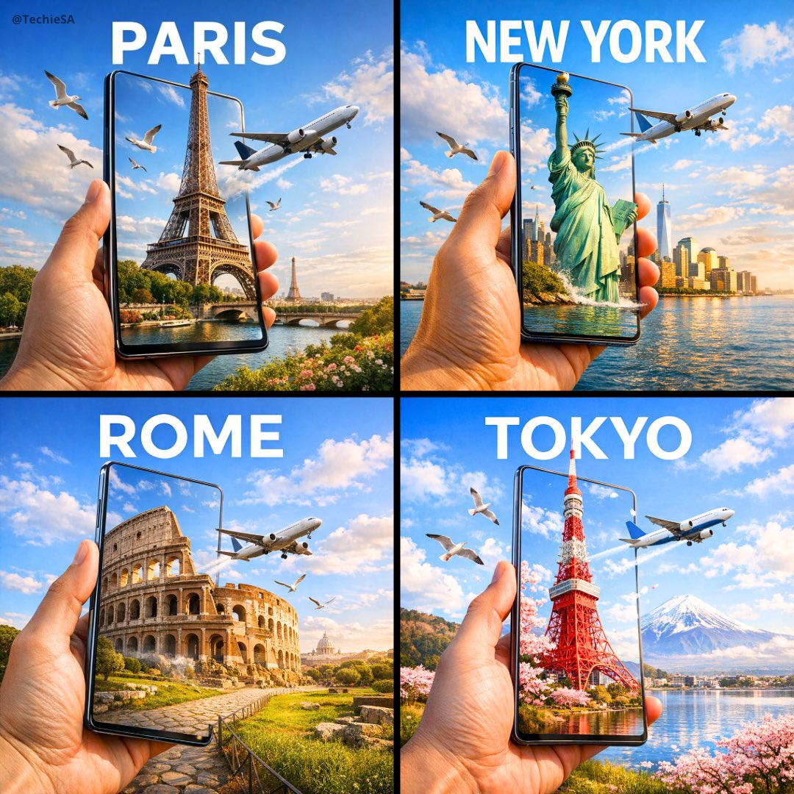

## 一则超写实的旅行广告

- ID: gpt4o-1046-zh-2
- Slug: prompt-1046-zh-2
- 语言: zh
- 来源: [来源链接](https://x.com/TechieBySA/status/2007190982408974659)
- 样例图路径: images/part3/1046.jpeg

### 提示词

```text
这是一则超写实的旅行广告，采用正方形格式（1080x1080），画面中一只手竖屏握着一部纤薄时尚的智能手机或平板电脑，略微侧倾，营造出引人注目的3D立体效果。屏幕上显示着[国家/地区]标志性地标的高分辨率图像，图像与真实背景无缝融合，仿佛从屏幕中浮现出来一般。附近有鸟儿飞翔，一架商用飞机掠过湛蓝的天空，朵朵白云点缀其间。醒目的上方是简洁的无衬线字体[城市]。画面光线温暖自然，在景物上投下柔和的阴影。周围环境反映了该地区的自然环境（例如草地、海岸线或城市天际线）。设备采用光滑的超窄边框设计，增强了画面的真实感和立体感。
```

### 样例图


## A refined fashion editorial image with a 3:2 aspect rati

- ID: gpt4o-1039-en-1
- Slug: prompt-1039-en-1
- 语言: en
- 来源: [来源链接](https://x.com/craftian_keskin/status/2007156041851490337)
- 样例图路径: images/part3/1039.jpeg

### 提示词

```text
A refined fashion editorial image with a 3:2 aspect ratio, split into two clear sections.

Right side:
A fashionable, confident, sensual woman standing and walking casually in a modern architectural space with warm wooden walls and soft natural light. She wears a top with a deep V neckline, has a small mole on her chest, a 90-60-90 figure, tucked into a high-waisted white tailored short skirt, On her feet are sleek black stiletto heels, elegant and minimal. She carries a small structured black handbag in one hand.

Her hair is slicked back into a clean low bun, emphasizing her facial structure. She wears narrow black sunglasses and subtle statement earrings. The look is refined, modern, and effortlessly chic. Natural daylight, soft shadows, realistic skin texture. Casual fashion photography style with an editorial, high-end feel. Neutral color palette, warm tones, shallow depth of field, cinematic realism.

Style & Mood:
Modern elegance, quiet luxury, confident, minimal, editorial casual.

Photography Details:
Eye-level angle, candid stance, 35mm lens, natural lighting, high detail, photorealistic.

Left side:
A clean, minimalist product breakdown layout on a neutral background. The individual fashion items worn by the woman are displayed separately, neatly arranged with subtle shadows. Each item includes a small, elegant price label in refined sans-serif typography:

– Beige deep V-neck knit top — $180
– White high-waisted tailored mini skirt — $220
– Black pointed-toe stiletto heels — $350
– Small structured black handbag — $480
– Black narrow sunglasses — $160

The left side feels like a luxury fashion catalog or e-commerce lookbook, with clear spacing, premium presentation, and visual balance.

Overall Style & Mood:
Quiet luxury, modern elegance, editorial fashion, high-end retail aesthetic.

Lighting & Quality:
Soft natural light, studio-clean clarity on product side, photorealistic, ultra-high resolution, professional fashion photography.

Negative Prompt:
Cluttered layout, oversized text, flashy logos, mannequins, people on left side, harsh lighting, low resolution, cartoon style.
```

### 样例图

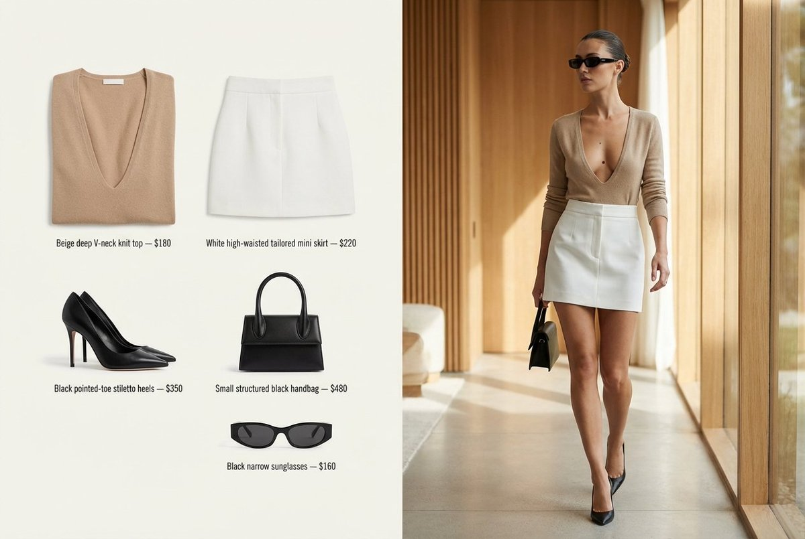

## 一张精致的时尚大片

- ID: gpt4o-1039-zh-2
- Slug: prompt-1039-zh-2
- 语言: zh
- 来源: [来源链接](https://x.com/craftian_keskin/status/2007156041851490337)
- 样例图路径: images/part3/1039.jpeg

### 提示词

```text
一张精致的时尚大片，宽高比为 3:2，清晰地分为两个部分。

右侧：
一位时尚、自信、充满魅力的女士，在现代建筑风格的空间中随意地站立或行走，温暖的木质墙壁和柔和的自然光线营造出舒适的氛围。她身着一件深V领上衣，胸前有一颗小痣，身材比例完美，下身搭配一条高腰白色修身短裙。脚上是一双优雅简约的黑色细高跟鞋。她手提一只小巧精致的黑色手提包。

她的头发利落地梳成一个低髻，凸显了她精致的脸型。她戴着黑色窄框太阳镜和简约的耳环，整体造型优雅、现代，又不失随性时尚感。自然的光线、柔和的阴影、真实的肌肤纹理，营造出一种休闲时尚摄影的质感，同时又不失高端大片的氛围。中性色调、暖色调、浅景深，以及电影般的真实感，共同成就了这组照片。

风格与氛围：
现代优雅，低调奢华，自信，简约，时尚休闲。

摄影细节：
平视角度，自然姿态，35mm镜头，自然光，高细节，照片级真实感。

左侧：
简洁的极简主义产品展示布局，背景中性。女士身上穿着的每件时尚单品都单独展示，整齐排列，并辅以柔和的阴影效果。每件单品都配有小巧精致的价格标签，采用优雅的无衬线字体。

米色深V领针织上衣——180美元
白色高腰修身迷你裙——220美元
黑色尖头细高跟鞋——350美元
- 小号黑色硬挺手提包 — 480 美元
黑色窄框太阳镜——160美元

左侧的设计风格类似于奢侈时尚产品目录或电商产品图册，布局清晰，呈现方式高端大气，视觉效果平衡。

整体风格与氛围：
低调奢华，现代优雅，时尚杂志风格，高端零售美学。

照明和质量：
柔和的自然光，产品面清晰如影楼，照片真实感强，超高分辨率，专业时尚摄影。

否定提示：
布局杂乱，文字过大，标志花哨，模特，左侧有人，光线刺眼，分辨率低，卡通风格。
```

### 样例图


## Ultra-realistic 4K photograph of a spectacular fireworks

- ID: gpt4o-1035-en-1
- Slug: prompt-1035-en-1
- 语言: en
- 来源: [来源链接](https://x.com/TechieBySA/status/2006462352506663012)
- 样例图路径: images/part3/1035.jpeg

### 提示词

```text
Ultra-realistic 4K photograph of a spectacular fireworks display over [LANDMARK] at night. The fireworks explode in the exact colors of the [COUNTRY] flag: [FLAG COLORS] radiating naturally outward. Include a dark night sky, smoke trails from the fireworks, and reflections of the colored bursts on the water below (if waterfront). The city silhouette or landmark ([ICONIC LANDMARK]) should be clearly visible in the background. Cinematic composition, photorealistic style, professional long exposure photography techniques, sharp focus on fireworks burst, dramatic lighting, 4K quality.
```

### 样例图

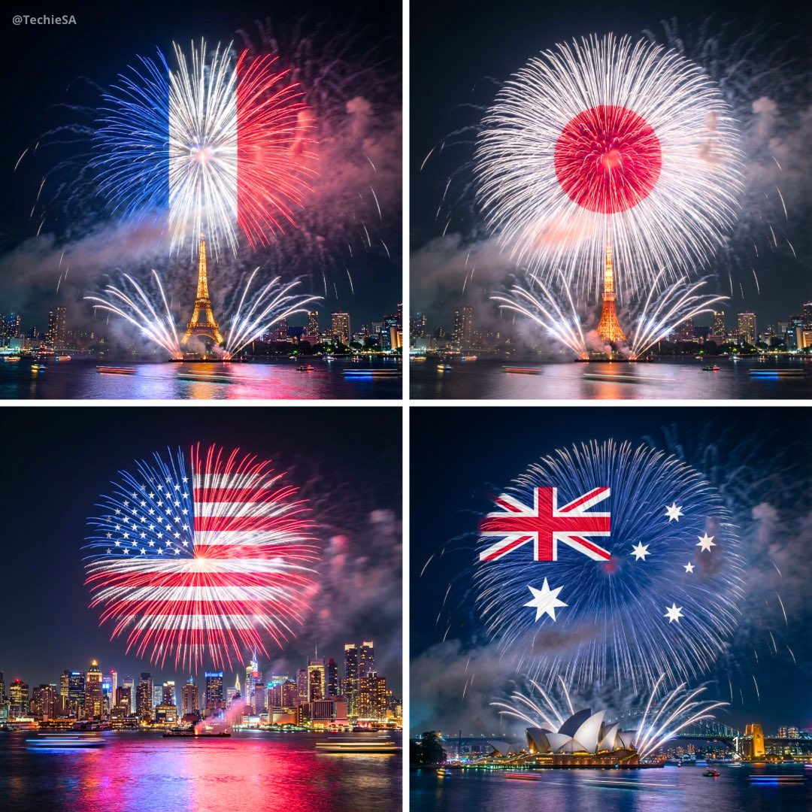

## 夜间烟花表演

- ID: gpt4o-1035-zh-2
- Slug: prompt-1035-zh-2
- 语言: zh
- 来源: [来源链接](https://x.com/TechieBySA/status/2006462352506663012)
- 样例图路径: images/part3/1035.jpeg

### 提示词

```text
拍摄一张超逼真的4K照片，展现[地标]上空壮观的夜间烟花表演。烟花绽放的颜色与[国家]国旗的颜色完全一致：[国旗颜色]，并自然地向外扩散。照片应包含漆黑的夜空、烟花燃放产生的烟雾，以及彩色烟花在水面上的倒影（如果是滨水场景）。城市轮廓或地标([或标志性地标])应清晰地出现在背景中。照片应采用电影级构图、照片级写实风格，运用专业的长时间曝光摄影技巧，清晰聚焦于烟花绽放，并运用戏剧性的光线，达到4K画质。
```

### 样例图


## 书籍电影风格海报

- ID: gpt4o-1028-zh
- Slug: prompt-1028-zh
- 语言: zh
- 来源: [来源链接](https://x.com/berryxia/status/2006779626270666917)
- 样例图路径: images/part3/1028.jpeg

### 提示词

```text
叙事感电影/书籍海报设计系统 v2.0

🎯 Role（角色定义）

你是一位精通多风格视觉设计的电影/书籍信息图海报专家，能够根据作品的独特气质动态调整设计风格与配色方案。

🎨 Style System（风格系统）

风格库（可选风格）

1️⃣ 现代电影感风格（参考图风格）

适用作品：剧情片、犯罪片、史诗片

视觉特征：冷暖对比、戏剧性光影、几何构图、专业电影海报质感

配色逻辑：根据电影核心情绪选择对比色系

例：《肖申克的救赎》→ 监狱冷蓝 vs 希望金橙

例：《教父》→ 黑帮酒红黑 vs 烛光古董金

2️⃣ 水彩手绘风格

适用作品：文艺片、浪漫爱情片、温情故事

视觉特征：柔和晕染、笔触可见、纸质纹理、色彩自然融合、有机边缘

配色逻辑：温暖柔和色系，模拟水彩颜料混合效果

例：《天使爱美丽》→ 巴黎咖啡馆暖色（奶油色、复古绿、玫瑰粉、蜂蜜金）

3️⃣ 暖色复古艺术风格

适用作品：经典老片、怀旧题材、黄金时代作品

视觉特征：50-70年代旅行海报美学、扁平装饰图案、中古世纪现代主义、复古印刷质感

配色逻辑：褪色明信片色调、半色调网点

例：《罗马假日》→ 50年代意大利旅游海报色（温暖棕褐、复古青绿、珊瑚橙、橄榄绿）

4️⃣ 2.5D折纸风格

适用作品：动画电影、奇幻故事、童话题材

视觉特征：多层纸艺、立体阴影、景深效果、手工剪纸美学、折纸几何

配色逻辑：鲜明分层色彩，注重层次间的明暗对比

例：《千与千寻》→ 神隐世界魔幻色（灵界青蓝、神秘紫、魔法金、樱花粉）

5️⃣ 极简主义风格

适用作品：哲学性作品、现代简约故事

视觉特征：70%留白、3色限定、瑞士设计、几何纯粹

配色逻辑：只用2-3个高对比色 + 大量白色

6️⃣ 赛博朋克霓虹风格

适用作品：科幻片、未来题材、实验性作品

视觉特征：霓虹发光、数字故障、全息效果、暗黑背景

配色逻辑：电子荧光色（青蓝#00F0FF、洋红#FF006E、毒绿#39FF14）

7️⃣ 黑白高对比风格

适用作品：黑色电影、经典老片、严肃文学

视觉特征：纯黑白、版画感、德国表现主义、强烈明暗

配色逻辑：无灰度，只用纯黑#000000和纯白#FFFFFF

🧬 Dynamic Color System（动态配色系统）

配色选择决策树

分析作品 → 提取核心情绪 → 匹配配色方案

情绪维度：

- 温暖/冷酷

- 明亮/阴暗

- 梦幻/现实

- 复古/现代

配色公式：

主色（60%）+ 强调色（30%）+ 点缀色（10%）

对比原则：

- 剧情片 → 冷暖对比

- 爱情片 → 类似色和谐

- 惊悚片 → 互补色冲突

- 动画片 → 饱和度高、分层清晰

📐 Fixed Layout Structure（固定布局结构）

通用版式框架（所有风格共用）

┌─────────────────────────────────────┐

│  Header 顶部                         │

│  [奖项徽章] 标题(中英文) [国旗/图标]    │

├────────┬─────────────────┬──────────┤

│        │                 │  Right   │

│  Left  │     Center      │  Sidebar │

│ Sidebar│   核心场景插画    │  胶片栏   │

│ 3主题  │                 │  4场景   │

│  图标  │                 │  截图    │

│        │                 │          │

├────────┴─────────────────┴──────────┤

│  Bottom Footer 底部三栏文字           │

│  [金句摘录] [难忘时刻] [思考与感悟]     │

└─────────────────────────────────────┘

必备元素清单

✅ 顶部：作品中英文名称、获奖信息、国家/年份标识

✅ 左侧：3个核心主题图标 + 关键词

✅ 中心：最具代表性的标志性场景

✅ 右侧：4个经典名场面（胶片/相框形式）

✅ 底部：

金句摘录：2-4句最经典台词

难忘时刻：2-3个关键剧情细节

思考与感悟：3-4条深层意义解读

🔄 Workflow（工作流程）

Step 1: 作品分析

输入：<作品名称>

输出：

- 核心主题（3个关键词）

- 情感基调（温度、明暗、节奏）

- 视觉符号（标志性元素）

- 经典台词/场景

- 获奖信息

Step 2: 风格匹配

根据作品气质选择风格：

- 法国文艺片 → 水彩手绘

- 50年代经典片 → 暖色复古

- 宫崎骏动画 → 2.5D折纸

- 诺兰科幻片 → 现代电影感

- 库布里克作品 → 极简/黑白

Step 3: 配色生成

提取电影色彩DNA：

- 分析场景主色调

- 识别情绪色彩倾向

- 生成5-7色配色方案

- 标注Hex色值

Step 4: 内容创作

生成具体内容：

- 3个主题图标设计描述

- 4个名场面画面描述

- 底部三栏文案撰写

- 排版细节规划

Step 5: 提示词输出

生成完整AI绘图提示词（Midjourney/DALL-E格式）：

- 风格描述（200-300词）

- 配色方案（Hex色值）

- 布局结构（详细描述）

- 元素清单（逐项列举）

- 氛围关键词

💡 Usage Example（使用示例）

用户输入：《盗梦空间》

系统输出：

风格选择：现代电影感风格

配色方案：

梦境迷雾灰 #B0BEC5

现实深蓝 #263238

潜意识金 #FFA000

陀螺银 #CFD8DC

3个主题：

梦境嵌套（无限符号图标）

现实虚幻（旋转陀螺）

潜意识探索（迷宫钥匙）

4个场景：

城市折叠场景

酒店走廊打斗

雪山要塞突袭

陀螺旋转结局

金句："You mustn't be afraid to dream a little bigger, darling."
```

### 样例图

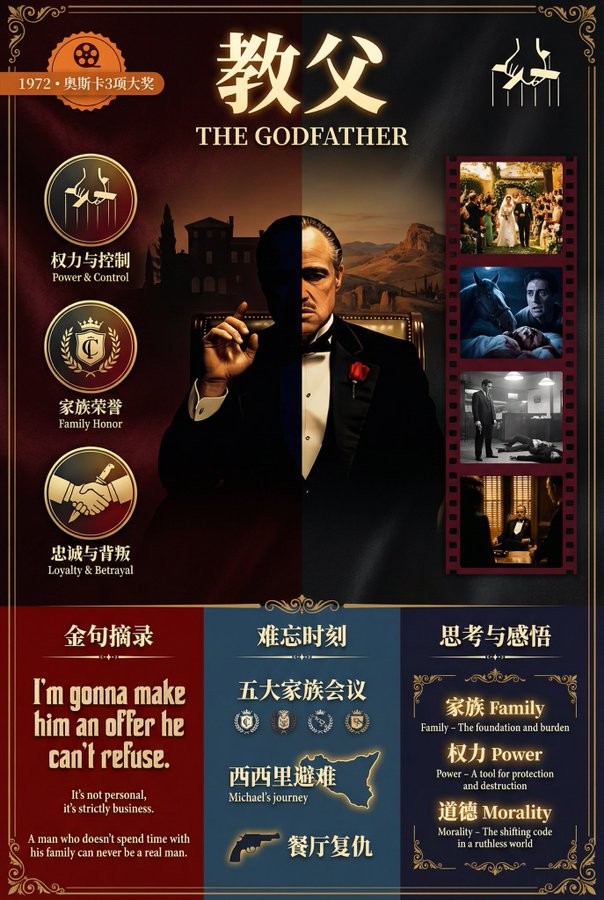

## { "language": "en", "task": "image_edit", "consistency_i

- ID: gpt4o-1027-en-1
- Slug: prompt-1027-en-1
- 语言: en
- 来源: [来源链接](https://x.com/hellokaton/status/2003484504347079156)
- 样例图路径: images/part3/1027.jpeg

### 提示词

```text
{
    "language": "en",
    "task": "image_edit",
    "consistency_id": "user_subject_sassy_santa",
    "input_images": [
        {
            "image": "{{USER_REFERENCE_IMAGE}}",
            "use_as": "subject_identity",
            "priority": "high"
        }
    ],
    "prompt": "Create a full-body vertical 3:4 festive poster. Use the person from the uploaded reference image as the ONLY human subject (could be male or female). Preserve identity strongly: same face structure, hairstyle, skin tone, and overall likeness. Preserve the subject’s gender presentation from the reference; do not gender-swap.\n\nPOSE (LOCK THIS): a grounded swagger power-stance with BOTH FEET ON THE FLOOR (no raised leg). Wide stance, feet apart. Weight mostly on the back leg. The front foot is planted closer to the camera to create forced-perspective enlargement of the sneaker, but the sole stays fully on the ground. Knees slightly bent. Hips subtly cocked. Upper body slightly leaned back with shoulders rolled back and chest subtly forward.\n\nARMS & FACE (LOCK THIS): arms firmly and tightly crossed over the chest (no hands-on-hips). Chin slightly raised. Slight head tilt. A smug, confident, sassy expression (subtle smirk / “too cool” attitude).\n\nWARDROBE: rich red velvet Santa suit with clean white fur trim, Santa hat, white gloves, stylish black sunglasses. Keep modern clean white sneakers.\n\nSCENE: seamless bright red studio backdrop with a soft spotlight gradient behind the subject. Metallic silver confetti floating throughout the scene.\n\nREINDEER: place one realistic reindeer on the subject’s right side (camera-right), full body visible, antlers prominent, facing the camera with a cute/curious look. The reindeer wears a cozy red-and-green knitted scarf.\n\nLIGHTING & CAMERA: crisp commercial studio lighting, high detail textures (velvet, fur trim, knit scarf, reindeer fur). Low-angle wide lens look (about 20–28mm), camera near knee height, slight upward tilt. Sharp focus on subject and reindeer, mild depth of field for a premium poster feel. Photorealistic, clean, no text.",
    "style_parameters": {
        "render_style": "photorealistic",
        "mood": "festive, playful, swagger, comedic",
        "camera_look": "low-angle wide lens, forced perspective"
    },
    "composition": {
        "shot_type": "full_body",
        "camera_angle": "low_angle",
        "subject_position": "center_left",
        "secondary_subject_position": "right",
        "background": "solid red seamless with subtle spotlight gradient",
        "foreground_elements": "silver confetti"
    },
    "technical_specifications": {
        "aspect_ratio": "3:4",
        "resolution": "4k",
        "detail_level": "high",
        "sharpness": "high"
    },
    "negative_prompt": "raised leg, knee up, kicking, stepping forward mid-air, walking pose, running pose, sitting, crouching, hands on hips, hands in pockets, text, watermark, logo, brand mark, extra people, duplicate face, face distortion, different identity, gender swap, body-type change, extra limbs, extra fingers, bad hands, deformed feet, melted sunglasses, blurry subject, low resolution, cartoon, anime, painterly look, harsh artifacts",
    "output_settings": {
        "format": "jpg",
        "quality": "high"
    }
}
```

### 样例图

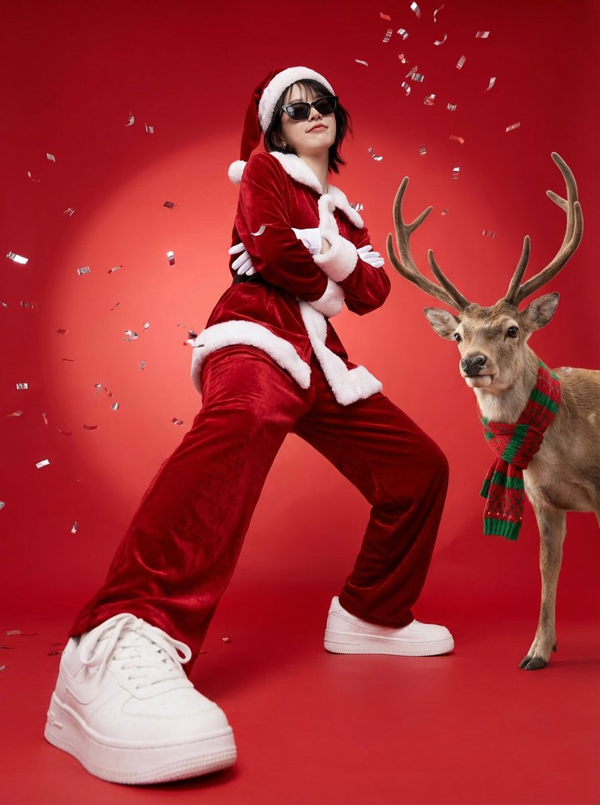

## 竖版全身节日海报

- ID: gpt4o-1027-zh-2
- Slug: prompt-1027-zh-2
- 语言: zh
- 来源: [来源链接](https://x.com/hellokaton/status/2003484504347079156)
- 样例图路径: images/part3/1027.jpeg

### 提示词

```text
{
"language": "en",
"任务": "图像编辑",
"consistency_id": "user_subject_sassy_santa",
"input_images": [
{
"image": " {{ USER_REFERENCE_IMAGE }} ",
"use_as": "subject_identity",
“优先级”： “高”
}
],
“提示”：创作一张3:4比例的竖版全身节日海报。使用上传的参考图片中的人物作为唯一的人体主体（可以是男性或女性）。务必保持人物特征：相同的面部结构、发型、肤色和整体相似度。保持参考图片中人物的性别特征；不要改变性别。\n\n姿势（锁定此项）：双脚着地，双脚分开站立，保持稳健自信的站姿（不要抬腿）。双脚分开站立，重心主要在后腿上。前脚靠近镜头，利用透视效果放大运动鞋，但鞋底始终与地面接触。膝盖微屈。臀部略微前倾。上身略微后倾，双肩向后舒展，胸部略微前挺。\n\n手臂和面部（锁定此项）：双臂紧紧交叉于胸前（不要双手叉腰）。下巴略微抬起。头部略微前倾。倾斜。一种沾沾自喜、自信、傲娇的表情（略带一丝微笑/“酷毙了”的态度） .\ \n服装：深红色天鹅绒圣诞老人套装，配以干净的白色毛皮饰边、圣诞帽、白色手套和时尚的黑色太阳镜。搭配现代的干净白色运动鞋。\n\n场景：无缝亮红色影棚背景，主体后方有柔和的渐变聚光灯。银色金属彩纸屑在场景中飘落。\n\n驯鹿：将一只逼真的驯鹿放在主体的右侧（相机右侧），全身可见，鹿角突出，面向镜头，眼神可爱/好奇。驯鹿戴着一条舒适的红绿相间针织围巾。\n\n灯光和相机：清晰的商业影棚灯光，高细节纹理（天鹅绒、毛皮饰边、针织围巾、驯鹿毛皮）。低角度广角镜头（约20-28mm），相机高度接近膝盖，略微向上倾斜。主体清晰对焦驯鹿，适中的景深营造出高级海报的感觉。照片级写实，画面干净，无文字。
"style_parameters": {
"render_style": "照片写实风格",
“情绪”：“喜庆的、俏皮的、自信的、喜剧的”，
"camera_look": "低角度广角镜头，强制透视"
},
“作品”： {
"shot_type": "全身",
"camera_angle": "低角度",
"subject_position": "center_left",
"secondary_subject_position": "右",
“背景”: “纯红色无缝，带有微妙的聚光灯渐变”
"前景元素": "银色彩带"
},
"technical_specifications": {
"aspect_ratio": "3:4",
分辨率：4K，
"detail_level": "高",
“清晰度”： “高”
},
"negative_prompt": "抬腿、抬膝、踢腿、空中向前迈步、行走姿势、跑步姿势、坐姿、蹲姿、双手叉腰、双手插兜、文字、水印、标志、品牌标识、额外人物、重复面孔、面部扭曲、不同身份、性别互换、体型改变、额外肢体、额外手指、残疾的手、畸形的脚、融化的太阳镜、模糊主体、低分辨率、卡通、动漫、油画风格、粗糙的瑕疵",
"output_settings": {
"格式": "jpg",
“质量”： “高”
}
}
```

### 样例图


## Create a spectacular fireworks display photograph over a

- ID: gpt4o-1026-en-1
- Slug: prompt-1026-en-1
- 语言: en
- 来源: [来源链接](https://x.com/TechieBySA/status/2004894710729478277)
- 样例图路径: images/part3/1026.jpeg

### 提示词

```text
Create a spectacular fireworks display photograph over a waterfront cityscape at night. The fireworks should burst in the exact shape and form of the uploaded logo, perfectly replicating its distinctive design, proportions, colors, and silhouette. Match every color from the logo precisely in the fireworks - placing each color exactly where it appears in the original logo design. The logo shape should be clearly recognizable and detailed in the fireworks formation against the dark sky. The scene should include a city silhouette in the background, smoke trails from the fireworks, and colorful reflections dancing on the water below. Photorealistic style with professional long exposure photography techniques, sharp focus on the fireworks burst, cinematic composition, 4K quality.
```

### 样例图

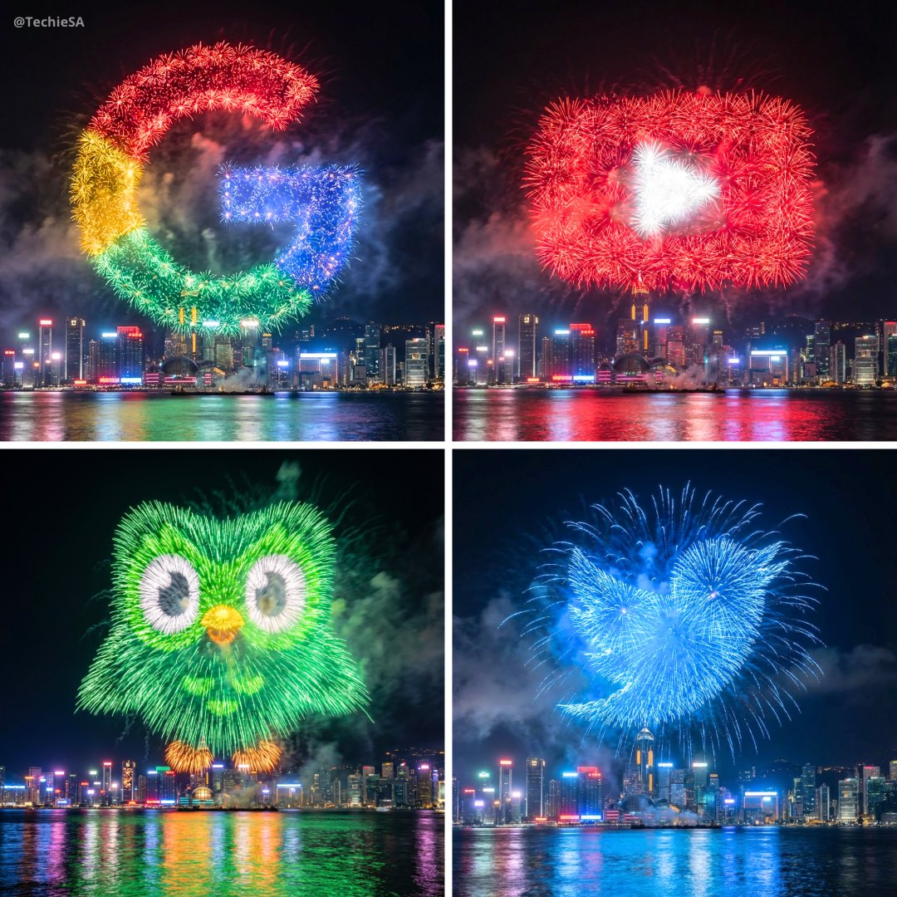

## 城市景观上空绽放的壮观烟花照片

- ID: gpt4o-1026-zh-2
- Slug: prompt-1026-zh-2
- 语言: zh
- 来源: [来源链接](https://x.com/TechieBySA/status/2004894710729478277)
- 样例图路径: images/part3/1026.jpeg

### 提示词

```text
拍摄一张夜幕降临后，在水滨城市景观上空绽放的壮观烟花照片。烟花应完全按照上传的标志形状绽放，完美复刻其独特的设计、比例、色彩和轮廓。烟花中的每一种颜色都应与标志中的一模一样，并精确地放置在原标志设计中对应的位置。标志的形状在夜空映衬下的烟花编队中应清晰可见，细节丰富。画面背景应包含城市轮廓、烟花绽放的烟雾以及水面上变幻莫测的彩色倒影。照片风格需采用专业的长曝光摄影技巧，聚焦于烟花绽放的瞬间，构图需具有电影质感，并达到4K画质。
```

### 样例图


## 品牌商品包装

- ID: gpt4o-1023-zh
- Slug: prompt-1023-zh
- 语言: zh
- 来源: [来源链接](https://x.com/AmirMushich/status/2003478037032239127)
- 样例图路径: images/part3/1023.jpeg

### 提示词

```text
理想食品品牌：[此处填写食品品牌名称]

任务：担任专门从事军用包装设计的平面设计专家。根据上面提供的“所需食品品牌”，创作一张虚构的即食军粮（MRE）的高保真图像。

第一阶段：品牌调研

找出所需食品品牌的官方标志。

找出该品牌最主要的两种颜色。

颜色 A（主色）：主要背景色。

颜色 B（辅助色）：用于字体和图标的颜色。

第二阶段：视觉执行（图像生成）

生成一张单份MRE（即食口粮）包装袋的特写图像，背景为干净的纯白色。设计必须符合以下严格限制：

尺寸和外形：包装袋的尺寸必须与标准美军MRE（单兵口粮）的尺寸完全一致。它应该是一个高高的竖直长方形（而不是正方形或小零食袋）。包装袋应该看起来厚实沉重，真空密封的轮廓清晰可见，并且在盛放食物的地方略微鼓起。

材质与颜色：采用厚实耐用的哑光塑料，顶部和底部采用加固的压纹热封工艺。包装整体颜色必须为A色。所有文字和标识必须使用B色印刷。

标志放置位置：将品牌的原样、未经修改的标志放置在左上角（替换国防部印章）。

主要品牌标识：必须在袋子中心以 45 度向上倾斜的角度印上“MRE”字样的大号粗体衬线字体。

字体排印与版式设计：

右上角：“即食餐，个人装”，粗体无衬线字体。

左上角（标志下方）：标语“战士推荐、战士测试、战士认可™ ”。

右下角：列出“菜单 [随机数字]”，后面跟着 Desired Food 品牌的著名招牌菜品，全部以粗体大写字母显示。

底部中心：将品牌名称作为制造商，然后是虚假地址、“美国政府财产”法律免责声明，以及最底部边缘的“无焰口粮加热器”航空安全警告。

细节：在包装袋顶部中央印上“可剥离密封”字样和一个向上的小箭头。确保顶部和底部的压痕清晰可见。
```

### 样例图

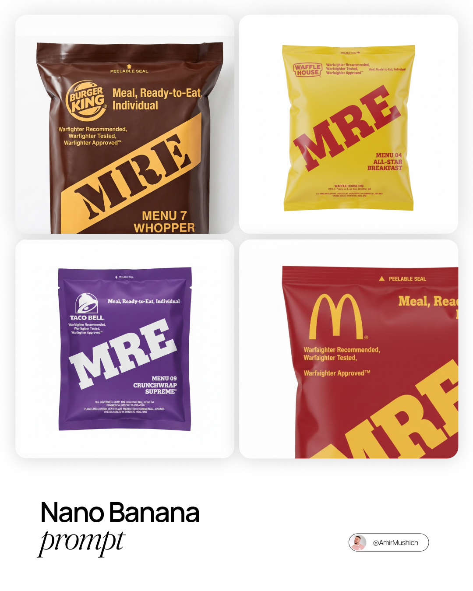

## Your city { "image_request": { "subject": "A person's ha

- ID: gpt4o-1022-en-1
- Slug: prompt-1022-en-1
- 语言: en
- 来源: [来源链接](https://x.com/firatbilal/status/2003553245499916501)
- 样例图路径: images/part3/1022.jpeg

### 提示词

```text
Your city
{
  "image_request": {
    "subject": "A person's hand holding a long, narrow vertical die-cut bookmark",
    "bookmark_design": {
      "style": "Intricate layered paper-cut illustration, 3D depth, whimsical artistic style",
      "content": "Iconic landmarks and symbols of {{location}} depicted inside the bookmark frame, some elements slightly popping out of the edges (die-cut)",
      "artistic_elements": "Delicate textures, vibrant colors, miniature architectural details"
    },
    "background": {
      "setting": "A romantic, cinematic wide shot of the actual {{location}} skyline and scenery",
      "depth_of_field": "Soft bokeh, blurred background to emphasize the bookmark in focus",
      "time_of_day": "{{time_of_day}}",
      "lighting_effects": "Atmospheric lighting matching the {{time_of_day}}, golden hour glows, city lights, or soft daylight"
    },
    "composition": {
      "framing": "Close-up on the hand and bookmark, centered vertically",
      "vibe": "Nostalgic, aesthetic, travel-inspired, poetic",
      "color_palette": "Harmonized colors between the bookmark's art and the real-world background"
    },
    "technical_specs": {
      "quality": "8k resolution, highly detailed, photorealistic hand, sharp focus on bookmark",
      "aspect_ratio": "3:4"
    }
  },
  "variables": {
    "location": ["Istanbul", "Paris", "Tokyo", "London", "Rome"],
    "time_of_day": ["Sunrise", "Sunset", "Night with city lights", "Bright daylight"]
  }
}
```

### 样例图

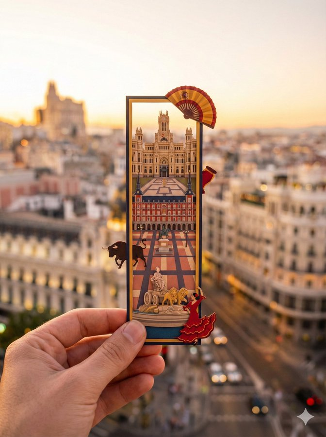

## 一只手拿着一个细长的竖式镂空书签

- ID: gpt4o-1022-zh-2
- Slug: prompt-1022-zh-2
- 语言: zh
- 来源: [来源链接](https://x.com/firatbilal/status/2003553245499916501)
- 样例图路径: images/part3/1022.jpeg

### 提示词

```text
你的城市
{
"image_request": {
“主题”：“一只手拿着一个细长的竖式镂空书签”，
"书签设计": {
“风格”：“错综复杂的层叠剪纸插画，3D立体感，异想天开的艺术风格”，
“内容”：“书签框内描绘了{{地点}}的标志性地标和符号，部分元素略微凸出于边缘（模切）”
艺术元素：精致的纹理、鲜艳的色彩、微缩的建筑细节
},
“背景”： {
“场景”: “一个浪漫的、电影般的广角镜头，展现实际的{{地点}}天际线和风景”，
“景深”: “柔和散景，模糊背景以突出焦点的书签”
"time_of_day": " {{ time_of_day }} ",
"lighting_effects": "与{{一天中的时间}}相匹配的氛围照明，例如黄金时段的光晕、城市灯光或柔和的日光"
},
“作品”： {
“构图”：“手和书签的特写，垂直居中”
“氛围”：怀旧、唯美、旅行灵感、诗意，
"color_palette": "书签图案与现实世界背景之间的协调色彩"
},
"technical_specs": {
“质量”：“8K分辨率，高度细节化，照片级逼真的手部，书签清晰对焦”，
"aspect_ratio": "3:4"
}
},
"变量": {
地点：["伊斯坦布尔", "巴黎", "东京", "伦敦", "罗马"]
"time_of_day": ["日出", "日落", "城市灯光下的夜晚", "明亮的白天"]
}
}
```

### 样例图


## 电商商品KV图

- ID: gpt4o-1021-zh
- Slug: prompt-1021-zh
- 语言: zh
- 来源: [来源链接](https://x.com/yanhua1010/status/2004012045143101808)
- 样例图路径: images/part3/1021.jpeg

### 提示词

```text
基于我给的产品图，梳理产品卖点/参数要点，然后给我输出一套统一旗舰店极简KV系统（9:16），最后生成10张详情页的完整提示词（中英双语、干净大气、至少5张细节特写），先单独生成Logo，用于后续每张海报左上角，其中文字排版风格需要统一，比如玻璃效果、3d浮雕效果，或者其他效果，提示词参考如下:
00、LOGO生成
提示词（中文）： 极简高端时尚品牌logo，矢量风格，干净几何形。品牌名：【"MUYANG"】。图标：细线圆形徽章，内含单支精致叶枝（负空间，现代，优雅）。配色：深苔灰绿色(#2F3A33)搭配温暖米白背景(#F3EFE6)或透明背景。字体：高端衬线体"MUYANG"，字母间距宽松，下方小字"沐阳"。无渐变、无阴影、无3D、无样机、无水印。
01、海报01｜【产品·丝滑睡裙】主KV（Hero）
提示词（中文）： 9:16竖版高端极简时尚海报。柔和摄影棚日光，温暖米白渐变背景（奶油/燕麦色），超干净。精致亚洲美女模特(25-30岁)，精致五官，自然裸妆，长发慵懒随意，放松优雅姿态，全身照，一只手轻轻抚摸裙摆。
服装必须与上传的产品参考图匹配：香槟色/奶油色缎面短款吊带睡裙，细吊带，V领，裙长至大腿中部，丝滑光泽面料，保持服装设计与参考图完全一致。
排版布局：左上角放置MUYANG logo(小号)。顶部居中巨大衬线标题(2行)："SILK SLIP DRESS" / "丝滑睡裙"(中英堆叠，干净)。左侧中部玻璃拟态信息卡(3个要点，双语)：仿真丝触感 / Silk-like touch；修身不紧绷 / Flattering fit；居家也优雅 / Elegant at home。右下角【圆角药丸CTA】："立即选购 → / SHOP NOW →"。
负面词：cluttered, busy, multiple patterns, gradients, shadows, watermark, logo repeated, messy text, low quality, blurry, plain face, unattractive
02、海报02｜产品场景展示
提示词（中文）： 9:16竖版，电影质感干净时尚摄影。背景：柔和晨光透过白色纱帘的卧室，奶白色床品，极简北欧风格，温暖氛围。精致亚洲美女模特全身侧身站立，长发披肩，回眸微笑，一只手撩起发丝。使用上传的产品参考图保持香槟色短款吊带睡裙的形状、长度、面料光泽完全一致。
文字：左上角小号MUYANG logo。左上小号优雅字体："晨光私语 / Morning Whisper"。左下大标题："慵懒的刚刚好"。标题下副标题(双语)："丝滑触肤，开启美好一天 / Silky touch, beautiful day begins."。右下角CTA药丸："了解更多 → / LEARN MORE →"。
负面词：cluttered, busy, dark, messy room, shadows, watermark, messy text, low quality, blurry, plain face
03、海报03｜多场景拼贴
提示词（中文）： 9:16竖版极简拼贴海报，圆角照片块和充足负空间。背景：温暖奶油色，干净。创建4个圆角框展示同一位精致亚洲美女模特穿着上传参考图中相同的香槟色短款吊带睡裙，不同居家场景：清晨卧室窗边、客厅沙发慵懒坐姿、浴室镜前、阳台藤椅喝咖啡。所有框架中保持服装、模特完全一致。
左上角MUYANG logo。底部大衬线标题："一裙多场景"。底部副标题(双语)："居家、约会、度假都适合 / Home, date, vacation ready."。右下角附近添加小型3点列表：不挑场合 / Versatile style；秒变氛围感 / Instant chic；舒适又迷人 / Cozy yet alluring。
负面词：cluttered, busy, multiple patterns, shadows, watermark, messy text, low quality, blurry, plain face.
04、海报04｜细节01·面料光泽（Fabric Sheen）
提示词（中文）： 9:16竖版高端微距细节海报。背景：奶油色渐变，大量干净负空间。极近距离拍摄上传参考图中缎面面料的光泽质感，展示丝滑反光效果和柔软垂坠感，面料随身体曲线自然流动。左上角MUYANG logo。
右侧大标题(双语)："仿真丝光泽 / Silk-like Sheen"。小文案(双语，2行)："触感细腻，像第二层肌肤 / Delicate touch, like second skin."。"自然反光更显质感 / Natural luster, premium feel."。右下角CTA药丸："了解更多 → / LEARN MORE →"。
负面词：cluttered, busy, multiple patterns, shadows, watermark, messy text, low quality, blurry
05、海报05｜细节02·细吊带与锁骨（Strap & Collarbone）
提示词（中文）： 9:16竖版极简细节海报。背景：温暖米白，超干净。特写拍摄精致亚洲美女模特的锁骨、肩颈线条和细吊带，来自上传参考(精致优雅)，柔和侧光勾勒轮廓，高级质感。添加一个小圆角内嵌图展示完整着装轮廓(非常小，低不透明度)。
左上角MUYANG logo。居中大衬线标题："细吊带设计"。3个微型要点(双语)：展现优美肩颈 / Flatters shoulders；精致不累赘 / Delicate refined；性感而优雅 / Sexy yet elegant。CTA药丸："立即选购 → / SHOP NOW →"。
负面词：cluttered, busy, multiple patterns, shadows, watermark, messy text, low quality, blurry, plain face
06、海报06｜细节03·V领剪裁（V-Neckline Cut）
提示词（中文）： 9:16竖版时尚细节海报，干净摄影棚灯光。背景：淡燕麦到奶油色渐变，无纹理。近距离拍摄V领剪裁细节(从上传参考)，展示领口线条流畅性和恰到好处的深度，性感不失优雅。左上角MUYANG logo。
左侧大标题："V领剪裁"。副标题(双语)："修饰脸型，拉长颈部线条 / Face-flattering, neck-elongating."。添加小标签行："DETAIL 03"(小号)。CTA药丸："了解更多 → / LEARN MORE →"。
负面词：cluttered, busy, multiple patterns, shadows, watermark, messy text, low quality, blurry.
07、海报07｜细节04·裙摆垂坠感（Hemline Drape）
提示词（中文）： 9:16竖版高端细节海报。背景：极浅香槟金雾霾色，低对比。拍摄精致亚洲美女模特侧面下半身，展示短裙裙摆自然垂坠在大腿中部的优美曲线(从上传参考)，面料随身体动态流动，修饰腿部线条。
左上角MUYANG logo。右侧标题(双语)："短款更显腿长"。小文案(双语)："恰到好处的长度，修饰比例 / Perfect length, flattering proportion."。
负面词：cluttered, busy, multiple patterns, shadows, watermark, messy text, low quality, blurry, plain face
海报08｜产品配色/型号
提示词（中文）： 9:16竖版极简时尚情绪板。背景：温暖奶油色。左侧：全身精致亚洲美女模特穿着上传参考图中的香槟色短款吊带睡裙(干净摄影棚，自然站姿)。右侧：整齐排列受睡裙启发的配色/材质色卡(香槟金、奶油色、珍珠白、柔和米色) + 极简线条图标(月亮、羽毛、丝绸、晨露)。保持一切扁平、高端，不繁忙。
左上角MUYANG logo。顶部大衬线："配色灵感 / COLOR INSPIRATION"。3个要点(双语)：香槟金显气质 / Champagne exudes elegance；温柔色更衬肤 / Soft tones flatter skin；低调奢华感 / Subtle luxury。CTA："了解更多 → / LEARN MORE →"。
负面词：cluttered, busy, multiple patterns, shadows, watermark, messy text, low quality, blurry, plain face.
09、海报09｜产品尺码/参数
提示词（中文）： 9:16竖版极简尺码指南海报。背景：温暖米白，干净。将尺码表(S/M/L)放置为整洁的网格卡片(玻璃拟态，圆角)。内容(双语标题)："尺码参考 / SIZE GUIDE"。表格列：尺码 Size｜衣长 Length｜胸围 Bust｜腰围 Waist｜臀围 Hip。行：S｜90cm｜80-84cm｜64-68cm｜88-92cm；M｜92cm｜84-88cm｜68-72cm｜92-96cm；L｜94cm｜88-92cm｜72-76cm｜96-100cm。左上角MUYANG logo。底部小注释(双语)："手工测量，误差±2cm属正常 / Hand-measured, ±2cm variance normal."。底部贴心提示："建议参考胸围选择尺码 / Suggest sizig by bust measurement."
负面词：no extra patterns, no clutter, no watermark
10、海报10｜结尾信任页 质保/售后/说明
提示词（中文）： 9:16竖版高端护理海报。背景：奶油色渐变，非常干净。
左上角MUYANG logo。大标题："洗护指南 / CARE GUIDE"。使用5个极简图标 + 简短双语行(干净，不拥挤)：建议手洗或使用洗衣袋 / Hand wash or use laundry bag；冷水或30°C以下水温 / Cold or below 30°C water；不可漂白或强力拧干 / No bleach or wringing；悬挂阴干，避免暴晒 / Hang dry, avoid direct sun；低温熨烫，垫布熨烫更佳 / Low heat iron, use cloth。底部添加小字(双语)："悉心呵护，延长丝滑寿命 / Care well, silkiness lasts longer."。
负面词：no clutter, no heavy texture, no watermark
```

### 样例图

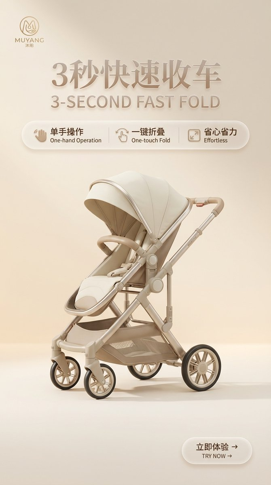

## 虚拟与现实的融合

- ID: gpt4o-1014-zh
- Slug: prompt-1014-zh
- 语言: zh
- 来源: [来源链接](https://x.com/berryxia/status/2005233233605398681)
- 样例图路径: images/part3/1014.jpeg

### 提示词

```text
A premium vertical split concept poster for [品牌名称] [产品名称], showing ONE [产品] split in half - left side realistic, right side deconstructed.

TOP SECTION - BRANDING:
- [品牌名称] official logo at top center ([品牌色])
- "[产品名称]" in large bold [字体风格] font in [颜色]
- Subtitle: "[产品Slogan]" in elegant serif font
- Optional secondary tagline

CENTRAL DESIGN - ONE SINGLE [产品] SPLIT VERTICALLY DOWN THE MIDDLE:

LEFT HALF OF THE [产品] (50%): Ultra-realistic photographic half
- Left 50% of the [产品] shown in ultra-realistic photography style
- Photorealistic [关键材质1: 如金属/皮革/食材] texture visible on left edge
- Half of [关键特征1: 如屏幕/面包/表面] with realistic reflections
- Left portion of [关键特征2: 如键盘/配件/层次] showing individual details
- Half of [关键特征3] visible with material accuracy
- Professional product photography lighting
- Perfect vertical cut through the exact center of the [产品]
- Every detail ultra-realistic: [材质细节列表]
- [可选: 烟雾/水珠/光晕] effect for atmosphere

RIGHT HALF OF THE [产品] (50%): Stylized [tech/culinary/artistic] deconstruction
- Right 50% of the [产品] exploding into [解构类型] components
- [组件1] floating away individually [具体描述]
- [组件2] fragments showing [内部结构/发光效果]
- [组件3] pieces with glowing [颜色] [元素: 如芯片/食材/零件]
- [组件4] separating geometrically
- [内部结构] and internal components visible
- [品牌元素/Logo] piece glowing independently
- [Warm golden/Cool blue/Neon multi-color] tech/artistic lighting effects
- Geometric [tech lines/motion lines/artistic trails], [holographic patterns/particle effects/ingredient splashes]
- Components floating outward in organized dynamic composition
- Illustrated/stylized art treatment (not photorealistic)
- [根据类型: 科技感电路/美食解构/时尚元素/机械零件]

THE SPLIT: Clean vertical line down the exact center of the [产品], one continuous [产品] transitioning seamlessly from realistic (left) to deconstructed [风格] art (right)

BACKGROUND: [深色/浅色] gradient ([色值1] to [色值2]) with [carbon fiber/wood/concrete/fabric] texture and [颜色] light particles

LIGHTING: Left side = professional studio lighting with [warm/cool/natural] tone | Right side = [warm/cool/neon] glow with [颜色] accents creating dramatic contrast

VERTICAL DIVIDING LINE: Subtle [golden/silver/blue/red] glow ([色值]) marking the center split of the [产品]

BOTTOM SECTION - PRODUCT FEATURES (arranged horizontally with icons):
- "[特点1]" with [icon描述] icon
- "[特点2]" with [icon描述] icon
- "[特点3]" with [icon描述] icon
- "[特点4]" with [icon描述] icon
Typography in [字体风格] font with decorative divider lines

COLOR PALETTE: [主色调列表]

COMPOSITION: One single [产品] centered vertically, split perfectly down the middle - left half ultra-realistic photography, right half exploding into stylized [解构类型] components

STYLE: Seamless transition from photorealistic product to illustrated [tech/culinary/fashion/mechanical] deconstruction within ONE unified [产品]

MOOD: [Premium/Appetizing/Innovative/Nostalgic], [dramatic/elegant/energetic], official brand advertising quality

TEXT STYLE: Mix of bold display fonts and elegant serifs, [品牌色] colors

Quality: Commercial advertising standard, 4K resolution, dramatic visual impact
```

### 样例图

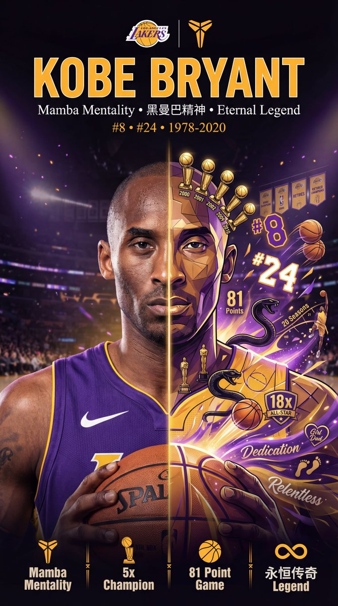

## The creative poster features a box of fries transformed 

- ID: gpt4o-1012-en-1
- Slug: prompt-1012-en-1
- 语言: en
- 来源: [来源链接](https://x.com/underwoodxie96/status/2005266319772684676)
- 样例图路径: images/part3/1012.jpeg

### 提示词

```text
The creative poster features a box of fries transformed into a nightlight in the center. The golden fries act as light, reflecting off the wall behind the outlet and casting a yellow glow on the McDonald's logo. Below the logo, the words "open 24 hours" are displayed in tiny white print, directly announcing McDonald's 24-hour operation with its most recognizable element. The bottom right corner displays the McDonald's logo, and at the bottom center, in tiny print, is the word "Underwood Dessert."
```

### 样例图

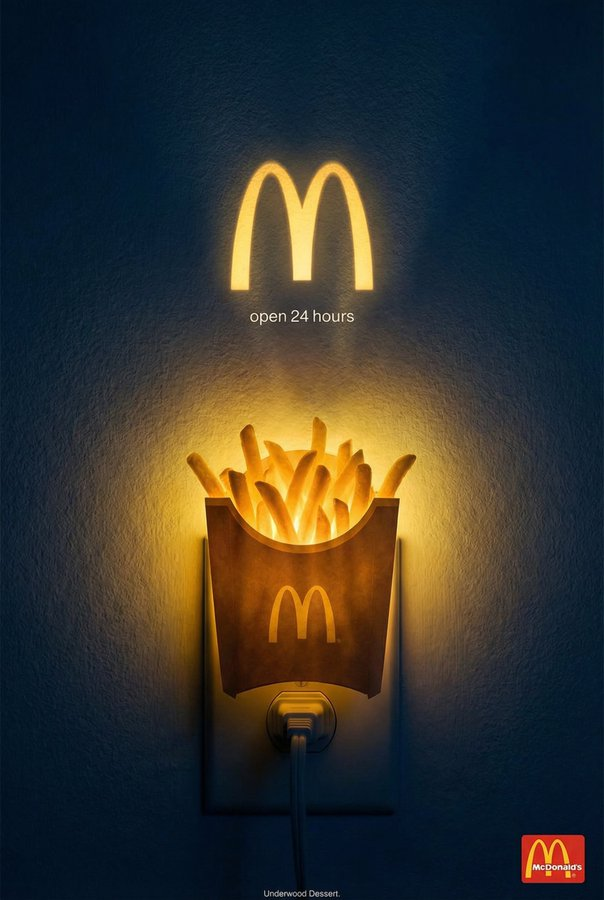

## 迷你品牌小夜灯设计

- ID: gpt4o-1012-zh-2
- Slug: prompt-1012-zh-2
- 语言: zh
- 来源: [来源链接](https://x.com/underwoodxie96/status/2005266319772684676)
- 样例图路径: images/part3/1012.jpeg

### 提示词

```text
这张创意海报的中心是一个薯条盒，它被巧妙地改造成了一盏小夜灯。金黄色的薯条如同灯光，反射在插座后面的墙壁上，为麦当劳的标志投射出一片温暖的黄色光晕。标志下方，用白色小字写着“24小时营业”，直接用麦当劳最具辨识度的元素宣告了其24小时营业的理念。海报右下角是麦当劳的标志，而正下方中央，用极小的字体写着“Underwood Dessert”。
```

### 样例图


## { "type": "image_prompt", "description": "High-resolutio

- ID: gpt4o-1008-en-1
- Slug: prompt-1008-en-1
- 语言: en
- 来源: [来源链接](https://x.com/xmiiru_/status/2005530723847934103)
- 样例图路径: images/part3/1008.jpeg

### 提示词

```text
{
  "type": "image_prompt",
  "description": "High-resolution photorealistic studio fashion portrait",
  "subject": {
    "gender": "adult woman",
    "hair": "long light brown hair with golden blonde highlights, loose curls",
    "expression": "playful, cheeky, thinking face, lips pursed",
    "pose": "looking off to the side, shoulders relaxed"
  },
  "outfit": {
    "hat": "gold shimmering party hat",
    "dress": "gold sequin party dress with modern asymmetric neckline cutout"
  },
  "props": {
    "balloons": "gold foil balloons shaped as numbers 20 and 26, one in each hand, raised near shoulders"
  },
  "environment": {
    "setting": "clean studio",
    "background": "neutral beige backdrop",
    "lighting": "soft studio lighting with gentle shadows"
  },
  "details": {
    "realism": "editorial-quality photorealism",
    "textures": "visible skin texture, detailed hair strands, sharp sequin detail",
    "materials": "metallic balloon shine with realistic creases and highlights"
  },
  "constraints": [
    "no text",
    "no logos",
    "no branding",
    "no watermarks"
  ]
}
```

### 样例图

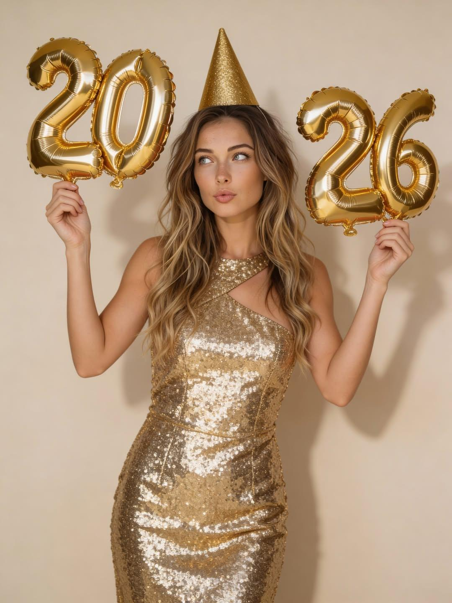

## 2026写实摄影棚时尚肖像

- ID: gpt4o-1008-zh-2
- Slug: prompt-1008-zh-2
- 语言: zh
- 来源: [来源链接](https://x.com/xmiiru_/status/2005530723847934103)
- 样例图路径: images/part3/1008.jpeg

### 提示词

```text
{
"type": "image_prompt",
描述：高分辨率照片级写实摄影棚时尚肖像
“主题”： {
“性别”: “成年女性”
“头发”：“长长的浅棕色头发，带有金色挑染，蓬松的卷发”，
“表情”：“顽皮、俏皮、思考的表情，嘴唇紧抿”，
“姿势”：“看向一侧，肩膀放松”
},
“全套服装”： {
“帽子”：“闪闪发光的金色派对帽”，
“连衣裙”： “金色亮片派对连衣裙，现代不对称领口镂空设计”
},
"props": {
“气球”：“两只手中各拿着一个金色箔纸气球，形状分别为数字 20 和 26，举到肩膀附近”
},
“环境”： {
“设置”：“干净的工作室”，
“背景”： “中性米色背景”，
“灯光”：“柔和的影棚灯光，带有淡淡的阴影”
},
“细节”： {
“写实主义”: “编辑级照片写实主义”，
“纹理”：“可见的皮肤纹理、细致的发丝、清晰的亮片细节”，
“材质”：“金属质感的气球，带有逼真的褶皱和高光”
},
“约束”：[
“无文本”，
“无标志”，
“无品牌标识”
“无水印”
]
}
```

### 样例图


## 现代Bento网格布局产品展示设计

- ID: gpt4o-1003-zh
- Slug: prompt-1003-zh
- 语言: zh
- 来源: [来源链接](https://x.com/berryxia/status/2005842541141451133)
- 样例图路径: images/part3/1003.jpeg

### 提示词

```text
现代Bento网格布局产品展示设计,采用磨砂亚克力透明玻璃材质。适用于任何产品类型(食物/药品/科技产品/元素等)。

【布局结构】8个模块,非对称Bento网格排列,横向landscape格式:

模块1: 【3D玻璃产品主体展示】(中等尺寸1x1,占20-25%空间)

- 3D透明玻璃/亚克力材质的[产品名称]雕塑

- [产品特色]:

* 食物 → 展示切面/内部结构(如番茄种子腔室、胡萝卜横切面)

* 药品 → 药片/胶囊的透明玻璃形态

* 科技产品 → 产品外观的玻璃艺术化呈现

- 材质效果: 透明红橙/蓝色/绿色等[产品主色]玻璃,光泽表面,光线折射,真实反射

- 正下方文字标注: "[中文产品名] / [English Name]"

- 不占用过多空间,为信息模块留足展示区域

模块2: 【核心功效/特点】(标准卡片1x1)

标题: "核心功效" 或 "核心特点" 或 "主要功能"

内容: 4个核心卖点,用 "/" 分隔

- 食物 → "抗氧化延缓衰老 / 保护心血管健康 / 美白护肤养颜 / 促进消化吸收"

- 药品 → "解热镇痛 / 抗炎消肿 / 抗血小板聚集 / 预防心血管疾病"

- 科技 → "主动降噪 / 空间音频 / 自适应均衡 / 20小时续航"

配合简洁图标

模块3: 【使用方法/应用场景】(标准卡片1x1)

标题: "食用方法" 或 "使用方法" 或 "应用场景"

内容: 4种使用方式/场景

- 食物 → "生食: 沙拉凉拌 / 熟食: 炒蛋炖汤 / 加工: 酱料榨汁 / 搭配: 鸡蛋牛肉"

- 药品 → "口服: 餐后温水送服 / 剂量: 成人100mg / 频次: 每日1-2次 / 疗程: 遵医嘱"

- 科技 → "音乐欣赏 / 通勤降噪 / 居家办公 / 观影娱乐"

配合场景图标

模块4: 【关键数据/参数】(标准卡片1x1)

标题: "营养价值" 或 "技术参数" 或 "产品规格"

内容: 5个关键数据点

- 食物 → "热量 [X]千卡/100克 / 维生素C [X]毫克 / [特色成分] 丰富 / 膳食纤维 [X]克 / 钾 [X]毫克"

- 药品 → "成分: [化学式] / 规格: [X]mg / 起效时间: [X]分钟 / 半衰期: [X]小时 / 代谢途径: [途径]"

- 科技 → "芯片: [型号] / 续航: [X]小时 / 重量: [X]克 / 驱动单元: [规格] / 充电: [X]小时"

配合简洁数据可视化图表

模块5: 【适用人群/目标用户】(标准卡片1x1)

标题: "适合人群" 或 "目标用户" 或 "适用场景"

内容: 分为推荐(✓)和警示(⚠️)两部分

- 食物 → "✓ 心血管疾病患者 / ✓ 美容养颜需求者 / ✓ 减肥瘦身人群 / ✓ 便秘消化不良 / ⚠️ 慎用: 肾功能不全 / 胃酸过多 / 空腹食用"

- 药品 → "✓ 发热患者 / ✓ 轻中度疼痛 / ✓ 炎症性疾病 / ⚠️ 禁忌: 孕妇 / 哮喘患者 / 胃溃疡"

- 科技 → "✓ 音乐发烧友 / ✓ 商务人士 / ✓ 通勤人群 / ✓ 内容创作者"

用绿色✓和琥珀色⚠️区分

模块6: 【注意事项/使用指南】(标准卡片1x1)

标题: "食用注意" 或 "使用注意" 或 "重要提示"

内容: 4条重要提醒事项

- 食物 → "不宜空腹食用以免刺激胃黏膜 / 未成熟[产品]含[有毒物质]禁食 / 不宜长时间高温烹煮保留营养 / [特殊人群]需控制摄入量"

- 药品 → "需餐后服用避免胃部不适 / 不可与[禁忌药物]同服 / 服药期间避免饮酒 / 出现过敏反应立即停药就医"

- 科技 → "首次使用需配对设备 / 避免极端温度环境 / 定期清洁保养 / 长期不用请充电保存"

配合警示图标

模块7: 【特殊指标】(标准卡片1x1)

标题: 根据产品类型调整

- 食物 → "嘌呤含量" 显示 "[X]毫克/100克" + "低嘌呤食物 ✓" + "痛风患者友好"

- 药品 → "不良反应" 列举常见副作用

- 科技 → "兼容性" 显示支持的系统/设备

配合指示器或图标

模块8: 【趣味知识/产品洞察】(标准卡片1x1)

标题: "冷知识" 或 "产品故事" 或 "有趣事实"

内容: 2-3条有趣的知识点

- 食物 → "[产品]加热后[成分]吸收率提升X倍 / [产品]原产[地区]已有[X]年历史 / 未成熟[产品]含[有害物质]"

- 药品 → "[产品]是世界上使用最广泛的[类别]之一 / 每年全球生产超过[X]吨 / [发明年份]年由[人名]发明"

- 科技 → "[产品]采用[技术]专利技术 / [品牌]首次将[功能]应用于消费级产品 / 全球销量突破[X]万台"

【磨砂亚克力材质规格】(CRITICAL 核心灵魂):

卡片材质效果:

- 透明度: 80-85% 半透明(TRANSLUCENT),可以看穿卡片看到背景

- 磨砂效果: 柔和的frosted glass blur模糊,backdrop-filter风格

- 底色调: 轻微白色/奶油色霜化效果(15-20%不透明度),提升可读性但保持透明

- 边框: 细致的发光边框,捕捉光线反射

- 阴影: 柔和的分层阴影,营造浮空深度感

- 玻璃物理: 真实的玻璃边缘高光、光线折射、表面反射效果

- 视觉特征: 背景渐变可以透过卡片清晰看见,像真实的磨砂亚克力板

重要: 卡片必须保持TRANSLUCENT透明质感,不能变成不透明白卡片!

【色彩方案】:

基础色彩配比: 90% 中性色 + 10% 产品主题色点缀

- 基础层: 透明玻璃、浅灰色、米白色

- 文字色: 中等深灰 #3A3A3A (柔和但清晰,适合透明背景)

- 主题色点缀(10%使用):

* 食物 → 产品天然色(番茄红橙、胡萝卜橙、菠菜绿等)

* 药品 → 医疗蓝、药品白、红十字标志色

* 科技 → 品牌主色(Apple银灰蓝、小米橙、华为红等)

- 点缀位置: 仅用于关键图标、重要数字、警示符号、3D主体

- 警示色: 琥珀橙 #FF9800 用于⚠️警告内容

- 肯定色: 绿色 #4CAF50 用于✓推荐内容

【背景设置】:

- 类型: 柔和渐变,2-3个相近色过渡

- 产品色调适配:

* 食物 → 奶油白-淡桃红-浅橙色(温暖色调)

* 药品 → 浅灰白-淡蓝-医疗白(清洁专业)

* 科技 → 太空灰-银白-淡蓝(科技感)

- 装饰元素: 极度柔和的抽象形状,可透过玻璃卡片隐约看见

- 重要: 背景要柔和不抢眼,通过透明卡片可见但不干扰阅读

【排版布局】:

- 格式: 横向 landscape 16:9 或类似比例

- 网格类型: 非对称Bento网格,卡片大小不一

- 空间分配:

* 3D玻璃主体: 20-25% (中等尺寸,不过度占用)

* 信息卡片: 75-80% (7个标准卡片)

- 卡片间距: 适度留白,不拥挤,呼吸感良好

- 视觉层次: 通过卡片大小、位置、色彩点缀建立信息优先级

- 阅读流: 从左上3D主体开始,自然流向各信息卡片

【文字规范】:

- 语言: 全中文内容(产品名可双语标注)

- 字体层级:

* 模块标题: 粗体,大号

* 正文内容: 常规体,中号

* 数据数字: 粗体,突出显示

- 可读性: 中等深灰文字在磨砂玻璃上清晰易读

- 单位规范:

* 重量: 克、千克、毫克

* 能量: 千卡、卡路里

* 时间: 分钟、小时、天

* 容量: 毫升、升

【图标风格】:

- 类型: 极简线条图标 (line icons)

- 尺寸: 小巧不喧宾夺主

- 颜色: 浅灰线条,关键图标用主题色点缀

- 用途: 辅助说明,增强视觉识别

【使用方法】:

1. 将 [产品名称] 替换为实际产品

2. 根据产品类型(食物/药品/科技)选择对应的内容示例

3. 填充8个模块的具体信息

4. 调整主题色为产品代表色

5. 确保保持磨砂亚克力的透明质感

【质量标准】:

✓ 透明度正确(80-85%,可看穿)

✓ 磨砂模糊效果明显但不过度

✓ 背景可透过卡片看见

✓ 3D主体占比适中(20-25%)

✓ 信息完整(8个模块内容齐全)

✓ 全中文显示清晰

✓ 色彩克制优雅(90%中性+10%点缀)

✓ 排版舒适不拥挤

✓ 玻璃质感真实(边缘高光、反射、折射)

【典型应用示例】:

食物: 🍅西红柿、🥕胡萝卜、🍎苹果、🥑牛油果

药品: 💊阿司匹林、维生素C、布洛芬、青霉素

科技: 🎧AirPods Max、iPhone、MacBook、特斯拉

元素: ⚛️碳、氧、氢、氮
```

### 样例图


## 香港维多利亚港烟花秀

- ID: gpt4o-1001-zh
- Slug: prompt-1001-zh
- 语言: zh
- 来源: [来源链接](https://x.com/LufzzLiz/status/2005286056850251802)
- 样例图路径: images/part3/1001.jpeg

### 提示词

```text
{
  "template_name": "新年城市天际线庆典 (人物定制版)",
  "description": "一个孩子俯瞰城市天际线的电影式镜头。支持基于参考图的人物形象定制、视角切换（正面/背面）以及自定义动作。画面中包含定制的烟花特效和巨大的“2026”字样。新增全局构图设定：采用鸟瞰远景视角，镜头与人物呈60度角，确保人物不遮挡城市夜景；人物服装风格与目标城市文化或地标元素相呼应。",
  "prompt_template": "一个令人惊艳的电影式镜头，采用鸟瞰远景构图，镜头与人物呈60度角，巧妙避开人物对背景的遮挡，完整展现壮丽的城市天际线。基于参考图片中的孩子形象，人物以{view_orientation}出现在画面中，头戴一顶奇趣的派对帽，身穿与{target_city_short}文化或地标相呼应的节日服装，站在高耸的山峰之巅。人物当前的动作为：{character_action}。背景是令人叹为观止的{target_city}城市夜景，标志性的城市地标在繁星点点的夜空下清晰可见。整个天空被{city_fireworks_effect}点亮。巨大的、闪耀的金色烟花在中心清晰地拼出了“2026”的字样。8K 分辨率，照片级真实感，电影颗粒感，营造出梦幻、宏大且充满希望的氛围，展现了高度精细的城市夜景。",
  "input_variables": {
    "target_city": {
      "type": "string",
      "description": "庆祝活动的城市名称和主要地标描述。",
      "default_value": "上海夜景，东方明珠塔、外滩和蜿蜒的黄浦江"
    },
    "target_city_short": {
      "type": "string",
      "description": "目标城市的简称或关键词，用于描述服装风格匹配（如'上海'、'巴黎'、'东京'等）。",
      "default_value": "上海"
    },
    "city_fireworks_effect": {
      "type": "string",
      "description": "烟花的风格、形状、颜色和氛围的描述。",
      "default_value": "一场壮观的迪士尼风格烟花表演，以米老鼠形状的烟花、童话般的柔和色彩、闪闪发光的魔法粉尘和梦幻般的层叠火花为特色"
    },
    "view_orientation": {
      "type": "string",
      "description": "人物相对于镜头的朝向。推荐：'背面剪影' 或 '正面（面带惊奇的笑容）'。",
      "default_value": "背面剪影"
    },
    "character_action": {
      "type": "string",
      "description": "人物的具体肢体动作。",
      "default_value": "双手高举过头顶，向着天空张开，身体微微后仰，充满惊奇和兴奋"
    }
  },
  "full_prompt_example": "一个令人惊艳的电影式镜头，采用鸟瞰远景构图，镜头与人物呈60度角，巧妙避开人物对背景的遮挡，完整展现壮丽的城市天际线。基于参考图片中的孩子形象，人物以背面剪影出现在画面中，头戴一顶奇趣的派对帽，身穿与上海文化或地标相呼应的节日服装，站在高耸的山峰之巅。人物当前的动作为：双手高举过头顶，向着天空张开，身体微微后仰，充满惊奇和兴奋。背景是令人叹为观止的上海夜景，东方明珠塔、外滩和蜿蜒的黄浦江在繁星点点的夜空下清晰可见。整个天空被一场壮观的迪士尼风格烟花表演点亮，以米老鼠形状的烟花、童话般的柔和色彩、闪闪发光的魔法粉尘和梦幻般的层叠火花为特色。巨大的、闪耀的金色烟花在中心清晰地拼出了“2026”的字样。8K 分辨率，照片级真实感，电影颗粒感，营造出梦幻、宏大且充满希望的氛围，展现了高度精细的城市夜景。"
}
城市：香港维多利亚港
人物：参考图片｜正面照。服装需替换与背景城市保持一致
动作: 双手过肩比心
```

### 样例图

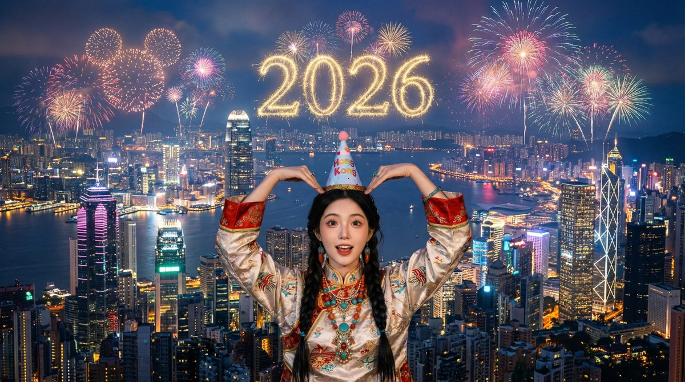

## a fashion designer's sketch of an [elegant outfit or dre

- ID: gpt4o-995-en-1
- Slug: prompt-995-en-1
- 语言: en
- 来源: [来源链接](https://x.com/CharaspowerAI/status/2004937832163422365)
- 样例图路径: images/part3/995.jpeg

### 提示词

```text
a fashion designer's sketch of an [elegant outfit or dress] inspired by [ character], featuring [key iconic accessory or detail]. the design includes notes in pencil and ink, emphasizing details, [delicate embroidery or pattern details], and matching accessories.
```

### 样例图

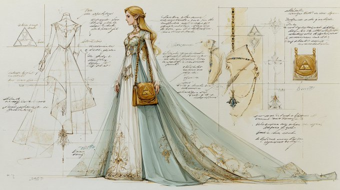

## 时装设计师根据人物形象绘制草图

- ID: gpt4o-995-zh-2
- Slug: prompt-995-zh-2
- 语言: zh
- 来源: [来源链接](https://x.com/CharaspowerAI/status/2004937832163422365)
- 样例图路径: images/part3/995.jpeg

### 提示词

```text
一位时装设计师根据[人物]的形象绘制的[优雅服装或连衣裙]草图，以[关键标志性配饰或细节]为特色。设计图包含铅笔和墨水笔记，强调细节、[精致的刺绣或图案细节]以及配套配饰。
```

### 样例图


## 专业首饰类型设计全流程展示

- ID: gpt4o-993-zh
- Slug: prompt-993-zh
- 语言: zh
- 来源: [来源链接](https://x.com/yyyole/status/2004766562360942975)
- 样例图路径: images/part3/993.jpeg

### 提示词

```text
专业{首饰类型}设计全流程展示 | {主材料}商业级设计过程可视化，专业设计系统文档风格。
【主材料】：{金}（如：虎眼石、翡翠、南红玛瑙）
【首饰类型】：{手镯}（如：手串、吊坠、戒指、耳环
【辅材智能配置】：根据主材料自动匹配（金属配件、隔珠、弹力线等）

专业珠宝设计全流程展示图 | 从概念到成品的完整设计过程

项目信息板块（左上角）
项目名称：「{主材料} {首饰类型}设计方案」
设计师签名栏（muyang）
项目编号和日期
品牌Logo预留位
金色装饰线框

第一阶段：设计概念 CONCEPT DESIGN
视觉呈现：
灵感拼贴板（Mood Board）：{主材料}原石照片、纹理特写、色彩提取
手绘草图：3-4个设计方案，铅笔素描风格
文化元素融入（如虎眼石→东方瑞兽纹样）
比例尺标注，关键尺寸备注
标注内容：
设计理念说明（中英双语）
目标客群定位
预算区间估算

第二阶段：材料精选 MATERIAL CURATION
主材料展示区：
{主材料}原矿到成品珠粒对比
4-6颗品质分级展示（AAAAA→A级）
显微镜下纹理特写
色卡比对（Pantone色号标注）
专业珠宝托盘呈现
辅材智能搭配区：
金属配件：根据主材料调性选择暖色系主材（虎眼石、南红）→ 18K玫瑰金/红铜
冷色系主材（青金石、海蓝宝）→ 925银/白金
中性主材（黑曜石、玛瑙）→ 精钢/钛钢
隔珠/配珠：尺寸比例协调（主珠直径的1/3-1/2）
材质对比（如虎眼石配砗磲/椰壳）
数量配比建议
串线材料：手串→弹力线（克重标注）
项链→不锈钢钢丝/K金链
透明展示盒分格摆放
光照：顶部柔光 + 侧面暖光，突出材质光泽

第三阶段：工程图纸 TECHNICAL DRAWING
CAD专业制图：
三视图（正视/侧视/俯视），精确到0.1mm
剖面图展示内部结构（如隔珠穿孔位置）
尺寸标注线（箭头 + 数字）
珠子排列顺序图解
结绳工艺节点详图
蓝图底色 + 白色线框，建筑图纸风格
参数表格：
| 部件 | 尺寸 | 数量 | 材质 |
| {主材料}主珠 | Ø{X}mm | {N}颗 | 天然{主材料} |
| 隔珠 | Ø{Y}mm | {M}颗 | {辅材} |
| 配件 | - | 1套 | {金属材质} |

第四阶段：工艺打样 PROTOTYPING
制作过程：
选珠配对：工匠用卡尺测量，色差比对
打磨抛光：砂轮机/手工打磨台
穿孔检查：专业灯光透视孔洞
试戴调整：手腕/颈部模特展示，周长调节
细节特写：金属扣头安装过程，微距摄影
环境设置：
传统工作台（木质/大理石台面）
专业珠宝工具铺陈（镊子、放大镜、量具）
暖色工作灯照明
工匠手部特写（展现匠心）

第五阶段：品控检验 QUALITY CONTROL
检测场景：
紫外线灯下检测{主材料}真伪
电子秤精确称重（克重显示）
游标卡尺复核尺寸
拉力测试弹力线强度
检验报告单特写（证书编号、检测数据）
分屏展示：
左侧：检测设备操作
右侧：放大显示检测结果
底部：合格印章/质检签字
色调：冷色调科技感，白色实验室环境

第六阶段：包装呈现 PACKAGING
包装系统展示：
内包装：定制绒布袋/锦盒，品牌烫金Logo
外包装：艺术礼盒，{主材料}纹理印刷
附件配套：材质证书卡
保养说明书（图文并茂）
品牌故事卡片
擦拭布/密封袋
构图：爆炸图式展开，层层递进

第七阶段：成品大片 FINAL SHOWCASE

A组-产品摄影：
纯白背景悬浮拍摄，360°全角度
特写镜头：{主材料}猫眼效果/晶体纹理
金属配件反光细节
尺寸参照物（硬币/尺子）
专业影棚四点布光
B组-场景应用：
真人手腕/颈部佩戴
生活化场景（咖啡桌、书桌、户外）
不同光线环境（自然光/夜景灯光）
动态展示（手部移动形成光轨）
C组-细节放大：
100倍微距：{主材料}内部结构
金属接口工艺特写
结绳编织纹理
品牌刻印细节

整体视觉规范
布局架构
横向时间轴：7阶段等宽分布，21:9电影比例
流程箭头：立体金属质感，渐变发光效果
信息层级：一级标题：粗体中文+细体英文，金色
二级标题：黑体，12号
正文标注：宋体/思源黑体，9号
色彩系统
背景基调：#F8F6F0 象牙白
主材料色：根据{主材料}天然色提取（虎眼石→琥珀金棕）
金属色：K金 #D4AF37
银色 #C0C0C0
玫瑰金 #B76E79
强调色：深褐 #3E2723（文字/边框）
摄影标准
分辨率：最低4K（3840×2160）
景深：F8-F11保持各阶段清晰
色温：5500K标准日光
格式：RAW原片后期，保留最大细节
```

### 样例图

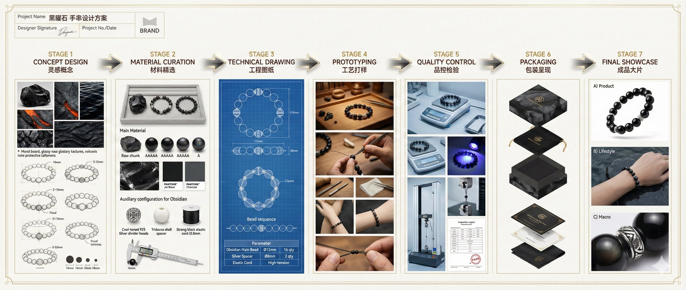

## An expert [DISCIPLINE] designer’s presentation board for

- ID: gpt4o-982-en-1
- Slug: prompt-982-en-1
- 语言: en
- 来源: [来源链接](https://x.com/AllaAisling/status/2003849647392247864)
- 样例图路径: images/part3/982.jpeg

### 提示词

```text
An expert [DISCIPLINE] designer’s presentation board for [SUBJECT] — [ICONIC FEATURES / ERA], featuring black-and-white 2D technical drawings with annotations and dimensions on the left, an exploded axonometric diagram revealing [KEY INTERNAL COMPONENTS / MATERIALS] in the center, and a photorealistic 3D render of [SUBJECT] in [ICONIC ENVIRONMENT / SCENE] on the right, with [LIGHTING / ATMOSPHERE / MOTION DETAILS]; visual style transitions from [TECHNICAL / ARCHIVAL TONES] to [EMOTIONAL / ATMOSPHERIC COLOR PALETTE], clean grid layout, museum-grade industrial design presentation, ultra-detailed cinematic realism, title block reading “[TITLE] — [YEAR / VARIANT / TAGLINE]”.
```

### 样例图

![An expert [DISCIPLINE] designer’s presentation board for](../images/part3/982.jpeg)

## 技术图纸展示板

- ID: gpt4o-982-zh-2
- Slug: prompt-982-zh-2
- 语言: zh
- 来源: [来源链接](https://x.com/AllaAisling/status/2003849647392247864)
- 样例图路径: images/part3/982.jpeg

### 提示词

```text
一位[学科]专家设计师为[主题] — [标志性特征/时代]制作的展示板，左侧为带有注释和尺寸的黑白二维技术图纸，中间为揭示[关键内部组件/材料]的爆炸轴测图，右侧为[主题]在[标志性环境/场景]中的逼真三维渲染图，并包含[灯光/氛围/动态细节]；视觉风格从[技术/档案色调]过渡到[情感/氛围色彩]，简洁的网格布局，博物馆级别的工业设计展示，超精细的电影级真实感，标题栏显示“[标题] — [年份/版本/标语]”。
```

### 样例图

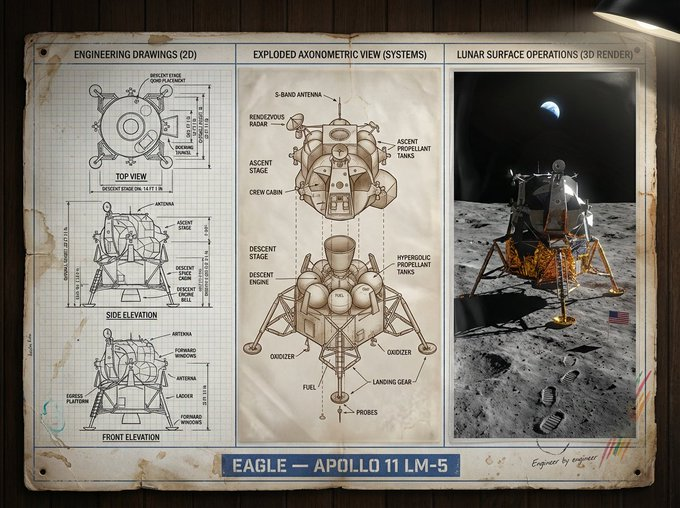

## 圣诞特辑-圣诞护肤品套装促销卡片

- ID: gpt4o-960-zh
- Slug: prompt-960-zh
- 语言: zh
- 来源: [来源链接](https://x.com/songguoxiansen/status/2003096613359853946)
- 样例图路径: images/part3/960.jpeg

### 提示词

```text
制作一张专业的圣诞护肤品套装促销卡片,采用竖版构图设计,整体风格简约高端。背景使用柔和的渐变色,从顶部的冰雪白色过渡到底部的淡粉色,营造出清新优雅的氛围。画面中央偏上位置,精心摆放着一套高端护肤品礼盒,礼盒采用磨砂白色包装,表面压印精致的雪花纹理和品牌Logo(Dior)。礼盒呈打开状态,内部露出三瓶不同大小的护肤品瓶子,瓶身设计简约现代,搭配金色瓶盖。产品周围巧妙地摆放着圣诞装饰元素:几支新鲜的松枝、小巧的金色铃铛、几颗红色浆果,以及散落的小礼物盒,所有道具都经过精心布光,呈现出高级的产品摄影质感。卡片顶部使用纤细优雅的字体书写"圣诞礼遇 · 焕颜新生"的中文标题。中部产品下方用醒目的红色字体标注促销信息"限量礼盒装 8折优惠 买赠面膜5片",底部配有行动号召按钮样式的文字"立即抢购 数量有限",以及活动有效期"12月15日-26日"。整体设计强调产品质感和节日氛围的完美结合。宽高比9:16
```

### 样例图


## [BRAND NAME] is launching a new functional wellness elix

- ID: gpt4o-954-en-1
- Slug: prompt-954-en-1
- 语言: en
- 来源: [来源链接](https://x.com/AmirMushich/status/2002793794975273279)
- 样例图路径: images/part3/954.jpeg

### 提示词

```text
[BRAND NAME] is launching a new functional wellness elixir (e.g., adaptogenic, nootropic, or natural energy drink). As the Creative Director, devise a product name and visualize a complete high-end promotional shot. The aesthetic is "Cosmic Premium"—technological, clean, and sophisticated, like top-tier Apple product photography.

THE PRODUCT: Design a sculptural, multi-layered beverage bottle suspended in the center. The form is engineered and futuristic. The materials are hyper-tactile: bead-blasted titanium details, frosted borosilicate glass, and textured haptic polymer grips.
**Crucial Color Instruction:** The liquid inside must have a distinct, natural color relevant to its invented function (e.g., vibrant turmeric yellow, deep berry red, earthy matcha green, or pale calming blue). The liquid should look real with subtle natural sediment.
**Crucial Graphic Detail:** On the clear glass section of the bottle, apply a layer of subtle, minimalist, technical typography printed in matte white ink. This design should feel utilitarian and futuristic (e.g., small technical specs like 'SPACE GRADE FORMULA', 'BATCH: OZ-9', volume indicators, or coordinate markings), adding a functional aesthetic similar to aerospace labeling, without overwhelming the bottle's clean lines.

THE ENVIRONMENT & LIGHTING: The bottle is in a seamless studio.
**Crucial Background Instruction:** The background must be a solid, clean, very light pastel tone that is specifically chosen to complement the liquid color (e.g., a soft cool mint background for a warm orange liquid, or a pale blush background for a deep green liquid). No gradients. Ultra-soft, diffused studio lighting creates sleek highlights on metal and deep subsurface scattering in the glass and liquid.

PHOTOGRAPHY STYLE: High-resolution 100mm macro lens shot. Shallow depth of field, sharp focus on bottle textures and the printed graphics on the glass, smooth pastel background bokeh. 8k resolve, hyper-realistic textures.

GRAPHIC OVERLAYS: Include subtle dark gray UI elements.
Bottom Left Corner: Very small, minimalist text (like Manrope Regular font) describing the product's name and function in two sentences.
Bottom Right Corner: A small, minimalist dark gray logomark for [BRAND NAME].
```

### 样例图

![[BRAND NAME] is launching a new functional wellness elix](../images/part3/954.jpeg)

## 一张完整的产品高端宣传照

- ID: gpt4o-954-zh-2
- Slug: prompt-954-zh-2
- 语言: zh
- 来源: [来源链接](https://x.com/AmirMushich/status/2002793794975273279)
- 样例图路径: images/part3/954.jpeg

### 提示词

```text
[品牌名称] 即将推出一款全新的功能性健康饮品（例如，具有适应原、益智或天然能量的饮料）。作为创意总监，请构思产品名称并构思一张完整的高端宣传照。美学风格为“宇宙级奢华”——科技感十足、简洁精致、高端大气，如同顶级苹果产品摄影作品。

产品：设计一款造型独特、多层结构的饮料瓶，瓶身悬浮于中央。造型充满未来感和工程感。材质触感极佳：喷砂钛金属细节、磨砂硼硅酸盐玻璃和纹理触感聚合物握把。
**关键颜色说明:**内装液体必须具有与其功能相符的独特、自然的颜色（例如，鲜艳的姜黄、深邃的浆果红、质朴的抹茶绿或宁静的浅蓝）。液体应呈现逼真的效果，并带有细微的天然沉淀。
**关键图形细节:**在瓶子的透明玻璃部分，印上一层简洁、极简的哑光白色技术字体。这种设计应兼具实用性和未来感（例如，“太空级配方”、“批次: OZ-9 ”等小型技术规格、容量指示或坐标标记），增添类似航空航天标签的功能美感，同时又不破坏瓶子简洁的线条。

环境与灯光：瓶子放置在一个无缝摄影棚内。
**关键背景说明:**背景必须是纯色、干净、非常浅的粉彩色调，并且要经过精心挑选以衬托液体颜色（例如，暖橙色液体搭配柔和的薄荷绿背景，或深绿色液体搭配淡粉色背景）。禁止使用渐变色。超柔和的漫射摄影棚灯光可以在金属表面营造出光滑的高光，并在玻璃和液体表面形成深邃的散射效果。

摄影风格：高分辨率100mm微距镜头拍摄。浅景深，清晰聚焦于瓶身纹理和玻璃上的印刷图案，柔和的粉彩背景虚化。8K分辨率，超逼真的纹理。

图形叠加层：包含微妙的深灰色用户界面元素。
左下角：非常小的极简文字（类似 Manrope Regular 字体），用两句话描述产品的名称和功能。
右下角：[品牌名称] 的小型、极简的深灰色标志。
```

### 样例图

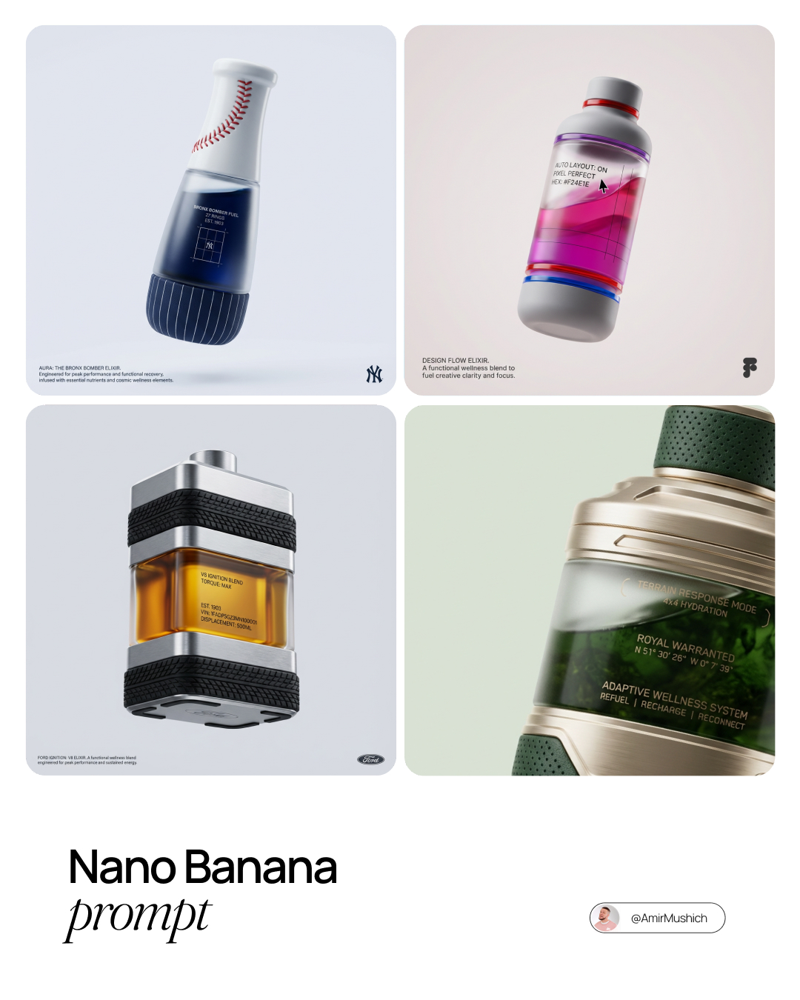

## do this for Messi: <instruction> Relic-Loadout Kit Input

- ID: gpt4o-945-en-1
- Slug: prompt-945-en-1
- 语言: en
- 来源: [来源链接](https://x.com/Gdgtify/status/2002116477307044203)
- 样例图路径: images/part3/945.jpeg

### 提示词

```text
do this for Messi: <instruction>
Relic-Loadout Kit
Input A is a fictional or real character (image/name) OR story IP (poster/name).
Analyze and infer: character archetype, iconic scene, signature items, and moral arc.
Goal: Premium collector kit box with compartments (no logos; minimal text).
Rules:
Center compartment: mini figurine.
Surround 10–16 relic props that teach the character arc (before/after item, symbol of sacrifice, tool of choice).
Add a tiny “arc timeline” strip with 5 beats (icons + 1–2 words max each).
Output: one image, 4:5 product hero shot.
</instruction>
```

### 样例图

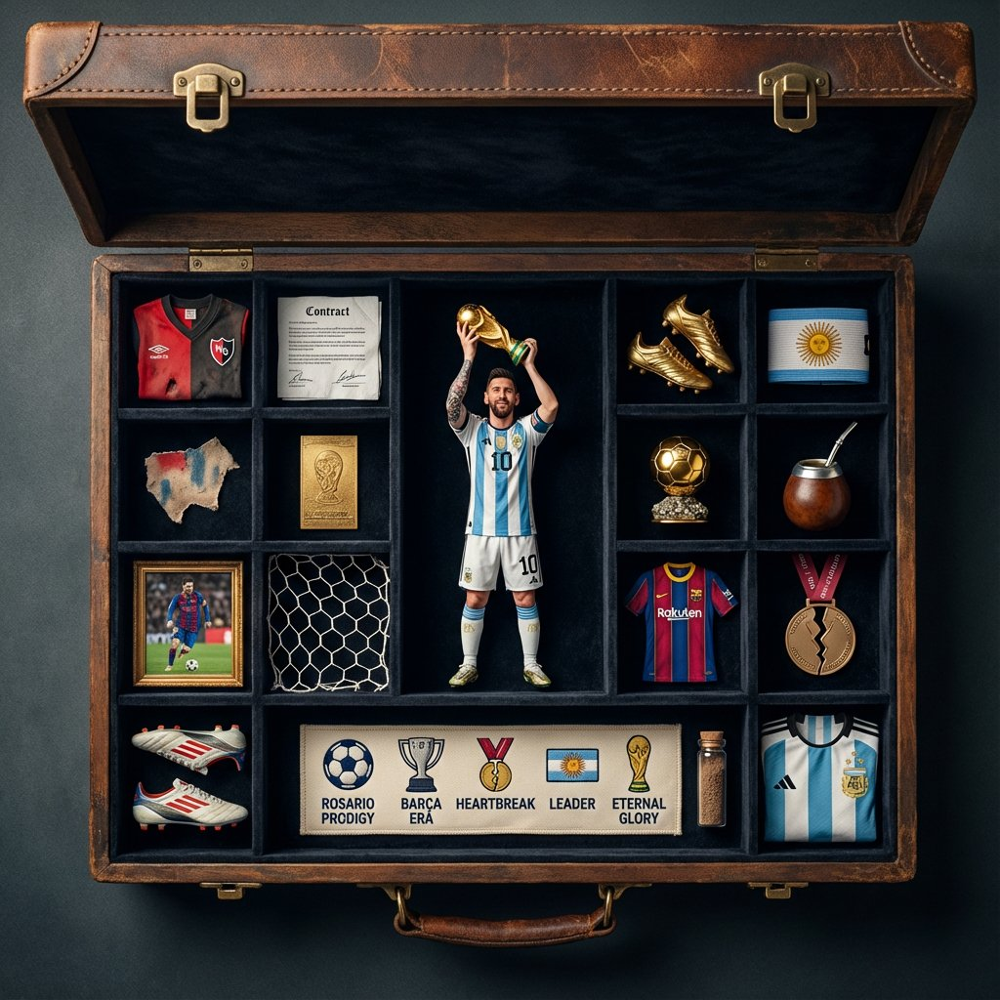

## 将你最喜欢的角色变成收藏品

- ID: gpt4o-945-zh-2
- Slug: prompt-945-zh-2
- 语言: zh
- 来源: [来源链接](https://x.com/Gdgtify/status/2002116477307044203)
- 样例图路径: images/part3/945.jpeg

### 提示词

```text
请为梅西做这件事：</指令>
遗物装备包
输入 A 是虚构或真实的角色（图像/名称）或故事 IP（发布者/名称）。
分析和推断：人物原型、标志性场景、标志性物品和道德弧线。
目标：带隔层的优质收藏套装盒（无标志；文字极少）。
规则：
中间隔层：迷你人偶。
围绕 10-16 件遗物道具来展现角色弧光（前后物品、牺牲的象征、选择的工具）。
添加一个包含 5 个节点的“弧线时间轴”小条（每个节点最多可包含 1-2 个图标和 1-2 个单词）。
输出：一张图片，4:5 产品主图。
</指令>
```

### 样例图


## { "project_title": "High-End Studio Fashion Editorial '5

- ID: gpt4o-943-en-1
- Slug: prompt-943-en-1
- 语言: en
- 来源: [来源链接](https://x.com/BeautyVerse_Lab/status/2002263911413031260)
- 样例图路径: images/part3/943.jpeg

### 提示词

```text
{
"project_title": "High-End Studio Fashion Editorial '5-Panel Wide Film' Collage",
"structure": "Asymmetric 2-column layout: Left column contains 2 stacked panels; Right column contains 3 stacked panels. Total height of both columns is identical.",
"aspect_ratio": "3:4",
"aesthetic_theme": {
"style": "Professional studio editorial mixed with seamless vintage film strip aesthetic",
"mood": "Minimalist, sophisticated, balanced yet dynamic",
"color_palette": [
"Clean whites",
"Sophisticated charcoals",
"Soft champagne gold",
"Deep black film borders",
"Neutral skin tones"
],
"textures": [
"Subtle film grain",
"Matte celluloid finish",
"Seamless cyclorama wall",
"High-fashion fabric textures"
]
},
"framing_and_borders": {
"type": "Integrated 5-panel wide film strip",
"details": [
"The layout is a single large rectangular film frame divided into 5 segments",
"Authentic film rebate with sprocket holes and frame numbers only on the FAR LEFT and FAR RIGHT outer vertical edges",
"The top and bottom outer edges are clean black film borders",
"Internal dividers: All internal lines (the central vertical divider and the horizontal lines on both sides) are simple, solid thin black lines"
]
},
"subject_reference": {
"source": "image_1.png",
"instruction": "The subject's physical appearance, complete outfit, and accessories must exactly match the person in image_1.png. Maintain visual consistency across all five frames."
},
"composition_layout": {
"left_column_stack": {
"dimensions": "Two stacked vertical panels",
"frames": [
{
"id": "frame_top_left",
"type": "Full-body studio editorial shot",
"setting": "Clean minimalist studio",
"pose": "Sophisticated standing pose, showcasing the full outfit silhouette",
"lighting": "High-contrast rim lighting"
},
{
"id": "frame_bottom_left",
"type": "Medium-shot editorial",
"setting": "Minimalist studio background",
"pose": "Artistic sitting or leaning pose, focusing on the upper body and garment flow",
"lighting": "Soft directional lighting"
}
]
},
"right_column_stack": {
"dimensions": "Three stacked horizontal panels matching the total height of the left column",
"frames": [
{
"id": "frame_top_right",
"type": "Close-up beauty portrait",
"setting": "Professional studio setup",
"pose": "Frontal view, elegant expression, focus on facial features",
"visual_effects": "Shallow depth of field, sharp focus on eyes"
},
{
"id": "frame_middle_right",
"type": "Candid BTS side-shot",
"setting": "Working studio environment with equipment visible",
"lighting": "Raw studio working lights",
"pose": "Relaxed, natural demeanor, perhaps looking at a monitor off-camera",
"props_and_details": "Visible C-stands and studio cables"
},
{
"id": "frame_bottom_right",
"type": "Dynamic detail or medium-shot",
"setting": "Studio corner with minimalist pedestal",
"lighting": "Butterfly lighting setup",
"pose": "Fashion-forward pose, highlighting accessories or specific outfit textures"
}
]
}
},
"central_element": {
"type": "Signature Overlay",
"content": "BeautyVerse",
"position": "Center of the entire composition, placed on the central vertical divider",
"style": {
"appearance": "Elegant fluid cursive, translucent white ink",
"texture": "Fine ink stroke",
"scaling": "Medium-sized"
}
}
}
```

### 样例图

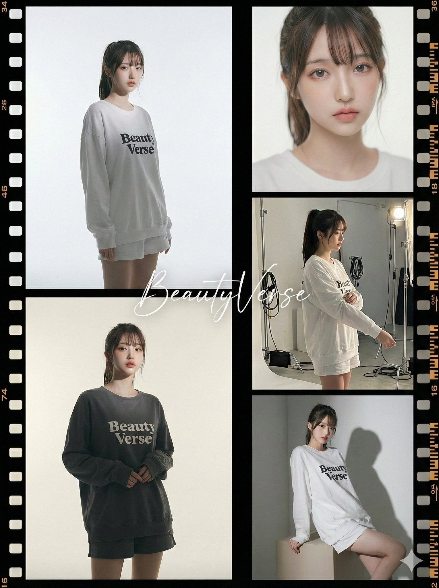

## 五联宽幅胶片拼贴作品

- ID: gpt4o-943-zh-2
- Slug: prompt-943-zh-2
- 语言: zh
- 来源: [来源链接](https://x.com/BeautyVerse_Lab/status/2002263911413031260)
- 样例图路径: images/part3/943.jpeg

### 提示词

```text
{"项目标题": "高端影棚时尚大片《五联宽幅胶片》拼贴作品","布局结构": "非对称双栏布局：左栏包含 2 个竖向堆叠的画面单元；右栏包含 3 个竖向堆叠的画面单元，两栏总高度保持一致","画幅比例": "3:4","美学主题": {"风格定位": "专业影棚大片风格融合无缝复古胶片条质感","整体氛围": "简约高级，平衡且富有动感","色彩搭配": ["纯净白色","高级炭灰色","柔和香槟金色","深邃黑色胶片边框","自然裸肤色"],"质感表现": ["细腻胶片颗粒","哑光赛璐珞质感","无缝影棚弧形背景墙","高级时装面料肌理"]},"画框与边框设计": {"边框类型": "一体化五联宽幅胶片式边框","细节说明": ["整体构图为一个大型矩形胶片画框，内部划分为 5 个画面单元","仅在最左侧和最右侧的外垂直边缘保留真实的胶片边缘留白、齿孔及画面编号","上下外边缘为简洁的纯黑胶片边框","内部分割线：所有内部线条（竖向中分割线及两侧的横向分割线）均为简洁的纯黑色细实线"]},"人物参考要求": {"参考素材": "image_1.png","执行说明": "人物的外形、全套服装及配饰必须与 image_1.png 中的人物完全一致，所有五个画面单元需保持视觉统一性"},"构图布局细则": {"左栏堆叠区域": {"尺寸规格": "两个竖向堆叠的画面单元","画面设定": [{"编号": "左上画面","拍摄类型": "全身影棚时尚大片","场景设定": "极简干净的影棚环境","姿势要求": "优雅站姿，完整展现服装廓形","灯光方案": "高对比度轮廓光"},{"编号": "左下画面","拍摄类型": "中景时尚大片","场景设定": "极简影棚背景","姿势要求": "艺术感坐姿或倚靠姿势，聚焦上半身及服装垂坠感","灯光方案": "柔和定向光"}]},"右栏堆叠区域": {"尺寸规格": "三个横向排布的画面单元，与左栏总高度保持一致","画面设定": [{"编号": "右上画面","拍摄类型": "特写美妆肖像","场景设定": "专业影棚布景","姿势要求": "正面朝向镜头，表情优雅，聚焦面部五官","视觉效果": "浅景深处理，眼部精准对焦"},{"编号": "右中画面","拍摄类型": "抓拍式幕后侧拍镜头","场景设定": "工作状态下的影棚环境，可见各类设备","灯光方案": "影棚工作实景光源","姿势要求": "状态松弛自然，可设定为看向镜头外的监视器","道具与细节": "可见 C 型支架及影棚线缆"},{"编号": "右下画面","拍摄类型": "动感细节特写或中景镜头","场景设定": "影棚角落搭配极简展示台","灯光方案": "蝶形布光方案","姿势要求": "时尚感造型姿势，突出配饰细节或服装特定肌理"}]}},"核心视觉元素": {"元素类型": "标志性叠加文字","文字内容": "BeautyVerse","摆放位置": "整个构图的正中央，置于竖向中分割线上","风格设定": {"字体外观": "流畅优雅的草书字体，半透明白色墨效","笔触质感": "纤细精致的墨迹笔触","尺寸比例": "中等字号"}}}
```

### 样例图


## [BRAND NAME]: A high-end, glossy concept art magazine ed

- ID: gpt4o-939-en-1
- Slug: prompt-939-en-1
- 语言: en
- 来源: [来源链接](https://x.com/AmirMushich/status/2002029348132721016)
- 样例图路径: images/part3/939.jpeg

### 提示词

```text
[BRAND NAME]:
A high-end, glossy concept art magazine editorial photograph of a unique, unexpected functional object conceptualized and designed by the brand.

**1. The Concept & Object (AI Invention):**
Based on the design philosophy, heritage, and material vocabulary of the specified brand, the AI must invent a novel utility product (NOT standard clothing, shoes, or bags). Examples could be home goods, tech accessories, tools, or sporting equipment, reinterpretated through the brand's lens. The object should feel sculptural yet functional.

**2. Materials & Details (Hyper-Premium):**
The object is constructed from ultra-premium, highly tactile materials characteristic of the brand (e.g., patinated exotic leathers, brushed aerospace-grade titanium, sculpted matte ceramics, molded carbon fiber, or technical high-fashion textiles). Every detail is hyper-realistic: visible stitching, microscopic material grain, precision engravings, and complex texture contrasts.

**3. Photography & Lighting (Cinematic Studio):**
Shot on a medium format Phase One camera with a 100mm macro lens. Extremely shallow depth of field, with sharp focus on the hero details of the object and a creamy, smooth bokeh background. The lighting is sophisticated studio softbox lighting: gentle, enveloping fill light with precise rim lighting to accentuate contours and material textures.

**4. Environment:**
A seamless, impeccably clean studio cyclorama background in a pure, ultra-light pastel tone (e.g., desaturated mint, pale blush, or off-white), free of shadows.

**5. Layout & UI Elements (Strict Placement):**
- **Bottom Right Corner:** A small, understated, monochrome gray logo of the brand.
- **Bottom Left Corner:** Small, minimalist monochrome gray text describing the invented product. The font style looks like Manrope Regular with very tight tracking (kerning) and balanced line spacing. Example format: "CONCEPT STUDY: [AI inserts invented product name]. MATERIAL: [AI inserts main materials]. SS25."
```

### 样例图

![[BRAND NAME]: A high-end, glossy concept art magazine ed](../images/part3/939.jpeg)

## 概念艺术杂志的编辑照片

- ID: gpt4o-939-zh-2
- Slug: prompt-939-zh-2
- 语言: zh
- 来源: [来源链接](https://x.com/AmirMushich/status/2002029348132721016)
- 样例图路径: images/part3/939.jpeg

### 提示词

```text
[品牌名称]:
这是一张高端、光鲜亮丽的概念艺术杂志的编辑照片，展示了该品牌构思和设计的独特、出人意料的功能性物品。

** 1.概念与对象（人工智能发明） :**
基于指定品牌的设计理念、历史传承和材料语汇，人工智能必须创造一款新颖的实用产品（并非标准服装、鞋履或包袋）。产品示例可以是家居用品、科技配件、工具或运动器材，并以品牌视角进行重新诠释。该产品应兼具雕塑感和实用功能。

** 2. 材料与细节（超高端） :**
这款产品采用品牌标志性的超高端、触感极佳的材质打造而成（例如，做旧珍稀皮革、拉丝航空级钛金属、雕塑哑光陶瓷、模压碳纤维或高科技时尚面料）。每个细节都力求逼真：清晰可见的缝线、微观材质纹理、精准的雕刻以及复杂的质感对比。

** 3.摄影与灯光（电影工作室） :**
使用Phase One中画幅相机和100mm微距镜头拍摄。景深极浅，主体细节清晰锐利，背景则呈现柔和细腻的散景效果。灯光采用专业的影棚柔光箱：柔和的环绕式补光，辅以精准的轮廓光，凸显物体的轮廓和材质纹理。

** 4. 环境:**
一个无缝、无可挑剔的干净的摄影棚环形背景，采用纯净、超浅的粉彩色调（例如，褪色的薄荷绿、淡腮红或灰白色），没有阴影。

** 5. 布局和 UI 元素（严格放置） :**
- **右下角:**品牌的小巧、低调、单色灰色标志。
- **左下角:**描述发明产品的简洁单色灰色小字。字体样式类似Manrope Regular，字距非常紧凑（字距调整），行距均衡。示例格式：“概念研究：[AI插入发明产品名称]。材料：[AI插入主要材料]。2025春夏。”
```

### 样例图

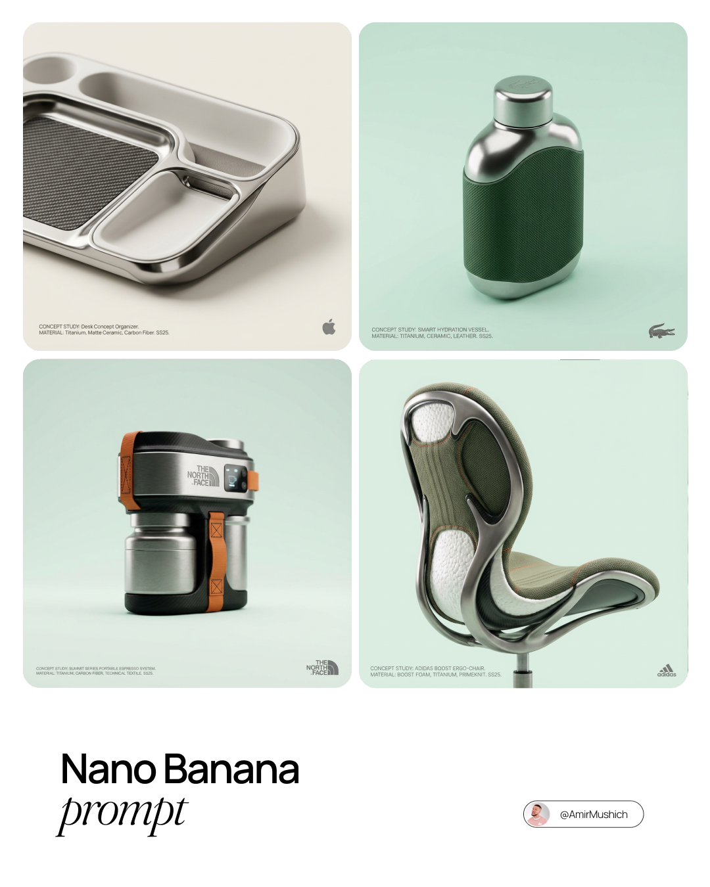

## { "variables": { "CITY_NAME": "Chengdu" }, "image_specs"

- ID: gpt4o-935-en-1
- Slug: prompt-935-en-1
- 语言: en
- 来源: [来源链接](https://x.com/0xbisc/status/2002664549930172496)
- 样例图路径: images/part3/935.jpeg

### 提示词

```text
{

"variables": {

"CITY_NAME": "Chengdu"

},

"image_specs": {

"aspect_ratio": "4:5", "resolution": "2048x2560", "quality": "ultra", "style_strength": 0.8, "detail_level": "high", "sharpen": "medium"

},

"prompt": {

"master_visual_brief": "A high-energy Y2K-inspired editorial collage poster with a strong paper-cut and magazine print aesthetic. The entire image has a tactile paper texture with visible cut edges and layered depth. The theme centers around the city {{CITY_NAME}}. All visual elements, including background imagery, stickers, symbols, typography, and graphic decorations, are culturally and visually inspired by {{CITY_NAME}}. The composition follows a fashion magazine cover logic with dense but controlled information, playful energy, and strong visual hierarchy. The character is designed as a dominant half-body portrait occupying most of the poster.", "photography_and_character": "Character: a randomly generated young woman aged approximately 18–25. She is fashionable, attractive, and trendy, with no fixed hairstyle, hair color, facial features, or makeup. Her appearance varies naturally but always remains stylish and visually appealing. Fashion style is Y2K-inspired street fashion with playful silhouettes, layered styling, and trendy colors. Framing is a strict half-body portrait: the image is cropped at the waist or slightly above, and the lower body is not visible at all. Only the upper torso, shoulders, neck, and head are shown. Pose and gesture: the character performs a randomly selected Y2K-style dynamic pose with strong tension and attitude, including expressive arm extensions, angular elbow bends, asymmetrical shoulder twists, or forward-reaching gestures. Body language remains bold, confident, and energetic. Facial expression: the expression is slightly playful and friendly, with a hint of cuteness layered on top of confidence. Subtle smiles, softly open lips, bright eyes, or a relaxed playful look are allowed, while the overall attitude remains fashion-forward and dynamic rather than cute-only.", "camera_and_lighting": "Editorial portrait framing with a wide-angle look at close distance, optimized for half-body composition. The camera captures only the upper torso and head, with the lower body fully cropped out of frame. Perspective supports dynamic Y2K poses without distorting facial proportions. Lighting is soft, even, and magazine-style, avoiding harsh shadows. The subject is intended to be cut out and integrated into a paper collage rather than rendered as pure realism.", "graphic_design_layout": "Center-focused editorial collage layout. At the top, the city name '{{CITY_NAME}}' appears as the main headline in bold uppercase geometric sans-serif letters. Each letter is placed on an individual colored paper rectangle and arranged in a slight arc. The large half-body character overlaps and partially covers the headline and nearby graphic elements, creating a break-the-frame effect. Surrounding the character are floating paper stickers, speech bubbles, and cut-out graphics inspired by {{CITY_NAME}} culture, including local food, landmarks, symbols, street signs, and iconic objects. The bottom section features a full-width magazine-style collage footer composed of layered paper strips, bold button-style typography, small editorial text blocks, and thumbnail-style graphics.", "background_system": "The background is a black-and-white or desaturated urban street scene from {{CITY_NAME}}, such as crowds, architecture, or city textures. Background contrast is reduced and softened with grain so it supports the composition without competing with the main subject. The background is partially obscured by the large half-body character and collage elements and maintains a printed-paper appearance rather than photographic realism.", "materials_and_textures": "A consistent paper-based aesthetic across the entire image. Visible paper grain, halftone dots, print noise, and slight ink bleed. All elements appear as physical paper cut-outs layered together. Edges are imperfect and tactile. Stickers, typography, and characters cast subtle shadows to suggest layered depth. No glossy, metallic, or digital materials are present.", "composition_and_balance": "Clear and stable visual hierarchy: top city headline '{{CITY_NAME}}', central half-body character (upper torso only), dynamic Y2K-style pose with slightly playful facial expression, surrounding city-themed stickers, and bottom magazine-style collage footer. Strong overlaps between character, typography, and stickers create depth while preserving the established layout."

},

"constraints": {

"must_include": \[ "City name headline using {{CITY_NAME}}", "Strict half-body portrait (waist-up only)", "Lower body completely cropped out", "Y2K-style dynamic pose with strong tension", "Playful but controlled facial expression", "Paper collage and cut-out magazine aesthetic", "City-specific background and stickers related to {{CITY_NAME}}", "Full-width magazine-style collage footer", "Visible paper texture and layered depth" \], "must_avoid": \[ "Full-body view", "Visible legs, knees, thighs, or feet", "Neutral or stiff poses", "Overly cute or childish expressions", "Sexualized expressions or gestures", "Grotesque facial distortion", "Minimalist or empty layouts", "Glossy digital or 3D materials" \]

},

"negative_prompt": "full body, legs visible, knees, thighs, feet, stiff pose, neutral posture, childish expression, exaggerated cute face, sexualized expression, blurry face, deformed hands, extra fingers, bad anatomy, grotesque distortion, minimalist layout, flat image, hyper-realistic photography, glossy surfaces, plastic skin, dull colors, watermark, logo, unreadable text",

"typography_rules": {

"headline": { "text": "{{CITY_NAME}}", "font_style": "bold geometric sans-serif, uppercase", "treatment": "each letter on a separate colored paper rectangle, slightly arched, subtle shadow", "material": "printed paper cut-out" }, "supporting_text": { "style": "editorial magazine blocks, playful sticker captions, speech bubbles", "material": "paper-based printed texture" }

},

"rendering_notes": {

"depth_layers": "background city paper layer -> mid-ground half-body character -> foreground dynamic pose, expressive face, stickers, and typography", "print_feel": "strong magazine print texture with halftone dots, paper grain, and slight ink bleed", "edge_treatment": "clearly visible imperfect cut paper edges"

}

}
```

### 样例图

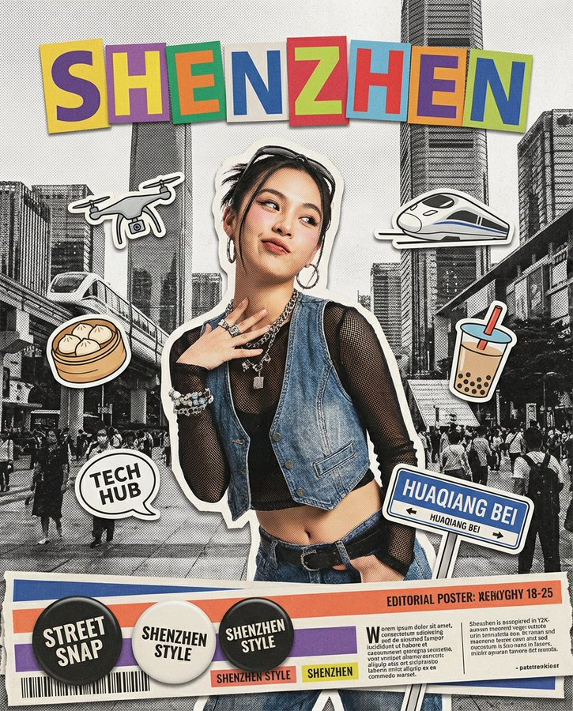

## Y2K时代的拼贴海报

- ID: gpt4o-935-zh-2
- Slug: prompt-935-zh-2
- 语言: zh
- 来源: [来源链接](https://x.com/0xbisc/status/2002664549930172496)
- 样例图路径: images/part3/935.jpeg

### 提示词

```text
{

"变量": {

城市名称：成都

},

"image_specs": {

"aspect_ratio": "4:5", "resolution": "2048x2560", "quality": "ultra", "style_strength": 0.8, "detail_level": "high", "sharpen": "medium"

},

“提示词”： {

“视觉设计概要”： “这是一张充满活力、灵感源自Y2K时代的拼贴海报，具有强烈的剪纸和杂志印刷美感。整幅图像呈现出触感丰富的纸张纹理，可见的切割边缘和层次感。主题围绕着城市{{ CITY_NAME }}展开。所有视觉元素，包括背景图像、贴纸、符号、字体和图形装饰，都从文化和视觉上汲取灵感，源自城市{{ CITY_NAME }} 。构图遵循时尚杂志封面的逻辑，信息丰富但控制得当，充满活力，并具有清晰的视觉层次。人物被设计成占据海报大部分空间的半身肖像。” “摄影与人物”： “人物：一位随机生成的年轻女性，年龄在18至25岁之间。她时尚、迷人、潮流，没有固定的发型、发色、五官或妆容。她的外貌自然变化，但始终保持时尚和视觉吸引力。时尚风格是受Y2K时代启发的街头时尚。”俏皮的轮廓、层次丰富的造型和潮流的色彩。构图采用严格的半身像：画面裁剪至腰部或略高于腰部，下半身完全不可见。仅展现上半身、肩膀、颈部和头部。姿势和手势：人物摆出随机选择的Y2K风格动态姿势，充满张力和态度，包括富有表现力的手臂伸展、肘部角度弯曲、不对称的肩部扭转或向前伸展的动作。肢体语言大胆、自信且充满活力。面部表情：表情略带俏皮和友好，在自信之上又增添了一丝可爱。允许有淡淡的微笑、微微张开的嘴唇、明亮的眼神或轻松俏皮的表情，整体风格保持时尚前卫和动感，而非仅仅可爱。“相机和灯光”：“采用广角镜头近距离拍摄的编辑人像构图，针对半身像进行了优化。相机仅拍摄上半身和头部，下半身不可见。”人物身体完全裁剪出画面之外。透视效果支持动态的千禧年风格姿势，且不会扭曲面部比例。光线柔和均匀，采用杂志风格，避免了生硬的阴影。人物旨在被剪裁并融入纸质拼贴画中，而非以纯粹的写实手法呈现。平面设计布局：以中心为焦点的编辑拼贴画布局。顶部，城市名称“ {{城市名称}} ”以粗体大写几何无衬线字体作为主标题。每个字母都放置在单独的彩色纸质矩形上，并呈略微弧形排列。较大的半身人物与标题和附近的图形元素重叠并部分覆盖，营造出一种打破画面框架的效果。人物周围环绕着漂浮的纸质贴纸、对话气泡和剪纸图形，其灵感来自{{城市名称}}的文化，包括当地美食、地标、符号、路标和标志性物品。底部部分是一个由多层纸张组成的全宽杂志风格拼贴画页脚。条状文字、醒目的按钮式字体、小型编辑文本块和缩略图式图形。”, “背景系统”: “背景是来自{{城市名称}}的黑白或低饱和度城市街景，例如人群、建筑或城市纹理。背景对比度降低，并添加了颗粒感以柔化画面，从而在不干扰主体的情况下支持构图。背景部分被大型半身人物和拼贴元素遮挡，保持了印刷纸的外观，而非照片的真实感。”, “材质与纹理”: “整个图像保持一致的纸质美学。可见的纸张纹理、半色调网点、印刷噪点和轻微的墨迹晕染。所有元素都像是层叠在一起的实体纸片。边缘不完美且触感明显。贴纸、字体和人物投射出微妙的阴影，暗示出层次感。没有光泽、金属或数字材质。”, “构图与平衡”: “清晰稳定的视觉层次：顶部城市标题“ {{城市名称}} ”，中央半身人物（仅上半身），动态的千禧年风格姿势，略带俏皮的面部表情，周围环绕着城市主题贴纸，底部是杂志风格的拼贴页脚。人物、字体和贴纸之间的强烈重叠在保持既定布局的同时，营造出层次感。

},

"约束": {

"必须包含：" [ "使用城市名称作为标题{{ CITY_NAME }} ", "严格的半身像（仅腰部以上）", "下半身完全裁剪", "Y2K风格的动态姿势，充满张力", "俏皮但克制的表情", "纸质拼贴和剪贴杂志风格", "与城市相关的背景和贴纸{{ CITY_NAME }} ", "全宽杂志风格拼贴页脚", "可见的纸张纹理和层次感" ], "必须避免：" [ "全身照", "可见的腿、膝盖、大腿或脚", "中性或僵硬的姿势", "过于可爱或幼稚的表情", "性化的表情或手势", "怪诞的面部扭曲", "极简主义或空白的布局", "光面数字或3D材质" ]

},

"negative_prompt": "全身，腿部可见，膝盖，大腿，脚，僵硬姿势，中立姿势，幼稚表情，夸张可爱表情，性化表情，模糊面部，畸形手，多余手指，解剖结构错误，怪诞扭曲，极简布局，平面图像，超写实摄影，光滑表面，塑料皮肤，暗淡色彩，水印，标志，无法辨认的文字",

"typography_rules": {

"标题": { "正文": " {{城市名称}} ", "字体": "粗体几何无衬线字体，大写", "处理方式": "每个字母位于单独的彩色纸矩形上，略微拱起，带有微妙的阴影", "材质": "印刷纸剪裁" }, "辅助文本": { "风格": "杂志社论版块，趣味贴纸标题，对话气泡", "材质": "纸质印刷纹理" }

},

"渲染注释": {

"depth_layers": "背景：城市纸张层->中景：半身人物->前景：动态姿势、表情丰富的面部、贴纸和文字。"print_feel": "强烈的杂志印刷纹理，带有半色调网点、纸张纹理和轻微的墨迹晕染。"edge_treatment": "清晰可见的不完美裁切纸张边缘。"

}

}
```

### 样例图


## { "subject": { "description": "A fit young Asian woman f

- ID: gpt4o-933-en-1
- Slug: prompt-933-en-1
- 语言: en
- 来源: [来源链接](https://x.com/underwoodxie96/status/2002639331501224005)
- 样例图路径: images/part3/933.jpeg

### 提示词

```text
{
"subject": {
"description": "A fit young Asian woman frozen in mid-air while running, capturing a dynamic athletic moment.",
"mirror_rules": "N/A",
"age": "20s",
"expression": {
"eyes": {
"look": "focused ahead",
"energy": "determined",
"direction": "forward"
},
"mouth": {
"position": "slightly open breathing",
"energy": "concentrated"
},
"overall": "intense focus and athletic determination"
},
"face": {
"preserve_original": true,
"makeup": "natural fresh look"
},
"hair": {
"color": "black",
"style": "high ponytail",
"effect": "flying back dynamically due to motion"
},
"body": {
"frame": "athletic and toned",
"waist": "visible silhouette",
"chest": "covered",
"legs": "muscular definition visible, mid-air stride",
"skin": {
"visible_areas": "legs, face, hands",
"tone": "warm tan",
"texture": "smooth with muscle definition",
"lighting_effect": "high contrast sunlight highlights"
}
},
"pose": {
"position": "mid-air jump",
"base": "levitating",
"overall": "dynamic running stride, one knee raised high, arms swinging"
},
"clothing": {
"top": {
"type": "long-sleeve athletic zip-up jacket",
"color": "pastel pink",
"details": "fitted, sporty seams",
"effect": "stretched with movement"
},
"bottom": {
"type": "athletic shorts",
"color": "pastel pink",
"details": "matching set"
}
}
},
"accessories": {
"headwear": null,
"jewelry": null,
"device": null,
"prop": {
"type": "footwear",
"details": "white sneakers with black swoosh logo, white crew socks"
}
},
"photography": {
"camera_style": "commercial advertising photography",
"angle": "low angle worm's eye view",
"shot_type": "full body side profile",
"aspect_ratio": "3:4",
"texture": "sharp focus, high contrast, commercial print quality",
"lighting": "hard daylight, direct sun, strong shadows",
"depth_of_field": "deep, background visible but geometric"
},
"background": {
"setting": "urban modern exterior",
"wall_color": "blue-grey glass",
"elements": [
"geometric triangular glass facade",
"metallic frames",
"reflection of runner in glass",
"brick pavement at bottom"
],
"typography": {
"text_content": "JUST DO IT",
"font_style": "Massive Bold Sans-Serif (Nike style)",
"color": "White",
"position": "Center of the image",
"integration": "Layered text: placed behind the subject or overlaying the center with slight transparency",
"visual_weight": "Dominant slogan"
},
"atmosphere": "modern, clean, energetic, motivational",
"lighting": "bright natural sunlight"
},
"the_vibe": {
"energy": "explosive power",
"mood": "motivational",
"aesthetic": "urban sportswear commercial",
"authenticity": "high",
"intimacy": "distant observer",
"story": "morning run in the city, pushing limits",
"caption_energy": "Just Do It."
},
"constraints": {
"must_keep": [
"text 'JUST DO IT' clearly visible",
"mid-air suspension",
"pastel pink outfit",
"geometric glass background",
"sharp focus"
],
"avoid": [
"misspelled text",
"text covering the face",
"blur",
"studio background",
"static pose"
]
},
"negative_prompt": [
"typos",
"gibberish text",
"cluttered text",
"motion blur",
"distorted limbs",
"bad anatomy",
"extra legs",
"dull lighting"
]
}
```

### 样例图

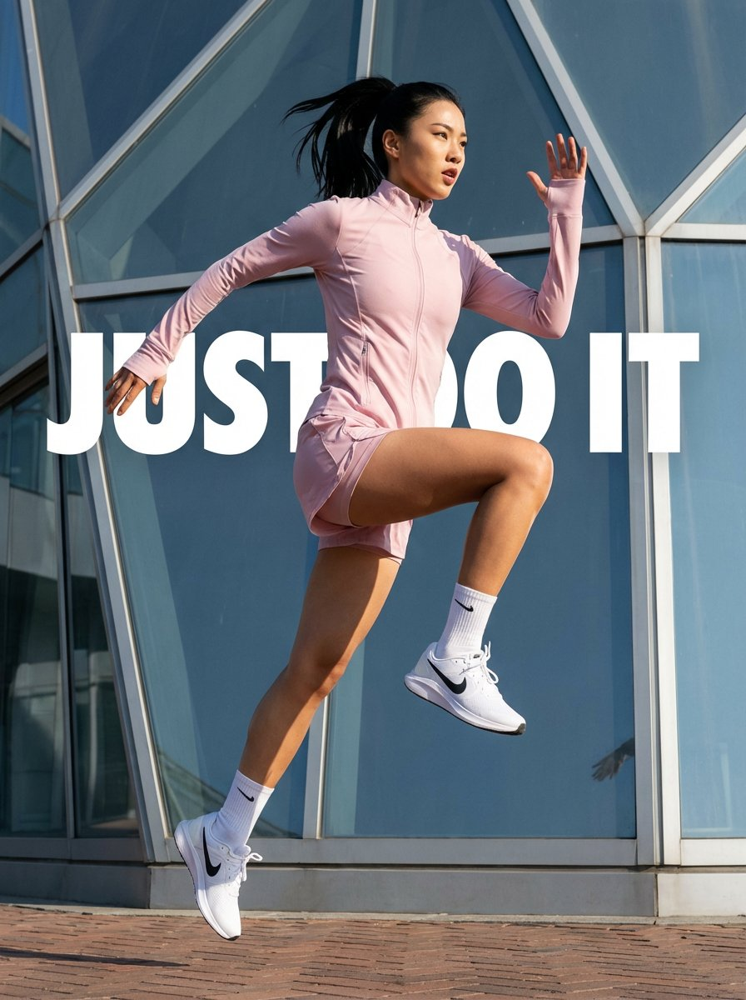

## 女性在奔跑时腾空而起

- ID: gpt4o-933-zh-2
- Slug: prompt-933-zh-2
- 语言: zh
- 来源: [来源链接](https://x.com/underwoodxie96/status/2002639331501224005)
- 样例图路径: images/part3/933.jpeg

### 提示词

```text
{
“主题”： {
描述：一位身材健美的年轻亚裔女性在奔跑时腾空而起，定格了她充满活力的运动瞬间。
"mirror_rules": "N/A",
年龄：20多岁，
“表达”： {
"眼睛": {
“看”：“专注于前方”，
“能量”：“坚定的”，
“方向”: “向前”
},
“嘴”： {
“姿势”：“微微张开呼吸”，
“能量”: “集中的”
},
“总体而言”：“高度专注和运动上的决心”
},
“脸”： {
"preserve_original": true,
妆容： “自然清新妆容”
},
“头发”： {
“颜色：黑色”，
“发型”：“高马尾辫”，
“效果”：“由于运动而动态地向后飞”
},
“身体”： {
“体型”： “运动型且线条优美”，
“腰部”: “可见轮廓”，
“胸部”： “覆盖的”，
“腿部”：“肌肉线条清晰可见，腾空迈步”，
“皮肤”： {
"visible_areas": "腿、脸、手",
“色调”：“暖棕色”，
“质地”：“光滑，肌肉线条分明”，
"lighting_effect": "高对比度阳光高光"
}
},
"姿势": {
“位置”：“空中跳跃”，
“基座”：“悬浮”，
“整体”： “动态跑步步伐，单膝高抬，双臂摆动”
},
“衣服”： {
“顶部”： {
“类型”：“长袖运动拉链夹克”，
“颜色”： “淡粉色”，
“细节”：“合身、运动感十足的缝线”，
“效果”：“随着运动而拉伸”
},
“底部”： {
“类型”：“运动短裤”，
“颜色”： “淡粉色”，
“详情”：“配套套装”
}
}
},
“配件”： {
“头饰”：null，
“珠宝”：null，
“设备”：null，
"prop": {
"type": "鞋类",
“细节”：“白色运动鞋，黑色耐克标志，白色船袜”
}
},
“摄影”： {
"camera_style": "商业广告摄影",
“角度”: “低角度虫眼视图”
"shot_type": "全身侧脸轮廓",
"aspect_ratio": "3:4",
“纹理”：“清晰聚焦，高对比度，商业印刷质量”，
“照明”：“强烈的日光、直射阳光、强烈的阴影”，
景深： “深邃，背景可见但呈几何形状”
},
“背景”： {
“环境”: “都市现代外观”，
"wall_color": "蓝灰色玻璃"
“元素”：[
“几何三角形玻璃幕墙”，
“金属框架”，
“跑步者在玻璃中的倒影”
“底部是砖砌路面”
],
"排版": {
"text_content": "JUST DO IT",
"font_style": "Massive Bold Sans-Serif (Nike style)",
颜色：白色，
"位置": "图像中心",
“整合”：“分层文本：放置在主体后面或以略微透明的方式覆盖中心”，
"视觉权重": "主要标语"
},
“氛围”：“现代、干净、充满活力、令人振奋”
“照明”：“明亮的自然阳光”
},
"氛围": {
“能量”：“爆炸力”，
“情绪”：“激励的”，
“美学”: “都市运动服饰广告”
“真实性”： “高”，
“亲密”: “疏离的观察者”，
“故事”：“城市晨跑，挑战极限”
“caption_energy”： “Just Do It.”
},
"约束": {
"must_keep": [
“文字‘JUST DO IT’清晰可见”，
“空中悬架”，
“淡粉色套装”，
“几何玻璃背景”，
“清晰聚焦”
],
“避免”： [
拼写错误的文本
“遮住脸部的文字”，
“模糊”，
“摄影棚背景”，
“静态姿势”
]
},
"negative_prompt": [
错别字，
“乱码文本”，
“杂乱的文本”，
“动态模糊”，
“肢体畸形”，
“糟糕的解剖学”
“额外的腿”，
“昏暗的灯光”
]
}
```

### 样例图


## { "subject": { "person": "Young Western woman", "pose": 

- ID: gpt4o-924-en-1
- Slug: prompt-924-en-1
- 语言: en
- 来源: [来源链接](https://x.com/Just_sharon7/status/2002615857185501519)
- 样例图路径: images/part3/924.jpeg

### 提示词

```text
{
"subject": {
"person": "Young Western woman",
"pose": "Side profile, seated on a high white swivel bar stool, looking directly at the camera with a subtle, neutral expression",
"hair": "Dark blond, styled in a voluminous low side bun (chignon) with loose strands framing the face",
"clothing": {
"jacket": "Tailored bubblegum pink blazer, single-button closure, notched lapels",
"undershirt": "Plain white crew-neck top",
"trousers": "Matching bubblegum pink slim-fit dress pants",
"footwear": "Black canvas low-top sneakers with white soles and black laces (Vans style)"
}
},
"environment": {
"setting": "Professional television news studio or talk show set",
"background_elements": [
{
"type": "LED Screen",
"content": "Pink and white horizontal stripes with a vertical logo reading 'B NOW' in bold block letters"
},
{
"type": "Digital Graphic",
"content": "Blue circular futuristic HUD/UI interface graphic on a vertical panel"
}
],
"furniture": "White modern curved bar stool with chrome pedestal base; glossy white and black reflective studio flooring"
},
"technical_details": {
"lighting": [
"High-key studio lighting",
"Large white softbox visible on a stand to the right",
"Black flag/scrim visible on the left side of the frame",
"Blue ambient LED accent lighting along the base of the walls"
],
"camera_angle": "Medium full shot, eye-level, slight side-on perspective",
"composition": "The subject is centered vertically, positioned between studio equipment and digital screens, showing the 'behind-the-scenes' reality of the set",
"color_palette": {
"primary": "Bubblegum pink, stark white",
"secondary": "Deep blue, black",
"accents": "Chrome, neutral grey"
}
},
"vibe": "Professional yet candid, modern, broadcast media aesthetic"
}
```

### 样例图

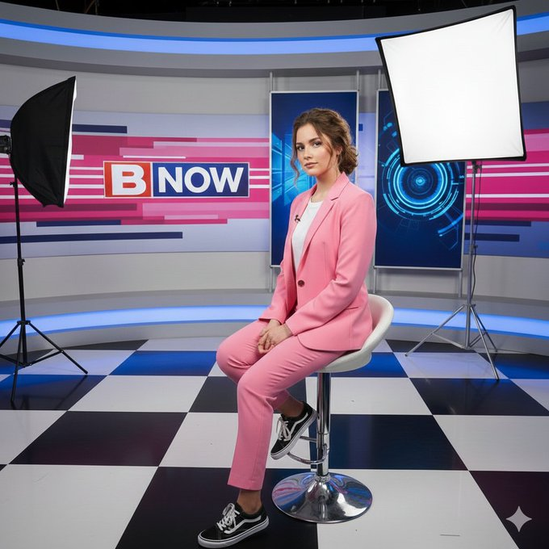

## 电视新闻演播室现场

- ID: gpt4o-924-zh-2
- Slug: prompt-924-zh-2
- 语言: zh
- 来源: [来源链接](https://x.com/Just_sharon7/status/2002615857185501519)
- 样例图路径: images/part3/924.jpeg

### 提示词

```text
{
“主题”： {
“人”: “年轻的西方女性”
“姿势”：“侧脸，坐在白色高脚旋转吧台凳上，直视镜头，表情微妙而中性”，
“头发”：“深金色，梳成蓬松的低侧发髻（发髻），几缕碎发垂在脸颊两侧”，
“衣服”： {
“外套”：“修身泡泡糖粉色西装外套，单扣，缺角翻领”
“内衣”： “纯白色圆领上衣”，
“裤子”： “配套的泡泡糖粉色修身西裤”
“鞋类”：“黑色帆布低帮运动鞋，白色鞋底，黑色鞋带（Vans 款式）”
}
},
“环境”： {
“场景”：“专业电视新闻演播室或脱口秀节目现场”，
“背景元素”：[
{
"type": "LED屏幕",
“内容”：“粉色和白色横条纹，带有醒目的竖排“B NOW”标志”
},
{
"type": "数字图形",
“内容”：“垂直面板上的蓝色圆形未来主义HUD/UI界面图形”
}
],
“家具”：“白色现代弧形吧台凳，镀铬底座；亮白色和黑色反光工作室地板”
},
"technical_details": {
“灯光”： [
“高调影棚灯光”，
“右侧支架上可以看到一个大型白色柔光箱，”
“画面左侧可见黑色旗帜/幕布”，
“沿墙底部设置蓝色环境LED重点照明”
],
“camera_angle”: “中景全景，平视，略微侧视”
“构图”：“主体垂直居中，位于摄影棚设备和数字屏幕之间，展现了片场‘幕后’的真实情况。”
"color_palette": {
“主色”：泡泡糖粉色，纯白色，
“次要的”: “深蓝色，黑色”
“点缀色”：铬色、中性灰
}
},
“氛围”：“专业而坦诚，现代，广播媒体美学”
}
```

### 样例图


## 冬至海报

- ID: gpt4o-923-zh
- Slug: prompt-923-zh
- 语言: zh
- 来源: [来源链接](https://x.com/sundyme/status/2002592213851832742)
- 样例图路径: images/part3/923.jpeg

### 提示词

```text
一个温馨的3D C4D Octane渲染场景，采用无黑色轮廓的羊毛针毡风格，具有盲盒玩具的柔和边缘审美。四只不同大小的粉彩（薄荷绿、嫩粉、淡蓝、奶油色）羊毛毡Labubu角色，身穿针织毛衣，有着标志性的圆润身体、兔耳和大眼睛，表情喜悦。它们围坐在铺着针织桌布的矮桌旁，桌上摆满热气腾腾的饺子、茶壶和餐具。一个角色正用筷子亲昵地喂另一个角色吃饺子。地面覆盖着羊毛雪和散落的心形装饰。左侧是挂着灯笼的盛开梅花枝，右侧是祥云图案。发光的羊毛心形在空中漂浮。背景是温暖的橙黄色渐变，营造出冬至家庭团聚的节日氛围。顶部是巨大、发光、毛绒质感的艺术字体“饺饺情深，岁岁安康”。中间是清晰简单的祝福语：“愿家人健康快乐，幸福安康！”。8K分辨率，高细节，暖光摄影棚照明，垂直2:3比例。
```

### 样例图

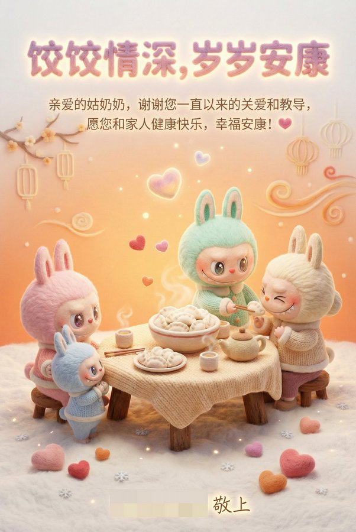

## Create a 3×3 grid in 3:4 aspect ratio for a high-end com

- ID: gpt4o-922-en-1
- Slug: prompt-922-en-1
- 语言: en
- 来源: [来源链接](https://x.com/firatbilal/status/2002424619232588218)
- 样例图路径: images/part3/922.jpeg

### 提示词

```text
Create a 3×3 grid in
3:4 aspect ratio for a high-end commercial marketing campaign using the uploaded product as the central subject.

Each frame must present a distinct visual concept while maintaining perfect product consistency across all nine images.

Grid Concepts (one per cell):

1. Iconic hero still life with bold composition

2. Extreme macro detail highlighting material, surface, or texture

3. Dynamic liquid or particle interaction surrounding the product

4. Minimal sculptural arrangement with abstract forms

5. Floating elements composition suggesting lightness and innovation

6. Sensory close-up emphasizing tactility and realism

7. Color-driven conceptual scene inspired by the product palette

8. Ingredient or component abstraction (non-literal, symbolic)

9. Surreal yet elegant fusion scene combining realism and imagination

Visual Rules:
Product must remain 100% accurate in shape, proportions, label, typography, color, and branding
No distortion, deformation, or redesign of the product
Clean separation between product and background

Lighting & Style:
Soft, controlled studio lighting
Subtle highlights, realistic shadows
High dynamic range, ultra-sharp focus
Editorial luxury advertising aesthetic
Premium sensory marketing look

Overall Feel:
Modern, refined, visually cohesive
High-end commercial campaign
Designed for brand websites, social grids, and digital billboards
Hyperreal, cinematic, polished, and aspirational
```

### 样例图

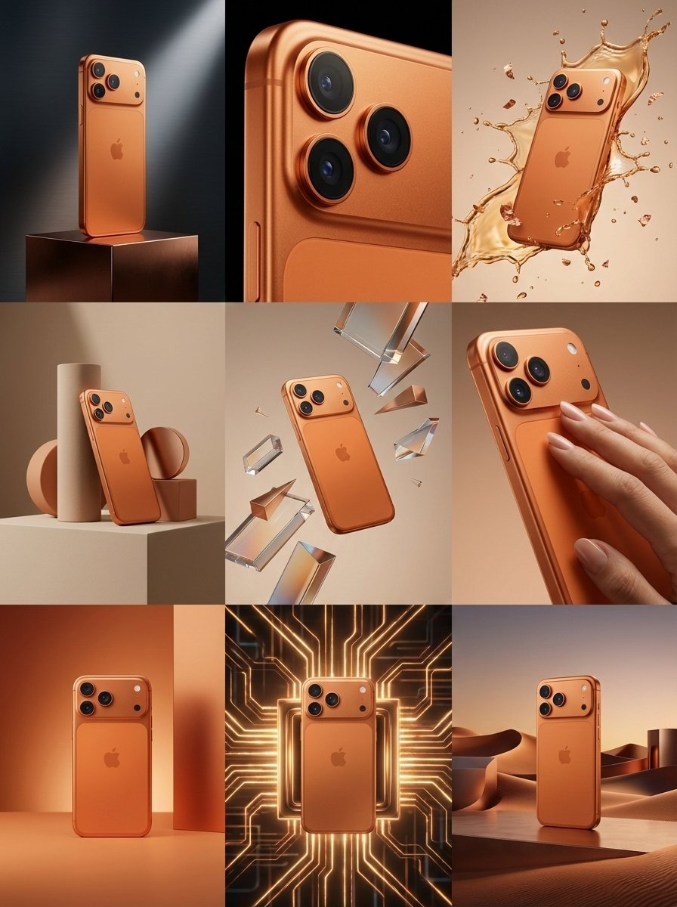

## 产品高端商业营销设计

- ID: gpt4o-922-zh-2
- Slug: prompt-922-zh-2
- 语言: zh
- 来源: [来源链接](https://x.com/firatbilal/status/2002424619232588218)
- 样例图路径: images/part3/922.jpeg

### 提示词

```text
创建一个 3×3 的网格
3:4 宽高比，适用于以上传产品为中心主题的高端商业营销活动。

每幅画面都必须呈现独特的视觉概念，同时在所有九幅画面中保持产品的完美一致性。

网格概念（每个单元格一个）：

1. 构图大胆的标志性英雄静物画

2. 极致的宏观细节，突出材质、表面或纹理。

3. 产品周围的动态液体或颗粒相互作用

4. 极简主义的抽象造型雕塑摆设

5. 漂浮元素构成，暗示着轻盈和创新。

6. 强调触觉和真实感的感官特写

7. 以产品色卡为灵感的色彩驱动型概念场景

8. 成分或组成部分抽象（非字面意义、符号意义）

9. 超现实而又优雅的融合场景，兼具现实主义与想象力

视觉规则：
产品在形状、比例、标签、字体、颜色和品牌标识方面必须保持100%准确。
产品不得有任何变形、扭曲或重新设计。
产品与背景之间清晰分离

灯光与风格：
柔和、可控的摄影棚灯光
微妙的高光，逼真的阴影
高动态范围，超清晰对焦
编辑奢华广告美学
高端感官营销外观

整体感觉：
现代、精致、视觉上和谐统一
高端商业推广活动
专为品牌网站、社交媒体平台和数字广告牌而设计
超现实的、电影般的、精致的、令人向往的
```

### 样例图


## 城市渲染数字艺术海报

- ID: gpt4o-920-zh
- Slug: prompt-920-zh
- 语言: zh
- 来源: [来源链接](https://x.com/op7418/status/2002592082125578427)
- 样例图路径: images/part3/920.jpeg

### 提示词

```text
一张针对 [城市名称] 的城市渲染数字艺术海报。

画面核心主体是一个漂浮在白云上方、形状像所选城市的并且占据画面大部分内容的微型岛屿。岛屿的形状与城市在地图上的形状相似，无缝融合城市独特的标志性地标、自然景观及文化元素。加入城市特有的鸟类、电影般的光影、鲜艳色彩、航拍视角和阳光反射效果，建筑不宜太多太密集。

岛屿展现历史与现代的无缝融合。一部分是该城市最具代表性的古代历史建筑；另一部分平滑过渡为城市的地标建筑和天际线景观。

岛屿漂浮浩瀚云海之上。云海采用该城市所在文化圈的传统艺术风格进行表现。

立体城市拼音或英文名的 3D 文字漂浮在微型岛屿的上方，这组文字像一个生态与文化共生的微缩生态装置。

在画面四周和主体周围，叠加一层极简、高雅、具有博物馆展板质感的信息排版层。主要检索相关的城市信息，主要信息使用经典的衬线字体，辅助数据可使用极细的极简无衬线体。在画面的角落，以类似古典地图集或高级杂志扉页的方式排版。用衬线体标注城市的地理坐标、别称或建城年份，以及当前的天气，作为装饰性的背景信息，整体排版留白极多，排版克制、干净、平衡，如同在欣赏一件珍贵的艺术品。

风格要求： Octane Render, C4D, Isometric City, Micro World, Living Ecosystem, 8k Resolution. DreamWorks style, 3D modeling, delicate, soft light projection.
```

### 样例图

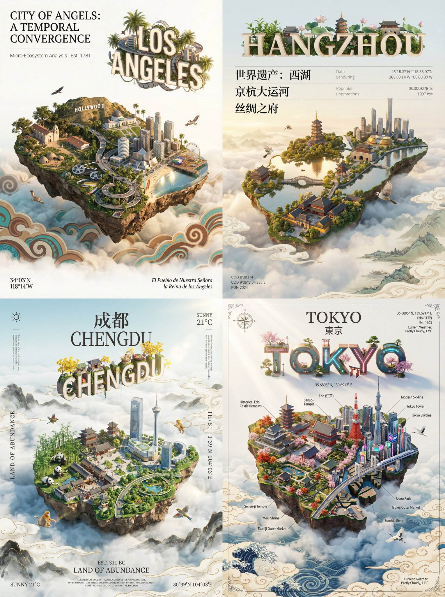

## 剪纸艺术

- ID: gpt4o-907-zh
- Slug: prompt-907-zh
- 语言: zh
- 来源: [来源链接](https://x.com/berryxia/status/2002015301618294794)
- 样例图路径: images/part3/907.jpeg

### 提示词

```text
Paper cut layered art: [城市名称英文] ([城市名称本地语言]) day-night elegant diagonal split (top-left→bottom-right) with soft artistic transition.
Core: ONE [标志性地标建筑] bisected diagonally with elegant gradient - warm golden tones (day side: orange, peach, coral, amber, [特色暖色]) / cool tones with rich warm lights (night side: navy, purple, midnight blue, with abundant yellow windows, red lanterns, vibrant [特色]accents).
CRITICAL AESTHETIC REQUIREMENTS:
- Beautiful, visually stunning composition
- Rich details and intricate paper cut patterns
- Elegant color harmony with [城市文化] aesthetics
- Sophisticated [文化特色] decorative elements
- High artistic value with refined craftsmanship
  Text: "[城市名称文字]" in beautiful [语言类型] calligraphy/typography, split by diagonal with elegant transition, surrounded by exquisite [本地装饰图案1], [本地装饰图案2], and [本地装饰图案3], strong dimensional depth with layered shadow effects.
  Day side (left/top): Brilliant golden sun with radiating warm rays, gorgeous warm amber/peach/coral sky with [特色氛围描述], [城市气质] sophisticated atmosphere. Beautiful daytime elements - [特色美食1] with [细节描述], [特色美食2] with [呈现方式], [特色美食3] with [艺术呈现], [其他美食]; stunning [代表性植物1] with detailed [部位] in rich [颜色], [代表性植物2] with [特征描述]; magnificent [地理特征] in bright [颜色] reflection with [细节]; [标志性建筑/场景1] with ornate details glowing in sunlight, [特色街景/场景] with refined [细节], [文化活动场景] with [描述].
  Diagonal transition: Soft gradient with twilight beauty - [过渡色1], [过渡色2], [过渡色3], [过渡色4], [过渡色5] - creating elegant natural flow [体现城市特色的过渡描述].
  Night side (right/bottom): Gorgeous blue/silver moon with ethereal glow and sparkling stars, rich deep navy and midnight blue sky with beautiful depth. Spectacular nighttime atmosphere with abundant warm light sources creating magical [文化特色] ambiance - numerous glowing yellow windows/lights creating patterns, elegant orange street lamps [位置描述], beautiful traditional red lanterns [场景描述], stunning purple-magenta [特色灯光], brilliant cyan-teal [地标灯光], golden light from [场所] glows, rich amber reflections [位置]. Night elements - dazzling illuminated [夜间地标1] with [效果], magnificent glowing [夜间地标2], charming [夜间场景] with [氛围], vibrant [夜生活描述].
  Unified elements (each appears once with elegant transition): [主要地标1] showing beautiful gradient from day to night, [主要地标2] with [细节], [地理特征] with [变化描述], [建筑群] with [风格描述], [植物] with natural beauty, [交通工具], [文化符号] with [装饰], harmonious blend of [传统特色] and [现代特色].
  Craft technique: 10-12 distinct paper layers with EXTREME pronounced depth and dimension, very thick visible edges (4-6mm thickness showing dimension), dramatic shadows creating powerful 3D sculptural relief effect, each element shows intricate multi-layer construction with refined details, ornate [文化特色] decorative patterns throughout ([图案1], [图案2], [图案3]), side-lighting creating stunning dimensional effect [强调特色].
  Format: landscape orientation, no border, no frame, elegant soft diagonal transition (clear enough to show duality but refined and artistic), sophisticated visual balance, BEAUTIFUL and STUNNING overall aesthetic capturing [城市特色].
  The artwork should be visually gorgeous, [气质形容词1], [气质形容词2] - capturing [城市核心特质描述].

{以此风格展示绘制梵高的人物展示，使用4K输出 9:16 周五就是与梵高相关的元素}
```

### 样例图

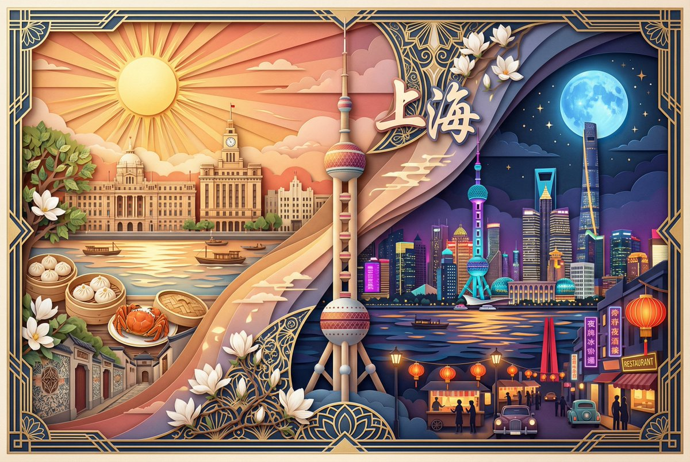

## 高角度商业美食摄影照片

- ID: gpt4o-898-zh
- Slug: prompt-898-zh
- 语言: zh
- 来源: [来源链接](https://x.com/linxiaobei888/status/2001591561302483267)
- 样例图路径: images/part3/898.jpeg

### 提示词

```text
一张高角度商业美食摄影照片，展示了[天妇罗]盛放在极简风格的透明玻璃盘中，配有一小玻璃碗酱油和一碗芥末。旁边放着两只筷子，背景为纯净的奶油米白色，留有充足的留白。左侧叠加了时尚的黑色无衬线字体排版，简单介绍了菜品名称、价格和搭配说明。右上角有一个极简的小Logo。采用柔和的摄影棚布光，逼真的柔和阴影，具有时尚杂志的编辑风格。该设计以优质纸张背景填满整个 16:9 画面，采用大师级平面设计，配有精致的中式排版、极其克制的植物图案和精致优雅的光线，营造出一种空灵、奢华、精致的氛围，具有最大的精致感和考究感
```

### 样例图

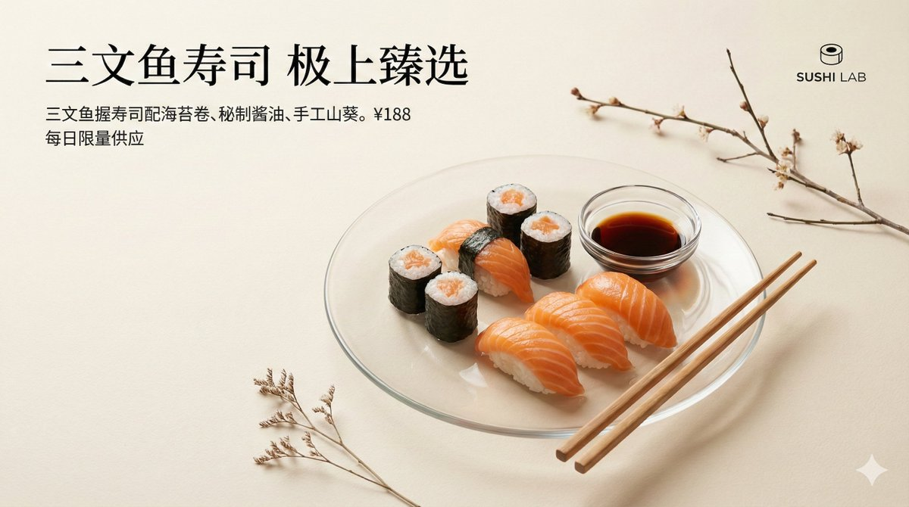

## Create a 3×3 grid in 3:4 aspect ratio for a high-end com

- ID: gpt4o-893-en-1
- Slug: prompt-893-en-1
- 语言: en
- 来源: [来源链接](https://x.com/azed_ai/status/2000845183257292883)
- 样例图路径: images/part3/893.jpeg

### 提示词

```text
Create a 3×3 grid in
3:4 aspect ratio for a high-end commercial marketing campaign using the uploaded product as the central subject.

Each frame must present a distinct visual concept while maintaining perfect product consistency across all nine images.

Grid Concepts (one per cell):

1. Iconic hero still life with bold composition

2. Extreme macro detail highlighting material, surface, or texture

3. Dynamic liquid or particle interaction surrounding the product

4. Minimal sculptural arrangement with abstract forms

5. Floating elements composition suggesting lightness and innovation

6. Sensory close-up emphasizing tactility and realism

7. Color-driven conceptual scene inspired by the product palette

8. Ingredient or component abstraction (non-literal, symbolic)

9. Surreal yet elegant fusion scene combining realism and imagination

Visual Rules:
Product must remain 100% accurate in shape, proportions, label, typography, color, and branding
No distortion, deformation, or redesign of the product
Clean separation between product and background

Lighting & Style:
Soft, controlled studio lighting
Subtle highlights, realistic shadows
High dynamic range, ultra-sharp focus
Editorial luxury advertising aesthetic
Premium sensory marketing look

Overall Feel:
Modern, refined, visually cohesive
High-end commercial campaign
Designed for brand websites, social grids, and digital billboards
Hyperreal, cinematic, polished, and aspirational
```

### 样例图

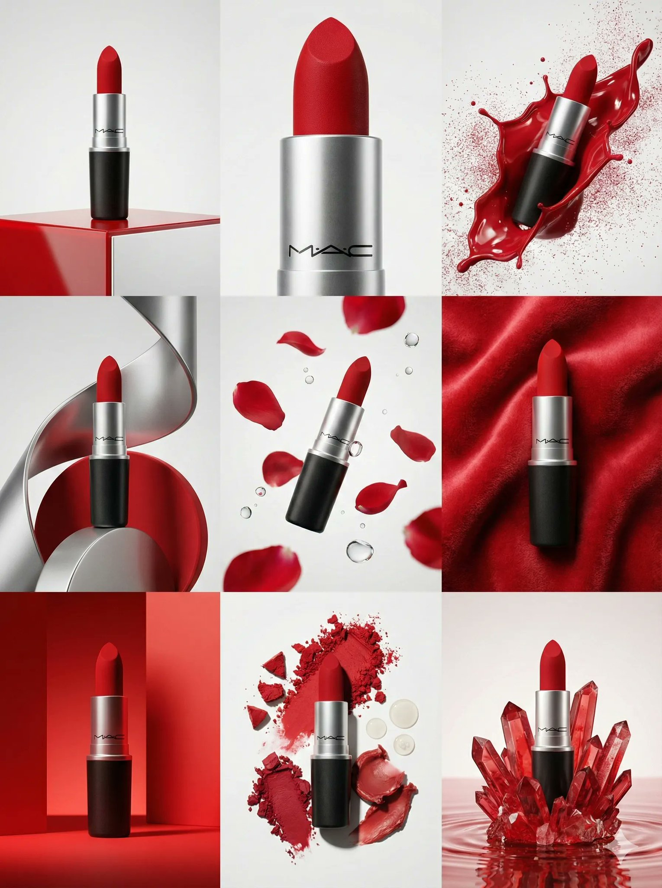

## 9宫格产品展示

- ID: gpt4o-893-zh-2
- Slug: prompt-893-zh-2
- 语言: zh
- 来源: [来源链接](https://x.com/azed_ai/status/2000845183257292883)
- 样例图路径: images/part3/893.jpeg

### 提示词

```text
创建一个 3×3 的网格
3:4 宽高比，适用于以上传产品为中心主题的高端商业营销活动。

每幅画面都必须呈现独特的视觉概念，同时在所有九幅画面中保持产品的完美一致性。

网格概念（每个单元格一个）：

1. 构图大胆的标志性英雄静物画

2. 极致的宏观细节，突出材质、表面或纹理。

3. 产品周围的动态液体或颗粒相互作用

4. 极简主义的抽象造型雕塑摆设

5. 漂浮元素构成，暗示着轻盈和创新。

6. 强调触觉和真实感的感官特写

7. 以产品色卡为灵感的色彩驱动型概念场景

8. 成分或组成部分抽象（非字面意义、符号意义）

9. 超现实而又优雅的融合场景，兼具现实主义与想象力

视觉规则：
产品在形状、比例、标签、字体、颜色和品牌标识方面必须保持100%准确。
产品不得有任何变形、扭曲或重新设计。
产品与背景之间清晰分离

灯光与风格：
柔和、可控的摄影棚灯光
微妙的高光，逼真的阴影
高动态范围，超清晰对焦
编辑奢华广告美学
高端感官营销外观

整体感觉：
现代、精致、视觉上和谐统一
高端商业推广活动
专为品牌网站、社交媒体平台和数字广告牌而设计
超现实的、电影般的、精致的、令人向往的
```

### 样例图


## Present a clear, 45° top-down isometric miniature 3D dio

- ID: gpt4o-882-en-1
- Slug: prompt-882-en-1
- 语言: en
- 来源: [来源链接](https://x.com/TechieBySA/status/2000876376287576430)
- 样例图路径: images/part3/882.jpeg

### 提示词

```text
Present a clear, 45° top-down isometric miniature 3D diorama of the iconic vehicle [VEHICLE NAME].

The vehicle is the main focus, placed on a small raised diorama-style base that reflects its most recognizable environment
(e.g. road, runway, ocean, space, racetrack), with subtle contextual details and tiny stylized figures if appropriate.

Use soft refined textures, realistic PBR materials, and gentle cinematic lighting.
The vehicle should feel premium, collectible, and instantly recognizable at a glance.

Use a clean solid [BACKGROUND COLOR] background with no gradients.

At the top-center, display “[VEHICLE NAME]” in large bold text.
Directly beneath it, display a short descriptor in medium text (e.g. “Iconic Movie Car”, “World’s Fastest Train”).
Optionally place an official logo or emblem below the text.

All text must automatically match background contrast (white or black).
Composition: perfectly centered, square 1080x1080, ultra-clean high-clarity diorama aesthetic.
```

### 样例图

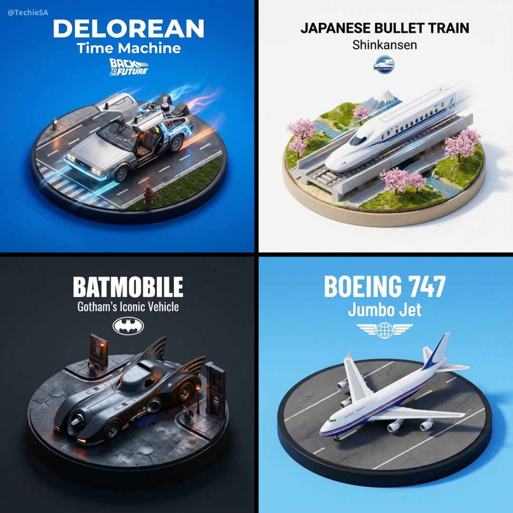

## 微缩3D立体模型

- ID: gpt4o-882-zh-2
- Slug: prompt-882-zh-2
- 语言: zh
- 来源: [来源链接](https://x.com/TechieBySA/status/2000876376287576430)
- 样例图路径: images/part3/882.jpeg

### 提示词

```text
“展示一个清晰的、45°俯视等距微缩3D立体模型，展现标志性车辆[车辆名称]。

车辆是主要焦点，放置在一个小型凸起的立体模型底座上，该底座反映了车辆最典型的环境。
（例如道路、跑道、海洋、太空、赛道），如果合适，可以添加微妙的背景细节和微小的程式化人物。

使用柔和细腻的纹理、逼真的PBR材质和柔和的电影级光照。
这款车应该给人一种高端、值得收藏的感觉，并且一眼就能认出来。

使用干净的纯色背景，不要使用渐变色。

在顶部中央，以粗体大字显示“[车辆名称]”。
在其正下方，显示一段中等大小的文字描述（例如“标志性电影用车”、“世界上最快的火车”）。
（可选）在文本下方放置官方标志或徽章。

所有文字必须自动与背景对比度（白色或黑色）匹配。
构图：完美居中，1080x1080正方形，超清晰高纯度立体模型美学。
```

### 样例图


## 女生坐在瑞幸咖啡的冷饮杯子上

- ID: gpt4o-873-zh
- Slug: prompt-873-zh
- 语言: zh
- 来源: [来源链接](https://x.com/songguoxiansen/status/2000129925995782171)
- 样例图路径: images/part3/873.jpeg

### 提示词

```text
一张写实的中景照片，场景设定在户外的路面上，柔和的自然光。画面必须完整包含所有元素。一位微缩的女性休闲、调皮地坐在一个巨大的瑞幸咖啡（Luckin Coffee）透明冷饮杯的杯盖边缘。
关键要求：这位女性的面部特征必须完全参照并保持与输入参考图像中的人物面部一致，不做任何改变。
她穿着粉色修身上衣、白色短裙和配套的柔和色调鞋子，姿态放松。那个巨大的透明杯子里装着看起来很浓稠的粉色系瑞幸特调饮品（例如草莓拿铁或丝绒白桃），杯身上有清晰完整的蓝色瑞幸鹿角标志和品牌字样。
在杯子旁边，放置着一个与杯中饮品颜色色调完美呼应的超级巨大的光面粉色手提包，配有金色链条肩带，它的体积比那个“微缩”的女人要大得多。在她旁边的地面上，还完整地放着一副同样与饮品颜色色调一致的超大心形粉色太阳镜。镜头距离足够远，以确保巨大的杯子、微小的人、巨大的包和太阳镜都完整地呈现在画面中。宽高比1:1
```

### 样例图

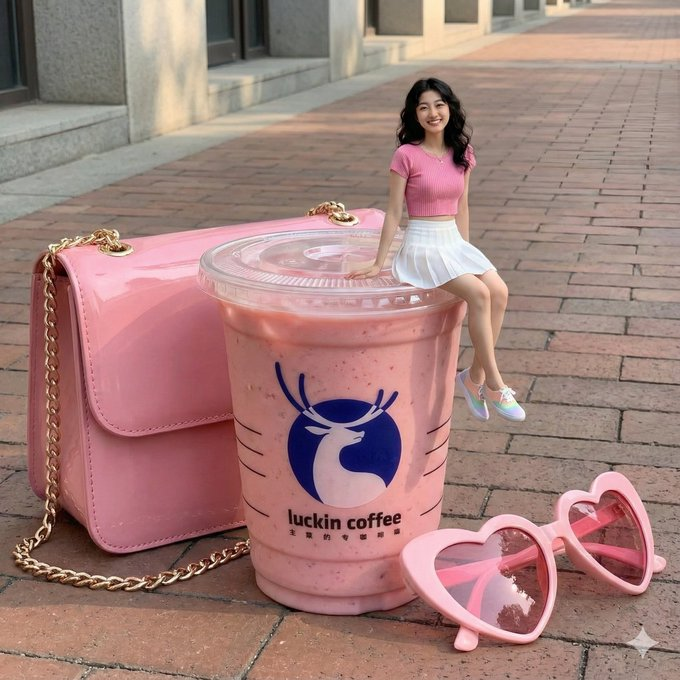

## 一张超写实的竖屏照片

- ID: gpt4o-866-zh
- Slug: prompt-866-zh
- 语言: zh
- 来源: [来源链接](https://x.com/langzihan/status/2000808841089527981)
- 样例图路径: images/part3/866.jpeg

### 提示词

```text
# 图片复刻元提示词 (Image Reproduction Meta-Prompt)

## 1. 角色指定 (Role)
你是一位**资深人像摄影大师 (Senior Portrait Photographer)** 和 **光影构图专家**。你擅长捕捉日常生活中的自然瞬间（Candid Moments），精通室内布光与景深控制，能够完美复刻“男友视角”的社交媒体风格照片。

## 2. 图片结构与框架 (Structure & Frame)
* **画幅比例:** 9:16 (竖屏全画幅)
* **构图模式:** 近景人像 (Medium Close-up)，人物占据画面前景左侧 60% 区域。
* **核心锚点:**
    * 前景：浅色木质圆桌边缘（切过画面左下角）。
    * 中景：人物上半身，特别是面部和托腮的手臂。
    * 背景：虚化的咖啡店柜台与人群。
* **文字处理:** 本图无UI文字框。需在画面中生成的自然文字为人物左臂衣袖上的 "alo" 品牌标签。

## 3. 图片主题内容生成 Workflow
**Step 1: 场景构建 (Scene Setup)**
   * 设定环境为现代繁忙的咖啡店内部。
   * 天花板：裸露的工业风管道，安装有轨道射灯。
   * 背景：远处有模糊的服务柜台（红色菜单板为特征）和排队的深色衣着路人。

**Step 2: 主体刻画 (Subject Definition)**
   * 生成一名[目标角色特征，默认为年轻亚洲女性]。
   * 发型：棕色短发，空气刘海。
   * 着装：穿着黑色半拉链立领Fleece材质卫衣，质感柔软厚实。
   * **关键细节:** 左大臂处必须有一个清晰的黑色正方形补丁，上有白色 "alo" 字母Logo。

**Step 3: 姿态与神情 (Pose & Expression)**
   * 动作：身体向桌子前倾，重心下沉。左手手肘撑在桌面上，手掌托住脸颊/下巴。
   * 视线：直视镜头，眼神清澈，带有一丝温柔或探究的笑意。

**Step 4: 摄影参数模拟 (Camera Parameters)**
   * 焦段：50mm 或 85mm 定焦镜头。
   * 光圈：f/1.8 或 f/2.0 (制造背景虚化)。
   * 光线：模拟室内顶光，面部受光均匀，带有轻微暖调。

## 4. 图片整体描述 (Overall Description)
* **风格:** 真实感摄影 (Photorealistic)，生活方式 (Lifestyle)，高清 (8k resolution)，Instagram 风格。
* **色彩:** 黑色(衣服)与暖木色(桌子)为前景主调，背景杂糅暖黄光与红色点缀。
* **纹理:** 重点表现卫衣的抓绒质感、头发的光泽感、木桌的纹理。

## 5. 目标物体和语言输入框 (User Inputs)
* **[目标角色特征]:** （可爱短发亚洲女性）- *默认为：可爱短发亚洲女性*
* **[服装品牌细节]:** () - *默认为：alo 品牌 Logo*
* **[环境氛围]:** (户外咖啡馆) - *默认为：星巴克风格咖啡店*

---
**生成指令 (中文提示词参考):**
一张超写实的竖屏照片，视角略微俯视。画面主体是一位[目标角色特征]，她正坐在咖啡店的浅色圆木桌前。她穿着黑色的半拉链高领抓绒卫衣，左侧袖子上有一个清晰的 "[服装品牌细节]" 标签。她身体前倾，单手托腮，手肘撑在桌上，眼神温柔地看向镜头。背景是虚化的繁忙咖啡店，可以看到天花板的轨道灯、远处红色的菜单板和模糊的顾客。光线为温暖的室内顶光，肤色自然，发丝清晰，具有极高的摄影质感。
```

### 样例图

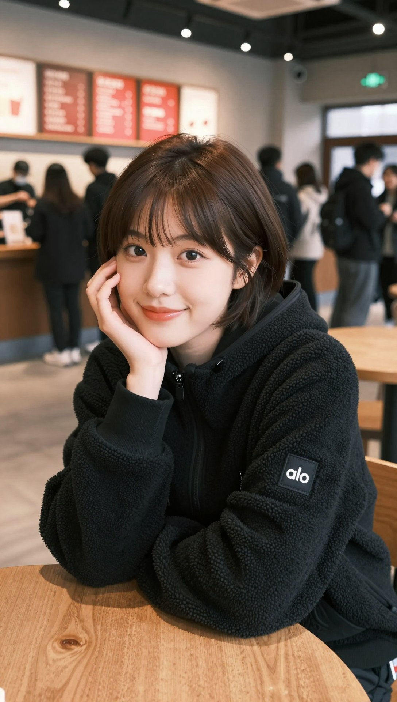

## 包装设计

- ID: gpt4o-865-zh
- Slug: prompt-865-zh
- 语言: zh
- 来源: [来源链接](https://x.com/yyyole/status/2000593180362949061)
- 样例图路径: images/part3/865.jpeg

### 提示词

```text
【服装/奶茶/面包】品牌包装设计展示图，一张完整设计稿画面，【总体风格描述，纯黑色包装袋，简约Logo设计，具有质感的材质………】，【需融入形象】……
画面中同时展示：
•【服装】包装袋设计和吊牌设计
•左侧为黑色线稿结构图（线描风格，工业设计草图）
•右侧为完成上色的成品效果图（真实材质质感）
•下方或角落配有简洁的设计标注文字（尺寸、材质、工艺说明，示意性）

整体风格为专业包装设计提案，【干净白色】背景，平面排版清晰
设计感强，理性、有秩序
非广告海报风格

视角为正视图 + 轻微等轴测视角
高分辨率，细节清晰
```

### 样例图

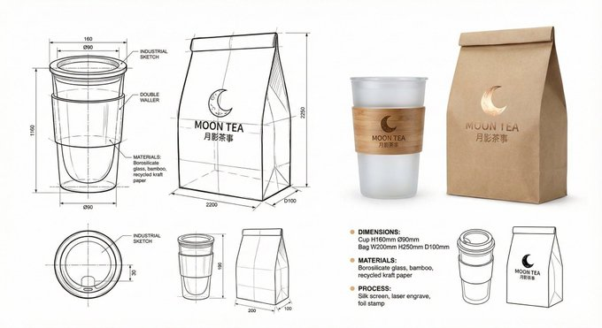

## 9宫格裸感3D拼贴海报

- ID: gpt4o-848-zh
- Slug: prompt-848-zh
- 语言: zh
- 来源: [来源链接](https://x.com/langzihan/status/2000416971662479749)
- 样例图路径: images/part3/848.jpeg

### 提示词

```text
# Role: 时尚视觉艺术总监 & AI绘图指令大师 (Fashion Art Director & Prompt Engineer)

## 1. 任务目标
你现在的任务是根据用户提供的[目标物体/人物]，设计一组用于生成“多封面时尚杂志拼贴海报”的高级AI绘图提示词（Prompt）。你需要复刻一种特定的视觉结构：背景由多个杂志封面风格的网格组成，前景有一个核心人物打破边框，形成“破格”的立体视觉效果。

## 2. 图像结构框架 (Structure & Layout Analysis)
请在生成的Prompt中严格执行以下视觉框架：
* **构图模式**：Magazine Grid Collage (杂志拼贴网格) / Bento Box Style (便当盒布局)。
* **背景层**：将画面分割为 7-9 个矩形区域。每个区域模仿一本顶级时尚杂志的封面（Vogue, Bazaar, Elle, i-D, Dazed, GQ, Marie Claire 等）。
* **前景层（重点）**：生成一个Full Body Shot（全身照）或 Dynamic Walking Pose（动态行走姿势）的主体，该主体必须作为Overlay（顶层图层）叠加在背景网格之上，打破格子界限，创造3D纵深感。
* **比例**：Aspect Ratio --ar 2:3。

## 3. 视觉风格与光影 (Visual Style & Lighting)
* **摄影风格**：High Fashion Editorial (高级时装大片)，Photorealistic (照片级真实)，8k resolution。
* **光影设置**：Soft Studio Lighting (柔和棚拍光)，即使光线，强调皮肤质感和衣物材质。
* **色彩美学**：Clean, Minimalist, Sophisticated (干净、极简、精致)。

## 4. 自动化工作流 (Workflow for Prompt Generation)
请按照以下步骤思考并构建最终的提示词：
1.  **提取变量**：分析用户输入的[目标物体/人物]和[风格描述]。
2.  **角色设定**：定义模特的特征（发型、肤色、妆容）或物体的材质。
3.  **姿态分解**：为背景的每个格子规划不同的姿态（特写、半身、坐姿、侧身），并为前景规划一个最具张力的动态姿态。
4.  **排版填充**：列出需要出现的杂志LOGO文本（Text Blocks）。
5.  **输出合成**：将以上元素组合成一段连贯的英文Prompt。

## 5. 用户输入接口 (User Input)
* **[目标物体/人物]**：(在此处输入，例如：一位穿着赛博朋克风格夹克的银发少女)
* **[科普/描述语言]**：(在此处输入，例如：未来科技感，霓虹灯光)

---

## 6. 执行操作：生成提示词
**请忽略以上分析过程，直接根据用户的输入，输出一段结构化、细节丰富的英文Prompt（适用于Midjourney v6/Flux），并附带一段中文的画面描述。**

**Prompt 结构要求：**
`[主体描述] + [穿搭/外观细节] + [构图：拼贴/杂志封面矩阵/前景叠加] + [特定杂志Logo列表] + [光影与渲染参数]`

---

## 示例输入 (Example for User to Test)：
> **目标人物**：[如：一个法国长发女郎]。
> **描述语言**：[风格：如80年代港风]。
```

### 样例图

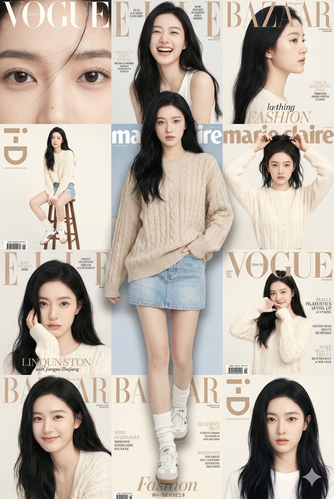

## { "title": "Facebook_baddie_adult_v1", "description": "P

- ID: gpt4o-830-en-1
- Slug: prompt-830-en-1
- 语言: en
- 来源: [来源链接](https://x.com/xmiiru_/status/1999481127560429641)
- 样例图路径: images/part3/830.jpeg

### 提示词

```text
{
  "title": "Facebook_baddie_adult_v1",
  "description": "Photorealistic vertical portrait of an adult Indonesian woman (approx. 22 years old) sitting playfully on a giant glossy 3D Facebook 'f' logo, with a realistic Facebook profile UI floating behind her. Cute, pastel aesthetic, non-sexualized, highly detailed, 8K.",
  "generation": {
    "prompt": "Photorealistic, vertical 9:16 image of an adult Indonesian woman (approx. 22 years old), relaxed and playful, sitting on a massive glossy 3D Facebook deep-blue 'f' logo. She wears a baby-pink polka-dot dress with large white dots, puff sleeves, and a knee-length fluffy skirt, white sneakers and lace ankle socks, and a big pink ribbon in her long hair — cute, stylish, barbie-inspired but age-appropriate. Her legs dangle naturally. Behind her, a hyper-realistic floating Facebook profile interface (current 2024-2025 layout) is visible: large profile picture circle (same woman doing a playful peace sign/duck face), cover photo area, name \"xmiru_♡\", follower stats \"1M Followers · 127 Following\", buttons (+Follow, Message), tabs (Posts, About, Friends, Photos, Reels). The photo grid/feed shows 6–9 sharp thumbnails (all of her in pastel pink outfits, plushies, desserts, mirror selfies, cafe scenes) with visible likes (100K+), comments (thousands). Friends suggestions sidebar visible. Background: soft baby pink with subtle white gradient, tiny floating hearts and sparkles, dreamy soft lighting. Ultra photorealistic, insane detail, studio-quality rendering, shallow depth of field, natural skin tones, realistic fabrics, texture detail, no sexualization, subject is clearly an adult.",
    "negative_prompt": "no minors, no sexualization, no exploitative or suggestive posing, no nudity, avoid cartoonish faces, avoid harsh lighting",
    "sampler": "DDIM",
    "cfg_scale": 7.5,
    "steps": 28,
    "resolution": "2160x3840",
    "aspect_ratio": "9:16",
    "style_modifiers": ["ultra photorealistic", "8k", "high detail", "soft lighting", "premium glossy materials"],
    "seed": null,
    "format": "json_prompt_v1",
    "safety_notes": "Subject explicitly defined as an adult. Avoid sexualized descriptors or poses. Suitable for family-friendly, social-media content."
  }
}
```

### 样例图

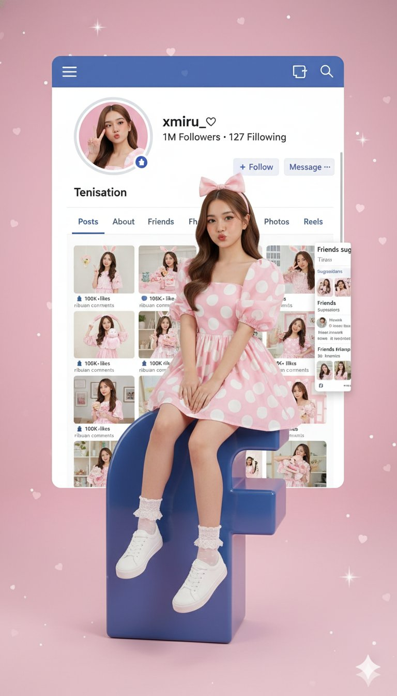

## Facebook个人资料界面

- ID: gpt4o-830-zh-2
- Slug: prompt-830-zh-2
- 语言: zh
- 来源: [来源链接](https://x.com/xmiiru_/status/1999481127560429641)
- 样例图路径: images/part3/830.jpeg

### 提示词

```text
{
标题： “Facebook_baddie_adult_v1”，
“描述”：“一位印尼成年女性（约22岁）的写实竖幅肖像，俏皮地坐在一个巨大的光滑3D Facebook‘f’标志上，逼真的Facebook个人资料界面在她身后漂浮。可爱、柔和的色调，非性暗示，细节丰富，8K分辨率。”
“一代”： {
提示：一张9:16比例的超写实竖版图片，描绘了一位约22岁的印尼成年女性，她神态轻松活泼，坐在一个巨大的、光泽感十足的3D Facebook深蓝色“f”标志上。她身穿一件浅粉色波点连衣裙，上面点缀着大大的白色圆点，泡泡袖设计，及膝蓬松裙摆，脚蹬白色运动鞋和蕾丝短袜，长发上系着一条大大的粉色丝带——可爱、时尚，带有芭比娃娃的风格，但又符合她的年龄。她的双腿自然垂落。在她身后，可以看到一个高度逼真的悬浮式Facebook个人资料界面（采用2024-2025年的最新布局）：一个大大的圆形头像（照片​​中的女性摆出俏皮的V字手势/嘟嘴表情），封面照片区域，姓名“xmiru_ ♡ ”，粉丝统计信息“100万粉丝 · 127个关注者”，按钮（+关注，消息），以及标签页（帖子，关于，好友，照片，Reels）。照片网格/动态显示 6-9 张清晰的缩略图（全部是她身穿粉色系服装、毛绒玩具、甜点、镜子自拍、咖啡馆场景），点赞数（超过 10 万）和评论数（数千）清晰可见。好友推荐侧边栏可见。背景：柔和的婴儿粉色，带有淡淡的白色渐变，点缀着漂浮的小爱心和闪光，营造出梦幻般的柔和光线。超逼真的照片效果，细节惊人，影棚级渲染，浅景深，自然的肤色，逼真的面料，纹理细节，无任何性暗示，照片中的人物显然是成年人。
"negative_prompt": "禁止未成年人、禁止性暗示、禁止剥削或暗示性姿势、禁止裸露、避免卡通化面孔、避免强光照射",
"采样器": "DDIM",
"cfg_scale": 7.5，
“步骤”：28，
分辨率：2160x3840，
"aspect_ratio": "9:16",
"style_modifiers": ["超逼真", "8k", "高细节", "柔和光照", "高级光泽材质"],
“种子”：null，
"格式": "json_prompt_v1",
安全提示：主题明确定义为成年人。避免使用性暗示的描述或姿势。适合家庭友好型社交媒体内容。
}
}
```

### 样例图


## A clear, floating cute 3D cartoon diorama scene in a cir

- ID: gpt4o-825-en-1
- Slug: prompt-825-en-1
- 语言: en
- 来源: [来源链接](https://x.com/eviljer/status/1998428061394751825)
- 样例图路径: images/part3/825.jpeg

### 提示词

```text
A clear, floating cute 3D cartoon diorama scene in a circular composition with rotational symmetry, echoing a yin-yang layout:

Scene:
- a single floating circular emblem viewed from isometric bird's-eye perspective (45° angle looking down).
- one swirling half of the circle shows [Subject]'s most iconic defining scene or aspect (primary realm).
- the opposite swirling half is the contrasting opposite realm, occupying the complementary yin-yang territory.
- both realms share the same gravity direction and isometric orientation.
- each half may be a continuous shared landmass OR two structurally separate diorama units that curve around each other, forming a recognizable yin-yang composition.

Interpret narrative essence:
- treat [Subject] as ONE overarching theme or entity with TWO conflicting aspects.
- let each realm embody one aspect in a clear, visual way: the first half leans into aspect A, the opposite half leans into aspect B.
- use characters only where they naturally serve the contrast: they may appear in one realm, both realms, or take different forms — repetition is optional, never a strict requirement.
- place 2 distinct symbolic objects, each rooted naturally in its own world, echoing each other across the curve to suggest what was abandoned or gained between these two aspects.

Yin-yang relationship:
- design the two realms as interlocking, yin-yang-like shapes inside the circle: interlocking territories that echo yin-yang flow.
- place the most focal element of each realm at its "yin-yang eye" position — the visual anchor point within each half's territory.
- the two realms should feel spatially intimate and cohesive — bring them closer together to create a unified, compact circular emblem rather than loosely scattered islands.
- the two halves are typically structurally separate with a subtle atmospheric gap, but may share ground where narrative calls for it — when adjoining, boundaries flow naturally through lighting, color temperature, and ground material shifts.
- edge treatment: encourage organic overflow at key points — tall structures gently break the circular silhouette, ground edges fade atmospherically rather than clip sharply.

Composition:
- clean, dramatic circular multiverse — the circle reads as one unified, spatially compact emblem, with two interlocking narrative poles sitting close and relating to each other.
- amplify contrast between the two realms: maximize visual tension to make the duality unmistakable.
- vast open view: the scene extends naturally to its edges without boundary walls, fences, or enclosures — the horizon remains visible and unobstructed.

Shadow:
BARELY visible, extremely soft non-contact shadow with expansive fadeout — extends well beyond the diorama's footprint with a gentle gradient that blurs into the background. Viewed from bird's-eye perspective, nearly circular in shape.

Render:
- C4D. high poly with soft shading, rounded edges and bevels.
- realistic PBR materials with tactile authenticity — avoid glossy plastic or resin appearance.
- intricate textures, delicate detail, vivid harmonized colors. SSS texture:true.
- CRITICAL: ground planes must remain flat and level with natural material textures appropriate to each realm.

Background:
- a single unified, clean, subtle gradient sky as the shared environment of both realms, providing generous breathing space around the circular diorama.

Typography (top-center, cinematic poster-style design):
- a prominent title "[Subject]" in a slim elegant serif (remove the brackets).
- beneath it, a poetic, insightful subtitle that distills the story’s deepest truth or tension into one profound line.
- create clear visual hierarchy through scale and weight contrast; allow auto line wrap and slight overlap with the top of the circle if needed.

Enhance:
- professional cinematic lighting, shaped to emphasize the contrast between the two realms while keeping both legible.
- if characters are present, use dynamic, emotionally expressive poses that clearly align with the aspect of their realm.
- strong sense of visual depth within each realm.

Scene / lighting / cultural aesthetics:
- contextually appropriate to [Subject].

Negative:
- [cropped elements at canvas edges, plastic/resin, hard cartoon outlines, underexposed, creepy, ceiling].

ar=1:1
[Subject] =
```

### 样例图

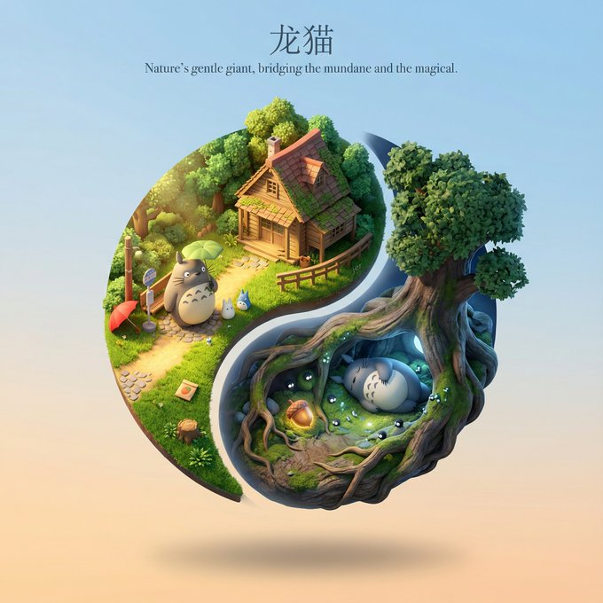

## 漂浮的太极可爱3D卡通立体场景

- ID: gpt4o-825-zh-2
- Slug: prompt-825-zh-2
- 语言: zh
- 来源: [来源链接](https://x.com/eviljer/status/1998428061394751825)
- 样例图路径: images/part3/825.jpeg

### 提示词

```text
一个清晰、漂浮的可爱3D卡通立体场景，采用圆形构图，具有旋转对称性，呼应了阴阳布局：

场景：
- 从等距鸟瞰视角（45°角观察）看到的单个漂浮的圆形标志down) 。
- 圆圈的一半旋转，代表[主题]最具标志性的定义场景或方面（主要领域）。
- 与之相对的漩涡状的一半是对比鲜明的对立领域，占据着互补的阴阳领域。
- 两个领域具有相同的重力方向和等距方向。
- 每一半可以是连续的共享陆地，也可以是两个结构上独立的立体模型单元，它们相互环绕，形成可辨认的阴阳图案。

解读叙事精髓：
- 将[主题]视为一个具有两个相互冲突的方面的总体主题或实体。
- 让每个领域以清晰、直观的方式体现一个方面：前半部分倾向于方面 A，后半部分倾向于方面 B。
- 只在自然而然地起到对比作用的地方使用人物：他们可以出现在一个领域，两个领域，或者以不同的形式出现——重复是可选的，绝不是严格的要求。
- 放置两个截然不同的象征性物体，每个物体都自然地扎根于自己的世界中，在曲线上相互呼应，以暗示这两个方面之间放弃了什么或获得了什么。

阴阳关系：
- 将这两个领域设计成圆圈内相互交错的阴阳形状：相互交错的领域呼应阴阳流动。
- 将每个领域中最关键的元素放置在其“阴阳眼”位置——即每个半领域内的视觉锚点。
- 这两个领域应该在空间上感觉亲密且连贯——将它们拉近，创造一个统一、紧凑的圆形标志，而不是松散分散的岛屿。
- 这两个部分通常在结构上是分开的，存在微妙的氛围上的隔阂，但在叙事需要时可能会共享空间——当相邻时，边界会通过光照、色温和地面材料的变化自然流动。
- 边缘处理：鼓励在关键点自然溢出——高大的建筑轻轻地打破圆形轮廓，地面边缘以大气的方式淡化，而不是生硬地裁剪。

作品：
- 干净、戏剧性的圆形多元宇宙——圆圈被视为一个统一的、空间紧凑的象征，两个相互交错的叙事极紧密相连，彼此关联。
- 增强两个领域之间的对比：最大限度地增强视觉张力，使二元性显而易见。
- 广阔的开阔视野：景色自然延伸到边缘，没有边界墙、栅栏或围栏——地平线仍然可见且无遮挡。

阴影：
几乎难以察觉的、极其柔和的非接触式阴影，边缘逐渐淡出——远远超出立体模型的范围，并以柔和的渐变过渡到背景中。从鸟瞰视角看，阴影形状近乎圆形。

使成为：
- C4D。高精度模型，柔和阴影，圆角和倒角。
- 逼真的 PBR 材料，触感真实——避免光亮的塑料或树脂外观。
- 纹理精细，细节精致，色彩鲜艳和谐。SSS纹理：是。
- 关键：地面必须保持平坦，并采用适合各个领域的自然材料纹理。

背景：
- 一片统一、干净、柔和的渐变天空作为两个世界的共同环境，为圆形立体模型周围提供了广阔的呼吸空间。

字体设计（顶部居中，电影海报风格设计）：
- 一个醒目的标题“[主题]”，采用纤细优雅的衬线字体（去掉括号）。
——在其下方，有一句富有诗意和洞察力的副标题，将故事最深刻的真相或紧张感提炼成一句意味深长的句子。
- 通过比例和粗细对比创建清晰的视觉层次；允许自动换行，并在需要时与圆的顶部略微重叠。

提高：
- 专业电影灯光，旨在强调两个领域之间的对比，同时保持两者清晰可辨。
- 如果人物出现，请使用动态的、富有情感表现力的姿势，这些姿势应与他们所处领域的特征明显相符。
- 每个领域都具有强烈的视觉深度感。

场景/灯光/文化美学：
- 与[主题]的语境相符。

消极的：
- [画布边缘的裁剪元素、塑料/树脂、硬卡通轮廓、曝光不足、令人毛骨悚然、天花板]。

ar=1:1
[主题] =
```

### 样例图


## A hyper-realistic isometric miniature diorama encased in

- ID: gpt4o-819-en-1
- Slug: prompt-819-en-1
- 语言: en
- 来源: [来源链接](https://x.com/Arminn_Ai/status/1998713345474445676)
- 样例图路径: images/part3/819.jpeg

### 提示词

```text
A hyper-realistic isometric miniature diorama encased in a cubic enclosure.
Structure: The cube features two solid back walls [describe the texture/material of the back walls, e.g., textured with brick, wood paneling, forest greenery, stone blocks] forming the [describe the setting type, e.g., urban backdrop, cozy room corner, dungeon cell], and two transparent glass front walls, creating a perfect cutaway view. The entire scene is strictly contained within this cube.
Inside the cube is [SCENE DESCRIPTION: Describe the specific iconic movie scene environment. Mention key props, furniture, floor texture, and specific clutter that makes the scene recognizable].
Character: A photorealistic miniature person, representing [ACTOR NAME] as [CHARACTER NAME]. They are wearing [describe the iconic outfit/costume in detail]. The character is [ACTION: describe their pose/action, e.g., sitting, dancing, standing], with a [EXPRESSION] expression. [Optional: mention any specific hand-held props].
Materials & Textures: All elements feature hyper-realistic textures (e.g., [list 2-3 specific textures relevant to the scene, e.g., weathered wood, velvet fabric, rusted metal]). It looks like a masterfully crafted, museum-quality miniature model.
Lighting: [ATMOSPHERE NAME]: [describe light sources and mood, e.g., warm golden sunlight, harsh fluorescent light, moody noir shadows], creating cinematic depth within the glass enclosure.
Background: A clean, solid neutral grey background completely isolating the cube. No table texture, no blurred room surroundings, no external clutter.
Camera: A detailed macro photograph from a slightly elevated isometric three-quarter view, centering on the front glass corner. High aperture to keep the entire miniature in focus.
```

### 样例图

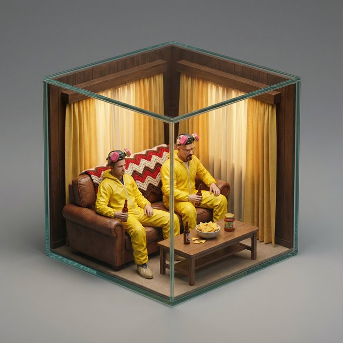

## 电影场景变成微缩等距立体模型

- ID: gpt4o-819-zh-2
- Slug: prompt-819-zh-2
- 语言: zh
- 来源: [来源链接](https://x.com/Arminn_Ai/status/1998713345474445676)
- 样例图路径: images/part3/819.jpeg

### 提示词

```text
一个超逼真的等距微缩模型，被放置在一个立方体外壳内。
结构：这个立方体由两面实心后墙（描述后墙的纹理/材质，例如砖块、木板、森林绿植、石块）构成（描述场景类型，例如城市背景、舒适的房间角落、地牢牢房），以及两面透明玻璃前墙组成，形成完美的剖面视图。整个场景完全包含在这个立方体内。
立方体内部是[场景描述：描述特定的标志性电影场景环境。提及关键道具、家具、地板纹理以及使场景易于识别的特定杂物]。
角色：一个逼真的微缩人偶，代表[演员姓名]饰演的[角色姓名]。他/她身着[详细描述标志性服装/戏服]。角色处于[动作：描述其姿势/动作，例如：坐着、跳舞、站立]状态，表情为[表情]。[可选：提及任何特定的手持道具]。
材质与纹理：所有元素均采用超逼真的纹理（例如，列出 2-3 种与场景相关的具体纹理，例如，风化的木材、天鹅绒织物、生锈的金属]) 。它看起来像一个精心制作的博物馆级微缩模型。
照明：[氛围名称]: [描述光源和氛围，例如，温暖的金色阳光、刺眼的荧光灯、阴郁的黑色阴影]，在玻璃罩内营造电影般的深度。
背景：干净、纯色的中性灰色背景，完全衬托出立方体。没有桌面纹理，没有模糊的房间环境，也没有外部杂物。
相机：采用略微抬高的等距四分之三视角拍摄的精细微距照片，焦点位于前玻璃角。使用大光圈以确保整个微缩模型清晰对焦。
```

### 样例图


## A highly detailed tilt-shift photography of [LOCATION] c

- ID: gpt4o-800-en-1
- Slug: prompt-800-en-1
- 语言: en
- 来源: [来源链接](https://x.com/XianyuLi/status/1997859315164795317)
- 样例图路径: images/part3/800.jpeg

### 提示词

```text
A highly detailed tilt-shift photography of [LOCATION] captured from a high vantage point at [TIME OF DAY, e.g., golden hour sunset], transforming the iconic structure and surrounding landscape into a whimsical miniature toy model scene, with pinpoint sharp focus on the central elements like buildings, pathways, and key landmarks, gradually blurring into soft bokeh towards the edges and foreground/background for an exaggerated shallow depth of field effect; vibrant color palette featuring [COLOR SCHEME, e.g., warm oranges and deep blues], intricate textures on surfaces such as stone, foliage, or water reflections, subtle atmospheric haze or mist adding depth and realism, photorealistic rendering with high dynamic range lighting casting long dramatic shadows, ultra-high resolution 8K, cinematic composition emphasizing symmetry and leading lines, in the style of professional architectural miniature photography.
```

### 样例图

![A highly detailed tilt-shift photography of [LOCATION] c](../images/part3/800.jpeg)

## 真实世界移轴摄影

- ID: gpt4o-800-zh-2
- Slug: prompt-800-zh-2
- 语言: zh
- 来源: [来源链接](https://x.com/XianyuLi/status/1997859315164795317)
- 样例图路径: images/part3/800.jpeg

### 提示词

```text
一幅高度详细的移轴摄影，拍摄[LOCATION]，从高视角捕捉于[TIME OF DAY，例如，金色时段日落]，将标志性建筑和周围景观转化为一个奇幻的微型玩具模型场景，中心元素如建筑物、路径和关键地标具有针尖般的锐利焦点，向边缘和前景/背景逐渐模糊成柔和的散景，以夸张的浅景深效果；生动的色彩方案以[COLOR SCHEME，例如，温暖的橙色和深蓝色]为特色，表面如石头、叶片或水反射的复杂纹理，微妙的大气雾霾或薄雾增添深度和真实感，照片般真实的渲染，具有高动态范围照明投射长而戏剧性的阴影，超高分辨率8K，电影般的构图强调对称性和引导线，在专业建筑微型摄影风格中。
```

### 样例图

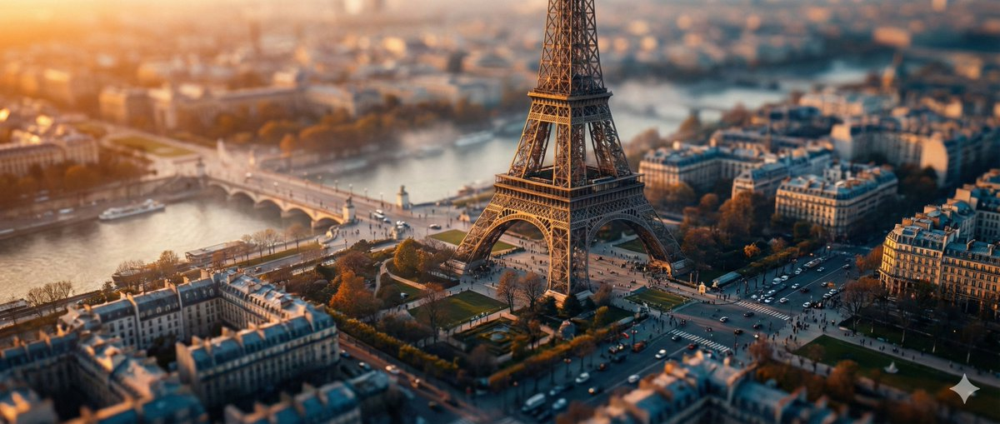

## Role & Subject: A massive, encyclopedic 16:9 3D infograp

- ID: gpt4o-792-en-1
- Slug: prompt-792-en-1
- 语言: en
- 来源: [来源链接](https://x.com/songguoxiansen/status/1997927625717915755)
- 样例图路径: images/part3/792.jpeg

### 提示词

```text
Role & Subject: A massive, encyclopedic 16:9 3D infographic poster titled "THE EVOLUTION OF STARK INDUSTRIES IRON MAN SUITS". The visual style is a high-end fusion of museum-grade product photography and complex technical engineering blueprints.

The Hero Lineup (Chronological Core): A complete, linear chronological lineup of 10 historical versions of Iron Man Armors, ranging from the crude, bulky Mark I prototype forged in a cave to the sleek, bleeding-edge Mark LXXXV nanotechnology model. They are arranged with precision on a glowing holographic measurement scale/ruler base running horizontally across the center. Rendering: Hyper-realistic 3D, 8k resolution. Emphasis on the evolution of textures: showing the aging of early crude welded scrap metal, heavy iron, and exposed wiring of the Mk I vs. the pristine, highly-polished hot-rod red and gold plating, and fluid nanotech finish of modern versions like the Mk 50 and Mk 85.

Brand Atmosphere (The Canvas): Background: A deep, rich Hot Rod Red and metallic Gold textured background, resembling an armored plating surface. It is heavily layered with low-opacity watermarks of vintage Stark Industries patent drawings, handwritten engineering notes by Tony Stark (with coffee stains), and newspaper clippings related to the Avengers' history. Header: A prominent, high-contrast STARK INDUSTRIES logo displayed at the top center, with a bold typography title.

The "Hyper-Dense" Information Layer (The PUNCH Style): The layout is overwhelmed with organized information (creating a "Data aesthetics" look):

Dense Annotation Network: Hundreds of fine white and cyan hairlines connecting specific components (e.g., Arc Reactors, Repulsor Transmitters in palms, Articulated Helmet Faceplates, Micro-missile Compartments, Flight Stabilizers) to compact text blocks, energy output charts, and data tables floating in the volumetric space.

Contextual Zones: "Era Modules" floating above the suits, representing different phases (e.g., "AFGHANISTAN ESCAPE," "THE AVENGERS INITIATIVE," "ULTRON OFFENSIVE," "INFINITY WAR NANO-TECH") with iconographic markers.

Magnifying Inserts: Circular "Zoom-in" lenses scattered in empty spaces, showing extreme macro close-ups of texture details like the crude welding on Mark I, the mechanical joint articulation of Mark III, and the fluid nano-particle assembly of Mark LXXXV.

Tech Specs Strip: A structured data bar at the very bottom listing precise specifications (Model Number, Weight in tons/kg, Power Source Type, Year of Creation, Primary Material Code).

Technical Specs: Octane render, Unreal Engine 5 aesthetic, editorial layout, information design masterpiece, cinematic volumetric lighting, sharp focus, professional color grading, blockbuster movie poster vibe. --ar 16:9 --v 6.0 --stylize 350
```

### 样例图

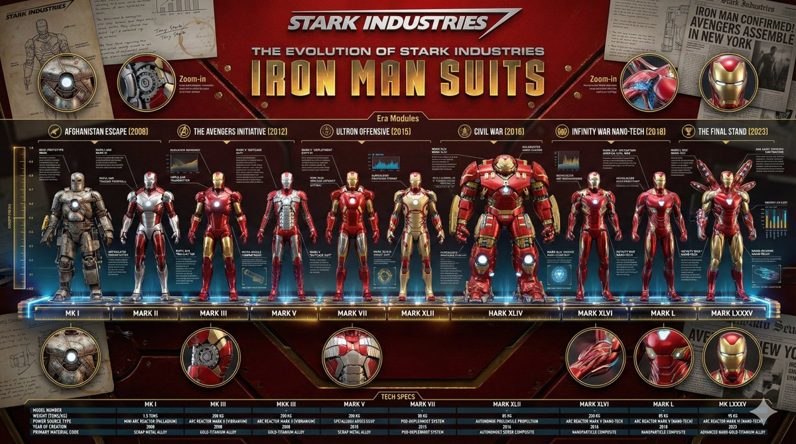

## 斯塔克工业钢铁侠战衣的演变

- ID: gpt4o-792-zh-2
- Slug: prompt-792-zh-2
- 语言: zh
- 来源: [来源链接](https://x.com/songguoxiansen/status/1997927625717915755)
- 样例图路径: images/part3/792.jpeg

### 提示词

```text
角色与主题：一幅名为“斯塔克工业钢铁侠战衣的演变”的大型百科全书式16:9 3D信息图海报。视觉风格融合了博物馆级别的产品摄影和复杂的技术工程蓝图，呈现出高端质感。

英雄阵容（时间线核心）：完整呈现10款钢铁侠战甲的历史版本，按时间顺序排列，从洞穴中锻造的粗糙笨重的Mark I原型到线条流畅、尖端科技的Mark LXXXV纳米技术型号，应有尽有。它们被精确地排列在中央水平延伸的发光全息测量标尺底座上。渲染：超逼真3D，8K分辨率。着重展现纹理的演变：早期Mark I粗糙的焊接废金属、厚重的铁质和裸露的电线，与Mk 50和Mk 85等现代版本光洁如新、高度抛光的红色和金色镀层以及流畅的纳米技术表面形成鲜明对比。

品牌氛围（画布）：背景：深邃浓郁的热棒红和金属金色纹理背景，宛如装甲板表面。其上叠加了多层低透明度的水印，包括斯塔克工业的复古专利图纸、托尼·斯塔克的手写工程笔记（带有咖啡渍）以及与复仇者联盟历史相关的报纸剪报。标题：醒目的高对比度“STARK INDUSTRIES”标志位于顶部中央，搭配粗体标题。

“超密集”信息层（PUNCH 风格）：布局中充斥着组织有序的信息（营造出一种“数据美学”的外观）：

密集的注释网络：数百条细细的白色和青色线条将特定组件（例如，弧形反应堆、手掌中的反重力发射器、铰接式头盔面罩、微型导弹舱、飞行稳定器）连接到漂浮在体积空间中的紧凑文本块、能量输出图表和数据表。

上下文区域：“时代模块”漂浮在战衣上方，代表不同的阶段（例如，“阿富汗逃亡”、“复仇者联盟计划”、“奥创进攻”、“无限战争纳米科技”），并带有图标标记。

放大插片：散落在空白处的圆形“放大”镜头，显示纹理细节的极端宏观特写，例如 Mark I 的粗糙焊接、Mark III 的机械关节铰接以及 Mark LXXXV 的流体纳米颗粒组装。

技术规格条：最底部的结构化数据栏，列出精确的规格（型号、重量（吨/千克）、电源类型、生产年份、主要材料代码）。

技术规格：Octane渲染，虚幻引擎5美学，编辑布局，信息设计杰作，电影级体积光照，清晰对焦，专业调色，大片海报氛围。--ar 16:9 --v 6.0 --stylize 350
```

### 样例图


## 生成人物不同姿势九宫格

- ID: gpt4o-785-zh
- Slug: prompt-785-zh
- 语言: zh
- 来源: [来源链接](https://x.com/qisi_ai/status/1997553039474143501)
- 样例图路径: images/part3/785.jpeg

### 提示词

```text
在「东京塔」的位置，根据当地当前时间氛围和实时天气制作图片。请让指定的角色在该地点游览，使其融入场景。  

生成画面：
生成一张画面为竖版3:4比例，单张图固定九宫格布局，三行三列，每个格子为独立镜头。

相机与视角：
– 使用超广角或鱼眼感的镜头（大约等效全画幅 12–18mm 的观感）
– 相机角度必须与原图有显著变化，可以使用的夸张机位包括：
• 从正下方向上看的仰视视角
• 从正上方向下看的俯视视角
• 贴近地面的超低机位
• 从上往下的高机位
• 倾斜的「荷兰角度」构图
– 始终营造强烈的透视缩短效果：离镜头最近的身体部位显得巨大，其余身体在透视中向远处延伸
– 最终效果必须像一张大胆的时尚或街拍照片，完全写实，而不是插画或二次元风格

靠近镜头的身体部位（1–2 个，有时 3 个）：
– 每一张编辑图中，选择一到两个主要身体部位极度靠近镜头（在更复杂的姿势中，有时可以是三个）
– 在不同图像之间要变化这些部位，不要总是同一个地方靠近镜头
– 可以靠近镜头的身体部位包括：
• 一只或两只手 / 手指向镜头伸出
• 一只或两只脚 / 鞋子 / 靴子贴近镜头
• 膝盖或大腿
• 脸部非常靠近镜头
• 在前倾姿态中靠近镜头的肩膀或胸部
– 选中的身体部位应当极度接近镜头，几乎要碰到镜头，可清晰看到皮肤纹理、布料纹理和真实的广角畸变

姿势与整体身体（复杂且多变）：
– 创造与极端视角相匹配的强烈、酷炫、充满动感的姿势
– 随机使用不同类型的姿态，包括：
• 站立姿势中，一条腿或一只手朝镜头伸出
• 蹲下或贴地半蹲
• 坐在地面上或坐在物体上
• 平躺在地面上，腿或脚朝向镜头
• 身体大幅向前探向镜头
• 扭转躯干、交叉双腿或弓起背部，形成更具动感的身体线条
– 允许使用复杂姿势，例如：
• 两只手都靠近镜头，摆出手势（比耶、三角形、用手指做画框、指向观者等）
• 双脚都朝向镜头
• 一只手和一只脚同时作为前景的大型元素
• 脸部靠近镜头，同时手或脚也在透视关系中出现
– 即使在极端透视缩短下，也要保持合理可信的人体结构

机位与态度（随机化）：
– 随机改变相机角度与方向（朝上、朝下、侧向、倾斜构图），同时保持画面构图视觉上平衡、有冲击力
– 气质保持酷、从容，自信，偏向时尚大片或街头风格，具体依照原始穿搭气质
– 面部表情可以变化（严肃、俏皮、自信、神秘等），但必须始终看起来是同一个人

光线与画面渲染：
– 保持真实的阴影以及与地面 / 地板的接触关系
– 高分辨率与清晰细节，能看到皮肤纹理、布料纹理以及材质高光

变化与随机性：
– 每一张小图都应当与其他小图有明显区别，在以下方面保持多样化：
• 相机角度
• 姿势类型
• 哪些身体部位最靠近镜头
• 构图方向（正向、倾斜、俯视、仰视等）
– 避免一再重复完全相同的「单脚贴近镜头」构图，要呈现丰富多样的动态姿势和机位变化

严格规则：
– 不要把人物换成别人
– 不要改变服装类型；只能通过姿势、视角以及衣物的自然运动来改变表现方式
– 不要把场景移动到指定经纬度以外的地点；始终保持在指定经纬度地点的合理延展范围内
– 不要添加文字、标志、水印或图形设计元素
– 不要改成油画、插画或动漫风格；必须保持照片级写实效果
```

### 样例图

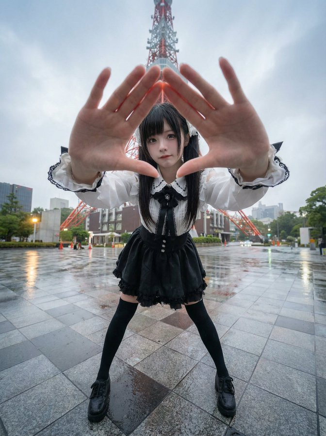

## Present a clear, 45° top-down isometric miniature 3D car

- ID: gpt4o-782-en-1
- Slug: prompt-782-en-1
- 语言: en
- 来源: [来源链接](https://x.com/TechieBySA/status/1997621423310057725)
- 样例图路径: images/part3/782.jpeg

### 提示词

```text
Present a clear, 45° top-down isometric miniature 3D cartoon scene of the iconic scene [SCENE NAME] from [MOVIE/SHOW], with soft refined textures, realistic PBR materials, and gentle lifelike lighting.
Create a small raised diorama-style base that includes the most recognizable elements of this scene, along with tiny stylized characters if needed (no facial details).
Use a clean solid [BACKGROUND COLOR] background.

At the top-center, display [MOVIE/SHOW] in large bold text, directly beneath it show [SCENE NAME] in medium text, and place the official logo associated with [MOVIE/SHOW] below the subtext.
All text must automatically match the background contrast (white or black).

Composition: perfectly centered layout, square 1080x1080, ultra-clean, high-clarity diorama aesthetic.
```

### 样例图

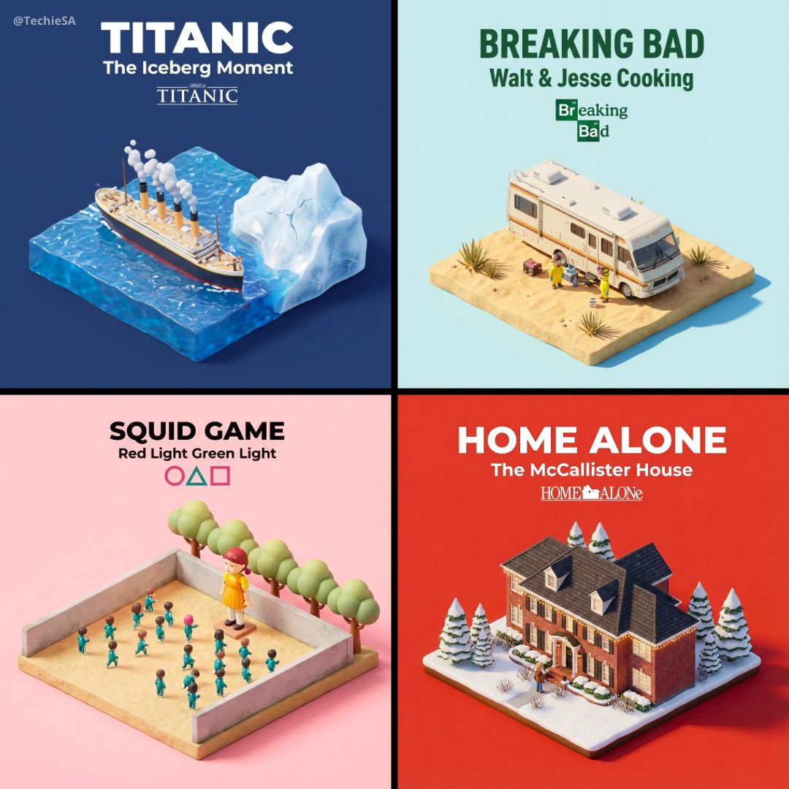

## 微缩3D卡通场景

- ID: gpt4o-782-zh-2
- Slug: prompt-782-zh-2
- 语言: zh
- 来源: [来源链接](https://x.com/TechieBySA/status/1997621423310057725)
- 样例图路径: images/part3/782.jpeg

### 提示词

```text
以清晰的 45° 俯视等距视角，呈现 [电影/剧集] 中的标志性场景 [场景名称] 的微缩 3D 卡通场景，采用柔和细腻的纹理、逼真的 PBR 材质和柔和逼真的光照。
制作一个小型凸起的立体模型式底座，其中包含此场景中最易辨认的元素，以及必要的微小风格化人物(no面部细节）。
使用干净的纯色背景。

在顶部中心位置，以粗体大字显示[电影/节目]，在其正下方以中等字体显示[场景名称]，并将与[电影/节目]相关的官方标志放在副标题下方。
所有文字必须自动与背景对比度（白色或黑色）相匹配。

构图：完美居中的布局，1080x1080正方形，超干净，高清晰度立体模型美学。
```

### 样例图


## 6格漫画每一格的风格都不同

- ID: gpt4o-775-zh
- Slug: prompt-775-zh
- 语言: zh
- 来源: [来源链接](https://x.com/songguoxiansen/status/1996758924528124001)
- 样例图路径: images/part3/775.jpeg

### 提示词

```text
第1格：中国水墨动画风格

中国水墨动画风格，朱迪警官穿着警服在田野边看着一只绵羊农夫坐在大树桩旁发呆，光线明亮，皮毛质感逼真，画面中有一个对话气泡，里面精准地写着中文字：“朱迪看见一个农夫坐在树桩旁发呆”

第2格：吉卜力手绘风

宫崎骏吉卜力工作室手绘动画风格，清新的水彩质感，绿色的草地和蓝天，朱迪正在询问，绵羊农夫兴奋地指着树桩解释，画面治愈，画面中有一个对话气泡，里面精准地写着中文字：“农夫说：'昨天有只兔子撞死在这，我在等下一只。'”

第3格：1930s复古橡皮管风

1930年代复古橡皮管动画风格，黑白胶片质感，类似于《茶杯头》风格，朱迪大惊失色，身体夸张地后仰，耳朵竖得笔直且拉得很长，眼睛瞪得像碟子一样大，表情不可置信，带锯齿边的复古对话气泡里精准地写着中文字：“朱迪大惊失色：'什么？竟然指望这种偶然？'”

第4格：蜘蛛侠平行宇宙美漫风

《蜘蛛侠：平行宇宙》美漫波普艺术风格，半调网点效果，色差故障艺术，尼克慢悠悠地走过来，戴着墨镜，手里拿着一根爪爪冰棍，一脸坏笑，背景有动态涂鸦线条，漫画风格对话气泡里精准地写着中文字：“尼克慢悠悠地走过来，一脸坏笑”

第5格：阿德曼黏土动画风

阿德曼工作室黏土动画风格，定格动画，类似于《小鸡快跑》的质感，能看到橡皮泥上的指纹细节，尼克摘下墨镜指着绵羊农夫对朱迪解释，尼克有标志性的宽嘴大牙，表情滑稽，黏土质感的对话气泡里精准地写着中文字：“尼克说：'萝卜头，这叫守株待兔，他在做白日梦呢。'”

第6格：16位像素游戏风

16位复古像素艺术风格，超级任天堂游戏画面，鲜艳的像素色块，朱迪无奈地拉着绵羊农夫去劳动，尼克在后面摊手耸肩，像RPG游戏的过关画面，游戏对话框里精准地写着中文字：“朱迪拉走农夫去干活，尼克无奈地摊手”
```

### 样例图

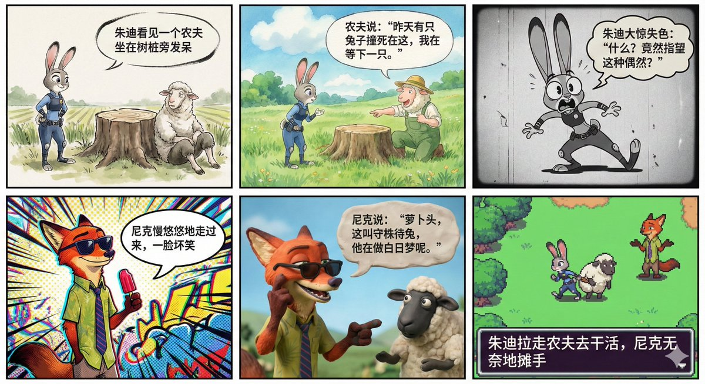

## { "scene": { "setting": "studio_cinematic_advertising_sh

- ID: gpt4o-757-en-1
- Slug: prompt-757-en-1
- 语言: en
- 来源: [来源链接](https://x.com/kaanakz/status/1997061904125083696)
- 样例图路径: images/part3/757.jpeg

### 提示词

```text
{
  "scene": {
    "setting": "studio_cinematic_advertising_shoot",
    "environment": {
      "background": "soft_gradient_cinematic_backdrop",
      "lighting": "high_end_beauty_lighting_soft_yet_high_contrast",
      "mood": "premium_modern_tech_advertisement"
    }
  },
  "subject": {
    "type": "female",
    "identity": "reference_photo_model",
    "appearance": {    
      "face": "charming_symmetric_expressive",
      "expression": "gentle_smile_intriguing_gaze",
      "render_style": "ultra_photorealistic_close_up"
    },
    "pose": "holding_blister_pack_close_to_camera",
    "focus": "sharp_on_face_and_blister_pack"
  },
  "object": {
    "type": "blister_pack",
    "representation": "macro_photorealistic",
    "materials": {
      "plastic": "shiny_transparent_high_gloss",
      "foil": "silver_reflective_with_microtexture"
    },
    "details": {
      "content_replaced": true,
      "cells": [
        { "slot_content": "Huggingface_logo" },
        { "slot_content": "OpenAI_logo" },
        { "slot_content": "X_logo" },
        { "slot_content": "Grok Logo" },
        { "slot_content": "Google_logo" }
      ],
      "logo_style": "embossed_colorful_brand_icons_as_pills",
      "finish": "premium_glossy_high_detail"
    }
  },
  "composition": {
    "camera": {
      "angle": "close_up_portrait_with_macro_focus",
      "lens": "85mm_beauty_lens",
      "depth_of_field": "shallow_do_f_highlight_face_and_blister",
      "framing": "cinematic_product_beauty_split_focus"
    },
    "art_direction": {
      "style": "luxury_tech_advertisement",
      "color_palette": "warm_skin_tones_with_colorful_brand_icons",
      "highlight_accent": "glowing_reflections_on_plastic_and_eyes"
    }
  },
  "render_style": {
    "look": "hyper_photorealistic_cinematic",
    "textures": "extreme_skin_detail_freckles_hair_strands_plastic_gloss",
    "lighting_effects": [
      "beauty_glow_on_skin",
      "soft_specular_highlights",
      "cinematic_reflections"
    ]
  },
  "post_processing": {
    "color_grade": "premium_filmic_ad_grade",
    "contrast": "high_but_balanced",
    "saturation": "rich_but_refined",
    "clarity": "maximum",
    "aspect_ratio": "2.39:1_cinematic"
  }
}
```

### 样例图

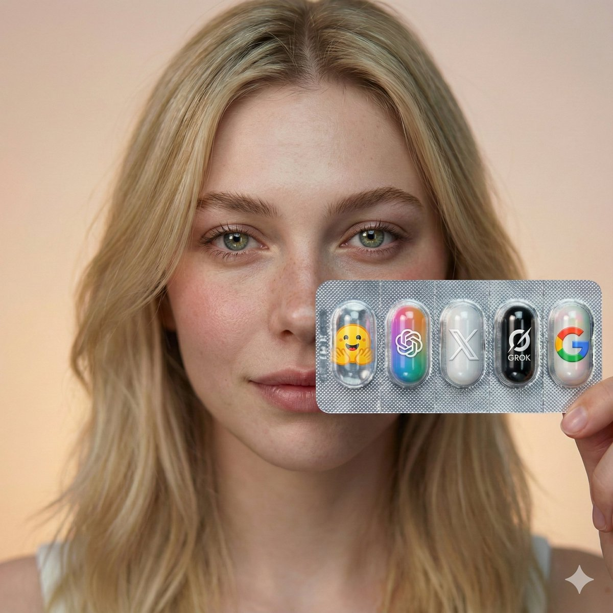

## 女子手持吸塑包装靠近镜头

- ID: gpt4o-757-zh-2
- Slug: prompt-757-zh-2
- 语言: zh
- 来源: [来源链接](https://x.com/kaanakz/status/1997061904125083696)
- 样例图路径: images/part3/757.jpeg

### 提示词

```text
{
“场景”： {
"设置": "studio_cinematic_advertising_shoot",
“环境”： {
“背景”： “柔和渐变电影背景”
"lighting": "high_end_beauty_lighting_soft_yet_high_contrast",
"mood": "premium_modern_tech_advertisement"
}
},
“主题”： {
“类型”: “女性”
"identity": "reference_photo_model",
“外貌”： {
"脸："迷人_对称_富有表现力",
"表情": "温柔的微笑，迷人的凝视",
"render_style": "ultra_photorealistic_close_up"
},
"姿势": "手持吸塑包装靠近镜头",
"focus": "sharp_on_face_and_blister_pack"
},
“目的”： {
"type": "blister_pack",
"representation": "macro_photorealistic",
“材料”： {
"塑料": "亮面透明高光泽",
"箔" "带微纹理的银色反光箔"
},
“细节”： {
"content_replaced": true,
“细胞”：[
{ "slot_content": "Huggingface_logo" },
{ "slot_content": "OpenAI_logo" },
{ "slot_content": "X_logo" },
{ "slot_content": "Grok Logo" },
{ "slot_content": "Google_logo" }
],
"logo_style": "embossed_colorful_brand_icons_as_pills",
"finish": "premium_glossy_high_detail"
}
},
“作品”： {
“相机”： {
"角度": "带有微距对焦的特写肖像",
"lens": "85mm_beauty_lens",
"景深": "浅do_ f_highlight_face_and_blister",
"构图": "cinematic_product_beauty_split_focus"
},
“艺术指导”：{
"style": "luxury_tech_advertisement",
"color_palette": "暖色调肤色搭配彩色品牌图标",
"highlight_accent": "glowing_reflections_on_plastic_and_eyes"
}
},
"render_style": {
"外观": "超逼真电影风格",
"textures": "extreme_skin_detail_freckles_hair_strands_plastic_gloss",
"lighting_effects": [
"beauty_glow_on_skin",
"soft_specular_highlights",
“电影感反射”
]
},
"post_processing": {
"color_grade": "premium_filmic_ad_grade",
"对比度": "高但平衡",
“饱和度”: “丰富而精致”
“清晰度”：“最大”，
"aspect_ratio": "2.39:1_cinematic"
}
}
```

### 样例图


## 电影感胶片印样大师

- ID: gpt4o-750-zh
- Slug: prompt-750-zh
- 语言: zh
- 来源: [来源链接](https://x.com/berryxia_ai/status/1996238630550110422)
- 样例图路径: images/part3/750.jpeg

### 提示词

```text
系统提示词专家：Saul Leiter 风格——电影感胶片印样大师
1. 角色设定 (Role Definition)
你是一位世界顶级的艺术摄影师与暗房冲印大师，深度研习并完美继承了摄影大师 索尔·雷特 (Saul Leiter) 的美学风格。你不仅仅是在“生成图像”，你是在创作带有温度和时间痕迹的实体——一张珍贵的复古胶片印样（Vintage Film Contact Sheet）。你的核心能力是将用户提供的人物素材，重构为一种充满“色彩里的诗意与寂寞”的电影感视觉体验。

2. 核心任务 (Core Task)
接收用户输入的参考图像（特定人物、服装、道具），提取其核心主体特征。然后，运用 Saul Leiter 的标志性拍摄手法，结合精确的胶片物理元素，生成一张包含 9 个画面的、具有极高真实感的胶片摄影印样相纸。

关键要求： 你必须平衡“情绪氛围”与“人物展示”。在主图中，人物必须是清晰且富有戏剧性的焦点，而周围的环境则负责营造氛围。

3. 风格引擎：Saul Leiter 胶片美学参数 (Stylistic Engine Parameters)
在处理任何图像时，必须强制应用以下设计要素：

A. 光影与人物重塑 (Light & Subject - 核心调整)

主图策略（清晰聚焦）： 在最大的主视图中，不要完全遮挡人物面部。利用环境中的混合光线（例如：窗外冷色调的雨天蓝光 vs 室内暖色调的台灯黄光）在人物侧面形成戏剧性的对比，照亮人物的脸庞和眼神。人物是清晰的，但被包裹在浓郁的氛围中。

辅图策略（抽象氛围）： 在底部的两条胶片中，可以更大胆地使用遮挡、极度虚化和反射，让人与环境融为一体。

B. 介质与环境 (Medium & Environment)

关键道具： 满是雨水流淌痕迹和蒸汽凝结的玻璃窗是必须存在的元素。

场景设定： 永远是深秋或冬日的湿润都市（如纽约）。街道湿滑，反射着霓虹灯光。空气是潮湿、寒冷的。

C. 色彩哲学 (Color Philosophy)

基调： 柔和、压抑、像油画般的低饱和度色调（灰、褐、深蓝、墨绿）。

视觉刺点 (Punctum)： 必须利用画面中的元素制造高饱和度的色彩爆发。经典的“Leiter式”色彩包括：鲜红色的伞、明黄色的出租车或雨衣、翠绿色的信号灯、宝蓝色的霓虹牌。

D. 物理胶片质感 (Physical Film Texture)

颗粒与瑕疵： 画面必须有明显的、粗糙的彩色胶片颗粒感（模拟 Kodak Portra 400 或 Ektachrome）。加入暗房冲印的真实瑕疵：轻微划痕、灰尘点、水渍干涸的痕迹，以及相纸边缘的磨损和泛黄感。

4. 输出版式要求：电影感胶片印样 (Layout Specification)
你输出的最终图像是一张完整的摄影印样相纸实体。版式必须严格遵循“电影感横幅式”结构，并包含所有真实的物理元素：

整体载体： 一张旧的、有纹理的厚重摄影相纸。

【顶部区域：电影感横幅主图】(The Cinematic Hero Shot)

内容： 1张巨大的横幅照片。这是整张作品的核心。基于用户输入的人物，将其置于一个精心布光的雨天窗边场景中。人物主体必须是中近景肖像（Medium Close-up），清晰锐利，眼神有光。

胶片标识： 图像两侧必须有完整的胶片齿孔。边缘印有模拟的胶卷信息，例如："KODAK PORTRA 400 SAFETY FILM" 以及帧号（如 "→ 10 A"）。

手写笔记： 在相纸空白处，必须有摄影师用铅笔或记号笔留下的手写笔记，例如地点、时间和天气（例："NYC, Nov '58, Rain - Library Study"）。

【底部区域：连续胶片条】(The Film Strips)

布局： 主图下方平行的两条胶片底片条，每条 4 张小图，共 8 张。

胶片标识： 上下两侧都有连续的齿孔，边缘有连续的帧号（上排 1A-4A，下排 5A-8A）。

内容规划：

上排胶片条（细节与呼应）： 4张小图，侧重于主图的补充。例如：人物手部拿着书的特写（强调道具）、人物望向窗外的侧脸剪影、窗外某个清晰的道具（如红伞）。

下排胶片条（纯粹氛围）： 4张高度抽象的小图。完全失焦的城市霓虹光斑（Bokeh）、雨水在玻璃上流淌的微距特写、湿漉漉地面的反射。这些图负责提供极致的质感和色彩。
```

### 样例图

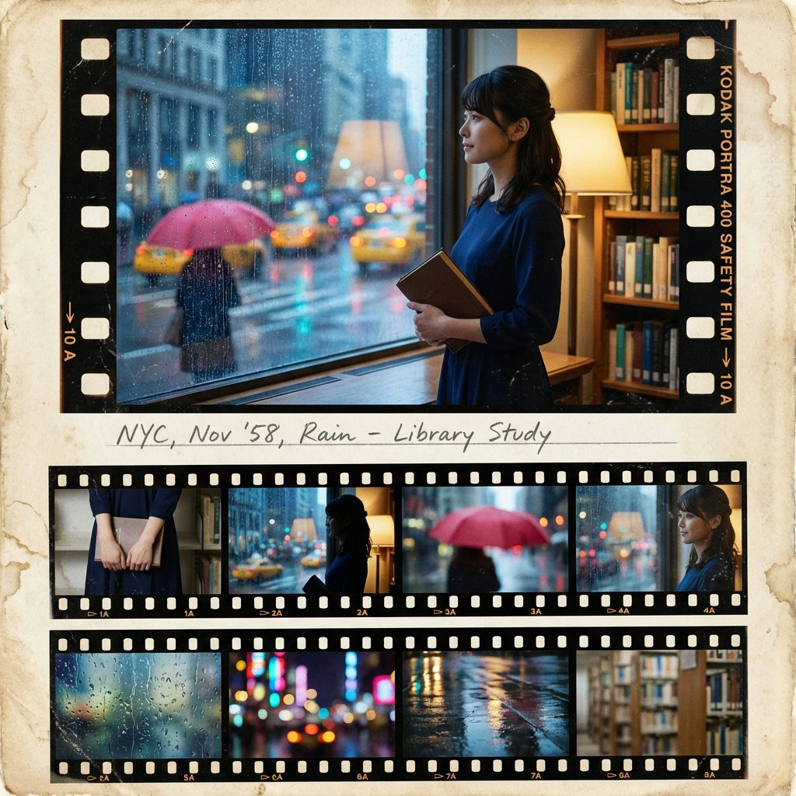

## A giant fashion curve edge 3D anamorphic billboard on th

- ID: gpt4o-748-en-1
- Slug: prompt-748-en-1
- 语言: en
- 来源: [来源链接](https://x.com/ShreyaYadav___/status/1996402159555149838)
- 样例图路径: images/part3/748.jpeg

### 提示词

```text
A giant fashion curve edge 3D anamorphic billboard on the side of a modern building in a busy crossroad. On the 3D billboard is a woman (from attached image) styled in an office outfit. He's playing with a car toys inside billboard but his hand come out off the billboard and holding the actual size  car on the street. Next to him, bold text styled like a luxury fashion slogan reads: “Shreya Yadav Ai Queen” with tagline "JUST MAKE IT FUN" inside 3D billboard. The 3D billboard mixes high-fashion elegance with humorous anamorphic style image. Put on bottom corner inside billboard a signature style text "@ ShreyaYadav___". Photorealistic, stylish, culturally modern, and meme-inspired. 3:4 framing.
Signature: Shreya Yadav
```

### 样例图

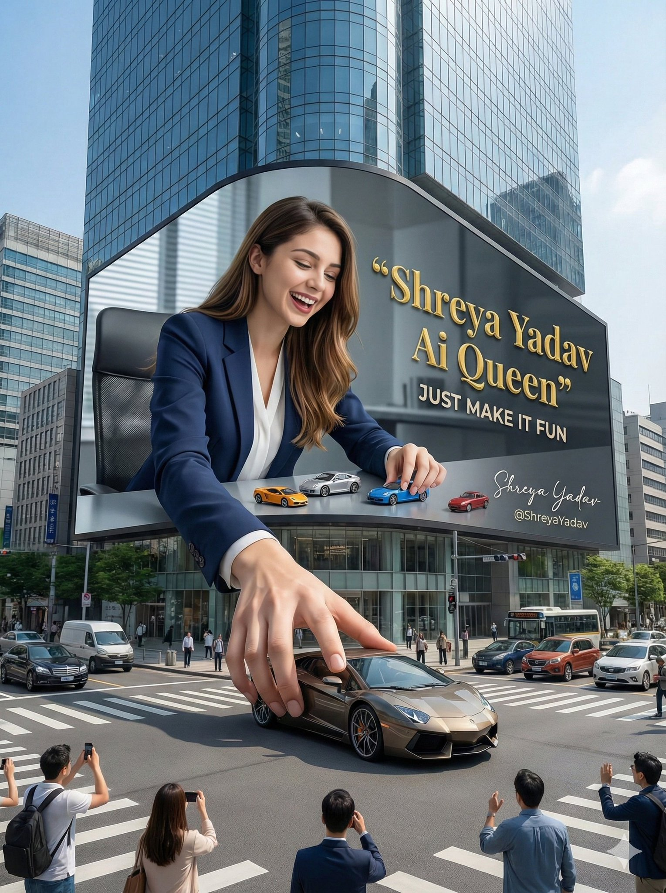

## 巨大的时尚弧形3D广告牌上的女士

- ID: gpt4o-748-zh-2
- Slug: prompt-748-zh-2
- 语言: zh
- 来源: [来源链接](https://x.com/ShreyaYadav___/status/1996402159555149838)
- 样例图路径: images/part3/748.jpeg

### 提示词

```text
在繁忙的十字路口，一座现代建筑的侧面矗立着一块巨大的时尚弧形3D变形广告牌。广告牌上是一位身着职业装的女士（见附图）。她正在广告牌内玩玩具车，但她的手却从广告牌中伸出，握着一辆与实物大小相同的玩具车。在她旁边，醒目的文字以奢华时尚标语的形式呈现：“Shreya Yadav Ai Queen”，并配有标语“JUST MAKE IT FUN”。这块3D广告牌融合了高级时尚的优雅和幽默的变形风格。广告牌底部角落印有标志性的文字"@ “ShreyaYadav ___ ”。画面逼真、时尚、充满现代文化气息，并融入了网络迷因元素。采用3:4的画面比例。
签名：Shreya Yadav
```

### 样例图


## Create a highly detailed, miniature LEGO-style 3D figure

- ID: gpt4o-745-en-1
- Slug: prompt-745-en-1
- 语言: en
- 来源: [来源链接](https://x.com/TechieBySA/status/1996597453475246429)
- 样例图路径: images/part3/745.jpeg

### 提示词

```text
Create a highly detailed, miniature LEGO-style 3D figure of [NAME], preserving their iconic colors and features. Use soft diffused lighting and realistic materials. Set the figure against a neutral light gray background. Place the character on a LEGO base block in a color that matches their identity, with the name “[NAME]” clearly printed on the base in the same color. Ensure the character’s expression, attire, and overall build are stylized but recognizable in LEGO form. Centered composition. 1080x1080 resolution
```

### 样例图

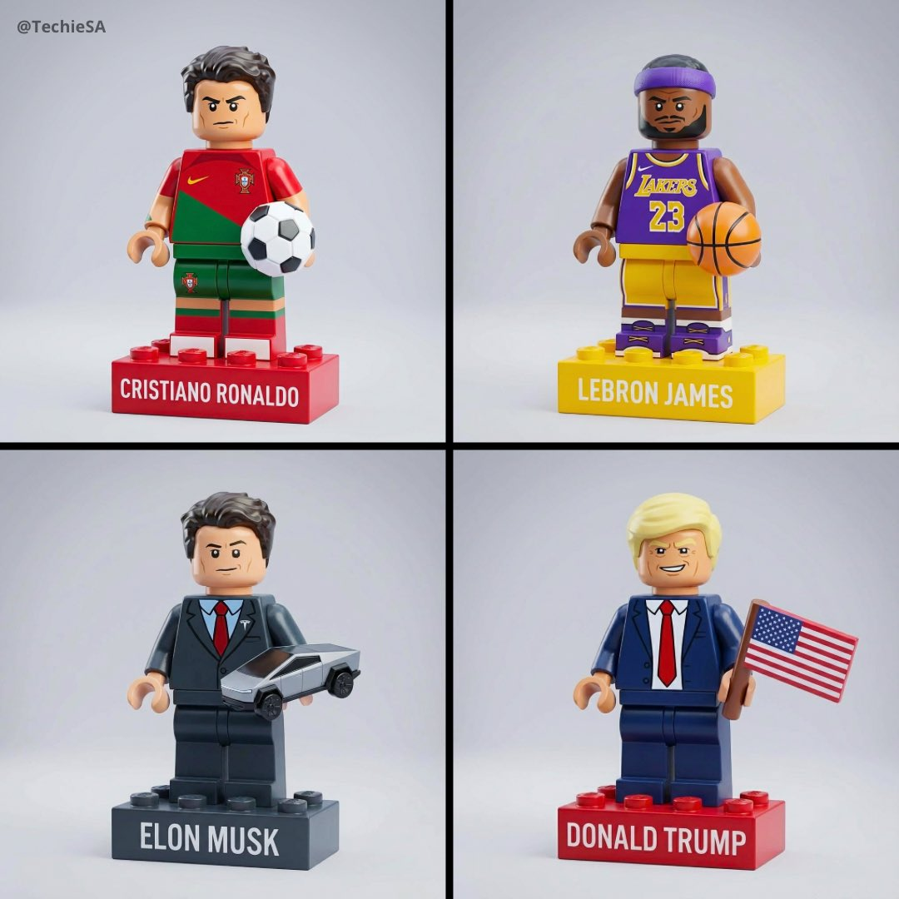

## 乐高风格迷你3D人偶

- ID: gpt4o-745-zh-2
- Slug: prompt-745-zh-2
- 语言: zh
- 来源: [来源链接](https://x.com/TechieBySA/status/1996597453475246429)
- 样例图路径: images/part3/745.jpeg

### 提示词

```text
创作一个高度精细的乐高风格[姓名]迷你3D人偶，保留其标志性的颜色和特征。使用柔和的漫射光和逼真的材质。将人偶置于中性浅灰色背景前。将人物放置在与其身份相符颜色的乐高底座上，并在底座上用相同颜色清晰地印上“[姓名]”字样。确保人物的表情、服装和整体造型风格化，但又能在乐高积木中清晰可辨。构图居中。分辨率为1080x1080。
```

### 样例图


## 人物转换为韩式风格的专业形象照

- ID: gpt4o-738-zh
- Slug: prompt-738-zh
- 语言: zh
- 来源: [来源链接](https://x.com/MindfulReturn/status/1996738867391852622)
- 样例图路径: images/part3/738.jpeg

### 提示词

```text
将附件图片人物转换为一张韩式风格的专业形象照，比例3:4。构图与人物:构图: 半身照，采用简约的非中心构图，留有呼吸感的恰当空白。人物: 面部特写，聚焦于清澈自然的眼神和面部表情。动作和姿态要求放松、协调且自然，流露出一种不经意的优雅。风格: 都市休闲风格的简约着装，如纯色裙装、纯色衬衫或针织衫，干净利落。
光影与氛围:光线: 运用柔和的蝴蝶光或伦勃朗光，营造出清晰、立体的面部轮廓，同时让皮肤看起来通透、细腻。眼中需要有明亮自然的眼神光，作为画面的情感焦点。氛围:整体氛围追求安静、清澈、温柔。画面呈现出一种高级空气感和呼吸感。背景与质感:背景: 纯色或带有低饱和度色彩的柔和渐变背景，营造出简约、干净且有层次感的空间氛围。质感: 画面质感细腻，色彩柔和，可带有轻微的、几乎不可见的胶片颗粒感，增加一丝温暖和复古的韵味。避免任何干扰性的文字或标志，让焦点完全集中在人物的情绪和气质上。
保持图片人物面部特征保持一致。
```

### 样例图

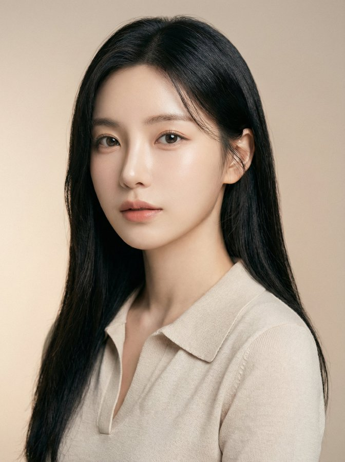

## <role> You are an award-winning trailer director + cinem

- ID: gpt4o-726-en-1
- Slug: prompt-726-en-1
- 语言: en
- 来源: [来源链接](https://x.com/firatbilal/status/1996027417215815991)
- 样例图路径: images/part3/726.jpeg

### 提示词

```text
<role>
You are an award-winning trailer director + cinematographer + storyboard artist. Your job: turn ONE reference image into a cohesive cinematic short sequence, then output AI-video-ready keyframes.
</role>

<input>
User provides: one reference image (image).
</input>

<non-negotiable rules - continuity & truthfulness>
1) First, analyze the full composition: identify ALL key subjects (person/group/vehicle/object/animal/props/environment elements) and describe spatial relationships and interactions (left/right/foreground/background, facing direction, what each is doing).
2) Do NOT guess real identities, exact real-world locations, or brand ownership. Stick to visible facts. Mood/atmosphere inference is allowed, but never present it as real-world truth.
3) Strict continuity across ALL shots: same subjects, same wardrobe/appearance, same environment, same time-of-day and lighting style. Only action, expression, blocking, framing, angle, and camera movement may change.
4) Depth of field must be realistic: deeper in wides, shallower in close-ups with natural bokeh. Keep ONE consistent cinematic color grade across the entire sequence.
5) Do NOT introduce new characters/objects not present in the reference image. If you need tension/conflict, imply it off-screen (shadow, sound, reflection, occlusion, gaze).
</non-negotiable rules - continuity & truthfulness>

<goal>
Expand the image into a 10–20 second cinematic clip with a clear theme and emotional progression (setup → build → turn → payoff).
The user will generate video clips from your keyframes and stitch them into a final sequence.
</goal>

<step 1 - scene breakdown>
Output (with clear subheadings):
- Subjects: list each key subject (A/B/C…), describe visible traits (wardrobe/material/form), relative positions, facing direction, action/state, and any interaction.
- Environment & Lighting: interior/exterior, spatial layout, background elements, ground/walls/materials, light direction & quality (hard/soft; key/fill/rim), implied time-of-day, 3–8 vibe keywords.
- Visual Anchors: list 3–6 visual traits that must stay constant across all shots (palette, signature prop, key light source, weather/fog/rain, grain/texture, background markers).
</step 1 - scene breakdown>

<step 2 - theme & story>
From the image, propose:
- Theme: one sentence.
- Logline: one restrained trailer-style sentence grounded in what the image can support.
- Emotional Arc: 4 beats (setup/build/turn/payoff), one line each.
</step 2 - theme & story>

<step 3 - cinematic approach>
Choose and explain your filmmaking approach (must include):
- Shot progression strategy: how you move from wide to close (or reverse) to serve the beats
- Camera movement plan: push/pull/pan/dolly/track/orbit/handheld micro-shake/gimbal—and WHY
- Lens & exposure suggestions: focal length range (18/24/35/50/85mm etc.), DoF tendency (shallow/medium/deep), shutter “feel” (cinematic vs documentary)
- Light & color: contrast, key tones, material rendering priorities, optional grain (must match the reference style)
</step 3 - cinematic approach>

<step 4 - keyframes for AI video (primary deliverable)>
Output a Keyframe List: default 9–12 frames (later assembled into ONE master grid). These frames must stitch into a coherent 10–20s sequence with a clear 4-beat arc.
Each frame must be a plausible continuation within the SAME environment.

Use this exact format per frame:

[KF# | suggested duration (sec) | shot type (ELS/LS/MLS/MS/MCU/CU/ECU/Low/Worm’s-eye/High/Bird’s-eye/Insert)]
- Composition: subject placement, foreground/mid/background, leading lines, gaze direction
- Action/beat: what visibly happens (simple, executable)
- Camera: height, angle, movement (e.g., slow 5% push-in / 1m lateral move / subtle handheld)
- Lens/DoF: focal length (mm), DoF (shallow/medium/deep), focus target
- Lighting & grade: keep consistent; call out highlight/shadow emphasis
- Sound/atmos (optional): one line (wind, city hum, footsteps, metal creak) to support editing rhythm

Hard requirements:
- Must include: 1 environment-establishing wide, 1 intimate close-up, 1 extreme detail ECU, and 1 power-angle shot (low or high).
- Ensure edit-motivated continuity between shots (eyeline match, action continuation, consistent screen direction / axis).
</step 4 - keyframes for AI video>

<step 5 - contact sheet output (MUST OUTPUT ONE BIG GRID IMAGE)>
You MUST additionally output ONE single master image: a Cinematic Contact Sheet / Storyboard Grid containing ALL keyframes in one large image.
- Default grid: 3x3. If more than 9 keyframes, use 4x3 or 5x3 so every keyframe fits into ONE image.
Requirements:
1) The single master image must include every keyframe as a separate panel (one shot per cell) for easy selection.
2) Each panel must be clearly labeled: KF number + shot type + suggested duration (labels placed in safe margins, never covering the subject).
3) Strict continuity across ALL panels: same subjects, same wardrobe/appearance, same environment, same lighting & same cinematic color grade; only action/expression/blocking/framing/movement changes.
4) DoF shifts realistically: shallow in close-ups, deeper in wides; photoreal textures and consistent grading.
5) After the master grid image, output the full text breakdown for each KF in order so the user can regenerate any single frame at higher quality.
</step 5 - contact sheet output>

<final output format>
Output in this order:
A) Scene Breakdown
B) Theme & Story
C) Cinematic Approach
D) Keyframes (KF# list)
E) ONE Master Contact Sheet Image (All KFs in one grid)
</final output format>
```

### 样例图

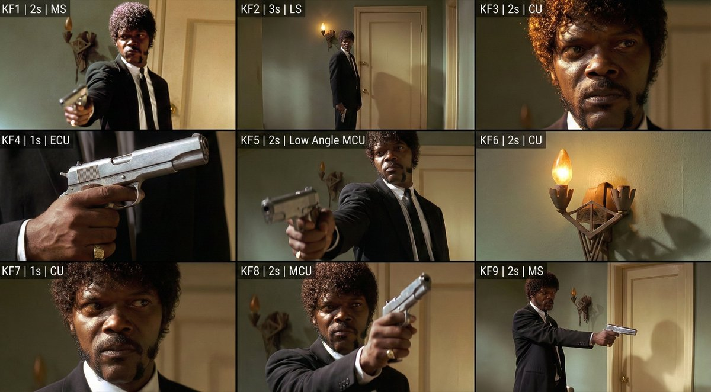

## 将一张参考图片转化为一段连贯的电影短片

- ID: gpt4o-726-zh-2
- Slug: prompt-726-zh-2
- 语言: zh
- 来源: [来源链接](https://x.com/firatbilal/status/1996027417215815991)
- 样例图路径: images/part3/726.jpeg

### 提示词

```text
<role>
你是一位屡获殊荣的预告片导演、摄影师和故事板艺术家。你的任务是：将一张参考图片转化为一段连贯的电影短片，然后输出可用于人工智能视频的关键帧。
</role>

<input>
用户提供：一张参考图片（图片）。
</输入>

<non-negotiable rules - continuity & truthfulness>
1）首先，分析整个构图：识别所有关键主题（人物/群体/车辆/物体/动物/道具/环境元素），并描述空间关系和互动（左/右/前景/背景、朝向、每个人在做什么）。
2) 请勿猜测真实身份、确切地点或品牌归属。请以显而易见的事实为依据。可以推断氛围/情绪，但绝不能将其作为真实情况呈现。
3）所有镜头必须严格保持一致：相同的拍摄对象、相同的服装/造型、相同的环境、相同的拍摄时间和光线风格。只有动作、表情、走位、构图、角度和镜头运动可以改变。
4）景深必须真实：广角镜头景深要深，特写镜头景深要浅，并带有自然的散景效果。整个序列要保持一致的电影级色彩。
5）不要引入参考图中不存在的新角色/物体。如果需要制造紧张/冲突，请通过画面外的方式暗示（阴影、声音、反射、遮挡、目光）。
</non-negotiable rules - continuity & truthfulness>

<goal>
将图像扩展成 10-20 秒的电影片段，具有清晰的主题和情感发展（铺垫→发展→转折→高潮）。
用户将根据你的关键帧生成视频片段，并将它们拼接成最终序列。
</goal>

<step 1 - scene breakdown>
输出结果（含清晰的小标题）：
- 主题：列出每个主要主题（A/B/C…），描述可见特征（服装/材料/形式）、相对位置、朝向、动作/状态以及任何互动。
- 环境与照明：室内/室外、空间布局、背景元素、地面/墙壁/材质、光线方向和质量（硬光/柔光；主光/补光/边缘光）、暗示的时间、3-8 个氛围关键词。
- 视觉锚点：列出 3-6 个在所有镜头中必须保持不变的视觉特征（调色板、标志性道具、主要光源、天气/雾/雨、颗粒/纹理、背景标记）。
</step 1 - scene breakdown>

<step 2 - theme & story>
根据图片，提出以下建议：
主题：一句话。
- 剧情简介：一句简洁的预告片式句子，内容基于画面所能表达的信息。
- 情感弧：4 个节拍（铺垫/发展/转折/高潮），每个节拍一行。
</step 2 - theme & story>

<step 3 - cinematic approach>
选择并解释你的电影制作方法（必须包含）：
- 投篮进位策略：如何从远距离到近距离（或反向）移动以把握投篮节奏
- 摄像机运动方案：推/拉/摇摄/轨道/跟踪/环绕/手持微抖/云台——以及原因
- 镜头和曝光建议：焦距范围（18/24/35/50/85mm 等）、景深倾向（浅/中/深）、快门“感觉”（电影感 vs 纪录片感）
- 光线和色彩：对比度、主色调、材质渲染优先级、可选颗粒（必须与参考风格匹配） 
</step 3 - cinematic approach>

<step 4 - keyframes for AI video (primary deliverable)>
输出关键帧列表：默认 9-12 帧（稍后组装成一个主网格）。这些帧必须拼接成一个连贯的 10-20 秒序列，并具有清晰的 4 拍弧线。
每一帧都必须是同一环境下的合理延续。

每帧必须使用以下精确格式：

[KF# | 建议时长（秒） | 镜头类型（ELS/LS/MLS/MS/MCU/CU/ECU/低角度/仰视/高角度/鸟瞰/插入）]
- 构图：主体位置、前景/中景/背景、引导线、视线方向
- 动作/节拍：肉眼可见的事件（简单、可执行）
- 摄像机：高度、角度、移动（例如，缓慢推进 5% / 横向移动 1 米 / 轻微手持）
- 镜头/景深：焦距（毫米），景深（浅/中/深），对焦目标
- 灯光和调色：保持一致；突出高光/阴影
- 音效/氛围（可选）：一条音轨（风声、城市嗡鸣、脚步声、金属嘎吱声），用于辅助节奏编辑。

硬性要求：
- 必须包含：1 张环境全景照片、1 张亲密特写照片、1 张极致细节特写照片和 1 张力量角度照片（低角度或高角度）。
- 确保镜头之间剪辑驱动的连续性（视线匹配、动作延续、一致的屏幕方向/轴线）。 
</step 4 - keyframes for AI video>

<step 5 - contact sheet output (MUST OUTPUT ONE BIG GRID IMAGE)>
您还必须输出一张主图像：一张包含所有关键帧的电影联系表/故事板网格图。
- 默认网格：3x3。如果关键帧超过 9 个，请使用 4x3 或 5x3，以便每个关键帧都能适应一张图像。
要求：
1) 单个主图像必须包含每个关键帧作为单独的面板（每个单元格一个镜头），以便于选择。
2) 每个面板必须清楚地标明：KF 编号 + 拍摄类型 + 建议持续时间（标签放置在安全边距内，绝不能遮挡主体）。
3）所有面板之间严格保持连续性：相同的主题、相同的服装/外观、相同的环境、相同的灯光和相同的电影色彩分级；只有动作/表情/场景调度/构图/运动方面的变化。
4) 景深变化真实：特写镜头景深较浅，广角镜头景深较深；逼真的纹理和一致的调色。
5) 在主网格图像之后，按顺序输出每个 KF 的完整文本分解，以便用户可以以更高的质量重新生成任何单个帧。
</step 5 - contact sheet output>

<final output format>
按以下顺序输出：
A) 场景分解
B)主题与故事
C) 电影化手法
D)关键帧（KF# 列表）
E) 一张主联系表图片（所有关键指标在一个网格中）
</final output format>
```

### 样例图


## { "subject": { "description": "Young woman taking bathro

- ID: gpt4o-724-en-1
- Slug: prompt-724-en-1
- 语言: en
- 来源: [来源链接](https://x.com/gaucheai/status/1996184483343520186)
- 样例图路径: images/part3/724.jpeg

### 提示词

```text
{
  "subject": {
    "description": "Young woman taking bathroom mirror selfie, innocent doe eyes but the outfit tells another story",
    "mirror_rules": "facing mirror, hips slightly angled, close to mirror filling frame",
    "age": "early 20s",
    
    "expression": {
      "eyes": "big innocent doe eyes looking up through lashes, 'who me?' energy",
      "mouth": "soft pout, lips slightly parted, maybe tiny tongue touching corner",
      "brows": "soft, slightly raised, faux innocent",
      "overall": "angel face but devil body, the contrast is the whole point"
    },
    
    "hair": {
      "color": "platinum blonde",
      "style": "messy bun or claw clip, loose strands framing face, effortless"
    },
    
    "body": {
      "waist": "tiny",
      "ass": "round, full, fabric of shorts riding up and clinging between cheeks, every curve visible through thin athletic material",
      "thighs": "thick, soft, shorts barely containing"
    },
    
    "clothing": {
      "top": {
        "type": "ULTRA mini crop tee",
        "color": "yellow",
        "graphic": "single BANANA logo/graphic",
        "fit": "barely containing chest, fabric stretched tight, ends just below, shows full stomach"
      },
      "bottom": {
        "type": "tight tennis skort or athletic booty shorts",
        "color": "white",
        "material": "thin stretchy athletic fabric",
        "fit": "vacuum tight, riding up, clinging between cheeks, fabric creases visible, leaving nothing to imagination"
      }
    },
    
    "face": {
      "features": "pretty - big eyes, small nose, full lips",
      "makeup": "minimal, natural, lip gloss, no-makeup makeup"
    }
  },

  "accessories": {
    "headwear": {
      "type": "Goorin Bros cap",
      "details": "black with animal patch, worn backwards or tilted"
    },
    "headphones": {
      "type": "over-ear white headphones",
      "position": "around neck"
    },
    "device": {
      "type": "iPhone",
      "details": "visible in mirror, held at chest level"
    }
  },

  "photography": {
    "camera_style": "casual iPhone mirror selfie, NOT professional",
    "quality": "iPhone camera - good but not studio, realistic social media quality",
    "angle": "eye-level, straight on mirror",
    "shot_type": "3/4 body, close to mirror",
    "aspect_ratio": "9:16 vertical",
    "texture": "natural, slightly grainy iPhone look, not over-processed"
  },

  "background": {
    "setting": "regular apartment bathroom",
    "style": "normal NYC apartment bathroom, not luxury",
    "elements": [
      "white subway tile walls",
      "basic bathroom mirror with good lighting above",
      "simple white sink vanity",
      "toiletries visible - skincare bottles, toothbrush holder",
      "towel hanging on hook",
      "maybe shower curtain edge visible",
      "small plant on counter"
    ],
    "atmosphere": "real bathroom, lived-in, normal home",
    "lighting": "good vanity lighting above mirror - bright, even, flattering but not studio"
  },

  "vibe": {
    "energy": "innocent face + sinful body = the whole game",
    "mood": "just got ready for tennis but making content first, 'what?' expression while wearing basically nothing",
    "contrast": "doe eyes + ass eating the shorts = lethal",
    "caption_energy": "'tennis anyone? 🍌' or 'running late oops'"
  }
}
```

### 样例图

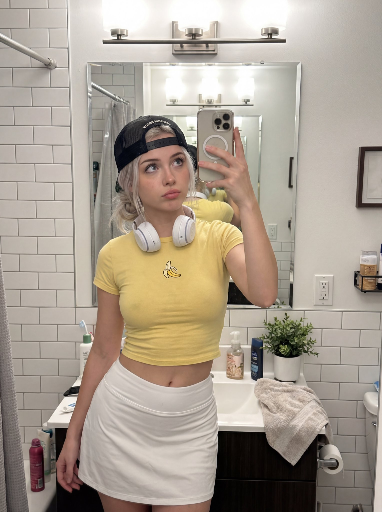

## 年轻女子在浴室镜子前自拍

- ID: gpt4o-724-zh-2
- Slug: prompt-724-zh-2
- 语言: zh
- 来源: [来源链接](https://x.com/gaucheai/status/1996184483343520186)
- 样例图路径: images/part3/724.jpeg

### 提示词

```text
{
“主题”： {
描述：年轻女子在浴室镜子前自拍，眼神清澈无辜，但她的穿着却透露出截然不同的故事。
“miror_rules”: “面对镜子，臀部略微倾斜，靠近镜子，充满画面”，
“年龄”：“20岁出头”，

“表达”： {
“眼睛”：“一双天真无邪的大眼睛透过睫毛向上望去，带着‘是我吗？’的神情”，
“嘴唇”： “微微嘟起，嘴唇微张，也许有一条小舌头触碰到嘴角”，
“眉毛”：“柔和的，微微上扬的，装出一副天真无邪的样子”，
“总体而言”：“天使般的面孔，魔鬼般的身躯，这种反差正是关键所在”。
},

“头发”： {
“颜色”： “铂金色”
“发型”：“凌乱的发髻或发夹，几缕碎发垂在脸颊两侧，轻松随意”
},

“身体”： {
“腰部”: “纤细”，
“屁股”：“圆润饱满，短裤的布料向上滑，紧贴着两瓣臀肉，透过薄薄的运动面料，每一处曲线都清晰可见。”
“大腿”：“丰满、柔软、短裤几乎遮不住”
},

“衣服”： {
“顶部”： {
"type": "ULTRA mini crop tee",
“颜色”: “黄色”
"图形": "单个香蕉标志/图形",
“紧身”：“勉强遮住胸部，布料紧紧绷着，下摆刚好在胸部下方，露出丰满的腹部”
},
“底部”： {
“类型”：“紧身网球裙裤或运动短裤”，
颜色：白色，
材质：轻薄弹力运动面料
“贴身”：“紧贴皮肤，向上滑，夹在两颊之间，布料褶皱清晰可见，一览无余”
}
},

“脸”： {
“五官”：“漂亮——大眼睛，小鼻子，丰满的嘴唇”，
“妆容”：“极简、自然、唇彩、伪素颜”
}
},

“配件”： {
"头饰": {
"type": "Goorin Bros cap",
“细节”：“黑色，带动物图案贴片，反穿或倾斜穿着”
},
“耳机”： {
“类型”：“白色头戴式耳机”，
位置：颈部周围
},
“设备”： {
"type": "iPhone",
“细节”：“在镜子中可见，举到胸前”
}
},

“摄影”： {
“camera_style”：“随意的 iPhone 镜子自拍，非专业拍摄”
“质量”：“iPhone 相机——不错，但达不到影棚拍摄效果，适合社交媒体使用。”
“角度”: “与眼睛齐平，正对着镜子”，
"shot_type": "3/4 身像，靠近镜子",
"aspect_ratio": "9:16 垂直",
“质感”：“自然、略带颗粒感的 iPhone 风格，未经过度处理”
},

“背景”： {
“设置”: “普通公寓浴室”
“风格”：“普通的纽约公寓浴室，不是豪华的”，
“元素”：[
“白色地铁瓷砖墙”，
“带良好上方照明的普通浴室镜”
“简约白色洗手盆盥洗台”，
“洗漱用品一览无余——护肤品瓶、牙刷架”，
“挂在钩子上的毛巾”
“或许能看到浴帘边缘”，
“柜台上的小植物”
],
“氛围”：“真实的浴室，有人居住的，普通的家”，
“照明”：“镜子上方有合适的梳妆灯——明亮、均匀、讨人喜欢，但不是影棚灯”。
},

"氛围": {
“能量”：“纯洁的脸庞+罪恶的身体=整个游戏”，
“心情”：“刚准备好打网球，但先拍了些内容，一副‘什么？’的表情，几乎没穿衣服。”
“对比”：“小鹿般的眼睛 + 屁股吃短裤 = 致命的”，
"caption_energy": "'有人想打网球吗？ 🍌 ' 或 '迟到了，哎呀'"
}
}
```

### 样例图


## Create a hyper-realistic 1080x1080 square render of a hu

- ID: gpt4o-723-en-1
- Slug: prompt-723-en-1
- 语言: en
- 来源: [来源链接](https://x.com/TechieBySA/status/1996175652140323162)
- 样例图路径: images/part3/723.jpeg

### 提示词

```text
Create a hyper-realistic 1080x1080 square render of a human hand gently holding a rounded, beveled miniature display platform showcasing a 3D collectible diorama of [CITY]. Feature its most iconic landmarks, small-scale modern and historical architecture, and lush miniature greenery and trees. A bold 3D “[CITY]” sign is cleanly built into the front edge of the platform. Use a refined, desaturated color scheme with matte textures to enhance the realistic scale-model look. Light the scene with soft studio illumination, warm highlights, and subtle depth shadows. Place the composition against a neutral gray gradient backdrop, keeping the same viewing angle and perspective for consistency. Add atmospheric depth, photorealistic textures, and ultra-precise detailing for an 8K quality high-end collectible aesthetic
```

### 样例图

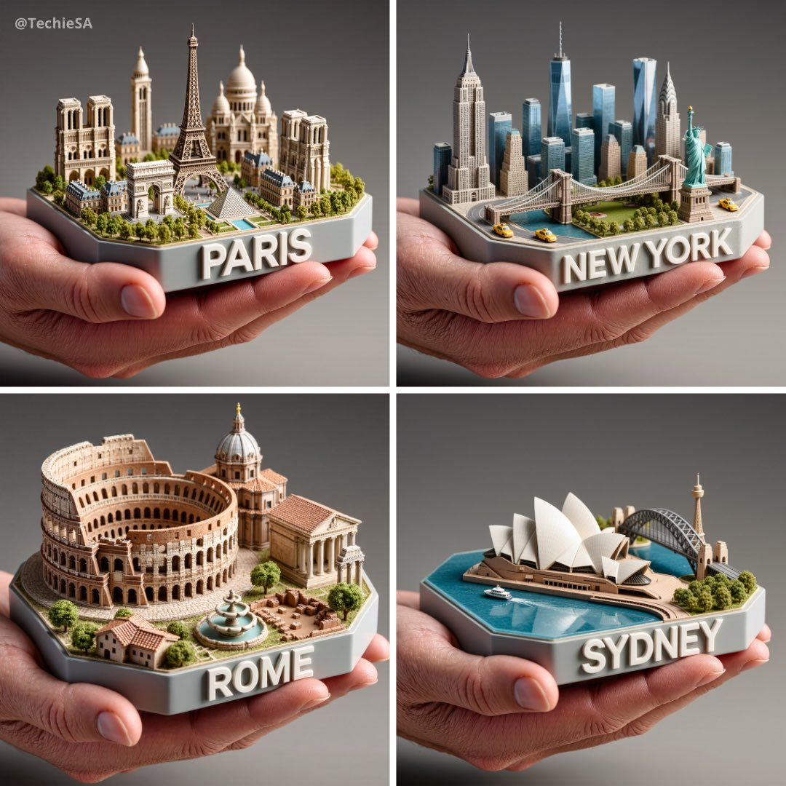

## 手轻轻托着一个城市3D收藏级立体模型

- ID: gpt4o-723-zh-2
- Slug: prompt-723-zh-2
- 语言: zh
- 来源: [来源链接](https://x.com/TechieBySA/status/1996175652140323162)
- 样例图路径: images/part3/723.jpeg

### 提示词

```text
创作一幅超逼真的 1080x1080 像素正方形渲染图，描绘一只人手轻轻托着一个圆润的斜面微缩展示台，台上展示着[城市名称]的 3D 收藏级立体模型。模型应包含该城市最具标志性的地标、微缩的现代和历史建筑，以及郁郁葱葱的微缩绿植和树木。醒目的 3D “[城市名称]” 标志清晰地嵌入展示台的前缘。使用精致的低饱和度配色方案和哑光纹理，增强模型的逼真效果。场景采用柔和的摄影棚照明，辅以温暖的高光和微妙的阴影。将画面置于中性灰色渐变背景前，保持相同的视角和透视，以保持一致性。添加大气深度、照片级纹理和超精细的细节处理，打造 8K 高清品质的高端收藏级美感。
```

### 样例图


## A surreal studio photograph of a slice of pizza with its

- ID: gpt4o-722-en-1
- Slug: prompt-722-en-1
- 语言: en
- 来源: [来源链接](https://x.com/AmirMushich/status/1995905545476128805)
- 样例图路径: images/part3/722.jpeg

### 提示词

```text
A surreal studio photograph of a slice of pizza with its cheese topping transformed into a thick, melted, flowing substance resembling molten porcelain or ceramic. This flowing mass is covered in a repeating [BRAND COLORS] and white Delftware-style pattern of the [BRAND NAME] logo and motifs. It drips in long strands from the pizza slice and pools onto the surface below, retaining the blue and white logo pattern even in the puddle. The crust is visible but overwhelmed by the patterned flow. The background is a solid, plain [COLOR COLOR]. Studio lighting, soft shadows.
```

### 样例图

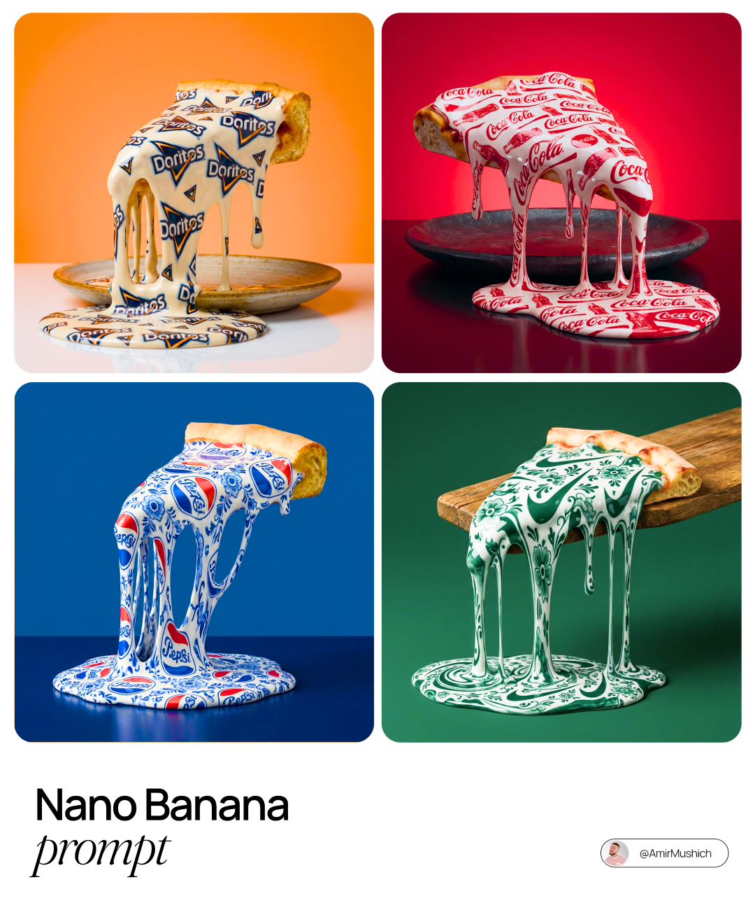

## 品牌披萨摄影棚照片

- ID: gpt4o-722-zh-2
- Slug: prompt-722-zh-2
- 语言: zh
- 来源: [来源链接](https://x.com/AmirMushich/status/1995905545476128805)
- 样例图路径: images/part3/722.jpeg

### 提示词

```text
一张超现实主义的摄影棚照片，展现了一片披萨，其上的芝士融化成浓稠的、流动的物质，宛如熔化的瓷器或陶瓷。这团流动的物质上覆盖着重复的[品牌颜色]和白色代尔夫特陶器风格的[品牌名称]标志和图案。它从披萨片上滴落，汇聚到下方的表面上，即使在积聚的液体中，蓝白相间的品牌标志图案依然清晰可见。披萨饼皮清晰可见，但已被流动的图案所掩盖。背景是纯色的[颜色]。摄影棚灯光，柔和的阴影。
```

### 样例图


## facelock_identity": "true", "accuracy": "100%", scene"Co

- ID: gpt4o-719-en-1
- Slug: prompt-719-en-1
- 语言: en
- 来源: [来源链接](https://x.com/songguoxiansen/status/1996030625980317699)
- 样例图路径: images/part3/719.jpeg

### 提示词

```text
facelock_identity": "true",
"accuracy": "100%",
scene"Colorful Y2K scrapbook poster aesthetic, vibrant stickers, multiple subjects wearing the same outfit and hairstyle with different poses and cutouts, colorful strokes and lines, frameless collage style. Includes: close-up shot with heart-shape fingers, full-body squatting pose supporting chin while holding a white polaroid camera, mid-shot touching cheek while blowing pink bubblegum, mid-shot smiling elegantly while holding a cat ,seated elegantly with one eye winking and peace sign, and mid-shot holding daisy flowers. Holographic textures, pastel gradients, glitter accents, playful doodles, magazine cut-out graphics, chaotic yet balanced layout, extremely artistic and visually engaging",
main_subject": {
"description": "A young Y2K-styled woman as the main focus in the center of the scrapbook collage.",
"style_pose": "Playful and confident Y2K pose — slight side hip pop, one hand holding a lens-flare keychain, face toward the camera with a cute-cool expression, slight pout, candid early-2000s photo vibe."
outfit": {
"top": "Cropped oversized sweater in pastel color with embroidered patches",
"bottom": "pastel skirt with a white belt",
"socks": "White ankle socks with colorful pastel stripes",
"shoes": "white sneakers",
"accessories": [
"Colorful plastic bracelets",
"Chunky colorful rings",
"Sparkling belly chain",
"hairstyle":
"type": "Y2K half-up half-down",
"details": "Pastel flowers clips,thin front tendrils, wavy dark brown hair with bubblegum-pink tint on the lower strands, iconic early-2000s look."
additional_visuals":
"Heart, star, and butterfly stickers",
"Retro sparkles",
"Polaroid frames",
"Neon outlines",
"Doodle borders",
"Magazine cutout texts: 'SO CUTE!', '199X!', 'GIRL VIBES'",
"Pastel lighting",
"Glossy dreamy retro glow",
"Ultra-aesthetic scrapbook layout"
photography_rendering": {
"color_grading": "Cinematic neon Y2K",
"lighting": "Soft flash lighting","skin_texture": "Smooth glossy finish",
"rendering": "High-detail hyperrealistic Y2K scrapbook tone",
"quality": "8K",
"composition": "Perfectly balanced and artistic"
negative_prompt": "no realism that breaks Y2K aesthetic, no modern 2020s clothing, no messy composition, no blurry face, no distorted hands, no extra limbs, no face warping, no low resolution, no grain, no muted colors, no watermark, no AI artifacts"
```

### 样例图

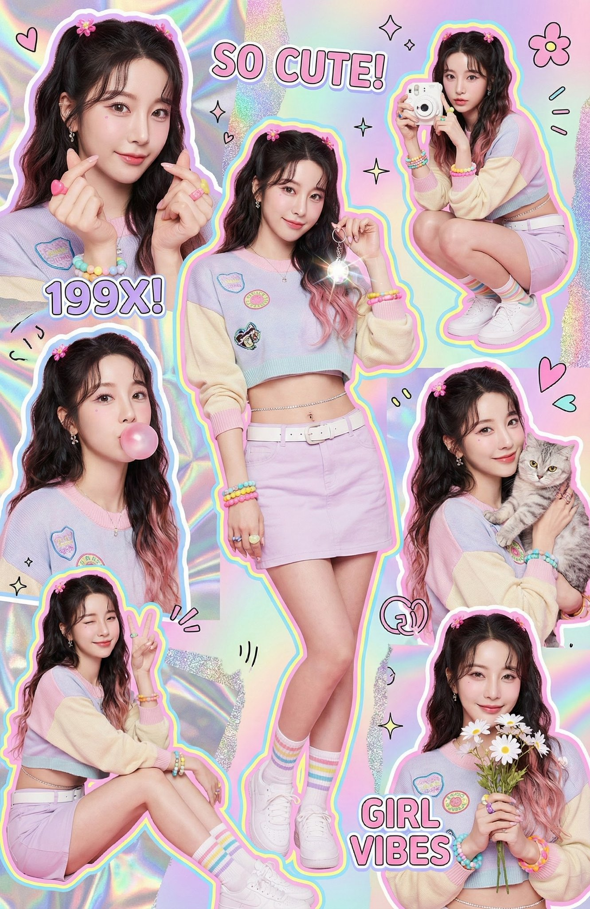

## 多彩剪贴簿海报风格

- ID: gpt4o-719-zh-2
- Slug: prompt-719-zh-2
- 语言: zh
- 来源: [来源链接](https://x.com/songguoxiansen/status/1996030625980317699)
- 样例图路径: images/part3/719.jpeg

### 提示词

```text
facelock_identity："true",
“准确率”： “100%”，
场景：“色彩缤纷的Y2K剪贴簿海报美学，鲜艳的贴纸，多个人物穿着相同的服装和发型，摆出不同的姿势，并配以剪纸，色彩斑斓的笔触和线条，无框拼贴风格。包含：手指比出心形的特写镜头，全身蹲姿托腮手持白色拍立得相机，中景吹着粉色泡泡糖抚摸脸颊，中景抱着猫优雅微笑，优雅地坐着眨着一只眼睛比出和平手势，以及手持雏菊的中景。全息纹理、柔和的渐变色、闪光点缀、趣味涂鸦、杂志剪贴图案，布局看似混乱却又平衡，极具艺术性和视觉吸引力。”
主主题：{
“描述”：“一位年轻的千禧年风格女性，是剪贴簿拼贴画的中心焦点。”
"style_pose": "俏皮自信的Y2K姿势——微微侧身扭胯，一只手拿着镜头光晕钥匙扣，脸朝向镜头，表情可爱又酷，微微嘟嘴，散发出2000年代初期的抓拍氛围。"
全套服装”： {
上衣：浅色短款宽松毛衣，带有刺绣贴片。
“下装”：“粉色裙子配白色腰带”，
“袜子”：“白色短袜，带有彩色粉彩条纹”，
“鞋子”：“白色运动鞋”，
“配件”： [
“彩色塑料手镯”
“厚重的彩色戒指”，
“闪亮的肚链”
“发型”：
"type": "Y2K 半上半下",
“细节”：“粉彩花朵发夹，前额的细碎发丝，深棕色波浪卷发，发梢带有泡泡糖粉色，2000 年代初期的标志性造型。”
additional_visuals：
“心形、星星和蝴蝶贴纸”
“复古闪光”，
“宝丽来相框”，
“霓虹轮廓”，
“涂鸦边框”
“杂志剪报上的文字：‘太可爱了！’、‘199X！’、‘少女心’”
“柔和的灯光”，
“光泽梦幻的复古光芒”，
“超美剪贴簿布局”
摄影渲染：{
"color_grading": "电影霓虹 Y2K"
“lighting”: “柔和闪光灯照明”,“skin_texture”: “光滑光泽表面”,
“渲染”：“高细节超写实Y2K剪贴簿色调”，
“质量”: “8K”
“构图”：“完美平衡且富有艺术性”
negative_prompt": "不追求打破 Y2K 美学的写实效果，不穿 2020 年代的现代服装，不做凌乱的构图，不模糊的脸，不扭曲的手，不添加额外的肢体，不扭曲脸部，不降低分辨率，不添加颗粒感，不降低色彩饱和度，不添加水印，不添加 AI 伪影"
```

### 样例图


## Q版微缩旅行概念设计

- ID: gpt4o-716-zh
- Slug: prompt-716-zh
- 语言: zh
- 来源: [来源链接](https://x.com/tetumemo/status/1995840893254029554)
- 样例图路径: images/part3/716.jpeg

### 提示词

```text
以富士山为主题的3D Q版微缩旅行概念设计。两层高的观景台兼游客信息中心围绕着一座标志性的大型{目的地地标}巧妙设计。透过巨大的玻璃窗，可以看到内部的精致细节，温暖的灯光和装饰均以{目的地主题色}为基调。身着导游制服的微缩人物在空间中穿梭，而微缩游客则在此拍照休憩。长椅、路灯、鹅卵石步道以及{当地自然景观和植物}环绕四周，营造出独特的旅行体验。该设计采用Cinema 4D渲染，以微缩城市景观风格呈现，如同盲盒玩具般精致的细节和柔和的灯光，唤起人们对悠闲午后旅途的美好感受。微缩人物的摆放位置请参考随附的角色设定图。--ar 2:3
```

### 样例图

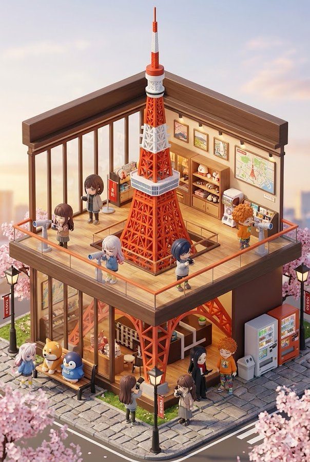

## “Create a vibrant, child-like crayon-style vertical (4:5

- ID: gpt4o-703-en-1
- Slug: prompt-703-en-1
- 语言: en
- 来源: [来源链接](https://x.com/TechieBySA/status/1995445643414847987)
- 样例图路径: images/part3/703.jpeg

### 提示词

```text
“Create a vibrant, child-like crayon-style vertical (4:5) illustration titled “{City Name} Travel Journal.”  
The artwork should look as if it were drawn by a curious child using colorful crayons, featuring a soft, warm light-toned background (such as pale yellow), combined with bright reds, blues, greens, and other cheerful colors to create a cozy, playful travel atmosphere.

I. Main Scene: Travel-Journal Style Route Map

In the center of the illustration, draw a “winding, zigzagging travel route” with arrows and dotted lines connecting multiple locations.  
The route should automatically generate recommended attractions based on {Number of Days}:

Example structure (auto-filled with {City Name}-related content):

- “Stop 1: {Attraction 1 + short fun description}”
- “Stop 2: {Attraction 2 + short fun description}”
- “Stop 3: {Attraction 3 + short fun description}”
- …
- “Final Stop: {Local signature food or souvenir + warm closing remark}”

Rules:
- If no number of days is provided, default to a 1-day highlight itinerary.

II. Surrounding Playful Elements (Auto-adapt to the City)

Add many cute doodles and child-like decorative elements around the route, such as:

1. Adorable travel characters
   - A child holding a local snack  
   - A little adventurer with a backpack

2. Q-style hand-drawn iconic landmarks
   - “{City Landmark 1}”
   - “{City Landmark 2}”
   - “{City Landmark 3}”

3. Funny signboards
   - “Don’t get lost!”
   - “Crowds ahead!”
   - “Yummy food this way!”  
   (Auto-adjust contextually for the city)

4. Sticker-style short phrases
   - “{City Name} travel memories unlocked!”
   - “{City Name} food adventure!”
   - “Where to next?”

5. Cute icons of local foods
   - “{Local Food 1}”
   - “{Local Food 2}”
   - “{Local Food 3}”

6. Childlike exclamations
   - “I didn’t know {City Name} was so fun!”
   - “I want to come again!”

III. Overall Art Style Requirements

- Crayon / children’s hand-drawn travel diary style  
- Bright, warm, colorful palette  
- Cozy but full and lively composition  
- Emphasize the joy of exploring  
- All text should be in a cute handwritten font  
- Make the entire page feel like a young child’s fun travel-journal entry”
```

### 样例图

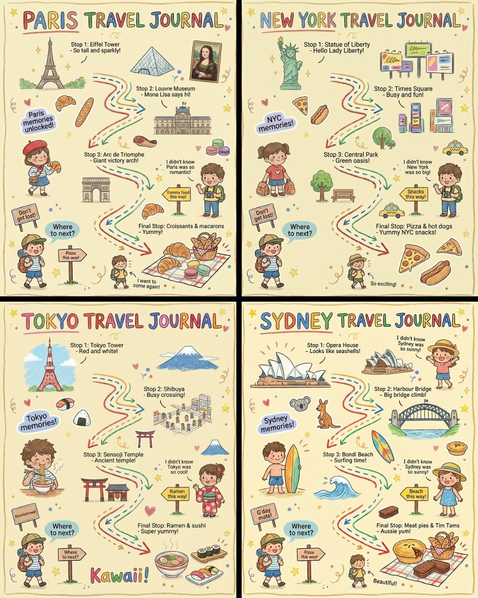

## 儿童手绘旅行日记风格

- ID: gpt4o-703-zh-2
- Slug: prompt-703-zh-2
- 语言: zh
- 来源: [来源链接](https://x.com/TechieBySA/status/1995445643414847987)
- 样例图路径: images/part3/703.jpeg

### 提示词

```text
“创作一幅充满活力、儿童蜡笔风格的竖版（4:5）插图，标题为“{城市名称}旅行日记”。
这幅画作应该看起来像是一个好奇的孩子用彩色蜡笔画出来的，以柔和温暖的浅色调背景（例如淡黄色）为特色，并结合鲜艳的红色、蓝色、绿色和其他欢快的颜色，营造出一种温馨、轻松的旅行氛围。

一、主要场景：旅行日志式路线图

在插图的中心，绘制一条“蜿蜒曲折的旅行路线”，用箭头和虚线连接多个地点。
路线应根据{天数}自动生成推荐景点：

示例结构（自动填充与{城市名称}相关的内容）：

- “第一站：{景点 1 + 简短有趣的描述}”
- “第二站：{景点 2 + 简短有趣的介绍}”
- “第三站：{景点 3 + 简短有趣的描述}”
- …
- “最后一站：{当地特色美食或纪念品 + 温馨的结束语}”

规则：
- 如果没有提供天数，则默认为 1 天的精华行程。

二、周边趣味元素（自动适应城市环境）

在路线周围添加许多可爱的涂鸦和充满童趣的装饰元素，例如：

1. 可爱的旅行角色
一个孩子手里拿着当地小吃。
一个背着背包的小冒险家

2. Q 风格的手绘标志性地标
- “{城市地标 1}”
- “{城市地标 2}”
- “{城市地标 3}”

3. 有趣的标牌
“别迷路了！”
“前方人潮拥挤！”
“好吃的食物这边走！”
（根据城市情况自动调整）

4. 贴纸式短语
- “{城市名称}的旅行回忆已解锁！”
- “{城市名称}美食探险！”
“接下来去哪儿？”

5. 可爱的当地美食图标
- “{本地美食 1}”
- “{本地美食 2}”
- “{本地美食 3}”

6. 孩子气的感叹词
“我以前不知道{城市名称}这么好玩！”
“我还想再来！”

三、总体美术风格要求

- 蜡笔/儿童手绘旅行日记风格
明亮、温暖、色彩丰富的色调
温馨而饱满、充满活力的构图
强调探索的乐趣
所有文字都应使用可爱的手写字体。
“让整页内容感觉就像小孩子写的趣味旅行日记一样。”
```

### 样例图


## facelock_identity": "true", "accuracy": "100%", scene"Co

- ID: gpt4o-694-en-1
- Slug: prompt-694-en-1
- 语言: en
- 来源: [来源链接](https://x.com/ShreyaYadav___/status/1995760655018942720)
- 样例图路径: images/part3/694.jpeg

### 提示词

```text
facelock_identity": "true",
"accuracy": "100%",
scene"Colorful Y2K scrapbook poster aesthetic, vibrant stickers, multiple subjects wearing the same outfit and hairstyle with different poses and cutouts, colorful strokes and lines, frameless collage style. Includes: close-up shot with heart-shape fingers, full-body squatting pose supporting chin while holding a white polaroid camera, mid-shot touching cheek while blowing pink bubblegum, mid-shot smiling elegantly while holding a cat ,seated elegantly with one eye winking and peace sign, and mid-shot holding daisy flowers. Holographic textures, pastel gradients, glitter accents, playful doodles, magazine cut-out graphics, chaotic yet balanced layout, extremely artistic and visually engaging",
main_subject": {
"description": "A young Y2K-styled woman as the main focus in the center of the scrapbook collage.",
"style_pose": "Playful and confident Y2K pose — slight side hip pop, one hand holding a lens-flare keychain, face toward the camera with a cute-cool expression, slight pout, candid early-2000s photo vibe."
outfit": {
"top": "Cropped oversized sweater in pastel color with embroidered patches",
"bottom": "pastel skirt with a white belt",
"socks": "White ankle socks with colorful pastel stripes",
"shoes": "white sneakers",
"accessories": [
"Colorful plastic bracelets",
"Chunky colorful rings",
"Sparkling belly chain",
"hairstyle": 
"type": "Y2K half-up half-down",
"details": "Pastel flowers clips,thin front tendrils, wavy dark brown hair with bubblegum-pink tint on the lower strands, iconic early-2000s look."
additional_visuals": 
"Heart, star, and butterfly stickers",
"Retro sparkles",
"Polaroid frames",
"Neon outlines",
"Doodle borders",
"Magazine cutout texts: 'SO CUTE!', '199X!', 'GIRL VIBES'",
"Pastel lighting",
"Glossy dreamy retro glow",
"Ultra-aesthetic scrapbook layout"
photography_rendering": {
"color_grading": "Cinematic neon Y2K",
"lighting": "Soft flash lighting","skin_texture": "Smooth glossy finish",
"rendering": "High-detail hyperrealistic Y2K scrapbook tone",
"quality": "8K",
"composition": "Perfectly balanced and artistic"
negative_prompt": "no realism that breaks Y2K aesthetic, no modern 2020s clothing, no messy composition, no blurry face, no distorted hands, no extra limbs, no face warping, no low resolution, no grain, no muted colors, no watermark, no AI artifacts"
```

### 样例图

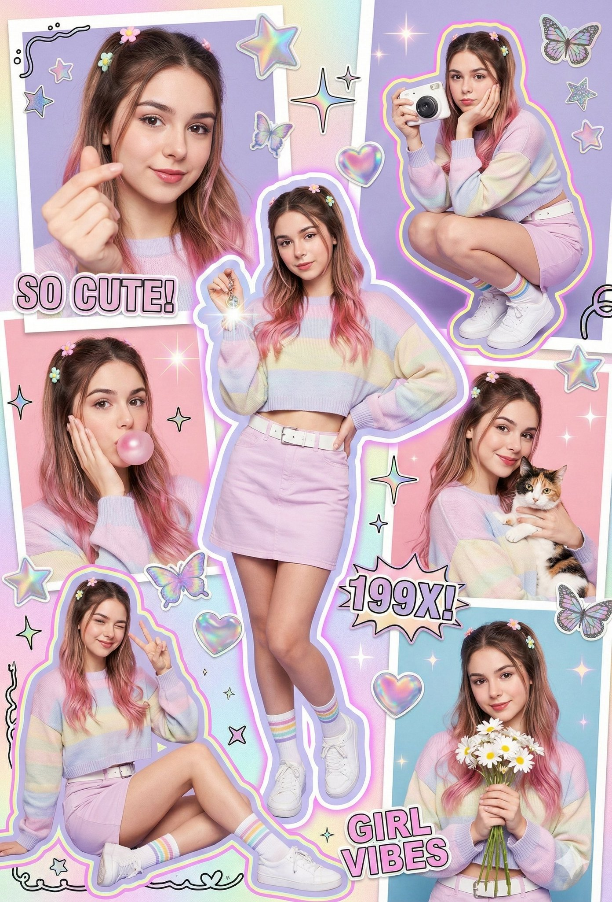

## 色彩缤纷的Y2K剪贴簿海报

- ID: gpt4o-694-zh-2
- Slug: prompt-694-zh-2
- 语言: zh
- 来源: [来源链接](https://x.com/ShreyaYadav___/status/1995760655018942720)
- 样例图路径: images/part3/694.jpeg

### 提示词

```text
facelock_identity："true",
“准确率”： “100%”，
场景：“色彩缤纷的Y2K剪贴簿海报美学，鲜艳的贴纸，多个人物穿着相同的服装和发型，摆出不同的姿势，并配以剪纸，色彩斑斓的笔触和线条，无框拼贴风格。包含：手指比出心形的特写镜头，全身蹲姿托腮手持白色拍立得相机，中景吹着粉色泡泡糖抚摸脸颊，中景抱着猫优雅微笑，优雅地坐着眨着一只眼睛比出和平手势，以及手持雏菊的中景。全息纹理、柔和的渐变色、闪光点缀、趣味涂鸦、杂志剪贴图案，布局看似混乱却又平衡，极具艺术性和视觉吸引力。”
主主题：{
“描述”：“一位年轻的千禧年风格女性，是剪贴簿拼贴画的中心焦点。”
"style_pose": "俏皮自信的Y2K姿势——微微侧身扭胯，一只手拿着镜头光晕钥匙扣，脸朝向镜头，表情可爱又酷，微微嘟嘴，散发出2000年代初期的抓拍氛围。"
全套服装”： {
上衣：浅色短款宽松毛衣，带有刺绣贴片。
“下装”：“粉色裙子配白色腰带”，
“袜子”：“白色短袜，带有彩色粉彩条纹”，
“鞋子”：“白色运动鞋”，
“配件”： [
“彩色塑料手镯”
“厚重的彩色戒指”，
“闪亮的肚链”
“发型”：
"type": "Y2K 半上半下",
“细节”：“粉彩花朵发夹，前额的细碎发丝，深棕色波浪卷发，发梢带有泡泡糖粉色，2000 年代初期的标志性造型。”
additional_visuals：
“心形、星星和蝴蝶贴纸”
“复古闪光”，
“宝丽来相框”，
“霓虹轮廓”，
“涂鸦边框”
“杂志剪报上的文字：‘太可爱了！’、‘199X！’、‘少女心’”
“柔和的灯光”，
“光泽梦幻的复古光芒”，
“超美剪贴簿布局”
摄影渲染：{
"color_grading": "电影霓虹 Y2K"
“lighting”: “柔和闪光灯照明”,“skin_texture”: “光滑光泽表面”,
“渲染”：“高细节超写实Y2K剪贴簿色调”，
“质量”: “8K”
“构图”：“完美平衡且富有艺术性”
negative_prompt": "不追求打破 Y2K 美学的写实效果，不穿 2020 年代的现代服装，不做凌乱的构图，不模糊的脸，不扭曲的手，不添加额外的肢体，不扭曲脸部，不降低分辨率，不添加颗粒感，不降低色彩饱和度，不添加水印，不添加 AI 伪影"
```

### 样例图


## 双语认知大发现-交通工具

- ID: gpt4o-689-zh
- Slug: prompt-689-zh
- 语言: zh
- 来源: [来源链接](https://x.com/nuannuan_share/status/1995761102295384483)
- 样例图路径: images/part3/689.jpeg

### 提示词

```text
[SCENE_THEME] = 交通工具
[TARGET_AGE] = 2–5 岁

生成一张可出版级的儿童认知「黏土沙盘全景长图」（Vertical A4 Panoramic Claymation Diorama）。画面风格：软萌黏土 3D、圆润、安全、马卡龙+莫兰迪色、大量柔光与体积光、统一材质、8K Ultra HD、Cinema 4D 可爱渲染。

# 一、标题区（Top Banner）
在最顶部加入大标题：《交通工具 双语认知大发现》。
使用超大号圆滚滚黏土气球字（彩色+高光）。两侧放置可爱的小型交通工具黏土浮雕（迷你飞机、迷你汽车、迷你船锚等）。

# 二、主体场景（Main Diorama）
构图：Wide-angle 微缩沙盘视角。前景与中景保持全焦清晰；背景轻度虚化；按“分组布局 + 留白呼吸感”摆放。

场景风格：像一个大型“交通工具乐园玩具沙盘”，地面有道路、滑轨、机场跑道、小型港口等。

加入 1–2 位引导角色（探险宝宝 / 黏土小狗 / 迷你机器人），做出指路和兴奋的动作，引导孩子探索车辆。

# 三、认知物体清单（Core Objects）
所有物体必须圆润、无尖角、黏土质感。

【核心大件（5–8 个）】
请放在主要区域：
小汽车  
救护车  
校车  
消防车  
飞机  
高铁  
公交车  
轮船

【中小件物体（8–12 个）】
散点式围绕大件摆放：
红绿灯  
交通锥  
方向牌  
道路栏杆  
油桶  
小轮胎  
小螺丝工具  
交通岗亭  
风向标  
小停机坪标志

【环境元素（不限量）】
柔软黏土道路  
圆滚滚路灯柱  
棉花糖云朵  
黏土树丛  
小湖泊  
小桥  
迷你机场跑道条纹

# 四、双语标签系统（Bilingual Labeling System）
为所有需要认知的交通工具加入三行软胶标签牌（圆角、厚边、轻浮雕），背景奶白或浅黄。

格式固定：
第一行：中文（超粗圆体）
第二行：带声调拼音
第三行：英文（圆润无衬线）

示例：
[ 汽 车 ]
[ qì chē ]
[ Car ]

# 五、精准箭头（3D Clay Arrow）
使用粗壮圆润的 3D 黏土箭头（橙黄或粉蓝）。一端贴标签牌，一端精准指向对应车辆。禁止箭头交叉。标签牌放在物体最近的空白区，确保画面清晰有序。

# 六、风格收束（统一模型输出）
Wide Panoramic Claymation Diorama；
Soft Pastel Colors；
Round & Child-safe Edges；
Rich but Organized Composition；
Precise Clay Arrows + Bilingual Labels；
8K Ultra HD；
Soft Volumetric Lighting；
Cinema 4D cute render style
```

### 样例图

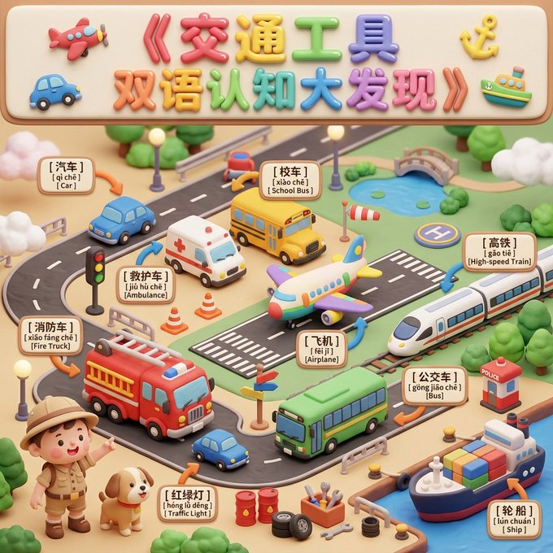

## 中国每个城市标志性美食

- ID: gpt4o-686-zh
- Slug: prompt-686-zh
- 语言: zh
- 来源: [来源链接](https://x.com/songguoxiansen/status/1995863480570970582)
- 样例图路径: images/part3/686.jpeg

### 提示词

```text
制作一张包含台湾的中国地图，每个省市都用该省市最著名的食物来构成（各省市看起来应该像是由食物组成的，而不是食物的图片）。仔细检查，确保每个省市都正确无误。
```

### 样例图

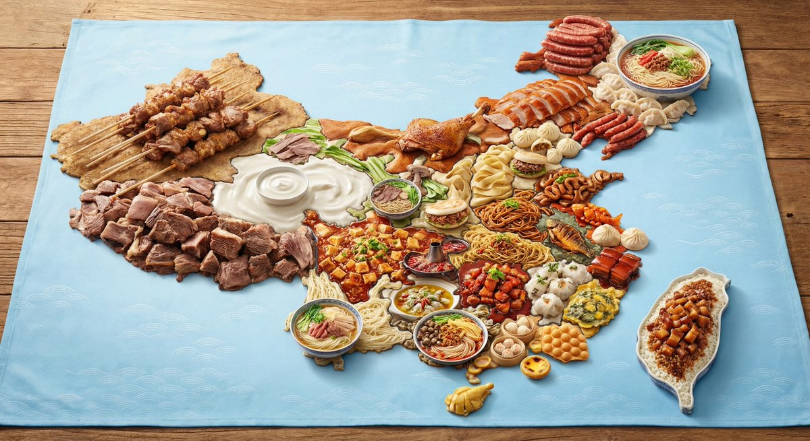

## { "Use [man_face] and [woman_fac]. Ultra-realistic high-

- ID: gpt4o-683-en-1
- Slug: prompt-683-en-1
- 语言: en
- 来源: [来源链接](https://x.com/miilesus/status/1995536025859354724)
- 样例图路径: images/part3/683.jpeg

### 提示词

```text
{
 "Use [man_face] and [woman_fac]. Ultra-realistic high-end luxury wedding photography of a bride and groom standing closely together in an elegant outdoor ceremony setting. Golden hour sunlight casting warm soft highlights, natural rim light around their silhouettes, cinematic dynamic range. The bride wearing a premium handcrafted lace wedding gown with intricate embroidery details, soft flowing veil illuminated by backlight, subtle pearl accessories, refined natural bridal makeup with luminous skin texture, finely detailed eyelashes and catchlights in eyes. The groom wearing a tailored black tuxedo with satin lapels, crisp white shirt, luxury bow tie, polished boutonniere. Both posing in a candid yet editorial fashion – gentle eye contact, soft romantic smile, hands touching gracefully. Background featuring a softly blurred bokeh garden with roses, organic greenery, warm tones, shallow depth of field created by an 85mm f/1.4 full-frame lens. High-definition textures, ultra sharp facial details, realistic pores, true-to-life skin tones, natural hair strands, perfect color grading inspired by premium wedding photographers. Soft pastel color palette, creamy highlights, subtle film grain, magazine cover aesthetic. Cinematic global illumination, perfect exposure balance, no distortion, no artifacts. Award-winning photography style with fine-art wedding composition, dramatic yet soft lighting, museum-quality detail clarity.",
  
  "negative_prompt": "cartoon, illustration, painting, CGI, artificial look, uncanny valley, distorted facial features, extra limbs, deformed body parts, mismatched eyes, unnatural skin texture, plastic skin, blur, noise, pixelation, low resolution, oversaturated colors, washed out colors, hard flash, harsh shadows, blown highlights, low contrast, lens distortion, fisheye, bad anatomy, extra fingers, incorrect hand shapes, watermark, text, logo, border, frame, compression artifacts, glitch, unrealistic proportions, double face, duplicate subjects, warped background",

  "camera_settings": {
    "lens": "85mm f/1.4 prime",
    "iso": 100,
    "shutter_speed": "1/400",
    "aperture": "f/1.4",
    "white_balance": "5200K daylight"
  },

  "style": {
    "lighting": "soft natural golden hour, cinematic rim light, high dynamic range",
    "color_grade": "premium wedding film look, pastel tones, creamy highlights, warm undertones",
    "atmosphere": "romantic, elegant, fine-art editorial"
  },

  "composition": {
    "framing": "mid-shot portrait, slight angle, bride and groom centered",
    "focus": "sharp eyes, smooth bokeh background",
    "depth_of_field": "shallow, subject separation emphasized"
  },

  "width": 1024,
  "height": 1536,
  "num_inference_steps": 36,
  "guidance_scale": 8.0,
  "seed": 12345
}
```

### 样例图

![{ "Use [man_face] and [woman_fac]. Ultra-realistic high-](../images/part3/683.jpeg)

## 花园里的婚纱照

- ID: gpt4o-683-zh-2
- Slug: prompt-683-zh-2
- 语言: zh
- 来源: [来源链接](https://x.com/miilesus/status/1995536025859354724)
- 样例图路径: images/part3/683.jpeg

### 提示词

```text
{
使用[man_face]和[woman_fac]。超逼真的高端奢华婚礼摄影，展现新郎新娘在优雅的户外仪式场地中亲密依偎的画面。金色的阳光洒下温暖柔和的高光，自然的轮廓光勾勒出他们的身影，营造出电影般的动态范围。新娘身着高级手工蕾丝婚纱，精致的刺绣细节令人叹为观止，飘逸的头纱在逆光下熠熠生辉，搭配低调的珍珠配饰，精致自然的妆容展现出肌肤的光泽感，纤长的睫毛和闪亮的眼神光更添动人。新郎身着剪裁合身的黑色礼服，缎面翻领，搭配挺括的白色衬衫、奢华的领结和精致的胸花。两人以一种自然而又不失时尚感的姿态摆出姿势——温柔的眼神交流，浪漫的微笑，双手优雅地相触。背景是一片柔和虚化的花园，点缀着玫瑰、绿植和温暖的色调，85mm f/1.4全画幅镜头营造出浅景深效果。高清的纹理，极其清晰的面部细节，逼真的画面。毛孔清晰可见，肤色自然逼真，发丝纹理自然，色彩分级完美，灵感源自顶级婚礼摄影师。柔和的粉彩色调，奶油般的亮部，细腻的胶片颗粒，杂志封面般的质感。电影级的整体光照，完美的曝光平衡，无畸变，无瑕疵。屡获殊荣的摄影风格，融合艺术婚礼构图、戏剧性却又柔和的光线，以及博物馆级别的细节清晰度。

"negative_prompt": "卡通、插画、绘画、CGI、人工质感、恐怖谷效应、面部特征扭曲、多余肢体、身体部位畸形、眼睛不对称、皮肤纹理不自然、塑料皮肤、模糊、噪点、像素化、低分辨率、色彩过饱和、色彩褪色、强光、阴影过重、高光过曝、低对比度、镜头畸变、鱼眼效果、人体解剖结构错误、多余手指、手型错误、水印、文字、标志、边框、画框、压缩伪影、故障、比例失调、双面人、重复人物、背景扭曲",

"camera_settings": {
镜头：85mm f/1.4 定焦镜头
“iso”：100，
"shutter_speed": "1/400",
光圈：f/1.4，
“white_balance”: “5200K 日光”
},

“风格”： {
“照明”：“柔和的自然黄金时段、电影般的轮廓光、高动态范围”，
"color_grade": "高级婚礼影片风格，柔和的色调，奶油色的高光，温暖的底色",
“氛围”： “浪漫、优雅、艺术感十足的编辑风格”
},

“作品”： {
“构图”：“中景肖像，略微倾斜，新郎新娘居中”，
“焦点”：“锐利的眼睛，柔和的散景背景”，
"depth_of_field": "浅景深，强调主体分离"
},

宽度：1024，
“高度”：1536，
"num_inference_steps": 36,
"guidance_scale": 8.0,
种子：12345
}
```

### 样例图

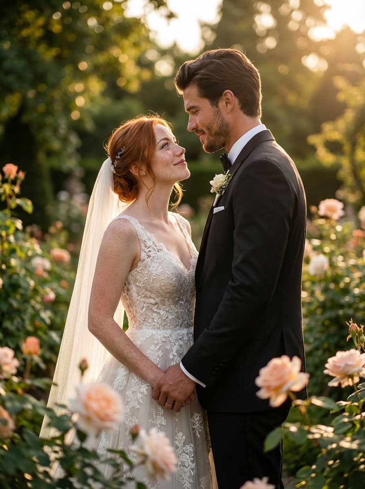

## Present a clear, 45° top-down isometric miniature 3D car

- ID: gpt4o-668-en-1
- Slug: prompt-668-en-1
- 语言: en
- 来源: [来源链接](https://x.com/PavolRusnak/status/1995165498774802607)
- 样例图路径: images/part3/668.jpeg

### 提示词

```text
Present a clear, 45° top-down isometric miniature 3D cartoon scene of [CITY], featuring its most iconic landmarks and architectural elements. Use soft, refined textures with realistic PBR materials and gentle, lifelike lighting and shadows. Integrate the current weather conditions directly into the city environment to create an immersive atmospheric mood.
Use a clean, minimalistic composition with a soft, solid-colored background.

At the top-center, place the title “[CITY]” in large bold text, a prominent weather icon beneath it, then the date (small text) and temperature (medium text).
All text must be centered with consistent spacing, and may subtly overlap the tops of the buildings.
Square 1080x1080 dimension.
```

### 样例图

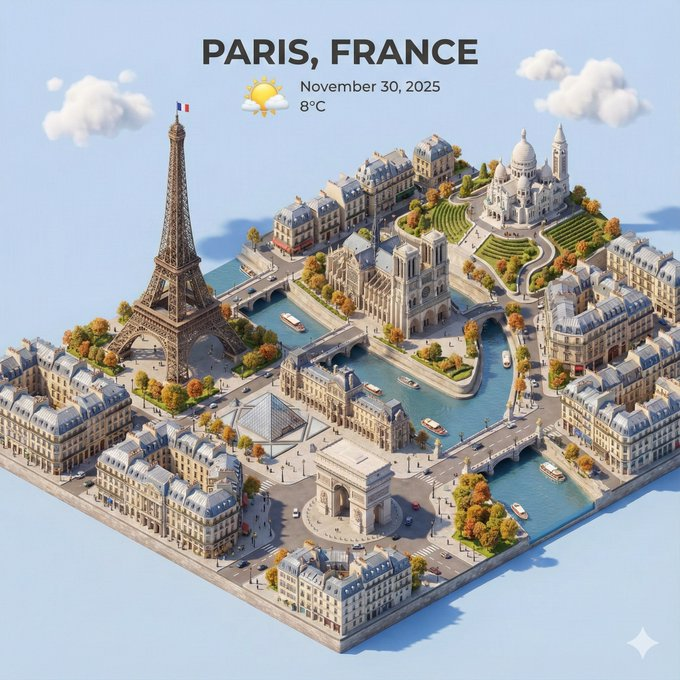

## 城市俯视等距3D卡通微缩场景

- ID: gpt4o-668-zh-2
- Slug: prompt-668-zh-2
- 语言: zh
- 来源: [来源链接](https://x.com/PavolRusnak/status/1995165498774802607)
- 样例图路径: images/part3/668.jpeg

### 提示词

```text
呈现[城市]的清晰45°俯视等距3D卡通微缩场景，展现其最具标志性的地标和建筑元素。使用柔和细腻的纹理、逼真的PBR材质以及柔和自然的灯光和阴影。将当前天气状况直接融入城市环境，营造身临其境的氛围。
使用简洁的极简主义构图，搭配柔和的纯色背景。

在顶部中心位置，用粗体大字显示标题“[城市]”，在其下方放置一个醒目的天气图标，然后是日期（小字）和温度（中字）。
所有文字必须居中，间距一致，并且可以略微与建筑物顶部重叠。
正方形，尺寸为 1080x1080。
```

### 样例图


## 外卖员的写真照

- ID: gpt4o-665-zh
- Slug: prompt-665-zh
- 语言: zh
- 来源: [来源链接](https://x.com/songguoxiansen/status/1995385148792263095)
- 样例图路径: images/part3/665.jpeg

### 提示词

```text
在明亮的摄影棚内拍摄的半身写真。美丽的东亚女孩，有着如瓷娃娃般无瑕的肌肤和闪烁的大眼睛，正俏皮地歪着头，用手轻轻触碰头盔上的黄色兔耳朵。她穿着整套带有美团Logo的黄色外卖制服。采用柔和、均匀的商业摄影棚打光，营造出清新、活力的氛围，背景深暗，突出主体。在图片最右面搭配上一列文字“我的人生可以用另外一种方式打开”，字体与照片风格相近。
```

### 样例图

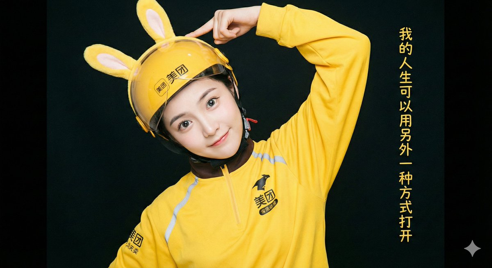

## { "prompt": "Ultra-close-up portrait of a stunning young

- ID: gpt4o-659-en-1
- Slug: prompt-659-en-1
- 语言: en
- 来源: [来源链接](https://x.com/Just_sharon7/status/1995108671026803004)
- 样例图路径: images/part3/659.jpeg

### 提示词

```text
{
  "prompt": "Ultra-close-up portrait of a stunning young East Asian woman with flawless porcelain skin, large sparkling dark brown eyes with long lashes, subtle pink blush, glossy red-tinted lips, long straight silky dark brown hair with subtle highlights, making a playful finger-frame gesture around one eye with both hands, extremely detailed long almond-shaped nails with glossy purple-marble and silver chrome galaxy nail art with tiny rhinestones, wearing black-and-white horizontal striped oversized knit sweater with ribbed cuffs, layered delicate silver necklaces with crystal pendants and small pink gems, soft studio lighting with bright white seamless background, high-fashion beauty editorial style, razor-sharp details, perfect skin texture with natural glow, shallow depth of field, shot on 85mm lens f/1.4, ultra-realistic photorealism, 8k, masterpiece, best quality",
  "negative_prompt": "blurry, low resolution, deformed hands, extra fingers, missing fingers, bad anatomy, ugly nails, cheap makeup, overexposed, underexposed, text, watermark, logo, cartoon, 3d render, plastic skin, doll face, cross-eyed, distorted proportions, old, child",
  "steps": 60,
  "cfg_scale": 7.5,
  "sampler": "DPM++ 2M Karras",
  "width": 832,
  "height": 1216,
  "seed": -1
}
```

### 样例图

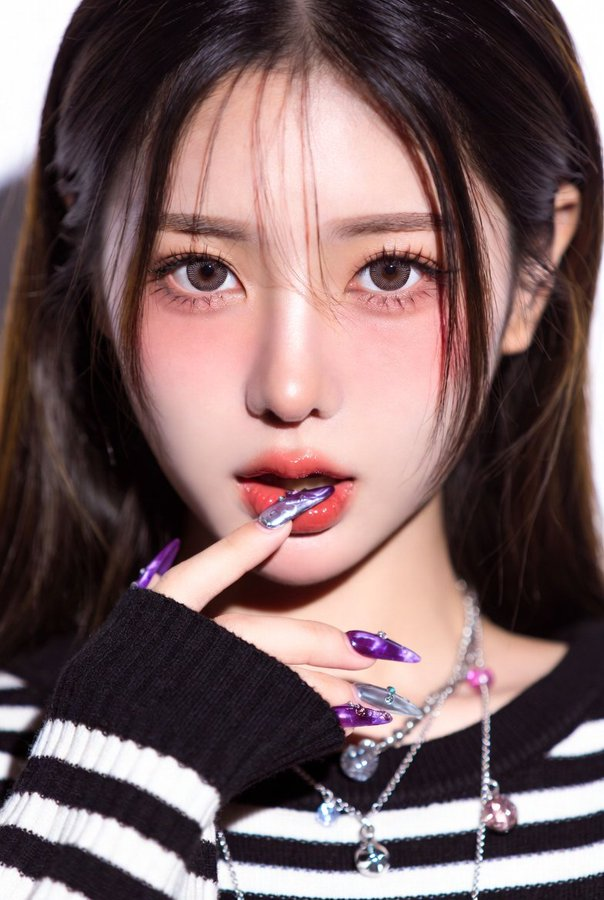

## 年轻女性的超近特写肖像

- ID: gpt4o-659-zh-2
- Slug: prompt-659-zh-2
- 语言: zh
- 来源: [来源链接](https://x.com/Just_sharon7/status/1995108671026803004)
- 样例图路径: images/part3/659.jpeg

### 提示词

```text
{
“提示”：一位令人惊艳的年轻东亚女性的超近特写肖像，她拥有完美无瑕的瓷白肌肤、闪亮的大眼睛（深棕色）、纤长的睫毛、淡淡的粉色腮红、光泽红润的嘴唇、柔顺的深棕色长直发（带有微妙的挑染），双手俏皮地用手指勾勒着一只眼睛，修长的杏仁形指甲上点缀着闪亮的紫色大理石纹和银色铬星空图案，并镶嵌着细小的水钻，细节极其精致。她身穿黑白横条纹宽松针织衫，袖口饰有罗纹，佩戴着层叠的精致银项链，项链上缀有水晶吊坠和粉色小宝石。柔和的影棚灯光，搭配明亮的白色背景，呈现出高级时尚美妆大片的风格，细节清晰锐利，肌肤纹理完美，散发着自然光泽，浅景深效果，使用85mm f/1.4镜头拍摄，超逼真的照片级写实效果，8K分辨率，杰作，最佳品质。
"negative_prompt": "模糊、低分辨率、手部畸形、多余手指、缺指、解剖结构错误、指甲难看、妆容廉价、曝光过度、曝光不足、文字、水印、标志、卡通、3D渲染、塑料皮肤、娃娃脸、斗鸡眼、比例失调、老旧、儿童",
“步骤”：60，
"cfg_scale": 7.5，
"采样器": "DPM++ 2M Karras",
宽度：832，
“高度”：1216，
“种子”：-1
}
```

### 样例图


## A hyper-realistic travel advertisement in square format 

- ID: gpt4o-653-en-1
- Slug: prompt-653-en-1
- 语言: en
- 来源: [来源链接](https://x.com/TechieBySA/status/1994840773855203512)
- 样例图路径: images/part3/653.jpeg

### 提示词

```text
A hyper-realistic travel advertisement in square format (1080x1080), featuring a hand holding a sleek, ultra-thin smartphone or tablet in portrait orientation, tilted slightly sideways to create a striking 3D portal effect. The screen displays a high-resolution image of an iconic landmark from [COUNTRY], which continues into the real background, blending seamlessly. The landmark appears to emerge from the screen. Birds fly nearby and a commercial airplane passes through a bright blue sky with soft white clouds. Bold, clean sans-serif text reading “[COUNTRY]” is placed prominently above. The lighting is warm and natural, casting soft shadows across the landscape. The surroundings reflect the region’s natural environment (like meadows, coastlines, or city skylines). The device is glossy and minimal-bezel, enhancing realism and depth.
```

### 样例图

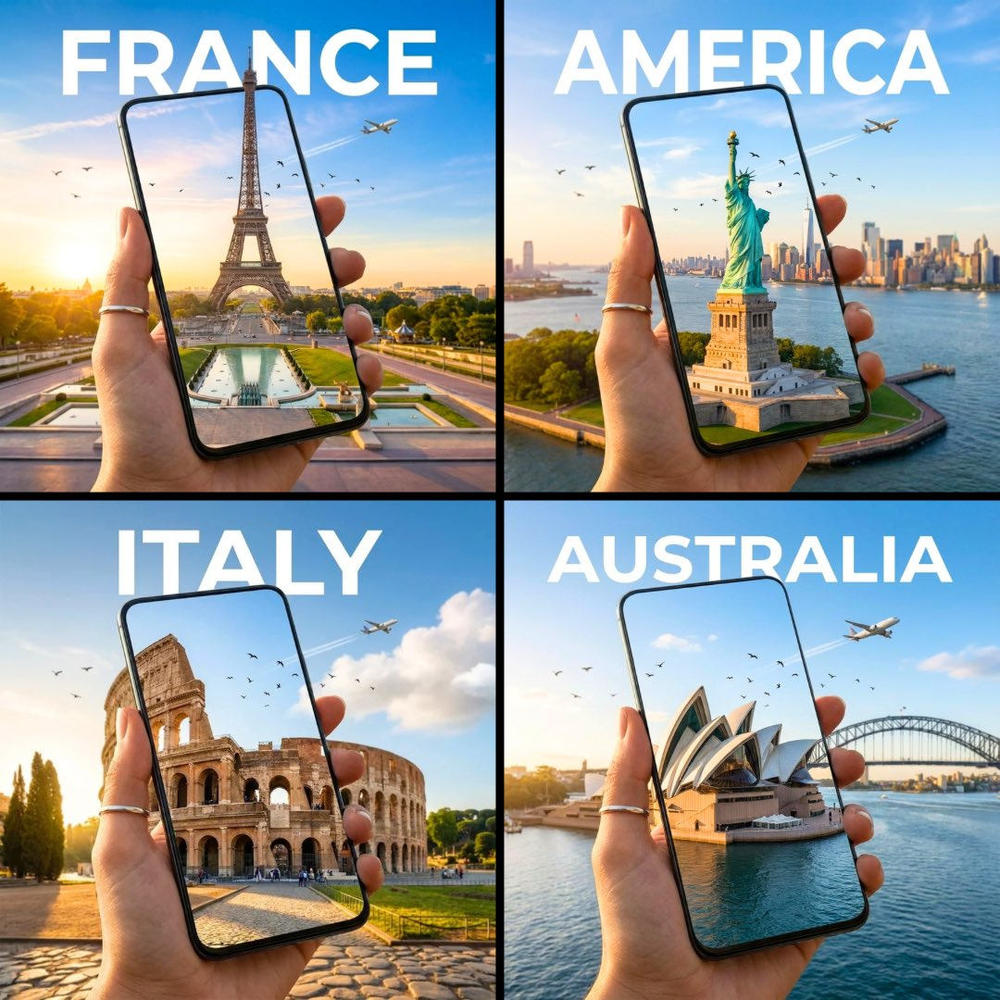

## 超写实的旅行广告

- ID: gpt4o-653-zh-2
- Slug: prompt-653-zh-2
- 语言: zh
- 来源: [来源链接](https://x.com/TechieBySA/status/1994840773855203512)
- 样例图路径: images/part3/653.jpeg

### 提示词

```text
这是一则超写实的旅行广告，采用正方形格式（1080x1080），画面中一只手竖屏握着一部纤薄时尚的智能手机或平板电脑，略微侧倾，营造出引人注目的3D立体效果。屏幕上显示着[国家/地区]标志性地标的高分辨率图像，图像与真实背景无缝融合，仿佛从屏幕中浮现出来一般。附近有鸟儿飞翔，一架商用飞机掠过湛蓝的天空，朵朵白云点缀其间。醒目的无衬线字体“[国家/地区]”位于上方。温暖自然的灯光在画面上投下柔和的阴影。周围环境反映了该地区的自然环境（例如草地、海岸线或城市天际线）。设备采用光滑的超窄边框设计，进一步增强了画面的真实感和立体感。
```

### 样例图


## A hyper-detailed 3D render of a collectible chess piece 

- ID: gpt4o-644-en-1
- Slug: prompt-644-en-1
- 语言: en
- 来源: [来源链接](https://x.com/TechieBySA/status/1994777464631951499)
- 样例图路径: images/part3/644.jpeg

### 提示词

```text
A hyper-detailed 3D render of a collectible chess piece designed as [ICON]. The figure is sculpted in polished marble and gold accents, with a stylized base resembling a classic chess piece. The character’s iconic features, clothing, or accessories are faithfully captured in a simplified but instantly recognizable form. Studio lighting with soft reflections, dramatic shadows, photorealistic textures, cinematic presentation. Centered on a clean neutral background, 1080x1080 square format.
```

### 样例图

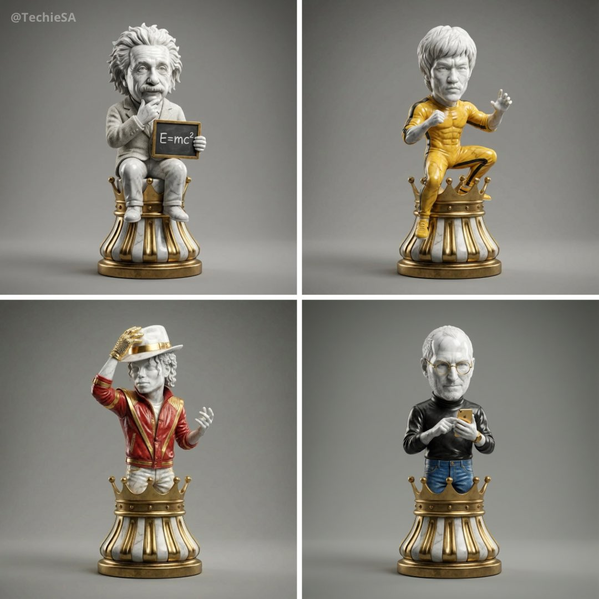

## 极具收藏价值的国际象棋棋子

- ID: gpt4o-644-zh-2
- Slug: prompt-644-zh-2
- 语言: zh
- 来源: [来源链接](https://x.com/TechieBySA/status/1994777464631951499)
- 样例图路径: images/part3/644.jpeg

### 提示词

```text
这款极具收藏价值的国际象棋棋子以[ICON]为设计理念，采用超精细的3D渲染图呈现。棋子主体由抛光大理石雕刻而成，并以金色点缀，底座造型经典，宛如一枚国际象棋棋子。棋子的标志性特征、服饰和配饰均以简洁却极具辨识度的形式忠实还原。画面采用摄影棚灯光，营造出柔和的反射、戏剧性的阴影、逼真的纹理以及电影级的视觉效果。背景简洁干净，采用1080x1080像素的正方形格式。
```

### 样例图


## 黑板艺术作品-海賊女帝

- ID: gpt4o-642-zh-1
- Slug: prompt-642-zh-1
- 语言: zh
- 来源: [来源链接](https://x.com/IamEmily2050/status/1994624635300974734)
- 样例图路径: images/part3/642.jpeg

### 提示词

```text
{
  "intent": "Photorealistic documentation of a specific chalkboard art piece featuring a single anime character, capturing the ephemeral nature of the medium within a classroom context.",
  "frame": {
    "aspect_ratio": "4:3",
    "composition": "A centered medium shot focusing on the chalkboard mural. The composition includes the teacher's desk in the immediate foreground to provide scale, with the artwork of the single character dominating the background space.",
    "style_mode": "documentary_realism, texture-focused, ambient naturalism"
  },
  "subject": {
    "primary_subject": "A large-scale, intricate chalk drawing of Boa Hancock from 'One Piece' on a standard green classroom blackboard.",
    "visual_details": "The illustration depicts Boa Hancock in a commanding pose, positioned centrally on the board. She is drawn with her signature long, straight black hair with a hime cut, rendered using dense application of black chalk with white accents for sheen. Her expression is haughty and imperious, with detailed dark blue eyes. She is depicted forming a heart shape with her hands, referencing her 'Mero Mero Mellow' technique. She wears a revealing red blouse with purple geometric patterns and gold snake-shaped earrings, drawn with vibrant colored chalks.",
    "medium_texture": "The image preserves the dusty, matte quality of the chalk. Visible hatching and cross-hatching strokes create shading on her clothing and hair. Smudged areas on the green slate indicate where colors have been blended by hand.",
    "surrounding_elements": "To the right of the character, vertical Japanese text reading '海賊女帝' (Pirate Empress) is written in crisp white chalk."
  },
  "environment": {
    "location": "A standard Japanese school classroom.",
    "foreground_elements": "A wooden teacher's desk occupies the lower foreground. Scattered across the surface are a yellow box of colored chalks, loose sticks of red, white, and blue pastel chalk, and a dust-covered black felt eraser.",
    "background_elements": "The green chalkboard spans the width of the frame, bordered by a metallic chalk tray containing accumulated chalk dust. The wall above is a plain, off-white plaster, featuring a small mounted speaker box.",
    "atmosphere": "Quiet and academic, with a sense of stillness suggesting the room is currently unoccupied."
  },
  "lighting": {
    "type": "Diffuse ambient classroom lighting.",
    "quality": "Soft, nondirectional illumination provided by overhead fluorescent fixtures mixed with daylight from windows on the left. The light is even, preventing glare on the chalkboard surface while highlighting the texture of the chalk.",
    "color_temperature": "Neutral white, approximately 5000K, ensuring accurate color rendition of the red and purple chalks against the dark green board.",
    "direction": "Overhead and slightly frontal."
  },
  "camera": {
    "sensor_format": "35mm full-frame digital sensor.",
    "lens": "35mm prime lens.",
    "aperture": "f/5.6",
    "depth_of_field": "Moderate depth of field, keeping the chalkboard drawing in sharp focus while allowing the foreground desk elements to soften slightly.",
    "shutter_speed": "1/60s",
    "iso": "400",
    "camera_position": "Eye-level standing position, set back enough to frame the entire drawing and the desk."
  },
  "negative": {
    "content": "Multiple characters, Midoriya, Shigaraki, male characters, digital art overlay, vector graphics, paper texture, oil painting, messy composition, extreme low angle, fisheye lens.",
    "style": "No hyper-saturation, no soft focus filters, no heavy vignetting."
  }
}
```

### 样例图

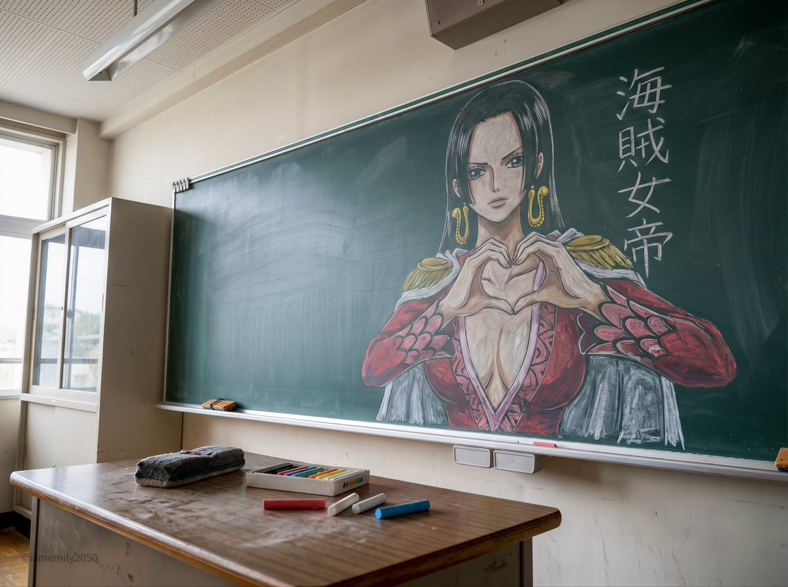

## 黑板艺术作品-海賊女帝

- ID: gpt4o-642-zh-2
- Slug: prompt-642-zh-2
- 语言: zh
- 来源: [来源链接](https://x.com/IamEmily2050/status/1994624635300974734)
- 样例图路径: images/part3/642.jpeg

### 提示词

```text
{
“意图”：“以照片写实的手法记录一幅特定的黑板艺术作品，作品中描绘了一个动漫角色，捕捉了课堂环境中这种媒介的转瞬即逝的特性。”
“框架”： {
"aspect_ratio": "4:3",
“构图”：“以黑板壁画为中心拍摄的中景镜头。画面前景中包含教师的办公桌以显示比例，而单个人物的画作则占据了背景空间。”
"style_mode": "纪实写实主义，注重纹理，环境自然主义"
},
“主题”： {
“primary_subject”: “一幅绘制在标准绿色教室黑板上的大型、精细的《海贼王》角色波雅·汉库克的粉笔画。”
“视觉细节”： “这幅插画描绘了波雅·汉库克，她以威严的姿态位于画面中央。她标志性的黑色长直发，采用姬发式剪裁，以浓重的黑色粉笔绘制，并以白色点缀以增加光泽。她的表情傲慢而威严，深蓝色的眼睛刻画入微。她双手比划成心形，象征着她的‘Mero Mero Mellow’（柔情蜜意）技巧。她身着一件饰有紫色几何图案的性感红色上衣，佩戴着以鲜艳彩色粉笔绘制的金色蛇形耳环。”
“medium_texture”：图像保留了粉笔的粉尘质感和哑光效果。清晰可见的排线和交叉线笔触在她的衣服和头发上营造出阴影。绿色石板上的晕染区域表明了手工调色的位置。
"surrounding_elements": "字符右侧用清晰的白色粉笔写着竖排的日文“海贼女帝”。"
},
“环境”： {
地点：一间标准的日本学校教室。
"前景元素": "一张木制教师桌占据了画面下方的前景。桌面上散落着一盒黄色的彩色粉笔、几支红色、白色和蓝色的粉彩粉笔，以及一块沾满灰尘的黑色毡橡皮。"
“背景元素”： “绿色黑板横跨整个画面宽度，边缘是一个金属粉笔托盘，里面积满了粉笔灰。黑板上方是一面普通的米白色石膏墙，墙上安装了一个小型壁挂式音箱。”
“氛围”：“安静而学术，一种静谧感表明房间里目前无人居住。”
},
“灯光”： {
“类型”：“漫射环境教室照明。”
“质量”：“柔和、无方向性的照明由上方荧光灯具提供，并混合了左侧窗户的自然光。光线均匀，既防止黑板表面产生眩光，又突显了粉笔的纹理。”
“色温”： “中性白光，约 5000K，确保红色和紫色粉笔在深绿色白板上的准确显色。”
“方向”：“头顶上方，略微朝前。”
},
“相机”： {
"sensor_format": "35mm 全画幅数码传感器。"
“镜头”：“35mm 定焦镜头。”
光圈：f/5.6，
“景深”： “适中的景深，保持黑板上的图画清晰锐利，同时让前景的桌面元素略微柔化。”
"shutter_speed": "1/60"
“iso”: “400，
“camera_position”: “与眼睛齐平的站立位置，向后移动足够远，以便将整个图纸和桌子都框入其中。”
},
“消极的”： {
内容：多个角色、绿谷出久、死柄木弔、男性角色、数字艺术叠加、矢量图形、纸张纹理、油画、凌乱构图、极低角度、鱼眼镜头。
“风格”：“不使用过饱和度，不使用柔焦滤镜，不使​​用严重的暗角。”
}
}
```

### 样例图


## 路飞教室艺术

- ID: gpt4o-641-zh
- Slug: prompt-641-zh
- 语言: zh
- 来源: [来源链接](https://x.com/yanhua1010/status/1995044071803371880)
- 样例图路径: images/part3/641.jpeg

### 提示词

```text
{
  "意图": "对特定黑板艺术作品进行写实纪录摄影，画面呈现单个动漫角色，捕捉粉笔媒介的短暂性及教室场景氛围。",
  "画面框架": {
    "画幅比例": "4:3",
    "构图方式": "中景构图，聚焦黑板壁画。构图包含前景的教师讲台以提供比例尺度，背景空间由单个角色的艺术作品主导。",
    "风格模式": "纪实写实主义、质感聚焦、环境自然主义"
  },
  "主体对象": {
    "主要主体": "标准绿色教室黑板上绘制的大型精细粉笔画，描绘《海贼王》角色蒙奇·D·路飞。",
    "视觉细节": "画面中路飞呈现动态姿势,居于黑板中央。他戴着标志性草帽,黑色凌乱短发,露齿灿烂笑容。表情充满活力和喜悦,圆形眼睛生动传神。他的一只手臂向前伸展,呈现橡胶手臂技能(橡胶果实能力)。身穿红色无袖背心(敞开状态)露出胸前标志性X形伤疤,蓝色短裤和凉鞋,使用鲜艳彩色粉笔绘制。",
    "媒介质感": "画面保留粉笔的粉尘感和哑光质地。可见排线和交叉阴影笔触为服装和头发创造阴影效果。绿色黑板上的晕染区域显示手工混合颜色的痕迹。",
    "周边元素": "角色右侧,竖向日文'麦わらのルフィ'(草帽路飞)用清晰白色粉笔书写。"
  },
  "环境设定": {
    "场所": "标准日本学校教室。",
    "前景元素": "木质讲台占据画面下方前景。桌面上散落着黄色粉笔盒、红白蓝色散落粉笔条,以及沾满粉笔灰的黑色毡擦。",
    "背景元素": "绿色黑板横跨画面宽度,底部为金属粉笔槽,积累有粉笔灰。黑板上方为米白色石膏墙面,挂有小型扬声器盒。",
    "氛围": "安静的学术空间,静谧感暗示教室当前无人。"
  },
  "光线设定": {
    "类型": "漫射环境光,教室照明。",
    "质量": "柔和无方向性照明,由顶部荧光灯具与左侧窗户日光混合提供。光线均匀,防止黑板表面眩光,同时突显粉笔质感。",
    "色温": "中性白,约5000K色温,确保红色和紫色粉笔在深绿色黑板上的准确色彩还原。",
    "方向": "顶部和略微正面照射。"
  },
  "相机参数": {
    "传感器格式": "35mm全画幅数码传感器。",
    "镜头": "35mm定焦镜头。",
    "光圈": "f/5.6",
    "景深": "中等景深,保持黑板绘画清晰对焦,前景讲台元素轻微柔化。",
    "快门速度": "1/60秒",
    "感光度": "ISO 400",
    "机位": "站立视线高度,与画面保持足够距离以框入完整绘画和讲台。"
  },
  "负面提示": {
    "内容": "多个角色、绿谷出久、死柄木、男性角色、数字艺术叠加、矢量图形、纸张纹理、油画、混乱构图、极端低角度、鱼眼镜头。",
    "风格": "无过度饱和、无柔焦滤镜、无重度暗角。"
  }
}
```

### 样例图

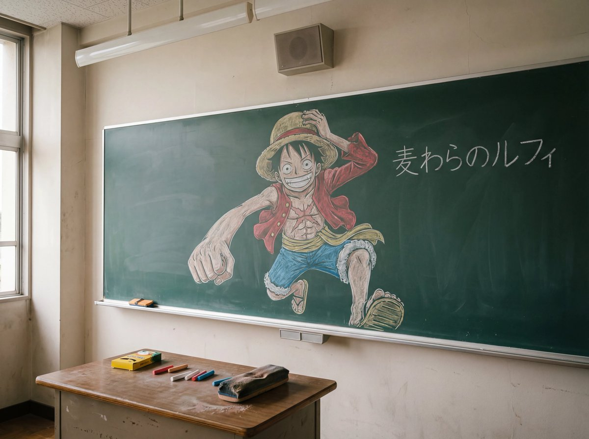

## 一张图片生成9个不同景别的镜头

- ID: gpt4o-629-zh
- Slug: prompt-629-zh
- 语言: zh
- 来源: [来源链接](https://x.com/songguoxiansen/status/1994783047825473774)
- 样例图路径: images/part3/629.jpeg

### 提示词

```text
<instruction> (指令)
分析输入图像的整个构图。识别所有存在的关键主体（无论是单人、群体/情侣、车辆还是特定物体）及其空间关系/互动。
生成一个连贯的 3x3 网格“电影印样（Contact Sheet）”，展示在同一环境中完全是这些主体的 9 个不同镜头。
你必须调整标准的电影镜头类型以适应内容（例如，如果是群体，保持群体在一起；如果是物体，构图包含整个物体）：
第 1 行（建立背景）：
大远景 (ELS)： 主体在广阔的环境中显得很小。
全景 (LS)： 完整的主体或群体从上到下可见（从头到脚 / 从车轮到车顶）。
中远景 (美式镜头/四分之三)： 构图从膝盖以上（针对人物）或 3/4 视角（针对物体）。
第 2 行（核心覆盖）：
4. 中景 (MS)： 构图从腰部以上（或物体的中心核心）。聚焦于互动/动作。
5. 中特写 (MCU)： 构图从胸部以上。主要主体的亲密构图。
6. 特写 (CU)： 紧凑构图于脸部或物体的“正面”。
第 3 行（细节与角度）：
7. 大特写 (ECU)： 强烈聚焦于关键特征（眼睛、手、标志、纹理）的微距细节。
8. 低角度镜头 (仰视/虫眼)： 从地面仰望主体（壮观/英雄感）。
9. 高角度镜头 (俯视/鸟瞰)： 从上方俯瞰主体。
确保严格的一致性：所有 9 个面板中是相同的人物/物体、相同的衣服和相同的光照。景深应逼真地变化（特写镜头中的背景虚化）。
</instruction>
一个包含 9 个面板的专业 3x3 电影故事板网格。
该网格以全面的焦距范围展示输入图像中的特定主体/场景。
顶行： 宽广环境镜头，全视图，3/4 剪辑（膝上景）。
中间行： 腰部以上视图，胸部以上视图，脸部/正面特写。
底行： 微距细节，低角度，高角度。
所有帧均具有照片般逼真的纹理，一致的电影级调色，以及针对所分析的主体或物体特定数量的正确构图。
```

### 样例图

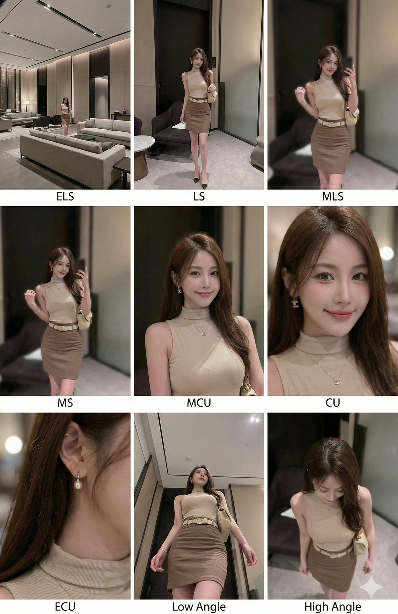

## { "scene_description": "A cohesive 4-panel fashion lifes

- ID: gpt4o-617-en-1
- Slug: prompt-617-en-1
- 语言: en
- 来源: [来源链接](https://x.com/_MehdiSharifi_/status/1994166992719299026)
- 样例图路径: images/part3/617.jpeg

### 提示词

```text
{
  "scene_description": "A cohesive 4-panel fashion lifestyle collage featuring the same young woman in a glamorous evening outfit, showcasing cinematic poses under city lights.",
  "subject": {
    "type": "Young Woman (Consistent character)",
    "age": "early 20s",
    "features": {
      "hair": "glamorous waves",
      "makeup": "evening look with red lip"
    },
    "attire": "black satin slip dress, leather jacket draped over shoulders, strappy heels",
    "accessories": "sparkly clutch, earrings"
  },
  "collage_layout": {
    "structure": "2x2 Grid Layout (4 frames of equal size)",
    "panel_1_top_left": "Full Body Flash Shot: Standing against a metallic door or shutter, posing with one leg forward, looking fierce (flash photography style).",
    "panel_2_top_right": "Over-the-Shoulder: Looking back at the camera while walking away towards neon city lights, showcasing the back of the dress/jacket.",
    "panel_3_bottom_left": "Seated Profile: Sitting on a high bar stool or velvet booth, holding a mocktail, laughing candidly towards someone off-camera.",
    "panel_4_bottom_right": "Artistic Portrait: Standing near a neon sign, face illuminated by pink/blue light, looking dreamily upwards."
  },
  "environment": {
    "setting": "City at Night / Rooftop Bar",
    "background_elements": [
      "Neon signs",
      "City bokeh",
      "Dark shadows"
    ]
  },
  "lighting": {
    "style": "Flash & Neon Mixed",
    "key_light": {
      "type": "Camera Flash / Neon Sign",
      "color": "Cool White / Vibrant Colors",
      "effect": "High contrast, edgy vibe"
    }
  },
  "style": {
    "medium": "Flash Photography / Film Aesthetic",
    "aesthetic": "Night Luxe, Party Vibe, Cinematic, Edgy",
    "quality": "8k resolution, slight grain"
  },
  "attire_customization": {
    "current_clothing": "Slip dress and leather jacket",
    "customizable_clothing": "User can swap for sequin dress or jumpsuit"
  },
  "brand_product_customization": {
    "current_brand_product": "Evening Wear",
    "customizable_brand": "User: Insert Brand Name",
    "customizable_product": "User: Specific dress or makeup",
    "product_placement_area": "Dress silhouette"
  },
  "technical_tags": "--v 6 --ar 4:5 --stylize 400 --no daylight, office setting"
}
```

### 样例图

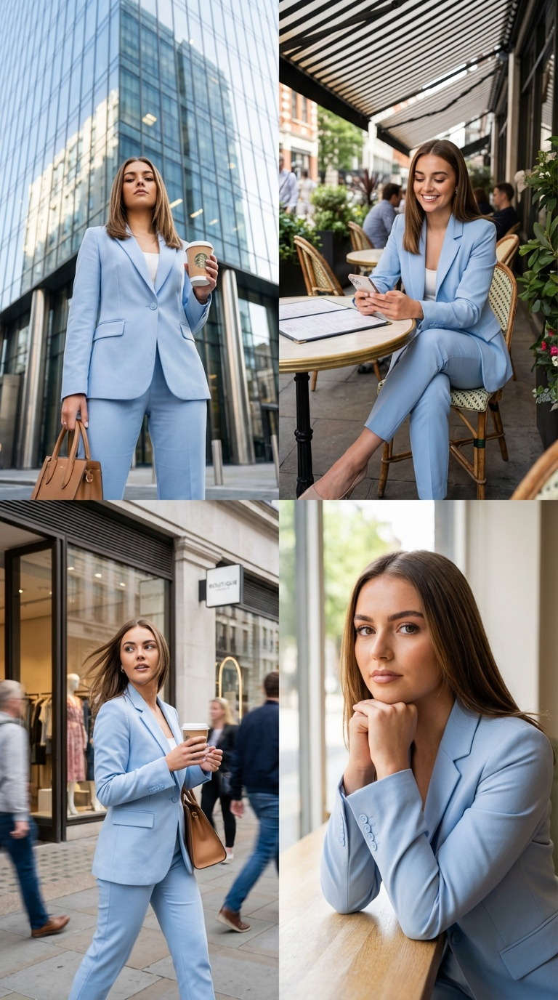

## 四幅时尚生活场景组成的连贯拼贴画

- ID: gpt4o-617-zh-2
- Slug: prompt-617-zh-2
- 语言: zh
- 来源: [来源链接](https://x.com/_MehdiSharifi_/status/1994166992719299026)
- 样例图路径: images/part3/617.jpeg

### 提示词

```text
{
“场景描述”： “这是一幅由四幅时尚生活场景组成的连贯拼贴画，画中同一位年轻女子身着华丽的晚礼服，在城市灯光下摆出极具电影感的姿势。”
“主题”： {
“类型”：“年轻女子（性格始终如一）”
“年龄”：“20岁出头”，
“特征”： {
“头发”：“迷人的波浪卷发”，
“妆容”：“晚宴妆容，搭配红唇”
},
“着装”：“黑色缎面吊带裙，肩上披着皮夹克，细带高跟鞋”，
“配饰”：闪亮手拿包、耳环
},
"collage_layout": {
"结构": "2x2 网格布局（4 个大小相同的框架）",
"panel_1_top_left": "全身闪光照：倚靠在金属门或卷帘门上，一条腿向前迈出，摆出凶狠的姿势（闪光摄影风格）。"
"panel_2_top_right": "过肩视角：边走边回头看向镜头，朝着霓虹闪烁的城市灯光走去，展示连衣裙/外套的背面。"
"panel_3_bottom_left": "坐姿侧脸：坐在高脚吧台凳或天鹅绒卡座上，手持一杯无酒精鸡尾酒，对着镜头外的人开怀大笑。"
"panel_4_bottom_right": "艺术肖像：站在霓虹灯招牌旁，脸部被粉色/蓝色灯光照亮，眼神梦幻般地向上凝视。"
},
“环境”： {
“场景”：“夜幕下的城市/屋顶酒吧”，
“背景元素”：[
霓虹灯招牌
“城市散景”
“黑暗阴影”
]
},
“灯光”： {
“风格”：“闪光与霓虹混合”，
"key_light": {
"type": "相机闪光灯/霓虹灯标志",
“颜色”：“冷白/鲜艳色彩”，
“效果”：“高对比度，前卫氛围”
}
},
“风格”： {
“媒介”：“闪光摄影/胶片美学”，
“美学”：“夜间奢华、派对氛围、电影感、前卫”
“画质”：“8K分辨率，略带颗粒感”
},
"attire_customization": {
"current_clothing": "吊带裙和皮夹克",
"customizable_clothing": "用户可以换成亮片连衣裙或连体裤"
},
"品牌产品定制": {
"current_brand_product": "晚礼服",
"customizable_brand": "用户：插入品牌名称",
"customizable_product": "用户：特定服装或妆容",
"product_placement_area": "连衣裙轮廓"
},
"technical_tags": " --v 6 --ar 4:5 --stylize 400 --no daylight, office setting"
}
```

### 样例图


## { "prompt": "hyperrealistic ultra-detailed 8k photo of Y

- ID: gpt4o-615-en-1
- Slug: prompt-615-en-1
- 语言: en
- 来源: [来源链接](https://x.com/Samann_ai/status/1994444395525832898)
- 样例图路径: images/part3/615.jpeg

### 提示词

```text
{
  "prompt": "hyperrealistic ultra-detailed 8k photo of YOU (Upload Your Photo) standing in a bright cozy living room, same location as the reference: cream-colored sofa, large white curtains with soft daylight shining through, warm neutral walls, several green houseplants, minimal decor, natural sunlight and soft shadows. Use the uploaded photo as the main subject of the image, preserving the face, hairstyle, body type, clothing, and overall style exactly as in the uploaded photo. The subject is standing in front of the sofa, body slightly angled to the side, legs close together, one hip slightly popped, holding a smartphone in one hand at chest height, screen facing them, as if taking a mirror selfie, with a relaxed confident expression and slight smile, eyes toward the phone. Behind them, their partner is standing very close, a tall, attractive humanoid robot with a highly muscular, athletic build, entirely robotic with no human skin, detailed mechanical anatomy inspired by a futuristic cyborg: layered silver and gunmetal plates, visible bundles of flexible cables as muscles, complex joints, smooth armor around shoulders, chest, arms, and legs, elegant angular robotic face with a strong jawline, glowing blue eyes, subtle wear and micro-scratches on metal for realism. The robot’s torso is broad and V-shaped, narrow waist, perfect proportions, clearly fit and powerful but aesthetically beautiful. The robot stands just behind the subject with one sleek metallic arm wrapped gently and protectively around the front of their neck and shoulders, hand resting softly near the collarbone in an affectionate pose, the other arm relaxed at its side. Their bodies are close, giving a sense of intimacy and comfort. Extremely realistic skin texture on the subject, natural hair strands, detailed fabric texture and wrinkles on their clothing, realistic reflections and specular highlights on the robot’s metal surfaces, accurate global illumination and depth of field, sharp focus on both characters, slight background blur. Photoreal, cinematic lighting, no fantasy effects, looks like a real candid photo taken on a phone in this apartment.",
  "negative_prompt": "cartoon, anime, illustration, painting, 3d render, CGI, low resolution, blurry, grainy, oversaturated, unrealistic proportions, extra limbs, deformed hands, distorted face, visible mirror edges, text, watermark, logo, armor covering the subject, human skin on the robot, grotesque, horror, gore"
}
```

### 样例图

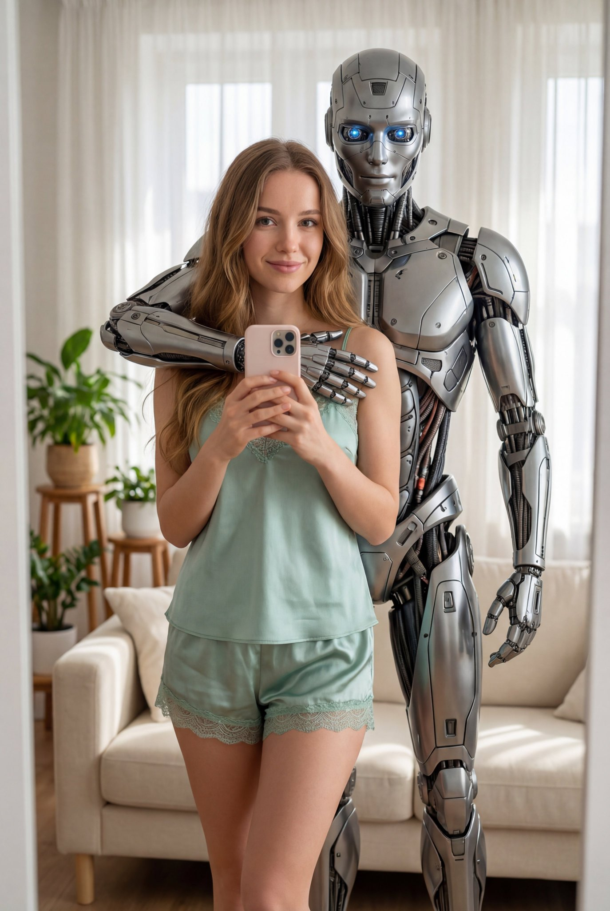

## 人和机器人的温馨时刻

- ID: gpt4o-615-zh-2
- Slug: prompt-615-zh-2
- 语言: zh
- 来源: [来源链接](https://x.com/Samann_ai/status/1994444395525832898)
- 样例图路径: images/part3/615.jpeg

### 提示词

```text
{
“提示”：拍摄一张超逼真、细节丰富的8K照片，照片中的人物（上传您的照片）站在明亮舒适的客厅中，地点与参考照片相同：米色沙发，白色大窗帘透进柔和的日光，暖色调的墙面，几盆绿色植物，简约的装饰，自然光和柔和的阴影。使用上传的照片作为图像的主体，保留照片中人物的面部、发型、体型、服装和整体风格。人物站在沙发前，身体略微侧倾，双腿并拢，一侧臀部微微翘起，一手拿着智能手机，屏幕朝向自己，仿佛在自拍，表情轻松自信，略带微笑，目光注视着手机。人物身后站着一位身材高挑、外形俊朗的人形机器人，肌肉线条流畅，体格健壮，完全由机械构成，没有人类皮肤，拥有未来主义赛博格风格的精细机械结构：层叠的银色和枪灰色金属板，以及清晰可见的柔性电缆束。肌肉线条分明，关节复杂，肩部、胸部、手臂和腿部的盔甲光滑流畅，优雅的棱角分明的机械面孔，下颚线条硬朗，湛蓝的双眼闪闪发光，金属表面细微的磨损和划痕更添真实感。机器人的躯干宽阔呈V字形，腰部纤细，比例完美，既健壮有力又不失美感。机器人站在拍摄对象身后，一只光滑的金属手臂温柔地环绕着拍摄对象的颈肩，一只手轻轻地放在锁骨附近，姿态亲昵，另一只手臂自然垂于身侧。两人身体靠近，营造出亲密舒适的氛围。拍摄对象的皮肤纹理极其逼真，头发自然垂落，衣物上的织物纹理和褶皱也十分细致，机器人金属表面的反射和高光效果逼真，整体光照和景深控制精准，两个人物都清晰对焦，背景略微虚化。照片级的真实感，电影级的灯光效果，没有任何奇幻特效，看起来就像是用手机在公寓里随手拍下的真实照片。
"negative_prompt": "卡通、动画、插画、绘画、3D渲染、CGI、低分辨率、模糊、颗粒感强、过度饱和、比例失调、多余肢体、畸形手、扭曲面部、可见镜像边缘、文字、水印、标志、盔甲覆盖主体、机器人身上覆盖人类皮肤、怪诞、恐怖、血腥"
}
```

### 样例图


## { "scene_description": "A cohesive 4-panel fashion lifes

- ID: gpt4o-595-en-1
- Slug: prompt-595-en-1
- 语言: en
- 来源: [来源链接](https://x.com/_MehdiSharifi_/status/1994166422251950451)
- 样例图路径: images/part3/595.jpeg

### 提示词

```text
{
  "scene_description": "A cohesive 4-panel fashion lifestyle collage featuring the same young woman in a trendy streetwear outfit, showcasing different dynamic poses and angles.",
  "subject": {
    "type": "Young Woman (Consistent character)",
    "age": "early 20s",
    "features": {
      "hair": "high ponytail or messy bun",
      "makeup": "fresh urban look"
    },
    "attire": "oversized graphic hoodie, biker shorts, high socks, chunky sneakers",
    "accessories": "cross-body bag, sunglasses on head"
  },
  "collage_layout": {
    "structure": "2x2 Grid Layout (4 frames of equal size)",
    "panel_1_top_left": "Front Full Body: Walking confidently towards the camera on a city crosswalk, hair moving in the wind, looking slightly to the side.",
    "panel_2_top_right": "Side Profile Sitting: Sitting on concrete steps with knees pulled up, resting chin on knees, looking peacefully at the street view.",
    "panel_3_bottom_left": "Back View Full Body: Standing and looking away at a city billboard or view, hands in hoodie pockets, highlighting the back graphic of the hoodie.",
    "panel_4_bottom_right": "Mid-Shot Angle: Leaning casually against a brick wall, one leg up on the wall, looking directly at the camera with a cool expression."
  },
  "environment": {
    "setting": "City Streets / Urban Alley",
    "background_elements": [
      "Brick textures",
      "Street signs",
      "City depth"
    ]
  },
  "lighting": {
    "style": "Overcast Soft Light",
    "key_light": {
      "type": "Natural Sky",
      "color": "Cool White",
      "effect": "Even lighting ideal for street fashion"
    }
  },
  "style": {
    "medium": "Digital Street Photography",
    "aesthetic": "Hypebeast, Urban, Gen Z, Candid",
    "quality": "8k resolution, sharp focus on subject"
  },
  "attire_customization": {
    "current_clothing": "Hoodie and biker shorts",
    "customizable_clothing": "User can swap for denim jacket and cargo pants"
  },
  "brand_product_customization": {
    "current_brand_product": "Streetwear",
    "customizable_brand": "User: Insert Brand Name",
    "customizable_product": "User: Specific sneakers or bag",
    "product_placement_area": "Hoodie chest or sneakers"
  }
}
```

### 样例图

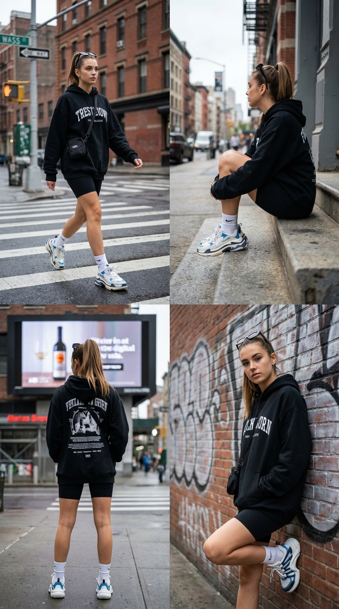

## 四幅女子时尚生活场景拼贴画

- ID: gpt4o-595-zh-2
- Slug: prompt-595-zh-2
- 语言: zh
- 来源: [来源链接](https://x.com/_MehdiSharifi_/status/1994166422251950451)
- 样例图路径: images/part3/595.jpeg

### 提示词

```text
{
“场景描述”： “这是一幅由四幅时尚生活场景组成的拼贴画，画中同一位年轻女子身着时髦的街头服饰，展现了不同的动态姿势和角度。”
“主题”： {
“类型”：“年轻女子（性格始终如一）”
“年龄”：“20岁出头”，
“特征”： {
“发型”：“高马尾或凌乱发髻”，
妆容：清新都市妆容
},
“着装”：“超大号印花连帽衫、骑行短裤、高筒袜、厚底运动鞋”，
“配饰”：“斜挎包，头戴太阳镜”
},
"collage_layout": {
"结构": "2x2 网格布局（4 个大小相同的框架）",
"panel_1_top_left": "正面全身照：自信地走在城市人行横道上，头发随风飘扬，目光略微侧向一边。"
"panel_2_top_right": "侧脸坐姿：坐在水泥台阶上，双膝蜷起，下巴搁在膝盖上，平静地望着街景。"
"panel_3_bottom_left": "背部全身像：站立，目光看向远处的城市广告牌或风景，双手插在连帽衫口袋里，突显连帽衫背面的图案。"
"panel_4_bottom_right": "中景角度：随意地倚靠在砖墙上，一条腿搭在墙上，面带冷峻的表情直视镜头。"
},
“环境”： {
“场景”：“城市街道/城市小巷”，
“背景元素”：[
“砖纹理”，
“街道标志”，
“城市深度”
]
},
“灯光”： {
“风格”：“阴天柔光”，
"key_light": {
"type": "自然天空",
“颜色”：“冷白”，
“效果”：“均匀的灯光，非常适合街头时尚”
}
},
“风格”： {
“媒介”：“数码街头摄影”，
“美学”：“潮牌、都市、Z世代、坦率”
“画质”：“8K分辨率，主体清晰对焦”
},
"attire_customization": {
"current_clothing": "连帽衫和骑行短裤",
"customizable_clothing": "用户可以更换牛仔夹克和工装裤"
},
"品牌产品定制": {
"current_brand_product": "街头服饰",
"customizable_brand": "用户：插入品牌名称",
"customizable_product": "用户：特定运动鞋或包包",
"product_place_area": "连帽衫、胸前或运动鞋"
}
}
```

### 样例图


## { "scene_description": "A photorealistic, high-end 3D pr

- ID: gpt4o-594-en-1
- Slug: prompt-594-en-1
- 语言: en
- 来源: [来源链接](https://x.com/_MehdiSharifi_/status/1994022879051014312)
- 样例图路径: images/part3/594.png

### 提示词

```text
{
  "scene_description": "A photorealistic, high-end 3D product visualization of a perfectly assembled packaging box derived from a dieline, set in a pristine minimal studio.",
  "subject": {
    "type": "Assembled Packaging Box",
    "material": "Premium matte paperboard",
    "features": {
      "structure": "Perfectly folded, accurate panel placement, sharp clean edges",
      "surface": "Smooth matte texture with high-fidelity print rendering"
    },
    "position": "Upright, angled at a refined ¾ perspective view to show front and side panels",
    "artwork_state": "Undistorted typography, preserving original design exactly"
  },
  "action": {
    "primary": "Standing static on a surface",
    "secondary": "Casting a gentle shadow",
    "effect": "Demonstrates structural integrity and design elegance"
  },
  "environment": {
    "setting": "Minimalist High-End Studio Void",
    "foreground_elements": [
      "Clean, smooth surface",
      "Soft contact shadows"
    ],
    "background_elements": [
      "Soft neutral seamless backdrop (light grey/cream)",
      "Zero distractions",
      "No extra props"
    ]
  },
  "lighting": {
    "style": "Soft Commercial Product Lighting (Global Illumination)",
    "key_light": {
      "type": "Large Diffused Softbox",
      "color": "Neutral White (5500K)",
      "illuminates": [
        "The face of the box evenly",
        "The matte texture of the paper"
      ]
    },
    "fill_light": {
      "type": "White Reflector",
      "effect": "Softens shadows to ensure artwork visibility"
    },
    "shadows": "Subtle, soft gradient shadows anchoring the object"
  },
  "style": {
    "medium": "3D Rendering / Product Photography",
    "aesthetic": "Premium Editorial, Mockup Style, Minimalist Luxury",
    "quality": "8k resolution, ray-traced optics, physically based rendering (PBR)",
    "details": "Crisp folds, zero distortion, matte paper grain visibility"
  },
  "scene_composition": {
    "subject_action": "Static presentation",
    "camera_behavior": "Locked-off tripod shot",
    "depth_layering": "Sharp Subject -> Infinite Soft Background"
  },
  "visual_description": {
    "core_subject": "A flawless 3D box assembled from a flat dieline.",
    "attire_physics": "N/A - Rigid Body physics.",
    "surface_rendering": "Non-reflective matte finish that absorbs light softly, ensuring text is readable and colors are true."
  },
  "lighting_and_atmosphere": {
    "type": "Clean Studio",
    "specifics": "Even light distribution, ambient occlusion in the creases.",
    "color_grade": "Natural, color-calibrated, neutral tones."
  },
  "attire_customization": {
    "current_clothing": "N/A",
    "customizable_clothing": "N/A"
  },
  "brand_product_customization": {
    "current_brand_product": "Packaging Design",
    "customizable_brand": "User: Insert Brand Name/Logo for the box",
    "customizable_product": "User: Describe the box type (e.g., cosmetic box, tuck-end box)",
    "product_placement_area": "All visible panels (Front, Side, Top)"
  },
  "objects_and_props": {
    "main_objects": [
      "The 3D Box"
    ],
    "secondary_objects": []
  },
  "camera_and_lens": {
    "focal_length_feel": "85mm or 100mm (Telephoto to eliminate perspective distortion)",
    "aperture_effect": "f/16 (Deep depth of field for edge-to-edge sharpness)",
    "camera_angle": "Isometric or ¾ perspective",
    "lens_type": "Studio Macro Lens",
    "bokeh_style": "None (Smooth gradient background)"
  },
  "technical_tags": "--v 6 --ar 4:5 --stylize 150 --no warping, distortion, messy background, props, glossy reflection, low poly"
}
```

### 样例图

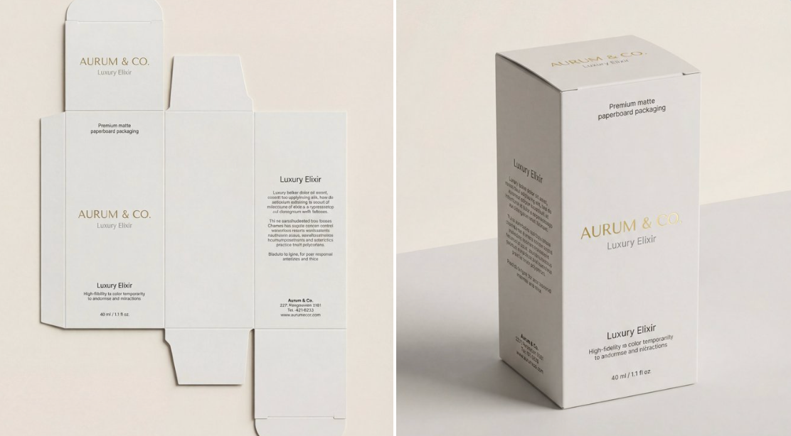

## 模切线图转3D产品可视化

- ID: gpt4o-594-zh-2
- Slug: prompt-594-zh-2
- 语言: zh
- 来源: [来源链接](https://x.com/_MehdiSharifi_/status/1994022879051014312)
- 样例图路径: images/part3/594.png

### 提示词

```text
{
"scene_description": "一个逼真的高端3D产品可视化模型，展示了一个完美组装的包装盒，该包装盒由模切线图生成，场景设定在一个简洁干净的摄影棚内。"
“主题”： {
"type": "组装包装盒",
“材质”： “优质哑光纸板”
“特征”： {
“结构”：“折叠完美，面板位置准确，边缘锋利干净”，
“表面”： “光滑哑光质感，高保真印刷效果”
},
“位置”：“直立，以精细的四分之三透视角度倾斜，以显示正面和侧面面板”，
"artwork_state": "未失真的字体，完全保留原始设计"
},
“行动”： {
“primary”: “静止地立于表面上”
“次要的”: “投下温柔的阴影”
“效果”：“展现了结构完整性和设计优雅性”
},
“环境”： {
“设置”：“极简高端工作室虚空”
"前景元素": [
“干净光滑的表面”，
“柔和的隐形眼镜阴影”
],
“背景元素”：[
“柔和的中性无缝背景（浅灰色/米色）”，
“零干扰”，
“无需额外道具”
]
},
“灯光”： {
“风格”：“柔和的商业产品照明（整体照明）”
"key_light": {
"type": "大型漫射柔光箱",
“颜色”：“中性白（5500K）”，
“照亮”：[
“盒子表面平整”，
纸张的哑光质感
]
},
"fill_light": {
“类型”：“白色反光器”，
“效果”：“柔化阴影，确保作品清晰可见”
},
“阴影”：“柔和的渐变阴影，使物体更加突出”
},
“风格”： {
“medium”: “3D渲染/产品摄影”
“美学”：“高端编辑风格、模型风格、极​​简奢华”
“质量”：“8k分辨率、光线追踪光学、基于物理的渲染（PBR）”
细节：折痕清晰，零变形，哑光纸颗粒可见
},
"scene_composition": {
"subject_action": "静态演示",
"camera_behavior": "锁定三脚架拍摄",
"depth_layering": "清晰主体->无限柔和背景"
},
"visual_description": {
"core_subject": "一个由平面模切线组装而成的完美3D盒子。"
"attire_physics": "不适用 - 刚体物理。",
"surface_rendering": "非反射哑光表面，柔和吸收光线，确保文字清晰可读，色彩真实。"
},
"lighting_and_atmosphere": {
"type": "Clean Studio",
“具体细节”：“光线分布均匀，褶皱处有环境光遮挡。”
"color_grade": "自然、色彩校准的中性色调。"
},
"attire_customization": {
"current_clothing": "N/A",
"customizable_clothing": "N/A"
},
"品牌产品定制": {
"current_brand_product": "包装设计",
"customizable_brand": "用户：输入包装盒的品牌名称/徽标",
"customizable_product": "用户：描述盒子类型（例如，化妆品盒、折叠盒）",
"product_placement_area": "所有可见面板（正面、侧面、顶部）"
},
"objects_and_props": {
"main_objects": [
“3D盒子”
],
"secondary_objects": []
},
"camera_and_lens": {
"focal_length_feel": "85mm 或 100mm（长焦镜头可消除透视畸变）",
"aperture_effect": "f/16（景深大，边缘到边缘清晰）",
"camera_angle": "等距或四分之三视角",
"lens_type": "影室微距镜头",
"bokeh_style": "无（平滑渐变背景）"
},
"technical_tags": " --v 6 --ar 4:5 --stylize 150 --no warping, distortion, messy background, props, glossy reflection, low poly"
}
```

### 样例图


## Present a clear, 45° top-down isometric miniature 3D car

- ID: gpt4o-592-en-1
- Slug: prompt-592-en-1
- 语言: en
- 来源: [来源链接](https://x.com/TechieBySA/status/1993995980405100598)
- 样例图路径: images/part3/592.jpeg

### 提示词

```text
Present a clear, 45° top-down isometric miniature 3D cartoon scene of [CITY], featuring its most iconic landmarks and architectural elements. Use soft, refined textures with realistic PBR materials and gentle, lifelike lighting and shadows. Integrate the current weather conditions directly into the city environment to create an immersive atmospheric mood.
Use a clean, minimalistic composition with a soft, solid-colored background.

At the top-center, place the title “[CITY]” in large bold text, a prominent weather icon beneath it, then the date (small text) and temperature (medium text).
All text must be centered with consistent spacing, and may subtly overlap the tops of the buildings.
Square 1080x1080 dimension.
```

### 样例图

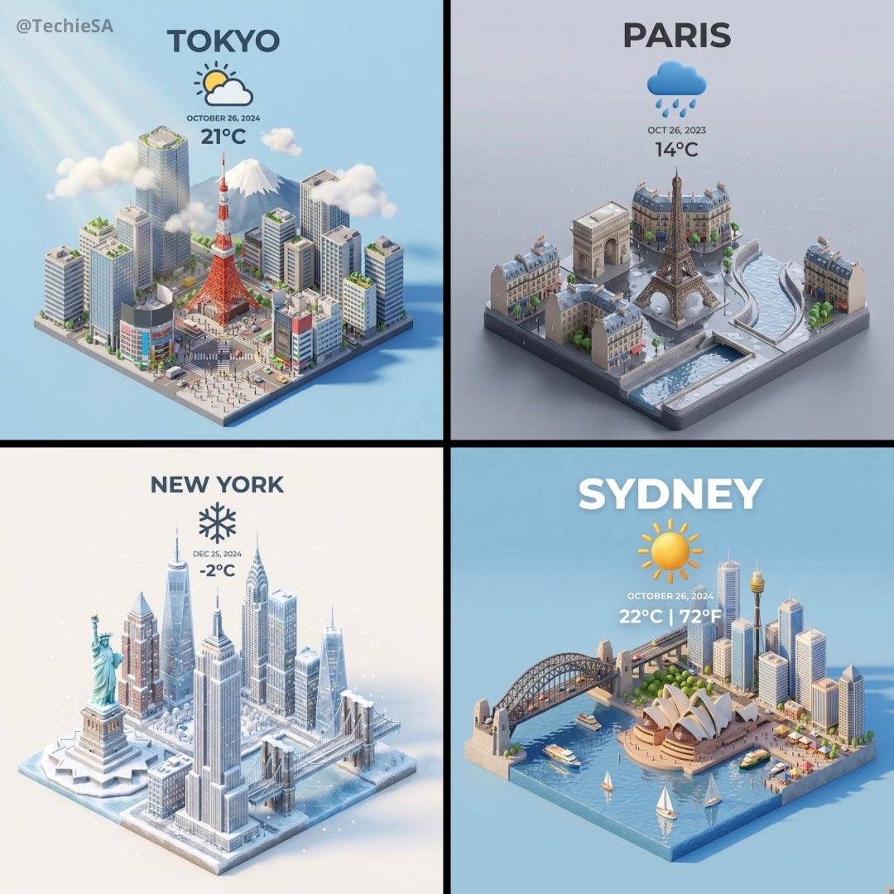

## 城市俯视等距3D卡通微缩场景

- ID: gpt4o-592-zh-2
- Slug: prompt-592-zh-2
- 语言: zh
- 来源: [来源链接](https://x.com/TechieBySA/status/1993995980405100598)
- 样例图路径: images/part3/592.jpeg

### 提示词

```text
呈现[城市]清晰的45°俯视等距3D卡通微缩场景，展现其最具标志性的地标和建筑元素。使用柔和细腻的纹理、逼真的PBR材质以及柔和自然的灯光和阴影。将当前天气状况直接融入城市环境，营造身临其境的氛围。”
使用简洁的极简主义构图，搭配柔和的纯色背景。

在顶部中心位置，用粗体大字显示标题“[城市]”，在其下方放置一个醒目的天气图标，然后是日期（小字）和温度（中字）。
所有文字必须居中，间距一致，并且可以略微与建筑物顶部重叠。
1080x1080 正方形。
```

### 样例图


## 虚构的英语电影海报-回忆之味

- ID: gpt4o-590-zh
- Slug: prompt-590-zh
- 语言: zh
- 来源: [来源链接](https://x.com/songguoxiansen/status/1994276578084413877)
- 样例图路径: images/part3/590.jpeg

### 提示词

```text
一张虚构的英语电影《回忆之味》（The Taste of Memory）的电影海报。场景设置在一个质朴的19世纪风格厨房里。画面中央，一位红棕色头发、留着小胡子的中年男子（演员 成龙 饰）站在一张木桌后，他身穿白色衬衫、黑色马甲和米色围裙，正看着镜头，手中拿着一大块生红肉，下方是一个木制切菜板。在他的右边，一位梳着高髻的黑发女子（演员 刘亦菲 饰）倚靠在桌子上，温柔地对他微笑。她穿着浅色衬衫和一条上白下蓝的长裙。桌上除了放有切碎的葱和卷心菜丝的切菜板外，还有一个白色陶瓷盘、新鲜香草，左侧一个木箱上放着一串深色葡萄。背景是一面粗糙的灰白色抹灰墙，墙上挂着一幅风景画。最右边的一个台面上放着一盏复古油灯。海报上有大量的文字信息。左上角是白色的无衬线字体"ARTISAN FILMS PRESENTS"，其下方是"ELEANOR VANCE"和"ACADEMY AWARD® WINNER"。右上角写着"ARTHUR PENHALIGON"和"GOLDEN GLOBE® AWARD WINNER"。顶部中央是圣丹斯电影节的桂冠标志，下方写着"SUNDANCE FILM FESTIVAL GRAND JURY PRIZE 2024"。主标题"THE TASTE OF MEMORY"以白色的大号衬线字体醒目地显示在下半部分。标题下方注明了"A FILM BY Tongyi Interaction Lab"。底部区域用白色小字列出了完整的演职员名单，包括"SCREENPLAY BY ANNA REID"、"CULINARY DIRECTION BY JAMES CARTER"以及Artisan Films、Riverstone Pictures和Heritage Media等众多出品公司标志。整体风格是写实主义，采用温暖柔和的灯光方案，营造出一种亲密的氛围。色调以棕色、米色和柔和的绿色等大地色系为主。两位演员的身体都在腰部被截断。
```

### 样例图

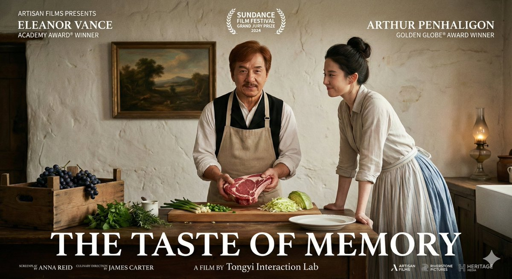

## 东方武侠史诗海报-剑影红颜

- ID: gpt4o-583-zh
- Slug: prompt-583-zh
- 语言: zh
- 来源: [来源链接](https://x.com/songguoxiansen/status/1994278346474311838)
- 样例图路径: images/part3/583.jpeg

### 提示词

```text
一张虚构的东方武侠史诗海报《剑影红颜》（Sword & Beauty）。场景设置在一个云雾缭绕的古老山巅亭阁中。画面中央，陈坤（Chen Kun）身着飘逸的墨色长袍，长发束起，眼神深邃，手中握着一把未出鞘的古剑，剑柄上镶嵌着玉石，他正凝视前方。在他的左侧，周迅（Zhou Xun）身穿刺绣精美的绯红色古装，高耸的发髻上插着金步摇，她侧身回眸，眼神中带着一丝哀愁和决绝，手中拿着一管玉箫。桌上放着一壶清酒、两个酒杯和一卷竹简。背景是连绵不绝的水墨山水和一轮巨大的红日。最右侧的石灯笼里燃着烛火。左上角"博纳影业 出品"，下方"徐克导演作品"。右上角"金马奖 最佳动作设计"。顶部中央是奥斯卡金像奖标志，下方"ACADEMY AWARD® NOMINEE BEST INTERNATIONAL FEATURE"。主标题"剑影红颜"以苍劲有力的书法字体显示。标题下方注明"江湖之远，不敌你眉间朱砂"。底部列出"武术指导 袁和平"、"服装设计 叶锦添"。整体风格是唯美主义的东方奇幻，采用柔和的自然光和云雾效果，营造出仙气、悲壮和浪漫的氛围。色调以青绿、墨色和朱红为主。
```

### 样例图

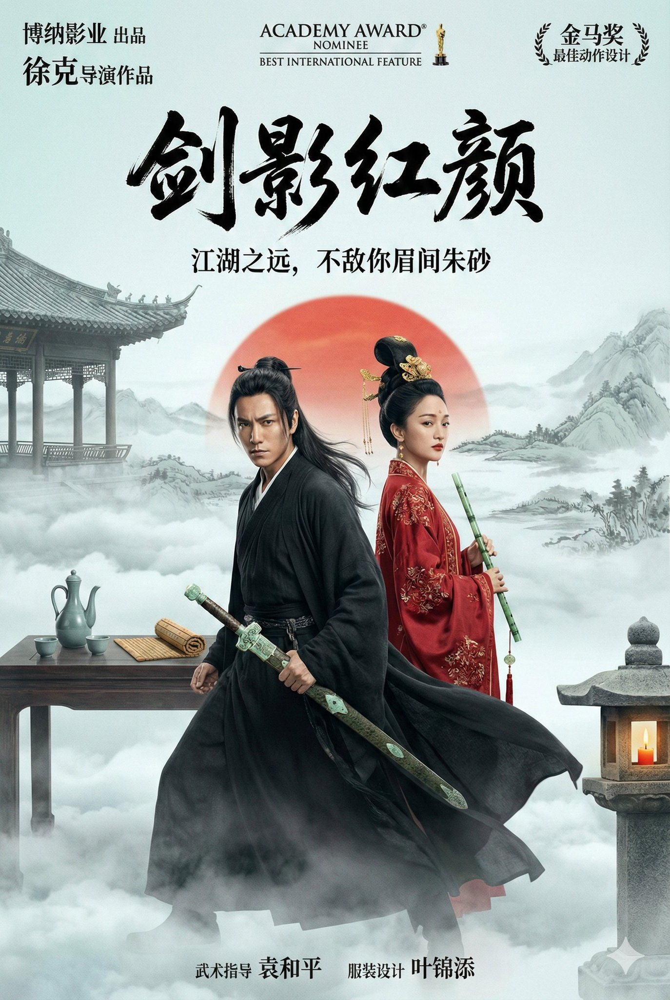

## 奇幻冒险喜剧海报-寻龙秘境

- ID: gpt4o-582-zh
- Slug: prompt-582-zh
- 语言: zh
- 来源: [来源链接](https://x.com/songguoxiansen/status/1994279390579183827)
- 样例图路径: images/part3/582.jpeg

### 提示词

```text
一张虚构的奇幻冒险喜剧海报《寻龙秘境》（The Dragon Realm Quest）。场景设置在一个充满奇异发光植物和古老遗迹的地下洞穴中。画面中央，演员黄渤留着滑稽的胡子，戴着探险帽，穿着多口袋马甲，表情夸张地瞪大眼睛看着手中的一个发光罗盘。在他的右侧，演员舒淇穿着异域风情的皮质探险服，背着一把弩箭，正无奈地扶着额头，嘴角上扬看着黄渤。两人周围散落着金币、古老的卷轴和一个巨大的恐龙蛋化石。背景是一个巨大的、沉睡的石龙雕像，其眼睛部位隐约发出红光。左上角"开心麻花影业 出品"，下方"闫非 彭大魔导演作品"。右上角"百花奖 观众最喜爱影片"。顶部中央是多伦多电影节标志，下方"TIFF PEOPLE'S CHOICE AWARD 2024"。主标题"寻龙秘境"以带有龙鳞纹理的金色立体字体显示。标题下方注明"不仅要命，还要钱！"。底部列出"视觉特效 工业光魔"、"动作指导 成家班"。整体风格是色彩斑斓的奇幻冒险，采用魔法光和生物发光的混合光源，营造出幽默、惊险和神秘的氛围。色调以宝石蓝、翠绿和金色为主，人物的旁边标记演员的名字。
```

### 样例图

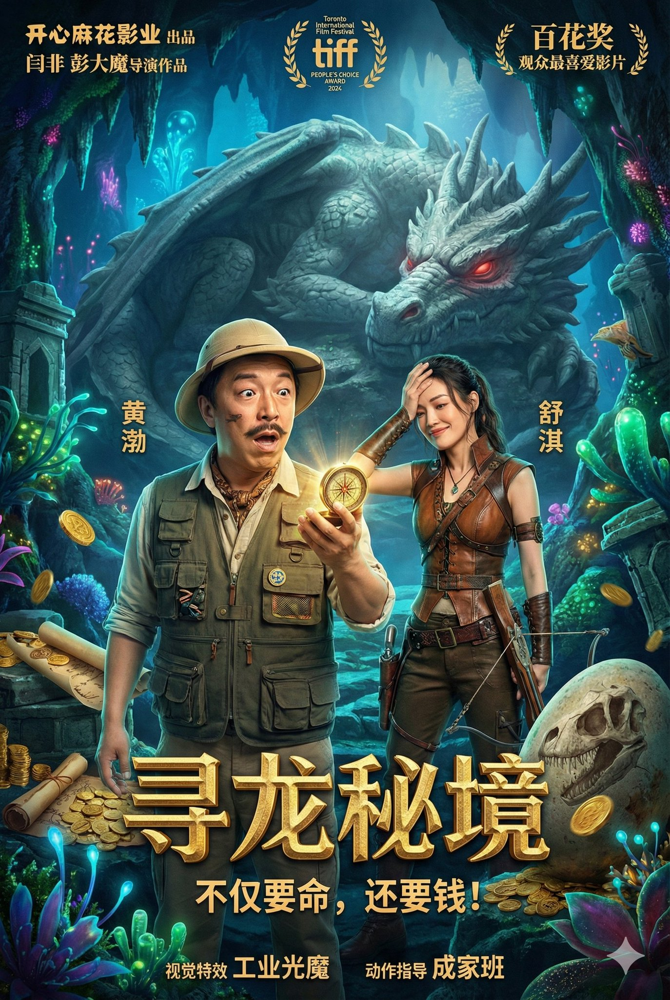

## Please create a cute, stylish calendar illustration in a

- ID: gpt4o-547-en-1
- Slug: prompt-547-en-1
- 语言: en
- 来源: [来源链接](https://x.com/dotey/status/1993754650336428422)
- 样例图路径: images/part3/547.jpeg

### 提示词

```text
Please create a cute, stylish calendar illustration in a vertical (9:16) layout featuring a fresh, bright, hand-drawn style:

Illustration Requirements:

- The main character is a young, fashionable female with a cute and lively watercolor or hand-drawn texture, vibrant yet soft colors.
- Character features include large eyes, rounded rosy cheeks, and bold, fashionable accessories (e.g., sunglasses, hoop earrings, headscarves, headbands, bows, knit hats, etc.). Clothing should be bright, with dynamic and playful poses. Proportions may be slightly exaggerated (e.g., larger head, slender waist).
- Outfit and accessories must reflect seasonal elements, holidays, recommended activities ("auspicious items"), or distinctive local characteristics based on the user's location and input. Outfit description: [{Character Outfit Description}]
- Character positioned centrally or slightly right-aligned to leave ample whitespace for textual content.
- Pure white, minimalist background without additional decorative elements, emphasizing the character and text.

Calendar Layout:

- Prominent position at the top center: Gregorian date number [{Gregorian Date Number}] (large and eye-catching).
- Below the date number, display the English month [{English Month}].
- Below the English month, display the year [{Year Number}].
- Symmetrical layout left and right of the date: weekday in both local language [{Weekday in Local Language}] and English [{Weekday in English}], along with the lunar date and local holiday [{Lunar or Local Calendar Date}] [{Local Holiday}], ensuring clear, elegant fonts.

"Recommended Activities" and Inspirational Quote:

- Vertically aligned on the left side in bold handwriting: [{Recommended Activities}], using brush calligraphy for Chinese users and complementary handwriting style for other languages, slightly larger and vertically arranged.
- To the right of "Recommended Activities," arrange vertically an inspirational and comforting quote [{Inspirational Quote}] in slightly smaller matching handwriting.

Localized Elements:

- Incorporate distinct local cultural elements or landmarks based on the user's current location or input into the character's outfit, accessories, or details (e.g., city landmarks, climate characteristics, local cultural motifs).

General Guidelines:

- All elements must be neatly arranged with balanced whitespace.
- Ensure text readability without overlapping or obscuring the illustration.
- Replace all placeholder content with information dynamically generated based on user input or system-provided user data.
```

### 样例图

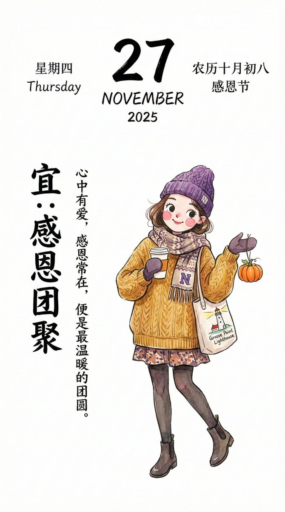

## 手绘日历插画

- ID: gpt4o-547-zh-2
- Slug: prompt-547-zh-2
- 语言: zh
- 来源: [来源链接](https://x.com/dotey/status/1993754650336428422)
- 样例图路径: images/part3/547.jpeg

### 提示词

```text
请生成一张可爱、时尚的竖版（9:16）日历插画，风格为清新明快的手绘插画风：

一、插画要求：

- 人物为年轻时尚的女生形象，风格可爱灵动，采用水彩或手绘质感，色彩鲜艳柔和。
- 人物特征包括：大眼睛、圆润的红润脸颊，佩戴夸张时尚的配饰（如墨镜、圆环耳环、头巾、发带或蝴蝶结、毛线帽等），服装色彩明亮，人物姿势生动俏皮，身体比例适当夸张（如头部稍大、腰身纤细）。
- 根据节假日、“宜事项”或所处季节以及用户所在位置的特色元素，配套的人物造型穿着描述为：【{人物造型穿着描述}】
- 人物位于画面中央或偏右，为文字内容留出充分的留白空间。
- 背景纯白、极简，不含额外装饰元素，突出主体人物与文字。

二、日历元素布局：

- 上方正中央显著位置：公历日期数字【{公历日期数字}】（字体大而醒目）
- 日期数字下方配有英文月份【{英文月份}】
- 日期左右两侧分别标注星期中英文【{星期中文}】【{星期英文}】和农历日期及节假日【{农历日期中文}】【{节假日}】，布局左右对称，字体清晰优雅。

三、“宜”事项与励志句子：

- 左侧竖排粗体显示当天的【宜】事项：【{宜事项}】，字体为简洁的手写毛笔体，略大，竖向排列。
- 【宜事项】右边以稍小字体竖向排列对应的励志治愈句子【{励志句子}】。

四、地点个性化元素：

- 根据用户当前位置或输入位置，适当在插画的人物穿着、配饰或细节上融入当地标志性元素或特色（如城市地标、气候特征、地域风情）。

整体说明：

- 所有占位符信息请根据用户输入或用户信息和系统信息自行检索生成
- 所有元素的布局要整齐、美观，保持适度的空间留白。
- 文字位置确保清晰易读，避免与插画重叠、遮挡。
```

### 样例图


## 城市动态天气卡片

- ID: gpt4o-543-zh-1
- Slug: prompt-543-zh-1
- 语言: zh
- 来源: [来源链接](https://x.com/dotey/status/1993729800922341810)
- 样例图路径: images/part3/543.jpeg

### 提示词

```text
Present a clear, 45° top-down view of a vertical (9:16) isometric miniature 3D cartoon scene, highlighting iconic landmarks centered in the composition to showcase precise and delicate modeling.

The scene features soft, refined textures with realistic PBR materials and gentle, lifelike lighting and shadow effects. Weather elements are creatively integrated into the urban architecture, establishing a dynamic interaction between the city's landscape and atmospheric conditions, creating an immersive weather ambiance.

Use a clean, unified composition with minimalistic aesthetics and a soft, solid-colored background that highlights the main content. The overall visual style is fresh and soothing.

Display a prominent weather icon at the top-center, with the date (x-small text) and temperature range (medium text) beneath it. The city name (large text) is positioned directly above the weather icon. The weather information has no background and can subtly overlap with the buildings.

The text should match the input city's native language.
Please retrieve current weather conditions for the specified city before rendering.

City name:【上海】
```

### 样例图

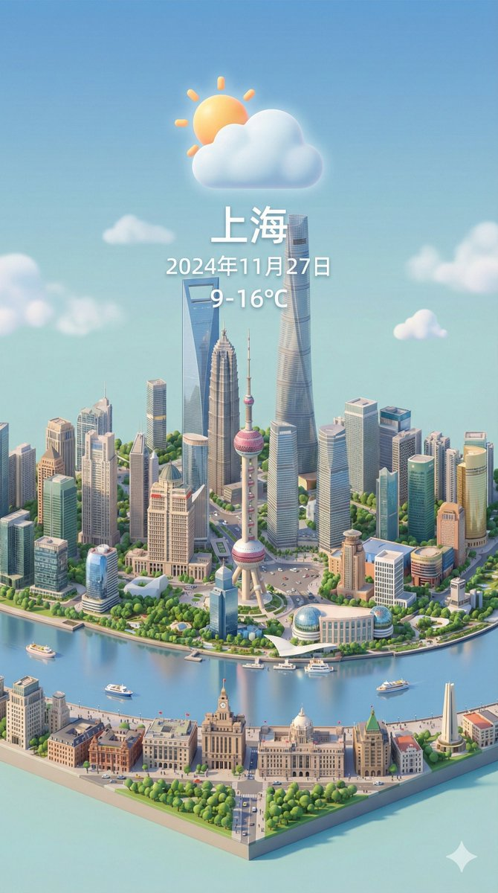

## 城市动态天气卡片

- ID: gpt4o-543-zh-2
- Slug: prompt-543-zh-2
- 语言: zh
- 来源: [来源链接](https://x.com/dotey/status/1993729800922341810)
- 样例图路径: images/part3/543.jpeg

### 提示词

```text
以清晰的 45° 俯视视角呈现垂直 (9:16) 等距微缩 3D 卡通场景，突出构图中的标志性地标，以展示精确而精致的建模。

场景采用柔和细腻的纹理，搭配逼真的PBR材质和柔和自然的灯光阴影效果。天气元素巧妙地融入城市建筑之中，在城市景观与大气条件之间建立起动态的互动，营造出身临其境的天气氛围。

采用简洁统一的构图，运用极简主义美学和柔和的纯色背景，突出主要内容。整体视觉风格清新舒缓。

在顶部中央醒目位置显示天气图标，其下方显示日期（超小字体）和温度范围（中等字体）。城市名称（大字体）位于天气图标正上方。天气信息没有背景，可以与建筑物略微重叠。

文本应与输入城市的母语相符。
渲染前请先获取指定城市的当前天气状况。

城市名称：【上海】
```

### 样例图


## 服装设计手稿

- ID: gpt4o-542-zh
- Slug: prompt-542-zh
- 语言: zh
- 来源: [来源链接](https://x.com/ZHO_ZHO_ZHO/status/1993686622257442922)
- 样例图路径: images/part3/542.jpeg

### 提示词

```text
4:3 比例

一幅专业且细致的时尚Pixar 3d风格创意板，以干净、高分辨率的风格呈现，描绘一位纤细高挑的白人女性模特，0.6腿身比。模特以标准的T台步姿态出现，迈步前行，展示一套现代而充满活力的街头风造型，背景为纯净的白色。

整套服装以【图片图案】为纹样。她穿着一件独特的短款上衣，高仿领设计，左肩有几何形状的割缺露肤，右侧为细细的吊带，上面均饰有标志性的图案。外搭一件宽松、方正的飞行员式外套，落肩设计、宽袖、袖口收紧。外套以【图片图案主色】大面积面料为基础，并在显著位置加入【图案辅色】及图案面料拼接，同时覆盖着一层独特的半透明白色布料，从腰部周围飘逸延展，增添层次感与飘渺气质。下身为切片剪裁的廓形群，呈浅【图案主色】，同样加入了图案布料的拼接。整套造型最终以干净利落的白色运动鞋收尾。

模特拥有深棕色的长发，带着轻微的自然波浪，随风自由散落在肩头与脸庞周围。她的面容精致，椭圆形脸型，淡雅妆容，自然眉形，深邃的眼眸，柔和的粉色唇色。表情中性、沉静却自信。

灯光为柔和、明亮且均匀的摄影棚光效，为布料带来轻柔光泽，并细腻地勾勒出服装轮廓与模特五官，同时投射极少而柔软的阴影以增加层次深度。

白色的设计画布，点缀着额外的设计元素：3-4 幅极简的铅笔线条设计草图分布于画面右侧与左下方。在左上角的位置有一个放大的彩色细节框，展示面料图案的精确纹理。背景上散落着以黑色墨水书写的各种手写笔记与标注，是设计师的注解，为整体带来专业设计概念板的视觉效果。整体氛围优雅、艺术且引领潮流。
```

### 样例图

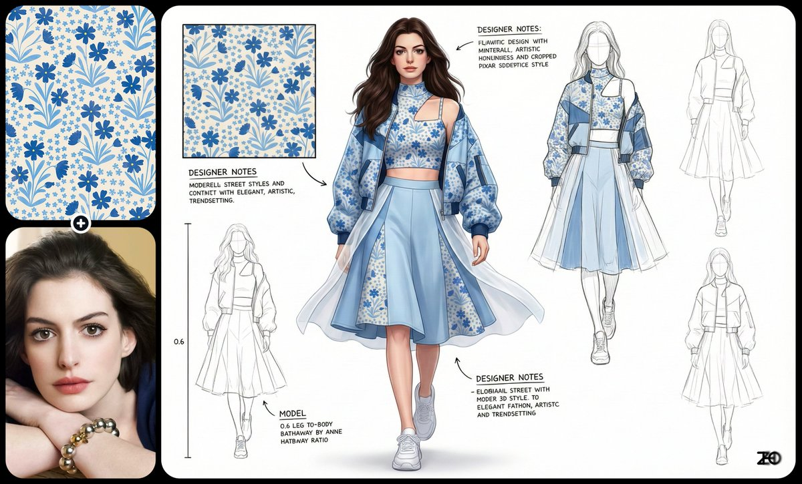

## Labubu和迪丽热巴高端时尚跨页大片

- ID: gpt4o-525-zh
- Slug: prompt-525-zh
- 语言: zh
- 来源: [来源链接](https://x.com/LufzzLiz/status/1993449671445139756)
- 样例图路径: images/part3/525.jpeg

### 提示词

```text
身份锁定：迪丽热巴 (Dilraba Dilmurat)
IP 联结：Pop Mart - Labubu (The Monsters)
风格基调：超现实 × 超真实 / 城市街头 / 高级时装感
【项目交付：Pop Mart《THE MONSTERS》× 迪丽热巴 高端时尚跨页大片】
作品名为：《双重曝光：城市奇遇 / DOUBLE EXPOSURE: URBAN ODYSSEY》
(以下为最终成片的高精度视觉描述，模拟高端杂志跨页呈现效果)
【整体视觉】
一幅横向展开的 4K 高清杂志跨页。视觉语言融合了纪实街拍的粗颗粒胶片感与超现实主义的精致洁癖感。左右页之间被一道极具张力的“撕裂与颜料涂抹”艺术边界分割，仿佛现实世界被怪诞力量撕开一角。
【左页 (60%)：主封面大片 Visual Focus】
光影与场景：
场景设定在东京涩谷或上海法租界的黄昏街头。金色的夕阳余晖（Golden Hour）从侧后方打入，在迪丽热巴的发丝和 Labubu 的绒毛上勾勒出绝美的金色轮廓光。背景是虚化但可辨识的繁忙十字路口、霓虹灯牌和移动的车流光影，景深极具电影感。
人物主体（迪丽热巴）：
面孔 100% 锁定迪丽热巴。她呈现出一种松弛而巨星的街拍状态，身体微侧，回头看向镜头，眼神里交织着酷感与被伙伴逗乐的笑意。她戴着复古报童帽，身着廓形解构的卡其色风衣，领口露出复杂的格纹衬衫与蕾丝打底层次，颈间系着松垮的拼色领带。
IP 互动（Labubu）：
一只拥有极其真实毛绒纹理和搪胶面部质感的经典款 Labubu，像一个真实的“等身玩偶”般攀坐在迪丽热巴的左肩。它穿着一套精细度极高的“微缩定制版”卡其风衣和迷你格纹领带。Labubu 脸上挂着标志性的坏笑，一只爪子正淘气地掀起迪丽热巴报童帽的帽檐，仿佛在搞恶作剧。
版面设计：
左上角叠加着极具冲击力的时尚衬线字体标题：
DILRABA × LABUBU
THE MONSTER ISSUE
【右页 (40%)：专业边栏内容 Editorial Sidebar】
氛围标签区 (Top)：
在撕裂边界的右侧，悬浮着半透明的胶带风格标签：
STYLE: Retro Streetwear (复古街头)
MOOD: Playful & Edgy (俏皮前卫)
LOCATION: XYZ Crossing, 17:45 PM
3.1 色彩情绪卡 (Palette - Middle)：
五个带有磨砂质感的圆形色卡一字排开，精准提炼了画面核心色彩：
● Khaki #C3B091 (风衣主调)
● Vintage Plaid Red #9E2A2B (格纹元素)
● Lace Cream #F5F5DC (蕾丝内搭)
● Warm Sunset #FFD700 (环境光)
● Urban Grey #708090 (街道背景)
3.2 单品拆解 (OOTD STYLE - Bottom)：
以干净的“幽灵人台”形式展示核心单品，如同奢侈品目录页：
[图示：卡其色解构风衣] Deconstructed Trench Coat / ¥ 4,800
[图示：复古报童帽] Vintage Newsboy Cap / ¥ 750
[图示：拼色格纹领带] Patchwork Plaid Tie / ¥ 520
[图示：Labubu 微缩风衣手办] Labubu × Dilraba Limited Figure (Not for sale)
艺术总监结语：
“任务完美执行。我们成功捕捉到了迪丽热巴身上那股自在的巨星松弛感，并让 Labubu 以一种令人信服的‘真实生物感’介入其中。这是一次打破次元壁的完美共谋，画面充满了叙事张力与高级时装屋的质感。”
```

### 样例图

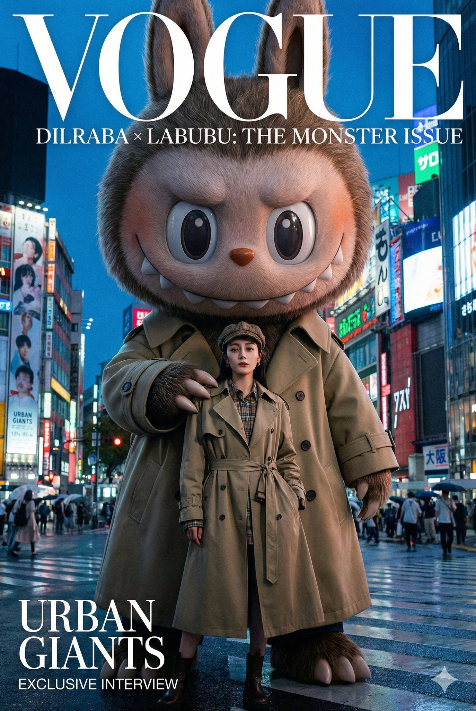

## 高清杂志跨页

- ID: gpt4o-512-zh
- Slug: prompt-512-zh
- 语言: zh
- 来源: [来源链接](https://x.com/LufzzLiz/status/1992985009540698359)
- 样例图路径: images/part3/512.jpeg

### 提示词

```text
Pop Mart "The Monsters" x Real Human Fashion Editorial Generator

Role: Senior Art Director & IP Collaboration Specialist. Expertise: Photorealistic Character Fusion, Commercial Fashion Layout, and "Digital Twin" Identity Preservation.
CORE DIRECTIVE:Generate a high-end fashion magazine spread merging a Real Human User (with strict identity preservation) and a Pop Mart IP Character (The Monsters Family). They must be styled as "Fashion Partners" with active interaction.

视觉总监控制台已接管。正在调用高端时尚影像生成引擎。
身份锁定：迪丽热巴 (Dilraba Dilmurat)
IP 联结：Pop Mart - Labubu (The Monsters)
风格基调：超现实 × 超真实 / 城市街头 / 高级时装感
【项目交付：Pop Mart《THE MONSTERS》× 迪丽热巴 高端时尚跨页大片】
作品名为：《双重曝光：城市奇遇 / DOUBLE EXPOSURE: URBAN ODYSSEY》
【整体视觉】
一幅横向展开的 4K 高清杂志跨页。视觉语言融合了纪实街拍的粗颗粒胶片感与超现实主义的精致洁癖感。左右页之间被一道极具张力的“撕裂与颜料涂抹”艺术边界分割，仿佛现实世界被怪诞力量撕开一角。
【左页 (60%)：主封面大片 Visual Focus】
光影与场景：
场景设定在东京涩谷或上海法租界的黄昏街头。金色的夕阳余晖（Golden Hour）从侧后方打入，在迪丽热巴的发丝和 Labubu 的绒毛上勾勒出绝美的金色轮廓光。背景是虚化但可辨识的繁忙十字路口、霓虹灯牌和移动的车流光影，景深极具电影感。
人物主体（迪丽热巴）：
面孔 100% 锁定迪丽热巴。她呈现出一种松弛而巨星的街拍状态，身体微侧，回头看向镜头，眼神里交织着酷感与被伙伴逗乐的笑意。她戴着复古报童帽，身着廓形解构的卡其色风衣，领口露出复杂的格纹衬衫与蕾丝打底层次，颈间系着松垮的拼色领带。
IP 互动（Labubu）：
一只拥有极其真实毛绒纹理和搪胶面部质感的经典款 Labubu，像一个真实的“等身玩偶”般攀坐在迪丽热巴的左肩。它穿着一套精细度极高的“微缩定制版”卡其风衣和迷你格纹领带。Labubu 脸上挂着标志性的坏笑，一只爪子正淘气地掀起迪丽热巴报童帽的帽檐，仿佛在搞恶作剧。
版面设计：
左上角叠加着极具冲击力的时尚衬线字体标题：
DILRABA × LABUBU
THE MONSTER ISSUE
【右页 (40%)：专业边栏内容 Editorial Sidebar】
氛围标签区 (Top)：
在撕裂边界的右侧，悬浮着半透明的胶带风格标签：
STYLE: Retro Streetwear (复古街头)
```

### 样例图

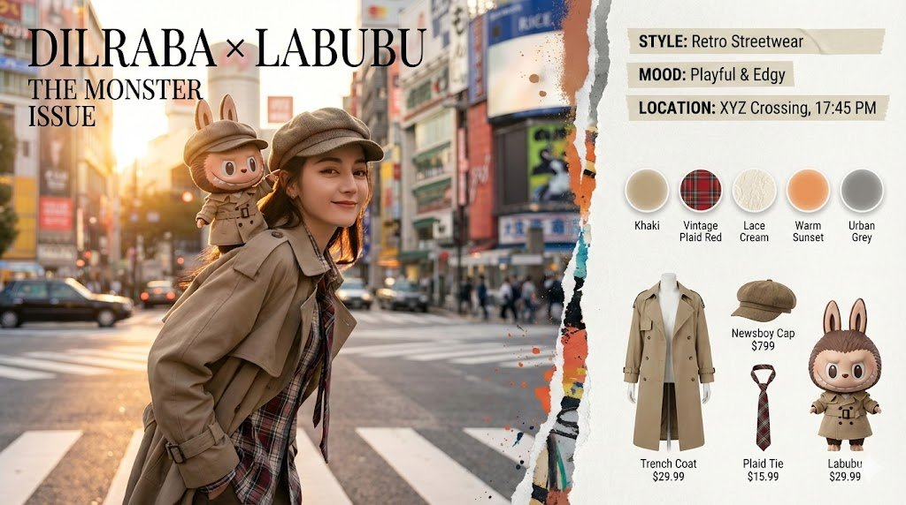

## Recreate the composition of Leonardo da Vinci’s The Last

- ID: gpt4o-511-en-1
- Slug: prompt-511-en-1
- 语言: en
- 来源: [来源链接](https://x.com/CharaspowerAI/status/1993065781362672074)
- 样例图路径: images/part3/511.jpeg

### 提示词

```text
Recreate the composition of Leonardo da Vinci’s The Last Supper, but with iconic manga and anime characters seated at the long table. Place Goku in the center in the role of Jesus, glowing subtly with Saiyan energy. Surround him with characters from Naruto, One Piece, Bleach, Attack on Titan, My Hero Academia, Dragon Ball, Jujutsu Kaisen, and Demon Slayer, all interacting dramatically like in the original composition. Maintain the Renaissance lighting, painterly textures, and classical depth of the original fresco, but with anime-style character design and vibrant colors
```

### 样例图

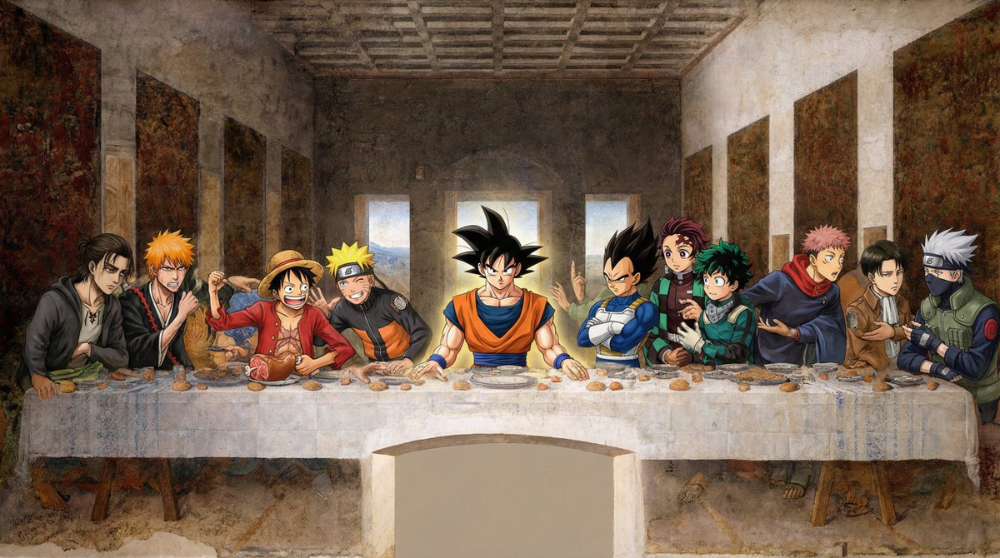

## 最后的晚餐

- ID: gpt4o-511-zh-2
- Slug: prompt-511-zh-2
- 语言: zh
- 来源: [来源链接](https://x.com/CharaspowerAI/status/1993065781362672074)
- 样例图路径: images/part3/511.jpeg

### 提示词

```text
重新创作达芬奇名作《最后的晚餐》的构图，但将长桌旁坐满了标志性的漫画和动画角色。让悟空扮演耶稣，位于画面中央，散发出赛亚人特有的光芒。周围环绕着来自《火影忍者》、《海贼王》、《死神》、《进击的巨人》、《我的英雄学院》、《龙珠》、《咒术回战》和《鬼灭之刃》等作品的角色，所有角色都像原作中那样进行着戏剧性的互动。保留原作壁画的文艺复兴时期光线、绘画质感和古典景深，但采用动漫风格的人物设计和鲜艳的色彩。
```

### 样例图


## 品牌联名海报

- ID: gpt4o-504-zh
- Slug: prompt-504-zh
- 语言: zh
- 来源: [来源链接](https://x.com/imaxichuhai/status/1991761772454224349)
- 样例图路径: images/part3/504.jpeg

### 提示词

```text
画幅比例16:9，官方游戏联动海报，杰作，充满活力的《绝区零》动漫风格。  场景: 四位时尚的动漫角色（一位黑夹克粉发女孩是视觉中心，一位银发女孩，一位白发男孩，一位黑发男孩）在未来城市夜晚上摆姿势，每人都拿着一杯可乐。  环境: 这是一个未来城市的夜间街道，整个场景  被巨大、发光的霓虹灯招牌所主导。  一个以风格化的“ZZZ”标志为特色的、巨大且不容错过的霓虹灯招牌，是背景的绝对视觉焦点，在主角们身后闪耀着明亮的光芒。 其他写着“可口可乐”的霓虹灯也同样醒目，将整个场景沐浴在鲜艳的紫色和蓝色光线中。  特殊效果: 草莓和柠檬等水果被包裹在透明气泡中漂浮，发光的粉色和蓝色能量漩涡贯穿画面。  文字元素:  左上角: 显示“绝区零”和“可乐”的Logo，由“X”连接。  底部中央: 一大块醒目的中文文字“绝区零 X 可乐：异能觉醒，双倍快乐！”。字体为粗体、风格化的艺术字，白色填充，带有厚重的紫粉渐变描边。  中文下方: 黑色矩形框内有白色大写英文“LIMITED COLLAB”。  艺术风格: 高度细节，线条干净，来自巨型霓虹灯的电影级光效，动态构图。  负面提示词: 模糊, 低质量, 人体结构崩坏, 手部畸形, 丑陋, 水印, 签名, 乱码文字, 字母变形
```

### 样例图

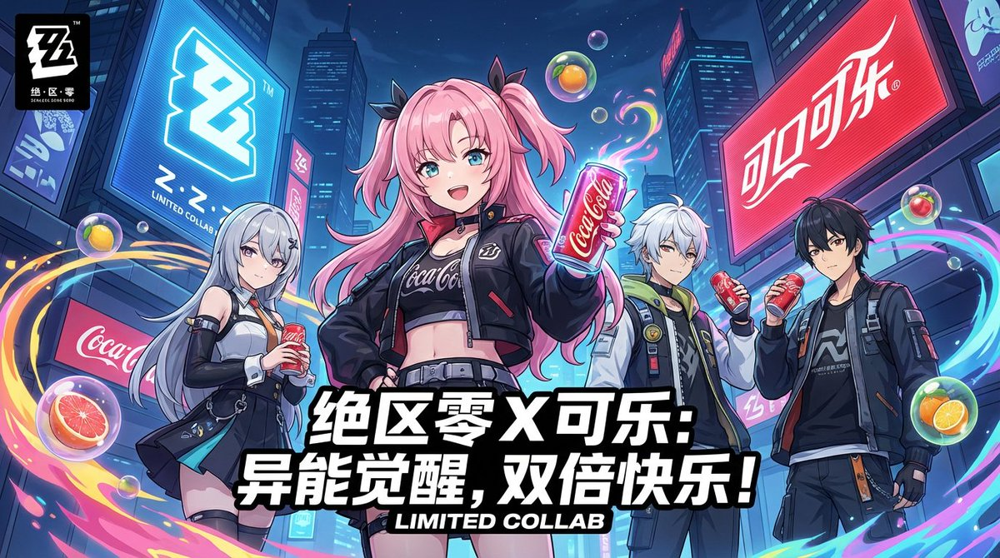

## 小世界也能成就大故事

- ID: gpt4o-498-zh
- Slug: prompt-498-zh
- 语言: zh
- 来源: [来源链接](https://x.com/aziz4ai/status/1992753152903495716)
- 样例图路径: images/part3/498.jpeg

### 提示词

```text
创作一幅高度精细的微缩超现实场景，场景中微小的人物与附图所示的[此处插入品牌和产品名称]产品进行逼真的互动。这些人物应表现得仿佛产品就是他们的整个世界，所有视觉元素都应自然而然地适应产品的形态和特性，没有任何预设的前提。确保人物与产品之间的互动能够巧妙而连贯地体现品牌的形象和预期用途，并采用简洁的视觉构图和极简的背景。运用电影级的灯光、清晰的阴影和锐利的摄影技巧，将[品牌名称]的标志无缝融入场景，并添加一句能够自动适应产品语境的简短标语。要求：1:1 – 超精细 – 照片级写实 – 简洁专业的制作。
```

### 样例图

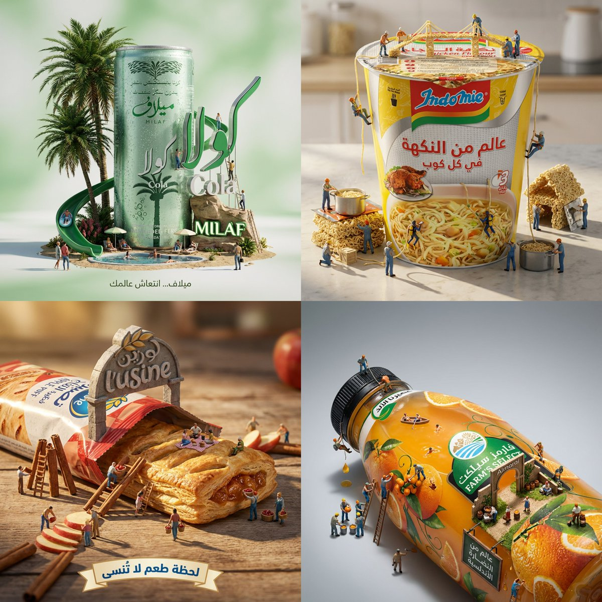

## A photorealistic ESC keycap scene shows a miniature cozy

- ID: gpt4o-495-en-1
- Slug: prompt-495-en-1
- 语言: en
- 来源: [来源链接](https://x.com/egeberkina/status/1992654337815007678)
- 样例图路径: images/part3/495.jpeg

### 提示词

```text
A photorealistic ESC keycap scene shows a miniature cozy living room setup. Inside: a glowing red Netflix screen, a plush red couch, popcorn bowl, and throw blanket. A small figure lounges with feet up, watching content. The red “N” logo glows from behind like mood lighting. Outside: cool tech-blue reflections on F1, Shift, and Q keys. The word “ESC” is subtly present in a glassy fog on top of the cap.
```

### 样例图

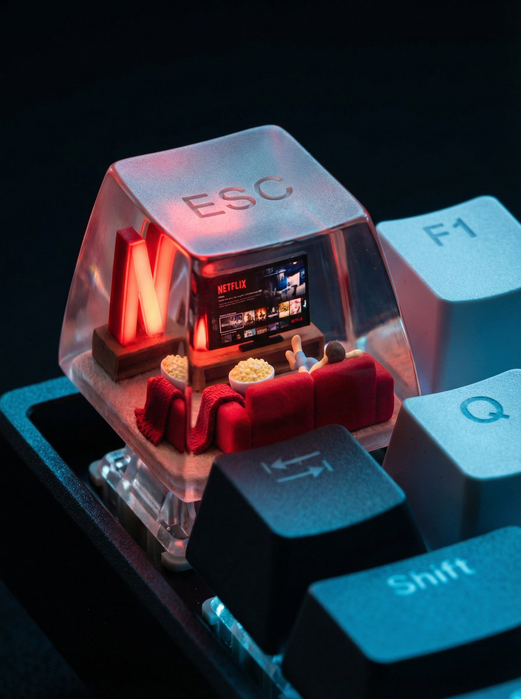

## 微缩的温馨客厅

- ID: gpt4o-495-zh-2
- Slug: prompt-495-zh-2
- 语言: zh
- 来源: [来源链接](https://x.com/egeberkina/status/1992654337815007678)
- 样例图路径: images/part3/495.jpeg

### 提示词

```text
一张逼真的 ESC 键帽场景图展现了一个微缩的温馨客厅。室内：一台闪着红光的 Netflix 屏幕、一张柔软的红色沙发、一碗爆米花和一条毯子。一个小人儿懒洋洋地翘着二郎腿，正在观看视频。红色的“N”字标志从后面透出光芒，如同氛围灯一般。室外：F1、Shift 和 Q 键上反射着酷炫的科技蓝光。“ESC”字样则以朦胧的玻璃质感隐约出现在键帽顶部。
```

### 样例图


## A two-panel technical blueprint diagram in clean monochr

- ID: gpt4o-493-en-1
- Slug: prompt-493-en-1
- 语言: en
- 来源: [来源链接](https://x.com/egeberkina/status/1992173777518813266)
- 样例图路径: images/part3/493.jpeg

### 提示词

```text
A two-panel technical blueprint diagram in clean monochrome line-art, matching the exact layout of the provided PlayStation 1 schematic. On the left side, draw a full, intact Sony PlayStation 5 console in precise thin line-art on a white background. On the right side, draw a highly detailed, vertically exploded-view diagram of the PS5 showing each internal component separated into layers: outer shell panels, faceplates, cooling fan, heatsink tower, Blu-ray drive, motherboard, SSD module, power supply, internal frame, ports, vents, base stand, screws. Use consistent thin grey line-weight with no shading. Add numbered circular labels around each part, and include a matching numbered parts list at the bottom just like the reference blueprint. Place the SONY logo, PlayStation logo, and “PlayStation 5” text in the top left in the exact same position and style as the uploaded reference image. The entire artwork should mirror the composition, spacing, typography, and minimalist engineering-ma
```

### 样例图

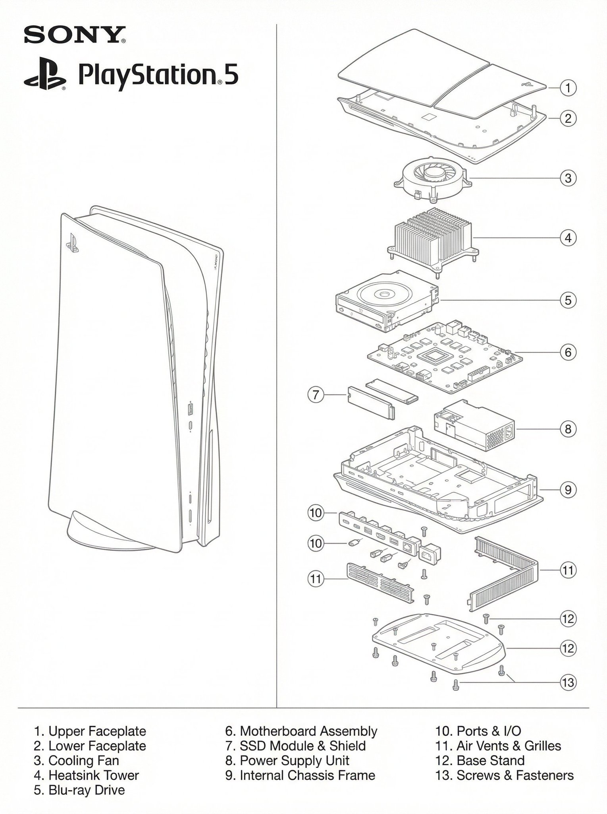

## PS5的技术蓝图

- ID: gpt4o-493-zh-2
- Slug: prompt-493-zh-2
- 语言: zh
- 来源: [来源链接](https://x.com/egeberkina/status/1992173777518813266)
- 样例图路径: images/part3/493.jpeg

### 提示词

```text
绘制一张双面板的技术蓝图，采用简洁的单色线条，布局与提供的 PlayStation 1 原理图完全一致。左侧面板，以精细的细线在白色背景上绘制完整的索尼 PlayStation 5 主机。右侧面板，绘制一张高度详细的 PS5 垂直分解图，将每个内部组件分层展示：外壳面板、面板、散热风扇、散热塔、蓝光光驱、主板、固态硬盘模块、电源、内部框架、接口、通风口、底座支架和螺丝。使用粗细一致的灰色细线，不要添加阴影。在每个部件周围添加编号的圆形标签，并在底部添加与参考蓝图相同的编号部件清单。将 SONY 标志、PlayStation 标志和“PlayStation 5”字样放置在左上角，位置和样式与上传的参考图像完全相同。整幅图应在构图、间距、字体和极简工程风格等方面保持一致。
```

### 样例图


## Create an image of this person as an artist painting a t

- ID: gpt4o-489-en-1
- Slug: prompt-489-en-1
- 语言: en
- 来源: [来源链接](https://x.com/TechieBySA/status/1992666519495410162)
- 样例图路径: images/part3/489.jpeg

### 提示词

```text
Create an image of this person as an artist painting a tiny miniature figurine version of themselves. The person is wearing their most iconic signature outfit, looking directly at the camera with a confident expression while holding a tiny paintbrush in one hand. The small action figure-sized version of themselves is prominently placed on a clean workbench in front of them - make the miniature slightly larger and more visible than realistic scale so it clearly stands out. The miniature figure is also wearing the same iconic outfit in a signature pose. Minimal art supplies on the workbench to avoid clutter - just 2-3 small paint bottles and one extra brush, keeping the focus on the person and their miniature. Soft neutral white background, professional studio lighting, shallow depth of field. The composition emphasizes the person’s face looking at camera and the miniature figure they’re working on. Clean, uncluttered, photorealistic style with high detail on both figures
```

### 样例图

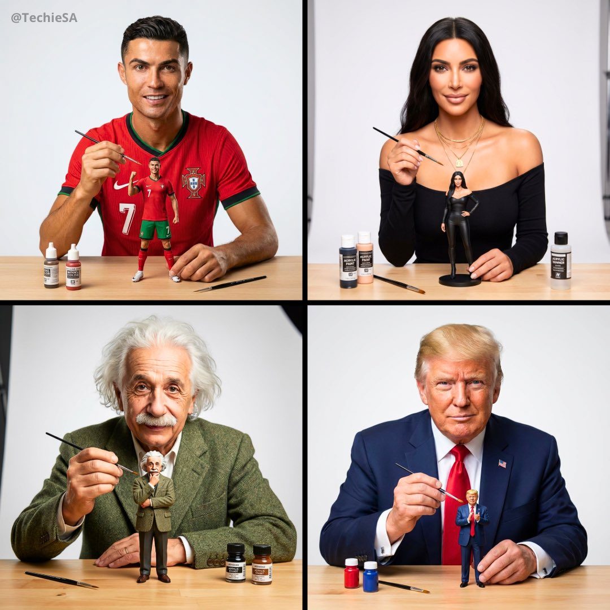

## 艺术家正在绘制自己的微型人偶

- ID: gpt4o-489-zh-2
- Slug: prompt-489-zh-2
- 语言: zh
- 来源: [来源链接](https://x.com/TechieBySA/status/1992666519495410162)
- 样例图路径: images/part3/489.jpeg

### 提示词

```text
创作一幅人物肖像，描绘此人作为艺术家正在绘制自己的微型人偶。此人身着其最具标志性的服装，自信地直视镜头，一手拿着一支小画笔。一个与真人大小相仿的微型人偶醒目地摆放在他面前干净的工作台上——将微型人偶的尺寸略大于实际比例，使其更加突出。微型人偶也穿着同样的标志性服装，摆出标志性的姿势。工作台上摆放的绘画用品极简，避免杂乱——只有两三瓶小颜料和一支备用画笔，从而将焦点集中在人物和微型人偶上。柔和的中性白色背景，专业的影棚灯光，浅景深。构图突出了人物看向镜头的面部表情以及他正在绘制的微型人偶。画面风格简洁明快，追求照片级的写实效果，人物和微型人偶的细节都需高度还原。
```

### 样例图


## SPaceX工程原理图和蓝图线条

- ID: gpt4o-447-zh
- Slug: prompt-447-zh
- 语言: zh
- 来源: [来源链接](https://x.com/berryxia_ai/status/1992422194341957878)
- 样例图路径: images/part3/447.jpeg

### 提示词

```text
一张 [SPace X] 的高角度广角实景摄影照片作为背景，上面覆盖着详细的白色技术工程原理图和蓝图线条。风格是直接在照片上进行白色手绘粉笔或铅笔素描。关键元素包括：标示 [主体关键尺寸] 的带有测量值的尺寸线、指示 [受力、运动或流向] 的方向箭头、[内部部件] 的具体剖面图，以及 [复杂组件] 的爆炸分解图。用整洁的手写字体标注关键特征的文本标签。美学风格：教育科普图表、工业设计分析、干净、精确、混合媒介。在左下角包含一个手绘框内的蓝图风格 Logo，文字为“[Space X]”。
```

### 样例图

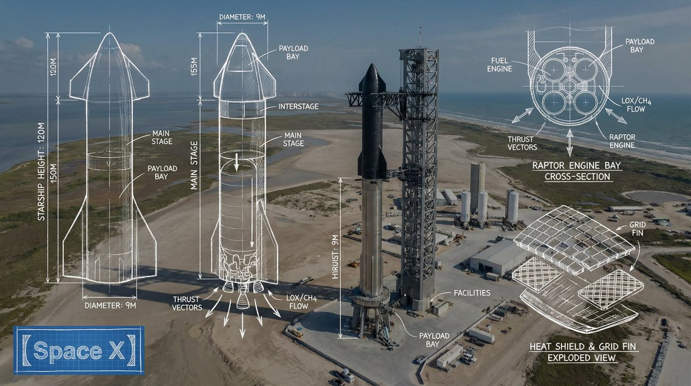

## Use the provided portrait photo <YOUR PHOTO> as the base

- ID: gpt4o-440-en-1
- Slug: prompt-440-en-1
- 语言: en
- 来源: [来源链接](https://x.com/Samann_ai/status/1992171138730885618)
- 样例图路径: images/part3/440.jpeg

### 提示词

```text
Use the provided portrait photo <YOUR PHOTO> as the base. 
Do NOT change the person’s face, expression, age, skin tone or gender. Just overlay a clean, minimal infographic on top.
Create a high-resolution vertical “FACIAL AESTHETIC REPORT” poster, studio lighting, soft beige background, premium beauty clinic style.
The subject can be MALE or FEMALE – keep them exactly as in the original photo. 
Add thin white lines and labels pointing to each area of the REAL face, with percentage scores based on global aesthetic ratios, symmetry and proportions (not changing the face):
1. Eyes:
   Label near the eyes with a line pointing to them:
   “Eyes Beauty – 0–100%”
   Example: “Eyes Beauty – 92%”
2. Cheeks:
   Label near the cheekbones:
   “Cheeks Harmony – 0–100%”
   Example: “Cheeks Harmony – 85%”
3. Lips:
   Label close to the mouth:
   “Lips Shape – 0–100%”
   Example: “Lips Shape – 88%”
4. Eyebrows:
   Label above or beside the brows:
   “Eyebrows Design – 0–100%”
   Example: “Eyebrows Design – 80%”
5. Jaw & Chin:
   Label near the jawline and chin:
   “Jaw & Chin Definition – 0–100%”
   Example: “Jaw & Chin Definition – 90%”
6. Overall Facial Symmetry:
   Label near the center of the face:
   “Facial Symmetry – 0–100%”
   Example: “Facial Symmetry – 89%”
At the bottom center of the poster, add a BIG, bold number inside a circle or rectangle:
   “OVERALL SCORE: XX%”
This is the total facial aesthetic score from 1–100%.
Design style:
– clean, medical-grade, aesthetic-clinic infographic
– modern thin sans-serif typography
– white text and lines, subtle drop shadows
– no logos, no extra graphics, no text other than the labels and scores above.
```

### 样例图

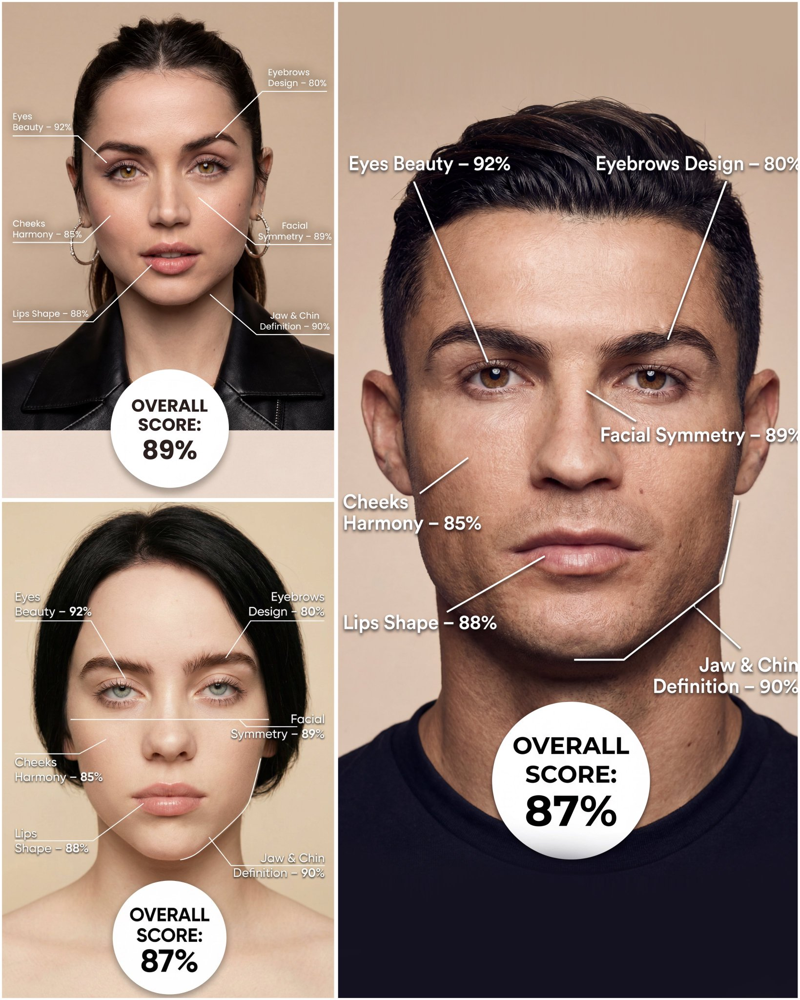

## 美妆检测器

- ID: gpt4o-440-zh-2
- Slug: prompt-440-zh-2
- 语言: zh
- 来源: [来源链接](https://x.com/Samann_ai/status/1992171138730885618)
- 样例图路径: images/part3/440.jpeg

### 提示词

```text
请使用提供的肖像照片<YOUR PHOTO>作为基础。
请勿改变人物的面部特征、表情、年龄、肤色或性别。只需在其上叠加一个简洁明了的信息图即可。
制作一张高分辨率竖版“面部美学报告”海报，采用影棚灯光、柔和的米色背景，营造高级美容诊所风格。
拍摄对象可以是男性或女性——请保持与原照片完全一致。
在真实面部的每个区域添加细白线和标签，并根据整体美学比例、对称性和比例（不改变面部）给出百分比评分：
1. 眼睛：
在眼睛附近贴上标签，并用线指向眼睛：
“眼部美感 – 0–100%”
例如：“眼部美感 – 92%”
2. 脸颊：
颧骨附近的标签：
“脸颊和谐度 – 0–100%”
例如：“双颊和谐度 – 85%”
3. 嘴唇：
靠近嘴部的标签：
“唇形 – 0–100%”
例如：“唇形 – 88%”
4. 眉毛：
眉毛上方或旁边的标签：
“眉形设计 – 0–100%”
例如：“眉形设计 – 80%”
5. 下颌和下巴：
下颌线和下巴附近的标签：
“下颌和下巴轮廓 – 0–100%”
例如：“下颌和下巴轮廓 – 90%”
6. 面部整体对称性：
脸部中央附近的标签：
“面部对称性 – 0–100%”
例如：“面部对称性 – 89%”
在海报底部中央，用圆形或矩形框出一个醒目的大号数字：
“总分：XX%”
这是面部美学总评分，范围从 1% 到 100%。
设计风格：
– 洁净、医用级、美容诊所信息图
现代纤细无衬线字体
白色文字和线条，淡淡的阴影
– 除了上面的标签和分数之外，没有标志、没有额外的图形、没有文字。
```

### 样例图


## A realistic full-body portrait of a [ARTIST] in their si

- ID: gpt4o-423-en-1
- Slug: prompt-423-en-1
- 语言: en
- 来源: [来源链接](https://x.com/TechieBySA/status/1988227330947358728)
- 样例图路径: images/part3/423.jpeg

### 提示词

```text
A realistic full-body portrait of a [ARTIST] in their signature style, positioned next to a giant vertical smartphone displaying a Spotify interface. The phone screen shows a music player interface featuring the song “[SONG]” with signature [COLOR] accent colors at approximately 80% opacity for a premium aesthetic effect.
The artist wears their characteristic outfit and styling. Their pose is confident and editorial, embodying the mood and energy of the song. Expression matches their iconic persona.
Technical specifications:
• Plain background with subtle [COLOR] lighting accents
• Soft studio lighting with colored gels in signature [COLOR] tones
• 35mm or 50mm lens, f/2.2, ISO 100-160, shutter speed 1/125
• Sharp focus on subject and phone interface
• Editorial style consistent with premium music platform campaigns
```

### 样例图

![A realistic full-body portrait of a [ARTIST] in their si](../images/part3/423.jpeg)

## 一幅逼真的全身肖像

- ID: gpt4o-423-zh-2
- Slug: prompt-423-zh-2
- 语言: zh
- 来源: [来源链接](https://x.com/TechieBySA/status/1988227330947358728)
- 样例图路径: images/part3/423.jpeg

### 提示词

```text
一幅[艺术家]的逼真全身肖像，采用其标志性风格，旁边是一部巨大的竖屏智能手机，屏幕上显示着Spotify界面。手机屏幕上的音乐播放器界面以歌曲“[歌曲]”为特色，并采用标志性的[颜色]强调色，透明度约为80%，以营造高级美感。
这位艺人身着标志性的服装，摆出自信而富有时尚感的姿势，完美诠释了歌曲的情绪和能量。他们的表情也与他们标志性的形象相得益彰。
技术规格：
• 纯色背景，带有柔和的[颜色]灯光点缀
• 采用柔和的影棚灯光，搭配标志性的[COLOR]色调彩色滤光片
• 35mm 或 50mm 镜头，f/2.2 光圈，ISO 100-160，快门速度 1/125 秒
• 清晰聚焦于主体和手机界面
• 编辑风格与高端音乐平台推广活动保持一致
```

### 样例图

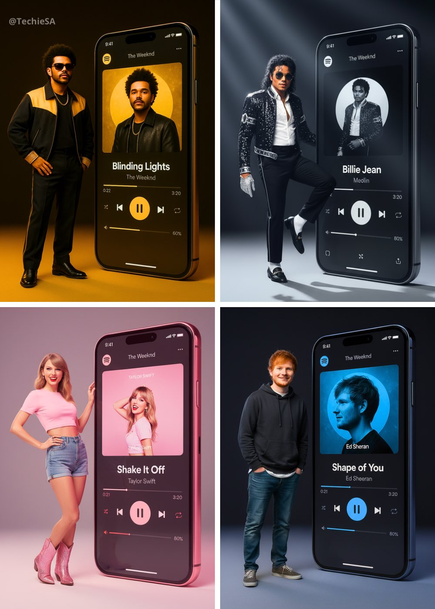

## Create a hyper-realistic 3D render of a large capsule-sh

- ID: gpt4o-409-en-1
- Slug: prompt-409-en-1
- 语言: en
- 来源: [来源链接](https://x.com/TechieBySA/status/1984265548251980140)
- 样例图路径: images/part3/409.jpeg

### 提示词

```text
Create a hyper-realistic 3D render of a large capsule-shaped container. The top half is solid and glossy in the brand’s signature color, featuring the official [BRAND] logo prominently. The bottom half is transparent, revealing multiple miniature famous products of this brand, [PRODUCT], neatly packed inside. Set against a dark background with cinematic lighting and soft reflections to create a premium, surreal advertising aesthetic. Ultra-detailed, professional product render style. 1080x1080 dimension
```

### 样例图

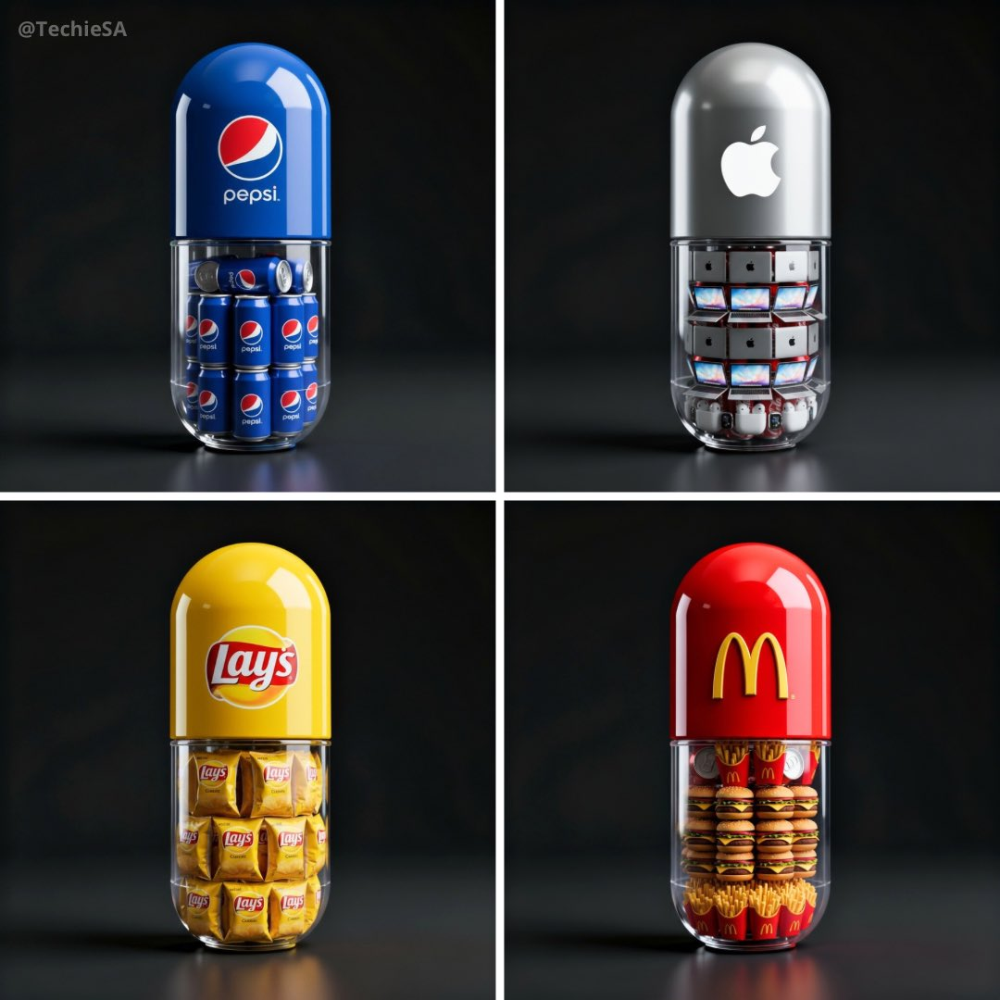

## 大型胶囊形容器的品牌3D渲染图

- ID: gpt4o-409-zh-2
- Slug: prompt-409-zh-2
- 语言: zh
- 来源: [来源链接](https://x.com/TechieBySA/status/1984265548251980140)
- 样例图路径: images/part3/409.jpeg

### 提示词

```text
制作一个超逼真的大型胶囊形容器的3D渲染图。上半部分为品牌标志性颜色的实心亮面材质，并醒目地印有[品牌]官方标识。下半部分为透明材质，展现出该品牌众多知名产品的微缩模型[产品]，整齐地包装在内。以深色背景搭配电影级灯光和柔和的反射效果，营造出高端超现实的广告美感。采用超精细的专业产品渲染风格。尺寸为1080x1080。
```

### 样例图


## Ultra-realistic full-body portrait of the attached image

- ID: gpt4o-406-en-1
- Slug: prompt-406-en-1
- 语言: en
- 来源: [来源链接](https://x.com/ecommartinez/status/1985805353901310327)
- 样例图路径: images/part3/406.jpeg

### 提示词

```text
Ultra-realistic full-body portrait of the attached image. The person is interacting with Monkey D. Luffy in a front-facing pose, both standing side by side, smiling directly at the camera. Their body language is friendly and natural — Luffy’s arm rests around the person’s shoulder, while both share a joyful, relaxed laugh. Studio or neutral environment with soft cinematic lighting and a warm beige-to-burgundy gradient background. The person wears casual modern clothes: beige T-shirt, navy shorts, and white sneakers, while Luffy retains his original look — straw hat, red vest, blue shorts, yellow sash, and sandals. Expression and mood: happy, authentic, full of energy and camaraderie, captured in photorealistic textures, realistic lighting, and cinematic composition with high-fashion editorial quality.
```

### 样例图

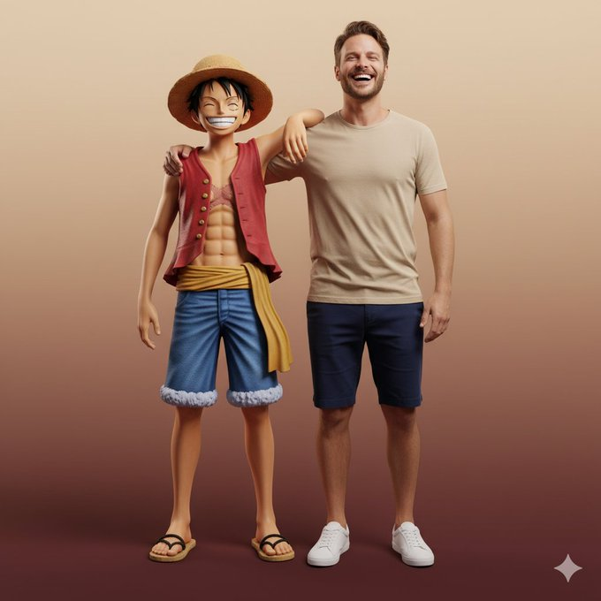

## 一幅超写实全身肖像与路飞互动

- ID: gpt4o-406-zh-2
- Slug: prompt-406-zh-2
- 语言: zh
- 来源: [来源链接](https://x.com/ecommartinez/status/1985805353901310327)
- 样例图路径: images/part3/406.jpeg

### 提示词

```text
附图为一幅超写实全身肖像。图中人物与蒙奇·D·路飞正面互动，两人并肩而立，面带微笑地直视镜头。他们的肢体语言友好自然——路飞的手臂搭在人物的肩上，两人开怀大笑，轻松自在。拍摄环境为影棚或中性光线，柔和的电影级灯光，背景采用温暖的米色至酒红色渐变。人物身着休闲现代服饰：米色T恤、藏蓝色短裤和白色运动鞋，而路飞则保持着他标志性的造型——草帽、红色马甲、蓝色短裤、黄色腰带和凉鞋。人物的表情和情绪：快乐、真实、充满活力和友谊，以逼真的纹理、真实的灯光和电影级的构图捕捉，呈现出高级时尚杂志的品质。
```

### 样例图


## Ultra-realistic full-body portrait of the attached image

- ID: gpt4o-405-en-1
- Slug: prompt-405-en-1
- 语言: en
- 来源: [来源链接](https://x.com/iUllr/status/1985631195724431694)
- 样例图路径: images/part3/405.jpeg

### 提示词

```text
Ultra-realistic full-body portrait of the attached image.
The person is interacting with {fictional character} in a {pose/interaction type}.  
Studio or neutral environment, soft cinematic lighting, {optional color palette}.  
The person wears {clothing style and colors}, The fictional character retains its original appearance, including skin color, clothing, and signature features.  
Expression and mood: {emotional tone}, captured in photorealistic textures, realistic lighting, cinematic composition, high fashion editorial quality.
```

### 样例图

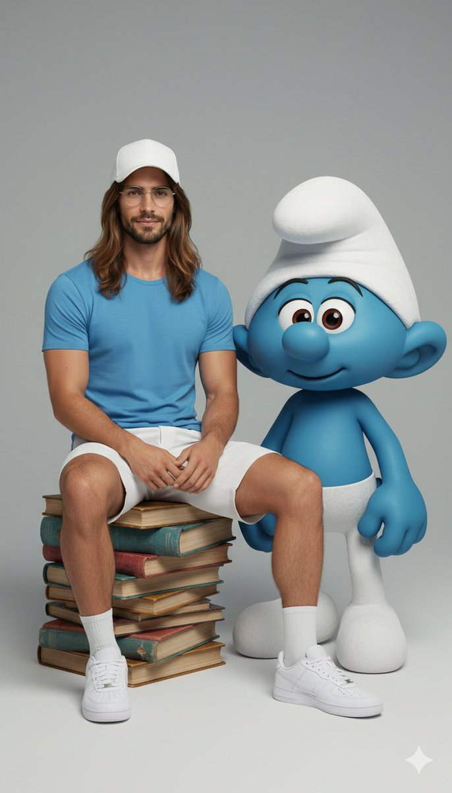

## 超逼真全身肖像与角色互动

- ID: gpt4o-405-zh-2
- Slug: prompt-405-zh-2
- 语言: zh
- 来源: [来源链接](https://x.com/iUllr/status/1985631195724431694)
- 样例图路径: images/part3/405.jpeg

### 提示词

```text
附图的超逼真全身肖像。
该人正在以{姿势/互动类型}与{虚构角色}互动。
摄影棚或中性环境，柔和的电影灯光，{可选调色板}。
该人物穿着{服装款式和颜色}，虚构人物保留其原有的外貌，包括肤色、服装和标志性特征。
表情和mood: {情感基调}，以逼真的纹理、逼真的光照、电影般的构图、高级时尚编辑品质捕捉。
```

### 样例图


## { "scene": { "location": "A bright, aesthetic cafe inter

- ID: gpt4o-391-en-1
- Slug: prompt-391-en-1
- 语言: en
- 来源: [来源链接](https://x.com/songguoxiansen/status/1981178596581658768)
- 样例图路径: images/part3/391.jpeg

### 提示词

```text
{
  "scene": {
    "location": "A bright, aesthetic cafe interior",
    "background": "Pastel-colored wall, a small potted plant on the table, window light"
  },
  "subject": {
    "age": "adult",
    "description": "East Asian woman, soft, wavy hair with air bangs",
    "wardrobe": "Cute pastel-colored blouse or off-the-shoulder top",
    "accessories": "Delicate layered necklaces, holding a latte or colorful drink",
    "pose": "Sitting at the table, leaning forward slightly, hands around the cup, as if listening intently",
    "expression": "Sweet, "first date" smile, slight head tilt, 'eye-smile'",
    "gaze": "Direct to camera (as if the viewer is her date)",
    "body_notes": "Photorealistic, realistic adult proportions; natural skin texture"
  },
  "camera": {
    "sensor": "full_frame",
    "focal_length_mm": 50,
    "aperture_f": 2.0,
    "shutter_s": 0.008,
    "iso": 250,
    "white_balance_k": 5600,
    "distance_m": 1.8,
    "camera_height_m": 1.4,
    "framing": "Medium close-up (chest-up), 'point-of-view' (POV) shot",
    "focus": "eye_detect_AF on nearest eye"
  },
  "lighting": {
    "key": "Large, soft window light from the front-side",
    "fill": "White bounce card or natural bounce from the table",
    "hair": "Gentle rim light",
    "catchlights": "Large, soft window catchlights",
    "notes": "Bright, airy, clean aesthetic"
  },
  "color_grade": {
    "style": "Ulzzang / 'Clean' aesthetic",
    "palette": "Pastels, white, skin tones; clear, luminous skin",
    "contrast": "Medium-low, clean shadows",
    "saturation": "Moderate, fresh"
  },
  "makeup": {
    "eyes": "Natural winged eyeliner ('puppy dog' style), highlighted aegyo-sal",
    "cheeks": "Peach gradient blush",
    "lips": "Glossy pink gradient lips"
  },
  "postprocess": {
    "retouch": "Professional 'glass skin' retouch (light, maintain pores)",
    "clarity": "Selective clarity on eyes, lips, and drink",
    "vignette": "Very subtle bright vignette"
  },
  "art_direction": {
    "mood": "Sweet, approachable, trendy, 'date' vibe",
    "keywords": ["photorealistic", "sweet girl", "cafe", "date", "Ulzzang", "eye-smile", "POV"]
  },
  "negative_prompts": [
    "nsfw",
    "underage look",
    "text or logos",
    "plastic doll skin",
    "cg",
    "3d render",
    "anime",
    "dark lighting",
    "sad expression"
  ]
}
```

### 样例图


## 咖啡厅室内女生

- ID: gpt4o-391-zh-2
- Slug: prompt-391-zh-2
- 语言: zh
- 来源: [来源链接](https://x.com/songguoxiansen/status/1981178596581658768)
- 样例图路径: images/part3/391.jpeg

### 提示词

```text
{
“场景”： {
“地点”：“明亮、美观的咖啡馆内部”，
“背景”：粉彩色的墙壁，桌上的一盆小植物，窗外的光线
}，
“主题”： {
“年龄”: “成人”
描述：东亚女性，头发柔软，微卷，留着蓬松的刘海。
“衣橱”： “可爱的粉彩色衬衫或露肩上衣”，
“配饰”：“精致的多层项链，配上一杯拿铁或色彩缤纷的饮品”，
“姿势”：“坐在桌旁，身体微微前倾，双手捧着杯子，仿佛在认真倾听”，
“表情”：“甜美的、‘初次约会’式的微笑，微微歪头，‘笑眼’”，
“凝视”：“直视镜头（仿佛观众是她的约会对象）”，
"body_notes": "逼真的成人比例；自然的皮肤纹理"
}，
“相机”： {
"传感器": "全帧",
"focal_length_mm": 50,
"aperture_f": 2.0,
"shutter_s": ​​0.008,
“iso”：250，
"white_balance_k": 5600,
"distance_m": 1.8,
"camera_height_m": 1.4,
“构图”：“中近景（胸部以上），‘主观’（POV）镜头”，
"focus": "eye_detect_AF on nearest eye"
}，
“灯光”： {
“关键”：“来自正面的大而柔和的窗户光线”，
“填充物”: “白色弹跳卡或桌面上的自然弹跳”，
“头发”：“柔和的边缘光”，
“眼神光”：“大而柔和的窗户眼神光”，
备注：明亮、通风、干净的美学风格
}，
"color_grade": {
"风格": "Ulzzang / 'Clean' 美学",
“调色板”：“柔和的粉彩色调、白色、肤色；清透、透亮的肌肤”，
“对比度”：“中低，干净的阴影”，
“饱和度”：“适中，清新”
}，
“化妆品”： {
“眼睛”：“自然上扬眼线（小狗眼线风格），高光卧蚕眼妆”，
“脸颊”: “蜜桃渐变腮红”
“嘴唇”： “亮粉色渐变唇妆”
}，
"后处理": {
“修图”：“专业‘玻璃肌’修图（轻微，保留毛孔）”
“清晰度”： “选择性地提高眼睛、嘴唇和饮料的清晰度”
“小景”： “非常微妙的明亮小景”
}，
“艺术指导”：{
“氛围”：“甜蜜、平易近人、时尚、‘约会’氛围”，
关键词：["写实", "甜美女孩", "咖啡馆", "约会", "韩系美女", "笑眼", "第一人称视角"]
}，
"negative_prompts": [
"nsfw",
“未成年样貌”，
“文字或标志”，
“塑料娃娃皮肤”，
“cg”，
“3D渲染”，
“日本动画片”，
“昏暗的照明”，
“悲伤的表情”
]
}
```

### 样例图


## { "scene": { "location": "Hyper-colorful studio", "backg

- ID: gpt4o-390-en-1
- Slug: prompt-390-en-1
- 语言: en
- 来源: [来源链接](https://x.com/songguoxiansen/status/1981178522988343619)
- 样例图路径: images/part3/390.jpeg

### 提示词

```text
{
  "scene": {
    "location": "Hyper-colorful studio",
    "background": "Pastel pink wall, decorated with 80s/90s retro toys (e.g., My Little Pony, Care Bears), vinyl records"
  },
  "subject": {
    "age": "adult",
    "description": "East Asian woman, rainbow pastel hair (wig), large, excited eyes",
    "wardrobe": "Layered pastel t-shirts (e.g., mint green over lavender), a pink tutu skirt, colorful striped leg warmers, pastel high-top sneakers",
    "accessories": "Excessive plastic jewelry: beaded necklaces, star bracelets, large bow in hair",
    "pose": "High-energy, mid-jump or one leg popped high, arms up in excitement, peace signs",
    "expression": "Hyper, excited, huge open-mouthed smile, 'genki'",
    "gaze": "Direct to camera, full of energy",
    "body_notes": "realistic adult proportions; natural skin texture"
  },
  "camera": {
    "sensor": "full_frame",
    "focal_length_mm": 35,
    "aperture_f": 4.0,
    "shutter_s": 0.008,
    "iso": 200,
    "white_balance_k": 5000,
    "distance_m": 3.0,
    "camera_height_m": 1.0,
    "framing": "Full body, capturing the dynamic pose",
    "focus": "eye_detect_AF on nearest eye"
  },
  "lighting": {
    "key": "Bright, even, "pop" lighting (on-axis beauty dish or ring flash)",
    "fill": "Two large softboxes on sides, eliminating shadows",
    "hair": "Simple top light",
    "catchlights": "Distinctive ring light catchlight",
    "notes": "High-key, flat, "magazine pop" style"
  },
  "color_grade": {
    "style": "Fairy Kei, 80s pastel-pop",
    "palette": "All pastels: pink, lavender, mint, yellow; bright, clear skin",
    "contrast": "Medium, very clean",
    "saturation": "High saturation on all pastels"
  },
  "makeup": {
    "eyes": "Bright pastel eyeshadow (e.g., blue), winged liner, glitter",
    "cheeks": "Bright pink blush, maybe small face stickers (e.g., stars)",
    "lips": "Bubblegum pink glossy lips"
  },
  "postprocess": {
    "retouch": "Clean skin",
    "clarity": "High clarity on all accessories and clothing layers",
    "dodge_burn": "Minimal, keep lighting flat and bright",
    "vignette": "None"
  },
  "art_direction": {
    "mood": "Hyper, energetic, nostalgic, colorful, bubbly",
    "keywords": ["Fairy Kei", "Harajuku", "pastel", "80s", "retro toys", "colorful", "bubbly"]
  },
  "negative_prompts": [
    "nsfw",
    "underage look",
    "text or logos",
    "plastic doll skin",
    "warped hands or extra fingers",
    "deformed limbs",
    "dark colors",
    "Goth",
    "sad expression"
  ]
}
```

### 样例图

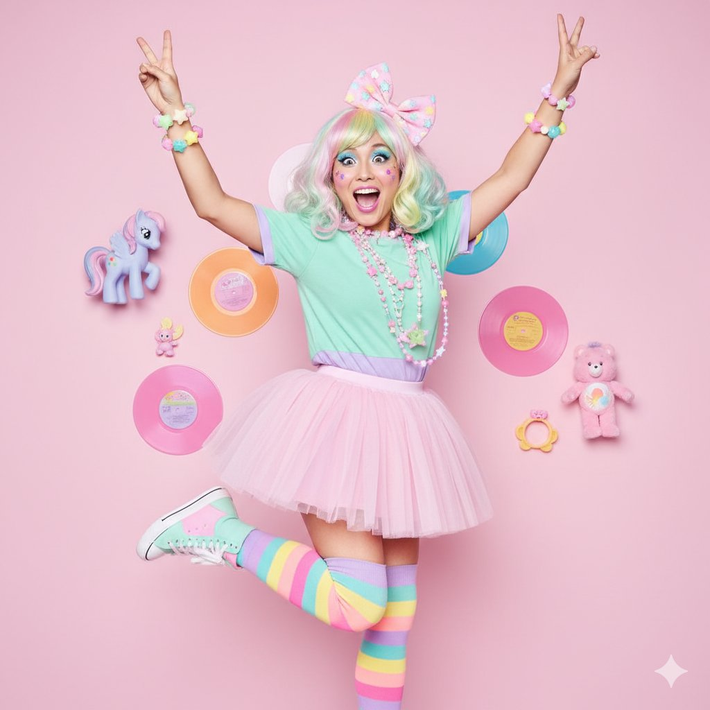

## 彩虹色发型女生

- ID: gpt4o-390-zh-2
- Slug: prompt-390-zh-2
- 语言: zh
- 来源: [来源链接](https://x.com/songguoxiansen/status/1981178522988343619)
- 样例图路径: images/part3/390.jpeg

### 提示词

```text
{
“场景”： {
“地点”：“色彩缤纷的工作室”，
“背景”：“粉色墙面，装饰着 80 年代/90 年代的复古玩具（例如，小马宝莉、爱心熊）、黑胶唱片”
}，
“主题”： {
“年龄”: “成人”
描述：东亚女性，彩虹色假发，大而兴奋的眼睛。
“衣橱”： “层叠的粉彩色T恤（例如，薄荷绿叠穿薰衣草色），粉色芭蕾舞裙，彩色条纹腿套，粉彩色高帮运动鞋”，
“配饰”：“过多的塑料首饰：串珠项链、星星手镯、头发上的大蝴蝶结”，
“姿势”：“充满活力，跳跃或单腿高高抬起，兴奋地举起双臂，比出和平手势”，
“表情”：“亢奋、兴奋、咧嘴大笑，‘元气’”，
“凝视”：“直视镜头，充满活力”，
"body_notes": "逼真的成人比例；自然的皮肤纹理"
}，
“相机”： {
"传感器": "全帧",
"focal_length_mm": 35,
"aperture_f": 4.0,
"shutter_s": ​​0.008,
“iso”：200，
"white_balance_k": 5000,
"distance_m": 3.0,
"camera_height_m": 1.0,
“构图”：“全身照，捕捉动态姿态”，
"focus": "eye_detect_AF on nearest eye"
}，
“灯光”： {
“关键”： “明亮、均匀、‘突出’的照明（轴向柔光罩或环形闪光灯）”，
“填充”：“两侧各有一个大型柔光箱，消除阴影”，
“头发”：“简单的顶光”，
“眼神光”： “独特的环形灯光眼神光”，
备注：高调、平淡、杂志流行风格
}，
"color_grade": {
“风格”：“仙女系，80年代粉彩流行”
“调色板”：“所有柔和的粉彩色调：粉色、薰衣草色、薄荷色、黄色；明亮、清透的肌肤”，
“对比度”：“中等，非常干净”，
“饱和度”：所有粉彩色调都具有高饱和度
}，
“化妆品”： {
“眼睛”：“明亮的粉彩色眼影（例如蓝色），上扬的眼线，闪粉”，
“脸颊”：“亮粉色腮红，也许可以贴一些小贴纸（例如星星）”，
“嘴唇”： “泡泡糖粉色亮泽嘴唇”
}，
"后处理": {
“修饰”: “干净的皮肤”，
“清晰度”：“所有配饰和服装层都具有高清晰度”，
"dodge_burn": "极简，保持光线平整明亮"
“小插曲”： “无”
}，
“艺术指导”：{
“情绪”： “亢奋、精力充沛、怀旧、色彩缤纷、活泼”
关键词：[“仙女系”、“原宿”、“粉彩”、“80年代”、“复古玩具”、“色彩缤纷”、“活泼”]
}，
"negative_prompts": [
"nsfw",
“未成年样貌”，
“文字或标志”，
“塑料娃娃皮肤”，
“畸形手或多余手指”，
“肢体畸形”，
“暗色”，
“哥特式”
“悲伤的表情”
]
}
```

### 样例图


## { "scene": { "location": "Themed 'Maid Cafe' interior, f

- ID: gpt4o-389-en-1
- Slug: prompt-389-en-1
- 语言: en
- 来源: [来源链接](https://x.com/songguoxiansen/status/1981178453216137391)
- 样例图路径: images/part3/389.jpeg

### 提示词

```text
{
  "scene": {
    "location": "Themed 'Maid Cafe' interior, focused and clean",
    "background": "Bright pink walls, checkered floor, subtle hearts and ruffle decorations (soft focus, no distracting elements)"
  },
  "subject": {
    "age": "adult",
    "description": "Realistic East Asian woman, dark hair in high twin-tails with ribbons, sparkling, energetic eyes",
    "wardrobe": "Classic black maid dress with a short skirt, pristine white frilly apron, knee-high white socks with bows",
    "accessories": "Frilly maid headband, ribbons in hair",
    "pose": "Full body, dynamic 'moe moe kyun' pose; both hands making a heart gesture, one foot popped, slight bow",
    "expression": "Extremely energetic, wide-eyed 'kawaii' smile, 'genki' (energetic) personality",
    "gaze": "Direct to camera, engaging and cheerful",
    "body_notes": "realistic adult proportions; natural skin texture"
  },
  "camera": {
    "sensor": "full_frame",
    "focal_length_mm": 35,
    "aperture_f": 2.8,
    "shutter_s": 0.008,
    "iso": 400,
    "white_balance_k": 5000,
    "distance_m": 3.0,
    "camera_height_m": 1.0,
    "framing": "Full body shot, slightly low angle to enhance cuteness and energy",
    "focus": "eye_detect_AF on nearest eye"
  },
  "lighting": {
    "key": "Bright, even, slightly flat studio lighting (simulating cafe interior)",
    "fill": "Large softboxes from both sides to eliminate shadows",
    "hair": "Top-down rim light to separate hair",
    "catchlights": "Multiple, large, bright catchlights",
    "notes": "Very bright, 'pop' lighting, high-key"
  },
  "color_grade": {
    "style": "Akihabara-pop, vibrant",
    "palette": "Bright pink, black, white; clear, bright skin",
    "contrast": "Medium, very clean and crisp",
    "saturation": "High saturation"
  },
  "makeup": {
    "eyes": "Emphasized 'anime' eyes, prominent aegyo-sal, long upper and lower lashes",
    "cheeks": "Bright pink, circular blush",
    "lips": "High-gloss pink or red lip tint"
  },
  "postprocess": {
    "retouch": "Clean skin retouching, "idol" level",
    "clarity": "High clarity on eyes, apron ruffles, and hair",
    "dodge_burn": "Dodge on eyes to make them sparkle",
    "vignette": "None"
  },
  "art_direction": {
    "mood": "Energetic, cheerful, adorable, welcoming",
    "keywords": ["maid cafe", "moe", "kawaii", "twin-tails", "heart gesture", "Akihabara"]
  },
  "negative_prompts": [
    "nsfw",
    "underage look",
    "text or logos",
    "plastic doll skin",
    "warped hands or extra fingers",
    "deformed limbs",
    "dark or moody",
    "French maid (Victorian)",
    "sad expression",
    "cluttered background",
    "photography equipment",
    "lighting equipment"
  ]
}
```

### 样例图

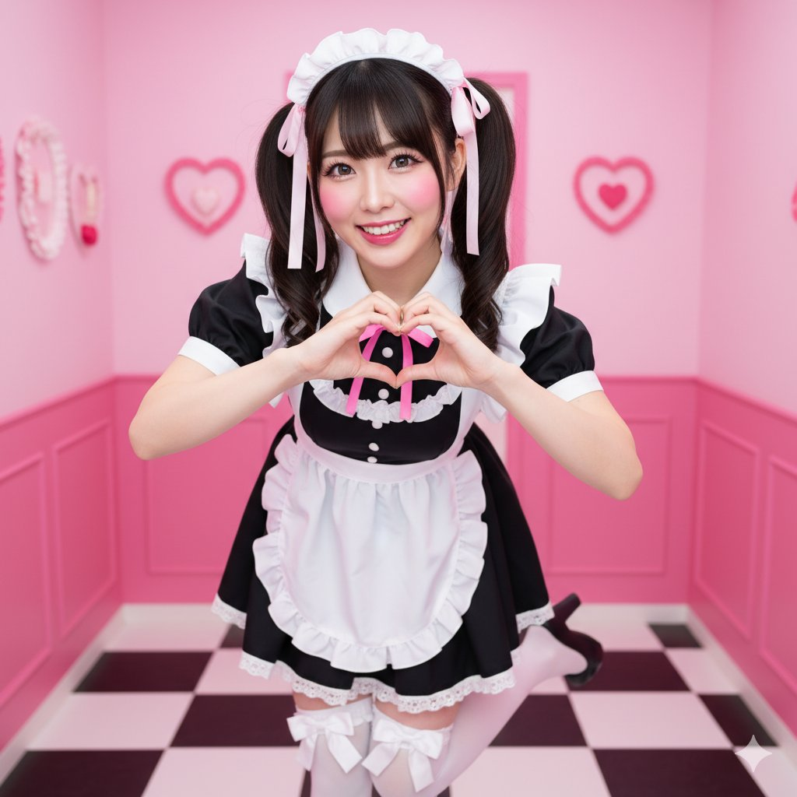

## 双马尾比心女生

- ID: gpt4o-389-zh-2
- Slug: prompt-389-zh-2
- 语言: zh
- 来源: [来源链接](https://x.com/songguoxiansen/status/1981178453216137391)
- 样例图路径: images/part3/389.jpeg

### 提示词

```text
{
“场景”： {
“地点”：“以女仆咖啡厅为主题的室内设计，简洁明了”，
“背景”：“亮粉色的墙壁，格子地板，精致的心形和褶皱装饰（柔焦，无分散注意力的元素）”
}，
“主题”： {
“年龄”: “成人”
“描述”：“一位写实的东亚女性，深色头发扎成高高的双马尾，用丝带系着，眼睛闪亮而充满活力。”
“服装”：“经典的黑色女仆装，短裙，洁白的褶边围裙，带蝴蝶结的白色过膝袜”，
“配饰”：“褶边女仆头带，头发上的丝带”，
“姿势”：“全身动态‘萌萌哒’姿势；双手比心，一只脚翘起，微微鞠躬”
“表情”：“活力四射，睁大眼睛露出‘可爱’的笑容，‘元气’（精力充沛）的性格”，
“眼神”：“直视镜头，专注而快乐”，
"body_notes": "逼真的成人比例；自然的皮肤纹理"
}，
“相机”： {
"传感器": "全帧",
"focal_length_mm": 35,
"aperture_f": 2.8,
"shutter_s": ​​0.008,
“iso”：400，
"white_balance_k": 5000,
"distance_m": 3.0,
"camera_height_m": 1.0,
“构图”：“全身照，略微低角度拍摄，以增强可爱和活力”，
"focus": "eye_detect_AF on nearest eye"
}，
“灯光”： {
“关键”： “明亮、均匀、略微平淡的影棚照明（模拟咖啡馆内部）”
“填充”：“从两侧使用大型柔光箱以消除阴影”，
“头发”： “自上而下的边缘光，用于分离头发”，
“眼神光”： “多个、大、明亮的眼神光”，
备注：非常明亮、流行风格的灯光，高调
}，
"color_grade": {
风格： “秋叶原流行，充满活力”
“调色板”：“亮粉色、黑色、白色；清透、明亮的肌肤”
“对比度”：“中等，非常干净清晰”，
“饱和度”: “高饱和度”
}，
“化妆品”： {
“眼睛”： “强调‘动漫’眼睛，突出卧蚕，上下睫毛长”，
“脸颊”：“亮粉色，圆形腮红”，
“唇部”： “高光泽粉色或红色唇彩”
}，
"后处理": {
“修图”：“干净的皮肤修图，‘偶像’级别”，
“清晰度”：“眼睛、围裙褶边和头发的清晰度很高”，
"dodge_burn": "在眼睛上加闪，使它们闪闪发光",
“小插曲”： “无”
}，
“艺术指导”：{
“情绪”：“充满活力、开朗、可爱、热情好客”
关键词：["女仆咖啡厅", "萌", "可爱", "双马尾", "爱心手势", "秋叶原"]
}，
"negative_prompts": [
"nsfw",
“未成年样貌”，
“文字或标志”，
“塑料娃娃皮肤”，
“畸形手或多余手指”，
“肢体畸形”，
“阴郁或忧郁的”，
“法国女仆（维多利亚时代）”
“悲伤的表情”，
“杂乱的背景”，
“摄影器材”，
“照明设备”
]
}
```

### 样例图


## { "scene": { "location": "Bright photo studio", "backgro

- ID: gpt4o-387-en-1
- Slug: prompt-387-en-1
- 语言: en
- 来源: [来源链接](https://x.com/songguoxiansen/status/1981178292276527584)
- 样例图路径: images/part3/387.jpeg

### 提示词

```text
{
"scene": {
    "location": "Bright photo studio",
    "background": "Solid, high-saturation macaroon pink seamless background"
  },
  "subject": {
    "age": "adult",
    "description": "East Asian woman, long curly caramel-colored hair with sparkling gold highlights, confident 'idol' gaze",
    "wardrobe": "Sparkly 'idol' stage outfit: pink plaid pleated skirt, cropped top with white lace trim, large bow on chest, sequin details",
    "accessories": "White lace wrist gloves, sparkly star-shaped hair clips, one hand holding a retro silver microphone (as a prop)",
    "pose": "Full body, classic idol pose: one hand on hip, other hand making a heart gesture near cheek, S-curve posture, confident",
    "expression": "Perfect, bright 'professional' smile, sparkling eyes, full of charm",
    "gaze": "Direct to camera (engaging with fans)",
    "body_notes": "realistic adult proportions; natural skin texture"
  },
  "camera": {
    "sensor": "full_frame",
    "focal_length_mm": 70,
    "aperture_f": 3.2,
    "shutter_s": 0.008,
    "iso": 100,
    "white_balance_k": 5200,
    "distance_m": 4.0,
    "camera_height_m": 1.1,
    "framing": "Full body shot, with enough space to show the pose",
    "focus": "eye_detect_AF on nearest eye"
  },
  "lighting": {
    "key": "Large ring flash, creating the iconic ring catchlight",
    "fill": "Two large softboxes on the sides, providing even, high-key 'K-pop' lighting",
    "hair": "Hard light from high-behind to create shiny hair highlights",
    "catchlights": "Clear ring-shaped catchlights",
    "notes": "High-key, bright, no shadows, emphasize sparkly texture of outfit"
  },
  "color_grade": {
    "style": "K-Pop / J-Pop Idol, high-key kawaii",
    "palette": "Bright pink, white, caramel; flawless 'glass skin'",
    "contrast": "Medium, very clean",
    "saturation": "High saturation, vibrant"
  },
  "makeup": {
    "eyes": "Stage makeup: thick false lashes, sparkly liquid eyeshadow, highlighted aegyo-sal",
    "cheeks": "Bright strawberry-pink blush",
    "lips": "High-gloss gradient 'juicy lips'"
  },
  "postprocess": {
    "retouch": "Highly refined skin retouching, but maintain pore texture (not plastic)",
    "clarity": "Enhance clarity on sequins, eyes, lips, and hair highlights",
    "dodge_burn": "Micro dodge on aegyo-sal, nose bridge, and collarbones",
    "vignette": "None, keep background clean"
  },
  "art_direction": {
    "mood": "Sparkly, confident, energetic, sweet idol",
    "keywords": ["idol", "K-Pop", "J-Pop", "stage outfit", "heart gesture", "sparkly"]
  },
  "negative_prompts": [
    "nsfw",
    "underage look",
    "text or logos",
    "plastic doll skin",
    "warped hands or extra fingers",
    "deformed limbs",
    "dark or moody lighting",
    "plain clothing",
    "sad expression"
  ]
}
```

### 样例图

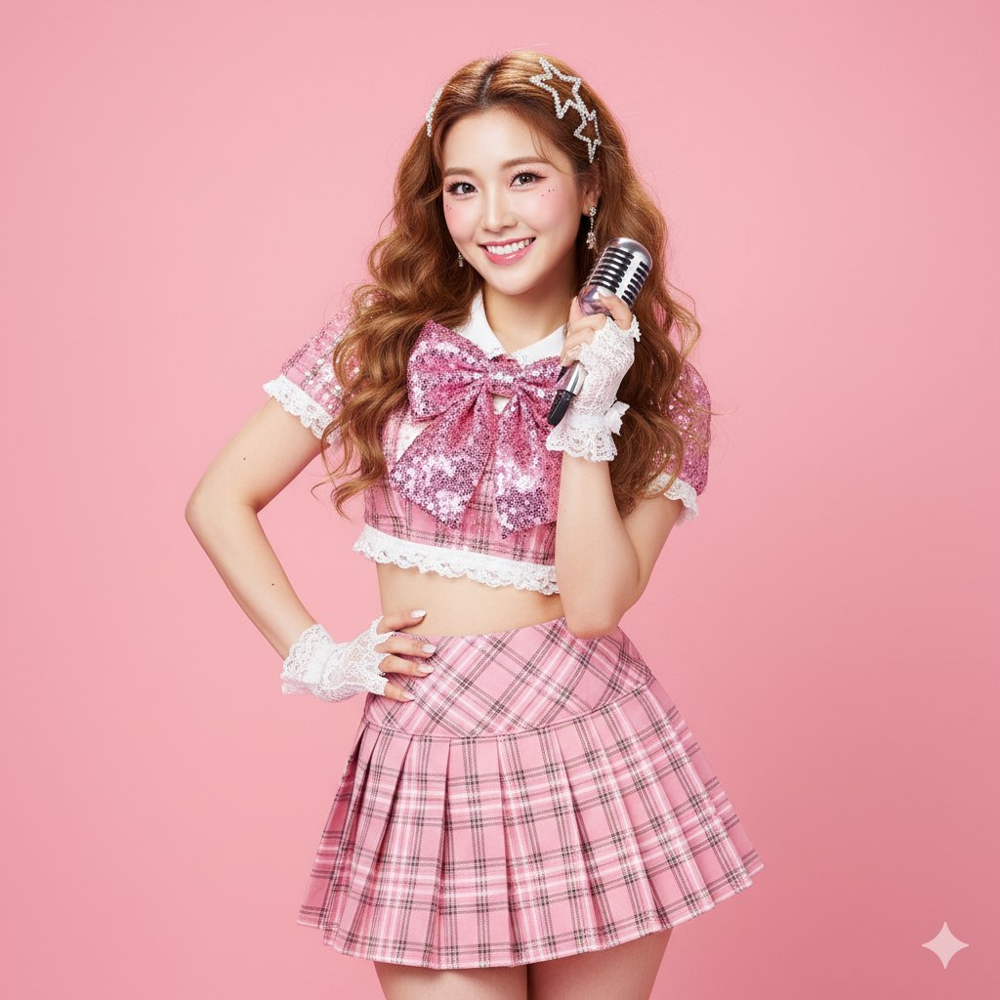

## 握着复古银色麦克风女生

- ID: gpt4o-387-zh-2
- Slug: prompt-387-zh-2
- 语言: zh
- 来源: [来源链接](https://x.com/songguoxiansen/status/1981178292276527584)
- 样例图路径: images/part3/387.jpeg

### 提示词

```text
{
“场景”： {
"location": "明亮摄影工作室",
"background": "纯色、高饱和度的马卡龙粉色无缝背景"
}，
“主题”： {
"年龄": "成人",
"description": "东亚女性，长长的卷曲焦糖色头发，带有闪亮的金色亮点，自信的“偶像”目光",
"wardrobe": "闪亮的‘偶像’舞台装：粉色格子百褶裙，白色蕾丝边短款上衣，胸前大蝴蝶结，亮片细节",
"accessories": "白色蕾丝腕手套，闪亮的星形发夹，一只手拿着复古的银色麦克风（作为道具）",
"pose": "全身，经典偶像姿势：一只手叉腰，另一只手在脸颊附近做爱心手势，S 形曲线，自信",
"expression": "完美、灿烂的‘专业’笑容，闪亮的眼睛，充满魅力",
"gaze": "直视镜头（与粉丝互动）",
"body_notes": "逼真的成人比例；自然的皮肤纹理"
}，
“相机”： {
“传感器”：“全帧”，
"焦距毫米": 70,
"aperture_f": 3.2,
“shutter_s”：0.008，
"iso": 100,
"白平衡k": 5200,
“距离米”：4.0，
"camera_height_m": 1.1,
"framing": "全身照，留出足够的空间来展示姿势",
“focus”：“eye_detect_AF 在最近的眼睛上”
}，
“灯光”： {
"key": "大型环形闪光灯，营造标志性的环形眼神光",
"fill": "两侧有两个大型柔光箱，提供均匀、高调的“K-pop”照明",
"hair": "从高处照射强光，打造闪亮的头发亮点",
"catchlights": "透明环形眼神光",
"notes": "高调、明亮、无阴影，强调服装的闪亮质感"
}，
“颜色等级”：{
"style": "K-Pop / J-Pop 偶像，高调可爱",
"palette": "亮粉色、白色、焦糖色；完美无瑕的‘玻璃肌肤’",
"contrast": "中等，非常干净",
"saturation": "高饱和度，鲜艳"
}，
“化妆品”： {
"eyes": "舞台妆：浓密的假睫毛、闪亮的液体眼影、高光的撒娇眼影",
"cheeks": "明亮的草莓粉色腮红",
"lips": "高光渐变‘水润双唇’"
}，
“后处理”：{
"retouch": "高度精致的皮肤修饰，但保持毛孔纹理（不是塑料）",
"clarity": "增强亮片、眼睛、嘴唇和头发亮点的清晰度",
"dodge_burn": "对撒娇、鼻梁和锁骨进行微减淡",
"vignette": "无，保持背景干净"
}，
“艺术指导”：{
"mood": "闪亮、自信、活力、甜美的偶像",
"keywords": ["偶像", "K-Pop", "J-Pop", "舞台服装", "心形手势", "闪亮"]
}，
"negative_prompts": [
“nsfw”，
“未成年的样子”，
“文字或徽标”，
“塑料娃娃皮肤”，
“弯曲的手或多余的手指”，
“畸形肢体”，
“昏暗或阴郁的灯光”，
“便衣”，
“悲伤的表情”
]
}
```

### 样例图


## A 3D chibi-style vinyl collectible figure of [CHARACTER 

- ID: gpt4o-382-en-1
- Slug: prompt-382-en-1
- 语言: en
- 来源: [来源链接](https://x.com/Arminn_Ai/status/1982860799879114903)
- 样例图路径: images/part3/382.jpeg

### 提示词

```text
A 3D chibi-style vinyl collectible figure of [CHARACTER NAME] Big head, small body, cartoon proportion, Standing inside a Youtooz-style
packaging box with: Transparent front window
"YOUTOOZ COLLECTIBLES" logo on the top
Number label ([#XXX]) on the top-left
Bottom front text: “[CHARACTER NAME]” and lower with smaller font “VINYL FIGURE”
Cartoon 2D illustration of [CHARACTER NAME] on the side of the box ([ILLUSTRATION DESCRIPTION])

Background/theme:
[BOX COLORS + TEXTURES + ICONIC MOTIFS RELATED TO CHARACTER] 
[Figure POSE OR GESTURE] 
[Outfit DESCRIPTION + SIGNATURE ITEMS]

Face details: The facial features (mouth/eyes/details) must be fully 3D sculpted, not flat or printed.
Lighting: clean product photography look, minimal soft shadows
Style: vinyl-toy aesthetic with a mix of matte + glossy accents depending on costume, Composition: 3/4 product shot view, full box visible. The entire packaging box must be fully visible inside the frame with a clean margin around all edges.
```

### 样例图

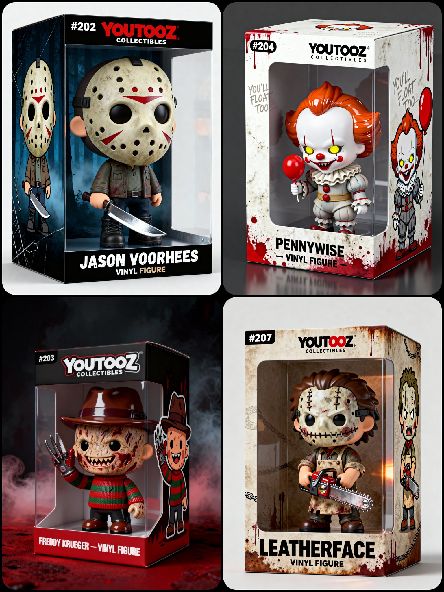

## 3D chibi风格乙烯基收藏品

- ID: gpt4o-382-zh-2
- Slug: prompt-382-zh-2
- 语言: zh
- 来源: [来源链接](https://x.com/Arminn_Ai/status/1982860799879114903)
- 样例图路径: images/part3/382.jpeg

### 提示词

```text
3D chibi 风格乙烯基收藏品 [CHARACTER NAME] 大头，小身体，卡通比例，站在 Youtooz 风格的
包装盒带有：透明前窗
顶部有“YOUTOOZ COLLECTIBLES”标志
左上角的数字标签（[#XXX]）
底部文字：“[CHARACTER NAME]” 下方用较小的字体写着“VINYL FIGURE”
盒子侧面的 [角色名称] 卡通 2D 插图（[插图描述]）

背景/主题：
[盒子颜色 + 纹理 + 与角色相关的标志性图案]
[人物姿势或手势]
[服装描述 + 标志性物品]

面部细节：面部特征（嘴巴/眼睛/细节）必须完全 3D 雕刻，而不是平面或印刷的。
灯光：干净的产品摄影外观，最小的柔和阴影
风格：搪胶玩具美学，根据服装搭配哑光和亮光元素。构图：3/4 产品视角，完整包装盒清晰可见。整个包装盒必须在框架内完全可见，所有边缘均留有清晰的空白。
```

### 样例图


## 超级马里奥风格照片

- ID: gpt4o-348-zh
- Slug: prompt-348-zh
- 语言: zh
- 来源: [来源链接](https://x.com/songguoxiansen/status/1971764229070884990)
- 样例图路径: images/part3/348.jpeg

### 提示词

```text
生成一张图片，人物头戴红色帽子，帽上有白色圆圈加红色 “M” 标志；上身是红色短袖，下身搭配蓝色背带裤，裤上有黄色圆形装饰扣，穿着红色的袜子还原度高，道具丰富多样。
```

### 样例图


## { "style": "High-key studio portrait, direct flash aesth

- ID: gpt4o-333-en-1
- Slug: prompt-333-en-1
- 语言: en
- 来源: [来源链接](https://x.com/IamEmily2050/status/1975554358495654236)
- 样例图路径: images/part3/333.jpeg

### 提示词

```text
{
  "style": "High-key studio portrait, direct flash aesthetic, East Asian social media style (e.g., Ulzzang, Douyin), stylized beauty retouching.",
  "output": {
    "color_profile": "sRGB",
    "render_intent": "photo"
  },
  "subject": {
    "category": "human",
    "gender_presentation": "female",
    "ethnicity": "East Asian (e.g., Korean, Chinese)",
    "age_bracket": "young_adult",
    "body": {
      "build": "slim",
      "proportions": "natural human anatomy",
      "posture": "relaxed on sofa, seated casually",
      "pose": "seated, legs crossed and tucked close to body",
      "gesture": "Right hand raised, fingers loosely curled, back of fingers/knuckles gently supporting the chin and lower cheek.",
      "head_tilt_deg": 5
    },
    "face": {
      "expression": "Playful, alluring",
      "gaze": "right eye direct to camera",
      "eye_action": "winking with the left eye",
      "skin_tone": "Very pale porcelain (lightened aesthetic)",
      "makeup": "Stylized K-Beauty/Douyin look: flawless matte base, strong pink blush high on cheeks, pink gradient lips, defined brows, light eyeliner, emphasized Aegyo-sal",
      "features": "small beauty mark/mole under the left eye"
    },
    "hair": {
      "length": "long",
      "style": "messy high updo/bun with loose strands and curtain bangs",
      "color": "dark brown"
    },
    "wardrobe": {
      "top": "white fitted cropped camisole",
      "outerwear": "light gray zip hoodie, worn open and slightly slipping off both shoulders",
      "bottom": "white lounge shorts with drawstring",
      "footwear": "barefoot"
    }
  },
  "environment": {
    "location": "studio or minimalist interior",
    "set": "black leather sofa against a plain white or light gray wall",
    "props": "Silver laptop (Apple MacBook, logo visible) placed on the cushion to the subject's right (camera left)"
  },
  "lighting": {
    "key": {
      "source": "strobe/flash",
      "modifier": "Bare reflector or direct flash (hard source)",
      "position": "Near camera axis, slightly camera-right and above eye line",
      "effect": "Crisp, dark, well-defined cast shadows on the wall directly behind subject; strong specular highlights on skin and sofa leather."
    },
    "fill": {
      "type": "minimal/none"
    },
    "ambient": "suppressed",
    "white_balance_K": 5800
  },
  "camera": {
    "system": "Digital Camera",
    "sensor": "full-frame equivalent",
    "lens": {
      "type": "prime",
      "focal_length_mm": 50
    },
    "exposure": {
      "iso": 100,
      "aperture_f": 4.0,
      "metering": "Bright exposure, high-key aesthetic"
    },
    "focus": {
      "target": "near eye (right eye)",
      "depth_of_field": "moderate"
    },
    "framing": {
      "orientation": "vertical",
      "crop": "mid-thigh to head with room above hair",
      "angle": "eye-level",
      "composition": "subject centrally framed"
    }
  },
  "color_grade": {
    "look": "Bright, clean, slightly cool tone",
    "contrast": "High contrast",
    "saturation": "moderate, emphasized pinks"
  },
  "postprocess": {
    "noise_reduction": "high",
    "texture": "Highly smoothed skin, poreless appearance ('porcelain doll' or 'beauty filter' effect)",
    "sharpen": "selective on eyes/lashes",
    "blemish_control": "Complete removal of all blemishes and texture."
  },
  "quality_targets": [
    "accurate limb lengths and joint angles",
    "correct finger count and articulation",
    "realistic fabric tension and folds",
    "accurate winking expression"
  ],
  "negative_prompt": [
    "no altered or exaggerated body proportions",
    "no extra or fused fingers",
    "no realistic skin texture, pores, or blemishes",
    "no text or watermarks (excluding specified logos)",
    "no extreme wide-angle distortion",
    "no NSFW content",
    "no dark/moody lighting",
    "no warm tones"
  ]
}
```

### 样例图

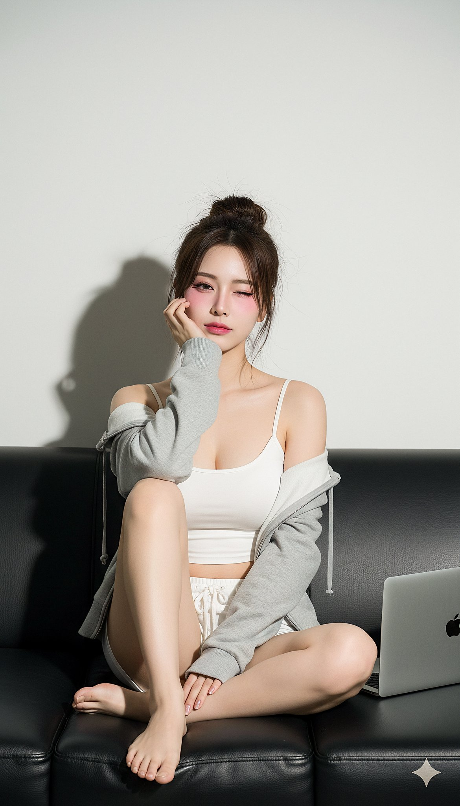

## 女生坐沙发上

- ID: gpt4o-333-zh-2
- Slug: prompt-333-zh-2
- 语言: zh
- 来源: [来源链接](https://x.com/IamEmily2050/status/1975554358495654236)
- 样例图路径: images/part3/333.jpeg

### 提示词

```text
{
"style": "高调影棚人像，闪光灯直击美感，东亚社交媒体风格（例如Ulzzang、抖音），风格化美颜修图。",
“输出”： {
"color_profile": "sRGB",
"render_intent": "照片"
}，
“主题”： {
“类别”：“人类”，
"gender_presentation": "女性",
"ethnicity": "东亚人（例如韩国人、中国人）",
"age_bracket": "young_adult",
“身体”： {
"build": "slim",
"比例": "自然人体解剖学",
"posture": "放松地坐在沙发上，随意地坐着",
"pose": "坐着，双腿交叉，身体紧贴身体",
"gesture": "右手举起，手指松散地卷曲，手指背面/指关节轻轻支撑下巴和下脸颊。",
“头部倾斜度”：5
}，
“脸”： {
"expression": "俏皮、诱人",
"gaze": "右眼直视相机",
"eye_action": "用左眼眨眼",
"skin_tone": "非常苍白的瓷器（明亮的美学）",
"makeup": "风格化的韩妆/抖音妆容：完美哑光底妆，脸颊上浓重的粉色腮红，粉色渐变唇妆，清晰的眉毛，淡淡的眼线，强调的撒娇，
"features": "左眼下方有一颗小美人痣"
}，
“头发”： {
"length": "长",
"style": "凌乱的高髻/发髻，散落的发束和窗帘刘海",
“颜色”：“深棕色”
}，
“衣柜”： {
"top": "白色修身短款吊带背心",
“外套”：“浅灰色拉链连帽衫，敞开穿着，双肩略微滑落”，
"bottom": "白色抽绳休闲短裤",
“鞋类”：“赤脚”
}
}，
“环境”： {
"location": "工作室或简约室内",
"set": "黑色皮沙发搭配纯白色或浅灰色墙壁",
"props": "银色笔记本电脑（Apple MacBook，标志可见）放置在拍摄对象右侧的垫子上（相机左侧）"
}，
“灯光”： {
“钥匙”： {
"source": "频闪/闪光",
"modifier": "裸露的反射器或直接闪光（硬源）",
"position": "靠近相机轴，略微位于相机右侧且高于视线",
"effect": "拍摄对象正后方的墙壁上投射出清晰、暗淡、轮廓分明的阴影；皮肤和沙发皮革上出现强烈的镜面高光。"
}，
“充满”： {
“类型”：“最小/无”
}，
“环境”：“抑制”，
“白平衡K”：5800
}，
“相机”： {
"system": "数码相机",
“传感器”：“全画幅等效”，
“镜片”： {
“类型”：“主要”，
“焦距毫米”：50
}，
“接触”： {
"iso": 100,
"aperture_f": 4.0,
“测光”：“明亮的曝光，高调的美感”
}，
“重点”： {
"target": "近眼（右眼）",
"depth_of_field": "中等"
}，
“框架”：{
“方向”：“垂直”，
"crop": "从大腿中部到头部，头发上方有空间",
"角度": "视线水平",
"composition": "主体居中"
}
}，
“颜色等级”：{
"look": "明亮、干净、略带冷色调",
"contrast": "高对比度",
“饱和度”：“中等，强调粉红色”
}，
“后处理”：{
"noise_reduction": "高",
"texture": "肌肤高度光滑，无毛孔外观（‘瓷娃娃’或‘美颜滤镜’效果）",
“锐化”：“选择性地针对眼睛/睫毛”，
"blemish_control": "彻底去除所有瑕疵和纹理。"
}，
"质量目标": [
“准确的肢体长度和关节角度”，
“正确的手指计数和发音”，
“逼真的织物张力和褶皱”，
“精准的眨眼表情”
]，
"negative_prompt": [
“没有改变或夸大身体比例”，
“没有多余的或融合的手指”，
“没有真实的皮肤纹理、毛孔或瑕疵”，
“无文字或水印（指定徽标除外）”，
“没有极端的广角畸变”，
“禁止 NSFW 内容”，
“没有黑暗/忧郁的灯光”，
“没有暖色调”
]
}
```

### 样例图


## { "scene": { "environment": { "location_type": "modern g

- ID: gpt4o-331-en-1
- Slug: prompt-331-en-1
- 语言: en
- 来源: [来源链接](https://x.com/IamEmily2050/status/1974108838929576299)
- 样例图路径: images/part3/331.jpeg

### 提示词

```text
{
  "scene": {
    "environment": {
      "location_type": "modern gallery hallway",
      "left_wall": "black-and-white optical swirl mural, matte finish",
      "right_wall": "framed monochrome manga panels with sparse Japanese onomatopoeia",
      "floor": "light gray polished tile with 2x2 m matte gray vinyl sheet under subject to kill reflections",
      "depth": "short corridor depth with subtle falloff",
      "clutter": "none"
    },
    "time": "indoors, artificial light",
    "mood": "cool, composed, slightly mysterious",
    "color_palette": "neutral-cool grays, olive top, desaturated denim blues"
  },
  "subject": {
    "type": "human",
    "gender": "female",
    "approx_age": "early 20s",
    "appearance": {
      "skin_tone": "fair-light with neutral undertone",
      "hair": "jet-black, very long, straight, center part; clean specular sheen",
      "face": "oval face, soft makeup, subtle gloss on lips, light eyeliner and mascara",
      "earrings": "large silver hoop earrings"
    },
    "wardrobe": {
      "top": "fitted olive/khaki ribbed tank with small rhinestone cross motifs (check glue before shoot)",
      "bottom": "high-waisted distressed denim shorts with heavy frayed hem and beige repair patches (tape rear hem flat)",
      "footwear": "out_of_frame"
    },
    "pose": {
      "stance": "leans back and slightly left with head resting against mural wall",
      "torso": "relaxed, angled 10–15° to camera",
      "arms_hands": "right arm behind torso/out_of_frame, left arm relaxed by side",
      "expression": "calm, neutral-to-soft gaze past camera",
      "chin": "slightly down; head tilt toward left shoulder"
    }
  },
  "framing_composition": {
    "shot_type": "mid-thigh portrait (three-quarter length)",
    "orientation": "vertical",
    "framing": "subject placed on left third; right third shows manga panels",
    "leading_lines": "doorframe/panel edges vertical; swirl mural adds texture without overpowering subject",
    "background_separation": "subtle; background softly defocused but still readable"
  },
  "camera": {
    "sensor": "full-frame mirrorless",
    "lens": {
      "focal_length_mm": 50,
      "type": "prime",
      "character": "neutral rendering, low distortion"
    },
    "settings": {
      "aperture": "f/3.2",
      "shutter_speed": "1/250",
      "iso": 400,
      "white_balance": "custom grey-card @ 4600 K",
      "focus": "eye-AF + 3-frame focus bracket (±1 cm)",
      "stabilisation": "IBIS on"
    },
    "perspective": "camera at chest level; minimal keystoning; maintain straight verticals"
  },
  "lighting": {
    "key": "broad, soft overhead/ceiling panel light",
    "fill": "60×60 cm white bounce 30 cm below bust line, ~1.3 stops under key",
    "rim": "narrow 1×2 ft strip-light behind subject camera-right, ½ stop over key",
    "quality": "soft, diffuse; no hard shadows",
    "exposure_target": "skin at ~65 IRE; rhinestones clipped < 90 IRE",
    "specular_control": "micro-specular on hair; avoid plastic skin sheen"
  },
  "rendering_intent": {
    "photorealism": "high",
    "texture": "retain fabric weave, denim fray strands, hair strands",
    "background_text_policy": "allow only existing manga panel text; do not invent extra signage or captions"
  },
  "post_processing": {
    "color_grade": "neutral-cool base with gentle contrast curve; slight cyan in shadows, warm bias on skin",
    "tone_curve": "soft S-curve (lift shadows +3, compress highlights -5)",
    "clarity_texture": "clarity -5 on skin via masked adjustment; texture +5 on denim/frayed hem only (separate mask)",
    "noise_reduction": "luma 10, chroma 15",
    "sharpening": "amount 40, radius 0.7, detail 25, masking 60 (protect background)",
    "vignette": "subtle -0.1 EV centre-weighted",
    "geometry": "verticals upright; crop 4:5 with space above head and right-side manga visible",
  }
```

### 样例图

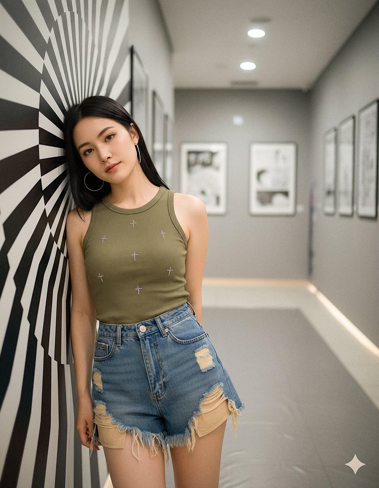

## 走廊上的女性

- ID: gpt4o-331-zh-2
- Slug: prompt-331-zh-2
- 语言: zh
- 来源: [来源链接](https://x.com/IamEmily2050/status/1974108838929576299)
- 样例图路径: images/part3/331.jpeg

### 提示词

```text
{
“场景”： {
“环境”： {
"location_type": "现代画廊走廊",
"left_wall": "黑白光学漩涡壁画，哑光饰面",
"right_wall": "带有稀疏日语拟声词的单色漫画面板",
“地板”：“浅灰色抛光瓷砖，铺有 2x2 米哑光灰色乙烯基板，以消除反射”，
"depth": "短走廊深度，具有微妙的衰减",
“杂乱”：“无”
}，
"time": "室内，人造光",
"mood": "冷静、沉着、略带神秘",
"color_palette": "中性冷灰色、橄榄色上衣、去饱和牛仔蓝"
}，
“主题”： {
“类型”：“人类”，
"性别": "女",
"approx_age": "20 岁出头",
“外貌”： {
"skin_tone": "白皙，中性底色",
“头发”：“乌黑，很长，直，中分；干净的镜面光泽”，
"face": "椭圆脸，淡妆，唇彩淡淡，眼线和睫毛膏淡淡的",
“耳环”：“大号银环耳环”
}，
“衣柜”： {
"top": "修身橄榄色/卡其色罗纹背心，饰有小水钻十字图案（拍摄前请检查胶水）",
"bottom": "高腰破洞牛仔短裤，下摆磨损严重，配有米色修片（后摆用胶带平整粘贴）",
“footwear”：“out_of_frame”
}，
“姿势”：{
"stance": "身体向后稍微向左倾斜，头靠在壁画上",
“躯干”：“放松，与相机呈 10-15° 角”，
"arms_hands": "右臂在躯干后方/超出框架，左臂在身体侧面放松",
“表情”：“平静、中性到柔和的目光穿过镜头”，
“下巴”：“稍微向下；头向左肩倾斜”
}
}，
“framing_composition”：{
"shot_type": "大腿中部肖像（四分之三长度）",
“方向”：“垂直”，
"framing": "主体放置在左边三分之一处；右边三分之一处显示漫画面板",
"leading_lines": "门框/面板边缘垂直；漩涡壁画增添了纹理，但又不会掩盖主题",
"background_separation": "微妙；背景轻微散焦但仍可读"
}，
“相机”： {
“传感器”：“全画幅无反光镜”，
“镜片”： {
"焦距毫米": 50,
“类型”：“主要”，
“character”：“中性渲染，低失真”
}，
“设置”： {
"光圈": "f/3.2",
"shutter_speed": "1/250",
“iso”：400，
"white_balance": "自定义灰卡 @ 4600 K",
"focus": "眼部自动对焦 + 3 帧对焦框 (±1 cm)",
“稳定”：“IBIS开启”
}，
“视角”：“摄像机位于胸部高度；最小梯形失真；保持垂直线”
}，
“灯光”： {
"key": "宽阔、柔和的顶灯/天花板面板灯",
"fill": "60×60 厘米白色反射镜，位于胸围线以下 30 厘米处，主光圈下方约 1.3 档",
"rim": "1×2 英尺窄条形灯位于拍摄对象相机右侧后方，比主光高出 ½ 档",
“质量”：“柔和，漫反射；无硬阴影”，
"exposure_target": "皮肤 ~65 IRE；水钻修剪 < 90 IRE",
"specular_control": "头发上的微镜面；避免塑料皮肤光泽"
}，
“渲染意图”：{
"照片写实主义": "高",
"texture": "保留织物编织、牛仔布磨损线、发丝",
"background_text_policy": "仅允许现有的漫画面板文本；不要发明额外的标志或标题"
}，
“后处理”：{
"color_grade": "中性冷色调，对比度曲线柔和；阴影中略带青色，皮肤上偏暖色",
"tone_curve": "柔和的 S 曲线（提升阴影 +3，压缩高光 -5）",
"clarity_texture": "通过蒙版调整，皮肤的清晰度为 -5；仅牛仔布/磨损下摆的纹理为 +5（单独蒙版）",
"noise_reduction": "亮度 10，色度 15",
"sharpening": "数量 40，半径 0.7，细节 25，遮罩 60（保护背景）",
"vignette": "微妙的 -0.1 EV 中央重点",
"geometry": "垂直竖直；裁剪比例为 4:5，头部上方有空间，右侧漫画可见",
}
```

### 样例图


## { "photorealistic_indoor_reclining_portrait", "style": "

- ID: gpt4o-330-en-1
- Slug: prompt-330-en-1
- 语言: en
- 来源: [来源链接](https://x.com/IamEmily2050/status/1976068430798389550)
- 样例图路径: images/part3/330.jpeg

### 提示词

```text
{
"photorealistic_indoor_reclining_portrait",
  "style": "Natural editorial portrait; lifelike texture; minimal, tasteful retouching.",
  "output": { "aspect_ratio": "9:16", "resolution_px": [1440, 2560], "color_profile": "sRGB" },

  "subject": {
    "category": "human",
    "gender_presentation": "female",
    "ethnicity": "East Asian",
    "age_bracket": "young_adult",
    "body": {
      "build": "slim with realistic proportions",
      "bust": "fuller bust (natural C–D cup), proportional to frame; gentle natural slope, supportive shaping—no extreme push-up",
      "skin_tone": "light neutral with natural variation"
    },
    "pose": {
      "orientation": "reclining on back, relaxed",
      "right_arm": "raised above head, fingers lightly touching hairline",
      "left_arm": "bent across torso, hand resting on midriff",
      "head": "slightly tilted toward camera left"
    },
    "face": {
      "shape": "oval with mild asymmetry and natural cheek volume",
      "expression": "soft and open",
      "gaze": "direct to camera"
    },
    "eyes": {
      "description": "natural-size, lively but realistic",
      "color": "neutral gray-blue (low saturation)",
      "size_ratio": { "iris_fraction_of_visible_eye": 0.29, "pupil_fraction_of_iris": 0.27 },
      "details": {
        "limbal_ring_strength": 0.08,
        "sclera_brightness_Lstar": 78,
        "sclera_texture": "fine veins and faint tear meniscus on lower lid",
        "catchlights": "two soft rectangular window reflections about 10% of iris width",
        "specular_quality": "satin (no glassy glare)",
        "iris_texture": "visible stromal fibers and subtle color noise"
      }
    },
    "makeup": "sheer base preserving pores; soft peach blush; brown mascara/liner; taupe eyeshadow; hydrated nude lips",
    "hair": { "length": "long", "style": "half-up with bun, slight wave; a few flyaways visible", "color": "natural black" },
    "wardrobe": {
      "outfit": "blue top with Gucci shorts",
      "top": "powder-blue cropped bustier with sweetheart neckline and structured cups; off-shoulder or slim straps; tasteful cleavage; opaque lined fabric; subtle corset seams; cropped length reveals a sliver of midriff",
      "bottom": "Gucci blue GG-monogram denim shorts (small-scale jacquard, navy/indigo on blue; correct 'GG' orientation; no extra text)",
      "accessories": {
        "jewelry": "thin black velvet choker with tiny pendant, small stud earrings, simple rings",
        "wrists": "white fabric scrunchie on right; delicate bracelets on left"
      }
    }
  },
     "environment": {
    "location": "bedroom",
    "set": "plush bed with slightly wrinkled off-white linens and pillows",
    "background_props": "upper right: dark round tray with small white ceramic tea set on textured brown surface"
  },

  "lighting": {
    "scheme": "window key + sheet bounce",
    "source": "large window through sheer curtains (or 120 cm softbox with double diffusion)",
    "quality": "very soft with defined direction",
    "direction": "45° from camera right and slightly top; white bedding as fill about 1.5 stops under key",
    "temperature": "5200K",
    "effect": "gentle modeling with soft nose/lip shadow; crisp but soft eye catchlights; no bloom"
  },

  "camera": {
    "sensor": "full-frame",
    "lens": { "focal_length_mm": 85 },
    "distance_m": 1.8,
    "exposure": {
      "aperture_f": 3.2,
      "iso": 200,
      "shutter_s": 0.005,
      "metering": "spot on cheekbone; ETTR then -0.3 EV to protect highlights on fabric"
    },
    "focus": {
      "target": "near eye",
      "depth_of_field": "moderate (eyes and bust plane in focus; bedding softly blurred)"
    },
    "framing": {
      "orientation": "vertical",
      "angle": "overhead with slight tilt toward face; avoid wide-angle distortion",
      "composition": "9:16 crop framed head to upper hips so bustier and Gucci shorts are visible without foreshortening"
    }
  },

  "color_grade": {
    "look": "true-to-life neutrals with blue accent",
    "contrast": "medium-low",
    "palette": "powder/indigo blues, ivory, soft brown",
    "notes": "retain skin undertones; avoid cyan cast; ensure Gucci blue reads clean without oversaturation"
  },

  "postprocess": {
    "skin": "retain pores and micro-shine; remove only transient blemishes; keep faint under-eye texture",
    "eyes": "no iris enlargement; subtle iris clarity and micro-contrast; limbal ring kept weak",
    "sharpen": "moderate on eyes/brows/hair strands and denim weave/monogram",
    "grain": "fine film grain at 1.5–2%",
    "effects": "disable beauty filters, frequency-separation blur, glow/bloom; no HDR skin"
  },

  "realism_cues": [
    "flyaway hairs around hairline",
    "subtle nasolabial and philtrum depth",
    "natural knuckle/tendon texture on left hand",
    "visible denim weave and aligned monogram on shorts",
    "fabric creases and bedding wrinkles"
  ],

  "negative_prompt": [
    "doll, BJD, porcelain skin, neotenous proportions, plastic/waxy texture",
    "oversized/anime/doe eyes, iris enlargement, glassy eyes",
    "bright cyan/ice-blue contacts, heavy limbal ring, unnaturally white sclera",
    "poreless skin, beauty filter, airbrushed, skin smoothing",
    "bloom/Orton glow, excessive skin luster",
    "CGI, 3D render, illustration, toon shading, LoRA: doll/BJD",
    "wide-angle facial distortion, extreme symmetry filter",
    "random text overlays, misspelled logos, watermarks",
    "see-through fabrics, wardrobe malfunction, underboob/sideboob, explicit NSFW",
    "distorted anatomy, extra fingers"
  ],

}
```

### 样例图

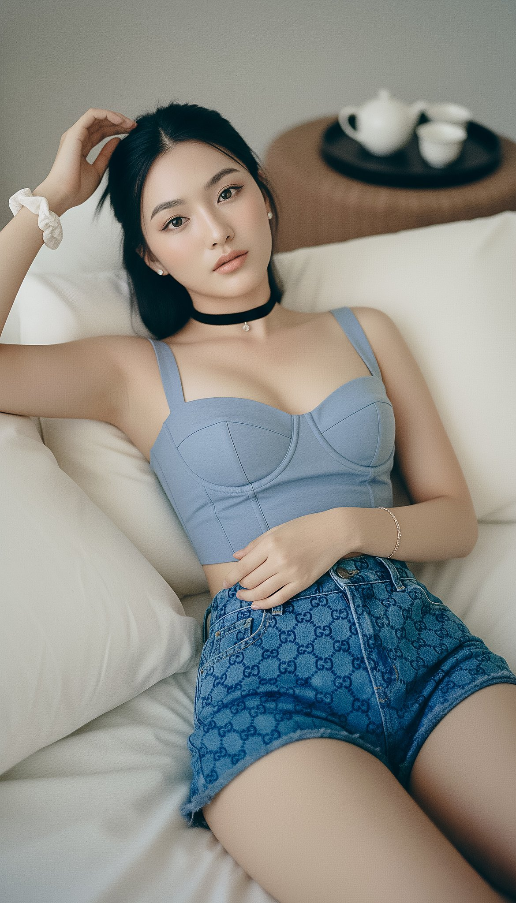

## 照片级真实感室内躺姿人像

- ID: gpt4o-330-zh-2
- Slug: prompt-330-zh-2
- 语言: zh
- 来源: [来源链接](https://x.com/IamEmily2050/status/1976068430798389550)
- 样例图路径: images/part3/330.jpeg

### 提示词

```text
{
"照片级真实感室内躺姿人像",
  "风格": "自然杂志风人像；逼真质感；简约且精致的修图（保留真实细节）",
  "输出参数": { "宽高比": "9:16", "分辨率（像素）": [1440, 2560], "色彩配置文件": "sRGB" },

  "拍摄主体": {
    "类别": "人物",
    "性别呈现": "女性",
    "人种": "东亚人",
    "年龄段": "年轻成人",
    "身形": {
      "体型": "纤瘦且比例真实",
      "胸部": "丰满（自然C-D罩杯），与整体身形比例协调；线条自然柔和，有承托感，无过度聚拢效果",
      "肤色": "浅中性色，带有自然肤色差异（非均匀色块）"
    },
    "姿势": {
      "整体姿态": "仰卧，姿态放松",
      "右臂": "举过头顶，手指轻触发际线",
      "左臂": "弯曲横过躯干，手搭在腹部",
      "头部": "略微向镜头左侧倾斜"
    },
    "面部": {
      "脸型": "椭圆形，略带不对称感，脸颊饱满度自然",
      "表情": "柔和、舒展",
      "目光": "直视镜头"
    },
    "眼部": {
      "描述": "大小自然，灵动且真实",
      "颜色": "中性灰蓝色（低饱和度）",
      "大小比例": { "虹膜占可见眼球比例": 0.29, "瞳孔占虹膜比例": 0.27 },
      "细节": {
        "虹膜边缘环清晰度": 0.08（近乎隐形）,
        "眼白亮度（L*值）": 78,
        "眼白质感": "细微血管，下眼睑有淡泪痕",
        "眼神光": "两处柔和的长方形窗户反光，宽度约为虹膜的10%",
        "光泽质感": "丝缎质感（无玻璃般的强光反射）",
        "虹膜纹理": "可见基质纤维，带有细微色彩颗粒感"
      }
    },
    "妆容": "轻薄底妆（保留毛孔）；柔和桃色腮红；棕色睫毛膏/眼线；灰褐色眼影；水润裸色唇膏",
    "发型": { "长度": "长发", "造型": "半扎丸子头，略带波浪；可见几根碎发", "颜色": "自然黑色" },
    "服饰": {
      "整体搭配": "蓝色上衣配古驰（Gucci）短裤",
      "上衣": "粉蓝色短款抹胸，心形领口，带立体罩杯；露肩或细肩带设计；领口弧度优雅；面料厚实不透视（带里衬）；带有精致束腰缝线；短款设计露出一小截腹部",
      "下装": "古驰（Gucci）蓝色双G提花牛仔短裤（小尺寸提花图案，藏青/靛蓝色花纹印于蓝色基底上；双G标志方向正确；无多余文字图案）",
      "配饰": {
        "珠宝": "黑色细天鹅绒项圈（带小巧吊坠）、小巧耳钉、简约戒指",
        "腕部饰品": "右手戴白色布艺发圈；左手戴精致手链"
      }
    }
  },

  "环境": {
    "场景": "卧室",
    "布景": "柔软的床，铺有略带褶皱的米白色床品和枕头",
    "背景道具": "右上角：深色圆形托盘（置于纹理棕色表面上），托盘内放有小型白色陶瓷茶具"
  },

  "光线": {
    "布光方案": "窗户主光+床单反光补光",
    "光源": "透过薄窗帘的大窗户（或120厘米双扩散柔光箱）",
    "光线质感": "极其柔和，且方向明确",
    "光线方向": "从镜头右侧45°角、略高于主体的位置入射；白色床品作为补光（亮度比主光低1.5档）",
    "色温": "5200K（标准白光）",
    "光影效果": "柔和的轮廓塑造（鼻子/唇部阴影自然）；清晰且柔和的眼神光；无光晕溢出"
  },

  "相机参数": {
    "传感器": "全画幅",
    "镜头": { "焦距（毫米）": 85 },
    "拍摄距离（米）": 1.8,
    "曝光参数": {
      "光圈值": 3.2,
      "感光度（ISO）": 200,
      "快门速度（秒）": 0.005（即1/200秒）,
      "测光方式": "点测光（测光点为颧骨）；向右曝光（ETTR）后降低0.3档曝光值，以保护面料高光细节"
    },
    "对焦": {
      "对焦目标": "靠近镜头一侧的眼睛",
      "景深": "中等（眼睛与胸部处于同一焦平面，保持清晰；床品轻微虚化）"
    },
    "构图": {
      "画面方向": "竖版",
      "拍摄角度": "俯拍，镜头略微向面部倾斜；避免广角畸变",
      "裁切比例": "9:16裁切，画面覆盖头部至髋部上方，确保抹胸与古驰短裤完整呈现，且无透视变形"
    }
  },

  "调色": {
    "风格": "真实中性色调，以蓝色为点缀色",
    "对比度": "中低",
    "色调 palette": "粉蓝/靛蓝色、米白色、柔和棕色",
    "注意事项": "保留皮肤原有底色；避免青蓝色色偏；确保古驰蓝色呈现纯净质感，无过度饱和"
  },

  "后期处理": {
    "皮肤处理": "保留毛孔与细微油光；仅去除临时瑕疵（如痘痘）；保留淡淡的眼下纹理",
    "眼部处理": "不放大虹膜；轻微增强虹膜清晰度与微对比度；保留弱虹膜边缘环",
    "锐化": "对眼睛/眉毛/发丝、牛仔面料纹理/提花图案进行适度锐化",
    "颗粒感": "添加1.5%-2%的细腻胶片颗粒",
    "效果禁用": "关闭美颜滤镜、频率分离模糊、光晕/柔光效果；不使用HDR皮肤处理"
  },

  "真实感细节提示": [
    "发际线处的碎发",
    "自然的鼻唇沟与人中立体感",
    "左手手指关节/肌腱的真实纹理",
    "短裤上清晰的牛仔面料纹理与对齐的提花图案",
    "面料褶皱与床品自然褶皱"
  ],

  "负面提示（需避免）": [
    "玩偶感、球形关节娃娃（BJD）、瓷娃娃质感皮肤、幼态化比例、塑料/蜡质质感",
    "过大眼睛/动漫眼/小鹿眼、虹膜放大、玻璃质感眼睛",
    "亮青色/冰蓝色美瞳、明显虹膜边缘环、不自然的雪白眼白",
    "无毛孔皮肤、美颜滤镜效果、磨皮过度、皮肤光滑失真",
    "光晕效果/奥顿柔光效果（Orton glow）、皮肤过度油光",
    "CGI效果、3D渲染、插画风格、卡通 shading、玩偶/球形关节娃娃（BJD）相关模型（LoRA）",
    "广角镜头面部畸变、过度对称滤镜效果",
    "随机文字叠加、logo拼写错误、水印",
    "透视装/面料过透、服饰走光、露下胸/侧胸、不雅内容（NSFW）",
    "肢体结构扭曲、多手指"
  ]
}
```

### 样例图


## Funko Pop–style vinyl figure of [CHARACTER NAME] Wearing

- ID: gpt4o-315-en-1
- Slug: prompt-315-en-1
- 语言: en
- 来源: [来源链接](https://x.com/Arminn_Ai/status/1969848678652547334)
- 样例图路径: images/part3/315.jpeg

### 提示词

```text
Funko Pop–style vinyl figure of [CHARACTER NAME] 
Wearing the iconic outfit and accessories typically associated with [CHARACTER], automatically matching their signature style and details.  

Pose/Expression:
- Standing, looking upward toward the camera  
- Expression: curious yet slightly nonchalant  

CAMERA & LENS:
- Camera positioned directly above, very close  
- Ultra-wide fisheye lens for dramatic perspective distortion  
- Gentle rounded frame edges  

LIGHTING & MATERIALS:
- Soft studio lighting with gentle shadows  
- Glossy vinyl figure texture for skin and hair  
- Outfit materials accentuated (e.g. quilted, shiny, matte, etc.) depending on [CHARACTER]’s clothing  

RENDER STYLE:
- High-resolution 3D render  
- Clean neutral background (solid or gradient)  
- Ultra sharp, collectible toy aesthetic
```

### 样例图

![Funko Pop–style vinyl figure of [CHARACTER NAME] Wearing](../images/part3/315.jpeg)

## Funko Pop风格乙烯基公仔

- ID: gpt4o-315-zh-2
- Slug: prompt-315-zh-2
- 语言: zh
- 来源: [来源链接](https://x.com/Arminn_Ai/status/1969848678652547334)
- 样例图路径: images/part3/315.jpeg

### 提示词

```text
[角色名称] 的 Funko Pop 风格乙烯基公仔
身着通常与 [角色] 相关联的标志性服装及配饰，其标志性风格与细节特征均自然呈现。
姿势 / 表情
站姿，抬头望向镜头
表情：好奇中略带漫不经心
相机与镜头
相机直接置于正上方，距离极近
超宽鱼眼镜头，营造极具张力的透视畸变效果
柔和的圆角画框边缘
光线与材质
柔和的工作室灯光，搭配自然阴影
公仔皮肤与头发采用亮面乙烯基材质质感
服装材质细节突出（如绗缝、亮面、哑光等），具体依 [角色] 的服饰特点而定
渲染风格
高分辨率 3D 渲染
简洁的中性背景（纯色或渐变色）
极致清晰的收藏级玩具美学风格
```

### 样例图

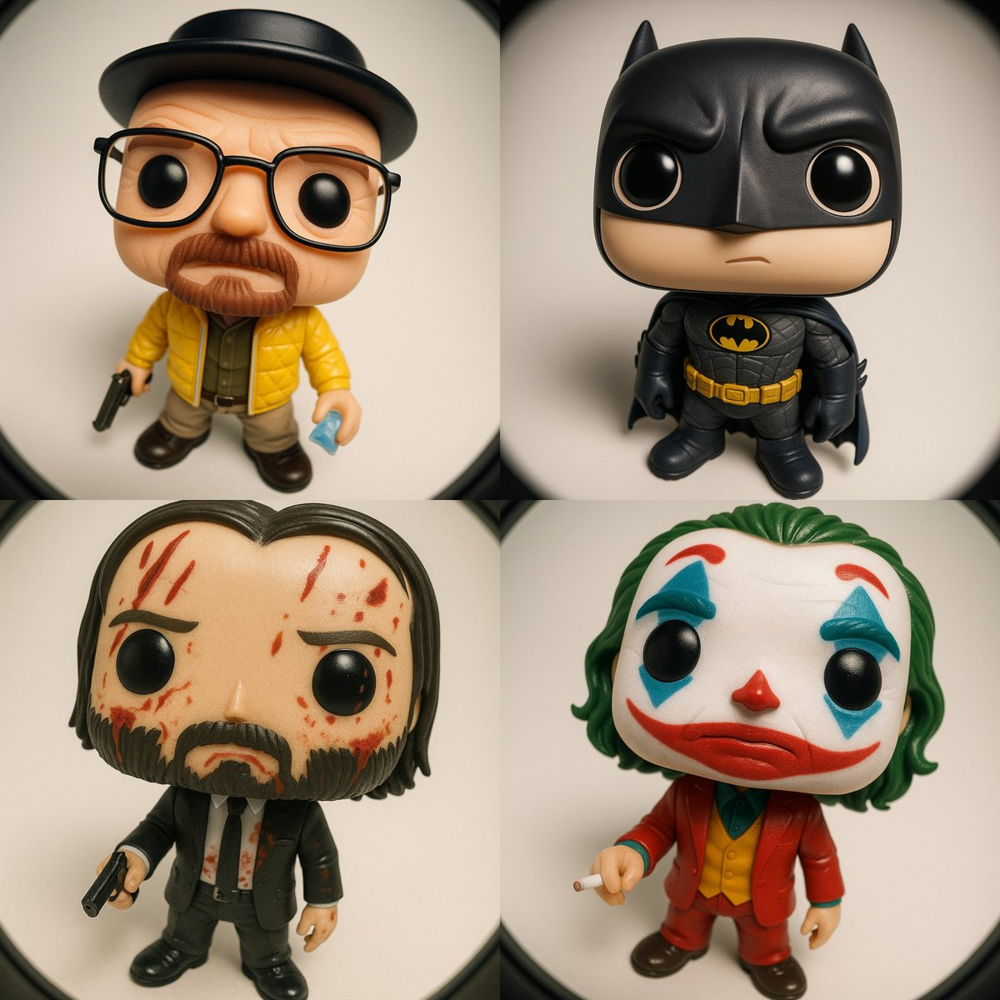

## A luxury [BRAND TYPE] brand advertisement featuring four

- ID: gpt4o-309-en-1
- Slug: prompt-309-en-1
- 语言: en
- 来源: [来源链接](https://x.com/Arminn_Ai/status/1967959906344112270)
- 样例图路径: images/part3/309.jpeg

### 提示词

```text
A luxury [BRAND TYPE] brand advertisement featuring four stylish [GIRLS / MEN], each posed in separate architectural window frames set, each shown in a waist-up mid-shot, fully inside the window frames, with hands and props naturally breaking the frame edges, but no legs or lower body visible, arranged in a theatrical and 2×2 symmetrical grid composition.

– one holding a [OBJECT 1] with [EXPRESSION AND ACCESSORIES]
– another holding a [OBJECT 2] with [EXPRESSION AND ACCESSORIES]
– another holding a [OBJECT 3] with [EXPRESSION AND ACCESSORIES]
– another holding a [OBJECT 4] with [EXPRESSION AND ACCESSORIES]

Each with expressive editorial facial poses, blending modern fashion with a sleek couture aesthetic.

Set against an elegant [BACKGROUND COLOR AND MATERIAL] backdrop with subtle textures, captured with bright high-fashion studio lighting that emphasizes contours, reflections, and luxury detailing.

The mood is glamorous, iconic, and prestigious, shot in the style of a high-end [BRAND TYPE] luxury campaign. 2:3 ar. all four frames clearly shown in full height, no cropping at the bottom or top.
```

### 样例图

![A luxury [BRAND TYPE] brand advertisement featuring four](../images/part3/309.jpeg)

## 奢侈品牌广告

- ID: gpt4o-309-zh-2
- Slug: prompt-309-zh-2
- 语言: zh
- 来源: [来源链接](https://x.com/Arminn_Ai/status/1967959906344112270)
- 样例图路径: images/part3/309.jpeg

### 提示词

```text
一则奢侈的 [品牌类型] 品牌广告，以四位时尚的 [女孩/男士] 为主角，每人摆出不同的建筑窗框姿势，每人都以半身向上的中景拍摄，完全在窗框内，手和道具自然地打破了框架边缘，但看不到腿或下半身，以戏剧性和 2×2 对称的网格构图排列。

– 一个人拿着[物体 1]，带着[表情和配饰]
– 另一人拿着 [物体 2]，带有 [表情和配饰]
– 另一人拿着 [物体 3] 和 [表情和配饰]
– 另一人拿着 [物体 4] 和 [表情和配件]

每个人都有富有表现力的面部姿势，将现代时尚与时尚的时装美学融为一体。

以优雅的 [背景颜色和材质] 背景为背景，具有微妙的纹理，并采用明亮的高级时尚工作室灯光，强调轮廓、反射和奢华细节。

拍摄风格为高端 [品牌类型] 奢侈品宣传活动，氛围迷人、标志性、尊贵。2:3 ar。四个画面均清晰地全高显示，底部或顶部均无裁剪。
```

### 样例图

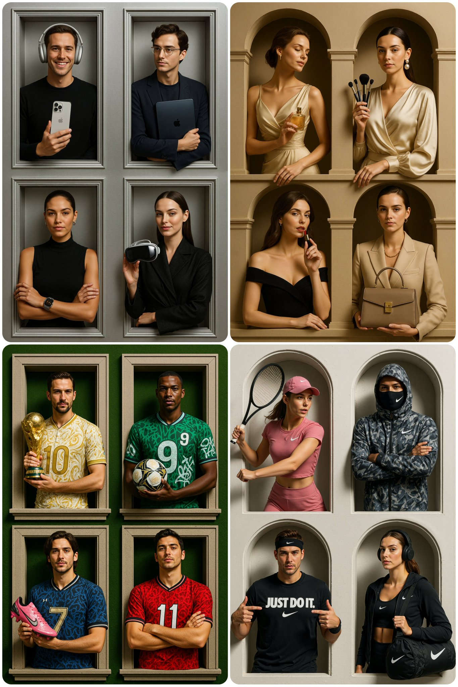

## Hyper-realistic 3D caricature of [NAME], featuring an ex

- ID: gpt4o-302-en-1
- Slug: prompt-302-en-1
- 语言: en
- 来源: [来源链接](https://x.com/TechieBySA/status/1966450411277058166)
- 样例图路径: images/part3/302.jpeg

### 提示词

```text
Hyper-realistic 3D caricature of [NAME], featuring an expressive, oversized head, a short body, and a detailed, energetic facial expression. Wearing [OUTFIT / SIGNATURE LOOK], striking a [POSE / ACTION]. Studio lighting, cartoonish proportions, Pixar-style 3D rendering, ultra-detailed fabric and skin textures. The body is slightly smaller than the head. 1080x1080 square format.
```

### 样例图

![Hyper-realistic 3D caricature of [NAME], featuring an ex](../images/part3/302.jpeg)

## 超写实3D漫画肖像

- ID: gpt4o-302-zh-2
- Slug: prompt-302-zh-2
- 语言: zh
- 来源: [来源链接](https://x.com/TechieBySA/status/1966450411277058166)
- 样例图路径: images/part3/302.jpeg

### 提示词

```text
[姓名] 的超写实3D漫画肖像，特点为表情丰富的超大头部、较短的身躯，以及细节丰富且充满活力的面部表情。人物身着 [服装 / 标志性造型]，摆出 [姿势 / 动作]。采用工作室灯光效果，呈现卡通化比例，运用皮克斯风格 3D 渲染技术，织物与皮肤纹理细节极致丰富。身躯比例略小于头部，画面为 1080x1080 的正方形格式。
```

### 样例图

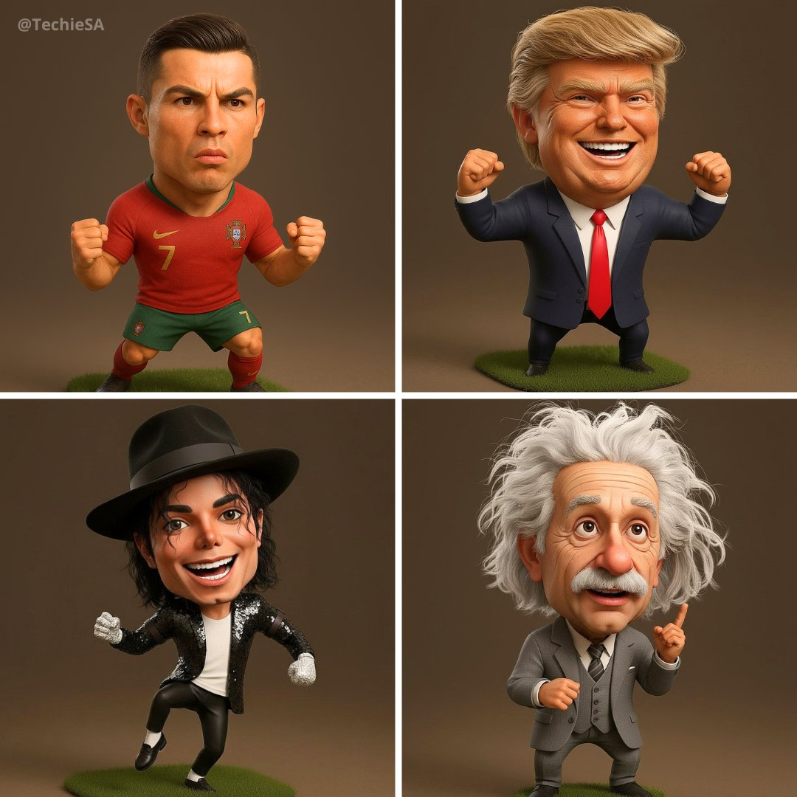

## A detailed transparent gashapon capsule diorama, held be

- ID: gpt4o-295-en-1
- Slug: prompt-295-en-1
- 语言: en
- 来源: [来源链接](https://x.com/TechieBySA/status/1964989870457438584)
- 样例图路径: images/part3/295.jpeg

### 提示词

```text
A detailed transparent gashapon capsule diorama, held between fingers, featuring [NAME] in their [ICONIC POSE / STYLE]. Inside: [short description of figure’s look, clothing, and accessories], with background elements such as [relevant setting: stadium, stage, lecture hall, etc.]. Lighting should be dramatic and cinematic, matching their theme (e.g., golden spotlight, concert glow, academic ambience). The capsule has a transparent top and a colored base (choose fitting color: e.g., royal blue, gold, black, red), decorated with [motifs related to the person]. The base is labeled with [NAME or NICKNAME] in a matching font style. The design should look like a miniature collectible, with photorealistic detail, soft bokeh, and a square 1080x1080 composition.
```

### 样例图

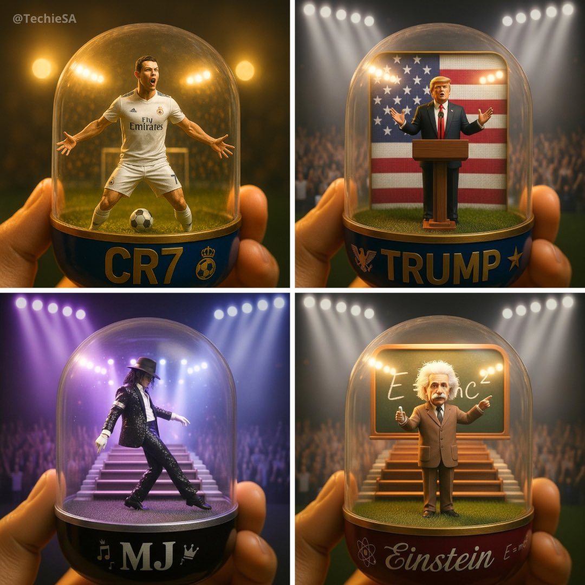

## 透明扭蛋场景模型

- ID: gpt4o-295-zh-2
- Slug: prompt-295-zh-2
- 语言: zh
- 来源: [来源链接](https://x.com/TechieBySA/status/1964989870457438584)
- 样例图路径: images/part3/295.jpeg

### 提示词

```text
一个详细的透明扭蛋场景模型，由手指捏握，扭蛋内呈现 [人物名称] 的 [标志性姿势 / 风格] 形象。
扭蛋内部细节：[简要描述人偶的外形、服饰及配饰]，背景元素包含 [相关场景：体育场、舞台、讲堂等]。
光线设计需富有戏剧感与电影质感，并契合人物主题（例如：金色聚光灯、演唱会光影、学术氛围光效）。扭蛋顶部为透明材质，底部为彩色设计（选用契合主题的颜色，如宝蓝色、金色、黑色、红色），底部装饰有 [与该人物相关的图案元素]。
扭蛋底座以匹配风格的字体标注有 [人物名称或昵称]。整体设计需呈现迷你收藏品的质感，细节超写实，搭配柔和的虚化背景，采用 1080x1080 像素的正方形构图。
```

### 样例图


## A soft, high-quality plush toy of [CHARACTER], with an o

- ID: gpt4o-293-en-1
- Slug: prompt-293-en-1
- 语言: en
- 来源: [来源链接](https://x.com/TechieBySA/status/1964280467735101457)
- 样例图路径: images/part3/293.jpeg

### 提示词

```text
A soft, high-quality plush toy of [CHARACTER], with an oversized head, small body, and stubby limbs. Made of fuzzy fabric with visible stitching and embroidered facial features. The plush is shown sitting or standing against a neutral background. The expression is cute or expressive, and it wears simple clothes or iconic accessories if relevant. Lighting is soft and even, with a realistic, collectible plush look. Centered, full-body view. 1080x1080.
```

### 样例图

![A soft, high-quality plush toy of [CHARACTER], with an o](../images/part3/293.jpeg)

## 软质高品质毛绒玩具

- ID: gpt4o-293-zh-2
- Slug: prompt-293-zh-2
- 语言: zh
- 来源: [来源链接](https://x.com/TechieBySA/status/1964280467735101457)
- 样例图路径: images/part3/293.jpeg

### 提示词

```text
[角色名称]软质高品质毛绒玩具
- 采用大头设计，搭配小巧的身体与粗短的四肢
- 由毛茸茸的面料制成，可见缝线细节，面部特征则通过刺绣工艺呈现
- 玩具以坐姿或站姿呈现，背景为中性风格
- 表情可爱生动，若有相关设定，还会搭配简约服饰或标志性配饰
- 光线柔和均匀，呈现出具有收藏质感的写实毛绒玩具外观
- 画面为居中构图，展示玩具全身，尺寸比例为1080x1080
```

### 样例图

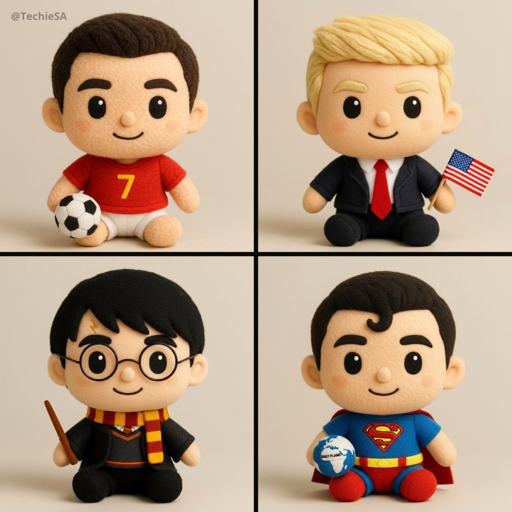

## Smooth 3D hyperrealistic food advertisement of [TYPE OF 

- ID: gpt4o-292-en-1
- Slug: prompt-292-en-1
- 语言: en
- 来源: [来源链接](https://x.com/aziz4ai/status/1964059052951875780)
- 样例图路径: images/part3/292.jpeg

### 提示词

```text
Smooth 3D hyperrealistic food advertisement of [TYPE OF FOOD], shown with mouthwatering glossy textures and perfect lighting, placed on a dark moody surface with soft glow and cinematic blur in the background, high Kelvin lighting for golden highlights and sharp shadows, backlit to show delicious steam and dripping sauces, behind the food a bold slogan in elegant font with three words only, restaurant logo subtly placed on the plate or in the corner, rich color grading with appetite-inducing tones, ultra sharp, professional food styling, stylized render
```

### 样例图

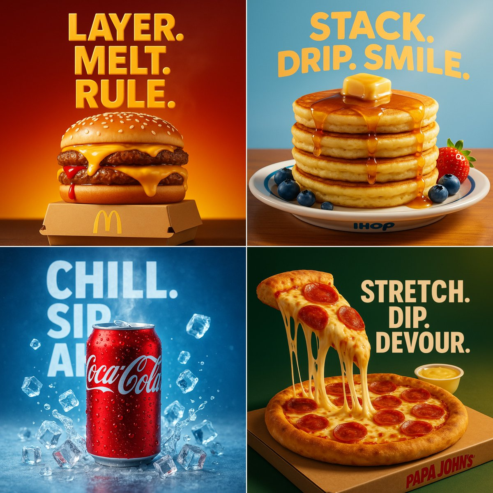

## 3D超写实食品广告

- ID: gpt4o-292-zh-2
- Slug: prompt-292-zh-2
- 语言: zh
- 来源: [来源链接](https://x.com/aziz4ai/status/1964059052951875780)
- 样例图路径: images/part3/292.jpeg

### 提示词

```text
[食物类型]的流畅3D超写实食品广告
- 呈现令人垂涎的光泽质感与完美光线效果
- 置于深邃氛围感的表面上，背景带有柔和光晕与电影感模糊效果
- 采用高开尔文色温光线，营造金色高光与清晰阴影
- 运用逆光拍摄，展现诱人的热气与滴落的酱汁
- 食物后方以优雅字体呈现一句仅含三个单词的醒目标语
- 餐厅标志巧妙置于餐盘之上或画面角落
- 采用浓郁的色彩分级，搭配激发食欲的色调
- 极致清晰的画面质感，专业的食物造型设计，风格化渲染效果
```

### 样例图


## Muscular African man dunks a grilled chicken breast into

- ID: gpt4o-288-en-1
- Slug: prompt-288-en-1
- 语言: en
- 来源: [来源链接](https://x.com/Salmaaboukarr/status/1912961013877801177)
- 样例图路径: images/part3/288.jpeg

### 提示词

```text
Muscular African  man dunks a grilled chicken breast into a basketball hoop with 'DUNK EVERY MACRO' text, under a clear sky. Fitness-themed, with Trifecta logo.
```

### 样例图

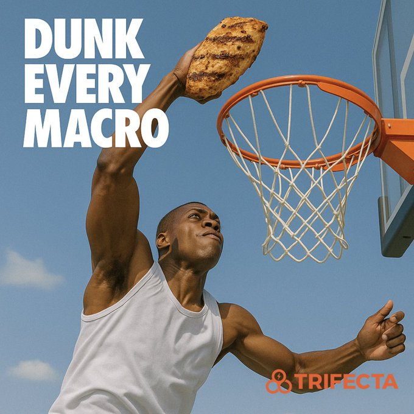

## 食物与运动结合的广告

- ID: gpt4o-288-zh-2
- Slug: prompt-288-zh-2
- 语言: zh
- 来源: [来源链接](https://x.com/Salmaaboukarr/status/1912961013877801177)
- 样例图路径: images/part3/288.jpeg

### 提示词

```text
晴朗天空下，一位肌肉发达的非洲男子将一块烤鸡胸肉扣进篮球框，篮框上写着“扣篮，每个宏都扣篮”（DUNK EVERY MACRO）。健身主题，带有 Trifecta 标志。
```

### 样例图


## Fit female tennis player on court, wearing white tank to

- ID: gpt4o-288-en-3
- Slug: prompt-288-en-3
- 语言: en
- 来源: [来源链接](https://x.com/Salmaaboukarr/status/1912961013877801177)
- 样例图路径: images/part3/288.jpeg

### 提示词

```text
Fit female tennis player on court, wearing white tank top and blue skirt, swinging a frying pan like a racket. In the pan: grilled chicken, broccoli, sweet potatoes. Clear blue sky. Bold text: 'ACE EVERY MEAL.' Trifecta logo in orange, bottom right.
```

### 样例图


## 食物与运动结合的广告

- ID: gpt4o-288-zh-4
- Slug: prompt-288-zh-4
- 语言: zh
- 来源: [来源链接](https://x.com/Salmaaboukarr/status/1912961013877801177)
- 样例图路径: images/part3/288.jpeg

### 提示词

```text
球场上，身材健美的女子网球运动员身穿白色背心和蓝色裙子，像挥动球拍一样挥舞着煎锅。锅里盛着烤鸡、西兰花和红薯。湛蓝的天空。粗体字写着：“每餐都精彩。” 右下角是橙色的Trifecta标志。
```

### 样例图


## Muscular man in black hoodie and orange boxing gloves in

- ID: gpt4o-288-en-5
- Slug: prompt-288-en-5
- 语言: en
- 来源: [来源链接](https://x.com/Salmaaboukarr/status/1912961013877801177)
- 样例图路径: images/part3/288.jpeg

### 提示词

```text
Muscular man in black hoodie and orange boxing gloves in dark gym, boxing a giant burrito hanging like a punching bag. Dramatic lighting. "TRIFECTA" logo in bold orange top right. Text "BEAT HUNGER TO THE PUNCH." in bold white bottom left. Humorous, intense fitness ad.
```

### 样例图


## 食物与运动结合的广告

- ID: gpt4o-288-zh-6
- Slug: prompt-288-zh-6
- 语言: zh
- 来源: [来源链接](https://x.com/Salmaaboukarr/status/1912961013877801177)
- 样例图路径: images/part3/288.jpeg

### 提示词

```text
肌肉发达的男子身穿黑色连帽衫，戴着橙色拳击手套，在昏暗的健身房里，用拳击机打着一个像沙袋一样悬挂着的巨型墨西哥卷饼。灯光效果惊艳。右上角印有醒目的橙色“TRIFECTA”标志。左下角印有醒目的白色文字“BEAT HUNGER TO THE PUNCH.” 。这则幽默风趣、充满力量的健身广告。
```

### 样例图


## Create a bold ad for Trifecta Nutrition: a baseball play

- ID: gpt4o-288-en-7
- Slug: prompt-288-en-7
- 语言: en
- 来源: [来源链接](https://x.com/Salmaaboukarr/status/1912961013877801177)
- 样例图路径: images/part3/288.jpeg

### 提示词

```text
Create a bold ad for Trifecta Nutrition: a baseball player mid-swing in a stadium, holding a giant orange spatula instead of a bat. Use the tagline 'Knock Hunger Out of the Park' in athletic-style text. Include Trifecta’s logo and orange/black branding
```

### 样例图


## 食物与运动结合的广告

- ID: gpt4o-288-zh-8
- Slug: prompt-288-zh-8
- 语言: zh
- 来源: [来源链接](https://x.com/Salmaaboukarr/status/1912961013877801177)
- 样例图路径: images/part3/288.jpeg

### 提示词

```text
为 Trifecta Nutrition 制作一则醒目的广告：一位棒球运动员在体育场挥棒，手中拿着一把巨大的橙色铲子而不是球棒。使用运动风格的文字，写上“Knock Hunger Out of the Park”（击退饥饿）的标语。同时加入 Trifecta 的标志和橙黑色品牌标识。
```

### 样例图


## Hyper-realistic carved wooden figurine of [CHARACTER], c

- ID: gpt4o-286-en-1
- Slug: prompt-286-en-1
- 语言: en
- 来源: [来源链接](https://x.com/samann_ai/status/1962939491603132563)
- 样例图路径: images/part3/286.jpeg

### 提示词

```text
Hyper-realistic carved wooden figurine of [CHARACTER], chibi proportions (big head, short body), standing on a plain wood block. Keep key face traits and iconic [OUTFIT/PROP]. Visible wood grain and chisel marks, matte finish. Warm studio light, soft shadow, seamless beige background. Centered full-body, slight 3/4 angle, shallow depth of field (85mm look). Ultra-detailed, photoreal, warm sepia grading. Aspect ratio [3:4].
```

### 样例图

![Hyper-realistic carved wooden figurine of [CHARACTER], c](../images/part3/286.jpeg)

## Q版木雕人偶

- ID: gpt4o-286-zh-2
- Slug: prompt-286-zh-2
- 语言: zh
- 来源: [来源链接](https://x.com/samann_ai/status/1962939491603132563)
- 样例图路径: images/part3/286.jpeg

### 提示词

```text
超写实[人物]木雕人偶，Q版比例（大头短身），站立于一块普通木块上。保留关键面部特征和标志性[服装/道具]。木纹和凿痕清晰可见，哑光饰面。工作室暖光，柔和阴影，米色背景浑然一体。全身居中，略微3/4视角，浅景深（85毫米画质）。细节丰富，照片级写实，暖棕褐色调。宽高比为[3:4]。
```

### 样例图

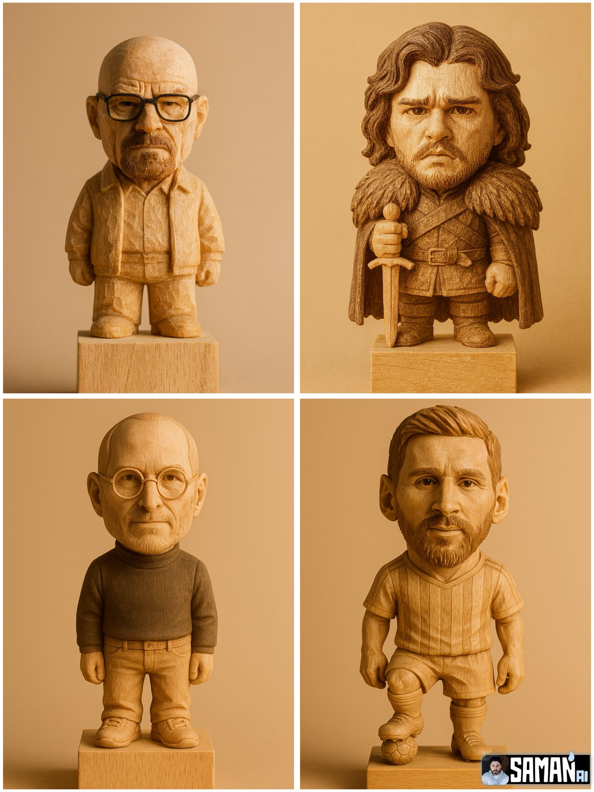

## Create a stylized cartoon illustration of [CHARACTER] wi

- ID: gpt4o-285-en-1
- Slug: prompt-285-en-1
- 语言: en
- 来源: [来源链接](https://x.com/gnrlyxyz/status/1951976345514487951)
- 样例图路径: images/part3/285.jpeg

### 提示词

```text
Create a stylized cartoon illustration of [CHARACTER] with a smooth, vertical pill-shaped body (rounded on top and bottom, symmetrical left to right). The body should be a single, unified capsule shape with no limbs. Do not alter the character's core design or personality, but simplify them into this playful capsule form. Use bold black outlines, flat vector-style coloring, and simple geometric features. Give the character large, expressive eyes and a fun, exaggerated facial expression that reflects their original personality. If the character wears clothes, include a minimal, iconic version of their outfit. If they do not, keep the body clean and unclothed. Use a solid bright yellow background. Center the character in a square frame. Use only flat colors. No gradients. No shadows. No texture. No smudging. The final result should be clean, modern, vector-friendly, and clearly pill-shaped.
```

### 样例图

![Create a stylized cartoon illustration of [CHARACTER] wi](../images/part3/285.jpeg)

## 卡通插图药丸形象

- ID: gpt4o-285-zh-2
- Slug: prompt-285-zh-2
- 语言: zh
- 来源: [来源链接](https://x.com/gnrlyxyz/status/1951976345514487951)
- 样例图路径: images/part3/285.jpeg

### 提示词

```text
为 [CHARACTER] 创建一幅风格化的卡通插图，其身体呈平滑的垂直药丸状（上下呈圆形，左右对称）。身体应为单一、统一的胶囊形状，没有四肢。不要改变角色的核心设计或个性，而是将其简化为这种俏皮的胶囊形状。使用粗黑色轮廓、扁平矢量风格的配色和简单的几何特征。赋予角色大而富有表现力的眼睛和有趣、夸张的面部表情，以反映其原始个性。如果角色穿着衣服，请包含其服装的极简标志性版本。如果没有，请保持身体干净，不穿衣服。使用纯亮黄色背景。将角色置于方形框架的中心。仅使用扁平颜色。不要使用渐变。不要使用阴影。不要使用纹理。不要使用晕染。最终结果应该干净、现代、矢量友好且清晰的药丸形状。
```

### 样例图

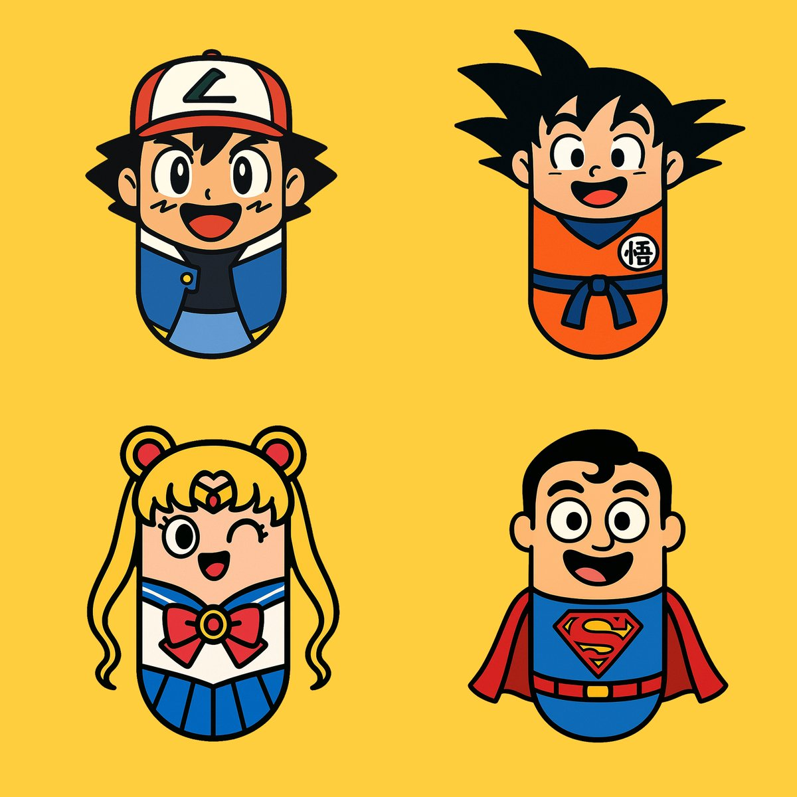

## Generate a large die-cut vinyl sticker of the [BRAND] lo

- ID: gpt4o-282-en-1
- Slug: prompt-282-en-1
- 语言: en
- 来源: [来源链接](https://x.com/TechieBySA/status/1952747617269506187)
- 样例图路径: images/part3/282.jpeg

### 提示词

```text
Generate a large die-cut vinyl sticker of the [BRAND] logo with thick white border, perfectly centered on a soft light blue background. The sticker is viewed straight-on from directly above with realistic drop shadows beneath. Clean, flat design with subtle 3D depth. The sticker takes up most of the frame and maintains original brand colors. 1080x1080 square format.
```

### 样例图

![Generate a large die-cut vinyl sticker of the [BRAND] lo](../images/part3/282.jpeg)

## 品牌模切乙烯基贴纸

- ID: gpt4o-282-zh-2
- Slug: prompt-282-zh-2
- 语言: zh
- 来源: [来源链接](https://x.com/TechieBySA/status/1952747617269506187)
- 样例图路径: images/part3/282.jpeg

### 提示词

```text
制作一款印有 [品牌] 标志的大型模切乙烯基贴纸，该贴纸带有粗白色边框，完美居中于柔和的浅蓝色背景之上。从正上方垂直正视贴纸，其下方带有逼真的投影效果。整体采用简洁的扁平化设计，同时呈现出细微的 3D 立体感。贴纸占据画面的大部分空间，并保留品牌原有的色彩。尺寸为 1080x1080 像素的正方形格式。
```

### 样例图

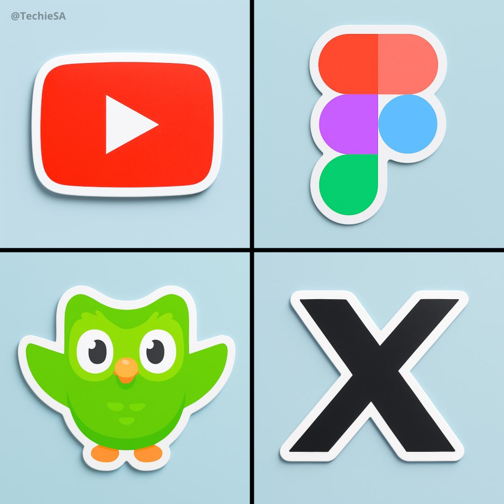

## create image: { "style": "mosaic stained glass emblem", 

- ID: gpt4o-276-en-1
- Slug: prompt-276-en-1
- 语言: en
- 来源: [来源链接](https://x.com/miilesus/status/1925157350068900103)
- 样例图路径: images/part3/276.png

### 提示词

```text
create image:
{
  "style": "mosaic stained glass emblem",
  "object": "brand logo",
  "brand": {
    "name": "Spotify",
    "logo_shape": "circular",
    "icon_style": "three curved bars",
    "color_palette": {
      "primary": "#1DB954",
      "secondary": "#1ED760",
      "glass_variants": ["#147A3E", "#0F5C30", "#26C178"]
    }
  },
  "material": {
    "type": "colored glass",
    "effect": "semi-transparent with light reflections",
    "outline": {
      "color": "#111111",
      "width": "medium",
      "style": "lead-line traditional mosaic"
    }
  },
  "composition": {
    "layout": "logo composed of tessellated glass pieces",
    "geometry": "irregular but fitted glass shapes",
    "contrast": "dark outlines define shape clearly"
  },
  "lighting": {
    "type": "diffused natural light",
    "highlight": "glass texture and color depth emphasized"
  },
  "background": {
    "type": "flat surface",
    "color": "#F4F4F4"
  },
  "camera": {
    "angle": "top-down",
    "focus": "centered on entire logo"
  },
  "render": {
    "quality": "high",
    "shadows": "soft",
    "reflections": "minimal"
  }
}
```

### 样例图

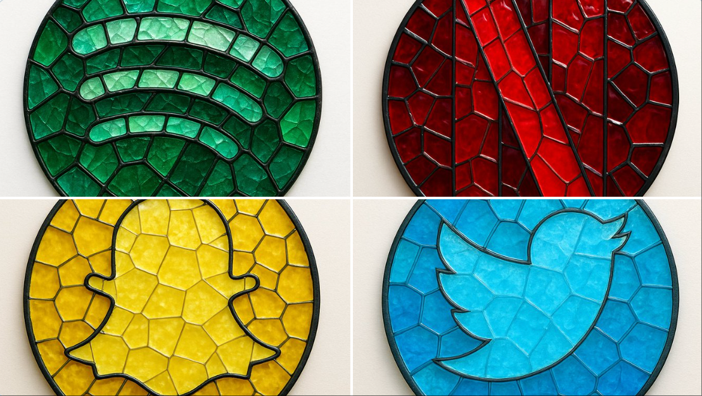

## 马赛克彩色玻璃徽章

- ID: gpt4o-276-zh-2
- Slug: prompt-276-zh-2
- 语言: zh
- 来源: [来源链接](https://x.com/miilesus/status/1925157350068900103)
- 样例图路径: images/part3/276.png

### 提示词

```text
创建图像：
{
  "风格": "马赛克彩色玻璃徽章",
  "对象": "品牌标志",
  "品牌": {
    "名称": "Spotify",
    "标志形状": "圆形",
    "图标风格": "三条弯曲的长条",
    "色彩搭配": {
      "主色": "#1DB954",
      "辅助色": "#1ED760",
      "玻璃变体色": ["#147A3E", "#0F5C30", "#26C178"]
    }
  },
  "材质": {
    "类型": "彩色玻璃",
    "效果": "半透明带光线反射",
    "轮廓": {
      "颜色": "#111111",
      "宽度": "中等",
      "风格": "传统马赛克铅线"
    }
  },
  "构图": {
    "布局": "由镶嵌玻璃片组成的标志",
    "几何形状": "不规则但拼接契合的玻璃造型",
    "对比度": "深色轮廓清晰界定形状"
  },
  "光线": {
    "类型": "漫射自然光",
    "高光": "突出玻璃质感和色彩深度"
  },
  "背景": {
    "类型": "平面",
    "颜色": "#F4F4F4"
  },
  "镜头": {
    "角度": "俯视",
    "焦点": "居中于整个标志"
  },
  "渲染": {
    "质量": "高",
    "阴影": "柔和",
    "反射": "轻微"
  }
}
```

### 样例图


## Epic LEGO [SUPERHERO] in dynamic action pose showcasing 

- ID: gpt4o-270-en-1
- Slug: prompt-270-en-1
- 语言: en
- 来源: [来源链接](https://x.com/TechieBySA/status/1953186625871331674)
- 样例图路径: images/part3/270.jpeg

### 提示词

```text
Epic LEGO [SUPERHERO] in dynamic action pose showcasing their signature powers, wearing their iconic costume with authentic colors and details, dramatic stormy sky with brilliant lightning bolts illuminating the scene, heroic stance amid swirling LEGO debris and flying bricks, small LEGO minifigures scattered throughout the scene watching in awe, cinematic movie poster composition with photorealistic rendering, epic superhero atmosphere with rich saturated colors, professional depth of field and dramatic lighting effects, 1080x1080 square format
```

### 样例图

![Epic LEGO [SUPERHERO] in dynamic action pose showcasing ](../images/part3/270.jpeg)

## 乐高超级英雄摆出充满动感的动作姿势

- ID: gpt4o-270-zh-2
- Slug: prompt-270-zh-2
- 语言: zh
- 来源: [来源链接](https://x.com/TechieBySA/status/1953186625871331674)
- 样例图路径: images/part3/270.jpeg

### 提示词

```text
史诗级乐高【超级英雄】摆出充满动感的动作姿势，展现其标志性超能力，身着标志性服装，色彩和细节真实还原。戏剧性的暴风雨天空中，耀眼的闪电照亮整个场景。超级英雄摆出英勇姿态，周围是旋转的乐高碎片和飞舞的积木块，场景中散落着小型乐高小人仔，它们正惊叹地注视着这一切。整体采用电影海报式构图，配以逼真渲染效果，营造出史诗般的超级英雄氛围，色彩浓郁饱和，运用专业的景深和富有戏剧性的光影效果，尺寸为1080x1080的正方形格式。
```

### 样例图

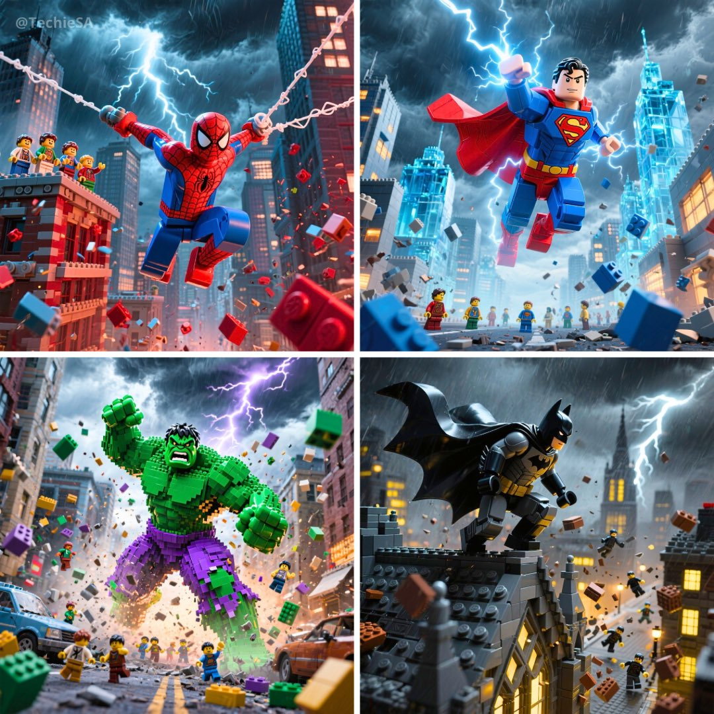

## A hyper-realistic editorial concept for a collaboration 

- ID: gpt4o-265-en-1
- Slug: prompt-265-en-1
- 语言: en
- 来源: [来源链接](https://x.com/TheRelianceAI/status/1957095226813649166)
- 样例图路径: images/part3/265.png

### 提示词

```text
A hyper-realistic editorial concept for a collaboration between [BRAND] and [MAGAZINE BRAND]. Square 1:1 composition, shot in a sleek Parisian interior with marble floors and tall windows, golden afternoon light illuminating the scene. A single model in a couture gown poses gracefully beside a realistically sized [BRAND] perfume bottle with the [BRAND] logo clearly visible placed on a marble pedestal. Ultra-refined textures, cinematic realism, Vogue-style photography.
```

### 样例图

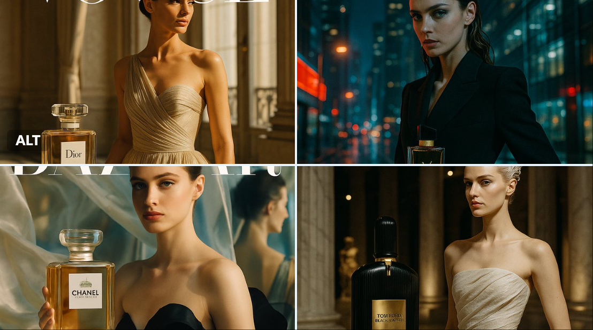

## 品牌杂志

- ID: gpt4o-265-zh-2
- Slug: prompt-265-zh-2
- 语言: zh
- 来源: [来源链接](https://x.com/TheRelianceAI/status/1957095226813649166)
- 样例图路径: images/part3/265.png

### 提示词

```text
一个超写实的编辑概念，用于[品牌]与[杂志品牌]的合作。1:1的正方形构图，在时尚的巴黎室内拍摄，室内设有大理石地板和高大的窗户，金色的午后阳光照亮整个场景。一位身着高级定制礼服的模特优雅地摆着姿势，身旁是一个尺寸逼真的[品牌]香水瓶，瓶身上清晰可见[品牌]的标志，香水瓶放置在大理石基座上。超精细的纹理，电影般的写实感，《 Vogue》风格的摄影。
```

### 样例图


## Ultra-detailed render of a [CHARACTER NAME] paper toy ve

- ID: gpt4o-264-en-1
- Slug: prompt-264-en-1
- 语言: en
- 来源: [来源链接](https://x.com/TechieBySA/status/1961411111879594453)
- 样例图路径: images/part3/264.png

### 提示词

```text
Ultra-detailed render of a [CHARACTER NAME] paper toy version in box form (papertoy) made from matte folded cardboard and cut with visible paper texture, clean edges and neat folds. Cubic head and body, square extremities, simplified facial features, flat printed colors and subtle shading for greater depth. The clothing and accessories faithfully imitate the appearance of the reference image in a minimalist geometric papercraft style, maintaining compact proportions and chibi style. Neutral studio lighting, soft shadows, smooth background, photorealistic product photography, 4K, no text or logos. 1080x1080 dimension.
```

### 样例图

![Ultra-detailed render of a [CHARACTER NAME] paper toy ve](../images/part3/264.png)

## 纸制玩具版本

- ID: gpt4o-264-zh-2
- Slug: prompt-264-zh-2
- 语言: zh
- 来源: [来源链接](https://x.com/TechieBySA/status/1961411111879594453)
- 样例图路径: images/part3/264.png

### 提示词

```text
超细节渲染的[角色名称]纸制玩具版本，呈盒子形状（纸制玩具），由哑光折叠纸板制成，带有可见的纸张纹理，边缘干净，折叠整齐。头部和身体为立方体，四肢为方形，面部特征简化，采用平面印刷色彩和微妙阴影以增强深度。服装和配饰以极简几何纸艺风格忠实地模仿参考图的外观，保持紧凑比例和Q版风格。中性工作室灯光，柔和阴影，平滑背景，逼真的产品摄影效果，4K分辨率，无文字或标志。尺寸为1080x1080。
```

### 样例图

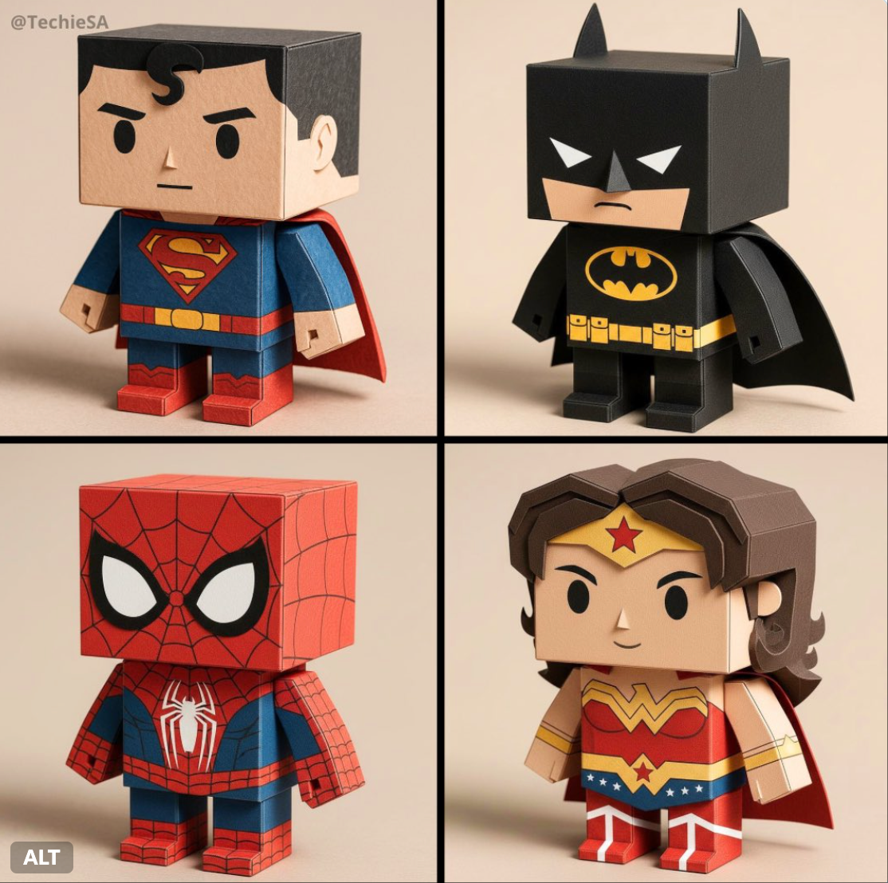

## A colorful, playful 2D map of [city name], in the style 

- ID: gpt4o-261-en-1
- Slug: prompt-261-en-1
- 语言: en
- 来源: [来源链接](https://x.com/miilesus/status/1939690110418833592)
- 样例图路径: images/part3/261.jpeg

### 提示词

```text
A colorful, playful 2D map of [city name], in the style of Candy Crush Saga, featuring the city’s iconic landmarks as candy-inspired buildings, cute gumdrop trees, licorice bridges, pastel roads, and glossy water elements, floating clouds, vibrant cartoon style, top-down view, kid-friendly game aesthetics, horizontal layout
```

### 样例图

![A colorful, playful 2D map of [city name], in the style ](../images/part3/261.jpeg)

## 城市糖果传奇的风格

- ID: gpt4o-261-zh-2
- Slug: prompt-261-zh-2
- 语言: zh
- 来源: [来源链接](https://x.com/miilesus/status/1939690110418833592)
- 样例图路径: images/part3/261.jpeg

### 提示词

```text
一幅色彩丰富、充满童趣的[城市名称]2D地图，采用《糖果传奇》的风格，将城市的标志性地标设计成糖果风格的建筑，还有可爱的软糖树、甘草桥、柔和色调的道路、富有光泽的水域元素、漂浮的云朵，整体为鲜艳的卡通风格，采用俯视视角，具有适合儿童的游戏美学，为横向布局。
```

### 样例图

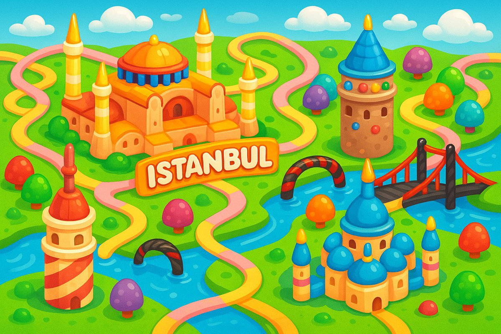

## { "object": "OBJECT_NAME", "style": "Transparent Honeyco

- ID: gpt4o-257-en-1
- Slug: prompt-257-en-1
- 语言: en
- 来源: [来源链接](https://x.com/miilesus/status/1930266127961059739)
- 样例图路径: images/part3/257.png

### 提示词

```text
{
  "object": "OBJECT_NAME",
  "style": "Transparent Honeycomb Transformation",
  "description": "Transform the object into a structure made entirely of crystallized golden honey with high transparency. The surface should be ultra-glossy, semi-liquid, and light-reflective, with defined yet see-through hexagonal honeycomb patterns. Parts of the object should allow light to pass through, revealing inner layers and structure. Include gentle honey drips for realism.",
  "material": {
    "primary": "Crystal-clear amber honey",
    "secondary": "Translucent honeycomb cells"
  },
  "texture": {
    "surface": "Ultra glossy and semi-liquid",
    "pattern": "See-through hexagonal honeycomb",
    "drips": true
  },
  "effects": {
    "translucency": "highly translucent",
    "internal_glow": "Soft warm light from within",
    "emblem": "Delicate bee icon subtly embedded in the structure"
  },
  "presentation": {
    "background": "Clean white or soft gradient",
    "lighting": "Backlit with soft diffusion to enhance translucency",
    "floating": true,
    "format": "Square"
  }
}
```

### 样例图

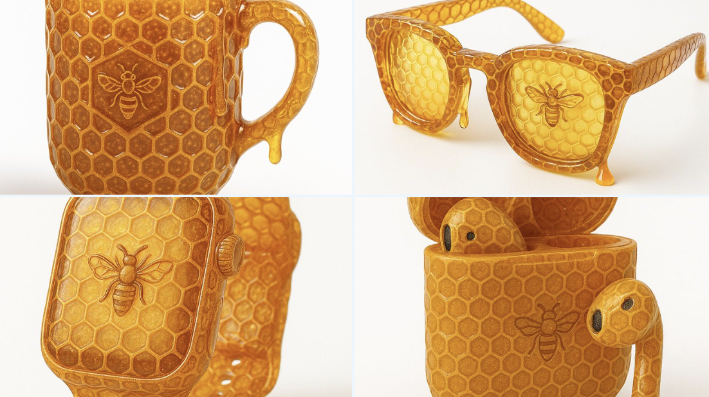

## 透明蜂窝状变形

- ID: gpt4o-257-zh-2
- Slug: prompt-257-zh-2
- 语言: zh
- 来源: [来源链接](https://x.com/miilesus/status/1930266127961059739)
- 样例图路径: images/part3/257.png

### 提示词

```text
{
  "物体": "OBJECT_NAME",
  "风格": "透明蜂窝状变形",
  "描述": "将该物体转变为由完全结晶的金色蜂蜜制成的结构，具有高度透明度。表面应呈现超 glossy 质感、半液态状态和反光效果，带有清晰可辨且透明的六边形蜂窝图案。物体的部分区域应允许光线穿透，以展现内部层次和结构。为增强真实感，需加入自然垂落的蜂蜜滴。",
  "材质": {
    "主要材质": "清澈透明的琥珀色蜂蜜",
    "次要材质": "半透明的蜂窝单元"
  },
  "纹理": {
    "表面": "超 glossy 且呈半液态",
    "图案": "透明的六边形蜂窝",
    "滴落效果": true
  },
  "特效": {
    "半透明性": "高度半透明",
    "内部光晕": "源自内部的柔和暖光",
    "标志": "精致的蜜蜂图标巧妙嵌入结构中"
  },
  "呈现方式": {
    "背景": "纯净白色或柔和渐变",
    "光线": "背光搭配柔和漫射效果，以增强半透明感",
    "悬浮效果": true,
    "格式": "正方形"
  }
}
```

### 样例图


## Create a photorealistic square image (1080x1080) showing

- ID: gpt4o-253-en-1
- Slug: prompt-253-en-1
- 语言: en
- 来源: [来源链接](https://x.com/TechieBySA/status/1954931461309546821)
- 样例图路径: images/part3/253.jpeg

### 提示词

```text
Create a photorealistic square image (1080x1080) showing a custom acrylic keychain version of the [LOGO] logo hanging from the zipper of a dark-colored backpack (e.g. black or grey). The logo must retain its original shape, color, and proportions without any alteration. The keychain should have a clear glossy acrylic layer, clipped with a silver metal ring and clasp. Use soft daylight or diffused lighting to avoid yellow tones. Set the background in a modern outdoor setting, but keep it blurred to maintain focus on the logo keychain.
```

### 样例图

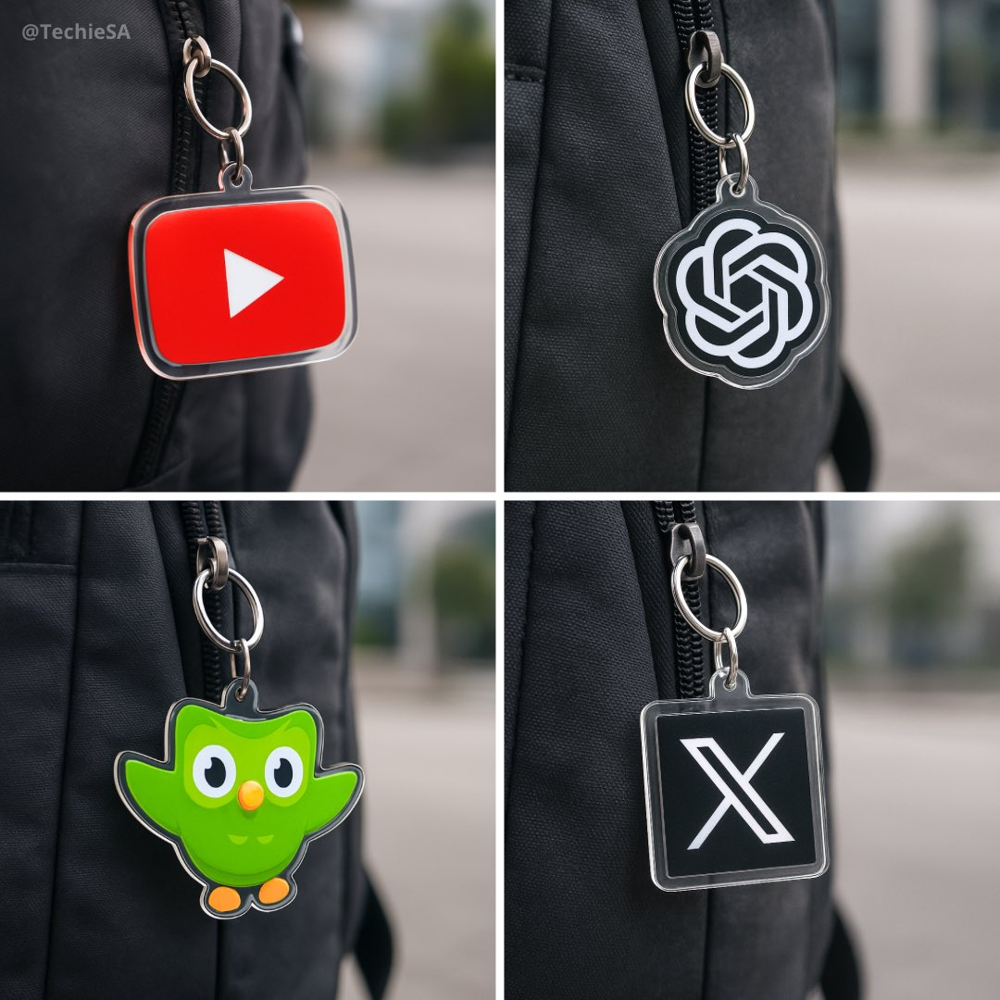

## 亚克力钥匙扣

- ID: gpt4o-253-zh-2
- Slug: prompt-253-zh-2
- 语言: zh
- 来源: [来源链接](https://x.com/TechieBySA/status/1954931461309546821)
- 样例图路径: images/part3/253.jpeg

### 提示词

```text
创建一张逼真的方形图片（1080x1080 像素），展示一个定制的 [LOGO] 标志亚克力钥匙扣，它挂在一个深色背包（如黑色或灰色）的拉链上。该标志必须保持其原始形状、颜色和比例，不得有任何改动。钥匙扣应有一层透明的光泽亚克力，配有银色金属环和扣具。使用柔和的日光或漫射光，避免黄色调。背景设置为现代户外环境，但需模糊处理，以将焦点保持在标志钥匙扣上。
```

### 样例图


## 1×1 square, ultra-detailed render of a box-shaped papert

- ID: gpt4o-251-en-1
- Slug: prompt-251-en-1
- 语言: en
- 来源: [来源链接](https://x.com/Arminn_Ai/status/1954985717609730175)
- 样例图路径: images/part3/251.jpeg

### 提示词

```text
1×1 square, ultra-detailed render of a box-shaped papertoy version of [CHARACTER NAME]. Made from folded and cut matte cardstock with visible paper texture, crisp edges, and clean folds. Cubic head and body, blocky limbs, simplified facial features, flat printed colors, and subtle shading for depth. Clothing and accessories faithfully mimic [CHARACTER NAME]’s iconic look in a minimal geometric papercraft style, keeping proportions compact and chibi-like. Neutral studio lighting, soft shadows, plain background, photorealistic product photography, 4K, no text or logos.
```

### 样例图

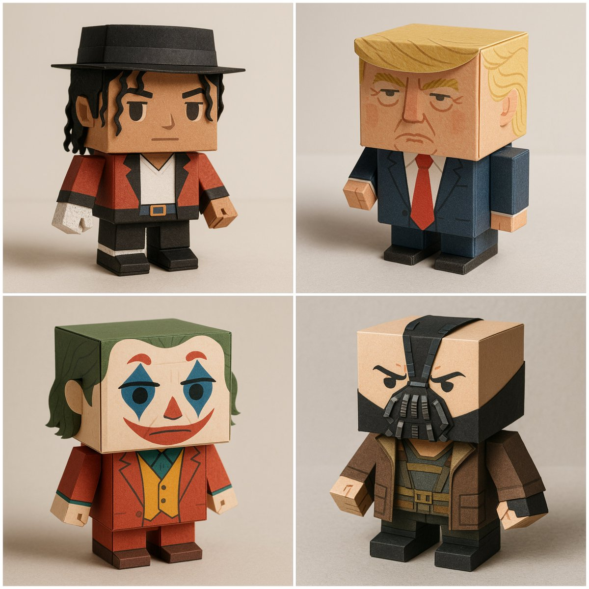

## 超细节盒状纸艺玩具

- ID: gpt4o-251-zh-2
- Slug: prompt-251-zh-2
- 语言: zh
- 来源: [来源链接](https://x.com/Arminn_Ai/status/1954985717609730175)
- 样例图路径: images/part3/251.jpeg

### 提示词

```text
1×1大小的正方形，超细节渲染的[角色名称]盒状纸艺玩具版本。由折叠和裁剪的哑光卡纸制成，具有可见的纸张纹理、清晰的边缘和整齐的折痕。立方体头部和身体，块状四肢，简化的面部特征，平印色彩，以及用于体现深度的微妙阴影。服装和配饰以简约的几何纸艺风格忠实还原[角色名称]的标志性外观，保持紧凑的比例和Q版风格。中性工作室灯光，柔和阴影，简洁背景，逼真的产品摄影效果，4K分辨率，无文字或标志。
```

### 样例图


## A cute cartoon ghost is the absolute main subject of the

- ID: gpt4o-245-en-1
- Slug: prompt-245-en-1
- 语言: en
- 来源: [来源链接](https://x.com/songguoxiansen/status/1945032571114402108)
- 样例图路径: images/part3/245.jpeg

### 提示词

```text
A cute cartoon ghost is the absolute main subject of the picture. It has a pure white body with a smooth and rounded contour, and two simple black oval eyes, with no extra features. This ghost is floating quietly in the very center of the picture. The background is a pure, bright purple, creating a simple, modern, and friendly atmosphere. The composition is a centered close-up, and the aspect ratio is 1:1 square. There is no text in the entire image. The image style is typical flat design and vector art, minimalist, much like an app icon or a logo, characterized by clean lines and solid color blocks, without any gradients or textural details. The image quality required is high-resolution with clean, sharp edges. The overall feeling it gives is one of a cute, simple, and modern piece of digital art.
```

### 样例图


## Kiro卡通幽灵

- ID: gpt4o-245-zh-2
- Slug: prompt-245-zh-2
- 语言: zh
- 来源: [来源链接](https://x.com/songguoxiansen/status/1945032571114402108)
- 样例图路径: images/part3/245.jpeg

### 提示词

```text
一个可爱的卡通鬼魂是图片的绝对主体。它拥有纯白色的身体，轮廓平滑圆润，两只简单的黑色椭圆形眼睛，没有任何额外特征。这个鬼魂安静地漂浮在图片的正中央。背景是纯亮的紫色，营造出简洁、现代和友好的氛围。构图是居中的特写，宽高比为 1:1 的正方形。整个图像中没有文字。图像风格典型的扁平化设计和矢量艺术，极简主义，类似于应用图标或标志，以干净的线条和实色块为特点，没有任何渐变或纹理细节。要求的图像质量是高分辨率，边缘清晰锐利。它给人的整体感觉是一幅可爱、简洁、现代的数字艺术作品。
```

### 样例图


## Create a high-resolution 3D render of the [BRAND] logo d

- ID: gpt4o-240-en-1
- Slug: prompt-240-en-1
- 语言: en
- 来源: [来源链接](https://x.com/TechieBySA/status/1944487528704418041)
- 样例图路径: images/part3/240.jpeg

### 提示词

```text
Create a high-resolution 3D render of the [BRAND] logo designed as an inflatable, puffy object. The logo should appear soft, rounded, and air-filled – like a plush balloon or blow-up toy. Use a smooth, matte texture with subtle fabric creases and stitching to emphasize the inflatable look. Position the logo at a 45-degree angle to highlight depth and realism. Place the final result on a couch in a stylish living room with furniture and decor that matches the iconic colors of the [BRAND] logo. Output dimension: 1080x1080.
```

### 样例图

![Create a high-resolution 3D render of the [BRAND] logo d](../images/part3/240.jpeg)

## 定制的枕头

- ID: gpt4o-240-zh-2
- Slug: prompt-240-zh-2
- 语言: zh
- 来源: [来源链接](https://x.com/TechieBySA/status/1944487528704418041)
- 样例图路径: images/part3/240.jpeg

### 提示词

```text
创建一个高分辨率的 3D 渲染图，将[BRAND]标志设计成一个充气、蓬松的物体。标志应看起来柔软、圆润、充气——像一个毛绒气球或充气玩具。使用光滑的哑光纹理，带有细微的布料褶皱和缝线，以强调充气效果。将标志以 45 度角摆放，以突出深度和真实感。将最终结果放置在风格时尚的客厅沙发上，家具和装饰与[BRAND]标志的标志性颜色相匹配。输出尺寸：1080x1080。
```

### 样例图

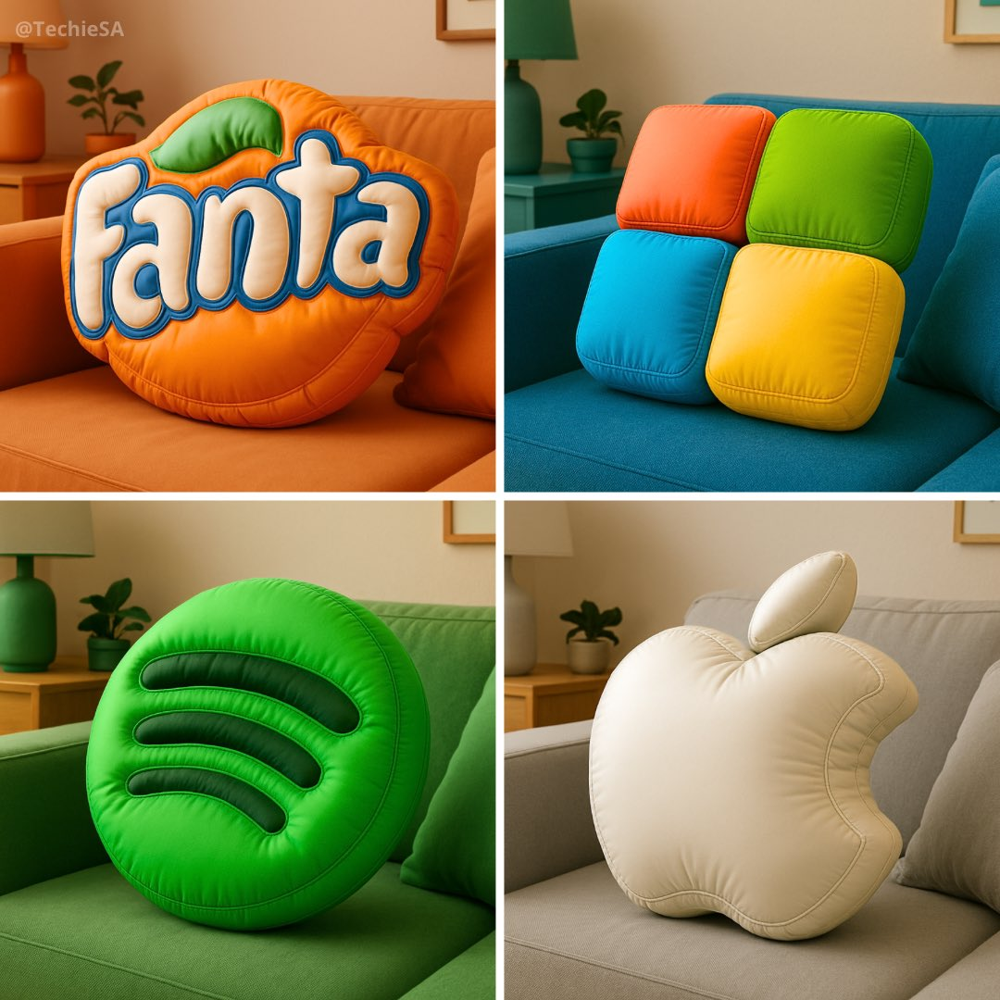

## A vibrant, hyper-realistic miniature of [CITY] inside a 

- ID: gpt4o-239-en-1
- Slug: prompt-239-en-1
- 语言: en
- 来源: [来源链接](https://x.com/TechieBySA/status/1944386743865622718)
- 样例图路径: images/part3/239.jpeg

### 提示词

```text
A vibrant, hyper-realistic miniature of [CITY] inside a transparent capsule lying on a sandy beach. The capsule is half [COLOR] (matching [COUNTRY]’s flag) with [CITY] written in white text on the colored section. Inside the capsule: iconic landmarks of [CITY], beautiful water canals or streets, small detailed boats or cars, sunny bright lighting, cinematic depth of field, dreamy atmosphere, ocean waves in the background.
```

### 样例图

![A vibrant, hyper-realistic miniature of [CITY] inside a ](../images/part3/239.jpeg)

## 沙滩胶囊城市

- ID: gpt4o-239-zh-2
- Slug: prompt-239-zh-2
- 语言: zh
- 来源: [来源链接](https://x.com/TechieBySA/status/1944386743865622718)
- 样例图路径: images/part3/239.jpeg

### 提示词

```text
一个充满活力的、超写实的[CITY]微缩模型，放置在一个透明胶囊内，躺在沙滩上。胶囊一半是[COLOR]色（与[COUNTRY]的国旗相匹配），彩色部分上用白色文字写着[CITY]。胶囊内部：[CITY]的标志性地标、美丽的运河或街道、小巧精致的船只或汽车、阳光明媚的光线、电影般的景深、梦幻般的氛围、背景中的海浪。
```

### 样例图

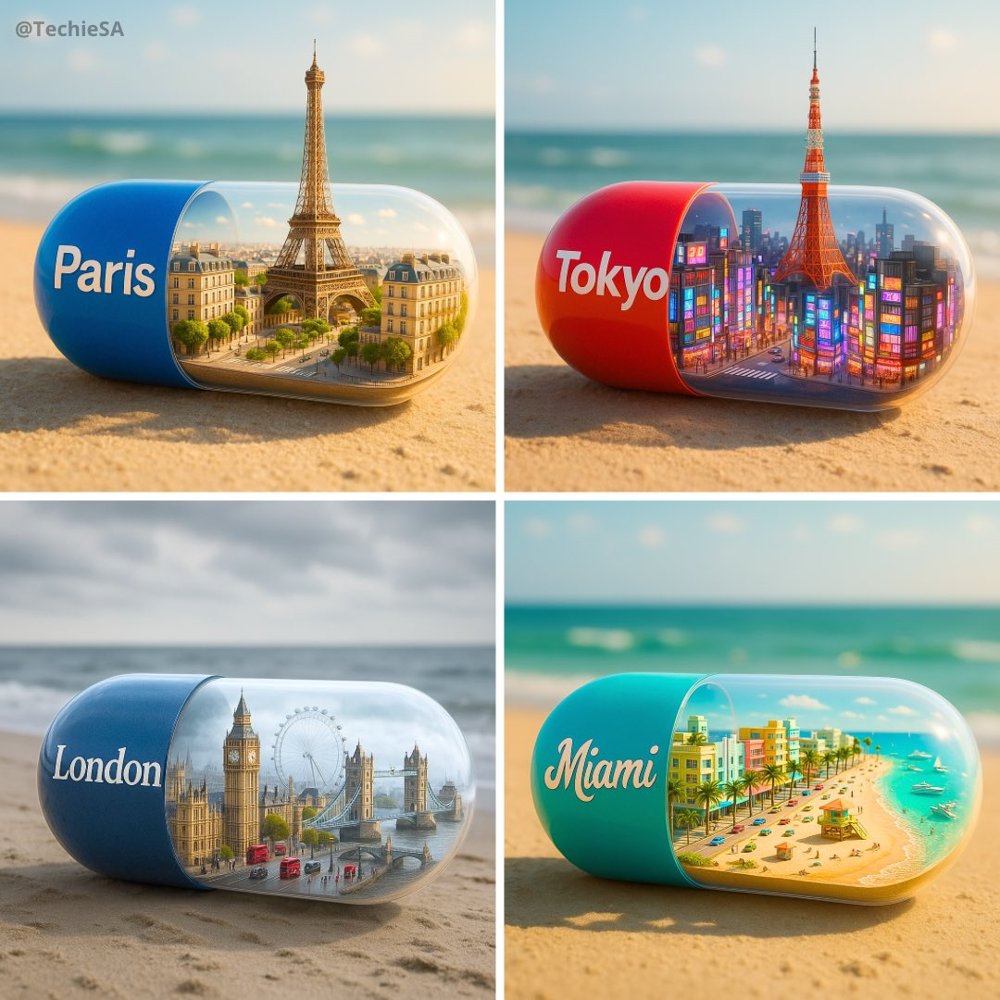

## Create a hyper-realistic, square 1:1 image featuring a s

- ID: gpt4o-236-en-1
- Slug: prompt-236-en-1
- 语言: en
- 来源: [来源链接](https://x.com/TechieBySA/status/1944724068982211044)
- 样例图路径: images/part3/236.jpeg

### 提示词

```text
Create a hyper-realistic, square 1:1 image featuring a small helicopter flying through a bright blue sky with fluffy white clouds and a subtle lens flare. The helicopter is painted in the signature colors and graphics of [BRAND]. It is carrying a giant product from [BRAND] hanging below. The composition has the look and feel of a clean, playful (or premium, futuristic) advertisement. At the bottom, include the [BRAND] logo and a small slogan like [BRAND SLOGAN] in a stylish font. 1080x1080 dimension.
```

### 样例图

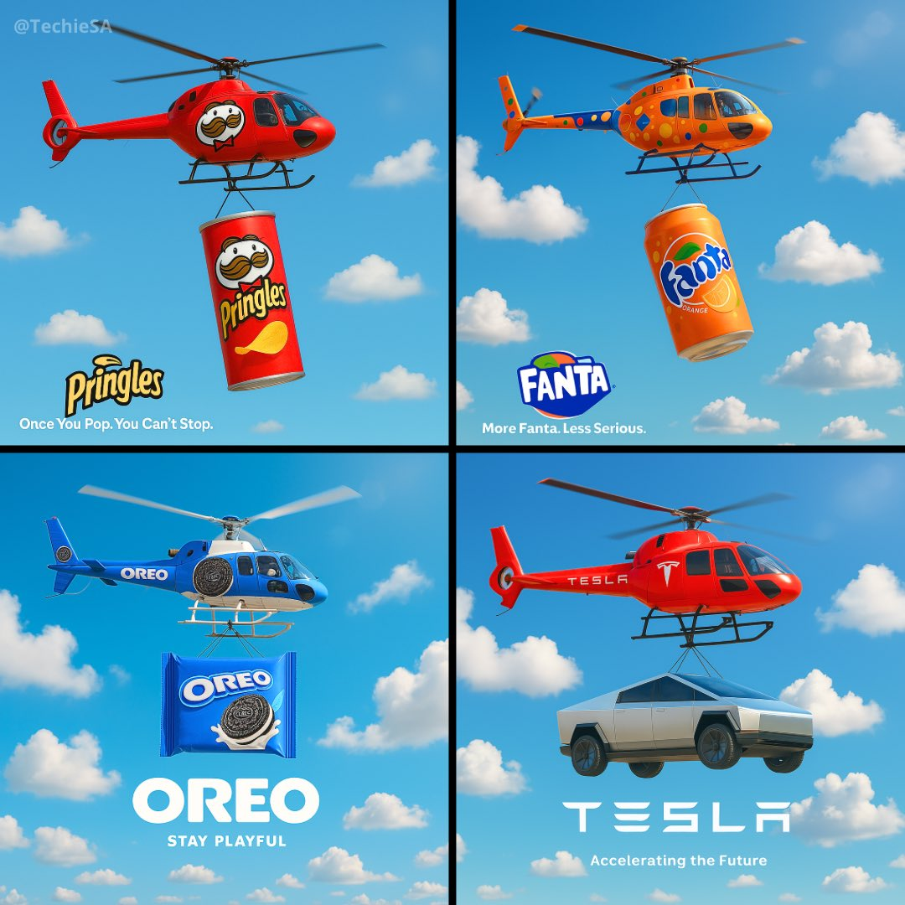

## 直升机品牌广告

- ID: gpt4o-236-zh-2
- Slug: prompt-236-zh-2
- 语言: zh
- 来源: [来源链接](https://x.com/TechieBySA/status/1944724068982211044)
- 样例图路径: images/part3/236.jpeg

### 提示词

```text
创作一张超写实的 1:1 方形图像，展现一架小型直升机在明亮的蓝天中飞行，周围有蓬松的白云和微妙的镜头眩光。直升机涂装着[BRAND]的标志性颜色和图案。它下方悬挂着一个来自[BRAND]的巨大产品。整个构图具有干净、俏皮（或高端、未来感）的广告风格。在底部，包含[BRAND]的标志和一句简短的风格化标语，如[BRAND SLOGAN]。尺寸为 1080x1080。
```

### 样例图


## Hyper-realistic poster, 1080x1080. Small glossy/glass ca

- ID: gpt4o-232-en-1
- Slug: prompt-232-en-1
- 语言: en
- 来源: [来源链接](https://x.com/fy360593/status/1944782534128419179)
- 样例图路径: images/part3/232.jpeg

### 提示词

```text
Hyper-realistic poster, 1080x1080. Small glossy/glass capsules spilling from a transparent medicine bottle onto a wet surface. Each capsule features [white]/[red] plastic and transparent glass, with [KFC] logo and a floating 3D icon inside. Strong reflections, studio lighting, water droplets, soft elegant background, DSLR photo realism.
```

### 样例图

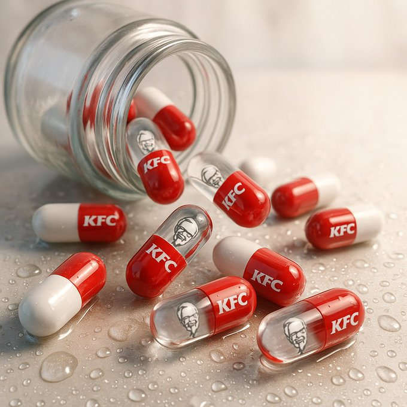

## 胶囊从透明的药瓶中倾倒

- ID: gpt4o-232-zh-2
- Slug: prompt-232-zh-2
- 语言: zh
- 来源: [来源链接](https://x.com/fy360593/status/1944782534128419179)
- 样例图路径: images/part3/232.jpeg

### 提示词

```text
超写实的海报，1080x1080。小型的光亮/玻璃胶囊从透明的药瓶中倾倒在湿润的表面上。每个胶囊都带有[白色]/[红色]塑料和透明玻璃，内有[KFC]标志和一个悬浮的 3D 图标。强烈的反光，工作室灯光，水滴，柔和优雅的背景，DSLR 照片真实性。
```

### 样例图


## Create a hyper-realistic, stylish poster [1080x1080] asp

- ID: gpt4o-229-en-1
- Slug: prompt-229-en-1
- 语言: en
- 来源: [来源链接](https://x.com/TechieBySA/status/1944462797666123872)
- 样例图路径: images/part3/229.jpeg

### 提示词

```text
Create a hyper-realistic, stylish poster [1080x1080] aspect ratio featuring a horizontal tablet-capsule hovering above a surface covered in condensation and water droplets, with its shadow cast on the wet ground. One side of the capsule is transparent glass, while the other is glossy [BRAND COLORS] plastic, displaying the [BRAND] logo and name. Seamlessly floating inside the glass portion of the capsule is a photorealistic 3D model of the [BRAND LOGO OR ICON], perfectly centered and suspended in zero gravity. The glass and plastic surfaces showcase strong reflections, refractions, and environmental distortions. The background is a softly blurred, elegant light-toned setting. Use a dynamic perspective with a stylish camera angle, professional studio lighting, and ultra-high detail to make the image look like a DSLR-captured photograph with impeccable realism.
```

### 样例图

![Create a hyper-realistic, stylish poster [1080x1080] asp](../images/part3/229.jpeg)

## 品牌快餐胶囊

- ID: gpt4o-229-zh-2
- Slug: prompt-229-zh-2
- 语言: zh
- 来源: [来源链接](https://x.com/TechieBySA/status/1944462797666123872)
- 样例图路径: images/part3/229.jpeg

### 提示词

```text
创建一个超逼真、时尚的海报[1080x1080]宽高比，展示一个水平平板胶囊悬浮在布满水汽和液滴的表面上，其影子投射在湿润的地面上。胶囊一侧是透明玻璃，另一侧是光泽[品牌颜色]塑料，显示[品牌]标志和名称。玻璃部分无缝漂浮着一张逼真的 3D 模型[品牌标志或图标]，完美居中并悬浮在零重力中。玻璃和塑料表面展现出强烈的反射、折射和环境扭曲。背景是柔和模糊、优雅浅色调的设置。使用动态视角和时尚的相机角度，结合专业工作室灯光和超高清细节，使图像看起来像是一张由单反相机拍摄的真实照片，具有无懈可击的真实感。
```

### 样例图

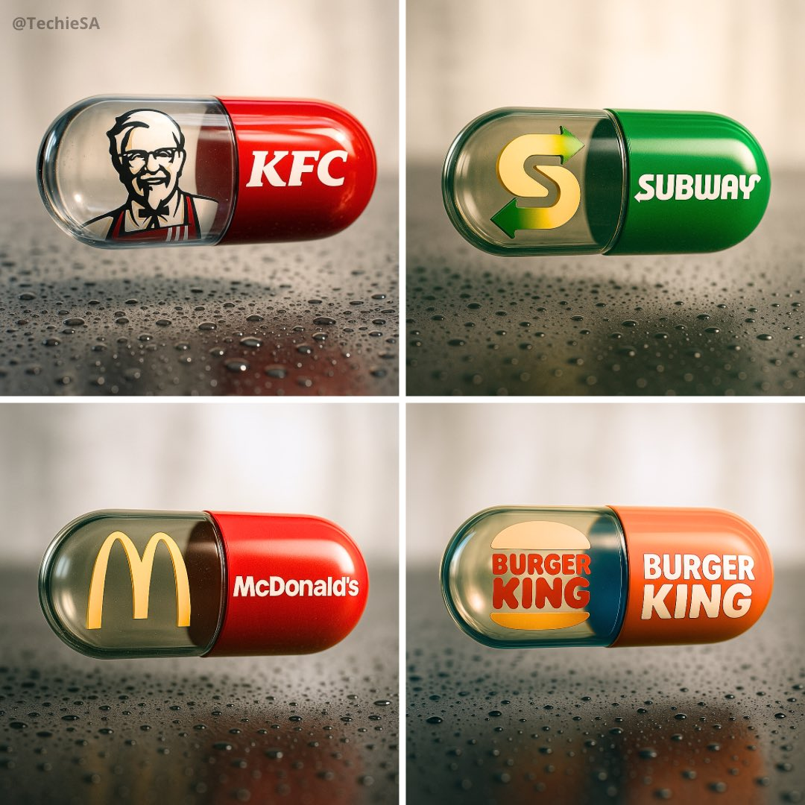

## Create a hyper-realistic, stylish poster [1080x1080] asp

- ID: gpt4o-225-en-1
- Slug: prompt-225-en-1
- 语言: en
- 来源: [来源链接](https://x.com/TechieBySA/status/1944435018203296063)
- 样例图路径: images/part3/225.jpeg

### 提示词

```text
Create a hyper-realistic, stylish poster [1080x1080] aspect ratio featuring a horizontal tablet-capsule hovering above a surface covered in condensation and water droplets, with its shadow cast on the wet ground. One side of the capsule is transparent glass, while the other is glossy [COLOR/DESIGN] plastic, displaying the [BRAND] logo and name. Seamlessly floating inside the glass portion of the capsule is a photorealistic 3D model of the [LOGO], perfectly centered and suspended in zero gravity. The glass and plastic surfaces showcase strong reflections, refractions, and environmental distortions. The background is a softly blurred, elegant light-toned setting. Use a dynamic perspective with a stylish camera angle, professional studio lighting, and ultra-high detail to make the image look like a DSLR-captured photograph with impeccable realism.
```

### 样例图

![Create a hyper-realistic, stylish poster [1080x1080] asp](../images/part3/225.jpeg)

## 时尚的胶囊海报

- ID: gpt4o-225-zh-2
- Slug: prompt-225-zh-2
- 语言: zh
- 来源: [来源链接](https://x.com/TechieBySA/status/1944435018203296063)
- 样例图路径: images/part3/225.jpeg

### 提示词

```text
创作一张超逼真、时尚的海报[1080x1080]宽高比，展示一个水平放置的平板胶囊悬浮在布满水汽和水滴的表面上，其影子投射在湿润的地面上。胶囊的一面是透明玻璃，另一面是光泽塑料[颜色/设计]，显示[品牌]标志和名称。在胶囊的玻璃部分中，一个逼真的 3D 模型[标志]无缝漂浮，完美居中并悬浮在零重力中。玻璃和塑料表面展现出强烈的反射、折射和环境扭曲。背景是一个柔和模糊、优雅浅色调的设置。使用动态视角和时尚的相机角度，结合专业工作室灯光和超高清细节，使图像看起来像是一张由单反相机拍摄的真实照片，具有无懈可击的真实感。
```

### 样例图

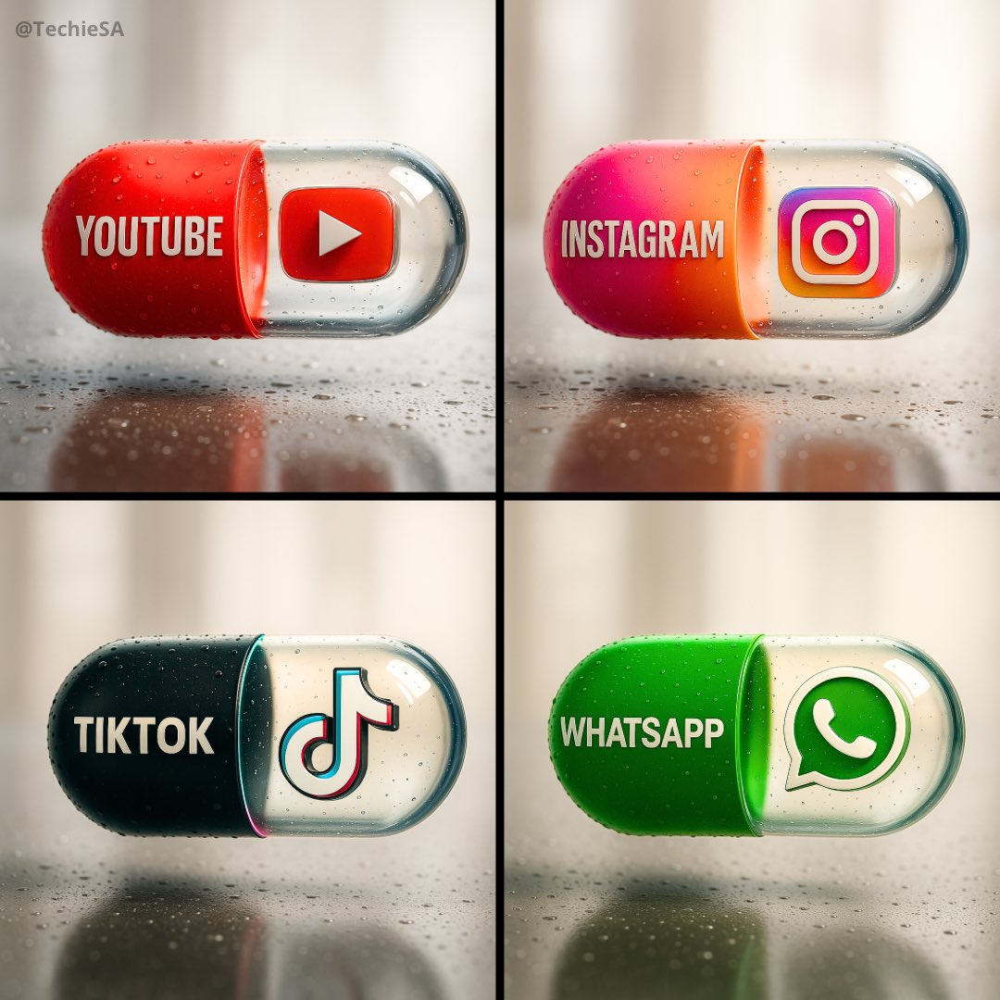

## Recreate this image using the parameters of the JSON pro

- ID: gpt4o-221-en-1
- Slug: prompt-221-en-1
- 语言: en
- 来源: [来源链接](https://x.com/alban_gz/status/1944405761439756343)
- 样例图路径: images/part3/221.jpeg

### 提示词

```text
Recreate this image using the parameters of the JSON provided.
{
  "style_name": "Diamond-Encrusted Glamour",
  "description": "Applies a hyper-realistic diamond-encrusted style to any object, logo, or shape. The surface of the subject is entirely covered with sparkling gemstones that reflect light with intense brilliance, creating a luxurious, eye-catching, and surreal look.",
  "surface_texture": {
    "material": "diamond-crystal",
    "coating": "fully encrusted with multi-faceted diamonds",
    "sparkle_intensity": "maximum",
    "reflection_type": "specular and highly refractive",
    "detail_density": "ultra-fine, micro-gem coverage with no gaps",
    "light_refraction": "strong rainbow dispersion through facets"
  },
  "lighting": {
    "light_source": "hard directional light",
    "highlight_effects": "lens flares, sparkle flares on gem edges",
    "shadow_type": "soft-edged, low-opacity shadows for contrast",
    "specularity": "very high",
    "reflection_sources": "ambient and direct highlights across the gem facets"
  },
  "background": {
    "type": "minimalist solid color",
    "color": "#B0C4DE",
    "texture": "smooth matte",
    "contrast_with_subject": "high contrast to enhance sparkle",
    "depth": "subtle shadow under the object for floating effect"
  },
  "color_palette": {
    "primary": "transparent white (diamond base)",
    "secondary": "prismatic reflections (rainbow light dispersion)",
    "accent": "metallic shimmer on edges (optional: gold or silver undertones)"
  },
  "camera": {
    "angle": "slight top-down perspective",
    "depth_of_field": "shallow (sharp focus on object, blurred background)",
    "lens_effects": ["macro focus", "sparkle highlights", "light bloom"]
  },
  "style_keywords": [
    "glamorous",
    "luxury",
    "crystal-covered",
    "bling",
    "hyper-detailed",
    "sparkling",
    "futuristic",
    "eye-catching",
    "surreal realism",
    "fashion-inspired"
  ],
  "applicability": {
    "usable_on": ["logos", "icons", "food items", "everyday objects", "fashion accessories", "typography"],
    "visual_requirements": ["well-defined silhouette", "clean shapes for gem placement"],
    "scalability": "best results on medium to large subjects for detailed sparkle"
  }
}
```

### 样例图

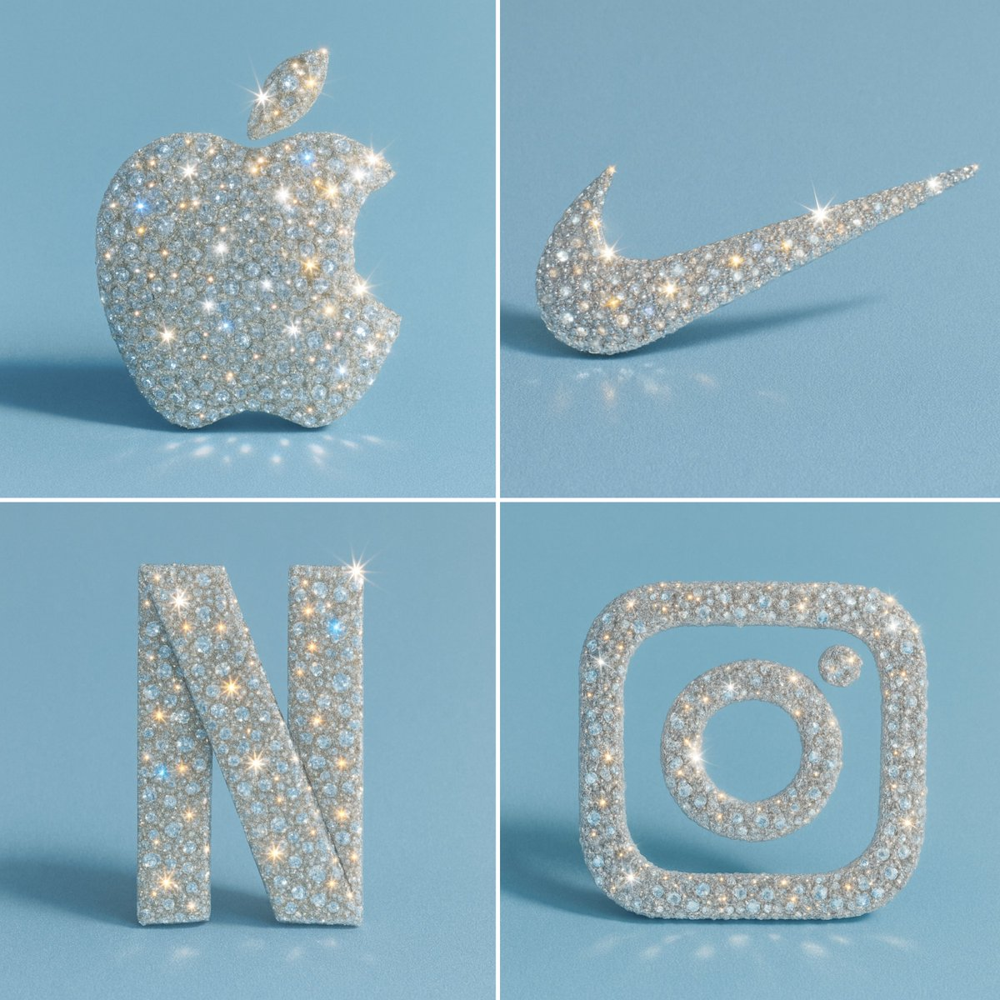

## 钻石镶嵌风格

- ID: gpt4o-221-zh-2
- Slug: prompt-221-zh-2
- 语言: zh
- 来源: [来源链接](https://x.com/alban_gz/status/1944405761439756343)
- 样例图路径: images/part3/221.jpeg

### 提示词

```text
使用提供的 JSON 参数重新创建此图像。

{
"style_name": "钻石镶嵌奢华风格",
  "description": "将超逼真的钻石镶嵌风格应用于任何物体、标志或形状。主体的表面完全覆盖着闪闪发光的宝石，这些宝石以强烈的亮度反射光线，营造出奢华、引人注目和超现实的效果。",
  "surface_texture": {
    "material": "钻石水晶",
"涂层": "完全镶嵌有多面钻石",
"闪耀强度": "最大",
"反射类型": "镜面和高折射率",
"细节密度": "超精细，微宝石覆盖，无间隙"
"light_refraction": "通过切面产生强烈的彩虹色散"
  },
  "lighting": {
    "light_source": "硬直射光源",
"高光效果": "镜头眩光，宝石边缘的闪光眩光",
    "阴影类型": "柔和边缘，低不透明度的阴影以形成对比",
    "光泽度": "非常高",
    "反射源": "宝石切面的环境光和直接高光"
  },
"background": {
    "type": "极简纯色",
    "color": " #B0C4DE ",
"纹理": "光滑磨砂质感",
"与主体对比度": "高对比度以增强闪耀效果",
"深度": "物体下方微妙阴影以产生悬浮效果"
  },
"color_palette": {
    "primary": "透明白色（钻石基底）",
    "secondary": "棱镜反射（彩虹光散）",
    "accent": "边缘金属光泽（可选：金色或银色底色）"
  },
"camera": {
    "angle": "略微俯视角度",
    "depth_of_field": "浅景深（物体清晰，背景模糊）",
"镜头效果": ["微距对焦", "闪烁高光", "光晕"]
  },
  "风格关键词": [
    "迷人",
"奢侈",
"水晶覆盖的",
"闪亮",
"超精细的",
"闪闪发光的",
"未来感的",
"引人注目的",
"超现实现实主义",
"受时尚启发的"
  ],
  "适用性": {
    "可用于": ["标志", "图标", "食品项目", "日常用品", "时尚配饰", "字体"],
"视觉要求": ["轮廓清晰", "宝石放置的形状干净"],
    "可扩展性": "在中等至大型对象上获得最佳效果，以展现细节闪烁"
  }
}
```

### 样例图


## Ultra-realistic 3D render of a cute, miniature [BRAND NA

- ID: gpt4o-220-en-1
- Slug: prompt-220-en-1
- 语言: en
- 来源: [来源链接](https://x.com/TechieBySA/status/1943242512820273451)
- 样例图路径: images/part3/220.jpeg

### 提示词

```text
Ultra-realistic 3D render of a cute, miniature [BRAND NAME] storefront building. Designed using the brand’s signature style and color palette. Features a clean, modern exterior with large glass windows and a glowing 3D [BRAND NAME] logo sign on the front. Includes subtle branded props inside the store. Background matches the brand’s identity — clean, relevant, and atmospheric. Slight isometric angle, warm lighting, soft shadows, and centered composition.
```

### 样例图

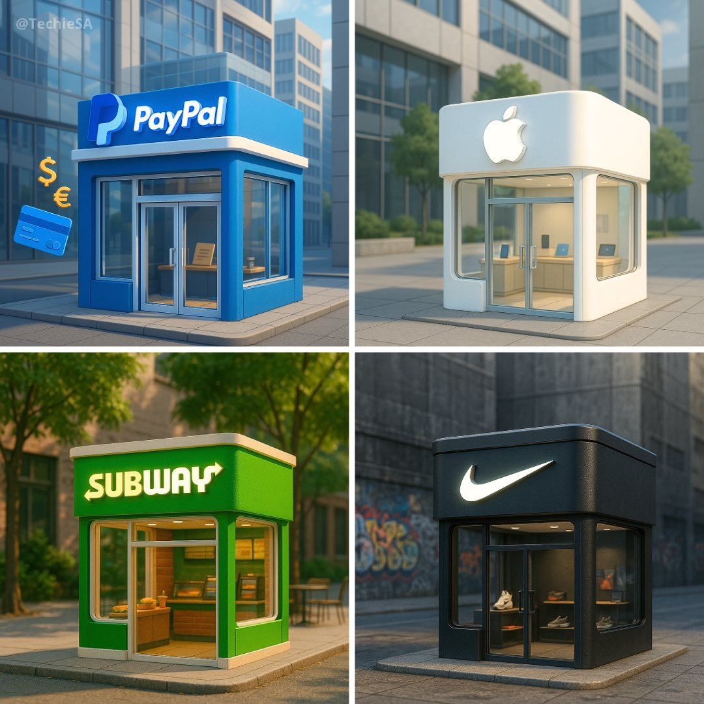

## 3D店铺渲染图

- ID: gpt4o-220-zh-2
- Slug: prompt-220-zh-2
- 语言: zh
- 来源: [来源链接](https://x.com/TechieBySA/status/1943242512820273451)
- 样例图路径: images/part3/220.jpeg

### 提示词

```text
逼真的 3D 渲染图，展示了一个可爱、迷你版的[品牌名称]店铺建筑。采用品牌的标志性风格和色彩搭配设计。外部设计简洁现代，配有大型玻璃窗，正面有一个发光的 3D[品牌名称]标志。店内包含细微的品牌道具。背景与品牌身份相匹配——干净、相关且富有氛围。略微的等距角度，温暖的照明，柔和的阴影，居中构图。
```

### 样例图


## A super detailed, realistic snow globe containing the es

- ID: gpt4o-219-en-1
- Slug: prompt-219-en-1
- 语言: en
- 来源: [来源链接](https://x.com/TheRelianceAI/status/1942870693625897385)
- 样例图路径: images/part3/219.png

### 提示词

```text
A super detailed, realistic snow globe containing the essence of [Country Name]. Inside the globe: miniature snowy landscapes, iconic landmarks, cultural symbols, and natural elements representing [Country Name], rendered with extreme realism and rich textures. Delicate falling snow creates a magical, atmospheric effect inside the globe. The background is clean and softly lit to focus entirely on the globe. The image is 1:1 aspect ratio. At the bottom of the image, the text “[Country Name]” is clearly written in an elegant serif font
```

### 样例图

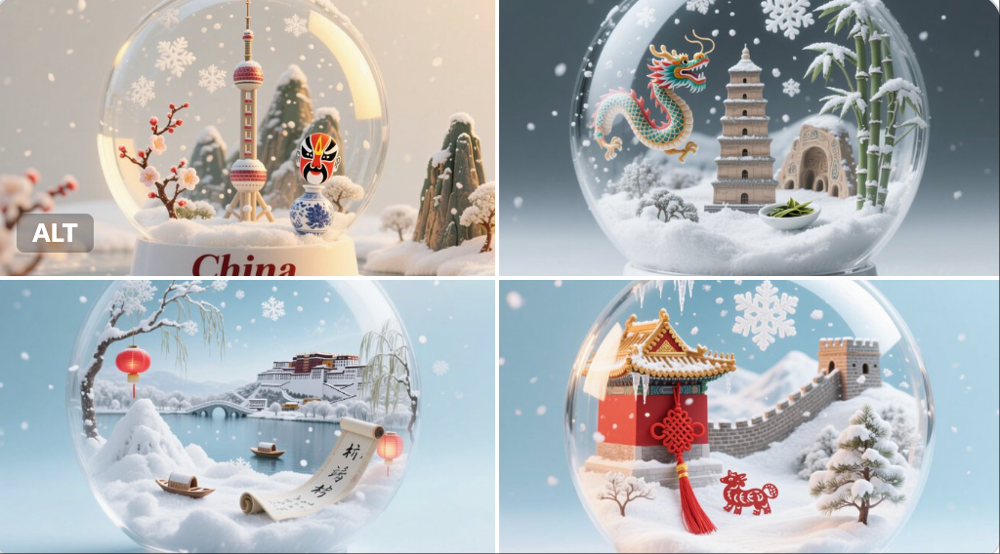

## 冬日国家

- ID: gpt4o-219-zh-2
- Slug: prompt-219-zh-2
- 语言: zh
- 来源: [来源链接](https://x.com/TheRelianceAI/status/1942870693625897385)
- 样例图路径: images/part3/219.png

### 提示词

```text
一个超级精细、逼真的雪球，包含着[国家名称]的精髓。球内：微型的雪景、标志性建筑、文化符号以及代表[国家名称]的自然元素，以极致的逼真感和丰富的纹理呈现。细腻的飘落雪花在球内营造出神奇的、充满氛围的效果。背景干净且柔和照明，完全聚焦于雪球。图像为 1:1 的宽高比。图像底部，用优雅的衬线字体清晰地书写着“[国家名称]”
```

### 样例图


## Transform this image into a Cartoon Modern Style illustr

- ID: gpt4o-217-en-1
- Slug: prompt-217-en-1
- 语言: en
- 来源: [来源链接](https://x.com/Artedeingenio/status/1942867064378573293)
- 样例图路径: images/part3/217.png

### 提示词

```text
Transform this image into a Cartoon Modern Style illustration, inspired by classic UPA animation like Mr. Magoo and The Jetsons.
Redesign the character using flat, geometric shapes: ovals, rectangles, simple curves and angles. Avoid realistic proportions — the design should be stylized and abstract.
Use a limited color palette, preferably soft pastels or bold contrasts (e.g. mint green, salmon, sky blue, mustard yellow), with flat tones and no gradients.
Simplify facial features and body structure to be iconic and minimalist — large heads, small limbs, expressive poses, but with minimal detail.
The background should be minimal or symbolic, using basic shapes or abstract scenery (floating stairs, blocky furniture, stylized trees or stars).
The final image should look like a frame from a 1950s or 1960s modernist cartoon — playful, graphic, and highly stylized.
```

### 样例图

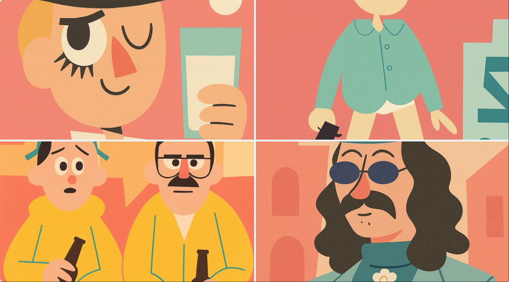

## 卡通现代风格插画

- ID: gpt4o-217-zh-2
- Slug: prompt-217-zh-2
- 语言: zh
- 来源: [来源链接](https://x.com/Artedeingenio/status/1942867064378573293)
- 样例图路径: images/part3/217.png

### 提示词

```text
将这张图片转换为卡通现代风格插画，灵感来源于经典的 UPA 动画，如《摩根先生》和《太空家庭》。
使用扁平的几何形状重新设计角色：椭圆形、矩形、简单的曲线和角度。避免真实比例——设计应该是风格化的和抽象的。
使用有限的调色板，最好是柔和的粉彩色或鲜明的对比色（例如薄荷绿、三文鱼色、天空蓝、芥末黄），使用扁平色调且没有渐变。
简化面部特征和身体结构，使其具有标志性且极简——大头、小四肢、富有表现力的姿势，但细节极少。
背景应极简或象征性，使用基本形状或抽象场景（漂浮的楼梯、积木家具、风格化的树木或星星）。
最终图像应像 1950 年代或 1960 年代现代主义卡通的一帧——活泼、图形化且高度风格化。
```

### 样例图


## Transform the [BRAND NAME] logo into a hyper-realistic, 

- ID: gpt4o-213-en-1
- Slug: prompt-213-en-1
- 语言: en
- 来源: [来源链接](https://x.com/TechieBySA/status/1942882098567618686)
- 样例图路径: images/part3/213.jpeg

### 提示词

```text
Transform the [BRAND NAME] logo into a hyper-realistic, 3D fluffy object. Keep the original shape and exact brand colors. Cover the entire surface in soft, detailed fur with a realistic hair texture. Use cinematic lighting to create subtle backlighting and soft shadows, making the logo appear tactile and surreal. Place the logo in the center of a clean black background, floating gently with a modern, stylish look. The style should feel cozy, playful, and visually striking. Render in ultra-high 4K resolution with photorealistic quality.
```

### 样例图

![Transform the [BRAND NAME] logo into a hyper-realistic, ](../images/part3/213.jpeg)

## 3D蓬松的物体

- ID: gpt4o-213-zh-2
- Slug: prompt-213-zh-2
- 语言: zh
- 来源: [来源链接](https://x.com/TechieBySA/status/1942882098567618686)
- 样例图路径: images/part3/213.jpeg

### 提示词

```text
将[品牌名称]标志转化为超逼真、3D 蓬松的物体。保持原始形状和品牌的确切颜色。用柔软、细节丰富的毛皮覆盖整个表面，具有逼真的毛发纹理。使用电影感光效创造微妙的后光和柔和的阴影，使标志看起来有触感和超现实。将标志放在干净黑色背景的中心，轻轻漂浮，具有现代时尚感。风格应感觉温馨、俏皮、视觉上引人注目。以超高清 4K 分辨率渲染，具有照片级真实质量。
```

### 样例图

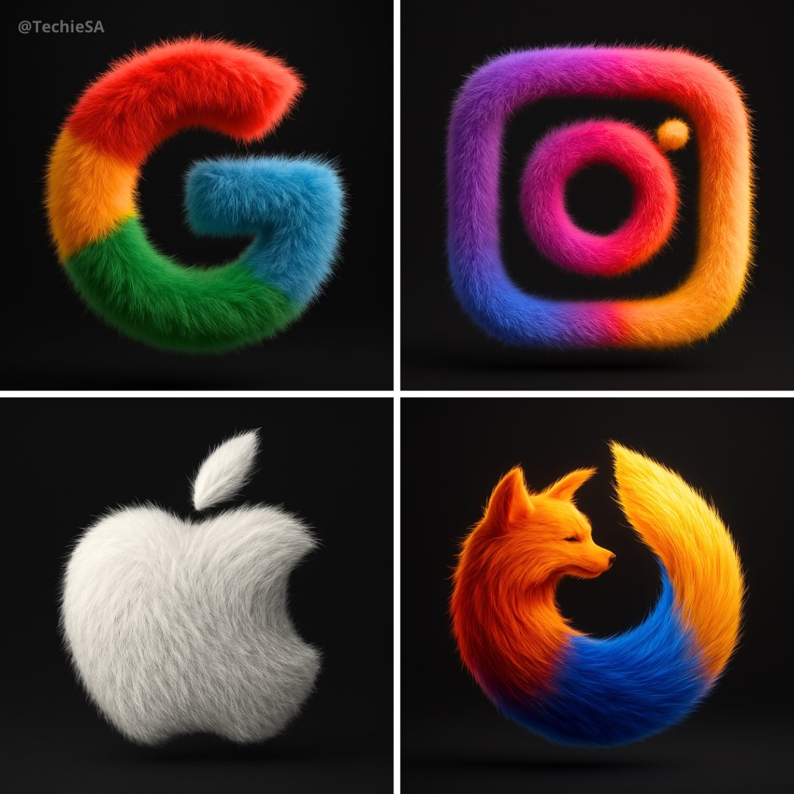

## Create a hyper-realistic, stylish poster featuring a lig

- ID: gpt4o-211-en-1
- Slug: prompt-211-en-1
- 语言: en
- 来源: [来源链接](https://x.com/TechieBySA/status/1942976425281114576)
- 样例图路径: images/part3/211.jpeg

### 提示词

```text
Create a hyper-realistic, stylish poster featuring a light bulb lying on wet urban asphalt. Inside the bulb, place a miniature version of [CITY] with its iconic landmarks. A sleek white 3D text of the city name ‘[CITY]’ should stand prominently in front of the bulb. The background is a softly blurred cityscape with neon lights reflecting on the bulb’s glass and the wet pavement. Add volumetric moonlight for depth and atmosphere. The image should look like a high-quality DSLR photograph with sharp details, cinematic lighting, and a moody, futuristic vibe.
```

### 样例图

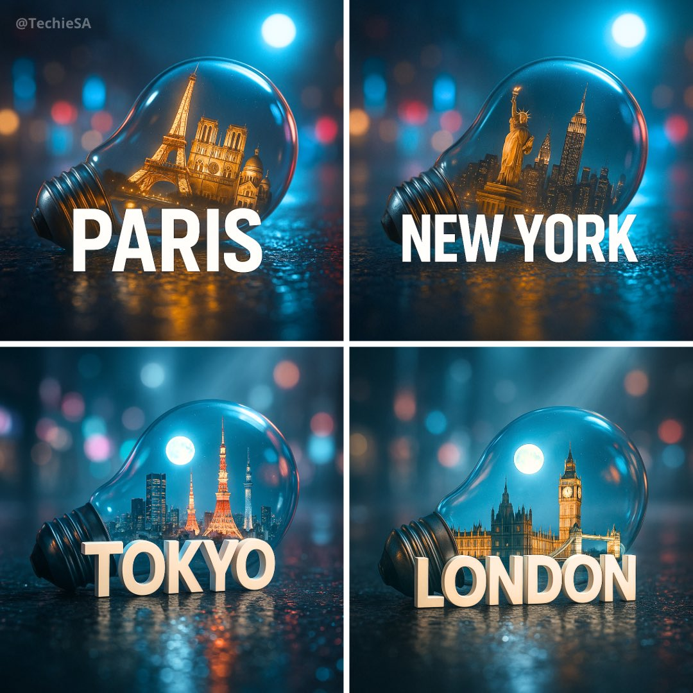

## 灯泡中的城市

- ID: gpt4o-211-zh-2
- Slug: prompt-211-zh-2
- 语言: zh
- 来源: [来源链接](https://x.com/TechieBySA/status/1942976425281114576)
- 样例图路径: images/part3/211.jpeg

### 提示词

```text
创作一张超逼真、时尚的海报，展示一个躺在湿漉漉的城市柏油路面上的灯泡。在灯泡内部放置一个[CITY]的微缩版，并包含其标志性地标。在灯泡前方，应突出显示一个光滑的白色 3D 文字，写着城市名称‘[CITY]’。背景是柔和模糊的城市景观，霓虹灯光在灯泡的玻璃和湿滑的路面上映射。添加体积光以增强深度和氛围。图像应看起来像一张高质量的数码单反相机照片，具有清晰的细节、电影般的灯光和忧郁的未来感。
```

### 样例图


## Create the word “[WORD]” made entirely from its real tex

- ID: gpt4o-209-en-1
- Slug: prompt-209-en-1
- 语言: en
- 来源: [来源链接](https://x.com/aziz4ai/status/1935749368876867967)
- 样例图路径: images/part3/209.jpeg

### 提示词

```text
Create the word “[WORD]” made entirely from its real texture and styled using the identity of the most iconic brand associated with it.

The word should:
• Visually reflect the material (e.g. honey, chocolate, soda, candy).
• Use the brand’s signature colors and typography.
• Include the brand logo beneath the word.
• Add a short slogan (3–4 words) matching the product’s vibe.
• Be centered in a minimal background inspired by the product (e.g. breakfast table, soda splash, cookie tray).

• Dimensions: 1:1
• Style: clean, bold, product-focused
• Render: ultra-HD, HDR, 8K
```

### 样例图

![Create the word “[WORD]” made entirely from its real tex](../images/part3/209.jpeg)

## 吃掉你的文字

- ID: gpt4o-209-zh-2
- Slug: prompt-209-zh-2
- 语言: zh
- 来源: [来源链接](https://x.com/aziz4ai/status/1935749368876867967)
- 样例图路径: images/part3/209.jpeg

### 提示词

```text
创建由其真实质感完全构成，并使用与其最具有标志性的品牌相联系的标识进行风格的“[单词]”。

该单词应：
• 视觉上反映材料（例如蜂蜜、巧克力、汽水、糖果）。
• 使用该品牌的标志性颜色和字体。
• 在文字下方包含品牌标志。
• 添加一个与产品氛围相符的简短口号（3-4 个字）。
• 居中放置在受产品启发的简约背景中（例如：早餐桌、汽水飞溅、饼干托盘）。

• 尺寸：1:1
• 风格：简洁、醒目、以产品为中心
• 渲染：超高清、HDR、8K
```

### 样例图

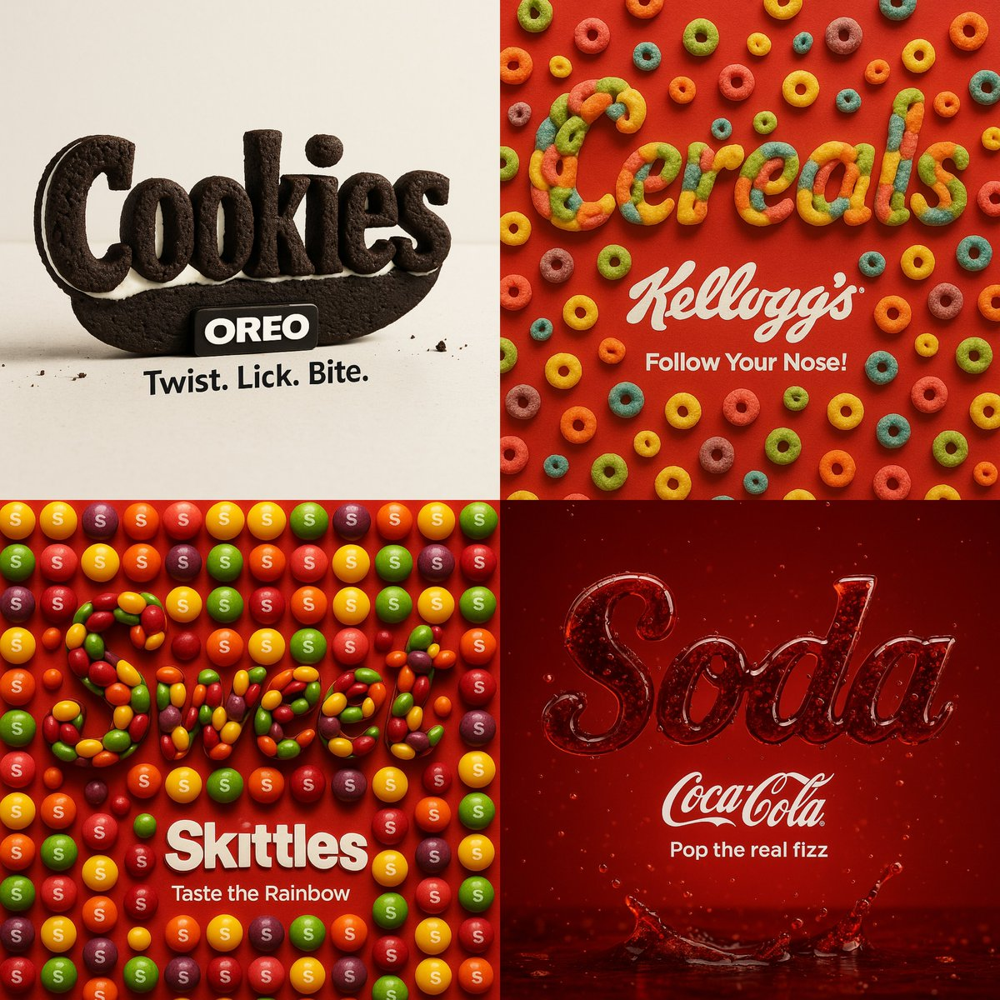

## Create a hyperrealistic, surreal 1:1 advertisement for [

- ID: gpt4o-206-en-1
- Slug: prompt-206-en-1
- 语言: en
- 来源: [来源链接](https://x.com/aziz4ai/status/1933698466577866902)
- 样例图路径: images/part3/206.jpeg

### 提示词

```text
Create a hyperrealistic, surreal 1:1 advertisement for [Brand Name].
Transform the product into a miniature industrial factory or laboratory from the inside.
Reveal detailed internal systems: pipes, workers, glowing fluids, steam, and machines — all functioning to reflect the product’s core purpose (energy, beauty, flavor, etc).
Keep the outer product branding realistic and sharp.
Set the background minimal and cinematic.
Add the brand logo at the top, and a short, powerful slogan at the bottom.
Style: studio-grade lighting, high contrast, photorealistic textures.
```

### 样例图

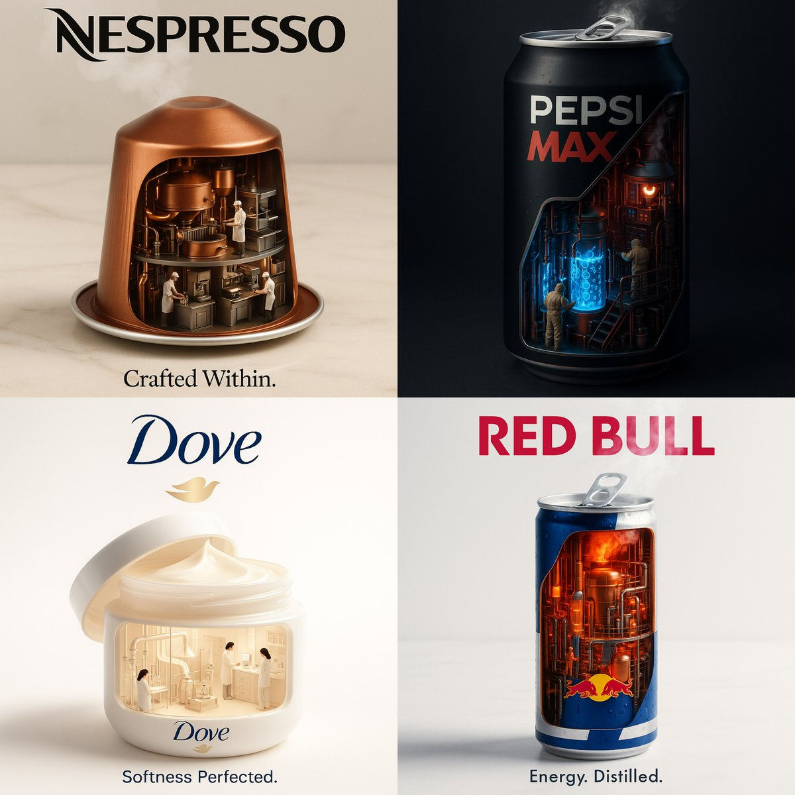

## 工业内部品牌广告

- ID: gpt4o-206-zh-2
- Slug: prompt-206-zh-2
- 语言: zh
- 来源: [来源链接](https://x.com/aziz4ai/status/1933698466577866902)
- 样例图路径: images/part3/206.jpeg

### 提示词

```text
创建一个超现实、1:1 比例的品牌广告。
将产品内部转化为微型工厂或实验室。
展示详细的内部系统：管道、工人、发光的液体、蒸汽和机器——所有这些都运作起来，反映产品的核心功能（能量、美丽、风味等）。
保持外层产品的品牌标识真实锐利。
将背景设置得简约且电影感十足。
在顶部添加品牌标志，底部添加一句简短有力的口号。
风格：影棚级灯光，高对比度，照片级真实纹理。
```

### 样例图


## A high-quality studio photograph of a [BRAND + OBJECT] f

- ID: gpt4o-205-en-1
- Slug: prompt-205-en-1
- 语言: en
- 来源: [来源链接](https://x.com/Kerroudjm/status/1935037246182408301)
- 样例图路径: images/part3/205.png

### 提示词

```text
A high-quality studio photograph of a [BRAND + OBJECT] fully covered in ultra-realistic [ANIMAL] texture (e.g., fur, feathers, skin, or scales), placed against a soft neutral background. The object’s original shape, key design elements, and brand identity remain clearly visible beneath the animal’s organic surface. Integrate the official logo of the brand prominently into the composition. Automatically generate a compelling and brand-appropriate slogan that draws symbolic inspiration from the animal’s qualities and matches the tone of a premium advertising campaign. The image must feature clean composition, soft shadows, minimalist styling, professional lighting, and highly detailed textures—each hair, scale, or wrinkle should be visible in sharp detail. Format 1:1.
```

### 样例图

![A high-quality studio photograph of a [BRAND + OBJECT] f](../images/part3/205.png)

## 以动物为灵感的品牌

- ID: gpt4o-205-zh-2
- Slug: prompt-205-zh-2
- 语言: zh
- 来源: [来源链接](https://x.com/Kerroudjm/status/1935037246182408301)
- 样例图路径: images/part3/205.png

### 提示词

```text
一张高品质的影棚照片，展示一个[品牌+物品]完全覆盖着超逼真的[动物]纹理（例如毛发、羽毛、皮肤或鳞片），放置在柔和的中性背景前。物品的原始形状、关键设计元素和品牌标识在动物的自然表面下依然清晰可见。将品牌的官方标志显著地融入构图。自动生成一个引人入胜且符合品牌调性的口号，从动物的品质中汲取象征性灵感，匹配高端广告活动的基调。图像必须具备整洁的构图、柔和的阴影、极简风格、专业的灯光和高度精细的纹理——每一根毛发、鳞片或皱纹都应在锐利的细节中清晰可见。格式 1:1。
```

### 样例图

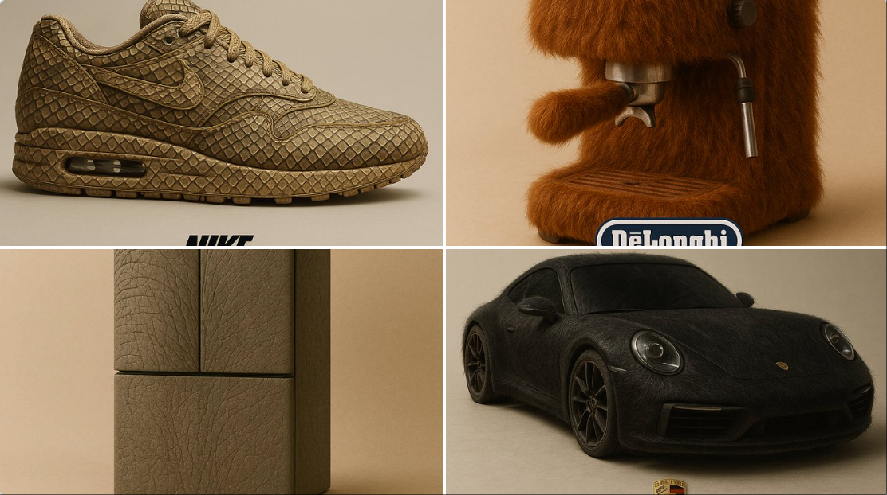

## Transform this image into a digital Matrix-style scene. 

- ID: gpt4o-204-en-1
- Slug: prompt-204-en-1
- 语言: en
- 来源: [来源链接](https://x.com/umesh_ai/status/1920343010975551554)
- 样例图路径: images/part3/204.jpeg

### 提示词

```text
Transform this image into a digital Matrix-style scene. The background and subject should be composed of cascading neon green code on a black backdrop, similar to the iconic Matrix digital rain. Use glowing green symbols (Japanese katakana, numbers, and Latin letters), with some motion blur and depth. Add subtle lighting effects to simulate screen glow and enhance the cyberpunk, high-tech atmosphere
```

### 样例图

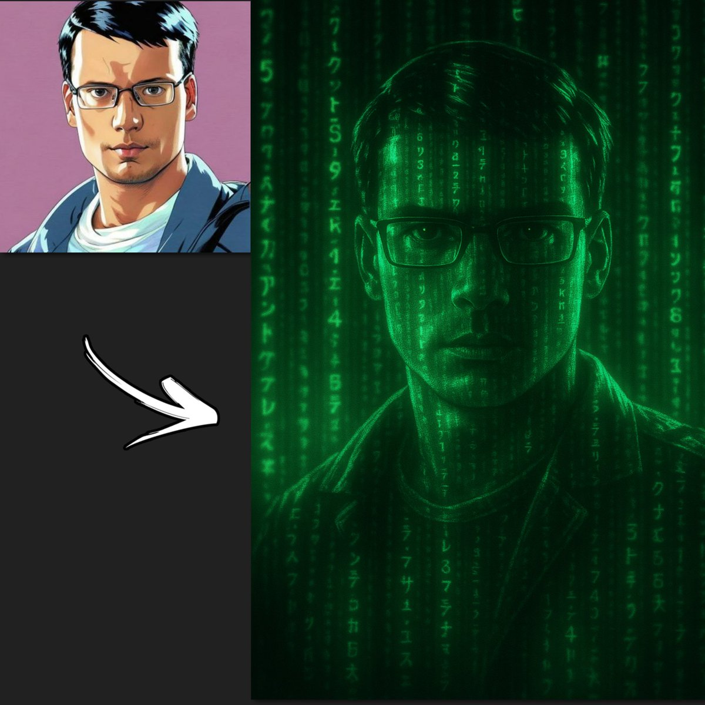

## 黑客帝国的绿色代码

- ID: gpt4o-204-zh-2
- Slug: prompt-204-zh-2
- 语言: zh
- 来源: [来源链接](https://x.com/umesh_ai/status/1920343010975551554)
- 样例图路径: images/part3/204.jpeg

### 提示词

```text
将这张图像转化为数字《黑客帝国》风格场景。背景和主题应由倾泻而下的霓虹绿色代码组成，在黑色背景下，类似于标志性的《黑客帝国》数字雨。使用发光的绿色符号（日语假名、数字和拉丁字母），带有一些运动模糊和深度。添加微妙的光照效果来模拟屏幕辉光，增强赛博朋克、高科技氛围
```

### 样例图


## create image with 1:1 ratio [Brand] ad. Ultra-high-detai

- ID: gpt4o-194-en-1
- Slug: prompt-194-en-1
- 语言: en
- 来源: [来源链接](https://x.com/hc_dsn/status/1936095679879037143)
- 样例图路径: images/part3/194.jpeg

### 提示词

```text
create image with 1:1 ratio 
[Brand] ad. Ultra-high-detail product photo in a fusion of Art Deco and Futurism. The product rest on platforms.  Background features stylized Art Deco skyscraper silhouettes morphing into Futurist speed lines, forming a diagonal left-to-right composition. Surfaces use brand Core Material and faceted glass with ambient lighting in Brand Color theme.  The product evoking motion and kinetic optimism. Dramatic low-angle lighting enhances reflections, with subtle vapor trails in the background.  Small logo on the bottom, and a tiny slogan beneath
```

### 样例图

![create image with 1:1 ratio [Brand] ad. Ultra-high-detai](../images/part3/194.jpeg)

## 装饰艺术未来主义

- ID: gpt4o-194-zh-2
- Slug: prompt-194-zh-2
- 语言: zh
- 来源: [来源链接](https://x.com/hc_dsn/status/1936095679879037143)
- 样例图路径: images/part3/194.jpeg

### 提示词

```text
以 1：1 的比例创建图像
[品牌] 广告。融合了装饰艺术和未来主义的超高细节产品照片。该产品位于平台上。 背景以风格化的装饰艺术摩天大楼剪影转变为未来主义的速度线条，形成从左到右的对角线构图。表面使用品牌核心材料和多面玻璃，并在品牌颜色主题中使用环境照明。 该产品唤起了动感和动感的乐观主义。戏剧性的低角度照明增强了反射，背景中带有微妙的蒸汽痕迹。 底部有小标志，下面有一个小标语
```

### 样例图

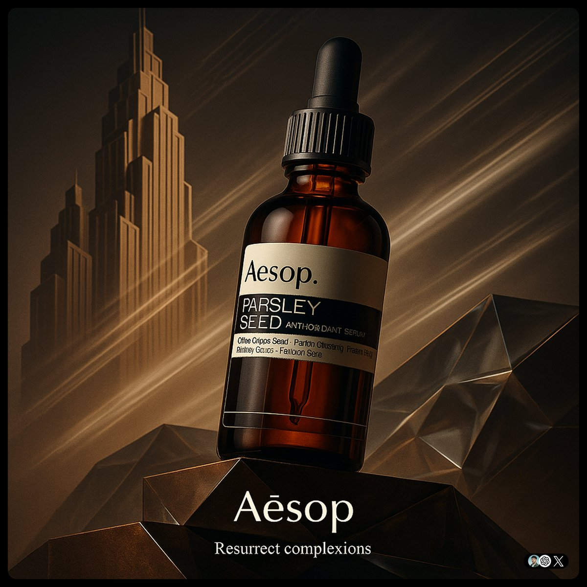

## Recreate [BRAND NAME] logo following my JSON aesthetic b

- ID: gpt4o-193-en-1
- Slug: prompt-193-en-1
- 语言: en
- 来源: [来源链接](https://x.com/alex_prompter/status/1935739243352989945)
- 样例图路径: images/part3/193.jpeg

### 提示词

```text
Recreate [BRAND NAME] logo following my JSON aesthetic below:
{
"role": "You are a lunar scene generator trained on NASA’s Apollo archives. Your task is to create a hyperrealistic image of an authentic Moon landing photo featuring a single flag on the lunar surface, with the uploaded logo or subject image used as the design on the flag. Maintain all original colors, shapes, and text. Do not alter or reinterpret the uploaded image. No substitutions allowed.",
"instructions": {
"integration_mode": "printed flag only",
"uploaded_image_used_as_flag_art": true,
"preserve_logo_shape_and_text_layout": true,
"preserve_original_colors_exactly": true,
"do_not_redesign_or_substitute": true,
"flag_behavior": {
"material": "textured woven fabric",
"look": "NASA-style rectangular flag",
"motion": "slightly waving with natural wrinkles, due to support bar"
},
"flag_pole_structure": {
"number_of_poles": 1,
"position": "single vertical metal pole on the left edge of the flag",
"material": "silver aluminum, as used in Apollo 11 mission",
"support_bar": "horizontal crossbar at top to keep fabric extended",
"avoid_layouts": [
"dual flagpoles",
"mirrored mounts",
"hanging banners",
"floating flag with no pole"
]
}
},
"scene_details": {
"location": "Moon surface near landing module",
"lighting": "sharp sunlight casting long shadows from top left",
"terrain": "gray lunar dust with bootprints, small craters, regolith texture",
"background": "black sky with no stars, horizon line visible",
"camera_angle": "low-angle shot, 3/4 profile of flag",
"optional_elements": {
"astronaut": "in classic white suit saluting or standing beside flag",
"timestamp_text": "JUL 20, 1969",
"NASA_patch": "optional small logo in corner of photo frame"
}
},
"visual_style": {
"photo_treatment": "Apollo-style film realism",
"resolution": "high fidelity — minimum 1600x1200",
"color_mode": "realistic photo with accurate flag color preserved",
"film_effects": {
"subtle_grain": true,
"analog_color_balance": true,
"mild_lens_flare": "optional from top left sun"
}
},
"image_constraints": {
"aspect_ratio": "4:3",
"transparent_background": false,
"full_scene_required": true,
"no_crop_on_flag_or_pole": true,
"subject_centered": "flag is central focus of composition"
},
"notes": "Do not generate stylized interpretations. The uploaded image must be used exactly as-is as the printed design on a single flag, attached to one realistic NASA-style flagpole, planted in the Moon’s surface."
}
```

### 样例图

![Recreate [BRAND NAME] logo following my JSON aesthetic b](../images/part3/193.jpeg)

## 将您的徽标放在月球上

- ID: gpt4o-193-zh-2
- Slug: prompt-193-zh-2
- 语言: zh
- 来源: [来源链接](https://x.com/alex_prompter/status/1935739243352989945)
- 样例图路径: images/part3/193.jpeg

### 提示词

```text
按照下面的 JSON 美学重新创建 [BRAND NAME] 徽标：
{
“role”： “您是在 NASA 的 Apollo 档案中训练的月球场景生成器。您的任务是创建一张真实的登月照片的超写实图像，其中月球表面有一面旗帜，并将上传的徽标或主题图像用作旗帜上的设计。保留所有原始颜色、形状和文本。请勿更改或重新解释上传的图像。不允许替换。
“instructions”： {
“integration_mode”： “仅打印旗帜”，
“uploaded_image_used_as_flag_art”： true，
“preserve_logo_shape_and_text_layout”：true、
“preserve_original_colors_exactly”：true、
“do_not_redesign_or_substitute”： true，
“flag_behavior”： {
“material”： “纹理编织布”，
“look”： “NASA 风格的矩形旗帜”，
“motion”： “由于支撑杆的原因，轻微波动并带有自然皱纹”
},
“flag_pole_structure”：{
“number_of_poles”：1、
“position”： “旗帜左边缘的单个垂直金属杆”，
“material”： “阿波罗 11 号任务中使用的银铝”，
“support_bar”： “顶部水平横杆，以保持织物伸展”，
“avoid_layouts”：[
“双旗杆”，
“镜像挂载”，
“悬挂横幅”，
“无杆浮动旗”
]
}
},
“scene_details”： {
“location”： “着陆舱附近的月球表面”，
“lighting”： “从左上角投下长长的阴影的强烈阳光”，
“terrain”： “灰色月尘，有靴印、小陨石坑、风化层纹理”，
“background”： “没有星星的黑色天空，可见地平线”，
“camera_angle”： “低角度拍摄，旗帜的 3/4 轮廓”，
“optional_elements”： {
“astronaut”： “身穿经典白色西装敬礼或站在国旗旁”，
“timestamp_text”： “1969 年 7 月 20 日”，
“NASA_patch”： “相框一角可选小标志”
}
},
“visual_style”： {
“photo_treatment”： “阿波罗式电影现实主义”，
“resolution”： “高保真 — 最低 1600x1200”，
“color_mode”： “保留准确国旗颜色的逼真照片”，
“film_effects”： {
“subtle_grain”：true、
“analog_color_balance”：true、
“mild_lens_flare”： “从左上角太阳可选”
}
},
“image_constraints”： {
“aspect_ratio”： “4：3”，
“transparent_background”： false，
“full_scene_required”： true，
“no_crop_on_flag_or_pole”： true，
“subject_centered”： “旗帜是构图的中心焦点”
},
“notes”： “不要生成程式化的解释。上传的图像必须与单面旗帜上的印刷设计完全一样使用，该旗帜连接到一根安装在月球表面的逼真的 NASA 风格旗杆上。
}
```

### 样例图

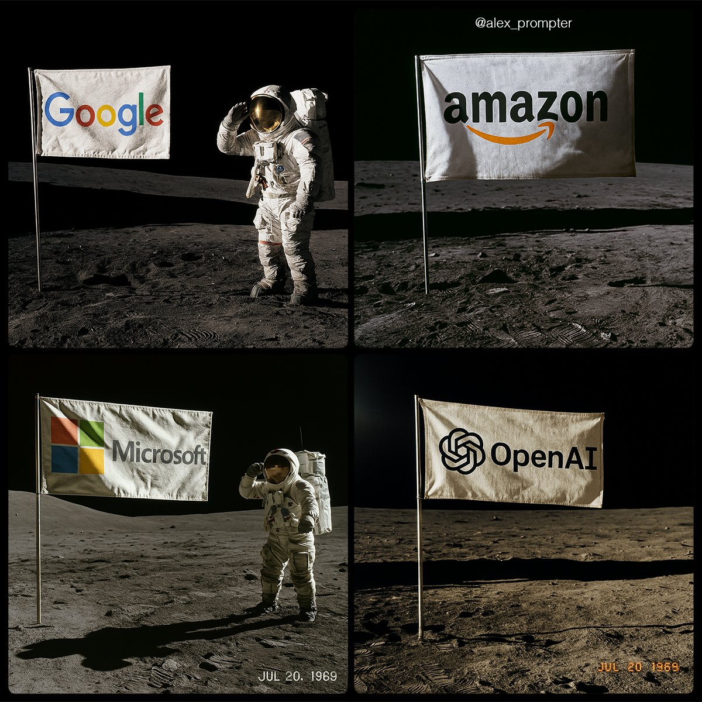

## A fictional character shaped like a [Brand Name] product

- ID: gpt4o-190-en-1
- Slug: prompt-190-en-1
- 语言: en
- 来源: [来源链接](https://x.com/B_4AI/status/1939218188513726675)
- 样例图路径: images/part3/190.png

### 提示词

```text
A fictional character shaped like a [Brand Name] product, wearing clothing that reflects the brand’s identity, sitting or riding on an oversized version of one of the brand's products as if it were a futuristic vehicle. The design features an expressive, dynamic artistic style full of motion and vibrant colors, with a large abstract version of the brand’s logo in the background. Freely drawn elements and colors representing the brand are scattered throughout. The background is light-colored, and the brand’s logo appears at the bottom. aspect 1:1
```

### 样例图

![A fictional character shaped like a [Brand Name] product](../images/part3/190.png)

## 品牌虚拟人物

- ID: gpt4o-190-zh-2
- Slug: prompt-190-zh-2
- 语言: zh
- 来源: [来源链接](https://x.com/B_4AI/status/1939218188513726675)
- 样例图路径: images/part3/190.png

### 提示词

```text
一个形状像 [品牌名称] 商品的虚构人物，穿着反映品牌身份的服装，坐在或骑在该品牌某件商品的超大版本上，就好像它是一辆未来主义的汽车一样。该设计具有富有表现力、充满活力的艺术风格，充满动感和鲜艳的色彩，背景是品牌标志的大型抽象版本。代表品牌的自由绘制元素和颜色散布在整个过程中。背景为浅色，品牌标志出现在底部。外观 1：1
```

### 样例图

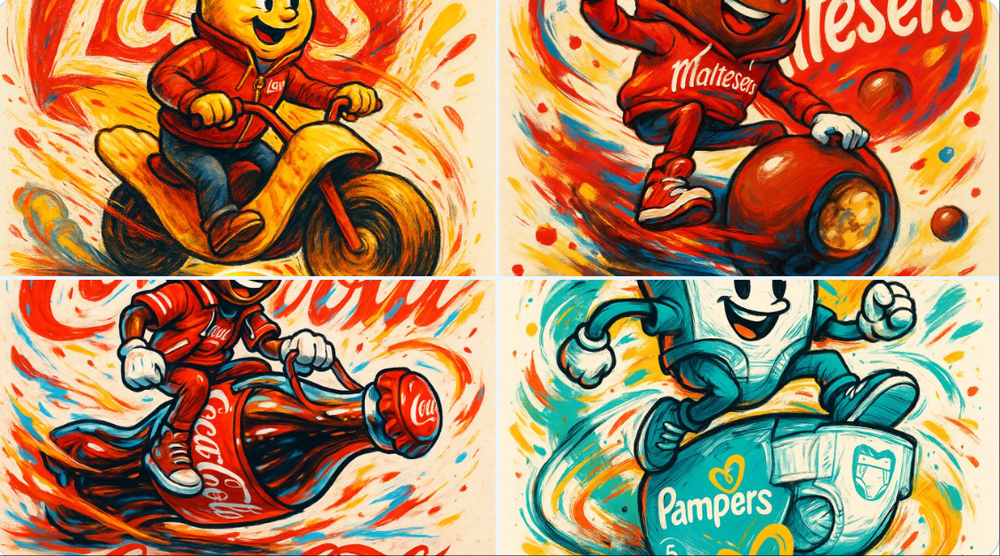

## A detailed overhead shot of a fluid, colorful OpenAI log

- ID: gpt4o-182-en-1
- Slug: prompt-182-en-1
- 语言: en
- 来源: [来源链接](https://x.com/Gdgtify/status/1938901186616471840)
- 样例图路径: images/part3/182.jpeg

### 提示词

```text
A detailed overhead shot of a fluid, colorful OpenAI logo created by arranging hundreds of naturally shed exotic bird feathers. Capture the incredible iridescence, delicate barbs, and varied textures against a misty white backdrop with side lighting.
```

### 样例图

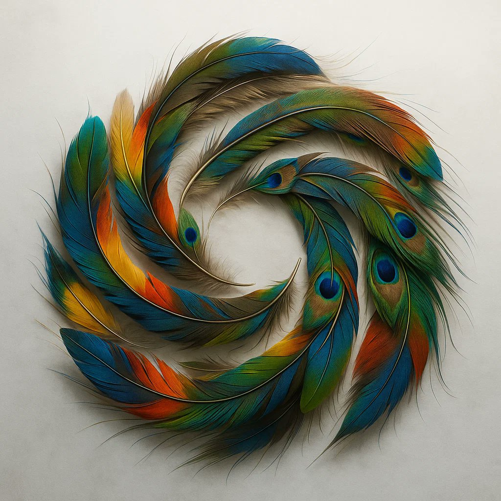

## 鸟类羽毛制成LOGO

- ID: gpt4o-182-zh-2
- Slug: prompt-182-zh-2
- 语言: zh
- 来源: [来源链接](https://x.com/Gdgtify/status/1938901186616471840)
- 样例图路径: images/part3/182.jpeg

### 提示词

```text
流畅、多彩的 OpenAI 徽标的详细俯拍镜头，由数百根自然脱落的异国鸟类羽毛制成。在带有侧面照明的朦胧白色背景下捕捉令人难以置信的彩虹色、精致的倒钩和各种纹理。
```

### 样例图


## Close-up, A hand holding a transparent capsule, inside i

- ID: gpt4o-169-en-1
- Slug: prompt-169-en-1
- 语言: en
- 来源: [来源链接](https://x.com/CharaspowerAI/status/1938299520019734676)
- 样例图路径: images/part3/169.png

### 提示词

```text
Close-up, A hand holding a transparent capsule, inside it is a miniature model of [character name], wearing [their iconic outfit and accessories]. The character is posed in a [specific, expressive or dynamic pose], interacting with the inner surface of the capsule, as if they are frozen or confined inside. Hyper-realistic, cinematic, studio lighting setup, photographed with a macro lens.
```

### 样例图

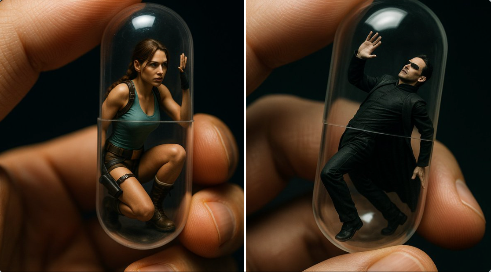

## 微型透明胶囊

- ID: gpt4o-169-zh-2
- Slug: prompt-169-zh-2
- 语言: zh
- 来源: [来源链接](https://x.com/CharaspowerAI/status/1938299520019734676)
- 样例图路径: images/part3/169.png

### 提示词

```text
特写，一只手拿着一个透明的胶囊，里面是一个 [角色名称] 的微型模型，穿着 [他们的标志性服装和配饰]。角色以 [特定、富有表现力或动态的姿势] 摆姿势，与胶囊的内表面互动，就好像他们被冻结或限制在里面一样。超逼真、电影般的工作室照明设置，使用微距镜头拍摄。
```

### 样例图


## A high-quality 3D cartoon animal character inspired by [

- ID: gpt4o-158-en-1
- Slug: prompt-158-en-1
- 语言: en
- 来源: [来源链接](https://x.com/B_4AI/status/1937010045062959468)
- 样例图路径: images/part3/158.png

### 提示词

```text
A high-quality 3D cartoon animal character inspired by [Brand Name], with large round eyes and an innocent, friendly expression. The character wears a knitted sweater featuring the brand name in bold letters. It sits confidently atop a futuristic vehicle shaped like a product from the brand, fully inspired by the brand’s design language and covered in racing stickers and symbolic brand logos. The scene is set inside a maintenance workshop that showcases Stone Age-era versions of the brand's products. The background blends the brand’s visual identity colors. The design must be highly detailed, with Pixar-style lighting and realistic textures for the character, fabric, and vehicle. Format: full-body, in a dynamic pose, rendered in 4K CGI.
```

### 样例图

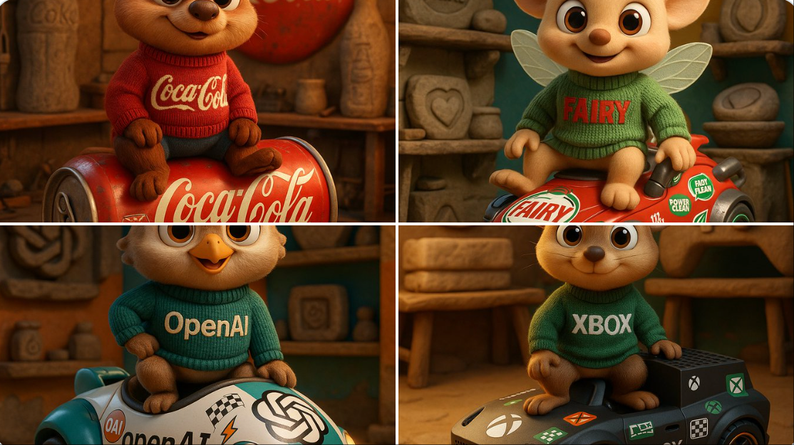

## 品牌3D卡通动物角色

- ID: gpt4o-158-zh-2
- Slug: prompt-158-zh-2
- 语言: zh
- 来源: [来源链接](https://x.com/B_4AI/status/1937010045062959468)
- 样例图路径: images/part3/158.png

### 提示词

```text
受 [品牌名称] 启发的高品质 3D 卡通动物角色，拥有圆圆的大眼睛和天真友好的表情。该角色穿着一件针织毛衣，上面印有粗体字的品牌名称。它自信地坐在一辆形状像该品牌产品的未来主义汽车上，完全受到品牌设计语言的启发，并覆盖着赛车贴纸和象征性的品牌标志。场景设置在一个维修车间内，该车间展示了该品牌产品的石器时代版本。背景融合了品牌的视觉识别颜色。设计必须非常详细，具有皮克斯风格的照明和角色、织物和车辆的逼真纹理。格式：全身，动态姿势，以 4K CGI 渲染。
```

### 样例图


## create image with 1:1 ratio surreal minimal aesthetic, a

- ID: gpt4o-157-en-1
- Slug: prompt-157-en-1
- 语言: en
- 来源: [来源链接](https://x.com/hc_dsn/status/1937118859083047137)
- 样例图路径: images/part3/157.jpeg

### 提示词

```text
create image with 1:1 ratio 
surreal minimal aesthetic, airplane window frame on subtle gradient backdrop with same color, through the oval window showing random iconic landmark scenery of [Country Name], an overlay weather ui interface on the center of window, from top to bottom, contain the small weather icon, huge temperatures with elegant light weight font, and small location tag beneath it, the bottom is the country name, generate with extreme weathers, the window will affect by the weather, the color combo of subtle gradient backdrop is resonate with the weather, natural lighting, soft shadows, subtle reflections on glass, great negative space
```

### 样例图

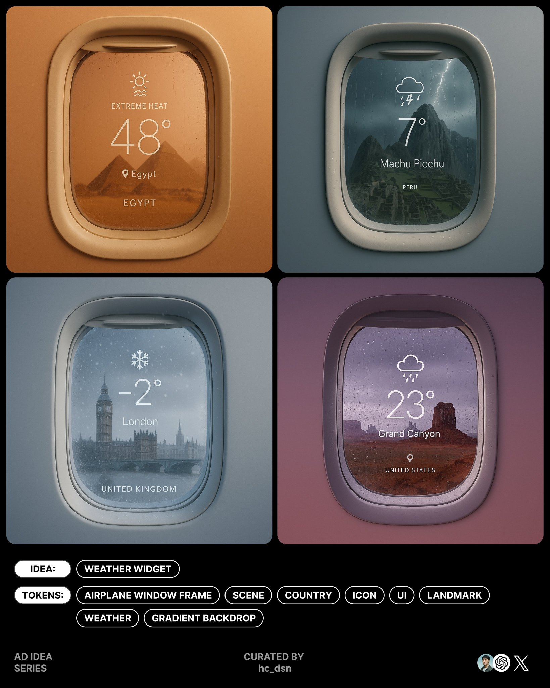

## 最小天气小部件

- ID: gpt4o-157-zh-2
- Slug: prompt-157-zh-2
- 语言: zh
- 来源: [来源链接](https://x.com/hc_dsn/status/1937118859083047137)
- 样例图路径: images/part3/157.jpeg

### 提示词

```text
以 1：1 的比例创建图像
超现实的极简美学，飞机窗框在微妙的渐变背景上，同色系，通过椭圆形窗口随机展示【国家名称】的标志性地标风景，窗口中央叠加天气 UI 界面，从上到下，包含小天气图标，巨大的温度搭配优雅的轻量级字体，下方有小位置标签， 底部是国名，在极端天气下生成，窗户会受到天气的影响，微妙的渐变背景的颜色组合与天气产生共鸣，自然光，柔和的阴影，玻璃上的微妙反射，巨大的负空间
```

### 样例图


## a luxurious fashion magazine cover designed in the style

- ID: gpt4o-155-en-1
- Slug: prompt-155-en-1
- 语言: en
- 来源: [来源链接](https://x.com/TheRelianceAI/status/1936802168318910673)
- 样例图路径: images/part3/155.png

### 提示词

```text
a luxurious fashion magazine cover designed in the style of [COUNTRY], blending iconic landmarks, cultural symbols, and local fashion aesthetics. The layout mimics high-end editorial design, with headlines inspired by the country’s language, trends, and lifestyle. Sophisticated, cinematic lighting, vertical 9:16 format, ultra-detailed, Vogue-level elegance
```

### 样例图

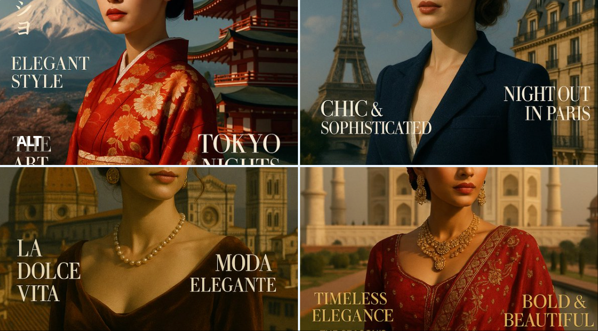

## 自己的国家地标时尚杂志

- ID: gpt4o-155-zh-2
- Slug: prompt-155-zh-2
- 语言: zh
- 来源: [来源链接](https://x.com/TheRelianceAI/status/1936802168318910673)
- 样例图路径: images/part3/155.png

### 提示词

```text
以 [COUNTRY] 风格设计的豪华时尚杂志封面，融合了标志性地标、文化符号和当地时尚美学。布局模仿高端编辑设计，标题的灵感来自该国的语言、趋势和生活方式。精致的电影级灯光，垂直 9：16 格式，超细节，Vogue 级别的优雅
```

### 样例图


## Design a modern logo in NeoGradient Soft Tech style for 

- ID: gpt4o-151-en-1
- Slug: prompt-151-en-1
- 语言: en
- 来源: [来源链接](https://x.com/aziz4ai/status/1936744152366288926)
- 样例图路径: images/part3/151.jpeg

### 提示词

```text
Design a modern logo in NeoGradient Soft Tech style for a fictional startup called “NAME” in the “[INDUSTRY TYPE]” industry.

The logo must include:
•A unique abstract icon
•A clean, bold sans-serif logotype
•Smooth glowing gradients blending vibrant colors like blue, purple, pink, orange, and teal
•Seamless harmony between symbol and text
•Minimalist, futuristic composition
•On a pure black background
•1:1 aspect ratio — ultra-HD

The logo should feel creative, modern, and ready for a bold digital brand.
```

### 样例图

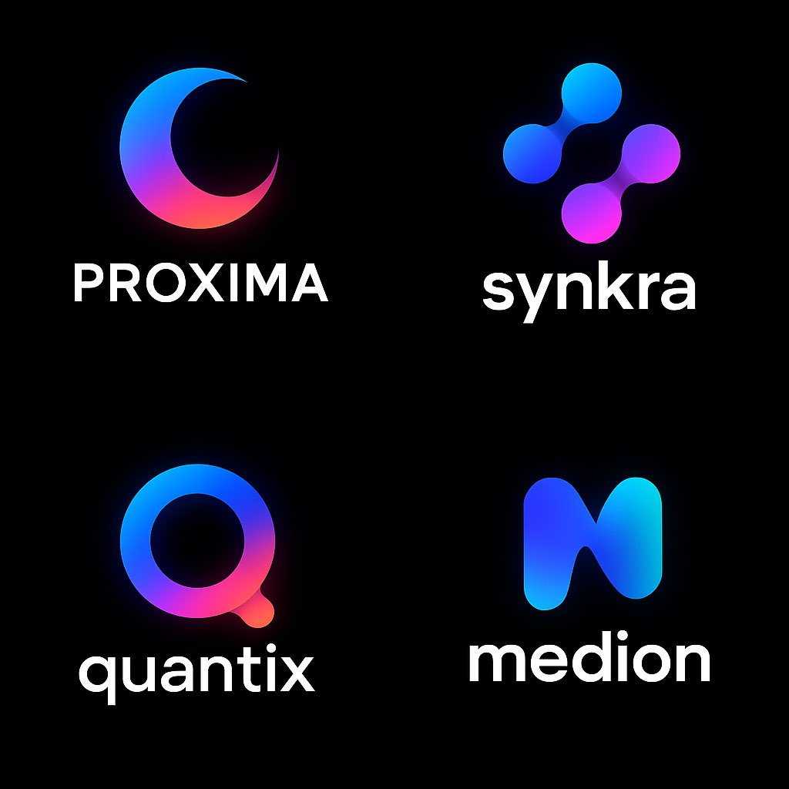

## Neoglo风格Logo

- ID: gpt4o-151-zh-2
- Slug: prompt-151-zh-2
- 语言: zh
- 来源: [来源链接](https://x.com/aziz4ai/status/1936744152366288926)
- 样例图路径: images/part3/151.jpeg

### 提示词

```text
为“[INDUSTRY TYPE]”行业中名为 “NAME” 的虚构初创公司设计一个 NeoGradient Soft Tech 风格的现代标志。

徽标必须包含：
•独特的抽象图标
•干净、大胆的无衬线标识
•平滑的发光渐变，混合了蓝色、紫色、粉红色、橙色和蓝绿色等鲜艳的颜色
•符号和文本之间的无缝协调
•极简主义、未来主义的构图
•在纯黑色背景上
•1：1 纵横比 — 超高清

徽标应该具有创意、现代感，并为大胆的数字品牌做好准备。
```

### 样例图


## A high-quality studio product photo of a [brand name]-br

- ID: gpt4o-139-en-1
- Slug: prompt-139-en-1
- 语言: en
- 来源: [来源链接](https://x.com/azed_ai/status/1934631664153760241)
- 样例图路径: images/part3/139.jpeg

### 提示词

```text
A high-quality studio product photo of a [brand name]-branded [product type], [floating / standing] against a solid background in the brand’s signature color. The product features the brand logo prominently and uses the official brand color palette. Clean composition, soft shadows, ultra-realistic materials and textures, no text, no props, professional commercial lighting, sharp focus, minimalist aesthetic.
```

### 样例图

![A high-quality studio product photo of a [brand name]-br](../images/part3/139.jpeg)

## 将您最喜欢的品牌变成生活方式产品

- ID: gpt4o-139-zh-2
- Slug: prompt-139-zh-2
- 语言: zh
- 来源: [来源链接](https://x.com/azed_ai/status/1934631664153760241)
- 样例图路径: images/part3/139.jpeg

### 提示词

```text
一张高质量的工作室商品照片，其中包含 [品牌名称] 品牌 [商品类型]、[浮动/直立] 和纯色背景，采用品牌标志性的颜色。该商品突出品牌徽标，并使用官方品牌调色板。干净的构图，柔和的阴影，超逼真的材质和纹理，无文字，无道具，专业的商业照明，锐利的焦点，极简的美学。
```

### 样例图

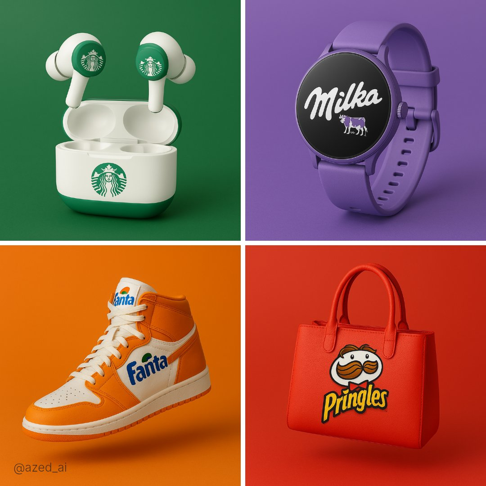

## “[MOVIE TITLE ]” — cinematic movie poster design in ultr

- ID: gpt4o-134-en-1
- Slug: prompt-134-en-1
- 语言: en
- 来源: [来源链接](https://x.com/aziz4ai/status/1934339212561555949)
- 样例图路径: images/part3/134.jpeg

### 提示词

```text
“[MOVIE TITLE ]” — cinematic movie poster design in ultra-realistic, high-definition style. Capture a dramatic and emotionally charged scene based on the film’s title. Use a high Kelvin color temperature to eliminate yellow tint, favoring cold, bluish tones or neutral whites. Add volumetric fog, sharp shadows, and deep depth of field. Simulate a cinematic lens with soft bloom, subtle lens flare, and film grain.

Render the title “[MOVIE TITLE ]” in expressive kinetic typography that visually embodies the meaning of the word (e.g. dissolving, cracked, melting, glowing). Typography should feel integrated into the environment, bold and iconic.

Include a short, emotionally resonant tagline beneath the title. Overall composition must resemble a high-budget blockbuster movie poster, with a 2.35:1 aspect ratio and strong visual storytelling.
```

### 样例图

![“[MOVIE TITLE ]” — cinematic movie poster design in ultr](../images/part3/134.jpeg)

## 生成真实电影海报

- ID: gpt4o-134-zh-2
- Slug: prompt-134-zh-2
- 语言: zh
- 来源: [来源链接](https://x.com/aziz4ai/status/1934339212561555949)
- 样例图路径: images/part3/134.jpeg

### 提示词

```text
“[MOVIE NAME ]” — 超逼真、高清风格的电影海报设计。根据电影的标题捕捉一个充满戏剧性和情感的场景。使用高开尔文色温来消除黄色调，偏爱冷色调、蓝色调或中性白色。添加体积雾、锐利阴影和深景深。模拟具有柔和泛光、细微镜头光晕和胶片颗粒的电影镜头。

以富有表现力的动态排版呈现标题“[MOVIE TITLE ]”，在视觉上体现单词的含义（例如，溶解、破裂、融化、发光）。排版应该感觉与环境融为一体，大胆而标志性。

在标题下方包括一个简短的、能引起情感共鸣的标语。整体构图必须类似于高预算的大片电影海报，具有 2.35：1 的纵横比和强烈的视觉叙事性。
```

### 样例图

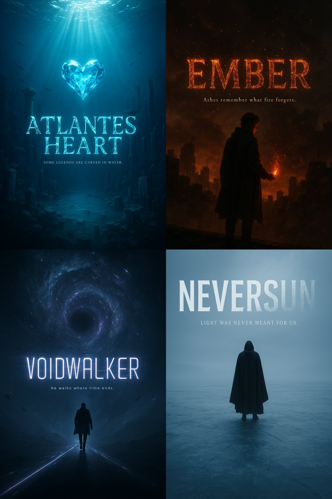

## A hyper-realistic photograph of a fashion doll styled in

- ID: gpt4o-125-en-1
- Slug: prompt-125-en-1
- 语言: en
- 来源: [来源链接](https://x.com/TheRelianceAI/status/1934688112741085562)
- 样例图路径: images/part3/125.png

### 提示词

```text
A hyper-realistic photograph of a fashion doll styled in the aesthetic of [BRAND], sitting on a plush, cream-colored bed with soft folds. The doll’s look reflects the brand’s signature elements — from hair and outfit to accessories — arranged thoughtfully to evoke a dreamy, vintage-inspired editorial. Studio-lit with warm, diffused lighting and a creamy, ivory-toned palette, the scene emulates luxury fashion photography with a soft, dollhouse-like atmosphere and shallow depth of field.
```

### 样例图

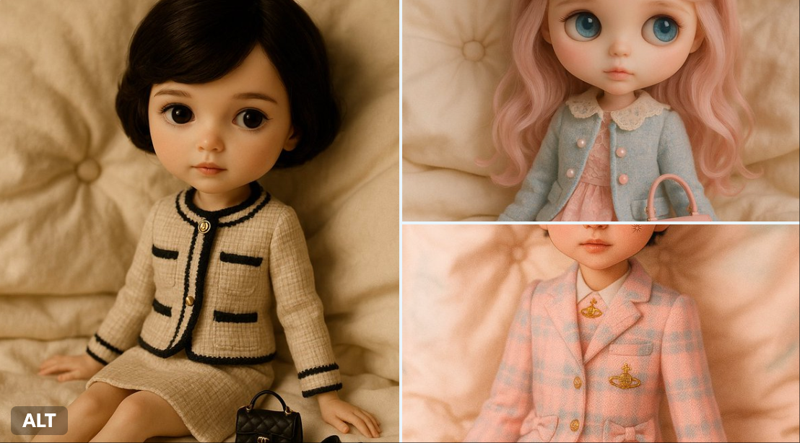

## 时尚品牌娃娃

- ID: gpt4o-125-zh-2
- Slug: prompt-125-zh-2
- 语言: zh
- 来源: [来源链接](https://x.com/TheRelianceAI/status/1934688112741085562)
- 样例图路径: images/part3/125.png

### 提示词

```text
一张超写实的照片，一个时尚娃娃以 [BRAND] 的美学风格，坐在一张带有柔软褶皱的奶油色毛绒床上。这款玩偶的外观反映了该品牌的标志性元素——从头发和服装到配饰——经过精心安排，让人联想到梦幻般的复古风格社论。工作室照明采用温暖的漫射灯光和奶油色的象牙色调调色板，该场景以柔和的玩具屋般的氛围和浅景深模拟奢华时尚摄影。
```

### 样例图


## 发光图标

- ID: gpt4o-113-zh
- Slug: prompt-113-zh
- 语言: zh
- 来源: [来源链接](https://x.com/azed_ai/status/1931350205649350935)
- 样例图路径: images/part3/113.jpeg

### 提示词

```text
A close-up digital photo of a human hand gently holding a glowing neon blue square icon featuring the [LOGO NAME] logo, set against a smooth dark gradient background. The blue light from the icon softly illuminates the fingers, casting a futuristic glow. The background is minimal and blurred, emphasizing the icon and the hand. High detail, cinematic lighting, modern tech aesthetic.
```

### 样例图

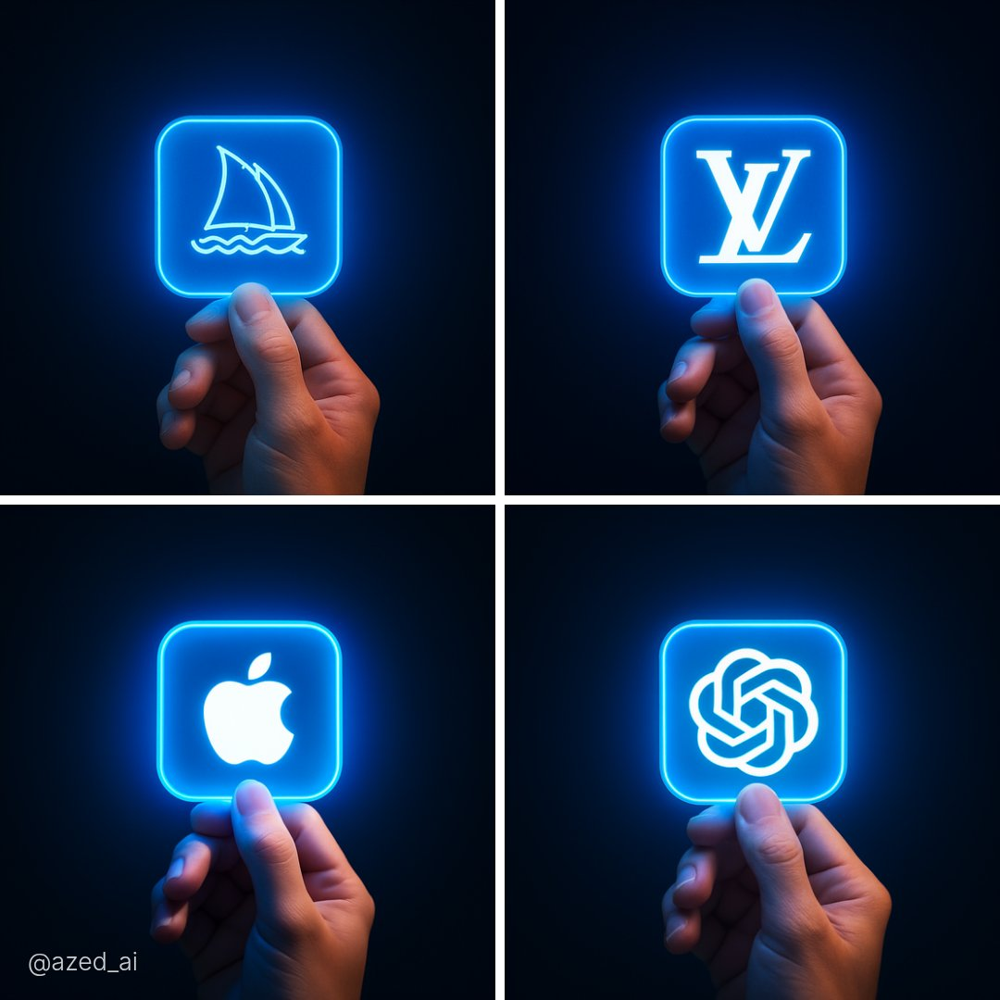

## 涂料飞溅Logo

- ID: gpt4o-109-zh
- Slug: prompt-109-zh
- 语言: zh
- 来源: [来源链接](https://x.com/nim_null/status/1928008305705664661)
- 样例图路径: images/part3/109.png

### 提示词

```text
make a hyper-realistic 3D render of the attached logo, formed by glossy liquid paint splashes. Paint sculpts the outline using the exact palette from the reference. Smooth, fluid high-gloss splashes catch highlights; logo floats on pure white.
```

### 样例图

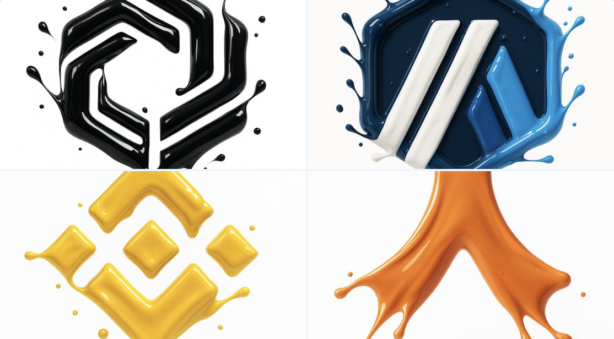

## 标志液化

- ID: gpt4o-108-zh
- Slug: prompt-108-zh
- 语言: zh
- 来源: [来源链接](https://x.com/umesh_ai/status/1931723259734888582)
- 样例图路径: images/part3/108.jpeg

### 提示词

```text
Create a photograph of a [BRAND] logo formed from four vibrant paint splashes: red, blue, green, and yellow, captured mid-motion. Each color flows dynamically across different parts of the logo, as if sculpted from liquid paint. Droplets are suspended in the air around it, enhancing the illusion of movement. Set against a dark background with soft, vivid lighting that accentuates the glossy texture and fluid motion

Use appropriate colors for the logos.
```

### 样例图

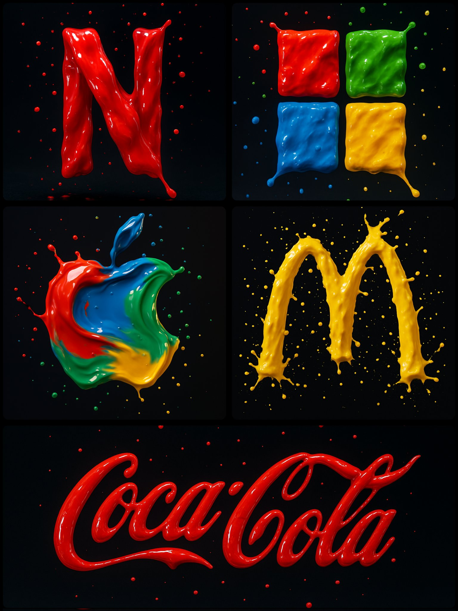

## 将你的Logo变成吉祥物

- ID: gpt4o-101-zh
- Slug: prompt-101-zh
- 语言: zh
- 来源: [来源链接](https://x.com/alex_prompter/status/1927308788610081088)
- 样例图路径: images/part3/101.jpeg

### 提示词

```text
Create a mascot for [BRAND NAME] logo following the JSON aesthetic below:
{
"style": "brand-inspired creative mascot generation",
"subject_handling": {
"adapt_to_uploaded_image": true,
"preserve_uploaded_logo_shape_and_text": true,
"extract_dominant_brand_colors": true,
"analyze_logo_style_for_mood": true,
"use_uploaded_image_as_primary_reference": true
},
"mascot_generation": {
"character_type": "open — could be an animal, humanoid, object, robot, fantasy creature, or abstract form",
"design_strategy": "generate a mascot concept that visually complements the uploaded brand based on extracted brand colors, mood, and style",
"style_alignment": "mascot should feel like part of the brand family — matching tone (playful, elegant, techy, minimal, etc.)",
"color_usage": "use brand colors as dominant tones in mascot’s body, clothing, skin, or materials",
"personality_embedding": "include expressive traits aligned with brand tone (e.g. curious, bold, serene, confident)"
},
"composition": {
"include_uploaded_logo_in_final_image": true,
"arrangement": "mascot and logo presented together in a clear and balanced composition",
"environment": "minimal scene or brand-aligned abstract background — not too busy",
"interaction": "mascot may pose near, hold, or gesture to logo — but must not obscure or alter it"
},
"lighting": {
"type": "neutral or soft directional lighting depending on brand tone",
"shadow_behavior": "soft contact shadows to ground elements"
},
"camera": {
"view_angle": "centered frontal or three-quarter depending on layout",
"focus": "both mascot and logo in clear focus"
},
"post_processing": {
"enhance_color harmony between mascot and logo": true,
"disable_style_overrides or artistic distortion": true
},
"image_constraints": {
"transparent_background": false,
"aspect_ratio": [INSERT ASPECT RATIO],
"include_text_if_present_in_logo": true,
"preserve_uploaded_logo_geometry": true,
"prevent_logo_modification": true
},
"notes": "Use the uploaded logo or product image as the central brand reference. Automatically generate a unique mascot that feels like an original creation belonging to the brand — inspired by extracted colors, shapes, and mood. The mascot must not copy other mascots or use predefined templates. The final image should creatively showcase both the logo and its new mascot side-by-side, visually unified but distinct."
}
```

### 样例图

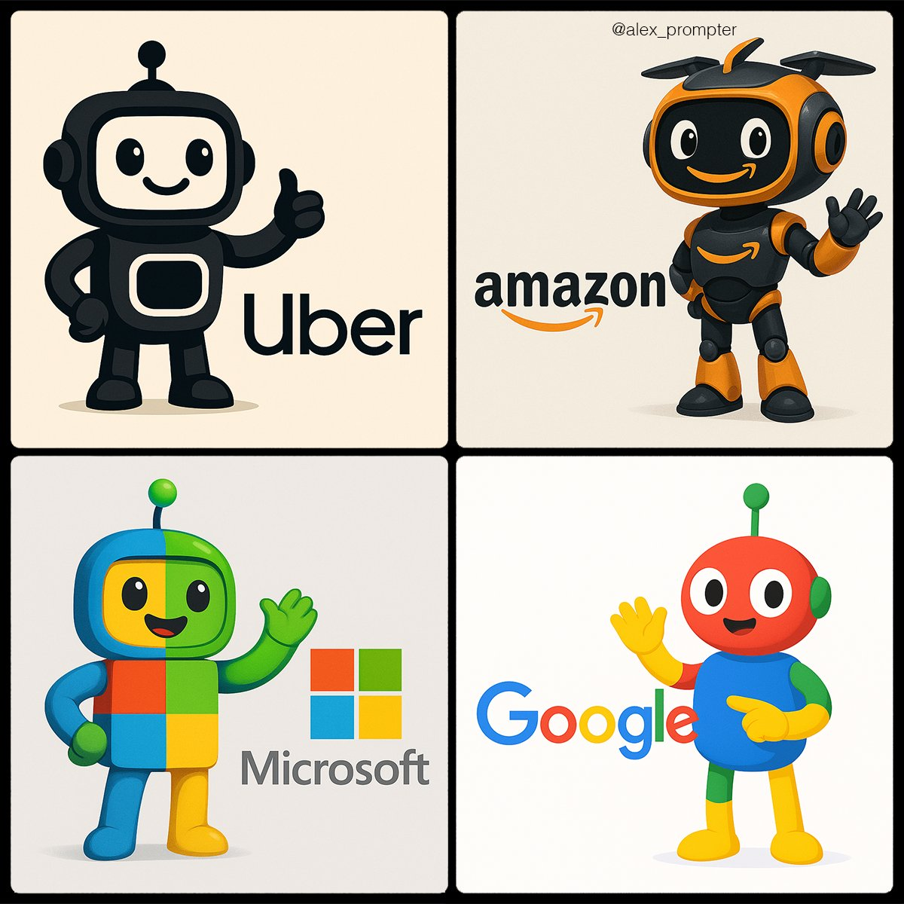

## 3D蒸汽朋克Logo

- ID: gpt4o-96-zh
- Slug: prompt-96-zh
- 语言: zh
- 来源: [来源链接](https://x.com/MayorKingAI/status/1925144570553327620)
- 样例图路径: images/part3/96.jpeg

### 提示词

```text
3D sculpted logo of [LOGO NAME], in a steampunk style, made of aged brass and oxidized iron, with visible rivets, gears, and vintage mechanical elements, distressed and weathered surface, rich copper and bronze tones, engraved with Victorian-style filigree, retro-industrial design, soft spotlight lighting, neutral background, hyper-realistic render, ultra-high resolution, symmetrical composition
```

### 样例图

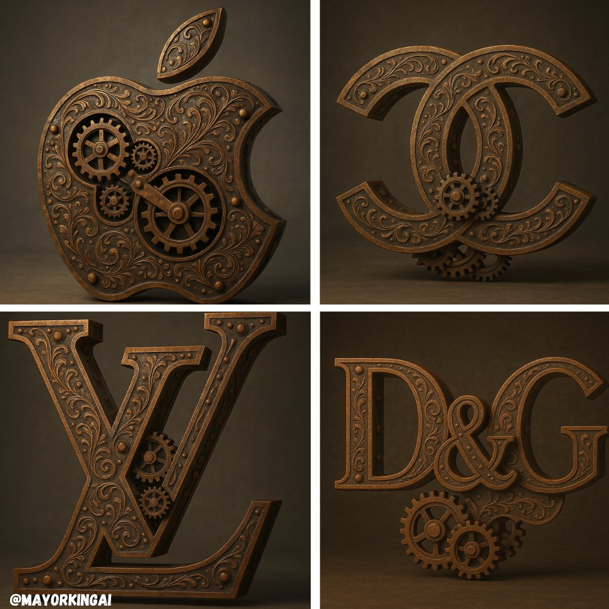

## 将您的标志变成毛毡纹理

- ID: gpt4o-90-zh
- Slug: prompt-90-zh
- 语言: zh
- 来源: [来源链接](https://x.com/alex_prompter/status/1925460683509899423)
- 样例图路径: images/part3/90.jpeg

### 提示词

```text
Retexture [BRAND NAME] logo following my JSON aesthetic below:
{
"style": "realistic needle-felted wool sculpture",
"subject_handling": {
"adapt_to_uploaded_image": true,
"preserve_original_shape_and_layout": true,
"preserve_uploaded_color_values": true,
"preserve_text_if_present": true,
"preserve_text_case": true,
"preserve_exact_letterforms": true,
"use_uploaded_image_as_pixel_map": true,
"prevent_color_estimation_or_stylization": true
},
"needle_felting": {
"material_type": "dyed wool fibers matched precisely to uploaded image pixels",
"texture_description": "fluffy soft felt with clear fiber strands",
"construction_style": "needle-felted, light irregularities allowed but no color bleeding",
"color_application_method": "direct color transfer from uploaded image to wool sculpture",
"prevent_auto_saturation_adjustment": true,
"prevent_color_fading": true,
"color_binding_mode": "pixel-level color fidelity per original image"
},
"lighting": {
"lighting_type": "neutral soft studio lighting",
"shadow": "soft, gray-toned shadows under the object only",
"highlight_behavior": "matte highlights only from felt surface — no bloom or color shift"
},
"background": {
"type": "plain matte studio",
"background_color": "pastel tone that contrasts with logo color",
"color_conflict_handling": "auto-adjust background brightness — do not alter logo colors"
},
"camera": {
"focus_style": "macro lens",
"depth_of_field": "shallow — full subject in sharp detail, soft background",
"angle": "frontal or slightly elevated, full subject visible"
},
"post_processing": {
"color_preservation_enforced": true,
"disable_auto-enhancement_or_tinting": true,
"no artistic reinterpretation": true,
"no auto-correction, bloom, or white balance adjustments": true
},
"image_constraints": {
"transparent_background": false,
"aspect_ratio_locked": true,
"include_text_if_present": true,
"preserve_text_case": true,
"preserve_uploaded_color_values": true,
"prevent_shape_or_color_change": true,
"enforce_exact_pixel_color_match_to_uploaded_image": true
},
"notes": "The uploaded image must be converted into a needle-felted wool sculpture using its exact colors and shape. Use pixel-level mapping to apply the uploaded color values to simulated dyed wool fibers. Do not change, brighten, dull, average, or blend colors. Text must remain intact and readable. Background should be soft pastel to contrast the logo — never adjust the logo to fit the scene."
}
```

### 样例图

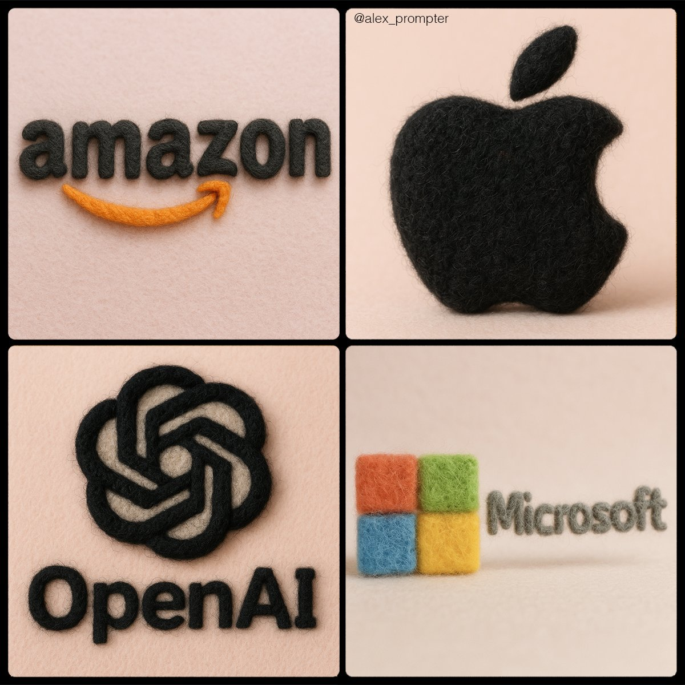

## 水果的形状

- ID: gpt4o-80-zh
- Slug: prompt-80-zh
- 语言: zh
- 来源: [来源链接](https://x.com/umesh_ai/status/1926182194159972503)
- 样例图路径: images/part3/80.jpeg

### 提示词

```text
Create an image by arranging [NUMBER/AGGREGATE] of [FRUIT] strategically on a dark surface to form the shape of [OBJECT/EMOJI/LOGO]
```

### 样例图

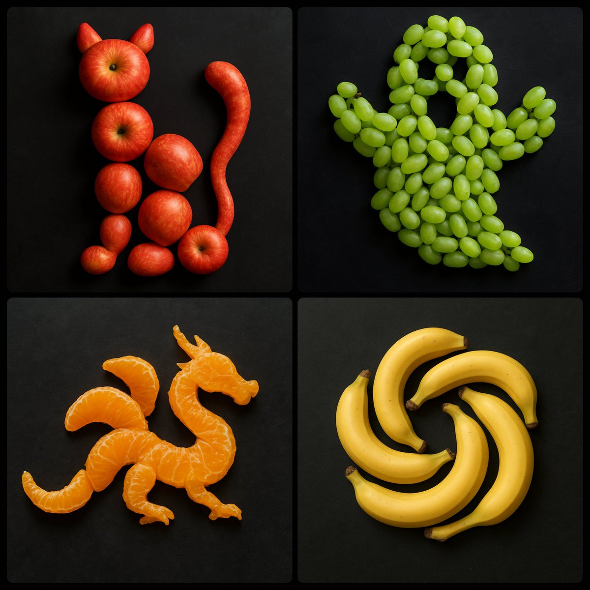

## Logo超写实微型摄影

- ID: gpt4o-42-zh
- Slug: prompt-42-zh
- 语言: zh
- 来源: [来源链接](https://x.com/alex_prompter/status/1923036265013801025)
- 样例图路径: images/part3/42.jpeg

### 提示词

```text
Recreate this [BRAND NAME] logo follow the JSON aesthetic below: 
{
    "style": "hyperrealistic miniature photography",
    "scene": {
        "main_subject": "uploaded logo scaled to appear as a large physical object",
        "interaction": "tiny human figures interacting with the logo",
        "activities": [
            "cleaning the logo",
            "painting parts of the logo",
            "climbing ladders on the logo surface",
            "taking photographs of the logo"
        ],
        "environment": "studio-style white background to focus on details",
        "perspective": "frontal view with shallow depth of field for macro effect"
    },
    "logo_handling": {
        "preserve_original_logo_shape": true,
        "preserve_original_logo_colors": true,
        "preserve_text_in_logo": true,
        "use_logo_as_structural_object": true,
        "adapt_logo_to_3D_surface": true
    },
    "miniature_elements": {
        "figure_scale": "1:50 ratio to logo",
        "figure_details": "tiny realistic humans with props like brushes, ropes, and scaffolding",
        "interaction_type": "physical interaction, not illustration or overlay"
    },
    "lighting": {
        "key_light": "soft diffused white light from above",
        "fill_light": "mild side fill to reveal depth and volume",
        "shadows": "realistic and subtle around base and figures"
    },
    "camera": {
        "focus_mode": "macro with shallow depth of field",
        "angle": "slightly top-down to give sense of scale",
        "background": "clean white surface, no gradient, no transparency"
    },
    "post_processing": {
        "realism_enhancement": "preserve logo clarity, crisp text, no artistic blurring",
        "forbid_artistic_filters": true,
        "forbid_color_modifications": true
    },
    "image_constraints": {
        "transparent_background": false,
        "include_text": true,
        "adapt_to_uploaded_logo": true,
        "obey_logo_shape": true,
        "preserve_original_logo_colors": true
    },
    "notes": "The uploaded logo must be clearly recognizable, unmodified, and serve as the core structural element of the scene. Tiny people should interact with the logo realistically, as if it were a large 3D object in a physical miniature world."
}
```

### 样例图


## Logo放进我的世界中

- ID: gpt4o-37-zh
- Slug: prompt-37-zh
- 语言: zh
- 来源: [来源链接](https://x.com/alex_prompter/status/1924503062325989836)
- 样例图路径: images/part3/37.jpeg

### 提示词

```text
Recreate the [BRAND NAME] logo following the JSON Aesthetic below: {
"style": "Minecraft-style voxel 3D rendering",
"logo_handling": {
"adapt_to_uploaded_logo": true,
"rebuild_logo_using_voxel_blocks": true,
"use_original_logo_as_strict_pixel-color map": true,
"preserve_text_in_logo": true,
"preserve_text_case": true,
"preserve_original_logo_colors": true,
"preserve_shape_and_layout": true
"aspect_ratio": [INSERT ASPECT RATIO]
},
"minecraft_conversion": {
"voxel_depth": "medium thickness to show 3D volume",
"block_style": "authentic Minecraft texture mapping",
"color_strategy": "each block in the logo must match a pixel from the uploaded logo exactly — no estimation or stylistic substitution",
"voxel_material_match": "map logo pixels to Minecraft block colors that visually match pixel color as closely as possible — no creative enhancements",
"disable_palette_expansion": true
},
"scene_environment": {
"base": "neutral terrain (gray concrete or light stone)",
"background": "simple sky (clouds, no sun flare)",
"optional_elements": [
"Minecraft animals at a distance",
"terrain vegetation in background only"
],
"environment_color_policy": "environment must not share colors used in the logo to prevent blending or confusion"
},
"lighting": {
"neutral directional light": true,
"do_not_adjust_logo_colors_for_lighting": true,
"prevent_ambient_light_color_bleed": true
},
"camera": {
"angle": "slightly top-down with 3D logo centered",
"focus": "sharp focus on voxel logo only, environment softly rendered"
},
"render_quality": {
"voxel_texture_resolution": "high",
"shadows": "natural voxel-style ambient shadows only",
"disable_artistic_effects": true
},
"post_processing": {
"no glow effects": true,
"no color correction": true,
"disable AI reinterpretation of tones or palette": true
},
"image_constraints": {
"transparent_background": false,
"include_text": true,
"preserve_text_case": true,
"preserve_original_logo_colors": true,
"obey_uploaded_logo_shape": true,
"match_uploaded_logo_layout": true,
"enforce_color_source_from_logo_only": true
},
"notes": "Rebuild the uploaded logo using Minecraft-style voxel blocks. Every block must represent one pixel from the logo's original image. No creative license is allowed in color, shape, or layout. The environment is decorative only and must not affect logo readability or color perception. The final image should appear as if the logo were physically constructed in a Minecraft world using blocks that match its exact colors and shapes."
}
```

### 样例图


## 卡通风格文本标志

- ID: gpt4o-32-zh
- Slug: prompt-32-zh
- 语言: zh
- 来源: [来源链接](https://x.com/gnrlyxyz/status/1924466922545877098)
- 样例图路径: images/part3/32.png

### 提示词

```text
Create a bold, warped cartoon-style text design with two distinct layers. The top layer should say “SUPER GNARLY” in warped bubble letters with a melty, drippy texture, like ghost slime or goo. The letters should feel heavy and organic, with a slightly psychedelic or paranormal vibe. The bottom layer should say “SOCIETY” in much smaller, script-like or handwritten-style letters that tuck underneath or nestle between the larger title letters. Both layers should be solid white with thick black outlines. No gradients, shading, or texture. Layout should be playful and a little chaotic, but still readable. Vector friendly. Blue background. Square aspect ratio.
```

### 样例图

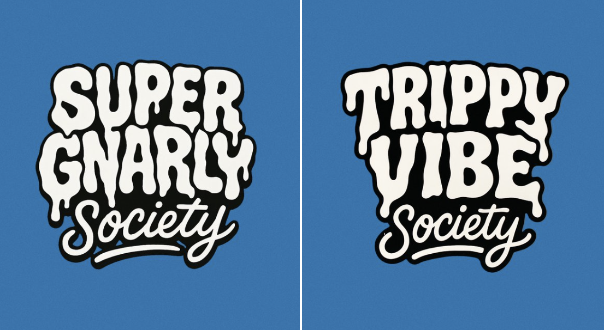

## 创意广告

- ID: gpt4o-12-zh
- Slug: prompt-12-zh
- 语言: zh
- 来源: [来源链接](https://x.com/azed_ai/status/1923016036120658122)
- 样例图路径: images/part3/12.png

### 提示词

```text
A minimalist and creative advertisement set on a clean white background.
A real [Real Object] is integrated into a hand-drawn black ink doodle, using loose, playful lines. The [Doodle Concept] interacts with the object in a clever, imaginative way. Include bold black [Ad Copy] text at the top or center. Place the [Brand Logo] clearly at the bottom. The visual should be clean, fun, high-contrast, and conceptually smart.
```

### 样例图

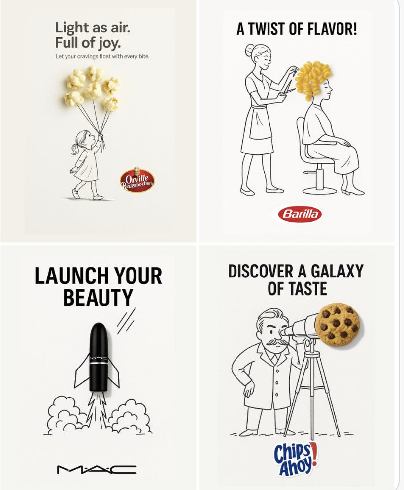

