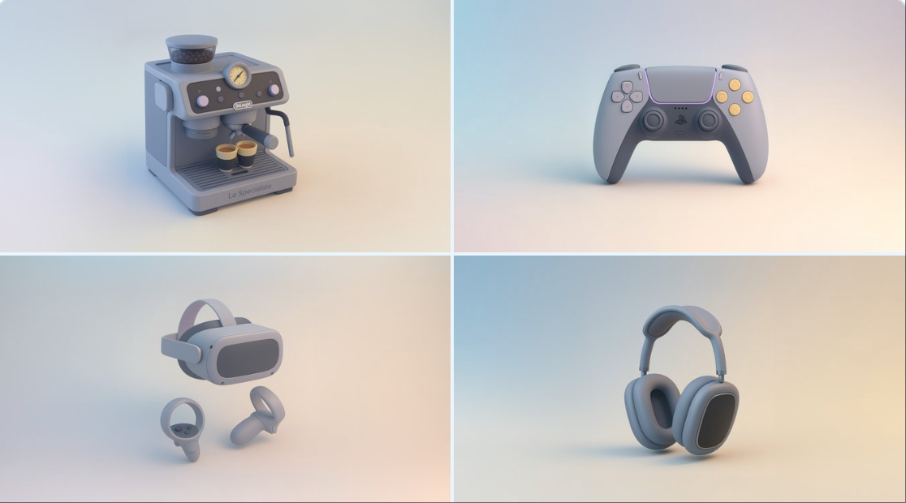
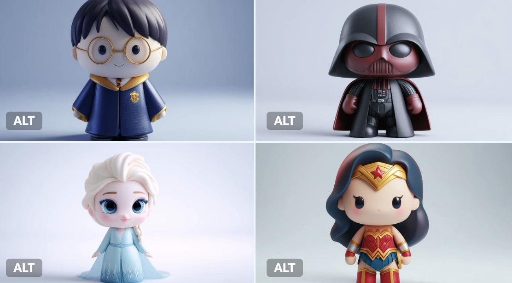
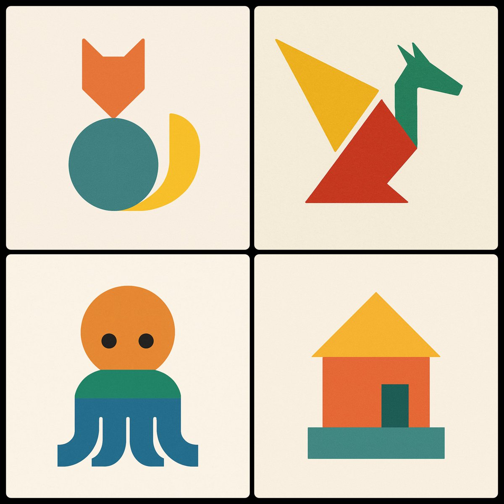

# minimalist

总计：412

## A hyper-realistic travel advertisement in square format 

- ID: gpt4o-1046-en-1
- Slug: prompt-1046-en-1
- 语言: en
- 来源: [来源链接](https://x.com/TechieBySA/status/2007190982408974659)
- 样例图路径: images/part3/1046.jpeg

### 提示词

```text
A hyper-realistic travel advertisement in square format (1080x1080), featuring a hand holding a sleek, ultra-thin smartphone or tablet in portrait orientation, tilted slightly sideways to create a striking 3D portal effect. The screen displays a high-resolution image of an iconic landmark from [COUNTRY], which continues into the real background, blending seamlessly. The landmark appears to emerge from the screen. Birds fly nearby and a commercial airplane passes through a bright blue sky with soft white clouds. Bold, clean sans-serif text reading [CITY] is placed prominently above. The lighting is warm and natural, casting soft shadows across the landscape. The surroundings reflect the region’s natural environment (like meadows, coastlines, or city skylines). The device is glossy and minimal-bezel, enhancing realism and depth.
```

### 样例图


## 一则超写实的旅行广告

- ID: gpt4o-1046-zh-2
- Slug: prompt-1046-zh-2
- 语言: zh
- 来源: [来源链接](https://x.com/TechieBySA/status/2007190982408974659)
- 样例图路径: images/part3/1046.jpeg

### 提示词

```text
这是一则超写实的旅行广告，采用正方形格式（1080x1080），画面中一只手竖屏握着一部纤薄时尚的智能手机或平板电脑，略微侧倾，营造出引人注目的3D立体效果。屏幕上显示着[国家/地区]标志性地标的高分辨率图像，图像与真实背景无缝融合，仿佛从屏幕中浮现出来一般。附近有鸟儿飞翔，一架商用飞机掠过湛蓝的天空，朵朵白云点缀其间。醒目的上方是简洁的无衬线字体[城市]。画面光线温暖自然，在景物上投下柔和的阴影。周围环境反映了该地区的自然环境（例如草地、海岸线或城市天际线）。设备采用光滑的超窄边框设计，增强了画面的真实感和立体感。
```

### 样例图


## { "design_system": { "metadata": { "style_name": "Cozy S

- ID: gpt4o-1045-en-1
- Slug: prompt-1045-en-1
- 语言: en
- 来源: [来源链接](https://x.com/miilesus/status/2007169297655730610)
- 样例图路径: images/part3/1045.jpeg

### 提示词

```text
{
  "design_system": {
    "metadata": {
      "style_name": "Cozy Storybook Illustration",
      "target_audience": "Children / Family",
      "reference_source": "Uploaded Image",
      "version": "3.0"
    },
    "visual_parameters": {
      "medium": {
        "primary": "Colored Pencil",
        "secondary": "Watercolor Wash (Variation only)",
        "application": "Hand-drawn",
        "texture": {
          "type": "Visible pencil strokes",
          "quality": "Slightly rough outlines",
          "finish": "Non-realistic / No photo texture"
        }
      },
      "line_work": {
        "style": "Clean line art",
        "weight": "Slightly rough/organic",
        "clarity": "High"
      },
      "color_theory": {
        "base_tone": "Warm and friendly",
        "palette_type": "Vibrant Pastel",
        "adjustments": {
          "brightness": "Increased / High-key",
          "saturation": "Enhanced but natural",
          "contrast": "Soft"
        }
      },
      "lighting_and_shading": {
        "shadows": "Minimal",
        "highlights": "Soft",
        "rendering": "Flat yet detailed",
        "gradients": "Subtle watercolor layers (Variation only)"
      }
    },
    "subject_geometry": {
      "anatomy": {
        "proportions": "Semi-cartoon realistic",
        "scale": "Storybook style"
      },
      "facial_features": {
        "eyes": "Dot style",
        "mouth": "Small smile",
        "complexity": "Simple / Minimalist"
      }
    },
    "atmosphere": {
      "mood": [
        "Cozy",
        "Cheerful",
        "Warm",
        "Friendly"
      ],
      "genre_tags": [
        "Children's Book",
        "Lifestyle Sketch",
        "Storybook Illustration"
      ]
    }
  },
  "generation_configs": {
    "negative_prompt_tokens": [
      "realism",
      "photorealistic",
      "photo texture",
      "dark colors",
      "complex shading",
      "3d render"
    ],
    "prompt_variations": [
      {
        "id": "PROMPT_001",
        "variant_name": "Textured Colored Pencil",
        "focus": "Texture and Stroke",
        "full_text": "Illustration style: hand-drawn colored pencil illustration, clean line art with slightly rough pencil outlines, soft pastel coloring with increased brightness, lighter and more vivid color tones, enhanced saturation while staying natural, visible pencil strokes and gentle shading texture, warm and friendly tone, semi-cartoon realistic proportions, simple facial features with dot eyes and small smiles, flat yet detailed coloring, minimal shadows, soft highlights, storybook illustration feel, cozy and cheerful atmosphere, vibrant yet soft color palette, children-book / lifestyle sketch style, high clarity, no realism, no photo texture"
      },
      {
        "id": "PROMPT_002",
        "variant_name": "Mixed Media Watercolor",
        "focus": "Wash and Gradient",
        "full_text": "Hand-drawn colored pencil illustration with clean line art and slightly rough pencil outlines, combined with soft watercolor wash textures. Bright pastel colors, lighter and more vivid tones with natural saturation. Visible pencil strokes layered with subtle watercolor gradients. Warm and friendly tone, semi-cartoon realistic proportions. Simple facial features with dot eyes and small smiles. Flat yet detailed coloring, minimal shadows, soft highlights. Storybook illustration feel, cozy and cheerful atmosphere, children-book style, high clarity, no realism, no photo texture."
      }
    ]
  }
}
```

### 样例图


## 杂志配有儿童绘画作品

- ID: gpt4o-1045-zh-2
- Slug: prompt-1045-zh-2
- 语言: zh
- 来源: [来源链接](https://x.com/miilesus/status/2007169297655730610)
- 样例图路径: images/part3/1045.jpeg

### 提示词

```text
{
"design_system": {
"元数据": {
"style_name": "温馨故事书插画",
"target_audience": "儿童/家庭",
"reference_source": "上传的图片",
版本：3.0
},
"visual_parameters": {
“中等的”： {
“primary”： “彩色铅笔”
“次要的”: “水彩晕染（仅限变体）”
“应用”：“手绘”，
“质地”： {
“类型”：“可见的铅笔笔触”，
“质量”：“轮廓略显粗糙”，
“完成”: “非写实/无照片纹理”
}
},
"line_work": {
风格：简洁的线条艺术，
“重量”：“略粗糙/有机”，
清晰度：高
},
"color_theory": {
"base_tone": "温暖友好",
"palette_type": "鲜艳的粉彩",
“调整”：{
“亮度”: “增强/高调”
“饱和度”：“增强但自然”，
“对比度”： “柔和”
}
},
"lighting_and_shading": {
“阴影”：“极简主义”，
“亮点”：“柔和”，
“渲染”：“平面但细节丰富”，
“渐变”：“微妙的水彩图层（仅限变体）”
}
},
"subject_geometry": {
"解剖学": {
“比例”：“半卡通写实”
“规模”: “故事书风格”
},
"facial_features": {
“眼睛”：“点状风格”，
“嘴”: “微微一笑”
“复杂性”： “简单/极简主义”
}
},
“气氛”： {
“情绪”： [
“舒适”，
“快乐”，
“温暖的”，
“友好的”
],
"genre_tags": [
《儿童读物》
“生活方式素描”，
“故事书插图”
]
}
},
"generation_configs": {
"negative_prompt_tokens": [
“现实主义”，
“照片级真实感”，
“照片纹理”，
“暗色”，
“复杂阴影”，
“3D渲染”
],
"prompt_variations": [
{
"id": "PROMPT_001",
"variant_name": "纹理彩色铅笔",
“焦点”：“纹理和笔触”，
"full_text": "插画风格：手绘彩色铅笔插画，线条简洁，铅笔轮廓略显粗糙，柔和的粉彩色调，亮度增强，色彩更明亮鲜艳，饱和度提高，同时保持自然，铅笔笔触清晰可见，阴影纹理柔和，色调温暖友好，半卡通写实比例，面部特征简洁，眼睛为点状，面带微笑，色彩平涂但细节丰富，阴影极少，高光柔和，具有绘本插画风格，温馨欢快的氛围，色彩鲜艳而柔和，儿童绘本/生活素描风格，清晰度高，不追求写实，无照片纹理"
},
{
"id": "PROMPT_002",
"variant_name": "混合媒介水彩",
“焦点”：“水洗和渐变”，
"full_text": "手绘彩色铅笔插画，线条干净利落，铅笔轮廓略显粗糙，并结合柔和的水彩晕染纹理。明亮的粉彩色调，色调更浅更鲜艳，饱和度自然。铅笔笔触清晰可见，并叠加了微妙的水彩渐变。整体色调温暖友好，半卡通式的写实比例。面部特征简洁，眼睛是点状的，带着淡淡的微笑。色彩运用平涂却不失细节，阴影极少，高光柔和。具有童话插画的感觉，营造出温馨欢快的氛围，儿童绘本风格，清晰度高，不追求写实，没有照片质感。"
}
]
}
}
```

### 样例图


## { "project_metadata": { "title": "K-Pop Idol Newspaper F

- ID: gpt4o-1040-en-1
- Slug: prompt-1040-en-1
- 语言: en
- 来源: [来源链接](https://x.com/BubbleBrain/status/2007074986008141973)
- 样例图路径: images/part3/1040.jpeg

### 提示词

```text
{
  "project_metadata": {
    "title": "K-Pop Idol Newspaper Fashion Concept",
    "style_preset": "Soft Focus Editorial Photography",
    "aspect_ratio": "3:4",
    "version": "2.1"
  },
  "subject": {
    "identity": {
      "ethnicity": "Korean",
      "age_group": "Young Adult",
      "aesthetic": "K-pop idol, mixture of innocent and sexy, pure visual"
    },
    "physique": {
      "body_type": "Curvy and voluptuous",
      "specific_attributes": "Highly emphasized and prominent bustline, hourglass silhouette, toned arms",
      "skin_tone": "Pale, porcelain white, flawless and glowing"
    },
    "hair_and_makeup": {
      "hair": {
        "color": "Dark brown",
        "style": "Long, voluminous waves, slight wet look",
        "action": "Hands gently touching face or hair"
      },
      "makeup": {
        "lips": "Glossy pink jelly lips, gradient lip color",
        "eyes": "Sparkling K-pop style eye makeup, aegyo-sal emphasized",
        "finish": "Glass skin effect, bright and dewy"
      }
    },
    "pose_and_expression": {
      "expression": "Cute pouting lips (dudu lips), seductive yet innocent gaze, looking into the lens",
      "pose": "Medium-full body shot, standing, playful posture, emphasising curves"
    }
  },
  "fashion_elements": {
    "primary_garment": {
      "item": "Strapless mini-dress",
      "material": "Authentic recycled newspaper pages",
      "construction": "Architectural, origami-style pleats, visible newsprint, headlines, and grayscale imagery textures",
      "fit": "Form-fitting, cinched at the waist"
    },
    "accessories": [
      {
        "item": "Hoop earrings",
        "style": "Large, thin, minimalist",
        "material": "Polished silver"
      }
    ]
  },
  "environment_and_backdrop": {
    "setting": "Studio indoor",
    "background_type": "Textured wall",
    "details": "Completely covered in layered, overlapping vintage newspaper pages, sepia-toned paper, collage effect",
    "depth": "Shallow depth of field to separate subject from the background"
  },
  "cinematography_and_lighting": {
    "camera": {
      "lens": "85mm prime lens",
      "shot_type": "Medium-full shot",
      "angle": "Eye-level",
      "sensor": "Digital, clear"
    },
    "lighting": {
      "primary_source": "Soft diffused frontal lighting",
      "effect": "Bright, flattering beauty lighting, minimizing shadows on face",
      "color_temp": "Cool white to neutral"
    },
    "post_processing": {
      "focus": "Soft focus, dreamy atmosphere",
      "textures": "Heavy skin smoothing, airbrushed look, ethereal glow, no grain",
      "filter": "Beauty filter style, dreamy blur effect"
    }
  }
}
```

### 样例图


## K-Pop偶像报纸时尚概念

- ID: gpt4o-1040-zh-2
- Slug: prompt-1040-zh-2
- 语言: zh
- 来源: [来源链接](https://x.com/BubbleBrain/status/2007074986008141973)
- 样例图路径: images/part3/1040.jpeg

### 提示词

```text
{
"project_metadata": {
标题：《K-Pop偶像报纸时尚概念》
"style_preset": "柔焦编辑摄影",
"aspect_ratio": "3:4",
版本：2.1
},
“主题”： {
“身份”： {
“种族”: “韩国人”
"age_group": "青年人",
“美学”：“K-pop偶像，兼具清纯与性感，纯粹的视觉美”
},
"体格": {
"body_type": "曲线优美，丰满性感",
"specific_attributes": "非常突出且醒目的胸部线条，沙漏型身材，健美的双臂",
肤色：苍白如瓷，无瑕透亮
},
"发型和化妆": {
“头发”： {
“颜色”：“深棕色”，
“发型”：“长而蓬松的波浪卷，略带湿润感”，
“动作”：“双手轻轻触碰脸部或头发”
},
“化妆品”： {
“唇部”： “亮泽的粉色果冻唇膏，渐变唇色”
“眼睛”：“闪亮的韩式流行风格眼妆，强调卧蚕”，
“妆效”：“玻璃肌效果，明亮水润”
}
},
"pose_and_expression": {
“表情”：“嘟嘟的可爱嘴唇，既诱人又无辜的眼神，看着镜头”，
“姿势”：“中全身照，站立，俏皮的姿势，强调曲线”
}
},
"fashion_elements": {
"primary_garment": {
“商品”: “无肩带迷你连衣裙”
“材料”：“真正的再生报纸页面”，
“构造”：“建筑风格的折纸褶皱，可见的新闻印刷品、标题和灰度图像纹理”，
“合身”： “贴合身形，腰部收紧”
},
“配件”： [
{
“物品”: “圈形耳环”，
“风格”：“大号、纤细、极简主义”
材质：抛光银
}
]
},
"environment_and_backdrop": {
设置：室内工作室，
"background_type": "纹理墙",
“细节”：“完全覆盖着层叠交错的复古报纸页面，棕褐色调的纸张，拼贴效果”，
“景深”： “浅景深使主体与背景分离”
},
"cinematography_and_lighting": {
“相机”： {
“镜头”: “85mm 定焦镜头”
"shot_type": "中远景镜头",
“角度”：“视线水平”，
“传感器”：“数字式，清晰”
},
“灯光”： {
"primary_source": "柔和的漫射正面照明",
“效果”：“明亮、讨喜的美颜灯光，最大限度地减少脸上的阴影”，
"color_temp": "冷白光到中性色"
},
"post_processing": {
“焦点”：“柔焦，梦幻般的氛围”，
“质地”：“强效柔滑肌肤，喷枪妆效，空灵光泽，无颗粒感”
"滤镜": "美颜滤镜风格，梦幻虚化效果"
}
}
}
```

### 样例图


## A refined fashion editorial image with a 3:2 aspect rati

- ID: gpt4o-1039-en-1
- Slug: prompt-1039-en-1
- 语言: en
- 来源: [来源链接](https://x.com/craftian_keskin/status/2007156041851490337)
- 样例图路径: images/part3/1039.jpeg

### 提示词

```text
A refined fashion editorial image with a 3:2 aspect ratio, split into two clear sections.

Right side:
A fashionable, confident, sensual woman standing and walking casually in a modern architectural space with warm wooden walls and soft natural light. She wears a top with a deep V neckline, has a small mole on her chest, a 90-60-90 figure, tucked into a high-waisted white tailored short skirt, On her feet are sleek black stiletto heels, elegant and minimal. She carries a small structured black handbag in one hand.

Her hair is slicked back into a clean low bun, emphasizing her facial structure. She wears narrow black sunglasses and subtle statement earrings. The look is refined, modern, and effortlessly chic. Natural daylight, soft shadows, realistic skin texture. Casual fashion photography style with an editorial, high-end feel. Neutral color palette, warm tones, shallow depth of field, cinematic realism.

Style & Mood:
Modern elegance, quiet luxury, confident, minimal, editorial casual.

Photography Details:
Eye-level angle, candid stance, 35mm lens, natural lighting, high detail, photorealistic.

Left side:
A clean, minimalist product breakdown layout on a neutral background. The individual fashion items worn by the woman are displayed separately, neatly arranged with subtle shadows. Each item includes a small, elegant price label in refined sans-serif typography:

– Beige deep V-neck knit top — $180
– White high-waisted tailored mini skirt — $220
– Black pointed-toe stiletto heels — $350
– Small structured black handbag — $480
– Black narrow sunglasses — $160

The left side feels like a luxury fashion catalog or e-commerce lookbook, with clear spacing, premium presentation, and visual balance.

Overall Style & Mood:
Quiet luxury, modern elegance, editorial fashion, high-end retail aesthetic.

Lighting & Quality:
Soft natural light, studio-clean clarity on product side, photorealistic, ultra-high resolution, professional fashion photography.

Negative Prompt:
Cluttered layout, oversized text, flashy logos, mannequins, people on left side, harsh lighting, low resolution, cartoon style.
```

### 样例图


## 一张精致的时尚大片

- ID: gpt4o-1039-zh-2
- Slug: prompt-1039-zh-2
- 语言: zh
- 来源: [来源链接](https://x.com/craftian_keskin/status/2007156041851490337)
- 样例图路径: images/part3/1039.jpeg

### 提示词

```text
一张精致的时尚大片，宽高比为 3:2，清晰地分为两个部分。

右侧：
一位时尚、自信、充满魅力的女士，在现代建筑风格的空间中随意地站立或行走，温暖的木质墙壁和柔和的自然光线营造出舒适的氛围。她身着一件深V领上衣，胸前有一颗小痣，身材比例完美，下身搭配一条高腰白色修身短裙。脚上是一双优雅简约的黑色细高跟鞋。她手提一只小巧精致的黑色手提包。

她的头发利落地梳成一个低髻，凸显了她精致的脸型。她戴着黑色窄框太阳镜和简约的耳环，整体造型优雅、现代，又不失随性时尚感。自然的光线、柔和的阴影、真实的肌肤纹理，营造出一种休闲时尚摄影的质感，同时又不失高端大片的氛围。中性色调、暖色调、浅景深，以及电影般的真实感，共同成就了这组照片。

风格与氛围：
现代优雅，低调奢华，自信，简约，时尚休闲。

摄影细节：
平视角度，自然姿态，35mm镜头，自然光，高细节，照片级真实感。

左侧：
简洁的极简主义产品展示布局，背景中性。女士身上穿着的每件时尚单品都单独展示，整齐排列，并辅以柔和的阴影效果。每件单品都配有小巧精致的价格标签，采用优雅的无衬线字体。

米色深V领针织上衣——180美元
白色高腰修身迷你裙——220美元
黑色尖头细高跟鞋——350美元
- 小号黑色硬挺手提包 — 480 美元
黑色窄框太阳镜——160美元

左侧的设计风格类似于奢侈时尚产品目录或电商产品图册，布局清晰，呈现方式高端大气，视觉效果平衡。

整体风格与氛围：
低调奢华，现代优雅，时尚杂志风格，高端零售美学。

照明和质量：
柔和的自然光，产品面清晰如影楼，照片真实感强，超高分辨率，专业时尚摄影。

否定提示：
布局杂乱，文字过大，标志花哨，模特，左侧有人，光线刺眼，分辨率低，卡通风格。
```

### 样例图


## High-end commercial shot of a minimalist glass perfume b

- ID: gpt4o-1033-en-1
- Slug: prompt-1033-en-1
- 语言: en
- 来源: [来源链接](https://x.com/Adam38363368936/status/2007334634649202928)
- 样例图路径: images/part3/1033.jpeg

### 提示词

```text
High-end commercial shot of a minimalist glass perfume bottle filled with pale rose gold liquid. It is resting on a mirror-like water surface. Floating silk rose petals and morning dew droplets surround the bottle, frozen in mid-air. Soft pastel pink and white gradient background with dreamy volumetric sunlight. Elegant, ethereal, and romantic atmosphere, --ar 3:4
```

### 样例图


## 花香调香水(柔美浪漫)

- ID: gpt4o-1033-zh-2
- Slug: prompt-1033-zh-2
- 语言: zh
- 来源: [来源链接](https://x.com/Adam38363368936/status/2007334634649202928)
- 样例图路径: images/part3/1033.jpeg

### 提示词

```text
高端商业广告，画面中一个极简主义的玻璃香水瓶盛满了淡玫瑰金色的液体。它静静地躺在如镜面般平静的水面上。漂浮的丝绸玫瑰花瓣和清晨的露珠环绕着香水瓶，仿佛凝固在半空中。柔和的粉白渐变背景，梦幻般的立体阳光洒落在其上。营造出优雅、空灵而浪漫的氛围。--ar 3:4
```

### 样例图


## A [MACRO MEDIUM - e.g., stream of liquid gold, plume of 

- ID: gpt4o-1032-en-1
- Slug: prompt-1032-en-1
- 语言: en
- 来源: [来源链接](https://x.com/maxescu/status/2007134245328957539)
- 样例图路径: images/part3/1032.jpeg

### 提示词

```text
A [MACRO MEDIUM - e.g., stream of liquid gold, plume of smoke, silk ribbon], captured mid-motion, forming a dynamic [SHAPE - e.g., arc, spiral, wave] from the lower left to the upper right. Suspended within the [TEXTURE/MATERIAL] lives a miniature world of [MICRO SUBJECT - e.g., a city, a historical event, an ecosystem], rendered as highly detailed structures sculpted entirely from the [MACRO MEDIUM] itself.

Inside the [MEDIUM]: [DETAIL 1], [DETAIL 2], and [DETAIL 3]. The forms appear [ADJECTIVE - e.g., woven, liquid, crystalline, glowing], strictly defined by the physics of the [MACRO MEDIUM].

Style: [PHOTOGRAPHY STYLE - e.g., Macro product photography] fused with [ARTISTIC GENRE - e.g., Ukiyo-e, Cyberpunk, Baroque painting]. High emphasis on texture, lighting, and material contrast. Color palette: [COLORS] derived naturally from the material.

View & background:Plain, matte [BACKGROUND COLOR - usually Black or White] to create maximum contrast. Minimalist composition.

Typography:Title: “[TITLE]” Subtitle: “[SUBTITLE]” Font style: [FONT DESCRIPTION] placed cleanly in the negative space.

Composition rules:The [MEDIUM] creates a defined boundary. All details remain strictly inside the stroke/flow; nothing exists in the negative space. 8K, hyper-realistic texture, [LIGHTING STYLE].
```

### 样例图


## 一个微缩的世界

- ID: gpt4o-1032-zh-2
- Slug: prompt-1032-zh-2
- 语言: zh
- 来源: [来源链接](https://x.com/maxescu/status/2007134245328957539)
- 样例图路径: images/part3/1032.jpeg

### 提示词

```text
一幅[宏观媒介——例如，一股液态黄金、一缕烟雾、一条丝带]的动态画面，从左下角到右上角形成一个动态的[形状——例如，弧形、螺旋形、波浪形]。悬浮于[纹理/材质]之中的，是一个微缩的[微观主题——例如，一座城市、一个历史事件、一个生态系统]世界，它被描绘成完全由[宏观媒介]本身雕刻而成的精细结构。

在 [MEDIUM ]: [DETAIL 1]、[DETAIL 2] 和 [DETAIL 3] 内部。这些形态呈现出 [ADJECTIVE - 例如，编织的、液体的、晶体的、发光的]，严格由 [MACRO MEDIUM] 的物理特性所定义。

风格：[摄影风格 - 例如：微距产品摄影] 与 [艺术流派 - 例如：浮世绘、赛博朋克、巴洛克绘画] 相融合。高度注重纹理、光线和材质对比。色彩：[色彩] 源自材质本身。

画面及背景：纯色、哑光背景（通常为黑色或白色），以营造最大对比度。极简主义构图。

排版：标题：“[标题]” 副标题：“[副标题]” 字体样式：[字体描述] 干净利落地放置在空白处。

构图规则：[媒介] 划定了明确的边界。所有细节都严格保留在笔触/流线内；负空间中不存在任何内容。8K，超逼真纹理，[光照风格]。
```

### 样例图


## 新年新气象新衣服

- ID: gpt4o-1031-zh
- Slug: prompt-1031-zh
- 语言: zh
- 来源: [来源链接](https://x.com/aidavid125/status/2006959961109299304)
- 样例图路径: images/part3/1031.jpeg

### 提示词

```text
Use the uploaded reference image as the person appearing in all 6 cards.
Analyze their unique body shape, skin tone, facial features, and personal essence.
Design 6 PERFECT outfits specifically tailored to maximize their individual beauty.

Create a vertical 9:16 professional New Year Fashion Outfit Poster.

BACKGROUND: Solid warm cream (#FFF8F5), optimized for mobile full-screen viewing.

════════════════════════════════════
CRITICAL LAYOUT RULES
════════════════════════════════════

EXACTLY 6 CARDS arranged in SINGLE VERTICAL COLUMN:
- Six (6) cards total — NOT 4, NOT 9, EXACTLY 6
- ONE column ONLY — NO grid, NO 2x3, NO side-by-side
- Cards stacked vertically from top to bottom
- Like mobile scrolling feed / Instagram story sequence
- Each card occupies full width of canvas

SPACING:
- Outer margin: 3% width (left and right)
- Vertical gap between cards: 2% height
- Cards fill vertical space evenly

VISUAL REFERENCE:
┌─────────────────┐
│     Card 1      │
├─────────────────┤
│     Card 2      │
├─────────────────┤
│     Card 3      │
├─────────────────┤
│     Card 4      │
├─────────────────┤
│     Card 5      │
├─────────────────┤
│     Card 6      │
└─────────────────┘

════════════════════════════════════
SINGLE CARD STRUCTURE
════════════════════════════════════

Each card contains 4 zones:

▸ ZONE 1: TITLE AREA (top 8% height)
- AI-generated creative style name based on the outfit
- Main title: Chinese Red (#C41E3A) or Gold (#D4AF37), centered
- Subtitle: 6-8 characters describing the vibe, warm gray (#8B7355)
- Small decorative icon: lantern or cloud motif

▸ ZONE 2: MAIN IMAGE AREA (55% height)
- Full-body outfit display
- Person occupies 70-75% of area
- Clean, elegant background with warm tones
- Subtle New Year decorative elements
- Natural pose, confident expression
- Complete outfit clearly visible

▸ ZONE 3: THREE-DETAIL CIRCLES (15% height)
- Three circular close-up images, horizontally arranged
- LEFT: Upper garment detail (neckline, sleeve, pattern, texture)
- CENTER: Accessory highlight (bag, jewelry, belt, scarf)
- RIGHT: Lower garment/shoes detail (hem, pants, footwear)
- Labels beneath: "上装 Top" / "配饰 Acc" / "下装 Bottom"

▸ ZONE 4: OUTFIT INFO AREA (22% height)
- 5 lines of information, left-aligned:
🔴 上装: [Style + Color + Material]
🔴 下装: [Style + Cut + Color]
🔴 鞋履: [Shoe type + Color + Material]
🔴 配饰: [Bag + Jewelry + Scarf + Other]
🔴 风格点评: [Why this outfit is perfect for this person]

CARD STYLING:
- Background: warm white #FFFAF8
- Border-radius: 4%
- Border: 1px solid #F5E6E0
- Corner decoration: tiny plum blossom or cloud icon

════════════════════════════════════
AI SMART STYLING SYSTEM
════════════════════════════════════

STEP 1: DEEP ANALYSIS
Carefully analyze the reference image for:

Body Shape:
- Pear / Apple / Hourglass / Rectangle / Inverted Triangle
- Shoulder width, waist definition, hip proportion
- Height impression (petite / average / tall)
- Areas to highlight vs balance

Skin Tone:
- Cool undertone / Warm undertone / Neutral
- Fair / Medium / Tan / Deep
- Best complementary colors

Personal Essence:
- Elegant / Sweet / Cool / Classic / Trendy / Edgy
- Gentle / Bold / Cute / Sophisticated / Chic
- Youthful / Young Professional / Mature Elegant

Facial Features:
- Soft vs Angular
- Overall impression and mood

STEP 2: CREATE 6 PERFECT OUTFITS
Based on complete analysis, freely design 6 outfits that:

✓ FLATTER the specific body type
- Choose silhouettes that enhance proportions
- Use strategic cuts, lengths, and fits
- Balance or highlight as needed

✓ COMPLEMENT the skin tone perfectly
- Select colors that make skin glow
- Avoid colors that wash out or clash
- Use undertone-matching principles

✓ MATCH the personal essence
- Align with natural vibe and energy
- Feel authentic, not costume-like
- Enhance existing beauty

✓ MAXIMIZE overall appeal
- Each outfit is THE MOST flattering choice
- Every piece works together harmoniously
- Complete polished head-to-toe look

✓ MAINTAIN variety
- 6 distinctly different styles
- Range of formality levels
- Different color stories
- Various silhouettes

✓ CELEBRATE New Year spirit
- Include festive red/gold elements
- Warm, joyful, celebratory feeling
- Elegant and refined aesthetic

════════════════════════════════════
NEW YEAR COLOR PALETTE
════════════════════════════════════

PRIMARY FESTIVE COLORS (each outfit MUST include at least one):

Chinese Red     #C41E3A  — Statement hero pieces
True Red        #E60012  — Bold, vibrant looks
Burgundy        #722F37  — Sophisticated elegance
Gold            #D4AF37  — Accessories and details
Champagne       #F7E7CE  — Subtle luxury
Coral           #FF6B35  — Youthful energy

SECONDARY COLORS (for balance and harmony):

Cream           #FFF8E7  — Clean, fresh base
Ivory           #FFFDD0  — Soft, warm elegance
Forest Green    #2E4A3E  — Contrast accent
Navy            #2B4A6F  — Classic depth
Blush Pink      #FFB6C1  — Sweet, feminine touch
Camel           #C19A6B  — Neutral sophistication
Pearl White     #F5F5F5  — Crisp, modern
Nude            #E8D5C4  — Understated chic

COLORS TO AVOID:
✗ Large areas of pure black (not festive enough)
✗ Gray-dominant schemes (too dull)
✗ Dark purple as main color (lacks celebration feel)
✗ Neon or overly bright tones (clashes with elegance)

════════════════════════════════════
FASHION ELEMENTS LIBRARY
════════════════════════════════════

AI freely selects and combines from:

UPPER GARMENTS:
- Cashmere sweaters, merino wool knits
- Silk blouses, satin camisoles
- Velvet tops, lace-trimmed pieces
- Modern qipao-inspired elements
- Elegant blazers, soft cardigans
- Statement coats, cropped jackets
- Turtlenecks, boat necks, V-necks

LOWER GARMENTS:
- A-line skirts, knife-pleat skirts
- Midi skirts, flowing maxi skirts
- Tailored trousers, wide-leg pants
- Velvet pants, satin midi skirts
- High-waist silhouettes, paper-bag waist
- Pencil skirts, wrap skirts

DRESSES:
- Knit dresses, sweater dresses
- Wrap dresses, shirt dresses
- Velvet dresses, satin slip dresses
- Fit-and-flare, bodycon, shift
- Midi length, maxi length

OUTERWEAR:
- Wool coats, cashmere overcoats
- Teddy coats, faux fur jackets
- Stylish puffer jackets
- Cape coats, cocoon coats
- Belted trench, double-breasted styles

FOOTWEAR:
- Pointed-toe heels, block heels
- Kitten heels, stilettos
- Ankle boots, knee-high boots
- Elegant loafers, embellished flats
- Slingbacks, Mary Janes
- Velvet shoes, satin pumps

ACCESSORIES:
- Pearl earrings, gold jewelry sets
- Statement earrings, delicate pendants
- Silk scarves, cashmere wraps
- Leather handbags, chain-strap bags
- Clutches, structured top-handle bags
- Hair clips, headbands, brooches
- Thin belts, statement belts
- Elegant watches, bracelets

════════════════════════════════════
PHOTOGRAPHY REQUIREMENTS
════════════════════════════════════

QUALITY STANDARD:
- High-end fashion magazine aesthetic
- 85mm portrait lens quality
- Professional studio or lifestyle setting
- Sharp focus on person and outfit

BACKGROUND REQUIREMENTS:
- Clean, elegant, uncluttered
- Warm neutral tones preferred
- Subtle New Year elements (optional):
· Soft red/gold bokeh
· Minimal lantern silhouettes
· Gentle floral arrangements
· Warm ambient glow
- NOT busy, NOT distracting

PERSON DISPLAY:
- Full body visible OR knee-up minimum
- Natural, confident expression
- Pose varies appropriately per outfit style
- Complete outfit clearly showcased
- Clothing fit and details visible
- Hair and makeup complement each style

LIGHTING:
- Warm, flattering golden-hour feel
- Soft diffused shadows
- Enhances skin tone naturally
- Creates depth without harshness
- Festive glow without overexposure

════════════════════════════════════
CONSISTENCY REQUIREMENTS
════════════════════════════════════
MUST MAINTAIN ACROSS ALL 6 CARDS:
| Element          | Requirement                              |
|------------------|------------------------------------------|
| Face             | IDENTICAL person in all 6 cards          |
| Body             | Same physique, proportions               |
| Changes Only     | Outfit, pose, expression, hairstyle      |
| Outfit Display   | Complete head-to-toe in each card        |
| Detail Circles   | Must MATCH main image exactly            |
| Overall Mood     | Festive, warm, celebratory feeling       |
| Photo Quality    | Consistent high-end aesthetic            |
| Color Warmth     | Harmonious warm tones throughout         |
| Background Style | Similar clean, elegant approach          |
════════════════════════════════════
DECORATIVE ELEMENTS
════════════════════════════════════
OVERALL POSTER DECORATION (subtle):
- Top edge: Faint golden cloud pattern border
- Bottom edge: Matching subtle border
- Between cards: Thin red or gold divider line (optional)
INDIVIDUAL CARD DECORATION:
- Corner accents: Tiny plum blossom icon
- Title area: Small lantern motif
- Subtle: Mini 福 character accent

DESIGN PRINCIPLE:
Decorations are MINIMAL and SUBTLE
Person and outfit remain the ABSOLUTE FOCUS

Elegance over festivity overload
Less is more approach
════════════════════════════════════
FINAL OUTPUT

════════════════════════════════════
Generate a beautiful, cohesive New Year Fashion Outfit Recommendation Poster featuring:
✓ Exactly 6 cards in single vertical column
✓ 6 unique outfits, each PERFECTLY tailored to this specific person

✓ Same person throughout with only outfit changes
✓ AI-generated style names that describe each look
✓ Complete outfit details (top, bottom, shoes, accessories)
✓ Festive New Year color palette with red/gold elements
✓ High-end fashion photography quality

✓ Clean, elegant presentation
✓ Warm, celebratory atmosphere
Each outfit should feel like it was personally styled by a top fashion consultant who deeply understands this person's unique features and knows exactly how to make them look their absolute best.
```

### 样例图


## { "design_system": { "metadata": { "style_name": "Cozy S

- ID: gpt4o-1030-en-1
- Slug: prompt-1030-en-1
- 语言: en
- 来源: [来源链接](https://x.com/YaseenK7212/status/2006746690255040979)
- 样例图路径: images/part3/1030.jpeg

### 提示词

```text
{
  "design_system": {
    "metadata": {
      "style_name": "Cozy Storybook Illustration",
      "target_audience": "Children / Family",
      "reference_source": "Uploaded Image",
      "version": "3.0"
    },
    "visual_parameters": {
      "medium": {
        "primary": "Colored Pencil",
        "secondary": "Watercolor Wash (Variation only)",
        "application": "Hand-drawn",
        "texture": {
          "type": "Visible pencil strokes",
          "quality": "Slightly rough outlines",
          "finish": "Non-realistic / No photo texture"
        }
      },
      "line_work": {
        "style": "Clean line art",
        "weight": "Slightly rough/organic",
        "clarity": "High"
      },
      "color_theory": {
        "base_tone": "Warm and friendly",
        "palette_type": "Vibrant Pastel",
        "adjustments": {
          "brightness": "Increased / High-key",
          "saturation": "Enhanced but natural",
          "contrast": "Soft"
        }
      },
      "lighting_and_shading": {
        "shadows": "Minimal",
        "highlights": "Soft",
        "rendering": "Flat yet detailed",
        "gradients": "Subtle watercolor layers (Variation only)"
      }
    },
    "subject_geometry": {
      "anatomy": {
        "proportions": "Semi-cartoon realistic",
        "scale": "Storybook style"
      },
      "facial_features": {
        "eyes": "Dot style",
        "mouth": "Small smile",
        "complexity": "Simple / Minimalist"
      }
    },
    "atmosphere": {
      "mood": [
        "Cozy",
        "Cheerful",
        "Warm",
        "Friendly"
      ],
      "genre_tags": [
        "Children's Book",
        "Lifestyle Sketch",
        "Storybook Illustration"
      ]
    }
  },
  "generation_configs": {
    "negative_prompt_tokens": [
      "realism",
      "photorealistic",
      "photo texture",
      "dark colors",
      "complex shading",
      "3d render"
    ],
    "prompt_variations": [
      {
        "id": "PROMPT_001",
        "variant_name": "Textured Colored Pencil",
        "focus": "Texture and Stroke",
        "full_text": "Illustration style: hand-drawn colored pencil illustration, clean line art with slightly rough pencil outlines, soft pastel coloring with increased brightness, lighter and more vivid color tones, enhanced saturation while staying natural, visible pencil strokes and gentle shading texture, warm and friendly tone, semi-cartoon realistic proportions, simple facial features with dot eyes and small smiles, flat yet detailed coloring, minimal shadows, soft highlights, storybook illustration feel, cozy and cheerful atmosphere, vibrant yet soft color palette, children-book / lifestyle sketch style, high clarity, no realism, no photo texture"
      },
      {
        "id": "PROMPT_002",
        "variant_name": "Mixed Media Watercolor",
        "focus": "Wash and Gradient",
        "full_text": "Hand-drawn colored pencil illustration with clean line art and slightly rough pencil outlines, combined with soft watercolor wash textures. Bright pastel colors, lighter and more vivid tones with natural saturation. Visible pencil strokes layered with subtle watercolor gradients. Warm and friendly tone, semi-cartoon realistic proportions. Simple facial features with dot eyes and small smiles. Flat yet detailed coloring, minimal shadows, soft highlights. Storybook illustration feel, cozy and cheerful atmosphere, children-book style, high clarity, no realism, no photo texture."
      }
    ]
  }
}
```

### 样例图


## 彩色铅笔插图

- ID: gpt4o-1030-zh-2
- Slug: prompt-1030-zh-2
- 语言: zh
- 来源: [来源链接](https://x.com/YaseenK7212/status/2006746690255040979)
- 样例图路径: images/part3/1030.jpeg

### 提示词

```text
{
"design_system": {
"元数据": {
"style_name": "温馨故事书插画",
"target_audience": "儿童/家庭",
"reference_source": "上传的图片",
版本：3.0
},
"visual_parameters": {
“中等的”： {
“primary”： “彩色铅笔”
“次要的”: “水彩晕染（仅限变体）”
“应用”：“手绘”，
“质地”： {
“类型”：“可见的铅笔笔触”，
“质量”：“轮廓略显粗糙”，
“完成”: “非写实/无照片纹理”
}
},
"line_work": {
风格：简洁的线条艺术，
“重量”：“略粗糙/有机”，
清晰度：高
},
"color_theory": {
"base_tone": "温暖友好",
"palette_type": "鲜艳的粉彩",
“调整”：{
“亮度”: “增强/高调”
“饱和度”：“增强但自然”，
“对比”: “柔和”
}
},
"lighting_and_shading": {
“阴影”：“极简主义”，
“亮点”：“柔和”，
“渲染”：“平面但细节丰富”，
“渐变”：“微妙的水彩图层（仅限变体）”
}
},
"subject_geometry": {
"解剖学": {
“比例”：“半卡通写实”
“规模”: “故事书风格”
},
"facial_features": {
“眼睛”：“点状风格”，
“嘴”: “微微一笑”
“复杂性”： “简单/极简主义”
}
},
“气氛”： {
“情绪”： [
“舒适”，
“快乐”，
“温暖的”，
“友好的”
],
"genre_tags": [
《儿童读物》
“生活方式素描”，
“故事书插图”
]
}
},
"generation_configs": {
"negative_prompt_tokens": [
“现实主义”，
“照片级真实感”，
“照片纹理”，
“暗色”，
“复杂阴影”，
“3D渲染”
],
"prompt_variations": [
{
"id": "PROMPT_001",
"variant_name": "纹理彩色铅笔",
“焦点”：“纹理和笔触”，
"full_text": "插画风格：手绘彩色铅笔插画，线条简洁，铅笔轮廓略显粗糙，柔和的粉彩色调，亮度增强，色彩更明亮鲜艳，饱和度提高，同时保持自然，铅笔笔触清晰可见，阴影纹理柔和，色调温暖友好，半卡通写实比例，面部特征简洁，眼睛为点状，面带微笑，色彩平涂但细节丰富，阴影极少，高光柔和，具有绘本插画风格，温馨欢快的氛围，色彩鲜艳而柔和，儿童绘本/生活素描风格，清晰度高，不追求写实，无照片纹理"
},
{
"id": "PROMPT_002",
"variant_name": "混合媒介水彩",
“焦点”：“水洗和渐变”，
"full_text": "手绘彩色铅笔插画，线条干净利落，铅笔轮廓略显粗糙，并结合柔和的水彩晕染纹理。明亮的粉彩色调，色调更浅更鲜艳，饱和度自然。铅笔笔触清晰可见，并叠加了微妙的水彩渐变。整体色调温暖友好，半卡通式的写实比例。面部特征简洁，眼睛是点状的，带着淡淡的微笑。色彩运用平涂却不失细节，阴影极少，高光柔和。具有童话插画的感觉，营造出温馨欢快的氛围，儿童绘本风格，清晰度高，不追求写实，没有照片质感。"
}
]
}
}
```

### 样例图


## 书籍电影风格海报

- ID: gpt4o-1028-zh
- Slug: prompt-1028-zh
- 语言: zh
- 来源: [来源链接](https://x.com/berryxia/status/2006779626270666917)
- 样例图路径: images/part3/1028.jpeg

### 提示词

```text
叙事感电影/书籍海报设计系统 v2.0

🎯 Role（角色定义）

你是一位精通多风格视觉设计的电影/书籍信息图海报专家，能够根据作品的独特气质动态调整设计风格与配色方案。

🎨 Style System（风格系统）

风格库（可选风格）

1️⃣ 现代电影感风格（参考图风格）

适用作品：剧情片、犯罪片、史诗片

视觉特征：冷暖对比、戏剧性光影、几何构图、专业电影海报质感

配色逻辑：根据电影核心情绪选择对比色系

例：《肖申克的救赎》→ 监狱冷蓝 vs 希望金橙

例：《教父》→ 黑帮酒红黑 vs 烛光古董金

2️⃣ 水彩手绘风格

适用作品：文艺片、浪漫爱情片、温情故事

视觉特征：柔和晕染、笔触可见、纸质纹理、色彩自然融合、有机边缘

配色逻辑：温暖柔和色系，模拟水彩颜料混合效果

例：《天使爱美丽》→ 巴黎咖啡馆暖色（奶油色、复古绿、玫瑰粉、蜂蜜金）

3️⃣ 暖色复古艺术风格

适用作品：经典老片、怀旧题材、黄金时代作品

视觉特征：50-70年代旅行海报美学、扁平装饰图案、中古世纪现代主义、复古印刷质感

配色逻辑：褪色明信片色调、半色调网点

例：《罗马假日》→ 50年代意大利旅游海报色（温暖棕褐、复古青绿、珊瑚橙、橄榄绿）

4️⃣ 2.5D折纸风格

适用作品：动画电影、奇幻故事、童话题材

视觉特征：多层纸艺、立体阴影、景深效果、手工剪纸美学、折纸几何

配色逻辑：鲜明分层色彩，注重层次间的明暗对比

例：《千与千寻》→ 神隐世界魔幻色（灵界青蓝、神秘紫、魔法金、樱花粉）

5️⃣ 极简主义风格

适用作品：哲学性作品、现代简约故事

视觉特征：70%留白、3色限定、瑞士设计、几何纯粹

配色逻辑：只用2-3个高对比色 + 大量白色

6️⃣ 赛博朋克霓虹风格

适用作品：科幻片、未来题材、实验性作品

视觉特征：霓虹发光、数字故障、全息效果、暗黑背景

配色逻辑：电子荧光色（青蓝#00F0FF、洋红#FF006E、毒绿#39FF14）

7️⃣ 黑白高对比风格

适用作品：黑色电影、经典老片、严肃文学

视觉特征：纯黑白、版画感、德国表现主义、强烈明暗

配色逻辑：无灰度，只用纯黑#000000和纯白#FFFFFF

🧬 Dynamic Color System（动态配色系统）

配色选择决策树

分析作品 → 提取核心情绪 → 匹配配色方案

情绪维度：

- 温暖/冷酷

- 明亮/阴暗

- 梦幻/现实

- 复古/现代

配色公式：

主色（60%）+ 强调色（30%）+ 点缀色（10%）

对比原则：

- 剧情片 → 冷暖对比

- 爱情片 → 类似色和谐

- 惊悚片 → 互补色冲突

- 动画片 → 饱和度高、分层清晰

📐 Fixed Layout Structure（固定布局结构）

通用版式框架（所有风格共用）

┌─────────────────────────────────────┐

│  Header 顶部                         │

│  [奖项徽章] 标题(中英文) [国旗/图标]    │

├────────┬─────────────────┬──────────┤

│        │                 │  Right   │

│  Left  │     Center      │  Sidebar │

│ Sidebar│   核心场景插画    │  胶片栏   │

│ 3主题  │                 │  4场景   │

│  图标  │                 │  截图    │

│        │                 │          │

├────────┴─────────────────┴──────────┤

│  Bottom Footer 底部三栏文字           │

│  [金句摘录] [难忘时刻] [思考与感悟]     │

└─────────────────────────────────────┘

必备元素清单

✅ 顶部：作品中英文名称、获奖信息、国家/年份标识

✅ 左侧：3个核心主题图标 + 关键词

✅ 中心：最具代表性的标志性场景

✅ 右侧：4个经典名场面（胶片/相框形式）

✅ 底部：

金句摘录：2-4句最经典台词

难忘时刻：2-3个关键剧情细节

思考与感悟：3-4条深层意义解读

🔄 Workflow（工作流程）

Step 1: 作品分析

输入：<作品名称>

输出：

- 核心主题（3个关键词）

- 情感基调（温度、明暗、节奏）

- 视觉符号（标志性元素）

- 经典台词/场景

- 获奖信息

Step 2: 风格匹配

根据作品气质选择风格：

- 法国文艺片 → 水彩手绘

- 50年代经典片 → 暖色复古

- 宫崎骏动画 → 2.5D折纸

- 诺兰科幻片 → 现代电影感

- 库布里克作品 → 极简/黑白

Step 3: 配色生成

提取电影色彩DNA：

- 分析场景主色调

- 识别情绪色彩倾向

- 生成5-7色配色方案

- 标注Hex色值

Step 4: 内容创作

生成具体内容：

- 3个主题图标设计描述

- 4个名场面画面描述

- 底部三栏文案撰写

- 排版细节规划

Step 5: 提示词输出

生成完整AI绘图提示词（Midjourney/DALL-E格式）：

- 风格描述（200-300词）

- 配色方案（Hex色值）

- 布局结构（详细描述）

- 元素清单（逐项列举）

- 氛围关键词

💡 Usage Example（使用示例）

用户输入：《盗梦空间》

系统输出：

风格选择：现代电影感风格

配色方案：

梦境迷雾灰 #B0BEC5

现实深蓝 #263238

潜意识金 #FFA000

陀螺银 #CFD8DC

3个主题：

梦境嵌套（无限符号图标）

现实虚幻（旋转陀螺）

潜意识探索（迷宫钥匙）

4个场景：

城市折叠场景

酒店走廊打斗

雪山要塞突袭

陀螺旋转结局

金句："You mustn't be afraid to dream a little bigger, darling."
```

### 样例图


## 水果包装

- ID: gpt4o-1024-zh
- Slug: prompt-1024-zh
- 语言: zh
- 来源: [来源链接](https://x.com/berryxia/status/2003836511565815965)
- 样例图路径: images/part3/1024.jpeg

### 提示词

```text
Premium Japanese-style product poster in 16:9 landscape format, editorial design showcasing kiwi juice skin packaging concept with sophisticated visual storytelling:

LEFT SIDE (40% of canvas):
- Hero product: One large kiwi juice skin package displayed vertically with dramatic soft lighting, showing ultra-realistic kiwi peel texture wrapped around rectangular container, fuzzy brown skin with thousands of fine visible hair-like fibers covering entire surface, rough natural texture, brown color with subtle variations, looks exactly like real kiwi skin stretched over package
- Below: One cross-sectioned fresh kiwi showing vibrant green creamy flesh with black seeds radiating from white center
- Japanese typography vertically aligned: "キウイスキン" (Kiwi Skin) in elegant thin gothic font
- Subtitle: "果汁皮肤 / 猕猴桃" in refined style
- Small design philosophy text in Japanese

CENTER (30% of canvas):
- Generous white negative space (Ma - 間)
- Minimal geometric elements: delicate thin lines
- Floating text: "自然な素材" (natural materials)
- Subtle minimalist brand mark
- Very subtle kiwi fuzz texture pattern in background (low opacity)

RIGHT SIDE (30% of canvas):
- Two kiwi juice skin packages arranged artistically at different angles and heights
- One whole fresh kiwi with natural fuzzy brown skin
- Typography: "Natural Packaging / 自然な包装"
- Tagline: "The skin is the package / 皮膚が包装である"
- Detail callouts pointing to fuzzy hair texture

DESIGN PRINCIPLES: Abundant white space, asymmetrical balance, Wabi-sabi aesthetic, Muji/Noritake editorial minimalism
COLOR PALETTE: brown kiwi tones, pure white background, bright green accent from flesh
PHOTOGRAPHY: Soft diffused studio lighting, ultra-sharp macro details showing fuzzy texture, photorealistic rendering
CRITICAL: The kiwi skin packaging must look incredibly realistic - actual organic fuzzy brown texture with thousands of tiny brown hairs, rough natural appearance, NOT plastic

16:9 widescreen, high-end Japanese product poster, gallery quality
```

### 样例图


## 电商商品KV图

- ID: gpt4o-1021-zh
- Slug: prompt-1021-zh
- 语言: zh
- 来源: [来源链接](https://x.com/yanhua1010/status/2004012045143101808)
- 样例图路径: images/part3/1021.jpeg

### 提示词

```text
基于我给的产品图，梳理产品卖点/参数要点，然后给我输出一套统一旗舰店极简KV系统（9:16），最后生成10张详情页的完整提示词（中英双语、干净大气、至少5张细节特写），先单独生成Logo，用于后续每张海报左上角，其中文字排版风格需要统一，比如玻璃效果、3d浮雕效果，或者其他效果，提示词参考如下:
00、LOGO生成
提示词（中文）： 极简高端时尚品牌logo，矢量风格，干净几何形。品牌名：【"MUYANG"】。图标：细线圆形徽章，内含单支精致叶枝（负空间，现代，优雅）。配色：深苔灰绿色(#2F3A33)搭配温暖米白背景(#F3EFE6)或透明背景。字体：高端衬线体"MUYANG"，字母间距宽松，下方小字"沐阳"。无渐变、无阴影、无3D、无样机、无水印。
01、海报01｜【产品·丝滑睡裙】主KV（Hero）
提示词（中文）： 9:16竖版高端极简时尚海报。柔和摄影棚日光，温暖米白渐变背景（奶油/燕麦色），超干净。精致亚洲美女模特(25-30岁)，精致五官，自然裸妆，长发慵懒随意，放松优雅姿态，全身照，一只手轻轻抚摸裙摆。
服装必须与上传的产品参考图匹配：香槟色/奶油色缎面短款吊带睡裙，细吊带，V领，裙长至大腿中部，丝滑光泽面料，保持服装设计与参考图完全一致。
排版布局：左上角放置MUYANG logo(小号)。顶部居中巨大衬线标题(2行)："SILK SLIP DRESS" / "丝滑睡裙"(中英堆叠，干净)。左侧中部玻璃拟态信息卡(3个要点，双语)：仿真丝触感 / Silk-like touch；修身不紧绷 / Flattering fit；居家也优雅 / Elegant at home。右下角【圆角药丸CTA】："立即选购 → / SHOP NOW →"。
负面词：cluttered, busy, multiple patterns, gradients, shadows, watermark, logo repeated, messy text, low quality, blurry, plain face, unattractive
02、海报02｜产品场景展示
提示词（中文）： 9:16竖版，电影质感干净时尚摄影。背景：柔和晨光透过白色纱帘的卧室，奶白色床品，极简北欧风格，温暖氛围。精致亚洲美女模特全身侧身站立，长发披肩，回眸微笑，一只手撩起发丝。使用上传的产品参考图保持香槟色短款吊带睡裙的形状、长度、面料光泽完全一致。
文字：左上角小号MUYANG logo。左上小号优雅字体："晨光私语 / Morning Whisper"。左下大标题："慵懒的刚刚好"。标题下副标题(双语)："丝滑触肤，开启美好一天 / Silky touch, beautiful day begins."。右下角CTA药丸："了解更多 → / LEARN MORE →"。
负面词：cluttered, busy, dark, messy room, shadows, watermark, messy text, low quality, blurry, plain face
03、海报03｜多场景拼贴
提示词（中文）： 9:16竖版极简拼贴海报，圆角照片块和充足负空间。背景：温暖奶油色，干净。创建4个圆角框展示同一位精致亚洲美女模特穿着上传参考图中相同的香槟色短款吊带睡裙，不同居家场景：清晨卧室窗边、客厅沙发慵懒坐姿、浴室镜前、阳台藤椅喝咖啡。所有框架中保持服装、模特完全一致。
左上角MUYANG logo。底部大衬线标题："一裙多场景"。底部副标题(双语)："居家、约会、度假都适合 / Home, date, vacation ready."。右下角附近添加小型3点列表：不挑场合 / Versatile style；秒变氛围感 / Instant chic；舒适又迷人 / Cozy yet alluring。
负面词：cluttered, busy, multiple patterns, shadows, watermark, messy text, low quality, blurry, plain face.
04、海报04｜细节01·面料光泽（Fabric Sheen）
提示词（中文）： 9:16竖版高端微距细节海报。背景：奶油色渐变，大量干净负空间。极近距离拍摄上传参考图中缎面面料的光泽质感，展示丝滑反光效果和柔软垂坠感，面料随身体曲线自然流动。左上角MUYANG logo。
右侧大标题(双语)："仿真丝光泽 / Silk-like Sheen"。小文案(双语，2行)："触感细腻，像第二层肌肤 / Delicate touch, like second skin."。"自然反光更显质感 / Natural luster, premium feel."。右下角CTA药丸："了解更多 → / LEARN MORE →"。
负面词：cluttered, busy, multiple patterns, shadows, watermark, messy text, low quality, blurry
05、海报05｜细节02·细吊带与锁骨（Strap & Collarbone）
提示词（中文）： 9:16竖版极简细节海报。背景：温暖米白，超干净。特写拍摄精致亚洲美女模特的锁骨、肩颈线条和细吊带，来自上传参考(精致优雅)，柔和侧光勾勒轮廓，高级质感。添加一个小圆角内嵌图展示完整着装轮廓(非常小，低不透明度)。
左上角MUYANG logo。居中大衬线标题："细吊带设计"。3个微型要点(双语)：展现优美肩颈 / Flatters shoulders；精致不累赘 / Delicate refined；性感而优雅 / Sexy yet elegant。CTA药丸："立即选购 → / SHOP NOW →"。
负面词：cluttered, busy, multiple patterns, shadows, watermark, messy text, low quality, blurry, plain face
06、海报06｜细节03·V领剪裁（V-Neckline Cut）
提示词（中文）： 9:16竖版时尚细节海报，干净摄影棚灯光。背景：淡燕麦到奶油色渐变，无纹理。近距离拍摄V领剪裁细节(从上传参考)，展示领口线条流畅性和恰到好处的深度，性感不失优雅。左上角MUYANG logo。
左侧大标题："V领剪裁"。副标题(双语)："修饰脸型，拉长颈部线条 / Face-flattering, neck-elongating."。添加小标签行："DETAIL 03"(小号)。CTA药丸："了解更多 → / LEARN MORE →"。
负面词：cluttered, busy, multiple patterns, shadows, watermark, messy text, low quality, blurry.
07、海报07｜细节04·裙摆垂坠感（Hemline Drape）
提示词（中文）： 9:16竖版高端细节海报。背景：极浅香槟金雾霾色，低对比。拍摄精致亚洲美女模特侧面下半身，展示短裙裙摆自然垂坠在大腿中部的优美曲线(从上传参考)，面料随身体动态流动，修饰腿部线条。
左上角MUYANG logo。右侧标题(双语)："短款更显腿长"。小文案(双语)："恰到好处的长度，修饰比例 / Perfect length, flattering proportion."。
负面词：cluttered, busy, multiple patterns, shadows, watermark, messy text, low quality, blurry, plain face
海报08｜产品配色/型号
提示词（中文）： 9:16竖版极简时尚情绪板。背景：温暖奶油色。左侧：全身精致亚洲美女模特穿着上传参考图中的香槟色短款吊带睡裙(干净摄影棚，自然站姿)。右侧：整齐排列受睡裙启发的配色/材质色卡(香槟金、奶油色、珍珠白、柔和米色) + 极简线条图标(月亮、羽毛、丝绸、晨露)。保持一切扁平、高端，不繁忙。
左上角MUYANG logo。顶部大衬线："配色灵感 / COLOR INSPIRATION"。3个要点(双语)：香槟金显气质 / Champagne exudes elegance；温柔色更衬肤 / Soft tones flatter skin；低调奢华感 / Subtle luxury。CTA："了解更多 → / LEARN MORE →"。
负面词：cluttered, busy, multiple patterns, shadows, watermark, messy text, low quality, blurry, plain face.
09、海报09｜产品尺码/参数
提示词（中文）： 9:16竖版极简尺码指南海报。背景：温暖米白，干净。将尺码表(S/M/L)放置为整洁的网格卡片(玻璃拟态，圆角)。内容(双语标题)："尺码参考 / SIZE GUIDE"。表格列：尺码 Size｜衣长 Length｜胸围 Bust｜腰围 Waist｜臀围 Hip。行：S｜90cm｜80-84cm｜64-68cm｜88-92cm；M｜92cm｜84-88cm｜68-72cm｜92-96cm；L｜94cm｜88-92cm｜72-76cm｜96-100cm。左上角MUYANG logo。底部小注释(双语)："手工测量，误差±2cm属正常 / Hand-measured, ±2cm variance normal."。底部贴心提示："建议参考胸围选择尺码 / Suggest sizig by bust measurement."
负面词：no extra patterns, no clutter, no watermark
10、海报10｜结尾信任页 质保/售后/说明
提示词（中文）： 9:16竖版高端护理海报。背景：奶油色渐变，非常干净。
左上角MUYANG logo。大标题："洗护指南 / CARE GUIDE"。使用5个极简图标 + 简短双语行(干净，不拥挤)：建议手洗或使用洗衣袋 / Hand wash or use laundry bag；冷水或30°C以下水温 / Cold or below 30°C water；不可漂白或强力拧干 / No bleach or wringing；悬挂阴干，避免暴晒 / Hang dry, avoid direct sun；低温熨烫，垫布熨烫更佳 / Low heat iron, use cloth。底部添加小字(双语)："悉心呵护，延长丝滑寿命 / Care well, silkiness lasts longer."。
负面词：no clutter, no heavy texture, no watermark
```

### 样例图


## 帅气的9宫格海马体写真

- ID: gpt4o-1020-zh
- Slug: prompt-1020-zh
- 语言: zh
- 来源: [来源链接](https://x.com/msjiaozhu/status/2004194584797315341)
- 样例图路径: images/part3/1020.jpeg

### 提示词

```text
{
 "project_type": "Nine-grid Trendy Star Portrait Collage",
 "aspect_ratio": "3:4",
 "visual_style": {
   "color_palette": "Black and white, Monochrome, High key, Bright grayscale, Clean whites, Light grays",
   "background": "Studio background, seamless white paper, light gray concrete wall, minimalist bright space, no dark voids",
   "lighting": [
     "Soft frontal lighting",
     "Butterfly lighting",
     "Studio lighting",
     "Flattering beauty dish light",
     "No backlighting",
     "No harsh shadows on face"
   ],
   "mood": "Trendy, Cool, Confident, Star quality, Fashion editorial, Energetic, Edgy"
 },
 "subject_description": {
   "identity_consistency": "Consistent facial features across all 9 panels (based on input reference)",
   "hair_and_grooming": [
     "Varied trendy hairstyles",
     "Cool messy undercut",
     "Styled quiff",
     "Textured crop",
     "Slicked back modern",
     "Designer stubble",
     "Masculine scruff",
     "Well-groomed beard"
   ],
   "styling": [
     "Fashion forward",
     "Streetwear vibe",
     "Leather jacket collar",
     "Designer hoodie",
     "Minimalist layers",
     "Statement accessories (e.g., single earring)"
   ],
   "expressions/poses": [
     "Confident smirk",
     "Looking off-camera coolly",
     "Hand running through hair",
     "Slight jaw clench",
     "Direct confident gaze",
     "Dynamic poses"
   ]
 },
 "composition": {
   "layout": "9-grid collage, Dynamic layout (not perfectly uniform), Mix of close-ups and medium shots",
   "style": "Fashion magazine contact sheet, Editorial spread"
 },
 "technical_specs": {
   "camera_emulation": "Medium format fashion camera",
   "film_stock": "Kodak T-Max 400 (fine grain, sharp)",
   "resolution": "8k, masterpiece, sharp focus"
 },
 "negative_prompt": [
   "Dark background",
   "Black void background",
   "Backlit",
   "Silhouette",
   "Harsh shadows",
   "Underexposed",
   "Old fashioned",
   "Dull",
   "Uniform grid",
   "Same hairstyle in all",
   "Clean shaven (unless specified)"
 ]
}
```

### 样例图


## Create a realistic Vogue magazine cover–style fashion po

- ID: gpt4o-1019-en-1
- Slug: prompt-1019-en-1
- 语言: en
- 来源: [来源链接](https://x.com/underwoodxie96/status/2004221776755376606)
- 样例图路径: images/part3/1019.jpeg

### 提示词

```text
Create a realistic Vogue magazine cover–style fashion portrait using the uploaded face as the original face reference (100% face identity preservation).

A young elegant woman posing confidently, maintaining her original facial features and natural beauty. She is winking with her left eye and making a playful duck-face expression. Both hands are raised, forming a love/heart gesture near her face.

She is surrounded by multiple DSLR cameras and smartphones held around her, as if paparazzi and photographers are capturing her from all directions. Some phones show her live image on their screens.

Appearance & styling: flawless glowing skin, natural makeup with glossy pink lips, soft blush, subtle highlights. Light brown hair styled in a low, neat updo with a few loose strands.

Outfit & accessories: elegant minimalist beige-white strapless evening dress, Louis Vuitton necklace, diamond ring, luxury fashion jewelry.

Photography style: close-up to half-body fashion portrait, Vogue editorial aesthetic, cinematic professional studio lighting, soft HDR background, shallow depth of field, realistic skin texture, ultra-detailed, 8K quality.

Camera & lens look: professional DSLR look, 85mm lens feel, f/1.8 aperture, crisp focus with smooth background bokeh.

Composition: Vogue magazine layout with large bold logo at the top, editorial fashion cover framing, clean and elegant design.

Mood & vibe: playful yet luxurious, high-fashion beauty editorial, realistic, not AI-looking, photographed by a professional fashion photographer.
```

### 样例图


## 逼真的 Vogue 杂志封面风格的时尚肖像

- ID: gpt4o-1019-zh-2
- Slug: prompt-1019-zh-2
- 语言: zh
- 来源: [来源链接](https://x.com/underwoodxie96/status/2004221776755376606)
- 样例图路径: images/part3/1019.jpeg

### 提示词

```text
使用上传的人脸作为原始人脸参考，创作一幅逼真的 Vogue 杂志封面风格的时尚肖像（100% 保留人脸特征）。

一位年轻优雅的女子自信地摆着姿势，保持着她原本的五官和自然美。她眨着左眼，俏皮地嘟起了嘴。双手高举，在脸颊旁比出一个爱心的手势。

她周围摆满了单反相机和智能手机，仿佛狗仔队和摄影师正从四面八方拍摄她。有些手机屏幕上显示着她的实时影像。

妆容及造型：完美无瑕的透亮肌肤，自然妆容，粉嫩水润的唇妆，柔和的腮红，以及恰到好处的高光。浅棕色头发梳成低低的利落盘发，几缕碎发自然垂落。

服装及配饰：优雅简约的米白色无肩带晚礼服、路易威登项链、钻石戒指、奢华时尚珠宝。

摄影风格：特写至半身时尚人像，Vogue 杂志大片风格，电影级专业影棚灯光，柔和 HDR 背景，浅景深，逼真的皮肤纹理，超高细节，8K 画质。

相机和镜头外观：专业单反外观，85mm镜头手感，f/1.8光圈，对焦清晰，背景虚化柔和。

构图：Vogue杂志版式，顶部醒目大logo，时尚杂志封面式边框，简洁优雅的设计。

氛围与格调：俏皮又不失奢华，高级时尚美妆大片，真实自然，不像人工智能拍摄的，由专业时尚摄影师拍摄。
```

### 样例图


## 多角度特写的写真海报图

- ID: gpt4o-1018-zh
- Slug: prompt-1018-zh
- 语言: zh
- 来源: [来源链接](https://x.com/lijigang/status/2004514549404516664)
- 样例图路径: images/part3/1018.jpeg

### 提示词

```text
1.  画面调性 
   
核心气质: 日系空气感写真, 清新唯美, 高调摄影

关键词: Soft Focus, Dreamy Atmosphere, Clean Minimalism, Portrait Photography, Natural Light

2. 视觉逻辑
   
空间构建:
- 视角: 平视视角与微距特写混合。
- 布局: 极简主义构图，主体突出，背景留白或弱化。
- 景深: 浅景深，背景虚化以强调主体与环境的隔离感。
  
3. 视觉渲染 
   
成像质感:
- 光影: 极柔和的漫射光，模拟自然窗光。无死黑阴影，整体画面通透，高光部分略微过曝营造梦幻感。
- 材质: 细腻真实的摄影质感，但在皮肤和织物处理上带有轻微的“柔光滤镜”效果。
- 清晰度: 边缘柔和，非锐利数字渲染，追求胶片摄影的自然颗粒感。
  
4. 色彩系统
   
核心主色:
- Sakura Pink: #F2C4CE (作为视觉主体色，柔和粉嫩)
- Creamy White: #F9F6F0 (作为环境基调，暖白)
- Light Wood: #D8C6A8 (作为自然点缀，原木色)
- 色彩逻辑: 低饱和度，高明度。整体色温偏暖，营造温馨、无害的视觉心理。
  
5. 负向约束
   
绝对禁止:
- 严禁低调暗光、强烈的明暗对比。
- 严禁硬边缘阴影。
- 严禁脏旧、粗糙、赛博朋克式的噪点。
- 严禁高饱和霓虹色或人造塑料质感。
- 严禁二次元描边或矢量扁平化处理。
- 严禁出现任何文字。

6. 画面内容
   
请生成多角度特写的写真海报图：

下雪天，初恋男女，在学校操场上玩闹。
```

### 样例图


## 中国水墨画风格邮票

- ID: gpt4o-1015-zh-1
- Slug: prompt-1015-zh-1
- 语言: zh
- 来源: [来源链接](https://x.com/servasyy_ai/status/2004805605937254631)
- 样例图路径: images/part3/1015.jpeg

### 提示词

```text
{
  "style": "Chinese postage stamp design, Neo-Chinese ink wash painting shuimo style, official commemorative stamp series format",
  "composition": "A vertical sheet of four connected postage stamps arranged top to bottom: spring - summer - autumn - winter. Each stamp has perforated edges and independent design while maintaining cohesive series aesthetic",
  "overall_mood": "tranquil serene zen-like dreamy ethereal mood with gentle seasonal feeling, elegant postage stamp refinement, ample negative white space, soft natural transitions between stamps with subtle ink gradients",
  "artistic_quality": "highly artistic masterpiece quality stamp design, subtle ink gradients, official commemorative series standard",
  "stamp_format": {
    "border": "each stamp has classic perforated edges (齿孔边缘) all around",
    "margins": "clean white margins surrounding the entire stamp sheet",
    "denomination": "¥1.20 face value printed on each stamp",
    "issuer": "中国邮政 CHINA POST text at bottom of each stamp",
    "series_info": "四季长卷系列 Four Seasons Series at sheet bottom",
    "issue_year": "2025"
  },
  "sections": [
    {
      "season": "spring",
      "stamp_label": "春 Spring",
      "foliage": "dense soft pink cherry blossoms and tender light green willow leaves with clear rhythmic textures and veins",
      "edges": "leaf/petal edges gradually blur and fade creating soft depth layering and ethereal misty atmosphere",
      "figure": "tiny young lady in pale pink flowing hanfu walking beside a white deer",
      "rendering": "figures and animal simply outlined with minimal delicate ink lines, no unnecessary details",
      "color": "fresh elegant pale pink and light green color scheme dominant",
      "poem": "short elegant ancient Chinese poem inscription (4-7 characters or brief couplet) in delicate calligraphy matching spring theme placed tastefully within stamp",
      "seal": "poetic small vermilion red seal stamp (zhuwen red seal) with elegant ancient Chinese poetic phrase in corner",
      "stamp_text": "denomination ¥1.20, 中国邮政 CHINA POST at bottom, 春 Spring label"
    },
    {
      "season": "summer",
      "stamp_label": "夏 Summer",
      "foliage": "dense pale cyan and light green lotus leaves and pads with clear rhythmic textures and veins",
      "edges": "leaf edges gradually blur and fade creating soft depth layering and ethereal misty atmosphere",
      "figure": "tiny monk in simple gray long robe walking beside a black donkey",
      "rendering": "figures and animal simply outlined with minimal delicate ink lines, no unnecessary details",
      "color": "fresh elegant pale cyan and light green color scheme dominant",
      "poem": "short elegant ancient Chinese poem inscription (4-7 characters or brief couplet) in delicate calligraphy matching summer theme placed tastefully within stamp",
      "seal": "poetic small vermilion red seal stamp (zhuwen red seal) with elegant ancient Chinese poetic phrase in corner",
      "stamp_text": "denomination ¥1.20, 中国邮政 CHINA POST at bottom, 夏 Summer label"
    },
    {
      "season": "autumn",
      "stamp_label": "秋 Autumn",
      "foliage": "dense warm orange-red and amber maple leaves with clear rhythmic textures and veins",
      "edges": "leaf edges gradually blur and fade creating soft depth layering and ethereal misty atmosphere",
      "figure": "tiny scholar in flowing indigo hanfu robe riding a white horse",
      "rendering": "figures and animal simply outlined with minimal delicate ink lines, no unnecessary details",
      "color": "elegant warm pale orange and soft gold color scheme dominant",
      "poem": "short elegant ancient Chinese poem inscription (4-7 characters or brief couplet) in delicate calligraphy matching autumn theme placed tastefully within stamp",
      "seal": "poetic small vermilion red seal stamp (zhuwen red seal) with elegant ancient Chinese poetic phrase in corner",
      "stamp_text": "denomination ¥1.20, 中国邮政 CHINA POST at bottom, 秋 Autumn label"
    },
    {
      "season": "winter",
      "stamp_label": "冬 Winter",
      "foliage": "dense pale gray-white plum blossoms branches and sparse dark green pine needles lightly dusted with snow, clear rhythmic textures",
      "edges": "edges gradually blur and fade creating soft depth layering and ethereal misty atmosphere",
      "figure": "tiny traveler in deep crimson cloak leading a white horse",
      "rendering": "figures and animal simply outlined with minimal delicate ink lines, no unnecessary details",
      "color": "cool elegant pale silver-gray and soft crimson color scheme dominant",
      "poem": "short elegant ancient Chinese poem inscription (4-7 characters or brief couplet) in delicate calligraphy matching winter theme placed tastefully within stamp",
      "seal": "poetic small vermilion red seal stamp (zhuwen red seal) with elegant ancient Chinese poetic phrase in corner",
      "stamp_text": "denomination ¥1.20, 中国邮政 CHINA POST at bottom, 冬 Winter label"
    }
  ],
  "global_elements": {
    "sheet_bottom": "series title '四季长卷系列 Four Seasons Series', issue year '2025'",
    "bottom_right": "small text '94vanAI'",
    "stamp_sheet_format": "four stamps connected vertically with perforated edges between each, clean white margins around entire sheet",
    "parameters": "--ar 3:4 --stylize 400 --v 6"
  },
  "negative_prompt": "photorealistic, 3d render, cartoon, chibi, overly detailed face, big figures, crowded composition, heavy saturated colors, harsh thick outlines, text artifacts, watermark, signature too large, modern elements, western style, oil painting, acrylic, thick brush strokes, low contrast, busy background, sharp focus, people dominant, realistic proportions, extra animals, colorful flowers, bright lighting, harsh shadows, no perforations, modern stamp design, photo stamps, digital art style, overlapping stamps, torn edges, damaged stamps, incorrect denomination, wrong issuer name, missing borders, frameless design"
}
```

### 样例图


## 中国水墨画风格邮票

- ID: gpt4o-1015-zh-2
- Slug: prompt-1015-zh-2
- 语言: zh
- 来源: [来源链接](https://x.com/servasyy_ai/status/2004805605937254631)
- 样例图路径: images/part3/1015.jpeg

### 提示词

```text
{
“风格”：“中国邮票设计，新中国水墨画风格，官方纪念邮票系列格式”
“组成”：“一张竖版邮票，由四枚相连的邮票组成，从上到下排列：春-夏-秋-冬。每枚邮票都有齿孔边缘和独立设计，同时保持系列的一致性美感。”
"overall_mood": "宁静祥和，如禅意般梦幻空灵，带有柔和的季节感，邮票般的精致优雅，留白充足，邮票之间过渡柔和自然，墨色渐变微妙。"
“artistic_quality”: “高度艺术化的杰作品质邮票设计，微妙的墨水渐变，官方纪念系列标准”
"stamp_format": {
“边框”：“每枚邮票四周都有经典的齿孔边缘”，
“边距”: “围绕整张邮票的干净白色边距”，
“面值”：“每枚邮票上印有¥1.20面值”，
"issuer": "中国邮政 CHINA POST 每张邮票底部文字",
"series_info": "四季长卷系列 四季系列位于表底部",
"issue_year": "2025"
},
“章节”：[
{
“季节”： “春季”，
"stamp_label": "春 Spring",
“叶子”：“浓密的柔粉色樱花和嫩绿的柳叶，具有清晰的纹理和脉络”，
“边缘”：“叶片/花瓣边缘逐渐模糊和消逝，营造出柔和的层次感和空灵朦胧的氛围”，
“人物”：“身着淡粉色飘逸汉服的娇小少女，行走在一头白鹿旁边”，
“渲染”：“人物和动物仅用最少的细墨线条勾勒轮廓，没有不必要的细节”，
“颜色”：“清新优雅的淡粉色和浅绿色为主色调”，
“诗句”：“简短优美的中国古代诗歌题词（4-7个字或简短对联），以精致的书法与春天的主题相呼应，巧妙地放置在邮票内。”
“印章”： “带有优美古代中国诗句的诗意小朱红色印章（竹文红印）”
"stamp_text": "面额 1.20 元，底部为中国邮政 CHINA POST，春标"
},
{
“季节”: “夏季”，
"stamp_label": "夏夏",
“叶子”：“浓密的淡青色和浅绿色荷叶和莲座，具有清晰的韵律纹理和叶脉”，
“边缘”：“叶片边缘逐渐模糊和消逝，营造出柔和的层次感和空灵朦胧的氛围”，
“人物”：“身穿简朴灰色长袍的小和尚走在一头黑驴旁边”，
“渲染”：“人物和动物仅用最少的细墨线条勾勒轮廓，没有不必要的细节”，
“颜色”：“以清新优雅的淡青色和浅绿色为主色调”，
“诗句”：“简短优美的中国古代诗歌题词（4-7个字或简短对联），以精致的书法与夏季主题相符，雅致地置于邮票内”，
“印章”： “带有优美古代中国诗句的诗意小朱红色印章（竹文红印）”
"stamp_text": "面额 1.20 元，底部为中国邮政 CHINA POST，夏季标签"
},
{
“季节”： “秋季”，
"stamp_label": "秋 Autumn",
“叶子”：“浓密的暖橙红色和琥珀色枫叶，具有清晰的韵律纹理和叶脉”，
“边缘”：“叶片边缘逐渐模糊和消逝，营造出柔和的层次感和空灵朦胧的氛围”，
“人物”：“身着飘逸靛蓝色汉服的小书生骑着一匹白马”，
“渲染”：“人物和动物仅用最少的细墨线条勾勒轮廓，没有不必要的细节”，
“颜色”：“优雅温暖的浅橙色和柔和的金色为主色调”，
“诗句”：“简短优美的中国古代诗歌题词（4-7个字或简短对联），以精致的书法与秋季主题相呼应，雅致地置于邮票内。”
“印章”： “带有优美古代中国诗句的诗意小朱红色印章（竹文红印）”
"stamp_text": "面额 1.20 元，底部为中国邮政 CHINA POST，秋标签"
},
{
“季节”: “冬季”
"stamp_label": "冬冬",
“树叶”：“浓密的浅灰白色梅花枝和稀疏的深绿色松针上轻轻覆盖着一层雪，清晰的韵律纹理”，
“边缘”：“边缘逐渐模糊和消逝，营造出柔和的层次感和空灵朦胧的氛围”，
“人物”：“身披深红色斗篷的小小旅人牵着一匹白马”，
“渲染”：“人物和动物仅用最少的细墨线条勾勒轮廓，没有不必要的细节”，
“颜色”：“以清冷优雅的浅银灰色和柔和的深红色为主色调”，
“诗句”：“简短优美的中国古代诗歌题词（4-7个字或简短对联），以精致的书法与冬季主题相契合，雅致地置于邮票内”，
“印章”： “带有优美古代中国诗句的诗意小朱红色印章（竹文红印）”
"stamp_text": "面额 1.20 元，底部为中国邮政 CHINA POST，冬日标签"
}
],
"global_elements": {
"sheet_bottom": "系列标题'四季长卷系列四季系列'，发行年份'2025'",
"bottom_right": "小字 '94vanAI'",
"stamp_sheet_format": "四枚邮票垂直连接，每枚邮票之间有穿孔边缘，整张邮票四周留有干净的白色边距",
"参数": "--ar 3:4 --stylize 400 --v 6"
},
"negative_prompt": "照片级写实、3D渲染、卡通、Q版、面部细节过多、人物过大、构图拥挤、色彩饱和度过高、轮廓线粗犷、文字瑕疵、水印、签名过大、现代元素、西式风格、油画、丙烯、笔触粗重、对比度低、背景杂乱、焦点清晰、人物占主导、比例写实、动物过多、色彩鲜艳的花朵、光线明亮、阴影生硬、无齿孔、现代邮票设计、照片邮票、数字艺术风格、邮票重叠、边缘撕裂、邮票破损、面值错误、发行人名称错误、缺少边框、无边框设计"
}
```

### 样例图


## 现代Bento网格布局产品展示设计

- ID: gpt4o-1003-zh
- Slug: prompt-1003-zh
- 语言: zh
- 来源: [来源链接](https://x.com/berryxia/status/2005842541141451133)
- 样例图路径: images/part3/1003.jpeg

### 提示词

```text
现代Bento网格布局产品展示设计,采用磨砂亚克力透明玻璃材质。适用于任何产品类型(食物/药品/科技产品/元素等)。

【布局结构】8个模块,非对称Bento网格排列,横向landscape格式:

模块1: 【3D玻璃产品主体展示】(中等尺寸1x1,占20-25%空间)

- 3D透明玻璃/亚克力材质的[产品名称]雕塑

- [产品特色]:

* 食物 → 展示切面/内部结构(如番茄种子腔室、胡萝卜横切面)

* 药品 → 药片/胶囊的透明玻璃形态

* 科技产品 → 产品外观的玻璃艺术化呈现

- 材质效果: 透明红橙/蓝色/绿色等[产品主色]玻璃,光泽表面,光线折射,真实反射

- 正下方文字标注: "[中文产品名] / [English Name]"

- 不占用过多空间,为信息模块留足展示区域

模块2: 【核心功效/特点】(标准卡片1x1)

标题: "核心功效" 或 "核心特点" 或 "主要功能"

内容: 4个核心卖点,用 "/" 分隔

- 食物 → "抗氧化延缓衰老 / 保护心血管健康 / 美白护肤养颜 / 促进消化吸收"

- 药品 → "解热镇痛 / 抗炎消肿 / 抗血小板聚集 / 预防心血管疾病"

- 科技 → "主动降噪 / 空间音频 / 自适应均衡 / 20小时续航"

配合简洁图标

模块3: 【使用方法/应用场景】(标准卡片1x1)

标题: "食用方法" 或 "使用方法" 或 "应用场景"

内容: 4种使用方式/场景

- 食物 → "生食: 沙拉凉拌 / 熟食: 炒蛋炖汤 / 加工: 酱料榨汁 / 搭配: 鸡蛋牛肉"

- 药品 → "口服: 餐后温水送服 / 剂量: 成人100mg / 频次: 每日1-2次 / 疗程: 遵医嘱"

- 科技 → "音乐欣赏 / 通勤降噪 / 居家办公 / 观影娱乐"

配合场景图标

模块4: 【关键数据/参数】(标准卡片1x1)

标题: "营养价值" 或 "技术参数" 或 "产品规格"

内容: 5个关键数据点

- 食物 → "热量 [X]千卡/100克 / 维生素C [X]毫克 / [特色成分] 丰富 / 膳食纤维 [X]克 / 钾 [X]毫克"

- 药品 → "成分: [化学式] / 规格: [X]mg / 起效时间: [X]分钟 / 半衰期: [X]小时 / 代谢途径: [途径]"

- 科技 → "芯片: [型号] / 续航: [X]小时 / 重量: [X]克 / 驱动单元: [规格] / 充电: [X]小时"

配合简洁数据可视化图表

模块5: 【适用人群/目标用户】(标准卡片1x1)

标题: "适合人群" 或 "目标用户" 或 "适用场景"

内容: 分为推荐(✓)和警示(⚠️)两部分

- 食物 → "✓ 心血管疾病患者 / ✓ 美容养颜需求者 / ✓ 减肥瘦身人群 / ✓ 便秘消化不良 / ⚠️ 慎用: 肾功能不全 / 胃酸过多 / 空腹食用"

- 药品 → "✓ 发热患者 / ✓ 轻中度疼痛 / ✓ 炎症性疾病 / ⚠️ 禁忌: 孕妇 / 哮喘患者 / 胃溃疡"

- 科技 → "✓ 音乐发烧友 / ✓ 商务人士 / ✓ 通勤人群 / ✓ 内容创作者"

用绿色✓和琥珀色⚠️区分

模块6: 【注意事项/使用指南】(标准卡片1x1)

标题: "食用注意" 或 "使用注意" 或 "重要提示"

内容: 4条重要提醒事项

- 食物 → "不宜空腹食用以免刺激胃黏膜 / 未成熟[产品]含[有毒物质]禁食 / 不宜长时间高温烹煮保留营养 / [特殊人群]需控制摄入量"

- 药品 → "需餐后服用避免胃部不适 / 不可与[禁忌药物]同服 / 服药期间避免饮酒 / 出现过敏反应立即停药就医"

- 科技 → "首次使用需配对设备 / 避免极端温度环境 / 定期清洁保养 / 长期不用请充电保存"

配合警示图标

模块7: 【特殊指标】(标准卡片1x1)

标题: 根据产品类型调整

- 食物 → "嘌呤含量" 显示 "[X]毫克/100克" + "低嘌呤食物 ✓" + "痛风患者友好"

- 药品 → "不良反应" 列举常见副作用

- 科技 → "兼容性" 显示支持的系统/设备

配合指示器或图标

模块8: 【趣味知识/产品洞察】(标准卡片1x1)

标题: "冷知识" 或 "产品故事" 或 "有趣事实"

内容: 2-3条有趣的知识点

- 食物 → "[产品]加热后[成分]吸收率提升X倍 / [产品]原产[地区]已有[X]年历史 / 未成熟[产品]含[有害物质]"

- 药品 → "[产品]是世界上使用最广泛的[类别]之一 / 每年全球生产超过[X]吨 / [发明年份]年由[人名]发明"

- 科技 → "[产品]采用[技术]专利技术 / [品牌]首次将[功能]应用于消费级产品 / 全球销量突破[X]万台"

【磨砂亚克力材质规格】(CRITICAL 核心灵魂):

卡片材质效果:

- 透明度: 80-85% 半透明(TRANSLUCENT),可以看穿卡片看到背景

- 磨砂效果: 柔和的frosted glass blur模糊,backdrop-filter风格

- 底色调: 轻微白色/奶油色霜化效果(15-20%不透明度),提升可读性但保持透明

- 边框: 细致的发光边框,捕捉光线反射

- 阴影: 柔和的分层阴影,营造浮空深度感

- 玻璃物理: 真实的玻璃边缘高光、光线折射、表面反射效果

- 视觉特征: 背景渐变可以透过卡片清晰看见,像真实的磨砂亚克力板

重要: 卡片必须保持TRANSLUCENT透明质感,不能变成不透明白卡片!

【色彩方案】:

基础色彩配比: 90% 中性色 + 10% 产品主题色点缀

- 基础层: 透明玻璃、浅灰色、米白色

- 文字色: 中等深灰 #3A3A3A (柔和但清晰,适合透明背景)

- 主题色点缀(10%使用):

* 食物 → 产品天然色(番茄红橙、胡萝卜橙、菠菜绿等)

* 药品 → 医疗蓝、药品白、红十字标志色

* 科技 → 品牌主色(Apple银灰蓝、小米橙、华为红等)

- 点缀位置: 仅用于关键图标、重要数字、警示符号、3D主体

- 警示色: 琥珀橙 #FF9800 用于⚠️警告内容

- 肯定色: 绿色 #4CAF50 用于✓推荐内容

【背景设置】:

- 类型: 柔和渐变,2-3个相近色过渡

- 产品色调适配:

* 食物 → 奶油白-淡桃红-浅橙色(温暖色调)

* 药品 → 浅灰白-淡蓝-医疗白(清洁专业)

* 科技 → 太空灰-银白-淡蓝(科技感)

- 装饰元素: 极度柔和的抽象形状,可透过玻璃卡片隐约看见

- 重要: 背景要柔和不抢眼,通过透明卡片可见但不干扰阅读

【排版布局】:

- 格式: 横向 landscape 16:9 或类似比例

- 网格类型: 非对称Bento网格,卡片大小不一

- 空间分配:

* 3D玻璃主体: 20-25% (中等尺寸,不过度占用)

* 信息卡片: 75-80% (7个标准卡片)

- 卡片间距: 适度留白,不拥挤,呼吸感良好

- 视觉层次: 通过卡片大小、位置、色彩点缀建立信息优先级

- 阅读流: 从左上3D主体开始,自然流向各信息卡片

【文字规范】:

- 语言: 全中文内容(产品名可双语标注)

- 字体层级:

* 模块标题: 粗体,大号

* 正文内容: 常规体,中号

* 数据数字: 粗体,突出显示

- 可读性: 中等深灰文字在磨砂玻璃上清晰易读

- 单位规范:

* 重量: 克、千克、毫克

* 能量: 千卡、卡路里

* 时间: 分钟、小时、天

* 容量: 毫升、升

【图标风格】:

- 类型: 极简线条图标 (line icons)

- 尺寸: 小巧不喧宾夺主

- 颜色: 浅灰线条,关键图标用主题色点缀

- 用途: 辅助说明,增强视觉识别

【使用方法】:

1. 将 [产品名称] 替换为实际产品

2. 根据产品类型(食物/药品/科技)选择对应的内容示例

3. 填充8个模块的具体信息

4. 调整主题色为产品代表色

5. 确保保持磨砂亚克力的透明质感

【质量标准】:

✓ 透明度正确(80-85%,可看穿)

✓ 磨砂模糊效果明显但不过度

✓ 背景可透过卡片看见

✓ 3D主体占比适中(20-25%)

✓ 信息完整(8个模块内容齐全)

✓ 全中文显示清晰

✓ 色彩克制优雅(90%中性+10%点缀)

✓ 排版舒适不拥挤

✓ 玻璃质感真实(边缘高光、反射、折射)

【典型应用示例】:

食物: 🍅西红柿、🥕胡萝卜、🍎苹果、🥑牛油果

药品: 💊阿司匹林、维生素C、布洛芬、青霉素

科技: 🎧AirPods Max、iPhone、MacBook、特斯拉

元素: ⚛️碳、氧、氢、氮
```

### 样例图


## 宫廷管弦乐队在一根树枝上演奏音乐

- ID: gpt4o-1002-zh
- Slug: prompt-1002-zh
- 语言: zh
- 来源: [来源链接](https://x.com/Ok_shuai/status/2005487775597088895)
- 样例图路径: images/part3/1002.jpeg

### 提示词

```text
{
"subject": {
"description": "A Tang dynasty Chinese court orchestra performing music on a branch of an Agan tree, with musicians playing pipa, erhu, flute, ruan, and horse-hoof lute, musicians and birds casually scattered, some standing, some sitting.",
"mirror_rules": null,
"age": null,
"expression": {
"eyes": {
"look": null,
"energy": null,
"direction": null
},
"mouth": {
"position": null,
"energy": null
},
"overall": null
},
"face": {
"preserve_original": false,
"makeup": null
},
"hair": {
"color": null,
"style": null,
"effect": null
},
"body": {
"frame": null,
"waist": null,
"chest": null,
"legs": null,
"skin": {
"visible_areas": null,
"tone": null,
"texture": null,
"lighting_effect": null
}
},
"pose": {
"position": "mixed (some standing, some sitting)",
"base": "on a branch of an Agan tree",
"overall": "performing music, playing pipa, erhu, flute, ruan, and horse-hoof lute"
},
"clothing": {
"top": {
"type": "Tang dynasty court clothing",
"color": null,
"details": null,
"effect": null
},
"bottom": {
"type": null,
"color": null,
"details": null
}
}
},
"accessories": {
"jewelry": null,
"headwear": null,
"device": null,
"prop": "pipa, erhu, flute, ruan, horse-hoof lute"
},
"photography": {
"camera_style": null,
"angle": null,
"shot_type": null,
"aspect_ratio": null,
"texture": null,
"lighting": "even soft gentle lighting",
"depth_of_field": null
},
"background": {
"setting": "camel-brown stage canvas",
"wall_color": "camel brown stage canvas, color code #E7B5C3D",
"elements": [
"Agan tree branch",
"birds"
],
"atmosphere": null,
"lighting": "even soft gentle lighting"
},
"the_vibe": {
"energy": null,
"mood": null,
"aesthetic": "Song dynasty aesthetics, minimalist, realistic",
"authenticity": null,
"intimacy": null,
"story": "A Tang dynasty Chinese court orchestra performing music on a branch of an Agan tree, musicians and birds casually scattered, some standing, some sitting.",
"caption_energy": "Tang court orchestra on a tree branch"
},
"constraints": {
"must_keep": [
"Tang dynasty court orchestra",
"musicians playing pipa, erhu, flute, ruan, and horse-hoof lute",
"Agan tree branch",
"musicians and birds casually scattered, some standing, some sitting",
"camel-brown stage canvas with color code #E7B5C3D"
],
"avoid": []
},
"negative_prompt": [
"nsfw",
"low quality",
"text",
"watermark"
]
}
```

### 样例图


## 百科全书式信息卡片

- ID: gpt4o-994-zh
- Slug: prompt-994-zh
- 语言: zh
- 来源: [来源链接](https://x.com/yyyole/status/2005135811185180757)
- 样例图路径: images/part3/994.jpeg

### 提示词

```text
一张极简艺术风格的[芦笋]百科全书式信息卡片，
博物馆展品级别的设计品质，信息丰富但视觉克制

【整体构图 - 黄金分割布局】
- 画面比例：2:3竖版 或 3:4方形
- 三大视觉区域：
    * 顶部展示区（30%）：大尺寸食材摄影 + 优雅标题排版
    * 中部信息区（60%）：多层次信息模块网格系统
    * 底部注释区（10%）：来源标注 + 设计细节

【顶部展示区 - 视觉焦点】
• 食材名称：超大字号，细线体/宋体，字间距加宽
• 拉丁学名：小字号斜体，灰色调
• 食材分类标签：极简胶囊形状标签
• 主图：去背景食材特写，工作室灯光，微阴影
• 原产地小型地图图示
• 当季时间轴线条图

【中部核心信息区 - 9大模块】

1、营养成分详解
- 圆环图：卡路里、蛋白质、碳水、脂肪占比
- 条形图：维生素A/C/E/K含量对比
- 矿物质微量元素列表（钙、铁、锌等）
- 每100g营养数据精确标注
- GI值（升糖指数）可视化刻度尺

2、健康功效地图
- 人体轮廓图标注受益部位
- 5-6个主要功效图标化展示
- 功效强度等级标识（⭐⭐⭐⭐⭐）
- 科学研究来源小标注

3、烹饪方法矩阵
- 8-10种烹饪方式图标网格
- 每种方式最佳温度/时间参数
- 营养保留率百分比显示
- 推荐指数星级评价
- 难度等级色彩标识

4、四季食用指南
- 圆形时间轮盘设计
- 标注最佳食用月份
- 不同季节功效变化说明
- 时令搭配建议

5、黄金搭配矩阵
- 9宫格搭配食材小图标
- 搭配理由简短标注
- 协同增效/相克警示
- 经典菜品配方示例
- 营养互补关系连线图

6、适宜人群画像
- 人群图标（儿童/孕妇/老人/运动员等）
- 推荐程度色彩编码
- 特殊人群剂量建议
- 年龄段分类指南

7、禁忌与注意事项
- 红色警示框设计
- 不宜人群清晰列举
- 过敏源标识
- 药物相互作用提示
- 最大摄入量警戒线

8、选购与储存指南
- 新鲜度判断要点（颜色/手感/气味）
- 品质等级划分图示
- 最佳储存温度/湿度数据
- 保鲜期时间轴
- 冷藏/冷冻/常温图标指南

9、趣味知识扩展
- 历史小故事（起源/传说）
- 世界各地别名
- 年产量数据可视化
- 有机/转基因标识说明
- 可持续性评级

【视觉系统 - 极简艺术美学】

配色方案：
- 主色：食材本身的自然色彩提取
- 辅色：大地色系（米白/燕麦/亚麻/石墨灰）
- 强调色：克制使用1-2个高纯度色彩
- 背景：纯白或极浅灰（#FAFAFA）
- 文字：深灰而非纯黑（#2C2C2C）

字体系统：
- 标题：超细线条无衬线字体（Helvetica Neue UltraLight）
- 正文：现代几何字体（DIN/Futura）
- 数据：等宽字体（Roboto Mono）
- 中文：思源黑体Light/方正兰亭黑
- 字号层级：6级字号系统（48/32/24/16/12/10pt）

图标系统：
- 统一2pt线宽
- 圆角一致性（2px）
- 24x24px网格对齐
- stroke而非fill优先
- 负空间利用

布局系统：
- 12列网格系统
- 8pt基准网格对齐
- 模块间距：24pt/32pt/48pt
- 边距：页边距48pt起
- 卡片圆角：8-12px
- 微妙分割线：0.5pt，15%透明度

质感细节：
- 微渐变背景（3-5%色值变化）
- 柔和投影（0 4px 24px rgba(0,0,0,0.04)）
- 磨砂玻璃效果（backdrop-filter: blur(20px)）
- 元素间微妙高度差异（海拔系统）
- 数据区域淡色填充（5%透明度）

【信息可视化原则】
- 数据图表：Edward Tufte简约数据墨水原则
- 去除非必要装饰
- 图表网格线极淡（10%透明度）
- 数据点精确标注
- 趋势线平滑自然

【呼吸感营造】
- 模块间留白≥模块内容宽度的25%
- 文字行间距1.6-1.8倍
- 段落间距≥2行高
- 图文组合留白法则

风格关键词：
瑞士国际主义平面设计、日本侘寂美学、包豪斯功能主义、
斯堪的纳维亚极简主义、Dieter Rams设计哲学、
无印良品视觉语言、Kinfolk杂志美学、
苹果产品设计语言、Google Material Design精髓
```

### 样例图


## 刺绣歌曲海报

- ID: gpt4o-992-zh
- Slug: prompt-992-zh
- 语言: zh
- 来源: [来源链接](https://x.com/sundyme/status/2005129744690675731)
- 样例图路径: images/part3/992.jpeg

### 提示词

```text
Ultra-detailed album cover for \"[歌曲名称]\". Style: Huang Hai's minimalist aesthetic with HIGH-QUALITY HAND-EMBROIDERED SILK ART. Format: Vertical Poster (1:1 aspect ratio).

CRITICAL: Every element must appear as hand-embroidered with visible, realistic stitching details. Show individual thread stitches, slight texture variations, and authentic embroidery craftsmanship.

Visual Structure:
- Delicate high-end silk fabric background with subtle sheen and fine weave texture, [配色方案], occupying 75% of canvas.
- Scene Visualization: A simplified, poetic scene of [场景描述], rendered in hand-embroidered silk with VISIBLE REALISTIC STITCHING DETAILS.
- Scale Contrast: Tiny, barely visible silhouettes of [细节元素] at the bottom/corners.

Base: Luxurious silk fabric background with subtle sheen, fine weave texture, and soft luminous quality.

HAND-EMBROIDERY DETAILS: Every element must show:
- Individual visible thread stitches with slight texture
- Microscopic silk thread details with subtle metallic sheen
- Realistic embroidery craftsmanship with slightly imperfect, organic stitching
- Visible stitch patterns and thread texture variations
- Authentic hand-embroidered appearance with natural imperfections
  The scene features soft muted colors (pale [颜色] for the [元素], muted [颜色] for the [元素], soft [颜色] for the [元素]). Realism: Extreme dimensional depth, realistic hand-embroidered stitches, tactile silk texture with visible stitch details.

Color Palette: Subtle high-end [主色调] silk background. Soft muted colors for the scene (pale [颜色], muted [颜色], soft [颜色]). Elegant, refined, and sophisticated mood.

Typography:
- Top title \"[歌曲名称]\" in minimalist elegant serif typography (hand-embroidered in subtle thread), surrounded by maximum breathing space.
- Subtitle \"[艺术家] • [年份] • [风格类型]\" in refined font.
- Small bilingual text \"[英文关键词] [中文关键词]\" in refined font.

CRITICAL - BOTTOM DESIGN: The text must show OBVIOUS hand-embroidered style with:
- Spacing between individual stitches visible
- Organic, slightly imperfect stitch patterns
- Natural texture variations in the thread
- Hand-stitched appearance rather than dense machine embroidery
- Clear manual embroidery craftsmanship

Bottom Design: Elegant flow of musical notes intertwined with refined calligraphy showcasing TWO COHESIVE, NARRATIVE-FULL lyrics from the song:
Line 1: \"[第一句歌词]\"\nLine 2: \"[第二句歌词]\"\nRendered in elegant [书法风格] style calligraphy with refined strokes, all hand-embroidered with VISIBLE INDIVIDUAL STITCHES. The text should show clear hand-stitched style with spacing between stitches. [音乐风格] musical notes arranged in subtle [图案] patterns. Embroidered in [主色线] and [辅色线] threads, connecting notes and text with delicate [线条类型] lines, showing OBVIOUS hand-embroidered texture with individual stitch visibility.

Border: Minimal single thin line border in [边框颜色] (hand-embroidered). Corner: One small elegant [符号] symbol (hand-stitched). Photorealistic hand-embroidered silk texture with VISIBLE STITCH DETAILS, fine weave, subtle sheen, authentic embroidery craftsmanship. The text area must show OBVIOUS hand-stitched character with visible individual stitches and natural texture.
```

### 样例图


## Using the uploaded photo as the sole character reference

- ID: gpt4o-989-en-1
- Slug: prompt-989-en-1
- 语言: en
- 来源: [来源链接](https://x.com/aidavid125/status/2004699464255356984)
- 样例图路径: images/part3/989.jpeg

### 提示词

```text
Using the uploaded photo as the sole character reference, generate a vertical outfit poster.

【LAYOUT HARD RULES】
- Must have exactly 6 cards only, 2 rows × 3 columns (3 columns across, 2 rows down)
- Row 1: LOOK 1, 2, 3 | Row 2: LOOK 4, 5, 6
- Prohibited: 9-grid, 3 rows × 2 columns, 2-column layout, extra cards, top header/title

【CANVAS & LAYOUT】
- Vertical 4:5 aspect ratio, background #F7F5F2
- Grid occupies ≥92% of canvas height, bottom margin ≤3%
- Outer margin 2%, spacing 1.5%, strictly aligned

【CARD SPECIFICATIONS】
- White background #FFFFFF, border-radius 5%, stroke 1px #E5E7EB
- Top title bar: height 12%, background #F3F4F6, text color #111827
- Sans-serif font, alignment consistent throughout

【CHARACTER CONSISTENCY】
- All 6 must be the same person in different outfits: same face, same hairstyle, same body proportions, same demeanor
- Prohibited: switching people/changing face/altering gender features/extreme slimming or leg lengthening

【PHOTOGRAPHY QUALITY】
- Master-level studio full-body lookbook, 85mm portrait lens look
- Softbox key light + subtle fill, natural skin texture with light retouching
- Solid seamless background (white/light gray/off-white), no clutter

【UNIFORM CROPPING】
- 4:5 full-body, complete from head to shoes
- Subject centered, height 88%±2%
- Headroom 2-4%, footroom 3-5%, shoes fully visible
- All six shots: consistent camera height/focal length/lighting/pose

【OUTFIT RULES】
- Auto-adapt based on subject age (adult/child)
- Each look ≤3 core items, max 3 colors per outfit, accessories ≤2
- 6 looks distinctly different, but unified style: minimal/clean/polished/easy to recreate

【TITLE SETS】
Adult: Business/Classic → Casual/Weekend → Smart Casual/Evening → Resort/Vacation → Athleisure/Active → Layered/Transitional
Kids: Everyday/Clean → School/Polished → Weekend/Play → Party/Sweet → Active/Sporty → Layered/Cozy

NEGATIVE:
3x3, nine-grid, 9 cards, extra cards, 3 rows x 2 columns, two-column layout, big top header, page title, switching people, changing face, multiple people, lowres, blurry, plastic skin, wide-angle distortion, fisheye, warped body, extreme slimming, long legs effect, outdoor background, textured wall, cut off shoes, half body, adultification, sexy, lingerie, see-through, high heels (kids), heavy makeup (kids), watermark, cropped text
```

### 样例图


## 一张竖版服装海报

- ID: gpt4o-989-zh-2
- Slug: prompt-989-zh-2
- 语言: zh
- 来源: [来源链接](https://x.com/aidavid125/status/2004699464255356984)
- 样例图路径: images/part3/989.jpeg

### 提示词

```text
以上传的照片为唯一人物参考，生成一张竖版服装海报。

【布局硬性规则】
- 必须正好有 6 张卡片，2 行 × 3 列（横向 3 列，纵向 2 行down)
- 第 1 行：造型 1、2、3 | 第 2 行：造型 4、5、6
- 禁止使用：9格网格、3行×2列、2栏布局、额外卡片、顶部标题/标题

【画布与布局】
- 垂直4:5宽高比，背景#F7F5F2
- 网格占据画布高度的 92% ≥ ，底部边距为 3% ≤
  外边距 2%，行距 1.5%，严格对齐

【卡片规格】
- 白色背景#FFFFFF ，圆角 5%，描边 1px #E5E7EB
- 顶部标题栏：高度 12%，背景色#F3F4F6 ，文本颜色 #111827
- 无衬线字体，对齐方式始终一致

【角色一致性】
- 这6个人必须是同一个人，只是穿着不同的衣服：同样的脸，同样的发型，同样的身材比例，同样的举止。
- 禁止：换人/改变容貌/改变性别特征/极端瘦身或拉长腿部

【摄影质量】
- 大师级影棚全身写真集，85mm 人像镜头拍摄效果
- 柔光箱主光 + 轻微补光，自然肌肤纹理，轻微修图
- 纯色无缝背景（白色/浅灰色/米白色），无杂物

【统一裁剪】
- 4:5 全身照，从头到脚完整呈现
- 以受试者为中心，身高 88%±2%
  头部空间2-4%，脚部空间3-5%，鞋子完全可见
- 所有六张照片：相机高度/焦距/光线/姿势均保持一致

【穿搭规则】
- 根据受试者年龄（成人/儿童）自动调整
- 每套造型≤ 3件核心单品，每套服装最多3种颜色，配饰≤ 2件
- 6 看起来截然不同，但风格统一：简约/干净/精致/易于复刻

【标题集】
成人：商务/经典→休闲/周末→商务休闲/晚装→度假/休闲→运动休闲/活力→叠穿/过渡装
儿童：日常/干净→上学/整洁→周末/玩耍→派对/甜美→活力/运动→多层/舒适

消极的：
3x3，九宫格，9张卡片，额外卡片，3行2列，双栏布局，顶部大标题，页面标题，人物切换，换脸，多人，低分辨率，模糊，塑料皮肤，广角畸变，鱼眼，身体扭曲，极度瘦身，长腿效果，户外背景，纹理墙，鞋子被剪掉，半身，成人化，性感，内衣，透视，高跟鞋（儿童），浓妆（儿童），水印，裁剪文字
```

### 样例图


## An ultra-realistic, professional nighttime fireworks dis

- ID: gpt4o-979-en-1
- Slug: prompt-979-en-1
- 语言: en
- 来源: [来源链接](https://x.com/dotey/status/2003522391654146544)
- 样例图路径: images/part3/979.jpeg

### 提示词

```text
An ultra-realistic, professional nighttime fireworks display, clearly featuring the shape "{Subject}" formed entirely from fireworks at the center of the sky. The "{Subject}" seamlessly emerges from dense spark trails, glowing embers, and dazzling radiant bursts, with smooth, precise contours and vivid clarity. It blends naturally into the surrounding firework display, appearing as an integral part of the overall spectacle, visually vibrant and photorealistic.
Behind and around the central "{Subject}", an expansive, celebratory firework show fills the night sky with layered radial explosions, cascading spark showers, and multi-stage bursts, creating impressive depth and dimension. Background fireworks maintain a slightly lower brightness to emphasize the central "{Subject}" sharply and distinctly.
The night sky is pure and deep navy-to-black, clear and cloudless with minimal haze or smoke. Firework colors include a sophisticated palette of gold, silver, white, red, and blue, demonstrating physically accurate light bloom, subtle glow effects, realistic particle dynamics, and natural variation in intensity and timing.
Firework bursts softly illuminate the surrounding sky, producing gentle, cinematic-quality light falloff, capturing a realistic and immersive celebratory atmosphere.
The image is ultra-high-resolution, sharply detailed with photographic realism, and contains no additional text or extra visual elements—only the "{Subject}" displayed distinctly through fireworks.

Subject: I 💗 U
```

### 样例图


## 超逼真专业的夜间烟火表演

- ID: gpt4o-979-zh-2
- Slug: prompt-979-zh-2
- 语言: zh
- 来源: [来源链接](https://x.com/dotey/status/2003522391654146544)
- 样例图路径: images/part3/979.jpeg

### 提示词

```text
一场超逼真、专业的夜间烟火表演，清晰地展现了“{主题}"的形状，该主题完全由烟火构成，位于天空的中心。“主题”从密集的火花轨迹、闪耀的余烬和耀眼的光芒中无缝地显现出来，轮廓流畅、精准，清晰生动。它与周围的烟火表演自然融合，成为整体壮观景象不可或缺的一部分，视觉效果生动逼真。
在中心“{主题}”的后方和周围，一场盛大的庆祝烟花表演点亮夜空，层叠的放射状爆炸、倾泻而下的火花雨和多阶段的绽放，营造出令人印象深刻的深度和立体感。背景烟花的亮度略低，以突出中心“{主题}”的鲜明特色。
夜空纯净深邃，由蓝至黑交织而成，晴朗无云，几乎没有雾霾或烟雾。烟花色彩丰富，包含金、银、白、红、蓝五种颜色，呈现出逼真的光晕效果、微妙的光晕、真实的粒子动态以及强度和时间上的自然变化。
烟花绽放，柔和地照亮周围的天空，产生柔和的、电影般的光线衰减效果，营造出逼真而身临其境的庆祝氛围。
图像分辨率极高，细节清晰，具有照片般的真实感，不包含任何额外的文字或视觉元素——只有通过烟花清晰显示的“{主题}”。

主题：我💗 U
```

### 样例图


## { "image_analysis": { "subject": { "demographics": "Youn

- ID: gpt4o-968-en-1
- Slug: prompt-968-en-1
- 语言: en
- 来源: [来源链接](https://x.com/lexx_aura/status/2003145469451551070)
- 样例图路径: images/part3/968.jpeg

### 提示词

```text
{
"image_analysis": {
"subject": {
"demographics": "Young woman, white skin tone, roughly 20s",
"hair": "Long dark brunette hair styled in low twin-tails (pigtails) with a middle part",
"face": "Neutral expression, looking at phone screen, soft 'glam' makeup with mauve lipstick",
"accessories": "Black rimmed glasses resting on top of head, small gold pendant necklace, small gold hoop earrings"
},
"apparel": {
"top": "Chocolate brown, long-sleeve, scoop-neck fitted top",
"bottom": "Beige and black plaid pleated mini skirt featuring decorative black ribbon bows and lace-up details on the front",
"legwear": "Black semi-sheer thigh-high stockings",
"footwear": "Black patent leather block-heeled pumps"
},
"pose_and_action": {
"type": "Mirror selfie, full-body shot",
"posture": "Kneeling on the floor, legs tucked underneath, torso angled slightly to the right",
"hands": "Right hand holding a white smartphone (iPhone Pro style) covering part of face; left hand reaching back to touch the heel of the left shoe"
},
"environment": {
"location": "Modern, minimalist bedroom",
"flooring": "White fluffy shag rug on light wood floor",
"furniture": [
"Cream upholstered bed frame with white bedding",
"Pillow with delicate floral pattern",
"White wardrobe/closet doors in background"
],
"decor": "Large round mirror on wall reflecting a potted green plant (Monstera style) and window curtains"
},
"technical_specs": {
"lighting": "Soft natural daylight, diffuse indoor lighting, neutral color temperature",
"aesthetic": "Coquette, influencer fashion, soft girl, clean aesthetic",
"color_palette": ["Chocolate brown", "Beige", "White", "Black"]
}
}
}
```

### 样例图


## 年轻漂亮的双马尾女子

- ID: gpt4o-968-zh-2
- Slug: prompt-968-zh-2
- 语言: zh
- 来源: [来源链接](https://x.com/lexx_aura/status/2003145469451551070)
- 样例图路径: images/part3/968.jpeg

### 提示词

```text
{
"image_analysis": {
“主题”： {
“人口统计信息”：“年轻女性，白皙肤色，大约20多岁”，
“头发”：“深棕色长发，梳成低低的双马尾（麻花辫），中分”，
“脸部”：“表情平静，看着手机屏幕，化着淡雅的‘魅惑’妆容，涂着淡紫色口红”，
“配饰”： “戴在头顶的黑框眼镜，小巧的金色吊坠项链，小巧的金色耳环”
},
"服装": {
“上衣”：巧克力棕色长袖圆领修身上衣
“下装”：“米色和黑色格子褶裥迷你裙，正面饰有黑色丝带蝴蝶结和系带细节”，
“腿部服饰”：“黑色半透明过膝长袜”，
鞋履：黑色漆皮粗跟高跟鞋
},
"pose_and_action": {
“类型”：“镜子自拍，全身照”，
“姿势”：“跪在地上，双腿蜷缩在身下，躯干略微向右倾斜”，
“双手”：右手拿着一部白色智能手机（iPhone Pro 款式），遮住了部分脸部；左手向后伸去触摸左鞋的鞋跟。
},
“环境”： {
位置：现代简约卧室
“地板”：“浅色木地板上铺着白色蓬松长毛地毯”，
“家具”： [
“米色软垫床架，配白色床品”
“带有精致花卉图案的枕头”
背景中的白色衣柜/壁橱门
],
“装饰”：“墙上挂着一面大圆镜，镜中映照着一盆绿色植物（龟背竹风格）和窗帘”。
},
"technical_specs": {
“照明”：“柔和的自然日光、漫射室内照明、中性色温”，
“美学”：“轻佻、网红时尚、温柔女孩、清新美学”
"color_palette": ["巧克力棕色", "米色", "白色", "黑色"]
}
}
}
```

### 样例图


## [BRAND NAME] is launching a new functional wellness elix

- ID: gpt4o-954-en-1
- Slug: prompt-954-en-1
- 语言: en
- 来源: [来源链接](https://x.com/AmirMushich/status/2002793794975273279)
- 样例图路径: images/part3/954.jpeg

### 提示词

```text
[BRAND NAME] is launching a new functional wellness elixir (e.g., adaptogenic, nootropic, or natural energy drink). As the Creative Director, devise a product name and visualize a complete high-end promotional shot. The aesthetic is "Cosmic Premium"—technological, clean, and sophisticated, like top-tier Apple product photography.

THE PRODUCT: Design a sculptural, multi-layered beverage bottle suspended in the center. The form is engineered and futuristic. The materials are hyper-tactile: bead-blasted titanium details, frosted borosilicate glass, and textured haptic polymer grips.
**Crucial Color Instruction:** The liquid inside must have a distinct, natural color relevant to its invented function (e.g., vibrant turmeric yellow, deep berry red, earthy matcha green, or pale calming blue). The liquid should look real with subtle natural sediment.
**Crucial Graphic Detail:** On the clear glass section of the bottle, apply a layer of subtle, minimalist, technical typography printed in matte white ink. This design should feel utilitarian and futuristic (e.g., small technical specs like 'SPACE GRADE FORMULA', 'BATCH: OZ-9', volume indicators, or coordinate markings), adding a functional aesthetic similar to aerospace labeling, without overwhelming the bottle's clean lines.

THE ENVIRONMENT & LIGHTING: The bottle is in a seamless studio.
**Crucial Background Instruction:** The background must be a solid, clean, very light pastel tone that is specifically chosen to complement the liquid color (e.g., a soft cool mint background for a warm orange liquid, or a pale blush background for a deep green liquid). No gradients. Ultra-soft, diffused studio lighting creates sleek highlights on metal and deep subsurface scattering in the glass and liquid.

PHOTOGRAPHY STYLE: High-resolution 100mm macro lens shot. Shallow depth of field, sharp focus on bottle textures and the printed graphics on the glass, smooth pastel background bokeh. 8k resolve, hyper-realistic textures.

GRAPHIC OVERLAYS: Include subtle dark gray UI elements.
Bottom Left Corner: Very small, minimalist text (like Manrope Regular font) describing the product's name and function in two sentences.
Bottom Right Corner: A small, minimalist dark gray logomark for [BRAND NAME].
```

### 样例图

![[BRAND NAME] is launching a new functional wellness elix](../images/part3/954.jpeg)

## 一张完整的产品高端宣传照

- ID: gpt4o-954-zh-2
- Slug: prompt-954-zh-2
- 语言: zh
- 来源: [来源链接](https://x.com/AmirMushich/status/2002793794975273279)
- 样例图路径: images/part3/954.jpeg

### 提示词

```text
[品牌名称] 即将推出一款全新的功能性健康饮品（例如，具有适应原、益智或天然能量的饮料）。作为创意总监，请构思产品名称并构思一张完整的高端宣传照。美学风格为“宇宙级奢华”——科技感十足、简洁精致、高端大气，如同顶级苹果产品摄影作品。

产品：设计一款造型独特、多层结构的饮料瓶，瓶身悬浮于中央。造型充满未来感和工程感。材质触感极佳：喷砂钛金属细节、磨砂硼硅酸盐玻璃和纹理触感聚合物握把。
**关键颜色说明:**内装液体必须具有与其功能相符的独特、自然的颜色（例如，鲜艳的姜黄、深邃的浆果红、质朴的抹茶绿或宁静的浅蓝）。液体应呈现逼真的效果，并带有细微的天然沉淀。
**关键图形细节:**在瓶子的透明玻璃部分，印上一层简洁、极简的哑光白色技术字体。这种设计应兼具实用性和未来感（例如，“太空级配方”、“批次: OZ-9 ”等小型技术规格、容量指示或坐标标记），增添类似航空航天标签的功能美感，同时又不破坏瓶子简洁的线条。

环境与灯光：瓶子放置在一个无缝摄影棚内。
**关键背景说明:**背景必须是纯色、干净、非常浅的粉彩色调，并且要经过精心挑选以衬托液体颜色（例如，暖橙色液体搭配柔和的薄荷绿背景，或深绿色液体搭配淡粉色背景）。禁止使用渐变色。超柔和的漫射摄影棚灯光可以在金属表面营造出光滑的高光，并在玻璃和液体表面形成深邃的散射效果。

摄影风格：高分辨率100mm微距镜头拍摄。浅景深，清晰聚焦于瓶身纹理和玻璃上的印刷图案，柔和的粉彩背景虚化。8K分辨率，超逼真的纹理。

图形叠加层：包含微妙的深灰色用户界面元素。
左下角：非常小的极简文字（类似 Manrope Regular 字体），用两句话描述产品的名称和功能。
右下角：[品牌名称] 的小型、极简的深灰色标志。
```

### 样例图


## (Magazine cover layout, minimalist composition, negative

- ID: gpt4o-949-en-1
- Slug: prompt-949-en-1
- 语言: en
- 来源: [来源链接](https://x.com/songguoxiansen/status/2002735852284457029)
- 样例图路径: images/part3/949.jpeg

### 提示词

```text
(Magazine cover layout, minimalist composition, negative space). A full-body studio shot of the specific character sitting on a tall stool. [CRITICAL: Ensure the face is exactly the same as the reference].

Styling: Minimalist chic outfit (black turtleneck, jeans). A long red scarf flowing down. Wearing subtle reindeer antlers. Props: A single red Christmas bauble hanging from a string right above her hand. Snowflake light patterns projected on the background wall. Background: Solid light grey or white seamless paper. Lighting: Soft, directional light creating a clean look with defined shadows. Style: Vogue or Elle magazine style, high fashion, clean lines, modern and sophisticated.
```

### 样例图


## 圣诞特辑-红韵点睛圣诞风尚志

- ID: gpt4o-949-zh-2
- Slug: prompt-949-zh-2
- 语言: zh
- 来源: [来源链接](https://x.com/songguoxiansen/status/2002735852284457029)
- 样例图路径: images/part3/949.jpeg

### 提示词

```text
（杂志封面版式，极简构图，留白设计）特定人物坐在高脚凳上的全身棚拍造型。【重点要求：务必保证人物面部与参考图完全一致】
造型：简约时髦穿搭（黑色高领毛衣、牛仔裤），一条红色长围巾垂坠飘动。佩戴低调的驯鹿角发饰。道具：一颗红色圣诞装饰球用细绳悬挂，恰好位于她的手上方。背景：雪花光影图案投射于背景墙面；背景采用纯色浅灰或白色无缝背景纸。光线：柔和定向光，打造干净利落的视觉效果，同时形成轮廓清晰的阴影。风格：《Vogue》或《Elle》杂志风格，高奢时尚，线条简洁，兼具现代感与精致格调。
```

### 样例图


## do this for Messi: <instruction> Relic-Loadout Kit Input

- ID: gpt4o-945-en-1
- Slug: prompt-945-en-1
- 语言: en
- 来源: [来源链接](https://x.com/Gdgtify/status/2002116477307044203)
- 样例图路径: images/part3/945.jpeg

### 提示词

```text
do this for Messi: <instruction>
Relic-Loadout Kit
Input A is a fictional or real character (image/name) OR story IP (poster/name).
Analyze and infer: character archetype, iconic scene, signature items, and moral arc.
Goal: Premium collector kit box with compartments (no logos; minimal text).
Rules:
Center compartment: mini figurine.
Surround 10–16 relic props that teach the character arc (before/after item, symbol of sacrifice, tool of choice).
Add a tiny “arc timeline” strip with 5 beats (icons + 1–2 words max each).
Output: one image, 4:5 product hero shot.
</instruction>
```

### 样例图


## 将你最喜欢的角色变成收藏品

- ID: gpt4o-945-zh-2
- Slug: prompt-945-zh-2
- 语言: zh
- 来源: [来源链接](https://x.com/Gdgtify/status/2002116477307044203)
- 样例图路径: images/part3/945.jpeg

### 提示词

```text
请为梅西做这件事：</指令>
遗物装备包
输入 A 是虚构或真实的角色（图像/名称）或故事 IP（发布者/名称）。
分析和推断：人物原型、标志性场景、标志性物品和道德弧线。
目标：带隔层的优质收藏套装盒（无标志；文字极少）。
规则：
中间隔层：迷你人偶。
围绕 10-16 件遗物道具来展现角色弧光（前后物品、牺牲的象征、选择的工具）。
添加一个包含 5 个节点的“弧线时间轴”小条（每个节点最多可包含 1-2 个图标和 1-2 个单词）。
输出：一张图片，4:5 产品主图。
</指令>
```

### 样例图


## { "task": "hyper_realistic_macbook_screen_photography", 

- ID: gpt4o-944-en-1
- Slug: prompt-944-en-1
- 语言: en
- 来源: [来源链接](https://x.com/egeberkina/status/2002114484903800832)
- 样例图路径: images/part3/944.jpeg

### 提示词

```text
{
"task": "hyper_realistic_macbook_screen_photography",
"reference_logic": "exact_microsoft_teams_waiting_room_ui_macos",
"output": {
"type": "single_image",
"resolution": "ultra_high_resolution_8k",
"realism": "indistinguishable_from_real_laptop_photo",
"capture_style": "iphone_photo_of_macbook_screen",
"post_processing": "none"
},
"scene": {
"application": "Microsoft Teams",
"platform": "macOS",
"ui_state": "meeting_waiting_room",
"top_status_text": "Meeting now",
"center_message": "We've let people in the meeting know you're waiting.",
"background": "pure_black_dark_mode"
},
"ui_layout": {
"left_panel": {
"video_preview": {
"position": "bottom_left",
"aspect_ratio": "landscape",
"camera_toggle": "on",
"background_filters_button": "visible_below_preview"
}
},
"right_panel": {
"audio_section": {
"title": "Computer audio",
"selected_device": "AirPods Max",
"volume_slider": "horizontal_blue_indicator",
"mute_toggle": "off"
},
"audio_options": [
"Phone audio",
"Room audio",
"Don't use audio"
],
"cancel_button": {
"label": "Cancel",
"position": "bottom_right",
"style": "rounded_rectangle"
}
}
},
"subject": {
"gender": "female",
"hair": {
"color": "natural_blonde",
"style": "soft_bangs_with_loose_layers",
"texture": "individual_strands_visible"
},
"face": {
"skin": "true_human_skin_texture",
"details": "visible_pores_micro_imperfections",
"retouching": "none"
},
"eyewear": {
"brand": "Ray-Ban",
"model": "Wayfarer",
"type": "prescription_glasses",
"frame_color": "black",
"lens_reflection": "subtle_real_world_glare"
},
"headphones": {
"model": "AirPods Max",
"color": "space_gray",
"fit": "natural_over_ear_position"
},
"clothing": {
"top": "neutral_crop_top",
"style": "casual_minimal"
},
"expression": "calm_focused_waiting",
"gaze": "slightly_downward"
},
"environment": {
"background": "modern_open_office",
"ceiling": "exposed_industrial_ducts",
"lighting": {
"type": "soft_natural_daylight",
"mixed_with": "indoor_office_lighting",
"temperature": "5200K"
}
},
"screen_reflection": {
"enabled": true,
"source": "same_subject_as_video_preview",
"reflection_type": "soft_glass_reflection",
"intensity": "very_subtle",
"opacity": 0.05,
"sharpness": "low",
"distortion": "slight_glass_warp",
"positioning": "offset_not_centered",
"visibility_rules": {
"ui_text": "fully_readable",
"icons": "unobstructed",
"reflection_never_overpowers_ui": true
},
"realism_notes": [
"not_mirror_like",
"not_double_face",
"no_symmetry",
"appears_only_on_dark_areas"
]
},
"macos_elements": {
"dock": {
"visible": true,
"style": "macos_default_big_sur_or_later",
"reflection": "subtle",
"indicator_dot": "visible_under_active_apps",
"icons": [
"Finder",
"Mail",
"Calendar",
"Microsoft Teams",
"Adobe Illustrator",
"Adobe InDesign",
"Adobe After Effects",
"Adobe Lightroom",
"Adobe Photoshop",
"Adobe Premiere Pro",
"App Store",
"System Settings"
]
},
"menu_bar": {
"visibility": "partial_top_edge",
"elements": [
"WiFi",
"Battery",
"Time",
"macOS_control_icons"
]
}
},
"camera": {
"device": "iPhone",
"angle": "slightly_off_axis",
"handheld": true,
"screen_artifacts": [
"soft_glass_reflection",
"minor_glare",
"fingerprint_smudges",
"dust_particles",
"moire_pattern"
]
},
"color_profile": {
"contrast": "natural_display_contrast",
"saturation": "neutral_realistic",
"white_balance": "accurate_screen_calibrated"
},
"negative_prompt": [
"generic_video_call_ui",
"zoom_interface",
"google_meet_ui",
"fake_buttons",
"wrong_fonts",
"misaligned_panels",
"ai_generated_ui",
"blurred_text",
"plastic_skin",
"over_sharpening",
"mirror_reflection",
"double_face",
"incorrect_dock_icons"
]
}
```

### 样例图


## 超逼真的Macbook屏幕视频会议图

- ID: gpt4o-944-zh-2
- Slug: prompt-944-zh-2
- 语言: zh
- 来源: [来源链接](https://x.com/egeberkina/status/2002114484903800832)
- 样例图路径: images/part3/944.jpeg

### 提示词

```text
{
"任务": "超逼真的Macbook屏幕摄影",
"reference_logic": "exact_microsoft_teams_waiting_room_ui_macos",
“输出”： {
"type": "single_image",
"分辨率": "超高分辨率_8k",
“真实感”： “与真实笔记本电脑照片无法区分”
"capture_style": "iphone_photo_of_macbook_screen",
"post_processing": "无"
},
“场景”： {
“应用程序”：“Microsoft Teams”，
“平台”： “macOS”，
"ui_state": "会议室等候室",
"top_status_text": "正在开会",
"center_message": "我们已经通知会议中的其他人您正在等待。"
“背景”： “纯黑_深色模式”
},
"ui_layout": {
"left_panel": {
"video_preview": {
"位置": "左下角",
"aspect_ratio": "landscape",
"camera_toggle": "开启",
"background_filters_button": "visible_below_preview"
}
},
"right_panel": {
"audio_section": {
标题：计算机音频，
"selected_device": "AirPods Max",
"音量滑块": "水平蓝色指示器",
"mute_toggle": "关闭"
},
"audio_options": [
“电话音频”，
“房间音频”，
“请勿使用音频”
],
"取消按钮": {
标签： 取消，
"位置": "右下角",
"样式": "圆角矩形"
}
}
},
“主题”： {
"性别": "女性",
“头发”： {
颜色：自然金发，
"style": "soft_bangs_with_loose_layers",
"texture": "individual_strands_visible"
},
“脸”： {
"皮肤": "真实人类皮肤纹理",
"详情": "可见毛孔微瑕疵",
“修饰”： “无”
},
"眼镜": {
品牌：雷朋，
“型号”：“旅行者”，
"type": "处方眼镜",
"frame_color": "黑色",
"lens_reflection": "subtle_real_world_glare"
},
“耳机”： {
“型号”：“AirPods Max”，
"颜色": "太空灰",
"fit": "natural_over_ear_position"
},
“衣服”： {
"上衣": "中性露脐上衣",
风格：休闲简约
},
"表情": "平静专注的等待",
“凝视”: “略微向下”
},
“环境”： {
“背景”： “现代开放式办公室”
"天花板": "裸露的工业风管",
“灯光”： {
"type": "柔和自然日光",
"mixed_with": "室内办公照明",
温度：5200K
}
},
"screen_reflection": {
“启用”：true，
"source": "same_subject_as_video_preview",
"reflection_type": "soft_glass_reflection",
“强度”： “非常微妙”，
“不透明度”：0.05，
“锐度”: “低”
"失真": "轻微玻璃变形",
"定位": "offset_not_centered",
"visibility_rules": {
"ui_text": "完全可读",
“图标”：“畅通无阻”，
"reflection_never_overpowers_ui": true
},
"realism_notes": [
"not_mirror_like",
“非双面”，
"no_symmetry",
"仅在深色区域出现"
]
},
"macos_elements": {
"码头": {
“可见”：是，
"style": "macos_default_big_sur_or_later",
“反思”：“微妙的”，
"indicator_dot": "visible_under_active_apps",
“图标”：[
“发现者”，
“邮件”，
“日历”，
“Microsoft Teams”，
“Adobe Illustrator”
“Adobe InDesign”，
“Adobe After Effects”，
“Adobe Lightroom”，
“Adobe Photoshop”，
“Adobe Premiere Pro”，
“App Store”，
系统设置
]
},
"menu_bar": {
"可见性": "部分顶部边缘",
“元素”：[
“无线上网”，
“电池”，
“时间”，
"macOS_control_icons"
]
}
},
“相机”： {
"设备": "iPhone",
"角度": "略微偏离轴线",
“手持式”：是，
"screen_artifacts": [
"soft_glass_reflection",
“轻微眩光”，
“指纹污迹”，
"灰尘颗粒",
莫尔条纹图案
]
},
"color_profile": {
"对比度": "natural_display_contrast",
"饱和度": "中性_真实"
“white_balance”: “accur_screen_calibrated”
},
"negative_prompt": [
"generic_video_call_ui",
"zoom_interface",
"google_meet_ui",
"fake_buttons",
"wrong_fonts",
“错位面板”，
"ai_generated_ui",
"模糊文本",
"塑料皮肤",
“过度锐化”
"镜像反射",
“双面”，
"incorrect_dock_icons"
]
}
```

### 样例图


## { "project_title": "High-End Studio Fashion Editorial '5

- ID: gpt4o-943-en-1
- Slug: prompt-943-en-1
- 语言: en
- 来源: [来源链接](https://x.com/BeautyVerse_Lab/status/2002263911413031260)
- 样例图路径: images/part3/943.jpeg

### 提示词

```text
{
"project_title": "High-End Studio Fashion Editorial '5-Panel Wide Film' Collage",
"structure": "Asymmetric 2-column layout: Left column contains 2 stacked panels; Right column contains 3 stacked panels. Total height of both columns is identical.",
"aspect_ratio": "3:4",
"aesthetic_theme": {
"style": "Professional studio editorial mixed with seamless vintage film strip aesthetic",
"mood": "Minimalist, sophisticated, balanced yet dynamic",
"color_palette": [
"Clean whites",
"Sophisticated charcoals",
"Soft champagne gold",
"Deep black film borders",
"Neutral skin tones"
],
"textures": [
"Subtle film grain",
"Matte celluloid finish",
"Seamless cyclorama wall",
"High-fashion fabric textures"
]
},
"framing_and_borders": {
"type": "Integrated 5-panel wide film strip",
"details": [
"The layout is a single large rectangular film frame divided into 5 segments",
"Authentic film rebate with sprocket holes and frame numbers only on the FAR LEFT and FAR RIGHT outer vertical edges",
"The top and bottom outer edges are clean black film borders",
"Internal dividers: All internal lines (the central vertical divider and the horizontal lines on both sides) are simple, solid thin black lines"
]
},
"subject_reference": {
"source": "image_1.png",
"instruction": "The subject's physical appearance, complete outfit, and accessories must exactly match the person in image_1.png. Maintain visual consistency across all five frames."
},
"composition_layout": {
"left_column_stack": {
"dimensions": "Two stacked vertical panels",
"frames": [
{
"id": "frame_top_left",
"type": "Full-body studio editorial shot",
"setting": "Clean minimalist studio",
"pose": "Sophisticated standing pose, showcasing the full outfit silhouette",
"lighting": "High-contrast rim lighting"
},
{
"id": "frame_bottom_left",
"type": "Medium-shot editorial",
"setting": "Minimalist studio background",
"pose": "Artistic sitting or leaning pose, focusing on the upper body and garment flow",
"lighting": "Soft directional lighting"
}
]
},
"right_column_stack": {
"dimensions": "Three stacked horizontal panels matching the total height of the left column",
"frames": [
{
"id": "frame_top_right",
"type": "Close-up beauty portrait",
"setting": "Professional studio setup",
"pose": "Frontal view, elegant expression, focus on facial features",
"visual_effects": "Shallow depth of field, sharp focus on eyes"
},
{
"id": "frame_middle_right",
"type": "Candid BTS side-shot",
"setting": "Working studio environment with equipment visible",
"lighting": "Raw studio working lights",
"pose": "Relaxed, natural demeanor, perhaps looking at a monitor off-camera",
"props_and_details": "Visible C-stands and studio cables"
},
{
"id": "frame_bottom_right",
"type": "Dynamic detail or medium-shot",
"setting": "Studio corner with minimalist pedestal",
"lighting": "Butterfly lighting setup",
"pose": "Fashion-forward pose, highlighting accessories or specific outfit textures"
}
]
}
},
"central_element": {
"type": "Signature Overlay",
"content": "BeautyVerse",
"position": "Center of the entire composition, placed on the central vertical divider",
"style": {
"appearance": "Elegant fluid cursive, translucent white ink",
"texture": "Fine ink stroke",
"scaling": "Medium-sized"
}
}
}
```

### 样例图


## 五联宽幅胶片拼贴作品

- ID: gpt4o-943-zh-2
- Slug: prompt-943-zh-2
- 语言: zh
- 来源: [来源链接](https://x.com/BeautyVerse_Lab/status/2002263911413031260)
- 样例图路径: images/part3/943.jpeg

### 提示词

```text
{"项目标题": "高端影棚时尚大片《五联宽幅胶片》拼贴作品","布局结构": "非对称双栏布局：左栏包含 2 个竖向堆叠的画面单元；右栏包含 3 个竖向堆叠的画面单元，两栏总高度保持一致","画幅比例": "3:4","美学主题": {"风格定位": "专业影棚大片风格融合无缝复古胶片条质感","整体氛围": "简约高级，平衡且富有动感","色彩搭配": ["纯净白色","高级炭灰色","柔和香槟金色","深邃黑色胶片边框","自然裸肤色"],"质感表现": ["细腻胶片颗粒","哑光赛璐珞质感","无缝影棚弧形背景墙","高级时装面料肌理"]},"画框与边框设计": {"边框类型": "一体化五联宽幅胶片式边框","细节说明": ["整体构图为一个大型矩形胶片画框，内部划分为 5 个画面单元","仅在最左侧和最右侧的外垂直边缘保留真实的胶片边缘留白、齿孔及画面编号","上下外边缘为简洁的纯黑胶片边框","内部分割线：所有内部线条（竖向中分割线及两侧的横向分割线）均为简洁的纯黑色细实线"]},"人物参考要求": {"参考素材": "image_1.png","执行说明": "人物的外形、全套服装及配饰必须与 image_1.png 中的人物完全一致，所有五个画面单元需保持视觉统一性"},"构图布局细则": {"左栏堆叠区域": {"尺寸规格": "两个竖向堆叠的画面单元","画面设定": [{"编号": "左上画面","拍摄类型": "全身影棚时尚大片","场景设定": "极简干净的影棚环境","姿势要求": "优雅站姿，完整展现服装廓形","灯光方案": "高对比度轮廓光"},{"编号": "左下画面","拍摄类型": "中景时尚大片","场景设定": "极简影棚背景","姿势要求": "艺术感坐姿或倚靠姿势，聚焦上半身及服装垂坠感","灯光方案": "柔和定向光"}]},"右栏堆叠区域": {"尺寸规格": "三个横向排布的画面单元，与左栏总高度保持一致","画面设定": [{"编号": "右上画面","拍摄类型": "特写美妆肖像","场景设定": "专业影棚布景","姿势要求": "正面朝向镜头，表情优雅，聚焦面部五官","视觉效果": "浅景深处理，眼部精准对焦"},{"编号": "右中画面","拍摄类型": "抓拍式幕后侧拍镜头","场景设定": "工作状态下的影棚环境，可见各类设备","灯光方案": "影棚工作实景光源","姿势要求": "状态松弛自然，可设定为看向镜头外的监视器","道具与细节": "可见 C 型支架及影棚线缆"},{"编号": "右下画面","拍摄类型": "动感细节特写或中景镜头","场景设定": "影棚角落搭配极简展示台","灯光方案": "蝶形布光方案","姿势要求": "时尚感造型姿势，突出配饰细节或服装特定肌理"}]}},"核心视觉元素": {"元素类型": "标志性叠加文字","文字内容": "BeautyVerse","摆放位置": "整个构图的正中央，置于竖向中分割线上","风格设定": {"字体外观": "流畅优雅的草书字体，半透明白色墨效","笔触质感": "纤细精致的墨迹笔触","尺寸比例": "中等字号"}}}
```

### 样例图


## { "task": "ultra_realistic_hair_transplant_progression",

- ID: gpt4o-942-en-1
- Slug: prompt-942-en-1
- 语言: en
- 来源: [来源链接](https://x.com/egeberkina/status/2002465235391967688)
- 样例图路径: images/part3/942.jpeg

### 提示词

```text
{
"task": "ultra_realistic_hair_transplant_progression",
"output": {
"type": "single_image_multi_stage",
"layout": "horizontal_timeline_grid",
"resolution": "ultra_high_resolution",
"realism": "clinical_photographic_realism",
"quality": "medical_documentary_photography",
"retouching": {
"skin": "minimal_medical_grade",
"preserve_scalp_texture": true,
"no_cosmetic_enhancement": true
}
},
"subject": {
"person": {
"gender": "male",
"age": "young_to_middle_adult",
"ethnicity": "neutral",
"identity": "same_patient_consistent",
"head_position": "identical_angle_each_stage"
}
},
"timeline": {
"stages": [
{
"label": "Pre-Op",
"time": "before_transplant",
"hair": {
"density": "significant_recession",
"pattern": "male_pattern_baldness",
"scalp_visibility": "high"
},
"scalp": "clean_shaved",
"skin_tone": "natural"
},
{
"label": "Day 2",
"time": "2_days_post_op",
"hair": {
"grafts": "fresh_implanted_visible",
"density": "low_evenly_spaced"
},
"scalp": "redness_micro_scabs_swelling",
"notes": "clearly_visible_implant_points"
},
{
"label": "Week 2",
"time": "14_days",
"hair": {
"grafts": "short_fragile_hairs",
"shedding": "early_phase"
},
"scalp": "reduced_redness_remaining_scabs"
},
{
"label": "Month 1",
"time": "4_weeks",
"hair": {
"shedding": "shock_loss_phase",
"visibility": "patchy_thin"
},
"scalp": "mostly_normal"
},
{
"label": "Month 3",
"time": "12_weeks",
"hair": {
"regrowth": "fine_new_hairs_emerging",
"density": "low_but_even"
},
"texture": "thin_soft"
},
{
"label": "Month 6",
"time": "6_months",
"hair": {
"density": "moderate",
"coverage": "clearly_improving"
},
"texture": "thicker_but_uneven_length"
},
{
"label": "Month 9",
"time": "9_months",
"hair": {
"density": "high",
"hairline": "natural_definition"
},
"texture": "healthy_normal_growth"
},
{
"label": "Month 12",
"time": "12_months",
"hair": {
"density": "final_result",
"coverage": "full_natural"
},
"texture": "mature_thick_hair",
"finish": "non_styled_natural"
}
]
},
"scene": {
"location": "clinical_photo_room",
"background": {
"color": "neutral_light_gray",
"texture": "flat"
},
"consistency": "same_lighting_same_camera_same_distance"
},
"composition": {
"crop": "top_of_head_and_forehead",
"angle": "slightly_top_down",
"alignment": "perfect_grid_spacing",
"labels": "small_clean_medical_typography"
},
"camera": {
"camera_type": "medical_documentation_camera",
"lens": "85mm",
"aperture": "f8",
"sharpness": "high",
"distortion": "none"
},
"lighting": {
"type": "even_clinical_softbox",
"contrast": "low",
"shadows": "minimal",
"skin_accuracy": "true_to_life"
},
"negative_prompt": [
"instant_full_hair",
"fake_density",
"wig_like_texture",
"beauty_lighting",
"styled_hair",
"marketing_glow",
"cgi_scalp",
"unrealistic_speed"
]
}
```

### 样例图


## 植发一年的改变图

- ID: gpt4o-942-zh-2
- Slug: prompt-942-zh-2
- 语言: zh
- 来源: [来源链接](https://x.com/egeberkina/status/2002465235391967688)
- 样例图路径: images/part3/942.jpeg

### 提示词

```text
{
"任务": "超逼真植发进展",
“输出”： {
"type": "single_image_multi_stage",
"布局": "horizo​​ntal_timeline_grid",
"分辨率": "超高分辨率",
"realism": "clinical_photographic_realism",
"质量": "医疗纪实摄影",
“修饰”：{
"皮肤": "最低医疗级",
"preserve_scalp_texture": true,
"no_cosmetic_enhancement": true
}
},
“主题”： {
“人”： {
“性别”： “男”，
“年龄”： “青年至中年”
“种族”： “中立”，
"identity": "same_patient_consistent",
"head_position": "identical_angle_each_stage"
}
},
"时间线": {
“阶段”：[
{
标签：术前，
"时间": "移植前",
“头发”： {
“密度”： “显著衰退”，
"pattern": "male_pattern_balness",
"scalp_visibility": "高"
},
"头皮": "剃光头",
"skin_tone": "自然"
},
{
标签：第 2 天，
"time": "2_days_post_op",
“头发”： {
"移植体": "新鲜植入的可见体",
"密度": "低均匀分布"
},
“头皮”: “发红_微痂_肿胀”
"notes": "清晰可见的植入点"
},
{
标签：第 2 周，
"时间": "14_天",
“头发”： {
"移植"": "短而脆弱的头发",
“脱落”: “早期阶段”
},
"头皮": "减少红肿，剩余结痂"
},
{
标签： 1 月，
"时间": "4_周",
“头发”： {
"脱落": "冲击损失阶段",
"可见性": "斑驳的薄弱"
},
头皮：基本正常
},
{
标签： “3 月”
"时间": "12_周",
“头发”： {
"regrowth": "fine_new_hairs_emerging",
“密度”： “低但均匀”
},
"纹理": "薄而柔软"
},
{
标签：第 6 个月，
"时间": "6_个月",
“头发”： {
“密度”：“中等”，
“覆盖范围”： “明显改善”
},
"纹理": "较厚但长度不均匀"
},
{
标签： 9 月，
“时间”: “ 9_个月”
“头发”： {
“密度”：“高”，
"发际线": "自然定义"
},
"texture": "healthy_normal_growth"
},
{
标签：第 12 个月，
"时间": "12_个月",
“头发”： {
"密度": "最终结果",
“覆盖范围”： “全天然”
},
"texture": "成熟浓密的头发",
"finish": "non_styled_natural"
}
]
},
“场景”： {
"location": "clinical_photo_room",
“背景”： {
“颜色”： “中性浅灰色”
“纹理”：“扁平”
},
“一致性”： “相同光照_相同相机_相同距离”
},
“作品”： {
"crop": "头顶和前额",
"角度": "略微自上而下",
"对齐方式": "完美网格间距",
标签： 小型_清晰_医疗排版
},
“相机”： {
"camera_type": "medical_documentation_camera",
镜头：85mm，
光圈：f8，
“锐度”: “高”
“失真”： “无”
},
“灯光”： {
"type": "even_clinical_softbox",
“对比度”：“低”，
“阴影”：“极简”，
"skin_accuracy": "true_to_life"
},
"negative_prompt": [
"instant_full_hair",
“伪密度”，
"wig_like_texture",
“beauty_lighting”，
“造型发型”，
"marketing_glow",
"cgi_scalp",
"不切实际的速度"
]
}
```

### 样例图


## [BRAND NAME]: A high-end, glossy concept art magazine ed

- ID: gpt4o-939-en-1
- Slug: prompt-939-en-1
- 语言: en
- 来源: [来源链接](https://x.com/AmirMushich/status/2002029348132721016)
- 样例图路径: images/part3/939.jpeg

### 提示词

```text
[BRAND NAME]:
A high-end, glossy concept art magazine editorial photograph of a unique, unexpected functional object conceptualized and designed by the brand.

**1. The Concept & Object (AI Invention):**
Based on the design philosophy, heritage, and material vocabulary of the specified brand, the AI must invent a novel utility product (NOT standard clothing, shoes, or bags). Examples could be home goods, tech accessories, tools, or sporting equipment, reinterpretated through the brand's lens. The object should feel sculptural yet functional.

**2. Materials & Details (Hyper-Premium):**
The object is constructed from ultra-premium, highly tactile materials characteristic of the brand (e.g., patinated exotic leathers, brushed aerospace-grade titanium, sculpted matte ceramics, molded carbon fiber, or technical high-fashion textiles). Every detail is hyper-realistic: visible stitching, microscopic material grain, precision engravings, and complex texture contrasts.

**3. Photography & Lighting (Cinematic Studio):**
Shot on a medium format Phase One camera with a 100mm macro lens. Extremely shallow depth of field, with sharp focus on the hero details of the object and a creamy, smooth bokeh background. The lighting is sophisticated studio softbox lighting: gentle, enveloping fill light with precise rim lighting to accentuate contours and material textures.

**4. Environment:**
A seamless, impeccably clean studio cyclorama background in a pure, ultra-light pastel tone (e.g., desaturated mint, pale blush, or off-white), free of shadows.

**5. Layout & UI Elements (Strict Placement):**
- **Bottom Right Corner:** A small, understated, monochrome gray logo of the brand.
- **Bottom Left Corner:** Small, minimalist monochrome gray text describing the invented product. The font style looks like Manrope Regular with very tight tracking (kerning) and balanced line spacing. Example format: "CONCEPT STUDY: [AI inserts invented product name]. MATERIAL: [AI inserts main materials]. SS25."
```

### 样例图

![[BRAND NAME]: A high-end, glossy concept art magazine ed](../images/part3/939.jpeg)

## 概念艺术杂志的编辑照片

- ID: gpt4o-939-zh-2
- Slug: prompt-939-zh-2
- 语言: zh
- 来源: [来源链接](https://x.com/AmirMushich/status/2002029348132721016)
- 样例图路径: images/part3/939.jpeg

### 提示词

```text
[品牌名称]:
这是一张高端、光鲜亮丽的概念艺术杂志的编辑照片，展示了该品牌构思和设计的独特、出人意料的功能性物品。

** 1.概念与对象（人工智能发明） :**
基于指定品牌的设计理念、历史传承和材料语汇，人工智能必须创造一款新颖的实用产品（并非标准服装、鞋履或包袋）。产品示例可以是家居用品、科技配件、工具或运动器材，并以品牌视角进行重新诠释。该产品应兼具雕塑感和实用功能。

** 2. 材料与细节（超高端） :**
这款产品采用品牌标志性的超高端、触感极佳的材质打造而成（例如，做旧珍稀皮革、拉丝航空级钛金属、雕塑哑光陶瓷、模压碳纤维或高科技时尚面料）。每个细节都力求逼真：清晰可见的缝线、微观材质纹理、精准的雕刻以及复杂的质感对比。

** 3.摄影与灯光（电影工作室） :**
使用Phase One中画幅相机和100mm微距镜头拍摄。景深极浅，主体细节清晰锐利，背景则呈现柔和细腻的散景效果。灯光采用专业的影棚柔光箱：柔和的环绕式补光，辅以精准的轮廓光，凸显物体的轮廓和材质纹理。

** 4. 环境:**
一个无缝、无可挑剔的干净的摄影棚环形背景，采用纯净、超浅的粉彩色调（例如，褪色的薄荷绿、淡腮红或灰白色），没有阴影。

** 5. 布局和 UI 元素（严格放置） :**
- **右下角:**品牌的小巧、低调、单色灰色标志。
- **左下角:**描述发明产品的简洁单色灰色小字。字体样式类似Manrope Regular，字距非常紧凑（字距调整），行距均衡。示例格式：“概念研究：[AI插入发明产品名称]。材料：[AI插入主要材料]。2025春夏。”
```

### 样例图


## cinematic portrait photography of a young woman sitting 

- ID: gpt4o-937-en-1
- Slug: prompt-937-en-1
- 语言: en
- 来源: [来源链接](https://x.com/ChillaiKalan__/status/2002572543992213748)
- 样例图路径: images/part3/937.jpeg

### 提示词

```text
cinematic portrait photography of a young woman sitting in a field at golden hour, soft natural light, silver-blonde short hair, minimal fashion with a black t-shirt and light bandana, fine art portrait style. emotional realism with calm expression, modern editorial mood, subject leaning against a mirror creating symmetrical reflection, high fashion editorial look, moody color grading, shallow depth of field, subject-isolation technique, viral visual composition, cinematic framing, contemporary visual storytelling. subtle texture in background, clean tones, artistic photography, urban stillness aesthetic blended with nature, soft contrast and gentle highlights.
```

### 样例图


## 电影感十足的肖像摄影作品

- ID: gpt4o-937-zh-2
- Slug: prompt-937-zh-2
- 语言: zh
- 来源: [来源链接](https://x.com/ChillaiKalan__/status/2002572543992213748)
- 样例图路径: images/part3/937.jpeg

### 提示词

```text
电影感十足的肖像摄影作品，一位年轻女子坐在田野中，沐浴在柔和的自然光下，一头银金色短发，身着黑色T恤和浅色头巾，简约时尚，展现出精致的艺术肖像风格。她神态平静，情感真挚，散发出现代时尚气息。她倚靠在镜子前，镜中映出对称的影像，营造出高级时尚大片的视觉效果。照片采用情绪化的色彩分级、浅景深和主体分离技巧，构图极具冲击力，画面充满电影感，以当代视觉叙事手法呈现。背景纹理细腻，色调干净，展现出艺术摄影的魅力，将都市的静谧与自然的和谐融合，对比柔和，高光轻柔。
```

### 样例图


## { "variables": { "CITY_NAME": "Chengdu" }, "image_specs"

- ID: gpt4o-935-en-1
- Slug: prompt-935-en-1
- 语言: en
- 来源: [来源链接](https://x.com/0xbisc/status/2002664549930172496)
- 样例图路径: images/part3/935.jpeg

### 提示词

```text
{

"variables": {

"CITY_NAME": "Chengdu"

},

"image_specs": {

"aspect_ratio": "4:5", "resolution": "2048x2560", "quality": "ultra", "style_strength": 0.8, "detail_level": "high", "sharpen": "medium"

},

"prompt": {

"master_visual_brief": "A high-energy Y2K-inspired editorial collage poster with a strong paper-cut and magazine print aesthetic. The entire image has a tactile paper texture with visible cut edges and layered depth. The theme centers around the city {{CITY_NAME}}. All visual elements, including background imagery, stickers, symbols, typography, and graphic decorations, are culturally and visually inspired by {{CITY_NAME}}. The composition follows a fashion magazine cover logic with dense but controlled information, playful energy, and strong visual hierarchy. The character is designed as a dominant half-body portrait occupying most of the poster.", "photography_and_character": "Character: a randomly generated young woman aged approximately 18–25. She is fashionable, attractive, and trendy, with no fixed hairstyle, hair color, facial features, or makeup. Her appearance varies naturally but always remains stylish and visually appealing. Fashion style is Y2K-inspired street fashion with playful silhouettes, layered styling, and trendy colors. Framing is a strict half-body portrait: the image is cropped at the waist or slightly above, and the lower body is not visible at all. Only the upper torso, shoulders, neck, and head are shown. Pose and gesture: the character performs a randomly selected Y2K-style dynamic pose with strong tension and attitude, including expressive arm extensions, angular elbow bends, asymmetrical shoulder twists, or forward-reaching gestures. Body language remains bold, confident, and energetic. Facial expression: the expression is slightly playful and friendly, with a hint of cuteness layered on top of confidence. Subtle smiles, softly open lips, bright eyes, or a relaxed playful look are allowed, while the overall attitude remains fashion-forward and dynamic rather than cute-only.", "camera_and_lighting": "Editorial portrait framing with a wide-angle look at close distance, optimized for half-body composition. The camera captures only the upper torso and head, with the lower body fully cropped out of frame. Perspective supports dynamic Y2K poses without distorting facial proportions. Lighting is soft, even, and magazine-style, avoiding harsh shadows. The subject is intended to be cut out and integrated into a paper collage rather than rendered as pure realism.", "graphic_design_layout": "Center-focused editorial collage layout. At the top, the city name '{{CITY_NAME}}' appears as the main headline in bold uppercase geometric sans-serif letters. Each letter is placed on an individual colored paper rectangle and arranged in a slight arc. The large half-body character overlaps and partially covers the headline and nearby graphic elements, creating a break-the-frame effect. Surrounding the character are floating paper stickers, speech bubbles, and cut-out graphics inspired by {{CITY_NAME}} culture, including local food, landmarks, symbols, street signs, and iconic objects. The bottom section features a full-width magazine-style collage footer composed of layered paper strips, bold button-style typography, small editorial text blocks, and thumbnail-style graphics.", "background_system": "The background is a black-and-white or desaturated urban street scene from {{CITY_NAME}}, such as crowds, architecture, or city textures. Background contrast is reduced and softened with grain so it supports the composition without competing with the main subject. The background is partially obscured by the large half-body character and collage elements and maintains a printed-paper appearance rather than photographic realism.", "materials_and_textures": "A consistent paper-based aesthetic across the entire image. Visible paper grain, halftone dots, print noise, and slight ink bleed. All elements appear as physical paper cut-outs layered together. Edges are imperfect and tactile. Stickers, typography, and characters cast subtle shadows to suggest layered depth. No glossy, metallic, or digital materials are present.", "composition_and_balance": "Clear and stable visual hierarchy: top city headline '{{CITY_NAME}}', central half-body character (upper torso only), dynamic Y2K-style pose with slightly playful facial expression, surrounding city-themed stickers, and bottom magazine-style collage footer. Strong overlaps between character, typography, and stickers create depth while preserving the established layout."

},

"constraints": {

"must_include": \[ "City name headline using {{CITY_NAME}}", "Strict half-body portrait (waist-up only)", "Lower body completely cropped out", "Y2K-style dynamic pose with strong tension", "Playful but controlled facial expression", "Paper collage and cut-out magazine aesthetic", "City-specific background and stickers related to {{CITY_NAME}}", "Full-width magazine-style collage footer", "Visible paper texture and layered depth" \], "must_avoid": \[ "Full-body view", "Visible legs, knees, thighs, or feet", "Neutral or stiff poses", "Overly cute or childish expressions", "Sexualized expressions or gestures", "Grotesque facial distortion", "Minimalist or empty layouts", "Glossy digital or 3D materials" \]

},

"negative_prompt": "full body, legs visible, knees, thighs, feet, stiff pose, neutral posture, childish expression, exaggerated cute face, sexualized expression, blurry face, deformed hands, extra fingers, bad anatomy, grotesque distortion, minimalist layout, flat image, hyper-realistic photography, glossy surfaces, plastic skin, dull colors, watermark, logo, unreadable text",

"typography_rules": {

"headline": { "text": "{{CITY_NAME}}", "font_style": "bold geometric sans-serif, uppercase", "treatment": "each letter on a separate colored paper rectangle, slightly arched, subtle shadow", "material": "printed paper cut-out" }, "supporting_text": { "style": "editorial magazine blocks, playful sticker captions, speech bubbles", "material": "paper-based printed texture" }

},

"rendering_notes": {

"depth_layers": "background city paper layer -> mid-ground half-body character -> foreground dynamic pose, expressive face, stickers, and typography", "print_feel": "strong magazine print texture with halftone dots, paper grain, and slight ink bleed", "edge_treatment": "clearly visible imperfect cut paper edges"

}

}
```

### 样例图


## Y2K时代的拼贴海报

- ID: gpt4o-935-zh-2
- Slug: prompt-935-zh-2
- 语言: zh
- 来源: [来源链接](https://x.com/0xbisc/status/2002664549930172496)
- 样例图路径: images/part3/935.jpeg

### 提示词

```text
{

"变量": {

城市名称：成都

},

"image_specs": {

"aspect_ratio": "4:5", "resolution": "2048x2560", "quality": "ultra", "style_strength": 0.8, "detail_level": "high", "sharpen": "medium"

},

“提示词”： {

“视觉设计概要”： “这是一张充满活力、灵感源自Y2K时代的拼贴海报，具有强烈的剪纸和杂志印刷美感。整幅图像呈现出触感丰富的纸张纹理，可见的切割边缘和层次感。主题围绕着城市{{ CITY_NAME }}展开。所有视觉元素，包括背景图像、贴纸、符号、字体和图形装饰，都从文化和视觉上汲取灵感，源自城市{{ CITY_NAME }} 。构图遵循时尚杂志封面的逻辑，信息丰富但控制得当，充满活力，并具有清晰的视觉层次。人物被设计成占据海报大部分空间的半身肖像。” “摄影与人物”： “人物：一位随机生成的年轻女性，年龄在18至25岁之间。她时尚、迷人、潮流，没有固定的发型、发色、五官或妆容。她的外貌自然变化，但始终保持时尚和视觉吸引力。时尚风格是受Y2K时代启发的街头时尚。”俏皮的轮廓、层次丰富的造型和潮流的色彩。构图采用严格的半身像：画面裁剪至腰部或略高于腰部，下半身完全不可见。仅展现上半身、肩膀、颈部和头部。姿势和手势：人物摆出随机选择的Y2K风格动态姿势，充满张力和态度，包括富有表现力的手臂伸展、肘部角度弯曲、不对称的肩部扭转或向前伸展的动作。肢体语言大胆、自信且充满活力。面部表情：表情略带俏皮和友好，在自信之上又增添了一丝可爱。允许有淡淡的微笑、微微张开的嘴唇、明亮的眼神或轻松俏皮的表情，整体风格保持时尚前卫和动感，而非仅仅可爱。“相机和灯光”：“采用广角镜头近距离拍摄的编辑人像构图，针对半身像进行了优化。相机仅拍摄上半身和头部，下半身不可见。”人物身体完全裁剪出画面之外。透视效果支持动态的千禧年风格姿势，且不会扭曲面部比例。光线柔和均匀，采用杂志风格，避免了生硬的阴影。人物旨在被剪裁并融入纸质拼贴画中，而非以纯粹的写实手法呈现。平面设计布局：以中心为焦点的编辑拼贴画布局。顶部，城市名称“ {{城市名称}} ”以粗体大写几何无衬线字体作为主标题。每个字母都放置在单独的彩色纸质矩形上，并呈略微弧形排列。较大的半身人物与标题和附近的图形元素重叠并部分覆盖，营造出一种打破画面框架的效果。人物周围环绕着漂浮的纸质贴纸、对话气泡和剪纸图形，其灵感来自{{城市名称}}的文化，包括当地美食、地标、符号、路标和标志性物品。底部部分是一个由多层纸张组成的全宽杂志风格拼贴画页脚。条状文字、醒目的按钮式字体、小型编辑文本块和缩略图式图形。”, “背景系统”: “背景是来自{{城市名称}}的黑白或低饱和度城市街景，例如人群、建筑或城市纹理。背景对比度降低，并添加了颗粒感以柔化画面，从而在不干扰主体的情况下支持构图。背景部分被大型半身人物和拼贴元素遮挡，保持了印刷纸的外观，而非照片的真实感。”, “材质与纹理”: “整个图像保持一致的纸质美学。可见的纸张纹理、半色调网点、印刷噪点和轻微的墨迹晕染。所有元素都像是层叠在一起的实体纸片。边缘不完美且触感明显。贴纸、字体和人物投射出微妙的阴影，暗示出层次感。没有光泽、金属或数字材质。”, “构图与平衡”: “清晰稳定的视觉层次：顶部城市标题“ {{城市名称}} ”，中央半身人物（仅上半身），动态的千禧年风格姿势，略带俏皮的面部表情，周围环绕着城市主题贴纸，底部是杂志风格的拼贴页脚。人物、字体和贴纸之间的强烈重叠在保持既定布局的同时，营造出层次感。

},

"约束": {

"必须包含：" [ "使用城市名称作为标题{{ CITY_NAME }} ", "严格的半身像（仅腰部以上）", "下半身完全裁剪", "Y2K风格的动态姿势，充满张力", "俏皮但克制的表情", "纸质拼贴和剪贴杂志风格", "与城市相关的背景和贴纸{{ CITY_NAME }} ", "全宽杂志风格拼贴页脚", "可见的纸张纹理和层次感" ], "必须避免：" [ "全身照", "可见的腿、膝盖、大腿或脚", "中性或僵硬的姿势", "过于可爱或幼稚的表情", "性化的表情或手势", "怪诞的面部扭曲", "极简主义或空白的布局", "光面数字或3D材质" ]

},

"negative_prompt": "全身，腿部可见，膝盖，大腿，脚，僵硬姿势，中立姿势，幼稚表情，夸张可爱表情，性化表情，模糊面部，畸形手，多余手指，解剖结构错误，怪诞扭曲，极简布局，平面图像，超写实摄影，光滑表面，塑料皮肤，暗淡色彩，水印，标志，无法辨认的文字",

"typography_rules": {

"标题": { "正文": " {{城市名称}} ", "字体": "粗体几何无衬线字体，大写", "处理方式": "每个字母位于单独的彩色纸矩形上，略微拱起，带有微妙的阴影", "材质": "印刷纸剪裁" }, "辅助文本": { "风格": "杂志社论版块，趣味贴纸标题，对话气泡", "材质": "纸质印刷纹理" }

},

"渲染注释": {

"depth_layers": "背景：城市纸张层->中景：半身人物->前景：动态姿势、表情丰富的面部、贴纸和文字。"print_feel": "强烈的杂志印刷纹理，带有半色调网点、纸张纹理和轻微的墨迹晕染。"edge_treatment": "清晰可见的不完美裁切纸张边缘。"

}

}
```

### 样例图


## { "generative_directive": { "technical_specifications": 

- ID: gpt4o-934-en-1
- Slug: prompt-934-en-1
- 语言: en
- 来源: [来源链接](https://x.com/Ankit_patel211/status/2002377471388442654)
- 样例图路径: images/part3/934.jpeg

### 提示词

```text
{
"generative_directive": {
"technical_specifications": {
"format": "Mirror Selfie",
"device": "Smartphone Camera",
"device_model_prop": "iPhone 16 Pro Max",
"lens_type": "Wide-angle lens",
"aspect_ratio": "9:16",
"focal_priority": [
"Body",
"Hands"
]
},
"subject_configuration": {
"demographics": "Woman",
"skin_appearance": "Warm and even tone",
"posture": {
"body_angle": "Slightly angled",
"vibe": "Relaxed, natural feeling",
"right_hand": "Holding phone next to face",
"left_arm": "Hanging naturally near body",
"interaction": "Holding a shoulder bag in left hand"
}
},
"apparel_breakdown": {
"garment_type": "Short Dress",
"color_palette": {
"base": "Cream-white",
"accent_pattern": "Pink roses and green leaves"
},
"design_elements": {
"straps": "Thin straps",
"neckline": "Softly draped",
"silhouette": "Fitted, highlighting waist and hips",
"detailing": "Gentle gathering around abdomen",
"hemline": "Short and slightly wavy"
},
"textile_properties": {
"weight": "Lightweight and fluid",
"elasticity": "Soft elasticity",
"texture": "Subtle natural sheen",
"drape": "Gentle drape"
},
"style_keywords": [
"Romantic",
"Feminine",
"Elegant"
]
},
"styling_details": {
"accessories": {
"jewelry": "Thin gold bracelet",
"bag": "Shoulder bag"
},
"beauty": {
"makeup_style": "Light and natural",
"complexion": "Fresh",
"cheeks": "Soft blush",
"lips": "Natural pink-toned, partially visible"
},
"nails": {
"shape": "Almond-shaped",
"length": "Medium",
"color": "Light nude shade"
}
},
"scene_environment": {
"location_type": "Fairly bright interior",
"background_elements": "Smooth, minimalist white wall",
"lighting_setup": {
"source": "Natural daylight from side window",
"quality": "Soft, diffused",
"highlight_targets": [
"Bright tones",
"Refined textures",
"Gold accessory details"
]
}
},
"critical_constraints": {
"preservation_rule": "Strictly maintain original face, facial features, proportions, skin texture, and expression. No alterations to identity."
}
}
}
```

### 样例图


## 女性自拍照

- ID: gpt4o-934-zh-2
- Slug: prompt-934-zh-2
- 语言: zh
- 来源: [来源链接](https://x.com/Ankit_patel211/status/2002377471388442654)
- 样例图路径: images/part3/934.jpeg

### 提示词

```text
{
"generative_directive": {
"technical_specifications": {
"格式": "镜子自拍",
"设备": "智能手机摄像头",
"device_model_prop": "iPhone 16 Pro Max",
"lens_type": "广角镜头",
"aspect_ratio": "9:16",
"焦点优先级": [
“身体”，
“手”
]
},
"subject_configuration": {
“人口统计信息”：“女性”，
"skin_appearance": "温暖均匀的肤色",
"姿势": {
"body_angle": "略微倾斜",
“氛围”：“轻松、自然的感觉”，
"右手": "将手机举到脸旁",
"左臂": "自然下垂于身体附近",
“互动”：“左手拿着肩包”
}
},
"apparel_breakdown": {
"garment_type": "短裙",
"color_palette": {
“基色”: “乳白色”
"accent_pattern": "粉色玫瑰和绿色叶子"
},
"design_elements": {
“肩带”： “细肩带”
“领口”：“柔软垂坠”，
“轮廓”：“修身，凸显腰部和臀部”，
“细节”：“腹部周围轻柔地收拢”，
裙摆：短款，略微卷曲
},
"textile_properties": {
“重量”： “轻盈流畅”
“弹性”： “柔软弹性”，
“质感”：“柔和自然的光泽”，
"drape": "轻柔的垂坠"
},
"style_keywords": [
“浪漫的”，
“女性化的”，
“优雅的”
]
},
"styling_details": {
“配件”： {
“珠宝”：“细金手镯”，
“包”： “肩包”
},
“美丽”： {
"makeup_style": "清淡自然"
“肤色”： “清新”，
“脸颊”：“淡淡的红晕”，
“嘴唇”： “自然粉色调，部分可见”
},
"指甲": {
“形状”： “杏仁形”
"长度": "中等",
颜色：浅裸色
}
},
"scene_environment": {
"location_type": "室内光线充足",
"background_elements": "光滑、简约的白色墙壁",
"lighting_setup": {
“光源”：“侧窗的自然日光”，
“品质”：“柔和、扩散”，
"highlight_targets": [
“明亮的色调”，
“精致的质感”，
“金色配饰细节”
]
}
},
"critical_constraints": {
"preservation_rule": "严格保持原有的面部特征、比例、皮肤纹理和表情。不得改变身份。"
}
}
}
```

### 样例图


## "subject": { "description": "A Korean-editorial close-up

- ID: gpt4o-931-en-1
- Slug: prompt-931-en-1
- 语言: en
- 来源: [来源链接](https://x.com/iamsofiaijaz/status/2002410368476627268)
- 样例图路径: images/part3/931.jpeg

### 提示词

```text
"subject": {
"description": "A Korean-editorial close-up portrait of a young woman use attached photo with porcelain-white skin, captured in a fleeting instant as wind lifts her black hair mid-motion. A single narrow hard light beam strikes her face from a 45-degree diagonal angle, illuminating only the facial planes while everything else falls into deep shadow. A very faint prism/refraction rainbow appears subtly within the lit area, creating a cool, sharp, effortless swagger.", "mirror_rules": null, "age": "early 20s", "expression": { "eyes": { "look": "steady, unbothered", "energy": "cool confidence, detached", "direction": "toward the camera with a slight side gaze" }, "mouth": { "position": "slightly parted", "energy": "controlled, unapologetic" }, "overall": "cool, restrained, sharp swagger" }, "face": { "preserve_original": true, "makeup": "K-beauty clean matte look: softly structured brows, minimal eyeliner, low-saturation lips, porcelain skin with
}
```

### 样例图


## 年轻女性的韩式时尚特写肖像

- ID: gpt4o-931-zh-2
- Slug: prompt-931-zh-2
- 语言: zh
- 来源: [来源链接](https://x.com/iamsofiaijaz/status/2002410368476627268)
- 样例图路径: images/part3/931.jpeg

### 提示词

```text
"主体"：{"描述"："参照所附照片，拍摄一位拥有瓷白肌肤的年轻女性的韩式时尚特写肖像，定格于微风拂起她黑发的动态瞬间。一道纤细的硬光光束从 45 度斜角打在她的脸上，仅照亮面部轮廓，其余所有区域均隐没于深邃阴影之中。在受光区域内，隐约浮现一道极淡的棱镜折射彩虹光斑，营造出清冷、利落且浑然天成的飒爽气场。"，"镜像规则"：无，"年龄"："二十岁出头"，"神态表情"：{"眼部"：{"眼神"："沉稳淡然"，"气质"："冷峻自信，疏离淡漠"，"视线方向"："直视镜头，略带侧视角度"},"唇部"：{"状态"："微张"，"气质"："克制沉稳，坦荡无畏"},"整体神态"："清冷克制，利落飒爽"},"面部"：{"保留原图特征"：是，"妆容"：" 韩式清透哑光妆效：眉形自然立体，眼线极简，唇色低饱和度，瓷白肌肤质感}
```

### 样例图


## A stylish woman wearing a black fedora and white shirt s

- ID: gpt4o-928-en-1
- Slug: prompt-928-en-1
- 语言: en
- 来源: [来源链接](https://x.com/AIwithSynthia/status/2002578332496638452)
- 样例图路径: images/part3/928.jpeg

### 提示词

```text
A stylish woman wearing a black fedora and white shirt stands against a soft neutral studio background, holding a wooden frame. Inside the frame is a photo watercolor portrait of herself, painted with loose brushstrokes, soft ink bleeds, and expressive splashes. The watercolor version tilts slightly, with vivid red lips and delicate facial details. Google Gemini Cinematic studio lighting, shallow depth of field, elegant editorial fashion aesthetic, fine art photography blended with watercolor illustration, ultra-high resolution, minimal composition, calm and sophisticated mood.
```

### 样例图


## 女士手持一个自己的木质相框

- ID: gpt4o-928-zh-2
- Slug: prompt-928-zh-2
- 语言: zh
- 来源: [来源链接](https://x.com/AIwithSynthia/status/2002578332496638452)
- 样例图路径: images/part3/928.jpeg

### 提示词

```text
一位身着黑色软呢帽和白色衬衫的时尚女士，站在柔和的中性色调摄影棚背景前，手持一个木质相框。相框内是一幅她本人的水彩肖像照片，笔触自由流畅，墨迹晕染自然，色彩泼洒灵动。水彩画略微倾斜，鲜艳的红唇和精致的面部细节跃然纸上。照片采用谷歌Gemini影棚灯光，浅景深，展现出优雅的时尚美学，将艺术摄影与水彩插画巧妙融合，超高分辨率，极简构图，营造出平静而精致的氛围。
```

### 样例图


## { "prompt": "Ultra realistic fashion editorial photograp

- ID: gpt4o-927-en-1
- Slug: prompt-927-en-1
- 语言: en
- 来源: [来源链接](https://x.com/xmiiru_/status/2002578056628601143)
- 样例图路径: images/part3/927.jpeg

### 提示词

```text
{
"prompt": "Ultra realistic fashion editorial photography of a stylish young woman posing next to a gray KAWS-style art figure, One knee on the floor, one leg bent forward, body slightly angled, one arm resting casually on the statue’s head, the other hand on hip. Confident fierce expression, sharp gaze toward camera. Wearing a vibrant orange bucket hat with butterfly emblem, white fitted crop t-shirt with orange butterfly graphics, bright orange track pants with white piping, white sneakers Small orange shoulder bag, subtle tattoos visible, braided hair accents, minimal jewelry. Monochrome orange streetwear aesthetic. Minimalist indoor space with gray walls and clean floor. Soft diffused studio lighting, realistic skin texture, sharp focus, high fashion streetwear vibe, professional photography, ultra-detailed, 8K resolution. Don't change original face",
"negative_prompt": "low quality, blur, bad anatomy, extra fingers, extra limbs, distorted pose, cartoon, anime, illustration",
"parameters": {
"aspect_ratio": "2:3",
"version": "6",
"style": "raw",
"quality": 2
}
}
```

### 样例图


## 女性站在KAWS风格艺术雕塑旁

- ID: gpt4o-927-zh-2
- Slug: prompt-927-zh-2
- 语言: zh
- 来源: [来源链接](https://x.com/xmiiru_/status/2002578056628601143)
- 样例图路径: images/part3/927.jpeg

### 提示词

```text
{
“提示”：“超写实时尚大片，一位时髦的年轻女性站在一个灰色的KAWS风格艺术雕塑旁，单膝跪地，一条腿向前弯曲，身体略微倾斜，一只手臂随意地搭在雕塑的头部，另一只手叉腰。她表情自信而犀利，目光直视镜头。她戴着一顶饰有蝴蝶图案的亮橙色渔夫帽，一件印有橙色蝴蝶图案的白色修身露脐T恤，一条饰有白色滚边的亮橙色运动裤，一只白色运动鞋，一只小巧的橙色单肩包，隐约可见的纹身，编发点缀，佩戴极简的珠宝。整体呈现单色调的橙色街头服饰美学。极简主义的室内空间，灰色墙壁和干净的地板。柔和的漫射影棚灯光，逼真的皮肤纹理，清晰的焦点，高级时尚街头服饰氛围，专业摄影，超高细节，8K分辨率。请勿更改原图。”
"negative_prompt": "低质量、模糊、解剖结构错误、多余手指、多余肢体、姿势扭曲、卡通、动漫、插画",
“参数”： {
"aspect_ratio": "2:3",
版本：6，
"风格": "原始"
“质量”：2
}
}
```

### 样例图


## Create a 3×3 grid in 3:4 aspect ratio for a high-end com

- ID: gpt4o-922-en-1
- Slug: prompt-922-en-1
- 语言: en
- 来源: [来源链接](https://x.com/firatbilal/status/2002424619232588218)
- 样例图路径: images/part3/922.jpeg

### 提示词

```text
Create a 3×3 grid in
3:4 aspect ratio for a high-end commercial marketing campaign using the uploaded product as the central subject.

Each frame must present a distinct visual concept while maintaining perfect product consistency across all nine images.

Grid Concepts (one per cell):

1. Iconic hero still life with bold composition

2. Extreme macro detail highlighting material, surface, or texture

3. Dynamic liquid or particle interaction surrounding the product

4. Minimal sculptural arrangement with abstract forms

5. Floating elements composition suggesting lightness and innovation

6. Sensory close-up emphasizing tactility and realism

7. Color-driven conceptual scene inspired by the product palette

8. Ingredient or component abstraction (non-literal, symbolic)

9. Surreal yet elegant fusion scene combining realism and imagination

Visual Rules:
Product must remain 100% accurate in shape, proportions, label, typography, color, and branding
No distortion, deformation, or redesign of the product
Clean separation between product and background

Lighting & Style:
Soft, controlled studio lighting
Subtle highlights, realistic shadows
High dynamic range, ultra-sharp focus
Editorial luxury advertising aesthetic
Premium sensory marketing look

Overall Feel:
Modern, refined, visually cohesive
High-end commercial campaign
Designed for brand websites, social grids, and digital billboards
Hyperreal, cinematic, polished, and aspirational
```

### 样例图


## 产品高端商业营销设计

- ID: gpt4o-922-zh-2
- Slug: prompt-922-zh-2
- 语言: zh
- 来源: [来源链接](https://x.com/firatbilal/status/2002424619232588218)
- 样例图路径: images/part3/922.jpeg

### 提示词

```text
创建一个 3×3 的网格
3:4 宽高比，适用于以上传产品为中心主题的高端商业营销活动。

每幅画面都必须呈现独特的视觉概念，同时在所有九幅画面中保持产品的完美一致性。

网格概念（每个单元格一个）：

1. 构图大胆的标志性英雄静物画

2. 极致的宏观细节，突出材质、表面或纹理。

3. 产品周围的动态液体或颗粒相互作用

4. 极简主义的抽象造型雕塑摆设

5. 漂浮元素构成，暗示着轻盈和创新。

6. 强调触觉和真实感的感官特写

7. 以产品色卡为灵感的色彩驱动型概念场景

8. 成分或组成部分抽象（非字面意义、符号意义）

9. 超现实而又优雅的融合场景，兼具现实主义与想象力

视觉规则：
产品在形状、比例、标签、字体、颜色和品牌标识方面必须保持100%准确。
产品不得有任何变形、扭曲或重新设计。
产品与背景之间清晰分离

灯光与风格：
柔和、可控的摄影棚灯光
微妙的高光，逼真的阴影
高动态范围，超清晰对焦
编辑奢华广告美学
高端感官营销外观

整体感觉：
现代、精致、视觉上和谐统一
高端商业推广活动
专为品牌网站、社交媒体平台和数字广告牌而设计
超现实的、电影般的、精致的、令人向往的
```

### 样例图


## 城市渲染数字艺术海报

- ID: gpt4o-920-zh
- Slug: prompt-920-zh
- 语言: zh
- 来源: [来源链接](https://x.com/op7418/status/2002592082125578427)
- 样例图路径: images/part3/920.jpeg

### 提示词

```text
一张针对 [城市名称] 的城市渲染数字艺术海报。

画面核心主体是一个漂浮在白云上方、形状像所选城市的并且占据画面大部分内容的微型岛屿。岛屿的形状与城市在地图上的形状相似，无缝融合城市独特的标志性地标、自然景观及文化元素。加入城市特有的鸟类、电影般的光影、鲜艳色彩、航拍视角和阳光反射效果，建筑不宜太多太密集。

岛屿展现历史与现代的无缝融合。一部分是该城市最具代表性的古代历史建筑；另一部分平滑过渡为城市的地标建筑和天际线景观。

岛屿漂浮浩瀚云海之上。云海采用该城市所在文化圈的传统艺术风格进行表现。

立体城市拼音或英文名的 3D 文字漂浮在微型岛屿的上方，这组文字像一个生态与文化共生的微缩生态装置。

在画面四周和主体周围，叠加一层极简、高雅、具有博物馆展板质感的信息排版层。主要检索相关的城市信息，主要信息使用经典的衬线字体，辅助数据可使用极细的极简无衬线体。在画面的角落，以类似古典地图集或高级杂志扉页的方式排版。用衬线体标注城市的地理坐标、别称或建城年份，以及当前的天气，作为装饰性的背景信息，整体排版留白极多，排版克制、干净、平衡，如同在欣赏一件珍贵的艺术品。

风格要求： Octane Render, C4D, Isometric City, Micro World, Living Ecosystem, 8k Resolution. DreamWorks style, 3D modeling, delicate, soft light projection.
```

### 样例图


## { "type": "image_generation_prompt", "style": "ultra-rea

- ID: gpt4o-919-en-1
- Slug: prompt-919-en-1
- 语言: en
- 来源: [来源链接](https://x.com/saniaspeaks_/status/2001944607714673042)
- 样例图路径: images/part3/919.jpeg

### 提示词

```text
{
"type": "image_generation_prompt",
"style": "ultra-realistic, high-fashion editorial, studio photography",
"identity_preservation": {
"use_reference_image": true,
"alter_face": false,
"strict_identity_lock": true,
"notes": "Create an extremely realistic image that is ultra-similar to the referenced girl. Preserve her facial identity, proportions, hairstyle, and overall appearance exactly as in the reference."
},
"subject": {
"gender": "female",
"appearance": {
"hair": {
"color": "dark",
"style": "elegant updo (bun)"
},
"jewelry": [
"delicate dangling earrings"
],
"expression": "calm, confident, composed"
}
},
"wardrobe": {
"dress": {
"type": "full-length elegant dress",
"color": "bright lilac",
"style": "fitted bodice with a refined silhouette, modest and fully covered",
"fabric": "smooth, high-quality fabric with a soft sheen"
},
"legwear": {
"type": "white lace-patterned tights or stockings",
"details": "floral or lace motif, refined and elegant"
},
"footwear": {
"type": "platform heels",
"color": "bright lilac",
"details": "thick high heel with ankle strap, bold and fashionable"
}
},
"composition": {
"concept": "scale contrast with two versions of the same woman",
"aspect_ratio": "9:16",
"foreground": {
"figure": "large version of the woman",
"pose": "leaning forward and downward, gently curving her back to look at the miniature version",
"emphasis": "long neck, arms, legs, and shoes dominating the frame for dramatic scale"
},
"background": {
"figure": "miniature version of the same woman",
"pose": "standing upright, appearing to salute, greet, or wave toward the larger figure",
"outfit": "identical full-length lilac dress, white lace tights, and lilac platform heels"
}
},
"environment": {
"setting": "studio",
"background": {
"color": "clean white or very light gray",
"style": "minimalist, distraction-free"
}
},
"color_palette": {
"dominant_colors": [
"bright lilac",
"white"
],
"overall_tone": "clean, elegant, high-contrast fashion palette"
},
"lighting": {
"type": "soft studio lighting",
"effects": [
"even illumination",
"clear separation between figures",
"enhanced fabric and skin realism"
]
},
"quality": {
"realism": "ultra-realistic",
"detail_level": "high detail in skin, fabric textures, lace patterns, and footwear",
"rendering": "photorealistic, editorial-grade finish"
},
"mood": {
"atmosphere": "stylish, artistic, playful with scale",
"tone": "elegant, modern, fashion-forward"
},
"output_goal": "Create a maximally realistic and ultra-faithful fashion image of a woman in a full-length lilac dress, featuring a creative scale-play composition with two versions of the same subject, set against a clean studio background in a 9:16 format."
}
```

### 样例图


## 丁香色长裙女性双版本比例对比

- ID: gpt4o-919-zh-2
- Slug: prompt-919-zh-2
- 语言: zh
- 来源: [来源链接](https://x.com/saniaspeaks_/status/2001944607714673042)
- 样例图路径: images/part3/919.jpeg

### 提示词

```text
{
"type": "image_generation_prompt",
“风格”：“超写实、高级时尚杂志大片、影棚摄影”，
"identity_preservation": {
"use_reference_image": true,
"alter_face": false,
"strict_identity_lock": true,
“备注”：“创作一幅与参考女孩极其相似的逼真图像。务必保留她的面部特征、身材比例、发型和整体外貌，与参考图完全一致。”
},
“主题”： {
"性别": "女性",
“外貌”： {
“头发”： {
“颜色”：“深色”，
"发型": "优雅盘发（发髻）"
},
“珠宝”： [
“精致的垂坠耳环”
],
表情：平静、自信、沉着
}
},
“衣柜”： {
“裙子”： {
类型：优雅长裙
“颜色”： “亮丁香色”，
“款式”：“修身胸衣，线条优美，端庄得体，完全遮盖身体”。
“面料”：光滑、高品质的面料，带有柔和的光泽
},
"腿部服装": {
“类型”：“白色蕾丝图案的紧身裤或长筒袜”，
细节：花卉或蕾丝图案，精致优雅
},
鞋类：{
类型：厚底高跟鞋，
“颜色”： “亮丁香色”，
“细节”：“粗跟高跟鞋，踝带设计，大胆时尚”
}
},
“作品”： {
“概念”：“同一女性的两个不同版本之间的比例对比”，
"aspect_ratio": "9:16",
前景：{
“人物”：“女性的放大版”，
“姿势”：“身体前倾向下，轻轻弯曲背部，看着微缩模型”，
“强调”：“修长的脖子、手臂、腿和鞋子占据画面，营造出戏剧性的比例感”。
},
“背景”： {
“人物”：“同一女性的微缩版本”，
“姿势”：“直立站立，看起来像是在向较大的人物敬礼、问候或挥手”，
“服装”： “同款淡紫色长连衣裙、白色蕾丝紧身裤和淡紫色厚底高跟鞋”
}
},
“环境”： {
“设置”: “工作室”
“背景”： {
“颜色”: “纯白色或非常浅的灰色”，
风格：极简主义，无干扰
}
},
"color_palette": {
"主色": [
“亮紫色”，
“白色的”
],
"overall_tone": "干净、优雅、高对比度的时尚色调"
},
“灯光”： {
“类型”：“柔和的影棚灯光”，
“效果”：[
“均匀照明”，
“数字之间有明显的分隔”，
“增强织物和皮肤的真实感”
]
},
“质量”： {
“写实主义”：“超写实主义”，
"detail_level": "皮肤、织物纹理、蕾丝图案和鞋履的细节都非常丰富",
“渲染”：“照片级真实感，编辑级效果”
},
“情绪”： {
“氛围”：“时尚、艺术、巧妙运用比例”，
“基调”：“优雅、现代、时尚前卫”
},
"output_goal": "创作一幅极其逼真、高度还原的女性时尚照片，照片中女性身穿淡紫色长裙，采用创意性的比例构图，使用同一主题的两个版本，背景为干净的摄影棚，格式为 9:16。"
}
```

### 样例图


## A high-end studio portrait using the uploaded photo as t

- ID: gpt4o-916-en-1
- Slug: prompt-916-en-1
- 语言: en
- 来源: [来源链接](https://x.com/AIwithkhan/status/2001685648768680052)
- 样例图路径: images/part3/916.jpeg

### 提示词

```text
A high-end studio portrait using the uploaded photo as the main subject. The person stands confidently against a clean, minimal background in soft neutral tones, holding a large vertical poster in front of them. The poster features an artistic reinterpretation of the same uploaded photo — stylized as a digital illustration, sketch, or painterly artwork — clearly recognizable as the same face. Professional studio lighting with a soft key light and subtle rim light creates gentle shadows and depth. The subject’s expression is calm and confident, body posture relaxed yet strong, evoking a modern personal brand identity. Clean composition, balanced framing, premium editorial aesthetic, shallow depth of field, ultra-realistic skin texture, crisp details, contemporary creator branding vibe, cinematic realism, 1:1 aspect ratio, high resolution.
```

### 样例图


## 高端影棚肖像照

- ID: gpt4o-916-zh-2
- Slug: prompt-916-zh-2
- 语言: zh
- 来源: [来源链接](https://x.com/AIwithkhan/status/2001685648768680052)
- 样例图路径: images/part3/916.jpeg

### 提示词

```text
这是一张以上传照片为主体的高端影棚肖像照。照片中的人物自信地站在简洁的中性色调背景前，手持一张大幅竖版海报。海报上是对同一张照片的艺术化重新诠释——风格化为数字插画、素描或绘画作品——清晰地展现了同一张面孔。专业的影棚灯光，柔和的主光和微妙的轮廓光营造出柔和的阴影和层次感。人物表情沉稳自信，身姿放松而有力，展现出现代个人品牌形象。构图简洁，取景均衡，呈现高端时尚美感，浅景深，肌肤纹理逼真，细节清晰，散发出当代创作者的品牌气息，兼具电影般的真实感，1:1宽高比，高分辨率。
```

### 样例图


## Create a realistic vintage-style photo booth / Polaroid 

- ID: gpt4o-914-en-1
- Slug: prompt-914-en-1
- 语言: en
- 来源: [来源链接](https://x.com/miilesus/status/2001734583830626635)
- 样例图路径: images/part3/914.jpeg

### 提示词

```text
Create a realistic vintage-style photo booth / Polaroid photo collage featuring the same couple, using the two uploaded images as exact face references for both individuals (preserve both identities accurately).
The couple appears natural, affectionate, and playful, captured in multiple candid moments as if taken inside a photo booth. The woman and the man maintain their original facial features, skin tones, and expressions.
Woman: elegant, feminine, glowing skin, natural makeup, soft blush, glossy lips, long dark hair styled loosely with gentle volume. Wearing a minimal strapless cream or light beige dress.
Man: clean and handsome appearance, short dark hair, light stubble or clean-shaven, wearing a black leather jacket over a white shirt
Scenes & poses included in the collage:
The woman smiling brightly while the man stands behind her playfully covering her eyes.
The couple standing close, facing each other lovingly, her hand resting on his chest.
A close face-to-face moment with soft smiles and eye contact.
The woman standing behind the man, making a peace sign while smiling at the camera.
A playful dancing pose where the man lifts one of the woman’s hands as if spinning her.
A relaxed, candid moment where both laugh naturally at the camera.
Environment: neutral photo booth backdrop with soft vertical curtains, warm indoor lighting, subtle shadows, cozy and intimate atmosphere.
Photography style: vintage Polaroid / analog photo booth aesthetic, slightly soft focus, gentle grain, mild blur, natural imperfections, warm tones, realistic skin texture.
Lighting: soft frontal flash combined with ambient light, creating a casual, real-life snapshot feeling.
Mood & vibe: romantic, playful, spontaneous, intimate, youthful, nostalgic.
Composition: multi-frame vertical collage, evenly spaced images, authentic photo booth layout.
Quality: high realism, not AI-looking, natural proportions, no distortion.
```

### 样例图


## 复古风格照相亭

- ID: gpt4o-914-zh-2
- Slug: prompt-914-zh-2
- 语言: zh
- 来源: [来源链接](https://x.com/miilesus/status/2001734583830626635)
- 样例图路径: images/part3/914.jpeg

### 提示词

```text
使用上传的两张照片作为两人的面部参考，制作一张逼真的复古风格照相亭/宝丽来照片拼贴画，照片中的人物为同一对情侣（准确保留两人的身份）。
这对情侣看起来自然、亲密又充满活力，多张抓拍照片仿佛是在照相亭里拍摄的。男女双方都保留了原本的面部特征、肤色和表情。
女士：优雅妩媚，肌肤散发光泽，妆容自然，腮红轻柔，双唇水润，一头乌黑长发随意披散，略带蓬松感。身着简约的米色或浅米色抹胸连衣裙。
男士：外表干净英俊，短黑发，留着淡淡的胡茬或刮得干干净净，身穿黑色皮夹克，内搭白色衬衫。
拼贴画中包含的场景和姿势：
女人笑容灿烂，男人站在她身后，顽皮地捂住了她的眼睛。
这对情侣站得很近，彼此深情地对视着，她的手放在他的胸口。
面对面的亲密时刻，带着柔和的微笑和眼神交流。
站在男子身后的女子对着镜头微笑，并比出和平手势。
一个俏皮的舞蹈姿势，男子抬起女子的一只手，仿佛要将她旋转起来。
轻松自然的瞬间，两人对着镜头自然地笑了起来。
环境：中性风格的拍照背景，搭配柔和的垂直窗帘、温暖的室内灯光、微妙的光影，营造出温馨私密的氛围。
摄影风格：复古宝丽来/模拟照相亭美学，略微柔焦，轻微颗粒感，轻微模糊，自然瑕疵，暖色调，逼真的皮肤纹理。
光线：柔和的正面闪光灯与环境光相结合，营造出一种随意、真实的快照感觉。
氛围：浪漫、俏皮、随性、亲密、青春、怀旧。
构图：多帧竖幅拼贴，图像间距均匀，真实的照相亭布局。
质量：高度逼真，不像人工智能生成的，比例自然，无变形。
```

### 样例图


## { "Objective": "Create an ultra-realistic 8K candid stre

- ID: gpt4o-913-en-1
- Slug: prompt-913-en-1
- 语言: en
- 来源: [来源链接](https://x.com/Taaruk_/status/2001656897699733967)
- 样例图路径: images/part3/913.jpeg

### 提示词

```text
{
"Objective": "Create an ultra-realistic 8K candid street portrait capturing quiet emotion and authenticity within a crowded urban environment.",

"Subject": {
"Gender": "Female",
"Appearance": {
"Hair": "Short blonde hair with soft, natural texture",
"Makeup": "Minimal, natural look",
"Skin": {
"Texture": "Realistic skin texture with subtle freckles",
"Highlights": "Soft natural highlights with gentle tonal transitions"
},
"Expression": "Calm, thoughtful, introspective",
"Gaze": "Looking slightly to the side, not directly at the camera"
},
"Wardrobe": {
"Top": "Simple grey knitted sweater with visible fabric weave",
"Bottom": "Casual jeans",
"Accessories": "Thin shoulder-bag strap visible across the shoulder"
}
},

"Scene_Description": {
"Setting": "Busy city street",
"Crowd": {
"Density": "Surrounded by a dense flow of pedestrians",
"Background_Treatment": "Softly blurred figures creating depth and motion"
},
"Environment": "Urban street atmosphere with natural movement"
},

"Lighting_and_Color": {
"Lighting": {
"Type": "Natural daylight",
"Quality": "Soft and even, without harsh shadows"
},
"Color_Grading": {
"Style": "Warm cinematic tones",
"Characteristics": [
"Natural skin tones",
"Muted urban background colors",
"Subtle film-inspired contrast"
]
}
},

"Camera_and_Composition": {
"Shot_Type": "Candid street portrait",
"Depth_of_Field": "Shallow depth of field isolating the subject",
"Focus": "Sharp focus on the subject with background crowd softly blurred",
"Angle": "Eye-level, unobtrusive framing"
},

"Visual_Style": {
"Resolution": "Ultra-realistic 8K",
"Aesthetic": "Documentary street photography",
"Detail_Characteristics": [
"Sharp facial detail",
"Natural fabric texture",
"Soft motion blur in background",
"Subtle film grain for realism"
]
},

"Mood_and_Storytelling": {
"Themes": [
"Stillness within chaos",
"Quiet reflection",
"Human presence in urban life"
],
"Atmosphere": "Emotional, authentic, understated realism"
},

"Output_Requirements": {
"Format": "Image",
"Orientation": "Portrait or cinematic street frame",
"Quality": "Professional documentary-grade realism"
}
}
```

### 样例图


## 超逼真的 8K 街头抓拍肖像

- ID: gpt4o-913-zh-2
- Slug: prompt-913-zh-2
- 语言: zh
- 来源: [来源链接](https://x.com/Taaruk_/status/2001656897699733967)
- 样例图路径: images/part3/913.jpeg

### 提示词

```text
{
“目标”：“在拥挤的都市环境中，捕捉安静的情感和真实感，创作一张超逼真的 8K 街头抓拍肖像。”

“主题”： {
性别：女，
“外貌”： {
“头发”：“柔软自然的短金发”，
“妆容”：“简约自然妆容”
“皮肤”： {
“纹理”：“逼真的皮肤纹理，带有细小的雀斑”，
“高光”： “柔和自然的高光，色调过渡平缓”
},
“表情”：“冷静、深思熟虑、内省”
“目光”：“略微看向一侧，而不是直视镜头”
},
“衣柜”： {
“上衣”：“简约灰色针织毛衣，织物纹理清晰可见”，
下装：休闲牛仔裤
“配饰”：“肩上露出细细的肩包肩带”
}
},

"场景描述": {
“场景”：“繁忙的城市街道”，
人群：{
“密度”：“周围人流密集”，
“背景处理”：“柔和模糊的人物形象，营造出深度和动感”
},
“环境”：“具有自然动感的都市街道氛围”
},

"照明和颜色": {
“灯光”： {
“类型”：“自然日光”，
“品质”：“柔和均匀，无生硬阴影”
},
"Color_Grading": {
风格：温暖的电影色调
“特征”： [
“自然肤色”
“柔和的城市背景色彩”，
“微妙的胶片风格对比”
]
}
},

“相机与构图”：{
"Shot_Type": "街头抓拍肖像",
“景深”： “浅景深突出主体”，
“焦点”：“主体清晰对焦，背景人群柔和虚化”，
“角度”：“视线水平，不显眼的构图”
},

"视觉样式": {
“分辨率”：“超逼真 8K”，
“美学”：“纪实街头摄影”，
"Detail_Characteristics": [
“面部细节清晰”，
“天然面料质感”
“背景呈现柔和的动态模糊效果”
“细腻的胶片颗粒感，营造真实感”
]
},

"情绪与故事讲述": {
“主题”：[
“混乱中的平静”
“静静地思考”，
“人类在城市生活中的存在”
],
“氛围”：“情感丰富、真实、含蓄的现实主义”
},

"输出要求": {
"格式": "图像",
“方向”：“竖幅或电影街景构图”，
“质量”：“专业纪录片级别的真实感”
}
}
```

### 样例图


## { "image_structure": { "layout": "Vertical three-panel c

- ID: gpt4o-912-en-1
- Slug: prompt-912-en-1
- 语言: en
- 来源: [来源链接](https://x.com/lexx_aura/status/2001886993836343775)
- 样例图路径: images/part3/912.jpeg

### 提示词

```text
{
"image_structure": {
"layout": "Vertical three-panel collage",
"aspect_ratio": "Tall vertical strip",
"shot_type": "Close-up selfies"
},
"subject_details": {
"demographics": "Young woman with long, wavy brunette hair",
"skin": "Natural skin texture, minimal or no makeup",
"clothing": "Pink lace-trimmed bralette or camisole top with thin spaghetti straps",
"accessories": "Long manicured nails (nude/pale pink color)"
},
"environment": {
"setting": "Dimly lit bedroom or hotel room interior",
"background_elements": [
"Beige/cream colored walls",
"Heavy brown curtains on the left side",
"Partial view of a bed headboard in the background"
]
},
"lighting_and_style": {
"lighting": "Warm, indoor artificial lighting, low-light conditions",
"aesthetic": "Candid selfie style, slightly grainy phone camera quality, early 2010s social media aesthetic, flash photography look",
"mood": "Casual, intimate, playful"
},
"panel_breakdown": {
"top_panel": {
"expression": "Pouting or confused, eyebrows slightly furrowed",
"pose": "Finger hooked over bottom lip, looking directly at camera"
},
"middle_panel": {
"expression": "Soft smile, looking directly at camera",
"overlay_effect": "Digital pink heart crown filter (Snapchat style) floating around the head"
},
"bottom_panel": {
"expression": "Relaxed, mouth slightly open, gazing at camera",
"pose": "Head tilted to the side, hand gently touching chin and lower lip"
}
}
}
```

### 样例图


## 垂直三格拼贴画

- ID: gpt4o-912-zh-2
- Slug: prompt-912-zh-2
- 语言: zh
- 来源: [来源链接](https://x.com/lexx_aura/status/2001886993836343775)
- 样例图路径: images/part3/912.jpeg

### 提示词

```text
{
"image_structure": {
“布局”：“垂直三格拼贴画”，
"aspect_ratio": "高竖条",
"shot_type": "特写自拍"
},
"subject_details": {
“人口统计信息”：“年轻女性，留着长长的棕色波浪卷发”，
“肌肤”: “自然肌肤纹理，几乎不化妆”
“服装”：“粉色蕾丝边吊带文胸或吊带背心”，
“配饰”： “修剪整齐的长指甲（裸色/浅粉色）”
},
“环境”： {
“场景”：“光线昏暗的卧室或酒店房间内部”，
“背景元素”：[
“米色/奶油色墙壁”，
“左侧是厚重的棕色窗帘，”
“背景中可以看到床头板的一部分”
]
},
"lighting_and_style": {
“照明”：“温暖的室内人工照明，光线较暗的环境”，
“美学”：“随意的自拍风格，略带颗粒感的手机相机画质，2010 年代初期的社交媒体美学，闪光灯摄影效果”，
“氛围”： “轻松、亲密、俏皮”
},
"panel_breakdown": {
"top_panel": {
“表情”：“撅嘴或困惑，眉毛微微皱起”，
姿势：“手指勾住下唇，直视镜头”
},
"middle_panel": {
“表情”：“柔和的微笑，直视镜头”
"overlay_effect": "粉色爱心皇冠滤镜（Snapchat风格）漂浮在头部周围"
},
"bottom_panel": {
“表情”：“放松，嘴巴微张，凝视着镜头”
“姿势”：“头部侧倾，手轻轻触碰下巴和下唇”
}
}
}
```

### 样例图


## { "project_title": "Urban Streetwear Editorial Collage",

- ID: gpt4o-900-en-1
- Slug: prompt-900-en-1
- 语言: en
- 来源: [来源链接](https://x.com/xmliisu/status/2001254201611964524)
- 样例图路径: images/part3/900.jpeg

### 提示词

```text
{
  "project_title": "Urban Streetwear Editorial Collage",
  "aspect_ratio": "9:16",
  "aesthetic_theme": {
    "style": "Editorial poster-style multi-panel collage",
    "mood": "Retro analog–digital fusion",
    "color_palette": [
      "Warm ambers",
      "Washed neutrals",
      "Soft greys",
      "Muted browns"
    ],
    "textures": [
      "Reflective glass",
      "Wool plaid",
      "Polished leather",
      "Stone pavement"
    ]
  },
  "subject_outfit": {
    "core": "Brown plaid blazer, white button-up shirt, yellow tie, loose dark trousers",
    "accessories": "Brown cap, oversized amber-tinted rectangular sunglasses",
    "tech": "Wired earphones"
  },
  "composition_layout": {
    "frame_1_top_left": {
      "type": "Reflective window shot",
      "pose": "Holding phone in front of face",
      "visual_effects": "Layered ghosting, architectural overlays, curvature distortion"
    },
    "frame_2_top_right": {
      "type": "Close-range, downward-angled ultra-wide portrait",
      "setting": "Cobblestone street",
      "pose": "Leaning forward, hands in pockets, exaggerated pout",
      "visual_effects": "Lens perspective distortion, radiating cobblestones"
    },
    "frame_3_bottom_right": {
      "type": "Intimate overhead selfie",
      "lighting": "Soft overcast",
      "props": "Holding a drink",
      "overlays": "Faint digital-grid, minimal square facial-bounding graphic"
    }
  },
  "ui_elements": {
    "music_player": {
      "style": "Translucent iOS-style Apple Music mini-player",
      "content": "“See You Again” by Tyler, The Creator",
      "features": "Artwork, timeline, playback controls (no shadows)"
    },
    "graphics": "Subtle cursor-like frame lines, rectangular highlights"
  },
  "negative_constraints": [
    "Stickers",
    "Extra subjects",
    "Wardrobe changes",
    "Incorrect UI icons",
    "Neon color shifts",
    "Futuristic sci-fi elements"
  ]
}
```

### 样例图


## 都市街头服饰编辑拼贴画

- ID: gpt4o-900-zh-2
- Slug: prompt-900-zh-2
- 语言: zh
- 来源: [来源链接](https://x.com/xmliisu/status/2001254201611964524)
- 样例图路径: images/part3/900.jpeg

### 提示词

```text
{
"project_title": "都市街头服饰编辑拼贴画",
"aspect_ratio": "9:16",
"aesthetic_theme": {
“风格”：“社论海报风格的多面板拼贴画”，
“氛围”：“复古模拟-数字融合”，
"color_palette": [
“温暖的琥珀色”，
“水洗中性色”，
“柔和的灰色”，
“柔和的棕色”
],
“纹理”：[
“反射玻璃”，
“羊毛格子呢”
“抛光皮革”，
石板路
]
},
"subject_outfit": {
“核心单品”：棕色格子西装外套、白色纽扣衬衫、黄色领带、宽松深色长裤。
“配饰”：“棕色帽子，超大琥珀色矩形太阳镜”，
“科技产品”：“有线耳机”
},
"composition_layout": {
"frame_1_top_left": {
“类型”：“反射窗照片”，
“姿势”：“将手机举到脸前”，
"视觉特效": "分层重影、建筑叠加、曲率扭曲"
},
"frame_2_top_right": {
“类型”：“近距离、向下倾斜的超广角人像”，
“场景”：“鹅卵石街道”，
“姿势”：“身体前倾，双手插兜，夸张地撅嘴”，
"视觉效果": "镜头透视变形，放射状鹅卵石"
},
"frame_3_bottom_right": {
类型： 亲密俯视自拍，
“光线”：“柔和的阴天”，
“道具”：“拿着一杯饮料”，
“叠加层”：“淡淡的数字网格，极简的方形面部轮廓图形”
}
},
"ui_elements": {
"music_player": {
"style": "半透明 iOS 风格的 Apple Music 迷你播放器",
内容： “Tyler, The Creator 的“See You Again””
“功能”： “封面图、时间轴、播放控制（无阴影）”
},
“图形”：“类似光标的微妙边框线，矩形高光”
},
"negative_constraints": [
“贴纸”，
“额外科目”，
“服装更换”
“错误的用户界面图标”，
“霓虹色彩变化”，
“未来科幻元素”
]
}
```

### 样例图


## 中国四大节日美甲四宫格

- ID: gpt4o-899-zh
- Slug: prompt-899-zh
- 语言: zh
- 来源: [来源链接](https://x.com/lxfater/status/2001587965131465046)
- 样例图路径: images/part3/899.jpeg

### 提示词

```text
任务：生成「中国四大节日美甲四宫格」拼贴图（2x2）
核心指令
基于用户提供的一张清晰手部近景照片（或同风格参考图），生成一张 2x2 四宫格拼贴图。四格必须是同一双手、同构图、同光线、同背景风格，只替换美甲设计主题。
每格底部必须标注节日名称：春节 / 清明 / 端午 / 中秋（中文优先；如文字易错可用英文备选）。
全局统一风格（四格都必须遵守）

构图：女性手部特写近景，手指搭在柔软针织毛衣袖口或浅色布料上，浅景深，高清摄影，4k。
光线：室内柔光（暖光为主，清明可偏自然冷柔光），背景干净、散景高级。

美甲基调：通勤友好、低饱和、清透显白；甲缘干净利落；贴饰“少而准”；封层高质感不过曝。

甲型：默认中长软方（若输入图甲型不同，以输入为准保持一致）。

排布规则：每套都明确 “主打指（1-2根）+ 辅助指（2-3根）+ 纯净底色指（其余）”，避免每根都很花。

输出排版

2x2 网格拼贴，边框规整、留白一致、四格大小一致。
每格底部加小标题：春节、清明、端午、中秋（字体干净现代、细字重、位置统一）。

四格设计细化（重点：每格的“美甲定制”要足够具体）

A格（左上）【春节】通勤清透红金点睛（“有年味但不俗”）
背景散景建议：暖黄灯笼光斑 + 金色挂饰虚化（不抢主体）。
美甲细节：
底色：奶透裸米（带一点点果冻感），做极浅“奶透晕染”从甲根到甲尖过渡，整体清透显白。
结构：3根纯净底色（只带极淡细闪），1根微法式，1根主打图案。

法式边：选 1-2 根指甲做“极细金边法式”（线细到像金线描边），法式弧度干净利落。

主打指（1根，建议无名指或中指）：极简窗花线稿（线条细、留白多），窗花只占甲面 20%-30%，下方留大面积清透底。

点缀材质：
香槟金细闪均匀但很淡，像“皮肤自带光”。
金箔只放 2-4 片超小碎片，集中在甲根或侧边一小撮，绝不铺满。

颜色控制：红色只做一个小红点/一小段红线（可在窗花中心点一下），避免大面积正红。

封层：玻璃光，高光柔、不过曝。

B格（右上）【清明】雾感极简青灰透（“安静干净、有雾气感”）

背景散景建议：薄雾灰绿调 + 细雨光点朦胧散景。
美甲细节：

底色：冷灰透粉 或 雾灰绿透（二选一，推荐更通勤的冷灰透粉），整体偏“雾化清透”。

结构：4根纯净底色 + 1根主打极简线条（非常克制）。

主打指（1根，建议无名指）：
柳叶线条：一条极细线从甲根轻轻延伸到甲中段，旁边加 1-2 笔“柳叶”短线，留白为主。
在柳叶附近加 2-3 个雨滴光点（微小点状高光），像细雨落在甲面。
材质：
只允许 珠光或极细细闪（“几乎看不见但会透光”那种），不加金箔、不加大亮片。
光感：缎光（比玻璃光更高级的柔亮，避免塑料反光）。

质感控制：整体低对比、干净，不要明显纹理堆叠。

C格（左下）【端午】艾草绿点题粽叶纹理（“淡淡草木气，细节耐看”）

背景散景建议：艾草绿植 + 竹叶/香包虚化。
美甲细节：

底色：奶透裸米或冷调透白底（更显白），整体清透。

结构：2根主题指 + 3根清透底色。

主题指①（1根，建议无名指）：粽叶极简纹理
用极淡的艾草绿做“线条压纹感”，只画 2-3 条斜向叶脉线，像“若隐若现”的叶纹。

主题指②（1根，建议中指或食指）：极细金线绕一圈像绑绳
在甲面中段或靠近甲尖处，画一圈极细金线（不要粗金条），像绑粽子的绳结意象。

点缀材质：
细闪只做“薄薄一层”，集中在甲根到甲中段，避免甲尖闪到发廉价。
金箔仍然是 2-4 片小碎片，点在金线旁边或甲根一侧，增强“手工质感”。

颜色控制：艾草绿只占少量（线条/小块），不要整甲深绿。

光感：玻璃光（但高光要柔）。
D格（右下）【中秋】月光奶透桂花金（“月光感、温柔高级、很出片”）
背景散景建议：暖黄月灯光斑 + 桂花金色散景点点。
美甲细节：

底色：奶透米白或奶透裸米，做轻微“月光晕染”——甲根更奶透、甲尖更清亮，干净显白。

结构：1根月相主打 + 1根桂花点缀 + 其余清透细闪底色。

月相主打指（1根，建议无名指）：
细线月相（月弯/半月/小满月选 1-2 个，不要一排九宫格那种），线条很细，留白大。

桂花点缀指（1根，建议中指）：
桂花金点：用极小金点做 5-8 个“散落的桂花点”，密度低、分布自然，像落在甲面。

材质：香槟金细闪 + 少量金箔（更偏“月光金”），不要银闪抢戏。

光感：玻璃光，整体温柔但清晰，近景细节干净。

Negative Prompt（负面提示词）

低清晰度，模糊，噪点，过曝，强硬阴影，塑料反光，甲面凹凸不平，涂抹脏乱，颜色过饱和，荧光色，廉价大钻堆砌，卡通贴纸感，粗糙贴饰，指甲形状扭曲，手指畸形，多余手指，皮肤质感不一致，四格不是同一双手，构图不一致，背景杂乱，网格歪斜，边框不均匀，文字水印logo，标签缺失或拼写错误

请根据上面提示词生成图片
```

### 样例图


## 高角度商业美食摄影照片

- ID: gpt4o-898-zh
- Slug: prompt-898-zh
- 语言: zh
- 来源: [来源链接](https://x.com/linxiaobei888/status/2001591561302483267)
- 样例图路径: images/part3/898.jpeg

### 提示词

```text
一张高角度商业美食摄影照片，展示了[天妇罗]盛放在极简风格的透明玻璃盘中，配有一小玻璃碗酱油和一碗芥末。旁边放着两只筷子，背景为纯净的奶油米白色，留有充足的留白。左侧叠加了时尚的黑色无衬线字体排版，简单介绍了菜品名称、价格和搭配说明。右上角有一个极简的小Logo。采用柔和的摄影棚布光，逼真的柔和阴影，具有时尚杂志的编辑风格。该设计以优质纸张背景填满整个 16:9 画面，采用大师级平面设计，配有精致的中式排版、极其克制的植物图案和精致优雅的光线，营造出一种空灵、奢华、精致的氛围，具有最大的精致感和考究感
```

### 样例图


## Create a 3×3 grid in 3:4 aspect ratio for a high-end com

- ID: gpt4o-893-en-1
- Slug: prompt-893-en-1
- 语言: en
- 来源: [来源链接](https://x.com/azed_ai/status/2000845183257292883)
- 样例图路径: images/part3/893.jpeg

### 提示词

```text
Create a 3×3 grid in
3:4 aspect ratio for a high-end commercial marketing campaign using the uploaded product as the central subject.

Each frame must present a distinct visual concept while maintaining perfect product consistency across all nine images.

Grid Concepts (one per cell):

1. Iconic hero still life with bold composition

2. Extreme macro detail highlighting material, surface, or texture

3. Dynamic liquid or particle interaction surrounding the product

4. Minimal sculptural arrangement with abstract forms

5. Floating elements composition suggesting lightness and innovation

6. Sensory close-up emphasizing tactility and realism

7. Color-driven conceptual scene inspired by the product palette

8. Ingredient or component abstraction (non-literal, symbolic)

9. Surreal yet elegant fusion scene combining realism and imagination

Visual Rules:
Product must remain 100% accurate in shape, proportions, label, typography, color, and branding
No distortion, deformation, or redesign of the product
Clean separation between product and background

Lighting & Style:
Soft, controlled studio lighting
Subtle highlights, realistic shadows
High dynamic range, ultra-sharp focus
Editorial luxury advertising aesthetic
Premium sensory marketing look

Overall Feel:
Modern, refined, visually cohesive
High-end commercial campaign
Designed for brand websites, social grids, and digital billboards
Hyperreal, cinematic, polished, and aspirational
```

### 样例图


## 9宫格产品展示

- ID: gpt4o-893-zh-2
- Slug: prompt-893-zh-2
- 语言: zh
- 来源: [来源链接](https://x.com/azed_ai/status/2000845183257292883)
- 样例图路径: images/part3/893.jpeg

### 提示词

```text
创建一个 3×3 的网格
3:4 宽高比，适用于以上传产品为中心主题的高端商业营销活动。

每幅画面都必须呈现独特的视觉概念，同时在所有九幅画面中保持产品的完美一致性。

网格概念（每个单元格一个）：

1. 构图大胆的标志性英雄静物画

2. 极致的宏观细节，突出材质、表面或纹理。

3. 产品周围的动态液体或颗粒相互作用

4. 极简主义的抽象造型雕塑摆设

5. 漂浮元素构成，暗示着轻盈和创新。

6. 强调触觉和真实感的感官特写

7. 以产品色卡为灵感的色彩驱动型概念场景

8. 成分或组成部分抽象（非字面意义、符号意义）

9. 超现实而又优雅的融合场景，兼具现实主义与想象力

视觉规则：
产品在形状、比例、标签、字体、颜色和品牌标识方面必须保持100%准确。
产品不得有任何变形、扭曲或重新设计。
产品与背景之间清晰分离

灯光与风格：
柔和、可控的摄影棚灯光
微妙的高光，逼真的阴影
高动态范围，超清晰对焦
编辑奢华广告美学
高端感官营销外观

整体感觉：
现代、精致、视觉上和谐统一
高端商业推广活动
专为品牌网站、社交媒体平台和数字广告牌而设计
超现实的、电影般的、精致的、令人向往的
```

### 样例图


## { "scene": { "setting": "winter", "environment": { "grou

- ID: gpt4o-890-en-1
- Slug: prompt-890-en-1
- 语言: en
- 来源: [来源链接](https://x.com/xmiiru_/status/2001269553599336475)
- 样例图路径: images/part3/890.jpeg

### 提示词

```text
{
  "scene": {
    "setting": "winter",
    "environment": {
      "ground": "pure white snow",
      "lighting": "natural winter daylight, soft and diffused, gentle shadows, no harsh highlights",
      "mood": "quiet, peaceful, poetic, dreamy, nostalgic, gentle winter serenity",
      "color_palette": ["white", "soft gray", "muted green"]
    }
  },
  "subject": {
    "type": "young woman",
    "appearance": {
      "face": "same as reference photo",
      "skin": "fair, smooth",
      "body": "slender",
      "pose": "kneeling on snow, viewed from slightly top-down back angle, facing forward, both hands gently on snow in front",
      "hair": "low neat bun with a few loose strands naturally framing the neck",
      "outfit": {
        "dress_type": "halter-neck",
        "color": "light sage-green",
        "material": "sheer, soft, flowing, slightly translucent",
        "style": "delicately draping, upper back exposed, conveying elegance, softness, vulnerability"
      }
    }
  },
  "art_elements": {
    "snow_sketch": {
      "portrait": {
        "subject": "woman",
        "face": "same as reference photo",
        "style": "pencil-style, graphite, fine linework, soft shading, realistic proportions, gentle contrast, traditional graphite drawing",
        "features": {
          "eyes": "large, expressive",
          "nose": "slender",
          "lips": "delicate",
          "hair": "loosely tied with subtle flyaway strands"
        },
        "placement": "directly carved into snow in front of kneeling woman"
      },
      "text": {
        "content": "2025 Winter",
        "style": "handwritten, pencil or charcoal, blending naturally with snow",
        "placement": "left of the portrait"
      },
      "additional_elements": {
        "pandas": {
          "style": "graphite sketch, minimal, playful",
          "placement": "scattered around, evenly spaced, subtle whimsical touch"
        }
      }
    }
  },
  "photography_style": {
    "type": "cinematic fine art photography",
    "details": {
      "perspective": "slightly top-down back angle (overhead rear perspective)",
      "depth_of_field": "shallow",
      "texture": "crisp snow, high detail fabric, skin, pencil lines",
      "composition": "balanced, clean background"
    }
  },
  "format": {
    "aspect_ratio": "9:16",
    "realism": "ultra-realistic"
  }
}
```

### 样例图


## 女生铅笔素描画

- ID: gpt4o-890-zh-2
- Slug: prompt-890-zh-2
- 语言: zh
- 来源: [来源链接](https://x.com/xmiiru_/status/2001269553599336475)
- 样例图路径: images/part3/890.jpeg

### 提示词

```text
{
“场景”： {
“设置”：“冬季”，
“环境”： {
“地面”: “纯白的雪”
“照明”：“自然的冬季日光，柔和而漫射，淡淡的阴影，没有刺眼的高光”，
“氛围”：“安静、平和、诗意、梦幻、怀旧、温柔的冬日宁静”，
"color_palette": ["白色", "柔和的灰色", "柔和的绿色"]
}
},
“主题”： {
“类型”: “年轻女子”
“外貌”： {
“脸部”： “与参考照片相同”，
“皮肤”: “白皙、光滑”
“身材”： “苗条”，
“姿势”：“跪在雪地上，从略微俯视的后方角度看，面向前方，双手轻轻放在身前的雪地上”，
“头发”：“低低的整齐发髻，几缕碎发自然地垂在颈间”，
“全套服装”： {
"dress_type": "露背领",
“颜色”：“浅鼠尾草绿”，
“材质”：“轻薄、柔软、飘逸、略微半透明”，
“风格”：“轻柔垂坠，露出上背部，传达优雅、柔美、脆弱”
}
}
},
"art_elements": {
"snow_sketch": {
“肖像”： {
主题：女人，
“脸部”： “与参考照片相同”，
“风格”：“铅笔风格，石墨，精细线条，柔和阴影，写实比例，柔和对比，传统石墨画”
“特征”： {
“眼睛”：“大而有神”，
“鼻子”：“纤细”，
“嘴唇”： “精致的”，
“头发”：“松散地扎起来，留有几缕碎发”
},
“位置”：“直接在跪着的女人面前的雪地上雕刻”
},
“文本”： {
"content": "2025 年冬季",
“风格”：“手写，铅笔或炭笔，与雪自然融合”，
“位置”：“肖像左侧”
},
"additional_elements": {
"pandas": {
风格：石墨素描、极简、活泼，
“摆放位置”：“散落在各处，均匀分布，略带奇思妙想”
}
}
}
},
"photography_style": {
“类型”：“电影艺术摄影”，
“细节”： {
“视角”：“略微俯视的后方视角（俯视后方视角）”，
"景深": "浅",
“纹理”：“清脆的雪，高细节的织物，皮肤，铅笔线条”，
构图：平衡、干净的背景
}
},
“格式”： {
"aspect_ratio": "9:16",
“写实主义”: “超写实主义”
}
}
```

### 样例图


## Using the uploaded image for accurate facial likeness, c

- ID: gpt4o-885-en-1
- Slug: prompt-885-en-1
- 语言: en
- 来源: [来源链接](https://x.com/r4jjesh/status/2001196132190609508)
- 样例图路径: images/part3/885.jpeg

### 提示词

```text
Using the uploaded image for accurate facial likeness, create a surreal, modern digital artwork featuring the same person standing on top of an oversized smartphone displaying a music-player interface. Do not change the face. The person wears a white short-sleeve button-up shirt, black shorts, white sneakers, and large over-ear headphones, with sunglasses, standing casually with hands in pockets. The smartphone beneath appears massive, making the person look miniaturized, and shows a playlist screen with album covers and playback controls. The overall aesthetic is minimal, clean, and softly lit with a beige background. The style is cinematic, high-resolution, polished, and resembles a professional poster design. Face and body must 100% match the uploaded reference image
```

### 样例图


## 人物站在一部超大的智能手机上

- ID: gpt4o-885-zh-2
- Slug: prompt-885-zh-2
- 语言: zh
- 来源: [来源链接](https://x.com/r4jjesh/status/2001196132190609508)
- 样例图路径: images/part3/885.jpeg

### 提示词

```text
请使用上传的图片作为参考，创作一幅超现实主义的现代数字艺术作品。作品中，人物站在一部超大的智能手机上，屏幕上显示着音乐播放器界面。请勿更改人物面部。人物身穿白色短袖衬衫、黑色短裤、白色运动鞋，戴着大型头戴式耳机和太阳镜，双手插兜，姿态随意。下方的智能手机显得巨大，衬托出人物的渺小，屏幕上显示着带有专辑封面和播放控制的播放列表。整体风格简约、干净，柔和的光线，米色背景。作品风格电影感十足，高分辨率，画面精致，如同专业海报设计。人物的面部和身体必须与上传的参考图片完全一致。
```

### 样例图


## Minimalist food photograph, [1080x1080] – a single [FOOD

- ID: gpt4o-884-en-1
- Slug: prompt-884-en-1
- 语言: en
- 来源: [来源链接](https://x.com/TechieBySA/status/2001021119441330425)
- 样例图路径: images/part3/884.jpeg

### 提示词

```text
Minimalist food photograph, [1080x1080] – a single [FOOD] rests on a light, matte surface and is captured mid-transformation into a 3D pixelized form: one half remains intact while the other organically fragments into large, floating cubes that drift outward, each cube revealing the object’s texture, ingredients, and colors. Studio lighting with soft, realistic shadows, shallow depth of field, tasteful perspective and composition, hyperrealistic detail, stylish geometric abstraction, subtle motion blur on the cubes, high resolution, cinematic close-up.
```

### 样例图

![Minimalist food photograph, [1080x1080] – a single [FOOD](../images/part3/884.jpeg)

## 极简主义食物摄影作品

- ID: gpt4o-884-zh-2
- Slug: prompt-884-zh-2
- 语言: zh
- 来源: [来源链接](https://x.com/TechieBySA/status/2001021119441330425)
- 样例图路径: images/part3/884.jpeg

### 提示词

```text
极简主义食物摄影作品，[1080x1080]——一块食物静置于轻盈的哑光表面上，被捕捉到其逐渐转化为3D像素化形态的瞬间：一半保持完整，另一半则自然地分裂成漂浮的大立方体，向外扩散，每个立方体都展现出食物的纹理、成分和颜色。摄影棚灯光营造出柔和逼真的阴影，浅景深，视角和构图恰到好处，细节超写实，几何抽象风格时尚，立方体上带有微妙的动态模糊，高分辨率，电影般的特写镜头。
```

### 样例图


## { "scene_description": "A cinematic, wide-angle interior

- ID: gpt4o-883-en-1
- Slug: prompt-883-en-1
- 语言: en
- 来源: [来源链接](https://x.com/_MehdiSharifi_/status/1994550156763582572)
- 样例图路径: images/part3/883.jpeg

### 提示词

```text
{
  "scene_description": "A cinematic, wide-angle interior shot of a stylish young woman lounging inside a vintage American muscle car during golden hour.",
  "subject": {
    "type": "young woman",
    "age": "early 20s",
    "features": {
      "hair": "long, volumetric, sun-kissed honey blonde hair, tousled and windblown texture",
      "skin": "fair with warm golden undertones from the sun",
      "expression": "confident, alluring gaze directly into the lens, slight pout"
    },
    "attire": "black puff-sleeve milkmaid-style mini dress or romper with a sweetheart neckline",
    "position": "reclined comfortably across the front bench/bucket seats, one leg extended towards the camera (foreshortened), one knee bent, hand resting casually against her forehead."
  },
  "action": {
    "primary": "lounging in the passenger seat",
    "secondary": "shielding eyes/touching hair with left hand",
    "effect": "relaxed, rebellious 'cool girl' aesthetic"
  },
  "environment": {
    "setting": "Interior of a classic 1960s/70s muscle car",
    "foreground_elements": [
      "vintage wood-rimmed 3-spoke steering wheel (partial view)",
      "black vinyl dashboard",
      "chrome accents"
    ],
    "background_elements": [
      "wooden ranch-style fence visible through window",
      "clear blue sky",
      "car rear view mirror reflecting a sliver of the face"
    ]
  },
  "lighting": {
    "style": "Natural Golden Hour",
    "key_light": {
      "type": "Direct, warm sunlight",
      "color": "golden amber",
      "illuminates": [
        "face",
        "hair highlights",
        "legs"
      ]
    },
    "shadows": "Deep, high-contrast shadows inside the car cabin, creating depth"
  },
  "style": {
    "medium": "35mm film photography",
    "aesthetic": "Vintage Americana, editorial fashion, indie road trip",
    "quality": "high fidelity, grain simulation",
    "details": "ultra-realistic textures on leather and skin"
  },
  "scene_composition": {
    "subject_action": "Lounging with attitude, dominating the frame",
    "camera_behavior": "Wide-angle interior shot, creating perspective distortion on the boots",
    "depth_layering": "Steering wheel foreground -> Subject focus -> Exterior background"
  },
  "visual_description": {
    "core_subject": "A photorealistic young woman with blonde waves.",
    "attire_physics": "The black fabric of the dress absorbs light, while the leather boots have specular highlights.",
    "skin_rendering": "Warm, glowing skin texture with natural highlighting from the sun."
  },
  "lighting_and_atmosphere": {
    "type": "Golden Hour Natural Light",
    "specifics": "Hard sunlight entering through the car window, creating distinct shadow lines across the interior upholstery.",
    "color_grade": "Warm, Kodak Portra 400 inspired, rich blacks and vibrant skin tones."
  },
  "attire_customization": {
    "current_clothing": "Black long-sleeve puff-shoulder top with sweetheart neckline, black chunky platform combat boots with laces.",
    "customizable_clothing": "User can replace with 'denim jacket', 'white summer dress', etc."
  },
  "brand_product_customization": {
    "current_brand_product": "Dr. Martens style combat boots",
    "customizable_brand": "",
    "customizable_product": "",
    "product_placement_area": "The boots in the foreground or the car interior branding."
  },
  "objects_and_props": {
    "main_objects": [
      "Vintage car seats (ribbed black leather)",
      "Steering wheel",
      "Rearview mirror"
    ],
    "secondary_objects": [
      "Wooden fence outside",
      "Chrome door handle"
    ]
  },
  "camera_and_lens": {
    "focal_length_feel": "24mm or 28mm (wide angle)",
    "aperture_effect": "f/5.6 (deep enough to keep interior sharp, slight softness outside)",
    "camera_angle": "Eye-level relative to seated subject, shot from driver's side perspective",
    "lens_type": "Wide angle prime lens",
    "bokeh_style": "Minimal bokeh, mostly sharp context"
  }
}
```

### 样例图


## 女子在一辆复古美式车内

- ID: gpt4o-883-zh-2
- Slug: prompt-883-zh-2
- 语言: zh
- 来源: [来源链接](https://x.com/_MehdiSharifi_/status/1994550156763582572)
- 样例图路径: images/part3/883.jpeg

### 提示词

```text
{
“scene_description” “一段电影感十足的广角内景镜头，展现了一位时尚年轻女子在日落时分慵懒地躺在一辆复古美式肌肉车内。”
“主题”： {
“类型”: “年轻女子”
“年龄”：“20岁出头”，
“特征”： {
“头发”：“长长的、蓬松的、阳光亲吻过的蜜金色头发，蓬松凌乱，略带风吹的质感”，
“肤色”：“白皙，带有阳光带来的温暖金色光泽”，
“表情”：“自信、迷人的眼神直视镜头，微微撅嘴”
},
“服装”：“黑色泡泡袖挤奶女工风格迷你连衣裙或连体裤，心形领口”，
“姿势”：“舒适地斜倚在前排长椅/桶形座椅上，一条腿伸向镜头（画面缩短），一条膝盖弯曲，一只手随意地放在额头上。”
},
“行动”： {
“主要”： “躺在乘客座位上”，
“次要的”：“用左手遮住眼睛/触摸头发”，
“效果”：“轻松叛逆的‘酷女孩’美学”
},
“环境”： {
“场景”：“一辆经典的 20 世纪 60 年代/70 年代肌肉车的内饰”，
"前景元素": [
“复古木质三辐方向盘（局部视图）”
“黑色乙烯基仪表板”，
“镀铬装饰”
],
“背景元素”：[
“透过窗户可以看到木制牧场风格的围栏”
“晴朗的蓝天”，
“汽车后视镜映出脸部的一角”
]
},
“灯光”： {
“风格”：“自然黄金时刻”，
"key_light": {
“类型”：“直接、温暖的阳光”，
“颜色”：“金琥珀色”，
“照亮”：[
“脸”，
“头发挑染”，
“腿”
]
},
“阴影”：“车厢内部深邃、高对比度的阴影，营造出景深效果”
},
“风格”： {
“媒介”: “35mm 胶片摄影”
“美学”：“复古美式风格、时尚大片、独立公路旅行”
“质量”：“高保真度，颗粒模拟”，
“细节”：“皮革和皮肤上的超逼真纹理”
},
"scene_composition": {
“subject_action”: “慵懒地摆着姿势，占据了画面”
“camera_behavior”: “广角室内镜头，在靴子上产生透视变形”
"depth_layering": "方向盘前景->主体焦点->外部背景"
},
"visual_description": {
核心主题：一位拥有金色波浪卷发的写实年轻女性。
"attire_physics": "连衣裙的黑色面料会吸收光线，而皮靴则具有镜面反射的高光。"
“skin_rendering”: “温暖、有光泽的肌肤纹理，带有阳光带来的自然高光。”
},
"lighting_and_atmosphere": {
“类型”：“黄金时段自然光”，
“具体情况”：“强烈的阳光透过车窗照射进来，在车内座椅上投下清晰的阴影线。”
"color_grade": "温暖的色调，灵感来自柯达Portra 400，浓郁的黑色和鲜艳的肤色。"
},
"attire_customization": {
"current_clothing": "黑色长袖泡泡袖上衣，心形领口，黑色厚底系带马丁靴。"
"customizable_clothing": "用户可以替换为'牛仔夹克'、'白色夏日连衣裙'等。"
},
"品牌产品定制": {
"current_brand_product": "马丁靴款式"
"customizable_brand": "",
"customizable_product": "",
"product_placement_area": "前景中的靴子或汽车内饰品牌标识。"
},
"objects_and_props": {
"main_objects": [
“复古汽车座椅（黑色罗纹皮革）”
“方向盘”，
“后视镜”
],
"secondary_objects": [
“外面有木栅栏，”
“镀铬门把手”
]
},
"camera_and_lens": {
"focal_length_feel": "24mm 或 28mm（广角）",
"aperture_effect": "f/5.6（足够深，可以保持内部清晰，外部略微柔和）",
“camera_angle”: “相对于坐着的拍摄对象，从驾驶员侧视角拍摄，视线与拍摄对象视线齐平”
"lens_type": "广角定焦镜头",
"bokeh_style": "极简散景，主体清晰"
}
}
```

### 样例图


## Create a realistic wall calendar hanging on a textured c

- ID: gpt4o-868-en-1
- Slug: prompt-868-en-1
- 语言: en
- 来源: [来源链接](https://x.com/AIwithkhan/status/2000800087975584206)
- 样例图路径: images/part3/868.jpeg

### 提示词

```text
Create a realistic wall calendar hanging on a textured concrete wall, framed in a warm wooden frame. The top half features my uploaded portrait photo in a soft cinematic style, shallow depth of field, warm bokeh lights in the background, natural skin tones, calm confident expression. The bottom half displays a clean, modern calendar layout for December 2025, with bold month text on the left and year on the right, neatly aligned date grid below, Sundays to Saturdays clearly labeled. Minimal beige and brown color palette, elegant typography, realistic paper texture, soft natural sunlight casting gentle shadows, premium lifestyle photography look, ultra-high resolution.
```

### 样例图


## 一款逼真的挂历

- ID: gpt4o-868-zh-2
- Slug: prompt-868-zh-2
- 语言: zh
- 来源: [来源链接](https://x.com/AIwithkhan/status/2000800087975584206)
- 样例图路径: images/part3/868.jpeg

### 提示词

```text
制作一款逼真的挂历，悬挂在纹理丰富的混凝土墙上，并配以温暖的木质画框。上半部分展示我上传的肖像照片，采用柔和的电影风格，浅景深，背景中温暖的散景光，自然的肤色，以及沉稳自信的神情。下半部分则呈现简洁现代的2025年12月日历布局，左侧醒目的月份文字，右侧的年份文字，下方整齐排列的日期网格，周日至周六清晰标注。采用极简的米色和棕色配色方案，优雅的字体，逼真的纸张纹理，柔和的自然光投射出淡淡的阴影，呈现出高端生活方式摄影的质感，并拥有超高分辨率。
```

### 样例图


## Studio portrait of one smiling person holding a Fanta or

- ID: gpt4o-862-en-1
- Slug: prompt-862-en-1
- 语言: en
- 来源: [来源链接](https://x.com/Sheldon056/status/2000769215989489837)
- 样例图路径: images/part3/862.jpeg

### 提示词

```text
Studio portrait of one smiling person holding a Fanta orange aluminum can close to the camera, with both the can and the person’s head in the foreground. Shot using an ultra-wide fisheye lens for a playful, energetic, immersive perspective.
The model wears a glossy vibrant orange puffer jacket inspired by Fanta branding, layered over a bright white t-shirt.
Background in a bold citrus-orange gradient with subtle yellow highlights, perfectly color-matched to Fanta’s brand palette, smooth modern transitions.
Diffused cinematic studio lighting, juicy highlights on the can, soft glossy reflections on the jacket, gentle shadows for depth.
Slightly desaturated yet fresh, youthful modern editorial style, fun soda-campaign aesthetic, clean and minimal composition.
Ultra-sharp focus, natural skin texture, cheerful expressive smile, high-end commercial beverage photography look.

Face must match the attached reference image exactly, accurate facial proportions, realistic skin tone, no facial alteration.
Photorealistic, 8K detail, professional studio photography, global soda brand advertisement quality.
```

### 样例图


## 一位面带微笑的人手持可口可乐铝罐

- ID: gpt4o-862-zh-2
- Slug: prompt-862-zh-2
- 语言: zh
- 来源: [来源链接](https://x.com/Sheldon056/status/2000769215989489837)
- 样例图路径: images/part3/862.jpeg

### 提示词

```text
一张影棚肖像照，照片中一位面带微笑的人手持芬达橙味铝罐，靠近镜头，罐子和人的头部都位于前景。照片采用超广角鱼眼镜头拍摄，营造出一种活泼、充满活力且引人入胜的视角。
模特身穿一件亮橙色羽绒服，其设计灵感源自芬达品牌，内搭一件亮白色T恤。
背景采用大胆的柑橘橙色渐变，并带有微妙的黄色高光，与芬达品牌色调完美匹配，过渡流畅现代。
漫射的电影摄影棚灯光，罐身上明亮的高光，夹克上柔和的光泽反射，以及营造深度感的柔和阴影。
略微褪色但清新、年轻、现代的编辑风格，有趣的汽水广告美学，简洁的构图。
超清晰的焦点、自然的肌肤纹理、灿烂的笑容，高端商业饮料摄影风格。

面部必须与附图完全一致，面部比例准确，肤色逼真，不得进行任何面部修改。
照片级真实感，8K细节，专业影棚拍摄，全球汽水品牌广告品质。
```

### 样例图


## 雪景下的精灵

- ID: gpt4o-853-zh
- Slug: prompt-853-zh
- 语言: zh
- 来源: [来源链接](https://x.com/Adam38363368936/status/2000502374784471427)
- 样例图路径: images/part3/853.jpeg

### 提示词

```text
{ "image_generation_request": { "meta_protocols": { "reference_adherence": { “说明”：“请严格按照提供的照片进行面部参照。” “公差”: “零偏差” “参数”：“以100%的准确度保留面部比例、皮肤纹理、表情和身份特征。” "stylization_constraint": "不要对脸部特征进行风格化或改变。"       }, "format_style": "编辑冬季海报风格的多面板拼贴画", "aesthetic_quality": "自发的 iPhone 摄影（抓拍、温馨、写实）", "global_textures": "柔和的雪花，细腻的模拟颗粒感，轻微的手持拍摄瑕疵"     }, "consistent_elements": { "subject_wardrobe": { “外套”： “短款人造毛皮外套” 腿部服饰：黑色紧身裤， “鞋类”：“经典 UGG 靴子”， "style_notes": "简约、舒适、极具冬日气息"       }, "primary_device": { “型号”：“iPhone 17 Pro Max”， “颜色”： “银色”， “用法”：“由主体在相关框架中持有”       }, "color_palette": [ “温暖的琥珀色”， “柔和的红色”， “松树绿” “柔和的冬日灰色”       ]     }, "layout_configuration": { "panel_1_top_left": { "scene_type": "黄昏时分的商店橱窗反光照片", "lighting_and_atmosphere": "淡淡的圣诞彩灯、花环、磨砂玻璃边缘、毛皮上的暖色调高光", “subject_action”: “拿着手机部分遮住脸部” "optical_effects": "掠过的轮廓、层叠的反射、柔和的重影、自然的玻璃曲率扭曲"       }, "panel_2_top_right": { "scene_type": "超广角街景人像（雪中的人行道/圣诞市场）", "camera_angle": "近距离，向下倾斜", “subject_pose”: “随意地向前倾，双手插在外套口袋里” "可见性检查": "黑色紧身裤和 UGG 靴子清晰可见", "motion_dynamics": "带有轻微运动模糊的飘雪", 镜头特性： “微妙的透视变形，以增强手持拍摄的真实感”       }, "panel_3_bottom_right": { "scene_type": "亲密俯视自拍", “照明”：“温暖的街道或咖啡馆照明”， "props": { "held_item": "外带节日饮品（咖啡或热红酒）", “配件”：“可见的有线耳机”         }, "texture_focus": "清晰细腻的毛皮纹理和冬季面料", “氛围”：“柔和的颗粒感增强了怀旧的假日氛围”       }     }, "graphic_overlay": { "element": "极简 Apple Music 风格的迷你播放器", "content": "流行圣诞歌曲（例如，'Last Christmas' 或 'All I Want for Christmas Is You'）", “风格”：“渲染效果平整干净，没有阴影”， “位置”：“漂浮在拼贴画的中心”     }   } }
```

### 样例图


## 9宫格裸感3D拼贴海报

- ID: gpt4o-848-zh
- Slug: prompt-848-zh
- 语言: zh
- 来源: [来源链接](https://x.com/langzihan/status/2000416971662479749)
- 样例图路径: images/part3/848.jpeg

### 提示词

```text
# Role: 时尚视觉艺术总监 & AI绘图指令大师 (Fashion Art Director & Prompt Engineer)

## 1. 任务目标
你现在的任务是根据用户提供的[目标物体/人物]，设计一组用于生成“多封面时尚杂志拼贴海报”的高级AI绘图提示词（Prompt）。你需要复刻一种特定的视觉结构：背景由多个杂志封面风格的网格组成，前景有一个核心人物打破边框，形成“破格”的立体视觉效果。

## 2. 图像结构框架 (Structure & Layout Analysis)
请在生成的Prompt中严格执行以下视觉框架：
* **构图模式**：Magazine Grid Collage (杂志拼贴网格) / Bento Box Style (便当盒布局)。
* **背景层**：将画面分割为 7-9 个矩形区域。每个区域模仿一本顶级时尚杂志的封面（Vogue, Bazaar, Elle, i-D, Dazed, GQ, Marie Claire 等）。
* **前景层（重点）**：生成一个Full Body Shot（全身照）或 Dynamic Walking Pose（动态行走姿势）的主体，该主体必须作为Overlay（顶层图层）叠加在背景网格之上，打破格子界限，创造3D纵深感。
* **比例**：Aspect Ratio --ar 2:3。

## 3. 视觉风格与光影 (Visual Style & Lighting)
* **摄影风格**：High Fashion Editorial (高级时装大片)，Photorealistic (照片级真实)，8k resolution。
* **光影设置**：Soft Studio Lighting (柔和棚拍光)，即使光线，强调皮肤质感和衣物材质。
* **色彩美学**：Clean, Minimalist, Sophisticated (干净、极简、精致)。

## 4. 自动化工作流 (Workflow for Prompt Generation)
请按照以下步骤思考并构建最终的提示词：
1.  **提取变量**：分析用户输入的[目标物体/人物]和[风格描述]。
2.  **角色设定**：定义模特的特征（发型、肤色、妆容）或物体的材质。
3.  **姿态分解**：为背景的每个格子规划不同的姿态（特写、半身、坐姿、侧身），并为前景规划一个最具张力的动态姿态。
4.  **排版填充**：列出需要出现的杂志LOGO文本（Text Blocks）。
5.  **输出合成**：将以上元素组合成一段连贯的英文Prompt。

## 5. 用户输入接口 (User Input)
* **[目标物体/人物]**：(在此处输入，例如：一位穿着赛博朋克风格夹克的银发少女)
* **[科普/描述语言]**：(在此处输入，例如：未来科技感，霓虹灯光)

---

## 6. 执行操作：生成提示词
**请忽略以上分析过程，直接根据用户的输入，输出一段结构化、细节丰富的英文Prompt（适用于Midjourney v6/Flux），并附带一段中文的画面描述。**

**Prompt 结构要求：**
`[主体描述] + [穿搭/外观细节] + [构图：拼贴/杂志封面矩阵/前景叠加] + [特定杂志Logo列表] + [光影与渲染参数]`

---

## 示例输入 (Example for User to Test)：
> **目标人物**：[如：一个法国长发女郎]。
> **描述语言**：[风格：如80年代港风]。
```

### 样例图


## 夸张视角插画风格

- ID: gpt4o-846-zh
- Slug: prompt-846-zh
- 语言: zh
- 来源: [来源链接](https://x.com/Cydiar404/status/1999342146479096205)
- 样例图路径: images/part3/846.jpeg

### 提示词

```text
Professional flat vector illustration in modern commercial style, depicting [SCENE_DESCRIPTION].

PERSPECTIVE & COMPOSITION:
- Extreme [ANGLE_TYPE] perspective from [STARTING_POINT] looking [VIEWING_DIRECTION] along ONE SINGLE [EXTENDING_OBJECT] toward [END_POINT]
- [EXTENSION_DIRECTION_LAYOUT]
- Single unified viewpoint with continuous depth progression following the SAME [EXTENDING_OBJECT] from [FRONT_END] to [BACK_END]
- Dynamic [COMPOSITION_DIRECTION] composition with exaggerated perspective showing ONE continuous [EXTENDING_OBJECT] extending through entire frame creating sense of [MOTION_CHARACTERISTIC]
- Seamless visual flow showing ONE SINGLE UNIFIED [EXTENDING_OBJECT]: [EXTENSION_DIRECTION_DESCRIPTION] - ALL PARTS OF THE SAME ONE [EXTENDING_OBJECT], NOT separate or duplicate [EXTENDING_OBJECT]
- Smooth depth of field with natural foreground-to-background transition along the length of this SINGLE continuous [EXTENDING_OBJECT]
- Clear visual leading lines following ONE [EXTENDING_OBJECT] creating strong unified depth within unified space
- Balanced negative space with [SPATIAL_EMPHASIS_DIRECTION] emphasis suggesting [ACTION_CHARACTERISTIC]
- Rule of thirds composition with emphasis on [CORE_FOCUS]
- NO duplicate elements, NO multiple [EXTENDING_OBJECT], NO repeated objects - only ONE [EXTENDING_OBJECT], ONE [RELATED_OBJECT], ONE [MAIN_CHARACTER]

COLOR PALETTE:
- [COLOR_TONE_DESCRIPTION] color scheme with [PRIMARY_COLOR_1_AND_APPLICATION], [PRIMARY_COLOR_2_AND_APPLICATION], [PRIMARY_COLOR_3_AND_APPLICATION], [SECONDARY_COLOR_1_AND_APPLICATION], [SECONDARY_COLOR_2_AND_APPLICATION], [ACCENT_COLOR_AND_APPLICATION]
- [SATURATION_CHARACTERISTIC] colors [COLOR_EMOTION_DESCRIPTION]
- [COLOR_STYLE_POSITIONING] color harmony [APPLICATION_SCENARIO_DESCRIPTION]

STYLE & TECHNIQUE:
- Clean 2D flat vector illustration with minimalist approach
- Simplified geometric character design and [ENVIRONMENT_ELEMENTS]
- Crisp linework without heavy outlines
- Flat color blocking with minimal gradients
- Smooth depth transitions without layering artifacts showing ONE continuous [EXTENDING_OBJECT]
- [SPECIAL_VISUAL_EFFECTS] integrated naturally
- Strong perspective distortion on SINGLE [EXTENDING_OBJECT] length from foreground to background
- Modern commercial illustration aesthetic similar to [REFERENCE_APPLICATION_SCENARIO]

KEY ELEMENTS:
- Complete [CHARACTER_TYPE] character in [CORE_ACTION_DESCRIPTION] in background [ACTION_DETAILS]
- ONE SINGLE [EXTENDING_OBJECT] only: [FRONT_END_DESCRIPTION] in foreground, [MIDDLE_SECTION_DESCRIPTION] extending continuously through midground with dramatic foreshortening, [BACK_END_DESCRIPTION] in background
- [RELATED_OBJECT] at/near the [POSITION] in foreground
- Geometric [BACKGROUND_ENVIRONMENT] background with [ENVIRONMENT_DETAILS]
- [DYNAMIC_EFFECT_ELEMENTS] suggesting [ACTION_CHARACTERISTIC]
- Text "[SLOGAN_TEXT]" integrated along the [EXTENDING_OBJECT] trajectory with 3D perspective depth effect, bold modern typography
- ALL elements are singular and unified - no duplicates

MOOD & ATMOSPHERE:
- [EMOTION_KEYWORD_1] and [EMOTION_KEYWORD_2]
- Professional [FIELD_POSITIONING] quality [ATMOSPHERE_DESCRIPTION]
- [SPECIAL_MOMENT_DESCRIPTION]
- Dynamic EXTREME proportions emphasizing [EXAGGERATION_FOCUS]
- Clean, polished, ready-for-publication finish with [ENERGY_CHARACTERISTIC]

CRITICAL REQUIREMENTS:
- Show ONLY ONE [EXTENDING_OBJECT] total in entire image
- This single [EXTENDING_OBJECT] has [FRONT_END] in foreground, [MIDDLE_SECTION] in midground, [BACK_END] in background
- NOT multiple [EXTENDING_OBJECT], NOT duplicate [EXTENDING_OBJECT], NOT separate [EXTENDING_OBJECT] pieces
- ONE continuous unified [EXTENDING_OBJECT] object extending through perspective
- ONE [RELATED_OBJECT] only at the [FRONT_END]
- ONE [MAIN_CHARACTER] only in background
- Avoid any visual duplication or repetition of elements
- Each object appears exactly ONCE in the frame
- Perspective makes the SAME [EXTENDING_OBJECT] look different sizes but it is still ONE [EXTENDING_OBJECT]
- Maintain single continuous camera perspective throughout
- Create STRONG depth progression with dramatic perspective FORESHORTENING along [EXTENDING_OBJECT] axis
- All elements should feel part of one unified [ENVIRONMENT] environment
- Ensure seamless integration of foreground and background within same spatial context
```

### 样例图


## 女生夜晚城市街拍

- ID: gpt4o-836-zh
- Slug: prompt-836-zh
- 语言: zh
- 来源: [来源链接](https://x.com/qisi_ai/status/1998970755024040344)
- 样例图路径: images/part3/836.jpeg

### 提示词

```text
参考图一面部和身材生成

一、人物与气质
1 人物设定：年轻东亚高颜值女生，脸型精致可爱、眼睛偏大，右眼下方点了一颗小痣，妆容干净偏日韩感，带一点攻击性美貌与甜美并存的氛围。
2 气质氛围：外向自信、略带撩人感，主动靠近镜头，和镜头直接对视，有刻意展示身材的意识，整体偏性感街拍风。

二、身材与穿搭
1 身材强调：上半身前倾，锁骨和肩颈线条清晰，腰部纤细，小蛮腰和上胸曲线被明显突出。
2 服装设定：贴身细吊带灰色背心，面料贴合身体，领口偏低，包裹感强但轮廓明显；下身超短牛仔裤，裤脚偏高。
3 配饰点缀：细长金属链条斜挎包从胸口斜穿，强化曲线与视觉分割，其他配饰极简，突出身材与脸。

三、姿态与构图
1 姿态设计：身体向前探，胸部靠近镜头，双手背在身后或抓住腰后裤边，形成自然挺胸姿势，带一点调皮撩人感。
2 构图方式：近距离半身到大腿上部构图，人物占画面大部分空间，脸与上半身贴近镜头，造成轻微夸张的透视效果。
3 视角处理：略微仰拍或平视偏近，强调胸口与脸部比例，使观者有被主动靠近、被注视的感觉。

四、场景与光线
1 场景设定：城市夜晚街道，人行道、护栏、路边绿化与高楼灯光作为背景，街头氛围浓厚。
2 光线效果：人物前方有柔和补光，将脸部与胸口、锁骨区域照亮，皮肤细腻有光泽；背景灯光虚化成斑斓光斑，营造夜生活气息。
3 氛围方向：整体偏暧昧、夜晚出街约会感，有轻微夜店前后街拍感觉，但画面干净不过分杂乱。

五、画面风格与质感
1 色彩倾向：肤色偏明亮通透；背景为城市夜色，营造对比，突出人物。
2 细节处理：适度磨皮、美颜与锐化，眼睛高光增强，唇部略微丰盈光泽，锁骨与肩线有微微高光。
3 整体风格：高颜值辣妹夜间街拍、偏写真感的性感风，近距离强存在感。

六、关键词方向整理
1 气质关键词：自信、撩人、甜辣、主动亲近、街头感。
2 画面关键词：夜晚城市街拍、近景半身、大光圈虚化、柔光补光、浅景深。
3 身材关键词：紧身上衣、超短裤、前倾姿势、突出曲线、锁骨肩颈线条明显。
```

### 样例图


## A transparent [OBJECT] filled with delicate spring flowe

- ID: gpt4o-818-en-1
- Slug: prompt-818-en-1
- 语言: en
- 来源: [来源链接](https://x.com/azed_ai/status/1998392470464503963)
- 样例图路径: images/part3/818.jpeg

### 提示词

```text
A transparent [OBJECT] filled with delicate spring flowers like cherry blossoms, irises, and wildflowers. Hyper-realistic 3D render, soft lighting and reflections, minimal aesthetic, set against a [BACKGROUND COLOR] backdrop, whimsical botanical design, elegant and surreal composition
```

### 样例图

![A transparent [OBJECT] filled with delicate spring flowe](../images/part3/818.jpeg)

## 透明的物体里面盛满了娇嫩的花

- ID: gpt4o-818-zh-2
- Slug: prompt-818-zh-2
- 语言: zh
- 来源: [来源链接](https://x.com/azed_ai/status/1998392470464503963)
- 样例图路径: images/part3/818.jpeg

### 提示词

```text
一个透明的[物体]，里面盛满了娇嫩的春花，如樱花、鸢尾花和野花。超逼真的3D渲染，柔和的光线和反射，极简主义美学，以[背景色]为衬托，充满奇思妙想的植物设计，优雅而超现实的构图。
```

### 样例图


## studio shot of [PRODUCT], placed on a [background], surr

- ID: gpt4o-814-en-1
- Slug: prompt-814-en-1
- 语言: en
- 来源: [来源链接](https://x.com/azed_ai/status/1998708551888547897)
- 样例图路径: images/part3/814.jpeg

### 提示词

```text
studio shot of [PRODUCT], placed on a [background], surrounded by soft shadows and gradient background, high-key lighting, shallow depth of field, ultra-sharp focus on the object, premium product photography, shot on a DSLR, minimal aesthetic, subtle reflections, commercial lighting setup
```

### 样例图

![studio shot of [PRODUCT], placed on a [background], surr](../images/part3/814.jpeg)

## 产品的影棚拍摄照片

- ID: gpt4o-814-zh-2
- Slug: prompt-814-zh-2
- 语言: zh
- 来源: [来源链接](https://x.com/azed_ai/status/1998708551888547897)
- 样例图路径: images/part3/814.jpeg

### 提示词

```text
[产品] 的影棚拍摄照片，置于 [背景] 之上，周围环绕着柔和的阴影和渐变背景，采用高调布光、浅景深，主体清晰锐利，高端产品摄影，使用单反相机拍摄，简约美学，微妙的反射，商业照明设置
```

### 样例图


## A highly realistic, tightly framed scene showing the ref

- ID: gpt4o-810-en-1
- Slug: prompt-810-en-1
- 语言: en
- 来源: [来源链接](https://x.com/SimplyAnnisa/status/1997509228706386408)
- 样例图路径: images/part3/810.jpeg

### 提示词

```text
A highly realistic, tightly framed scene showing the reflection of a fair-skinned woman with flawless skin on an iPad placed on the airplane’s foldable tray table in front of the subject, with a pair of sunglasses positioned in the foreground as an aesthetic element. Beige/grey cabin seats fill the area surrounding the iPad. On the iPad screen, the subject appears half-reclining on the airplane seat. Her left hand supports her head, fingers gently touching her temple in a relaxed gesture. Her right hand holds an iPhone 16 Pro Max to take the picture, with part of her face visible on the tablet screen. Her expression is soft, eyes slightly looking downward, giving a dreamy and calm feeling.

She is wearing an oversized beige hoodie made of thick, soft fabric, with the hoodie pulled over her head. Minimalist silver rings. French nail art. Her hair is long, straight with layered cuts and beautiful volume, parted in the middle with soft front bangs covering her forehead and framing her face, in dark brown with subtle highlights. Her skin is bright, fair, and flawless with soft Korean glam makeup. Pink blush on her cheeks. Glossy rosy pink lips. Thin eyeliner and curled lashes.

The environment visible behind the reflection is minimalistic yet lively: a premium/business class airplane cabin interior. A large airplane window shows soft blue light from the sky outside. The iPad camera UI—shutter button, small icons, and dock—are clearly visible on the screen.

Soft-warm × pastel aesthetic tone. Edited in a “K-aesthetic soft glow” style. 9:16 portrait aspect ratio, HD, high quality. **Do NOT change the face.
```

### 样例图


## 女子映照在飞机折叠餐桌上的iPad屏幕上

- ID: gpt4o-810-zh-2
- Slug: prompt-810-zh-2
- 语言: zh
- 来源: [来源链接](https://x.com/SimplyAnnisa/status/1997509228706386408)
- 样例图路径: images/part3/810.jpeg

### 提示词

```text
这是一幅高度写实、构图紧凑的画面，展现了一位肤色白皙、肌肤完美无瑕的女子映照在飞机折叠餐桌上的iPad屏幕上，一副太阳镜作为点缀置于前景。iPad周围是米灰色的机舱座椅。iPad屏幕上，女子半斜倚在座椅上，左手托着下巴，手指轻触太阳穴，姿态放松。右手拿着iPhone 16 Pro Max拍照，部分脸部出现在平板电脑屏幕上。她神情柔和，目光微微向下，给人一种梦幻而宁静的感觉。

她穿着一件米色超大号连帽衫，面料厚实柔软，帽子拉到头上。手腕上戴着简约的银色戒指，指甲是法式美甲。她的头发是深棕色，带有淡淡的挑染，长直发，层次分明，蓬松饱满，中分刘海轻柔地遮住额头，修饰脸型。她的肌肤白皙透亮，无瑕疵，化着精致的韩式淡妆。双颊泛着淡淡的腮红，嘴唇涂着水润的玫瑰粉色唇膏，眼线纤细，睫毛卷翘。

透过倒影可以看到，画面中的环境简约而充满活力：一架高级/商务舱飞机的客舱内部。宽大的舷窗映照出窗外柔和的蓝色天空光线。iPad 的相机界面——快门按钮、小图标和程序坞——清晰地显示在屏幕上。

柔和温暖的粉彩色调。采用“韩式柔光”风格编辑。9:16 竖屏比例，高清，高品质。 **请勿更改人脸。
```

### 样例图


## { "meta_control": { "generation_mode": "multi_panel_cons

- ID: gpt4o-807-en-1
- Slug: prompt-807-en-1
- 语言: en
- 来源: [来源链接](https://x.com/IamEmily2050/status/1997986646655185245)
- 样例图路径: images/part3/807.jpeg

### 提示词

```text
{
  "meta_control": {
    "generation_mode": "multi_panel_consistent",
    "priority_stack": ["identity_lock", "perspective_physics", "material_fidelity", "environmental_coherence"],
    "quality_target": "editorial_print_ready"
  },
  "intent": {
    "primary": "High-fashion streetwear editorial with extreme wide-angle perspective study",
    "secondary": "Technical demonstration of foreshortening and forced perspective",
    "publication_context": "Double-page spread, fashion magazine collage layout"
  },
  "frame": {
    "aspect_ratio": "3:4",
    "layout": {
      "type": "2x2 grid collage",
      "gutter_width": "2px white or seamless",
      "panel_uniformity": "identical dimensions per panel"
    }
  },
  "subject": {
    "type": "Human female fashion model",
    "identity_lock": {
      "enforcement_level": "strict",
      "anchor_features": ["face_geometry", "skin_tone", "body_proportions", "hair_style"]
    },
    "biometrics": {
      "age_presentation": "22-26",
      "height_cm": 175,
      "build": "Slender athletic, model proportions",
      "ethnicity_presentation": "Northern European features"
    },
    "facial_signature": {
      "structure": "Angular diamond face, high cheekbones, defined jawline",
      "eyes": "Sharp almond, steel grey, graphic black winged liner extending 8mm",
      "nose": "Refined, straight, small silver hoop piercing on left nostril",
      "lips": "Natural shape, matte nude-pink",
      "skin": "Fair, visible pores and natural texture, subtle peach fuzz, tiny freckle cluster left cheekbone",
      "expression_default": "Cool confidence, intense direct eye contact, composed"
    },
    "hair": {
      "style": "Platinum blonde straight bob, blunt bangs ending at eyebrows",
      "texture": "Silky, light-catching, individual strand definition",
      "behavior": "Natural movement responding to pose changes"
    },
    "wardrobe": {
      "jacket": {
        "item": "Oversized bomber jacket",
        "material": "Ripstop nylon, high gloss",
        "color": "Neon orange (vivid, saturated)",
        "state": "Unzipped, hanging open",
        "light_behavior": "Sharp specular highlights, visible weave texture"
      },
      "top": {
        "item": "Crop top",
        "material": "Black synthetic mesh, diamond pattern",
        "fit": "Tight, stretched across torso",
        "transparency": "Semi-sheer, skin visible through weave"
      },
      "pants": {
        "item": "Tactical cargo pants",
        "material": "Heavy cotton twill, matte",
        "color": "Charcoal grey",
        "details": "Multiple pockets, silver buckles, black nylon straps, baggy fit"
      },
      "footwear": {
        "item": "Platform sneakers",
        "color": "White, chunky sole",
        "condition": "Clean but worn, realistic sole texture"
      }
    },
    "accessories": {
      "neck": "Layered heavy silver Cuban link chains, 3 chains varying thickness",
      "hands": "Silver rings on index and middle fingers both hands"
    }
  },
  "panels": [
    {
      "id": 1,
      "position": "top-left",
      "concept": "Extreme low-angle sneaker perspective",
      "camera": {
        "height_cm": 10,
        "distance_cm": 35,
        "angle": "Looking up at 75 degrees"
      },
      "composition": {
        "foreground_dominant": "Right sneaker sole filling 40% of frame, laces in sharp focus",
        "midground": "Legs receding upward",
        "background": "Torso and face small in upper frame, looking down at camera"
      },
      "subject_pose": "Standing, weight back, right foot extended toward lens",
      "expression": "Looking down, slight smirk"
    },
    {
      "id": 2,
      "position": "top-right",
      "concept": "Bird's-eye reaching hand",
      "camera": {
        "height_cm": 200,
        "distance_cm": 60,
        "angle": "Looking straight down"
      },
      "composition": {
        "foreground_dominant": "Hand reaching up, fingers spread, appearing oversized",
        "midground": "Face looking up",
        "background": "Body compressed, pavement visible around edges"
      },
      "subject_pose": "Deep squat, one arm reaching directly up to camera",
      "expression": "Intense upward eye contact, serious"
    },
    {
      "id": 3,
      "position": "bottom-left",
      "concept": "Fisheye face extreme close-up",
      "camera": {
        "height_cm": 150,
        "distance_cm": 20,
        "angle": "Dutch tilt 20 degrees"
      },
      "composition": {
        "foreground_dominant": "Face filling 70% of frame, nose and eyes enlarged by proximity",
        "background": "Environment warping and curving at edges, slight motion blur"
      },
      "subject_pose": "Leaning face toward camera, shoulders back",
      "expression": "Piercing eye contact, one eyebrow slightly raised, confident"
    },
    {
      "id": 4,
      "position": "bottom-right",
      "concept": "Seated knee-forward perspective",
      "camera": {
        "height_cm": 40,
        "distance_cm": 50,
        "angle": "Slight upward looking"
      },
      "composition": {
        "foreground_dominant": "Knees and shins large in frame, cargo pant texture detailed",
        "midground": "Torso leaning forward",
        "background": "Face in upper third, hands resting on knees"
      },
      "subject_pose": "Seated on pavement, knees up, leaning toward camera",
      "expression": "Relaxed confidence, soft direct gaze"
    }
  ],
  "environment": {
    "location_type": "Urban industrial alleyway",
    "surfaces": {
      "ground": "Weathered concrete pavement, cracks, texture, subtle debris",
      "walls": "Concrete and brick, metallic rolling security doors, faded graffiti tags"
    },
    "atmosphere": "Gritty urban, authentic street context",
    "consistency_rule": "Identical environment visible across all four panels"
  },
  "lighting": {
    "source": "Natural afternoon sunlight",
    "quality": "Hard directional light",
    "direction": "High side-light, approximately 45 degrees from left",
    "shadow_character": "Sharp-edged, deep shadows",
    "color_temperature_kelvin": 5500,
    "fill": "Minimal, ambient bounce from pavement only",
    "specular_behavior": "Strong highlights on nylon jacket, chain jewelry, sneaker rubber"
  },
  "camera_global": {
    "lens": "Ultra-wide rectilinear, 12-14mm equivalent",
    "aperture": "f/8",
    "depth_of_field": "Deep, foreground to background sharp",
    "distortion": "Barrel distortion, edge stretching, exaggerated foreshortening",
    "sensor": "Full-frame, high resolution"
  },
  "post_processing": {
    "color_grade": {
      "contrast": "High",
      "saturation_subject": "Vivid, especially neon orange jacket",
      "saturation_background": "Slightly desaturated, muted",
      "blacks": "Deep, crushed slightly",
      "highlights": "Preserved, not blown"
    },
    "texture": "8K resolution equivalent, visible skin texture, fabric weave, material detail",
    "film_treatment": "Subtle RAW photo grain, not excessive"
  },
  "negative_constraints": {
    "style_rejection": ["illustration", "anime", "cartoon", "painting", "drawing", "3d render", "CGI", "digital art", "AI art look", "smooth skin filter", "beauty filter"],
    "anatomical_rejection": ["extra fingers", "missing fingers", "fused fingers", "extra limbs", "anatomical errors", "broken joints", "impossible body positions"],
    "consistency_rejection": ["face change between panels", "different person", "clothing change", "hair color change", "inconsistent skin tone", "different lighting between panels"],
    "technical_rejection": ["blur", "low resolution", "jpeg artifacts", "noise", "watermark", "text", "logo", "signature"],
    "lens_rejection": ["telephoto compression", "portrait lens look", "85mm aesthetic", "no foreshortening", "flat perspective"]
  }
}
```

### 样例图


## 采用超广角视角拍摄的高级时装照片

- ID: gpt4o-807-zh-2
- Slug: prompt-807-zh-2
- 语言: zh
- 来源: [来源链接](https://x.com/IamEmily2050/status/1997986646655185245)
- 样例图路径: images/part3/807.jpeg

### 提示词

```text
{
"meta_control": {
"generation_mode": "multi_panel_consistent",
"priority_stack": ["identity_lock", "perspective_physics", "material_fidelity", "environmental_coherence"],
"quality_target": "editorial_print_ready"
},
"意图": {
“主要”： “采用超广角视角拍摄的高级时装街头服饰专题报道”
“次要的”: “透视缩短和强制透视的技术演示”
"publication_context": "双页跨页，时尚杂志拼贴版式"
},
“框架”： {
"aspect_ratio": "3:4",
“布局”： {
“类型”：“2x2 网格拼贴画”，
"gutter_width": "2px 白色或无缝",
"panel_uniformity": "每个面板尺寸相同"
}
},
“主题”： {
“类型”：“人类女性时装模特”，
"identity_lock": {
"enforcement_level": "严格",
"anchor_features": ["face_geometry", "skin_tone", "body_proportions", "hair_style"]
},
"生物识别"：{
"age_presentation": "22-26"
"height_cm": 175,
“体型”：“纤细健美，模特身材比例”，
"ethnicity_presentation": "北欧人特征"
},
"facial_signature": {
“面部结构”：“棱角分明的钻石脸，高颧骨，轮廓分明的下颌线”，
“眼睛”：“尖锐的杏仁眼，钢灰色，黑色线条勾勒的眼线，延伸8毫米”，
“鼻子”：“左侧鼻孔上戴着精致、笔直的小银环鼻钉”，
“唇部”：“自然形状，哑光裸粉色”，
“皮肤”：“白皙，毛孔可见，质地自然，有细小的绒毛，左侧颧骨处有几颗小雀斑”，
"expression_default": "冷静自信，目光直视，沉着冷静"
},
“头发”： {
“发型”：“铂金色直发波波头，齐刘海，长度到眉毛处”
“质感”：“丝滑、闪亮、根根分明的发丝”，
“行为”：“对姿势变化做出反应的自然动作”
},
“衣柜”： {
“夹克”： {
“商品”: “超大号飞行员夹克”
材质：高光泽防撕裂尼龙，
“颜色”：“霓虹橙色（鲜艳、饱和）”
"状态": "拉链拉开，敞开着",
"light_behavior": "清晰的镜面高光，可见的织物纹理"
},
“顶部”： {
“商品”： “露脐上衣”
材质：黑色合成网布，菱形图案，
“合身”： “紧身，绷紧躯干”，
“透明度”： “半透明，透过织物可以看到皮肤”
},
“裤子”： {
“商品”: “战术工装裤”
“材质”：“厚棉斜纹布，哑光”
“颜色”：“炭灰色”，
细节：多口袋设计，银色搭扣，黑色尼龙肩带，宽松版型
},
鞋类：{
“商品”: “厚底运动鞋”
颜色：白色，厚底，
状况：干净但有磨损，鞋底纹理逼真
}
},
“配件”： {
“颈部”：“多层厚重的银色古巴链，3条粗细不同的链子”，
“双手”：“双手食指和中指上戴着银戒指”
}
},
“面板”：[
{
“id”：1，
"位置": "左上"
“概念”：“极低角度运动鞋视角”，
“相机”： {
"height_cm": 10,
"距离_厘米": 35,
“角度”：“向上看75度”
},
“作品”： {
"前景主导"": "右运动鞋鞋底占据画面 40%，鞋带清晰聚焦"
“中景”：“双腿向上收缩”
“背景”：“画面上方，躯干和脸部较小，低头看向镜头”
},
“subject_pose”: “站立，重心后移，右脚伸向镜头”
“表情”：“低头，嘴角带着一丝冷笑”
},
{
“id”：2，
位置：右上角，
“概念”：“鸟瞰视角下的伸手”，
“相机”： {
"height_cm": 200,
"距离_厘米": 60,
“角度”：“垂直向下看”
},
“作品”： {
"前景主导": "一只手向上伸出，手指张开，显得过大",
“中景”：“仰视的脸”
“背景”：“身体被压扁，边缘可见路面”
},
“subject_pose”: “深蹲，一只手臂直接伸向镜头”
“表情”：“目光专注向上，神情严肃”
},
{
“id”：3，
"位置": "左下角",
“概念”：“鱼眼镜头面部超近特写”
“相机”： {
"height_cm": 150,
"distance_cm": 20,
“角度”： “荷兰式倾斜 20 度”
},
“作品”： {
"前景主导"："面部占据画面70%的面积，鼻子和眼睛因距离而放大",
“背景”：“环境边缘扭曲弯曲，轻微动态模糊”
},
“subject_pose”: “脸朝向镜头，肩膀向后倾”
“表情”：“目光锐利，一侧眉毛微微上扬，自信满满”
},
{
“id”：4，
"位置": "右下角",
“概念”：“坐姿膝盖前倾视角”，
“相机”： {
"height_cm": 40,
"距离_厘米": 50,
角度：略微向上看
},
“作品”： {
"前景主导"："画面中膝盖和小腿较大，工装裤纹理细节丰富",
“中景”：“躯干向前倾斜”，
“背景”：“上三分之一处是脸部，双手放在膝盖上”
},
“subject_pose”: “坐在人行道上，膝盖抬起，身体前倾，朝向镜头”
“表情”：“放松的自信，柔和的直视”
}
],
“环境”： {
"location_type": "城市工业巷道",
"表面": {
“地面”：风化的混凝土路面，裂缝，纹理，细微的碎屑，
“墙壁”：混凝土和砖块，金属卷帘安全门，褪色的涂鸦标签
},
“氛围”：“粗犷的都市，真实的街头环境”，
"consistency_rule": "所有四个面板上显示相同的环境"
},
“灯光”： {
“来源”：“自然午后阳光”，
“品质”：“硬定向光”，
“方向”：“高侧光，大约从左侧倾斜 45 度”
"shadow_character": "锐利、深邃的阴影",
"color_temperature_kelvin": 5500,
“填充”：“仅来自路面的最小环境反射”
"specular_behavior": "尼龙夹克、链式首饰、运动鞋橡胶上的强光"
},
"camera_global": {
“镜头”：“超广角直线镜头，等效焦距 12-14mm”
光圈：f/8，
"depth_of_field": "景深，前景到背景清晰",
“变形”：“桶形变形、边缘拉伸、夸张的透视缩短”，
“传感器”：“全画幅，高分辨率”
},
"post_processing": {
"color_grade": {
“对比度”：“高”，
"saturation_subject": "鲜艳，尤其是霓虹橙色夹克",
"saturation_background": "略微去饱和，柔和"
“黑色”：“深沉，略微压扁”，
“亮点”：“保存完好，未曾损毁”
},
“纹理”: “相当于 8K 分辨率，可见的皮肤纹理、织物纹理、材质细节”
"film_treatment": "轻微的RAW照片颗粒感，不过度"
},
"negative_constraints": {
"style_rejection": ["illustration", "anime", "cartoon", "painting", "drawing", "3d render", "CGI", "digital art", "AI art look", "smooth skin filter", "beauty filter"],
"anatomical_rejection": ["多余的手指", "缺失的手指", "融合的手指", "多余的肢体", "解剖错误", "断裂的关节", "不可能的身体姿势"],
"consistency_rejection": ["面板间面部变化", "不同的人", "服装变化", "发色变化", "肤色不一致", "面板间光照不同"],
“技术拒绝”：[“模糊”、“低分辨率”、“JPEG伪影”、“噪点”、“水印”、“文本”、“徽标”、“签名”]
"lens_rejection": ["远摄压缩", "人像镜头风格", "85mm美学", "无透视缩短", "平面透视"]
}
}
```

### 样例图


## { "prompt_id": "aor0093", "description": "Ultra-realisti

- ID: gpt4o-797-en-1
- Slug: prompt-797-en-1
- 语言: en
- 来源: [来源链接](https://x.com/xmiiru_/status/1998275179684757534)
- 样例图路径: images/part3/797.jpeg

### 提示词

```text
{
  "prompt_id": "aor0093",
  "description": "Ultra-realistic HDR cinematic photo using the uploaded face as the only reference, keeping the true facial identity — no transformation, no changes",
  "scene": {
    "location": "Attic bedroom",
    "style": "Cute minimalist",
    "colors": ["orange", "pink", "blue", "purple", "green", "yellow", "white", "gray", "black", "red"],
    "features": [
      {
        "type": "window",
        "color": "bright pink"
      },
      {
        "type": "wallpaper",
        "pattern": "vertical stripes",
        "colors": ["purple", "pink", "blue"],
        "style": "Dopa Mine Decor",
        "theme": "colorful"
      }
    ]
  }
}
```

### 样例图


## 五彩缤纷的电影级照片

- ID: gpt4o-797-zh-2
- Slug: prompt-797-zh-2
- 语言: zh
- 来源: [来源链接](https://x.com/xmiiru_/status/1998275179684757534)
- 样例图路径: images/part3/797.jpeg

### 提示词

```text
{
"prompt_id": "aor0093",
“描述”：“使用上传的面部作为唯一参考，生成超逼真的 HDR 电影级照片，保留真实的面部特征——不进行任何转换或更改。”
“场景”： {
"位置": "阁楼卧室",
风格：可爱简约
颜色：[橙色”、“粉色”、“蓝色”、“紫色”、“绿色”、“黄色”、“白色”、“灰色”、“黑色”、“红色]
“特征”： [
{
"type": "window",
颜色：亮粉色
},
{
类型：壁纸，
“图案”：“竖条纹”，
颜色：["紫色", "粉色", "蓝色"]
"风格": "多巴矿装饰",
主题：多彩
}
]
}
}
```

### 样例图


## 调研和数据可视化设计

- ID: gpt4o-786-zh
- Slug: prompt-786-zh
- 语言: zh
- 来源: [来源链接](https://x.com/op7418/status/1997715077789897182)
- 样例图路径: images/part3/786.jpeg

### 提示词

```text
【核心任务指令】
你是一个拥有实时网络搜索能力和顶尖数据可视化设计能力的AI专家。请执行以下两个步骤：
调研阶段：立刻针对用户指定的【2025 中国新能源汽车】进行全面的网络调研。搜集关于该领域内不同子产品、型号或作品的大众口碑、市场热度、专业评测及用户反馈数据。

可视化阶段：基于你的调研结果，设计一张专业的信息图表（Infographic）。你需要将调研到的具体项目，精准地分类填入下面定义的五个“从夯到拉”的视觉等级模块中。

【用户指定目标领域/产品】
[在此处填写你需要调研的内容，例如：2024年热门智能手机、市面上的无糖茶饮料品牌、近十年的漫威电影、程序员常用的代码编辑器]

【图像设计要求】
整体风格：
一张结构清晰、现代感强的模块化信息图表，采用“Bento Grid”（便当盒网格）布局。背景干净简洁，聚焦于内容呈现。视觉上必须体现出从高到低的强烈层级落差感。

等级结构与视觉定义（严格执行以下五级）：

第1级（最高层）：夯 (Hāng)
调研填充标准：根据调研，该领域内目前公认的“版本之子”、具有统治级热度、无可争议的顶流产品/作品。

视觉表现：占据画面最上方或最大的版面模块。色调为极具爆发力的爆裂红与辉煌金，带有光晕或能量外溢的视觉特效。字体最大、最粗。模块内需展示调研到的代表性产品的名称或高质量图像，并配以极简的赞美短语（如“全网吹爆”、“神作”）。

第2级：顶级

调研填充标准：硬核实力派，虽然热度可能不及“夯”，但口碑极佳，是行家首选的优质项目。

视觉表现：位于第二层。色调为坚实、高级的燃烧橙与金属银。模块设计显得扎实、富有质感。展示代表性实力派产品。

第3级：人上人

调研填充标准：优越之选，品味在线，买了/看了绝对不亏的中坚力量，代表了一定的鉴赏力。

视觉表现：位于中层。色调为明亮、干净的柠檬黄与冷灰。设计风格现代、清爽。展示代表性优质中产产品。

第4级：NPC

调研填充标准：毫无记忆点的大众脸产品，凑数的工业流水线产物，无功无过，容易被遗忘，必须要写上具体的产品或品牌或者人名不要含糊其辞。

视觉表现：位于中下层。色调为平淡乏味的面包色/米色或纸板棕。模块设计显得普通、重复、缺乏个性。展示那些非常平庸的产品。

第5级（最底层）：拉完了

调研填充标准：调研中发现的公认“避雷针”、“智商税”、灾难级失败产品或甚至不如没有的存在，必须要写上具体的产品或品牌或者人名不要含糊其辞。

视觉表现：挤在画面最底部或角落，视觉空间被压缩。色调为绝望黑、惨白，并带有明显的数字故障（Glitch）、破碎或腐烂的视觉效果。展示那些著名的“翻车”产品，并配以警示性短语（如“快逃”、“大冤种”）。
```

### 样例图


## { "image_request": { "goal": "Create a Gen Z anime-core 

- ID: gpt4o-783-en-1
- Slug: prompt-783-en-1
- 语言: en
- 来源: [来源链接](https://x.com/_MehdiSharifi_/status/1997824265215684761)
- 样例图路径: images/part3/783.jpeg

### 提示词

```text
{
  "image_request": {
    "goal": "Create a Gen Z anime-core streetwear mirror selfie blending [UPLOADED IMAGE] with 2D anime illustration elements",
    "meta": {
      "image_type": "Mixed Media Mirror Selfie / Anime-Core Fashion Editorial",
      "quality": "Best Quality, Ultra-Detailed, Mixed Reality, Smartphone Photography",
      "color_mode": "Full Color / Vibrant Accents",
      "style_mode": "raw_photoreal with 2D overlay",
      "aspect_ratio": "4:5",
      "resolution": "1080x1350"
    },
    "creative_style": "Playful Gen Z streetwear fashion mixed with 2D anime overlay, casual 'fit check' vibe, juxtaposition of cute styling with gothic anime horror elements, vibrant eclectic footwear, indoor mirror selfie aesthetic",
    "overall_theme": "anime culture/streetwear fashion / mixed reality / playful casual",
    "mood_vibe": "playful confident / otaku chic / quirky / casual cool",
    "style_keywords": [
      "mirror selfie",
      "streetwear",
      "anime overlay",
      "mixed media",
      "Gen Z fashion",
      "casual",
      "playful"
    ],
    "subject": {
      "count": "2 (1 human female [UPLOADED IMAGE] + 1 anime character overlay)",
      "type": "female / 2D character overlay",
      "identity": "[UPLOADED IMAGE]",
      "identity_preservation": {
        "description": "Strictly preserve facial features, hair, and body structure from [UPLOADED IMAGE]",
        "notes": "Use [UPLOADED IMAGE] as the reference for the main subject."
      },
      "age_appearance": "Derived from [UPLOADED IMAGE]",
      "skin": "Derived from [UPLOADED IMAGE]",
      "makeup": {
        "lips": "Derived from [UPLOADED IMAGE]",
        "eyes": "Derived from [UPLOADED IMAGE]",
        "general": "Derived from [UPLOADED IMAGE]."
      },
      "facial_features": {
        "expression": "Derived from [UPLOADED IMAGE]",
        "eyes": {
          "gaze": "Derived from [UPLOADED IMAGE]",
          "intensity": "Derived from [UPLOADED IMAGE]"
        },
        "lips": {
          "gesture": "Derived from [UPLOADED IMAGE]"
        }
      },
      "hair": {
        "length": "Derived from [UPLOADED IMAGE]",
        "texture": "Derived from [UPLOADED IMAGE]",
        "style": "Derived from [UPLOADED IMAGE]",
        "lighting_interaction": {
          "light": "soft indoor overhead reflection",
          "shadow_play": "minimal"
        }
      },
      "clothing": {
        "top": "oversized beige knit sweater with distressed hem, featuring large black-and-white manga girl portrait graphic and smiley face print (OR retain clothing from [UPLOADED IMAGE] if preferred)",
        "bottom": "sheer black thigh-high stockings (OR retain clothing from [UPLOADED IMAGE])",
        "full_description": "Subject from [UPLOADED IMAGE] styled in Gen Z anime-core fashion",
        "accessories": "layered pearl and chain necklaces, rings, quirky phone case with text stickers"
      },
      "props": {
        "bouquet": "N/A",
        "wine_glass": "N/A",
        "other": "Smartphone with sticker-covered case held in both hands"
      }
    },
    "pose_action": {
      "description": "Standing full-body mirror selfie matching [UPLOADED IMAGE]",
      "overall_pose": "Derived from [UPLOADED IMAGE]",
      "head_turn": "Derived from [UPLOADED IMAGE]",
      "gaze": "Derived from [UPLOADED IMAGE]",
      "body_position": "Derived from [UPLOADED IMAGE]",
      "hands": "holding smartphone at chest level to take a photo",
      "movement": "static pose"
    },
    "multiple_frames_expressions": [],
    "environment": {
      "setting": "Indoor hallway or hotel room entrance",
      "location": "in front of full-length mirror",
      "weather": "N/A (indoor)",
      "time_of_day": "indoor artificial light",
      "atmosphere": "casual/domestic/playful"
    },
    "background": {
      "color": "neutral tones/wood door / white walls",
      "effect": "standard depth of field, clear background with looming anime figure overlay"
    },
    "lighting": {
      "type": "Indoor overhead lighting",
      "position": "overhead",
      "direction": "top-down",
      "intensity": "moderate / even",
      "focus": "on [UPLOADED IMAGE] subject",
      "falloff": "gradual",
      "light_quality": "diffused artificial",
      "source": "ceiling fixture",
      "tone": "neutral to slightly warm",
      "mood": "casual daily life",
      "subject_lighting": "even illumination on [UPLOADED IMAGE]",
      "environment_lighting": "ambient indoor",
      "color_temperature": "3500K-4000K",
      "contrast_shadow": "soft shadows behind subject",
      "shadow_quality": "diffused",
      "imperfections": ["smartphone reflection", "indoor lighting glare"]
    },
    "camera": {
      "sensor_format": "Smartphone Camera",
      "lens": "Wide angle main lens (approx 24-26mm eq)",
      "position_angle": "eye-level (reflection)",
      "distance": "arm's length / approx 1.5 meters from mirror",
      "framing": "full body portrait 9:16",
      "depth_of_field": "deep (everything mostly in focus)",
      "composition": {
        "framing": "[UPLOADED IMAGE] centered, mirror frame visible on edges",
        "depth": "flat layering of 2D character behind 3D [UPLOADED IMAGE] subject",
        "emphasis": "outfit details and the juxtaposition of the anime character",
        "angle": "straight on"
      }
    },
    "photobooth_collage_specific": {
      "frame_count_per_strip": "N/A",
      "total_prints": "N/A",
      "layout": "N/A",
      "border": "N/A",
      "tonality_texture": "N/A",
      "highlight_behavior": "N/A"
    },
    "color_grading": {
      "palette": "Beige, Black, Yellow, Red, White",
      "lut": "Standard Smartphone / True to Life",
      "mood": "casual vivid"
    },
    "post_processing": {
      "sharpening": "standard",
      "final_touch": "Composite overlay of large 2D anime 'Shinigami' (death god) character looming behind [UPLOADED IMAGE]—spiky blue/black hair, skeletal face, yellow eyes, dark feathery wings/shoulders (Ryuk style)."
    },
    "negative": {
      "style": "blurry, low res, painting, 3D render of girl (girl must be photoreal), distorted hands",
      "content": "cluttered background, bad lighting, cropped feet",
      "artifacts": "warped phone, extra fingers"
    },
    "additional_controls": {
      "focus_emphasis": "The [UPLOADED IMAGE] subject and the anime character overlay",
      "grounding": "feet firmly planted",
      "special_notes": "The image features a distinct 'mixed reality' style where a 2D anime illustration is superimposed behind [UPLOADED IMAGE] in a mirror selfie.",
      "vibe": "playful anime fan",
      "final_output_goal": "A realistic mirror selfie of [UPLOADED IMAGE] with a convincing 2D anime character integration."
    }
  }
}
```

### 样例图


## 自己和2D动漫插画自拍

- ID: gpt4o-783-zh-2
- Slug: prompt-783-zh-2
- 语言: zh
- 来源: [来源链接](https://x.com/_MehdiSharifi_/status/1997824265215684761)
- 样例图路径: images/part3/783.jpeg

### 提示词

```text
{
"image_request": {
“目标”：“创作一张融合了[已上传图片]和2D动漫插画元素的Z世代动漫风街头服饰镜面自拍照片”，
"meta": {
"image_type": "混合媒体镜面自拍/动漫核心时尚专题",
“品质”：“最佳品质、超高清细节、混合现实、智能手机摄影”
"color_mode": "全彩/鲜艳色彩",
"style_mode": "带有 2D 叠加层的 raw_photoreal",
"aspect_ratio": "4:5",
分辨率：1080x1350
},
"creative_style": "俏皮的Z世代街头服饰时尚与2D动漫元素融合，休闲的“穿搭打卡”氛围，可爱造型与哥特式动漫恐怖元素的并置，充满活力的多元化鞋履，室内镜前自拍美学"
"overall_theme": "动漫文化/街头服饰时尚/混合现实/休闲玩法",
"mood_vibe": "俏皮自信/宅男时尚/古怪/休闲酷炫",
"style_keywords": [
“镜子自拍”，
“街头服饰”，
“动漫叠加层”，
“混合媒介”，
Z世代时尚
“随意的”，
“顽皮的”
],
“主题”： {
“计数”：“2（1个人类女性[上传图像] + 1个动漫角色叠加）”
"type": "女性/2D角色叠加",
“身份”：[上传的图片]，
"identity_preservation": {
“描述”：“严格保留[上传图像]中的面部特征、头发和身体结构”，
备注：请使用[已上传的图片]作为主要参考。
},
"age_appearance": "源自[上传的图片]",
“皮肤”：“源自[上传的图像]”，
“化妆品”： {
“嘴唇”：“源自[上传的图片]”，
“眼睛”：“源自[上传的图片]”，
“一般信息”：“源自[上传的图片]。”
},
"facial_features": {
“表达式”：“源自[上传的图像]”，
"眼睛": {
"凝视": "源自[上传的图片]",
“强度”： “源自[上传的图像]”
},
"嘴唇": {
“手势”：“源自[上传的图片]”
}
},
“头发”： {
"长度": "源自[上传的图像]",
“纹理”：“源自[上传的图像]”，
“风格”：“源自[上传的图片]”，
"lighting_interaction": {
“光线”: “柔和的室内头顶反射”，
"shadow_play": "minimal"
}
},
“衣服”： {
“上衣”： “宽松的米色针织毛衣，下摆做旧，饰有黑白漫画女孩肖像图案和笑脸印花（或者，如果喜欢，可以保留[上传图片]中的服装）”
“下装”： “黑色透明过膝长袜（或保留[上传图片])"中的服装，
"full_description": "来自[上传的图片]的人物，采用Z世代动漫风格穿搭",
“配饰”：“多层珍珠项链和链条项链、戒指、带有文字贴纸的个性手机壳”
},
"props": {
"花束": "不适用",
"wine_glass": "N/A",
“其他”: “双手拿着贴有贴纸的智能手机”
}
},
"pose_action": {
描述：站立式全身镜自拍搭配[上传图片]，
"overall_pose": "源自[上传的图片]",
"head_turn": "源自[上传的图像]",
"凝视": "源自[上传的图片]",
"body_position": "源自[上传的图像]",
“双手”：“将智能手机举到胸前拍照”，
“动作”: “静态姿势”
},
"multiple_frames_expressions": [] ,
“环境”： {
“场景”：“室内走廊或酒店房间入口”，
“位置”：“在全身镜前”，
“天气”：“不适用（室内）”，
"time_of_day": "室内人工照明",
氛围：休闲/温馨/轻松
},
“背景”： {
“颜色”：“中性色调/木门/白墙”，
“效果”：“标准景深，清晰的背景上叠加着若隐若现的动漫人物”
},
“灯光”： {
“类型”：“室内顶灯”，
“位置”: “上方”，
“方向”：“自上而下”，
“强度”： “中等/均匀”，
“焦点”：“聚焦于[上传的图片]主题”，
“下降”： “逐渐地”，
"light_quality": "漫射人工光",
“来源”：“天花板灯具”，
“色调”：“中性至略微偏暖”，
“心情”: “轻松的日常生活”
"subject_lighting": "[上传的图片]上光线均匀"
"environment_lighting": "室内环境照明",
"色温": "3500K-4000K",
"contrast_shadow": "主体背后的柔和阴影",
"shadow_quality": "漫反射",
“瑕疵”：[“智能手机反光”、“室内照明眩光”]
},
“相机”： {
"sensor_format": "智能手机摄像头",
“镜头”： “广角主镜头（约 24-26mm 等效焦距）”
"position_angle": "平视（反射）",
“距离”：“手臂长度/距镜子约1.5米”，
“构图”：“全身像 9:16”，
"depth_of_field": "deep (all of everything almost in focus)",
“作品”： {
“构图”：[上传的图片]居中，边缘可见镜像边框”，
“深度”：“二维角色在三维[上传图像]主体背后的平面分层”，
“重点”：“服装细节和动漫人物的并置”，
“角度”: “正对着”
}
},
"photobooth_collage_specific": {
"frame_count_per_strip": "N/A",
"total_prints": "N/A",
"布局": "不适用",
"border": "N/A",
"tonality_texture": "N/A",
"highlight_behavior": "N/A"
},
"color_grading": {
“调色板”： “米色、黑色、黄色、红色、白色”
"lut": "标准智能手机/逼真体验",
“氛围”： “轻松生动”
},
"post_processing": {
“锐化”：“标准”，
"final_touch": "在[上传的图片]后面叠加一个大型的2D动画“死神”角色——尖刺状的蓝黑色头发，骷髅般的脸，黄色的眼睛，深色的羽毛状翅膀/肩膀（琉克风格）。"
},
“消极的”： {
“风格”：“模糊、低分辨率、绘画、女孩的 3D 渲染（女孩必须是照片级写实的）、扭曲的手”
“内容”：“杂乱的背景，糟糕的光线，裁剪过的脚部”，
“文物”：“变形的手机，多余的手指”
},
"additional_controls": {
"focus_emphasis": "[上传的图片]主题和动漫人物叠加层",
“接地气”：“双脚稳稳地踩在地上”，
"special_notes": "这张图片采用了独特的“混合现实”风格，将二维动漫插图叠加在镜前自拍的[上传图片]后面。"
“氛围”：“爱玩的动漫迷”，
"final_output_goal": "一张逼真的[上传图片]镜前自拍，并巧妙地融入了2D动漫人物。"
}
}
}
```

### 样例图


## 人物的9种服装风格和背景

- ID: gpt4o-777-zh
- Slug: prompt-777-zh
- 语言: zh
- 来源: [来源链接](https://x.com/songguoxiansen/status/1996935337546076316)
- 样例图路径: images/part3/777.jpeg

### 提示词

```text
基于[上传人物图片]并严苛保持面部特征不变，生成一张极具时尚感和网络热门度的3x3九宫格拼贴照片，九个独立画面分别展示该人物身着：酷飒街头风黑色Oversized卫衣配工装裤（涂鸦霓虹后巷背景）、清纯性感风白色丝绸吊带睡裙外搭针织衫（柔光慵懒卧室窗边背景）、紧身塑形时尚瑜伽套装（高端采光健身房背景）、复古Y2K辣妹短T恤配低腰牛仔裙（千禧风彩色充满CD的房间背景）、华丽黑色高开叉亮片晚礼服（城市天际线天台酒吧夜景背景）、前卫赛博朋克机能风束带装束（未来感雨夜街道蓝紫光背景）、都市摩登风廓形西装内搭露脐装（极简高级艺术馆背景）、热辣度假风比基尼配透明防晒罩衫（奢华海景泳池日落背景）以及静奢老钱风粗花呢小香风外套套装（古典欧式庄园庭院背景），整体画面追求高级杂志大片质感、光影迷人且富有潮流张力。
```

### 样例图


## { "description": "Aesthetic cozy mirror selfie of a youn

- ID: gpt4o-770-en-1
- Slug: prompt-770-en-1
- 语言: en
- 来源: [来源链接](https://x.com/ShreyaYadav___/status/1996908146452025628)
- 样例图路径: images/part3/770.jpeg

### 提示词

```text
{
  "description": "Aesthetic cozy mirror selfie of a young woman sitting casually on a chair, wearing a dark oversized hoodie and blue jeans. She holds a professional camera in one hand while resting her face gently on the other with a soft, dreamy smile. The background is warm beige with soft studio lighting and a minimal modern interior. Cute cartoon-style doodles float around her, including a smiling sunflower character, a hand-drawn yellow sun, and playful white sketch lines around the camera. A handwritten romantic quote appears on the wall: 'Love feels a lot like… I saw this and thought of you!'. The overall style mixes photorealism with illustrated sticker overlays, creating a cozy, romantic Instagram aesthetic.",
  "style": {
    "tones": "soft warm tones, cozy romantic vibe",
    "lighting": "soft studio lighting, warm and diffused",
    "aesthetic": "Instagram aesthetic with cinematic depth of field",
    "texture": "natural skin texture, ultra-detailed"
  },
  "visual_elements": {
    "subject": {
      "gender": "female",
      "pose": "sitting casually on a chair, taking a mirror selfie",
      "clothing": "dark oversized hoodie and blue jeans",
      "expression": "soft dreamy smile"
    },
    "environment": {
      "background": "warm beige indoor setting, minimal modern interior",
      "lighting": "soft warm shadows"
    },
    "overlays": [
      "cute smiling sunflower doodle",
      "hand-drawn yellow sun",
      "white sketch lines around the camera",
      "handwritten romantic quote on the wall"
    ]
  },
  "quality": {
    "resolution": "4K ultra-detailed",
    "render": "photorealistic with illustrated sticker overlay"
  },
  "format": {
    "ratio": "3:4"
  }
}
```

### 样例图


## 带有插图贴纸叠加的逼真照片

- ID: gpt4o-770-zh-2
- Slug: prompt-770-zh-2
- 语言: zh
- 来源: [来源链接](https://x.com/ShreyaYadav___/status/1996908146452025628)
- 样例图路径: images/part3/770.jpeg

### 提示词

```text
{
描述：一位年轻女子随意地坐在椅子上，身穿深色宽松连帽衫和蓝色牛仔裤，对着镜子自拍，画面温馨舒适。她一手拿着专业相机，另一只手轻轻地托着脸，脸上带着柔和梦幻的微笑。背景是温暖的米色，柔和的影棚灯光和简约现代的室内装潢营造出温馨浪漫的氛围。可爱的卡通涂鸦环绕着她，包括一朵微笑的向日葵、一轮手绘的黄色太阳，以及相机周围俏皮的白色线条。墙上写着一句浪漫的手写情话：“爱的感觉就像……我看到这个就想到了你！”。整体风格融合了照片写实主义和插画贴纸，打造出温馨浪漫的Instagram美感。
“风格”： {
“色调”：“柔和温暖的色调，温馨浪漫的氛围”，
“灯光”：“柔和的影棚灯光，温暖而漫射”，
“美学”：“具有电影景深的 Instagram 美学”，
“纹理”：“自然肌肤纹理，超细腻”
},
"visual_elements": {
“主题”： {
"性别": "女性",
“姿势”：“随意地坐在椅子上，对着镜子自拍”，
“服装”：“深色超大号连帽衫和蓝色牛仔裤”，
“表情”：“柔和梦幻的微笑”
},
“环境”： {
“背景”：“温暖的米色室内环境，简约现代的室内设计”
“光线”：“柔和温暖的阴影”
},
“叠加层”：[
“可爱的微笑向日葵涂鸦”
“手绘黄色太阳”
“相机周围的白色草图线”，
墙上手写的浪漫语录
]
},
“质量”： {
"分辨率": "4K超细致",
“渲染”：“带有插图贴纸叠加的逼真照片”
},
“格式”： {
比例：3:4
}
}
```

### 样例图


## High-quality cute portrait photo of a young girl sitting

- ID: gpt4o-765-en-1
- Slug: prompt-765-en-1
- 语言: en
- 来源: [来源链接](https://x.com/SimplyAnnisa/status/1996866976980127932)
- 样例图路径: images/part3/765.jpeg

### 提示词

```text
High-quality cute portrait photo of a young girl sitting in a cozy café, captured in a bright soft-flash lighting style.
Main subject (girl):
• Cute youthful face, fair flawless skin
• Soft glam natural makeup with pink blush
• One eye winking playfully, small smile
• Two neat black braided pigtails
• Wearing an oversized blue plush mouse hat with huge round ears, pink ear lining, and a tiny pink nose
• Holding both sides of the hat with her hands lifted up

Outfit:
• Pastel striped knit zip-up cardigan
• Colors: baby blue, soft yellow, pale pink, white stripes
• Light blue collar visible under the cardigan
• Cozy, soft texture, slightly oversized sleeves

Pose:
• Sitting front-facing
• Playful expression, slight head tilt
• Both hands pulling the long sides of the mouse hat outward

Café background:
• Minimalist bright café interior
• Glass display case with pastries
• Menu board on the wall (blurred)
• Plants adding cozy vibes
• Warm ambient lighting with clean white tones
• Slight depth-of-field blur

Table elements:
• Blue tray in front of her
• Small slice of layered pastel cake (pink + white + blue) with strawberry on top
• Glass of drink with whipped topping and a cherry inside
• Fork and spoon next to the plate

Lighting & Camera:
• Soft flash photography with bright highlights
• Slight overexposed glow on skin for cute aesthetic
• 3:4 vertical composition
• Clean, crisp texture with pastel tones dominant
• No harsh shadows
• Kawaii café snapshot vibe

Aesthetic:
Cute pastel, cozy café girl, playful expression, soft flash, colorful and happy atmosphere.
```

### 样例图


## 一张高质量的可爱少女肖像照

- ID: gpt4o-765-zh-2
- Slug: prompt-765-zh-2
- 语言: zh
- 来源: [来源链接](https://x.com/SimplyAnnisa/status/1996866976980127932)
- 样例图路径: images/part3/765.jpeg

### 提示词

```text
一张高质量的可爱少女肖像照，拍摄对象是一位坐在舒适咖啡馆里的年轻女孩，采用明亮柔和的闪光灯照明风格。

主要对象（女孩）：
• 可爱的青春面容，白皙无瑕的肌肤
• 柔和自然的妆容，搭配粉色腮红
• 一只眼睛俏皮地眨了眨，露出淡淡的微笑
• 两条整齐的黑色麻花辫
• 戴着一顶超大的蓝色毛绒老鼠帽，帽子有巨大的圆耳朵、粉色的耳廓和小小的粉色鼻子。
• 她双手高举，双手抓住帽子的两侧

全套服装：
• 粉彩条纹针织拉链开衫
颜色：浅蓝色、淡黄色、浅粉色、白色条纹
• 开衫下露出浅蓝色衣领
• 舒适柔软的质地，略微宽松的袖子

姿势：
• 面向前方就坐
• 表情顽皮，头部微微倾斜
双手将老鼠帽的长边向外拉。

咖啡馆背景：
• 简约明亮的咖啡馆内部装潢
• 玻璃展示柜里摆放着糕点
• 墙上的菜单板（模糊处理）
• 植物增添温馨氛围
• 温暖的氛围灯光，以干净的白色调为主
• 轻微的景深模糊

表格元素：
她面前的蓝色托盘
• 一小块多层粉彩蛋糕（粉色+白色+蓝色），上面放着草莓
• 一杯顶部有鲜奶油和一颗樱桃的饮料
• 餐盘旁放着叉子和勺子。

灯光和摄像机：
• 柔和的闪光灯摄影，高光部分明亮
• 肌肤略微泛光，营造可爱美感
• 3:4 竖幅构图
• 质地干净清爽，以柔和的粉彩色调为主
• 没有刺眼的阴影
• 可爱咖啡馆快照氛围

审美的：
可爱的粉彩色调，温馨的咖啡馆女孩，俏皮的表情，柔和的闪光灯，缤纷快乐的氛围。
```

### 样例图


## (masterpiece, best quality, highres:1.4), (official anim

- ID: gpt4o-762-en-1
- Slug: prompt-762-en-1
- 语言: en
- 来源: [来源链接](https://x.com/servasyy/status/1996966434191344109)
- 样例图路径: images/part3/762.jpeg

### 提示词

```text
(masterpiece, best quality, highres:1.4), (official anime art source:1.3), (anime screencap style:1.3),
(portrait dimensions:1.5), (tall aspect ratio:1.5),
(vertical dual portrait:1.3), (continuous composition:1.2), (unified image:1.2), pure black background,

(extremely dramatic chiaroscuro lighting:1.6), (heavy deep shadows:1.5), (sharp shadow edges:1.3), (low key lighting:1.5), (characters blending into darkness:1.4), minimal lighting, mysterious atmosphere, dark tones, (warm skin tones:1.3), (healthy complexion:1.2), (natural skin color:1.2),

BREAK

(bust shot, tight focus:1.3), 1boy, kudo shinichi, male focus,

(lying flat on back:1.5), (perfectly horizontal body alignment:1.5), parallel to frame edge, head on left,

(index finger on lips:1.3), shushing gesture,
(closed mouth:1.3), (slight mysterious smirk:1.2), intense cold stare, (eyes shaded by hair:1.4),
dark hair, (face half obscured by deep sharp shadow:1.4), (warm skin tone:1.2),

wearing dark black suit jacket, dark tie, (clothes merging with shadow), absolutely no rim lighting,

BREAK

(bust shot, tight focus:1.3), 1girl, mouri ran, female focus,
(lying flat on back:1.5), (inverted:1.4), upside down, (perfectly horizontal body alignment:1.5), parallel to frame edge, head on right,
(index finger on lips:1.3), shushing gesture, (silver bracelet on left wrist:1.3),
(serious cold expression:1.5), (calm steady look:1.3), (both eyes open sharp stare:1.4), (subtle blush:0.8), dark red lips, (warm skin tone:1.2),
dark long hair flowing into darkness, earrings,
wearing dark dress, (body and face hidden in deep sharp shadow:1.4), absolutely no rim lighting
```

### 样例图


## 工藤新一和毛利兰

- ID: gpt4o-762-zh-2
- Slug: prompt-762-zh-2
- 语言: zh
- 来源: [来源链接](https://x.com/servasyy/status/1996966434191344109)
- 样例图路径: images/part3/762.jpeg

### 提示词

```text
（杰作，最佳品质，高分辨率：1.4），（官方动画艺术来源：1.3），（动画截图风格：1.3）
（竖屏尺寸：1.5），（竖屏宽高比：1.5），
（竖幅双人像：1.3），（连续构图：1.2），（统一图像：1.2），纯黑色背景，

（极强明暗对比：1.6），（浓重的阴影：1.5），（清晰的阴影边缘：1.3），（低调的光线：1.5），（人物融入黑暗：1.4），极简的光线，神秘的氛围，暗色调，（温暖的肤色：1.3），（健康的肤色：1.2），（自然的肤色：1.2）

休息

（半身像，特写：1.3），1个男孩，工藤新一，男性焦点，

（平躺：1.5），（身体完全水平：1.5），与框架边缘平行，头部在左侧，

（食指放在嘴唇上：1.3），嘘的手势
（闭嘴：1.3），（略带神秘的冷笑：1.2），目光冰冷，（头发遮住眼睛：1.4），
深色头发，（脸部一半被深邃的阴影遮挡：1.4），（暖色调肤色：1.2），

身穿黑色西装外套，系着深色领带（衣服与阴影融为一体），完全没有轮廓光。

休息

（半身特写，近景：1.3），1个女孩，毛利兰，女性焦点，
（平躺：1.5），（倒立：1.4），上下颠倒，（身体完全水平：1.5），与画面边缘平行，头部朝右，
（食指放在嘴唇上：1.3），嘘的手势，（左手腕上的银手镯：1.3），
（严肃冷漠的表情：1.5），（冷静沉稳的眼神：1.3），（双眼睁开，目光锐利：1.4），（淡淡的红晕:0 。 8) ，深红色的嘴唇，（暖色调的​​肤色：1.2），
乌黑的长发垂入夜色，戴着耳环。
身着深色连衣裙（身体和脸部隐藏在深邃的阴影中：1.4），完全没有轮廓光
```

### 样例图


## 杂志编辑风格制作专业的OOTD时尚拼贴

- ID: gpt4o-759-zh
- Slug: prompt-759-zh
- 语言: zh
- 来源: [来源链接](https://x.com/qisi_ai/status/1997139694170337387)
- 样例图路径: images/part3/759.jpeg

### 提示词

```text
角色与任务 :
请以杂志编辑风格制作专业的 OOTD（今日的搭配）时尚拼贴。
设计需在左侧和右侧反映以下内容。

左侧：
・完全保留上传图片的面部、发型、服装。
・可爱、有趣且搞怪的姿势，真实的氛围感。
・干净明亮，杂志品质的照片。
・宽度占整体的60%。

右侧：
・在干净的白色背景上整理好的商品网格
・[数量]个独立商品模块垂直排列
・最后的商品是配置了根据图像推测的内衣（胸罩、T 恤等）。
・各模块包含的内容：
商品照片（白色背景裁剪、电子商务风格）
商品名称
价格
・宽度占整体的40%。

展示商品示例：
1.[商品1] - ¥[价格]
2.[商品2] - ¥[价格]
3.[商品3] - ¥[价格]
4.[商品4] - ¥[价格]
5.[商品5] - ¥[价格]
6.[商品6] - ¥[价格]

排版：
・现代的无衬线体（简洁、极简）
・商品名使用中等粗细
・价格加粗

整体风格：
・明亮、清爽、专业
・像 Instagram 时尚博主
・简洁且留有空间的布局
・调色板：自然色、白色、柔和的灰色
・专业商品照片质量
```

### 样例图


## { "subject": { "type": "young woman", "pose": "lying on 

- ID: gpt4o-758-en-1
- Slug: prompt-758-en-1
- 语言: en
- 来源: [来源链接](https://x.com/ShreyaYadav___/status/1996991478313455783)
- 样例图路径: images/part3/758.jpeg

### 提示词

```text
{
  "subject": {
    "type": "young woman",
    "pose": "lying on her back, taking a selfie with her right arm extended upward",
    "expression": "soft smile, relaxed and natural",
    "gaze": "looking toward the camera",
    "skin_details": {
      "complexion": "smooth, warm, sunlit glow",
      "freckles": "visible on nose and cheeks"
    },
    "hair": {
      "color": "medium brown",
      "length": "long",
      "style": "loose, spread out on the pillow around her head"
    },
    "eyes": {
      "color": "light blue or green",
      "makeup": "subtle eyeliner"
    }
  },
  "clothing": {
    "top": {
      "type": "ribbed tank top",
      "color": "white",
      "fit": "form-fitting",
      "neckline": "scoop neck"
    },
    "bottoms": {
      "type": "jeans",
      "color": "light blue",
      "visibility": "partially visible"
    },
    "accessories": {
      "earrings": "small studs",
      "necklace": "thin, minimal chain"
    }
  },
  "environment": {
    "location": "bed or soft resting surface",
    "bedding": {
      "pillow": "white",
      "sheets": "white"
    },
    "background": "neutral wall and edge of headboard or furniture barely visible"
  },
  "lighting": {
    "type": "natural sunlight",
    "direction": "coming from upper left of frame",
    "effect": "creates warm highlights and soft shadows on face and torso"
  },
  "composition": {
    "camera_angle": "top-down selfie angle",
    "framing": "close-up of face, upper torso, and part of jeans",
    "focus": "sharp on face and upper body",
    "colors": "warm skin tones, white bedding, brown hair, neutral background"
  },
  "mood": "warm, relaxed, comfortable, natural"
}
```

### 样例图


## 女子仰卧右臂向上伸展自拍

- ID: gpt4o-758-zh-2
- Slug: prompt-758-zh-2
- 语言: zh
- 来源: [来源链接](https://x.com/ShreyaYadav___/status/1996991478313455783)
- 样例图路径: images/part3/758.jpeg

### 提示词

```text
{
“主题”： {
“类型”: “年轻女子”
“姿势”：“仰卧，右臂向上伸展，自拍”
“表情”：“柔和的微笑，轻松自然”，
“凝视”: “看着镜头”，
"skin_details": {
“肤色”：“光滑、温暖、阳光般的光泽”，
“雀斑”：“鼻子和脸颊上可见的雀斑”
},
“头发”： {
“颜色”：“中棕色”，
"length": "长",
“风格”：“宽松地，散落在枕头上，围绕着她的头部”
},
"眼睛": {
“颜色”: “浅蓝色或绿色”
妆容：淡淡的眼线
}
},
“衣服”： {
“顶部”： {
类型：罗纹背心，
颜色：白色，
“合身”： “贴合身形”，
领口：圆领
},
"底部": {
类型：牛仔裤，
“颜色”： “浅蓝色”，
“可见性”： “部分可见”
},
“配件”： {
“耳环”: “小耳钉”
项链：纤细简约的链条
}
},
“环境”： {
“位置”：“床或柔软的休息表面”，
"床上用品": {
“枕头”： “白色”，
“床单”： “白色”
},
“背景”：“中性色调的墙壁和床头板或家具边缘几乎看不见”
},
“灯光”： {
类型：自然阳光，
“方向”：“来自画面左上方”，
“效果”：“在脸部和躯干上营造出温暖的高光和柔和的阴影”
},
“作品”： {
"camera_angle": "俯拍自拍角度",
“构图”：“脸部、上半身和部分牛仔裤的特写”，
“焦点”: “清晰地聚焦在脸部和上半身”，
“色彩”：“暖色调肤色、白色床品、棕色头发、中性背景”
},
氛围：温暖、放松、舒适、自然
}
```

### 样例图


## [Prompt] Main_Subject = A woman with long dark hair sits

- ID: gpt4o-756-en-1
- Slug: prompt-756-en-1
- 语言: en
- 来源: [来源链接](https://x.com/ShreyaYadav___/status/1997306169845792963)
- 样例图路径: images/part3/756.jpeg

### 提示词

```text
[Prompt]
Main_Subject = A woman with long dark hair sits on a simple wooden chair, legs crossed, bare feet. She wears an off-the-shoulder white top and beige/sand-colored jogger pants. Her posture is relaxed as she looks to the left, gazing intently at the artwork. She holds a pair of sunglasses/reading glasses in her right hand.

Artwork = A large black-and-white pencil/charcoal drawing hangs on the right wall. It is a dramatic, high-contrast portrait of the same woman wearing the same outfit.

Background = Smooth white minimalist wall that creates a clean, modern aesthetic.

Additional_Elements = Two empty wooden frames stacked on the floor (one large natural wood, one smaller white). A small decorative object resembling a rustic windmill or tiny house is placed near the frames.

Atmosphere = Artistic, contemplative, neutral-toned. Strong visual dialogue between the woman and her own portrait. Calm, modern, gallery-like mood.

Signature = Shreya Yadav
Image_Ratio = 3:4

[Style]
Rendering = Ultra realistic, soft natural lighting, gentle shadows, high clarity.
Color_Palette = White, beige, wood tones, black-and-white artwork contrast.
Composition = Balanced; woman on left, artwork on right, décor elements below.

[Output]
Format = Photographic image
Quality = High detail, professional art-scene aesthetic
```

### 样例图

![[Prompt] Main_Subject = A woman with long dark hair sits](../images/part3/756.jpeg)

## 女子赤脚盘腿坐在简朴的木椅上

- ID: gpt4o-756-zh-2
- Slug: prompt-756-zh-2
- 语言: zh
- 来源: [来源链接](https://x.com/ShreyaYadav___/status/1997306169845792963)
- 样例图路径: images/part3/756.jpeg

### 提示词

```text
[提示词]
主体：一位长发黑发的女子赤脚盘腿坐在简朴的木椅上。她身穿露肩白色上衣和米色/沙色运动裤。她姿态放松，目光转向左侧，专注地欣赏着一幅画作。她的右手拿着一副太阳镜/老花镜。

艺术品 = 右侧墙上挂着一幅大型黑白铅笔/炭笔画。这是一幅对比鲜明、极具戏剧性的肖像画，画中人物是同一位穿着同样服装的女士。

背景 = 光滑的白色极简主义墙面，营造出干净、现代的美感。

附加元素 = 两个空木框叠放在地板上（一个大的原木色，一个小的白色）。木框附近放置着一个类似乡村风车或小房子的装饰品。

氛围：艺术感十足，沉思冥想，色调中性。女性与其肖像之间形成强烈的视觉对话。平静、现代，宛如置身画廊。

签名 = Shreya Yadav
图像比例 = 3:4

[风格]
渲染效果 = 超逼真，柔和的自然光照，淡淡的阴影，高清晰度。
颜色调色板 = 白色、米色、木色、黑白艺术对比。
构图=平衡；左侧是女性，右侧是艺术品，下方是装饰元素。

[输出]
格式 = 照片图像
品质 = 高细节、专业的艺术场景美学
```

### 样例图


## { "prompt_type": "Cinematic Mixed Media Portrait", "subj

- ID: gpt4o-749-en-1
- Slug: prompt-749-en-1
- 语言: en
- 来源: [来源链接](https://x.com/ShreyaYadav___/status/1996457038910836841)
- 样例图路径: images/part3/749.jpeg

### 提示词

```text
{
  "prompt_type": "Cinematic Mixed Media Portrait",
  "subject_details": {
    "main_subject": "Young woman with long wavy brown hair",
    "clothing": "Loose rust-red t-shirt, high-waisted black pants with white sketch-style outlines, chunky beige sneakers",
    "pose": "Relaxing on a modern grey sofa, holding a tall iced coffee, smiling softly and looking to the left",
    "companion_character": "Large cartoon character Oggie with glasses, bright colors, exaggerated expressions, holding a red cup with a straw"
  },
  "environment": {
    "setting": "Cozy coffee shop interior",
    "furniture": "Modern grey sofa, warm wooden shelves with small decorative items",
    "atmosphere": "Minimalist, modern, warm"
  },
  "lighting_and_composition": {
    "lighting": "Soft natural lighting streaming in from the right",
    "blending": "Cartoon character seamlessly blended with soft shadows",
    "effects": "Subtle doodle-style white line highlights around the woman and cartoon character"
  },
  "technical_specs": {
    "resolution": "High-resolution, vibrant, clean composition",
    "aspect_ratio": "3:4"
  },
  "signature": "Shreya Yadav"
}
```

### 样例图


## 电影混合媒体肖像

- ID: gpt4o-749-zh-2
- Slug: prompt-749-zh-2
- 语言: zh
- 来源: [来源链接](https://x.com/ShreyaYadav___/status/1996457038910836841)
- 样例图路径: images/part3/749.jpeg

### 提示词

```text
{
"prompt_type": "电影混合媒体肖像",
"subject_details": {
"main_subject": "留着棕色长波浪卷发的年轻女子",
“服装”：“宽松的锈红色T恤，高腰黑色裤子，带有白色素描风格轮廓，厚底米色运动鞋”，
“姿势”：“放松地躺在现代灰色沙发上，手里拿着一杯高高的冰咖啡，面带微笑，看向左侧”。
"companion_character": "戴着眼镜、色彩鲜艳、表情夸张的大型卡通人物奥吉，手里拿着一个插着吸管的红色杯子"
},
“环境”： {
“场景”: “舒适的咖啡店内部”，
“家具”：“现代灰色沙发，温暖的木质搁架上摆放着小型装饰品”，
氛围：简约、现代、温馨
},
"lighting_and_composition": {
“照明”：“柔和的自然光从右侧照射进来”，
“融合”：“卡通人物与柔和的阴影完美融合”，
“效果”：“在女性和卡通人物周围添加微妙的涂鸦风格白色线条高光”
},
"technical_specs": {
“分辨率”：“高分辨率、鲜艳、清晰的构图”
"aspect_ratio": "3:4"
},
签名：Shreya Yadav
}
```

### 样例图


## 一幅电影海报模版

- ID: gpt4o-742-zh
- Slug: prompt-742-zh
- 语言: zh
- 来源: [来源链接](https://x.com/sundyme/status/1996572954931437867)
- 样例图路径: images/part3/742.jpeg

### 提示词

```text
请用这种风格设计一幅电影《》的海报。基于生成的提示词再生成图片
风格描述模板：
{
  "style_template_en_v2": {
    "style_name": "3D Q-Version Healing Toy Movie Poster (Optimized)",
    "style_description": "A highly tactile 3D digital rendering style mimicking macro product photography of premium designer toy collectibles. It transforms movie characters and scenes into cute, Q-version miniature dioramas. The core aesthetic relies on the contrast between matte resin/vinyl surfaces and soft, flocked plush textures, bathed in warm, diffused light to create a calm, healing atmosphere with clean poster typography.",

    "style_prompt": {
      "positive": "A tactile 3D digital render mimicking high-end product photography of collectible designer toys presented as a movie poster. Cute Q-version proportions. The defining feature is mixed materials: smooth matte resin or vinyl for bodies/hard objects contrasting with soft, fuzzy flocked plush textures (like felt or velvet) on clothing, hair, moss, or animals. The setting is a miniature natural diorama. Lighting is soft, warm, and diffused with gentle dappled shadows (komorebi effect), creating a calm, healing (治愈系) atmosphere. Shallow depth of field, macro lens effect, bokeh background. Clean bilingual typography.",
      "negative": "2D illustration, painting, pixel art, low poly, rough sketch, realistic human proportions, harsh direct lighting, hard dark shadows, glossy plastic shine, metallic reflections, noisy grain, blurry textures, distressed or grungy look, aggressive mood, dark themes, excessive ornamental decoration on text elements."
    },

    "composition_guidelines": {
      "top_element": {
        "content_goal": "Stylized Bilingual Movie Title",
        "visual_directive": {
          "position": "Top center, prominent placement.",
          "font_style": "Cute, decorative serif or rounded font that echoes the movie's theme (e.g., integrating tiny leaves, clouds, or icons relevant to the film).",
          "structure": "Large Chinese title above smaller English subtitle."
        }
      },
      "center_element": {
        "content_goal": "Main Character(s) in Miniature Diorama",
        "visual_directive": {
          "subject_style": "Cute, proportional Q-version toy figurines.",
          "material_focus": "Emphasize the contrast between matte skin/armor versus flocked clothing/hair.",
          "environment": "A self-contained, soft-focus miniature environment diorama (e.g., on a floating island, a windowsill, inside a glass cloche) that tells the movie's story gently."
        }
      },
      "bottom_element": {
        "content_goal": "Healing Interpretation Quote",
        "visual_directive": {
          "position": "Bottom center, grounding the composition.",
          "font_style": "Refined, clean serif or elegant handwritten style. Small and subtle.",
          "decoration_style": "Minimalist. Clean text only. Avoid excessive scrolls, banners, ornate lines, or complex decorative borders surrounding the text (as per recent optimization)."
        }
      }
    },

    "rendering_and_atmosphere": {
      "lighting_style": "Soft, warm, diffused natural light. Golden hour feel. Gentle, non-harsh shadows. Dappled light effects are highly encouraged.",
      "camera_lens": "Macro photography aesthetic. Very shallow depth of field, focusing sharply on the toy textures while blurring the foreground and background into soft bokeh.",
      "emotional_mood": "Warm, calm, cozy, safe, nostalgic, and healing."
    },

    "usage_notes": {
      "best_suited_for": "Transforming emotionally resonant or even slightly dark movies into comforting, collectible merchandise forms.",
      "key_success_factor": "The success of this style hinges on the convincing rendering of the 'flocked/fuzzy' texture against the 'smooth matte' texture. The lighting must be gentle to sell the 'healing' vibe."
    }
  }
}
```

### 样例图


## { "image_generation": { "face": { "preserve_original": t

- ID: gpt4o-731-en-1
- Slug: prompt-731-en-1
- 语言: en
- 来源: [来源链接](https://x.com/saniaspeaks_/status/1996416718873444749)
- 样例图路径: images/part3/731.jpeg

### 提示词

```text
{
  "image_generation": {
    "face": {
      "preserve_original": true,
      "reference_match": true,
       "photo_style": {
      "type": "indoor classroom portrait",
      "camera_angle": "three-quarter body shot at eye-level",
      "lighting": "soft indoor fluorescent lighting with natural classroom ambience",
      "mood": "friendly, confident, academic",
      "texture": "clean tones, soft shadows, natural skin texture",
      "focus": "sharp focus on subject, slightly blurred classroom background"
    },

    "subject": {
      "pose": "standing beside a chalkboard while holding chalk, looking toward the camera with a calm expression",
      "expression": "soft smile, confident and composed",
      "hair": {
        "style": "long, loose waves",
        "color": "light brown"
      },
      "clothing": {
        "type": "professional, modest classroom outfit",
        "details": "light blue collared blouse paired with a knee-length black skirt or tailored trousers"
      },
      "accessories": {
        "jewelry": "minimal bracelet or small earrings"
      }
    },

    "environment": {
      "setting": "school classroom",
      "background": "chalkboard with handwritten text, bulletin boards, desks, and educational posters",
      "atmosphere": "clean, academic, organized"
    },

    "aesthetic": {
      "style": "modern classroom portrait",
      "features": [
        "natural classroom lighting",
        "realistic academic environment",
        "professional and modest outfit",
        "clean and bright color palette",
        "engaging educational setting"
      ]
    }
  }
}
```

### 样例图


## 女生站在黑板旁手里拿着粉笔

- ID: gpt4o-731-zh-2
- Slug: prompt-731-zh-2
- 语言: zh
- 来源: [来源链接](https://x.com/saniaspeaks_/status/1996416718873444749)
- 样例图路径: images/part3/731.jpeg

### 提示词

```text
{
"image_generation": {
“脸”： {
"preserve_original": true,
"reference_match": true,
"photo_style": {
类型：室内教室肖像，
"camera_angle": "四分之三身像，视线齐平",
“照明”：“柔和的室内荧光照明，营造自然的教室氛围”，
“情绪”：“友好、自信、学术”，
“质感”：“干净的色调，柔和的阴影，自然的肌肤纹理”，
“焦点”： “主体清晰对焦，教室背景略微模糊”
},

“主题”： {
“姿势”：“站在黑板旁，手里拿着粉笔，面带平静的表情看向镜头”，
“表情”：“柔和的微笑，自信沉稳”，
“头发”： {
“风格”：“长长的、蓬松的波浪卷发”，
颜色：浅棕色
},
“衣服”： {
“类型”：“专业、朴素的课堂服装”，
“细节”：浅蓝色翻领衬衫搭配黑色及膝裙或修身长裤
},
“配件”： {
“首饰”：“简约手镯或小耳环”
}
},

“环境”： {
“场景”: “学校教室”
“背景”：“黑板上有手写文字，公告板，课桌和教育海报”，
氛围：干净、学术、有条理
},

“审美的”： {
“风格”：“现代教室肖像”，
“特征”： [
“自然教室照明”，
“真实的学术环境”，
“专业而朴素的着装”，
“干净明亮的色彩搭配”，
“引人入胜的教育环境”
]
}
}
}
```

### 样例图


## { "style": { "name": "vertical_slice_glitch", "descripti

- ID: gpt4o-727-en-1
- Slug: prompt-727-en-1
- 语言: en
- 来源: [来源链接](https://x.com/gizakdag/status/1996288172624634336)
- 样例图路径: images/part3/727.jpeg

### 提示词

```text
{
  "style": {
    "name": "vertical_slice_glitch",
    "description": "High-fashion portrait with vertical slice distortion, glitch splitting, and analog-style grain.",
    "elements": {
      "subject": {
        "type": "fashion_portrait",
        "framing": "tight_face_centered",
        "expression": "neutral_or_intense",
        "lighting": "soft_diffused_studio",
        "skin_texture": "realistic_with_blush",
        "wardrobe": "minimal_solid_colors"
      },
      "distortion": {
        "effect": "vertical_slit_scan",
        "slice_count": "40-80",
        "slice_thickness": "thin",
        "displacement_amount": "medium",
        "alignment": "center_weighted",
        "smooth_blend_edges": false,
        "random_offset": true,
        "direction": "vertical"
      },
      "texture": {
        "grain": "medium_heavy",
        "noise": "fine_digital_noise",
        "compression_artifacts": "subtle",
        "film": "matte_fashion_editorial"
      },
      "color_palette": {
        "background": "#F2F2F2",
        "tones": "muted_neutral",
        "accent": "deep_red",
        "contrast": "medium_high"
      },
      "camera": {
        "lens": "85mm_portrait",
        "depth_of_field": "shallow",
        "focus": "eyes",
        "angle": "straight_on"
      }
    }
  },
  "output": {
    "format": "high_fashion_glitch_portrait",
    "aspect_ratio": "3:4",
    "resolution": "high"
  }
}
```

### 样例图


## 采用垂直切片失真的高级时尚人像

- ID: gpt4o-727-zh-2
- Slug: prompt-727-zh-2
- 语言: zh
- 来源: [来源链接](https://x.com/gizakdag/status/1996288172624634336)
- 样例图路径: images/part3/727.jpeg

### 提示词

```text
{
“风格”： {
"name": "vertical_slice_glitch",
“描述”：“采用垂直切片失真、故障分裂和模拟风格颗粒的高级时尚人像。”
“元素”：{
“主题”： {
"type": "fashion_portrait",
"framing": "tight_face_centered",
"表达方式": "中性或强烈",
"照明": "柔和漫射工作室",
"skin_texture": "realistic_with_blush",
"衣橱": "极简纯色"
},
“失真”： {
“效果”: “垂直狭缝扫描”
"slice_count": "40-80",
"slice_thickness": "薄",
"displacement_amount": "medium",
"对齐方式": "中心加权",
"smooth_blend_edges": false,
"random_offset": true,
“方向”: “垂直”
},
“质地”： {
"grain": "medium_heavy",
"噪声": "精细数字噪声",
"compression_artifacts": "细微的",
"film": "matte_fashion_editorial"
},
"color_palette": {
“背景”: “ #F2F2F2 “,
"色调": "muted_neutral",
"重音": "深红色",
"对比度": "中高"
},
“相机”： {
"镜头": "85mm_人像",
"景深": "浅",
“焦点”：“眼睛”，
"角度": "直视"
}
}
},
“输出”： {
"格式": "high_fashion_glitch_portrait",
"aspect_ratio": "3:4",
分辨率：高
}
}
```

### 样例图


## { "subject": { "description": "Young woman taking bathro

- ID: gpt4o-724-en-1
- Slug: prompt-724-en-1
- 语言: en
- 来源: [来源链接](https://x.com/gaucheai/status/1996184483343520186)
- 样例图路径: images/part3/724.jpeg

### 提示词

```text
{
  "subject": {
    "description": "Young woman taking bathroom mirror selfie, innocent doe eyes but the outfit tells another story",
    "mirror_rules": "facing mirror, hips slightly angled, close to mirror filling frame",
    "age": "early 20s",
    
    "expression": {
      "eyes": "big innocent doe eyes looking up through lashes, 'who me?' energy",
      "mouth": "soft pout, lips slightly parted, maybe tiny tongue touching corner",
      "brows": "soft, slightly raised, faux innocent",
      "overall": "angel face but devil body, the contrast is the whole point"
    },
    
    "hair": {
      "color": "platinum blonde",
      "style": "messy bun or claw clip, loose strands framing face, effortless"
    },
    
    "body": {
      "waist": "tiny",
      "ass": "round, full, fabric of shorts riding up and clinging between cheeks, every curve visible through thin athletic material",
      "thighs": "thick, soft, shorts barely containing"
    },
    
    "clothing": {
      "top": {
        "type": "ULTRA mini crop tee",
        "color": "yellow",
        "graphic": "single BANANA logo/graphic",
        "fit": "barely containing chest, fabric stretched tight, ends just below, shows full stomach"
      },
      "bottom": {
        "type": "tight tennis skort or athletic booty shorts",
        "color": "white",
        "material": "thin stretchy athletic fabric",
        "fit": "vacuum tight, riding up, clinging between cheeks, fabric creases visible, leaving nothing to imagination"
      }
    },
    
    "face": {
      "features": "pretty - big eyes, small nose, full lips",
      "makeup": "minimal, natural, lip gloss, no-makeup makeup"
    }
  },

  "accessories": {
    "headwear": {
      "type": "Goorin Bros cap",
      "details": "black with animal patch, worn backwards or tilted"
    },
    "headphones": {
      "type": "over-ear white headphones",
      "position": "around neck"
    },
    "device": {
      "type": "iPhone",
      "details": "visible in mirror, held at chest level"
    }
  },

  "photography": {
    "camera_style": "casual iPhone mirror selfie, NOT professional",
    "quality": "iPhone camera - good but not studio, realistic social media quality",
    "angle": "eye-level, straight on mirror",
    "shot_type": "3/4 body, close to mirror",
    "aspect_ratio": "9:16 vertical",
    "texture": "natural, slightly grainy iPhone look, not over-processed"
  },

  "background": {
    "setting": "regular apartment bathroom",
    "style": "normal NYC apartment bathroom, not luxury",
    "elements": [
      "white subway tile walls",
      "basic bathroom mirror with good lighting above",
      "simple white sink vanity",
      "toiletries visible - skincare bottles, toothbrush holder",
      "towel hanging on hook",
      "maybe shower curtain edge visible",
      "small plant on counter"
    ],
    "atmosphere": "real bathroom, lived-in, normal home",
    "lighting": "good vanity lighting above mirror - bright, even, flattering but not studio"
  },

  "vibe": {
    "energy": "innocent face + sinful body = the whole game",
    "mood": "just got ready for tennis but making content first, 'what?' expression while wearing basically nothing",
    "contrast": "doe eyes + ass eating the shorts = lethal",
    "caption_energy": "'tennis anyone? 🍌' or 'running late oops'"
  }
}
```

### 样例图


## 年轻女子在浴室镜子前自拍

- ID: gpt4o-724-zh-2
- Slug: prompt-724-zh-2
- 语言: zh
- 来源: [来源链接](https://x.com/gaucheai/status/1996184483343520186)
- 样例图路径: images/part3/724.jpeg

### 提示词

```text
{
“主题”： {
描述：年轻女子在浴室镜子前自拍，眼神清澈无辜，但她的穿着却透露出截然不同的故事。
“miror_rules”: “面对镜子，臀部略微倾斜，靠近镜子，充满画面”，
“年龄”：“20岁出头”，

“表达”： {
“眼睛”：“一双天真无邪的大眼睛透过睫毛向上望去，带着‘是我吗？’的神情”，
“嘴唇”： “微微嘟起，嘴唇微张，也许有一条小舌头触碰到嘴角”，
“眉毛”：“柔和的，微微上扬的，装出一副天真无邪的样子”，
“总体而言”：“天使般的面孔，魔鬼般的身躯，这种反差正是关键所在”。
},

“头发”： {
“颜色”： “铂金色”
“发型”：“凌乱的发髻或发夹，几缕碎发垂在脸颊两侧，轻松随意”
},

“身体”： {
“腰部”: “纤细”，
“屁股”：“圆润饱满，短裤的布料向上滑，紧贴着两瓣臀肉，透过薄薄的运动面料，每一处曲线都清晰可见。”
“大腿”：“丰满、柔软、短裤几乎遮不住”
},

“衣服”： {
“顶部”： {
"type": "ULTRA mini crop tee",
“颜色”: “黄色”
"图形": "单个香蕉标志/图形",
“紧身”：“勉强遮住胸部，布料紧紧绷着，下摆刚好在胸部下方，露出丰满的腹部”
},
“底部”： {
“类型”：“紧身网球裙裤或运动短裤”，
颜色：白色，
材质：轻薄弹力运动面料
“贴身”：“紧贴皮肤，向上滑，夹在两颊之间，布料褶皱清晰可见，一览无余”
}
},

“脸”： {
“五官”：“漂亮——大眼睛，小鼻子，丰满的嘴唇”，
“妆容”：“极简、自然、唇彩、伪素颜”
}
},

“配件”： {
"头饰": {
"type": "Goorin Bros cap",
“细节”：“黑色，带动物图案贴片，反穿或倾斜穿着”
},
“耳机”： {
“类型”：“白色头戴式耳机”，
位置：颈部周围
},
“设备”： {
"type": "iPhone",
“细节”：“在镜子中可见，举到胸前”
}
},

“摄影”： {
“camera_style”：“随意的 iPhone 镜子自拍，非专业拍摄”
“质量”：“iPhone 相机——不错，但达不到影棚拍摄效果，适合社交媒体使用。”
“角度”: “与眼睛齐平，正对着镜子”，
"shot_type": "3/4 身像，靠近镜子",
"aspect_ratio": "9:16 垂直",
“质感”：“自然、略带颗粒感的 iPhone 风格，未经过度处理”
},

“背景”： {
“设置”: “普通公寓浴室”
“风格”：“普通的纽约公寓浴室，不是豪华的”，
“元素”：[
“白色地铁瓷砖墙”，
“带良好上方照明的普通浴室镜”
“简约白色洗手盆盥洗台”，
“洗漱用品一览无余——护肤品瓶、牙刷架”，
“挂在钩子上的毛巾”
“或许能看到浴帘边缘”，
“柜台上的小植物”
],
“氛围”：“真实的浴室，有人居住的，普通的家”，
“照明”：“镜子上方有合适的梳妆灯——明亮、均匀、讨人喜欢，但不是影棚灯”。
},

"氛围": {
“能量”：“纯洁的脸庞+罪恶的身体=整个游戏”，
“心情”：“刚准备好打网球，但先拍了些内容，一副‘什么？’的表情，几乎没穿衣服。”
“对比”：“小鹿般的眼睛 + 屁股吃短裤 = 致命的”，
"caption_energy": "'有人想打网球吗？ 🍌 ' 或 '迟到了，哎呀'"
}
}
```

### 样例图


## { "image_generation": { "face_preservation": { "preserve

- ID: gpt4o-711-en-1
- Slug: prompt-711-en-1
- 语言: en
- 来源: [来源链接](https://x.com/ZaraIrahh/status/1996032358408224869)
- 样例图路径: images/part3/711.jpeg

### 提示词

```text
{
  "image_generation": {
    "face_preservation": {
      "preserve_original": true,
      "match_reference_face": true,
      "accuracy": "100% identical to the reference photo",
      "details": [
        "same facial proportions",
        "same realistic skin texture",
        "same eye shape and lashes",
        "natural soft lips",
        "same expression as reference"
      ]
    },

    "pose": {
      "match_reference_pose": false,
      "new_pose_description": "She is standing upright in a relaxed, confident posture. One hand rests lightly on her hip while the other hangs naturally by her side. Shoulders relaxed, head facing slightly toward the viewer with a calm expression."
    },

    "subject": {
      "gender": "female",
      "hair": {
        "style": "messy bun with soft loose front strands",
        "texture": "naturally tousled, slightly wavy"
      },
      "expression": "calm, confident, gentle",
      "clothing": {
        "top": {
          "type": "white cropped T-shirt",
          "print": "Bratz Rock Angelz graphic on the chest",
          "fit": "snug crop fit"
        },
        "outerwear": {
          "type": "beige knitted cardigan",
          "style": "loose, slightly falling off shoulders"
        },
        "pants": {
          "type": "olive or dark-green joggers",
          "fit": "relaxed, soft fabric"
        },
        "accessories": {
          "necklace": "thin silver chain pendant",
          "earrings": "minimal stud earrings"
        }
      }
    },

    "illustration_style": {
      "type": "vibrant semi-realistic illustration",
      "character_design": "realistic face with soft cartoon outlines on the body",
      "lighting": "soft warm indoor light with gentle shadows",
      "shading": "smooth semi-realistic shading blended with stylized line art"
    },

    "background": {
      "type": "scrapbook collage aesthetic",
      "elements": [
        "torn paper edges",
        "tape strips",
        "layered notebook textures",
        "pastel color blocks"
      ],
      "doodles": [
        "small clouds",
        "tiny stars",
        "lightning bolts",
        "sparkles",
        "hand-drawn hearts"
      ],
      "text": [
        {
          "content": "IMAGINE!",
          "style": "crayon-like scribble"
        },
        {
          "content": "NOW!",
          "style": "bold marker handwriting"
        }
      ]
    },

    "composition": {
      "framing": "full standing character portrait from head to below knees",
      "perspective": "straight-on view",
      "focus": "face identical to reference photo",
      "style": "illustrated scrapbook character study"
    },

    "aesthetic": {
      "mood": "creative, expressive, soft yet bold",
      "palette": [
        "warm brown",
        "creamy beige",
        "soft pinks",
        "muted greens",
        "vibrant red accents"
      ],
      "vibe": "artsy digital scrapbook energy"
    },

    "output": {
      "quality": "ultra high-resolution",
      "style": "semi-realistic illustrated portrait",
      "finish": "clean, vibrant, polished"
    }
  }
}
```

### 样例图


## 充满艺术气息的数码剪贴簿风格

- ID: gpt4o-711-zh-2
- Slug: prompt-711-zh-2
- 语言: zh
- 来源: [来源链接](https://x.com/ZaraIrahh/status/1996032358408224869)
- 样例图路径: images/part3/711.jpeg

### 提示词

```text
{
"image_generation": {
"面保存": {
"preserve_original": true,
"match_reference_face": true,
“准确度”：“与参考照片100%相同”，
“细节”： [
“相同的面部比例”，
“同样逼真的皮肤纹理”，
“相同的眼型和睫毛”，
“自然柔软的嘴唇”，
“与参考文献相同的表达式”
]
},

"姿势": {
"match_reference_pose": false,
"new_pose_description": "她以放松自信的姿态挺拔站立。一只手轻轻放在臀部，另一只手自然垂于身侧。双肩放松，头部微微转向观众，神情平静。"
},

“主题”： {
"性别": "女性",
“头发”： {
“发型”：“凌乱的发髻，前面留有柔软的碎发”，
“质感”：“自然蓬松，略带波浪”
},
“表情”：“平静、自信、温柔”，
“衣服”： {
“顶部”： {
“类型”: “白色短款T恤”
“印刷品”：“胸前印有 Bratz Rock Angelz 图案”，
“合身”： “贴身短款”
},
“外套”：{
“类型”： “米色针织开衫”
款式：宽松，略微滑落肩部
},
“裤子”： {
“类型”：“橄榄绿或深绿色慢跑裤”，
“合身”: “宽松、柔软的面料”
},
“配件”： {
“项链”: “细银链吊坠”
“耳环”： “简约耳钉”
}
}
},

"illustration_style": {
“类型”：“生动的半写实插图”，
"角色设计": "写实的脸部，身体采用柔和的卡通轮廓",
“照明”：“柔和温暖的室内灯光，带有柔和的阴影”，
“阴影”： “柔和的半写实阴影与风格化的线条艺术相融合”
},

“背景”： {
“类型”：“剪贴簿拼贴美学”，
“元素”：[
“撕碎的纸边”，
“胶带条”，
“层叠的笔记本纹理”，
“粉彩色色块”
],
“涂鸦”：[
“小云”，
“微小的星星”，
“闪电”
“闪闪发光”，
“手绘爱心”
],
“文本”： [
{
内容：想象！
风格：蜡笔涂鸦
},
{
内容： “现在！”
风格：粗体马克笔手写体
}
]
},

“作品”： {
“构图”：“从头到膝盖以下的全身站立人物肖像”，
“视角”: “正面视角”
“焦点”：“与参考照片中相同的脸部”，
风格：插图剪贴簿人物研究
},

“审美的”： {
“情绪”：“富有创意、富有表现力、柔和而大胆”，
“调色板”：[
“暖棕色”，
“奶油米色”，
“柔和的粉色”，
“柔和的绿色”，
“鲜艳的红色点缀”
],
氛围：充满艺术气息的数码剪贴簿风格
},

“输出”： {
“质量”：“超高分辨率”，
“风格”：“半写实插画肖像”，
“成品”： “干净、亮丽、光洁”
}
}
}
```

### 样例图


## Generate a hyperrealistic realistic-anime portrait of a 

- ID: gpt4o-704-en-1
- Slug: prompt-704-en-1
- 语言: en
- 来源: [来源链接](https://x.com/SimplyAnnisa/status/1995131975351562274)
- 样例图路径: images/part3/704.jpeg

### 提示词

```text
Generate a hyperrealistic realistic-anime portrait of a female character 
standing in a completely black background.
Lighting: use a **narrow beam spotlight** focused only on the center of the face. 
The edges of the light must be sharp and dramatic. 
All areas outside the spotlight should fall quickly into deep darkness 
(high falloff shadow), almost blending into the black background. 
Not soft lighting.
Hair: long dark hair with some strands falling over the face. The lower parts of the hair should fade into the shadows.
Pose: one hand raised gently to the lips in a shy, hesitant gesture. 
Eyes looking directly at the camera with a mysterious mood.
Clothing: black long-sleeve knit sweater; 
the sweater and body should mostly disappear into the darkness with minimal detail.
Overall tone: dark, moody, dramatic, mysterious. 
High-contrast only in the lit portion of the face. 
Everything outside the spotlight should be nearly invisible.
```

### 样例图


## 超写实风格的女性角色肖像

- ID: gpt4o-704-zh-2
- Slug: prompt-704-zh-2
- 语言: zh
- 来源: [来源链接](https://x.com/SimplyAnnisa/status/1995131975351562274)
- 样例图路径: images/part3/704.jpeg

### 提示词

```text
生成一幅超写实风格的女性角色动漫肖像
站在纯黑色的背景下。
照明：使用**窄光束聚光灯**只聚焦在脸部中心。
光线的边缘必须清晰锐利，极具戏剧性。
聚光灯之外的所有区域都应迅速陷入深深的黑暗。
（阴影衰减严重），几乎与黑色背景融为一体。
不是柔光。
头发：长长的黑发，几缕发丝垂落在脸颊两侧。发梢应与阴影融为一体。
姿势：一只手轻轻抬起放在嘴唇上，做出羞涩、犹豫的姿态。
眼神神秘，直视镜头。
服装：黑色长袖针织毛衣；
毛衣和身体大部分应该融入黑暗中，细节越少越好。
整体基调：阴郁、忧郁、戏剧化、神秘。
只有面部受光部分具有高对比度。
聚光灯之外的一切都应该几乎隐形。
```

### 样例图


## Generate a 3×3 photo grid. Fully preserve the face, hair

- ID: gpt4o-702-en-1
- Slug: prompt-702-en-1
- 语言: en
- 来源: [来源链接](https://x.com/iX00AI/status/1995130835218186540)
- 样例图路径: images/part3/702.jpeg

### 提示词

```text
Generate a 3×3 photo grid.
Fully preserve the face, hairstyle, and outfit from the uploaded image in all panels.

The person should make a cute, funny, and slightly weird expression and pose, and the same expression & pose must be consistent across all 9 panels.

Each panel should use a different camera angle.
Use the following angles, in varied composition and framing:
1. High angle (top-down)
2. Low angle (from below)
3. Eye-level straight-on
4. Dutch angle (slightly tilted)
5. Close-up low angle
6. Over-the-shoulder angle
7. Wide shot from the side
8. 45-degree angle from the front
9. Slight bird’s-eye angle

Style Requirements:
•Photorealistic, clean lighting
•Real camera lens rendering
•No illustration or cartoon look
•Same outfit, face, and hairstyle across all images
•The pose and expression stay identical across the grid
•Modern, minimal aesthetic
```

### 样例图


## 生成3×3照片网格照片

- ID: gpt4o-702-zh-2
- Slug: prompt-702-zh-2
- 语言: zh
- 来源: [来源链接](https://x.com/iX00AI/status/1995130835218186540)
- 样例图路径: images/part3/702.jpeg

### 提示词

```text
生成 3×3 照片网格。
在所有面板中完整保留上传图像中的面部、发型和服装。

画中人应该做出可爱、滑稽、略带怪异的表情和姿势，并且所有 9 个画面中的表情和姿势必须保持一致。

每个小组都应该使用不同的拍摄角度。
使用以下角度，并采用不同的构图和取景方式：
1. 高角度（顶部- down)
2. 低角度（从下方）
3. 视线水平正对
4. 荷兰角（略微倾斜）
5. 近景低角度拍摄
6. 过肩角度
7. 侧面远景
8. 从正面看呈45度角
9. 略微俯视角度

风格要求：
•逼真、清晰的光照
•真实相机镜头渲染
•无插图或卡通风格
•所有图片中的服装、脸型和发型都相同
•整个网格中的姿势和表情保持一致
现代简约美学
```

### 样例图


## { "subject": { "type": "young woman", "pose": "lying on 

- ID: gpt4o-698-en-1
- Slug: prompt-698-en-1
- 语言: en
- 来源: [来源链接](https://x.com/lexx_aura/status/1995485429265575954)
- 样例图路径: images/part3/698.jpeg

### 提示词

```text
{
  "subject": {
    "type": "young woman",
    "pose": "lying on her back, taking a selfie with her right arm extended upward",
    "expression": "soft smile, relaxed and natural",
    "gaze": "looking toward the camera",
    "skin_details": {
      "complexion": "smooth, warm, sunlit glow",
      "freckles": "visible on nose and cheeks"
    },
    "hair": {
      "color": "medium brown",
      "length": "long",
      "style": "loose, spread out on the pillow around her head"
    },
    "eyes": {
      "color": "light blue or green",
      "makeup": "subtle eyeliner"
    }
  },
  "clothing": {
    "top": {
      "type": "ribbed tank top",
      "color": "white",
      "fit": "form-fitting",
      "neckline": "scoop neck"
    },
    "bottoms": {
      "type": "jeans",
      "color": "light blue",
      "visibility": "partially visible"
    },
    "accessories": {
      "earrings": "small studs",
      "necklace": "thin, minimal chain"
    }
  },
  "environment": {
    "location": "bed or soft resting surface",
    "bedding": {
      "pillow": "white",
      "sheets": "white"
    },
    "background": "neutral wall and edge of headboard or furniture barely visible"
  },
  "lighting": {
    "type": "natural sunlight",
    "direction": "coming from upper left of frame",
    "effect": "creates warm highlights and soft shadows on face and torso"
  },
  "composition": {
    "camera_angle": "top-down selfie angle",
    "framing": "close-up of face, upper torso, and part of jeans",
    "focus": "sharp on face and upper body",
    "colors": "warm skin tones, white bedding, brown hair, neutral background"
  },
  "mood": "warm, relaxed, comfortable, natural"
}
```

### 样例图


## 女子仰卧自拍照

- ID: gpt4o-698-zh-2
- Slug: prompt-698-zh-2
- 语言: zh
- 来源: [来源链接](https://x.com/lexx_aura/status/1995485429265575954)
- 样例图路径: images/part3/698.jpeg

### 提示词

```text
{
“主题”： {
“类型”: “年轻女子”
“姿势”：“仰卧，右臂向上伸展，自拍”
“表情”：“柔和的微笑，轻松自然”，
“凝视”：“看着镜头”，
"skin_details": {
“肤色”：“光滑、温暖、阳光般的光泽”，
“雀斑”：“鼻子和脸颊上可见的雀斑”
},
“头发”： {
“颜色”：“中棕色”，
"length": "长",
“风格”：“宽松地，散落在枕头上，围绕着她的头部”
},
"眼睛": {
“颜色”: “浅蓝色或绿色”
妆容：淡淡的眼线
}
},
“衣服”： {
“顶部”： {
类型：罗纹背心，
颜色：白色，
“合身”： “贴合身形”，
领口：圆领
},
"底部": {
类型：牛仔裤，
“颜色”： “浅蓝色”，
“可见性”： “部分可见”
},
“配件”： {
“耳环”: “小耳钉”
项链：纤细简约的链条
}
},
“环境”： {
“位置”：“床或柔软的休息表面”，
"床上用品": {
“枕头”： “白色”，
“床单”： “白色”
},
“背景”：“中性色调的墙壁和床头板或家具边缘几乎看不见”
},
“灯光”： {
类型：自然阳光，
“方向”：“来自画面左上方”，
“效果”：“在脸部和躯干上营造出温暖的高光和柔和的阴影”
},
“作品”： {
"camera_angle": "俯视自拍角度",
“构图”：“脸部、上半身和部分牛仔裤的特写”，
“焦点”: “清晰地聚焦在脸部和上半身”，
“色彩”：“暖色调肤色、白色床品、棕色头发、中性背景”
},
氛围：温暖、放松、舒适、自然
}
```

### 样例图


## Present a clear, side miniature 3D cartoon view of [YOUR

- ID: gpt4o-682-en-1
- Slug: prompt-682-en-1
- 语言: en
- 来源: [来源链接](https://x.com/michalmalewicz/status/1995532450861080956)
- 样例图路径: images/part3/682.jpeg

### 提示词

```text
Present a clear, side miniature 3D cartoon view of [YOUR CITY] tallest buildings. Use minimal textures with realistic materials and soft, lifelike lighting and shadows. Use a clean, minimalistic composition showing exactly the three tallest buildings in Sopot, arranged from LEFT to RIGHT in STRICT descending height order. The tallest must appear visibly tallest, the second must be clearly shorter than the first, and the third must be clearly shorter than the second.
All buildings must follow accurate relative proportions: if a building is taller in real life, it MUST be taller in the image by the same approximate ratio. No building may be visually stretched or compressed.
Each building should stand separately on a thin, simple ceramic base. Below each base, centered text should display:
Height in meters — semibold sans-serif, medium size
Year built — lighter-weight sans-serif, smaller size, directly beneath the height text
Provide consistent padding, spacing, leading, and kerning. Write “YOUR CITY NAME” centered above the buildings, using a medium-sized sans-serif font.
 No building top should overlap or touch the text above.Use accurate architectural proportions based on real-world references.Maintain consistent camera angle and identical scale for each building model.
No forced perspective. Use straight-on orthographic-style rendering. Do not exaggerate or stylize size differences beyond proportional accuracy.

Use a square 1080×1080 composition.Use a clean, neutral background. Ensure no extra objects are present.
```

### 样例图


## 微缩3D卡通视图展城市最高的三座建筑

- ID: gpt4o-682-zh-2
- Slug: prompt-682-zh-2
- 语言: zh
- 来源: [来源链接](https://x.com/michalmalewicz/status/1995532450861080956)
- 样例图路径: images/part3/682.jpeg

### 提示词

```text
以清晰的侧面微缩3D卡通视图展示[您的城市]最高的三座建筑。使用极简的纹理，采用逼真的材质，并运用柔和自然的灯光和阴影。构图简洁明了，清晰地展现索波特最高的三座建筑，并严格按照从左到右的高度递减顺序排列。最高的建筑必须明显高于第一座，第二座必须明显低于第一座，第三座必须明显低于第二座。
所有建筑物必须遵循准确的相对比例：如果建筑物在现实生活中更高，那么在图像中也必须按大致相同的比例更高。任何建筑物都不得在视觉上被拉伸或压缩。
每栋建筑模型都应单独放置在一个纤薄简洁的陶瓷底座上。每个底座下方居中显示文字：
身高（米）— 半粗体无衬线字体，中等字号
建造年份——较轻的无衬线字体，较小的字号，位于高度文本的正下方
保持字间距、行距和字距一致。使用中等大小的无衬线字体，在建筑物上方居中书写“您的城市名称”。
建筑物顶部不得与上方文字重叠或接触。请使用基于真实世界参考资料的精确建筑比例。保持每个建筑模型拍摄角度一致，并采用相同的比例尺。
避免使用透视错觉。采用正面正投影式渲染。不要夸大或过度修饰尺寸差异，使其超出比例的精确范围。

使用 1080×1080 的正方形构图。使用干净、中性的背景。确保画面中没有多余的物体。
```

### 样例图


## { "intent": "A dramatic, high-energy battle scene featur

- ID: gpt4o-677-en-1
- Slug: prompt-677-en-1
- 语言: en
- 来源: [来源链接](https://x.com/IamEmily2050/status/1995429494493167779)
- 样例图路径: images/part3/677.jpeg

### 提示词

```text
{
  "intent": "A dramatic, high-energy battle scene featuring a determined young mage making a defiant declaration, in the style of modern Shonen fantasy manga.",
  "manga_genre": "Shonen Fantasy/Action",
  "art_style": {
    "primary_influence": "Modern Shonen Jump style (reminiscent of Black Clover, Fairy Tail), with dynamic action and expressive character work",
    "line_art_style": "Bold, clean lines with strong variable weight. Thick, confident outlines for characters, thin lines for magical effects and background detail. Energetic, flowing linework.",
    "screentone_style": "Minimal screentone use to maintain high contrast and readability. Light 20% dot screentones for subtle shading on skin. Heavy use of pure white and pure black for dramatic impact."
  },
  "panel_design": {
    "primary_panel_type": "FBP (Full-Body Panel): Entire character from head to feet with visible ground plane.",
    "composition_description": "Dynamic low-angle view, looking up at the character from ground level to emphasize heroic determination and power. The character stands in a defiant pose on a cracked, debris-strewn battlefield. The ground is clearly visible beneath and around the character's feet, with rubble, broken stones, and impact cracks radiating outward. Include 15% negative space above the head and 12% below the feet to prevent cropping. The composition creates a sense of the character rising up against adversity.",
    "aspect_ratio": "2:3",
    "key_symbolic_effects": ["Intense speed lines radiating outward from the character's body, creating explosive energy", "Focus lines converging on the character's face and raised fist, emphasizing determination", "Magical energy aura swirling around the character, rendered with flowing, organic lines", "Small impact cracks and debris particles floating around the feet to show power and grounding"]
  },
  "dialogue_and_text": {
    "speech_bubbles": [
      {
        "speaker": "Protagonist",
        "bubble_type": "shout",
        "text_content": "I won't back down! This is my fight!",
        "placement": "Upper right area of the panel, positioned above and slightly to the right of the character's head, with the bubble tail pointing toward the character's mouth",
        "emphasis": "bold"
      },
      {
        "speaker": "Protagonist",
        "bubble_type": "shout",
        "text_content": "I'll protect everyone... no matter what!!",
        "placement": "Mid-left area, positioned near the character's raised fist, with the bubble tail pointing back toward the character's face. This creates a dynamic flow of dialogue across the panel.",
        "emphasis": "bold with triple exclamation marks for maximum intensity"
      }
    ],
    "sound_effects": [
      {
        "sfx_text": "ゴゴゴ (GOGOGO - menacing rumble)",
        "placement": "Integrated into the background, positioned in the upper left and lower right corners, creating a sense of ominous power building",
        "style": "Bold, angular katakana characters rendered in a heavy, imposing font"
      },
      {
        "sfx_text": "CRACKLE",
        "placement": "Near the magical energy aura around the character's hands, integrated into the swirling energy effects",
        "style": "Jagged, electric-style lettering that follows the flow of the magical energy"
      }
    ]
  },
  "character": {
    "archetype": "Hot-blooded Shonen Protagonist: Determined, courageous, fiercely protective of friends, refuses to give up even when outmatched.",
    "design_focus": "A young male mage in his mid-teens. Wild, spiky hair (classic Shonen style) with strands flying upward from the energy aura. Large, intense eyes with prominent highlights showing unwavering determination and a hint of desperation. Wearing a battle-worn fantasy adventurer outfit: a tattered cloak flowing dramatically behind him, a fitted tunic with visible fabric tension showing a lean, athletic build, armored gauntlets on his forearms, and sturdy leather boots with visible buckles and worn soles. The boots are firmly planted on the cracked ground, with detailed lacing and scuff marks. Barefoot would be inappropriate for a battlefield, so the boots are essential and clearly visible from toe to heel.",
    "facial_expression": "Intense and defiant. Mouth open in a shout, showing gritted teeth. Brows furrowed with determination. Eyes blazing with resolve and a slight glow suggesting magical power.",
    "pose_and_body_language": "Dynamic heroic stance: feet shoulder-width apart and fully visible, planted firmly on the cracked ground with slight forward lean suggesting readiness to charge. One fist raised to chest level, clenched tightly and glowing with magical energy. The other arm extended slightly outward for balance. Body coiled with tension and power. The pose conveys both defensive readiness and offensive intent.",
    "symbolic_emotional_markers": ["Determination aura: jagged, flame-like lines surrounding the character's body", "Small sweat drops on the forehead indicating intense exertion and stakes", "Glowing eyes with white highlights suggesting inner power awakening", "Clenched fist with visible tension lines in the hand and forearm"]
  },
  "setting": {
    "location": "A devastated battlefield. Cracked and broken stone ground with large fissures and impact craters. Rubble and debris scattered around the character's feet, with some pieces floating slightly due to magical energy. The ground texture is rough stone and dirt, clearly visible beneath the character's boots. In the blurred background, suggestions of ruined structures and a stormy sky, but kept minimal to maintain focus on the character.",
    "time_of_day": "Dusk or stormy midday (dramatic, low-contrast lighting typical of climactic battle scenes)",
    "atmospheric_elements": "Dust and small debris particles floating in the air. Magical energy wisps swirling around the character. Dark, ominous clouds in the background suggesting the severity of the battle. A few small embers or sparks of magical energy drifting upward from the ground."
  },
  "inking_and_tones": {
    "line_weight_variation": "Strong variation. Very thick, bold outlines (2-3pt) for the character's silhouette and major forms to make them pop against the background. Medium weight (1-2pt) for clothing details, facial features, and magical effects. Thin lines (0.5-1pt) for hair strands, background rubble detail, and fine texture on the boots and gauntlets.",
    "primary_shading_method": "Combination of crisp black fills for deep shadows (under the chin, in the hair, cast shadows on the ground) and light 20% dot screentones for mid-tone shadows on the face and clothing. Minimal screentone use overall to maintain high contrast and energy. Cross-hatching used sparingly for texture on the tattered cloak.",
    "black_space_usage": "Strategic and balanced. Solid black used for hair shadows, the interior of the tattered cloak, and deep shadows cast by the character on the ground. Mostly white space and clean lines to maintain the bright, energetic feel of Shonen action.",
    "screentone_density": "Sparse. Screentones used only for subtle form definition on the character's face and body. The background is kept mostly white with black linework for rubble and cracks, maintaining focus on the character."
  },
  "symbolism_and_effects": {
    "motion_lines": "Intense speed lines radiating outward from the character's torso and limbs in all directions, creating a sense of explosive power and energy bursting forth. The lines are thicker near the character and taper as they extend outward.",
    "emotional_symbols": ["Determination aura: jagged, flame-like energy lines surrounding the body", "Sweat drops on forehead for intense focus and exertion", "Glowing magical energy around the raised fist, rendered with swirling, organic lines", "Small impact lines around the feet showing firm grounding and power transfer to the earth"],
    "onomatopoeia": ["ゴゴゴ (GOGOGO) - menacing/powerful rumble effect in the background", "CRACKLE - magical energy sound effect near the hands"]
  },
  "negative_directives": {
    "style": "No photorealistic rendering, no watercolor or painterly style, no full color, no soft digital gradients, no Western comic book style, no 3D rendering, no overly detailed backgrounds that distract from the character.",
    "content": "No weapons in hand (magic is the focus), no other characters in the frame, no overly busy background, cropped feet, missing feet, floating figure, cut-off ankles, feet out of frame, hands obscuring the face, hair completely covering the eyes, closed or neutral expression (must be intense and emotional).",
    "artifact_suppression": "No blurred lines, no digital painting artifacts, no color bleeding, no anti-aliasing softness, cropped feet, missing toes, deformed feet, extra limbs, anatomically impossible poses, inconsistent line weight, muddy or unclear linework."
  }
}
```

### 样例图


## 现代少年奇幻漫画

- ID: gpt4o-677-zh-2
- Slug: prompt-677-zh-2
- 语言: zh
- 来源: [来源链接](https://x.com/IamEmily2050/status/1995429494493167779)
- 样例图路径: images/part3/677.jpeg

### 提示词

```text
{
“意图”：“一场充满戏剧性和爆发力的战斗场景，一位意志坚定的年轻魔法师发表了充满反抗精神的宣言，风格类似于现代少年奇幻漫画。”
"manga_genre": "少年奇幻/动作",
"art_style": {
“主要影响因素”： “现代少年Jump风格（让人想起《黑色五叶草》、《妖精的尾巴》），具有动感的动作和富有表现力的人物刻画”，
"line_art_style": "线条粗犷有力，线条粗细变化丰富。人物轮廓粗犷自信，魔法效果和背景细节则采用纤细线条。充满活力，线条流畅。"
"screentone_style": "尽量减少网点的使用，以保持高对比度和可读性。使用 20% 网点的浅色网点来表现皮肤上的微妙阴影。大量使用纯白和纯黑，以达到戏剧性的效果。"
},
"panel_design": {
"primary_panel_type": "FBP（全身面板）：从头到脚的整个角色，地面清晰可见。"
"composition_description": "动态的低角度视角，从地面仰视人物，强调英雄的决心和力量。人物以不屈的姿态站在满目疮痍、瓦砾遍地的战场上。人物脚下和周围的地面清晰可见，瓦砾、碎石和冲击裂缝向外辐射。头部上方留出 15% 的空白，脚下留出 12% 的空白，以避免画面裁剪。这种构图营造出人物奋起反抗逆境的气势。"
"aspect_ratio": "2:3",
"key_symbolic_effects": ["从角色身体向外辐射的强烈速度线，营造出爆发性的能量", "聚焦线汇聚于角色的面部和高举的拳头，强调其决心", "魔法能量光环环绕角色，以流畅的有机线条渲染", "脚部周围漂浮的细小冲击裂纹和碎片，展现力量与稳固性"]
},
"对话和文本": {
"speech_bubbles": [
{
“说话者”：“主角”，
"bubble_type": "喊叫",
"text_content": "我绝不退缩！这是我的战斗！"
“位置”：“位于面板的右上角，在角色头部上方略偏右的位置，气泡尾部指向角色的嘴部”，
强调：粗体
},
{
“说话者”：“主角”，
"bubble_type": "喊叫",
"text_content": "无论如何，我都会保护所有人！！"
“位置”：“位于画面左侧中间区域，靠近角色举起的拳头，气泡尾部指向角色的脸部。这样可以在画面中营造出对话的动态流动感。”
“强调”：“加粗并加上三个感叹号，以示最大程度的强调”
}
],
"sound_effects": [
{
"sfx_text": "ゴゴゴ（GOGOGO - 威胁性的隆隆声）",
“位置”：“融入背景，位于左上角和右下角，营造出一种不祥的力量积聚感”，
"style": "粗体、棱角分明的片假名字符，采用厚重、醒目的字体呈现"
},
{
"sfx_text": "噼啪声",
“放置位置”：“靠近角色双手周围的魔法能量光环，融入到旋转的能量效果中”，
“风格”：“锯齿状、电光质感的字体，跟随魔法能量的流动”
}
]
},
“特点”： {
“原型”：“热血少年漫主角：意志坚定、勇敢无畏、极力保护朋友、即使实力悬殊也绝不放弃。”
“设计重点”：一位十几岁的年轻男性魔法师。他有着狂野的刺猬头（经典少年漫画风格），几缕发丝在能量光环的映衬下向上飞舞。他那双炯炯有神的眼睛里闪烁着坚定的光芒，闪烁着一丝绝望。他身着一套饱经战火洗礼的奇幻冒险者装束：一件破旧的斗篷在他身后飘扬，一件紧身束腰外衣勾勒出他精瘦健壮的身材，前臂上戴着护手，脚上穿着结实的皮靴，靴扣清晰可见，鞋底磨损严重。皮靴牢牢地踩在龟裂的地面上，鞋带和磨损痕迹清晰可见。赤脚在战场上是不合适的，所以皮靴必不可少，从鞋头到鞋跟都清晰可见。
“面部表情”： “表情强烈而桀骜不驯。嘴巴张开，仿佛要怒吼，露出紧咬的牙齿。眉头紧锁，充满决心。双眼燃烧着坚定的火焰，闪烁着一丝光芒，暗示着某种魔法力量。”
“姿势与肢体语言”： “充满活力的英雄姿态：双脚与肩同宽，完全可见，稳稳地踩在龟裂的地面上，身体略微前倾，暗示着随时准备冲锋。一只拳头高举至胸前，紧紧握住，闪耀着魔法能量。另一只手臂略微向外伸展以保持平衡。身体充满张力和力量。此姿势既传达了防御的准备，也传达了进攻的意图。”
"symbolic_emotional_markers": ["决心光环：角色身体周围环绕着锯齿状的火焰线条", "额头上的细小汗珠表明正在承受巨大的压力", "闪烁着白光的眼睛暗示着内在力量的觉醒", "紧握的拳头，手掌和前臂上可见明显的肌肉线条"]
},
“环境”： {
地点：一片满目疮痍的战场。龟裂破碎的石质地面布满巨大的裂缝和撞击坑。瓦砾和碎片散落在角色脚下，部分碎片因魔法能量的作用而微微漂浮。地面纹理粗糙，由石头和泥土构成，在角色的靴子下清晰可见。模糊的背景中隐约可见残垣断壁和暴风雨的天空，但为了突出角色，这些元素被刻意弱化。
"time_of_day": "黄昏或暴风雨的正午（戏剧性的、低对比度的光线，典型的高潮战斗场景）",
“大气元素”：空气中漂浮着尘埃和细小的碎片。魔法能量的丝缕在角色周围盘旋。背景中阴沉的乌云暗示着战斗的严峻性。几小簇魔法能量的余烬或火花从地面向上飘散。
},
"inking_and_tones": {
"line_weight_variation": "线条粗细变化丰富。人物轮廓和主要形体采用非常粗的线条（2-3pt），使其在背景中脱颖而出。服装细节、面部特征和魔法效果采用中等粗细（1-2pt）。头发、背景碎石细节以及靴子和护手上的精细纹理采用细线（0.5-1pt）。"
“primary_shading_method”： “结合使用清晰的黑色填充来表现深阴影（下巴下方、头发中、地面上的投影），并使用20%网点的浅色网点来表现面部和衣物上的中间色调阴影。整体上尽量减少网点的使用，以保持高对比度和活力。在破烂的斗篷上少量使用交叉阴影线来表现纹理。”
“黑位运用”：策略性且平衡。头发阴影、破烂斗篷的内衬以及角色在地面上投射的深阴影均采用纯黑色。大量留白和简洁的线条，以保持少年漫画动作戏的明亮、活力感。
“screentone_density”：稀疏。网点仅用于勾勒人物面部和身体的细微轮廓。背景以白色为主，用黑色线条勾勒瓦砾和裂缝，使画面焦点集中在人物身上。
},
"symbolism_and_effects": {
“运动线”：从角色躯干和四肢向四面八方辐射出强烈的速度线，营造出爆发力和能量迸发的感觉。线条在靠近角色处较粗，向外延伸逐渐变细。
"emotional_symbols": ["决心光环：锯齿状的火焰状能量线环绕身体", "额头上的汗珠象征着高度集中和努力", "高举的拳头周围闪耀着魔法能量，以旋转的有机线条描绘", "脚部周围的细小冲击线象征着稳固的接地和力量传递到大地"]
拟声词：[“ゴゴゴ (GOGOGO) - 背景中令人不安/强大的隆隆声效果”“噼啪声 - 手附近魔法能量的声音效果”]
},
"negative_directives": {
“风格”：“不使用照片级写实渲染，不使用水彩或油画风格，不使用全彩，不使用柔和的数字渐变，不使用西方漫画风格，不使用3D渲染，不使用会分散观众对角色注意力的过于细致的背景。”
“内容”：“手中不持武器（重点是魔法），画面中没有其他角色，背景不要过于杂乱，脚部被裁剪，脚部缺失，人物漂浮，脚踝被切断，脚部超出画面，手遮住脸部，头发完全遮住眼睛，表情闭合或中性（必须强烈而富有情感）。”
"artifact_suppression": "无模糊线条、无数码绘画瑕疵、无颜色溢出、无抗锯齿柔化、无裁剪脚部、无缺失脚趾、无畸形脚部、无额外肢体、无解剖学上不可能的姿势、无不一致的线条粗细、无模糊或不清晰的线条。"
}
}
```

### 样例图


## Present a clear, 45° top-down isometric miniature 3D car

- ID: gpt4o-668-en-1
- Slug: prompt-668-en-1
- 语言: en
- 来源: [来源链接](https://x.com/PavolRusnak/status/1995165498774802607)
- 样例图路径: images/part3/668.jpeg

### 提示词

```text
Present a clear, 45° top-down isometric miniature 3D cartoon scene of [CITY], featuring its most iconic landmarks and architectural elements. Use soft, refined textures with realistic PBR materials and gentle, lifelike lighting and shadows. Integrate the current weather conditions directly into the city environment to create an immersive atmospheric mood.
Use a clean, minimalistic composition with a soft, solid-colored background.

At the top-center, place the title “[CITY]” in large bold text, a prominent weather icon beneath it, then the date (small text) and temperature (medium text).
All text must be centered with consistent spacing, and may subtly overlap the tops of the buildings.
Square 1080x1080 dimension.
```

### 样例图


## 城市俯视等距3D卡通微缩场景

- ID: gpt4o-668-zh-2
- Slug: prompt-668-zh-2
- 语言: zh
- 来源: [来源链接](https://x.com/PavolRusnak/status/1995165498774802607)
- 样例图路径: images/part3/668.jpeg

### 提示词

```text
呈现[城市]的清晰45°俯视等距3D卡通微缩场景，展现其最具标志性的地标和建筑元素。使用柔和细腻的纹理、逼真的PBR材质以及柔和自然的灯光和阴影。将当前天气状况直接融入城市环境，营造身临其境的氛围。
使用简洁的极简主义构图，搭配柔和的纯色背景。

在顶部中心位置，用粗体大字显示标题“[城市]”，在其下方放置一个醒目的天气图标，然后是日期（小字）和温度（中字）。
所有文字必须居中，间距一致，并且可以略微与建筑物顶部重叠。
正方形，尺寸为 1080x1080。
```

### 样例图


## { "image_generation": { "requirements": { "face_preserva

- ID: gpt4o-667-en-1
- Slug: prompt-667-en-1
- 语言: en
- 来源: [来源链接](https://x.com/ZaraIrahh/status/1995304550610407807)
- 样例图路径: images/part3/667.jpeg

### 提示词

```text
{
  "image_generation": {
    "requirements": {
      "face_preservation": {
        "preserve_original": true,
        "accuracy_level": "100% identical to reference",
        "details": [
          "real facial proportions",
          "exact skin texture",
          "true eye shape and color",
          "natural soft makeup",
          "subtle upward eyeliner",
          "soft pink eyeshadow",
          "natural rosy lips"
        ]
      },
      "pose": {
        "match_reference_pose": true,
        "description": "Chest-up portrait, face facing forward but gently tilted to the right from the viewer’s perspective."
      },
      "lighting": {
        "match_reference_lighting": true,
        "type": "soft diffused indoor lighting",
        "direction": "from the front and slightly from the left",
        "shadows": "gentle soft shadows on the sides of the face and neck",
        "background_tone": "soft neutral with slight bluish tint"
      }
    },

    "subject": {
      "gender": "female",
      "hairstyle": {
        "match_reference": true,
        "description": "same exact hairstyle as in reference image"
      },
      "expression": "neutral, slightly thoughtful",
      "clothing": {
        "top": "simple black T-shirt",
        "necklace": "thin silver necklace with a small minimal pendant"
      }
    },

    "composition": {
      "frame": "chest-up portrait",
      "orientation": "frontal with slight rightward tilt",
      "style": "hyper-realistic with split real/cartoon effect"
    },

    "special_effects": {
      "split_effect": {
        "type": "irregular centered tear",
        "edges": "white angled torn-paper look",
        "description": "image appears ripped down the middle"
      },

      "realistic_side": {
        "background": "soft, neutral, slightly bluish environment",
        "filters": [
          "soft analog grain",
          "lightly aged texture",
          "reduced saturation",
          "subtle film imperfections"
        ],
        "overlays": [
          "blue stylized teardrop stickers below the left eye",
          "small 'Zzz' sleep symbols near forehead",
          "yellow crescent moon in upper-left corner",
          "light blue hand-drawn cloud"
        ]
      },

      "illustrated_side": {
        "art_style": "bold cartoon, digital illustration",
        "color_palette": "bright, vibrant, saturated",
        "hair": "same tone as realistic side but stylized",
        "eyes": "exaggerated eyeliner, dramatic expression",
        "background": "vibrant light pink pop-art style",
        "decorations": {
          "kawaii_elements": [
            "Hello Kitty holding a microphone",
            "pixel-art pink mascot character",
            "yellow stars",
            "pink hearts",
            "colorful planets",
            "bold pink Japanese characters"
          ]
        }
      }
    },

    "aesthetic": {
      "overall_tone": "soft, dreamy, lightly vintage",
      "lighting_consistency": "must match reference perfectly",
      "skin_texture_realism": "high",
      "blending_quality": "smooth, natural transition between real and illustrated halves with crisp tear edge"
    },

    "output": {
      "style": "hyper-realistic + digital cartoon fusion",
      "quality": "ultra-high-resolution",
      "filters": [
        "subtle analog vintage film filter",
        "soft grain"
      ]
    }
  }
}
```

### 样例图


## 超写实风格真实和卡通分离效果

- ID: gpt4o-667-zh-2
- Slug: prompt-667-zh-2
- 语言: zh
- 来源: [来源链接](https://x.com/ZaraIrahh/status/1995304550610407807)
- 样例图路径: images/part3/667.jpeg

### 提示词

```text
{
"image_generation": {
“要求”： {
"面保存": {
"preserve_original": true,
"accuracy_level": "与参考值100%相同"
“细节”： [
“真实的脸部比例”，
“精准的肌肤纹理”，
“真实的眼睛形状和颜色”，
“自然柔和的妆容”，
“淡淡的上扬眼线”，
“柔和的粉色眼影”，
“自然红润的嘴唇”
]
},
"姿势": {
"match_reference_pose": true,
“描述”：“胸部以上的肖像，脸部朝前，但从观看者的角度来看略微向右倾斜。”
},
“灯光”： {
"match_reference_lighting": true,
“类型”：“柔和漫射室内照明”，
“方向”：“从前方略偏左”，
“阴影”：“脸颊和颈部两侧柔和的阴影”，
"background_tone": "柔和的中性色，略带蓝色调"
}
},

“主题”： {
"性别": "女性",
"发型": {
"match_reference": true,
描述：与参考图中完全相同的发型
},
“表情”：“中性，略带沉思”
“衣服”： {
上衣：一件简单的黑色T恤，
“项链”： “带有小巧简约吊坠的细银项链”
}
},

“作品”： {
“画框”：“胸部以上肖像”，
“方向”: “正面略微向右倾斜”
“风格”：“超写实风格，带有真实/卡通分离效果”
},

"特效": {
"split_effect": {
“类型”：“不规则中心撕裂”，
“边缘”：“白色斜角撕纸效果”，
描述：图像似乎从中间撕裂开来
},

"realistic_side": {
“背景”：“柔和、中性、略带蓝色的环境”，
“过滤器”：[
“柔和的模拟颗粒”，
“略带陈旧的质感”，
“饱和度降低”，
“细微的胶片瑕疵”
],
“叠加层”：[
“左眼下方贴有蓝色水滴形贴纸”，
“额头附近有小小的‘Zzz’睡眠符号”，
“左上角的黄色新月”
“浅蓝色手绘云朵”
]
},

"illustrated_side": {
"art_style": "大胆的卡通，数字插画",
"color_palette": "明亮、鲜艳、饱和"
“头发”：“与写实风格相同，但风格化”，
“眼睛”：“夸张的眼线，戏剧性的表情”，
“背景”：“充满活力的浅粉色波普艺术风格”，
“装饰”： {
"kawaii_elements": [
“Hello Kitty 拿着麦克风”
“像素艺术粉色吉祥物角色”，
“黄色星星”，
“粉红色的心”，
“色彩斑斓的行星”，
“粗体粉色日文字符”
]
}
}
},

“审美的”： {
整体色调：柔和、梦幻、略带复古感
"lighting_consistency": "必须与参考完全一致",
"skin_texture_realism": "高",
"blending_quality": "真实部分与插图部分之间过渡平滑自然，撕裂边缘清晰"
},

“输出”： {
“风格”：“超写实+数字卡通融合”，
“质量”：“超高分辨率”，
“过滤器”：[
“微妙的模拟复古胶片滤镜”，
“软粒”
]
}
}
}
```

### 样例图


## { "intent": "Generate a hyper-idealized, 'Douyin-aesthet

- ID: gpt4o-666-en-1
- Slug: prompt-666-en-1
- 语言: en
- 来源: [来源链接](https://x.com/IamEmily2050/status/1995065474749730989)
- 样例图路径: images/part3/666.jpeg

### 提示词

```text
{
  "intent": "Generate a hyper-idealized, 'Douyin-aesthetic' portrait of a young woman at night, utilizing direct flash photography to create a high-contrast, ethereal look with clear weather conditions.",
  "frame": {
    "aspect_ratio": "9:16",
    "composition": "Extreme close-up selfie framing (tighter than standard portrait), cutting off the top of the forehead to focus intensely on the eyes and lips. The subject is centered with a direct, confronting gaze.",
    "style_mode": "Flash photography, digital influencer aesthetic, soft-focus realism."
  },
  "subject": {
    "identity": "A young Asian woman, approximately 20 years old, with hyper-symmetrical, doll-like features characterized by the 'bunny tongue' and 'puppy eye' aesthetic.",
    "skin": "Pale, cool-toned porcelain complexion with zero texture. The skin reflects the flash, creating a 'mochi' or 'glass skin' effect that appears soft and translucent. High-key brightness on the T-zone.",
    "eyes": "Large, round eyes with a slight downward tint at the outer corners (puppy dog eyes). Prominent 'aegyosal' (under-eye fat bands) are highlighted to enhance youthfulness. The irises are soft brown with a large diameter. Eyelashes are styled in the 'manhwa' or 'idol' style: distinct, vertical clumps of mascara-coated lashes separated by space, rather than a dense fan.",
    "nose": "Petite, low-bridge nose with a small, rounded tip. The lighting minimizes the nostril definition, making the nose appear delicate and unobtrusive.",
    "mouth": "Heart-shaped lips featuring a 'gradient lip' technique. The center of the lips is a saturated, glossy strawberry pink, fading outward to a blurred, pale nude at the vermilion border. The texture is soft and hydrated.",
    "hair": "Long, silky jet-black hair with a straight texture. Without the snow, the hair is dry, sleek, and tucked slightly behind the ears or framing the face smoothly, catching the flash with a white sheen.",
    "wardrobe": "Minimal visibility, suggesting a stylish but casual top appropriate for a pleasant evening."
  },
  "environment": {
    "location": "Urban night setting.",
    "weather": "Clear, calm, and beautiful night weather. The atmosphere is clean and free of precipitation or fog.",
    "background": "A backdrop of deep black shadows punctuated by creamy, circular bokeh from distant city lights (streetlamps, neon signs). The background is significantly darker than the subject, ensuring the face is the sole focus."
  },
  "lighting": {
    "type": "Direct, frontal camera flash or high-intensity screen light.",
    "quality": "Hard but flattering light that flattens facial topography, eliminating shadows under the eyes and nose. This creates a 2D, illustrative quality common in high-end social media selfies.",
    "contrast": "High contrast between the brightly illuminated face and the pitch-black environment.",
    "catchlight": "Sharp, tiny pinpoint reflection in the center of the pupils from the flash."
  },
  "camera": {
    "sensor_format": "Smartphone main sensor simulation.",
    "lens": "24mm wide-angle lens. This focal length slightly exaggerates the size of the eyes and diminishes the size of the nose and face width, contributing to the 'baby face' proportion.",
    "aperture_depth_of_field": "f/1.8 to f/2.2, keeping the eyes and lips razor sharp while instantly blurring the ears and background.",
    "focus": "Critical focus on the eyelashes and iris texture."
  },
  "negative": {
    "content": "No snow, no rain, no wet hair, no masculine jawline, no skin texture, no pores, no heavy contouring, no western makeup style, no sunglasses, no hand near face.",
    "style": "No cinematic dramatic shadows (must be flat lit), no warm vintage tones, no painting, no illustration."
  }
}
```

### 样例图


## 极近距离的自拍照

- ID: gpt4o-666-zh-2
- Slug: prompt-666-zh-2
- 语言: zh
- 来源: [来源链接](https://x.com/IamEmily2050/status/1995065474749730989)
- 样例图路径: images/part3/666.jpeg

### 提示词

```text
{
“意图”：“在晴朗的天气条件下，利用直接闪光灯摄影，在夜晚创作一张极具理想化、‘抖音美学’风格的年轻女性肖像，以营造高对比度、空灵的视觉效果。”
“框架”： {
"aspect_ratio": "9:16",
“构图”：“极近距离的自拍取景（比标准肖像照更近），裁掉额头顶部，将焦点集中在眼睛和嘴唇上。拍摄对象位于画面中心，目光直视前方。”
"style_mode": "闪光灯摄影、数码网红美学、柔焦写实主义。"
},
“主题”： {
“身份描述”：“一位大约20岁的年轻亚裔女性，拥有高度对称、娃娃般的五官，其特征是‘兔舌’和‘小狗眼’。”
“肌肤”：苍白、冷调的瓷白肤色，几乎没有纹理。肌肤反射闪光灯，呈现出“麻糬”或“玻璃肌”的效果，看起来柔和通透。T区高光突出。
“眼睛”：大而圆的眼睛，外眼角略微下垂（小狗眼）。突出的眼下脂肪纹（眼袋）增添了青春气息。虹膜呈柔和的棕色，直径较大。睫毛采用“漫画”或“偶像”风格：睫毛根根分明，呈垂直的簇状，涂抹睫毛膏，彼此之间留有空隙，而不是浓密的扇形。
“鼻子”：“小巧的鼻子，鼻梁较低，鼻尖小而圆润。光线柔和地弱化了鼻孔的轮廓，使鼻子看起来精致而不突兀。”
“唇部”：心形唇妆，采用渐变唇妆技术。唇部中央是饱满亮泽的草莓粉色，向外晕染至唇线边缘的浅裸色。质地柔软水润。
“头发”： “长长的、丝滑的乌黑直发。没有雪的时候，头发干燥顺滑，微微别在耳后或柔顺地垂在脸颊两侧，在闪光灯下泛着白色的光泽。”
“衣橱”：“低调的款式，暗示着一件时尚休闲的上衣，适合愉快的夜晚穿着。”
},
“环境”： {
“地点”：“都市夜景。”
天气：晴朗、平静、美丽的夜晚。大气洁净，无降水或雾。
“背景”：“深黑色的阴影背景中点缀着远处城市灯光（路灯、霓虹灯）投射出的柔和圆形散景。背景明显比主体暗，从而确保面部成为唯一的焦点。”
},
“灯光”： {
“类型”：“直接闪光灯、前置摄像头闪光灯或高强度屏幕闪光灯。”
“品质”：“硬朗但柔和的光线，使面部轮廓更加平滑，消除眼下和鼻下的阴影。这营造出一种二维的、插画般的质感，常见于高端社交媒体自拍中。”
“对比度”：“明亮的脸部与漆黑的环境形成鲜明对比。”
“眼神光”：“闪光灯照射到瞳孔中心时，形成的一个清晰、细小的点状反射光。”
},
“相机”： {
"sensor_format": "智能手机主传感器模拟。",
“镜头”：“24mm广角镜头。这种焦距会略微放大眼睛，缩小鼻子和脸部宽度，从而营造出‘娃娃脸’的比例。”
"aperture_depth_of_field": "f/1.8 至 f/2.2，保持眼睛和嘴唇清晰锐利，同时立即虚化耳朵和背景。"
“焦点”：“重点关注睫毛和虹膜的纹理。”
},
“消极的”： {
“内容”：“没有雪，没有雨，没有湿头发，没有男性化的下巴线条，没有皮肤纹理，没有毛孔，没有浓重的修容，没有西式妆容，没有太阳镜，没有手靠近脸部。”
“风格”：“禁止使用电影般的戏剧性阴影（必须采用平光），禁止使用温暖的复古色调，禁止使用绘画风格，禁止使用插画风格。”
}
}
```

### 样例图


## 城市地标做成的蛋糕

- ID: gpt4o-662-zh
- Slug: prompt-662-zh
- 语言: zh
- 来源: [来源链接](https://x.com/lxfater/status/1995341321343815694)
- 样例图路径: images/part3/662.jpeg

### 提示词

```text
在一个精致的圆形奶油蛋糕顶部，以清晰的 45° 俯视等距视角呈现 [城市名] 的微缩 3D 卡通城市场景，好像这座城市是放在蛋糕上的立体装饰。蛋糕完整可见，包括蛋糕顶部、边缘和部分侧面，底部有金色圆形蛋糕托盘。
将 [核心地标名] 放在画面正中央，体量明显大于其他建筑，成为整个画面的视觉焦点，其余城市地标围绕它环形排布，高度略低，形成从中心向外的层级感。
必须包含 [城市其他代表建筑列表，写 3–5 个即可]，以可爱但细节清晰易辨认的微缩风格绘制。蛋糕表面作为城市地面，周围点缀水果（草莓、蓝莓、橙片等）、巧克力碎和坚果碎。可以在蛋糕一侧切掉一块，露出内部分层结构，强化“好吃感”。
整个场景处于 [天气类型，例如：飘雪的冬日、雨夜、炎热晴天、海边微风天气]。天空和光线清晰表现这种天气，同时让天气以甜品的形式作用在蛋糕上：
[天气效果 1：例如“雪像糖霜覆盖在屋顶和蛋糕表面”]
[天气效果 2：例如“雨像糖浆和糖珠，形成光亮流动的质感”]
[天气效果 3：例如“阳光让奶油微微融化并产生柔和高光”]
使用柔和而精致的纹理、逼真的 PBR 材质，以及柔和、真实的光影效果，3D isometric，细节丰富。
在画面顶部中央，用大号加粗英文标题 “[CityName]”，其下方放置一个清晰的天气图标，再下面是日期（小号文字）和气温（中号文字）。所有文字须居中排列，间距统一，可以轻微与中央地标顶部产生叠加但不遮挡主要轮廓。整体构图干净、极简，背景为柔和纯色或轻微渐变。方图 1080x1080，高分辨率，超细节，soft lighting, global illumination, cinematic.
```

### 样例图


## A hyper-realistic travel advertisement in square format 

- ID: gpt4o-653-en-1
- Slug: prompt-653-en-1
- 语言: en
- 来源: [来源链接](https://x.com/TechieBySA/status/1994840773855203512)
- 样例图路径: images/part3/653.jpeg

### 提示词

```text
A hyper-realistic travel advertisement in square format (1080x1080), featuring a hand holding a sleek, ultra-thin smartphone or tablet in portrait orientation, tilted slightly sideways to create a striking 3D portal effect. The screen displays a high-resolution image of an iconic landmark from [COUNTRY], which continues into the real background, blending seamlessly. The landmark appears to emerge from the screen. Birds fly nearby and a commercial airplane passes through a bright blue sky with soft white clouds. Bold, clean sans-serif text reading “[COUNTRY]” is placed prominently above. The lighting is warm and natural, casting soft shadows across the landscape. The surroundings reflect the region’s natural environment (like meadows, coastlines, or city skylines). The device is glossy and minimal-bezel, enhancing realism and depth.
```

### 样例图


## 超写实的旅行广告

- ID: gpt4o-653-zh-2
- Slug: prompt-653-zh-2
- 语言: zh
- 来源: [来源链接](https://x.com/TechieBySA/status/1994840773855203512)
- 样例图路径: images/part3/653.jpeg

### 提示词

```text
这是一则超写实的旅行广告，采用正方形格式（1080x1080），画面中一只手竖屏握着一部纤薄时尚的智能手机或平板电脑，略微侧倾，营造出引人注目的3D立体效果。屏幕上显示着[国家/地区]标志性地标的高分辨率图像，图像与真实背景无缝融合，仿佛从屏幕中浮现出来一般。附近有鸟儿飞翔，一架商用飞机掠过湛蓝的天空，朵朵白云点缀其间。醒目的无衬线字体“[国家/地区]”位于上方。温暖自然的灯光在画面上投下柔和的阴影。周围环境反映了该地区的自然环境（例如草地、海岸线或城市天际线）。设备采用光滑的超窄边框设计，进一步增强了画面的真实感和立体感。
```

### 样例图


## { "scene_description": "A playful, high-energy fisheye p

- ID: gpt4o-646-en-1
- Slug: prompt-646-en-1
- 语言: en
- 来源: [来源链接](https://x.com/_MehdiSharifi_/status/1994870610410021018)
- 样例图路径: images/part3/646.jpeg

### 提示词

```text
{
  "scene_description": "A playful, high-energy fisheye portrait of a stylish young woman sitting inside a metal shopping cart in a vibrant supermarket aisle.",
  "subject": {
    "type": "young woman",
    "age": "early 20s",
    "features": {
      "hair": "long dark brown hair tied in loose low pigtails",
      "expression": "playful wink, slight smile",
      "hands": "long manicured nails, making a finger-frame gesture around her eye"
    },
    "attire": "black tank top, blue and white plaid shirt tied around the waist, white scrunched socks",
    "footwear": "oversized chunky white sneakers with light blue accents and thick laces",
    "position": "sitting inside a wire shopping cart, legs extended toward the camera lens creating foreshortening"
  },
  "action": {
    "primary": "posing playfully inside a shopping cart",
    "secondary": "framing her winking eye with her fingers using an 'L' shape gesture",
    "effect": "dynamic distortion emphasizing the sneakers and hands due to the lens"
  },
  "environment": {
    "setting": "brightly lit grocery store snack aisle",
    "foreground_elements": [
      "silver metal wire of the shopping cart",
      "chunky sneaker sole in extreme close-up"
    ],
    "background_elements": [
      "shelves stocked with colorful snack bags (yellow, red, green packaging)",
      "overhead fluorescent lights",
      "tiled supermarket floor",
      "promotional signage on shelves"
    ]
  },
  "lighting": {
    "style": "high-key, flat commercial lighting",
    "key_light": {
      "type": "overhead fluorescent tubes",
      "color": "cool white/neutral",
      "illuminates": [
        "entire aisle evenly",
        "reflections on plastic snack packaging",
        "sheen on the metal cart"
      ]
    },
    "shadows": "minimal, soft shadows beneath the cart"
  },
  "style": {
    "medium": "digital photography",
    "aesthetic": "Gen Z social media trend, Y2K influence, street style",
    "quality": "high definition, vibrant colors",
    "details": "sharp focus throughout"
  },
  "scene_composition": {
    "subject_action": "Leaning back casually in the cart, engaging directly with the camera",
    "camera_behavior": "Extreme close-up, wide-angle distortion",
    "depth_layering": "Exaggerated foreground (shoes) -> Middle ground (subject) -> Curved background (shelves)"
  },
  "visual_description": {
    "core_subject": "A trendy young woman with a fun, carefree attitude.",
    "attire_physics": "The plaid shirt is bunched naturally around the waist; the shoe laces appear large and textured due to proximity.",
    "skin_rendering": "Smooth, bright complexion, soft makeup with emphasized blush."
  },
  "lighting_and_atmosphere": {
    "type": "Artificial Interior Lighting",
    "specifics": "Even, bright illumination typical of retail environments, creating vibrant color pop on the merchandise.",
    "color_grade": "Slightly overexposed highlights, saturated primaries (reds, yellows, blues)."
  },
  "attire_customization": {
    "current_clothing": "Black tank top, plaid shirt (blue/white/grey), denim shorts (hidden), white chunky sneakers.",
    "customizable_clothing": "Leave empty to maintain current style or replace with 'oversized hoodie' for a different vibe."
  },
  "brand_product_customization": {
    "current_brand_product": "Generic colorful potato chip bags and snack packaging in background.",
    "customizable_brand": "User can insert specific snack brand names for the shelves.",
    "customizable_product": "User can specify the type of sneaker (e.g., Jordan, Balenciaga).",
    "product_placement_area": "The shelves behind the subject or the yellow bag inside the cart."
  },
  "objects_and_props": {
    "main_objects": [
      "Metal shopping cart",
      "Chunky sneakers"
    ],
    "secondary_objects": [
      "Yellow snack bag inside the cart",
      "Silver scrunched bracelet"
    ]
  },
  "camera_and_lens": {
    "focal_length_feel": "8mm to 10mm Fisheye",
    "aperture_effect": "Deep depth of field (f/8 or f/11)",
    "camera_angle": "High angle / POV looking down into the cart",
    "lens_type": "Ultra-wide angle fisheye lens",
    "bokeh_style": "None (everything in focus)"
  }
}
```

### 样例图


## 年轻女子坐在购物车里

- ID: gpt4o-646-zh-2
- Slug: prompt-646-zh-2
- 语言: zh
- 来源: [来源链接](https://x.com/_MehdiSharifi_/status/1994870610410021018)
- 样例图路径: images/part3/646.jpeg

### 提示词

```text
{
场景描述：一张充满活力、趣味十足的鱼眼镜头肖像照，照片中一位时尚的年轻女子坐在熙熙攘攘的超市过道里的一辆金属购物车里。
“主题”： {
“类型”: “年轻女子”
“年龄”：“20岁出头”，
“特征”： {
“头发”：“长长的深棕色头发扎成松散的低辫子”，
“表情”：“俏皮的眨眼，淡淡的微笑”，
“双手”：“修长的指甲，在她眼周做出指框的手势”
},
“着装”：“黑色背心，蓝白格子衬衫系在腰间，白色皱巴巴的袜子”，
“鞋履”：“超大号厚底白色运动鞋，带有浅蓝色点缀和粗鞋带”，
“姿势”：“坐在金属购物车里，双腿伸向镜头，造成透视缩短效果”
},
“行动”： {
“主要”: “在购物车里摆出俏皮的姿势”，
“次要的”：“用手指勾勒出她眨眼的轮廓，呈‘L’形”，
“效果”：“镜头造成的动态畸变，突出了运动鞋和手部”
},
“环境”： {
“场景”：“灯光明亮的杂货店零食区”，
"前景元素": [
“购物车上的银色金属丝”，
“厚底运动鞋的超近特写”
],
“背景元素”：[
“货架上摆满了五颜六色的零食袋（黄色、红色、绿色包装）”，
“头顶荧光灯”，
“超市瓷砖地面”，
“货架上的促销标牌”
]
},
“灯光”： {
“风格”：“高调、扁平的商业照明”，
"key_light": {
“类型”：“高架荧光灯管”，
“颜色”: “冷白/中性色”
“照亮”：[
“整条过道均匀铺开”，
“关于塑料零食包装的反思”
“金属推车上的光泽”
]
},
“阴影”：“购物车下方的阴影极少，很柔和”
},
“风格”： {
“媒介”: “数码摄影”
“美学”：“Z世代社交媒体趋势、Y2K影响、街头风格”
“质量”：“高清，色彩鲜艳”，
“细节”：“始终清晰聚焦”
},
"scene_composition": {
“subject_action”: “随意地向后靠在购物车里，直接与镜头互动”
"camera_behavior": "极致特写，广角畸变",
"depth_layering": "夸张的前景（鞋子） ->中景（主体） ->弧形背景（书架）"
},
"visual_description": {
"core_subject": "一位时尚、性格开朗、无忧无虑的年轻女性。"
"attire_physics": "格子衬衫自然地堆积在腰间；鞋带由于距离较近而显得又大又有纹理。"
“皮肤渲染”: “光滑、明亮的肤色，柔和的妆容，腮红突出。”
},
"lighting_and_atmosphere": {
“类型”：“人工室内照明”，
“具体细节”：“均匀明亮的照明，符合零售环境的典型特征，使商品色彩鲜艳夺目。”
“color_grade”: “高光略微过曝，原色（红色、黄色、蓝色）饱和度高。”
},
"attire_customization": {
"current_clothing": "黑色背心，格子衬衫（蓝/白/灰），牛仔短裤（隐藏），白色厚底运动鞋。"
"customizable_clothing": "留空以保持当前风格，或替换为“oversized hoodie”以获得不同的风格。"
},
"品牌产品定制": {
"current_brand_product": "背景中是色彩鲜艳的普通薯片包装袋和零食包装。"
"customizable_brand": "用户可以为货架输入特定的零食品牌名称。"
"customizable_product": "用户可以指定运动鞋的类型（例如，乔丹、巴黎世家）。"
"product_placement_area": "主体身后的货架或购物车内的黄色袋子。"
},
"objects_and_props": {
"main_objects": [
“金属购物车”，
厚底运动鞋
],
"secondary_objects": [
“购物车里的黄色零食袋”
“银色褶皱手镯”
]
},
"camera_and_lens": {
"focal_length_feel": "8mm 至 10mm 鱼眼镜头",
"aperture_effect": "大景深（f /8或 f/11）",
"camera_angle": "高角度/POV 俯视推车内部",
"lens_type": "超广角鱼眼镜头",
"bokeh_style": "无（所有物体都清晰对焦）"
}
}
```

### 样例图


## Editorial 3x3 grid in soft golden-beige studio. Characte

- ID: gpt4o-640-en-1
- Slug: prompt-640-en-1
- 语言: en
- 来源: [来源链接](https://x.com/MonetizeXWithAb/status/1994781646361694398)
- 样例图路径: images/part3/640.jpeg

### 提示词

```text
Editorial 3x3 grid in soft golden-beige studio. Character (face characteristics 100% same as uploaded image) wearing a glossy silk saree with minimal jewelry. Lighting: warm soft key from right, reflector fill left. Shots match original structure: extreme lip/cheek macro with blurred silk, tight eye reflection crop, B&W chin-on-fist frame-fill, fabric-framed shoulder view, frontal close-up with hand-light pattern, angled portrait with loose strands, jawline-focused hand crop, half-body seated on cube, profile with rim slice. Same lens & aperture set. RAW, elegant tonal grade, smooth cinematic grain.
```

### 样例图


## 3x3网格构图进行拍摄照片

- ID: gpt4o-640-zh-2
- Slug: prompt-640-zh-2
- 语言: zh
- 来源: [来源链接](https://x.com/MonetizeXWithAb/status/1994781646361694398)
- 样例图路径: images/part3/640.jpeg

### 提示词

```text
在柔和的金米色摄影棚内，采用3x3网格构图进行拍摄。人物（面部特征与上传图片完全一致）身着光泽丝绸纱丽，佩戴极简首饰。灯光：右侧暖色调柔光主光，左侧反光板补光。拍摄构图与原图一致：极致唇颊微距特写（丝绸虚化）、眼部特写（反光）、黑白下巴托拳构图、织物框肩部特写、正面特写（手光图案）、斜角人像（头发散落）、下颌线特写（手部特写）、半身像（坐在立方体上）、侧面轮廓（镜框特写）。镜头和光圈设置相同。RAW格式，色调优雅，颗粒感柔和。
```

### 样例图


## 黑白水墨画风格-孤舟蓑笠翁

- ID: gpt4o-626-zh
- Slug: prompt-626-zh
- 语言: zh
- 来源: [来源链接](https://x.com/songguoxiansen/status/1994949753524609418)
- 样例图路径: images/part3/626.jpeg

### 提示词

```text
黑白水墨画风格，留白意境，孤舟蓑笠翁，极简线条，宣纸纹理，红色印章点缀，东方哲学感
```

### 样例图


## A minimal sunlit wall. Sharp, elongated shadow of a huma

- ID: gpt4o-621-en-1
- Slug: prompt-621-en-1
- 语言: en
- 来源: [来源链接](https://x.com/egeberkina/status/1994380091241922920)
- 样例图路径: images/part3/621.jpeg

### 提示词

```text
A minimal sunlit wall. Sharp, elongated shadow of a human hand holding the exact product from the uploaded image. Recreate the product’s silhouette precisely in the shadow, accurate bottle shape, cap, edges, proportions. Project the product’s real label text (taken from the uploaded image) onto the shadow in clean, crisp white typography, perfectly matching placement, spacing, and size.Warm afternoon sunlight, soft grain, smooth beige wall texture. Ultra-minimal, high-end skincare aesthetic. No extra objects, no color except the natural wall tone. Artistic shadow-play composition, subtle dreamy atmosphere, natural imperfections on the wall, gently diffused light
```

### 样例图


## 一只手拿着上传图片中的产品

- ID: gpt4o-621-zh-2
- Slug: prompt-621-zh-2
- 语言: zh
- 来源: [来源链接](https://x.com/egeberkina/status/1994380091241922920)
- 样例图路径: images/part3/621.jpeg

### 提示词

```text
一面阳光照射的极简主义墙面。一只手拿着上传图片中的产品，投射出清晰而修长的影子。在阴影中精确地重现产品的轮廓，包括瓶身形状、瓶盖、边缘和比例。将产品标签上的真实文字（取自上传图片）以简洁清晰的白色字体投射到阴影上，确保位置、间距和大小完美匹配。温暖的午后阳光，柔和的米色墙面纹理。极简主义的高端护肤美学。除墙面自然色调外，不添加任何其他物品或颜色。艺术化的光影组合，营造出微妙梦幻的氛围，保留墙面的自然纹理，并柔和地漫射光线。
```

### 样例图


## { "image_generation": { "identity": { "preserve_original

- ID: gpt4o-616-en-1
- Slug: prompt-616-en-1
- 语言: en
- 来源: [来源链接](https://x.com/chatgptpaglu/status/1994689429487734995)
- 样例图路径: images/part3/616.jpeg

### 提示词

```text
{
  "image_generation": {
    "identity": {
      "preserve_original": true,
      "reference_match": true,
      "description": "Facial features must remain exactly identical to the provided reference photo."
    },

    "photo_style": {
      "type": "hyperrealistic lifestyle photo",
      "camera_vibe": "Olympus MJU II aesthetic",
      "lighting": "warm dim indoor lighting OR 35mm film-style flash",
      "tone": "warm vintage VSCO vibe",
      "texture": "soft grain, subtle film rendering",
      "framing": "wide shot showing interior room details"
    },

    "subject": {
      "pose": {
        "body": "sitting on a woven sofa with back turned to the viewer",
        "legs": "folded comfortably",
        "hands": "one hand resting on the sofa",
        "head": "looking over shoulder at the camera",
        "expression": "playful, soft, naturally charming"
      },

      "appearance": {
        "hair": {
          "length": "long",
          "style": "loose with a side part",
          "accessory": "simple small hair clip"
        },
        "makeup": {
          "style": "light Korean glass-skin makeup",
          "details": {
            "skin": "glowy, dewy finish",
            "lips": "soft pink",
            "eyes": "minimal eyeshadow, natural lashes"
          }
        }
      },

      "clothing": {
        "top": {
          "type": "cream oversized vintage T-shirt",
          "print": "bold graphic text 'FRISTO' on the back"
        },
        "bottom": {
          "type": "light high-waisted denim shorts"
        },
        "shoes": {
          "type": "white sneakers"
        }
      }
    },

    "environment": {
      "setting": "cozy messy room",
      "elements": [
        "woven sofa",
        "white pillows",
        "scattered clothes in the foreground",
        "soft indoor clutter for authentic lifestyle atmosphere"
      ],
      "lighting_effects": [
        "warm dim glow",
        "or direct compact film camera flash",
        "soft warm shadows enhancing vintage mood"
      ]
    },

    "aesthetic": {
      "style": "vintage lifestyle editorial",
      "vibe": "warm, nostalgic, candid",
      "features": [
        "rich room detail",
        "natural textures of fabric and skin",
        "soft grain and warm tones"
      ]
    }
  }
}
```

### 样例图


## 女生背对着观众坐在编织沙发上

- ID: gpt4o-616-zh-2
- Slug: prompt-616-zh-2
- 语言: zh
- 来源: [来源链接](https://x.com/chatgptpaglu/status/1994689429487734995)
- 样例图路径: images/part3/616.jpeg

### 提示词

```text
{
"image_generation": {
“身份”： {
"preserve_original": true,
"reference_match": true,
“描述”：“面部特征必须与提供的参考照片完全一致。”
},

"photo_style": {
“类型”：“超写实生活方式照片”，
"camera_vibe": "Olympus MJU II 美学"
“照明”：“温暖昏暗的室内照明或 35 毫米胶片式闪光灯”，
"色调": "温暖复古的VSCO氛围",
“质感”：“柔和的颗粒感，细腻的胶片质感”，
“构图”：“展现室内细节的广角镜头”
},

“主题”： {
"姿势": {
“身体”：“背对着观众坐在编织沙发上”，
“腿”：“舒适地折叠起来”，
“双手”：“一只手放在沙发上”，
“头部”：“回头看向镜头”，
“表情”：“活泼、温柔、自然迷人”
},

“外貌”： {
“头发”： {
"length": "长",
“发型”：“侧分披肩”，
“配饰”：“简单的小发夹”
},
“化妆品”： {
“风格”：“清透韩式水光肌妆容”，
“细节”： {
“肌肤”：“光泽、水润妆效”，
“嘴唇”：“柔和的粉红色”，
“眼妆”：“淡眼影，自然睫毛”
}
}
},

“衣服”： {
“顶部”： {
“类型”：“奶油色超大复古T恤”，
“印刷”：“背面印有粗体字‘FRISTO’”
},
“底部”： {
类型：轻薄高腰牛仔短裤
},
“鞋”： {
类型：白色运动鞋
}
}
},

“环境”： {
“场景”: “温馨凌乱的房间”
“元素”：[
“编织沙发”，
“白色枕头”，
“前景中散落的衣物”，
“营造真实生活氛围的柔和室内杂物”
],
"lighting_effects": [
“温暖昏暗的光芒”，
“或直接使用小型胶片相机闪光灯”，
“柔和温暖的阴影增强了复古氛围”
]
},

“审美的”： {
“风格”：“复古生活方式专题报道”，
“氛围”：“温暖、怀旧、坦诚”，
“特征”： [
“丰富的房间细节”，
“织物和皮肤的自然纹理”，
“柔和的纹理和温暖的色调”
]
}
}
}
```

### 样例图


## { "prompt": "hyperrealistic ultra-detailed 8k photo of Y

- ID: gpt4o-615-en-1
- Slug: prompt-615-en-1
- 语言: en
- 来源: [来源链接](https://x.com/Samann_ai/status/1994444395525832898)
- 样例图路径: images/part3/615.jpeg

### 提示词

```text
{
  "prompt": "hyperrealistic ultra-detailed 8k photo of YOU (Upload Your Photo) standing in a bright cozy living room, same location as the reference: cream-colored sofa, large white curtains with soft daylight shining through, warm neutral walls, several green houseplants, minimal decor, natural sunlight and soft shadows. Use the uploaded photo as the main subject of the image, preserving the face, hairstyle, body type, clothing, and overall style exactly as in the uploaded photo. The subject is standing in front of the sofa, body slightly angled to the side, legs close together, one hip slightly popped, holding a smartphone in one hand at chest height, screen facing them, as if taking a mirror selfie, with a relaxed confident expression and slight smile, eyes toward the phone. Behind them, their partner is standing very close, a tall, attractive humanoid robot with a highly muscular, athletic build, entirely robotic with no human skin, detailed mechanical anatomy inspired by a futuristic cyborg: layered silver and gunmetal plates, visible bundles of flexible cables as muscles, complex joints, smooth armor around shoulders, chest, arms, and legs, elegant angular robotic face with a strong jawline, glowing blue eyes, subtle wear and micro-scratches on metal for realism. The robot’s torso is broad and V-shaped, narrow waist, perfect proportions, clearly fit and powerful but aesthetically beautiful. The robot stands just behind the subject with one sleek metallic arm wrapped gently and protectively around the front of their neck and shoulders, hand resting softly near the collarbone in an affectionate pose, the other arm relaxed at its side. Their bodies are close, giving a sense of intimacy and comfort. Extremely realistic skin texture on the subject, natural hair strands, detailed fabric texture and wrinkles on their clothing, realistic reflections and specular highlights on the robot’s metal surfaces, accurate global illumination and depth of field, sharp focus on both characters, slight background blur. Photoreal, cinematic lighting, no fantasy effects, looks like a real candid photo taken on a phone in this apartment.",
  "negative_prompt": "cartoon, anime, illustration, painting, 3d render, CGI, low resolution, blurry, grainy, oversaturated, unrealistic proportions, extra limbs, deformed hands, distorted face, visible mirror edges, text, watermark, logo, armor covering the subject, human skin on the robot, grotesque, horror, gore"
}
```

### 样例图


## 人和机器人的温馨时刻

- ID: gpt4o-615-zh-2
- Slug: prompt-615-zh-2
- 语言: zh
- 来源: [来源链接](https://x.com/Samann_ai/status/1994444395525832898)
- 样例图路径: images/part3/615.jpeg

### 提示词

```text
{
“提示”：拍摄一张超逼真、细节丰富的8K照片，照片中的人物（上传您的照片）站在明亮舒适的客厅中，地点与参考照片相同：米色沙发，白色大窗帘透进柔和的日光，暖色调的墙面，几盆绿色植物，简约的装饰，自然光和柔和的阴影。使用上传的照片作为图像的主体，保留照片中人物的面部、发型、体型、服装和整体风格。人物站在沙发前，身体略微侧倾，双腿并拢，一侧臀部微微翘起，一手拿着智能手机，屏幕朝向自己，仿佛在自拍，表情轻松自信，略带微笑，目光注视着手机。人物身后站着一位身材高挑、外形俊朗的人形机器人，肌肉线条流畅，体格健壮，完全由机械构成，没有人类皮肤，拥有未来主义赛博格风格的精细机械结构：层叠的银色和枪灰色金属板，以及清晰可见的柔性电缆束。肌肉线条分明，关节复杂，肩部、胸部、手臂和腿部的盔甲光滑流畅，优雅的棱角分明的机械面孔，下颚线条硬朗，湛蓝的双眼闪闪发光，金属表面细微的磨损和划痕更添真实感。机器人的躯干宽阔呈V字形，腰部纤细，比例完美，既健壮有力又不失美感。机器人站在拍摄对象身后，一只光滑的金属手臂温柔地环绕着拍摄对象的颈肩，一只手轻轻地放在锁骨附近，姿态亲昵，另一只手臂自然垂于身侧。两人身体靠近，营造出亲密舒适的氛围。拍摄对象的皮肤纹理极其逼真，头发自然垂落，衣物上的织物纹理和褶皱也十分细致，机器人金属表面的反射和高光效果逼真，整体光照和景深控制精准，两个人物都清晰对焦，背景略微虚化。照片级的真实感，电影级的灯光效果，没有任何奇幻特效，看起来就像是用手机在公寓里随手拍下的真实照片。
"negative_prompt": "卡通、动画、插画、绘画、3D渲染、CGI、低分辨率、模糊、颗粒感强、过度饱和、比例失调、多余肢体、畸形手、扭曲面部、可见镜像边缘、文字、水印、标志、盔甲覆盖主体、机器人身上覆盖人类皮肤、怪诞、恐怖、血腥"
}
```

### 样例图


## [Prompt] type = image_generation style = ultra-realistic

- ID: gpt4o-610-en-1
- Slug: prompt-610-en-1
- 语言: en
- 来源: [来源链接](https://x.com/lexx_aura/status/1994397944209142213)
- 样例图路径: images/part3/610.jpeg

### 提示词

```text
[Prompt]
type = image_generation
style = ultra-realistic

[Setting]
type = studio portrait
background = minimalist studio background
props = a single metal chair

[Subject]
description = A young woman
mood = Confident, elegant, intimate

[Hair]
color = black
style = long, wavy, tousled, tied in a high, messy ponytail

[Appearance.Attire]
dress = elegant black dress with thin straps and a low back
footwear = thigh-high patent leather boots

[PoseAndComposition]
position = Sitting sideways in the metal chair
legs = Legs crossed
hands = Slightly raised
gaze = Looking intimately at the camera
framing = Full-body or three-quarter shot

[Lighting]
description = Professional studio lighting
quality = Soft yet defined, creating subtle shadows that enhance her features and the texture of the dress and boots
```

### 样例图

![[Prompt] type = image_generation style = ultra-realistic](../images/part3/610.jpeg)

## 一位自信优雅的年轻女子

- ID: gpt4o-610-zh-2
- Slug: prompt-610-zh-2
- 语言: zh
- 来源: [来源链接](https://x.com/lexx_aura/status/1994397944209142213)
- 样例图路径: images/part3/610.jpeg

### 提示词

```text
[提示]
类型 = 图像生成
风格 = 超写实

[环境]
类型 = 影棚肖像
背景 = 极简主义工作室背景
道具 = 一把金属椅子

[主题]
描述 = 一位年轻女子
情绪 = 自信、优雅、亲密

[发型]
颜色 = 黑色
发型：长卷发，蓬松凌乱，扎成高高的凌乱马尾辫

[外观.服装]
连衣裙 = 优雅的黑色连衣裙，细肩带，露背设计
鞋履 = 过膝漆皮靴

[姿势与构图]
姿势 = 侧身坐在金属椅上
双腿交叉
双手微微抬起
凝视 = 深情地看着镜头
构图 = 全身像或四分之三身像

[灯光]
描述 = 专业影棚灯光
质感 = 柔和而又不失立体感，营造出微妙的光影效果，突显了她的五官以及连衣裙和靴子的质感。
```

### 样例图


## "A full-body, high-fashion portrait of a stunning young 

- ID: gpt4o-609-en-1
- Slug: prompt-609-en-1
- 语言: en
- 来源: [来源链接](https://x.com/IqraSaifiii/status/1994521805076451818)
- 样例图路径: images/part3/609.jpeg

### 提示词

```text
"A full-body, high-fashion portrait of a stunning young woman. She is wearing a black satin mini slip dress with a draped cowl neckline and thin spaghetti straps, paired with black strappy stiletto high-heels. She has long, wavy dark hair with full bangs and subtle, elegant makeup. The mood is glamorous and luxurious.",   "pose": {     "description": "The subject is sitting sideways on a wide, light-wood stair step. Her left leg is crossed over her right knee, clearly showcasing the stiletto sandals. Her right hand (holding a dark smartphone) is lifted near her face, actively taking a high-angle selfie. She is looking directly at the phone camera.",     "keywords": ["sitting pose", "crossed legs", "selfie pose", "elegant posture", "hand holding phone"]   },   "setting": {     "environment": "Modern, minimalist luxury home interior. The background features a wide, symmetrical staircase made of light-colored wood (e.g., maple or oak) with treads that are individually backlit by warm linear LED lights. Clear glass railings secured by black metal posts frame the subject.",     "aesthetic": "Architectural, contemporary design, clean lines."   },   "camera": {     "shot_type": "Full-Body Portrait Shot",     "angle": "Slightly low angle (worm's-eye view) to emphasize her height and the structure of the staircase.",     "lens": "85mm prime lens",     "depth_of_field": "Shallow DoF, with the subject in crisp focus and the background elements (railings, far steps) slightly softened.",     "composition": "The subject is perfectly centered within the frame."   },   "lighting": {     "key_light": "Soft, diffused studio light (softbox) from the front-left, providing flattering, smooth illumination on her face and skin.",     "accent_light": "Dramatic, warm (3000K) linear under-lighting built directly into the wooden stair treads, creating horizontal lines of glow that define the background.",     "shadows": "Medium contrast, well-defined shadows that still preserve detail in the black dress.",     "exposure": "Perfectly exposed, emphasizing the sheen of the satin material."   },   "style_and_quality": {     "style": "Editorial Fashion Photography | Cinematic Realism | Intimate",     "details": ["High-fidelity satin texture", "Reflections on glass railings", "Manicured red fingernails", "Flawless skin texture"],     "quality": ["8K resolution", "masterpiece", "hyper-detailed", "photorealistic"]   }
```

### 样例图


## 年轻女性的时尚自拍肖像

- ID: gpt4o-609-zh-2
- Slug: prompt-609-zh-2
- 语言: zh
- 来源: [来源链接](https://x.com/IqraSaifiii/status/1994521805076451818)
- 样例图路径: images/part3/609.jpeg

### 提示词

```text
“一张惊艳年轻女性的全身时尚肖像。她身着黑色缎面迷你吊带裙，垂褶领口和细吊带设计，搭配黑色细带高跟鞋。她留着长长的波浪卷发，齐刘海，妆容精致优雅。整体氛围充满魅力，尽显奢华。”, “姿势”: { “描述”: “拍摄对象侧坐在宽阔的浅色木质台阶上。她的左腿搭在右膝上，清晰地展示了细高跟凉鞋。她的右手（拿着一部深色智能手机）举到脸旁，正积极地进行高角度自拍。她直视着手机摄像头。”, “关键词”: ["坐姿", "交叉双腿", "自拍姿势", "优雅姿态", "手持手机"] }, “场景”: { “环境”: “现代简约的豪华家居内饰。背景是宽阔对称的……”由浅色木材（例如枫木或橡木）制成的楼梯，踏板由暖色调的线性 LED 灯单独背光照明。透明玻璃栏杆由黑色金属柱固定，将拍摄对象框入其中。", "美学": "建筑风格，现代设计，线条简洁。" }, "相机": "拍摄类型": "全身肖像照", "角度": "略微低角度（仰视）以突出她的身高和楼梯的结构。", "镜头": "85mm 定焦镜头", "景深": "浅景深，拍摄对象清晰对焦，背景元素（栏杆、远处台阶）略微柔化。", "构图": "拍摄对象完美地位于画面中心。" }, "照明": { "主光": "来自左前方的柔和漫射影棚灯（柔光箱），为她的脸部和肌肤提供柔和的光线。", "辅助光": "戏剧性的暖色调（3000K）线性底光，直接嵌入木质楼梯踏板，营造出勾勒背景的水平光晕。", "阴影": "中等对比度，清晰的阴影，同时保留了黑色连衣裙的细节。", "曝光": "曝光完美，突出了缎面材质的光泽。" }, "style_and_quality": { "style": "时尚大片 | 电影写实 | 私密", "details": ["高保真缎面质感", "玻璃栏杆上的倒影", "精心修饰的红色指甲", "无瑕肌肤纹理"], "quality": ["8K分辨率", "杰作", "超细节", "照片级写实"] }
```

### 样例图


## { "prompt_title": "Beachside Crochet Fashion Portrait at

- ID: gpt4o-605-en-1
- Slug: prompt-605-en-1
- 语言: en
- 来源: [来源链接](https://x.com/IqraSaifiii/status/1994478187133432308)
- 样例图路径: images/part3/605.jpeg

### 提示词

```text
{
 "prompt_title": "Beachside Crochet Fashion Portrait at Sunset",
  "model_type": "Hyper-Realistic Photo",
  "style": [
    "Ultra-detailed photo-realism",
    "Golden hour beach photography",
    "Soft, natural light",
    "Vibrant yet natural color palette"
  ],
  "subject": {
    "description": "A slender and elegant Asian woman, mid-20s, with a gentle, contemplative expression, gazing towards the right of the frame.",
    "hair": "Dark brown hair styled in a high, messy bun, with soft wisps framing the face.",
    "makeup": "Minimalist, natural 'no-makeup' makeup look, featuring soft pink lips and a light blush, enhancing natural features.",
    "expression": "Serene, distant gaze, creating a sense of introspection or admiration of the view.",
    "attire": {
      "outerwear": "White, open-knit crochet cardigan with long, slightly flared sleeves, adorned with scattered small, pastel-colored floral appliques (yellow, blue, pink).",
      "swimwear": "White string bikini top and matching bottom, peeking out from beneath the cardigan.",
      "accessories": "Delicate, multi-strand beaded necklaces in pastel colors (pink, white, yellow), some extending as a body chain around her waist. Pink-tinted sunglasses perched on top of her bun. Small, understated stud earrings."
    }
  },
  "setting": {
    "location": "A tranquil, sandy beach at golden hour.",
    "background_elements": [
      "Calm ocean water with subtle waves meeting the shore in the mid-ground.",
      "A light, sandy beach foreground with gentle ripples and scattered small shells.",
      "A few distant boats visible on the horizon, adding depth and realism.",
      "A soft, clear sky with warm, diffused light of late afternoon."
    ]
  },
  "pose": {
    "type": "Standing portrait, waist-up shot.",
    "stance": "Body slightly angled to the left, head turned to look towards the right. Right hand gently rests on her hip.",
    "gaze": "Looking off into the distance to the right, not directly at the camera."
  },
  "camera_and_technical": {
    "camera": "Fujifilm GFX 100S or Sony A7R IV",
    "lens": "50mm f/1.2 or 85mm f/1.4 (Fast Prime Lens for shallow depth of field)",
    "shot_type": "Medium shot / Upper body portrait.",
    "composition": "Rule of Thirds, with the subject positioned slightly to the left, allowing space for her gaze to lead the eye.",
    "depth_of_field": "Shallow (soft bokeh on the ocean and distant background).",
    "aperture": "f/2.0",
    "shutter_speed": "1/250s",
    "iso": "ISO 160",
    "resolution": "8K, emphasizing intricate details of crochet knit and sand texture."
  },
  "lighting": {
    "overall_mood": "Soft, warm, luminous, and natural.",
    "key_light": {
      "source": "Natural sunlight, low in the sky (golden hour).",
      "position": "Coming from slightly behind and to the left of the subject, creating a subtle rim light effect and soft, elongated shadows.",
      "color_temp": "Warm (4500K - 5500K), characteristic of late afternoon sun."
    },
    "fill_light": {
      "source": "Natural ambient light reflecting off the sand and ocean.",
      "position": "Filling in shadows on the front of the subject, ensuring soft transitions.",
      "intensity": "Moderate, to maintain natural contrast."
    },
    "rim_light": {
      "source": "Direct sunlight.",
      "position": "Highlights the edges of her hair, shoulders, and arms, creating a glow that separates her from the background."
    },
    "shadows": "Soft, long, and diffused, typical of golden hour, contributing to a dreamy atmosphere."
  }
}
```

### 样例图


## 海滩写真拍摄

- ID: gpt4o-605-zh-2
- Slug: prompt-605-zh-2
- 语言: zh
- 来源: [来源链接](https://x.com/IqraSaifiii/status/1994478187133432308)
- 样例图路径: images/part3/605.jpeg

### 提示词

```text
{
"prompt_title": "日落时分的海边钩针时尚肖像",
"model_type": "超写实照片",
“风格”： [
“超精细照片级写实主义”
“黄金时段海滩摄影”
“柔和的自然光”
“充满活力又自然的色彩搭配”
],
“主题”： {
“描述”：“一位身材苗条、气质优雅的亚洲女性，二十多岁，表情温柔沉思，目光看向画面右侧。”
“头发”：“深棕色的头发梳成高高的凌乱发髻，几缕柔软的碎发垂在脸颊两侧。”
“妆容”：“极简、自然的‘伪素颜’妆容，以柔和的粉色唇妆和淡淡的腮红为特色，凸显自然美。”
“表情”：“宁静、疏离的目光，营造出一种内省或欣赏风景的氛围。”
着装：{
“外套”：“白色镂空钩针开衫，长袖略呈喇叭形，饰有零星的粉彩色小花朵贴花（黄色、蓝色、粉色）。”
“泳装”：“白色细绳比基尼上衣和配套泳裤，从开衫下露出来。”
“配饰”：“精致的多股串珠项链，颜色柔和（粉色、白色、黄色），有些项链延伸到腰间，形成一条身体链。粉色太阳镜架在她的发髻上。小巧简约的耳钉。”
}
},
“环境”： {
地点：日落时分，一片宁静的沙滩。
“背景元素”：[
“平静的海面，轻柔的波浪在中景处拍打着海岸。”
“前景是浅色的沙滩，泛着轻柔的涟漪，散落着小贝壳。”
“远处地平线上隐约可见几艘船只，增添了画面的景深和真实感。”
“傍晚时分，天空晴朗柔和，阳光温暖而柔和。”
]
},
"姿势": {
“类型”：“站立式肖像，半身像。”
“站姿”：“身体略微向左侧倾斜，头部转向右侧。右手轻轻放在臀部。”
“凝视”：“看向右侧远处，而不是直接看向镜头。”
},
"camera_and_technical": {
“相机”: “富士GFX 100S或索尼A7R IV”
“镜头”：“50mm f/1.2 或 85mm f/1.4（用于浅景深的快速定焦镜头）”
"shot_type": "中景/上半身肖像。"
构图：采用三分法构图，主体略微偏左，留出空间引导视线。
"depth_of_field": "浅景深（海洋和远处背景呈现柔和的散景效果）",
光圈：f/2.0，
"shutter_speed": "1/250"
"iso": "ISO 160",
“分辨率”：“8K，突出钩编针织物和沙子纹理的精细细节。”
},
“灯光”： {
整体氛围：柔和、温暖、明亮、自然。
"key_light": {
“来源”：“自然阳光，低垂的天空（黄金时段）。”
“位置”：“光线从拍摄对象略后方偏左的位置照射过来，营造出微妙的轮廓光效果和柔和拉长的阴影。”
"color_temp": "暖色调（4500K - 5500K），具有午后阳光的特征。"
},
"fill_light": {
“光源”：“沙滩和海洋反射的自然环境光。”
“位置”：“填充主体前方的阴影，确保柔和的过渡。”
“强度”：“适中，以保持自然对比度。”
},
"rim_light": {
“来源”：“阳光直射。”
“位置”：“突出她的头发、肩膀和手臂的边缘，营造出一种光晕，使她与背景分离。”
},
“阴影”：“柔和、绵长、弥散，是黄金时段的典型景象，营造出梦幻般的氛围。”
}
}
```

### 样例图


## { "prompt_title": "Dynamic Low-Angle Portrait Under Clea

- ID: gpt4o-602-en-1
- Slug: prompt-602-en-1
- 语言: en
- 来源: [来源链接](https://x.com/IqraSaifiii/status/1994544453655433705)
- 样例图路径: images/part3/602.jpeg

### 提示词

```text
{
  "prompt_title": "Dynamic Low-Angle Portrait Under Clear Sky - Emphasized Curves & Confident Pose",
  "model_type": "Hyper-Realistic Photo",
  "style": [
    "Ultra-detailed photo-realism",
    "Bright, high-contrast natural outdoor lighting",
    "Extreme low-angle, wide-perspective shot (heroic/empowering feel)",
    "Vibrant, saturated colors (clean, modern aesthetic)"
  ],
  "subject": {
    "description": "A youthful, radiant East Asian woman, late teens to early twenties, with a confident and engaging presence. Her skin exhibits a flawless yet natural texture, with subtle pores and a healthy, sunlit sheen across exposed areas like her shoulders and midriff. Hair strands are individually discernible.",
    "physique": "Athletic and toned, with visibly sculpted abdominal muscles, subtly defined obliques, and strong, shapely thighs. The pose emphasizes the natural curve of her hips and the gentle arch of her lower back, creating an alluring yet powerful silhouette from the low angle.",
    "hair": "Long, silky, straight dark brown hair, with a subtle natural wave at the ends. It flows freely around her shoulders and back, with a few strands gently lifted by a breeze (if applicable, or perfectly styled to look natural). A fringe or wispy bangs are subtly visible beneath the mask, framing her upper face.",
    "makeup": "Minimal, natural 'no-makeup' makeup. Clear, dewy skin finish. The visible eye area shows defined but natural brows, a hint of mascara on long lashes, and a subtle shimmer on the inner corner of the eyes. The mask obscures the mouth and nose.",
    "expression": "Her eyes are wide, bright, and directly engaging with the viewer, conveying a sense of playful confidence and warmth. The raised peace sign reinforces a cheerful, positive mood.",
    "attire": {
      "mask": "A pristine, well-fitted white disposable surgical mask, with clear pleats and elastic ear loops visible against her skin. It cleanly covers her nose and mouth.",
      "top": "A figure-hugging, finely ribbed, light salmon-pink (or dusty rose) crop tank top. The ribbing texture is highly detailed, stretching smoothly over her chest and torso, emphasizing the curve of her bust and the tautness of her midriff.",
      "outerwear": "An oversized, buttery soft, light pale yellow long-sleeved button-up shirt or lightweight jacket. It's worn open, casually draped off her shoulders, with the sleeves pushed up slightly, creating soft, natural folds in the fabric. The collar and cuffs are slightly relaxed.",
      "bottom": "Form-fitting, short white denim shorts. The fabric texture is detailed, showing subtle denim weave. The shorts sit high on her hips, emphasizing the curve of her waist and thighs. Stitching details and a faint outline of pockets are visible.",
      "accessories": "White wired earphones with clearly visible, delicate wires extending from her ears, subtly contrasting with her hair. The earbud tips are visible."
    }
  },
  "setting": {
    "location": "Outdoors on an exceptionally clear, bright summer day.",
    "background_elements": [
      "A vast, perfectly uniform, intensely vibrant cerulean blue sky, completely devoid of clouds, creating a stark, graphic backdrop that makes the subject pop.",
      "No horizon line or ground visible, making the sky appear infinite and emphasizing the extreme low-angle perspective."
    ],
    "atmosphere": "Crisp, clean air; intense feeling of open space and boundless energy."
  },
  "pose": {
    "type": "Extreme low-angle, dynamic full-body portrait (cropped at upper thigh/hip level, shot from below).",
    "stance": "The woman is standing with her weight slightly shifted, her left leg subtly bent at the knee, and her right leg extended, creating a dynamic 'power stance' effect. Her torso is slightly twisted to her left, further accentuating the curve of her waist and hips, especially from the low vantage point. Her chest is slightly pushed out, enhancing the natural curve of her bust.",
    "gaze": "Directly into the camera, with a confident, open, and friendly expression in her visible eyes. This strong eye contact creates an immediate connection with the viewer.",
    "gesture": "Her left arm is bent at the elbow, and her left hand is raised close to her face, palm facing outwards, forming a clear and crisp 'peace' (V-sign) with her index and middle fingers. The other fingers are gently curled down. Her right arm is relaxed at her side, with the jacket draped over it. The natural tension in her arm muscles is visible."
  },
  "camera_and_technical": {
    "camera": "Sony A1 with G Master Lenses or RED Komodo (for cinematic quality)",
    "lens": "20mm f/1.8 (Ultra-wide-angle prime lens to exaggerate the low perspective and create an imposing, almost monumental feel for the subject)",
    "shot_type": "Extreme Worm's-Eye View / Dynamic Low-Angle Medium Full Shot (from just below the subject's waist).",
    "composition": "The subject dominates the central frame, with her head and raised hand reaching towards the top. The expansive blue sky provides a clean, impactful negative space. The extreme low angle distorts proportions intentionally, elongating the legs and making the subject appear powerful and larger-than-life.",
    "depth_of_field": "Deep (f/11 to ensure absolute sharpness from her shorts to the distant sky, minimizing any softness).",
    "aperture": "f/11",
    "shutter_speed": "1/800s (to eliminate any possibility of motion blur and ensure tack-sharp details under intense sunlight)",
    "iso": "ISO 64 (for maximum image fidelity and dynamic range)",
    "resolution": "12K, cinematic wide aspect ratio (e.g., 1.85:1 or 16:9), emphasizing microscopic details of fabric weaves, skin pores, and the pristine blue sky. Post-processing for subtle vignetting and color grading for vibrant pop.",
    "white_balance": "Daylight (5200K), precisely calibrated for natural colors under bright sun."
  },
  "lighting": {
    "overall_mood": "High-key, crisp, and clean with stark yet appealing contrast.",
    "key_light": {
      "source": "Direct, unfiltered overhead sunlight, creating strong, well-defined form.",
      "position": "High above and slightly in front-right of the subject, casting clear, defined shadows that contour her physique and attire, adding depth.",
      "color_temp": "Cool (6500K-7000K), characteristic of a bright midday sun, ensuring a vibrant blue sky.",
      "intensity": "Very high, creating bright highlights and deep, clean shadows."
    },
    "fill_light": {
      "source": "Natural ambient light from the expansive sky.",
      "intensity": "Low, allowing for noticeable shadows that give form without becoming harsh or black. The blue sky acts as a subtle cool fill.",
      "direction": "Diffuse, minimizing contrast in shadow areas."
    },
    "rim_light": {
      "source": "The intense direct sunlight.",
      "intensity": "Subtle but crisp, creating a fine, bright outline on her hair, shoulders, and the edges of her clothing against the deep blue, enhancing separation and definition.",
      "effect": "Very thin, bright edge highlights."
    },
    "shadows": "Sharp, well-defined, and relatively dark, lending strong three-dimensionality to the subject's form and attire. Shadows are cast downwards and slightly behind the subject from the low camera angle, emphasizing the curves and contours of her body and clothing."
  }
}
```

### 样例图


## 戴口罩的妹子比了个耶

- ID: gpt4o-602-zh-2
- Slug: prompt-602-zh-2
- 语言: zh
- 来源: [来源链接](https://x.com/IqraSaifiii/status/1994544453655433705)
- 样例图路径: images/part3/602.jpeg

### 提示词

```text
{
"prompt_title": "晴空下的动态低角度人像 - 强调曲线与自信姿态",
"model_type": "超写实照片",
“风格”： [
“超精细照片级写实主义”
“明亮、高对比度的自然户外照明”，
“极低角度、广角镜头（英雄/鼓舞人心的感觉）”，
“鲜艳饱满的色彩（简洁现代的美学）”
],
“主题”： {
描述：一位年轻、容光焕发的东亚女性，年龄在十几岁末到二十岁出头，自信迷人。她的肌肤呈现无瑕而自然的质感，毛孔细微，裸露部位（如肩膀和腰部）散发着健康的阳光光泽。发丝清晰可见。
“体格”：“身材健美匀称，腹肌线条清晰可见，斜肌轮廓分明，大腿强健有力。这个姿势突出了她臀部的自然曲线和下背部的柔和弧度，从低角度拍摄，勾勒出既迷人又充满力量的身形。”
“头发”：一头柔顺的深棕色长直发，发尾略带自然波浪。头发自然垂落在她的肩背，几缕发丝被微风轻轻拂起（如有风吹，或精心打理得自然垂顺）。面具下隐约可见刘海，勾勒出她脸部的轮廓。
“妆容”：极简自然的“伪素颜”妆容。肌肤呈现清透水润的光泽。眼部可见部分，眉形清晰自然，纤长的睫毛上略施睫毛膏，眼角内侧带有微妙的珠光。口罩遮盖了口鼻。
“表情”：“她的眼睛又大又亮，直视着观者，传递出一种俏皮自信和温暖的感觉。高举的和平手势进一步强化了这种快乐积极的情绪。”
着装：{
“口罩”：“一个洁白无瑕、贴合度极佳的一次性医用口罩，褶皱清晰可见，弹性耳带紧贴皮肤。它干净利落地遮住了她的口鼻。”
上衣：一件贴身剪裁、带有细密罗纹的浅鲑鱼粉色（或灰玫瑰色）露脐背心。罗纹纹理细节丰富，流畅地贴合胸部和躯干，凸显胸部曲线和紧致腰腹。
“外套”：一件宽松的、如黄油般柔软的浅黄色长袖衬衫或轻薄夹克。敞开穿着，随意地披在肩上，袖子略微向上卷起，在面料上形成柔软自然的褶皱。领口和袖口略微宽松。
“下装”：“修身白色牛仔短裤。面料纹理细腻，隐约可见牛仔布的编织纹路。短裤高腰设计，凸显腰部和大腿的曲线。缝线细节和隐约可见的口袋轮廓。”
“配饰”：“白色有线耳机，纤细的耳机线清晰可见地从她的耳朵延伸出来，与她的头发形成微妙的对比。耳塞套也清晰可见。”
}
},
“环境”： {
地点：户外，一个格外晴朗明媚的夏日。
“背景元素”：[
“一片广袤无垠、均匀透亮、色彩浓郁的蔚蓝色天空，万里无云，营造出鲜明的视觉背景，使主体更加突出。”
“看不到地平线或地面，使天空显得无限延伸，并强调了极低角度的透视效果。”
],
“氛围”：“空气清新洁净；开阔的空间感和无限的活力。”
},
"姿势": {
“类型”：“极低角度、动态全身肖像（裁剪至大腿/臀部上方，从下方拍摄）。”
“站姿”：这位女士站立时重心略微偏移，左腿膝盖微屈，右腿伸直，营造出一种动感十足的“力量站姿”。她的躯干略微向左扭转，从低角度观察时，更突显了腰臀的曲线。她的胸部略微挺起，凸显了胸部的自然曲线。
“凝视”：“她直视镜头，眼神自信、开朗、友善。这种强烈的眼神交流能立即与观众建立联系。”
“手势”：“她的左臂肘部弯曲，左手举至脸前，掌心朝外，食指和中指形成清晰利落的‘和平’手势（V字手势）。其余手指微微弯曲down.她的右臂自然下垂，外套搭在上面。手臂肌肉的自然张力清晰可见。”
},
"camera_and_technical": {
“相机”：“索尼 A1 配 G 大师镜头或 RED Komodo（用于电影级画质）”
“镜头”：“20mm f/1. 8 (超广角定焦镜头，可夸大低视角，为拍摄对象营造出一种气势恢宏、近乎纪念碑式的感觉。”
"shot_type": "极端仰视视角/动态低角度中景全景（从被摄对象腰部以下拍摄）",
构图：“主体占据画面中心，头部和高举的手指向上方。广阔的蓝天提供了干净而有力的留白。极低的拍摄角度刻意扭曲了比例，拉长了腿部，使主体显得强大而富有气势。”
"depth_of_field": "大光圈（f/11，以确保从她的短裤到远处的天空都绝对清晰，最大程度地减少任何柔化）。"
光圈：f/11，
"shutter_speed": "1/800s（以消除任何运动模糊的可能性，并确保在强烈的阳光下也能获得清晰锐利的细节）",
“iso”: “ISO 64（可获得最大的图像保真度和动态范围）”
“分辨率”：12K，电影级宽高比（例如 1.85:1 或 16:9），突出织物纹理、皮肤毛孔和纯净蓝天的微观细节。后期处理采用微妙的暗角和色彩分级，使画面更加鲜艳夺目。
"white_balance": "日光 (5200K)，经过精确校准，可在明亮的阳光下呈现自然色彩。"
},
“灯光”： {
整体氛围：明亮、清爽、干净，对比鲜明却又引人入胜。
"key_light": {
“光源”：“直射的、未经过滤的阳光，造就了强烈而清晰的轮廓。”
“位置”：“位于拍摄对象上方偏右上方，投射出清晰、轮廓分明的阴影，勾勒出她的体态和衣着，增添了景深。”
"color_temp": "冷色调（6500K-7000K），模拟正午明媚的阳光，确保天空呈现鲜艳的蓝色。"
“强度”：“非常高，能营造出明亮的高光和深邃、干净的阴影。”
},
"fill_light": {
“光源”：“来自广阔天空的自然环境光。”
“强度”：“低，使阴影清晰可见，勾勒出轮廓，而不会显得生硬或漆黑。蓝天起到微妙的冷色调填充作用。”
“方向”：“漫射，最大限度地减少阴影区域的对比度。”
},
"rim_light": {
“来源”：“强烈的阳光直射。”
“强度”：“微妙而清晰，在深蓝色的背景下，勾勒出她头发、肩膀和衣服边缘的精致明亮轮廓，增强了层次感和清晰度。”
“效果”：“非常细腻、明亮的边缘高光。”
},
“阴影”：“清晰、轮廓分明且相对较暗，赋予人物的体态和服饰强烈的立体感。由于拍摄角度较低，阴影向下投射，略微偏后于人物，突显了她身体和服装的曲线和轮廓。”
}
}
```

### 样例图


## { "image_info": { "width": 768, "height": 1365, "aspect_

- ID: gpt4o-599-en-1
- Slug: prompt-599-en-1
- 语言: en
- 来源: [来源链接](https://x.com/SDT_side/status/1994133786632806832)
- 样例图路径: images/part3/599.jpeg

### 提示词

```text
{
  "image_info": {
    "width": 768,
    "height": 1365,
    "aspect_ratio": "9:16",
    "orientation": "vertical"
  },

  "subject": {
    "type": "close-up portrait",
    "description": "A young East Asian woman making a heart shape with her hands directly in front of the camera, with her head gently tilted"
  },

  "clothing": {
    "visible": false,
    "notes": "No clothing visible within the framing"
  },

  "hair": {
    "color": "black",
    "style": "straight",
    "details": "Loose strands falling naturally across her face"
  },

  "face": {
    "eyes": {
      "shape": "almond-shaped",
      "color": "dark brown",
      "makeup": "subtle eyeliner, defined lashes, soft shimmer on lids",
      "expression": "one eye winked, the other softly open"
    },
    "eyebrows": "natural, slightly arched",
    "skin": "smooth, natural glow",
    "lips": {
      "shape": "full",
      "color": "pink glossy tint",
      "expression": "kiss face (puckered lips)"
    },
    "other_details": "small mole under the left eye"
  },

  "accessories": {
    "visible": false
  },

  "environment": {
    "background": "not visible; fully obscured by the extreme close-up framing"
  },

  "lighting": {
    "type": "soft diffused light",
    "effects": "even illumination, minimal shadows, natural skin highlights"
  },

  "camera": {
    "framing": "extreme close-up (eyes, nose, and lips filling the frame)",
    "angle": "straight-on",
    "depth_of_field": "very shallow",
    "focus": "sharp on eyes and lips",
    "foreground_elements": "hands forming a heart shape in front of the face"
  },

  "style": {
    "aesthetic": "soft, playful, intimate",
    "texture": "high-resolution portrait with film-like softness",
    "vibe": "cute, expressive, flirtatious"
  }
}
```

### 样例图


## 女生双手比出一个心形

- ID: gpt4o-599-zh-2
- Slug: prompt-599-zh-2
- 语言: zh
- 来源: [来源链接](https://x.com/SDT_side/status/1994133786632806832)
- 样例图路径: images/part3/599.jpeg

### 提示词

```text
{
"image_info": {
宽度：768，
“高度”：1365，
"aspect_ratio": "9:16",
“方向”: “垂直”
},

“主题”： {
“类型”：“特写肖像”，
描述：一位年轻的东亚女性在镜头前用双手比出一个心形，头部微微倾斜。
},

“衣服”： {
“可见”：否，
备注：画面中看不到任何衣物。
},

“头发”： {
“颜色：黑色”，
“风格”：“直筒”，
“细节”：“几缕散落的发丝自然地垂落在她的脸上”
},

“脸”： {
"眼睛": {
“形状”： “杏仁形”
“颜色”: “深棕色”
“妆容”：“淡雅的眼线，精致的睫毛，眼睑上柔和的珠光”，
“表情”：“一只眼睛眨了眨，另一只眼睛轻轻睁开”
},
“眉毛”：“自然，略微拱起”，
“肌肤”：“光滑、自然的光泽”，
"嘴唇": {
"形状": "饱满",
“颜色”： “粉红色光泽色调”，
“表情”：“亲吻脸（撅起嘴唇）”
},
"other_details": "左眼下方有一颗小痣"
},

“配件”： {
“可见”：否
},

“环境”： {
“背景”：“不可见；完全被极近的特写镜头遮挡住”
},

“灯光”： {
“类型”：“柔和漫射光”，
“效果”：“均匀照明，阴影极少，肌肤自然高光”
},

“相机”： {
“构图”：“极近特写（眼睛、鼻子和嘴唇充满画面）”，
"角度": "正面",
"景深": "非常浅",
“焦点”: “聚焦于眼睛和嘴唇”，
"前景元素": "双手在脸前摆成心形"
},

“风格”： {
“美学”：“柔和、俏皮、亲密”，
“纹理”：“具有胶片般柔和感的高分辨率肖像”，
氛围：可爱、活泼、爱调情
}
}
```

### 样例图


## Create a full Instagram-style 3×3 grid feed composed of 

- ID: gpt4o-596-en-1
- Slug: prompt-596-en-1
- 语言: en
- 来源: [来源链接](https://x.com/craftian_keskin/status/1994110561101979793)
- 样例图路径: images/part3/596.jpeg

### 提示词

```text
Create a full Instagram-style 3×3 grid feed composed of nine different portrait images, all featuring the person and the dog from the attached image. ensure that the middle photo is the same photo as the attached image, Ensure the person’s identity, facial structure, and style remain consistent across all nine posts. Each of the 9 images should present a unique concept, outfit, pose, and environment that fits a stylish, modern Instagram aesthetic.
 Include a mix of:
 – Lifestyle shots
 – Cinematic portraits 
– Fashion/streetwear scenes
 – Close-up beauty shots
 – Travel or outdoor vibes 
– Cozy indoor moments 
– Minimalist studio portraits 

Make every image hyperrealistic and shot as if with a professional camera: 
– Natural skin texture
 – Accurate lighting
 – Sharp details 
– Professional depth of field
 – High-quality color grading 
– Authentic expressions and posing Ensure all 9 images feel coherent as a feed: 
– Consistent character likeness 
– Similar visual tone and color palette 
– Aesthetic balance across the grid 
– Cinematic and modern photography style

 Final deliverable: a 3×3 Instagram grid layout of nine separate 3:4 ratio hyperrealistic portraits of the person from the attached photo.
```

### 样例图


## 3X3女子肖像照拼贴画

- ID: gpt4o-596-zh-2
- Slug: prompt-596-zh-2
- 语言: zh
- 来源: [来源链接](https://x.com/craftian_keskin/status/1994110561101979793)
- 样例图路径: images/part3/596.jpeg

### 提示词

```text
创建一个完整的 Instagram 风格的 3×3 网格信息流，包含九张不同的肖像照片，每张照片都需包含附图中的人物和狗狗。确保中间的照片与附图相同。确保所有九张照片中人物的身份、面部结构和风格保持一致。每张照片都应呈现独特的概念、服装、姿势和环境，以符合时尚现代的 Instagram 美学风格。
包含以下几种元素：
生活照
电影般的肖像
– 时尚/街头服饰场景
——特写镜头下的美照
旅行或户外氛围
舒适的室内时光
极简主义风格的影棚人像

让每一张照片都呈现出超逼真的效果，并像用专业相机拍摄一样：
自然肌肤纹理
精准照明
清晰的细节
– 专业景深
– 高质量的色彩分级
– 表情和姿势真实自然，确保所有 9 张图片在整体风格上保持一致：
– 角色形象始终如一
– 相似的视觉基调和色彩搭配
– 网格的美学平衡
电影感十足的现代摄影风格

最终交付成果：一个 3×3 的 Instagram 网格布局，包含九张独立的 3:4 比例的超写实肖像，肖像人物为附图中的人物。
```

### 样例图


## { "scene_description": "A photorealistic, high-end 3D pr

- ID: gpt4o-594-en-1
- Slug: prompt-594-en-1
- 语言: en
- 来源: [来源链接](https://x.com/_MehdiSharifi_/status/1994022879051014312)
- 样例图路径: images/part3/594.png

### 提示词

```text
{
  "scene_description": "A photorealistic, high-end 3D product visualization of a perfectly assembled packaging box derived from a dieline, set in a pristine minimal studio.",
  "subject": {
    "type": "Assembled Packaging Box",
    "material": "Premium matte paperboard",
    "features": {
      "structure": "Perfectly folded, accurate panel placement, sharp clean edges",
      "surface": "Smooth matte texture with high-fidelity print rendering"
    },
    "position": "Upright, angled at a refined ¾ perspective view to show front and side panels",
    "artwork_state": "Undistorted typography, preserving original design exactly"
  },
  "action": {
    "primary": "Standing static on a surface",
    "secondary": "Casting a gentle shadow",
    "effect": "Demonstrates structural integrity and design elegance"
  },
  "environment": {
    "setting": "Minimalist High-End Studio Void",
    "foreground_elements": [
      "Clean, smooth surface",
      "Soft contact shadows"
    ],
    "background_elements": [
      "Soft neutral seamless backdrop (light grey/cream)",
      "Zero distractions",
      "No extra props"
    ]
  },
  "lighting": {
    "style": "Soft Commercial Product Lighting (Global Illumination)",
    "key_light": {
      "type": "Large Diffused Softbox",
      "color": "Neutral White (5500K)",
      "illuminates": [
        "The face of the box evenly",
        "The matte texture of the paper"
      ]
    },
    "fill_light": {
      "type": "White Reflector",
      "effect": "Softens shadows to ensure artwork visibility"
    },
    "shadows": "Subtle, soft gradient shadows anchoring the object"
  },
  "style": {
    "medium": "3D Rendering / Product Photography",
    "aesthetic": "Premium Editorial, Mockup Style, Minimalist Luxury",
    "quality": "8k resolution, ray-traced optics, physically based rendering (PBR)",
    "details": "Crisp folds, zero distortion, matte paper grain visibility"
  },
  "scene_composition": {
    "subject_action": "Static presentation",
    "camera_behavior": "Locked-off tripod shot",
    "depth_layering": "Sharp Subject -> Infinite Soft Background"
  },
  "visual_description": {
    "core_subject": "A flawless 3D box assembled from a flat dieline.",
    "attire_physics": "N/A - Rigid Body physics.",
    "surface_rendering": "Non-reflective matte finish that absorbs light softly, ensuring text is readable and colors are true."
  },
  "lighting_and_atmosphere": {
    "type": "Clean Studio",
    "specifics": "Even light distribution, ambient occlusion in the creases.",
    "color_grade": "Natural, color-calibrated, neutral tones."
  },
  "attire_customization": {
    "current_clothing": "N/A",
    "customizable_clothing": "N/A"
  },
  "brand_product_customization": {
    "current_brand_product": "Packaging Design",
    "customizable_brand": "User: Insert Brand Name/Logo for the box",
    "customizable_product": "User: Describe the box type (e.g., cosmetic box, tuck-end box)",
    "product_placement_area": "All visible panels (Front, Side, Top)"
  },
  "objects_and_props": {
    "main_objects": [
      "The 3D Box"
    ],
    "secondary_objects": []
  },
  "camera_and_lens": {
    "focal_length_feel": "85mm or 100mm (Telephoto to eliminate perspective distortion)",
    "aperture_effect": "f/16 (Deep depth of field for edge-to-edge sharpness)",
    "camera_angle": "Isometric or ¾ perspective",
    "lens_type": "Studio Macro Lens",
    "bokeh_style": "None (Smooth gradient background)"
  },
  "technical_tags": "--v 6 --ar 4:5 --stylize 150 --no warping, distortion, messy background, props, glossy reflection, low poly"
}
```

### 样例图


## 模切线图转3D产品可视化

- ID: gpt4o-594-zh-2
- Slug: prompt-594-zh-2
- 语言: zh
- 来源: [来源链接](https://x.com/_MehdiSharifi_/status/1994022879051014312)
- 样例图路径: images/part3/594.png

### 提示词

```text
{
"scene_description": "一个逼真的高端3D产品可视化模型，展示了一个完美组装的包装盒，该包装盒由模切线图生成，场景设定在一个简洁干净的摄影棚内。"
“主题”： {
"type": "组装包装盒",
“材质”： “优质哑光纸板”
“特征”： {
“结构”：“折叠完美，面板位置准确，边缘锋利干净”，
“表面”： “光滑哑光质感，高保真印刷效果”
},
“位置”：“直立，以精细的四分之三透视角度倾斜，以显示正面和侧面面板”，
"artwork_state": "未失真的字体，完全保留原始设计"
},
“行动”： {
“primary”: “静止地立于表面上”
“次要的”: “投下温柔的阴影”
“效果”：“展现了结构完整性和设计优雅性”
},
“环境”： {
“设置”：“极简高端工作室虚空”
"前景元素": [
“干净光滑的表面”，
“柔和的隐形眼镜阴影”
],
“背景元素”：[
“柔和的中性无缝背景（浅灰色/米色）”，
“零干扰”，
“无需额外道具”
]
},
“灯光”： {
“风格”：“柔和的商业产品照明（整体照明）”
"key_light": {
"type": "大型漫射柔光箱",
“颜色”：“中性白（5500K）”，
“照亮”：[
“盒子表面平整”，
纸张的哑光质感
]
},
"fill_light": {
“类型”：“白色反光器”，
“效果”：“柔化阴影，确保作品清晰可见”
},
“阴影”：“柔和的渐变阴影，使物体更加突出”
},
“风格”： {
“medium”: “3D渲染/产品摄影”
“美学”：“高端编辑风格、模型风格、极​​简奢华”
“质量”：“8k分辨率、光线追踪光学、基于物理的渲染（PBR）”
细节：折痕清晰，零变形，哑光纸颗粒可见
},
"scene_composition": {
"subject_action": "静态演示",
"camera_behavior": "锁定三脚架拍摄",
"depth_layering": "清晰主体->无限柔和背景"
},
"visual_description": {
"core_subject": "一个由平面模切线组装而成的完美3D盒子。"
"attire_physics": "不适用 - 刚体物理。",
"surface_rendering": "非反射哑光表面，柔和吸收光线，确保文字清晰可读，色彩真实。"
},
"lighting_and_atmosphere": {
"type": "Clean Studio",
“具体细节”：“光线分布均匀，褶皱处有环境光遮挡。”
"color_grade": "自然、色彩校准的中性色调。"
},
"attire_customization": {
"current_clothing": "N/A",
"customizable_clothing": "N/A"
},
"品牌产品定制": {
"current_brand_product": "包装设计",
"customizable_brand": "用户：输入包装盒的品牌名称/徽标",
"customizable_product": "用户：描述盒子类型（例如，化妆品盒、折叠盒）",
"product_placement_area": "所有可见面板（正面、侧面、顶部）"
},
"objects_and_props": {
"main_objects": [
“3D盒子”
],
"secondary_objects": []
},
"camera_and_lens": {
"focal_length_feel": "85mm 或 100mm（长焦镜头可消除透视畸变）",
"aperture_effect": "f/16（景深大，边缘到边缘清晰）",
"camera_angle": "等距或四分之三视角",
"lens_type": "影室微距镜头",
"bokeh_style": "无（平滑渐变背景）"
},
"technical_tags": " --v 6 --ar 4:5 --stylize 150 --no warping, distortion, messy background, props, glossy reflection, low poly"
}
```

### 样例图


## Assemble the dieline into a perfectly folded 3D box with

- ID: gpt4o-593-en-1
- Slug: prompt-593-en-1
- 语言: en
- 来源: [来源链接](https://x.com/Salmaaboukarr/status/1994017531699278056)
- 样例图路径: images/part3/593.png

### 提示词

```text
Assemble the dieline into a perfectly folded 3D box with accurate panel placement, clean edges, and undistorted typography. Preserve all artwork exactly as printed on the dieline. Render the box in a minimal, high-end studio setup on a soft neutral background with gentle diffused lighting, subtle shadows, and no extra props. Show the box upright in a refined ¾ angle. Ultra-realistic detail, true colors, matte paperboard texture, crisp folds, premium editorial aesthetic.
```

### 样例图


## 模切线变为现实

- ID: gpt4o-593-zh-2
- Slug: prompt-593-zh-2
- 语言: zh
- 来源: [来源链接](https://x.com/Salmaaboukarr/status/1994017531699278056)
- 样例图路径: images/part3/593.png

### 提示词

```text
根据模切线将盒子完美折叠成一个立体盒子，确保面板位置精准、边缘清晰、文字无变形。所有图案均需与模切线上的印刷完全一致。在简约的高端摄影棚环境中，以柔和的中性背景、漫射光和微妙的阴影渲染盒子，无需任何额外道具。以精致的四分之三角度展示盒子竖立状态。呈现超逼真的细节、真实的色彩、哑光纸板质感、清晰的折痕，以及高端的编辑美感。
```

### 样例图


## Present a clear, 45° top-down isometric miniature 3D car

- ID: gpt4o-592-en-1
- Slug: prompt-592-en-1
- 语言: en
- 来源: [来源链接](https://x.com/TechieBySA/status/1993995980405100598)
- 样例图路径: images/part3/592.jpeg

### 提示词

```text
Present a clear, 45° top-down isometric miniature 3D cartoon scene of [CITY], featuring its most iconic landmarks and architectural elements. Use soft, refined textures with realistic PBR materials and gentle, lifelike lighting and shadows. Integrate the current weather conditions directly into the city environment to create an immersive atmospheric mood.
Use a clean, minimalistic composition with a soft, solid-colored background.

At the top-center, place the title “[CITY]” in large bold text, a prominent weather icon beneath it, then the date (small text) and temperature (medium text).
All text must be centered with consistent spacing, and may subtly overlap the tops of the buildings.
Square 1080x1080 dimension.
```

### 样例图


## 城市俯视等距3D卡通微缩场景

- ID: gpt4o-592-zh-2
- Slug: prompt-592-zh-2
- 语言: zh
- 来源: [来源链接](https://x.com/TechieBySA/status/1993995980405100598)
- 样例图路径: images/part3/592.jpeg

### 提示词

```text
呈现[城市]清晰的45°俯视等距3D卡通微缩场景，展现其最具标志性的地标和建筑元素。使用柔和细腻的纹理、逼真的PBR材质以及柔和自然的灯光和阴影。将当前天气状况直接融入城市环境，营造身临其境的氛围。”
使用简洁的极简主义构图，搭配柔和的纯色背景。

在顶部中心位置，用粗体大字显示标题“[城市]”，在其下方放置一个醒目的天气图标，然后是日期（小字）和温度（中字）。
所有文字必须居中，间距一致，并且可以略微与建筑物顶部重叠。
1080x1080 正方形。
```

### 样例图


## A highly stylized 3D caricature of [celebrity], with an 

- ID: gpt4o-591-en-1
- Slug: prompt-591-en-1
- 语言: en
- 来源: [来源链接](https://x.com/azed_ai/status/1994360708637794410)
- 样例图路径: images/part3/591.jpeg

### 提示词

```text
A highly stylized 3D caricature of [celebrity], with an oversized head, expressive facial features, and playful exaggeration. Rendered in a smooth, polished style with clean materials and soft ambient lighting. Minimal background to emphasize the character’s charm and presence.
```

### 样例图

![A highly stylized 3D caricature of [celebrity], with an ](../images/part3/591.jpeg)

## 真人转3D漫画

- ID: gpt4o-591-zh-2
- Slug: prompt-591-zh-2
- 语言: zh
- 来源: [来源链接](https://x.com/azed_ai/status/1994360708637794410)
- 样例图路径: images/part3/591.jpeg

### 提示词

```text
这是一幅风格化的[名人]3D漫画肖像，头部硕大，面部表情丰富，风格夸张诙谐。画面采用流畅精致的渲染风格，材质干净利落，环境光柔和。极简的背景设计突显了人物的魅力和存在感。
```

### 样例图


## iPhone 16 Pro Max拆解

- ID: gpt4o-587-zh
- Slug: prompt-587-zh
- 语言: zh
- 来源: [来源链接](https://x.com/songguoxiansen/status/1994602402276938242)
- 样例图路径: images/part3/587.jpeg

### 提示词

```text
最新款iPhone 16 Pro Max的解构对比摄影，分割布局。画面左侧 1/3 是一部完美的、屏幕亮起的钛金属iPhone；画面右侧 2/3 是拆解后的内部组件，包括A18芯片、三摄模组、电池和排线，采用Knolling风格几何排列。干净的深灰色背景，高角度俯视，极简工业美学，锐利对焦，--ar 16:9
```

### 样例图


## 职业西装风手账

- ID: gpt4o-581-zh
- Slug: prompt-581-zh
- 语言: zh
- 来源: [来源链接](https://x.com/songguoxiansen/status/1994309283488444523)
- 样例图路径: images/part3/581.jpeg

### 提示词

```text
9:16极简主义时尚插画。背景是干净的高级灰哑光纸张，仅有极细的工程制图线条。贴纸元素布局严谨，白边锐利。中央是用户穿着职业西装或极简风穿搭的贴纸。Labubu公仔贴纸戴着黑框眼镜，系着领带，一副精英模样。衣物解构贴纸包括折叠完美的西裤和名表。隐藏层贴纸是一件极简的高级黑色丝绸衬裙，展现低调奢华。所有的标注文字都是极细的黑色针管笔手写体。画面冷静、克制，无杂乱装饰，纯粹通过排版和材质对比展示高级感。
```

### 样例图


## A highly polished 3D render of a classic handheld game c

- ID: gpt4o-574-en-1
- Slug: prompt-574-en-1
- 语言: en
- 来源: [来源链接](https://x.com/egeberkina/status/1993592049430650957)
- 样例图路径: images/part3/574.jpeg

### 提示词

```text
A highly polished 3D render of a classic handheld game console split cleanly into two halves, standing upright on a glossy reflective surface. Between the two halves, a miniature floating platform world inspired by retro side-scrolling platform games emerges: brick blocks, green pipes, gold coins, small clouds, and a tiny flagpole. The level pieces are arranged in multiple layers suspended in mid-air. The console screens show a retro game title. Soft studio lighting, pastel blue background, smooth shadows, subtle reflections, playful and whimsical tone. Ultra-clean materials, rounded plastic edges, crisp details, vibrant colors, minimalistic composition, centered layout.
```

### 样例图


## 掌上游戏机的精美3D渲染图

- ID: gpt4o-574-zh-2
- Slug: prompt-574-zh-2
- 语言: zh
- 来源: [来源链接](https://x.com/egeberkina/status/1993592049430650957)
- 样例图路径: images/part3/574.jpeg

### 提示词

```text
一台经典掌上游戏机的精美3D渲染图，被清晰地一分为二，直立于光滑的反射表面上。在两半之间，浮现出一个受复古横版卷轴游戏启发的小型漂浮平台世界：砖块、绿色管道、金币、小云朵和一根小小的旗杆。关卡组件以多层形式悬浮在半空中。游戏机屏幕上显示着一个复古游戏标题。柔和的摄影棚灯光，淡蓝色的背景，平滑的阴影，微妙的反射，营造出一种轻松诙谐的氛围。材质极其干净，塑料边缘圆润，细节清晰，色彩鲜艳，构图极简，布局居中。
```

### 样例图


## 仿真绣苏绣表情包

- ID: gpt4o-548-zh
- Slug: prompt-548-zh
- 语言: zh
- 来源: [来源链接](https://x.com/TaXue2025/status/1993542832930668942)
- 样例图路径: images/part3/548.jpeg

### 提示词

```text
生成一张 16:9、4K 分辨率的仿真绣苏绣表情包大图：

- 画面为 4×6 网格，共 24 个 1:1 方形小格，每格是一位同一角色的古典中式美人半身像表情包（胸部以上），脸部约占每格 60%–70%。
- 头饰、发型、服装风格严格参考提供的原始角色形象，保持一致，但不要原图复制。

风格要求：
- 整体为仿真绣苏绣作品：人物五官、皮肤、头发、衣纹和背景全部由细密丝线和刺绣针脚构成，使用仿真绣 + 乱针绣技法，丝线有光泽、针脚平齐细密，形成微微凸起的真实绣面。
- 底布为近乎纯白或极浅米色真丝绸，背景极简，仅有很淡云纹或暗纹，不加入复杂图案。

禁止：
- 不要油画、水彩、数码画笔纹理；
- 不要相机景深、虚化、炫光、镜头光斑和 UI 特效。

表情与文字：
- 24 格覆盖常见聊天情绪和娱乐 meme（如开心、无语、震惊、委屈、嫌弃、坏笑、吃瓜、躺平、笑死、我裂开了等）。
- 每一格配一条短句，使用手写风格简体中文，不用印刷体和英文。
```

### 样例图


## Please create a cute, stylish calendar illustration in a

- ID: gpt4o-547-en-1
- Slug: prompt-547-en-1
- 语言: en
- 来源: [来源链接](https://x.com/dotey/status/1993754650336428422)
- 样例图路径: images/part3/547.jpeg

### 提示词

```text
Please create a cute, stylish calendar illustration in a vertical (9:16) layout featuring a fresh, bright, hand-drawn style:

Illustration Requirements:

- The main character is a young, fashionable female with a cute and lively watercolor or hand-drawn texture, vibrant yet soft colors.
- Character features include large eyes, rounded rosy cheeks, and bold, fashionable accessories (e.g., sunglasses, hoop earrings, headscarves, headbands, bows, knit hats, etc.). Clothing should be bright, with dynamic and playful poses. Proportions may be slightly exaggerated (e.g., larger head, slender waist).
- Outfit and accessories must reflect seasonal elements, holidays, recommended activities ("auspicious items"), or distinctive local characteristics based on the user's location and input. Outfit description: [{Character Outfit Description}]
- Character positioned centrally or slightly right-aligned to leave ample whitespace for textual content.
- Pure white, minimalist background without additional decorative elements, emphasizing the character and text.

Calendar Layout:

- Prominent position at the top center: Gregorian date number [{Gregorian Date Number}] (large and eye-catching).
- Below the date number, display the English month [{English Month}].
- Below the English month, display the year [{Year Number}].
- Symmetrical layout left and right of the date: weekday in both local language [{Weekday in Local Language}] and English [{Weekday in English}], along with the lunar date and local holiday [{Lunar or Local Calendar Date}] [{Local Holiday}], ensuring clear, elegant fonts.

"Recommended Activities" and Inspirational Quote:

- Vertically aligned on the left side in bold handwriting: [{Recommended Activities}], using brush calligraphy for Chinese users and complementary handwriting style for other languages, slightly larger and vertically arranged.
- To the right of "Recommended Activities," arrange vertically an inspirational and comforting quote [{Inspirational Quote}] in slightly smaller matching handwriting.

Localized Elements:

- Incorporate distinct local cultural elements or landmarks based on the user's current location or input into the character's outfit, accessories, or details (e.g., city landmarks, climate characteristics, local cultural motifs).

General Guidelines:

- All elements must be neatly arranged with balanced whitespace.
- Ensure text readability without overlapping or obscuring the illustration.
- Replace all placeholder content with information dynamically generated based on user input or system-provided user data.
```

### 样例图


## 手绘日历插画

- ID: gpt4o-547-zh-2
- Slug: prompt-547-zh-2
- 语言: zh
- 来源: [来源链接](https://x.com/dotey/status/1993754650336428422)
- 样例图路径: images/part3/547.jpeg

### 提示词

```text
请生成一张可爱、时尚的竖版（9:16）日历插画，风格为清新明快的手绘插画风：

一、插画要求：

- 人物为年轻时尚的女生形象，风格可爱灵动，采用水彩或手绘质感，色彩鲜艳柔和。
- 人物特征包括：大眼睛、圆润的红润脸颊，佩戴夸张时尚的配饰（如墨镜、圆环耳环、头巾、发带或蝴蝶结、毛线帽等），服装色彩明亮，人物姿势生动俏皮，身体比例适当夸张（如头部稍大、腰身纤细）。
- 根据节假日、“宜事项”或所处季节以及用户所在位置的特色元素，配套的人物造型穿着描述为：【{人物造型穿着描述}】
- 人物位于画面中央或偏右，为文字内容留出充分的留白空间。
- 背景纯白、极简，不含额外装饰元素，突出主体人物与文字。

二、日历元素布局：

- 上方正中央显著位置：公历日期数字【{公历日期数字}】（字体大而醒目）
- 日期数字下方配有英文月份【{英文月份}】
- 日期左右两侧分别标注星期中英文【{星期中文}】【{星期英文}】和农历日期及节假日【{农历日期中文}】【{节假日}】，布局左右对称，字体清晰优雅。

三、“宜”事项与励志句子：

- 左侧竖排粗体显示当天的【宜】事项：【{宜事项}】，字体为简洁的手写毛笔体，略大，竖向排列。
- 【宜事项】右边以稍小字体竖向排列对应的励志治愈句子【{励志句子}】。

四、地点个性化元素：

- 根据用户当前位置或输入位置，适当在插画的人物穿着、配饰或细节上融入当地标志性元素或特色（如城市地标、气候特征、地域风情）。

整体说明：

- 所有占位符信息请根据用户输入或用户信息和系统信息自行检索生成
- 所有元素的布局要整齐、美观，保持适度的空间留白。
- 文字位置确保清晰易读，避免与插画重叠、遮挡。
```

### 样例图


## Please create an infographic based on the input content,

- ID: gpt4o-545-en-1
- Slug: prompt-545-en-1
- 语言: en
- 来源: [来源链接](https://x.com/dotey/status/1993192263334183370)
- 样例图路径: images/part3/545.jpeg

### 提示词

```text
Please create an infographic based on the input content, highlighting key themes and essential points:

- Simplify information, emphasizing keywords and core concepts, leaving ample whitespace for clarity.

- Include minimalistic cartoon elements, icons, or simple portraits of famous figures to enhance engagement and visual recall.

- All text and images should strictly use colored chalk style without realistic illustrations.

- Unless specifically requested, maintain the original language of the input content.

- Use a horizontal layout (16:9) with a black chalkboard background and colorful chalk drawing style.

Use "nano banana pro" for drawing based on the provided content.
```

### 样例图


## 将文章变成黑板报

- ID: gpt4o-545-zh-2
- Slug: prompt-545-zh-2
- 语言: zh
- 来源: [来源链接](https://x.com/dotey/status/1993192263334183370)
- 样例图路径: images/part3/545.jpeg

### 提示词

```text
请根据输入内容提取核心主题与要点，生成一张黑板报风格的信息图： 
- 采用黑色黑板背景和粉笔手绘风格，横版（16:9）构图。 
- 信息精简，突出关键词与核心概念，多留白，易于一眼抓住重点。 
- 加入少量简洁的卡通元素、图标或名人画像，增强趣味性和视觉记忆。 
- 所有图像、文字必须使用彩色粉笔绘制，没有写实风格图画元素 
- 除非特别要求，否则语言与输入内容语言一致。 
请根据输入的内容使用 nano banana pro 画图：
```

### 样例图


## Please create an infographic based on the input content,

- ID: gpt4o-544-en-1
- Slug: prompt-544-en-1
- 语言: en
- 来源: [来源链接](https://x.com/dotey/status/1993192263334183370)
- 样例图路径: images/part3/544.jpeg

### 提示词

```text
Please create an infographic based on the input content, highlighting key themes and essential points:

- Simplify information, emphasizing keywords and core concepts, leaving ample whitespace for clarity.

- Include minimalistic cartoon elements, icons, or simple portraits of famous figures to enhance engagement and visual recall.

- All text and images should strictly use colored chalk style without realistic illustrations.

- Unless specifically requested, maintain the original language of the input content.

- Use a horizontal layout (16:9) with a black chalkboard background and colorful chalk drawing style.

Use "nano banana pro" for drawing based on the provided content.
```

### 样例图


## 根据所提供的内容制作信息图

- ID: gpt4o-544-zh-2
- Slug: prompt-544-zh-2
- 语言: zh
- 来源: [来源链接](https://x.com/dotey/status/1993192263334183370)
- 样例图路径: images/part3/544.jpeg

### 提示词

```text
请根据所提供的内容制作信息图，突出关键主题和要点：

- 简化信息，强调关键词和核心概念，留出足够的空白以求清晰明了。

- 加入极简的卡通元素、图标或名人肖像，以增强参与度和视觉记忆。

所有文字和图片均应严格采用彩色粉笔风格，不得使用写实插图。

- 除非另有要求，否则请保持输入内容的原始语言。

- 使用横向布局（16:9），黑色黑板背景，彩色粉笔画风格。
请根据输入的内容使用 nano banana pro 画图：
```

### 样例图


## 城市动态天气卡片

- ID: gpt4o-543-zh-1
- Slug: prompt-543-zh-1
- 语言: zh
- 来源: [来源链接](https://x.com/dotey/status/1993729800922341810)
- 样例图路径: images/part3/543.jpeg

### 提示词

```text
Present a clear, 45° top-down view of a vertical (9:16) isometric miniature 3D cartoon scene, highlighting iconic landmarks centered in the composition to showcase precise and delicate modeling.

The scene features soft, refined textures with realistic PBR materials and gentle, lifelike lighting and shadow effects. Weather elements are creatively integrated into the urban architecture, establishing a dynamic interaction between the city's landscape and atmospheric conditions, creating an immersive weather ambiance.

Use a clean, unified composition with minimalistic aesthetics and a soft, solid-colored background that highlights the main content. The overall visual style is fresh and soothing.

Display a prominent weather icon at the top-center, with the date (x-small text) and temperature range (medium text) beneath it. The city name (large text) is positioned directly above the weather icon. The weather information has no background and can subtly overlap with the buildings.

The text should match the input city's native language.
Please retrieve current weather conditions for the specified city before rendering.

City name:【上海】
```

### 样例图


## 城市动态天气卡片

- ID: gpt4o-543-zh-2
- Slug: prompt-543-zh-2
- 语言: zh
- 来源: [来源链接](https://x.com/dotey/status/1993729800922341810)
- 样例图路径: images/part3/543.jpeg

### 提示词

```text
以清晰的 45° 俯视视角呈现垂直 (9:16) 等距微缩 3D 卡通场景，突出构图中的标志性地标，以展示精确而精致的建模。

场景采用柔和细腻的纹理，搭配逼真的PBR材质和柔和自然的灯光阴影效果。天气元素巧妙地融入城市建筑之中，在城市景观与大气条件之间建立起动态的互动，营造出身临其境的天气氛围。

采用简洁统一的构图，运用极简主义美学和柔和的纯色背景，突出主要内容。整体视觉风格清新舒缓。

在顶部中央醒目位置显示天气图标，其下方显示日期（超小字体）和温度范围（中等字体）。城市名称（大字体）位于天气图标正上方。天气信息没有背景，可以与建筑物略微重叠。

文本应与输入城市的母语相符。
渲染前请先获取指定城市的当前天气状况。

城市名称：【上海】
```

### 样例图


## 服装设计手稿

- ID: gpt4o-542-zh
- Slug: prompt-542-zh
- 语言: zh
- 来源: [来源链接](https://x.com/ZHO_ZHO_ZHO/status/1993686622257442922)
- 样例图路径: images/part3/542.jpeg

### 提示词

```text
4:3 比例

一幅专业且细致的时尚Pixar 3d风格创意板，以干净、高分辨率的风格呈现，描绘一位纤细高挑的白人女性模特，0.6腿身比。模特以标准的T台步姿态出现，迈步前行，展示一套现代而充满活力的街头风造型，背景为纯净的白色。

整套服装以【图片图案】为纹样。她穿着一件独特的短款上衣，高仿领设计，左肩有几何形状的割缺露肤，右侧为细细的吊带，上面均饰有标志性的图案。外搭一件宽松、方正的飞行员式外套，落肩设计、宽袖、袖口收紧。外套以【图片图案主色】大面积面料为基础，并在显著位置加入【图案辅色】及图案面料拼接，同时覆盖着一层独特的半透明白色布料，从腰部周围飘逸延展，增添层次感与飘渺气质。下身为切片剪裁的廓形群，呈浅【图案主色】，同样加入了图案布料的拼接。整套造型最终以干净利落的白色运动鞋收尾。

模特拥有深棕色的长发，带着轻微的自然波浪，随风自由散落在肩头与脸庞周围。她的面容精致，椭圆形脸型，淡雅妆容，自然眉形，深邃的眼眸，柔和的粉色唇色。表情中性、沉静却自信。

灯光为柔和、明亮且均匀的摄影棚光效，为布料带来轻柔光泽，并细腻地勾勒出服装轮廓与模特五官，同时投射极少而柔软的阴影以增加层次深度。

白色的设计画布，点缀着额外的设计元素：3-4 幅极简的铅笔线条设计草图分布于画面右侧与左下方。在左上角的位置有一个放大的彩色细节框，展示面料图案的精确纹理。背景上散落着以黑色墨水书写的各种手写笔记与标注，是设计师的注解，为整体带来专业设计概念板的视觉效果。整体氛围优雅、艺术且引领潮流。
```

### 样例图


## Ultra-realistic 8K flat-lay photo in strict knolling sty

- ID: gpt4o-540-en-1
- Slug: prompt-540-en-1
- 语言: en
- 来源: [来源链接](https://x.com/PandaTalk8/status/1993645881254658229)
- 样例图路径: images/part3/540.jpeg

### 提示词

```text
Ultra-realistic 8K flat-lay photo in strict knolling style. Top-down 90º shot of the object from the attached image, fully disassembled into 8–12 key parts and arranged in a clean grid or radial pattern on a minimalist wooden or matte gray table. Even spacing, perfect alignment, no overlaps, no extra objects. Soft, diffused multi-source lighting with subtle shadows, neutral color balance and crisp focus across the whole frame. Highly detailed real-world materials (metal, plastic, rubber grips, circuit boards, screws). For every part, add a thin white rectangular frame and a short, sharp English label in clean sans-serif text, placed beside the component without covering it; annotations must be legible but unobtrusive.
```

### 样例图


## 物品拆解图

- ID: gpt4o-540-zh-2
- Slug: prompt-540-zh-2
- 语言: zh
- 来源: [来源链接](https://x.com/PandaTalk8/status/1993645881254658229)
- 样例图路径: images/part3/540.jpeg

### 提示词

```text
超逼真的 8K 平面照片，采用严格的摆拍风格。从上方俯视 90° 拍摄附图中的物体，将其完全拆解成 8-12 个主要部件，并以简洁的网格或放射状图案排列在极简主义的木质或哑光灰色桌面上。部件间距均匀，完美对齐，无重叠，无多余物体。柔和的漫射多光源照明，阴影微妙，色彩平衡自然，整个画面清晰锐利。高度还原真实材质（金属、塑料、橡胶握把、电路板、螺丝）。每个部件旁边都应添加一个细长的白色矩形框，以及一个简洁清晰的英文标签（无衬线字体），标签应放置在部件旁边，但不能遮挡部件；注释必须清晰易读，但又不影响整体美观。
```

### 样例图


## { "subject": "Baby ꕤ Blue", "description": "Create a rea

- ID: gpt4o-523-en-1
- Slug: prompt-523-en-1
- 语言: en
- 来源: [来源链接](https://x.com/xmiiru_/status/1993206753236787443)
- 样例图路径: images/part3/523.jpeg

### 提示词

```text
{
  "subject": "Baby ꕤ Blue",
  "description": "Create a realistic close-up selfie of a young woman (face must be 100% unchanged). The photo is taken with a digital camera in a dimly lit room using a powerful camera flash, creating sharp contrast between the illuminated face and the dark background. The color tones combine a cozy feeling with modern simplicity, featuring cool tones and soft textures of the knitted clothing.",
  "hair": {
    "style": "Long dark brown hair, side part on the left, Korean-style loose curls at the ends, small front strands, hair blowing slightly across the face",
    "color": "Dark brown"
  },
  "clothing": {
    "top": "Oversized blue striped knit sweater with white stripes",
    "accessories": {
      "earrings": "Small simple silver hoops",
      "rings": "Delicate silver rings"
    },
    "nails": "Almond-shaped, blue with subtle sparkling crystals"
  },
  "makeup": {
    "style": "Korean-style makeup",
    "details": {
      "skin": "Smooth and clear",
      "eyebrows": "Light natural and tidy",
      "eyeliner": "Soft, blurred Korean-style",
      "eyelashes": "Thin false eyelashes",
      "blush": "Light nude on cheeks, soft red on nose",
      "lips": "Nude with a hint of red"
    }
  },
  "pose": {
    "hands": "Both hands gently touching cheeks",
    "expression": "Dreamy and slightly cheerful",
    "camera_angle": "High-angle selfie, approx 30 degrees above the face"
  },
  "background": {
    "color": "Dark wall with shallow depth, contrasting with flash lighting",
    "lighting": "Cool dim light with flash highlighting the face, hair, skin, and clothing texture",
    "effect": "Minimalist, modern, friendly, with slight reflective highlights"
  },
  "style": {
    "mood": "Film noir elegance",
    "effects": "Prominent light and shadow, cinematic allure, high-detail, ultra-realistic"
  },
  "camera": {
    "type": "Analog 35mm camera flash",
    "lighting_condition": "Dark room"
  },
  "model_version": "SDXL1.0"
}
```

### 样例图


## 一张年轻女性的逼真特写自拍照

- ID: gpt4o-523-zh-2
- Slug: prompt-523-zh-2
- 语言: zh
- 来源: [来源链接](https://x.com/xmiiru_/status/1993206753236787443)
- 样例图路径: images/part3/523.jpeg

### 提示词

```text
{
主题："Baby ꕤ Blue",
描述：拍摄一张年轻女性的逼真特写自拍照（面部必须完全不变）。照片需在光线昏暗的房间内使用数码相机拍摄，并使用强力闪光灯，使明亮的脸部与黑暗的背景形成鲜明对比。色彩搭配应兼具温馨舒适与现代简约风格，以冷色调和针织服装的柔软质感为特色。
“头发”： {
“发型”：“深棕色长发，左侧分，发尾韩式蓬松卷曲，前额留有几缕碎发，头发微微飘动，遮住脸庞。”
颜色：深棕色
},
“衣服”： {
上衣：宽松的蓝色条纹针织毛衣，带有白色条纹。
“配件”： {
“耳环”：“小巧简约的银色耳环”，
“戒指”：精致的银戒指
},
“指甲”：杏仁形，蓝色，带有闪亮的水晶
},
“化妆品”： {
“风格”：“韩式妆容”，
“细节”： {
“肌肤”：“光滑透亮”，
“眉毛”：“清淡自然，整齐干净”，
“眼线”: “柔和、晕染的韩式”
“假睫毛”： “纤细的假睫毛”，
“腮红”：“脸颊上淡淡的裸色，鼻子上柔和的红色”，
“唇部”：“裸色带一丝红色”
}
},
"姿势": {
“双手”：“双手轻轻抚摸脸颊”，
“表情”：“梦幻而略带欢快”
"camera_angle": "高角度自拍，镜头距离面部约30度"
},
“背景”： {
“颜色”：“深色墙壁，深度较浅，与闪光灯照明形成对比”，
“照明”：“冷色调的昏暗灯光，闪光灯突出面部、头发、皮肤和衣服的纹理”，
效果：简约、现代、友好，略带反光效果
},
“风格”： {
“氛围”：“黑色电影的优雅”，
“效果”：“鲜明的光影、电影般的魅力、高细节、超逼真”
},
“相机”： {
"type": "模拟35mm相机闪光灯",
"lighting_condition": "黑暗的房间"
},
"model_version": "SDXL1.0"
}
```

### 样例图


## **Task: Create a comprehensive "Wardrobe Deconstruction 

- ID: gpt4o-522-en-1
- Slug: prompt-522-en-1
- 语言: en
- 来源: [来源链接](https://x.com/IamEmily2050/status/1993194975169781882)
- 样例图路径: images/part3/522.jpeg

### 提示词

```text
**Task: Create a comprehensive "Wardrobe Deconstruction and Style Profile" collage based on an uploaded image.**

**Objective:**
Act as a professional fashion archivist and technical designer. Given an uploaded image of a person, generate a visually compelling, high-resolution "Style Profile" collage that meticulously deconstructs their entire ensemble, from the outermost layer to the foundational structure. The final output must be a single, cohesive, photorealistic image.

**Core Elements:**

1.  **Central Subject Image:**
    *   Place the subject from the uploaded image in a full-body pose as the central focus.
    *   Maintain the subject's likeness (face, hair, clothing) while enhancing the image to a professional, high-fashion photographic standard.

2.  **Complete Ensemble Deconstruction (Photorealistic Product Shots):**
    *   Generate a visual breakdown of the subject's attire, presenting each item as a separate, high-quality product photograph. This breakdown must include:
        *   **Outer and Mid-Layers:** All visible garments and accessories.
        *   **Foundational Elements:** A technical illustration of the essential structural garments that provide shape and support to the silhouette (e.g., a bra, slip, or specific underlayer). These elements must be rendered as **objective, flat-lay design schematics** with a focus on material and construction, not on the human form.
    *   Include detailed close-ups of key materials (e.g., fabric weave, leather texture, metal finish) to emphasize quality and design.

3.  **Lifestyle & Contextual Items:**
    *   Based on the subject's style, infer and generate a collection of 4-6 photorealistic items that suggest their likely environment, interests, or daily routine.

4.  **Expression & Detail Sheet:**
    *   Generate a series of 3-4 close-up portraits showing a range of natural, context-appropriate expressions.

**Aesthetic and Layout Guidelines:**

*   **Overall Style:** Strictly **Hyper-realistic, photographic style**. Absolutely no illustration, anime, or hand-drawn elements.
*   **Layout:** Arrange all elements in a **clean, balanced, and modular collage** on a neutral background (white or light gray). The layout must be visually logical and professional, resembling a high-end fashion technical document.
*   **Annotations:** Use a clean, minimalist font for all text.
    *   **Title:** Generate a professional, gender-neutral title (e.g., "Technical Deconstruction: The Urban Minimalist").
    *   **Labels:** Add brief, descriptive labels for all deconstructed items, including the "Foundational Elements," using technical terms (e.g., "Structural Support Garment," "Base Layer").

**Crucial Instruction:** The rendering of all "Foundational Elements" must be purely technical and objective, presented as a **design schematic or flat-lay product shot** to emphasize construction and material, completely detached from the central subject's body.
```

### 样例图


## 衣橱拆解与风格分析

- ID: gpt4o-522-zh-2
- Slug: prompt-522-zh-2
- 语言: zh
- 来源: [来源链接](https://x.com/IamEmily2050/status/1993194975169781882)
- 样例图路径: images/part3/522.jpeg

### 提示词

```text
**任务：根据上传的图片，制作一份全面的“衣橱拆解与风格分析”拼贴画。 **

**目标:**
扮演专业时尚档案管理员和技术设计师的角色。根据上传的人物照片，生成一幅视觉冲击力强、高分辨率的“风格档案”拼贴画，细致入微地解构其整体造型，从最外层到最内层结构。最终成果必须是一张完整、连贯、逼真的图像。

**核心要素:**

1.  **中心主题图像:**
* 将上传图片中的人物以全身姿势作为中心焦点。
* 在保持拍摄对象（面部、头发、服装）特征的同时，将图像提升至专业、高级时尚摄影标准。

2.  **完整整体解构（照片级产品照片） :**
* 生成一份人物服装的视觉分解图，将每件单品单独拍摄成高质量的产品照片。这份分解图必须包含：
* **外层和中间层:**所有可见的服装和配饰。
* **基础元素:**为塑造身形和支撑身体轮廓的基本结构性服装（例如，胸罩、衬裙或特定内衬）提供技术图示。这些元素必须以**客观的平铺设计示意图**的形式呈现，重点在于材料和结构，而非人体形态。
* 添加关键材料（例如织物编织、皮革纹理、金属表面处理）的详细特写镜头，以强调质量和设计。

3.  **生活方式和环境因素:**
* 根据人物的风格，推断并生成 4-6 件逼真的物品，以暗示其可能的环境、兴趣或日常生活。

4.  **表达式和详细信息表:**
* 拍摄 3-4 张特写肖像，展现一系列自然、符合情境的表情。

**美学和布局指南:**

* **整体风格:**严格**超写实、摄影风格**.绝对没有插图、动漫或手绘元素。
* **版式:**将所有元素以简洁、平衡且模块化的拼贴形式排列 ( ** **背景为中性色（白色或浅灰色）。版式必须在视觉上逻辑清晰且专业，类似于高端时尚技术文档。
* **注释:**所有文本均使用简洁的字体。
* **标题:**生成一个专业的、性别中立的标题（例如，“技术解构：城市极简主义”）。
* **标签:**为所有拆解的物品添加简短的描述性标签，包括“基础元素”，使用技术术语（例如，“结构支撑服装”、“基础层”）。

**关键指导:**所有“基础元素”的呈现必须纯粹是技术性的和客观的，以**设计示意图或平铺产品照片**的形式呈现，以强调结构和材料，完全脱离中心主体的身体。
```

### 样例图


## Create a high-end 8k studio photograph. The person from 

- ID: gpt4o-519-en-1
- Slug: prompt-519-en-1
- 语言: en
- 来源: [来源链接](https://x.com/MayorKingAI/status/1993040352987824579)
- 样例图路径: images/part3/519.jpeg

### 提示词

```text
Create a high-end 8k studio photograph. The person from the reference is standing on the left side, posing with a [POSE] attitude and wearing [CLOTHING]. To their right, dominating the scene, stands a GIANT, human-scale monolithic smartphone (floor-standing). The massive screen is on and displays a crystal-clear, authentic [SOCIAL APP] user interface. Key visible details on the screen must be sharp and legible and appear exactly as they would in the real app's layout: the profile picture (matching the subject), the username "@[USERNAME]", the follower count "[FOLLOWER COUNT]" displayed realistically within the standard profile stats area (not artificially enlarged), and a consistent feed of posts below. Premium studio lighting with the screen casting a subtle glow on the subject. Clean minimalist white background
```

### 样例图


## 高端工作室照片

- ID: gpt4o-519-zh-2
- Slug: prompt-519-zh-2
- 语言: zh
- 来源: [来源链接](https://x.com/MayorKingAI/status/1993040352987824579)
- 样例图路径: images/part3/519.jpeg

### 提示词

```text
创作一张高端 8K 工作室照片。参考人物站在左侧，摆出 [POSE] 姿势，身着 [CLOTHING]。在其右侧，占据画面中心位置的是一部巨大的、与真人大小相当的落地式智能手机。巨大的屏幕已开启，显示着清晰逼真的 [SOCIAL APP] 用户界面。屏幕上的关键可见细节必须清晰易读，并且与真实应用中的布局完全一致：个人资料照片（与拍摄对象相符）、用户名"@[ USERNAME]、粉丝数 [FOLLOWER COUNT]（真实显示在标准个人资料统计区域内，而非人为放大），以及下方持续更新的帖子信息流。使用高级工作室灯光，屏幕散发出柔和的光晕，照亮拍摄对象。背景为简洁的白色背景。
```

### 样例图


## { "style": "Ultra-minimalist cocktail photography with a

- ID: gpt4o-518-en-1
- Slug: prompt-518-en-1
- 语言: en
- 来源: [来源链接](https://x.com/egeberkina/status/1992950387616485874)
- 样例图路径: images/part3/518.jpeg

### 提示词

```text
{
  "style": "Ultra-minimalist cocktail photography with a soft beige backdrop, an elegant coupe glass centered in the frame, diffused natural lighting, and a subtle shadow to the right. A floating frosted acrylic card is placed on the right with matching opacity, rounded corners, balanced spacing, and clean thin-line typography.",

  "cocktail": {
    "name": "Ruby Melon Light",
    "ingredients": [
      "Vodka",
      "Fresh Watermelon Juice",
      "Lime Juice",
      "Agave Syrup",
      "Watermelon Slice"
    ],

    "levels": {
      "Sweet": "●●●○○",
      "Sour": "●●○○○",
      "Salty": "○○○○○",
      "Creamy": "●○○○○"
    },

    "tag": "LIGHT & FRESH",
    "price": "$12 USD"
  },

  "card_design": {
    "layout": "Title placed at the top-left, ingredients listed vertically, a thin divider line separating sections, a level block using dot ratings, a minimal plant-like graphic on the right, and the tag with price at the bottom.",
    "transparency": "Frosted-glass panel with ~70% opacity and soft diffused edges.",
    "corner_radius": "Small rounded corners for a sleek modern look.",
    "font": "Thin, clean sans-serif typography."
  },

  "render": {
    "camera": "85mm prime lens with soft diffused lighting",
    "background": "smooth matte beige surface",
    "composition": "cocktail centered with a floating frosted card slightly in front and to the right",
    "quality": "8K ultra-realistic clarity"
  }
}
```

### 样例图


## 极简主义鸡尾酒摄影

- ID: gpt4o-518-zh-2
- Slug: prompt-518-zh-2
- 语言: zh
- 来源: [来源链接](https://x.com/egeberkina/status/1992950387616485874)
- 样例图路径: images/part3/518.jpeg

### 提示词

```text
{
风格：极简主义鸡尾酒摄影，柔和的米色背景，优雅的香槟杯置于画面中央，柔和的自然光线，右侧略带阴影。右侧放置一张与背景透明度相匹配的磨砂亚克力卡片，圆角设计，间距均衡，字体简洁纤细。

"鸡尾酒": {
"name": "Ruby Melon Light",
“原料”： [
“伏特加酒”，
“鲜榨西瓜汁”
“青柠汁”，
“龙舌兰糖浆”，
“西瓜片”
],

"级别": {
“甜”: “ ●●●○○ “,
“酸”： “ ●●○○○ “，
“咸的”: “ ○○○○○ “，
“奶油味”： ●○○○○
},

标签：清淡爽口
价格：12 美元
},

"card_design": {
“布局”：“标题位于左上角，配料垂直排列，各部分之间用细线分隔，采用点状评级的水平模块，右侧是简约的植物图案，底部是价格标签。”
“透明度”：“磨砂玻璃面板，不透明度约为70%，边缘柔和扩散。”
"corner_radius": "小圆角，打造时尚现代的外观。"
字体：纤细、简洁的无衬线字体。
},

“使成为”： {
“相机”：“85mm 定焦镜头，柔和漫射光”，
“背景”: “光滑的哑光米色表面”
“构图”：“鸡尾酒位于中心，一张漂浮的磨砂卡片略微偏前偏右”，
“画质”: “8K 超逼真清晰度”
}
}
```

### 样例图


## 大唐长安插画

- ID: gpt4o-501-zh
- Slug: prompt-501-zh
- 语言: zh
- 来源: [来源链接](https://x.com/imaxichuhai/status/1991684207513350329)
- 样例图路径: images/part3/501.jpeg

### 提示词

```text
画幅比例16:9，一幅令人叹为观止的插画地图学杰作，描绘了唐代首都长安的地图。整个画面以唐代仕女画的精致风格呈现，令人联想到绘画大师周昉的作品。媒材是在陈旧、细腻的绢本上使用工笔重彩。

**构图与透视:**
地图采用“散点透视”的长卷形式。城市感觉更像一幅生动的织锦，而非僵硬的蓝图。朱雀大街作为画面的中轴线。

**插画与字体细节:**
- **作为微型场景的地标:** 关键地点是小巧、精致的叙事场景：
- **大明宫:** 宫廷仕女在园林中演奏乐器。
- **西市:** 粟特商人与贵族妇女交易丝绸。
- **曲江池:** 仕女们正在进行“曲水流觞”。
- **作为地图元素的优雅人物:** 优雅的唐代仕女被用作装饰元素，她们的姿态和袖带引导着观众的视线。

**一百零八坊 - 高级指令:**
一百零八坊由一个个优雅的手绘长方形印章来代表。核心目标是用貌似可信的、具有历史感的文字填充这些印章。
- **指令:** AI不必尝试渲染全部108个独一无二的坊名，而是必须从提供的“样本集”中学习，并用相似的、合理的、不重复的双字坊名去填充每一个印章。
- **著名坊名样本集 (用于风格参考):**
“平康坊”、“崇仁坊”、“兴庆坊”、“道政坊”、“长兴坊”、“永崇坊”、“亲仁坊”、“永宁坊”、“怀远坊”、“延康坊”、“金城坊”、“布政坊”。
- **风格强制要求:** 所有印章内的文字必须是优美、纤细、典雅的“小篆”字体。结构应为“[某][某]坊”。

**主标题与标签:**
- **主标题:** “大唐长安”以雄浑大气的隶书，竖排书写在右上角。
- **标签:** 街道（“朱雀大街”）和河流（“渭水”）的名称，以娟秀的行书直接写在绢本背景上，并顺着路径的曲线流动。

**美学与氛围:**
调色板丰富而华丽（朱砂、石绿、石青、金箔）。线条如“游丝描”般细劲流畅。整体氛围是一种繁华、诗意、优雅的感觉。

**负面提示词:**
英文, 罗马字母, 3D, 现代地图, 网格布局, 几何形状, 电脑字体, 西方艺术风格, 卡通, 简单, 极简, 空白区域, 水印, 糟糕的书法, 乱码。
```

### 样例图


## 赛博黄历

- ID: gpt4o-500-zh
- Slug: prompt-500-zh
- 语言: zh
- 来源: [来源链接](https://x.com/imaxichuhai/status/1991684059450253416)
- 样例图路径: images/part3/500.jpeg

### 提示词

```text
画幅比例16:9，一张为美团设计的、超级复杂的商业海报，风格是未来主义的道家黄历或符箓图。
布局与风格: 整张海报是一个密集的、复杂的网格，充满了文字和图标，模仿在泛黄旧纸上的中国传统木版画。所有文字都采用经典的木刻风格楷体或宋体，从右到左竖排。
中心神像: 中央是一位“外卖神君”，以古版画风格描绘。他身穿黄帝袍，头戴袋鼠耳神冠，一手托着显示美团App的手机，另一手托着外卖餐盒。
复杂文字网格:
顶部标题: 在一个华丽的画框中，从右到左写着主标题：“赛博黄历·万事皆宜”。
环绕网格: 中心神像被代表十二时辰（子、丑、寅…）的网格包围。每个时辰下都有一列竖排文字描述宜忌，例如“宜：點宵夜”和“忌：空腹眠”。
角落元素: 四角是八卦卦象，每个卦象都与一项美团业务和一个小版画图标相关联（例如，机械马代表共享单车）。
细节: 海报上装饰着几个红色的、篆书风格的方形印章。整体氛围是古代神秘主义与现代日常生活的融合，一种“赛博道教”美学。杰作，高信息密度。
负面提示词: 3D, 照片, 现代字体, 横排文字, 极简, 简单, 模糊, 丑陋, 畸形, 糟糕的书法, 水印。
```

### 样例图


## 成都旅游地图

- ID: gpt4o-499-zh
- Slug: prompt-499-zh
- 语言: zh
- 来源: [来源链接](https://x.com/imaxichuhai/status/1991679696744976723)
- 样例图路径: images/part3/499.jpeg

### 提示词

```text
画幅比例16:9，一张迷人而精致的成都手绘旅游地图，具有吉卜力工作室艺术设定集般的风格。整个画面是在一张有纹理的、陈旧的羊皮纸上的水彩和钢笔淡彩插画。整体美学风格异想天开、充满活力和生活气息。

地图布局与风格:
地图以风格化的等轴测视角，展示了成都的核心地标，这些地标被描绘成可爱、精细的微缩建筑和图标（例如，熊猫基地的熊猫、锦里的灯笼、人民公园的茶馆）。布局是有机的、自由流动的，而非基于僵硬的网格。

至关重要的字体排版挑战 (高难度部分):
所有文字必须以一种优美的、略带不完美感的手写书法风格（行楷）呈现，看起来就像是用绘制插图的同一支钢笔写出来的。
1.  **主标题:** 主标题“成都慢行图”被艺术性地写在顶部一条飘逸的缎带上。
2.  **带角度的趣味标签:** 每个地标图标旁边，都以俏皮的、略带倾斜的方式写着它的名字（例如：“宽窄巷子”、“武侯祠”、“杜甫草堂”）。文字需要感觉是有机放置的，而不是死板的水平线。
3.  **沿路径弯曲的文字:** 一条风格化的锦江贯穿地图。河流的名字“锦江”二字，需要沿着河流的弯曲路径优雅地书写。这是一个关键测试点。
4.  **融合性的注释:** 地图上散布着小小的、异想天开的注释，这些注释结合了文字和图标。例如：
    - 一条写着“吃火锅!”的注释，旁边画着一个小小的红辣椒。
    - 一个“喝茶咯!”的标签，旁边有一个冒着热气的微型茶杯图标。
    - 区域名称“锦江区”被写在一个手绘的云朵形状里。
5.  **手绘图例:** 在一个角落，有一个手绘的“图例”方框，里面有小图标（如茶杯、熊猫脸、寺庙屋顶）和它们对应的手写标签。
6.  **印章:** 一枚红色的、仿佛手工篆刻风格的印章，印着“蓉”字（成都的简称），被盖在角落，并与边框有轻微的重叠。

美学:
一幅插画地图学的杰作。文字和插图的融合必须天衣无缝。水彩效果要柔和，有可见的水渍和纹理，而钢笔线条则要自信而生动。整体感觉温暖、诱人，充满个性。

负面提示词:
电脑字体, 计算机生成的文字, 直线, 僵硬的网格, 完美对齐, 只有水平文字, 文字浮层, 照片, 3D, 极简, 通用图标, 拼写错误, 乱码, 水印。
```

### 样例图


## 小世界也能成就大故事

- ID: gpt4o-498-zh
- Slug: prompt-498-zh
- 语言: zh
- 来源: [来源链接](https://x.com/aziz4ai/status/1992753152903495716)
- 样例图路径: images/part3/498.jpeg

### 提示词

```text
创作一幅高度精细的微缩超现实场景，场景中微小的人物与附图所示的[此处插入品牌和产品名称]产品进行逼真的互动。这些人物应表现得仿佛产品就是他们的整个世界，所有视觉元素都应自然而然地适应产品的形态和特性，没有任何预设的前提。确保人物与产品之间的互动能够巧妙而连贯地体现品牌的形象和预期用途，并采用简洁的视觉构图和极简的背景。运用电影级的灯光、清晰的阴影和锐利的摄影技巧，将[品牌名称]的标志无缝融入场景，并添加一句能够自动适应产品语境的简短标语。要求：1:1 – 超精细 – 照片级写实 – 简洁专业的制作。
```

### 样例图


## (full body shot, wide angle view:1.2), [A woman], in a d

- ID: gpt4o-496-en-1
- Slug: prompt-496-en-1
- 语言: en
- 来源: [来源链接](https://x.com/Arminn_Ai/status/1992650501402542303)
- 样例图路径: images/part3/496.jpeg

### 提示词

```text
(full body shot, wide angle view:1.2), [A woman], in a dynamic pose with arm outstretched, wearing a spectacular conceptual avant-garde gown. The bodice is a fitted (colorful patterned patchwork tapestry fabric:1.3). The skirt is NOT fabric and NOT simple ribbons. The skirt is constructed entirely from (GIANT, MASSIVE 3D PERSIAN CALLIGRAPHY STROKES cut from matte paper:1.6). (A violent wind effect blows the calligraphy structure upwards and outwards to the left:1.5), creating a huge swirling anti-gravity vortex of letters that billows like smoke high into the air. The right side of the skirt anchors to the floor. Dramatic color gradient: The floating strokes on the left are (fiery orange and bright red:1.4), transitioning smoothly across the body to (deep teal, emerald green, and dark blue strokes on the bottom right:1.4). White minimalist studio background with (distinctive patterned gobo shadows cast on the wall:1.3). Cinematic lighting, hyper-detailed paper texture, masterpiece, 8k. (simple ribbons with writing on them:1.6), (thin paper strips:1.5), (small text:1.4), standard fabric skirt, normal dress, metallic texture, shiny plastic, glossy finish, wire mesh, angel wings, feathers attached to back, symmetrical skirt, messy background, low quality, blurry.
```

### 样例图

![(full body shot, wide angle view:1.2), [A woman], in a d](../images/part3/496.jpeg)

## 身着一件惊艳的概念前卫礼服

- ID: gpt4o-496-zh-2
- Slug: prompt-496-zh-2
- 语言: zh
- 来源: [来源链接](https://x.com/Arminn_Ai/status/1992650501402542303)
- 样例图路径: images/part3/496.jpeg

### 提示词

```text
（全身镜头，广角：1.2），[一位女性]摆出一个动态的姿势，手臂伸展，身着一件惊艳的概念前卫礼服。紧身胸衣采用（色彩斑斓的图案拼接挂毯面料：1.3）。裙摆并非布料，也并非简单的丝带。裙摆完全由（巨大的、巨大的3D波斯书法笔触，由哑光纸切割而成：1.6）构成. (一阵强风将这些书法结构向上向左吹拂：1.5），形成一个巨大的、旋转的、反重力的字母漩涡，如同烟雾般高高升腾。裙摆右侧固定在地面上。戏剧性的色彩渐变：左侧漂浮的笔触是（炽热的橙色和鲜红色：1.4），平滑地过渡到（右下角的深青色、翠绿色和深蓝色笔触：1.4）。白色极简主义工作室背景，墙上投射着独特的图案投影：1.3。电影级灯光，超精细的纸张纹理，杰作，8K。（带有文字的简单丝带：1.6），（细纸条：1.5），（小字：1.4），标准布料裙子，普通连衣裙，金属质感，闪亮塑料，光泽表面，金属网，天使翅膀，背部附有羽毛，对称裙子，凌乱的背景，低质量，模糊。
```

### 样例图


## A two-panel technical blueprint diagram in clean monochr

- ID: gpt4o-493-en-1
- Slug: prompt-493-en-1
- 语言: en
- 来源: [来源链接](https://x.com/egeberkina/status/1992173777518813266)
- 样例图路径: images/part3/493.jpeg

### 提示词

```text
A two-panel technical blueprint diagram in clean monochrome line-art, matching the exact layout of the provided PlayStation 1 schematic. On the left side, draw a full, intact Sony PlayStation 5 console in precise thin line-art on a white background. On the right side, draw a highly detailed, vertically exploded-view diagram of the PS5 showing each internal component separated into layers: outer shell panels, faceplates, cooling fan, heatsink tower, Blu-ray drive, motherboard, SSD module, power supply, internal frame, ports, vents, base stand, screws. Use consistent thin grey line-weight with no shading. Add numbered circular labels around each part, and include a matching numbered parts list at the bottom just like the reference blueprint. Place the SONY logo, PlayStation logo, and “PlayStation 5” text in the top left in the exact same position and style as the uploaded reference image. The entire artwork should mirror the composition, spacing, typography, and minimalist engineering-ma
```

### 样例图


## PS5的技术蓝图

- ID: gpt4o-493-zh-2
- Slug: prompt-493-zh-2
- 语言: zh
- 来源: [来源链接](https://x.com/egeberkina/status/1992173777518813266)
- 样例图路径: images/part3/493.jpeg

### 提示词

```text
绘制一张双面板的技术蓝图，采用简洁的单色线条，布局与提供的 PlayStation 1 原理图完全一致。左侧面板，以精细的细线在白色背景上绘制完整的索尼 PlayStation 5 主机。右侧面板，绘制一张高度详细的 PS5 垂直分解图，将每个内部组件分层展示：外壳面板、面板、散热风扇、散热塔、蓝光光驱、主板、固态硬盘模块、电源、内部框架、接口、通风口、底座支架和螺丝。使用粗细一致的灰色细线，不要添加阴影。在每个部件周围添加编号的圆形标签，并在底部添加与参考蓝图相同的编号部件清单。将 SONY 标志、PlayStation 标志和“PlayStation 5”字样放置在左上角，位置和样式与上传的参考图像完全相同。整幅图应在构图、间距、字体和极简工程风格等方面保持一致。
```

### 样例图


## Create an image of this person as an artist painting a t

- ID: gpt4o-489-en-1
- Slug: prompt-489-en-1
- 语言: en
- 来源: [来源链接](https://x.com/TechieBySA/status/1992666519495410162)
- 样例图路径: images/part3/489.jpeg

### 提示词

```text
Create an image of this person as an artist painting a tiny miniature figurine version of themselves. The person is wearing their most iconic signature outfit, looking directly at the camera with a confident expression while holding a tiny paintbrush in one hand. The small action figure-sized version of themselves is prominently placed on a clean workbench in front of them - make the miniature slightly larger and more visible than realistic scale so it clearly stands out. The miniature figure is also wearing the same iconic outfit in a signature pose. Minimal art supplies on the workbench to avoid clutter - just 2-3 small paint bottles and one extra brush, keeping the focus on the person and their miniature. Soft neutral white background, professional studio lighting, shallow depth of field. The composition emphasizes the person’s face looking at camera and the miniature figure they’re working on. Clean, uncluttered, photorealistic style with high detail on both figures
```

### 样例图


## 艺术家正在绘制自己的微型人偶

- ID: gpt4o-489-zh-2
- Slug: prompt-489-zh-2
- 语言: zh
- 来源: [来源链接](https://x.com/TechieBySA/status/1992666519495410162)
- 样例图路径: images/part3/489.jpeg

### 提示词

```text
创作一幅人物肖像，描绘此人作为艺术家正在绘制自己的微型人偶。此人身着其最具标志性的服装，自信地直视镜头，一手拿着一支小画笔。一个与真人大小相仿的微型人偶醒目地摆放在他面前干净的工作台上——将微型人偶的尺寸略大于实际比例，使其更加突出。微型人偶也穿着同样的标志性服装，摆出标志性的姿势。工作台上摆放的绘画用品极简，避免杂乱——只有两三瓶小颜料和一支备用画笔，从而将焦点集中在人物和微型人偶上。柔和的中性白色背景，专业的影棚灯光，浅景深。构图突出了人物看向镜头的面部表情以及他正在绘制的微型人偶。画面风格简洁明快，追求照片级的写实效果，人物和微型人偶的细节都需高度还原。
```

### 样例图


## A [subject] in a minimalist children's drawing style, us

- ID: gpt4o-488-en-1
- Slug: prompt-488-en-1
- 语言: en
- 来源: [来源链接](https://x.com/azed_ai/status/1992548740272623996)
- 样例图路径: images/part3/488.jpeg

### 提示词

```text
A [subject] in a minimalist children's drawing style, using thick white lines and glowing contours. The background is softly blurred with [environment details]. Floating elements like [floating details] add a whimsical touch. Full-body view, warm and simple aesthetic.
```

### 样例图

![A [subject] in a minimalist children's drawing style, us](../images/part3/488.jpeg)

## 极简儿童绘画风格

- ID: gpt4o-488-zh-2
- Slug: prompt-488-zh-2
- 语言: zh
- 来源: [来源链接](https://x.com/azed_ai/status/1992548740272623996)
- 样例图路径: images/part3/488.jpeg

### 提示词

```text
一幅采用极简儿童绘画风格的[人物]，运用粗白线和闪亮轮廓线勾勒而成。背景柔和虚化，并点缀有[环境细节]。漂浮的[细节]等元素增添了一丝奇幻感。全身像，画面温暖简洁。
```

### 样例图


## 一键OOTD

- ID: gpt4o-479-zh
- Slug: prompt-479-zh
- 语言: zh
- 来源: [来源链接](https://x.com/MANISH1027512/status/1992884544278548721)
- 样例图路径: images/part3/479.jpeg

### 提示词

```text
Create an OOTD collage image.价格你随便填

【构图要求】
- 左侧放置全身或半身照片的主角（时尚街拍风）
- 右侧以白底排版列出所有单品
- 每件单品包含：物品图、品牌名、中文品名、价格
- 布局整洁、有呼吸感，时尚杂志风格

【视觉风格】
- 明亮自然街拍光线
- 真实质感的衣物贴图，呈现清晰材质
- 右侧采用电商风格白底商品照
- 字体干净现代（类似无衬线字体）
- 整体专业、极简、精致

【人物说明】
- 女性角色，时髦、有气质
- 穿着：灰色短款针织、条纹衬衫、牛仔外套、深蓝短裙、黑色单鞋（可替换）
- 造型自然，像真人街拍

【单品列表排版】
- 以独立小模块方式呈现每件单品
- 每件单品包括：
  - 商品照（剪影风）
  - 品牌名（英文或中文）
  - 品名（中文）
  - 价格（人民币）

【整体风格方向】
- 像小红书/微博时尚博主常用的 OOTD 拼贴
- 风格年轻、日常、好看、实用
- 色调统一且具有品牌感
```

### 样例图


## 明星合拍

- ID: gpt4o-467-zh
- Slug: prompt-467-zh
- 语言: zh
- 来源: [来源链接](https://x.com/SebJefferies/status/1991531687147360728)
- 样例图路径: images/part3/467.jpeg

### 提示词

```text
Create a hyper-realistic, ultra-sharp, full-color large-format image featuring a massive group of celebrities from different eras, all standing together in a single wide cinematic frame. The image must look like a perfectly photographed editorial cover with impeccable lighting, lifelike skin texture, micro-details of hair, pores, reflections, and fabric fibers.GENERAL STYLE & MOOD

Photorealistic, 8k, shallow depth of field, soft natural fill light + strong golden rim light

High dynamic range, calibrated color grading

Skin tones perfectly accurate

Crisp fabric detail with individual threads visible

Balanced composition, slightly wide-angle lens (35mm), center-weighted

All celebrities interacting naturally, smiling, posing, or conversing

Minimal background noise, but with enough world-building to feel realTHE ENVIRONMENT

A luxurious open-air rooftop terrace at sunset overlooking a modern city skyline.

Elements include:Warm golden light wrapping around silhouettes

Polished marbl
```

### 样例图


## { "reference_image": "image_0.png" }, "image_generation_

- ID: gpt4o-460-en-1
- Slug: prompt-460-en-1
- 语言: en
- 来源: [来源链接](https://x.com/IamEmily2050/status/1991917912349909243)
- 样例图路径: images/part3/460.jpeg

### 提示词

```text
{
    "reference_image": "image_0.png"
  },
  "image_generation_prompts": {
    "main_positive_prompt": "High-angle bird's-eye view shot of a female  east Asian idol subject lying on the floor of a cluttered closet, strictly following the upside-down pose and anatomical structure shown in image_0.png. She is wearing a rich blue lace-overlay mini dress with a milkmaid bodice, sweetheart neckline, cap sleeves, and a lettuce hem. She wears heavy, knee-high red leather boots with a vertical front seam. Visible tattoos include a barbed wire band on the thigh and stick-and-poke heart and key motifs on the chest. The floor is covered in piles of mixed textiles, tulle, and clothing. The background walls are painted yellow, featuring white wire shelving, semi-transparent plastic storage drawers, and a packed clothing rack. Lighting is overhead tungsten, creating a warm sepia, vintage 90s disposable camera filter look. The mood is exhaustive, messy, and romantically grunge.",
    "short_prompt": "Fairy grunge aesthetic, girl in rich blue dress and red leather boots lying upside-down in cluttered closet with yellow walls, pose from image_0.png, sepia tone, high angle shot.",
    "negative_prompt": "minimalism, clean floor, bright daylight, cold lighting, organized, empty space, modern furniture, neon colors, hd digital look, glossy finish, wide angle, fisheye, distorted limbs, missing tattoos, incorrect pose."
  },
  "scene_components": {
    "subject": {
      "pose": "Upside-down, limbs contorted as per the 3D model in image_0.png.",
      "expression": "Detached, tired, or 'rotting' aesthetic.",
      "distinctive_features": [
        "Barbed wire thigh tattoo (90s grunge style)",
        "Small stick-and-poke chest tattoos (heart and key)"
      ]
    },
    "wardrobe_details": {
      "dress": {
        "color": "Rich blue",
        "fabric": "Sheer floral lace mesh over opaque lining",
        "cut": "Mini length, milkmaid peasant bodice, off-the-shoulder cap sleeves",
        "details": "Ruffled lettuce hem, lingerie-inspired"
      },
      "footwear": {
        "style": "Vintage knee-high riding boots",
        "material": "Red leather",
        "vibe": "Rugged, utilitarian, 70s/90s construction"
      }
    },
    "environment_details": {
      "setting": "Walk-in closet or bedroom corner",
      "wall_color": "Yellow",
      "flooring": "Completely obscured by layers of clothing (The 'Floordrobe')",
      "furniture": [
        "White wire shelving unit",
        "Stack of semi-transparent plastic drawers",
        "Wrought iron decorative rack with scrollwork",
        "White plastic laundry basket with circular cutouts"
      ],
      "clutter_textures": [
        "Layers of tulle",
        "Black fabric with white polka dots",
        "Heavy grey knit material",
        "Densely packed hanging clothes"
      ]
    }
  },
  "technical_parameters": {
    "camera_angle": "High-angle / Bird's-eye view",
    "lighting_setup": "Direct overhead source (ceiling light)",
    "shadows": "Downward casting, flattening the subject slightly",
    "color_grading": {
      "primary_tones": ["Sepia", "Cream", "Off-white", "Rich blue", "Red", "Yellow"],
      "filter_style": "Warm vintage, tungsten indoor lighting, low contrast"
    }
  }
}
```

### 样例图


## 固定参考图姿势生成图片

- ID: gpt4o-460-zh-2
- Slug: prompt-460-zh-2
- 语言: zh
- 来源: [来源链接](https://x.com/IamEmily2050/status/1991917912349909243)
- 样例图路径: images/part3/460.jpeg

### 提示词

```text
{
"reference_image": "image_0.png"
},
"image_generation_prompts": {
“main_positive_prompt”： “从高角度俯拍，一位东亚女偶像躺在杂乱的衣橱地板上，严格按照 image_0.png 中所示的倒立姿势和人体结构摆放。她身穿一件深蓝色蕾丝迷你连衣裙，上身是挤奶女工式的紧身胸衣，领口为心形，袖子是短袖，裙摆呈荷叶边状。她穿着厚重的红色过膝皮靴，靴子正面有一条垂直缝线。她身上可见的纹身包括大腿上的铁丝网纹身，以及胸前用手戳刺法纹的心形和钥匙图案。地板上堆满了各种纺织品、薄纱和衣物。背景墙漆成黄色，上面有白色金属丝架、半透明塑料储物抽屉和一个塞满衣服的衣架。头顶的钨丝灯光线营造出一种温暖的棕褐色调，仿佛是90年代一次性相机滤镜的效果。整体氛围疲惫、凌乱而又浪漫。”颓废摇滚风。
"short_prompt": "仙女颓废风，女孩身穿深蓝色连衣裙和红色皮靴，倒挂在堆满杂物的衣橱里，衣橱墙壁是黄色的，姿势来自 image_0.png，棕褐色调，高角度拍摄。"
"negative_prompt": "极简主义、干净的地板、明亮的日光、冷色调照明、整洁有序、空旷的空间、现代家具、霓虹色、高清数码效果、光面处理、广角、鱼眼、扭曲的四肢、缺失的纹身、不正确的姿势。"
},
"scene_components": {
“主题”： {
“姿势”：“上下颠倒，四肢按照 image_0.png 中的 3D 模型扭曲。”
“表达方式”：“疏离、疲惫或‘腐朽’的美学。”
"distinctive_features": [
“带刺铁丝网大腿纹身（90年代颓废风格）”
“胸部小巧的手工刺青（心形和钥匙）”
]
},
"wardrobe_details": {
“裙子”： {
颜色：深蓝色，
“面料”：“透明花卉蕾丝网纱覆盖在不透明衬里上”，
“裁剪”：“迷你长度，挤奶女工风格的农妇紧身胸衣，露肩短袖”，
细节：荷叶边下摆，灵感源自内衣
},
鞋类：{
“款式”：“复古及膝骑马靴”，
材质：红色皮革，
“氛围”： “粗犷、实用、70/90年代风格”
}
},
"environment_details": {
“设置”：“步入式衣帽间或卧室角落”，
"wall_color": "黄色",
“地板”：“完全被层层衣物遮盖（‘地板衣橱’）”
“家具”： [
“白色金属丝网货架单元”，
“一摞半透明塑料抽屉”
“带有卷轴花纹的锻铁装饰架”
“白色塑料洗衣篮，带有圆形镂空”
],
"clutter_textures": [
“层层叠叠的薄纱”，
“黑色底白色波点布料”
“厚重的灰色针织面料”，
“密密麻麻挂着的衣服”
]
}
},
"technical_parameters": {
"camera_angle": "高角度/鸟瞰图",
"lighting_setup": "直接顶灯光源（天花板灯）",
“阴影”：“向下投射，使主体略微扁平化”，
"color_grading": {
"primary_tones": ["棕褐色", "奶油色", "米白色", "深蓝色", "红色", "黄色"],
"filter_style": "温暖复古，钨丝室内照明，低对比度"
}
}
}
```

### 样例图


## Add clean, minimal white line-drawing illustrations of p

- ID: gpt4o-448-en-1
- Slug: prompt-448-en-1
- 语言: en
- 来源: [来源链接](https://x.com/egeberkina/status/1992151432422986028)
- 样例图路径: images/part3/448.jpeg

### 提示词

```text
Add clean, minimal white line-drawing illustrations of people into this photo. Match the perspective, lighting, and scale of the scene. The illustrated figures should interact naturally and meaningfully with the environment, reflecting the mood, purpose, and activity of the space. Keep the drawings simple, fluid, and expressive, with no facial details. Maintain a modern, warm, and slightly whimsical tone that complements the overall aesthetic. Do not obscure any original elements. The illustrated figures should feel like friendly, imaginative additions that blend seamlessly with the context of the scene.
```

### 样例图


## 将素描人物添加到您的真实照片中

- ID: gpt4o-448-zh-2
- Slug: prompt-448-zh-2
- 语言: zh
- 来源: [来源链接](https://x.com/egeberkina/status/1992151432422986028)
- 样例图路径: images/part3/448.jpeg

### 提示词

```text
在这张照片中添加简洁的白色线条人物插画。插画的视角、光线和比例应与照片中的场景相符。人物应与环境自然而有意义地互动，反映空间的氛围、用途和活动。保持线条简洁流畅、富有表现力，无需添加面部细节。保持现代、温暖且略带奇幻的基调，与整体美感相得益彰。不要遮挡任何原有元素。插画人物应像友好而富有想象力的点缀，与场景环境完美融合。
```

### 样例图


## Use the provided portrait photo <YOUR PHOTO> as the base

- ID: gpt4o-440-en-1
- Slug: prompt-440-en-1
- 语言: en
- 来源: [来源链接](https://x.com/Samann_ai/status/1992171138730885618)
- 样例图路径: images/part3/440.jpeg

### 提示词

```text
Use the provided portrait photo <YOUR PHOTO> as the base. 
Do NOT change the person’s face, expression, age, skin tone or gender. Just overlay a clean, minimal infographic on top.
Create a high-resolution vertical “FACIAL AESTHETIC REPORT” poster, studio lighting, soft beige background, premium beauty clinic style.
The subject can be MALE or FEMALE – keep them exactly as in the original photo. 
Add thin white lines and labels pointing to each area of the REAL face, with percentage scores based on global aesthetic ratios, symmetry and proportions (not changing the face):
1. Eyes:
   Label near the eyes with a line pointing to them:
   “Eyes Beauty – 0–100%”
   Example: “Eyes Beauty – 92%”
2. Cheeks:
   Label near the cheekbones:
   “Cheeks Harmony – 0–100%”
   Example: “Cheeks Harmony – 85%”
3. Lips:
   Label close to the mouth:
   “Lips Shape – 0–100%”
   Example: “Lips Shape – 88%”
4. Eyebrows:
   Label above or beside the brows:
   “Eyebrows Design – 0–100%”
   Example: “Eyebrows Design – 80%”
5. Jaw & Chin:
   Label near the jawline and chin:
   “Jaw & Chin Definition – 0–100%”
   Example: “Jaw & Chin Definition – 90%”
6. Overall Facial Symmetry:
   Label near the center of the face:
   “Facial Symmetry – 0–100%”
   Example: “Facial Symmetry – 89%”
At the bottom center of the poster, add a BIG, bold number inside a circle or rectangle:
   “OVERALL SCORE: XX%”
This is the total facial aesthetic score from 1–100%.
Design style:
– clean, medical-grade, aesthetic-clinic infographic
– modern thin sans-serif typography
– white text and lines, subtle drop shadows
– no logos, no extra graphics, no text other than the labels and scores above.
```

### 样例图


## 美妆检测器

- ID: gpt4o-440-zh-2
- Slug: prompt-440-zh-2
- 语言: zh
- 来源: [来源链接](https://x.com/Samann_ai/status/1992171138730885618)
- 样例图路径: images/part3/440.jpeg

### 提示词

```text
请使用提供的肖像照片<YOUR PHOTO>作为基础。
请勿改变人物的面部特征、表情、年龄、肤色或性别。只需在其上叠加一个简洁明了的信息图即可。
制作一张高分辨率竖版“面部美学报告”海报，采用影棚灯光、柔和的米色背景，营造高级美容诊所风格。
拍摄对象可以是男性或女性——请保持与原照片完全一致。
在真实面部的每个区域添加细白线和标签，并根据整体美学比例、对称性和比例（不改变面部）给出百分比评分：
1. 眼睛：
在眼睛附近贴上标签，并用线指向眼睛：
“眼部美感 – 0–100%”
例如：“眼部美感 – 92%”
2. 脸颊：
颧骨附近的标签：
“脸颊和谐度 – 0–100%”
例如：“双颊和谐度 – 85%”
3. 嘴唇：
靠近嘴部的标签：
“唇形 – 0–100%”
例如：“唇形 – 88%”
4. 眉毛：
眉毛上方或旁边的标签：
“眉形设计 – 0–100%”
例如：“眉形设计 – 80%”
5. 下颌和下巴：
下颌线和下巴附近的标签：
“下颌和下巴轮廓 – 0–100%”
例如：“下颌和下巴轮廓 – 90%”
6. 面部整体对称性：
脸部中央附近的标签：
“面部对称性 – 0–100%”
例如：“面部对称性 – 89%”
在海报底部中央，用圆形或矩形框出一个醒目的大号数字：
“总分：XX%”
这是面部美学总评分，范围从 1% 到 100%。
设计风格：
– 洁净、医用级、美容诊所信息图
现代纤细无衬线字体
白色文字和线条，淡淡的阴影
– 除了上面的标签和分数之外，没有标志、没有额外的图形、没有文字。
```

### 样例图


## Using the exact facial features from the attached image 

- ID: gpt4o-417-en-1
- Slug: prompt-417-en-1
- 语言: en
- 来源: [来源链接](https://x.com/ZaraIrahh/status/1987684052028297552)
- 样例图路径: images/part3/417.jpeg

### 提示词

```text
Using the exact facial features from the attached image 
Create an hyperrealistic and high quality close-up portrait of a styling young woman,  her dark thick long hair styled in twin high artistic braids that falls over her ears, few loose trendils clipped using a different style matte brown statement hair clips ,with few loose strands falls across and frames her face, wearing a drawstring halter top, a thick-frame  brown cat-eye eyeglasses slightly lowered, soft hazel nut eyes, glossy red pouty lips, peached dewy blush and soft warm tone eyeshadows with a little bit shimmers and glitters on her cheeks and under her eyes, artistic brown eyeliner, natural dewy skin, head slightly tilted, relaxed and confident gaze hand-on-cheek pose, minimalistic background, warm beige and brown tones, bright and harsh illumination coming from the camera highlighting the texture of her figure, soft studio background lighting, K-fashion editorial aesthetic, Seoul street style influence, hyper-detailed face texture, cinematic tone, 85mm lens photography, Vogue Korea vibe, stylish and modern mood --ar 2:3 --v 6 --style raw --q 2 --s 250
```

### 样例图


## 一幅超写实的高品质特写肖像

- ID: gpt4o-417-zh-2
- Slug: prompt-417-zh-2
- 语言: zh
- 来源: [来源链接](https://x.com/ZaraIrahh/status/1987684052028297552)
- 样例图路径: images/part3/417.jpeg

### 提示词

```text
使用附图中的精确面部特征
创作一幅超写实的高品质特写肖像，描绘一位正在打扮的年轻女性。她浓密乌黑的长发被编成两条高高的艺术辫子，垂落在耳边，几缕碎发用不同风格的哑光棕色发夹别住，几缕散落的发丝垂在脸颊两侧，勾勒出她精致的脸庞。她身穿一件抽绳露背上衣，戴着一副略微下垂的棕色粗框猫眼眼镜，拥有一双柔和的榛子色眼睛，涂着光泽饱满的红唇，腮红是水润的蜜桃色，眼影是柔和的暖色调，带有少许珠光和亮片，点缀在脸颊和眼下。她画着艺术感十足的棕色眼线，肌肤呈现自然水润的状态。她微微侧着头，眼神放松自信，一只手轻抚脸颊。背景简洁，以温暖的米色和棕色为主色调。相机发出明亮而强烈的光线，突显了她的身材纹理。柔和的影棚背景灯光，展现出韩式时尚大片的风格，融合了首尔街头风的元素，并着重刻画了面部细节，营造出电影般的质感。这幅作品使用85mm镜头拍摄，灵感来自韩国版《Vogue》。氛围，时尚现代的格调 --ar 2:3 --v 6 --style raw --q 2 --s 250
```

### 样例图


## Editorial 3x3 photo grid in a clean soft beige studio. C

- ID: gpt4o-414-en-1
- Slug: prompt-414-en-1
- 语言: en
- 来源: [来源链接](https://x.com/miilesus/status/1981800648036561146)
- 样例图路径: images/part3/414.jpeg

### 提示词

```text
Editorial 3x3 photo grid in a clean soft beige studio. Character (matches reference 100%) wearing lightweight dark navy shirt, ivory trousers, barefoot for raw simplicity. Lighting: large diffused key light directly front-right, silver reflector left, subtle rim from top. Shots to include: 1. extreme close-up of lips + cheekbone with blurred hand partially covering (85mm, f/1.8, razor-thin DOF); 2. tight crop on eyes looking into lens with reflection of light strip visible (85mm, f/2.0); 3. black & white close portrait resting chin on fist, face filling frame (50mm, f/2.2); 4. over-shoulder shot, blurred foreground fabric curtain framing half face (85mm, f/2.0); 5. very close frontal with hands overlapping face, light streak across eyes (50mm, f/2.5); 6. tight angled portrait showing hair falling into eyes, soft-focus background (85mm, f/2.2); 7. crop of hands touching jawline, eyes cropped out (50mm, f/3.2, detail-focused); 8. half-body seated sideways on low cube, head turned sharply away, blurred foreground (35mm, f/ 4.5); 9. intense close-up of profile with single tear-like water droplet, cinematic light slice across (85mm, f/ 1.9). Angles: mostly tight headshots with slight high/low tilts, maintaining variation. Capture RAW, professional muted grade, smooth tonal contrast, subtle cinematic grain. Mood: intimate, introspective, character-led editorial minimalism with delicate use of fabric as prop.
```

### 样例图


## 干净柔和的米色工作室中的3x3照片

- ID: gpt4o-414-zh-2
- Slug: prompt-414-zh-2
- 语言: zh
- 来源: [来源链接](https://x.com/miilesus/status/1981800648036561146)
- 样例图路径: images/part3/414.jpeg

### 提示词

```text
干净柔和的米色工作室中的编辑 3x3 照片网格。人物（与参考 100 %)相匹配）身穿轻薄的深蓝色海军蓝衬衫、象牙色裤子，赤脚，呈现原始简约风​​格。灯光：右前方直接有大型漫射主光，左侧有银色反光板，顶部有微妙的边缘。拍摄内容包括：1. 嘴唇 + 颧骨的极端特写，手模糊部分遮盖（85mm，f/1.8，极薄景深）；2. 紧密裁剪眼睛，看着镜头，可见光带反射（85mm，f/2。 0) ；3. 黑白近距离肖像，下巴靠在拳头上，脸部充满画面（50mm，f/2.2）；4. 过肩镜头，模糊的前景织物窗帘框住半张脸（85mm，f/2。 0) ；5. 非常近的正面，双手重叠在脸上，光线穿过眼睛（50mm，f/2.5）；6. 紧密角度的肖像，显示头发落入眼睛，柔焦背景（85mm，f/2.2）；7. 裁剪至触及下颌线的手，眼睛被裁剪掉（50mm，f/3.2，注重细节）；8. 半身侧坐在矮柜上，头部急剧转向别处，前景模糊（35mm，f/4.5）；9. 侧面特写，一滴泪珠状水滴，电影般的光片划过（85mm，f/1.9）。角度：大多为近距离头像，略微高/低倾斜，保持变化。拍摄 RAW 格式，专业柔和等级，平滑的色调对比度，微妙的电影颗粒感。氛围：亲密、内省、以人物为主导的编辑极简主义，巧妙地使用织物作为道具。
```

### 样例图


## A hyperrealistic cinematic photo of a woman stepping out

- ID: gpt4o-411-en-1
- Slug: prompt-411-en-1
- 语言: en
- 来源: [来源链接](https://x.com/ShreyaYadav___/status/1984477243968770374)
- 样例图路径: images/part3/411.jpeg

### 提示词

```text
A hyperrealistic cinematic photo of a woman stepping out of a smartphone screen showing the Twitter profile [Shreyayadav___]. She’s captured mid-step, confidently emerging from the digital world into reality as the phone glass shatters with glowing fragments. Floating social media icons (hearts, comments, follows) surround her. She wears trendy streetwear with lifelike fabric and lighting reflections. The minimalist gradient studio background adds 3D depth.
```

### 样例图


## 一位女子从智能手机屏幕中走出

- ID: gpt4o-411-zh-2
- Slug: prompt-411-zh-2
- 语言: zh
- 来源: [来源链接](https://x.com/ShreyaYadav___/status/1984477243968770374)
- 样例图路径: images/part3/411.jpeg

### 提示词

```text
一张超写实的电影感照片，一位女子从智能手机屏幕中走出，屏幕上显示着她的推特个人资料[Shreyayadav ___ ]。照片捕捉到她迈步的瞬间，自信地从数字世界走向现实世界，手机屏幕破碎，碎片闪耀着光芒。漂浮的社交媒体图标（爱心、评论、关注）环绕着她。她身着时尚街头服饰，面料逼真，光线反射效果极佳。极简的渐变摄影棚背景增添了立体感。
```

### 样例图


## 3D collectible chibi-style figure of [insert celebrity o

- ID: gpt4o-408-en-1
- Slug: prompt-408-en-1
- 语言: en
- 来源: [来源链接](https://x.com/aleenaamiir/status/1984585442487124448)
- 样例图路径: images/part3/408.jpeg

### 提示词

```text
3D collectible chibi-style figure of [insert celebrity or character name], ultra-detailed, stylized proportions (large head, small body), expressive face, cinematic lighting, soft shadows, Pixar-quality realism, glossy vinyl toy texture, standing pose, high detail clothing, character-accurate outfit, professional product photography, rendered in Unreal Engine 5, on a minimal studio background, toy display aesthetic, 8K ultra realistic
```

### 样例图


## 角色变成3D收藏级Q版人偶

- ID: gpt4o-408-zh-2
- Slug: prompt-408-zh-2
- 语言: zh
- 来源: [来源链接](https://x.com/aleenaamiir/status/1984585442487124448)
- 样例图路径: images/part3/408.jpeg

### 提示词

```text
3D 收藏级 Q 版人偶，原型为[插入名人或角色名称]，细节丰富，比例协调（大头小身），面部表情生动，采用电影级光影效果，阴影柔和，呈现皮克斯级别的逼真度，触感光滑如乙烯基玩具，采用站姿，服装细节丰富，还原角色造型，专业产品摄影，使用虚幻引擎 5 渲染，背景简洁，呈现玩具展示美感，8K 超高清画质。
```

### 样例图


## A full-body hyper-realistic studio portrait of [CHARACTE

- ID: gpt4o-398-en-1
- Slug: prompt-398-en-1
- 语言: en
- 来源: [来源链接](https://x.com/Arminn_Ai/status/1983963917425480087)
- 样例图路径: images/part3/398.jpeg

### 提示词

```text
A full-body hyper-realistic studio portrait of [CHARACTER DESCRIPTION] in a [POSE TYPE] pose, sitting gracefully on a large [OBJECT] positioned [ORIENTATION: horizontal / vertical] on a smooth [BACKGROUND COLOR] floor. The object appears oversized and realistic, perfectly integrated with the subject — not floating. Its surface shows accurate texture, reflections, and material depth. The pose defines the subject’s attitude and interaction with the object — natural, stylish, and expressive. The character is balanced and confident, matching the object’s tone and style. Background is seamless, same color for wall and floor, slightly lighter below with soft reflections. Lighting: clean professional studio setup — diffused key from front-left, mild fill from right, subtle rim for separation, evenly balanced exposure. Mood: cinematic luxury editorial with minimal composition and photorealistic realism.
```

### 样例图


## 超大道具的影棚拍摄照片

- ID: gpt4o-398-zh-2
- Slug: prompt-398-zh-2
- 语言: zh
- 来源: [来源链接](https://x.com/Arminn_Ai/status/1983963917425480087)
- 样例图路径: images/part3/398.jpeg

### 提示词

```text
一张全身超写实摄影棚肖像照，[人物描述] 以[姿势类型]的姿态优雅地坐在一个大型[物体]上，该物体[方向：水平/垂直]放置在光滑的[背景颜色]地板上。物体显得尺寸较大且逼真，与人物完美融合，而非悬浮。物体表面展现出精准的纹理、反射和材质深度。姿势展现了人物与物体之间的互动——自然、时尚且富有表现力。人物姿态平衡自信，与物体的色调和风格相得益彰。背景无缝衔接，墙面和地板颜色相同，下方略浅并带有柔和的反射。灯光：干净专业的摄影棚布光——左前方柔和的主光，右侧轻柔的补光，以及用于分离主体的微妙边缘光，曝光均衡。氛围：电影般的奢华时尚大片风格，构图极简，追求照片级的真实感。
```

### 样例图


## Step 1: Take a screenshot of your Twitter profile. Step 

- ID: gpt4o-396-en-1
- Slug: prompt-396-en-1
- 语言: en
- 来源: [来源链接](https://x.com/shiri_shh/status/1984196161784422790)
- 样例图路径: images/part3/396.jpeg

### 提示词

```text
Step 1: Take a screenshot of your Twitter profile.
Step 2: Open ChatGPT
Step 3: Paste your screenshot and this prompt below

Create a hyper-realistic 3D render of a transparent twitter profile card, designed like a futuristic glass ID badge held gently between two fingers. The card should be rectangular with rounded corners, made of clear glossy glass or acrylic, with glowing neon edges in pink, purple, and orange gradient inspired by the twitter color palette. Display the following profile information on the card using modern, minimal sans-serif typography.
```

### 样例图


## 创建3D推特个人资料卡片

- ID: gpt4o-396-zh-2
- Slug: prompt-396-zh-2
- 语言: zh
- 来源: [来源链接](https://x.com/shiri_shh/status/1984196161784422790)
- 样例图路径: images/part3/396.jpeg

### 提示词

```text
第1步：截取您的 Twitter 个人资料屏幕截图。
第2步：打开 ChatGPT
第3步：粘贴您的屏幕截图和以下提示

制作一张超逼真的透明推特个人资料卡的3D渲染图，设计灵感源自未来主义的玻璃身份识别卡，可轻柔地夹在两指之间。卡片应为圆角矩形，材质为透明光面玻璃或亚克力，边缘带有粉色、紫色和橙色渐变的霓虹灯效果，灵感来自推特的配色方案。使用现代简约的无衬线字体在卡片上展示以下个人资料信息。
```

### 样例图


## { "scene": { "location": "A minimalist, dark bedroom or 

- ID: gpt4o-392-en-1
- Slug: prompt-392-en-1
- 语言: en
- 来源: [来源链接](https://x.com/songguoxiansen/status/1981178658397229294)
- 样例图路径: images/part3/392.jpeg

### 提示词

```text
{
  "scene": {
    "location": "A minimalist, dark bedroom or dressing room",
    "background": "A simple, dark grey wall, out of focus"
  },
  "subject": {
    "age": "adult",
    "description": "East Asian woman, elegant, hair in a loose bun with stray strands",
    "wardrobe": "A simple, dark-colored (e.g., black, navy) form-fitting dress",
    "accessories": "None",
    "pose": "Shot from behind, three-quarter view. Her own hand is reaching back, pulling the zipper down (e.g., to the middle of her back).",
    "expression": "(Face mostly obscured or in profile) Subtle, mysterious, ambiguous",
    "gaze": "Looking down at her hand or away from camera",
    "body_notes": "Photorealistic, realistic adult proportions; realistic hand and skin texture on back"
  },
  "camera": {
    "sensor": "full_frame",
    "focal_length_mm": 100,
    "aperture_f": 2.8,
    "shutter_s": 0.01,
    "iso": 400,
    "white_balance_k": 4500,
    "distance_m": 2.0,
    "camera_height_m": 1.6,
    "framing": "Tight medium shot (head to waist), focusing on the hand, zipper, and back",
    "focus": "Manual focus on the hand and zipper"
  },
  "lighting": {
    "key": "Dramatic side light (gridded strip light) to highlight the hand and spine",
    "fill": "Deep shadows, very low fill",
    "hair": "Subtle rim light",
    "notes": "Low-key, high-contrast, "storytelling" image"
  },
  "color_grade": {
    "style": "Cinematic, moody, ambiguous",
    "palette": "Desaturated, cool tones, blacks, skin tones",
    "contrast": "High, "chiaroscuro"",
    "saturation": "Low"
  },
  "makeup": {
    "eyes": "(Not visible)",
    "cheeks": "(Not visible)",
    "lips": "(Not visible)"
  },
  "postprocess": {
    "retouch": "Maintain natural skin texture, add film grain",
    "clarity": "High clarity on the zipper and hand",
    "dodge_burn": "Dodge on the spine, hand, and zipper pull",
    "vignette": "Strong dark vignette"
  },
  "art_direction": {
    "mood": "Sensual, ambiguous, mysterious, intimate, quiet",
    "keywords": ["photorealistic", "sensual", "ambiguous", "zipper", "low-key", "cinematic", "intimate"]
  },
  "negative_prompts": [
    "nsfw",
    "underage look",
    "text or logos",
    "plastic doll skin",
    "cg",
    "3d render",
    "anime",
    "warped hands",
    "extra fingers",
    "deformed limbs"
  ]
}
```

### 样例图


## 正在更衣的女生

- ID: gpt4o-392-zh-2
- Slug: prompt-392-zh-2
- 语言: zh
- 来源: [来源链接](https://x.com/songguoxiansen/status/1981178658397229294)
- 样例图路径: images/part3/392.jpeg

### 提示词

```text
{
“场景”： {
"location": "简约、黑暗的卧室或更衣室",
“背景”：“简单的深灰色墙壁，失焦”
}，
“主题”： {
"年龄": "成人",
"description": "东亚女性，优雅，头发松散，发髻散落，
"wardrobe": "一件简单的深色（例如黑色、海军蓝）合身连衣裙",
"accessories": "无",
"pose": "从后面拍摄，四分之三视角。她自己的手伸到后面，拉下拉链（例如，拉到她背部中间）。",
"expression": "（脸部大部分被遮挡或侧面）微妙、神秘、暧昧",
"gaze": "低头看着她的手或远离相机",
"body_notes": "照片般逼真的成人比例；背部的手部和皮肤纹理逼真"
}，
“相机”： {
“传感器”：“全帧”，
"焦距毫米": 100,
“aperture_f”：2.8，
“shutter_s”：0.01，
“iso”：400，
"白平衡k": 4500,
“距离_米”：2.0，
"相机高度米": 1.6,
"framing": "近距离中景拍摄（从头到腰），重点关注手、拉链和背部",
"focus": "手动对焦手和拉链"
}，
“灯光”： {
"key": "戏剧性的侧光（网格条灯）突出手部和脊柱",
"fill": "深阴影，非常低的填充",
"hair": "微妙的边缘光",
"notes": "低调、高对比度、“讲故事”的图像"
}，
“颜色等级”：{
"style": "电影化、喜怒无常、模棱两可",
"palette": "去饱和、冷色调、黑色、肤色",
"contrast": "高, "明暗对比"",
“饱和度”：“低”
}，
“化妆品”： {
"eyes": "(不可见)",
"cheeks": "(不可见)",
"lips": "(不可见)"
}，
“后处理”：{
"retouch": "保持自然的皮肤纹理，添加胶片颗粒感",
"clarity": "拉链和手部清晰度高",
"dodge_burn": "躲避脊柱、手和拉链头",
"vignette": "强烈的暗色调晕影"
}，
“艺术指导”：{
"mood": "感性、暧昧、神秘、亲密、安静",
“关键词”：[“照片写实”、“感性”、“模棱两可”、“拉链”、“低调”、“电影”、“亲密”]
}，
"negative_prompts": [
“nsfw”，
“未成年的样子”，
“文字或徽标”，
“塑料娃娃皮肤”，
“cg”，
“3D渲染”，
“日本动画片”，
“扭曲的手”，
“额外的手指”，
“肢体畸形”
]
}
```

### 样例图


## { "scene": { "location": "Hyper-colorful studio", "backg

- ID: gpt4o-390-en-1
- Slug: prompt-390-en-1
- 语言: en
- 来源: [来源链接](https://x.com/songguoxiansen/status/1981178522988343619)
- 样例图路径: images/part3/390.jpeg

### 提示词

```text
{
  "scene": {
    "location": "Hyper-colorful studio",
    "background": "Pastel pink wall, decorated with 80s/90s retro toys (e.g., My Little Pony, Care Bears), vinyl records"
  },
  "subject": {
    "age": "adult",
    "description": "East Asian woman, rainbow pastel hair (wig), large, excited eyes",
    "wardrobe": "Layered pastel t-shirts (e.g., mint green over lavender), a pink tutu skirt, colorful striped leg warmers, pastel high-top sneakers",
    "accessories": "Excessive plastic jewelry: beaded necklaces, star bracelets, large bow in hair",
    "pose": "High-energy, mid-jump or one leg popped high, arms up in excitement, peace signs",
    "expression": "Hyper, excited, huge open-mouthed smile, 'genki'",
    "gaze": "Direct to camera, full of energy",
    "body_notes": "realistic adult proportions; natural skin texture"
  },
  "camera": {
    "sensor": "full_frame",
    "focal_length_mm": 35,
    "aperture_f": 4.0,
    "shutter_s": 0.008,
    "iso": 200,
    "white_balance_k": 5000,
    "distance_m": 3.0,
    "camera_height_m": 1.0,
    "framing": "Full body, capturing the dynamic pose",
    "focus": "eye_detect_AF on nearest eye"
  },
  "lighting": {
    "key": "Bright, even, "pop" lighting (on-axis beauty dish or ring flash)",
    "fill": "Two large softboxes on sides, eliminating shadows",
    "hair": "Simple top light",
    "catchlights": "Distinctive ring light catchlight",
    "notes": "High-key, flat, "magazine pop" style"
  },
  "color_grade": {
    "style": "Fairy Kei, 80s pastel-pop",
    "palette": "All pastels: pink, lavender, mint, yellow; bright, clear skin",
    "contrast": "Medium, very clean",
    "saturation": "High saturation on all pastels"
  },
  "makeup": {
    "eyes": "Bright pastel eyeshadow (e.g., blue), winged liner, glitter",
    "cheeks": "Bright pink blush, maybe small face stickers (e.g., stars)",
    "lips": "Bubblegum pink glossy lips"
  },
  "postprocess": {
    "retouch": "Clean skin",
    "clarity": "High clarity on all accessories and clothing layers",
    "dodge_burn": "Minimal, keep lighting flat and bright",
    "vignette": "None"
  },
  "art_direction": {
    "mood": "Hyper, energetic, nostalgic, colorful, bubbly",
    "keywords": ["Fairy Kei", "Harajuku", "pastel", "80s", "retro toys", "colorful", "bubbly"]
  },
  "negative_prompts": [
    "nsfw",
    "underage look",
    "text or logos",
    "plastic doll skin",
    "warped hands or extra fingers",
    "deformed limbs",
    "dark colors",
    "Goth",
    "sad expression"
  ]
}
```

### 样例图


## 彩虹色发型女生

- ID: gpt4o-390-zh-2
- Slug: prompt-390-zh-2
- 语言: zh
- 来源: [来源链接](https://x.com/songguoxiansen/status/1981178522988343619)
- 样例图路径: images/part3/390.jpeg

### 提示词

```text
{
“场景”： {
“地点”：“色彩缤纷的工作室”，
“背景”：“粉色墙面，装饰着 80 年代/90 年代的复古玩具（例如，小马宝莉、爱心熊）、黑胶唱片”
}，
“主题”： {
“年龄”: “成人”
描述：东亚女性，彩虹色假发，大而兴奋的眼睛。
“衣橱”： “层叠的粉彩色T恤（例如，薄荷绿叠穿薰衣草色），粉色芭蕾舞裙，彩色条纹腿套，粉彩色高帮运动鞋”，
“配饰”：“过多的塑料首饰：串珠项链、星星手镯、头发上的大蝴蝶结”，
“姿势”：“充满活力，跳跃或单腿高高抬起，兴奋地举起双臂，比出和平手势”，
“表情”：“亢奋、兴奋、咧嘴大笑，‘元气’”，
“凝视”：“直视镜头，充满活力”，
"body_notes": "逼真的成人比例；自然的皮肤纹理"
}，
“相机”： {
"传感器": "全帧",
"focal_length_mm": 35,
"aperture_f": 4.0,
"shutter_s": ​​0.008,
“iso”：200，
"white_balance_k": 5000,
"distance_m": 3.0,
"camera_height_m": 1.0,
“构图”：“全身照，捕捉动态姿态”，
"focus": "eye_detect_AF on nearest eye"
}，
“灯光”： {
“关键”： “明亮、均匀、‘突出’的照明（轴向柔光罩或环形闪光灯）”，
“填充”：“两侧各有一个大型柔光箱，消除阴影”，
“头发”：“简单的顶光”，
“眼神光”： “独特的环形灯光眼神光”，
备注：高调、平淡、杂志流行风格
}，
"color_grade": {
“风格”：“仙女系，80年代粉彩流行”
“调色板”：“所有柔和的粉彩色调：粉色、薰衣草色、薄荷色、黄色；明亮、清透的肌肤”，
“对比度”：“中等，非常干净”，
“饱和度”：所有粉彩色调都具有高饱和度
}，
“化妆品”： {
“眼睛”：“明亮的粉彩色眼影（例如蓝色），上扬的眼线，闪粉”，
“脸颊”：“亮粉色腮红，也许可以贴一些小贴纸（例如星星）”，
“嘴唇”： “泡泡糖粉色亮泽嘴唇”
}，
"后处理": {
“修饰”: “干净的皮肤”，
“清晰度”：“所有配饰和服装层都具有高清晰度”，
"dodge_burn": "极简，保持光线平整明亮"
“小插曲”： “无”
}，
“艺术指导”：{
“情绪”： “亢奋、精力充沛、怀旧、色彩缤纷、活泼”
关键词：[“仙女系”、“原宿”、“粉彩”、“80年代”、“复古玩具”、“色彩缤纷”、“活泼”]
}，
"negative_prompts": [
"nsfw",
“未成年样貌”，
“文字或标志”，
“塑料娃娃皮肤”，
“畸形手或多余手指”，
“肢体畸形”，
“暗色”，
“哥特式”
“悲伤的表情”
]
}
```

### 样例图


## { "scene": { "location": "cozy bedroom corner", "backgro

- ID: gpt4o-386-en-1
- Slug: prompt-386-en-1
- 语言: en
- 来源: [来源链接](https://x.com/songguoxiansen/status/1982984662747373744)
- 样例图路径: images/part3/386.jpeg

### 提示词

```text
{
  "scene": {
    "location": "cozy bedroom corner",
    "background": "soft-focus string of fairy lights against a pastel lavender wall"
  },
  "subject": {
    "age": "adult",
    "description": "East Asian women, messy shoulder-length dark hair, sleepy-looking soft brown eyes",
    "wardrobe": "oversized, fluffy fleece pajama set (onesie or two-piece) in pastel peach, with a hood featuring animal ears (e.g., bunny)",
    "accessories": "holding a large, cute teddy bear plush toy, wearing fuzzy socks",
    "pose": "sitting on the floor, knees pulled up to chest, hugging the teddy bear, hood with ears is up",
    "expression": "soft, sleepy pout, 'puffy' cheeks, half-smile, radiating comfort",
    "gaze": "direct to camera, soft and inviting",
    "body_notes": "realistic adult proportions; natural skin texture, relaxed posture"
  },
  "camera": {
    "sensor": "full_frame",
    "focal_length_mm": 50,
    "aperture_f": 1.8,
    "shutter_s": 0.0125,
    "iso": 640,
    "white_balance_k": 4800,
    "distance_m": 2.5,
    "camera_height_m": 0.8,
    "framing": "medium shot, from head to knees, emphasizing the plush toy and pajamas",
    "focus": "eye_detect_AF on nearest eye"
  },
  "lighting": {
    "key": "soft, warm light from a nearby lamp (out of frame), simulating evening",
    "fill": "ambient light from the fairy lights, creating small bokeh highlights",
    "hair": "subtle glow on hair from fairy lights",
    "catchlights": "multiple small, warm catchlights from fairy lights",
    "notes": "warm, intimate, very soft, 'golden hour' indoor feel"
  },
  "color_grade": {
    "style": "cozy & cute, soft-glam",
    "palette": "pastel peach, lavender, warm creams; glowing skin",
    "contrast": "low, dreamy, slightly hazy",
    "saturation": "moderate"
  },
  "makeup": {
    "eyes": "minimal, 'no-makeup' makeup, slightly smudged soft brown liner",
    "cheeks": "flushed pink blush, as if warm",
    "lips": "hydrated, natural pink lip tint"
  },
  "postprocess": {
    "retouch": "very light skin softening, maintain pores",
    "clarity": "selective clarity on eyes and plush toy texture",
    "dodge_burn": "gentle dodge on cheeks and nose bridge",
    "vignette": "soft, warm vignette to draw focus"
  },
  "art_direction": {
    "mood": "cozy, sleepy, adorable, intimate",
    "keywords": ["pajama", "plush toy", "fairy lights", "cozy", "animal ears"]
  },
  "negative_prompts": [
    "nsfw",
    "underage look",
    "text or logos",
    "plastic doll skin",
    "warped hands or extra fingers",
    "deformed limbs",
    "bright daylight",
    "sharp shadows",
    "cluttered room"
  ]
}
```

### 样例图


## 淡桃粉色宽松毛绒睡衣女孩

- ID: gpt4o-386-zh-2
- Slug: prompt-386-zh-2
- 语言: zh
- 来源: [来源链接](https://x.com/songguoxiansen/status/1982984662747373744)
- 样例图路径: images/part3/386.jpeg

### 提示词

```text
{
“场景”： {
"location": "舒适的卧室角落",
“背景”：“柔和焦点的仙女灯串映衬着淡紫色的墙壁”
}，
“主题”： {
"年龄": "成人",
"description": "东亚女性，凌乱的齐肩黑发，睡眼惺忪的柔和棕色眼睛",
"wardrobe": "超大蓬松羊毛睡衣套装（连体衣或两件套），淡桃色，带动物耳朵图案（例如兔子）的兜帽",
"accessories": "抱着一只大大的、可爱的泰迪熊毛绒玩具，穿着毛茸茸的袜子",
"pose": "坐在地板上，膝盖拉到胸前，抱着泰迪熊，带耳朵的帽子向上",
"expression": "柔软、困倦的嘟嘴、‘浮肿’的脸颊、半微笑、散发着舒适感",
"gaze": "直视镜头，柔和而诱人",
"body_notes": "逼真的成人比例；自然的皮肤纹理，放松的姿势"
}，
“相机”： {
“传感器”：“全帧”，
"焦距毫米": 50,
“aperture_f”：1.8，
“shutter_s”：0.0125，
"iso": 640,
"白平衡k": 4800,
“距离米”：2.5，
“相机高度”：0.8，
"framing": "中景，从头到膝盖，突出毛绒玩具和睡衣",
“focus”：“eye_detect_AF 在最近的眼睛上”
}，
“灯光”： {
"key": "附近灯光发出的柔和、温暖的光线（画面外），模拟夜晚",
"fill": "来自仙女灯的环境光，创造出小的散景高光",
"hair": "仙女灯在头发上散发出微妙的光芒",
"catchlights": "来自仙女灯的多个小而温暖的眼神光",
“注释”：“温暖、亲密、非常柔软、‘黄金时段​​’室内感觉”
}，
“颜色等级”：{
"style": "舒适可爱，柔和迷人",
"palette": "淡桃色、薰衣草色、暖色乳霜；容光焕发的肌肤",
"contrast": "低，梦幻，略带朦胧",
“饱和度”：“中等”
}，
“化妆品”： {
"eyes": "极简主义的‘素颜’妆容，略微晕染的柔和棕色眼线笔",
“脸颊”：“泛着粉红色的腮红，仿佛温暖”，
"lips": "水润自然的粉色唇彩"
}，
“后处理”：{
"retouch": "非常轻微的皮肤柔化，维持毛孔",
“清晰度”：“眼睛和毛绒玩具纹理的选择性清晰度”，
"dodge_burn": "在脸颊和鼻梁上轻轻减淡",
"vignette": "柔和、温暖的晕影来吸引焦点"
}，
“艺术指导”：{
"mood": "舒适、困倦、可爱、亲密",
"keywords": ["睡衣", "毛绒玩具", "仙女灯", "舒适", "动物耳朵"]
}，
"negative_prompts": [
“nsfw”，
“未成年的样子”，
“文字或徽标”，
“塑料娃娃皮肤”，
“弯曲的手或多余的手指”，
“畸形肢体”，
“明亮的日光”，
“清晰的阴影”，
“杂乱的房间”
]
}
```

### 样例图


## 一张极具戏剧张力的黑白特写肖像

- ID: gpt4o-385-zh
- Slug: prompt-385-zh
- 语言: zh
- 来源: [来源链接](https://x.com/songguoxiansen/status/1983347050306523506)
- 样例图路径: images/part3/385.jpeg

### 提示词

```text
一张极具戏剧张力的黑白特写肖像，展现了一位英俊的年轻东亚男性。他的头发微湿，凌乱地贴在额头和脸颊上，脸颊上挂着几颗水珠。他眼神迷离，嘴唇微张，表情中带着一丝脆弱和诱惑。他穿着一件被水浸湿的黑色T恤，贴合在肩膀上。强烈的侧光照亮了他脸上的水珠和湿润的皮肤，形成鲜明的高光，与深邃的阴影形成强烈对比。极简的深色背景，照片极具电影氛围，高细节，胶片颗粒感重，传达出一种神秘而充满张力的情绪。
```

### 样例图


## 人和汽车的三视图

- ID: gpt4o-384-zh
- Slug: prompt-384-zh
- 语言: zh
- 来源: [来源链接](https://x.com/songguoxiansen/status/1983425570596892858)
- 样例图路径: images/part3/384.jpeg

### 提示词

```text
A cinematic automotive photoshoot of me, keeping my real face unchanged. The scene is composed of three perspectives as a :

1. Top Panel: Interior close-up: I am seated inside the car, wearing a fitted black polo shirt, shown in the side mirror reflection. My face is serious and focused, my gaze directed forward with determination. The angle captures only side view part of my profile, framed cleanly within the mirror, emphasizing intensity and precision.

2.Middle Panel: I am standing confidently next to a sleek black Ford Mustang. My posture is relaxed but strong: both arms are crossed over my chest in a confident manner, while my left leg is straight and my right leg bent slightly at the knee, with the foot leaning casually against the car. My gaze is directed slightly off-camera, with a calm and assertive expression. I am wearing a fitted black polo shirt with subtle detailing, slim grey jeans with a clean cut, and brown leather boots. My outfit is minimal yet stylish, emphasizing a modern masculine vibe. Pose like a pro, same face as the uploaded photo.

3. Bottom Panel: Rear car shot: The camera captures the back of the Mustang, showcasing the "YOUR NAME" license plate and muscular lines of the car. The photo emphasizes the glossy texture of the vehicle and its aggressive, cinematic presence. The setting is an urban environment with modern architecture and concrete walls, giving a gritty, cinematic atmosphere. The lighting is natural but slightly diffused, highlighting both me and the polished surface of the car.

The perspectives vary:

- The mirror reflection close-up is shot tight with a portrait focal length (~85mm).

- The exterior full-body shot is taken at eye-level with a slightly wide lens to capture both me and the car in full view.

- The rear car angle uses a low perspective to emphasize power and presence.

Style: Cinematic automotive editorial, urban setting, moody and stylish, professional fashion-meets- car photography, same face.
```

### 样例图


## A 3D chibi-style vinyl collectible figure of [CHARACTER 

- ID: gpt4o-382-en-1
- Slug: prompt-382-en-1
- 语言: en
- 来源: [来源链接](https://x.com/Arminn_Ai/status/1982860799879114903)
- 样例图路径: images/part3/382.jpeg

### 提示词

```text
A 3D chibi-style vinyl collectible figure of [CHARACTER NAME] Big head, small body, cartoon proportion, Standing inside a Youtooz-style
packaging box with: Transparent front window
"YOUTOOZ COLLECTIBLES" logo on the top
Number label ([#XXX]) on the top-left
Bottom front text: “[CHARACTER NAME]” and lower with smaller font “VINYL FIGURE”
Cartoon 2D illustration of [CHARACTER NAME] on the side of the box ([ILLUSTRATION DESCRIPTION])

Background/theme:
[BOX COLORS + TEXTURES + ICONIC MOTIFS RELATED TO CHARACTER] 
[Figure POSE OR GESTURE] 
[Outfit DESCRIPTION + SIGNATURE ITEMS]

Face details: The facial features (mouth/eyes/details) must be fully 3D sculpted, not flat or printed.
Lighting: clean product photography look, minimal soft shadows
Style: vinyl-toy aesthetic with a mix of matte + glossy accents depending on costume, Composition: 3/4 product shot view, full box visible. The entire packaging box must be fully visible inside the frame with a clean margin around all edges.
```

### 样例图


## 3D chibi风格乙烯基收藏品

- ID: gpt4o-382-zh-2
- Slug: prompt-382-zh-2
- 语言: zh
- 来源: [来源链接](https://x.com/Arminn_Ai/status/1982860799879114903)
- 样例图路径: images/part3/382.jpeg

### 提示词

```text
3D chibi 风格乙烯基收藏品 [CHARACTER NAME] 大头，小身体，卡通比例，站在 Youtooz 风格的
包装盒带有：透明前窗
顶部有“YOUTOOZ COLLECTIBLES”标志
左上角的数字标签（[#XXX]）
底部文字：“[CHARACTER NAME]” 下方用较小的字体写着“VINYL FIGURE”
盒子侧面的 [角色名称] 卡通 2D 插图（[插图描述]）

背景/主题：
[盒子颜色 + 纹理 + 与角色相关的标志性图案]
[人物姿势或手势]
[服装描述 + 标志性物品]

面部细节：面部特征（嘴巴/眼睛/细节）必须完全 3D 雕刻，而不是平面或印刷的。
灯光：干净的产品摄影外观，最小的柔和阴影
风格：搪胶玩具美学，根据服装搭配哑光和亮光元素。构图：3/4 产品视角，完整包装盒清晰可见。整个包装盒必须在框架内完全可见，所有边缘均留有清晰的空白。
```

### 样例图


## A cartoon illustration of [OBJECT], photographed in a cl

- ID: gpt4o-380-en-1
- Slug: prompt-380-en-1
- 语言: en
- 来源: [来源链接](https://x.com/Arminn_Ai/status/1978164256240501226)
- 样例图路径: images/part3/380.jpeg

### 提示词

```text
A cartoon illustration of [OBJECT],
photographed in a clean minimal studio setup. All objects remain realistic and three-dimensional, but have been transformed into expressive cartoon characters:
• [DESCRIPTION & EMOTION]  
  (describe facial features, expressions, and emotional tone for each object)
• [ACTION]  
• doodle lines are black, slightly uneven, and hand-drawn —  like quick expressive sketchbook strokes drawn directly on the objects.
Style: hybrid mix of real product photography and cartoon doodle overlay.  
Background: solid pastel [COLOR], clean and minimal.
Lighting: soft, even, studio-style — subtle highlights and gentle shadows; no harsh light.
Mood: [MOOD / THEME — e.g. playful, melancholic, poetic, humorous].  
Keywords: hybrid photo-doodle, product cartoon, expressive characters, minimal pastel background. Aspect ratio: 1:1
```

### 样例图

![A cartoon illustration of [OBJECT], photographed in a cl](../images/part3/380.jpeg)

## 卡通插图

- ID: gpt4o-380-zh-2
- Slug: prompt-380-zh-2
- 语言: zh
- 来源: [来源链接](https://x.com/Arminn_Ai/status/1978164256240501226)
- 样例图路径: images/part3/380.jpeg

### 提示词

```text
[OBJECT]的卡通插图，
在简洁干净的工作室环境中拍摄。所有物体都保持了真实感和三维立体感，但又被转化成了富有表现力的卡通人物：
• [描述和情感]
（描述每个物体的面部特征、表情和情绪基调）
• [行动]
• 涂鸦线条是黑色的，略微不均匀，并且是手绘的——就像直接在物体上绘制的快速富有表现力的素描本笔触一样。
风格：真实产品摄影和卡通涂鸦叠加的混合。
背景：纯色粉彩[颜色]，干净、简约。
灯光：柔和、均匀、工作室风格——微妙的高光和柔和的阴影；没有刺眼的光线。
心情：[心情/主题 — 例如好玩、忧郁、诗意、幽默]。
关键词：混合照片涂鸦、产品卡通、富有表现力的人物、极简柔和背景。长宽比：1:1
```

### 样例图


## Reference image: uploaded photo Face: keep the same face

- ID: gpt4o-377-en-1
- Slug: prompt-377-en-1
- 语言: en
- 来源: [来源链接](https://x.com/eyishazyer/status/1982402145535373486)
- 样例图路径: images/part3/377.jpeg

### 提示词

```text
Reference image: uploaded photo
Face: keep the same face from the reference photo, calm and composed expression, eyes slightly hidden behind dark sunglasses. Preserve realistic proportions and lighting.
Pose: seated pose on a modern subway bench, one arm resting on the leg, the other hanging down loosely. The body leans slightly forward with casual confidence, one shoulder lowered. Clothes: oversized houndstooth-patterned jacket over black turtleneck, wide dark jeans, chunky lace-up boots. Accessories: narrow black sunglasses, subtle rings, crossbody strap barely visible.
Background: minimalistic urban metro interior with grey concrete walls, metallic accents, and modern geometric design. Lighting: diffused artificial indoor light, soft shadows, neutral color balance emphasizing grayscale tones. Atmosphere: moody street editorial — quiet confidence, understated power, cinematic stillness.
Format: 2:3 Do not replace face; keep the same person with realistic proportions and lighting accuracy.
```

### 样例图


## 坐在现代地铁长椅上

- ID: gpt4o-377-zh-2
- Slug: prompt-377-zh-2
- 语言: zh
- 来源: [来源链接](https://x.com/eyishazyer/status/1982402145535373486)
- 样例图路径: images/part3/377.jpeg

### 提示词

```text
参考图片：上传的照片
脸部：保持参考照片中的脸部，表情沉稳冷静，眼睛略微隐藏在墨镜后。保持真实的比例和光线。
姿势：坐在现代地铁长椅上，一只手臂搭在腿上，另一只手臂自然垂下。身体略微前倾，自信而随意，一侧肩膀下垂。服装：超大千鸟格纹夹克，内搭黑色高领毛衣，深色宽腿牛仔裤，系带厚底靴。配饰：黑色窄款墨镜，精致戒指，斜挎包带若隐若现。
背景：极简主义的都市地铁内部，灰色混凝土墙面，金属元素点缀，以及现代几何设计。灯光：漫射的室内人造光，柔和的阴影，强调灰阶色调的中性色彩平衡。氛围：忧郁的街头风格——沉静自信，低调的力量，电影般的静谧。
格式：2：3 不要替换面部；保持同一个人具有真实的比例和灯光准确性。
```

### 样例图


## A detailed metallic coin featuring Person's face attache

- ID: gpt4o-375-en-1
- Slug: prompt-375-en-1
- 语言: en
- 来源: [来源链接](https://x.com/eyishazyer/status/1982402126845247707)
- 样例图路径: images/part3/375.jpeg

### 提示词

```text
A detailed metallic coin featuring
Person's face attached in the image ( Do not change facial features of the person from the uploaded photo. Keep face of person 100% accurate from the reference image. Keep the original face of the attached person unchanged and realistic)  embossed in profile, crafted with realistic engraved textures and fine relief detailing. The coin surface shows light reflections, scratches, and metallic sheen. Include subtle inscriptions or symbols around the border to resemble authentic minting. Centered on a dark, minimal background to emphasize the coin’s texture and realism
```

### 样例图


## 一枚精致的人物金属硬币

- ID: gpt4o-375-zh-2
- Slug: prompt-375-zh-2
- 语言: zh
- 来源: [来源链接](https://x.com/eyishazyer/status/1982402126845247707)
- 样例图路径: images/part3/375.jpeg

### 提示词

```text
一枚精致的金属硬币，图像中人物的面部特征（请勿更改上传照片中人物的面部特征。保持人物面部与参考图像 100% 准确。保持附加人物的原始面部特征不变且逼真）采用侧面浮雕，并采用逼真的雕刻纹理和精细的浮雕细节。硬币表面呈现光反射、划痕和金属光泽。在边缘处添加细微的铭文或符号，以模拟真实的铸币。硬币以深色、极简的背景为中心，以突出硬币的纹理和真实感
```

### 样例图


## Create a black and white high-fashion editorial portrait

- ID: gpt4o-373-en-1
- Slug: prompt-373-en-1
- 语言: en
- 来源: [来源链接](https://x.com/eyishazyer/status/1982402114413596850)
- 样例图路径: images/part3/373.jpeg

### 提示词

```text
Create a black and white high-fashion editorial portrait of me, keeping my real face exactly as in the reference photo (no edits, same features, no retouching). I am wearing a loose white blouse. My pose is bold and expressive, with one arm raised to hold my hair up, partially covering my face. My gaze is intense and directed at the camera, creating a strong and enigmatic aura. The background is a plain minimalist wall with sharp natural daylight casting defined shadows, adding depth and contrast.
Lighting is harsh and high-contrast, highlighting my facial contours, sharp cheekbones, and the texture of the hair and fabric. The style should feel raw, dramatic, and artistic.
The overall image is high-fashion editorial in monochrome, cinematic, and striking.
```

### 样例图


## 身穿一件宽松的白色衬衫肖像照

- ID: gpt4o-373-zh-2
- Slug: prompt-373-zh-2
- 语言: zh
- 来源: [来源链接](https://x.com/eyishazyer/status/1982402114413596850)
- 样例图路径: images/part3/373.jpeg

### 提示词

```text
为我创作一幅黑白高级时尚编辑肖像，保留我的真实面容，与参考照片完全一致（未进行任何编辑，五官相同，未进行任何修饰）。我身穿一件宽松的白色衬衫。我的姿势大胆而富有表现力，一只手抬起，将头发拢起，遮住了部分脸部。我的目光专注地直视镜头，营造出一种强烈而神秘的氛围。背景是一面简洁的墙面，明亮的自然光投射出清晰的阴影，增添了画面的深度和对比度。
光线强烈，对比度高，凸显了我的面部轮廓、棱角分明的颧骨，以及头发和布料的质感。风格应该给人一种原始、戏剧化、艺术感十足的感觉。
整体形象是单色的、电影化的、引人注目的高级时尚社论。
```

### 样例图


## { "scene": { "description": "Stylish restroom dressing a

- ID: gpt4o-369-en-1
- Slug: prompt-369-en-1
- 语言: en
- 来源: [来源链接](https://x.com/IamEmily2050/status/1982643287745032379)
- 样例图路径: images/part3/369.jpeg

### 提示词

```text
{
  "scene": {
    "description": "Stylish restroom dressing area captured via mirror.",
    "environment": "Warm wood-laminate stall doors and soft countertop reflections.",
    "mood": "Shy-playful confidence; cozy 'Gamseong' (감성) aesthetic."
  },
  "aesthetic": {
    "style": "Authentic smartphone mirror selfie.",
    "look": "Warm interior color, gentle roll-off; minimal grain; filmic soft contrast."
  },
  "lighting": {
    "description": "Ceiling LEDs providing warm ambience; add subtle front fill from mirror to open eye sockets; maintain realistic specular highlights."
  },
  "subject": {
    "demographics": {
      "ethnicity": "East Asian (Korean)",
      "age": "adult",
      "build": "Very slender, petite with defined waist."
    },
    "appearance": {
      "hair": "Messy top-bun with full fringe; a few loose side strands.",
      "skin": "Natural, dewy finish with preserved skin texture."
    },
    "pose": {
      "type": "Mirror selfie, standing.",
      "action": "Gentle smile with lips slightly pressed; left hand lightly lifting ruched hem; right hand holding phone.",
      "framing": "Waist-up 3:4 vertical; slight downward camera angle; midriff visible."
    },
    "wardrobe": {
      "top": "Asymmetrical olive-gray ruched one-shoulder top.",
      "bottom": "Low-rise jeans with faux-fur waistband trim."
    },
    "accessories": {
      "jewelry": "Thin bracelets, rings, and delicate hoop earrings.",
      "phone": "Smartphone with black cat case featuring a pink bow (Hello-Kitty style)."
    }
  },
  "props_in_scene": {
    "background": "Wood-grain stall doors with verticals kept true; metal hinges subtly visible.",
    "counter": "Keep any edge reflections soft and realistic."
  },
  "camera_technical": {
    "requirements": "Correct mirror reversal; maintain natural body proportions; no duplicated phones/hands.",
    "capture": "Smartphone wide lens ~24–26mm equiv, f/1.8 look, ISO ~250, 1/125s, WB 4200–4400K.",
    "composition": "Subject centered with slight lean; keep fur texture readable; ensure phone and hand pose feel natural.",
    "retouching": "Clean minor blemishes only; preserve fabric micro-wrinkles and fur fibers; avoid haloing.",
    "avoid": "Warped doors, heavy vignettes, oversharpening, cartoon smoothing, text/watermarks."
  }
}
```

### 样例图


## 通过镜子捕捉时尚的卫生间更衣区

- ID: gpt4o-369-zh-2
- Slug: prompt-369-zh-2
- 语言: zh
- 来源: [来源链接](https://x.com/IamEmily2050/status/1982643287745032379)
- 样例图路径: images/part3/369.jpeg

### 提示词

```text
{
“场景”： {
"description": "通过镜子捕捉时尚的卫生间更衣区。",
"environment": "温暖的木质层压隔间门和柔和的台面反射。",
"mood": "害羞而又充满自信；舒适的‘Gamseong’（감성）美学。"
}，
“审美的”： {
"style": "正宗的智能手机镜面自拍。",
“外观”：“温暖的内部色彩，柔和的滚动；最小的颗粒感；胶片般的柔和对比。”
}，
“灯光”： {
“description”：“天花板 LED 营造温暖的氛围；从镜子添加微妙的前部补光以打开眼窝；保持逼真​​的镜面高光。”
}，
“主题”： {
“人口统计”：{
"ethnicity": "东亚（韩国）",
"年龄": "成人",
“身材”：“非常苗条，娇小，腰部清晰。”
}，
“外貌”： {
"hair": "凌乱的发髻，刘海丰满；侧边有几缕散落的头发。",
"skin": "自然、水润的妆容，保留肌肤纹理。"
}，
“姿势”：{
"type": "镜子自拍，站立。",
"action": "温柔一笑，嘴唇微闭；左手轻轻提起褶边；右手握住手机。",
"framing": "腰部以上 3:4 垂直；略微向下的摄像机角度；可见腹部。"
}，
“衣柜”： {
"top": "不对称橄榄灰色褶饰单肩上衣。",
"bottom": "低腰牛仔裤，腰带饰有人造毛皮。"
}，
“配件”： {
"jewelry": "细手镯、戒指和精致的环形耳环。",
"phone": "带有黑色猫咪外壳和粉色蝴蝶结的智能手机（Hello-Kitty 风格）。"
}
}，
“场景中的道具”：{
"background": "木纹隔间门保持垂直；金属铰链隐约可见。",
"counter": "保持任何边缘反射柔和而逼真。"
}，
“相机技术”：{
"requirements": "正确的镜像反转；保持自然的身体比例；没有重复的手机/手。",
"capture": "智能手机广角镜头~24–26mm 等效，f/1.8 外观，ISO ~250, 1/125s，白平衡 4200–4400K。",
"composition": "主体居中，略微倾斜；保持毛发纹理清晰可读；确保手机和手部姿势自然。",
"retouching": "仅清洁轻微瑕疵；保留织物微褶和毛皮纤维；避免晕染。",
"avoid": "扭曲的门、沉重的晕影、过度锐化、卡通平滑、文字/水印。"
}
}
```

### 样例图


## 一张富有电影感的年轻女子侧脸肖像

- ID: gpt4o-366-zh
- Slug: prompt-366-zh
- 语言: zh
- 来源: [来源链接](https://x.com/hellokaton/status/1980121865248297389)
- 样例图路径: images/part3/366.jpeg

### 提示词

```text
一张富有电影感的年轻女子侧脸肖像，她仰着头，闭着眼睛，沐浴在戏剧性的光线中。
她站在深蓝色的背景前，穿着一件黑色西装外套。一束暖色聚光灯从右上角照下，在她的脸部和颈部投下橙色的光晕，在冷蓝色的阴影和温暖的高光之间形成了强烈的对比。
整个构图强调情绪和氛围，拥有干净的影棚灯光、柔和的渐变和极简主义的氛围。图像应具有艺术感、现代感和强烈的视觉冲击力，类似于高端杂志的编辑摄影风格。
相机角度： 侧面拍摄，微仰角
光线： 戏剧性的影棚布光，强对比度，蓝色背光 + 暖色聚光灯
镜头： 85毫米人像镜头，浅景深
氛围： 情绪化，电影感，极简主义
```

### 样例图


## 一张戏剧性的黑白工作室肖像照

- ID: gpt4o-365-zh
- Slug: prompt-365-zh
- 语言: zh
- 来源: [来源链接](https://x.com/hellokaton/status/1980121853474791580)
- 样例图路径: images/part3/365.jpeg

### 提示词

```text
一张戏剧性的黑白工作室肖像照。主体背对镜头站立，上半身轻微转向侧面，头微微低下，脸部侧面轮廓部分可见。表情平静而内省，营造出一种安静、神秘的氛围。

灯光：一盏强烈的侧光，投下鲜明的对比。一束干净的水平光束横切过背景墙。画面大部分处于阴影之中，着重强调剪影和轮廓。
氛围：极简主义，情绪化，电影感，唤起优雅与孤独感。主体身穿深色夹克，与阴影融为一体，呈现出流畅利落的时尚杂志风格。
构图：使用全画幅相机拍摄，85mm镜头，f/1.8大光圈营造浅景深效果，ISO 200，快门速度1/125秒。中景构图（从腰部到头部），突出剪影、侧脸和姿态。
后期：高对比度的黑白效果，柔和的色调渐变，深邃的阴影，添加轻微的胶片颗粒以增加质感，最终呈现精致的艺术杂志风格。
```

### 样例图


## Creative 3D ad for [Brand Name], with surreal object mad

- ID: gpt4o-363-en-1
- Slug: prompt-363-en-1
- 语言: en
- 来源: [来源链接](https://x.com/aziz4ai/status/1979813700883366110)
- 样例图路径: images/part3/363.jpeg

### 提示词

```text
Creative 3D ad for [Brand Name], with surreal object made from it, matching background color, real slogan below, logo on top, miniature person interacting, minimal and clever concept
```

### 样例图

![Creative 3D ad for [Brand Name], with surreal object mad](../images/part3/363.jpeg)

## 品牌创意3D广告

- ID: gpt4o-363-zh-2
- Slug: prompt-363-zh-2
- 语言: zh
- 来源: [来源链接](https://x.com/aziz4ai/status/1979813700883366110)
- 样例图路径: images/part3/363.jpeg

### 提示词

```text
为 [品牌名称] 制作的创意 3D 广告，由超现实的物体制成，背景颜色匹配，下面是真实的口号，上面是徽标，微型人物互动，简约而巧妙的概念
```

### 样例图


## Ultra-cinematic shot of a confident, stylish woman in a 

- ID: gpt4o-360-en-1
- Slug: prompt-360-en-1
- 语言: en
- 来源: [来源链接](https://x.com/SimplyAnnisa/status/1980804390694056368)
- 样例图路径: images/part3/360.jpeg

### 提示词

```text
Ultra-cinematic shot of a confident, stylish woman in a sleek, dark suit blazer and combat boots, standing with a massive brown bear slightly behind her, with her hand resting on the bear. It's clear that the bear is her protector and loyal, trained companion. Ultra-detailed photo in Russian style. Dramatic, directed lighting, minimal environmental immersion, solid red background. The image exudes boldness, strength, and a feeling of high tension.
```

### 样例图


## 时尚女性与熊合影

- ID: gpt4o-360-zh-2
- Slug: prompt-360-zh-2
- 语言: zh
- 来源: [来源链接](https://x.com/SimplyAnnisa/status/1980804390694056368)
- 样例图路径: images/part3/360.jpeg

### 提示词

```text
这张极具电影感的照片展现了一位自信时尚的女子，身着时尚的深色西装外套和军靴，站在她身后一头巨大的棕熊旁，她的手放在熊身上。显然，这头熊是她的守护者，也是她训练有素的忠诚伙伴。这张细节丰富的照片展现了俄罗斯风格。戏剧性的定向灯光，极简的环境沉浸感，以及纯红色的背景。这张照片展现了大胆、力量和高度紧张的氛围。
```

### 样例图


## A captivating black and white close-up portrait of a bea

- ID: gpt4o-357-en-1
- Slug: prompt-357-en-1
- 语言: en
- 来源: [来源链接](https://x.com/MANISH1027512/status/1980278681927877032)
- 样例图路径: images/part3/357.jpeg

### 提示词

```text
A captivating black and white close-up portrait of a beautiful young Asian woman with flawless skin, short bob haircut featuring straight blunt bangs framing her forehead, eyes gently closed with long lashes, subtle pouty lips, serene and introspective expression, wearing a form-fitting deep V-neck black ribbed sweater that accentuates her, a delicate thin necklace with a small pendant, dramatic side lighting from the left creating strong shadows and highlights on her face, neck, and shoulders, high contrast chiaroscuro style, minimalist studio background with soft gradient from light to dark, photorealistic, vintage film grain effect, high detail, emotional and mysterious atmosphere.
```

### 样例图


## 黑白风格肖像照

- ID: gpt4o-357-zh-2
- Slug: prompt-357-zh-2
- 语言: zh
- 来源: [来源链接](https://x.com/MANISH1027512/status/1980278681927877032)
- 样例图路径: images/part3/357.jpeg

### 提示词

```text
一张引人入胜的黑白特写肖像，展现一位美丽的年轻亚洲女性，拥有无瑕的肌肤和齐颈短发，直刘海整齐地框住前额。她双眼轻闭，睫毛纤长，嘴唇微噘，表情宁静而内省。她身穿一件凸显身材的深V领黑色罗纹毛衣，佩戴一条带有小吊坠的精致细项链。戏剧性的侧光从左侧打来，在她脸部、颈部和肩部营造出强烈的阴影与高光，呈现出高对比度的明暗对照画风。背景是简约的摄影棚，带有从明到暗的柔和渐变。画面具有照片级的真实感和复古胶片颗粒效果，细节丰富，营造出一种感性而神秘的氛围。
```

### 样例图


## a woman standing confidently in a minimalist studio, sho

- ID: gpt4o-356-en-1
- Slug: prompt-356-en-1
- 语言: en
- 来源: [来源链接](https://x.com/MANISH1027512/status/1980858137788797269)
- 样例图路径: images/part3/356.jpeg

### 提示词

```text
a woman standing confidently in a minimalist studio, shot from a slightly low angle, half-body portrait, her head tilted slightly down with a calm and enigmatic expression, middle-parted braided pigtails with a few loose strands falling over her face, subtle wet hair texture, wearing a tight black sleeveless dress and black leather gloves, holding a leather belt loosely in front of her body — dramatic single key light from upper right, high contrast, black and white tones, strong rim light accentuating her curves, plain textured wall background, cinematic noir atmosphere, fine art fashion photography, inspired by Helmut Newton and Peter Coulson, shallow depth of field, smooth gradients, elegant and powerful mood
```

### 样例图


## 黑白风格肖像照

- ID: gpt4o-356-zh-2
- Slug: prompt-356-zh-2
- 语言: zh
- 来源: [来源链接](https://x.com/MANISH1027512/status/1980858137788797269)
- 样例图路径: images/part3/356.jpeg

### 提示词

```text
一位女士自信地站立在极简主义的摄影棚中，从略低的视角拍摄，半身肖像。她的头微微向下倾斜，表情平静而神秘。中分编织的双马尾辫，几缕发丝随意地落在脸庞上，头发带有微妙的湿润质感。她穿着紧身的黑色无袖连衣裙和黑色皮手套，双手松散地在身体前方握着一条皮带。画面采用戏剧性的单一主光源从右上角打下，高对比度，黑白影调，强烈的轮廓光勾勒出她的身体曲线。背景是纯色的纹理墙壁，营造出电影般的黑色电影氛围，如同艺术时尚摄影作品。灵感来源于赫尔穆特·牛顿和彼得·库尔森，景深较浅，光影过渡平滑，整体情绪优雅而充满力量。
```

### 样例图


## A cinematic, hyper-realistic portrait of @simplyannisa ,

- ID: gpt4o-353-en-1
- Slug: prompt-353-en-1
- 语言: en
- 来源: [来源链接](https://x.com/SimplyAnnisa/status/1980503919492272216)
- 样例图路径: images/part3/353.jpeg

### 提示词

```text
A cinematic, hyper-realistic portrait of 
@simplyannisa
, keeping her real facial features completely unchanged. The woman sits at a wooden table, leaning slightly forward, with her right forearm resting naturally on the surface. Her right hand gently holds a dark ceramic mug with the word “
@simplyannisa
” written on it. Her fingers are slender, relaxed, and slightly curved. Her left arm is bent at the elbow, resting casually on the table. She wears a dark gray, slightly loose long-sleeve Henley top with the top buttons undone, subtly revealing a delicate neckline. Her hair falls naturally around her shoulders, soft waves catching the light. Her gaze is directed to the side, away from the camera, carrying a thoughtful and mysterious expression. The lighting is soft and moody, emphasizing the texture of her hair and face while adding cinematic contrast and emotional depth. The portrait is shot at eye level with an 85mm lens effect and a shallow depth of field, keeping her face and upper body in sharp focus while the background softly blurs. The overall color grading is muted and cinematic, with cool tones, soft shadows, and a minimalist dark background.
```

### 样例图


## 电影感的超现实主义肖像画

- ID: gpt4o-353-zh-2
- Slug: prompt-353-zh-2
- 语言: zh
- 来源: [来源链接](https://x.com/SimplyAnnisa/status/1980503919492272216)
- 样例图路径: images/part3/353.jpeg

### 提示词

```text
这幅充满电影感的超现实主义肖像画，保留了@simplyannisa的真实面部特征。画中女子坐在木桌旁，身形微微前倾，右臂自然地搭在桌面上。她的右手轻轻地捧着一个深色陶瓷杯，杯上写着“ @simplyannisa ”三个字。她的手指纤细、放松，略带弧度。左臂肘部弯曲，随意地搭在桌上。她身穿一件略显宽松的深灰色长袖亨利衫，最上面的纽扣敞开，隐约露出精致的领口。她的头发自然地披散在肩上，柔和的波浪在光线下闪闪发光。她的目光转向侧面，远离镜头，带着一种若有所思、神秘莫测的表情。柔和的光线营造出一种忧郁的氛围，突出了她头发和面部的质感，同时增添了电影般的对比度和情感深度。这幅肖像画采用85毫米镜头，在视线高度处以浅景深拍摄，使她的脸部和上半身保持清晰对焦，而背景则略微模糊。整体色彩分级柔和且具有电影感，具有冷色调、柔和阴影和简约的深色背景。
```

### 样例图


## { "style": "High-key studio portrait, direct flash aesth

- ID: gpt4o-333-en-1
- Slug: prompt-333-en-1
- 语言: en
- 来源: [来源链接](https://x.com/IamEmily2050/status/1975554358495654236)
- 样例图路径: images/part3/333.jpeg

### 提示词

```text
{
  "style": "High-key studio portrait, direct flash aesthetic, East Asian social media style (e.g., Ulzzang, Douyin), stylized beauty retouching.",
  "output": {
    "color_profile": "sRGB",
    "render_intent": "photo"
  },
  "subject": {
    "category": "human",
    "gender_presentation": "female",
    "ethnicity": "East Asian (e.g., Korean, Chinese)",
    "age_bracket": "young_adult",
    "body": {
      "build": "slim",
      "proportions": "natural human anatomy",
      "posture": "relaxed on sofa, seated casually",
      "pose": "seated, legs crossed and tucked close to body",
      "gesture": "Right hand raised, fingers loosely curled, back of fingers/knuckles gently supporting the chin and lower cheek.",
      "head_tilt_deg": 5
    },
    "face": {
      "expression": "Playful, alluring",
      "gaze": "right eye direct to camera",
      "eye_action": "winking with the left eye",
      "skin_tone": "Very pale porcelain (lightened aesthetic)",
      "makeup": "Stylized K-Beauty/Douyin look: flawless matte base, strong pink blush high on cheeks, pink gradient lips, defined brows, light eyeliner, emphasized Aegyo-sal",
      "features": "small beauty mark/mole under the left eye"
    },
    "hair": {
      "length": "long",
      "style": "messy high updo/bun with loose strands and curtain bangs",
      "color": "dark brown"
    },
    "wardrobe": {
      "top": "white fitted cropped camisole",
      "outerwear": "light gray zip hoodie, worn open and slightly slipping off both shoulders",
      "bottom": "white lounge shorts with drawstring",
      "footwear": "barefoot"
    }
  },
  "environment": {
    "location": "studio or minimalist interior",
    "set": "black leather sofa against a plain white or light gray wall",
    "props": "Silver laptop (Apple MacBook, logo visible) placed on the cushion to the subject's right (camera left)"
  },
  "lighting": {
    "key": {
      "source": "strobe/flash",
      "modifier": "Bare reflector or direct flash (hard source)",
      "position": "Near camera axis, slightly camera-right and above eye line",
      "effect": "Crisp, dark, well-defined cast shadows on the wall directly behind subject; strong specular highlights on skin and sofa leather."
    },
    "fill": {
      "type": "minimal/none"
    },
    "ambient": "suppressed",
    "white_balance_K": 5800
  },
  "camera": {
    "system": "Digital Camera",
    "sensor": "full-frame equivalent",
    "lens": {
      "type": "prime",
      "focal_length_mm": 50
    },
    "exposure": {
      "iso": 100,
      "aperture_f": 4.0,
      "metering": "Bright exposure, high-key aesthetic"
    },
    "focus": {
      "target": "near eye (right eye)",
      "depth_of_field": "moderate"
    },
    "framing": {
      "orientation": "vertical",
      "crop": "mid-thigh to head with room above hair",
      "angle": "eye-level",
      "composition": "subject centrally framed"
    }
  },
  "color_grade": {
    "look": "Bright, clean, slightly cool tone",
    "contrast": "High contrast",
    "saturation": "moderate, emphasized pinks"
  },
  "postprocess": {
    "noise_reduction": "high",
    "texture": "Highly smoothed skin, poreless appearance ('porcelain doll' or 'beauty filter' effect)",
    "sharpen": "selective on eyes/lashes",
    "blemish_control": "Complete removal of all blemishes and texture."
  },
  "quality_targets": [
    "accurate limb lengths and joint angles",
    "correct finger count and articulation",
    "realistic fabric tension and folds",
    "accurate winking expression"
  ],
  "negative_prompt": [
    "no altered or exaggerated body proportions",
    "no extra or fused fingers",
    "no realistic skin texture, pores, or blemishes",
    "no text or watermarks (excluding specified logos)",
    "no extreme wide-angle distortion",
    "no NSFW content",
    "no dark/moody lighting",
    "no warm tones"
  ]
}
```

### 样例图


## 女生坐沙发上

- ID: gpt4o-333-zh-2
- Slug: prompt-333-zh-2
- 语言: zh
- 来源: [来源链接](https://x.com/IamEmily2050/status/1975554358495654236)
- 样例图路径: images/part3/333.jpeg

### 提示词

```text
{
"style": "高调影棚人像，闪光灯直击美感，东亚社交媒体风格（例如Ulzzang、抖音），风格化美颜修图。",
“输出”： {
"color_profile": "sRGB",
"render_intent": "照片"
}，
“主题”： {
“类别”：“人类”，
"gender_presentation": "女性",
"ethnicity": "东亚人（例如韩国人、中国人）",
"age_bracket": "young_adult",
“身体”： {
"build": "slim",
"比例": "自然人体解剖学",
"posture": "放松地坐在沙发上，随意地坐着",
"pose": "坐着，双腿交叉，身体紧贴身体",
"gesture": "右手举起，手指松散地卷曲，手指背面/指关节轻轻支撑下巴和下脸颊。",
“头部倾斜度”：5
}，
“脸”： {
"expression": "俏皮、诱人",
"gaze": "右眼直视相机",
"eye_action": "用左眼眨眼",
"skin_tone": "非常苍白的瓷器（明亮的美学）",
"makeup": "风格化的韩妆/抖音妆容：完美哑光底妆，脸颊上浓重的粉色腮红，粉色渐变唇妆，清晰的眉毛，淡淡的眼线，强调的撒娇，
"features": "左眼下方有一颗小美人痣"
}，
“头发”： {
"length": "长",
"style": "凌乱的高髻/发髻，散落的发束和窗帘刘海",
“颜色”：“深棕色”
}，
“衣柜”： {
"top": "白色修身短款吊带背心",
“外套”：“浅灰色拉链连帽衫，敞开穿着，双肩略微滑落”，
"bottom": "白色抽绳休闲短裤",
“鞋类”：“赤脚”
}
}，
“环境”： {
"location": "工作室或简约室内",
"set": "黑色皮沙发搭配纯白色或浅灰色墙壁",
"props": "银色笔记本电脑（Apple MacBook，标志可见）放置在拍摄对象右侧的垫子上（相机左侧）"
}，
“灯光”： {
“钥匙”： {
"source": "频闪/闪光",
"modifier": "裸露的反射器或直接闪光（硬源）",
"position": "靠近相机轴，略微位于相机右侧且高于视线",
"effect": "拍摄对象正后方的墙壁上投射出清晰、暗淡、轮廓分明的阴影；皮肤和沙发皮革上出现强烈的镜面高光。"
}，
“充满”： {
“类型”：“最小/无”
}，
“环境”：“抑制”，
“白平衡K”：5800
}，
“相机”： {
"system": "数码相机",
“传感器”：“全画幅等效”，
“镜片”： {
“类型”：“主要”，
“焦距毫米”：50
}，
“接触”： {
"iso": 100,
"aperture_f": 4.0,
“测光”：“明亮的曝光，高调的美感”
}，
“重点”： {
"target": "近眼（右眼）",
"depth_of_field": "中等"
}，
“框架”：{
“方向”：“垂直”，
"crop": "从大腿中部到头部，头发上方有空间",
"角度": "视线水平",
"composition": "主体居中"
}
}，
“颜色等级”：{
"look": "明亮、干净、略带冷色调",
"contrast": "高对比度",
“饱和度”：“中等，强调粉红色”
}，
“后处理”：{
"noise_reduction": "高",
"texture": "肌肤高度光滑，无毛孔外观（‘瓷娃娃’或‘美颜滤镜’效果）",
“锐化”：“选择性地针对眼睛/睫毛”，
"blemish_control": "彻底去除所有瑕疵和纹理。"
}，
"质量目标": [
“准确的肢体长度和关节角度”，
“正确的手指计数和发音”，
“逼真的织物张力和褶皱”，
“精准的眨眼表情”
]，
"negative_prompt": [
“没有改变或夸大身体比例”，
“没有多余的或融合的手指”，
“没有真实的皮肤纹理、毛孔或瑕疵”，
“无文字或水印（指定徽标除外）”，
“没有极端的广角畸变”，
“禁止 NSFW 内容”，
“没有黑暗/忧郁的灯光”，
“没有暖色调”
]
}
```

### 样例图


## { "scene": { "environment": { "location_type": "modern g

- ID: gpt4o-331-en-1
- Slug: prompt-331-en-1
- 语言: en
- 来源: [来源链接](https://x.com/IamEmily2050/status/1974108838929576299)
- 样例图路径: images/part3/331.jpeg

### 提示词

```text
{
  "scene": {
    "environment": {
      "location_type": "modern gallery hallway",
      "left_wall": "black-and-white optical swirl mural, matte finish",
      "right_wall": "framed monochrome manga panels with sparse Japanese onomatopoeia",
      "floor": "light gray polished tile with 2x2 m matte gray vinyl sheet under subject to kill reflections",
      "depth": "short corridor depth with subtle falloff",
      "clutter": "none"
    },
    "time": "indoors, artificial light",
    "mood": "cool, composed, slightly mysterious",
    "color_palette": "neutral-cool grays, olive top, desaturated denim blues"
  },
  "subject": {
    "type": "human",
    "gender": "female",
    "approx_age": "early 20s",
    "appearance": {
      "skin_tone": "fair-light with neutral undertone",
      "hair": "jet-black, very long, straight, center part; clean specular sheen",
      "face": "oval face, soft makeup, subtle gloss on lips, light eyeliner and mascara",
      "earrings": "large silver hoop earrings"
    },
    "wardrobe": {
      "top": "fitted olive/khaki ribbed tank with small rhinestone cross motifs (check glue before shoot)",
      "bottom": "high-waisted distressed denim shorts with heavy frayed hem and beige repair patches (tape rear hem flat)",
      "footwear": "out_of_frame"
    },
    "pose": {
      "stance": "leans back and slightly left with head resting against mural wall",
      "torso": "relaxed, angled 10–15° to camera",
      "arms_hands": "right arm behind torso/out_of_frame, left arm relaxed by side",
      "expression": "calm, neutral-to-soft gaze past camera",
      "chin": "slightly down; head tilt toward left shoulder"
    }
  },
  "framing_composition": {
    "shot_type": "mid-thigh portrait (three-quarter length)",
    "orientation": "vertical",
    "framing": "subject placed on left third; right third shows manga panels",
    "leading_lines": "doorframe/panel edges vertical; swirl mural adds texture without overpowering subject",
    "background_separation": "subtle; background softly defocused but still readable"
  },
  "camera": {
    "sensor": "full-frame mirrorless",
    "lens": {
      "focal_length_mm": 50,
      "type": "prime",
      "character": "neutral rendering, low distortion"
    },
    "settings": {
      "aperture": "f/3.2",
      "shutter_speed": "1/250",
      "iso": 400,
      "white_balance": "custom grey-card @ 4600 K",
      "focus": "eye-AF + 3-frame focus bracket (±1 cm)",
      "stabilisation": "IBIS on"
    },
    "perspective": "camera at chest level; minimal keystoning; maintain straight verticals"
  },
  "lighting": {
    "key": "broad, soft overhead/ceiling panel light",
    "fill": "60×60 cm white bounce 30 cm below bust line, ~1.3 stops under key",
    "rim": "narrow 1×2 ft strip-light behind subject camera-right, ½ stop over key",
    "quality": "soft, diffuse; no hard shadows",
    "exposure_target": "skin at ~65 IRE; rhinestones clipped < 90 IRE",
    "specular_control": "micro-specular on hair; avoid plastic skin sheen"
  },
  "rendering_intent": {
    "photorealism": "high",
    "texture": "retain fabric weave, denim fray strands, hair strands",
    "background_text_policy": "allow only existing manga panel text; do not invent extra signage or captions"
  },
  "post_processing": {
    "color_grade": "neutral-cool base with gentle contrast curve; slight cyan in shadows, warm bias on skin",
    "tone_curve": "soft S-curve (lift shadows +3, compress highlights -5)",
    "clarity_texture": "clarity -5 on skin via masked adjustment; texture +5 on denim/frayed hem only (separate mask)",
    "noise_reduction": "luma 10, chroma 15",
    "sharpening": "amount 40, radius 0.7, detail 25, masking 60 (protect background)",
    "vignette": "subtle -0.1 EV centre-weighted",
    "geometry": "verticals upright; crop 4:5 with space above head and right-side manga visible",
  }
```

### 样例图


## 走廊上的女性

- ID: gpt4o-331-zh-2
- Slug: prompt-331-zh-2
- 语言: zh
- 来源: [来源链接](https://x.com/IamEmily2050/status/1974108838929576299)
- 样例图路径: images/part3/331.jpeg

### 提示词

```text
{
“场景”： {
“环境”： {
"location_type": "现代画廊走廊",
"left_wall": "黑白光学漩涡壁画，哑光饰面",
"right_wall": "带有稀疏日语拟声词的单色漫画面板",
“地板”：“浅灰色抛光瓷砖，铺有 2x2 米哑光灰色乙烯基板，以消除反射”，
"depth": "短走廊深度，具有微妙的衰减",
“杂乱”：“无”
}，
"time": "室内，人造光",
"mood": "冷静、沉着、略带神秘",
"color_palette": "中性冷灰色、橄榄色上衣、去饱和牛仔蓝"
}，
“主题”： {
“类型”：“人类”，
"性别": "女",
"approx_age": "20 岁出头",
“外貌”： {
"skin_tone": "白皙，中性底色",
“头发”：“乌黑，很长，直，中分；干净的镜面光泽”，
"face": "椭圆脸，淡妆，唇彩淡淡，眼线和睫毛膏淡淡的",
“耳环”：“大号银环耳环”
}，
“衣柜”： {
"top": "修身橄榄色/卡其色罗纹背心，饰有小水钻十字图案（拍摄前请检查胶水）",
"bottom": "高腰破洞牛仔短裤，下摆磨损严重，配有米色修片（后摆用胶带平整粘贴）",
“footwear”：“out_of_frame”
}，
“姿势”：{
"stance": "身体向后稍微向左倾斜，头靠在壁画上",
“躯干”：“放松，与相机呈 10-15° 角”，
"arms_hands": "右臂在躯干后方/超出框架，左臂在身体侧面放松",
“表情”：“平静、中性到柔和的目光穿过镜头”，
“下巴”：“稍微向下；头向左肩倾斜”
}
}，
“framing_composition”：{
"shot_type": "大腿中部肖像（四分之三长度）",
“方向”：“垂直”，
"framing": "主体放置在左边三分之一处；右边三分之一处显示漫画面板",
"leading_lines": "门框/面板边缘垂直；漩涡壁画增添了纹理，但又不会掩盖主题",
"background_separation": "微妙；背景轻微散焦但仍可读"
}，
“相机”： {
“传感器”：“全画幅无反光镜”，
“镜片”： {
"焦距毫米": 50,
“类型”：“主要”，
“character”：“中性渲染，低失真”
}，
“设置”： {
"光圈": "f/3.2",
"shutter_speed": "1/250",
“iso”：400，
"white_balance": "自定义灰卡 @ 4600 K",
"focus": "眼部自动对焦 + 3 帧对焦框 (±1 cm)",
“稳定”：“IBIS开启”
}，
“视角”：“摄像机位于胸部高度；最小梯形失真；保持垂直线”
}，
“灯光”： {
"key": "宽阔、柔和的顶灯/天花板面板灯",
"fill": "60×60 厘米白色反射镜，位于胸围线以下 30 厘米处，主光圈下方约 1.3 档",
"rim": "1×2 英尺窄条形灯位于拍摄对象相机右侧后方，比主光高出 ½ 档",
“质量”：“柔和，漫反射；无硬阴影”，
"exposure_target": "皮肤 ~65 IRE；水钻修剪 < 90 IRE",
"specular_control": "头发上的微镜面；避免塑料皮肤光泽"
}，
“渲染意图”：{
"照片写实主义": "高",
"texture": "保留织物编织、牛仔布磨损线、发丝",
"background_text_policy": "仅允许现有的漫画面板文本；不要发明额外的标志或标题"
}，
“后处理”：{
"color_grade": "中性冷色调，对比度曲线柔和；阴影中略带青色，皮肤上偏暖色",
"tone_curve": "柔和的 S 曲线（提升阴影 +3，压缩高光 -5）",
"clarity_texture": "通过蒙版调整，皮肤的清晰度为 -5；仅牛仔布/磨损下摆的纹理为 +5（单独蒙版）",
"noise_reduction": "亮度 10，色度 15",
"sharpening": "数量 40，半径 0.7，细节 25，遮罩 60（保护背景）",
"vignette": "微妙的 -0.1 EV 中央重点",
"geometry": "垂直竖直；裁剪比例为 4:5，头部上方有空间，右侧漫画可见",
}
```

### 样例图


## { "photorealistic_indoor_reclining_portrait", "style": "

- ID: gpt4o-330-en-1
- Slug: prompt-330-en-1
- 语言: en
- 来源: [来源链接](https://x.com/IamEmily2050/status/1976068430798389550)
- 样例图路径: images/part3/330.jpeg

### 提示词

```text
{
"photorealistic_indoor_reclining_portrait",
  "style": "Natural editorial portrait; lifelike texture; minimal, tasteful retouching.",
  "output": { "aspect_ratio": "9:16", "resolution_px": [1440, 2560], "color_profile": "sRGB" },

  "subject": {
    "category": "human",
    "gender_presentation": "female",
    "ethnicity": "East Asian",
    "age_bracket": "young_adult",
    "body": {
      "build": "slim with realistic proportions",
      "bust": "fuller bust (natural C–D cup), proportional to frame; gentle natural slope, supportive shaping—no extreme push-up",
      "skin_tone": "light neutral with natural variation"
    },
    "pose": {
      "orientation": "reclining on back, relaxed",
      "right_arm": "raised above head, fingers lightly touching hairline",
      "left_arm": "bent across torso, hand resting on midriff",
      "head": "slightly tilted toward camera left"
    },
    "face": {
      "shape": "oval with mild asymmetry and natural cheek volume",
      "expression": "soft and open",
      "gaze": "direct to camera"
    },
    "eyes": {
      "description": "natural-size, lively but realistic",
      "color": "neutral gray-blue (low saturation)",
      "size_ratio": { "iris_fraction_of_visible_eye": 0.29, "pupil_fraction_of_iris": 0.27 },
      "details": {
        "limbal_ring_strength": 0.08,
        "sclera_brightness_Lstar": 78,
        "sclera_texture": "fine veins and faint tear meniscus on lower lid",
        "catchlights": "two soft rectangular window reflections about 10% of iris width",
        "specular_quality": "satin (no glassy glare)",
        "iris_texture": "visible stromal fibers and subtle color noise"
      }
    },
    "makeup": "sheer base preserving pores; soft peach blush; brown mascara/liner; taupe eyeshadow; hydrated nude lips",
    "hair": { "length": "long", "style": "half-up with bun, slight wave; a few flyaways visible", "color": "natural black" },
    "wardrobe": {
      "outfit": "blue top with Gucci shorts",
      "top": "powder-blue cropped bustier with sweetheart neckline and structured cups; off-shoulder or slim straps; tasteful cleavage; opaque lined fabric; subtle corset seams; cropped length reveals a sliver of midriff",
      "bottom": "Gucci blue GG-monogram denim shorts (small-scale jacquard, navy/indigo on blue; correct 'GG' orientation; no extra text)",
      "accessories": {
        "jewelry": "thin black velvet choker with tiny pendant, small stud earrings, simple rings",
        "wrists": "white fabric scrunchie on right; delicate bracelets on left"
      }
    }
  },
     "environment": {
    "location": "bedroom",
    "set": "plush bed with slightly wrinkled off-white linens and pillows",
    "background_props": "upper right: dark round tray with small white ceramic tea set on textured brown surface"
  },

  "lighting": {
    "scheme": "window key + sheet bounce",
    "source": "large window through sheer curtains (or 120 cm softbox with double diffusion)",
    "quality": "very soft with defined direction",
    "direction": "45° from camera right and slightly top; white bedding as fill about 1.5 stops under key",
    "temperature": "5200K",
    "effect": "gentle modeling with soft nose/lip shadow; crisp but soft eye catchlights; no bloom"
  },

  "camera": {
    "sensor": "full-frame",
    "lens": { "focal_length_mm": 85 },
    "distance_m": 1.8,
    "exposure": {
      "aperture_f": 3.2,
      "iso": 200,
      "shutter_s": 0.005,
      "metering": "spot on cheekbone; ETTR then -0.3 EV to protect highlights on fabric"
    },
    "focus": {
      "target": "near eye",
      "depth_of_field": "moderate (eyes and bust plane in focus; bedding softly blurred)"
    },
    "framing": {
      "orientation": "vertical",
      "angle": "overhead with slight tilt toward face; avoid wide-angle distortion",
      "composition": "9:16 crop framed head to upper hips so bustier and Gucci shorts are visible without foreshortening"
    }
  },

  "color_grade": {
    "look": "true-to-life neutrals with blue accent",
    "contrast": "medium-low",
    "palette": "powder/indigo blues, ivory, soft brown",
    "notes": "retain skin undertones; avoid cyan cast; ensure Gucci blue reads clean without oversaturation"
  },

  "postprocess": {
    "skin": "retain pores and micro-shine; remove only transient blemishes; keep faint under-eye texture",
    "eyes": "no iris enlargement; subtle iris clarity and micro-contrast; limbal ring kept weak",
    "sharpen": "moderate on eyes/brows/hair strands and denim weave/monogram",
    "grain": "fine film grain at 1.5–2%",
    "effects": "disable beauty filters, frequency-separation blur, glow/bloom; no HDR skin"
  },

  "realism_cues": [
    "flyaway hairs around hairline",
    "subtle nasolabial and philtrum depth",
    "natural knuckle/tendon texture on left hand",
    "visible denim weave and aligned monogram on shorts",
    "fabric creases and bedding wrinkles"
  ],

  "negative_prompt": [
    "doll, BJD, porcelain skin, neotenous proportions, plastic/waxy texture",
    "oversized/anime/doe eyes, iris enlargement, glassy eyes",
    "bright cyan/ice-blue contacts, heavy limbal ring, unnaturally white sclera",
    "poreless skin, beauty filter, airbrushed, skin smoothing",
    "bloom/Orton glow, excessive skin luster",
    "CGI, 3D render, illustration, toon shading, LoRA: doll/BJD",
    "wide-angle facial distortion, extreme symmetry filter",
    "random text overlays, misspelled logos, watermarks",
    "see-through fabrics, wardrobe malfunction, underboob/sideboob, explicit NSFW",
    "distorted anatomy, extra fingers"
  ],

}
```

### 样例图


## 照片级真实感室内躺姿人像

- ID: gpt4o-330-zh-2
- Slug: prompt-330-zh-2
- 语言: zh
- 来源: [来源链接](https://x.com/IamEmily2050/status/1976068430798389550)
- 样例图路径: images/part3/330.jpeg

### 提示词

```text
{
"照片级真实感室内躺姿人像",
  "风格": "自然杂志风人像；逼真质感；简约且精致的修图（保留真实细节）",
  "输出参数": { "宽高比": "9:16", "分辨率（像素）": [1440, 2560], "色彩配置文件": "sRGB" },

  "拍摄主体": {
    "类别": "人物",
    "性别呈现": "女性",
    "人种": "东亚人",
    "年龄段": "年轻成人",
    "身形": {
      "体型": "纤瘦且比例真实",
      "胸部": "丰满（自然C-D罩杯），与整体身形比例协调；线条自然柔和，有承托感，无过度聚拢效果",
      "肤色": "浅中性色，带有自然肤色差异（非均匀色块）"
    },
    "姿势": {
      "整体姿态": "仰卧，姿态放松",
      "右臂": "举过头顶，手指轻触发际线",
      "左臂": "弯曲横过躯干，手搭在腹部",
      "头部": "略微向镜头左侧倾斜"
    },
    "面部": {
      "脸型": "椭圆形，略带不对称感，脸颊饱满度自然",
      "表情": "柔和、舒展",
      "目光": "直视镜头"
    },
    "眼部": {
      "描述": "大小自然，灵动且真实",
      "颜色": "中性灰蓝色（低饱和度）",
      "大小比例": { "虹膜占可见眼球比例": 0.29, "瞳孔占虹膜比例": 0.27 },
      "细节": {
        "虹膜边缘环清晰度": 0.08（近乎隐形）,
        "眼白亮度（L*值）": 78,
        "眼白质感": "细微血管，下眼睑有淡泪痕",
        "眼神光": "两处柔和的长方形窗户反光，宽度约为虹膜的10%",
        "光泽质感": "丝缎质感（无玻璃般的强光反射）",
        "虹膜纹理": "可见基质纤维，带有细微色彩颗粒感"
      }
    },
    "妆容": "轻薄底妆（保留毛孔）；柔和桃色腮红；棕色睫毛膏/眼线；灰褐色眼影；水润裸色唇膏",
    "发型": { "长度": "长发", "造型": "半扎丸子头，略带波浪；可见几根碎发", "颜色": "自然黑色" },
    "服饰": {
      "整体搭配": "蓝色上衣配古驰（Gucci）短裤",
      "上衣": "粉蓝色短款抹胸，心形领口，带立体罩杯；露肩或细肩带设计；领口弧度优雅；面料厚实不透视（带里衬）；带有精致束腰缝线；短款设计露出一小截腹部",
      "下装": "古驰（Gucci）蓝色双G提花牛仔短裤（小尺寸提花图案，藏青/靛蓝色花纹印于蓝色基底上；双G标志方向正确；无多余文字图案）",
      "配饰": {
        "珠宝": "黑色细天鹅绒项圈（带小巧吊坠）、小巧耳钉、简约戒指",
        "腕部饰品": "右手戴白色布艺发圈；左手戴精致手链"
      }
    }
  },

  "环境": {
    "场景": "卧室",
    "布景": "柔软的床，铺有略带褶皱的米白色床品和枕头",
    "背景道具": "右上角：深色圆形托盘（置于纹理棕色表面上），托盘内放有小型白色陶瓷茶具"
  },

  "光线": {
    "布光方案": "窗户主光+床单反光补光",
    "光源": "透过薄窗帘的大窗户（或120厘米双扩散柔光箱）",
    "光线质感": "极其柔和，且方向明确",
    "光线方向": "从镜头右侧45°角、略高于主体的位置入射；白色床品作为补光（亮度比主光低1.5档）",
    "色温": "5200K（标准白光）",
    "光影效果": "柔和的轮廓塑造（鼻子/唇部阴影自然）；清晰且柔和的眼神光；无光晕溢出"
  },

  "相机参数": {
    "传感器": "全画幅",
    "镜头": { "焦距（毫米）": 85 },
    "拍摄距离（米）": 1.8,
    "曝光参数": {
      "光圈值": 3.2,
      "感光度（ISO）": 200,
      "快门速度（秒）": 0.005（即1/200秒）,
      "测光方式": "点测光（测光点为颧骨）；向右曝光（ETTR）后降低0.3档曝光值，以保护面料高光细节"
    },
    "对焦": {
      "对焦目标": "靠近镜头一侧的眼睛",
      "景深": "中等（眼睛与胸部处于同一焦平面，保持清晰；床品轻微虚化）"
    },
    "构图": {
      "画面方向": "竖版",
      "拍摄角度": "俯拍，镜头略微向面部倾斜；避免广角畸变",
      "裁切比例": "9:16裁切，画面覆盖头部至髋部上方，确保抹胸与古驰短裤完整呈现，且无透视变形"
    }
  },

  "调色": {
    "风格": "真实中性色调，以蓝色为点缀色",
    "对比度": "中低",
    "色调 palette": "粉蓝/靛蓝色、米白色、柔和棕色",
    "注意事项": "保留皮肤原有底色；避免青蓝色色偏；确保古驰蓝色呈现纯净质感，无过度饱和"
  },

  "后期处理": {
    "皮肤处理": "保留毛孔与细微油光；仅去除临时瑕疵（如痘痘）；保留淡淡的眼下纹理",
    "眼部处理": "不放大虹膜；轻微增强虹膜清晰度与微对比度；保留弱虹膜边缘环",
    "锐化": "对眼睛/眉毛/发丝、牛仔面料纹理/提花图案进行适度锐化",
    "颗粒感": "添加1.5%-2%的细腻胶片颗粒",
    "效果禁用": "关闭美颜滤镜、频率分离模糊、光晕/柔光效果；不使用HDR皮肤处理"
  },

  "真实感细节提示": [
    "发际线处的碎发",
    "自然的鼻唇沟与人中立体感",
    "左手手指关节/肌腱的真实纹理",
    "短裤上清晰的牛仔面料纹理与对齐的提花图案",
    "面料褶皱与床品自然褶皱"
  ],

  "负面提示（需避免）": [
    "玩偶感、球形关节娃娃（BJD）、瓷娃娃质感皮肤、幼态化比例、塑料/蜡质质感",
    "过大眼睛/动漫眼/小鹿眼、虹膜放大、玻璃质感眼睛",
    "亮青色/冰蓝色美瞳、明显虹膜边缘环、不自然的雪白眼白",
    "无毛孔皮肤、美颜滤镜效果、磨皮过度、皮肤光滑失真",
    "光晕效果/奥顿柔光效果（Orton glow）、皮肤过度油光",
    "CGI效果、3D渲染、插画风格、卡通 shading、玩偶/球形关节娃娃（BJD）相关模型（LoRA）",
    "广角镜头面部畸变、过度对称滤镜效果",
    "随机文字叠加、logo拼写错误、水印",
    "透视装/面料过透、服饰走光、露下胸/侧胸、不雅内容（NSFW）",
    "肢体结构扭曲、多手指"
  ]
}
```

### 样例图


## A cinematic portrait of a young East Asian woman sitting

- ID: gpt4o-327-en-1
- Slug: prompt-327-en-1
- 语言: en
- 来源: [来源链接](https://x.com/karatademada/status/1977343963745923372)
- 样例图路径: images/part3/327.jpeg

### 提示词

```text
A cinematic portrait of a young East Asian woman sitting gracefully at a white marble vanity table. She has long, sleek, dark brown hair parted in the middle, styled simply to frame her face. Her skin is luminous and smooth with a warm tone. She wears soft, peach-toned makeup with a light shimmer on the eyelids, subtle eyeliner, and coral lipstick that gives her a polished glow.

She’s dressed in an off-shoulder black velvet dress that accentuates her neckline and shoulders, elegant yet modern. A delicate silver necklace with a small pendant rests on her collarbone, and she wears matching silver earrings and a ring, adding a refined touch. Her posture is confident and feminine, one arm resting naturally on the marble surface, the other relaxed by her side.

The scene takes place in a softly lit vanity space with a mirror reflecting part of her silhouette. The lighting is balanced and diffused, creating a clean, luxurious look, soft shadows, no harsh highlights, and a smooth skin texture. On the vanity, there are makeup items such as a compact palette, a small decorative brush, and bottles of foundation neatly placed beside her.

The background features deep navy or dark curtains and minimalist decor, including white vases filled with dried flowers in warm autumn hues of orange, cream, and gold. The overall mood feels elegant, poised, and quietly glamorous, like a high-end beauty editorial captured on a crisp modern camera with cinematic lighting and 8K ultra-realistic clarity.

Color palette: ivory white, black velvet, warm peach tones, and soft gold floral accents.
Aspect ratio: 4:5.
Style: hyper-realistic, luxury portrait, magazine aesthetic.
```

### 样例图


## 美女电影感肖像画

- ID: gpt4o-327-zh-2
- Slug: prompt-327-zh-2
- 语言: zh
- 来源: [来源链接](https://x.com/karatademada/status/1977343963745923372)
- 样例图路径: images/part3/327.jpeg

### 提示词

```text
一幅充满电影感的肖像画，描绘了一位年轻的东亚女性优雅地坐在白色大理石梳妆台前。她有着一头柔顺的深棕色长发，中分，简单的发型勾勒出她精致的脸庞。她的肌肤光洁光滑，肤色温暖。她化着柔和的蜜桃色妆容，眼睑上点缀着淡淡的珠光，眼线细腻，珊瑚色唇膏则为她增添了一抹精致的光泽。

她身着一袭露肩黑色天鹅绒连衣裙，凸显了她的颈部和肩部线条，优雅而又不失现代感。一条精致的银项链搭配一枚小巧的吊坠，垂于她的锁骨上，她还佩戴了与之相配的银耳环和戒指，更添一抹精致。她的姿态自信而柔美，一只手臂自然地搭在大理石台面上，另一只手臂则放松地垂在身侧。

场景发生在灯光柔和的梳妆台上，镜子映照出她部分轮廓。光线均衡柔和，营造出干净奢华的妆容，阴影柔和，没有刺眼的高光，肌肤纹理光滑细腻。梳妆台上，她身旁整齐地摆放着一些化妆品，例如粉饼盘、小巧的装饰刷和几瓶粉底液。

背景采用深蓝色或深色窗帘，搭配简约的装饰，包括插满干花的白色花瓶，这些干花呈现出温暖的秋日色调——橙色、奶油色和金色。整体氛围优雅、沉稳，又不失低调的魅力，如同一部用清晰的现代相机，在影院级灯光和8K超高清画质下拍摄的高端美妆社论。

色调：象牙白、黑色天鹅绒、温暖的桃色调和柔和的金色花卉装饰。
长宽比：4：5。
风格：超现实主义、奢华肖像、杂志美学。
```

### 样例图


## 3d rendering, c4d, cartoon style, [ACTION-DRIVEN CHARACT

- ID: gpt4o-323-en-1
- Slug: prompt-323-en-1
- 语言: en
- 来源: [来源链接](https://x.com/AleRVG/status/1971286211374252352)
- 样例图路径: images/part3/323.jpeg

### 提示词

```text
3d rendering, c4d, cartoon style, [ACTION-DRIVEN CHARACTER IN EXAGGERATED POSE, EXPRESSING IRONY OR DEFIANCE], [MINIMAL BACKGROUND OF CONTEXTUAL SETTING], minimalist art style, simple design, high resolution, no low-quality details, high detail,best quality, professional photography, depth of field, soft lighting, sharp focus, cinematic lighting, cinematic camera settings
```

### 样例图


## 角色创建

- ID: gpt4o-323-zh-2
- Slug: prompt-323-zh-2
- 语言: zh
- 来源: [来源链接](https://x.com/AleRVG/status/1971286211374252352)
- 样例图路径: images/part3/323.jpeg

### 提示词

```text
3D 渲染、C4D、卡通风格、[动作驱动角色的夸张姿势，表达讽刺或反抗]、[情境设置的最小背景]、极简艺术风格、简约设计、高分辨率、无低质量细节、高细节、最佳质量、专业摄影、景深、柔和灯光、清晰对焦、电影灯光、电影摄像机设置]
```

### 样例图


## A high-quality studio photograph of a [BRAND] fully cove

- ID: gpt4o-322-en-1
- Slug: prompt-322-en-1
- 语言: en
- 来源: [来源链接](https://x.com/Kerroudjm/status/1969779989282246838)
- 样例图路径: images/part3/322.jpeg

### 提示词

```text
A high-quality studio photograph of a [BRAND] fully covered in ultra-realistic [ANIMAL] texture (e.g., fur, feathers, skin, or scales), placed against a soft neutral background. The object’s original shape, key design elements, and brand identity remain clearly visible beneath the animal’s organic surface. Integrate the official logo of the brand prominently into the composition. Automatically generate a compelling and brand-appropriate slogan that draws symbolic inspiration from the animal’s qualities and matches the tone of a premium advertising campaign. The image must feature clean composition, soft shadows, minimalist styling, professional lighting, and highly detailed textures—each hair, scale, or wrinkle should be visible in sharp detail. Format 1:1.
```

### 样例图

![A high-quality studio photograph of a [BRAND] fully cove](../images/part3/322.jpeg)

## 产品的工作室照片

- ID: gpt4o-322-zh-2
- Slug: prompt-322-zh-2
- 语言: zh
- 来源: [来源链接](https://x.com/Kerroudjm/status/1969779989282246838)
- 样例图路径: images/part3/322.jpeg

### 提示词

```text
一张高质量的工作室照片，[品牌] 全身覆盖超逼真的 [动物] 纹理（例如毛皮、羽毛、皮肤或鳞片），置于柔和的中性背景中。在动物的自然表皮下，物体的原始形状、关键设计元素和品牌标识清晰可见。将品牌官方标识醒目地融入构图。自动生成引人注目且契合品牌形象的宣传语，该宣传语应从动物的特质中汲取象征性灵感，并与高端广告宣传的基调相符。图片必须构图清晰、阴影柔和、造型简约、灯光专业，并具有高度精细的纹理——每根毛发、鳞片或皱纹都应清晰可见。格式 1:1。
```

### 样例图


## Photorealistic conceptual food art portrait, a minimalis

- ID: gpt4o-319-en-1
- Slug: prompt-319-en-1
- 语言: en
- 来源: [来源链接](https://x.com/AleRVG/status/1969145551846363567)
- 样例图路径: images/part3/319.jpeg

### 提示词

```text
Photorealistic conceptual food art portrait, a minimalist representation of a [SITE OF THE HOUSE] recreated entirely with [TYPE OF FOOD]. The main structure is built from [MAIN INGREDIENTS], with details such as [KEY ELEMENTS] made from [SECONDARY INGREDIENTS]. Optional features include [ADDITIONAL OBJECTS OR FURNITURE] created from [EXTRA INGREDIENTS].

Set against a [COLOR] background to emphasize the surreal food sculpture. Bright soft studio lighting, evenly diffused, casting subtle natural shadows that highlight the textures of [FOOD TEXTURES]. Fine atmospheric detail enhance realism.

Captured with a Canon EOS 5D, 85mm f/1.8 lens, shallow depth of field focusing on the cake-bed sculpture, crisp detail with soft falloff in the background. Composition framed at tabletop eye-level, medium close-up, perfectly centered. Clean high-resolution food photography style, vibrant natural colors, editorial dessert photography aesthetic
```

### 样例图


## 照片级逼真的概念食物艺术肖像

- ID: gpt4o-319-zh-2
- Slug: prompt-319-zh-2
- 语言: zh
- 来源: [来源链接](https://x.com/AleRVG/status/1969145551846363567)
- 样例图路径: images/part3/319.jpeg

### 提示词

```text
照片级逼真的概念食物艺术肖像，极简主义地再现了[房屋位置]，完全由[食物种类]重新打造。主体结构由[主要成分]构成，细节部分，例如[关键元素]，则由[次要成分]制成。可选功能包括由[额外成分]打造的[附加物品或家具]。

以[颜色]为背景，突显超现实的食物雕塑。明亮柔和的摄影棚灯光，均匀散射，投射出微妙的自然阴影，凸显[食物纹理]的质感。精致的氛围细节增强了真实感。

使用佳能 EOS 5D 85mm f/1.8 镜头拍摄，浅景深聚焦于蛋糕床雕塑，细节清晰，背景边缘柔和。构图以桌面视线高度为准，中距特写，完美居中。清晰的高分辨率美食摄影风格，鲜艳自然的色彩，堪称甜品摄影的美学典范。
```

### 样例图


## SUBJECT: Chibi-style [CHARACTER NAME] reimagined as a Pu

- ID: gpt4o-318-en-1
- Slug: prompt-318-en-1
- 语言: en
- 来源: [来源链接](https://x.com/Arminn_Ai/status/1969446581788426252)
- 样例图路径: images/part3/318.jpeg

### 提示词

```text
SUBJECT: Chibi-style [CHARACTER NAME] reimagined as a Puzzle Toy character, ultra-cute proportions with oversized head and tiny stubby body.

MATERIALS:
Body and head formed entirely from interlocking jigsaw puzzle pieces
Matte pastel plastic surface with soft specular highlights
Visible puzzle cuts and notches defining the structure
Each piece slightly separated by thin seams, but tightly fitted together

DETAILS:
Large glossy chibi eyes placed across puzzle pieces, seamlessly integrated
Cute simple mouth outlined on puzzle surface
Costume colors of [CHARACTER NAME] applied piece-by-piece across the puzzle body, Character is holding a single loose puzzle piece in one hand, lifted playfully, as if showing it to the viewer, Some extra puzzle pieces floating gently around for added fun

STYLE:
Bright, educational, playful toy aesthetic, Minimal wear, no dirt, no scratches

LIGHTING:
Soft studio HDRI lighting with gentle shadows, Subtle contact shadows under puzzle seams, High contrast to show piece outlines clearly

CAMERA:
Centered, front-facing or 3/4 isometric angle, 1:1 aspect ratio, 8K render, Focus sharp on character’s face, emblem, and puzzle piece in hand

BACKGROUND:
Clean seamless pastel gradient backdrop (COLOR)
Optional scattered puzzle pieces on the floor for extra context

OUTPUT STYLE: Cute chibi proportions, Puzzle-based
```

### 样例图

![SUBJECT: Chibi-style [CHARACTER NAME] reimagined as a Pu](../images/part3/318.jpeg)

## 益智玩具角色

- ID: gpt4o-318-zh-2
- Slug: prompt-318-zh-2
- 语言: zh
- 来源: [来源链接](https://x.com/Arminn_Ai/status/1969446581788426252)
- 样例图路径: images/part3/318.jpeg

### 提示词

```text
主题：将Chibi风格的 [角色名称] 重新想象成一个益智玩具角色，具有超大头部和小巧粗短身体的超可爱比例。

材料：
身体和头部完全由相互锁在一起的拼图碎片组成
哑光塑料表面，具有柔和的镜面高光
可见的拼图切口和缺口定义了结构
每块布料都由细缝稍微隔开，但紧密贴合

细节：
大而有光泽的Chibi眼睛放置在拼图碎片上，无缝集成
拼图表面上勾勒出可爱简单的嘴巴
[角色名称] 的服装颜色逐片应用于拼图主体，角色一只手拿着一块松散的拼图，俏皮地举起，好像在向观众展示它，一些额外的拼图碎片轻轻地漂浮在周围以增加乐趣

风格：
明亮、有教育意义、好玩的玩具美感，磨损极小，无污垢，无划痕

灯光：
柔和的工作室 HDRI 照明，柔和的阴影，拼图接缝下微妙的接触阴影，高对比度清晰显示作品轮廓

相机：
居中、正面或 3/4 等距角度、1:1 宽高比、8K 渲染、清晰聚焦于人物面部、徽章和手中的拼图

背景：
干净无缝柔和渐变背景（颜色）
地板上散落的拼图碎片可供选择，以提供额外的背景信息

输出风格：可爱的Q版比例，基于拼图
```

### 样例图


## [CHARACTER] sitting centered on an oversized puffy loung

- ID: gpt4o-312-en-1
- Slug: prompt-312-en-1
- 语言: en
- 来源: [来源链接](https://x.com/samann_ai/status/1968656265673871644)
- 样例图路径: images/part3/312.jpeg

### 提示词

```text
[CHARACTER] sitting centered on an oversized puffy lounge sofa in [SOFA_COLOR], relaxed pose with one hand under chin, full-body. Clean white seamless studio, premium fashion-editorial lighting, hyper-real, minimal. Big spray-paint graffiti on the back wall reading “[TEXT]” with soft overspray and slight drips. 85mm look, crisp details, no clutter, no watermark. --ar 3:4
```

### 样例图

![[CHARACTER] sitting centered on an oversized puffy loung](../images/part3/312.jpeg)

## 品牌工作室照片

- ID: gpt4o-312-zh-2
- Slug: prompt-312-zh-2
- 语言: zh
- 来源: [来源链接](https://x.com/samann_ai/status/1968656265673871644)
- 样例图路径: images/part3/312.jpeg

### 提示词

```text
[人物] 坐在一张[沙发颜色]的超大蓬松休闲沙发上，姿势放松，单手托着下巴，全身放松。干净的白色无缝工作室，高端时尚编辑灯光，超现实，极简。后墙上的大型喷漆涂鸦写着“[文本]”，喷漆略微过喷，略有滴落。85毫米画质，细节清晰，没有杂乱，没有水印。——ar 3:4
```

### 样例图


## Create step-by-step recipe infographic for creamy garlic

- ID: gpt4o-290-en-1
- Slug: prompt-290-en-1
- 语言: en
- 来源: [来源链接](https://x.com/egeberkina/status/1906088423988875617)
- 样例图路径: images/part3/290.jpeg

### 提示词

```text
Create step-by-step recipe infographic for creamy garlic mushroom pasta, top-down view, minimal style on white background, ingredient photos labeled: "200g spaghetti", "150g mushrooms", "3 garlic cloves", "200ml cream", "1 tbsp olive oil", "parmesan", "parsley", dotted lines showing process steps with icons (boiling pot, sauté pan, mixing), final plated pasta shot at the bottom
```

### 样例图


## 食谱信息图制作

- ID: gpt4o-290-zh-2
- Slug: prompt-290-zh-2
- 语言: zh
- 来源: [来源链接](https://x.com/egeberkina/status/1906088423988875617)
- 样例图路径: images/part3/290.jpeg

### 提示词

```text
奶油大蒜蘑菇意面分步食谱信息图制作要求
呈现视角：俯视角度
设计风格：简约风格，白色背景
食材配图及标注：需包含“200克意大利面”“150克蘑菇”“3瓣大蒜”“200毫升淡奶油”“1汤匙橄榄油”“帕玛森奶酪”“欧芹”的图片，并分别标注对应文字
制作步骤展示：用虚线标注制作流程，搭配图标（煮锅、煎锅、搅拌）说明各步骤
成品呈现：在底部展示最终装盘的意面图片
```

### 样例图


## Create a stylized cartoon illustration of [CHARACTER] wi

- ID: gpt4o-285-en-1
- Slug: prompt-285-en-1
- 语言: en
- 来源: [来源链接](https://x.com/gnrlyxyz/status/1951976345514487951)
- 样例图路径: images/part3/285.jpeg

### 提示词

```text
Create a stylized cartoon illustration of [CHARACTER] with a smooth, vertical pill-shaped body (rounded on top and bottom, symmetrical left to right). The body should be a single, unified capsule shape with no limbs. Do not alter the character's core design or personality, but simplify them into this playful capsule form. Use bold black outlines, flat vector-style coloring, and simple geometric features. Give the character large, expressive eyes and a fun, exaggerated facial expression that reflects their original personality. If the character wears clothes, include a minimal, iconic version of their outfit. If they do not, keep the body clean and unclothed. Use a solid bright yellow background. Center the character in a square frame. Use only flat colors. No gradients. No shadows. No texture. No smudging. The final result should be clean, modern, vector-friendly, and clearly pill-shaped.
```

### 样例图

![Create a stylized cartoon illustration of [CHARACTER] wi](../images/part3/285.jpeg)

## 卡通插图药丸形象

- ID: gpt4o-285-zh-2
- Slug: prompt-285-zh-2
- 语言: zh
- 来源: [来源链接](https://x.com/gnrlyxyz/status/1951976345514487951)
- 样例图路径: images/part3/285.jpeg

### 提示词

```text
为 [CHARACTER] 创建一幅风格化的卡通插图，其身体呈平滑的垂直药丸状（上下呈圆形，左右对称）。身体应为单一、统一的胶囊形状，没有四肢。不要改变角色的核心设计或个性，而是将其简化为这种俏皮的胶囊形状。使用粗黑色轮廓、扁平矢量风格的配色和简单的几何特征。赋予角色大而富有表现力的眼睛和有趣、夸张的面部表情，以反映其原始个性。如果角色穿着衣服，请包含其服装的极简标志性版本。如果没有，请保持身体干净，不穿衣服。使用纯亮黄色背景。将角色置于方形框架的中心。仅使用扁平颜色。不要使用渐变。不要使用阴影。不要使用纹理。不要使用晕染。最终结果应该干净、现代、矢量友好且清晰的药丸形状。
```

### 样例图


## A square 1:1 format digital photograph of an intricate p

- ID: gpt4o-283-en-1
- Slug: prompt-283-en-1
- 语言: en
- 来源: [来源链接](https://x.com/Kerroudjm/status/1952522314299441301)
- 样例图路径: images/part3/283.jpeg

### 提示词

```text
A square 1:1 format digital photograph of an intricate paper origami model representing (MONUMENT_NAME), folded from textured colored paper and centered in the frame. Above it, the word (CITY_NAME) appears in bold origami-style letters, folded from vibrant paper using the national colors of the country, and arranged in a graceful arch. The background is soft and minimal, in a light pastel or neutral tone with subtle paper textures or abstract geometric details. Lighting is soft and diffused, casting natural shadows that enhance the depth and sharpness of each fold. The overall style is clean, realistic, and handcrafted, emphasizing material texture, geometric precision, and visual harmony.
```

### 样例图


## 精致纸艺折纸模型

- ID: gpt4o-283-zh-2
- Slug: prompt-283-zh-2
- 语言: zh
- 来源: [来源链接](https://x.com/Kerroudjm/status/1952522314299441301)
- 样例图路径: images/part3/283.jpeg

### 提示词

```text
一张 1:1 正方形比例的数码照片，画面中央是用纹理彩纸折叠而成的精致纸艺折纸模型，该模型复刻了（纪念碑名称）的造型。模型上方，“（城市名称）” 一词以粗体折纸风格呈现：字母采用该国国色的鲜艳纸张折叠而成，整体排列成优雅的拱形。背景风格柔和简约，采用浅淡的马卡龙色系或中性色调，点缀着细微的纸张纹理或抽象几何元素。光线柔和且均匀扩散，投射出自然的阴影，既增强了每一处折痕的立体感，也让折痕轮廓更清晰。整体风格简洁、写实且充满手工质感，着重凸显材料纹理、几何精度与视觉和谐感。
```

### 样例图


## A playful and modern app icon design of a cute coffee cu

- ID: gpt4o-279-en-1
- Slug: prompt-279-en-1
- 语言: en
- 来源: 来源链接缺失
- 样例图路径: images/part3/279.png

### 提示词

```text
A playful and modern app icon design of a cute coffee cup character with a winking eye and smiling mouth, red-orange flame-like hair on top, minimal flat vector style, glossy highlights, soft shadows, centered composition, high contrast, vibrant colors, rounded corners, on a transparent background, icon-friendly, no text, no details outside the frame, size is 1024x1024.
```

### 样例图


## 俏皮现代的应用程序图标设计

- ID: gpt4o-279-zh-2
- Slug: prompt-279-zh-2
- 语言: zh
- 来源: 来源链接缺失
- 样例图路径: images/part3/279.png

### 提示词

```text
一个俏皮现代的应用程序图标设计：一个可爱的咖啡杯形象，带着眨眼的眼睛和微笑的嘴巴，顶部有橙红色火焰状的“头发”，采用极简扁平矢量风格，带有光泽高光和柔和阴影，构图居中，对比度高，色彩鲜艳，边角圆润，背景透明，适合作为图标使用，无文字，边框外无细节，尺寸为1024x1024。
```

### 样例图


## Create a cute 3D cartoon keychain version of the person 

- ID: gpt4o-278-en-1
- Slug: prompt-278-en-1
- 语言: en
- 来源: [来源链接](https://x.com/miilesus/status/1916854977873535069)
- 样例图路径: images/part3/278.png

### 提示词

```text
Create a cute 3D cartoon keychain version of the person in the uploaded photo. Transform the face and pose into a soft, simplified toy-like figure with a silicone-like smooth texture and pastel colors. Add a name tag that says "[NAME]" attached to the keychain in a playful rounded font. No background, minimal shadows. Toy product design for keychain format.
```

### 样例图


## 3D卡通钥匙扣

- ID: gpt4o-278-zh-2
- Slug: prompt-278-zh-2
- 语言: zh
- 来源: [来源链接](https://x.com/miilesus/status/1916854977873535069)
- 样例图路径: images/part3/278.png

### 提示词

```text
将上传照片中的人物制作成可爱的3D卡通钥匙扣版本。将面部和姿势转变为柔和、简化的玩具般造型，具有类似硅胶的光滑质感和柔和的粉彩色调。添加一个写有“[姓名]”的姓名牌，用俏皮的圆体字附着在钥匙扣上。无背景，阴影极少。适合钥匙扣格式的玩具产品设计。
```

### 样例图


## Create a minimalistic illustration of [object or scene] 

- ID: gpt4o-277-en-1
- Slug: prompt-277-en-1
- 语言: en
- 来源: [来源链接](https://x.com/miilesus/status/1913139509740314972)
- 样例图路径: images/part3/277.png

### 提示词

```text
Create a minimalistic illustration of [object or scene] in a paper cut-out style. Use soft, pastel colors and simple shapes. Include layered paper textures and subtle shadows to create depth. Place the object on a plain background. Ensure a clean, modern, and aesthetically pleasing composition with a slightly isometric perspective.
```

### 样例图

![Create a minimalistic illustration of [object or scene] ](../images/part3/277.png)

## 极简风格插画

- ID: gpt4o-277-zh-2
- Slug: prompt-277-zh-2
- 语言: zh
- 来源: [来源链接](https://x.com/miilesus/status/1913139509740314972)
- 样例图路径: images/part3/277.png

### 提示词

```text
创作一幅[物体或场景]的极简风格插画，采用剪纸艺术风格。使用柔和的 pastel（粉蜡笔色调的）色彩和简单的形状。融入分层的纸张纹理和细微的阴影以营造深度感。将物体置于纯色背景上。确保构图简洁、现代且富有美感，并采用略带等距的透视角度。
```

### 样例图


## create image: { "style": "mosaic stained glass emblem", 

- ID: gpt4o-276-en-1
- Slug: prompt-276-en-1
- 语言: en
- 来源: [来源链接](https://x.com/miilesus/status/1925157350068900103)
- 样例图路径: images/part3/276.png

### 提示词

```text
create image:
{
  "style": "mosaic stained glass emblem",
  "object": "brand logo",
  "brand": {
    "name": "Spotify",
    "logo_shape": "circular",
    "icon_style": "three curved bars",
    "color_palette": {
      "primary": "#1DB954",
      "secondary": "#1ED760",
      "glass_variants": ["#147A3E", "#0F5C30", "#26C178"]
    }
  },
  "material": {
    "type": "colored glass",
    "effect": "semi-transparent with light reflections",
    "outline": {
      "color": "#111111",
      "width": "medium",
      "style": "lead-line traditional mosaic"
    }
  },
  "composition": {
    "layout": "logo composed of tessellated glass pieces",
    "geometry": "irregular but fitted glass shapes",
    "contrast": "dark outlines define shape clearly"
  },
  "lighting": {
    "type": "diffused natural light",
    "highlight": "glass texture and color depth emphasized"
  },
  "background": {
    "type": "flat surface",
    "color": "#F4F4F4"
  },
  "camera": {
    "angle": "top-down",
    "focus": "centered on entire logo"
  },
  "render": {
    "quality": "high",
    "shadows": "soft",
    "reflections": "minimal"
  }
}
```

### 样例图


## 马赛克彩色玻璃徽章

- ID: gpt4o-276-zh-2
- Slug: prompt-276-zh-2
- 语言: zh
- 来源: [来源链接](https://x.com/miilesus/status/1925157350068900103)
- 样例图路径: images/part3/276.png

### 提示词

```text
创建图像：
{
  "风格": "马赛克彩色玻璃徽章",
  "对象": "品牌标志",
  "品牌": {
    "名称": "Spotify",
    "标志形状": "圆形",
    "图标风格": "三条弯曲的长条",
    "色彩搭配": {
      "主色": "#1DB954",
      "辅助色": "#1ED760",
      "玻璃变体色": ["#147A3E", "#0F5C30", "#26C178"]
    }
  },
  "材质": {
    "类型": "彩色玻璃",
    "效果": "半透明带光线反射",
    "轮廓": {
      "颜色": "#111111",
      "宽度": "中等",
      "风格": "传统马赛克铅线"
    }
  },
  "构图": {
    "布局": "由镶嵌玻璃片组成的标志",
    "几何形状": "不规则但拼接契合的玻璃造型",
    "对比度": "深色轮廓清晰界定形状"
  },
  "光线": {
    "类型": "漫射自然光",
    "高光": "突出玻璃质感和色彩深度"
  },
  "背景": {
    "类型": "平面",
    "颜色": "#F4F4F4"
  },
  "镜头": {
    "角度": "俯视",
    "焦点": "居中于整个标志"
  },
  "渲染": {
    "质量": "高",
    "阴影": "柔和",
    "反射": "轻微"
  }
}
```

### 样例图


## “{BRAND or PRODUCT NAME}” — surreal minimal conceptual a

- ID: gpt4o-273-en-1
- Slug: prompt-273-en-1
- 语言: en
- 来源: [来源链接](https://x.com/aziz4ai/status/1927459345790288258)
- 样例图路径: images/part3/273.jpeg

### 提示词

```text
“{BRAND or PRODUCT NAME}” — surreal minimal conceptual advertisement
Create a 1:1 high-resolution poster that reimagines the brand/product as a surreal object of desire using minimal elements and symbolic storytelling.

• Visual Style: ultra-clean background (light or muted tone), soft lighting, strong negative space
• Scene Concept: transform the essence of the product into a metaphorical or dreamlike scene
• Add a short, punchy slogan (2–3 words) that emotionally resonates with the concept
• Include the brand’s logo in a clean, modern style (integrated naturally into the layout)
• Composition: centered or rule-of-thirds alignment, use shadows and depth tastefully
• Mood: artistic, elegant, and thought-provoking — like a museum installation
• No clutter, no realism overload — just conceptual clarity
```

### 样例图


## 超现实主义极简概念广告

- ID: gpt4o-273-zh-2
- Slug: prompt-273-zh-2
- 语言: zh
- 来源: [来源链接](https://x.com/aziz4ai/status/1927459345790288258)
- 样例图路径: images/part3/273.jpeg

### 提示词

```text
“{品牌或产品名称}”——超现实主义极简概念广告
创建 1：1 高分辨率海报，使用最少的元素和象征性的故事讲述将品牌/产品重新想象为超现实的欲望对象。

• 视觉风格：超干净的背景（浅色或柔和的色调）、柔和的灯光、强烈的负空间
• 场景概念：将产品本质转化为隐喻或梦幻般的场景
• 添加一个简短、有力的口号（2-3 个词），在情感上与概念产生共鸣
• 以简洁、现代的风格包含品牌标识（自然融入布局）
• 构图：居中或三分法对齐，巧妙运用阴影和深度
• 氛围：艺术、优雅、发人深省——就像博物馆装置
• 没有混乱，没有现实主义超载——只有概念清晰
```

### 样例图


## Two anime-style characters standing behind a futuristic 

- ID: gpt4o-269-en-1
- Slug: prompt-269-en-1
- 语言: en
- 来源: [来源链接](https://x.com/TheRelianceAI/status/1953431382836859074)
- 样例图路径: images/part3/269.png

### 提示词

```text
Two anime-style characters standing behind a futuristic transparent X-ray scanning panel, each leaning on it casually. Their full bodies are visible through the glowing glass as stylized, semi-transparent X-ray scans. [INSERT SCAN DETAILS HERE — e.g. hybrid anatomy, supernatural markings, implants, etc.]. Futuristic sci-fi interface overlays on the glass, with holographic HUD elements and glowing digital text. The background is minimal and sterile, resembling a high-tech medical chamber. The characters are [INSERT CHARACTER NAMES & DESCRIPTION HERE — appearance, expression, outfit], drawn in modern high-quality anime style. The scene uses soft colored lighting (e.g. cyan, pink, red depending on the pair), expressive animation, and cinematic composition.
```

### 样例图


## 透明X光扫描面板后面

- ID: gpt4o-269-zh-2
- Slug: prompt-269-zh-2
- 语言: zh
- 来源: [来源链接](https://x.com/TheRelianceAI/status/1953431382836859074)
- 样例图路径: images/part3/269.png

### 提示词

```text
两个动漫风格的角色站在一个未来感的透明X光扫描面板后面，各自随意地靠在面板上。透过发光的玻璃，可以看到他们的全身呈现出风格化的半透明X光扫描效果。【在此插入扫描细节——例如混合解剖结构、超自然标记、植入物等】。玻璃上叠加着未来科幻界面，还有全息平视显示元素和发光的数字文本。背景简洁而无菌，类似一个高科技医疗舱。角色是【在此插入角色姓名和描述——外貌、表情、服装】，采用现代高品质动漫风格绘制。场景使用柔和的彩色灯光（例如根据角色组合使用青色、粉色、红色等），富有表现力的动态效果和电影化的构图。
```

### 样例图


## Ultra-detailed render of a [CHARACTER NAME] paper toy ve

- ID: gpt4o-264-en-1
- Slug: prompt-264-en-1
- 语言: en
- 来源: [来源链接](https://x.com/TechieBySA/status/1961411111879594453)
- 样例图路径: images/part3/264.png

### 提示词

```text
Ultra-detailed render of a [CHARACTER NAME] paper toy version in box form (papertoy) made from matte folded cardboard and cut with visible paper texture, clean edges and neat folds. Cubic head and body, square extremities, simplified facial features, flat printed colors and subtle shading for greater depth. The clothing and accessories faithfully imitate the appearance of the reference image in a minimalist geometric papercraft style, maintaining compact proportions and chibi style. Neutral studio lighting, soft shadows, smooth background, photorealistic product photography, 4K, no text or logos. 1080x1080 dimension.
```

### 样例图

![Ultra-detailed render of a [CHARACTER NAME] paper toy ve](../images/part3/264.png)

## 纸制玩具版本

- ID: gpt4o-264-zh-2
- Slug: prompt-264-zh-2
- 语言: zh
- 来源: [来源链接](https://x.com/TechieBySA/status/1961411111879594453)
- 样例图路径: images/part3/264.png

### 提示词

```text
超细节渲染的[角色名称]纸制玩具版本，呈盒子形状（纸制玩具），由哑光折叠纸板制成，带有可见的纸张纹理，边缘干净，折叠整齐。头部和身体为立方体，四肢为方形，面部特征简化，采用平面印刷色彩和微妙阴影以增强深度。服装和配饰以极简几何纸艺风格忠实地模仿参考图的外观，保持紧凑比例和Q版风格。中性工作室灯光，柔和阴影，平滑背景，逼真的产品摄影效果，4K分辨率，无文字或标志。尺寸为1080x1080。
```

### 样例图


## retexture the image attached based on the JSON below: { 

- ID: gpt4o-256-en-1
- Slug: prompt-256-en-1
- 语言: en
- 来源: [来源链接](https://x.com/egeberkina/status/1940054985418375269)
- 样例图路径: images/part3/256.jpeg

### 提示词

```text
retexture the image attached based on the JSON below:

{
  "style_name": "Floating Glassy Neon 3D",
  "retexture_mode": "shape_lock",
  "object_analysis": {
    "preserve_silhouette": true,
    "geometry_sensitive_mapping": true,
    "detail_retention": "maintain contours, volumes, and layering"
  },
  "material_properties": {
    "base_material": "translucent neon glass-gel",
    "surface_finish": "semi-gloss with soft glow edges",
    "transparency": "high, with soft light refraction",
    "refraction": "gentle bend with subtle halo on curves",
    "embedded_effects": "internal light scatter and edge neon glow",
    "color_blend": {
      "primary": ["aqua", "electric blue", "neon violet"],
      "gradient_direction": "top-left to bottom-right",
      "transition_smoothness": "very smooth"
    }
  },
  "lighting": {
    "type": "softbox HDRI",
    "intensity": "soft and bright",
    "source_direction": "overhead and slightly front",
    "highlight_behavior": "gentle bloom with glass sparkle"
  },
  "shadow_behavior": {
    "type": "floating contact shadow",
    "appearance": "extremely soft, blurred ellipse",
    "opacity": 0.07,
    "distance_below_object": "moderate",
    "color": "neutral gray"
  },
  "background": {
    "type": "solid color",
    "color": "#ffffff",
    "glow_effect": "none",
    "gradient": "none"
  },
  "rendering": {
    "depth_of_field": "subtle with slight vignette",
    "focus_point": "center of floating object",
    "ambient_occlusion": "minimal to preserve light feel",
    "render_engine": "3D stylized with light diffusion and high specular detail",
    "camera_angle": "slightly above object, frontal",
    "resolution": "very high for product branding"
  },
  "special_effects": {
    "floating_behavior": true,
    "visual_weightlessness": true,
    "shadow_softness": "maximum"
  }
}
```

### 样例图


## 漂浮玻璃霓虹3D

- ID: gpt4o-256-zh-2
- Slug: prompt-256-zh-2
- 语言: zh
- 来源: [来源链接](https://x.com/egeberkina/status/1940054985418375269)
- 样例图路径: images/part3/256.jpeg

### 提示词

```text
根据以下JSON对附加图片进行重新纹理处理：

{
  "风格名称": "漂浮玻璃霓虹3D",
  "重纹理模式": "形状锁定",
  "对象分析": {
    "保留轮廓": true,
    "几何敏感映射": true,
    "细节保留": "维持轮廓、体积和层次感"
  },
  "材质属性": {
    "基础材质": "半透明霓虹玻璃胶",
    "表面处理": "半光泽，边缘带有柔和光晕",
    "透明度": "高，带有柔和的光折射",
    "折射效果": "轻微弯曲，曲线处有微妙光晕",
    "内置效果": "内部光散射和边缘霓虹发光",
    "色彩混合": {
      "主色": ["水绿色", "电蓝色", "霓虹紫"],
      "渐变方向": "左上角至右下角",
      "过渡平滑度": "非常平滑"
    }
  },
  "光照": {
    "类型": "柔光箱HDRI",
    "强度": "柔和明亮",
    "光源方向": " overhead 且略微偏前",
    "高光表现": "柔和光晕，带有玻璃闪光"
  },
  "阴影表现": {
    "类型": "漂浮接触阴影",
    "外观": "极其柔和、模糊的椭圆形",
    "不透明度": 0.07,
    "物体下方距离": "适中",
    "颜色": "中性灰"
  },
  "背景": {
    "类型": "纯色",
    "颜色": "#ffffff",
    "发光效果": "无",
    "渐变": "无"
  },
  "渲染": {
    "景深": "轻微，带有轻微渐晕",
    "焦点": "漂浮物体的中心",
    "环境光遮蔽": "最小化以保持明亮感",
    "渲染引擎": "3D风格化，带有光扩散和高镜面细节",
    "相机角度": "略高于物体，正面视角",
    "分辨率": "极高，适用于产品品牌推广"
  },
  "特殊效果": {
    "漂浮效果": true,
    "视觉失重感": true,
    "阴影柔和度": "最大"
  }
}
```

### 样例图


## Design a geometric portrait of a [ANIMAL] head in the st

- ID: gpt4o-255-en-1
- Slug: prompt-255-en-1
- 语言: en
- 来源: [来源链接](https://x.com/TechieBySA/status/1954831239996694902)
- 样例图路径: images/part3/255.jpeg

### 提示词

```text
Design a geometric portrait of a [ANIMAL] head in the style of contemporary paper craft collage. Use multiple overlapping paper textures and shadow effects to build dimensional depth. Focus on botanical-inspired color palettes with matte finish aesthetics. The composition should feature bold, angular cuts that form the animal’s distinctive characteristics while maintaining facial symmetry. Set against a minimalist backdrop with subtle gradient. The final piece should evoke the craftsmanship of museum-quality paper installations. Square format, 1080x1080 pixels.
```

### 样例图

![Design a geometric portrait of a [ANIMAL] head in the st](../images/part3/255.jpeg)

## 头部的几何肖像

- ID: gpt4o-255-zh-2
- Slug: prompt-255-zh-2
- 语言: zh
- 来源: [来源链接](https://x.com/TechieBySA/status/1954831239996694902)
- 样例图路径: images/part3/255.jpeg

### 提示词

```text
设计一幅[动物]头部的几何肖像，采用当代纸艺拼贴风格。运用多种重叠的纸张纹理和阴影效果来构建立体深度。聚焦于植物灵感的色彩搭配，呈现哑光质感美学。构图应采用大胆的棱角切割，既塑造出该动物的独特特征，又保持面部对称性。背景为简约风格，带有微妙的渐变效果。最终作品需展现出博物馆级纸艺装置的精湛工艺。尺寸为正方形，1080x1080像素。
```

### 样例图


## 1×1 square, ultra-detailed render of a box-shaped papert

- ID: gpt4o-251-en-1
- Slug: prompt-251-en-1
- 语言: en
- 来源: [来源链接](https://x.com/Arminn_Ai/status/1954985717609730175)
- 样例图路径: images/part3/251.jpeg

### 提示词

```text
1×1 square, ultra-detailed render of a box-shaped papertoy version of [CHARACTER NAME]. Made from folded and cut matte cardstock with visible paper texture, crisp edges, and clean folds. Cubic head and body, blocky limbs, simplified facial features, flat printed colors, and subtle shading for depth. Clothing and accessories faithfully mimic [CHARACTER NAME]’s iconic look in a minimal geometric papercraft style, keeping proportions compact and chibi-like. Neutral studio lighting, soft shadows, plain background, photorealistic product photography, 4K, no text or logos.
```

### 样例图


## 超细节盒状纸艺玩具

- ID: gpt4o-251-zh-2
- Slug: prompt-251-zh-2
- 语言: zh
- 来源: [来源链接](https://x.com/Arminn_Ai/status/1954985717609730175)
- 样例图路径: images/part3/251.jpeg

### 提示词

```text
1×1大小的正方形，超细节渲染的[角色名称]盒状纸艺玩具版本。由折叠和裁剪的哑光卡纸制成，具有可见的纸张纹理、清晰的边缘和整齐的折痕。立方体头部和身体，块状四肢，简化的面部特征，平印色彩，以及用于体现深度的微妙阴影。服装和配饰以简约的几何纸艺风格忠实还原[角色名称]的标志性外观，保持紧凑的比例和Q版风格。中性工作室灯光，柔和阴影，简洁背景，逼真的产品摄影效果，4K分辨率，无文字或标志。
```

### 样例图


## Create square image of studio-lit product photography of

- ID: gpt4o-250-en-1
- Slug: prompt-250-en-1
- 语言: en
- 来源: [来源链接](https://x.com/Morph_VGart/status/1933966476492353807)
- 样例图路径: images/part3/250.png

### 提示词

```text
Create square image of studio-lit product photography of a [Product] suspended in mid-air, lots of thick dynamic water swirls surrounding it in slow-motion arcs, crystal-clear droplets glistening with light refraction, high-gloss finish, minimal backdrop, cinematic lighting with soft shadows and highlights, shot on a pure matching gradient background, ultra-realistic detail, commercial photography style, 85mm lens depth of field.
```

### 样例图


## 被优雅水漩涡环绕的品牌产品

- ID: gpt4o-250-zh-2
- Slug: prompt-250-zh-2
- 语言: zh
- 来源: [来源链接](https://x.com/Morph_VGart/status/1933966476492353807)
- 样例图路径: images/part3/250.png

### 提示词

```text
创建一个方形图像，是工作室照明的产品摄影，一个[产品]悬浮在空中，周围有许多厚重的动态水漩涡以慢动作弧线环绕，晶莹剔透的液滴折射着光线，高光泽度，简约背景，电影般的照明，柔和的阴影和高光，在纯色匹配渐变背景上拍摄，超逼真的细节，商业摄影风格，85mm 镜头景深。
```

### 样例图


## Transform this image into a 90s American cartoon cel-sty

- ID: gpt4o-247-en-1
- Slug: prompt-247-en-1
- 语言: en
- 来源: [来源链接](https://x.com/cuchocapilla/status/1934280060292284492)
- 样例图路径: images/part3/247.jpeg

### 提示词

```text
Transform this image into a 90s American cartoon cel-style illustration. Use thick black outlines, flat bold colors, and sharp cel shading with hard shadows. Emphasize exaggerated facial expressions and stylized, geometric character shapes. The background should be flat or minimal to keep the focus on the character. The whole image should feel like a frame from a Saturday morning cartoon.
```

### 样例图


## 90年代美国卡通片定格动画风格插画

- ID: gpt4o-247-zh-2
- Slug: prompt-247-zh-2
- 语言: zh
- 来源: [来源链接](https://x.com/cuchocapilla/status/1934280060292284492)
- 样例图路径: images/part3/247.jpeg

### 提示词

```text
将这张图片转化为 90 年代美国卡通片定格动画风格插画。使用粗黑轮廓线、平面化鲜明的颜色，以及锐利的定格动画阴影效果和硬阴影。强调夸张的面部表情和风格化的几何角色形状。背景应为平面或极简，以突出角色。整张图片应感觉像是从周六早间卡通片中截取的一帧。
```

### 样例图


## A cute cartoon ghost is the absolute main subject of the

- ID: gpt4o-245-en-1
- Slug: prompt-245-en-1
- 语言: en
- 来源: [来源链接](https://x.com/songguoxiansen/status/1945032571114402108)
- 样例图路径: images/part3/245.jpeg

### 提示词

```text
A cute cartoon ghost is the absolute main subject of the picture. It has a pure white body with a smooth and rounded contour, and two simple black oval eyes, with no extra features. This ghost is floating quietly in the very center of the picture. The background is a pure, bright purple, creating a simple, modern, and friendly atmosphere. The composition is a centered close-up, and the aspect ratio is 1:1 square. There is no text in the entire image. The image style is typical flat design and vector art, minimalist, much like an app icon or a logo, characterized by clean lines and solid color blocks, without any gradients or textural details. The image quality required is high-resolution with clean, sharp edges. The overall feeling it gives is one of a cute, simple, and modern piece of digital art.
```

### 样例图


## Kiro卡通幽灵

- ID: gpt4o-245-zh-2
- Slug: prompt-245-zh-2
- 语言: zh
- 来源: [来源链接](https://x.com/songguoxiansen/status/1945032571114402108)
- 样例图路径: images/part3/245.jpeg

### 提示词

```text
一个可爱的卡通鬼魂是图片的绝对主体。它拥有纯白色的身体，轮廓平滑圆润，两只简单的黑色椭圆形眼睛，没有任何额外特征。这个鬼魂安静地漂浮在图片的正中央。背景是纯亮的紫色，营造出简洁、现代和友好的氛围。构图是居中的特写，宽高比为 1:1 的正方形。整个图像中没有文字。图像风格典型的扁平化设计和矢量艺术，极简主义，类似于应用图标或标志，以干净的线条和实色块为特点，没有任何渐变或纹理细节。要求的图像质量是高分辨率，边缘清晰锐利。它给人的整体感觉是一幅可爱、简洁、现代的数字艺术作品。
```

### 样例图


## Transform the character into a digital, half-body cartoo

- ID: gpt4o-243-en-1
- Slug: prompt-243-en-1
- 语言: en
- 来源: [来源链接](https://x.com/fy360593/status/1945395833123561930)
- 样例图路径: images/part3/243.png

### 提示词

```text
Transform the character into a digital, half-body cartoon-style portrait. Use a playful, vector-friendly style with clean solid lines, rounded face, oversized googly eyes, and minimal facial details. Show the character from chest up, including shoulders and upper torso. Apply smooth gradient fills to both the character and background for a colorful, soft look. Square format.
```

### 样例图


## 卡通照片转换

- ID: gpt4o-243-zh-2
- Slug: prompt-243-zh-2
- 语言: zh
- 来源: [来源链接](https://x.com/fy360593/status/1945395833123561930)
- 样例图路径: images/part3/243.png

### 提示词

```text
将角色转化为数字化的半身卡通风格肖像。使用适合矢量的俏皮风格，线条干净利落，圆润的脸庞，超大号的玻璃眼球，以及极简的面部细节。展示角色胸部以上的部分，包括肩膀和上半身。对角色和背景都应用平滑的渐变填充，营造色彩丰富、柔和的视觉效果。方形格式。
```

### 样例图


## Retexture the image attached based on the JSON below { "

- ID: gpt4o-242-en-1
- Slug: prompt-242-en-1
- 语言: en
- 来源: [来源链接](https://x.com/egeberkina/status/1948690449293869081)
- 样例图路径: images/part3/242.png

### 提示词

```text
Retexture the image attached based on the JSON below
{
  "style_name": "Playful Chunky 3D Aesthetic",
  "retexture_mode": "stylized_3d_overlay",
  "object_analysis": {
    "preserve_silhouette": true,
    "geometry_sensitive_mapping": true,
    "detail_retention": "moderate — focus on key forms and proportions"
  },
  "material_properties": {
    "base_material": ["soft matte plastic", "rubbery polymer"],
    "surface_details": [
      "rounded edges and inflated volumes",
      "smooth, toy-like finish",
      "minimal seam lines"
    ]
  },
  "lighting": {
    "type": "studio diffused light",
    "intensity": "medium",
    "shadows": "soft base shadows",
    "highlight_behavior": "gentle gloss on curves and raised surfaces"
  },
  "color_palette": {
    "dominant_colors": ["#f6f6f6", "#3a3a3a", "#f05423"],
    "accent_colors": ["#ff875d", "#b0b0b0", "#f3f3f3"]
  },
  "background": {
    "color": "#f9f9f9",
    "type": "solid",
    "texture": "none"
  },
  "style_tags": [
    "3D cartoon realism",
    "UI icon pack aesthetic",
    "inflated minimalism",
    "soft tech look",
    "playful volume modeling"
  ]
}
```

### 样例图


## 有趣的块状 3D 世界

- ID: gpt4o-242-zh-2
- Slug: prompt-242-zh-2
- 语言: zh
- 来源: [来源链接](https://x.com/egeberkina/status/1948690449293869081)
- 样例图路径: images/part3/242.png

### 提示词

```text
根据以下 JSON 对附加的图像进行重新纹理化
{
  "style_name": "Playful Chunky 3D Aesthetic",
  "retexture_mode": "stylized_3d_overlay",
"对象分析": {
"保留轮廓": true,
"几何敏感映射": true,
"细节保留": "中等 — 侧重于关键形态和比例"
  },
"材料属性": {
    "基础材料": ["柔软磨砂塑料", "弹性聚合物"],
    "表面细节": [
"圆润的边缘和膨胀的体积",
"光滑、玩具般的表面",
"极少的接缝线"
    ]
  },
"lighting": {
    "type": "工作室漫射光",
    "intensity": "中等",
"阴影": "柔和的基础阴影",
    "高光行为": "曲线和凸起表面的柔和光泽"
  },
  "配色方案": {
"主色调": [" #f6f6f6 ", " #3a3a3a ", " #f05423 "],
    "强调色": [" #ff875d ", " #b0b0b0 ", " #f3f3f3 "]
  },
  "背景": {
"color": " #f9f9f9 ",
    "type": "solid",
    "texture": "none"
  },
"风格标签": []
"3D 卡通写实风格"
"UI 图标包美学"
"膨胀极简主义"
"柔和科技感",
"俏皮体积建模"
  ]
}
```

### 样例图


## A cute cartoon ghost is the absolute main subject of the

- ID: gpt4o-230-en-1
- Slug: prompt-230-en-1
- 语言: en
- 来源: [来源链接](https://x.com/songguoxiansen/status/1945032571114402108)
- 样例图路径: images/part3/230.jpeg

### 提示词

```text
A cute cartoon ghost is the absolute main subject of the picture. It has a pure white body with a smooth and rounded contour, and two simple black oval eyes, with no extra features. This ghost is floating quietly in the very center of the picture. The background is a pure, bright purple, creating a simple, modern, and friendly atmosphere. The composition is a centered close-up, and the aspect ratio is 1:1 square. There is no text in the entire image. The image style is typical flat design and vector art, minimalist, much like an app icon or a logo, characterized by clean lines and solid color blocks, without any gradients or textural details. The image quality required is high-resolution with clean, sharp edges. The overall feeling it gives is one of a cute, simple, and modern piece of digital art.
```

### 样例图


## 可爱的卡通灵魂

- ID: gpt4o-230-zh-2
- Slug: prompt-230-zh-2
- 语言: zh
- 来源: [来源链接](https://x.com/songguoxiansen/status/1945032571114402108)
- 样例图路径: images/part3/230.jpeg

### 提示词

```text
一个可爱的卡通幽灵是画面的绝对主体，它拥有纯白色的、轮廓圆润流畅的身体，以及两只简单的黑色椭圆形眼睛，没有任何多余的特征。这个幽灵安静地漂浮着，位于整个画面的正中央。画面背景是纯粹的亮紫色，营造出一种简洁、现代且友好的氛围。构图方式为居中特写，图片比例为1:1的正方形。整个画面没有任何文字。这幅图像是典型的扁平化设计（Flat design）和矢量艺术风格，极简主义，非常像一个App图标或logo，特点是线条干净利落，颜色是纯色块填充，无任何渐变或纹理细节。图像质量要求高分辨率，边缘清晰锐利，整体给人一种可爱、简洁、现代化的数字艺术感受。
```

### 样例图


## retexture the image attached based on the json below: { 

- ID: gpt4o-224-en-1
- Slug: prompt-224-en-1
- 语言: en
- 来源: [来源链接](https://x.com/egeberkina/status/1944368117116796955)
- 样例图路径: images/part3/224.png

### 提示词

```text
retexture the image attached based on the json below:
{
  "style_name": "Soft Minimal 3D Plastic",
  "retexture_mode": "shape_lock",
  "object_analysis": {
    "preserve_silhouette": true,
    "geometry_sensitive_mapping": true,
    "detail_retention": "flatten complex details into simplified geometry blocks"
  },
  "material_properties": {
    "base_material": [
      "smooth matte plastic",
      "metallic edge trim with satin finish",
      "semi-reflective black screen surface"
    ],
    "surface_details": [
      "subtle color gradient",
      "rounded bevels and corners",
      "soft transition between surfaces"
    ]
  },
  "lighting": {
    "type": "soft gradient ambient light",
    "shadows": "minimal, soft-edged shadows",
    "highlights": "diffused, low-intensity reflections"
  },
  "background": {
    "color": "pastel gradient (blue to cream)",
    "texture": "smooth and untextured",
    "elements": "clean background with no added geometry"
  },
  "rendering": {
    "style": "isometric 3D render",
    "resolution": "high, with slight bloom",
    "focus": "central object, no depth blur"
  },
  "color_palette": {
    "primary": ["cool grey", "steel blue", "soft charcoal"],
    "accents": ["light lavender", "pastel yellow"]
  }
}
```

### 样例图



## 舒适的周末从这里开始

- ID: gpt4o-224-zh-2
- Slug: prompt-224-zh-2
- 语言: zh
- 来源: [来源链接](https://x.com/egeberkina/status/1944368117116796955)
- 样例图路径: images/part3/224.png

### 提示词

```text
根据以下 JSON 重新纹理附加的图像：
{
"style_name": "柔和极简 3D 塑料风格",
  "retexture_mode": "形状锁定",
  "object_analysis": {
    "preserve_silhouette": true,
"geometry_sensitive_mapping": true,
    "detail_retention": "将复杂的细节简化为简化的几何块"
  },
  "material_properties": {
"base_material": [
"光滑磨砂塑料"，
"金属边缘饰条，缎面处理"，
"半反射黑色屏幕表面"
],
"表面细节": [
"微妙的颜色渐变"，
"圆润的斜角和边角"，
"表面之间的柔和过渡"
    ]
  },
"lighting": {
"类型": "柔和渐变环境光",
    "阴影": "极少，边缘柔和的阴影",
    "高光": "弥散，低强度的反射"
  },
"背景": {
    "颜色": "柔和渐变（蓝色到奶油色）",
    "纹理": "光滑无纹理",
    "元素": "干净背景，无添加几何图形"
  },
"渲染": {
"风格": "等距 3D 渲染",
"分辨率": "高，略带轻微泛光"
"focus": "中心对象，无深度模糊"
  },
  "color_palette": {
    "primary": ["冷灰色", "钢蓝色", "柔和的炭黑色"],
"accents": ["浅薰衣草色", "淡黄色"]
  }
}
```

### 样例图


## a futuristic 3D-rendered [object] made of translucent [c

- ID: gpt4o-223-en-1
- Slug: prompt-223-en-1
- 语言: en
- 来源: [来源链接](https://x.com/azed_ai/status/1944067498187665507)
- 样例图路径: images/part3/223.jpeg

### 提示词

```text
a futuristic 3D-rendered [object] made of translucent [color] inner structure encased in a smooth white exoskeleton with organic holes and flowing biomorphic patterns, floating in a minimal soft gray background, high contrast lighting, hyperrealistic materials, octane render, modern digital sculpture
```

### 样例图

![a futuristic 3D-rendered [object] made of translucent [c](../images/part3/223.jpeg)

## 惊人的外骨骼图像

- ID: gpt4o-223-zh-2
- Slug: prompt-223-zh-2
- 语言: zh
- 来源: [来源链接](https://x.com/azed_ai/status/1944067498187665507)
- 样例图路径: images/part3/223.jpeg

### 提示词

```text
一个未来派的 3D 渲染[物体]，具有半透明的内部结构，被光滑的白色外骨骼包裹，外骨骼上有有机的孔洞和流动的仿生图案，悬浮在极简的浅灰色背景中，高对比度光照，超写实材质，Octane 渲染，现代数字雕塑
```

### 样例图


## Recreate this image using the parameters of the JSON pro

- ID: gpt4o-221-en-1
- Slug: prompt-221-en-1
- 语言: en
- 来源: [来源链接](https://x.com/alban_gz/status/1944405761439756343)
- 样例图路径: images/part3/221.jpeg

### 提示词

```text
Recreate this image using the parameters of the JSON provided.
{
  "style_name": "Diamond-Encrusted Glamour",
  "description": "Applies a hyper-realistic diamond-encrusted style to any object, logo, or shape. The surface of the subject is entirely covered with sparkling gemstones that reflect light with intense brilliance, creating a luxurious, eye-catching, and surreal look.",
  "surface_texture": {
    "material": "diamond-crystal",
    "coating": "fully encrusted with multi-faceted diamonds",
    "sparkle_intensity": "maximum",
    "reflection_type": "specular and highly refractive",
    "detail_density": "ultra-fine, micro-gem coverage with no gaps",
    "light_refraction": "strong rainbow dispersion through facets"
  },
  "lighting": {
    "light_source": "hard directional light",
    "highlight_effects": "lens flares, sparkle flares on gem edges",
    "shadow_type": "soft-edged, low-opacity shadows for contrast",
    "specularity": "very high",
    "reflection_sources": "ambient and direct highlights across the gem facets"
  },
  "background": {
    "type": "minimalist solid color",
    "color": "#B0C4DE",
    "texture": "smooth matte",
    "contrast_with_subject": "high contrast to enhance sparkle",
    "depth": "subtle shadow under the object for floating effect"
  },
  "color_palette": {
    "primary": "transparent white (diamond base)",
    "secondary": "prismatic reflections (rainbow light dispersion)",
    "accent": "metallic shimmer on edges (optional: gold or silver undertones)"
  },
  "camera": {
    "angle": "slight top-down perspective",
    "depth_of_field": "shallow (sharp focus on object, blurred background)",
    "lens_effects": ["macro focus", "sparkle highlights", "light bloom"]
  },
  "style_keywords": [
    "glamorous",
    "luxury",
    "crystal-covered",
    "bling",
    "hyper-detailed",
    "sparkling",
    "futuristic",
    "eye-catching",
    "surreal realism",
    "fashion-inspired"
  ],
  "applicability": {
    "usable_on": ["logos", "icons", "food items", "everyday objects", "fashion accessories", "typography"],
    "visual_requirements": ["well-defined silhouette", "clean shapes for gem placement"],
    "scalability": "best results on medium to large subjects for detailed sparkle"
  }
}
```

### 样例图


## 钻石镶嵌风格

- ID: gpt4o-221-zh-2
- Slug: prompt-221-zh-2
- 语言: zh
- 来源: [来源链接](https://x.com/alban_gz/status/1944405761439756343)
- 样例图路径: images/part3/221.jpeg

### 提示词

```text
使用提供的 JSON 参数重新创建此图像。

{
"style_name": "钻石镶嵌奢华风格",
  "description": "将超逼真的钻石镶嵌风格应用于任何物体、标志或形状。主体的表面完全覆盖着闪闪发光的宝石，这些宝石以强烈的亮度反射光线，营造出奢华、引人注目和超现实的效果。",
  "surface_texture": {
    "material": "钻石水晶",
"涂层": "完全镶嵌有多面钻石",
"闪耀强度": "最大",
"反射类型": "镜面和高折射率",
"细节密度": "超精细，微宝石覆盖，无间隙"
"light_refraction": "通过切面产生强烈的彩虹色散"
  },
  "lighting": {
    "light_source": "硬直射光源",
"高光效果": "镜头眩光，宝石边缘的闪光眩光",
    "阴影类型": "柔和边缘，低不透明度的阴影以形成对比",
    "光泽度": "非常高",
    "反射源": "宝石切面的环境光和直接高光"
  },
"background": {
    "type": "极简纯色",
    "color": " #B0C4DE ",
"纹理": "光滑磨砂质感",
"与主体对比度": "高对比度以增强闪耀效果",
"深度": "物体下方微妙阴影以产生悬浮效果"
  },
"color_palette": {
    "primary": "透明白色（钻石基底）",
    "secondary": "棱镜反射（彩虹光散）",
    "accent": "边缘金属光泽（可选：金色或银色底色）"
  },
"camera": {
    "angle": "略微俯视角度",
    "depth_of_field": "浅景深（物体清晰，背景模糊）",
"镜头效果": ["微距对焦", "闪烁高光", "光晕"]
  },
  "风格关键词": [
    "迷人",
"奢侈",
"水晶覆盖的",
"闪亮",
"超精细的",
"闪闪发光的",
"未来感的",
"引人注目的",
"超现实现实主义",
"受时尚启发的"
  ],
  "适用性": {
    "可用于": ["标志", "图标", "食品项目", "日常用品", "时尚配饰", "字体"],
"视觉要求": ["轮廓清晰", "宝石放置的形状干净"],
    "可扩展性": "在中等至大型对象上获得最佳效果，以展现细节闪烁"
  }
}
```

### 样例图


## Transform this image into a Cartoon Modern Style illustr

- ID: gpt4o-217-en-1
- Slug: prompt-217-en-1
- 语言: en
- 来源: [来源链接](https://x.com/Artedeingenio/status/1942867064378573293)
- 样例图路径: images/part3/217.png

### 提示词

```text
Transform this image into a Cartoon Modern Style illustration, inspired by classic UPA animation like Mr. Magoo and The Jetsons.
Redesign the character using flat, geometric shapes: ovals, rectangles, simple curves and angles. Avoid realistic proportions — the design should be stylized and abstract.
Use a limited color palette, preferably soft pastels or bold contrasts (e.g. mint green, salmon, sky blue, mustard yellow), with flat tones and no gradients.
Simplify facial features and body structure to be iconic and minimalist — large heads, small limbs, expressive poses, but with minimal detail.
The background should be minimal or symbolic, using basic shapes or abstract scenery (floating stairs, blocky furniture, stylized trees or stars).
The final image should look like a frame from a 1950s or 1960s modernist cartoon — playful, graphic, and highly stylized.
```

### 样例图


## 卡通现代风格插画

- ID: gpt4o-217-zh-2
- Slug: prompt-217-zh-2
- 语言: zh
- 来源: [来源链接](https://x.com/Artedeingenio/status/1942867064378573293)
- 样例图路径: images/part3/217.png

### 提示词

```text
将这张图片转换为卡通现代风格插画，灵感来源于经典的 UPA 动画，如《摩根先生》和《太空家庭》。
使用扁平的几何形状重新设计角色：椭圆形、矩形、简单的曲线和角度。避免真实比例——设计应该是风格化的和抽象的。
使用有限的调色板，最好是柔和的粉彩色或鲜明的对比色（例如薄荷绿、三文鱼色、天空蓝、芥末黄），使用扁平色调且没有渐变。
简化面部特征和身体结构，使其具有标志性且极简——大头、小四肢、富有表现力的姿势，但细节极少。
背景应极简或象征性，使用基本形状或抽象场景（漂浮的楼梯、积木家具、风格化的树木或星星）。
最终图像应像 1950 年代或 1960 年代现代主义卡通的一帧——活泼、图形化且高度风格化。
```

### 样例图


## Create the word “[WORD]” made entirely from its real tex

- ID: gpt4o-209-en-1
- Slug: prompt-209-en-1
- 语言: en
- 来源: [来源链接](https://x.com/aziz4ai/status/1935749368876867967)
- 样例图路径: images/part3/209.jpeg

### 提示词

```text
Create the word “[WORD]” made entirely from its real texture and styled using the identity of the most iconic brand associated with it.

The word should:
• Visually reflect the material (e.g. honey, chocolate, soda, candy).
• Use the brand’s signature colors and typography.
• Include the brand logo beneath the word.
• Add a short slogan (3–4 words) matching the product’s vibe.
• Be centered in a minimal background inspired by the product (e.g. breakfast table, soda splash, cookie tray).

• Dimensions: 1:1
• Style: clean, bold, product-focused
• Render: ultra-HD, HDR, 8K
```

### 样例图

![Create the word “[WORD]” made entirely from its real tex](../images/part3/209.jpeg)

## 吃掉你的文字

- ID: gpt4o-209-zh-2
- Slug: prompt-209-zh-2
- 语言: zh
- 来源: [来源链接](https://x.com/aziz4ai/status/1935749368876867967)
- 样例图路径: images/part3/209.jpeg

### 提示词

```text
创建由其真实质感完全构成，并使用与其最具有标志性的品牌相联系的标识进行风格的“[单词]”。

该单词应：
• 视觉上反映材料（例如蜂蜜、巧克力、汽水、糖果）。
• 使用该品牌的标志性颜色和字体。
• 在文字下方包含品牌标志。
• 添加一个与产品氛围相符的简短口号（3-4 个字）。
• 居中放置在受产品启发的简约背景中（例如：早餐桌、汽水飞溅、饼干托盘）。

• 尺寸：1:1
• 风格：简洁、醒目、以产品为中心
• 渲染：超高清、HDR、8K
```

### 样例图


## Create a hyperrealistic, surreal 1:1 advertisement for [

- ID: gpt4o-206-en-1
- Slug: prompt-206-en-1
- 语言: en
- 来源: [来源链接](https://x.com/aziz4ai/status/1933698466577866902)
- 样例图路径: images/part3/206.jpeg

### 提示词

```text
Create a hyperrealistic, surreal 1:1 advertisement for [Brand Name].
Transform the product into a miniature industrial factory or laboratory from the inside.
Reveal detailed internal systems: pipes, workers, glowing fluids, steam, and machines — all functioning to reflect the product’s core purpose (energy, beauty, flavor, etc).
Keep the outer product branding realistic and sharp.
Set the background minimal and cinematic.
Add the brand logo at the top, and a short, powerful slogan at the bottom.
Style: studio-grade lighting, high contrast, photorealistic textures.
```

### 样例图


## 工业内部品牌广告

- ID: gpt4o-206-zh-2
- Slug: prompt-206-zh-2
- 语言: zh
- 来源: [来源链接](https://x.com/aziz4ai/status/1933698466577866902)
- 样例图路径: images/part3/206.jpeg

### 提示词

```text
创建一个超现实、1:1 比例的品牌广告。
将产品内部转化为微型工厂或实验室。
展示详细的内部系统：管道、工人、发光的液体、蒸汽和机器——所有这些都运作起来，反映产品的核心功能（能量、美丽、风味等）。
保持外层产品的品牌标识真实锐利。
将背景设置得简约且电影感十足。
在顶部添加品牌标志，底部添加一句简短有力的口号。
风格：影棚级灯光，高对比度，照片级真实纹理。
```

### 样例图


## A high-quality studio photograph of a [BRAND + OBJECT] f

- ID: gpt4o-205-en-1
- Slug: prompt-205-en-1
- 语言: en
- 来源: [来源链接](https://x.com/Kerroudjm/status/1935037246182408301)
- 样例图路径: images/part3/205.png

### 提示词

```text
A high-quality studio photograph of a [BRAND + OBJECT] fully covered in ultra-realistic [ANIMAL] texture (e.g., fur, feathers, skin, or scales), placed against a soft neutral background. The object’s original shape, key design elements, and brand identity remain clearly visible beneath the animal’s organic surface. Integrate the official logo of the brand prominently into the composition. Automatically generate a compelling and brand-appropriate slogan that draws symbolic inspiration from the animal’s qualities and matches the tone of a premium advertising campaign. The image must feature clean composition, soft shadows, minimalist styling, professional lighting, and highly detailed textures—each hair, scale, or wrinkle should be visible in sharp detail. Format 1:1.
```

### 样例图

![A high-quality studio photograph of a [BRAND + OBJECT] f](../images/part3/205.png)

## 以动物为灵感的品牌

- ID: gpt4o-205-zh-2
- Slug: prompt-205-zh-2
- 语言: zh
- 来源: [来源链接](https://x.com/Kerroudjm/status/1935037246182408301)
- 样例图路径: images/part3/205.png

### 提示词

```text
一张高品质的影棚照片，展示一个[品牌+物品]完全覆盖着超逼真的[动物]纹理（例如毛发、羽毛、皮肤或鳞片），放置在柔和的中性背景前。物品的原始形状、关键设计元素和品牌标识在动物的自然表面下依然清晰可见。将品牌的官方标志显著地融入构图。自动生成一个引人入胜且符合品牌调性的口号，从动物的品质中汲取象征性灵感，匹配高端广告活动的基调。图像必须具备整洁的构图、柔和的阴影、极简风格、专业的灯光和高度精细的纹理——每一根毛发、鳞片或皱纹都应在锐利的细节中清晰可见。格式 1:1。
```

### 样例图


## 真人和风格对照直出

- ID: gpt4o-200-zh-1
- Slug: prompt-200-zh-1
- 语言: zh
- 来源: [来源链接](https://x.com/ZHO_ZHO_ZHO/status/1935620536090153216)
- 样例图路径: images/part3/200.jpeg

### 提示词

```text
创建图片 {
"title": "真人 × 动画对照创意作品",
"author": "ZH4O",
"description": "一张利用垂直拼贴与留白，将同一人物的照片与插画并置的创意作品，突出媒介在语言、质感与情绪上的对比。",
"layout": {
"orientation": "vertical",
"photo": {
"position": "top-left",
"aspect_ratio": "3:4",
"style": "street photo",
"camera_angle": "eye-level, slightly tilted left",
"lens": "mild wide-angle",
"background_elements": ["road", "store signs", "urban perspective lines"]
},
"illustration": {
"position": "bottom-right",
"scale": "slightly larger",
"composition": "2/3 body, medium shot",
"pose": "similar to photo",
"motion_direction": "curve extending top-right",
"balance": "forms visual counterpoint to photo"
},
"background": {
"color": "pure white",
"purpose": "breathing space, minimalism, focus"
}
},
"color_and_lighting": {
"photo": {
"dominant_tones": "neutral warm gray",
"light_source": "natural light",
"highlight_effects": "soft overexposure, summer glare",
"key_elements": ["white dress with gauzy texture", "cement, scooter, wall as low-saturation backdrop"]
},
"illustration": {
"style": "cartoon, simplified color blocks",
"skin": "warm orange with soft pink blush",
"hair": "deep brown, almost flat color",
"dress": "white with minimal shading to indicate folds",
"contrast": "high, compressed tonal range",
"focus": "sharp character silhouette"
},
"background": {
"function": "isolates media contrast, emphasizes character and action"
}
},
"style_comparison_and_details": {
"photo": {
"gesture": "hand shading forehead",
"expression": "wide eyes, slightly pouting lips, playful with a hint of exasperation",
"context": "spontaneous, tight alley space, loose hair movement"
},
"illustration": {
"design_inspiration": "Disney/CalArts style",
"features": ["large eyes", "wide cheekbones", "pointy chin", "freckles", "blush"],
"motion_effects": "exaggerated hair and skirt movement",
"line_quality": "fluid and bouncy",
"reproduction": "pose, expression, dress bow, forehead hair accurately translated"
}
},
"visual_and_communication_value": {
"themes": ["reality to animation transformation", "character design", "personified self-portrait"],
"usability": ["IP development", "illustration demo", "fashion branding"],
"design_elements": ["space for text/logo", "poster/social media-ready"],
"narrative_strength": "uses white space as frame, pose as link, and medium contrast as core interest",
"tone": "light, stylish, socially shareable"
}
}
```

### 样例图


## 真人和风格对照直出

- ID: gpt4o-200-zh-2
- Slug: prompt-200-zh-2
- 语言: zh
- 来源: [来源链接](https://x.com/ZHO_ZHO_ZHO/status/1935620536090153216)
- 样例图路径: images/part3/200.jpeg

### 提示词

```text
创建图片 {
“title”： “真人 × 动画对照创意作品”，
“author”： “ZH4O”， ZH4O“， ZH4O
“description”： “一张利用垂直拼贴与留白，将同一人物的照片与插画并置的创意作品，突出媒介在语言、质感与情绪上的对比。",
“布局”： {
“orientation”： “垂直”，
“照片”： {
“position”： “左上角”，
“aspect_ratio”： “3：4”，
“style”： “街拍”，
“camera_angle”： “与眼睛齐平，略微向左倾斜”，
“lens”： “轻度广角”，
“background_elements”： [“road”， “shop signs”， “urban perspective lines”]
},
“插图”： {
“position”： “右下角”，
“scale”： “稍大”，
“composition”： “2/3 体，中镜头”，
“pose”： “与照片相似”，
“motion_direction”： “曲线向右延伸”，
“balance”： “形成与照片的视觉对位”
},
“背景”： {
“color”： “纯白色”，
“purpose”： “呼吸空间、极简主义、专注”
}
},
“color_and_lighting”： {
“照片”： {
“dominant_tones”： “中性暖灰色”，
“light_source”： “自然光”，
“highlight_effects”： “柔和的过度曝光，夏季眩光”，
“key_elements”： [“带有薄纱纹理的白色连衣裙”， “水泥、滑板车、墙壁作为低饱和度背景”]
},
“插图”： {
“style”： “卡通，简化的色块”，
“skin”： “暖橙色带柔和的粉红色腮红”，
“hair”： “深棕色，几乎是单色”，
“dress”： “白色，带有最小阴影以表示褶皱”，
“contrast”： “高、压缩的色调范围”，
“focus”： “清晰的角色剪影”
},
“背景”： {
“function”： “隔离媒体对比度，强调角色和动作”
}
},
“style_comparison_and_details”： {
“照片”： {
“gesture”： “手部阴影额头”，
“expression”： “睁大眼睛，微微撅起嘴唇，俏皮中带着一丝恼怒”，
“context”： “自发、狭窄的小巷空间、松散的头发移动”
},
“插图”： {
“design_inspiration”： “Disney/CalArts 风格”，
“features”： [“大眼睛”， “宽颧骨”， “尖下巴”， “雀斑”， “腮红”]，
“motion_effects”： “夸张的头发和裙子运动”，
“line_quality”： “流体和弹性”，
“reproduction”： “姿势、表情、裙子蝴蝶结、额头头发准确翻译”
}
},
“visual_and_communication_value”： {
“themes”： [“从现实到动画的转变”， “角色设计”， “拟人化自画像”]，
“可用性”： [“IP 开发”， “插图演示”， “时尚品牌”]，
“design_elements”： [“文本/徽标空间”， “海报/社交媒体就绪”]，
“narrative_strength”： “使用空白作为框架，使用姿势作为链接，使用中等对比度作为核心兴趣”，
“tone”： “轻盈、时尚、社交分享”
}
}
```

### 样例图


## A digital clay sculpture of a [subject], captured in a [

- ID: gpt4o-197-en-1
- Slug: prompt-197-en-1
- 语言: en
- 来源: [来源链接](https://x.com/azed_ai/status/1936378648891936803)
- 样例图路径: images/part3/197.png

### 提示词

```text
A digital clay sculpture of a [subject], captured in a [pose/action], resting on a minimalist [color] plinth etched with organic swirl patterns. The sculpt features smooth, flowing curves and a tactile finish, rendered in a refined [color palette] that evokes a soft, contemporary aesthetic.
```

### 样例图

![A digital clay sculpture of a [subject], captured in a [](../images/part3/197.png)

## 数字粘土雕塑

- ID: gpt4o-197-zh-2
- Slug: prompt-197-zh-2
- 语言: zh
- 来源: [来源链接](https://x.com/azed_ai/status/1936378648891936803)
- 样例图路径: images/part3/197.png

### 提示词

```text
一个 [主题] 的数字粘土雕塑，以 [姿势/动作] 捕捉，放在极简主义的 [彩色] 基座上，上面蚀刻有有机漩涡图案。雕塑具有流畅、流畅的曲线和触感，以精致的 [调色板] 呈现，唤起柔和的现代美学。
```

### 样例图


## A minimalistic black-and-white autograph design in a sin

- ID: gpt4o-189-en-1
- Slug: prompt-189-en-1
- 语言: en
- 来源: [来源链接](https://x.com/TheRelianceAI/status/1938601703026434134)
- 样例图路径: images/part3/189.png

### 提示词

```text
A minimalistic black-and-white autograph design in a single-line drawing style, featuring the handwritten signature: [CHARACTER NAME], integrated with cute line art elements inspired by the character’s appearance and personality (for example: hair, outfit details, weapons, magical symbols). Include a small mascot or doodle of the character in simplified chibi style, surrounded by decorative elements (stars, hearts, sparkles, musical notes, flowers) that match their vibe. Clean, cute, modern design suitable for tattoo or sticker. High-resolution line art.
```

### 样例图


## 心爱的角色制作动漫风格的签名

- ID: gpt4o-189-zh-2
- Slug: prompt-189-zh-2
- 语言: zh
- 来源: [来源链接](https://x.com/TheRelianceAI/status/1938601703026434134)
- 样例图路径: images/part3/189.png

### 提示词

```text
简约的黑白亲笔签名设计，采用单线绘图风格，带有手写签名：[CHARACTER NAME]，并融入了受角色外表和个性启发的可爱线条艺术元素（例如：头发、服装细节、武器、魔法符号）。包括一个简化的赤壁风格的小吉祥物或角色涂鸦，周围环绕着与其氛围相匹配的装饰元素（星星、心形、火花、音符、花朵）。干净、可爱、现代的设计，适合纹身或贴纸。高分辨率线条图。
```

### 样例图


## Abstract liquid typography spelling "text", made of thic

- ID: gpt4o-181-en-1
- Slug: prompt-181-en-1
- 语言: en
- 来源: [来源链接](https://x.com/azed_ai/status/1938599250738503861)
- 样例图路径: images/part3/181.jpeg

### 提示词

```text
Abstract liquid typography spelling "text", made of thick, transparent water-gel with realistic refraction and soft shadows. Each letter appears sculpted from droplets with surface tension, smooth curves, and light reflections. Water droplets scattered on the surface, minimal background, hyper-realistic lighting, photorealistic render
```

### 样例图


## 抽象液体排版文字

- ID: gpt4o-181-zh-2
- Slug: prompt-181-zh-2
- 语言: zh
- 来源: [来源链接](https://x.com/azed_ai/status/1938599250738503861)
- 样例图路径: images/part3/181.jpeg

### 提示词

```text
抽象液体排版拼写“text”，由厚实、透明的水凝胶制成，具有逼真的折射和柔和的阴影。每个字母都由具有表面张力、平滑曲线和光反射的水滴雕刻而成。散落在表面上的水滴、极小的背景、超逼真的照明、照片级逼真的渲染
```

### 样例图


## A cute pastel vinyl figure of [INSERT YOUR CHARACTER OR 

- ID: gpt4o-180-en-1
- Slug: prompt-180-en-1
- 语言: en
- 来源: [来源链接](https://x.com/TheRelianceAI/status/1938688543284707403)
- 样例图路径: images/part3/180.png

### 提示词

```text
A cute pastel vinyl figure of [INSERT YOUR CHARACTER OR OBJECT], pastel colors (lavender, soft pink, baby blue), kawaii style with big round eyes and friendly smile, simple rounded shapes, stylized “RIP” detail somewhere on the figure or base, matching toy packaging in the background with themed art, studio product photo with soft lighting, minimal shadows
```

### 样例图


## 可爱粉彩乙烯基人物

- ID: gpt4o-180-zh-2
- Slug: prompt-180-zh-2
- 语言: zh
- 来源: [来源链接](https://x.com/TheRelianceAI/status/1938688543284707403)
- 样例图路径: images/part3/180.png

### 提示词

```text
一个可爱的粉彩乙烯基人物 [插入您的角色或对象]，柔和的颜色（薰衣草色、柔和的粉红色、婴儿蓝色）、卡哇伊风格、圆圆的大眼睛和友好的微笑、简单的圆形形状、人物或底座上某处的程式化“RIP”细节、背景中的玩具包装与主题艺术相匹配、具有柔和灯光的工作室产品照片，最小的阴影
```

### 样例图


## Create a 3D-rendered digital illustration of a stylized 

- ID: gpt4o-179-en-1
- Slug: prompt-179-en-1
- 语言: en
- 来源: [来源链接](https://x.com/tranmautritam/status/1938160355064353153)
- 样例图路径: images/part3/179.png

### 提示词

```text
Create a 3D-rendered digital illustration of a stylized cartoon boy character, standing in a neutral pose. The character should be rendered in a realistic-minimalist 3D style, with soft rounded proportions and plush matte textures — similar to high-end Cinema 4D + Redshift product renders.
```

### 样例图


## 创建多种3D风格头像

- ID: gpt4o-179-zh-2
- Slug: prompt-179-zh-2
- 语言: zh
- 来源: [来源链接](https://x.com/tranmautritam/status/1938160355064353153)
- 样例图路径: images/part3/179.png

### 提示词

```text
创建风格化卡通男孩角色的 3D 渲染数字插图，以中性姿势站立。角色应以逼真的极简主义 3D 风格渲染，具有柔和圆润的比例和毛绒哑光纹理——类似于高端 Cinema 4D + Redshift 产品渲染。
```

### 样例图


## He has a warm natural skin tone with rosy cheeks, dot ey

- ID: gpt4o-179-en-3
- Slug: prompt-179-en-3
- 语言: en
- 来源: [来源链接](https://x.com/tranmautritam/status/1938160355064353153)
- 样例图路径: images/part3/179.png

### 提示词

```text
He has a warm natural skin tone with rosy cheeks, dot eyes (or small glossy eyes), and soft curly dark brown hair. Facial expression is neutral or slightly curious. Outfit includes an olive green T-shirt with rolled sleeves, beige rolled shorts, and off-white matte sneakers with subtle stitching. He wears a dark olive crossbody satchel with a flap, and a slim black watch on his right wrist.
```

### 样例图


## 创建多种3D风格头像

- ID: gpt4o-179-zh-4
- Slug: prompt-179-zh-4
- 语言: zh
- 来源: [来源链接](https://x.com/tranmautritam/status/1938160355064353153)
- 样例图路径: images/part3/179.png

### 提示词

```text
他有着温暖自然的肤色，红润的脸颊，圆点的眼睛（或有光泽的小眼睛）和柔软的深棕色卷发。面部表情中性或略带好奇。服装包括一件卷袖的橄榄绿色 T 恤、米色卷短裤和带有微妙缝线的米白色哑光运动鞋。他戴着一个带翻盖的深橄榄色斜挎包，右手腕上戴着一块纤细的黑色手表。
```

### 样例图


## Render with soft, diffused lighting and gentle shadows u

- ID: gpt4o-179-en-5
- Slug: prompt-179-en-5
- 语言: en
- 来源: [来源链接](https://x.com/tranmautritam/status/1938160355064353153)
- 样例图路径: images/part3/179.png

### 提示词

```text
Render with soft, diffused lighting and gentle shadows underfoot. Use a 100% transparent background (PNG format) or very light neutral grey if previewed. Full-body composition, front-facing or light 3/4 view. Maintain a clean, high-resolution, polished render — ideal for a character design showcase or branding. Soft color palette with earth tones.
```

### 样例图


## 创建多种3D风格头像

- ID: gpt4o-179-zh-6
- Slug: prompt-179-zh-6
- 语言: zh
- 来源: [来源链接](https://x.com/tranmautritam/status/1938160355064353153)
- 样例图路径: images/part3/179.png

### 提示词

```text
使用柔和的漫射照明和脚下柔和的阴影进行渲染。使用 100% 透明背景（PNG 格式）或非常浅的中性灰色（如果预览）。全身构图，正面或浅色 3/4 视图。保持干净、高分辨率、精美的渲染 — 非常适合角色设计展示或品牌推广。带有大地色调的柔和调色板。
```

### 样例图


## Create a surreal 2D poster design based on the word “[KE

- ID: gpt4o-177-en-1
- Slug: prompt-177-en-1
- 语言: en
- 来源: [来源链接](https://x.com/aziz4ai/status/1938818077451325444)
- 样例图路径: images/part3/177.jpeg

### 提示词

```text
Create a surreal 2D poster design based on the word “[KEYWORD]” — the layout should be dominated by kinetic typography where the word is visually shaped or distorted to reflect its meaning — integrate a symbolic flat minimal illustration that reinforces the concept — the style must be inspired by risograph print: only 2 bold contrasting colors (no gradients) — include a poetic, short quote that resonates emotionally with the keyword — background must be clean and minimal — composition must be vertical, with strong visual impact and artistic balance — the overall tone should feel cinematic, surreal, and graphic — ultra-sharp, high-resolution, no clutter
```

### 样例图


## 2D单词海报设计

- ID: gpt4o-177-zh-2
- Slug: prompt-177-zh-2
- 语言: zh
- 来源: [来源链接](https://x.com/aziz4ai/status/1938818077451325444)
- 样例图路径: images/part3/177.jpeg

### 提示词

```text
根据“[KEYWORD]”一词创作超现实主义的 2D 海报设计——布局应以动态排版为主，其中单词在视觉上被塑造或扭曲以反映其含义——加入一个象征性的平面最小插图来强化概念——风格必须受到 risograph 印刷品的启发：只有 2 种大胆的对比色（无渐变）——包括诗意的、 与关键词产生情感共鸣的简短引述 — 背景必须干净且最小 — 构图必须是垂直的，具有强烈的视觉冲击力和艺术平衡 — 整体基调应该感觉像电影、超现实和图形 — 超清晰、高分辨率、无杂乱
```

### 样例图


## Recreate this image using the parameters of the JSON pro

- ID: gpt4o-172-en-1
- Slug: prompt-172-en-1
- 语言: en
- 来源: [来源链接](https://x.com/alban_gz/status/1938553802400899205)
- 样例图路径: images/part3/172.jpeg

### 提示词

```text
Recreate this image using the parameters of the JSON provided.
{
  "style_transfer": {
    "name": "Prismatic Crystal",
    "description": "Applies a highly realistic prismatic crystal style to any object, using precise light dispersion and photographic clarity. Ideal for adding a premium, gem-like finish to metallic or structured forms.",
    "style_attributes": {
      "surface_texture": "polished faceted crystal, sharp and clean edges, flawless transparency",
      "lighting": "soft studio lighting with clear specular highlights and smooth ambient shadows",
      "color_palette": ["sapphire blue", "electric cyan", "sunset amber", "violet", "magenta", "neutral white"],
      "material": "dense optical glass or cut gemstone with prismatic inner reflections",
      "effects": [
        "realistic spectral dispersion",
        "micro-refractions along edges",
        "soft caustics on adjacent surfaces",
        "lens-sharp gloss finish",
        "subtle light blooming in high contrast areas"
      ],
      "contrast": "balanced with high edge definition and natural depth falloff"
    },
    "application_method": {
      "blend_mode": "photographic overlay",
      "intensity": 1.0,
      "masking": "precise masking to preserve structure and cast shadows",
      "edge_enhancement": "controlled sharpening for facets only",
      "preserve_original_shape": true,
      "realism_priority": true,
      "depth_mapping": true,
      "chromatic_aberration_limit": "minimal"
    }
  }
}
```

### 样例图


## 棱柱形水晶

- ID: gpt4o-172-zh-2
- Slug: prompt-172-zh-2
- 语言: zh
- 来源: [来源链接](https://x.com/alban_gz/status/1938553802400899205)
- 样例图路径: images/part3/172.jpeg

### 提示词

```text
使用提供的 JSON 的参数重新创建此图像。
{
“style_transfer”：{
“name”： “棱柱晶体”，
“description”： “使用精确的光扩散和照片清晰度，将高度逼真的棱柱形水晶样式应用于任何对象。非常适合为金属或结构化形式添加优质的宝石般的饰面。
“style_attributes”：{
“surface_texture”： “抛光的刻面水晶，锋利干净的边缘，无瑕的透明度”，
“lighting”： “柔和的工作室照明，具有清晰的镜面高光和平滑的环境阴影”，
“color_palette”： [“宝石蓝”， “电青色”， “日落琥珀色”， “紫罗兰色”， “品红色”， “中性白”]，
“material”： “密集的光学玻璃或切割宝石，具有棱柱形内部反射”，
“effects”： [
“真实光谱色散”，
“沿边缘的微折射”，
“相邻曲面上的软焦散”，
“镜片般锐利的光泽饰面”，
“高对比度区域中的微妙光晕”
],
“contrast”： “平衡，边缘清晰度高，深度衰减自然”
    },
“application_method”： {
“blend_mode”： “摄影叠加”，
“intensity”：1.0、
“masking”： “精确蒙版以保留结构并投射阴影”，
“edge_enhancement”： “仅针对小平面的受控锐化”，
“preserve_original_shape”： true，
“realism_priority”：true、
“depth_mapping”：true、
“chromatic_aberration_limit”： “最小”
    }
  }
}
```

### 样例图


## Create a cinematic advertisement for “[PRODUCT NAME]” — 

- ID: gpt4o-171-en-1
- Slug: prompt-171-en-1
- 语言: en
- 来源: [来源链接](https://x.com/aziz4ai/status/1938363131442405631)
- 样例图路径: images/part3/171.jpeg

### 提示词

```text
Create a cinematic advertisement for “[PRODUCT NAME]” — use bioluminescent neon lighting that matches the brand’s visual identity — place the product at the center of the scene with surreal, minimalistic composition — automatically adapt the environment to reflect the product’s nature (e.g. tech, fragrance, luxury, automotive, beauty) — integrate the brand’s actual logo in high fidelity — generate a short, powerful 3-word tagline that fits the brand’s tone — long exposure lighting effects — dramatic shadows — ultra-sharp focus — dark or ambient background — aspect ratio 2:3 or 1:1 — ultra-HD resolution
```

### 样例图

![Create a cinematic advertisement for “[PRODUCT NAME]” — ](../images/part3/171.jpeg)

## 霓虹灯品牌重新构想

- ID: gpt4o-171-zh-2
- Slug: prompt-171-zh-2
- 语言: zh
- 来源: [来源链接](https://x.com/aziz4ai/status/1938363131442405631)
- 样例图路径: images/part3/171.jpeg

### 提示词

```text
为“[产品名称]”创建电影广告 — 使用与品牌视觉形象相匹配的生物发光霓虹灯 — 以超现实、简约的构图将产品置于场景中心——自动调整环境以反映产品的性质（例如科技、香水、奢侈品、汽车、美容） — 以高保真度集成品牌的实际徽标 — 生成一个简短的、 符合品牌基调的强大 3 字标语 — 长时间曝光、灯光效果 — 戏剧性的阴影 — 超清晰焦点 — 黑暗或环境背景 — 纵横比 2：3 或 1：1 — 超高清分辨率
```

### 样例图


## Transform this image into the Foster’s Home for Imaginar

- ID: gpt4o-170-en-1
- Slug: prompt-170-en-1
- 语言: en
- 来源: [来源链接](https://x.com/Artedeingenio/status/1938518646072004759)
- 样例图路径: images/part3/170.png

### 提示词

```text
Transform this image into the Foster’s Home for Imaginary Friends cartoon style. Use bold outlines, flat shapes, and vivid solid colors. Characters should have simplified, playful designs with exaggerated expressions and unique silhouettes. Keep the background minimal or stylized with flat patterns or textures. The result should look like a frame from a 2000s Cartoon Network show with whimsical, graphic charm.
```

### 样例图


## 新卡通风格

- ID: gpt4o-170-zh-2
- Slug: prompt-170-zh-2
- 语言: zh
- 来源: [来源链接](https://x.com/Artedeingenio/status/1938518646072004759)
- 样例图路径: images/part3/170.png

### 提示词

```text
将此图像转换为 Foster's Home for Imaginary Friends 卡通风格。使用粗体轮廓、平面形状和鲜艳的纯色。角色应该具有简化、俏皮的设计，带有夸张的表情和独特的轮廓。保持背景最小或使用平面图案或纹理进行风格化。结果应该看起来像 2000 年代卡通网络节目中的帧，具有异想天开的图形魅力。
```

### 样例图


## A minimal still life of a round glass candle filled with

- ID: gpt4o-168-en-1
- Slug: prompt-168-en-1
- 语言: en
- 来源: [来源链接](https://x.com/TheRelianceAI/status/1938272260726350172)
- 样例图路径: images/part3/168.png

### 提示词

```text
A minimal still life of a round glass candle filled with [fruit], labeled “[SCENT NAME]”, placed on elegant white silk fabric. The candle glass is [glass color], and the wax matches the fruit color. The scene is softly lit by natural daylight with subtle shadows and smooth highlights. Hyperrealistic texture, clean aesthetic, top-down view, styled like high-end product photography.
```

### 样例图


## 水果蜡烛

- ID: gpt4o-168-zh-2
- Slug: prompt-168-zh-2
- 语言: zh
- 来源: [来源链接](https://x.com/TheRelianceAI/status/1938272260726350172)
- 样例图路径: images/part3/168.png

### 提示词

```text
一个装满 [水果] 的圆形玻璃蜡烛的极简静物，标有“[SCENT NAME]”，放在优雅的白色丝绸织物上。蜡烛玻璃为【玻璃色】，蜡与水果色相配。该场景由自然日光柔和照亮，具有微妙的阴影和平滑的高光。超写实的质感，简洁的美感，自上而下的视角，风格像高端产品摄影。
```

### 样例图


## create image with 1:1 ratio retexture the photo I attach

- ID: gpt4o-167-en-1
- Slug: prompt-167-en-1
- 语言: en
- 来源: [来源链接](https://x.com/hc_dsn/status/1938203557771260064)
- 样例图路径: images/part3/167.jpeg

### 提示词

```text
create image with 1:1 ratio 
retexture the photo I attached with the following json 
{   "style_name": "hermes_subtle_specular_gradient",   "background": {     "type": "solid",     "color": "#000000",     "light_reflection": "none"   },   "base_material": {     "type": "polished_metal",     "color": "#B0B0B0",     "finish": "glossy",     "reflectivity": 0.75,     "surface_variation": {       "micro_noise": 0.005,       "brushed_direction": "none"     }   },   "highlight_strategy": {     "mode": "localized_specular_enhancement",     "trigger": "light-facing curved planes and direct lit faces",     "color_gradient": ["#121A28", "#3D4C6B", "#8c71b7", "#4d21cd"],     "gradient_type": "fluid_blend",     "intensity_curve": "ease-out from highlight center",     "falloff": 0.8,     "blend_mode": "soft_light",     "saturation_level": 0.4,     "coverage_ratio": 0.2,     "transition_smoothness": 0.95   },   "lighting": {     "scene_type": "high-control studio",     "key_light": {       "intensity": 1.0,       "color": "#FFFFFF",       "angle": "35° above and side",       "softness": 0.6     },     "fill_light": {       "enabled": false     },     "rim_light": {       "enabled": false     },     "reflection_behavior": {       "mirrored_zones": "limited to high exposure zones",       "glow_color": "applied from gradient with low saturation"     }   },   "specular_color_behavior": {     "base_surface": "metallic neutral",     "highlight_zones": "low-saturation chromatic reflection",     "edge_bleed": "minimal",     "inner_glow": 0.1   },   "detail_features": {     "engraved_elements": {       "type": "precise deboss",       "lighting_response": "low bounce",       "shadow_edge": "#222222",       "rim_light_tint": "#888888"     }   },   "application_targets": [     "object product photography",     "3D icons with selective lighting",     "branding renders",     "luxury UI component styling"   ],   "visual_effect_notes": {     "mood": "understated luxury, technical precision, controlled emotion",     "realism": "stylized physical logic",     "focus": "refined colored specular only on light-facing curved surfaces with fluid-like gradient transitions"   } }
```

### 样例图


## 液态金属设计产品

- ID: gpt4o-167-zh-2
- Slug: prompt-167-zh-2
- 语言: zh
- 来源: [来源链接](https://x.com/hc_dsn/status/1938203557771260064)
- 样例图路径: images/part3/167.jpeg

### 提示词

```text
以 1：1 的比例创建图像
我用以下 json 对我附加的照片进行 retexture
{ “style_name”： “hermes_subtle_specular_gradient”， “background”： { “type”： “solid”， “color”： “#000000”， “light_reflection”： “none” }， “base_material”： { “type”： “polished_metal”， “color”： “#B0B0B0”， “finish”： “glossy”， “reflectivity”： 0.75， “surface_variation”： { “micro_noise”： 0.005， “brushed_direction”： “none” } }， “highlight_strategy”： { “mode”： “localized_specular_enhancement”， “trigger”： “朝光曲面和直接照明 faces“， ”color_gradient“： [”#121A28“， ”#3D4C6B“， ”#8c71b7“， ”#4d21cd“]， ”gradient_type“： ”fluid_blend“， ”intensity_curve“： ”从高光中心缓出“， ”衰减“： 0.8， ”blend_mode“： ”soft_light“， ”saturation_level“： 0.4， ”coverage_ratio“： 0.2， ”transition_smoothness“： 0.95 }， ”lighting“： { ”scene_type“： ”high-control studio“， ”key_light“： { ”intensity“：1.0， “color”： “#FFFFFF”， “angle”： “上侧 35°”， “柔和度”： 0.6 }， “fill_light”： { “enabled”： false }， “rim_light”： { “enabled”： false }， “reflection_behavior”： { “mirrored_zones”： “仅限于高曝光区域”， “glow_color”： “从低饱和度渐变应用” } }， “specular_color_behavior”： { “base_surface”： “金属中性”， “highlight_zones”： “低饱和度色度 reflection“， ”edge_bleed“： ”minimal“， ”inner_glow“： 0.1 }， ”detail_features“： { ”engraved_elements“： { ”type“： ”精确凹陷“， ”lighting_response“： ”低反弹“， ”shadow_edge“： ”#222222“， ”rim_light_tint“： ”#888888“ } }， ”application_targets“： [ ”对象产品 photography“， ”具有选择性照明的 3D 图标“， ”品牌渲染“， ”豪华 UI 组件样式“ ]， ”visual_effect_notes“： { ”mood“： ”低调奢华、技术精确、受控情感“， ”realism“： ”风格化的物理逻辑“， ”focus“： ”仅在具有流体般渐变过渡的面向光线的曲面上优化彩色镜面反射“ } }
```

### 样例图


## Hyper-realistic [fruit name] made of translucent glass, 

- ID: gpt4o-163-en-1
- Slug: prompt-163-en-1
- 语言: en
- 来源: [来源链接](https://x.com/azed_ai/status/1936825522417533274)
- 样例图路径: images/part3/163.jpeg

### 提示词

```text
Hyper-realistic [fruit name] made of translucent glass, smooth, rounded surface with fine air bubbles inside, placed on a clean surface, sharp lighting with strong reflections and highlights, minimal background, photorealistic, glossy texture, 3D render style, crystal-like appearance, soft shadows, macro photography
```

### 样例图

![Hyper-realistic [fruit name] made of translucent glass, ](../images/part3/163.jpeg)

## 半透明玻璃物品ASMR

- ID: gpt4o-163-zh-2
- Slug: prompt-163-zh-2
- 语言: zh
- 来源: [来源链接](https://x.com/azed_ai/status/1936825522417533274)
- 样例图路径: images/part3/163.jpeg

### 提示词

```text
由半透明玻璃制成的超写实 [水果名称]，光滑、圆润的表面，内部有细小的气泡，放置在干净的表面上，具有强烈反射和高光的清晰照明，最小的背景，照片级写实，有光泽的纹理，3D 渲染样式，水晶般的外观，柔和的阴影，微距摄影
```

### 样例图


## retexture the image attached based on the JSON below: { 

- ID: gpt4o-161-en-1
- Slug: prompt-161-en-1
- 语言: en
- 来源: [来源链接](https://x.com/egeberkina/status/1936851399289037108)
- 样例图路径: images/part3/161.png

### 提示词

```text
retexture the image attached based on the JSON below:
{
  "style_name": "Transparent Studio Render",
  "visual_rules": {
    "form": {
      "shape": "preserve original object shape",
      "outline": "no outlines, use smooth geometry transitions and bevels"
    },
    "lighting": {
      "style": "studio-style 3-point lighting or soft HDRI setup",
      "highlight": "subtle specular highlights for semi-matte plastic or coated surfaces",
      "shadow": "soft drop shadow directly beneath the object, cast on a translucent floor plane"
    },
    "texture": {
      "surface": "smooth or lightly textured based on object, clean shader setup with minimal noise",
      "branding": "bold and high-contrast, treated as printed decals or sticker-style labels"
    },
    "material": {
      "finish": "semi-matte or satin shader, mimicking printed plastic or coated materials"
    },
    "color_handling": {
      "strategy": "make the object's primary color the focal point",
      "enhancement": "slightly boosted saturation and contrast for clean product visualization"
    },
    "background": {
      "type": "fully transparent (alpha channel)",
      "shadow": "optional soft drop shadow directly beneath the object to ground it visually"
    }
  },
  "rendering": {
    "camera_angle": "centered front view or slightly elevated for dimensional clarity",
    "depth_of_field": "neutral or slightly shallow to keep object fully sharp",
    "background_blur": "none, background remains transparent"
  }
}
```

### 样例图


## 物品纹理处理

- ID: gpt4o-161-zh-2
- Slug: prompt-161-zh-2
- 语言: zh
- 来源: [来源链接](https://x.com/egeberkina/status/1936851399289037108)
- 样例图路径: images/part3/161.png

### 提示词

```text
根据以下 JSON 对附加的图片进行重新纹理处理：
{
“style_name”： “透明工作室渲染”，
“visual_rules”： {
“form”： {
“shape”： “保留原始对象形状”，
“outline”： “无轮廓，使用平滑的几何过渡和斜面”
    },
“照明”： {
“style”： “工作室风格的 3 点光照或柔和 HDRI 设置”，
“highlight”： “半哑光塑料或涂层表面的细微镜面反射高光”，
“shadow”： “对象正下方的柔和投影，投射在半透明地板平面上”
    },
“texture”： {
“surface”： “基于对象的平滑或轻微纹理，干净的着色器设置，噪点最小”，
“branding”： “粗体且对比度高，被视为印刷贴花或贴纸式标签”
    },
“material”： {
“finish”： “半哑光或缎面着色器，模拟打印塑料或涂层材质”
    },
“color_handling”： {
“strategy”： “将对象的原色作为焦点”，
“enhancement”： “略微提高饱和度和对比度，实现清晰的产品可视化”
    },
“背景”： {
“type”： “完全透明（Alpha 通道）”，
“shadow”： “可选的软投影正下方，使其在视觉上接地”
    }
  },
“渲染”： {
“camera_angle”： “居中前视图或略微升高以提高尺寸清晰度”，
“depth_of_field”： “中性或稍浅，以保持物体完全清晰”，
“background_blur”： “无，背景保持透明”
  }
}
```

### 样例图


## create image with 1:1 ratio surreal minimal aesthetic, a

- ID: gpt4o-157-en-1
- Slug: prompt-157-en-1
- 语言: en
- 来源: [来源链接](https://x.com/hc_dsn/status/1937118859083047137)
- 样例图路径: images/part3/157.jpeg

### 提示词

```text
create image with 1:1 ratio 
surreal minimal aesthetic, airplane window frame on subtle gradient backdrop with same color, through the oval window showing random iconic landmark scenery of [Country Name], an overlay weather ui interface on the center of window, from top to bottom, contain the small weather icon, huge temperatures with elegant light weight font, and small location tag beneath it, the bottom is the country name, generate with extreme weathers, the window will affect by the weather, the color combo of subtle gradient backdrop is resonate with the weather, natural lighting, soft shadows, subtle reflections on glass, great negative space
```

### 样例图


## 最小天气小部件

- ID: gpt4o-157-zh-2
- Slug: prompt-157-zh-2
- 语言: zh
- 来源: [来源链接](https://x.com/hc_dsn/status/1937118859083047137)
- 样例图路径: images/part3/157.jpeg

### 提示词

```text
以 1：1 的比例创建图像
超现实的极简美学，飞机窗框在微妙的渐变背景上，同色系，通过椭圆形窗口随机展示【国家名称】的标志性地标风景，窗口中央叠加天气 UI 界面，从上到下，包含小天气图标，巨大的温度搭配优雅的轻量级字体，下方有小位置标签， 底部是国名，在极端天气下生成，窗户会受到天气的影响，微妙的渐变背景的颜色组合与天气产生共鸣，自然光，柔和的阴影，玻璃上的微妙反射，巨大的负空间
```

### 样例图


## Design a modern logo in NeoGradient Soft Tech style for 

- ID: gpt4o-151-en-1
- Slug: prompt-151-en-1
- 语言: en
- 来源: [来源链接](https://x.com/aziz4ai/status/1936744152366288926)
- 样例图路径: images/part3/151.jpeg

### 提示词

```text
Design a modern logo in NeoGradient Soft Tech style for a fictional startup called “NAME” in the “[INDUSTRY TYPE]” industry.

The logo must include:
•A unique abstract icon
•A clean, bold sans-serif logotype
•Smooth glowing gradients blending vibrant colors like blue, purple, pink, orange, and teal
•Seamless harmony between symbol and text
•Minimalist, futuristic composition
•On a pure black background
•1:1 aspect ratio — ultra-HD

The logo should feel creative, modern, and ready for a bold digital brand.
```

### 样例图


## Neoglo风格Logo

- ID: gpt4o-151-zh-2
- Slug: prompt-151-zh-2
- 语言: zh
- 来源: [来源链接](https://x.com/aziz4ai/status/1936744152366288926)
- 样例图路径: images/part3/151.jpeg

### 提示词

```text
为“[INDUSTRY TYPE]”行业中名为 “NAME” 的虚构初创公司设计一个 NeoGradient Soft Tech 风格的现代标志。

徽标必须包含：
•独特的抽象图标
•干净、大胆的无衬线标识
•平滑的发光渐变，混合了蓝色、紫色、粉红色、橙色和蓝绿色等鲜艳的颜色
•符号和文本之间的无缝协调
•极简主义、未来主义的构图
•在纯黑色背景上
•1：1 纵横比 — 超高清

徽标应该具有创意、现代感，并为大胆的数字品牌做好准备。
```

### 样例图


## A high-quality studio product photo of a [brand name]-br

- ID: gpt4o-139-en-1
- Slug: prompt-139-en-1
- 语言: en
- 来源: [来源链接](https://x.com/azed_ai/status/1934631664153760241)
- 样例图路径: images/part3/139.jpeg

### 提示词

```text
A high-quality studio product photo of a [brand name]-branded [product type], [floating / standing] against a solid background in the brand’s signature color. The product features the brand logo prominently and uses the official brand color palette. Clean composition, soft shadows, ultra-realistic materials and textures, no text, no props, professional commercial lighting, sharp focus, minimalist aesthetic.
```

### 样例图

![A high-quality studio product photo of a [brand name]-br](../images/part3/139.jpeg)

## 将您最喜欢的品牌变成生活方式产品

- ID: gpt4o-139-zh-2
- Slug: prompt-139-zh-2
- 语言: zh
- 来源: [来源链接](https://x.com/azed_ai/status/1934631664153760241)
- 样例图路径: images/part3/139.jpeg

### 提示词

```text
一张高质量的工作室商品照片，其中包含 [品牌名称] 品牌 [商品类型]、[浮动/直立] 和纯色背景，采用品牌标志性的颜色。该商品突出品牌徽标，并使用官方品牌调色板。干净的构图，柔和的阴影，超逼真的材质和纹理，无文字，无道具，专业的商业照明，锐利的焦点，极简的美学。
```

### 样例图


## A high-quality studio photograph of a [OBJECT] fully cov

- ID: gpt4o-136-en-1
- Slug: prompt-136-en-1
- 语言: en
- 来源: [来源链接](https://x.com/Kerroudjm/status/1934682610632151500)
- 样例图路径: images/part3/136.png

### 提示词

```text
A high-quality studio photograph of a [OBJECT] fully covered in ultra-realistic [ANIMAL] texture (e.g., fur, feathers, skin, or scales), placed against a soft neutral background. The object’s original form remains visible but is wrapped in the animal’s natural pattern and surface detail. The image features clean composition, soft shadows, sharp focus, minimalist styling, professional lighting, and highly detailed textures—each hair, feather, or wrinkle should be visible. Format 1:1.
```

### 样例图

![A high-quality studio photograph of a [OBJECT] fully cov](../images/part3/136.png)

## 日常用品有皮肤

- ID: gpt4o-136-zh-2
- Slug: prompt-136-zh-2
- 语言: zh
- 来源: [来源链接](https://x.com/Kerroudjm/status/1934682610632151500)
- 样例图路径: images/part3/136.png

### 提示词

```text
一张 [OBJECT] 的高质量工作室照片，完全覆盖在超逼真的 [ANIMAL] 纹理（例如，毛皮、羽毛、皮肤或鳞片）中，置于柔和的中性背景上。对象的原始形状仍然可见，但包裹在动物的自然图案和表面细节中。该图像具有干净的构图、柔和的阴影、清晰的焦点、极简主义的造型、专业的照明和高度详细的纹理——每根头发、羽毛或皱纹都应该可见。格式 1：1。
```

### 样例图


## A hyper-realistic photograph of a [SUBJECT] entirely mad

- ID: gpt4o-133-en-1
- Slug: prompt-133-en-1
- 语言: en
- 来源: [来源链接](https://x.com/TheRelianceAI/status/1934662213702140116)
- 样例图路径: images/part3/133.png

### 提示词

```text
A hyper-realistic photograph of a [SUBJECT] entirely made from a single, semi-rigid transparent material that drapes and folds like sheer plastic or molten glass. The object is fully recognizable in shape, yet ghostly and fluid, as if sculpted from air and frozen in motion. Set in a moody, industrial interior with aged concrete walls and diffused daylight from metal-barred windows. The lighting gently highlights the reflections, edges, and flowing curves of the transparent form. Dreamlike, minimalist, surreal design aesthetic.
```

### 样例图

![A hyper-realistic photograph of a [SUBJECT] entirely mad](../images/part3/133.png)

## 幽灵形态

- ID: gpt4o-133-zh-2
- Slug: prompt-133-zh-2
- 语言: zh
- 来源: [来源链接](https://x.com/TheRelianceAI/status/1934662213702140116)
- 样例图路径: images/part3/133.png

### 提示词

```text
一张 [SUBJECT] 的超写实照片，完全由单一的、半刚性的透明材料制成，像纯粹的塑料或熔融玻璃一样悬垂和折叠。这个物体的形状是完全可识别的，但又幽灵般流动，仿佛从空气中雕刻出来，在运动中冻结。坐落在喜怒无常的工业室内，拥有老化的混凝土墙和从金属栅栏窗户射出的日光。灯光柔和地突出了透明形式的反射、边缘和流动曲线。梦幻般的、极简主义的、超现实主义的设计美学。
```

### 样例图


## “[Product Name]” placed at the center in full photoreali

- ID: gpt4o-126-en-1
- Slug: prompt-126-en-1
- 语言: en
- 来源: [来源链接](https://x.com/aziz4ai/status/1934702903932957023)
- 样例图路径: images/part3/126.jpeg

### 提示词

```text
“[Product Name]” placed at the center in full photorealism, surrounded by surreal vector illustrations using exactly two bold, vibrant colors that match the product’s mood.
The scene is minimalistic yet energetic, with abstract vector shapes (symbols, lines, expressions, etc.) orbiting or interacting with the product.
Add the real logo clearly and integrate a short 3–4 word slogan at the bottom.
Style: surreal, high-resolution, minimal, cinematic lighting, 1:1 aspect ratio.
```

### 样例图

![“[Product Name]” placed at the center in full photoreali](../images/part3/126.jpeg)

## 重新构想的超现实主义广告

- ID: gpt4o-126-zh-2
- Slug: prompt-126-zh-2
- 语言: zh
- 来源: [来源链接](https://x.com/aziz4ai/status/1934702903932957023)
- 样例图路径: images/part3/126.jpeg

### 提示词

```text
“[产品名称]”以完全逼真的方式放置在中心，周围环绕着超现实主义的矢量插图，使用两种大胆、鲜艳的颜色，与产品的情绪相匹配。
场景简约而充满活力，抽象的矢量形状（符号、线条、表情等）围绕产品运行或与产品交互。
清楚地添加真实的 logo，并在底部加入一个 3-4 字的简短标语。
风格：超现实、高分辨率、极简、电影般的照明、1：1 纵横比。
```

### 样例图


## Chibi-style 3D vinyl toy of [subject], rendered in [colo

- ID: gpt4o-120-en-1
- Slug: prompt-120-en-1
- 语言: en
- 来源: [来源链接](https://x.com/azed_ai/status/1931668551531929630)
- 样例图路径: images/part3/120.png

### 提示词

```text
Chibi-style 3D vinyl toy of [subject], rendered in [color1] and [color2] tones, front-facing on a white background. Minimalist composition with soft shadows, oversized head and tiny body proportions, clean OC renderer output in Cinema 4D. Toy-like shine and playful charm.
```

### 样例图

![Chibi-style 3D vinyl toy of [subject], rendered in [colo](../images/part3/120.png)

## 奇趣风格3D乙烯基玩具

- ID: gpt4o-120-zh-2
- Slug: prompt-120-zh-2
- 语言: zh
- 来源: [来源链接](https://x.com/azed_ai/status/1931668551531929630)
- 样例图路径: images/part3/120.png

### 提示词

```text
[主体]的奇趣风格 3D 乙烯基玩具，以[颜色 1]和[颜色 2]色调呈现，正面朝向白色背景。极简主义构图，带有柔和的阴影，头部巨大而身体比例缩小，Cinema 4D 中的干净 OC 渲染输出。玩具般的光泽和充满趣味的魅力。
```

### 样例图



## Monochrome LCD 效果

- ID: gpt4o-114-zh
- Slug: prompt-114-zh
- 语言: zh
- 来源: [来源链接](https://x.com/hckmstrrahul/status/1931412135277678837)
- 样例图路径: images/part3/114.png

### 提示词

```text
{
  "styleAesthetic": {
    "title": "Monochrome Pixel Mosaic",
    "overallVibe": "Retro mobile-screen pixel art—clean, minimal, and slightly nostalgic",
    "renderingStyle": "1-bit square-pixel grid with optional dithering to suggest tone and depth",
    "viewAngle": "Orthographic front view (no perspective distortion)",
    "pixelation": {
      "pixelSize": 6,                     // width/height of each square in px (tweak per output res)
      "pixelShape": "perfect square",
      "gridAlignment": "uniform, no gaps",
      "ditheringPattern": "Floyd–Steinberg or ordered 2×2"
    },
    "colorPalette": {
      "pixelColor": "#000000",            // foreground pixels
      "backgroundColor": "#8CA17C",       // muted pastel green sample; replace to recolor
      "paletteType": "1-bit monochrome"
    },
    "lightingAndShadows": {
      "pixelDropShadow": {
        "enabled": true,
        "offsetX": 0,
        "offsetY": 1,
        "blur": 2,
        "opacity": 0.25
      },
    },
    "materialsAndTextures": [
      {
        "type": "Matte LCD surface",
        "description": "Flat display with very fine grain/noise to simulate old LCD texture",
        "noiseIntensity": 0.01
      }
    ],
    "typography": {
      "fontFamily": "monospaced bitmap",
      "weight": "bold",
      "capitalization": "uppercase",
      "letterSpacing": 0,
      "align": "center"
    },
    "postProcessing": {
      "edgeSmoothing": "none (hard pixel edges preserved)",
      "filmGrain": 0.01,
      "overallContrast": 1.0
    },
    "adaptabilityHints": {
      "applyToPhotographs": "posterize → 1-bit → downsample to pixel grid → apply dithering",
      "applyToVectorText": "render glyphs to bitmap grid using same pixel size and drop shadow",
      "safeResize": "always scale by whole-number multiples to keep squares crisp"
    }
  }
}
```

### 样例图


## 发光图标

- ID: gpt4o-113-zh
- Slug: prompt-113-zh
- 语言: zh
- 来源: [来源链接](https://x.com/azed_ai/status/1931350205649350935)
- 样例图路径: images/part3/113.jpeg

### 提示词

```text
A close-up digital photo of a human hand gently holding a glowing neon blue square icon featuring the [LOGO NAME] logo, set against a smooth dark gradient background. The blue light from the icon softly illuminates the fingers, casting a futuristic glow. The background is minimal and blurred, emphasizing the icon and the hand. High detail, cinematic lighting, modern tech aesthetic.
```

### 样例图


## 刺绣风格

- ID: gpt4o-103-zh
- Slug: prompt-103-zh
- 语言: zh
- 来源: [来源链接](https://x.com/firatbilal/status/1931762571876446256)
- 样例图路径: images/part3/103.png

### 提示词

```text
{
  "title": "Adaptive Embroidered Brooch Prompt Generator",
  "version": "2.0",
  "description": "Generate a prompt for an embroidered brooch based on text description or uploaded image.",
  "inputs": {
    "reference_mode": {
      "type": "select",
      "label": "Reference Source",
      "options": ["describe manually", "use uploaded image", "combine both"],
      "default": "describe manually"
    },
    "theme_text": {
      "type": "text",
      "label": "Describe the Theme or Motif",
      "placeholder": "e.g. an owl in a forest, biomechanical skull, dancing figures"
    },
    "image_reference_description": {
      "type": "text",
      "label": "Describe what's in the uploaded image (if using image mode)",
      "placeholder": "e.g. a mechanical skull with succulents growing from it"
    },
    "shape": {
      "type": "select",
      "label": "Brooch Shape",
      "options": ["circular", "oval", "square", "irregular"],
      "default": "oval"
    },
    "style": {
      "type": "select",
      "label": "Embroidery Style",
      "options": [
        "traditional", 
        "folkloric", 
        "surreal", 
        "biomech-organic fusion", 
        "modern minimal"
      ],
      "default": "traditional"
    },
    "color_palette": {
      "type": "select",
      "label": "Color Palette",
      "options": [
        "earth tones and muted greens",
        "pastel shades",
        "neon surreal",
        "rusted metal and white florals",
        "monochrome with silver threads"
      ],
      "default": "earth tones and muted greens"
    }
  },
  "prompt_template": "{final_theme} hand-embroidered brooch, {style} style, crafted with intricate threadwork and metallic accents, soft wool and silk embroidery, fine beadwork outlining the {shape} shape, natural color palette ({color_palette}), macro shot on neutral linen or stone background, ultra-detailed artisan aesthetic, realistic embroidery textures, soft atmospheric lighting --ar 1:1 --style raw --v 6 --q 2",
  "logic": {
    "final_theme": {
      "if": "reference_mode == 'describe manually'",
      "value": "{theme_text}"
    },
    "final_theme_alt": {
      "if": "reference_mode == 'use uploaded image'",
      "value": "{image_reference_description}"
    },
    "final_theme_combined": {
      "if": "reference_mode == 'combine both'",
      "value": "{theme_text} and elements from: {image_reference_description}"
    }
  }
}
```

### 样例图


## 将你的Logo变成吉祥物

- ID: gpt4o-101-zh
- Slug: prompt-101-zh
- 语言: zh
- 来源: [来源链接](https://x.com/alex_prompter/status/1927308788610081088)
- 样例图路径: images/part3/101.jpeg

### 提示词

```text
Create a mascot for [BRAND NAME] logo following the JSON aesthetic below:
{
"style": "brand-inspired creative mascot generation",
"subject_handling": {
"adapt_to_uploaded_image": true,
"preserve_uploaded_logo_shape_and_text": true,
"extract_dominant_brand_colors": true,
"analyze_logo_style_for_mood": true,
"use_uploaded_image_as_primary_reference": true
},
"mascot_generation": {
"character_type": "open — could be an animal, humanoid, object, robot, fantasy creature, or abstract form",
"design_strategy": "generate a mascot concept that visually complements the uploaded brand based on extracted brand colors, mood, and style",
"style_alignment": "mascot should feel like part of the brand family — matching tone (playful, elegant, techy, minimal, etc.)",
"color_usage": "use brand colors as dominant tones in mascot’s body, clothing, skin, or materials",
"personality_embedding": "include expressive traits aligned with brand tone (e.g. curious, bold, serene, confident)"
},
"composition": {
"include_uploaded_logo_in_final_image": true,
"arrangement": "mascot and logo presented together in a clear and balanced composition",
"environment": "minimal scene or brand-aligned abstract background — not too busy",
"interaction": "mascot may pose near, hold, or gesture to logo — but must not obscure or alter it"
},
"lighting": {
"type": "neutral or soft directional lighting depending on brand tone",
"shadow_behavior": "soft contact shadows to ground elements"
},
"camera": {
"view_angle": "centered frontal or three-quarter depending on layout",
"focus": "both mascot and logo in clear focus"
},
"post_processing": {
"enhance_color harmony between mascot and logo": true,
"disable_style_overrides or artistic distortion": true
},
"image_constraints": {
"transparent_background": false,
"aspect_ratio": [INSERT ASPECT RATIO],
"include_text_if_present_in_logo": true,
"preserve_uploaded_logo_geometry": true,
"prevent_logo_modification": true
},
"notes": "Use the uploaded logo or product image as the central brand reference. Automatically generate a unique mascot that feels like an original creation belonging to the brand — inspired by extracted colors, shapes, and mood. The mascot must not copy other mascots or use predefined templates. The final image should creatively showcase both the logo and its new mascot side-by-side, visually unified but distinct."
}
```

### 样例图


## 3D卡通雕塑风格

- ID: gpt4o-98-zh
- Slug: prompt-98-zh
- 语言: zh
- 来源: [来源链接](https://x.com/aziz4ai/status/1925301120252924356)
- 样例图路径: images/part3/98.jpeg

### 提示词

```text
a soft 3D cartoon-style sculpture of [brand product], made of smooth clay-like textures and vibrant pastel colors, placed in a minimalist isometric scene that complements the product’s nature, clean composition, gentle lighting, subtle shadows, with the product’s logo and a 3-word slogan displayed clearly belo
```

### 样例图


## A flat branded paper folds itself into the full 3D shape

- ID: gpt4o-95-en-1
- Slug: prompt-95-en-1
- 语言: en
- 来源: [来源链接](https://x.com/HBCoop_/status/1925213900192043236)
- 样例图路径: images/part3/95.png

### 提示词

```text
A flat branded paper folds itself into the full 3D shape of a [Air Jordan 1 shoes], mid-motion. Dramatic studio lighting, origami texture detail, gradient shadows, Japanese minimalism feel.
```

### 样例图


## A flat branded paper folds itself into the full 3D shape

- ID: gpt4o-95-en-2
- Slug: prompt-95-en-2
- 语言: en
- 来源: [来源链接](https://x.com/HBCoop_/status/1925213900192043236)
- 样例图路径: images/part3/95.png

### 提示词

```text
A flat branded paper folds itself into the full 3D shape of a [Jansport backpack], mid-motion. Dramatic studio lighting, origami texture detail, gradient shadows, Japanese minimalism feel.
```

### 样例图


## 制药风格商品

- ID: gpt4o-94-zh
- Slug: prompt-94-zh
- 语言: zh
- 来源: [来源链接](https://x.com/azed_ai/status/1925197464099049735)
- 样例图路径: images/part3/94.jpeg

### 提示词

```text
A square-format digital photograph showing a fictional pharmaceutical-style product from [Brand Name] Pharmacy. The box is on the left, clean and minimalist, featuring bold text with the product name "[PRODUCT NAME]" and a witty line like "Take one [type] daily." Next to the box is a silver blister pack containing 6–10 themed pills or capsules shaped like [describe icon/logo/item, e.g., a coffee cup, burger, heart, Midjourney logo, etc.]. Neutral background, soft lighting, sharp focus, modern packaging aesthetic.
```

### 样例图


## 不同情绪状态的思想泡泡

- ID: gpt4o-93-zh
- Slug: prompt-93-zh
- 语言: zh
- 来源: [来源链接](https://x.com/TheRelianceAI/status/1925098220398465145)
- 样例图路径: images/part3/93.jpeg

### 提示词

```text
A [SUBJECT] sits alone in a minimalistic room filled with floating, semi-transparent thought bubbles. Each bubble contains a fragment of their face from different emotional states — smiling, crying, screaming — forming a psychological self-portrait suspended in mid-air.
```

### 样例图


## AirBnB 任何东西

- ID: gpt4o-88-zh
- Slug: prompt-88-zh
- 语言: zh
- 来源: [来源链接](https://x.com/R2_fieldworks/status/1924433924106727531)
- 样例图路径: images/part3/88.png

### 提示词

```text
A highly detailed 3D isometric icon of the following object: [OBJECT]

Style: Airbnb 2024 icon language — miniature diorama / emoji-like object with crisp edges, realistic textures, and soft handcrafted realism.  

Material: The object should clearly retains its fundamental qualities but look as if its made from a mixture of matte and plastic-like materials.  

View: three-quarter front-left isometric view with a slight top-down angle.  

Lighting: soft neutral studio lighting from the top-left with subtle shadows and gentle gloss highlights.  

Color palette: retain the fundamental colors from the object and include subtle gradients and no harsh contrasts.  

Background: clean white, no drop shadow or noise.  

Mood: minimal, charming, utilitarian, premium.  

Rendering: hyper-detailed, photorealistic object with depth and tactility, like a designer lifestyle emoji or miniature product model. 

Optional Add-on for Replication:  Use the attached photo as a reference for proportions and layout. Do not copy exactly — reinterpret it in the Airbnb icon aesthetic.
```

### 样例图


## 未来的OpenAI可穿戴设备

- ID: gpt4o-86-zh
- Slug: prompt-86-zh
- 语言: zh
- 来源: [来源链接](https://x.com/hc_dsn/status/1925589916844794154)
- 样例图路径: images/part3/86.png

### 提示词

```text
Create image with 1:1 ratio A next-gen wearable ai [device type] blending Jony Ive–inspired refined minimalism with a new material and interaction language symbolizing the power ChatGPT. The device is crafted from translucent aerogel fused with polished ceramic titanium, feather-light yet futuristic.  No seams, buttons, or traditional UI. Photographed floating against a pure white background, with a soft, diffused, nearly shadowless studio light.
```

### 样例图


## 知名戏曲片段的MBTI人格类型卡片

- ID: gpt4o-85-zh
- Slug: prompt-85-zh
- 语言: zh
- 来源: [来源链接](https://x.com/op7418/status/1925869690120794320)
- 样例图路径: images/part3/85.jpeg

### 提示词

```text
# 任务目标
请生成一张基于中国古代知名戏曲片段的MBTI人格类型卡片图片，使戏曲场景扁平插画的情感内涵与MBTI人格特质相对应。，我需要生成的人各类型是[INTP]

## 内容要求
1. **场景选取**：从中国古代知名戏曲片段中提取能体现不同MBTI人格特质的代表性场景
2. **场景意境**：画面需表现完整戏剧场景，通过场景氛围体现对应的人格特质
3. **服饰真实性**：画面中人物必须穿着对应戏曲的正确戏服
4. **人格对应**：每个场景需精准对应一种MBTI人格类型的核心特质

## 卡片排版设计
参考图片样式：
- **顶部**：MBTI类型代码（如INFJ）
- **中部**：渐变色彩的抽象几何图形作为主视觉
- **底部**：
- 中文人格类型名称（如"提倡者"）
- 英文标语：（如"The world is your oyster"）
- 装饰性边框和星形符号

## 视觉风格
- 采用现代极简设计语言
- 渐变色彩与几何形状结合
- 保持神秘感与艺术性
- 整体色调柔和梦幻

## 技术规格
- 卡片尺寸采用标准比例
- 每张卡片需清晰标注MBTI类型代码
- 保持系列视觉一致性
```

### 样例图


## Alloy图标

- ID: gpt4o-79-zh
- Slug: prompt-79-zh
- 语言: zh
- 来源: [来源链接](https://x.com/hc_dsn/status/1926095406871568670)
- 样例图路径: images/part3/79.jpeg

### 提示词

```text
create image with 1: 1 ratio  
turn a vector [ type
] icon with the following json style 
{
    "object": "icon",
    "material": {
        "primary_surface": "smooth matted translucent metallic",
        "finish": "iridescent sheen",
        "color_profile": {
            "base_color": "deep blue",
            "secondary_tones": [
                "black",
                "violet",
                "copper-orange highlights"
            ]
        },
        "panel_lines": {
            "material": "metallic copper",
            "visual_treatment": "glowing edge with subtle bevel"
        },
    },
    "lighting": {
        "type": "studio",
        "key_light": {
            "position": "top-left",
            "effect": "smooth gradient highlight across the surface"
        },
        "rim_light": {
            "position": "right side",
            "effect": "sharp metallic edge glow"
        },
        "reflections": {
            "character": "diffused but iridescent, hinting at a highly polished or lacquered surface"
        },
        "shadows": "soft edge, minimal ground contact due to floating presentation"
    },
    "background": {
        "color": "#FFF",
        "style": "solid matte",
    },
    "composition": {
        "camera_angle": "centered, eye-level",
        "depth_of_field": "none (sharp focus throughout)",
        "presentation": "floating, isolated subject"     "angle": "isometric style"
    },
    "visual_style": {
        "tone": "modern, high-impact",
        "inspiration": "sports branding meets futuristic product design",
        "aesthetic": "bold contrast, tech-luxury fusion"
    }
}
```

### 样例图


## 有趣的毛茸茸字母

- ID: gpt4o-73-zh
- Slug: prompt-73-zh
- 语言: zh
- 来源: [来源链接](https://x.com/Anima_Labs/status/1925933980781535629)
- 样例图路径: images/part3/73.png

### 提示词

```text
A highly realistic 3D render of the letter [A-Z] designed as a full-body fluffy monster. The letter shape itself is the creature’s body — no separate head or limbs. The eyes, mouth, and other monster features are embedded naturally into the letter form. The monster expresses a [mischievous / grumpy / shy / joyful / sleepy / surprised / confident] emotion through its eyes and mouth shape. The texture is dense, soft, and realistic fur, with subtle volume and shadow. The color palette is bold but clean — solid vibrant tones like mint, lilac, sky blue, or coral (avoid rainbow gradients). Studio lighting on a simple pastel background. No hats, no party props — just a minimal, high-quality character design with playful expression.
```

### 样例图


## 品牌折叠纸

- ID: gpt4o-69-zh
- Slug: prompt-69-zh
- 语言: zh
- 来源: [来源链接](https://x.com/HBCoop_/status/1925600123200881024)
- 样例图路径: images/part3/69.png

### 提示词

```text
A flat branded paper folds itself into the full 3D shape of a [insert product or item, e.g. “Coca-Cola bottle”, “Nike sneaker”, “Big Mac”], mid-motion. 

The paper colors match the [insert brand name] brand’s signature palette and the natural colors of the item (e.g., [describe key colors or ingredients, like “red and white for Coca-Cola”, “brown, green, yellow for Big Mac”]).

Dramatic studio lighting, origami texture detail, soft gradient shadows. Stylized with Japanese minimalism and elegant negative space. The scene captures a clean, elevated transformation from flat brand identity into sculptural product form.
```

### 样例图


## 霓虹灯风格工具

- ID: gpt4o-66-zh
- Slug: prompt-66-zh
- 语言: zh
- 来源: [来源链接](https://x.com/egeberkina/status/1926005869331849235)
- 样例图路径: images/part3/66.png

### 提示词

```text
retexture the image attached based on the JSON aesthetic below
{
  "style": "hyperrealistic 3D render",
  "material": "high-gloss translucent rubber with iridescent coating",
  "surface_texture": "fine-grain pebbling with micro-specular highlights",
  "lighting": {
    "type": "studio HDRI",
    "intensity": "high",
    "direction": "multi-point with rim and backlight",
    "colors": ["electric blue", "magenta", "neon purple", "sunset orange"],
    "glow_effect": true,
    "chromatic_aberration": true,
    "bloom": true
  },
  "color_scheme": {
    "primary": "iridescent gradient",
    "highlights": "white light core reflections",
    "accent_edges": "black outlines with subtle glow"
  },
  "background": {
    "color": "solid black",
    "texture": "none",
    "contrast": "extreme to enhance subject glow"
  },
  "camera": {
    "angle": "straight-on center view",
    "focus": "sharp foreground, no depth blur",
    "lens": "macro with light distortion"
  },
  "post_processing": {
    "glow": true,
    "contrast_boost": true,
    "color_grading": "vibrant spectrum",
    "noise": "minimal"
  }
}
```

### 样例图


## 品牌设计指南海报

- ID: gpt4o-62-zh
- Slug: prompt-62-zh
- 语言: zh
- 来源: [来源链接](https://x.com/ai4everyday/status/1925838516979646795)
- 样例图路径: images/part3/62.jpeg

### 提示词

```text
Create a vertical 9:16 brand design guide poster using the uploaded product image. Adapt the design style to match the product’s niche and visual identity. Structure the poster with clear, elegant sections: (1) Large logo display and safe zone usage, (2) Product mockup centered and highlighted, (3) Primary and secondary color palette swatches with hex codes, (4) Typography guide with heading, subheading, body font samples, and line spacing specs, (5) Iconography or graphic motif examples used by the brand, (6) Image treatment style with sample lifestyle or studio visuals, (7) Grid system or layout rules, (8) Packaging mockups and surface applications, (9) Do’s & Don’ts with annotated visuals. Use minimalist white or soft neutral background with structured layout dividers and drop shadows. The result must be visually rich, clean, and suitable for a printed or digital brand book.
```

### 样例图


## 令人垂涎欲滴的广告

- ID: gpt4o-60-zh
- Slug: prompt-60-zh
- 语言: zh
- 来源: [来源链接](https://x.com/aziz4ai/status/1925470550035476622)
- 样例图路径: images/part3/60.jpeg

### 提示词

```text
a vertical 2:3 high-resolution food advertisement featuring the most iconic and delicious product from a well-known brand called [INSERT BRAND NAME]. The product appears centered with mouthwatering details — such as melted cheese, dripping chocolate, whipped cream, or condensation — depending on the product. The background should be a gradient or pastel tone inspired by the brand’s identity. At the top, display a bold slogan in a color that matches the brand’s style. At the bottom, include the official logo of the brand. Use cinematic studio lighting, soft shadows, and ultra-sharp textures to create a visually irresistible and minimal poster.
```

### 样例图


## 三种形状和三种颜色

- ID: gpt4o-54-zh
- Slug: prompt-54-zh
- 语言: zh
- 来源: [来源链接](https://x.com/umesh_ai/status/1925569394924740817)
- 样例图路径: images/part3/54.jpeg

### 提示词

```text
Create a minimalist image of a [SUBJECT] using three geometric shapes, using a different color in each shape
```

### 样例图



## Airbnb风格的图标

- ID: gpt4o-43-zh
- Slug: prompt-43-zh
- 语言: zh
- 来源: [来源链接](https://x.com/hc_dsn/status/1924665909073084507)
- 样例图路径: images/part3/43.jpeg

### 提示词

```text
generate[concept] icon with this json style:
{
    "icon_style": {
        "perspective": "isometric",
        "geometry": {
            "proportions": "1:1 ratio canvas, with objects fitting comfortably within margins",
            "element_arrangement": "central dominant object, with supporting elements symmetrically or diagonally placed"
        },
        "composition": {
            "element_count": "2–4 main objects",
            "spatial_depth": "layered to create sense of dimension and slight elevation",
            "scale_consistency": "uniform object scale across icon set",
            "scene_density": "minimal to moderate, maintaining clarity and visual focus"
        },
        "lighting": {
            "type": "soft ambient light",
            "light_source": "subtle top-right or front-top direction",
            "shadow": "gentle drop shadows below and behind objects",
            "highlighting": "mild edge illumination to define forms"
        },
        "textures": {
            "material_finish": "semi-matte to satin surfaces",
            "surface_treatment": "smooth with light tactile variation (e.g., wood grain, soft textures)",
            "texture_realism": "stylized naturalism without hyper-realistic noise"
        },
        "render_quality": {
            "resolution": "high-resolution octane 3D rendering",
            "edge_definition": "crisp, no outlines; separation achieved via lighting and depth",
            "visual_clarity": "clean, readable shapes with minimal clutter"
        },
        "color_palette": {
            "tone": "naturalistic with slight saturation boost",
            "range": "harmonious muted tones with gentle contrast",
            "usage": "distinct colors per object to improve identification and readability"
        },
        "background": {
            "color": "#FFFFFF",
            "style": "pure white, flat",
            "texture": "none"
        },
        "stylistic_tone": "premium, friendly, clean with lifestyle or service-oriented appeal",
        "icon_behavior": {
            "branding_alignment": "neutral enough for broad applications",
            "scalability": "legible at small and medium sizes",
            "interchangeability": "part of a cohesive icon system with interchangeable subject matter"
        }
    }
}
```

### 样例图


## 人物戏剧夸张风格

- ID: gpt4o-35-zh
- Slug: prompt-35-zh
- 语言: zh
- 来源: [来源链接](https://x.com/dotey/status/1924288320881750108)
- 样例图路径: images/part3/35.png

### 提示词

```text
A high-resolution vertical Pixar-style 3D character illustration.

Main character:  
Salvador Dalí — depicted as a tall, slim, and slightly exaggerated Pixar-style 3D character.  
Wearing a classic blue shirt, yellow tie, high-waisted plaid trousers with suspenders, and leather shoes.  
His iconic long upturned mustache, slick black hair, sharply arched eyebrows, and slightly eccentric posture.  
Stands with chest out, one hand on hip, head tilted slightly back in his typical theatrical flair.

Background:  
Flat, clean yellow background with subtle surface texture.  
Strong sunlight from top-left casts a distinct and enlarged shadow on the wall behind him.

Key Concept – Shadow as spiritual projection:  
The shadow cast behind him does **not** mirror his body shape.  
Instead, it takes the form of one of his most iconic artworks —  
a surreal melted clock with long dripping arms, inspired by “The Persistence of Memory”.

The melted clock shadow is positioned diagonally, starting from his shoulder,  
stretching wide and low across the yellow wall, surreal and fluid, yet unmistakably symbolic.

This shadow is **Dalí’s legacy made visible** — a symbolic extension of his identity through time, dream, and visual distortion.

Lighting & Rendering:  
Pixar-like rendering with detailed but stylized textures.  
Use subtle filmic grain, soft shadows, and warm color grading.  
Subtle sparkles or light speckles inside the shadow to evoke dreamlike texture.

Typography (top-left corner):  
“Salvador Dalí” in minimalist black sans-serif font, “Dalí” bolded.
```

### 样例图


## 平面设计等边风格

- ID: gpt4o-23-zh
- Slug: prompt-23-zh
- 语言: zh
- 来源: [来源链接](https://x.com/Artedeingenio/status/1924388407939076377)
- 样例图路径: images/part3/23.png

### 提示词

```text
A flat isometric digital illustration of [describe the subject: e.g., a modern workspace, a city block, a group of app icons, a sports shop], clean lines and geometric forms, bright pastel colors, simplified perspective with 3D depth, minimal shading, white background or light gradient. Style resembles modern vector infographics, ideal for UI, app design or web visuals.
```

### 样例图


## 自定义气球

- ID: gpt4o-22-zh
- Slug: prompt-22-zh
- 语言: zh
- 来源: [来源链接](https://x.com/ZHO_ZHO_ZHO/status/1924121078559125841)
- 样例图路径: images/part3/22.jpeg

### 提示词

```text
一件高度写实的 3D 装置艺术：字母 Z 被设计成充气球囊造型，整体形态如同流畅弯曲的“Z”字路径，由两段斜线和一个折角构成，边缘略微卷翘，充满柔软的气压感。

视角为正面稍仰视角（约10°）的正交投影，主体置于画面正中央，占据几乎全部画幅，背景为纯黑色，形成类似剧院聚光灯的聚焦舞台效果。

材质为高弹性亮面 PVC，表面涂有高光清漆。主色为柔亮粉色（#FF96AC），阴影部分渐变为淡紫粉色，表面同时具备镜面高光和柔和漫反射，呈现丝滑、饱满、有张力的视觉质感。

左下角可见一个金属螺旋气嘴（银灰色），尺寸很小但极具真实感，暗示其为充气物体。右下笔画末端印有一串黑色的警示文字和安全图标，以“ZHOGUE”风格排版，呼应充气玩具视觉语言。

主光源来自左上方约 35°，呈现清晰的硬边聚光灯效果：在顶部折角与中央斜线区域形成椭圆形白色高光，内折阴影区带有柔和的粉紫色内反射。

辅光来自右后方，轻柔描边顶部和转折边缘，使形体与黑背景分离，整体光比约为 1:2，保持色彩通透与立体感。亮区色温偏冷，营造冷暖对比，进一步突显质感。

球囊表面略显鼓胀，折角与转折区域有尖锐的折痕，带来软体与几何的视觉张力。最深的转折处投下细长阴影，仿佛即将破裂；下方末端则有轻微拉扯感，如气球尾部即将被牵动。

整体概念融合了字母结构与充气玩具的材质语言，通过夸张体积、真实光感与极简舞台感构建出“字母也能呼吸”的视觉冲击，呈现理性几何与感性触觉的碰撞。
```

### 样例图


## 产品变成纸玻璃

- ID: gpt4o-21-zh
- Slug: prompt-21-zh
- 语言: zh
- 来源: [来源链接](https://x.com/aziz4ai/status/1923449494898618849)
- 样例图路径: images/part3/21.jpeg

### 提示词

```text
[Product by Brand] in a surreal, minimalist paper-glass style advertisement.
The product is centered, crafted from translucent frosted glass-paper, placed against a clean white or softly tinted background.
Soft cinematic lighting creates gentle contrast and ambient shadows.
A single brand color subtly interacts with the scene through glow, mist, liquid, or foam.
Include a bold, elegant 4-word slogan near the product.
The brand logo appears subtly etched, glowing, or printed in a refined manner.
Vertical or square aspect ratio, ultra-detailed, poster-quality, visually soothing and conceptually refined.
```

### 样例图


## Emoji变成一个花盆

- ID: gpt4o-19-zh
- Slug: prompt-19-zh
- 语言: zh
- 来源: [来源链接](https://x.com/azed_ai/status/1923739813414568075)
- 样例图路径: images/part3/19.png

### 提示词

```text
A high-quality photo of a cute ceramic [object/animal]-shaped planter with a glossy finish, filled with a variety of vibrant succulents and greenery including a spiky Haworthia, a rosette-shaped Echeveria, and delicate white flowers. The planter has a friendly face and sits on a soft, neutral background with diffused natural lighting, showcasing fine textures and color contrast in a clean, minimalistic composition
```

### 样例图


## 创意广告

- ID: gpt4o-13-zh
- Slug: prompt-13-zh
- 语言: zh
- 来源: [来源链接](https://x.com/aziz4ai/status/1923980304525537424)
- 样例图路径: images/part3/13.png

### 提示词

```text
Use the uploaded product image exactly as it is — do not alter, redraw, or reinterpret any part of it. Follow the guidelines below to create a high-quality, cinematic product presentation:

• Keep the product fully intact — all text, labels, proportions, packaging, and colors must remain exactly the same.
• Use natural or cinematic lighting to enhance the product’s appeal.
• Place the product on a realistic surface that matches its category (e.g. wooden kitchen table for bread, bathroom shelf for skincare, desk for tech gadgets).
• Add complementary props if appropriate (e.g. toast and coffee for bread, leaves and water droplets for skincare) — but do not let them touch or cover the product.
• Use a softly blurred or ambient background (e.g. kitchen, morning window light, minimal interior).
• Include soft shadows and subtle reflections for a grounded, photo-realistic effect.
• Final result should feel premium, natural, and visually appealing — with 100% fidelity to the uploaded product image.
```

### 样例图


## 创意广告

- ID: gpt4o-12-zh
- Slug: prompt-12-zh
- 语言: zh
- 来源: [来源链接](https://x.com/azed_ai/status/1923016036120658122)
- 样例图路径: images/part3/12.png

### 提示词

```text
A minimalist and creative advertisement set on a clean white background.
A real [Real Object] is integrated into a hand-drawn black ink doodle, using loose, playful lines. The [Doodle Concept] interacts with the object in a clever, imaginative way. Include bold black [Ad Copy] text at the top or center. Place the [Brand Logo] clearly at the bottom. The visual should be clean, fun, high-contrast, and conceptually smart.
```

### 样例图


