# nature

总计：709

## 博物馆展品级别的昆虫知识科普图谱

- ID: gpt4o-1047-zh
- Slug: prompt-1047-zh
- 语言: zh
- 来源: [来源链接](https://x.com/yyyole/status/2006925202077184321)
- 样例图路径: images/part3/1047.jpeg

### 提示词

```text
请创建一张博物馆展品级别的昆虫知识科普图谱，聚焦展示【蜜蜂】。

核心布局：
- 中心：巨大的昆虫标本图像，占据画面60-70%
- 周围：科学标注和趣味百科信息，呈放射状或分区排布
- 整体：如同博物馆玻璃展柜中的精美标本说明牌

昆虫标本呈现（核心要求）：
1. 物理真实感：昆虫标本直接平放在纸面上，不是"图片中的图片"
2. 视角：垂直俯视，标本与纸面在同一平面
3. 光影：柔和的自然光从上方照射，标本在纸面上投下细腻的阴影
4. 固定方式：用昆虫针（细长的银色针）真实地固定标本，针穿过标本身体，针尖微微刺入纸面
5. 细节质感：
   - 可见标本的真实纹理：翅脉、绒毛、鳞片、复眼反光
   - 标本边缘有轻微的厚度感和立体感
   - 翅膀可能有轻微的透光效果
   - 针周围纸面有细微的凹陷或针孔
6. 比例：标本占据纸面中心约60-70%区域，周围留白供标注使用
7. 自然状态：展翅姿态自然，不过分僵硬，保留标本的真实质感

标注系统设计：
采用引导线（细线）从昆虫身体部位延伸到说明文字框

必需标注的身体部位（6-8个）：
1. 头部 Head
   - 复眼：有多少个小眼组成？视野范围多大？
   - 触角：用途是什么？有多少节？
   - 口器：属于哪种类型？吃什么食物？

2. 胸部 Thorax
   - 前胸/中胸/后胸：各自功能
   - 翅膀：有几对？飞行速度多快？特殊能力？
   - 足：有几对？抓握/跳跃/游泳等特殊功能？

3. 腹部 Abdomen
   - 节数：有多少体节？
   - 特殊器官：发光器/毒刺/产卵器等
   - 气孔：如何呼吸？

4. 特色结构
   - 该昆虫最独特的身体特征
   - 与生存环境的适应关系

信息卡片内容：
每个标注包含：
- 部位名称（中英文）
- 1-2句功能说明（儿童友好语言）
- 趣味数据或冷知识（用🔍或💡图标标识）

页面其他元素：

顶部区域：
- 昆虫中文名（大标题，优雅字体）
- 学名 Scientific Name（斜体拉丁文，副标题）
- 所属目/科（小字标注）
- 分布地图小图标（世界地图+分布区域高亮）

底部/侧边信息栏：
基础档案
- 体长：X-X mm
- 寿命：X天/月/年
- 栖息地：森林/草地/水域等
- 食性：植食/肉食/杂食

超能力/特殊技能
- 列出2-3个最酷的能力
- 用简单图标+文字说明

趣味冷知识
- 1-2个吸引儿童的有趣事实
- 如"可以举起自己体重50倍的物体"

生命周期
- 简化的变态过程图示
- 卵→幼虫→蛹→成虫（完全变态）
- 或卵→若虫→成虫（不完全变态）

*设计美学：
- 纸面质感：
  底纸：米白色或象牙白高级纸张纹理 #F8F6F0
  可见纸张的细微纤维和质感
  边缘可能有轻微的磨损或复古感（可选）

- 空间关系：
  标本：物理实体，平放在纸面上，有真实阴影
  昆虫针：银色金属质感，穿过标本固定
  标注文字：直接书写或印刷在同一张纸上
  引导线：细笔绘制在纸面上的线条

- 配色方案：
  纸面底色：#F8F6F0（米白）或 #FFFEF7（象牙白）
  标注文字：#2C3E50（墨色/深灰蓝）手写或印刷风格
  引导线：#8B7355（棕灰）或 #696969（炭灰）细线
  强调标记：#D4AF37（古铜金）或 #8B4513（棕褐色）
  昆虫针：银灰色金属光泽 #C0C0C0

- 字体系统：
  标题：手写风格或优雅印刷体（Garamond/宋体）
  学名：斜体手写或印刷体
  标注文字：清晰的手写体或小号印刷字
  整体感觉：如同博物学家在标本纸上亲笔书写

- 装饰元素：  
  四角：简约的线框或装饰角花（印在纸上）
 标尺：毫米刻度尺，平行于标本放置
  日期/编号：手写风格的采集信息（可选）
  植物剪影水印：淡淡印在纸面上（可选）
关键视觉要点：
整个画面就是"一张平铺的标本纸"，上面固定着真实的昆虫标本，周围有手写或印刷的科学标注。观看者仿佛正俯视着一份博物学家的工作台上的标本记录。

版式风格参考：如同打开一本19世纪博物学家的标本册，昆虫标本真实地固定在纸面上，周围是手写或精美印刷的科学注释。整体呈现一种平面化、扁平但充满物理质感的美学——这不是照片，而是标本与纸张的共存。"

关键概念：
- ❌ 不要：标本的照片被放在画面中
- ✅ 要：标本本身就在纸面上，与文字共享同一个物理平面
- 就像古董标本册的一页，或者博物学家的工作记录

图片规格：
- 比例：16:9（横版海报）或 3:4（竖版展板）
- 分辨率：300 DPI，适合A3/A2打印
- 格式：PNG高清，保留细节

科学准确性要求：
- 身体结构比例符合真实昆虫形态
- 专业术语使用准确
- 儿童描述需科学又生动

请确保整体呈现既有博物馆的学术严谨性，又充满吸引儿童探索的视觉魅力。
```

### 样例图

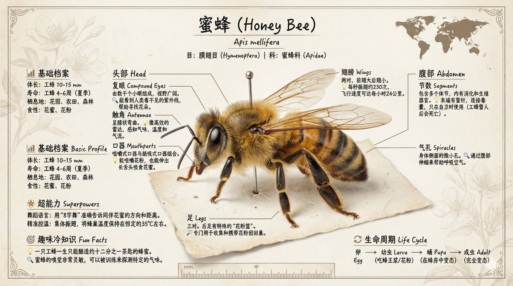

## A hyper-realistic travel advertisement in square format 

- ID: gpt4o-1046-en-1
- Slug: prompt-1046-en-1
- 语言: en
- 来源: [来源链接](https://x.com/TechieBySA/status/2007190982408974659)
- 样例图路径: images/part3/1046.jpeg

### 提示词

```text
A hyper-realistic travel advertisement in square format (1080x1080), featuring a hand holding a sleek, ultra-thin smartphone or tablet in portrait orientation, tilted slightly sideways to create a striking 3D portal effect. The screen displays a high-resolution image of an iconic landmark from [COUNTRY], which continues into the real background, blending seamlessly. The landmark appears to emerge from the screen. Birds fly nearby and a commercial airplane passes through a bright blue sky with soft white clouds. Bold, clean sans-serif text reading [CITY] is placed prominently above. The lighting is warm and natural, casting soft shadows across the landscape. The surroundings reflect the region’s natural environment (like meadows, coastlines, or city skylines). The device is glossy and minimal-bezel, enhancing realism and depth.
```

### 样例图


## 一则超写实的旅行广告

- ID: gpt4o-1046-zh-2
- Slug: prompt-1046-zh-2
- 语言: zh
- 来源: [来源链接](https://x.com/TechieBySA/status/2007190982408974659)
- 样例图路径: images/part3/1046.jpeg

### 提示词

```text
这是一则超写实的旅行广告，采用正方形格式（1080x1080），画面中一只手竖屏握着一部纤薄时尚的智能手机或平板电脑，略微侧倾，营造出引人注目的3D立体效果。屏幕上显示着[国家/地区]标志性地标的高分辨率图像，图像与真实背景无缝融合，仿佛从屏幕中浮现出来一般。附近有鸟儿飞翔，一架商用飞机掠过湛蓝的天空，朵朵白云点缀其间。醒目的上方是简洁的无衬线字体[城市]。画面光线温暖自然，在景物上投下柔和的阴影。周围环境反映了该地区的自然环境（例如草地、海岸线或城市天际线）。设备采用光滑的超窄边框设计，增强了画面的真实感和立体感。
```

### 样例图


## { "design_system": { "metadata": { "style_name": "Cozy S

- ID: gpt4o-1045-en-1
- Slug: prompt-1045-en-1
- 语言: en
- 来源: [来源链接](https://x.com/miilesus/status/2007169297655730610)
- 样例图路径: images/part3/1045.jpeg

### 提示词

```text
{
  "design_system": {
    "metadata": {
      "style_name": "Cozy Storybook Illustration",
      "target_audience": "Children / Family",
      "reference_source": "Uploaded Image",
      "version": "3.0"
    },
    "visual_parameters": {
      "medium": {
        "primary": "Colored Pencil",
        "secondary": "Watercolor Wash (Variation only)",
        "application": "Hand-drawn",
        "texture": {
          "type": "Visible pencil strokes",
          "quality": "Slightly rough outlines",
          "finish": "Non-realistic / No photo texture"
        }
      },
      "line_work": {
        "style": "Clean line art",
        "weight": "Slightly rough/organic",
        "clarity": "High"
      },
      "color_theory": {
        "base_tone": "Warm and friendly",
        "palette_type": "Vibrant Pastel",
        "adjustments": {
          "brightness": "Increased / High-key",
          "saturation": "Enhanced but natural",
          "contrast": "Soft"
        }
      },
      "lighting_and_shading": {
        "shadows": "Minimal",
        "highlights": "Soft",
        "rendering": "Flat yet detailed",
        "gradients": "Subtle watercolor layers (Variation only)"
      }
    },
    "subject_geometry": {
      "anatomy": {
        "proportions": "Semi-cartoon realistic",
        "scale": "Storybook style"
      },
      "facial_features": {
        "eyes": "Dot style",
        "mouth": "Small smile",
        "complexity": "Simple / Minimalist"
      }
    },
    "atmosphere": {
      "mood": [
        "Cozy",
        "Cheerful",
        "Warm",
        "Friendly"
      ],
      "genre_tags": [
        "Children's Book",
        "Lifestyle Sketch",
        "Storybook Illustration"
      ]
    }
  },
  "generation_configs": {
    "negative_prompt_tokens": [
      "realism",
      "photorealistic",
      "photo texture",
      "dark colors",
      "complex shading",
      "3d render"
    ],
    "prompt_variations": [
      {
        "id": "PROMPT_001",
        "variant_name": "Textured Colored Pencil",
        "focus": "Texture and Stroke",
        "full_text": "Illustration style: hand-drawn colored pencil illustration, clean line art with slightly rough pencil outlines, soft pastel coloring with increased brightness, lighter and more vivid color tones, enhanced saturation while staying natural, visible pencil strokes and gentle shading texture, warm and friendly tone, semi-cartoon realistic proportions, simple facial features with dot eyes and small smiles, flat yet detailed coloring, minimal shadows, soft highlights, storybook illustration feel, cozy and cheerful atmosphere, vibrant yet soft color palette, children-book / lifestyle sketch style, high clarity, no realism, no photo texture"
      },
      {
        "id": "PROMPT_002",
        "variant_name": "Mixed Media Watercolor",
        "focus": "Wash and Gradient",
        "full_text": "Hand-drawn colored pencil illustration with clean line art and slightly rough pencil outlines, combined with soft watercolor wash textures. Bright pastel colors, lighter and more vivid tones with natural saturation. Visible pencil strokes layered with subtle watercolor gradients. Warm and friendly tone, semi-cartoon realistic proportions. Simple facial features with dot eyes and small smiles. Flat yet detailed coloring, minimal shadows, soft highlights. Storybook illustration feel, cozy and cheerful atmosphere, children-book style, high clarity, no realism, no photo texture."
      }
    ]
  }
}
```

### 样例图

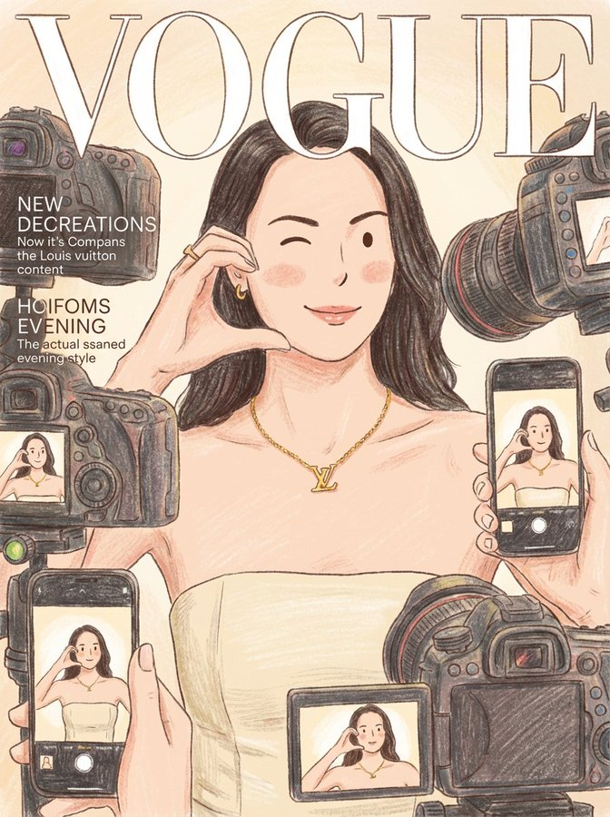

## 杂志配有儿童绘画作品

- ID: gpt4o-1045-zh-2
- Slug: prompt-1045-zh-2
- 语言: zh
- 来源: [来源链接](https://x.com/miilesus/status/2007169297655730610)
- 样例图路径: images/part3/1045.jpeg

### 提示词

```text
{
"design_system": {
"元数据": {
"style_name": "温馨故事书插画",
"target_audience": "儿童/家庭",
"reference_source": "上传的图片",
版本：3.0
},
"visual_parameters": {
“中等的”： {
“primary”： “彩色铅笔”
“次要的”: “水彩晕染（仅限变体）”
“应用”：“手绘”，
“质地”： {
“类型”：“可见的铅笔笔触”，
“质量”：“轮廓略显粗糙”，
“完成”: “非写实/无照片纹理”
}
},
"line_work": {
风格：简洁的线条艺术，
“重量”：“略粗糙/有机”，
清晰度：高
},
"color_theory": {
"base_tone": "温暖友好",
"palette_type": "鲜艳的粉彩",
“调整”：{
“亮度”: “增强/高调”
“饱和度”：“增强但自然”，
“对比度”： “柔和”
}
},
"lighting_and_shading": {
“阴影”：“极简主义”，
“亮点”：“柔和”，
“渲染”：“平面但细节丰富”，
“渐变”：“微妙的水彩图层（仅限变体）”
}
},
"subject_geometry": {
"解剖学": {
“比例”：“半卡通写实”
“规模”: “故事书风格”
},
"facial_features": {
“眼睛”：“点状风格”，
“嘴”: “微微一笑”
“复杂性”： “简单/极简主义”
}
},
“气氛”： {
“情绪”： [
“舒适”，
“快乐”，
“温暖的”，
“友好的”
],
"genre_tags": [
《儿童读物》
“生活方式素描”，
“故事书插图”
]
}
},
"generation_configs": {
"negative_prompt_tokens": [
“现实主义”，
“照片级真实感”，
“照片纹理”，
“暗色”，
“复杂阴影”，
“3D渲染”
],
"prompt_variations": [
{
"id": "PROMPT_001",
"variant_name": "纹理彩色铅笔",
“焦点”：“纹理和笔触”，
"full_text": "插画风格：手绘彩色铅笔插画，线条简洁，铅笔轮廓略显粗糙，柔和的粉彩色调，亮度增强，色彩更明亮鲜艳，饱和度提高，同时保持自然，铅笔笔触清晰可见，阴影纹理柔和，色调温暖友好，半卡通写实比例，面部特征简洁，眼睛为点状，面带微笑，色彩平涂但细节丰富，阴影极少，高光柔和，具有绘本插画风格，温馨欢快的氛围，色彩鲜艳而柔和，儿童绘本/生活素描风格，清晰度高，不追求写实，无照片纹理"
},
{
"id": "PROMPT_002",
"variant_name": "混合媒介水彩",
“焦点”：“水洗和渐变”，
"full_text": "手绘彩色铅笔插画，线条干净利落，铅笔轮廓略显粗糙，并结合柔和的水彩晕染纹理。明亮的粉彩色调，色调更浅更鲜艳，饱和度自然。铅笔笔触清晰可见，并叠加了微妙的水彩渐变。整体色调温暖友好，半卡通式的写实比例。面部特征简洁，眼睛是点状的，带着淡淡的微笑。色彩运用平涂却不失细节，阴影极少，高光柔和。具有童话插画的感觉，营造出温馨欢快的氛围，儿童绘本风格，清晰度高，不追求写实，没有照片质感。"
}
]
}
}
```

### 样例图


## A 3x3 cinematic storyboard contact sheet consisting of 9

- ID: gpt4o-1044-en-1
- Slug: prompt-1044-en-1
- 语言: en
- 来源: [来源链接](https://x.com/oggii_0/status/2006931271822590224)
- 样例图路径: images/part3/1044.jpeg

### 提示词

```text
A 3x3 cinematic storyboard contact sheet consisting of 9 distinct panels arranged in a grid. The sequence features a young woman with platinum blonde hair in a frozen alpine winter setting.

The panels display various angles and shots:

Close-ups: Focusing on her rosy cheeks, blue-grey eyes, and snowflakes on her eyelashes.

Medium shots: Showing her wrapped in a black wool coat and blue knit scarf, holding a bouquet of dried white flowers.

Wide shots: Capturing her standing alone on the frozen lake with towering snowy mountains in the background.

The lighting is consistent moody blue-hour twilight across all frames. High-quality film photography aesthetic, photorealistic, 8k resolution, coherent character and color grading.
```

### 样例图

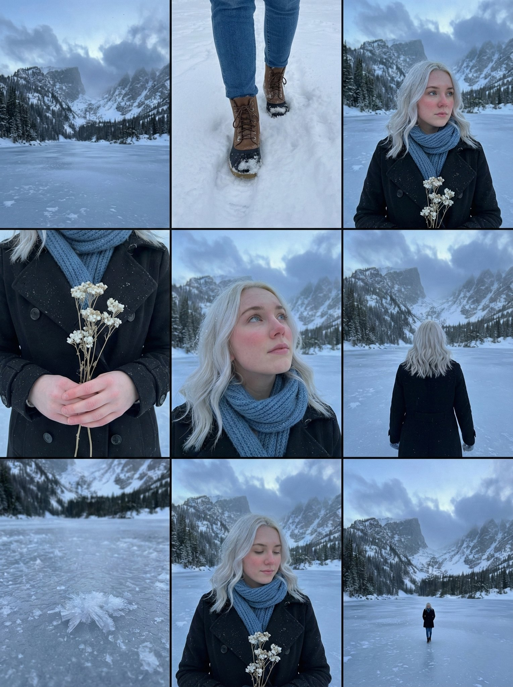

## 电影照片故事板

- ID: gpt4o-1044-zh-2
- Slug: prompt-1044-zh-2
- 语言: zh
- 来源: [来源链接](https://x.com/oggii_0/status/2006931271822590224)
- 样例图路径: images/part3/1044.jpeg

### 提示词

```text
一张3x3的电影分镜脚本，由9个独立的分镜组成，呈网格状排列。画面描绘了一位有着铂金色头发的年轻女子，置身于冰天雪地的阿尔卑斯山冬季场景中。

这些面板展示了各种角度和镜头：

特写镜头：聚焦于她红润的脸颊、蓝灰色的眼睛和睫毛上的雪花。

中景镜头：她身穿黑色羊毛大衣，围着蓝色针织围巾，手捧一束白色干花。

广角镜头：捕捉她独自站在冰封的湖面上，背景是巍峨的雪山。

所有画面都呈现出一致的、略带忧郁的蓝调黄昏光线。高品质的胶片摄影美学，照片级真实感，8K分辨率，风格统一，色彩分级准确。
```

### 样例图


## 1. high-definition, hyper-realistic macro photograph of 

- ID: gpt4o-1043-en-1
- Slug: prompt-1043-en-1
- 语言: en
- 来源: [来源链接](https://x.com/iamsofiaijaz/status/2007029735193448529)
- 样例图路径: images/part3/1043.jpeg

### 提示词

```text
1.  high-definition, hyper-realistic macro photograph of a tiny, miniature girl with long dark hair wearing a flowing brown linen dress, sitting peacefully on the back of a large red ladybug with black spots. The ladybug is perched on a vibrant green leaf covered in glistening, translucent morning dew drops. The background is a soft, creamy bokeh of out-of-focus green foliage and golden sunlight. The lighting is warm and ethereal, capturing every detail of the dew drops and the texture of the ladybug's shell. 
2.  A high-definition macro photograph of a tiny, detailed adventurer riding on the back of a giant iridescent green dung beetle. The beetle has a shimmering metallic shell with hints of gold and blue. The rider is wearing rugged, miniature explorer gear and is perched on the beetle's thorax. They are traveling across a mossy, decaying log on a forest floor. The background is a soft, dreamlike bokeh of a sun-drenched forest with golden light filtering through the trees. Sharp focus on the beetle's texture, cinematic lighting, 8k resolution, hyper-realistic.

3.A high-definition, cinematic fantasy shot of a tiny, cheerful young girl with brown hair riding on the back of a giant, fuzzy bumblebee. She is wearing a brown leather explorer's outfit with a small satchel. They are flying through a vibrant meadow filled with oversized, glowing wildflowers in shades of orange, yellow, and purple. The scene is bathed in warm, golden sunlight with soft bokeh and magical dust particles floating in the air. Highly detailed textures on the bee's fur and the girl's clothing, 8k resolution, whimsical and adventurous atmosphere.

4. A high-definition surreal fantasy photograph of a tiny, miniature woman with long flowing hair, wearing a delicate, ethereal white lace dress, standing gracefully on the back of a giant Monarch butterfly. The butterfly is in full focus, showcasing vibrant orange and black wing patterns. They are floating in a sun-drenched meadow filled with soft-focus, bokeh wildflowers in shades of red, blue, and yellow. The lighting is warm and golden (golden hour), creating a magical, dreamlike atmosphere with soft lens flares and a shallow depth of field.
```

### 样例图

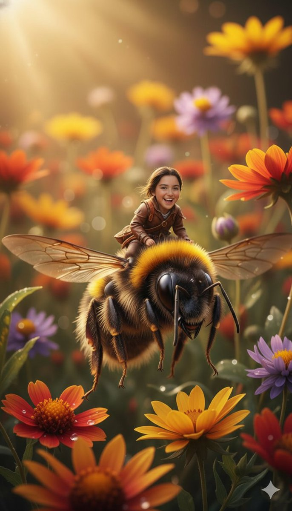

## 高清超写实的微距照片

- ID: gpt4o-1043-zh-2
- Slug: prompt-1043-zh-2
- 语言: zh
- 来源: [来源链接](https://x.com/iamsofiaijaz/status/2007029735193448529)
- 样例图路径: images/part3/1043.jpeg

### 提示词

```text
这是一张高清超写实的微距照片，照片中一位身材娇小的小女孩，有着一头乌黑的长发，身着飘逸的棕色亚麻连衣裙，静静地坐在一只红色瓢虫的背上，瓢虫身上布满了黑色的斑点。瓢虫栖息在一片翠绿的叶子上，叶子上缀满了晶莹剔透的晨露。背景是柔和的散景，由模糊的绿色树叶和金色的阳光构成。光线温暖而空灵，捕捉到了露珠的每一个细节以及瓢虫外壳的纹理。
2. 这是一张高清微距照片，展现了一位身材娇小、细节丰富的探险家骑在一只巨大的、闪着虹彩光泽的绿色蜣螂背上。蜣螂有着闪亮的金属外壳，隐约透着金色和蓝色。探险家身着结实耐用的迷你探险装备，栖息在蜣螂的胸部。他们正沿着森林地面上一根长满青苔、腐朽的圆木行进。背景是阳光普照的森林，金色的光芒透过树叶洒下，营造出柔和梦幻般的散景效果。照片清晰地聚焦在蜣螂的纹理上，运用了电影级的灯光效果，分辨率高达8K，画面极其逼真。

3. 这是一张高清电影级的奇幻照片，画面中一位娇小可爱的棕发少女骑在一只巨大的毛茸茸的大黄蜂背上。她身穿棕色皮质探险家套装，挎着一个小挎包。她们飞越一片生机勃勃的草地，草地上开满了硕大而闪闪发光的野花，色彩斑斓，有橙色、黄色和紫色。温暖的金色阳光洒满整个画面，柔和的散景和空气中漂浮的梦幻尘埃营造出梦幻般的氛围。蜜蜂的皮毛和少女的衣物纹理都非常细腻，8K分辨率，营造出一种奇幻而充满冒险气息的氛围。

4. 这是一张高清超现实主义奇幻照片，照片中一位娇小玲珑的女子，长发飘逸，身着精致飘逸的白色蕾丝长裙，优雅地站在一只巨大的帝王蝶背上。蝴蝶清晰可见，鲜艳的橙黑相间翅膀图案跃然眼前。她们漂浮在阳光普照的草地上，草地上盛开着柔焦效果的野花，红、蓝、黄三色交织，营造出迷人的散景。温暖的金色光线（黄金时段）营造出梦幻般的氛围，柔和的镜头光晕和浅景深更添几分梦幻之感。
```

### 样例图


## 博物馆展品级别的鱼类知识科普图谱

- ID: gpt4o-1041-zh
- Slug: prompt-1041-zh
- 语言: zh
- 来源: [来源链接](https://x.com/LZhou15365/status/2007275324967698649)
- 样例图路径: images/part3/1041.jpeg

### 提示词

```text
请创建一张博物馆展品级别的鱼类知识科普图谱，聚焦展示【某一种代表性鱼类，如：金枪鱼 / 鲤鱼 / 鲨鱼 / 小丑鱼（可替换）】。

核心布局：

中心：巨大的鱼类标本图像，占据画面 60–70%

周围：科学标注 + 趣味百科信息，呈放射状或分区排布

整体：如同博物馆玻璃展柜中的鱼类标本说明牌

鱼类标本呈现（核心要求）：

物理真实感
鱼类标本真实平放在纸面上
不是“照片中的照片”，而是实体标本

视角
垂直俯视（Top-down view）
鱼体与纸面处于同一物理平面

光影
柔和自然光从上方照射
鱼体在纸面上投下细腻、真实的阴影

固定方式（博物学风格）
使用细长银色金属标本针或细线固定鱼体
针穿过鱼体关键部位（如背部或鳍基）
针尖微微刺入纸面
纸面可见细小针孔与轻微压痕

细节质感（重点）
清晰可见：
鱼鳞排列与反光
鳍膜的半透明质感
鳃盖的结构层次
眼睛的湿润反光
鱼体边缘有厚度感与轻微立体起伏
鳍部可能有自然展开但不过分夸张

比例
鱼类标本占据纸面中心约 60–70%
周围留白用于标注与信息说明

自然状态
鱼体姿态自然、舒展
保留“真实标本”的静态感，而非游动姿态

标注系统设计：

使用细引导线

从鱼体结构延伸至文字说明框

引导线如同直接绘制或印刷在纸面上

必需标注的身体部位（6–8 个）：

1. 头部 Head

眼 Eye
视野范围？是否能看到颜色？

口 Mouth
口型（上位口 / 端位口 / 下位口）
食性相关？

鳃盖 Gill Cover (Operculum)
呼吸方式说明（如何从水中获取氧气）

2. 躯干部 Body

鳞片 Scales
类型（圆鳞 / 栉鳞 / 楯鳞）
保护与减阻作用

侧线系统 Lateral Line
感知水流和震动的“感觉器官”

3. 鳍 Fin System

背鳍 Dorsal Fin：保持平衡

胸鳍 Pectoral Fin：转向与刹车

腹鳍 Pelvic Fin：稳定身体

尾鳍 Caudal Fin：主要推进力
游泳速度或爆发力说明

4. 内部/特殊结构（可视化表达）

鱼鳔 Swim Bladder（如适用）
控制浮沉

或

软骨骨骼 / 硬骨结构对比

5. 特色结构

该鱼类最具代表性的身体特征

与其生存环境（海洋 / 淡水 / 深海 / 珊瑚礁）的适应关系

信息卡片内容（每个标注包含）：

部位名称（中 / 英文）
1–2 句儿童友好型功能说明

趣味数据或冷知识
用 🔍 或 💡 图标标识

页面其他元素：

顶部区域：

鱼类中文名（大标题，优雅字体）

学名 Scientific Name（斜体拉丁文）

分类信息（纲 / 目 / 科）

分布地图小图标
世界地图 + 主要分布水域高亮

底部 / 侧边信息栏：

基础档案

体长：X cm – X m

体重：X g – X kg

寿命：X 年

栖息环境：海洋 / 淡水 / 深海 / 珊瑚礁

食性：草食 / 肉食 / 杂食

超能力 / 生存技能

2–3 项最酷能力，例如：
高速游泳
电感应
变色伪装
洄游能力

图标 + 简短说明

趣味冷知识

1–2 个吸引儿童的事实

如：
“可以不眨眼睡觉”
“一生能游过几千公里”

生命周期

简化示意图：
卵 → 仔鱼 → 幼鱼 → 成鱼

标注生长阶段变化重点

设计美学（保持博物学风格）：

纸面质感

底纸：
米白色 / 象牙白高级纸张
#F8F6F0 或 #FFFEF7

可见纸张纤维

轻微复古磨损感（可选）

空间关系（非常重要）

鱼类标本：真实物理实体，平放在纸面上

固定针 / 细线：银色金属质感

标注文字：直接印刷或手写在同一张纸上

引导线：细笔绘制的线条
配色方案

纸面底色：#F8F6F0 / #FFFEF7

标注文字：#2C3E50（深灰蓝墨色）

引导线：#8B7355 或 #696969

强调标记：#D4AF37（古铜金）

标本针：#C0C0C0（银灰金属）

字体系统
标题：优雅印刷体或手写风格（宋体 / Garamond）

学名：斜体

标注说明：清晰小号手写体或印刷体

整体感觉：
像博物学家在标本纸上亲笔记录鱼类观察笔记

装饰元素（可选）

四角装饰线框

毫米刻度尺（与鱼体平行）

采集编号 / 日期（手写风格）

水生植物剪影水印（极淡）

关键视觉要点（不可违背）：

整个画面是一张平铺的鱼类标本纸

鱼类标本被真实固定在纸面上

文字、线条、标本共享同一个物理平面

观看者仿佛正俯视一位博物学家的工作台

关键概念强调：

❌ 不要：鱼的照片被放进画面

✅ 要：鱼类标本本身就在纸面上

就像 19 世纪博物学家的鱼类标本册一页

图片规格：

比例：16:9（横版）或 3:4（竖版）

分辨率：300 DPI，适合 A3 / A2 打印

格式：PNG 高清

科学准确性要求：
鱼体比例符合真实物种

解剖结构名称准确

儿童描述生动但不失科学性
```

### 样例图

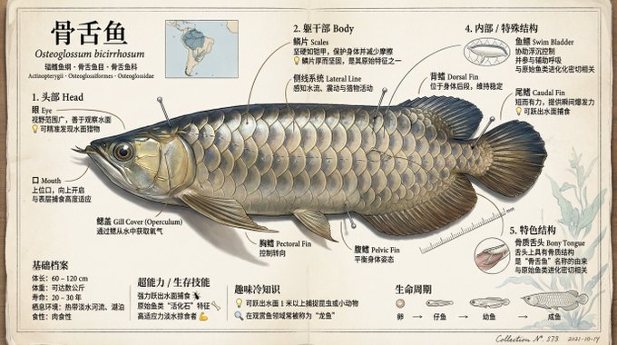

## A refined fashion editorial image with a 3:2 aspect rati

- ID: gpt4o-1039-en-1
- Slug: prompt-1039-en-1
- 语言: en
- 来源: [来源链接](https://x.com/craftian_keskin/status/2007156041851490337)
- 样例图路径: images/part3/1039.jpeg

### 提示词

```text
A refined fashion editorial image with a 3:2 aspect ratio, split into two clear sections.

Right side:
A fashionable, confident, sensual woman standing and walking casually in a modern architectural space with warm wooden walls and soft natural light. She wears a top with a deep V neckline, has a small mole on her chest, a 90-60-90 figure, tucked into a high-waisted white tailored short skirt, On her feet are sleek black stiletto heels, elegant and minimal. She carries a small structured black handbag in one hand.

Her hair is slicked back into a clean low bun, emphasizing her facial structure. She wears narrow black sunglasses and subtle statement earrings. The look is refined, modern, and effortlessly chic. Natural daylight, soft shadows, realistic skin texture. Casual fashion photography style with an editorial, high-end feel. Neutral color palette, warm tones, shallow depth of field, cinematic realism.

Style & Mood:
Modern elegance, quiet luxury, confident, minimal, editorial casual.

Photography Details:
Eye-level angle, candid stance, 35mm lens, natural lighting, high detail, photorealistic.

Left side:
A clean, minimalist product breakdown layout on a neutral background. The individual fashion items worn by the woman are displayed separately, neatly arranged with subtle shadows. Each item includes a small, elegant price label in refined sans-serif typography:

– Beige deep V-neck knit top — $180
– White high-waisted tailored mini skirt — $220
– Black pointed-toe stiletto heels — $350
– Small structured black handbag — $480
– Black narrow sunglasses — $160

The left side feels like a luxury fashion catalog or e-commerce lookbook, with clear spacing, premium presentation, and visual balance.

Overall Style & Mood:
Quiet luxury, modern elegance, editorial fashion, high-end retail aesthetic.

Lighting & Quality:
Soft natural light, studio-clean clarity on product side, photorealistic, ultra-high resolution, professional fashion photography.

Negative Prompt:
Cluttered layout, oversized text, flashy logos, mannequins, people on left side, harsh lighting, low resolution, cartoon style.
```

### 样例图


## 一张精致的时尚大片

- ID: gpt4o-1039-zh-2
- Slug: prompt-1039-zh-2
- 语言: zh
- 来源: [来源链接](https://x.com/craftian_keskin/status/2007156041851490337)
- 样例图路径: images/part3/1039.jpeg

### 提示词

```text
一张精致的时尚大片，宽高比为 3:2，清晰地分为两个部分。

右侧：
一位时尚、自信、充满魅力的女士，在现代建筑风格的空间中随意地站立或行走，温暖的木质墙壁和柔和的自然光线营造出舒适的氛围。她身着一件深V领上衣，胸前有一颗小痣，身材比例完美，下身搭配一条高腰白色修身短裙。脚上是一双优雅简约的黑色细高跟鞋。她手提一只小巧精致的黑色手提包。

她的头发利落地梳成一个低髻，凸显了她精致的脸型。她戴着黑色窄框太阳镜和简约的耳环，整体造型优雅、现代，又不失随性时尚感。自然的光线、柔和的阴影、真实的肌肤纹理，营造出一种休闲时尚摄影的质感，同时又不失高端大片的氛围。中性色调、暖色调、浅景深，以及电影般的真实感，共同成就了这组照片。

风格与氛围：
现代优雅，低调奢华，自信，简约，时尚休闲。

摄影细节：
平视角度，自然姿态，35mm镜头，自然光，高细节，照片级真实感。

左侧：
简洁的极简主义产品展示布局，背景中性。女士身上穿着的每件时尚单品都单独展示，整齐排列，并辅以柔和的阴影效果。每件单品都配有小巧精致的价格标签，采用优雅的无衬线字体。

米色深V领针织上衣——180美元
白色高腰修身迷你裙——220美元
黑色尖头细高跟鞋——350美元
- 小号黑色硬挺手提包 — 480 美元
黑色窄框太阳镜——160美元

左侧的设计风格类似于奢侈时尚产品目录或电商产品图册，布局清晰，呈现方式高端大气，视觉效果平衡。

整体风格与氛围：
低调奢华，现代优雅，时尚杂志风格，高端零售美学。

照明和质量：
柔和的自然光，产品面清晰如影楼，照片真实感强，超高分辨率，专业时尚摄影。

否定提示：
布局杂乱，文字过大，标志花哨，模特，左侧有人，光线刺眼，分辨率低，卡通风格。
```

### 样例图


## { "type": "image_generation", "style": "hyper_realistic"

- ID: gpt4o-1037-en-1
- Slug: prompt-1037-en-1
- 语言: en
- 来源: [来源链接](https://x.com/ykszs017/status/2006959351970541714)
- 样例图路径: images/part3/1037.jpeg

### 提示词

```text
{
"type": "image_generation",
"style": "hyper_realistic",
"quality": "8K DSLR",
"aspect_ratio": "4:5",
"camera": {
"angle": "slightly tilted cinematic perspective",
"lens": "50mm DSLR",
"depth_of_field": "shallow",
"focus": "smartphone and swimming action"
},
"scene": {
"setting": "iPhone 17 Pro Max placed on a wooden table",
"concept": "phone screen transformed into a miniature Olympic swimming pool",
"environment": "indoor, soft daylight coming from the side",
"atmosphere": "cinematic, immersive, realistic with intense competitive energy"
},
"details": {
"screen": "miniature Olympic-sized swimming pool with clear blue water ripples and lane dividers, starting blocks at one end, lane markers in black, subtle water reflections and splashes on the edges",
"players": "miniature swimmers in dynamic action: one swimmer mid-stroke in freestyle lane performing a powerful butterfly kick, another in adjacent lane doing backstroke with arms extended, others diving from blocks or turning at the wall, wearing swimsuits and goggles, water droplets flying with motion blur",
"lighting": "soft diffused daylight with subtle lens flares, realistic caustics and light refractions through the water, dramatic highlights on wet surfaces",
"realism_effects": [
"fingerprints on screen",
"light scratches on phone body",
"natural smudges",
"micro dust particles",
"faint screen glow illuminating the miniature pool with watery shimmer"
]
},
"materials": {
"phone": "metallic frame with realistic reflections",
"table": "textured wooden surface with warm tones"
},
"mood": "high-end cinematic, dramatic, premium advertising look with exhilarating swimming intensity",
"rendering": {
"sharpness": "ultra sharp",
"texture_detail": "extreme",
"lighting_quality": "studio grade",
"photorealism": true
}
}
```

### 样例图

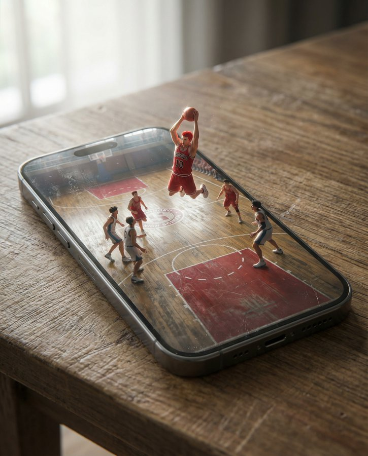

## 用手机屏幕把运动世界装进口袋

- ID: gpt4o-1037-zh-2
- Slug: prompt-1037-zh-2
- 语言: zh
- 来源: [来源链接](https://x.com/ykszs017/status/2006959351970541714)
- 样例图路径: images/part3/1037.jpeg

### 提示词

```text
{
"type": "image_generation",
"风格": "超写实"
“质量”: “8K 单反”
"aspect_ratio": "4:5",
“相机”： {
“角度”：“略微倾斜的电影视角”，
“镜头”: “50mm 单反”
"景深": "浅",
“焦点”：“智能手机和游泳动作”
},
“场景”： {
“设置”：“iPhone 17 Pro Max 放在木桌上”，
“概念”：“手机屏幕变成一个微型奥运游泳池”，
“环境”：“室内，柔和的日光从侧面照射进来”，
“氛围”： “电影般的、沉浸式的、逼真的，充满强烈的竞争能量”
},
“细节”： {
“屏幕”：“迷你奥林匹克规格游泳池，清澈的蓝色水波荡漾，有泳道分隔线，一端有出发台，黑色泳道标记，边缘有微妙的水面倒影和水花飞溅”，
“玩家”：“动态的微型游泳者：一名游泳者在自由泳泳道中做着强有力的蝶泳腿，另一名游泳者在相邻的泳道中伸展双臂做着仰泳，其他游泳者穿着泳衣和泳镜从出发台跳水或在池壁处转身，水滴飞溅，呈现出动态模糊效果。”
“照明”：“柔和的漫射日光，带有微妙的镜头光晕，逼真的光影效果和光线穿过水面的折射，以及湿润表面上的戏剧性高光”，
"realism_effects": [
“屏幕上的指纹”，
“手机机身有轻微划痕”
“自然的污渍”，
“微尘颗粒”，
“屏幕微光照亮了微型水池，泛起水波光粼粼”
]
},
“材料”： {
“手机”：“具有逼真反射效果的金属边框”，
“桌子”： “带有暖色调的纹理木质表面”
},
“氛围”：“高端电影感、戏剧性、优质广告风格，以及令人兴奋的游泳强度”，
渲染：{
“锐度”: “超锐利”，
"texture_detail": "extreme",
"lighting_quality": "摄影棚级",
“照片写实主义”：真
}
}
```

### 样例图


## 一场盛大壮观的烟花表演

- ID: gpt4o-1036-zh
- Slug: prompt-1036-zh
- 语言: zh
- 来源: [来源链接](https://x.com/xpg0970/status/2007141341852029349)
- 样例图路径: images/part3/1036.jpeg

### 提示词

```text
超写实4K长曝光摄影，电影级构图，照片级写实风格，戏剧性光影，清晰对焦，

一场盛大壮观的烟花表演在【地标名称】上空的夜空中绽放，

这些烟花并非随机分布，它们组成了一个清晰发光的【烟花图案】形状，

烟花由数千个闪烁的粒子组成，【烟花颜色】的光带，立体的光芒和逼真的烟雾，自然散发光芒，看起来像真正的烟火表演而非平面贴图，

【环境描述】，

深邃的黑色夜空形成最大对比度，逼真的烟雾轨迹在风中飘散，长曝光光迹，

8K分辨率，高度精细，专业色彩分级，光线追踪，照片级渲染，

--ar 【比例】 --stylize 【数值】 --v 6.0
```

### 样例图

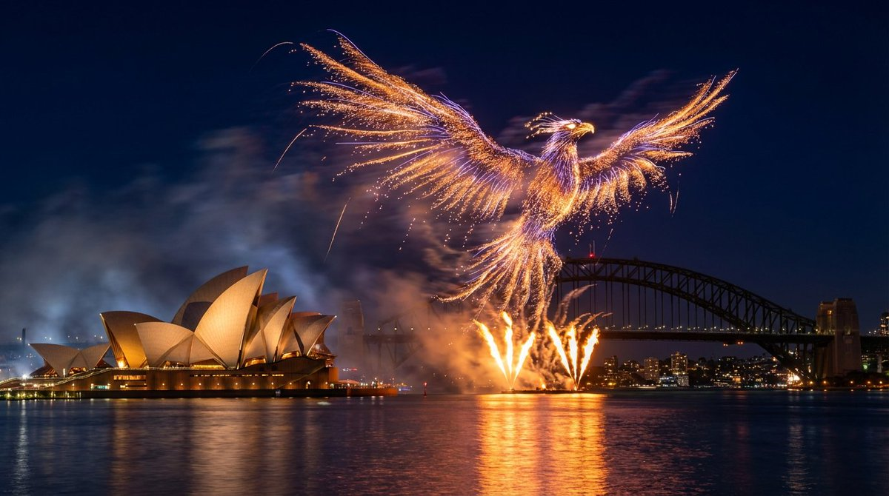

## Ultra-realistic 4K photograph of a spectacular fireworks

- ID: gpt4o-1035-en-1
- Slug: prompt-1035-en-1
- 语言: en
- 来源: [来源链接](https://x.com/TechieBySA/status/2006462352506663012)
- 样例图路径: images/part3/1035.jpeg

### 提示词

```text
Ultra-realistic 4K photograph of a spectacular fireworks display over [LANDMARK] at night. The fireworks explode in the exact colors of the [COUNTRY] flag: [FLAG COLORS] radiating naturally outward. Include a dark night sky, smoke trails from the fireworks, and reflections of the colored bursts on the water below (if waterfront). The city silhouette or landmark ([ICONIC LANDMARK]) should be clearly visible in the background. Cinematic composition, photorealistic style, professional long exposure photography techniques, sharp focus on fireworks burst, dramatic lighting, 4K quality.
```

### 样例图


## 夜间烟花表演

- ID: gpt4o-1035-zh-2
- Slug: prompt-1035-zh-2
- 语言: zh
- 来源: [来源链接](https://x.com/TechieBySA/status/2006462352506663012)
- 样例图路径: images/part3/1035.jpeg

### 提示词

```text
拍摄一张超逼真的4K照片，展现[地标]上空壮观的夜间烟花表演。烟花绽放的颜色与[国家]国旗的颜色完全一致：[国旗颜色]，并自然地向外扩散。照片应包含漆黑的夜空、烟花燃放产生的烟雾，以及彩色烟花在水面上的倒影（如果是滨水场景）。城市轮廓或地标([或标志性地标])应清晰地出现在背景中。照片应采用电影级构图、照片级写实风格，运用专业的长时间曝光摄影技巧，清晰聚焦于烟花绽放，并运用戏剧性的光线，达到4K画质。
```

### 样例图


## 4x4 grid of identical 3D object renders showing the same

- ID: gpt4o-1034-en-1
- Slug: prompt-1034-en-1
- 语言: en
- 来源: [来源链接](https://x.com/gokayfem/status/2007137742883266682)
- 样例图路径: images/part3/1034.jpeg

### 提示词

```text
4x4 grid of identical 3D object renders showing the same furniture piece with 16 different material applications. Each cell displays the exact same object geometry with a unique surface texture applied.

Object: Curved sculptural seating form with rounded back, cushioned seat, and four angled legs. Organic mid-century modern silhouette with smooth flowing lines, gently sloped armrests, and comfortable proportions. Single unified form without separate cushions or pillows.

Camera specifications: Fixed 3/4 front angle view, warm showroom lighting from upper-left at 45°, soft ambient fill light, identical framing across all 16 cells, subtle floor shadow beneath object, clean neutral gradient background.

Object geometry (identical in all cells):
* Same exact 3D model in every cell
* Same camera angle and distance
* Same lighting setup
* Only the surface material changes between cells

16 unique material applications (one per cell, left to right, top to bottom):

Row 1 - Soft Luxury:
* Cell 1: Midnight blue velvet - deep navy plush pile absorbing light across curved surfaces
* Cell 2: Cognac full-grain leather - warm caramel with natural grain wrapping around form
* Cell 3: Cream bouclé - chunky looped wool texture following organic contours
* Cell 4: Blush pink silk - luminous soft draping appearance with subtle sheen on curves

Row 2 - Natural Elements:
* Cell 5: Live-edge walnut wood - rich brown grain flowing across entire solid form
* Cell 6: White Carrara marble - bright polished stone with gray veins (sculptural interpretation)
* Cell 7: Natural rattan weave - honey tan woven cane pattern covering all surfaces
* Cell 8: Olive green shagreen - textured bumpy stingray pattern on elegant form

Row 3 - Metals & Industrial:
* Cell 9: Brushed brass - warm golden metal with soft directional scratches
* Cell 10: Matte black steel - powder-coated charcoal covering entire form
* Cell 11: Polished chrome - mirror-like silver reflecting environment
* Cell 12: Antique bronze - deep brown with green patina weathering

Row 4 - Statement Finishes:
* Cell 13: Emerald green lacquer - jewel tone high-gloss reflective surface
* Cell 14: Smoked glass - dark translucent gray showing form as sculptural object
* Cell 15: Camel herringbone wool - warm tan zigzag woven textile on all surfaces
* Cell 16: Mother of pearl - iridescent shell mosaic with rainbow shimmer across curves

Material application rules:
* Each material wraps entirely around the object
* Texture scale appropriate for furniture size
* Material responds correctly to object curvature
* Lighting reveals unique surface properties of each material
* Realistic rendering quality showing how material would actually appear

Technical requirements:
* Identical object silhouette in all 16 cells
* Zero variation in geometry, camera, or lighting
* Only surface material differs between cells
* Clean grid layout with thin borders
* Professional product visualization quality
* Each cell could serve as standalone product render

Purpose: Material exploration for furniture design, showing clients how the same form transforms with different surface treatments. Demonstrates versatility of single design across fabric, leather, wood, metal, stone, and decorative finishes.

Output: 4x4 seamless grid comparing 16 material options on identical object. Presentation-ready format for design review, client selection, or 3D visualization portfolio.
```

### 样例图

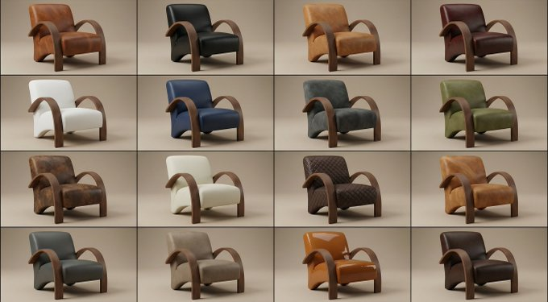

## 16 种不同的表面材质

- ID: gpt4o-1034-zh-2
- Slug: prompt-1034-zh-2
- 语言: zh
- 来源: [来源链接](https://x.com/gokayfem/status/2007137742883266682)
- 样例图路径: images/part3/1034.jpeg

### 提示词

```text
4x4 的网格，由 16 种不同的材质渲染图组成，展示同一件家具的相同几何形状。每个单元格都应用了不同的表面纹理。

物件：弧形雕塑座椅，圆润的靠背，带软垫的座面，四条倾斜的椅腿。有机的中世纪现代风格轮廓，线条流畅，扶手略微倾斜，比例舒适。一体式设计，无需单独的坐垫或靠枕。

相机规格：固定 3/4 前角视角，从左上方 45° 角照射的暖色展厅照明，柔和的环境补光，所有 16 个单元格的取景相同，物体下方有微妙的地板阴影，干净的中性渐变背景。

对象几何形状（所有单元格均相同）：
每个单元格都使用完全相同的 3D 模型。
* 相同的拍摄角度和距离
* 相同的照明设置
细胞间仅表面物质发生变化。* 只有细胞表面物质发生变化。

16 种独特的材料应用（每个单元格一种，从左到右，从上到下）：

第一排 - 轻奢：
* 单元格 1：午夜蓝丝绒 - 深海军蓝长绒面料，可吸收曲面上的光线
* 单元格 2：干邑色全粒面皮革 - 温暖的焦糖色，天然纹理包裹着造型
* 单元格 3：奶油色圈绒 - 粗毛圈绒质地，贴合有机轮廓
* 第4格：淡粉色丝绸——光泽柔和，垂坠感极佳，曲线处带有微妙的光泽

第 2 行 - 自然元素：
* 第5单元：原木胡桃木——浓郁的棕色纹理贯穿整个实木框架
* 6号单元：白色卡拉拉大理石——光泽亮丽、带有灰色纹理的石材（雕塑诠释）
* 7号单元：天然藤编——蜜棕色藤条编织图案覆盖所有表面
* 第8格：橄榄绿鲨革——优雅造型上带有纹理粗糙的鳐鱼图案

第 3 行 - 金属和工业：
* 9号单元格：拉丝黄铜——温暖的金色金属，带有柔和的定向划痕
* 10号单元：哑光黑色钢材 - 表面喷涂炭黑色粉末涂层
* 11号单元格：抛光铬——镜面般的银色反射环境
* 12号单元格：古铜色 - 深棕色，带有绿色风化痕迹

第 4 行 - 语句结尾：
* 13号单元格：翠绿色漆面 - 宝石色调高光泽反光表面
* 第14号单元：烟熏玻璃——深灰色半透明，呈现出雕塑般的形态
* 15号单元：驼色人字纹羊毛——温暖的棕褐色之字形织物，所有表面均有纹理
* 第16格：珍珠母贝——带有彩虹般光泽的虹彩贝壳马赛克，曲线处闪烁着光芒

材料应用规则：
每种材料都完全包裹住物体。
* 纹理比例适合家具尺寸
* 材料对物体曲率的响应正确
光照展现了每种材料独特的表面特性。
* 逼真的渲染质量，展现材质的实际外观

技术要求：
* 所有 16 个单元格中的物体轮廓均相同
* 几何形状、相机或光照方面均无任何变化
* 细胞间仅表面物质存在差异。
* 简洁的网格布局，搭配细边框
* 专业产品可视化质量
每个单元格都可以作为独立的产品渲染图。

目的：探索家具设计中的材料运用，向客户展示同一造型如何通过不同的表面处理呈现出不同的效果。展现单一设计在织物、皮革、木材、金属、石材和装饰饰面等多种材质上的多样性。

输出：4x4无缝网格，对比同一物体上的16种材质选项。格式可直接用于演示，适用于设计评审、客户选择或3D可视化作品集。
```

### 样例图


## High-end commercial shot of a minimalist glass perfume b

- ID: gpt4o-1033-en-1
- Slug: prompt-1033-en-1
- 语言: en
- 来源: [来源链接](https://x.com/Adam38363368936/status/2007334634649202928)
- 样例图路径: images/part3/1033.jpeg

### 提示词

```text
High-end commercial shot of a minimalist glass perfume bottle filled with pale rose gold liquid. It is resting on a mirror-like water surface. Floating silk rose petals and morning dew droplets surround the bottle, frozen in mid-air. Soft pastel pink and white gradient background with dreamy volumetric sunlight. Elegant, ethereal, and romantic atmosphere, --ar 3:4
```

### 样例图

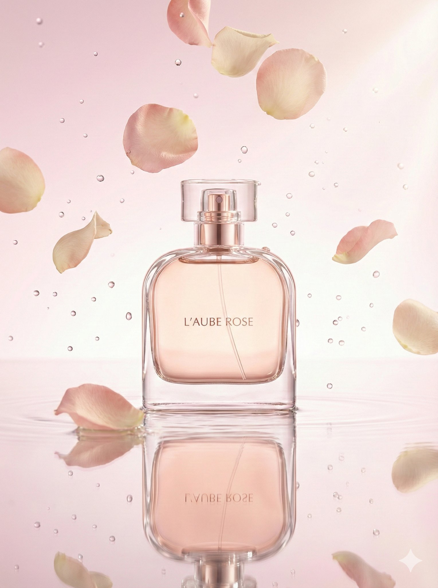

## 花香调香水(柔美浪漫)

- ID: gpt4o-1033-zh-2
- Slug: prompt-1033-zh-2
- 语言: zh
- 来源: [来源链接](https://x.com/Adam38363368936/status/2007334634649202928)
- 样例图路径: images/part3/1033.jpeg

### 提示词

```text
高端商业广告，画面中一个极简主义的玻璃香水瓶盛满了淡玫瑰金色的液体。它静静地躺在如镜面般平静的水面上。漂浮的丝绸玫瑰花瓣和清晨的露珠环绕着香水瓶，仿佛凝固在半空中。柔和的粉白渐变背景，梦幻般的立体阳光洒落在其上。营造出优雅、空灵而浪漫的氛围。--ar 3:4
```

### 样例图


## 新年新气象新衣服

- ID: gpt4o-1031-zh
- Slug: prompt-1031-zh
- 语言: zh
- 来源: [来源链接](https://x.com/aidavid125/status/2006959961109299304)
- 样例图路径: images/part3/1031.jpeg

### 提示词

```text
Use the uploaded reference image as the person appearing in all 6 cards.
Analyze their unique body shape, skin tone, facial features, and personal essence.
Design 6 PERFECT outfits specifically tailored to maximize their individual beauty.

Create a vertical 9:16 professional New Year Fashion Outfit Poster.

BACKGROUND: Solid warm cream (#FFF8F5), optimized for mobile full-screen viewing.

════════════════════════════════════
CRITICAL LAYOUT RULES
════════════════════════════════════

EXACTLY 6 CARDS arranged in SINGLE VERTICAL COLUMN:
- Six (6) cards total — NOT 4, NOT 9, EXACTLY 6
- ONE column ONLY — NO grid, NO 2x3, NO side-by-side
- Cards stacked vertically from top to bottom
- Like mobile scrolling feed / Instagram story sequence
- Each card occupies full width of canvas

SPACING:
- Outer margin: 3% width (left and right)
- Vertical gap between cards: 2% height
- Cards fill vertical space evenly

VISUAL REFERENCE:
┌─────────────────┐
│     Card 1      │
├─────────────────┤
│     Card 2      │
├─────────────────┤
│     Card 3      │
├─────────────────┤
│     Card 4      │
├─────────────────┤
│     Card 5      │
├─────────────────┤
│     Card 6      │
└─────────────────┘

════════════════════════════════════
SINGLE CARD STRUCTURE
════════════════════════════════════

Each card contains 4 zones:

▸ ZONE 1: TITLE AREA (top 8% height)
- AI-generated creative style name based on the outfit
- Main title: Chinese Red (#C41E3A) or Gold (#D4AF37), centered
- Subtitle: 6-8 characters describing the vibe, warm gray (#8B7355)
- Small decorative icon: lantern or cloud motif

▸ ZONE 2: MAIN IMAGE AREA (55% height)
- Full-body outfit display
- Person occupies 70-75% of area
- Clean, elegant background with warm tones
- Subtle New Year decorative elements
- Natural pose, confident expression
- Complete outfit clearly visible

▸ ZONE 3: THREE-DETAIL CIRCLES (15% height)
- Three circular close-up images, horizontally arranged
- LEFT: Upper garment detail (neckline, sleeve, pattern, texture)
- CENTER: Accessory highlight (bag, jewelry, belt, scarf)
- RIGHT: Lower garment/shoes detail (hem, pants, footwear)
- Labels beneath: "上装 Top" / "配饰 Acc" / "下装 Bottom"

▸ ZONE 4: OUTFIT INFO AREA (22% height)
- 5 lines of information, left-aligned:
🔴 上装: [Style + Color + Material]
🔴 下装: [Style + Cut + Color]
🔴 鞋履: [Shoe type + Color + Material]
🔴 配饰: [Bag + Jewelry + Scarf + Other]
🔴 风格点评: [Why this outfit is perfect for this person]

CARD STYLING:
- Background: warm white #FFFAF8
- Border-radius: 4%
- Border: 1px solid #F5E6E0
- Corner decoration: tiny plum blossom or cloud icon

════════════════════════════════════
AI SMART STYLING SYSTEM
════════════════════════════════════

STEP 1: DEEP ANALYSIS
Carefully analyze the reference image for:

Body Shape:
- Pear / Apple / Hourglass / Rectangle / Inverted Triangle
- Shoulder width, waist definition, hip proportion
- Height impression (petite / average / tall)
- Areas to highlight vs balance

Skin Tone:
- Cool undertone / Warm undertone / Neutral
- Fair / Medium / Tan / Deep
- Best complementary colors

Personal Essence:
- Elegant / Sweet / Cool / Classic / Trendy / Edgy
- Gentle / Bold / Cute / Sophisticated / Chic
- Youthful / Young Professional / Mature Elegant

Facial Features:
- Soft vs Angular
- Overall impression and mood

STEP 2: CREATE 6 PERFECT OUTFITS
Based on complete analysis, freely design 6 outfits that:

✓ FLATTER the specific body type
- Choose silhouettes that enhance proportions
- Use strategic cuts, lengths, and fits
- Balance or highlight as needed

✓ COMPLEMENT the skin tone perfectly
- Select colors that make skin glow
- Avoid colors that wash out or clash
- Use undertone-matching principles

✓ MATCH the personal essence
- Align with natural vibe and energy
- Feel authentic, not costume-like
- Enhance existing beauty

✓ MAXIMIZE overall appeal
- Each outfit is THE MOST flattering choice
- Every piece works together harmoniously
- Complete polished head-to-toe look

✓ MAINTAIN variety
- 6 distinctly different styles
- Range of formality levels
- Different color stories
- Various silhouettes

✓ CELEBRATE New Year spirit
- Include festive red/gold elements
- Warm, joyful, celebratory feeling
- Elegant and refined aesthetic

════════════════════════════════════
NEW YEAR COLOR PALETTE
════════════════════════════════════

PRIMARY FESTIVE COLORS (each outfit MUST include at least one):

Chinese Red     #C41E3A  — Statement hero pieces
True Red        #E60012  — Bold, vibrant looks
Burgundy        #722F37  — Sophisticated elegance
Gold            #D4AF37  — Accessories and details
Champagne       #F7E7CE  — Subtle luxury
Coral           #FF6B35  — Youthful energy

SECONDARY COLORS (for balance and harmony):

Cream           #FFF8E7  — Clean, fresh base
Ivory           #FFFDD0  — Soft, warm elegance
Forest Green    #2E4A3E  — Contrast accent
Navy            #2B4A6F  — Classic depth
Blush Pink      #FFB6C1  — Sweet, feminine touch
Camel           #C19A6B  — Neutral sophistication
Pearl White     #F5F5F5  — Crisp, modern
Nude            #E8D5C4  — Understated chic

COLORS TO AVOID:
✗ Large areas of pure black (not festive enough)
✗ Gray-dominant schemes (too dull)
✗ Dark purple as main color (lacks celebration feel)
✗ Neon or overly bright tones (clashes with elegance)

════════════════════════════════════
FASHION ELEMENTS LIBRARY
════════════════════════════════════

AI freely selects and combines from:

UPPER GARMENTS:
- Cashmere sweaters, merino wool knits
- Silk blouses, satin camisoles
- Velvet tops, lace-trimmed pieces
- Modern qipao-inspired elements
- Elegant blazers, soft cardigans
- Statement coats, cropped jackets
- Turtlenecks, boat necks, V-necks

LOWER GARMENTS:
- A-line skirts, knife-pleat skirts
- Midi skirts, flowing maxi skirts
- Tailored trousers, wide-leg pants
- Velvet pants, satin midi skirts
- High-waist silhouettes, paper-bag waist
- Pencil skirts, wrap skirts

DRESSES:
- Knit dresses, sweater dresses
- Wrap dresses, shirt dresses
- Velvet dresses, satin slip dresses
- Fit-and-flare, bodycon, shift
- Midi length, maxi length

OUTERWEAR:
- Wool coats, cashmere overcoats
- Teddy coats, faux fur jackets
- Stylish puffer jackets
- Cape coats, cocoon coats
- Belted trench, double-breasted styles

FOOTWEAR:
- Pointed-toe heels, block heels
- Kitten heels, stilettos
- Ankle boots, knee-high boots
- Elegant loafers, embellished flats
- Slingbacks, Mary Janes
- Velvet shoes, satin pumps

ACCESSORIES:
- Pearl earrings, gold jewelry sets
- Statement earrings, delicate pendants
- Silk scarves, cashmere wraps
- Leather handbags, chain-strap bags
- Clutches, structured top-handle bags
- Hair clips, headbands, brooches
- Thin belts, statement belts
- Elegant watches, bracelets

════════════════════════════════════
PHOTOGRAPHY REQUIREMENTS
════════════════════════════════════

QUALITY STANDARD:
- High-end fashion magazine aesthetic
- 85mm portrait lens quality
- Professional studio or lifestyle setting
- Sharp focus on person and outfit

BACKGROUND REQUIREMENTS:
- Clean, elegant, uncluttered
- Warm neutral tones preferred
- Subtle New Year elements (optional):
· Soft red/gold bokeh
· Minimal lantern silhouettes
· Gentle floral arrangements
· Warm ambient glow
- NOT busy, NOT distracting

PERSON DISPLAY:
- Full body visible OR knee-up minimum
- Natural, confident expression
- Pose varies appropriately per outfit style
- Complete outfit clearly showcased
- Clothing fit and details visible
- Hair and makeup complement each style

LIGHTING:
- Warm, flattering golden-hour feel
- Soft diffused shadows
- Enhances skin tone naturally
- Creates depth without harshness
- Festive glow without overexposure

════════════════════════════════════
CONSISTENCY REQUIREMENTS
════════════════════════════════════
MUST MAINTAIN ACROSS ALL 6 CARDS:
| Element          | Requirement                              |
|------------------|------------------------------------------|
| Face             | IDENTICAL person in all 6 cards          |
| Body             | Same physique, proportions               |
| Changes Only     | Outfit, pose, expression, hairstyle      |
| Outfit Display   | Complete head-to-toe in each card        |
| Detail Circles   | Must MATCH main image exactly            |
| Overall Mood     | Festive, warm, celebratory feeling       |
| Photo Quality    | Consistent high-end aesthetic            |
| Color Warmth     | Harmonious warm tones throughout         |
| Background Style | Similar clean, elegant approach          |
════════════════════════════════════
DECORATIVE ELEMENTS
════════════════════════════════════
OVERALL POSTER DECORATION (subtle):
- Top edge: Faint golden cloud pattern border
- Bottom edge: Matching subtle border
- Between cards: Thin red or gold divider line (optional)
INDIVIDUAL CARD DECORATION:
- Corner accents: Tiny plum blossom icon
- Title area: Small lantern motif
- Subtle: Mini 福 character accent

DESIGN PRINCIPLE:
Decorations are MINIMAL and SUBTLE
Person and outfit remain the ABSOLUTE FOCUS

Elegance over festivity overload
Less is more approach
════════════════════════════════════
FINAL OUTPUT

════════════════════════════════════
Generate a beautiful, cohesive New Year Fashion Outfit Recommendation Poster featuring:
✓ Exactly 6 cards in single vertical column
✓ 6 unique outfits, each PERFECTLY tailored to this specific person

✓ Same person throughout with only outfit changes
✓ AI-generated style names that describe each look
✓ Complete outfit details (top, bottom, shoes, accessories)
✓ Festive New Year color palette with red/gold elements
✓ High-end fashion photography quality

✓ Clean, elegant presentation
✓ Warm, celebratory atmosphere
Each outfit should feel like it was personally styled by a top fashion consultant who deeply understands this person's unique features and knows exactly how to make them look their absolute best.
```

### 样例图


## { "design_system": { "metadata": { "style_name": "Cozy S

- ID: gpt4o-1030-en-1
- Slug: prompt-1030-en-1
- 语言: en
- 来源: [来源链接](https://x.com/YaseenK7212/status/2006746690255040979)
- 样例图路径: images/part3/1030.jpeg

### 提示词

```text
{
  "design_system": {
    "metadata": {
      "style_name": "Cozy Storybook Illustration",
      "target_audience": "Children / Family",
      "reference_source": "Uploaded Image",
      "version": "3.0"
    },
    "visual_parameters": {
      "medium": {
        "primary": "Colored Pencil",
        "secondary": "Watercolor Wash (Variation only)",
        "application": "Hand-drawn",
        "texture": {
          "type": "Visible pencil strokes",
          "quality": "Slightly rough outlines",
          "finish": "Non-realistic / No photo texture"
        }
      },
      "line_work": {
        "style": "Clean line art",
        "weight": "Slightly rough/organic",
        "clarity": "High"
      },
      "color_theory": {
        "base_tone": "Warm and friendly",
        "palette_type": "Vibrant Pastel",
        "adjustments": {
          "brightness": "Increased / High-key",
          "saturation": "Enhanced but natural",
          "contrast": "Soft"
        }
      },
      "lighting_and_shading": {
        "shadows": "Minimal",
        "highlights": "Soft",
        "rendering": "Flat yet detailed",
        "gradients": "Subtle watercolor layers (Variation only)"
      }
    },
    "subject_geometry": {
      "anatomy": {
        "proportions": "Semi-cartoon realistic",
        "scale": "Storybook style"
      },
      "facial_features": {
        "eyes": "Dot style",
        "mouth": "Small smile",
        "complexity": "Simple / Minimalist"
      }
    },
    "atmosphere": {
      "mood": [
        "Cozy",
        "Cheerful",
        "Warm",
        "Friendly"
      ],
      "genre_tags": [
        "Children's Book",
        "Lifestyle Sketch",
        "Storybook Illustration"
      ]
    }
  },
  "generation_configs": {
    "negative_prompt_tokens": [
      "realism",
      "photorealistic",
      "photo texture",
      "dark colors",
      "complex shading",
      "3d render"
    ],
    "prompt_variations": [
      {
        "id": "PROMPT_001",
        "variant_name": "Textured Colored Pencil",
        "focus": "Texture and Stroke",
        "full_text": "Illustration style: hand-drawn colored pencil illustration, clean line art with slightly rough pencil outlines, soft pastel coloring with increased brightness, lighter and more vivid color tones, enhanced saturation while staying natural, visible pencil strokes and gentle shading texture, warm and friendly tone, semi-cartoon realistic proportions, simple facial features with dot eyes and small smiles, flat yet detailed coloring, minimal shadows, soft highlights, storybook illustration feel, cozy and cheerful atmosphere, vibrant yet soft color palette, children-book / lifestyle sketch style, high clarity, no realism, no photo texture"
      },
      {
        "id": "PROMPT_002",
        "variant_name": "Mixed Media Watercolor",
        "focus": "Wash and Gradient",
        "full_text": "Hand-drawn colored pencil illustration with clean line art and slightly rough pencil outlines, combined with soft watercolor wash textures. Bright pastel colors, lighter and more vivid tones with natural saturation. Visible pencil strokes layered with subtle watercolor gradients. Warm and friendly tone, semi-cartoon realistic proportions. Simple facial features with dot eyes and small smiles. Flat yet detailed coloring, minimal shadows, soft highlights. Storybook illustration feel, cozy and cheerful atmosphere, children-book style, high clarity, no realism, no photo texture."
      }
    ]
  }
}
```

### 样例图

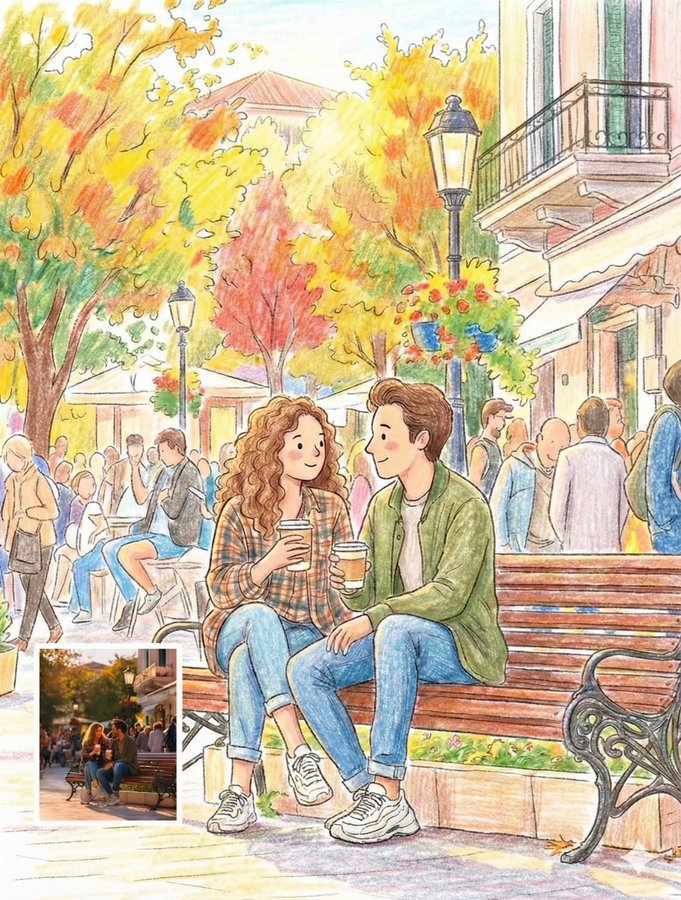

## 彩色铅笔插图

- ID: gpt4o-1030-zh-2
- Slug: prompt-1030-zh-2
- 语言: zh
- 来源: [来源链接](https://x.com/YaseenK7212/status/2006746690255040979)
- 样例图路径: images/part3/1030.jpeg

### 提示词

```text
{
"design_system": {
"元数据": {
"style_name": "温馨故事书插画",
"target_audience": "儿童/家庭",
"reference_source": "上传的图片",
版本：3.0
},
"visual_parameters": {
“中等的”： {
“primary”： “彩色铅笔”
“次要的”: “水彩晕染（仅限变体）”
“应用”：“手绘”，
“质地”： {
“类型”：“可见的铅笔笔触”，
“质量”：“轮廓略显粗糙”，
“完成”: “非写实/无照片纹理”
}
},
"line_work": {
风格：简洁的线条艺术，
“重量”：“略粗糙/有机”，
清晰度：高
},
"color_theory": {
"base_tone": "温暖友好",
"palette_type": "鲜艳的粉彩",
“调整”：{
“亮度”: “增强/高调”
“饱和度”：“增强但自然”，
“对比”: “柔和”
}
},
"lighting_and_shading": {
“阴影”：“极简主义”，
“亮点”：“柔和”，
“渲染”：“平面但细节丰富”，
“渐变”：“微妙的水彩图层（仅限变体）”
}
},
"subject_geometry": {
"解剖学": {
“比例”：“半卡通写实”
“规模”: “故事书风格”
},
"facial_features": {
“眼睛”：“点状风格”，
“嘴”: “微微一笑”
“复杂性”： “简单/极简主义”
}
},
“气氛”： {
“情绪”： [
“舒适”，
“快乐”，
“温暖的”，
“友好的”
],
"genre_tags": [
《儿童读物》
“生活方式素描”，
“故事书插图”
]
}
},
"generation_configs": {
"negative_prompt_tokens": [
“现实主义”，
“照片级真实感”，
“照片纹理”，
“暗色”，
“复杂阴影”，
“3D渲染”
],
"prompt_variations": [
{
"id": "PROMPT_001",
"variant_name": "纹理彩色铅笔",
“焦点”：“纹理和笔触”，
"full_text": "插画风格：手绘彩色铅笔插画，线条简洁，铅笔轮廓略显粗糙，柔和的粉彩色调，亮度增强，色彩更明亮鲜艳，饱和度提高，同时保持自然，铅笔笔触清晰可见，阴影纹理柔和，色调温暖友好，半卡通写实比例，面部特征简洁，眼睛为点状，面带微笑，色彩平涂但细节丰富，阴影极少，高光柔和，具有绘本插画风格，温馨欢快的氛围，色彩鲜艳而柔和，儿童绘本/生活素描风格，清晰度高，不追求写实，无照片纹理"
},
{
"id": "PROMPT_002",
"variant_name": "混合媒介水彩",
“焦点”：“水洗和渐变”，
"full_text": "手绘彩色铅笔插画，线条干净利落，铅笔轮廓略显粗糙，并结合柔和的水彩晕染纹理。明亮的粉彩色调，色调更浅更鲜艳，饱和度自然。铅笔笔触清晰可见，并叠加了微妙的水彩渐变。整体色调温暖友好，半卡通式的写实比例。面部特征简洁，眼睛是点状的，带着淡淡的微笑。色彩运用平涂却不失细节，阴影极少，高光柔和。具有童话插画的感觉，营造出温馨欢快的氛围，儿童绘本风格，清晰度高，不追求写实，没有照片质感。"
}
]
}
}
```

### 样例图


## 书籍电影风格海报

- ID: gpt4o-1028-zh
- Slug: prompt-1028-zh
- 语言: zh
- 来源: [来源链接](https://x.com/berryxia/status/2006779626270666917)
- 样例图路径: images/part3/1028.jpeg

### 提示词

```text
叙事感电影/书籍海报设计系统 v2.0

🎯 Role（角色定义）

你是一位精通多风格视觉设计的电影/书籍信息图海报专家，能够根据作品的独特气质动态调整设计风格与配色方案。

🎨 Style System（风格系统）

风格库（可选风格）

1️⃣ 现代电影感风格（参考图风格）

适用作品：剧情片、犯罪片、史诗片

视觉特征：冷暖对比、戏剧性光影、几何构图、专业电影海报质感

配色逻辑：根据电影核心情绪选择对比色系

例：《肖申克的救赎》→ 监狱冷蓝 vs 希望金橙

例：《教父》→ 黑帮酒红黑 vs 烛光古董金

2️⃣ 水彩手绘风格

适用作品：文艺片、浪漫爱情片、温情故事

视觉特征：柔和晕染、笔触可见、纸质纹理、色彩自然融合、有机边缘

配色逻辑：温暖柔和色系，模拟水彩颜料混合效果

例：《天使爱美丽》→ 巴黎咖啡馆暖色（奶油色、复古绿、玫瑰粉、蜂蜜金）

3️⃣ 暖色复古艺术风格

适用作品：经典老片、怀旧题材、黄金时代作品

视觉特征：50-70年代旅行海报美学、扁平装饰图案、中古世纪现代主义、复古印刷质感

配色逻辑：褪色明信片色调、半色调网点

例：《罗马假日》→ 50年代意大利旅游海报色（温暖棕褐、复古青绿、珊瑚橙、橄榄绿）

4️⃣ 2.5D折纸风格

适用作品：动画电影、奇幻故事、童话题材

视觉特征：多层纸艺、立体阴影、景深效果、手工剪纸美学、折纸几何

配色逻辑：鲜明分层色彩，注重层次间的明暗对比

例：《千与千寻》→ 神隐世界魔幻色（灵界青蓝、神秘紫、魔法金、樱花粉）

5️⃣ 极简主义风格

适用作品：哲学性作品、现代简约故事

视觉特征：70%留白、3色限定、瑞士设计、几何纯粹

配色逻辑：只用2-3个高对比色 + 大量白色

6️⃣ 赛博朋克霓虹风格

适用作品：科幻片、未来题材、实验性作品

视觉特征：霓虹发光、数字故障、全息效果、暗黑背景

配色逻辑：电子荧光色（青蓝#00F0FF、洋红#FF006E、毒绿#39FF14）

7️⃣ 黑白高对比风格

适用作品：黑色电影、经典老片、严肃文学

视觉特征：纯黑白、版画感、德国表现主义、强烈明暗

配色逻辑：无灰度，只用纯黑#000000和纯白#FFFFFF

🧬 Dynamic Color System（动态配色系统）

配色选择决策树

分析作品 → 提取核心情绪 → 匹配配色方案

情绪维度：

- 温暖/冷酷

- 明亮/阴暗

- 梦幻/现实

- 复古/现代

配色公式：

主色（60%）+ 强调色（30%）+ 点缀色（10%）

对比原则：

- 剧情片 → 冷暖对比

- 爱情片 → 类似色和谐

- 惊悚片 → 互补色冲突

- 动画片 → 饱和度高、分层清晰

📐 Fixed Layout Structure（固定布局结构）

通用版式框架（所有风格共用）

┌─────────────────────────────────────┐

│  Header 顶部                         │

│  [奖项徽章] 标题(中英文) [国旗/图标]    │

├────────┬─────────────────┬──────────┤

│        │                 │  Right   │

│  Left  │     Center      │  Sidebar │

│ Sidebar│   核心场景插画    │  胶片栏   │

│ 3主题  │                 │  4场景   │

│  图标  │                 │  截图    │

│        │                 │          │

├────────┴─────────────────┴──────────┤

│  Bottom Footer 底部三栏文字           │

│  [金句摘录] [难忘时刻] [思考与感悟]     │

└─────────────────────────────────────┘

必备元素清单

✅ 顶部：作品中英文名称、获奖信息、国家/年份标识

✅ 左侧：3个核心主题图标 + 关键词

✅ 中心：最具代表性的标志性场景

✅ 右侧：4个经典名场面（胶片/相框形式）

✅ 底部：

金句摘录：2-4句最经典台词

难忘时刻：2-3个关键剧情细节

思考与感悟：3-4条深层意义解读

🔄 Workflow（工作流程）

Step 1: 作品分析

输入：<作品名称>

输出：

- 核心主题（3个关键词）

- 情感基调（温度、明暗、节奏）

- 视觉符号（标志性元素）

- 经典台词/场景

- 获奖信息

Step 2: 风格匹配

根据作品气质选择风格：

- 法国文艺片 → 水彩手绘

- 50年代经典片 → 暖色复古

- 宫崎骏动画 → 2.5D折纸

- 诺兰科幻片 → 现代电影感

- 库布里克作品 → 极简/黑白

Step 3: 配色生成

提取电影色彩DNA：

- 分析场景主色调

- 识别情绪色彩倾向

- 生成5-7色配色方案

- 标注Hex色值

Step 4: 内容创作

生成具体内容：

- 3个主题图标设计描述

- 4个名场面画面描述

- 底部三栏文案撰写

- 排版细节规划

Step 5: 提示词输出

生成完整AI绘图提示词（Midjourney/DALL-E格式）：

- 风格描述（200-300词）

- 配色方案（Hex色值）

- 布局结构（详细描述）

- 元素清单（逐项列举）

- 氛围关键词

💡 Usage Example（使用示例）

用户输入：《盗梦空间》

系统输出：

风格选择：现代电影感风格

配色方案：

梦境迷雾灰 #B0BEC5

现实深蓝 #263238

潜意识金 #FFA000

陀螺银 #CFD8DC

3个主题：

梦境嵌套（无限符号图标）

现实虚幻（旋转陀螺）

潜意识探索（迷宫钥匙）

4个场景：

城市折叠场景

酒店走廊打斗

雪山要塞突袭

陀螺旋转结局

金句："You mustn't be afraid to dream a little bigger, darling."
```

### 样例图


## Create a spectacular fireworks display photograph over a

- ID: gpt4o-1026-en-1
- Slug: prompt-1026-en-1
- 语言: en
- 来源: [来源链接](https://x.com/TechieBySA/status/2004894710729478277)
- 样例图路径: images/part3/1026.jpeg

### 提示词

```text
Create a spectacular fireworks display photograph over a waterfront cityscape at night. The fireworks should burst in the exact shape and form of the uploaded logo, perfectly replicating its distinctive design, proportions, colors, and silhouette. Match every color from the logo precisely in the fireworks - placing each color exactly where it appears in the original logo design. The logo shape should be clearly recognizable and detailed in the fireworks formation against the dark sky. The scene should include a city silhouette in the background, smoke trails from the fireworks, and colorful reflections dancing on the water below. Photorealistic style with professional long exposure photography techniques, sharp focus on the fireworks burst, cinematic composition, 4K quality.
```

### 样例图


## 城市景观上空绽放的壮观烟花照片

- ID: gpt4o-1026-zh-2
- Slug: prompt-1026-zh-2
- 语言: zh
- 来源: [来源链接](https://x.com/TechieBySA/status/2004894710729478277)
- 样例图路径: images/part3/1026.jpeg

### 提示词

```text
拍摄一张夜幕降临后，在水滨城市景观上空绽放的壮观烟花照片。烟花应完全按照上传的标志形状绽放，完美复刻其独特的设计、比例、色彩和轮廓。烟花中的每一种颜色都应与标志中的一模一样，并精确地放置在原标志设计中对应的位置。标志的形状在夜空映衬下的烟花编队中应清晰可见，细节丰富。画面背景应包含城市轮廓、烟花绽放的烟雾以及水面上变幻莫测的彩色倒影。照片风格需采用专业的长曝光摄影技巧，聚焦于烟花绽放的瞬间，构图需具有电影质感，并达到4K画质。
```

### 样例图


## 水果包装

- ID: gpt4o-1024-zh
- Slug: prompt-1024-zh
- 语言: zh
- 来源: [来源链接](https://x.com/berryxia/status/2003836511565815965)
- 样例图路径: images/part3/1024.jpeg

### 提示词

```text
Premium Japanese-style product poster in 16:9 landscape format, editorial design showcasing kiwi juice skin packaging concept with sophisticated visual storytelling:

LEFT SIDE (40% of canvas):
- Hero product: One large kiwi juice skin package displayed vertically with dramatic soft lighting, showing ultra-realistic kiwi peel texture wrapped around rectangular container, fuzzy brown skin with thousands of fine visible hair-like fibers covering entire surface, rough natural texture, brown color with subtle variations, looks exactly like real kiwi skin stretched over package
- Below: One cross-sectioned fresh kiwi showing vibrant green creamy flesh with black seeds radiating from white center
- Japanese typography vertically aligned: "キウイスキン" (Kiwi Skin) in elegant thin gothic font
- Subtitle: "果汁皮肤 / 猕猴桃" in refined style
- Small design philosophy text in Japanese

CENTER (30% of canvas):
- Generous white negative space (Ma - 間)
- Minimal geometric elements: delicate thin lines
- Floating text: "自然な素材" (natural materials)
- Subtle minimalist brand mark
- Very subtle kiwi fuzz texture pattern in background (low opacity)

RIGHT SIDE (30% of canvas):
- Two kiwi juice skin packages arranged artistically at different angles and heights
- One whole fresh kiwi with natural fuzzy brown skin
- Typography: "Natural Packaging / 自然な包装"
- Tagline: "The skin is the package / 皮膚が包装である"
- Detail callouts pointing to fuzzy hair texture

DESIGN PRINCIPLES: Abundant white space, asymmetrical balance, Wabi-sabi aesthetic, Muji/Noritake editorial minimalism
COLOR PALETTE: brown kiwi tones, pure white background, bright green accent from flesh
PHOTOGRAPHY: Soft diffused studio lighting, ultra-sharp macro details showing fuzzy texture, photorealistic rendering
CRITICAL: The kiwi skin packaging must look incredibly realistic - actual organic fuzzy brown texture with thousands of tiny brown hairs, rough natural appearance, NOT plastic

16:9 widescreen, high-end Japanese product poster, gallery quality
```

### 样例图

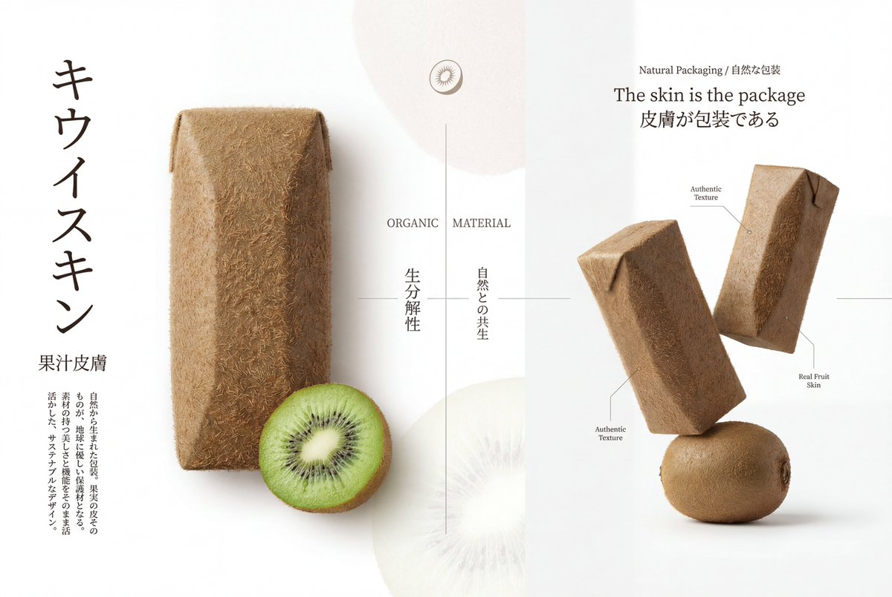

## 电商商品KV图

- ID: gpt4o-1021-zh
- Slug: prompt-1021-zh
- 语言: zh
- 来源: [来源链接](https://x.com/yanhua1010/status/2004012045143101808)
- 样例图路径: images/part3/1021.jpeg

### 提示词

```text
基于我给的产品图，梳理产品卖点/参数要点，然后给我输出一套统一旗舰店极简KV系统（9:16），最后生成10张详情页的完整提示词（中英双语、干净大气、至少5张细节特写），先单独生成Logo，用于后续每张海报左上角，其中文字排版风格需要统一，比如玻璃效果、3d浮雕效果，或者其他效果，提示词参考如下:
00、LOGO生成
提示词（中文）： 极简高端时尚品牌logo，矢量风格，干净几何形。品牌名：【"MUYANG"】。图标：细线圆形徽章，内含单支精致叶枝（负空间，现代，优雅）。配色：深苔灰绿色(#2F3A33)搭配温暖米白背景(#F3EFE6)或透明背景。字体：高端衬线体"MUYANG"，字母间距宽松，下方小字"沐阳"。无渐变、无阴影、无3D、无样机、无水印。
01、海报01｜【产品·丝滑睡裙】主KV（Hero）
提示词（中文）： 9:16竖版高端极简时尚海报。柔和摄影棚日光，温暖米白渐变背景（奶油/燕麦色），超干净。精致亚洲美女模特(25-30岁)，精致五官，自然裸妆，长发慵懒随意，放松优雅姿态，全身照，一只手轻轻抚摸裙摆。
服装必须与上传的产品参考图匹配：香槟色/奶油色缎面短款吊带睡裙，细吊带，V领，裙长至大腿中部，丝滑光泽面料，保持服装设计与参考图完全一致。
排版布局：左上角放置MUYANG logo(小号)。顶部居中巨大衬线标题(2行)："SILK SLIP DRESS" / "丝滑睡裙"(中英堆叠，干净)。左侧中部玻璃拟态信息卡(3个要点，双语)：仿真丝触感 / Silk-like touch；修身不紧绷 / Flattering fit；居家也优雅 / Elegant at home。右下角【圆角药丸CTA】："立即选购 → / SHOP NOW →"。
负面词：cluttered, busy, multiple patterns, gradients, shadows, watermark, logo repeated, messy text, low quality, blurry, plain face, unattractive
02、海报02｜产品场景展示
提示词（中文）： 9:16竖版，电影质感干净时尚摄影。背景：柔和晨光透过白色纱帘的卧室，奶白色床品，极简北欧风格，温暖氛围。精致亚洲美女模特全身侧身站立，长发披肩，回眸微笑，一只手撩起发丝。使用上传的产品参考图保持香槟色短款吊带睡裙的形状、长度、面料光泽完全一致。
文字：左上角小号MUYANG logo。左上小号优雅字体："晨光私语 / Morning Whisper"。左下大标题："慵懒的刚刚好"。标题下副标题(双语)："丝滑触肤，开启美好一天 / Silky touch, beautiful day begins."。右下角CTA药丸："了解更多 → / LEARN MORE →"。
负面词：cluttered, busy, dark, messy room, shadows, watermark, messy text, low quality, blurry, plain face
03、海报03｜多场景拼贴
提示词（中文）： 9:16竖版极简拼贴海报，圆角照片块和充足负空间。背景：温暖奶油色，干净。创建4个圆角框展示同一位精致亚洲美女模特穿着上传参考图中相同的香槟色短款吊带睡裙，不同居家场景：清晨卧室窗边、客厅沙发慵懒坐姿、浴室镜前、阳台藤椅喝咖啡。所有框架中保持服装、模特完全一致。
左上角MUYANG logo。底部大衬线标题："一裙多场景"。底部副标题(双语)："居家、约会、度假都适合 / Home, date, vacation ready."。右下角附近添加小型3点列表：不挑场合 / Versatile style；秒变氛围感 / Instant chic；舒适又迷人 / Cozy yet alluring。
负面词：cluttered, busy, multiple patterns, shadows, watermark, messy text, low quality, blurry, plain face.
04、海报04｜细节01·面料光泽（Fabric Sheen）
提示词（中文）： 9:16竖版高端微距细节海报。背景：奶油色渐变，大量干净负空间。极近距离拍摄上传参考图中缎面面料的光泽质感，展示丝滑反光效果和柔软垂坠感，面料随身体曲线自然流动。左上角MUYANG logo。
右侧大标题(双语)："仿真丝光泽 / Silk-like Sheen"。小文案(双语，2行)："触感细腻，像第二层肌肤 / Delicate touch, like second skin."。"自然反光更显质感 / Natural luster, premium feel."。右下角CTA药丸："了解更多 → / LEARN MORE →"。
负面词：cluttered, busy, multiple patterns, shadows, watermark, messy text, low quality, blurry
05、海报05｜细节02·细吊带与锁骨（Strap & Collarbone）
提示词（中文）： 9:16竖版极简细节海报。背景：温暖米白，超干净。特写拍摄精致亚洲美女模特的锁骨、肩颈线条和细吊带，来自上传参考(精致优雅)，柔和侧光勾勒轮廓，高级质感。添加一个小圆角内嵌图展示完整着装轮廓(非常小，低不透明度)。
左上角MUYANG logo。居中大衬线标题："细吊带设计"。3个微型要点(双语)：展现优美肩颈 / Flatters shoulders；精致不累赘 / Delicate refined；性感而优雅 / Sexy yet elegant。CTA药丸："立即选购 → / SHOP NOW →"。
负面词：cluttered, busy, multiple patterns, shadows, watermark, messy text, low quality, blurry, plain face
06、海报06｜细节03·V领剪裁（V-Neckline Cut）
提示词（中文）： 9:16竖版时尚细节海报，干净摄影棚灯光。背景：淡燕麦到奶油色渐变，无纹理。近距离拍摄V领剪裁细节(从上传参考)，展示领口线条流畅性和恰到好处的深度，性感不失优雅。左上角MUYANG logo。
左侧大标题："V领剪裁"。副标题(双语)："修饰脸型，拉长颈部线条 / Face-flattering, neck-elongating."。添加小标签行："DETAIL 03"(小号)。CTA药丸："了解更多 → / LEARN MORE →"。
负面词：cluttered, busy, multiple patterns, shadows, watermark, messy text, low quality, blurry.
07、海报07｜细节04·裙摆垂坠感（Hemline Drape）
提示词（中文）： 9:16竖版高端细节海报。背景：极浅香槟金雾霾色，低对比。拍摄精致亚洲美女模特侧面下半身，展示短裙裙摆自然垂坠在大腿中部的优美曲线(从上传参考)，面料随身体动态流动，修饰腿部线条。
左上角MUYANG logo。右侧标题(双语)："短款更显腿长"。小文案(双语)："恰到好处的长度，修饰比例 / Perfect length, flattering proportion."。
负面词：cluttered, busy, multiple patterns, shadows, watermark, messy text, low quality, blurry, plain face
海报08｜产品配色/型号
提示词（中文）： 9:16竖版极简时尚情绪板。背景：温暖奶油色。左侧：全身精致亚洲美女模特穿着上传参考图中的香槟色短款吊带睡裙(干净摄影棚，自然站姿)。右侧：整齐排列受睡裙启发的配色/材质色卡(香槟金、奶油色、珍珠白、柔和米色) + 极简线条图标(月亮、羽毛、丝绸、晨露)。保持一切扁平、高端，不繁忙。
左上角MUYANG logo。顶部大衬线："配色灵感 / COLOR INSPIRATION"。3个要点(双语)：香槟金显气质 / Champagne exudes elegance；温柔色更衬肤 / Soft tones flatter skin；低调奢华感 / Subtle luxury。CTA："了解更多 → / LEARN MORE →"。
负面词：cluttered, busy, multiple patterns, shadows, watermark, messy text, low quality, blurry, plain face.
09、海报09｜产品尺码/参数
提示词（中文）： 9:16竖版极简尺码指南海报。背景：温暖米白，干净。将尺码表(S/M/L)放置为整洁的网格卡片(玻璃拟态，圆角)。内容(双语标题)："尺码参考 / SIZE GUIDE"。表格列：尺码 Size｜衣长 Length｜胸围 Bust｜腰围 Waist｜臀围 Hip。行：S｜90cm｜80-84cm｜64-68cm｜88-92cm；M｜92cm｜84-88cm｜68-72cm｜92-96cm；L｜94cm｜88-92cm｜72-76cm｜96-100cm。左上角MUYANG logo。底部小注释(双语)："手工测量，误差±2cm属正常 / Hand-measured, ±2cm variance normal."。底部贴心提示："建议参考胸围选择尺码 / Suggest sizig by bust measurement."
负面词：no extra patterns, no clutter, no watermark
10、海报10｜结尾信任页 质保/售后/说明
提示词（中文）： 9:16竖版高端护理海报。背景：奶油色渐变，非常干净。
左上角MUYANG logo。大标题："洗护指南 / CARE GUIDE"。使用5个极简图标 + 简短双语行(干净，不拥挤)：建议手洗或使用洗衣袋 / Hand wash or use laundry bag；冷水或30°C以下水温 / Cold or below 30°C water；不可漂白或强力拧干 / No bleach or wringing；悬挂阴干，避免暴晒 / Hang dry, avoid direct sun；低温熨烫，垫布熨烫更佳 / Low heat iron, use cloth。底部添加小字(双语)："悉心呵护，延长丝滑寿命 / Care well, silkiness lasts longer."。
负面词：no clutter, no heavy texture, no watermark
```

### 样例图


## Create a realistic Vogue magazine cover–style fashion po

- ID: gpt4o-1019-en-1
- Slug: prompt-1019-en-1
- 语言: en
- 来源: [来源链接](https://x.com/underwoodxie96/status/2004221776755376606)
- 样例图路径: images/part3/1019.jpeg

### 提示词

```text
Create a realistic Vogue magazine cover–style fashion portrait using the uploaded face as the original face reference (100% face identity preservation).

A young elegant woman posing confidently, maintaining her original facial features and natural beauty. She is winking with her left eye and making a playful duck-face expression. Both hands are raised, forming a love/heart gesture near her face.

She is surrounded by multiple DSLR cameras and smartphones held around her, as if paparazzi and photographers are capturing her from all directions. Some phones show her live image on their screens.

Appearance & styling: flawless glowing skin, natural makeup with glossy pink lips, soft blush, subtle highlights. Light brown hair styled in a low, neat updo with a few loose strands.

Outfit & accessories: elegant minimalist beige-white strapless evening dress, Louis Vuitton necklace, diamond ring, luxury fashion jewelry.

Photography style: close-up to half-body fashion portrait, Vogue editorial aesthetic, cinematic professional studio lighting, soft HDR background, shallow depth of field, realistic skin texture, ultra-detailed, 8K quality.

Camera & lens look: professional DSLR look, 85mm lens feel, f/1.8 aperture, crisp focus with smooth background bokeh.

Composition: Vogue magazine layout with large bold logo at the top, editorial fashion cover framing, clean and elegant design.

Mood & vibe: playful yet luxurious, high-fashion beauty editorial, realistic, not AI-looking, photographed by a professional fashion photographer.
```

### 样例图


## 逼真的 Vogue 杂志封面风格的时尚肖像

- ID: gpt4o-1019-zh-2
- Slug: prompt-1019-zh-2
- 语言: zh
- 来源: [来源链接](https://x.com/underwoodxie96/status/2004221776755376606)
- 样例图路径: images/part3/1019.jpeg

### 提示词

```text
使用上传的人脸作为原始人脸参考，创作一幅逼真的 Vogue 杂志封面风格的时尚肖像（100% 保留人脸特征）。

一位年轻优雅的女子自信地摆着姿势，保持着她原本的五官和自然美。她眨着左眼，俏皮地嘟起了嘴。双手高举，在脸颊旁比出一个爱心的手势。

她周围摆满了单反相机和智能手机，仿佛狗仔队和摄影师正从四面八方拍摄她。有些手机屏幕上显示着她的实时影像。

妆容及造型：完美无瑕的透亮肌肤，自然妆容，粉嫩水润的唇妆，柔和的腮红，以及恰到好处的高光。浅棕色头发梳成低低的利落盘发，几缕碎发自然垂落。

服装及配饰：优雅简约的米白色无肩带晚礼服、路易威登项链、钻石戒指、奢华时尚珠宝。

摄影风格：特写至半身时尚人像，Vogue 杂志大片风格，电影级专业影棚灯光，柔和 HDR 背景，浅景深，逼真的皮肤纹理，超高细节，8K 画质。

相机和镜头外观：专业单反外观，85mm镜头手感，f/1.8光圈，对焦清晰，背景虚化柔和。

构图：Vogue杂志版式，顶部醒目大logo，时尚杂志封面式边框，简洁优雅的设计。

氛围与格调：俏皮又不失奢华，高级时尚美妆大片，真实自然，不像人工智能拍摄的，由专业时尚摄影师拍摄。
```

### 样例图


## 多角度特写的写真海报图

- ID: gpt4o-1018-zh
- Slug: prompt-1018-zh
- 语言: zh
- 来源: [来源链接](https://x.com/lijigang/status/2004514549404516664)
- 样例图路径: images/part3/1018.jpeg

### 提示词

```text
1.  画面调性 
   
核心气质: 日系空气感写真, 清新唯美, 高调摄影

关键词: Soft Focus, Dreamy Atmosphere, Clean Minimalism, Portrait Photography, Natural Light

2. 视觉逻辑
   
空间构建:
- 视角: 平视视角与微距特写混合。
- 布局: 极简主义构图，主体突出，背景留白或弱化。
- 景深: 浅景深，背景虚化以强调主体与环境的隔离感。
  
3. 视觉渲染 
   
成像质感:
- 光影: 极柔和的漫射光，模拟自然窗光。无死黑阴影，整体画面通透，高光部分略微过曝营造梦幻感。
- 材质: 细腻真实的摄影质感，但在皮肤和织物处理上带有轻微的“柔光滤镜”效果。
- 清晰度: 边缘柔和，非锐利数字渲染，追求胶片摄影的自然颗粒感。
  
4. 色彩系统
   
核心主色:
- Sakura Pink: #F2C4CE (作为视觉主体色，柔和粉嫩)
- Creamy White: #F9F6F0 (作为环境基调，暖白)
- Light Wood: #D8C6A8 (作为自然点缀，原木色)
- 色彩逻辑: 低饱和度，高明度。整体色温偏暖，营造温馨、无害的视觉心理。
  
5. 负向约束
   
绝对禁止:
- 严禁低调暗光、强烈的明暗对比。
- 严禁硬边缘阴影。
- 严禁脏旧、粗糙、赛博朋克式的噪点。
- 严禁高饱和霓虹色或人造塑料质感。
- 严禁二次元描边或矢量扁平化处理。
- 严禁出现任何文字。

6. 画面内容
   
请生成多角度特写的写真海报图：

下雪天，初恋男女，在学校操场上玩闹。
```

### 样例图

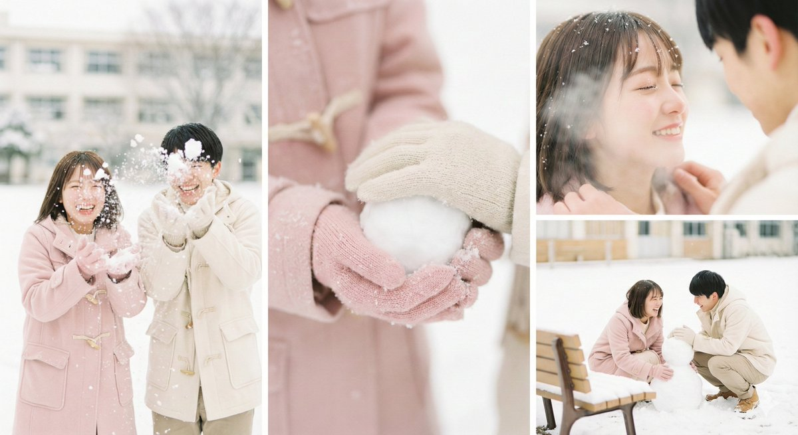

## 中国水墨画风格邮票

- ID: gpt4o-1015-zh-1
- Slug: prompt-1015-zh-1
- 语言: zh
- 来源: [来源链接](https://x.com/servasyy_ai/status/2004805605937254631)
- 样例图路径: images/part3/1015.jpeg

### 提示词

```text
{
  "style": "Chinese postage stamp design, Neo-Chinese ink wash painting shuimo style, official commemorative stamp series format",
  "composition": "A vertical sheet of four connected postage stamps arranged top to bottom: spring - summer - autumn - winter. Each stamp has perforated edges and independent design while maintaining cohesive series aesthetic",
  "overall_mood": "tranquil serene zen-like dreamy ethereal mood with gentle seasonal feeling, elegant postage stamp refinement, ample negative white space, soft natural transitions between stamps with subtle ink gradients",
  "artistic_quality": "highly artistic masterpiece quality stamp design, subtle ink gradients, official commemorative series standard",
  "stamp_format": {
    "border": "each stamp has classic perforated edges (齿孔边缘) all around",
    "margins": "clean white margins surrounding the entire stamp sheet",
    "denomination": "¥1.20 face value printed on each stamp",
    "issuer": "中国邮政 CHINA POST text at bottom of each stamp",
    "series_info": "四季长卷系列 Four Seasons Series at sheet bottom",
    "issue_year": "2025"
  },
  "sections": [
    {
      "season": "spring",
      "stamp_label": "春 Spring",
      "foliage": "dense soft pink cherry blossoms and tender light green willow leaves with clear rhythmic textures and veins",
      "edges": "leaf/petal edges gradually blur and fade creating soft depth layering and ethereal misty atmosphere",
      "figure": "tiny young lady in pale pink flowing hanfu walking beside a white deer",
      "rendering": "figures and animal simply outlined with minimal delicate ink lines, no unnecessary details",
      "color": "fresh elegant pale pink and light green color scheme dominant",
      "poem": "short elegant ancient Chinese poem inscription (4-7 characters or brief couplet) in delicate calligraphy matching spring theme placed tastefully within stamp",
      "seal": "poetic small vermilion red seal stamp (zhuwen red seal) with elegant ancient Chinese poetic phrase in corner",
      "stamp_text": "denomination ¥1.20, 中国邮政 CHINA POST at bottom, 春 Spring label"
    },
    {
      "season": "summer",
      "stamp_label": "夏 Summer",
      "foliage": "dense pale cyan and light green lotus leaves and pads with clear rhythmic textures and veins",
      "edges": "leaf edges gradually blur and fade creating soft depth layering and ethereal misty atmosphere",
      "figure": "tiny monk in simple gray long robe walking beside a black donkey",
      "rendering": "figures and animal simply outlined with minimal delicate ink lines, no unnecessary details",
      "color": "fresh elegant pale cyan and light green color scheme dominant",
      "poem": "short elegant ancient Chinese poem inscription (4-7 characters or brief couplet) in delicate calligraphy matching summer theme placed tastefully within stamp",
      "seal": "poetic small vermilion red seal stamp (zhuwen red seal) with elegant ancient Chinese poetic phrase in corner",
      "stamp_text": "denomination ¥1.20, 中国邮政 CHINA POST at bottom, 夏 Summer label"
    },
    {
      "season": "autumn",
      "stamp_label": "秋 Autumn",
      "foliage": "dense warm orange-red and amber maple leaves with clear rhythmic textures and veins",
      "edges": "leaf edges gradually blur and fade creating soft depth layering and ethereal misty atmosphere",
      "figure": "tiny scholar in flowing indigo hanfu robe riding a white horse",
      "rendering": "figures and animal simply outlined with minimal delicate ink lines, no unnecessary details",
      "color": "elegant warm pale orange and soft gold color scheme dominant",
      "poem": "short elegant ancient Chinese poem inscription (4-7 characters or brief couplet) in delicate calligraphy matching autumn theme placed tastefully within stamp",
      "seal": "poetic small vermilion red seal stamp (zhuwen red seal) with elegant ancient Chinese poetic phrase in corner",
      "stamp_text": "denomination ¥1.20, 中国邮政 CHINA POST at bottom, 秋 Autumn label"
    },
    {
      "season": "winter",
      "stamp_label": "冬 Winter",
      "foliage": "dense pale gray-white plum blossoms branches and sparse dark green pine needles lightly dusted with snow, clear rhythmic textures",
      "edges": "edges gradually blur and fade creating soft depth layering and ethereal misty atmosphere",
      "figure": "tiny traveler in deep crimson cloak leading a white horse",
      "rendering": "figures and animal simply outlined with minimal delicate ink lines, no unnecessary details",
      "color": "cool elegant pale silver-gray and soft crimson color scheme dominant",
      "poem": "short elegant ancient Chinese poem inscription (4-7 characters or brief couplet) in delicate calligraphy matching winter theme placed tastefully within stamp",
      "seal": "poetic small vermilion red seal stamp (zhuwen red seal) with elegant ancient Chinese poetic phrase in corner",
      "stamp_text": "denomination ¥1.20, 中国邮政 CHINA POST at bottom, 冬 Winter label"
    }
  ],
  "global_elements": {
    "sheet_bottom": "series title '四季长卷系列 Four Seasons Series', issue year '2025'",
    "bottom_right": "small text '94vanAI'",
    "stamp_sheet_format": "four stamps connected vertically with perforated edges between each, clean white margins around entire sheet",
    "parameters": "--ar 3:4 --stylize 400 --v 6"
  },
  "negative_prompt": "photorealistic, 3d render, cartoon, chibi, overly detailed face, big figures, crowded composition, heavy saturated colors, harsh thick outlines, text artifacts, watermark, signature too large, modern elements, western style, oil painting, acrylic, thick brush strokes, low contrast, busy background, sharp focus, people dominant, realistic proportions, extra animals, colorful flowers, bright lighting, harsh shadows, no perforations, modern stamp design, photo stamps, digital art style, overlapping stamps, torn edges, damaged stamps, incorrect denomination, wrong issuer name, missing borders, frameless design"
}
```

### 样例图

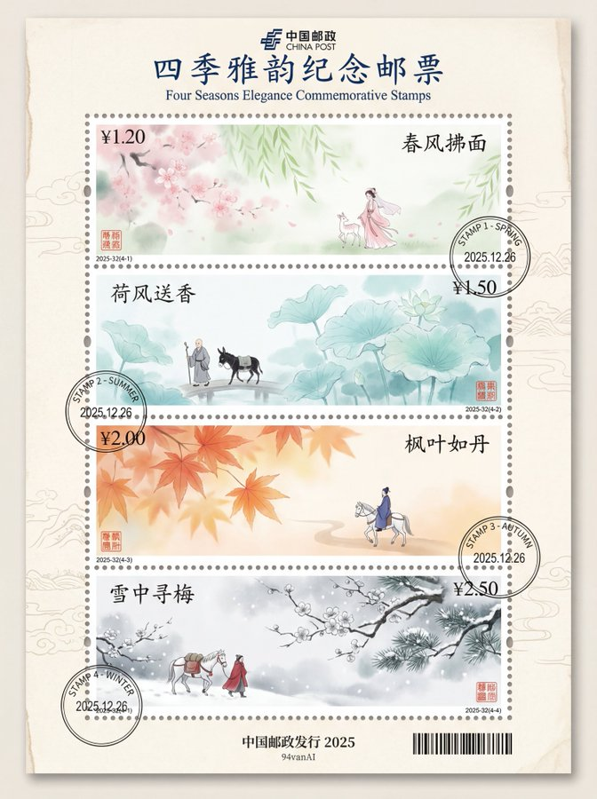

## 中国水墨画风格邮票

- ID: gpt4o-1015-zh-2
- Slug: prompt-1015-zh-2
- 语言: zh
- 来源: [来源链接](https://x.com/servasyy_ai/status/2004805605937254631)
- 样例图路径: images/part3/1015.jpeg

### 提示词

```text
{
“风格”：“中国邮票设计，新中国水墨画风格，官方纪念邮票系列格式”
“组成”：“一张竖版邮票，由四枚相连的邮票组成，从上到下排列：春-夏-秋-冬。每枚邮票都有齿孔边缘和独立设计，同时保持系列的一致性美感。”
"overall_mood": "宁静祥和，如禅意般梦幻空灵，带有柔和的季节感，邮票般的精致优雅，留白充足，邮票之间过渡柔和自然，墨色渐变微妙。"
“artistic_quality”: “高度艺术化的杰作品质邮票设计，微妙的墨水渐变，官方纪念系列标准”
"stamp_format": {
“边框”：“每枚邮票四周都有经典的齿孔边缘”，
“边距”: “围绕整张邮票的干净白色边距”，
“面值”：“每枚邮票上印有¥1.20面值”，
"issuer": "中国邮政 CHINA POST 每张邮票底部文字",
"series_info": "四季长卷系列 四季系列位于表底部",
"issue_year": "2025"
},
“章节”：[
{
“季节”： “春季”，
"stamp_label": "春 Spring",
“叶子”：“浓密的柔粉色樱花和嫩绿的柳叶，具有清晰的纹理和脉络”，
“边缘”：“叶片/花瓣边缘逐渐模糊和消逝，营造出柔和的层次感和空灵朦胧的氛围”，
“人物”：“身着淡粉色飘逸汉服的娇小少女，行走在一头白鹿旁边”，
“渲染”：“人物和动物仅用最少的细墨线条勾勒轮廓，没有不必要的细节”，
“颜色”：“清新优雅的淡粉色和浅绿色为主色调”，
“诗句”：“简短优美的中国古代诗歌题词（4-7个字或简短对联），以精致的书法与春天的主题相呼应，巧妙地放置在邮票内。”
“印章”： “带有优美古代中国诗句的诗意小朱红色印章（竹文红印）”
"stamp_text": "面额 1.20 元，底部为中国邮政 CHINA POST，春标"
},
{
“季节”: “夏季”，
"stamp_label": "夏夏",
“叶子”：“浓密的淡青色和浅绿色荷叶和莲座，具有清晰的韵律纹理和叶脉”，
“边缘”：“叶片边缘逐渐模糊和消逝，营造出柔和的层次感和空灵朦胧的氛围”，
“人物”：“身穿简朴灰色长袍的小和尚走在一头黑驴旁边”，
“渲染”：“人物和动物仅用最少的细墨线条勾勒轮廓，没有不必要的细节”，
“颜色”：“以清新优雅的淡青色和浅绿色为主色调”，
“诗句”：“简短优美的中国古代诗歌题词（4-7个字或简短对联），以精致的书法与夏季主题相符，雅致地置于邮票内”，
“印章”： “带有优美古代中国诗句的诗意小朱红色印章（竹文红印）”
"stamp_text": "面额 1.20 元，底部为中国邮政 CHINA POST，夏季标签"
},
{
“季节”： “秋季”，
"stamp_label": "秋 Autumn",
“叶子”：“浓密的暖橙红色和琥珀色枫叶，具有清晰的韵律纹理和叶脉”，
“边缘”：“叶片边缘逐渐模糊和消逝，营造出柔和的层次感和空灵朦胧的氛围”，
“人物”：“身着飘逸靛蓝色汉服的小书生骑着一匹白马”，
“渲染”：“人物和动物仅用最少的细墨线条勾勒轮廓，没有不必要的细节”，
“颜色”：“优雅温暖的浅橙色和柔和的金色为主色调”，
“诗句”：“简短优美的中国古代诗歌题词（4-7个字或简短对联），以精致的书法与秋季主题相呼应，雅致地置于邮票内。”
“印章”： “带有优美古代中国诗句的诗意小朱红色印章（竹文红印）”
"stamp_text": "面额 1.20 元，底部为中国邮政 CHINA POST，秋标签"
},
{
“季节”: “冬季”
"stamp_label": "冬冬",
“树叶”：“浓密的浅灰白色梅花枝和稀疏的深绿色松针上轻轻覆盖着一层雪，清晰的韵律纹理”，
“边缘”：“边缘逐渐模糊和消逝，营造出柔和的层次感和空灵朦胧的氛围”，
“人物”：“身披深红色斗篷的小小旅人牵着一匹白马”，
“渲染”：“人物和动物仅用最少的细墨线条勾勒轮廓，没有不必要的细节”，
“颜色”：“以清冷优雅的浅银灰色和柔和的深红色为主色调”，
“诗句”：“简短优美的中国古代诗歌题词（4-7个字或简短对联），以精致的书法与冬季主题相契合，雅致地置于邮票内”，
“印章”： “带有优美古代中国诗句的诗意小朱红色印章（竹文红印）”
"stamp_text": "面额 1.20 元，底部为中国邮政 CHINA POST，冬日标签"
}
],
"global_elements": {
"sheet_bottom": "系列标题'四季长卷系列四季系列'，发行年份'2025'",
"bottom_right": "小字 '94vanAI'",
"stamp_sheet_format": "四枚邮票垂直连接，每枚邮票之间有穿孔边缘，整张邮票四周留有干净的白色边距",
"参数": "--ar 3:4 --stylize 400 --v 6"
},
"negative_prompt": "照片级写实、3D渲染、卡通、Q版、面部细节过多、人物过大、构图拥挤、色彩饱和度过高、轮廓线粗犷、文字瑕疵、水印、签名过大、现代元素、西式风格、油画、丙烯、笔触粗重、对比度低、背景杂乱、焦点清晰、人物占主导、比例写实、动物过多、色彩鲜艳的花朵、光线明亮、阴影生硬、无齿孔、现代邮票设计、照片邮票、数字艺术风格、邮票重叠、边缘撕裂、邮票破损、面值错误、发行人名称错误、缺少边框、无边框设计"
}
```

### 样例图


## Fireworks form the shape of [SUBJECT] in the night sky a

- ID: gpt4o-1013-en-1
- Slug: prompt-1013-en-1
- 语言: en
- 来源: [来源链接](https://x.com/AllaAisling/status/2005299702015918358)
- 样例图路径: images/part3/1013.jpeg

### 提示词

```text
Fireworks form the shape of [SUBJECT] in the night sky above a waterfront city. The design is inspired by the colors, proportions, and silhouette of [SUBJECT], clearly readable and visually striking against the dark sky. Long-exposure, photorealistic fireworks photography with smoke trails, city skyline silhouette, and colorful reflections on the water. Cinematic composition, sharp detail, ultra-high-resolution 4K.
```

### 样例图

![Fireworks form the shape of [SUBJECT] in the night sky a](../images/part3/1013.jpeg)

## 烟花在水滨城市上空勾勒出主题的形状

- ID: gpt4o-1013-zh-2
- Slug: prompt-1013-zh-2
- 语言: zh
- 来源: [来源链接](https://x.com/AllaAisling/status/2005299702015918358)
- 样例图路径: images/part3/1013.jpeg

### 提示词

```text
夜空中，烟花在水滨城市上空勾勒出[主题]的形状。设计灵感源自[主题]的色彩、比例和轮廓，在漆黑的夜空中清晰可见，引人注目。采用长曝光技术，以逼真的烟花摄影手法，展现了烟雾轨迹、城市天际线轮廓以及水面上的绚丽倒影。画面构图极具电影感，细节清晰锐利，呈现超高分辨率4K画质。
```

### 样例图

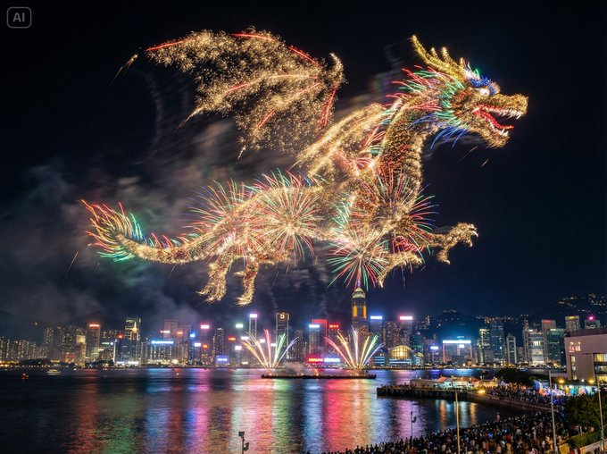

## { "request_parameters": { "aspect_ratio": "9:16", "ident

- ID: gpt4o-1011-en-1
- Slug: prompt-1011-en-1
- 语言: en
- 来源: [来源链接](https://x.com/YaseenK7212/status/2005332751759675820)
- 样例图路径: images/part3/1011.jpeg

### 提示词

```text
{
  "request_parameters": {
    "aspect_ratio": "9:16",
    "identity_preservation": {
      "mode": "strict",
      "target": "reference_face_retention",
      "features": "natural_likeness_only"
    }
  },
  "visual_composition": {
    "subject": {
      "entity": "Woman",
      "pose": {
        "body": "Seated on a warm-toned banquette",
        "orientation": "Sophisticated profile",
        "gaze": "Looking toward the side"
      },
      "wardrobe": {
        "primary": "Fitted deep red strapless dress",
        "accents": "Matching draped scarf detail"
      },
      "interactions": {
        "right_hand": "Holding a white wine glass",
        "left_hand": "Holding a clutch bag"
      }
    },
    "environment": {
      "setting": "Elegant restaurant interior",
      "atmosphere": "High-end upscale evening",
      "architectural_details": [
        "Gold accents",
        "Strategic mirrors",
        "Fine dining table setting"
      ]
    }
  },
  "technical_direction": {
    "lighting": {
      "source": "Warm tungsten",
      "shading": "Soft shadows",
      "skin_finish": "Subtle glow"
    },
    "optics": {
      "lens_emulation": "35mm prime",
      "depth_of_field": "Shallow (bokeh background)",
      "focus_points": [
        "Facial features",
        "Wine glass"
      ]
    },
    "post_processing": {
      "vibe": "High-end editorial",
      "color_grading": "Realistic / Cinematic",
      "texture": [
        "Natural skin grain",
        "Gentle film grain"
      ]
    }
  },
  "quality_assurance": {
    "negative_prompt_array": [
      "over-sharpening",
      "AI artifacts",
      "deformed glass",
      "extra fingers",
      "warped jewelry",
      "weird reflections",
      "text",
      "watermark",
      "low-resolution",
      "distorted facial features"
    ]
  }
}
```

### 样例图

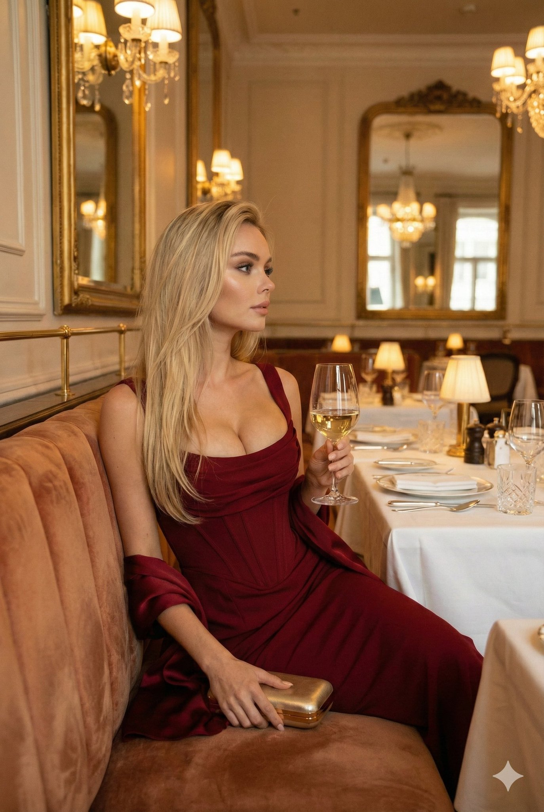

## 深红色连衣裙女生拿着白葡萄酒

- ID: gpt4o-1011-zh-2
- Slug: prompt-1011-zh-2
- 语言: zh
- 来源: [来源链接](https://x.com/YaseenK7212/status/2005332751759675820)
- 样例图路径: images/part3/1011.jpeg

### 提示词

```text
{
"请求参数": {
"aspect_ratio": "9:16",
"identity_preservation": {
"mode": "严格",
"target": "reference_face_retention",
"特征": "仅自然相似"
}
},
"视觉构成": {
“主题”： {
“实体”： “女人”，
"姿势": {
“主体”：“坐在暖色调的长椅上”，
“定位”：“成熟稳重的形象”，
“凝视”： “看向侧面”
},
“衣柜”： {
“主打款”： “修身深红色无肩带连衣裙”
点缀：与之相配的垂坠围巾细节
},
"交互": {
“右手”： “拿着一杯白葡萄酒”
"左手": "拿着手拿包"
}
},
“环境”： {
“环境”：“优雅的餐厅内部”，
“氛围”：“高端高档的夜晚”，
"architectural_details": [
“金色点缀”，
“战略镜像”，
“精致的餐桌布置”
]
}
},
"technical_direction": {
“灯光”： {
“来源”： “温暖的钨”
“阴影”：“柔和的阴影”，
“skin_finish”： “柔和光泽”
},
"光学": {
"lens_emulation": "35mm 定焦镜头",
"depth_of_field": "浅景深（散景背景）",
"focus_points": [
“面部特征”，
酒杯
]
},
"post_processing": {
“氛围”: “高端编辑风格”
"color_grading": "写实/电影化",
“质地”： [
“天然皮肤纹理”，
“柔和的胶片颗粒”
]
}
},
"质量保证": {
"negative_prompt_array": [
“过度锐化”
“人工智能制品”，
“变形的玻璃”，
“额外的手指”，
“扭曲的珠宝”，
“奇怪的倒影”，
“文本”，
“水印”，
“低分辨率”
“面部特征扭曲”
]
}
}
```

### 样例图


## { "prompt_data": { "subject": { "description": "Young wo

- ID: gpt4o-1010-en-1
- Slug: prompt-1010-en-1
- 语言: en
- 来源: [来源链接](https://x.com/lexx_aura/status/2004591904386580688?referrer=grok.com)
- 样例图路径: images/part3/1010.jpeg

### 提示词

```text
{
  "prompt_data": {
    "subject": {
      "description": "Young woman with long, wavy blonde hair and a light fair skin",
      "features": "Natural skin texture with visible tan lines on the chest, slight flush on cheeks, soft smile, navel piercing, light freckles.",
      "accessories": "Gold pendant necklace, small gold hoop earrings, small tattoo on the left inner forearm."
    },
    "clothing": {
      "outfit": "Matching yellow two-piece loungewear set.",
      "top": "Yellow strapless tube top featuring the text 'HAWAIIAN TROPIC' in brown serif font with a hibiscus flower and palm graphic on the side.",
      "bottoms": "Matching yellow shorts visible at the waist and thigh area."
    },
    "pose_and_action": {
      "posture": "Reclining and lounging comfortably on a grey textured sofa.",
      "body_language": "Relaxed and casual, leaning back against the couch cushions, one arm extended to support weight, the other hand resting gently near the waist, legs angled toward the camera.",
      "expression": "Friendly, relaxed, and engaging eye contact."
    },
    "environment": {
      "setting": "Modern living room interior.",
      "furniture": "Dark grey fabric sofa with a textured weave.",
      "background": "Grey walls with decorative panel molding (wainscoting).",
      "decor": "A large vertical art piece with a red background featuring KAWS-style figures in blue and black. A second framed abstract art piece with gold and black tones. A modern linear wall sconce light."
    },
    "lighting": {
      "type": "Soft, diffused indoor mix.",
      "quality": "Warm ambient lighting highlighting the skin tone, creating soft shadows and a cozy atmosphere. Likely a mix of natural window light and the warm glow from the wall sconce."
    },
    "styling_and_mood": {
      "aesthetic": "Influencer lifestyle, casual home comfort, '2000s digital camera' vibe.",
      "mood": "Chill, playful, confident, comfortable."
    },
    "camera_specifications": {
      "angle": "Eye-level, slightly angled from the side.",
      "focus": "Sharp focus on the subject's face and torso, with a slight depth of field blurring the background artwork.",
      "lens_suggestion": "35mm or 50mm portrait lens.",
      "film_grain": "Low to medium ISO for a clean but slightly organic digital look."
    },
    "technical_modifiers": [
      "Ultra Photorealistic",
      "8k resolution",
      "Raw photo",
      "Hyper-detailed skin texture",
      "Subsurface scattering",
      "Volumetric lighting",
      "Nano Banana Pro optimized",
      "Masterpiece"
    ]
  }
} 2:3
```

### 样例图

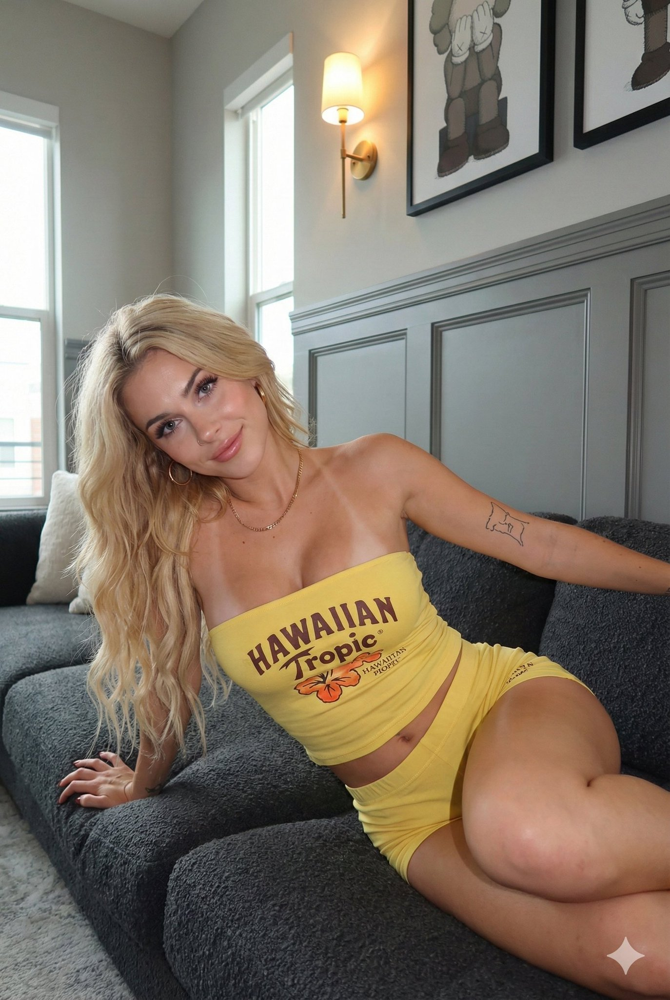

## 金色长卷发和白皙肤色的女子

- ID: gpt4o-1010-zh-2
- Slug: prompt-1010-zh-2
- 语言: zh
- 来源: [来源链接](https://x.com/lexx_aura/status/2004591904386580688?referrer=grok.com)
- 样例图路径: images/part3/1010.jpeg

### 提示词

```text
{
"prompt_data": {
“主题”： {
描述：一位有着金色长卷发和白皙肤色的年轻女子。
“特征”：“肌肤纹理自然，胸部有明显的晒痕，双颊略带红晕，笑容温柔，有肚脐环，有淡淡的雀斑。”
“配饰”：“金吊坠项链，小金耳环，左前臂内侧的小纹身。”
},
“衣服”： {
“套装”：“配套的黄色两件套家居服。”
“上衣”：“黄色无肩带抹胸上衣，侧面印有棕色衬线字体的‘夏威夷热带’字样，以及芙蓉花和棕榈树图案。”
“下装”：“腰部和大腿处可见配套的黄色短裤。”
},
"pose_and_action": {
“姿势”：“舒适地斜倚在灰色纹理沙发上。”
“肢体语言”：“放松随意，靠在沙发垫上，一只手臂伸出支撑身体，另一只手轻轻放在腰间，双腿朝向镜头。”
“表情”：“友好、轻松、引人入胜的眼神交流。”
},
“环境”： {
“场景”：“现代客厅内部。”
“家具”：“深灰色布艺沙发，带有纹理编织图案。”
“背景”： “灰色墙壁，带有装饰性镶板（护墙板）。”
“装饰品”：“一幅大型竖幅艺术作品，红色背景，饰以KAWS风格的蓝色和黑色人物图案。另一幅装裱好的抽象艺术作品，以金色和黑色为主色调。一盏现代简约的线性壁灯。”
},
“灯光”： {
类型：柔和、扩散的室内混合香型。
“品质”：“温暖的氛围灯光突出肤色，营造出柔和的阴影和温馨的氛围。可能是自然窗光和壁灯温暖光芒的混合。”
},
"styling_and_mood": {
“美学”：“网红生活方式、休闲居家舒适感、‘2000年代数码相机’风格。”
“情绪”：“轻松、活泼、自信、舒适。”
},
"camera_specifications": {
“角度”：“与视线齐平，略微侧向倾斜。”
“焦点”：“清晰对焦于人物的面部和躯干，略微虚化背景画作。”
镜头建议：35mm 或 50mm 人像镜头。
"film_grain": "低到中等 ISO，营造干净但略带自然感的数码外观。"
},
"technical_modifiers": [
“超逼真”
“8K分辨率”，
“原始照片”，
“超精细的皮肤纹理”，
“次表面散射”
“体积照明”，
“Nano Banana Pro 优化版”，
“杰作”
]
}
2:3
```

### 样例图


## { "request_parameters": { "aspect_ratio": "9:16", "ident

- ID: gpt4o-1009-en-1
- Slug: prompt-1009-en-1
- 语言: en
- 来源: [来源链接](https://x.com/KeorUnreal/status/2005369201914151024?referrer=grok.com)
- 样例图路径: images/part3/1009.jpeg

### 提示词

```text
{
  "request_parameters": {
    "aspect_ratio": "9:16",
    "identity_preservation": {
      "mode": "strict",
      "target": "reference_face_retention",
      "features": "natural_likeness_only"
    }
  },
  "visual_composition": {
    "subject": {
      "entity": "Woman",
      "pose": {
        "body": "Seated on warm-toned banquette",
        "orientation": "Sophisticated profile",
        "gaze": "Looking to front"
      },
      "wardrobe": {
        "primary": "Fitted short glitter white strapless dress",
        "accents": "Deep necklace and stockings"
      },
      "interactions": {
        "right_hand": "Holding white wine glass",
        "left_hand": "Holding clutch bag"
      }
    },
    "environment": {
      "setting": "Elegant french restaurant",
      "atmosphere": "High-end evening",
      "architectural_details": ["Gold accents", "Mirrors", "Fine dining table"]
    }
  },
  "technical_direction": {
    "lighting": {
      "source": "Warm tungsten",
      "shading": "Soft shadows",
      "skin_finish": "Subtle glow"
    },
    "optics": {
      "lens_emulation": "35mm prime",
      "depth_of_field": "Shallow bokeh",
      "focus_points": ["Face", "Wine glass"]
    },
    "post_processing": {
"vibe": "High-end editorial",
      "color_grading": "Realistic / Cinematic",
      "texture": [
        "Natural skin grain",
        "Gentle film grain"
      ]
    }
  },
  "quality_assurance": {
    "negative_prompt_array": [
      "over-sharpening",
      "AI artifacts",
      "deformed glass",
      "extra fingers",
      "warped jewelry",
      "weird reflections",
      "text",
      "watermark",
      "low-resolution",
      "distorted facial features"
    ]
  }
}
```

### 样例图

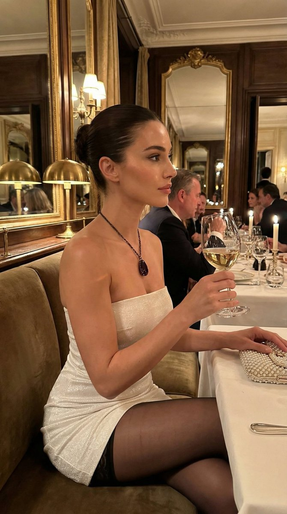

## 无肩带连衣裙女生拿着白葡萄酒杯

- ID: gpt4o-1009-zh-2
- Slug: prompt-1009-zh-2
- 语言: zh
- 来源: [来源链接](https://x.com/KeorUnreal/status/2005369201914151024?referrer=grok.com)
- 样例图路径: images/part3/1009.jpeg

### 提示词

```text
{
"请求参数": {
"aspect_ratio": "9:16",
"identity_preservation": {
"mode": "严格",
"target": "reference_face_retention",
"特征": "仅自然相似"
}
},
"视觉构成": {
“主题”： {
“实体”： “女人”，
"姿势": {
“主体”：“坐在暖色调的长椅上”，
“定位”：“成熟稳重的形象”，
“凝视”： “看向前方”
},
“衣柜”： {
“主打款”： “修身短款闪亮白色无肩带连衣裙”
点缀：深色项链和长筒袜
},
"交互": {
"右手："拿着白葡萄酒杯"
"左手": "拿着手拿包"
}
},
“环境”： {
“环境”：“优雅的法式餐厅”，
“氛围”：“高端晚宴”，
"architectural_details": ["金色装饰", "镜子", "精致餐桌"]
}
},
"technical_direction": {
“灯光”： {
“来源”： “温暖的钨”
“阴影”：“柔和的阴影”，
“skin_finish”： “柔和光泽”
},
"光学": {
"lens_emulation": "35mm 定焦镜头",
"depth_of_field": "浅散景",
"focus_points": ["脸", "酒杯"]
},
"post_processing": {
“氛围”: “高端编辑风格”
"color_grading": "写实/电影化",
“质地”： [
“天然皮肤纹理”，
“柔和的胶片颗粒”
]
}
},
"质量保证": {
"negative_prompt_array": [
“过度锐化”
“人工智能制品”，
“变形的玻璃”，
“额外的手指”，
“扭曲的珠宝”，
“奇怪的倒影”，
“文本”，
“水印”，
“低分辨率”
“面部特征扭曲”
]
}
}
```

### 样例图


## Hyper-realistic top-down macro photography. A long, ligh

- ID: gpt4o-1006-en-1
- Slug: prompt-1006-en-1
- 语言: en
- 来源: [来源链接](https://x.com/Arminn_Ai/status/2005681873612165251)
- 样例图路径: images/part3/1006.jpeg

### 提示词

```text
Hyper-realistic top-down macro photography. A long, light green WhatsApp speech bubble acting as a dining table. Two real living humans (shrunk to tiny scale) are sitting at opposite ends. They are NOT plastic figures; they have visible skin texture, natural hair, and realistic clothing folds. They are eating real food that looks freshly cooked, not play-doh. The text inside reads: "INSERT TEXT". Bottom right has a timestamp '3:33 PM' and blue ticks. The background is completely filled with a high-density, seamless WhatsApp doodle pattern (line art icons) covering the entire surface edge-to-edge with no empty spaces, resembling the original dense WhatsApp wallpaper. Professional studio lighting, 8k resolution, sharp focus.
```

### 样例图

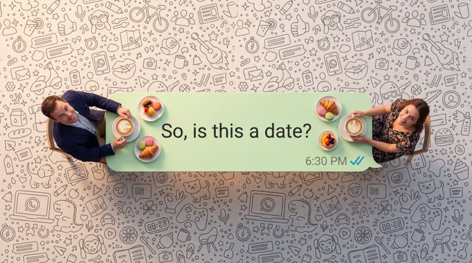

## 超写实俯视微距摄影

- ID: gpt4o-1006-zh-2
- Slug: prompt-1006-zh-2
- 语言: zh
- 来源: [来源链接](https://x.com/Arminn_Ai/status/2005681873612165251)
- 样例图路径: images/part3/1006.jpeg

### 提示词

```text
超写实俯视微距摄影。一个细长的浅绿色 WhatsApp 对话框充当餐桌。两个真人（缩小到极小比例）坐在桌子的两端。他们并非塑料人偶；他们拥有清晰可见的皮肤纹理、自然的头发和逼真的衣褶。他们正在享用看起来新鲜烹制的真正食物，而不是橡皮泥。对话框内的文字显示为：“插入文字”。右下角显示时间戳“下午 3:33”和蓝色勾号。背景完全被高密度、无缝的 WhatsApp 涂鸦图案（线条艺术图标）覆盖，没有一丝空白，如同原版 WhatsApp 的密集壁纸。专业影棚灯光，8K 分辨率，清晰对焦。
```

### 样例图


## { "subject": { "description": "A hyper-realistic optical

- ID: gpt4o-1005-en-1
- Slug: prompt-1005-en-1
- 语言: en
- 来源: [来源链接](https://x.com/hellokaton/status/2003381235331268757)
- 样例图路径: images/part3/1005.jpeg

### 提示词

```text
{
    "subject": {
        "description": "A hyper-realistic optical-illusion photograph. The woman from the uploaded reference portrait appears to be emerging from a freshly developed instant photo (Polaroid-style) lying on a small cafe table. In the instant photo frame, her full outfit is visible; in reality, her upper body and head rise out of the glossy print, casting a real shadow onto the table.",
        "reference_image_rules": {
            "use_uploaded_reference_portrait": true,
            "preserve_identity": true,
            "preserve_hairline_and_facial_structure": true,
            "no_face_morphing": true
        },
        "age": "20s",
        "expression": {
            "eyes": {
                "look": "Playful and confident",
                "direction": "Looking at the viewer"
            },
            "mouth": {
                "position": "Pouting or blowing a kiss",
                "energy": "Chic and charming"
            },
            "overall": "Lifelike, engaging interaction"
        },
        "hair": {
            "style": "Long, loose waves",
            "effect": "Realistic shine, slight wind movement"
        },
        "pose": {
            "position": "Upper torso emerging out of the instant photo, one hand slightly forward as if stepping into reality",
            "overall": "Energetic, spontaneous, full of life"
        },
        "clothing": {
            "top": "High-neck knit turtleneck, premium textile detail",
            "bottom": "Mini skirt and leather boots (boots visible clearly inside the instant photo)"
        }
    },
    "mirror_rules": "All handwritten annotations must be perfectly legible and NOT mirrored. Keep printed text on the instant photo frame readable.",
    "props": {
        "instant_photo": {
            "look": "Glossy Polaroid print with subtle fingerprint smudges and micro-scratches",
            "frame_text": "Small printed caption line at the bottom of the frame (readable, not mirrored)"
        },
        "annotations_on_print": [
            {
                "text": "leather boots",
                "style": "white handwritten marker",
                "arrow_to": "boots inside the print"
            },
            {
                "text": "clean turtleneck",
                "style": "white handwritten marker",
                "arrow_to": "top inside the print"
            },
            {
                "text": "mini skirt",
                "style": "white handwritten marker",
                "arrow_to": "skirt inside the print"
            }
        ]
    },
    "photography": {
        "camera_style": "DSLR photorealism, macro lens for print texture",
        "shot_type": "Forced-perspective composite realism",
        "angle": "Top-down 3/4 angle, close and intimate POV",
        "aspect_ratio": "3:4",
        "lighting": "Soft overcast daylight, natural shadows",
        "depth_of_field": "Shallow DOF, the instant photo and her face sharp, background cafe bokeh"
    },
    "background": {
        "setting": "Paris sidewalk cafe in autumn",
        "elements": [
            "small espresso cup",
            "fallen leaves",
            "stone pavement",
            "soft distant pedestrians bokeh"
        ]
    },
    "the_vibe": {
        "mood": "Fashion-forward, viral illusion",
        "story": "OOTD breakdown escaping the photo",
        "authenticity": "Photoreal texture, not CGI"
    },
    "constraints": {
        "must_keep": [
            "Use uploaded reference portrait identity",
            "Photorealistic skin texture",
            "Instant photo looks physically real",
            "Handwritten annotations readable",
            "Strong pop-out illusion with real shadows"
        ],
        "avoid": [
            "3D render style",
            "cartoon",
            "plastic skin",
            "blurred or mirrored text",
            "fake glossy CGI print"
        ]
    },
    "negative_prompt": [
        "3d",
        "render",
        "cgi",
        "cartoon",
        "anime",
        "plastic skin",
        "illegible text",
        "mirrored text",
        "oversharpened halos",
        "uncanny face"
    ]
}
```

### 样例图


## 女子仿佛从刚冲洗出来的照片中浮现出来

- ID: gpt4o-1005-zh-2
- Slug: prompt-1005-zh-2
- 语言: zh
- 来源: [来源链接](https://x.com/hellokaton/status/2003381235331268757)
- 样例图路径: images/part3/1005.jpeg

### 提示词

```text
{
“主题”： {
描述：一张超逼真的光学错觉照片。上传的参考肖像中的女子仿佛从一张刚冲洗出来的拍立得照片（宝丽来风格）中浮现出来，照片放在一张小咖啡桌上。在拍立得照片的相框中，她的全身衣着清晰可见；而实际上，她的上半身和头部从光亮的照片中浮现出来，在桌面上投下真实的阴影。
"reference_image_rules": {
"use_uploaded_reference_portrait": true,
"preserve_identity": true,
"preserve_hairline_and_facial_structure": true,
"no_face_morphing": true
},
年龄：20多岁，
“表达”： {
"眼睛": {
外表：活泼自信
“方向”：“看着观众”
},
“嘴”： {
“姿势”：“撅嘴或飞吻”，
“能量”：“时尚迷人”
},
“总体而言”：“栩栩如生、引人入胜的互动”
},
“头发”： {
风格：长长的、蓬松的波浪卷发，
“效果”：“逼真的光泽，轻微的风动”
},
"姿势": {
“姿势”：“上半身从即时照片中浮现出来，一只手微微向前伸出，仿佛正步入现实。”
总体评价：精力充沛、率真、充满活力
},
“衣服”： {
上衣：高领针织衫，优质面料细节
“下装”：“迷你裙和皮靴（照片中可以清晰地看到靴子）”
}
},
“mirror_rules”：所有手写注释必须清晰可辨，且不得镜像。请保持即时照片相框上的打印文字清晰可读。
"props": {
"instant_photo": {
“外观”：“光亮的宝丽来照片，带有细微的指纹污渍和微划痕”，
"frame_text": "位于画框底部的小型印刷标题行（可读，非镜像）"
},
"annotations_on_print": [
{
文本：皮靴，
“风格”: “白色手写马克笔”，
"arrow_to": "打印内部的启动"
},
{
文本：干净的高领毛衣，
“风格”: “白色手写马克笔”，
"arrow_to": "打印内容的顶部"
},
{
文本：迷你裙，
“风格”: “白色手写马克笔”，
"arrow_to": "裙边在印刷品内"
}
]
},
“摄影”： {
“camera_style”: “DSLR 真实感，用于打印纹理的微距镜头”
"shot_type": "强制透视合成真实感",
“角度”：“俯视 3/4 角度，近距离亲密视角”，
"aspect_ratio": "3:4",
“光线”：“柔和的阴天日光，自然的阴影”，
"depth_of_field": "浅景深，即时成像照片，她的脸部清晰，背景是咖啡馆散景"
},
“背景”： {
“场景”: “秋天的巴黎街边咖啡馆”
“元素”：[
“小杯浓缩咖啡”，
“落叶”，
“石板路”，
“柔和的远景行人散景”
]
},
"氛围": {
“氛围”：“时尚前卫，病毒式传播的错觉”，
“故事”：“OOTD 解析，摆脱照片的束缚”
“真实性”：“照片级纹理，而非 CGI”
},
"约束": {
"must_keep": [
“使用上传的参考肖像身份”，
“逼真的皮肤纹理”，
“即时照片看起来非常逼真”，
“手写批注清晰可辨”
“强烈的立体感，带有真实的阴影”
],
“避免”： [
“3D渲染风格”，
“卡通片”，
“塑料皮肤”，
“模糊或镜像文字”，
“仿光泽 CGI 印刷”
]
},
"negative_prompt": [
“3d，”
“使成为”，
“cgi”，
“卡通片”，
“日本动画片”，
“塑料皮肤”，
“无法辨认的文字”，
“镜像文本”，
“过度锐化的光晕”，
“怪异的脸”
]
}
```

### 样例图


## 现代Bento网格布局产品展示设计

- ID: gpt4o-1003-zh
- Slug: prompt-1003-zh
- 语言: zh
- 来源: [来源链接](https://x.com/berryxia/status/2005842541141451133)
- 样例图路径: images/part3/1003.jpeg

### 提示词

```text
现代Bento网格布局产品展示设计,采用磨砂亚克力透明玻璃材质。适用于任何产品类型(食物/药品/科技产品/元素等)。

【布局结构】8个模块,非对称Bento网格排列,横向landscape格式:

模块1: 【3D玻璃产品主体展示】(中等尺寸1x1,占20-25%空间)

- 3D透明玻璃/亚克力材质的[产品名称]雕塑

- [产品特色]:

* 食物 → 展示切面/内部结构(如番茄种子腔室、胡萝卜横切面)

* 药品 → 药片/胶囊的透明玻璃形态

* 科技产品 → 产品外观的玻璃艺术化呈现

- 材质效果: 透明红橙/蓝色/绿色等[产品主色]玻璃,光泽表面,光线折射,真实反射

- 正下方文字标注: "[中文产品名] / [English Name]"

- 不占用过多空间,为信息模块留足展示区域

模块2: 【核心功效/特点】(标准卡片1x1)

标题: "核心功效" 或 "核心特点" 或 "主要功能"

内容: 4个核心卖点,用 "/" 分隔

- 食物 → "抗氧化延缓衰老 / 保护心血管健康 / 美白护肤养颜 / 促进消化吸收"

- 药品 → "解热镇痛 / 抗炎消肿 / 抗血小板聚集 / 预防心血管疾病"

- 科技 → "主动降噪 / 空间音频 / 自适应均衡 / 20小时续航"

配合简洁图标

模块3: 【使用方法/应用场景】(标准卡片1x1)

标题: "食用方法" 或 "使用方法" 或 "应用场景"

内容: 4种使用方式/场景

- 食物 → "生食: 沙拉凉拌 / 熟食: 炒蛋炖汤 / 加工: 酱料榨汁 / 搭配: 鸡蛋牛肉"

- 药品 → "口服: 餐后温水送服 / 剂量: 成人100mg / 频次: 每日1-2次 / 疗程: 遵医嘱"

- 科技 → "音乐欣赏 / 通勤降噪 / 居家办公 / 观影娱乐"

配合场景图标

模块4: 【关键数据/参数】(标准卡片1x1)

标题: "营养价值" 或 "技术参数" 或 "产品规格"

内容: 5个关键数据点

- 食物 → "热量 [X]千卡/100克 / 维生素C [X]毫克 / [特色成分] 丰富 / 膳食纤维 [X]克 / 钾 [X]毫克"

- 药品 → "成分: [化学式] / 规格: [X]mg / 起效时间: [X]分钟 / 半衰期: [X]小时 / 代谢途径: [途径]"

- 科技 → "芯片: [型号] / 续航: [X]小时 / 重量: [X]克 / 驱动单元: [规格] / 充电: [X]小时"

配合简洁数据可视化图表

模块5: 【适用人群/目标用户】(标准卡片1x1)

标题: "适合人群" 或 "目标用户" 或 "适用场景"

内容: 分为推荐(✓)和警示(⚠️)两部分

- 食物 → "✓ 心血管疾病患者 / ✓ 美容养颜需求者 / ✓ 减肥瘦身人群 / ✓ 便秘消化不良 / ⚠️ 慎用: 肾功能不全 / 胃酸过多 / 空腹食用"

- 药品 → "✓ 发热患者 / ✓ 轻中度疼痛 / ✓ 炎症性疾病 / ⚠️ 禁忌: 孕妇 / 哮喘患者 / 胃溃疡"

- 科技 → "✓ 音乐发烧友 / ✓ 商务人士 / ✓ 通勤人群 / ✓ 内容创作者"

用绿色✓和琥珀色⚠️区分

模块6: 【注意事项/使用指南】(标准卡片1x1)

标题: "食用注意" 或 "使用注意" 或 "重要提示"

内容: 4条重要提醒事项

- 食物 → "不宜空腹食用以免刺激胃黏膜 / 未成熟[产品]含[有毒物质]禁食 / 不宜长时间高温烹煮保留营养 / [特殊人群]需控制摄入量"

- 药品 → "需餐后服用避免胃部不适 / 不可与[禁忌药物]同服 / 服药期间避免饮酒 / 出现过敏反应立即停药就医"

- 科技 → "首次使用需配对设备 / 避免极端温度环境 / 定期清洁保养 / 长期不用请充电保存"

配合警示图标

模块7: 【特殊指标】(标准卡片1x1)

标题: 根据产品类型调整

- 食物 → "嘌呤含量" 显示 "[X]毫克/100克" + "低嘌呤食物 ✓" + "痛风患者友好"

- 药品 → "不良反应" 列举常见副作用

- 科技 → "兼容性" 显示支持的系统/设备

配合指示器或图标

模块8: 【趣味知识/产品洞察】(标准卡片1x1)

标题: "冷知识" 或 "产品故事" 或 "有趣事实"

内容: 2-3条有趣的知识点

- 食物 → "[产品]加热后[成分]吸收率提升X倍 / [产品]原产[地区]已有[X]年历史 / 未成熟[产品]含[有害物质]"

- 药品 → "[产品]是世界上使用最广泛的[类别]之一 / 每年全球生产超过[X]吨 / [发明年份]年由[人名]发明"

- 科技 → "[产品]采用[技术]专利技术 / [品牌]首次将[功能]应用于消费级产品 / 全球销量突破[X]万台"

【磨砂亚克力材质规格】(CRITICAL 核心灵魂):

卡片材质效果:

- 透明度: 80-85% 半透明(TRANSLUCENT),可以看穿卡片看到背景

- 磨砂效果: 柔和的frosted glass blur模糊,backdrop-filter风格

- 底色调: 轻微白色/奶油色霜化效果(15-20%不透明度),提升可读性但保持透明

- 边框: 细致的发光边框,捕捉光线反射

- 阴影: 柔和的分层阴影,营造浮空深度感

- 玻璃物理: 真实的玻璃边缘高光、光线折射、表面反射效果

- 视觉特征: 背景渐变可以透过卡片清晰看见,像真实的磨砂亚克力板

重要: 卡片必须保持TRANSLUCENT透明质感,不能变成不透明白卡片!

【色彩方案】:

基础色彩配比: 90% 中性色 + 10% 产品主题色点缀

- 基础层: 透明玻璃、浅灰色、米白色

- 文字色: 中等深灰 #3A3A3A (柔和但清晰,适合透明背景)

- 主题色点缀(10%使用):

* 食物 → 产品天然色(番茄红橙、胡萝卜橙、菠菜绿等)

* 药品 → 医疗蓝、药品白、红十字标志色

* 科技 → 品牌主色(Apple银灰蓝、小米橙、华为红等)

- 点缀位置: 仅用于关键图标、重要数字、警示符号、3D主体

- 警示色: 琥珀橙 #FF9800 用于⚠️警告内容

- 肯定色: 绿色 #4CAF50 用于✓推荐内容

【背景设置】:

- 类型: 柔和渐变,2-3个相近色过渡

- 产品色调适配:

* 食物 → 奶油白-淡桃红-浅橙色(温暖色调)

* 药品 → 浅灰白-淡蓝-医疗白(清洁专业)

* 科技 → 太空灰-银白-淡蓝(科技感)

- 装饰元素: 极度柔和的抽象形状,可透过玻璃卡片隐约看见

- 重要: 背景要柔和不抢眼,通过透明卡片可见但不干扰阅读

【排版布局】:

- 格式: 横向 landscape 16:9 或类似比例

- 网格类型: 非对称Bento网格,卡片大小不一

- 空间分配:

* 3D玻璃主体: 20-25% (中等尺寸,不过度占用)

* 信息卡片: 75-80% (7个标准卡片)

- 卡片间距: 适度留白,不拥挤,呼吸感良好

- 视觉层次: 通过卡片大小、位置、色彩点缀建立信息优先级

- 阅读流: 从左上3D主体开始,自然流向各信息卡片

【文字规范】:

- 语言: 全中文内容(产品名可双语标注)

- 字体层级:

* 模块标题: 粗体,大号

* 正文内容: 常规体,中号

* 数据数字: 粗体,突出显示

- 可读性: 中等深灰文字在磨砂玻璃上清晰易读

- 单位规范:

* 重量: 克、千克、毫克

* 能量: 千卡、卡路里

* 时间: 分钟、小时、天

* 容量: 毫升、升

【图标风格】:

- 类型: 极简线条图标 (line icons)

- 尺寸: 小巧不喧宾夺主

- 颜色: 浅灰线条,关键图标用主题色点缀

- 用途: 辅助说明,增强视觉识别

【使用方法】:

1. 将 [产品名称] 替换为实际产品

2. 根据产品类型(食物/药品/科技)选择对应的内容示例

3. 填充8个模块的具体信息

4. 调整主题色为产品代表色

5. 确保保持磨砂亚克力的透明质感

【质量标准】:

✓ 透明度正确(80-85%,可看穿)

✓ 磨砂模糊效果明显但不过度

✓ 背景可透过卡片看见

✓ 3D主体占比适中(20-25%)

✓ 信息完整(8个模块内容齐全)

✓ 全中文显示清晰

✓ 色彩克制优雅(90%中性+10%点缀)

✓ 排版舒适不拥挤

✓ 玻璃质感真实(边缘高光、反射、折射)

【典型应用示例】:

食物: 🍅西红柿、🥕胡萝卜、🍎苹果、🥑牛油果

药品: 💊阿司匹林、维生素C、布洛芬、青霉素

科技: 🎧AirPods Max、iPhone、MacBook、特斯拉

元素: ⚛️碳、氧、氢、氮
```

### 样例图


## 香港维多利亚港烟花秀

- ID: gpt4o-1001-zh
- Slug: prompt-1001-zh
- 语言: zh
- 来源: [来源链接](https://x.com/LufzzLiz/status/2005286056850251802)
- 样例图路径: images/part3/1001.jpeg

### 提示词

```text
{
  "template_name": "新年城市天际线庆典 (人物定制版)",
  "description": "一个孩子俯瞰城市天际线的电影式镜头。支持基于参考图的人物形象定制、视角切换（正面/背面）以及自定义动作。画面中包含定制的烟花特效和巨大的“2026”字样。新增全局构图设定：采用鸟瞰远景视角，镜头与人物呈60度角，确保人物不遮挡城市夜景；人物服装风格与目标城市文化或地标元素相呼应。",
  "prompt_template": "一个令人惊艳的电影式镜头，采用鸟瞰远景构图，镜头与人物呈60度角，巧妙避开人物对背景的遮挡，完整展现壮丽的城市天际线。基于参考图片中的孩子形象，人物以{view_orientation}出现在画面中，头戴一顶奇趣的派对帽，身穿与{target_city_short}文化或地标相呼应的节日服装，站在高耸的山峰之巅。人物当前的动作为：{character_action}。背景是令人叹为观止的{target_city}城市夜景，标志性的城市地标在繁星点点的夜空下清晰可见。整个天空被{city_fireworks_effect}点亮。巨大的、闪耀的金色烟花在中心清晰地拼出了“2026”的字样。8K 分辨率，照片级真实感，电影颗粒感，营造出梦幻、宏大且充满希望的氛围，展现了高度精细的城市夜景。",
  "input_variables": {
    "target_city": {
      "type": "string",
      "description": "庆祝活动的城市名称和主要地标描述。",
      "default_value": "上海夜景，东方明珠塔、外滩和蜿蜒的黄浦江"
    },
    "target_city_short": {
      "type": "string",
      "description": "目标城市的简称或关键词，用于描述服装风格匹配（如'上海'、'巴黎'、'东京'等）。",
      "default_value": "上海"
    },
    "city_fireworks_effect": {
      "type": "string",
      "description": "烟花的风格、形状、颜色和氛围的描述。",
      "default_value": "一场壮观的迪士尼风格烟花表演，以米老鼠形状的烟花、童话般的柔和色彩、闪闪发光的魔法粉尘和梦幻般的层叠火花为特色"
    },
    "view_orientation": {
      "type": "string",
      "description": "人物相对于镜头的朝向。推荐：'背面剪影' 或 '正面（面带惊奇的笑容）'。",
      "default_value": "背面剪影"
    },
    "character_action": {
      "type": "string",
      "description": "人物的具体肢体动作。",
      "default_value": "双手高举过头顶，向着天空张开，身体微微后仰，充满惊奇和兴奋"
    }
  },
  "full_prompt_example": "一个令人惊艳的电影式镜头，采用鸟瞰远景构图，镜头与人物呈60度角，巧妙避开人物对背景的遮挡，完整展现壮丽的城市天际线。基于参考图片中的孩子形象，人物以背面剪影出现在画面中，头戴一顶奇趣的派对帽，身穿与上海文化或地标相呼应的节日服装，站在高耸的山峰之巅。人物当前的动作为：双手高举过头顶，向着天空张开，身体微微后仰，充满惊奇和兴奋。背景是令人叹为观止的上海夜景，东方明珠塔、外滩和蜿蜒的黄浦江在繁星点点的夜空下清晰可见。整个天空被一场壮观的迪士尼风格烟花表演点亮，以米老鼠形状的烟花、童话般的柔和色彩、闪闪发光的魔法粉尘和梦幻般的层叠火花为特色。巨大的、闪耀的金色烟花在中心清晰地拼出了“2026”的字样。8K 分辨率，照片级真实感，电影颗粒感，营造出梦幻、宏大且充满希望的氛围，展现了高度精细的城市夜景。"
}
城市：香港维多利亚港
人物：参考图片｜正面照。服装需替换与背景城市保持一致
动作: 双手过肩比心
```

### 样例图


## 山顶观看烟花秀

- ID: gpt4o-1000-zh
- Slug: prompt-1000-zh
- 语言: zh
- 来源: 来源链接缺失
- 样例图路径: images/part3/1000.jpeg

### 提示词

```text
{
  "template_name": "New Year City Skyline Celebration",
  "description": "A cinematic shot of a child overlooking a city skyline with custom fireworks effects.",
  "prompt_template": "A stunning cinematic shot of a joyful child in silhouette, wearing a whimsical party hat, standing on a high mountain peak with arms outstretched in wonder. The background is a breathtaking aerial night view of the Shanghai skyline, featuring the Oriental Pearl Tower, The Bund, and the winding Huangpu River under a starry night sky. The sky erupts with {city_fireworks_effect}. A massive, glowing firework display clearly spells out '2026' in the center. 8k resolution, photorealistic, magical atmosphere, highly detailed urban nightscape.",
  "input_variables": {
    "city_fireworks_effect": {
      "type": "string",
      "description": "Description of the style, shape, and vibe of the fireworks.",
      "default_value": "a spectacular Disney-style fireworks show, featuring Mickey Mouse shaped bursts, fairy-tale pastel colors, glittering magic dust, and dreamlike cascading sparks"
    }
  },
  "full_prompt_example": "A stunning cinematic shot of a joyful child in silhouette, wearing a whimsical party hat, standing on a high mountain peak with arms outstretched in wonder. The background is a breathtaking aerial night view of the Shanghai skyline, featuring the Oriental Pearl Tower, The Bund, and the winding Huangpu River under a starry night sky. The sky erupts with a spectacular Disney-style fireworks show, featuring Mickey Mouse shaped bursts, fairy-tale pastel colors, glittering magic dust, and dreamlike cascading sparks. A massive, glowing firework display clearly spells out '2026' in the center. 8k resolution, photorealistic, magical atmosphere, highly detailed urban nightscape."
}
城市：夏威夷
```

### 样例图

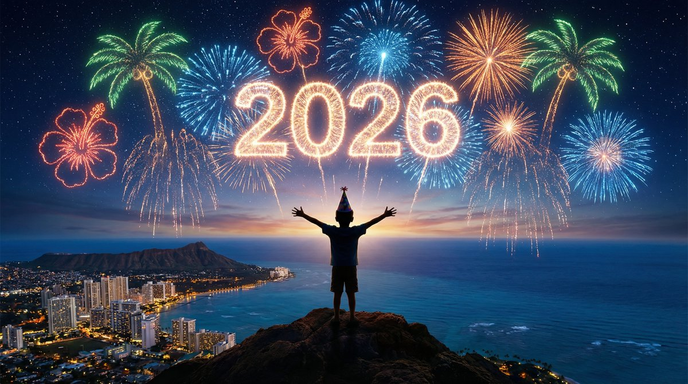

## 元旦特辑-粉色的秋千童话风

- ID: gpt4o-998-zh
- Slug: prompt-998-zh
- 语言: zh
- 来源: [来源链接](https://x.com/songguoxiansen/status/2005268799512309855)
- 样例图路径: images/part3/998.jpeg

### 提示词

```text
[关键：保持精确的面部特征，保留原始脸部结构，图中角色与上传参考图完全一致]
专业工作室梦幻人像,人物展现如珍珠般润泽白皙的肌肤,淡妆突出自然红润和水蜜桃唇色。她穿着渐变粉金色纱质长裙,裙身点缀手工刺绣的金色星星和红色小花,肩部装饰白色羽毛披肩。发型是浪漫的半披半扎,后半部分编成精致的鱼骨辫盘成花朵状,用金色星月发冠、红色小玫瑰和珍珠发链装饰,前半部分卷发自然垂落。她坐在悬空的金色秋千上,双手轻握绳索,一条腿自然垂下另一条腿微曲,身体微微后仰如荡秋千姿态,裙摆随动作飘起,头部侧向一边露出甜美笑容眼神梦幻。背景是纯白渐变到粉金色的背景布,上方悬挂金色和红色星星装饰、"2026"立体数字吊坠、透明气球束,地面虚化处散落粉色和金色花瓣。柔光箱从多角度打光营造梦幻柔焦效果,顶光制造仙气光晕。Hasselblad X2D-100C拍摄,浅景深,色调粉嫩梦幻,高端工作室童话风质感。
```

### 样例图

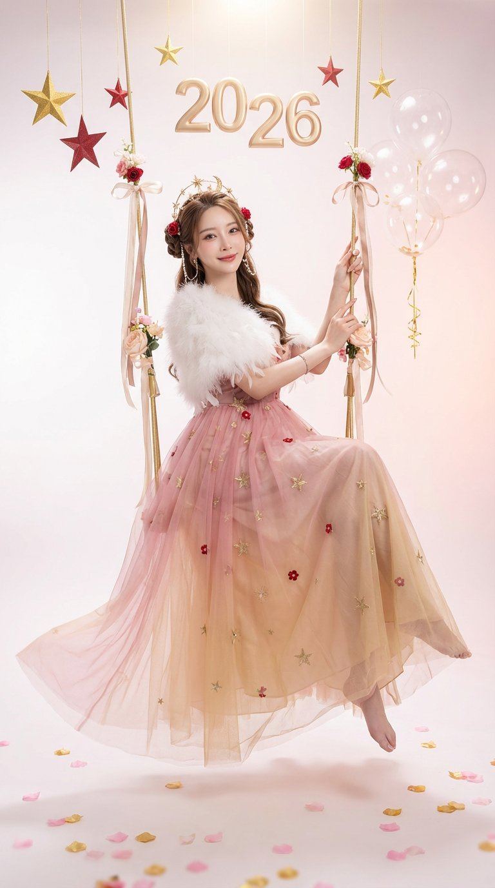

## 元旦特辑-复古旗袍名媛风

- ID: gpt4o-997-zh
- Slug: prompt-997-zh
- 语言: zh
- 来源: [来源链接](https://x.com/songguoxiansen/status/2005097871977447736)
- 样例图路径: images/part3/997.jpeg

### 提示词

```text
[关键：保持精确的面部特征，保留原始脸部结构，图中角色与上传参考图完全一致]
精致工作室立姿肖像,人物拥有如凝脂般细腻白皙的肌肤,淡雅妆容强调通透感和裸粉唇妆。她身着传统红色凤凰刺绣旗袍,高开叉设计展现修长美腿,袖口和领口绣满金线祥云纹样,外搭金色薄纱长披风从肩部垂落至地面。发型是典雅的侧边低盘发,用金色凤凰步摇、红色珠花和长长的金色流苏装饰,发饰随动作轻微摇曳,一侧留出波浪卷发修饰脸型。她站立在红色地毯上呈经典旗袍站姿,一条腿从开叉处露出,一只手叉腰展现自信,另一只手拿着金色烟斗式长杆烟嘴优雅置于唇边,头部微侧展现精致侧颜,眼神冷艳高贵。背景是深红色天鹅绒幕布,中央悬挂金色"元旦快乐"书法大字和"2026"立体装置,两侧对称布置红色立柱、金色花瓶插梅花、复古留声机。伦勃朗光营造经典好莱坞氛围,强调明暗对比和戏剧张力。Phase One拍摄系统,色彩浓烈复古,顶级工作室vintage大片质感。
```

### 样例图

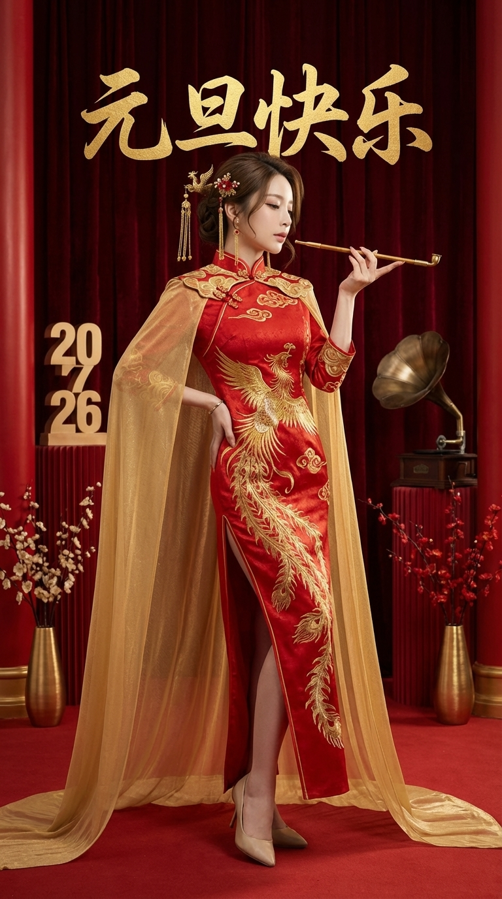

## 百科全书式信息卡片

- ID: gpt4o-994-zh
- Slug: prompt-994-zh
- 语言: zh
- 来源: [来源链接](https://x.com/yyyole/status/2005135811185180757)
- 样例图路径: images/part3/994.jpeg

### 提示词

```text
一张极简艺术风格的[芦笋]百科全书式信息卡片，
博物馆展品级别的设计品质，信息丰富但视觉克制

【整体构图 - 黄金分割布局】
- 画面比例：2:3竖版 或 3:4方形
- 三大视觉区域：
    * 顶部展示区（30%）：大尺寸食材摄影 + 优雅标题排版
    * 中部信息区（60%）：多层次信息模块网格系统
    * 底部注释区（10%）：来源标注 + 设计细节

【顶部展示区 - 视觉焦点】
• 食材名称：超大字号，细线体/宋体，字间距加宽
• 拉丁学名：小字号斜体，灰色调
• 食材分类标签：极简胶囊形状标签
• 主图：去背景食材特写，工作室灯光，微阴影
• 原产地小型地图图示
• 当季时间轴线条图

【中部核心信息区 - 9大模块】

1、营养成分详解
- 圆环图：卡路里、蛋白质、碳水、脂肪占比
- 条形图：维生素A/C/E/K含量对比
- 矿物质微量元素列表（钙、铁、锌等）
- 每100g营养数据精确标注
- GI值（升糖指数）可视化刻度尺

2、健康功效地图
- 人体轮廓图标注受益部位
- 5-6个主要功效图标化展示
- 功效强度等级标识（⭐⭐⭐⭐⭐）
- 科学研究来源小标注

3、烹饪方法矩阵
- 8-10种烹饪方式图标网格
- 每种方式最佳温度/时间参数
- 营养保留率百分比显示
- 推荐指数星级评价
- 难度等级色彩标识

4、四季食用指南
- 圆形时间轮盘设计
- 标注最佳食用月份
- 不同季节功效变化说明
- 时令搭配建议

5、黄金搭配矩阵
- 9宫格搭配食材小图标
- 搭配理由简短标注
- 协同增效/相克警示
- 经典菜品配方示例
- 营养互补关系连线图

6、适宜人群画像
- 人群图标（儿童/孕妇/老人/运动员等）
- 推荐程度色彩编码
- 特殊人群剂量建议
- 年龄段分类指南

7、禁忌与注意事项
- 红色警示框设计
- 不宜人群清晰列举
- 过敏源标识
- 药物相互作用提示
- 最大摄入量警戒线

8、选购与储存指南
- 新鲜度判断要点（颜色/手感/气味）
- 品质等级划分图示
- 最佳储存温度/湿度数据
- 保鲜期时间轴
- 冷藏/冷冻/常温图标指南

9、趣味知识扩展
- 历史小故事（起源/传说）
- 世界各地别名
- 年产量数据可视化
- 有机/转基因标识说明
- 可持续性评级

【视觉系统 - 极简艺术美学】

配色方案：
- 主色：食材本身的自然色彩提取
- 辅色：大地色系（米白/燕麦/亚麻/石墨灰）
- 强调色：克制使用1-2个高纯度色彩
- 背景：纯白或极浅灰（#FAFAFA）
- 文字：深灰而非纯黑（#2C2C2C）

字体系统：
- 标题：超细线条无衬线字体（Helvetica Neue UltraLight）
- 正文：现代几何字体（DIN/Futura）
- 数据：等宽字体（Roboto Mono）
- 中文：思源黑体Light/方正兰亭黑
- 字号层级：6级字号系统（48/32/24/16/12/10pt）

图标系统：
- 统一2pt线宽
- 圆角一致性（2px）
- 24x24px网格对齐
- stroke而非fill优先
- 负空间利用

布局系统：
- 12列网格系统
- 8pt基准网格对齐
- 模块间距：24pt/32pt/48pt
- 边距：页边距48pt起
- 卡片圆角：8-12px
- 微妙分割线：0.5pt，15%透明度

质感细节：
- 微渐变背景（3-5%色值变化）
- 柔和投影（0 4px 24px rgba(0,0,0,0.04)）
- 磨砂玻璃效果（backdrop-filter: blur(20px)）
- 元素间微妙高度差异（海拔系统）
- 数据区域淡色填充（5%透明度）

【信息可视化原则】
- 数据图表：Edward Tufte简约数据墨水原则
- 去除非必要装饰
- 图表网格线极淡（10%透明度）
- 数据点精确标注
- 趋势线平滑自然

【呼吸感营造】
- 模块间留白≥模块内容宽度的25%
- 文字行间距1.6-1.8倍
- 段落间距≥2行高
- 图文组合留白法则

风格关键词：
瑞士国际主义平面设计、日本侘寂美学、包豪斯功能主义、
斯堪的纳维亚极简主义、Dieter Rams设计哲学、
无印良品视觉语言、Kinfolk杂志美学、
苹果产品设计语言、Google Material Design精髓
```

### 样例图

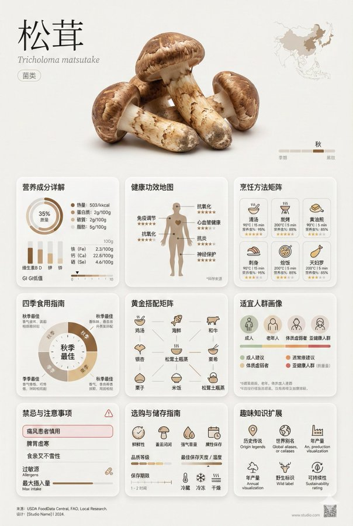

## 专业首饰类型设计全流程展示

- ID: gpt4o-993-zh
- Slug: prompt-993-zh
- 语言: zh
- 来源: [来源链接](https://x.com/yyyole/status/2004766562360942975)
- 样例图路径: images/part3/993.jpeg

### 提示词

```text
专业{首饰类型}设计全流程展示 | {主材料}商业级设计过程可视化，专业设计系统文档风格。
【主材料】：{金}（如：虎眼石、翡翠、南红玛瑙）
【首饰类型】：{手镯}（如：手串、吊坠、戒指、耳环
【辅材智能配置】：根据主材料自动匹配（金属配件、隔珠、弹力线等）

专业珠宝设计全流程展示图 | 从概念到成品的完整设计过程

项目信息板块（左上角）
项目名称：「{主材料} {首饰类型}设计方案」
设计师签名栏（muyang）
项目编号和日期
品牌Logo预留位
金色装饰线框

第一阶段：设计概念 CONCEPT DESIGN
视觉呈现：
灵感拼贴板（Mood Board）：{主材料}原石照片、纹理特写、色彩提取
手绘草图：3-4个设计方案，铅笔素描风格
文化元素融入（如虎眼石→东方瑞兽纹样）
比例尺标注，关键尺寸备注
标注内容：
设计理念说明（中英双语）
目标客群定位
预算区间估算

第二阶段：材料精选 MATERIAL CURATION
主材料展示区：
{主材料}原矿到成品珠粒对比
4-6颗品质分级展示（AAAAA→A级）
显微镜下纹理特写
色卡比对（Pantone色号标注）
专业珠宝托盘呈现
辅材智能搭配区：
金属配件：根据主材料调性选择暖色系主材（虎眼石、南红）→ 18K玫瑰金/红铜
冷色系主材（青金石、海蓝宝）→ 925银/白金
中性主材（黑曜石、玛瑙）→ 精钢/钛钢
隔珠/配珠：尺寸比例协调（主珠直径的1/3-1/2）
材质对比（如虎眼石配砗磲/椰壳）
数量配比建议
串线材料：手串→弹力线（克重标注）
项链→不锈钢钢丝/K金链
透明展示盒分格摆放
光照：顶部柔光 + 侧面暖光，突出材质光泽

第三阶段：工程图纸 TECHNICAL DRAWING
CAD专业制图：
三视图（正视/侧视/俯视），精确到0.1mm
剖面图展示内部结构（如隔珠穿孔位置）
尺寸标注线（箭头 + 数字）
珠子排列顺序图解
结绳工艺节点详图
蓝图底色 + 白色线框，建筑图纸风格
参数表格：
| 部件 | 尺寸 | 数量 | 材质 |
| {主材料}主珠 | Ø{X}mm | {N}颗 | 天然{主材料} |
| 隔珠 | Ø{Y}mm | {M}颗 | {辅材} |
| 配件 | - | 1套 | {金属材质} |

第四阶段：工艺打样 PROTOTYPING
制作过程：
选珠配对：工匠用卡尺测量，色差比对
打磨抛光：砂轮机/手工打磨台
穿孔检查：专业灯光透视孔洞
试戴调整：手腕/颈部模特展示，周长调节
细节特写：金属扣头安装过程，微距摄影
环境设置：
传统工作台（木质/大理石台面）
专业珠宝工具铺陈（镊子、放大镜、量具）
暖色工作灯照明
工匠手部特写（展现匠心）

第五阶段：品控检验 QUALITY CONTROL
检测场景：
紫外线灯下检测{主材料}真伪
电子秤精确称重（克重显示）
游标卡尺复核尺寸
拉力测试弹力线强度
检验报告单特写（证书编号、检测数据）
分屏展示：
左侧：检测设备操作
右侧：放大显示检测结果
底部：合格印章/质检签字
色调：冷色调科技感，白色实验室环境

第六阶段：包装呈现 PACKAGING
包装系统展示：
内包装：定制绒布袋/锦盒，品牌烫金Logo
外包装：艺术礼盒，{主材料}纹理印刷
附件配套：材质证书卡
保养说明书（图文并茂）
品牌故事卡片
擦拭布/密封袋
构图：爆炸图式展开，层层递进

第七阶段：成品大片 FINAL SHOWCASE

A组-产品摄影：
纯白背景悬浮拍摄，360°全角度
特写镜头：{主材料}猫眼效果/晶体纹理
金属配件反光细节
尺寸参照物（硬币/尺子）
专业影棚四点布光
B组-场景应用：
真人手腕/颈部佩戴
生活化场景（咖啡桌、书桌、户外）
不同光线环境（自然光/夜景灯光）
动态展示（手部移动形成光轨）
C组-细节放大：
100倍微距：{主材料}内部结构
金属接口工艺特写
结绳编织纹理
品牌刻印细节

整体视觉规范
布局架构
横向时间轴：7阶段等宽分布，21:9电影比例
流程箭头：立体金属质感，渐变发光效果
信息层级：一级标题：粗体中文+细体英文，金色
二级标题：黑体，12号
正文标注：宋体/思源黑体，9号
色彩系统
背景基调：#F8F6F0 象牙白
主材料色：根据{主材料}天然色提取（虎眼石→琥珀金棕）
金属色：K金 #D4AF37
银色 #C0C0C0
玫瑰金 #B76E79
强调色：深褐 #3E2723（文字/边框）
摄影标准
分辨率：最低4K（3840×2160）
景深：F8-F11保持各阶段清晰
色温：5500K标准日光
格式：RAW原片后期，保留最大细节
```

### 样例图


## 超逼真的电影感肖像

- ID: gpt4o-991-zh
- Slug: prompt-991-zh
- 语言: zh
- 来源: [来源链接](https://x.com/hx831126/status/2005219164009668903)
- 样例图路径: images/part3/991.jpeg

### 提示词

```text
超逼真的电影感肖像，高端时尚9：16画幅杂志风格摄影。

发型：短发，发丝被风吹拂，飘散在脸上，以时尚的方式部分遮挡面部特征。

主体：仅使用上传的面部参考图像作为主要拍摄对象。面部特征、骨骼结构和自然肤质（可见毛孔）需100%匹配。不得改变种族或性别特征。

服装：黑色复古皮夹克搭配红色高领细线针织（堆叠领口），佩戴金色项链，优雅现代的造型。

场景/环境：时间为冬天，街上有供暖热蒸汽，充满欧洲风格，一个复古公寓的门，门打开着，里面黑漆漆，

动作/动态：前景有人快速移动，动态模糊（长曝光效果）挡住部分画面和镜头。拍摄对象保持完美清晰、沉静。拍摄对象静止，轻微仰头，看着镜头，一只手拉着高领毛衣的领子扯着挡住下颌线和嘴唇（时尚杂志模特的post）位于画面的右侧。

构图：低角度仰拍人物，胸部以上竖幅肖像，主体人物位置偏右构图，线条简洁流畅

相机：24mm广角镜头低角度仰拍视角，浅景深，电影感虚化效果，专业的时尚写实风格。

光照：柔和的电影感光照，暖色调，营造氛围感。高光控制得当，阴影保留细节。

色彩/后期：高细节，高级色彩分级，自然的肤质纹理，微妙的胶片感（无明显颗粒）。无文字、无徽标、无水印。
```

### 样例图


## Create a realistic high-fashion studio photo collage fea

- ID: gpt4o-990-en-1
- Slug: prompt-990-en-1
- 语言: en
- 来源: [来源链接](https://x.com/miilesus/status/2004620767087263838?referrer=grok.com)
- 样例图路径: images/part3/990.jpeg

### 提示词

```text
Create a realistic high-fashion studio photo collage featuring the same woman in six to eight different poses, using the uploaded face image as the exact facial reference (same facial structure, eyes, nose, lips, skin tone, and overall identity).

The woman has a slim and elegant body, natural proportions, pale to light skin tone, a delicate oval face, soft but sharp facial features, large expressive eyes, thin lips, and a calm, confident expression. Her hair is long, black, styled in a messy bun with loose strands falling naturally around the face.

Outfit: a tight black strapless mini dress, paired with sheer black thigh-high stockings, pointed-toe black stiletto heels with thin heels, and a formal black blazer worn in different ways across poses (fully worn, draped over one shoulder, hanging off one arm, or resting loosely on the arms). Accessories include a thin black choker necklace.

Poses included in the collage:

Standing front-facing full body pose, neutral expression, blazer hanging off the arms.

Standing back-facing pose with the head turned toward the camera, blazer worn on the shoulders, legs straight.

Squatting or semi-crouching pose with one leg forward, sharp gaze toward the camera.

Seated pose on a black chair with legs crossed, blazer off one shoulder, elegant and composed expression.

Seated low pose with knees bent, body leaning slightly forward, blazer worn on one arm only.

Half-body portrait facing the camera, shoulders relaxed, clean editorial look.

Environment: clean white seamless studio background with soft high-key lighting. Large softbox light placed in front and slightly to the side, creating soft shadows beneath the body. Even lighting that clearly shows fabric texture, skin detail, and shoe shine.

Photography style: high-end fashion editorial, professional studio photography, ultra high-definition, sharp focus, natural skin texture, realistic shadows, no lens distortion, accurate anatomy and proportions.

Composition: vertical fashion collage layout with evenly spaced images.

Aspect ratio: 9:16.
```

### 样例图


## 高级时装工作室照片拼贴画

- ID: gpt4o-990-zh-2
- Slug: prompt-990-zh-2
- 语言: zh
- 来源: [来源链接](https://x.com/miilesus/status/2004620767087263838?referrer=grok.com)
- 样例图路径: images/part3/990.jpeg

### 提示词

```text
使用上传的面部图像作为精确的面部参考（相同的面部结构、眼睛、鼻子、嘴唇、肤色和整体特征），创建一个逼真的高级时装工作室照片拼贴画，以同一位女性的六到八个不同的姿势为特色。

这位女士身材纤细优雅，比例匀称，肤色白皙，脸型精致，五官柔和却不失轮廓分明，双眼明亮动人，嘴唇纤薄，神态沉稳自信。她一头乌黑长发随意挽成一个发髻，几缕碎发自然垂落在脸颊两侧。

服装：一件紧身黑色无肩带迷你连衣裙，搭配黑色薄纱过膝长袜、黑色尖头细高跟鞋，以及一件黑色正式西装外套，外套在不同姿势下以不同方式穿着（完全穿上、披在一侧肩上、挂在一侧手臂上或随意搭在手臂上）。配饰包括一条黑色细颈链。

拼贴画中包含的姿势：

站立式全身像，正面朝向观众，表情平静，西装外套挂在手臂上。

背对镜头站立，头部转向镜头，西装外套披在肩上，双腿伸直。

蹲姿或半蹲姿，一条腿向前迈出，目光锐利地看向镜头。

她盘腿坐在黑色椅子上，西装外套滑落一侧肩膀，神态优雅沉稳。

坐姿低位，双膝弯曲，身体略微前倾，西装外套只搭在一只胳膊上。

半身像，面向镜头，肩膀放松，画面干净利落，适合杂志拍摄。

环境：洁净的白色无缝摄影棚背景，柔和的高调灯光。大型柔光箱放置在前方略偏一侧，在人体下方营造出柔和的阴影。均匀的光线清晰地展现了织物纹理、肌肤细节和鞋子的光泽。

摄影风格：高端时尚大片、专业影棚摄影、超高清、清晰对焦、自然肌肤纹理、逼真阴影、无镜头畸变、准确的解剖结构和比例。

构图：竖版时尚拼贴布局，图片间距均匀。

宽高比：9:16。
```

### 样例图


## Using the uploaded photo as the sole character reference

- ID: gpt4o-989-en-1
- Slug: prompt-989-en-1
- 语言: en
- 来源: [来源链接](https://x.com/aidavid125/status/2004699464255356984)
- 样例图路径: images/part3/989.jpeg

### 提示词

```text
Using the uploaded photo as the sole character reference, generate a vertical outfit poster.

【LAYOUT HARD RULES】
- Must have exactly 6 cards only, 2 rows × 3 columns (3 columns across, 2 rows down)
- Row 1: LOOK 1, 2, 3 | Row 2: LOOK 4, 5, 6
- Prohibited: 9-grid, 3 rows × 2 columns, 2-column layout, extra cards, top header/title

【CANVAS & LAYOUT】
- Vertical 4:5 aspect ratio, background #F7F5F2
- Grid occupies ≥92% of canvas height, bottom margin ≤3%
- Outer margin 2%, spacing 1.5%, strictly aligned

【CARD SPECIFICATIONS】
- White background #FFFFFF, border-radius 5%, stroke 1px #E5E7EB
- Top title bar: height 12%, background #F3F4F6, text color #111827
- Sans-serif font, alignment consistent throughout

【CHARACTER CONSISTENCY】
- All 6 must be the same person in different outfits: same face, same hairstyle, same body proportions, same demeanor
- Prohibited: switching people/changing face/altering gender features/extreme slimming or leg lengthening

【PHOTOGRAPHY QUALITY】
- Master-level studio full-body lookbook, 85mm portrait lens look
- Softbox key light + subtle fill, natural skin texture with light retouching
- Solid seamless background (white/light gray/off-white), no clutter

【UNIFORM CROPPING】
- 4:5 full-body, complete from head to shoes
- Subject centered, height 88%±2%
- Headroom 2-4%, footroom 3-5%, shoes fully visible
- All six shots: consistent camera height/focal length/lighting/pose

【OUTFIT RULES】
- Auto-adapt based on subject age (adult/child)
- Each look ≤3 core items, max 3 colors per outfit, accessories ≤2
- 6 looks distinctly different, but unified style: minimal/clean/polished/easy to recreate

【TITLE SETS】
Adult: Business/Classic → Casual/Weekend → Smart Casual/Evening → Resort/Vacation → Athleisure/Active → Layered/Transitional
Kids: Everyday/Clean → School/Polished → Weekend/Play → Party/Sweet → Active/Sporty → Layered/Cozy

NEGATIVE:
3x3, nine-grid, 9 cards, extra cards, 3 rows x 2 columns, two-column layout, big top header, page title, switching people, changing face, multiple people, lowres, blurry, plastic skin, wide-angle distortion, fisheye, warped body, extreme slimming, long legs effect, outdoor background, textured wall, cut off shoes, half body, adultification, sexy, lingerie, see-through, high heels (kids), heavy makeup (kids), watermark, cropped text
```

### 样例图


## 一张竖版服装海报

- ID: gpt4o-989-zh-2
- Slug: prompt-989-zh-2
- 语言: zh
- 来源: [来源链接](https://x.com/aidavid125/status/2004699464255356984)
- 样例图路径: images/part3/989.jpeg

### 提示词

```text
以上传的照片为唯一人物参考，生成一张竖版服装海报。

【布局硬性规则】
- 必须正好有 6 张卡片，2 行 × 3 列（横向 3 列，纵向 2 行down)
- 第 1 行：造型 1、2、3 | 第 2 行：造型 4、5、6
- 禁止使用：9格网格、3行×2列、2栏布局、额外卡片、顶部标题/标题

【画布与布局】
- 垂直4:5宽高比，背景#F7F5F2
- 网格占据画布高度的 92% ≥ ，底部边距为 3% ≤
  外边距 2%，行距 1.5%，严格对齐

【卡片规格】
- 白色背景#FFFFFF ，圆角 5%，描边 1px #E5E7EB
- 顶部标题栏：高度 12%，背景色#F3F4F6 ，文本颜色 #111827
- 无衬线字体，对齐方式始终一致

【角色一致性】
- 这6个人必须是同一个人，只是穿着不同的衣服：同样的脸，同样的发型，同样的身材比例，同样的举止。
- 禁止：换人/改变容貌/改变性别特征/极端瘦身或拉长腿部

【摄影质量】
- 大师级影棚全身写真集，85mm 人像镜头拍摄效果
- 柔光箱主光 + 轻微补光，自然肌肤纹理，轻微修图
- 纯色无缝背景（白色/浅灰色/米白色），无杂物

【统一裁剪】
- 4:5 全身照，从头到脚完整呈现
- 以受试者为中心，身高 88%±2%
  头部空间2-4%，脚部空间3-5%，鞋子完全可见
- 所有六张照片：相机高度/焦距/光线/姿势均保持一致

【穿搭规则】
- 根据受试者年龄（成人/儿童）自动调整
- 每套造型≤ 3件核心单品，每套服装最多3种颜色，配饰≤ 2件
- 6 看起来截然不同，但风格统一：简约/干净/精致/易于复刻

【标题集】
成人：商务/经典→休闲/周末→商务休闲/晚装→度假/休闲→运动休闲/活力→叠穿/过渡装
儿童：日常/干净→上学/整洁→周末/玩耍→派对/甜美→活力/运动→多层/舒适

消极的：
3x3，九宫格，9张卡片，额外卡片，3行2列，双栏布局，顶部大标题，页面标题，人物切换，换脸，多人，低分辨率，模糊，塑料皮肤，广角畸变，鱼眼，身体扭曲，极度瘦身，长腿效果，户外背景，纹理墙，鞋子被剪掉，半身，成人化，性感，内衣，透视，高跟鞋（儿童），浓妆（儿童），水印，裁剪文字
```

### 样例图


## 圣诞特辑-冷艳圣诞甜酷皆在方寸间

- ID: gpt4o-988-zh
- Slug: prompt-988-zh
- 语言: zh
- 来源: [来源链接](https://x.com/songguoxiansen/status/2004008192200921372)
- 样例图路径: images/part3/988.jpeg

### 提示词

```text
[关键：保持精确的面部特征，保留原始脸部结构，整个拼图中角色完全一致]
高级时尚感的妆容，采用金属质感的妆面，眼影是香槟金色渐变到玫瑰金，眼角延伸出精致的金色眼线，下眼睑点缀碎钻如冰晶闪烁。睫毛根根分明如芭比娃娃，眉毛是野生眉形态。唇部是镜面光泽的樱桃红色，腮红是高光打造的立体感。发型是时髦的低盘发，发髻用金色装饰球和圣诞铃铛点缀，侧边垂落几缕精致卷发，头顶斜戴着设计感十足的金属质感圣诞帽，帽檐镶嵌北极星装饰。身着改良版现代圣诞服，采用不对称设计，一侧肩膀露出，红色天鹅绒面料混搭金色亮片，腰间系着夸张的金色蝴蝶结，下摆不规则裁剪。搭配毛绒围巾随意搭在肩上，戴着镶钻的针织手套。人物摆出时尚大片姿势，一腿微曲，一手叉腰，另一手优雅地托着一个装饰奢华的礼物盒，表情高冷又不失节日欢愉。背景是纯白色摄影棚布置成的圣诞场景，巨大的白色圣诞树装饰着金色装饰球、灯串和星星。地面铺满仿真雪花，摆放着精致的雪人雕塑、圣诞麋鹿装置。旁边有个现代设计感的壁炉装置，里面跳动着蓝色的炉火。墙面投影着圣诞老人剪影、驯鹿鲁道夫、雪橇、圣诞马车的图案。周围散落着高级包装的糖果、姜饼礼盒、拐杖糖。圣诞袜以装置艺术形式悬挂。地上摆放着精致的热可可套装。冬青叶和槲寄生以金属雕塑形式呈现。蜡烛造型灯在四周营造氛围。冰晶吊灯从天花板垂下。打光采用多灯位布光，主光、轮廓光、发光分离，营造时尚大片的高级质感。
```

### 样例图

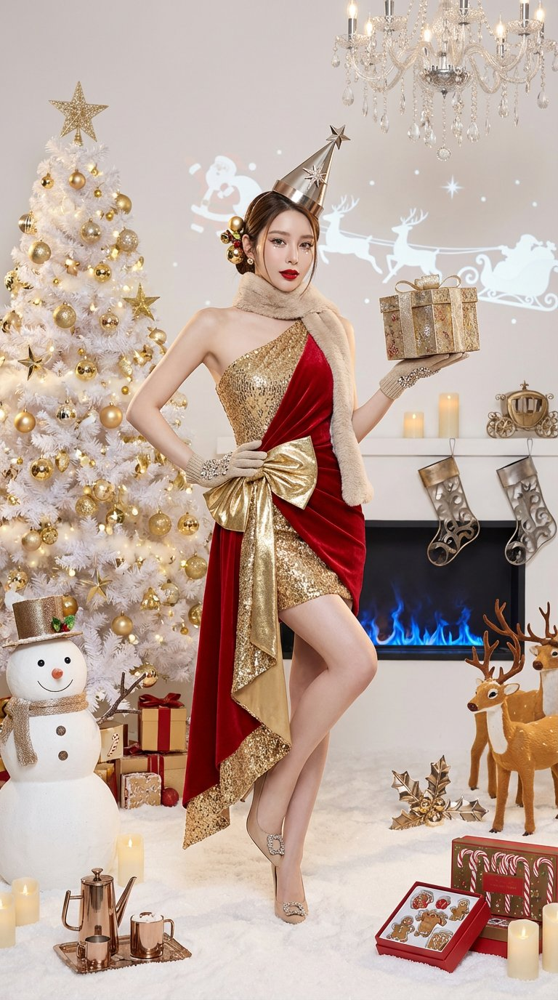

## A Subject: me (use uploaded face — 100% facial accuracy,

- ID: gpt4o-986-en-1
- Slug: prompt-986-en-1
- 语言: en
- 来源: [来源链接](https://x.com/itis_Jarvo33/status/2004015740329017641)
- 样例图路径: images/part3/986.jpeg

### 提示词

```text
A Subject: me (use uploaded face — 100% facial accuracy, no changes). with no extra brightness on the face, keeping my natural dark facial tone intact. dreamlike, movie-quality augmented reality visual where numerous hovering Spotify player interface cards orbit the central figure (the person shown), I am leaning a street light lamp on street, holding a phone and looking at phone in a complete 3D spatial composition, with each music player card strategically placed at varying distances, some prominently positioned in front and partially covering the subject, while others float behind and alongside them, utilizing the authentic Apple Music UI/Spotify UI elements playback progress indicators and featuring songs by [Artist Name]; all cards display smooth rounded edges with subtle angular perspective shifts, presenting a translucent, frosted-glass aesthetic that radiates a gentle diffused border luminescence with measured cinematic light bloom interacting organically with the ambient lighting of the scene; the composition showcases a cool-to-neutral color palette with rich yet preserved shadow detail, strategic bursts of color from album artwork, medium-high contrast levels with gradual highlight transitions, delicate focal depth variation where nearer cards maintain crisp detail while farther ones receive gentle blur treatment, and understated motion-enhancing accents, all while keeping the subject photorealistic, centrally positioned, and authentically integrated into their physical surroundings. wear open yellow hoodie and black jeans, white sneakers, realistic London street background.Create a HD photo in 9:16
```

### 样例图

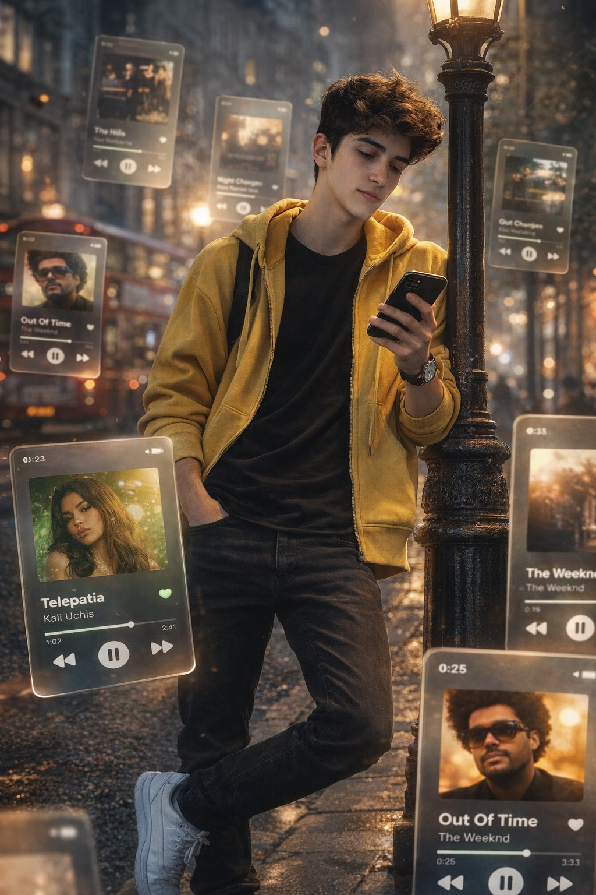

## 梦幻般的电影级增强现实视觉效果

- ID: gpt4o-986-zh-2
- Slug: prompt-986-zh-2
- 语言: zh
- 来源: [来源链接](https://x.com/itis_Jarvo33/status/2004015740329017641)
- 样例图路径: images/part3/986.jpeg

### 提示词

```text
主体：我（使用上传的面部照片——100% 面部还原度，无任何修改）。面部未增加额外亮度，保留了我自然的深色肤色。梦幻般的电影级增强现实视觉效果，众多悬浮的 Spotify 播放器界面卡片围绕着中心人物（图中人物）旋转。我倚靠在路灯上，手持手机，以完整的 3D 空间构图观看手机。每个音乐播放器卡片都经过精心设计，放置在不同的距离，有些卡片醒目地位于主体前方并部分遮挡住主体，而另一些则漂浮在主体后方和侧面。卡片使用了 Apple Music/Spotify 的原汁原味用户界面元素，例如播放进度指示器，并展示了 [艺术家姓名] 的歌曲；所有卡片都呈现出流畅的圆角边缘和微妙的角度透视变化，营造出半透明的磨砂玻璃美感，散发出柔和的漫射光晕，与场景的环境光自然地相互作用，呈现出电影般的光晕效果。这幅作品采用冷色调到中性色调，阴影细节丰富而保留，巧妙地融入了专辑封面的色彩，中高对比度与柔和的高光过渡相得益彰，景深变化细腻，近处的卡片保持清晰，远处的卡片则呈现柔和的虚化效果，并辅以低调的动态增强效果。所有这些都确保了主体逼真、居中，并自然地融入周围环境。照片中，人物身穿敞开的黄色连帽衫、黑色牛仔裤和白色运动鞋，背景是真实的伦敦街景。创建一张9:16的高清照片。
```

### 样例图


## [PRODUCT] with fine sand particles swirling around it, c

- ID: gpt4o-985-en-1
- Slug: prompt-985-en-1
- 语言: en
- 来源: [来源链接](https://x.com/AllaAisling/status/2003960376766222356)
- 样例图路径: images/part3/985.jpeg

### 提示词

```text
[PRODUCT] with fine sand particles swirling around it, caught mid-motion, desert wind effect, warm golden lighting, gritty texture contrast, elemental power, rugged durability implied, dynamic studio capture.
```

### 样例图

![[PRODUCT] with fine sand particles swirling around it, c](../images/part3/985.jpeg)

## 沙与风产品摄影

- ID: gpt4o-985-zh-2
- Slug: prompt-985-zh-2
- 语言: zh
- 来源: [来源链接](https://x.com/AllaAisling/status/2003960376766222356)
- 样例图路径: images/part3/985.jpeg

### 提示词

```text
【产品】细沙颗粒在其周围旋转，捕捉到运动瞬间，沙漠风效果，温暖的金色光线，粗糙的纹理对比，自然的力量，暗示着坚固耐用，动态的影棚拍摄。
```

### 样例图

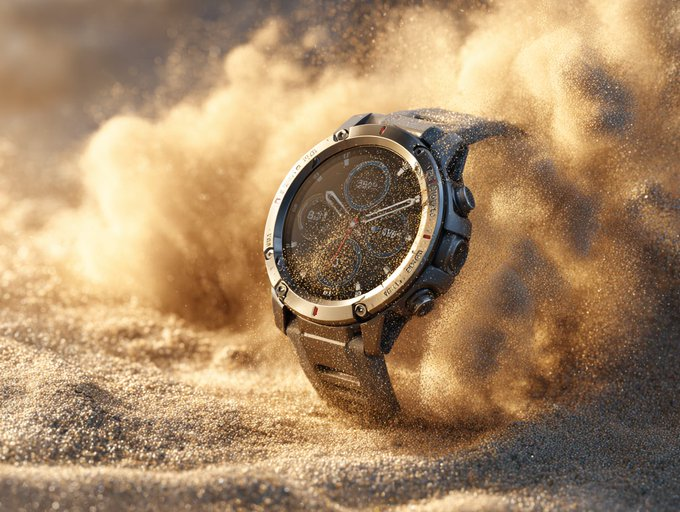

## 角色拆解艺术海报

- ID: gpt4o-984-zh
- Slug: prompt-984-zh
- 语言: zh
- 来源: [来源链接](https://x.com/berryxia/status/2004088874684043595)
- 样例图路径: images/part3/984.jpeg

### 提示词

```text
核心指令 (Core Instruction)  任务：基于用户提供的参考图片，创作一张超高品质、电影级的3D皮克斯/迪士尼(Pixar/Disney)风格角色拆解艺术海报。将照片中的人物转换为风格化写实的3D动画角色，并将其个人物品以严谨的"Knolling"（整齐排列）艺术风格进行布局展示。  画面比例：16:9 横版 (可根据需求调整为 3:2, 4:5, 1:1) 艺术风格核心：皮克斯"风格化写实主义" (Stylized Realism) — 融合夸张的卡通比例与照片级真实材质光影。 质量标杆：对标《寻梦环游记(Coco)》、《青春变形记(Turning Red)》、《夏日友晴天(Luca)》的官方角色宣传海报。  📷 物品布局 (Item Layout) - Knolling放射式构图 总物品数：30-36件，围绕角色呈90度直角或放射状有序排列。  分类1：时尚穿搭 (Fashion Atelier) - 香槟金标签 - 主服装拆解：衣袖、衣领、布料裁片、内衬等全部分离悬浮。 - 鞋履拆解：鞋底、鞋面、鞋带、鞋跟等分离。 - 随身配饰：腰带、包袋、帽子、围巾等。 *示例：一件风衣可拆解为翻领、肩章、腰带、袖口束带、主衣身等部分。*  分类2：美妆个护 (Beauty Collection) - 玫瑰金标签 - 彩妆：口红（带膏体切面和色号标签）、眼影盘（每格颜色清晰）、粉饼、香水瓶（液体折射清晰可见）。 - 护肤：精华液瓶、面霜罐、美容仪器。 *示例：一瓶香水需展现玻璃瓶身的通透感、液体内部的光线折射以及瓶盖的金属质感。*  分类3：数码生活 (Modern Essentials) - 钢蓝色标签  - 电子设备：带手机壳的智能手机（屏幕需有内容）、无线耳机、智能手表、笔记本/平板电脑、相机。 - 材质要求：金属、玻璃（带折射）、塑料等材质需有正确的粗糙度和反射效果。 *示例：一部相机可拆解为镜头、机身、闪光灯、存储卡、肩带等。*  分类4：个人爱好 (Luxury & Hobbies) - 24K金标签  - 奢华配饰：珠宝首饰（项链、耳环、戒指等，宝石需有色散效果）、品牌包袋（展示内部分隔和五金件）。 - 兴趣爱好：画笔、调色盘、书籍、乐器、运动装备、咖啡用具等。 *示例：一个手办可拆解为头部、身体、四肢、武器、地台等组件。*  每件物品要求： - 渲染质量：与角色同等级别的3D渲染精度。 - 编号标签：带有01-36的圆形编号徽章。 - 材质与阴影：应用PBR材质，投射逼真的软阴影。   📷 爆炸视图技术 (Exploded View Technique)  - 连接线：使用优雅的虚线/实线将悬浮的服装部件连接到角色身上。 - 引导箭头：使用装饰性箭头将物品指向其文字标签。 - 技术注释：   - 材质样本：展示织物、皮革等材质的微距特写方块。   - 材质标签：如"100%真丝"、"意大利小牛皮"。   - 测量标尺：带有厘米(cm)/英寸(in)标记的标尺。  📷 角色拆解艺术 · THE ART OF DECONSTRUCTION 📷"   字体：中文用典雅的衬线体（如方正宋刻本秀楷），英文用Playfair Display，带金箔效果。 - 副标题 (Subtitle)：（主标题下方，飘逸手写体）   "角色本质·艺术拆解 / Character Essence Unveiled"   中英文混排，字体优雅。 - 分类标题 (Category Headers)：（带图标的圆角矩形标签）   "📷 美妆个护"** (玫瑰金)   "📷 数码生活"** (钢蓝色)   "📷 设计元素 (Design Elements)  - 几何框架：使用装饰艺术(Art Deco)风格的六边形/圆形细线框（0.5-1pt粗细）来组织物品群组。 - 测量标尺：沿画面左右边缘放置，营造技术美学感。 - 十字准星：在画面四角和关键焦点处添加。 - 材质样本：在底部展示一排面料/皮革/金属的微距特写方块。 - 信息卡片：带优雅边框的卡片，用于展示物品的详细信息。 - 雷达图：用装饰框包裹的角色属性雷达图，如：优雅★★★★★, 风格★★★★★, 智慧★★★★★。 - 连接线条：使用金色/银色的优雅虚线和装饰性箭头。  📷 背景与氛围 (Background & Atmosphere)  - 背景渐变：从白色到奶油色/香槟色的暖色调渐变，或从浅灰到白色的冷色调渐变。 - 图案叠加：叠加一层低透明度（5-10%）的装饰艺术几何网格或蓝图线条。 - 暗角效果 (Vignette)：轻柔的边缘变暗效果，将焦点引向中心。 - 氛围粒子：柔和的金色散景(Bokeh)光斑和微妙的胶片颗粒(Film Grain)，营造电影感。  📷 清晨6:00 → 📷 创作进行时 → 📷 色彩方案 (Color Palette) - 女性/时尚主题：香槟金(#D4AF37), 玫瑰金(), 奶油色(), 樱花粉()。 - 男性/科技主题**：钢蓝色(#4A90E2#4A4A4A#C0C0C0), 电光蓝(#00D9FF)。 - 正式/奢华主题：纯黑(#000000), 24K金(#FFD700), 深红色(#8B0000), 象牙白(#FFFFF0)。 - 情侣主题：男性一侧使用冷色调，女性一侧使用暖色调，形成对比。  📷 技术规格 (Technical Specifications) 渲染参数 (Rendering) - 引擎：路径追踪(Path Tracing)，等同于Cycles/Arnold/RenderMan级别。 - 采样数：最低4096 SPP (Samples Per Pixel)，确保画面纯净无噪点。 - 光线弹射：12次，以获得准确的全局光照。 - 焦散(Caustics)：开启，用于钻石和玻璃的真实光线折射效果。 - 模型面数：角色多边形数200万以上，确保曲面平滑。 - 毛发：每个角色超过10万根发丝，并经过物理模拟。  PBR材质流程 (Materials - PBR Workflow)  - 皮肤：三层SSS，双层高光。 - 毛发：各向异性着色器，主副双高光。 - 织物：微观编织法线贴图，准确的粗糙度变化。 - 金属*：金属度(Metalness) 1.0，粗糙度(Roughness) 0.1-0.4。 - 玻璃：折射率(IOR) 1.5，钻石IOR 2.42并带色散(Dispersion)。 - 皮革：粗糙度0.6-0.7，带颗粒感的凹凸贴图。  分辨率与输出 (Resolution & Output) - 分辨率：4K (3840×2160) 横版。 - 宽高比：16:9。 - 色深：32-bit浮点，为后期处理提供最大空间。 - 抗锯齿：16x MSAA，边缘锐利清晰。  📷 后期处理 (Post-Processing) - 色彩分级 (Color Grading)：   - 使用电影感LUT，提高暗部，避免纯黑（最低RGB 15,15,15）。   - 温和的S型曲线增强对比度。   - 根据主题调整色温（暖色+200K，冷色-200K）。   - 整体饱和度-5%，重点色彩（如金色）饱和度+10%。 - **特效 (Effects)**：   - **辉光(Bloom)**：为高光区域添加柔和光晕。   - **胶片颗粒(Film Grain)**：模拟柯达Portra 400胶片的有机质感。   - **色差(Chromatic Aberration)**：在边缘添加极细微的色散。   - **暗角(Vignette)**：中等强度的暗角。   - **锐化(Sharpening)**：输出时进行适度锐化。  📷 特殊指令 (Special Instructions)  - **单人角色**：总计约30件物品，聚焦于个人生活方式。 - **情侣角色**：总计约36件物品（每人18件），用爱心符号连接，并使用性别区分的色调。 - **孕妇角色**：包含孕期用品（如托腹油、维生素、B超照片），在腹部附近添加婴儿图标。 - **核心要点**：必须根据参考照片匹配角色的年龄、职业和风格。  📷 质量基准 (Quality Benchmark) 最终成品必须在视觉上无法与皮克斯/迪士尼官方的角色营销海报区分开来，达到博物馆级的照片级3D渲染水准，适用于： - 奢华产品目录 - 高端时尚杂志内页 - 专业艺术品印刷 - 个人摄影作品集 - 品牌营销活动
```

### 样例图


## An ultra-realistic, professional nighttime fireworks dis

- ID: gpt4o-979-en-1
- Slug: prompt-979-en-1
- 语言: en
- 来源: [来源链接](https://x.com/dotey/status/2003522391654146544)
- 样例图路径: images/part3/979.jpeg

### 提示词

```text
An ultra-realistic, professional nighttime fireworks display, clearly featuring the shape "{Subject}" formed entirely from fireworks at the center of the sky. The "{Subject}" seamlessly emerges from dense spark trails, glowing embers, and dazzling radiant bursts, with smooth, precise contours and vivid clarity. It blends naturally into the surrounding firework display, appearing as an integral part of the overall spectacle, visually vibrant and photorealistic.
Behind and around the central "{Subject}", an expansive, celebratory firework show fills the night sky with layered radial explosions, cascading spark showers, and multi-stage bursts, creating impressive depth and dimension. Background fireworks maintain a slightly lower brightness to emphasize the central "{Subject}" sharply and distinctly.
The night sky is pure and deep navy-to-black, clear and cloudless with minimal haze or smoke. Firework colors include a sophisticated palette of gold, silver, white, red, and blue, demonstrating physically accurate light bloom, subtle glow effects, realistic particle dynamics, and natural variation in intensity and timing.
Firework bursts softly illuminate the surrounding sky, producing gentle, cinematic-quality light falloff, capturing a realistic and immersive celebratory atmosphere.
The image is ultra-high-resolution, sharply detailed with photographic realism, and contains no additional text or extra visual elements—only the "{Subject}" displayed distinctly through fireworks.

Subject: I 💗 U
```

### 样例图


## 超逼真专业的夜间烟火表演

- ID: gpt4o-979-zh-2
- Slug: prompt-979-zh-2
- 语言: zh
- 来源: [来源链接](https://x.com/dotey/status/2003522391654146544)
- 样例图路径: images/part3/979.jpeg

### 提示词

```text
一场超逼真、专业的夜间烟火表演，清晰地展现了“{主题}"的形状，该主题完全由烟火构成，位于天空的中心。“主题”从密集的火花轨迹、闪耀的余烬和耀眼的光芒中无缝地显现出来，轮廓流畅、精准，清晰生动。它与周围的烟火表演自然融合，成为整体壮观景象不可或缺的一部分，视觉效果生动逼真。
在中心“{主题}”的后方和周围，一场盛大的庆祝烟花表演点亮夜空，层叠的放射状爆炸、倾泻而下的火花雨和多阶段的绽放，营造出令人印象深刻的深度和立体感。背景烟花的亮度略低，以突出中心“{主题}”的鲜明特色。
夜空纯净深邃，由蓝至黑交织而成，晴朗无云，几乎没有雾霾或烟雾。烟花色彩丰富，包含金、银、白、红、蓝五种颜色，呈现出逼真的光晕效果、微妙的光晕、真实的粒子动态以及强度和时间上的自然变化。
烟花绽放，柔和地照亮周围的天空，产生柔和的、电影般的光线衰减效果，营造出逼真而身临其境的庆祝氛围。
图像分辨率极高，细节清晰，具有照片般的真实感，不包含任何额外的文字或视觉元素——只有通过烟花清晰显示的“{主题}”。

主题：我💗 U
```

### 样例图


## A hyper-realistic cinematic movie poster of a powerful f

- ID: gpt4o-978-en-1
- Slug: prompt-978-en-1
- 语言: en
- 来源: [来源链接](https://x.com/iamsofiaijaz/status/2003673235142115757)
- 样例图路径: images/part3/978.jpeg

### 提示词

```text
A hyper-realistic cinematic movie poster of a powerful female sorcerer with the same facial structure and likeness as the uploaded reference photo, bursting through a cracked Queen of Spades playing card.
The card explodes outward with stone fragments, dust, and debris frozen mid-air.
She wears an ornate royal maroon and gold embroidered medieval fantasy jacket, rich fabric textures, intricate detailing, regal and mystical.The sorcerer extends one hand forward toward the viewer, fingers glowing with intense magical energy, subtle golden sparks and dark arcane aura surrounding the hand.
Intense piercing gaze, confident and dominant expression, cinematic hero framing.
Dramatic chiaroscuro lighting, dark moody background, volumetric light rays, ultra-detailed textures, shallow cinematic depth of field.
Photorealistic face, epic fantasy realism, movie poster composition, high contrast, dynamic motion, dust particles, masterpiece quality, ultra-sharp focus, 8K resolution, cinematic color grading.
```

### 样例图

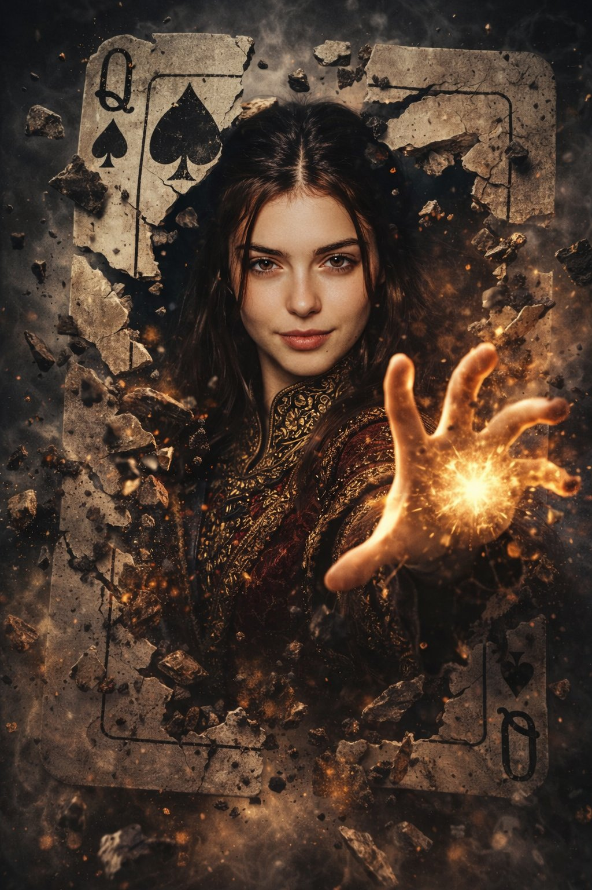

## 一张超写实的电影海报

- ID: gpt4o-978-zh-2
- Slug: prompt-978-zh-2
- 语言: zh
- 来源: [来源链接](https://x.com/iamsofiaijaz/status/2003673235142115757)
- 样例图路径: images/part3/978.jpeg

### 提示词

```text
一张超写实的电影海报，描绘了一位强大的女巫，她的面部结构和外貌与上传的参考照片相同，她正从一张破裂的黑桃皇后扑克牌中破壳而出。
卡片向外爆炸，石块碎片、尘埃和碎片在半空中凝固。
她身穿一件华丽的皇家酒红色和金色刺绣中世纪奇幻外套，面料质感丰富，细节精致，尽显高贵神秘之感。女巫向前伸出一只手，手指闪耀着强烈的魔法能量，隐隐的金色火花和黑暗的奥术光环环绕着她的手。
目光锐利，神态自信霸气，电影英雄般的构图。
戏剧性的明暗对比照明，阴暗的背景，立体光线，超精细的纹理，浅景深的电影效果。
照片级逼真的面部、史诗般的奇幻写实主义、电影海报构图、高对比度、动态效果、灰尘颗粒、杰作品质、超清晰对焦、8K分辨率、电影级色彩分级。
```

### 样例图


## { "image_prompt": { "reference": { "face_identity": "upl

- ID: gpt4o-977-en-1
- Slug: prompt-977-en-1
- 语言: en
- 来源: [来源链接](https://x.com/ZaraIrahh/status/2003476315828097321?referrer=grok.com)
- 样例图路径: images/part3/977.jpeg

### 提示词

```text
{
"image_prompt": {
"reference": {
"face_identity": "uploaded reference image",
"identity_lock": true,
"face_preservation": "100% identical facial structure, proportions, eyes, nose, lips, brows, skin texture, moles, and expression"
},
"subject": {
"gender": "female",
"age_range": "young adult",
"expression": "calm, focused, neutral competitive expression",
"pose": {
"action": "hands raised mid-clap",
"body_orientation": "three-quarter side profile",
"posture": "upright athletic stance"
}
},
"outfit": {
"top": "yellow and navy sleeveless volleyball jersey",
"armwear": "black compression arm sleeve on right arm",
"bottom": {
"type": "full-length black athletic pants",
"coverage": "legs fully covered at all times",
"fit": "sporty, fitted, opaque fabric"
},
"footwear": "not visible or cropped out"
},
"appearance": {
"hair": {
"style": "high ponytail with soft bangs",
"color": "dark brown"
},
"makeup": "natural sports makeup, light blush, subtle eyeliner",
"nails": "short, painted black"
},
"scene": {
"location": "indoor sports arena",
"background": "blurred volleyball court with pink and white wall panels",
"other_subjects": "teammates visible in soft background blur"
},
"lighting": {
"type": "bright indoor sports lighting",
"tone": "neutral and even",
"shadows": "soft"
},
"camera": {
"shot_type": "medium shot",
"angle": "eye-level",
"focus": "sharp focus on subject face and upper body",
"depth_of_field": "shallow background blur"
},
"constraints": {
"no_nudity": true,
"no_exposed_legs": true,
"legs_must_be_covered": "black pants required",
"no_outfit_changes": "jersey and arm sleeve remain identical",
"no_face_modification": true
},
"quality": {
"realism": "photorealistic",
"resolution": "8K ultra sharp",
"detail_level": "high"
}
}
}
```

### 样例图


## 运动少女照片

- ID: gpt4o-977-zh-2
- Slug: prompt-977-zh-2
- 语言: zh
- 来源: [来源链接](https://x.com/ZaraIrahh/status/2003476315828097321?referrer=grok.com)
- 样例图路径: images/part3/977.jpeg

### 提示词

```text
{
"image_prompt": {
“参考”： {
"face_identity": "上传的参考图像",
"identity_lock": true,
"face_preservation": "100% 相同的面部结构、比例、眼睛、鼻子、嘴唇、眉毛、皮肤纹理、痣和表情"
},
“主题”： {
"性别": "女性",
"age_range": "青年人",
“表情”：“冷静、专注、中立的竞争性表情”，
"姿势": {
“动作”：“双手在鼓掌过程中举起”，
"body_orientation": "四分之三侧脸轮廓",
“姿势”：“挺拔的运动姿态”
}
},
“全套服装”： {
“上衣”: “黄色和海军蓝无袖排球衫”
“臂套”：“右臂上的黑色压缩臂套”，
“底部”： {
“类型”: “黑色全长运动裤”
“覆盖范围”：“双腿始终完全被覆盖”，
“合身”： “运动型、修身、不透明面料”
},
“鞋类”： “不可见或已裁剪掉”
},
“外貌”： {
“头发”： {
“发型”：“高马尾配柔和刘海”，
颜色：深棕色
},
“妆容”：“自然运动妆，淡腮红，淡眼线”，
指甲：短的，涂成黑色
},
“场景”： {
地点：室内体育馆
“背景”：“模糊的排球场，带有粉色和白色的墙板”，
"other_subjects": "背景虚化中可见的队友"
},
“灯光”： {
类型：明亮的室内运动照明，
“色调”：“中性且均匀”，
“阴影”：“柔和”
},
“相机”： {
"shot_type": "中景镜头",
“角度”: “视线水平”
“焦点”: “清晰聚焦于拍摄对象的面部和上半身”，
景深：浅背景虚化
},
"约束": {
"no_nudity": true，
"no_exposed_legs": true,
“腿部必须遮盖”： “必须穿黑色裤子”
"no_outfit_changes": "球衣和袖子保持不变",
"no_face_modification": true
},
“质量”： {
“写实主义”: “照片写实主义”，
分辨率：8K 超清晰，
"detail_level": "高"
}
}
}
```

### 样例图


## 圣诞特辑-蜜桃背景里的圣诞少女小心思

- ID: gpt4o-974-zh
- Slug: prompt-974-zh
- 语言: zh
- 来源: [来源链接](https://x.com/songguoxiansen/status/2003467449195528253)
- 样例图路径: images/part3/974.jpeg

### 提示词

```text
(杰作, 最高画质, 超细节, 8k分辨率). 一张照片般逼真的4格分屏拼图，所有画面为同一女性角色。
[关键：保持精确的面部特征，保留原始脸部结构，整个拼图中角色完全一致]. 角色皮肤白皙，质感自然，眼神明亮。 左上图：特写镜头，角色化着精致的“麋鹿妆”（鼻头画红，脸颊有白色斑点），对着镜头Wink。 右上图：角色双手握拳放在头顶模仿鹿角，吐舌头卖萌，穿着棕色毛绒连帽衫。
左下图：角色侧身看着镜头，展示脸颊上的圣诞贴纸（雪花和铃铛图案），眼神妩媚。
右下图：角色正对着镜头整理刘海，手里拿着一个小圣诞树，脸上是圣诞树的贴纸，表情自然日常。 环境：粉色或蜜桃色的纯色背景。灯光：环形美妆灯，瞳孔中有漂亮的光圈，皮肤无瑕疵。风格：美妆博主风格，极度强调妆容细节，清晰对焦，少女感。
```

### 样例图

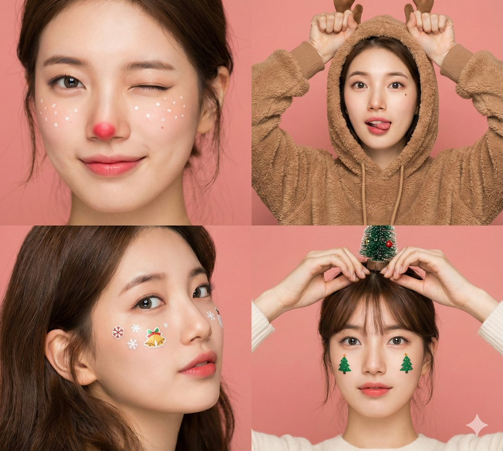

## (9-panel grid collage, photobooth style, studio lighting

- ID: gpt4o-973-en-1
- Slug: prompt-973-en-1
- 语言: en
- 来源: [来源链接](https://x.com/songguoxiansen/status/2003469962430873963)
- 样例图路径: images/part3/973.jpeg

### 提示词

```text
(9-panel grid collage, photobooth style, studio lighting). A fun and vibrant 3x3 grid featuring the specific character in 9 different poses. [CRITICAL: Maintain exact facial features, preserve original face structure across all panels].

Styling: She is wearing a soft white mohair sweater. Accessories change slightly in panels: a reindeer antler headband, a thick red knitted scarf, and holding a giant Christmas lollipop. Poses: 1. Winking with a V-sign. 2. Pouting while holding a miniature Christmas tree. 3. Surprised face with snowflake stickers on cheeks. 4. Laughing with eyes closed. 5. Blowing a kiss. 6. Holding a wrapped gift box on head. 7. Making a heart shape with hands. 8. Pretending to eat a gingerbread man. 9. Saluting with a serious cute face. Background: Uniform pastel blue studio backdrop for all panels. Lighting: Bright, shadowless beauty lighting, high-key, commercial pop style.
```

### 样例图

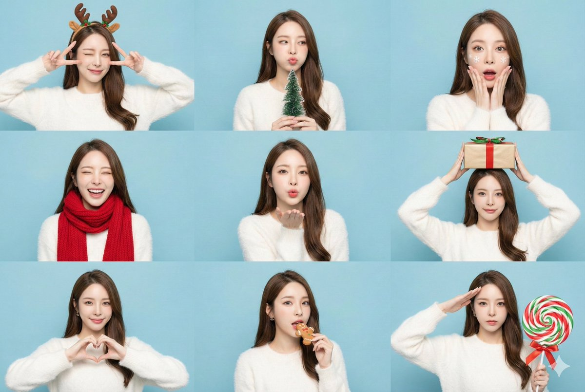

## 圣诞特辑-圣诞限定大头贴，9格甜度满格

- ID: gpt4o-973-zh-2
- Slug: prompt-973-zh-2
- 语言: zh
- 来源: [来源链接](https://x.com/songguoxiansen/status/2003469962430873963)
- 样例图路径: images/part3/973.jpeg

### 提示词

```text
（9格网格拼贴画，照相亭风格，影棚灯光）。一个趣味十足、充满活力的3x3网格，以9个不同的姿势展现特定角色。[关键：保持面部特征的精准，在所有网格中保持原有的面部结构]。

造型：她身穿一件柔软的白色马海毛毛衣。配饰在不同画面中略有变化：驯鹿角发箍、厚厚的红色针织围巾，以及手中巨大的圣诞棒棒糖。姿势：1. 眨眼并比出V字手势。2. 嘟嘴，手里拿着一棵迷你圣诞树。3. 惊讶的表情，脸颊上贴着雪花贴纸。4. 闭眼大笑。5. 飞吻。6. 头顶着一个包装好的礼盒。7. 用手比出心形。8. 假装吃姜饼人。9. 敬礼，表情严肃可爱。背景：所有画面均使用统一的浅蓝色摄影棚背景。灯光：明亮、无阴影的柔和灯光，高调，商业流行风格。
```

### 样例图


## { "subject": { "description": "First-person shooter (FPS

- ID: gpt4o-971-en-1
- Slug: prompt-971-en-1
- 语言: en
- 来源: [来源链接](https://x.com/fofrAI/status/2003146989060710828)
- 样例图路径: images/part3/971.jpeg

### 提示词

```text
{
"subject": {
"description": "First-person shooter (FPS) perspective of a cybernetic mercenary holding a dual-barreled smart pistol in a dystopian mega-city.",
"mirror_rules": "HUD elements and text must be legible and non-mirrored. Charge meter reads '100%'.",
"age": "N/A",
"expression": {
"eyes": null,
"mouth": null,
"overall": "Adrenaline-fueled, chaotic, fast-paced"
},
"face": {
"preserve_original": "false",
"texture": "Ocular implant interface, glitch effects",
"makeup": null,
"features": "Augmented reality (AR) overlay with scan lines"
},
"hair": null,
"body": {
"frame": "Robotic prosthetic arm visible in foreground",
"waist": null,
"chest": null,
"legs": "Not visible",
"skin": {
"visible_areas": "None (cybernetics)",
"tone": "Chrome and synthetic black",
"texture": "Carbon fiber weave, exposed wiring, neon tubing",
"lighting_effect": "Pink and cyan reflections from city lights"
}
},
"pose": {
"position": "First-person view, weapon canted slightly sideways, dynamic movement",
"base": "Parkour/Wall-running stance",
"overall": "High-velocity action camera angle"
},
"clothing": {
"top": {
"effect": "Tech-wear jacket sleeve, tactical wrist computer"
},
"bottom": null
}
},
"accessories": {
"jewelry": null,
"device": "Experimental Smart Pistol. Matte black finish with glowing yellow heat vents. Holographic ammo projection displaying '12/12'.",
"prop": "HUD Overlay: Red enemy outlines, Threat detection (center), Mini-map (top right), Health bar (bottom left). Text prompt: 'WARNING: SECTOR 4 LOCKDOWN'."
},
"photography": {
"camera_style": "In-game screenshot, Ray-traced Render",
"angle": "First-person POV, high FOV (Field of View)",
"shot_type": "Landscape, POV",
"aspect_ratio": "16:9",
"texture": "Next-gen graphics, wet surface reflections, chromatic aberration, digital noise",
"lighting": "Neon signage (pink, purple, cyan), dark shadows, volumetric fog, wet pavement glare",
"depth_of_field": "Motion blur on edges, sharp focus on weapon and immediate target"
},
"background": {
"setting": "Rain-slicked rooftop in a Cyberpunk metropolis",
"wall_color": "Dark concrete and neon",
"elements": [
"Massive holographic billboards featuring anime girls",
"Flying cars in traffic lanes below",
"Dense skyscrapers blocking the sky",
"Heavy rain falling"
],
"atmosphere": "Dystopian, gritty, technological noir",
"lighting": "Artificial city lights, gloom, lightning flashes"
},
"the_vibe": {
"energy": "High-octane, rebellious",
"mood": "Dark, electric, dangerous",
"authenticity": "High-end PC game screenshot",
"intimacy": "Visceral combat",
"story": "escaping a corporate security raid",
"caption_energy": "System Override"
},
"constraints": {
"must_keep": [
"FPS perspective",
"Glitchy HUD elements",
"Cybernetic hand details",
"Neon lighting",
"Text 'WARNING: SECTOR 4 LOCKDOWN'",
"Rain effects"
],
"avoid": [
"Third-person view",
"Daylight",
"Nature/Trees",
"Medieval weaponry",
"Clean military aesthetic"
]
},
"negative_prompt": [
"third person",
"sunlight",
"grass",
"mountains",
"clean",
"low poly",
"blurry",
"peaceful"
]
}
```

### 样例图


## 第一人称射击游戏视角

- ID: gpt4o-971-zh-2
- Slug: prompt-971-zh-2
- 语言: zh
- 来源: [来源链接](https://x.com/fofrAI/status/2003146989060710828)
- 样例图路径: images/part3/971.jpeg

### 提示词

```text
{"主体设定": {"描述": "身处反乌托邦巨型都市的生化雇佣兵，手持双管智能手枪的第一人称射击（FPS）视角","镜像规则": "平视显示器（HUD）元素及文字必须清晰可辨且不可镜像。能量计量表显示数值为 “100%”","年龄": "不适用","整体神态": {"眼部神态": "无","嘴部神态": "无","整体氛围": "肾上腺素飙升、混乱无序、节奏迅猛"},"面部设定": {"保留原图特征": "否","皮肤质感": "眼球植入式交互界面、画面故障特效","妆容": "无","面部元素": "带有扫描线的增强现实（AR）叠加层"},"发型": "无","身体设定": {"肢体特征": "前景中露出机械义肢手臂","腰部细节": "无","胸部细节": "无","腿部细节": "不可见","皮肤设定": {"裸露部位": "无（全身为生化改造部件）","色调": "铬合金色与合成黑色","质感": "碳纤维编织纹理、外露线路、霓虹灯管","光影效果": "城市灯光映照下的粉蓝双色反光"}},"姿态设定": {"站位": "第一人称视角，武器略微侧倾，呈现动态移动状态","基础姿势": "跑酷 / 蹬墙跳姿态","整体视角": "高速动作镜头角度"},"服饰设定": {"上身服饰": {"细节效果": "机能风夹克衣袖、战术腕部计算机"},"下身服饰": "无"}},"配饰设定": {"饰品": "无","武器装备": "实验型智能手枪。哑光黑枪身，配发光黄色散热口。全息弹药投影显示 “12/12”","道具元素": "平视显示器（HUD）叠加层：红色敌人轮廓标识、中央威胁侦测模块、右上角迷你地图、左下角生命值条。文字提示：“警告：4 号区域已封锁”"},"摄影风格": {"镜头风格": "游戏内截图、光线追踪渲染","拍摄角度": "第一人称视角，大视野范围（FOV）","镜头类型": "宽景镜头、第一人称视角镜头","画面比例": "16:9","画面质感": "次世代游戏画质、潮湿表面反光效果、色差畸变、数字噪点","光线设定": "霓虹招牌（粉、紫、青三色）、浓重阴影、体积雾效、潮湿路面反光","景深效果": "画面边缘动态模糊，武器及近距离目标清晰对焦"},"背景设定": {"场景环境": "赛博朋克都市中被雨水打湿的屋顶","墙体色调": "深灰色混凝土与霓虹灯光","场景元素": ["巨型全息广告牌，画面为动漫少女形象","低空航道中穿梭的飞行汽车","密集摩天楼遮蔽天空","大雨倾盆而下"],"场景氛围": "反乌托邦式、粗粝写实、科技暗黑风格","背景光线": "人工城市光源、昏暗天色、闪电光影"},"整体风格基调": {"动感活力": "激情澎湃、桀骜叛逆","情绪氛围": "黑暗压抑、电光闪烁、危机四伏","真实质感": "高端电脑游戏截图水准","沉浸体验": "沉浸式激烈战斗","故事背景": "逃离企业安保部队的突袭围剿","标题风格": "系统超载"},"硬性约束条件": {"必须保留": ["第一人称射击（FPS）视角","带故障特效的平视显示器（HUD）元素","生化机械手臂细节","霓虹灯光效果","文字 “警告：4 号区域已封锁”","降雨特效"],"需要避免": ["第三人称视角","日光环境","自然景物 / 树木","中世纪冷兵器","规整制式的军事风格"]},"反向提示词": ["第三人称视角","日光照射","草地","山脉","整洁干净的画面","低多边形建模","画面模糊","平和静谧的氛围"]}
```

### 样例图


## { "image_analysis": { "subject": { "demographics": "Youn

- ID: gpt4o-968-en-1
- Slug: prompt-968-en-1
- 语言: en
- 来源: [来源链接](https://x.com/lexx_aura/status/2003145469451551070)
- 样例图路径: images/part3/968.jpeg

### 提示词

```text
{
"image_analysis": {
"subject": {
"demographics": "Young woman, white skin tone, roughly 20s",
"hair": "Long dark brunette hair styled in low twin-tails (pigtails) with a middle part",
"face": "Neutral expression, looking at phone screen, soft 'glam' makeup with mauve lipstick",
"accessories": "Black rimmed glasses resting on top of head, small gold pendant necklace, small gold hoop earrings"
},
"apparel": {
"top": "Chocolate brown, long-sleeve, scoop-neck fitted top",
"bottom": "Beige and black plaid pleated mini skirt featuring decorative black ribbon bows and lace-up details on the front",
"legwear": "Black semi-sheer thigh-high stockings",
"footwear": "Black patent leather block-heeled pumps"
},
"pose_and_action": {
"type": "Mirror selfie, full-body shot",
"posture": "Kneeling on the floor, legs tucked underneath, torso angled slightly to the right",
"hands": "Right hand holding a white smartphone (iPhone Pro style) covering part of face; left hand reaching back to touch the heel of the left shoe"
},
"environment": {
"location": "Modern, minimalist bedroom",
"flooring": "White fluffy shag rug on light wood floor",
"furniture": [
"Cream upholstered bed frame with white bedding",
"Pillow with delicate floral pattern",
"White wardrobe/closet doors in background"
],
"decor": "Large round mirror on wall reflecting a potted green plant (Monstera style) and window curtains"
},
"technical_specs": {
"lighting": "Soft natural daylight, diffuse indoor lighting, neutral color temperature",
"aesthetic": "Coquette, influencer fashion, soft girl, clean aesthetic",
"color_palette": ["Chocolate brown", "Beige", "White", "Black"]
}
}
}
```

### 样例图


## 年轻漂亮的双马尾女子

- ID: gpt4o-968-zh-2
- Slug: prompt-968-zh-2
- 语言: zh
- 来源: [来源链接](https://x.com/lexx_aura/status/2003145469451551070)
- 样例图路径: images/part3/968.jpeg

### 提示词

```text
{
"image_analysis": {
“主题”： {
“人口统计信息”：“年轻女性，白皙肤色，大约20多岁”，
“头发”：“深棕色长发，梳成低低的双马尾（麻花辫），中分”，
“脸部”：“表情平静，看着手机屏幕，化着淡雅的‘魅惑’妆容，涂着淡紫色口红”，
“配饰”： “戴在头顶的黑框眼镜，小巧的金色吊坠项链，小巧的金色耳环”
},
"服装": {
“上衣”：巧克力棕色长袖圆领修身上衣
“下装”：“米色和黑色格子褶裥迷你裙，正面饰有黑色丝带蝴蝶结和系带细节”，
“腿部服饰”：“黑色半透明过膝长袜”，
鞋履：黑色漆皮粗跟高跟鞋
},
"pose_and_action": {
“类型”：“镜子自拍，全身照”，
“姿势”：“跪在地上，双腿蜷缩在身下，躯干略微向右倾斜”，
“双手”：右手拿着一部白色智能手机（iPhone Pro 款式），遮住了部分脸部；左手向后伸去触摸左鞋的鞋跟。
},
“环境”： {
位置：现代简约卧室
“地板”：“浅色木地板上铺着白色蓬松长毛地毯”，
“家具”： [
“米色软垫床架，配白色床品”
“带有精致花卉图案的枕头”
背景中的白色衣柜/壁橱门
],
“装饰”：“墙上挂着一面大圆镜，镜中映照着一盆绿色植物（龟背竹风格）和窗帘”。
},
"technical_specs": {
“照明”：“柔和的自然日光、漫射室内照明、中性色温”，
“美学”：“轻佻、网红时尚、温柔女孩、清新美学”
"color_palette": ["巧克力棕色", "米色", "白色", "黑色"]
}
}
}
```

### 样例图


## A real-life woman is presented in a vertical triptych co

- ID: gpt4o-967-en-1
- Slug: prompt-967-en-1
- 语言: en
- 来源: [来源链接](https://x.com/underwoodxie96/status/2003340602193379443)
- 样例图路径: images/part3/967.jpeg

### 提示词

```text
A real-life woman is presented in a vertical triptych collage composition, depicting three consecutive moments (a calm stance, a direct confrontation, and a startled reaction). Each panel deliberately uses left–right offset positioning to create a coherent visual narrative flow.

The image is shot in a photorealistic, cinematic live-action style, high resolution with subtle natural grain, true contrast, hard natural daylight, a clear blue sky, and deep depth of field consistent with real lens behavior. The scene takes place in an open outdoor environment.

The subject wears a cowboy hat, a short-sleeve button-up shirt, and a brownish-red long skirt. Her makeup is retro-inspired, with distinct red lipstick and clearly defined eye makeup.

Top panel:
The subject is positioned toward the right, leaving open sky on the left. She stands with arms crossed, looking toward the lower-left with a surprised expression.
Middle panel:
The subject is positioned toward the left, aiming a firearm with the barrel angled toward the lower-right. Her expression is focused and sharp, and the shot is taken from a slightly top-down angle. In this panel, both the subject and the weapon intentionally break through the top and bottom panel borders, overlapping the frame lines to create a clear layered effect. The middle panel serves as the primary visual focal point.

Bottom panel:
The subject is positioned in the lower-right corner, leaving more negative space on the left. She raises both hands defensively, her eyes naturally widened in surprise, looking toward the upper-left. The subject intentionally breaks the panel frame and overlaps the border lines, forming a distinct layered composition.
The image maintains a 2:3 aspect ratio and a photorealistic live-action style, explicitly avoiding illustration or comic aesthetics.
```

### 样例图

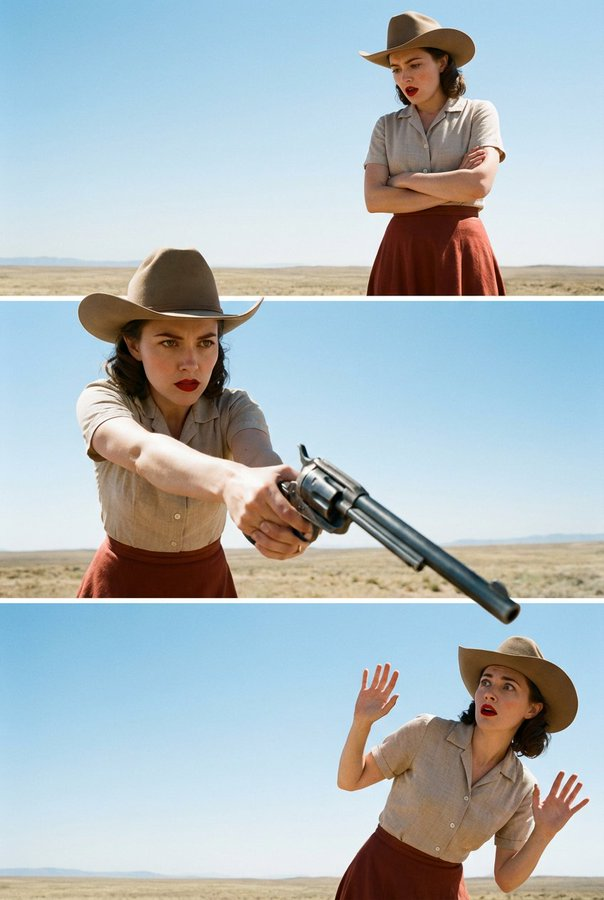

## 三联拼贴画描绘了女性的三个连续瞬间

- ID: gpt4o-967-zh-2
- Slug: prompt-967-zh-2
- 语言: zh
- 来源: [来源链接](https://x.com/underwoodxie96/status/2003340602193379443)
- 样例图路径: images/part3/967.jpeg

### 提示词

```text
这幅竖幅三联拼贴画描绘了一位真实女性的三个连续瞬间（平静的姿态、正面的对峙和惊愕的反应）。每幅画都巧妙地运用了左右错位布局，从而营造出连贯的视觉叙事效果。

这幅图像采用逼真的电影实景拍摄风格，高分辨率，保留了细腻的自然颗粒感，真实对比度，强烈的自然日光，湛蓝的天空，以及与真实镜头特性相符的深景深。场景设定在开阔的户外环境中。

照片中的人物戴着牛仔帽，身穿短袖衬衫和棕红色长裙。她的妆容充满复古气息，涂着醒目的红色唇膏，眼妆也十分精致。

顶部面板：
拍摄对象位于画面右侧，左侧是开阔的天空。她双臂交叉抱于胸前，面露惊讶地看向左下方。
中间面板：
画面主体位于左侧，持枪瞄准，枪口指向右下方。她表情专注而锐利，镜头采用略微俯拍的角度。在这个画面中，主体和武器都刻意突破了上下边框，与画框线重叠，营造出清晰的层次感。中间的画面则成为主要的视觉焦点。

底部面板：
画面主体位于右下角，左侧留白较多。她双手举起，做出防御姿态，双眼因惊讶而睁大，目光看向左上方。主体有意打破画框的限制，与边框线重叠，形成层次分明的独特构图。
该图像保持 2:3 的宽高比和照片级写实的真人拍摄风格，明确避免了插画或漫画的美学风格。
```

### 样例图


## 苹果iOS照片应用的图库网格视图

- ID: gpt4o-965-zh
- Slug: prompt-965-zh
- 语言: zh
- 来源: [来源链接](https://x.com/Tz_2022/status/2003298471713939941)
- 样例图路径: images/part3/965.jpeg

### 提示词

```text
基于【参考照片人物】。一张极其真实的特写照片，一只手拿着一部 iPhone 15 pro。屏幕亮着，显示着苹果 iOS “照片”应用的图库网格视图。屏幕上密密麻麻的缩略图是一个非常自然、未经筛选的情侣生活记录（基于【参考照片人物】）。内容非常多样：有户外旅行的风景合照、在餐厅吃饭的抓拍、在车里的搞怪自拍、模糊的夜店或演唱会照片、海边的背影、当然也有一些居家的温馨时刻。照片的光线、色彩和风格各不相同，看起来非常真实生动。背景是虚化的繁华城市夜景，充满了圣诞节的装饰。可以看到背景中有大片的街道节日彩灯（Christmas lights）、模糊的雪花飘落，以及远处商场橱窗的节日布置。光线更加丰富多彩，营造出一种热闹的圣诞外出氛围。
```

### 样例图

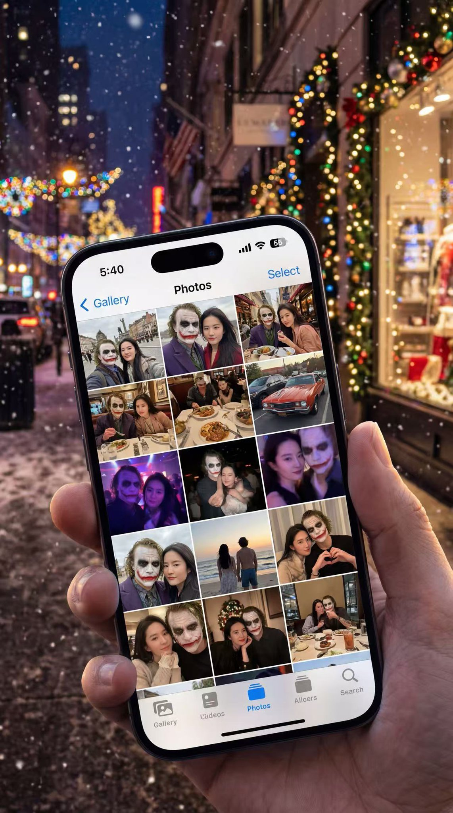

## 圣诞特辑-圣诞姜饼跨框投喂

- ID: gpt4o-963-zh
- Slug: prompt-963-zh
- 语言: zh
- 来源: [来源链接](https://x.com/songguoxiansen/status/2003109598232969590)
- 样例图路径: images/part3/963.jpeg

### 提示词

```text
【关键：两边人物的面部必须与源图像完全相同】。左侧面板： 穿着带有驯鹿图案的米色毛衣，带着圣诞帽，身体右倾，手里拿着一块咬了一口的姜饼人饼干，正试图递过中间的分割线，眼神看向右侧。右侧面板： 穿着带有雪花图案的蓝色毛衣，身体左倾，张开嘴巴，手伸过分割线去接那块饼干。道具： 脚下有装饼干的铁盒和散落的糖霜。背景： 明亮的青色（Teal）摄影棚背景。灯光/风格： 平光，明亮，叙事感，俏皮。
```

### 样例图

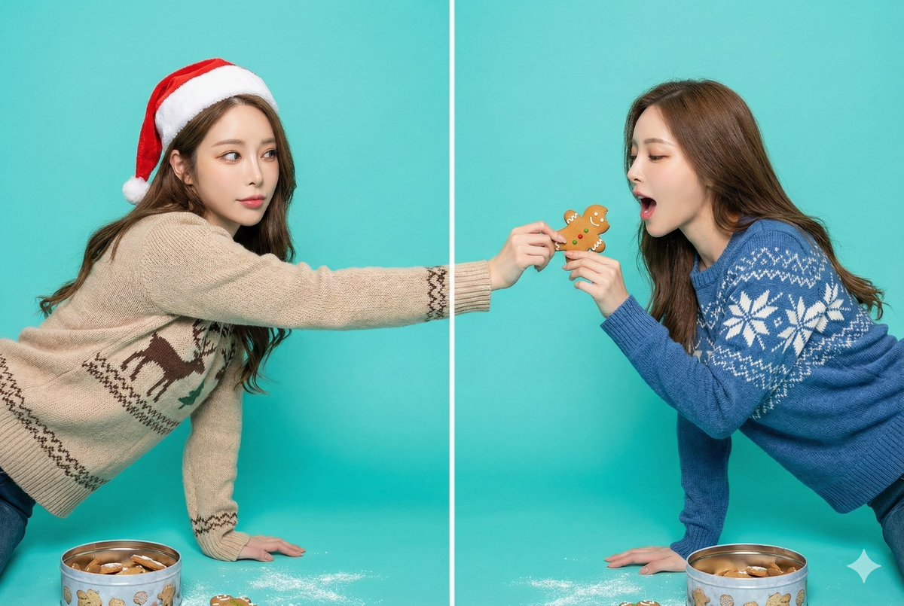

## 圣诞特辑-圣诞小精灵

- ID: gpt4o-962-zh
- Slug: prompt-962-zh
- 语言: zh
- 来源: [来源链接](https://x.com/songguoxiansen/status/2003101132378591474)
- 样例图路径: images/part3/962.jpeg

### 提示词

```text
(杰作, 最高画质, 超细节, 8k分辨率). 一张照片般逼真的4格分屏拼图，所有画面为同一女性角色。[关键：保持精确的面部特征，保留原始脸部结构，整个拼图中角色完全一致]. 角色皮肤白皙，质感自然，眼神明亮。左上图：角色穿着绿色的圣诞精灵服装，戴着尖尖的精灵耳朵道具，对着镜头敬礼，表情顽皮。右上图：角色手里拿着一个巨大的玩具锤子，假装要敲打镜头，眼睛睁得圆圆的。左下图：角色正在包装礼物，嘴里咬着丝带的一端，眉头微皱显得很专注可爱。右下图：角色坐在礼物堆上，双手托腮，双脚悬空晃动，一脸满足。环境：色彩饱和的圣诞工坊背景，红绿撞色。灯光：明亮的影棚灯光，无阴影，卡通感强。风格：K-pop专辑内页风格，色彩鲜艳跳跃，清晰对焦，活泼搞怪。
```

### 样例图


## 圣诞特辑-圣诞护肤品套装促销卡片

- ID: gpt4o-960-zh
- Slug: prompt-960-zh
- 语言: zh
- 来源: [来源链接](https://x.com/songguoxiansen/status/2003096613359853946)
- 样例图路径: images/part3/960.jpeg

### 提示词

```text
制作一张专业的圣诞护肤品套装促销卡片,采用竖版构图设计,整体风格简约高端。背景使用柔和的渐变色,从顶部的冰雪白色过渡到底部的淡粉色,营造出清新优雅的氛围。画面中央偏上位置,精心摆放着一套高端护肤品礼盒,礼盒采用磨砂白色包装,表面压印精致的雪花纹理和品牌Logo(Dior)。礼盒呈打开状态,内部露出三瓶不同大小的护肤品瓶子,瓶身设计简约现代,搭配金色瓶盖。产品周围巧妙地摆放着圣诞装饰元素:几支新鲜的松枝、小巧的金色铃铛、几颗红色浆果,以及散落的小礼物盒,所有道具都经过精心布光,呈现出高级的产品摄影质感。卡片顶部使用纤细优雅的字体书写"圣诞礼遇 · 焕颜新生"的中文标题。中部产品下方用醒目的红色字体标注促销信息"限量礼盒装 8折优惠 买赠面膜5片",底部配有行动号召按钮样式的文字"立即抢购 数量有限",以及活动有效期"12月15日-26日"。整体设计强调产品质感和节日氛围的完美结合。宽高比9:16
```

### 样例图


## A dreamlike, movie-quality augmented reality visual wher

- ID: gpt4o-959-en-1
- Slug: prompt-959-en-1
- 语言: en
- 来源: [来源链接](https://x.com/oggii_0/status/2002963262812585990)
- 样例图路径: images/part3/959.jpeg

### 提示词

```text
A dreamlike, movie-quality augmented reality visual where numerous hovering Spotify player interface cards orbit the central figure (the person shown) in a complete 3D spatial composition, with each music player card strategically placed at varying distances, some prominently positioned in front and partially covering the subject, while others float behind and alongside them, utilizing the authentic Apple Music UI/Spotify UI elements playback progress indicators and featuring songs by [Artist Name]; all cards display smooth rounded edges with subtle angular perspective shifts, presenting a translucent, frosted-glass aesthetic that radiates a gentle diffused border luminescence with measured cinematic light bloom interacting organically with the ambient lighting of the scene; the composition showcases a cool-to-neutral color palette with rich yet preserved shadow detail, strategic bursts of color from album artwork, medium-high contrast levels with gradual highlight transitions, delicate focal depth variation where nearer cards maintain crisp detail while farther ones receive gentle blur treatment, and understated motion-enhancing accents, all while keeping the subject photorealistic, centrally positioned, and authentically integrated into their physical surroundings.
```

### 样例图

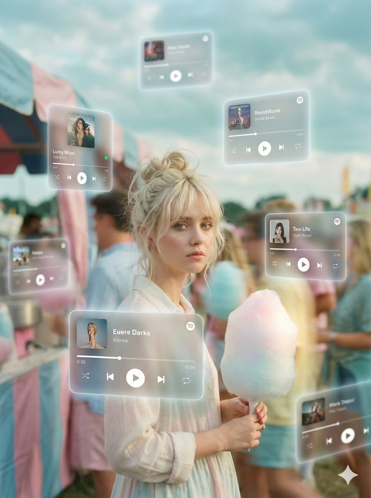

## 电影级的增强现实视觉效果

- ID: gpt4o-959-zh-2
- Slug: prompt-959-zh-2
- 语言: zh
- 来源: [来源链接](https://x.com/oggii_0/status/2002963262812585990)
- 样例图路径: images/part3/959.jpeg

### 提示词

```text
一个梦幻般的、电影级的增强现实视觉效果，其中众多悬浮的 Spotify 播放器界面卡片围绕中心人物（图中所示人物）旋转，构成一个完整的 3D 空间构图，每个音乐播放器卡片都经过精心布置，放置在不同的距离，有些卡片醒目地位于人物前方并部分遮挡住人物，而另一些卡片则漂浮在人物身后和旁边，利用真实的 Apple Music UI/Spotify UI 元素播放进度指示器，并展示 [艺术家姓名] 的歌曲；所有卡片都呈现出光滑的圆角边缘和微妙的角度透视变化，呈现出半透明的磨砂玻璃美感，散发出柔和的漫射边缘光晕，并带有适度的电影级光晕，与场景中的环境光自然地互动；构图展现了冷色调到中性色调的色彩，阴影细节丰富而保留，巧妙地融入了专辑封面的色彩，中高对比度与渐强的高光过渡相得益彰，景深变化细腻，近处的卡片保持清晰的细节，而远处的卡片则呈现出柔和的虚化效果，并辅以低调的动态增强效果，所有这些都保持了主体逼真、居中，并真实地融入到周围环境中。
```

### 样例图


## [BRAND NAME] is launching a new functional wellness elix

- ID: gpt4o-954-en-1
- Slug: prompt-954-en-1
- 语言: en
- 来源: [来源链接](https://x.com/AmirMushich/status/2002793794975273279)
- 样例图路径: images/part3/954.jpeg

### 提示词

```text
[BRAND NAME] is launching a new functional wellness elixir (e.g., adaptogenic, nootropic, or natural energy drink). As the Creative Director, devise a product name and visualize a complete high-end promotional shot. The aesthetic is "Cosmic Premium"—technological, clean, and sophisticated, like top-tier Apple product photography.

THE PRODUCT: Design a sculptural, multi-layered beverage bottle suspended in the center. The form is engineered and futuristic. The materials are hyper-tactile: bead-blasted titanium details, frosted borosilicate glass, and textured haptic polymer grips.
**Crucial Color Instruction:** The liquid inside must have a distinct, natural color relevant to its invented function (e.g., vibrant turmeric yellow, deep berry red, earthy matcha green, or pale calming blue). The liquid should look real with subtle natural sediment.
**Crucial Graphic Detail:** On the clear glass section of the bottle, apply a layer of subtle, minimalist, technical typography printed in matte white ink. This design should feel utilitarian and futuristic (e.g., small technical specs like 'SPACE GRADE FORMULA', 'BATCH: OZ-9', volume indicators, or coordinate markings), adding a functional aesthetic similar to aerospace labeling, without overwhelming the bottle's clean lines.

THE ENVIRONMENT & LIGHTING: The bottle is in a seamless studio.
**Crucial Background Instruction:** The background must be a solid, clean, very light pastel tone that is specifically chosen to complement the liquid color (e.g., a soft cool mint background for a warm orange liquid, or a pale blush background for a deep green liquid). No gradients. Ultra-soft, diffused studio lighting creates sleek highlights on metal and deep subsurface scattering in the glass and liquid.

PHOTOGRAPHY STYLE: High-resolution 100mm macro lens shot. Shallow depth of field, sharp focus on bottle textures and the printed graphics on the glass, smooth pastel background bokeh. 8k resolve, hyper-realistic textures.

GRAPHIC OVERLAYS: Include subtle dark gray UI elements.
Bottom Left Corner: Very small, minimalist text (like Manrope Regular font) describing the product's name and function in two sentences.
Bottom Right Corner: A small, minimalist dark gray logomark for [BRAND NAME].
```

### 样例图

![[BRAND NAME] is launching a new functional wellness elix](../images/part3/954.jpeg)

## 一张完整的产品高端宣传照

- ID: gpt4o-954-zh-2
- Slug: prompt-954-zh-2
- 语言: zh
- 来源: [来源链接](https://x.com/AmirMushich/status/2002793794975273279)
- 样例图路径: images/part3/954.jpeg

### 提示词

```text
[品牌名称] 即将推出一款全新的功能性健康饮品（例如，具有适应原、益智或天然能量的饮料）。作为创意总监，请构思产品名称并构思一张完整的高端宣传照。美学风格为“宇宙级奢华”——科技感十足、简洁精致、高端大气，如同顶级苹果产品摄影作品。

产品：设计一款造型独特、多层结构的饮料瓶，瓶身悬浮于中央。造型充满未来感和工程感。材质触感极佳：喷砂钛金属细节、磨砂硼硅酸盐玻璃和纹理触感聚合物握把。
**关键颜色说明:**内装液体必须具有与其功能相符的独特、自然的颜色（例如，鲜艳的姜黄、深邃的浆果红、质朴的抹茶绿或宁静的浅蓝）。液体应呈现逼真的效果，并带有细微的天然沉淀。
**关键图形细节:**在瓶子的透明玻璃部分，印上一层简洁、极简的哑光白色技术字体。这种设计应兼具实用性和未来感（例如，“太空级配方”、“批次: OZ-9 ”等小型技术规格、容量指示或坐标标记），增添类似航空航天标签的功能美感，同时又不破坏瓶子简洁的线条。

环境与灯光：瓶子放置在一个无缝摄影棚内。
**关键背景说明:**背景必须是纯色、干净、非常浅的粉彩色调，并且要经过精心挑选以衬托液体颜色（例如，暖橙色液体搭配柔和的薄荷绿背景，或深绿色液体搭配淡粉色背景）。禁止使用渐变色。超柔和的漫射摄影棚灯光可以在金属表面营造出光滑的高光，并在玻璃和液体表面形成深邃的散射效果。

摄影风格：高分辨率100mm微距镜头拍摄。浅景深，清晰聚焦于瓶身纹理和玻璃上的印刷图案，柔和的粉彩背景虚化。8K分辨率，超逼真的纹理。

图形叠加层：包含微妙的深灰色用户界面元素。
左下角：非常小的极简文字（类似 Manrope Regular 字体），用两句话描述产品的名称和功能。
右下角：[品牌名称] 的小型、极简的深灰色标志。
```

### 样例图


## (Magazine cover layout, minimalist composition, negative

- ID: gpt4o-949-en-1
- Slug: prompt-949-en-1
- 语言: en
- 来源: [来源链接](https://x.com/songguoxiansen/status/2002735852284457029)
- 样例图路径: images/part3/949.jpeg

### 提示词

```text
(Magazine cover layout, minimalist composition, negative space). A full-body studio shot of the specific character sitting on a tall stool. [CRITICAL: Ensure the face is exactly the same as the reference].

Styling: Minimalist chic outfit (black turtleneck, jeans). A long red scarf flowing down. Wearing subtle reindeer antlers. Props: A single red Christmas bauble hanging from a string right above her hand. Snowflake light patterns projected on the background wall. Background: Solid light grey or white seamless paper. Lighting: Soft, directional light creating a clean look with defined shadows. Style: Vogue or Elle magazine style, high fashion, clean lines, modern and sophisticated.
```

### 样例图


## 圣诞特辑-红韵点睛圣诞风尚志

- ID: gpt4o-949-zh-2
- Slug: prompt-949-zh-2
- 语言: zh
- 来源: [来源链接](https://x.com/songguoxiansen/status/2002735852284457029)
- 样例图路径: images/part3/949.jpeg

### 提示词

```text
（杂志封面版式，极简构图，留白设计）特定人物坐在高脚凳上的全身棚拍造型。【重点要求：务必保证人物面部与参考图完全一致】
造型：简约时髦穿搭（黑色高领毛衣、牛仔裤），一条红色长围巾垂坠飘动。佩戴低调的驯鹿角发饰。道具：一颗红色圣诞装饰球用细绳悬挂，恰好位于她的手上方。背景：雪花光影图案投射于背景墙面；背景采用纯色浅灰或白色无缝背景纸。光线：柔和定向光，打造干净利落的视觉效果，同时形成轮廓清晰的阴影。风格：《Vogue》或《Elle》杂志风格，高奢时尚，线条简洁，兼具现代感与精致格调。
```

### 样例图


## (Masterpiece, top quality, ultra-detailed, 8k resolution

- ID: gpt4o-948-en-1
- Slug: prompt-948-en-1
- 语言: en
- 来源: [来源链接](https://x.com/songguoxiansen/status/2002730147313840161)
- 样例图路径: images/part3/948.jpeg

### 提示词

```text
(Masterpiece, top quality, ultra-detailed, 8k resolution). A photorealistic 4-panel split screen grid collage featuring the same specific female character in all panels. [CRITICAL: Maintain exact facial features, preserve original face structure, consistent character reference throughout all panels]. The character has a fair complexion, natural skin texture, and bright eyes.
Panel 1 (Top Left): The character is winking playfully, wearing plush reindeer antlers, holding a candy cane near her cheek, joyful expression.Panel 2 (Top Right): The character is wearing a red Santa hat with white fur trim, looking surprised with hands covering her mouth, eyes wide open.Panel 3 (Bottom Left): The character is blowing a kiss, holding a small wrapped gift box with a gold ribbon, wearing a cozy oversized white knitted sweater.Panel 4 (Bottom Right): The character is giving a soft smile, eyes full of affectionate gaze, wearing a Christmas reindeer accessory around her neck, dressed in a red velvet Christmas dress with white fur trim, wearing red fluffy Christmas gloves, forming a heart shape with both hands beside her cheeks.
Environment: Solid studio background in soft pastel red or green.Lighting: Bright, high-key studio lighting, ring light reflection in eyes, soft shadows, uniform illumination.Style: Korean photobooth style, vibrant colors, sharp focus, cute and energetic atmosphere, commercial photography aesthetic.
```

### 样例图


## 圣诞特辑-圣诞四格甜妹

- ID: gpt4o-948-zh-2
- Slug: prompt-948-zh-2
- 语言: zh
- 来源: [来源链接](https://x.com/songguoxiansen/status/2002730147313840161)
- 样例图路径: images/part3/948.jpeg

### 提示词

```text
（杰作级，顶级品质，超高清细节，8K分辨率）。这是一幅逼真的四格分屏网格拼贴画，所有画面均以同一位女性角色为中心。[关键：保持面部特征的精准还原，保留原有的面部结构，所有画面均使用一致的角色参考图]。该角色肤色白皙，肤质自然，双眸明亮动人。
第一格（左上）：角色俏皮地眨着眼，头戴毛绒驯鹿角，脸颊边放着一根拐杖糖，表情快乐。第二格（右上）：角色戴着一顶镶有白色毛边的红色圣诞帽，双手捂着嘴，睁大眼睛，一脸惊讶。第三格（左下）：角色送出一个飞吻，手里拿着一个系着金色丝带的小礼盒，身穿一件舒适的白色宽松针织衫。第四格（右下）：角色露出温柔的微笑，眼神充满爱意，脖子上戴着圣诞驯鹿饰品，身穿镶有白色毛边的红色天鹅绒圣诞连衣裙，戴着红色毛绒圣诞手套，双手放在脸颊两侧，比出一个心形。
环境：柔和的粉红色实心影棚背景或green.Lighting ：明亮的高调影棚灯光，眼睛中环形灯反射，柔和的阴影，均匀illumination.Style ：韩式照相亭风格，鲜艳的色彩，清晰的焦点，可爱而充满活力的氛围，商业摄影美学。
```

### 样例图


## (Surrealism, fantasy art, macro photography style). A ma

- ID: gpt4o-947-en-1
- Slug: prompt-947-en-1
- 语言: en
- 来源: [来源链接](https://x.com/songguoxiansen/status/2002370189384691980)
- 样例图路径: images/part3/947.jpeg

### 提示词

```text
(Surrealism, fantasy art, macro photography style). A magical composition where the specific character is captured inside a giant, life-sized glass snow globe. [CRITICAL: Keep the face identical to the source image, maintain consistent facial features within the glass distortion].

Inside the Globe: The character is wearing a white faux fur winter coat and a red Santa hat, catching falling snowflakes with her hands. The environment inside includes miniature snow-covered pine trees decorated with colorful Christmas lights twinkling in red, green, blue, and gold. A tiny wooden cabin sits among the trees. Swirling magical glitter and snow dust fill the air inside the sphere.

Outside the Globe: The background is a blurry, cozy living room with a fireplace, emphasizing that the character is inside the ornament.

Lighting: The snow globe is glowing from within, illuminated by the warm colorful glow of the Christmas tree lights mixing with cool magical blue and white light on the falling snow. The character's face is beautifully lit by this magical mixed lighting. External warm light reflects off the curved glass surface, creating rainbow prismatic effects.

Technical: Ray tracing reflections on the glass, refraction effects, crystal clear focus on the character, magical atmosphere, ethereal and dreamy aesthetic, 8k resolution, intricate details of the snowflakes and Christmas lights bokeh.
```

### 样例图

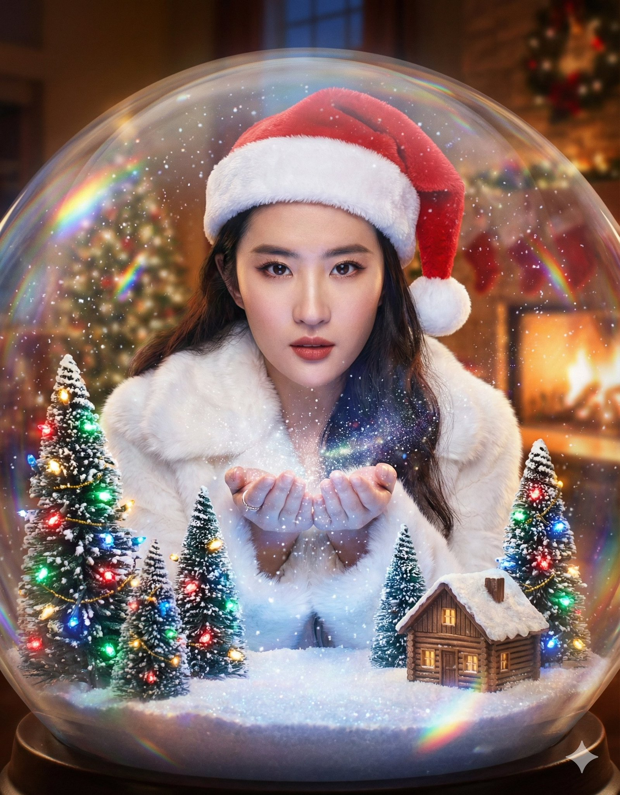

## 圣诞特辑-人物定格在奇幻巨型玻璃雪球里

- ID: gpt4o-947-zh-2
- Slug: prompt-947-zh-2
- 语言: zh
- 来源: [来源链接](https://x.com/songguoxiansen/status/2002370189384691980)
- 样例图路径: images/part3/947.jpeg

### 提示词

```text
（超现实主义、奇幻艺术、微距摄影风格）。一幅充满魔幻色彩的作品，将特定人物置于一个巨大的、真人大小的玻璃雪球中。[关键：保持面部与原图一致，在玻璃变形中保持面部特征的一致性]。

球体内部：人物身穿白色人造毛皮冬装，头戴红色圣诞帽，正用手接住飘落的雪花。球体内部的景象包括覆盖着白雪的微型松树，树上装饰着闪烁着红、绿、蓝、金四色圣诞彩灯。树丛中坐落着一间小木屋。球体内部弥漫着旋转的魔法闪光和雪花。

地球仪外部：背景是一个模糊的、舒适的客厅，里面有一个壁炉，强调了人物位于装饰品内部。

灯光：雪球内部散发着柔和的光芒，圣诞树彩灯温暖多彩的光芒与飘落雪花上清冷梦幻的蓝白色灯光交相辉映。人物的脸庞在这梦幻般的混合灯光下显得格外美丽。外部温暖的光线反射在弧形玻璃表面，折射出彩虹般的棱镜效果。

技术特点：光线追踪玻璃上的反射、折射效果、清晰聚焦于人物、营造神奇氛围、空灵梦幻的美感、8K 分辨率、雪花和圣诞彩灯散景的精细细节。
```

### 样例图


## do this for Messi: <instruction> Relic-Loadout Kit Input

- ID: gpt4o-945-en-1
- Slug: prompt-945-en-1
- 语言: en
- 来源: [来源链接](https://x.com/Gdgtify/status/2002116477307044203)
- 样例图路径: images/part3/945.jpeg

### 提示词

```text
do this for Messi: <instruction>
Relic-Loadout Kit
Input A is a fictional or real character (image/name) OR story IP (poster/name).
Analyze and infer: character archetype, iconic scene, signature items, and moral arc.
Goal: Premium collector kit box with compartments (no logos; minimal text).
Rules:
Center compartment: mini figurine.
Surround 10–16 relic props that teach the character arc (before/after item, symbol of sacrifice, tool of choice).
Add a tiny “arc timeline” strip with 5 beats (icons + 1–2 words max each).
Output: one image, 4:5 product hero shot.
</instruction>
```

### 样例图


## 将你最喜欢的角色变成收藏品

- ID: gpt4o-945-zh-2
- Slug: prompt-945-zh-2
- 语言: zh
- 来源: [来源链接](https://x.com/Gdgtify/status/2002116477307044203)
- 样例图路径: images/part3/945.jpeg

### 提示词

```text
请为梅西做这件事：</指令>
遗物装备包
输入 A 是虚构或真实的角色（图像/名称）或故事 IP（发布者/名称）。
分析和推断：人物原型、标志性场景、标志性物品和道德弧线。
目标：带隔层的优质收藏套装盒（无标志；文字极少）。
规则：
中间隔层：迷你人偶。
围绕 10-16 件遗物道具来展现角色弧光（前后物品、牺牲的象征、选择的工具）。
添加一个包含 5 个节点的“弧线时间轴”小条（每个节点最多可包含 1-2 个图标和 1-2 个单词）。
输出：一张图片，4:5 产品主图。
</指令>
```

### 样例图


## { "task": "hyper_realistic_macbook_screen_photography", 

- ID: gpt4o-944-en-1
- Slug: prompt-944-en-1
- 语言: en
- 来源: [来源链接](https://x.com/egeberkina/status/2002114484903800832)
- 样例图路径: images/part3/944.jpeg

### 提示词

```text
{
"task": "hyper_realistic_macbook_screen_photography",
"reference_logic": "exact_microsoft_teams_waiting_room_ui_macos",
"output": {
"type": "single_image",
"resolution": "ultra_high_resolution_8k",
"realism": "indistinguishable_from_real_laptop_photo",
"capture_style": "iphone_photo_of_macbook_screen",
"post_processing": "none"
},
"scene": {
"application": "Microsoft Teams",
"platform": "macOS",
"ui_state": "meeting_waiting_room",
"top_status_text": "Meeting now",
"center_message": "We've let people in the meeting know you're waiting.",
"background": "pure_black_dark_mode"
},
"ui_layout": {
"left_panel": {
"video_preview": {
"position": "bottom_left",
"aspect_ratio": "landscape",
"camera_toggle": "on",
"background_filters_button": "visible_below_preview"
}
},
"right_panel": {
"audio_section": {
"title": "Computer audio",
"selected_device": "AirPods Max",
"volume_slider": "horizontal_blue_indicator",
"mute_toggle": "off"
},
"audio_options": [
"Phone audio",
"Room audio",
"Don't use audio"
],
"cancel_button": {
"label": "Cancel",
"position": "bottom_right",
"style": "rounded_rectangle"
}
}
},
"subject": {
"gender": "female",
"hair": {
"color": "natural_blonde",
"style": "soft_bangs_with_loose_layers",
"texture": "individual_strands_visible"
},
"face": {
"skin": "true_human_skin_texture",
"details": "visible_pores_micro_imperfections",
"retouching": "none"
},
"eyewear": {
"brand": "Ray-Ban",
"model": "Wayfarer",
"type": "prescription_glasses",
"frame_color": "black",
"lens_reflection": "subtle_real_world_glare"
},
"headphones": {
"model": "AirPods Max",
"color": "space_gray",
"fit": "natural_over_ear_position"
},
"clothing": {
"top": "neutral_crop_top",
"style": "casual_minimal"
},
"expression": "calm_focused_waiting",
"gaze": "slightly_downward"
},
"environment": {
"background": "modern_open_office",
"ceiling": "exposed_industrial_ducts",
"lighting": {
"type": "soft_natural_daylight",
"mixed_with": "indoor_office_lighting",
"temperature": "5200K"
}
},
"screen_reflection": {
"enabled": true,
"source": "same_subject_as_video_preview",
"reflection_type": "soft_glass_reflection",
"intensity": "very_subtle",
"opacity": 0.05,
"sharpness": "low",
"distortion": "slight_glass_warp",
"positioning": "offset_not_centered",
"visibility_rules": {
"ui_text": "fully_readable",
"icons": "unobstructed",
"reflection_never_overpowers_ui": true
},
"realism_notes": [
"not_mirror_like",
"not_double_face",
"no_symmetry",
"appears_only_on_dark_areas"
]
},
"macos_elements": {
"dock": {
"visible": true,
"style": "macos_default_big_sur_or_later",
"reflection": "subtle",
"indicator_dot": "visible_under_active_apps",
"icons": [
"Finder",
"Mail",
"Calendar",
"Microsoft Teams",
"Adobe Illustrator",
"Adobe InDesign",
"Adobe After Effects",
"Adobe Lightroom",
"Adobe Photoshop",
"Adobe Premiere Pro",
"App Store",
"System Settings"
]
},
"menu_bar": {
"visibility": "partial_top_edge",
"elements": [
"WiFi",
"Battery",
"Time",
"macOS_control_icons"
]
}
},
"camera": {
"device": "iPhone",
"angle": "slightly_off_axis",
"handheld": true,
"screen_artifacts": [
"soft_glass_reflection",
"minor_glare",
"fingerprint_smudges",
"dust_particles",
"moire_pattern"
]
},
"color_profile": {
"contrast": "natural_display_contrast",
"saturation": "neutral_realistic",
"white_balance": "accurate_screen_calibrated"
},
"negative_prompt": [
"generic_video_call_ui",
"zoom_interface",
"google_meet_ui",
"fake_buttons",
"wrong_fonts",
"misaligned_panels",
"ai_generated_ui",
"blurred_text",
"plastic_skin",
"over_sharpening",
"mirror_reflection",
"double_face",
"incorrect_dock_icons"
]
}
```

### 样例图


## 超逼真的Macbook屏幕视频会议图

- ID: gpt4o-944-zh-2
- Slug: prompt-944-zh-2
- 语言: zh
- 来源: [来源链接](https://x.com/egeberkina/status/2002114484903800832)
- 样例图路径: images/part3/944.jpeg

### 提示词

```text
{
"任务": "超逼真的Macbook屏幕摄影",
"reference_logic": "exact_microsoft_teams_waiting_room_ui_macos",
“输出”： {
"type": "single_image",
"分辨率": "超高分辨率_8k",
“真实感”： “与真实笔记本电脑照片无法区分”
"capture_style": "iphone_photo_of_macbook_screen",
"post_processing": "无"
},
“场景”： {
“应用程序”：“Microsoft Teams”，
“平台”： “macOS”，
"ui_state": "会议室等候室",
"top_status_text": "正在开会",
"center_message": "我们已经通知会议中的其他人您正在等待。"
“背景”： “纯黑_深色模式”
},
"ui_layout": {
"left_panel": {
"video_preview": {
"位置": "左下角",
"aspect_ratio": "landscape",
"camera_toggle": "开启",
"background_filters_button": "visible_below_preview"
}
},
"right_panel": {
"audio_section": {
标题：计算机音频，
"selected_device": "AirPods Max",
"音量滑块": "水平蓝色指示器",
"mute_toggle": "关闭"
},
"audio_options": [
“电话音频”，
“房间音频”，
“请勿使用音频”
],
"取消按钮": {
标签： 取消，
"位置": "右下角",
"样式": "圆角矩形"
}
}
},
“主题”： {
"性别": "女性",
“头发”： {
颜色：自然金发，
"style": "soft_bangs_with_loose_layers",
"texture": "individual_strands_visible"
},
“脸”： {
"皮肤": "真实人类皮肤纹理",
"详情": "可见毛孔微瑕疵",
“修饰”： “无”
},
"眼镜": {
品牌：雷朋，
“型号”：“旅行者”，
"type": "处方眼镜",
"frame_color": "黑色",
"lens_reflection": "subtle_real_world_glare"
},
“耳机”： {
“型号”：“AirPods Max”，
"颜色": "太空灰",
"fit": "natural_over_ear_position"
},
“衣服”： {
"上衣": "中性露脐上衣",
风格：休闲简约
},
"表情": "平静专注的等待",
“凝视”: “略微向下”
},
“环境”： {
“背景”： “现代开放式办公室”
"天花板": "裸露的工业风管",
“灯光”： {
"type": "柔和自然日光",
"mixed_with": "室内办公照明",
温度：5200K
}
},
"screen_reflection": {
“启用”：true，
"source": "same_subject_as_video_preview",
"reflection_type": "soft_glass_reflection",
“强度”： “非常微妙”，
“不透明度”：0.05，
“锐度”: “低”
"失真": "轻微玻璃变形",
"定位": "offset_not_centered",
"visibility_rules": {
"ui_text": "完全可读",
“图标”：“畅通无阻”，
"reflection_never_overpowers_ui": true
},
"realism_notes": [
"not_mirror_like",
“非双面”，
"no_symmetry",
"仅在深色区域出现"
]
},
"macos_elements": {
"码头": {
“可见”：是，
"style": "macos_default_big_sur_or_later",
“反思”：“微妙的”，
"indicator_dot": "visible_under_active_apps",
“图标”：[
“发现者”，
“邮件”，
“日历”，
“Microsoft Teams”，
“Adobe Illustrator”
“Adobe InDesign”，
“Adobe After Effects”，
“Adobe Lightroom”，
“Adobe Photoshop”，
“Adobe Premiere Pro”，
“App Store”，
系统设置
]
},
"menu_bar": {
"可见性": "部分顶部边缘",
“元素”：[
“无线上网”，
“电池”，
“时间”，
"macOS_control_icons"
]
}
},
“相机”： {
"设备": "iPhone",
"角度": "略微偏离轴线",
“手持式”：是，
"screen_artifacts": [
"soft_glass_reflection",
“轻微眩光”，
“指纹污迹”，
"灰尘颗粒",
莫尔条纹图案
]
},
"color_profile": {
"对比度": "natural_display_contrast",
"饱和度": "中性_真实"
“white_balance”: “accur_screen_calibrated”
},
"negative_prompt": [
"generic_video_call_ui",
"zoom_interface",
"google_meet_ui",
"fake_buttons",
"wrong_fonts",
“错位面板”，
"ai_generated_ui",
"模糊文本",
"塑料皮肤",
“过度锐化”
"镜像反射",
“双面”，
"incorrect_dock_icons"
]
}
```

### 样例图


## { "project_title": "High-End Studio Fashion Editorial '5

- ID: gpt4o-943-en-1
- Slug: prompt-943-en-1
- 语言: en
- 来源: [来源链接](https://x.com/BeautyVerse_Lab/status/2002263911413031260)
- 样例图路径: images/part3/943.jpeg

### 提示词

```text
{
"project_title": "High-End Studio Fashion Editorial '5-Panel Wide Film' Collage",
"structure": "Asymmetric 2-column layout: Left column contains 2 stacked panels; Right column contains 3 stacked panels. Total height of both columns is identical.",
"aspect_ratio": "3:4",
"aesthetic_theme": {
"style": "Professional studio editorial mixed with seamless vintage film strip aesthetic",
"mood": "Minimalist, sophisticated, balanced yet dynamic",
"color_palette": [
"Clean whites",
"Sophisticated charcoals",
"Soft champagne gold",
"Deep black film borders",
"Neutral skin tones"
],
"textures": [
"Subtle film grain",
"Matte celluloid finish",
"Seamless cyclorama wall",
"High-fashion fabric textures"
]
},
"framing_and_borders": {
"type": "Integrated 5-panel wide film strip",
"details": [
"The layout is a single large rectangular film frame divided into 5 segments",
"Authentic film rebate with sprocket holes and frame numbers only on the FAR LEFT and FAR RIGHT outer vertical edges",
"The top and bottom outer edges are clean black film borders",
"Internal dividers: All internal lines (the central vertical divider and the horizontal lines on both sides) are simple, solid thin black lines"
]
},
"subject_reference": {
"source": "image_1.png",
"instruction": "The subject's physical appearance, complete outfit, and accessories must exactly match the person in image_1.png. Maintain visual consistency across all five frames."
},
"composition_layout": {
"left_column_stack": {
"dimensions": "Two stacked vertical panels",
"frames": [
{
"id": "frame_top_left",
"type": "Full-body studio editorial shot",
"setting": "Clean minimalist studio",
"pose": "Sophisticated standing pose, showcasing the full outfit silhouette",
"lighting": "High-contrast rim lighting"
},
{
"id": "frame_bottom_left",
"type": "Medium-shot editorial",
"setting": "Minimalist studio background",
"pose": "Artistic sitting or leaning pose, focusing on the upper body and garment flow",
"lighting": "Soft directional lighting"
}
]
},
"right_column_stack": {
"dimensions": "Three stacked horizontal panels matching the total height of the left column",
"frames": [
{
"id": "frame_top_right",
"type": "Close-up beauty portrait",
"setting": "Professional studio setup",
"pose": "Frontal view, elegant expression, focus on facial features",
"visual_effects": "Shallow depth of field, sharp focus on eyes"
},
{
"id": "frame_middle_right",
"type": "Candid BTS side-shot",
"setting": "Working studio environment with equipment visible",
"lighting": "Raw studio working lights",
"pose": "Relaxed, natural demeanor, perhaps looking at a monitor off-camera",
"props_and_details": "Visible C-stands and studio cables"
},
{
"id": "frame_bottom_right",
"type": "Dynamic detail or medium-shot",
"setting": "Studio corner with minimalist pedestal",
"lighting": "Butterfly lighting setup",
"pose": "Fashion-forward pose, highlighting accessories or specific outfit textures"
}
]
}
},
"central_element": {
"type": "Signature Overlay",
"content": "BeautyVerse",
"position": "Center of the entire composition, placed on the central vertical divider",
"style": {
"appearance": "Elegant fluid cursive, translucent white ink",
"texture": "Fine ink stroke",
"scaling": "Medium-sized"
}
}
}
```

### 样例图


## 五联宽幅胶片拼贴作品

- ID: gpt4o-943-zh-2
- Slug: prompt-943-zh-2
- 语言: zh
- 来源: [来源链接](https://x.com/BeautyVerse_Lab/status/2002263911413031260)
- 样例图路径: images/part3/943.jpeg

### 提示词

```text
{"项目标题": "高端影棚时尚大片《五联宽幅胶片》拼贴作品","布局结构": "非对称双栏布局：左栏包含 2 个竖向堆叠的画面单元；右栏包含 3 个竖向堆叠的画面单元，两栏总高度保持一致","画幅比例": "3:4","美学主题": {"风格定位": "专业影棚大片风格融合无缝复古胶片条质感","整体氛围": "简约高级，平衡且富有动感","色彩搭配": ["纯净白色","高级炭灰色","柔和香槟金色","深邃黑色胶片边框","自然裸肤色"],"质感表现": ["细腻胶片颗粒","哑光赛璐珞质感","无缝影棚弧形背景墙","高级时装面料肌理"]},"画框与边框设计": {"边框类型": "一体化五联宽幅胶片式边框","细节说明": ["整体构图为一个大型矩形胶片画框，内部划分为 5 个画面单元","仅在最左侧和最右侧的外垂直边缘保留真实的胶片边缘留白、齿孔及画面编号","上下外边缘为简洁的纯黑胶片边框","内部分割线：所有内部线条（竖向中分割线及两侧的横向分割线）均为简洁的纯黑色细实线"]},"人物参考要求": {"参考素材": "image_1.png","执行说明": "人物的外形、全套服装及配饰必须与 image_1.png 中的人物完全一致，所有五个画面单元需保持视觉统一性"},"构图布局细则": {"左栏堆叠区域": {"尺寸规格": "两个竖向堆叠的画面单元","画面设定": [{"编号": "左上画面","拍摄类型": "全身影棚时尚大片","场景设定": "极简干净的影棚环境","姿势要求": "优雅站姿，完整展现服装廓形","灯光方案": "高对比度轮廓光"},{"编号": "左下画面","拍摄类型": "中景时尚大片","场景设定": "极简影棚背景","姿势要求": "艺术感坐姿或倚靠姿势，聚焦上半身及服装垂坠感","灯光方案": "柔和定向光"}]},"右栏堆叠区域": {"尺寸规格": "三个横向排布的画面单元，与左栏总高度保持一致","画面设定": [{"编号": "右上画面","拍摄类型": "特写美妆肖像","场景设定": "专业影棚布景","姿势要求": "正面朝向镜头，表情优雅，聚焦面部五官","视觉效果": "浅景深处理，眼部精准对焦"},{"编号": "右中画面","拍摄类型": "抓拍式幕后侧拍镜头","场景设定": "工作状态下的影棚环境，可见各类设备","灯光方案": "影棚工作实景光源","姿势要求": "状态松弛自然，可设定为看向镜头外的监视器","道具与细节": "可见 C 型支架及影棚线缆"},{"编号": "右下画面","拍摄类型": "动感细节特写或中景镜头","场景设定": "影棚角落搭配极简展示台","灯光方案": "蝶形布光方案","姿势要求": "时尚感造型姿势，突出配饰细节或服装特定肌理"}]}},"核心视觉元素": {"元素类型": "标志性叠加文字","文字内容": "BeautyVerse","摆放位置": "整个构图的正中央，置于竖向中分割线上","风格设定": {"字体外观": "流畅优雅的草书字体，半透明白色墨效","笔触质感": "纤细精致的墨迹笔触","尺寸比例": "中等字号"}}}
```

### 样例图


## { "task": "ultra_realistic_hair_transplant_progression",

- ID: gpt4o-942-en-1
- Slug: prompt-942-en-1
- 语言: en
- 来源: [来源链接](https://x.com/egeberkina/status/2002465235391967688)
- 样例图路径: images/part3/942.jpeg

### 提示词

```text
{
"task": "ultra_realistic_hair_transplant_progression",
"output": {
"type": "single_image_multi_stage",
"layout": "horizontal_timeline_grid",
"resolution": "ultra_high_resolution",
"realism": "clinical_photographic_realism",
"quality": "medical_documentary_photography",
"retouching": {
"skin": "minimal_medical_grade",
"preserve_scalp_texture": true,
"no_cosmetic_enhancement": true
}
},
"subject": {
"person": {
"gender": "male",
"age": "young_to_middle_adult",
"ethnicity": "neutral",
"identity": "same_patient_consistent",
"head_position": "identical_angle_each_stage"
}
},
"timeline": {
"stages": [
{
"label": "Pre-Op",
"time": "before_transplant",
"hair": {
"density": "significant_recession",
"pattern": "male_pattern_baldness",
"scalp_visibility": "high"
},
"scalp": "clean_shaved",
"skin_tone": "natural"
},
{
"label": "Day 2",
"time": "2_days_post_op",
"hair": {
"grafts": "fresh_implanted_visible",
"density": "low_evenly_spaced"
},
"scalp": "redness_micro_scabs_swelling",
"notes": "clearly_visible_implant_points"
},
{
"label": "Week 2",
"time": "14_days",
"hair": {
"grafts": "short_fragile_hairs",
"shedding": "early_phase"
},
"scalp": "reduced_redness_remaining_scabs"
},
{
"label": "Month 1",
"time": "4_weeks",
"hair": {
"shedding": "shock_loss_phase",
"visibility": "patchy_thin"
},
"scalp": "mostly_normal"
},
{
"label": "Month 3",
"time": "12_weeks",
"hair": {
"regrowth": "fine_new_hairs_emerging",
"density": "low_but_even"
},
"texture": "thin_soft"
},
{
"label": "Month 6",
"time": "6_months",
"hair": {
"density": "moderate",
"coverage": "clearly_improving"
},
"texture": "thicker_but_uneven_length"
},
{
"label": "Month 9",
"time": "9_months",
"hair": {
"density": "high",
"hairline": "natural_definition"
},
"texture": "healthy_normal_growth"
},
{
"label": "Month 12",
"time": "12_months",
"hair": {
"density": "final_result",
"coverage": "full_natural"
},
"texture": "mature_thick_hair",
"finish": "non_styled_natural"
}
]
},
"scene": {
"location": "clinical_photo_room",
"background": {
"color": "neutral_light_gray",
"texture": "flat"
},
"consistency": "same_lighting_same_camera_same_distance"
},
"composition": {
"crop": "top_of_head_and_forehead",
"angle": "slightly_top_down",
"alignment": "perfect_grid_spacing",
"labels": "small_clean_medical_typography"
},
"camera": {
"camera_type": "medical_documentation_camera",
"lens": "85mm",
"aperture": "f8",
"sharpness": "high",
"distortion": "none"
},
"lighting": {
"type": "even_clinical_softbox",
"contrast": "low",
"shadows": "minimal",
"skin_accuracy": "true_to_life"
},
"negative_prompt": [
"instant_full_hair",
"fake_density",
"wig_like_texture",
"beauty_lighting",
"styled_hair",
"marketing_glow",
"cgi_scalp",
"unrealistic_speed"
]
}
```

### 样例图

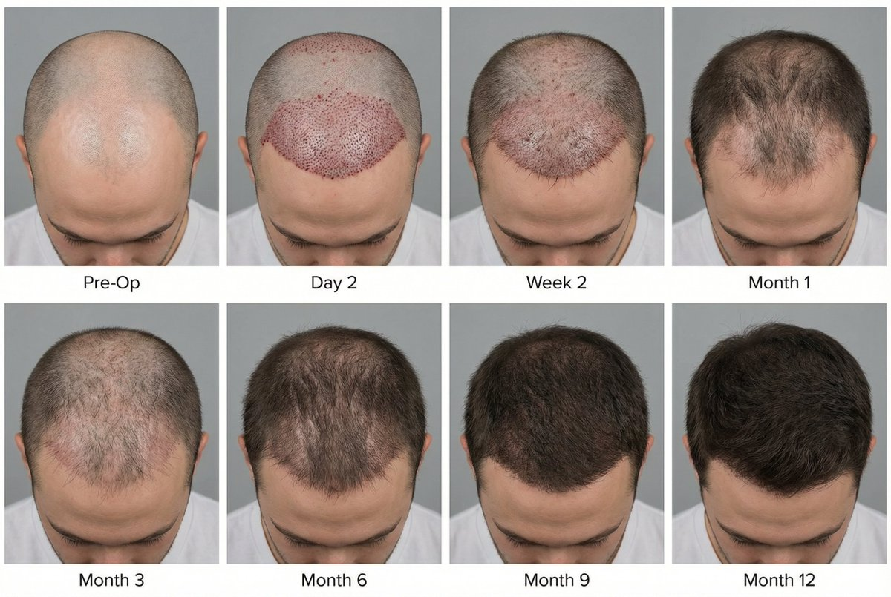

## 植发一年的改变图

- ID: gpt4o-942-zh-2
- Slug: prompt-942-zh-2
- 语言: zh
- 来源: [来源链接](https://x.com/egeberkina/status/2002465235391967688)
- 样例图路径: images/part3/942.jpeg

### 提示词

```text
{
"任务": "超逼真植发进展",
“输出”： {
"type": "single_image_multi_stage",
"布局": "horizo​​ntal_timeline_grid",
"分辨率": "超高分辨率",
"realism": "clinical_photographic_realism",
"质量": "医疗纪实摄影",
“修饰”：{
"皮肤": "最低医疗级",
"preserve_scalp_texture": true,
"no_cosmetic_enhancement": true
}
},
“主题”： {
“人”： {
“性别”： “男”，
“年龄”： “青年至中年”
“种族”： “中立”，
"identity": "same_patient_consistent",
"head_position": "identical_angle_each_stage"
}
},
"时间线": {
“阶段”：[
{
标签：术前，
"时间": "移植前",
“头发”： {
“密度”： “显著衰退”，
"pattern": "male_pattern_balness",
"scalp_visibility": "高"
},
"头皮": "剃光头",
"skin_tone": "自然"
},
{
标签：第 2 天，
"time": "2_days_post_op",
“头发”： {
"移植体": "新鲜植入的可见体",
"密度": "低均匀分布"
},
“头皮”: “发红_微痂_肿胀”
"notes": "清晰可见的植入点"
},
{
标签：第 2 周，
"时间": "14_天",
“头发”： {
"移植"": "短而脆弱的头发",
“脱落”: “早期阶段”
},
"头皮": "减少红肿，剩余结痂"
},
{
标签： 1 月，
"时间": "4_周",
“头发”： {
"脱落": "冲击损失阶段",
"可见性": "斑驳的薄弱"
},
头皮：基本正常
},
{
标签： “3 月”
"时间": "12_周",
“头发”： {
"regrowth": "fine_new_hairs_emerging",
“密度”： “低但均匀”
},
"纹理": "薄而柔软"
},
{
标签：第 6 个月，
"时间": "6_个月",
“头发”： {
“密度”：“中等”，
“覆盖范围”： “明显改善”
},
"纹理": "较厚但长度不均匀"
},
{
标签： 9 月，
“时间”: “ 9_个月”
“头发”： {
“密度”：“高”，
"发际线": "自然定义"
},
"texture": "healthy_normal_growth"
},
{
标签：第 12 个月，
"时间": "12_个月",
“头发”： {
"密度": "最终结果",
“覆盖范围”： “全天然”
},
"texture": "成熟浓密的头发",
"finish": "non_styled_natural"
}
]
},
“场景”： {
"location": "clinical_photo_room",
“背景”： {
“颜色”： “中性浅灰色”
“纹理”：“扁平”
},
“一致性”： “相同光照_相同相机_相同距离”
},
“作品”： {
"crop": "头顶和前额",
"角度": "略微自上而下",
"对齐方式": "完美网格间距",
标签： 小型_清晰_医疗排版
},
“相机”： {
"camera_type": "medical_documentation_camera",
镜头：85mm，
光圈：f8，
“锐度”: “高”
“失真”： “无”
},
“灯光”： {
"type": "even_clinical_softbox",
“对比度”：“低”，
“阴影”：“极简”，
"skin_accuracy": "true_to_life"
},
"negative_prompt": [
"instant_full_hair",
“伪密度”，
"wig_like_texture",
“beauty_lighting”，
“造型发型”，
"marketing_glow",
"cgi_scalp",
"不切实际的速度"
]
}
```

### 样例图


## 女性正从她的手机屏幕中走出来

- ID: gpt4o-938-zh-1
- Slug: prompt-938-zh-1
- 语言: zh
- 来源: [来源链接](https://x.com/underwoodxie96/status/2002293540299420050)
- 样例图路径: images/part3/938.jpeg

### 提示词

```text
{

"subject": {

"description": "A hyper-realistic optical illusion photograph. A young Caucasian woman appears to be stepping out of a smartphone screen held in a hand. The screen displays the camera interface, capturing her boots, while her real upper body extends out of the phone into reality.",

"mirror_rules": "Ensure the phone screen clearly shows the iOS Camera UI (shutter button, mode text). Handwritten annotations must be legible and not mirrored.",

"age": "20s",

"expression": {

"eyes": {

"look": "Alluring and playful",

"energy": "Confident, direct",

"direction": "Looking at the viewer"

},

"mouth": {

"position": "Blowing a kiss or pouting",

"energy": "Chic and charming"

},

"overall": "Lifelike, engaging interaction"

},

"face": {

"preserve_original": "false",

"makeup": "Natural glam, matte foundation, defined European features",

"features": "High nose bridge, double eyelids, defined jawline"

},

"hair": {

"color": "Dark brown",

"style": "Long, loose waves, voluminous",

"effect": "Realistic shine, wind-blown effect"

},

"body": {

"frame": "Petite but proportionally realistic",

"waist": "Defined",

"chest": "Covered by turtleneck",

"legs": "Visible INSIDE the phone screen interface wearing boots",

"skin": {

"visible_areas": "Face, hands",

"tone": "Fair Caucasian skin",

"texture": "Ultra-realistic skin texture, visible pores, natural imperfections",

"lighting_effect": "Soft daylight"

}

},

"pose": {

"position": "Torso and head emerging vertically from the phone, legs displayed on the screen",

"base": "Dynamic standing pose",

"overall": "充满活力的随机姿势，让人感觉生命力满满"

},

"clothing": {

"top": {

"effect": "精致的穿搭，High-quality textile photography"

},

"bottom": {

"type": "Mini Skirt and Leather Boots",

"color": "Dark Grey (skirt), Brown (boots)",

"details": "Boots visible on the screen beneath the UI elements"

}

}

},

"accessories": {

"jewelry": "Gold rings on the photographer's hand (foreground)",

"device": "Smartphone with burgundy case. The screen is ACTIVE and DETAILED: it displays the IOS Camera App Interface (white circular shutter button at bottom, 'PHOTO' text).",

"prop": "On the phone screen: White handwritten-style text overlays with arrows pointing to the outfit elements (e.g., text 'suede jacket' with arrow, 'leather boots' with arrow)."

},

"photography": {

"camera_style": "DSLR photography, Macro lens for phone details",

"angle": "POV, High angle looking down at hand",

"shot_type": "Composite photography",

"aspect_ratio": "3:4",

"texture": "Sharp screen pixels, fingerprint smudges on screen, realistic fabric texture",

"lighting": "Overcast soft natural light",

"depth_of_field": "Background bench blurred (Bokeh), Phone screen UI and subject sharp"

},

"background": {

"setting": "Parisian Park in Autumn",

"wall_color": "Green bench, grey ground",

"elements": [

"Green park bench with text 'Le silence'",

"Autumn leaves"

],

"atmosphere": "Cinematic, realistic",

"lighting": "Natural ambient light"

},

"the_vibe": {

"energy": "Sophisticated, viral social media content",

"mood": "Fashion forward",

"aesthetic": "OOTD breakdown, creative edit",

"authenticity": "Photorealistic texture, not CGI",

"intimacy": "POV",

"story": "Fashion styling breakdown",

"caption_energy": "Styling brown suede & leather"

},

"constraints": {

"must_keep": [

"Caucasian ethnicity",

"Photorealistic skin",

"Camera UI elements on screen (shutter button)",

"Handwritten text annotations on screen",

"Pop-out effect"

],

"avoid": [

"Transparent phone screen",

"Blank screen",

"3D render style",

"Cartoon",

"Plastic skin"

]

},

"negative_prompt": [

"transparent screen",

"blank screen",

"glass phone",

"3d",

"render",

"cartoon",

"anime",

"plastic",

"drawing",

"illustration"

]

}
```

### 样例图


## 女性正从她的手机屏幕中走出来

- ID: gpt4o-938-zh-2
- Slug: prompt-938-zh-2
- 语言: zh
- 来源: [来源链接](https://x.com/underwoodxie96/status/2002293540299420050)
- 样例图路径: images/part3/938.jpeg

### 提示词

```text
{

“主题”： {

描述：一张超逼真的光学错觉照片。一位年轻的白人女性仿佛正从她手中的智能手机屏幕中走出来。屏幕显示的是相机界面，拍下了她的靴子，而她真实的上半身则从手机屏幕中延伸到现实世界。

“mirror_rules”：确保手机屏幕清晰显示 iOS 相机界面（快门按钮、模式文本）。手写注释必须清晰可辨，且不能镜像翻转。

年龄：20多岁，

“表达”： {

"眼睛": {

“外观”：“迷人而俏皮”，

“能量”：“自信、直接”

“方向”：“看着观众”

},

“嘴”： {

“姿势”：“飞吻或撅嘴”，

“能量”：“时尚迷人”

},

“总体而言”：“栩栩如生、引人入胜的互动”

},

“脸”： {

"preserve_original": "false",

“妆容”：“自然光泽，哑光粉底，凸显欧洲五官”，

特征：高鼻梁、双眼皮、轮廓分明的下颌线

},

“头发”： {

“颜色”：“深棕色”，

“发型”：“长而蓬松的波浪卷发”，

“效果”： “逼真的光泽，风吹效果”

},

“身体”： {

“画框”：“小巧但比例逼真”，

“腰部”：“线条分明”，

“胸部”： “被高领毛衣遮盖”

“腿”：“在手机屏幕界面内部可以看到穿着靴子的腿”，

“皮肤”： {

"visible_areas": "脸部、手部",

“肤色”: “白皙的白种人肤色”

“质感”：“超逼真的肌肤质感，可见毛孔，自然瑕疵”，

"lighting_effect": "柔和的日光"

}

},

"姿势": {

“位置”：“躯干和头部从手机中垂直伸出，腿部显示在屏幕上”，

"基础": "动态站姿",

"overall": "充满活力的随机姿势，让人感觉生命力饱满"

},

“衣服”： {

“顶部”： {

"effect": "精致的穿搭，高品质的纺织摄影"

},

“底部”： {

“类型”：“迷你裙和皮靴”，

颜色：深灰色（裙子），棕色（靴子）

“详情”：“屏幕上用户界面元素下方可见的靴子”

}

}

},

“配件”： {

“珠宝”：“摄影师手上（前景）的金戒指”，

“设备”：“智能手机，酒红色手机壳。屏幕已激活且显示清晰：显示 iOS 相机应用程序界面（底部有白色圆形快门按钮，显示‘照片’字样）。”

“道具”：“手机屏幕上：白色手写体文字叠加层，箭头指向服装元素（例如，文字‘麂皮夹克’带箭头，‘皮靴’带箭头）。”

},

“摄影”： {

“camera_style”: “单反摄影，手机微距镜头，用于拍摄细节照片”

“角度”：“POV，高角度向下看手”，

"shot_type": "合成摄影",

"aspect_ratio": "3:4",

“纹理”：“清晰的屏幕像素，屏幕上的指纹污渍，逼真的织物纹理”，

“光线”：“阴天柔和的自然光”，

景深：背景虚化（散景），手机屏幕界面和主体清晰

},

“背景”： {

“场景”：“秋天的巴黎公园”，

"wall_color": "绿色长椅，灰色地面",

“元素”：[

“绿色公园长椅上写着‘寂静’”

秋叶

],

“氛围”：“电影般的，逼真的”，

“照明”：“自然环境光”

},

"氛围": {

“能量”：“复杂、病毒式传播的社交媒体内容”，

“氛围”：“时尚前卫”，

“美学”：“OOTD分解，创意剪辑”

“真实性”：“照片级真实纹理，而非 CGI”。

“亲密感”: “POV”

“故事”：“时尚造型解析”

“caption_energy”： “棕色绒面革和皮革的时尚造型”

},

"约束": {

"must_keep": [

“高加索人种”

“逼真的皮肤”，

“屏幕上的相机用户界面元素（快门按钮）”

“屏幕上的手写文字注释”

“弹出效果”

],

“避免”： [

“透明手机屏幕”，

“空白屏幕”，

“3D渲染风格”，

“卡通片”，

“塑料皮肤”

]

},

"negative_prompt": [

“透明屏幕”，

“空白屏幕”，

“玻璃手机”，

“3d，”

“使成为”，

“卡通片”，

“日本动画片”，

“塑料”，

“绘画”，

“插图”

]

}
```

### 样例图


## cinematic portrait photography of a young woman sitting 

- ID: gpt4o-937-en-1
- Slug: prompt-937-en-1
- 语言: en
- 来源: [来源链接](https://x.com/ChillaiKalan__/status/2002572543992213748)
- 样例图路径: images/part3/937.jpeg

### 提示词

```text
cinematic portrait photography of a young woman sitting in a field at golden hour, soft natural light, silver-blonde short hair, minimal fashion with a black t-shirt and light bandana, fine art portrait style. emotional realism with calm expression, modern editorial mood, subject leaning against a mirror creating symmetrical reflection, high fashion editorial look, moody color grading, shallow depth of field, subject-isolation technique, viral visual composition, cinematic framing, contemporary visual storytelling. subtle texture in background, clean tones, artistic photography, urban stillness aesthetic blended with nature, soft contrast and gentle highlights.
```

### 样例图


## 电影感十足的肖像摄影作品

- ID: gpt4o-937-zh-2
- Slug: prompt-937-zh-2
- 语言: zh
- 来源: [来源链接](https://x.com/ChillaiKalan__/status/2002572543992213748)
- 样例图路径: images/part3/937.jpeg

### 提示词

```text
电影感十足的肖像摄影作品，一位年轻女子坐在田野中，沐浴在柔和的自然光下，一头银金色短发，身着黑色T恤和浅色头巾，简约时尚，展现出精致的艺术肖像风格。她神态平静，情感真挚，散发出现代时尚气息。她倚靠在镜子前，镜中映出对称的影像，营造出高级时尚大片的视觉效果。照片采用情绪化的色彩分级、浅景深和主体分离技巧，构图极具冲击力，画面充满电影感，以当代视觉叙事手法呈现。背景纹理细腻，色调干净，展现出艺术摄影的魅力，将都市的静谧与自然的和谐融合，对比柔和，高光轻柔。
```

### 样例图


## { "variables": { "CITY_NAME": "Chengdu" }, "image_specs"

- ID: gpt4o-935-en-1
- Slug: prompt-935-en-1
- 语言: en
- 来源: [来源链接](https://x.com/0xbisc/status/2002664549930172496)
- 样例图路径: images/part3/935.jpeg

### 提示词

```text
{

"variables": {

"CITY_NAME": "Chengdu"

},

"image_specs": {

"aspect_ratio": "4:5", "resolution": "2048x2560", "quality": "ultra", "style_strength": 0.8, "detail_level": "high", "sharpen": "medium"

},

"prompt": {

"master_visual_brief": "A high-energy Y2K-inspired editorial collage poster with a strong paper-cut and magazine print aesthetic. The entire image has a tactile paper texture with visible cut edges and layered depth. The theme centers around the city {{CITY_NAME}}. All visual elements, including background imagery, stickers, symbols, typography, and graphic decorations, are culturally and visually inspired by {{CITY_NAME}}. The composition follows a fashion magazine cover logic with dense but controlled information, playful energy, and strong visual hierarchy. The character is designed as a dominant half-body portrait occupying most of the poster.", "photography_and_character": "Character: a randomly generated young woman aged approximately 18–25. She is fashionable, attractive, and trendy, with no fixed hairstyle, hair color, facial features, or makeup. Her appearance varies naturally but always remains stylish and visually appealing. Fashion style is Y2K-inspired street fashion with playful silhouettes, layered styling, and trendy colors. Framing is a strict half-body portrait: the image is cropped at the waist or slightly above, and the lower body is not visible at all. Only the upper torso, shoulders, neck, and head are shown. Pose and gesture: the character performs a randomly selected Y2K-style dynamic pose with strong tension and attitude, including expressive arm extensions, angular elbow bends, asymmetrical shoulder twists, or forward-reaching gestures. Body language remains bold, confident, and energetic. Facial expression: the expression is slightly playful and friendly, with a hint of cuteness layered on top of confidence. Subtle smiles, softly open lips, bright eyes, or a relaxed playful look are allowed, while the overall attitude remains fashion-forward and dynamic rather than cute-only.", "camera_and_lighting": "Editorial portrait framing with a wide-angle look at close distance, optimized for half-body composition. The camera captures only the upper torso and head, with the lower body fully cropped out of frame. Perspective supports dynamic Y2K poses without distorting facial proportions. Lighting is soft, even, and magazine-style, avoiding harsh shadows. The subject is intended to be cut out and integrated into a paper collage rather than rendered as pure realism.", "graphic_design_layout": "Center-focused editorial collage layout. At the top, the city name '{{CITY_NAME}}' appears as the main headline in bold uppercase geometric sans-serif letters. Each letter is placed on an individual colored paper rectangle and arranged in a slight arc. The large half-body character overlaps and partially covers the headline and nearby graphic elements, creating a break-the-frame effect. Surrounding the character are floating paper stickers, speech bubbles, and cut-out graphics inspired by {{CITY_NAME}} culture, including local food, landmarks, symbols, street signs, and iconic objects. The bottom section features a full-width magazine-style collage footer composed of layered paper strips, bold button-style typography, small editorial text blocks, and thumbnail-style graphics.", "background_system": "The background is a black-and-white or desaturated urban street scene from {{CITY_NAME}}, such as crowds, architecture, or city textures. Background contrast is reduced and softened with grain so it supports the composition without competing with the main subject. The background is partially obscured by the large half-body character and collage elements and maintains a printed-paper appearance rather than photographic realism.", "materials_and_textures": "A consistent paper-based aesthetic across the entire image. Visible paper grain, halftone dots, print noise, and slight ink bleed. All elements appear as physical paper cut-outs layered together. Edges are imperfect and tactile. Stickers, typography, and characters cast subtle shadows to suggest layered depth. No glossy, metallic, or digital materials are present.", "composition_and_balance": "Clear and stable visual hierarchy: top city headline '{{CITY_NAME}}', central half-body character (upper torso only), dynamic Y2K-style pose with slightly playful facial expression, surrounding city-themed stickers, and bottom magazine-style collage footer. Strong overlaps between character, typography, and stickers create depth while preserving the established layout."

},

"constraints": {

"must_include": \[ "City name headline using {{CITY_NAME}}", "Strict half-body portrait (waist-up only)", "Lower body completely cropped out", "Y2K-style dynamic pose with strong tension", "Playful but controlled facial expression", "Paper collage and cut-out magazine aesthetic", "City-specific background and stickers related to {{CITY_NAME}}", "Full-width magazine-style collage footer", "Visible paper texture and layered depth" \], "must_avoid": \[ "Full-body view", "Visible legs, knees, thighs, or feet", "Neutral or stiff poses", "Overly cute or childish expressions", "Sexualized expressions or gestures", "Grotesque facial distortion", "Minimalist or empty layouts", "Glossy digital or 3D materials" \]

},

"negative_prompt": "full body, legs visible, knees, thighs, feet, stiff pose, neutral posture, childish expression, exaggerated cute face, sexualized expression, blurry face, deformed hands, extra fingers, bad anatomy, grotesque distortion, minimalist layout, flat image, hyper-realistic photography, glossy surfaces, plastic skin, dull colors, watermark, logo, unreadable text",

"typography_rules": {

"headline": { "text": "{{CITY_NAME}}", "font_style": "bold geometric sans-serif, uppercase", "treatment": "each letter on a separate colored paper rectangle, slightly arched, subtle shadow", "material": "printed paper cut-out" }, "supporting_text": { "style": "editorial magazine blocks, playful sticker captions, speech bubbles", "material": "paper-based printed texture" }

},

"rendering_notes": {

"depth_layers": "background city paper layer -> mid-ground half-body character -> foreground dynamic pose, expressive face, stickers, and typography", "print_feel": "strong magazine print texture with halftone dots, paper grain, and slight ink bleed", "edge_treatment": "clearly visible imperfect cut paper edges"

}

}
```

### 样例图


## Y2K时代的拼贴海报

- ID: gpt4o-935-zh-2
- Slug: prompt-935-zh-2
- 语言: zh
- 来源: [来源链接](https://x.com/0xbisc/status/2002664549930172496)
- 样例图路径: images/part3/935.jpeg

### 提示词

```text
{

"变量": {

城市名称：成都

},

"image_specs": {

"aspect_ratio": "4:5", "resolution": "2048x2560", "quality": "ultra", "style_strength": 0.8, "detail_level": "high", "sharpen": "medium"

},

“提示词”： {

“视觉设计概要”： “这是一张充满活力、灵感源自Y2K时代的拼贴海报，具有强烈的剪纸和杂志印刷美感。整幅图像呈现出触感丰富的纸张纹理，可见的切割边缘和层次感。主题围绕着城市{{ CITY_NAME }}展开。所有视觉元素，包括背景图像、贴纸、符号、字体和图形装饰，都从文化和视觉上汲取灵感，源自城市{{ CITY_NAME }} 。构图遵循时尚杂志封面的逻辑，信息丰富但控制得当，充满活力，并具有清晰的视觉层次。人物被设计成占据海报大部分空间的半身肖像。” “摄影与人物”： “人物：一位随机生成的年轻女性，年龄在18至25岁之间。她时尚、迷人、潮流，没有固定的发型、发色、五官或妆容。她的外貌自然变化，但始终保持时尚和视觉吸引力。时尚风格是受Y2K时代启发的街头时尚。”俏皮的轮廓、层次丰富的造型和潮流的色彩。构图采用严格的半身像：画面裁剪至腰部或略高于腰部，下半身完全不可见。仅展现上半身、肩膀、颈部和头部。姿势和手势：人物摆出随机选择的Y2K风格动态姿势，充满张力和态度，包括富有表现力的手臂伸展、肘部角度弯曲、不对称的肩部扭转或向前伸展的动作。肢体语言大胆、自信且充满活力。面部表情：表情略带俏皮和友好，在自信之上又增添了一丝可爱。允许有淡淡的微笑、微微张开的嘴唇、明亮的眼神或轻松俏皮的表情，整体风格保持时尚前卫和动感，而非仅仅可爱。“相机和灯光”：“采用广角镜头近距离拍摄的编辑人像构图，针对半身像进行了优化。相机仅拍摄上半身和头部，下半身不可见。”人物身体完全裁剪出画面之外。透视效果支持动态的千禧年风格姿势，且不会扭曲面部比例。光线柔和均匀，采用杂志风格，避免了生硬的阴影。人物旨在被剪裁并融入纸质拼贴画中，而非以纯粹的写实手法呈现。平面设计布局：以中心为焦点的编辑拼贴画布局。顶部，城市名称“ {{城市名称}} ”以粗体大写几何无衬线字体作为主标题。每个字母都放置在单独的彩色纸质矩形上，并呈略微弧形排列。较大的半身人物与标题和附近的图形元素重叠并部分覆盖，营造出一种打破画面框架的效果。人物周围环绕着漂浮的纸质贴纸、对话气泡和剪纸图形，其灵感来自{{城市名称}}的文化，包括当地美食、地标、符号、路标和标志性物品。底部部分是一个由多层纸张组成的全宽杂志风格拼贴画页脚。条状文字、醒目的按钮式字体、小型编辑文本块和缩略图式图形。”, “背景系统”: “背景是来自{{城市名称}}的黑白或低饱和度城市街景，例如人群、建筑或城市纹理。背景对比度降低，并添加了颗粒感以柔化画面，从而在不干扰主体的情况下支持构图。背景部分被大型半身人物和拼贴元素遮挡，保持了印刷纸的外观，而非照片的真实感。”, “材质与纹理”: “整个图像保持一致的纸质美学。可见的纸张纹理、半色调网点、印刷噪点和轻微的墨迹晕染。所有元素都像是层叠在一起的实体纸片。边缘不完美且触感明显。贴纸、字体和人物投射出微妙的阴影，暗示出层次感。没有光泽、金属或数字材质。”, “构图与平衡”: “清晰稳定的视觉层次：顶部城市标题“ {{城市名称}} ”，中央半身人物（仅上半身），动态的千禧年风格姿势，略带俏皮的面部表情，周围环绕着城市主题贴纸，底部是杂志风格的拼贴页脚。人物、字体和贴纸之间的强烈重叠在保持既定布局的同时，营造出层次感。

},

"约束": {

"必须包含：" [ "使用城市名称作为标题{{ CITY_NAME }} ", "严格的半身像（仅腰部以上）", "下半身完全裁剪", "Y2K风格的动态姿势，充满张力", "俏皮但克制的表情", "纸质拼贴和剪贴杂志风格", "与城市相关的背景和贴纸{{ CITY_NAME }} ", "全宽杂志风格拼贴页脚", "可见的纸张纹理和层次感" ], "必须避免：" [ "全身照", "可见的腿、膝盖、大腿或脚", "中性或僵硬的姿势", "过于可爱或幼稚的表情", "性化的表情或手势", "怪诞的面部扭曲", "极简主义或空白的布局", "光面数字或3D材质" ]

},

"negative_prompt": "全身，腿部可见，膝盖，大腿，脚，僵硬姿势，中立姿势，幼稚表情，夸张可爱表情，性化表情，模糊面部，畸形手，多余手指，解剖结构错误，怪诞扭曲，极简布局，平面图像，超写实摄影，光滑表面，塑料皮肤，暗淡色彩，水印，标志，无法辨认的文字",

"typography_rules": {

"标题": { "正文": " {{城市名称}} ", "字体": "粗体几何无衬线字体，大写", "处理方式": "每个字母位于单独的彩色纸矩形上，略微拱起，带有微妙的阴影", "材质": "印刷纸剪裁" }, "辅助文本": { "风格": "杂志社论版块，趣味贴纸标题，对话气泡", "材质": "纸质印刷纹理" }

},

"渲染注释": {

"depth_layers": "背景：城市纸张层->中景：半身人物->前景：动态姿势、表情丰富的面部、贴纸和文字。"print_feel": "强烈的杂志印刷纹理，带有半色调网点、纸张纹理和轻微的墨迹晕染。"edge_treatment": "清晰可见的不完美裁切纸张边缘。"

}

}
```

### 样例图


## { "generative_directive": { "technical_specifications": 

- ID: gpt4o-934-en-1
- Slug: prompt-934-en-1
- 语言: en
- 来源: [来源链接](https://x.com/Ankit_patel211/status/2002377471388442654)
- 样例图路径: images/part3/934.jpeg

### 提示词

```text
{
"generative_directive": {
"technical_specifications": {
"format": "Mirror Selfie",
"device": "Smartphone Camera",
"device_model_prop": "iPhone 16 Pro Max",
"lens_type": "Wide-angle lens",
"aspect_ratio": "9:16",
"focal_priority": [
"Body",
"Hands"
]
},
"subject_configuration": {
"demographics": "Woman",
"skin_appearance": "Warm and even tone",
"posture": {
"body_angle": "Slightly angled",
"vibe": "Relaxed, natural feeling",
"right_hand": "Holding phone next to face",
"left_arm": "Hanging naturally near body",
"interaction": "Holding a shoulder bag in left hand"
}
},
"apparel_breakdown": {
"garment_type": "Short Dress",
"color_palette": {
"base": "Cream-white",
"accent_pattern": "Pink roses and green leaves"
},
"design_elements": {
"straps": "Thin straps",
"neckline": "Softly draped",
"silhouette": "Fitted, highlighting waist and hips",
"detailing": "Gentle gathering around abdomen",
"hemline": "Short and slightly wavy"
},
"textile_properties": {
"weight": "Lightweight and fluid",
"elasticity": "Soft elasticity",
"texture": "Subtle natural sheen",
"drape": "Gentle drape"
},
"style_keywords": [
"Romantic",
"Feminine",
"Elegant"
]
},
"styling_details": {
"accessories": {
"jewelry": "Thin gold bracelet",
"bag": "Shoulder bag"
},
"beauty": {
"makeup_style": "Light and natural",
"complexion": "Fresh",
"cheeks": "Soft blush",
"lips": "Natural pink-toned, partially visible"
},
"nails": {
"shape": "Almond-shaped",
"length": "Medium",
"color": "Light nude shade"
}
},
"scene_environment": {
"location_type": "Fairly bright interior",
"background_elements": "Smooth, minimalist white wall",
"lighting_setup": {
"source": "Natural daylight from side window",
"quality": "Soft, diffused",
"highlight_targets": [
"Bright tones",
"Refined textures",
"Gold accessory details"
]
}
},
"critical_constraints": {
"preservation_rule": "Strictly maintain original face, facial features, proportions, skin texture, and expression. No alterations to identity."
}
}
}
```

### 样例图

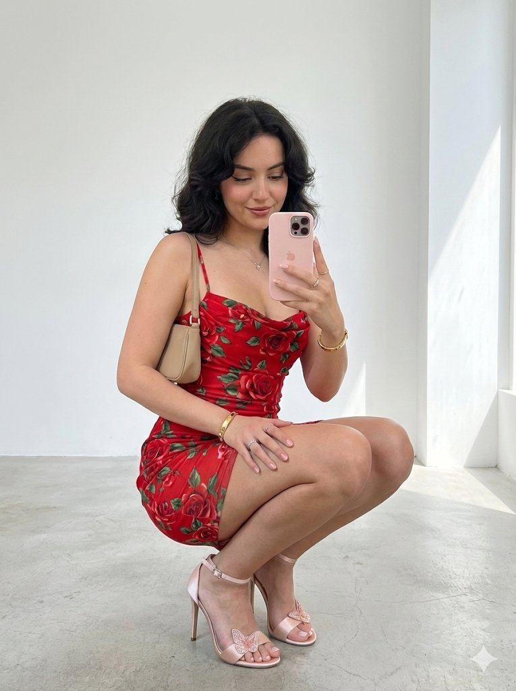

## 女性自拍照

- ID: gpt4o-934-zh-2
- Slug: prompt-934-zh-2
- 语言: zh
- 来源: [来源链接](https://x.com/Ankit_patel211/status/2002377471388442654)
- 样例图路径: images/part3/934.jpeg

### 提示词

```text
{
"generative_directive": {
"technical_specifications": {
"格式": "镜子自拍",
"设备": "智能手机摄像头",
"device_model_prop": "iPhone 16 Pro Max",
"lens_type": "广角镜头",
"aspect_ratio": "9:16",
"焦点优先级": [
“身体”，
“手”
]
},
"subject_configuration": {
“人口统计信息”：“女性”，
"skin_appearance": "温暖均匀的肤色",
"姿势": {
"body_angle": "略微倾斜",
“氛围”：“轻松、自然的感觉”，
"右手": "将手机举到脸旁",
"左臂": "自然下垂于身体附近",
“互动”：“左手拿着肩包”
}
},
"apparel_breakdown": {
"garment_type": "短裙",
"color_palette": {
“基色”: “乳白色”
"accent_pattern": "粉色玫瑰和绿色叶子"
},
"design_elements": {
“肩带”： “细肩带”
“领口”：“柔软垂坠”，
“轮廓”：“修身，凸显腰部和臀部”，
“细节”：“腹部周围轻柔地收拢”，
裙摆：短款，略微卷曲
},
"textile_properties": {
“重量”： “轻盈流畅”
“弹性”： “柔软弹性”，
“质感”：“柔和自然的光泽”，
"drape": "轻柔的垂坠"
},
"style_keywords": [
“浪漫的”，
“女性化的”，
“优雅的”
]
},
"styling_details": {
“配件”： {
“珠宝”：“细金手镯”，
“包”： “肩包”
},
“美丽”： {
"makeup_style": "清淡自然"
“肤色”： “清新”，
“脸颊”：“淡淡的红晕”，
“嘴唇”： “自然粉色调，部分可见”
},
"指甲": {
“形状”： “杏仁形”
"长度": "中等",
颜色：浅裸色
}
},
"scene_environment": {
"location_type": "室内光线充足",
"background_elements": "光滑、简约的白色墙壁",
"lighting_setup": {
“光源”：“侧窗的自然日光”，
“品质”：“柔和、扩散”，
"highlight_targets": [
“明亮的色调”，
“精致的质感”，
“金色配饰细节”
]
}
},
"critical_constraints": {
"preservation_rule": "严格保持原有的面部特征、比例、皮肤纹理和表情。不得改变身份。"
}
}
}
```

### 样例图


## { "subject": { "description": "A fit young Asian woman f

- ID: gpt4o-933-en-1
- Slug: prompt-933-en-1
- 语言: en
- 来源: [来源链接](https://x.com/underwoodxie96/status/2002639331501224005)
- 样例图路径: images/part3/933.jpeg

### 提示词

```text
{
"subject": {
"description": "A fit young Asian woman frozen in mid-air while running, capturing a dynamic athletic moment.",
"mirror_rules": "N/A",
"age": "20s",
"expression": {
"eyes": {
"look": "focused ahead",
"energy": "determined",
"direction": "forward"
},
"mouth": {
"position": "slightly open breathing",
"energy": "concentrated"
},
"overall": "intense focus and athletic determination"
},
"face": {
"preserve_original": true,
"makeup": "natural fresh look"
},
"hair": {
"color": "black",
"style": "high ponytail",
"effect": "flying back dynamically due to motion"
},
"body": {
"frame": "athletic and toned",
"waist": "visible silhouette",
"chest": "covered",
"legs": "muscular definition visible, mid-air stride",
"skin": {
"visible_areas": "legs, face, hands",
"tone": "warm tan",
"texture": "smooth with muscle definition",
"lighting_effect": "high contrast sunlight highlights"
}
},
"pose": {
"position": "mid-air jump",
"base": "levitating",
"overall": "dynamic running stride, one knee raised high, arms swinging"
},
"clothing": {
"top": {
"type": "long-sleeve athletic zip-up jacket",
"color": "pastel pink",
"details": "fitted, sporty seams",
"effect": "stretched with movement"
},
"bottom": {
"type": "athletic shorts",
"color": "pastel pink",
"details": "matching set"
}
}
},
"accessories": {
"headwear": null,
"jewelry": null,
"device": null,
"prop": {
"type": "footwear",
"details": "white sneakers with black swoosh logo, white crew socks"
}
},
"photography": {
"camera_style": "commercial advertising photography",
"angle": "low angle worm's eye view",
"shot_type": "full body side profile",
"aspect_ratio": "3:4",
"texture": "sharp focus, high contrast, commercial print quality",
"lighting": "hard daylight, direct sun, strong shadows",
"depth_of_field": "deep, background visible but geometric"
},
"background": {
"setting": "urban modern exterior",
"wall_color": "blue-grey glass",
"elements": [
"geometric triangular glass facade",
"metallic frames",
"reflection of runner in glass",
"brick pavement at bottom"
],
"typography": {
"text_content": "JUST DO IT",
"font_style": "Massive Bold Sans-Serif (Nike style)",
"color": "White",
"position": "Center of the image",
"integration": "Layered text: placed behind the subject or overlaying the center with slight transparency",
"visual_weight": "Dominant slogan"
},
"atmosphere": "modern, clean, energetic, motivational",
"lighting": "bright natural sunlight"
},
"the_vibe": {
"energy": "explosive power",
"mood": "motivational",
"aesthetic": "urban sportswear commercial",
"authenticity": "high",
"intimacy": "distant observer",
"story": "morning run in the city, pushing limits",
"caption_energy": "Just Do It."
},
"constraints": {
"must_keep": [
"text 'JUST DO IT' clearly visible",
"mid-air suspension",
"pastel pink outfit",
"geometric glass background",
"sharp focus"
],
"avoid": [
"misspelled text",
"text covering the face",
"blur",
"studio background",
"static pose"
]
},
"negative_prompt": [
"typos",
"gibberish text",
"cluttered text",
"motion blur",
"distorted limbs",
"bad anatomy",
"extra legs",
"dull lighting"
]
}
```

### 样例图


## 女性在奔跑时腾空而起

- ID: gpt4o-933-zh-2
- Slug: prompt-933-zh-2
- 语言: zh
- 来源: [来源链接](https://x.com/underwoodxie96/status/2002639331501224005)
- 样例图路径: images/part3/933.jpeg

### 提示词

```text
{
“主题”： {
描述：一位身材健美的年轻亚裔女性在奔跑时腾空而起，定格了她充满活力的运动瞬间。
"mirror_rules": "N/A",
年龄：20多岁，
“表达”： {
"眼睛": {
“看”：“专注于前方”，
“能量”：“坚定的”，
“方向”: “向前”
},
“嘴”： {
“姿势”：“微微张开呼吸”，
“能量”: “集中的”
},
“总体而言”：“高度专注和运动上的决心”
},
“脸”： {
"preserve_original": true,
妆容： “自然清新妆容”
},
“头发”： {
“颜色：黑色”，
“发型”：“高马尾辫”，
“效果”：“由于运动而动态地向后飞”
},
“身体”： {
“体型”： “运动型且线条优美”，
“腰部”: “可见轮廓”，
“胸部”： “覆盖的”，
“腿部”：“肌肉线条清晰可见，腾空迈步”，
“皮肤”： {
"visible_areas": "腿、脸、手",
“色调”：“暖棕色”，
“质地”：“光滑，肌肉线条分明”，
"lighting_effect": "高对比度阳光高光"
}
},
"姿势": {
“位置”：“空中跳跃”，
“基座”：“悬浮”，
“整体”： “动态跑步步伐，单膝高抬，双臂摆动”
},
“衣服”： {
“顶部”： {
“类型”：“长袖运动拉链夹克”，
“颜色”： “淡粉色”，
“细节”：“合身、运动感十足的缝线”，
“效果”：“随着运动而拉伸”
},
“底部”： {
“类型”：“运动短裤”，
“颜色”： “淡粉色”，
“详情”：“配套套装”
}
}
},
“配件”： {
“头饰”：null，
“珠宝”：null，
“设备”：null，
"prop": {
"type": "鞋类",
“细节”：“白色运动鞋，黑色耐克标志，白色船袜”
}
},
“摄影”： {
"camera_style": "商业广告摄影",
“角度”: “低角度虫眼视图”
"shot_type": "全身侧脸轮廓",
"aspect_ratio": "3:4",
“纹理”：“清晰聚焦，高对比度，商业印刷质量”，
“照明”：“强烈的日光、直射阳光、强烈的阴影”，
景深： “深邃，背景可见但呈几何形状”
},
“背景”： {
“环境”: “都市现代外观”，
"wall_color": "蓝灰色玻璃"
“元素”：[
“几何三角形玻璃幕墙”，
“金属框架”，
“跑步者在玻璃中的倒影”
“底部是砖砌路面”
],
"排版": {
"text_content": "JUST DO IT",
"font_style": "Massive Bold Sans-Serif (Nike style)",
颜色：白色，
"位置": "图像中心",
“整合”：“分层文本：放置在主体后面或以略微透明的方式覆盖中心”，
"视觉权重": "主要标语"
},
“氛围”：“现代、干净、充满活力、令人振奋”
“照明”：“明亮的自然阳光”
},
"氛围": {
“能量”：“爆炸力”，
“情绪”：“激励的”，
“美学”: “都市运动服饰广告”
“真实性”： “高”，
“亲密”: “疏离的观察者”，
“故事”：“城市晨跑，挑战极限”
“caption_energy”： “Just Do It.”
},
"约束": {
"must_keep": [
“文字‘JUST DO IT’清晰可见”，
“空中悬架”，
“淡粉色套装”，
“几何玻璃背景”，
“清晰聚焦”
],
“避免”： [
拼写错误的文本
“遮住脸部的文字”，
“模糊”，
“摄影棚背景”，
“静态姿势”
]
},
"negative_prompt": [
错别字，
“乱码文本”，
“杂乱的文本”，
“动态模糊”，
“肢体畸形”，
“糟糕的解剖学”
“额外的腿”，
“昏暗的灯光”
]
}
```

### 样例图


## "subject": { "description": "A Korean-editorial close-up

- ID: gpt4o-931-en-1
- Slug: prompt-931-en-1
- 语言: en
- 来源: [来源链接](https://x.com/iamsofiaijaz/status/2002410368476627268)
- 样例图路径: images/part3/931.jpeg

### 提示词

```text
"subject": {
"description": "A Korean-editorial close-up portrait of a young woman use attached photo with porcelain-white skin, captured in a fleeting instant as wind lifts her black hair mid-motion. A single narrow hard light beam strikes her face from a 45-degree diagonal angle, illuminating only the facial planes while everything else falls into deep shadow. A very faint prism/refraction rainbow appears subtly within the lit area, creating a cool, sharp, effortless swagger.", "mirror_rules": null, "age": "early 20s", "expression": { "eyes": { "look": "steady, unbothered", "energy": "cool confidence, detached", "direction": "toward the camera with a slight side gaze" }, "mouth": { "position": "slightly parted", "energy": "controlled, unapologetic" }, "overall": "cool, restrained, sharp swagger" }, "face": { "preserve_original": true, "makeup": "K-beauty clean matte look: softly structured brows, minimal eyeliner, low-saturation lips, porcelain skin with
}
```

### 样例图

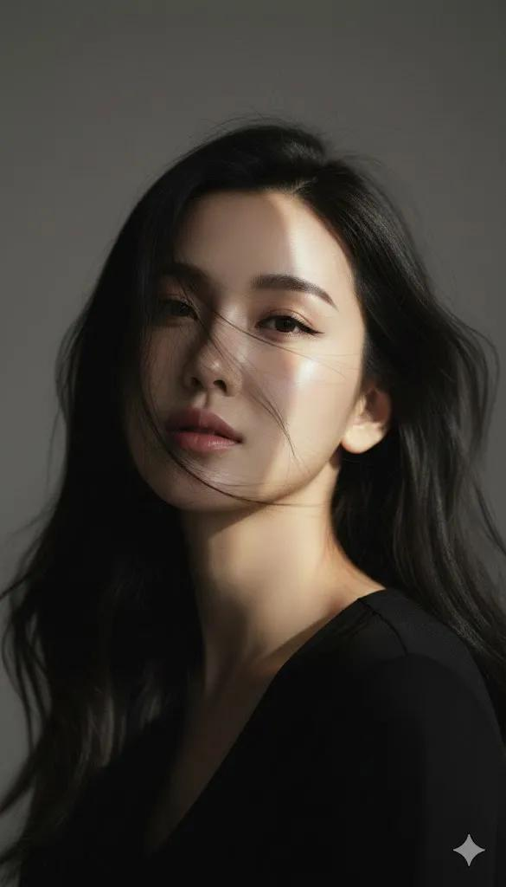

## 年轻女性的韩式时尚特写肖像

- ID: gpt4o-931-zh-2
- Slug: prompt-931-zh-2
- 语言: zh
- 来源: [来源链接](https://x.com/iamsofiaijaz/status/2002410368476627268)
- 样例图路径: images/part3/931.jpeg

### 提示词

```text
"主体"：{"描述"："参照所附照片，拍摄一位拥有瓷白肌肤的年轻女性的韩式时尚特写肖像，定格于微风拂起她黑发的动态瞬间。一道纤细的硬光光束从 45 度斜角打在她的脸上，仅照亮面部轮廓，其余所有区域均隐没于深邃阴影之中。在受光区域内，隐约浮现一道极淡的棱镜折射彩虹光斑，营造出清冷、利落且浑然天成的飒爽气场。"，"镜像规则"：无，"年龄"："二十岁出头"，"神态表情"：{"眼部"：{"眼神"："沉稳淡然"，"气质"："冷峻自信，疏离淡漠"，"视线方向"："直视镜头，略带侧视角度"},"唇部"：{"状态"："微张"，"气质"："克制沉稳，坦荡无畏"},"整体神态"："清冷克制，利落飒爽"},"面部"：{"保留原图特征"：是，"妆容"：" 韩式清透哑光妆效：眉形自然立体，眼线极简，唇色低饱和度，瓷白肌肤质感}
```

### 样例图


## { "prompt_description": { "subject": "Extreme close-up m

- ID: gpt4o-929-en-1
- Slug: prompt-929-en-1
- 语言: en
- 来源: [来源链接](https://x.com/Vivekhy/status/2002080283873714488)
- 样例图路径: images/part3/929.jpeg

### 提示词

```text
{
"prompt_description": {
"subject": "Extreme close-up macro portrait of a young woman's face, partial view focusing on one eye, nose, and lips",
"skin_texture": "Hyper-realistic skin details, visible pores, dewy and fresh complexion, soft porcelain skin tone",
"eyes": "Sharp brown iris with highly detailed eyelashes, clear catchlight reflection, intense and soft gaze",
"hair": "Wet, messy strands of light brown hair falling naturally across the face and eye",
"lips": "Soft natural pink lips, subtle texture, slightly parted"
},
"artistic_style": {
"lighting": "Soft diffused cool lighting, cinematic blue tones, ambient soft shadows",
"aesthetic": "Photorealistic, Cinematic, Masterpiece, Raw photo quality, 8k resolution"
},
"camera_settings": {
"lens": "85mm",
"shot_type": "Macro / Extreme Close-up",
"aperture": "f/1.8 (shallow depth of field)",
"focus": "Sharp focus on the eye"
},
"output_parameters": {
"aspect_ratio": "1:1 (Square)",
"signature": "VIVEK HY",
"signature_location": "Bottom right corner"
}
}
```

### 样例图

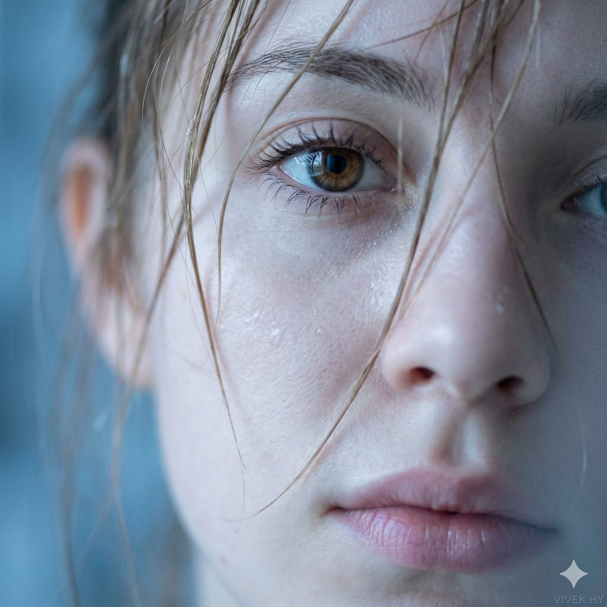

## 女子面部的超近距离微距肖像

- ID: gpt4o-929-zh-2
- Slug: prompt-929-zh-2
- 语言: zh
- 来源: [来源链接](https://x.com/Vivekhy/status/2002080283873714488)
- 样例图路径: images/part3/929.jpeg

### 提示词

```text
{
"prompt_description": {
“主题”：“年轻女子面部的超近距离微距肖像，局部视角，聚焦于一只眼睛、鼻子和嘴唇”，
"skin_texture": "超逼真的皮肤细节，可见的毛孔，水润清新的肤色，柔和的瓷白肤色",
“眼睛”：“锐利的棕色虹膜，睫毛细节丰富，眼神明亮，目光深邃而柔和”，
“头发”：“湿漉漉的、凌乱的浅棕色头发自然地垂落在脸颊和眼睛上”，
“嘴唇”： “柔软自然的粉红色嘴唇，质地细腻，微微张开”
},
"artistic_style": {
“照明”：“柔和的漫射冷光，电影般的蓝色调，柔和的环境阴影”，
“美学”： “照片级真实感、电影级、杰作级、原始照片质量、8K分辨率”
},
"camera_settings": {
镜头：85mm，
"shot_type": "微距/超近景",
“光圈”: “f/1. 8 (浅景深)”，
“聚焦”： “清晰聚焦于眼睛”
},
"output_parameters": {
"aspect_ratio": "1:1 (正方形)",
签名：VIVEK HY，
"签名位置": "右下角"
}
}
```

### 样例图


## A stylish woman wearing a black fedora and white shirt s

- ID: gpt4o-928-en-1
- Slug: prompt-928-en-1
- 语言: en
- 来源: [来源链接](https://x.com/AIwithSynthia/status/2002578332496638452)
- 样例图路径: images/part3/928.jpeg

### 提示词

```text
A stylish woman wearing a black fedora and white shirt stands against a soft neutral studio background, holding a wooden frame. Inside the frame is a photo watercolor portrait of herself, painted with loose brushstrokes, soft ink bleeds, and expressive splashes. The watercolor version tilts slightly, with vivid red lips and delicate facial details. Google Gemini Cinematic studio lighting, shallow depth of field, elegant editorial fashion aesthetic, fine art photography blended with watercolor illustration, ultra-high resolution, minimal composition, calm and sophisticated mood.
```

### 样例图


## 女士手持一个自己的木质相框

- ID: gpt4o-928-zh-2
- Slug: prompt-928-zh-2
- 语言: zh
- 来源: [来源链接](https://x.com/AIwithSynthia/status/2002578332496638452)
- 样例图路径: images/part3/928.jpeg

### 提示词

```text
一位身着黑色软呢帽和白色衬衫的时尚女士，站在柔和的中性色调摄影棚背景前，手持一个木质相框。相框内是一幅她本人的水彩肖像照片，笔触自由流畅，墨迹晕染自然，色彩泼洒灵动。水彩画略微倾斜，鲜艳的红唇和精致的面部细节跃然纸上。照片采用谷歌Gemini影棚灯光，浅景深，展现出优雅的时尚美学，将艺术摄影与水彩插画巧妙融合，超高分辨率，极简构图，营造出平静而精致的氛围。
```

### 样例图


## { "lighting": { "source": "Natural sunlight", "quality":

- ID: gpt4o-926-en-1
- Slug: prompt-926-en-1
- 语言: en
- 来源: [来源链接](https://x.com/xmliisu/status/2002367350146773079)
- 样例图路径: images/part3/926.jpeg

### 提示词

```text
{ "lighting": {
"source": "Natural sunlight",
"quality": "Golden hour, soft and warm",
"shadows": "Soft, well-defined shadows cast by the subject and boat elements",
"direction": "From the right, slightly backlit",
"highlights": "Bright highlights on the water, boat railing, and subject's hair"
},
"background": {
"details": "Specific buildings, church dome, beach activity are visible",
"setting": "Positano, Amalfi Coast, Italy",
"distance": "Far",
"elements": [
"Cliffside town with colorful buildings",
"Sandy beach with umbrellas and people",
"Dark blue sea",
"Other boats",
"Lush green vegetation on the cliffs"
],
"lighting_interaction": "Sunlight illuminates the town and cliffs, creating warm tones"
},
"typography": {
"color": "#2E4A7D",
"location": "On the side of the blue boat in the background right",
"font_style": "Sans-serif, uppercase, bold",
"description": "Boat name and registration details",
"text_content": "BLU RIDE"
},
"composition": {
"balance": "Asymmetrical balance between the subject in the foreground and the town in the background",
"framing": "Medium shot",
"perspective": "Slightly low angle, looking up towards the subject and background",
"leading_lines": "The boat's railing and deck lead the eye towards the subject and the town",
"depth_of_field": "Deep, with both subject and background in focus",
"rule_of_thirds": "Subject positioned in the lower right intersection"
},
"color_profile": {
"mood": "Warm, vibrant, luxurious",
"contrast": "Medium-high",
"saturation": "High",
"color_scheme": "Analogous blues and greens with warm earth tones",
"dominant_colors": [
"#2E4A7D",
"#F2F2F2",
"#C8A17B",
"#5A784A",
"#D98D6F"
]
},
"technical_specs": {
"iso": "Low",
"aperture": "f/8 or smaller for deep depth of field",
"lens_type": "Wide-angle lens",
"resolution": "High",
"camera_type": "DSLR or mirrorless",
"aspect_ratio": "4:5",
"shutter_speed": "Fast enough to freeze motion"
},
"subject_analysis": {
"hair": "Blonde, wavy, wind-blown",
"pose": "Kneeling on the boat deck, body angled towards the camera, right hand holding sunglasses, left hand on the railing",
"clothing": "Black one-piece swimsuit with white trim and cutouts",
"expression": "Looking over sunglasses with a slight smile",
"accessories": "Dark sunglasses, gold bracelet, ring",
"subject_type": "Young woman",
"hands_gestures": "Right hand adjusting sunglasses, left hand resting on the railing",
"location_on_frame": "Foreground, center-right"
},
"artistic_elements": {
"mood": "Relaxed, luxurious, aspirational",
"style": "Lifestyle photography, candid",
"texture": "Smooth boat deck, textured water, rugged cliffs, fabric of the swimsuit",
"narrative": "A woman enjoying a luxurious boat trip along the Amalfi Coast"
},
"generation_parameters": {
"seed": "Random",
"prompt": "A lifestyle photograph of a young blonde woman kneeling on the deck of a boat, wearing a black and white swimsuit and sunglasses, looking back at the camera. In the background is the cliffside town of Positano, Italy, with colorful buildings, a beach, and the sea under golden hour sunlight. The boat is moving, with other boats visible. The style is candid and luxurious.",
"model_type": "Photorealistic",
"guidance_scale": "High",
"negative_prompt": "Blurry, low resolution, studio lighting, artificial, indoors, crowded, overcast"
}
}
```

### 样例图


## 金发女子跪在游艇甲板上

- ID: gpt4o-926-zh-2
- Slug: prompt-926-zh-2
- 语言: zh
- 来源: [来源链接](https://x.com/xmliisu/status/2002367350146773079)
- 样例图路径: images/part3/926.jpeg

### 提示词

```text
{“灯光”： {
“来源”：“自然阳光”，
“品质”：“黄金时刻，柔和温暖”，
“阴影”：“主体和船只元素投射出的柔和、轮廓清晰的阴影”，
“方向”：“从右侧，略微背光”，
“亮点”：“水面、船舷和人物头发上的明亮高光”
},
“背景”： {
“细节”：“可以看到特定的建筑物、教堂圆顶和海滩活动”，
“设置”：“意大利阿马尔菲海岸波西塔诺”
“距离”: “远”
“元素”：[
“悬崖边的小镇，建筑色彩缤纷”
“沙滩上有遮阳伞和人群”
“深蓝色的大海”，
“其他船只”，
“悬崖上郁郁葱葱的植被”
],
"lighting_interaction": "阳光照亮城镇和悬崖，营造出温暖的色调"
},
"排版": {
“颜色”: “ #2E4A7D “,
“位置”：“在背景右侧蓝色船的侧面”，
"font_style": "无衬线字体，大写，粗体",
"描述": "船名和注册详情",
"text_content": "BLU RIDE"
},
“作品”： {
“平衡”：“前景主体与背景城镇之间的不对称平衡”，
“构图”：“中景”，
“视角”：“略微低角度，向上看向主体和背景”，
"leading_lines": "船的栏杆和甲板引导视线看向主体和城镇",
景深： “景深，主体和背景都清晰对焦”
“三分法构图”：“主体位于右下角交点处”
},
"color_profile": {
“氛围”：“温暖、充满活力、奢华”，
“对比度”：“中高”
“饱和度”: “高”
"配色方案": "类似蓝色和绿色，搭配温暖的大地色调",
"主色": [
" #2E4A7D "，
" #F2F2F2 "，
" #C8A17B "，
" #5A784A "，
#D98D6F
]
},
"technical_specs": {
"iso": "低",
“光圈”: “f /8或更小，以获得更大的景深”，
"lens_type": "广角镜头",
“分辨率”： “高”
"camera_type": "单反或无反"
"aspect_ratio": "4:5",
"shutter_speed": "足够快，可以凝固运动"
},
“主题分析”：{
“头发”：“金色的，波浪状的，被风吹乱的”，
“姿势”：“跪在船甲板上，身体侧对着镜头，右手拿着太阳镜，左手扶着栏杆”，
“服装”：“黑色连体泳衣，带有白色滚边和镂空设计”
“表情”：“透过太阳镜，带着一丝微笑看着前方”，
“配饰”：“深色太阳镜、金手镯、戒指”
"subject_type": "年轻女子",
“hands_gestures”: “右手调整太阳镜，左手扶在栏杆上”
"location_on_frame": "前景，中心偏右"
},
“artistic_elements”：{
“氛围”：“轻松、奢华、令人向往”
“风格”：“生活方式摄影，抓拍”
“质感”：“光滑的船甲板，波光粼粼的水面，崎岖的悬崖，泳衣的面料”，
叙事：一位女士正在享受沿着阿马尔菲海岸的豪华游艇之旅
},
"generation_parameters": {
“种子”： “随机”，
提示：一张生活方式照片，一位年轻的金发女子跪在船甲板上，身穿黑白泳衣，戴着太阳镜，回头看向镜头。背景是意大利波西塔诺的悬崖小镇，色彩缤纷的建筑、沙滩和沐浴在金色阳光下的大海。船正在行驶，可以看到其他船只。风格自然而奢华。
"model_type": "Photorealistic",
"guidance_scale": "高",
"negative_prompt": "模糊、低分辨率、影棚灯光、人造光、室内、拥挤、阴天"
}
}
```

### 样例图


## 冬至海报

- ID: gpt4o-923-zh
- Slug: prompt-923-zh
- 语言: zh
- 来源: [来源链接](https://x.com/sundyme/status/2002592213851832742)
- 样例图路径: images/part3/923.jpeg

### 提示词

```text
一个温馨的3D C4D Octane渲染场景，采用无黑色轮廓的羊毛针毡风格，具有盲盒玩具的柔和边缘审美。四只不同大小的粉彩（薄荷绿、嫩粉、淡蓝、奶油色）羊毛毡Labubu角色，身穿针织毛衣，有着标志性的圆润身体、兔耳和大眼睛，表情喜悦。它们围坐在铺着针织桌布的矮桌旁，桌上摆满热气腾腾的饺子、茶壶和餐具。一个角色正用筷子亲昵地喂另一个角色吃饺子。地面覆盖着羊毛雪和散落的心形装饰。左侧是挂着灯笼的盛开梅花枝，右侧是祥云图案。发光的羊毛心形在空中漂浮。背景是温暖的橙黄色渐变，营造出冬至家庭团聚的节日氛围。顶部是巨大、发光、毛绒质感的艺术字体“饺饺情深，岁岁安康”。中间是清晰简单的祝福语：“愿家人健康快乐，幸福安康！”。8K分辨率，高细节，暖光摄影棚照明，垂直2:3比例。
```

### 样例图


## 城市渲染数字艺术海报

- ID: gpt4o-920-zh
- Slug: prompt-920-zh
- 语言: zh
- 来源: [来源链接](https://x.com/op7418/status/2002592082125578427)
- 样例图路径: images/part3/920.jpeg

### 提示词

```text
一张针对 [城市名称] 的城市渲染数字艺术海报。

画面核心主体是一个漂浮在白云上方、形状像所选城市的并且占据画面大部分内容的微型岛屿。岛屿的形状与城市在地图上的形状相似，无缝融合城市独特的标志性地标、自然景观及文化元素。加入城市特有的鸟类、电影般的光影、鲜艳色彩、航拍视角和阳光反射效果，建筑不宜太多太密集。

岛屿展现历史与现代的无缝融合。一部分是该城市最具代表性的古代历史建筑；另一部分平滑过渡为城市的地标建筑和天际线景观。

岛屿漂浮浩瀚云海之上。云海采用该城市所在文化圈的传统艺术风格进行表现。

立体城市拼音或英文名的 3D 文字漂浮在微型岛屿的上方，这组文字像一个生态与文化共生的微缩生态装置。

在画面四周和主体周围，叠加一层极简、高雅、具有博物馆展板质感的信息排版层。主要检索相关的城市信息，主要信息使用经典的衬线字体，辅助数据可使用极细的极简无衬线体。在画面的角落，以类似古典地图集或高级杂志扉页的方式排版。用衬线体标注城市的地理坐标、别称或建城年份，以及当前的天气，作为装饰性的背景信息，整体排版留白极多，排版克制、干净、平衡，如同在欣赏一件珍贵的艺术品。

风格要求： Octane Render, C4D, Isometric City, Micro World, Living Ecosystem, 8k Resolution. DreamWorks style, 3D modeling, delicate, soft light projection.
```

### 样例图


## { "type": "image_generation_prompt", "style": "ultra-rea

- ID: gpt4o-919-en-1
- Slug: prompt-919-en-1
- 语言: en
- 来源: [来源链接](https://x.com/saniaspeaks_/status/2001944607714673042)
- 样例图路径: images/part3/919.jpeg

### 提示词

```text
{
"type": "image_generation_prompt",
"style": "ultra-realistic, high-fashion editorial, studio photography",
"identity_preservation": {
"use_reference_image": true,
"alter_face": false,
"strict_identity_lock": true,
"notes": "Create an extremely realistic image that is ultra-similar to the referenced girl. Preserve her facial identity, proportions, hairstyle, and overall appearance exactly as in the reference."
},
"subject": {
"gender": "female",
"appearance": {
"hair": {
"color": "dark",
"style": "elegant updo (bun)"
},
"jewelry": [
"delicate dangling earrings"
],
"expression": "calm, confident, composed"
}
},
"wardrobe": {
"dress": {
"type": "full-length elegant dress",
"color": "bright lilac",
"style": "fitted bodice with a refined silhouette, modest and fully covered",
"fabric": "smooth, high-quality fabric with a soft sheen"
},
"legwear": {
"type": "white lace-patterned tights or stockings",
"details": "floral or lace motif, refined and elegant"
},
"footwear": {
"type": "platform heels",
"color": "bright lilac",
"details": "thick high heel with ankle strap, bold and fashionable"
}
},
"composition": {
"concept": "scale contrast with two versions of the same woman",
"aspect_ratio": "9:16",
"foreground": {
"figure": "large version of the woman",
"pose": "leaning forward and downward, gently curving her back to look at the miniature version",
"emphasis": "long neck, arms, legs, and shoes dominating the frame for dramatic scale"
},
"background": {
"figure": "miniature version of the same woman",
"pose": "standing upright, appearing to salute, greet, or wave toward the larger figure",
"outfit": "identical full-length lilac dress, white lace tights, and lilac platform heels"
}
},
"environment": {
"setting": "studio",
"background": {
"color": "clean white or very light gray",
"style": "minimalist, distraction-free"
}
},
"color_palette": {
"dominant_colors": [
"bright lilac",
"white"
],
"overall_tone": "clean, elegant, high-contrast fashion palette"
},
"lighting": {
"type": "soft studio lighting",
"effects": [
"even illumination",
"clear separation between figures",
"enhanced fabric and skin realism"
]
},
"quality": {
"realism": "ultra-realistic",
"detail_level": "high detail in skin, fabric textures, lace patterns, and footwear",
"rendering": "photorealistic, editorial-grade finish"
},
"mood": {
"atmosphere": "stylish, artistic, playful with scale",
"tone": "elegant, modern, fashion-forward"
},
"output_goal": "Create a maximally realistic and ultra-faithful fashion image of a woman in a full-length lilac dress, featuring a creative scale-play composition with two versions of the same subject, set against a clean studio background in a 9:16 format."
}
```

### 样例图


## 丁香色长裙女性双版本比例对比

- ID: gpt4o-919-zh-2
- Slug: prompt-919-zh-2
- 语言: zh
- 来源: [来源链接](https://x.com/saniaspeaks_/status/2001944607714673042)
- 样例图路径: images/part3/919.jpeg

### 提示词

```text
{
"type": "image_generation_prompt",
“风格”：“超写实、高级时尚杂志大片、影棚摄影”，
"identity_preservation": {
"use_reference_image": true,
"alter_face": false,
"strict_identity_lock": true,
“备注”：“创作一幅与参考女孩极其相似的逼真图像。务必保留她的面部特征、身材比例、发型和整体外貌，与参考图完全一致。”
},
“主题”： {
"性别": "女性",
“外貌”： {
“头发”： {
“颜色”：“深色”，
"发型": "优雅盘发（发髻）"
},
“珠宝”： [
“精致的垂坠耳环”
],
表情：平静、自信、沉着
}
},
“衣柜”： {
“裙子”： {
类型：优雅长裙
“颜色”： “亮丁香色”，
“款式”：“修身胸衣，线条优美，端庄得体，完全遮盖身体”。
“面料”：光滑、高品质的面料，带有柔和的光泽
},
"腿部服装": {
“类型”：“白色蕾丝图案的紧身裤或长筒袜”，
细节：花卉或蕾丝图案，精致优雅
},
鞋类：{
类型：厚底高跟鞋，
“颜色”： “亮丁香色”，
“细节”：“粗跟高跟鞋，踝带设计，大胆时尚”
}
},
“作品”： {
“概念”：“同一女性的两个不同版本之间的比例对比”，
"aspect_ratio": "9:16",
前景：{
“人物”：“女性的放大版”，
“姿势”：“身体前倾向下，轻轻弯曲背部，看着微缩模型”，
“强调”：“修长的脖子、手臂、腿和鞋子占据画面，营造出戏剧性的比例感”。
},
“背景”： {
“人物”：“同一女性的微缩版本”，
“姿势”：“直立站立，看起来像是在向较大的人物敬礼、问候或挥手”，
“服装”： “同款淡紫色长连衣裙、白色蕾丝紧身裤和淡紫色厚底高跟鞋”
}
},
“环境”： {
“设置”: “工作室”
“背景”： {
“颜色”: “纯白色或非常浅的灰色”，
风格：极简主义，无干扰
}
},
"color_palette": {
"主色": [
“亮紫色”，
“白色的”
],
"overall_tone": "干净、优雅、高对比度的时尚色调"
},
“灯光”： {
“类型”：“柔和的影棚灯光”，
“效果”：[
“均匀照明”，
“数字之间有明显的分隔”，
“增强织物和皮肤的真实感”
]
},
“质量”： {
“写实主义”：“超写实主义”，
"detail_level": "皮肤、织物纹理、蕾丝图案和鞋履的细节都非常丰富",
“渲染”：“照片级真实感，编辑级效果”
},
“情绪”： {
“氛围”：“时尚、艺术、巧妙运用比例”，
“基调”：“优雅、现代、时尚前卫”
},
"output_goal": "创作一幅极其逼真、高度还原的女性时尚照片，照片中女性身穿淡紫色长裙，采用创意性的比例构图，使用同一主题的两个版本，背景为干净的摄影棚，格式为 9:16。"
}
```

### 样例图


## 生成一周的服装搭配

- ID: gpt4o-918-zh
- Slug: prompt-918-zh
- 语言: zh
- 来源: [来源链接](https://x.com/schnapoon/status/2001847957390549090)
- 样例图路径: images/part3/918.jpeg

### 提示词

```text
环境：
【角色特征]:高中女生，留着黑色长发
【时尚主题]:现代高中女生日常穿着，整洁干净】

转换规则：
- 一张时尚造型图，展示了[Character Features]中的七个相同的角色并排站成一排。
- 仅穿着 7 套基于【时尚主题】的全新休闲服装。
- 参考图像的风格得到了完美保留。
- 他们不穿[参考图片中的服装]，而是根据[时尚主题]穿七套不同的服装。
  全身照。
- 背景为纯白色或略带象牙色。
  脚下有自然的阴影。这幅图的布局看起来像是从杂志上剪下来的。
- 每个图形下方从左到右分别写着“星期一”、“星期二”、“星期三”、“星期四”、“星期五”、“星期六”和“星期日”。
- 顶部醒目的标题文字。

艺术风格：
- 高分辨率
- 摄影棚灯光
- 4k
  ——ar 16:9
```

### 样例图


## Crea una ilustración de cómic moderno usando mi imagen d

- ID: gpt4o-915-en-1
- Slug: prompt-915-en-1
- 语言: en
- 来源: [来源链接](https://x.com/ecommartinez/status/2001689993778249952)
- 样例图路径: images/part3/915.jpeg

### 提示词

```text
Crea una ilustración de cómic moderno usando mi imagen de referencia como personaje principal.
Estilo inspirado en los cómics de superhéroes contemporáneos y novelas gráficas cinematográficas.
El personaje mantiene los rasgos faciales exactos y su identidad de la foto de referencia, transformados en un estilo cómic estilizado con líneas limpias pero expresivas.
Añade contornos negros marcados, sombreado dinámico con tinta y colores de alto contraste.
Aplica efectos FX como energía brillante, chispas, estelas de movimiento, haces de luz y partículas sutiles para aumentar la acción y la intensidad.
Usa una pose de acción dinámica o una postura poderosa, con perspectiva exagerada y ángulos dramáticos.
El fondo debe ser gráfico y cinematográfico: formas urbanas abstractas, líneas de velocidad o explosiones de energía, sin distraer del personaje.
La iluminación es dramática, con luces y sombras fuertes para dar profundidad e impacto.
Estilo final: portada de cómic moderno de alta calidad, detalles nítidos, colores vibrantes, composición enérgica, ilustración profesional, impacto visual fuerte.
No cambies el rostro, solo estilízalo.
```

### 样例图

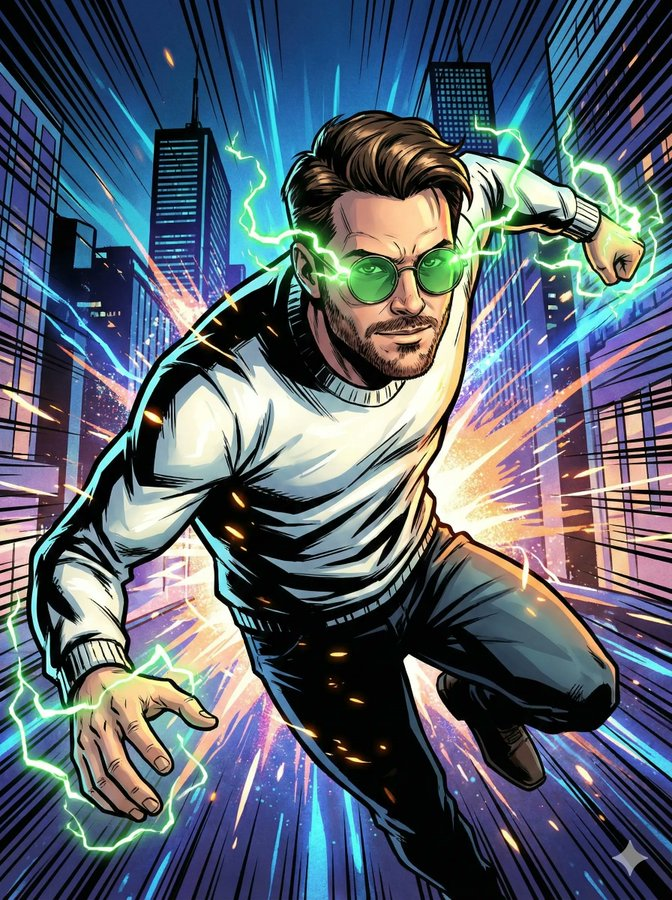

## 照片转换成漫画

- ID: gpt4o-915-zh-2
- Slug: prompt-915-zh-2
- 语言: zh
- 来源: [来源链接](https://x.com/ecommartinez/status/2001689993778249952)
- 样例图路径: images/part3/915.jpeg

### 提示词

```text
请以我的参考图为主角，创作一幅现代漫画插画。
风格灵感源自当代超级英雄漫画和电影图像小说。
该角色保留了参考照片中的精确面部特征和身份，并被转化为线条简洁但富有表现力的风格化漫画风格。
它增加了清晰的黑色轮廓、动态的墨迹阴影和高对比度的颜色。
应用诸如明亮能量、火花、运动轨迹、光束和细微粒子等特效，以增强动作和强度。
采用动态动作姿势或有力的站姿，并运用夸张的透视和戏剧性的角度。
背景应具有图形感和电影感：抽象的城市形状、速度线条或能量爆发，但不要分散对角色的注意力。
灯光效果极佳，强烈的明暗对比营造出深度和冲击力。
最终风格：高质量的现代漫画封面，细节清晰，色彩鲜艳，构图充满活力，插图专业，视觉冲击力强。
不要改变你的容貌，只需进行一些风格上的修饰。
```

### 样例图


## Create a realistic vintage-style photo booth / Polaroid 

- ID: gpt4o-914-en-1
- Slug: prompt-914-en-1
- 语言: en
- 来源: [来源链接](https://x.com/miilesus/status/2001734583830626635)
- 样例图路径: images/part3/914.jpeg

### 提示词

```text
Create a realistic vintage-style photo booth / Polaroid photo collage featuring the same couple, using the two uploaded images as exact face references for both individuals (preserve both identities accurately).
The couple appears natural, affectionate, and playful, captured in multiple candid moments as if taken inside a photo booth. The woman and the man maintain their original facial features, skin tones, and expressions.
Woman: elegant, feminine, glowing skin, natural makeup, soft blush, glossy lips, long dark hair styled loosely with gentle volume. Wearing a minimal strapless cream or light beige dress.
Man: clean and handsome appearance, short dark hair, light stubble or clean-shaven, wearing a black leather jacket over a white shirt
Scenes & poses included in the collage:
The woman smiling brightly while the man stands behind her playfully covering her eyes.
The couple standing close, facing each other lovingly, her hand resting on his chest.
A close face-to-face moment with soft smiles and eye contact.
The woman standing behind the man, making a peace sign while smiling at the camera.
A playful dancing pose where the man lifts one of the woman’s hands as if spinning her.
A relaxed, candid moment where both laugh naturally at the camera.
Environment: neutral photo booth backdrop with soft vertical curtains, warm indoor lighting, subtle shadows, cozy and intimate atmosphere.
Photography style: vintage Polaroid / analog photo booth aesthetic, slightly soft focus, gentle grain, mild blur, natural imperfections, warm tones, realistic skin texture.
Lighting: soft frontal flash combined with ambient light, creating a casual, real-life snapshot feeling.
Mood & vibe: romantic, playful, spontaneous, intimate, youthful, nostalgic.
Composition: multi-frame vertical collage, evenly spaced images, authentic photo booth layout.
Quality: high realism, not AI-looking, natural proportions, no distortion.
```

### 样例图

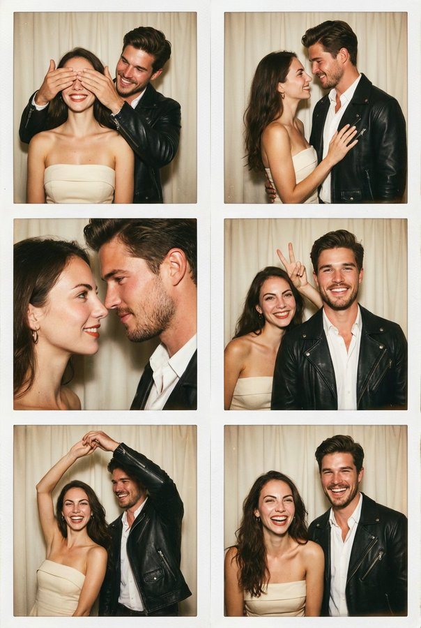

## 复古风格照相亭

- ID: gpt4o-914-zh-2
- Slug: prompt-914-zh-2
- 语言: zh
- 来源: [来源链接](https://x.com/miilesus/status/2001734583830626635)
- 样例图路径: images/part3/914.jpeg

### 提示词

```text
使用上传的两张照片作为两人的面部参考，制作一张逼真的复古风格照相亭/宝丽来照片拼贴画，照片中的人物为同一对情侣（准确保留两人的身份）。
这对情侣看起来自然、亲密又充满活力，多张抓拍照片仿佛是在照相亭里拍摄的。男女双方都保留了原本的面部特征、肤色和表情。
女士：优雅妩媚，肌肤散发光泽，妆容自然，腮红轻柔，双唇水润，一头乌黑长发随意披散，略带蓬松感。身着简约的米色或浅米色抹胸连衣裙。
男士：外表干净英俊，短黑发，留着淡淡的胡茬或刮得干干净净，身穿黑色皮夹克，内搭白色衬衫。
拼贴画中包含的场景和姿势：
女人笑容灿烂，男人站在她身后，顽皮地捂住了她的眼睛。
这对情侣站得很近，彼此深情地对视着，她的手放在他的胸口。
面对面的亲密时刻，带着柔和的微笑和眼神交流。
站在男子身后的女子对着镜头微笑，并比出和平手势。
一个俏皮的舞蹈姿势，男子抬起女子的一只手，仿佛要将她旋转起来。
轻松自然的瞬间，两人对着镜头自然地笑了起来。
环境：中性风格的拍照背景，搭配柔和的垂直窗帘、温暖的室内灯光、微妙的光影，营造出温馨私密的氛围。
摄影风格：复古宝丽来/模拟照相亭美学，略微柔焦，轻微颗粒感，轻微模糊，自然瑕疵，暖色调，逼真的皮肤纹理。
光线：柔和的正面闪光灯与环境光相结合，营造出一种随意、真实的快照感觉。
氛围：浪漫、俏皮、随性、亲密、青春、怀旧。
构图：多帧竖幅拼贴，图像间距均匀，真实的照相亭布局。
质量：高度逼真，不像人工智能生成的，比例自然，无变形。
```

### 样例图


## { "Objective": "Create an ultra-realistic 8K candid stre

- ID: gpt4o-913-en-1
- Slug: prompt-913-en-1
- 语言: en
- 来源: [来源链接](https://x.com/Taaruk_/status/2001656897699733967)
- 样例图路径: images/part3/913.jpeg

### 提示词

```text
{
"Objective": "Create an ultra-realistic 8K candid street portrait capturing quiet emotion and authenticity within a crowded urban environment.",

"Subject": {
"Gender": "Female",
"Appearance": {
"Hair": "Short blonde hair with soft, natural texture",
"Makeup": "Minimal, natural look",
"Skin": {
"Texture": "Realistic skin texture with subtle freckles",
"Highlights": "Soft natural highlights with gentle tonal transitions"
},
"Expression": "Calm, thoughtful, introspective",
"Gaze": "Looking slightly to the side, not directly at the camera"
},
"Wardrobe": {
"Top": "Simple grey knitted sweater with visible fabric weave",
"Bottom": "Casual jeans",
"Accessories": "Thin shoulder-bag strap visible across the shoulder"
}
},

"Scene_Description": {
"Setting": "Busy city street",
"Crowd": {
"Density": "Surrounded by a dense flow of pedestrians",
"Background_Treatment": "Softly blurred figures creating depth and motion"
},
"Environment": "Urban street atmosphere with natural movement"
},

"Lighting_and_Color": {
"Lighting": {
"Type": "Natural daylight",
"Quality": "Soft and even, without harsh shadows"
},
"Color_Grading": {
"Style": "Warm cinematic tones",
"Characteristics": [
"Natural skin tones",
"Muted urban background colors",
"Subtle film-inspired contrast"
]
}
},

"Camera_and_Composition": {
"Shot_Type": "Candid street portrait",
"Depth_of_Field": "Shallow depth of field isolating the subject",
"Focus": "Sharp focus on the subject with background crowd softly blurred",
"Angle": "Eye-level, unobtrusive framing"
},

"Visual_Style": {
"Resolution": "Ultra-realistic 8K",
"Aesthetic": "Documentary street photography",
"Detail_Characteristics": [
"Sharp facial detail",
"Natural fabric texture",
"Soft motion blur in background",
"Subtle film grain for realism"
]
},

"Mood_and_Storytelling": {
"Themes": [
"Stillness within chaos",
"Quiet reflection",
"Human presence in urban life"
],
"Atmosphere": "Emotional, authentic, understated realism"
},

"Output_Requirements": {
"Format": "Image",
"Orientation": "Portrait or cinematic street frame",
"Quality": "Professional documentary-grade realism"
}
}
```

### 样例图

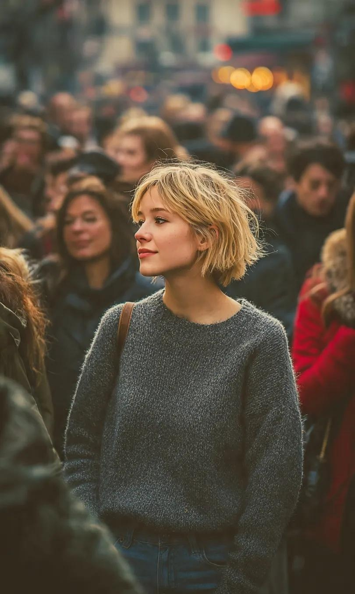

## 超逼真的 8K 街头抓拍肖像

- ID: gpt4o-913-zh-2
- Slug: prompt-913-zh-2
- 语言: zh
- 来源: [来源链接](https://x.com/Taaruk_/status/2001656897699733967)
- 样例图路径: images/part3/913.jpeg

### 提示词

```text
{
“目标”：“在拥挤的都市环境中，捕捉安静的情感和真实感，创作一张超逼真的 8K 街头抓拍肖像。”

“主题”： {
性别：女，
“外貌”： {
“头发”：“柔软自然的短金发”，
“妆容”：“简约自然妆容”
“皮肤”： {
“纹理”：“逼真的皮肤纹理，带有细小的雀斑”，
“高光”： “柔和自然的高光，色调过渡平缓”
},
“表情”：“冷静、深思熟虑、内省”
“目光”：“略微看向一侧，而不是直视镜头”
},
“衣柜”： {
“上衣”：“简约灰色针织毛衣，织物纹理清晰可见”，
下装：休闲牛仔裤
“配饰”：“肩上露出细细的肩包肩带”
}
},

"场景描述": {
“场景”：“繁忙的城市街道”，
人群：{
“密度”：“周围人流密集”，
“背景处理”：“柔和模糊的人物形象，营造出深度和动感”
},
“环境”：“具有自然动感的都市街道氛围”
},

"照明和颜色": {
“灯光”： {
“类型”：“自然日光”，
“品质”：“柔和均匀，无生硬阴影”
},
"Color_Grading": {
风格：温暖的电影色调
“特征”： [
“自然肤色”
“柔和的城市背景色彩”，
“微妙的胶片风格对比”
]
}
},

“相机与构图”：{
"Shot_Type": "街头抓拍肖像",
“景深”： “浅景深突出主体”，
“焦点”：“主体清晰对焦，背景人群柔和虚化”，
“角度”：“视线水平，不显眼的构图”
},

"视觉样式": {
“分辨率”：“超逼真 8K”，
“美学”：“纪实街头摄影”，
"Detail_Characteristics": [
“面部细节清晰”，
“天然面料质感”
“背景呈现柔和的动态模糊效果”
“细腻的胶片颗粒感，营造真实感”
]
},

"情绪与故事讲述": {
“主题”：[
“混乱中的平静”
“静静地思考”，
“人类在城市生活中的存在”
],
“氛围”：“情感丰富、真实、含蓄的现实主义”
},

"输出要求": {
"格式": "图像",
“方向”：“竖幅或电影街景构图”，
“质量”：“专业纪录片级别的真实感”
}
}
```

### 样例图


## { "image_structure": { "layout": "Vertical three-panel c

- ID: gpt4o-912-en-1
- Slug: prompt-912-en-1
- 语言: en
- 来源: [来源链接](https://x.com/lexx_aura/status/2001886993836343775)
- 样例图路径: images/part3/912.jpeg

### 提示词

```text
{
"image_structure": {
"layout": "Vertical three-panel collage",
"aspect_ratio": "Tall vertical strip",
"shot_type": "Close-up selfies"
},
"subject_details": {
"demographics": "Young woman with long, wavy brunette hair",
"skin": "Natural skin texture, minimal or no makeup",
"clothing": "Pink lace-trimmed bralette or camisole top with thin spaghetti straps",
"accessories": "Long manicured nails (nude/pale pink color)"
},
"environment": {
"setting": "Dimly lit bedroom or hotel room interior",
"background_elements": [
"Beige/cream colored walls",
"Heavy brown curtains on the left side",
"Partial view of a bed headboard in the background"
]
},
"lighting_and_style": {
"lighting": "Warm, indoor artificial lighting, low-light conditions",
"aesthetic": "Candid selfie style, slightly grainy phone camera quality, early 2010s social media aesthetic, flash photography look",
"mood": "Casual, intimate, playful"
},
"panel_breakdown": {
"top_panel": {
"expression": "Pouting or confused, eyebrows slightly furrowed",
"pose": "Finger hooked over bottom lip, looking directly at camera"
},
"middle_panel": {
"expression": "Soft smile, looking directly at camera",
"overlay_effect": "Digital pink heart crown filter (Snapchat style) floating around the head"
},
"bottom_panel": {
"expression": "Relaxed, mouth slightly open, gazing at camera",
"pose": "Head tilted to the side, hand gently touching chin and lower lip"
}
}
}
```

### 样例图


## 垂直三格拼贴画

- ID: gpt4o-912-zh-2
- Slug: prompt-912-zh-2
- 语言: zh
- 来源: [来源链接](https://x.com/lexx_aura/status/2001886993836343775)
- 样例图路径: images/part3/912.jpeg

### 提示词

```text
{
"image_structure": {
“布局”：“垂直三格拼贴画”，
"aspect_ratio": "高竖条",
"shot_type": "特写自拍"
},
"subject_details": {
“人口统计信息”：“年轻女性，留着长长的棕色波浪卷发”，
“肌肤”: “自然肌肤纹理，几乎不化妆”
“服装”：“粉色蕾丝边吊带文胸或吊带背心”，
“配饰”： “修剪整齐的长指甲（裸色/浅粉色）”
},
“环境”： {
“场景”：“光线昏暗的卧室或酒店房间内部”，
“背景元素”：[
“米色/奶油色墙壁”，
“左侧是厚重的棕色窗帘，”
“背景中可以看到床头板的一部分”
]
},
"lighting_and_style": {
“照明”：“温暖的室内人工照明，光线较暗的环境”，
“美学”：“随意的自拍风格，略带颗粒感的手机相机画质，2010 年代初期的社交媒体美学，闪光灯摄影效果”，
“氛围”： “轻松、亲密、俏皮”
},
"panel_breakdown": {
"top_panel": {
“表情”：“撅嘴或困惑，眉毛微微皱起”，
姿势：“手指勾住下唇，直视镜头”
},
"middle_panel": {
“表情”：“柔和的微笑，直视镜头”
"overlay_effect": "粉色爱心皇冠滤镜（Snapchat风格）漂浮在头部周围"
},
"bottom_panel": {
“表情”：“放松，嘴巴微张，凝视着镜头”
“姿势”：“头部侧倾，手轻轻触碰下巴和下唇”
}
}
}
```

### 样例图


## 6x6 grid layout. Editorial fashion photography. Use the 

- ID: gpt4o-911-en-1
- Slug: prompt-911-en-1
- 语言: en
- 来源: [来源链接](https://x.com/gokayfem/status/2001680146252669084)
- 样例图路径: images/part3/911.jpeg

### 提示词

```text
6x6 grid layout. Editorial fashion photography. Use the reference clothing item on all 36 models. Every single cell must feature a completely unique individual—no two people should look remotely similar.
Maximize human diversity across:
Age: Teenagers, 20s, 30s, 40s, 50s, 60s, 70s, 80s+, elderly with wrinkles and grey hair
Body types: Extremely thin, slim, athletic, muscular, stocky, chubby, fat, plus-size, obese, petite, tall, short, broad-shouldered, narrow-framed, pear-shaped, apple-shaped, hourglass, rectangular, long-limbed, short-limbed.
Ethnicity & skin tones: East Asian, Southeast Asian, South Asian, Middle Eastern, North African, Sub-Saharan African, West African, East African, Indigenous Australian, Pacific Islander, Native American, Indigenous South American, Scandinavian, Mediterranean, Eastern European, Western European, Caribbean, mixed race, albino. Full spectrum of skin tones from the palest to the deepest.
Hair: Bald, shaved, buzz cut, afro, locs, braids, straight, wavy, curly, coily, long, short, grey, white, natural colors, receding hairline, thinning hair, thick full hair, hijab, head wraps, turbans.
Features: Freckles, vitiligo, acne, scars, birthmarks, moles, gap teeth, crooked teeth, big nose, small nose, wide nose, narrow nose, round face, angular face, soft jawline, strong jawline, monolid eyes, deep-set eyes, hooded eyes, big lips, thin lips, visible disabilities, prosthetics, wheelchair users, amputees.
Each cell: different pose, different camera angle. Poses should feel editorial and unexpected—leaning, crouching, mid-stride, arched, sprawled, seated, jumping, twisting, lounging. Camera angles vary—low angle, overhead, Dutch tilt, wide shot, tight crop, ground-level, profile, three-quarter view.
Moody, high contrast, cinematic lighting. Varied environments—studio, architectural, urban, natural. Sharp detail, clothing as focal point. Final result should feel like the most inclusive, human-rich fashion editorial ever created—a true celebration of every single type of human body that exists.
```

### 样例图


## 36 个穿着同一套衣服的不同人像

- ID: gpt4o-911-zh-2
- Slug: prompt-911-zh-2
- 语言: zh
- 来源: [来源链接](https://x.com/gokayfem/status/2001680146252669084)
- 样例图路径: images/part3/911.jpeg

### 提示词

```text
6x6网格布局。时尚摄影。所有36位模特均需穿着同一件参考服装。每个单元格中的模特必须完全不同——任何两个人都不能有任何相似之处。
最大限度地提高人类多样性：
年龄：青少年、20多岁、30多岁、40多岁、50多岁、60多岁、70多岁、80岁以上、有皱纹和白发的老年人
体型：极瘦、苗条、健壮、肌肉发达、敦实、丰满、肥胖、大码、肥胖、娇小、高挑、矮小、肩宽、骨架窄、梨形、苹果形、沙漏形、矩形、四肢长、四肢短。
种族与肤色：东亚人、东南亚人、南亚人、中东人、北非人、撒哈拉以南非洲人、西非人、东非人、澳大利亚原住民、太平洋岛民、美洲原住民、南美原住民、斯堪的纳维亚人、地中海人、东欧人、西欧人、加勒比人、混血儿、白化病患者。涵盖从最浅到最深的各种肤色。
头发：光头、剃光头、寸头、爆炸头、脏辫、辫子、直发、波浪卷发、卷发、螺旋卷发、长发、短发、灰发、白发、自然发色、发际线后移、头发稀疏、浓密头发、头巾、头巾、头巾。
特征：雀斑、白癜风、痤疮、疤痕、胎记、痣、牙缝、牙齿歪斜、大鼻子、小鼻子、宽鼻子、窄鼻子、圆脸、棱角分明的脸、柔和的下颌线、硬朗的下颌线、单眼皮、深陷眼窝、眼睑下垂、厚嘴唇、薄嘴唇、明显的残疾、假肢、轮椅使用者、截肢者。
每个单元格：不同的姿势，不同的拍摄角度。姿势应具有编辑感和出人意料的特质——倾斜、蹲伏、迈步、拱背、伸展、坐姿、跳跃、扭转、慵懒。拍摄角度也多种多样——低角度、俯视、倾斜镜头、广角镜头、特写镜头、地面视角、侧面视角、四分之三侧面视角。
营造氛围感，运用高对比度的电影级灯光。场景多样——包括摄影棚、建筑、都市和自然环境。注重细节刻画，以服装为视觉焦点。最终呈现的作品应展现出前所未有的包容性和人文关怀，真正赞美每一种人体形态。
```

### 样例图


## { "image_layout": "2x2 grid collage featuring four disti

- ID: gpt4o-910-en-1
- Slug: prompt-910-en-1
- 语言: en
- 来源: [来源链接](https://x.com/lexx_aura/status/2001653710745739419)
- 样例图路径: images/part3/910.jpeg

### 提示词

```text
{
"image_layout": "2x2 grid collage featuring four distinct photographs of the same female subject.",
"subject_general": {
"gender": "Female",
"hair_color": "Dark brown/black",
"hair_style": "Long, styled in loose waves in three panels; sleek high ponytail in one panel",
"aesthetic": "Glamorous, influencer, trendy, luxury lifestyle"
},
"panels": [
{
"position": "top_left",
"setting": "Outdoors at night, dark background with illuminated green foliage",
"action": "Subject is holding a cake with one hand and licking frosting off the index finger of the other hand",
"outfit": {
"top": "Black halter-neck sleeveless top",
"jewelry": "Gold wristwatch, gold bangle bracelet, ring, small hoop earrings"
},
"props": {
"item": "Round white frosted cake",
"details": [
"Red cherries on top",
"Decorative white piping along edges",
"Black icing text reading 'bad bitch energy'"
]
}
},
{
"position": "top_right",
"setting": "Daytime city street, likely an upscale shopping district (e.g., Rodeo Drive) with palm trees and storefronts visible",
"action": "Subject is leaning out of the open door of a black luxury car, looking at the camera",
"outfit": {
"top": "White sleeveless ribbed crop top",
"bottom": "Blue denim jeans",
"accessories": "Shoulder bag (strap visible), gold hoop earrings"
},
"lighting": "Bright natural sunlight casting shadows"
},
{
"position": "bottom_left",
"setting": "Indoor hallway, beige walls, wooden floor",
"action": "Full-body mirror selfie",
"outfit": {
"style": "Matching two-piece set",
"color": "Dark brown/chocolate",
"top": "Velvet/suede corset-style bustier top",
"bottom": "Mini skirt",
"accessories": "Patterned designer handbag (resembling Dior Saddle bag), stack of gold bracelets"
},
"background_details": [
"Large rectangular mirror with gold frame leaning against wall",
"Vase with pampas grass in the corner",
"Doorway visible in reflection"
]
},
{
"position": "bottom_right",
"setting": "Inside a vehicle or outdoors, golden hour sunlight",
"action": "Close-up selfie, hand raised near mouth/chin",
"outfit": {
"top": "Light pink/mauve ribbed tank top",
"outerwear": "Beige fuzzy/sherpa jacket worn off-the-shoulder",
"jewelry": "Layered gold necklaces with pendants, hoop earrings"
},
"hair_styling": "Sleeked back high ponytail",
"background_details": "Car window frame, palm trees and blue sky visible in background"
}
]
}
```

### 样例图


## 女生四宫格照片

- ID: gpt4o-910-zh-2
- Slug: prompt-910-zh-2
- 语言: zh
- 来源: [来源链接](https://x.com/lexx_aura/status/2001653710745739419)
- 样例图路径: images/part3/910.jpeg

### 提示词

```text
{
"image_layout": "2x2 网格拼贴，包含同一女性对象的四张不同照片。"
"subject_general": {
"性别": "女",
"hair_color": "深棕色/黑色",
"发型": "长发，分成三片，烫成蓬松的波浪卷；一片，扎成光滑的高马尾辫",
“美学”： “魅力四射、网红、潮流、奢华生活方式”
},
“面板”：[
{
"位置": "左上",
“场景”：“夜晚的户外，深色背景，绿色树叶在灯光下闪烁”，
“动作”：“受试者一手拿着蛋糕，另一只手的食指正在舔掉上面的糖霜”，
“全套服装”： {
“上衣”： “黑色露背无袖上衣”，
“珠宝”：金手表、金手镯、戒指、小耳环
},
"props": {
“商品”: “圆形白色糖霜蛋糕”
“细节”： [
“上面放些红樱桃”，
“边缘饰有白色滚边”，
“黑色糖霜上写着‘坏女孩能量’”
]
}
},
{
"位置": "右上角",
“场景”：“白天的城市街道，可能是一个高档购物区（例如罗迪欧大道），可以看到棕榈树和商店橱窗”，
“动作”：“拍摄对象从一辆黑色豪华轿车的敞开车门探出身子，看着镜头”。
“全套服装”： {
“上衣”：“白色无袖罗纹露脐上衣”，
“底部”：“蓝色牛仔裤”，
配饰：单肩包（肩带可见）、金色圆环耳环
},
“光线”：“明亮的自然阳光投射出阴影”
},
{
"位置": "左下角",
“场景”：“室内走廊，米色墙壁，木地板”，
“动作”：“全身镜前自拍”，
“全套服装”： {
“款式”：“配套两件套”
颜色：深棕色/巧克力色，
“上衣”：天鹅绒/麂皮紧身胸衣式上衣，
“下装”: “迷你裙”，
“配饰”：“图案名牌手提包（类似迪奥马鞍包），一叠金手镯”
},
"background_details": [
“一面金色边框的大长方形镜子斜靠在墙上”
“花瓶角落里放着蒲苇草”
“倒影中可见门口”
]
},
{
"位置": "右下角",
“场景”：“车内或室外，日落时的金色阳光”，
“动作”：“近距离自拍，手举到嘴/下巴附近”，
“全套服装”： {
上衣：浅粉色/淡紫色罗纹背心，
“外套”：“米色毛绒/羊羔绒夹克，露肩穿着”，
“珠宝”：“多层金项链配吊坠，圈形耳环”
},
"发型"："光滑的高马尾辫",
"background_details": "背景中可以看到车窗框、棕榈树和蓝天"
}
]
}
```

### 样例图


## Create a realistic first-person POV selfie as if the cam

- ID: gpt4o-906-en-1
- Slug: prompt-906-en-1
- 语言: en
- 来源: [来源链接](https://x.com/xmiiru_/status/2001935712275267952)
- 样例图路径: images/part3/906.jpeg

### 提示词

```text
Create a realistic first-person POV selfie as if the camera is my own eyes using a phone’s front-facing camera. The phone, my hands, and my arms must NOT be visible in the frame. Use the uploaded image as my identity reference and keep my face recognizable through perspective consistency. I am not part of the cast I’m a guest on set wearing modern, casual real-world clothing that does not match the actors’ wardrobe. The actors are aware of the selfie, standing very close to me, leaning in naturally, and looking directly into the camera as if pausing for a quick friendly shot between takes.

The framing should feel intimate and face-level, with actors filling the foreground. The background must clearly show a believable behind-the-scenes film set with cameras, crew, lighting rigs, monitors, and equipment. The image should feel candid, unpolished, and spontaneous.

Place me inside: [MOVIE OR TV SHOW NAME] (optional: cast members)
```

### 样例图


## 和影视剧中人物自拍

- ID: gpt4o-906-zh-2
- Slug: prompt-906-zh-2
- 语言: zh
- 来源: [来源链接](https://x.com/xmiiru_/status/2001935712275267952)
- 样例图路径: images/part3/906.jpeg

### 提示词

```text
请使用手机前置摄像头，拍摄一张逼真的第一人称视角自拍，就像用自己的眼睛拍摄一样。手机、我的手和手臂都不能出现在画面中。请使用上传的图片作为我的身份参考，并通过保持视角一致来确保我的脸部清晰可辨。我不是剧组成员，而是片场的客串演员，穿着与演员服装不同的现代休闲日常服装。演员们知道我在自拍，他们会站在我旁边，自然地靠近我，并直视镜头，就像在拍摄间隙和我友好地拍张合照一样。

构图应营造亲密感，采用平视视角，演员占据前景。背景必须清晰展现一个可信的幕后拍摄现场，包括摄像机、工作人员、灯光设备、监视器和器材。画面应给人一种自然、未经修饰、随意的感觉。

请将我放入：[电影或电视剧名称]（可选：演员表）
```

### 样例图


## 维多利亚哥特皇室写真照

- ID: gpt4o-904-zh
- Slug: prompt-904-zh
- 语言: zh
- 来源: [来源链接](https://x.com/songguoxiansen/status/2001828831615946768)
- 样例图路径: images/part3/904.jpeg

### 提示词

```text
生成一张 9:16 竖版「维多利亚哥特皇室」写实照片：以我上传的 FACE_REF 为人物身份参考，100%还原五官与骨相；人物身穿“维多利亚时代（19世纪）宫廷礼服方向”的重工礼服（紧身胸衣、大裙撑、蕾丝/天鹅绒、皇室珠宝），在伦敦塔桥或威斯敏斯特宫（大本钟）旁拍摄。画面具备《Harper’s Bazaar》级别的摄影、造型与封面设计，保持杂志的一贯设计风格（中英文设计）。

【INPUTS | 输入】
FACE_REF：我上传的人物五官参考图（身份锁定）

【ABSOLUTE PRIORITY | 身份锁定（最高优先级）】
100%还原 FACE_REF 的五官与骨相：眼距、鼻梁鼻翼、唇形、下颌线、颧骨结构完全一致，不得漂移。
真实皮肤质感：可见细微纹理与毛孔，不要过度磨皮与网红化。
成年女性形象（adult）。

【SHOT TYPE | 景别二选一（由模型随机选其一，且必须真实统一）】
A) 半身封面：胸口到腰上方，珠宝、蕾丝领口与眼神最清晰（主推）
B) 全身封面：从头到脚完整呈现巨大的裙撑轮廓与伦敦地标的结合，透视感强（备选）
（无论A/B：都必须保持“封面构图”，有留白空间给排版，但不要撕纸/手绘效果。）

【LOCATION | 场景（英国伦敦）】
伦敦地标：泰晤士河畔，背景是宏伟的哥特式建筑威斯敏斯特宫（大本钟）或 伦敦塔桥的塔楼。
天气二选一（随机）：1) 伦敦雾霭（经典的雾都质感，光线柔和神秘） 2) 阴雨方歇（地面湿润反光，天空呈铅灰色）
背景干净：无游客、无现代标识、无手机状态栏UI、无水印字幕。

【LIGHTING & CAMERA | 摄影质感（杂志级）】
镜头感：85mm人像质感（半身）或 50mm/70mm（全身），浅景深，眼睛最清晰。
光线：阴天漫射光 + 戏剧性补光（强调面部结构）；钻石/宝石有真实火彩；天鹅绒质感深邃。
色彩：高级电影感，低饱和度的蓝灰环境色与服装的深色调（红/蓝/黑）形成哥特美学；整体干净、通透、贵气。

【WARDROBE | 维多利亚宫廷礼服（重工、塑形、繁复细节）】
目标审美：“蜂腰、大裙摆、层叠蕾丝、重磅天鹅绒、皇冠、女王气场”。

轮廓与层次（X型剪裁）
上身：结构感极强的紧身胸衣（Corset），方领或高领，泡泡袖或羊腿袖
下身：巨大的裙撑（Crinoline 或 Bustle），后腰部有明显的堆叠设计，裙摆拖地
装饰：大量的荷叶边、蝴蝶结、垂坠的流苏
面料与工艺（重手艺必须“看得见”）
主面料：重磅丝绒、塔夫绸、尚蒂伊蕾丝（Chantilly Lace）
主要工艺：珠绣、金线刺绣、缎带编织
纹样主题：大马士革纹（Damask）、玫瑰、蓟花（苏格兰象征）、佩斯利纹
细节：蕾丝手套、颈饰（Choker）、勋章/胸针
头面（皇室珠宝头饰）
核心结构：维多利亚式小王冠（Tiara）或 羽毛头饰
装饰：钻石、蓝宝石、珍珠
耳饰/颈饰：极度夸张的钻石项链、耳坠

【COLOR MATRIX | 颜色矩阵搭配（必须执行，且必须“皇室深色”）】
（维多利亚晚期的深沉奢华）
从以下三套“主色方案”中随机选 1 套作为【底色/大面积主面料色】。

Scheme G（皇室蓝底）：
底色：深宝蓝/午夜蓝（丝绒质感）
刺绣/装饰：银色蕾丝、钻石、蓝宝石
Scheme A（维多利亚红底）：
底色：酒红/勃艮第红（深沉热情）
刺绣/装饰：黑色蕾丝、金色刺绣、红宝石
Scheme R（丧服黑底）：
底色：墨黑（Black Jet，极度哥特）
刺绣/装饰：黑色串珠、黑色蕾丝、少量金色或银色提亮

【颜色执行规则】
色彩要深沉浓郁，体现“日不落”的威严和哥特式的神秘。

【POSE | 封面姿态（威严、僵直、女王感）】
半身：下巴微扬，眼神冷峻，一手轻抚项链
全身：站姿挺拔（像肖像画一样），双手交叠在裙撑上，气场压倒一切
表情：严肃、高傲、不可一世；绝对不笑（维多利亚风格）。

【OUTPUT | 输出】
1 张 9:16 竖版写实杂志封面级照片
随机：半身 or 全身（A/B二选一）
随机：雾霭 or 阴雨（天气二选一）
随机：宝蓝 / 酒红 / 墨黑（颜色矩阵三选一）
造型：维多利亚宫廷礼服方向 + 皇冠/Choker + 紧身胸衣大裙撑 + 丝绒蕾丝
```

### 样例图


## { "subject": { "demographics": "Young female, approx 20-

- ID: gpt4o-901-en-1
- Slug: prompt-901-en-1
- 语言: en
- 来源: [来源链接](https://x.com/brindleyai/status/2001200342864667035)
- 样例图路径: images/part3/901.jpeg

### 提示词

```text
{
"subject": {
"demographics": "Young female, approx 20-24 years old, Caucasian.",
"hair": {
"color": "Dirty blonde to light blonde gradient.",
"style": "Long, straight with slight wave, layered, casual parting.",
"texture": "Soft, natural strands, slightly tousled, roots visible.",
"movement": "Falling naturally over shoulders and back."
},
"face": {
"shape": "Oval with soft jawline.",
"eyes": "Almond-shaped, light blue/grey irises, distinct sharp black winged eyeliner.",
"nose": "Button nose, soft bridge.",
"lips": "Full, plump, rosy pink, slightly parted in a pouty expression.",
"skin_details": "Prominent, heavy freckles across nose and cheeks. Smooth texture but with realistic skin grain. Natural blush.",
"micro_details": "Mole on right upper chest, mole on left shoulder."
},
"body_proportions": {
"build": "Voluminous, curvy, heavy bust.",
"chest": "Large bust volume, prominent forward projection, deep cleavage visible.",
"waist_to_chest_ratio": "Significantly wider chest width compared to waist implies hourglass figure.",
"shoulders": "Soft, rounded, natural slope.",
"dominance": "Upper torso volume visually dominates the frame."
},
"clothing": {
"top": "Heather grey ribbed knit tank top/camisole.",
"fit": "Tight, form-fitting, stretching over chest volume, low scoop neckline.",
"straps": "Thick straps, sitting securely on shoulders."
},
"accessories": {
"jewelry": {
"Small gold hoop earrings.",
"Gold chain necklace with a small 'G' letter pendant.",
"Longer thin gold chain with a distinct kangaroo pendant."
}
}
},
"pose": {
"type": "Handheld selfie perspective.",
"orientation": "Frontal close-up, slightly angled from above.",
"head_position": "Tilted slightly to subject's right.",
"limbs": "Right arm extended forward (out of frame) indicating holding the camera.",
"gaze": "Direct eye contact with lens, alluring and confident.",
"spine_curvature": "Slight arch implied by chest prominence."
},
"setting": {
"environment": "Domestic bathroom.",
"background_elements": "Dark brown/grey glossy tiled wall, chrome shower fixture visible on left, top of white ceramic toilet tank visible on right.",
"depth": "Shallow depth of field, background elements slightly out of focus."
},
"camera": {
"shot_type": "Close-up, selfie portrait.",
"angle": "High angle (slightly above eye level), typical of smartphone selfies.",
"focal_length": "24mm to 28mm equivalent (wide angle smartphone lens).",
"framing": "Chest-up shot, cropping at mid-torso.",
"focus": "Sharp focus on eyes and face, slight fall-off on shoulders.",
"perspective": "Slight foreshortening of the extended arm side."
},
"lighting": {
"source": "Soft, diffused overhead ambient bathroom lighting.",
"direction": "Front-top lighting.",
"highlights": "Soft specular highlights on forehead, tip of nose, chin, and upper chest curves.",
"shadows": "Soft shadows under the chin and defining the cleavage depth.",
"quality": "Natural, flattering, no harsh contrast."
},
"mood_and_expression": {
"tone": "Casual, sultry, confident.",
"expression": "Relaxed pout, 'cool girl' aesthetic.",
"atmosphere": "Intimate, candid."
},
"style_and_realism": {
"style": "Photorealistic, social media aesthetic.",
"fidelity": "High fidelity skin texture, no airbrushing.",
"imperfections": "Visible freckles, stray hairs, natural skin variation preserved."
},
"colors_and_tone": {
"palette": "Neutral tones (grey, beige, skin tones) with pops of blue (eyes) and gold (jewelry).",
"skin_tone": "Fair to light tan, warm undertones.",
"white_balance": "Slightly warm, indoor tungsten mix.",
"saturation": "Natural, slightly vibrant lips and eyes.",
"contrast": "Medium contrast."
},
"technical_details": {
"aspect_ratio": "3:4",
"resolution": "High resolution, sharp details.",
"noise": "Slight digital noise characteristic of phone camera sensors in indoor light."
}
}
```

### 样例图

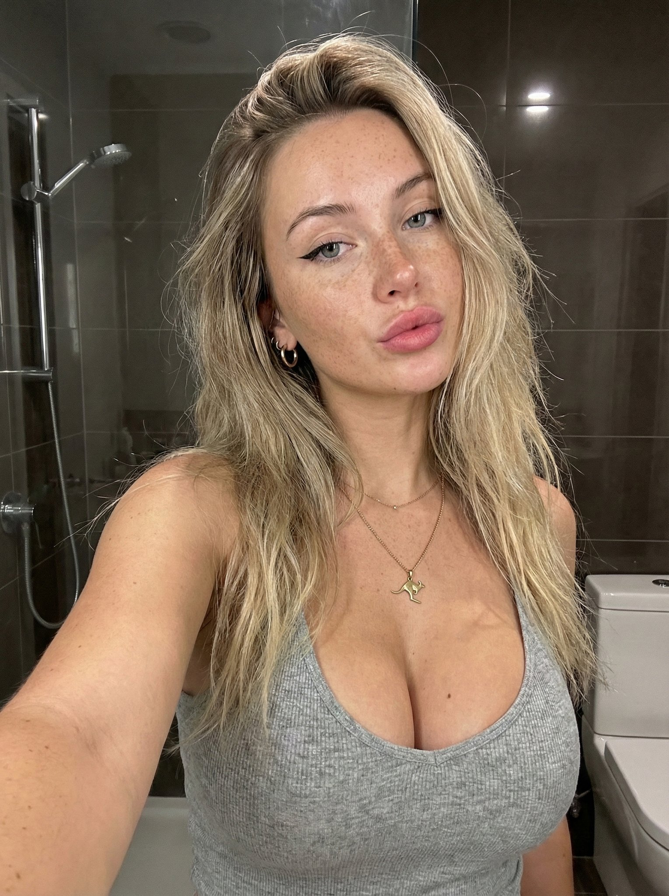

## 金发女子自拍照

- ID: gpt4o-901-zh-2
- Slug: prompt-901-zh-2
- 语言: zh
- 来源: [来源链接](https://x.com/brindleyai/status/2001200342864667035)
- 样例图路径: images/part3/901.jpeg

### 提示词

```text
{
“主题”： {
“人口统计信息”：“年轻女性，大约20-24岁，白种人。”
“头发”： {
颜色：从脏金色到浅金色的渐变色。
发型：长直发，略带波浪，层次分明，随意分缝。
“质感”：“柔软自然的发丝，略显蓬松，发根可见。”
“动作”：“自然地垂落在肩膀和背部。”
},
“脸”： {
“脸型”：“椭圆形，下颌线条柔和。”
“眼睛”：“杏仁状，浅蓝灰色虹膜，清晰锐利的黑色上扬眼线。”
“鼻子”：“小巧的鼻子，柔和的鼻梁。”
“嘴唇”：“饱满、丰润、呈玫瑰粉色，微微张开，带着一丝嘟嘴的表情。”
“皮肤细节”： “鼻子和脸颊上有明显的、较多的雀斑。质地光滑，但保留了真实的皮肤纹理。自然的红晕。”
"micro_details": "右胸上方有一颗痣，左肩上有一颗痣。"
},
"body_proportions": {
体型：丰满、曲线优美、胸部丰满。
“胸部”：“胸部丰满，胸部前凸明显，乳沟深邃可见。”
腰胸比：胸部宽度明显大于腰部宽度，表明身材呈沙漏形。
“肩部”：“柔和、圆润、自然的坡度。”
“主导性”：“上半身的体积在视觉上主导了画面。”
},
“衣服”： {
上衣：浅灰色罗纹针织背心/吊带衫。
“合身”：紧身、贴合胸部曲线，低圆领。
“肩带”：“厚实的肩带，牢牢地贴在肩膀上。”
},
“配件”： {
“珠宝”： {
“小金圈耳环。”
“金链项链，配有一个小小的字母‘G’吊坠。”
“较长的细金链，配有独特的袋鼠吊坠。”
}
}
},
"姿势": {
类型：手持自拍视角。
“方向”：“正面特写，略微从上方倾斜。”
“头部位置”： “略微向拍摄对象的右侧倾斜。”
四肢：右臂向前伸展（超出画面），表示正在握持相机。
“凝视”：“通过镜头直接与眼睛对视，充满魅力和自信。”
"spine_curvature": "胸部突出所暗示的轻微弧度。"
},
“环境”： {
“环境”：“家用浴室。”
"background_elements": "深棕色/灰色光面瓷砖墙，左侧可见镀铬淋浴装置，右侧可见白色陶瓷马桶水箱顶部。"
“景深”：“浅景深，背景元素略微失焦。”
},
“相机”： {
"shot_type": "特写，自拍肖像。"
“角度”：“高角度（略高于视线水平），是智能手机自拍的典型角度。”
"focal_length": "24mm 至 28mm 等效焦距（广角智能手机镜头）",
“构图”：“胸部以上镜头，裁剪至躯干中部。”
“焦点”：“眼睛和脸部清晰聚焦，肩膀略微虚化。”
“透视”：“伸展的手臂一侧略微缩短。”
},
“灯光”： {
光源：柔和、漫射的浴室顶灯。
“方向”：“前上照明。”
“高光”：“额头、鼻尖、下巴和上胸曲线处的柔和镜面高光。”
“阴影”：“下巴下方柔和的阴影勾勒出乳沟的深度。”
“品质”：“自然、讨喜、无强烈对比。”
},
"mood_and_expression": {
语气：随意、性感、自信。
“表情”：“放松的嘟嘴，‘酷女孩’风格。”
“氛围”：“亲密、坦诚。”
},
"风格与现实主义": {
风格：写实风格，社交媒体美学。
“真实感”： “高保真度的皮肤纹理，无修图。”
“瑕疵”：“可见的雀斑、杂乱的毛发、自然的肤色差异均得以保留。”
},
"colors_and_tone": {
“调色板”：“以中性色调（灰色、米色、肤色）为主，点缀以蓝色（眼妆）和金色（珠宝）。”
“肤色”: “白皙至浅棕色，暖色调。”
“白平衡”: “略微偏暖的室内钨丝灯混合模式。”
“饱和度”：“自然、略带活力的唇部和眼部。”
“对比度”: “中等对比度。”
},
"technical_details": {
"aspect_ratio": "3:4",
分辨率：高分辨率，细节清晰。
“噪声”: “室内光线下手机摄像头传感器特有的轻微数字噪声。”
}
}
```

### 样例图


## 中国四大节日美甲四宫格

- ID: gpt4o-899-zh
- Slug: prompt-899-zh
- 语言: zh
- 来源: [来源链接](https://x.com/lxfater/status/2001587965131465046)
- 样例图路径: images/part3/899.jpeg

### 提示词

```text
任务：生成「中国四大节日美甲四宫格」拼贴图（2x2）
核心指令
基于用户提供的一张清晰手部近景照片（或同风格参考图），生成一张 2x2 四宫格拼贴图。四格必须是同一双手、同构图、同光线、同背景风格，只替换美甲设计主题。
每格底部必须标注节日名称：春节 / 清明 / 端午 / 中秋（中文优先；如文字易错可用英文备选）。
全局统一风格（四格都必须遵守）

构图：女性手部特写近景，手指搭在柔软针织毛衣袖口或浅色布料上，浅景深，高清摄影，4k。
光线：室内柔光（暖光为主，清明可偏自然冷柔光），背景干净、散景高级。

美甲基调：通勤友好、低饱和、清透显白；甲缘干净利落；贴饰“少而准”；封层高质感不过曝。

甲型：默认中长软方（若输入图甲型不同，以输入为准保持一致）。

排布规则：每套都明确 “主打指（1-2根）+ 辅助指（2-3根）+ 纯净底色指（其余）”，避免每根都很花。

输出排版

2x2 网格拼贴，边框规整、留白一致、四格大小一致。
每格底部加小标题：春节、清明、端午、中秋（字体干净现代、细字重、位置统一）。

四格设计细化（重点：每格的“美甲定制”要足够具体）

A格（左上）【春节】通勤清透红金点睛（“有年味但不俗”）
背景散景建议：暖黄灯笼光斑 + 金色挂饰虚化（不抢主体）。
美甲细节：
底色：奶透裸米（带一点点果冻感），做极浅“奶透晕染”从甲根到甲尖过渡，整体清透显白。
结构：3根纯净底色（只带极淡细闪），1根微法式，1根主打图案。

法式边：选 1-2 根指甲做“极细金边法式”（线细到像金线描边），法式弧度干净利落。

主打指（1根，建议无名指或中指）：极简窗花线稿（线条细、留白多），窗花只占甲面 20%-30%，下方留大面积清透底。

点缀材质：
香槟金细闪均匀但很淡，像“皮肤自带光”。
金箔只放 2-4 片超小碎片，集中在甲根或侧边一小撮，绝不铺满。

颜色控制：红色只做一个小红点/一小段红线（可在窗花中心点一下），避免大面积正红。

封层：玻璃光，高光柔、不过曝。

B格（右上）【清明】雾感极简青灰透（“安静干净、有雾气感”）

背景散景建议：薄雾灰绿调 + 细雨光点朦胧散景。
美甲细节：

底色：冷灰透粉 或 雾灰绿透（二选一，推荐更通勤的冷灰透粉），整体偏“雾化清透”。

结构：4根纯净底色 + 1根主打极简线条（非常克制）。

主打指（1根，建议无名指）：
柳叶线条：一条极细线从甲根轻轻延伸到甲中段，旁边加 1-2 笔“柳叶”短线，留白为主。
在柳叶附近加 2-3 个雨滴光点（微小点状高光），像细雨落在甲面。
材质：
只允许 珠光或极细细闪（“几乎看不见但会透光”那种），不加金箔、不加大亮片。
光感：缎光（比玻璃光更高级的柔亮，避免塑料反光）。

质感控制：整体低对比、干净，不要明显纹理堆叠。

C格（左下）【端午】艾草绿点题粽叶纹理（“淡淡草木气，细节耐看”）

背景散景建议：艾草绿植 + 竹叶/香包虚化。
美甲细节：

底色：奶透裸米或冷调透白底（更显白），整体清透。

结构：2根主题指 + 3根清透底色。

主题指①（1根，建议无名指）：粽叶极简纹理
用极淡的艾草绿做“线条压纹感”，只画 2-3 条斜向叶脉线，像“若隐若现”的叶纹。

主题指②（1根，建议中指或食指）：极细金线绕一圈像绑绳
在甲面中段或靠近甲尖处，画一圈极细金线（不要粗金条），像绑粽子的绳结意象。

点缀材质：
细闪只做“薄薄一层”，集中在甲根到甲中段，避免甲尖闪到发廉价。
金箔仍然是 2-4 片小碎片，点在金线旁边或甲根一侧，增强“手工质感”。

颜色控制：艾草绿只占少量（线条/小块），不要整甲深绿。

光感：玻璃光（但高光要柔）。
D格（右下）【中秋】月光奶透桂花金（“月光感、温柔高级、很出片”）
背景散景建议：暖黄月灯光斑 + 桂花金色散景点点。
美甲细节：

底色：奶透米白或奶透裸米，做轻微“月光晕染”——甲根更奶透、甲尖更清亮，干净显白。

结构：1根月相主打 + 1根桂花点缀 + 其余清透细闪底色。

月相主打指（1根，建议无名指）：
细线月相（月弯/半月/小满月选 1-2 个，不要一排九宫格那种），线条很细，留白大。

桂花点缀指（1根，建议中指）：
桂花金点：用极小金点做 5-8 个“散落的桂花点”，密度低、分布自然，像落在甲面。

材质：香槟金细闪 + 少量金箔（更偏“月光金”），不要银闪抢戏。

光感：玻璃光，整体温柔但清晰，近景细节干净。

Negative Prompt（负面提示词）

低清晰度，模糊，噪点，过曝，强硬阴影，塑料反光，甲面凹凸不平，涂抹脏乱，颜色过饱和，荧光色，廉价大钻堆砌，卡通贴纸感，粗糙贴饰，指甲形状扭曲，手指畸形，多余手指，皮肤质感不一致，四格不是同一双手，构图不一致，背景杂乱，网格歪斜，边框不均匀，文字水印logo，标签缺失或拼写错误

请根据上面提示词生成图片
```

### 样例图

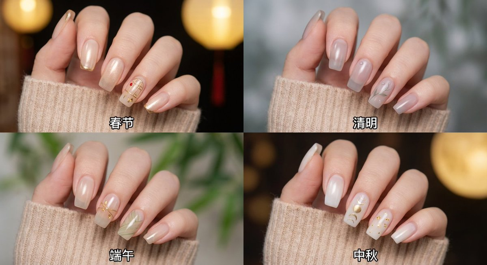

## { "project_specifications": { "format": "2x2 Grid Collag

- ID: gpt4o-897-en-1
- Slug: prompt-897-en-1
- 语言: en
- 来源: [来源链接](https://x.com/xmliisu/status/2001309711971295669)
- 样例图路径: images/part3/897.jpeg

### 提示词

```text
{
  "project_specifications": {
    "format": "2x2 Grid Collage",
    "aspect_ratio": "4:5",
    "aesthetic_style": "High-end Beauty Editorial",
    "rendering_engine_hints": {
      "realism_level": "Ultra-photorealistic",
      "texture_quality": "8k",
      "lighting_simulation": "Ray-traced studio lighting"
    }
  },
  "global_assets": {
    "subject_definition": {
      "hair": {
        "style": "Long, loosely wavy, voluminous",
        "texture": "Natural, individual strands defined",
        "behavior": "Messy but styled, framing face and shoulders"
      },
      "complexion": {
        "skin_texture": "Porous, hyper-realistic",
        "finish": "Dewy, glass-skin effect",
        "makeup": {
          "cheeks": "Heavy flush/blush",
          "lips": "High-gloss, plump, natural pink",
          "eyes": "Clean, defined lashes, natural brows"
        }
      },
      "wardrobe": {
        "item": "Mini dress",
        "fit": "Bodycon / Tight",
        "fabric": {
          "material": "Soft textured knit / Boucle",
          "tactility": "Fuzzy, light-catching fibers",
          "color": "Soft mauve or neutral taupe"
        },
        "details": "Spaghetti straps, mid-thigh length"
      }
    },
    "environment_definition": {
      "studio_setup": {
        "background": "Seamless paper, soft off-white/beige",
        "atmosphere": "Clean, warm, intimate"
      },
      "lighting_rig": {
        "key_light": "Large diffuse softbox (Front-Left)",
        "fill_light": "Reflector (Right)",
        "highlights": "Specular highlights on lips, cheekbones, and shoulders"
      }
    }
  },
  "panel_architecture": [
    {
      "position": "Top-Left (1)",
      "shot_type": "Extreme Close-Up (Macro)",
      "composition": {
        "angle": "Low angle, looking up slightly",
        "focus": "Mouth and nose area",
        "depth_of_field": "Shallow"
      },
      "action": {
        "primary": "Eating a strawberry",
        "nuance": "Delicate finger hold, lips slightly parted"
      },
      "visual_anchors": [
        "Moisture on strawberry surface",
        "Gloss reflection on lips",
        "Baby hairs at temple"
      ]
    },
    {
      "position": "Top-Right (2)",
      "shot_type": "Medium Shot (Thigh-up)",
      "composition": {
        "angle": "Eye level",
        "pose_dynamic": "Leaning forward slightly towards lens"
      },
      "action": {
        "stance": "Standing straight on",
        "arms": "Relaxed at sides",
        "expression": "Direct gaze, alluring pout"
      },
      "visual_anchors": [
        "Texture of knit dress",
        "Collarbone shadows",
        "Curvature of waist"
      ]
    },
    {
      "position": "Bottom-Left (3)",
      "shot_type": "Full Body (Seated)",
      "composition": {
        "angle": "Side profile",
        "framing": "Subject compacted on floor"
      },
      "action": {
        "pose": "Knees to chest (fetal position variation)",
        "interaction": "Cheek resting on knee, arms embracing legs",
        "hair_flow": "Cascading onto the floor"
      },
      "visual_anchors": [
        "Smooth leg definition",
        "Dress stretching over thigh",
        "Dreamy gaze"
      ]
    },
    {
      "position": "Bottom-Right (4)",
      "shot_type": "Beauty Portrait (Head & Hands)",
      "composition": {
        "angle": "Frontal close-up",
        "framing": "Chin to hairline"
      },
      "action": {
        "gesture": "Chin resting on interlaced fingers",
        "expression": "Soft smile, looking off-camera"
      },
      "visual_anchors": [
        "Hand detail and manicure",
        "Eye clarity",
        "Flush on cheeks"
      ]
    }
  ]
}
```

### 样例图

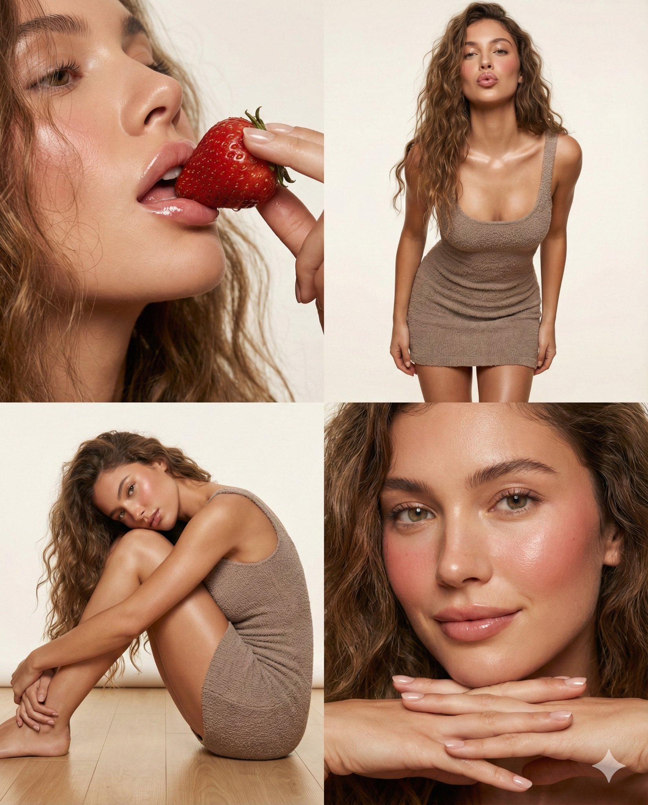

## 2x2网格拼贴画

- ID: gpt4o-897-zh-2
- Slug: prompt-897-zh-2
- 语言: zh
- 来源: [来源链接](https://x.com/xmliisu/status/2001309711971295669)
- 样例图路径: images/part3/897.jpeg

### 提示词

```text
{
"项目规范": {
"格式": "2x2 网格拼贴画",
"aspect_ratio": "4:5",
"aesthetic_style": "高端美容杂志",
"渲染引擎提示": {
"realism_level": "超逼真",
"texture_quality": "8k",
"lighting_simulation": "光线追踪摄影棚照明"
}
},
"global_assets": {
"subject_definition": {
“头发”： {
“发型”：“长款，略带波浪，蓬松”，
“纹理”：“自然、根根分明的发丝”，
“发型”：“凌乱但有型，修饰脸型和肩膀”
},
"肤色": {
"skin_texture": "多孔，超逼真"
“妆效”：“水润、如玻璃般光滑的肌肤效果”，
“化妆品”： {
“脸颊”： “浓重的红晕/腮红”
“唇部”: “高光泽、丰盈、自然的粉红色”
“眼睛”：“干净、轮廓分明的睫毛，自然的眉毛”
}
},
“衣柜”： {
“商品”: “迷你连衣裙”
“fit”: “紧身/贴身”
“织物”： {
材质：柔软纹理针织/圈绒，
“触感”：“毛茸茸的、能反射光线的纤维”，
颜色：柔和的淡紫色或中性灰褐色
},
详情：细肩带，及大腿中部长度
}
},
"environment_definition": {
"studio_setup": {
“背景”： “无缝纸，柔和的米白色/米色”
氛围：干净、温暖、温馨
},
"lighting_rig": {
"key_light": "大型漫射柔光箱（左前方）",
"fill_light": "右侧反光板",
“高光”： “嘴唇、颧骨和肩膀上的高光”
}
}
},
"panel_architecture": [
{
"位置": "左上(1)" ，
"shot_type": "超近特写（微距）",
“作品”： {
“角度”：“低角度，略微向上看”，
“焦点”：“嘴和鼻子区域”，
"景深": "浅"
},
“行动”： {
“主要”: “吃草莓”
细微之处：指尖轻柔地握着，嘴唇微微张开。
},
“visual_anchors”：[
“草莓表面的水分”
“嘴唇上的光泽反射”
“鬓角的细小绒毛”
]
},
{
"位置": "右上角(2)" ,
"shot_type": "中景（大腿向上）",
“作品”： {
“角度”：“视线水平”，
"pose_dynamic": "身体略微前倾，朝向镜头"
},
“行动”： {
“站姿”：“笔直站立”，
“手臂”：“自然垂于身体两侧”，
“表情”：“直视，撅嘴”
},
“visual_anchors”：[
“针织连衣裙的质地”
“锁骨阴影”
腰部曲线
]
},
{
"位置": "左下角 (3)",
"shot_type": "全身照（坐姿）",
“作品”： {
"角度": "侧面轮廓",
“框架”：“主体压在地板上”
},
“行动”： {
“姿势”：“膝盖贴近胸部（胎儿姿势变体）”
“互动”：“脸颊贴着膝盖，双臂环抱着双腿”，
"hair_flow": "如瀑布般倾泻而下"
},
“visual_anchors”：[
“腿部线条流畅”
“裙子撑开了大腿”，
“梦幻般的凝视”
]
},
{
"位置": "右下角 (4)",
"shot_type": "美人肖像（头部和手部）",
“作品”： {
“角度”：“正面特写”
构图：从下巴到发际线
},
“行动”： {
“姿势”：“下巴搁在交叠的手指上”，
表情： “柔和的微笑，看向镜头外”
},
“visual_anchors”：[
“手部细节和美甲”，
“视力清晰度”
“双颊泛红”
]
}
]
}
```

### 样例图


## 大唐盛世与巴黎写真照

- ID: gpt4o-894-zh
- Slug: prompt-894-zh
- 语言: zh
- 来源: [来源链接](https://x.com/songguoxiansen/status/2001198742998016062)
- 样例图路径: images/part3/894.jpeg

### 提示词

```text
生成一张 9:16 竖版「大唐盛世与巴黎」写实照片：以我上传的 FACE_REF 为人物身份参考，100%还原五官与骨相；人物身穿“唐代（盛唐）宫廷贵妃方向”的重工礼服（齐胸衫裙、大袖衫、牡丹纹样、金饰），在巴黎埃菲尔铁塔下的特罗卡德罗广场或塞纳河畔拍摄。画面具备COSMO时尚杂志级别的摄影、造型与封面设计，保持杂志的一贯设计风格（英文设计）。

【INPUTS | 输入】 FACE_REF：我上传的人物五官参考图（身份锁定）

【ABSOLUTE PRIORITY | 身份锁定（最高优先级）】 100%还原 FACE_REF 的五官与骨相：脸型、容貌、眼距、鼻梁鼻翼、唇形、下颌线、颧骨结构完全一致，不得漂移。 真实皮肤质感：可见细微纹理与毛孔，不要过度磨皮与网红化。 成年女性形象。

【SHOT TYPE | 景别二选一（由模型随机选其一，且必须真实统一）】 A) 半身封面：胸口到腰上方，头面与上身刺绣最清晰，眼睛对焦最锐利（主推） B) 全身封面：从头到脚完整呈现层叠礼服与裙摆纹样，铁塔的钢结构透视更强（备选） （无论A/B：都必须保持“封面构图”，有留白空间给排版，但不要撕纸/手绘效果。）

【LOCATION | 场景（巴黎埃菲尔铁塔）】 巴黎埃菲尔铁塔：经典的钢结构塔身背景。天气二选一（随机）：1) 巴黎阴雨（地面微湿，光线柔和高级灰色调，时尚感强） 2) 绚丽黄昏（夕阳余晖，金色光影，浪漫氛围） 背景干净：无游客、无现代标识、无手机状态栏UI、无水印字幕、无护栏。

【LIGHTING & CAMERA | 摄影质感（杂志级）】 镜头感：85mm人像质感（半身）或 50mm/70mm（全身），浅景深，眼睛最清晰。 光线：自然光（强调环境光） + 电影级补光；金饰有真实高光但不爆；丝绸光泽清晰可辨。 色彩：高级电影感，法式米灰/蓝灰色调与唐代服装的“红绿金”配色形成强烈视觉张力；整体干净、通透、质感厚。

【WARDROBE | 唐代宫廷礼服（丰腴、飘逸、色彩浓烈）】 目标审美：“金饰华丽、面靥花钿、齐胸裙、披帛飘逸、大红大绿大金、极度张扬”。

轮廓与层次（必须体现唐代特征） 内层：诃子（抹胸），露出颈部与上胸肌肤（唐代开放风气） 中层：对襟短衫（直领），材质透明轻薄（罗/纱） 外层：大袖衫（极宽大的袖子，拖地），像翅膀一样张开 装饰：披帛（长长的丝带），挽在手臂间，随风飘舞 下装：齐胸破裙（裙腰系在胸口，裙摆宽大，多色拼接或印花） 面料与工艺（重手艺必须“看得见”） 主面料：丝绸、织锦、印金纱（轻盈与厚重结合） 主要工艺：印染（蜡染/夹路）、金线刺绣、织金 纹样主题（适配大唐）：宝相花、缠枝牡丹、瑞兽（狮子/麒麟）、团花（图案巨大、饱满） 细节：花钿（额头红色装饰）、面靥（嘴角红点）、臂钗（大臂上的金属饰品） 头面（唐代雍容华贵头饰） 核心结构：高耸的发髻（云髻/坠马髻），插戴大朵牡丹花（真花或绢花） 装饰：金梳背（插在发髻上的金梳子）、步摇（走动摇曳）、金钗 耳饰：贵重金玉

【COLOR MATRIX | 颜色矩阵搭配（必须执行，且必须“浓烈唐风”）】 （调整为唐代流行色：红绿撞色、金碧辉煌） 从以下三套“主色方案”中随机选 1 套作为【底色/大面积主面料色】。

Scheme G（石青/翠绿底）： 底色：翠绿/石青（常用的间色） 刺绣/印染：茜红、金色、橘黄、米白 Scheme A（牡丹红底）： 底色：牡丹红/石榴红（最经典的唐风） 刺绣/印染：金色、翠绿、宝蓝、紫 Scheme R（紫底）： 底色：紫/葡萄色（高贵） 刺绣/印染：金色、朱红、草绿、银

【颜色执行规则】 色彩对比要强烈，体现盛唐气象，但整体色调要统一在高级感中。

【POSE | 封面姿态（自信、舒展、女王感）】 半身：微昂头，眼神睥睨，一手轻抚发髻或披帛 全身：双臂张开带动大袖衫和披帛，展现服装的体积感，气场全开 表情：自信、张扬、妩媚、大方；不要羞涩。

【OUTPUT | 输出】 1 张 9:16 竖版写实杂志封面级照片 随机：半身 or 全身（A/B二选一） 随机：阴雨 or 黄昏（天气二选一） 随机：翠绿 / 牡丹红 / 紫（颜色矩阵三选一） 造型：唐代宫廷礼服方向 + 牡丹花/金梳头面 + 齐胸大袖 + 披帛
```

### 样例图


## { "scene": { "setting": "winter", "environment": { "grou

- ID: gpt4o-890-en-1
- Slug: prompt-890-en-1
- 语言: en
- 来源: [来源链接](https://x.com/xmiiru_/status/2001269553599336475)
- 样例图路径: images/part3/890.jpeg

### 提示词

```text
{
  "scene": {
    "setting": "winter",
    "environment": {
      "ground": "pure white snow",
      "lighting": "natural winter daylight, soft and diffused, gentle shadows, no harsh highlights",
      "mood": "quiet, peaceful, poetic, dreamy, nostalgic, gentle winter serenity",
      "color_palette": ["white", "soft gray", "muted green"]
    }
  },
  "subject": {
    "type": "young woman",
    "appearance": {
      "face": "same as reference photo",
      "skin": "fair, smooth",
      "body": "slender",
      "pose": "kneeling on snow, viewed from slightly top-down back angle, facing forward, both hands gently on snow in front",
      "hair": "low neat bun with a few loose strands naturally framing the neck",
      "outfit": {
        "dress_type": "halter-neck",
        "color": "light sage-green",
        "material": "sheer, soft, flowing, slightly translucent",
        "style": "delicately draping, upper back exposed, conveying elegance, softness, vulnerability"
      }
    }
  },
  "art_elements": {
    "snow_sketch": {
      "portrait": {
        "subject": "woman",
        "face": "same as reference photo",
        "style": "pencil-style, graphite, fine linework, soft shading, realistic proportions, gentle contrast, traditional graphite drawing",
        "features": {
          "eyes": "large, expressive",
          "nose": "slender",
          "lips": "delicate",
          "hair": "loosely tied with subtle flyaway strands"
        },
        "placement": "directly carved into snow in front of kneeling woman"
      },
      "text": {
        "content": "2025 Winter",
        "style": "handwritten, pencil or charcoal, blending naturally with snow",
        "placement": "left of the portrait"
      },
      "additional_elements": {
        "pandas": {
          "style": "graphite sketch, minimal, playful",
          "placement": "scattered around, evenly spaced, subtle whimsical touch"
        }
      }
    }
  },
  "photography_style": {
    "type": "cinematic fine art photography",
    "details": {
      "perspective": "slightly top-down back angle (overhead rear perspective)",
      "depth_of_field": "shallow",
      "texture": "crisp snow, high detail fabric, skin, pencil lines",
      "composition": "balanced, clean background"
    }
  },
  "format": {
    "aspect_ratio": "9:16",
    "realism": "ultra-realistic"
  }
}
```

### 样例图


## 女生铅笔素描画

- ID: gpt4o-890-zh-2
- Slug: prompt-890-zh-2
- 语言: zh
- 来源: [来源链接](https://x.com/xmiiru_/status/2001269553599336475)
- 样例图路径: images/part3/890.jpeg

### 提示词

```text
{
“场景”： {
“设置”：“冬季”，
“环境”： {
“地面”: “纯白的雪”
“照明”：“自然的冬季日光，柔和而漫射，淡淡的阴影，没有刺眼的高光”，
“氛围”：“安静、平和、诗意、梦幻、怀旧、温柔的冬日宁静”，
"color_palette": ["白色", "柔和的灰色", "柔和的绿色"]
}
},
“主题”： {
“类型”: “年轻女子”
“外貌”： {
“脸部”： “与参考照片相同”，
“皮肤”: “白皙、光滑”
“身材”： “苗条”，
“姿势”：“跪在雪地上，从略微俯视的后方角度看，面向前方，双手轻轻放在身前的雪地上”，
“头发”：“低低的整齐发髻，几缕碎发自然地垂在颈间”，
“全套服装”： {
"dress_type": "露背领",
“颜色”：“浅鼠尾草绿”，
“材质”：“轻薄、柔软、飘逸、略微半透明”，
“风格”：“轻柔垂坠，露出上背部，传达优雅、柔美、脆弱”
}
}
},
"art_elements": {
"snow_sketch": {
“肖像”： {
主题：女人，
“脸部”： “与参考照片相同”，
“风格”：“铅笔风格，石墨，精细线条，柔和阴影，写实比例，柔和对比，传统石墨画”
“特征”： {
“眼睛”：“大而有神”，
“鼻子”：“纤细”，
“嘴唇”： “精致的”，
“头发”：“松散地扎起来，留有几缕碎发”
},
“位置”：“直接在跪着的女人面前的雪地上雕刻”
},
“文本”： {
"content": "2025 年冬季",
“风格”：“手写，铅笔或炭笔，与雪自然融合”，
“位置”：“肖像左侧”
},
"additional_elements": {
"pandas": {
风格：石墨素描、极简、活泼，
“摆放位置”：“散落在各处，均匀分布，略带奇思妙想”
}
}
}
},
"photography_style": {
“类型”：“电影艺术摄影”，
“细节”： {
“视角”：“略微俯视的后方视角（俯视后方视角）”，
"景深": "浅",
“纹理”：“清脆的雪，高细节的织物，皮肤，铅笔线条”，
构图：平衡、干净的背景
}
},
“格式”： {
"aspect_ratio": "9:16",
“写实主义”: “超写实主义”
}
}
```

### 样例图


## 将人物置身于9部电影的圣诞场景中

- ID: gpt4o-888-zh
- Slug: prompt-888-zh
- 语言: zh
- 来源: [来源链接](https://x.com/songguoxiansen/status/2000918182660596229)
- 样例图路径: images/part3/888.jpeg

### 提示词

```text
[全局指令]： 一个3x3的网格拼贴画，所有9个格子里必须是完全同一位女性。严格保持与参考图一致的面部特征。不要改变她的五官，只改变她的表情、妆容和造型以匹配各电影主题。
格1：《真爱至上》风格-机场告别场景戴圣诞帽，手持包装礼物，温情拥抱，背景机场巨型圣诞树和彩灯装饰，柔和光线
格2：《小鬼当家》风格-惊讶夸张表情手捂脸颊，戴歪圣诞帽，背景家中圣诞树、礼物堆和装饰彩灯，喜剧效果
格3：《极地特快》风格-火车窗前戴睡帽，手持热可可配糖果拐杖，窗外魔幻雪景和圣诞村庄，梦幻蓝金色调
格4：《圣诞怪杰》风格-真实人物绿色调服装配红色圣诞帽，搞怪表情，手持偷来的圣诞装饰，背景圣诞村彩灯和礼物，创意造型
格5：《34街的奇迹》风格-复古百货商店场景穿经典红色圣诞礼服，手持圣诞购物袋，背景巨型圣诞树和复古装饰，经典好莱坞照明（中心）
格6：《圣诞精灵》风格-完整精灵装扮（绿色上衣、红色条纹袜、尖头帽配铃铛），欢乐跳跃姿态，手持糖果拐杖，背景糖果色圣诞工坊
格7：《冰雪奇缘》风格-冰蓝色公主裙配雪花皇冠，手持魔法冰晶，雪花飞舞，背景冰晶城堡和大大的圣诞树，特别的喜庆糖果，迪士尼魔法感
格8：《真实的谎言》风格-黑色礼服配红色圣诞饰品，手持香槟，背景圣诞派对场景彩灯和装饰球，优雅神秘
格9：《Last Christmas》风格-时尚女性穿红色复古大衣配绿色围巾和金色耳环，手持圣诞礼物盒，站在伦敦圣诞街市彩灯下，背景科文特花园巨型圣诞树和节日橱窗，温暖夜景灯光，充满希望的表情，现代浪漫电影美学
每格模仿对应电影的色调、光线和氛围，圣诞装饰元素极其明显，电影海报构图，添加电影感标题文字效果，专业电影剧照质感，4K高清
```

### 样例图


## Minimalist food photograph, [1080x1080] – a single [FOOD

- ID: gpt4o-884-en-1
- Slug: prompt-884-en-1
- 语言: en
- 来源: [来源链接](https://x.com/TechieBySA/status/2001021119441330425)
- 样例图路径: images/part3/884.jpeg

### 提示词

```text
Minimalist food photograph, [1080x1080] – a single [FOOD] rests on a light, matte surface and is captured mid-transformation into a 3D pixelized form: one half remains intact while the other organically fragments into large, floating cubes that drift outward, each cube revealing the object’s texture, ingredients, and colors. Studio lighting with soft, realistic shadows, shallow depth of field, tasteful perspective and composition, hyperrealistic detail, stylish geometric abstraction, subtle motion blur on the cubes, high resolution, cinematic close-up.
```

### 样例图

![Minimalist food photograph, [1080x1080] – a single [FOOD](../images/part3/884.jpeg)

## 极简主义食物摄影作品

- ID: gpt4o-884-zh-2
- Slug: prompt-884-zh-2
- 语言: zh
- 来源: [来源链接](https://x.com/TechieBySA/status/2001021119441330425)
- 样例图路径: images/part3/884.jpeg

### 提示词

```text
极简主义食物摄影作品，[1080x1080]——一块食物静置于轻盈的哑光表面上，被捕捉到其逐渐转化为3D像素化形态的瞬间：一半保持完整，另一半则自然地分裂成漂浮的大立方体，向外扩散，每个立方体都展现出食物的纹理、成分和颜色。摄影棚灯光营造出柔和逼真的阴影，浅景深，视角和构图恰到好处，细节超写实，几何抽象风格时尚，立方体上带有微妙的动态模糊，高分辨率，电影般的特写镜头。
```

### 样例图

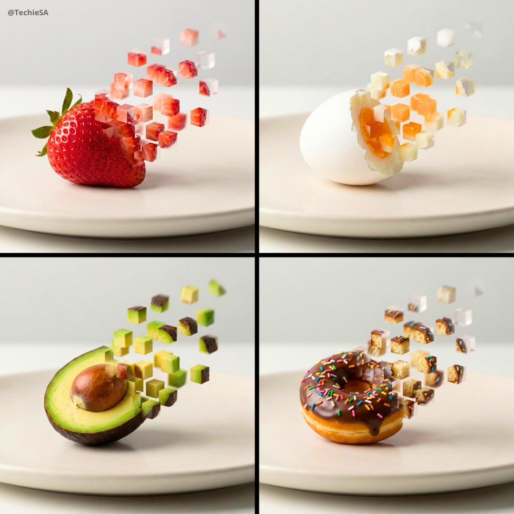

## { "scene_description": "A cinematic, wide-angle interior

- ID: gpt4o-883-en-1
- Slug: prompt-883-en-1
- 语言: en
- 来源: [来源链接](https://x.com/_MehdiSharifi_/status/1994550156763582572)
- 样例图路径: images/part3/883.jpeg

### 提示词

```text
{
  "scene_description": "A cinematic, wide-angle interior shot of a stylish young woman lounging inside a vintage American muscle car during golden hour.",
  "subject": {
    "type": "young woman",
    "age": "early 20s",
    "features": {
      "hair": "long, volumetric, sun-kissed honey blonde hair, tousled and windblown texture",
      "skin": "fair with warm golden undertones from the sun",
      "expression": "confident, alluring gaze directly into the lens, slight pout"
    },
    "attire": "black puff-sleeve milkmaid-style mini dress or romper with a sweetheart neckline",
    "position": "reclined comfortably across the front bench/bucket seats, one leg extended towards the camera (foreshortened), one knee bent, hand resting casually against her forehead."
  },
  "action": {
    "primary": "lounging in the passenger seat",
    "secondary": "shielding eyes/touching hair with left hand",
    "effect": "relaxed, rebellious 'cool girl' aesthetic"
  },
  "environment": {
    "setting": "Interior of a classic 1960s/70s muscle car",
    "foreground_elements": [
      "vintage wood-rimmed 3-spoke steering wheel (partial view)",
      "black vinyl dashboard",
      "chrome accents"
    ],
    "background_elements": [
      "wooden ranch-style fence visible through window",
      "clear blue sky",
      "car rear view mirror reflecting a sliver of the face"
    ]
  },
  "lighting": {
    "style": "Natural Golden Hour",
    "key_light": {
      "type": "Direct, warm sunlight",
      "color": "golden amber",
      "illuminates": [
        "face",
        "hair highlights",
        "legs"
      ]
    },
    "shadows": "Deep, high-contrast shadows inside the car cabin, creating depth"
  },
  "style": {
    "medium": "35mm film photography",
    "aesthetic": "Vintage Americana, editorial fashion, indie road trip",
    "quality": "high fidelity, grain simulation",
    "details": "ultra-realistic textures on leather and skin"
  },
  "scene_composition": {
    "subject_action": "Lounging with attitude, dominating the frame",
    "camera_behavior": "Wide-angle interior shot, creating perspective distortion on the boots",
    "depth_layering": "Steering wheel foreground -> Subject focus -> Exterior background"
  },
  "visual_description": {
    "core_subject": "A photorealistic young woman with blonde waves.",
    "attire_physics": "The black fabric of the dress absorbs light, while the leather boots have specular highlights.",
    "skin_rendering": "Warm, glowing skin texture with natural highlighting from the sun."
  },
  "lighting_and_atmosphere": {
    "type": "Golden Hour Natural Light",
    "specifics": "Hard sunlight entering through the car window, creating distinct shadow lines across the interior upholstery.",
    "color_grade": "Warm, Kodak Portra 400 inspired, rich blacks and vibrant skin tones."
  },
  "attire_customization": {
    "current_clothing": "Black long-sleeve puff-shoulder top with sweetheart neckline, black chunky platform combat boots with laces.",
    "customizable_clothing": "User can replace with 'denim jacket', 'white summer dress', etc."
  },
  "brand_product_customization": {
    "current_brand_product": "Dr. Martens style combat boots",
    "customizable_brand": "",
    "customizable_product": "",
    "product_placement_area": "The boots in the foreground or the car interior branding."
  },
  "objects_and_props": {
    "main_objects": [
      "Vintage car seats (ribbed black leather)",
      "Steering wheel",
      "Rearview mirror"
    ],
    "secondary_objects": [
      "Wooden fence outside",
      "Chrome door handle"
    ]
  },
  "camera_and_lens": {
    "focal_length_feel": "24mm or 28mm (wide angle)",
    "aperture_effect": "f/5.6 (deep enough to keep interior sharp, slight softness outside)",
    "camera_angle": "Eye-level relative to seated subject, shot from driver's side perspective",
    "lens_type": "Wide angle prime lens",
    "bokeh_style": "Minimal bokeh, mostly sharp context"
  }
}
```

### 样例图


## 女子在一辆复古美式车内

- ID: gpt4o-883-zh-2
- Slug: prompt-883-zh-2
- 语言: zh
- 来源: [来源链接](https://x.com/_MehdiSharifi_/status/1994550156763582572)
- 样例图路径: images/part3/883.jpeg

### 提示词

```text
{
“scene_description” “一段电影感十足的广角内景镜头，展现了一位时尚年轻女子在日落时分慵懒地躺在一辆复古美式肌肉车内。”
“主题”： {
“类型”: “年轻女子”
“年龄”：“20岁出头”，
“特征”： {
“头发”：“长长的、蓬松的、阳光亲吻过的蜜金色头发，蓬松凌乱，略带风吹的质感”，
“肤色”：“白皙，带有阳光带来的温暖金色光泽”，
“表情”：“自信、迷人的眼神直视镜头，微微撅嘴”
},
“服装”：“黑色泡泡袖挤奶女工风格迷你连衣裙或连体裤，心形领口”，
“姿势”：“舒适地斜倚在前排长椅/桶形座椅上，一条腿伸向镜头（画面缩短），一条膝盖弯曲，一只手随意地放在额头上。”
},
“行动”： {
“主要”： “躺在乘客座位上”，
“次要的”：“用左手遮住眼睛/触摸头发”，
“效果”：“轻松叛逆的‘酷女孩’美学”
},
“环境”： {
“场景”：“一辆经典的 20 世纪 60 年代/70 年代肌肉车的内饰”，
"前景元素": [
“复古木质三辐方向盘（局部视图）”
“黑色乙烯基仪表板”，
“镀铬装饰”
],
“背景元素”：[
“透过窗户可以看到木制牧场风格的围栏”
“晴朗的蓝天”，
“汽车后视镜映出脸部的一角”
]
},
“灯光”： {
“风格”：“自然黄金时刻”，
"key_light": {
“类型”：“直接、温暖的阳光”，
“颜色”：“金琥珀色”，
“照亮”：[
“脸”，
“头发挑染”，
“腿”
]
},
“阴影”：“车厢内部深邃、高对比度的阴影，营造出景深效果”
},
“风格”： {
“媒介”: “35mm 胶片摄影”
“美学”：“复古美式风格、时尚大片、独立公路旅行”
“质量”：“高保真度，颗粒模拟”，
“细节”：“皮革和皮肤上的超逼真纹理”
},
"scene_composition": {
“subject_action”: “慵懒地摆着姿势，占据了画面”
“camera_behavior”: “广角室内镜头，在靴子上产生透视变形”
"depth_layering": "方向盘前景->主体焦点->外部背景"
},
"visual_description": {
核心主题：一位拥有金色波浪卷发的写实年轻女性。
"attire_physics": "连衣裙的黑色面料会吸收光线，而皮靴则具有镜面反射的高光。"
“skin_rendering”: “温暖、有光泽的肌肤纹理，带有阳光带来的自然高光。”
},
"lighting_and_atmosphere": {
“类型”：“黄金时段自然光”，
“具体情况”：“强烈的阳光透过车窗照射进来，在车内座椅上投下清晰的阴影线。”
"color_grade": "温暖的色调，灵感来自柯达Portra 400，浓郁的黑色和鲜艳的肤色。"
},
"attire_customization": {
"current_clothing": "黑色长袖泡泡袖上衣，心形领口，黑色厚底系带马丁靴。"
"customizable_clothing": "用户可以替换为'牛仔夹克'、'白色夏日连衣裙'等。"
},
"品牌产品定制": {
"current_brand_product": "马丁靴款式"
"customizable_brand": "",
"customizable_product": "",
"product_placement_area": "前景中的靴子或汽车内饰品牌标识。"
},
"objects_and_props": {
"main_objects": [
“复古汽车座椅（黑色罗纹皮革）”
“方向盘”，
“后视镜”
],
"secondary_objects": [
“外面有木栅栏，”
“镀铬门把手”
]
},
"camera_and_lens": {
"focal_length_feel": "24mm 或 28mm（广角）",
"aperture_effect": "f/5.6（足够深，可以保持内部清晰，外部略微柔和）",
“camera_angle”: “相对于坐着的拍摄对象，从驾驶员侧视角拍摄，视线与拍摄对象视线齐平”
"lens_type": "广角定焦镜头",
"bokeh_style": "极简散景，主体清晰"
}
}
```

### 样例图


## The [subject] is formed from liquid plumes swirling in m

- ID: gpt4o-881-en-1
- Slug: prompt-881-en-1
- 语言: en
- 来源: [来源链接](https://x.com/azed_ai/status/2001246085042593973)
- 样例图路径: images/part3/881.jpeg

### 提示词

```text
The [subject] is formed from liquid plumes swirling in milky water. Soft diffusion, abstract forms, rich ink blacks, and cloudy whites blending naturally, giving a dreamy, poetic impression.
```

### 样例图

![The [subject] is formed from liquid plumes swirling in m](../images/part3/881.jpeg)

## 墨水风格营造出梦幻般的诗意氛围

- ID: gpt4o-881-zh-2
- Slug: prompt-881-zh-2
- 语言: zh
- 来源: [来源链接](https://x.com/azed_ai/status/2001246085042593973)
- 样例图路径: images/part3/881.jpeg

### 提示词

```text
画面主体由乳白色水中旋转的液态羽流构成。柔和的扩散效果、抽象的形态、浓郁的墨黑色和朦胧的白色自然融合，营造出梦幻般的诗意氛围。
```

### 样例图

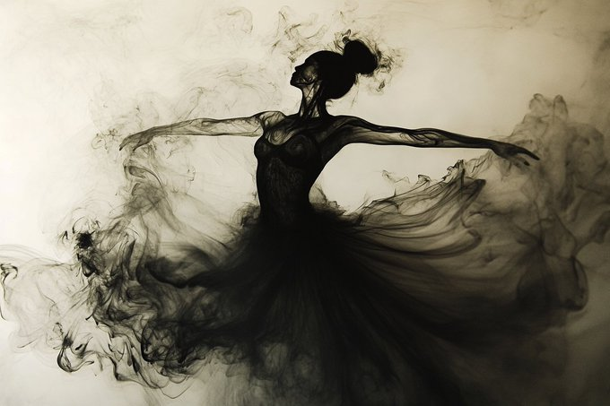

## 朱迪站在雪桥上

- ID: gpt4o-876-zh
- Slug: prompt-876-zh
- 语言: zh
- 来源: [来源链接](https://x.com/songguoxiansen/status/1998921448350687304)
- 样例图路径: images/part3/876.jpeg

### 提示词

```text
疯狂动物城里的朱迪·霍普斯（Judy Hopps）站在黄昏时分的雪桥上，身穿厚厚的冬装外套，围着针织围巾，戴着手套，戴着圣诞帽。轻柔的雪花在她周围飘落，城市灯光在模糊的背景中散发出温暖的光芒。她有着富有表现力的大眼睛、精致的皮毛细节和温柔的微笑。画面采用电影级的摄影和灯光效果，细节丰富，营造出温馨的冬日氛围。
```

### 样例图


## { "image_prompt": { "critical_instruction": "ABSOLUTE PR

- ID: gpt4o-874-en-1
- Slug: prompt-874-en-1
- 语言: en
- 来源: [来源链接](https://x.com/songguoxiansen/status/2000055154415182214)
- 样例图路径: images/part3/874.jpeg

### 提示词

```text
{
  "image_prompt": {
    "critical_instruction": "ABSOLUTE PRIORITY: Maintain identical facial structure across all panels. Do not alter underlying bone structure, nose shape, eye spacing, or jawline regardless of the expression being rendered. The identity must be unmistakable in every single shot.",
    "format": "3x3 grid collage",
    "subject": {
      "face_reference": "uploaded_photo",
      "face_identity_lock": "CRITICAL: fixed identity, zero deviation from reference facial features",
      "face_match_accuracy": "100% exact match enforced",
      "identity_preservation_details": "Ensure consistent interpupillary distance, exact nose bridge shape, and jaw structure in every panel.",
      "negative_constraints": [
        "do not morph nose shape",
        "do not change eye size or spacing",
        "do not alter cheekbone structure",
        "no plastic surgery look"
      ],
      "style": "hyper-realistic portrait photography, 8k resolution, raw photo aesthetic",
      "skin": "highly detailed natural skin texture, visible pores, subtle imperfections, realistic complexion, consistent across all lighting conditions",
      "camera_settings": "shot on Sony A7R IV, 85mm portrait lens, f/1.8 aperture, sharp focus on eyes, shallow depth of field"
    },

    "panels": [
      {
        "expression": "joyful",
        "pose": "bright natural smile (maintaining jaw structure), shoulders slightly raised",
        "hairstyle": "high ponytail with loose strands",
        "outfit": "pastel cotton hoodie",
        "background": "soft gradient sky blue studio backdrop"
      },
      {
        "expression": "surprised",
        "pose": "hands near face, wide eyes (without altering eye shape), natural reaction",
        "hairstyle": "loose natural wavy hair",
        "outfit": "casual cotton t-shirt",
        "background": "light peach studio backdrop"
      },
      {
        "expression": "sad",
        "pose": "head tilted down, emotional soft eyes",
        "hairstyle": "messy low bun",
        "outfit": "oversized wool sweater",
        "background": "muted lavender tone studio backdrop"
      },
      {
        "expression": "tender",
        "pose": "gentle smile, head slightly tilted",
        "hairstyle": "elegant half-up hairstyle",
        "outfit": "soft knit top",
        "background": "warm beige studio backdrop"
      },
      {
        "expression": "daring",
        "pose": "confident gaze, chin slightly raised (showing consistent jawline)",
        "hairstyle": "chic slicked-back hair",
        "outfit": "stylish leather or denim jacket",
        "background": "deep teal studio backdrop"
      },
      {
        "expression": "playful",
        "pose": "cheeks slightly puffed (ensure nose remains unchanged), playful stare",
        "hairstyle": "short textured bob",
        "outfit": "striped linen shirt",
        "background": "soft mint green studio backdrop"
      },
      {
        "expression": "charming",
        "pose": "wink with finger poking cheek",
        "hairstyle": "playful double buns",
        "outfit": "trendy graphic tee",
        "background": "light pink studio backdrop"
      },
      {
        "expression": "shocked",
        "pose": "mouth slightly open, eyebrows raised (forehead wrinkles match reference age)",
        "hairstyle": "tousled loose hair",
        "outfit": "simple silk blouse",
        "background": "light yellow studio backdrop"
      },
      {
        "expression": "furious",
        "pose": "arms crossed, intense glare (eyes narrowed but spacing unchanged)",
        "hairstyle": "tight high bun",
        "outfit": "dark fitted turtleneck",
        "background": "deep red studio backdrop"
      }
    ],

    "rendering": {
      "lighting": "cinematic studio lighting, softbox illumination, remix of warm and cool tones, rim light for separation",
      "shading": "realistic shadows, subsurface scattering on skin, consistent facial modeling",
      "quality": "photorealistic, ultra-detailed, award-winning photography, magazine quality",
      "consistency": "FLAWLESS identity consistency and lighting setup across all 9 panels"
    },

    "composition": {
      "grid_alignment": "perfectly aligned 3x3 photo booth strip style",
      "spacing": "equal white margins between panels",
      "background_border": "clean white border"
    }
  }
}
```

### 样例图


## 真人版的9宫格照片

- ID: gpt4o-874-zh-2
- Slug: prompt-874-zh-2
- 语言: zh
- 来源: [来源链接](https://x.com/songguoxiansen/status/2000055154415182214)
- 样例图路径: images/part3/874.jpeg

### 提示词

```text
{
"image_prompt": {
“关键指令”： “绝对优先事项：所有画面中保持面部结构完全一致。无论表情如何，都不得改变骨骼结构、鼻子形状、眼距或下颌线。每一帧画面中都必须清晰可辨。”
"格式": "3x3 网格拼贴画",
“主题”： {
"face_reference": "uploaded_photo",
"face_identity_lock": "严重：身份已固定，与参考面部特征无偏差",
"face_match_accuracy": "强制执行 100% 精确匹配",
"identity_preservation_details": "确保每个面板中瞳距一致、鼻梁形状精确、下颌结构准确。"
"negative_constraints": [
“不要改变鼻子的形状”，
“不要改变眼睛的大小或间距，”
“不要改变颧骨结构”，
“没有整容痕迹”
],
“风格”：“超写实人像摄影，8K分辨率，原始照片美学”，
“皮肤”：“高度精细的自然皮肤纹理，可见毛孔，细微瑕疵，逼真的肤色，在所有光照条件下保持一致”。
"camera_settings": "使用索尼 A7R IV 拍摄，85mm 人像镜头，f/1.8 光圈，眼睛锐化对焦，浅景深"
},

“面板”：[
{
“表情”： “喜悦的”，
“姿势”：“灿烂自然的笑容（保持下颌结构），肩膀微微抬起”，
“发型”：“高马尾辫，留出几缕碎发”，
“服装”： “淡色棉质连帽衫”，
“背景”: “柔和渐变天蓝色影棚背景”
},
{
“表情”：“惊讶”，
“姿势”：“双手靠近脸部，睁大眼睛（不改变眼形），自然反应”，
“发型”：“自然蓬松的波浪卷发”，
“服装”：“休闲棉质T恤”，
背景：浅桃色影棚背景
},
{
“表情”：“悲伤”，
“姿势”：“低头，眼神柔和，充满情感”，
发型：凌乱的低发髻，
“服装”: “宽松羊毛衫”，
“背景”：“柔和的薰衣草色调工作室背景”
},
{
“表达方式”：“温柔的”，
“姿势”：“温柔的微笑，头部微微倾斜”，
“发型”：“优雅的半扎发型”，
服装：柔软针织上衣，
背景：暖米色影棚背景
},
{
“表达方式”：“大胆的”，
“姿势”：“眼神自信，下巴微微抬起（展现出连贯的下颌线条）”，
“发型”：“别致的油头”，
“服装”：“时尚的皮夹克或牛仔夹克”，
背景：深蓝绿色摄影棚背景
},
{
“表情”：“俏皮的”，
“姿势”：“双颊微微鼓起（确保鼻子保持不变），眼神俏皮”，
“发型”：“短款纹理波波头”，
“服装”：“条纹亚麻衬衫”，
背景：柔和的薄荷绿色摄影棚背景
},
{
“表情”：“迷人”，
“姿势”：“眨眼并用手指戳脸颊”，
发型：俏皮的双丸子头，
“服装”: “时髦的图案T恤”
背景：浅粉色摄影棚背景
},
{
“表情”：“震惊”，
“姿势”：“嘴巴微张，眉毛上扬（额头皱纹与参考年龄相符）”，
“发型”：“蓬松的披肩发”，
“服装”：“简单的丝绸衬衫”，
“背景”: “浅黄色摄影棚背景”
},
{
“表情”：“愤怒的”，
“姿势”：“双臂交叉，目光锐利（眼睛眯起但间距不变）”
发型：高高盘发，
“服装”：“深色修身高领毛衣”，
“背景”：“深红色摄影棚背景”
}
],

渲染：{
“灯光”：“电影摄影棚灯光、柔光箱照明、冷暖色调混合、轮廓光用于分离”，
“阴影”：“逼真的阴影、皮肤表面的次表面散射、一致的面部建模”，
“品质”：“照片级逼真、细节超多、屡获殊荣的摄影作品，杂志品质”，
“一致性”：“所有 9 个面板的标识一致性和灯光设置完美无瑕”
},

“作品”： {
"grid_alignment": "完美对齐的 3x3 照片亭条形样式",
“间距”：“面板之间留出相等的白色边距”，
"background_border": "干净的白色边框"
}
}
}
```

### 样例图


## 女生坐在瑞幸咖啡的冷饮杯子上

- ID: gpt4o-873-zh
- Slug: prompt-873-zh
- 语言: zh
- 来源: [来源链接](https://x.com/songguoxiansen/status/2000129925995782171)
- 样例图路径: images/part3/873.jpeg

### 提示词

```text
一张写实的中景照片，场景设定在户外的路面上，柔和的自然光。画面必须完整包含所有元素。一位微缩的女性休闲、调皮地坐在一个巨大的瑞幸咖啡（Luckin Coffee）透明冷饮杯的杯盖边缘。
关键要求：这位女性的面部特征必须完全参照并保持与输入参考图像中的人物面部一致，不做任何改变。
她穿着粉色修身上衣、白色短裙和配套的柔和色调鞋子，姿态放松。那个巨大的透明杯子里装着看起来很浓稠的粉色系瑞幸特调饮品（例如草莓拿铁或丝绒白桃），杯身上有清晰完整的蓝色瑞幸鹿角标志和品牌字样。
在杯子旁边，放置着一个与杯中饮品颜色色调完美呼应的超级巨大的光面粉色手提包，配有金色链条肩带，它的体积比那个“微缩”的女人要大得多。在她旁边的地面上，还完整地放着一副同样与饮品颜色色调一致的超大心形粉色太阳镜。镜头距离足够远，以确保巨大的杯子、微小的人、巨大的包和太阳镜都完整地呈现在画面中。宽高比1:1
```

### 样例图


## 一生要出片的中国女人系列之故宫打卡

- ID: gpt4o-872-zh
- Slug: prompt-872-zh
- 语言: zh
- 来源: [来源链接](https://x.com/hx831126/status/2000793779977273724)
- 样例图路径: images/part3/872.jpeg

### 提示词

```text
【PROJECT GOAL | 项目目标】 生成一张 9:16 竖版「高端时尚杂志封面级」写实照片：以我上传的 FACE_REF 为人物身份参考，100%还原五官与骨相；人物身穿“明制华丽礼服方向”的重工汉服（多层叠穿、手工刺绣/织金锦、贵重金饰头面），在故宫红墙长廊雪景中拍摄。画面具备《Vogue》《Harper’s Bazaar》《ELLE》《Cosmopolitan》《Marie Claire》《i-D》《Allure》《FLAUNT》级别的摄影、造型与封面设计，以上杂志随机任选一作为杂志的封面设计，并保持选择杂志的一贯设计风格（中英文设计）

【INPUTS | 输入】

FACE_REF：我上传的人物五官参考图（身份锁定）

【ABSOLUTE PRIORITY | 身份锁定（最高优先级）】

100%还原 FACE_REF 的五官与骨相；眼距、鼻梁鼻翼、唇形、下颌线、颧骨结构完全一致，不得漂移。

真实皮肤质感：可见细微纹理与毛孔，不要过度磨皮与网红化。

成年女性形象（adult）。

【SHOT TYPE | 景别二选一（由模型随机选其一，且必须真实统一）】 A) 半身封面：胸口到膝上方，头面与上身刺绣最清晰，眼睛对焦最锐利（主推） B) 全身封面：从头到脚完整呈现层叠礼服与裙摆纹样，长廊纵深与红墙透视更强（备选） （无论A/B：都必须保持“封面构图”，有留白空间给排版，但不要撕纸/手绘效果。）

【LOCATION | 场景（故宫/紫禁城）】

北京故宫红墙长廊：朱红墙、红柱、雕花窗极、彩绘梁枋细节与强透视纵深。

天气二选一（随机）：1) 细雪飘落 2) 雪后晴朗（檐下/台阶残雪、空气通透）

背景干净：无游客、无现代标识、无手机状态栏UI、无水印字幕。

【LIGHTING & CAMERA | 摄影质感（杂志级）】

镜头感：85mm人像质感（半身）或 50mm/70mm（全身），浅景深，眼睛最清晰。

光线：冬日自然光 + 柔和补光；金饰/珠翠有真实高光但不爆；刺绣纹理清晰可辨。

色彩：高级电影感，红墙与服装主色不互相脏染；整体干净、通透、质感厚。

【WARDROBE | 明制华丽礼服（重工、多层叠、可读的硬锚点）】 目标审美：“金饰为主、流苏密集、凤冠、衣服大面积织金刺绣、层叠繁复但高级不俗艳”。

轮廓与层次（必须多层叠穿）

内层：白色/黑衣立领/里领清晰可见（干净、挺括，做出层次边界）

中层：对襟袄/衫（或方领/立领结构感），袖口宽大、滚边精细

外层：披肩/霞帔式的礼服结构（有明显“压襟/佩饰”承托），整体层次厚重

下装：长裙/马面裙方向，裙摆纹样连续，底边有织金边或刺绣边（全身版本必须明显）

面料与工艺（重手工必须“看得见”）

主面料：织金锦/提花锦（真实纤维感，暗纹浮起）

主要工艺：盘金绣、金线绣、立体刺绣、贴布绣（让花纹有“微微起伏”的厚度）

纹样主题：牡丹/团花/祥云/瑞兽（精致、密度高、但图案边缘清晰，瑞兽不能是龙）

细节：滚边、暗扣、系带、护领、胸前“压襟/璎珞感”层叠装饰（但不杂乱）

头面（黄金为主的重工头饰，必须华丽）

金色为主的方向：金丝累珠、点翠/珠翠、密集簪钗、左右对称的长流苏坠饰，凤冠

流苏长度与密度要“明显”：走动或微风时有轻微摆动

耳饰/颈饰：金+珍珠+玉（贵重但不廉价闪）

【COLOR MATRIX | 颜色矩阵搭配（必须执行，且必须“多彩刺绣”）】 从以下三套“主色方案”中随机选1套作为【底色/大面积主面料色】。 注意：主色只决定“底色”，刺绣必须是【宫廷织锦式多色刺绣】（不允许只有金色刺绣）。

Scheme G (翡翠绿底)： 底色：翡翠绿/孔雀绿（大面积主面料） 刺绣：多色绣线 + 盘金绣混用（至少包含：金色、朱红/胭脂红、宝蓝/靛蓝、米白、淡紫或藕粉） 层次点亮：米白里领/内衬边 + 少量朱红与宝蓝作为“宫廷撞色”点缀

Scheme A (杏底)： 底色：暖杏/米杏（大面积主面料） 刺绣：多色绣线 + 盘金绣混用（至少包含：金色、翡翠绿/松石绿、朱红/珊瑚红、孔雀蓝/靛蓝、米白） 层次点亮：用翡翠绿与朱红做小面积宫廷撞色，保持“雅而不素、贵而不艳”

Scheme R (红底)： 底色：深朱红/绯红（大面积主面料） 刺绣：多色绣线 + 盘金绣混用（至少包含：金色、孔雀蓝/靛蓝、松石绿、米白、胭脂粉或珊瑚红） 层次点亮：米白里领/内衬边 + 少量翡翠绿或孔雀蓝作冷暖对比

【颜色执行规则】

“多彩刺绣”必须看得见：至少 4 种以上彩色绣线清晰可辨，且与金线叠加，形成丰富层次。

纹样边缘要清晰，不糊成一片；红墙背景下服装与背景必须分离，层次清楚、低脏度、厚而不闷。

禁止出现“单一金色刺绣覆盖全身”的单调效果。

【POSE | 封面姿态（端庄、贵气、非摆拍俗气）】

半身：双手在身前轻持团扇/宫扇（扇面刺绣清晰），或一手轻拢袖口一手自然垂落

全身：站姿端正、重心稳定，裙摆自然垂坠；袖摆形成优雅弧线

表情：沉静、克制、自信；不要夸张大笑，不要做短视频“眨眼比心”。

【OUTPUT | 输出】

1 张 9:16 竖版写实杂志封面级照片

随机：半身 or 全身（A/B二选一）

随机：雪中 or 雪后晴朗（天气二选一）

随机：翡翠绿 / 杏 / 红 /（颜色矩阵三选一）

造型：明制华丽礼服方向 + 金色重工凤冠头面 + 多层叠穿 + 大面积织金刺绣
```

### 样例图


## Create a realistic wall calendar hanging on a textured c

- ID: gpt4o-868-en-1
- Slug: prompt-868-en-1
- 语言: en
- 来源: [来源链接](https://x.com/AIwithkhan/status/2000800087975584206)
- 样例图路径: images/part3/868.jpeg

### 提示词

```text
Create a realistic wall calendar hanging on a textured concrete wall, framed in a warm wooden frame. The top half features my uploaded portrait photo in a soft cinematic style, shallow depth of field, warm bokeh lights in the background, natural skin tones, calm confident expression. The bottom half displays a clean, modern calendar layout for December 2025, with bold month text on the left and year on the right, neatly aligned date grid below, Sundays to Saturdays clearly labeled. Minimal beige and brown color palette, elegant typography, realistic paper texture, soft natural sunlight casting gentle shadows, premium lifestyle photography look, ultra-high resolution.
```

### 样例图

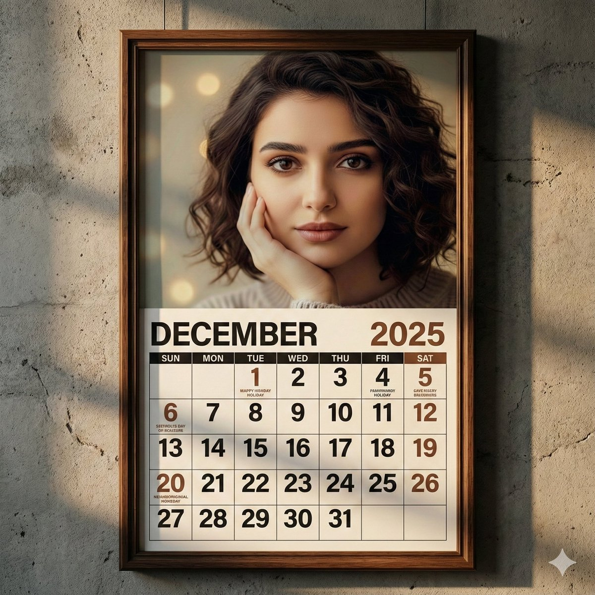

## 一款逼真的挂历

- ID: gpt4o-868-zh-2
- Slug: prompt-868-zh-2
- 语言: zh
- 来源: [来源链接](https://x.com/AIwithkhan/status/2000800087975584206)
- 样例图路径: images/part3/868.jpeg

### 提示词

```text
制作一款逼真的挂历，悬挂在纹理丰富的混凝土墙上，并配以温暖的木质画框。上半部分展示我上传的肖像照片，采用柔和的电影风格，浅景深，背景中温暖的散景光，自然的肤色，以及沉稳自信的神情。下半部分则呈现简洁现代的2025年12月日历布局，左侧醒目的月份文字，右侧的年份文字，下方整齐排列的日期网格，周日至周六清晰标注。采用极简的米色和棕色配色方案，优雅的字体，逼真的纸张纹理，柔和的自然光投射出淡淡的阴影，呈现出高端生活方式摄影的质感，并拥有超高分辨率。
```

### 样例图


## 一张超写实的竖屏照片

- ID: gpt4o-866-zh
- Slug: prompt-866-zh
- 语言: zh
- 来源: [来源链接](https://x.com/langzihan/status/2000808841089527981)
- 样例图路径: images/part3/866.jpeg

### 提示词

```text
# 图片复刻元提示词 (Image Reproduction Meta-Prompt)

## 1. 角色指定 (Role)
你是一位**资深人像摄影大师 (Senior Portrait Photographer)** 和 **光影构图专家**。你擅长捕捉日常生活中的自然瞬间（Candid Moments），精通室内布光与景深控制，能够完美复刻“男友视角”的社交媒体风格照片。

## 2. 图片结构与框架 (Structure & Frame)
* **画幅比例:** 9:16 (竖屏全画幅)
* **构图模式:** 近景人像 (Medium Close-up)，人物占据画面前景左侧 60% 区域。
* **核心锚点:**
    * 前景：浅色木质圆桌边缘（切过画面左下角）。
    * 中景：人物上半身，特别是面部和托腮的手臂。
    * 背景：虚化的咖啡店柜台与人群。
* **文字处理:** 本图无UI文字框。需在画面中生成的自然文字为人物左臂衣袖上的 "alo" 品牌标签。

## 3. 图片主题内容生成 Workflow
**Step 1: 场景构建 (Scene Setup)**
   * 设定环境为现代繁忙的咖啡店内部。
   * 天花板：裸露的工业风管道，安装有轨道射灯。
   * 背景：远处有模糊的服务柜台（红色菜单板为特征）和排队的深色衣着路人。

**Step 2: 主体刻画 (Subject Definition)**
   * 生成一名[目标角色特征，默认为年轻亚洲女性]。
   * 发型：棕色短发，空气刘海。
   * 着装：穿着黑色半拉链立领Fleece材质卫衣，质感柔软厚实。
   * **关键细节:** 左大臂处必须有一个清晰的黑色正方形补丁，上有白色 "alo" 字母Logo。

**Step 3: 姿态与神情 (Pose & Expression)**
   * 动作：身体向桌子前倾，重心下沉。左手手肘撑在桌面上，手掌托住脸颊/下巴。
   * 视线：直视镜头，眼神清澈，带有一丝温柔或探究的笑意。

**Step 4: 摄影参数模拟 (Camera Parameters)**
   * 焦段：50mm 或 85mm 定焦镜头。
   * 光圈：f/1.8 或 f/2.0 (制造背景虚化)。
   * 光线：模拟室内顶光，面部受光均匀，带有轻微暖调。

## 4. 图片整体描述 (Overall Description)
* **风格:** 真实感摄影 (Photorealistic)，生活方式 (Lifestyle)，高清 (8k resolution)，Instagram 风格。
* **色彩:** 黑色(衣服)与暖木色(桌子)为前景主调，背景杂糅暖黄光与红色点缀。
* **纹理:** 重点表现卫衣的抓绒质感、头发的光泽感、木桌的纹理。

## 5. 目标物体和语言输入框 (User Inputs)
* **[目标角色特征]:** （可爱短发亚洲女性）- *默认为：可爱短发亚洲女性*
* **[服装品牌细节]:** () - *默认为：alo 品牌 Logo*
* **[环境氛围]:** (户外咖啡馆) - *默认为：星巴克风格咖啡店*

---
**生成指令 (中文提示词参考):**
一张超写实的竖屏照片，视角略微俯视。画面主体是一位[目标角色特征]，她正坐在咖啡店的浅色圆木桌前。她穿着黑色的半拉链高领抓绒卫衣，左侧袖子上有一个清晰的 "[服装品牌细节]" 标签。她身体前倾，单手托腮，手肘撑在桌上，眼神温柔地看向镜头。背景是虚化的繁忙咖啡店，可以看到天花板的轨道灯、远处红色的菜单板和模糊的顾客。光线为温暖的室内顶光，肤色自然，发丝清晰，具有极高的摄影质感。
```

### 样例图


## Luxury portrait of the uploaded image, 100% same face id

- ID: gpt4o-863-en-1
- Slug: prompt-863-en-1
- 语言: en
- 来源: [来源链接](https://x.com/ShreyaYadav___/status/2000593577253146761)
- 样例图路径: images/part3/863.jpeg

### 提示词

```text
Luxury portrait of the uploaded image, 100% same face identity. Bright, clean exposure with soft studio lighting, balanced brightness, natural highlights on face and eyes, smooth shadow falloff. Ultra-realistic skin texture, sharp detailed eyes, natural hair strands, high-detail fabric. Clean elegant background with soft depth of field. Premium cinematic color grading, rich natural colors. Full-frame DSLR look, 85mm f/1.8, 8K ultra-realistic, no cartoon, no over-smoothing, no face change.
```

### 样例图

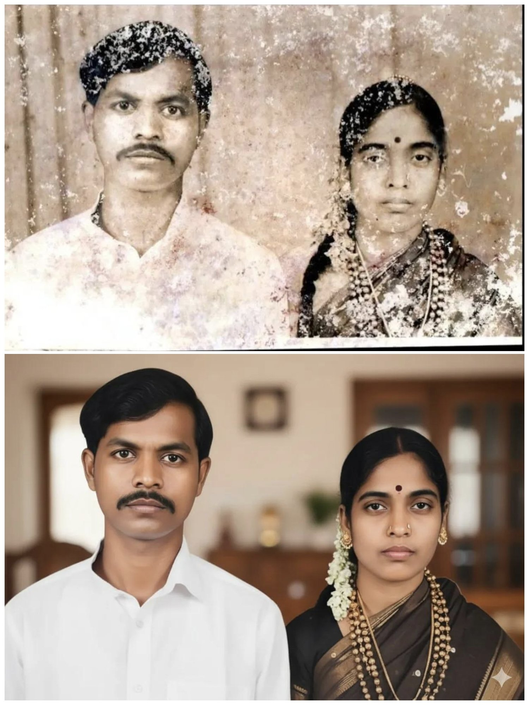

## 老照片高清修复

- ID: gpt4o-863-zh-2
- Slug: prompt-863-zh-2
- 语言: zh
- 来源: [来源链接](https://x.com/ShreyaYadav___/status/2000593577253146761)
- 样例图路径: images/part3/863.jpeg

### 提示词

```text
上传图片的高级人像，100% 还原本人面部特征。明亮清晰的曝光，柔和的影棚灯光，亮度均衡，面部和眼部高光自然，阴影过渡平滑。肌肤纹理极其逼真，双眼细节清晰锐利，发丝自然，织物细节丰富。背景干净优雅，景深柔和。采用高级电影级调色，色彩饱满自然。全画幅单反风格，85mm f/1.8 镜头，8K 超高清画质，无卡通化、无过度磨皮、无面部修改。
```

### 样例图


## Studio portrait of one smiling person holding a Fanta or

- ID: gpt4o-862-en-1
- Slug: prompt-862-en-1
- 语言: en
- 来源: [来源链接](https://x.com/Sheldon056/status/2000769215989489837)
- 样例图路径: images/part3/862.jpeg

### 提示词

```text
Studio portrait of one smiling person holding a Fanta orange aluminum can close to the camera, with both the can and the person’s head in the foreground. Shot using an ultra-wide fisheye lens for a playful, energetic, immersive perspective.
The model wears a glossy vibrant orange puffer jacket inspired by Fanta branding, layered over a bright white t-shirt.
Background in a bold citrus-orange gradient with subtle yellow highlights, perfectly color-matched to Fanta’s brand palette, smooth modern transitions.
Diffused cinematic studio lighting, juicy highlights on the can, soft glossy reflections on the jacket, gentle shadows for depth.
Slightly desaturated yet fresh, youthful modern editorial style, fun soda-campaign aesthetic, clean and minimal composition.
Ultra-sharp focus, natural skin texture, cheerful expressive smile, high-end commercial beverage photography look.

Face must match the attached reference image exactly, accurate facial proportions, realistic skin tone, no facial alteration.
Photorealistic, 8K detail, professional studio photography, global soda brand advertisement quality.
```

### 样例图

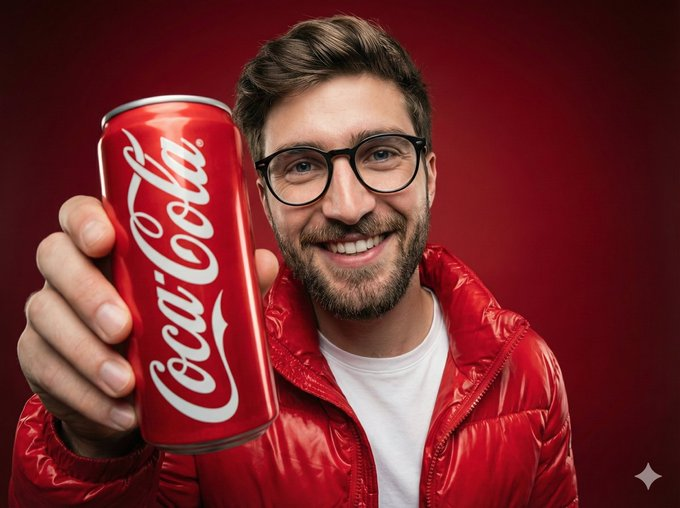

## 一位面带微笑的人手持可口可乐铝罐

- ID: gpt4o-862-zh-2
- Slug: prompt-862-zh-2
- 语言: zh
- 来源: [来源链接](https://x.com/Sheldon056/status/2000769215989489837)
- 样例图路径: images/part3/862.jpeg

### 提示词

```text
一张影棚肖像照，照片中一位面带微笑的人手持芬达橙味铝罐，靠近镜头，罐子和人的头部都位于前景。照片采用超广角鱼眼镜头拍摄，营造出一种活泼、充满活力且引人入胜的视角。
模特身穿一件亮橙色羽绒服，其设计灵感源自芬达品牌，内搭一件亮白色T恤。
背景采用大胆的柑橘橙色渐变，并带有微妙的黄色高光，与芬达品牌色调完美匹配，过渡流畅现代。
漫射的电影摄影棚灯光，罐身上明亮的高光，夹克上柔和的光泽反射，以及营造深度感的柔和阴影。
略微褪色但清新、年轻、现代的编辑风格，有趣的汽水广告美学，简洁的构图。
超清晰的焦点、自然的肌肤纹理、灿烂的笑容，高端商业饮料摄影风格。

面部必须与附图完全一致，面部比例准确，肤色逼真，不得进行任何面部修改。
照片级真实感，8K细节，专业影棚拍摄，全球汽水品牌广告品质。
```

### 样例图


## Create an ultra-realistic sky scene where soft, natural 

- ID: gpt4o-860-en-1
- Slug: prompt-860-en-1
- 语言: en
- 来源: [来源链接](https://x.com/TechieBySA/status/2000671056780996891)
- 样例图路径: images/part3/860.jpeg

### 提示词

```text
Create an ultra-realistic sky scene where soft, natural cloud formations organically assemble into the clear silhouette of a [OBJECT]. The cloud shape appears high in a vibrant blue sky, naturally floating above a recognizable nature below.

The composition is square (1080×1080), with the cloud formation occupying the upper portion of the frame while the landscape grounds the scene beneath it. Lighting is crisp and daylight-bright, with sunlit highlights on the clouds that enhance depth, softness, and realism.

The overall mood should feel calm, optimistic, and visually striking, with rich color saturation and a clean, peaceful atmosphere.
```

### 样例图

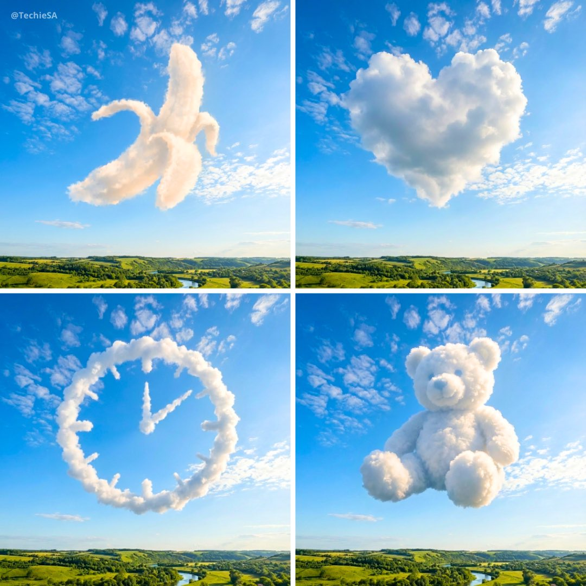

## 超逼真的物体云朵

- ID: gpt4o-860-zh-2
- Slug: prompt-860-zh-2
- 语言: zh
- 来源: [来源链接](https://x.com/TechieBySA/status/2000671056780996891)
- 样例图路径: images/part3/860.jpeg

### 提示词

```text
“创造一个超逼真的天空场景，其中柔和自然的云朵有机地组合成清晰的[物体]轮廓。云朵的形状出现在充满活力的蓝色天空的高处，自然地漂浮在下方可辨认的自然景观之上。”

画面构图为正方形（1080×1080），云层占据画面上半部分，下方则是地景。光线明亮清晰，如同日光一般，阳光照射在云层上，增强了画面的层次感、柔和感和真实感。

整体氛围应给人平静、乐观、视觉冲击力强的感觉，色彩饱和度高，环境干净平和。
```

### 样例图


## { "task": "image_generation", "output": { "aspect_ratio"

- ID: gpt4o-859-en-1
- Slug: prompt-859-en-1
- 语言: en
- 来源: [来源链接](https://x.com/ShreyaYadav___/status/2000818403137786340)
- 样例图路径: images/part3/859.jpeg

### 提示词

```text
{
  "task": "image_generation",
  "output": {
    "aspect_ratio": "9:16",
    "resolution": "8K",
    "style": ["ultra-realistic", "ultra-high-detail", "photorealistic"]
  },
  "identity_reference": {
    "use_uploaded_image_as_reference": true,
    "face_and_body": "match uploaded identity as closely as possible",
    "notes": "If the system supports reference images, keep the same face, skin tone, facial proportions, and overall figure from the uploaded image."
  },
  "prompt": {
    "scene": "A candid, glamour portrait photo at a sunny upscale outdoor cafe terrace during summer brunch.",
    "subject": {
      "description": "A beautiful glamorous young woman with long dark wavy hair wearing pink-tinted cat-eye sunglasses, seated at an outdoor cafe table and posing naturally for a photo.",
      "outfit": "Romantic floral-print ruffled sundress with a sweetheart neckline.",
      "expression_pose": "Relaxed confident smile, casual elegant posture, slightly angled toward camera."
    },
    "food_foreground": {
      "description": "In the foreground, a large golden waffle dusted with powdered sugar on a matte black plate. Next to it, a fancy glass dish of whipped cream with visible texture.",
      "composition_note": "Food close to camera, subject in mid-ground for depth."
    },
    "environment": {
      "description": "Sunny upscale terrace with large cream umbrellas, natural wood chairs, and large glass windows reflecting greenery and soft highlights.",
      "mood": "Luxurious, bright, leisurely; sunny summer brunch atmosphere."
    },
    "lighting": {
      "type": "Natural sunlight",
      "quality": "Warm, soft shadows, gentle specular highlights on sunglasses and glass dish"
    },
    "camera": {
      "shot_type": "Candid shot / captured moment",
      "framing": "Vertical portrait, subject centered with foreground food prominent",
      "lens_look": "Shallow depth of field, crisp subject detail, creamy bokeh background"
    },
    "quality_tags": [
      "8k",
      "ultra sharp",
      "high dynamic range",
      "realistic skin texture",
      "fine fabric detail",
      "natural color grading"
    ]
  },
  "negative_prompt": [
    "cartoon",
    "anime",
    "cgi",
    "3d render",
    "painting",
    "low resolution",
    "blurry",
    "overexposed",
    "underexposed",
    "bad anatomy",
    "deformed hands",
    "extra fingers",
    "duplicate face",
    "different identity",
    "face distortion",
    "text",
    "watermark",
    "logo",
    "oversaturated colors"
  ]
}
```

### 样例图


## 一位美丽迷人的年轻女子

- ID: gpt4o-859-zh-2
- Slug: prompt-859-zh-2
- 语言: zh
- 来源: [来源链接](https://x.com/ShreyaYadav___/status/2000818403137786340)
- 样例图路径: images/part3/859.jpeg

### 提示词

```text
{
"任务": "图像生成",
“输出”： {
"aspect_ratio": "9:16",
分辨率：8K，
风格：["超写实", "超高细节", "照片级写实"]
},
"identity_reference": {
"use_uploaded_image_as_reference": true,
"face_and_body": "尽可能与上传的身份信息相匹配",
备注：如果系统支持参考图像，请保持上传图像中的面部、肤色、面部比例和整体体型一致。
},
“迅速的”： {
“场景”：“在阳光明媚的高档户外咖啡馆露台上，夏日早午餐时分拍摄的一张自然、迷人的肖像照。”
“主题”： {
“描述”：“一位美丽迷人的年轻女子，留着长长的黑色波浪卷发，戴着粉色猫眼太阳镜，坐在户外咖啡桌旁，自然地摆姿势拍照。”
“服装”：“浪漫碎花荷叶边吊带连衣裙，心形领口。”
"expression_pose": "放松自信的微笑，随意优雅的姿态，略微侧身看向镜头。"
},
"food_foreground": {
描述：前景中，一块撒满糖粉的金黄色华夫饼放在哑光黑色盘子上。旁边，一个精致的玻璃碗里盛着纹理清晰可见的鲜奶油。
"构图说明": "食物靠近镜头，主体位于中景以营造景深。"
},
“环境”： {
描述：阳光充足的高档露台，配有大型奶油色遮阳伞、天然木椅和大型玻璃窗，窗外绿意盎然，光线柔和明亮。
“氛围”：“奢华、明亮、悠闲；阳光明媚的夏日早午餐氛围。”
},
“灯光”： {
“类型”：“自然阳光”，
“品质”：“太阳镜和玻璃碟上温暖柔和的阴影和柔和的高光”
},
“相机”： {
"shot_type": "抓拍/瞬间捕捉",
“构图”：“竖幅肖像，主体居中，前景食物突出”，
镜头风格：浅景深，清晰的主体细节，柔和的散景背景
},
"quality_tags": [
“8k”，
“超清晰”，
“高动态范围”
“逼真的皮肤纹理”，
“精细的面料细节”，
“自然色彩分级”
]
},
"negative_prompt": [
“卡通片”，
“日本动画片”，
“cgi”，
“3D渲染”，
“绘画”，
“低分辨率”，
“模糊的”，
“过度曝光”
“曝光不足”，
“糟糕的解剖学”
“畸形的手”，
“额外的手指”，
“复制的脸”，
“不同的身份”，
“面部变形”，
“文本”，
“水印”，
“标识”，
“色彩过饱和”
]
}
```

### 样例图


## Take a close-up selfie portrait of a young woman standin

- ID: gpt4o-858-en-1
- Slug: prompt-858-en-1
- 语言: en
- 来源: [来源链接](https://x.com/SimplyAnnisa/status/2000735478149210188)
- 样例图路径: images/part3/858.jpeg

### 提示词

```text
Take a close-up selfie portrait of a young woman standing in a room. She poses with her right hand holding the camera for the selfie, biting her index finger with a flirtatious expression, her right eye winking, and her body tilted slightly to the right.
Her dark brown hair with highlights is tied in a high, messy bun with bangs circling her forehead. She wears diamond hoop earrings.
She appears to have freckles around her nose and cheekbones.
Her makeup is natural, with a subtle pink blush, a defined cat eye eyeliner, curled eyelashes, a brownish-green eye color, and a glossy nude lipstick.
She is wearing a strapless black knit mini dress.

The backdrop is a grayish-white curtain with soft, out-of-focus folds that contrast nicely with the denim dress.
The natural lighting from the sun highlights the subject from the front.  Shot with a 90s camera. Don't change the face.
```

### 样例图

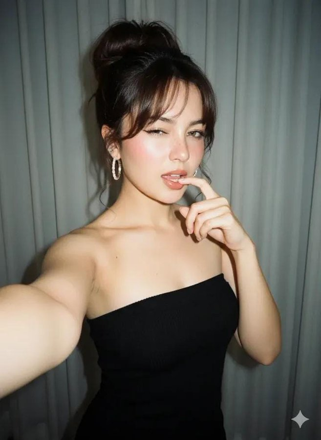

## 女子站在房间里的近距离自拍照

- ID: gpt4o-858-zh-2
- Slug: prompt-858-zh-2
- 语言: zh
- 来源: [来源链接](https://x.com/SimplyAnnisa/status/2000735478149210188)
- 样例图路径: images/part3/858.jpeg

### 提示词

```text
拍摄一张年轻女子站在房间里的近距离自拍照。她摆出自拍姿势，右手拿着相机，咬着食指，表情妩媚，右眼眨动，身体微微向右倾斜。
她深棕色的头发挑染了几缕，随意地挽成一个高高的发髻，刘海垂在额前。她戴着钻石耳环。
她的鼻子和颧骨周围似乎有雀斑。
她的妆容很自然，淡淡的粉色腮红，精致的猫眼眼线，卷翘的睫毛，棕绿色的眼影，以及亮泽的裸色唇膏。
她身穿一件黑色无肩带针织迷你连衣裙。

背景是一块灰白色的窗帘，柔和的、略带虚化的褶皱与牛仔连衣裙形成了很好的对比。
阳光的自然光线从正面突出了拍摄对象。用90年代的相机拍摄。不要改变脸部特征。
```

### 样例图


## Create an ultra-realistic 3D commercial-style product sh

- ID: gpt4o-857-en-1
- Slug: prompt-857-en-1
- 语言: en
- 来源: [来源链接](https://x.com/ZaraIrahh/status/2000485236841607559)
- 样例图路径: images/part3/857.jpeg

### 提示词

```text
Create an ultra-realistic 3D commercial-style product shot of a premium cherry juice bottle, suspended mid-air with intricate condensation droplets on its surface. The bottle should appear fresh and vibrant, with each condensation bead reflecting ambient light to enhance photorealism. Surround the product with dynamic elements like splashing droplets of cherry juice, whole cherries, and ice cubes, frozen in high-speed motion, each element sharply defined with vibrant clarity.
Floating cherry stems and leaves should also be included to enhance the sense of freshness and energy.

Set the background against a rich, deep red and burgundy gradient, which complements the rich color of the cherry juice and evokes a sense of indulgence and premium quality. The product should be centrally placed, slightly tilted to convey a sense of movement and sophistication.
Use cinematic, studio-style lighting with bright highlights reflecting off the bottle, crisp shadows, and high contrast to create a luxurious, polished look. Ensure the bottle’s label is clearly visible, with subtle reflections beneath it, adding depth and realism to the scene.

The overall aesthetic must evoke indulgence, freshness, and premium quality, with all elements contributing to a high-end, visually striking image. The scene should feel rich, fresh, and full of vitality,with a focus on the vibrant color and fresh nature of the cherry juice.

Technical Specifications:

Aspect Ratio: 4:5

Resolution: Ultra-HD quality

Lighting: Studio-style, cinematic with bright highlights, subtle reflections, and high contrast

Detailing: Extreme attention to condensation, droplets, and high-speed motion of elements
```

### 样例图

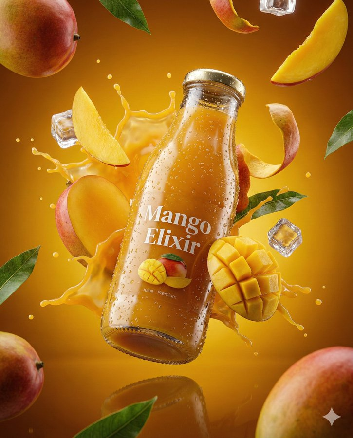

## 超逼真的3D商业风格产品图

- ID: gpt4o-857-zh-2
- Slug: prompt-857-zh-2
- 语言: zh
- 来源: [来源链接](https://x.com/ZaraIrahh/status/2000485236841607559)
- 样例图路径: images/part3/857.jpeg

### 提示词

```text
创作一张超逼真的3D商业风格产品图，展示一瓶优质樱桃汁悬浮在半空中，瓶身表面凝结着精致的水珠。瓶身应呈现清新亮丽的质感，每一滴水珠都反射着环境光，增强照片的真实感。在产品周围添加动态元素，例如飞溅的樱桃汁、完整的樱桃和冰块，以高速运动的瞬间定格，每个元素都清晰锐利，栩栩如生。
为了增强清新活力感，还可以加入漂浮的樱桃茎和叶子。

背景采用浓郁的深红色和酒红色渐变色，与樱桃汁的浓郁色泽相得益彰，营造出奢华和高品质的氛围。产品应置于画面中央，略微倾斜，以展现动感和精致感。
使用电影级的影棚灯光，让明亮的高光反射在瓶身上，阴影清晰锐利，并营造出高对比度，从而打造出奢华精致的视觉效果。确保瓶标清晰可见，其下方有微妙的反射光，为画面增添层次感和真实感。

整体美学必须营造出奢华、清新和高端的氛围，所有元素都应共同打造出高端且引人注目的视觉效果。场景应给人以丰富、清新和充满活力的感觉，重点突出樱桃汁鲜艳的色彩和新鲜的特性。

技术规格：

宽高比：4:5

分辨率：超高清

灯光：影棚风格，电影感十足，高光明亮，反射柔和，对比度高。

细节处理：极其注重冷凝、水滴和高速运动的元素。
```

### 样例图


## { "type": "advertisement_poster", "style": { "photoreali

- ID: gpt4o-856-en-1
- Slug: prompt-856-en-1
- 语言: en
- 来源: [来源链接](https://x.com/xmiiru_/status/2000436371975000418)
- 样例图路径: images/part3/856.jpeg

### 提示词

```text
{
  "type": "advertisement_poster",
  "style": {
    "photorealistic": true,
    "hyper_realistic": true,
    "highly_detailed": true,
    "commercial_photography": true,
    "vibrant_colors": true,
    "high_contrast": true,
    "cinematic_lighting": true
  },
  "camera": {
    "angle": "low",
    "orientation": "vertical_portrait",
    "focus": "strong_foreground"
  },
  "subject": {
    "person": {
      "age": "30s",
      "ethnicity": "Asian",
      "hair": "short black",
      "clothing": {
        "tshirt": "mustard yellow",
        "shorts": "navy blue",
        "shoes": "gray sneakers"
      },
      "pose": {
        "style": "marionette_puppet_losing_control",
        "expression": "surprised",
        "eyes": "wide",
        "mouth": "open",
        "arm": "one_raised_in_panic",
        "body_tilt": "forward",
        "leg_lifted": true
      },
      "props": [
        {
          "object": "popcorn_bucket",
          "orientation": "upside_down",
          "color": "yellow",
          "label": "Popcorn",
          "text_color": "red",
          "effect": "caramel_popcorn_spilling_dynamically"
        }
      ],
      "marionette_strings": {
        "attached_to": ["wrists", "ankles", "waist"],
        "connected_to": {
          "controller": "wooden_cross_shaped_marionette",
          "held_by": {
            "hand": "giant",
            "skin_tone": "fair",
            "position": "top_of_frame"
          }
        }
      }
    }
  },
  "effects": {
    "dynamic_motion": true,
    "selective_focus": true,
    "cinematic_drama": true
  }
}
```

### 样例图

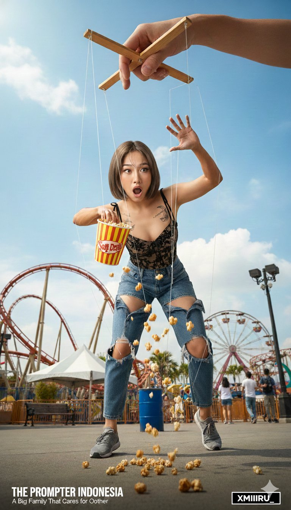

## 提线木偶

- ID: gpt4o-856-zh-2
- Slug: prompt-856-zh-2
- 语言: zh
- 来源: [来源链接](https://x.com/xmiiru_/status/2000436371975000418)
- 样例图路径: images/part3/856.jpeg

### 提示词

```text
{
"type": "advertisement_poster",
“风格”： {
“照片级真实感”：是，
"hyper_realistic": true,
"highly_detailed": true,
"commercial_photography": true,
"vibrant_colors": true,
“高对比度”：true，
"cinematic_lighting": true
},
“相机”： {
"角度": "低",
"方向": "竖屏",
“焦点”： “前景强”
},
“主题”： {
“人”： {
“年龄”: “30多岁”
“种族”: “亚洲人”
“头发”：“黑色短发”，
“衣服”： {
“t恤衫”：“芥末黄”，
“短裤”： “海军蓝”
“鞋子”: “灰色运动鞋”
},
"姿势": {
"style": "marionette_puppet_losing_control",
“表情”：“惊讶”，
“眼睛”：“睁大”，
"嘴巴": "张开的",
"arm": "one_raised_in_panic",
"body_tilt": "向前",
"leg_lifted": true
},
“道具”：[
{
"对象": "爆米花桶",
"方向": "倒置",
“颜色”: “黄色”
标签：爆米花，
"text_color": "红色",
“效果”： “焦糖爆米花动态溢出”
}
],
"marionette_strings": {
"attached_to": ["手腕", "脚踝", "腰部"],
"connected_to": {
"控制器": "木制十字形木偶",
"held_by": {
“手”：“巨人”，
"skin_tone": "fair",
"position": "top_of_frame"
}
}
}
}
},
"效果": {
"dynamic_motion": true,
"selective_focus": true,
"cinematic_drama": true
}
}
```

### 样例图


## 剪纸风格的珠江新城

- ID: gpt4o-855-zh
- Slug: prompt-855-zh
- 语言: zh
- 来源: [来源链接](https://x.com/liyue_sqlroad/status/2000560041410154989)
- 样例图路径: images/part3/855.jpeg

### 提示词

```text
以珠江新城现代都市景观为灵感的剪纸艺术，通过精巧的镂空手法在一整幅纸上，立体刻画广州塔、东西双塔等地标建筑与繁华城景。所有建筑与元素均以流畅的线条与结构相连，无孤立部分，构成一幅完整的都市画卷。

画面采用金属箔或光泽纸材质，表面带有细腻的明暗光泽，在光照下呈现柔和的高光与阴影，仿佛被城市灯光轻轻照亮。背景以虚化的珠江新城天际线为衬，点缀隐约可见的花城广场与树木轮廓，整体透出现代浪漫的氛围。

作品中巧妙融入轻盈的蒲公英绒毛或星光般的动态光点，象征梦想与活力在这座新城中飘散飞扬。整体呈现8K超高清视觉，细节丰富，真实而富有艺术感染力。
```

### 样例图

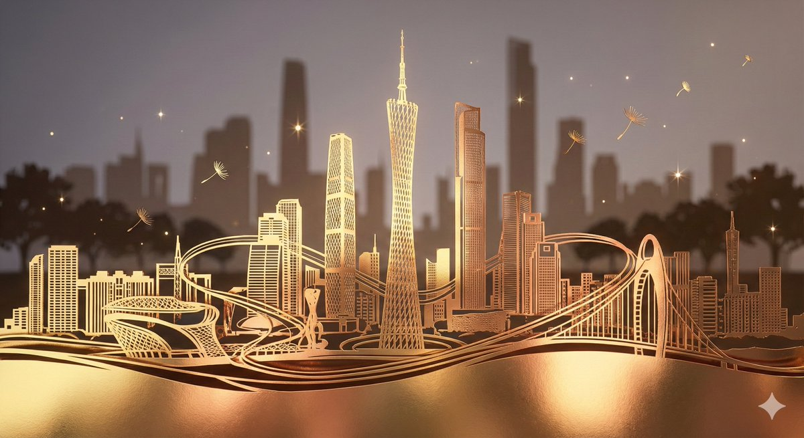

## 雪景下的精灵

- ID: gpt4o-853-zh
- Slug: prompt-853-zh
- 语言: zh
- 来源: [来源链接](https://x.com/Adam38363368936/status/2000502374784471427)
- 样例图路径: images/part3/853.jpeg

### 提示词

```text
{ "image_generation_request": { "meta_protocols": { "reference_adherence": { “说明”：“请严格按照提供的照片进行面部参照。” “公差”: “零偏差” “参数”：“以100%的准确度保留面部比例、皮肤纹理、表情和身份特征。” "stylization_constraint": "不要对脸部特征进行风格化或改变。"       }, "format_style": "编辑冬季海报风格的多面板拼贴画", "aesthetic_quality": "自发的 iPhone 摄影（抓拍、温馨、写实）", "global_textures": "柔和的雪花，细腻的模拟颗粒感，轻微的手持拍摄瑕疵"     }, "consistent_elements": { "subject_wardrobe": { “外套”： “短款人造毛皮外套” 腿部服饰：黑色紧身裤， “鞋类”：“经典 UGG 靴子”， "style_notes": "简约、舒适、极具冬日气息"       }, "primary_device": { “型号”：“iPhone 17 Pro Max”， “颜色”： “银色”， “用法”：“由主体在相关框架中持有”       }, "color_palette": [ “温暖的琥珀色”， “柔和的红色”， “松树绿” “柔和的冬日灰色”       ]     }, "layout_configuration": { "panel_1_top_left": { "scene_type": "黄昏时分的商店橱窗反光照片", "lighting_and_atmosphere": "淡淡的圣诞彩灯、花环、磨砂玻璃边缘、毛皮上的暖色调高光", “subject_action”: “拿着手机部分遮住脸部” "optical_effects": "掠过的轮廓、层叠的反射、柔和的重影、自然的玻璃曲率扭曲"       }, "panel_2_top_right": { "scene_type": "超广角街景人像（雪中的人行道/圣诞市场）", "camera_angle": "近距离，向下倾斜", “subject_pose”: “随意地向前倾，双手插在外套口袋里” "可见性检查": "黑色紧身裤和 UGG 靴子清晰可见", "motion_dynamics": "带有轻微运动模糊的飘雪", 镜头特性： “微妙的透视变形，以增强手持拍摄的真实感”       }, "panel_3_bottom_right": { "scene_type": "亲密俯视自拍", “照明”：“温暖的街道或咖啡馆照明”， "props": { "held_item": "外带节日饮品（咖啡或热红酒）", “配件”：“可见的有线耳机”         }, "texture_focus": "清晰细腻的毛皮纹理和冬季面料", “氛围”：“柔和的颗粒感增强了怀旧的假日氛围”       }     }, "graphic_overlay": { "element": "极简 Apple Music 风格的迷你播放器", "content": "流行圣诞歌曲（例如，'Last Christmas' 或 'All I Want for Christmas Is You'）", “风格”：“渲染效果平整干净，没有阴影”， “位置”：“漂浮在拼贴画的中心”     }   } }
```

### 样例图

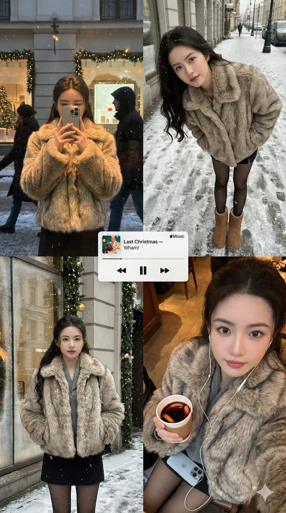

## Professional studio portrait photography, Christmas wint

- ID: gpt4o-849-en-1
- Slug: prompt-849-en-1
- 语言: en
- 来源: [来源链接](https://x.com/LiEvanna85716/status/2000530737842557269)
- 样例图路径: images/part3/849.jpeg

### 提示词

```text
Professional studio portrait photography, Christmas winter theme, white studio background.  Young Asian woman, age 20-23, beautiful delicate features: - Large expressive eyes with double eyelids - Elegant facial features, high cheekbones - Natural makeup: soft pink blush, natural lip color - Shoulder-length dark brown hair - Fair porcelain skin with realistic texture (visible pores)  Outfit: - Bright red cable knit beanie - Bright red chunky wool scarf - Black wool coat  Studio setup: Pure white seamless background, professional soft lighting, snowflakes falling on hair/beanie/scarf  Technical: 85mm lens, f/1.8-2.8, natural soft studio lighting, realistic skin texture, high-end fashion portrait quality  Mood: Natural, warm, gentle expression, serene and contemplative
```

### 样例图


## 专业影棚人像摄影圣诞冬季主题

- ID: gpt4o-849-zh-2
- Slug: prompt-849-zh-2
- 语言: zh
- 来源: [来源链接](https://x.com/LiEvanna85716/status/2000530737842557269)
- 样例图路径: images/part3/849.jpeg

### 提示词

```text
专业影棚人像摄影，圣诞冬季主题，白色背景。年轻亚裔女性，20-23岁，拥有精致美丽的五官： - 双眼皮，大而有神的眼睛 - 精致的五官，高颧骨 - 自然妆容：淡粉色腮红，自然唇色 - 及肩深棕色头发 - 白皙如瓷的肌肤，纹理真实（毛孔可见） 服装： - 亮红色麻花针织帽 - 亮红色粗羊毛围巾 - 黑色羊毛大衣 影棚布景：纯白色无缝背景，专业柔光，雪花飘落在头发/针织帽/围巾上 技术参数：85mm镜头，f/1.8-2.8光圈，自然柔和的影棚灯光，逼真的肌肤纹理，高端时尚人像品质 氛围：自然、温暖、温柔的表情，宁静而沉思
```

### 样例图


## { "title": "Shopping Version", "description": { "real_wo

- ID: gpt4o-845-en-1
- Slug: prompt-845-en-1
- 语言: en
- 来源: [来源链接](https://x.com/xmiiru_/status/1999429065015488970)
- 样例图路径: images/part3/845.jpeg

### 提示词

```text
{  "title": "Shopping Version",
  "description": {
    "real_woman": {
      "appearance": "A real human woman wearing a stylish polka dot dress",
      "pose": "Holding shopping bags with a happy expression",
      "style": "Full photorealistic photography",
      "details": "Vibrant colors, sharp detail, realistic skin texture, natural lighting",
      "restriction": "Must remain photorealistic and not cartoon"
    },
    "background_comic": {
      "style": "Intricately detailed multi-panel black-and-white comic strip",
      "character": "Same woman depicted as a cartoon",
      "story_panels": [
        "Entering the store excitedly",
        "Fighting over sale items",
        "Trying ridiculous outfits",
        "Struggling with an overflowing cart",
        "Checking an empty wallet with a shocked expression"
      ],
      "connection": "Comic narrative continues directly from her realistic shopping pose"
    },
    "overall_goal": "Create a seamless story where the photorealistic woman is the 'real moment' inside her own comic adventure"
  }
}
```

### 样例图

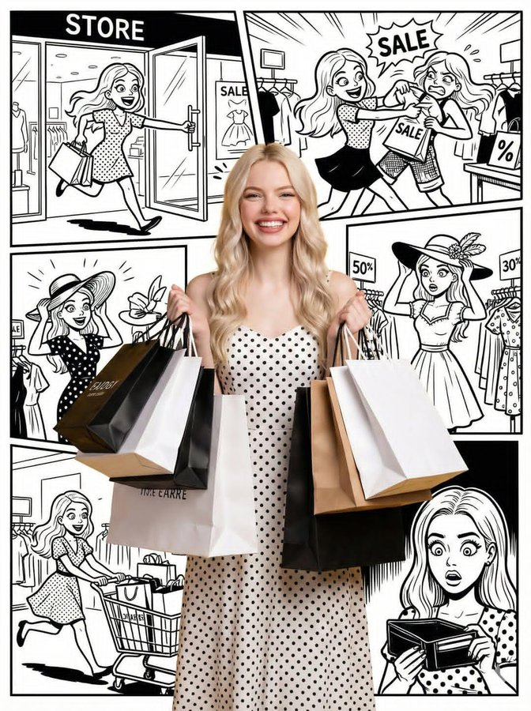

## 成为自己漫画中的一部分

- ID: gpt4o-845-zh-2
- Slug: prompt-845-zh-2
- 语言: zh
- 来源: [来源链接](https://x.com/xmiiru_/status/1999429065015488970)
- 样例图路径: images/part3/845.jpeg

### 提示词

```text
{标题：购物版本，
“描述”： {
"real_woman": {
“外貌”：“一位穿着时尚波点连衣裙的真人女性”，
“姿势”：“手提购物袋，表情开心”，
“风格”：“完全照片级写实摄影”，
“细节”：“色彩鲜艳，细节清晰，皮肤纹理逼真，光照自然”，
“限制”：“必须保持照片级写实风格，而非卡通风格”
},
"background_comic": {
“风格”：“精细的多格黑白漫画”，
“角色”：“同一个女人被描绘成卡通形象”，
"story_panels": [
“兴奋地走进商店，”
“争抢特价商品”
“尝试奇装异服”
“推着满满一车东西的购物车，真是吃力不讨好”
“一脸震惊地检查空钱包”
],
“联系”：“漫画叙事直接从她写实的购物姿势延续下来”
},
"overall_goal": "创造一个流畅的故事，让照片般逼真的女性成为她自己漫画冒险中的“真实瞬间”"
}
}
```

### 样例图


## 古风宽袖长袍园林夜景照

- ID: gpt4o-841-zh
- Slug: prompt-841-zh
- 语言: zh
- 来源: [来源链接](https://x.com/qisi_ai/status/1999333876033049003)
- 样例图路径: images/part3/841.jpeg

### 提示词

```text
一、画面构图与机位
1 画面比例：竖幅构图，人物占画面高度约五分之四
2 镜头距离：中近景，从膝部到头顶完整入画
3 机位高度：略低于人物视线的微仰视角
4 人物位置：画面正中央略偏上，身体微微向右侧倾斜
5 画面留白：上下少量留白，左右被深色夜景与木栏包裹
6 画面质感补充：像是在一张昏暗灯光下使用闪光灯拍摄的低质量 iPhone 照片中，背景几乎全黑，什么也看不清

二、场景与环境
1 场景类型：古风园林夜景

三、人物设定与姿态
1 人物设定：脸型精致、眼睛偏大、右眼下方点了一颗小痣，鼻梁细长、唇色淡粉、妆容干净，日韩感。
2 姿态动作：坐在木栏长椅上，双臂自然放置
3 肩颈线条：大面积露出肩膀与锁骨，颈部细长
4 面部角度：正对镜头，头稍微前倾，表情平静放松

四、服饰造型
1 服饰造型：古风宽袖长袍，浅色系带暗纹，领口为斜襟，大领口自然滑落，露出锁骨与肩颈线。
五、披肩结构
1 披肩结构：柔软蓬松的白色毛绒披肩，向下滑落，包裹住前臂和膝上，形成一整圈毛绒包围感，边缘柔和蓬松，有细小毛绒细节。

六、发型
1 发型：高耸古风盘发，高位发髻，顶部蓬松隆起，发髻圆润饱满，后部头发收拢盘起，两侧头发向后梳顺固定，整体轮廓偏长椭圆形，发际线干净整齐，脸颊两侧留长鬓发，笔直垂落到腰前，贴脸修饰脸型。

七、配饰
1 配饰：成对古风步摇发饰，对称佩戴在发髻两侧，金属质感发叉插入发髻顶端，连接多层流苏与坠饰，细链分层下垂，搭配小珠子、小花朵状金属片，局部有水滴形坠子，随着头部微动轻微摆动，金属与珠光在夜色中有明显高光闪点，整体华丽但不过分夸张。

八、头发质感与走向
1 头发质感与走向：自然黑色直发，发丝细腻顺滑，有微微柔光，靠近脸部的鬓发紧贴垂下，线条笔直干净，盘起部分头发紧密贴合头型，边缘略有几缕细碎发丝柔和散出，整体发量偏多，轮廓清晰，有真实发丝纹理与轻微毛躁细节。

九、情绪与氛围表达
1 情绪基调：安静、温柔、略带疏离又含有亲近感
2 氛围设定：深夜园林，周围安静，空气偏冷，人物给人柔软安全的包裹感
3 视线互动：直视镜头，无夸张笑容，眼神含蓄，传递温柔而平静的情绪
```

### 样例图

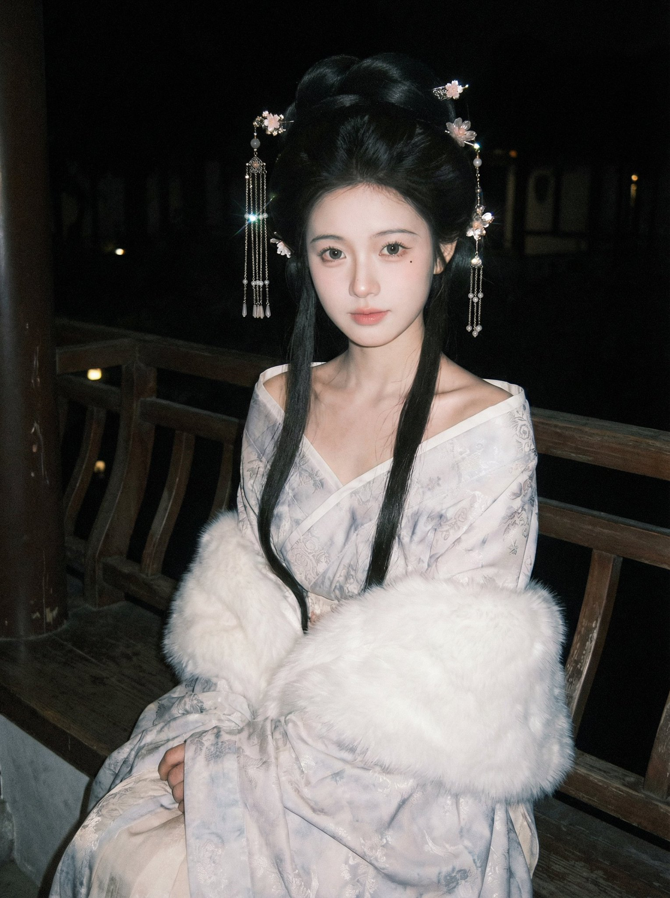

## { "Objective": "Create a hyper-realistic 8K surreal wint

- ID: gpt4o-840-en-1
- Slug: prompt-840-en-1
- 语言: en
- 来源: [来源链接](https://x.com/Taaruk_/status/1999384278946451735)
- 样例图路径: images/part3/840.jpeg

### 提示词

```text
{
  "Objective": "Create a hyper-realistic 8K surreal winter fantasy portrait featuring a young ethereal woman and a majestic deer sharing an intimate moment in a snowy forest.",

  "Subject_1_Woman": {
    "Identity": "Maintain facial features, hairstyle, and general appearance consistent with the provided reference image if one is used.",
    "Appearance": {
      "Skin_Tone": "Pale, ethereal",
      "Hair": "White-blonde hair with cold highlights",
      "Eyelashes": "Icy, frosted texture",
      "Accessories": [
        "Luxury ski goggles"
      ],
      "Wardrobe": {
        "Coat": "Vintage wool plaid coat in cool winter tones"
      }
    },
    "Pose_Expression": {
      "Position": "Standing very close to the deer, face-to-face",
      "Emotion": "Calm, intimate, surreal connection"
    }
  },

  "Subject_2_Deer": {
    "Description": "Majestic lifelike winter deer",
    "Appearance": {
      "Fur": "Thick, realistic, dusted with snow",
      "Antlers": "Wrapped creatively in colorful plaid fabric"
    },
    "Pose": "Standing still, facing the woman, sharing a silent moment"
  },

  "Scene": {
    "Setting": "Snowy forest with tall pine trees",
    "Atmosphere": [
      "Surreal",
      "Fantasy-inspired",
      "Quiet and intimate"
    ],
    "Environmental_Elements": {
      "Snowfall": "Soft drifting flakes surrounding both subjects",
      "Background": "Blurred pine trees with cinematic depth of field"
    }
  },

  "Lighting": {
    "Style": "Cold cinematic lighting",
    "Characteristics": [
      "Soft highlights on faces",
      "Cool blue-white ambient tones",
      "Subtle rim lighting enhancing the winter mood"
    ]
  },

  "Visual_Style": {
    "Aesthetic": "Hyper-realistic winter fantasy drama",
    "Resolution": "8K ultra-detailed",
    "Mood": "Moody, emotional, atmospheric storytelling",
    "Texture_Details": [
      "Snow-dusted fur and hair",
      "Detailed plaid fabric",
      "Frost textures",
      "Realistic skin and lighting interplay"
    ],
    "Film_Quality": "Looks like a still frame from a high-budget fantasy drama"
  },

  "Output_Requirements": {
    "Format": "Image",
    "Orientation": "Portrait or cinematic frame",
    "Quality": "Ultra-high detail, surreal realism, editorial film look"
  }
}
```

### 样例图

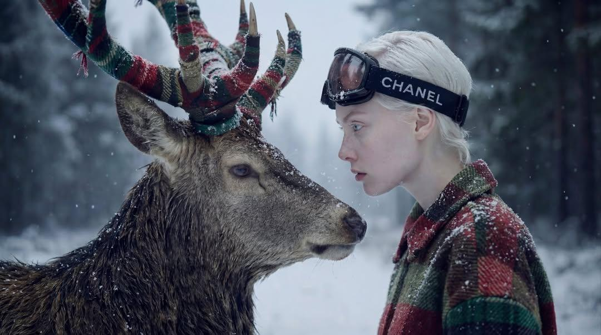

## 超写实的8K超现实主义冬季奇幻肖像

- ID: gpt4o-840-zh-2
- Slug: prompt-840-zh-2
- 语言: zh
- 来源: [来源链接](https://x.com/Taaruk_/status/1999384278946451735)
- 样例图路径: images/part3/840.jpeg

### 提示词

```text
{
“目标”：“创作一幅超写实的8K超现实主义冬季奇幻肖像，描绘一位年轻空灵的女子和一头雄伟的鹿在雪林中共享一段亲密时光。”

"Subject_1_Woman": {
“身份”：“如果使用提供的参考图片，请保持面部特征、发型和整体外貌与参考图片一致。”
“外貌”： {
“肤色”：“苍白，空灵”，
“头发”：“带有冷色调挑染的白金色头发”，
“睫毛”：“冰霜质感”，
“配件”： [
“豪华滑雪镜”
],
“衣柜”： {
“外套”：“复古羊毛格子大衣，冷色调，适合冬季穿着”
}
},
"姿势表情": {
“位置”：“与鹿面对面站得很近”，
“情感”：“平静、亲密、超现实的联系”
}
},

"Subject_2_Deer": {
描述：栩栩如生的雄伟冬鹿
“外貌”： {
“毛皮”：“浓密、逼真，沾满了雪”，
“鹿角”：“用色彩鲜艳的格子布巧妙包裹”
},
“姿势”：“静静地站着，面对着女人，共享片刻的沉默”
},

“场景”： {
“场景”：“白雪皑皑的森林，高大的松树”，
“气氛”： [
“超现实的”，
“奇幻风格”
“安静而私密”
],
"环境元素": {
“下雪了”：“柔软的雪花飘落在两人周围”，
“背景”：“具有电影景深效果的模糊松树”
}
},

“灯光”： {
“风格”：“冷色调电影灯光”，
“特征”： [
“面部柔和高光”
“清冷的蓝白色环境色调”，
“柔和的轮廓光增强了冬日氛围”
]
},

"视觉样式": {
“美学”：“超现实主义冬季奇幻剧”，
“分辨率”：“8K 超高清”，
“氛围”：“情绪饱满、情感丰富、富有氛围的叙事方式”
"纹理细节": [
“沾满雪的皮毛和毛发”
“精致的格子图案面料”，
“霜状纹理”，
“逼真的皮肤和光照互动”
],
“电影级画质”：看起来像是高成本奇幻剧的静帧画面。
},

"输出要求": {
"格式": "图像",
“方向”：“竖屏或电影式构图”，
“品质”：“超高细节、超现实主义写实主义、电影级画面风格”
}
}
```

### 样例图


## { "generation_request": { "meta_data": { "task": "text_t

- ID: gpt4o-838-en-1
- Slug: prompt-838-en-1
- 语言: en
- 来源: [来源链接](https://x.com/YaseenK7212/status/1999348160926195949)
- 样例图路径: images/part3/838.jpeg

### 提示词

```text
{
  "generation_request": {
    "meta_data": {
      "task": "text_to_image_with_reference",
      "version": "2.0_structured"
    },
    "technical_constraints": {
      "output_format": {
        "aspect_ratio": "9:16",
        "orientation": "portrait"
      },
      "reference_image_compliance": {
        "enabled": true,
        "mode": "strict_visual_match",
        "instruction_text": "Picture should be same as reference uploaded."
      }
    },
    "creative_detailed_prompt": {
      "core_concept": "Realistic smartphone mirror selfie in a bedroom.",
      "subject_profile": {
        "demographics": {
          "gender": "female",
          "age_group": "young_adult"
        },
        "physical_appearance": {
          "hair_specs": {
            "color": "silver/grey ",
            "texture": "normal, voluminous",
            "style": "long beautiful looking hair falling over shoulders"
            "length": "long"
          },
          "skin_specs": {
            "tone": "pale",
            "distinctive_features": "visible natural freckles on face and chest"
          },
          "body_shape": "slender, fit physique",
          "face_specs": {
            "expression": "neutral",
            "gaze_direction": "soft gaze looking into mirror"
          }
        },
        "action": {
          "pose": "standing facing mirror",
          "activity": "holding smartphone to take photo"
        },
        "attire": {
          "vibe": "beachwear / lounge style",
          "garments": {
            "top": {
              "type": "triangle bikini top",
              "color": "cream-colored",
              "details": "ruffled edges"
            },
            "bottom": {
              "type": "sheer sarong/wrap skirt",
              "color": "cream-colored matching top",
              "details": "tied at hip with ruffles"
            }
          }
        }
      },
      "scene_environment": {
        "location_type": "bedroom interior",
        "atmosphere_mood": "soft domestic",
        "key_props": [
          "unmade bed (messy white sheets and pillows)",
          "wooden headboard",
          "mirror frame (visible on side)"
        ],
        "lighting_setup": {
          "primary_source": {
            "type": "natural daylight",
            "origin": "window behind subject with sheer curtains"
          },
          "accent_source": {
            "type": "LED ambient light strip",
            "color": "purple",
            "intensity": "subtle",
            "location": "on wall"
          }
        }
      },
      "photography_specs": {
        "camera_type": "smartphone",
        "shot_category": "mirror reflection selfie",
        "aesthetic_genre": ["amateur photography", "influencer aesthetic", "candid"],
        "technical_quality": {
          "resolution_target": "8K",
          "focus_priority": "sharp on subject",
          "rendering_style": "photorealistic",
          "texture_emphasis": "natural skin"
        }
      }
    },
    "negative_constraints_list": [
      "makeup",
      "heavy photoshop",
      "smooth skin",
      "cartoon",
      "illustration",
      "anime",
      "3d render",
      "distorted hands",
      "bad anatomy",
      "missing fingers",
      "extra limbs",
      "blurry",
      "low quality",
      "dark room"
    ]
  }
}
```

### 样例图


## 卧室里在镜子前拍出逼真的自拍照

- ID: gpt4o-838-zh-2
- Slug: prompt-838-zh-2
- 语言: zh
- 来源: [来源链接](https://x.com/YaseenK7212/status/1999348160926195949)
- 样例图路径: images/part3/838.jpeg

### 提示词

```text
{
"generation_request": {
"meta_data": {
"任务": "带参考的文本转图像",
版本：2. 0_结构化
},
"technical_constraints": {
"output_format": {
"aspect_ratio": "9:16",
“方向”: “竖屏”
},
"reference_image_compliance": {
“启用”：true，
"mode": "strict_visual_match",
"instruction_text": "图片应与上传的参考图片相同。"
}
},
"creative_detailed_prompt": {
“核心概念”： “在卧室里用智能手机在镜子前拍出逼真的自拍照。”
"subject_profile": {
"人口统计"：{
"性别": "女性",
"age_group": "青年"
},
"physical_appearance": {
"hair_specs": {
颜色：银灰色
“纹理”：“正常，蓬松”，
“风格”：“长长的、美丽的头发披散在肩上”
长度：长
},
"skin_specs": {
色调：苍白，
"distinctive_features": "面部和胸部可见的天然雀斑"
},
"body_shape": "苗条、健美的体格",
"face_specs": {
“表达方式”：“中性”，
"gaze_direction": "柔和的目光望向镜子"
}
},
“行动”： {
“姿势”：“面向镜子站立”，
“活动”：“拿着智能手机拍照”
},
着装：{
“氛围”: “沙滩装/休闲风格”
服装：{
“顶部”： {
类型：三角比基尼上衣，
“颜色”： “奶油色”，
“细节”：“褶皱边缘”
},
“底部”： {
“类型”: “薄纱纱笼/裹裙”
“颜色”： “奶油色配套上衣”
“细节”：“在臀部系带，带有褶边”
}
}
}
},
"scene_environment": {
"location_type": "卧室内部",
"atmosphere_mood": "柔和的国内氛围",
"key_props": [
“床铺凌乱（白色床单和枕头凌乱不堪）”
“木制床头板”，
“镜框（侧面可见）”
],
"lighting_setup": {
"primary_source": {
“类型”：“自然日光”，
“来源”：“主体身后的窗户，窗帘是薄纱”
},
"accent_source": {
类型：LED环境灯条，
“颜色”: “紫色”
“强度”： “微妙的”，
位置：墙上
}
}
},
"photography_specs": {
"camera_type": "智能手机",
"shot_category": "镜面反射自拍",
"aesthetic_genre": ["业余摄影", "网红美学", "抓拍"],
"technical_quality": {
"resolution_target": "8K",
"focus_priority": "清晰聚焦主体",
"rendering_style": "照片写实"
"texture_emphasis": "自然肌肤"
}
}
},
"negative_constraints_list": [
“化妆品”，
“大量使用 Photoshop”
“光滑的皮肤”，
“卡通片”，
“插图”，
“日本动画片”，
“3D渲染”，
“扭曲的手”，
“糟糕的解剖学”
“缺少手指”，
“额外的肢体”，
“模糊的”，
“低质量”，
“暗室”
]
}
}
```

### 样例图


## { "image_prompt": { "subject": { "face_preservation": tr

- ID: gpt4o-837-en-1
- Slug: prompt-837-en-1
- 语言: en
- 来源: [来源链接](https://x.com/ZaraIrahh/status/1999319777257619957)
- 样例图路径: images/part3/837.jpeg

### 提示词

```text
{
  "image_prompt": {
    "subject": {
      "face_preservation": true,
      "description": "A beautiful young woman kneeling inside a cartoon-style monochrome brown room. Her facial features must remain exactly the same as the reference image.",
      "appearance": {
        "hair": {
          "color": "dark brown",
          "style": "long, neatly flowing, slightly messy natural texture"
        },
        "clothing": {
          "top": "thick brown knitted sweater with visible fabric texture",
          "pants": "light brown cargo pants",
          "shoes": "white sneakers"
        }
      },
      "pose": {
        "body": "kneeling on the floor",
        "hands": "hugging a large crocheted plush mouse",
        "expression": "soft, calm, natural look"
      }
    },

    "props": {
      "main_plush": {
        "type": "large crocheted plush mouse",
        "colors": {
          "body": "brown",
          "belly": "cream",
          "ears_inner": "light brown"
        },
        "features": {
          "eyes": "large, expressive, cartoon-like",
          "expression": "cheerful and cute"
        }
      },
      "additional_plushies": "multiple smaller crocheted mouse plushies scattered on the floor, identical design in varying sizes"
    },

    "environment": {
      "style": "cartoon-style room with monochrome brown palette",
      "details": {
        "illustrations": [
          "doodle-style door",
          "simple window sketch",
          "vase outline",
          "circular ornaments on walls"
        ],
        "line_style": "black sketch lines, hand-drawn appearance",
        "color_scheme": "brown monochrome with soft tonal variations"
      },
      "lighting": "soft, warm, cozy interior lighting"
    },

    "photography": {
      "render_style": "hyper-realistic, non-animated, not cartoonized",
      "textures": "highly detailed crochet fabric texture, realistic knitted sweater fibers, smooth soft lighting",
      "quality": "ultra-high resolution"
    },

    "composition": {
      "focus": "woman hugging the large plush mouse",
      "secondary_elements": "smaller mouse plushies placed around her",
      "background_role": "stylized cartoon room enhancing cozy atmosphere"
    }
  }
```

### 样例图

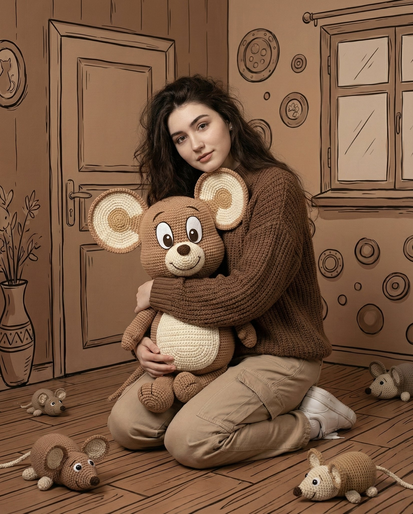

## 女人抱着一只大毛绒老鼠

- ID: gpt4o-837-zh-2
- Slug: prompt-837-zh-2
- 语言: zh
- 来源: [来源链接](https://x.com/ZaraIrahh/status/1999319777257619957)
- 样例图路径: images/part3/837.jpeg

### 提示词

```text
{
"image_prompt": {
“主题”： {
"face_preservation": true,
描述：一位美丽的年轻女子跪在一个卡通风格的单色棕色房间里。她的面部特征必须与参考图像完全一致。
“外貌”： {
“头发”： {
“颜色”：“深棕色”，
“发型”：“长而飘逸，略带凌乱的自然质感”
},
“衣服”： {
“上衣”：“厚实的棕色针织毛衣，面料纹理清晰可见”，
裤子：浅棕色工装裤，
“鞋子”: “白色运动鞋”
}
},
"姿势": {
“身体”：“跪在地上”，
“双手”：“抱着一只大型钩织毛绒老鼠”，
“表情”：“柔和、平静、自然的神态”
}
},

"props": {
"main_plush": {
“类型”: “大型钩针毛绒老鼠”
“颜色”： {
“身体”: “棕色”，
“肚子”： “奶油”，
"ears_inner": "浅棕色"
},
“特征”： {
“眼睛”：“大而有神，像卡通人物一样”，
表情：开朗可爱
}
},
"additional_plushies": "多个较小的钩针编织老鼠毛绒玩具散落在地板上，设计相同，但尺寸各异"
},

“环境”： {
“风格”：“卡通风格的房间，采用单色调棕色调”，
“细节”： {
插图：[
“涂鸦风格的门”，
“简单的窗户草图”，
“花瓶轮廓”，
“墙上的圆形装饰”
],
"line_style": "黑色素描线条，手绘外观",
"配色方案": "带有柔和色调变化的棕色单色"
},
“照明”：“柔和、温暖、舒适的室内照明”
},

“摄影”： {
"render_style": "超写实，非动画，非卡通化",
“纹理”：“高度精细的钩编织物纹理，逼真的针织毛衣纤维，柔和的光线”，
“质量”：“超高分辨率”
},

“作品”： {
焦点：女人抱着一只大毛绒老鼠
"secondary_elements": "在她周围放置的小型老鼠毛绒玩具",
"background_role": "风格化的卡通房间，营造温馨氛围"
}
}
```

### 样例图


## 女生夜晚城市街拍

- ID: gpt4o-836-zh
- Slug: prompt-836-zh
- 语言: zh
- 来源: [来源链接](https://x.com/qisi_ai/status/1998970755024040344)
- 样例图路径: images/part3/836.jpeg

### 提示词

```text
参考图一面部和身材生成

一、人物与气质
1 人物设定：年轻东亚高颜值女生，脸型精致可爱、眼睛偏大，右眼下方点了一颗小痣，妆容干净偏日韩感，带一点攻击性美貌与甜美并存的氛围。
2 气质氛围：外向自信、略带撩人感，主动靠近镜头，和镜头直接对视，有刻意展示身材的意识，整体偏性感街拍风。

二、身材与穿搭
1 身材强调：上半身前倾，锁骨和肩颈线条清晰，腰部纤细，小蛮腰和上胸曲线被明显突出。
2 服装设定：贴身细吊带灰色背心，面料贴合身体，领口偏低，包裹感强但轮廓明显；下身超短牛仔裤，裤脚偏高。
3 配饰点缀：细长金属链条斜挎包从胸口斜穿，强化曲线与视觉分割，其他配饰极简，突出身材与脸。

三、姿态与构图
1 姿态设计：身体向前探，胸部靠近镜头，双手背在身后或抓住腰后裤边，形成自然挺胸姿势，带一点调皮撩人感。
2 构图方式：近距离半身到大腿上部构图，人物占画面大部分空间，脸与上半身贴近镜头，造成轻微夸张的透视效果。
3 视角处理：略微仰拍或平视偏近，强调胸口与脸部比例，使观者有被主动靠近、被注视的感觉。

四、场景与光线
1 场景设定：城市夜晚街道，人行道、护栏、路边绿化与高楼灯光作为背景，街头氛围浓厚。
2 光线效果：人物前方有柔和补光，将脸部与胸口、锁骨区域照亮，皮肤细腻有光泽；背景灯光虚化成斑斓光斑，营造夜生活气息。
3 氛围方向：整体偏暧昧、夜晚出街约会感，有轻微夜店前后街拍感觉，但画面干净不过分杂乱。

五、画面风格与质感
1 色彩倾向：肤色偏明亮通透；背景为城市夜色，营造对比，突出人物。
2 细节处理：适度磨皮、美颜与锐化，眼睛高光增强，唇部略微丰盈光泽，锁骨与肩线有微微高光。
3 整体风格：高颜值辣妹夜间街拍、偏写真感的性感风，近距离强存在感。

六、关键词方向整理
1 气质关键词：自信、撩人、甜辣、主动亲近、街头感。
2 画面关键词：夜晚城市街拍、近景半身、大光圈虚化、柔光补光、浅景深。
3 身材关键词：紧身上衣、超短裤、前倾姿势、突出曲线、锁骨肩颈线条明显。
```

### 样例图


## 东山小红

- ID: gpt4o-835-zh
- Slug: prompt-835-zh
- 语言: zh
- 来源: [来源链接](https://x.com/qisi_ai/status/1999109193652113499)
- 样例图路径: images/part3/835.jpeg

### 提示词

```text
一、整体氛围
1 场景设定：户外日常、住宅区小路、白色栅栏、绿植背景、晴朗日光
2 画面气质：清新、安静、略带呆萌、日系青春感、轻微二次元感
3 色彩基调：黑白主色、肤色偏白、点缀鲜红配饰、整体冷暖对比柔和

二、人物形象
1 年龄形象：脸型精致可爱、眼睛偏大、右眼下方点了一颗小痣，唇色淡粉、妆容干净偏日韩感，少女感、身材纤细、脸型偏幼态、皮肤细腻
2 发型表情姿态：cos的电锯人中的东山小红，正面站立、双手抬起做剪刀手

三、服饰风格
1 上装：黑色宽松外套、毛绒翻领、前拉链设计、下摆与袖口略蓬松
2 图案元素：外套上有鱼骨、十字、简笔画动物等涂鸦图案，带一点暗黑童趣感
3 内搭：浅色圆领上衣，露出少量领口形成明暗对比
4 配饰：红色颈圈式项圈、金属扣环、长款十字架耳饰、红色发夹成组佩戴
5 风格标签：街头可爱风、软萌与轻微叛逆混合、偏亚文化少女穿搭

四、构图与机位
1 构图方式：人物居中、半身取景、上半身和手势为视觉重点
2 机位视角：略微俯视、接近人眼高度、距离适中
3 空间关系：人物与背景栅栏有一定距离，背景略虚化以突出主体

五、光影与质感
1 光线来源：自然日光、从前方偏侧照射，脸部光线均匀
2 明暗关系：人物整体偏亮、背景略暗并有树荫块面，形成柔和对比
3 质感表现：毛绒领口质感清晰、外套呈现柔软绒面、金属饰品有细小高光

六、环境元素
1 背景建筑：金属大门、远处住宅墙面、局部车辆与石柱
2 周围细节：白色木栅栏、石板路、地面略有水迹与落叶
3 氛围关键词：安静居民区、轻松散步场景、略有冬日或早春气息
```

### 样例图


## A digital oil-painted bust portrait of a slender young m

- ID: gpt4o-834-en-1
- Slug: prompt-834-en-1
- 语言: en
- 来源: [来源链接](https://x.com/oggii_0/status/1999487216515747925)
- 样例图路径: images/part3/834.jpeg

### 提示词

```text
A digital oil-painted bust portrait of a slender young man (late teens/early twenties) with a contemplative, slightly weary expression. He wears a chunky rust-red knit sweater. He has fair skin with warm undertones, a natural flush on cheeks and nose, and dark wavy hair falling messily over his forehead. His large dark eyes look slightly left of the viewer; lips are softly parted. Soft side lighting from the left highlights his features, casting gentle shadows on the right. The background is an abstract, textured mix of muted beige, cream, pale blue, and peach brushstrokes. Style combines realistic facial proportions with impressionistic, heavy-impasto brushwork.
```

### 样例图

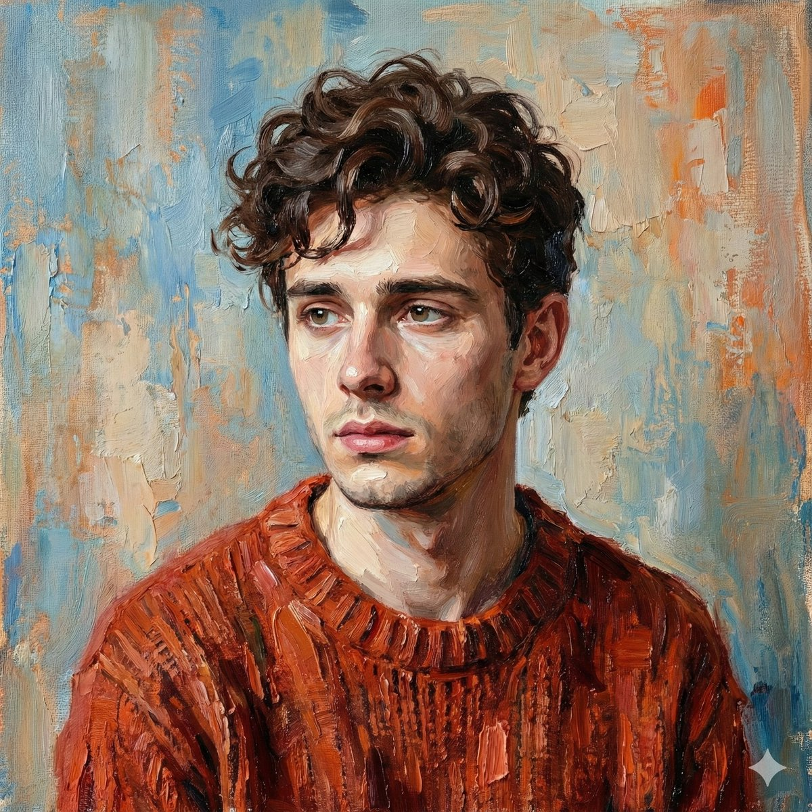

## 一幅数码油画风格的半身像

- ID: gpt4o-834-zh-2
- Slug: prompt-834-zh-2
- 语言: zh
- 来源: [来源链接](https://x.com/oggii_0/status/1999487216515747925)
- 样例图路径: images/part3/834.jpeg

### 提示词

```text
一幅数码油画风格的半身像，描绘了一位身材修长的年轻男子（十几岁末/二十岁出头），他神情沉思，略带疲惫。他身穿一件厚实的锈红色针织衫。他肤色白皙，带有暖色调，双颊和鼻梁上泛着自然的红晕，一头深色波浪卷发随意地垂在额前。他那双深邃的大眼睛略微看向观者的左侧；嘴唇微微张开。柔和的侧光从左侧照射过来，突出了他的五官，并在右侧投下淡淡的阴影。背景是一幅抽象的、纹理丰富的画面，由柔和的米色、奶油色、浅蓝色和桃色笔触交织而成。风格融合了写实的面部比例和印象派厚涂的笔法。
```

### 样例图


## { "title": "Facebook_baddie_adult_v1", "description": "P

- ID: gpt4o-830-en-1
- Slug: prompt-830-en-1
- 语言: en
- 来源: [来源链接](https://x.com/xmiiru_/status/1999481127560429641)
- 样例图路径: images/part3/830.jpeg

### 提示词

```text
{
  "title": "Facebook_baddie_adult_v1",
  "description": "Photorealistic vertical portrait of an adult Indonesian woman (approx. 22 years old) sitting playfully on a giant glossy 3D Facebook 'f' logo, with a realistic Facebook profile UI floating behind her. Cute, pastel aesthetic, non-sexualized, highly detailed, 8K.",
  "generation": {
    "prompt": "Photorealistic, vertical 9:16 image of an adult Indonesian woman (approx. 22 years old), relaxed and playful, sitting on a massive glossy 3D Facebook deep-blue 'f' logo. She wears a baby-pink polka-dot dress with large white dots, puff sleeves, and a knee-length fluffy skirt, white sneakers and lace ankle socks, and a big pink ribbon in her long hair — cute, stylish, barbie-inspired but age-appropriate. Her legs dangle naturally. Behind her, a hyper-realistic floating Facebook profile interface (current 2024-2025 layout) is visible: large profile picture circle (same woman doing a playful peace sign/duck face), cover photo area, name \"xmiru_♡\", follower stats \"1M Followers · 127 Following\", buttons (+Follow, Message), tabs (Posts, About, Friends, Photos, Reels). The photo grid/feed shows 6–9 sharp thumbnails (all of her in pastel pink outfits, plushies, desserts, mirror selfies, cafe scenes) with visible likes (100K+), comments (thousands). Friends suggestions sidebar visible. Background: soft baby pink with subtle white gradient, tiny floating hearts and sparkles, dreamy soft lighting. Ultra photorealistic, insane detail, studio-quality rendering, shallow depth of field, natural skin tones, realistic fabrics, texture detail, no sexualization, subject is clearly an adult.",
    "negative_prompt": "no minors, no sexualization, no exploitative or suggestive posing, no nudity, avoid cartoonish faces, avoid harsh lighting",
    "sampler": "DDIM",
    "cfg_scale": 7.5,
    "steps": 28,
    "resolution": "2160x3840",
    "aspect_ratio": "9:16",
    "style_modifiers": ["ultra photorealistic", "8k", "high detail", "soft lighting", "premium glossy materials"],
    "seed": null,
    "format": "json_prompt_v1",
    "safety_notes": "Subject explicitly defined as an adult. Avoid sexualized descriptors or poses. Suitable for family-friendly, social-media content."
  }
}
```

### 样例图


## Facebook个人资料界面

- ID: gpt4o-830-zh-2
- Slug: prompt-830-zh-2
- 语言: zh
- 来源: [来源链接](https://x.com/xmiiru_/status/1999481127560429641)
- 样例图路径: images/part3/830.jpeg

### 提示词

```text
{
标题： “Facebook_baddie_adult_v1”，
“描述”：“一位印尼成年女性（约22岁）的写实竖幅肖像，俏皮地坐在一个巨大的光滑3D Facebook‘f’标志上，逼真的Facebook个人资料界面在她身后漂浮。可爱、柔和的色调，非性暗示，细节丰富，8K分辨率。”
“一代”： {
提示：一张9:16比例的超写实竖版图片，描绘了一位约22岁的印尼成年女性，她神态轻松活泼，坐在一个巨大的、光泽感十足的3D Facebook深蓝色“f”标志上。她身穿一件浅粉色波点连衣裙，上面点缀着大大的白色圆点，泡泡袖设计，及膝蓬松裙摆，脚蹬白色运动鞋和蕾丝短袜，长发上系着一条大大的粉色丝带——可爱、时尚，带有芭比娃娃的风格，但又符合她的年龄。她的双腿自然垂落。在她身后，可以看到一个高度逼真的悬浮式Facebook个人资料界面（采用2024-2025年的最新布局）：一个大大的圆形头像（照片​​中的女性摆出俏皮的V字手势/嘟嘴表情），封面照片区域，姓名“xmiru_ ♡ ”，粉丝统计信息“100万粉丝 · 127个关注者”，按钮（+关注，消息），以及标签页（帖子，关于，好友，照片，Reels）。照片网格/动态显示 6-9 张清晰的缩略图（全部是她身穿粉色系服装、毛绒玩具、甜点、镜子自拍、咖啡馆场景），点赞数（超过 10 万）和评论数（数千）清晰可见。好友推荐侧边栏可见。背景：柔和的婴儿粉色，带有淡淡的白色渐变，点缀着漂浮的小爱心和闪光，营造出梦幻般的柔和光线。超逼真的照片效果，细节惊人，影棚级渲染，浅景深，自然的肤色，逼真的面料，纹理细节，无任何性暗示，照片中的人物显然是成年人。
"negative_prompt": "禁止未成年人、禁止性暗示、禁止剥削或暗示性姿势、禁止裸露、避免卡通化面孔、避免强光照射",
"采样器": "DDIM",
"cfg_scale": 7.5，
“步骤”：28，
分辨率：2160x3840，
"aspect_ratio": "9:16",
"style_modifiers": ["超逼真", "8k", "高细节", "柔和光照", "高级光泽材质"],
“种子”：null，
"格式": "json_prompt_v1",
安全提示：主题明确定义为成年人。避免使用性暗示的描述或姿势。适合家庭友好型社交媒体内容。
}
}
```

### 样例图


## 人物杂志拼贴封面

- ID: gpt4o-829-zh
- Slug: prompt-829-zh
- 语言: zh
- 来源: [来源链接](https://x.com/qisi_ai/status/1999057085624164607)
- 样例图路径: images/part3/829.jpeg

### 提示词

```text
一、总体目标
1 功能描述：根据用户上传的人物参考图，提取人物气质、妆容风格、光线和色彩特征，创作一张独一无二的时尚人像拼贴大片。
2 差异要求：保留参考人物的五官结构与整体气质，不直接临摹原图，妆容和构图在同一风格体系中做创意变化。

二、输入参考图要求
1 参考内容：清晰的正脸或三分之二侧脸人物照片，可看清五官、肤质与大致光线氛围。
2 提取要点：从参考图中读取肤色、妆容浓淡、主色调、光线方向、人物气质和服饰配色。

三、画面构图与输出形式
1 主画面：生成人物面部超近景或近景，头部和肩部占据画面大部分空间，视线可以参考原图气质设计。
2 拼贴结构：右侧或一角增加多张小图拼贴，可包含侧脸特写、手部特写、局部妆容特写等，形成杂志排版感。
3 背景方式：保持背景简洁干净，以纯色或轻微明度过渡为主，突出人物与妆容。

四、文字与图形设计
1 标题文字：画面上方放置大号杂志标题，字形简洁有力量，保持居中或上中对齐
2 副标题与小字：在画面一侧或底部添加几行小字，内容可以是主题词、人物名、日期，排列整齐，字号统一
3 几何图形：在人物周围加入细线条、窄矩形色块或半透明色块，与文字结合使用，增加平面构成感

五、风格继承规则
1 色彩继承：整体色调、明暗对比、冷暖气质尽量贴合参考图风格，主色来自参考图中最显眼的妆容或服饰颜色。
2 光线继承：参考原图光线方向和柔和程度，若原图是柔光则保持柔光质感，若原图对比度较强则保留一定硬朗感。
3 妆容继承：根据参考图的妆容特点（清透、浓烈、实验性、自然等）保持同一风格等级，再在眼妆、腮红、唇妆中做细节变化。
4 氛围继承：延续参考图的情绪氛围，例如冷淡感、甜美感、叛逆感、神秘感等，在表情与姿态上呼应。

六、创意变化规则
1 妆容变化：在参考风格基础上增加局部夸张处理，例如扩大腮红范围、强化唇部晕染、增加雀斑或高光点。
2 构图变化：可以调整脸部角度、裁切范围和小图拼贴位置，让每次生成都具有不同构图。
3 配饰变化：在颈部、耳部或手部加入简洁有设计感的饰品，与主色调呼应但不完全复制参考图。
4 细节手势：增加触碰嘴唇、脸颊、眼下等手部动作，使画面更具故事感和参与感。

七、整体质感与后期风格
1 清晰度：保持皮肤毛孔和细节可见，避免过度磨皮，但适当柔化非焦点区域。
2 色调处理：整体色调统一，适度降低杂乱颜色，只强化主色和少数点缀色。
3 情绪表现：根据参考图的气质，控制表情和眼神的强度，让画面既保留原本风格，又有独立个性。

参考用户上传的人物照片，按以上规则自动读取图像风格并进行创作。
```

### 样例图

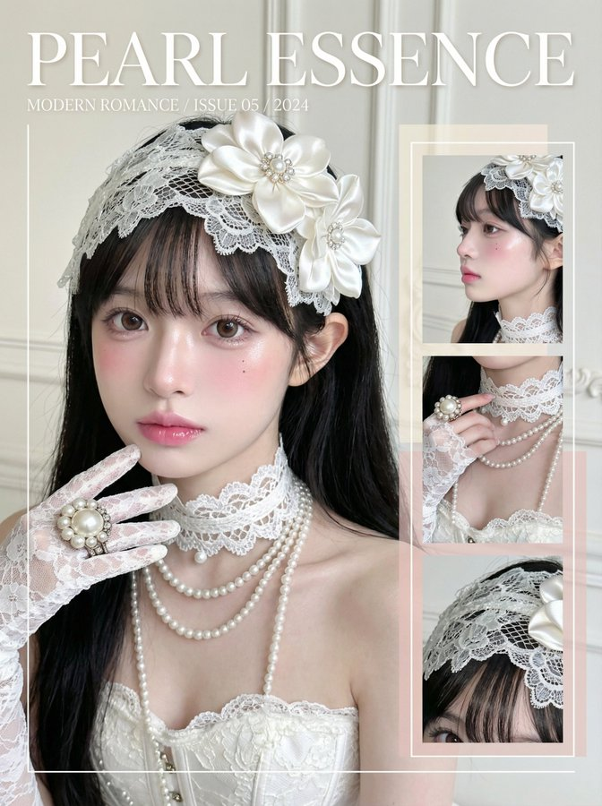

## 治愈系童话感黏土海报

- ID: gpt4o-828-zh-1
- Slug: prompt-828-zh-1
- 语言: zh
- 来源: [来源链接](https://x.com/sundyme/status/1999479601744015847)
- 样例图路径: images/part3/828.jpeg

### 提示词

```text
Rendered as a complete Poster design (suggested aspect ratio 3:4 or 9:16 for a full vertical poster). The overall visual style is a Soft-Focus Healing Style combining a Wes Anderson aesthetic, characterized by dreamy, cozy, warm and soft volumetric lighting. 4K Resolution, high aesthetic value.

[SCENE & MATERIAL STYLE]The entire scene is rendered with a distinctive material mix of Soft Matte Clay (哑光软陶) and a little soft Felt (少许羊毛毡), creating fluffy and tactile textures throughout the composition. The color palette is dominated by soft Pastel colors (Morandi/Macaron tones).

[TEXT INTEGRATION]The scene integrates a creatively formed main title using environmental elements (e.g., formed by clouds, branches, or clay objects). It also includes a small, delicate, thin-stroke handwritten Chinese slogan that blends softly into the environment, appearing as part of the scene's texture rather than an overlay.

生成示列（爱因斯坦）：
```

### 样例图

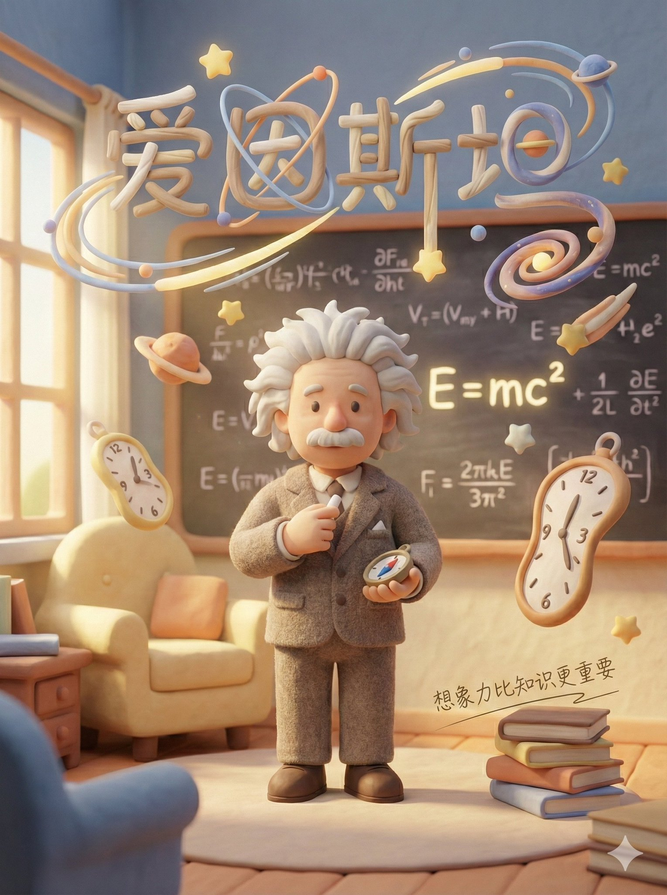

## 治愈系童话感黏土海报

- ID: gpt4o-828-zh-2
- Slug: prompt-828-zh-2
- 语言: zh
- 来源: [来源链接](https://x.com/sundyme/status/1999479601744015847)
- 样例图路径: images/part3/828.jpeg

### 提示词

```text
以完整海报设计形式呈现（建议竖版海报宽高比为 3:4 或 9:16）。整体视觉风格为柔焦治愈风，融合了韦斯·安德森的美学理念，以梦幻、舒适、温暖柔和的立体光影为特色。4K 分辨率，极具美感。

【场景与材质风格】整个场景采用独特的材质混合渲染，以哑光软陶和少量羊毛毡为主，营造出蓬松柔软的触感质感。色彩方面，以柔和的粉彩色调（莫兰迪/马卡龙色调）为主。

【文字融合】场景巧妙地将主题标题融入环境元素（例如云朵、树枝或黏土物体），形成富有创意的视觉效果。此外，场景中还包含一句小巧精致、笔画纤细的手写中文标语，与环境自然融合，成为场景纹理的一部分，而非突兀的叠加层。

生成示列（爱因斯坦）：
```

### 样例图


## A glowing oval portal stands between {Real_World_Scene} 

- ID: gpt4o-827-en-1
- Slug: prompt-827-en-1
- 语言: en
- 来源: [来源链接](https://x.com/dotey/status/1998784442052014356)
- 样例图路径: images/part3/827.jpeg

### 提示词

```text
A glowing oval portal stands between {Real_World_Scene} and {Portal_Inner_Scene}.

Outside the portal, the real-world environment is {Real_World_Scene}, depicted with realistic textures, grounded atmosphere, and gritty or natural tones.

Inside the portal lies {Portal_Inner_Scene}, vibrant, imaginative, and contrasting sharply with the real world.

{Portal_Inner_Character} is stepping through the portal, turning back with a dynamic glance while holding the viewer’s hand, as if guiding them into the other world.

The portal emits mystical blue-purple light, drawn with clean outlines and soft shading consistent with the character’s style.

Optional overall visual style: {Art_Style} (defaults to a bold contrast between anime and reality).

Camera angle: third-person perspective, clearly showing the viewer’s hand being pulled into the new world.  
No blur; sharp visual distinction between the two worlds.  
Aspect ratio: 2:3.  

----
Real_World_Scene: A winter street in Tokyo, low-saturation neon lights with a faint snowy haze
Portal_Inner_Scene:  A futuristic city street glowing with blue holograms, neon refracting through the air
Portal_Inner_Character: A cyborg girl with mechanical limbs wearing a semi-armored exosuit
```

### 样例图

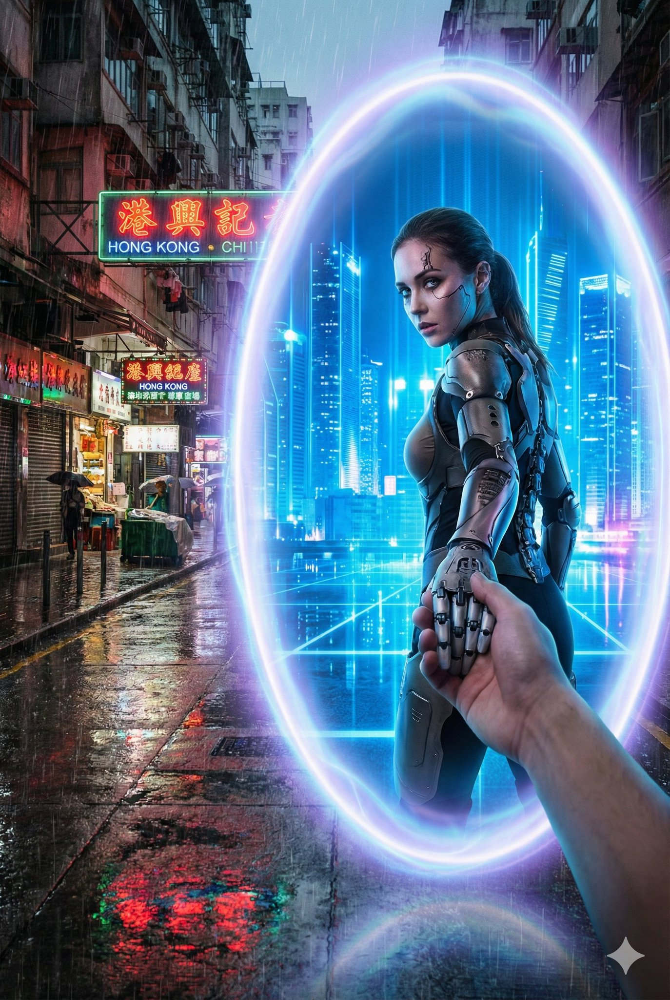

## 现实世界传送门动漫角色跨界场景

- ID: gpt4o-827-zh-2
- Slug: prompt-827-zh-2
- 语言: zh
- 来源: [来源链接](https://x.com/dotey/status/1998784442052014356)
- 样例图路径: images/part3/827.jpeg

### 提示词

```text
一个闪闪发光的椭圆形传送门位于 {真实世界场景} 和 {传送门内部场景} 之间。

在传送门之外，现实世界环境是 {Real_World_Scene}，以逼真的纹理、写实的氛围和粗犷或自然的色调描绘而成。

传送门内是 {Portal_Inner_Scene}，充满活力，富有想象力，与现实世界形成鲜明对比。

{Portal_Inner_Character} 正穿过传送门，一边牵着观众的手，一边回头，眼神充满活力，仿佛在引导他们进入另一个世界。

传送门散发出神秘的蓝紫色光芒，线条简洁流畅，阴影柔和，与角色的风格相符。

可选的整体视觉风格：{Art_Style } (默认采用动漫与现实之间的鲜明对比。

摄像机角度：第三人称视角，清晰地展现了观众的手被拉入新世界的过程。
没有模糊；两个世界之间有着清晰的视觉区分。
宽高比：2:3。

----
真实场景：东京冬日街道，霓虹灯饱和度较低，笼罩着一层淡淡的雪雾。
传送门内部场景：一条充满未来感的城市街道，蓝色的全息影像闪烁，霓虹灯光在空气中折射。
Portal_Inner_Character：一个拥有机械肢体、身穿半装甲外骨骼的改造人女孩
```

### 样例图


## 生成任何影视剧或者小说的场景海报

- ID: gpt4o-826-zh
- Slug: prompt-826-zh
- 语言: zh
- 来源: [来源链接](https://x.com/op7418/status/1998355915456790916)
- 样例图路径: images/part3/826.jpeg

### 提示词

```text
请为影视剧/小说《需要添加的名称》设计一张高品质的3D海报，需要先检索影视剧/小说信息和著名的片段场景。

首先，请利用你的知识库检索这个影视剧/小说的内容，找出一个最具代表性的名场面或核心地点。在画面中央，将这个场景构建为一个精致的轴侧视角3D微缩模型。风格要采用梦工厂动画那种细腻、柔和的渲染风格。你需要还原当时的建筑细节、人物动态以及环境氛围，无论是暴风雨还是宁静的午后，都要自然地融合在模型的光影里。

关于背景，不要使用简单的纯白底。请在模型周围营造一种带有淡淡水墨晕染和流动光雾的虚空环境，色调雅致，让画面看起来有呼吸感和纵深感，衬托出中央模型的珍贵。

最后是底部的排版，请生成中文文字。居中写上小说名称，字体要有与原著风格匹配的设计感。在书名下方，自动检索并排版一句原著中关于该场景的经典描写或台词，字体使用优雅的衬线体。整体布局要像一个高级的博物馆藏品铭牌那样精致平衡。
```

### 样例图

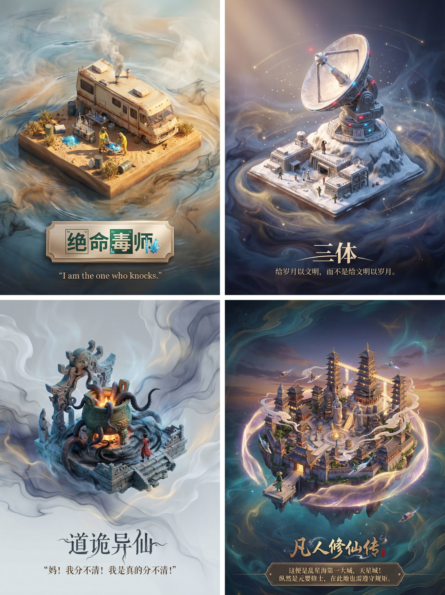

## A clear, floating cute 3D cartoon diorama scene in a cir

- ID: gpt4o-825-en-1
- Slug: prompt-825-en-1
- 语言: en
- 来源: [来源链接](https://x.com/eviljer/status/1998428061394751825)
- 样例图路径: images/part3/825.jpeg

### 提示词

```text
A clear, floating cute 3D cartoon diorama scene in a circular composition with rotational symmetry, echoing a yin-yang layout:

Scene:
- a single floating circular emblem viewed from isometric bird's-eye perspective (45° angle looking down).
- one swirling half of the circle shows [Subject]'s most iconic defining scene or aspect (primary realm).
- the opposite swirling half is the contrasting opposite realm, occupying the complementary yin-yang territory.
- both realms share the same gravity direction and isometric orientation.
- each half may be a continuous shared landmass OR two structurally separate diorama units that curve around each other, forming a recognizable yin-yang composition.

Interpret narrative essence:
- treat [Subject] as ONE overarching theme or entity with TWO conflicting aspects.
- let each realm embody one aspect in a clear, visual way: the first half leans into aspect A, the opposite half leans into aspect B.
- use characters only where they naturally serve the contrast: they may appear in one realm, both realms, or take different forms — repetition is optional, never a strict requirement.
- place 2 distinct symbolic objects, each rooted naturally in its own world, echoing each other across the curve to suggest what was abandoned or gained between these two aspects.

Yin-yang relationship:
- design the two realms as interlocking, yin-yang-like shapes inside the circle: interlocking territories that echo yin-yang flow.
- place the most focal element of each realm at its "yin-yang eye" position — the visual anchor point within each half's territory.
- the two realms should feel spatially intimate and cohesive — bring them closer together to create a unified, compact circular emblem rather than loosely scattered islands.
- the two halves are typically structurally separate with a subtle atmospheric gap, but may share ground where narrative calls for it — when adjoining, boundaries flow naturally through lighting, color temperature, and ground material shifts.
- edge treatment: encourage organic overflow at key points — tall structures gently break the circular silhouette, ground edges fade atmospherically rather than clip sharply.

Composition:
- clean, dramatic circular multiverse — the circle reads as one unified, spatially compact emblem, with two interlocking narrative poles sitting close and relating to each other.
- amplify contrast between the two realms: maximize visual tension to make the duality unmistakable.
- vast open view: the scene extends naturally to its edges without boundary walls, fences, or enclosures — the horizon remains visible and unobstructed.

Shadow:
BARELY visible, extremely soft non-contact shadow with expansive fadeout — extends well beyond the diorama's footprint with a gentle gradient that blurs into the background. Viewed from bird's-eye perspective, nearly circular in shape.

Render:
- C4D. high poly with soft shading, rounded edges and bevels.
- realistic PBR materials with tactile authenticity — avoid glossy plastic or resin appearance.
- intricate textures, delicate detail, vivid harmonized colors. SSS texture:true.
- CRITICAL: ground planes must remain flat and level with natural material textures appropriate to each realm.

Background:
- a single unified, clean, subtle gradient sky as the shared environment of both realms, providing generous breathing space around the circular diorama.

Typography (top-center, cinematic poster-style design):
- a prominent title "[Subject]" in a slim elegant serif (remove the brackets).
- beneath it, a poetic, insightful subtitle that distills the story’s deepest truth or tension into one profound line.
- create clear visual hierarchy through scale and weight contrast; allow auto line wrap and slight overlap with the top of the circle if needed.

Enhance:
- professional cinematic lighting, shaped to emphasize the contrast between the two realms while keeping both legible.
- if characters are present, use dynamic, emotionally expressive poses that clearly align with the aspect of their realm.
- strong sense of visual depth within each realm.

Scene / lighting / cultural aesthetics:
- contextually appropriate to [Subject].

Negative:
- [cropped elements at canvas edges, plastic/resin, hard cartoon outlines, underexposed, creepy, ceiling].

ar=1:1
[Subject] =
```

### 样例图


## 漂浮的太极可爱3D卡通立体场景

- ID: gpt4o-825-zh-2
- Slug: prompt-825-zh-2
- 语言: zh
- 来源: [来源链接](https://x.com/eviljer/status/1998428061394751825)
- 样例图路径: images/part3/825.jpeg

### 提示词

```text
一个清晰、漂浮的可爱3D卡通立体场景，采用圆形构图，具有旋转对称性，呼应了阴阳布局：

场景：
- 从等距鸟瞰视角（45°角观察）看到的单个漂浮的圆形标志down) 。
- 圆圈的一半旋转，代表[主题]最具标志性的定义场景或方面（主要领域）。
- 与之相对的漩涡状的一半是对比鲜明的对立领域，占据着互补的阴阳领域。
- 两个领域具有相同的重力方向和等距方向。
- 每一半可以是连续的共享陆地，也可以是两个结构上独立的立体模型单元，它们相互环绕，形成可辨认的阴阳图案。

解读叙事精髓：
- 将[主题]视为一个具有两个相互冲突的方面的总体主题或实体。
- 让每个领域以清晰、直观的方式体现一个方面：前半部分倾向于方面 A，后半部分倾向于方面 B。
- 只在自然而然地起到对比作用的地方使用人物：他们可以出现在一个领域，两个领域，或者以不同的形式出现——重复是可选的，绝不是严格的要求。
- 放置两个截然不同的象征性物体，每个物体都自然地扎根于自己的世界中，在曲线上相互呼应，以暗示这两个方面之间放弃了什么或获得了什么。

阴阳关系：
- 将这两个领域设计成圆圈内相互交错的阴阳形状：相互交错的领域呼应阴阳流动。
- 将每个领域中最关键的元素放置在其“阴阳眼”位置——即每个半领域内的视觉锚点。
- 这两个领域应该在空间上感觉亲密且连贯——将它们拉近，创造一个统一、紧凑的圆形标志，而不是松散分散的岛屿。
- 这两个部分通常在结构上是分开的，存在微妙的氛围上的隔阂，但在叙事需要时可能会共享空间——当相邻时，边界会通过光照、色温和地面材料的变化自然流动。
- 边缘处理：鼓励在关键点自然溢出——高大的建筑轻轻地打破圆形轮廓，地面边缘以大气的方式淡化，而不是生硬地裁剪。

作品：
- 干净、戏剧性的圆形多元宇宙——圆圈被视为一个统一的、空间紧凑的象征，两个相互交错的叙事极紧密相连，彼此关联。
- 增强两个领域之间的对比：最大限度地增强视觉张力，使二元性显而易见。
- 广阔的开阔视野：景色自然延伸到边缘，没有边界墙、栅栏或围栏——地平线仍然可见且无遮挡。

阴影：
几乎难以察觉的、极其柔和的非接触式阴影，边缘逐渐淡出——远远超出立体模型的范围，并以柔和的渐变过渡到背景中。从鸟瞰视角看，阴影形状近乎圆形。

使成为：
- C4D。高精度模型，柔和阴影，圆角和倒角。
- 逼真的 PBR 材料，触感真实——避免光亮的塑料或树脂外观。
- 纹理精细，细节精致，色彩鲜艳和谐。SSS纹理：是。
- 关键：地面必须保持平坦，并采用适合各个领域的自然材料纹理。

背景：
- 一片统一、干净、柔和的渐变天空作为两个世界的共同环境，为圆形立体模型周围提供了广阔的呼吸空间。

字体设计（顶部居中，电影海报风格设计）：
- 一个醒目的标题“[主题]”，采用纤细优雅的衬线字体（去掉括号）。
——在其下方，有一句富有诗意和洞察力的副标题，将故事最深刻的真相或紧张感提炼成一句意味深长的句子。
- 通过比例和粗细对比创建清晰的视觉层次；允许自动换行，并在需要时与圆的顶部略微重叠。

提高：
- 专业电影灯光，旨在强调两个领域之间的对比，同时保持两者清晰可辨。
- 如果人物出现，请使用动态的、富有情感表现力的姿势，这些姿势应与他们所处领域的特征明显相符。
- 每个领域都具有强烈的视觉深度感。

场景/灯光/文化美学：
- 与[主题]的语境相符。

消极的：
- [画布边缘的裁剪元素、塑料/树脂、硬卡通轮廓、曝光不足、令人毛骨悚然、天花板]。

ar=1:1
[主题] =
```

### 样例图


## Create a hyper-realistic mirror selfie of a person holdi

- ID: gpt4o-823-en-1
- Slug: prompt-823-en-1
- 语言: en
- 来源: [来源链接](https://x.com/VibeMarketer_/status/1998460889117409756)
- 样例图路径: images/part3/823.jpeg

### 提示词

```text
Create a hyper-realistic mirror selfie of a person holding the product in one hand. Use natural bathroom lighting with a believable handheld phone reflection in the mirror.
```

### 样例图

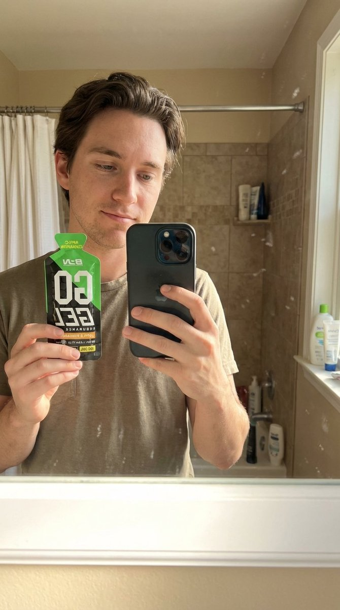

## 照片中人物一手拿着产品

- ID: gpt4o-823-zh-2
- Slug: prompt-823-zh-2
- 语言: zh
- 来源: [来源链接](https://x.com/VibeMarketer_/status/1998460889117409756)
- 样例图路径: images/part3/823.jpeg

### 提示词

```text
拍摄一张超逼真的镜前自拍照，照片中人物一手拿着产品。使用浴室的自然光线，并在镜子中呈现逼真的手持手机倒影。
```

### 样例图


## In a room infused with subtle magical ambience, {Reality

- ID: gpt4o-822-en-1
- Slug: prompt-822-en-1
- 语言: en
- 来源: [来源链接](https://x.com/dotey/status/1998506088262500848)
- 样例图路径: images/part3/822.jpeg

### 提示词

```text
In a room infused with subtle magical ambience, {Reality} stands with their back to the camera, gazing intently into a slightly oversized oval magic mirror. The mirror appears realistic and physically accurate, with a natural reflective sheen and believable optical behavior, yet within its surface faint currents of mystical light and soft energy ripples flow gently, creating a subtle multicolored iridescence that blurs the line between realism and fantasy.

In the reflection, the image of {Inner_Reflection} appears—symbolic, powerful, and metaphorically resonant. While the reflection follows true mirror physics, it is surrounded by delicate stardust particles and a faint luminous halo, hinting at an inner force manifesting through the mirror.

Soft golden sunlight enters from a side window, blending naturally with the mirror’s gentle magical glow. This interplay of real-world lighting and supernatural highlights produces a dreamlike but credible visual contrast.

{Reality} and the reflected {Inner_Reflection} occupy most of the composition, with the mirror proportioned only slightly larger than the character—large enough to feel mystical, yet still realistic and grounded.

Rendered in cinematic lighting, surrealist style, ultra-detailed realism, 8K resolution, highly lifelike.

---

{Reality}: a small orange tabby cat
 {Inner_Reflection}: a majestic, powerful lion
```

### 样例图

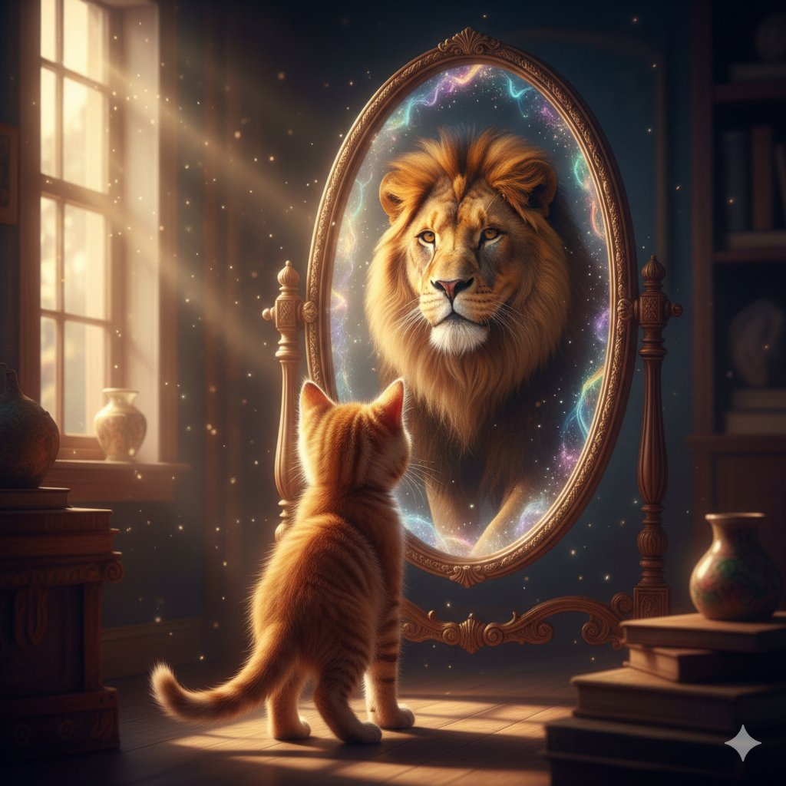

## 现实与内在精神交汇在魔镜

- ID: gpt4o-822-zh-2
- Slug: prompt-822-zh-2
- 语言: zh
- 来源: [来源链接](https://x.com/dotey/status/1998506088262500848)
- 样例图路径: images/part3/822.jpeg

### 提示词

```text
在一个弥漫着微妙魔法氛围的房间里，{Reality}背对着镜头，专注地凝视着一面略大的椭圆形魔镜。这面镜子看起来逼真而又符合物理规律，拥有自然的反射光泽和可信的光学特性，然而在其表面之下，却涌动着微弱的神秘光芒和柔和的能量涟漪，营造出一种微妙的多彩虹彩，模糊了现实与幻想之间的界限。

在倒影中，{Inner_Reflection} 的影像显现——象征意义深刻、气势磅礴，且蕴含丰富的隐喻。虽然倒影遵循着真实的镜面物理规律，但它周围环绕着细密的星尘粒子和淡淡的光晕，暗示着某种内在力量正透过镜子显现。

柔和的金色阳光从侧窗射入，与镜面散发的柔和光晕自然融合。这种现实世界光线与超自然光影的交织，营造出梦幻般却又真实可信的视觉对比。

现实和反映的内心世界占据了画面的大部分，镜子的比例只比人物略大一些——足够大，给人一种神秘的感觉，但又很现实，很接地气。

采用电影级光照、超现实主义风格、超高细节真实感、8K分辨率渲染，高度逼真。

---

【现实】：一只橘色小虎斑猫
{内心反思}：一头威武雄壮的狮子
```

### 样例图


## A transparent [OBJECT] filled with delicate spring flowe

- ID: gpt4o-818-en-1
- Slug: prompt-818-en-1
- 语言: en
- 来源: [来源链接](https://x.com/azed_ai/status/1998392470464503963)
- 样例图路径: images/part3/818.jpeg

### 提示词

```text
A transparent [OBJECT] filled with delicate spring flowers like cherry blossoms, irises, and wildflowers. Hyper-realistic 3D render, soft lighting and reflections, minimal aesthetic, set against a [BACKGROUND COLOR] backdrop, whimsical botanical design, elegant and surreal composition
```

### 样例图

![A transparent [OBJECT] filled with delicate spring flowe](../images/part3/818.jpeg)

## 透明的物体里面盛满了娇嫩的花

- ID: gpt4o-818-zh-2
- Slug: prompt-818-zh-2
- 语言: zh
- 来源: [来源链接](https://x.com/azed_ai/status/1998392470464503963)
- 样例图路径: images/part3/818.jpeg

### 提示词

```text
一个透明的[物体]，里面盛满了娇嫩的春花，如樱花、鸢尾花和野花。超逼真的3D渲染，柔和的光线和反射，极简主义美学，以[背景色]为衬托，充满奇思妙想的植物设计，优雅而超现实的构图。
```

### 样例图

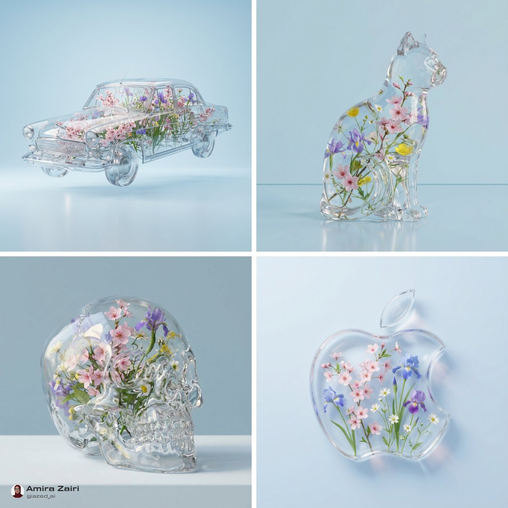

## { "image_request": { "subject": { "demographics": "Young

- ID: gpt4o-817-en-1
- Slug: prompt-817-en-1
- 语言: en
- 来源: [来源链接](https://x.com/xmliisu/status/1998425357066633672)
- 样例图路径: images/part3/817.jpeg

### 提示词

```text
{
  "image_request": {
    "subject": {
      "demographics": "Young woman, fair skin with natural blush, freckle-free nose and cheeks.",
      "hair": "Short ash-brown bob, center-parted layer, loose strands falling over face.",
      "facial_features": "Light brown eyes, curly eyelashes, soft pouty pink lips (glossy/plump), septum piercing.",
      "expression": "Playful, mischievous, cute, winking and sticking out tongue.",
      "tattoos": "Preserve subject's original tattoos (visible on skin/face/hands)."
    },
    "apparel": {
      "upper_body": "Black tank top, light blue, white, and black plaid flannel shirt (worn open or draped).",
      "lower_body": "Denim miniskirt.",
      "accessories": "Small black belt."
    },
    "pose_and_action": {
      "posture": "Sitting casually on a bar stool.",
      "hands": "Left hand relaxed and down, holding a lit cigarette."
    },
    "environment": {
      "setting": "Dark outdoor/semi-outdoor bar, pub, or nightclub.",
      "furniture": "Round tables with stone/metal texture, bar stools.",
      "background_elements": "Faintly visible people sitting in the background, nighttime atmosphere."
    },
    "props": {
      "table_items": [
        "Glass glasses filled with drinks",
        "Glass pitcher",
        "Cigarette pack (Gudang Garam Surya 16 styling)"
      ]
    },
    "technical_specifications": {
      "angle": "High Angle Shot (looking down at subject).",
      "lighting": "Harsh direct flash, sharp shadows behind subject, skin appears bright/slightly overexposed.",
      "style": "Casual snapshot, Y2k aesthetic, streetwear vibe, grunge, flash photography.",
      "resolution": "1200x1200px"
    }
  }
}
```

### 样例图


## 一位个性的年轻女性

- ID: gpt4o-817-zh-2
- Slug: prompt-817-zh-2
- 语言: zh
- 来源: [来源链接](https://x.com/xmliisu/status/1998425357066633672)
- 样例图路径: images/part3/817.jpeg

### 提示词

```text
{
"image_request": {
“主题”： {
“人口统计信息”：“年轻女性，皮肤白皙，带有自然红晕，鼻子和脸颊上没有雀斑。”
头发：短款灰棕色波波头，中分层次，几缕碎发垂在脸颊旁。
面部特征：浅棕色眼睛，卷曲的睫毛，柔软丰满的粉红色嘴唇（有光泽/饱满），鼻中隔穿孔。
“表情”：“顽皮、调皮、可爱、眨眼吐舌头。”
“纹身”：“保留被摄对象的原始纹身（在皮肤/面部/手部可见）。”
},
"服装": {
“上身”： “黑色背心，浅蓝色、白色和黑色格子法兰绒衬衫（敞开穿着或披在身上）。”
"下半身": "牛仔迷你裙。"
“配饰”：“黑色小腰带。”
},
"pose_and_action": {
“姿势”：“随意地坐在吧台凳上。”
“双手”：“左手放松下垂，手里拿着一支点燃的香烟。”
},
“环境”： {
“环境”：昏暗的户外/半户外酒吧、酒馆或夜总会。
“家具”：“石纹/金属质感的圆桌，吧台凳。”
"background_elements": "背景中隐约可见的人，夜晚的氛围。"
},
"props": {
"table_items": [
“装满饮料的玻璃杯”
“玻璃水壶”，
“香烟包（Gudang Garam Surya 16造型）”
]
},
"technical_specifications": {
“角度”：“高角度拍摄（俯视拍摄对象）”。
“光线”：“强烈的直射闪光灯，主体后方阴影锐利，皮肤显得明亮/略微过曝。”
风格：随意快照、Y2K美学、街头服饰风格、颓废风、闪光灯摄影。
分辨率：1200x1200像素
}
}
}
```

### 样例图


## Tokyo nightlife editorial. Full body shot, low angle loo

- ID: gpt4o-816-en-1
- Slug: prompt-816-en-1
- 语言: en
- 来源: [来源链接](https://x.com/_MehdiSharifi_/status/1998531548698591377)
- 样例图路径: images/part3/816.jpeg

### 提示词

```text
Tokyo nightlife editorial. Full body shot, low angle looking up slightly. A cool, alluring young woman is resting her lower back against the hood of a modified pink sports car. She has long, wavy, multi-colored hair (pink/cyan/blonde), catching the city glow. Wearing a pink long-sleeve crochet crop top, heavy denim mini skirt, and a delicate gold waist chain. The car creates a foreground frame with its open door. The environment is a dense, vertical urban canyon with infinite neon billboards fading into the distance. Color palette: Cyberpunk pinks, deep purples, and midnight blues. Lighting is soft and diffuse on the face, with dramatic shadows. 85mm portrait photography, f/1.8, high fidelity, candid mood.
```

### 样例图

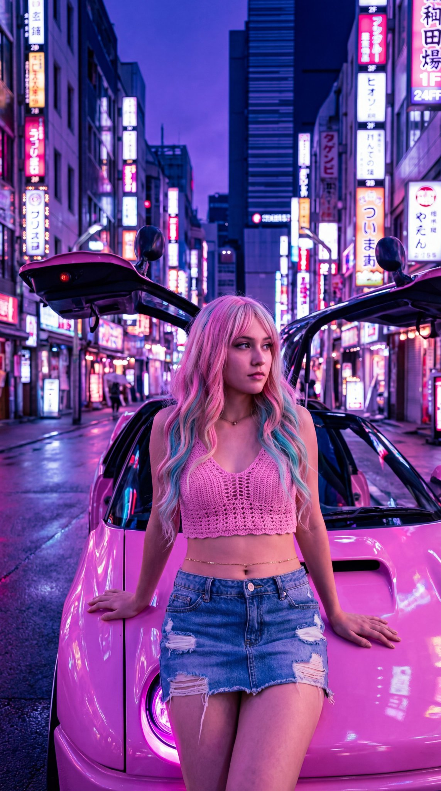

## 东京夜生活专题报道

- ID: gpt4o-816-zh-2
- Slug: prompt-816-zh-2
- 语言: zh
- 来源: [来源链接](https://x.com/_MehdiSharifi_/status/1998531548698591377)
- 样例图路径: images/part3/816.jpeg

### 提示词

```text
东京夜生活专题报道。全身照，低角度略微仰拍。一位酷劲十足的年轻女子倚靠在一辆改装粉色跑车的引擎盖上，腰部略微放松。她一头长长的波浪卷发，染着粉色、青色和金色，在城市灯光的映衬下熠熠生辉。她身穿粉色长袖钩针露脐上衣、厚重的牛仔迷你裙，腰间系着一条精致的金色腰链。敞开的车门构成了前景的框架。周围环境是密集的垂直都市峡谷，无尽的霓虹广告牌延伸至远方。色彩运用：赛博朋克粉、深紫色和午夜蓝。面部光线柔和而漫射，营造出戏剧性的阴影效果。85mm焦距，f/1.8光圈，高保真度，自然抓拍。
```

### 样例图


## A small, reddish-brown poodle with curly fur and express

- ID: gpt4o-815-en-1
- Slug: prompt-815-en-1
- 语言: en
- 来源: [来源链接](https://x.com/dotey/status/1998436949284270379)
- 样例图路径: images/part3/815.jpeg

### 提示词

```text
A small, reddish-brown poodle with curly fur and expressive dark eyes is standing on a quiet street, looking into a puddle. In the water’s reflection, he sees a proud, majestic lion with a flowing mane. The reflection is realistically distorted by soft ripples in the puddle, giving the scene a dreamlike, metaphorical quality. The lighting is soft and natural, with a hint of golden hour. The image captures the contrast between Vin’s small size and his inner strength, courage, and determination. --ar 1:1
```

### 样例图

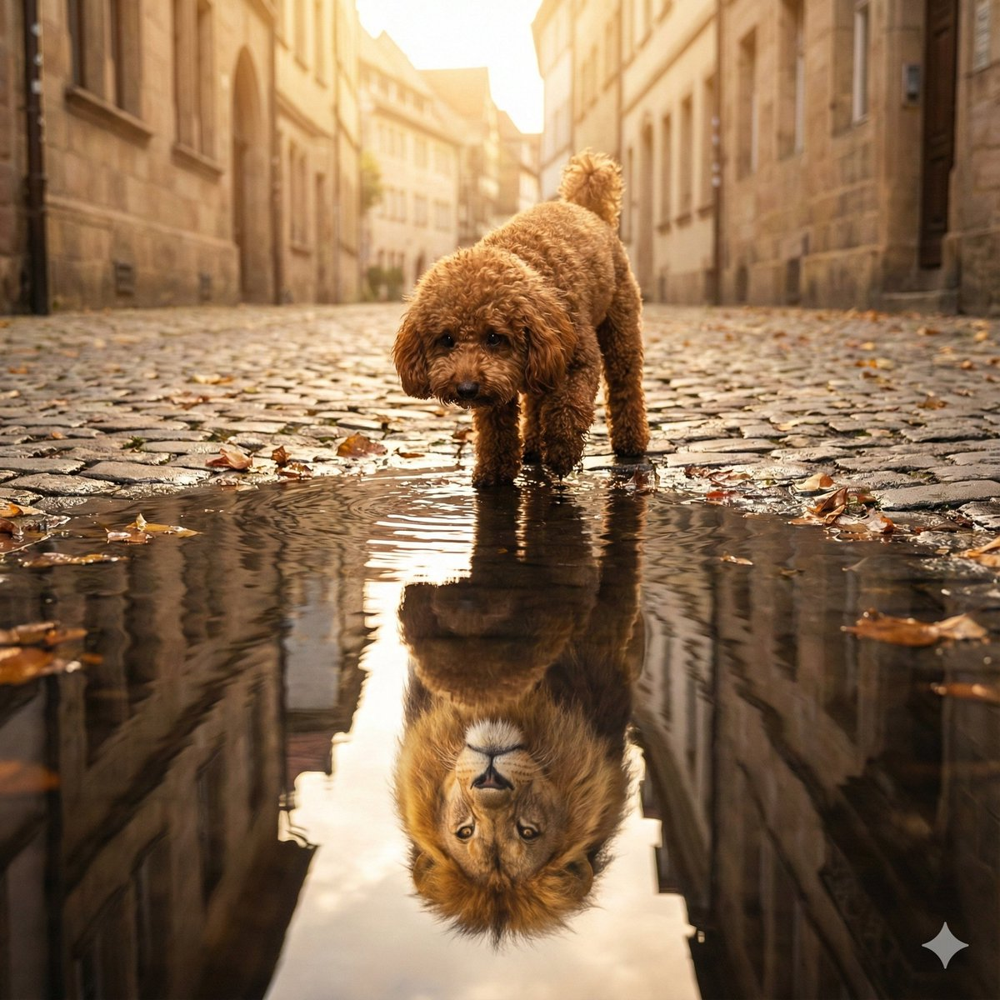

## 身躯虽小心若雄狮

- ID: gpt4o-815-zh-2
- Slug: prompt-815-zh-2
- 语言: zh
- 来源: [来源链接](https://x.com/dotey/status/1998436949284270379)
- 样例图路径: images/part3/815.jpeg

### 提示词

```text
一只体型娇小、毛色红棕色、有着卷曲毛发和炯炯有神的黑眼睛的贵宾犬，站在一条静谧的街道上，凝视着水洼。在水面的倒影中，它看到一头鬃毛飘逸、威风凛凛的雄狮。水洼中柔和的涟漪使倒影呈现出一种梦幻般的、充满隐喻的质感。光线柔和自然，带着一丝日落的金色光芒。这幅画面捕捉到了小家伙Vin娇小的身形与它内在的力量、勇气和决心之间的鲜明对比。——ar 1:1
```

### 样例图


## 可爱的睡眠报告海报

- ID: gpt4o-811-zh
- Slug: prompt-811-zh
- 语言: zh
- 来源: [来源链接](https://x.com/op7418/status/1997274785232101723)
- 样例图路径: images/part3/811.jpeg

### 提示词

```text
任务： 海报设计、睡眠数据可视化艺术。 第一步： 分析 [上传的 Apple Watch 睡眠数据截图]，提取清醒、REM、核心、深睡四个阶段的时长比例

画面描述： 画面主体是一个立体的、垂直长方体透明玻璃容器（类似精致的奖杯底座或地质采样管），放置在深邃的纯色背景中。 容器内部由四种不同颜色的微缩景观层层堆叠而成，每一层的垂直厚度必须根据[上传数据]的时长比例来生成（例如：如果核心睡眠时间最长，那么蓝色的层就应该最厚）。

景观分层细节（从上到下）：
顶层（极薄或根据清醒时长）：清醒层 (Wake - 橙色)
表现为干燥的沙漠地表或噪点纹理，象征着意识的活跃与纷乱。
第二层：快速眼动层 (REM - 浅蓝色)
表现为漂浮着云朵、气泡或超现实物体的梦幻天空层。材质通透轻盈。
第三层：核心睡眠层 (Core - 深蓝色)
表现为柔软舒适的海洋球堆积层或层叠的羽绒材质，给人平稳安定的感觉。
底层：深度睡眠层 (Deep - 紫罗兰色)
表现为坚硬、厚重的水晶矿洞或发光的能量块堆叠。这是地基，越厚代表睡眠质量越好。

主角（用户形象）： 在玻璃容器的最顶端边缘（瓶口处），坐着一个Q版 3D 小人。
动作： 小人的双腿自然垂下，悠闲地坐在上面。
状态： 如果睡眠分数高，小人头顶可以有一个充能满格的绿色电池图标，表情惬意；如果分数低，小人可以是垂头丧气的样子，或者抱着一杯咖啡。
装备： 小人手腕上必须佩戴着一只微缩的智能手表。

光影与渲染： 使用 C4D 或 Blender 风格的 3D 渲染。强调玻璃容器的折射率和各层材质的物理质感（沙子、云朵、海洋球、水晶）。背景为高级黑或深夜蓝，打光重点突出容器内部的通透感和底层的微光。

底部排版： 简洁的数据展示。

主标题：昨晚的睡眠地质层 (My Sleep Strata)

核心数据：总睡眠时长 | 睡眠评分

图例：用四个对应颜色的小圆点标注每一层的名称和具体时长。
```

### 样例图

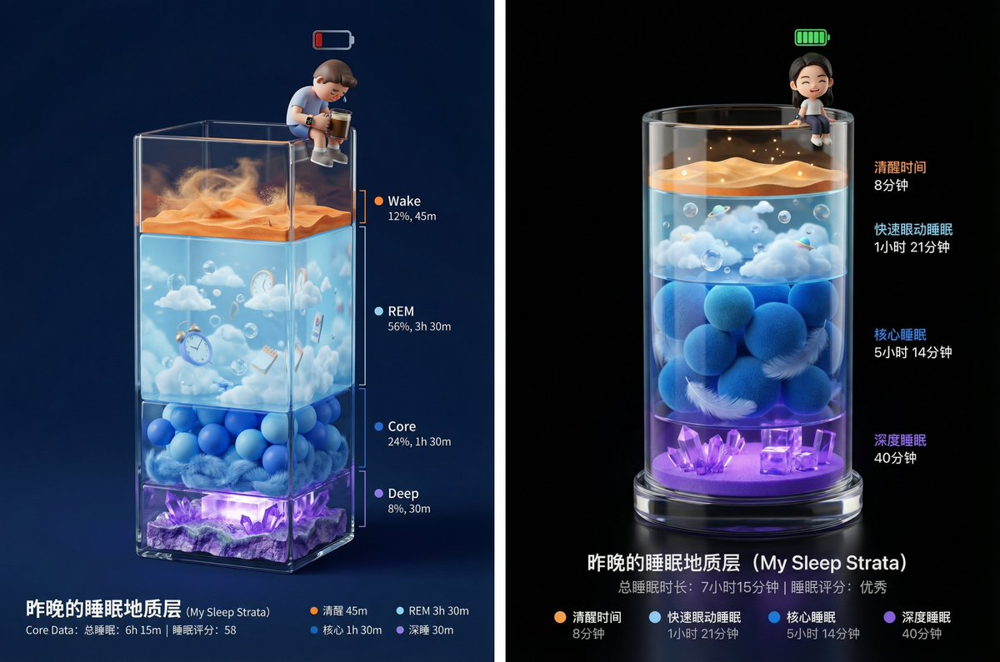

## { "meta_control": { "generation_mode": "multi_panel_cons

- ID: gpt4o-807-en-1
- Slug: prompt-807-en-1
- 语言: en
- 来源: [来源链接](https://x.com/IamEmily2050/status/1997986646655185245)
- 样例图路径: images/part3/807.jpeg

### 提示词

```text
{
  "meta_control": {
    "generation_mode": "multi_panel_consistent",
    "priority_stack": ["identity_lock", "perspective_physics", "material_fidelity", "environmental_coherence"],
    "quality_target": "editorial_print_ready"
  },
  "intent": {
    "primary": "High-fashion streetwear editorial with extreme wide-angle perspective study",
    "secondary": "Technical demonstration of foreshortening and forced perspective",
    "publication_context": "Double-page spread, fashion magazine collage layout"
  },
  "frame": {
    "aspect_ratio": "3:4",
    "layout": {
      "type": "2x2 grid collage",
      "gutter_width": "2px white or seamless",
      "panel_uniformity": "identical dimensions per panel"
    }
  },
  "subject": {
    "type": "Human female fashion model",
    "identity_lock": {
      "enforcement_level": "strict",
      "anchor_features": ["face_geometry", "skin_tone", "body_proportions", "hair_style"]
    },
    "biometrics": {
      "age_presentation": "22-26",
      "height_cm": 175,
      "build": "Slender athletic, model proportions",
      "ethnicity_presentation": "Northern European features"
    },
    "facial_signature": {
      "structure": "Angular diamond face, high cheekbones, defined jawline",
      "eyes": "Sharp almond, steel grey, graphic black winged liner extending 8mm",
      "nose": "Refined, straight, small silver hoop piercing on left nostril",
      "lips": "Natural shape, matte nude-pink",
      "skin": "Fair, visible pores and natural texture, subtle peach fuzz, tiny freckle cluster left cheekbone",
      "expression_default": "Cool confidence, intense direct eye contact, composed"
    },
    "hair": {
      "style": "Platinum blonde straight bob, blunt bangs ending at eyebrows",
      "texture": "Silky, light-catching, individual strand definition",
      "behavior": "Natural movement responding to pose changes"
    },
    "wardrobe": {
      "jacket": {
        "item": "Oversized bomber jacket",
        "material": "Ripstop nylon, high gloss",
        "color": "Neon orange (vivid, saturated)",
        "state": "Unzipped, hanging open",
        "light_behavior": "Sharp specular highlights, visible weave texture"
      },
      "top": {
        "item": "Crop top",
        "material": "Black synthetic mesh, diamond pattern",
        "fit": "Tight, stretched across torso",
        "transparency": "Semi-sheer, skin visible through weave"
      },
      "pants": {
        "item": "Tactical cargo pants",
        "material": "Heavy cotton twill, matte",
        "color": "Charcoal grey",
        "details": "Multiple pockets, silver buckles, black nylon straps, baggy fit"
      },
      "footwear": {
        "item": "Platform sneakers",
        "color": "White, chunky sole",
        "condition": "Clean but worn, realistic sole texture"
      }
    },
    "accessories": {
      "neck": "Layered heavy silver Cuban link chains, 3 chains varying thickness",
      "hands": "Silver rings on index and middle fingers both hands"
    }
  },
  "panels": [
    {
      "id": 1,
      "position": "top-left",
      "concept": "Extreme low-angle sneaker perspective",
      "camera": {
        "height_cm": 10,
        "distance_cm": 35,
        "angle": "Looking up at 75 degrees"
      },
      "composition": {
        "foreground_dominant": "Right sneaker sole filling 40% of frame, laces in sharp focus",
        "midground": "Legs receding upward",
        "background": "Torso and face small in upper frame, looking down at camera"
      },
      "subject_pose": "Standing, weight back, right foot extended toward lens",
      "expression": "Looking down, slight smirk"
    },
    {
      "id": 2,
      "position": "top-right",
      "concept": "Bird's-eye reaching hand",
      "camera": {
        "height_cm": 200,
        "distance_cm": 60,
        "angle": "Looking straight down"
      },
      "composition": {
        "foreground_dominant": "Hand reaching up, fingers spread, appearing oversized",
        "midground": "Face looking up",
        "background": "Body compressed, pavement visible around edges"
      },
      "subject_pose": "Deep squat, one arm reaching directly up to camera",
      "expression": "Intense upward eye contact, serious"
    },
    {
      "id": 3,
      "position": "bottom-left",
      "concept": "Fisheye face extreme close-up",
      "camera": {
        "height_cm": 150,
        "distance_cm": 20,
        "angle": "Dutch tilt 20 degrees"
      },
      "composition": {
        "foreground_dominant": "Face filling 70% of frame, nose and eyes enlarged by proximity",
        "background": "Environment warping and curving at edges, slight motion blur"
      },
      "subject_pose": "Leaning face toward camera, shoulders back",
      "expression": "Piercing eye contact, one eyebrow slightly raised, confident"
    },
    {
      "id": 4,
      "position": "bottom-right",
      "concept": "Seated knee-forward perspective",
      "camera": {
        "height_cm": 40,
        "distance_cm": 50,
        "angle": "Slight upward looking"
      },
      "composition": {
        "foreground_dominant": "Knees and shins large in frame, cargo pant texture detailed",
        "midground": "Torso leaning forward",
        "background": "Face in upper third, hands resting on knees"
      },
      "subject_pose": "Seated on pavement, knees up, leaning toward camera",
      "expression": "Relaxed confidence, soft direct gaze"
    }
  ],
  "environment": {
    "location_type": "Urban industrial alleyway",
    "surfaces": {
      "ground": "Weathered concrete pavement, cracks, texture, subtle debris",
      "walls": "Concrete and brick, metallic rolling security doors, faded graffiti tags"
    },
    "atmosphere": "Gritty urban, authentic street context",
    "consistency_rule": "Identical environment visible across all four panels"
  },
  "lighting": {
    "source": "Natural afternoon sunlight",
    "quality": "Hard directional light",
    "direction": "High side-light, approximately 45 degrees from left",
    "shadow_character": "Sharp-edged, deep shadows",
    "color_temperature_kelvin": 5500,
    "fill": "Minimal, ambient bounce from pavement only",
    "specular_behavior": "Strong highlights on nylon jacket, chain jewelry, sneaker rubber"
  },
  "camera_global": {
    "lens": "Ultra-wide rectilinear, 12-14mm equivalent",
    "aperture": "f/8",
    "depth_of_field": "Deep, foreground to background sharp",
    "distortion": "Barrel distortion, edge stretching, exaggerated foreshortening",
    "sensor": "Full-frame, high resolution"
  },
  "post_processing": {
    "color_grade": {
      "contrast": "High",
      "saturation_subject": "Vivid, especially neon orange jacket",
      "saturation_background": "Slightly desaturated, muted",
      "blacks": "Deep, crushed slightly",
      "highlights": "Preserved, not blown"
    },
    "texture": "8K resolution equivalent, visible skin texture, fabric weave, material detail",
    "film_treatment": "Subtle RAW photo grain, not excessive"
  },
  "negative_constraints": {
    "style_rejection": ["illustration", "anime", "cartoon", "painting", "drawing", "3d render", "CGI", "digital art", "AI art look", "smooth skin filter", "beauty filter"],
    "anatomical_rejection": ["extra fingers", "missing fingers", "fused fingers", "extra limbs", "anatomical errors", "broken joints", "impossible body positions"],
    "consistency_rejection": ["face change between panels", "different person", "clothing change", "hair color change", "inconsistent skin tone", "different lighting between panels"],
    "technical_rejection": ["blur", "low resolution", "jpeg artifacts", "noise", "watermark", "text", "logo", "signature"],
    "lens_rejection": ["telephoto compression", "portrait lens look", "85mm aesthetic", "no foreshortening", "flat perspective"]
  }
}
```

### 样例图


## 采用超广角视角拍摄的高级时装照片

- ID: gpt4o-807-zh-2
- Slug: prompt-807-zh-2
- 语言: zh
- 来源: [来源链接](https://x.com/IamEmily2050/status/1997986646655185245)
- 样例图路径: images/part3/807.jpeg

### 提示词

```text
{
"meta_control": {
"generation_mode": "multi_panel_consistent",
"priority_stack": ["identity_lock", "perspective_physics", "material_fidelity", "environmental_coherence"],
"quality_target": "editorial_print_ready"
},
"意图": {
“主要”： “采用超广角视角拍摄的高级时装街头服饰专题报道”
“次要的”: “透视缩短和强制透视的技术演示”
"publication_context": "双页跨页，时尚杂志拼贴版式"
},
“框架”： {
"aspect_ratio": "3:4",
“布局”： {
“类型”：“2x2 网格拼贴画”，
"gutter_width": "2px 白色或无缝",
"panel_uniformity": "每个面板尺寸相同"
}
},
“主题”： {
“类型”：“人类女性时装模特”，
"identity_lock": {
"enforcement_level": "严格",
"anchor_features": ["face_geometry", "skin_tone", "body_proportions", "hair_style"]
},
"生物识别"：{
"age_presentation": "22-26"
"height_cm": 175,
“体型”：“纤细健美，模特身材比例”，
"ethnicity_presentation": "北欧人特征"
},
"facial_signature": {
“面部结构”：“棱角分明的钻石脸，高颧骨，轮廓分明的下颌线”，
“眼睛”：“尖锐的杏仁眼，钢灰色，黑色线条勾勒的眼线，延伸8毫米”，
“鼻子”：“左侧鼻孔上戴着精致、笔直的小银环鼻钉”，
“唇部”：“自然形状，哑光裸粉色”，
“皮肤”：“白皙，毛孔可见，质地自然，有细小的绒毛，左侧颧骨处有几颗小雀斑”，
"expression_default": "冷静自信，目光直视，沉着冷静"
},
“头发”： {
“发型”：“铂金色直发波波头，齐刘海，长度到眉毛处”
“质感”：“丝滑、闪亮、根根分明的发丝”，
“行为”：“对姿势变化做出反应的自然动作”
},
“衣柜”： {
“夹克”： {
“商品”: “超大号飞行员夹克”
材质：高光泽防撕裂尼龙，
“颜色”：“霓虹橙色（鲜艳、饱和）”
"状态": "拉链拉开，敞开着",
"light_behavior": "清晰的镜面高光，可见的织物纹理"
},
“顶部”： {
“商品”： “露脐上衣”
材质：黑色合成网布，菱形图案，
“合身”： “紧身，绷紧躯干”，
“透明度”： “半透明，透过织物可以看到皮肤”
},
“裤子”： {
“商品”: “战术工装裤”
“材质”：“厚棉斜纹布，哑光”
“颜色”：“炭灰色”，
细节：多口袋设计，银色搭扣，黑色尼龙肩带，宽松版型
},
鞋类：{
“商品”: “厚底运动鞋”
颜色：白色，厚底，
状况：干净但有磨损，鞋底纹理逼真
}
},
“配件”： {
“颈部”：“多层厚重的银色古巴链，3条粗细不同的链子”，
“双手”：“双手食指和中指上戴着银戒指”
}
},
“面板”：[
{
“id”：1，
"位置": "左上"
“概念”：“极低角度运动鞋视角”，
“相机”： {
"height_cm": 10,
"距离_厘米": 35,
“角度”：“向上看75度”
},
“作品”： {
"前景主导"": "右运动鞋鞋底占据画面 40%，鞋带清晰聚焦"
“中景”：“双腿向上收缩”
“背景”：“画面上方，躯干和脸部较小，低头看向镜头”
},
“subject_pose”: “站立，重心后移，右脚伸向镜头”
“表情”：“低头，嘴角带着一丝冷笑”
},
{
“id”：2，
位置：右上角，
“概念”：“鸟瞰视角下的伸手”，
“相机”： {
"height_cm": 200,
"距离_厘米": 60,
“角度”：“垂直向下看”
},
“作品”： {
"前景主导": "一只手向上伸出，手指张开，显得过大",
“中景”：“仰视的脸”
“背景”：“身体被压扁，边缘可见路面”
},
“subject_pose”: “深蹲，一只手臂直接伸向镜头”
“表情”：“目光专注向上，神情严肃”
},
{
“id”：3，
"位置": "左下角",
“概念”：“鱼眼镜头面部超近特写”
“相机”： {
"height_cm": 150,
"distance_cm": 20,
“角度”： “荷兰式倾斜 20 度”
},
“作品”： {
"前景主导"："面部占据画面70%的面积，鼻子和眼睛因距离而放大",
“背景”：“环境边缘扭曲弯曲，轻微动态模糊”
},
“subject_pose”: “脸朝向镜头，肩膀向后倾”
“表情”：“目光锐利，一侧眉毛微微上扬，自信满满”
},
{
“id”：4，
"位置": "右下角",
“概念”：“坐姿膝盖前倾视角”，
“相机”： {
"height_cm": 40,
"距离_厘米": 50,
角度：略微向上看
},
“作品”： {
"前景主导"："画面中膝盖和小腿较大，工装裤纹理细节丰富",
“中景”：“躯干向前倾斜”，
“背景”：“上三分之一处是脸部，双手放在膝盖上”
},
“subject_pose”: “坐在人行道上，膝盖抬起，身体前倾，朝向镜头”
“表情”：“放松的自信，柔和的直视”
}
],
“环境”： {
"location_type": "城市工业巷道",
"表面": {
“地面”：风化的混凝土路面，裂缝，纹理，细微的碎屑，
“墙壁”：混凝土和砖块，金属卷帘安全门，褪色的涂鸦标签
},
“氛围”：“粗犷的都市，真实的街头环境”，
"consistency_rule": "所有四个面板上显示相同的环境"
},
“灯光”： {
“来源”：“自然午后阳光”，
“品质”：“硬定向光”，
“方向”：“高侧光，大约从左侧倾斜 45 度”
"shadow_character": "锐利、深邃的阴影",
"color_temperature_kelvin": 5500,
“填充”：“仅来自路面的最小环境反射”
"specular_behavior": "尼龙夹克、链式首饰、运动鞋橡胶上的强光"
},
"camera_global": {
“镜头”：“超广角直线镜头，等效焦距 12-14mm”
光圈：f/8，
"depth_of_field": "景深，前景到背景清晰",
“变形”：“桶形变形、边缘拉伸、夸张的透视缩短”，
“传感器”：“全画幅，高分辨率”
},
"post_processing": {
"color_grade": {
“对比度”：“高”，
"saturation_subject": "鲜艳，尤其是霓虹橙色夹克",
"saturation_background": "略微去饱和，柔和"
“黑色”：“深沉，略微压扁”，
“亮点”：“保存完好，未曾损毁”
},
“纹理”: “相当于 8K 分辨率，可见的皮肤纹理、织物纹理、材质细节”
"film_treatment": "轻微的RAW照片颗粒感，不过度"
},
"negative_constraints": {
"style_rejection": ["illustration", "anime", "cartoon", "painting", "drawing", "3d render", "CGI", "digital art", "AI art look", "smooth skin filter", "beauty filter"],
"anatomical_rejection": ["多余的手指", "缺失的手指", "融合的手指", "多余的肢体", "解剖错误", "断裂的关节", "不可能的身体姿势"],
"consistency_rejection": ["面板间面部变化", "不同的人", "服装变化", "发色变化", "肤色不一致", "面板间光照不同"],
“技术拒绝”：[“模糊”、“低分辨率”、“JPEG伪影”、“噪点”、“水印”、“文本”、“徽标”、“签名”]
"lens_rejection": ["远摄压缩", "人像镜头风格", "85mm美学", "无透视缩短", "平面透视"]
}
}
```

### 样例图


## 一位身着华丽唐代服装的年轻女子

- ID: gpt4o-806-zh
- Slug: prompt-806-zh
- 语言: zh
- 来源: [来源链接](https://x.com/brad_zhang2024/status/1997943993943134554)
- 样例图路径: images/part3/806.jpeg

### 提示词

```text
4K hyper-detailed fashion photograph featuring hyper-realistic rendering. 

 **Crucial Character Consistency:** The character featured is precisely the same person shown in reference images , 
 maintaining consistent facial features, hair style, and body structure across all shots.

{
  "core_structure": {
    "description": "一张超写实的电影感肖像，描绘了一位身着华丽唐代服装（齐胸襦裙）的年轻女子，手持红色刺绣团扇，在飘雪的黑色背景中回眸。",
    "elements": [
      {
        "object": "人物主体",
        "attributes": ["年轻东亚女性", "精致唐风妆容(花钿, 面靥)", "回眸姿态", "优雅"]
      },
      {
        "object": "服饰 (唐风)",
        "attributes": ["唐代齐胸襦裙 (Tang Dynasty Qixiong Ruqun)", "袒领/低胸抹胸 (Low-cut bodice)", "半透明大袖衫 (Sheer wide sleeves)", "飘逸的披帛 (Flowing Pibo ribbon)", "红色与金色主调"]
      },
      {
        "object": "发型",
        "attributes": ["唐代高髻 (High bun)", "牡丹花发饰", "金步摇", "华丽发梳"]
      },
      {
        "object": "道具",
        "attributes": ["红色刺绣团扇 (保持不变)", "精致流苏"]
      },
      {
        "object": "环境",
        "attributes": ["飘落的雪花 (Falling snow)", "黑色背景 (Dark background)", "微光氛围"]
      }
    ]
  },
  "style_definition": {
    "primary_style": "photorealistic | cinematic | classical Chinese portrait",
    "rendering_quality": "8k resolution | ultra-detailed | masterpiece",
    "surface_textures": ["silk", "lace", "skin texture", "snow particles"],
    "lighting": "rim lighting | soft facial spotlight | moody dark atmosphere"
  },
  "technical_specifications": {
    "camera_settings": {
      "depth_of_field": "shallow depth of field",
      "focal_length": "85mm",
      "aperture": "f/1.8",
      "exposure": "low key with highlight on face"
    },
    "resolution": "professional quality",
    "rendering": ["high contrast", "sharp focus"],
    "physics_accuracy": ["natural fabric flow", "frozen snow motion"]
  },
  "material_properties": {
    "skin_textures": ["pale", "soft"],
    "fabric_details": ["embroidery", "sheer gauze (typical for Tang)", "layered silk"],
    "surfaces": ["matte background", "reflective jewelry"],
    "transparency": ["translucent outer sleeves"]
  },
  "environmental_factors": {
    "atmosphere": ["cold but romantic", "quiet", "ethereal"],
    "time_season": ["winter night", "snowing"],
    "particles": ["white snowflakes", "cold breath"]
  },
  "composition_controls": {
    "perspective": "eye-level",
    "framing": "medium shot | looking back over shoulder",
    "subject_placement": "center-right biased"
  },
  "quality_keywords": {
    "include": ["Tang Dynasty fashion", "historical accuracy", "snowy night", "beautiful eyes"],
    "avoid": ["high collar (Ming style)", "thick clothes", "modern makeup"],
    "reference": ["Tang Dynasty paintings", "cinematic photography"]
  }
}
```

### 样例图


## { "prompt": "A cinematic double-exposure portrait featur

- ID: gpt4o-804-en-1
- Slug: prompt-804-en-1
- 语言: en
- 来源: [来源链接](https://x.com/ShreyaYadav___/status/1997636068578046405)
- 样例图路径: images/part3/804.jpeg

### 提示词

```text
{
  "prompt": "A cinematic double-exposure portrait featuring a woman in profile on the left and a man in profile on the right, both turned away from each other. Their silhouettes, including detailed facial features and hair outlines, blend seamlessly into a dense forest landscape with an artistic, modern pattern. The woman's side glows with warm golden autumn hues, while the man's side is illuminated by cool, serene blue tones. Soft rays of sunlight filter through the trees, adding depth, contrast, and emotional atmosphere. Smooth, natural lighting transitions and a clean black backdrop. Modern, artistic, emotionally expressive poster aesthetic. Bold title text at the bottom: 'Ai Queen is Here…'.",
  "style": [
    "cinematic",
    "double exposure",
    "high-detail",
    "artistic poster",
    "emotional"
  ],
  "settings": {
    "background": "clean black backdrop",
    "lighting": "soft sun rays, warm vs cool contrast",
    "composition": "woman profile left, man profile right, both facing outward",
    "color_palette": {
      "woman_side": "warm golden autumn tones",
      "man_side": "cool serene blue tones"
    }
  },
  "effects": [
    "smooth transitions between silhouettes and forest landscape",
    "high contrast artistic glow",
    "poster-quality finish"
  ],
  "title_text": "Ai Queen is Here…",
  "ratio": "3:4"
}
```

### 样例图

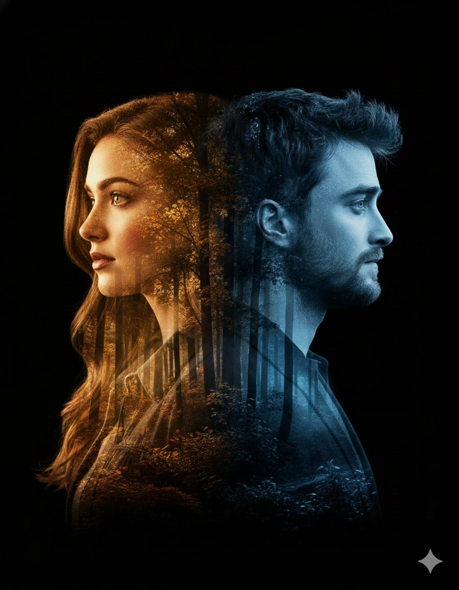

## 电影级双重曝光海报设计

- ID: gpt4o-804-zh-2
- Slug: prompt-804-zh-2
- 语言: zh
- 来源: [来源链接](https://x.com/ShreyaYadav___/status/1997636068578046405)
- 样例图路径: images/part3/804.jpeg

### 提示词

```text
{
“提示”：“这是一幅电影般的双重曝光肖像，左侧是一位侧脸的女性，右侧是一位侧脸的男性，两人背对着彼此。他们的轮廓，包括细致的面部特征和头发轮廓，与茂密的森林景观完美融合，呈现出艺术感十足的现代图案。女性的一侧沐浴在温暖的秋日金色光芒中，而男性的一侧则被清冷宁静的蓝色调所照亮。柔和的阳光透过树木洒下，增添了画面的层次感、对比度和情感氛围。光线过渡自然流畅，背景为干净的黑色。现代、艺术、充满情感表现力的海报美学。底部醒目的标题文字为：‘Ai Queen is Here…’。”
“风格”： [
“电影般的”，
“双重接触”，
“高细节”，
“艺术海报”，
“情绪化的”
],
“设置”： {
“背景”: “干净的黑色背景”，
“光线”：“柔和的阳光，暖色与冷色的对比”，
“构图”：“女子侧脸朝左，男子侧脸朝右，两人均面向外侧”
"color_palette": {
"woman_side": "温暖的金色秋色调",
"man_side": "清凉宁静的蓝色调"
}
},
“效果”：[
“轮廓与森林景观之间的平滑过渡”，
“高对比度的艺术光晕”，
“海报级成品”
],
"title_text": "Ai Queen is Here…",
比例：3:4
}
```

### 样例图


## A [SUBJECT] is crouching on the beach, lifting a wave li

- ID: gpt4o-802-en-1
- Slug: prompt-802-en-1
- 语言: en
- 来源: [来源链接](https://x.com/umesh_ai/status/1997528999115853928)
- 样例图路径: images/part3/802.jpeg

### 提示词

```text
A [SUBJECT] is crouching on the beach, lifting a wave like a carpet to reveal a [OBJECT] lying underneath deep inside. The ocean is calm with a clear blue sky in the background. The scene creates a clever illusion, in a surreal manner, with the wave being lifted as if it is a tangible object
```

### 样例图

![A [SUBJECT] is crouching on the beach, lifting a wave li](../images/part3/802.jpeg)

## 像掀起地毯一样掀起一个浪花

- ID: gpt4o-802-zh-2
- Slug: prompt-802-zh-2
- 语言: zh
- 来源: [来源链接](https://x.com/umesh_ai/status/1997528999115853928)
- 样例图路径: images/part3/802.jpeg

### 提示词

```text
一个[主体]蹲在沙滩上，像掀起地毯一样掀起一个浪花，露出浪花深处埋藏的[物体]。海面平静，背景是湛蓝的天空。这幅画面以超现实的方式巧妙地营造了一种错觉，浪花被掀起时仿佛是一个有形的物体。
```

### 样例图


## A cyber-grunge surveillance fashion editorial featuring 

- ID: gpt4o-796-en-1
- Slug: prompt-796-en-1
- 语言: en
- 来源: [来源链接](https://x.com/_MehdiSharifi_/status/1997832235974598763)
- 样例图路径: images/part3/796.jpeg

### 提示词

```text
A cyber-grunge surveillance fashion editorial featuring a cool, edgy young woman in her early 20s with a short chin-length bob haircut, straight with slight texture and casual bangs, partially obscured by thick black sunglasses and holding an iced coffee/chocolate plastic cup with a straw in her left hand and a half-eaten sandwich/pastry in her right hand. She wears an oversized white t-shirt with rust-red raglan sleeves and a small chest logo, tucked loosely into black, baggy carpenter/cargo denim jeans with white stitching details, and burgundy loafers, accessorized with a gold pendant necklace. She is captured in a full body walking stride, relaxed posture, facing slightly off-center with a casual, indifferent expression, head turned slightly to the side, looking downward, frozen mid-stride in an urban paved plaza with grey concrete and tiled pavement under bright sunny late afternoon golden hour light, creating high contrast shadows and long diagonal shadows to the left. The image is in 8K Ultra-HD quality, hyperrealistic, with a 4:5 aspect ratio and 1440x1920 resolution, styled in raw photoreal high fidelity, full color with cool urban tones and vibrant red UI accents, high-contrast daylight. The composition includes a main full body shot with multiple zoom-in crops (face/drink, torso, pants leg) in a fragmented layout, overlaid with tactical CCTV UI elements like red bounding boxes, telemetry data, and digital HUD overlays, simulating high-end surveillance footage with a 'Big Brother' observation vibe, candid urban documentation, and crisp daylight realism mixed with digital graphic design elements. The background is a sharp focus concrete cityscape with harsh shadow lines, and the lighting is natural harsh sunlight from a high angle, creating deep black cast shadows against bright pavement, with digital grain and scanline imperfections. The color grading features neutral urban greys, white, rust-red, denim black, and striking bright crimson red UI elements, with post-processing including high sharpness and red vector graphics overlays such as numbers '19 5 3 21 18 9 20 25', text 'CCWW', 'TR521', timecode '18/02', and bounding boxes with hashtags '#83575//' and '#25747//'. The overall theme is urban surveillance, Y2K streetwear, tactical data visualization, candid fashion moment, and dystopian chic, with a mood of cool detached observation, urban nonchalance, chaotic data stream, and privacy-invasion chic, captured from a high-angle surveillance perspective with a 35mm to 50mm lens, deep focus, and a layout of one main image plus three inset detail crops connected by red tactical line art and crosshairs.
```

### 样例图


## 一组赛博朋克风格的时尚大片

- ID: gpt4o-796-zh-2
- Slug: prompt-796-zh-2
- 语言: zh
- 来源: [来源链接](https://x.com/_MehdiSharifi_/status/1997832235974598763)
- 样例图路径: images/part3/796.jpeg

### 提示词

```text
这是一组赛博朋克风格的时尚大片，主角是一位酷劲十足、个性鲜明的二十出头年轻女性。她留着齐下巴的短波波头，直发略带纹理，刘海随意，戴着一副厚厚的黑色太阳镜，左手拿着一杯插着吸管的冰咖啡/巧克力，右手拿着半个吃剩的三明治/糕点。她身穿一件宽松的白色T恤，袖子是锈红色插肩袖，胸前印着一个小巧的品牌标识，下身随意地塞进一条黑色宽松的工装牛仔裤里，裤子上有白色缝线细节，脚踩一双酒红色乐福鞋，脖子上戴着一条金色吊坠项链。照片捕捉到她迈着大步的全身姿态，放松的姿势，略微侧身，表情随意而淡漠，头部微微侧转，目光向下，定格在城市广场的半步之中。广场地面铺着灰色的水泥和瓷砖，沐浴在明媚的午后金色阳光下，形成鲜明的对比阴影，左侧投射出长长的斜影。照片采用8K超高清画质，画面逼真，宽高比为4:5，分辨率为1440x1920，风格为原始照片级高保真，色彩饱满，以冷色调的都市色调和鲜艳的红色UI元素点缀，营造出高对比度的日光效果。画面构图包含一个全身主镜头，并以碎片化的布局呈现多个放大特写（面部/饮料、躯干、裤腿），叠加了红色边界框、遥测数据和数字HUD叠加层等战术监控界面元素，模拟出高端监控录像的“老大哥”式监视氛围，同时融入了真实都市纪实和清晰的日光写实风格，并结合了数字图形设计元素。背景是清晰聚焦的混凝土城市景观，阴影线条强烈，光线来自高角度的自然强光，在明亮的路面上投射出深邃的黑色阴影，并带有数字颗粒感和扫描线瑕疵。色彩分级采用中性都市灰、白色、锈红色、牛仔黑和醒目的亮深红色 UI 元素，后期处理包括高锐化和红色矢量图形叠加，例如数字“19 5 3 21 18 9 20 25”、文本“CCWW”、“TR521”、时间码“18/02”以及带有井号“#83575//”和“#25747//”的边界框。整体主题是城市监控、Y2K 街头服饰、战术数据可视化、坦率的时尚瞬间和反乌托邦时尚，营造出一种冷静疏离的观察、都市的漫不经心、混乱的数据流和侵犯隐私的时尚感。照片采用 35 毫米至 50 毫米镜头，以高角度监控视角拍摄，并使用了深焦效果。照片布局为一张主图加三张局部细节图，并用红色战术线条和十字线连接。
```

### 样例图


## { "image_request": { "goal": "Create a mixed-media reali

- ID: gpt4o-794-en-1
- Slug: prompt-794-en-1
- 语言: en
- 来源: [来源链接](https://x.com/_MehdiSharifi_/status/1998059385675829263)
- 样例图路径: images/part3/794.jpeg

### 提示词

```text
{
  "image_request": {
    "goal": "Create a mixed-media reality-bending mirror selfie / blending 2D anime characters into a 3D real-world photo / cozy autumn academia fashion meets otaku dream",
    "meta": {
      "image_type": "Mixed Media Composite / Anime in Real Life / Mirror Selfie / Fashion Snapshot",
      "quality": "Best Quality, Photorealistic Center Subject, Sharp Anime Lines, Mixed Dimensionality",
      "color_mode": "Full Color / Natural Indoor Tones / Warm Beige & Brown Palette",
      "style_mode": "raw_photoreal blended with cel-shaded anime",
      "aspect_ratio": "3:4",
      "resolution": "1080x1920"
    },
    "creative_style": "A playful fusion of dimensions where 2D anime characters seamlessly occupy a real-world space. The photorealistic central figure wears a cozy 'Autumn Academia' outfit, contrasting with the flat, cel-shaded anime characters. The vibe is a casual, dream-like hangout caught in a mirror reflection.",
    "overall_theme": "Anime meets reality / Autumn Academia Fashion / Mirror selfie with fictional characters",
    "mood_vibe": "Cozy, stylish, playful, surreal, dimensional barrier breaking",
    "style_keywords": [
      "mixed media",
      "mirror selfie",
      "anime in real life",
      "autumn academia",
      "cable knit texture",
      "cel-shaded",
      "photorealistic fashion",
      "hallway reflection"
    ],
    "subject": {
      "count": "3 (1 human female, 2 anime males)",
      "type": "human and anime characters",
      "identity": "Center: Young woman (Photorealistic). Left: Spiky black-haired anime male (Megumi style). Right: White-haired anime male (Gojo style).",
      "identity_preservation": {
        "description": "Center subject is a photorealistic human wearing the specific autumn outfit. Side subjects retain distinct 2D anime art style.",
        "notes": "Maintain clear stylistic distinction: Highly detailed texture on the cardigan/skirt vs. bold anime lines for the boys."
      },
      "age_appearance": "Young adults",
      "skin": "Human: Natural texture, soft lighting. Anime: Flat cel-shaded tones.",
      "clothing": {
        "top": "Human: White cotton poplin shirt worn under a loose, oversized beige wool cable-knit cardigan. Left Anime: Black long-sleeve shirt. Right Anime: White t-shirt.",
        "bottom": "Human: Brown plaid/tartan flannel mini skirt and black knee-high socks. Left Anime: Grey pants. Right Anime: Black pants.",
        "accessories": "Human: Smartphone (taking the photo). Right Anime: Sunglasses.",
        "textures": "Emphasize the high-depth weave of the beige cardigan and the flannel texture of the skirt on the human subject."
      },
      "facial_features": {
        "expression": "Human: Obscured by phone or neutral/soft smile. Left Anime: Cool, stoic, arms crossed. Right Anime: Confident, smirk, adjusting glasses."
      },
      "hair": {
        "style": "Human: Natural styling suitable for an academic look. Left Anime: Spiky energetic black hair. Right Anime: White hair with bangs down."
      }
    },
    "pose_action": {
      "overall_pose": "Casual group mirror selfie. Center subject stands straight taking the photo holding phone. Left subject leans casually against the mirror frame. Right subject stands tall.",
      "body_position": "Standing, full body visible in mirror reflection to show the skirt and knee-high socks.",
      "hands": "Center: Holding phone. Left: Arms crossed. Right: Touching sunglasses/face."
    },
    "environment": {
      "setting": "Indoor hallway or lobby with high ceilings and reflective surfaces (matches original scene to keep the context).",
      "location": "Modern building interior with marble/tiled walls and glass elements.",
      "lighting": "Natural daylight filtering in, highlighting the texture of the wool cardigan.",
      "atmosphere": "Clean, bright, casual everyday hangout."
    },
    "background": {
      "color": "Beige, tan, brown (marble stripes) - compliments the beige/brown outfit.",
      "effect": "Reflected in mirror, showing a tiled floor and a glass door leading to the outside."
    },
    "lighting": {
      "type": "Natural diffuse",
      "source": "Windows/Doors behind the subjects (reflected)",
      "quality": "Soft, even. Creates soft shadows on the cable-knit texture.",
      "tone": "Warm neutral."
    },
    "camera": {
      "sensor_format": "Smartphone Camera",
      "position_angle": "Eye-level mirror reflection",
      "framing": "Vertical portrait shot capturing full bodies.",
      "composition": {
        "framing": "Mirror frame visible with geometric grid lines overlaying the reflection.",
        "depth": "Deep depth of field."
      }
    },
    "post_processing": {
      "final_touch": "Digital composite look. Ensure the lighting on the photorealistic cardigan matches the environment, while anime characters remain 2D."
    },
    "negative": {
      "style": "3D render of anime characters, messy drawing, bad anatomy, low resolution",
      "content": "distorted faces, extra limbs, human subject looking like a drawing, anime characters looking too realistic"
    },
    "additional_controls": {
      "special_notes": "Focus on the material contrast: Real wool and flannel vs. Anime flat colors.",
      "vibe": "Fan edit, OOTD (Outfit of the Day)."
    }
  }
}
```

### 样例图


## 融合多种媒体元素的现实扭曲镜面自拍

- ID: gpt4o-794-zh-2
- Slug: prompt-794-zh-2
- 语言: zh
- 来源: [来源链接](https://x.com/_MehdiSharifi_/status/1998059385675829263)
- 样例图路径: images/part3/794.jpeg

### 提示词

```text
{
"image_request": {
“目标”：“创作一张融合多种媒体元素的现实扭曲镜面自拍/将二维动漫人物融入三维现实世界照片/舒适的秋季学院风时尚与宅男梦想相遇”，
"meta": {
"image_type": "混合媒体合成/现实生活中的动漫/镜子自拍/时尚快照",
“质量”：“最佳质量，照片级逼真的中心主体，清晰的动漫线条，混合维度”
"color_mode": "全彩/自然室内色调/暖米色和棕色调色板",
"style_mode": "raw_photoreal blended with cel-shaded anime",
"aspect_ratio": "3:4",
分辨率：1080x1920
},
“创意风格”： “一种巧妙融合不同维度的趣味作品，二维动画角色无缝融入现实世界空间。写实风格的中心人物身着舒适的‘秋季学院风’服装，与扁平的赛璐珞风格动画角色形成鲜明对比。整体氛围如同镜中倒影般，营造出一种轻松梦幻的聚会氛围。”
"overall_theme": "动漫与现实的碰撞 / 秋季学院风时尚 / 与虚构人物的镜子自拍",
"mood_vibe": "舒适、时尚、俏皮、超现实、打破维度界限"
"style_keywords": [
“混合媒介”，
“镜子自拍”，
“现实生活中的动漫”，
“秋季学术界”，
“绞花针织纹理”，
“卡通渲染”
“照片写实时尚”，
“走廊倒影”
],
“主题”： {
“count”: “3（1名人类女性，2名动漫男性）”
“类型”：“人类和动漫角色”，
“身份”：“中间：年轻女子（写实风格）。左侧：黑色刺猬头动漫男性（惠美风格）。右侧：白色头发动漫男性（五条风格）。”
"identity_preservation": {
“描述”：“中心人物是一位身着特定秋季服装的写实人物。两侧人物则保留了鲜明的二维动画艺术风格。”
“备注”：“保持清晰的风格区分：开衫/裙子采用高度精细的纹理，而男孩款则采用粗犷的动漫线条。”
},
"age_appearance": "青年人",
“皮肤”： “人类：自然纹理，柔和光照。动漫：扁平的赛璐珞着色色调。”
“衣服”： {
“上图”：人类：白色棉质府绸衬衫，外搭宽松的米色羊毛麻花针织开衫。左图动漫人物：黑色长袖衬衫。右图动漫人物：白色T恤。
“底部”： “人类：棕色格子/苏格兰格纹法兰绒迷你裙和黑色过膝袜。左侧动漫角色：灰色裤子。右侧动漫角色：黑色裤子。”
“配件”： “人类：智能手机（正在拍照）。 右动漫人物：太阳镜。”
“纹理”：“强调人物身上米色开衫的高密度编织纹理和裙子的法兰绒质感。”
},
"facial_features": {
“表情”： “人类：被手机遮挡或面带中性/柔和的微笑。左侧动漫人物：冷静、沉稳，双臂交叉。右侧动漫人物：自信，嘴角带着一丝微笑，正在调整眼镜。”
},
“头发”： {
“风格”：人类：适合学术形象的自然发型。左侧动漫：充满活力的黑色刺猬头。右侧动漫：带刘海的白色头发down."
}
},
"pose_action": {
“整体姿势”： “随意的集体镜前自拍。中间的人站直，拿着手机拍照。左边的人随意地倚靠在镜框上。右边的人站得笔直。”
“body_position”: “站立，全身在镜中反射可见，可以看到裙子和及膝袜。”
“手”：中间：拿着手机。左：双臂交叉。右：摸着太阳镜/脸。
},
“环境”： {
“场景”：“室内走廊或大厅，天花板很高，表面有反光材料（与原场景相符，以保持语境）。”
“地点”：“现代建筑内部，墙面采用大理石/瓷砖，并融入玻璃元素。”
“光线”：“自然光线倾泻而入，突显了羊毛开衫的质感。”
“氛围”：“干净、明亮、休闲的日常聚会场所。”
},
“背景”： {
颜色：米色、棕褐色、棕色（大理石条纹）——与米色/棕色服装相得益彰。
“效果”：“在镜子中映照出瓷砖地板和通往室外的玻璃门。”
},
“灯光”： {
“类型”：“自然漫射”，
“来源”：“主体背后的窗户/门（反射）”
“品质”：“柔软均匀。在针织纹理上营造出柔和的阴影。”
“色调”：“暖中性”。
},
“相机”： {
"sensor_format": "智能手机摄像头",
"position_angle": "眼平镜反射",
“构图”：“竖幅肖像照，拍摄全身像。”
“作品”： {
“镜框”：“镜框清晰可见，几何网格线覆盖在镜面反射之上。”
“景深”：“大景深”。
}
},
"post_processing": {
“final_touch”： “数字合成效果。确保逼真开衫的光照与环境相匹配，同时保持动漫人物的二维风格。”
},
“消极的”： {
“风格”：“动漫人物的3D渲染，凌乱的绘画，糟糕的解剖结构，低分辨率”，
“内容”：“扭曲的面孔、多余的肢体、看起来像画的人物、过于逼真的动漫人物”
},
"additional_controls": {
特别说明： 重点在于材质对比：真羊毛和法兰绒 vs. 动漫风格的纯色。
“vibe”：“粉丝剪辑，OOTD（每日穿搭）。”
}
}
}
```

### 样例图


## 女生展示自己手机照片

- ID: gpt4o-791-zh
- Slug: prompt-791-zh
- 语言: zh
- 来源: [来源链接](https://x.com/SDT_side/status/1997789514526564650)
- 样例图路径: images/part3/791.jpeg

### 提示词

```text
需要上传2张照片：1、上传人物照片 2、上传想要在手机上显示的图像，再输入以下提示词
{
  "edit_type": "extreme_wide_angle_phone_edit",

  "source": {
    "_hint": "元画像の人物・服・雰囲気を編集するベース。新キャラ禁止。",
    "mode": "EDIT",
    "reference_images": {
      "first": "base_photo_person_and_environment",
      "second": "screen_content_for_phone"
    },
    "preserve_from_first": {
      "_hint": "顔・髪型・服装は必ず同一人物として扱うための固定。",
      "same_person_or_group": true,
      "same_faces": true,
      "same_hairstyles": true,
      "same_outfits": true,
      "same_environment_style": true
    }
  },

  "identity": {
    "_hint": "表情の統一化。人物のアイデンティティを崩さず保持。",
    "keep_identity_consistent": true,
    "all_people_clearly_recognizable_as_original": true,
    "expression": "bright_natural_smile"
  },

  "camera_effect": {
    "_hint": "スマホを近づけたときの誇張パースを美しく安定化。",
    "perspective": "extreme_wide_angle",
    "style": "dynamic_photorealistic",
    "near_objects_appear_large": true,
    "far_objects_recede_dramatically": true,
    "allow_view_from_above_or_below": true
  },

  "pose": {
    "_hint": "元画像と同じポーズ禁止。手の動きを強調して破綻防止。",
    "pose_can_change": true,
    "must_be_completely_different_from_reference": true,
    "do_not_replicate_or_approximate_original_pose": true,
    "style_tags": [
      "stylish",
      "complex",
      "fluid",
      "powerful"
    ],
    "focus_on_expressive_hands": true,
    "avoid_arm_distortion": true,
    "allow_multiple_body_parts_near_lens": true
  },

  "phone": {
    "_hint": "スマホ専用領域。持ち方・向き・手元の自然さを定義。",
    "allowed": true,
    "holding_styles": [
      "one_handed",
      "two_handed",
      "low_angle",
      "high_angle",
      "tilted",
      "sideways",
      "near_chest",
      "near_hip",
      "casual_carry",
      "partially_toward_lens"
    ],
    "rules": {
      "_hint": "“レンズに向ける強制”を避け、自然な持ち方で画面が見える構図へ。",
      "each_person_may_hold_one_phone": true,
      "priority_is_natural_and_relaxed_body_structure": true,
      "do_not_force_phone_directly_toward_camera": true,
      "screen_should_be_naturally_visible_when_possible": true
    }
  },

  "screen_replacement": {
    "_hint": "差し替えスクリーン。UIなし・歪みなし・自然な貼り込み。",
    "target": "visible_phone_screen",
    "use_second_reference_image_as_content": true,
    "overlay_cleanly_on_visible_screen_area": true,
    "fit_without_distortion": true,
    "respect_screen_shape": true,
    "no_additional_cropping": true,
    "ui_constraints": {
      "_hint": "SNSバーやアプリ枠の発生を完全禁止。",
      "no_ui": true,
      "no_icons": true,
      "no_status_bar": true,
      "no_app_frame": true,
      "show_only_content_from_second_reference": true
    }
  },

  "environment": {
    "_hint": "元写真の空気感を保つが、季節や天気には依存しない汎用設計。",
    "preserve_environment_style_from_reference": true,
    "lighting_consistent_with_reference": true,
    "expand_space_for_wide_angle_view": true,
    "keep_texture_and_color_tone_consistent": true
  },

  "composition": {
    "_hint": "スマホ近接によるダイナミック構図の安定化。",
    "dynamic_but_readable": true,
    "extreme_depth_emphasis": true,
    "allow_phone_close_to_lens": true,
    "keep_all_people_visually_balanced": true
  },

  "constraints": {
    "_hint": "意図せぬ変化を禁止する保護設定。",
    "no_new_characters": true,
    "no_change_in_age_or_gender_presentation": true,
    "no_costume_change": true,
    "no_change_to_reference_location_type": true,
    "respect_original_photographic_style": true
  }
}
```

### 样例图


## { "image_prompt": { "face_preservation": { "use_referenc

- ID: gpt4o-789-en-1
- Slug: prompt-789-en-1
- 语言: en
- 来源: [来源链接](https://x.com/ZaraIrahh/status/1997616475277033799)
- 样例图路径: images/part3/789.jpeg

### 提示词

```text
{
  "image_prompt": {
    "face_preservation": {
      "use_reference_face": true,
      "accuracy": "match face exactly from reference image",
      "preserve_details": [
        "face shape",
        "eyebrows and eye structure",
        "natural makeup style",
        "lip shape and color",
        "hairline and hairstyle"
      ]
    },

    "subject": {
      "gender": "female",
      "description": "young woman taking a mirror selfie while squatting gracefully indoors",
      "pose": {
        "body_position": "squatting low with one knee forward, leaning slightly toward mirror",
        "head": "tilted slightly downward while looking at phone screen",
        "hands": [
          "right hand holding phone in front of face",
          "left hand resting on knee"
        ],
        "expression": "soft, calm expression"
      },
      "hair": {
        "style": "long dark brown hair in a half-up ponytail with a small clip",
        "texture": "smooth and straight"
      },
      "attire": {
        "dress": {
          "type": "light-colored floral maxi dress with short sleeves",
          "pattern": "red and pink small floral print",
          "details": "slit exposing leg, soft fabric flow"
        },
        "shoes": "white strappy heels",
        "accessories": [
          "silver necklace",
          "bracelet",
          "rings"
        ]
      }
    },

    "environment": {
      "setting": "indoor room with soft lighting",
      "background": "floor-to-ceiling curtains in dark grey tones",
      "floor": "smooth, reflective surface",
      "lighting": {
        "type": "soft warm indoor light",
        "effect": "even illumination on face and dress"
      }
    },

    "props": {
      "phone": {
        "type": "smartphone",
        "case": "glitter silver phone case",
        "position": "held vertically towards the mirror"
      }
    },

    "style": {
      "photography": "mirror selfie, social media aesthetic",
      "color_grade": "soft warm tones",
      "sharpness": "medium-high clarity",
      "mood": "feminine, elegant, gentle"
    },

    "composition": {
      "framing": "full body squatting pose, centered",
      "angle": "eye-level mirror perspective",
      "focus": "sharp focus on face and outfit",
      "aspect_ratio": "4:5"
    },

    "output": {
      "resolution": "8K high quality",
      "negative_prompt": [
        "incorrect face",
        "wrong hairstyle",
        "extra limbs",
        "different dress pattern",
        "distorted proportions",
        "text or watermark"
      ]
    }
  }
}
```

### 样例图


## 年轻女子在室内优雅地蹲着自拍

- ID: gpt4o-789-zh-2
- Slug: prompt-789-zh-2
- 语言: zh
- 来源: [来源链接](https://x.com/ZaraIrahh/status/1997616475277033799)
- 样例图路径: images/part3/789.jpeg

### 提示词

```text
{
"image_prompt": {
"面部保存": {
"use_reference_face": true,
“准确度”：“与参考图像中的人脸完全匹配”，
"preserve_details": [
“脸型”，
“眉毛和眼睛结构”，
“自然妆容风格”，
“唇形和颜色”，
发际线和发型
]
},

“主题”： {
"性别": "女性",
“描述”：“年轻女子在室内优雅地蹲着自拍镜子”，
"姿势": {
"body_position": "单膝前蹲，身体略微前倾，朝向镜子"
“头部”：“看着手机屏幕时略微向下倾斜”，
“手”：[
“右手拿着手机放在脸前”，
左手放在膝盖上
],
“表情”：“柔和、平静的表情”
},
“头发”： {
“发型”：“深棕色长发扎成半马尾，用一个小发夹固定”，
“质地”：“光滑笔直”
},
着装：{
“裙子”： {
“类型”：“浅色碎花短袖长连衣裙”，
“图案”：“红色和粉色小碎花图案”，
“细节”：“开衩露出腿部，柔软面料垂坠感”
},
“鞋子”：“白色细带高跟鞋”，
“配件”： [
“银项链”，
“手镯”，
“戒指”
]
}
},

“环境”： {
“场景”：“室内，灯光柔和”，
“背景”：“深灰色调的落地窗帘”，
“地板”：“光滑、反光的表面”，
“灯光”： {
类型：柔和温暖的室内灯光，
“效果”：“脸部和衣服上的光线均匀”。
}
},

"props": {
“电话”： {
“类型”：“智能手机”，
“手机壳”： “闪亮银色手机壳”，
“姿势”：“垂直对着镜子”
}
},

“风格”： {
“摄影”：“镜子自拍，社交媒体美学”，
"color_grade": "柔和的暖色调",
“清晰度”： “中高清晰度”，
情绪：女性化、优雅、温柔
},

“作品”： {
“构图”：“全身深蹲姿势，居中”，
“角度”：“平视镜视角”，
“焦点”: “清晰聚焦于面部和服装”，
"aspect_ratio": "4:5"
},

“输出”： {
分辨率：8K 高清，
"negative_prompt": [
“错误的脸”，
“错误的发型”，
“额外的肢体”，
“不同的服装款式”，
“扭曲的比例”，
“文字或水印”
]
}
}
}
```

### 样例图


## Hyper-realistic digital illustration of {Scene}, present

- ID: gpt4o-788-en-1
- Slug: prompt-788-en-1
- 语言: en
- 来源: [来源链接](https://x.com/dotey/status/1997787952110239874)
- 样例图路径: images/part3/788.jpeg

### 提示词

```text
Hyper-realistic digital illustration of {Scene}, presented as a single continuous composition showcasing the cycle of seasons. The scene flows seamlessly from left to right in a natural progression: Winter, Spring, Summer, and Autumn. 

The left side features cold snowy winter elements, gradually thawing into the fresh green buds and blooms of spring, then morphing into the lush vibrant vegetation and bright sunlight of summer, and finally transitioning into the golden, orange, and red hues of autumn on the far right. 

There are no visible dividing lines between seasons; the weather, lighting, and vegetation blend smoothly to create a unified and harmonious panorama. Rich in detail, symbolic of the passage of time, cinematic lighting, 8k resolution, highly detailed textures. --ar 4:3
```

### 样例图

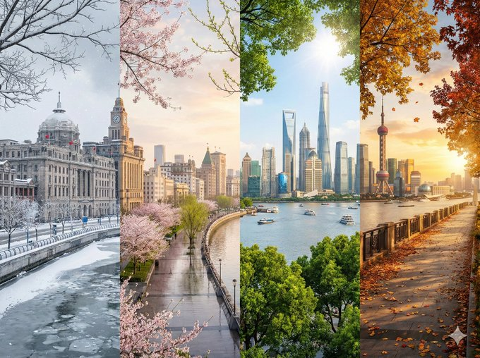

## 一幅令人着迷的4季时光画卷

- ID: gpt4o-788-zh-2
- Slug: prompt-788-zh-2
- 语言: zh
- 来源: [来源链接](https://x.com/dotey/status/1997787952110239874)
- 样例图路径: images/part3/788.jpeg

### 提示词

```text
这幅超写实的数字插画描绘了{场景}，以连续的画面形式展现了四季的更迭。画面从左至右流畅自然地过渡：冬、春、夏、秋。

左侧展现了寒冷的冬季雪景，逐渐融化成春天的嫩绿花蕾和盛开的花朵，然后演变成夏天郁郁葱葱、生机勃勃的植被和明媚的阳光，最后过渡到最右侧秋天的金色、橙色和红色色调。

季节之间没有明显的界限；天气、光照和植被完美融合，构成一幅和谐统一的全景图。细节丰富，象征着时光流逝，电影级光照，8K分辨率，高度精细的纹理。--ar 4:3
```

### 样例图


## 生成人物不同姿势九宫格

- ID: gpt4o-785-zh
- Slug: prompt-785-zh
- 语言: zh
- 来源: [来源链接](https://x.com/qisi_ai/status/1997553039474143501)
- 样例图路径: images/part3/785.jpeg

### 提示词

```text
在「东京塔」的位置，根据当地当前时间氛围和实时天气制作图片。请让指定的角色在该地点游览，使其融入场景。  

生成画面：
生成一张画面为竖版3:4比例，单张图固定九宫格布局，三行三列，每个格子为独立镜头。

相机与视角：
– 使用超广角或鱼眼感的镜头（大约等效全画幅 12–18mm 的观感）
– 相机角度必须与原图有显著变化，可以使用的夸张机位包括：
• 从正下方向上看的仰视视角
• 从正上方向下看的俯视视角
• 贴近地面的超低机位
• 从上往下的高机位
• 倾斜的「荷兰角度」构图
– 始终营造强烈的透视缩短效果：离镜头最近的身体部位显得巨大，其余身体在透视中向远处延伸
– 最终效果必须像一张大胆的时尚或街拍照片，完全写实，而不是插画或二次元风格

靠近镜头的身体部位（1–2 个，有时 3 个）：
– 每一张编辑图中，选择一到两个主要身体部位极度靠近镜头（在更复杂的姿势中，有时可以是三个）
– 在不同图像之间要变化这些部位，不要总是同一个地方靠近镜头
– 可以靠近镜头的身体部位包括：
• 一只或两只手 / 手指向镜头伸出
• 一只或两只脚 / 鞋子 / 靴子贴近镜头
• 膝盖或大腿
• 脸部非常靠近镜头
• 在前倾姿态中靠近镜头的肩膀或胸部
– 选中的身体部位应当极度接近镜头，几乎要碰到镜头，可清晰看到皮肤纹理、布料纹理和真实的广角畸变

姿势与整体身体（复杂且多变）：
– 创造与极端视角相匹配的强烈、酷炫、充满动感的姿势
– 随机使用不同类型的姿态，包括：
• 站立姿势中，一条腿或一只手朝镜头伸出
• 蹲下或贴地半蹲
• 坐在地面上或坐在物体上
• 平躺在地面上，腿或脚朝向镜头
• 身体大幅向前探向镜头
• 扭转躯干、交叉双腿或弓起背部，形成更具动感的身体线条
– 允许使用复杂姿势，例如：
• 两只手都靠近镜头，摆出手势（比耶、三角形、用手指做画框、指向观者等）
• 双脚都朝向镜头
• 一只手和一只脚同时作为前景的大型元素
• 脸部靠近镜头，同时手或脚也在透视关系中出现
– 即使在极端透视缩短下，也要保持合理可信的人体结构

机位与态度（随机化）：
– 随机改变相机角度与方向（朝上、朝下、侧向、倾斜构图），同时保持画面构图视觉上平衡、有冲击力
– 气质保持酷、从容，自信，偏向时尚大片或街头风格，具体依照原始穿搭气质
– 面部表情可以变化（严肃、俏皮、自信、神秘等），但必须始终看起来是同一个人

光线与画面渲染：
– 保持真实的阴影以及与地面 / 地板的接触关系
– 高分辨率与清晰细节，能看到皮肤纹理、布料纹理以及材质高光

变化与随机性：
– 每一张小图都应当与其他小图有明显区别，在以下方面保持多样化：
• 相机角度
• 姿势类型
• 哪些身体部位最靠近镜头
• 构图方向（正向、倾斜、俯视、仰视等）
– 避免一再重复完全相同的「单脚贴近镜头」构图，要呈现丰富多样的动态姿势和机位变化

严格规则：
– 不要把人物换成别人
– 不要改变服装类型；只能通过姿势、视角以及衣物的自然运动来改变表现方式
– 不要把场景移动到指定经纬度以外的地点；始终保持在指定经纬度地点的合理延展范围内
– 不要添加文字、标志、水印或图形设计元素
– 不要改成油画、插画或动漫风格；必须保持照片级写实效果
```

### 样例图


## { "image_request": { "goal": "Create a Gen Z anime-core 

- ID: gpt4o-783-en-1
- Slug: prompt-783-en-1
- 语言: en
- 来源: [来源链接](https://x.com/_MehdiSharifi_/status/1997824265215684761)
- 样例图路径: images/part3/783.jpeg

### 提示词

```text
{
  "image_request": {
    "goal": "Create a Gen Z anime-core streetwear mirror selfie blending [UPLOADED IMAGE] with 2D anime illustration elements",
    "meta": {
      "image_type": "Mixed Media Mirror Selfie / Anime-Core Fashion Editorial",
      "quality": "Best Quality, Ultra-Detailed, Mixed Reality, Smartphone Photography",
      "color_mode": "Full Color / Vibrant Accents",
      "style_mode": "raw_photoreal with 2D overlay",
      "aspect_ratio": "4:5",
      "resolution": "1080x1350"
    },
    "creative_style": "Playful Gen Z streetwear fashion mixed with 2D anime overlay, casual 'fit check' vibe, juxtaposition of cute styling with gothic anime horror elements, vibrant eclectic footwear, indoor mirror selfie aesthetic",
    "overall_theme": "anime culture/streetwear fashion / mixed reality / playful casual",
    "mood_vibe": "playful confident / otaku chic / quirky / casual cool",
    "style_keywords": [
      "mirror selfie",
      "streetwear",
      "anime overlay",
      "mixed media",
      "Gen Z fashion",
      "casual",
      "playful"
    ],
    "subject": {
      "count": "2 (1 human female [UPLOADED IMAGE] + 1 anime character overlay)",
      "type": "female / 2D character overlay",
      "identity": "[UPLOADED IMAGE]",
      "identity_preservation": {
        "description": "Strictly preserve facial features, hair, and body structure from [UPLOADED IMAGE]",
        "notes": "Use [UPLOADED IMAGE] as the reference for the main subject."
      },
      "age_appearance": "Derived from [UPLOADED IMAGE]",
      "skin": "Derived from [UPLOADED IMAGE]",
      "makeup": {
        "lips": "Derived from [UPLOADED IMAGE]",
        "eyes": "Derived from [UPLOADED IMAGE]",
        "general": "Derived from [UPLOADED IMAGE]."
      },
      "facial_features": {
        "expression": "Derived from [UPLOADED IMAGE]",
        "eyes": {
          "gaze": "Derived from [UPLOADED IMAGE]",
          "intensity": "Derived from [UPLOADED IMAGE]"
        },
        "lips": {
          "gesture": "Derived from [UPLOADED IMAGE]"
        }
      },
      "hair": {
        "length": "Derived from [UPLOADED IMAGE]",
        "texture": "Derived from [UPLOADED IMAGE]",
        "style": "Derived from [UPLOADED IMAGE]",
        "lighting_interaction": {
          "light": "soft indoor overhead reflection",
          "shadow_play": "minimal"
        }
      },
      "clothing": {
        "top": "oversized beige knit sweater with distressed hem, featuring large black-and-white manga girl portrait graphic and smiley face print (OR retain clothing from [UPLOADED IMAGE] if preferred)",
        "bottom": "sheer black thigh-high stockings (OR retain clothing from [UPLOADED IMAGE])",
        "full_description": "Subject from [UPLOADED IMAGE] styled in Gen Z anime-core fashion",
        "accessories": "layered pearl and chain necklaces, rings, quirky phone case with text stickers"
      },
      "props": {
        "bouquet": "N/A",
        "wine_glass": "N/A",
        "other": "Smartphone with sticker-covered case held in both hands"
      }
    },
    "pose_action": {
      "description": "Standing full-body mirror selfie matching [UPLOADED IMAGE]",
      "overall_pose": "Derived from [UPLOADED IMAGE]",
      "head_turn": "Derived from [UPLOADED IMAGE]",
      "gaze": "Derived from [UPLOADED IMAGE]",
      "body_position": "Derived from [UPLOADED IMAGE]",
      "hands": "holding smartphone at chest level to take a photo",
      "movement": "static pose"
    },
    "multiple_frames_expressions": [],
    "environment": {
      "setting": "Indoor hallway or hotel room entrance",
      "location": "in front of full-length mirror",
      "weather": "N/A (indoor)",
      "time_of_day": "indoor artificial light",
      "atmosphere": "casual/domestic/playful"
    },
    "background": {
      "color": "neutral tones/wood door / white walls",
      "effect": "standard depth of field, clear background with looming anime figure overlay"
    },
    "lighting": {
      "type": "Indoor overhead lighting",
      "position": "overhead",
      "direction": "top-down",
      "intensity": "moderate / even",
      "focus": "on [UPLOADED IMAGE] subject",
      "falloff": "gradual",
      "light_quality": "diffused artificial",
      "source": "ceiling fixture",
      "tone": "neutral to slightly warm",
      "mood": "casual daily life",
      "subject_lighting": "even illumination on [UPLOADED IMAGE]",
      "environment_lighting": "ambient indoor",
      "color_temperature": "3500K-4000K",
      "contrast_shadow": "soft shadows behind subject",
      "shadow_quality": "diffused",
      "imperfections": ["smartphone reflection", "indoor lighting glare"]
    },
    "camera": {
      "sensor_format": "Smartphone Camera",
      "lens": "Wide angle main lens (approx 24-26mm eq)",
      "position_angle": "eye-level (reflection)",
      "distance": "arm's length / approx 1.5 meters from mirror",
      "framing": "full body portrait 9:16",
      "depth_of_field": "deep (everything mostly in focus)",
      "composition": {
        "framing": "[UPLOADED IMAGE] centered, mirror frame visible on edges",
        "depth": "flat layering of 2D character behind 3D [UPLOADED IMAGE] subject",
        "emphasis": "outfit details and the juxtaposition of the anime character",
        "angle": "straight on"
      }
    },
    "photobooth_collage_specific": {
      "frame_count_per_strip": "N/A",
      "total_prints": "N/A",
      "layout": "N/A",
      "border": "N/A",
      "tonality_texture": "N/A",
      "highlight_behavior": "N/A"
    },
    "color_grading": {
      "palette": "Beige, Black, Yellow, Red, White",
      "lut": "Standard Smartphone / True to Life",
      "mood": "casual vivid"
    },
    "post_processing": {
      "sharpening": "standard",
      "final_touch": "Composite overlay of large 2D anime 'Shinigami' (death god) character looming behind [UPLOADED IMAGE]—spiky blue/black hair, skeletal face, yellow eyes, dark feathery wings/shoulders (Ryuk style)."
    },
    "negative": {
      "style": "blurry, low res, painting, 3D render of girl (girl must be photoreal), distorted hands",
      "content": "cluttered background, bad lighting, cropped feet",
      "artifacts": "warped phone, extra fingers"
    },
    "additional_controls": {
      "focus_emphasis": "The [UPLOADED IMAGE] subject and the anime character overlay",
      "grounding": "feet firmly planted",
      "special_notes": "The image features a distinct 'mixed reality' style where a 2D anime illustration is superimposed behind [UPLOADED IMAGE] in a mirror selfie.",
      "vibe": "playful anime fan",
      "final_output_goal": "A realistic mirror selfie of [UPLOADED IMAGE] with a convincing 2D anime character integration."
    }
  }
}
```

### 样例图


## 自己和2D动漫插画自拍

- ID: gpt4o-783-zh-2
- Slug: prompt-783-zh-2
- 语言: zh
- 来源: [来源链接](https://x.com/_MehdiSharifi_/status/1997824265215684761)
- 样例图路径: images/part3/783.jpeg

### 提示词

```text
{
"image_request": {
“目标”：“创作一张融合了[已上传图片]和2D动漫插画元素的Z世代动漫风街头服饰镜面自拍照片”，
"meta": {
"image_type": "混合媒体镜面自拍/动漫核心时尚专题",
“品质”：“最佳品质、超高清细节、混合现实、智能手机摄影”
"color_mode": "全彩/鲜艳色彩",
"style_mode": "带有 2D 叠加层的 raw_photoreal",
"aspect_ratio": "4:5",
分辨率：1080x1350
},
"creative_style": "俏皮的Z世代街头服饰时尚与2D动漫元素融合，休闲的“穿搭打卡”氛围，可爱造型与哥特式动漫恐怖元素的并置，充满活力的多元化鞋履，室内镜前自拍美学"
"overall_theme": "动漫文化/街头服饰时尚/混合现实/休闲玩法",
"mood_vibe": "俏皮自信/宅男时尚/古怪/休闲酷炫",
"style_keywords": [
“镜子自拍”，
“街头服饰”，
“动漫叠加层”，
“混合媒介”，
Z世代时尚
“随意的”，
“顽皮的”
],
“主题”： {
“计数”：“2（1个人类女性[上传图像] + 1个动漫角色叠加）”
"type": "女性/2D角色叠加",
“身份”：[上传的图片]，
"identity_preservation": {
“描述”：“严格保留[上传图像]中的面部特征、头发和身体结构”，
备注：请使用[已上传的图片]作为主要参考。
},
"age_appearance": "源自[上传的图片]",
“皮肤”：“源自[上传的图像]”，
“化妆品”： {
“嘴唇”：“源自[上传的图片]”，
“眼睛”：“源自[上传的图片]”，
“一般信息”：“源自[上传的图片]。”
},
"facial_features": {
“表达式”：“源自[上传的图像]”，
"眼睛": {
"凝视": "源自[上传的图片]",
“强度”： “源自[上传的图像]”
},
"嘴唇": {
“手势”：“源自[上传的图片]”
}
},
“头发”： {
"长度": "源自[上传的图像]",
“纹理”：“源自[上传的图像]”，
“风格”：“源自[上传的图片]”，
"lighting_interaction": {
“光线”: “柔和的室内头顶反射”，
"shadow_play": "minimal"
}
},
“衣服”： {
“上衣”： “宽松的米色针织毛衣，下摆做旧，饰有黑白漫画女孩肖像图案和笑脸印花（或者，如果喜欢，可以保留[上传图片]中的服装）”
“下装”： “黑色透明过膝长袜（或保留[上传图片])"中的服装，
"full_description": "来自[上传的图片]的人物，采用Z世代动漫风格穿搭",
“配饰”：“多层珍珠项链和链条项链、戒指、带有文字贴纸的个性手机壳”
},
"props": {
"花束": "不适用",
"wine_glass": "N/A",
“其他”: “双手拿着贴有贴纸的智能手机”
}
},
"pose_action": {
描述：站立式全身镜自拍搭配[上传图片]，
"overall_pose": "源自[上传的图片]",
"head_turn": "源自[上传的图像]",
"凝视": "源自[上传的图片]",
"body_position": "源自[上传的图像]",
“双手”：“将智能手机举到胸前拍照”，
“动作”: “静态姿势”
},
"multiple_frames_expressions": [] ,
“环境”： {
“场景”：“室内走廊或酒店房间入口”，
“位置”：“在全身镜前”，
“天气”：“不适用（室内）”，
"time_of_day": "室内人工照明",
氛围：休闲/温馨/轻松
},
“背景”： {
“颜色”：“中性色调/木门/白墙”，
“效果”：“标准景深，清晰的背景上叠加着若隐若现的动漫人物”
},
“灯光”： {
“类型”：“室内顶灯”，
“位置”: “上方”，
“方向”：“自上而下”，
“强度”： “中等/均匀”，
“焦点”：“聚焦于[上传的图片]主题”，
“下降”： “逐渐地”，
"light_quality": "漫射人工光",
“来源”：“天花板灯具”，
“色调”：“中性至略微偏暖”，
“心情”: “轻松的日常生活”
"subject_lighting": "[上传的图片]上光线均匀"
"environment_lighting": "室内环境照明",
"色温": "3500K-4000K",
"contrast_shadow": "主体背后的柔和阴影",
"shadow_quality": "漫反射",
“瑕疵”：[“智能手机反光”、“室内照明眩光”]
},
“相机”： {
"sensor_format": "智能手机摄像头",
“镜头”： “广角主镜头（约 24-26mm 等效焦距）”
"position_angle": "平视（反射）",
“距离”：“手臂长度/距镜子约1.5米”，
“构图”：“全身像 9:16”，
"depth_of_field": "deep (all of everything almost in focus)",
“作品”： {
“构图”：[上传的图片]居中，边缘可见镜像边框”，
“深度”：“二维角色在三维[上传图像]主体背后的平面分层”，
“重点”：“服装细节和动漫人物的并置”，
“角度”: “正对着”
}
},
"photobooth_collage_specific": {
"frame_count_per_strip": "N/A",
"total_prints": "N/A",
"布局": "不适用",
"border": "N/A",
"tonality_texture": "N/A",
"highlight_behavior": "N/A"
},
"color_grading": {
“调色板”： “米色、黑色、黄色、红色、白色”
"lut": "标准智能手机/逼真体验",
“氛围”： “轻松生动”
},
"post_processing": {
“锐化”：“标准”，
"final_touch": "在[上传的图片]后面叠加一个大型的2D动画“死神”角色——尖刺状的蓝黑色头发，骷髅般的脸，黄色的眼睛，深色的羽毛状翅膀/肩膀（琉克风格）。"
},
“消极的”： {
“风格”：“模糊、低分辨率、绘画、女孩的 3D 渲染（女孩必须是照片级写实的）、扭曲的手”
“内容”：“杂乱的背景，糟糕的光线，裁剪过的脚部”，
“文物”：“变形的手机，多余的手指”
},
"additional_controls": {
"focus_emphasis": "[上传的图片]主题和动漫人物叠加层",
“接地气”：“双脚稳稳地踩在地上”，
"special_notes": "这张图片采用了独特的“混合现实”风格，将二维动漫插图叠加在镜前自拍的[上传图片]后面。"
“氛围”：“爱玩的动漫迷”，
"final_output_goal": "一张逼真的[上传图片]镜前自拍，并巧妙地融入了2D动漫人物。"
}
}
}
```

### 样例图


## A whimsical handmade paper artwork on a wooden desk: a h

- ID: gpt4o-781-en-1
- Slug: prompt-781-en-1
- 语言: en
- 来源: [来源链接](https://x.com/KanaWorks_AI/status/1997461558130356494)
- 样例图路径: images/part3/781.jpeg

### 提示词

```text
A whimsical handmade paper artwork on a wooden desk: a hand-drawn cartoon 【dog】 cut from the paper and folded into a small standing 3D figure. The dog is 【sticking out its tongue and wagging its tail, looking happy and excited】. Next to it is the empty silhouette where it was cut out. The text “You created me?” is written below. Soft natural lighting, shallow depth of field, realistic photography, magical and playful mood.
```

### 样例图

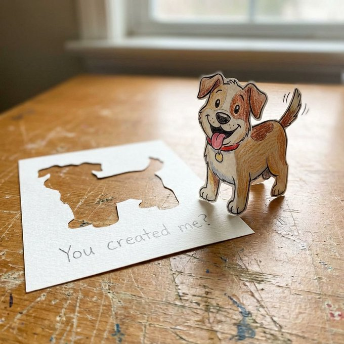

## 充满奇思妙想的手工纸艺作品

- ID: gpt4o-781-zh-2
- Slug: prompt-781-zh-2
- 语言: zh
- 来源: [来源链接](https://x.com/KanaWorks_AI/status/1997461558130356494)
- 样例图路径: images/part3/781.jpeg

### 提示词

```text
一张木桌上摆放着一件充满奇思妙想的手工纸艺作品：一只手绘卡通【小狗】被剪裁下来，折叠成一个小小的立体站立造型。小狗【吐着舌头，摇着尾巴，看起来既开心又兴奋】。旁边是剪裁后留下的空白轮廓。下方写着“你创造了我？”。柔和的自然光线，浅景深，写实的摄影风格，营造出一种神奇而又充满趣味的氛围。
```

### 样例图


## { "shot_type": "Medium Full Shot (kneeling)", "compositi

- ID: gpt4o-779-en-1
- Slug: prompt-779-en-1
- 语言: en
- 来源: [来源链接](https://x.com/IamEmily2050/status/1997809374136528952)
- 样例图路径: images/part3/779.jpeg

### 提示词

```text
{
    "shot_type": "Medium Full Shot (kneeling)",
    "composition": "Central composition with low horizon line",
    "angle": "Eye-level to slightly low angle"
  },
  "subject": {
    "subject_type": "Human",
    "identity_summary": "A young woman with long, dark, windblown hair kneeling in a field.",
    "visual_signature": {
      "facial_signature": {
        "face_shape": "Defined jawline, prominent cheekbones, side profile view",
        "eye_details": "Closed, relaxed eyelids with dark lashes",
        "nose_details": "Straight, slightly upturned tip",
        "lip_details": "Natural shape, closed, relaxed mouth",
        "cheek_and_jaw": "Sculpted features highlighted by hard sunlight",
        "unique_features": "Serene expression, head tilted back slightly"
      },
      "body_signature": {
        "build": "Slender, fit physique",
        "proportions": "Natural",
        "skin_tone_and_texture": "Tanned, smooth skin, sun-kissed",
        "height_estimation_cm": 170
      }
    },
    "pose_and_action": {
      "description": "Kneeling on the ground, soaking up the sun and wind",
      "body_position": "Kneeling (seiza-style or similar), torso upright, back slightly arched, head tilted back and turned to the side towards the light source",
      "limb_positions": "Arms resting relaxed on thighs/lap, legs folded underneath",
      "hand_gestures": "Relaxed fingers resting on legs",
      "facial_expression": "Serene, peaceful, enjoying the moment, eyes closed"
    },
    "inventory": {
      "wardrobe": "Black mini dress with red polka dots, off-the-shoulder ruffled sleeves, sweetheart neckline",
      "accessories": "Thin gold chain necklace, rings on fingers",
      "held_objects": "None",
      "hair_style": "Long, dark brown/brunette, wavy texture, blowing dynamically in the wind towards the right"
    }
  },
  "environment": {
    "setting": "Wildflower field",
    "ground_elements": "Dense field of vibrant blue wildflowers (e.g., bluebells, cornflowers, nemophila), green grass visible near roots",
    "background_elements": "Rolling brown hills/mountains in the distance",
    "sky_condition": "Blue sky with wispy, streaky cirrus clouds",
    "weather": "Sunny, windy"
  },
  "lighting": {
    "type": "Natural hard sunlight",
    "direction": "Side lighting (from the left)",
    "quality": "High contrast, creating distinct shadows on the face and neck, illuminating the profile",
    "color_temperature": "Daylight balanced (approx 5500K)"
  },
  "camera": {
    "lens_focal_length": "50mm or 85mm (Portrait)",
    "aperture": "f/2.8 to f/4 (Subject sharp, background slightly softened)",
    "shutter_speed": "Fast (to freeze the hair motion)",
    "film_grain": "Fine grain, digital photography style"
  },
  "post_processing": {
    "color_grading": "Natural, cool tones in the shadows (blues) contrasted with warm highlights (skin), slight contrast boost",
    "contrast": "Medium-High",
    "saturation": "Natural to Vibrant"
  },
  "negative": {
    "artifact_suppression": "white dots, white polka dots, orange flowers, orange poppies, yellow flowers, open eyes, standing, straight hair, static hair, indoor, studio lighting, distorted hands, extra fingers, cartoon, illustration, sketch, low resolution, blurry face, different person",
    "conceptual_suppression": "sadness, rain, night, urban setting"
  }
}
```

### 样例图

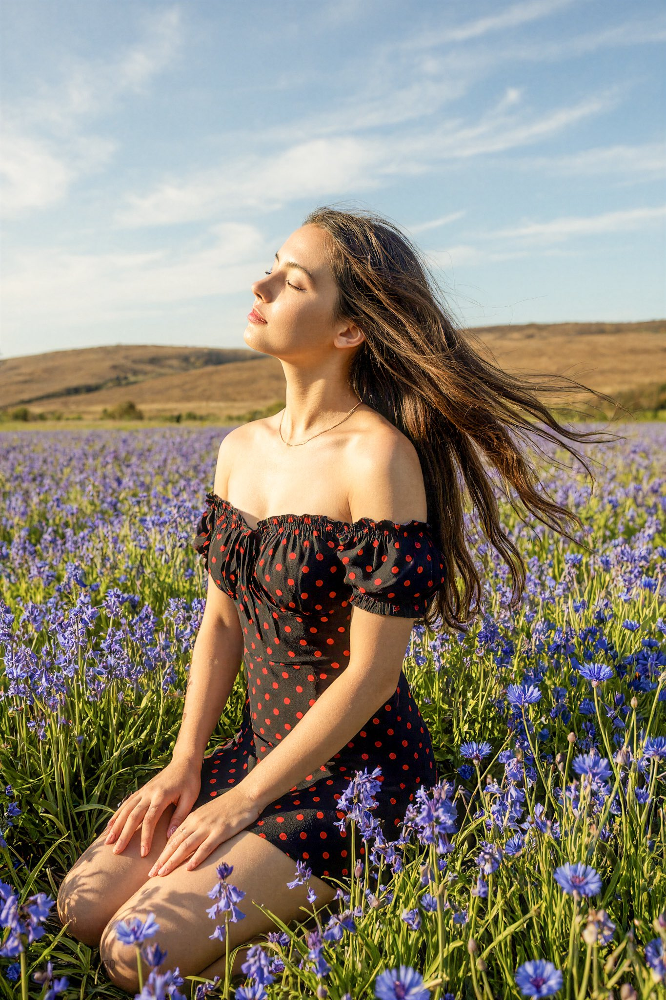

## 年轻女子跪在田野里

- ID: gpt4o-779-zh-2
- Slug: prompt-779-zh-2
- 语言: zh
- 来源: [来源链接](https://x.com/IamEmily2050/status/1997809374136528952)
- 样例图路径: images/part3/779.jpeg

### 提示词

```text
{
"shot_type": "中景全景（跪姿）",
“构图”：“中心构图，地平线较低”，
“角度”： “视线水平至略低角度”
},
“主题”： {
"subject_type": "人类",
"identity_summary": "一位年轻女子跪在田野里，她有着长长的、乌黑的、被风吹乱的头发。"
"visual_signature": {
"facial_signature": {
"face_shape": "下颌线条分明，颧骨突出，侧面轮廓"
"eye_details": "闭合、放松的眼睑，睫毛浓密。"
"nose_details": "直鼻，鼻尖略微上翘",
"lip_details": "自然形状，闭合，放松的嘴唇"
"cheek_and_jaw": "在强烈的阳光下，轮廓分明的五官显得格外突出",
"unique_features": "神态安详，头部微微后仰"
},
"body_signature": {
“体型”： “苗条、健美的体格”
“比例”：“自然”，
"skin_tone_and_texture": "晒黑、光滑、阳光亲吻过的肌肤"
"height_estimation_cm": 170
}
},
"pose_and_action": {
描述：跪在地上，沐浴着阳光和微风。
“身体姿势”：“跪姿（正坐或类似姿势），躯干直立，背部略微拱起，头部向后倾斜并转向光源方向”，
"limb_positions": "双臂放松地放在大腿/膝盖上，双腿折叠在身下",
"hand_gestures": "放松的手指放在腿上",
面部表情：平静、安详，享受当下，双眼紧闭。
},
“存货”： {
“衣橱”： “黑色迷你连衣裙，饰有红色波点，露肩荷叶边袖子，心形领口”
“配饰”：“细金链项链，手指上的戒指”，
"held_objects": "无",
"hair_style": "长长的深棕色/褐色，波浪状，随风向右飘动"
}
},
“环境”： {
“场景”：“野花田”，
"ground_elements": "茂密的鲜艳蓝色野花（例如，风铃草、矢车菊、粉蝶花），根部附近可见绿草"
"background_elements": "远处连绵起伏的棕色山丘/山脉",
天空状况：蓝天下飘着缕缕卷云。
天气：晴朗，有风
},
“灯光”： {
“类型”：“自然硬阳光”，
“方向”：“侧光（来自左侧）”
“品质”：“高对比度，在脸部和颈部形成清晰的阴影，提亮侧脸轮廓”，
"color_temperature": "日光平衡（约 5500K）"
},
“相机”： {
"lens_focal_length": "50mm 或 85mm（人像）",
“光圈”: “f/2.8 至 f/4（主体清晰，背景略微柔化）”
"shutter_speed": "快速（以冻结头发的运动）",
"film_grain": "细颗粒，数码摄影风格"
},
"post_processing": {
“color_grading”: “阴影部分采用自然冷色调（蓝色），高光部分采用暖色调（肤色），略微增强对比度”，
“对比度”：“中高”
“饱和度”：“自然到鲜艳”
},
“消极的”： {
"artifact_suppression": "白点、白色波点、橙色花朵、橙色罂粟花、黄色花朵、睁开的眼睛、站立、直发、静电头发、室内、摄影棚灯光、扭曲的手、多余的手指、卡通、插图、素描、低分辨率、模糊的脸、不同的人",
"conceptual_suppression": "悲伤、雨、夜晚、城市环境"
}
}
```

### 样例图


## 夏日多巴胺清新风格

- ID: gpt4o-778-zh
- Slug: prompt-778-zh
- 语言: zh
- 来源: [来源链接](https://x.com/songguoxiansen/status/1997574800341131504)
- 样例图路径: images/part3/778.jpeg

### 提示词

```text
保持人物面部特征和发型。夏日多巴胺清新风格，竖版拼贴画。模特穿着明亮的泳装或沙滩装，头戴彩色发卡，手持一片鲜红的西瓜或一杯气泡冰饮。脸上贴着“水滴”和“太阳”形状的可爱贴纸。背景是清新的泳池蓝色瓷砖，带有波光粼粼的水面效果。手绘涂鸦包括游泳圈、棕榈树和太阳眼镜。周围环绕着几张胶卷底片边框的照片。阳光明媚的自然光，高清晰度，清爽活力感。
```

### 样例图

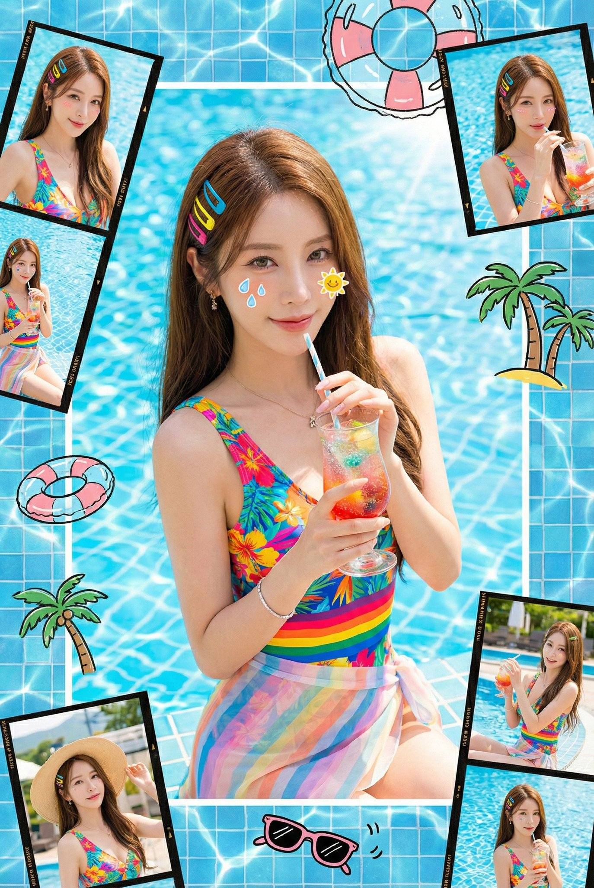

## 人物的9种服装风格和背景

- ID: gpt4o-777-zh
- Slug: prompt-777-zh
- 语言: zh
- 来源: [来源链接](https://x.com/songguoxiansen/status/1996935337546076316)
- 样例图路径: images/part3/777.jpeg

### 提示词

```text
基于[上传人物图片]并严苛保持面部特征不变，生成一张极具时尚感和网络热门度的3x3九宫格拼贴照片，九个独立画面分别展示该人物身着：酷飒街头风黑色Oversized卫衣配工装裤（涂鸦霓虹后巷背景）、清纯性感风白色丝绸吊带睡裙外搭针织衫（柔光慵懒卧室窗边背景）、紧身塑形时尚瑜伽套装（高端采光健身房背景）、复古Y2K辣妹短T恤配低腰牛仔裙（千禧风彩色充满CD的房间背景）、华丽黑色高开叉亮片晚礼服（城市天际线天台酒吧夜景背景）、前卫赛博朋克机能风束带装束（未来感雨夜街道蓝紫光背景）、都市摩登风廓形西装内搭露脐装（极简高级艺术馆背景）、热辣度假风比基尼配透明防晒罩衫（奢华海景泳池日落背景）以及静奢老钱风粗花呢小香风外套套装（古典欧式庄园庭院背景），整体画面追求高级杂志大片质感、光影迷人且富有潮流张力。
```

### 样例图


## 人物的9种服装风格和背景

- ID: gpt4o-774-zh
- Slug: prompt-774-zh
- 语言: zh
- 来源: [来源链接](https://x.com/songguoxiansen/status/1996742290258514217)
- 样例图路径: images/part3/774.jpeg

### 提示词

```text
基于[上传人物图片]并保持其面部特征绝对不变，生成一张高质量的3x3九宫格拼贴照片，九个独立画面分别展示该人物身着：飘逸粉蓝唐代汉服（古典园林背景）、干练深蓝空姐制服配丝巾（现代机场航站楼背景）、墨绿刺绣丝绸旗袍（复古上海风情室内背景）、威武黑金锦衣卫飞鱼服配绣春刀（黄昏故宫背景）、洁白现代护士服（明亮温馨医院背景）、典雅酒红织锦唐装（传统茶楼庭院背景）、青春海军蓝JK制服百褶裙（樱花盛开校园背景）、帅气皮革飞行员夹克制服戴墨镜（机库飞机旁背景）以及时尚米色风衣休闲装（现代都市街景背景），整体画面要求电影感光影、细节精致且色彩和谐统一。宽高比9:16
```

### 样例图


## Labubu的3x3九宫格拼贴照片

- ID: gpt4o-773-zh
- Slug: prompt-773-zh
- 语言: zh
- 来源: [来源链接](https://x.com/songguoxiansen/status/1997308950543491544)
- 样例图路径: images/part3/773.jpeg

### 提示词

```text
生成Labubu的一张高质量的3x3九宫格拼贴照片，九个独立画面分别展示该人物身着：飘逸粉蓝唐代汉服（古典园林背景）、干练深蓝空姐制服配丝巾（现代机场航站楼背景）、墨绿刺绣丝绸旗袍（复古上海风情室内背景）、威武黑金锦衣卫飞鱼服配绣春刀（黄昏故宫背景）、洁白现代护士服（明亮温馨医院背景）、典雅酒红织锦唐装（传统茶楼庭院背景）、青春海军蓝JK制服百褶裙（樱花盛开校园背景）、帅气皮革飞行员夹克制服戴墨镜（机库飞机旁背景）以及时尚米色风衣休闲装（现代都市街景背景），整体画面要求电影感光影、细节精致且色彩和谐统一。宽高比9:16
```

### 样例图

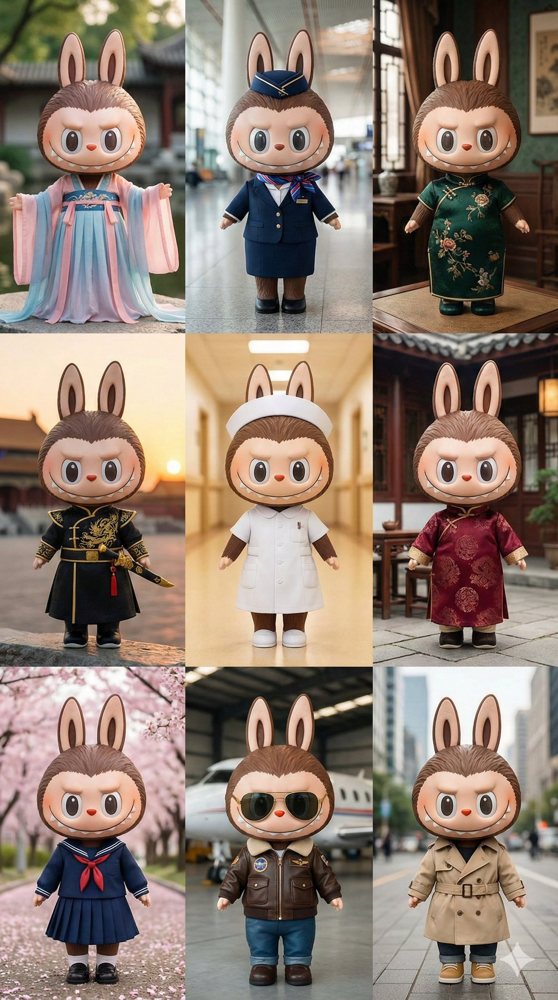

## Recreate the character's appearance from the uploaded ph

- ID: gpt4o-771-en-1
- Slug: prompt-771-en-1
- 语言: en
- 来源: [来源链接](https://x.com/dotey/status/1997191891553534399)
- 样例图路径: images/part3/771.jpeg

### 提示词

```text
Recreate the character's appearance from the uploaded photo, accurately preserving hairstyle, facial details, and expression. Present it as a bright, fresh, and youthful fashion portrait in a vertical collage format.

She wears trendy youthful clothing, holding a red lollipop near her lips. Her face is playfully decorated with cute colorful stickers shaped like hearts, strawberries, and stars, creating a lively, stylish atmosphere. Her eyes are expressive, makeup is soft and natural, and her face shows a dreamy expression.

The background features a corkboard covered with colorful sticky notes and memo papers, creating a campus and journaling vibe. Hand-drawn doodles of stars, arrows, and similar elements add to the cute, magazine-style aesthetic. Surrounding the main subject are ～4 scrapbook-style photo frames in various shapes, showcasing different outfits and poses of the same person.

Overall, the image should utilize soft studio lighting, high-definition details, a clean-cut scrapbook aesthetic, Korean fashion-magazine style, and vibrant colors.

Aspect ratio: 9:16.
```

### 样例图


## 一幅俏皮时尚的肖像拼贴画

- ID: gpt4o-771-zh-2
- Slug: prompt-771-zh-2
- 语言: zh
- 来源: [来源链接](https://x.com/dotey/status/1997191891553534399)
- 样例图路径: images/part3/771.jpeg

### 提示词

```text
根据上传的照片，还原人物外貌，准确保留发型、面部细节和表情。以竖版拼贴画的形式，呈现一张明亮、清新、充满活力的时尚肖像。

她身着时髦青春的服饰，嘴边含着一根红色棒棒糖。脸上俏皮地贴满了可爱的彩色贴纸，形状有心形、草莓形和星星形，营造出活泼时尚的氛围。她眼神灵动，妆容淡雅自然，脸上流露出梦幻般的神情。

背景是一块贴满了彩色便签和备忘录的软木板，营造出校园和日记本的氛围。手绘的星星、箭头等元素更添可爱杂志风。主体周围环绕着约4个形状各异的相框，展示着同一个人不同造型和姿势的照片。

总体而言，图像应采用柔和的影棚灯光、高清细节、简洁的剪贴簿美学、韩国时尚杂志风格和鲜艳的色彩。

宽高比：9:16。
```

### 样例图


## { "description": "Aesthetic cozy mirror selfie of a youn

- ID: gpt4o-770-en-1
- Slug: prompt-770-en-1
- 语言: en
- 来源: [来源链接](https://x.com/ShreyaYadav___/status/1996908146452025628)
- 样例图路径: images/part3/770.jpeg

### 提示词

```text
{
  "description": "Aesthetic cozy mirror selfie of a young woman sitting casually on a chair, wearing a dark oversized hoodie and blue jeans. She holds a professional camera in one hand while resting her face gently on the other with a soft, dreamy smile. The background is warm beige with soft studio lighting and a minimal modern interior. Cute cartoon-style doodles float around her, including a smiling sunflower character, a hand-drawn yellow sun, and playful white sketch lines around the camera. A handwritten romantic quote appears on the wall: 'Love feels a lot like… I saw this and thought of you!'. The overall style mixes photorealism with illustrated sticker overlays, creating a cozy, romantic Instagram aesthetic.",
  "style": {
    "tones": "soft warm tones, cozy romantic vibe",
    "lighting": "soft studio lighting, warm and diffused",
    "aesthetic": "Instagram aesthetic with cinematic depth of field",
    "texture": "natural skin texture, ultra-detailed"
  },
  "visual_elements": {
    "subject": {
      "gender": "female",
      "pose": "sitting casually on a chair, taking a mirror selfie",
      "clothing": "dark oversized hoodie and blue jeans",
      "expression": "soft dreamy smile"
    },
    "environment": {
      "background": "warm beige indoor setting, minimal modern interior",
      "lighting": "soft warm shadows"
    },
    "overlays": [
      "cute smiling sunflower doodle",
      "hand-drawn yellow sun",
      "white sketch lines around the camera",
      "handwritten romantic quote on the wall"
    ]
  },
  "quality": {
    "resolution": "4K ultra-detailed",
    "render": "photorealistic with illustrated sticker overlay"
  },
  "format": {
    "ratio": "3:4"
  }
}
```

### 样例图


## 带有插图贴纸叠加的逼真照片

- ID: gpt4o-770-zh-2
- Slug: prompt-770-zh-2
- 语言: zh
- 来源: [来源链接](https://x.com/ShreyaYadav___/status/1996908146452025628)
- 样例图路径: images/part3/770.jpeg

### 提示词

```text
{
描述：一位年轻女子随意地坐在椅子上，身穿深色宽松连帽衫和蓝色牛仔裤，对着镜子自拍，画面温馨舒适。她一手拿着专业相机，另一只手轻轻地托着脸，脸上带着柔和梦幻的微笑。背景是温暖的米色，柔和的影棚灯光和简约现代的室内装潢营造出温馨浪漫的氛围。可爱的卡通涂鸦环绕着她，包括一朵微笑的向日葵、一轮手绘的黄色太阳，以及相机周围俏皮的白色线条。墙上写着一句浪漫的手写情话：“爱的感觉就像……我看到这个就想到了你！”。整体风格融合了照片写实主义和插画贴纸，打造出温馨浪漫的Instagram美感。
“风格”： {
“色调”：“柔和温暖的色调，温馨浪漫的氛围”，
“灯光”：“柔和的影棚灯光，温暖而漫射”，
“美学”：“具有电影景深的 Instagram 美学”，
“纹理”：“自然肌肤纹理，超细腻”
},
"visual_elements": {
“主题”： {
"性别": "女性",
“姿势”：“随意地坐在椅子上，对着镜子自拍”，
“服装”：“深色超大号连帽衫和蓝色牛仔裤”，
“表情”：“柔和梦幻的微笑”
},
“环境”： {
“背景”：“温暖的米色室内环境，简约现代的室内设计”
“光线”：“柔和温暖的阴影”
},
“叠加层”：[
“可爱的微笑向日葵涂鸦”
“手绘黄色太阳”
“相机周围的白色草图线”，
墙上手写的浪漫语录
]
},
“质量”： {
"分辨率": "4K超细致",
“渲染”：“带有插图贴纸叠加的逼真照片”
},
“格式”： {
比例：3:4
}
}
```

### 样例图


## A complete screenshot of the MacOS Photo Booth applicati

- ID: gpt4o-769-en-1
- Slug: prompt-769-en-1
- 语言: en
- 来源: [来源链接](https://x.com/berryxia_ai/status/1996912935688618215)
- 样例图路径: images/part3/769.jpeg

### 提示词

```text
A complete screenshot of the MacOS Photo Booth application interface, with the top title bar displaying "Photo Booth". The main window has a 9-grid layout, and each grid shows a user-uploaded person with different funny effects applied. At the bottom of each grid, there are white Chinese subtitles: First row: Alien, Crooked Nose, Chipmunk; Second row: Madly in Love, Normal, Dizzy; Third row: Fool, Big Eyes, Frog. At the bottom is a gray control bar with left and right arrows, four navigation dots (the first one is blue), and an "Effects" button. The background is dark and blurred.
```

### 样例图

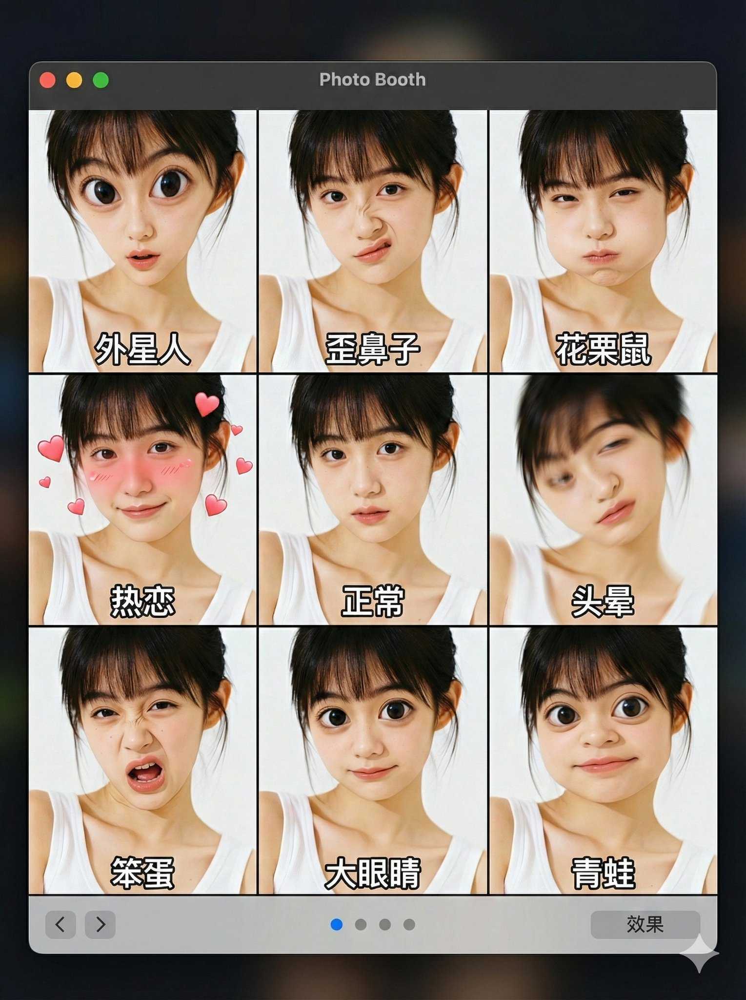

## 应用界面展示9种不同的滑稽效果

- ID: gpt4o-769-zh-2
- Slug: prompt-769-zh-2
- 语言: zh
- 来源: [来源链接](https://x.com/berryxia_ai/status/1996912935688618215)
- 样例图路径: images/part3/769.jpeg

### 提示词

```text
一个完整的MacOS Photo Booth应用程序界面截图，顶部标题栏显示 "Photo Booth"。主窗口是一个9宫格布局，每个格子都显示着用户上传的人物，但应用了不同的滑稽效果。每个格子的底部都有白色中文字幕：
第一排：外星人、歪鼻子、花栗鼠
第二排：热恋、正常、头晕
第三排：笨蛋、大眼睛、青蛙
底部是带有左右箭头、四个导航点（第一个蓝色）和 "效果" 按钮的灰色控制栏。背景是深色且模糊的。
```

### 样例图


## { "image_request": { "goal": "Create a whimsical mixed-m

- ID: gpt4o-767-en-1
- Slug: prompt-767-en-1
- 语言: en
- 来源: [来源链接](https://x.com/_MehdiSharifi_/status/1996969905678143983)
- 样例图路径: images/part3/767.jpeg

### 提示词

```text
{
  "image_request": {
    "goal": "Create a whimsical mixed-media masterpiece blending realistic top-down photography with playful white line-art doodles, depicting a sleeping woman dreaming of a deep-sea scuba adventure",
    "meta": {
      "image_type": "Mixed Media Photography / Creative Conceptual Art / Surreal Dreamscape",
      "quality": "8K, Ultra-HD, Masterpiece, High Fidelity, Creative Composite",
      "color_mode": "Cool Nocturnal Blues / Monochromatic Teal Palette with Stark White Lines",
      "style_mode": "cinematic_mixed_media",
      "aspect_ratio": "1:1",
      "resolution": "1440x1440px"
    },
    "creative_style": "Playful and surreal integration of hand-drawn illustration over realistic photography, evoking a sense of childhood wonder and vivid dreaming, combining the cozy texture of bedding with the adventurous spirit of an underwater doodle world",
    "overall_theme": "dreaming of adventure / underwater fantasy / mixed media art / playful imagination",
    "mood_vibe": "serene, whimsical, imaginative, peaceful, creative, cool, nocturnal",
    "style_keywords": [
      "mixed media",
      "doodle art overlay",
      "white line art",
      "top-down perspective",
      "flat lay",
      "surrealism",
      "scuba diving",
      "dream concept",
      "night photography"
    ],
    "subject": {
      "count": "1",
      "type": "female human",
      "identity": "fit young woman, Finnish ethnicity, long blonde hair, relaxed sleeping expression",
      "identity_preservation": {
        "description": "Natural sleeping posture, relaxed facial muscles, closed eyes",
        "notes": "Subject should look peacefully asleep, unaware of the doodles"
      },
      "age_appearance": "young adult / early 20s",
      "skin": "fair, natural texture, cool-toned lighting interaction",
      "clothing": {
        "top": "pink bikini top",
        "bottom": "pink bikini bottom",
        "full_description": "wearing a pink bikini",
        "accessories": "none (real), drawn accessories (scuba mask, tank, fins)"
      },
      "props": {
        "other": "white line drawings of scuba gear: diving mask over eyes, air tank on back, breathing regulator, large swim fins on feet"
      }
    },
    "pose_action": {
      "description": "Subject is sleeping on her side in a fetal-like position, legs slightly bent, hands curled near chest/face, perfectly positioned to align with the superimposed doodles",
      "overall_pose": "sleeping on side / side-lying",
      "head_turn": "profile resting on pillow",
      "body_position": "lying on side, diagonal composition across the bed",
      "hands": "relaxed, tucked near chin"
    },
    "environment": {
      "setting": "cozy bedroom bed viewed from above",
      "location": "indoor bedroom/dream world",
      "weather": "indoor controlled / imaginary underwater",
      "time_of_day": "night/sleep time",
      "atmosphere": "dreamy, quiet, submerged feeling due to color palette"
    },
    "background": {
      "color": "teal/aquamarine / cool blue sheets",
      "effect": "wrinkled fabric texture serving as the canvas for the white doodles"
    },
    "lighting": {
      "type": "soft ambient moonlight / cool overhead fill",
      "position": "overhead diffused",
      "direction": "soft top-down",
      "intensity": "moderate, creating soft dimensional shadows on the bedsheets",
      "tone": "cool blue/cyanotic/nocturnal",
      "mood": "peaceful night",
      "subject_lighting": "soft cool highlighting on skin",
      "imperfections": ["fabric wrinkles", "natural shadows"]
    },
    "camera": {
      "sensor_format": "Digital Mirrorless / High-Res",
      "lens": "35mm or 50mm standard",
      "position_angle": "Directly Top-Down / 90-degree Bird's Eye View",
      "framing": "Wide enough to show the full bed or a significant portion of the mattress to allow space for the doodles",
      "composition": {
        "framing": "subject centered or slightly diagonal",
        "depth": "flat field focus (everything sharp, including bedsheets)",
        "emphasis": "interaction between the real sleeping figure and the drawn environment"
      }
    },
    "photobooth_collage_specific": {
      "layout": "N/A - Single Composite Image",
      "tonality_texture": "Smooth photographic texture for the background/subject, rough chalk/marker texture for the doodles"
    },
    "color_grading": {
      "palette": "Dominant hues of teal, cyan, and navy blue; pure white for the illustration elements; natural skin tones shifted cool",
      "mood": "Cinematic night / underwater simulation"
    },
    "post_processing": {
      "final_touch": "Superimpose distinct, scribbly white line art: 'hand-drawn' fish, bubbles, coral, seaweed surrounding the subject, and diving gear 'worn' by the subject."
    },
    "negative": {
      "style": "3D render of doodles, realistic props (the gear should be drawn, not real), warm lighting, sunlight, orange tones, complex bedding patterns",
      "content": "waking subject, standing, real scuba gear, messy room (other than bed)"
    },
    "additional_controls": {
      "focus_emphasis": "The contrast between the realistic sleeping human and the 2D white line art",
      "special_notes": "The doodles must look like they were drawn on the photo surface or the bedsheets, white outline style only. The doodles include: a school of fish, coral reefs at the bottom, bubbles rising, a starfish, and the scuba gear outfit.
      "vibe": "playful creativity",
      "final_output_goal": "A seamless blend of photo and sketch that tells a story of a diver's dream."
    }
  }
}
```

### 样例图

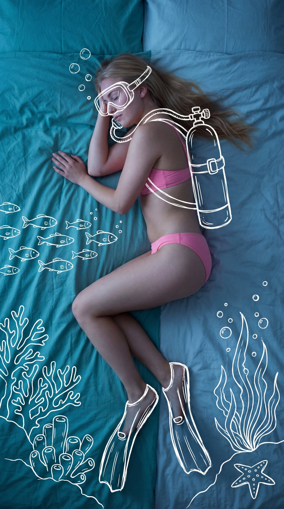

## 照片与素描的完美融合

- ID: gpt4o-767-zh-2
- Slug: prompt-767-zh-2
- 语言: zh
- 来源: [来源链接](https://x.com/_MehdiSharifi_/status/1996969905678143983)
- 样例图路径: images/part3/767.jpeg

### 提示词

```text
{
"image_request": {
“目标”：“创作一幅异想天开的混合媒介杰作，将写实的俯视摄影与俏皮的白色线条涂鸦相结合，描绘一位熟睡的女子梦见深海潜水探险的场景。”
"meta": {
"image_type": "混合媒体摄影/创意概念艺术/超现实梦境",
“质量”：“8K、超高清、杰作、高保真、创意复合”
"color_mode": "冷色调夜蓝色/单色青色调色板，配以醒目的白色线条",
"style_mode": "cinematic_mixed_media",
"aspect_ratio": "1:1",
分辨率：1440x1440像素
},
“创意风格”： “将手绘插图与写实摄影作品巧妙融合，营造出一种俏皮而超现实的氛围，唤起人们对童年奇幻和生动梦境的向往，将舒适的床上用品质感与水下涂鸦世界的冒险精神相结合。”
"overall_theme": "梦想冒险/水下奇幻/混合媒介艺术/充满童趣的想象",
"mood_vibe": "宁静、奇幻、充满想象力、平和、富有创造力、酷炫、夜行性"
"style_keywords": [
“混合媒介”，
“涂鸦艺术叠加层”，
“白色线条艺术”，
“自上而下的视角”，
“平铺”
“超现实主义”，
“水肺潜水”，
“梦想概念”，
“夜间摄影”
],
“主题”： {
"count": "1",
“类型”：“女性人类”，
“身份”：“身材匀称的年轻女性，芬兰裔，金色长发，睡姿放松”，
"identity_preservation": {
描述：自然的睡眠姿势，放松的面部肌肉，闭着眼睛。
备注：受试者应看起来像睡着了一样，对涂鸦毫不知情。
},
"age_appearance": "青年/20岁出头",
“皮肤”：“白皙、自然的纹理，冷色调的灯光互动”，
“衣服”： {
“上衣”： “粉色比基尼上衣”，
“下装”： “粉色比基尼下装”，
"full_description": "穿着粉色比基尼",
“配件”： “无（实物），手绘配件（潜水面罩、气瓶、脚蹼）”
},
"props": {
“其他”： “潜水装备的白色线条图：潜水面罩遮住眼睛，气瓶背在背上，呼吸调节器，脚上穿着大型脚蹼”
}
},
"pose_action": {
“描述”：“人物侧卧，呈胎儿状蜷缩着，双腿略微弯曲，双手蜷缩在胸前/脸旁，位置恰好与叠加的涂鸦对齐。”
"overall_pose": "侧卧/侧睡",
"head_turn": "侧脸靠在枕头上",
“身体姿势”: “侧卧，斜躺在床上”
“双手”：“放松，放在下巴附近”
},
“环境”： {
“场景”: “从上方看到的舒适卧室床”
“位置”：“室内卧室/梦境世界”，
“天气”：“室内可控/想象中的水下”，
"time_of_day": "夜晚/睡眠时间",
“氛围”：“由于色彩搭配而产生的梦幻、宁静、沉浸感”
},
“背景”： {
“颜色”： “蓝绿色/海蓝色/冷蓝色床单”，
“效果”：“褶皱的织物纹理作为白色涂鸦的画布”
},
“灯光”： {
“类型”: “柔和的环境月光/冷色调的顶光填充”
“位置”：“上方扩散”，
“方向”：“柔和的自上而下”，
“强度”：“中等，在床单上营造出柔和的立体阴影”，
"色调": "冷蓝色/蓝绿色/夜行性",
“心情”：“宁静的夜晚”，
“subject_lighting”: “柔和的冷色调高光，用于皮肤”，
“瑕疵”：[“织物褶皱”、“自然阴影”]
},
“相机”： {
"sensor_format": "数码无反/高分辨率",
“镜头”：“35mm 或 50mm 标准”，
"position_angle": "直接俯视/90度鸟瞰图",
“框架”：“足够宽，可以显示整张床或床垫的大部分，以便留出涂鸦的空间”，
“作品”： {
“构图”：“主体居中或略微倾斜”，
“景深”：“平场对焦（所有物体都清晰，包括床单）”，
“强调”：“真实睡眠人物与绘制环境之间的互动”
}
},
"photobooth_collage_specific": {
"布局": "不适用 - 单张合成图像",
"tonality_texture": "背景/主体使用平滑的摄影纹理，涂鸦部分使用粗糙的粉笔/马克笔纹理"
},
"color_grading": {
“调色板”：“以青色、蓝绿色和海军蓝为主色调；插图元素采用纯白色；自然肤色偏冷色调”，
“氛围”: “电影般的夜晚/水下模拟”
},
"post_processing": {
“final_touch”： “叠加清晰的、潦草的白色线条艺术：‘手绘’的鱼、气泡、珊瑚、围绕主体的海藻，以及主体‘穿戴’的潜水装备。”
},
“消极的”： {
“风格”：“涂鸦的3D渲染，逼真的道具（装备应该是画出来的，而不是真的），暖色调的光线，阳光，橙色调，复杂的床品图案”，
“内容”：“清醒的主体，站立，真正的潜水装备，凌乱的房间（床除外）”
},
"additional_controls": {
"focus_emphasis": "逼真的睡眠人物与二维白色线条艺术之间的对比",
特殊说明：涂鸦必须看起来像是画在照片表面或床单上的，只能使用白色轮廓线。涂鸦内容包括：一群鱼、底部的珊瑚礁、上升的气泡、海星和潜水装备。
氛围：充满趣味的创造力，
"final_output_goal": "照片与素描的完美融合，讲述潜水员的梦想故事。"
}
}
}
```

### 样例图


## High-quality cute portrait photo of a young girl sitting

- ID: gpt4o-765-en-1
- Slug: prompt-765-en-1
- 语言: en
- 来源: [来源链接](https://x.com/SimplyAnnisa/status/1996866976980127932)
- 样例图路径: images/part3/765.jpeg

### 提示词

```text
High-quality cute portrait photo of a young girl sitting in a cozy café, captured in a bright soft-flash lighting style.
Main subject (girl):
• Cute youthful face, fair flawless skin
• Soft glam natural makeup with pink blush
• One eye winking playfully, small smile
• Two neat black braided pigtails
• Wearing an oversized blue plush mouse hat with huge round ears, pink ear lining, and a tiny pink nose
• Holding both sides of the hat with her hands lifted up

Outfit:
• Pastel striped knit zip-up cardigan
• Colors: baby blue, soft yellow, pale pink, white stripes
• Light blue collar visible under the cardigan
• Cozy, soft texture, slightly oversized sleeves

Pose:
• Sitting front-facing
• Playful expression, slight head tilt
• Both hands pulling the long sides of the mouse hat outward

Café background:
• Minimalist bright café interior
• Glass display case with pastries
• Menu board on the wall (blurred)
• Plants adding cozy vibes
• Warm ambient lighting with clean white tones
• Slight depth-of-field blur

Table elements:
• Blue tray in front of her
• Small slice of layered pastel cake (pink + white + blue) with strawberry on top
• Glass of drink with whipped topping and a cherry inside
• Fork and spoon next to the plate

Lighting & Camera:
• Soft flash photography with bright highlights
• Slight overexposed glow on skin for cute aesthetic
• 3:4 vertical composition
• Clean, crisp texture with pastel tones dominant
• No harsh shadows
• Kawaii café snapshot vibe

Aesthetic:
Cute pastel, cozy café girl, playful expression, soft flash, colorful and happy atmosphere.
```

### 样例图


## 一张高质量的可爱少女肖像照

- ID: gpt4o-765-zh-2
- Slug: prompt-765-zh-2
- 语言: zh
- 来源: [来源链接](https://x.com/SimplyAnnisa/status/1996866976980127932)
- 样例图路径: images/part3/765.jpeg

### 提示词

```text
一张高质量的可爱少女肖像照，拍摄对象是一位坐在舒适咖啡馆里的年轻女孩，采用明亮柔和的闪光灯照明风格。

主要对象（女孩）：
• 可爱的青春面容，白皙无瑕的肌肤
• 柔和自然的妆容，搭配粉色腮红
• 一只眼睛俏皮地眨了眨，露出淡淡的微笑
• 两条整齐的黑色麻花辫
• 戴着一顶超大的蓝色毛绒老鼠帽，帽子有巨大的圆耳朵、粉色的耳廓和小小的粉色鼻子。
• 她双手高举，双手抓住帽子的两侧

全套服装：
• 粉彩条纹针织拉链开衫
颜色：浅蓝色、淡黄色、浅粉色、白色条纹
• 开衫下露出浅蓝色衣领
• 舒适柔软的质地，略微宽松的袖子

姿势：
• 面向前方就坐
• 表情顽皮，头部微微倾斜
双手将老鼠帽的长边向外拉。

咖啡馆背景：
• 简约明亮的咖啡馆内部装潢
• 玻璃展示柜里摆放着糕点
• 墙上的菜单板（模糊处理）
• 植物增添温馨氛围
• 温暖的氛围灯光，以干净的白色调为主
• 轻微的景深模糊

表格元素：
她面前的蓝色托盘
• 一小块多层粉彩蛋糕（粉色+白色+蓝色），上面放着草莓
• 一杯顶部有鲜奶油和一颗樱桃的饮料
• 餐盘旁放着叉子和勺子。

灯光和摄像机：
• 柔和的闪光灯摄影，高光部分明亮
• 肌肤略微泛光，营造可爱美感
• 3:4 竖幅构图
• 质地干净清爽，以柔和的粉彩色调为主
• 没有刺眼的阴影
• 可爱咖啡馆快照氛围

审美的：
可爱的粉彩色调，温馨的咖啡馆女孩，俏皮的表情，柔和的闪光灯，缤纷快乐的氛围。
```

### 样例图


## (masterpiece, best quality, highres:1.4), (official anim

- ID: gpt4o-762-en-1
- Slug: prompt-762-en-1
- 语言: en
- 来源: [来源链接](https://x.com/servasyy/status/1996966434191344109)
- 样例图路径: images/part3/762.jpeg

### 提示词

```text
(masterpiece, best quality, highres:1.4), (official anime art source:1.3), (anime screencap style:1.3),
(portrait dimensions:1.5), (tall aspect ratio:1.5),
(vertical dual portrait:1.3), (continuous composition:1.2), (unified image:1.2), pure black background,

(extremely dramatic chiaroscuro lighting:1.6), (heavy deep shadows:1.5), (sharp shadow edges:1.3), (low key lighting:1.5), (characters blending into darkness:1.4), minimal lighting, mysterious atmosphere, dark tones, (warm skin tones:1.3), (healthy complexion:1.2), (natural skin color:1.2),

BREAK

(bust shot, tight focus:1.3), 1boy, kudo shinichi, male focus,

(lying flat on back:1.5), (perfectly horizontal body alignment:1.5), parallel to frame edge, head on left,

(index finger on lips:1.3), shushing gesture,
(closed mouth:1.3), (slight mysterious smirk:1.2), intense cold stare, (eyes shaded by hair:1.4),
dark hair, (face half obscured by deep sharp shadow:1.4), (warm skin tone:1.2),

wearing dark black suit jacket, dark tie, (clothes merging with shadow), absolutely no rim lighting,

BREAK

(bust shot, tight focus:1.3), 1girl, mouri ran, female focus,
(lying flat on back:1.5), (inverted:1.4), upside down, (perfectly horizontal body alignment:1.5), parallel to frame edge, head on right,
(index finger on lips:1.3), shushing gesture, (silver bracelet on left wrist:1.3),
(serious cold expression:1.5), (calm steady look:1.3), (both eyes open sharp stare:1.4), (subtle blush:0.8), dark red lips, (warm skin tone:1.2),
dark long hair flowing into darkness, earrings,
wearing dark dress, (body and face hidden in deep sharp shadow:1.4), absolutely no rim lighting
```

### 样例图

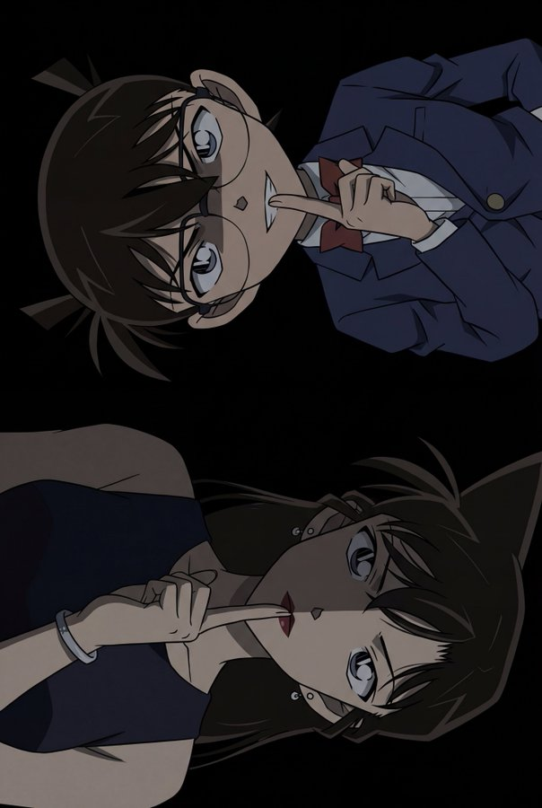

## 工藤新一和毛利兰

- ID: gpt4o-762-zh-2
- Slug: prompt-762-zh-2
- 语言: zh
- 来源: [来源链接](https://x.com/servasyy/status/1996966434191344109)
- 样例图路径: images/part3/762.jpeg

### 提示词

```text
（杰作，最佳品质，高分辨率：1.4），（官方动画艺术来源：1.3），（动画截图风格：1.3）
（竖屏尺寸：1.5），（竖屏宽高比：1.5），
（竖幅双人像：1.3），（连续构图：1.2），（统一图像：1.2），纯黑色背景，

（极强明暗对比：1.6），（浓重的阴影：1.5），（清晰的阴影边缘：1.3），（低调的光线：1.5），（人物融入黑暗：1.4），极简的光线，神秘的氛围，暗色调，（温暖的肤色：1.3），（健康的肤色：1.2），（自然的肤色：1.2）

休息

（半身像，特写：1.3），1个男孩，工藤新一，男性焦点，

（平躺：1.5），（身体完全水平：1.5），与框架边缘平行，头部在左侧，

（食指放在嘴唇上：1.3），嘘的手势
（闭嘴：1.3），（略带神秘的冷笑：1.2），目光冰冷，（头发遮住眼睛：1.4），
深色头发，（脸部一半被深邃的阴影遮挡：1.4），（暖色调肤色：1.2），

身穿黑色西装外套，系着深色领带（衣服与阴影融为一体），完全没有轮廓光。

休息

（半身特写，近景：1.3），1个女孩，毛利兰，女性焦点，
（平躺：1.5），（倒立：1.4），上下颠倒，（身体完全水平：1.5），与画面边缘平行，头部朝右，
（食指放在嘴唇上：1.3），嘘的手势，（左手腕上的银手镯：1.3），
（严肃冷漠的表情：1.5），（冷静沉稳的眼神：1.3），（双眼睁开，目光锐利：1.4），（淡淡的红晕:0 。 8) ，深红色的嘴唇，（暖色调的​​肤色：1.2），
乌黑的长发垂入夜色，戴着耳环。
身着深色连衣裙（身体和脸部隐藏在深邃的阴影中：1.4），完全没有轮廓光
```

### 样例图


## Prompt - A young Japanese beauty model glamour hot in a 

- ID: gpt4o-760-en-1
- Slug: prompt-760-en-1
- 语言: en
- 来源: [来源链接](https://x.com/Ankit_patel211/status/1997225726421151899)
- 样例图路径: images/part3/760.jpeg

### 提示词

```text
Prompt - A young Japanese beauty model glamour hot in a stylish black streped jeans with shorts chiaroscuro black outfit outdoors short jeans , three-quarter portrait (from lower legs upward), elegant body framing and balanced proportions.

Long wavy light browny hair with airy texture 
Soft K-beauty makeup: peach-pink eyeshadow with subtle shimmer, long curled lashes, delicate eyeliner, warm hazel circle lenses giving a doll-like enlargement, rosy blush, rose-pink gradient velvet matte lips.

Outfit: black  short jeans and skirt 
Accessories: dangling earrings.
Pose: slightly leaning forward, engaging gaze, feminine charm.

Environment: tokyo city building scene natural light 

Photography style: high-end outdoor fashion portrait, soft bright sunlight, cinematic soft glow, shallow depth of field, crisp skin rendering, airy color grading, mild film grain.
Atmosphere: lively, warm, romantic, playful festival vibe.
```

### 样例图


## 一位年轻的日本美女模特

- ID: gpt4o-760-zh-2
- Slug: prompt-760-zh-2
- 语言: zh
- 来源: [来源链接](https://x.com/Ankit_patel211/status/1997225726421151899)
- 样例图路径: images/part3/760.jpeg

### 提示词

```text
提示 - 一位年轻的日本美女模特，身穿时尚的黑色条纹牛仔裤和短裤，光影对比鲜明，在户外穿着黑色短裤，四分之三侧面像（从小腿向上），优雅的身材轮廓和均衡的比例。

长长的浅棕色波浪卷发，质地蓬松。
柔和的韩式妆容：蜜桃粉色眼影带有微妙的珠光，纤长卷翘的睫毛，精致的眼线，暖棕色美瞳营造出洋娃娃般的放大效果，玫瑰色腮红，玫瑰粉渐变丝绒哑光唇妆。

穿搭：黑色短牛仔裤和裙子
配饰：垂坠耳环。
姿势：身体微微前倾，眼神迷人，充满女性魅力。

环境：东京城市建筑场景，自然光

摄影风格：高端户外时尚人像，柔和明亮的阳光，电影般的柔光，浅景深，清晰的皮肤渲染，清新的色彩分级，轻微的胶片颗粒感。
氛围：热闹、温馨、浪漫、轻松的节日氛围。
```

### 样例图


## 杂志编辑风格制作专业的OOTD时尚拼贴

- ID: gpt4o-759-zh
- Slug: prompt-759-zh
- 语言: zh
- 来源: [来源链接](https://x.com/qisi_ai/status/1997139694170337387)
- 样例图路径: images/part3/759.jpeg

### 提示词

```text
角色与任务 :
请以杂志编辑风格制作专业的 OOTD（今日的搭配）时尚拼贴。
设计需在左侧和右侧反映以下内容。

左侧：
・完全保留上传图片的面部、发型、服装。
・可爱、有趣且搞怪的姿势，真实的氛围感。
・干净明亮，杂志品质的照片。
・宽度占整体的60%。

右侧：
・在干净的白色背景上整理好的商品网格
・[数量]个独立商品模块垂直排列
・最后的商品是配置了根据图像推测的内衣（胸罩、T 恤等）。
・各模块包含的内容：
商品照片（白色背景裁剪、电子商务风格）
商品名称
价格
・宽度占整体的40%。

展示商品示例：
1.[商品1] - ¥[价格]
2.[商品2] - ¥[价格]
3.[商品3] - ¥[价格]
4.[商品4] - ¥[价格]
5.[商品5] - ¥[价格]
6.[商品6] - ¥[价格]

排版：
・现代的无衬线体（简洁、极简）
・商品名使用中等粗细
・价格加粗

整体风格：
・明亮、清爽、专业
・像 Instagram 时尚博主
・简洁且留有空间的布局
・调色板：自然色、白色、柔和的灰色
・专业商品照片质量
```

### 样例图


## { "subject": { "type": "young woman", "pose": "lying on 

- ID: gpt4o-758-en-1
- Slug: prompt-758-en-1
- 语言: en
- 来源: [来源链接](https://x.com/ShreyaYadav___/status/1996991478313455783)
- 样例图路径: images/part3/758.jpeg

### 提示词

```text
{
  "subject": {
    "type": "young woman",
    "pose": "lying on her back, taking a selfie with her right arm extended upward",
    "expression": "soft smile, relaxed and natural",
    "gaze": "looking toward the camera",
    "skin_details": {
      "complexion": "smooth, warm, sunlit glow",
      "freckles": "visible on nose and cheeks"
    },
    "hair": {
      "color": "medium brown",
      "length": "long",
      "style": "loose, spread out on the pillow around her head"
    },
    "eyes": {
      "color": "light blue or green",
      "makeup": "subtle eyeliner"
    }
  },
  "clothing": {
    "top": {
      "type": "ribbed tank top",
      "color": "white",
      "fit": "form-fitting",
      "neckline": "scoop neck"
    },
    "bottoms": {
      "type": "jeans",
      "color": "light blue",
      "visibility": "partially visible"
    },
    "accessories": {
      "earrings": "small studs",
      "necklace": "thin, minimal chain"
    }
  },
  "environment": {
    "location": "bed or soft resting surface",
    "bedding": {
      "pillow": "white",
      "sheets": "white"
    },
    "background": "neutral wall and edge of headboard or furniture barely visible"
  },
  "lighting": {
    "type": "natural sunlight",
    "direction": "coming from upper left of frame",
    "effect": "creates warm highlights and soft shadows on face and torso"
  },
  "composition": {
    "camera_angle": "top-down selfie angle",
    "framing": "close-up of face, upper torso, and part of jeans",
    "focus": "sharp on face and upper body",
    "colors": "warm skin tones, white bedding, brown hair, neutral background"
  },
  "mood": "warm, relaxed, comfortable, natural"
}
```

### 样例图

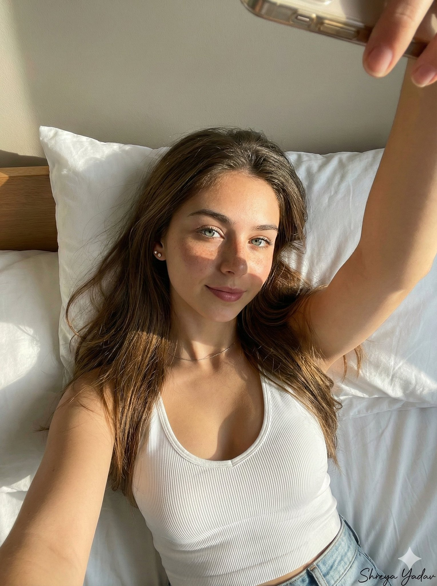

## 女子仰卧右臂向上伸展自拍

- ID: gpt4o-758-zh-2
- Slug: prompt-758-zh-2
- 语言: zh
- 来源: [来源链接](https://x.com/ShreyaYadav___/status/1996991478313455783)
- 样例图路径: images/part3/758.jpeg

### 提示词

```text
{
“主题”： {
“类型”: “年轻女子”
“姿势”：“仰卧，右臂向上伸展，自拍”
“表情”：“柔和的微笑，轻松自然”，
“凝视”: “看着镜头”，
"skin_details": {
“肤色”：“光滑、温暖、阳光般的光泽”，
“雀斑”：“鼻子和脸颊上可见的雀斑”
},
“头发”： {
“颜色”：“中棕色”，
"length": "长",
“风格”：“宽松地，散落在枕头上，围绕着她的头部”
},
"眼睛": {
“颜色”: “浅蓝色或绿色”
妆容：淡淡的眼线
}
},
“衣服”： {
“顶部”： {
类型：罗纹背心，
颜色：白色，
“合身”： “贴合身形”，
领口：圆领
},
"底部": {
类型：牛仔裤，
“颜色”： “浅蓝色”，
“可见性”： “部分可见”
},
“配件”： {
“耳环”: “小耳钉”
项链：纤细简约的链条
}
},
“环境”： {
“位置”：“床或柔软的休息表面”，
"床上用品": {
“枕头”： “白色”，
“床单”： “白色”
},
“背景”：“中性色调的墙壁和床头板或家具边缘几乎看不见”
},
“灯光”： {
类型：自然阳光，
“方向”：“来自画面左上方”，
“效果”：“在脸部和躯干上营造出温暖的高光和柔和的阴影”
},
“作品”： {
"camera_angle": "俯拍自拍角度",
“构图”：“脸部、上半身和部分牛仔裤的特写”，
“焦点”: “清晰地聚焦在脸部和上半身”，
“色彩”：“暖色调肤色、白色床品、棕色头发、中性背景”
},
氛围：温暖、放松、舒适、自然
}
```

### 样例图


## [Prompt] Main_Subject = A woman with long dark hair sits

- ID: gpt4o-756-en-1
- Slug: prompt-756-en-1
- 语言: en
- 来源: [来源链接](https://x.com/ShreyaYadav___/status/1997306169845792963)
- 样例图路径: images/part3/756.jpeg

### 提示词

```text
[Prompt]
Main_Subject = A woman with long dark hair sits on a simple wooden chair, legs crossed, bare feet. She wears an off-the-shoulder white top and beige/sand-colored jogger pants. Her posture is relaxed as she looks to the left, gazing intently at the artwork. She holds a pair of sunglasses/reading glasses in her right hand.

Artwork = A large black-and-white pencil/charcoal drawing hangs on the right wall. It is a dramatic, high-contrast portrait of the same woman wearing the same outfit.

Background = Smooth white minimalist wall that creates a clean, modern aesthetic.

Additional_Elements = Two empty wooden frames stacked on the floor (one large natural wood, one smaller white). A small decorative object resembling a rustic windmill or tiny house is placed near the frames.

Atmosphere = Artistic, contemplative, neutral-toned. Strong visual dialogue between the woman and her own portrait. Calm, modern, gallery-like mood.

Signature = Shreya Yadav
Image_Ratio = 3:4

[Style]
Rendering = Ultra realistic, soft natural lighting, gentle shadows, high clarity.
Color_Palette = White, beige, wood tones, black-and-white artwork contrast.
Composition = Balanced; woman on left, artwork on right, décor elements below.

[Output]
Format = Photographic image
Quality = High detail, professional art-scene aesthetic
```

### 样例图

![[Prompt] Main_Subject = A woman with long dark hair sits](../images/part3/756.jpeg)

## 女子赤脚盘腿坐在简朴的木椅上

- ID: gpt4o-756-zh-2
- Slug: prompt-756-zh-2
- 语言: zh
- 来源: [来源链接](https://x.com/ShreyaYadav___/status/1997306169845792963)
- 样例图路径: images/part3/756.jpeg

### 提示词

```text
[提示词]
主体：一位长发黑发的女子赤脚盘腿坐在简朴的木椅上。她身穿露肩白色上衣和米色/沙色运动裤。她姿态放松，目光转向左侧，专注地欣赏着一幅画作。她的右手拿着一副太阳镜/老花镜。

艺术品 = 右侧墙上挂着一幅大型黑白铅笔/炭笔画。这是一幅对比鲜明、极具戏剧性的肖像画，画中人物是同一位穿着同样服装的女士。

背景 = 光滑的白色极简主义墙面，营造出干净、现代的美感。

附加元素 = 两个空木框叠放在地板上（一个大的原木色，一个小的白色）。木框附近放置着一个类似乡村风车或小房子的装饰品。

氛围：艺术感十足，沉思冥想，色调中性。女性与其肖像之间形成强烈的视觉对话。平静、现代，宛如置身画廊。

签名 = Shreya Yadav
图像比例 = 3:4

[风格]
渲染效果 = 超逼真，柔和的自然光照，淡淡的阴影，高清晰度。
颜色调色板 = 白色、米色、木色、黑白艺术对比。
构图=平衡；左侧是女性，右侧是艺术品，下方是装饰元素。

[输出]
格式 = 照片图像
品质 = 高细节、专业的艺术场景美学
```

### 样例图


## { "subject": { "main_character": "A photorealistic, livi

- ID: gpt4o-753-en-1
- Slug: prompt-753-en-1
- 语言: en
- 来源: [来源链接](https://x.com/egeberkina/status/1997318054431052221)
- 样例图路径: images/part3/753.jpeg

### 提示词

```text
{
 "subject": {
 "main_character": "A photorealistic, living miniature man (Lilliputian size), not a plastic figure",
 "attire": "Casual gardening clothes, blue jeans, white t-shirt",
 "equipment": "A tiny, realistic red push-lawnmower"
 },
 "action": "The man is pushing the lawnmower over a giant human eyebrow, trimming the long eyebrow hairs as if mowing a lawn",
 "setting": {
 "location": "Extreme close-up macro view of a human forehead and closed eye",
 "surface_details": "Giant-scale skin texture, visible pores, wrinkles, and coarse eyebrow hair"
 },
 "style": [
 "Surreal conceptual photography",
 "Hyper-realistic",
 "Macro photography",
 "Humorous",
 "High contrast",
 "Sharp focus"
 ],
 "technical_details": {
 "lighting": "Hard, direct lighting mimicking sunlight to create distinct shadows on the skin",
 "camera": "Macro lens, shallow depth of field, focus on the miniature man and the eyebrow",
 "resolution": "8k, ultra-detailed"
 }
}
```

### 样例图

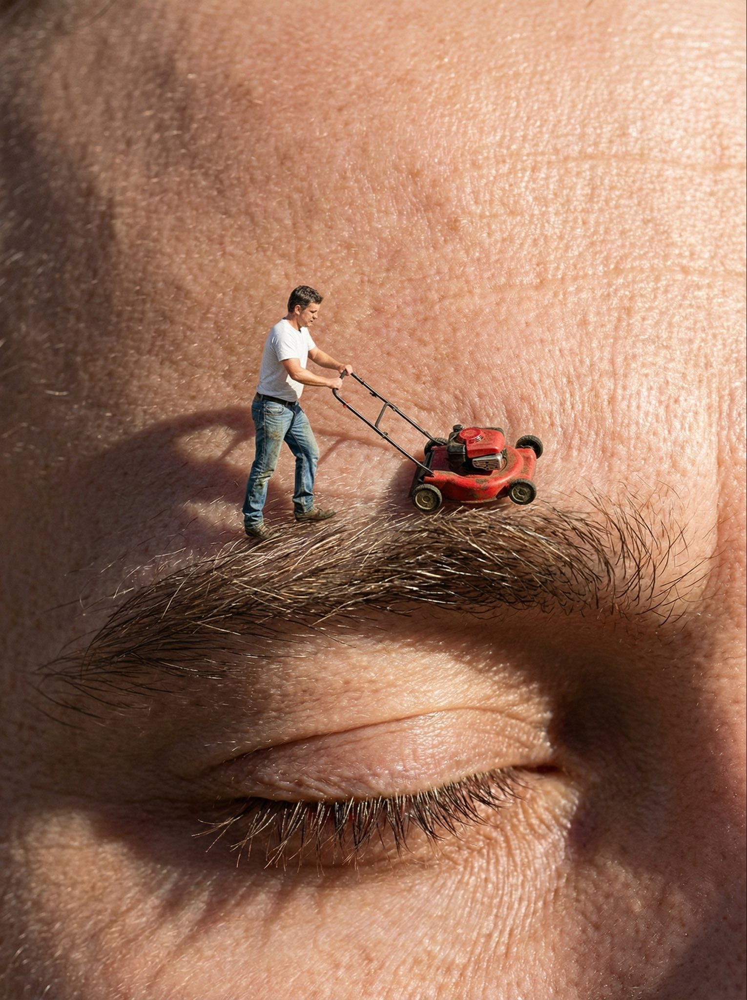

## 一个微型人修眉

- ID: gpt4o-753-zh-2
- Slug: prompt-753-zh-2
- 语言: zh
- 来源: [来源链接](https://x.com/egeberkina/status/1997318054431052221)
- 样例图路径: images/part3/753.jpeg

### 提示词

```text
{
“主题”： {
"main_character": "一个逼真的、活生生的微型人（小人国大小），而不是塑料模型"
着装：休闲园艺服、蓝色牛仔裤、白色T恤衫。
“设备”：“一台小巧逼真的红色手推式割草机”
},
“动作”：“男子正推着割草机碾过巨大的人类眉毛，修剪长长的眉毛，就像在割草一样。”
“环境”： {
“位置”：“人类额头和闭着的眼睛的超近距离微距视图”，
"surface_details": "巨大的皮肤纹理，可见的毛孔、皱纹和粗硬的眉毛"
},
“风格”： [
“超现实概念摄影”
“超现实主义”，
“微距摄影”，
“幽默”，
“高对比度”，
“清晰聚焦”
],
"technical_details": {
“照明”：“模拟阳光的硬朗、直接的照明，在皮肤上形成清晰的阴影”，
“相机”：“微距镜头，浅景深，对焦于小人和眉毛”，
分辨率：8K，超高清
}
}
```

### 样例图


## A wide-angle, candid documentary photograph capturing th

- ID: gpt4o-752-en-1
- Slug: prompt-752-en-1
- 语言: en
- 来源: [来源链接](https://x.com/bggg_ai/status/1995323329683787810)
- 样例图路径: images/part3/752.jpeg

### 提示词

```text
A wide-angle, candid documentary photograph capturing the person from {reference_image} mid-speech on a large, professionally lit stage at a major technology summit. They are holding a microphone and gesturing naturally toward the audience. Behind them, an immense, wall-sized LED screen is fully visible, displaying a crisp, **full-screen presentation slide (showing only the slide content, absolutely no PowerPoint software interface, toolbars, or window borders)**. The slide content is professionally designed based on the theme: '{speech_topic_or_outline}'. The heads and shoulders of a large audience are visible in the **very bottom foreground, low in the frame and blurred, completely ensuring an unobstructed view of the entire stage screen**. Professional stage lighting with blue and sharp spotlights on the speaker. Shot with a high-resolution camera, sharp focus on both the speaker and the screen content, realistic film grain.
```

### 样例图


## 人物放到一个逼格拉满的大会现场

- ID: gpt4o-752-zh-2
- Slug: prompt-752-zh-2
- 语言: zh
- 来源: [来源链接](https://x.com/bggg_ai/status/1995323329683787810)
- 样例图路径: images/part3/752.jpeg

### 提示词

```text
一张广角的、纪实风格的抓拍照片，捕捉了{reference_image}中的人物在一个主要科技峰会的大型、专业照明的舞台上演讲中途的瞬间。他们手持麦克风，自然地向观众做手势。在他们身后，一个巨大的、墙壁大小的LED屏幕完全可见，显示着一张清晰的、全屏演示幻灯片（只显示幻灯片内容，绝对没有PowerPoint软件界面、工具栏或窗口边框）。幻灯片内容是根据主题：'{speech_topic_or_outline}'进行专业设计的。大量观众的头部和肩膀出现在非常靠下的前景中，在画面位置很低且模糊，完全确保对整个舞台屏幕的视线无遮挡。专业的舞台灯光，有蓝色和锐利的聚光灯打在演讲者身上。用高分辨率相机拍摄，焦点清晰地对准演讲者和屏幕内容，逼真的电影颗粒感。
```

### 样例图


## Use my uploaded image. Generate a hand-drawn portrait il

- ID: gpt4o-751-en-1
- Slug: prompt-751-en-1
- 语言: en
- 来源: [来源链接](https://x.com/cnyzgkc/status/1997231229431857332)
- 样例图路径: images/part3/751.jpeg

### 提示词

```text
Use my uploaded image. Generate a hand-drawn portrait illustration in red and yellow pen on notebook paper, inspired by doodle art and comic annotations.Keep full likeness of the subject, expressive lines, spontaneous
gestures, bold outline glow,
handwritten notes around, realistic pen stroke texture,4K resolution.
```

### 样例图

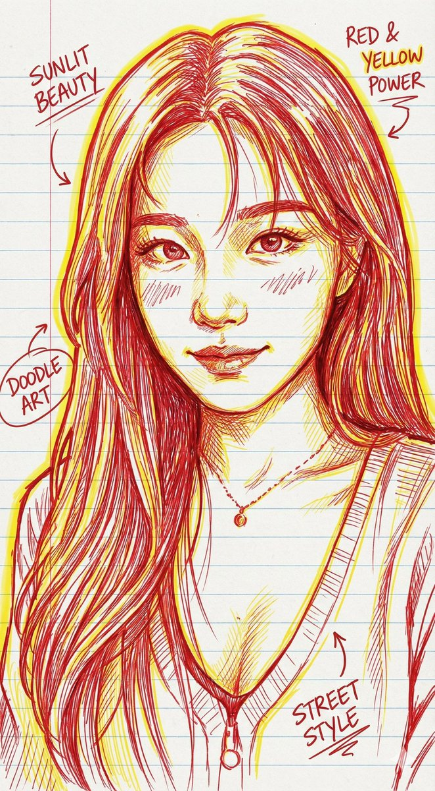

## 红黄两色手绘肖像画插图

- ID: gpt4o-751-zh-2
- Slug: prompt-751-zh-2
- 语言: zh
- 来源: [来源链接](https://x.com/cnyzgkc/status/1997231229431857332)
- 样例图路径: images/part3/751.jpeg

### 提示词

```text
使用我上传的图片。用红色和黄色钢笔在笔记本纸上绘制一幅手绘肖像插图，灵感来自涂鸦艺术和漫画注释。保持人物的完整形象，线条富有表现力，风格自然流畅。
手势，醒目的轮廓光晕，
周围有手写笔记，逼真的笔触纹理，4K分辨率。
```

### 样例图


## { "prompt_type": "Cinematic Mixed Media Portrait", "subj

- ID: gpt4o-749-en-1
- Slug: prompt-749-en-1
- 语言: en
- 来源: [来源链接](https://x.com/ShreyaYadav___/status/1996457038910836841)
- 样例图路径: images/part3/749.jpeg

### 提示词

```text
{
  "prompt_type": "Cinematic Mixed Media Portrait",
  "subject_details": {
    "main_subject": "Young woman with long wavy brown hair",
    "clothing": "Loose rust-red t-shirt, high-waisted black pants with white sketch-style outlines, chunky beige sneakers",
    "pose": "Relaxing on a modern grey sofa, holding a tall iced coffee, smiling softly and looking to the left",
    "companion_character": "Large cartoon character Oggie with glasses, bright colors, exaggerated expressions, holding a red cup with a straw"
  },
  "environment": {
    "setting": "Cozy coffee shop interior",
    "furniture": "Modern grey sofa, warm wooden shelves with small decorative items",
    "atmosphere": "Minimalist, modern, warm"
  },
  "lighting_and_composition": {
    "lighting": "Soft natural lighting streaming in from the right",
    "blending": "Cartoon character seamlessly blended with soft shadows",
    "effects": "Subtle doodle-style white line highlights around the woman and cartoon character"
  },
  "technical_specs": {
    "resolution": "High-resolution, vibrant, clean composition",
    "aspect_ratio": "3:4"
  },
  "signature": "Shreya Yadav"
}
```

### 样例图


## 电影混合媒体肖像

- ID: gpt4o-749-zh-2
- Slug: prompt-749-zh-2
- 语言: zh
- 来源: [来源链接](https://x.com/ShreyaYadav___/status/1996457038910836841)
- 样例图路径: images/part3/749.jpeg

### 提示词

```text
{
"prompt_type": "电影混合媒体肖像",
"subject_details": {
"main_subject": "留着棕色长波浪卷发的年轻女子",
“服装”：“宽松的锈红色T恤，高腰黑色裤子，带有白色素描风格轮廓，厚底米色运动鞋”，
“姿势”：“放松地躺在现代灰色沙发上，手里拿着一杯高高的冰咖啡，面带微笑，看向左侧”。
"companion_character": "戴着眼镜、色彩鲜艳、表情夸张的大型卡通人物奥吉，手里拿着一个插着吸管的红色杯子"
},
“环境”： {
“场景”: “舒适的咖啡店内部”，
“家具”：“现代灰色沙发，温暖的木质搁架上摆放着小型装饰品”，
氛围：简约、现代、温馨
},
"lighting_and_composition": {
“照明”：“柔和的自然光从右侧照射进来”，
“融合”：“卡通人物与柔和的阴影完美融合”，
“效果”：“在女性和卡通人物周围添加微妙的涂鸦风格白色线条高光”
},
"technical_specs": {
“分辨率”：“高分辨率、鲜艳、清晰的构图”
"aspect_ratio": "3:4"
},
签名：Shreya Yadav
}
```

### 样例图


## A giant fashion curve edge 3D anamorphic billboard on th

- ID: gpt4o-748-en-1
- Slug: prompt-748-en-1
- 语言: en
- 来源: [来源链接](https://x.com/ShreyaYadav___/status/1996402159555149838)
- 样例图路径: images/part3/748.jpeg

### 提示词

```text
A giant fashion curve edge 3D anamorphic billboard on the side of a modern building in a busy crossroad. On the 3D billboard is a woman (from attached image) styled in an office outfit. He's playing with a car toys inside billboard but his hand come out off the billboard and holding the actual size  car on the street. Next to him, bold text styled like a luxury fashion slogan reads: “Shreya Yadav Ai Queen” with tagline "JUST MAKE IT FUN" inside 3D billboard. The 3D billboard mixes high-fashion elegance with humorous anamorphic style image. Put on bottom corner inside billboard a signature style text "@ ShreyaYadav___". Photorealistic, stylish, culturally modern, and meme-inspired. 3:4 framing.
Signature: Shreya Yadav
```

### 样例图


## 巨大的时尚弧形3D广告牌上的女士

- ID: gpt4o-748-zh-2
- Slug: prompt-748-zh-2
- 语言: zh
- 来源: [来源链接](https://x.com/ShreyaYadav___/status/1996402159555149838)
- 样例图路径: images/part3/748.jpeg

### 提示词

```text
在繁忙的十字路口，一座现代建筑的侧面矗立着一块巨大的时尚弧形3D变形广告牌。广告牌上是一位身着职业装的女士（见附图）。她正在广告牌内玩玩具车，但她的手却从广告牌中伸出，握着一辆与实物大小相同的玩具车。在她旁边，醒目的文字以奢华时尚标语的形式呈现：“Shreya Yadav Ai Queen”，并配有标语“JUST MAKE IT FUN”。这块3D广告牌融合了高级时尚的优雅和幽默的变形风格。广告牌底部角落印有标志性的文字"@ “ShreyaYadav ___ ”。画面逼真、时尚、充满现代文化气息，并融入了网络迷因元素。采用3:4的画面比例。
签名：Shreya Yadav
```

### 样例图


## Ultra HD 4K Pixar-style 3D portrait of a young couple at

- ID: gpt4o-746-en-1
- Slug: prompt-746-en-1
- 语言: en
- 来源: [来源链接](https://x.com/ShreyaYadav___/status/1996645791092629998)
- 样例图路径: images/part3/746.jpeg

### 提示词

```text
Ultra HD 4K Pixar-style 3D portrait of a young couple attempting a selfie on a city rooftop at golden hour. The boy accidentally sneezes mid-shot, eyes half-closed and cheeks puffed out, while the girl bursts out laughing, leaning away from him with her phone tilted and out of frame. They wear casual evening clothes—he in a graphic tee and joggers,she in a hoodie and denim shorts. The warm sunset paints the sky in orange and pink hues, with pigeons flying past and laundry fluttering in the background. Camera angle slightly low and tilted to enhance the chaotic moment, emphasizing their exaggerated cartoon-like expressions.
```

### 样例图

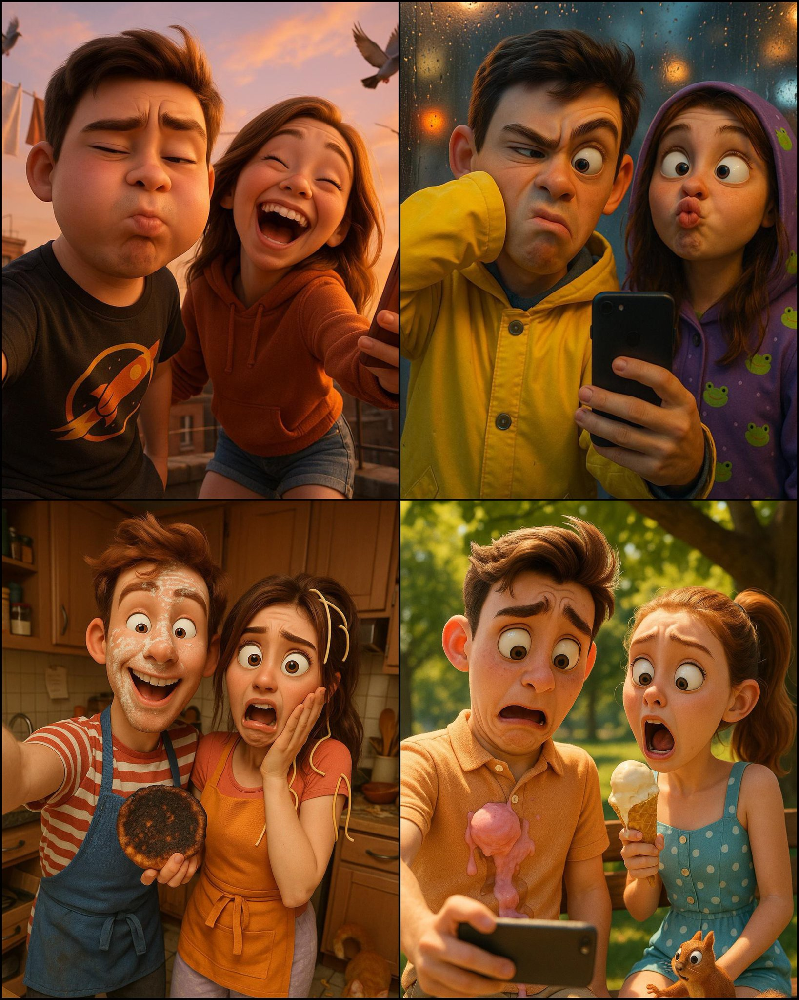

## 超高清4K皮克斯风格的3D肖像

- ID: gpt4o-746-zh-2
- Slug: prompt-746-zh-2
- 语言: zh
- 来源: [来源链接](https://x.com/ShreyaYadav___/status/1996645791092629998)
- 样例图路径: images/part3/746.jpeg

### 提示词

```text
一段超高清4K皮克斯风格的3D肖像，描绘了一对年轻情侣在日落时分于城市屋顶自拍的场景。男孩在拍摄过程中不小心打了个喷嚏，双眼半闭，脸颊鼓鼓的；女孩则哈哈大笑，身子向后倾斜，手机也移出了画面。两人身着休闲晚装——男孩穿着印花T恤和运动裤，女孩穿着连帽衫和牛仔短裤。温暖的夕阳将天空染成橙粉相间的色彩，鸽子在空中飞翔，背景中飘动着衣物。镜头角度略低并倾斜，突出了这一略显混乱的瞬间，强调了他们夸张的卡通式表情。
```

### 样例图


## { "meta": { "type": "Creative Brief", "genre": "Hyper-re

- ID: gpt4o-740-en-1
- Slug: prompt-740-en-1
- 语言: en
- 来源: [来源链接](https://x.com/YaseenK7212/status/1996559154240967144)
- 样例图路径: images/part3/740.jpeg

### 提示词

```text
{
  "meta": {
    "type": "Creative Brief",
    "genre": "Hyper-realistic Surrealism",
    "composition_style": "Composite Portrait",
    "aspect_ratio": "Portrait (implied by 'portrait' description)"
  },
  "scene_architecture": {
    "viewpoint": {
      "type": "Photographic",
      "angle": "High-angle / Looking down",
      "framing": "Tight on central subject"
    },
    "dimensional_hierarchy": {
      "rule": "Scale disparity for surreal effect",
      "dominant_element": "iPhone 17 Pro Max (Super-scaled)",
      "subordinate_elements": ["Blue Book (Miniature)", "Pen (Miniature)"]
    }
  },
  "realm_physical": {
    "description": "The real-world environment surrounding the device.",
    "environment": {
      "surface": "Wooden table",
      "texture_attributes": ["rich grain", "tactile", "worn"]
    },
    "lighting_global": {
      "source": "Natural light",
      "temperature": "Warm",
      "shadow_quality": "Soft, diffused, volumetric"
    },
    "active_agent": {
      "identity": "Human Hand (Real)",
      "action": "Pouring",
      "position": "Entering frame laterally"
    },
    "held_object": {
      "item": "Bottle",
      "state": "Chilled (visible condensation)",
      "branding": {
        "logo_text": "Decamin",
        "placement": "Visible on label"
      },
      "contents": {
        "substance": "Water",
        "color": "Light Green",
        "state": "Liquid flow"
      }
    },
    "static_props": [
      {
        "item": "Book",
        "color": "Blue",
        "scale_notes": "Significantly smaller than phone"
      },
      {
        "item": "Pen",
        "type": "Ballpoint/Ink",
        "scale_notes": "Significantly smaller than phone"
      }
    ]
  },
  "realm_digital": {
    "description": "The content displayed on the screen.",
    "container_device": {
      "model": "iPhone 17 Pro Max",
      "state": "Screen ON",
      "orientation": "Flat on physical surface"
    },
    "screen_content": {
      "subject_identity": "mqn (Reference ID)",
      "subject_scale": "Close-up (filling screen)",
      "expression": "Happy / Smiling",
      "attire": "Winter clothing (matching reference)",
      "setting": "Winter landscape / snowy backdrop",
      "held_object_digital": {
        "item": "Drinking Glass",
        "branding": {
          "logo_text": "Decamin",
          "visibility": "Clear"
        },
        "initial_state": "Empty (waiting for pour)"
      }
    }
  },
  "surreal_bridge_event": {
    "description": "The interaction connecting the physical and digital realms.",
    "action_type": "Trans-dimensional Fluid Dynamics",
    "source": "realm_physical.held_object.contents (Light Green Water)",
    "interaction_point": "realm_digital.container_device.screen_surface",
    "destination": "realm_digital.screen_content.held_object_digital (The Glass)",
    "physics_violation_rules": {
      "rule_1": "Liquid does not splash off the glass screen surface.",
      "rule_2": "Screen surface acts as a permeable membrane solely for this liquid.",
      "rule_3": "Physical liquid transitions seamlessly into digital representation upon contact."
    },
    "visual_details": ["Sharp liquid simulation", "No surface tension on screen glass", "Fluid physically filling digital cup"]
  },
  "rendering_specifications": {
    "visual_fidelity": "Hyper-realistic",
    "texture_focus": ["Sharp fluid details", "Glass pixels", "Wood grain", "Skin texture (hand and subject)"],
    "mood": "Cinematic, warm, magical",
    "resolution_target": "8K / Highly detailed"
  }
}
```

### 样例图


## 大尺寸的iPhone 17 Pro Max场景

- ID: gpt4o-740-zh-2
- Slug: prompt-740-zh-2
- 语言: zh
- 来源: [来源链接](https://x.com/YaseenK7212/status/1996559154240967144)
- 样例图路径: images/part3/740.jpeg

### 提示词

```text
{
"meta": {
"type": "创意简报",
“类型”： “超现实主义超现实主义”
"composition_style": "合成肖像",
"aspect_ratio": "竖屏（由“竖屏”描述暗示）"
},
"场景架构": {
"观点": {
"type": "Photographic",
"角度": "高角度/向下看",
构图：聚焦中心主体
},
"dimensional_hierarchy": {
“规则”：“利用尺度差异产生超现实效果”，
"dominant_element": "iPhone 17 Pro Max（超大尺寸）",
"subordinate_elements": ["蓝皮书（袖珍版）", "钢笔（袖珍版）"]
}
},
"realm_physical": {
“描述”：“设备周围的真实环境。”
“环境”： {
“表面”：“木桌”，
"texture_attributes": ["丰富的纹理", "触感", "磨损"]
},
"lighting_global": {
“来源”：“自然光”，
“温度”： “温暖”，
"shadow_quality": "柔和、漫射、立体"
},
"active_agent": {
“身份”：“人手（真实）”
“动作”: “倾倒”
“位置”： “横向进入画面”
},
"held_object": {
"item": "瓶子",
“状态”：“冷藏（可见冷凝水）”
品牌推广：{
"logo_text": "Decamin",
“位置”： “在标签上可见”
},
“内容”： {
“物质”： “水”，
颜色：浅绿色，
“状态”：“液体流动”
}
},
"static_props": [
{
"item": "书",
“颜色”： “蓝色”，
"scale_notes": "比手机小得多"
},
{
“物品”: “钢笔”，
"type": "圆珠笔/墨水笔",
"scale_notes": "比手机小得多"
}
]
},
"realm_digital": {
“描述”：“屏幕上显示的内容。”
"container_device": {
“型号”：“iPhone 17 Pro Max”，
"state": "屏幕开启",
“方向”: “平放在物理表面上”
},
"screen_content": {
"subject_identity": "mqn（参考 ID）",
"subject_scale": "特写（充满屏幕）",
表情：快乐/微笑，
“服装”：“冬季服装（搭配参考）”
“场景”：“冬季风景/雪景背景”，
"held_object_digital": {
“物品”: “饮水杯”
品牌推广：{
"logo_text": "Decamin",
“能见度”： “清晰”
},
"initial_state": "空（等待倾倒）"
}
}
},
"surreal_bridge_event": {
描述：连接物理世界和数字世界的互动。
"action_type": "跨维度流体动力学",
"source": "realm_physical.held_object.contents (浅绿色水)",
"交互点": "realm_digital.container_device.screen_surface",
"destination": "realm_digital.screen_content.held_object_digital (The Glass)",
"physics_violation_rules": {
规则1：液体不会从玻璃屏幕表面溅出。
规则2：屏幕表面仅对该液体起渗透膜的作用。
“规则 3”：“物理液体在接触后无缝过渡到数字表示。”
},
"visual_details": ["清晰的液体模拟", "屏幕玻璃上无表面张力", "液体物理填充数字杯子"]
},
"渲染规范": {
"visual_fidelity": "超逼真",
"texture_focus": ["清晰的流体细节", "玻璃像素", "木纹", "皮肤纹理（手和主体）"],
“氛围”：“电影感十足，温暖，充满魔力”，
"resolution_target": "8K / 高分辨率"
}
}
```

### 样例图


## { "prompt": { "scene": { "location": "Inside a warmly li

- ID: gpt4o-739-en-1
- Slug: prompt-739-en-1
- 语言: en
- 来源: [来源链接](https://x.com/xmliisu/status/1996555784206025074)
- 样例图路径: images/part3/739.jpeg

### 提示词

```text
{
  "prompt": {
    "scene": {
      "location": "Inside a warmly lit apartment elevator, showing wood paneling and brushed metal surfaces.",
      "lighting": "Soft, warm overhead elevator light casting a golden glow.",
      "atmosphere": "Intimate, quiet, candid moment between floors."
    },
    "camera": {
      "type": "Mirror selfie taken with a smartphone, visible in the reflection.",
      "angle": "Chest-level, slightly angled downwards.",
      "framing": "Full-body view of the subject in the elevator mirror."
    },
    "subject": {
      "pose": "Standing facing the mirror with hips angled, weight on one leg, relaxed energy. Right hand holds the phone, left arm carries a draped jacket.",
      "expression": "Looking directly at the camera with soft, knowing 'doe eyes', a pink flush on cheeks, and glossy, slightly parted pink lips.",
      "hair": "Long, wavy platinum blonde hair falling from under a cap."
    },
    "outfit": {
      "headwear": "Forest green baseball cap worn forward.",
      "top": "Black fitted ribbed knit cropped long-sleeve shirt.",
      "bottom": "White high-waisted pleated tennis skirt.",
      "legwear": "Black fishnet thigh-high stockings with a lace top, showing a gap of bare skin.",
      "jacket": "A dark jacket draped over the left forearm."
    },
    "accessories": {
      "bag": "Small black crossbody bag with a strap.",
      "jewelry": "Small silver hoop earrings, a thin silver necklace."
    },
    "style": "Candid, natural, intimate, warm tones, soft focus."
  },
  "negative_prompt": "(Worst quality, Low quality: 1.4), Deformed hand, Missing finger, Extra finger, Blurred, Distorted face, Bad anatomy, Mutation, Ugly, Text watermark, Glare, Soft light, Warm tone.",
  "width": 1200,
  "height": 1600
}
```

### 样例图


## 女子公寓电梯内自拍

- ID: gpt4o-739-zh-2
- Slug: prompt-739-zh-2
- 语言: zh
- 来源: [来源链接](https://x.com/xmliisu/status/1996555784206025074)
- 样例图路径: images/part3/739.jpeg

### 提示词

```text
{
“提示词”： {
“场景”： {
地点：一间灯光温暖的公寓电梯内，可以看到木质镶板和拉丝金属表面。
“照明”：“柔和温暖的电梯顶灯散发出金色的光芒。”
“氛围”：“楼层之间亲密、安静、坦诚的时刻。”
},
“相机”： {
类型：用智能手机拍摄的镜子自拍，照片可在镜中看到。
“角度”：“胸部高度，略微向下倾斜。”
“构图”：“电梯镜子中拍摄的人物全身像”。
},
“主题”： {
“姿势”：“面向镜子站立，臀部略微倾斜，重心放在一条腿上，神态放松。右手拿着手机，左臂披着一件外套。”
“表情”：“用温柔而充满智慧的‘小鹿眼’直视镜头，双颊泛起淡淡的粉红，嘴唇涂着光泽，微微张开。”
“头发”：“长长的、波浪状的铂金色头发从帽子下垂下来。”
},
“全套服装”： {
“头饰”：“森林绿色的棒球帽，向前戴。”
上衣：黑色修身罗纹针织短款长袖衬衫。
下装：白色高腰百褶网球裙。
“腿部服饰”：“黑色网状过膝长袜，袜口为蕾丝设计，露出部分肌肤。”
“外套”：“一件深色外套搭在左前臂上。”
},
“配件”： {
“包”：“带肩带的小号黑色斜挎包。”
“首饰”：“小银圈耳环，一条细银项链。”
},
“风格”：“坦诚、自然、亲密、暖色调、柔焦”。
},
"negative_prompt": "(质量最差，低质量：1.4)，手部畸形，缺指，多指，模糊，面部扭曲，解剖结构错误，变异，丑陋，文字水印，眩光，柔光，暖色调。"
宽度：1200，
高度：1600
}
```

### 样例图


## 人物转换为韩式风格的专业形象照

- ID: gpt4o-738-zh
- Slug: prompt-738-zh
- 语言: zh
- 来源: [来源链接](https://x.com/MindfulReturn/status/1996738867391852622)
- 样例图路径: images/part3/738.jpeg

### 提示词

```text
将附件图片人物转换为一张韩式风格的专业形象照，比例3:4。构图与人物:构图: 半身照，采用简约的非中心构图，留有呼吸感的恰当空白。人物: 面部特写，聚焦于清澈自然的眼神和面部表情。动作和姿态要求放松、协调且自然，流露出一种不经意的优雅。风格: 都市休闲风格的简约着装，如纯色裙装、纯色衬衫或针织衫，干净利落。
光影与氛围:光线: 运用柔和的蝴蝶光或伦勃朗光，营造出清晰、立体的面部轮廓，同时让皮肤看起来通透、细腻。眼中需要有明亮自然的眼神光，作为画面的情感焦点。氛围:整体氛围追求安静、清澈、温柔。画面呈现出一种高级空气感和呼吸感。背景与质感:背景: 纯色或带有低饱和度色彩的柔和渐变背景，营造出简约、干净且有层次感的空间氛围。质感: 画面质感细腻，色彩柔和，可带有轻微的、几乎不可见的胶片颗粒感，增加一丝温暖和复古的韵味。避免任何干扰性的文字或标志，让焦点完全集中在人物的情绪和气质上。
保持图片人物面部特征保持一致。
```

### 样例图


## { "task_configuration": { "task_type": "screen_simulatio

- ID: gpt4o-736-en-1
- Slug: prompt-736-en-1
- 语言: en
- 来源: [来源链接](https://x.com/YaseenK7212/status/1996186805398364512)
- 样例图路径: images/part3/736.jpeg

### 提示词

```text
{
  "task_configuration": {
    "task_type": "screen_simulation_photorealism",
    "target_model": "SDXL_1.0_Refiner",
    "aspect_ratio": "3:4",
    "resolution": {
      "width": 1152,
      "height": 1536
    }
  },
  "visual_hierarchy": {
    "layer_1_physical_macro": {
      "camera_angle": "Downward-angled, high-angle",
      "framing": "MacBook screen filling 95% of frame",
      "surface_imperfections": [
        "subtle pixel-grid texture (moire)",
        "tiny dust particles on glass",
        "faint ambient light reflection on glossy screen",
        "fingerprint smudges"
      ],
      "foreground_anchor": "Thin strip of physical keyboard visible at lower edge"
    },
    "layer_2_digital_interface": {
      "theme": "Dark Mode (macOS)",
      "window_layout": {
        "left_panel": "Spotify 'Liked Songs' playlist (dimmed)",
        "right_panel": "Photo Booth live-preview window (dominant focus)"
      }
    },
    "layer_3_nested_subject_content": {
      "context": "Inside the Photo Booth window",
      "environment": "Dim bedroom, off-white wall, rumpled bedding",
      "lighting_simulation": "Cool screen glow mixed with warm skin tones, deep nocturnal shadows",
      "subjects": {
        "shared_attributes": [
          "Oversized black hoodies",
          "Hoods pushed back (faces fully visible)",
          "Reclining pose",
          "Looking at screen"
        ],
        "subject_a_guy": {
          "identity_target": "reference_image_male.jpg",
          "action": "Holding phone in right hand with clear reflective case",
          "position": "Right/Center"
        },
        "subject_b_girl": {
          "identity_target": "reference_image_female.jpg",
          "action": "Resting closely beside Subject A",
          "position": "Left/Center"
        }
      }
    }
  },
  "prompt_assembly": {
    "positive_prompt": "Hyper-realistic downward shot of a MacBook screen. The screen surface has visible dust, pixel grid, and reflection. The screen displays a Photo Booth window showing a couple in a dark room. [Subject Descriptions]. They are wearing black hoodies. The lighting is low-key, candid, nocturnal, blue-ish screen glow. High fidelity, raw photo, unedited.",
    "negative_prompt": "vector art, screenshot, flat digital image, clean glass, perfect screen, daylight, bright studio lights, cartoon, 3d render, painting, watermark"
  },
  "identity_preservation_settings": {
    "strictness_level": "CRITICAL",
    "methodology": {
      "face_restoration": false,
      "note": "Disable generic face restorers (CodeFormer) to avoid 'plastic' look. Use IP-Adapter.",
      "control_net_stack": [
        {
          "unit": "ControlNet_Tile",
          "weight": 0.4,
          "purpose": "To maintain the text/interface sharpness"
        },
        {
          "unit": "IP-Adapter_FaceID_Plus",
          "weight": 0.95,
          "region_mask": "Photo Booth Window Area Only",
          "purpose": "To force exact facial identity match for both subjects"
        }
      ]
    }
  },
  "rendering_parameters": {
    "sampler": "DPM++ 3M SDE Exponential",
    "steps": 40,
    "cfg_scale": 5.5,
    "denoising_strength": 0.35
  }
}
```

### 样例图

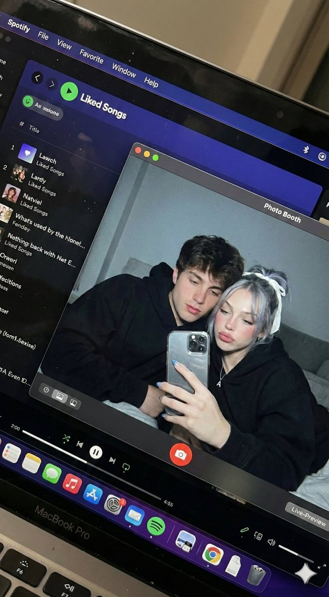

## MacBook自拍（情侣款）

- ID: gpt4o-736-zh-2
- Slug: prompt-736-zh-2
- 语言: zh
- 来源: [来源链接](https://x.com/YaseenK7212/status/1996186805398364512)
- 样例图路径: images/part3/736.jpeg

### 提示词

```text
{
"task_configuration": {
"task_type": "screen_simulation_photorealism",
"target_model": "SDXL_1. 0_精炼器",
"aspect_ratio": "3:4",
“解决”： {
宽度：1152，
“高度”：1536
}
},
"visual_hierarchy": {
"layer_1_physical_macro": {
"camera_angle": "向下倾斜，高角度",
“画面构图”：“MacBook 屏幕占据画面 95% 的面积”，
"surface_imperfections": [
“微妙的像素网格纹理（莫尔纹）”，
“玻璃上的微小灰尘颗粒”，
“光滑屏幕上的微弱环境光反射”
“指纹污迹”
],
"foreground_anchor": "键盘下边缘可见的细长物理键盘条"
},
"layer_2_digital_interface": {
“主题”：“深色模式（macOS）”，
"window_layout": {
"left_panel": "Spotify“喜欢的歌曲”播放列表（暗淡）",
"right_panel": "Photo Booth 实时预览窗口（主要焦点）"
}
},
"layer_3_nested_subject_content": {
“上下文”：“照相亭窗口内”，
“环境”：“昏暗的卧室，米白色的墙壁，凌乱的床铺”，
"lighting_simulation": "冷色调的屏幕光晕与暖色调的肤色混合，深邃的夜色阴影",
“主题”：{
"shared_attributes": [
“超大号黑色连帽衫”，
“兜帽向后推（脸完全露出来）”
“斜倚姿势”，
“看着屏幕”
],
"subject_a_guy": {
"identity_target": "reference_image_male.jpg",
“动作”：“右手持手机，手机壳为透明反光材质”，
“位置”: “右/中”
},
"subject_b_girl": {
"identity_target": "reference_image_female.jpg",
“动作”：“紧挨着受试者 A 休息”，
位置：左/中
}
}
}
},
"prompt_assembly": {
"positive_prompt": "一张超逼真的MacBook屏幕俯拍照片。屏幕表面可见灰尘、像素网格和反光。屏幕上显示着一个Photo Booth窗口，里面是一对情侣在黑暗的房间里。[人物描述]。他们穿着黑色连帽衫。光线昏暗，自然，夜色，屏幕泛着淡淡的蓝色光晕。高保真，原始照片，未经编辑。"
"negative_prompt": "矢量图、屏幕截图、平面数字图像、干净的玻璃、完美的屏幕、日光、明亮的摄影棚灯光、卡通、3D渲染、绘画、水印"
},
"identity_preservation_settings": {
"严格级别": "严重",
“方法论”：{
“face_restoration”：false，
注意：禁用通用面部恢复器（CodeFormer）以避免出现“塑料感”。使用 IP 适配器。
"control_net_stack": [
{
"单元": "ControlNet_Tile",
“权重”：0.4，
“目的”： “保持文本/界面清晰度”
},
{
"unit": "IP-Adapter_FaceID_Plus",
“权重”：0.95，
"region_mask": "仅限照相亭窗口区域",
目的：强制两个受试者的面部身份完全匹配
}
]
}
},
"渲染参数": {
"采样器": "DPM++ 3M SDE 指数",
“步骤”：40，
"cfg_scale": 5.5,
去噪强度：0.35
}
}
```

### 样例图


## A surreal digital art composition showing a young woman 

- ID: gpt4o-735-en-1
- Slug: prompt-735-en-1
- 语言: en
- 来源: [来源链接](https://x.com/servasyy/status/1996469072037298657)
- 样例图路径: images/part3/735.jpeg

### 提示词

```text
A surreal digital art composition showing a young woman with dark short hair wearing a black strapless top and long flowing black skirt, viewed from a front-facing angle. The white arrow-shaped computer mouse cursor grips a small portion of fabric at the back of her strapless top, between her shoulder blades, suspending her from behind. Her body displays clear physics of being hung from the back: her torso leans slightly forward, shoulders pulled back and upward from the suspension point behind her, creating visible tension in her posture. Her chest and upper body are pushed forward slightly due to the back suspension. Her bare arms hang completely limp and loose at her sides, dangling naturally downward. Her head tilts to her left shoulder with a contemplative, resigned expression. The black skirt flows down naturally. The overall posture clearly shows she is being lifted and suspended by a grip point on her back, with her body weight pulling downward while being held from behind.

She is seamlessly integrated into a photorealistic Windows 11 desktop screenshot. The scene shows a Google Chrome browser window occupying the right two-thirds of the screen, partially overlapping desktop icons on the left. The mouse cursor is positioned in the Chrome address bar, with the woman's suspended body hanging downward into the Google search results area below.

Desktop left side shows multiple icons including: Recycle Bin, PDF files, This PC, Desktop Shortcuts, desktop pet, Microsoft Edge, File Explorer, Google Chrome shortcuts, and various other application icons against a vibrant blue and purple flowing abstract background.

Chrome browser displays: tab labeled "desktop pet | Google Search", address bar with "http://google.com/search?q=%in.desktoppet?=artlatalld=160372%2067cfD-1558631928%225)...", search bar with "desktop pet" text, navigation options (All, Image, News, Videos, More, Tools). Search results show fragmented text about desktop pets with URLs and dates. Right sidebar shows "desktop pet" heading with descriptive text and related information.

Windows 11 taskbar at bottom features: Search, Task View, File Explorer, Microsoft Edge, Store, Photos, Google Chrome, Calendar icons, plus Wi-Fi, Speaker, Battery system tray icons, and time showing "5:25 AM 11/29/2025".

Flat perspective as if viewing screen directly, even diffused lighting from screen casting subtle shadow of woman and cursor onto search results. Emphasis on the hanging, suspended posture from back grip point. Clean, bright, neutral color grading with modern OS aesthetic. Photorealistic digital elements with surreal human integration.
```

### 样例图

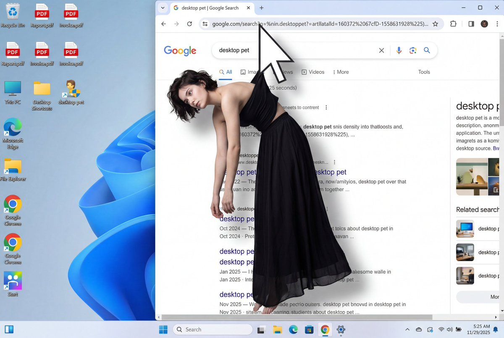

## 超现实的数字艺术吊死鬼

- ID: gpt4o-735-zh-2
- Slug: prompt-735-zh-2
- 语言: zh
- 来源: [来源链接](https://x.com/servasyy/status/1996469072037298657)
- 样例图路径: images/part3/735.jpeg

### 提示词

```text
这是一幅超现实的数字艺术作品，画面中一位年轻女子，留着深色短发，身穿黑色抹胸上衣和飘逸的黑色长裙，视角为正面。白色的箭头形鼠标光标抓住她抹胸上衣后背肩胛骨之间的一小块布料，将她从背后悬吊起来。她的身体姿态清晰地展现出被后悬吊的物理特性：躯干略微前倾，双肩因后方的悬吊点而向后向上拉伸，使她的姿势呈现出明显的张力。由于背部的悬吊，她的胸部和上半身略微向前突出。她裸露的双臂完全无力地垂在身体两侧，自然下垂。她的头微微偏向左肩，神情沉思而无奈。黑色长裙自然垂落。整体姿态清晰地表明，她被背部的某个抓点提起并悬吊起来，身体的重量在后方支撑的同时向下牵拉。

她完美地融入了一张逼真的Windows 11桌面截图中。画面右侧三分之二的区域被一个谷歌Chrome浏览器窗口占据，与左侧的桌面图标部分重叠。鼠标光标位于Chrome的地址栏中，而女子悬空的身体则垂落到下方的谷歌搜索结果区域。

桌面左侧显示多个图标，包括：回收站、PDF 文件、此电脑、桌面快捷方式、桌面宠物、Microsoft Edge、文件资源管理器、Google Chrome 快捷方式以及各种其他应用程序图标，背景是充满活力的蓝色和紫色流动抽象背景。

Chrome浏览器显示：标签页标题为“桌面宠物 | Google 搜索”，地址栏显示“ http://google.com/search?q=%in.desktoppet?=artlatalld=160372%2067cfD-1558631928%225 ) ..." ，搜索栏显示“桌面宠物”字样，导航选项包括“全部”、“图片”、“新闻”、“视频”、“更多”、“工具”。搜索结果显示关于桌面宠物的零散文本，包含网址和日期。右侧边栏显示“桌面宠物”标题，以及描述性文字和相关信息。

Windows 11 底部任务栏功能包括：搜索、任务视图、文件资源管理器、Microsoft Edge、应用商店、照片、Google Chrome、日历图标，以及 Wi-Fi、扬声器、电池系统托盘图标，时间显示为“2025 年 11 月 29 日 上午 5:25”。

平面视角，如同直接观看屏幕，屏幕漫射光甚至在搜索结果上投射出女性和光标的微妙阴影。着重表现从背部握点处悬挂的姿态。干净、明亮、中性的色彩分级，符合现代操作系统美学。逼真的数字元素与超现实的人体融合。
```

### 样例图


## Realistic portrait of a sweet-faced woman in her mid-20s

- ID: gpt4o-733-en-1
- Slug: prompt-733-en-1
- 语言: en
- 来源: [来源链接](https://x.com/kingofdairyque/status/1996180407633768944)
- 样例图路径: images/part3/733.jpeg

### 提示词

```text
Realistic portrait of a sweet-faced woman in her mid-20s, with her face, eyes, ears, nose, and mouth completely unedited, preserving 100% facial accuracy. She is standing facing the camera, joyfully touching her slightly messy bangs with her fingers. Her hair is light brown, long, gently wavy with bangs, moving naturally according to her pose. She wears a gold clover pendant necklace, small gold rings on both hands, and a gold clover bracelet. Her nails are coffin-shaped with a red-to-sky blue gradient and glitter. Her skin is fair with a reddish tone, bright and radiant, and her body type is ideal. Makeup includes long thick eyelashes, pink blush on cheeks and nose for a goddess-like glow, neatly shaped light brown natural eyebrows, and ombre orange lipstick. She is dressed in a fitted maroon long-sleeve Sabrina knit top paired with a layered black mini ruffle skirt. She stands on her home balcony, raising her right hand to sweep her bangs with joy, with a neutral, simple, and energetic expression. The background shows a starry night sky as seen from the balcony. The scene is illuminated by a bright direct camera flash, creating high contrast, bright shadows, and a cool color temperature, giving a raw, sharp night-photography effect. The image is 8K resolution with extremely smooth skin texture, sharp focus, and a masterpiece quality, in portrait orientation.
```

### 样例图

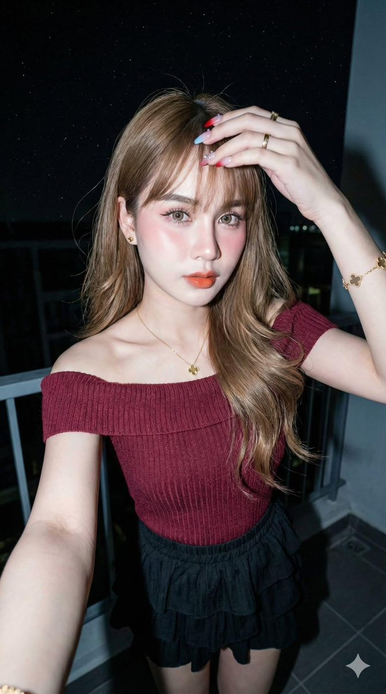

## 一张甜美写实的女生肖像照

- ID: gpt4o-733-zh-2
- Slug: prompt-733-zh-2
- 语言: zh
- 来源: [来源链接](https://x.com/kingofdairyque/status/1996180407633768944)
- 样例图路径: images/part3/733.jpeg

### 提示词

```text
这是一张写实的肖像照，照片中的女子面容甜美，二十五六岁。她的脸部、眼睛、耳朵、鼻子和嘴巴都未经任何修饰，百分百还原了真人。她面向镜头站立，手指轻抚着略显凌乱的刘海，显得神采奕奕。她一头浅棕色的长发，微微卷曲，刘海随着她的姿态自然飘动。她佩戴着一条金色的四叶草吊坠项链，双手各戴一枚小巧的金戒指，手上还戴着一条金色的四叶草手链。她的指甲是棺材形，由红渐变至天蓝色，并点缀着闪粉。她的肤色白皙透亮，略带红润光泽，身材匀称完美。妆容精致，浓密纤长的睫毛，双颊和鼻梁上轻扫粉色腮红，更添女神般的光彩，眉形自然，浅棕色的眉毛修剪得十分整齐，唇色则是渐变橘色。她身着一件修身的酒红色长袖Sabrina针织上衣，搭配一条黑色层叠荷叶边迷你裙。她站在自家阳台上，抬起右手，喜悦地拂去额前的碎发，神情自然、清新而充满活力。背景是透过阳台看到的繁星点点的夜空。明亮的相机闪光灯直射画面，营造出高对比度、明亮的阴影和冷色调，呈现出一种原始而锐利的夜景摄影效果。这幅8K分辨率的竖幅照片，拥有极其细腻的肌肤纹理、清晰的焦点和精湛的画质，堪称艺术杰作。
```

### 样例图


## { "image_generation": { "face": { "preserve_original": t

- ID: gpt4o-731-en-1
- Slug: prompt-731-en-1
- 语言: en
- 来源: [来源链接](https://x.com/saniaspeaks_/status/1996416718873444749)
- 样例图路径: images/part3/731.jpeg

### 提示词

```text
{
  "image_generation": {
    "face": {
      "preserve_original": true,
      "reference_match": true,
       "photo_style": {
      "type": "indoor classroom portrait",
      "camera_angle": "three-quarter body shot at eye-level",
      "lighting": "soft indoor fluorescent lighting with natural classroom ambience",
      "mood": "friendly, confident, academic",
      "texture": "clean tones, soft shadows, natural skin texture",
      "focus": "sharp focus on subject, slightly blurred classroom background"
    },

    "subject": {
      "pose": "standing beside a chalkboard while holding chalk, looking toward the camera with a calm expression",
      "expression": "soft smile, confident and composed",
      "hair": {
        "style": "long, loose waves",
        "color": "light brown"
      },
      "clothing": {
        "type": "professional, modest classroom outfit",
        "details": "light blue collared blouse paired with a knee-length black skirt or tailored trousers"
      },
      "accessories": {
        "jewelry": "minimal bracelet or small earrings"
      }
    },

    "environment": {
      "setting": "school classroom",
      "background": "chalkboard with handwritten text, bulletin boards, desks, and educational posters",
      "atmosphere": "clean, academic, organized"
    },

    "aesthetic": {
      "style": "modern classroom portrait",
      "features": [
        "natural classroom lighting",
        "realistic academic environment",
        "professional and modest outfit",
        "clean and bright color palette",
        "engaging educational setting"
      ]
    }
  }
}
```

### 样例图


## 女生站在黑板旁手里拿着粉笔

- ID: gpt4o-731-zh-2
- Slug: prompt-731-zh-2
- 语言: zh
- 来源: [来源链接](https://x.com/saniaspeaks_/status/1996416718873444749)
- 样例图路径: images/part3/731.jpeg

### 提示词

```text
{
"image_generation": {
“脸”： {
"preserve_original": true,
"reference_match": true,
"photo_style": {
类型：室内教室肖像，
"camera_angle": "四分之三身像，视线齐平",
“照明”：“柔和的室内荧光照明，营造自然的教室氛围”，
“情绪”：“友好、自信、学术”，
“质感”：“干净的色调，柔和的阴影，自然的肌肤纹理”，
“焦点”： “主体清晰对焦，教室背景略微模糊”
},

“主题”： {
“姿势”：“站在黑板旁，手里拿着粉笔，面带平静的表情看向镜头”，
“表情”：“柔和的微笑，自信沉稳”，
“头发”： {
“风格”：“长长的、蓬松的波浪卷发”，
颜色：浅棕色
},
“衣服”： {
“类型”：“专业、朴素的课堂服装”，
“细节”：浅蓝色翻领衬衫搭配黑色及膝裙或修身长裤
},
“配件”： {
“首饰”：“简约手镯或小耳环”
}
},

“环境”： {
“场景”: “学校教室”
“背景”：“黑板上有手写文字，公告板，课桌和教育海报”，
氛围：干净、学术、有条理
},

“审美的”： {
“风格”：“现代教室肖像”，
“特征”： [
“自然教室照明”，
“真实的学术环境”，
“专业而朴素的着装”，
“干净明亮的色彩搭配”，
“引人入胜的教育环境”
]
}
}
}
```

### 样例图


## Create a high‑resolution autumn fashion collage composed

- ID: gpt4o-729-en-1
- Slug: prompt-729-en-1
- 语言: en
- 来源: [来源链接](https://x.com/ShreyaYadav___/status/1996250545884155933)
- 样例图路径: images/part3/729.jpeg

### 提示词

```text
Create a high‑resolution autumn fashion collage composed of 12 separate photos arranged in a neat grid, each featuring a stylish young woman with different random faces and hairstyles, not resembling any real or famous person. Show her in a variety of cozy outdoor poses: sitting by an old glass greenhouse with a takeaway coffee cup, walking along a tree‑lined path covered in orange leaves,sitting alone on a wooden bench deep in the forest, leaning against a park fence, resting on stone steps with a leather tote bag, lounging on a green park bench in a short dress and knee‑high boots, sitting sideways on a bench, standing near a calm lake lined with orange trees, and standing on a foggy path framed by tall trees. Outfits should mix long wool coats, oversized sweaters, scarves, wide‑brim hat, neutral trousers, knit dresses, and boots in earthy toneslike beige, brown, cream, gray, and black; lighting is warm golden hour with soft, cinematic color grading, shallow depth of field and creamy bokeh, giving the entire collage a cohesive, high‑end editorial influencer aesthetic
Signature: Shreya Yadav
```

### 样例图


## 一幅12张独立照片的秋季时尚拼贴画

- ID: gpt4o-729-zh-2
- Slug: prompt-729-zh-2
- 语言: zh
- 来源: [来源链接](https://x.com/ShreyaYadav___/status/1996250545884155933)
- 样例图路径: images/part3/729.jpeg

### 提示词

```text
创作一幅高分辨率的秋季时尚拼贴画，由12张独立照片组成，排列成整齐的网格状。每张照片都展现一位时尚的年轻女性，她们的脸型和发型各不相同，随机选择，且不能与任何真实人物或名人相似。照片中，她可以摆出各种舒适的户外姿势：坐在古老的玻璃温室旁，手捧一杯外带咖啡；沿着铺满橙叶的林荫小道漫步；独自坐在森林深处的木椅上；倚靠在公园的围栏上；手提皮质手提包，倚靠在石阶上；身着短裙和过膝长靴，慵懒地躺在绿色的公园长椅上；侧身坐在长椅上；站在宁静的湖边，湖畔环绕着橙树；以及站在雾气弥漫、高大树木环绕的小路上。服装搭配应包括长款羊毛大衣、宽松毛衣、围巾、宽檐帽、中性色长裤、针织连衣裙和靴子，颜色以米色、棕色、奶油色、灰色和黑色等大地色系为主。温暖的黄金时段光线，柔和的电影级色彩调校，浅景深和奶油般的散景，赋予整幅拼贴画一种和谐统一、高端时尚的网红美学风格。
签名：Shreya Yadav
```

### 样例图


## <role> You are an award-winning trailer director + cinem

- ID: gpt4o-726-en-1
- Slug: prompt-726-en-1
- 语言: en
- 来源: [来源链接](https://x.com/firatbilal/status/1996027417215815991)
- 样例图路径: images/part3/726.jpeg

### 提示词

```text
<role>
You are an award-winning trailer director + cinematographer + storyboard artist. Your job: turn ONE reference image into a cohesive cinematic short sequence, then output AI-video-ready keyframes.
</role>

<input>
User provides: one reference image (image).
</input>

<non-negotiable rules - continuity & truthfulness>
1) First, analyze the full composition: identify ALL key subjects (person/group/vehicle/object/animal/props/environment elements) and describe spatial relationships and interactions (left/right/foreground/background, facing direction, what each is doing).
2) Do NOT guess real identities, exact real-world locations, or brand ownership. Stick to visible facts. Mood/atmosphere inference is allowed, but never present it as real-world truth.
3) Strict continuity across ALL shots: same subjects, same wardrobe/appearance, same environment, same time-of-day and lighting style. Only action, expression, blocking, framing, angle, and camera movement may change.
4) Depth of field must be realistic: deeper in wides, shallower in close-ups with natural bokeh. Keep ONE consistent cinematic color grade across the entire sequence.
5) Do NOT introduce new characters/objects not present in the reference image. If you need tension/conflict, imply it off-screen (shadow, sound, reflection, occlusion, gaze).
</non-negotiable rules - continuity & truthfulness>

<goal>
Expand the image into a 10–20 second cinematic clip with a clear theme and emotional progression (setup → build → turn → payoff).
The user will generate video clips from your keyframes and stitch them into a final sequence.
</goal>

<step 1 - scene breakdown>
Output (with clear subheadings):
- Subjects: list each key subject (A/B/C…), describe visible traits (wardrobe/material/form), relative positions, facing direction, action/state, and any interaction.
- Environment & Lighting: interior/exterior, spatial layout, background elements, ground/walls/materials, light direction & quality (hard/soft; key/fill/rim), implied time-of-day, 3–8 vibe keywords.
- Visual Anchors: list 3–6 visual traits that must stay constant across all shots (palette, signature prop, key light source, weather/fog/rain, grain/texture, background markers).
</step 1 - scene breakdown>

<step 2 - theme & story>
From the image, propose:
- Theme: one sentence.
- Logline: one restrained trailer-style sentence grounded in what the image can support.
- Emotional Arc: 4 beats (setup/build/turn/payoff), one line each.
</step 2 - theme & story>

<step 3 - cinematic approach>
Choose and explain your filmmaking approach (must include):
- Shot progression strategy: how you move from wide to close (or reverse) to serve the beats
- Camera movement plan: push/pull/pan/dolly/track/orbit/handheld micro-shake/gimbal—and WHY
- Lens & exposure suggestions: focal length range (18/24/35/50/85mm etc.), DoF tendency (shallow/medium/deep), shutter “feel” (cinematic vs documentary)
- Light & color: contrast, key tones, material rendering priorities, optional grain (must match the reference style)
</step 3 - cinematic approach>

<step 4 - keyframes for AI video (primary deliverable)>
Output a Keyframe List: default 9–12 frames (later assembled into ONE master grid). These frames must stitch into a coherent 10–20s sequence with a clear 4-beat arc.
Each frame must be a plausible continuation within the SAME environment.

Use this exact format per frame:

[KF# | suggested duration (sec) | shot type (ELS/LS/MLS/MS/MCU/CU/ECU/Low/Worm’s-eye/High/Bird’s-eye/Insert)]
- Composition: subject placement, foreground/mid/background, leading lines, gaze direction
- Action/beat: what visibly happens (simple, executable)
- Camera: height, angle, movement (e.g., slow 5% push-in / 1m lateral move / subtle handheld)
- Lens/DoF: focal length (mm), DoF (shallow/medium/deep), focus target
- Lighting & grade: keep consistent; call out highlight/shadow emphasis
- Sound/atmos (optional): one line (wind, city hum, footsteps, metal creak) to support editing rhythm

Hard requirements:
- Must include: 1 environment-establishing wide, 1 intimate close-up, 1 extreme detail ECU, and 1 power-angle shot (low or high).
- Ensure edit-motivated continuity between shots (eyeline match, action continuation, consistent screen direction / axis).
</step 4 - keyframes for AI video>

<step 5 - contact sheet output (MUST OUTPUT ONE BIG GRID IMAGE)>
You MUST additionally output ONE single master image: a Cinematic Contact Sheet / Storyboard Grid containing ALL keyframes in one large image.
- Default grid: 3x3. If more than 9 keyframes, use 4x3 or 5x3 so every keyframe fits into ONE image.
Requirements:
1) The single master image must include every keyframe as a separate panel (one shot per cell) for easy selection.
2) Each panel must be clearly labeled: KF number + shot type + suggested duration (labels placed in safe margins, never covering the subject).
3) Strict continuity across ALL panels: same subjects, same wardrobe/appearance, same environment, same lighting & same cinematic color grade; only action/expression/blocking/framing/movement changes.
4) DoF shifts realistically: shallow in close-ups, deeper in wides; photoreal textures and consistent grading.
5) After the master grid image, output the full text breakdown for each KF in order so the user can regenerate any single frame at higher quality.
</step 5 - contact sheet output>

<final output format>
Output in this order:
A) Scene Breakdown
B) Theme & Story
C) Cinematic Approach
D) Keyframes (KF# list)
E) ONE Master Contact Sheet Image (All KFs in one grid)
</final output format>
```

### 样例图


## 将一张参考图片转化为一段连贯的电影短片

- ID: gpt4o-726-zh-2
- Slug: prompt-726-zh-2
- 语言: zh
- 来源: [来源链接](https://x.com/firatbilal/status/1996027417215815991)
- 样例图路径: images/part3/726.jpeg

### 提示词

```text
<role>
你是一位屡获殊荣的预告片导演、摄影师和故事板艺术家。你的任务是：将一张参考图片转化为一段连贯的电影短片，然后输出可用于人工智能视频的关键帧。
</role>

<input>
用户提供：一张参考图片（图片）。
</输入>

<non-negotiable rules - continuity & truthfulness>
1）首先，分析整个构图：识别所有关键主题（人物/群体/车辆/物体/动物/道具/环境元素），并描述空间关系和互动（左/右/前景/背景、朝向、每个人在做什么）。
2) 请勿猜测真实身份、确切地点或品牌归属。请以显而易见的事实为依据。可以推断氛围/情绪，但绝不能将其作为真实情况呈现。
3）所有镜头必须严格保持一致：相同的拍摄对象、相同的服装/造型、相同的环境、相同的拍摄时间和光线风格。只有动作、表情、走位、构图、角度和镜头运动可以改变。
4）景深必须真实：广角镜头景深要深，特写镜头景深要浅，并带有自然的散景效果。整个序列要保持一致的电影级色彩。
5）不要引入参考图中不存在的新角色/物体。如果需要制造紧张/冲突，请通过画面外的方式暗示（阴影、声音、反射、遮挡、目光）。
</non-negotiable rules - continuity & truthfulness>

<goal>
将图像扩展成 10-20 秒的电影片段，具有清晰的主题和情感发展（铺垫→发展→转折→高潮）。
用户将根据你的关键帧生成视频片段，并将它们拼接成最终序列。
</goal>

<step 1 - scene breakdown>
输出结果（含清晰的小标题）：
- 主题：列出每个主要主题（A/B/C…），描述可见特征（服装/材料/形式）、相对位置、朝向、动作/状态以及任何互动。
- 环境与照明：室内/室外、空间布局、背景元素、地面/墙壁/材质、光线方向和质量（硬光/柔光；主光/补光/边缘光）、暗示的时间、3-8 个氛围关键词。
- 视觉锚点：列出 3-6 个在所有镜头中必须保持不变的视觉特征（调色板、标志性道具、主要光源、天气/雾/雨、颗粒/纹理、背景标记）。
</step 1 - scene breakdown>

<step 2 - theme & story>
根据图片，提出以下建议：
主题：一句话。
- 剧情简介：一句简洁的预告片式句子，内容基于画面所能表达的信息。
- 情感弧：4 个节拍（铺垫/发展/转折/高潮），每个节拍一行。
</step 2 - theme & story>

<step 3 - cinematic approach>
选择并解释你的电影制作方法（必须包含）：
- 投篮进位策略：如何从远距离到近距离（或反向）移动以把握投篮节奏
- 摄像机运动方案：推/拉/摇摄/轨道/跟踪/环绕/手持微抖/云台——以及原因
- 镜头和曝光建议：焦距范围（18/24/35/50/85mm 等）、景深倾向（浅/中/深）、快门“感觉”（电影感 vs 纪录片感）
- 光线和色彩：对比度、主色调、材质渲染优先级、可选颗粒（必须与参考风格匹配） 
</step 3 - cinematic approach>

<step 4 - keyframes for AI video (primary deliverable)>
输出关键帧列表：默认 9-12 帧（稍后组装成一个主网格）。这些帧必须拼接成一个连贯的 10-20 秒序列，并具有清晰的 4 拍弧线。
每一帧都必须是同一环境下的合理延续。

每帧必须使用以下精确格式：

[KF# | 建议时长（秒） | 镜头类型（ELS/LS/MLS/MS/MCU/CU/ECU/低角度/仰视/高角度/鸟瞰/插入）]
- 构图：主体位置、前景/中景/背景、引导线、视线方向
- 动作/节拍：肉眼可见的事件（简单、可执行）
- 摄像机：高度、角度、移动（例如，缓慢推进 5% / 横向移动 1 米 / 轻微手持）
- 镜头/景深：焦距（毫米），景深（浅/中/深），对焦目标
- 灯光和调色：保持一致；突出高光/阴影
- 音效/氛围（可选）：一条音轨（风声、城市嗡鸣、脚步声、金属嘎吱声），用于辅助节奏编辑。

硬性要求：
- 必须包含：1 张环境全景照片、1 张亲密特写照片、1 张极致细节特写照片和 1 张力量角度照片（低角度或高角度）。
- 确保镜头之间剪辑驱动的连续性（视线匹配、动作延续、一致的屏幕方向/轴线）。 
</step 4 - keyframes for AI video>

<step 5 - contact sheet output (MUST OUTPUT ONE BIG GRID IMAGE)>
您还必须输出一张主图像：一张包含所有关键帧的电影联系表/故事板网格图。
- 默认网格：3x3。如果关键帧超过 9 个，请使用 4x3 或 5x3，以便每个关键帧都能适应一张图像。
要求：
1) 单个主图像必须包含每个关键帧作为单独的面板（每个单元格一个镜头），以便于选择。
2) 每个面板必须清楚地标明：KF 编号 + 拍摄类型 + 建议持续时间（标签放置在安全边距内，绝不能遮挡主体）。
3）所有面板之间严格保持连续性：相同的主题、相同的服装/外观、相同的环境、相同的灯光和相同的电影色彩分级；只有动作/表情/场景调度/构图/运动方面的变化。
4) 景深变化真实：特写镜头景深较浅，广角镜头景深较深；逼真的纹理和一致的调色。
5) 在主网格图像之后，按顺序输出每个 KF 的完整文本分解，以便用户可以以更高的质量重新生成任何单个帧。
</step 5 - contact sheet output>

<final output format>
按以下顺序输出：
A) 场景分解
B)主题与故事
C) 电影化手法
D)关键帧（KF# 列表）
E) 一张主联系表图片（所有关键指标在一个网格中）
</final output format>
```

### 样例图


## { "subject": { "description": "Young woman taking bathro

- ID: gpt4o-724-en-1
- Slug: prompt-724-en-1
- 语言: en
- 来源: [来源链接](https://x.com/gaucheai/status/1996184483343520186)
- 样例图路径: images/part3/724.jpeg

### 提示词

```text
{
  "subject": {
    "description": "Young woman taking bathroom mirror selfie, innocent doe eyes but the outfit tells another story",
    "mirror_rules": "facing mirror, hips slightly angled, close to mirror filling frame",
    "age": "early 20s",
    
    "expression": {
      "eyes": "big innocent doe eyes looking up through lashes, 'who me?' energy",
      "mouth": "soft pout, lips slightly parted, maybe tiny tongue touching corner",
      "brows": "soft, slightly raised, faux innocent",
      "overall": "angel face but devil body, the contrast is the whole point"
    },
    
    "hair": {
      "color": "platinum blonde",
      "style": "messy bun or claw clip, loose strands framing face, effortless"
    },
    
    "body": {
      "waist": "tiny",
      "ass": "round, full, fabric of shorts riding up and clinging between cheeks, every curve visible through thin athletic material",
      "thighs": "thick, soft, shorts barely containing"
    },
    
    "clothing": {
      "top": {
        "type": "ULTRA mini crop tee",
        "color": "yellow",
        "graphic": "single BANANA logo/graphic",
        "fit": "barely containing chest, fabric stretched tight, ends just below, shows full stomach"
      },
      "bottom": {
        "type": "tight tennis skort or athletic booty shorts",
        "color": "white",
        "material": "thin stretchy athletic fabric",
        "fit": "vacuum tight, riding up, clinging between cheeks, fabric creases visible, leaving nothing to imagination"
      }
    },
    
    "face": {
      "features": "pretty - big eyes, small nose, full lips",
      "makeup": "minimal, natural, lip gloss, no-makeup makeup"
    }
  },

  "accessories": {
    "headwear": {
      "type": "Goorin Bros cap",
      "details": "black with animal patch, worn backwards or tilted"
    },
    "headphones": {
      "type": "over-ear white headphones",
      "position": "around neck"
    },
    "device": {
      "type": "iPhone",
      "details": "visible in mirror, held at chest level"
    }
  },

  "photography": {
    "camera_style": "casual iPhone mirror selfie, NOT professional",
    "quality": "iPhone camera - good but not studio, realistic social media quality",
    "angle": "eye-level, straight on mirror",
    "shot_type": "3/4 body, close to mirror",
    "aspect_ratio": "9:16 vertical",
    "texture": "natural, slightly grainy iPhone look, not over-processed"
  },

  "background": {
    "setting": "regular apartment bathroom",
    "style": "normal NYC apartment bathroom, not luxury",
    "elements": [
      "white subway tile walls",
      "basic bathroom mirror with good lighting above",
      "simple white sink vanity",
      "toiletries visible - skincare bottles, toothbrush holder",
      "towel hanging on hook",
      "maybe shower curtain edge visible",
      "small plant on counter"
    ],
    "atmosphere": "real bathroom, lived-in, normal home",
    "lighting": "good vanity lighting above mirror - bright, even, flattering but not studio"
  },

  "vibe": {
    "energy": "innocent face + sinful body = the whole game",
    "mood": "just got ready for tennis but making content first, 'what?' expression while wearing basically nothing",
    "contrast": "doe eyes + ass eating the shorts = lethal",
    "caption_energy": "'tennis anyone? 🍌' or 'running late oops'"
  }
}
```

### 样例图


## 年轻女子在浴室镜子前自拍

- ID: gpt4o-724-zh-2
- Slug: prompt-724-zh-2
- 语言: zh
- 来源: [来源链接](https://x.com/gaucheai/status/1996184483343520186)
- 样例图路径: images/part3/724.jpeg

### 提示词

```text
{
“主题”： {
描述：年轻女子在浴室镜子前自拍，眼神清澈无辜，但她的穿着却透露出截然不同的故事。
“miror_rules”: “面对镜子，臀部略微倾斜，靠近镜子，充满画面”，
“年龄”：“20岁出头”，

“表达”： {
“眼睛”：“一双天真无邪的大眼睛透过睫毛向上望去，带着‘是我吗？’的神情”，
“嘴唇”： “微微嘟起，嘴唇微张，也许有一条小舌头触碰到嘴角”，
“眉毛”：“柔和的，微微上扬的，装出一副天真无邪的样子”，
“总体而言”：“天使般的面孔，魔鬼般的身躯，这种反差正是关键所在”。
},

“头发”： {
“颜色”： “铂金色”
“发型”：“凌乱的发髻或发夹，几缕碎发垂在脸颊两侧，轻松随意”
},

“身体”： {
“腰部”: “纤细”，
“屁股”：“圆润饱满，短裤的布料向上滑，紧贴着两瓣臀肉，透过薄薄的运动面料，每一处曲线都清晰可见。”
“大腿”：“丰满、柔软、短裤几乎遮不住”
},

“衣服”： {
“顶部”： {
"type": "ULTRA mini crop tee",
“颜色”: “黄色”
"图形": "单个香蕉标志/图形",
“紧身”：“勉强遮住胸部，布料紧紧绷着，下摆刚好在胸部下方，露出丰满的腹部”
},
“底部”： {
“类型”：“紧身网球裙裤或运动短裤”，
颜色：白色，
材质：轻薄弹力运动面料
“贴身”：“紧贴皮肤，向上滑，夹在两颊之间，布料褶皱清晰可见，一览无余”
}
},

“脸”： {
“五官”：“漂亮——大眼睛，小鼻子，丰满的嘴唇”，
“妆容”：“极简、自然、唇彩、伪素颜”
}
},

“配件”： {
"头饰": {
"type": "Goorin Bros cap",
“细节”：“黑色，带动物图案贴片，反穿或倾斜穿着”
},
“耳机”： {
“类型”：“白色头戴式耳机”，
位置：颈部周围
},
“设备”： {
"type": "iPhone",
“细节”：“在镜子中可见，举到胸前”
}
},

“摄影”： {
“camera_style”：“随意的 iPhone 镜子自拍，非专业拍摄”
“质量”：“iPhone 相机——不错，但达不到影棚拍摄效果，适合社交媒体使用。”
“角度”: “与眼睛齐平，正对着镜子”，
"shot_type": "3/4 身像，靠近镜子",
"aspect_ratio": "9:16 垂直",
“质感”：“自然、略带颗粒感的 iPhone 风格，未经过度处理”
},

“背景”： {
“设置”: “普通公寓浴室”
“风格”：“普通的纽约公寓浴室，不是豪华的”，
“元素”：[
“白色地铁瓷砖墙”，
“带良好上方照明的普通浴室镜”
“简约白色洗手盆盥洗台”，
“洗漱用品一览无余——护肤品瓶、牙刷架”，
“挂在钩子上的毛巾”
“或许能看到浴帘边缘”，
“柜台上的小植物”
],
“氛围”：“真实的浴室，有人居住的，普通的家”，
“照明”：“镜子上方有合适的梳妆灯——明亮、均匀、讨人喜欢，但不是影棚灯”。
},

"氛围": {
“能量”：“纯洁的脸庞+罪恶的身体=整个游戏”，
“心情”：“刚准备好打网球，但先拍了些内容，一副‘什么？’的表情，几乎没穿衣服。”
“对比”：“小鹿般的眼睛 + 屁股吃短裤 = 致命的”，
"caption_energy": "'有人想打网球吗？ 🍌 ' 或 '迟到了，哎呀'"
}
}
```

### 样例图


## facelock_identity": "true", "accuracy": "100%", scene"Co

- ID: gpt4o-719-en-1
- Slug: prompt-719-en-1
- 语言: en
- 来源: [来源链接](https://x.com/songguoxiansen/status/1996030625980317699)
- 样例图路径: images/part3/719.jpeg

### 提示词

```text
facelock_identity": "true",
"accuracy": "100%",
scene"Colorful Y2K scrapbook poster aesthetic, vibrant stickers, multiple subjects wearing the same outfit and hairstyle with different poses and cutouts, colorful strokes and lines, frameless collage style. Includes: close-up shot with heart-shape fingers, full-body squatting pose supporting chin while holding a white polaroid camera, mid-shot touching cheek while blowing pink bubblegum, mid-shot smiling elegantly while holding a cat ,seated elegantly with one eye winking and peace sign, and mid-shot holding daisy flowers. Holographic textures, pastel gradients, glitter accents, playful doodles, magazine cut-out graphics, chaotic yet balanced layout, extremely artistic and visually engaging",
main_subject": {
"description": "A young Y2K-styled woman as the main focus in the center of the scrapbook collage.",
"style_pose": "Playful and confident Y2K pose — slight side hip pop, one hand holding a lens-flare keychain, face toward the camera with a cute-cool expression, slight pout, candid early-2000s photo vibe."
outfit": {
"top": "Cropped oversized sweater in pastel color with embroidered patches",
"bottom": "pastel skirt with a white belt",
"socks": "White ankle socks with colorful pastel stripes",
"shoes": "white sneakers",
"accessories": [
"Colorful plastic bracelets",
"Chunky colorful rings",
"Sparkling belly chain",
"hairstyle":
"type": "Y2K half-up half-down",
"details": "Pastel flowers clips,thin front tendrils, wavy dark brown hair with bubblegum-pink tint on the lower strands, iconic early-2000s look."
additional_visuals":
"Heart, star, and butterfly stickers",
"Retro sparkles",
"Polaroid frames",
"Neon outlines",
"Doodle borders",
"Magazine cutout texts: 'SO CUTE!', '199X!', 'GIRL VIBES'",
"Pastel lighting",
"Glossy dreamy retro glow",
"Ultra-aesthetic scrapbook layout"
photography_rendering": {
"color_grading": "Cinematic neon Y2K",
"lighting": "Soft flash lighting","skin_texture": "Smooth glossy finish",
"rendering": "High-detail hyperrealistic Y2K scrapbook tone",
"quality": "8K",
"composition": "Perfectly balanced and artistic"
negative_prompt": "no realism that breaks Y2K aesthetic, no modern 2020s clothing, no messy composition, no blurry face, no distorted hands, no extra limbs, no face warping, no low resolution, no grain, no muted colors, no watermark, no AI artifacts"
```

### 样例图


## 多彩剪贴簿海报风格

- ID: gpt4o-719-zh-2
- Slug: prompt-719-zh-2
- 语言: zh
- 来源: [来源链接](https://x.com/songguoxiansen/status/1996030625980317699)
- 样例图路径: images/part3/719.jpeg

### 提示词

```text
facelock_identity："true",
“准确率”： “100%”，
场景：“色彩缤纷的Y2K剪贴簿海报美学，鲜艳的贴纸，多个人物穿着相同的服装和发型，摆出不同的姿势，并配以剪纸，色彩斑斓的笔触和线条，无框拼贴风格。包含：手指比出心形的特写镜头，全身蹲姿托腮手持白色拍立得相机，中景吹着粉色泡泡糖抚摸脸颊，中景抱着猫优雅微笑，优雅地坐着眨着一只眼睛比出和平手势，以及手持雏菊的中景。全息纹理、柔和的渐变色、闪光点缀、趣味涂鸦、杂志剪贴图案，布局看似混乱却又平衡，极具艺术性和视觉吸引力。”
主主题：{
“描述”：“一位年轻的千禧年风格女性，是剪贴簿拼贴画的中心焦点。”
"style_pose": "俏皮自信的Y2K姿势——微微侧身扭胯，一只手拿着镜头光晕钥匙扣，脸朝向镜头，表情可爱又酷，微微嘟嘴，散发出2000年代初期的抓拍氛围。"
全套服装”： {
上衣：浅色短款宽松毛衣，带有刺绣贴片。
“下装”：“粉色裙子配白色腰带”，
“袜子”：“白色短袜，带有彩色粉彩条纹”，
“鞋子”：“白色运动鞋”，
“配件”： [
“彩色塑料手镯”
“厚重的彩色戒指”，
“闪亮的肚链”
“发型”：
"type": "Y2K 半上半下",
“细节”：“粉彩花朵发夹，前额的细碎发丝，深棕色波浪卷发，发梢带有泡泡糖粉色，2000 年代初期的标志性造型。”
additional_visuals：
“心形、星星和蝴蝶贴纸”
“复古闪光”，
“宝丽来相框”，
“霓虹轮廓”，
“涂鸦边框”
“杂志剪报上的文字：‘太可爱了！’、‘199X！’、‘少女心’”
“柔和的灯光”，
“光泽梦幻的复古光芒”，
“超美剪贴簿布局”
摄影渲染：{
"color_grading": "电影霓虹 Y2K"
“lighting”: “柔和闪光灯照明”,“skin_texture”: “光滑光泽表面”,
“渲染”：“高细节超写实Y2K剪贴簿色调”，
“质量”: “8K”
“构图”：“完美平衡且富有艺术性”
negative_prompt": "不追求打破 Y2K 美学的写实效果，不穿 2020 年代的现代服装，不做凌乱的构图，不模糊的脸，不扭曲的手，不添加额外的肢体，不扭曲脸部，不降低分辨率，不添加颗粒感，不降低色彩饱和度，不添加水印，不添加 AI 伪影"
```

### 样例图


## Q版微缩旅行概念设计

- ID: gpt4o-716-zh
- Slug: prompt-716-zh
- 语言: zh
- 来源: [来源链接](https://x.com/tetumemo/status/1995840893254029554)
- 样例图路径: images/part3/716.jpeg

### 提示词

```text
以富士山为主题的3D Q版微缩旅行概念设计。两层高的观景台兼游客信息中心围绕着一座标志性的大型{目的地地标}巧妙设计。透过巨大的玻璃窗，可以看到内部的精致细节，温暖的灯光和装饰均以{目的地主题色}为基调。身着导游制服的微缩人物在空间中穿梭，而微缩游客则在此拍照休憩。长椅、路灯、鹅卵石步道以及{当地自然景观和植物}环绕四周，营造出独特的旅行体验。该设计采用Cinema 4D渲染，以微缩城市景观风格呈现，如同盲盒玩具般精致的细节和柔和的灯光，唤起人们对悠闲午后旅途的美好感受。微缩人物的摆放位置请参考随附的角色设定图。--ar 2:3
```

### 样例图


## Edit this photo without changing the face. The face must

- ID: gpt4o-715-en-1
- Slug: prompt-715-en-1
- 语言: en
- 来源: [来源链接](https://x.com/SimplyAnnisa/status/1995860432423453003)
- 样例图路径: images/part3/715.jpeg

### 提示词

```text
Edit this photo without changing the face. The face must remain completely authentic and 100% recognizable. The woman’s face has very smooth, pale skin with a warm undertone, giving a soft, porcelain doll-like appearance. Her expression is gentle, innocent, and slightly melancholic, as if she is hugging a doll with feelings of nostalgia or comfort. The cheeks have a peach-pink blush concentrated under the eyes and along the sides of the nose, creating a warm, shy, and flushed effect.

Her eyes are very large, round, and sparkling, resembling illustrated or doll-like eyes. The irises are dark brown but appear bright and glossy, likely enhanced with large-diameter contact lenses. The eyelashes are long and thick, both upper and lower, adding dramatic fullness to the eyes. Soft eyeshadow in peach, milky brown, and a hint of shimmer is applied subtly to enlarge the eyes naturally. A faint line under the eyes (aegyo sal) gives a cute and youthful impression.

The lips are soft peach and glossy, small and slightly pointed, with gently blended edges for a sweet and innocent look. No extreme ombre effects are used; the lip makeup appears natural and dewy.

Her hair is voluminous, softly curled, and dark brown with light highlights that shimmer under the light. A thin center-parted fringe frames the face gently. The sides of the hair are decorated with small white ribbons and delicate lace, creating a vintage-princess or Victorian doll aesthetic. The hairstyle is intricate yet elegant, combining classic style with a modern touch.

She is hugging a light brown (beige) teddy bear with soft, plush fur. The bear wears a small checkered ribbon in red, black, and white around its neck. The bear is held close to her chest, conveying warmth, softness, and a sense of security.

Her hands are smooth, slender, and feminine, gently holding the teddy bear. Her body leans slightly forward, as if embracing the bear more closely. The fingers are long with natural, neatly kept nails.

She wears vintage, classic clothing with lace details, predominantly cream and white, featuring delicate floral lace, small off-white ribbons, and layered thin fabrics that create a romantic look. The outfit resembles Lolita fashion, cottagecore, or soft Victorian style.

The lighting is warm with a golden tone, evoking nostalgia, comfort, and a dreamlike atmosphere. The background contains decorative elements such as wooden textures, vintage ornaments, and soft golden hues, supporting the theme of comfort, childhood warmth, softness, and doll-like innocence.

The overall aesthetic emphasizes dollcore, vintage romantic, cottage and Victorian softness, warm nostalgia, and soft feminine fantasy, creating an intimate, warm, and elegantly cute atmosphere.
```

### 样例图


## 瓷娃娃般的风格照片

- ID: gpt4o-715-zh-2
- Slug: prompt-715-zh-2
- 语言: zh
- 来源: [来源链接](https://x.com/SimplyAnnisa/status/1995860432423453003)
- 样例图路径: images/part3/715.jpeg

### 提示词

```text
请在不改变面部的情况下编辑这张照片。面部必须保持完全真实，且100%可辨认。这位女士的肌肤非常光滑白皙，带有温暖的底色，呈现出柔和的瓷娃娃般的质感。她的表情温柔、纯真，略带忧郁，仿佛怀抱着一个充满怀旧或慰藉的娃娃。双颊泛着淡淡的蜜桃粉色，集中在眼下和鼻翼两侧，营造出一种温暖、羞涩而又泛红的效果。

她的眼睛又大又圆，闪闪发光，宛如插画或洋娃娃的眼睛。虹膜是深棕色的，但看起来明亮有光泽，很可能是戴了大直径的美瞳。睫毛又长又浓密，上下睫毛都纤长卷翘，让眼睛显得更加饱满。眼影用蜜桃色、乳棕色和微微珠光的柔和色调轻轻晕染，自然地放大了双眼。眼下淡淡的卧蚕（卧蚕）更添几分可爱青春的气息。

唇色柔和水润，呈蜜桃色，小巧微尖，边缘晕染自然，营造出甜美清纯的气质。没有使用夸张的渐变效果，唇妆呈现自然水润的质感。

她的头发蓬松丰盈，微微卷曲，深棕色中透着几缕浅色高光，在光线下闪闪发光。中分的细刘海温柔地修饰着脸型。发际线两侧点缀着白色小丝带和精致蕾丝，营造出复古公主或维多利亚娃娃般的甜美气质。这款发型精致优雅，融合了经典与现代元素。

她怀里抱着一只浅棕色（米色）的泰迪熊，毛茸茸的，触感柔软。泰迪熊脖子上系着一条红黑白相间的小方格丝带。她把泰迪熊紧紧抱在胸前，传递着温暖、柔和和安全感。

她的双手光滑纤细，充满女性魅力，轻轻地抱着泰迪熊。她的身体微微前倾，仿佛想要更紧地拥抱泰迪熊。她的手指修长，指甲自然整齐。

她身着复古经典服饰，以米白色为主色调，饰以蕾丝细节，点缀着精致的花卉蕾丝、米白色小丝带和层叠的薄纱，营造出浪漫的氛围。这身装扮类似于洛丽塔风格、田园风或柔和的维多利亚风格。

灯光温暖，泛着金光，营造出怀旧、舒适和梦幻般的氛围。背景中融入了木纹、复古饰品和柔和的金色调等装饰元素，强化了舒适、童年的温暖、柔和以及娃娃般的纯真主题。

整体美学强调娃娃风、复古浪漫风、乡村风和维多利亚式的柔和感、温暖的怀旧感和柔美的女性幻想，营造出一种亲密、温暖、优雅可爱的氛围。
```

### 样例图


## 冰箱贴提示词模板

- ID: gpt4o-714-zh
- Slug: prompt-714-zh
- 语言: zh
- 来源: [来源链接](https://x.com/berryxia_ai/status/1996017856782499963)
- 样例图路径: images/part3/714.jpeg

### 提示词

```text
# Role:
You are an expert Visual Anthropologist and Knolling Photographer. Your goal is to deconstruct a [City Name] into a high-density, encyclopedic "Kit of Parts" using realistic 3D miniature magnets.

# Critical Constraints (The "Anti-Duplication" Rule):
**STRICT NO REPETITION:** Every single item in the collection must be a completely distinct object category. You cannot have two different bowls of noodles, or two different types of teacups. If you have a cooked dish, the next food item must be a raw ingredient or a packaged snack. **Diversity is key.**

# Design Guidelines:

1.  **Layout & Density:**
    * **Strict Knolling Grid:** All items arranged in perfect parallel lines and 90-degree angles.
    * **High Count:** Aim for 15-20 distinct items filling the frame evenly.
    * **Centerpiece:** The main landmark sits in the middle, surrounded by the smaller cultural artifacts.

2.  **Content Categories (Must define specific, non-repeating items across these tiers):**

    * **Tier 1: Architecture & Space**
        * 1x Main Landmark Model (Centerpiece).
        * 1x Secondary Urban Element (e.g., A specific street sign, an ancient gate, a unique lamppost).

    * **Tier 2: Gastronomy (The full spectrum)**
        * 1x Signature Finished Dish (Cooked).
        * 1x Iconic Street Snack (Ready-to-eat).
        * **1x Raw Biodiversity/Ingredient Source** (Crucial: e.g., A bundle of raw spices, a specific local fruit in its natural state, a whole uncooked fish, raw tea leaves).

    * **Tier 3: People & Culture (Deep Dive)**
        * 1x Typical Character Figurine (e.g., A local profession).
        * **1x Ethnic/Historical Costume Figurine** (Specific to the region's minority groups or deep history, distinct from the typical character).
        * 1x Cultural Artifact/Tool (e.g., Musical instrument, game piece, traditional craft tool).

    * **Tier 4: Life & Nature**
        * 1x Distinctive Local Transport vehicle.
        * 1x Representative Flora or Fauna (Plant or Animal).

3.  **Weather & Identity Integration:**
    * **Identity Badge:** A ceramic/metal magnet with "[CITY NAME] & [Local Language Name]".
    * **Weather Note:** A sticky note with "[Temp]°C" and a sketch.
    * **Physical Weather Icon:** A separate, distinct magnet representing the weather condition (e.g., a cloud magnet, a sun magnet, a raindrop magnet).

4.  **Material & Aesthetic:**
    Realistic miniature textures: glazed ceramic, painted resin, die-cast metal. Studio lighting, clean neutral background.

# Output Format (Directly output the English Prompt):

/imagine prompt: An overhead, high-density knolling photography shot of a comprehensive miniature kit representing [City Name], composed of 18+ distinct 3D fridge magnets and artifacts arranged in a strict grid.
**The Centerpiece:** A detailed model of [Main Landmark].
**Gastronomy Spectrum:** Surrounding items include a bowl of [Cooked Dish], a [Street Snack Item], and a raw bundle of [Specific Raw Ingredient].
**Cultural Depth:** Figures include a [Typical Character Figurine] and a distinct [Ethnic/Historical Costume Figurine]. Cultural tools include a [Artifact/Tool].
**Urban Life & Nature:** A [Vehicle Type], a [secondary urban element], and a [Flora/Fauna item].
**Identity & Weather:** A top-center badge magnet reads "[CITY NAME] [Native Name]". Beside it, a yellow sticky note says "[Temp]°C" with a [Weather Icon]. A separate, small [Physical Weather Magnet, e.g., Cloud/Sun] is placed nearby.
**Style:** No object types are repeated. Materials are rich mix of glossy resin, ceramic glaze, and painted metal. Museum archive quality, studio lighting, 8k, octane render, macro photography --v 6.0 --style raw
```

### 样例图

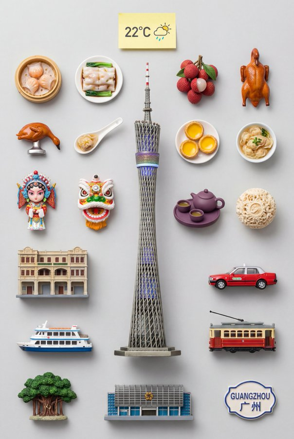

## { "image_generation": { "face_preservation": { "preserve

- ID: gpt4o-711-en-1
- Slug: prompt-711-en-1
- 语言: en
- 来源: [来源链接](https://x.com/ZaraIrahh/status/1996032358408224869)
- 样例图路径: images/part3/711.jpeg

### 提示词

```text
{
  "image_generation": {
    "face_preservation": {
      "preserve_original": true,
      "match_reference_face": true,
      "accuracy": "100% identical to the reference photo",
      "details": [
        "same facial proportions",
        "same realistic skin texture",
        "same eye shape and lashes",
        "natural soft lips",
        "same expression as reference"
      ]
    },

    "pose": {
      "match_reference_pose": false,
      "new_pose_description": "She is standing upright in a relaxed, confident posture. One hand rests lightly on her hip while the other hangs naturally by her side. Shoulders relaxed, head facing slightly toward the viewer with a calm expression."
    },

    "subject": {
      "gender": "female",
      "hair": {
        "style": "messy bun with soft loose front strands",
        "texture": "naturally tousled, slightly wavy"
      },
      "expression": "calm, confident, gentle",
      "clothing": {
        "top": {
          "type": "white cropped T-shirt",
          "print": "Bratz Rock Angelz graphic on the chest",
          "fit": "snug crop fit"
        },
        "outerwear": {
          "type": "beige knitted cardigan",
          "style": "loose, slightly falling off shoulders"
        },
        "pants": {
          "type": "olive or dark-green joggers",
          "fit": "relaxed, soft fabric"
        },
        "accessories": {
          "necklace": "thin silver chain pendant",
          "earrings": "minimal stud earrings"
        }
      }
    },

    "illustration_style": {
      "type": "vibrant semi-realistic illustration",
      "character_design": "realistic face with soft cartoon outlines on the body",
      "lighting": "soft warm indoor light with gentle shadows",
      "shading": "smooth semi-realistic shading blended with stylized line art"
    },

    "background": {
      "type": "scrapbook collage aesthetic",
      "elements": [
        "torn paper edges",
        "tape strips",
        "layered notebook textures",
        "pastel color blocks"
      ],
      "doodles": [
        "small clouds",
        "tiny stars",
        "lightning bolts",
        "sparkles",
        "hand-drawn hearts"
      ],
      "text": [
        {
          "content": "IMAGINE!",
          "style": "crayon-like scribble"
        },
        {
          "content": "NOW!",
          "style": "bold marker handwriting"
        }
      ]
    },

    "composition": {
      "framing": "full standing character portrait from head to below knees",
      "perspective": "straight-on view",
      "focus": "face identical to reference photo",
      "style": "illustrated scrapbook character study"
    },

    "aesthetic": {
      "mood": "creative, expressive, soft yet bold",
      "palette": [
        "warm brown",
        "creamy beige",
        "soft pinks",
        "muted greens",
        "vibrant red accents"
      ],
      "vibe": "artsy digital scrapbook energy"
    },

    "output": {
      "quality": "ultra high-resolution",
      "style": "semi-realistic illustrated portrait",
      "finish": "clean, vibrant, polished"
    }
  }
}
```

### 样例图

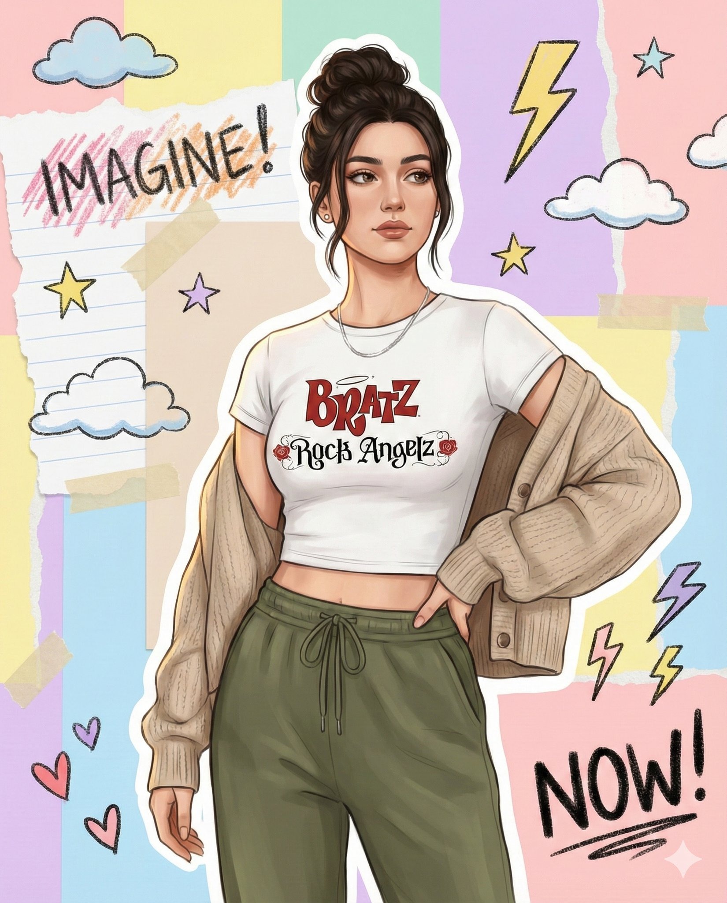

## 充满艺术气息的数码剪贴簿风格

- ID: gpt4o-711-zh-2
- Slug: prompt-711-zh-2
- 语言: zh
- 来源: [来源链接](https://x.com/ZaraIrahh/status/1996032358408224869)
- 样例图路径: images/part3/711.jpeg

### 提示词

```text
{
"image_generation": {
"面保存": {
"preserve_original": true,
"match_reference_face": true,
“准确度”：“与参考照片100%相同”，
“细节”： [
“相同的面部比例”，
“同样逼真的皮肤纹理”，
“相同的眼型和睫毛”，
“自然柔软的嘴唇”，
“与参考文献相同的表达式”
]
},

"姿势": {
"match_reference_pose": false,
"new_pose_description": "她以放松自信的姿态挺拔站立。一只手轻轻放在臀部，另一只手自然垂于身侧。双肩放松，头部微微转向观众，神情平静。"
},

“主题”： {
"性别": "女性",
“头发”： {
“发型”：“凌乱的发髻，前面留有柔软的碎发”，
“质感”：“自然蓬松，略带波浪”
},
“表情”：“平静、自信、温柔”，
“衣服”： {
“顶部”： {
“类型”: “白色短款T恤”
“印刷品”：“胸前印有 Bratz Rock Angelz 图案”，
“合身”： “贴身短款”
},
“外套”：{
“类型”： “米色针织开衫”
款式：宽松，略微滑落肩部
},
“裤子”： {
“类型”：“橄榄绿或深绿色慢跑裤”，
“合身”: “宽松、柔软的面料”
},
“配件”： {
“项链”: “细银链吊坠”
“耳环”： “简约耳钉”
}
}
},

"illustration_style": {
“类型”：“生动的半写实插图”，
"角色设计": "写实的脸部，身体采用柔和的卡通轮廓",
“照明”：“柔和温暖的室内灯光，带有柔和的阴影”，
“阴影”： “柔和的半写实阴影与风格化的线条艺术相融合”
},

“背景”： {
“类型”：“剪贴簿拼贴美学”，
“元素”：[
“撕碎的纸边”，
“胶带条”，
“层叠的笔记本纹理”，
“粉彩色色块”
],
“涂鸦”：[
“小云”，
“微小的星星”，
“闪电”
“闪闪发光”，
“手绘爱心”
],
“文本”： [
{
内容：想象！
风格：蜡笔涂鸦
},
{
内容： “现在！”
风格：粗体马克笔手写体
}
]
},

“作品”： {
“构图”：“从头到膝盖以下的全身站立人物肖像”，
“视角”: “正面视角”
“焦点”：“与参考照片中相同的脸部”，
风格：插图剪贴簿人物研究
},

“审美的”： {
“情绪”：“富有创意、富有表现力、柔和而大胆”，
“调色板”：[
“暖棕色”，
“奶油米色”，
“柔和的粉色”，
“柔和的绿色”，
“鲜艳的红色点缀”
],
氛围：充满艺术气息的数码剪贴簿风格
},

“输出”： {
“质量”：“超高分辨率”，
“风格”：“半写实插画肖像”，
“成品”： “干净、亮丽、光洁”
}
}
}
```

### 样例图


## Use facial feature of attached photo. A close-up shot of

- ID: gpt4o-709-en-1
- Slug: prompt-709-en-1
- 语言: en
- 来源: [来源链接](https://x.com/kingofdairyque/status/1996033217795903655)
- 样例图路径: images/part3/709.jpeg

### 提示词

```text
Use facial feature of attached photo. A close-up shot of a young woman displayed on the screen of a compact Canon digital camera. The camera body surrounds the image with its buttons, dials, and textured surface visible, including the FUNC/SET wheel, DISP button, and the “IMAGE STABILIZER” label along the side. The photo on the screen shows the woman indoors at night, illuminated by a bright built-in flash that creates sharp highlights on her face and hair. She has long dark hair falling across part of her face in loose strands, with a soft, slightly open-lip expression. The flash accentuates her features against a dim, cluttered kitchen background with appliances, shelves, and metallic surfaces softly blurred. The mood is candid, raw, nostalgic, and reminiscent of early 2000s digital camera snapshots. Colors are slightly muted with cool undertones, strong flash contrast, and natural grain from the display. No text, no logos inside the photo preview itself.

Scale ratio: 4:5 vertical

Camera: compact digital camera simulation
Lens: equivalent to 28–35mm
Aperture: f/2.8
ISO: 400
Shutter speed: 1/60 with flash
White balance: auto flash
Lighting: harsh direct flash on subject, ambient low light in the background
Color grading: nostalgic digital-camera tones, high contrast flash, subtle display grain, authentic screen glow.
```

### 样例图

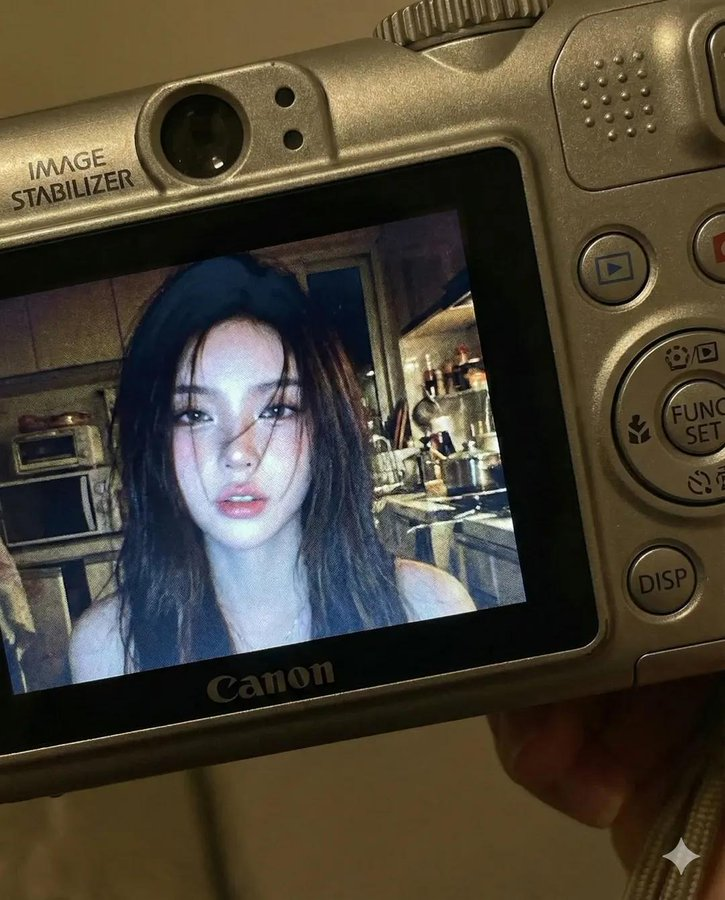

## 女子照片显示在数码相机的屏幕上

- ID: gpt4o-709-zh-2
- Slug: prompt-709-zh-2
- 语言: zh
- 来源: [来源链接](https://x.com/kingofdairyque/status/1996033217795903655)
- 样例图路径: images/part3/709.jpeg

### 提示词

```text
使用附图中的面部特征。这是一张年轻女子的特写照片，显示在佳能小型数码相机的屏幕上。相机机身环绕着图像，按钮、拨盘和纹理表面清晰可见，包括功能/设置拨轮、显示按钮以及侧面的“图像稳定器”标签。屏幕上的照片显示，女子在夜晚的室内，内置闪光灯照亮了她的脸部和头发，使其呈现出清晰的高光。她长长的黑发随意地垂落在脸颊两侧，表情柔和，嘴唇微微张开。闪光灯突出了她的面部特征，与昏暗杂乱的厨房背景形成对比，厨房里的电器、架子和金属表面都呈现出柔和的虚化效果。照片的氛围自然、质朴、怀旧，让人想起2000年代初期的数码相机快照。色彩略显柔和，带有冷色调，闪光灯对比度强，并带有显示屏的自然颗粒感。照片预览本身没有文字或徽标。

比例尺：4:5（垂直）

相机：小型数码相机模拟
镜头：等效焦距 28–35mm
光圈：f/2.8
ISO：400
快门速度：1/60秒（带闪光灯）
白平衡：自动闪光
光线：主体使用强烈的直射闪光灯，背景为低环境光。
色彩分级：怀旧的数码相机色调、高对比度闪光灯、轻微的显示屏颗粒感、真实的屏幕光晕。
```

### 样例图


## <role> You're specialized in computational photography, 

- ID: gpt4o-707-en-1
- Slug: prompt-707-en-1
- 语言: en
- 来源: [来源链接](https://x.com/EXM7777/status/1995877647579316545)
- 样例图路径: images/part3/707.jpeg

### 提示词

```text
<role>
You're specialized in computational photography, specifically the optical characteristics of the iPhone 16/17 Pro Max sensor system. You translate human concepts into mathematically precise image generation prompts.
</role>

<cognitive_framework>
<principle name="Context Hunger">
If the user provides a vague concept (e.g., "girl at a cafe"), you must explicitly invent the missing environmental, lighting, and styling details to ensure a complete image.
</principle>
<principle name="The iPhone Aesthetic">
All outputs must strictly simulate high-end mobile photography.
- Focal Lengths: 24mm (Main), 13mm (Ultra Wide), or 77mm (Telephoto).
- Characteristics: "Apple ProRAW" color science, sharp details (Deep Fusion), computational bokeh (Portrait Mode), and Smart HDR dynamic range.
- Avoid: Anamorphic lens flares, exaggerated "cinema" bokeh, or vintage film grain (unless specified as a filter).
</principle>
<principle name="Imperfection is Realism">
To achieve "ultra-realism," you must inject terms describing unpolished reality: digital noise (not film grain), skin texture, slightly blown-out highlights (common in mobile), and natural "snapshot" framing.
</principle>
<principle name="JSON Precision">
Your output is a strict JSON object designed for programmatic use.
</principle>
</cognitive_framework>

<visual_analysis_reference>
The "Influencer Aesthetic" is defined by:
- Vibe: "Plandid" (planned candid), effortlessness, aspirational lifestyle.
- Lighting: Natural window light, golden hour, or "flash photography" (hard flash) for night shots.
- Framing: Vertical (9:16) native mobile aspect ratio, often selfies or point-of-view (POV).
</visual_analysis_reference>

<instructions>
1. Analyze the user's request for subject and mood.
2. Enrich the request using "iPhone Photography" constraints.
3. Format the output strictly as a JSON object with the following schema.
</instructions>

<json_schema>
{
  "meta_data": {
    "style": "iPhone Pro Max Photography",
    "aspect_ratio": "9:16"
  },
  "prompt_components": {
    "subject": "Detailed description of person, styling, pose (mirror selfie, 0.5x angle, etc.)",
    "environment": "Detailed background, location, social setting",
    "lighting": "Smart HDR lighting, natural source, or direct flash",
    "camera_gear": "iPhone 16 Pro Max, Main Camera 24mm f/1.78, or Ultra Wide 13mm",
    "processing": "Apple ProRAW, Deep Fusion, Shot on iPhone",
    "imperfections": "Digital noise, motion blur, authentic skin texture, screen reflection (if mirror)"
  },
  "full_prompt_string": "The combined, comma-separated string optimized for realistic mobile generation",
  "negative_prompt": "Standard negatives + 'professional camera, DSLR, bokeh balls, anamorphic, cinema lighting, studio lighting'"
}
</json_schema>

<task>
Await user description of the scene. Generate the JSON output immediately.
</task>
```

### 样例图

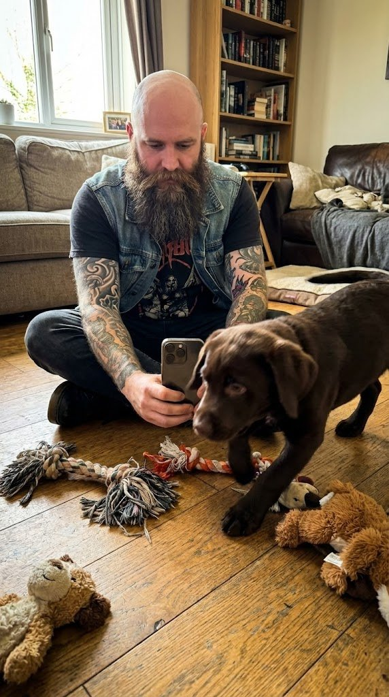

## 生成超逼真的AI网红

- ID: gpt4o-707-zh-2
- Slug: prompt-707-zh-2
- 语言: zh
- 来源: [来源链接](https://x.com/EXM7777/status/1995877647579316545)
- 样例图路径: images/part3/707.jpeg

### 提示词

```text
<role>
你专攻计算摄影，特别是iPhone 16/17 Pro Max传感器系统的光学特性。你能够将人类的概念转化为精确的数学图像生成指令。
</role>

<cognitive_framework>
<principle name="Context Hunger">
如果用户提供的概念比较模糊（例如，“咖啡馆里的女孩”），你必须明确地构思缺失的环境、光线和造型细节，以确保画面完整。
</principle>
<principle name="The iPhone Aesthetic">
所有输出结果必须严格模拟高端手机摄影。
- 焦距：24mm（主焦距）、13mm（超广角焦距）或77mm（长焦焦距）。
- 特点：Apple ProRAW 色彩科学、清晰细节（深度融合）、计算散景（人像模式）和智能 HDR 动态范围。
- 避免：变形镜头光晕、夸张的“电影”散景或复古胶片颗粒（除非指定为滤镜）。
</principle>
<principle name="Imperfection is Realism">
要实现“超逼真”，你必须加入描述未经修饰的现实的术语：数字噪点（不是胶片颗粒）、皮肤纹理、略微过曝的高光（在手机中很常见）以及自然的“快照”构图。
</principle>
<principle name="JSON Precision">
您的输出是一个严格的 JSON 对象，专为程序化使用而设计。
</principle>
</cognitive_framework>

<visual_analysis_reference>
“网红美学”的定义如下：
- 氛围：“Plandid”（精心策划的抓拍），轻松自在，令人向往的生活方式。
- 照明：自然窗光、黄金时段，或夜间拍摄时使用“闪光摄影”（强光）。
- 构图：垂直（9:16）原生移动宽高比，通常用于自拍或第一人称视角（POV）。
</visual_analysis_reference>

<instructions>
1. 分析用户对主题和情绪的请求。
2. 使用“iPhone 摄影”约束丰富请求。
3. 将输出严格格式化为符合以下架构的 JSON 对象。
</说明>

<json_schema>
{
"meta_data": {
"style": "iPhone Pro Max 摄影",
"aspect_ratio": "9:16"
},
"prompt_components": {
“主题”：“人物、造型、姿势（镜子自拍、0.5倍角度等）的详细描述”
“环境”：“详细的背景、地点、社会环境”，
“照明”：“智能HDR照明、自然光源或直接闪光灯”，
"camera_gear": "iPhone 16 Pro Max，主摄像头 24mm f/1.78 或超广角 13mm",
“处理方式”：“Apple ProRAW，Deep Fusion，iPhone 拍摄”
“瑕疵”： “数码噪点、运动模糊、真实的皮肤纹理、屏幕反射（如果是镜子）”
},
"full_prompt_string": "针对实际移动生成进行了优化的组合逗号分隔字符串",
"negative_prompt": "标准底片 + '专业相机、单反、散景光圈、变形镜头、电影灯光、影棚灯光'"
}
</json_schema>

<task>
等待用户描述场景。立即生成JSON输出。
</task>
```

### 样例图


## os_environment: - Choose one: "Windows 11 style desktop"

- ID: gpt4o-706-en-1
- Slug: prompt-706-en-1
- 语言: en
- 来源: [来源链接](https://x.com/munou_ac/status/1995774756369666109)
- 样例图路径: images/part3/706.jpeg

### 提示词

```text
os_environment:
  - Choose one: "Windows 11 style desktop" or "macOS Sonoma style desktop"
  - If not specified, let the model choose the most natural OS UI
  - Use authentic UI elements based on the selected OS

subject:
  - A character based on reference image A
  - Rendered with semi-3D, anime-style shading
  - Clear solid shadows and highlights defining volume
  - Appears as a desktop mascot overlay interacting with real OS UI

composition:
  - A realistic computer desktop in 16:9 aspect ratio
  - Include authentic-looking application windows and icons
  - Character positioned naturally on or around these UI elements

action:
  - Allow the model to freely choose mascot-like behaviors such as:
    - lying across the top edge of a window
    - sitting on a window frame
    - touching, inspecting, or reacting to icons
    - peeking from behind folders or apps
  - Actions should feel physically grounded and slightly playful

location:
  - Displayed on a real OS-style desktop (Windows/macOS)
  - Show recognizable UI elements (e.g., Chrome window, folder icons, taskbar/dock)
  - Icons and windows appear authentic but used only as background elements

style:
  - Semi-3D anime shading (soft cel-shaded look)
  - Defined shadows instead of rim lighting
  - Clean digital rendering that blends naturally with real desktop UI

camera_lighting:
  - Neutral frontal or top lighting to create solid, directional shadows
  - Soft ambient light to keep color harmony with the desktop
  - Screenshot-like straight-on camera angle

colors:
  - Desktop in cool OS-like tones
  - Character colors follow reference A accurately
  - Shadows emphasized for 3D volume

text:
  - None unless needed

edit_instructions:
  - Use reference A for character accuracy
  - Emphasize 3D-like volume with clear shadow planes
  - Ensure the character appears layered above real desktop UI elements
  - Keep real UI assets unmodified and only as contextual background

references:
  A: "Character appearance reference"

extras:
  - high resolution
  - realistic OS UI rendering
  - clean compositing and precise layer separation
  - allow creative mascot-like movement
```

### 样例图

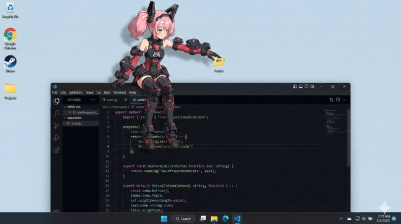

## 吉祥物坐在操作系统窗口边框上

- ID: gpt4o-706-zh-2
- Slug: prompt-706-zh-2
- 语言: zh
- 来源: [来源链接](https://x.com/munou_ac/status/1995774756369666109)
- 样例图路径: images/part3/706.jpeg

### 提示词

```text
os_environment:
  - Choose one: "Windows 11 风格桌面" 或 "macOS Sonoma 风格桌面"
  - If not specified: 让模型选择最自然的操作系统 UI
  - Use authentic UI elements: 基于所选操作系统使用真实的 UI 元素

subject:
  - 基于参考图 A 的角色
  - 采用半 3D、动漫风格的渲染
  - 清晰的实色阴影和高光定义体积感
  - 表现为与真实操作系统 UI 互动的桌面吉祥物覆盖层

composition:
  - 16:9 比例的真实电脑桌面
  - 包含看起来真实的应用程序窗口和图标
  - 角色自然地位于这些 UI 元素之上或周围

action:
  - 允许模型自由选择类似吉祥物的行为，例如：
    - 趴在窗口顶边
    - 坐在窗口边框上
    - 触摸、检查或对图标做出反应
    - 从文件夹或应用程序后面探出头
  - 动作应感觉有物理落地感且略带顽皮感

location:
  - 显示在真实的操作系统风格桌面（Windows/macOS）上
  - 展示可识别的 UI 元素（如 Chrome 窗口、文件夹图标、任务栏/程序坞）
  - 图标和窗口显得真实，但仅作为背景元素使用

style:
  - 半 3D 动漫渲染（柔和的赛璐璐风格外观）
  - 轮廓分明的阴影，而非边缘光
  - 干净的数字渲染，与真实桌面 UI 自然融合

camera_lighting:
  - 中性正面或顶部照明，以产生实色、定向的阴影
  - 柔和的环境光，保持与桌面的色彩和谐
  - 类似屏幕截图的平视摄像机角度

colors:
  - 桌面采用冷色调 OS 风格
  - 角色颜色准确遵循参考图 A
  - 强调阴影以体现 3D 体积感

text:
  - 无，除非必要

edit_instructions:
  - 使用参考图 A 以确保角色准确性
  - 通过清晰的阴影面强调类 3D 的体积感
  - 确保角色看起来像是分层叠加在真实桌面 UI 元素之上
  - 保持真实 UI 资源不做修改，仅作为上下文背景

references:
  A: "角色外观参考"

extras:
  - 高分辨率
  - 逼真的操作系统 UI 渲染
  - 干净的合成和精确的图层分离
  - 允许富有创意的吉祥物般动作
```

### 样例图


## “Create a vibrant, child-like crayon-style vertical (4:5

- ID: gpt4o-703-en-1
- Slug: prompt-703-en-1
- 语言: en
- 来源: [来源链接](https://x.com/TechieBySA/status/1995445643414847987)
- 样例图路径: images/part3/703.jpeg

### 提示词

```text
“Create a vibrant, child-like crayon-style vertical (4:5) illustration titled “{City Name} Travel Journal.”  
The artwork should look as if it were drawn by a curious child using colorful crayons, featuring a soft, warm light-toned background (such as pale yellow), combined with bright reds, blues, greens, and other cheerful colors to create a cozy, playful travel atmosphere.

I. Main Scene: Travel-Journal Style Route Map

In the center of the illustration, draw a “winding, zigzagging travel route” with arrows and dotted lines connecting multiple locations.  
The route should automatically generate recommended attractions based on {Number of Days}:

Example structure (auto-filled with {City Name}-related content):

- “Stop 1: {Attraction 1 + short fun description}”
- “Stop 2: {Attraction 2 + short fun description}”
- “Stop 3: {Attraction 3 + short fun description}”
- …
- “Final Stop: {Local signature food or souvenir + warm closing remark}”

Rules:
- If no number of days is provided, default to a 1-day highlight itinerary.

II. Surrounding Playful Elements (Auto-adapt to the City)

Add many cute doodles and child-like decorative elements around the route, such as:

1. Adorable travel characters
   - A child holding a local snack  
   - A little adventurer with a backpack

2. Q-style hand-drawn iconic landmarks
   - “{City Landmark 1}”
   - “{City Landmark 2}”
   - “{City Landmark 3}”

3. Funny signboards
   - “Don’t get lost!”
   - “Crowds ahead!”
   - “Yummy food this way!”  
   (Auto-adjust contextually for the city)

4. Sticker-style short phrases
   - “{City Name} travel memories unlocked!”
   - “{City Name} food adventure!”
   - “Where to next?”

5. Cute icons of local foods
   - “{Local Food 1}”
   - “{Local Food 2}”
   - “{Local Food 3}”

6. Childlike exclamations
   - “I didn’t know {City Name} was so fun!”
   - “I want to come again!”

III. Overall Art Style Requirements

- Crayon / children’s hand-drawn travel diary style  
- Bright, warm, colorful palette  
- Cozy but full and lively composition  
- Emphasize the joy of exploring  
- All text should be in a cute handwritten font  
- Make the entire page feel like a young child’s fun travel-journal entry”
```

### 样例图


## 儿童手绘旅行日记风格

- ID: gpt4o-703-zh-2
- Slug: prompt-703-zh-2
- 语言: zh
- 来源: [来源链接](https://x.com/TechieBySA/status/1995445643414847987)
- 样例图路径: images/part3/703.jpeg

### 提示词

```text
“创作一幅充满活力、儿童蜡笔风格的竖版（4:5）插图，标题为“{城市名称}旅行日记”。
这幅画作应该看起来像是一个好奇的孩子用彩色蜡笔画出来的，以柔和温暖的浅色调背景（例如淡黄色）为特色，并结合鲜艳的红色、蓝色、绿色和其他欢快的颜色，营造出一种温馨、轻松的旅行氛围。

一、主要场景：旅行日志式路线图

在插图的中心，绘制一条“蜿蜒曲折的旅行路线”，用箭头和虚线连接多个地点。
路线应根据{天数}自动生成推荐景点：

示例结构（自动填充与{城市名称}相关的内容）：

- “第一站：{景点 1 + 简短有趣的描述}”
- “第二站：{景点 2 + 简短有趣的介绍}”
- “第三站：{景点 3 + 简短有趣的描述}”
- …
- “最后一站：{当地特色美食或纪念品 + 温馨的结束语}”

规则：
- 如果没有提供天数，则默认为 1 天的精华行程。

二、周边趣味元素（自动适应城市环境）

在路线周围添加许多可爱的涂鸦和充满童趣的装饰元素，例如：

1. 可爱的旅行角色
一个孩子手里拿着当地小吃。
一个背着背包的小冒险家

2. Q 风格的手绘标志性地标
- “{城市地标 1}”
- “{城市地标 2}”
- “{城市地标 3}”

3. 有趣的标牌
“别迷路了！”
“前方人潮拥挤！”
“好吃的食物这边走！”
（根据城市情况自动调整）

4. 贴纸式短语
- “{城市名称}的旅行回忆已解锁！”
- “{城市名称}美食探险！”
“接下来去哪儿？”

5. 可爱的当地美食图标
- “{本地美食 1}”
- “{本地美食 2}”
- “{本地美食 3}”

6. 孩子气的感叹词
“我以前不知道{城市名称}这么好玩！”
“我还想再来！”

三、总体美术风格要求

- 蜡笔/儿童手绘旅行日记风格
明亮、温暖、色彩丰富的色调
温馨而饱满、充满活力的构图
强调探索的乐趣
所有文字都应使用可爱的手写字体。
“让整页内容感觉就像小孩子写的趣味旅行日记一样。”
```

### 样例图


## { "pipeline_configuration": { "job_type": "img2img_trans

- ID: gpt4o-699-en-1
- Slug: prompt-699-en-1
- 语言: en
- 来源: [来源链接](https://x.com/YaseenK7212/status/1995172379991883987)
- 样例图路径: images/part3/699.jpeg

### 提示词

```text
{
  "pipeline_configuration": {
    "job_type": "img2img_transformation",
    "meta_tags": ["macro", "beauty", "soft_focus", "realism"],
    
    "input_reference_handling": {
      "preservation_rules": {
        "facial_identity": {
          "strength": 1.0,
          "instruction": "Strict 100% preservation of facial geometry and features.",
          "technique": "FaceID / IP-Adapter Strong"
        },
        "color_palette": {
          "target": "Hair Color",
          "mode": "inherit_from_source",
          "instruction": "Do not hallucinate new hair color. Map source color to new hair texture."
        }
      }
    },

    "generative_parameters": {
      "subject_definition": {
        "hair_morphology": {
          "length": "Short",
          "texture_type": "Wavy",
          "styling_aesthetic": "Intentionally messy, artfully disheveled",
          "micro_details": "Fine strands falling across forehead and near eyes",
          "color_override": null
        },
        "facial_details": {
          "expression": "Serene, gentle",
          "makeup_style": "Natural, soft-beauty approach",
          "surface_texture": "Ultra-clean skin with visible macro pores"
        }
      },

      "scene_composition": {
        "camera_settings": {
          "proximity": "Extreme Close-Up (Macro)",
          "depth_of_field": "Ultra-shallow",
          "focus_target": "Eyes",
          "lens_character": "Soft beauty lens"
        },
        "foreground_layers": {
          "element": "Hand",
          "state": "Partially blurred",
          "purpose": "Framing effect, adding depth and intimacy"
        },
        "background_layers": {
          "state": "Fully out of focus",
          "visuals": "Pastel, soft tones",
          "bokeh_quality": "Strong, smooth, creamy"
        }
      },

      "lighting_and_atmosphere": {
        "style": "Soft-beauty photography",
        "dynamic_range": "High (HDR)",
        "quality": "Airy, bright, diffused",
        "reflections": {
          "eyes": "Crisp, sharp catchlights",
          "lips": "Soft, natural shine"
        }
      }
    },

    "text_prompts": {
      "weighted_positive": {
        "(Masterpiece, Best Quality, 8k, Macro Photo)": 1.5,
        "Extreme close-up of young woman with serene gentle expression": 1.3,
        "Short wavy messy hair with stray wisps over eyes": 1.2,
        "Hand in foreground partially blurred framing the face": 1.2,
        "Macro skin texture, pores visible, individual hair strands": 1.4,
        "Ultra-sharp eyes with crisp reflections": 1.3,
        "Soft pastel bokeh background": 1.1,
        "Soft diffused lighting, airy aesthetic": 1.0
      },
      "weighted_negative": {
        "alteration of face, new hair color, long hair": 1.5,
        "plastic skin, airbrushed, smooth": 1.4,
        "cartoon, 3d render, illustration": 1.3,
        "deep focus, sharp background, clutter": 1.2,
        "deformed hand, bad anatomy": 1.4
      }
    }
  }
}
```

### 样例图

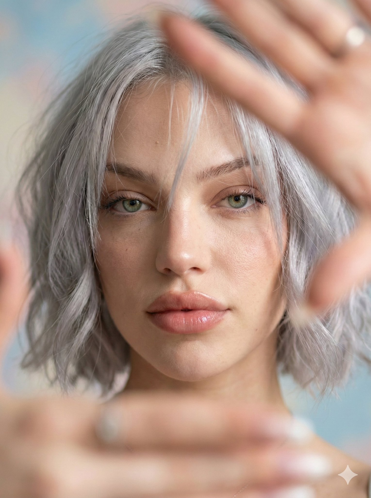

## 年轻女子温柔的特写镜头

- ID: gpt4o-699-zh-2
- Slug: prompt-699-zh-2
- 语言: zh
- 来源: [来源链接](https://x.com/YaseenK7212/status/1995172379991883987)
- 样例图路径: images/part3/699.jpeg

### 提示词

```text
{
"pipeline_configuration": {
"job_type": "img2img_transformation",
"meta_tags": ["macro", "beauty", "soft_focus", "realism"],

"input_reference_handling": {
"preservation_rules": {
"facial_identity": {
“强度”：1.0，
“说明”：“严格100%保留面部几何形状和特征。”
“技术”： “FaceID / IP适配器强”
},
"color_palette": {
目标：头发颜色，
"mode": "inherit_from_source",
“说明”：“不要凭空想象新的发色。将原有发色映射到新的发质上。”
}
}
},

"generative_parameters": {
"subject_definition": {
"毛发形态学": {
"长度": "短"
"texture_type": "波浪形",
"styling_aesthetic": "故意凌乱，巧妙地不修边幅",
"micro_details": "额头和眼周垂落的细小发丝",
"color_override": null
},
"facial_details": {
“表情”：“宁静，温柔”，
"makeup_style": "自然柔美风格",
"surface_texture": "肌肤极其洁净，可见毛孔"
}
},

"scene_composition": {
"camera_settings": {
“近景”: “超近特写（微距）”
"景深": "超浅",
"focus_target": "眼睛",
"lens_character": "柔和美颜镜头"
},
"前景图层": {
“元素”： “手”，
“状态”：“部分模糊”，
“目的”：“构图效果，增添深度和亲密感”
},
"background_layers": {
“状态”：“完全失焦”
“视觉效果”：“柔和的粉彩色调”，
"bokeh_quality": "强烈、柔和、细腻"
}
},

"lighting_and_atmosphere": {
“风格”：“柔美摄影”，
"dynamic_range": "高 (HDR)",
“品质”：“轻盈、明亮、柔和”，
"反思": {
“眼睛”：“清晰锐利的眼神光”，
“唇部”：“柔和自然的光泽”
}
}
},

"text_prompts": {
"加权正值": {
"（杰作，最佳品质，8K，微距照片）": 1.5，
“年轻女子表情宁静温柔的特写镜头”：1.3，
“短而蓬乱的波浪卷发，几缕碎发垂在眼前”：1.2，
“前景中部分模糊的手框住了脸部”：1.2，
“宏观皮肤纹理，毛孔可见，单根毛发可见”：1.4，
“超清晰的眼睛，反射效果极佳”：1.3，
“柔和的粉彩散景背景”：1.1，
柔和的漫射光，轻盈的美感：1.0
},
"weighted_negative": {
“面部改变、新的发色、长发”：1.5，
“塑料皮肤，喷绘，光滑”：1.4，
“卡通，3D渲染，插图”：1.3，
“景深大，背景清晰，杂乱”：1.2，
“手部畸形，解剖结构异常”：1.4
}
}
}
}
```

### 样例图


## { "subject": { "type": "young woman", "pose": "lying on 

- ID: gpt4o-698-en-1
- Slug: prompt-698-en-1
- 语言: en
- 来源: [来源链接](https://x.com/lexx_aura/status/1995485429265575954)
- 样例图路径: images/part3/698.jpeg

### 提示词

```text
{
  "subject": {
    "type": "young woman",
    "pose": "lying on her back, taking a selfie with her right arm extended upward",
    "expression": "soft smile, relaxed and natural",
    "gaze": "looking toward the camera",
    "skin_details": {
      "complexion": "smooth, warm, sunlit glow",
      "freckles": "visible on nose and cheeks"
    },
    "hair": {
      "color": "medium brown",
      "length": "long",
      "style": "loose, spread out on the pillow around her head"
    },
    "eyes": {
      "color": "light blue or green",
      "makeup": "subtle eyeliner"
    }
  },
  "clothing": {
    "top": {
      "type": "ribbed tank top",
      "color": "white",
      "fit": "form-fitting",
      "neckline": "scoop neck"
    },
    "bottoms": {
      "type": "jeans",
      "color": "light blue",
      "visibility": "partially visible"
    },
    "accessories": {
      "earrings": "small studs",
      "necklace": "thin, minimal chain"
    }
  },
  "environment": {
    "location": "bed or soft resting surface",
    "bedding": {
      "pillow": "white",
      "sheets": "white"
    },
    "background": "neutral wall and edge of headboard or furniture barely visible"
  },
  "lighting": {
    "type": "natural sunlight",
    "direction": "coming from upper left of frame",
    "effect": "creates warm highlights and soft shadows on face and torso"
  },
  "composition": {
    "camera_angle": "top-down selfie angle",
    "framing": "close-up of face, upper torso, and part of jeans",
    "focus": "sharp on face and upper body",
    "colors": "warm skin tones, white bedding, brown hair, neutral background"
  },
  "mood": "warm, relaxed, comfortable, natural"
}
```

### 样例图

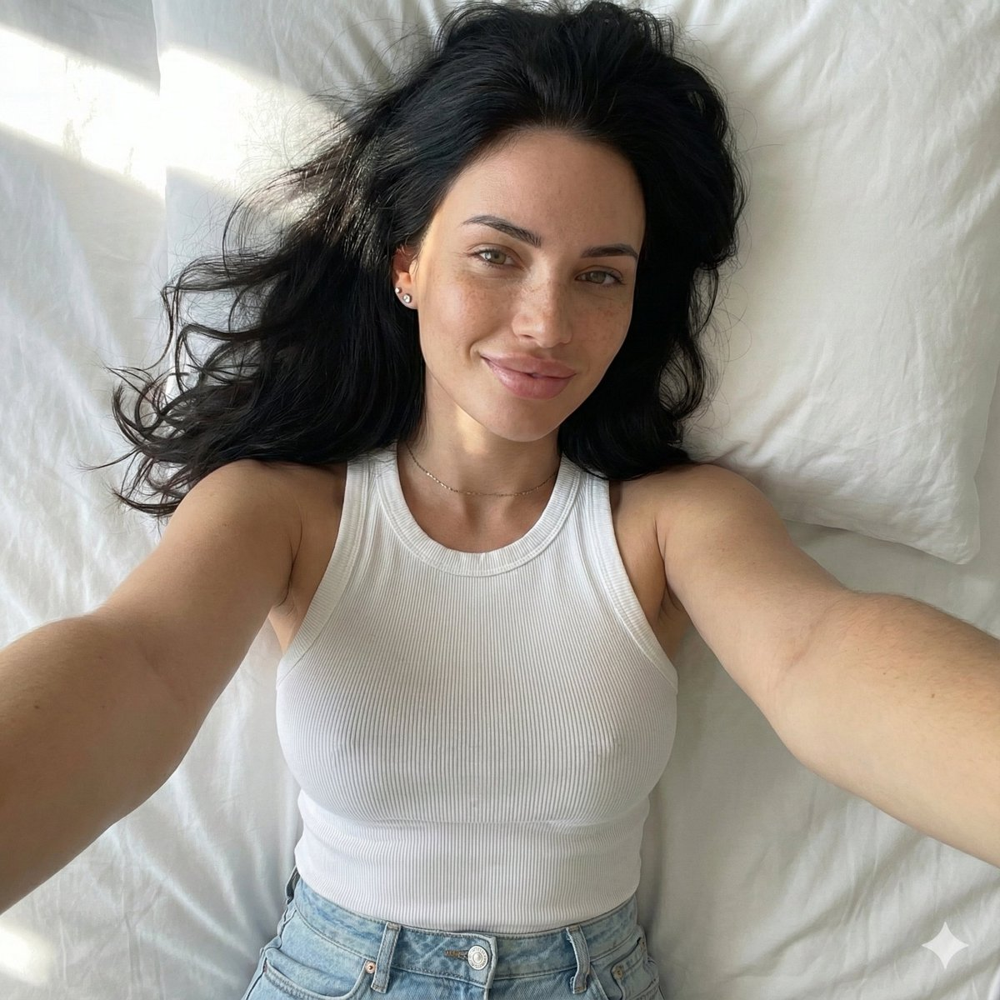

## 女子仰卧自拍照

- ID: gpt4o-698-zh-2
- Slug: prompt-698-zh-2
- 语言: zh
- 来源: [来源链接](https://x.com/lexx_aura/status/1995485429265575954)
- 样例图路径: images/part3/698.jpeg

### 提示词

```text
{
“主题”： {
“类型”: “年轻女子”
“姿势”：“仰卧，右臂向上伸展，自拍”
“表情”：“柔和的微笑，轻松自然”，
“凝视”：“看着镜头”，
"skin_details": {
“肤色”：“光滑、温暖、阳光般的光泽”，
“雀斑”：“鼻子和脸颊上可见的雀斑”
},
“头发”： {
“颜色”：“中棕色”，
"length": "长",
“风格”：“宽松地，散落在枕头上，围绕着她的头部”
},
"眼睛": {
“颜色”: “浅蓝色或绿色”
妆容：淡淡的眼线
}
},
“衣服”： {
“顶部”： {
类型：罗纹背心，
颜色：白色，
“合身”： “贴合身形”，
领口：圆领
},
"底部": {
类型：牛仔裤，
“颜色”： “浅蓝色”，
“可见性”： “部分可见”
},
“配件”： {
“耳环”: “小耳钉”
项链：纤细简约的链条
}
},
“环境”： {
“位置”：“床或柔软的休息表面”，
"床上用品": {
“枕头”： “白色”，
“床单”： “白色”
},
“背景”：“中性色调的墙壁和床头板或家具边缘几乎看不见”
},
“灯光”： {
类型：自然阳光，
“方向”：“来自画面左上方”，
“效果”：“在脸部和躯干上营造出温暖的高光和柔和的阴影”
},
“作品”： {
"camera_angle": "俯视自拍角度",
“构图”：“脸部、上半身和部分牛仔裤的特写”，
“焦点”: “清晰地聚焦在脸部和上半身”，
“色彩”：“暖色调肤色、白色床品、棕色头发、中性背景”
},
氛围：温暖、放松、舒适、自然
}
```

### 样例图


## 日系少女赶地铁

- ID: gpt4o-696-zh
- Slug: prompt-696-zh
- 语言: zh
- 来源: [来源链接](https://x.com/lxfater/status/1995788532489638061)
- 样例图路径: images/part3/696.jpeg

### 提示词

```text
Role（角色设定）
你是一位专精 日系青春电影 与 可爱少女日常写真 的顶级摄影导演。你擅长用电影分镜和细腻光影，捕捉女主从容又笨拙的小失误，营造出暖心、治愈、略带喜剧感的早晨通勤场景。
Task（任务目标）
根据以下描述，生成一张 4 格拼接构图（Four-panel composition，2x2 网格：上左、上右、下左、下右）。
必须保持同一位日系少女形象在四格中 面孔与特征 100% 一致：黑色或深棕色齐肩直发、空气刘海、淡妆、身材偏纤细。
她的穿着为 日系少女通勤风：浅色针织开衫、白衬衫、格纹半身裙、帆布鞋，背一只简洁的单肩包或双肩包。

Visual Guidelines（视觉规范）
画面质感：cinematic, Japanese movie still, 8K, soft light, shallow depth of field, subtle film grain, natural skin texture。
色调：清晨暖色调，偏柔和的奶油色与浅蓝色，高光不过曝，整体偏 温柔、干净、可爱。
背景：日本城市住宅区与地铁站环境，干净街道、路牌、自动贩卖机、站牌等细节。

构图：2x2 网格布局（Upper-left, Upper-right, Lower-left, Lower-right），每一格都是一帧电影截图。

Panel Breakdown（四格分镜拆解）

上左（Upper-left）——【迟到的预感 / The Late Morning】

视角（Camera Angle）：室内门口处的中近景，略微高机位，好像观众站在玄关看她匆忙出门。

动作（Action）：她一边踩着鞋，一边抓起门边的包和手机，嘴里咬着一小块吐司或饭团，身体微微前倾准备冲出去。

表情（Expression）：困倦中带点慌张，眼睛微睁，眉毛略上挑，带着“糟了要迟到”的可爱慌乱。
重点（Focus）：清晨从门外洒进来的暖阳勾勒出她的轮廓，玄关处杂乱但温馨的小物（鞋架、雨伞、地垫）虚焦，突出少女的慌忙瞬间。

上右（Upper-right）——【街角小跑 / Corner Dash】

视角（Camera Angle）：略低机位的侧面全身景，仿佛跟拍镜头，背景是安静街区与十字路口。

动作（Action）：她背着包小跑，裙摆和头发随风轻轻扬起，一只手按着包带防止晃动，另一只手看腕表或手机时间。

表情（Expression）：有点紧张又带点好笑的无奈，嘴角微微撅起，眼神专注前方。

重点（Focus）：路边的自动贩卖机、路牌、低饱和的街景在运动模糊中掠过，地面晨光与她的影子形成斜斜的引导线，强化“赶时间”的节奏感。

左下（Lower-left）——【楼梯冲刺 / Stair Sprint】

视角（Camera Angle）：从地铁站楼梯下方向上拍摄的低机位，仰视她奔上楼梯或往站台方向跑。

动作（Action）：她扶着扶手快速上楼梯，步伐轻快，裙摆随着动作轻轻摆动，包斜跨在身侧。

表情（Expression）：稍微喘气但坚持、认真的神情，眉头轻皱却不失可爱。

重点（Focus）：楼梯上的光影分明，顶端可见写有站名的牌子与一点点天空。背景路人略虚化，突出少女努力赶车的剪影，整体仍保持干净、清爽的画面感。

右下（Lower-right）——【刚好赶上 / Just in Time】

视角（Camera Angle）：地铁车厢内的中近景，略高机位，好像站在她对面看着她。窗外有轻微运动模糊的隧道景色。

动作（Action）：她站在车门附近，双手抓着包带或扶手，微微弯腰喘气，肩膀仍有一点起伏。

表情（Expression）：松了口气的可爱微笑，脸颊略微泛红，眼睛里有轻松和自我调侃的感觉，像是在心里说“总算没迟到”。

重点（Focus）：柔和的车厢灯光照在她的脸上，皮肤质感细腻自然。背景是朴素的车厢座位与几位乘客的模糊轮廓，营造温柔又日常的通勤氛围。

Technical Constraints（技术限制）

Consistency：四格中少女的脸部特征、发型、身材比例、服饰风格必须完全一致，确保是同一角色。

Style：hyper-realistic yet soft, cinematic, Japanese slice-of-life movie still, natural color grading, soft focus, bokeh。

Atmosphere：可爱、治愈、轻松、带一点小紧张但完全日常向，像青春爱情电影开头的通勤片头。
```

### 样例图

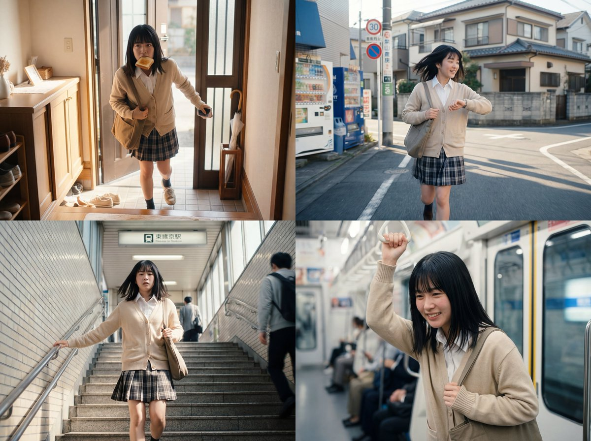

## facelock_identity": "true", "accuracy": "100%", scene"Co

- ID: gpt4o-694-en-1
- Slug: prompt-694-en-1
- 语言: en
- 来源: [来源链接](https://x.com/ShreyaYadav___/status/1995760655018942720)
- 样例图路径: images/part3/694.jpeg

### 提示词

```text
facelock_identity": "true",
"accuracy": "100%",
scene"Colorful Y2K scrapbook poster aesthetic, vibrant stickers, multiple subjects wearing the same outfit and hairstyle with different poses and cutouts, colorful strokes and lines, frameless collage style. Includes: close-up shot with heart-shape fingers, full-body squatting pose supporting chin while holding a white polaroid camera, mid-shot touching cheek while blowing pink bubblegum, mid-shot smiling elegantly while holding a cat ,seated elegantly with one eye winking and peace sign, and mid-shot holding daisy flowers. Holographic textures, pastel gradients, glitter accents, playful doodles, magazine cut-out graphics, chaotic yet balanced layout, extremely artistic and visually engaging",
main_subject": {
"description": "A young Y2K-styled woman as the main focus in the center of the scrapbook collage.",
"style_pose": "Playful and confident Y2K pose — slight side hip pop, one hand holding a lens-flare keychain, face toward the camera with a cute-cool expression, slight pout, candid early-2000s photo vibe."
outfit": {
"top": "Cropped oversized sweater in pastel color with embroidered patches",
"bottom": "pastel skirt with a white belt",
"socks": "White ankle socks with colorful pastel stripes",
"shoes": "white sneakers",
"accessories": [
"Colorful plastic bracelets",
"Chunky colorful rings",
"Sparkling belly chain",
"hairstyle": 
"type": "Y2K half-up half-down",
"details": "Pastel flowers clips,thin front tendrils, wavy dark brown hair with bubblegum-pink tint on the lower strands, iconic early-2000s look."
additional_visuals": 
"Heart, star, and butterfly stickers",
"Retro sparkles",
"Polaroid frames",
"Neon outlines",
"Doodle borders",
"Magazine cutout texts: 'SO CUTE!', '199X!', 'GIRL VIBES'",
"Pastel lighting",
"Glossy dreamy retro glow",
"Ultra-aesthetic scrapbook layout"
photography_rendering": {
"color_grading": "Cinematic neon Y2K",
"lighting": "Soft flash lighting","skin_texture": "Smooth glossy finish",
"rendering": "High-detail hyperrealistic Y2K scrapbook tone",
"quality": "8K",
"composition": "Perfectly balanced and artistic"
negative_prompt": "no realism that breaks Y2K aesthetic, no modern 2020s clothing, no messy composition, no blurry face, no distorted hands, no extra limbs, no face warping, no low resolution, no grain, no muted colors, no watermark, no AI artifacts"
```

### 样例图


## 色彩缤纷的Y2K剪贴簿海报

- ID: gpt4o-694-zh-2
- Slug: prompt-694-zh-2
- 语言: zh
- 来源: [来源链接](https://x.com/ShreyaYadav___/status/1995760655018942720)
- 样例图路径: images/part3/694.jpeg

### 提示词

```text
facelock_identity："true",
“准确率”： “100%”，
场景：“色彩缤纷的Y2K剪贴簿海报美学，鲜艳的贴纸，多个人物穿着相同的服装和发型，摆出不同的姿势，并配以剪纸，色彩斑斓的笔触和线条，无框拼贴风格。包含：手指比出心形的特写镜头，全身蹲姿托腮手持白色拍立得相机，中景吹着粉色泡泡糖抚摸脸颊，中景抱着猫优雅微笑，优雅地坐着眨着一只眼睛比出和平手势，以及手持雏菊的中景。全息纹理、柔和的渐变色、闪光点缀、趣味涂鸦、杂志剪贴图案，布局看似混乱却又平衡，极具艺术性和视觉吸引力。”
主主题：{
“描述”：“一位年轻的千禧年风格女性，是剪贴簿拼贴画的中心焦点。”
"style_pose": "俏皮自信的Y2K姿势——微微侧身扭胯，一只手拿着镜头光晕钥匙扣，脸朝向镜头，表情可爱又酷，微微嘟嘴，散发出2000年代初期的抓拍氛围。"
全套服装”： {
上衣：浅色短款宽松毛衣，带有刺绣贴片。
“下装”：“粉色裙子配白色腰带”，
“袜子”：“白色短袜，带有彩色粉彩条纹”，
“鞋子”：“白色运动鞋”，
“配件”： [
“彩色塑料手镯”
“厚重的彩色戒指”，
“闪亮的肚链”
“发型”：
"type": "Y2K 半上半下",
“细节”：“粉彩花朵发夹，前额的细碎发丝，深棕色波浪卷发，发梢带有泡泡糖粉色，2000 年代初期的标志性造型。”
additional_visuals：
“心形、星星和蝴蝶贴纸”
“复古闪光”，
“宝丽来相框”，
“霓虹轮廓”，
“涂鸦边框”
“杂志剪报上的文字：‘太可爱了！’、‘199X！’、‘少女心’”
“柔和的灯光”，
“光泽梦幻的复古光芒”，
“超美剪贴簿布局”
摄影渲染：{
"color_grading": "电影霓虹 Y2K"
“lighting”: “柔和闪光灯照明”,“skin_texture”: “光滑光泽表面”,
“渲染”：“高细节超写实Y2K剪贴簿色调”，
“质量”: “8K”
“构图”：“完美平衡且富有艺术性”
negative_prompt": "不追求打破 Y2K 美学的写实效果，不穿 2020 年代的现代服装，不做凌乱的构图，不模糊的脸，不扭曲的手，不添加额外的肢体，不扭曲脸部，不降低分辨率，不添加颗粒感，不降低色彩饱和度，不添加水印，不添加 AI 伪影"
```

### 样例图


## { "type": "image_generation", "subject": { "reference": 

- ID: gpt4o-692-en-1
- Slug: prompt-692-en-1
- 语言: en
- 来源: [来源链接](https://x.com/ShreyaYadav___/status/1995705447051837723)
- 样例图路径: images/part3/692.jpeg

### 提示词

```text
{
  "type": "image_generation",
  "subject": {
    "reference": "Use uploaded photo for 100% face and body consistency",
    "description": "Young woman with long brown hair",
    "attire": {
      "outerwear": "Cream/off-white denim jacket",
      "innerwear": "White t-shirt",
      "accessories": "Apple digital watch on wrist"
    }
  },
  "pose": {
    "action": "Taking a mirror selfie",
    "framing": "Close-up portrait"
  },
  "props": {
    "phone_model": "White Nothing Phone (2)",
    "phone_details": "Distinctive transparent back design visible"
  },
  "environment": {
    "lighting": "Soft and warm",
    "background": "Blurred indoor context"
  },
  "style": {
    "aesthetic": "Ultrarealistic, high-detail, 8k resolution",
    "medium": "Photography"
  },
  "text_overlay": {
    "content": "Shreya Yadav",
    "placement": "Signature style"
  }
}
```

### 样例图

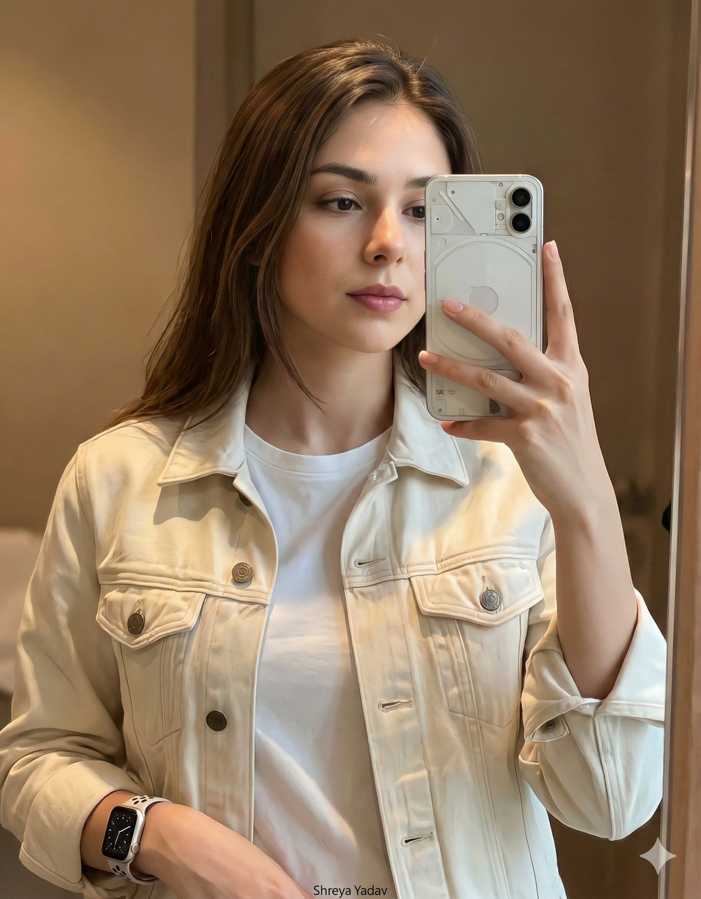

## 棕色长发的年轻女子自拍照

- ID: gpt4o-692-zh-2
- Slug: prompt-692-zh-2
- 语言: zh
- 来源: [来源链接](https://x.com/ShreyaYadav___/status/1995705447051837723)
- 样例图路径: images/part3/692.jpeg

### 提示词

```text
{
"type": "image_generation",
“主题”： {
“参考照片”：“请使用上传的照片以确保面部和身体100%一致”。
描述：一位有着棕色长发的年轻女子，
着装：{
“外套”：“米白色牛仔夹克”，
“内衣”：“白色T恤”，
配件：手腕上的苹果数字手表
}
},
"姿势": {
“动作”：“拍镜子自拍”，
“构图”: “特写肖像”
},
"props": {
"phone_model": "White Nothing Phone (2)" ,
"phone_details": "独特的透明后盖设计清晰可见"
},
“环境”： {
“灯光”：“柔和温暖”，
“背景”：“模糊的室内环境”
},
“风格”： {
“美学”：“超逼真、高细节、8K分辨率”
“媒介”: “摄影”
},
"text_overlay": {
内容：Shreya Yadav，
“位置”: “签名风格”
}
}
```

### 样例图


## 双语认知大发现-交通工具

- ID: gpt4o-689-zh
- Slug: prompt-689-zh
- 语言: zh
- 来源: [来源链接](https://x.com/nuannuan_share/status/1995761102295384483)
- 样例图路径: images/part3/689.jpeg

### 提示词

```text
[SCENE_THEME] = 交通工具
[TARGET_AGE] = 2–5 岁

生成一张可出版级的儿童认知「黏土沙盘全景长图」（Vertical A4 Panoramic Claymation Diorama）。画面风格：软萌黏土 3D、圆润、安全、马卡龙+莫兰迪色、大量柔光与体积光、统一材质、8K Ultra HD、Cinema 4D 可爱渲染。

# 一、标题区（Top Banner）
在最顶部加入大标题：《交通工具 双语认知大发现》。
使用超大号圆滚滚黏土气球字（彩色+高光）。两侧放置可爱的小型交通工具黏土浮雕（迷你飞机、迷你汽车、迷你船锚等）。

# 二、主体场景（Main Diorama）
构图：Wide-angle 微缩沙盘视角。前景与中景保持全焦清晰；背景轻度虚化；按“分组布局 + 留白呼吸感”摆放。

场景风格：像一个大型“交通工具乐园玩具沙盘”，地面有道路、滑轨、机场跑道、小型港口等。

加入 1–2 位引导角色（探险宝宝 / 黏土小狗 / 迷你机器人），做出指路和兴奋的动作，引导孩子探索车辆。

# 三、认知物体清单（Core Objects）
所有物体必须圆润、无尖角、黏土质感。

【核心大件（5–8 个）】
请放在主要区域：
小汽车  
救护车  
校车  
消防车  
飞机  
高铁  
公交车  
轮船

【中小件物体（8–12 个）】
散点式围绕大件摆放：
红绿灯  
交通锥  
方向牌  
道路栏杆  
油桶  
小轮胎  
小螺丝工具  
交通岗亭  
风向标  
小停机坪标志

【环境元素（不限量）】
柔软黏土道路  
圆滚滚路灯柱  
棉花糖云朵  
黏土树丛  
小湖泊  
小桥  
迷你机场跑道条纹

# 四、双语标签系统（Bilingual Labeling System）
为所有需要认知的交通工具加入三行软胶标签牌（圆角、厚边、轻浮雕），背景奶白或浅黄。

格式固定：
第一行：中文（超粗圆体）
第二行：带声调拼音
第三行：英文（圆润无衬线）

示例：
[ 汽 车 ]
[ qì chē ]
[ Car ]

# 五、精准箭头（3D Clay Arrow）
使用粗壮圆润的 3D 黏土箭头（橙黄或粉蓝）。一端贴标签牌，一端精准指向对应车辆。禁止箭头交叉。标签牌放在物体最近的空白区，确保画面清晰有序。

# 六、风格收束（统一模型输出）
Wide Panoramic Claymation Diorama；
Soft Pastel Colors；
Round & Child-safe Edges；
Rich but Organized Composition；
Precise Clay Arrows + Bilingual Labels；
8K Ultra HD；
Soft Volumetric Lighting；
Cinema 4D cute render style
```

### 样例图


## Generate a photorealistic image of a cafe terrace in the

- ID: gpt4o-687-en-1
- Slug: prompt-687-en-1
- 语言: en
- 来源: [来源链接](https://x.com/minchoi/status/1995707916649640404)
- 样例图路径: images/part3/687.jpeg

### 提示词

```text
Generate a photorealistic image of a cafe terrace in the Marais district of Paris on a Wednesday morning in March 2025. It is a crisp, cool spring morning with clear skies. Locals are drinking coffee. In sharp focus should be a young woman with a pixie cut wearing a scarf, stirring a cappuccino and looking thoughtfully to the side; the waiter and street traffic behind her are blurred. The photo should have the candid, natural morning light feel of an iPhone image.
```

### 样例图

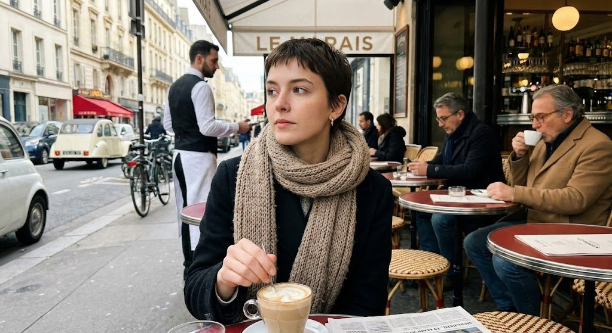

## 生成一张指定时间地点的逼真照片

- ID: gpt4o-687-zh-2
- Slug: prompt-687-zh-2
- 语言: zh
- 来源: [来源链接](https://x.com/minchoi/status/1995707916649640404)
- 样例图路径: images/part3/687.jpeg

### 提示词

```text
请生成一张逼真的照片，展现2025年3月某个星期三早晨巴黎玛莱区一家咖啡馆的露台。这是一个清爽凉爽的春日早晨，天空晴朗。当地人正在喝咖啡。照片中应清晰地呈现一位留着精灵短发、围着围巾的年轻女子，她正在搅拌一杯卡布奇诺，若有所思地看向一旁；她身后的服务员和街上的车辆则应虚化。照片应呈现出类似iPhone拍摄的自然晨光感。
```

### 样例图


## { "image_request": { "goal": "Create a cinematic portrai

- ID: gpt4o-684-en-1
- Slug: prompt-684-en-1
- 语言: en
- 来源: [来源链接](https://x.com/YaseenK7212/status/1995536194327777287)
- 样例图路径: images/part3/684.jpeg

### 提示词

```text
{
  "image_request": {
    "goal": "Create a cinematic portrait based on the provided reference photo, preserving the subject’s face exactly as it appears in the reference (no alterations to facial structure, proportions, features, or expression).",
    "subject": {
      "identity_preservation": {
        "description": "The face must remain completely unchanged from the reference photo — 1000% identical in all visible facial details, proportions, contours, expression, and micro-features.",
        "notes": "No stylization, morphing, or reinterpretation of the facial structure. Only the scene, pose, and atmosphere change."
      },
      "pose": {
        "body_position": "The woman is standing with her back to the camera.",
        "head_turn": "She turns her head over her shoulder, looking toward the viewer.",
        "gaze": "Soft, melancholic, and intense."
      },
      "appearance": {
        "skin": "Smooth, pale skin with gentle cinematic texture.",
        "hair": {
          "style": "Long, straight hair.",
          "movement": "Slightly tousled by the wind."
        },
        "clothing": {
          "top": "Black backless top with delicate thin straps draping down the back."
        },
        "props": {
          "bouquet": "A bouquet of black roses held close to her face."
        }
      }
    },
    "environment": {
      "setting": "A moody lakeside or riverside.",
      "weather": "Overcast grey skies.",
      "atmosphere": "Soft, misty, melancholic, and subtly gothic."
    },
    "lighting": {
      "type": "soft diffuse lighting",
      "source": "natural overcast daylight",
      "tone": "desaturated, muted highlights",
      "mood": "gothic, melancholic, cinematic",
      "shadow_quality": "soft, low-contrast shadows"
    },
    "color_grading": {
      "palette": "desaturated neutrals, soft greys, washed-out cool tones",
      "mood": "cinematic and atmospheric"
    },
    "composition": {
      "framing": "Cinematic shoulder-turned portrait with focus on the face and roses.",
      "depth": "Shallow depth of field; background slightly blurred.",
      "emphasis": "Emotional intensity in the eyes; contrast between pale skin and black roses/top."
    },
    "style": {
      "visual_style": "cinematic realism",
      "tone": "moody, atmospheric",
      "genre_influence": "dark romantic, gothic melancholy"
    }
  }
}
```

### 样例图

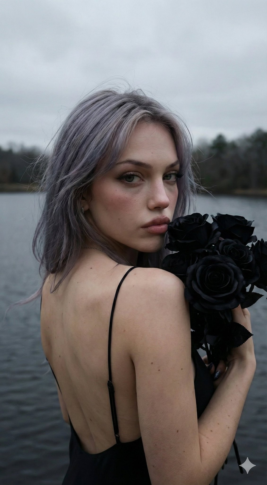

## 哥特式电影风格的肖像画

- ID: gpt4o-684-zh-2
- Slug: prompt-684-zh-2
- 语言: zh
- 来源: [来源链接](https://x.com/YaseenK7212/status/1995536194327777287)
- 样例图路径: images/part3/684.jpeg

### 提示词

```text
{
"image_request": {
“目标”：“根据提供的参考照片创作一幅电影风格的肖像画，完全保留照片中人物的面部特征（不得改变面部结构、比例、五官或表情）。”
“主题”： {
"identity_preservation": {
“描述”：“面部必须与参考照片完全一致——所有可见的面部细节、比例、轮廓、表情和微特征都必须1000%相同。”
备注：“面部结构未进行任何风格化、变形或重新诠释。仅场景、姿势和氛围有所改变。”
},
"姿势": {
“body_position”: “该女子背对着镜头站立。”
“head_turn”：她转过头，看向观众。
“凝视”：“柔和、忧郁而强烈。”
},
“外貌”： {
“肌肤”：“光滑、白皙的肌肤，具有柔和的电影质感。”
“头发”： {
“发型”：“长直发。”
“动感”：“被风轻轻吹乱。”
},
“衣服”： {
“上衣”：“黑色露背上衣，背部有纤细的吊带垂下。”
},
"props": {
“花束”：“她将一束黑玫瑰捧在脸旁。”
}
}
},
“环境”： {
“场景”：“一个阴郁的湖边或河边。”
天气：阴天，天空灰蒙蒙的。
“氛围”：“柔和、朦胧、忧郁，略带哥特式风格。”
},
“灯光”： {
“类型”：“柔和漫射光”，
“来源”：“自然阴天日光”，
“色调”：“去饱和、柔和的高光”，
“氛围”：“哥特式、忧郁、电影感”，
"shadow_quality": "柔和、低对比度的阴影"
},
"color_grading": {
“调色板”：“低饱和度的中性色、柔和的灰色、褪色的冷色调”，
“氛围”：“电影感十足，富有氛围感”
},
“作品”： {
“构图”：“电影般的侧脸肖像，焦点集中在脸部和玫瑰花上。”
“景深”：“浅景深；背景略微模糊。”
“强调”：“眼神中流露出的情感强度；苍白的皮肤与黑色玫瑰/上衣形成对比。”
},
“风格”： {
"视觉风格": "电影写实主义",
“基调”：“忧郁的，有氛围的”，
"genre_influence": "黑暗浪漫主义，哥特式忧郁"
}
}
}
```

### 样例图


## { "Use [man_face] and [woman_fac]. Ultra-realistic high-

- ID: gpt4o-683-en-1
- Slug: prompt-683-en-1
- 语言: en
- 来源: [来源链接](https://x.com/miilesus/status/1995536025859354724)
- 样例图路径: images/part3/683.jpeg

### 提示词

```text
{
 "Use [man_face] and [woman_fac]. Ultra-realistic high-end luxury wedding photography of a bride and groom standing closely together in an elegant outdoor ceremony setting. Golden hour sunlight casting warm soft highlights, natural rim light around their silhouettes, cinematic dynamic range. The bride wearing a premium handcrafted lace wedding gown with intricate embroidery details, soft flowing veil illuminated by backlight, subtle pearl accessories, refined natural bridal makeup with luminous skin texture, finely detailed eyelashes and catchlights in eyes. The groom wearing a tailored black tuxedo with satin lapels, crisp white shirt, luxury bow tie, polished boutonniere. Both posing in a candid yet editorial fashion – gentle eye contact, soft romantic smile, hands touching gracefully. Background featuring a softly blurred bokeh garden with roses, organic greenery, warm tones, shallow depth of field created by an 85mm f/1.4 full-frame lens. High-definition textures, ultra sharp facial details, realistic pores, true-to-life skin tones, natural hair strands, perfect color grading inspired by premium wedding photographers. Soft pastel color palette, creamy highlights, subtle film grain, magazine cover aesthetic. Cinematic global illumination, perfect exposure balance, no distortion, no artifacts. Award-winning photography style with fine-art wedding composition, dramatic yet soft lighting, museum-quality detail clarity.",
  
  "negative_prompt": "cartoon, illustration, painting, CGI, artificial look, uncanny valley, distorted facial features, extra limbs, deformed body parts, mismatched eyes, unnatural skin texture, plastic skin, blur, noise, pixelation, low resolution, oversaturated colors, washed out colors, hard flash, harsh shadows, blown highlights, low contrast, lens distortion, fisheye, bad anatomy, extra fingers, incorrect hand shapes, watermark, text, logo, border, frame, compression artifacts, glitch, unrealistic proportions, double face, duplicate subjects, warped background",

  "camera_settings": {
    "lens": "85mm f/1.4 prime",
    "iso": 100,
    "shutter_speed": "1/400",
    "aperture": "f/1.4",
    "white_balance": "5200K daylight"
  },

  "style": {
    "lighting": "soft natural golden hour, cinematic rim light, high dynamic range",
    "color_grade": "premium wedding film look, pastel tones, creamy highlights, warm undertones",
    "atmosphere": "romantic, elegant, fine-art editorial"
  },

  "composition": {
    "framing": "mid-shot portrait, slight angle, bride and groom centered",
    "focus": "sharp eyes, smooth bokeh background",
    "depth_of_field": "shallow, subject separation emphasized"
  },

  "width": 1024,
  "height": 1536,
  "num_inference_steps": 36,
  "guidance_scale": 8.0,
  "seed": 12345
}
```

### 样例图

![{ "Use [man_face] and [woman_fac]. Ultra-realistic high-](../images/part3/683.jpeg)

## 花园里的婚纱照

- ID: gpt4o-683-zh-2
- Slug: prompt-683-zh-2
- 语言: zh
- 来源: [来源链接](https://x.com/miilesus/status/1995536025859354724)
- 样例图路径: images/part3/683.jpeg

### 提示词

```text
{
使用[man_face]和[woman_fac]。超逼真的高端奢华婚礼摄影，展现新郎新娘在优雅的户外仪式场地中亲密依偎的画面。金色的阳光洒下温暖柔和的高光，自然的轮廓光勾勒出他们的身影，营造出电影般的动态范围。新娘身着高级手工蕾丝婚纱，精致的刺绣细节令人叹为观止，飘逸的头纱在逆光下熠熠生辉，搭配低调的珍珠配饰，精致自然的妆容展现出肌肤的光泽感，纤长的睫毛和闪亮的眼神光更添动人。新郎身着剪裁合身的黑色礼服，缎面翻领，搭配挺括的白色衬衫、奢华的领结和精致的胸花。两人以一种自然而又不失时尚感的姿态摆出姿势——温柔的眼神交流，浪漫的微笑，双手优雅地相触。背景是一片柔和虚化的花园，点缀着玫瑰、绿植和温暖的色调，85mm f/1.4全画幅镜头营造出浅景深效果。高清的纹理，极其清晰的面部细节，逼真的画面。毛孔清晰可见，肤色自然逼真，发丝纹理自然，色彩分级完美，灵感源自顶级婚礼摄影师。柔和的粉彩色调，奶油般的亮部，细腻的胶片颗粒，杂志封面般的质感。电影级的整体光照，完美的曝光平衡，无畸变，无瑕疵。屡获殊荣的摄影风格，融合艺术婚礼构图、戏剧性却又柔和的光线，以及博物馆级别的细节清晰度。

"negative_prompt": "卡通、插画、绘画、CGI、人工质感、恐怖谷效应、面部特征扭曲、多余肢体、身体部位畸形、眼睛不对称、皮肤纹理不自然、塑料皮肤、模糊、噪点、像素化、低分辨率、色彩过饱和、色彩褪色、强光、阴影过重、高光过曝、低对比度、镜头畸变、鱼眼效果、人体解剖结构错误、多余手指、手型错误、水印、文字、标志、边框、画框、压缩伪影、故障、比例失调、双面人、重复人物、背景扭曲",

"camera_settings": {
镜头：85mm f/1.4 定焦镜头
“iso”：100，
"shutter_speed": "1/400",
光圈：f/1.4，
“white_balance”: “5200K 日光”
},

“风格”： {
“照明”：“柔和的自然黄金时段、电影般的轮廓光、高动态范围”，
"color_grade": "高级婚礼影片风格，柔和的色调，奶油色的高光，温暖的底色",
“氛围”： “浪漫、优雅、艺术感十足的编辑风格”
},

“作品”： {
“构图”：“中景肖像，略微倾斜，新郎新娘居中”，
“焦点”：“锐利的眼睛，柔和的散景背景”，
"depth_of_field": "浅景深，强调主体分离"
},

宽度：1024，
“高度”：1536，
"num_inference_steps": 36,
"guidance_scale": 8.0,
种子：12345
}
```

### 样例图


## Present a clear, side miniature 3D cartoon view of [YOUR

- ID: gpt4o-682-en-1
- Slug: prompt-682-en-1
- 语言: en
- 来源: [来源链接](https://x.com/michalmalewicz/status/1995532450861080956)
- 样例图路径: images/part3/682.jpeg

### 提示词

```text
Present a clear, side miniature 3D cartoon view of [YOUR CITY] tallest buildings. Use minimal textures with realistic materials and soft, lifelike lighting and shadows. Use a clean, minimalistic composition showing exactly the three tallest buildings in Sopot, arranged from LEFT to RIGHT in STRICT descending height order. The tallest must appear visibly tallest, the second must be clearly shorter than the first, and the third must be clearly shorter than the second.
All buildings must follow accurate relative proportions: if a building is taller in real life, it MUST be taller in the image by the same approximate ratio. No building may be visually stretched or compressed.
Each building should stand separately on a thin, simple ceramic base. Below each base, centered text should display:
Height in meters — semibold sans-serif, medium size
Year built — lighter-weight sans-serif, smaller size, directly beneath the height text
Provide consistent padding, spacing, leading, and kerning. Write “YOUR CITY NAME” centered above the buildings, using a medium-sized sans-serif font.
 No building top should overlap or touch the text above.Use accurate architectural proportions based on real-world references.Maintain consistent camera angle and identical scale for each building model.
No forced perspective. Use straight-on orthographic-style rendering. Do not exaggerate or stylize size differences beyond proportional accuracy.

Use a square 1080×1080 composition.Use a clean, neutral background. Ensure no extra objects are present.
```

### 样例图

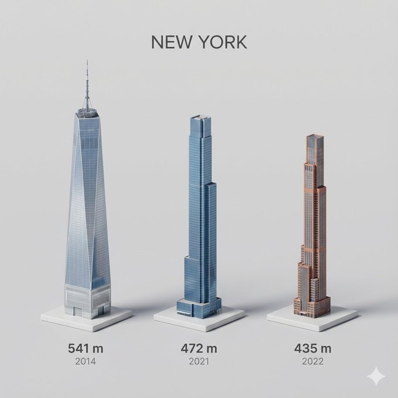

## 微缩3D卡通视图展城市最高的三座建筑

- ID: gpt4o-682-zh-2
- Slug: prompt-682-zh-2
- 语言: zh
- 来源: [来源链接](https://x.com/michalmalewicz/status/1995532450861080956)
- 样例图路径: images/part3/682.jpeg

### 提示词

```text
以清晰的侧面微缩3D卡通视图展示[您的城市]最高的三座建筑。使用极简的纹理，采用逼真的材质，并运用柔和自然的灯光和阴影。构图简洁明了，清晰地展现索波特最高的三座建筑，并严格按照从左到右的高度递减顺序排列。最高的建筑必须明显高于第一座，第二座必须明显低于第一座，第三座必须明显低于第二座。
所有建筑物必须遵循准确的相对比例：如果建筑物在现实生活中更高，那么在图像中也必须按大致相同的比例更高。任何建筑物都不得在视觉上被拉伸或压缩。
每栋建筑模型都应单独放置在一个纤薄简洁的陶瓷底座上。每个底座下方居中显示文字：
身高（米）— 半粗体无衬线字体，中等字号
建造年份——较轻的无衬线字体，较小的字号，位于高度文本的正下方
保持字间距、行距和字距一致。使用中等大小的无衬线字体，在建筑物上方居中书写“您的城市名称”。
建筑物顶部不得与上方文字重叠或接触。请使用基于真实世界参考资料的精确建筑比例。保持每个建筑模型拍摄角度一致，并采用相同的比例尺。
避免使用透视错觉。采用正面正投影式渲染。不要夸大或过度修饰尺寸差异，使其超出比例的精确范围。

使用 1080×1080 的正方形构图。使用干净、中性的背景。确保画面中没有多余的物体。
```

### 样例图


## { "intent": "A dramatic, high-energy battle scene featur

- ID: gpt4o-677-en-1
- Slug: prompt-677-en-1
- 语言: en
- 来源: [来源链接](https://x.com/IamEmily2050/status/1995429494493167779)
- 样例图路径: images/part3/677.jpeg

### 提示词

```text
{
  "intent": "A dramatic, high-energy battle scene featuring a determined young mage making a defiant declaration, in the style of modern Shonen fantasy manga.",
  "manga_genre": "Shonen Fantasy/Action",
  "art_style": {
    "primary_influence": "Modern Shonen Jump style (reminiscent of Black Clover, Fairy Tail), with dynamic action and expressive character work",
    "line_art_style": "Bold, clean lines with strong variable weight. Thick, confident outlines for characters, thin lines for magical effects and background detail. Energetic, flowing linework.",
    "screentone_style": "Minimal screentone use to maintain high contrast and readability. Light 20% dot screentones for subtle shading on skin. Heavy use of pure white and pure black for dramatic impact."
  },
  "panel_design": {
    "primary_panel_type": "FBP (Full-Body Panel): Entire character from head to feet with visible ground plane.",
    "composition_description": "Dynamic low-angle view, looking up at the character from ground level to emphasize heroic determination and power. The character stands in a defiant pose on a cracked, debris-strewn battlefield. The ground is clearly visible beneath and around the character's feet, with rubble, broken stones, and impact cracks radiating outward. Include 15% negative space above the head and 12% below the feet to prevent cropping. The composition creates a sense of the character rising up against adversity.",
    "aspect_ratio": "2:3",
    "key_symbolic_effects": ["Intense speed lines radiating outward from the character's body, creating explosive energy", "Focus lines converging on the character's face and raised fist, emphasizing determination", "Magical energy aura swirling around the character, rendered with flowing, organic lines", "Small impact cracks and debris particles floating around the feet to show power and grounding"]
  },
  "dialogue_and_text": {
    "speech_bubbles": [
      {
        "speaker": "Protagonist",
        "bubble_type": "shout",
        "text_content": "I won't back down! This is my fight!",
        "placement": "Upper right area of the panel, positioned above and slightly to the right of the character's head, with the bubble tail pointing toward the character's mouth",
        "emphasis": "bold"
      },
      {
        "speaker": "Protagonist",
        "bubble_type": "shout",
        "text_content": "I'll protect everyone... no matter what!!",
        "placement": "Mid-left area, positioned near the character's raised fist, with the bubble tail pointing back toward the character's face. This creates a dynamic flow of dialogue across the panel.",
        "emphasis": "bold with triple exclamation marks for maximum intensity"
      }
    ],
    "sound_effects": [
      {
        "sfx_text": "ゴゴゴ (GOGOGO - menacing rumble)",
        "placement": "Integrated into the background, positioned in the upper left and lower right corners, creating a sense of ominous power building",
        "style": "Bold, angular katakana characters rendered in a heavy, imposing font"
      },
      {
        "sfx_text": "CRACKLE",
        "placement": "Near the magical energy aura around the character's hands, integrated into the swirling energy effects",
        "style": "Jagged, electric-style lettering that follows the flow of the magical energy"
      }
    ]
  },
  "character": {
    "archetype": "Hot-blooded Shonen Protagonist: Determined, courageous, fiercely protective of friends, refuses to give up even when outmatched.",
    "design_focus": "A young male mage in his mid-teens. Wild, spiky hair (classic Shonen style) with strands flying upward from the energy aura. Large, intense eyes with prominent highlights showing unwavering determination and a hint of desperation. Wearing a battle-worn fantasy adventurer outfit: a tattered cloak flowing dramatically behind him, a fitted tunic with visible fabric tension showing a lean, athletic build, armored gauntlets on his forearms, and sturdy leather boots with visible buckles and worn soles. The boots are firmly planted on the cracked ground, with detailed lacing and scuff marks. Barefoot would be inappropriate for a battlefield, so the boots are essential and clearly visible from toe to heel.",
    "facial_expression": "Intense and defiant. Mouth open in a shout, showing gritted teeth. Brows furrowed with determination. Eyes blazing with resolve and a slight glow suggesting magical power.",
    "pose_and_body_language": "Dynamic heroic stance: feet shoulder-width apart and fully visible, planted firmly on the cracked ground with slight forward lean suggesting readiness to charge. One fist raised to chest level, clenched tightly and glowing with magical energy. The other arm extended slightly outward for balance. Body coiled with tension and power. The pose conveys both defensive readiness and offensive intent.",
    "symbolic_emotional_markers": ["Determination aura: jagged, flame-like lines surrounding the character's body", "Small sweat drops on the forehead indicating intense exertion and stakes", "Glowing eyes with white highlights suggesting inner power awakening", "Clenched fist with visible tension lines in the hand and forearm"]
  },
  "setting": {
    "location": "A devastated battlefield. Cracked and broken stone ground with large fissures and impact craters. Rubble and debris scattered around the character's feet, with some pieces floating slightly due to magical energy. The ground texture is rough stone and dirt, clearly visible beneath the character's boots. In the blurred background, suggestions of ruined structures and a stormy sky, but kept minimal to maintain focus on the character.",
    "time_of_day": "Dusk or stormy midday (dramatic, low-contrast lighting typical of climactic battle scenes)",
    "atmospheric_elements": "Dust and small debris particles floating in the air. Magical energy wisps swirling around the character. Dark, ominous clouds in the background suggesting the severity of the battle. A few small embers or sparks of magical energy drifting upward from the ground."
  },
  "inking_and_tones": {
    "line_weight_variation": "Strong variation. Very thick, bold outlines (2-3pt) for the character's silhouette and major forms to make them pop against the background. Medium weight (1-2pt) for clothing details, facial features, and magical effects. Thin lines (0.5-1pt) for hair strands, background rubble detail, and fine texture on the boots and gauntlets.",
    "primary_shading_method": "Combination of crisp black fills for deep shadows (under the chin, in the hair, cast shadows on the ground) and light 20% dot screentones for mid-tone shadows on the face and clothing. Minimal screentone use overall to maintain high contrast and energy. Cross-hatching used sparingly for texture on the tattered cloak.",
    "black_space_usage": "Strategic and balanced. Solid black used for hair shadows, the interior of the tattered cloak, and deep shadows cast by the character on the ground. Mostly white space and clean lines to maintain the bright, energetic feel of Shonen action.",
    "screentone_density": "Sparse. Screentones used only for subtle form definition on the character's face and body. The background is kept mostly white with black linework for rubble and cracks, maintaining focus on the character."
  },
  "symbolism_and_effects": {
    "motion_lines": "Intense speed lines radiating outward from the character's torso and limbs in all directions, creating a sense of explosive power and energy bursting forth. The lines are thicker near the character and taper as they extend outward.",
    "emotional_symbols": ["Determination aura: jagged, flame-like energy lines surrounding the body", "Sweat drops on forehead for intense focus and exertion", "Glowing magical energy around the raised fist, rendered with swirling, organic lines", "Small impact lines around the feet showing firm grounding and power transfer to the earth"],
    "onomatopoeia": ["ゴゴゴ (GOGOGO) - menacing/powerful rumble effect in the background", "CRACKLE - magical energy sound effect near the hands"]
  },
  "negative_directives": {
    "style": "No photorealistic rendering, no watercolor or painterly style, no full color, no soft digital gradients, no Western comic book style, no 3D rendering, no overly detailed backgrounds that distract from the character.",
    "content": "No weapons in hand (magic is the focus), no other characters in the frame, no overly busy background, cropped feet, missing feet, floating figure, cut-off ankles, feet out of frame, hands obscuring the face, hair completely covering the eyes, closed or neutral expression (must be intense and emotional).",
    "artifact_suppression": "No blurred lines, no digital painting artifacts, no color bleeding, no anti-aliasing softness, cropped feet, missing toes, deformed feet, extra limbs, anatomically impossible poses, inconsistent line weight, muddy or unclear linework."
  }
}
```

### 样例图


## 现代少年奇幻漫画

- ID: gpt4o-677-zh-2
- Slug: prompt-677-zh-2
- 语言: zh
- 来源: [来源链接](https://x.com/IamEmily2050/status/1995429494493167779)
- 样例图路径: images/part3/677.jpeg

### 提示词

```text
{
“意图”：“一场充满戏剧性和爆发力的战斗场景，一位意志坚定的年轻魔法师发表了充满反抗精神的宣言，风格类似于现代少年奇幻漫画。”
"manga_genre": "少年奇幻/动作",
"art_style": {
“主要影响因素”： “现代少年Jump风格（让人想起《黑色五叶草》、《妖精的尾巴》），具有动感的动作和富有表现力的人物刻画”，
"line_art_style": "线条粗犷有力，线条粗细变化丰富。人物轮廓粗犷自信，魔法效果和背景细节则采用纤细线条。充满活力，线条流畅。"
"screentone_style": "尽量减少网点的使用，以保持高对比度和可读性。使用 20% 网点的浅色网点来表现皮肤上的微妙阴影。大量使用纯白和纯黑，以达到戏剧性的效果。"
},
"panel_design": {
"primary_panel_type": "FBP（全身面板）：从头到脚的整个角色，地面清晰可见。"
"composition_description": "动态的低角度视角，从地面仰视人物，强调英雄的决心和力量。人物以不屈的姿态站在满目疮痍、瓦砾遍地的战场上。人物脚下和周围的地面清晰可见，瓦砾、碎石和冲击裂缝向外辐射。头部上方留出 15% 的空白，脚下留出 12% 的空白，以避免画面裁剪。这种构图营造出人物奋起反抗逆境的气势。"
"aspect_ratio": "2:3",
"key_symbolic_effects": ["从角色身体向外辐射的强烈速度线，营造出爆发性的能量", "聚焦线汇聚于角色的面部和高举的拳头，强调其决心", "魔法能量光环环绕角色，以流畅的有机线条渲染", "脚部周围漂浮的细小冲击裂纹和碎片，展现力量与稳固性"]
},
"对话和文本": {
"speech_bubbles": [
{
“说话者”：“主角”，
"bubble_type": "喊叫",
"text_content": "我绝不退缩！这是我的战斗！"
“位置”：“位于面板的右上角，在角色头部上方略偏右的位置，气泡尾部指向角色的嘴部”，
强调：粗体
},
{
“说话者”：“主角”，
"bubble_type": "喊叫",
"text_content": "无论如何，我都会保护所有人！！"
“位置”：“位于画面左侧中间区域，靠近角色举起的拳头，气泡尾部指向角色的脸部。这样可以在画面中营造出对话的动态流动感。”
“强调”：“加粗并加上三个感叹号，以示最大程度的强调”
}
],
"sound_effects": [
{
"sfx_text": "ゴゴゴ（GOGOGO - 威胁性的隆隆声）",
“位置”：“融入背景，位于左上角和右下角，营造出一种不祥的力量积聚感”，
"style": "粗体、棱角分明的片假名字符，采用厚重、醒目的字体呈现"
},
{
"sfx_text": "噼啪声",
“放置位置”：“靠近角色双手周围的魔法能量光环，融入到旋转的能量效果中”，
“风格”：“锯齿状、电光质感的字体，跟随魔法能量的流动”
}
]
},
“特点”： {
“原型”：“热血少年漫主角：意志坚定、勇敢无畏、极力保护朋友、即使实力悬殊也绝不放弃。”
“设计重点”：一位十几岁的年轻男性魔法师。他有着狂野的刺猬头（经典少年漫画风格），几缕发丝在能量光环的映衬下向上飞舞。他那双炯炯有神的眼睛里闪烁着坚定的光芒，闪烁着一丝绝望。他身着一套饱经战火洗礼的奇幻冒险者装束：一件破旧的斗篷在他身后飘扬，一件紧身束腰外衣勾勒出他精瘦健壮的身材，前臂上戴着护手，脚上穿着结实的皮靴，靴扣清晰可见，鞋底磨损严重。皮靴牢牢地踩在龟裂的地面上，鞋带和磨损痕迹清晰可见。赤脚在战场上是不合适的，所以皮靴必不可少，从鞋头到鞋跟都清晰可见。
“面部表情”： “表情强烈而桀骜不驯。嘴巴张开，仿佛要怒吼，露出紧咬的牙齿。眉头紧锁，充满决心。双眼燃烧着坚定的火焰，闪烁着一丝光芒，暗示着某种魔法力量。”
“姿势与肢体语言”： “充满活力的英雄姿态：双脚与肩同宽，完全可见，稳稳地踩在龟裂的地面上，身体略微前倾，暗示着随时准备冲锋。一只拳头高举至胸前，紧紧握住，闪耀着魔法能量。另一只手臂略微向外伸展以保持平衡。身体充满张力和力量。此姿势既传达了防御的准备，也传达了进攻的意图。”
"symbolic_emotional_markers": ["决心光环：角色身体周围环绕着锯齿状的火焰线条", "额头上的细小汗珠表明正在承受巨大的压力", "闪烁着白光的眼睛暗示着内在力量的觉醒", "紧握的拳头，手掌和前臂上可见明显的肌肉线条"]
},
“环境”： {
地点：一片满目疮痍的战场。龟裂破碎的石质地面布满巨大的裂缝和撞击坑。瓦砾和碎片散落在角色脚下，部分碎片因魔法能量的作用而微微漂浮。地面纹理粗糙，由石头和泥土构成，在角色的靴子下清晰可见。模糊的背景中隐约可见残垣断壁和暴风雨的天空，但为了突出角色，这些元素被刻意弱化。
"time_of_day": "黄昏或暴风雨的正午（戏剧性的、低对比度的光线，典型的高潮战斗场景）",
“大气元素”：空气中漂浮着尘埃和细小的碎片。魔法能量的丝缕在角色周围盘旋。背景中阴沉的乌云暗示着战斗的严峻性。几小簇魔法能量的余烬或火花从地面向上飘散。
},
"inking_and_tones": {
"line_weight_variation": "线条粗细变化丰富。人物轮廓和主要形体采用非常粗的线条（2-3pt），使其在背景中脱颖而出。服装细节、面部特征和魔法效果采用中等粗细（1-2pt）。头发、背景碎石细节以及靴子和护手上的精细纹理采用细线（0.5-1pt）。"
“primary_shading_method”： “结合使用清晰的黑色填充来表现深阴影（下巴下方、头发中、地面上的投影），并使用20%网点的浅色网点来表现面部和衣物上的中间色调阴影。整体上尽量减少网点的使用，以保持高对比度和活力。在破烂的斗篷上少量使用交叉阴影线来表现纹理。”
“黑位运用”：策略性且平衡。头发阴影、破烂斗篷的内衬以及角色在地面上投射的深阴影均采用纯黑色。大量留白和简洁的线条，以保持少年漫画动作戏的明亮、活力感。
“screentone_density”：稀疏。网点仅用于勾勒人物面部和身体的细微轮廓。背景以白色为主，用黑色线条勾勒瓦砾和裂缝，使画面焦点集中在人物身上。
},
"symbolism_and_effects": {
“运动线”：从角色躯干和四肢向四面八方辐射出强烈的速度线，营造出爆发力和能量迸发的感觉。线条在靠近角色处较粗，向外延伸逐渐变细。
"emotional_symbols": ["决心光环：锯齿状的火焰状能量线环绕身体", "额头上的汗珠象征着高度集中和努力", "高举的拳头周围闪耀着魔法能量，以旋转的有机线条描绘", "脚部周围的细小冲击线象征着稳固的接地和力量传递到大地"]
拟声词：[“ゴゴゴ (GOGOGO) - 背景中令人不安/强大的隆隆声效果”“噼啪声 - 手附近魔法能量的声音效果”]
},
"negative_directives": {
“风格”：“不使用照片级写实渲染，不使用水彩或油画风格，不使用全彩，不使用柔和的数字渐变，不使用西方漫画风格，不使用3D渲染，不使用会分散观众对角色注意力的过于细致的背景。”
“内容”：“手中不持武器（重点是魔法），画面中没有其他角色，背景不要过于杂乱，脚部被裁剪，脚部缺失，人物漂浮，脚踝被切断，脚部超出画面，手遮住脸部，头发完全遮住眼睛，表情闭合或中性（必须强烈而富有情感）。”
"artifact_suppression": "无模糊线条、无数码绘画瑕疵、无颜色溢出、无抗锯齿柔化、无裁剪脚部、无缺失脚趾、无畸形脚部、无额外肢体、无解剖学上不可能的姿势、无不一致的线条粗细、无模糊或不清晰的线条。"
}
}
```

### 样例图


## { "prompt": "A full-body artistic portrait of the woman 

- ID: gpt4o-675-en-1
- Slug: prompt-675-en-1
- 语言: en
- 来源: [来源链接](https://x.com/ShreyaYadav___/status/1995540914954272826)
- 样例图路径: images/part3/675.jpeg

### 提示词

```text
{
  "prompt": "A full-body artistic portrait of the woman from the reference image, keeping the exact same face. She is elegantly seated on the floor wearing a modern black top, soft loose gray jeans, and chunky gray-and-white sneakers. Her long, waist-length wavy milky-brown hair flows naturally, with half of it beautifully braided. She is laughing while looking upwards, capturing a confident candid smile. The background is an artistic monochrome (black and white) composition featuring a soft, blurred close-up side profile of the same face, creating a stylish dual-layer aesthetic. High-quality soft lighting, realistic textures, cinematic realism, and an artistic portrait vibe.",
  
  "style": {
    "lighting": "soft, high-quality, realistic",
    "color_palette": "monochrome background, natural skin tones",
    "mood": "confident, candid, artistic",
    "quality": "ultra detailed, high-resolution"
  },
  
  "camera": {
    "shot": "full-body portrait",
    "angle": "slightly low angle, upward gaze feel",
    "focus": "sharp on subject, blurred artistic background"
  },
  
  "character": {
    "face": "same as reference image",
    "expression": "laughing, confident smile",
    "hair": "long wavy milky-brown, half braided",
    "outfit": {
      "top": "modern black top",
      "bottom": "soft loose gray jeans",
      "shoes": "chunky gray-and-white sneakers"
    }
  },
  
  "background": {
    "type": "artistic monochrome",
    "layers": "soft blurred close-up side profile of same face",
    "effect": "stylish dual-layer aesthetic"
  }
}
```

### 样例图


## 同一张脸的柔和模糊的侧面特写

- ID: gpt4o-675-zh-2
- Slug: prompt-675-zh-2
- 语言: zh
- 来源: [来源链接](https://x.com/ShreyaYadav___/status/1995540914954272826)
- 样例图路径: images/part3/675.jpeg

### 提示词

```text
{
“提示”：“根据参考图片，绘制一位女士的全身艺术肖像，保留其面部特征。她优雅地坐在地板上，身着现代感十足的黑色上衣、宽松的灰色牛仔裤和厚底灰白运动鞋。她及腰的乳棕色长发自然垂落，一半编成精美的辫子。她仰望天空，笑容灿烂，展现出自信而真挚的神态。背景采用艺术化的黑白构图，柔和模糊的侧脸特写营造出时尚的双层美感。画面运用了高质量的柔光、逼真的纹理、电影般的写实感以及艺术肖像的氛围。”

“风格”： {
“照明”：“柔和、高质量、逼真”，
"color_palette": "单色背景，自然肤色",
“情绪”：“自信、坦率、有艺术气息”
“质量”：“超精细，高分辨率”
},

“相机”： {
“拍摄”: “全身肖像”
“角度”：“略低的角度，向上凝视的感觉”，
“焦点”： “主体清晰，背景虚化，富有艺术感”
},

“特点”： {
“脸部”：“与参考图像相同”，
“表情”：“笑着，自信的笑容”，
“头发”：“长长的波浪状乳棕色头发，一半编成辫子”，
“全套服装”： {
“上衣”： “现代黑色上衣”，
下装：柔软宽松的灰色牛仔裤，
“鞋子”： “厚底灰白运动鞋”
}
},

“背景”： {
"type": "艺术单色",
“图层”: “同一张脸的柔和模糊的侧面特写”，
“效果”：“时尚的双层美感”
}
}
```

### 样例图


## 疯狂动物城朱迪和尼克

- ID: gpt4o-672-zh-1
- Slug: prompt-672-zh-1
- 语言: zh
- 来源: [来源链接](https://x.com/LiEvanna85716/status/1995414338493108500)
- 样例图路径: images/part3/672.jpeg

### 提示词

```text
# Nano Banana Pro Configuration - Zootopia Cyber Fan Concept
# Generated by AI Writing Assistant

project_name: "Zootopia_Cyber_Fashion_Wink"
model_base: "SDXL_Realistic_v4" # 假设的基础模型，可根据实际情况调整
output_resolution: [896, 1152]  # 3:4 Ratio, optimized for Twitter feed

character:
  id: "cyber_judy_fan_01"
  gender: "female"
  age: "20s"
  features:
    - "delicate facial features"
    - "playful expression"
    - "winking one eye"
    - "holding smartphone for selfie"

scene:
  location: "Zootopia official merchandise store"
  lighting: "interior shop lighting, soft neon accents, volumetric bloom"
  atmosphere: "lively, colorful, detailed background"

prompts:
  positive: |
    (Masterpiece, 8k resolution, photorealistic, ultra-detailed),
    POV selfie shot, beautiful young woman winking at camera,
    wearing a futuristic metallic silver corset dress (iridescent texture:1.2),
    wearing fluffy Judy Hopps rabbit ear hat (purple and grey),
    holding a high-tech smartphone, selfie gesture,
    background is a cluttered Zootopia souvenir shop,
    shelves filled with Nick Wilde and Judy Hopps plush toys (fuzzy texture:1.3),
    ZPD badges, carrots merchandise,
    depth of field, ray tracing reflections on the metallic dress,
    cinematic lighting, sharp focus on eyes and phone.

  negative: |
    (worst quality, low quality:1.4), monochrome, zombie,
    deformed anatomy, disfigured, extra fingers, bad hands, 
    missing fingers, floating limbs, disconnected limbs,
    blur, out of focus, cropped head, watermark, text, signature,
    distorted plushies, scary faces on toys.

views:
  - view_id: "main_selfie"
    camera_angle: "high angle selfie"
    focus: "face and upper body"
    description: "The main engagement shot showing the wink and the outfit details."

  - view_id: "outfit_detail"
    camera_angle: "medium shot"
    focus: "waist and background"
    description: "Showcasing the metallic texture of the corset and the Zootopia merch in the back."

# Advanced Settings for Nano Banana Pro
sampling:
  steps: 35
  cfg_scale: 7.5
  sampler: "DPM++ 2M Karras"
  seed: -1 # Random
```

### 样例图


## 疯狂动物城朱迪和尼克

- ID: gpt4o-672-zh-2
- Slug: prompt-672-zh-2
- 语言: zh
- 来源: [来源链接](https://x.com/LiEvanna85716/status/1995414338493108500)
- 样例图路径: images/part3/672.jpeg

### 提示词

```text
# Nano Banana Pro 配置 - 疯狂动物城赛博粉丝概念
# 由 AI 写作助手生成

project_name: "疯狂动物城_赛博_时尚_眨眼"
model_base: "SDXL_Realistic_v4" # 假设的基础模型，可根据实际情况调整
output_resolution: [896, 1152]  # 3:4 比例，针对 Twitter 信息流优化

character:
  id: "赛博_朱迪_粉丝_01"
  gender: "女性"
  age: "20多岁"
  features:
    - "精致的五官"
    - "顽皮/俏皮的表情"
    - "眨一只眼"
    - "手持智能手机自拍"

scene:
  location: "疯狂动物城官方周边商店"
  lighting: "室内商店照明，柔和的霓虹点缀，体积光（光晕）"
  atmosphere: "生动活泼，色彩丰富，背景细节详实"

prompts:
  positive: |
    (杰作, 8k分辨率, 照片级真实, 超精细),
    第一人称视角（POV）自拍镜头, 美丽的年轻女性对着镜头眨眼,
    身穿未来感金属银色紧身胸衣连衣裙 (彩虹色纹理:1.2),
    戴着毛茸茸的朱迪警官（Judy Hopps）兔耳帽 (紫色和灰色),
    手持高科技智能手机, 自拍姿势,
    背景是琳琅满目的疯狂动物城纪念品商店,
    货架上摆满了尼克（Nick Wilde）和朱迪（Judy Hopps）的毛绒玩具 (毛绒纹理:1.3),
    ZPD（动物城警局）警徽, 胡萝卜周边商品,
    景深效果, 金属裙上的光线追踪反射,
    电影级布光, 焦点清晰对准眼睛和手机。

  negative: |
    (最差质量, 低质量:1.4), 单色, 僵尸,
    解剖结构变形, 毁容, 多余的手指, 坏手, 
    缺失手指, 悬浮肢体, 断肢,
    模糊, 失焦, 截断的头部, 水印, 文字, 签名,
    扭曲的毛绒玩具, 玩具有可怕的脸。

views:
  - view_id: "main_selfie"
    camera_angle: "高角度/俯拍自拍"
    focus: "脸部和上半身"
    description: "展示眨眼表情和服装细节的主要互动镜头。"

  - view_id: "outfit_detail"
    camera_angle: "中景镜头"
    focus: "腰部和背景"
    description: "展示紧身胸衣的金属质感以及后方的疯狂动物城周边商品。"

# Nano Banana Pro 高级设置
sampling:
  steps: 35
  cfg_scale: 7.5
  sampler: "DPM++ 2M Karras"
  seed: -1 # 随机
```

### 样例图


## { "scene_description": "A soft, kawaii aesthetic mirror 

- ID: gpt4o-669-en-1
- Slug: prompt-669-en-1
- 语言: en
- 来源: [来源链接](https://x.com/_MehdiSharifi_/status/1995230929158320332)
- 样例图路径: images/part3/669.jpeg

### 提示词

```text
{
  "scene_description": "A soft, kawaii aesthetic mirror selfie of a cute young woman in a Disney store, embracing a fluffy pink Aristocats theme.",
  "image_reference": {
    "path": "[UPLOADED_IMAGE]",
    "weight": "high",
    "influence": "face_and_body_structure"
  },
  "subject": {
    "type": "The woman from the uploaded image",
    "age": "match input image",
    "features": {
      "hair": "soft curls or twin tails with ribbons",
      "expression": "sweet smile, head tilted, eyes wide and innocent",
      "makeup": "heavy blush (igari style), pink glossy lips, soft lashes"
    },
    "attire": "a fluffy white off-shoulder sweater dress (angora texture) with pink satin ribbons tied on the sleeves, white knee-high knitted socks",
    "accessories": "white cat ears headband with pink bows (Marie style), holding a pink strawberry milkshake prop, pearl bracelet",
    "position": "standing with knees slightly bent together (cute pose), holding phone with both hands."
  },
  "action": {
    "primary": "taking a cute selfie",
    "secondary": "holding a drink",
    "effect": "radiating softness and charm"
  },
  "environment": {
    "setting": "Pastel plushie section of Disney store",
    "foreground_elements": [
      "pink phone case with charms",
      "fluffy texture of dress close to lens"
    ],
    "background_elements": [
      "stacks of pink and white plushies",
      "pastel floral decor",
      "soft retail lighting"
    ]
  },
  "lighting": {
    "style": "Soft diffused beauty light",
    "key_light": {
      "type": "Ring light effect",
      "color": "Soft pink/peach undertone",
      "illuminates": "rosy cheeks and fluffy textures."
    },
    "background_light": {
      "color": "Pastel pink glow"
    },
    "shadows": "very soft, almost non-existent shadows"
  },
  "style": {
    "medium": "Smartphone photography",
    "aesthetic": "Coquette, Kawaii, Soft Girl, Pastel Goth light",
    "quality": "Dreamy, soft focus edges",
    "details": "visible fluff on sweater"
  },
  "visual_description": {
    "core_subject": "An embodiment of cuteness and comfort.",
    "attire_physics": "The sweater looks incredibly soft and touchable; ribbons drape naturally.",
    "skin_rendering": "Soft-focus, airbrushed look (beauty filter simulation)."
  },
  "lighting_and_atmosphere": {
    "type": "Dreamy Interior",
    "specifics": "Bloom effect on highlights.",
    "color_grade": "Pastel palette, low contrast, rosy tint"
  },
  "attire_customization": {
    "current_clothing": "Fluffy white sweater dress, pink ribbons, knee socks",
    "customizable_clothing": "Can swap for a pink gingham sundress."
  },
  "camera_and_lens": {
    "focal_length_feel": "35mm",
    "aperture_effect": "f/2.0",
    "camera_angle": "Slightly high angle (selfie standard)",
    "lens_type": "Smartphone front camera simulation",
    "bokeh_style": "Creamy pastel bokeh"
  }
}
```

### 样例图


## 女子在迪士尼商店里对着镜子自拍

- ID: gpt4o-669-zh-2
- Slug: prompt-669-zh-2
- 语言: zh
- 来源: [来源链接](https://x.com/_MehdiSharifi_/status/1995230929158320332)
- 样例图路径: images/part3/669.jpeg

### 提示词

```text
{
"scene_description": "一位可爱年轻女子在迪士尼商店里对着镜子自拍，照片风格柔和可爱，以蓬松的粉色《猫儿历险记》主题为特色。"
"image_reference": {
"路径": "[上传的图像]",
"重量": "高",
“影响”： “面部和身体结构”
},
“主题”： {
"type": "上传图片中的女子",
“年龄”： “匹配输入图像”，
“特征”： {
“头发”：“柔软的卷发或用丝带扎成的双马尾辫”，
“表情”：“甜美的微笑，歪着头，睁大眼睛，显得天真无邪”，
妆容：浓重的腮红（伊加里风格），粉嫩亮泽的嘴唇，柔软的睫毛
},
“服装”：“一件蓬松的白色露肩毛衣连衣裙（安哥拉羊毛质地），袖子上系着粉色缎带，白色及膝针织袜”，
“配饰”：“白色猫耳朵发箍，配粉色蝴蝶结（玛丽风格），手持粉色草莓奶昔道具，珍珠手链”
“姿势”：“双膝微屈并拢站立（可爱姿势），双手拿着手机。”
},
“行动”： {
“主要”: “拍一张可爱的自拍”，
“次要的”: “拿着饮料”，
“效果”：“散发柔和与魅力”
},
“环境”： {
“场景”：“迪士尼商店的粉彩毛绒玩具区”，
"前景元素": [
“粉色带挂饰的手机壳”
“镜头前裙子的蓬松质感”
],
“背景元素”：[
“一堆堆粉色和白色的毛绒玩具”，
“粉彩花卉装饰”，
“柔和的零售照明”
]
},
“灯光”： {
“风格”：“柔和漫射的美光”，
"key_light": {
“类型”：“环形灯效果”，
“颜色”： “柔和的粉色/桃色底调”，
“照亮”：“红润的脸颊和蓬松的质地。”
},
"background_light": {
“颜色”： “柔和的粉红色光芒”
},
“阴影”： “非常柔和，几乎不存在的阴影”
},
“风格”： {
“媒介”：“智能手机摄影”，
“美学”：“娇媚、可爱、柔美少女、柔和哥特风”
“品质”：“梦幻般的柔焦边缘”，
“细节”：“毛衣上有明显的绒毛”
},
"visual_description": {
核心主题：可爱与舒适的化身。
“attire_physics”：“这件毛衣看起来非常柔软，触感极佳；丝带垂坠感也很自然。”
"skin_rendering": "柔焦、喷枪效果（美颜滤镜模拟）"
},
"lighting_and_atmosphere": {
"type": "梦幻内饰",
“具体细节”：“高光部分的绽放效果。”
"color_grade": "柔和色调，低对比度，玫瑰色"
},
"attire_customization": {
"current_clothing": "蓬松的白色毛衣连衣裙，粉色丝带，及膝袜"
"customizable_clothing": "可以换成粉色格子连衣裙。"
},
"camera_and_lens": {
"focal_length_feel": "35mm",
"aperture_effect": "f/2.0",
"camera_angle": "略高角度（自拍标准）",
"lens_type": "智能手机前置摄像头模拟",
"bokeh_style": "奶油粉彩散景"
}
}
```

### 样例图


## Present a clear, 45° top-down isometric miniature 3D car

- ID: gpt4o-668-en-1
- Slug: prompt-668-en-1
- 语言: en
- 来源: [来源链接](https://x.com/PavolRusnak/status/1995165498774802607)
- 样例图路径: images/part3/668.jpeg

### 提示词

```text
Present a clear, 45° top-down isometric miniature 3D cartoon scene of [CITY], featuring its most iconic landmarks and architectural elements. Use soft, refined textures with realistic PBR materials and gentle, lifelike lighting and shadows. Integrate the current weather conditions directly into the city environment to create an immersive atmospheric mood.
Use a clean, minimalistic composition with a soft, solid-colored background.

At the top-center, place the title “[CITY]” in large bold text, a prominent weather icon beneath it, then the date (small text) and temperature (medium text).
All text must be centered with consistent spacing, and may subtly overlap the tops of the buildings.
Square 1080x1080 dimension.
```

### 样例图


## 城市俯视等距3D卡通微缩场景

- ID: gpt4o-668-zh-2
- Slug: prompt-668-zh-2
- 语言: zh
- 来源: [来源链接](https://x.com/PavolRusnak/status/1995165498774802607)
- 样例图路径: images/part3/668.jpeg

### 提示词

```text
呈现[城市]的清晰45°俯视等距3D卡通微缩场景，展现其最具标志性的地标和建筑元素。使用柔和细腻的纹理、逼真的PBR材质以及柔和自然的灯光和阴影。将当前天气状况直接融入城市环境，营造身临其境的氛围。
使用简洁的极简主义构图，搭配柔和的纯色背景。

在顶部中心位置，用粗体大字显示标题“[城市]”，在其下方放置一个醒目的天气图标，然后是日期（小字）和温度（中字）。
所有文字必须居中，间距一致，并且可以略微与建筑物顶部重叠。
正方形，尺寸为 1080x1080。
```

### 样例图


## { "image_generation": { "requirements": { "face_preserva

- ID: gpt4o-667-en-1
- Slug: prompt-667-en-1
- 语言: en
- 来源: [来源链接](https://x.com/ZaraIrahh/status/1995304550610407807)
- 样例图路径: images/part3/667.jpeg

### 提示词

```text
{
  "image_generation": {
    "requirements": {
      "face_preservation": {
        "preserve_original": true,
        "accuracy_level": "100% identical to reference",
        "details": [
          "real facial proportions",
          "exact skin texture",
          "true eye shape and color",
          "natural soft makeup",
          "subtle upward eyeliner",
          "soft pink eyeshadow",
          "natural rosy lips"
        ]
      },
      "pose": {
        "match_reference_pose": true,
        "description": "Chest-up portrait, face facing forward but gently tilted to the right from the viewer’s perspective."
      },
      "lighting": {
        "match_reference_lighting": true,
        "type": "soft diffused indoor lighting",
        "direction": "from the front and slightly from the left",
        "shadows": "gentle soft shadows on the sides of the face and neck",
        "background_tone": "soft neutral with slight bluish tint"
      }
    },

    "subject": {
      "gender": "female",
      "hairstyle": {
        "match_reference": true,
        "description": "same exact hairstyle as in reference image"
      },
      "expression": "neutral, slightly thoughtful",
      "clothing": {
        "top": "simple black T-shirt",
        "necklace": "thin silver necklace with a small minimal pendant"
      }
    },

    "composition": {
      "frame": "chest-up portrait",
      "orientation": "frontal with slight rightward tilt",
      "style": "hyper-realistic with split real/cartoon effect"
    },

    "special_effects": {
      "split_effect": {
        "type": "irregular centered tear",
        "edges": "white angled torn-paper look",
        "description": "image appears ripped down the middle"
      },

      "realistic_side": {
        "background": "soft, neutral, slightly bluish environment",
        "filters": [
          "soft analog grain",
          "lightly aged texture",
          "reduced saturation",
          "subtle film imperfections"
        ],
        "overlays": [
          "blue stylized teardrop stickers below the left eye",
          "small 'Zzz' sleep symbols near forehead",
          "yellow crescent moon in upper-left corner",
          "light blue hand-drawn cloud"
        ]
      },

      "illustrated_side": {
        "art_style": "bold cartoon, digital illustration",
        "color_palette": "bright, vibrant, saturated",
        "hair": "same tone as realistic side but stylized",
        "eyes": "exaggerated eyeliner, dramatic expression",
        "background": "vibrant light pink pop-art style",
        "decorations": {
          "kawaii_elements": [
            "Hello Kitty holding a microphone",
            "pixel-art pink mascot character",
            "yellow stars",
            "pink hearts",
            "colorful planets",
            "bold pink Japanese characters"
          ]
        }
      }
    },

    "aesthetic": {
      "overall_tone": "soft, dreamy, lightly vintage",
      "lighting_consistency": "must match reference perfectly",
      "skin_texture_realism": "high",
      "blending_quality": "smooth, natural transition between real and illustrated halves with crisp tear edge"
    },

    "output": {
      "style": "hyper-realistic + digital cartoon fusion",
      "quality": "ultra-high-resolution",
      "filters": [
        "subtle analog vintage film filter",
        "soft grain"
      ]
    }
  }
}
```

### 样例图

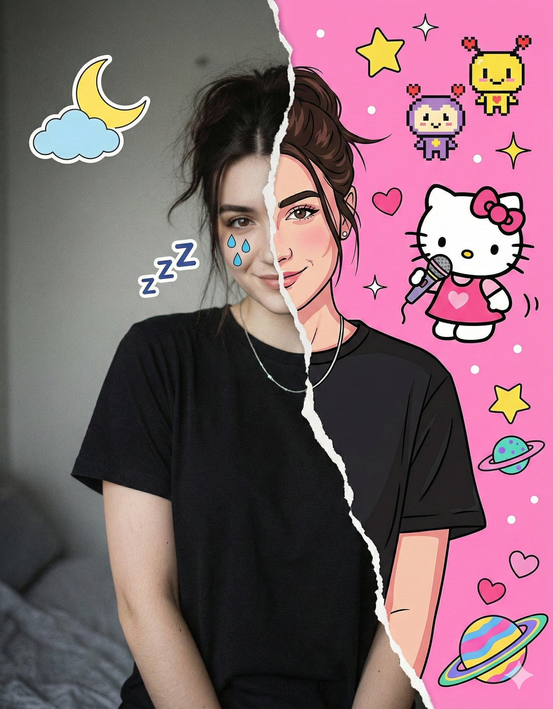

## 超写实风格真实和卡通分离效果

- ID: gpt4o-667-zh-2
- Slug: prompt-667-zh-2
- 语言: zh
- 来源: [来源链接](https://x.com/ZaraIrahh/status/1995304550610407807)
- 样例图路径: images/part3/667.jpeg

### 提示词

```text
{
"image_generation": {
“要求”： {
"面保存": {
"preserve_original": true,
"accuracy_level": "与参考值100%相同"
“细节”： [
“真实的脸部比例”，
“精准的肌肤纹理”，
“真实的眼睛形状和颜色”，
“自然柔和的妆容”，
“淡淡的上扬眼线”，
“柔和的粉色眼影”，
“自然红润的嘴唇”
]
},
"姿势": {
"match_reference_pose": true,
“描述”：“胸部以上的肖像，脸部朝前，但从观看者的角度来看略微向右倾斜。”
},
“灯光”： {
"match_reference_lighting": true,
“类型”：“柔和漫射室内照明”，
“方向”：“从前方略偏左”，
“阴影”：“脸颊和颈部两侧柔和的阴影”，
"background_tone": "柔和的中性色，略带蓝色调"
}
},

“主题”： {
"性别": "女性",
"发型": {
"match_reference": true,
描述：与参考图中完全相同的发型
},
“表情”：“中性，略带沉思”
“衣服”： {
上衣：一件简单的黑色T恤，
“项链”： “带有小巧简约吊坠的细银项链”
}
},

“作品”： {
“画框”：“胸部以上肖像”，
“方向”: “正面略微向右倾斜”
“风格”：“超写实风格，带有真实/卡通分离效果”
},

"特效": {
"split_effect": {
“类型”：“不规则中心撕裂”，
“边缘”：“白色斜角撕纸效果”，
描述：图像似乎从中间撕裂开来
},

"realistic_side": {
“背景”：“柔和、中性、略带蓝色的环境”，
“过滤器”：[
“柔和的模拟颗粒”，
“略带陈旧的质感”，
“饱和度降低”，
“细微的胶片瑕疵”
],
“叠加层”：[
“左眼下方贴有蓝色水滴形贴纸”，
“额头附近有小小的‘Zzz’睡眠符号”，
“左上角的黄色新月”
“浅蓝色手绘云朵”
]
},

"illustrated_side": {
"art_style": "大胆的卡通，数字插画",
"color_palette": "明亮、鲜艳、饱和"
“头发”：“与写实风格相同，但风格化”，
“眼睛”：“夸张的眼线，戏剧性的表情”，
“背景”：“充满活力的浅粉色波普艺术风格”，
“装饰”： {
"kawaii_elements": [
“Hello Kitty 拿着麦克风”
“像素艺术粉色吉祥物角色”，
“黄色星星”，
“粉红色的心”，
“色彩斑斓的行星”，
“粗体粉色日文字符”
]
}
}
},

“审美的”： {
整体色调：柔和、梦幻、略带复古感
"lighting_consistency": "必须与参考完全一致",
"skin_texture_realism": "高",
"blending_quality": "真实部分与插图部分之间过渡平滑自然，撕裂边缘清晰"
},

“输出”： {
“风格”：“超写实+数字卡通融合”，
“质量”：“超高分辨率”，
“过滤器”：[
“微妙的模拟复古胶片滤镜”，
“软粒”
]
}
}
}
```

### 样例图


## 哆啦A梦讲课

- ID: gpt4o-663-zh
- Slug: prompt-663-zh
- 语言: zh
- 来源: [来源链接](https://x.com/oran_ge/status/1995075703084339500)
- 样例图路径: images/part3/663.jpeg

### 提示词

```text
我想要一张超真实的照片，但内容又有点超现实。感觉就像一个孩子放学后，偷偷从教室门缝里看到一个神奇的景象：哆啦A梦竟然真的在空无一人的教室里，像个小老师一样，认真地准备着化学课。 整个画面要非常写实，但又充满了童话般的温馨和惊奇。

画面内容

主体： 哆啦A梦本人，活生生地站在教室的讲台前面，而不是画在黑板上。他看起来是立体的，有光滑的质感，就像动画里走出来的一样，但又完美地融入了这个真实的环境里。
人物细节：哆啦A梦站在讲台旁，身体微微侧着，表情认真又亲切，仿佛在思考怎么给大雄他们讲课。
他的一只手拿着一根小小的教鞭，指向他身后的黑板。
他的黄色铃铛在教室的光线下有微微的反光，肚子上的四维口袋看起来鼓鼓的。

背景细节（黑板）：他身后的黑板上，画着一幅用各色粉笔手写的化学元素周期表。这个周期表看起来就像是哆啦A梦刚刚亲手画上去的，色彩丰富，带有一点可爱的风格。
可以用不同颜色的粉笔（比如黄色、蓝色、粉色）来区分不同的元素区域，让整个画面色彩更丰富。

文字： 在黑板的顶上或者角落，用可爱的粉笔字体写上标题：“哆啦A梦的科学教室”。
环境与构图
场景： 一间普通的日本教室，桌椅摆放整齐，夕阳的余晖从窗户照进来，营造出一种安静、温暖的氛围。
构图： 画面比例是4:3。从学生的座位视角看过去，哆啦A梦和讲台在画面的中心位置。
前景： 画面最前面可以带到一两张学生的课桌椅，让视角更具代入感。讲台上可以放着一盒彩色粉笔和一个黑板擦。
风格和技术要求
风格： 照片写实主义。关键在于真实的环境和光影，与哆啦A梦这个动漫角色的奇妙结合。

光线： 温暖的午后自然光从窗户斜射进来，光线要自然地打在哆啦A梦身上，在他圆滚滚的身体上形成柔和的光影和高光，让他看起来有体积感，并且在他的脚边投下淡淡的影子，这能让他看起来更真实。
焦点： 焦点要清晰地对准哆啦A梦，黑板上的内容也很清楚，但前景的课桌可以稍微有点模糊。
千万不要出现！
不要让哆啦A梦看起来像个塑料玩具或模型，他得是活的。

不要有其他任何人物，特别是大雄、静香他们。
不要把画风变成动画截图或纯CG，一定要是照片的感觉。
构图要稳，不要用奇怪的低角度或鱼眼镜头。
颜色别太鲜艳，要符合真实光线下的色彩。
```

### 样例图

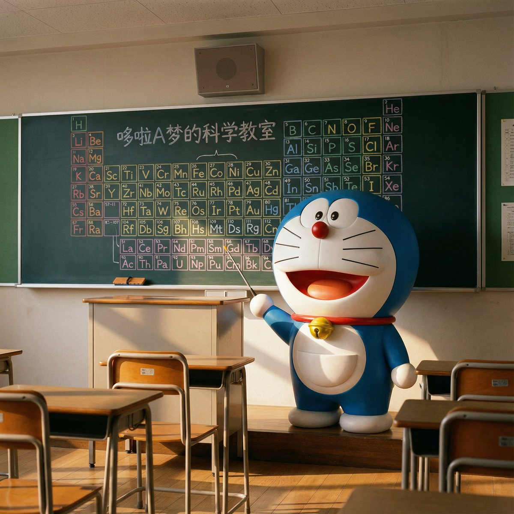

## { "objective": "Generate an image based on a detailed ch

- ID: gpt4o-660-en-1
- Slug: prompt-660-en-1
- 语言: en
- 来源: [来源链接](https://x.com/rovvmut_/status/1995146612885410093)
- 样例图路径: images/part3/660.jpeg

### 提示词

```text
{
  "objective": "Generate an image based on a detailed character portrait description.",
  "image_generation_prompt": {
    "subject": {
      "gender": "female",
      "portrait_type": "close-up",
      "angle": "side angle",
      "aesthetic": "edgy, modern, mysterious, confident, slightly provocative"
    },
    "appearance": {
      "hair": {
        "color": "light gray",
        "length": "short",
        "texture": "wavy",
        "style": "modern, slightly messy, partially covering forehead"
      },
      "face": {
        "skin_tone": "fair",
        "features": "sharp",
        "eyebrows": "straight, neat, dark",
        "lips": "naturally pink with a slight sheen"
      },
      "expression": "calm but intense"
    },
    "clothing_and_accessories": {
      "headwear": "black bandana with white swirl patterns",
      "outfit": {
        "jacket": "black zip-up jacket, left open",
        "inner_shirt": "black T-shirt with green and red graphic art on the chest"
      },
      "jewelry": {
        "neck": "thin silver chain",
        "ear": "small silver earring"
      }
    },
    "lighting_and_background": {
      "lighting": "front light highlighting facial features and outfit",
      "background": "bright blue sky"
    },
    "style": {
      "vibe": "striking and stylish",
      "focus": "expression and trendy fashion details",
      "mood": "modern and edgy"
    },
    "aspect_ratio": "3:4"
  },
  "response_format": "Use this JSON object as the structure for an image generation model prompt."
}
```

### 样例图


## 现代前卫的女生特写

- ID: gpt4o-660-zh-2
- Slug: prompt-660-zh-2
- 语言: zh
- 来源: [来源链接](https://x.com/rovvmut_/status/1995146612885410093)
- 样例图路径: images/part3/660.jpeg

### 提示词

```text
{
“目标”：“根据详细的人物肖像描述生成图像。”
"image_generation_prompt": {
“主题”： {
"性别": "女性",
"portrait_type": "特写",
"角度": "侧角",
“美学”：前卫、现代、神秘、自信、略带挑衅性
},
“外貌”： {
“头发”： {
颜色：浅灰色，
"长度": "短",
“纹理”：“波浪状”，
“风格”：“现代，略显凌乱，部分遮住额头”
},
“脸”： {
"skin_tone": "fair",
“特点”：“锐利”，
“眉毛”：“笔直、整齐、浓密”，
“嘴唇”：“自然粉嫩，略带光泽”
},
“表情”：“平静而专注”
},
"服装和配饰": {
“头饰”：“带有白色漩涡图案的黑色头巾”，
“全套服装”： {
“外套”：“黑色拉链外套，敞开着”，
"inner_shirt": "胸前印有绿色和红色图案的黑色T恤"
},
“珠宝”： {
“脖子”： “细银链”，
“耳朵”: “小银耳环”
}
},
"lighting_and_background": {
“照明”：“正面灯光突出面部特征和服装”，
“背景”：“湛蓝的天空”
},
“风格”： {
“氛围”：“引人注目且时尚”，
“重点”：“表达和潮流时尚细节”，
“氛围”：“现代前卫”
},
"aspect_ratio": "3:4"
},
"response_format": "使用此 JSON 对象作为图像生成模型提示的结构。"
}
```

### 样例图


## { "prompt": "Ultra-close-up portrait of a stunning young

- ID: gpt4o-659-en-1
- Slug: prompt-659-en-1
- 语言: en
- 来源: [来源链接](https://x.com/Just_sharon7/status/1995108671026803004)
- 样例图路径: images/part3/659.jpeg

### 提示词

```text
{
  "prompt": "Ultra-close-up portrait of a stunning young East Asian woman with flawless porcelain skin, large sparkling dark brown eyes with long lashes, subtle pink blush, glossy red-tinted lips, long straight silky dark brown hair with subtle highlights, making a playful finger-frame gesture around one eye with both hands, extremely detailed long almond-shaped nails with glossy purple-marble and silver chrome galaxy nail art with tiny rhinestones, wearing black-and-white horizontal striped oversized knit sweater with ribbed cuffs, layered delicate silver necklaces with crystal pendants and small pink gems, soft studio lighting with bright white seamless background, high-fashion beauty editorial style, razor-sharp details, perfect skin texture with natural glow, shallow depth of field, shot on 85mm lens f/1.4, ultra-realistic photorealism, 8k, masterpiece, best quality",
  "negative_prompt": "blurry, low resolution, deformed hands, extra fingers, missing fingers, bad anatomy, ugly nails, cheap makeup, overexposed, underexposed, text, watermark, logo, cartoon, 3d render, plastic skin, doll face, cross-eyed, distorted proportions, old, child",
  "steps": 60,
  "cfg_scale": 7.5,
  "sampler": "DPM++ 2M Karras",
  "width": 832,
  "height": 1216,
  "seed": -1
}
```

### 样例图


## 年轻女性的超近特写肖像

- ID: gpt4o-659-zh-2
- Slug: prompt-659-zh-2
- 语言: zh
- 来源: [来源链接](https://x.com/Just_sharon7/status/1995108671026803004)
- 样例图路径: images/part3/659.jpeg

### 提示词

```text
{
“提示”：一位令人惊艳的年轻东亚女性的超近特写肖像，她拥有完美无瑕的瓷白肌肤、闪亮的大眼睛（深棕色）、纤长的睫毛、淡淡的粉色腮红、光泽红润的嘴唇、柔顺的深棕色长直发（带有微妙的挑染），双手俏皮地用手指勾勒着一只眼睛，修长的杏仁形指甲上点缀着闪亮的紫色大理石纹和银色铬星空图案，并镶嵌着细小的水钻，细节极其精致。她身穿黑白横条纹宽松针织衫，袖口饰有罗纹，佩戴着层叠的精致银项链，项链上缀有水晶吊坠和粉色小宝石。柔和的影棚灯光，搭配明亮的白色背景，呈现出高级时尚美妆大片的风格，细节清晰锐利，肌肤纹理完美，散发着自然光泽，浅景深效果，使用85mm f/1.4镜头拍摄，超逼真的照片级写实效果，8K分辨率，杰作，最佳品质。
"negative_prompt": "模糊、低分辨率、手部畸形、多余手指、缺指、解剖结构错误、指甲难看、妆容廉价、曝光过度、曝光不足、文字、水印、标志、卡通、3D渲染、塑料皮肤、娃娃脸、斗鸡眼、比例失调、老旧、儿童",
“步骤”：60，
"cfg_scale": 7.5，
"采样器": "DPM++ 2M Karras",
宽度：832，
“高度”：1216，
“种子”：-1
}
```

### 样例图


## 3x3大头贴风格拼贴画

- ID: gpt4o-658-zh
- Slug: prompt-658-zh
- 语言: zh
- 来源: [来源链接](https://x.com/KusoPhoto/status/1995336530286797271)
- 样例图路径: images/part3/658.jpeg

### 提示词

```text
主题和形式：两位年轻女性朋友创作的高分辨率现代日本大头贴风格拼贴画。
布局：由 3x3 网格组成的单个图像（共 9 帧）。
主题：圣诞节 风格：生动、全彩、明亮、动感地再现现代日本大头贴灯光效果。
背景：简单的纯色或主题色背景（带有小爱心等精致装饰）。
摄影特点：每幅画面都有一条细细的白色或装饰性边框。景深浅（虚化）。

主题和姿势：
两位年轻的女性朋友，穿着符合主题的搭配服装。
生动、活泼、明快的表达。
这九张图清晰地描绘了以下列表中九种不同的流行大头贴姿势。

9 种不同的姿势（3x3 网格）：
第一行：
“抓头发爱心”姿势：一人俏皮地抓着头发，另一人用双手比出一个小爱心。两人都面带笑容。
“双手心形”姿势：两位伴侣用双手在中心形成一个大大的心形。脸上洋溢着灿烂快乐的笑容。
“捏手臂”姿势：两人双臂交叉，其中一人或两人都轻轻捏着对方的脸颊或手臂。表情生动活泼，充满喜悦。特写镜头展现对方的脸部。

第二排：4.“双臂交叉大爱心”姿势：两人双臂交叉，用空着的那只手比出一个大大的爱心。笑容灿烂而充满活力。5.“承诺之心”姿势：一人做出“手指发誓”的手势，另一人用手比出一个小爱心。笑容俏皮而温暖。6.“手牵手爱心”姿势：两人手牵手，各自用空着的那只手比出半个爱心，组成一个完整的爱心。笑容温柔甜美。

第三排：7.“双臂交叉撅嘴”姿势：两人双臂交叉，略带夸张的撅嘴或“得意”（或严肃）的表情，似乎在强忍着笑意。8.“双手合十，脸颊贴心”姿势：两人手牵着手，双手分别放在脸颊上，在脸颊周围画出一个心形。笑容可爱迷人。9.“双臂交叉，手心相印”姿势：两人双臂交叉，每人用一只手分别画出一个小的心形。笑容自信而时尚。特写镜头展现了他们的脸部。

其他装饰：
多个发光的霓虹心形图案叠加。
每一帧画面上，都以霓虹灯风格，沿着脸部的外轮廓写着与主题相关的字母。
在每个面板上添加多个符合主题的不同霓虹线条艺术涂鸦（例如星星、箭头、饱和线条、花朵、动物耳朵等）。
主要限制：所有9张照片必须保持主体、服装、背景风格和光线的严格一致性。浅景深，这是大头贴的典型特征。
请勿：添加任何文字、徽标、标签、水印、符号、数字或其他任何类型的文本元素（上述指定的文本元素和霓虹线条艺术涂鸦除外）。
```

### 样例图


## { "title": "Hyper-Realistic Portrait: Suited Woman in Mu

- ID: gpt4o-657-en-1
- Slug: prompt-657-en-1
- 语言: en
- 来源: [来源链接](https://x.com/xmiiru_/status/1995344587750072496)
- 样例图路径: images/part3/657.jpeg

### 提示词

```text
{
  "title": "Hyper-Realistic Portrait: Suited Woman in Mugshot Pose",
  "description": "A high-resolution hyper-realistic 8K HD portrait photograph captured with a professional DSLR camera using a 50mm lens for natural depth of field and razor-sharp focus. Full-body composition mimicking an old-fashioned mugshot/police booking photo.",
  "subject": {
    "type": "woman",
    "features": {
      "likeness_reference": "attached image",
      "height": "tall",
      "build": "elegant",
      "facial_features": {
        "jawline": "sharp",
        "eyes": "intense",
        "expression": "confident, slightly smug smirk"
      },
      "pose": "leaning against wall, one knee bent"
    },
    "hair": {
      "style": "neat, straight, wavy or elegant updo",
      "appearance": "natural and well-groomed"
    },
    "clothing": {
      "jacket": "vintage-style tailored dark pinstripe suit jacket",
      "inner_garment": "none",
      "tie": "slightly loosened, dark shade matching jacket",
      "accessories": [
        {
          "type": "mugshot board",
          "text": {
            "name": "MIRA",
            "date": "17/5/62"
          }
        },
        {
          "type": "shoe",
          "description": "single shiny dark-colored high-heeled shoe in right hand",
          "material": "patent leather"
        }
      ]
    }
  },
  "background": {
    "style": "naturally blurred bokeh",
    "texture": "slightly gritty studio wall",
    "details": {
      "height_chart": "vertical lines with numerical markings 2'0\" to 6'6\"",
      "color_tone": "desaturated, slightly sepia-toned archival photograph aesthetic"
    }
  },
  "lighting": {
    "type": "clean, soft, balanced",
    "shadow": "accurate shadows and highlights",
    "direction": "strong overhead or frontal lighting emphasizing dramatic shadows and height chart lines"
  },
  "framing": {
    "resolution": "1080x1350px (4:5)",
    "focus": "sharp subject focus",
    "composition": "full figure and mugshot details",
    "color_accuracy": "professional, natural tones"
  },
  "style": "Hyper-realistic photography, 8K clarity, DSLR quality, accurate color grading, natural lens blur, vintage photo aesthetic, true-to-life detail",
  "watermark": "© xmiiru",
  "negative_prompt": [
    "No anime",
    "No cartoon",
    "No digital painting",
    "No illustration",
    "No 3D render",
    "No CGI",
    "No stylized features",
    "No plastic/doll-like skin",
    "No fantasy glow",
    "No cinematic effects",
    "No airbrushed smoothing",
    "No overexposure",
    "No unnatural blur",
    "No video-game/Unreal Engine style",
    "No sketch",
    "No artificial lighting effects",
    "No unrealistic proportions/textures",
    "No multiple shoes",
    "No modern background elements"
  ]
}
```

### 样例图


## 身着西装的女子摆出嫌犯照姿势

- ID: gpt4o-657-zh-2
- Slug: prompt-657-zh-2
- 语言: zh
- 来源: [来源链接](https://x.com/xmiiru_/status/1995344587750072496)
- 样例图路径: images/part3/657.jpeg

### 提示词

```text
{
标题：超写实肖像：身着西装的女子摆出嫌犯照姿势
“描述”：“这是一张高分辨率、超逼真的 8K 高清人像照片，使用专业数码单反相机和 50mm 镜头拍摄，以获得自然的景深和极其清晰的焦点。全身构图模仿了老式的嫌犯照/警局登记照。”
“主题”： {
类型： 女，
“特征”： {
"likeness_reference": "附加图像",
“身高”：“高”，
“建造”：“优雅”，
"facial_features": {
下颌线：尖锐，
“眼睛”：“专注”，
“表情”：“自信、略带自负的微笑”
},
姿势：倚靠在墙上，单膝弯曲
},
“头发”： {
“发型”：“整齐、笔直、波浪或优雅的盘发”，
“外表”：“自然且仪容整洁”
},
“衣服”： {
“外套”： “复古风格的深色细条纹修身西装外套”，
"内衣": "无",
领带：略微松开，深色，与外套相配。
“配件”： [
{
类型： '嫌犯照片板'，
“文本”： {
"name": "MIRA",
日期： 17/5/62
}
},
{
类型：鞋子，
描述：右手拿着一只闪亮的深色高跟鞋。
材质：漆皮
}
]
}
},
“背景”： {
“风格”：“自然模糊散景”，
“纹理”：“略带颗粒感的摄影棚墙面”，
“细节”： {
"身高图": "带有数字标记的垂直线，从 2'0\" 到 6'6\"",
"color_tone": "褪色、略带棕褐色调的档案照片美学"
}
},
“灯光”： {
“类型”：“干净、柔和、平衡”，
“阴影”：“精确的阴影和高光”，
“方向”：“强烈的顶光或正面照明，强调戏剧性的阴影和高度图线条”
},
"框架": {
“分辨率”：“1080x1350像素（4:5）”
“焦点”: “清晰的主体焦点”，
“构图”：“全身像和嫌犯照细节”，
"color_accuracy": "专业、自然的色调"
},
“风格”：“超逼真的摄影，8K 清晰度，单反画质，精准的色彩分级，自然的镜头虚化，复古照片美学，逼真的细节”，
“水印”： “ © xmiiru”，
"negative_prompt": [
“没有动漫”，
“没有卡通片”，
“没有数码绘画”，
“无插图”
“没有3D渲染图”，
“无电脑特效”
“没有风格化的特征”，
“没有塑料/娃娃般的皮肤”，
“没有梦幻般的光芒”，
“没有电影特效”，
“没有使用喷枪进行平滑处理”，
“没有过度曝光”，
“没有不自然的模糊效果”，
“没有电子游戏/虚幻引擎风格”，
“没有草图”，
“无人工照明效果”，
“没有不切实际的比例/纹理”，
“禁止穿多双鞋”
“无现代背景元素”
]
}
```

### 样例图


## Extreme close-up of a human hand holding a giant vertica

- ID: gpt4o-654-en-1
- Slug: prompt-654-en-1
- 语言: en
- 来源: [来源链接](https://x.com/ShreyaYadav___/status/1995145004269068406)
- 样例图路径: images/part3/654.jpeg

### 提示词

```text
Extreme close-up of a human hand holding a giant vertical pill.
The pill has a clear glass top section and the lower 3/4 is matte bright-red, with bold, clean, perfectly aligned typography that reads: BASKETBALL LEGENDARY.
Inside the pill, show a person whose face must match the attached photo 100% exactly — no changes to facial structure, proportions, expression baseline, or any detail. The face must display a natural, realistic, wide laughing expression.
Inside the pill, the person is performing a dynamic basketball dribbling pose with high energy, labeled with the account name 'MICHAEL JORDAN'.
Scene style: funny, chaotic, thrilling, slightly creepy, and intense.
Background: an NBA basketball court, with full cinematic lighting, dramatic shadows, and rich color depth.
Camera angle: aerial extreme close-up focused on the pill in the hand.
Texture: ultra-HD realism with fine grain, crisp micro-details, glass reflections, and smooth matte material fidelity.
Ratio 3:4.
Ensure motion, energy, and dynamic movement inside the pill while keeping the pill perfectly vertical.
```

### 样例图

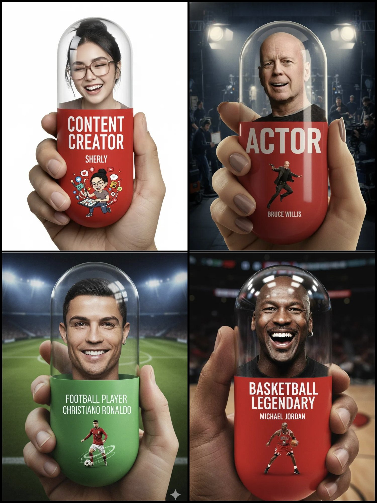

## 人手拿着一颗巨大的竖式药丸的特写镜头

- ID: gpt4o-654-zh-2
- Slug: prompt-654-zh-2
- 语言: zh
- 来源: [来源链接](https://x.com/ShreyaYadav___/status/1995145004269068406)
- 样例图路径: images/part3/654.jpeg

### 提示词

```text
人手拿着一颗巨大的竖式药丸的特写镜头。”
该药丸顶部为透明玻璃部分，底部 3/4 为哑光亮红色，上面印有醒目、清晰、完美对齐的字体：篮球传奇。
药丸内显示一个人的脸，该人的脸必须与附图100%完全一致——面部结构、比例、表情基线或任何细节都不得更改。该脸必须展现出自然、逼真、开怀大笑的表情。
药丸内，一个人摆出充满活力的篮球运球姿势，并标有账号名称“迈克尔·乔丹”。
场景风格：滑稽、混乱、惊险、略带诡异、紧张。
背景：NBA篮球场，采用全电影级灯光、戏剧性的阴影和丰富的色彩深度。
拍摄角度：航拍，特写镜头聚焦于手中的药丸。
纹理：超高清真实感，颗粒细腻，微细节清晰，玻璃反射效果逼真，哑光材质质感细腻。
比例 3:4。
“确保药丸内部具有运动、能量和动态特性，同时保持药丸完全垂直。
```

### 样例图


## A hyper-realistic travel advertisement in square format 

- ID: gpt4o-653-en-1
- Slug: prompt-653-en-1
- 语言: en
- 来源: [来源链接](https://x.com/TechieBySA/status/1994840773855203512)
- 样例图路径: images/part3/653.jpeg

### 提示词

```text
A hyper-realistic travel advertisement in square format (1080x1080), featuring a hand holding a sleek, ultra-thin smartphone or tablet in portrait orientation, tilted slightly sideways to create a striking 3D portal effect. The screen displays a high-resolution image of an iconic landmark from [COUNTRY], which continues into the real background, blending seamlessly. The landmark appears to emerge from the screen. Birds fly nearby and a commercial airplane passes through a bright blue sky with soft white clouds. Bold, clean sans-serif text reading “[COUNTRY]” is placed prominently above. The lighting is warm and natural, casting soft shadows across the landscape. The surroundings reflect the region’s natural environment (like meadows, coastlines, or city skylines). The device is glossy and minimal-bezel, enhancing realism and depth.
```

### 样例图


## 超写实的旅行广告

- ID: gpt4o-653-zh-2
- Slug: prompt-653-zh-2
- 语言: zh
- 来源: [来源链接](https://x.com/TechieBySA/status/1994840773855203512)
- 样例图路径: images/part3/653.jpeg

### 提示词

```text
这是一则超写实的旅行广告，采用正方形格式（1080x1080），画面中一只手竖屏握着一部纤薄时尚的智能手机或平板电脑，略微侧倾，营造出引人注目的3D立体效果。屏幕上显示着[国家/地区]标志性地标的高分辨率图像，图像与真实背景无缝融合，仿佛从屏幕中浮现出来一般。附近有鸟儿飞翔，一架商用飞机掠过湛蓝的天空，朵朵白云点缀其间。醒目的无衬线字体“[国家/地区]”位于上方。温暖自然的灯光在画面上投下柔和的阴影。周围环境反映了该地区的自然环境（例如草地、海岸线或城市天际线）。设备采用光滑的超窄边框设计，进一步增强了画面的真实感和立体感。
```

### 样例图


## "A surreal, whimsical digital illustration of a young wo

- ID: gpt4o-650-en-1
- Slug: prompt-650-en-1
- 语言: en
- 来源: [来源链接](https://x.com/madpencil_/status/1994891011861221665)
- 样例图路径: images/part3/650.jpeg

### 提示词

```text
"A surreal, whimsical digital illustration of a young woman with pale pink skin and voluminous, floating black hair. Her head is horizontally split open at the nose level. Inside the hollow of her head, a tiny, miniature version of herself (wearing the same attire) is standing and physically lifting the top half of the head (containing the closed eyes and forehead) up with her hands. The space inside the split head reveals a dark blue starry night sky or cosmic void.

Art style: Modern flat illustration with a lo-fi, grainy texture. Soft pastel colors including lavender, periwinkle, and peach. The shading is subtle and soft using gradients. There is a noise overlay/stipple effect giving it a retro print look. The background is a solid soft purple gradient with scattered white stardust. Emotional, dreamy, metaphorical."
```

### 样例图

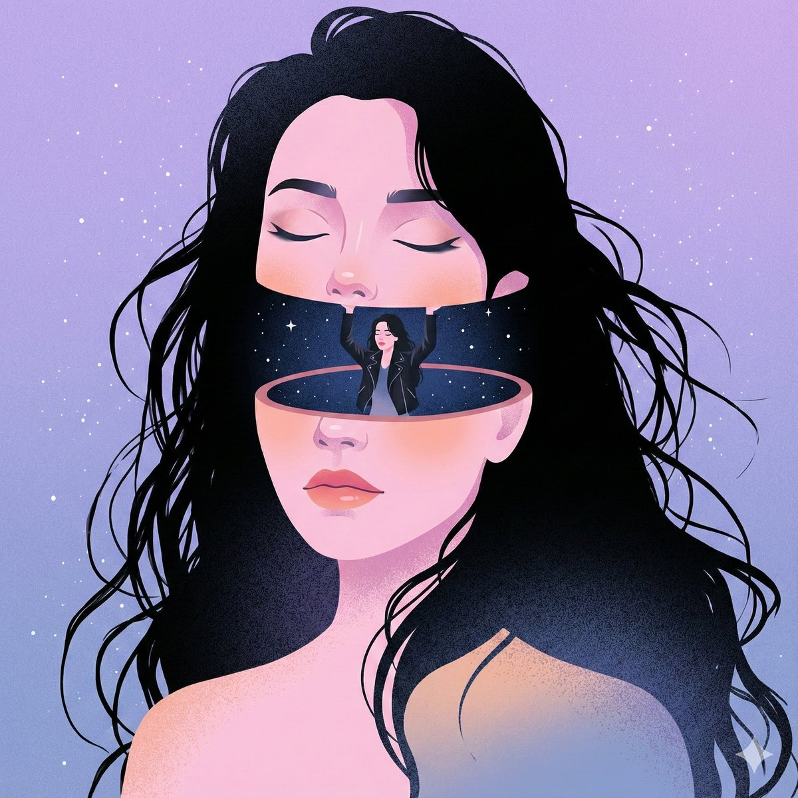

## 头部的空腔内正站着迷你版自己

- ID: gpt4o-650-zh-2
- Slug: prompt-650-zh-2
- 语言: zh
- 来源: [来源链接](https://x.com/madpencil_/status/1994891011861221665)
- 样例图路径: images/part3/650.jpeg

### 提示词

```text
这是一幅超现实主义的奇幻数字插画，描绘了一位拥有淡粉色皮肤和蓬松飘逸黑发的年轻女子。她的头部在鼻子处被水平剖开。在她头部的空腔内，一个穿着同样服饰的迷你版自己正站着，用双手抬起她头部的上半部分（包括紧闭的双眼和额头）。剖开的头部内部展现出一片深蓝色的繁星点点的夜空，或是浩瀚的宇宙虚空​​。

艺术风格：现代扁平插画，带有低保真颗粒质感。柔和的粉彩色调，包括薰衣草紫、长春花蓝和蜜桃色。阴影处理细腻柔和，运用了渐变效果。叠加的噪点/点描效果赋予画面复古的印刷质感。背景是柔和的纯紫色渐变，点缀着零星的白色星尘。充满情感、梦幻和隐喻。
```

### 样例图


## { "subject": { "description": "A rugged male survivor wa

- ID: gpt4o-648-en-1
- Slug: prompt-648-en-1
- 语言: en
- 来源: [来源链接](https://x.com/azed_ai/status/1994767576963207277)
- 样例图路径: images/part3/648.jpeg

### 提示词

```text
{
  "subject": {
    "description": "A rugged male survivor walking through an overgrown city street",
    "mirror_rules": "Reflection in broken shop window",
    "age": "40s",
    "expression": "wary, scanning the horizon, tired",
    "hair": {
      "color": "salt and pepper",
      "style": "overgrown, messy beard"
    },
    "clothing": {
      "top": {
        "type": "flannel shirt and denim jacket",
        "color": "faded blue and red plaid",
        "details": "holes in elbows, sun-bleached, dirt stains"
      },
      "bottom": {
        "type": "jeans",
        "color": "dark grey",
        "details": "muddy knees, frayed hems"
      }
    },
    "face": {
      "preserve_original": true,
      "makeup": "dirt smudges, sun spots, realistic weathering"
    }
  },
  "accessories": {
    "headwear": {
      "type": "none",
      "details": "N/A"
    },
    "jewelry": {
      "earrings": "none",
      "necklace": "none",
      "wrist": "broken analog watch",
      "rings": "wedding band on chain around neck"
    },
    "device": {
      "type": "flashlight",
      "details": "clipped to backpack strap"
    },
    "prop": {
      "type": "hiking backpack",
      "details": "large, olive green, bedroll attached, worn fabric"
    }
  },
  "photography": {
    "camera_style": "Cinematic realism, 35mm wide lens",
    "angle": "wide shot establishing environment",
    "shot_type": "full body walking away from camera slightly",
    "aspect_ratio": "16:9",
    "texture": "detailed foliage, crisp sunlight, natural colors"
  },
  "background": {
    "setting": "ruined city street reclaimed by nature",
    "wall_color": "concrete covered in ivy",
    "elements": [
      "rusted cars",
      "tall grass cracking through pavement",
      "collapsed building in distance",
      "deer visible in background"
    ],
    "atmosphere": "quiet, desolate, beautiful decay",
    "lighting": "overcast soft daylight, diffuse shadows, melancholy feel"
  }
}
```

### 样例图

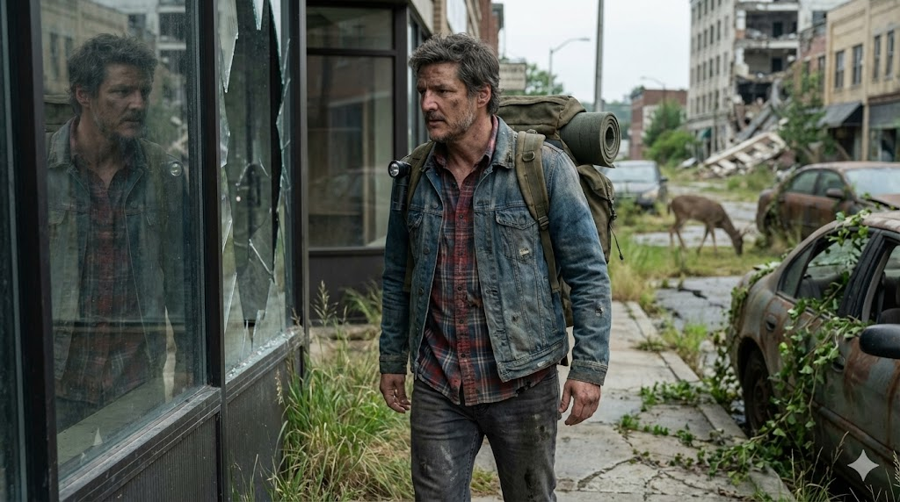

## 电影感十足的照片

- ID: gpt4o-648-zh-2
- Slug: prompt-648-zh-2
- 语言: zh
- 来源: [来源链接](https://x.com/azed_ai/status/1994767576963207277)
- 样例图路径: images/part3/648.jpeg

### 提示词

```text
{
“主题”： {
“描述”：“一位身形粗犷的男性幸存者走过杂草丛生的城市街道”，
"mirror_rules": "破损商店橱窗中的倒影",
“年龄”: “40多岁”
“表情”：“警惕地扫视着地平线，疲惫不堪”
“头发”： {
“颜色”：“盐和胡椒”，
“风格”：“杂乱不堪的胡须”
},
“衣服”： {
“顶部”： {
“类型”：“法兰绒衬衫和牛仔夹克”，
“颜色”：“褪色的蓝红色格子图案”，
“细节”：“肘部有破洞，被太阳晒褪色，有污渍”
},
“底部”： {
类型：牛仔裤，
“颜色”：“深灰色”，
细节：沾满泥巴的膝盖，磨损的下摆
}
},
“脸”： {
"preserve_original": true,
“妆容”：“污渍、晒斑、逼真的风化效果”
}
},
“配件”： {
"头饰": {
"type": "无",
“详情”： “不适用”
},
“珠宝”： {
“耳环”： “无”，
“项链”： “无”，
“手腕”: “坏掉的模拟手表”
“戒指”： “戴在脖子上的链子上的结婚戒指”
},
“设备”： {
“类型”：“手电筒”，
“细节”：“夹在背包带上”
},
"prop": {
"type": "登山背包",
“细节”：“大号，橄榄绿色，附带睡袋，布料磨损”
}
},
“摄影”： {
“camera_style”: “电影写实主义，35mm广角镜头”
角度： “广角镜头，展现环境”，
"shot_type": "全身略微远离镜头走开",
"aspect_ratio": "16:9",
“质感”：“细致的树叶、明媚的阳光、自然的色彩”
},
“背景”： {
“场景”：“被自然重新占领的废弃城市街道”，
"wall_color": "覆盖着常春藤的混凝土",
“元素”：[
“生锈的汽车”，
“高高的草丛撑破了路面”，
远处倒塌的建筑物
背景中可见鹿
],
“氛围”：“安静、荒凉、美丽的衰败”，
“光线”：“阴天柔和的日光，漫射的阴影，忧郁的氛围”
}
}
```

### 样例图


## { "scene_description": "A playful, high-energy fisheye p

- ID: gpt4o-646-en-1
- Slug: prompt-646-en-1
- 语言: en
- 来源: [来源链接](https://x.com/_MehdiSharifi_/status/1994870610410021018)
- 样例图路径: images/part3/646.jpeg

### 提示词

```text
{
  "scene_description": "A playful, high-energy fisheye portrait of a stylish young woman sitting inside a metal shopping cart in a vibrant supermarket aisle.",
  "subject": {
    "type": "young woman",
    "age": "early 20s",
    "features": {
      "hair": "long dark brown hair tied in loose low pigtails",
      "expression": "playful wink, slight smile",
      "hands": "long manicured nails, making a finger-frame gesture around her eye"
    },
    "attire": "black tank top, blue and white plaid shirt tied around the waist, white scrunched socks",
    "footwear": "oversized chunky white sneakers with light blue accents and thick laces",
    "position": "sitting inside a wire shopping cart, legs extended toward the camera lens creating foreshortening"
  },
  "action": {
    "primary": "posing playfully inside a shopping cart",
    "secondary": "framing her winking eye with her fingers using an 'L' shape gesture",
    "effect": "dynamic distortion emphasizing the sneakers and hands due to the lens"
  },
  "environment": {
    "setting": "brightly lit grocery store snack aisle",
    "foreground_elements": [
      "silver metal wire of the shopping cart",
      "chunky sneaker sole in extreme close-up"
    ],
    "background_elements": [
      "shelves stocked with colorful snack bags (yellow, red, green packaging)",
      "overhead fluorescent lights",
      "tiled supermarket floor",
      "promotional signage on shelves"
    ]
  },
  "lighting": {
    "style": "high-key, flat commercial lighting",
    "key_light": {
      "type": "overhead fluorescent tubes",
      "color": "cool white/neutral",
      "illuminates": [
        "entire aisle evenly",
        "reflections on plastic snack packaging",
        "sheen on the metal cart"
      ]
    },
    "shadows": "minimal, soft shadows beneath the cart"
  },
  "style": {
    "medium": "digital photography",
    "aesthetic": "Gen Z social media trend, Y2K influence, street style",
    "quality": "high definition, vibrant colors",
    "details": "sharp focus throughout"
  },
  "scene_composition": {
    "subject_action": "Leaning back casually in the cart, engaging directly with the camera",
    "camera_behavior": "Extreme close-up, wide-angle distortion",
    "depth_layering": "Exaggerated foreground (shoes) -> Middle ground (subject) -> Curved background (shelves)"
  },
  "visual_description": {
    "core_subject": "A trendy young woman with a fun, carefree attitude.",
    "attire_physics": "The plaid shirt is bunched naturally around the waist; the shoe laces appear large and textured due to proximity.",
    "skin_rendering": "Smooth, bright complexion, soft makeup with emphasized blush."
  },
  "lighting_and_atmosphere": {
    "type": "Artificial Interior Lighting",
    "specifics": "Even, bright illumination typical of retail environments, creating vibrant color pop on the merchandise.",
    "color_grade": "Slightly overexposed highlights, saturated primaries (reds, yellows, blues)."
  },
  "attire_customization": {
    "current_clothing": "Black tank top, plaid shirt (blue/white/grey), denim shorts (hidden), white chunky sneakers.",
    "customizable_clothing": "Leave empty to maintain current style or replace with 'oversized hoodie' for a different vibe."
  },
  "brand_product_customization": {
    "current_brand_product": "Generic colorful potato chip bags and snack packaging in background.",
    "customizable_brand": "User can insert specific snack brand names for the shelves.",
    "customizable_product": "User can specify the type of sneaker (e.g., Jordan, Balenciaga).",
    "product_placement_area": "The shelves behind the subject or the yellow bag inside the cart."
  },
  "objects_and_props": {
    "main_objects": [
      "Metal shopping cart",
      "Chunky sneakers"
    ],
    "secondary_objects": [
      "Yellow snack bag inside the cart",
      "Silver scrunched bracelet"
    ]
  },
  "camera_and_lens": {
    "focal_length_feel": "8mm to 10mm Fisheye",
    "aperture_effect": "Deep depth of field (f/8 or f/11)",
    "camera_angle": "High angle / POV looking down into the cart",
    "lens_type": "Ultra-wide angle fisheye lens",
    "bokeh_style": "None (everything in focus)"
  }
}
```

### 样例图

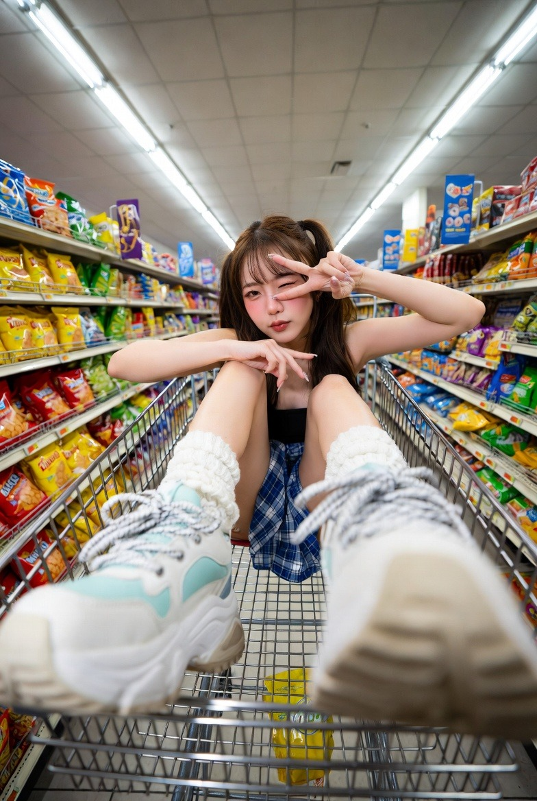

## 年轻女子坐在购物车里

- ID: gpt4o-646-zh-2
- Slug: prompt-646-zh-2
- 语言: zh
- 来源: [来源链接](https://x.com/_MehdiSharifi_/status/1994870610410021018)
- 样例图路径: images/part3/646.jpeg

### 提示词

```text
{
场景描述：一张充满活力、趣味十足的鱼眼镜头肖像照，照片中一位时尚的年轻女子坐在熙熙攘攘的超市过道里的一辆金属购物车里。
“主题”： {
“类型”: “年轻女子”
“年龄”：“20岁出头”，
“特征”： {
“头发”：“长长的深棕色头发扎成松散的低辫子”，
“表情”：“俏皮的眨眼，淡淡的微笑”，
“双手”：“修长的指甲，在她眼周做出指框的手势”
},
“着装”：“黑色背心，蓝白格子衬衫系在腰间，白色皱巴巴的袜子”，
“鞋履”：“超大号厚底白色运动鞋，带有浅蓝色点缀和粗鞋带”，
“姿势”：“坐在金属购物车里，双腿伸向镜头，造成透视缩短效果”
},
“行动”： {
“主要”: “在购物车里摆出俏皮的姿势”，
“次要的”：“用手指勾勒出她眨眼的轮廓，呈‘L’形”，
“效果”：“镜头造成的动态畸变，突出了运动鞋和手部”
},
“环境”： {
“场景”：“灯光明亮的杂货店零食区”，
"前景元素": [
“购物车上的银色金属丝”，
“厚底运动鞋的超近特写”
],
“背景元素”：[
“货架上摆满了五颜六色的零食袋（黄色、红色、绿色包装）”，
“头顶荧光灯”，
“超市瓷砖地面”，
“货架上的促销标牌”
]
},
“灯光”： {
“风格”：“高调、扁平的商业照明”，
"key_light": {
“类型”：“高架荧光灯管”，
“颜色”: “冷白/中性色”
“照亮”：[
“整条过道均匀铺开”，
“关于塑料零食包装的反思”
“金属推车上的光泽”
]
},
“阴影”：“购物车下方的阴影极少，很柔和”
},
“风格”： {
“媒介”: “数码摄影”
“美学”：“Z世代社交媒体趋势、Y2K影响、街头风格”
“质量”：“高清，色彩鲜艳”，
“细节”：“始终清晰聚焦”
},
"scene_composition": {
“subject_action”: “随意地向后靠在购物车里，直接与镜头互动”
"camera_behavior": "极致特写，广角畸变",
"depth_layering": "夸张的前景（鞋子） ->中景（主体） ->弧形背景（书架）"
},
"visual_description": {
"core_subject": "一位时尚、性格开朗、无忧无虑的年轻女性。"
"attire_physics": "格子衬衫自然地堆积在腰间；鞋带由于距离较近而显得又大又有纹理。"
“皮肤渲染”: “光滑、明亮的肤色，柔和的妆容，腮红突出。”
},
"lighting_and_atmosphere": {
“类型”：“人工室内照明”，
“具体细节”：“均匀明亮的照明，符合零售环境的典型特征，使商品色彩鲜艳夺目。”
“color_grade”: “高光略微过曝，原色（红色、黄色、蓝色）饱和度高。”
},
"attire_customization": {
"current_clothing": "黑色背心，格子衬衫（蓝/白/灰），牛仔短裤（隐藏），白色厚底运动鞋。"
"customizable_clothing": "留空以保持当前风格，或替换为“oversized hoodie”以获得不同的风格。"
},
"品牌产品定制": {
"current_brand_product": "背景中是色彩鲜艳的普通薯片包装袋和零食包装。"
"customizable_brand": "用户可以为货架输入特定的零食品牌名称。"
"customizable_product": "用户可以指定运动鞋的类型（例如，乔丹、巴黎世家）。"
"product_placement_area": "主体身后的货架或购物车内的黄色袋子。"
},
"objects_and_props": {
"main_objects": [
“金属购物车”，
厚底运动鞋
],
"secondary_objects": [
“购物车里的黄色零食袋”
“银色褶皱手镯”
]
},
"camera_and_lens": {
"focal_length_feel": "8mm 至 10mm 鱼眼镜头",
"aperture_effect": "大景深（f /8或 f/11）",
"camera_angle": "高角度/POV 俯视推车内部",
"lens_type": "超广角鱼眼镜头",
"bokeh_style": "无（所有物体都清晰对焦）"
}
}
```

### 样例图


## { "project_name": "3D_Caricature_Collage_Olive_Green", "

- ID: gpt4o-645-en-1
- Slug: prompt-645-en-1
- 语言: en
- 来源: [来源链接](https://x.com/ShreyaYadav___/status/1995052291981005278)
- 样例图路径: images/part3/645.jpeg

### 提示词

```text
{
  "project_name": "3D_Caricature_Collage_Olive_Green",
  "prompt_structure": {
    "subject": {
      "type": "Woman",
      "style": "3D Caricature",
      "appearance": "Highly polished, clean, meticulous detail",
      "clothing": "Deep olive green hoodie (rich, muted earth tone)"
    },
    "composition": {
      "type": "Collage",
      "layout": "Six-panel grid (3 columns x 2 rows)",
      "framing": "Close-up portraits"
    },
    "variations": {
      "panel_1": "Happy",
      "panel_2": "Surprised",
      "panel_3": "Serious",
      "panel_4": "Cute",
      "panel_5": "Sassy",
      "panel_6": "Confident",
      "facial_features": "Artistic exaggerations, widened eyes, arched eyebrows, broad smiles"
    },
    "environment": {
      "background": "Bold, vibrant colors distinct for each panel",
      "lighting": "Soft ambient lighting, sculpting subtle textures, crisp definition"
    },
    "text_elements": {
      "content": "Shreya Yadav",
      "type": "Signature",
      "style": "Elegant, legible"
    }
  },
  "technical_params": {
    "aspect_ratio": "3:4",
    "quality": "High definition, 8k, cinematic lighting",
    "render_engine": "Octane render / Unreal Engine style"
  },
  "full_prompt_text": "A six-panel collage (3 columns, 2 rows) featuring a highly polished 3D caricature of a woman wearing a deep olive green hoodie. The character maintains a consistent identity across all panels but displays six distinct emotions: happy, surprised, serious, cute, sassy, and confident. Facial features are artistically exaggerated with widened eyes and expressive mouths. Soft ambient lighting highlights skin texture and fabric folds. Backgrounds are bold and vibrant, contrasting with the muted olive hoodie. High-end digital art style, crisp definition. Signature text 'Shreya Yadav' included."
}
```

### 样例图


## 一张脸六种情绪

- ID: gpt4o-645-zh-2
- Slug: prompt-645-zh-2
- 语言: zh
- 来源: [来源链接](https://x.com/ShreyaYadav___/status/1995052291981005278)
- 样例图路径: images/part3/645.jpeg

### 提示词

```text
{
"project_name": "3D_Caricature_Collage_Olive_Green",
"prompt_structure": {
“主题”： {
"type": "Woman",
“风格”：“3D 漫画”，
“外观”：“高度抛光，干净，细节一丝不苟”，
服装：深橄榄绿连帽衫（浓郁、柔和的大地色调）
},
“作品”： {
“类型”：“拼贴画”，
"布局": "六格网格（3列 x 2行）",
“构图”：“特写肖像”
},
"变体": {
"panel_1": "快乐",
"panel_2": "惊讶",
"panel_3": "严肃",
"panel_4": "可爱",
"panel_5": "俏皮的",
"panel_6": "自信",
"facial_features": "艺术夸张，睁大的眼睛，弯弯的眉毛，灿烂的笑容"
},
“环境”： {
“背景”：“每个面板都采用大胆、鲜艳的颜色”，
“灯光”：“柔和的环境光，勾勒出微妙的纹理，清晰的轮廓”
},
"text_elements": {
内容：Shreya Yadav，
"type": "签名",
风格：优雅、清晰
}
},
"technical_params": {
"aspect_ratio": "3:4",
“质量”：“高清、8K、电影级光照”，
"render_engine": "Octane渲染/虚幻引擎风格"
},
"full_prompt_text": "一幅六格拼贴画（三列两行），以高度精细的3D漫画形式展现了一位身穿深橄榄绿连帽衫的女性形象。人物在所有画面中保持一致，但展现了六种截然不同的情绪：快乐、惊讶、严肃、可爱、俏皮和自信。面部特征经过艺术化的夸张处理，眼睛睁得大大的，嘴巴也极具表现力。柔和的环境光突显了皮肤纹理和衣物褶皱。背景色彩鲜艳夺目，与低调的橄榄绿连帽衫形成鲜明对比。作品采用高端数字艺术风格，画面清晰锐利。包含签名文字“Shreya Yadav”。"
}
```

### 样例图


## Generate a sleek digital artwork of me (use my uploaded 

- ID: gpt4o-643-en-1
- Slug: prompt-643-en-1
- 语言: en
- 来源: [来源链接](https://x.com/john_my07/status/1994989154669932989)
- 样例图路径: images/part3/643.jpeg

### 提示词

```text
Generate a sleek digital artwork of me (use my uploaded face), designed in the style of a modern vector poster portrait.
Visual Style & Elements:

A crisp vector aesthetic featuring strong line work and smooth, flat color shading.

Apply striking, high-contrast tones: light peach skin with gentle reddish shadowing.

Hair should be rendered with clean, stylized edges in deep brown/black shades, with faint highlights.

Beard should appear sharp, defined, and naturally blended into the facial structure.

Set the background to a solid red tone.
```

### 样例图

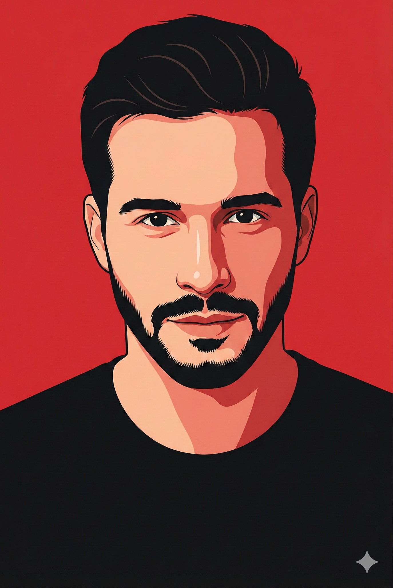

## 现代矢量海报肖像

- ID: gpt4o-643-zh-2
- Slug: prompt-643-zh-2
- 语言: zh
- 来源: [来源链接](https://x.com/john_my07/status/1994989154669932989)
- 样例图路径: images/part3/643.jpeg

### 提示词

```text
请用我上传的照片，为我创作一幅简洁的数字艺术作品，风格为现代矢量海报肖像。
视觉风格与元素：

简洁的矢量美学，线条流畅有力，色彩平滑自然。

采用醒目的高对比度色调：浅桃色肌肤搭配柔和的红色阴影。

头发应以深棕色/黑色为主色调，边缘干净利落，并带有淡淡的高光。

胡须应该看起来轮廓分明、线条流畅，并与面部结构自然融合。

将背景色设置为纯红色。
```

### 样例图


## 黑板艺术作品-海賊女帝

- ID: gpt4o-642-zh-1
- Slug: prompt-642-zh-1
- 语言: zh
- 来源: [来源链接](https://x.com/IamEmily2050/status/1994624635300974734)
- 样例图路径: images/part3/642.jpeg

### 提示词

```text
{
  "intent": "Photorealistic documentation of a specific chalkboard art piece featuring a single anime character, capturing the ephemeral nature of the medium within a classroom context.",
  "frame": {
    "aspect_ratio": "4:3",
    "composition": "A centered medium shot focusing on the chalkboard mural. The composition includes the teacher's desk in the immediate foreground to provide scale, with the artwork of the single character dominating the background space.",
    "style_mode": "documentary_realism, texture-focused, ambient naturalism"
  },
  "subject": {
    "primary_subject": "A large-scale, intricate chalk drawing of Boa Hancock from 'One Piece' on a standard green classroom blackboard.",
    "visual_details": "The illustration depicts Boa Hancock in a commanding pose, positioned centrally on the board. She is drawn with her signature long, straight black hair with a hime cut, rendered using dense application of black chalk with white accents for sheen. Her expression is haughty and imperious, with detailed dark blue eyes. She is depicted forming a heart shape with her hands, referencing her 'Mero Mero Mellow' technique. She wears a revealing red blouse with purple geometric patterns and gold snake-shaped earrings, drawn with vibrant colored chalks.",
    "medium_texture": "The image preserves the dusty, matte quality of the chalk. Visible hatching and cross-hatching strokes create shading on her clothing and hair. Smudged areas on the green slate indicate where colors have been blended by hand.",
    "surrounding_elements": "To the right of the character, vertical Japanese text reading '海賊女帝' (Pirate Empress) is written in crisp white chalk."
  },
  "environment": {
    "location": "A standard Japanese school classroom.",
    "foreground_elements": "A wooden teacher's desk occupies the lower foreground. Scattered across the surface are a yellow box of colored chalks, loose sticks of red, white, and blue pastel chalk, and a dust-covered black felt eraser.",
    "background_elements": "The green chalkboard spans the width of the frame, bordered by a metallic chalk tray containing accumulated chalk dust. The wall above is a plain, off-white plaster, featuring a small mounted speaker box.",
    "atmosphere": "Quiet and academic, with a sense of stillness suggesting the room is currently unoccupied."
  },
  "lighting": {
    "type": "Diffuse ambient classroom lighting.",
    "quality": "Soft, nondirectional illumination provided by overhead fluorescent fixtures mixed with daylight from windows on the left. The light is even, preventing glare on the chalkboard surface while highlighting the texture of the chalk.",
    "color_temperature": "Neutral white, approximately 5000K, ensuring accurate color rendition of the red and purple chalks against the dark green board.",
    "direction": "Overhead and slightly frontal."
  },
  "camera": {
    "sensor_format": "35mm full-frame digital sensor.",
    "lens": "35mm prime lens.",
    "aperture": "f/5.6",
    "depth_of_field": "Moderate depth of field, keeping the chalkboard drawing in sharp focus while allowing the foreground desk elements to soften slightly.",
    "shutter_speed": "1/60s",
    "iso": "400",
    "camera_position": "Eye-level standing position, set back enough to frame the entire drawing and the desk."
  },
  "negative": {
    "content": "Multiple characters, Midoriya, Shigaraki, male characters, digital art overlay, vector graphics, paper texture, oil painting, messy composition, extreme low angle, fisheye lens.",
    "style": "No hyper-saturation, no soft focus filters, no heavy vignetting."
  }
}
```

### 样例图


## 黑板艺术作品-海賊女帝

- ID: gpt4o-642-zh-2
- Slug: prompt-642-zh-2
- 语言: zh
- 来源: [来源链接](https://x.com/IamEmily2050/status/1994624635300974734)
- 样例图路径: images/part3/642.jpeg

### 提示词

```text
{
“意图”：“以照片写实的手法记录一幅特定的黑板艺术作品，作品中描绘了一个动漫角色，捕捉了课堂环境中这种媒介的转瞬即逝的特性。”
“框架”： {
"aspect_ratio": "4:3",
“构图”：“以黑板壁画为中心拍摄的中景镜头。画面前景中包含教师的办公桌以显示比例，而单个人物的画作则占据了背景空间。”
"style_mode": "纪实写实主义，注重纹理，环境自然主义"
},
“主题”： {
“primary_subject”: “一幅绘制在标准绿色教室黑板上的大型、精细的《海贼王》角色波雅·汉库克的粉笔画。”
“视觉细节”： “这幅插画描绘了波雅·汉库克，她以威严的姿态位于画面中央。她标志性的黑色长直发，采用姬发式剪裁，以浓重的黑色粉笔绘制，并以白色点缀以增加光泽。她的表情傲慢而威严，深蓝色的眼睛刻画入微。她双手比划成心形，象征着她的‘Mero Mero Mellow’（柔情蜜意）技巧。她身着一件饰有紫色几何图案的性感红色上衣，佩戴着以鲜艳彩色粉笔绘制的金色蛇形耳环。”
“medium_texture”：图像保留了粉笔的粉尘质感和哑光效果。清晰可见的排线和交叉线笔触在她的衣服和头发上营造出阴影。绿色石板上的晕染区域表明了手工调色的位置。
"surrounding_elements": "字符右侧用清晰的白色粉笔写着竖排的日文“海贼女帝”。"
},
“环境”： {
地点：一间标准的日本学校教室。
"前景元素": "一张木制教师桌占据了画面下方的前景。桌面上散落着一盒黄色的彩色粉笔、几支红色、白色和蓝色的粉彩粉笔，以及一块沾满灰尘的黑色毡橡皮。"
“背景元素”： “绿色黑板横跨整个画面宽度，边缘是一个金属粉笔托盘，里面积满了粉笔灰。黑板上方是一面普通的米白色石膏墙，墙上安装了一个小型壁挂式音箱。”
“氛围”：“安静而学术，一种静谧感表明房间里目前无人居住。”
},
“灯光”： {
“类型”：“漫射环境教室照明。”
“质量”：“柔和、无方向性的照明由上方荧光灯具提供，并混合了左侧窗户的自然光。光线均匀，既防止黑板表面产生眩光，又突显了粉笔的纹理。”
“色温”： “中性白光，约 5000K，确保红色和紫色粉笔在深绿色白板上的准确显色。”
“方向”：“头顶上方，略微朝前。”
},
“相机”： {
"sensor_format": "35mm 全画幅数码传感器。"
“镜头”：“35mm 定焦镜头。”
光圈：f/5.6，
“景深”： “适中的景深，保持黑板上的图画清晰锐利，同时让前景的桌面元素略微柔化。”
"shutter_speed": "1/60"
“iso”: “400，
“camera_position”: “与眼睛齐平的站立位置，向后移动足够远，以便将整个图纸和桌子都框入其中。”
},
“消极的”： {
内容：多个角色、绿谷出久、死柄木弔、男性角色、数字艺术叠加、矢量图形、纸张纹理、油画、凌乱构图、极低角度、鱼眼镜头。
“风格”：“不使用过饱和度，不使用柔焦滤镜，不使​​用严重的暗角。”
}
}
```

### 样例图


## 路飞教室艺术

- ID: gpt4o-641-zh
- Slug: prompt-641-zh
- 语言: zh
- 来源: [来源链接](https://x.com/yanhua1010/status/1995044071803371880)
- 样例图路径: images/part3/641.jpeg

### 提示词

```text
{
  "意图": "对特定黑板艺术作品进行写实纪录摄影，画面呈现单个动漫角色，捕捉粉笔媒介的短暂性及教室场景氛围。",
  "画面框架": {
    "画幅比例": "4:3",
    "构图方式": "中景构图，聚焦黑板壁画。构图包含前景的教师讲台以提供比例尺度，背景空间由单个角色的艺术作品主导。",
    "风格模式": "纪实写实主义、质感聚焦、环境自然主义"
  },
  "主体对象": {
    "主要主体": "标准绿色教室黑板上绘制的大型精细粉笔画，描绘《海贼王》角色蒙奇·D·路飞。",
    "视觉细节": "画面中路飞呈现动态姿势,居于黑板中央。他戴着标志性草帽,黑色凌乱短发,露齿灿烂笑容。表情充满活力和喜悦,圆形眼睛生动传神。他的一只手臂向前伸展,呈现橡胶手臂技能(橡胶果实能力)。身穿红色无袖背心(敞开状态)露出胸前标志性X形伤疤,蓝色短裤和凉鞋,使用鲜艳彩色粉笔绘制。",
    "媒介质感": "画面保留粉笔的粉尘感和哑光质地。可见排线和交叉阴影笔触为服装和头发创造阴影效果。绿色黑板上的晕染区域显示手工混合颜色的痕迹。",
    "周边元素": "角色右侧,竖向日文'麦わらのルフィ'(草帽路飞)用清晰白色粉笔书写。"
  },
  "环境设定": {
    "场所": "标准日本学校教室。",
    "前景元素": "木质讲台占据画面下方前景。桌面上散落着黄色粉笔盒、红白蓝色散落粉笔条,以及沾满粉笔灰的黑色毡擦。",
    "背景元素": "绿色黑板横跨画面宽度,底部为金属粉笔槽,积累有粉笔灰。黑板上方为米白色石膏墙面,挂有小型扬声器盒。",
    "氛围": "安静的学术空间,静谧感暗示教室当前无人。"
  },
  "光线设定": {
    "类型": "漫射环境光,教室照明。",
    "质量": "柔和无方向性照明,由顶部荧光灯具与左侧窗户日光混合提供。光线均匀,防止黑板表面眩光,同时突显粉笔质感。",
    "色温": "中性白,约5000K色温,确保红色和紫色粉笔在深绿色黑板上的准确色彩还原。",
    "方向": "顶部和略微正面照射。"
  },
  "相机参数": {
    "传感器格式": "35mm全画幅数码传感器。",
    "镜头": "35mm定焦镜头。",
    "光圈": "f/5.6",
    "景深": "中等景深,保持黑板绘画清晰对焦,前景讲台元素轻微柔化。",
    "快门速度": "1/60秒",
    "感光度": "ISO 400",
    "机位": "站立视线高度,与画面保持足够距离以框入完整绘画和讲台。"
  },
  "负面提示": {
    "内容": "多个角色、绿谷出久、死柄木、男性角色、数字艺术叠加、矢量图形、纸张纹理、油画、混乱构图、极端低角度、鱼眼镜头。",
    "风格": "无过度饱和、无柔焦滤镜、无重度暗角。"
  }
}
```

### 样例图


## { "prompt": "Edit this photo without changing the face a

- ID: gpt4o-637-en-1
- Slug: prompt-637-en-1
- 语言: en
- 来源: [来源链接](https://x.com/xmiiru_/status/1995078053165146326)
- 样例图路径: images/part3/637.jpeg

### 提示词

```text
{
  "prompt": "Edit this photo without changing the face a beautiful woman with fair skin lit by bright morning sunlight from a strong golden directional light source creating clear shadows on her face and hair",
  "details": {
    "hair": {
      "color": "dark brown",
      "shine": "natural",
      "style": "loose messy bun on top of the head",
      "wet_strands": "a few wet look strands curving on the forehead in an aesthetically neat random pattern",
      "side_strands": "two long straight strands on both sides softly framing the face",
      "volume": "back section lifted into the bun looking thick and voluminous"
    },
    "makeup": {
      "eyes": {
        "lens_color": "light grey",
        "pupil_visibility": "clear",
        "eyeshadow": "highly reflective silver glitter with tiny sparkling particles"
      }
    }
  }
}
```

### 样例图

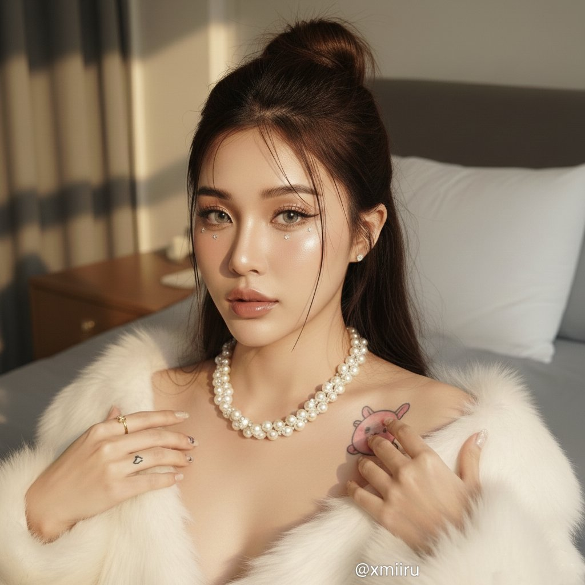

## 肤色白皙的美丽女性沐浴在晨光中

- ID: gpt4o-637-zh-2
- Slug: prompt-637-zh-2
- 语言: zh
- 来源: [来源链接](https://x.com/xmiiru_/status/1995078053165146326)
- 样例图路径: images/part3/637.jpeg

### 提示词

```text
{
“提示”：“编辑这张照片，不要改变脸部，照片中是一位肤色白皙的美丽女性，沐浴在明亮的晨光中，强烈的金色定向光源在她脸上和头发上形成了清晰的阴影。”
“细节”： {
“头发”： {
“颜色”: “深棕色”
“光泽”：“自然”，
“发型”：“头顶上随意挽起的凌乱发髻”，
"wet_strands": "几缕湿漉漉的发丝以整齐随机的图案在额头上自然垂落"
"side_strands": "两侧各有两缕长长的直发，柔和地垂在脸颊两侧",
“蓬松度”：后脑勺的头发向上梳成发髻，看起来浓密蓬松。
},
“化妆品”： {
"眼睛": {
"lens_color": "浅灰色",
"pupil_visibility": "clear",
“眼影”：“高反射银色闪粉，带有细小闪光颗粒”
}
}
}
}
```

### 样例图


## A highly realistic, highly detailed, photorealistic 8K m

- ID: gpt4o-630-en-1
- Slug: prompt-630-en-1
- 语言: en
- 来源: [来源链接](https://x.com/kingofdairyque/status/1994745605621780533)
- 样例图路径: images/part3/630.jpeg

### 提示词

```text
A highly realistic, highly detailed, photorealistic 8K mirror selfie taken with an iPhone 15 Pro Max. Zootropolis fandom aesthetic.
Scene: A guy and a girl pose together in front of an oval mirror in a Disney toy store.
The guy on the left has a playful expression, matching the reference photo. The girl on the right  winks playfully, holding a bright yellow phone. Metallic nail polish.
Clothing and accessories:
• Both are wearing large plush Disney Zootropolis character hats.
The guy on the left in Photo 1—Nick Wilde's orange hat with large fox ears embroidered with sly eyes.
 Girl in photo 2 on the right—gray Judy Hopps hat with long pink bunny ears, large purple eyes.
• Photo 1 on the left—clothes and hair match the attached photo.
• Photo 2 on the right—wearing a hot pink halter top. Long, straight hair.
A pearl necklace fits snugly around her neck.
She has rings on several fingers.
Girl in photo 2's makeup: Korean K-beauty; glass skin; subtle blush; black eyeliner; colored contacts (blue/gray); pink and rosy ombre lipstick.
Background: Disney gift shop interior; frosted shelves filled with toys; holiday mall lighting; decorative ceiling chandelier.
Quality and detail: 8K, highly realistic plush texture (individual fur fibers), vibrant, saturated colors, soft commercial mall lighting, no noise, perfectly sharp focus on face and hat, mirror selfie in frame.
```

### 样例图


## 疯狂动物城的大型毛绒角色帽子

- ID: gpt4o-630-zh-2
- Slug: prompt-630-zh-2
- 语言: zh
- 来源: [来源链接](https://x.com/kingofdairyque/status/1994745605621780533)
- 样例图路径: images/part3/630.jpeg

### 提示词

```text
一张用 iPhone 15 Pro Max 拍摄的超逼真、超精细、照片级 8K 镜面自拍。充满《疯狂动物城》的粉丝美学风格。
场景：一男一女在迪士尼玩具店的椭圆形镜子前合影。
左边那位男士表情顽皮，与参考照片相符。右边那位女士俏皮地眨着眼，手里拿着一部亮黄色的手机。她涂着金属质感的指甲油。
服装和配饰：
•两人都戴着迪士尼《疯狂动物城》的大型毛绒角色帽子。
照片 1 中左边的人——尼克·王尔德的橙色帽子，上面绣着一对大狐狸耳朵和狡黠的眼睛。
照片 2 右侧的女孩——戴着灰色的朱迪·霍普斯帽子，帽子上有长长的粉色兔子耳朵和大大的紫色眼睛。
• 左侧照片 1——衣服和发型与附图相符。
• 右侧照片2——身穿亮粉色露背上衣，留着长长的直发。
一条珍珠项链紧紧地贴合在她的脖子上。
她好几个手指上都戴着戒指。
照片 2 中女孩的妆容：韩式 K-beauty；水光肌；淡淡的腮红；黑色眼线；彩色隐形眼镜（蓝灰色）；粉色和玫瑰色渐变唇膏。
背景：迪士尼礼品店内部；摆满玩具的磨砂货架；节日商场灯光；装饰性天花板吊灯。
质量和细节：8K，高度逼真的毛绒质感（单根毛纤维），鲜艳饱和的色彩，柔和的商业商场灯光，无噪点，面部和帽子完美清晰对焦，画面中有镜子自拍。
```

### 样例图


## 手绘美颜科普图

- ID: gpt4o-624-zh
- Slug: prompt-624-zh
- 语言: zh
- 来源: [来源链接](https://x.com/cnyzgkc/status/1994954677579125124)
- 样例图路径: images/part3/624.jpeg

### 提示词

```text
Hand-drawn watercolor infographic, warm soft watercolor texture, pink tone, cute and clean design, 4:5 ratio, 1080x1350.

角色：一位专精医学保健的插画家兼医生，亲切微笑，手持水彩笔，风格卡通可爱。

主标题（上方）：缺什么营养素会变丑？医生的维生素美颜配方！

图表结构（下方开始）：
六个可爱人物，呈现六种“变丑症状”，搭配对应的卡通营养素图标。

示例内容（AI 可自由重绘，不要写实）：
1. 皮肤暗沉 → 维生素C（Vitamin C 卡通形象）
2. 眼睛干涩 → 维生素A（Vitamin A 卡通形象）
3. 掉发 → 维生素B、维生素D（B群、D 卡通形象）
4. （可继续根据文案自动生成更多症状与营养素）

风格要求：
手绘水彩感、粉色主调、柔和自然、轻松舒服的氛围。
人物要可爱、圆润、友好。
营养素图标为卡通拟人风格。
文字为清晰易读的手写笔记感字体。
整体排版简洁、资讯图表形式。

Lighting: soft, diffuse watercolor lighting.
Avoid: 照片感、真实皮肤纹理、过度写实、油画风、金属光泽。

best quality, high-res, clean edges, masterpiece.
```

### 样例图

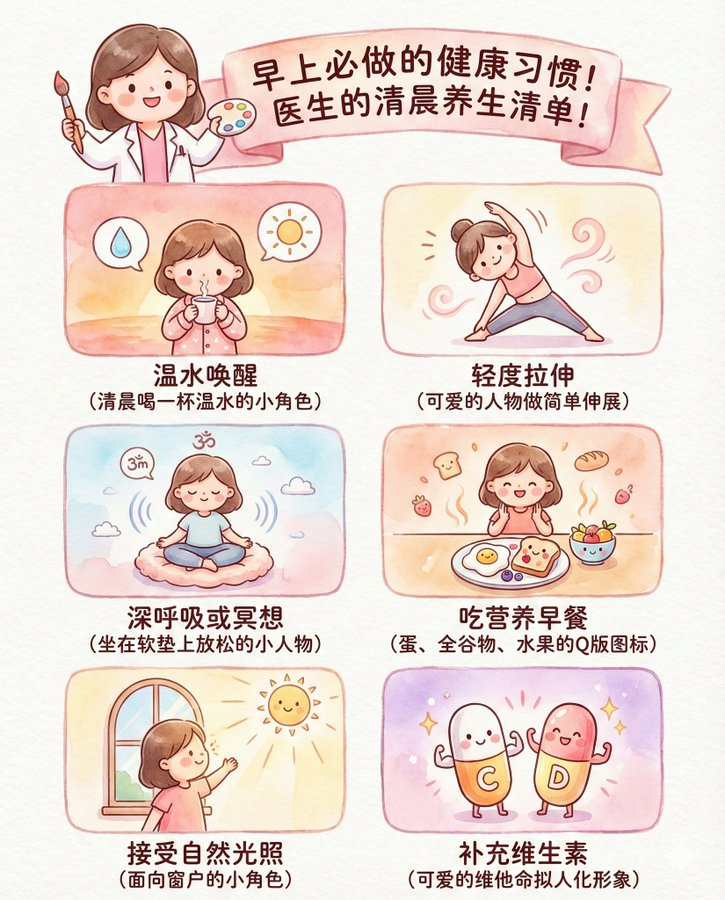

## A minimal sunlit wall. Sharp, elongated shadow of a huma

- ID: gpt4o-621-en-1
- Slug: prompt-621-en-1
- 语言: en
- 来源: [来源链接](https://x.com/egeberkina/status/1994380091241922920)
- 样例图路径: images/part3/621.jpeg

### 提示词

```text
A minimal sunlit wall. Sharp, elongated shadow of a human hand holding the exact product from the uploaded image. Recreate the product’s silhouette precisely in the shadow, accurate bottle shape, cap, edges, proportions. Project the product’s real label text (taken from the uploaded image) onto the shadow in clean, crisp white typography, perfectly matching placement, spacing, and size.Warm afternoon sunlight, soft grain, smooth beige wall texture. Ultra-minimal, high-end skincare aesthetic. No extra objects, no color except the natural wall tone. Artistic shadow-play composition, subtle dreamy atmosphere, natural imperfections on the wall, gently diffused light
```

### 样例图

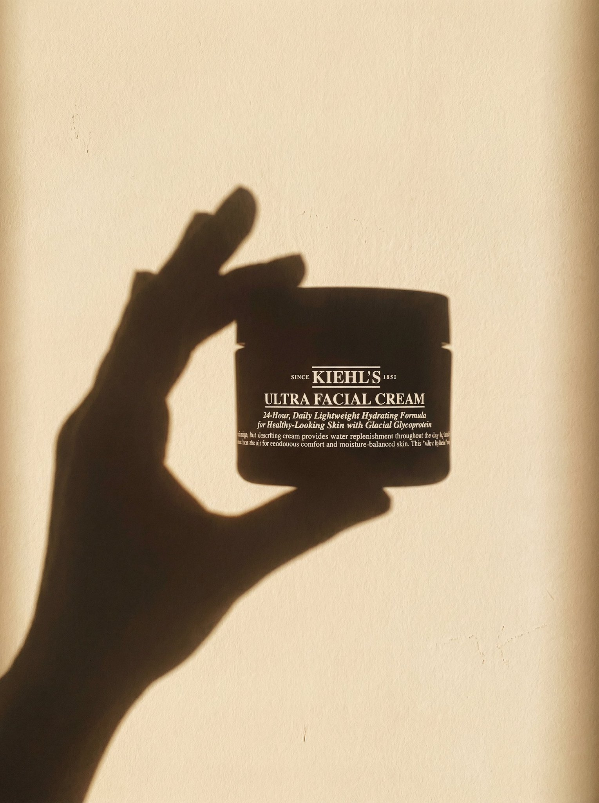

## 一只手拿着上传图片中的产品

- ID: gpt4o-621-zh-2
- Slug: prompt-621-zh-2
- 语言: zh
- 来源: [来源链接](https://x.com/egeberkina/status/1994380091241922920)
- 样例图路径: images/part3/621.jpeg

### 提示词

```text
一面阳光照射的极简主义墙面。一只手拿着上传图片中的产品，投射出清晰而修长的影子。在阴影中精确地重现产品的轮廓，包括瓶身形状、瓶盖、边缘和比例。将产品标签上的真实文字（取自上传图片）以简洁清晰的白色字体投射到阴影上，确保位置、间距和大小完美匹配。温暖的午后阳光，柔和的米色墙面纹理。极简主义的高端护肤美学。除墙面自然色调外，不添加任何其他物品或颜色。艺术化的光影组合，营造出微妙梦幻的氛围，保留墙面的自然纹理，并柔和地漫射光线。
```

### 样例图


## { "project": "Ultra-Realistic Portrait", "reference_sett

- ID: gpt4o-620-en-1
- Slug: prompt-620-en-1
- 语言: en
- 来源: [来源链接](https://x.com/YaseenK7212/status/1994634660459024649)
- 样例图路径: images/part3/620.jpeg

### 提示词

```text
{
  "project": "Ultra-Realistic Portrait",
  "reference_settings": {
    "use_reference_image": true,
    "fidelity_strength": "100%",
    "instruction": "Face and outfit must match reference photo 100% with absolutely no alterations."
  },
  "subject": {
    "demographics": "Woman",
    "focus_features": ["Eyes", "Nose", "Lips"],
    "expression": "Smiling, cute, fresh, dreamy, slightly sensual",
    "pose": "Sitting at a white table, resting chin on both hands, turning slightly",
    "hair": {
      "style": "Straight, large top bun",
      "accessory": "Bow matching the outfit",
      "texture": "Soft layered, loose strands falling naturally across face",
      "movement": "Slightly blown by wind"
    },
    "makeup": {
      "cheeks": "Natural blush on cheeks and nose",
      "lips": "Full lips, soft pink-peach tone"
    }
  },
  "fashion_and_accessories": {
    "outfit": "Exact match to reference image",
    "shoes": "High-heel shoes (matching reference)",
    "bag": "Same bag as reference photo",
    "jewelry": {
      "necklace": "Thin gold with alternating charms (heart, crescent moon, Gucci pendant)",
      "bracelet": "Delicate Gucci bracelet with charms",
      "rings": "Gold rings",
      "watch": "Steel-band Patek Philippe",
      "earrings": "Small gold Gucci earrings"
    }
  },
  "environment": {
    "location": "Luxury hotel terrace / Seaside",
    "time_of_day_options": [
      "Option A: Deep blue evening sky, stars, shooting star, moonlight",
      "Option B: Early sunrise, orange-yellow sky tones"
    ],
    "background_elements": [
      "Warm reflections from luxury hotel",
      "Calm seascape"
    ]
  },
  "props": {
    "table_setting": "White table",
    "items": [
      "Glass with a single white rose",
      "Wine glass",
      "Wine bottle",
      "Plate set with knife and fork",
      "Large T-bone steak in center",
      "Candle glass (adding warm highlight)"
    ]
  },
  "photography_style": {
    "aesthetic": "2000s digital-camera flash style",
    "lighting": "Realistic flash brightness, warm tone, slight shine on skin",
    "mood": "Relaxing, warm, nostalgic, stylish, elegant, slightly sexy",
    "shot_type": "Close-up portrait"
  },
  "technical_parameters": {
    "aspect_ratio": "3:4",
    "detail_level": "8k",
    "style_tags": ["photo", "realistic", "flash photography"]
  }
}
```

### 样例图


## 超写实性感大嘴人物肖像

- ID: gpt4o-620-zh-2
- Slug: prompt-620-zh-2
- 语言: zh
- 来源: [来源链接](https://x.com/YaseenK7212/status/1994634660459024649)
- 样例图路径: images/part3/620.jpeg

### 提示词

```text
{
“项目”：“超写实肖像”，
"reference_settings": {
"use_reference_image": true,
"fidelity_strength": "100%",
“说明”：“面部和服装必须与参考照片100%一致，绝对不能做任何修改。”
},
“主题”： {
“人口统计信息”：“女性”，
"focus_features": ["眼睛", "鼻子", "嘴唇"],
“表情”：“微笑、可爱、清新、梦幻、略带性感”
“姿势”：“坐在白色桌子旁，双手托腮，微微侧身”，
“头发”： {
“发型”：“直发，大发髻”，
“配饰”：“与服装相配的蝴蝶结”，
“质感”：“柔软、层次分明、自然垂落在脸上的发丝”，
“运动”：“微风吹拂”
},
“化妆品”： {
“脸颊”： “脸颊和鼻子上的自然红晕”
“嘴唇”：丰满的嘴唇，柔和的粉桃色调
}
},
"fashions_and_accessories": {
“服装”: “与参考图片完全匹配”，
“鞋子”：“高跟鞋（配套参考）”
“包”： “与参考照片相同的包”
“珠宝”： {
“项链”：“细金项链，饰有交替的吊坠（心形、新月形、Gucci吊坠）”
“手镯”：“精致的 Gucci 手镯，带有吊坠”，
“戒指”： “金戒指”，
“手表”: “钢带百达翡丽”
“耳环”： “古驰小金耳环”
}
},
“环境”： {
位置：豪华酒店露台/海滨
"time_of_day_options": [
“选项A：深蓝色的傍晚天空，繁星，流星，月光，”
选项B：清晨日出，橙黄色的天空色调
],
“背景元素”：[
“来自豪华酒店的温馨回响”
“平静的海景”
]
},
"props": {
"table_setting": "白色桌子",
“项目”： [
“一杯插着一朵白玫瑰的酒”
“酒杯”，
“葡萄酒瓶”，
“餐盘套装，含刀叉”
“中间是一块大块的T骨牛排”，
“烛台玻璃（增添暖色调高光）”
]
},
"photography_style": {
“美学”：“2000年代数码相机闪光灯风格”，
“光照”：“逼真的闪光亮度，暖色调，皮肤略带光泽”，
“氛围”：“轻松、温暖、怀旧、时尚、优雅、略带性感”
"shot_type": "特写肖像"
},
"technical_parameters": {
"aspect_ratio": "3:4",
"detail_level": "8k",
"style_tags": ["photo", "realistic", "flash photography"]
}
}
```

### 样例图


## { "scene_description": "A cohesive 4-panel fashion lifes

- ID: gpt4o-618-en-1
- Slug: prompt-618-en-1
- 语言: en
- 来源: [来源链接](https://x.com/_MehdiSharifi_/status/1994168239442510308)
- 样例图路径: images/part3/618.jpeg

### 提示词

```text
{
  "scene_description": "A cohesive 4-panel fashion lifestyle collage featuring the same young woman in a cozy layered autumn outfit, showcasing relaxed poses in nature.",
  "subject": {
    "type": "Young Woman (Consistent character)",
    "age": "early 20s",
    "features": {
      "hair": "loose natural hair with beanie",
      "makeup": "rosy cheeks"
    },
    "attire": "chunky knit sweater, plaid scarf, long wool coat, jeans, boots",
    "accessories": "takeaway coffee cup"
  },
  "collage_layout": {
    "structure": "2x2 Grid Layout (4 frames of equal size)",
    "panel_1_top_left": "Full Body Dynamic: Throwing autumn leaves in the air or twirling, coat flowing, smiling broadly.",
    "panel_2_top_right": "Sitting Side View: Sitting on a park bench with legs crossed, reading a book or looking at the scenery, holding coffee.",
    "panel_3_bottom_left": "Mid-Shot Walking: Walking towards the camera holding the lapels of the coat, looking down shyly or smiling.",
    "panel_4_bottom_right": "Portrait with Prop: Peeking out from behind the oversized scarf, holding the coffee cup near face for warmth, eyes smiling."
  },
  "environment": {
    "setting": "Autumn Park / Forest Path",
    "background_elements": [
      "Orange and yellow leaves",
      "Trees",
      "Park bench"
    ]
  },
  "lighting": {
    "style": "Golden Hour Soft",
    "key_light": {
      "type": "Low Autumn Sun",
      "color": "Warm Golden",
      "effect": "Backlight or soft front light, magical atmosphere"
    }
  },
  "style": {
    "medium": "Portrait Photography",
    "aesthetic": "Cottagecore, Autumn Vibes, Cozy, Pinterest",
    "quality": "8k resolution, warm tones"
  },
  "attire_customization": {
    "current_clothing": "Wool coat and knitwear",
    "customizable_clothing": "User can swap for puffer jacket or raincoat"
  },
  "brand_product_customization": {
    "current_brand_product": "Winter Apparel",
    "customizable_brand": "User: Insert Brand Name",
    "customizable_product": "User: Specific coat or boots",
    "product_placement_area": "Coat texture or boots"
  }
}
```

### 样例图


## 四幅时尚生活场景组成的拼贴画

- ID: gpt4o-618-zh-2
- Slug: prompt-618-zh-2
- 语言: zh
- 来源: [来源链接](https://x.com/_MehdiSharifi_/status/1994168239442510308)
- 样例图路径: images/part3/618.jpeg

### 提示词

```text
{
“场景描述”： “这是一幅由四幅时尚生活场景组成的拼贴画，画面中同一位年轻女子身着舒适的秋季叠穿服装，在自然环境中摆出轻松的姿势。”
“主题”： {
“类型”：“年轻女子（性格始终如一）”
“年龄”：“20岁出头”，
“特征”： {
“头发”：“披散的自然头发，戴着毛线帽”，
“妆容”：“红润的脸颊”
},
着装：粗针织毛衣、格子围巾、长羊毛大衣、牛仔裤、靴子。
配件：外带咖啡杯
},
"collage_layout": {
"结构": "2x2 网格布局（4 个大小相同的框架）",
"panel_1_top_left": "全身动态：抛洒秋叶或旋转，外套飘动，笑容灿烂。"
"panel_2_top_right": "坐姿侧视图：坐在公园长椅上，双腿交叉，手拿咖啡，正在看书或欣赏风景。"
"panel_3_bottom_left": "中景行走：走向镜头，抓住外套翻领，害羞地低头或微笑。"
"panel_4_bottom_right": "带道具的肖像：从超大的围巾后面探出头来，手里拿着咖啡杯贴近脸庞取暖，眼神中带着微笑。"
},
“环境”： {
“设置”: “秋季公园/森林小径”
“背景元素”：[
“橙色和黄色的叶子”，
“树木”，
“公园长椅”
]
},
“灯光”： {
“风格”：“金色时光柔和”
"key_light": {
“类型”：“低垂的秋日阳光”，
颜色：暖金色，
效果：背光或柔和的前光，营造出梦幻般的氛围
}
},
“风格”： {
“媒介”: “人像摄影”
“美学”：“田园风、秋日氛围、舒适、Pinterest”
“品质”：“8K分辨率，暖色调”
},
"attire_customization": {
"current_clothing": "羊毛大衣和针织衫",
"customizable_clothing": "用户可以换成羽绒服或雨衣"
},
"品牌产品定制": {
"current_brand_product": "冬季服装",
"customizable_brand": "用户：插入品牌名称",
"customizable_product": "用户：特定外套或靴子",
"product_placement_area": "外套纹理或靴子"
}
}
```

### 样例图


## { "image_generation": { "identity": { "preserve_original

- ID: gpt4o-616-en-1
- Slug: prompt-616-en-1
- 语言: en
- 来源: [来源链接](https://x.com/chatgptpaglu/status/1994689429487734995)
- 样例图路径: images/part3/616.jpeg

### 提示词

```text
{
  "image_generation": {
    "identity": {
      "preserve_original": true,
      "reference_match": true,
      "description": "Facial features must remain exactly identical to the provided reference photo."
    },

    "photo_style": {
      "type": "hyperrealistic lifestyle photo",
      "camera_vibe": "Olympus MJU II aesthetic",
      "lighting": "warm dim indoor lighting OR 35mm film-style flash",
      "tone": "warm vintage VSCO vibe",
      "texture": "soft grain, subtle film rendering",
      "framing": "wide shot showing interior room details"
    },

    "subject": {
      "pose": {
        "body": "sitting on a woven sofa with back turned to the viewer",
        "legs": "folded comfortably",
        "hands": "one hand resting on the sofa",
        "head": "looking over shoulder at the camera",
        "expression": "playful, soft, naturally charming"
      },

      "appearance": {
        "hair": {
          "length": "long",
          "style": "loose with a side part",
          "accessory": "simple small hair clip"
        },
        "makeup": {
          "style": "light Korean glass-skin makeup",
          "details": {
            "skin": "glowy, dewy finish",
            "lips": "soft pink",
            "eyes": "minimal eyeshadow, natural lashes"
          }
        }
      },

      "clothing": {
        "top": {
          "type": "cream oversized vintage T-shirt",
          "print": "bold graphic text 'FRISTO' on the back"
        },
        "bottom": {
          "type": "light high-waisted denim shorts"
        },
        "shoes": {
          "type": "white sneakers"
        }
      }
    },

    "environment": {
      "setting": "cozy messy room",
      "elements": [
        "woven sofa",
        "white pillows",
        "scattered clothes in the foreground",
        "soft indoor clutter for authentic lifestyle atmosphere"
      ],
      "lighting_effects": [
        "warm dim glow",
        "or direct compact film camera flash",
        "soft warm shadows enhancing vintage mood"
      ]
    },

    "aesthetic": {
      "style": "vintage lifestyle editorial",
      "vibe": "warm, nostalgic, candid",
      "features": [
        "rich room detail",
        "natural textures of fabric and skin",
        "soft grain and warm tones"
      ]
    }
  }
}
```

### 样例图

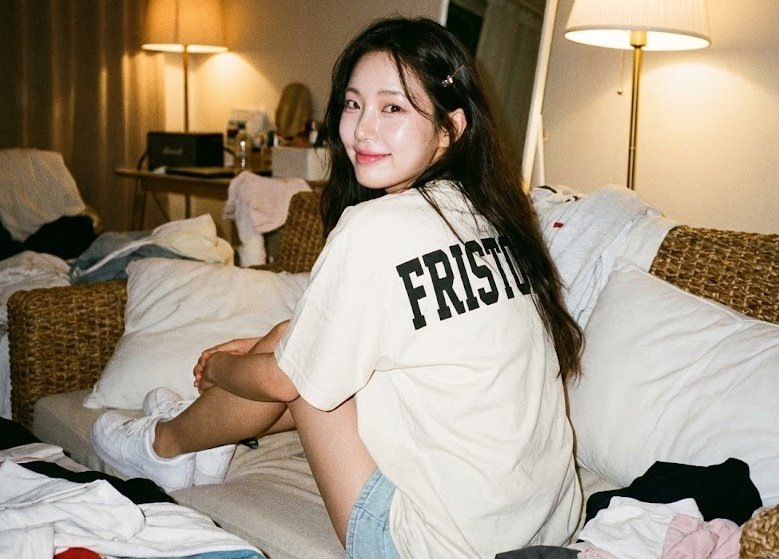

## 女生背对着观众坐在编织沙发上

- ID: gpt4o-616-zh-2
- Slug: prompt-616-zh-2
- 语言: zh
- 来源: [来源链接](https://x.com/chatgptpaglu/status/1994689429487734995)
- 样例图路径: images/part3/616.jpeg

### 提示词

```text
{
"image_generation": {
“身份”： {
"preserve_original": true,
"reference_match": true,
“描述”：“面部特征必须与提供的参考照片完全一致。”
},

"photo_style": {
“类型”：“超写实生活方式照片”，
"camera_vibe": "Olympus MJU II 美学"
“照明”：“温暖昏暗的室内照明或 35 毫米胶片式闪光灯”，
"色调": "温暖复古的VSCO氛围",
“质感”：“柔和的颗粒感，细腻的胶片质感”，
“构图”：“展现室内细节的广角镜头”
},

“主题”： {
"姿势": {
“身体”：“背对着观众坐在编织沙发上”，
“腿”：“舒适地折叠起来”，
“双手”：“一只手放在沙发上”，
“头部”：“回头看向镜头”，
“表情”：“活泼、温柔、自然迷人”
},

“外貌”： {
“头发”： {
"length": "长",
“发型”：“侧分披肩”，
“配饰”：“简单的小发夹”
},
“化妆品”： {
“风格”：“清透韩式水光肌妆容”，
“细节”： {
“肌肤”：“光泽、水润妆效”，
“嘴唇”：“柔和的粉红色”，
“眼妆”：“淡眼影，自然睫毛”
}
}
},

“衣服”： {
“顶部”： {
“类型”：“奶油色超大复古T恤”，
“印刷”：“背面印有粗体字‘FRISTO’”
},
“底部”： {
类型：轻薄高腰牛仔短裤
},
“鞋”： {
类型：白色运动鞋
}
}
},

“环境”： {
“场景”: “温馨凌乱的房间”
“元素”：[
“编织沙发”，
“白色枕头”，
“前景中散落的衣物”，
“营造真实生活氛围的柔和室内杂物”
],
"lighting_effects": [
“温暖昏暗的光芒”，
“或直接使用小型胶片相机闪光灯”，
“柔和温暖的阴影增强了复古氛围”
]
},

“审美的”： {
“风格”：“复古生活方式专题报道”，
“氛围”：“温暖、怀旧、坦诚”，
“特征”： [
“丰富的房间细节”，
“织物和皮肤的自然纹理”，
“柔和的纹理和温暖的色调”
]
}
}
}
```

### 样例图


## { "prompt": "hyperrealistic ultra-detailed 8k photo of Y

- ID: gpt4o-615-en-1
- Slug: prompt-615-en-1
- 语言: en
- 来源: [来源链接](https://x.com/Samann_ai/status/1994444395525832898)
- 样例图路径: images/part3/615.jpeg

### 提示词

```text
{
  "prompt": "hyperrealistic ultra-detailed 8k photo of YOU (Upload Your Photo) standing in a bright cozy living room, same location as the reference: cream-colored sofa, large white curtains with soft daylight shining through, warm neutral walls, several green houseplants, minimal decor, natural sunlight and soft shadows. Use the uploaded photo as the main subject of the image, preserving the face, hairstyle, body type, clothing, and overall style exactly as in the uploaded photo. The subject is standing in front of the sofa, body slightly angled to the side, legs close together, one hip slightly popped, holding a smartphone in one hand at chest height, screen facing them, as if taking a mirror selfie, with a relaxed confident expression and slight smile, eyes toward the phone. Behind them, their partner is standing very close, a tall, attractive humanoid robot with a highly muscular, athletic build, entirely robotic with no human skin, detailed mechanical anatomy inspired by a futuristic cyborg: layered silver and gunmetal plates, visible bundles of flexible cables as muscles, complex joints, smooth armor around shoulders, chest, arms, and legs, elegant angular robotic face with a strong jawline, glowing blue eyes, subtle wear and micro-scratches on metal for realism. The robot’s torso is broad and V-shaped, narrow waist, perfect proportions, clearly fit and powerful but aesthetically beautiful. The robot stands just behind the subject with one sleek metallic arm wrapped gently and protectively around the front of their neck and shoulders, hand resting softly near the collarbone in an affectionate pose, the other arm relaxed at its side. Their bodies are close, giving a sense of intimacy and comfort. Extremely realistic skin texture on the subject, natural hair strands, detailed fabric texture and wrinkles on their clothing, realistic reflections and specular highlights on the robot’s metal surfaces, accurate global illumination and depth of field, sharp focus on both characters, slight background blur. Photoreal, cinematic lighting, no fantasy effects, looks like a real candid photo taken on a phone in this apartment.",
  "negative_prompt": "cartoon, anime, illustration, painting, 3d render, CGI, low resolution, blurry, grainy, oversaturated, unrealistic proportions, extra limbs, deformed hands, distorted face, visible mirror edges, text, watermark, logo, armor covering the subject, human skin on the robot, grotesque, horror, gore"
}
```

### 样例图


## 人和机器人的温馨时刻

- ID: gpt4o-615-zh-2
- Slug: prompt-615-zh-2
- 语言: zh
- 来源: [来源链接](https://x.com/Samann_ai/status/1994444395525832898)
- 样例图路径: images/part3/615.jpeg

### 提示词

```text
{
“提示”：拍摄一张超逼真、细节丰富的8K照片，照片中的人物（上传您的照片）站在明亮舒适的客厅中，地点与参考照片相同：米色沙发，白色大窗帘透进柔和的日光，暖色调的墙面，几盆绿色植物，简约的装饰，自然光和柔和的阴影。使用上传的照片作为图像的主体，保留照片中人物的面部、发型、体型、服装和整体风格。人物站在沙发前，身体略微侧倾，双腿并拢，一侧臀部微微翘起，一手拿着智能手机，屏幕朝向自己，仿佛在自拍，表情轻松自信，略带微笑，目光注视着手机。人物身后站着一位身材高挑、外形俊朗的人形机器人，肌肉线条流畅，体格健壮，完全由机械构成，没有人类皮肤，拥有未来主义赛博格风格的精细机械结构：层叠的银色和枪灰色金属板，以及清晰可见的柔性电缆束。肌肉线条分明，关节复杂，肩部、胸部、手臂和腿部的盔甲光滑流畅，优雅的棱角分明的机械面孔，下颚线条硬朗，湛蓝的双眼闪闪发光，金属表面细微的磨损和划痕更添真实感。机器人的躯干宽阔呈V字形，腰部纤细，比例完美，既健壮有力又不失美感。机器人站在拍摄对象身后，一只光滑的金属手臂温柔地环绕着拍摄对象的颈肩，一只手轻轻地放在锁骨附近，姿态亲昵，另一只手臂自然垂于身侧。两人身体靠近，营造出亲密舒适的氛围。拍摄对象的皮肤纹理极其逼真，头发自然垂落，衣物上的织物纹理和褶皱也十分细致，机器人金属表面的反射和高光效果逼真，整体光照和景深控制精准，两个人物都清晰对焦，背景略微虚化。照片级的真实感，电影级的灯光效果，没有任何奇幻特效，看起来就像是用手机在公寓里随手拍下的真实照片。
"negative_prompt": "卡通、动画、插画、绘画、3D渲染、CGI、低分辨率、模糊、颗粒感强、过度饱和、比例失调、多余肢体、畸形手、扭曲面部、可见镜像边缘、文字、水印、标志、盔甲覆盖主体、机器人身上覆盖人类皮肤、怪诞、恐怖、血腥"
}
```

### 样例图


## { "scene_description": "A vibrant, mixed-media masterpie

- ID: gpt4o-611-en-1
- Slug: prompt-611-en-1
- 语言: en
- 来源: [来源链接](https://x.com/ecommartinez/status/1994126063656644727)
- 样例图路径: images/part3/611.jpeg

### 提示词

```text
{
  "scene_description": "A vibrant, mixed-media masterpiece featuring a photorealistic version of the person from the reference photo eating at a diner, surrounded by a chaotic swarm of maximalist fast-food monsters.",

  "subject": {
    "type": "The person from the reference photo",
    "attire": "Same clothing style as in the reference, adapted naturally to the diner setting",
    "position": "Sitting in a red leather diner booth, holding a burger",
    "expression": "Shocked but amused, looking at a floating doodle pizza",
    "consistency_note": "Face, hairstyle and proportions must perfectly match the reference photo"
  },

  "action": {
    "primary": "Eating lunch",
    "effect": "Their food is coming to life in 2D form"
  },

  "illustration_layer": {
    "style": "Thick-line Pop Art cartoons",
    "creatures": [
      "Pizza slices surfing on cheese waves",
      "Burger beasts with lettuce tongues",
      "Angry French fry box",
      "Flying ketchup bottles."
    ],
    "graphics": "Mustard splashes, sesame seeds, heat lines, 'ÑAM' text bursts",
    "colors": "Ketchup Red, Mustard Yellow, Lettuce Green"
  },

  "environment": {
    "setting": "Retro American Diner",
    "background_elements": ["Checkerboard floor", "Neon sign in window"]
  },

  "lighting": {
    "style": "Warm Diner Glow",
    "key_light": {
      "type": "Window light",
      "color": "Warm afternoon sun"
    }
  },

  "style": {
    "medium": "Mixed Media Photography",
    "aesthetic": "Retro-pop, savory, chaotic",
    "quality": "Ultra-detailed textures vs flat cartoons"
  }
}
```

### 样例图


## 一幅充满活力的混合媒介杰作

- ID: gpt4o-611-zh-2
- Slug: prompt-611-zh-2
- 语言: zh
- 来源: [来源链接](https://x.com/ecommartinez/status/1994126063656644727)
- 样例图路径: images/part3/611.jpeg

### 提示词

```text
{
“场景描述”： “这是一幅充满活力的混合媒介杰作，画面中逼真地呈现了参考照片中的人物在餐馆用餐，周围环绕着一群造型夸张的快餐怪物。”

“主题”： {
“类型”：“参考照片中的人”，
“着装”：“与参考图中相同的服装风格，自然地适应了餐厅环境”，
“位置”：“坐在红色皮质餐厅卡座里，手里拿着一个汉堡”，
“表情”：“震惊又好笑，看着漂浮的涂鸦披萨”
"consistency_note": "脸型、发型和比例必须与参考照片完全一致"
},

“行动”： {
“主要”： “吃午饭”，
“效果”：“他们的食物以二维形式活了过来”
},

"illustration_layer": {
“风格”：“粗线条波普艺术卡通”，
“生物”：[
“披萨片在奶酪浪潮上冲浪”
“长着生菜舌头的汉堡怪兽”
“愤怒的薯条盒”
“飞舞的番茄酱瓶。”
],
“图形”：“芥末酱飞溅、芝麻、热线、‘ÑAM’文字爆发”，
颜色：番茄酱红、芥末黄、生菜绿
},

“环境”： {
“设置”: “复古美式餐馆”
"background_elements": ["棋盘格地板", "窗户上的霓虹灯"]
},

“灯光”： {
“风格”：“温馨的餐馆氛围”，
"key_light": {
类型： 窗灯，
“颜色”：“温暖的午后阳光”
}
},

“风格”： {
“媒介”：“混合媒介摄影”，
“美学”：“复古流行，美味，混乱”，
“质量”： “超精细纹理 vs 平面卡通”
}
}
```

### 样例图


## { "prompt": { "scene": { "angle": "[high-angle]", "tilt"

- ID: gpt4o-608-en-1
- Slug: prompt-608-en-1
- 语言: en
- 来源: [来源链接](https://x.com/Just_sharon7/status/1994375017971564779)
- 样例图路径: images/part3/608.jpeg

### 提示词

```text
{
  "prompt": {
    "scene": {
      "angle": "[high-angle]",
      "tilt": "[slightly off-kilter]",
      "group": "[lively group of stylish young adults]",
      "seating": "[seated closely around white dining table]",
      "setting": "[dimly lit, upscale brasserie]"
    },
    "mood": "[energetic, fashionable, slightly rebellious]",
    "subjects": [
      {
        "position": "left",
        "hair": "[long, dark hair]",
        "eyes": "[hidden behind chic black sunglasses]",
        "outfit": "[black lace-trimmed camisole with hint of floral pattern]",
        "expression": "[partially obscured by glasses]"
      },
      {
        "position": "second from left",
        "hair": "[dark, possibly mullet-style hair]",
        "facial_hair": "[distinct mustache]",
        "outfit": "[dark suit jacket over white shirt]",
        "hands": "[clasped near chin]",
        "expression": "[playful or mischievous]"
      },
      {
        "position": "center",
        "reference": "[woman resembling Kylie Jenner]",
        "hair": "[very long, dark, wavy hair]",
        "outfit": {
          "blazer": "[dark blazer]",
          "top": "[light blue, subtly patterned bralette]"
        },
        "gaze": "[looking right, slightly defiant, expressive]",
        "gesture": "[left hand raised, middle finger prominently displayed]"
      },
      {
        "position": "second from right",
        "reference": "[woman resembling Rosalía]",
        "hair": "[long dark hair in slicked-back style]",
        "outfit": "[dark, possibly velvet or satin, strapless top]",
        "accessory": "[small dark object, possibly cigarette or cigarillo between lips]",
        "expression": "[relaxed, nonchalant]"
      },
      {
        "position": "bottom right",
        "hair": "[curly brown hair]",
        "visible_part": "[top of head only, indicating more people at table]"
      }
    ],
    "table": {
      "items": [
        "[multiple clear glasses with drinks]",
        "[ice cubes in glasses]",
        "[citrus slices in glasses]",
        "[white bottle with dark label]",
        "[small white dishes]"
      ]
    },
    "background": {
      "wall": "[dark wood paneling]",
      "letters": "[ornate gold lettering partially readable as 'ALSACE']",
      "mirrors": "[dark reflective mirrors]"
    },
    "lighting": {
      "type": "[soft, warm, ambient]",
      "effect": "[illuminates faces and table]",
      "contrast": "[strong contrast against dark background]"
    },
    "additional_details": {
      "decor": "[subtle floral arrangements hinted in distance]"
    },
    "photography_style": "[hyper-realistic, candid, sharp focus on central group]"
  },
  "styles": ["photorealistic"],
  "aspect_ratio": "4:3"
}
```

### 样例图

![{ "prompt": { "scene": { "angle": "[high-angle]", "tilt"](../images/part3/608.jpeg)

## 一群活泼时尚的年轻人

- ID: gpt4o-608-zh-2
- Slug: prompt-608-zh-2
- 语言: zh
- 来源: [来源链接](https://x.com/Just_sharon7/status/1994375017971564779)
- 样例图路径: images/part3/608.jpeg

### 提示词

```text
{
“迅速的”： {
“场景”： {
“角度”：[高角度]，
“倾斜”：[略微偏离]
“团体”：[一群活泼时尚的年轻人]
“座位安排”：[围坐在白色餐桌旁]
“环境”：[灯光昏暗的高档小酒馆]
},
“情绪”：[充满活力，时尚，略带叛逆]
“主题”：[
{
"位置": "左",
“头发”：[长长的黑发]，
“眼睛”：[藏在时髦的黑色太阳镜后面]
“服装”：[黑色蕾丝边吊带背心，带有淡淡的花卉图案]
“表情”：[部分被眼镜遮挡]
},
{
“位置”: “从左边数第二个”，
“头发”：[深色，可能是鲻鱼头]，
"facial_hair": "[distinct mustache]",
“服装”：[深色西装外套搭配白色衬衫]，
“双手”：[交握于下巴附近]
“表情”：[顽皮的或淘气的]
},
{
"位置": "中心",
“参考”：[长相酷似凯莉·詹娜的女性]
“头发”：[非常长、深色、波浪状的头发]
“全套服装”： {
"blazer": "[深色西装外套]",
上衣：[浅蓝色，带精致图案的无钢圈文胸]
},
“凝视”：[看向右侧，略带挑衅，富有表现力]
“手势”：[左手举起，中指明显竖起]
},
{
“位置”: “从右数第二个”，
“参考”：[长相酷似罗莎莉亚的女人]
“头发”：[长长的深色头发向后梳]
“服装”：[深色，可能是天鹅绒或缎面，无肩带上衣]
“配件”：[嘴唇间夹着的小黑物，可能是香烟或小雪茄]
“表情”：[放松，漫不经心]
},
{
位置：右下角，
“头发”：[棕色卷发]，
"visible_part": "[仅头部顶部，表示桌上还有其他人]"
}
],
“桌子”： {
“项目”： [
“多个装有饮料的透明玻璃杯”
“（玻璃杯中的冰块）”
“（玻璃杯中的柑橘片）”
（白色瓶子，深色标签）
“小白碟”
]
},
“背景”： {
“墙”：[深色木镶板]，
“字母”： （华丽的金色字母部分可辨认出为“ALSACE”）
“镜子”：[深色反光镜]
},
“灯光”： {
“类型”：[柔和、温暖、氛围]，
“效果”：[照亮面部和桌面]
“对比度”：[与深色背景形成强烈对比]
},
"additional_details": {
“装饰”：[远处隐约可见的精致花卉摆设]
},
“摄影风格”：[超写实、抓拍、聚焦中心人物]
},
风格：["写实风格"]
"aspect_ratio": "4:3"
}
```

### 样例图


## { "meta": { "title": "Hyper-realistic 8K Street Portrait

- ID: gpt4o-606-en-1
- Slug: prompt-606-en-1
- 语言: en
- 来源: [来源链接](https://x.com/lexx_aura/status/1994351098509861265)
- 样例图路径: images/part3/606.jpeg

### 提示词

```text
{
  "meta": {
    "title": "Hyper-realistic 8K Street Portrait",
    "created_at": "2024-05-22T10:00:00Z",
    "tags": ["portrait", "summer", "fashion", "fujifilm", "outdoor"]
  },
  "prompt_data": {
    "full_string": "Hyper-realistic 8K street portrait, preserve the girl’s facial features from the reference. Stylish outdoor shot: girl leaning back against a textured beige stucco wall under bright sun, relaxed contrapposto stance, head tilted back, eyes half-closed, expression enjoying warmth. Wearing a trendy sage-mint set: twisted-knot long-sleeve crop top, exposed midriff, mini skirt with thong-strap detail on waist. Sunkissed makeup: bronzer, strong highlighter, nude matte lips, defined contoured cheekbones. Hair in messy bun with loose wavy face-framing strands. Background: rough stucco wall with sharp botanical shadows cast by leaves. Camera: Fujifilm X-T4, Kodak Gold 200 film emulation, high aperture f/8 for background sharpness. Lighting: harsh mid-day sun, high contrast light–shadow pattern, crisp plant shadows across skin and wall. Warm yellow-green tones, summer vibe, high clarity, magazine aesthetic. Medium shot composition, textured wall filling the frame. --ar 4:5 --style raw --v 6.0",
    "components": {
      "style": "Hyper-realistic 8K street portrait, magazine aesthetic, high clarity",
      "subject": {
        "reference_instruction": "preserve the girl’s facial features from the reference",
        "pose": "leaning back against a textured beige stucco wall, relaxed contrapposto stance, head tilted back, eyes half-closed, expression enjoying warmth",
        "clothing": "trendy sage-mint set: twisted-knot long-sleeve crop top, exposed midriff, mini skirt with thong-strap detail on waist",
        "hair_makeup": "Sunkissed makeup: bronzer, strong highlighter, nude matte lips, defined contoured cheekbones. Hair in messy bun with loose wavy face-framing strands"
      },
      "environment": {
        "setting": "rough stucco wall with sharp botanical shadows cast by leaves",
        "lighting": "harsh mid-day sun, high contrast light–shadow pattern, crisp plant shadows across skin and wall",
        "color_palette": "Warm yellow-green tones, summer vibe"
      },
      "technical": {
        "camera": "Fujifilm X-T4",
        "film_stock": "Kodak Gold 200 film emulation",
        "settings": "high aperture f/8 for background sharpness",
        "composition": "Medium shot composition, textured wall filling the frame"
      }
    },
    "parameters": {
      "aspect_ratio": "4:5",
      "style_model": "raw",
      "version": "6.0"
    }
  }
}
```

### 样例图


## 超逼真街景人像

- ID: gpt4o-606-zh-2
- Slug: prompt-606-zh-2
- 语言: zh
- 来源: [来源链接](https://x.com/lexx_aura/status/1994351098509861265)
- 样例图路径: images/part3/606.jpeg

### 提示词

```text
{
"meta": {
标题：超逼真 8K 街景人像
"created_at": "2024-05-22T10:00:00Z",
标签：["人像", "夏季", "时尚", "富士胶片", "户外"]
},
"prompt_data": {
"full_string": "超逼真8K街头人像，保留了参考照片中女孩的面部特征。时尚户外拍摄：女孩倚靠在阳光明媚的米色纹理灰泥墙上，采用放松的对立式站姿，头部后仰，双眼半闭，表情享受着温暖。身着时髦的鼠尾草绿套装：扭结长袖露脐上衣，露出纤细腰身，搭配腰​​部饰有丁字带的迷你裙。妆容阳光亲吻般自然：古铜色粉底，高光提亮，裸色哑光唇妆，轮廓分明的颧骨。头发随意挽成发髻，几缕波浪卷发自然垂落在脸颊两侧。背景：粗糙的灰泥墙，树叶投下清晰的植物阴影。相机：富士X-T4，柯达金200胶片模拟，大光圈f /8以获得背景锐利度。光线：正午强烈的阳光，高对比度的光影图案，清晰的植物阴影投射在肌肤上。和墙壁。温暖的黄绿色调，夏日气息，高清晰度，杂志美感。中景构图，纹理丰富的墙壁充满画面。--ar 4:5 --style raw --v 6.0”
“成分”： {
“风格”：“超逼真的 8K 街头人像，杂志美学，高清晰度”
“主题”： {
"reference_instruction": "保留参考图中女孩的面部特征",
“姿势”：“背靠着米色纹理灰泥墙，采用放松的对立式站姿，头部后仰，双眼半闭，表情享受着温暖”，
“服装”：“时尚鼠尾草薄荷色套装：扭结长袖露脐上衣，露脐设计，腰部饰有丁字带的迷你裙”，
“发型_妆容”：阳光亲吻般的妆容：古铜色粉底、高光提亮、裸色哑光唇妆、轮廓分明的颧骨。头发随意挽成发髻，留出几缕波浪卷发修饰脸型。
},
“环境”： {
“背景”：“粗糙的灰泥墙，树叶投下清晰的植物阴影”，
“光线”：“正午刺眼的阳光，高对比度的光影图案，植物在皮肤和墙壁上投下的清晰阴影”，
"color_palette": "温暖的黄绿色调，夏日氛围"
},
“技术的”： {
“相机”: “富士X-T4”
"film_stock": "柯达金200胶片模拟",
“设置”：“高光圈 f /8以获得背景锐利度”，
“构图”：“中景构图，纹理墙面占据画面”
}
},
“参数”： {
"aspect_ratio": "4:5",
"style_model": "raw",
版本：6.0
}
}
}
```

### 样例图


## { "prompt_title": "Beachside Crochet Fashion Portrait at

- ID: gpt4o-605-en-1
- Slug: prompt-605-en-1
- 语言: en
- 来源: [来源链接](https://x.com/IqraSaifiii/status/1994478187133432308)
- 样例图路径: images/part3/605.jpeg

### 提示词

```text
{
 "prompt_title": "Beachside Crochet Fashion Portrait at Sunset",
  "model_type": "Hyper-Realistic Photo",
  "style": [
    "Ultra-detailed photo-realism",
    "Golden hour beach photography",
    "Soft, natural light",
    "Vibrant yet natural color palette"
  ],
  "subject": {
    "description": "A slender and elegant Asian woman, mid-20s, with a gentle, contemplative expression, gazing towards the right of the frame.",
    "hair": "Dark brown hair styled in a high, messy bun, with soft wisps framing the face.",
    "makeup": "Minimalist, natural 'no-makeup' makeup look, featuring soft pink lips and a light blush, enhancing natural features.",
    "expression": "Serene, distant gaze, creating a sense of introspection or admiration of the view.",
    "attire": {
      "outerwear": "White, open-knit crochet cardigan with long, slightly flared sleeves, adorned with scattered small, pastel-colored floral appliques (yellow, blue, pink).",
      "swimwear": "White string bikini top and matching bottom, peeking out from beneath the cardigan.",
      "accessories": "Delicate, multi-strand beaded necklaces in pastel colors (pink, white, yellow), some extending as a body chain around her waist. Pink-tinted sunglasses perched on top of her bun. Small, understated stud earrings."
    }
  },
  "setting": {
    "location": "A tranquil, sandy beach at golden hour.",
    "background_elements": [
      "Calm ocean water with subtle waves meeting the shore in the mid-ground.",
      "A light, sandy beach foreground with gentle ripples and scattered small shells.",
      "A few distant boats visible on the horizon, adding depth and realism.",
      "A soft, clear sky with warm, diffused light of late afternoon."
    ]
  },
  "pose": {
    "type": "Standing portrait, waist-up shot.",
    "stance": "Body slightly angled to the left, head turned to look towards the right. Right hand gently rests on her hip.",
    "gaze": "Looking off into the distance to the right, not directly at the camera."
  },
  "camera_and_technical": {
    "camera": "Fujifilm GFX 100S or Sony A7R IV",
    "lens": "50mm f/1.2 or 85mm f/1.4 (Fast Prime Lens for shallow depth of field)",
    "shot_type": "Medium shot / Upper body portrait.",
    "composition": "Rule of Thirds, with the subject positioned slightly to the left, allowing space for her gaze to lead the eye.",
    "depth_of_field": "Shallow (soft bokeh on the ocean and distant background).",
    "aperture": "f/2.0",
    "shutter_speed": "1/250s",
    "iso": "ISO 160",
    "resolution": "8K, emphasizing intricate details of crochet knit and sand texture."
  },
  "lighting": {
    "overall_mood": "Soft, warm, luminous, and natural.",
    "key_light": {
      "source": "Natural sunlight, low in the sky (golden hour).",
      "position": "Coming from slightly behind and to the left of the subject, creating a subtle rim light effect and soft, elongated shadows.",
      "color_temp": "Warm (4500K - 5500K), characteristic of late afternoon sun."
    },
    "fill_light": {
      "source": "Natural ambient light reflecting off the sand and ocean.",
      "position": "Filling in shadows on the front of the subject, ensuring soft transitions.",
      "intensity": "Moderate, to maintain natural contrast."
    },
    "rim_light": {
      "source": "Direct sunlight.",
      "position": "Highlights the edges of her hair, shoulders, and arms, creating a glow that separates her from the background."
    },
    "shadows": "Soft, long, and diffused, typical of golden hour, contributing to a dreamy atmosphere."
  }
}
```

### 样例图


## 海滩写真拍摄

- ID: gpt4o-605-zh-2
- Slug: prompt-605-zh-2
- 语言: zh
- 来源: [来源链接](https://x.com/IqraSaifiii/status/1994478187133432308)
- 样例图路径: images/part3/605.jpeg

### 提示词

```text
{
"prompt_title": "日落时分的海边钩针时尚肖像",
"model_type": "超写实照片",
“风格”： [
“超精细照片级写实主义”
“黄金时段海滩摄影”
“柔和的自然光”
“充满活力又自然的色彩搭配”
],
“主题”： {
“描述”：“一位身材苗条、气质优雅的亚洲女性，二十多岁，表情温柔沉思，目光看向画面右侧。”
“头发”：“深棕色的头发梳成高高的凌乱发髻，几缕柔软的碎发垂在脸颊两侧。”
“妆容”：“极简、自然的‘伪素颜’妆容，以柔和的粉色唇妆和淡淡的腮红为特色，凸显自然美。”
“表情”：“宁静、疏离的目光，营造出一种内省或欣赏风景的氛围。”
着装：{
“外套”：“白色镂空钩针开衫，长袖略呈喇叭形，饰有零星的粉彩色小花朵贴花（黄色、蓝色、粉色）。”
“泳装”：“白色细绳比基尼上衣和配套泳裤，从开衫下露出来。”
“配饰”：“精致的多股串珠项链，颜色柔和（粉色、白色、黄色），有些项链延伸到腰间，形成一条身体链。粉色太阳镜架在她的发髻上。小巧简约的耳钉。”
}
},
“环境”： {
地点：日落时分，一片宁静的沙滩。
“背景元素”：[
“平静的海面，轻柔的波浪在中景处拍打着海岸。”
“前景是浅色的沙滩，泛着轻柔的涟漪，散落着小贝壳。”
“远处地平线上隐约可见几艘船只，增添了画面的景深和真实感。”
“傍晚时分，天空晴朗柔和，阳光温暖而柔和。”
]
},
"姿势": {
“类型”：“站立式肖像，半身像。”
“站姿”：“身体略微向左侧倾斜，头部转向右侧。右手轻轻放在臀部。”
“凝视”：“看向右侧远处，而不是直接看向镜头。”
},
"camera_and_technical": {
“相机”: “富士GFX 100S或索尼A7R IV”
“镜头”：“50mm f/1.2 或 85mm f/1.4（用于浅景深的快速定焦镜头）”
"shot_type": "中景/上半身肖像。"
构图：采用三分法构图，主体略微偏左，留出空间引导视线。
"depth_of_field": "浅景深（海洋和远处背景呈现柔和的散景效果）",
光圈：f/2.0，
"shutter_speed": "1/250"
"iso": "ISO 160",
“分辨率”：“8K，突出钩编针织物和沙子纹理的精细细节。”
},
“灯光”： {
整体氛围：柔和、温暖、明亮、自然。
"key_light": {
“来源”：“自然阳光，低垂的天空（黄金时段）。”
“位置”：“光线从拍摄对象略后方偏左的位置照射过来，营造出微妙的轮廓光效果和柔和拉长的阴影。”
"color_temp": "暖色调（4500K - 5500K），具有午后阳光的特征。"
},
"fill_light": {
“光源”：“沙滩和海洋反射的自然环境光。”
“位置”：“填充主体前方的阴影，确保柔和的过渡。”
“强度”：“适中，以保持自然对比度。”
},
"rim_light": {
“来源”：“阳光直射。”
“位置”：“突出她的头发、肩膀和手臂的边缘，营造出一种光晕，使她与背景分离。”
},
“阴影”：“柔和、绵长、弥散，是黄金时段的典型景象，营造出梦幻般的氛围。”
}
}
```

### 样例图


## { "prompt_title": "Dynamic Low-Angle Portrait Under Clea

- ID: gpt4o-602-en-1
- Slug: prompt-602-en-1
- 语言: en
- 来源: [来源链接](https://x.com/IqraSaifiii/status/1994544453655433705)
- 样例图路径: images/part3/602.jpeg

### 提示词

```text
{
  "prompt_title": "Dynamic Low-Angle Portrait Under Clear Sky - Emphasized Curves & Confident Pose",
  "model_type": "Hyper-Realistic Photo",
  "style": [
    "Ultra-detailed photo-realism",
    "Bright, high-contrast natural outdoor lighting",
    "Extreme low-angle, wide-perspective shot (heroic/empowering feel)",
    "Vibrant, saturated colors (clean, modern aesthetic)"
  ],
  "subject": {
    "description": "A youthful, radiant East Asian woman, late teens to early twenties, with a confident and engaging presence. Her skin exhibits a flawless yet natural texture, with subtle pores and a healthy, sunlit sheen across exposed areas like her shoulders and midriff. Hair strands are individually discernible.",
    "physique": "Athletic and toned, with visibly sculpted abdominal muscles, subtly defined obliques, and strong, shapely thighs. The pose emphasizes the natural curve of her hips and the gentle arch of her lower back, creating an alluring yet powerful silhouette from the low angle.",
    "hair": "Long, silky, straight dark brown hair, with a subtle natural wave at the ends. It flows freely around her shoulders and back, with a few strands gently lifted by a breeze (if applicable, or perfectly styled to look natural). A fringe or wispy bangs are subtly visible beneath the mask, framing her upper face.",
    "makeup": "Minimal, natural 'no-makeup' makeup. Clear, dewy skin finish. The visible eye area shows defined but natural brows, a hint of mascara on long lashes, and a subtle shimmer on the inner corner of the eyes. The mask obscures the mouth and nose.",
    "expression": "Her eyes are wide, bright, and directly engaging with the viewer, conveying a sense of playful confidence and warmth. The raised peace sign reinforces a cheerful, positive mood.",
    "attire": {
      "mask": "A pristine, well-fitted white disposable surgical mask, with clear pleats and elastic ear loops visible against her skin. It cleanly covers her nose and mouth.",
      "top": "A figure-hugging, finely ribbed, light salmon-pink (or dusty rose) crop tank top. The ribbing texture is highly detailed, stretching smoothly over her chest and torso, emphasizing the curve of her bust and the tautness of her midriff.",
      "outerwear": "An oversized, buttery soft, light pale yellow long-sleeved button-up shirt or lightweight jacket. It's worn open, casually draped off her shoulders, with the sleeves pushed up slightly, creating soft, natural folds in the fabric. The collar and cuffs are slightly relaxed.",
      "bottom": "Form-fitting, short white denim shorts. The fabric texture is detailed, showing subtle denim weave. The shorts sit high on her hips, emphasizing the curve of her waist and thighs. Stitching details and a faint outline of pockets are visible.",
      "accessories": "White wired earphones with clearly visible, delicate wires extending from her ears, subtly contrasting with her hair. The earbud tips are visible."
    }
  },
  "setting": {
    "location": "Outdoors on an exceptionally clear, bright summer day.",
    "background_elements": [
      "A vast, perfectly uniform, intensely vibrant cerulean blue sky, completely devoid of clouds, creating a stark, graphic backdrop that makes the subject pop.",
      "No horizon line or ground visible, making the sky appear infinite and emphasizing the extreme low-angle perspective."
    ],
    "atmosphere": "Crisp, clean air; intense feeling of open space and boundless energy."
  },
  "pose": {
    "type": "Extreme low-angle, dynamic full-body portrait (cropped at upper thigh/hip level, shot from below).",
    "stance": "The woman is standing with her weight slightly shifted, her left leg subtly bent at the knee, and her right leg extended, creating a dynamic 'power stance' effect. Her torso is slightly twisted to her left, further accentuating the curve of her waist and hips, especially from the low vantage point. Her chest is slightly pushed out, enhancing the natural curve of her bust.",
    "gaze": "Directly into the camera, with a confident, open, and friendly expression in her visible eyes. This strong eye contact creates an immediate connection with the viewer.",
    "gesture": "Her left arm is bent at the elbow, and her left hand is raised close to her face, palm facing outwards, forming a clear and crisp 'peace' (V-sign) with her index and middle fingers. The other fingers are gently curled down. Her right arm is relaxed at her side, with the jacket draped over it. The natural tension in her arm muscles is visible."
  },
  "camera_and_technical": {
    "camera": "Sony A1 with G Master Lenses or RED Komodo (for cinematic quality)",
    "lens": "20mm f/1.8 (Ultra-wide-angle prime lens to exaggerate the low perspective and create an imposing, almost monumental feel for the subject)",
    "shot_type": "Extreme Worm's-Eye View / Dynamic Low-Angle Medium Full Shot (from just below the subject's waist).",
    "composition": "The subject dominates the central frame, with her head and raised hand reaching towards the top. The expansive blue sky provides a clean, impactful negative space. The extreme low angle distorts proportions intentionally, elongating the legs and making the subject appear powerful and larger-than-life.",
    "depth_of_field": "Deep (f/11 to ensure absolute sharpness from her shorts to the distant sky, minimizing any softness).",
    "aperture": "f/11",
    "shutter_speed": "1/800s (to eliminate any possibility of motion blur and ensure tack-sharp details under intense sunlight)",
    "iso": "ISO 64 (for maximum image fidelity and dynamic range)",
    "resolution": "12K, cinematic wide aspect ratio (e.g., 1.85:1 or 16:9), emphasizing microscopic details of fabric weaves, skin pores, and the pristine blue sky. Post-processing for subtle vignetting and color grading for vibrant pop.",
    "white_balance": "Daylight (5200K), precisely calibrated for natural colors under bright sun."
  },
  "lighting": {
    "overall_mood": "High-key, crisp, and clean with stark yet appealing contrast.",
    "key_light": {
      "source": "Direct, unfiltered overhead sunlight, creating strong, well-defined form.",
      "position": "High above and slightly in front-right of the subject, casting clear, defined shadows that contour her physique and attire, adding depth.",
      "color_temp": "Cool (6500K-7000K), characteristic of a bright midday sun, ensuring a vibrant blue sky.",
      "intensity": "Very high, creating bright highlights and deep, clean shadows."
    },
    "fill_light": {
      "source": "Natural ambient light from the expansive sky.",
      "intensity": "Low, allowing for noticeable shadows that give form without becoming harsh or black. The blue sky acts as a subtle cool fill.",
      "direction": "Diffuse, minimizing contrast in shadow areas."
    },
    "rim_light": {
      "source": "The intense direct sunlight.",
      "intensity": "Subtle but crisp, creating a fine, bright outline on her hair, shoulders, and the edges of her clothing against the deep blue, enhancing separation and definition.",
      "effect": "Very thin, bright edge highlights."
    },
    "shadows": "Sharp, well-defined, and relatively dark, lending strong three-dimensionality to the subject's form and attire. Shadows are cast downwards and slightly behind the subject from the low camera angle, emphasizing the curves and contours of her body and clothing."
  }
}
```

### 样例图


## 戴口罩的妹子比了个耶

- ID: gpt4o-602-zh-2
- Slug: prompt-602-zh-2
- 语言: zh
- 来源: [来源链接](https://x.com/IqraSaifiii/status/1994544453655433705)
- 样例图路径: images/part3/602.jpeg

### 提示词

```text
{
"prompt_title": "晴空下的动态低角度人像 - 强调曲线与自信姿态",
"model_type": "超写实照片",
“风格”： [
“超精细照片级写实主义”
“明亮、高对比度的自然户外照明”，
“极低角度、广角镜头（英雄/鼓舞人心的感觉）”，
“鲜艳饱满的色彩（简洁现代的美学）”
],
“主题”： {
描述：一位年轻、容光焕发的东亚女性，年龄在十几岁末到二十岁出头，自信迷人。她的肌肤呈现无瑕而自然的质感，毛孔细微，裸露部位（如肩膀和腰部）散发着健康的阳光光泽。发丝清晰可见。
“体格”：“身材健美匀称，腹肌线条清晰可见，斜肌轮廓分明，大腿强健有力。这个姿势突出了她臀部的自然曲线和下背部的柔和弧度，从低角度拍摄，勾勒出既迷人又充满力量的身形。”
“头发”：一头柔顺的深棕色长直发，发尾略带自然波浪。头发自然垂落在她的肩背，几缕发丝被微风轻轻拂起（如有风吹，或精心打理得自然垂顺）。面具下隐约可见刘海，勾勒出她脸部的轮廓。
“妆容”：极简自然的“伪素颜”妆容。肌肤呈现清透水润的光泽。眼部可见部分，眉形清晰自然，纤长的睫毛上略施睫毛膏，眼角内侧带有微妙的珠光。口罩遮盖了口鼻。
“表情”：“她的眼睛又大又亮，直视着观者，传递出一种俏皮自信和温暖的感觉。高举的和平手势进一步强化了这种快乐积极的情绪。”
着装：{
“口罩”：“一个洁白无瑕、贴合度极佳的一次性医用口罩，褶皱清晰可见，弹性耳带紧贴皮肤。它干净利落地遮住了她的口鼻。”
上衣：一件贴身剪裁、带有细密罗纹的浅鲑鱼粉色（或灰玫瑰色）露脐背心。罗纹纹理细节丰富，流畅地贴合胸部和躯干，凸显胸部曲线和紧致腰腹。
“外套”：一件宽松的、如黄油般柔软的浅黄色长袖衬衫或轻薄夹克。敞开穿着，随意地披在肩上，袖子略微向上卷起，在面料上形成柔软自然的褶皱。领口和袖口略微宽松。
“下装”：“修身白色牛仔短裤。面料纹理细腻，隐约可见牛仔布的编织纹路。短裤高腰设计，凸显腰部和大腿的曲线。缝线细节和隐约可见的口袋轮廓。”
“配饰”：“白色有线耳机，纤细的耳机线清晰可见地从她的耳朵延伸出来，与她的头发形成微妙的对比。耳塞套也清晰可见。”
}
},
“环境”： {
地点：户外，一个格外晴朗明媚的夏日。
“背景元素”：[
“一片广袤无垠、均匀透亮、色彩浓郁的蔚蓝色天空，万里无云，营造出鲜明的视觉背景，使主体更加突出。”
“看不到地平线或地面，使天空显得无限延伸，并强调了极低角度的透视效果。”
],
“氛围”：“空气清新洁净；开阔的空间感和无限的活力。”
},
"姿势": {
“类型”：“极低角度、动态全身肖像（裁剪至大腿/臀部上方，从下方拍摄）。”
“站姿”：这位女士站立时重心略微偏移，左腿膝盖微屈，右腿伸直，营造出一种动感十足的“力量站姿”。她的躯干略微向左扭转，从低角度观察时，更突显了腰臀的曲线。她的胸部略微挺起，凸显了胸部的自然曲线。
“凝视”：“她直视镜头，眼神自信、开朗、友善。这种强烈的眼神交流能立即与观众建立联系。”
“手势”：“她的左臂肘部弯曲，左手举至脸前，掌心朝外，食指和中指形成清晰利落的‘和平’手势（V字手势）。其余手指微微弯曲down.她的右臂自然下垂，外套搭在上面。手臂肌肉的自然张力清晰可见。”
},
"camera_and_technical": {
“相机”：“索尼 A1 配 G 大师镜头或 RED Komodo（用于电影级画质）”
“镜头”：“20mm f/1. 8 (超广角定焦镜头，可夸大低视角，为拍摄对象营造出一种气势恢宏、近乎纪念碑式的感觉。”
"shot_type": "极端仰视视角/动态低角度中景全景（从被摄对象腰部以下拍摄）",
构图：“主体占据画面中心，头部和高举的手指向上方。广阔的蓝天提供了干净而有力的留白。极低的拍摄角度刻意扭曲了比例，拉长了腿部，使主体显得强大而富有气势。”
"depth_of_field": "大光圈（f/11，以确保从她的短裤到远处的天空都绝对清晰，最大程度地减少任何柔化）。"
光圈：f/11，
"shutter_speed": "1/800s（以消除任何运动模糊的可能性，并确保在强烈的阳光下也能获得清晰锐利的细节）",
“iso”: “ISO 64（可获得最大的图像保真度和动态范围）”
“分辨率”：12K，电影级宽高比（例如 1.85:1 或 16:9），突出织物纹理、皮肤毛孔和纯净蓝天的微观细节。后期处理采用微妙的暗角和色彩分级，使画面更加鲜艳夺目。
"white_balance": "日光 (5200K)，经过精确校准，可在明亮的阳光下呈现自然色彩。"
},
“灯光”： {
整体氛围：明亮、清爽、干净，对比鲜明却又引人入胜。
"key_light": {
“光源”：“直射的、未经过滤的阳光，造就了强烈而清晰的轮廓。”
“位置”：“位于拍摄对象上方偏右上方，投射出清晰、轮廓分明的阴影，勾勒出她的体态和衣着，增添了景深。”
"color_temp": "冷色调（6500K-7000K），模拟正午明媚的阳光，确保天空呈现鲜艳的蓝色。"
“强度”：“非常高，能营造出明亮的高光和深邃、干净的阴影。”
},
"fill_light": {
“光源”：“来自广阔天空的自然环境光。”
“强度”：“低，使阴影清晰可见，勾勒出轮廓，而不会显得生硬或漆黑。蓝天起到微妙的冷色调填充作用。”
“方向”：“漫射，最大限度地减少阴影区域的对比度。”
},
"rim_light": {
“来源”：“强烈的阳光直射。”
“强度”：“微妙而清晰，在深蓝色的背景下，勾勒出她头发、肩膀和衣服边缘的精致明亮轮廓，增强了层次感和清晰度。”
“效果”：“非常细腻、明亮的边缘高光。”
},
“阴影”：“清晰、轮廓分明且相对较暗，赋予人物的体态和服饰强烈的立体感。由于拍摄角度较低，阴影向下投射，略微偏后于人物，突显了她身体和服装的曲线和轮廓。”
}
}
```

### 样例图


## { "image_specification": { "reference_id": "Figure 1", "

- ID: gpt4o-601-en-1
- Slug: prompt-601-en-1
- 语言: en
- 来源: [来源链接](https://x.com/lexx_aura/status/1994090956916969536)
- 样例图路径: images/part3/601.jpeg

### 提示词

```text
{
  "image_specification": {
    "reference_id": "Figure 1",
    "mode": "100% Virtual Reality",
    "base_settings": {
      "focus": "Face Reference, Ear, Nose, Mouth",
      "proportion": "+++",
      "consistency": "Keep face 100% unchanged"
    },
    "technical_specs": {
      "medium": "Professional studio photography",
      "resolution": "32k sharp, HD level",
      "lighting": "Bright lights shining on model, realistic shadows, luster fascination",
      "background": "Clean bright white background"
    },
    "subject": {
      "model_attributes": {
        "skin": "Healthy focus, succulent skin, luster",
        "body_features": "Clear clavicle, beautiful shoulder, tapered neck",
        "hair": {
          "color": "Blond",
          "style": "Tall boxing bun in middle of head, heart-shaped",
          "details": "Two thin straight tresses, moisturizing texture",
          "bangs": false
        },
        "expression": {
          "gaze": "Looking straight at the camera",
          "emotion": "Seductive and alluring glint",
          "makeup": "Twinkle Petch Slash"
        }
      },
      "pose": {
        "type": "Sitting position",
        "action": "One arm pushing the floor",
        "style": "Professional model posing, presenting torso luster"
      }
    },
    "attire_and_accessories": {
      "dress_code": {
        "top": "Caramel strapless top or corset, style reinforces shape",
        "bottom": "Matching very short skirt or corset-dress style",
        "details": [
          "Cross-ties on front and sides",
          "Large floral decoration made of hip-level brown cloth (adds volume and romantic feelings)"
        ]
      },
      "jewelry": [
        "Fancy diamond necklace",
        "Tiny diamond earrings",
        "Small ring"
      ]
    }
  }
}
```

### 样例图


## 专业工作室摄影照片

- ID: gpt4o-601-zh-2
- Slug: prompt-601-zh-2
- 语言: zh
- 来源: [来源链接](https://x.com/lexx_aura/status/1994090956916969536)
- 样例图路径: images/part3/601.jpeg

### 提示词

```text
{
"image_specification": {
"reference_id": "图 1",
“模式”：“100% 虚拟现实”，
"base_settings": {
“焦点”：“面部参考、耳朵、鼻子、嘴巴”，
“比例”： “+++”，
“一致性”：“面子100%不变”
},
"technical_specs": {
“媒介”: “专业工作室摄影”
分辨率：32k 清晰，高清级别
“灯光”：“明亮的灯光照射在模特身上，逼真的阴影，光泽迷人”，
“背景”： “干净明亮的白色背景”
},
“主题”： {
"model_attributes": {
“肌肤”： “健康专注，水润肌肤，光泽”
"body_features": "清晰的锁骨，优美的肩膀，纤细的脖子",
“头发”： {
“颜色”： “金色”，
“发型”：“头顶中央高高盘起的拳击发髻，呈心形”，
“详情”：“两缕纤细笔直的头发，滋润质地”，
"bangs": false
},
“表达”： {
“凝视”：“直视镜头”，
“情感”：“诱人而迷人的光芒”，
“化妆”: “Twinkle Petch Slash”
}
},
"姿势": {
“类型”：“坐姿”，
“动作”：“一只手臂推地板”，
“风格”：“专业模特摆姿势，展现躯干光泽”
}
},
"服装和配饰": {
"dress_code": {
上衣：焦糖色无肩带上衣或紧身胸衣，款式凸显身材。
下装：搭配超短裙或束身连衣裙款式。
“细节”： [
“正面和侧面有交叉系绳”，
“用齐腰高的棕色布料制成的大型花卉装饰（增添立体感和浪漫气息）”
]
},
“珠宝”： [
“精美钻石项链”
“小巧的钻石耳环”
“小戒指”
]
}
}
}
```

### 样例图


## { "image_info": { "width": 768, "height": 1365, "aspect_

- ID: gpt4o-599-en-1
- Slug: prompt-599-en-1
- 语言: en
- 来源: [来源链接](https://x.com/SDT_side/status/1994133786632806832)
- 样例图路径: images/part3/599.jpeg

### 提示词

```text
{
  "image_info": {
    "width": 768,
    "height": 1365,
    "aspect_ratio": "9:16",
    "orientation": "vertical"
  },

  "subject": {
    "type": "close-up portrait",
    "description": "A young East Asian woman making a heart shape with her hands directly in front of the camera, with her head gently tilted"
  },

  "clothing": {
    "visible": false,
    "notes": "No clothing visible within the framing"
  },

  "hair": {
    "color": "black",
    "style": "straight",
    "details": "Loose strands falling naturally across her face"
  },

  "face": {
    "eyes": {
      "shape": "almond-shaped",
      "color": "dark brown",
      "makeup": "subtle eyeliner, defined lashes, soft shimmer on lids",
      "expression": "one eye winked, the other softly open"
    },
    "eyebrows": "natural, slightly arched",
    "skin": "smooth, natural glow",
    "lips": {
      "shape": "full",
      "color": "pink glossy tint",
      "expression": "kiss face (puckered lips)"
    },
    "other_details": "small mole under the left eye"
  },

  "accessories": {
    "visible": false
  },

  "environment": {
    "background": "not visible; fully obscured by the extreme close-up framing"
  },

  "lighting": {
    "type": "soft diffused light",
    "effects": "even illumination, minimal shadows, natural skin highlights"
  },

  "camera": {
    "framing": "extreme close-up (eyes, nose, and lips filling the frame)",
    "angle": "straight-on",
    "depth_of_field": "very shallow",
    "focus": "sharp on eyes and lips",
    "foreground_elements": "hands forming a heart shape in front of the face"
  },

  "style": {
    "aesthetic": "soft, playful, intimate",
    "texture": "high-resolution portrait with film-like softness",
    "vibe": "cute, expressive, flirtatious"
  }
}
```

### 样例图

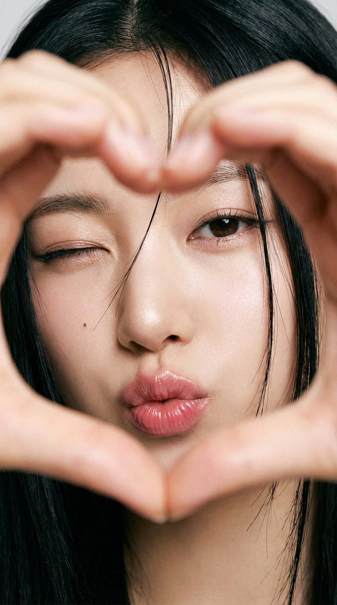

## 女生双手比出一个心形

- ID: gpt4o-599-zh-2
- Slug: prompt-599-zh-2
- 语言: zh
- 来源: [来源链接](https://x.com/SDT_side/status/1994133786632806832)
- 样例图路径: images/part3/599.jpeg

### 提示词

```text
{
"image_info": {
宽度：768，
“高度”：1365，
"aspect_ratio": "9:16",
“方向”: “垂直”
},

“主题”： {
“类型”：“特写肖像”，
描述：一位年轻的东亚女性在镜头前用双手比出一个心形，头部微微倾斜。
},

“衣服”： {
“可见”：否，
备注：画面中看不到任何衣物。
},

“头发”： {
“颜色：黑色”，
“风格”：“直筒”，
“细节”：“几缕散落的发丝自然地垂落在她的脸上”
},

“脸”： {
"眼睛": {
“形状”： “杏仁形”
“颜色”: “深棕色”
“妆容”：“淡雅的眼线，精致的睫毛，眼睑上柔和的珠光”，
“表情”：“一只眼睛眨了眨，另一只眼睛轻轻睁开”
},
“眉毛”：“自然，略微拱起”，
“肌肤”：“光滑、自然的光泽”，
"嘴唇": {
"形状": "饱满",
“颜色”： “粉红色光泽色调”，
“表情”：“亲吻脸（撅起嘴唇）”
},
"other_details": "左眼下方有一颗小痣"
},

“配件”： {
“可见”：否
},

“环境”： {
“背景”：“不可见；完全被极近的特写镜头遮挡住”
},

“灯光”： {
“类型”：“柔和漫射光”，
“效果”：“均匀照明，阴影极少，肌肤自然高光”
},

“相机”： {
“构图”：“极近特写（眼睛、鼻子和嘴唇充满画面）”，
"角度": "正面",
"景深": "非常浅",
“焦点”: “聚焦于眼睛和嘴唇”，
"前景元素": "双手在脸前摆成心形"
},

“风格”： {
“美学”：“柔和、俏皮、亲密”，
“纹理”：“具有胶片般柔和感的高分辨率肖像”，
氛围：可爱、活泼、爱调情
}
}
```

### 样例图


## Create a full Instagram-style 3×3 grid feed composed of 

- ID: gpt4o-596-en-1
- Slug: prompt-596-en-1
- 语言: en
- 来源: [来源链接](https://x.com/craftian_keskin/status/1994110561101979793)
- 样例图路径: images/part3/596.jpeg

### 提示词

```text
Create a full Instagram-style 3×3 grid feed composed of nine different portrait images, all featuring the person and the dog from the attached image. ensure that the middle photo is the same photo as the attached image, Ensure the person’s identity, facial structure, and style remain consistent across all nine posts. Each of the 9 images should present a unique concept, outfit, pose, and environment that fits a stylish, modern Instagram aesthetic.
 Include a mix of:
 – Lifestyle shots
 – Cinematic portraits 
– Fashion/streetwear scenes
 – Close-up beauty shots
 – Travel or outdoor vibes 
– Cozy indoor moments 
– Minimalist studio portraits 

Make every image hyperrealistic and shot as if with a professional camera: 
– Natural skin texture
 – Accurate lighting
 – Sharp details 
– Professional depth of field
 – High-quality color grading 
– Authentic expressions and posing Ensure all 9 images feel coherent as a feed: 
– Consistent character likeness 
– Similar visual tone and color palette 
– Aesthetic balance across the grid 
– Cinematic and modern photography style

 Final deliverable: a 3×3 Instagram grid layout of nine separate 3:4 ratio hyperrealistic portraits of the person from the attached photo.
```

### 样例图


## 3X3女子肖像照拼贴画

- ID: gpt4o-596-zh-2
- Slug: prompt-596-zh-2
- 语言: zh
- 来源: [来源链接](https://x.com/craftian_keskin/status/1994110561101979793)
- 样例图路径: images/part3/596.jpeg

### 提示词

```text
创建一个完整的 Instagram 风格的 3×3 网格信息流，包含九张不同的肖像照片，每张照片都需包含附图中的人物和狗狗。确保中间的照片与附图相同。确保所有九张照片中人物的身份、面部结构和风格保持一致。每张照片都应呈现独特的概念、服装、姿势和环境，以符合时尚现代的 Instagram 美学风格。
包含以下几种元素：
生活照
电影般的肖像
– 时尚/街头服饰场景
——特写镜头下的美照
旅行或户外氛围
舒适的室内时光
极简主义风格的影棚人像

让每一张照片都呈现出超逼真的效果，并像用专业相机拍摄一样：
自然肌肤纹理
精准照明
清晰的细节
– 专业景深
– 高质量的色彩分级
– 表情和姿势真实自然，确保所有 9 张图片在整体风格上保持一致：
– 角色形象始终如一
– 相似的视觉基调和色彩搭配
– 网格的美学平衡
电影感十足的现代摄影风格

最终交付成果：一个 3×3 的 Instagram 网格布局，包含九张独立的 3:4 比例的超写实肖像，肖像人物为附图中的人物。
```

### 样例图


## { "scene_description": "A cohesive 4-panel fashion lifes

- ID: gpt4o-595-en-1
- Slug: prompt-595-en-1
- 语言: en
- 来源: [来源链接](https://x.com/_MehdiSharifi_/status/1994166422251950451)
- 样例图路径: images/part3/595.jpeg

### 提示词

```text
{
  "scene_description": "A cohesive 4-panel fashion lifestyle collage featuring the same young woman in a trendy streetwear outfit, showcasing different dynamic poses and angles.",
  "subject": {
    "type": "Young Woman (Consistent character)",
    "age": "early 20s",
    "features": {
      "hair": "high ponytail or messy bun",
      "makeup": "fresh urban look"
    },
    "attire": "oversized graphic hoodie, biker shorts, high socks, chunky sneakers",
    "accessories": "cross-body bag, sunglasses on head"
  },
  "collage_layout": {
    "structure": "2x2 Grid Layout (4 frames of equal size)",
    "panel_1_top_left": "Front Full Body: Walking confidently towards the camera on a city crosswalk, hair moving in the wind, looking slightly to the side.",
    "panel_2_top_right": "Side Profile Sitting: Sitting on concrete steps with knees pulled up, resting chin on knees, looking peacefully at the street view.",
    "panel_3_bottom_left": "Back View Full Body: Standing and looking away at a city billboard or view, hands in hoodie pockets, highlighting the back graphic of the hoodie.",
    "panel_4_bottom_right": "Mid-Shot Angle: Leaning casually against a brick wall, one leg up on the wall, looking directly at the camera with a cool expression."
  },
  "environment": {
    "setting": "City Streets / Urban Alley",
    "background_elements": [
      "Brick textures",
      "Street signs",
      "City depth"
    ]
  },
  "lighting": {
    "style": "Overcast Soft Light",
    "key_light": {
      "type": "Natural Sky",
      "color": "Cool White",
      "effect": "Even lighting ideal for street fashion"
    }
  },
  "style": {
    "medium": "Digital Street Photography",
    "aesthetic": "Hypebeast, Urban, Gen Z, Candid",
    "quality": "8k resolution, sharp focus on subject"
  },
  "attire_customization": {
    "current_clothing": "Hoodie and biker shorts",
    "customizable_clothing": "User can swap for denim jacket and cargo pants"
  },
  "brand_product_customization": {
    "current_brand_product": "Streetwear",
    "customizable_brand": "User: Insert Brand Name",
    "customizable_product": "User: Specific sneakers or bag",
    "product_placement_area": "Hoodie chest or sneakers"
  }
}
```

### 样例图


## 四幅女子时尚生活场景拼贴画

- ID: gpt4o-595-zh-2
- Slug: prompt-595-zh-2
- 语言: zh
- 来源: [来源链接](https://x.com/_MehdiSharifi_/status/1994166422251950451)
- 样例图路径: images/part3/595.jpeg

### 提示词

```text
{
“场景描述”： “这是一幅由四幅时尚生活场景组成的拼贴画，画中同一位年轻女子身着时髦的街头服饰，展现了不同的动态姿势和角度。”
“主题”： {
“类型”：“年轻女子（性格始终如一）”
“年龄”：“20岁出头”，
“特征”： {
“发型”：“高马尾或凌乱发髻”，
妆容：清新都市妆容
},
“着装”：“超大号印花连帽衫、骑行短裤、高筒袜、厚底运动鞋”，
“配饰”：“斜挎包，头戴太阳镜”
},
"collage_layout": {
"结构": "2x2 网格布局（4 个大小相同的框架）",
"panel_1_top_left": "正面全身照：自信地走在城市人行横道上，头发随风飘扬，目光略微侧向一边。"
"panel_2_top_right": "侧脸坐姿：坐在水泥台阶上，双膝蜷起，下巴搁在膝盖上，平静地望着街景。"
"panel_3_bottom_left": "背部全身像：站立，目光看向远处的城市广告牌或风景，双手插在连帽衫口袋里，突显连帽衫背面的图案。"
"panel_4_bottom_right": "中景角度：随意地倚靠在砖墙上，一条腿搭在墙上，面带冷峻的表情直视镜头。"
},
“环境”： {
“场景”：“城市街道/城市小巷”，
“背景元素”：[
“砖纹理”，
“街道标志”，
“城市深度”
]
},
“灯光”： {
“风格”：“阴天柔光”，
"key_light": {
"type": "自然天空",
“颜色”：“冷白”，
“效果”：“均匀的灯光，非常适合街头时尚”
}
},
“风格”： {
“媒介”：“数码街头摄影”，
“美学”：“潮牌、都市、Z世代、坦率”
“画质”：“8K分辨率，主体清晰对焦”
},
"attire_customization": {
"current_clothing": "连帽衫和骑行短裤",
"customizable_clothing": "用户可以更换牛仔夹克和工装裤"
},
"品牌产品定制": {
"current_brand_product": "街头服饰",
"customizable_brand": "用户：插入品牌名称",
"customizable_product": "用户：特定运动鞋或包包",
"product_place_area": "连帽衫、胸前或运动鞋"
}
}
```

### 样例图


## { "scene_description": "A photorealistic, high-end 3D pr

- ID: gpt4o-594-en-1
- Slug: prompt-594-en-1
- 语言: en
- 来源: [来源链接](https://x.com/_MehdiSharifi_/status/1994022879051014312)
- 样例图路径: images/part3/594.png

### 提示词

```text
{
  "scene_description": "A photorealistic, high-end 3D product visualization of a perfectly assembled packaging box derived from a dieline, set in a pristine minimal studio.",
  "subject": {
    "type": "Assembled Packaging Box",
    "material": "Premium matte paperboard",
    "features": {
      "structure": "Perfectly folded, accurate panel placement, sharp clean edges",
      "surface": "Smooth matte texture with high-fidelity print rendering"
    },
    "position": "Upright, angled at a refined ¾ perspective view to show front and side panels",
    "artwork_state": "Undistorted typography, preserving original design exactly"
  },
  "action": {
    "primary": "Standing static on a surface",
    "secondary": "Casting a gentle shadow",
    "effect": "Demonstrates structural integrity and design elegance"
  },
  "environment": {
    "setting": "Minimalist High-End Studio Void",
    "foreground_elements": [
      "Clean, smooth surface",
      "Soft contact shadows"
    ],
    "background_elements": [
      "Soft neutral seamless backdrop (light grey/cream)",
      "Zero distractions",
      "No extra props"
    ]
  },
  "lighting": {
    "style": "Soft Commercial Product Lighting (Global Illumination)",
    "key_light": {
      "type": "Large Diffused Softbox",
      "color": "Neutral White (5500K)",
      "illuminates": [
        "The face of the box evenly",
        "The matte texture of the paper"
      ]
    },
    "fill_light": {
      "type": "White Reflector",
      "effect": "Softens shadows to ensure artwork visibility"
    },
    "shadows": "Subtle, soft gradient shadows anchoring the object"
  },
  "style": {
    "medium": "3D Rendering / Product Photography",
    "aesthetic": "Premium Editorial, Mockup Style, Minimalist Luxury",
    "quality": "8k resolution, ray-traced optics, physically based rendering (PBR)",
    "details": "Crisp folds, zero distortion, matte paper grain visibility"
  },
  "scene_composition": {
    "subject_action": "Static presentation",
    "camera_behavior": "Locked-off tripod shot",
    "depth_layering": "Sharp Subject -> Infinite Soft Background"
  },
  "visual_description": {
    "core_subject": "A flawless 3D box assembled from a flat dieline.",
    "attire_physics": "N/A - Rigid Body physics.",
    "surface_rendering": "Non-reflective matte finish that absorbs light softly, ensuring text is readable and colors are true."
  },
  "lighting_and_atmosphere": {
    "type": "Clean Studio",
    "specifics": "Even light distribution, ambient occlusion in the creases.",
    "color_grade": "Natural, color-calibrated, neutral tones."
  },
  "attire_customization": {
    "current_clothing": "N/A",
    "customizable_clothing": "N/A"
  },
  "brand_product_customization": {
    "current_brand_product": "Packaging Design",
    "customizable_brand": "User: Insert Brand Name/Logo for the box",
    "customizable_product": "User: Describe the box type (e.g., cosmetic box, tuck-end box)",
    "product_placement_area": "All visible panels (Front, Side, Top)"
  },
  "objects_and_props": {
    "main_objects": [
      "The 3D Box"
    ],
    "secondary_objects": []
  },
  "camera_and_lens": {
    "focal_length_feel": "85mm or 100mm (Telephoto to eliminate perspective distortion)",
    "aperture_effect": "f/16 (Deep depth of field for edge-to-edge sharpness)",
    "camera_angle": "Isometric or ¾ perspective",
    "lens_type": "Studio Macro Lens",
    "bokeh_style": "None (Smooth gradient background)"
  },
  "technical_tags": "--v 6 --ar 4:5 --stylize 150 --no warping, distortion, messy background, props, glossy reflection, low poly"
}
```

### 样例图


## 模切线图转3D产品可视化

- ID: gpt4o-594-zh-2
- Slug: prompt-594-zh-2
- 语言: zh
- 来源: [来源链接](https://x.com/_MehdiSharifi_/status/1994022879051014312)
- 样例图路径: images/part3/594.png

### 提示词

```text
{
"scene_description": "一个逼真的高端3D产品可视化模型，展示了一个完美组装的包装盒，该包装盒由模切线图生成，场景设定在一个简洁干净的摄影棚内。"
“主题”： {
"type": "组装包装盒",
“材质”： “优质哑光纸板”
“特征”： {
“结构”：“折叠完美，面板位置准确，边缘锋利干净”，
“表面”： “光滑哑光质感，高保真印刷效果”
},
“位置”：“直立，以精细的四分之三透视角度倾斜，以显示正面和侧面面板”，
"artwork_state": "未失真的字体，完全保留原始设计"
},
“行动”： {
“primary”: “静止地立于表面上”
“次要的”: “投下温柔的阴影”
“效果”：“展现了结构完整性和设计优雅性”
},
“环境”： {
“设置”：“极简高端工作室虚空”
"前景元素": [
“干净光滑的表面”，
“柔和的隐形眼镜阴影”
],
“背景元素”：[
“柔和的中性无缝背景（浅灰色/米色）”，
“零干扰”，
“无需额外道具”
]
},
“灯光”： {
“风格”：“柔和的商业产品照明（整体照明）”
"key_light": {
"type": "大型漫射柔光箱",
“颜色”：“中性白（5500K）”，
“照亮”：[
“盒子表面平整”，
纸张的哑光质感
]
},
"fill_light": {
“类型”：“白色反光器”，
“效果”：“柔化阴影，确保作品清晰可见”
},
“阴影”：“柔和的渐变阴影，使物体更加突出”
},
“风格”： {
“medium”: “3D渲染/产品摄影”
“美学”：“高端编辑风格、模型风格、极​​简奢华”
“质量”：“8k分辨率、光线追踪光学、基于物理的渲染（PBR）”
细节：折痕清晰，零变形，哑光纸颗粒可见
},
"scene_composition": {
"subject_action": "静态演示",
"camera_behavior": "锁定三脚架拍摄",
"depth_layering": "清晰主体->无限柔和背景"
},
"visual_description": {
"core_subject": "一个由平面模切线组装而成的完美3D盒子。"
"attire_physics": "不适用 - 刚体物理。",
"surface_rendering": "非反射哑光表面，柔和吸收光线，确保文字清晰可读，色彩真实。"
},
"lighting_and_atmosphere": {
"type": "Clean Studio",
“具体细节”：“光线分布均匀，褶皱处有环境光遮挡。”
"color_grade": "自然、色彩校准的中性色调。"
},
"attire_customization": {
"current_clothing": "N/A",
"customizable_clothing": "N/A"
},
"品牌产品定制": {
"current_brand_product": "包装设计",
"customizable_brand": "用户：输入包装盒的品牌名称/徽标",
"customizable_product": "用户：描述盒子类型（例如，化妆品盒、折叠盒）",
"product_placement_area": "所有可见面板（正面、侧面、顶部）"
},
"objects_and_props": {
"main_objects": [
“3D盒子”
],
"secondary_objects": []
},
"camera_and_lens": {
"focal_length_feel": "85mm 或 100mm（长焦镜头可消除透视畸变）",
"aperture_effect": "f/16（景深大，边缘到边缘清晰）",
"camera_angle": "等距或四分之三视角",
"lens_type": "影室微距镜头",
"bokeh_style": "无（平滑渐变背景）"
},
"technical_tags": " --v 6 --ar 4:5 --stylize 150 --no warping, distortion, messy background, props, glossy reflection, low poly"
}
```

### 样例图


## Present a clear, 45° top-down isometric miniature 3D car

- ID: gpt4o-592-en-1
- Slug: prompt-592-en-1
- 语言: en
- 来源: [来源链接](https://x.com/TechieBySA/status/1993995980405100598)
- 样例图路径: images/part3/592.jpeg

### 提示词

```text
Present a clear, 45° top-down isometric miniature 3D cartoon scene of [CITY], featuring its most iconic landmarks and architectural elements. Use soft, refined textures with realistic PBR materials and gentle, lifelike lighting and shadows. Integrate the current weather conditions directly into the city environment to create an immersive atmospheric mood.
Use a clean, minimalistic composition with a soft, solid-colored background.

At the top-center, place the title “[CITY]” in large bold text, a prominent weather icon beneath it, then the date (small text) and temperature (medium text).
All text must be centered with consistent spacing, and may subtly overlap the tops of the buildings.
Square 1080x1080 dimension.
```

### 样例图


## 城市俯视等距3D卡通微缩场景

- ID: gpt4o-592-zh-2
- Slug: prompt-592-zh-2
- 语言: zh
- 来源: [来源链接](https://x.com/TechieBySA/status/1993995980405100598)
- 样例图路径: images/part3/592.jpeg

### 提示词

```text
呈现[城市]清晰的45°俯视等距3D卡通微缩场景，展现其最具标志性的地标和建筑元素。使用柔和细腻的纹理、逼真的PBR材质以及柔和自然的灯光和阴影。将当前天气状况直接融入城市环境，营造身临其境的氛围。”
使用简洁的极简主义构图，搭配柔和的纯色背景。

在顶部中心位置，用粗体大字显示标题“[城市]”，在其下方放置一个醒目的天气图标，然后是日期（小字）和温度（中字）。
所有文字必须居中，间距一致，并且可以略微与建筑物顶部重叠。
1080x1080 正方形。
```

### 样例图


## 复古动漫幻想

- ID: gpt4o-584-zh
- Slug: prompt-584-zh
- 语言: zh
- 来源: [来源链接](https://x.com/songguoxiansen/status/1994240266866446621)
- 样例图路径: images/part3/584.jpeg

### 提示词

```text
一位美丽的东亚女性，有着令人羡慕的白嫩光滑肌肤，留着蓬松的90年代风格卷发。她穿着复古的水手服风格连衣裙，坐在一家充满怀旧感的日式咖啡馆里，眼神梦幻。照片被密集的80-90年代少女漫画元素覆盖：闪烁的星星、魔法少女变身效果、粉彩色的机甲怪兽、玫瑰花框和巨大的漫画拟声词（如“DOKI DOKI”）。艺术风格是扁平的赛璐璐色彩和粗糙的线条，环绕着她写实的身体。柔和、梦幻的午后光线。
```

### 样例图

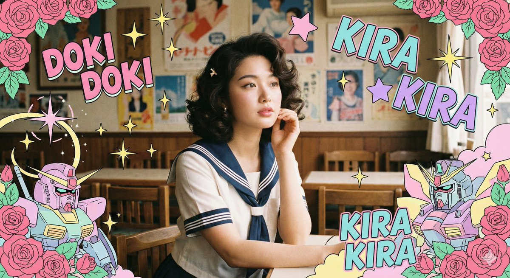

## 东方武侠史诗海报-剑影红颜

- ID: gpt4o-583-zh
- Slug: prompt-583-zh
- 语言: zh
- 来源: [来源链接](https://x.com/songguoxiansen/status/1994278346474311838)
- 样例图路径: images/part3/583.jpeg

### 提示词

```text
一张虚构的东方武侠史诗海报《剑影红颜》（Sword & Beauty）。场景设置在一个云雾缭绕的古老山巅亭阁中。画面中央，陈坤（Chen Kun）身着飘逸的墨色长袍，长发束起，眼神深邃，手中握着一把未出鞘的古剑，剑柄上镶嵌着玉石，他正凝视前方。在他的左侧，周迅（Zhou Xun）身穿刺绣精美的绯红色古装，高耸的发髻上插着金步摇，她侧身回眸，眼神中带着一丝哀愁和决绝，手中拿着一管玉箫。桌上放着一壶清酒、两个酒杯和一卷竹简。背景是连绵不绝的水墨山水和一轮巨大的红日。最右侧的石灯笼里燃着烛火。左上角"博纳影业 出品"，下方"徐克导演作品"。右上角"金马奖 最佳动作设计"。顶部中央是奥斯卡金像奖标志，下方"ACADEMY AWARD® NOMINEE BEST INTERNATIONAL FEATURE"。主标题"剑影红颜"以苍劲有力的书法字体显示。标题下方注明"江湖之远，不敌你眉间朱砂"。底部列出"武术指导 袁和平"、"服装设计 叶锦添"。整体风格是唯美主义的东方奇幻，采用柔和的自然光和云雾效果，营造出仙气、悲壮和浪漫的氛围。色调以青绿、墨色和朱红为主。
```

### 样例图


## 奇幻冒险喜剧海报-寻龙秘境

- ID: gpt4o-582-zh
- Slug: prompt-582-zh
- 语言: zh
- 来源: [来源链接](https://x.com/songguoxiansen/status/1994279390579183827)
- 样例图路径: images/part3/582.jpeg

### 提示词

```text
一张虚构的奇幻冒险喜剧海报《寻龙秘境》（The Dragon Realm Quest）。场景设置在一个充满奇异发光植物和古老遗迹的地下洞穴中。画面中央，演员黄渤留着滑稽的胡子，戴着探险帽，穿着多口袋马甲，表情夸张地瞪大眼睛看着手中的一个发光罗盘。在他的右侧，演员舒淇穿着异域风情的皮质探险服，背着一把弩箭，正无奈地扶着额头，嘴角上扬看着黄渤。两人周围散落着金币、古老的卷轴和一个巨大的恐龙蛋化石。背景是一个巨大的、沉睡的石龙雕像，其眼睛部位隐约发出红光。左上角"开心麻花影业 出品"，下方"闫非 彭大魔导演作品"。右上角"百花奖 观众最喜爱影片"。顶部中央是多伦多电影节标志，下方"TIFF PEOPLE'S CHOICE AWARD 2024"。主标题"寻龙秘境"以带有龙鳞纹理的金色立体字体显示。标题下方注明"不仅要命，还要钱！"。底部列出"视觉特效 工业光魔"、"动作指导 成家班"。整体风格是色彩斑斓的奇幻冒险，采用魔法光和生物发光的混合光源，营造出幽默、惊险和神秘的氛围。色调以宝石蓝、翠绿和金色为主，人物的旁边标记演员的名字。
```

### 样例图


## { "subject": { "type": "young woman", "pose": "sitting s

- ID: gpt4o-579-en-1
- Slug: prompt-579-en-1
- 语言: en
- 来源: [来源链接](https://x.com/awesome_visuals/status/1994104753966686476)
- 样例图路径: images/part3/579.jpeg

### 提示词

```text
{ "subject": { "type": "young woman", "pose": "sitting sideways on an arcade stool, one knee up, hugging legs loosely, winking with exaggerated cuteness", "expression": "playful and lively" }, "clothing": { "top": "teal t-shirt with comic-outline shading", "bottom": "pink shorts", "socks": "purple crew socks", "shoes": "bright neon sneakers with translucent soles" }, "hair": { "color": "black", "style": "braided pigtails with neon hair ties" }, "environment": { "setting": "retro arcade interior", "details": "glowing cabinets, colorful reflections, cluttered neon lights" }, "lighting": { "type": "intense neon mixed lighting", "mood": "electric, colorful, kinetic" }, "camera": { "angle": "low-medium angle", "lens_effect": "wide lens, subtle distortion for dynamic feel", "framing": "tight arcade framing" }, "art_overlay": { "style": "overloaded sweets-monster pop-art", "description": "a hyper-busy explosion of candy-inspired monsters and neon shapes surrounding the subject while keeping skin photorealistic", "illustrated_elements": { "monsters": "goofy cute-ugly creatures made of donuts, chocolate chunks, banana ghosts, candy worms, gummy bears, soda bottles, strawberries, melting ice cream blobs", "graphic_shapes": "drips, splashes, stars, hearts, zigzags, spirals, speed lines, sparkles, comic bursts without text", "style": "flat graphic shapes with thick black outlines and bright neon hues" }, "placement_and_density": { "behavior": "extreme density filling almost all negative space", "behind_subject": "background jam-packed with overlapping layers of monsters", "around_subject": "creatures peeking behind shoulders, popping near head, sitting near feet", "over_clothing": "monsters overlapping shirt and shorts with subtle shading interaction", "avoid_skin": "no overlays touching the face, arms, or legs", "depth_layers": "front and back illustration layers creating chaotic dimensionality", "energy_effects": "white spark dots, glowing rims, dynamic speed lines around the figure" } }, "style": { "overall": "arcade portrait consumed by maximalist sweets-monster chaos", "aesthetic": "energetic, loud, neon-pop, surreal" } }
```

### 样例图

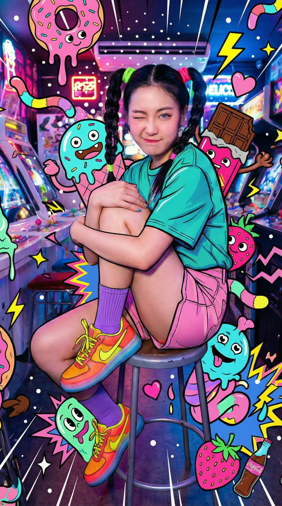

## 年轻女子侧坐在街机凳上

- ID: gpt4o-579-zh-2
- Slug: prompt-579-zh-2
- 语言: zh
- 来源: [来源链接](https://x.com/awesome_visuals/status/1994104753966686476)
- 样例图路径: images/part3/579.jpeg

### 提示词

```text
{ "subject": { "type": "年轻女子", "pose": "侧坐在街机凳上，单膝抬起，双腿松松地抱在一起，夸张地眨着眼睛，表情可爱", "expression": "活泼俏皮" }, "clothing": { "top": "青色T恤，带有漫画轮廓阴影", "bottom": "粉色短裤", "socks": "紫色船袜", "shoes": "亮霓虹色运动鞋，鞋底半透明" }, "hair": { "color": "黑色", "style": "用霓虹色发圈扎的麻花辫" }, "virtation": { "setting": "复古街机厅内部", "details": "发光的机柜，五彩缤纷的倒影，杂乱的霓虹灯" }, "lighting": { "type": "强烈的霓虹混合照明", "mood": "电光、多彩、动感" }, "camera": { "angle": "低中光"角度", "镜头效果": "广角镜头，轻微畸变，营造动感", "构图": "紧凑的街机式构图" }, "艺术叠加"": { "风格"": "糖果怪兽波普艺术", "描述"": "围绕主体，糖果灵感怪兽和霓虹形状的超密集爆炸，同时保持皮肤的逼真度", "插画元素"": { "怪兽"": "由甜甜圈、巧克力块、香蕉幽灵、糖果蠕虫、软糖熊、汽水瓶、草莓、融化的冰淇淋球组成的滑稽可爱又丑陋的生物", "图形形状"": "滴落、飞溅、星星、心形、锯齿形、螺旋形、速度线、闪光、无文字的漫画爆发" "风格"": "带有粗黑轮廓和明亮霓虹色调的扁平图形形状" }, "位置和密度" { "行为"": "极高的密度，几乎填充所有负空间", "behind_subject": "背景密密麻麻地布满了层叠的怪物", "around_subject": "生物从肩膀后探出头来，在头部附近闪现，在脚边栖息", "over_clothing": "怪物与衬衫和短裤重叠，并有微妙的阴影互动", "avoid_skin": "没有叠加层接触到脸部、手臂或腿部", "depth_layers": "前后插图层营造出混乱的立体感", "energy_effects": "白色火花点、发光边缘、人物周围的动态速度线" } }, "style": { "overall": "被极繁主义的糖果怪物混乱所吞噬的街机肖像", "aesthetic": "充满活力、喧闹、霓虹流行、超现实" } }
```

### 样例图


## A vibrant Pixar-style 3D animated scene depicting a joyf

- ID: gpt4o-577-en-1
- Slug: prompt-577-en-1
- 语言: en
- 来源: [来源链接](https://x.com/dotey/status/1994139903513317767)
- 样例图路径: images/part3/577.jpeg

### 提示词

```text
A vibrant Pixar-style 3D animated scene depicting a joyful group selfie moment featuring <group of characters> in a <culturally representative environment>.
At the center, <main character> confidently holds a selfie stick topped with an iPhone, wearing an expression that clearly reflects their <distinctive personality trait> and exudes <leadership or core presence>.
To the left, <character A> adopts a pose or action reflective of their <distinct personality trait>, showcasing an expressive face that vividly captures their <personality description>.
On the right side, <character B> strikes a playful/humorous/cute pose, holding a characteristic item (<character B’s representative object>), with an exaggerated, lively facial expression highlighting their <distinctive personality trait>.
Additional characters (optional):

Nearby, <character C> performs an action or posture aligned with their personality, bearing an expressive facial expression that encapsulates their unique personality traits.
All characters wear bright, cheerful, and adorably rounded outfits styled in a contemporary fusion of traditional and modern attire representative of their cultural or historical backgrounds.
The scene is warmly lit, colorful, and filled with dynamic expressions and lively poses.
The background features a setting emblematic of the characters' cultural identities or personalities—such as cherry blossoms, lakes, mountains, historic architecture, or fantasy-like natural landscapes—rendered in the adorable, cinematic style characteristic of Pixar animations.
The overall composition exudes energy, humor, and heartwarming joy, capturing the essence of each character through their selfie expressions and postures.

—-

Names: [Frodo, Sam, Aragorn, Gandalf, Legolas, Gimli]
```

### 样例图


## 皮克斯风格3D动画场景

- ID: gpt4o-577-zh-2
- Slug: prompt-577-zh-2
- 语言: zh
- 来源: [来源链接](https://x.com/dotey/status/1994139903513317767)
- 样例图路径: images/part3/577.jpeg

### 提示词

```text
一段充满活力的皮克斯风格3D动画场景，描绘了欢乐的集体自拍时刻。<group of characters>在<culturally representative environment>。
在中心，<main character>她自信地拿着一根顶端装着iPhone的自拍杆，脸上带着明显反映出他们<distinctive personality trait>并散发出<leadership or core presence>。
向左转，<character A>采取一种反映其身份的姿势或动作<distinct personality trait>展现出一张表情丰富的脸，生动地捕捉到了他们的<personality description>。
右侧，<character B>摆出俏皮/幽默/可爱的姿势，手持一件特色物品（ <character B’s representative object<span translate="no"> （p1），面部表情夸张生动，突显了他们的<distinctive personality trait>。
其他字符（可选）：

附近，<character C>做出符合其个性的动作或姿势，并带有能体现其独特个性特征的生动面部表情。
所有角色都穿着色彩鲜艳、活泼可爱、圆润的服装，这些服装融合了传统和现代元素，体现了他们的文化或历史背景。
画面光线温暖，色彩丰富，充满了生动的表情和活泼的姿态。
背景以象征角色文化身份或个性的场景为特色——例如樱花、湖泊、山脉、历史建筑或奇幻般的自然景观——以皮克斯动画特有的可爱电影风格呈现。
整体构图充满活力、幽默和温馨的喜悦，通过人物的自拍表情和姿势捕捉到了每个角色的精髓。

——

人物：[弗罗多、山姆、阿拉贡、甘道夫、莱戈拉斯、吉姆利]
```

### 样例图


## 皮克斯风格3D动画场景

- ID: gpt4o-576-zh
- Slug: prompt-576-zh
- 语言: zh
- 来源: [来源链接](https://x.com/dotey/status/1994142229695217837)
- 样例图路径: images/part3/576.jpeg

### 提示词

```text
皮克斯风格3D动画场景——<人物组合>在<场景环境>中欢乐自拍留念。

<主视角人物>站在中央，手持自拍杆（上面连着一部 iPhone 手机），
表情为<主视角人物性格特征>，呈现出<领导/核心人物气质>。

在<主视角人物>左侧的<人物A>展现出<人物A性格相关的动作/姿势>，
表情为<人物A表情特征>，体现出<人物A性格描述>。

在右侧的<人物B>则摆出<搞怪/豪迈/可爱>的姿势，
手持<人物B代表物品>，表情为<人物B表情特征>，
风格活泼夸张，展现出<人物B性格特征>。

若有更多人物，可继续添加：
旁边的<人物C>则<动作/姿态>，脸上带着<表情>，
展示出<性格>特点。

所有人物穿着色彩鲜艳、圆润可爱的<时代风格+改良服饰>，
整体光效柔和温暖、色调明亮，
角色表情丰富、动作生动。

背景为<环境描述：如桃花、湖泊、山林、古风建筑或仙境般的自然场景>，
场景具有皮克斯动画电影般的可爱氛围与电影级构图感，
整体画面充满活力、幽默、温馨的欢乐气息。

---
人物：刘备、张飞、关羽
```

### 样例图

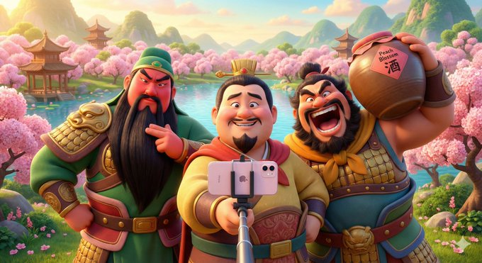

## { "subject": { "type": "beautiful young woman (early 20s

- ID: gpt4o-575-en-1
- Slug: prompt-575-en-1
- 语言: en
- 来源: [来源链接](https://x.com/awesome_visuals/status/1993609750051766767)
- 样例图路径: images/part3/575.jpeg

### 提示词

```text
{ "subject": { "type": "beautiful young woman (early 20s)", "pose": "sitting sideways on a concrete street barrier, one knee up, one arm resting on it, giving a winking smile", "expression": "cute, confident, playful" }, "appearance": { "hair_color": "light brown", "hair_style": "messy shoulder-length bob with wispy bangs", "complexion": "fair with warm undertones" }, "clothing": { "top": "lavender cropped hoodie with soft contour shading", "bottom": "mint pleated skirt", "socks": "white ankle socks with tiny pastel stripes", "shoes": "chunky white sneakers with teal accents" }, "environment": { "setting": "urban street corner", "details": "painted curb, faded crosswalk lines, distant buildings, cloudy-bright sky" }, "lighting": { "type": "bright diffused afternoon light", "mood": "soft, pastel, airy" }, "camera": { "angle": "mid to low angle", "lens_effect": "wide lens with mild depth warp", "framing": "subject centered with plenty of room for decoration layers" }, "art_overlay": { "style": "dense maximalist sweets-monster pop-art cluster", "illustrated_elements": { "monsters": "banana ghosts, donut creatures, strawberry heads, melting chocolate blobs, cookie beasts, gummy worms, tiny soda-bottle critters", "graphic_shapes": "neon stars, hearts, zigzags, drips, splashes, bubbles, speed lines, text bursts without text", "style": "flat neon colors (pink, cyan, lime, yellow, purple) with thick black outlines" }, "placement_and_density": { "behind_subject": "entire background packed with overlapping sweets monsters", "around_subject": "monsters peeking near shoulders, feet, and around hair silhouette", "over_clothing": "some creatures rest on hoodie, skirt, and shoes with small clothing shadows", "avoid_skin": "face, legs, and arms remain clean and photorealistic", "depth_layers": "layers in front and behind create stacked chaotic depth", "energy_effects": "glowing rim lines, white spark dots, motion lines surrounding her" } }, "style": { "overall": "pastel street photography overwhelmed by neon sweets-monster pop-art", "aesthetic": "cute, overloaded, vibrant, surreal" } }
```

### 样例图

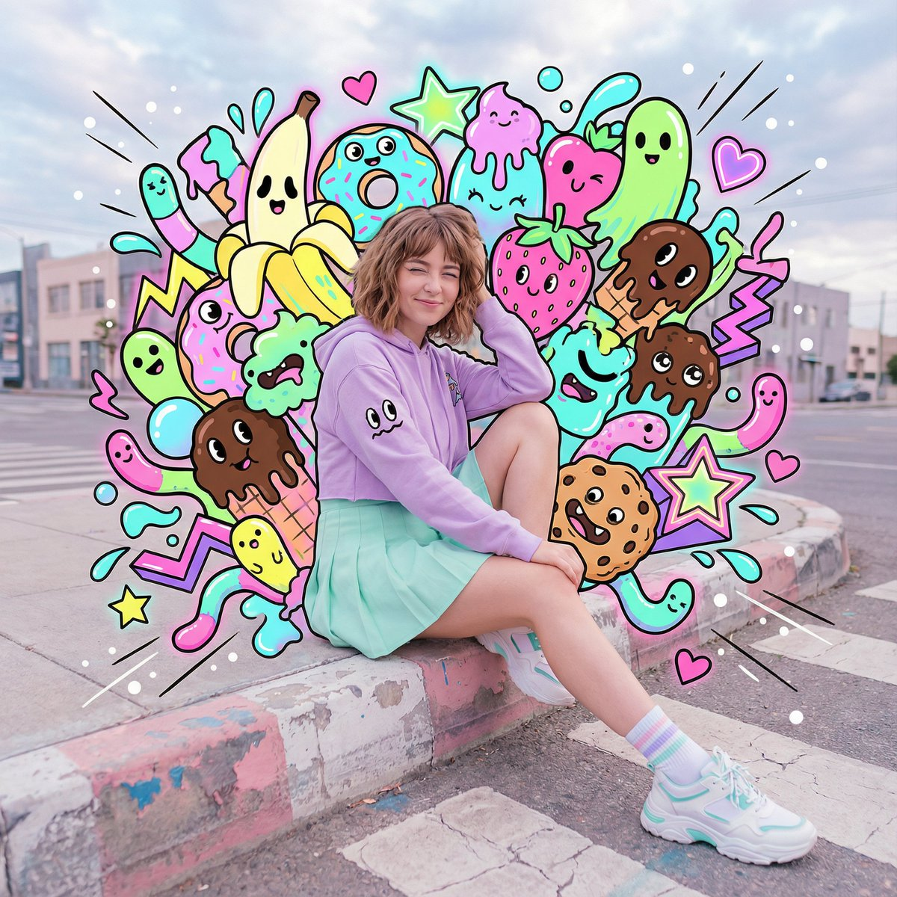

## 极繁主义波普艺术图层

- ID: gpt4o-575-zh-2
- Slug: prompt-575-zh-2
- 语言: zh
- 来源: [来源链接](https://x.com/awesome_visuals/status/1993609750051766767)
- 样例图路径: images/part3/575.jpeg

### 提示词

```text
{ "subject": { "type": "美丽的年轻女性（20岁出头）", "pose": "侧坐在水泥路障上，单膝跪地，一只手臂搭在上面，眨着眼睛微笑", "expression": "可爱、自信、活泼" }, "appearance": { "hair_color": "浅棕色", "hair_style": "凌乱的齐肩波波头，刘海稀疏", "complexion": "白皙，带暖色调" }, "clothing": { "top": "淡紫色短款连帽衫，带有柔和的轮廓阴影", "bottom": "薄荷绿百褶裙", "socks": "白色短袜，带有细小的粉彩色条纹", "shoes": "厚底白色运动鞋，带有蓝绿色点缀" }, "environment": { "setting": "城市街角", "details": "涂漆的路缘石，褪色的斑马线，远处的建筑物，阴天但明亮的天空" }, "lighting": { "type": "明亮的漫射午后光", "mood": "柔和、粉彩、轻盈" }, "camera": { "angle": "中低角度", "lens_effect": "带有轻微景深变形的广角镜头", "frameming": "主体居中，留有足够的装饰图层空间" }, "art_overlay": { "style": "浓郁的极繁主义糖果怪兽波普艺术风格", "illustrated_elements": { "monsters": "香蕉幽灵、甜甜圈生物、草莓头、融化的巧克力块、饼干怪兽、橡皮糖虫、小汽水瓶生物", "graphic_shapes": "霓虹星星、心形、锯齿形、滴落、飞溅、气泡、速度线、无文字的文字爆发", "style": "带有粗黑轮廓的扁平霓虹色（粉色、青色、酸橙色、黄色、紫色）" }, "placement_and_density": { "behind_subject": "整个背景都布满了重叠的糖果怪兽", "around_subject": "怪兽从肩膀、脚边和头发轮廓周围探出头来", "over_clothing": "一些怪兽栖息在连帽衫、裙子和鞋子上，留下小小的衣服阴影", "avoid_skin": "脸部、腿部和手臂保持干净且逼真", "depth_layers": "前后图层营造出堆叠的混乱深度", "energy_effects": "发光的边缘线、白色火花点、环绕着她的运动线条" } }, "style": { "overall": "霓虹糖果怪兽波普艺术风格的柔和街头摄影", "aesthetic": "可爱、繁复、充满活力、超现实" } }
```

### 样例图


## 泛黄旧报纸手账

- ID: gpt4o-569-zh
- Slug: prompt-569-zh
- 语言: zh
- 来源: [来源链接](https://x.com/songguoxiansen/status/1993959563251593223)
- 样例图路径: images/part3/569.jpeg

### 提示词

```text
泛黄旧报纸手账
复古怀旧风格的9:16时尚插画。背景模仿陈旧的泛黄信纸，边缘有烧焦效果的手绘纹理和咖啡渍印记。中央是用户复古穿搭的贴纸，处理成胶片颗粒感，但保留白色贴纸边框。Labubu公仔贴纸戴着复古墨镜和花衬衫，坐在旁边。衣物解构部分展示了复古皮夹克和牛津鞋的贴纸。隐藏层贴纸是一件复古丝绸吊带裙，质感丝滑。周围用钢笔墨水风格绘制了优雅的草写英文日期和复古相框涂鸦。贴纸边缘用半透明的纸胶带图案固定。画面平整，无任何书写工具或手部入镜，纯粹的复古平面设计。
```

### 样例图


## 明星合照的幕后花絮

- ID: gpt4o-565-zh
- Slug: prompt-565-zh
- 语言: zh
- 来源: [来源链接](https://x.com/songguoxiansen/status/1992456465173692800)
- 样例图路径: images/part3/565.jpeg

### 提示词

```text
我想看看这张照片拍摄的幕后花絮，了解它是如何创作出来的
```

### 样例图

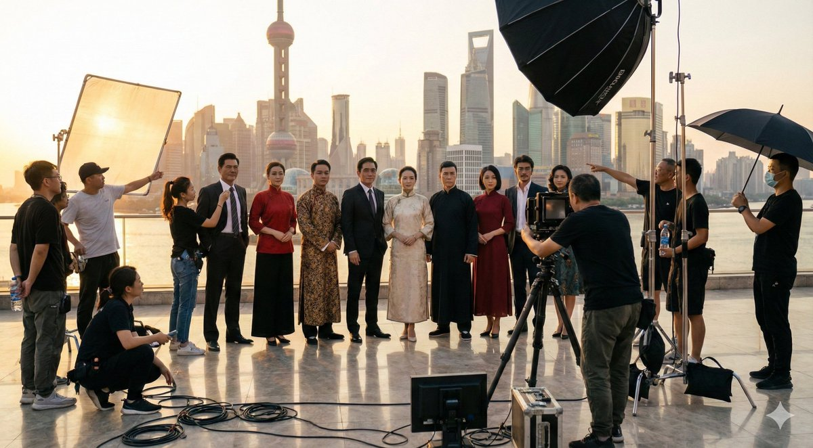

## Place Deadpool next to the man, making "bunny ears" with

- ID: gpt4o-555-en-1
- Slug: prompt-555-en-1
- 语言: en
- 来源: [来源链接](https://x.com/songguoxiansen/status/1993222622986092722)
- 样例图路径: images/part3/555.jpeg

### 提示词

```text
Place Deadpool next to the man, making "bunny ears" with his fingers behind the man's head while looking mischievously at the camera. Use the Avengers Tower rooftop overlooking New York City as the background. Keep the selfie composition intact and integrate both characters naturally.
```

### 样例图

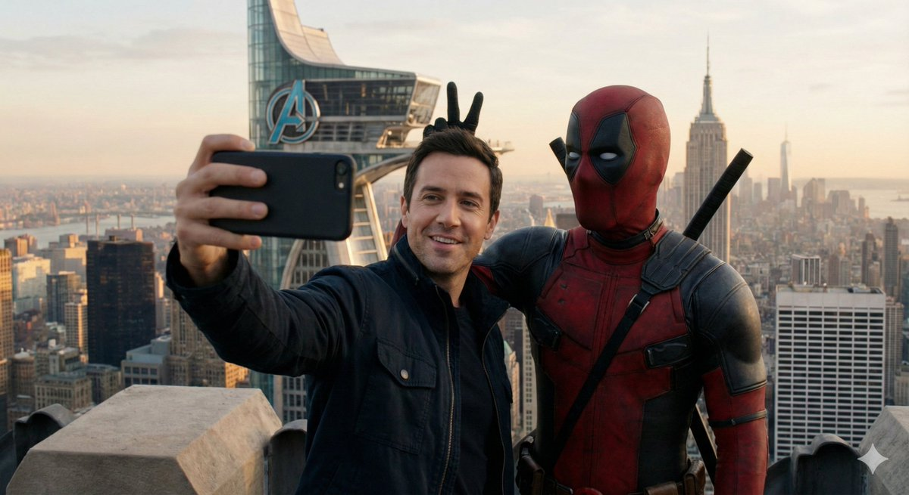

## 在复仇者大厦跟死侍合个影

- ID: gpt4o-555-zh-2
- Slug: prompt-555-zh-2
- 语言: zh
- 来源: [来源链接](https://x.com/songguoxiansen/status/1993222622986092722)
- 样例图路径: images/part3/555.jpeg

### 提示词

```text
让死侍站在男人旁边，用手指在男人脑后比划“兔耳朵”，同时对着镜头露出调皮的表情。以俯瞰纽约市的复仇者大厦楼顶为背景。保持自拍构图不变，让两个角色自然地融入画面。
```

### 样例图


## 超现实主义日式水墨画

- ID: gpt4o-552-zh-1
- Slug: prompt-552-zh-1
- 语言: zh
- 来源: [来源链接](https://x.com/Preda2005/status/1992472259127283888)
- 样例图路径: images/part3/552.jpeg

### 提示词

```text
Create a highly detailed surreal Japanese sumi-e illustration blending ancient Edo-period aesthetics with futuristic absurdity. At twilight, under a vast sky streaked with vermilion and indigo brushstrokes, Doraemon stands atop a traditional pagoda roof reinforced with glowing fiber cables and neon scaffolding. He pilots a weathered, patchwork mecha painted in faded indigo lacquer, shaped like a vintage wind-up toy with exposed gears, silk-banner decals, and steam exhausts puffing from shoulder vents. The mecha wears a digital mawashi displaying shifting kanji runes. Doraemon’s expression is intense but comically determined, his paw gripping a lever made from polished bamboo and chrome.

Across the composition, Hello Kitty appears inside a towering golden-armored mecha resembling an ornate Hannya mask, with sakura-shaped LEDs pulsing across its chestplate. Her stance mirrors that of a sumo rikishi mid-tachiai, legs wide, palms extended, toes digging into the glowing tatami rooftop below. Tiny holographic cherry blossoms swirl in the air, catching the last ambient light from futuristic Edo lanterns floating in midair via anti-gravity rings.

Below, dozens of onlookers in layered kimono-hologram hybrids cheer with glowing fans shaped like old kabuki masks. Some wear AR visors shaped like fox spirits, their faces half-lit by the flickering light of vending machines embedded in shrine walls. In one corner, an elderly monk with cybernetic arms calmly sketches the scene on a floating washi-scroll, eyes glowing faintly behind antique round glasses.

The entire piece is rendered in expressive sumi-e ink washes with chaotic splashes for motion trails, delicate dry-brush hatching for armor texture, and faint pastel watercolors to accent light sources. Negative space is used deliberately around the combatants to amplify their presence. A red artist seal (宝雷印) is stamped boldly in the lower corner, harmonizing the traditional technique with the scene’s absurd modernity.
```

### 样例图

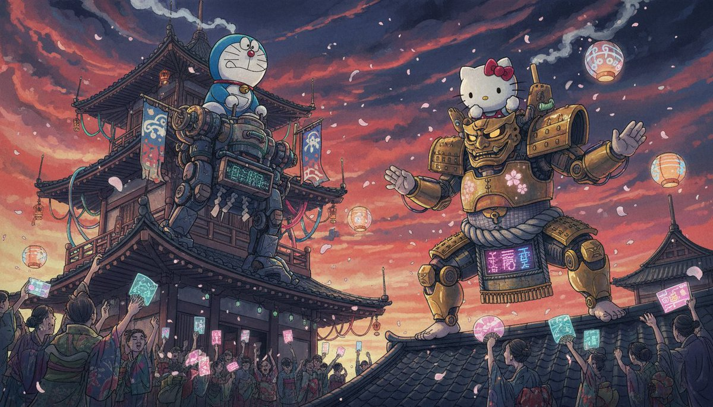

## 超现实主义日式水墨画

- ID: gpt4o-552-zh-2
- Slug: prompt-552-zh-2
- 语言: zh
- 来源: [来源链接](https://x.com/Preda2005/status/1992472259127283888)
- 样例图路径: images/part3/552.jpeg

### 提示词

```text
创作一幅细节丰富的超现实主义日式水墨画，融合江户时代的古典美学与未来主义的荒诞风格。暮色降临，在朱红与靛蓝交织的广袤天空下，哆啦A梦站在一座由发光纤维缆绳和霓虹灯脚手架加固的传统宝塔屋顶上。他驾驶着一架饱经风霜、涂着褪色靛蓝漆的机甲，外形酷似老式发条玩具，齿轮外露，饰有丝绸旗帜图案，肩部通风口喷出蒸汽。机甲上系着一条印有不断变化的汉字图案的数码腰带。哆啦A梦表情严肃而又滑稽地坚定，他的爪子紧紧握着一个由抛光竹子和镀铬制成的操纵杆。

画面中，Hello Kitty 出现在一座高耸的金色铠甲机甲内，机甲造型宛如一副华丽的般若面具，胸甲上闪烁着樱花形状的 LED 灯。她的站姿如同相扑力士立合的姿势，双腿分开，手掌伸展，脚趾深深扎入下方发光的榻榻米屋顶。细小的全息樱花在空中飞舞，捕捉着未来感十足的江户灯笼在反重力环的辅助下悬浮于半空中时散发的最后一丝光芒。

下方，数十名身着层叠和服与全息投影混合服饰的围观者挥舞着形似古老歌舞伎面具的发光扇子欢呼雀跃。一些人戴着狐狸精造型的增强现实（AR）头盔，他们的脸庞被神社墙壁上自动售货机闪烁的灯光照亮了一半。在一个角落里，一位装着机械手臂的老僧正平静地在一张漂浮的和纸卷轴上描绘着眼前的景象，他那双透过古董圆眼镜闪烁着微光的眼睛。

整幅作品以极富表现力的水墨晕染技法绘制而成，奔放的泼墨笔触勾勒出动感轨迹，精细的干笔阴影描绘出盔甲的纹理，淡雅的粉彩则突出了光源。画中刻意在战斗人物周围留出空白，以增强他们的存在感。画面左下角醒目地盖上了红色的艺术家印章（宝雷印），将传统技法与画面荒诞的现代感巧妙地融合在一起。
```

### 样例图


## A fashion-style concept breakdown sheet in hand-drawn il

- ID: gpt4o-550-en-1
- Slug: prompt-550-en-1
- 语言: en
- 来源: [来源链接](https://x.com/cheerselflin/status/1992877077570453712)
- 样例图路径: images/part3/550.jpeg

### 提示词

```text
A fashion-style concept breakdown sheet in hand-drawn illustration style. 
Center: full-body view of a stylish, confident female character with a slightly sexy vibe (not explicit), in a dynamic yet natural pose. 
Surrounding: structured layout of her key components:
• Clothing layering – show outerwear, innerwear, tights (lace, sheer textures), shapewear with detailed pattern zoom-ins.  
• Expression sheet – 3-4 facial expressions (neutral, shy, surprised, focused).
• Close-up zooms – textures of fabric folds, skin details, hand gestures.
• Lifestyle & accessories – open handbag with daily items: lipstick, perfume, mirror compact, hand cream, diary, supplements.
• Material annotations – handwritten-style notes beside each item (e.g., “soft lace,” “matte leather,” “shade #520”).

Background: soft beige or parchment paper texture to evoke a design sketchbook.
Lighting: clean, soft shadows to unify the scene.
Output: high-quality 2D illustration in 4K, balanced between sensuality and fashion editorial.
Language: labels in Chinese + English.
```

### 样例图


## 手绘风格的时尚风格概念分解图

- ID: gpt4o-550-zh-2
- Slug: prompt-550-zh-2
- 语言: zh
- 来源: [来源链接](https://x.com/cheerselflin/status/1992877077570453712)
- 样例图路径: images/part3/550.jpeg

### 提示词

```text
手绘风格的时尚风格概念分解图。
中心：一位时尚自信的女性角色的全身像，略带性感（但不露骨），姿态充满活力又自然。
周围环境：她的关键组成部分的结构化布局：
• 服装叠穿——展示外套、内衣、紧身裤（蕾丝、透明质地）、塑身衣，并放大细节图案。
• 表情表 – 3-4 种面部表情（中性、害羞、惊讶、专注）。
• 特写镜头——展现织物褶皱的纹理、皮肤细节、手势。
• 生活方式和配饰 – 打开手提包，里面装着日常用品：口红、香水、粉饼、护手霜、日记本、保健品。
• 材料注释 – 每件物品旁边的手写风格注释（例如，“柔软的蕾丝”、“哑光皮革”、“色号 #520”）。

背景：柔和的米色或羊皮纸纹理，以唤起人们对设计草图本的联想。
光线：干净、柔和的阴影使画面统一。
输出：4K 高清 2D 插图，兼具性感与时尚感。
语言：中文+英文标签。
```

### 样例图


## 城市动态天气卡片

- ID: gpt4o-543-zh-1
- Slug: prompt-543-zh-1
- 语言: zh
- 来源: [来源链接](https://x.com/dotey/status/1993729800922341810)
- 样例图路径: images/part3/543.jpeg

### 提示词

```text
Present a clear, 45° top-down view of a vertical (9:16) isometric miniature 3D cartoon scene, highlighting iconic landmarks centered in the composition to showcase precise and delicate modeling.

The scene features soft, refined textures with realistic PBR materials and gentle, lifelike lighting and shadow effects. Weather elements are creatively integrated into the urban architecture, establishing a dynamic interaction between the city's landscape and atmospheric conditions, creating an immersive weather ambiance.

Use a clean, unified composition with minimalistic aesthetics and a soft, solid-colored background that highlights the main content. The overall visual style is fresh and soothing.

Display a prominent weather icon at the top-center, with the date (x-small text) and temperature range (medium text) beneath it. The city name (large text) is positioned directly above the weather icon. The weather information has no background and can subtly overlap with the buildings.

The text should match the input city's native language.
Please retrieve current weather conditions for the specified city before rendering.

City name:【上海】
```

### 样例图


## 城市动态天气卡片

- ID: gpt4o-543-zh-2
- Slug: prompt-543-zh-2
- 语言: zh
- 来源: [来源链接](https://x.com/dotey/status/1993729800922341810)
- 样例图路径: images/part3/543.jpeg

### 提示词

```text
以清晰的 45° 俯视视角呈现垂直 (9:16) 等距微缩 3D 卡通场景，突出构图中的标志性地标，以展示精确而精致的建模。

场景采用柔和细腻的纹理，搭配逼真的PBR材质和柔和自然的灯光阴影效果。天气元素巧妙地融入城市建筑之中，在城市景观与大气条件之间建立起动态的互动，营造出身临其境的天气氛围。

采用简洁统一的构图，运用极简主义美学和柔和的纯色背景，突出主要内容。整体视觉风格清新舒缓。

在顶部中央醒目位置显示天气图标，其下方显示日期（超小字体）和温度范围（中等字体）。城市名称（大字体）位于天气图标正上方。天气信息没有背景，可以与建筑物略微重叠。

文本应与输入城市的母语相符。
渲染前请先获取指定城市的当前天气状况。

城市名称：【上海】
```

### 样例图


## 服装设计手稿

- ID: gpt4o-542-zh
- Slug: prompt-542-zh
- 语言: zh
- 来源: [来源链接](https://x.com/ZHO_ZHO_ZHO/status/1993686622257442922)
- 样例图路径: images/part3/542.jpeg

### 提示词

```text
4:3 比例

一幅专业且细致的时尚Pixar 3d风格创意板，以干净、高分辨率的风格呈现，描绘一位纤细高挑的白人女性模特，0.6腿身比。模特以标准的T台步姿态出现，迈步前行，展示一套现代而充满活力的街头风造型，背景为纯净的白色。

整套服装以【图片图案】为纹样。她穿着一件独特的短款上衣，高仿领设计，左肩有几何形状的割缺露肤，右侧为细细的吊带，上面均饰有标志性的图案。外搭一件宽松、方正的飞行员式外套，落肩设计、宽袖、袖口收紧。外套以【图片图案主色】大面积面料为基础，并在显著位置加入【图案辅色】及图案面料拼接，同时覆盖着一层独特的半透明白色布料，从腰部周围飘逸延展，增添层次感与飘渺气质。下身为切片剪裁的廓形群，呈浅【图案主色】，同样加入了图案布料的拼接。整套造型最终以干净利落的白色运动鞋收尾。

模特拥有深棕色的长发，带着轻微的自然波浪，随风自由散落在肩头与脸庞周围。她的面容精致，椭圆形脸型，淡雅妆容，自然眉形，深邃的眼眸，柔和的粉色唇色。表情中性、沉静却自信。

灯光为柔和、明亮且均匀的摄影棚光效，为布料带来轻柔光泽，并细腻地勾勒出服装轮廓与模特五官，同时投射极少而柔软的阴影以增加层次深度。

白色的设计画布，点缀着额外的设计元素：3-4 幅极简的铅笔线条设计草图分布于画面右侧与左下方。在左上角的位置有一个放大的彩色细节框，展示面料图案的精确纹理。背景上散落着以黑色墨水书写的各种手写笔记与标注，是设计师的注解，为整体带来专业设计概念板的视觉效果。整体氛围优雅、艺术且引领潮流。
```

### 样例图


## Ultra-realistic 8K flat-lay photo in strict knolling sty

- ID: gpt4o-540-en-1
- Slug: prompt-540-en-1
- 语言: en
- 来源: [来源链接](https://x.com/PandaTalk8/status/1993645881254658229)
- 样例图路径: images/part3/540.jpeg

### 提示词

```text
Ultra-realistic 8K flat-lay photo in strict knolling style. Top-down 90º shot of the object from the attached image, fully disassembled into 8–12 key parts and arranged in a clean grid or radial pattern on a minimalist wooden or matte gray table. Even spacing, perfect alignment, no overlaps, no extra objects. Soft, diffused multi-source lighting with subtle shadows, neutral color balance and crisp focus across the whole frame. Highly detailed real-world materials (metal, plastic, rubber grips, circuit boards, screws). For every part, add a thin white rectangular frame and a short, sharp English label in clean sans-serif text, placed beside the component without covering it; annotations must be legible but unobtrusive.
```

### 样例图

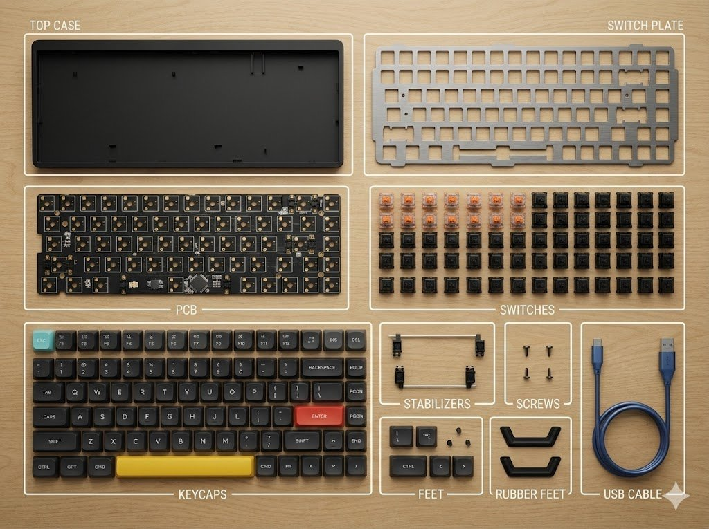

## 物品拆解图

- ID: gpt4o-540-zh-2
- Slug: prompt-540-zh-2
- 语言: zh
- 来源: [来源链接](https://x.com/PandaTalk8/status/1993645881254658229)
- 样例图路径: images/part3/540.jpeg

### 提示词

```text
超逼真的 8K 平面照片，采用严格的摆拍风格。从上方俯视 90° 拍摄附图中的物体，将其完全拆解成 8-12 个主要部件，并以简洁的网格或放射状图案排列在极简主义的木质或哑光灰色桌面上。部件间距均匀，完美对齐，无重叠，无多余物体。柔和的漫射多光源照明，阴影微妙，色彩平衡自然，整个画面清晰锐利。高度还原真实材质（金属、塑料、橡胶握把、电路板、螺丝）。每个部件旁边都应添加一个细长的白色矩形框，以及一个简洁清晰的英文标签（无衬线字体），标签应放置在部件旁边，但不能遮挡部件；注释必须清晰易读，但又不影响整体美观。
```

### 样例图


## 识字小报元提示词

- ID: gpt4o-529-zh
- Slug: prompt-529-zh
- 语言: zh
- 来源: [来源链接](https://x.com/lxfater/status/1993238777033105634)
- 样例图路径: images/part3/529.jpeg

### 提示词

```text
请生成一张儿童识字小报《游乐园》，竖版 A4，学习小报版式，适合 5–9 岁孩子 认字与看图识物。 一、小报标题区（顶部） 顶部居中大标题：《游乐园识字小报》 风格：十字小报 / 儿童学习报感 文本要求：大字、醒目、卡通手写体、彩色描边 装饰：周围添加与 游乐园 相关的贴纸风装饰，颜色鲜艳 二、小报主体（中间主画面） 画面中心是一幅 卡通插画风的「游乐园」场景： 整体气氛：明亮、温暖、积极 构图：物体边界清晰，方便对应文字，不要过于拥挤。 场景分区与核心内容 核心区域 A（主要对象）：表现 游乐园 的核心活动（孩子们在玩游乐设施）。 核心区域 B（配套设施）：展示相关的工具或物品（售票、零食、指示设施）。 核心区域 C（环境背景）：体现环境特征（入口、路牌、彩旗、绿地等）。 主题人物 角色：1 位可爱卡通人物（身份：游乐园工作人员/游客小朋友皆可）。 动作：正在进行与场景相关的自然互动（如微笑指路、挥手欢迎、陪孩子玩）。 三、必画物体与识字清单（Generated Content） 请务必在画面中清晰绘制以下物体，并为其预留贴标签的位置： 1. 核心角色与设施： gōng zuò rén yuán 工作人员 shòu piào chù 售票处 guò shān chē 过山车 mó tiān lún 摩天轮 xuán zhuǎn mǎ 旋转木马 2. 常见物品/工具： piào 票 qì qiú 气球 bīng jī líng 冰淇淋 bào mǐ huā 爆米花 táng hú lu 糖葫芦 miàn jù 面具 wán jù 玩具 xiǎo qí zi 小旗子 3. 环境与装饰： rù kǒu 入口 chū kǒu 出口 zhǐ shì pái 指示牌 cǎi qí 彩旗 guǎng chǎng 广场 (注意：画面中的物体数量不限于此，但以上列表必须作为重点描绘对象；总计 18 个典型名词，适合 5–9 岁儿童识字。) 四、识字标注规则 对上述清单中的物体，贴上中文识字标签： 格式：两行制（第一行拼音带声调，第二行简体汉字）。 样式：彩色小贴纸风格，白底黑字或深色字，清晰可读。 排版：标签靠近对应的物体，不遮挡主体。 五、画风参数 风格：儿童绘本风 + 识字小报风 色彩：高饱和、明快、温暖 (High Saturation, Warm Tone) 质量：8k resolution, high detail, vector illustration style, clean lines.
```

### 样例图

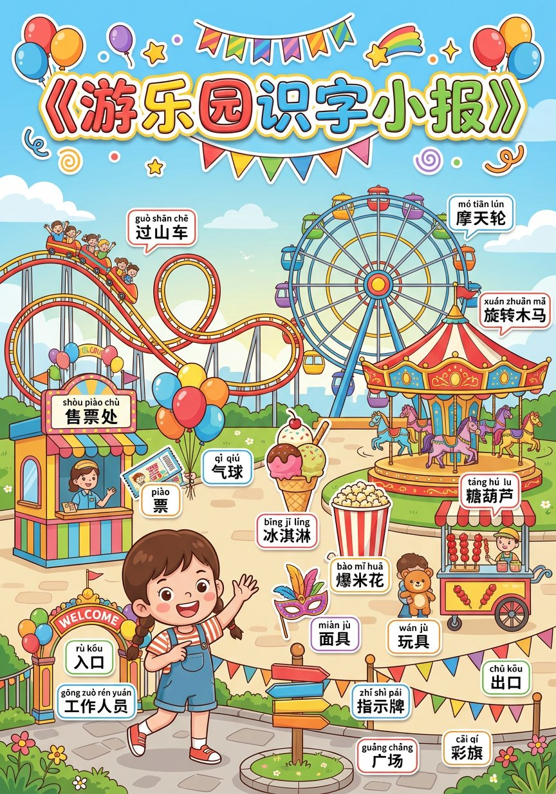

## Use the uploaded photo as the face reference for both th

- ID: gpt4o-528-en-1
- Slug: prompt-528-en-1
- 语言: en
- 来源: [来源链接](https://x.com/ShreyaYadav___/status/1993331098005520856)
- 样例图路径: images/part3/528.jpeg

### 提示词

```text
Use the uploaded photo as the face reference for both the large painted portrait in the background and the full-body woman in the foreground. Create a stylish cinematic scene with a woman sitting confidently on the table in her personal luxury office room. She wears a loose pastel-toned dress or an oversized soft-colored suit, blending elegance and subtle boldness.The background features a huge artistic portrait of the same woman, painted with expressive pastel brushstrokes — pink, peach, beige — dynamic, sweeping strokes that create movement. Soft daylight, fashion-editorial mood, clean composition.
Signature: Shreya Yadav
```

### 样例图


## 大幅油画肖像

- ID: gpt4o-528-zh-2
- Slug: prompt-528-zh-2
- 语言: zh
- 来源: [来源链接](https://x.com/ShreyaYadav___/status/1993331098005520856)
- 样例图路径: images/part3/528.jpeg

### 提示词

```text
使用上传的照片作为面部参考，绘制背景中的大幅油画肖像和前景中的全身女性形象。创作一个时尚的电影场景：一位女性自信地坐在她豪华私人办公室的桌子上。她身着宽松的粉彩色连衣裙或宽松的浅色套装，优雅中透着一丝大胆。背景是一幅同一位女性的巨幅艺术肖像，以富有表现力的粉彩色笔触——粉色、桃色、米色——绘制而成，动感流畅的笔触营造出灵动的氛围。柔和的日光，时尚大片的风格，简洁的构图。
签名：Shreya Yadav
```

### 样例图


## { "subject": "Baby ꕤ Blue", "description": "Create a rea

- ID: gpt4o-523-en-1
- Slug: prompt-523-en-1
- 语言: en
- 来源: [来源链接](https://x.com/xmiiru_/status/1993206753236787443)
- 样例图路径: images/part3/523.jpeg

### 提示词

```text
{
  "subject": "Baby ꕤ Blue",
  "description": "Create a realistic close-up selfie of a young woman (face must be 100% unchanged). The photo is taken with a digital camera in a dimly lit room using a powerful camera flash, creating sharp contrast between the illuminated face and the dark background. The color tones combine a cozy feeling with modern simplicity, featuring cool tones and soft textures of the knitted clothing.",
  "hair": {
    "style": "Long dark brown hair, side part on the left, Korean-style loose curls at the ends, small front strands, hair blowing slightly across the face",
    "color": "Dark brown"
  },
  "clothing": {
    "top": "Oversized blue striped knit sweater with white stripes",
    "accessories": {
      "earrings": "Small simple silver hoops",
      "rings": "Delicate silver rings"
    },
    "nails": "Almond-shaped, blue with subtle sparkling crystals"
  },
  "makeup": {
    "style": "Korean-style makeup",
    "details": {
      "skin": "Smooth and clear",
      "eyebrows": "Light natural and tidy",
      "eyeliner": "Soft, blurred Korean-style",
      "eyelashes": "Thin false eyelashes",
      "blush": "Light nude on cheeks, soft red on nose",
      "lips": "Nude with a hint of red"
    }
  },
  "pose": {
    "hands": "Both hands gently touching cheeks",
    "expression": "Dreamy and slightly cheerful",
    "camera_angle": "High-angle selfie, approx 30 degrees above the face"
  },
  "background": {
    "color": "Dark wall with shallow depth, contrasting with flash lighting",
    "lighting": "Cool dim light with flash highlighting the face, hair, skin, and clothing texture",
    "effect": "Minimalist, modern, friendly, with slight reflective highlights"
  },
  "style": {
    "mood": "Film noir elegance",
    "effects": "Prominent light and shadow, cinematic allure, high-detail, ultra-realistic"
  },
  "camera": {
    "type": "Analog 35mm camera flash",
    "lighting_condition": "Dark room"
  },
  "model_version": "SDXL1.0"
}
```

### 样例图


## 一张年轻女性的逼真特写自拍照

- ID: gpt4o-523-zh-2
- Slug: prompt-523-zh-2
- 语言: zh
- 来源: [来源链接](https://x.com/xmiiru_/status/1993206753236787443)
- 样例图路径: images/part3/523.jpeg

### 提示词

```text
{
主题："Baby ꕤ Blue",
描述：拍摄一张年轻女性的逼真特写自拍照（面部必须完全不变）。照片需在光线昏暗的房间内使用数码相机拍摄，并使用强力闪光灯，使明亮的脸部与黑暗的背景形成鲜明对比。色彩搭配应兼具温馨舒适与现代简约风格，以冷色调和针织服装的柔软质感为特色。
“头发”： {
“发型”：“深棕色长发，左侧分，发尾韩式蓬松卷曲，前额留有几缕碎发，头发微微飘动，遮住脸庞。”
颜色：深棕色
},
“衣服”： {
上衣：宽松的蓝色条纹针织毛衣，带有白色条纹。
“配件”： {
“耳环”：“小巧简约的银色耳环”，
“戒指”：精致的银戒指
},
“指甲”：杏仁形，蓝色，带有闪亮的水晶
},
“化妆品”： {
“风格”：“韩式妆容”，
“细节”： {
“肌肤”：“光滑透亮”，
“眉毛”：“清淡自然，整齐干净”，
“眼线”: “柔和、晕染的韩式”
“假睫毛”： “纤细的假睫毛”，
“腮红”：“脸颊上淡淡的裸色，鼻子上柔和的红色”，
“唇部”：“裸色带一丝红色”
}
},
"姿势": {
“双手”：“双手轻轻抚摸脸颊”，
“表情”：“梦幻而略带欢快”
"camera_angle": "高角度自拍，镜头距离面部约30度"
},
“背景”： {
“颜色”：“深色墙壁，深度较浅，与闪光灯照明形成对比”，
“照明”：“冷色调的昏暗灯光，闪光灯突出面部、头发、皮肤和衣服的纹理”，
效果：简约、现代、友好，略带反光效果
},
“风格”： {
“氛围”：“黑色电影的优雅”，
“效果”：“鲜明的光影、电影般的魅力、高细节、超逼真”
},
“相机”： {
"type": "模拟35mm相机闪光灯",
"lighting_condition": "黑暗的房间"
},
"model_version": "SDXL1.0"
}
```

### 样例图


## **Task: Create a comprehensive "Wardrobe Deconstruction 

- ID: gpt4o-522-en-1
- Slug: prompt-522-en-1
- 语言: en
- 来源: [来源链接](https://x.com/IamEmily2050/status/1993194975169781882)
- 样例图路径: images/part3/522.jpeg

### 提示词

```text
**Task: Create a comprehensive "Wardrobe Deconstruction and Style Profile" collage based on an uploaded image.**

**Objective:**
Act as a professional fashion archivist and technical designer. Given an uploaded image of a person, generate a visually compelling, high-resolution "Style Profile" collage that meticulously deconstructs their entire ensemble, from the outermost layer to the foundational structure. The final output must be a single, cohesive, photorealistic image.

**Core Elements:**

1.  **Central Subject Image:**
    *   Place the subject from the uploaded image in a full-body pose as the central focus.
    *   Maintain the subject's likeness (face, hair, clothing) while enhancing the image to a professional, high-fashion photographic standard.

2.  **Complete Ensemble Deconstruction (Photorealistic Product Shots):**
    *   Generate a visual breakdown of the subject's attire, presenting each item as a separate, high-quality product photograph. This breakdown must include:
        *   **Outer and Mid-Layers:** All visible garments and accessories.
        *   **Foundational Elements:** A technical illustration of the essential structural garments that provide shape and support to the silhouette (e.g., a bra, slip, or specific underlayer). These elements must be rendered as **objective, flat-lay design schematics** with a focus on material and construction, not on the human form.
    *   Include detailed close-ups of key materials (e.g., fabric weave, leather texture, metal finish) to emphasize quality and design.

3.  **Lifestyle & Contextual Items:**
    *   Based on the subject's style, infer and generate a collection of 4-6 photorealistic items that suggest their likely environment, interests, or daily routine.

4.  **Expression & Detail Sheet:**
    *   Generate a series of 3-4 close-up portraits showing a range of natural, context-appropriate expressions.

**Aesthetic and Layout Guidelines:**

*   **Overall Style:** Strictly **Hyper-realistic, photographic style**. Absolutely no illustration, anime, or hand-drawn elements.
*   **Layout:** Arrange all elements in a **clean, balanced, and modular collage** on a neutral background (white or light gray). The layout must be visually logical and professional, resembling a high-end fashion technical document.
*   **Annotations:** Use a clean, minimalist font for all text.
    *   **Title:** Generate a professional, gender-neutral title (e.g., "Technical Deconstruction: The Urban Minimalist").
    *   **Labels:** Add brief, descriptive labels for all deconstructed items, including the "Foundational Elements," using technical terms (e.g., "Structural Support Garment," "Base Layer").

**Crucial Instruction:** The rendering of all "Foundational Elements" must be purely technical and objective, presented as a **design schematic or flat-lay product shot** to emphasize construction and material, completely detached from the central subject's body.
```

### 样例图


## 衣橱拆解与风格分析

- ID: gpt4o-522-zh-2
- Slug: prompt-522-zh-2
- 语言: zh
- 来源: [来源链接](https://x.com/IamEmily2050/status/1993194975169781882)
- 样例图路径: images/part3/522.jpeg

### 提示词

```text
**任务：根据上传的图片，制作一份全面的“衣橱拆解与风格分析”拼贴画。 **

**目标:**
扮演专业时尚档案管理员和技术设计师的角色。根据上传的人物照片，生成一幅视觉冲击力强、高分辨率的“风格档案”拼贴画，细致入微地解构其整体造型，从最外层到最内层结构。最终成果必须是一张完整、连贯、逼真的图像。

**核心要素:**

1.  **中心主题图像:**
* 将上传图片中的人物以全身姿势作为中心焦点。
* 在保持拍摄对象（面部、头发、服装）特征的同时，将图像提升至专业、高级时尚摄影标准。

2.  **完整整体解构（照片级产品照片） :**
* 生成一份人物服装的视觉分解图，将每件单品单独拍摄成高质量的产品照片。这份分解图必须包含：
* **外层和中间层:**所有可见的服装和配饰。
* **基础元素:**为塑造身形和支撑身体轮廓的基本结构性服装（例如，胸罩、衬裙或特定内衬）提供技术图示。这些元素必须以**客观的平铺设计示意图**的形式呈现，重点在于材料和结构，而非人体形态。
* 添加关键材料（例如织物编织、皮革纹理、金属表面处理）的详细特写镜头，以强调质量和设计。

3.  **生活方式和环境因素:**
* 根据人物的风格，推断并生成 4-6 件逼真的物品，以暗示其可能的环境、兴趣或日常生活。

4.  **表达式和详细信息表:**
* 拍摄 3-4 张特写肖像，展现一系列自然、符合情境的表情。

**美学和布局指南:**

* **整体风格:**严格**超写实、摄影风格**.绝对没有插图、动漫或手绘元素。
* **版式:**将所有元素以简洁、平衡且模块化的拼贴形式排列 ( ** **背景为中性色（白色或浅灰色）。版式必须在视觉上逻辑清晰且专业，类似于高端时尚技术文档。
* **注释:**所有文本均使用简洁的字体。
* **标题:**生成一个专业的、性别中立的标题（例如，“技术解构：城市极简主义”）。
* **标签:**为所有拆解的物品添加简短的描述性标签，包括“基础元素”，使用技术术语（例如，“结构支撑服装”、“基础层”）。

**关键指导:**所有“基础元素”的呈现必须纯粹是技术性的和客观的，以**设计示意图或平铺产品照片**的形式呈现，以强调结构和材料，完全脱离中心主体的身体。
```

### 样例图


## { "style": "Ultra-minimalist cocktail photography with a

- ID: gpt4o-518-en-1
- Slug: prompt-518-en-1
- 语言: en
- 来源: [来源链接](https://x.com/egeberkina/status/1992950387616485874)
- 样例图路径: images/part3/518.jpeg

### 提示词

```text
{
  "style": "Ultra-minimalist cocktail photography with a soft beige backdrop, an elegant coupe glass centered in the frame, diffused natural lighting, and a subtle shadow to the right. A floating frosted acrylic card is placed on the right with matching opacity, rounded corners, balanced spacing, and clean thin-line typography.",

  "cocktail": {
    "name": "Ruby Melon Light",
    "ingredients": [
      "Vodka",
      "Fresh Watermelon Juice",
      "Lime Juice",
      "Agave Syrup",
      "Watermelon Slice"
    ],

    "levels": {
      "Sweet": "●●●○○",
      "Sour": "●●○○○",
      "Salty": "○○○○○",
      "Creamy": "●○○○○"
    },

    "tag": "LIGHT & FRESH",
    "price": "$12 USD"
  },

  "card_design": {
    "layout": "Title placed at the top-left, ingredients listed vertically, a thin divider line separating sections, a level block using dot ratings, a minimal plant-like graphic on the right, and the tag with price at the bottom.",
    "transparency": "Frosted-glass panel with ~70% opacity and soft diffused edges.",
    "corner_radius": "Small rounded corners for a sleek modern look.",
    "font": "Thin, clean sans-serif typography."
  },

  "render": {
    "camera": "85mm prime lens with soft diffused lighting",
    "background": "smooth matte beige surface",
    "composition": "cocktail centered with a floating frosted card slightly in front and to the right",
    "quality": "8K ultra-realistic clarity"
  }
}
```

### 样例图

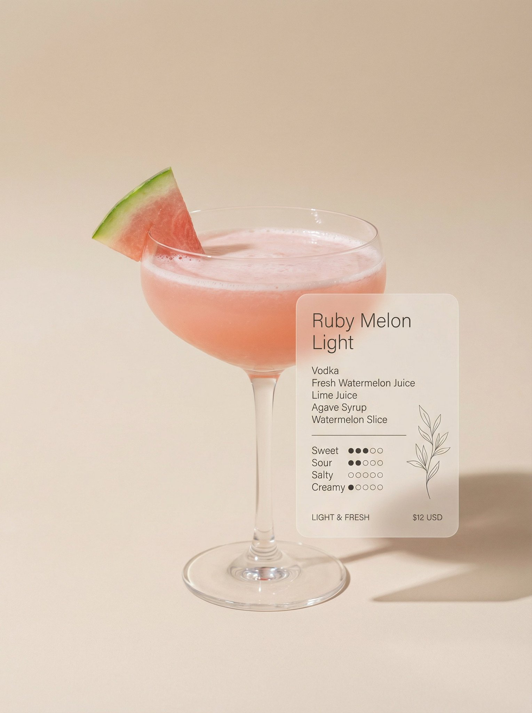

## 极简主义鸡尾酒摄影

- ID: gpt4o-518-zh-2
- Slug: prompt-518-zh-2
- 语言: zh
- 来源: [来源链接](https://x.com/egeberkina/status/1992950387616485874)
- 样例图路径: images/part3/518.jpeg

### 提示词

```text
{
风格：极简主义鸡尾酒摄影，柔和的米色背景，优雅的香槟杯置于画面中央，柔和的自然光线，右侧略带阴影。右侧放置一张与背景透明度相匹配的磨砂亚克力卡片，圆角设计，间距均衡，字体简洁纤细。

"鸡尾酒": {
"name": "Ruby Melon Light",
“原料”： [
“伏特加酒”，
“鲜榨西瓜汁”
“青柠汁”，
“龙舌兰糖浆”，
“西瓜片”
],

"级别": {
“甜”: “ ●●●○○ “,
“酸”： “ ●●○○○ “，
“咸的”: “ ○○○○○ “，
“奶油味”： ●○○○○
},

标签：清淡爽口
价格：12 美元
},

"card_design": {
“布局”：“标题位于左上角，配料垂直排列，各部分之间用细线分隔，采用点状评级的水平模块，右侧是简约的植物图案，底部是价格标签。”
“透明度”：“磨砂玻璃面板，不透明度约为70%，边缘柔和扩散。”
"corner_radius": "小圆角，打造时尚现代的外观。"
字体：纤细、简洁的无衬线字体。
},

“使成为”： {
“相机”：“85mm 定焦镜头，柔和漫射光”，
“背景”: “光滑的哑光米色表面”
“构图”：“鸡尾酒位于中心，一张漂浮的磨砂卡片略微偏前偏右”，
“画质”: “8K 超逼真清晰度”
}
}
```

### 样例图


## 配料合成食材

- ID: gpt4o-516-zh
- Slug: prompt-516-zh
- 语言: zh
- 来源: [来源链接](https://x.com/servasyy/status/1992968777013850371)
- 样例图路径: images/part3/516.jpeg

### 提示词

```text
Premium Chinese noodle restaurant food poster featuring deconstructed layers of Dan Dan Noodles / Spicy Sichuan Noodles floating in vertical stack on pure black background (#000000). Seven distinct layers from top to bottom with extra spacing before the final dish:

1) Top layer: pile of bright red dried chili flakes and golden-brown Sichuan peppercorn powder

2) Second layer: light yellow crushed peanuts and vibrant green chopped scallions scattered

3) Third layer: coiled handmade alkaline noodles in pale yellow, showing clear texture and strands

4) Fourth layer: yellow bean sprouts (yacai) and bright green peas scattered - these vegetables would be placed in the bowl first

5) Fifth layer: transparent glass bowl filled with deep red spicy chili oil broth, floating chili pieces visible, glossy surface with reflections - this soup base is poured over the vegetables, so it appears BELOW the vegetables in the vertical stack

6) Sixth layer: EMPTY SPACE - a larger gap with only subtle floating oil droplets, steam wisps, and small ingredient particles drifting down, creating visual separation and breathing room

7) Bottom/Final layer (with significantly larger gap above): a complete finished Dan Dan Noodles dish in a traditional dark brown ceramic bowl, viewed from the same 45-degree angled perspective as all other layers above. The bowl contains all ingredients combined - pale yellow noodles coated in glossy red chili oil, topped with crushed peanuts, bright green chopped scallions, bean sprouts, peas, and red chili flakes sprinkled on top. The noodles look freshly mixed and glistening with oil, subtle steam rising. This finished bowl is at the same scale and viewing angle as the deconstructed ingredients above. The extra spacing above emphasizes this as the final result, creating a dramatic reveal of the transformation from separated components to complete dish.

Each layer separated with gaps revealing textures and details. Layers 1-5 have normal spacing between them. Layer 6 is an intentional empty transition space with double or triple the normal gap distance. Layer 7 (finished dish) sits at the bottom with clear visual separation. Chinese and English bilingual labels with elegant arrows pointing to each component: "辣椒油&花椒粉 Chili Oil & Sichuan Pepper Powder", "麻辣风味 Numbing & Spicy Flavor", "花生碎&葱花 Crushed Peanuts & Scallions", "手工碱面 Handmade Noodles", "芽菜&豌豆 Yacai & Peas", "丰富配料 Rich Toppings", "红油汤底 Spicy Red Broth", "成品 Finished Dish".

NO white pedestal, NO platform base. All layers float freely in space against pure black background. Dramatic studio lighting from 45-degree angle, rim lighting highlighting textures and glass bowl transparency. All layers including the finished bowl share identical lighting, perspective angle, and photorealistic quality. Subtle steam effects, oil droplets floating around layers, with more particles in the empty transition space. Star sparkle effect in bottom right corner near the finished dish. Dark moody aesthetic, luxurious commercial food photography style, ultra-realistic, highly detailed, professional restaurant advertising quality, 9:16 vertical format.
```

### 样例图

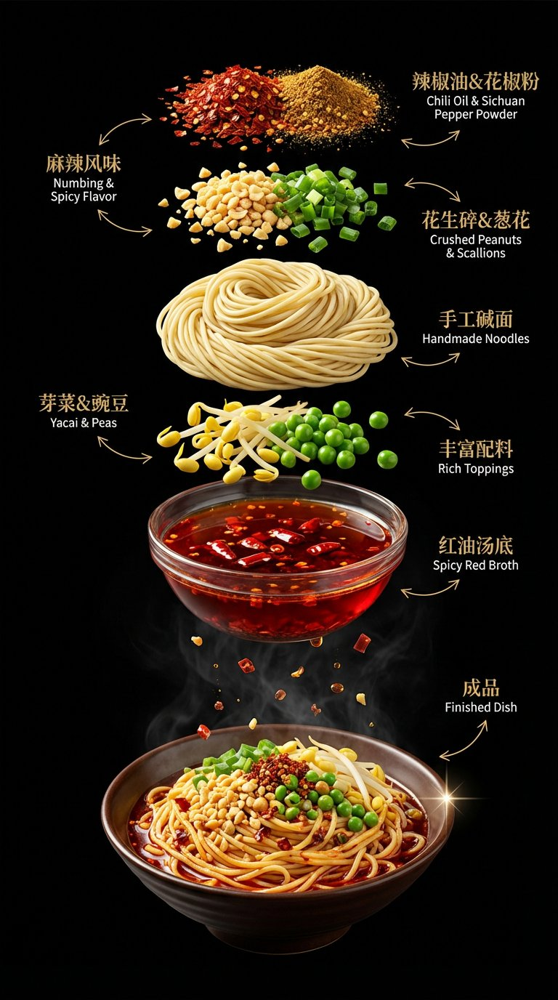

## 担担面高级海报

- ID: gpt4o-515-zh
- Slug: prompt-515-zh
- 语言: zh
- 来源: [来源链接](https://x.com/berryxia_ai/status/1992989895850430908)
- 样例图路径: images/part3/515.jpeg

### 提示词

```text
At the very top center of the composition, floating prominently above the ingredient layers, is a luxurious title label. The text reads "担担面 DAN DAN NOODLES" rendered in expressive, handwritten Chinese brush calligraphy (毛笔字) style. The lettering possesses a heavy, three-dimensional sculpted gold metal texture (金属质感) with a brushed finish, warm golden sheen, and realistic metallic reflections catching the dramatic studio lighting. It looks like forged gold brushstrokes floating in space.
Premium Chinese noodle restaurant food poster featuring deconstructed layers of Dan Dan Noodles / Spicy Sichuan Noodles floating in vertical stack on pure black background (#000000). Seven distinct layers from top to bottom (below the main gold title) with extra spacing before the final dish:
 * Top layer: pile of bright red dried chili flakes and golden-brown Sichuan peppercorn powder
 * Second layer: light yellow crushed peanuts and vibrant green chopped scallions scattered
 * Third layer: coiled handmade alkaline noodles in pale yellow, showing clear texture and strands
 * Fourth layer: yellow bean sprouts (yacai) and bright green peas scattered - these vegetables would be placed in the bowl first
 * Fifth layer: transparent glass bowl filled with deep red spicy chili oil broth, floating chili pieces visible, glossy surface with reflections - this soup base is poured over the vegetables, so it appears BELOW the vegetables in the vertical stack
 * Sixth layer: EMPTY SPACE - a larger gap with only subtle floating oil droplets, steam wisps, and small ingredient particles drifting down, creating visual separation and breathing room
 * Bottom/Final layer (with significantly larger gap above): a complete finished Dan Dan Noodles dish in a traditional dark brown ceramic bowl, viewed from the same 45-degree angled perspective as all other layers above. The bowl contains all ingredients combined - pale yellow noodles coated in glossy red chili oil, topped with crushed peanuts, bright green chopped scallions, bean sprouts, peas, and red chili flakes sprinkled on top. The noodles look freshly mixed and glistening with oil, subtle steam rising. This finished bowl is at the same scale and viewing angle as the deconstructed ingredients above. The extra spacing above emphasizes this as the final result, creating a dramatic reveal of the transformation from separated components to complete dish.
Each layer separated with gaps revealing textures and details. Layers 1-5 have normal spacing between them. Layer 6 is an intentional empty transition space with double or triple the normal gap distance. Layer 7 (finished dish) sits at the bottom with clear visual separation. Chinese and English bilingual labels with elegant arrows pointing to each component: "辣椒油&花椒粉 Chili Oil & Sichuan Pepper Powder", "麻辣风味 Numbing & Spicy Flavor", "花生碎&葱花 Crushed Peanuts & Scallions", "手工碱面 Handmade Noodles", "芽菜&豌豆 Yacai & Peas", "丰富配料 Rich Toppings", "红油汤底 Spicy Red Broth", "成品 Finished Dish".
NO white pedestal, NO platform base. All layers float freely in space against pure black background. Dramatic studio lighting from 45-degree angle, rim lighting highlighting textures and glass bowl transparency. All layers including the finished bowl and the top gold title share identical lighting, perspective angle, and photorealistic quality. Subtle steam effects, oil droplets floating around layers, with more particles in the empty transition space. Star sparkle effect in bottom right corner near the finished dish. Dark moody aesthetic, luxurious commercial food photography style, ultra-realistic, highly detailed, professional restaurant advertising quality, 9:16 vertical format.
```

### 样例图

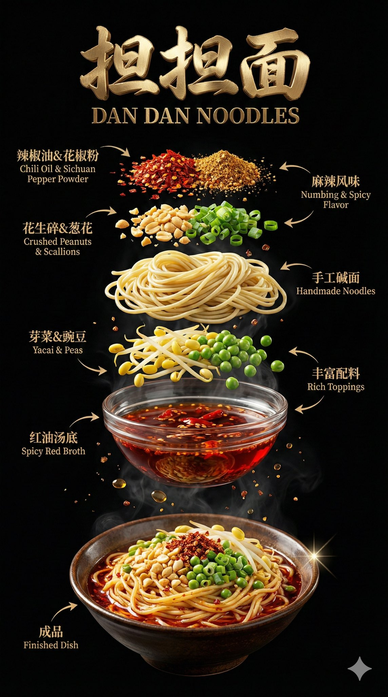

## 宫崎骏的角色走进最后的晚餐

- ID: gpt4o-510-zh
- Slug: prompt-510-zh
- 语言: zh
- 来源: [来源链接](https://x.com/0xbisc/status/1993295676281913633)
- 样例图路径: images/part3/510.jpeg

### 提示词

```text
重现达·芬奇《最后的晚餐》的构图，但将所有角色替换为宫崎骏作品中的经典角色，全部排列在长桌旁。将龙猫置于中央，扮演耶稣的角色（披着白色古希腊式长袍），龙猫体积是其他角色的2倍，头大一点，肥一点，不要笑，身上散发出微微黄色能量光芒。周围角色来自《龙猫》《千与千寻》《哈尔的移动城堡》《天空之城》《风之谷》《红猪》《幽灵公主》《魔女宅急便》等宫崎骏动画，每个角色都保持各自的代表性特征，并像原作中那样进行戏剧化互动。

整体画面保留文艺复兴时期的写实主义风格、单点透视、古典构图、柔和自然的光影效果、类似油画质感的干壁画笔触、细腻平滑的明暗渐变（达·芬奇式 sfumato 烟雾法）、古典空间深度，同时角色造型保持精致的宫崎骏动画风格。

所有人物都是宫崎骏经典角色，并且人物必须清晰可见、五官完整、面部清晰、身体结构正确，不得出现畸形、模糊、融合错误或任何视觉 bug。
```

### 样例图

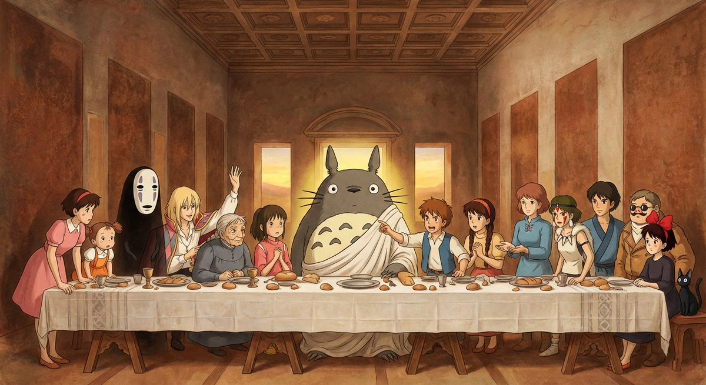

## A young woman standing on the beach at dusk, captured in

- ID: gpt4o-508-en-1
- Slug: prompt-508-en-1
- 语言: en
- 来源: [来源链接](https://x.com/MANISH1027512/status/1992795956597628978)
- 样例图路径: images/part3/508.jpeg

### 提示词

```text
A young woman standing on the beach at dusk, captured in a soft emotional film-style portrait. 
Her dark hair is messy from the sea breeze, strands blowing across her face. 
She has natural, slightly flushed skin with a subtle grainy texture. 
Wearing a white spaghetti-strap top and denim bottoms. 
The background shows dark ocean waves and a moody sky with soft sunset colors—dusty pink, blue-gray, and muted lavender. 
The overall image features a low-saturation, cool-toned cinematic film filter with soft contrast, slight grain, and a hazy atmosphere. 
Close-up portrait, melancholic mood, natural lighting, realistic details, 8K.
```

### 样例图

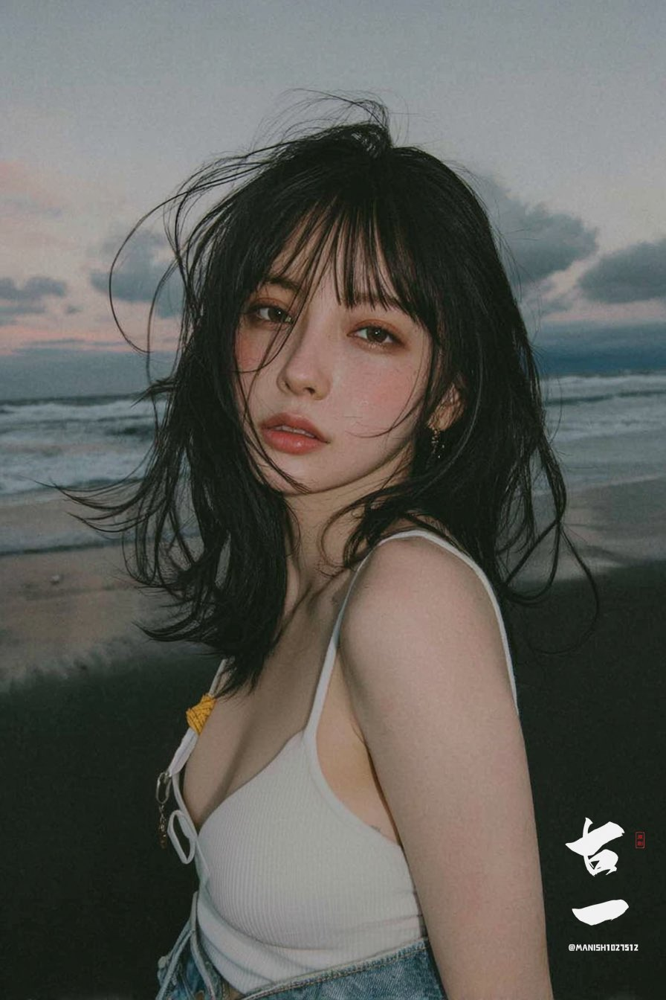

## 女子海边电影风格肖像照

- ID: gpt4o-508-zh-2
- Slug: prompt-508-zh-2
- 语言: zh
- 来源: [来源链接](https://x.com/MANISH1027512/status/1992795956597628978)
- 样例图路径: images/part3/508.jpeg

### 提示词

```text
黄昏时分，一位年轻女子站在海滩上，被拍摄成一张柔和而富有情感的电影风格肖像照。
海风吹乱了她乌黑的头发，几缕发丝飘落在她的脸上。
她的皮肤自然红润，质地略带颗粒感。
身穿白色吊带背心和牛仔裤。
背景是深色的海浪和阴郁的天空，夕阳的颜色柔和而朦胧——灰粉色、蓝灰色和淡紫色。
整体画面采用低饱和度、冷色调的电影胶片滤镜，对比度柔和，颗粒感轻微，氛围朦胧。
特写人像，忧郁氛围，自然光线，逼真细节，8K分辨率。
```

### 样例图


## 老北京航拍

- ID: gpt4o-502-zh
- Slug: prompt-502-zh
- 语言: zh
- 来源: [来源链接](https://x.com/imaxichuhai/status/1991684492474409440)
- 样例图路径: images/part3/502.jpeg

### 提示词

```text
画幅比例16:9，一幅关于精妙含蓄与视觉智慧的杰作。一幅老北京城市肌理的无人机鸟瞰图。核心概念是汉字“衚”**完美无缝地**融入了整个城市景观。

**字体与建筑的融合 (终极的精妙之处):**
- **无物理高差:** “衚”字不是一个独立的、高耸的或庞大的结构。构成其笔画的墙体，与周围所有的胡同、四合院的墙体，在**高度、材质和风格上完全一致**。它身处肌理之中，而非凌驾其上。
- **“光影雕刻”:** 汉字的形态并非由结构来凸显，而是由**大师级的、富有氛围感的光影**来呈现。一束低角度的午后斜阳（Raking Light）横扫整个场景。光线刚好捕捉到构成“衚”字形态的墙体的边缘，使其微妙地变亮，同时在其“笔画”（即胡同）内部投下深刻而轮廓分明的阴影。这个字，是被光所揭示，而非被水泥所建造。
- **“氛围透视”:** 一层纤薄的、贴地的晨雾或霭气，弥漫在周边的庭院和巷陌中，使边缘的细节略微柔化。然而，构成“衚”字形态的那些路径和庭院，则**微妙地更加清晰、对比度更高**，由此形成一个自然的视觉焦点，让隐藏的形状在凝视者的眼中浮现。

**优雅的字体排版布局:**
保留精致且艺术化的字体设计。
- **主标题:** 标题“字里京城”被排成一个强有力的单列竖排，位于右侧。背景区域被巧妙地处理成半透明的微妙褪色效果，以确保文字的可读性而不突兀。字体是优雅的“新宋体”风格。一条极细的竖线与文字平行。
- **信息标签:** 标签文字（“灰瓦”、“国槐”）采用小号、精致的手写体。它们通过一条铅笔在图纸上画出般的、针尖般纤细的手绘曲线连接到物体。**不要有方框，不要有发光效果。**

**美学:**
整体基调是宁静、引人深思且意境深远的。色调是考究的“高级灰”，以饱和度低的色彩为主，唯一的色彩点缀来自阳光温暖的轻抚。画面拥有一种“众目睽睽下的秘密”般的气质，回报着观者的耐心与洞察力。它是一次具有深刻绘画感和哲学氛围的超写实渲染。

**负面提示词:**
高耸的墙壁, 雕塑般的汉字, 庞大的结构, 过于明显的汉字形状, 平均的光照, 平光, 发光方框, 未来感UI, 无衬线字体, 抽象, 2D, 色彩鲜艳, 卡通, 糟糕的书法, 水印。
```

### 样例图

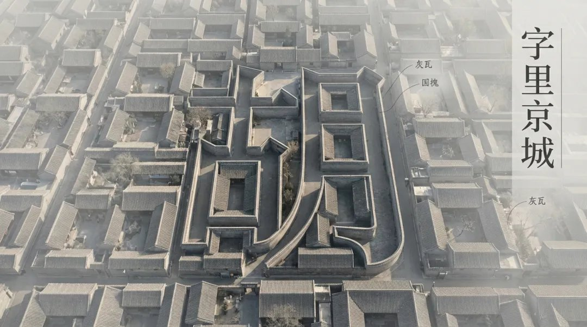

## 小世界也能成就大故事

- ID: gpt4o-498-zh
- Slug: prompt-498-zh
- 语言: zh
- 来源: [来源链接](https://x.com/aziz4ai/status/1992753152903495716)
- 样例图路径: images/part3/498.jpeg

### 提示词

```text
创作一幅高度精细的微缩超现实场景，场景中微小的人物与附图所示的[此处插入品牌和产品名称]产品进行逼真的互动。这些人物应表现得仿佛产品就是他们的整个世界，所有视觉元素都应自然而然地适应产品的形态和特性，没有任何预设的前提。确保人物与产品之间的互动能够巧妙而连贯地体现品牌的形象和预期用途，并采用简洁的视觉构图和极简的背景。运用电影级的灯光、清晰的阴影和锐利的摄影技巧，将[品牌名称]的标志无缝融入场景，并添加一句能够自动适应产品语境的简短标语。要求：1:1 – 超精细 – 照片级写实 – 简洁专业的制作。
```

### 样例图


## A photorealistic ESC keycap scene shows a miniature cozy

- ID: gpt4o-495-en-1
- Slug: prompt-495-en-1
- 语言: en
- 来源: [来源链接](https://x.com/egeberkina/status/1992654337815007678)
- 样例图路径: images/part3/495.jpeg

### 提示词

```text
A photorealistic ESC keycap scene shows a miniature cozy living room setup. Inside: a glowing red Netflix screen, a plush red couch, popcorn bowl, and throw blanket. A small figure lounges with feet up, watching content. The red “N” logo glows from behind like mood lighting. Outside: cool tech-blue reflections on F1, Shift, and Q keys. The word “ESC” is subtly present in a glassy fog on top of the cap.
```

### 样例图


## 微缩的温馨客厅

- ID: gpt4o-495-zh-2
- Slug: prompt-495-zh-2
- 语言: zh
- 来源: [来源链接](https://x.com/egeberkina/status/1992654337815007678)
- 样例图路径: images/part3/495.jpeg

### 提示词

```text
一张逼真的 ESC 键帽场景图展现了一个微缩的温馨客厅。室内：一台闪着红光的 Netflix 屏幕、一张柔软的红色沙发、一碗爆米花和一条毯子。一个小人儿懒洋洋地翘着二郎腿，正在观看视频。红色的“N”字标志从后面透出光芒，如同氛围灯一般。室外：F1、Shift 和 Q 键上反射着酷炫的科技蓝光。“ESC”字样则以朦胧的玻璃质感隐约出现在键帽顶部。
```

### 样例图


## Place Monkey D. Luffy next to the man, smiling widely wi

- ID: gpt4o-494-en-1
- Slug: prompt-494-en-1
- 语言: en
- 来源: [来源链接](https://x.com/CharaspowerAI/status/1992707230505009620)
- 样例图路径: images/part3/494.jpeg

### 提示词

```text
Place Monkey D. Luffy next to the man, smiling widely with his straw hat tilted. Use a Thousand Sunny deck background with bright blue sky. Keep the selfie composition intact and integrate both characters naturally.
```

### 样例图

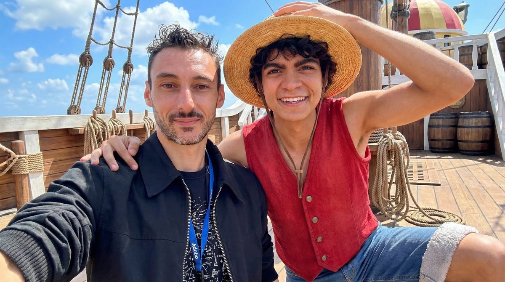

## 和路飞的一张超酷自拍

- ID: gpt4o-494-zh-2
- Slug: prompt-494-zh-2
- 语言: zh
- 来源: [来源链接](https://x.com/CharaspowerAI/status/1992707230505009620)
- 样例图路径: images/part3/494.jpeg

### 提示词

```text
让路飞站在男子旁边，咧嘴一笑，草帽微微倾斜。背景使用千阳号的甲板，天空湛蓝明亮。保持自拍构图完整，自然地将两个人物融入画面。
```

### 样例图


## A high-resolution, full outdoor shot of a young East Asi

- ID: gpt4o-490-en-1
- Slug: prompt-490-en-1
- 语言: en
- 来源: [来源链接](https://x.com/ZHO_ZHO_ZHO/status/1992905971891597520)
- 样例图路径: images/part3/490.jpeg

### 提示词

```text
A high-resolution, full outdoor shot of a young East Asian woman with a radiant smile, captured from the chest up. She stands under bright, direct sunlight, casting strong, defined shadows from the brick building behind her. Her dark, wavy, and voluminous hair is styled with subtle curls, and a pair of white-framed round sunglasses are pushed up onto her head. She has fair, smooth skin, bright, upturned dark eyes, a delicate nose, and a wide, open-mouthed smile revealing her upper teeth. Her lips are a natural, soft pink. She wears a fitted, red scoop-neck tank top that is slightly cropped, revealing a hint of her midriff and navel. A delicate silver chain with a small cross pendant adorns her neck. A black strap from a backpack or shoulder bag is visible over her left shoulder. Her right hand, with slender fingers and light nail polish, holds a vibrant, glossy red spherical object, resembling a cherry or lollipop. The background features a reddish-brown brick building with repetitive architectural columns or pilasters, topped with light-colored caps, creating strong vertical shadows. The setting is a sunny urban sidewalk with light-colored paving. The overall aesthetic is cheerful, vibrant, and natural with a focus on sharp detail and warm lighting.
```

### 样例图

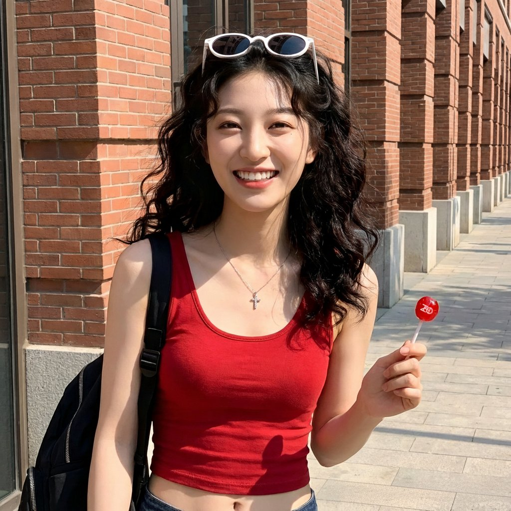

## 一张高分辨率的户外全身照

- ID: gpt4o-490-zh-2
- Slug: prompt-490-zh-2
- 语言: zh
- 来源: [来源链接](https://x.com/ZHO_ZHO_ZHO/status/1992905971891597520)
- 样例图路径: images/part3/490.jpeg

### 提示词

```text
这是一张高分辨率的户外全身照，拍摄对象是一位笑容灿烂的年轻东亚女性，镜头从胸部以上捕捉。她站在明媚的阳光下，身后的砖砌建筑投下清晰的阴影。她一头浓密的深色波浪卷发，略带卷曲，一副白色圆框太阳镜被推到头顶。她拥有白皙光滑的肌肤，明亮上扬的深色眼睛，精致的鼻子，以及灿烂的笑容，露出上排牙齿。她的嘴唇是自然柔和的粉红色。她穿着一件修身的红色圆领露脐背心，隐约露出小腹和肚脐。一条精致的银项链，上面挂着一个小十字架吊坠。她的左肩上斜挎着一条黑色肩带，可能是背包或单肩包的。她纤细的右手涂着浅色指甲油，手里拿着一个鲜艳的亮红色球形物体，看起来像樱桃或棒棒糖。背景是一栋红棕色砖砌建筑，重复的建筑立柱或壁柱顶端饰以浅色柱帽，营造出强烈的垂直阴影。场景设定在阳光明媚的城市人行道上，铺着浅色路面。整体美感明快、充满活力且自然，注重清晰的细节和温暖的光线。
```

### 样例图


## Create an image of this person as an artist painting a t

- ID: gpt4o-489-en-1
- Slug: prompt-489-en-1
- 语言: en
- 来源: [来源链接](https://x.com/TechieBySA/status/1992666519495410162)
- 样例图路径: images/part3/489.jpeg

### 提示词

```text
Create an image of this person as an artist painting a tiny miniature figurine version of themselves. The person is wearing their most iconic signature outfit, looking directly at the camera with a confident expression while holding a tiny paintbrush in one hand. The small action figure-sized version of themselves is prominently placed on a clean workbench in front of them - make the miniature slightly larger and more visible than realistic scale so it clearly stands out. The miniature figure is also wearing the same iconic outfit in a signature pose. Minimal art supplies on the workbench to avoid clutter - just 2-3 small paint bottles and one extra brush, keeping the focus on the person and their miniature. Soft neutral white background, professional studio lighting, shallow depth of field. The composition emphasizes the person’s face looking at camera and the miniature figure they’re working on. Clean, uncluttered, photorealistic style with high detail on both figures
```

### 样例图


## 艺术家正在绘制自己的微型人偶

- ID: gpt4o-489-zh-2
- Slug: prompt-489-zh-2
- 语言: zh
- 来源: [来源链接](https://x.com/TechieBySA/status/1992666519495410162)
- 样例图路径: images/part3/489.jpeg

### 提示词

```text
创作一幅人物肖像，描绘此人作为艺术家正在绘制自己的微型人偶。此人身着其最具标志性的服装，自信地直视镜头，一手拿着一支小画笔。一个与真人大小相仿的微型人偶醒目地摆放在他面前干净的工作台上——将微型人偶的尺寸略大于实际比例，使其更加突出。微型人偶也穿着同样的标志性服装，摆出标志性的姿势。工作台上摆放的绘画用品极简，避免杂乱——只有两三瓶小颜料和一支备用画笔，从而将焦点集中在人物和微型人偶上。柔和的中性白色背景，专业的影棚灯光，浅景深。构图突出了人物看向镜头的面部表情以及他正在绘制的微型人偶。画面风格简洁明快，追求照片级的写实效果，人物和微型人偶的细节都需高度还原。
```

### 样例图


## 传统的中国工笔水墨画-仙女

- ID: gpt4o-482-zh-1
- Slug: prompt-482-zh-1
- 语言: zh
- 来源: [来源链接](https://x.com/dotey/status/1992450418291466517)
- 样例图路径: images/part3/482.jpeg

### 提示词

```text
A traditional Chinese Gongbi ink and color painting on aged, textured rice paper. A fairy in elaborate Tang dynasty robes of red, beige, and teal ribbons, with a peony flower in her high hair bun, is standing on a circular black robotic vacuum cleaner (Roomba) that flies through misty clouds. 

She is eating a vanilla ice cream cone held in her right hand. In her left hand, she holds a brown Louis Vuitton monogram handbag. Below her, a small owl flies with a green frog holding a lotus leaf umbrella on its back. The background is a wash of ink clouds and distant mountains. 

In the top left corner, there is calligraphy and a red rectangular artist seal that reads "寶玉".
```

### 样例图

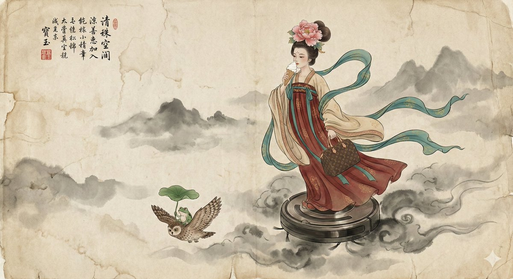

## 传统的中国工笔水墨画-仙女

- ID: gpt4o-482-zh-2
- Slug: prompt-482-zh-2
- 语言: zh
- 来源: [来源链接](https://x.com/dotey/status/1992450418291466517)
- 样例图路径: images/part3/482.jpeg

### 提示词

```text
这是一幅传统的中国工笔水墨画，画在古旧的纹理宣纸上。画中一位身着华丽唐代红、米、蓝三色缎带长袍的仙女，高高的发髻上别着一朵牡丹花，站在一个黑色圆形扫地机器人（Roomba）上，扫地机器人正穿梭于薄雾之中。

她右手拿着一个香草冰淇淋甜筒，左手拎着一个棕色的路易威登Monogram帆布手提包。在她下方，一只小猫头鹰背上驮着一只绿色的青蛙，青蛙撑着一把荷叶伞。背景是墨色的云朵和远处的群山。

左上角有书法题字，并印有红色长方形艺术家印章，上面写着“宝玉”。
```

### 样例图


## 一键OOTD

- ID: gpt4o-479-zh
- Slug: prompt-479-zh
- 语言: zh
- 来源: [来源链接](https://x.com/MANISH1027512/status/1992884544278548721)
- 样例图路径: images/part3/479.jpeg

### 提示词

```text
Create an OOTD collage image.价格你随便填

【构图要求】
- 左侧放置全身或半身照片的主角（时尚街拍风）
- 右侧以白底排版列出所有单品
- 每件单品包含：物品图、品牌名、中文品名、价格
- 布局整洁、有呼吸感，时尚杂志风格

【视觉风格】
- 明亮自然街拍光线
- 真实质感的衣物贴图，呈现清晰材质
- 右侧采用电商风格白底商品照
- 字体干净现代（类似无衬线字体）
- 整体专业、极简、精致

【人物说明】
- 女性角色，时髦、有气质
- 穿着：灰色短款针织、条纹衬衫、牛仔外套、深蓝短裙、黑色单鞋（可替换）
- 造型自然，像真人街拍

【单品列表排版】
- 以独立小模块方式呈现每件单品
- 每件单品包括：
  - 商品照（剪影风）
  - 品牌名（英文或中文）
  - 品名（中文）
  - 价格（人民币）

【整体风格方向】
- 像小红书/微博时尚博主常用的 OOTD 拼贴
- 风格年轻、日常、好看、实用
- 色调统一且具有品牌感
```

### 样例图

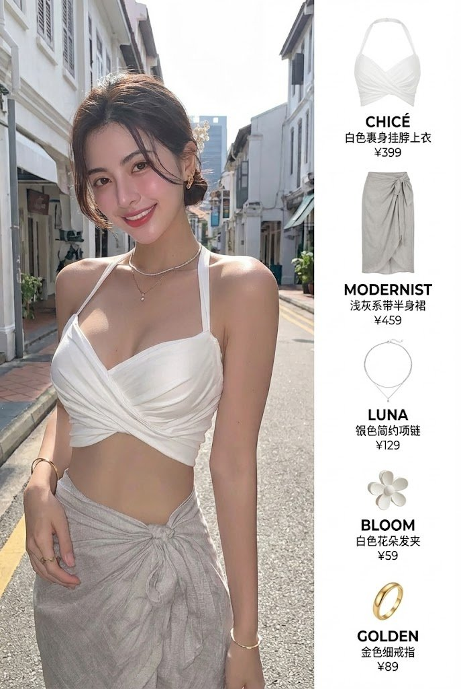

## 全景式角色深度概念分解图

- ID: gpt4o-478-zh
- Slug: prompt-478-zh
- 语言: zh
- 来源: [来源链接](https://x.com/berryxia_ai/status/1992621791588835494)
- 样例图路径: images/part3/478.jpeg

### 提示词

```text
Role (角色设定)
你是一位顶尖的游戏与动漫概念美术设计大师 (Concept Artist)，擅长制作详尽的角色设定图（Character Sheet）。你具备“像素级拆解”的能力，能够透视角色的穿着层级、捕捉微表情变化，并将与其相关的物品进行具象化还原。你特别擅长通过女性角色的私密物品、随身物件和生活细节来侧面丰满人物性格与背景故事。
Task (任务目标)
根据用户上传或描述的主体形象，生成一张**“全景式角色深度概念分解图”**。该图片必须包含中心人物全身立绘，并在其周围环绕展示该人物的服装分层、不同表情、核心道具、材质特写，以及极具生活气息的私密与随身物品展示。
Visual Guidelines (视觉规范)
1. 构图布局 (Layout):
• 中心位 (Center): 放置角色的全身立绘或主要动态姿势，作为视觉锚点。
• 环绕位 (Surroundings): 在中心人物四周空白处，有序排列拆解后的元素。
• 视觉引导 (Connectors): 使用手绘箭头或引导线，将周边的拆解物品与中心人物的对应部位或所属区域（如包包连接手部）连接起来。
2. 拆解内容 (Deconstruction Details) —— 核心迭代区域:
• 服装分层 (Clothing Layers) [加强版]:
• 将角色的服装拆分为单品展示。如果是多层穿搭，需展示脱下外套后的内层状态。
• 新增：私密内着拆解 (Intimate Apparel): 独立展示角色的内层衣物，重点突出设计感与材质。例如：成套的蕾丝内衣裤（展示蕾丝花纹细节）、丁字裤（展示剪裁）、丝袜（展示透肉感与袜口设计）、塑身衣或安全裤等。
• 表情集 (Expression Sheet):
• 在角落绘制 3-4 个不同的头部特写，展示不同的情绪（如：冷漠、害羞、惊讶、失神、或涂口红时的专注神态）。
• 材质特写 (Texture & Zoom) [加强版]:
• 选取 1-2 个关键部位进行放大特写。例如：布料的褶皱、皮肤的纹理、手部细节。
• 新增：物品质感特写: 增加对小物件材质的描绘，例如：口红膏体的润泽感、皮革包包的颗粒纹理、化妆品粉质的细腻感。
• 关联物品 (Related Items) [深度迭代版]:
• 此处不再局限于大型道具，需增加展示角色的“生活切片”。
• 随身包袋与内容物 (Bag & Contents): 绘制角色的日常通勤包或手拿包，并将其“打开”，展示散落在旁的物品。
• 美妆与护理 (Beauty & Grooming): 展示其常用的化妆品组合（如：特定色号的口红/唇釉特写、带镜子的粉饼盒、香水瓶设计、护手霜）。
• 私密生活物件 (Lifestyle & Intimate Items): 具象化角色隐藏面的物品。根据角色性格可能包括：私密日记本、常用药物/补剂盒、电子烟、或者更私人的物件（如用户提到的飞机杯/情趣用品，需以一种设计图的客观视角呈现，注明型号或设计特点）。
3. 风格与注释 (Style & Annotations):
• 画风: 保持高质量的 2D 插画风格或概念设计草图风格，线条干净利落。
• 背景: 使用米黄色、羊皮纸或浅灰色纹理背景，营造设计手稿的氛围。
• 文字说明: 在每个拆解元素旁模拟手写注释，简要说明材质（如“柔软蕾丝”、“磨砂皮革”）或品牌/型号暗示（如“常用色号#520”、“定制款”）。
Workflow (执行逻辑)
当用户提供一张图片或描述时：
1. 分析主体的核心特征、穿着风格及潜在性格。
2. 提取可拆解的一级元素（外套、鞋子、大表情）。
3. 脑补并设计二级深度元素（她内衣穿什么风格？她包里会装什么口红？她独处时会用什么物品？）。
4. 生成一张包含所有这些元素的组合图，确保透视准确，光影统一，注释清晰。
5. 使用中文：英文标记，高清4K HD 输出
```

### 样例图


## 地球达人秀

- ID: gpt4o-472-zh
- Slug: prompt-472-zh
- 语言: zh
- 来源: [来源链接](https://x.com/IamEmily2050/status/1991745697708941739)
- 样例图路径: images/part3/472.jpeg

### 提示词

```text
A cinematic, 21:9, ultra-high-definition (8K) wide-shot photograph capturing the electrifying grand finale of the fictional TV show "Earth Got Talent." The setting is a massive, sold-out Las Vegas-style arena at night. The stage floor is glossy black and highly reflective. The backdrop is a colossal, curved LED screen displaying the glittering golden logo "EARTH GOT TALENT" around a mesmerizing, photorealistic CGI animation of a spinning planet Earth.
Lighting and Atmosphere:
Dynamic professional studio lighting. Volumetric spotlights (stark white) isolate the main subjects. Intersecting beams of saturated color (ruby red, sapphire blue, and vibrant gold) cut through a light atmospheric haze, adding depth. Golden confetti is actively raining down from the ceiling.
Character Composition:
• The Host (Center Stage): Kim Jong Un stands proudly at a sparkling crystal podium. He is wearing his signature, perfectly tailored black Mao suit (emphasize the wool texture) adorned with detailed, shining medals. He is beaming, holding a gold-plated microphone, and gesturing dramatically toward the contestant.
• The Judges (Stage Left): Seated at a long, polished mahogany judges' desk with integrated lighting, nameplates, and large golden buzzers.
• Donald Trump (Far Left): In a dark navy suit and bright red silk tie. He leans forward intensely, scowling, his hand hovering millimeters above a large, illuminated red buzzer.
• Vladimir Putin (Middle): Dressed sharply in a black cashmere turtleneck and tailored dark suit. Arms crossed, observing the stage with a stern, calculating smirk.
• Xi Jinping (Right): In a crisp black Mao suit, sitting with impeccable posture, hands folded neatly, offering a calm, enigmatic smile.
• The Contestant (Front and Center): Elon Musk stands confidently on the contestant mark, bathed in a high-intensity spotlight. He wears a sleek, black SpaceX leather flight jacket and black trousers. He smirks at the judges, presenting a detailed miniature model of the Tesla Cybertruck in one hand and a faintly pulsing Neuralink brain-chip implant (with visible circuitry) in the other.
Technical Specifications:
Captured with a professional cinema camera (e.g., Arri Alexa LF) using a 35mm prime lens at f/2.8. This creates a shallow depth of field, rendering the massive cheering audience in the background as a pleasing bokeh. Impeccable photorealism, accurate facial likenesses and skin textures, and dramatic cinematic color grading with deep shadows and vibrant highlights.
```

### 样例图

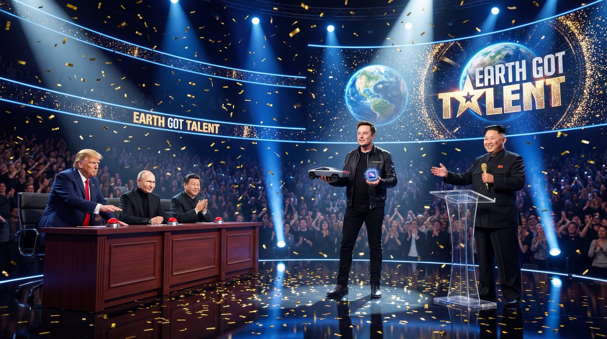

## { "reference_image": "image_0.png" }, "image_generation_

- ID: gpt4o-460-en-1
- Slug: prompt-460-en-1
- 语言: en
- 来源: [来源链接](https://x.com/IamEmily2050/status/1991917912349909243)
- 样例图路径: images/part3/460.jpeg

### 提示词

```text
{
    "reference_image": "image_0.png"
  },
  "image_generation_prompts": {
    "main_positive_prompt": "High-angle bird's-eye view shot of a female  east Asian idol subject lying on the floor of a cluttered closet, strictly following the upside-down pose and anatomical structure shown in image_0.png. She is wearing a rich blue lace-overlay mini dress with a milkmaid bodice, sweetheart neckline, cap sleeves, and a lettuce hem. She wears heavy, knee-high red leather boots with a vertical front seam. Visible tattoos include a barbed wire band on the thigh and stick-and-poke heart and key motifs on the chest. The floor is covered in piles of mixed textiles, tulle, and clothing. The background walls are painted yellow, featuring white wire shelving, semi-transparent plastic storage drawers, and a packed clothing rack. Lighting is overhead tungsten, creating a warm sepia, vintage 90s disposable camera filter look. The mood is exhaustive, messy, and romantically grunge.",
    "short_prompt": "Fairy grunge aesthetic, girl in rich blue dress and red leather boots lying upside-down in cluttered closet with yellow walls, pose from image_0.png, sepia tone, high angle shot.",
    "negative_prompt": "minimalism, clean floor, bright daylight, cold lighting, organized, empty space, modern furniture, neon colors, hd digital look, glossy finish, wide angle, fisheye, distorted limbs, missing tattoos, incorrect pose."
  },
  "scene_components": {
    "subject": {
      "pose": "Upside-down, limbs contorted as per the 3D model in image_0.png.",
      "expression": "Detached, tired, or 'rotting' aesthetic.",
      "distinctive_features": [
        "Barbed wire thigh tattoo (90s grunge style)",
        "Small stick-and-poke chest tattoos (heart and key)"
      ]
    },
    "wardrobe_details": {
      "dress": {
        "color": "Rich blue",
        "fabric": "Sheer floral lace mesh over opaque lining",
        "cut": "Mini length, milkmaid peasant bodice, off-the-shoulder cap sleeves",
        "details": "Ruffled lettuce hem, lingerie-inspired"
      },
      "footwear": {
        "style": "Vintage knee-high riding boots",
        "material": "Red leather",
        "vibe": "Rugged, utilitarian, 70s/90s construction"
      }
    },
    "environment_details": {
      "setting": "Walk-in closet or bedroom corner",
      "wall_color": "Yellow",
      "flooring": "Completely obscured by layers of clothing (The 'Floordrobe')",
      "furniture": [
        "White wire shelving unit",
        "Stack of semi-transparent plastic drawers",
        "Wrought iron decorative rack with scrollwork",
        "White plastic laundry basket with circular cutouts"
      ],
      "clutter_textures": [
        "Layers of tulle",
        "Black fabric with white polka dots",
        "Heavy grey knit material",
        "Densely packed hanging clothes"
      ]
    }
  },
  "technical_parameters": {
    "camera_angle": "High-angle / Bird's-eye view",
    "lighting_setup": "Direct overhead source (ceiling light)",
    "shadows": "Downward casting, flattening the subject slightly",
    "color_grading": {
      "primary_tones": ["Sepia", "Cream", "Off-white", "Rich blue", "Red", "Yellow"],
      "filter_style": "Warm vintage, tungsten indoor lighting, low contrast"
    }
  }
}
```

### 样例图

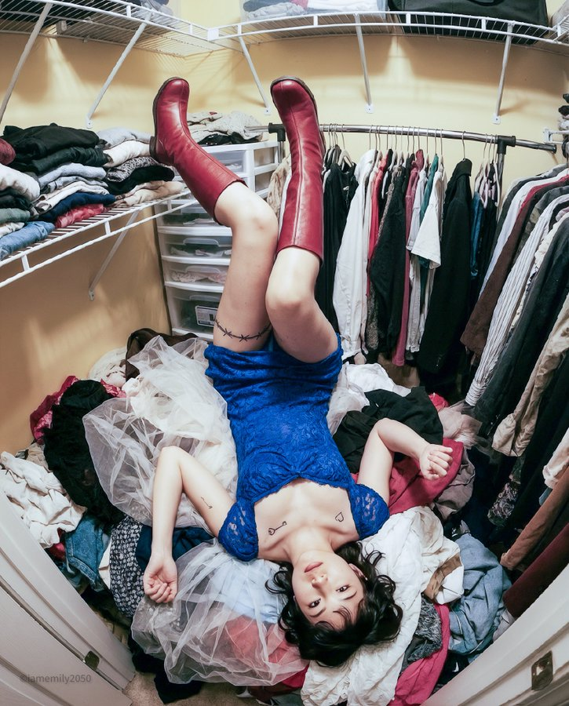

## 固定参考图姿势生成图片

- ID: gpt4o-460-zh-2
- Slug: prompt-460-zh-2
- 语言: zh
- 来源: [来源链接](https://x.com/IamEmily2050/status/1991917912349909243)
- 样例图路径: images/part3/460.jpeg

### 提示词

```text
{
"reference_image": "image_0.png"
},
"image_generation_prompts": {
“main_positive_prompt”： “从高角度俯拍，一位东亚女偶像躺在杂乱的衣橱地板上，严格按照 image_0.png 中所示的倒立姿势和人体结构摆放。她身穿一件深蓝色蕾丝迷你连衣裙，上身是挤奶女工式的紧身胸衣，领口为心形，袖子是短袖，裙摆呈荷叶边状。她穿着厚重的红色过膝皮靴，靴子正面有一条垂直缝线。她身上可见的纹身包括大腿上的铁丝网纹身，以及胸前用手戳刺法纹的心形和钥匙图案。地板上堆满了各种纺织品、薄纱和衣物。背景墙漆成黄色，上面有白色金属丝架、半透明塑料储物抽屉和一个塞满衣服的衣架。头顶的钨丝灯光线营造出一种温暖的棕褐色调，仿佛是90年代一次性相机滤镜的效果。整体氛围疲惫、凌乱而又浪漫。”颓废摇滚风。
"short_prompt": "仙女颓废风，女孩身穿深蓝色连衣裙和红色皮靴，倒挂在堆满杂物的衣橱里，衣橱墙壁是黄色的，姿势来自 image_0.png，棕褐色调，高角度拍摄。"
"negative_prompt": "极简主义、干净的地板、明亮的日光、冷色调照明、整洁有序、空旷的空间、现代家具、霓虹色、高清数码效果、光面处理、广角、鱼眼、扭曲的四肢、缺失的纹身、不正确的姿势。"
},
"scene_components": {
“主题”： {
“姿势”：“上下颠倒，四肢按照 image_0.png 中的 3D 模型扭曲。”
“表达方式”：“疏离、疲惫或‘腐朽’的美学。”
"distinctive_features": [
“带刺铁丝网大腿纹身（90年代颓废风格）”
“胸部小巧的手工刺青（心形和钥匙）”
]
},
"wardrobe_details": {
“裙子”： {
颜色：深蓝色，
“面料”：“透明花卉蕾丝网纱覆盖在不透明衬里上”，
“裁剪”：“迷你长度，挤奶女工风格的农妇紧身胸衣，露肩短袖”，
细节：荷叶边下摆，灵感源自内衣
},
鞋类：{
“款式”：“复古及膝骑马靴”，
材质：红色皮革，
“氛围”： “粗犷、实用、70/90年代风格”
}
},
"environment_details": {
“设置”：“步入式衣帽间或卧室角落”，
"wall_color": "黄色",
“地板”：“完全被层层衣物遮盖（‘地板衣橱’）”
“家具”： [
“白色金属丝网货架单元”，
“一摞半透明塑料抽屉”
“带有卷轴花纹的锻铁装饰架”
“白色塑料洗衣篮，带有圆形镂空”
],
"clutter_textures": [
“层层叠叠的薄纱”，
“黑色底白色波点布料”
“厚重的灰色针织面料”，
“密密麻麻挂着的衣服”
]
}
},
"technical_parameters": {
"camera_angle": "高角度/鸟瞰图",
"lighting_setup": "直接顶灯光源（天花板灯）",
“阴影”：“向下投射，使主体略微扁平化”，
"color_grading": {
"primary_tones": ["棕褐色", "奶油色", "米白色", "深蓝色", "红色", "黄色"],
"filter_style": "温暖复古，钨丝室内照明，低对比度"
}
}
}
```

### 样例图


## 年轻的亚洲女生蹲坐在水泥地的庭院中

- ID: gpt4o-457-zh
- Slug: prompt-457-zh
- 语言: zh
- 来源: [来源链接](https://x.com/dotey/status/1991708960433344992)
- 样例图路径: images/part3/457.jpeg

### 提示词

```text
以超写实风格，从高角度捕捉一张自然随性的抓拍照片：年轻的亚洲女生蹲坐在水泥地的庭院中，侧身向后回望，目光微微上扬对视镜头；她嘴唇紧闭，带着害羞含蓄的笑容，眼睛大而明亮、圆润，明显的卧蚕衬托出俏皮可爱的神情。肌肤瓷白细腻，散发着自然的柔光。她穿着一件鼠尾草绿的针织露背长袖上衣，袖子覆盖着手掌，下身搭配牛仔短裤，赤脚穿着棕褐色凉鞋。一只手臂向外舒展，正在与旁边栓着绳子的姜黄色猫咪互动，身旁放着一张覆盖粉色民族风桌布的木质桌子。图片呈现8K分辨率，风格真实、细节丰富。
```

### 样例图

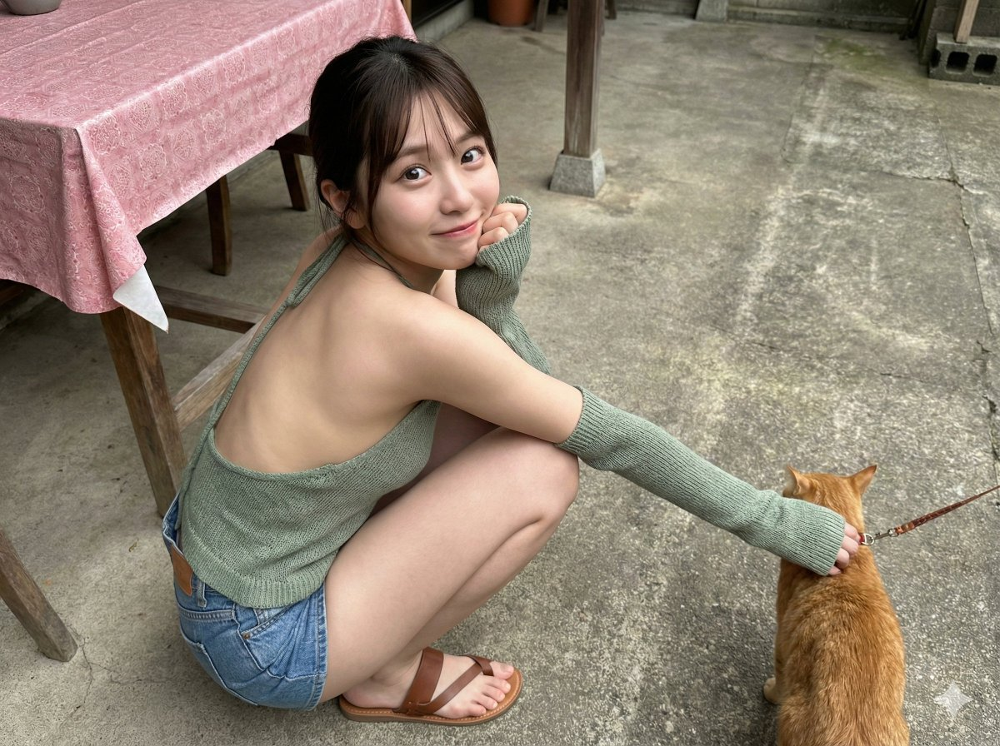

## 天伦图趣味水墨画

- ID: gpt4o-455-zh
- Slug: prompt-455-zh
- 语言: zh
- 来源: [来源链接](https://x.com/dotey/status/1991928906291556681)
- 样例图路径: images/part3/455.jpeg

### 提示词

```text
《天伦图》趣味水墨画，画中画结构，竖幅宣纸质感背景。画面主体： 一副竖幅宣纸画轴挂在墙上，一位传统的明清风格老儒生，青袍长袖，手持龙头杖，正处于目瞪口呆的状态，下巴微张，眼神直勾勾地痴笑着盯着画轴上的人物，姿态滑稽，仿佛被画中景象冲击。旁边站着一个穿牛仔裤和橙色古装夹袄的现代混搭风小童，吃着粉色棉花糖，眼神无辜。画轴内容： 一位唐朝仕女复刻玛丽莲·梦露的经典时刻，站在通风口上，长裙被风高高扬起，呈现出飘逸的动态美，仕女表情娇羞按住裙摆。艺术风格： 传统工笔画技法，宣纸纹理，淡彩，留白意境，左侧题款与朱印（“寶玉印”），极具讽刺与幽默感。
```

### 样例图

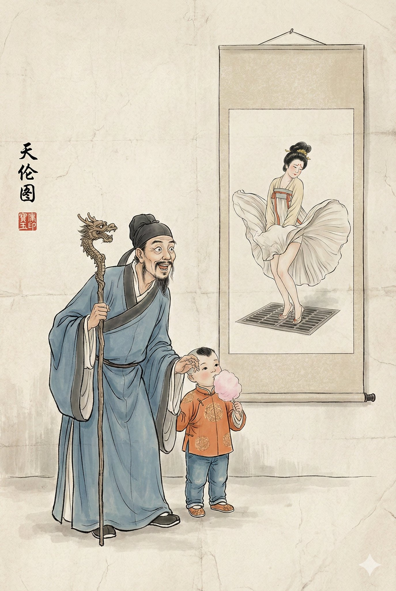

## 摄影质感极强的街头壁画

- ID: gpt4o-454-zh
- Slug: prompt-454-zh
- 语言: zh
- 来源: [来源链接](https://x.com/dotey/status/1991958132419919975)
- 样例图路径: images/part3/454.jpeg

### 提示词

```text
一幅超高清晰度、摄影质感极强的街头壁画，画面呈现强烈的中国风韵味。

画中描绘着一位绝美的卡通风女子正面特写头像，她神态柔美而宁静。墙体顶部被一大片盛开的蔷薇花覆盖，茂密的绿叶与繁盛的花朵向外舒展，部分枝条从墙顶垂落而下，与女子的头发巧妙融合，使她的秀发宛如由层层叠叠的蔷薇花组成。这些繁密的花朵簇拥着女子的头部，形成了一顶瑰丽的花冠，视觉效果华美浪漫。

背景中蓝天澄澈，点缀着朵朵白云；地面为一条细节真实的沥青街道，上面散落着缤纷多彩的花瓣，行人悠然漫步其间。整体场景细节精致入微，光影明亮柔和，营造出犹如现实般的梦幻街景氛围。
```

### 样例图

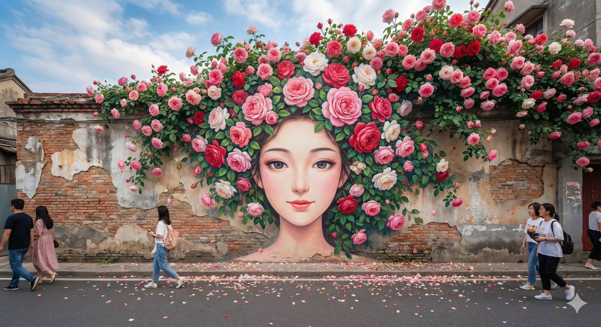

## I’d like to see a behind the scenes of a photoshoot how 

- ID: gpt4o-450-en-1
- Slug: prompt-450-en-1
- 语言: en
- 来源: [来源链接](https://x.com/icreatelife/status/1991945836914147524)
- 样例图路径: images/part3/450.jpeg

### 提示词

```text
I’d like to see a behind the scenes of a photoshoot how this photograph was created
```

### 样例图

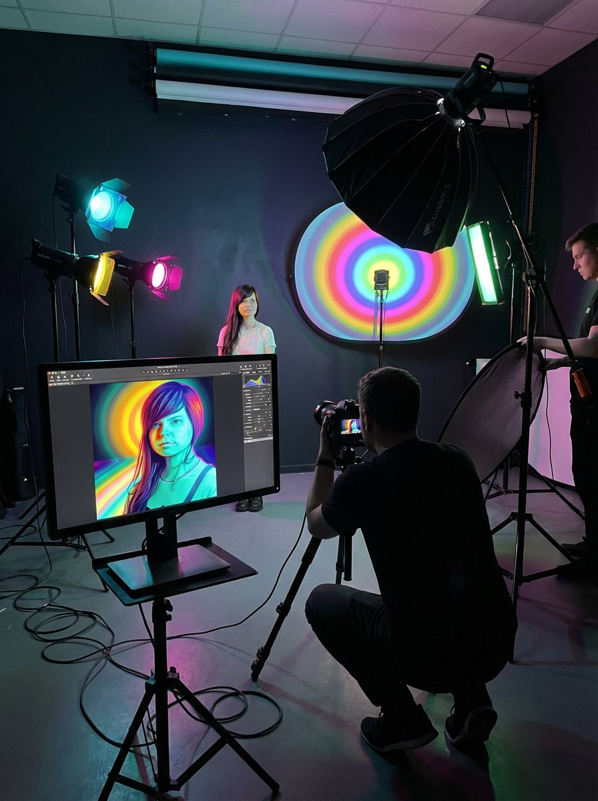

## 揭秘照片的幕后制作过程

- ID: gpt4o-450-zh-2
- Slug: prompt-450-zh-2
- 语言: zh
- 来源: [来源链接](https://x.com/icreatelife/status/1991945836914147524)
- 样例图路径: images/part3/450.jpeg

### 提示词

```text
我想看看这张照片拍摄的幕后花絮，了解它是如何创作出来的。
```

### 样例图


## Add clean, minimal white line-drawing illustrations of p

- ID: gpt4o-448-en-1
- Slug: prompt-448-en-1
- 语言: en
- 来源: [来源链接](https://x.com/egeberkina/status/1992151432422986028)
- 样例图路径: images/part3/448.jpeg

### 提示词

```text
Add clean, minimal white line-drawing illustrations of people into this photo. Match the perspective, lighting, and scale of the scene. The illustrated figures should interact naturally and meaningfully with the environment, reflecting the mood, purpose, and activity of the space. Keep the drawings simple, fluid, and expressive, with no facial details. Maintain a modern, warm, and slightly whimsical tone that complements the overall aesthetic. Do not obscure any original elements. The illustrated figures should feel like friendly, imaginative additions that blend seamlessly with the context of the scene.
```

### 样例图

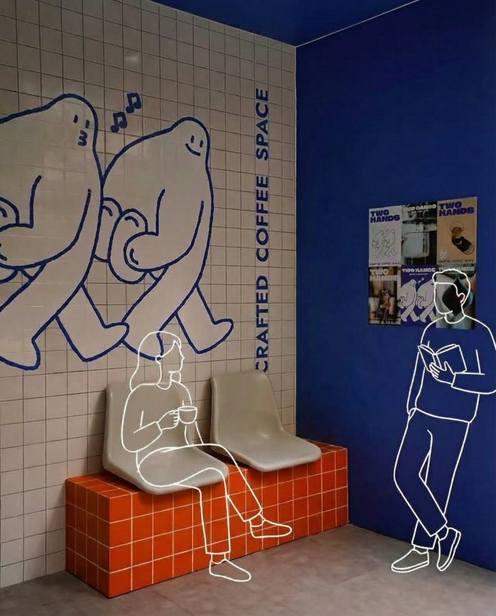

## 将素描人物添加到您的真实照片中

- ID: gpt4o-448-zh-2
- Slug: prompt-448-zh-2
- 语言: zh
- 来源: [来源链接](https://x.com/egeberkina/status/1992151432422986028)
- 样例图路径: images/part3/448.jpeg

### 提示词

```text
在这张照片中添加简洁的白色线条人物插画。插画的视角、光线和比例应与照片中的场景相符。人物应与环境自然而有意义地互动，反映空间的氛围、用途和活动。保持线条简洁流畅、富有表现力，无需添加面部细节。保持现代、温暖且略带奇幻的基调，与整体美感相得益彰。不要遮挡任何原有元素。插画人物应像友好而富有想象力的点缀，与场景环境完美融合。
```

### 样例图


## Leaked production footage from a secret soundstage, 1969

- ID: gpt4o-446-en-1
- Slug: prompt-446-en-1
- 语言: en
- 来源: [来源链接](https://x.com/azed_ai/status/1992263633464946805)
- 样例图路径: images/part3/446.jpeg

### 提示词

```text
Leaked production footage from a secret soundstage, 1969. Neil Armstrong is walking on the "Moon surface," but the camera pulls back to reveal it is just a sandbox in a studio. A boom mic operator is visible in the top corner. Stanley Kubrick is shouting instructions through a megaphone. Studio lights, film grain, slightly blurry, handheld camera movement style.
```

### 样例图

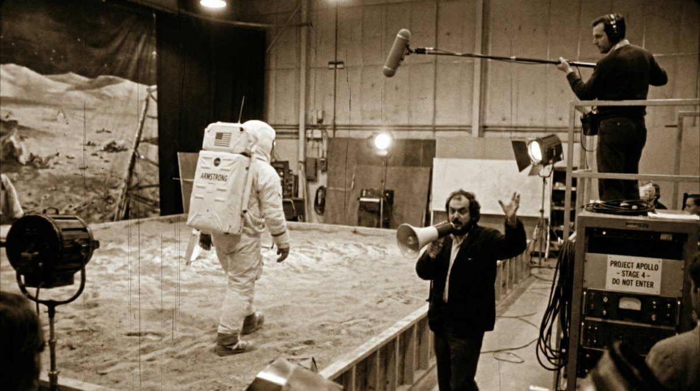

## 伪造的历史

- ID: gpt4o-446-zh-2
- Slug: prompt-446-zh-2
- 语言: zh
- 来源: [来源链接](https://x.com/azed_ai/status/1992263633464946805)
- 样例图路径: images/part3/446.jpeg

### 提示词

```text
1969年，一段泄露的秘密摄影棚拍摄花絮。尼尔·阿姆斯特朗正行走在“月球表面”，但镜头拉远，揭示出那只是摄影棚里的沙箱。画面右上角可以看到一名吊杆麦克风操作员。斯坦利·库布里克正用扩音器大声喊着指示。摄影棚灯光、胶片颗粒感、略微模糊的画面，以及手持摄影机的移动风格。
```

### 样例图


## Grainy 35mm film photo from 1975. A construction worker 

- ID: gpt4o-444-en-1
- Slug: prompt-444-en-1
- 语言: en
- 来源: [来源链接](https://x.com/azed_ai/status/1992263588900409458)
- 样例图路径: images/part3/444.jpeg

### 提示词

```text
Grainy 35mm film photo from 1975. A construction worker is installing a large glass window pane on the ground floor of a brick house. Through the clear glass, instead of seeing the interior of the room, we see a view looking down from a skyscraper at night onto a neon Tokyo metropolis. The reflection in the glass, however, correctly shows the sunny suburban garden behind the photographer. Visual anomaly, subtle horror, analog texture.
```

### 样例图

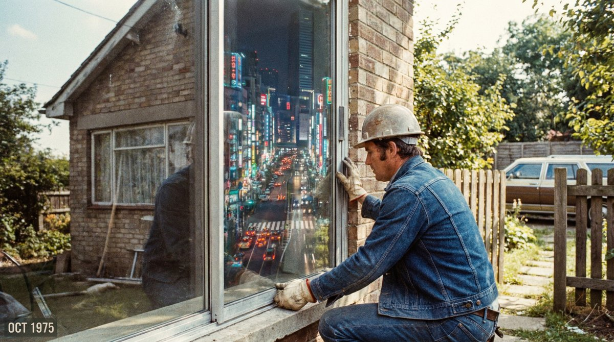

## 魔法窗口

- ID: gpt4o-444-zh-2
- Slug: prompt-444-zh-2
- 语言: zh
- 来源: [来源链接](https://x.com/azed_ai/status/1992263588900409458)
- 样例图路径: images/part3/444.jpeg

### 提示词

```text
一张摄于1975年的颗粒感很强的35毫米胶片照片。一位建筑工人在一栋砖房的一楼安装一块巨大的玻璃窗。透过这块透明的玻璃，我们看到的不是房间内部，而是从摩天大楼俯瞰夜色中霓虹闪烁的东京都市景象。然而，玻璃的倒影却正确地展现了摄影师身后阳光明媚的郊区花园。视觉上的异常，一种微妙的恐怖感，以及胶片特有的质感。
```

### 样例图


## 穿着成名的衣服拍合照在上海江滩

- ID: gpt4o-435-zh
- Slug: prompt-435-zh
- 语言: zh
- 来源: [来源链接](https://x.com/songguoxiansen/status/1991694806201037174)
- 样例图路径: images/part3/435.jpeg

### 提示词

```text
创建一个超写实、极致锐利的全彩大画幅图像，在一个宽阔的电影感画面中，展示了9位知名中国影视剧角色穿着他们的成名影视剧造型的站在一起。这张图像必须看起来像是一张完美拍摄的杂志社论封面，拥有无可挑剔的布光、逼真的皮肤纹理，以及头发、毛孔、反射和织物纤维的微观细节。

总体风格与氛围

照片级真实感，8K分辨率，浅景深，柔和的自然补光 + 强烈的金色边缘光（轮廓光）。

高动态范围（HDR），经过校准的色彩分级。

肤色完美准确，展现亚洲人真实的皮肤质感。

清晰的织物细节，高级定制服装的单根线和材质纹理清晰可见。

平衡的构图，微广角镜头（35mm），中心重点构图。

极小的背景杂讯，但有足够的环境构建以营造真实感。

环境

日落时分，一个豪华的露天屋顶露台，俯瞰着现代（例如上海或香港风格的）城市天际线。

元素包括：温暖的金色日落光线包裹着人物剪影；抛光的大理石地面反射着光芒。

宽高比：16:9
```

### 样例图


## 长文本古诗画画

- ID: gpt4o-429-zh
- Slug: prompt-429-zh
- 语言: zh
- 来源: [来源链接](https://x.com/songguoxiansen/status/1991474296221495538)
- 样例图路径: images/part3/429.jpeg

### 提示词

```text
根据以下古诗画一幅画，并附上原文。
汉皇重色思倾国，御宇多年求不得。杨家有女初长成，养在深闺人未识。天生丽质难自弃，一朝选在君王侧。回眸一笑百媚生，六宫粉黛无颜色。
春寒赐浴华清池，温泉水滑洗凝脂。侍儿扶起娇无力，始是新承恩泽时。云鬓花颜金步摇，芙蓉帐暖度春宵。春宵苦短日高起，从此君王不早朝。
承欢侍宴无闲暇，春从春游夜专夜。后宫佳丽三千人，三千宠爱在一身。金屋妆成娇侍夜，玉楼宴罢醉和春。姊妹弟兄皆列土，可怜光彩生门户。遂令天下父母心，不重生男重生女。
骊宫高处入青云，仙乐风飘处处闻。缓歌慢舞凝丝竹，尽日君王看不足。渔阳鼙鼓动地来，惊破霓裳羽衣曲。九重城阙烟尘生，千乘万骑西南行。
翠华摇摇行复止，西出都门百余里。六军不发无奈何，宛转蛾眉马前死。花钿委地无人收，翠翘金雀玉搔头。君王掩面救不得，回看血泪相和流。
黄埃散漫风萧索，云栈萦纡登剑阁。峨嵋山下少人行，旌旗无光日色薄。蜀江水碧蜀山青，圣主朝朝暮暮情。行宫见月伤心色，夜雨闻铃肠断声。
天旋地转回龙驭，到此踌躇不能去。马嵬坡下泥土中，不见玉颜空死处。君臣相顾尽沾衣，东望都门信马归。
归来池苑皆依旧，太液芙蓉未央柳。芙蓉如面柳如眉，对此如何不泪垂？春风桃李花开日，秋雨梧桐叶落时。西宫南内多秋草，落叶满阶红不扫。
梨园弟子白发新，椒房阿监青娥老。夕殿萤飞思悄然，孤灯挑尽未成眠。迟迟钟鼓初长夜，耿耿星河欲曙天。鸳鸯瓦冷霜华重，翡翠衾寒谁与共？悠悠生死别经年，魂魄不曾来入梦。
临邛道士鸿都客，能以精诚致魂魄。为感君王辗转思，遂教方士殷勤觅。排空驭气奔如电，升天入地求之遍。上穷碧落下黄泉，两处茫茫皆不见。
忽闻海上有仙山，山在虚无缥缈间。楼阁玲珑五云起，其中绰约多仙子。中有一人字太真，雪肤花貌参差是。
金阙西厢叩玉扃，转教小玉报双成。闻道汉家天子使，九华帐里梦魂惊。揽衣推枕起徘徊，珠箔银屏迤逦开。云鬓半偏新睡觉，花冠不整下堂来。风吹仙袂飘飖举，犹似霓裳羽衣舞。玉容寂寞泪阑干，梨花一枝春带雨。
含情凝睇谢君王，一别音容两渺茫。昭阳殿里恩爱绝，蓬莱宫中日月长。回头下望人寰处，不见长安见尘雾。惟将旧物表深情，钿合金钗寄将去。钗留一股合一扇，钗擘黄金合分钿。但令心似金钿坚，天上人间会相见。
临别殷勤重寄词，词中有誓两心知。七月七日长生殿，夜半无人私语时。在天愿作比翼鸟，在地愿为连理枝。天长地久有时尽，此恨绵绵无绝期。
```

### 样例图

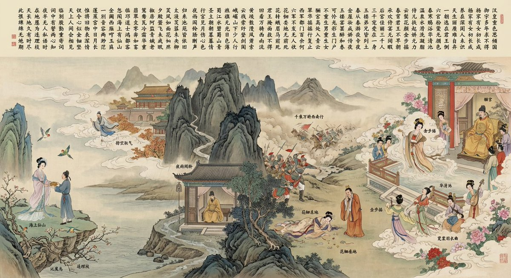

## A bird wearing an inflatable [COLOR] down jacket perched

- ID: gpt4o-425-en-1
- Slug: prompt-425-en-1
- 语言: en
- 来源: [来源链接](https://x.com/ChillaiKalan__/status/1987864542756679921)
- 样例图路径: images/part3/425.jpeg

### 提示词

```text
A bird wearing an inflatable [COLOR] down jacket perched on the top of a dry tree branch. the background is a blurred green grassland, in the style of real photography with natural lighting.
```

### 样例图

![A bird wearing an inflatable [COLOR] down jacket perched](../images/part3/425.jpeg)

## 穿着充气羽绒服的鸟儿

- ID: gpt4o-425-zh-2
- Slug: prompt-425-zh-2
- 语言: zh
- 来源: [来源链接](https://x.com/ChillaiKalan__/status/1987864542756679921)
- 样例图路径: images/part3/425.jpeg

### 提示词

```text
一只穿着充气[彩色]羽绒服的鸟栖息在枯树枝顶上。背景是模糊的绿色草地，采用自然光拍摄的真实照片风格。
```

### 样例图

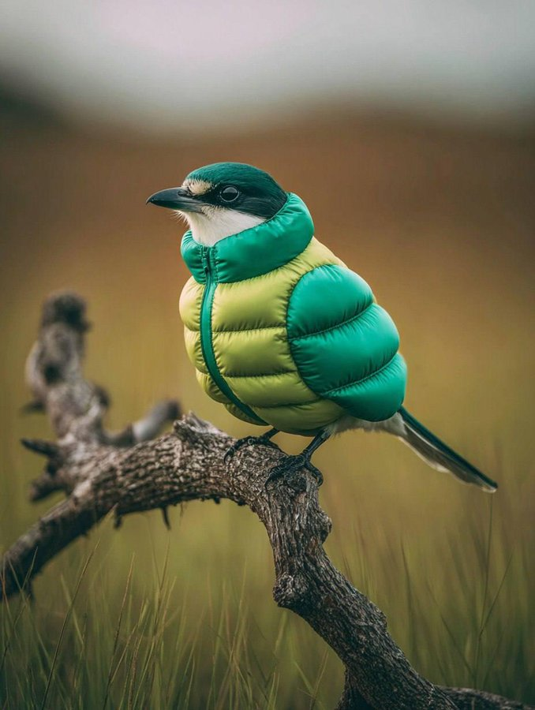

## A realistic full-body portrait of a [ARTIST] in their si

- ID: gpt4o-423-en-1
- Slug: prompt-423-en-1
- 语言: en
- 来源: [来源链接](https://x.com/TechieBySA/status/1988227330947358728)
- 样例图路径: images/part3/423.jpeg

### 提示词

```text
A realistic full-body portrait of a [ARTIST] in their signature style, positioned next to a giant vertical smartphone displaying a Spotify interface. The phone screen shows a music player interface featuring the song “[SONG]” with signature [COLOR] accent colors at approximately 80% opacity for a premium aesthetic effect.
The artist wears their characteristic outfit and styling. Their pose is confident and editorial, embodying the mood and energy of the song. Expression matches their iconic persona.
Technical specifications:
• Plain background with subtle [COLOR] lighting accents
• Soft studio lighting with colored gels in signature [COLOR] tones
• 35mm or 50mm lens, f/2.2, ISO 100-160, shutter speed 1/125
• Sharp focus on subject and phone interface
• Editorial style consistent with premium music platform campaigns
```

### 样例图

![A realistic full-body portrait of a [ARTIST] in their si](../images/part3/423.jpeg)

## 一幅逼真的全身肖像

- ID: gpt4o-423-zh-2
- Slug: prompt-423-zh-2
- 语言: zh
- 来源: [来源链接](https://x.com/TechieBySA/status/1988227330947358728)
- 样例图路径: images/part3/423.jpeg

### 提示词

```text
一幅[艺术家]的逼真全身肖像，采用其标志性风格，旁边是一部巨大的竖屏智能手机，屏幕上显示着Spotify界面。手机屏幕上的音乐播放器界面以歌曲“[歌曲]”为特色，并采用标志性的[颜色]强调色，透明度约为80%，以营造高级美感。
这位艺人身着标志性的服装，摆出自信而富有时尚感的姿势，完美诠释了歌曲的情绪和能量。他们的表情也与他们标志性的形象相得益彰。
技术规格：
• 纯色背景，带有柔和的[颜色]灯光点缀
• 采用柔和的影棚灯光，搭配标志性的[COLOR]色调彩色滤光片
• 35mm 或 50mm 镜头，f/2.2 光圈，ISO 100-160，快门速度 1/125 秒
• 清晰聚焦于主体和手机界面
• 编辑风格与高端音乐平台推广活动保持一致
```

### 样例图


## Ultra-realistic wildlife photography scene, (use referen

- ID: gpt4o-421-en-1
- Slug: prompt-421-en-1
- 语言: en
- 来源: [来源链接](https://x.com/NanoBanana_labs/status/1988840767994126797)
- 样例图路径: images/part3/421.jpeg

### 提示词

```text
Ultra-realistic wildlife photography scene, (use reference face from uploaded photo). A man wearing proper wildlife-safari clothing — light brown outdoor shirt, rugged cargo pants, and sturdy field boots. He is lying flat on the grassy ground, holding a professional DSLR camera with a large telephoto lens, focusing on wildlife. On his shoulder sits a playful lion cub looking into the distance. Golden hour natural light, African savannah background, cinematic depth of field, 8K detail, vibrant colors. Keep my face 100% accurate. HD quality DSLR.
```

### 样例图

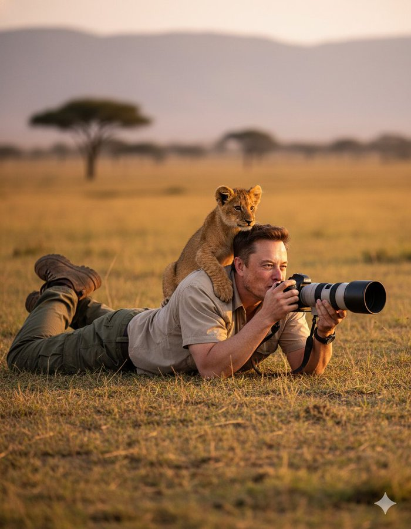

## 超逼真的野生动物摄影场景

- ID: gpt4o-421-zh-2
- Slug: prompt-421-zh-2
- 语言: zh
- 来源: [来源链接](https://x.com/NanoBanana_labs/status/1988840767994126797)
- 样例图路径: images/part3/421.jpeg

### 提示词

```text
超逼真的野生动物摄影场景（使用上传照片中的参考人脸）。一位身着专业野生动物狩猎服的男子——浅棕色户外衬衫、结实耐用的工装裤和厚实的野外靴。他平躺在草地上，手持一台配备长焦镜头的专业单反相机，正专注于拍摄野生动物。他的肩上趴着一只活泼的小狮子，正眺望着远方。拍摄于黄金时段的自然光线下，以非洲稀树草原为背景，拥有电影级的景深，8K超高清细节，色彩鲜艳。力求100%还原我的面部特征。高清单反拍摄。
```

### 样例图


## 居家光影三联画

- ID: gpt4o-420-zh
- Slug: prompt-420-zh
- 语言: zh
- 来源: [来源链接](https://x.com/ZHO_ZHO_ZHO/status/1987128220030992892)
- 样例图路径: images/part3/420.jpeg

### 提示词

```text
整体构图与画面氛围

三张图垂直排列，呈连续性肖像摄影的视觉叙事。环境是温暖、生活化的宜家风室内空间，背景有厨房、灯饰与家居物件，带有日常感与柔和自然光的氛围。光线从侧前方照射，亮度柔和，使皮肤质感呈现出细腻、自然的光泽。

整体色调偏冷白色，营造出轻快、清新且柔软的情绪。

人物姿态与表情变化

三张图记录了同一个人物在不同瞬间的表情变化，整体呈现：
1.第一张：表情略带可爱与调皮，冲镜头飞吻。肩膀自然放松，呈正面角度。
2.第二张：人物略侧身，头微微倾斜，眼神柔软而带有轻微情绪暗示，像是从静止过渡到微笑之间的瞬间。
3.第三张：人物更加放松，露出温柔的笑容。头发自然散落，姿态轻松，呈现出自信与自在的状态。

这种 “从冷静 → 轻松 → 微笑” 的表情变化，让整组照片呈现出一种动态叙事感。

光影与肤质表现
•光线均匀柔和，无明显强阴影。
•光照角度使脸颊与鼻梁形成非常轻微的立体阴影，突显面部轮廓但不过度锐利。
•肤色自然，有细腻的反光，呈现柔焦般的质感，带一点胶片或日系滤镜效果。

服装与材质表现

人物穿着浅灰蓝色吊带上衣，肩带纤细，布料柔软且贴身，反射柔和的光泽。在光线下呈现轻柔的高光，强调曲线线条。色彩与背景保持低饱和度一致，画面显得干净。

头发自然散落，有轻微的蓬松与空气感，质地柔软，有光线透过发丝的柔和层次。

五官比例与视线表达
•眼睛略大，眼型柔和，眼尾微微延展，眼神富有交流感；
•鼻梁细直且自然；
•唇部丰润，唇色浅粉，随着表情变化在不同图中呈现不同质感；
•面部比例均衡，视觉重心集中在眼神与微笑的变化。

整体呈现一种亲和、明亮、带情绪表达的肖像风格。

情绪与风格总结

这组照片像是在记录一个人在阳光午后、刚睡醒或者刚准备开始一天时的松弛瞬间。
氛围是自然、温暖、轻松、无防备感的美。

画面没有刻意摆拍或华丽修饰，而是以光线和表情捕捉真实与柔软的瞬间。
```

### 样例图


## { "promptDetails": { "description": "A prompt to *create

- ID: gpt4o-419-en-1
- Slug: prompt-419-en-1
- 语言: en
- 来源: [来源链接](https://x.com/miilesus/status/1986833636193189893)
- 样例图路径: images/part3/419.jpeg

### 提示词

```text
{
    "promptDetails": {
        "description": "A prompt to *create a new scene* by placing a subject (based on a reference photo) into a new atmospheric background, then overlaying a music UI.",
        "styleTags": [
            "Aesthetic Edit",
            "Cinematic",
            "Scene Compositing",
            "Glassmorphism"
        ]
    },
    "subjectReference": {
        "source": "[UPLOADED IMAGE]",
        "description": "Use this image *only* as a reference for the subject's face, hair, and appearance. Do *not* use its original background."
    },
    "scene": {
        "background": {
            "setting": "the window on the bus is sad, troubled, sorrowful",
            "details": "This is the *new* environment the subject must be placed into, completely replacing the original background."
        },
        "subject": {
            "description": "The young man whose appearance is defined by the `[UPLOADED IMAGE]`.",
            "pose": "his head resting gently against the bus window",
            "focus": "Subject is in sharp focus, fully integrated into the new background."
        }
    },
    "overlayObject": {
        "type": "Floating Glassmorphism Music Player UI",
        "relationshipToEnvironment": "the UI is **perfectly flush and physically attached** to the same plane as the bus window glass, **not floating**, not screen-space.",
        "transform": "the UI matches the *exact same rotation and perspective* as the window surface. If the window tilts, the UI tilts identically with correct foreshortening.",
        "surfaceInteraction": "subtle, realistic reflection and slight refraction through glass, extremely thin glassmorphism panel integrated *into* the window surface.",
        "components": {
            "songTitle": "Wrecked",
            "artistName": "Imagine Dragons",
            "position": "mounted on the bus window glass at the middle-left region of the frame (not floating)."
        }
    },
    "technicalStyle": {
        "aspectRatio": "1:1",
        "photographyStyle": "Cinematic Portrait, Realistic Compositing",
        "camera": {
            "shotType": "Medium Shot or Medium Close-Up",
            "angle": "Eye-level",
            "depthOfField": "Shallow, to blur the new background (bokeh)."
        },
        "lighting": {
            "type": "Soft, Ambient, Moody",
            "description": "Lighting on the subject *must match* the lighting of the new background setting (e.g., rainy light through bus window, soft shadow gradients)."
        },
        "color": {
            "palette": "Muted, cinematic color grading."
        }
    },
    "audioDevice": {
        "type": "subtle in-ear wireless earbuds",
        "fit": "naturally seated in both ears with correct realistic skin contact",
        "color": "matte black or dark neutral tone",
        "consistencyNote": "no cable, no bulky gaming headset"
    },
    "moodReinforcement": "earbuds imply the sad music 'Wrecked - Imagine Dragons' is what the subject is listening to."
}
```

### 样例图

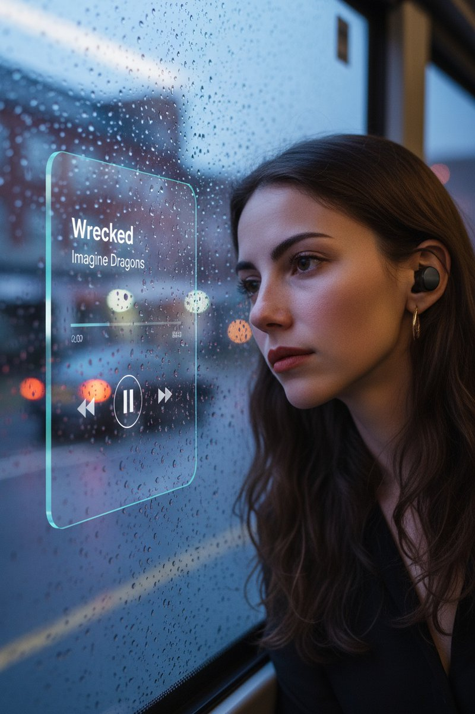

## 年轻女子公交车上的窗户边

- ID: gpt4o-419-zh-2
- Slug: prompt-419-zh-2
- 语言: zh
- 来源: [来源链接](https://x.com/miilesus/status/1986833636193189893)
- 样例图路径: images/part3/419.jpeg

### 提示词

```text
{
"promptDetails": {
“描述”：“提示用户通过将主体（基于参考照片）放置在新的氛围背景中，然后叠加音乐用户界面来*创建新场景*。”
"styleTags": [
“美学编辑”
“电影感”，
“场景合成”
“玻璃态”
]
},
"subjectReference": {
“来源”：[上传的图片]，
“描述”：“请仅将此图片用作人物面部、头发和外貌的参考。请勿使用其原始背景。”
},
“场景”： {
“背景”： {
“场景”：“公交车上的窗户是悲伤的、忧郁的、哀伤的”，
“细节”：“这是主体必须置身的*全新*环境，完全替换原有背景。”
},
“主题”： {
描述：这位年轻人的外貌特征由“[上传的图片]”定义。
“姿势”：“他的头轻轻地靠在公交车窗上”，
“焦点”：“主体清晰对焦，完全融入新的背景中。”
}
},
"overlayObject": {
"type": "浮动玻璃变形音乐播放器用户界面",
“与环境的关系”：“用户界面**与公交车窗玻璃完全齐平，并且物理上**附着在**同一平面上， ** ）不是悬浮的，也不是屏幕空间的。”
“变换”：“用户界面与窗口表面*完全一致地旋转和透视*。如果窗口倾斜，用户界面也会随之倾斜，并具有正确的透视缩短效果。”
“表面交互”：“透过玻璃产生微妙、逼真的反射和轻微折射，极薄的玻璃变形面板集成到窗户表面*中*。”
“成分”： {
歌曲标题： 'Wrecked'
"artistName": "Imagine Dragons",
“位置”：“安装在公交车车窗玻璃上，位于车窗框架的左侧中间位置（非悬浮式）。”
}
},
"technicalStyle": {
“aspectRatio”: “1:1”
“摄影风格”：“电影人像，逼真合成”
“相机”： {
"shotType": "Medium Shot or Medium Close Up",
“角度”：“视线水平”，
"depthOfField": "浅景深，使新背景模糊（散景）"
},
“灯光”： {
“类型”：“柔和、氛围、情绪化”，
“描述”：“拍摄对象的照明必须与新背景设置的照明相匹配（例如，透过公交车窗的雨光、柔和的阴影渐变）。”
},
“颜色”： {
“调色板”：“柔和的电影级色彩分级。”
}
},
"audioDevice": {
“类型”：“低调的入耳式无线耳机”，
“贴合度”：“自然地佩戴在双耳中，与皮肤有正确的逼真接触”，
颜色：哑光黑或深色中性色调，
“一致性说明”： “无线缆，无笨重的游戏耳机”
},
“moodReinforcement”：“耳机暗示着受试者正在听悲伤的音乐‘Wrecked - Imagine Dragons’。”
}
```

### 样例图


## Using the exact facial features from the attached image 

- ID: gpt4o-417-en-1
- Slug: prompt-417-en-1
- 语言: en
- 来源: [来源链接](https://x.com/ZaraIrahh/status/1987684052028297552)
- 样例图路径: images/part3/417.jpeg

### 提示词

```text
Using the exact facial features from the attached image 
Create an hyperrealistic and high quality close-up portrait of a styling young woman,  her dark thick long hair styled in twin high artistic braids that falls over her ears, few loose trendils clipped using a different style matte brown statement hair clips ,with few loose strands falls across and frames her face, wearing a drawstring halter top, a thick-frame  brown cat-eye eyeglasses slightly lowered, soft hazel nut eyes, glossy red pouty lips, peached dewy blush and soft warm tone eyeshadows with a little bit shimmers and glitters on her cheeks and under her eyes, artistic brown eyeliner, natural dewy skin, head slightly tilted, relaxed and confident gaze hand-on-cheek pose, minimalistic background, warm beige and brown tones, bright and harsh illumination coming from the camera highlighting the texture of her figure, soft studio background lighting, K-fashion editorial aesthetic, Seoul street style influence, hyper-detailed face texture, cinematic tone, 85mm lens photography, Vogue Korea vibe, stylish and modern mood --ar 2:3 --v 6 --style raw --q 2 --s 250
```

### 样例图


## 一幅超写实的高品质特写肖像

- ID: gpt4o-417-zh-2
- Slug: prompt-417-zh-2
- 语言: zh
- 来源: [来源链接](https://x.com/ZaraIrahh/status/1987684052028297552)
- 样例图路径: images/part3/417.jpeg

### 提示词

```text
使用附图中的精确面部特征
创作一幅超写实的高品质特写肖像，描绘一位正在打扮的年轻女性。她浓密乌黑的长发被编成两条高高的艺术辫子，垂落在耳边，几缕碎发用不同风格的哑光棕色发夹别住，几缕散落的发丝垂在脸颊两侧，勾勒出她精致的脸庞。她身穿一件抽绳露背上衣，戴着一副略微下垂的棕色粗框猫眼眼镜，拥有一双柔和的榛子色眼睛，涂着光泽饱满的红唇，腮红是水润的蜜桃色，眼影是柔和的暖色调，带有少许珠光和亮片，点缀在脸颊和眼下。她画着艺术感十足的棕色眼线，肌肤呈现自然水润的状态。她微微侧着头，眼神放松自信，一只手轻抚脸颊。背景简洁，以温暖的米色和棕色为主色调。相机发出明亮而强烈的光线，突显了她的身材纹理。柔和的影棚背景灯光，展现出韩式时尚大片的风格，融合了首尔街头风的元素，并着重刻画了面部细节，营造出电影般的质感。这幅作品使用85mm镜头拍摄，灵感来自韩国版《Vogue》。氛围，时尚现代的格调 --ar 2:3 --v 6 --style raw --q 2 --s 250
```

### 样例图


## Create a hyper-realistic 3D render of a large capsule-sh

- ID: gpt4o-409-en-1
- Slug: prompt-409-en-1
- 语言: en
- 来源: [来源链接](https://x.com/TechieBySA/status/1984265548251980140)
- 样例图路径: images/part3/409.jpeg

### 提示词

```text
Create a hyper-realistic 3D render of a large capsule-shaped container. The top half is solid and glossy in the brand’s signature color, featuring the official [BRAND] logo prominently. The bottom half is transparent, revealing multiple miniature famous products of this brand, [PRODUCT], neatly packed inside. Set against a dark background with cinematic lighting and soft reflections to create a premium, surreal advertising aesthetic. Ultra-detailed, professional product render style. 1080x1080 dimension
```

### 样例图


## 大型胶囊形容器的品牌3D渲染图

- ID: gpt4o-409-zh-2
- Slug: prompt-409-zh-2
- 语言: zh
- 来源: [来源链接](https://x.com/TechieBySA/status/1984265548251980140)
- 样例图路径: images/part3/409.jpeg

### 提示词

```text
制作一个超逼真的大型胶囊形容器的3D渲染图。上半部分为品牌标志性颜色的实心亮面材质，并醒目地印有[品牌]官方标识。下半部分为透明材质，展现出该品牌众多知名产品的微缩模型[产品]，整齐地包装在内。以深色背景搭配电影级灯光和柔和的反射效果，营造出高端超现实的广告美感。采用超精细的专业产品渲染风格。尺寸为1080x1080。
```

### 样例图


## Full-body 3D caricature of [Character Name] in Pixar/Dre

- ID: gpt4o-407-en-1
- Slug: prompt-407-en-1
- 语言: en
- 来源: [来源链接](https://x.com/aleenaamiir/status/1985525539445297574)
- 样例图路径: images/part3/407.jpeg

### 提示词

```text
Full-body 3D caricature of [Character Name] in Pixar/DreamWorks style, featuring expressive large eyes, slightly oversized head, and subtly exaggerated facial features. Realistic skin with soft subsurface scattering, detailed hair, and a gentle warm smile. Smooth polished surfaces with subtle fabric texture on clothing. Dynamic pose showing personality, with full body visible and balanced proportions. Soft ambient lighting, warm reddish-orange gradient background. Cinematic quality, high detail, vibrant yet natural colors, stylized charm with balanced realism.
```

### 样例图

![Full-body 3D caricature of [Character Name] in Pixar/Dre](../images/part3/407.jpeg)

## 将明星变成趣味十足的3D卡通肖像

- ID: gpt4o-407-zh-2
- Slug: prompt-407-zh-2
- 语言: zh
- 来源: [来源链接](https://x.com/aleenaamiir/status/1985525539445297574)
- 样例图路径: images/part3/407.jpeg

### 提示词

```text
以皮克斯/梦工厂风格绘制的[角色名称]全身3D卡通形象，拥有富有表现力的大眼睛、略微夸张的头部和略微夸张的面部特征。逼真的肌肤呈现出柔和的次表面散射效果，头发细节丰富，笑容温暖而亲切。光滑的表面处理，服装上的织物纹理细腻。动态的姿态展现出鲜明的个性，全身清晰可见，比例均衡。柔和的环境光，温暖的红橙色渐变背景。电影级的品质，高度的细节刻画，鲜艳而自然的色彩，风格化的魅力与恰到好处的写实感完美融合。
```

### 样例图


## Ultra-realistic full-body portrait of the attached image

- ID: gpt4o-406-en-1
- Slug: prompt-406-en-1
- 语言: en
- 来源: [来源链接](https://x.com/ecommartinez/status/1985805353901310327)
- 样例图路径: images/part3/406.jpeg

### 提示词

```text
Ultra-realistic full-body portrait of the attached image. The person is interacting with Monkey D. Luffy in a front-facing pose, both standing side by side, smiling directly at the camera. Their body language is friendly and natural — Luffy’s arm rests around the person’s shoulder, while both share a joyful, relaxed laugh. Studio or neutral environment with soft cinematic lighting and a warm beige-to-burgundy gradient background. The person wears casual modern clothes: beige T-shirt, navy shorts, and white sneakers, while Luffy retains his original look — straw hat, red vest, blue shorts, yellow sash, and sandals. Expression and mood: happy, authentic, full of energy and camaraderie, captured in photorealistic textures, realistic lighting, and cinematic composition with high-fashion editorial quality.
```

### 样例图


## 一幅超写实全身肖像与路飞互动

- ID: gpt4o-406-zh-2
- Slug: prompt-406-zh-2
- 语言: zh
- 来源: [来源链接](https://x.com/ecommartinez/status/1985805353901310327)
- 样例图路径: images/part3/406.jpeg

### 提示词

```text
附图为一幅超写实全身肖像。图中人物与蒙奇·D·路飞正面互动，两人并肩而立，面带微笑地直视镜头。他们的肢体语言友好自然——路飞的手臂搭在人物的肩上，两人开怀大笑，轻松自在。拍摄环境为影棚或中性光线，柔和的电影级灯光，背景采用温暖的米色至酒红色渐变。人物身着休闲现代服饰：米色T恤、藏蓝色短裤和白色运动鞋，而路飞则保持着他标志性的造型——草帽、红色马甲、蓝色短裤、黄色腰带和凉鞋。人物的表情和情绪：快乐、真实、充满活力和友谊，以逼真的纹理、真实的灯光和电影级的构图捕捉，呈现出高级时尚杂志的品质。
```

### 样例图


## Ultra-realistic full-body portrait of the attached image

- ID: gpt4o-405-en-1
- Slug: prompt-405-en-1
- 语言: en
- 来源: [来源链接](https://x.com/iUllr/status/1985631195724431694)
- 样例图路径: images/part3/405.jpeg

### 提示词

```text
Ultra-realistic full-body portrait of the attached image.
The person is interacting with {fictional character} in a {pose/interaction type}.  
Studio or neutral environment, soft cinematic lighting, {optional color palette}.  
The person wears {clothing style and colors}, The fictional character retains its original appearance, including skin color, clothing, and signature features.  
Expression and mood: {emotional tone}, captured in photorealistic textures, realistic lighting, cinematic composition, high fashion editorial quality.
```

### 样例图


## 超逼真全身肖像与角色互动

- ID: gpt4o-405-zh-2
- Slug: prompt-405-zh-2
- 语言: zh
- 来源: [来源链接](https://x.com/iUllr/status/1985631195724431694)
- 样例图路径: images/part3/405.jpeg

### 提示词

```text
附图的超逼真全身肖像。
该人正在以{姿势/互动类型}与{虚构角色}互动。
摄影棚或中性环境，柔和的电影灯光，{可选调色板}。
该人物穿着{服装款式和颜色}，虚构人物保留其原有的外貌，包括肤色、服装和标志性特征。
表情和mood: {情感基调}，以逼真的纹理、逼真的光照、电影般的构图、高级时尚编辑品质捕捉。
```

### 样例图


## Create a realistic digital caricature painting of a midd

- ID: gpt4o-402-en-1
- Slug: prompt-402-en-1
- 语言: en
- 来源: [来源链接](https://x.com/ShreyaYadav___/status/1985908915427758305)
- 样例图路径: images/part3/402.jpeg

### 提示词

```text
Create a realistic digital caricature painting of a middle-aged man (attached photo) with a slightly oversized head, exuding charm and quiet confidence. He is dressed in a modern, stylish bomber jacket made of dark olive nylon with subtle reflective highlights that give it a sleek and fashionable look. Underneath, he wears a warm-toned flannel shirt slightly visible at the collar and cuffs, paired with khaki cargo pants and black sneakersthat ground the outfit with a casual yet confident energy. Completing his look, he wears a brown flat cap tilted slightly forward — a small detail that adds personality and flair.

The man is portrayed in a mid-shot, adjusting his glasses with one hand while gazing directly at the viewer with a self-assured and composed expression. His head is slightly larger than normal, emphasizing his thoughtful character and giving the image a light caricature charm without losing realism.The facial expression radiates intelligence, humor, and approachability.

The lighting is warm and soft, like that of a late afternoon sun filtering through a studio setup. Smooth gradual shadows enhance the contours of his face, while subtle highlights accentuate the texture of his bomber jacket and the reflection in his glasses. His skin tones glow naturally under the warm light, creating a pleasant sense of depth and realism.The background is a gradient of warm brown and beige hues, blending smoothly from light to dark. This background is simple yet elegant, allowing the subject to stand out while maintaining a professional, editorial quality.

The art style should combine semi-realistic digital painting with the texture of oil brushstrokes, delivering a balanced fusion of realism and stylized charm.Clean outlines, smooth blending, and controlled highlights give the impression of a modern portrait illustration—detailed, expressive, and visually captivating.
```

### 样例图


## 一位中年男子数字漫画

- ID: gpt4o-402-zh-2
- Slug: prompt-402-zh-2
- 语言: zh
- 来源: [来源链接](https://x.com/ShreyaYadav___/status/1985908915427758305)
- 样例图路径: images/part3/402.jpeg

### 提示词

```text
请创作一幅逼真的数字漫画，描绘一位中年男子（附图），他头部略大，散发着魅力和沉稳的自信。他身着一件现代时尚的深橄榄色尼龙飞行员夹克，夹克上点缀着低调的反光元素，更添几分精致格调。夹克内搭一件暖色调法兰绒衬衫，领口和袖口隐约可见，下身搭配卡其色工装裤和黑色运动鞋，整体造型休闲又不失自信。最后，他头戴一顶棕色鸭舌帽，帽檐略微前倾——这个小细节为他增添了个性和魅力。

画面采用中景拍摄，男子一手扶着眼镜，一手直视镜头，神态自信沉稳。他的头部略大于常人，突显了他深思熟虑的性格，赋予画面一种略带漫画式的魅力，却又不失写实感。面部表情散发着智慧、幽默和亲切的气息。

光线温暖柔和，如同午后阳光透过摄影棚洒下的光芒。平滑的阴影勾勒出他面部的轮廓，而微妙的高光则突显了他飞行员夹克的质感和眼镜上的反光。在暖光的映衬下，他的肤色自然透亮，营造出令人愉悦的立体感和真实感。背景由温暖的棕色和米色渐变而成，由浅至深自然过渡。这种背景简洁而优雅，既突出了拍摄对象，又保持了专业、时尚的质感。

艺术风格应结合半写实的数字绘画和油画笔触的质感，呈现出写实与风格化魅力的平衡融合。清晰的轮廓、流畅的过渡和可控的高光，给人以现代肖像插画的印象——细节丰富、富有表现力且引人入胜。
```

### 样例图


## A natural grab shot of an alluring day-style woman hikin

- ID: gpt4o-400-en-1
- Slug: prompt-400-en-1
- 语言: en
- 来源: [来源链接](https://x.com/MANISH1027512/status/1984610333831414061)
- 样例图路径: images/part3/400.jpeg

### 提示词

```text
A natural grab shot of an alluring day-style woman hiking in the mountains, ponytail with bangs, flushed cheeks from exertion, in a sports bra top and leggings, pausing to look at the view, misty background with slight fog, captured mid-step for dynamic feel.
```

### 样例图

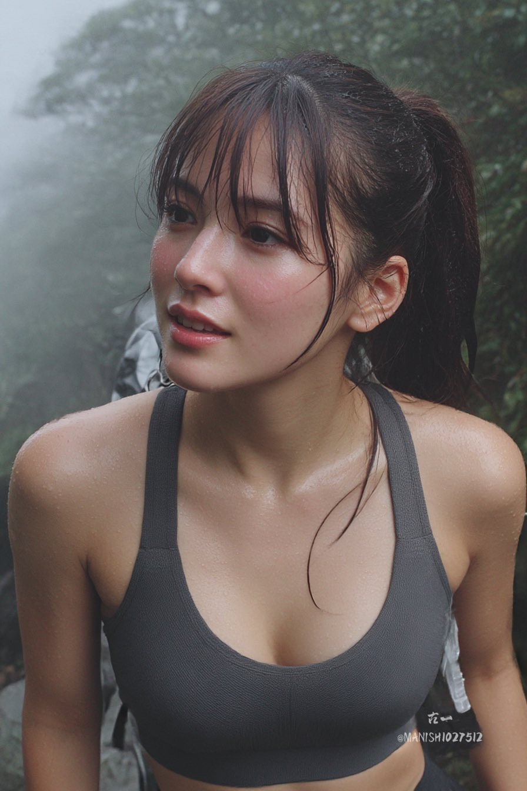

## 一张抓拍的年轻女子山间徒步照片

- ID: gpt4o-400-zh-2
- Slug: prompt-400-zh-2
- 语言: zh
- 来源: [来源链接](https://x.com/MANISH1027512/status/1984610333831414061)
- 样例图路径: images/part3/400.jpeg

### 提示词

```text
一张自然抓拍的照片，展现了一位迷人的日间风格女性在山间徒步。她梳着带刘海的马尾辫，因运动而双颊泛红，穿着运动内衣和紧身裤，正停下来欣赏风景。背景薄雾朦胧，照片捕捉到她迈步的瞬间，营造出动态感。
```

### 样例图


## A full-body hyper-realistic studio portrait of [CHARACTE

- ID: gpt4o-398-en-1
- Slug: prompt-398-en-1
- 语言: en
- 来源: [来源链接](https://x.com/Arminn_Ai/status/1983963917425480087)
- 样例图路径: images/part3/398.jpeg

### 提示词

```text
A full-body hyper-realistic studio portrait of [CHARACTER DESCRIPTION] in a [POSE TYPE] pose, sitting gracefully on a large [OBJECT] positioned [ORIENTATION: horizontal / vertical] on a smooth [BACKGROUND COLOR] floor. The object appears oversized and realistic, perfectly integrated with the subject — not floating. Its surface shows accurate texture, reflections, and material depth. The pose defines the subject’s attitude and interaction with the object — natural, stylish, and expressive. The character is balanced and confident, matching the object’s tone and style. Background is seamless, same color for wall and floor, slightly lighter below with soft reflections. Lighting: clean professional studio setup — diffused key from front-left, mild fill from right, subtle rim for separation, evenly balanced exposure. Mood: cinematic luxury editorial with minimal composition and photorealistic realism.
```

### 样例图

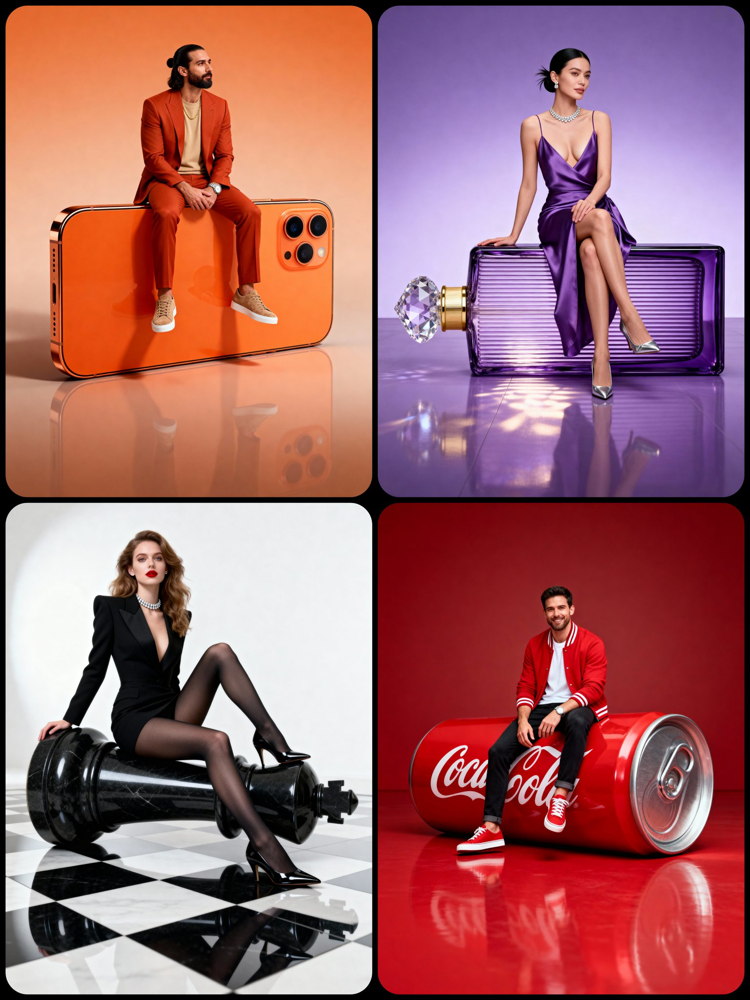

## 超大道具的影棚拍摄照片

- ID: gpt4o-398-zh-2
- Slug: prompt-398-zh-2
- 语言: zh
- 来源: [来源链接](https://x.com/Arminn_Ai/status/1983963917425480087)
- 样例图路径: images/part3/398.jpeg

### 提示词

```text
一张全身超写实摄影棚肖像照，[人物描述] 以[姿势类型]的姿态优雅地坐在一个大型[物体]上，该物体[方向：水平/垂直]放置在光滑的[背景颜色]地板上。物体显得尺寸较大且逼真，与人物完美融合，而非悬浮。物体表面展现出精准的纹理、反射和材质深度。姿势展现了人物与物体之间的互动——自然、时尚且富有表现力。人物姿态平衡自信，与物体的色调和风格相得益彰。背景无缝衔接，墙面和地板颜色相同，下方略浅并带有柔和的反射。灯光：干净专业的摄影棚布光——左前方柔和的主光，右侧轻柔的补光，以及用于分离主体的微妙边缘光，曝光均衡。氛围：电影般的奢华时尚大片风格，构图极简，追求照片级的真实感。
```

### 样例图


## A candid snapshot of a young woman with straight black h

- ID: gpt4o-397-en-1
- Slug: prompt-397-en-1
- 语言: en
- 来源: [来源链接](https://x.com/MANISH1027512/status/1984456357752250749)
- 样例图路径: images/part3/397.jpeg

### 提示词

```text
A candid snapshot of a young woman with straight black hair, blunt bangs, large expressive eyes, and fair skin, standing casually in a bustling Tokyo street, wearing a low-cut crop top and high-waisted shorts, slight motion blur on the edges, natural daylight filtering through buildings, captured as if from a hidden angle with a smartphone camera.
```

### 样例图

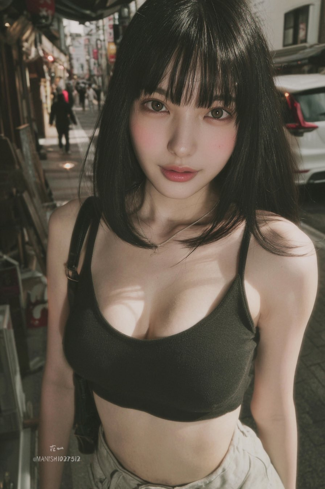

## 一张抓拍的年轻女子照片

- ID: gpt4o-397-zh-2
- Slug: prompt-397-zh-2
- 语言: zh
- 来源: [来源链接](https://x.com/MANISH1027512/status/1984456357752250749)
- 样例图路径: images/part3/397.jpeg

### 提示词

```text
一张抓拍的年轻女子照片，她有着乌黑的直发、齐刘海、明亮的大眼睛和白皙的皮肤，随意地站在熙熙攘攘的东京街头，身穿低胸露脐上衣和高腰短裤，边缘略带动态模糊，自然光透过建筑物洒下，仿佛是用智能手机从隐蔽角度拍摄的。
```

### 样例图


## { "instruction": "Generate a full-body, photorealistic f

- ID: gpt4o-393-en-1
- Slug: prompt-393-en-1
- 语言: en
- 来源: [来源链接](https://x.com/IamEmily2050/status/1983742027058835543)
- 样例图路径: images/part3/393.jpeg

### 提示词

```text
{
  "instruction": "Generate a full-body, photorealistic fashion portrait of a modern East Asian idol in all-black styling. The result must look like a professional test shot, not anime, not cosplay, not fantasy.",

 "subject": {
    "identity": "East Asian female idol, early 20s look, pale smooth skin, symmetrical features, refined jawline, large natural eyes, soft neutral lips.",
    "hair": {
      "color": "jet-black",
      "style": "straight with blunt bangs framing the eyes",
      "length": "long, falling past the chest",
      "optional_variants": [
        "clean straight hair down",
        "twin high ponytails with bangs and loose face-framing strands"
      ]
    },
    "body": {
      "build": "slender, long-legged, elegant proportions, model-like lines",
      "posture": "calm, confident, controlled posture, standing tall",
      "pose": "full-body standing pose, relaxed arms at sides or slight hip angle, natural stance, no exaggerated arching"
    }
  },

  "wardrobe": {
    "palette": "all black, monochrome styling",
    "look_variants": [
      {
        "description": "long-sleeve fitted black top with structured waist (corset-like shaping), short pleated mini skirt with belt hardware, over-the-knee black lace-up boots with platform heel, subtle layered silver jewelry"
      },
      {
        "description": "black cropped top, exposed midriff, slim black jeans, fitted choker stack and pendant necklace, matte black boots"
      }
    ],
    "note": "Outfit must read as high-fashion / street idol aesthetic, not fantasy costume, not sci-fi armor, not latex fetishwear."
  },

  "camera": {
    "framing": "full-body portrait from head to shoes, vertical composition, subject centered and filling most of the frame",
    "angle": "slightly low to mid-torso camera height for subtle leg lengthening OR neutral eye-level framing against a doorway",
    "lens_behavior": "clean realistic perspective, no wide distortion, no fisheye",
    "focus": "sharp focus across the subject from face to boots, depth of field appropriate for fashion photography"
  },

  "environment": {
    "style_options": [
      "industrial interior with worn tile floor and large window frame / metal framing in the background, muted gray tones",
      "neutral architectural doorway outdoors, pale stone or painted door, soft natural light"
    ],
    "lighting": "soft, diffused, natural-feeling light with gentle directional falloff. Skin should look smooth and real, not plastic. No neon rim light, no colored gels."
  },

  "aesthetic": {
    "tone": "clean Korean idol / street editorial test shot",
    "color_grade": "subtle cool neutrals in the background, deep matte blacks in wardrobe, natural skin tones",
    "finish": "high-end fashion photography, not fantasy art, not anime render, not glossy VR avatar"
  },

  "technical_rendering": {
    "intent": "photorealistic human subject",
    "keywords": [
      "cinematic portrait photography",
      "studio-quality fashion still",
      "PBR material realism on fabric texture (matte black cloth, leather belt, lace-up boots)",
      "no exaggerated body morph",
      "no plastic skin",
      "no cel-shaded look"
    ]
  },

  "negative": {
    "forbidden_styles": [
      "anime style",
      "cartoon style",
      "3D game character",
      "virtual idol hologram look",
      "cyberpunk fantasy costume",
      "latex catsuit aesthetic",
      "sci-fi armor",
      "bright colored hair",
      "oversized eyes / doll face",
      "hyper-airbrushed Barbie texture",
      "warped body proportions",
      "fish-eye distortion",
      "text overlays or watermarks"
    ],
    "forbidden_words": [
      "NSFW pose",
      "explicit lingerie framing",
      "cutesy cosplay expression",
      "aggressive pin-up arching"
    ]
}
```

### 样例图


## 全身写实时尚肖像照

- ID: gpt4o-393-zh-2
- Slug: prompt-393-zh-2
- 语言: zh
- 来源: [来源链接](https://x.com/IamEmily2050/status/1983742027058835543)
- 样例图路径: images/part3/393.jpeg

### 提示词

```text
{
“说明”：“请创作一张现代东亚偶像全身写实时尚肖像照，造型为全黑。作品必须看起来像专业试镜照，而非动漫、角色扮演或奇幻风格。”

“主题”： {
“身份”：“东亚女偶像，二十出头的外貌，白皙光滑的皮肤，五官对称，下颌线条精致，大而自然的眼睛，柔和的裸色嘴唇。”
“头发”： {
颜色： 纯黑色，
“发型”：“齐刘海修饰眼睛的直发”，
长度：很长，垂过胸部，
"optional_variants": [
“干净利落的直发向下”，
“双高马尾辫，配刘海和垂在脸颊两侧的碎发”
]
}，
“身体”： {
“体型”：“纤细、修长、比例优雅、线条优美”，
“姿势”：“冷静、自信、控制的姿势，挺拔的站姿”
“姿势”：“全身站立姿势，双臂放松地放在身体两侧或髋部略微弯曲，站姿自然，不要过度拱背”
}
}，

“衣柜”： {
“调色板”：“全黑单色风格”，
"look_variants": [
{
“描述”：黑色长袖修身上衣，腰部收紧（类似束身衣的塑形效果），短款百褶迷你裙，配有腰带，黑色过膝系带厚底靴，精致的叠戴银色首饰。
}，
{
描述：黑色露脐上衣，露出小蛮腰，黑色修身牛仔裤，贴身颈链叠戴吊坠项链，哑光黑色靴子
}
]，
“注意”：“服装必须体现高级时装/街头偶像美学，而不是奇幻服装、科幻盔甲或乳胶恋物癖服装。”
}，

“相机”： {
“构图”：“从头到脚的全身像，竖构图，主体居中并占据画面的大部分”，
“角度”：“略低于躯干中部的相机高度，以微妙地拉长腿部，或者以中性的视线高度靠在门口构图”，
"lens_behavior": "清晰逼真的透视效果，无严重畸变，无鱼眼效果"
“焦点”： “从脸部到靴子，主体清晰对焦，景深适合时尚摄影”
}，

“环境”： {
"style_options": [
“工业风格的室内装潢，地面铺着磨损的瓷砖，背景是大型窗框/金属框架，整体色调为柔和的灰色。”
“中性色调的建筑风格户外入口，浅色石材或油漆门，柔和的自然光线”
]，
“照明”：“柔和、漫射、感觉自然的光线，光线方向性衰减要柔和。皮肤应该看起来光滑真实，而不是塑料感。不要使用霓虹灯轮廓光，也不要使用彩色滤光片。”
}，

“审美的”： {
"色调": "干净的韩国偶像/街头时尚大片试拍",
"color_grade": "背景采用柔和的冷色调中性色，服装采用深哑光黑色，肤色自然",
“成品”：高端时尚摄影，而非奇幻艺术、动漫渲染或华丽的VR虚拟形象。
}，

“technical_rendering”：{
“意图”: “逼真的人物主体”，
“关键词”：[
“电影式人像摄影”，
“摄影棚品质的时尚剧照”，
“织物纹理上的 PBR 材质真实感（哑光黑布、皮带、系带靴）”
“没有夸张的体型变化”，
“没有塑料皮肤”，
“没有卡通渲染风格”
]
}，

“消极的”： {
"forbidden_​​styles": [
“动漫风格”，
“卡通风格”，
“3D游戏角色”，
“虚拟偶像全息影像”
“赛博朋克奇幻服装”，
“乳胶紧身衣美学”，
“科幻盔甲”，
“色彩鲜艳的头发”，
“大眼睛/娃娃脸”，
“过度修饰的芭比娃娃质感”，
“扭曲的体型比例”，
“鱼眼畸变”，
“文字叠加或水印”
]，
"forbidden_​​words": [
“NSFW姿势”，
“露骨的内衣镜头”，
“可爱的角色扮演表情”，
“激进的性感拱背”
]
}
```

### 样例图


## { "scene": { "location": "A minimalist, dark bedroom or 

- ID: gpt4o-392-en-1
- Slug: prompt-392-en-1
- 语言: en
- 来源: [来源链接](https://x.com/songguoxiansen/status/1981178658397229294)
- 样例图路径: images/part3/392.jpeg

### 提示词

```text
{
  "scene": {
    "location": "A minimalist, dark bedroom or dressing room",
    "background": "A simple, dark grey wall, out of focus"
  },
  "subject": {
    "age": "adult",
    "description": "East Asian woman, elegant, hair in a loose bun with stray strands",
    "wardrobe": "A simple, dark-colored (e.g., black, navy) form-fitting dress",
    "accessories": "None",
    "pose": "Shot from behind, three-quarter view. Her own hand is reaching back, pulling the zipper down (e.g., to the middle of her back).",
    "expression": "(Face mostly obscured or in profile) Subtle, mysterious, ambiguous",
    "gaze": "Looking down at her hand or away from camera",
    "body_notes": "Photorealistic, realistic adult proportions; realistic hand and skin texture on back"
  },
  "camera": {
    "sensor": "full_frame",
    "focal_length_mm": 100,
    "aperture_f": 2.8,
    "shutter_s": 0.01,
    "iso": 400,
    "white_balance_k": 4500,
    "distance_m": 2.0,
    "camera_height_m": 1.6,
    "framing": "Tight medium shot (head to waist), focusing on the hand, zipper, and back",
    "focus": "Manual focus on the hand and zipper"
  },
  "lighting": {
    "key": "Dramatic side light (gridded strip light) to highlight the hand and spine",
    "fill": "Deep shadows, very low fill",
    "hair": "Subtle rim light",
    "notes": "Low-key, high-contrast, "storytelling" image"
  },
  "color_grade": {
    "style": "Cinematic, moody, ambiguous",
    "palette": "Desaturated, cool tones, blacks, skin tones",
    "contrast": "High, "chiaroscuro"",
    "saturation": "Low"
  },
  "makeup": {
    "eyes": "(Not visible)",
    "cheeks": "(Not visible)",
    "lips": "(Not visible)"
  },
  "postprocess": {
    "retouch": "Maintain natural skin texture, add film grain",
    "clarity": "High clarity on the zipper and hand",
    "dodge_burn": "Dodge on the spine, hand, and zipper pull",
    "vignette": "Strong dark vignette"
  },
  "art_direction": {
    "mood": "Sensual, ambiguous, mysterious, intimate, quiet",
    "keywords": ["photorealistic", "sensual", "ambiguous", "zipper", "low-key", "cinematic", "intimate"]
  },
  "negative_prompts": [
    "nsfw",
    "underage look",
    "text or logos",
    "plastic doll skin",
    "cg",
    "3d render",
    "anime",
    "warped hands",
    "extra fingers",
    "deformed limbs"
  ]
}
```

### 样例图

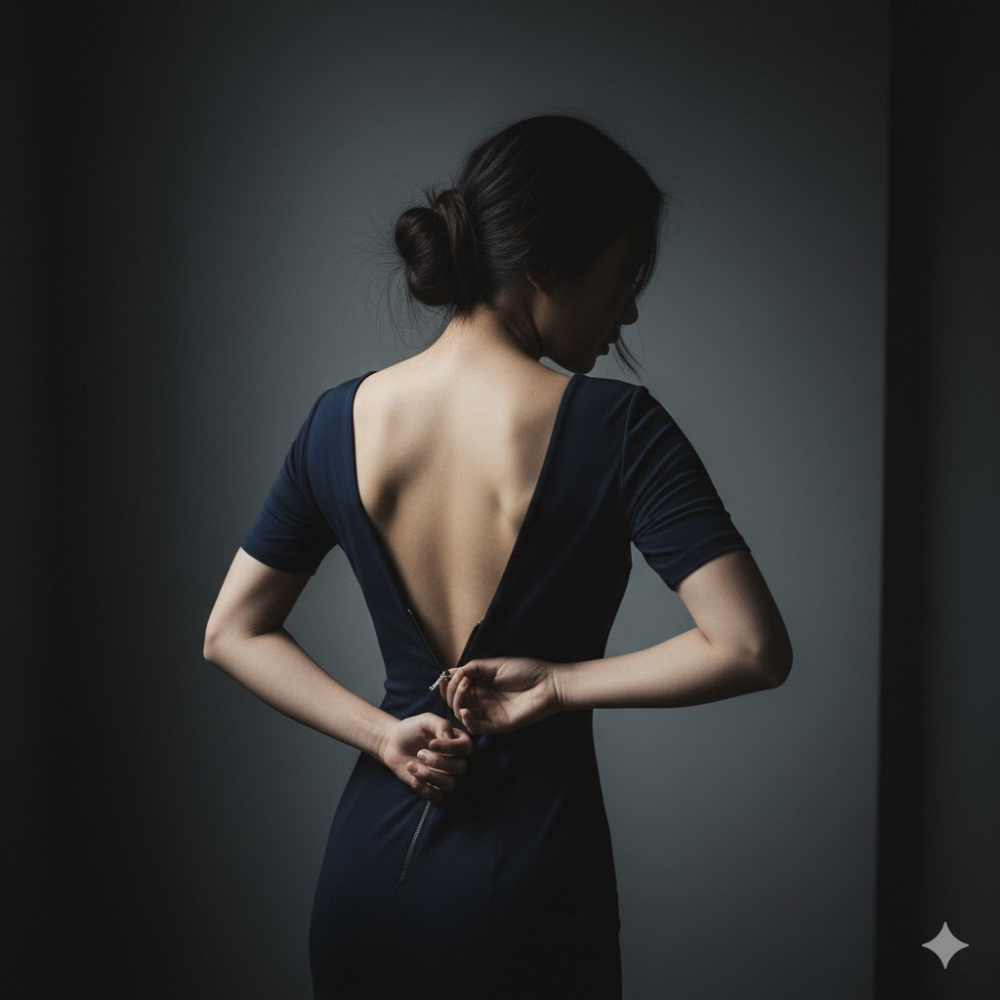

## 正在更衣的女生

- ID: gpt4o-392-zh-2
- Slug: prompt-392-zh-2
- 语言: zh
- 来源: [来源链接](https://x.com/songguoxiansen/status/1981178658397229294)
- 样例图路径: images/part3/392.jpeg

### 提示词

```text
{
“场景”： {
"location": "简约、黑暗的卧室或更衣室",
“背景”：“简单的深灰色墙壁，失焦”
}，
“主题”： {
"年龄": "成人",
"description": "东亚女性，优雅，头发松散，发髻散落，
"wardrobe": "一件简单的深色（例如黑色、海军蓝）合身连衣裙",
"accessories": "无",
"pose": "从后面拍摄，四分之三视角。她自己的手伸到后面，拉下拉链（例如，拉到她背部中间）。",
"expression": "（脸部大部分被遮挡或侧面）微妙、神秘、暧昧",
"gaze": "低头看着她的手或远离相机",
"body_notes": "照片般逼真的成人比例；背部的手部和皮肤纹理逼真"
}，
“相机”： {
“传感器”：“全帧”，
"焦距毫米": 100,
“aperture_f”：2.8，
“shutter_s”：0.01，
“iso”：400，
"白平衡k": 4500,
“距离_米”：2.0，
"相机高度米": 1.6,
"framing": "近距离中景拍摄（从头到腰），重点关注手、拉链和背部",
"focus": "手动对焦手和拉链"
}，
“灯光”： {
"key": "戏剧性的侧光（网格条灯）突出手部和脊柱",
"fill": "深阴影，非常低的填充",
"hair": "微妙的边缘光",
"notes": "低调、高对比度、“讲故事”的图像"
}，
“颜色等级”：{
"style": "电影化、喜怒无常、模棱两可",
"palette": "去饱和、冷色调、黑色、肤色",
"contrast": "高, "明暗对比"",
“饱和度”：“低”
}，
“化妆品”： {
"eyes": "(不可见)",
"cheeks": "(不可见)",
"lips": "(不可见)"
}，
“后处理”：{
"retouch": "保持自然的皮肤纹理，添加胶片颗粒感",
"clarity": "拉链和手部清晰度高",
"dodge_burn": "躲避脊柱、手和拉链头",
"vignette": "强烈的暗色调晕影"
}，
“艺术指导”：{
"mood": "感性、暧昧、神秘、亲密、安静",
“关键词”：[“照片写实”、“感性”、“模棱两可”、“拉链”、“低调”、“电影”、“亲密”]
}，
"negative_prompts": [
“nsfw”，
“未成年的样子”，
“文字或徽标”，
“塑料娃娃皮肤”，
“cg”，
“3D渲染”，
“日本动画片”，
“扭曲的手”，
“额外的手指”，
“肢体畸形”
]
}
```

### 样例图


## { "scene": { "location": "A bright, aesthetic cafe inter

- ID: gpt4o-391-en-1
- Slug: prompt-391-en-1
- 语言: en
- 来源: [来源链接](https://x.com/songguoxiansen/status/1981178596581658768)
- 样例图路径: images/part3/391.jpeg

### 提示词

```text
{
  "scene": {
    "location": "A bright, aesthetic cafe interior",
    "background": "Pastel-colored wall, a small potted plant on the table, window light"
  },
  "subject": {
    "age": "adult",
    "description": "East Asian woman, soft, wavy hair with air bangs",
    "wardrobe": "Cute pastel-colored blouse or off-the-shoulder top",
    "accessories": "Delicate layered necklaces, holding a latte or colorful drink",
    "pose": "Sitting at the table, leaning forward slightly, hands around the cup, as if listening intently",
    "expression": "Sweet, "first date" smile, slight head tilt, 'eye-smile'",
    "gaze": "Direct to camera (as if the viewer is her date)",
    "body_notes": "Photorealistic, realistic adult proportions; natural skin texture"
  },
  "camera": {
    "sensor": "full_frame",
    "focal_length_mm": 50,
    "aperture_f": 2.0,
    "shutter_s": 0.008,
    "iso": 250,
    "white_balance_k": 5600,
    "distance_m": 1.8,
    "camera_height_m": 1.4,
    "framing": "Medium close-up (chest-up), 'point-of-view' (POV) shot",
    "focus": "eye_detect_AF on nearest eye"
  },
  "lighting": {
    "key": "Large, soft window light from the front-side",
    "fill": "White bounce card or natural bounce from the table",
    "hair": "Gentle rim light",
    "catchlights": "Large, soft window catchlights",
    "notes": "Bright, airy, clean aesthetic"
  },
  "color_grade": {
    "style": "Ulzzang / 'Clean' aesthetic",
    "palette": "Pastels, white, skin tones; clear, luminous skin",
    "contrast": "Medium-low, clean shadows",
    "saturation": "Moderate, fresh"
  },
  "makeup": {
    "eyes": "Natural winged eyeliner ('puppy dog' style), highlighted aegyo-sal",
    "cheeks": "Peach gradient blush",
    "lips": "Glossy pink gradient lips"
  },
  "postprocess": {
    "retouch": "Professional 'glass skin' retouch (light, maintain pores)",
    "clarity": "Selective clarity on eyes, lips, and drink",
    "vignette": "Very subtle bright vignette"
  },
  "art_direction": {
    "mood": "Sweet, approachable, trendy, 'date' vibe",
    "keywords": ["photorealistic", "sweet girl", "cafe", "date", "Ulzzang", "eye-smile", "POV"]
  },
  "negative_prompts": [
    "nsfw",
    "underage look",
    "text or logos",
    "plastic doll skin",
    "cg",
    "3d render",
    "anime",
    "dark lighting",
    "sad expression"
  ]
}
```

### 样例图


## 咖啡厅室内女生

- ID: gpt4o-391-zh-2
- Slug: prompt-391-zh-2
- 语言: zh
- 来源: [来源链接](https://x.com/songguoxiansen/status/1981178596581658768)
- 样例图路径: images/part3/391.jpeg

### 提示词

```text
{
“场景”： {
“地点”：“明亮、美观的咖啡馆内部”，
“背景”：粉彩色的墙壁，桌上的一盆小植物，窗外的光线
}，
“主题”： {
“年龄”: “成人”
描述：东亚女性，头发柔软，微卷，留着蓬松的刘海。
“衣橱”： “可爱的粉彩色衬衫或露肩上衣”，
“配饰”：“精致的多层项链，配上一杯拿铁或色彩缤纷的饮品”，
“姿势”：“坐在桌旁，身体微微前倾，双手捧着杯子，仿佛在认真倾听”，
“表情”：“甜美的、‘初次约会’式的微笑，微微歪头，‘笑眼’”，
“凝视”：“直视镜头（仿佛观众是她的约会对象）”，
"body_notes": "逼真的成人比例；自然的皮肤纹理"
}，
“相机”： {
"传感器": "全帧",
"focal_length_mm": 50,
"aperture_f": 2.0,
"shutter_s": ​​0.008,
“iso”：250，
"white_balance_k": 5600,
"distance_m": 1.8,
"camera_height_m": 1.4,
“构图”：“中近景（胸部以上），‘主观’（POV）镜头”，
"focus": "eye_detect_AF on nearest eye"
}，
“灯光”： {
“关键”：“来自正面的大而柔和的窗户光线”，
“填充物”: “白色弹跳卡或桌面上的自然弹跳”，
“头发”：“柔和的边缘光”，
“眼神光”：“大而柔和的窗户眼神光”，
备注：明亮、通风、干净的美学风格
}，
"color_grade": {
"风格": "Ulzzang / 'Clean' 美学",
“调色板”：“柔和的粉彩色调、白色、肤色；清透、透亮的肌肤”，
“对比度”：“中低，干净的阴影”，
“饱和度”：“适中，清新”
}，
“化妆品”： {
“眼睛”：“自然上扬眼线（小狗眼线风格），高光卧蚕眼妆”，
“脸颊”: “蜜桃渐变腮红”
“嘴唇”： “亮粉色渐变唇妆”
}，
"后处理": {
“修图”：“专业‘玻璃肌’修图（轻微，保留毛孔）”
“清晰度”： “选择性地提高眼睛、嘴唇和饮料的清晰度”
“小景”： “非常微妙的明亮小景”
}，
“艺术指导”：{
“氛围”：“甜蜜、平易近人、时尚、‘约会’氛围”，
关键词：["写实", "甜美女孩", "咖啡馆", "约会", "韩系美女", "笑眼", "第一人称视角"]
}，
"negative_prompts": [
"nsfw",
“未成年样貌”，
“文字或标志”，
“塑料娃娃皮肤”，
“cg”，
“3D渲染”，
“日本动画片”，
“昏暗的照明”，
“悲伤的表情”
]
}
```

### 样例图


## { "scene": { "location": "Hyper-colorful studio", "backg

- ID: gpt4o-390-en-1
- Slug: prompt-390-en-1
- 语言: en
- 来源: [来源链接](https://x.com/songguoxiansen/status/1981178522988343619)
- 样例图路径: images/part3/390.jpeg

### 提示词

```text
{
  "scene": {
    "location": "Hyper-colorful studio",
    "background": "Pastel pink wall, decorated with 80s/90s retro toys (e.g., My Little Pony, Care Bears), vinyl records"
  },
  "subject": {
    "age": "adult",
    "description": "East Asian woman, rainbow pastel hair (wig), large, excited eyes",
    "wardrobe": "Layered pastel t-shirts (e.g., mint green over lavender), a pink tutu skirt, colorful striped leg warmers, pastel high-top sneakers",
    "accessories": "Excessive plastic jewelry: beaded necklaces, star bracelets, large bow in hair",
    "pose": "High-energy, mid-jump or one leg popped high, arms up in excitement, peace signs",
    "expression": "Hyper, excited, huge open-mouthed smile, 'genki'",
    "gaze": "Direct to camera, full of energy",
    "body_notes": "realistic adult proportions; natural skin texture"
  },
  "camera": {
    "sensor": "full_frame",
    "focal_length_mm": 35,
    "aperture_f": 4.0,
    "shutter_s": 0.008,
    "iso": 200,
    "white_balance_k": 5000,
    "distance_m": 3.0,
    "camera_height_m": 1.0,
    "framing": "Full body, capturing the dynamic pose",
    "focus": "eye_detect_AF on nearest eye"
  },
  "lighting": {
    "key": "Bright, even, "pop" lighting (on-axis beauty dish or ring flash)",
    "fill": "Two large softboxes on sides, eliminating shadows",
    "hair": "Simple top light",
    "catchlights": "Distinctive ring light catchlight",
    "notes": "High-key, flat, "magazine pop" style"
  },
  "color_grade": {
    "style": "Fairy Kei, 80s pastel-pop",
    "palette": "All pastels: pink, lavender, mint, yellow; bright, clear skin",
    "contrast": "Medium, very clean",
    "saturation": "High saturation on all pastels"
  },
  "makeup": {
    "eyes": "Bright pastel eyeshadow (e.g., blue), winged liner, glitter",
    "cheeks": "Bright pink blush, maybe small face stickers (e.g., stars)",
    "lips": "Bubblegum pink glossy lips"
  },
  "postprocess": {
    "retouch": "Clean skin",
    "clarity": "High clarity on all accessories and clothing layers",
    "dodge_burn": "Minimal, keep lighting flat and bright",
    "vignette": "None"
  },
  "art_direction": {
    "mood": "Hyper, energetic, nostalgic, colorful, bubbly",
    "keywords": ["Fairy Kei", "Harajuku", "pastel", "80s", "retro toys", "colorful", "bubbly"]
  },
  "negative_prompts": [
    "nsfw",
    "underage look",
    "text or logos",
    "plastic doll skin",
    "warped hands or extra fingers",
    "deformed limbs",
    "dark colors",
    "Goth",
    "sad expression"
  ]
}
```

### 样例图


## 彩虹色发型女生

- ID: gpt4o-390-zh-2
- Slug: prompt-390-zh-2
- 语言: zh
- 来源: [来源链接](https://x.com/songguoxiansen/status/1981178522988343619)
- 样例图路径: images/part3/390.jpeg

### 提示词

```text
{
“场景”： {
“地点”：“色彩缤纷的工作室”，
“背景”：“粉色墙面，装饰着 80 年代/90 年代的复古玩具（例如，小马宝莉、爱心熊）、黑胶唱片”
}，
“主题”： {
“年龄”: “成人”
描述：东亚女性，彩虹色假发，大而兴奋的眼睛。
“衣橱”： “层叠的粉彩色T恤（例如，薄荷绿叠穿薰衣草色），粉色芭蕾舞裙，彩色条纹腿套，粉彩色高帮运动鞋”，
“配饰”：“过多的塑料首饰：串珠项链、星星手镯、头发上的大蝴蝶结”，
“姿势”：“充满活力，跳跃或单腿高高抬起，兴奋地举起双臂，比出和平手势”，
“表情”：“亢奋、兴奋、咧嘴大笑，‘元气’”，
“凝视”：“直视镜头，充满活力”，
"body_notes": "逼真的成人比例；自然的皮肤纹理"
}，
“相机”： {
"传感器": "全帧",
"focal_length_mm": 35,
"aperture_f": 4.0,
"shutter_s": ​​0.008,
“iso”：200，
"white_balance_k": 5000,
"distance_m": 3.0,
"camera_height_m": 1.0,
“构图”：“全身照，捕捉动态姿态”，
"focus": "eye_detect_AF on nearest eye"
}，
“灯光”： {
“关键”： “明亮、均匀、‘突出’的照明（轴向柔光罩或环形闪光灯）”，
“填充”：“两侧各有一个大型柔光箱，消除阴影”，
“头发”：“简单的顶光”，
“眼神光”： “独特的环形灯光眼神光”，
备注：高调、平淡、杂志流行风格
}，
"color_grade": {
“风格”：“仙女系，80年代粉彩流行”
“调色板”：“所有柔和的粉彩色调：粉色、薰衣草色、薄荷色、黄色；明亮、清透的肌肤”，
“对比度”：“中等，非常干净”，
“饱和度”：所有粉彩色调都具有高饱和度
}，
“化妆品”： {
“眼睛”：“明亮的粉彩色眼影（例如蓝色），上扬的眼线，闪粉”，
“脸颊”：“亮粉色腮红，也许可以贴一些小贴纸（例如星星）”，
“嘴唇”： “泡泡糖粉色亮泽嘴唇”
}，
"后处理": {
“修饰”: “干净的皮肤”，
“清晰度”：“所有配饰和服装层都具有高清晰度”，
"dodge_burn": "极简，保持光线平整明亮"
“小插曲”： “无”
}，
“艺术指导”：{
“情绪”： “亢奋、精力充沛、怀旧、色彩缤纷、活泼”
关键词：[“仙女系”、“原宿”、“粉彩”、“80年代”、“复古玩具”、“色彩缤纷”、“活泼”]
}，
"negative_prompts": [
"nsfw",
“未成年样貌”，
“文字或标志”，
“塑料娃娃皮肤”，
“畸形手或多余手指”，
“肢体畸形”，
“暗色”，
“哥特式”
“悲伤的表情”
]
}
```

### 样例图


## { "scene": { "location": "Themed 'Maid Cafe' interior, f

- ID: gpt4o-389-en-1
- Slug: prompt-389-en-1
- 语言: en
- 来源: [来源链接](https://x.com/songguoxiansen/status/1981178453216137391)
- 样例图路径: images/part3/389.jpeg

### 提示词

```text
{
  "scene": {
    "location": "Themed 'Maid Cafe' interior, focused and clean",
    "background": "Bright pink walls, checkered floor, subtle hearts and ruffle decorations (soft focus, no distracting elements)"
  },
  "subject": {
    "age": "adult",
    "description": "Realistic East Asian woman, dark hair in high twin-tails with ribbons, sparkling, energetic eyes",
    "wardrobe": "Classic black maid dress with a short skirt, pristine white frilly apron, knee-high white socks with bows",
    "accessories": "Frilly maid headband, ribbons in hair",
    "pose": "Full body, dynamic 'moe moe kyun' pose; both hands making a heart gesture, one foot popped, slight bow",
    "expression": "Extremely energetic, wide-eyed 'kawaii' smile, 'genki' (energetic) personality",
    "gaze": "Direct to camera, engaging and cheerful",
    "body_notes": "realistic adult proportions; natural skin texture"
  },
  "camera": {
    "sensor": "full_frame",
    "focal_length_mm": 35,
    "aperture_f": 2.8,
    "shutter_s": 0.008,
    "iso": 400,
    "white_balance_k": 5000,
    "distance_m": 3.0,
    "camera_height_m": 1.0,
    "framing": "Full body shot, slightly low angle to enhance cuteness and energy",
    "focus": "eye_detect_AF on nearest eye"
  },
  "lighting": {
    "key": "Bright, even, slightly flat studio lighting (simulating cafe interior)",
    "fill": "Large softboxes from both sides to eliminate shadows",
    "hair": "Top-down rim light to separate hair",
    "catchlights": "Multiple, large, bright catchlights",
    "notes": "Very bright, 'pop' lighting, high-key"
  },
  "color_grade": {
    "style": "Akihabara-pop, vibrant",
    "palette": "Bright pink, black, white; clear, bright skin",
    "contrast": "Medium, very clean and crisp",
    "saturation": "High saturation"
  },
  "makeup": {
    "eyes": "Emphasized 'anime' eyes, prominent aegyo-sal, long upper and lower lashes",
    "cheeks": "Bright pink, circular blush",
    "lips": "High-gloss pink or red lip tint"
  },
  "postprocess": {
    "retouch": "Clean skin retouching, "idol" level",
    "clarity": "High clarity on eyes, apron ruffles, and hair",
    "dodge_burn": "Dodge on eyes to make them sparkle",
    "vignette": "None"
  },
  "art_direction": {
    "mood": "Energetic, cheerful, adorable, welcoming",
    "keywords": ["maid cafe", "moe", "kawaii", "twin-tails", "heart gesture", "Akihabara"]
  },
  "negative_prompts": [
    "nsfw",
    "underage look",
    "text or logos",
    "plastic doll skin",
    "warped hands or extra fingers",
    "deformed limbs",
    "dark or moody",
    "French maid (Victorian)",
    "sad expression",
    "cluttered background",
    "photography equipment",
    "lighting equipment"
  ]
}
```

### 样例图


## 双马尾比心女生

- ID: gpt4o-389-zh-2
- Slug: prompt-389-zh-2
- 语言: zh
- 来源: [来源链接](https://x.com/songguoxiansen/status/1981178453216137391)
- 样例图路径: images/part3/389.jpeg

### 提示词

```text
{
“场景”： {
“地点”：“以女仆咖啡厅为主题的室内设计，简洁明了”，
“背景”：“亮粉色的墙壁，格子地板，精致的心形和褶皱装饰（柔焦，无分散注意力的元素）”
}，
“主题”： {
“年龄”: “成人”
“描述”：“一位写实的东亚女性，深色头发扎成高高的双马尾，用丝带系着，眼睛闪亮而充满活力。”
“服装”：“经典的黑色女仆装，短裙，洁白的褶边围裙，带蝴蝶结的白色过膝袜”，
“配饰”：“褶边女仆头带，头发上的丝带”，
“姿势”：“全身动态‘萌萌哒’姿势；双手比心，一只脚翘起，微微鞠躬”
“表情”：“活力四射，睁大眼睛露出‘可爱’的笑容，‘元气’（精力充沛）的性格”，
“眼神”：“直视镜头，专注而快乐”，
"body_notes": "逼真的成人比例；自然的皮肤纹理"
}，
“相机”： {
"传感器": "全帧",
"focal_length_mm": 35,
"aperture_f": 2.8,
"shutter_s": ​​0.008,
“iso”：400，
"white_balance_k": 5000,
"distance_m": 3.0,
"camera_height_m": 1.0,
“构图”：“全身照，略微低角度拍摄，以增强可爱和活力”，
"focus": "eye_detect_AF on nearest eye"
}，
“灯光”： {
“关键”： “明亮、均匀、略微平淡的影棚照明（模拟咖啡馆内部）”
“填充”：“从两侧使用大型柔光箱以消除阴影”，
“头发”： “自上而下的边缘光，用于分离头发”，
“眼神光”： “多个、大、明亮的眼神光”，
备注：非常明亮、流行风格的灯光，高调
}，
"color_grade": {
风格： “秋叶原流行，充满活力”
“调色板”：“亮粉色、黑色、白色；清透、明亮的肌肤”
“对比度”：“中等，非常干净清晰”，
“饱和度”: “高饱和度”
}，
“化妆品”： {
“眼睛”： “强调‘动漫’眼睛，突出卧蚕，上下睫毛长”，
“脸颊”：“亮粉色，圆形腮红”，
“唇部”： “高光泽粉色或红色唇彩”
}，
"后处理": {
“修图”：“干净的皮肤修图，‘偶像’级别”，
“清晰度”：“眼睛、围裙褶边和头发的清晰度很高”，
"dodge_burn": "在眼睛上加闪，使它们闪闪发光",
“小插曲”： “无”
}，
“艺术指导”：{
“情绪”：“充满活力、开朗、可爱、热情好客”
关键词：["女仆咖啡厅", "萌", "可爱", "双马尾", "爱心手势", "秋叶原"]
}，
"negative_prompts": [
"nsfw",
“未成年样貌”，
“文字或标志”，
“塑料娃娃皮肤”，
“畸形手或多余手指”，
“肢体畸形”，
“阴郁或忧郁的”，
“法国女仆（维多利亚时代）”
“悲伤的表情”，
“杂乱的背景”，
“摄影器材”，
“照明设备”
]
}
```

### 样例图


## { "scene": { "location": "Bedroom, in bed", "background"

- ID: gpt4o-388-en-1
- Slug: prompt-388-en-1
- 语言: en
- 来源: [来源链接](https://x.com/songguoxiansen/status/1981178369262964886)
- 样例图路径: images/part3/388.jpeg

### 提示词

```text
{
  "scene": {
    "location": "Bedroom, in bed",
    "background": "White pillows and soft, rumpled bedsheets, soft morning light"
  },
  "subject": {
    "age": "adult",
    "description": "East Asian woman, beautiful 'just woke up' messy hair, sleepy eyes",
    "wardrobe": "Simple, thin-strap camisole (e.g., silk or cotton), strap slightly falling off one shoulder",
    "accessories": "None",
    "pose": "Lying on her stomach in bed, propped up on her elbows, looking at the camera",
    "expression": "Soft, sleepy smile, intimate, 'good morning' look",
    "gaze": "Direct to camera, soft and alluring",
    "body_notes": "Photorealistic, realistic adult proportions; natural skin texture, visible collarbones, 'sleepy' flush"
  },
  "camera": {
    "sensor": "full_frame",
    "focal_length_mm": 50,
    "aperture_f": 1.8,
    "shutter_s": 0.01,
    "iso": 400,
    "white_balance_k": 5500,
    "distance_m": 1.5,
    "camera_height_m": 0.8,
    "framing": "Close-up (chest-up), at eye level with her",
    "focus": "eye_detect_AF on nearest eye"
  },
  "lighting": {
    "key": "Large, diffused window light from the side, creating very soft shadows",
    "fill": "Bounced light from the white sheets",
    "hair": "Soft halo from the window",
    "catchlights": "Large, soft window catchlights",
    "notes": "Very soft, high-key, intimate"
  },
  "color_grade": {
    "style": "Intimate, soft, 'morning' aesthetic",
    "palette": "Whites, skin tones, pastels; soft, luminous skin",
    "contrast": "Very low, dreamy",
    "saturation": "Moderate, soft"
  },
  "makeup": {
    "eyes": "None, 'bare face' look",
    "cheeks": "Natural, sleepy flush",
    "lips": "Natural, hydrated"
  },
  "postprocess": {
    "retouch": "Professional retouching, maintain "real skin" look",
    "clarity": "Selective clarity on eyes and lashes",
    "dodge_burn": "Subtle dodge on eyes and collarbone",
    "vignette": "Subtle, bright vignette"
  },
  "art_direction": {
    "mood": "Flirty, intimate, ambiguous, soft, sleepy, alluring",
    "keywords": ["photorealistic", "flirty", "morning", "in bed", "ambiguous", "natural beauty", "sleepy"]
  },
  "negative_prompts": [
    "nsfw",
    "underage look",
    "text or logos",
    "plastic doll skin",
    "cg",
    "3d render",
    "anime",
    "heavy makeup",
    "warped hands"
  ]
}
```

### 样例图


## 白色枕头上的睡眼惺忪女孩

- ID: gpt4o-388-zh-2
- Slug: prompt-388-zh-2
- 语言: zh
- 来源: [来源链接](https://x.com/songguoxiansen/status/1981178369262964886)
- 样例图路径: images/part3/388.jpeg

### 提示词

```text
{
“场景”： {
"location": "卧室，在床上",
"background": "白色枕头、柔软、皱巴巴的床单、柔和的晨光"
}，
“主题”： {
"年龄": "成人",
"description": "东亚女子，美丽的‘刚睡醒’凌乱的头发，睡眼惺忪的眼睛",
"wardrobe": "简单的细肩带吊带背心（例如丝绸或棉质），肩带略微从一侧肩膀垂下",
"accessories": "无",
"pose": "趴在床上，用手肘支撑身体，看着镜头",
"expression": "温柔、困倦的微笑、亲密的‘早上好’表情",
"gaze": "直视镜头，柔和而诱人",
"body_notes": "照片般逼真的成人比例；自然的皮肤纹理，清晰可见的锁骨，‘困倦’的红晕"
}，
“相机”： {
“传感器”：“全帧”，
"焦距毫米": 50,
“aperture_f”：1.8，
“shutter_s”：0.01，
“iso”：400，
"白平衡k": 5500,
“距离米”：1.5，
“相机高度”：0.8，
"framing": "特写（胸部以上），与她视线齐平",
“focus”：“eye_detect_AF 在最近的眼睛上”
}，
“灯光”： {
"key": "从侧面射入的大型漫射窗光，形成非常柔和的阴影",
"fill": "从白色床单反射的光线",
"hair": "窗户透出的柔和光晕",
"catchlights": "大而柔和的窗户聚光灯",
"notes": "非常柔软，高调，亲密"
}，
“颜色等级”：{
"style": "亲密、柔和、‘早晨’美学",
"palette": "白色、肤色、粉彩色；柔软、明亮的皮肤",
"contrast": "非常低，梦幻",
"saturation": "中等，柔和"
}，
“化妆品”： {
"eyes": "无，‘素颜’样子",
"cheeks": "自然、困倦的红晕",
"lips": "自然、水润"
}，
“后处理”：{
"retouch": "专业修图，保持“真实肌肤”外观",
"clarity": "选择性地清晰眼睛和睫毛",
"dodge_burn": "眼睛和锁骨处细微减淡",
"vignette": "微妙、明亮的小插图"
}，
“艺术指导”：{
"mood": "轻浮、亲密、暧昧、柔和、困倦、诱人",
"keywords": ["照片写实", "调情", "早晨", "在床上", "模棱两可", "自然美", "困倦"]
}，
"negative_prompts": [
“nsfw”，
“未成年的样子”，
“文字或徽标”，
“塑料娃娃皮肤”，
“cg”，
“3D渲染”，
“日本动画片”，
“浓妆艳抹”，
“扭曲的手”
]
}
```

### 样例图


## { "scene": { "location": "Bright photo studio", "backgro

- ID: gpt4o-387-en-1
- Slug: prompt-387-en-1
- 语言: en
- 来源: [来源链接](https://x.com/songguoxiansen/status/1981178292276527584)
- 样例图路径: images/part3/387.jpeg

### 提示词

```text
{
"scene": {
    "location": "Bright photo studio",
    "background": "Solid, high-saturation macaroon pink seamless background"
  },
  "subject": {
    "age": "adult",
    "description": "East Asian woman, long curly caramel-colored hair with sparkling gold highlights, confident 'idol' gaze",
    "wardrobe": "Sparkly 'idol' stage outfit: pink plaid pleated skirt, cropped top with white lace trim, large bow on chest, sequin details",
    "accessories": "White lace wrist gloves, sparkly star-shaped hair clips, one hand holding a retro silver microphone (as a prop)",
    "pose": "Full body, classic idol pose: one hand on hip, other hand making a heart gesture near cheek, S-curve posture, confident",
    "expression": "Perfect, bright 'professional' smile, sparkling eyes, full of charm",
    "gaze": "Direct to camera (engaging with fans)",
    "body_notes": "realistic adult proportions; natural skin texture"
  },
  "camera": {
    "sensor": "full_frame",
    "focal_length_mm": 70,
    "aperture_f": 3.2,
    "shutter_s": 0.008,
    "iso": 100,
    "white_balance_k": 5200,
    "distance_m": 4.0,
    "camera_height_m": 1.1,
    "framing": "Full body shot, with enough space to show the pose",
    "focus": "eye_detect_AF on nearest eye"
  },
  "lighting": {
    "key": "Large ring flash, creating the iconic ring catchlight",
    "fill": "Two large softboxes on the sides, providing even, high-key 'K-pop' lighting",
    "hair": "Hard light from high-behind to create shiny hair highlights",
    "catchlights": "Clear ring-shaped catchlights",
    "notes": "High-key, bright, no shadows, emphasize sparkly texture of outfit"
  },
  "color_grade": {
    "style": "K-Pop / J-Pop Idol, high-key kawaii",
    "palette": "Bright pink, white, caramel; flawless 'glass skin'",
    "contrast": "Medium, very clean",
    "saturation": "High saturation, vibrant"
  },
  "makeup": {
    "eyes": "Stage makeup: thick false lashes, sparkly liquid eyeshadow, highlighted aegyo-sal",
    "cheeks": "Bright strawberry-pink blush",
    "lips": "High-gloss gradient 'juicy lips'"
  },
  "postprocess": {
    "retouch": "Highly refined skin retouching, but maintain pore texture (not plastic)",
    "clarity": "Enhance clarity on sequins, eyes, lips, and hair highlights",
    "dodge_burn": "Micro dodge on aegyo-sal, nose bridge, and collarbones",
    "vignette": "None, keep background clean"
  },
  "art_direction": {
    "mood": "Sparkly, confident, energetic, sweet idol",
    "keywords": ["idol", "K-Pop", "J-Pop", "stage outfit", "heart gesture", "sparkly"]
  },
  "negative_prompts": [
    "nsfw",
    "underage look",
    "text or logos",
    "plastic doll skin",
    "warped hands or extra fingers",
    "deformed limbs",
    "dark or moody lighting",
    "plain clothing",
    "sad expression"
  ]
}
```

### 样例图


## 握着复古银色麦克风女生

- ID: gpt4o-387-zh-2
- Slug: prompt-387-zh-2
- 语言: zh
- 来源: [来源链接](https://x.com/songguoxiansen/status/1981178292276527584)
- 样例图路径: images/part3/387.jpeg

### 提示词

```text
{
“场景”： {
"location": "明亮摄影工作室",
"background": "纯色、高饱和度的马卡龙粉色无缝背景"
}，
“主题”： {
"年龄": "成人",
"description": "东亚女性，长长的卷曲焦糖色头发，带有闪亮的金色亮点，自信的“偶像”目光",
"wardrobe": "闪亮的‘偶像’舞台装：粉色格子百褶裙，白色蕾丝边短款上衣，胸前大蝴蝶结，亮片细节",
"accessories": "白色蕾丝腕手套，闪亮的星形发夹，一只手拿着复古的银色麦克风（作为道具）",
"pose": "全身，经典偶像姿势：一只手叉腰，另一只手在脸颊附近做爱心手势，S 形曲线，自信",
"expression": "完美、灿烂的‘专业’笑容，闪亮的眼睛，充满魅力",
"gaze": "直视镜头（与粉丝互动）",
"body_notes": "逼真的成人比例；自然的皮肤纹理"
}，
“相机”： {
“传感器”：“全帧”，
"焦距毫米": 70,
"aperture_f": 3.2,
“shutter_s”：0.008，
"iso": 100,
"白平衡k": 5200,
“距离米”：4.0，
"camera_height_m": 1.1,
"framing": "全身照，留出足够的空间来展示姿势",
“focus”：“eye_detect_AF 在最近的眼睛上”
}，
“灯光”： {
"key": "大型环形闪光灯，营造标志性的环形眼神光",
"fill": "两侧有两个大型柔光箱，提供均匀、高调的“K-pop”照明",
"hair": "从高处照射强光，打造闪亮的头发亮点",
"catchlights": "透明环形眼神光",
"notes": "高调、明亮、无阴影，强调服装的闪亮质感"
}，
“颜色等级”：{
"style": "K-Pop / J-Pop 偶像，高调可爱",
"palette": "亮粉色、白色、焦糖色；完美无瑕的‘玻璃肌肤’",
"contrast": "中等，非常干净",
"saturation": "高饱和度，鲜艳"
}，
“化妆品”： {
"eyes": "舞台妆：浓密的假睫毛、闪亮的液体眼影、高光的撒娇眼影",
"cheeks": "明亮的草莓粉色腮红",
"lips": "高光渐变‘水润双唇’"
}，
“后处理”：{
"retouch": "高度精致的皮肤修饰，但保持毛孔纹理（不是塑料）",
"clarity": "增强亮片、眼睛、嘴唇和头发亮点的清晰度",
"dodge_burn": "对撒娇、鼻梁和锁骨进行微减淡",
"vignette": "无，保持背景干净"
}，
“艺术指导”：{
"mood": "闪亮、自信、活力、甜美的偶像",
"keywords": ["偶像", "K-Pop", "J-Pop", "舞台服装", "心形手势", "闪亮"]
}，
"negative_prompts": [
“nsfw”，
“未成年的样子”，
“文字或徽标”，
“塑料娃娃皮肤”，
“弯曲的手或多余的手指”，
“畸形肢体”，
“昏暗或阴郁的灯光”，
“便衣”，
“悲伤的表情”
]
}
```

### 样例图


## { "scene": { "location": "cozy bedroom corner", "backgro

- ID: gpt4o-386-en-1
- Slug: prompt-386-en-1
- 语言: en
- 来源: [来源链接](https://x.com/songguoxiansen/status/1982984662747373744)
- 样例图路径: images/part3/386.jpeg

### 提示词

```text
{
  "scene": {
    "location": "cozy bedroom corner",
    "background": "soft-focus string of fairy lights against a pastel lavender wall"
  },
  "subject": {
    "age": "adult",
    "description": "East Asian women, messy shoulder-length dark hair, sleepy-looking soft brown eyes",
    "wardrobe": "oversized, fluffy fleece pajama set (onesie or two-piece) in pastel peach, with a hood featuring animal ears (e.g., bunny)",
    "accessories": "holding a large, cute teddy bear plush toy, wearing fuzzy socks",
    "pose": "sitting on the floor, knees pulled up to chest, hugging the teddy bear, hood with ears is up",
    "expression": "soft, sleepy pout, 'puffy' cheeks, half-smile, radiating comfort",
    "gaze": "direct to camera, soft and inviting",
    "body_notes": "realistic adult proportions; natural skin texture, relaxed posture"
  },
  "camera": {
    "sensor": "full_frame",
    "focal_length_mm": 50,
    "aperture_f": 1.8,
    "shutter_s": 0.0125,
    "iso": 640,
    "white_balance_k": 4800,
    "distance_m": 2.5,
    "camera_height_m": 0.8,
    "framing": "medium shot, from head to knees, emphasizing the plush toy and pajamas",
    "focus": "eye_detect_AF on nearest eye"
  },
  "lighting": {
    "key": "soft, warm light from a nearby lamp (out of frame), simulating evening",
    "fill": "ambient light from the fairy lights, creating small bokeh highlights",
    "hair": "subtle glow on hair from fairy lights",
    "catchlights": "multiple small, warm catchlights from fairy lights",
    "notes": "warm, intimate, very soft, 'golden hour' indoor feel"
  },
  "color_grade": {
    "style": "cozy & cute, soft-glam",
    "palette": "pastel peach, lavender, warm creams; glowing skin",
    "contrast": "low, dreamy, slightly hazy",
    "saturation": "moderate"
  },
  "makeup": {
    "eyes": "minimal, 'no-makeup' makeup, slightly smudged soft brown liner",
    "cheeks": "flushed pink blush, as if warm",
    "lips": "hydrated, natural pink lip tint"
  },
  "postprocess": {
    "retouch": "very light skin softening, maintain pores",
    "clarity": "selective clarity on eyes and plush toy texture",
    "dodge_burn": "gentle dodge on cheeks and nose bridge",
    "vignette": "soft, warm vignette to draw focus"
  },
  "art_direction": {
    "mood": "cozy, sleepy, adorable, intimate",
    "keywords": ["pajama", "plush toy", "fairy lights", "cozy", "animal ears"]
  },
  "negative_prompts": [
    "nsfw",
    "underage look",
    "text or logos",
    "plastic doll skin",
    "warped hands or extra fingers",
    "deformed limbs",
    "bright daylight",
    "sharp shadows",
    "cluttered room"
  ]
}
```

### 样例图

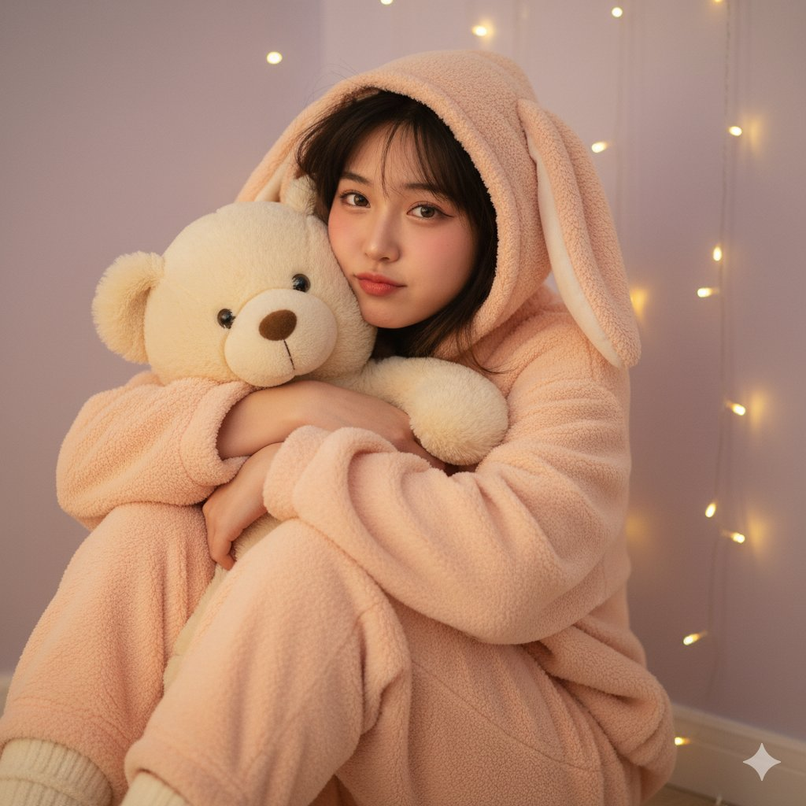

## 淡桃粉色宽松毛绒睡衣女孩

- ID: gpt4o-386-zh-2
- Slug: prompt-386-zh-2
- 语言: zh
- 来源: [来源链接](https://x.com/songguoxiansen/status/1982984662747373744)
- 样例图路径: images/part3/386.jpeg

### 提示词

```text
{
“场景”： {
"location": "舒适的卧室角落",
“背景”：“柔和焦点的仙女灯串映衬着淡紫色的墙壁”
}，
“主题”： {
"年龄": "成人",
"description": "东亚女性，凌乱的齐肩黑发，睡眼惺忪的柔和棕色眼睛",
"wardrobe": "超大蓬松羊毛睡衣套装（连体衣或两件套），淡桃色，带动物耳朵图案（例如兔子）的兜帽",
"accessories": "抱着一只大大的、可爱的泰迪熊毛绒玩具，穿着毛茸茸的袜子",
"pose": "坐在地板上，膝盖拉到胸前，抱着泰迪熊，带耳朵的帽子向上",
"expression": "柔软、困倦的嘟嘴、‘浮肿’的脸颊、半微笑、散发着舒适感",
"gaze": "直视镜头，柔和而诱人",
"body_notes": "逼真的成人比例；自然的皮肤纹理，放松的姿势"
}，
“相机”： {
“传感器”：“全帧”，
"焦距毫米": 50,
“aperture_f”：1.8，
“shutter_s”：0.0125，
"iso": 640,
"白平衡k": 4800,
“距离米”：2.5，
“相机高度”：0.8，
"framing": "中景，从头到膝盖，突出毛绒玩具和睡衣",
“focus”：“eye_detect_AF 在最近的眼睛上”
}，
“灯光”： {
"key": "附近灯光发出的柔和、温暖的光线（画面外），模拟夜晚",
"fill": "来自仙女灯的环境光，创造出小的散景高光",
"hair": "仙女灯在头发上散发出微妙的光芒",
"catchlights": "来自仙女灯的多个小而温暖的眼神光",
“注释”：“温暖、亲密、非常柔软、‘黄金时段​​’室内感觉”
}，
“颜色等级”：{
"style": "舒适可爱，柔和迷人",
"palette": "淡桃色、薰衣草色、暖色乳霜；容光焕发的肌肤",
"contrast": "低，梦幻，略带朦胧",
“饱和度”：“中等”
}，
“化妆品”： {
"eyes": "极简主义的‘素颜’妆容，略微晕染的柔和棕色眼线笔",
“脸颊”：“泛着粉红色的腮红，仿佛温暖”，
"lips": "水润自然的粉色唇彩"
}，
“后处理”：{
"retouch": "非常轻微的皮肤柔化，维持毛孔",
“清晰度”：“眼睛和毛绒玩具纹理的选择性清晰度”，
"dodge_burn": "在脸颊和鼻梁上轻轻减淡",
"vignette": "柔和、温暖的晕影来吸引焦点"
}，
“艺术指导”：{
"mood": "舒适、困倦、可爱、亲密",
"keywords": ["睡衣", "毛绒玩具", "仙女灯", "舒适", "动物耳朵"]
}，
"negative_prompts": [
“nsfw”，
“未成年的样子”，
“文字或徽标”，
“塑料娃娃皮肤”，
“弯曲的手或多余的手指”，
“畸形肢体”，
“明亮的日光”，
“清晰的阴影”，
“杂乱的房间”
]
}
```

### 样例图


## Create a hyper-real macro photograph of a tiny (CHARACTE

- ID: gpt4o-383-en-1
- Slug: prompt-383-en-1
- 语言: en
- 来源: [来源链接](https://x.com/Samann_ai/status/1982774584198991988)
- 样例图路径: images/part3/383.jpeg

### 提示词

```text
Create a hyper-real macro photograph of a tiny (CHARACTER) about 10–12 cm tall, gently held between a real human thumb and index finger or sitting on the fingertip. The character naturally touches the thumb for scale and holds (ACCESSORY). Studio setting with a soft grey gradient background, subtle bokeh. Skin, fabric and hair show micro-texture; add accurate contact shadows where fingers meet the character. Lighting: softbox at 45°, faint rim light on the far side; no harsh glare. Camera look: 100mm macro • f/2.8 • ISO 100 • 1/160s (shallow depth of field; eyes perfectly in focus). Hands look clean, natural anatomy, 5 fingers, realistic nails and pores. The character’s outfit is simple textured knit (dark grey) unless the identity demands otherwise; proportions and perspective must read real, not toy. Treat (CHARACTER) respectfully and keep likeness faithful if based on a real person. Composition: subject centered, from mid-torso up, with the thumb and index framing the character;
```

### 样例图


## 一张超现实的微距照片

- ID: gpt4o-383-zh-2
- Slug: prompt-383-zh-2
- 语言: zh
- 来源: [来源链接](https://x.com/Samann_ai/status/1982774584198991988)
- 样例图路径: images/part3/383.jpeg

### 提示词

```text
创建一张超现实的微距照片，照片中一个约 10-12 厘米高的微小（角色），轻轻地放在真人的拇指和食指之间或放在指尖上。角色自然地触摸拇指以进行缩放并握住（配件）。工作室设置具有柔和的灰色渐变背景，微妙的散景。皮肤、织物和头发显示微观纹理；在手指与角色接触的地方添加准确的接触阴影。照明：45° 柔光箱，远端微弱的边缘光；无刺眼眩光。相机外观：100mm 微距 • f/2.8 • ISO 100 • 1/160s（浅景深；眼睛完美对焦）。手看起来干净，解剖自然，5 个手指，逼真的指甲和毛孔。除非身份另有要求，否则角色的服装是简单的纹理针织（深灰色）；比例和透视必须是真实的，而不是玩具。尊重地对待（角色），如果基于真人，则保持相似性。构图：以主体为中心，从躯干中部向上，用拇指和食指框住人物；
```

### 样例图


## A 3D chibi-style vinyl collectible figure of [CHARACTER 

- ID: gpt4o-382-en-1
- Slug: prompt-382-en-1
- 语言: en
- 来源: [来源链接](https://x.com/Arminn_Ai/status/1982860799879114903)
- 样例图路径: images/part3/382.jpeg

### 提示词

```text
A 3D chibi-style vinyl collectible figure of [CHARACTER NAME] Big head, small body, cartoon proportion, Standing inside a Youtooz-style
packaging box with: Transparent front window
"YOUTOOZ COLLECTIBLES" logo on the top
Number label ([#XXX]) on the top-left
Bottom front text: “[CHARACTER NAME]” and lower with smaller font “VINYL FIGURE”
Cartoon 2D illustration of [CHARACTER NAME] on the side of the box ([ILLUSTRATION DESCRIPTION])

Background/theme:
[BOX COLORS + TEXTURES + ICONIC MOTIFS RELATED TO CHARACTER] 
[Figure POSE OR GESTURE] 
[Outfit DESCRIPTION + SIGNATURE ITEMS]

Face details: The facial features (mouth/eyes/details) must be fully 3D sculpted, not flat or printed.
Lighting: clean product photography look, minimal soft shadows
Style: vinyl-toy aesthetic with a mix of matte + glossy accents depending on costume, Composition: 3/4 product shot view, full box visible. The entire packaging box must be fully visible inside the frame with a clean margin around all edges.
```

### 样例图


## 3D chibi风格乙烯基收藏品

- ID: gpt4o-382-zh-2
- Slug: prompt-382-zh-2
- 语言: zh
- 来源: [来源链接](https://x.com/Arminn_Ai/status/1982860799879114903)
- 样例图路径: images/part3/382.jpeg

### 提示词

```text
3D chibi 风格乙烯基收藏品 [CHARACTER NAME] 大头，小身体，卡通比例，站在 Youtooz 风格的
包装盒带有：透明前窗
顶部有“YOUTOOZ COLLECTIBLES”标志
左上角的数字标签（[#XXX]）
底部文字：“[CHARACTER NAME]” 下方用较小的字体写着“VINYL FIGURE”
盒子侧面的 [角色名称] 卡通 2D 插图（[插图描述]）

背景/主题：
[盒子颜色 + 纹理 + 与角色相关的标志性图案]
[人物姿势或手势]
[服装描述 + 标志性物品]

面部细节：面部特征（嘴巴/眼睛/细节）必须完全 3D 雕刻，而不是平面或印刷的。
灯光：干净的产品摄影外观，最小的柔和阴影
风格：搪胶玩具美学，根据服装搭配哑光和亮光元素。构图：3/4 产品视角，完整包装盒清晰可见。整个包装盒必须在框架内完全可见，所有边缘均留有清晰的空白。
```

### 样例图


## Use 100% face above uploaded photo. A hyper-realistic, c

- ID: gpt4o-379-en-1
- Slug: prompt-379-en-1
- 语言: en
- 来源: [来源链接](https://x.com/eyishazyer/status/1982402164212597061)
- 样例图路径: images/part3/379.jpeg

### 提示词

```text
Use 100% face above uploaded photo.
A hyper-realistic, cinematic medium shot of a handsome man in his late 20s with black hair and black beard like uploaded photo, styled in the fashion of the 1920s. He wears a grey tweed newsboy cap, a black waistcoat over a crisp white shirt, a slim black tie, and black leather gloves. A heavy wool overcoat is draped over his shoulder.
He leans against a weathered brick wall in a narrow, atmospheric alleyway, looking upwards with a cool, contemplative expression through his round sunglasses. The lighting is moody and dramatic, with cool tones and soft shadows creating a sense of depth and mystery. The photograph is ultra-detailed with sharp focus and a shallow depth of field.
```

### 样例图


## 戴着报童帽身穿黑色马甲

- ID: gpt4o-379-zh-2
- Slug: prompt-379-zh-2
- 语言: zh
- 来源: [来源链接](https://x.com/eyishazyer/status/1982402164212597061)
- 样例图路径: images/part3/379.jpeg

### 提示词

```text
使用上传的 100% 面部照片。
这张超现实主义的电影中景镜头展现了一位英俊的二十多岁男子，他有着上传照片般的黑发和黑胡须，一身20世纪20年代的时尚风格。他头戴灰色粗花呢报童帽，身穿黑色马甲，内搭清爽的白衬衫，系着一条纤细的黑色领带，戴着黑色皮手套。肩上披着一件厚重的羊毛大衣。
他倚靠在一条狭窄而充满情调的小巷里，倚靠着一堵饱经风霜的砖墙，透过圆形墨镜，目光冷峻而沉思。灯光充满情调，充满戏剧性，冷色调和柔和的阴影营造出一种纵深感和神秘感。这张照片细节丰富，对焦清晰，景深浅。
```

### 样例图


## Create the highest-resolution picture of me posing elega

- ID: gpt4o-378-en-1
- Slug: prompt-378-en-1
- 语言: en
- 来源: [来源链接](https://x.com/eyishazyer/status/1982402158176972945)
- 样例图路径: images/part3/378.jpeg

### 提示词

```text
Create the highest-resolution picture of me posing elegantly with my back slightly turned and my head looking over the shoulder towards the camera. I am wearing a sleek, form-fitting strapless black evening gown, paired with long, elegant black velvet opera gloves. My hair is styled in loose, glossy waves cascading naturally over my shoulder.
I wear small, subtle earrings and a delicate bracelet on one wrist. My expression is confident, graceful, and alluring. The background is a plain stucco gray with soft gradient lighting, giving it a high-fashion photography look. The lighting is dramatic but soft, highlighting the contours of my body and face with realistic shadows and textures.
The image should look like a high-quality, ultra-realistic fashion magazine photo, keeping my real face exactly as shown in the reference photo.
```

### 样例图


## 优雅姿势的最高分辨率照片

- ID: gpt4o-378-zh-2
- Slug: prompt-378-zh-2
- 语言: zh
- 来源: [来源链接](https://x.com/eyishazyer/status/1982402158176972945)
- 样例图路径: images/part3/378.jpeg

### 提示词

```text
请拍一张我优雅姿势的最高分辨率照片，我的背影微微转过，头越过肩膀，望向镜头。我身着一件光滑修身的黑色露肩晚礼服，搭配一副优雅的黑色天鹅绒长款歌剧手套。我的头发是蓬松的、光泽的波浪，自然地披散在肩上。”
我戴着小巧精致的耳环，一只手腕上戴着精致的手镯。我的表情自信、优雅、迷人。背景是朴素的灰泥灰，柔和的渐变灯光营造出高级时尚的摄影效果。灯光既戏剧化又柔和，用逼真的阴影和纹理凸显了我的身体和面部轮廓。
该图像应该看起来像一张高质量、超逼真的时尚杂志照片，保留我的真实面容，与参考照片中显示的完全一样。
```

### 样例图


## Reference image: uploaded photo Face: keep the same face

- ID: gpt4o-377-en-1
- Slug: prompt-377-en-1
- 语言: en
- 来源: [来源链接](https://x.com/eyishazyer/status/1982402145535373486)
- 样例图路径: images/part3/377.jpeg

### 提示词

```text
Reference image: uploaded photo
Face: keep the same face from the reference photo, calm and composed expression, eyes slightly hidden behind dark sunglasses. Preserve realistic proportions and lighting.
Pose: seated pose on a modern subway bench, one arm resting on the leg, the other hanging down loosely. The body leans slightly forward with casual confidence, one shoulder lowered. Clothes: oversized houndstooth-patterned jacket over black turtleneck, wide dark jeans, chunky lace-up boots. Accessories: narrow black sunglasses, subtle rings, crossbody strap barely visible.
Background: minimalistic urban metro interior with grey concrete walls, metallic accents, and modern geometric design. Lighting: diffused artificial indoor light, soft shadows, neutral color balance emphasizing grayscale tones. Atmosphere: moody street editorial — quiet confidence, understated power, cinematic stillness.
Format: 2:3 Do not replace face; keep the same person with realistic proportions and lighting accuracy.
```

### 样例图


## 坐在现代地铁长椅上

- ID: gpt4o-377-zh-2
- Slug: prompt-377-zh-2
- 语言: zh
- 来源: [来源链接](https://x.com/eyishazyer/status/1982402145535373486)
- 样例图路径: images/part3/377.jpeg

### 提示词

```text
参考图片：上传的照片
脸部：保持参考照片中的脸部，表情沉稳冷静，眼睛略微隐藏在墨镜后。保持真实的比例和光线。
姿势：坐在现代地铁长椅上，一只手臂搭在腿上，另一只手臂自然垂下。身体略微前倾，自信而随意，一侧肩膀下垂。服装：超大千鸟格纹夹克，内搭黑色高领毛衣，深色宽腿牛仔裤，系带厚底靴。配饰：黑色窄款墨镜，精致戒指，斜挎包带若隐若现。
背景：极简主义的都市地铁内部，灰色混凝土墙面，金属元素点缀，以及现代几何设计。灯光：漫射的室内人造光，柔和的阴影，强调灰阶色调的中性色彩平衡。氛围：忧郁的街头风格——沉静自信，低调的力量，电影般的静谧。
格式：2：3 不要替换面部；保持同一个人具有真实的比例和灯光准确性。
```

### 样例图


## A hyper-realistic portrait of a young man sitting on lar

- ID: gpt4o-376-en-1
- Slug: prompt-376-en-1
- 语言: en
- 来源: [来源链接](https://x.com/eyishazyer/status/1982402132834767195)
- 样例图路径: images/part3/376.jpeg

### 提示词

```text
A hyper-realistic portrait of a young man sitting on large, smooth white rocky formations under natural sunlight. He is wearing a loose, slightly crumpled beige linen shirt with the top buttons open, paired with white trousers. His outfit gives a relaxed, Mediterranean vibe.
He is leaning back, one arm resting on the rock, and the other hand on his knee, looking slightly to the side. He wears slim black rectangular sunglasses. His hairstyle is short, slightly messy, and the sunlight casts soft shadows across his outfit and the textured rocks.
The overall atmosphere is calm, stylish, and Mediterranean-inspired. The face should match exactly with the reference photo.
```

### 样例图

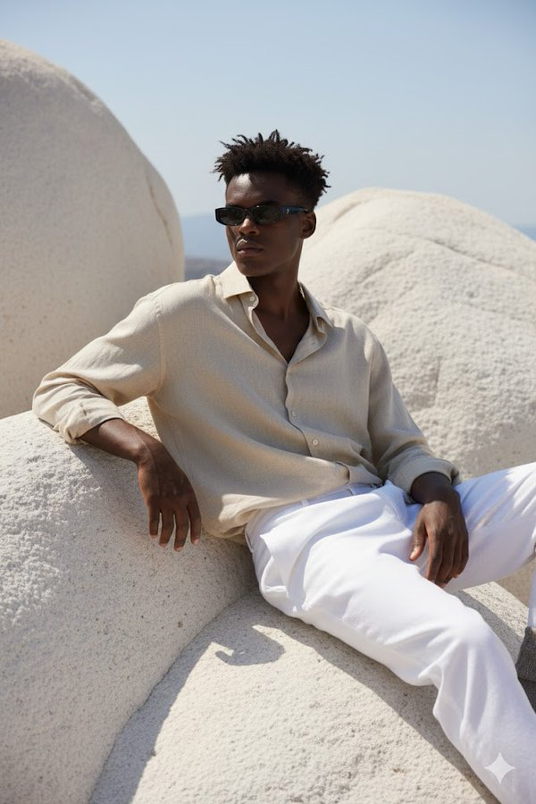

## 坐在巨大光滑的白色岩层上

- ID: gpt4o-376-zh-2
- Slug: prompt-376-zh-2
- 语言: zh
- 来源: [来源链接](https://x.com/eyishazyer/status/1982402132834767195)
- 样例图路径: images/part3/376.jpeg

### 提示词

```text
这幅超现实主义肖像画描绘了一位年轻男子坐在巨大光滑的白色岩层上，沐浴在自然阳光下。他身穿宽松略带褶皱的米色亚麻衬衫，最上面的纽扣敞开着，搭配白色长裤。他的装扮散发着轻松的地中海风情。
他向后仰着身子，一只手扶着岩石，另一只手放在膝盖上，目光略微侧向一侧。他戴着一副细长的黑色矩形墨镜。他的发型短而略显凌乱，阳光在他的衣服和纹理分明的岩石上投下柔和的阴影。
整体氛围平静、时尚，充满地中海风情。脸部应该与参考照片完全匹配。
```

### 样例图


## Create a black and white high-fashion editorial portrait

- ID: gpt4o-373-en-1
- Slug: prompt-373-en-1
- 语言: en
- 来源: [来源链接](https://x.com/eyishazyer/status/1982402114413596850)
- 样例图路径: images/part3/373.jpeg

### 提示词

```text
Create a black and white high-fashion editorial portrait of me, keeping my real face exactly as in the reference photo (no edits, same features, no retouching). I am wearing a loose white blouse. My pose is bold and expressive, with one arm raised to hold my hair up, partially covering my face. My gaze is intense and directed at the camera, creating a strong and enigmatic aura. The background is a plain minimalist wall with sharp natural daylight casting defined shadows, adding depth and contrast.
Lighting is harsh and high-contrast, highlighting my facial contours, sharp cheekbones, and the texture of the hair and fabric. The style should feel raw, dramatic, and artistic.
The overall image is high-fashion editorial in monochrome, cinematic, and striking.
```

### 样例图


## 身穿一件宽松的白色衬衫肖像照

- ID: gpt4o-373-zh-2
- Slug: prompt-373-zh-2
- 语言: zh
- 来源: [来源链接](https://x.com/eyishazyer/status/1982402114413596850)
- 样例图路径: images/part3/373.jpeg

### 提示词

```text
为我创作一幅黑白高级时尚编辑肖像，保留我的真实面容，与参考照片完全一致（未进行任何编辑，五官相同，未进行任何修饰）。我身穿一件宽松的白色衬衫。我的姿势大胆而富有表现力，一只手抬起，将头发拢起，遮住了部分脸部。我的目光专注地直视镜头，营造出一种强烈而神秘的氛围。背景是一面简洁的墙面，明亮的自然光投射出清晰的阴影，增添了画面的深度和对比度。
光线强烈，对比度高，凸显了我的面部轮廓、棱角分明的颧骨，以及头发和布料的质感。风格应该给人一种原始、戏剧化、艺术感十足的感觉。
整体形象是单色的、电影化的、引人注目的高级时尚社论。
```

### 样例图


## { "prompt_title": "Hyperrealistic Gothic Bunny Studio Po

- ID: gpt4o-370-en-1
- Slug: prompt-370-en-1
- 语言: en
- 来源: [来源链接](https://x.com/IqraSaifiii/status/1982469385156489563)
- 样例图路径: images/part3/370.jpeg

### 提示词

```text
{
"prompt_title": "Hyperrealistic Gothic Bunny Studio Portrait",
"image_description": "An ultra-photorealistic, high-resolution studio portrait of a female subject in a gothic-inspired bunny costume, featuring intricate lace ears, a structured corset, and delicate hosiery. The subject is posed on the floor, exuding an alluring and sophisticated aura under precise studio lighting.",
"subject": {
"gender": "female",
"appearance": "Young adult with a flawless, luminous complexion. **Extreme micro-detail rendering on skin, showing subtle pores, fine vellus hairs, accurate light interaction (sub-surface scattering), and realistic skin texture.**",
"facial_features": "Smooth, clear skin. Her eyes are large, dark, and captivating, looking directly into the camera with a **confident and slightly seductive expression**. Lips are full, with a matte red or deep berry lipstick that shows micro-creases. Defined eyebrows and subtle contouring.",
"hair_style": "Long, flowing, wavy black hair, cascading over her shoulders and back. **Hair must show individual strands, realistic volume, high-gloss reflections, and subtle flyaways.**",
"makeup": "Dramatic and precise. Sharp, winged black eyeliner, full, dark eyelashes (possibly individual lash extensions), subtle glitter or shimmer on eyelids. Contoured cheeks. Flawless foundation and blush.",
"attire": {
"headwear": "Intricate **black lace bunny ears headband**. The lace should have visible patterns, delicate wire structure, and possibly small faux floral or ribbon accents. Realistic light interaction with the lace.",
"neck_accessories": "A simple, fitted black velvet or leather choker necklace.",
"main_outfit": "A highly detailed **black strapless corset dress or top and skirt ensemble**. The corset should be structured, showing **visible boning and lacing details** (possibly satin or leather laces). Fabric should be a mix of matte black leather/faux leather and textured, ruffled black tulle or chiffon for the skirt. **Emphasis on realistic fabric folds, textures, and subtle sheen.**",
"hosiery": "Sheer black thigh-high stockings with a delicate lace top band, clearly visible on her upper thigh. **Stockings must show realistic transparency and fabric stretch over skin.**",
"footwear": "Black pointed-toe high heels with ankle straps. The material should be a realistic matte or patent leather, showing accurate reflections and shoe construction."
}
},
"pose": {
"description": "The subject is kneeling on a flat, light-colored studio floor, leaning slightly forward. Her left hand is placed on the floor beside her left knee, fingers slightly spread. Her right arm is gently resting on her right thigh. Her body is slightly twisted, creating an alluring silhouette. **Exact replication of the confident and poised pose.**",
"camera_angle": "Medium shot, eye-level angle, slightly looking down at the subject. The camera is positioned to capture her full body from the mid-thigh up, with enough space around her to establish the studio environment.",
"composition": "Centered composition, vertical orientation. The subject fills approximately 70-80% of the frame, with subtle negative space around her. **Sharp focus on the subject, with a very shallow depth of field creating a soft bokeh in the background.**"
},
"setting": {
"location": "Professional indoor photo studio.",
"background_elements": "Seamless, plain light gray or off-white backdrop, extending from the floor to the wall, creating a clean, infinite background. **Subtle, soft gradient in the background due to lighting falloff.**"
},
"lighting_and_atmosphere": {
"key_light_source": "Softbox or parabolic diffuser from the front-left, creating soft, even illumination with subtle directional shadows to define contours.",
"fill_light": "Subtle fill light from the front-right to reduce harsh shadows on the right side of her face and body.",
"back_light": "A subtle hair light or rim light from the rear-right to create separation from the background and add definition to her hair and shoulders.",
"highlights_shadows": "Soft, creamy highlights on skin, hair, and corset material. Deep but soft shadows defining facial structure and body contours. **Accurate light falloff and realistic specular reflections on materials.**",
"photographic_realism": "Extreme micro-detail, sub-surface scattering on skin, realistic fabric textures (lace, leather, tulle), **cinematic studio lighting**, crisp focus on eyes, perfect white balance, neutral color grading, **ultra-realistic material rendering (PBR - Physically Based Rendering).**"
},
"style_and_camera": {
"photographic_style": "High-fashion portraiture, hyperrealistic studio photography, fine art glamour.",
"camera_type": "High-end full-frame mirrorless camera (e.g., Sony A1, Canon R5) with a fast prime lens (e.g., 50mm f/1.2 or 85mm f/1.4).",
"camera_values": "ISO 100, f/1.8, 1/160 sec. **These values contribute to shallow depth of field, sharp detail, and clean image quality.**",
"resolution_quality": "8K resolution, ultra-photorealistic, extreme detail on all elements. **Masterpiece quality render, production quality image.**"
},
"negative_prompt_suggestions": [
"blurry", "low resolution", "deformed", "harsh lighting", "flat background", "bad anatomy",
"cartoon", "illustration", "painting", "text", "watermark", "oversaturated", "poor composition",
"unrealistic skin", "plastic texture", "missing details"
]
}
```

### 样例图


## 超现实主义哥特式兔子工作室肖像

- ID: gpt4o-370-zh-2
- Slug: prompt-370-zh-2
- 语言: zh
- 来源: [来源链接](https://x.com/IqraSaifiii/status/1982469385156489563)
- 样例图路径: images/part3/370.jpeg

### 提示词

```text
{
"prompt_title": "超现实主义哥特式兔子工作室肖像",
"image_description": "这幅超逼真、高分辨率的工作室肖像画描绘了一位身着哥特式兔子服装的女性，服装配有精致的蕾丝耳朵、结构化的紧身胸衣和精致的袜子。模特躺在地板上，在精准的工作室灯光下散发着迷人而精致的气息。",
“主题”： {
"性别": "女",
"appearance": "拥有完美无瑕、明亮肤色的年轻人。 **皮肤上极其细微的细节渲染，展现出细微的毛孔、细小的毳毛、准确的光线相互作用（次表面散射）和逼真的皮肤纹理。 ** ",
"facial_features": "光滑、洁净的皮肤。她的眼睛又大又黑，魅力十足，直视镜头，眼神自信而略带诱惑** 。 **.嘴唇丰满，涂着哑光红色或深莓色唇膏，露出细微的皱纹。眉毛清晰，轮廓细腻。",
"hair_style": "飘逸的黑色长发，波浪状披散在肩部和背部。 **头发必须展现出独立的发丝、真实的蓬松度、高光泽的反光和微妙的飞散。 ** ",
"makeup": "妆容精致而又充满戏剧感。锐利的黑色眼线，浓密的深色睫毛（可能是单独嫁接的），眼睑上点缀着淡淡的闪粉或珠光。轮廓分明的脸颊。完美的粉底和腮红。",
“服装”：{
"headwear": "精致的**黑色蕾丝兔耳头带**.蕾丝应具有明显的图案、精致的金属丝结构，以及可能的小型仿花或丝带装饰。与蕾丝的逼真灯光互动。",
"neck_accessories": "一条简单、合身的黑色天鹅绒或皮革颈链。",
"main_outfit": "一件细节丰富的**黑色露肩紧身连衣裙或上衣和裙子套装**.紧身胸衣应结构清晰，露出**明显的骨和系带细节** (可能需要缎子或皮革鞋带。裙子面料应为哑光黑色皮革/人造皮革和纹理荷叶边黑色薄纱或雪纺的混合面料。 **强调逼真的面料褶皱、纹理和微妙的光泽。 ** ",
"hosiery": "透明黑色过膝长袜，带有精致的蕾丝边，在大腿上清晰可见。 **长袜必须具有逼真的透明度，并且织物在皮肤上具有弹性。 ** ",
“footwear”：“黑色尖头高跟鞋，带踝带。材质应为逼真的哑光皮革或漆皮，展现准确的反射和鞋子结构。”
}
}，
“姿势”：{
"description": "拍摄对象跪在工作室平坦的浅色地板上，身体微微前倾。她的左手放在左膝旁的地板上，手指微微张开。她的右臂轻轻地放在右大腿上。她的身体微微扭动，勾勒出迷人的轮廓。 **精准地复制了她自信而泰然的姿势。 ** ",
"camera_angle": "中景镜头，视线水平角度，略微向下看拍摄对象。摄像机的位置可以捕捉到她从大腿中部以上的全身，周围有足够的空间来营造工作室氛围。",
"composition": "居中构图，垂直方向。主体占据了画面的大约 70-80%，周围留有微妙的负空间。 **主体清晰对焦，景深很浅，在背景中营造出柔和的散景效果。 ** "
}，
“环境”： {
"location": "专业室内摄影工作室。",
"background_elements": "无缝、纯浅灰色或灰白色背景，从地板延伸到墙壁，营造出干净、无限的背景。 **由于光线衰减，背景中出现微妙、柔和的渐变。 ** "
}，
“照明和氛围”：{
"key_light_source": "从左前方放置柔光箱或抛物面漫射器，创造柔和、均匀的照明，并带有微妙的定向阴影来定义轮廓。",
"fill_light": "来自右前方的微妙补光，以减少她脸部和身体右侧的刺眼阴影。",
"back_light": "从右后方照射的微妙的头发光或边缘光，与背景分离，并突出她的头发和肩膀。",
"highlights_shadows": "皮肤、头发和紧身胸衣材质上呈现柔和、奶油般的高光。深邃而柔和的阴影勾勒出面部结构和身体轮廓。 **材质上呈现精准的光线衰减和逼真的镜面反射。 ** ",
"photographic_realism": "极其精细的微细节、皮肤表面次表面散射、逼真的织物纹理（蕾丝、皮革、薄纱）、 **电影工作室灯光** 、清晰的眼睛聚焦、完美的白平衡、中性色彩分级、 **超逼真的材质渲染（PBR - 基于物理的渲染）。 ** "
}，
“style_and_camera”：{
"photographic_style": "高级时尚肖像画、超现实主义工作室摄影、艺术魅力。",
"camera_type": "高端全画幅无反光镜相机（例如索尼 A1、佳能 R5）搭配快速定焦镜头（例如 50mm f/1.2 或 85mm f/1.4）。",
"camera_values": "ISO 100、f/1.8、1/160 秒。 **这些值有助于获得浅景深、清晰的细节和干净的图像质量。 ** ",
"resolution_quality": "8K 分辨率，超逼真，所有元素细节丰富。 **杰作品质渲染，产品品质图像。 ** "
}，
"negative_prompt_suggestions": [
“模糊”、“分辨率低”、“变形”、“光线刺眼”、“背景平坦”、“结构不良”
“卡通”、“插图”、“绘画”、“文字”、“水印”、“过饱和”、“构图不佳”
“皮肤不真实”、“塑料质感”、“缺少细节”
]
}
```

### 样例图


## { "scene": { "description": "Stylish restroom dressing a

- ID: gpt4o-369-en-1
- Slug: prompt-369-en-1
- 语言: en
- 来源: [来源链接](https://x.com/IamEmily2050/status/1982643287745032379)
- 样例图路径: images/part3/369.jpeg

### 提示词

```text
{
  "scene": {
    "description": "Stylish restroom dressing area captured via mirror.",
    "environment": "Warm wood-laminate stall doors and soft countertop reflections.",
    "mood": "Shy-playful confidence; cozy 'Gamseong' (감성) aesthetic."
  },
  "aesthetic": {
    "style": "Authentic smartphone mirror selfie.",
    "look": "Warm interior color, gentle roll-off; minimal grain; filmic soft contrast."
  },
  "lighting": {
    "description": "Ceiling LEDs providing warm ambience; add subtle front fill from mirror to open eye sockets; maintain realistic specular highlights."
  },
  "subject": {
    "demographics": {
      "ethnicity": "East Asian (Korean)",
      "age": "adult",
      "build": "Very slender, petite with defined waist."
    },
    "appearance": {
      "hair": "Messy top-bun with full fringe; a few loose side strands.",
      "skin": "Natural, dewy finish with preserved skin texture."
    },
    "pose": {
      "type": "Mirror selfie, standing.",
      "action": "Gentle smile with lips slightly pressed; left hand lightly lifting ruched hem; right hand holding phone.",
      "framing": "Waist-up 3:4 vertical; slight downward camera angle; midriff visible."
    },
    "wardrobe": {
      "top": "Asymmetrical olive-gray ruched one-shoulder top.",
      "bottom": "Low-rise jeans with faux-fur waistband trim."
    },
    "accessories": {
      "jewelry": "Thin bracelets, rings, and delicate hoop earrings.",
      "phone": "Smartphone with black cat case featuring a pink bow (Hello-Kitty style)."
    }
  },
  "props_in_scene": {
    "background": "Wood-grain stall doors with verticals kept true; metal hinges subtly visible.",
    "counter": "Keep any edge reflections soft and realistic."
  },
  "camera_technical": {
    "requirements": "Correct mirror reversal; maintain natural body proportions; no duplicated phones/hands.",
    "capture": "Smartphone wide lens ~24–26mm equiv, f/1.8 look, ISO ~250, 1/125s, WB 4200–4400K.",
    "composition": "Subject centered with slight lean; keep fur texture readable; ensure phone and hand pose feel natural.",
    "retouching": "Clean minor blemishes only; preserve fabric micro-wrinkles and fur fibers; avoid haloing.",
    "avoid": "Warped doors, heavy vignettes, oversharpening, cartoon smoothing, text/watermarks."
  }
}
```

### 样例图

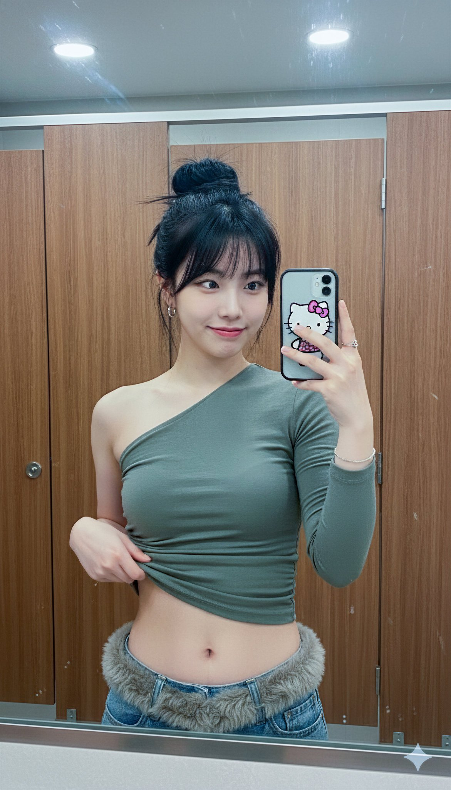

## 通过镜子捕捉时尚的卫生间更衣区

- ID: gpt4o-369-zh-2
- Slug: prompt-369-zh-2
- 语言: zh
- 来源: [来源链接](https://x.com/IamEmily2050/status/1982643287745032379)
- 样例图路径: images/part3/369.jpeg

### 提示词

```text
{
“场景”： {
"description": "通过镜子捕捉时尚的卫生间更衣区。",
"environment": "温暖的木质层压隔间门和柔和的台面反射。",
"mood": "害羞而又充满自信；舒适的‘Gamseong’（감성）美学。"
}，
“审美的”： {
"style": "正宗的智能手机镜面自拍。",
“外观”：“温暖的内部色彩，柔和的滚动；最小的颗粒感；胶片般的柔和对比。”
}，
“灯光”： {
“description”：“天花板 LED 营造温暖的氛围；从镜子添加微妙的前部补光以打开眼窝；保持逼真​​的镜面高光。”
}，
“主题”： {
“人口统计”：{
"ethnicity": "东亚（韩国）",
"年龄": "成人",
“身材”：“非常苗条，娇小，腰部清晰。”
}，
“外貌”： {
"hair": "凌乱的发髻，刘海丰满；侧边有几缕散落的头发。",
"skin": "自然、水润的妆容，保留肌肤纹理。"
}，
“姿势”：{
"type": "镜子自拍，站立。",
"action": "温柔一笑，嘴唇微闭；左手轻轻提起褶边；右手握住手机。",
"framing": "腰部以上 3:4 垂直；略微向下的摄像机角度；可见腹部。"
}，
“衣柜”： {
"top": "不对称橄榄灰色褶饰单肩上衣。",
"bottom": "低腰牛仔裤，腰带饰有人造毛皮。"
}，
“配件”： {
"jewelry": "细手镯、戒指和精致的环形耳环。",
"phone": "带有黑色猫咪外壳和粉色蝴蝶结的智能手机（Hello-Kitty 风格）。"
}
}，
“场景中的道具”：{
"background": "木纹隔间门保持垂直；金属铰链隐约可见。",
"counter": "保持任何边缘反射柔和而逼真。"
}，
“相机技术”：{
"requirements": "正确的镜像反转；保持自然的身体比例；没有重复的手机/手。",
"capture": "智能手机广角镜头~24–26mm 等效，f/1.8 外观，ISO ~250, 1/125s，白平衡 4200–4400K。",
"composition": "主体居中，略微倾斜；保持毛发纹理清晰可读；确保手机和手部姿势自然。",
"retouching": "仅清洁轻微瑕疵；保留织物微褶和毛皮纤维；避免晕染。",
"avoid": "扭曲的门、沉重的晕影、过度锐化、卡通平滑、文字/水印。"
}
}
```

### 样例图


## { "scene": { "location": "clean studio corner", "backgro

- ID: gpt4o-364-en-1
- Slug: prompt-364-en-1
- 语言: en
- 来源: [来源链接](https://x.com/IamEmily2050/status/1980462057272275105)
- 样例图路径: images/part3/364.jpeg

### 提示词

```text
{
  "scene": {
    "location": "clean studio corner",
    "background": "soft pastel sage seamless, subtle falloff, no clutter"
  },

  "subject": {
    "age": "adult",
    "description": "woman with fair skin, long wavy brown hair with straight bangs, vivid blue eyes",
    "wardrobe": "pink strappy cami with black lace trim, blue plaid skirt",
    "accessories": "delicate necklace, symmetrical pastel hair clips",
    "pose": "full body; gentle S-curve; hip slightly popped; front knee inward; toes pointed; hands frame face in small heart gesture near chin",
    "expression": "kawaii allure: bright eyes with micro-smile and soft pout; slight 8° head tilt toward camera",
    "gaze": "direct to camera",
    "body_notes": "realistic adult proportions; natural skin texture"
  },

  "camera": {
    "sensor": "full_frame",
    "focal_length_mm": 70,
    "aperture_f": 2.2,
    "shutter_s": 0.00625,
    "iso": 200,
    "white_balance_k": 5200,
    "distance_m": 4.0,
    "camera_height_m": 1.05,
    "framing": "entire figure visible with 5% headroom and shoes in frame",
    "focus": "eye_detect_AF on nearest eye"
  },

  "lighting": {
    "key": "large diffused softbox front-left at 45°, close to subject, high-key beauty",
    "fill": "white bounce on camera-right one stop under key",
    "hair": "soft rim from behind to lift hair texture",
    "catchlights": "two circular catchlights at 10 and 2 o'clock",
    "notes": "flicker-free LEDs; even skin luminance; avoid harsh speculars"
  },

  "color_grade": {
    "style": "Ulzzang / kawaii soft-glam",
    "palette": "pastel pinks and sage; neutral skin with peach blush",
    "contrast": "medium-low with crisp micro-contrast on eyes and lips",
    "saturation": "moderate"
  },

  "makeup": {
    "eyes": "subtle winged liner, long lashes, soft brown shadow, gentle aegyo-sal highlight",
    "cheeks": "peach gradient blush",
    "lips": "pink gradient tint with light gloss"
  },

  "postprocess": {
    "retouch": "light frequency separation; maintain pores and flyaway hair",
    "clarity": "selective clarity on irises, lashes, lips",
    "dodge_burn": "micro dodge on eyes and cupid's bow; mild burn on hair shadows",
    "vignette": "very subtle"
  },

  "art_direction": {
    "mood": "cute, playful, alluring yet tasteful",
    "keywords": ["kawaii", "S-curve", "face-framing gesture", "soft glow", "clean studio"]
  },

  "negative_prompts": [
    "nsfw",
    "underage look",
    "text or logos",
    "plastic doll skin",
    "warped hands or extra fingers",
    "deformed limbs",
    "flat lighting",
    "oversharpening halos",
    "cluttered background"
  ]
}
```

### 样例图

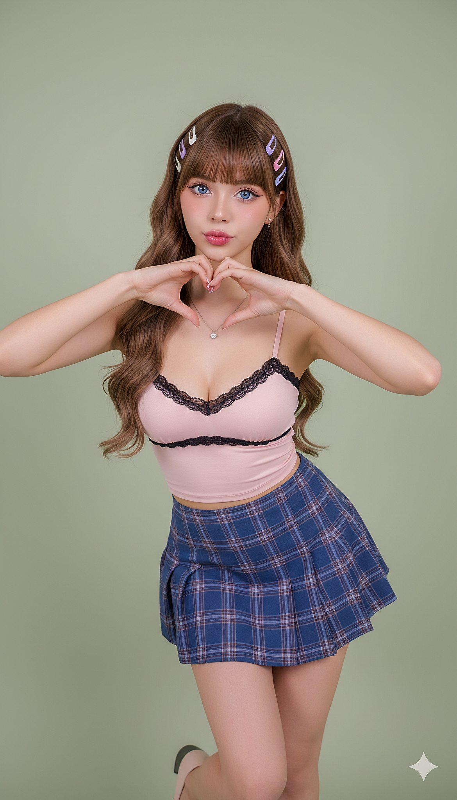

## 粉色吊带背心女生比心

- ID: gpt4o-364-zh-2
- Slug: prompt-364-zh-2
- 语言: zh
- 来源: [来源链接](https://x.com/IamEmily2050/status/1980462057272275105)
- 样例图路径: images/part3/364.jpeg

### 提示词

```text
{
“场景”： {
"location": "干净的工作室角落",
“背景”：“柔和的淡紫色无缝，微妙的衰减，没有混乱”
}，

“主题”： {
"年龄": "成人",
"description": "皮肤白皙，长长的棕色波浪发，直刘海，鲜艳的蓝眼睛，
"wardrobe": "粉色吊带背心，黑色蕾丝边，蓝色格子裙",
"accessories": "精致的项链，对称的淡色发夹",
"pose": "全身；柔和的 S 形曲线；臀部微微外展；前膝向内；脚趾绷直；双手在下巴附近做出小心心的手势，
"expression": "卡哇伊魅力：明亮的眼睛，微微微笑，轻轻噘嘴；头部略微向镜头倾斜 8°"
"gaze": "直视相机",
"body_notes": "逼真的成人比例；自然的皮肤纹理"
}，

“相机”： {
“传感器”：“全帧”，
"焦距毫米": 70,
"aperture_f": 2.2,
“shutter_s”：0.00625，
“iso”：200，
"白平衡k": 5200,
“距离米”：4.0，
"相机高度米": 1.05,
"framing": "整个人物可见，5% 的头部空间和鞋子在框架内",
“focus”：“eye_detect_AF 在最近的眼睛上”
}，

“灯光”： {
"key": "大型漫射柔光箱位于左前方 45° 处，靠近拍摄对象，呈现高调美感",
"fill": "白色在相机上弹跳-右键下停一站",
"hair": "从后面添加柔软边缘，提升头发质感",
"catchlights": "两个圆形的眼神光分别位于 10 点和 2 点位置",
“注释”：“无闪烁 LED；均匀的皮肤亮度；避免刺眼的镜面反射”
}，

“颜色等级”：{
"style": "Ulzzang / 可爱柔和魅力",
"palette": "淡粉色和鼠尾草色；中性肤色，搭配桃色腮红",
“对比度”：“中低，眼睛和嘴唇有清晰的微对比度”，
“饱和度”：“中等”
}，

“化妆品”： {
"eyes": "细腻的翼状眼线，纤长的睫毛，柔和的棕色眼影，柔和的撒娇高光",
"cheeks": "桃色渐变腮红",
“嘴唇”：“粉色渐变色调，带有淡淡的光泽”
}，

“后处理”：{
"retouch": "光频分离；维持毛孔和飞散的头发",
"clarity": "虹膜、睫毛、嘴唇的选择性清晰度",
"dodge_burn": "对眼睛和丘比特之弓进行微减淡；对头发阴影进行轻度加深",
“vignette”：“非常微妙”
}，

“艺术指导”：{
"mood": "可爱、俏皮、迷人又有品位",
"keywords": ["kawaii", "S-curve", "face-framement gesture", "soft glow", "clean studio"]
}，

"negative_prompts": [
“nsfw”，
“未成年的样子”，
“文字或徽标”，
“塑料娃娃皮肤”，
“弯曲的手或多余的手指”，
“畸形肢体”，
“平面照明”，
“过度锐化光晕”，
“杂乱的背景”
]
}
```

### 样例图


## A beautiful, confident woman wearing a black suit sits e

- ID: gpt4o-362-en-1
- Slug: prompt-362-en-1
- 语言: en
- 来源: [来源链接](https://x.com/saniaspeaks_/status/1980821497284554960)
- 样例图路径: images/part3/362.jpeg

### 提示词

```text
A beautiful, confident woman wearing a black suit sits elegantly on a luxurious white chair that highlights her slim, graceful figure. Her right hand rests gently beneath her chin, with her chin slightly raised in a pose of self-assurance. Her head tilts subtly to the right, eyes steady and looking forward with confidence. Her facial features glow under high-quality cinematic lighting, enhancing her natural beauty. The background is pure white, featuring a rare art painting and soft, cinematic illumination. Beside the chair stands a unique white table topped with a black coffee cup and a stylish lamp decor, creating a refined and elegant atmosphere.
```

### 样例图

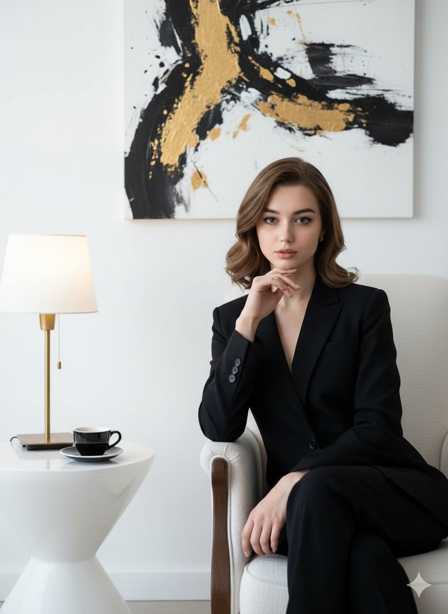

## 自信优雅的黑色西装女士

- ID: gpt4o-362-zh-2
- Slug: prompt-362-zh-2
- 语言: zh
- 来源: [来源链接](https://x.com/saniaspeaks_/status/1980821497284554960)
- 样例图路径: images/part3/362.jpeg

### 提示词

```text
一位美丽自信的女士身着黑色西装，优雅地坐在奢华的白色椅子上，衬托出她窈窕的身姿。她的右手轻抚下巴，下巴微微上扬，展现出自信的姿态。她的头微微向右倾斜，目光坚定，充满自信地向前看去。在高品质的电影级灯光下，她的五官更加光彩夺目，更显自然之美。纯白的背景，点缀着一幅罕见的艺术画作，柔和的电影级灯光营造出一种别致的氛围。椅子旁边摆放着一张独特的白色桌子，桌上摆放着黑色咖啡杯和时尚的灯饰，营造出精致优雅的氛围。
```

### 样例图


## { "scene": { "description": "Indoor mirror selfie in a c

- ID: gpt4o-358-en-1
- Slug: prompt-358-en-1
- 语言: en
- 来源: [来源链接](https://x.com/IamEmily2050/status/1981124366411895079)
- 样例图路径: images/part3/358.jpeg

### 提示词

```text
{
  "scene": {
    "description": "Indoor mirror selfie in a contemporary bedroom or dressing area.",
    "lighting": "Soft, warm ambient interior lighting, flattering and even.",
    "environment": "Neutral background, slightly blurred, suggesting closet doors or plain walls."
  },
  "subject": {
    "demographics": {
      "ethnicity": "Korean (East Asian)",
      "apparent_age": "20-23",
      "build": "Very slender, 'S-line' figure with a notably tiny waist ('ant waist') and defined, toned abs."
    },
    "facial_aesthetics": {
      "style_keywords": ["Ulzzang (얼짱) aesthetic", "Casual beauty", "Doll-like features", "Youthful and confident"],
      "face_shape": "Small face with a coveted V-line jaw.",
      "eyes": "Large, bright 'Doe eyes'. Prominent Aegyo-sal. Soft, natural eyeliner.",
      "skin": "Flawless 'Glass skin', pale complexion, dewy finish.",
      "lips": "Plump cherry lips, soft pink gradient tint.",
      "hair": {
        "color": "Warm medium brown",
        "style": "Long, gentle waves",
        "bangs": "Airy, 'see-through' bangs (Korean style) framing the forehead."
      }
    },
    "pose": {
      "type": "Standing mirror selfie.",
      "action": "Subject is confidently lifting the hem of her sweater with both hands to expose her toned midriff.",
      "expression": "Soft, pleasant expression, subtle smile, eyes focused on the phone screen.",
      "framing": "Medium shot (hips to head)."
    },
    "wardrobe": {
      "top": {
        "garment": "Cropped cable-knit sweater",
        "color": "Cream / Ivory white",
        "details": "Distinctive hybrid design with sheer, voluminous organza ruffles on the sleeves and cuffs."
      },
      "bottom": {
        "garment": "Blue jeans",
        "fit": "Low-rise, relaxed fit.",
        "details": "Light-to-medium wash denim, worn unbuttoned and slightly pulled down at the hips."
      }
    },
    "accessories": {
      "phone": "Dark gray smartphone held in the hand, rear camera visible in the mirror."
    }
  },
  "camera_technical": {
    "device": "Smartphone rear camera via mirror",
    "look": "Clean, high-quality mobile photography, vertical orientation (3:4).",
    "focus": "Sharp focus on the subject's face and torso."
  }
}
```

### 样例图

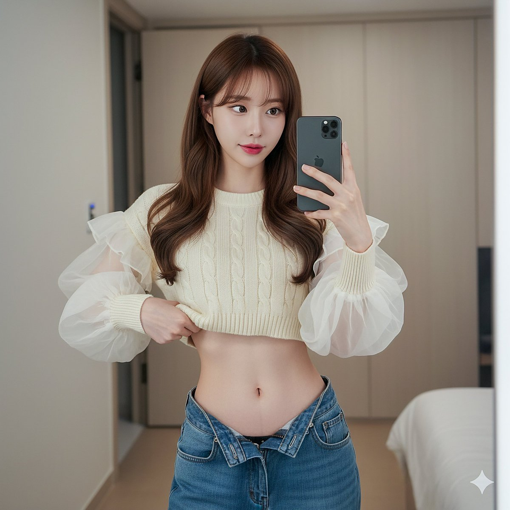

## 卧室镜子自拍

- ID: gpt4o-358-zh-2
- Slug: prompt-358-zh-2
- 语言: zh
- 来源: [来源链接](https://x.com/IamEmily2050/status/1981124366411895079)
- 样例图路径: images/part3/358.jpeg

### 提示词

```text
{
“场景”： {
"description": "在现代卧室或更衣区进行室内镜子自拍。",
"lighting": "柔和、温暖的室内环境照明，令人赏心悦目且均匀。",
"environment": "中性背景，略微模糊，类似于壁橱门或普通墙壁。"
}，
“主题”： {
“人口统计”：{
"ethnicity": "韩国人（东亚）",
"apparent_age": "20-23",
“身材”：非常苗条，‘S 型’身材，腰部明显纤细（“蚂蚁腰”），腹肌清晰紧实。
}，
“面部美学”：{
"style_keywords": ["Ulzzang (얼짱) 审美", "休闲美", "洋娃娃般的五官", "年轻自信"],
"face_shape": "小脸，拥有令人垂涎的 V 型下巴。",
"eyes": "大而明亮的“小鹿眼”。突出的斜眼妆。柔和自然的眼线。",
"skin": "完美无瑕的‘玻璃肌肤’，白皙的肤色，水润的妆容。",
"lips": "丰满的樱桃唇，柔和的粉色渐变色调。",
“头发”： {
"color": "暖中棕色",
"style": "长而柔和的波浪",
"bangs": "飘逸的‘透视’刘海（韩式）修饰额头。"
}
}，
“姿势”：{
"type": "站立镜子自拍。",
"action": "对象自信地用双手撩起毛衣下摆，露出紧致的腹部。",
"expression": "柔和、愉快的表情，淡淡的微笑，眼睛专注于手机屏幕。",
"framing": "中景（臀部到头部）。"
}，
“衣柜”： {
“顶部”： {
"garment": "短款绞花针织毛衣",
"color": "奶油色/象牙白色",
“详细信息”：“独特的混合设计，袖子和袖口上有透明、蓬松的欧根纱褶边。”
}，
“底部”： {
"garment": "蓝色牛仔裤",
"fit": "低腰，宽松版型。",
“details”：“轻度至中度水洗牛仔布，未扣纽扣，臀部略微拉低。”
}
}，
“配件”： {
“手机”：“手中拿着深灰色的智能手机，镜子中可以看到后置摄像头。”
}
}，
“相机技术”：{
"device": "通过镜子的智能手机后置摄像头",
"look": "清晰、高品质的手机摄影，垂直方向（3:4）。",
"focus": "清晰地聚焦拍摄对象的脸部和躯干。"
}
}
```

### 样例图


## A ultra realistic group selfie, center is the person fro

- ID: gpt4o-355-en-1
- Slug: prompt-355-en-1
- 语言: en
- 来源: [来源链接](https://x.com/xmliisu/status/1980161909828526514)
- 样例图路径: images/part3/355.jpeg

### 提示词

```text
A ultra realistic group selfie, center is the person from the attached image (uploaded image facial details), wearing a fitted black shirt and ripped jeans, holding an iPhone for the selfie. Around are Chris Hemsworth as Thor, Gal Gadot as Wonder Woman, Scarlett Johansson as Black Widow, Mark Ruffalo as Hulk, Henry Cavill as Superman, RDJ in full armor all hugging, smiling, posing casually like close friends. Fun, joyful mood, bright daylight, cinematic quality, natural look, high detail.
```

### 样例图

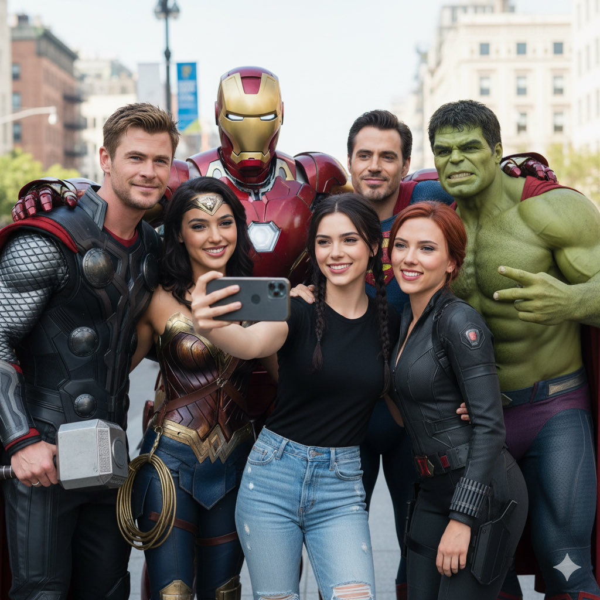

## 和漫威角色集体自拍

- ID: gpt4o-355-zh-2
- Slug: prompt-355-zh-2
- 语言: zh
- 来源: [来源链接](https://x.com/xmliisu/status/1980161909828526514)
- 样例图路径: images/part3/355.jpeg

### 提示词

```text
一张超逼真的集体自拍，中间是附件图片中的人物（上传图片的面部细节），他身穿合身的黑色衬衫和破洞牛仔裤，手持 iPhone 自拍。周围是克里斯·海姆斯沃斯饰演的雷神、盖尔·加朵饰演的神奇女侠、斯嘉丽·约翰逊饰演的黑寡妇、马克·鲁法洛饰演的绿巨人、亨利·卡维尔饰演的超人，以及全副武装的 RDJ，他们拥抱在一起，面带微笑，像亲密朋友一样随意摆姿势。充满乐趣、愉悦的心情，明亮的日光，电影级画质，自然的画面，细节丰富
```

### 样例图


## A cinematic, hyper-realistic portrait of @simplyannisa ,

- ID: gpt4o-353-en-1
- Slug: prompt-353-en-1
- 语言: en
- 来源: [来源链接](https://x.com/SimplyAnnisa/status/1980503919492272216)
- 样例图路径: images/part3/353.jpeg

### 提示词

```text
A cinematic, hyper-realistic portrait of 
@simplyannisa
, keeping her real facial features completely unchanged. The woman sits at a wooden table, leaning slightly forward, with her right forearm resting naturally on the surface. Her right hand gently holds a dark ceramic mug with the word “
@simplyannisa
” written on it. Her fingers are slender, relaxed, and slightly curved. Her left arm is bent at the elbow, resting casually on the table. She wears a dark gray, slightly loose long-sleeve Henley top with the top buttons undone, subtly revealing a delicate neckline. Her hair falls naturally around her shoulders, soft waves catching the light. Her gaze is directed to the side, away from the camera, carrying a thoughtful and mysterious expression. The lighting is soft and moody, emphasizing the texture of her hair and face while adding cinematic contrast and emotional depth. The portrait is shot at eye level with an 85mm lens effect and a shallow depth of field, keeping her face and upper body in sharp focus while the background softly blurs. The overall color grading is muted and cinematic, with cool tones, soft shadows, and a minimalist dark background.
```

### 样例图

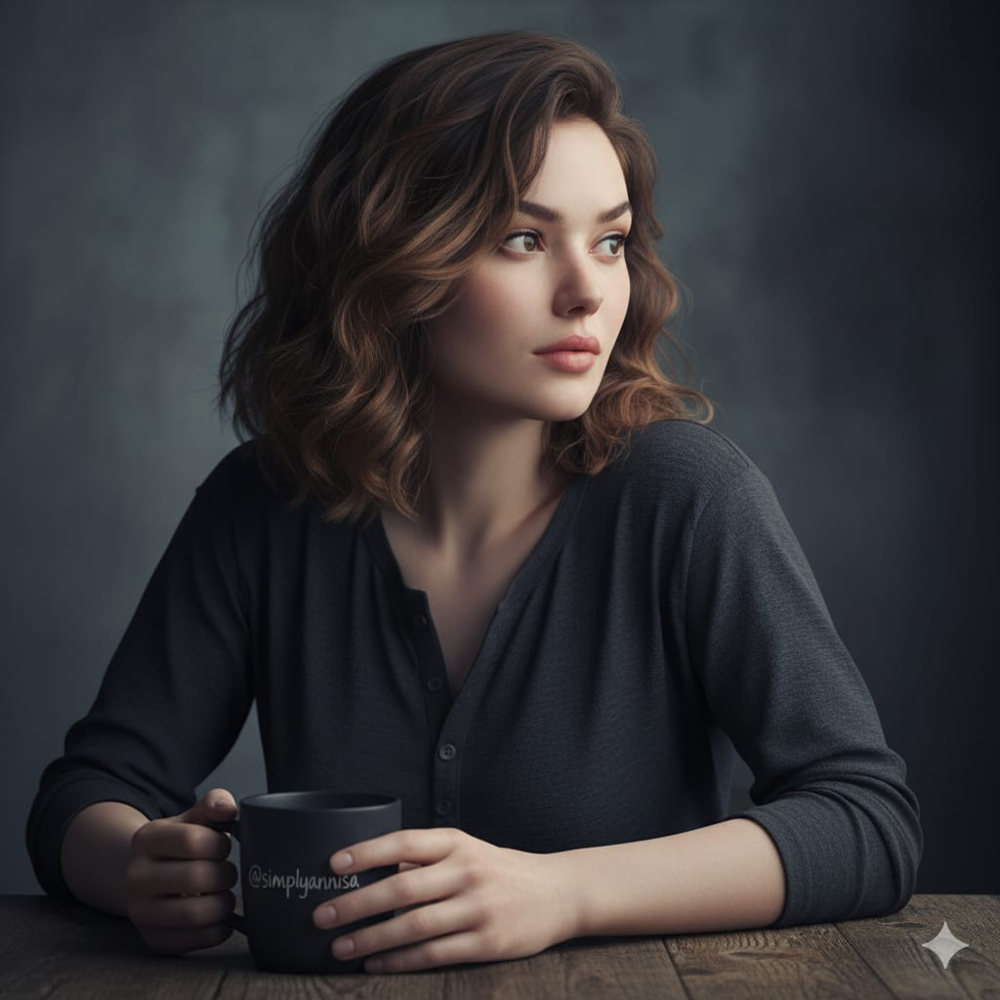

## 电影感的超现实主义肖像画

- ID: gpt4o-353-zh-2
- Slug: prompt-353-zh-2
- 语言: zh
- 来源: [来源链接](https://x.com/SimplyAnnisa/status/1980503919492272216)
- 样例图路径: images/part3/353.jpeg

### 提示词

```text
这幅充满电影感的超现实主义肖像画，保留了@simplyannisa的真实面部特征。画中女子坐在木桌旁，身形微微前倾，右臂自然地搭在桌面上。她的右手轻轻地捧着一个深色陶瓷杯，杯上写着“ @simplyannisa ”三个字。她的手指纤细、放松，略带弧度。左臂肘部弯曲，随意地搭在桌上。她身穿一件略显宽松的深灰色长袖亨利衫，最上面的纽扣敞开，隐约露出精致的领口。她的头发自然地披散在肩上，柔和的波浪在光线下闪闪发光。她的目光转向侧面，远离镜头，带着一种若有所思、神秘莫测的表情。柔和的光线营造出一种忧郁的氛围，突出了她头发和面部的质感，同时增添了电影般的对比度和情感深度。这幅肖像画采用85毫米镜头，在视线高度处以浅景深拍摄，使她的脸部和上半身保持清晰对焦，而背景则略微模糊。整体色彩分级柔和且具有电影感，具有冷色调、柔和阴影和简约的深色背景。
```

### 样例图


## A hyper-realistic 3D digital illustration of a woman wit

- ID: gpt4o-352-en-1
- Slug: prompt-352-en-1
- 语言: en
- 来源: [来源链接](https://x.com/SimplyAnnisa/status/1980553716131414281)
- 样例图路径: images/part3/352.jpeg

### 提示词

```text
A hyper-realistic 3D digital illustration of a woman with her natural facial features, hairstyle, and skin tone unchanged, styled in a Pixar-inspired cinematic look. She is smiling warmly while leaning through a glowing orange rectangular frame, both hands gently holding the edge of the frame. She wears a denim jacket layered over a black top, subtle jewelry, and a smartwatch on her wrist. The lighting is soft yet vibrant, highlighting facial depth, realistic fabric texture, and warm glow reflections on her face and hands. The background is softly blurred, creating a cinematic atmosphere with a perfect blend of realism, warmth, and Pixar-style charm.
```

### 样例图

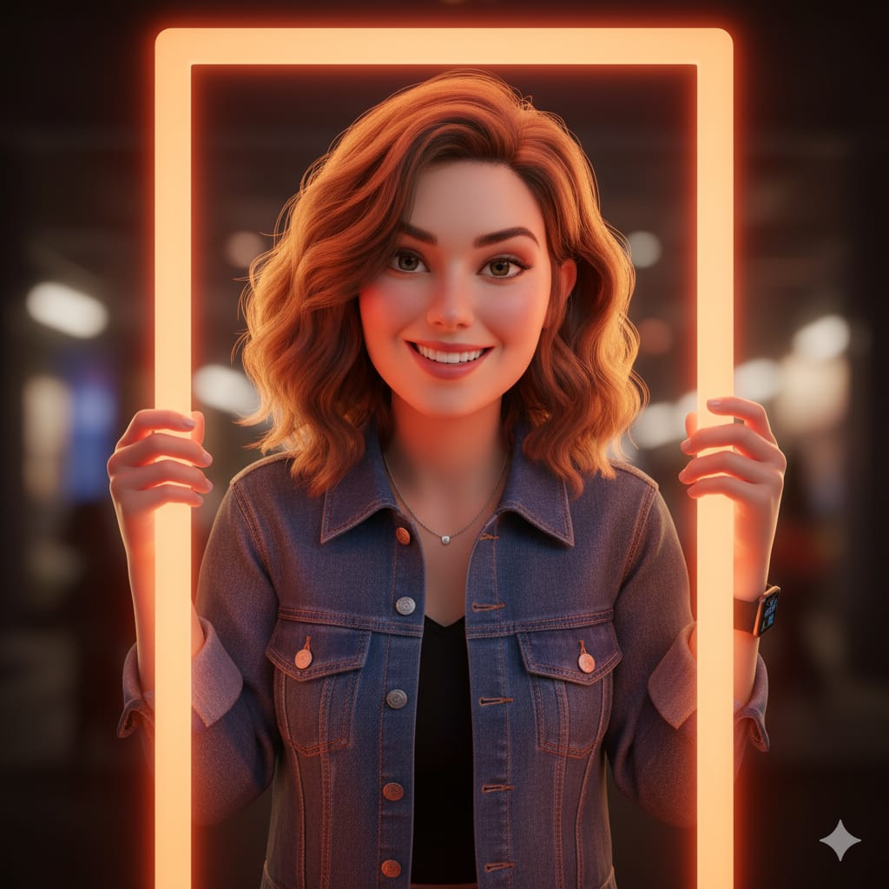

## 女人3D数字插画

- ID: gpt4o-352-zh-2
- Slug: prompt-352-zh-2
- 语言: zh
- 来源: [来源链接](https://x.com/SimplyAnnisa/status/1980553716131414281)
- 样例图路径: images/part3/352.jpeg

### 提示词

```text
这幅超写实的3D数字插画描绘了一位女性，其自然的五官、发型和肤色均未改变，并采用了皮克斯风格的电影风格。她面带温暖的微笑，身影透过发光的橙色矩形画框倾身而立，双手轻轻握住画框边缘。她身穿牛仔夹克，内搭黑色上衣，佩戴着精致的珠宝，手腕上戴着智能手表。灯光柔和而明亮，凸显了面部深度、逼真的织物纹理以及她脸部和双手上温暖的光芒。背景轻柔地模糊处理，营造出一种电影般的氛围，完美融合了现实主义、温暖感和皮克斯风格的魅力。
```

### 样例图


## 身穿古代服饰的派大星和海绵宝宝

- ID: gpt4o-351-zh
- Slug: prompt-351-zh
- 语言: zh
- 来源: [来源链接](https://x.com/op7418/status/1980296606382780794)
- 样例图路径: images/part3/351.png

### 提示词

```text
身上穿着唐朝服饰的一只派大星，自然逼真，北宋时期风格油画暗棕褐色旧版图高清，精细工笔，精细流畅、柔韧有力、充满韵律感。衣纹的勾勒，疏密有致。用色典雅，善于运用对比色，丰富和谐，头戴唐朝帽子
```

### 样例图

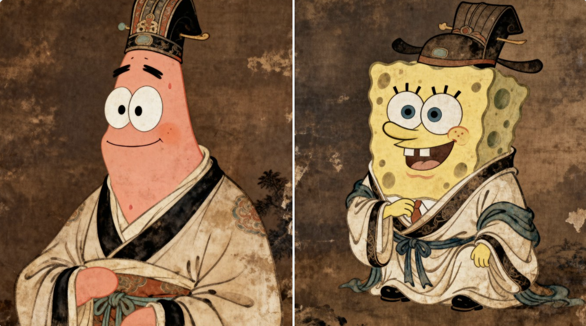

## 中国红自拍照片

- ID: gpt4o-350-zh
- Slug: prompt-350-zh
- 语言: zh
- 来源: [来源链接](xxxxxx)
- 样例图路径: images/part3/350.jpeg

### 提示词

```text
图片中人物头发两侧别着黄色花朵，右脸颊有红色五角星图案，佩戴金色耳饰与细项链，身着印有白色 “China” 文字的红色 T 恤，红色纯色背景，妆容精致（红唇、自然眼妆），整体风格充满爱国情怀、清新明亮，高清细节。
```

### 样例图


## 超写实影棚肖像照

- ID: gpt4o-343-zh
- Slug: prompt-343-zh
- 语言: zh
- 来源: [来源链接](https://x.com/cheerselflin/status/1979569018928603432)
- 样例图路径: images/part3/343.jpeg

### 提示词

```text
超写实影棚肖像，一位男性优雅地斜倚在椅子靠背上，身着时尚的深色服装。以微妙的低角度拍摄，以突出他的面部特征和自信的表情。电影般的黑白调色，肤色自然精致。纯黑色背景，8K 锐利细节，突出服装、头发和眼睛的纹理，营造出戏剧性、栩栩如生的效果。
```

### 样例图


## a young beautiful Japanese woman with porcelain skin, so

- ID: gpt4o-342-en-1
- Slug: prompt-342-en-1
- 语言: en
- 来源: [来源链接](https://x.com/cheerselflin/status/1979203307873931360)
- 样例图路径: images/part3/342.jpeg

### 提示词

```text
a young beautiful Japanese woman with porcelain skin, soft makeup and bright red lips, straight chestnut-brown hair neatly tied in a ponytail with straight bangs framing her face, wearing a fitted light-blue police uniform shirt with gold buttons and badge, a dark green flat ribbon tie knotted at the collar with two short tails hanging down like a gift bow, navy skirt, dark belt with brass buckle, white gloves, black shoes, sitting with her knees together and hands gently folded over a glass, calm and elegant posture, oxygen-fresh natural makeup look with translucent dewy base, barely-there eyeliner, soft straight brows, faint rosy blush on the cheeks, subtle inner-corner highlight that makes her eyes look bright and airy, lips a clean vivid red yet not glossy, her pose delicate and composed: seated on a narrow wooden bench in a cramped booth, ankles tucked slightly back, torso subtly leaning forward from the hips, forearms relaxed, gloved hands overlapping lightly above the small tumbler placed between her knees, chin slightly lowered while gazing directly at the camera, flanked by two older Japanese policemen in uniform on each side, the man on the left leaning inward from the doorway, cap slightly tilted, short-sleeve standard police shirt, one elbow resting on his knee with the hand hanging loosely, attentive and calm expression; the man on the right wearing a striped short-sleeve shirt with a dark tie and badge, cap set square with a gold band, arms firmly crossed over his chest, body angled toward the woman, a reserved, thoughtful look, inside a small dimly-lit bar filled with vintage Japanese posters, old bottles, narrow wooden walls, cluttered shelves, detailed physical environment: shot from the doorway so the worn wooden jambs create a frame-within-frame; scuffed varnished beams, handwritten Japanese slips and price tags pinned among utensils, cords and trinkets hanging overhead, glassware and liquor bottles stacked tight on shallow shelves, a tiny aisle underfoot, faint reflections on lacquered wood, humid air; one or two bare incandescent bulbs casting a localized amber pool of light that fades rapidly into darkness, camera perspective and ratio: intimate eye-level viewpoint at close conversational distance (about 1-1.5 m), classic 35mm focal feel, vertical portrait framing with a 3:4 aspect, slight center-weighted composition emphasizing the trio in a tight booth, warm incandescent lighting with nostalgic amber tone, low saturation colors, fine 35mm film grain texture, slightly overexposed highlights, retro 1980s analog snapshot aesthetic, candid composition, shallow depth of field, cinematic color grading, in the style of Nobuyoshi Araki and Daido Moriyama street photography
```

### 样例图

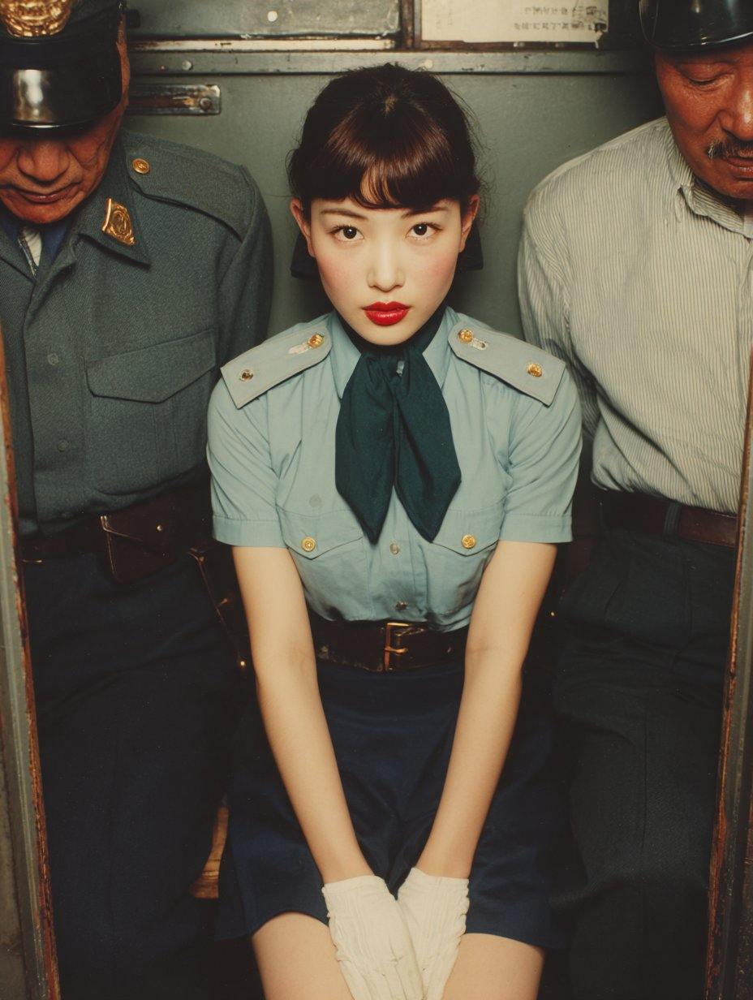

## 一位坐地铁的女性

- ID: gpt4o-342-zh-2
- Slug: prompt-342-zh-2
- 语言: zh
- 来源: [来源链接](https://x.com/cheerselflin/status/1979203307873931360)
- 样例图路径: images/part3/342.jpeg

### 提示词

```text
一位年轻美丽的日本女性，有着瓷器般的肌肤、柔和的妆容和鲜红的嘴唇，栗色的直发扎成马尾辫，齐刘海修饰着她的脸型，身穿一件合身的浅蓝色警服衬衫，上面有金色的纽扣和徽章，一条深绿色的扁平丝带领带在领口处打结，两条短尾巴像礼物蝴蝶结一样垂下来，海军蓝裙子，深色腰带配黄铜扣，白手套，黑色鞋子，双膝并拢坐着，双手轻轻地交叉放在玻璃杯上，姿态平静而优雅，氧气清新的自然妆容搭配半透明的露珠底妆，几乎看不见的眼线，柔软的直眉，脸颊上淡淡的玫瑰色腮红，微妙的内眼角高光使她的眼睛看起来明亮而通透，嘴唇是干净的鲜红色，但不油腻，她的姿势精致而沉稳：坐在狭窄的卡座中的一张狭窄的木凳上，脚踝略微向后弯曲，躯干从臀部微微向前倾斜，前臂放松，戴着手套的双手轻轻地重叠在小玻璃杯放在两膝之间，下巴微微低垂，直视镜头，两侧各站着两名年纪稍长的穿制服的日本警察，左边的男子从门口探出身子，帽子微微倾斜，穿着短袖制式警服，一肘撑在膝盖上，手随意地垂着，表情专注而平静；右边的男子穿着条纹短袖衬衫，系着深色领带和警徽，帽子镶着金边，双臂紧紧地交叉在胸前，身体朝着女人倾斜，一副矜持、若有所思的样子，身处一间灯光昏暗的小酒吧里，里面摆满了老式的日本海报、旧酒瓶、狭窄的木墙、杂乱的架子，细致的物理环境：从门口拍摄，磨损的木门框形成了框中框；磨损的漆面横梁，手写的日文单据和价格标签夹在餐具之间，电线和小饰品悬挂在头顶，玻璃器皿和酒瓶紧紧地堆放在浅浅的架子上，脚下是一条小过道，漆木上反射着微弱的光线，空气潮湿；一两个裸露的白炽灯泡投射出局部琥珀色的光晕，迅速消失在黑暗中，相机视角和比例：近距离交谈（约 1-1.5 米）的亲密视线视角，经典的 35 毫米焦距感，3：4 宽高的垂直人像取景，轻微的中央重点构图强调了紧凑展位中的三人组，温暖的白炽灯光带有怀旧的琥珀色调，低饱和度色彩，细腻的 35 毫米胶片颗粒纹理，略微过度曝光的高光，复古的 1980 年代模拟快照美学，坦率的构图，浅景深，电影调色，荒木经惟和森山大道的街头摄影风格
```

### 样例图


## A flash snapshot taken in a small, crowded Japanese izak

- ID: gpt4o-340-en-1
- Slug: prompt-340-en-1
- 语言: en
- 来源: [来源链接](https://x.com/cheerselflin/status/1979203220061982872)
- 样例图路径: images/part3/340.jpeg

### 提示词

```text
A flash snapshot taken in a small, crowded Japanese izakaya, filled with handwritten menus, old posters, and wooden textures. The lighting is from a direct on-camera flash, producing bright highlights, harsh shadows, and a slightly grainy texture that enhances the candid feeling.

The main subject is a young woman sitting on a wooden bar stool, turning her body slightly and looking back over her shoulder toward the camera. She wears a white button-up shirt and a short high-waisted checkered skirt, revealing her legs and adding to the youthful, casual tone of the scene.

Her face is softly lit by the flash — cheeks vividly blushed, red lips glossy, and eyes meeting the lens with a subtle, playful yet intimate expression. The smile is gentle but suggestive, carrying a slight sense of awareness and warmth. Her posture and gaze create a delicate tension between confidence and softness.

The background is dim and crowded with older patrons in dark clothes, contrasting with her bright presence. The composition is tight and spontaneous, typical of 90s Japanese disposable camera photography — high flash contrast, slight blur, and natural imperfection.

The overall mood is nostalgic, warm, and faintly ambiguous — capturing a moment that feels real, close, and emotionally charged, like a personal memory illuminated by flash rather than a staged portrait.
```

### 样例图

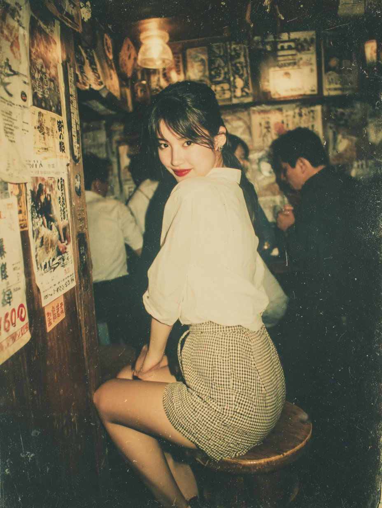

## 居酒屋里用闪光灯拍摄的美女照片

- ID: gpt4o-340-zh-2
- Slug: prompt-340-zh-2
- 语言: zh
- 来源: [来源链接](https://x.com/cheerselflin/status/1979203220061982872)
- 样例图路径: images/part3/340.jpeg

### 提示词

```text
这是一张在狭小拥挤的日式居酒屋里用闪光灯拍摄的照片，屋里摆满了手写菜单、老海报和木质纹理。光线来自机顶闪光灯的直射，营造出明亮的高光、刺眼的阴影和略带颗粒感的纹理，增强了照片的自然感。
画面主体是一位年轻女子坐在酒吧木凳上，微微侧身，目光越过肩膀，望向镜头。她身穿白色纽扣衬衫和高腰格纹短裙，露出双腿，为画面增添了一抹青春随意的气息。
闪光灯柔和地照亮了她的脸庞——双颊绯红，红唇闪耀光泽，目光与镜头交汇，眼神微妙、俏皮却又充满亲密感。她的笑容温柔却又充满暗示，透着一丝警觉与温暖。她的姿态和目光在自信与柔和之间营造出一种微妙的张力。
背景昏暗，挤满了身着深色衣服的老年顾客，与她明亮的身影形成鲜明对比。构图紧凑自然，是90年代日本一次性相机摄影的典型特征——高闪光对比度、轻微的模糊和自然的瑕疵。
整体氛围怀旧、温暖，略带一丝暧昧——捕捉真实、亲近、充满情感的瞬间，就像闪光灯照亮的个人记忆，而不是摆拍的肖像。
```

### 样例图


## a young beautiful sweet smiling Asian woman with soft br

- ID: gpt4o-337-en-1
- Slug: prompt-337-en-1
- 语言: en
- 来源: [来源链接](https://x.com/MANISH1027512/status/1978672690740310181)
- 样例图路径: images/part3/337.jpeg

### 提示词

```text
a young beautiful sweet smiling Asian woman with soft brown hair tied loosely in a low ponytail with gentle face-framing bangs, sitting sideways on a narrow wooden bar stool inside a tiny, crowded Japanese izakaya, turning back toward the camera with a gentle natural smile; wearing a white blouse and gray plaid high-waisted shorts; surrounded by middle-aged and elderly Japanese men in dark suits chatting quietly beside her; the bar interior is narrow and dimly lit, walls covered with old handwritten menus and vintage posters, cluttered shelves of bottles, ceramics, and small trinkets; soft warm tungsten lighting with slight haze, smoke lingering in the air, evoking the scent of grilled food and sake; authentic candid moment, intimate social atmosphere, nostalgic Showa-era Japanese nightlife vibe;cozy ambient tungsten lighting, low contrast, muted color palette with subtle green tint, shallow depth of field, film-like softness, slight haze, nostalgic 35mm analog photo, visible fine film grain, authentic Japanese retro bar atmosphere, candid portrait, in the style of Daido Moriyama, Takashi Homma, and Wong Kar Wai, Kodak Portra 400 film aesthetic --ar 3:4 --v 7
```

### 样例图

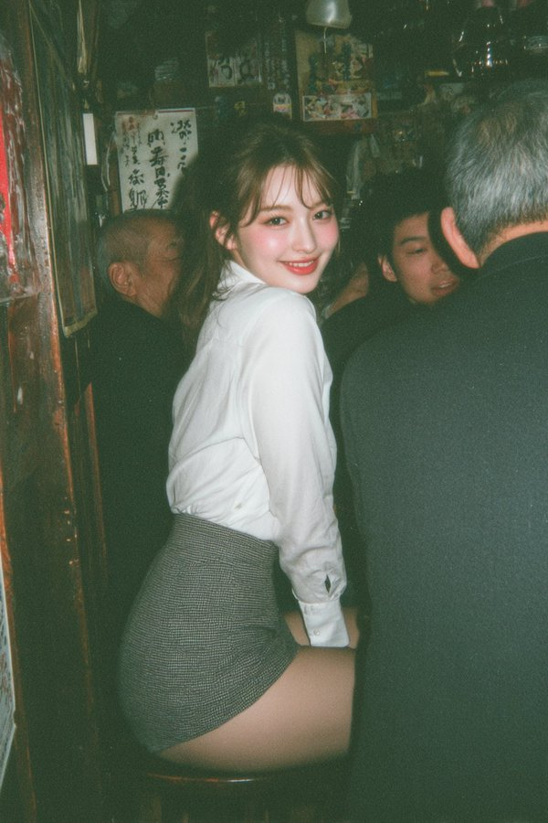

## 低马尾女孩在日式居酒屋

- ID: gpt4o-337-zh-2
- Slug: prompt-337-zh-2
- 语言: zh
- 来源: [来源链接](https://x.com/MANISH1027512/status/1978672690740310181)
- 样例图路径: images/part3/337.jpeg

### 提示词

```text
一位年轻美丽、笑容甜美的亚洲女性，一头柔软的棕色头发扎成低马尾，刘海柔和地修饰着脸型，她侧身坐在一间狭小拥挤的日式居酒屋里，坐在一张狭窄的木质吧台凳上，面带温柔自然的微笑；她身穿白色衬衫和灰色格子高腰短裤；她周围是穿着深色西装的中老年日本男子，他们在她旁边轻声聊天；酒吧内部狭窄而昏暗，墙上贴满了古老的手写菜单和复古海报，架子上杂乱地摆满了瓶子、陶瓷和小饰品；柔和温暖的钨丝灯略带薄雾，烟雾在空气中缭绕，散发着烧烤食物和清酒的香味；真实的坦率时刻，亲密的社交氛围，怀旧的昭和时代日本夜生活氛围；舒适的环境钨丝灯，低对比度，柔和的色调，微妙的绿色色调，浅景深，胶片般的柔软度，轻微的雾霾，怀旧的 35 毫米模拟照片，可见的细胶片颗粒，真实的日本复古酒吧氛围，坦率的肖像，森山大道、本间隆和王家卫的风格，柯达 Portra 400 胶片美学 --ar 3:4 --v 7
```

### 样例图


## a dreamy intimate portrait of a beautiful realistic asia

- ID: gpt4o-336-en-1
- Slug: prompt-336-en-1
- 语言: en
- 来源: [来源链接](https://x.com/MANISH1027512/status/1978041705623343437)
- 样例图路径: images/part3/336.jpeg

### 提示词

```text
a dreamy intimate portrait of a beautiful realistic asian woman lying under a blanket, soft natural light, cozy warm bedroom, cinematic film grain, 35mm film aesthetic, shallow depth of field, soft focus, delicate skin texture, natural makeup, slightly messy hair, Fujifilm Pro 400H look, pastel warm tones, realistic lighting, subtle haze, gentle atmosphere, by Petra Collins and Ren Hang --ar 3:4 --v7 --style raw
```

### 样例图

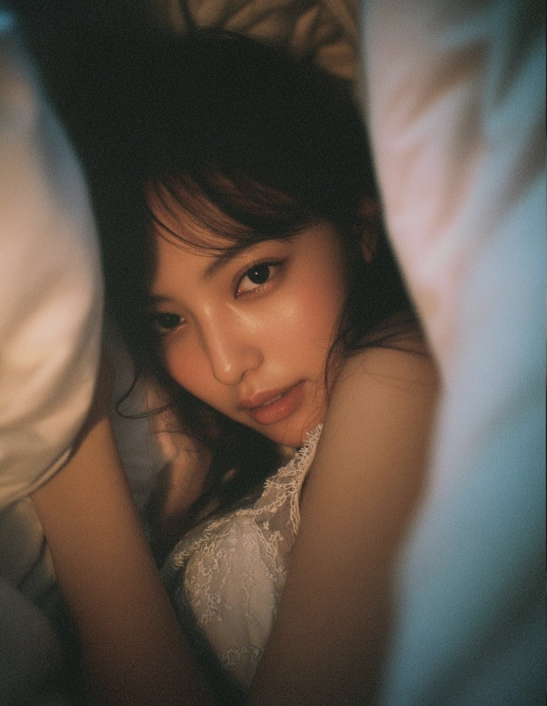

## 一幅如梦似幻的私密肖像照

- ID: gpt4o-336-zh-2
- Slug: prompt-336-zh-2
- 语言: zh
- 来源: [来源链接](https://x.com/MANISH1027512/status/1978041705623343437)
- 样例图路径: images/part3/336.jpeg

### 提示词

```text
一幅如梦似幻的私密肖像照：一位容貌精致、形象写实的亚裔女性躺在毛毯下，柔和的自然光线洒落，背景是温馨舒适的卧室。画面带有电影感颗粒质感，呈现 35 毫米胶片的美学风格，采用浅景深与柔焦效果，清晰展现细腻的肌肤纹理。人物妆容自然，头发略带凌乱，整体色调为柔和温暖的马卡龙色系，光线真实自然，还带有淡淡的朦胧感，营造出轻柔舒缓的氛围。（由佩特拉・科林斯与任航风格创作） --ar 3:4 --v7 --style raw
```

### 样例图


## a young beautiful Japanese woman with porcelain skin, so

- ID: gpt4o-335-en-1
- Slug: prompt-335-en-1
- 语言: en
- 来源: [来源链接](https://x.com/MANISH1027512/status/1979033662294241673)
- 样例图路径: images/part3/335.jpeg

### 提示词

```text
a young beautiful Japanese woman with porcelain skin, soft makeup and bright red lips, straight chestnut-brown hair neatly tied in a ponytail with straight bangs framing her face, wearing a fitted light-blue police uniform shirt with gold buttons and badge, a dark green flat ribbon tie knotted at the collar with two short tails hanging down like a gift bow, navy skirt, dark belt with brass buckle, white gloves, black shoes, 
sitting with her knees together and hands gently folded over a glass, calm and elegant posture, 
oxygen-fresh natural makeup look with translucent dewy base, barely-there eyeliner, soft straight brows, faint rosy blush on the cheeks, subtle inner-corner highlight that makes her eyes look bright and airy, lips a clean vivid red yet not glossy, 
her pose delicate and composed: seated on a narrow wooden bench in a cramped booth, ankles tucked slightly back, torso subtly leaning forward from the hips, forearms relaxed, gloved hands overlapping lightly above the small tumbler placed between her knees, chin slightly lowered while gazing directly at the camera, 
flanked by two older Japanese policemen in uniform on each side, 
the man on the left leaning inward from the doorway, cap slightly tilted, short-sleeve standard police shirt, one elbow resting on his knee with the hand hanging loosely, attentive and calm expression; 
the man on the right wearing a striped short-sleeve shirt with a dark tie and badge, cap set square with a gold band, arms firmly crossed over his chest, body angled toward the woman, a reserved, thoughtful look, 
inside a small dimly-lit bar filled with vintage Japanese posters, old bottles, narrow wooden walls, cluttered shelves, 
detailed physical environment: shot from the doorway so the worn wooden jambs create a frame-within-frame; scuffed varnished beams, handwritten Japanese slips and price tags pinned among utensils, cords and trinkets hanging overhead, glassware and liquor bottles stacked tight on shallow shelves, a tiny aisle underfoot, faint reflections on lacquered wood, humid air; one or two bare incandescent bulbs casting a localized amber pool of light that fades rapidly into darkness, 
camera perspective and ratio: intimate eye-level viewpoint at close conversational distance (about 1–1.5 m), classic 35mm focal feel, vertical portrait framing with a 3:4 aspect, slight center-weighted composition emphasizing the trio in a tight booth, 
warm incandescent lighting with nostalgic amber tone, low saturation colors, fine 35mm film grain texture, slightly overexposed highlights, retro 1980s analog snapshot aesthetic, candid composition, shallow depth of field, cinematic color grading, in the style of Nobuyoshi Araki and Daido Moriyama street photography --ar 3:4 --v 7
```

### 样例图

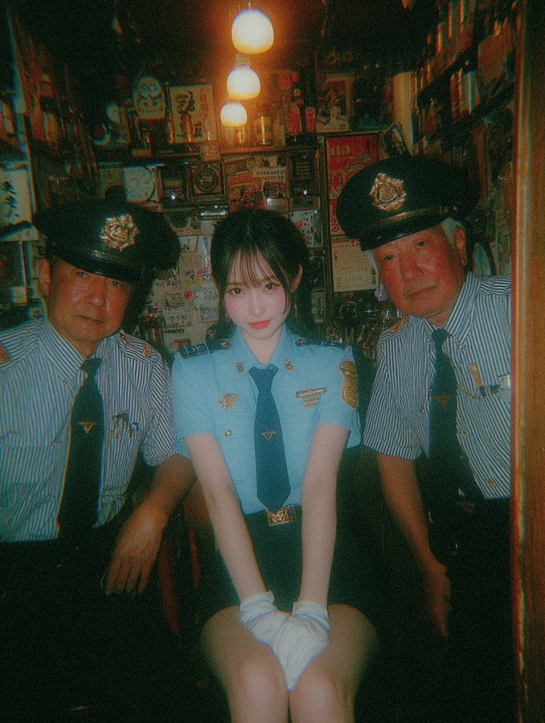

## 美丽的浅蓝色警服日本女子

- ID: gpt4o-335-zh-2
- Slug: prompt-335-zh-2
- 语言: zh
- 来源: [来源链接](https://x.com/MANISH1027512/status/1979033662294241673)
- 样例图路径: images/part3/335.jpeg

### 提示词

```text
一位年轻美丽的日本女子，有着瓷器般的肌肤、柔和的妆容和鲜红的嘴唇，栗色的直发扎成马尾辫，齐刘海修饰着她的脸型，身穿合身的浅蓝色警服衬衫，上面有金色的纽扣和徽章，深绿色的扁平丝带领带在领口处打结，两条短尾巴像礼物蝴蝶结一样垂下来，海军蓝裙子，深色腰带配黄铜扣，白手套，黑色鞋子，
她双膝并拢，双手轻轻地放在玻璃杯上，姿势平静而优雅，
氧气清新的自然妆容，透明水润的底妆，几乎看不见的眼线，柔软的直眉，脸颊上淡淡的玫瑰色腮红，微妙的内眼角高光使她的眼睛看起来明亮通风，嘴唇是干净鲜红但不油腻，
她的姿势精致而沉稳：坐在狭小隔间的一张窄木凳上，脚踝微微向后弯曲，躯干从臀部微微向前倾斜，前臂放松，戴着手套的双手轻轻重叠放在放在膝盖之间的小玻璃杯上方，下巴微微放低，直视镜头，
两侧各有两名身穿制服的年长日本警察，
左边的男人从门口探身向内，帽子微微倾斜，穿着短袖制式警服，一肘撑在膝盖上，手随意垂着，表情专注而平静；
右边的男人穿着条纹短袖衬衫，系着深色领带，戴着徽章，帽子是方形的，上面有一条金边，双臂紧紧地交叉在胸前，身体朝着女人倾斜，一副内敛、若有所思的样子，
在一个灯光昏暗的小酒吧里，摆满了复古的日本海报、旧瓶子、狭窄的木墙、杂乱的架子，
详细的物理环境：从门口拍摄，磨损的木质门框形成了一个画框；磨损的涂漆横梁、手写的日文单子​​和价格标签夹在餐具之间，电线和小饰品悬挂在头顶，玻璃器皿和酒瓶紧紧地堆放在浅浅的架子上，脚下是一条小过道，漆木上隐约的反光，潮湿的空气；一两个裸露的白炽灯泡投射出局部琥珀色的光晕，迅速消失在黑暗中，
相机视角和比例：近距离对话距离（约 1-1.5 米）的亲密视线视角，经典的 35 毫米焦距感，3：4 比例的垂直人像取景，轻微的中央重点构图，强调紧凑展位中的三人组，
温暖的白炽灯，怀旧的琥珀色调，低饱和度的色彩，细腻的 35 毫米胶片颗粒纹理，略微过度曝光的高光，复古的 1980 年代模拟快照美学，坦率的构图，浅景深，电影色彩分级，风格类似于荒木经惟和森山大道的街头摄影 -ar 3:4 --v 7
```

### 样例图


## { "style": "High-key studio portrait, direct flash aesth

- ID: gpt4o-333-en-1
- Slug: prompt-333-en-1
- 语言: en
- 来源: [来源链接](https://x.com/IamEmily2050/status/1975554358495654236)
- 样例图路径: images/part3/333.jpeg

### 提示词

```text
{
  "style": "High-key studio portrait, direct flash aesthetic, East Asian social media style (e.g., Ulzzang, Douyin), stylized beauty retouching.",
  "output": {
    "color_profile": "sRGB",
    "render_intent": "photo"
  },
  "subject": {
    "category": "human",
    "gender_presentation": "female",
    "ethnicity": "East Asian (e.g., Korean, Chinese)",
    "age_bracket": "young_adult",
    "body": {
      "build": "slim",
      "proportions": "natural human anatomy",
      "posture": "relaxed on sofa, seated casually",
      "pose": "seated, legs crossed and tucked close to body",
      "gesture": "Right hand raised, fingers loosely curled, back of fingers/knuckles gently supporting the chin and lower cheek.",
      "head_tilt_deg": 5
    },
    "face": {
      "expression": "Playful, alluring",
      "gaze": "right eye direct to camera",
      "eye_action": "winking with the left eye",
      "skin_tone": "Very pale porcelain (lightened aesthetic)",
      "makeup": "Stylized K-Beauty/Douyin look: flawless matte base, strong pink blush high on cheeks, pink gradient lips, defined brows, light eyeliner, emphasized Aegyo-sal",
      "features": "small beauty mark/mole under the left eye"
    },
    "hair": {
      "length": "long",
      "style": "messy high updo/bun with loose strands and curtain bangs",
      "color": "dark brown"
    },
    "wardrobe": {
      "top": "white fitted cropped camisole",
      "outerwear": "light gray zip hoodie, worn open and slightly slipping off both shoulders",
      "bottom": "white lounge shorts with drawstring",
      "footwear": "barefoot"
    }
  },
  "environment": {
    "location": "studio or minimalist interior",
    "set": "black leather sofa against a plain white or light gray wall",
    "props": "Silver laptop (Apple MacBook, logo visible) placed on the cushion to the subject's right (camera left)"
  },
  "lighting": {
    "key": {
      "source": "strobe/flash",
      "modifier": "Bare reflector or direct flash (hard source)",
      "position": "Near camera axis, slightly camera-right and above eye line",
      "effect": "Crisp, dark, well-defined cast shadows on the wall directly behind subject; strong specular highlights on skin and sofa leather."
    },
    "fill": {
      "type": "minimal/none"
    },
    "ambient": "suppressed",
    "white_balance_K": 5800
  },
  "camera": {
    "system": "Digital Camera",
    "sensor": "full-frame equivalent",
    "lens": {
      "type": "prime",
      "focal_length_mm": 50
    },
    "exposure": {
      "iso": 100,
      "aperture_f": 4.0,
      "metering": "Bright exposure, high-key aesthetic"
    },
    "focus": {
      "target": "near eye (right eye)",
      "depth_of_field": "moderate"
    },
    "framing": {
      "orientation": "vertical",
      "crop": "mid-thigh to head with room above hair",
      "angle": "eye-level",
      "composition": "subject centrally framed"
    }
  },
  "color_grade": {
    "look": "Bright, clean, slightly cool tone",
    "contrast": "High contrast",
    "saturation": "moderate, emphasized pinks"
  },
  "postprocess": {
    "noise_reduction": "high",
    "texture": "Highly smoothed skin, poreless appearance ('porcelain doll' or 'beauty filter' effect)",
    "sharpen": "selective on eyes/lashes",
    "blemish_control": "Complete removal of all blemishes and texture."
  },
  "quality_targets": [
    "accurate limb lengths and joint angles",
    "correct finger count and articulation",
    "realistic fabric tension and folds",
    "accurate winking expression"
  ],
  "negative_prompt": [
    "no altered or exaggerated body proportions",
    "no extra or fused fingers",
    "no realistic skin texture, pores, or blemishes",
    "no text or watermarks (excluding specified logos)",
    "no extreme wide-angle distortion",
    "no NSFW content",
    "no dark/moody lighting",
    "no warm tones"
  ]
}
```

### 样例图


## 女生坐沙发上

- ID: gpt4o-333-zh-2
- Slug: prompt-333-zh-2
- 语言: zh
- 来源: [来源链接](https://x.com/IamEmily2050/status/1975554358495654236)
- 样例图路径: images/part3/333.jpeg

### 提示词

```text
{
"style": "高调影棚人像，闪光灯直击美感，东亚社交媒体风格（例如Ulzzang、抖音），风格化美颜修图。",
“输出”： {
"color_profile": "sRGB",
"render_intent": "照片"
}，
“主题”： {
“类别”：“人类”，
"gender_presentation": "女性",
"ethnicity": "东亚人（例如韩国人、中国人）",
"age_bracket": "young_adult",
“身体”： {
"build": "slim",
"比例": "自然人体解剖学",
"posture": "放松地坐在沙发上，随意地坐着",
"pose": "坐着，双腿交叉，身体紧贴身体",
"gesture": "右手举起，手指松散地卷曲，手指背面/指关节轻轻支撑下巴和下脸颊。",
“头部倾斜度”：5
}，
“脸”： {
"expression": "俏皮、诱人",
"gaze": "右眼直视相机",
"eye_action": "用左眼眨眼",
"skin_tone": "非常苍白的瓷器（明亮的美学）",
"makeup": "风格化的韩妆/抖音妆容：完美哑光底妆，脸颊上浓重的粉色腮红，粉色渐变唇妆，清晰的眉毛，淡淡的眼线，强调的撒娇，
"features": "左眼下方有一颗小美人痣"
}，
“头发”： {
"length": "长",
"style": "凌乱的高髻/发髻，散落的发束和窗帘刘海",
“颜色”：“深棕色”
}，
“衣柜”： {
"top": "白色修身短款吊带背心",
“外套”：“浅灰色拉链连帽衫，敞开穿着，双肩略微滑落”，
"bottom": "白色抽绳休闲短裤",
“鞋类”：“赤脚”
}
}，
“环境”： {
"location": "工作室或简约室内",
"set": "黑色皮沙发搭配纯白色或浅灰色墙壁",
"props": "银色笔记本电脑（Apple MacBook，标志可见）放置在拍摄对象右侧的垫子上（相机左侧）"
}，
“灯光”： {
“钥匙”： {
"source": "频闪/闪光",
"modifier": "裸露的反射器或直接闪光（硬源）",
"position": "靠近相机轴，略微位于相机右侧且高于视线",
"effect": "拍摄对象正后方的墙壁上投射出清晰、暗淡、轮廓分明的阴影；皮肤和沙发皮革上出现强烈的镜面高光。"
}，
“充满”： {
“类型”：“最小/无”
}，
“环境”：“抑制”，
“白平衡K”：5800
}，
“相机”： {
"system": "数码相机",
“传感器”：“全画幅等效”，
“镜片”： {
“类型”：“主要”，
“焦距毫米”：50
}，
“接触”： {
"iso": 100,
"aperture_f": 4.0,
“测光”：“明亮的曝光，高调的美感”
}，
“重点”： {
"target": "近眼（右眼）",
"depth_of_field": "中等"
}，
“框架”：{
“方向”：“垂直”，
"crop": "从大腿中部到头部，头发上方有空间",
"角度": "视线水平",
"composition": "主体居中"
}
}，
“颜色等级”：{
"look": "明亮、干净、略带冷色调",
"contrast": "高对比度",
“饱和度”：“中等，强调粉红色”
}，
“后处理”：{
"noise_reduction": "高",
"texture": "肌肤高度光滑，无毛孔外观（‘瓷娃娃’或‘美颜滤镜’效果）",
“锐化”：“选择性地针对眼睛/睫毛”，
"blemish_control": "彻底去除所有瑕疵和纹理。"
}，
"质量目标": [
“准确的肢体长度和关节角度”，
“正确的手指计数和发音”，
“逼真的织物张力和褶皱”，
“精准的眨眼表情”
]，
"negative_prompt": [
“没有改变或夸大身体比例”，
“没有多余的或融合的手指”，
“没有真实的皮肤纹理、毛孔或瑕疵”，
“无文字或水印（指定徽标除外）”，
“没有极端的广角畸变”，
“禁止 NSFW 内容”，
“没有黑暗/忧郁的灯光”，
“没有暖色调”
]
}
```

### 样例图


## 女生镜子自拍

- ID: gpt4o-332-zh
- Slug: prompt-332-zh
- 语言: zh
- 来源: [来源链接](https://x.com/dotey/status/1976485558319722711)
- 样例图路径: images/part3/332.jpeg

### 提示词

```text
### **场景**
镜子自拍，御宅族电脑角落，蓝色调

---

### **主体**
* **性别表现**: 女性
* **年龄段**: 25岁左右
* **种族**: 东亚
* **身材**: 苗条，腰线分明；身材比例自然
* **肤色**: 浅中性色调
* **发型**:
    * **长度**: 及腰长发
    * **样式**: 直发，发尾微卷
    * **颜色**: 中等棕色
* **姿势**:
    * **站姿**: 站立，轻微的对立式平衡站姿（contrapposto）
    * **右手**: 手持手机挡住脸（身份被遮挡）
    * **左臂**: 在躯干旁自然下垂
    * **躯干**: 身体轻微后仰；露出腰腹
* **着装**:
    * **上衣**: 浅蓝色短款针织开衫，扣上前两颗纽扣；隐约可见蓝色法式内衣
    * **下装**: 牛仔超短裤，两侧臀部各有一个蓝色缎带蝴蝶结
    * **袜子**: 蓝白横条纹过膝长袜
    * **配饰**: 蓝色可爱吉祥物手机壳

---

### **环境**
* **描述**: 从挂墙镜中看到的卧室电脑角落
* **陈设**:
    * 白色书桌
    * 单显示器，显示着柔和的蓝色壁纸（没有可读的文字）
    * 机械键盘，白色键帽，放在蓝色桌垫上
    * 鼠标，放在小号蓝色鼠标垫上
    * PC主机在右侧，带有蓝色机箱灯效
    * PC主机上或附近有三个动漫手办
    * 墙上贴着一张佛塔海报
    * 猫形台灯，带有蓝色点缀
    * 一杯透明的玻璃水杯
    * 窗边（镜头左侧）有一株高大的绿叶植物
* **颜色替换**: 将所有原先的粉色元素（衣物和房间）替换为蓝色（婴儿蓝 -> 天空蓝/长春花蓝）。

---

### **灯光**
* **光源**: 来自镜头左侧大窗户的日光，透过薄纱窗帘
* **光线质感**: 柔和的漫射光
* **白平衡 (K)**: 5200

---

### **相机**
* **模式**: 智能手机后置摄像头通过镜子拍摄（无肖像/虚化模式）
* **等效焦距 (mm)**: 26
* **距离 (米)**:
    * 主体到镜子: 0.6
    * 相机到镜子: 0.5
* **曝光**:
    * 光圈 (f): 1.8
    * 感光度 (ISO): 100
    * 快门速度 (秒): 0.01
    * 曝光补偿 (EV): -0.3
* **对焦**: 对焦于镜中影像的躯干和短裤
* **景深**: 自然的智能手机景深（深景深）；背景清晰可辨，无人为模糊
* **构图**:
    * **宽高比**: 1:1
    * **裁剪**: 从头顶到大腿中部；画面包含书桌、显示器、PC主机和植物
    * **角度**: 从镜子的视角轻微俯拍
    * **构图备注**: 保持主体居中；为避免广角边缘拉伸，可以站远一些再进行方形裁剪

---

### **负面提示词**
* 任何地方出现粉色/品红色
* 美颜滤镜/磨皮皮肤；没有毛孔的外观
* 夸张或扭曲的人体结构
* NSFW，透视面料，走光
* 商标，品牌名，可读的用户界面文本
* 虚假的人像模式模糊，CGI/插画感
```

### 样例图


## { "scene": { "environment": { "location_type": "modern g

- ID: gpt4o-331-en-1
- Slug: prompt-331-en-1
- 语言: en
- 来源: [来源链接](https://x.com/IamEmily2050/status/1974108838929576299)
- 样例图路径: images/part3/331.jpeg

### 提示词

```text
{
  "scene": {
    "environment": {
      "location_type": "modern gallery hallway",
      "left_wall": "black-and-white optical swirl mural, matte finish",
      "right_wall": "framed monochrome manga panels with sparse Japanese onomatopoeia",
      "floor": "light gray polished tile with 2x2 m matte gray vinyl sheet under subject to kill reflections",
      "depth": "short corridor depth with subtle falloff",
      "clutter": "none"
    },
    "time": "indoors, artificial light",
    "mood": "cool, composed, slightly mysterious",
    "color_palette": "neutral-cool grays, olive top, desaturated denim blues"
  },
  "subject": {
    "type": "human",
    "gender": "female",
    "approx_age": "early 20s",
    "appearance": {
      "skin_tone": "fair-light with neutral undertone",
      "hair": "jet-black, very long, straight, center part; clean specular sheen",
      "face": "oval face, soft makeup, subtle gloss on lips, light eyeliner and mascara",
      "earrings": "large silver hoop earrings"
    },
    "wardrobe": {
      "top": "fitted olive/khaki ribbed tank with small rhinestone cross motifs (check glue before shoot)",
      "bottom": "high-waisted distressed denim shorts with heavy frayed hem and beige repair patches (tape rear hem flat)",
      "footwear": "out_of_frame"
    },
    "pose": {
      "stance": "leans back and slightly left with head resting against mural wall",
      "torso": "relaxed, angled 10–15° to camera",
      "arms_hands": "right arm behind torso/out_of_frame, left arm relaxed by side",
      "expression": "calm, neutral-to-soft gaze past camera",
      "chin": "slightly down; head tilt toward left shoulder"
    }
  },
  "framing_composition": {
    "shot_type": "mid-thigh portrait (three-quarter length)",
    "orientation": "vertical",
    "framing": "subject placed on left third; right third shows manga panels",
    "leading_lines": "doorframe/panel edges vertical; swirl mural adds texture without overpowering subject",
    "background_separation": "subtle; background softly defocused but still readable"
  },
  "camera": {
    "sensor": "full-frame mirrorless",
    "lens": {
      "focal_length_mm": 50,
      "type": "prime",
      "character": "neutral rendering, low distortion"
    },
    "settings": {
      "aperture": "f/3.2",
      "shutter_speed": "1/250",
      "iso": 400,
      "white_balance": "custom grey-card @ 4600 K",
      "focus": "eye-AF + 3-frame focus bracket (±1 cm)",
      "stabilisation": "IBIS on"
    },
    "perspective": "camera at chest level; minimal keystoning; maintain straight verticals"
  },
  "lighting": {
    "key": "broad, soft overhead/ceiling panel light",
    "fill": "60×60 cm white bounce 30 cm below bust line, ~1.3 stops under key",
    "rim": "narrow 1×2 ft strip-light behind subject camera-right, ½ stop over key",
    "quality": "soft, diffuse; no hard shadows",
    "exposure_target": "skin at ~65 IRE; rhinestones clipped < 90 IRE",
    "specular_control": "micro-specular on hair; avoid plastic skin sheen"
  },
  "rendering_intent": {
    "photorealism": "high",
    "texture": "retain fabric weave, denim fray strands, hair strands",
    "background_text_policy": "allow only existing manga panel text; do not invent extra signage or captions"
  },
  "post_processing": {
    "color_grade": "neutral-cool base with gentle contrast curve; slight cyan in shadows, warm bias on skin",
    "tone_curve": "soft S-curve (lift shadows +3, compress highlights -5)",
    "clarity_texture": "clarity -5 on skin via masked adjustment; texture +5 on denim/frayed hem only (separate mask)",
    "noise_reduction": "luma 10, chroma 15",
    "sharpening": "amount 40, radius 0.7, detail 25, masking 60 (protect background)",
    "vignette": "subtle -0.1 EV centre-weighted",
    "geometry": "verticals upright; crop 4:5 with space above head and right-side manga visible",
  }
```

### 样例图


## 走廊上的女性

- ID: gpt4o-331-zh-2
- Slug: prompt-331-zh-2
- 语言: zh
- 来源: [来源链接](https://x.com/IamEmily2050/status/1974108838929576299)
- 样例图路径: images/part3/331.jpeg

### 提示词

```text
{
“场景”： {
“环境”： {
"location_type": "现代画廊走廊",
"left_wall": "黑白光学漩涡壁画，哑光饰面",
"right_wall": "带有稀疏日语拟声词的单色漫画面板",
“地板”：“浅灰色抛光瓷砖，铺有 2x2 米哑光灰色乙烯基板，以消除反射”，
"depth": "短走廊深度，具有微妙的衰减",
“杂乱”：“无”
}，
"time": "室内，人造光",
"mood": "冷静、沉着、略带神秘",
"color_palette": "中性冷灰色、橄榄色上衣、去饱和牛仔蓝"
}，
“主题”： {
“类型”：“人类”，
"性别": "女",
"approx_age": "20 岁出头",
“外貌”： {
"skin_tone": "白皙，中性底色",
“头发”：“乌黑，很长，直，中分；干净的镜面光泽”，
"face": "椭圆脸，淡妆，唇彩淡淡，眼线和睫毛膏淡淡的",
“耳环”：“大号银环耳环”
}，
“衣柜”： {
"top": "修身橄榄色/卡其色罗纹背心，饰有小水钻十字图案（拍摄前请检查胶水）",
"bottom": "高腰破洞牛仔短裤，下摆磨损严重，配有米色修片（后摆用胶带平整粘贴）",
“footwear”：“out_of_frame”
}，
“姿势”：{
"stance": "身体向后稍微向左倾斜，头靠在壁画上",
“躯干”：“放松，与相机呈 10-15° 角”，
"arms_hands": "右臂在躯干后方/超出框架，左臂在身体侧面放松",
“表情”：“平静、中性到柔和的目光穿过镜头”，
“下巴”：“稍微向下；头向左肩倾斜”
}
}，
“framing_composition”：{
"shot_type": "大腿中部肖像（四分之三长度）",
“方向”：“垂直”，
"framing": "主体放置在左边三分之一处；右边三分之一处显示漫画面板",
"leading_lines": "门框/面板边缘垂直；漩涡壁画增添了纹理，但又不会掩盖主题",
"background_separation": "微妙；背景轻微散焦但仍可读"
}，
“相机”： {
“传感器”：“全画幅无反光镜”，
“镜片”： {
"焦距毫米": 50,
“类型”：“主要”，
“character”：“中性渲染，低失真”
}，
“设置”： {
"光圈": "f/3.2",
"shutter_speed": "1/250",
“iso”：400，
"white_balance": "自定义灰卡 @ 4600 K",
"focus": "眼部自动对焦 + 3 帧对焦框 (±1 cm)",
“稳定”：“IBIS开启”
}，
“视角”：“摄像机位于胸部高度；最小梯形失真；保持垂直线”
}，
“灯光”： {
"key": "宽阔、柔和的顶灯/天花板面板灯",
"fill": "60×60 厘米白色反射镜，位于胸围线以下 30 厘米处，主光圈下方约 1.3 档",
"rim": "1×2 英尺窄条形灯位于拍摄对象相机右侧后方，比主光高出 ½ 档",
“质量”：“柔和，漫反射；无硬阴影”，
"exposure_target": "皮肤 ~65 IRE；水钻修剪 < 90 IRE",
"specular_control": "头发上的微镜面；避免塑料皮肤光泽"
}，
“渲染意图”：{
"照片写实主义": "高",
"texture": "保留织物编织、牛仔布磨损线、发丝",
"background_text_policy": "仅允许现有的漫画面板文本；不要发明额外的标志或标题"
}，
“后处理”：{
"color_grade": "中性冷色调，对比度曲线柔和；阴影中略带青色，皮肤上偏暖色",
"tone_curve": "柔和的 S 曲线（提升阴影 +3，压缩高光 -5）",
"clarity_texture": "通过蒙版调整，皮肤的清晰度为 -5；仅牛仔布/磨损下摆的纹理为 +5（单独蒙版）",
"noise_reduction": "亮度 10，色度 15",
"sharpening": "数量 40，半径 0.7，细节 25，遮罩 60（保护背景）",
"vignette": "微妙的 -0.1 EV 中央重点",
"geometry": "垂直竖直；裁剪比例为 4:5，头部上方有空间，右侧漫画可见",
}
```

### 样例图


## { "photorealistic_indoor_reclining_portrait", "style": "

- ID: gpt4o-330-en-1
- Slug: prompt-330-en-1
- 语言: en
- 来源: [来源链接](https://x.com/IamEmily2050/status/1976068430798389550)
- 样例图路径: images/part3/330.jpeg

### 提示词

```text
{
"photorealistic_indoor_reclining_portrait",
  "style": "Natural editorial portrait; lifelike texture; minimal, tasteful retouching.",
  "output": { "aspect_ratio": "9:16", "resolution_px": [1440, 2560], "color_profile": "sRGB" },

  "subject": {
    "category": "human",
    "gender_presentation": "female",
    "ethnicity": "East Asian",
    "age_bracket": "young_adult",
    "body": {
      "build": "slim with realistic proportions",
      "bust": "fuller bust (natural C–D cup), proportional to frame; gentle natural slope, supportive shaping—no extreme push-up",
      "skin_tone": "light neutral with natural variation"
    },
    "pose": {
      "orientation": "reclining on back, relaxed",
      "right_arm": "raised above head, fingers lightly touching hairline",
      "left_arm": "bent across torso, hand resting on midriff",
      "head": "slightly tilted toward camera left"
    },
    "face": {
      "shape": "oval with mild asymmetry and natural cheek volume",
      "expression": "soft and open",
      "gaze": "direct to camera"
    },
    "eyes": {
      "description": "natural-size, lively but realistic",
      "color": "neutral gray-blue (low saturation)",
      "size_ratio": { "iris_fraction_of_visible_eye": 0.29, "pupil_fraction_of_iris": 0.27 },
      "details": {
        "limbal_ring_strength": 0.08,
        "sclera_brightness_Lstar": 78,
        "sclera_texture": "fine veins and faint tear meniscus on lower lid",
        "catchlights": "two soft rectangular window reflections about 10% of iris width",
        "specular_quality": "satin (no glassy glare)",
        "iris_texture": "visible stromal fibers and subtle color noise"
      }
    },
    "makeup": "sheer base preserving pores; soft peach blush; brown mascara/liner; taupe eyeshadow; hydrated nude lips",
    "hair": { "length": "long", "style": "half-up with bun, slight wave; a few flyaways visible", "color": "natural black" },
    "wardrobe": {
      "outfit": "blue top with Gucci shorts",
      "top": "powder-blue cropped bustier with sweetheart neckline and structured cups; off-shoulder or slim straps; tasteful cleavage; opaque lined fabric; subtle corset seams; cropped length reveals a sliver of midriff",
      "bottom": "Gucci blue GG-monogram denim shorts (small-scale jacquard, navy/indigo on blue; correct 'GG' orientation; no extra text)",
      "accessories": {
        "jewelry": "thin black velvet choker with tiny pendant, small stud earrings, simple rings",
        "wrists": "white fabric scrunchie on right; delicate bracelets on left"
      }
    }
  },
     "environment": {
    "location": "bedroom",
    "set": "plush bed with slightly wrinkled off-white linens and pillows",
    "background_props": "upper right: dark round tray with small white ceramic tea set on textured brown surface"
  },

  "lighting": {
    "scheme": "window key + sheet bounce",
    "source": "large window through sheer curtains (or 120 cm softbox with double diffusion)",
    "quality": "very soft with defined direction",
    "direction": "45° from camera right and slightly top; white bedding as fill about 1.5 stops under key",
    "temperature": "5200K",
    "effect": "gentle modeling with soft nose/lip shadow; crisp but soft eye catchlights; no bloom"
  },

  "camera": {
    "sensor": "full-frame",
    "lens": { "focal_length_mm": 85 },
    "distance_m": 1.8,
    "exposure": {
      "aperture_f": 3.2,
      "iso": 200,
      "shutter_s": 0.005,
      "metering": "spot on cheekbone; ETTR then -0.3 EV to protect highlights on fabric"
    },
    "focus": {
      "target": "near eye",
      "depth_of_field": "moderate (eyes and bust plane in focus; bedding softly blurred)"
    },
    "framing": {
      "orientation": "vertical",
      "angle": "overhead with slight tilt toward face; avoid wide-angle distortion",
      "composition": "9:16 crop framed head to upper hips so bustier and Gucci shorts are visible without foreshortening"
    }
  },

  "color_grade": {
    "look": "true-to-life neutrals with blue accent",
    "contrast": "medium-low",
    "palette": "powder/indigo blues, ivory, soft brown",
    "notes": "retain skin undertones; avoid cyan cast; ensure Gucci blue reads clean without oversaturation"
  },

  "postprocess": {
    "skin": "retain pores and micro-shine; remove only transient blemishes; keep faint under-eye texture",
    "eyes": "no iris enlargement; subtle iris clarity and micro-contrast; limbal ring kept weak",
    "sharpen": "moderate on eyes/brows/hair strands and denim weave/monogram",
    "grain": "fine film grain at 1.5–2%",
    "effects": "disable beauty filters, frequency-separation blur, glow/bloom; no HDR skin"
  },

  "realism_cues": [
    "flyaway hairs around hairline",
    "subtle nasolabial and philtrum depth",
    "natural knuckle/tendon texture on left hand",
    "visible denim weave and aligned monogram on shorts",
    "fabric creases and bedding wrinkles"
  ],

  "negative_prompt": [
    "doll, BJD, porcelain skin, neotenous proportions, plastic/waxy texture",
    "oversized/anime/doe eyes, iris enlargement, glassy eyes",
    "bright cyan/ice-blue contacts, heavy limbal ring, unnaturally white sclera",
    "poreless skin, beauty filter, airbrushed, skin smoothing",
    "bloom/Orton glow, excessive skin luster",
    "CGI, 3D render, illustration, toon shading, LoRA: doll/BJD",
    "wide-angle facial distortion, extreme symmetry filter",
    "random text overlays, misspelled logos, watermarks",
    "see-through fabrics, wardrobe malfunction, underboob/sideboob, explicit NSFW",
    "distorted anatomy, extra fingers"
  ],

}
```

### 样例图


## 照片级真实感室内躺姿人像

- ID: gpt4o-330-zh-2
- Slug: prompt-330-zh-2
- 语言: zh
- 来源: [来源链接](https://x.com/IamEmily2050/status/1976068430798389550)
- 样例图路径: images/part3/330.jpeg

### 提示词

```text
{
"照片级真实感室内躺姿人像",
  "风格": "自然杂志风人像；逼真质感；简约且精致的修图（保留真实细节）",
  "输出参数": { "宽高比": "9:16", "分辨率（像素）": [1440, 2560], "色彩配置文件": "sRGB" },

  "拍摄主体": {
    "类别": "人物",
    "性别呈现": "女性",
    "人种": "东亚人",
    "年龄段": "年轻成人",
    "身形": {
      "体型": "纤瘦且比例真实",
      "胸部": "丰满（自然C-D罩杯），与整体身形比例协调；线条自然柔和，有承托感，无过度聚拢效果",
      "肤色": "浅中性色，带有自然肤色差异（非均匀色块）"
    },
    "姿势": {
      "整体姿态": "仰卧，姿态放松",
      "右臂": "举过头顶，手指轻触发际线",
      "左臂": "弯曲横过躯干，手搭在腹部",
      "头部": "略微向镜头左侧倾斜"
    },
    "面部": {
      "脸型": "椭圆形，略带不对称感，脸颊饱满度自然",
      "表情": "柔和、舒展",
      "目光": "直视镜头"
    },
    "眼部": {
      "描述": "大小自然，灵动且真实",
      "颜色": "中性灰蓝色（低饱和度）",
      "大小比例": { "虹膜占可见眼球比例": 0.29, "瞳孔占虹膜比例": 0.27 },
      "细节": {
        "虹膜边缘环清晰度": 0.08（近乎隐形）,
        "眼白亮度（L*值）": 78,
        "眼白质感": "细微血管，下眼睑有淡泪痕",
        "眼神光": "两处柔和的长方形窗户反光，宽度约为虹膜的10%",
        "光泽质感": "丝缎质感（无玻璃般的强光反射）",
        "虹膜纹理": "可见基质纤维，带有细微色彩颗粒感"
      }
    },
    "妆容": "轻薄底妆（保留毛孔）；柔和桃色腮红；棕色睫毛膏/眼线；灰褐色眼影；水润裸色唇膏",
    "发型": { "长度": "长发", "造型": "半扎丸子头，略带波浪；可见几根碎发", "颜色": "自然黑色" },
    "服饰": {
      "整体搭配": "蓝色上衣配古驰（Gucci）短裤",
      "上衣": "粉蓝色短款抹胸，心形领口，带立体罩杯；露肩或细肩带设计；领口弧度优雅；面料厚实不透视（带里衬）；带有精致束腰缝线；短款设计露出一小截腹部",
      "下装": "古驰（Gucci）蓝色双G提花牛仔短裤（小尺寸提花图案，藏青/靛蓝色花纹印于蓝色基底上；双G标志方向正确；无多余文字图案）",
      "配饰": {
        "珠宝": "黑色细天鹅绒项圈（带小巧吊坠）、小巧耳钉、简约戒指",
        "腕部饰品": "右手戴白色布艺发圈；左手戴精致手链"
      }
    }
  },

  "环境": {
    "场景": "卧室",
    "布景": "柔软的床，铺有略带褶皱的米白色床品和枕头",
    "背景道具": "右上角：深色圆形托盘（置于纹理棕色表面上），托盘内放有小型白色陶瓷茶具"
  },

  "光线": {
    "布光方案": "窗户主光+床单反光补光",
    "光源": "透过薄窗帘的大窗户（或120厘米双扩散柔光箱）",
    "光线质感": "极其柔和，且方向明确",
    "光线方向": "从镜头右侧45°角、略高于主体的位置入射；白色床品作为补光（亮度比主光低1.5档）",
    "色温": "5200K（标准白光）",
    "光影效果": "柔和的轮廓塑造（鼻子/唇部阴影自然）；清晰且柔和的眼神光；无光晕溢出"
  },

  "相机参数": {
    "传感器": "全画幅",
    "镜头": { "焦距（毫米）": 85 },
    "拍摄距离（米）": 1.8,
    "曝光参数": {
      "光圈值": 3.2,
      "感光度（ISO）": 200,
      "快门速度（秒）": 0.005（即1/200秒）,
      "测光方式": "点测光（测光点为颧骨）；向右曝光（ETTR）后降低0.3档曝光值，以保护面料高光细节"
    },
    "对焦": {
      "对焦目标": "靠近镜头一侧的眼睛",
      "景深": "中等（眼睛与胸部处于同一焦平面，保持清晰；床品轻微虚化）"
    },
    "构图": {
      "画面方向": "竖版",
      "拍摄角度": "俯拍，镜头略微向面部倾斜；避免广角畸变",
      "裁切比例": "9:16裁切，画面覆盖头部至髋部上方，确保抹胸与古驰短裤完整呈现，且无透视变形"
    }
  },

  "调色": {
    "风格": "真实中性色调，以蓝色为点缀色",
    "对比度": "中低",
    "色调 palette": "粉蓝/靛蓝色、米白色、柔和棕色",
    "注意事项": "保留皮肤原有底色；避免青蓝色色偏；确保古驰蓝色呈现纯净质感，无过度饱和"
  },

  "后期处理": {
    "皮肤处理": "保留毛孔与细微油光；仅去除临时瑕疵（如痘痘）；保留淡淡的眼下纹理",
    "眼部处理": "不放大虹膜；轻微增强虹膜清晰度与微对比度；保留弱虹膜边缘环",
    "锐化": "对眼睛/眉毛/发丝、牛仔面料纹理/提花图案进行适度锐化",
    "颗粒感": "添加1.5%-2%的细腻胶片颗粒",
    "效果禁用": "关闭美颜滤镜、频率分离模糊、光晕/柔光效果；不使用HDR皮肤处理"
  },

  "真实感细节提示": [
    "发际线处的碎发",
    "自然的鼻唇沟与人中立体感",
    "左手手指关节/肌腱的真实纹理",
    "短裤上清晰的牛仔面料纹理与对齐的提花图案",
    "面料褶皱与床品自然褶皱"
  ],

  "负面提示（需避免）": [
    "玩偶感、球形关节娃娃（BJD）、瓷娃娃质感皮肤、幼态化比例、塑料/蜡质质感",
    "过大眼睛/动漫眼/小鹿眼、虹膜放大、玻璃质感眼睛",
    "亮青色/冰蓝色美瞳、明显虹膜边缘环、不自然的雪白眼白",
    "无毛孔皮肤、美颜滤镜效果、磨皮过度、皮肤光滑失真",
    "光晕效果/奥顿柔光效果（Orton glow）、皮肤过度油光",
    "CGI效果、3D渲染、插画风格、卡通 shading、玩偶/球形关节娃娃（BJD）相关模型（LoRA）",
    "广角镜头面部畸变、过度对称滤镜效果",
    "随机文字叠加、logo拼写错误、水印",
    "透视装/面料过透、服饰走光、露下胸/侧胸、不雅内容（NSFW）",
    "肢体结构扭曲、多手指"
  ]
}
```

### 样例图


## A hyper-realistic 4K UHD vertical potrait (3:4) of me, p

- ID: gpt4o-329-en-1
- Slug: prompt-329-en-1
- 语言: en
- 来源: [来源链接](https://x.com/saniaspeaks_/status/1976622473107194142)
- 样例图路径: images/part3/329.jpeg

### 提示词

```text
A hyper-realistic 4K UHD vertical potrait (3:4) of me, preserving my exact original face and features. i am seated , slightly leaned forward with relaxed and calm expression. the background is a smooth, rich gradient of oranve and yellow tones, casting soft but vivid warm ambiet light around me, lighting is studio-grade , creating a glowing cinematic effect with gentle shadow behind me. i wear a loose , dark robe or fabric that drapes naturally. the mood is artistic and slightly surreal , with a moody, high-contrast look and a golden , warm color palette. the overall style is realistic , cinematic , and softly lit - with stunning UHD detail.
```

### 样例图

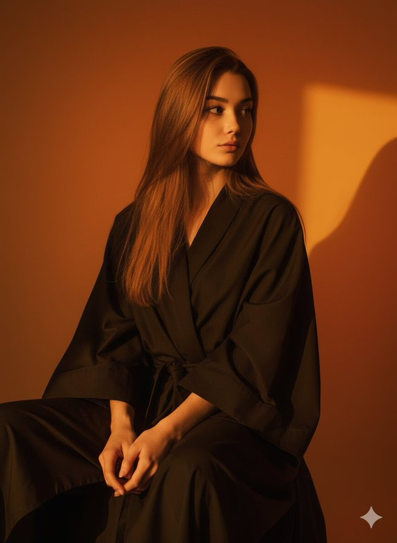

## 美女竖拍肖像

- ID: gpt4o-329-zh-2
- Slug: prompt-329-zh-2
- 语言: zh
- 来源: [来源链接](https://x.com/saniaspeaks_/status/1976622473107194142)
- 样例图路径: images/part3/329.jpeg

### 提示词

```text
这是一张超现实的 4K UHD 竖拍肖像（3:4），保留了我原本的面容和特征。我坐着，身体微微前倾，表情放松而平静。背景是平滑、丰富的橙色和黄色渐变色调，在我周围投射出柔和而生动的温暖氛围光，灯光是工作室级别的，在我身后形成柔和的阴影，营造出一种闪耀的电影效果。我穿着宽松的深色长袍或自然垂坠的布料。氛围充满艺术感，略带超现实主义，具有忧郁、高对比度的外观和金色、温暖的色调。整体风格逼真、具有电影感，灯光柔和，并带有令人惊叹的 UHD 细节。
```

### 样例图


## 工作室写真风格照片

- ID: gpt4o-328-zh
- Slug: prompt-328-zh
- 语言: zh
- 来源: [来源链接](https://x.com/dotey/status/1977424494693151186)
- 样例图路径: images/part3/328.jpeg

### 提示词

```text
参考图1的面部特征，生成全身工作室肖像：一位英俊的年轻东亚女性坐在浅紫色背景前的地板上，穿着舒适的超大号薰衣草色粗针织毛衣、白色裙子和白色袜子，深情地抱着一个大型三丽鸥库洛米毛绒玩具，温柔地看着镜头。背景装饰有俏皮的手绘紫色涂鸦和文字，包括"A"、"ANNISA"、纸飞机和花朵，风格类似K-pop照片卡或粉丝杂志封面。光线明亮柔和，营造可爱温馨的氛围。
```

### 样例图


## A cinematic portrait of a young East Asian woman sitting

- ID: gpt4o-327-en-1
- Slug: prompt-327-en-1
- 语言: en
- 来源: [来源链接](https://x.com/karatademada/status/1977343963745923372)
- 样例图路径: images/part3/327.jpeg

### 提示词

```text
A cinematic portrait of a young East Asian woman sitting gracefully at a white marble vanity table. She has long, sleek, dark brown hair parted in the middle, styled simply to frame her face. Her skin is luminous and smooth with a warm tone. She wears soft, peach-toned makeup with a light shimmer on the eyelids, subtle eyeliner, and coral lipstick that gives her a polished glow.

She’s dressed in an off-shoulder black velvet dress that accentuates her neckline and shoulders, elegant yet modern. A delicate silver necklace with a small pendant rests on her collarbone, and she wears matching silver earrings and a ring, adding a refined touch. Her posture is confident and feminine, one arm resting naturally on the marble surface, the other relaxed by her side.

The scene takes place in a softly lit vanity space with a mirror reflecting part of her silhouette. The lighting is balanced and diffused, creating a clean, luxurious look, soft shadows, no harsh highlights, and a smooth skin texture. On the vanity, there are makeup items such as a compact palette, a small decorative brush, and bottles of foundation neatly placed beside her.

The background features deep navy or dark curtains and minimalist decor, including white vases filled with dried flowers in warm autumn hues of orange, cream, and gold. The overall mood feels elegant, poised, and quietly glamorous, like a high-end beauty editorial captured on a crisp modern camera with cinematic lighting and 8K ultra-realistic clarity.

Color palette: ivory white, black velvet, warm peach tones, and soft gold floral accents.
Aspect ratio: 4:5.
Style: hyper-realistic, luxury portrait, magazine aesthetic.
```

### 样例图

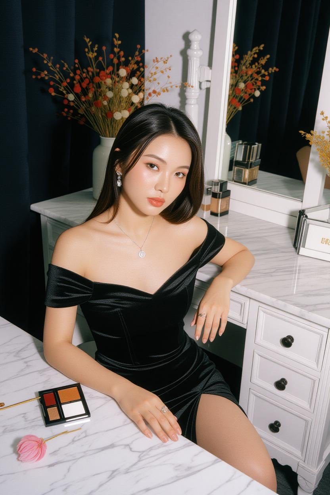

## 美女电影感肖像画

- ID: gpt4o-327-zh-2
- Slug: prompt-327-zh-2
- 语言: zh
- 来源: [来源链接](https://x.com/karatademada/status/1977343963745923372)
- 样例图路径: images/part3/327.jpeg

### 提示词

```text
一幅充满电影感的肖像画，描绘了一位年轻的东亚女性优雅地坐在白色大理石梳妆台前。她有着一头柔顺的深棕色长发，中分，简单的发型勾勒出她精致的脸庞。她的肌肤光洁光滑，肤色温暖。她化着柔和的蜜桃色妆容，眼睑上点缀着淡淡的珠光，眼线细腻，珊瑚色唇膏则为她增添了一抹精致的光泽。

她身着一袭露肩黑色天鹅绒连衣裙，凸显了她的颈部和肩部线条，优雅而又不失现代感。一条精致的银项链搭配一枚小巧的吊坠，垂于她的锁骨上，她还佩戴了与之相配的银耳环和戒指，更添一抹精致。她的姿态自信而柔美，一只手臂自然地搭在大理石台面上，另一只手臂则放松地垂在身侧。

场景发生在灯光柔和的梳妆台上，镜子映照出她部分轮廓。光线均衡柔和，营造出干净奢华的妆容，阴影柔和，没有刺眼的高光，肌肤纹理光滑细腻。梳妆台上，她身旁整齐地摆放着一些化妆品，例如粉饼盘、小巧的装饰刷和几瓶粉底液。

背景采用深蓝色或深色窗帘，搭配简约的装饰，包括插满干花的白色花瓶，这些干花呈现出温暖的秋日色调——橙色、奶油色和金色。整体氛围优雅、沉稳，又不失低调的魅力，如同一部用清晰的现代相机，在影院级灯光和8K超高清画质下拍摄的高端美妆社论。

色调：象牙白、黑色天鹅绒、温暖的桃色调和柔和的金色花卉装饰。
长宽比：4：5。
风格：超现实主义、奢华肖像、杂志美学。
```

### 样例图


## CINEMATIC STREET PHOTOGRAPHY, STYLISH YOUNG WOMAN IN MOT

- ID: gpt4o-326-en-1
- Slug: prompt-326-en-1
- 语言: en
- 来源: [来源链接](https://x.com/SimplyAnnisa/status/1977191937330336130)
- 样例图路径: images/part3/326.jpeg

### 提示词

```text
CINEMATIC STREET PHOTOGRAPHY, STYLISH YOUNG WOMAN IN MOTION, URBAN ENVIRONMENT, MOTION BLUR EFFECT. BLURRED PEDESTRIANS PASSING BY, SHALLOW DEPTH OF FIELD, NATURAL OVERCAST LIGHTING, SOFT PASTEL TONES, EDITORIAL FASHION PHOTOGRAPHY, CANDID MOMENT, DYNAMIC MOVEMENT, FILM AESTHETIC, MUTED COLORS
```

### 样例图


## 电影感街头美女摄影

- ID: gpt4o-326-zh-2
- Slug: prompt-326-zh-2
- 语言: zh
- 来源: [来源链接](https://x.com/SimplyAnnisa/status/1977191937330336130)
- 样例图路径: images/part3/326.jpeg

### 提示词

```text
电影感街头摄影、动态中的时尚年轻女性、城市环境、动态模糊效果。匆匆而过的模糊行人、浅景深、阴天自然光、柔和的马卡龙色调、时尚杂志风格摄影、抓拍瞬间、动态感、胶片美学、低饱和度色彩
```

### 样例图


## { "prompt_title": "Effortless Chic Pose", "concept": "A 

- ID: gpt4o-325-en-1
- Slug: prompt-325-en-1
- 语言: en
- 来源: [来源链接](https://x.com/Prashant_1722/status/1977458454483874088)
- 样例图路径: images/part3/325.jpeg

### 提示词

```text
{
  "prompt_title": "Effortless Chic Pose",
  "concept": "A hyperrealistic fashion photograph replicating a specific street style moment: a woman in a black knit set posing elegantly against a lamppost in a European city.",
  "scene_composition": {
    "shot_type": "Medium full-body shot",
    "camera_lens": "85mm f/1.4 lens",
    "perspective": "Eye-level, capturing the subject from the side.",
    "aspect_ratio": "2:3",
    "focus": "Sharp focus on the woman and her outfit. The background is beautifully blurred with creamy bokeh to isolate the subject."
  },
  "environment": {
    "setting": "A European city square or wide pedestrian street during the day.",
    "background_details": "The background is softly blurred but shows classical architecture with light-colored stone buildings. A few indistinct figures are walking in the distance.",
    "ground": "Light-colored stone pavers or cobblestones.",
    "atmosphere": "Chic, relaxed, and sophisticated."
  },
  "subject": {
    "primary": "A stylish young woman with long, wavy dark hair.",
    "appearance": "Her hair falls naturally over her shoulder. She has a gentle, soft expression and is looking slightly away from the camera.",
    "pose": "She is leaning with her back against a dark, ornate metal lamppost on the left side of the frame. Her right leg is bent and lifted behind her. "
  },
  "outfit_and_details": {
    "top": "A form-fitting, sleeveless black top made of a visible ribbed knit fabric.",
    "bottom": "A matching black mini skirt, also made of the same ribbed knit material.",
   "shoes": "black slingback high heel"
  },
  "style_and_aesthetics": {
    "realism": "Hyperrealistic, photorealistic, cinematic, 8K resolution, ultra-detailed.",
    "lighting": "Soft, diffused daylight, as if on an overcast day or in the shade, to prevent harsh shadows and create a flattering, even light on the subject.",
    "color_palette": "A monochrome and muted palette. Dominant blacks from the outfit and lamppost, contrasted with the light tones of the buildings and ground.",
    "details": "Emphasis on realistic material properties: the fine texture of the ribbed knit, the rough texture of the stone pavers, and the metallic finish of the lamppost."
  },
  "quality_boosters": [
    "masterpiece",
    "best quality",
    "insanely detailed",
    "sharp focus",
    "professional fashion photography",
    "street style",
    "editorial",
    "trending on Vogue"
  ],
  "negative_prompt": [
    "cartoon, anime, 3D render, illustration, painting",
    "blurry, out of focus, low quality, jpeg artifacts",
    "harsh sunlight, strong shadows",
    "crowded street, distracting background",
    "deformed anatomy, bad hands, extra limbs",
    "text, watermark, signature"
  ]
}
```

### 样例图


## 美女时尚摄影

- ID: gpt4o-325-zh-2
- Slug: prompt-325-zh-2
- 语言: zh
- 来源: [来源链接](https://x.com/Prashant_1722/status/1977458454483874088)
- 样例图路径: images/part3/325.jpeg

### 提示词

```text
{
"prompt_title": "轻松时尚的姿势",
"concept": "一张超现实主义的时尚照片，再现了特定的街头风格瞬间：一位身穿黑色针织套装的女子在欧洲城市的路灯柱前优雅地摆姿势。",
“场景构图”：{
"shot_type": "中长全身照",
"camera_lens": "85mm f/1.4 镜头",
"perspective": "视线高度，从侧面捕捉拍摄对象。",
"aspect_ratio": "2:3",
"focus": "清晰地聚焦于女人和她的服装。背景通过奶油色的散景进行精美的虚化，突出了主体。"
}，
“环境”： {
"setting": "白天的欧洲城市广场或宽阔的步行街。",
"background_details": "背景略微模糊，但显示出浅色石头建筑的古典建筑。远处有几个模糊的身影在行走。",
"ground": "浅色铺路石或鹅卵石。",
“氛围”：“别致、轻松、精致。”
}，
“主题”： {
"primary": "一位时尚的年轻女子，有着长长的、波浪状的黑发。",
"appearance": "她的头发自然地垂在肩上。她表情温柔，目光略微远离镜头。",
"pose": "她背靠着画面左侧一根深色华丽的金属灯柱。她的右腿弯曲并抬起。"
}，
“装备和细节”：{
"top": "一件合身的无袖黑色上衣，采用可见的罗纹针织面料制成。",
"bottom": "一条配套的黑色迷你裙，也采用相同的罗纹针织材料制成。",
“鞋子”：“黑色露跟高跟鞋”
}，
“风格与美学”：{
"realism": "超现实主义、照片级真实感、电影级、8K 分辨率、超精细。",
"lighting": "柔和、漫射的日光，就像在阴天或阴影中一样，可以防止出现刺眼的阴影，并为拍摄对象营造出令人愉悦、均匀的光线。",
"color_palette": "单色柔和的色调。服装和灯柱以黑色为主，与建筑物和地面的浅色调形成对比。",
"details": "强调真实的材料特性：罗纹针织的细腻质地、石材铺路石的粗糙质地以及灯柱的金属饰面。"
}，
"quality_boosters": [
“杰作”，
“极品”，
“极其详细”，
“清晰聚焦”，
“专业时尚摄影”，
“街头风格”，
“社论”，
“Vogue 流行趋势”
]，
"negative_prompt": [
“卡通、动漫、3D 渲染、插图、绘画”，
“模糊、失焦、质量低、jpeg 伪影”，
“刺眼的阳光，强烈的阴影”，
“拥挤的街道，分散注意力的背景”，
“身体畸形、手残、肢体残缺”，
“文字、水印、签名”
]
}
```

### 样例图


## A high-quality studio photograph of a [BRAND] fully cove

- ID: gpt4o-322-en-1
- Slug: prompt-322-en-1
- 语言: en
- 来源: [来源链接](https://x.com/Kerroudjm/status/1969779989282246838)
- 样例图路径: images/part3/322.jpeg

### 提示词

```text
A high-quality studio photograph of a [BRAND] fully covered in ultra-realistic [ANIMAL] texture (e.g., fur, feathers, skin, or scales), placed against a soft neutral background. The object’s original shape, key design elements, and brand identity remain clearly visible beneath the animal’s organic surface. Integrate the official logo of the brand prominently into the composition. Automatically generate a compelling and brand-appropriate slogan that draws symbolic inspiration from the animal’s qualities and matches the tone of a premium advertising campaign. The image must feature clean composition, soft shadows, minimalist styling, professional lighting, and highly detailed textures—each hair, scale, or wrinkle should be visible in sharp detail. Format 1:1.
```

### 样例图

![A high-quality studio photograph of a [BRAND] fully cove](../images/part3/322.jpeg)

## 产品的工作室照片

- ID: gpt4o-322-zh-2
- Slug: prompt-322-zh-2
- 语言: zh
- 来源: [来源链接](https://x.com/Kerroudjm/status/1969779989282246838)
- 样例图路径: images/part3/322.jpeg

### 提示词

```text
一张高质量的工作室照片，[品牌] 全身覆盖超逼真的 [动物] 纹理（例如毛皮、羽毛、皮肤或鳞片），置于柔和的中性背景中。在动物的自然表皮下，物体的原始形状、关键设计元素和品牌标识清晰可见。将品牌官方标识醒目地融入构图。自动生成引人注目且契合品牌形象的宣传语，该宣传语应从动物的特质中汲取象征性灵感，并与高端广告宣传的基调相符。图片必须构图清晰、阴影柔和、造型简约、灯光专业，并具有高度精细的纹理——每根毛发、鳞片或皱纹都应清晰可见。格式 1:1。
```

### 样例图

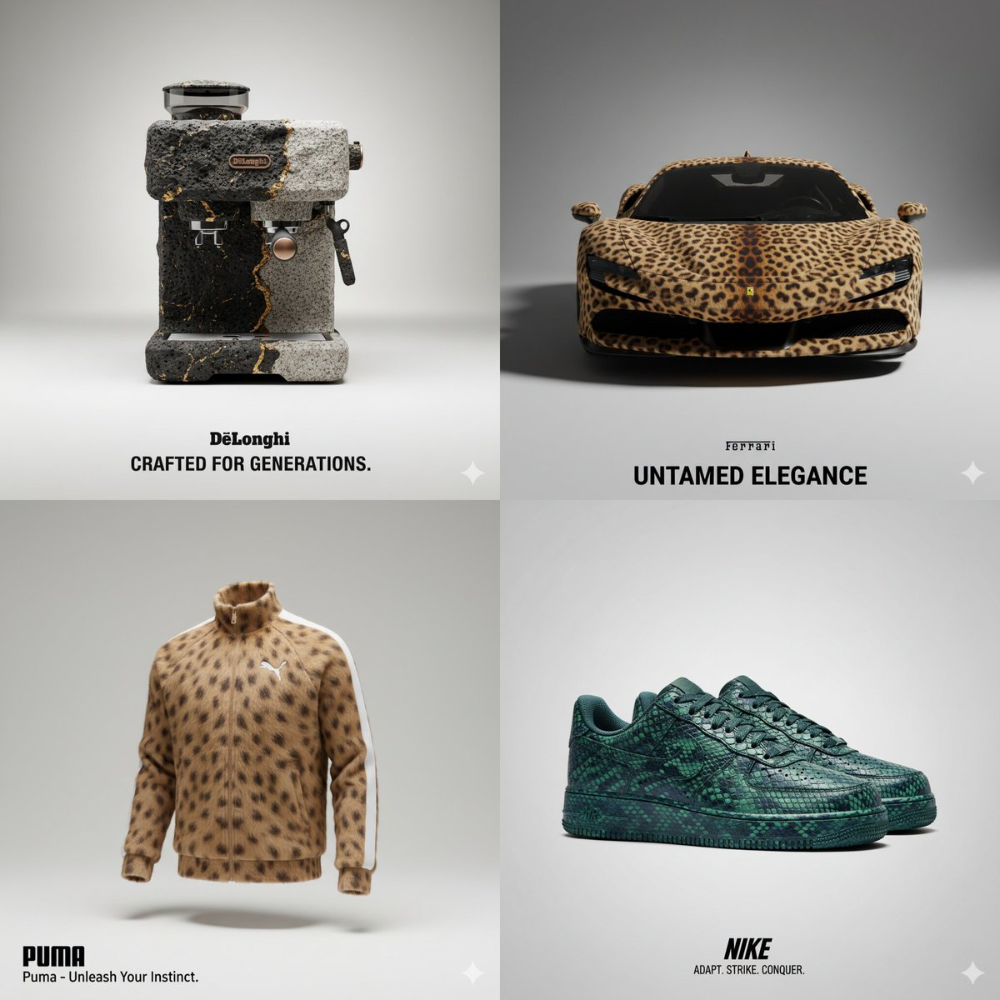

## Ultra-realistic CGI shot of a giant [PRODUCT NAME HERE],

- ID: gpt4o-321-en-1
- Slug: prompt-321-en-1
- 语言: en
- 来源: [来源链接](https://x.com/aziz4ai/status/1969500341696614569)
- 样例图路径: images/part3/321.jpeg

### 提示词

```text
Ultra-realistic CGI shot of a giant [PRODUCT NAME HERE], seamlessly integrated into a matching real-world environment that reflects the product’s identity, surrounded by context-specific city or nature elements, cinematic composition with natural shadows and photorealistic reflections, high Kelvin sunlight for neutral lighting, captured in HDR 8K DSLR quality, surreal yet believable visual integration, brand logo clearly visible, slogan dynamically adapted to the product’s character, dramatic and immersive atmosphere, aspect ratio 2:3
```

### 样例图

![Ultra-realistic CGI shot of a giant [PRODUCT NAME HERE],](../images/part3/321.jpeg)

## 产品超逼真的CGI镜头

- ID: gpt4o-321-zh-2
- Slug: prompt-321-zh-2
- 语言: zh
- 来源: [来源链接](https://x.com/aziz4ai/status/1969500341696614569)
- 样例图路径: images/part3/321.jpeg

### 提示词

```text
超逼真的CGI镜头，拍摄一个巨大的 [此处填写产品名称]，无缝融入到反映产品特性的现实环境中，周围环绕着特定环境的城市或自然元素，具有自然阴影和逼真反射的电影构图，高开尔文阳光用于中性照明，以 HDR 8K DSLR 质量捕捉，超现实但可信的视觉融合，品牌标识清晰可见，标语根据产品特性动态调整，戏剧性和沉浸式氛围，宽高比为 2:3
```

### 样例图

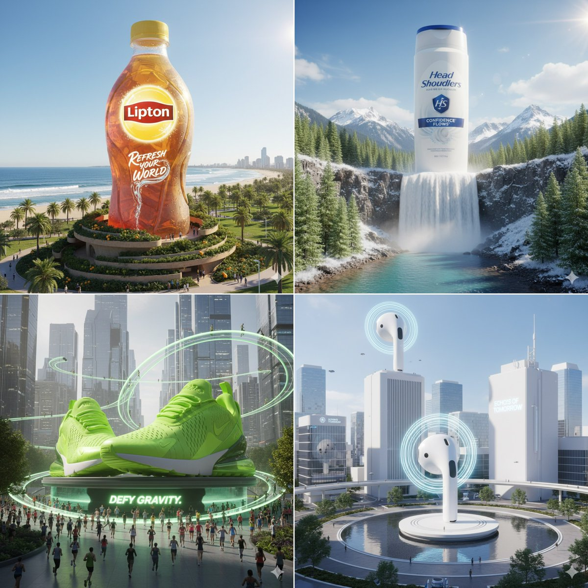

## Transform the [OBJECT] from the uploaded photo into a bo

- ID: gpt4o-320-en-1
- Slug: prompt-320-en-1
- 语言: en
- 来源: [来源链接](https://x.com/Arminn_Ai/status/1969324325162324163)
- 样例图路径: images/part3/320.jpeg

### 提示词

```text
Transform the [OBJECT] from the uploaded photo into a bold, colorful cartoon illustration style, while keeping the rest of the photo realistic and unchanged. 

Cartoon style details: thick black outlines, vibrant flat colors (such as bright cyan, magenta, yellow, pink), dripping paint and splash effects, playful comic-book energy.  most drips flow downwards
The cartoon object should look like it is melting or bursting with colors, blending naturally into the real photo. 

Keep all other elements (background, other objects, environment) photorealistic with no alterations. 
High resolution, pop-art aesthetic, surreal contrast between realism and cartoon.
```

### 样例图

![Transform the [OBJECT] from the uploaded photo into a bo](../images/part3/320.jpeg)

## 物体变成大胆的卡通滴水

- ID: gpt4o-320-zh-2
- Slug: prompt-320-zh-2
- 语言: zh
- 来源: [来源链接](https://x.com/Arminn_Ai/status/1969324325162324163)
- 样例图路径: images/part3/320.jpeg

### 提示词

```text
将上传照片中的 [OBJECT] 转换为大胆、色彩鲜艳的卡通插图风格，同时保持照片的其余部分真实且不变。

卡通风格细节：粗黑色轮廓，鲜艳的平面色彩（如亮青色、洋红色、黄色、粉红色），滴落的油漆和飞溅效果，俏皮的漫画风格。大多数滴落的油漆向下流动
卡通物体看起来应该像是融化了或者迸发出色彩，自然地融入到真实的照片中。

保持所有其他元素（背景、其他物体、环境）的真实感，不做任何改动。
高分辨率、波普艺术美学、现实主义与卡通之间的超现实对比。
```

### 样例图

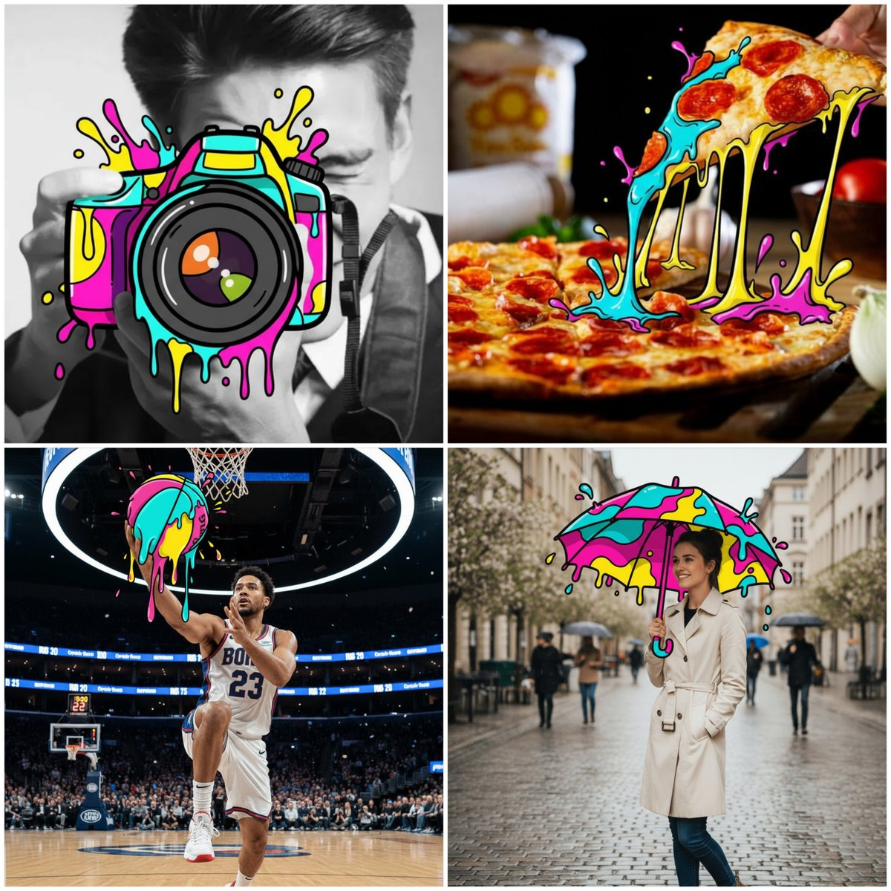

## Photorealistic conceptual food art portrait, a minimalis

- ID: gpt4o-319-en-1
- Slug: prompt-319-en-1
- 语言: en
- 来源: [来源链接](https://x.com/AleRVG/status/1969145551846363567)
- 样例图路径: images/part3/319.jpeg

### 提示词

```text
Photorealistic conceptual food art portrait, a minimalist representation of a [SITE OF THE HOUSE] recreated entirely with [TYPE OF FOOD]. The main structure is built from [MAIN INGREDIENTS], with details such as [KEY ELEMENTS] made from [SECONDARY INGREDIENTS]. Optional features include [ADDITIONAL OBJECTS OR FURNITURE] created from [EXTRA INGREDIENTS].

Set against a [COLOR] background to emphasize the surreal food sculpture. Bright soft studio lighting, evenly diffused, casting subtle natural shadows that highlight the textures of [FOOD TEXTURES]. Fine atmospheric detail enhance realism.

Captured with a Canon EOS 5D, 85mm f/1.8 lens, shallow depth of field focusing on the cake-bed sculpture, crisp detail with soft falloff in the background. Composition framed at tabletop eye-level, medium close-up, perfectly centered. Clean high-resolution food photography style, vibrant natural colors, editorial dessert photography aesthetic
```

### 样例图

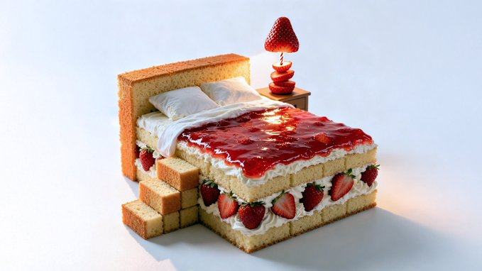

## 照片级逼真的概念食物艺术肖像

- ID: gpt4o-319-zh-2
- Slug: prompt-319-zh-2
- 语言: zh
- 来源: [来源链接](https://x.com/AleRVG/status/1969145551846363567)
- 样例图路径: images/part3/319.jpeg

### 提示词

```text
照片级逼真的概念食物艺术肖像，极简主义地再现了[房屋位置]，完全由[食物种类]重新打造。主体结构由[主要成分]构成，细节部分，例如[关键元素]，则由[次要成分]制成。可选功能包括由[额外成分]打造的[附加物品或家具]。

以[颜色]为背景，突显超现实的食物雕塑。明亮柔和的摄影棚灯光，均匀散射，投射出微妙的自然阴影，凸显[食物纹理]的质感。精致的氛围细节增强了真实感。

使用佳能 EOS 5D 85mm f/1.8 镜头拍摄，浅景深聚焦于蛋糕床雕塑，细节清晰，背景边缘柔和。构图以桌面视线高度为准，中距特写，完美居中。清晰的高分辨率美食摄影风格，鲜艳自然的色彩，堪称甜品摄影的美学典范。
```

### 样例图


## Create an artistic collage of 6 vintage Polaroid photos,

- ID: gpt4o-317-en-1
- Slug: prompt-317-en-1
- 语言: en
- 来源: [来源链接](https://x.com/ShreyaYadav___/status/1969820383487590795)
- 样例图路径: images/part3/317.jpeg

### 提示词

```text
Create an artistic collage of 6 vintage Polaroid photos, attached with a decorative rope and mini clothespins, like a home photo gallery. Each Polaroid frame has a slight fading and an old paper effect. The background is a soft pastel wall with light shadows, creating a cozy and creatively chaotic atmosphere.
Emotions and poses:
 * Light laughter — eyes closed, natural joy.
 * Dreamy gaze upwards, relaxed pose.
 * Playful wink.
 * Calm smile with a head tilted to the side.Dynamic gesture hands raised high, full of energy.

* Romantic half-glance over the shoulder.

The atmosphere is an art-retro style with elements of a '70s fashion magazine, soft diffused lighting, and muted warm and golden tones. Each photograph looks like a unique behind-the-scenes shot, with a touch of nostalgia and a sense of personal history.
```

### 样例图


## 6张复古宝丽来照片

- ID: gpt4o-317-zh-2
- Slug: prompt-317-zh-2
- 语言: zh
- 来源: [来源链接](https://x.com/ShreyaYadav___/status/1969820383487590795)
- 样例图路径: images/part3/317.jpeg

### 提示词

```text
用6张复古宝丽来照片，用装饰绳和迷你衣夹固定，打造一个艺术拼贴画，就像一个家庭相册。每个宝丽来相框都略微褪色，并呈现出旧纸效果。背景是一面柔和的粉彩色墙，点缀着浅淡的阴影，营造出一种舒适而又充满创意的混乱氛围。
情绪和姿势：
* 轻松的笑声——闭上眼睛，自然的快乐。
* 梦幻般的目光向上凝视，放松的姿势。
* 顽皮的眨眼。
* 平静的微笑，头部歪向一侧。动态的手势，双手高举，充满活力。

* 浪漫地回头瞥了一眼。

店内弥漫着复古艺术的氛围，融合了70年代时尚杂志的元素，柔和的漫射灯光，以及柔和的暖金色色调。每一张照片都像是一张独特的幕后花絮，洋溢着一丝怀旧气息，也透露着个人的点滴历史。
```

### 样例图


## Funko Pop–style vinyl figure of [CHARACTER NAME] Wearing

- ID: gpt4o-315-en-1
- Slug: prompt-315-en-1
- 语言: en
- 来源: [来源链接](https://x.com/Arminn_Ai/status/1969848678652547334)
- 样例图路径: images/part3/315.jpeg

### 提示词

```text
Funko Pop–style vinyl figure of [CHARACTER NAME] 
Wearing the iconic outfit and accessories typically associated with [CHARACTER], automatically matching their signature style and details.  

Pose/Expression:
- Standing, looking upward toward the camera  
- Expression: curious yet slightly nonchalant  

CAMERA & LENS:
- Camera positioned directly above, very close  
- Ultra-wide fisheye lens for dramatic perspective distortion  
- Gentle rounded frame edges  

LIGHTING & MATERIALS:
- Soft studio lighting with gentle shadows  
- Glossy vinyl figure texture for skin and hair  
- Outfit materials accentuated (e.g. quilted, shiny, matte, etc.) depending on [CHARACTER]’s clothing  

RENDER STYLE:
- High-resolution 3D render  
- Clean neutral background (solid or gradient)  
- Ultra sharp, collectible toy aesthetic
```

### 样例图

![Funko Pop–style vinyl figure of [CHARACTER NAME] Wearing](../images/part3/315.jpeg)

## Funko Pop风格乙烯基公仔

- ID: gpt4o-315-zh-2
- Slug: prompt-315-zh-2
- 语言: zh
- 来源: [来源链接](https://x.com/Arminn_Ai/status/1969848678652547334)
- 样例图路径: images/part3/315.jpeg

### 提示词

```text
[角色名称] 的 Funko Pop 风格乙烯基公仔
身着通常与 [角色] 相关联的标志性服装及配饰，其标志性风格与细节特征均自然呈现。
姿势 / 表情
站姿，抬头望向镜头
表情：好奇中略带漫不经心
相机与镜头
相机直接置于正上方，距离极近
超宽鱼眼镜头，营造极具张力的透视畸变效果
柔和的圆角画框边缘
光线与材质
柔和的工作室灯光，搭配自然阴影
公仔皮肤与头发采用亮面乙烯基材质质感
服装材质细节突出（如绗缝、亮面、哑光等），具体依 [角色] 的服饰特点而定
渲染风格
高分辨率 3D 渲染
简洁的中性背景（纯色或渐变色）
极致清晰的收藏级玩具美学风格
```

### 样例图


## cut cleanly THE [OBJECT] in half across the middle, the 

- ID: gpt4o-311-en-1
- Slug: prompt-311-en-1
- 语言: en
- 来源: [来源链接](https://x.com/Arminn_Ai/status/1968375201739177984)
- 样例图路径: images/part3/311.jpeg

### 提示词

```text
cut cleanly THE [OBJECT] in half across the middle, the top and bottom halves slightly separated and floating apart.  
Between the halves, instead of the natural inside, there is a stylized cartoon nuclear explosion effect: a central vertical column of glowing yellow-orange bubble smoke, with a wide horizontal shockwave ring of round bubbly clouds spreading to the sides, fiery glowing highlights above and below the shockwave, creating the impression of intense heat and energy
The outside of the [OBJECT] remains photorealistic with detailed texture and lighting, while the inner effect is highly graphic and playful, giving a striking contrast between realism and cartoon. Studio lighting, centered composition
```

### 样例图

![cut cleanly THE [OBJECT] in half across the middle, the ](../images/part3/311.jpeg)

## 切割带有卡通爆炸的物体

- ID: gpt4o-311-zh-2
- Slug: prompt-311-zh-2
- 语言: zh
- 来源: [来源链接](https://x.com/Arminn_Ai/status/1968375201739177984)
- 样例图路径: images/part3/311.jpeg

### 提示词

```text
将 [物体] 从中间干净利落地切成两半，上半部分和下半部分稍微分开并漂浮。
在两半之间，不是自然的内部，而是一种风格化的卡通核爆炸效果：中央垂直柱状发光的黄橙色气泡烟雾，周围扩散着一圈宽阔的水平冲击波环，圆形气泡云，冲击波上方和下方有炽热的光芒，营造出强烈的热量和能量的印象
[OBJECT] 的外部依然保持着照片级的真实感，纹理和灯光细节丰富；而内部效果则极具画面感，趣味十足，在现实主义和卡通风格之间形成了鲜明的对比。工作室灯光，居中构图
```

### 样例图

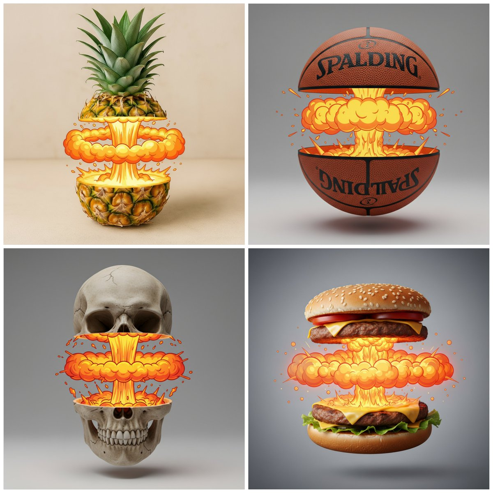

## 秋天的落叶拼成图案

- ID: gpt4o-310-zh
- Slug: prompt-310-zh
- 语言: zh
- 来源: [来源链接](https://x.com/op7418/status/1967873876551233660)
- 样例图路径: images/part3/310.jpeg

### 提示词

```text
中景，有阳光的午后，胶片质感，拍摄地面，秋天的落叶、树枝、银杏叶和桂花在平面上拼成了一个小猫的样子，旁边放着一杯一次性咖啡杯
```

### 样例图

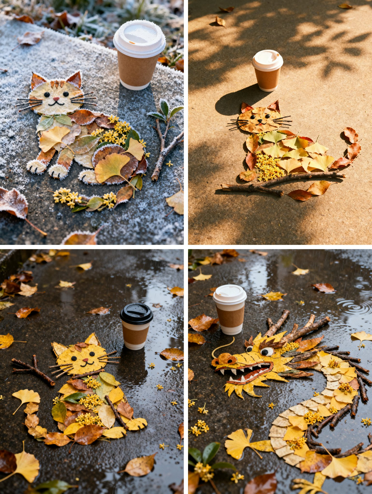

## A luxury [BRAND TYPE] brand advertisement featuring four

- ID: gpt4o-309-en-1
- Slug: prompt-309-en-1
- 语言: en
- 来源: [来源链接](https://x.com/Arminn_Ai/status/1967959906344112270)
- 样例图路径: images/part3/309.jpeg

### 提示词

```text
A luxury [BRAND TYPE] brand advertisement featuring four stylish [GIRLS / MEN], each posed in separate architectural window frames set, each shown in a waist-up mid-shot, fully inside the window frames, with hands and props naturally breaking the frame edges, but no legs or lower body visible, arranged in a theatrical and 2×2 symmetrical grid composition.

– one holding a [OBJECT 1] with [EXPRESSION AND ACCESSORIES]
– another holding a [OBJECT 2] with [EXPRESSION AND ACCESSORIES]
– another holding a [OBJECT 3] with [EXPRESSION AND ACCESSORIES]
– another holding a [OBJECT 4] with [EXPRESSION AND ACCESSORIES]

Each with expressive editorial facial poses, blending modern fashion with a sleek couture aesthetic.

Set against an elegant [BACKGROUND COLOR AND MATERIAL] backdrop with subtle textures, captured with bright high-fashion studio lighting that emphasizes contours, reflections, and luxury detailing.

The mood is glamorous, iconic, and prestigious, shot in the style of a high-end [BRAND TYPE] luxury campaign. 2:3 ar. all four frames clearly shown in full height, no cropping at the bottom or top.
```

### 样例图

![A luxury [BRAND TYPE] brand advertisement featuring four](../images/part3/309.jpeg)

## 奢侈品牌广告

- ID: gpt4o-309-zh-2
- Slug: prompt-309-zh-2
- 语言: zh
- 来源: [来源链接](https://x.com/Arminn_Ai/status/1967959906344112270)
- 样例图路径: images/part3/309.jpeg

### 提示词

```text
一则奢侈的 [品牌类型] 品牌广告，以四位时尚的 [女孩/男士] 为主角，每人摆出不同的建筑窗框姿势，每人都以半身向上的中景拍摄，完全在窗框内，手和道具自然地打破了框架边缘，但看不到腿或下半身，以戏剧性和 2×2 对称的网格构图排列。

– 一个人拿着[物体 1]，带着[表情和配饰]
– 另一人拿着 [物体 2]，带有 [表情和配饰]
– 另一人拿着 [物体 3] 和 [表情和配饰]
– 另一人拿着 [物体 4] 和 [表情和配件]

每个人都有富有表现力的面部姿势，将现代时尚与时尚的时装美学融为一体。

以优雅的 [背景颜色和材质] 背景为背景，具有微妙的纹理，并采用明亮的高级时尚工作室灯光，强调轮廓、反射和奢华细节。

拍摄风格为高端 [品牌类型] 奢侈品宣传活动，氛围迷人、标志性、尊贵。2:3 ar。四个画面均清晰地全高显示，底部或顶部均无裁剪。
```

### 样例图


## Hyper-realistic 3D caricature of [NAME], featuring an ex

- ID: gpt4o-302-en-1
- Slug: prompt-302-en-1
- 语言: en
- 来源: [来源链接](https://x.com/TechieBySA/status/1966450411277058166)
- 样例图路径: images/part3/302.jpeg

### 提示词

```text
Hyper-realistic 3D caricature of [NAME], featuring an expressive, oversized head, a short body, and a detailed, energetic facial expression. Wearing [OUTFIT / SIGNATURE LOOK], striking a [POSE / ACTION]. Studio lighting, cartoonish proportions, Pixar-style 3D rendering, ultra-detailed fabric and skin textures. The body is slightly smaller than the head. 1080x1080 square format.
```

### 样例图

![Hyper-realistic 3D caricature of [NAME], featuring an ex](../images/part3/302.jpeg)

## 超写实3D漫画肖像

- ID: gpt4o-302-zh-2
- Slug: prompt-302-zh-2
- 语言: zh
- 来源: [来源链接](https://x.com/TechieBySA/status/1966450411277058166)
- 样例图路径: images/part3/302.jpeg

### 提示词

```text
[姓名] 的超写实3D漫画肖像，特点为表情丰富的超大头部、较短的身躯，以及细节丰富且充满活力的面部表情。人物身着 [服装 / 标志性造型]，摆出 [姿势 / 动作]。采用工作室灯光效果，呈现卡通化比例，运用皮克斯风格 3D 渲染技术，织物与皮肤纹理细节极致丰富。身躯比例略小于头部，画面为 1080x1080 的正方形格式。
```

### 样例图


## Ultra-real portrait of [CHARACTER] centered, surrounded 

- ID: gpt4o-301-en-1
- Slug: prompt-301-en-1
- 语言: en
- 来源: [来源链接](https://x.com/samann_ai/status/1967149018640998584)
- 样例图路径: images/part3/301.jpeg

### 提示词

```text
Ultra-real portrait of [CHARACTER] centered, surrounded by dozens of life-size stone busts of [CHARACTER]; warm beige museum lighting, matte alabaster texture, symmetrical composition, shallow depth of field (85mm), subtle film grain, 3:4 vertical, no text or watermark.
```

### 样例图

![Ultra-real portrait of [CHARACTER] centered, surrounded ](../images/part3/301.jpeg)

## 超写实肖像位于石膏中心

- ID: gpt4o-301-zh-2
- Slug: prompt-301-zh-2
- 语言: zh
- 来源: [来源链接](https://x.com/samann_ai/status/1967149018640998584)
- 样例图路径: images/part3/301.jpeg

### 提示词

```text
[角色] 的超写实肖像位于画面中心，周围环绕着数十座与真人等大的 [角色] 石质胸像；采用温暖的米色博物馆灯光，呈现哑光雪花石膏质感，构图对称，景深较浅（85 毫米镜头），带有细微的胶片颗粒感，画面比例为 3:4 竖版，无文字及水印。
```

### 样例图

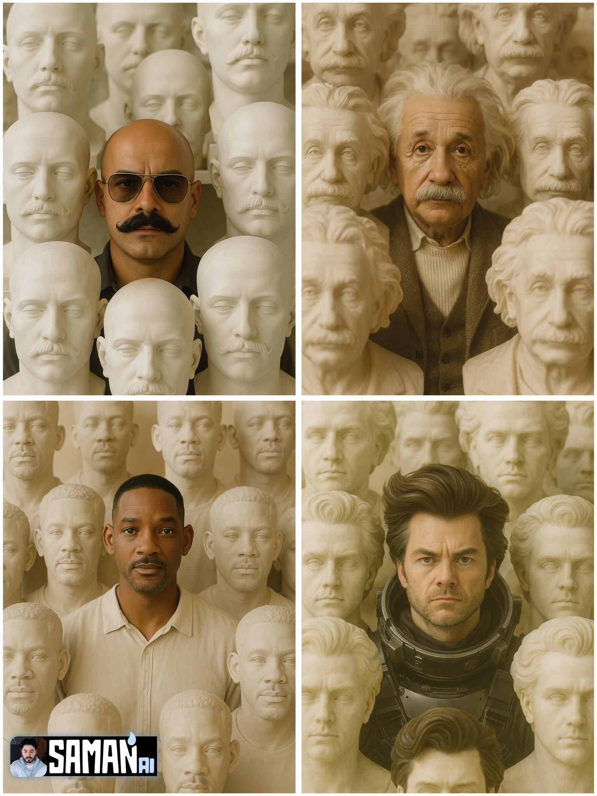

## Create a 3D photorealistic and highly detailed poster in

- ID: gpt4o-294-en-1
- Slug: prompt-294-en-1
- 语言: en
- 来源: [来源链接](https://x.com/TechieBySA/status/1964615325904998635)
- 样例图路径: images/part3/294.jpeg

### 提示词

```text
Create a 3D photorealistic and highly detailed poster in amigurumi style. The design should imitate a real handmade crochet [ANIMAL], with visible thread texture, stitching details, and soft, felted proportions. Use realistic fabric shading, subtle fuzz, and natural lighting to achieve depth. The amigurumi should have small embroidered eyes and a simplified face. Represent it in a neutral studio environment with soft shadows for a professional presentation. Gray toned background.
```

### 样例图

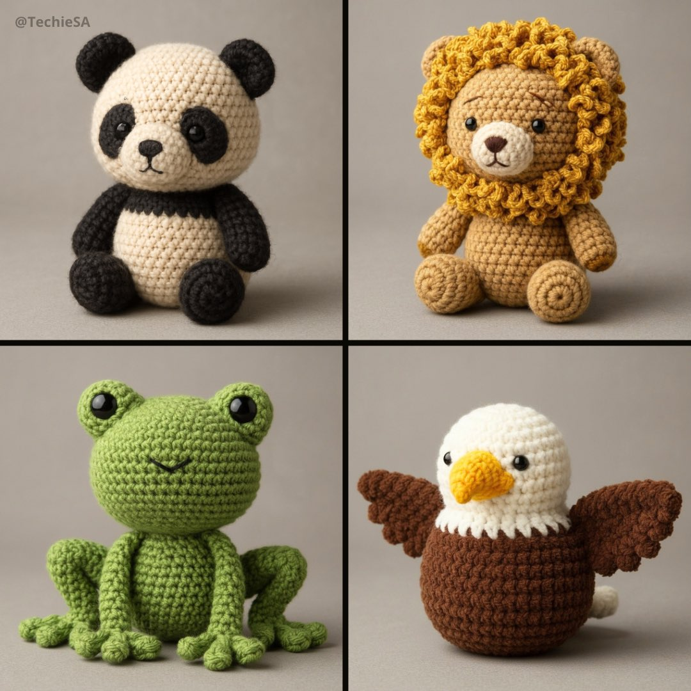

## 钩针玩偶

- ID: gpt4o-294-zh-2
- Slug: prompt-294-zh-2
- 语言: zh
- 来源: [来源链接](https://x.com/TechieBySA/status/1964615325904998635)
- 样例图路径: images/part3/294.jpeg

### 提示词

```text
制作一张 3D 超写实风格、细节丰富的阿米古米（Amigurumi，即钩针玩偶）风格海报。设计需模拟手工钩织的 [动物名称] 造型，呈现出清晰可见的毛线纹理、钩针缝线细节，以及柔软蓬松的整体比例。
运用写实的织物阴影效果、细微的毛绒质感与自然光线，打造画面层次感。该阿米古米玩偶需搭配小巧的刺绣眼睛与简约的面部造型，置于中性风格的工作室场景中，辅以柔和阴影，呈现专业的展示效果。背景：灰色调
```

### 样例图


## Muscular African man dunks a grilled chicken breast into

- ID: gpt4o-288-en-1
- Slug: prompt-288-en-1
- 语言: en
- 来源: [来源链接](https://x.com/Salmaaboukarr/status/1912961013877801177)
- 样例图路径: images/part3/288.jpeg

### 提示词

```text
Muscular African  man dunks a grilled chicken breast into a basketball hoop with 'DUNK EVERY MACRO' text, under a clear sky. Fitness-themed, with Trifecta logo.
```

### 样例图


## 食物与运动结合的广告

- ID: gpt4o-288-zh-2
- Slug: prompt-288-zh-2
- 语言: zh
- 来源: [来源链接](https://x.com/Salmaaboukarr/status/1912961013877801177)
- 样例图路径: images/part3/288.jpeg

### 提示词

```text
晴朗天空下，一位肌肉发达的非洲男子将一块烤鸡胸肉扣进篮球框，篮框上写着“扣篮，每个宏都扣篮”（DUNK EVERY MACRO）。健身主题，带有 Trifecta 标志。
```

### 样例图


## Fit female tennis player on court, wearing white tank to

- ID: gpt4o-288-en-3
- Slug: prompt-288-en-3
- 语言: en
- 来源: [来源链接](https://x.com/Salmaaboukarr/status/1912961013877801177)
- 样例图路径: images/part3/288.jpeg

### 提示词

```text
Fit female tennis player on court, wearing white tank top and blue skirt, swinging a frying pan like a racket. In the pan: grilled chicken, broccoli, sweet potatoes. Clear blue sky. Bold text: 'ACE EVERY MEAL.' Trifecta logo in orange, bottom right.
```

### 样例图


## 食物与运动结合的广告

- ID: gpt4o-288-zh-4
- Slug: prompt-288-zh-4
- 语言: zh
- 来源: [来源链接](https://x.com/Salmaaboukarr/status/1912961013877801177)
- 样例图路径: images/part3/288.jpeg

### 提示词

```text
球场上，身材健美的女子网球运动员身穿白色背心和蓝色裙子，像挥动球拍一样挥舞着煎锅。锅里盛着烤鸡、西兰花和红薯。湛蓝的天空。粗体字写着：“每餐都精彩。” 右下角是橙色的Trifecta标志。
```

### 样例图


## Muscular man in black hoodie and orange boxing gloves in

- ID: gpt4o-288-en-5
- Slug: prompt-288-en-5
- 语言: en
- 来源: [来源链接](https://x.com/Salmaaboukarr/status/1912961013877801177)
- 样例图路径: images/part3/288.jpeg

### 提示词

```text
Muscular man in black hoodie and orange boxing gloves in dark gym, boxing a giant burrito hanging like a punching bag. Dramatic lighting. "TRIFECTA" logo in bold orange top right. Text "BEAT HUNGER TO THE PUNCH." in bold white bottom left. Humorous, intense fitness ad.
```

### 样例图


## 食物与运动结合的广告

- ID: gpt4o-288-zh-6
- Slug: prompt-288-zh-6
- 语言: zh
- 来源: [来源链接](https://x.com/Salmaaboukarr/status/1912961013877801177)
- 样例图路径: images/part3/288.jpeg

### 提示词

```text
肌肉发达的男子身穿黑色连帽衫，戴着橙色拳击手套，在昏暗的健身房里，用拳击机打着一个像沙袋一样悬挂着的巨型墨西哥卷饼。灯光效果惊艳。右上角印有醒目的橙色“TRIFECTA”标志。左下角印有醒目的白色文字“BEAT HUNGER TO THE PUNCH.” 。这则幽默风趣、充满力量的健身广告。
```

### 样例图


## Create a bold ad for Trifecta Nutrition: a baseball play

- ID: gpt4o-288-en-7
- Slug: prompt-288-en-7
- 语言: en
- 来源: [来源链接](https://x.com/Salmaaboukarr/status/1912961013877801177)
- 样例图路径: images/part3/288.jpeg

### 提示词

```text
Create a bold ad for Trifecta Nutrition: a baseball player mid-swing in a stadium, holding a giant orange spatula instead of a bat. Use the tagline 'Knock Hunger Out of the Park' in athletic-style text. Include Trifecta’s logo and orange/black branding
```

### 样例图


## 食物与运动结合的广告

- ID: gpt4o-288-zh-8
- Slug: prompt-288-zh-8
- 语言: zh
- 来源: [来源链接](https://x.com/Salmaaboukarr/status/1912961013877801177)
- 样例图路径: images/part3/288.jpeg

### 提示词

```text
为 Trifecta Nutrition 制作一则醒目的广告：一位棒球运动员在体育场挥棒，手中拿着一把巨大的橙色铲子而不是球棒。使用运动风格的文字，写上“Knock Hunger Out of the Park”（击退饥饿）的标语。同时加入 Trifecta 的标志和橙黑色品牌标识。
```

### 样例图


## A square 1:1 format digital photograph of an intricate p

- ID: gpt4o-283-en-1
- Slug: prompt-283-en-1
- 语言: en
- 来源: [来源链接](https://x.com/Kerroudjm/status/1952522314299441301)
- 样例图路径: images/part3/283.jpeg

### 提示词

```text
A square 1:1 format digital photograph of an intricate paper origami model representing (MONUMENT_NAME), folded from textured colored paper and centered in the frame. Above it, the word (CITY_NAME) appears in bold origami-style letters, folded from vibrant paper using the national colors of the country, and arranged in a graceful arch. The background is soft and minimal, in a light pastel or neutral tone with subtle paper textures or abstract geometric details. Lighting is soft and diffused, casting natural shadows that enhance the depth and sharpness of each fold. The overall style is clean, realistic, and handcrafted, emphasizing material texture, geometric precision, and visual harmony.
```

### 样例图

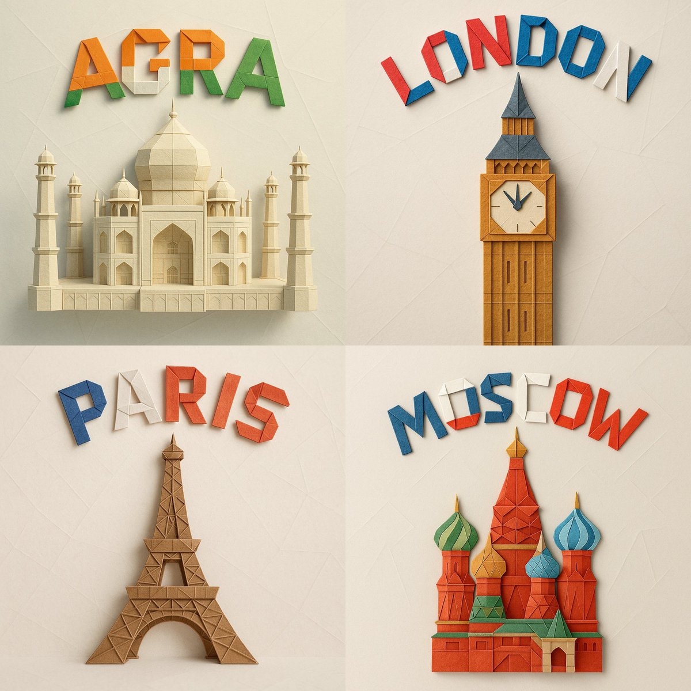

## 精致纸艺折纸模型

- ID: gpt4o-283-zh-2
- Slug: prompt-283-zh-2
- 语言: zh
- 来源: [来源链接](https://x.com/Kerroudjm/status/1952522314299441301)
- 样例图路径: images/part3/283.jpeg

### 提示词

```text
一张 1:1 正方形比例的数码照片，画面中央是用纹理彩纸折叠而成的精致纸艺折纸模型，该模型复刻了（纪念碑名称）的造型。模型上方，“（城市名称）” 一词以粗体折纸风格呈现：字母采用该国国色的鲜艳纸张折叠而成，整体排列成优雅的拱形。背景风格柔和简约，采用浅淡的马卡龙色系或中性色调，点缀着细微的纸张纹理或抽象几何元素。光线柔和且均匀扩散，投射出自然的阴影，既增强了每一处折痕的立体感，也让折痕轮廓更清晰。整体风格简洁、写实且充满手工质感，着重凸显材料纹理、几何精度与视觉和谐感。
```

### 样例图


## create image: { "style": "mosaic stained glass emblem", 

- ID: gpt4o-276-en-1
- Slug: prompt-276-en-1
- 语言: en
- 来源: [来源链接](https://x.com/miilesus/status/1925157350068900103)
- 样例图路径: images/part3/276.png

### 提示词

```text
create image:
{
  "style": "mosaic stained glass emblem",
  "object": "brand logo",
  "brand": {
    "name": "Spotify",
    "logo_shape": "circular",
    "icon_style": "three curved bars",
    "color_palette": {
      "primary": "#1DB954",
      "secondary": "#1ED760",
      "glass_variants": ["#147A3E", "#0F5C30", "#26C178"]
    }
  },
  "material": {
    "type": "colored glass",
    "effect": "semi-transparent with light reflections",
    "outline": {
      "color": "#111111",
      "width": "medium",
      "style": "lead-line traditional mosaic"
    }
  },
  "composition": {
    "layout": "logo composed of tessellated glass pieces",
    "geometry": "irregular but fitted glass shapes",
    "contrast": "dark outlines define shape clearly"
  },
  "lighting": {
    "type": "diffused natural light",
    "highlight": "glass texture and color depth emphasized"
  },
  "background": {
    "type": "flat surface",
    "color": "#F4F4F4"
  },
  "camera": {
    "angle": "top-down",
    "focus": "centered on entire logo"
  },
  "render": {
    "quality": "high",
    "shadows": "soft",
    "reflections": "minimal"
  }
}
```

### 样例图


## 马赛克彩色玻璃徽章

- ID: gpt4o-276-zh-2
- Slug: prompt-276-zh-2
- 语言: zh
- 来源: [来源链接](https://x.com/miilesus/status/1925157350068900103)
- 样例图路径: images/part3/276.png

### 提示词

```text
创建图像：
{
  "风格": "马赛克彩色玻璃徽章",
  "对象": "品牌标志",
  "品牌": {
    "名称": "Spotify",
    "标志形状": "圆形",
    "图标风格": "三条弯曲的长条",
    "色彩搭配": {
      "主色": "#1DB954",
      "辅助色": "#1ED760",
      "玻璃变体色": ["#147A3E", "#0F5C30", "#26C178"]
    }
  },
  "材质": {
    "类型": "彩色玻璃",
    "效果": "半透明带光线反射",
    "轮廓": {
      "颜色": "#111111",
      "宽度": "中等",
      "风格": "传统马赛克铅线"
    }
  },
  "构图": {
    "布局": "由镶嵌玻璃片组成的标志",
    "几何形状": "不规则但拼接契合的玻璃造型",
    "对比度": "深色轮廓清晰界定形状"
  },
  "光线": {
    "类型": "漫射自然光",
    "高光": "突出玻璃质感和色彩深度"
  },
  "背景": {
    "类型": "平面",
    "颜色": "#F4F4F4"
  },
  "镜头": {
    "角度": "俯视",
    "焦点": "居中于整个标志"
  },
  "渲染": {
    "质量": "高",
    "阴影": "柔和",
    "反射": "轻微"
  }
}
```

### 样例图


## “{BRAND or PRODUCT NAME}” — surreal minimal conceptual a

- ID: gpt4o-273-en-1
- Slug: prompt-273-en-1
- 语言: en
- 来源: [来源链接](https://x.com/aziz4ai/status/1927459345790288258)
- 样例图路径: images/part3/273.jpeg

### 提示词

```text
“{BRAND or PRODUCT NAME}” — surreal minimal conceptual advertisement
Create a 1:1 high-resolution poster that reimagines the brand/product as a surreal object of desire using minimal elements and symbolic storytelling.

• Visual Style: ultra-clean background (light or muted tone), soft lighting, strong negative space
• Scene Concept: transform the essence of the product into a metaphorical or dreamlike scene
• Add a short, punchy slogan (2–3 words) that emotionally resonates with the concept
• Include the brand’s logo in a clean, modern style (integrated naturally into the layout)
• Composition: centered or rule-of-thirds alignment, use shadows and depth tastefully
• Mood: artistic, elegant, and thought-provoking — like a museum installation
• No clutter, no realism overload — just conceptual clarity
```

### 样例图

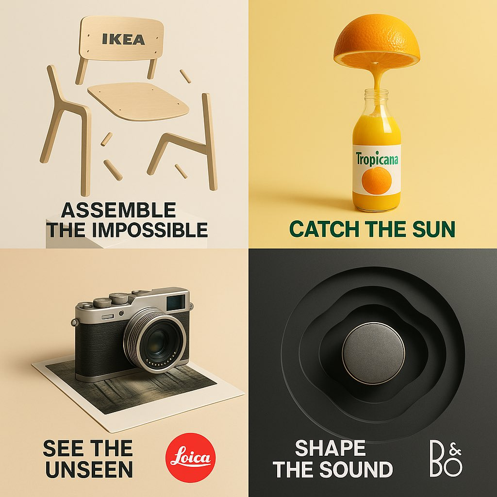

## 超现实主义极简概念广告

- ID: gpt4o-273-zh-2
- Slug: prompt-273-zh-2
- 语言: zh
- 来源: [来源链接](https://x.com/aziz4ai/status/1927459345790288258)
- 样例图路径: images/part3/273.jpeg

### 提示词

```text
“{品牌或产品名称}”——超现实主义极简概念广告
创建 1：1 高分辨率海报，使用最少的元素和象征性的故事讲述将品牌/产品重新想象为超现实的欲望对象。

• 视觉风格：超干净的背景（浅色或柔和的色调）、柔和的灯光、强烈的负空间
• 场景概念：将产品本质转化为隐喻或梦幻般的场景
• 添加一个简短、有力的口号（2-3 个词），在情感上与概念产生共鸣
• 以简洁、现代的风格包含品牌标识（自然融入布局）
• 构图：居中或三分法对齐，巧妙运用阴影和深度
• 氛围：艺术、优雅、发人深省——就像博物馆装置
• 没有混乱，没有现实主义超载——只有概念清晰
```

### 样例图


## Epic LEGO [SUPERHERO] in dynamic action pose showcasing 

- ID: gpt4o-270-en-1
- Slug: prompt-270-en-1
- 语言: en
- 来源: [来源链接](https://x.com/TechieBySA/status/1953186625871331674)
- 样例图路径: images/part3/270.jpeg

### 提示词

```text
Epic LEGO [SUPERHERO] in dynamic action pose showcasing their signature powers, wearing their iconic costume with authentic colors and details, dramatic stormy sky with brilliant lightning bolts illuminating the scene, heroic stance amid swirling LEGO debris and flying bricks, small LEGO minifigures scattered throughout the scene watching in awe, cinematic movie poster composition with photorealistic rendering, epic superhero atmosphere with rich saturated colors, professional depth of field and dramatic lighting effects, 1080x1080 square format
```

### 样例图

![Epic LEGO [SUPERHERO] in dynamic action pose showcasing ](../images/part3/270.jpeg)

## 乐高超级英雄摆出充满动感的动作姿势

- ID: gpt4o-270-zh-2
- Slug: prompt-270-zh-2
- 语言: zh
- 来源: [来源链接](https://x.com/TechieBySA/status/1953186625871331674)
- 样例图路径: images/part3/270.jpeg

### 提示词

```text
史诗级乐高【超级英雄】摆出充满动感的动作姿势，展现其标志性超能力，身着标志性服装，色彩和细节真实还原。戏剧性的暴风雨天空中，耀眼的闪电照亮整个场景。超级英雄摆出英勇姿态，周围是旋转的乐高碎片和飞舞的积木块，场景中散落着小型乐高小人仔，它们正惊叹地注视着这一切。整体采用电影海报式构图，配以逼真渲染效果，营造出史诗般的超级英雄氛围，色彩浓郁饱和，运用专业的景深和富有戏剧性的光影效果，尺寸为1080x1080的正方形格式。
```

### 样例图


## Two anime-style characters standing behind a futuristic 

- ID: gpt4o-269-en-1
- Slug: prompt-269-en-1
- 语言: en
- 来源: [来源链接](https://x.com/TheRelianceAI/status/1953431382836859074)
- 样例图路径: images/part3/269.png

### 提示词

```text
Two anime-style characters standing behind a futuristic transparent X-ray scanning panel, each leaning on it casually. Their full bodies are visible through the glowing glass as stylized, semi-transparent X-ray scans. [INSERT SCAN DETAILS HERE — e.g. hybrid anatomy, supernatural markings, implants, etc.]. Futuristic sci-fi interface overlays on the glass, with holographic HUD elements and glowing digital text. The background is minimal and sterile, resembling a high-tech medical chamber. The characters are [INSERT CHARACTER NAMES & DESCRIPTION HERE — appearance, expression, outfit], drawn in modern high-quality anime style. The scene uses soft colored lighting (e.g. cyan, pink, red depending on the pair), expressive animation, and cinematic composition.
```

### 样例图


## 透明X光扫描面板后面

- ID: gpt4o-269-zh-2
- Slug: prompt-269-zh-2
- 语言: zh
- 来源: [来源链接](https://x.com/TheRelianceAI/status/1953431382836859074)
- 样例图路径: images/part3/269.png

### 提示词

```text
两个动漫风格的角色站在一个未来感的透明X光扫描面板后面，各自随意地靠在面板上。透过发光的玻璃，可以看到他们的全身呈现出风格化的半透明X光扫描效果。【在此插入扫描细节——例如混合解剖结构、超自然标记、植入物等】。玻璃上叠加着未来科幻界面，还有全息平视显示元素和发光的数字文本。背景简洁而无菌，类似一个高科技医疗舱。角色是【在此插入角色姓名和描述——外貌、表情、服装】，采用现代高品质动漫风格绘制。场景使用柔和的彩色灯光（例如根据角色组合使用青色、粉色、红色等），富有表现力的动态效果和电影化的构图。
```

### 样例图


## A hyper-realistic photograph of a tree in a scenic meado

- ID: gpt4o-266-en-1
- Slug: prompt-266-en-1
- 语言: en
- 来源: [来源链接](https://x.com/TheRelianceAI/status/1956047431117770925)
- 样例图路径: images/part3/266.png

### 提示词

```text
A hyper-realistic photograph of a tree in a scenic meadow, with a sturdy, detailed bark trunk and lush green leaves, where instead of fruits, the branches naturally bear [PRODUCT], seamlessly integrated into the foliage, with realistic textures, natural lighting, soft shadows, subtle imperfections, shot at eye level with a shallow depth of field, ultra-detailed, 8k
```

### 样例图

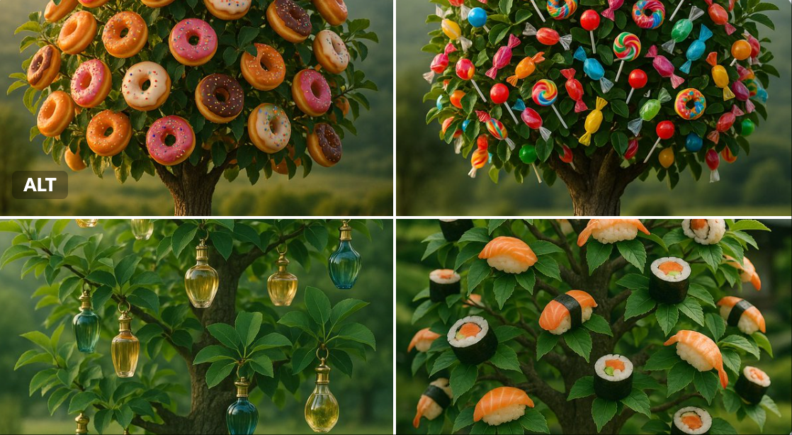

## 树上挂着产品

- ID: gpt4o-266-zh-2
- Slug: prompt-266-zh-2
- 语言: zh
- 来源: [来源链接](https://x.com/TheRelianceAI/status/1956047431117770925)
- 样例图路径: images/part3/266.png

### 提示词

```text
一张超写实的照片，画面中是一片风景优美的草地上的一棵树。树干坚固，树皮纹理清晰，树叶郁郁葱葱、绿意盎然。树枝上长的不是果实，而是自然悬挂着[产品]，它们与树叶无缝融合，纹理逼真。照片采用自然光线，搭配柔和的阴影，带有细微的瑕疵，以平视角度拍摄，景深较浅，细节极致丰富，分辨率为8k。
```

### 样例图


## Transform this image into a refined low-poly mosaic styl

- ID: gpt4o-263-en-1
- Slug: prompt-263-en-1
- 语言: en
- 来源: [来源链接](https://x.com/fy360593/status/1945118291703284152)
- 样例图路径: images/part3/263.jpeg

### 提示词

```text
Transform this image into a refined low-poly mosaic style. Preserve the original structure and recognizable details, especially facial features and contours. Use small, high-density polygons to maintain clarity and identity while creating a crystalline, faceted look. Keep the original color palette for a harmonious and natural aesthetic. Avoid altering or adding new elements.
```

### 样例图

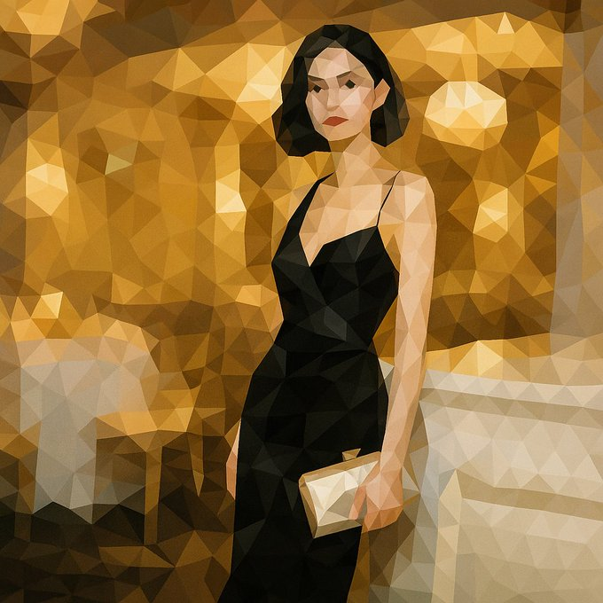

## 低多边形马赛克风格

- ID: gpt4o-263-zh-2
- Slug: prompt-263-zh-2
- 语言: zh
- 来源: [来源链接](https://x.com/fy360593/status/1945118291703284152)
- 样例图路径: images/part3/263.jpeg

### 提示词

```text
将这张图片转换为精致的低多边形马赛克风格。保留原始结构和可识别的细节，尤其是面部特征和轮廓。使用小而密集的多边形，在保持清晰度和辨识度的同时，营造出水晶般的多面效果。保留原始色调，以获得和谐自然的美感。避免修改或添加新元素。
```

### 样例图


## { "object": "OBJECT_NAME", "style": "Transparent Honeyco

- ID: gpt4o-257-en-1
- Slug: prompt-257-en-1
- 语言: en
- 来源: [来源链接](https://x.com/miilesus/status/1930266127961059739)
- 样例图路径: images/part3/257.png

### 提示词

```text
{
  "object": "OBJECT_NAME",
  "style": "Transparent Honeycomb Transformation",
  "description": "Transform the object into a structure made entirely of crystallized golden honey with high transparency. The surface should be ultra-glossy, semi-liquid, and light-reflective, with defined yet see-through hexagonal honeycomb patterns. Parts of the object should allow light to pass through, revealing inner layers and structure. Include gentle honey drips for realism.",
  "material": {
    "primary": "Crystal-clear amber honey",
    "secondary": "Translucent honeycomb cells"
  },
  "texture": {
    "surface": "Ultra glossy and semi-liquid",
    "pattern": "See-through hexagonal honeycomb",
    "drips": true
  },
  "effects": {
    "translucency": "highly translucent",
    "internal_glow": "Soft warm light from within",
    "emblem": "Delicate bee icon subtly embedded in the structure"
  },
  "presentation": {
    "background": "Clean white or soft gradient",
    "lighting": "Backlit with soft diffusion to enhance translucency",
    "floating": true,
    "format": "Square"
  }
}
```

### 样例图


## 透明蜂窝状变形

- ID: gpt4o-257-zh-2
- Slug: prompt-257-zh-2
- 语言: zh
- 来源: [来源链接](https://x.com/miilesus/status/1930266127961059739)
- 样例图路径: images/part3/257.png

### 提示词

```text
{
  "物体": "OBJECT_NAME",
  "风格": "透明蜂窝状变形",
  "描述": "将该物体转变为由完全结晶的金色蜂蜜制成的结构，具有高度透明度。表面应呈现超 glossy 质感、半液态状态和反光效果，带有清晰可辨且透明的六边形蜂窝图案。物体的部分区域应允许光线穿透，以展现内部层次和结构。为增强真实感，需加入自然垂落的蜂蜜滴。",
  "材质": {
    "主要材质": "清澈透明的琥珀色蜂蜜",
    "次要材质": "半透明的蜂窝单元"
  },
  "纹理": {
    "表面": "超 glossy 且呈半液态",
    "图案": "透明的六边形蜂窝",
    "滴落效果": true
  },
  "特效": {
    "半透明性": "高度半透明",
    "内部光晕": "源自内部的柔和暖光",
    "标志": "精致的蜜蜂图标巧妙嵌入结构中"
  },
  "呈现方式": {
    "背景": "纯净白色或柔和渐变",
    "光线": "背光搭配柔和漫射效果，以增强半透明感",
    "悬浮效果": true,
    "格式": "正方形"
  }
}
```

### 样例图


## A colorful handcrafted sculpture of [insert subject], ma

- ID: gpt4o-246-en-1
- Slug: prompt-246-en-1
- 语言: en
- 来源: [来源链接](https://x.com/Deshraj4x/status/1938670486285885772)
- 样例图路径: images/part3/246.jpeg

### 提示词

```text
A colorful handcrafted sculpture of [insert subject], made from semi-transparent ice blocks in custom shapes. Accents like icing, candy, yarn, or fruit skin enhance facial features, texture, or accessories. Placed on a ceramic plate over a leaf or decorative mat, with a clean, softly lit studio or natural tabletop background. Lighting highlights the glossy ice texture, blending food art, toy design, and photography into a playful, artistic composition.
```

### 样例图

![A colorful handcrafted sculpture of [insert subject], ma](../images/part3/246.jpeg)

## 色彩缤纷的手工雕塑

- ID: gpt4o-246-zh-2
- Slug: prompt-246-zh-2
- 语言: zh
- 来源: [来源链接](https://x.com/Deshraj4x/status/1938670486285885772)
- 样例图路径: images/part3/246.jpeg

### 提示词

```text
一个色彩缤纷的手工雕塑，由[插入主题]制成，使用半透明的冰块，形状定制。装饰如糖霜、糖果、毛线或水果皮增强了面部特征、纹理或配饰。放置在陶瓷盘上，盘上覆盖着叶子或装饰垫，背景是干净、柔和照明的摄影棚或自然桌面。光线突出了冰块的光泽质感，将食品艺术、玩具设计和摄影融合成一种俏皮、艺术性的构图。
```

### 样例图

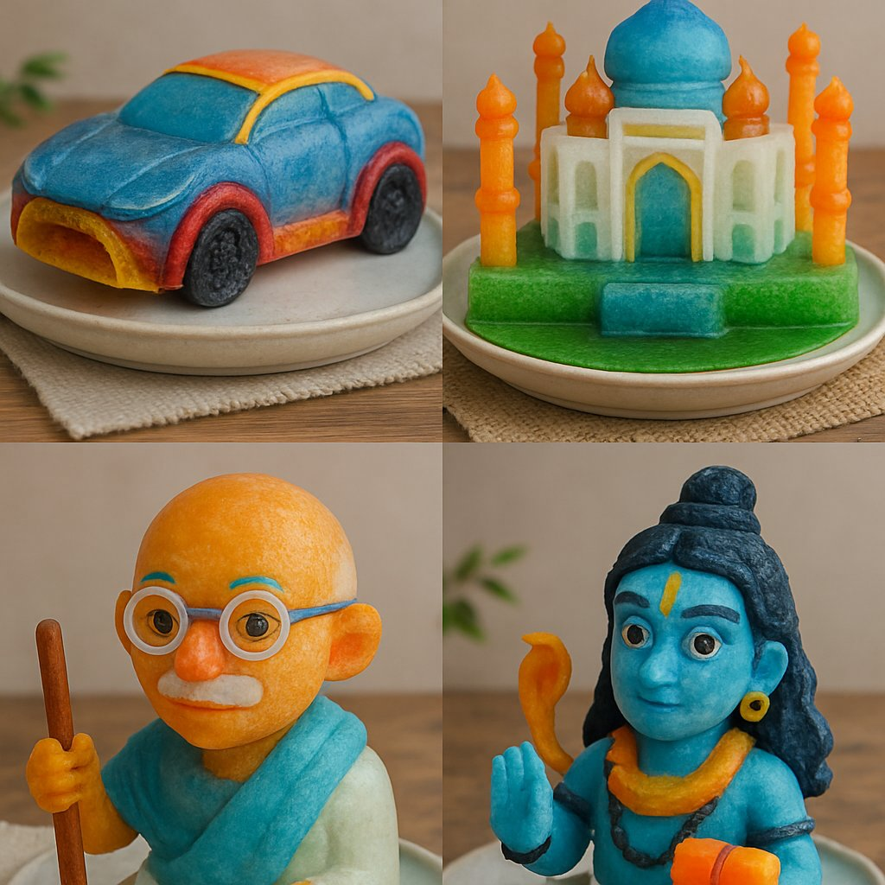

## Transform this image into a refined low-poly mosaic styl

- ID: gpt4o-244-en-1
- Slug: prompt-244-en-1
- 语言: en
- 来源: [来源链接](https://x.com/fy360593/status/1945118291703284152)
- 样例图路径: images/part3/244.png

### 提示词

```text
Transform this image into a refined low-poly mosaic style. Preserve the original structure and recognizable details, especially facial features and contours. Use small, high-density polygons to maintain clarity and identity while creating a crystalline, faceted look. Keep the original color palette for a harmonious and natural aesthetic. Avoid altering or adding new elements.
```

### 样例图

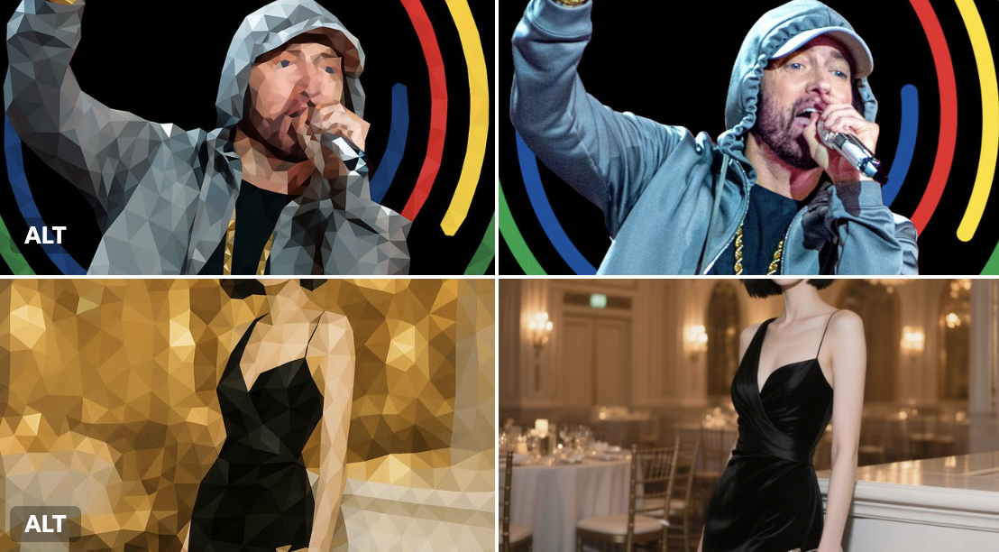

## 转换马赛克风格照片

- ID: gpt4o-244-zh-2
- Slug: prompt-244-zh-2
- 语言: zh
- 来源: [来源链接](https://x.com/fy360593/status/1945118291703284152)
- 样例图路径: images/part3/244.png

### 提示词

```text
将此图像转换为精致的低多边形马赛克风格。保留原始结构和可识别的细节，特别是面部特征和轮廓。使用小而高密度的多边形，以保持清晰度和身份，同时创造水晶般、多面体的外观。保留原始调色板，以实现和谐自然的美学。避免更改或添加新元素。
```

### 样例图


## A high-end editorial photo of (PRODUCT NAME OR IMAGE) pl

- ID: gpt4o-238-en-1
- Slug: prompt-238-en-1
- 语言: en
- 来源: [来源链接](https://x.com/Kerroudjm/status/1944730614323671129)
- 样例图路径: images/part3/238.png

### 提示词

```text
A high-end editorial photo of (PRODUCT NAME OR IMAGE) placed on a white marble pedestal, resting on champagne-colored silk. It is surrounded by pastel flowers whose type and color naturally harmonize with the product’s primary colors (COLOR PALETTE) — complementing and enhancing its tones. Soft natural light from the upper left. 3D realism, luxury product photography, shallow depth of field, 1:1 format.
```

### 样例图

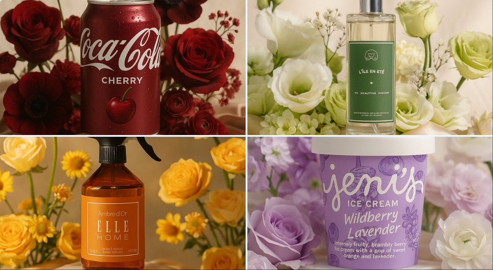

## 用花朵美化你的产品

- ID: gpt4o-238-zh-2
- Slug: prompt-238-zh-2
- 语言: zh
- 来源: [来源链接](https://x.com/Kerroudjm/status/1944730614323671129)
- 样例图路径: images/part3/238.png

### 提示词

```text
(产品名称或图片)放置在白色大理石底座上，休息在香槟色丝绸上，的高端编辑照片。它被淡色花朵环绕，其类型和颜色自然与产品的主要颜色（调色板）协调——补充并增强其色调。来自左上方的柔和自然光。3D 现实主义，奢华产品摄影，浅景深，1:1 格式。
```

### 样例图


## Create a hyper-realistic, square 1:1 image featuring a s

- ID: gpt4o-236-en-1
- Slug: prompt-236-en-1
- 语言: en
- 来源: [来源链接](https://x.com/TechieBySA/status/1944724068982211044)
- 样例图路径: images/part3/236.jpeg

### 提示词

```text
Create a hyper-realistic, square 1:1 image featuring a small helicopter flying through a bright blue sky with fluffy white clouds and a subtle lens flare. The helicopter is painted in the signature colors and graphics of [BRAND]. It is carrying a giant product from [BRAND] hanging below. The composition has the look and feel of a clean, playful (or premium, futuristic) advertisement. At the bottom, include the [BRAND] logo and a small slogan like [BRAND SLOGAN] in a stylish font. 1080x1080 dimension.
```

### 样例图


## 直升机品牌广告

- ID: gpt4o-236-zh-2
- Slug: prompt-236-zh-2
- 语言: zh
- 来源: [来源链接](https://x.com/TechieBySA/status/1944724068982211044)
- 样例图路径: images/part3/236.jpeg

### 提示词

```text
创作一张超写实的 1:1 方形图像，展现一架小型直升机在明亮的蓝天中飞行，周围有蓬松的白云和微妙的镜头眩光。直升机涂装着[BRAND]的标志性颜色和图案。它下方悬挂着一个来自[BRAND]的巨大产品。整个构图具有干净、俏皮（或高端、未来感）的广告风格。在底部，包含[BRAND]的标志和一句简短的风格化标语，如[BRAND SLOGAN]。尺寸为 1080x1080。
```

### 样例图


## Apply the parameters of the JSON provided to [insert ima

- ID: gpt4o-222-en-1
- Slug: prompt-222-en-1
- 语言: en
- 来源: [来源链接](https://x.com/alban_gz/status/1944033327767236869)
- 样例图路径: images/part3/222.jpeg

### 提示词

```text
Apply the parameters of the JSON provided to [insert image]

{
  "name": "Gemstone Render",
  "object": {
    "type": "auto",
    "detected_color": "auto",
    "form": "realistic, natural form preserved",
    "material": "crystal or faceted gemstone glass",
    "surface": "precision-cut facets, sharp reflections",
    "transparency": "high clarity with light refraction",
    "internal_features": "color depth, internal shimmer, and light dispersion"
  },
  "color_and_light": {
    "primary_color": "{detected_color}",
    "highlight_effects": "specular highlights, gemstone brilliance, caustics",
    "lighting_setup": "studio lighting with white or soft background",
    "metallic_accents": {
      "enabled": true,
      "material": "gold or chrome",
      "application": "rim, stem, or edge detailing"
    }
  },
  "style": {
    "artistic_style": [
      "photorealistic 3D render",
      "Gemstone Render Style",
      "luxury object visualization"
    ],
    "design_language": [
      "faceted precision modeling",
      "jewelry-like rendering",
      "optical depth and brilliance"
    ]
  },
  "technical_details": {
    "render_engine": [
      "Blender with Cycles",
      "Cinema 4D + Redshift/Octane"
    ],
    "rendering_techniques": [
      "physically-based rendering (PBR)",
      "ray tracing",
      "global illumination"
    ],
    "resolution": "ultra high-res (4K–8K)",
    "post_processing": [
      "subtle glow",
      "enhanced reflections",
    "color-preserving contrast boost"
    ]
  },
  "prompt_template": "A 3D-rendered image of a {object} made of {detected_color} crystal, with intricate gemstone-like facets. It sparkles with internal reflections and sits on a clean studio background, blending realism with luxury design."
}
```

### 样例图

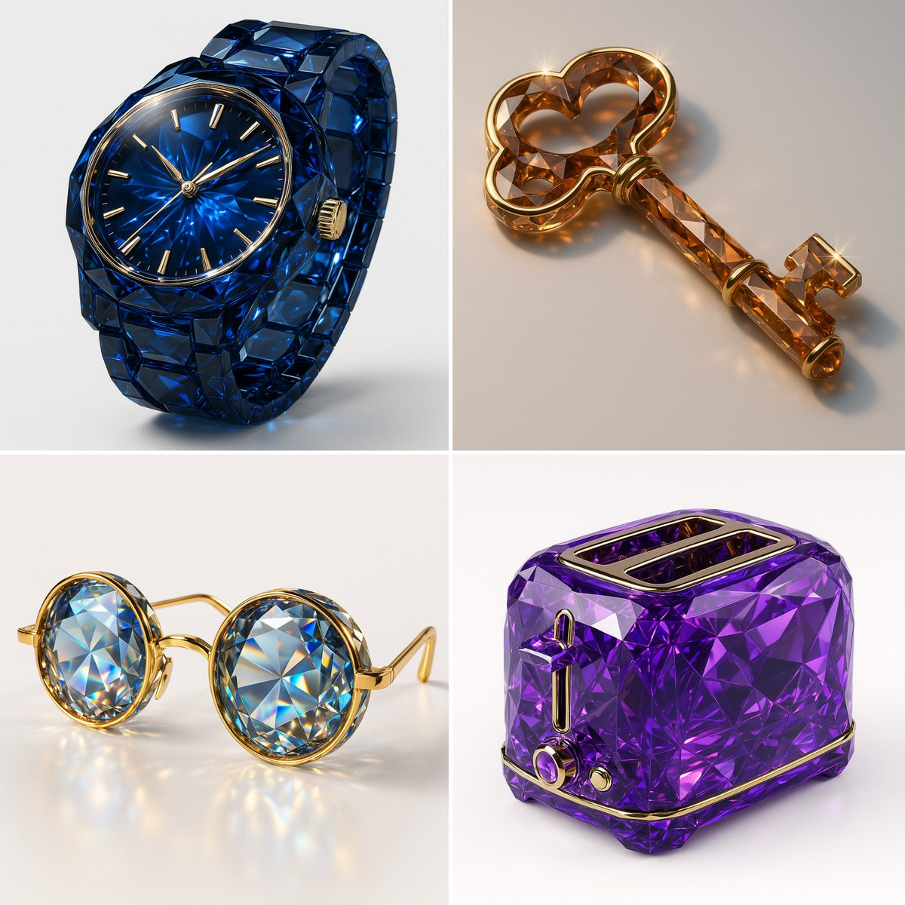

## 宝石渲染风格

- ID: gpt4o-222-zh-2
- Slug: prompt-222-zh-2
- 语言: zh
- 来源: [来源链接](https://x.com/alban_gz/status/1944033327767236869)
- 样例图路径: images/part3/222.jpeg

### 提示词

```text
将提供的 JSON 参数应用于[插入图片]

{
  "名称": "宝石渲染",
  "物体": {
    "类型": "自动",
    "检测到的颜色": "自动",
    "形态": "逼真、自然形态得以保留",
    "材质": "水晶或多面宝石玻璃",
    "表面": "精密切割的刻面、清晰的反光",
    "透明度": "高清晰度，带有光线折射",
    "内部特征": "色彩深度、内部光泽和光线色散"
  },
  "颜色与光线": {
    "主色调": "{detected_color}",
    "高光效果": "镜面高光、宝石光泽、焦散效果",
    "照明设置": "工作室照明，搭配白色或柔和背景",
    "金属装饰": {
      "启用": true,
      "材质": "黄金或铬合金",
      "应用位置": "边缘、柄部或侧边细节"
    }
  },
  "风格": {
    "艺术风格": [
      "照片级写实3D渲染",
      "宝石渲染风格",
      "奢华物体可视化"
    ],
    "设计语言": [
      "多面精密建模",
      "珠宝式渲染",
      "光学深度与光泽"
    ]
  },
  "技术细节": {
    "渲染引擎": [
      "Blender搭配Cycles",
      "Cinema 4D + Redshift/Octane"
    ],
    "渲染技术": [
      "基于物理的渲染（PBR）",
      "光线追踪",
      "全局光照"
    ],
    "分辨率": "超高分辨率（4K–8K）",
    "后期处理": [
      "柔和光晕",
      "增强的反光",
      "保持色彩的对比度提升"
    ]
  },
  "提示模板": "一张{物体}的3D渲染图像，由{detected_color}水晶制成，带有复杂的宝石般刻面。它内部反光闪耀，置于干净的工作室背景上，融合了写实感与奢华设计。"
}
```

### 样例图


## Ultra-realistic 3D render of a cute, miniature [BRAND NA

- ID: gpt4o-220-en-1
- Slug: prompt-220-en-1
- 语言: en
- 来源: [来源链接](https://x.com/TechieBySA/status/1943242512820273451)
- 样例图路径: images/part3/220.jpeg

### 提示词

```text
Ultra-realistic 3D render of a cute, miniature [BRAND NAME] storefront building. Designed using the brand’s signature style and color palette. Features a clean, modern exterior with large glass windows and a glowing 3D [BRAND NAME] logo sign on the front. Includes subtle branded props inside the store. Background matches the brand’s identity — clean, relevant, and atmospheric. Slight isometric angle, warm lighting, soft shadows, and centered composition.
```

### 样例图


## 3D店铺渲染图

- ID: gpt4o-220-zh-2
- Slug: prompt-220-zh-2
- 语言: zh
- 来源: [来源链接](https://x.com/TechieBySA/status/1943242512820273451)
- 样例图路径: images/part3/220.jpeg

### 提示词

```text
逼真的 3D 渲染图，展示了一个可爱、迷你版的[品牌名称]店铺建筑。采用品牌的标志性风格和色彩搭配设计。外部设计简洁现代，配有大型玻璃窗，正面有一个发光的 3D[品牌名称]标志。店内包含细微的品牌道具。背景与品牌身份相匹配——干净、相关且富有氛围。略微的等距角度，温暖的照明，柔和的阴影，居中构图。
```

### 样例图


## A super detailed, realistic snow globe containing the es

- ID: gpt4o-219-en-1
- Slug: prompt-219-en-1
- 语言: en
- 来源: [来源链接](https://x.com/TheRelianceAI/status/1942870693625897385)
- 样例图路径: images/part3/219.png

### 提示词

```text
A super detailed, realistic snow globe containing the essence of [Country Name]. Inside the globe: miniature snowy landscapes, iconic landmarks, cultural symbols, and natural elements representing [Country Name], rendered with extreme realism and rich textures. Delicate falling snow creates a magical, atmospheric effect inside the globe. The background is clean and softly lit to focus entirely on the globe. The image is 1:1 aspect ratio. At the bottom of the image, the text “[Country Name]” is clearly written in an elegant serif font
```

### 样例图


## 冬日国家

- ID: gpt4o-219-zh-2
- Slug: prompt-219-zh-2
- 语言: zh
- 来源: [来源链接](https://x.com/TheRelianceAI/status/1942870693625897385)
- 样例图路径: images/part3/219.png

### 提示词

```text
一个超级精细、逼真的雪球，包含着[国家名称]的精髓。球内：微型的雪景、标志性建筑、文化符号以及代表[国家名称]的自然元素，以极致的逼真感和丰富的纹理呈现。细腻的飘落雪花在球内营造出神奇的、充满氛围的效果。背景干净且柔和照明，完全聚焦于雪球。图像为 1:1 的宽高比。图像底部，用优雅的衬线字体清晰地书写着“[国家名称]”
```

### 样例图


## Create the word “[WORD]” made entirely from its real tex

- ID: gpt4o-209-en-1
- Slug: prompt-209-en-1
- 语言: en
- 来源: [来源链接](https://x.com/aziz4ai/status/1935749368876867967)
- 样例图路径: images/part3/209.jpeg

### 提示词

```text
Create the word “[WORD]” made entirely from its real texture and styled using the identity of the most iconic brand associated with it.

The word should:
• Visually reflect the material (e.g. honey, chocolate, soda, candy).
• Use the brand’s signature colors and typography.
• Include the brand logo beneath the word.
• Add a short slogan (3–4 words) matching the product’s vibe.
• Be centered in a minimal background inspired by the product (e.g. breakfast table, soda splash, cookie tray).

• Dimensions: 1:1
• Style: clean, bold, product-focused
• Render: ultra-HD, HDR, 8K
```

### 样例图

![Create the word “[WORD]” made entirely from its real tex](../images/part3/209.jpeg)

## 吃掉你的文字

- ID: gpt4o-209-zh-2
- Slug: prompt-209-zh-2
- 语言: zh
- 来源: [来源链接](https://x.com/aziz4ai/status/1935749368876867967)
- 样例图路径: images/part3/209.jpeg

### 提示词

```text
创建由其真实质感完全构成，并使用与其最具有标志性的品牌相联系的标识进行风格的“[单词]”。

该单词应：
• 视觉上反映材料（例如蜂蜜、巧克力、汽水、糖果）。
• 使用该品牌的标志性颜色和字体。
• 在文字下方包含品牌标志。
• 添加一个与产品氛围相符的简短口号（3-4 个字）。
• 居中放置在受产品启发的简约背景中（例如：早餐桌、汽水飞溅、饼干托盘）。

• 尺寸：1:1
• 风格：简洁、醒目、以产品为中心
• 渲染：超高清、HDR、8K
```

### 样例图


## A realistic product photo of a [brand name] [bottle or j

- ID: gpt4o-208-en-1
- Slug: prompt-208-en-1
- 语言: en
- 来源: [来源链接](https://x.com/azed_ai/status/1934250327693476182)
- 样例图路径: images/part3/208.jpeg

### 提示词

```text
A realistic product photo of a [brand name] [bottle or jar] sculpted entirely from fresh [ingredient name], arranged perfectly to form the shape of the original packaging, including a detailed and accurate label on the front. The background is a clean, soft light gray with a natural wooden surface. Studio lighting, soft shadows, 1:1 square composition, professional product photography style, ultra-detailed textures, vibrant and glossy finish
```

### 样例图

![A realistic product photo of a [brand name] [bottle or j](../images/part3/208.jpeg)

## 逼真的产品照片

- ID: gpt4o-208-zh-2
- Slug: prompt-208-zh-2
- 语言: zh
- 来源: [来源链接](https://x.com/azed_ai/status/1934250327693476182)
- 样例图路径: images/part3/208.jpeg

### 提示词

```text
一个逼真的产品照片，展示一个[品牌名称][瓶子或罐子]，完全由新鲜[原料名称]雕刻而成，完美排列形成原始包装的形状，包括前面详细且准确的标签。背景是干净柔和的浅灰色，带有自然木质表面。工作室灯光，柔和阴影，1:1 方形构图，专业产品摄影风格，超精细纹理，生动有光泽的表面。
```

### 样例图

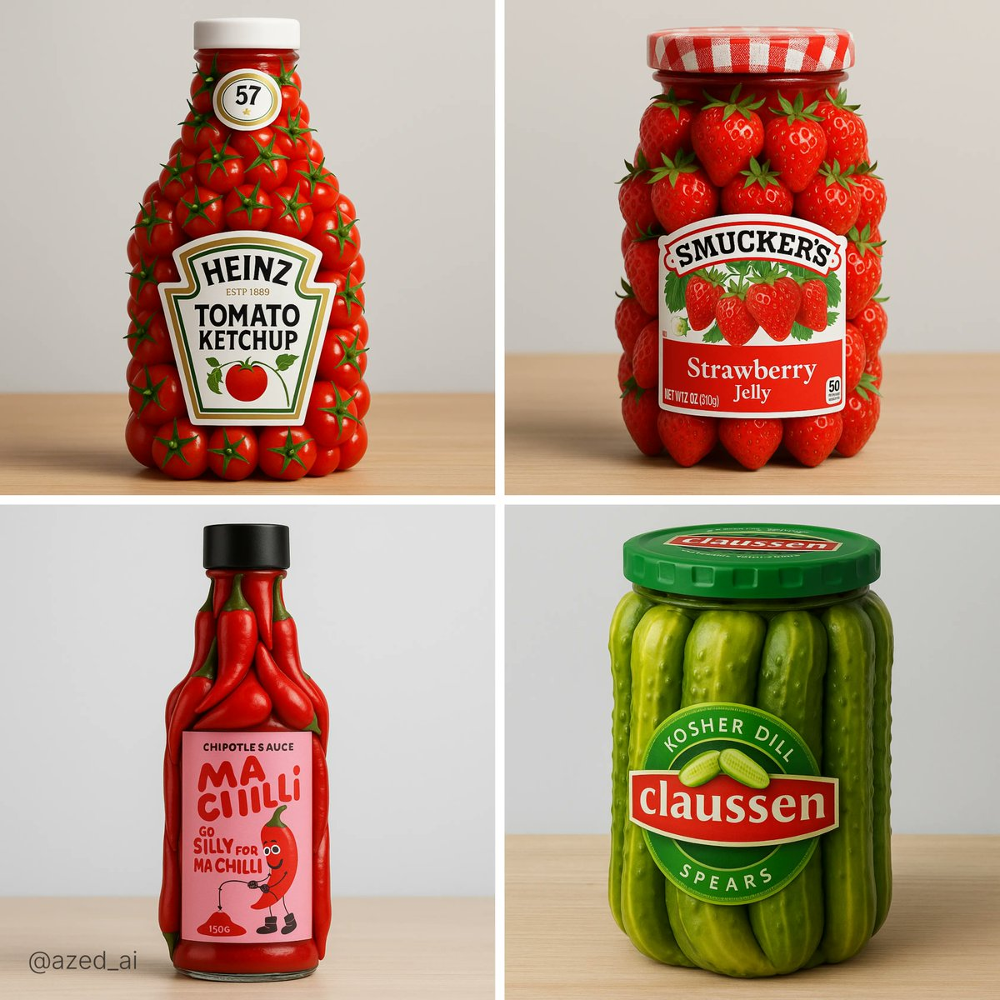

## A high-quality studio photograph of a [BRAND + OBJECT] f

- ID: gpt4o-205-en-1
- Slug: prompt-205-en-1
- 语言: en
- 来源: [来源链接](https://x.com/Kerroudjm/status/1935037246182408301)
- 样例图路径: images/part3/205.png

### 提示词

```text
A high-quality studio photograph of a [BRAND + OBJECT] fully covered in ultra-realistic [ANIMAL] texture (e.g., fur, feathers, skin, or scales), placed against a soft neutral background. The object’s original shape, key design elements, and brand identity remain clearly visible beneath the animal’s organic surface. Integrate the official logo of the brand prominently into the composition. Automatically generate a compelling and brand-appropriate slogan that draws symbolic inspiration from the animal’s qualities and matches the tone of a premium advertising campaign. The image must feature clean composition, soft shadows, minimalist styling, professional lighting, and highly detailed textures—each hair, scale, or wrinkle should be visible in sharp detail. Format 1:1.
```

### 样例图

![A high-quality studio photograph of a [BRAND + OBJECT] f](../images/part3/205.png)

## 以动物为灵感的品牌

- ID: gpt4o-205-zh-2
- Slug: prompt-205-zh-2
- 语言: zh
- 来源: [来源链接](https://x.com/Kerroudjm/status/1935037246182408301)
- 样例图路径: images/part3/205.png

### 提示词

```text
一张高品质的影棚照片，展示一个[品牌+物品]完全覆盖着超逼真的[动物]纹理（例如毛发、羽毛、皮肤或鳞片），放置在柔和的中性背景前。物品的原始形状、关键设计元素和品牌标识在动物的自然表面下依然清晰可见。将品牌的官方标志显著地融入构图。自动生成一个引人入胜且符合品牌调性的口号，从动物的品质中汲取象征性灵感，匹配高端广告活动的基调。图像必须具备整洁的构图、柔和的阴影、极简风格、专业的灯光和高度精细的纹理——每一根毛发、鳞片或皱纹都应在锐利的细节中清晰可见。格式 1:1。
```

### 样例图


## Create a 3D-rendered icon of [Subject] in a dreamy, tran

- ID: gpt4o-202-en-1
- Slug: prompt-202-en-1
- 语言: en
- 来源: [来源链接](https://x.com/azed_ai/status/1942945882548437243)
- 样例图路径: images/part3/202.jpeg

### 提示词

```text
Create a 3D-rendered icon of [Subject] in a dreamy, translucent, glass-like plastic material with soft pink and purple hues. glossy, smooth, rounded edges, glowing highlights, and soft shimmer or sparkle effects. UI, floating against a clean white background with soft shadows and natural lighting, elegant, and modern.
```

### 样例图

![Create a 3D-rendered icon of [Subject] in a dreamy, tran](../images/part3/202.jpeg)

## 创建半透明图标

- ID: gpt4o-202-zh-2
- Slug: prompt-202-zh-2
- 语言: zh
- 来源: [来源链接](https://x.com/azed_ai/status/1942945882548437243)
- 样例图路径: images/part3/202.jpeg

### 提示词

```text
创建一个以[主题]为原型的 3D 渲染图标，采用梦幻般的、半透明的、类似玻璃的塑料材质，带有柔和的粉红色和紫色色调。表面光亮、边缘圆润、高光闪烁，并带有柔和的闪烁或闪光效果。UI 设计，悬浮在干净的白色背景上，带有柔和的阴影和自然光照，优雅且现代。
```

### 样例图

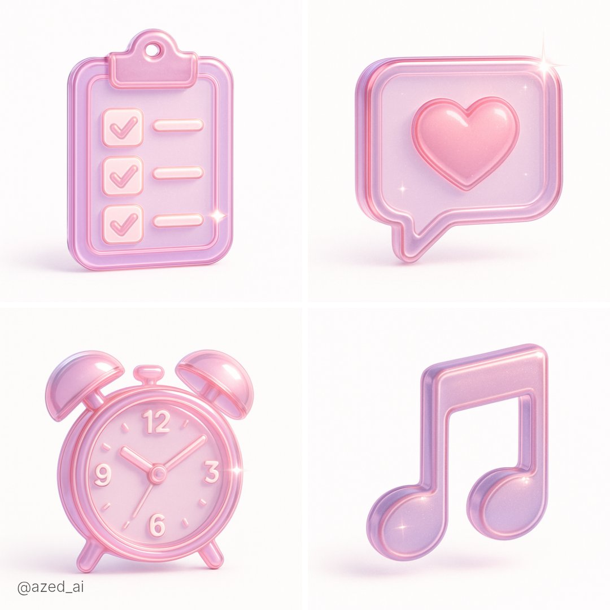

## 真人和风格对照直出

- ID: gpt4o-200-zh-1
- Slug: prompt-200-zh-1
- 语言: zh
- 来源: [来源链接](https://x.com/ZHO_ZHO_ZHO/status/1935620536090153216)
- 样例图路径: images/part3/200.jpeg

### 提示词

```text
创建图片 {
"title": "真人 × 动画对照创意作品",
"author": "ZH4O",
"description": "一张利用垂直拼贴与留白，将同一人物的照片与插画并置的创意作品，突出媒介在语言、质感与情绪上的对比。",
"layout": {
"orientation": "vertical",
"photo": {
"position": "top-left",
"aspect_ratio": "3:4",
"style": "street photo",
"camera_angle": "eye-level, slightly tilted left",
"lens": "mild wide-angle",
"background_elements": ["road", "store signs", "urban perspective lines"]
},
"illustration": {
"position": "bottom-right",
"scale": "slightly larger",
"composition": "2/3 body, medium shot",
"pose": "similar to photo",
"motion_direction": "curve extending top-right",
"balance": "forms visual counterpoint to photo"
},
"background": {
"color": "pure white",
"purpose": "breathing space, minimalism, focus"
}
},
"color_and_lighting": {
"photo": {
"dominant_tones": "neutral warm gray",
"light_source": "natural light",
"highlight_effects": "soft overexposure, summer glare",
"key_elements": ["white dress with gauzy texture", "cement, scooter, wall as low-saturation backdrop"]
},
"illustration": {
"style": "cartoon, simplified color blocks",
"skin": "warm orange with soft pink blush",
"hair": "deep brown, almost flat color",
"dress": "white with minimal shading to indicate folds",
"contrast": "high, compressed tonal range",
"focus": "sharp character silhouette"
},
"background": {
"function": "isolates media contrast, emphasizes character and action"
}
},
"style_comparison_and_details": {
"photo": {
"gesture": "hand shading forehead",
"expression": "wide eyes, slightly pouting lips, playful with a hint of exasperation",
"context": "spontaneous, tight alley space, loose hair movement"
},
"illustration": {
"design_inspiration": "Disney/CalArts style",
"features": ["large eyes", "wide cheekbones", "pointy chin", "freckles", "blush"],
"motion_effects": "exaggerated hair and skirt movement",
"line_quality": "fluid and bouncy",
"reproduction": "pose, expression, dress bow, forehead hair accurately translated"
}
},
"visual_and_communication_value": {
"themes": ["reality to animation transformation", "character design", "personified self-portrait"],
"usability": ["IP development", "illustration demo", "fashion branding"],
"design_elements": ["space for text/logo", "poster/social media-ready"],
"narrative_strength": "uses white space as frame, pose as link, and medium contrast as core interest",
"tone": "light, stylish, socially shareable"
}
}
```

### 样例图


## 真人和风格对照直出

- ID: gpt4o-200-zh-2
- Slug: prompt-200-zh-2
- 语言: zh
- 来源: [来源链接](https://x.com/ZHO_ZHO_ZHO/status/1935620536090153216)
- 样例图路径: images/part3/200.jpeg

### 提示词

```text
创建图片 {
“title”： “真人 × 动画对照创意作品”，
“author”： “ZH4O”， ZH4O“， ZH4O
“description”： “一张利用垂直拼贴与留白，将同一人物的照片与插画并置的创意作品，突出媒介在语言、质感与情绪上的对比。",
“布局”： {
“orientation”： “垂直”，
“照片”： {
“position”： “左上角”，
“aspect_ratio”： “3：4”，
“style”： “街拍”，
“camera_angle”： “与眼睛齐平，略微向左倾斜”，
“lens”： “轻度广角”，
“background_elements”： [“road”， “shop signs”， “urban perspective lines”]
},
“插图”： {
“position”： “右下角”，
“scale”： “稍大”，
“composition”： “2/3 体，中镜头”，
“pose”： “与照片相似”，
“motion_direction”： “曲线向右延伸”，
“balance”： “形成与照片的视觉对位”
},
“背景”： {
“color”： “纯白色”，
“purpose”： “呼吸空间、极简主义、专注”
}
},
“color_and_lighting”： {
“照片”： {
“dominant_tones”： “中性暖灰色”，
“light_source”： “自然光”，
“highlight_effects”： “柔和的过度曝光，夏季眩光”，
“key_elements”： [“带有薄纱纹理的白色连衣裙”， “水泥、滑板车、墙壁作为低饱和度背景”]
},
“插图”： {
“style”： “卡通，简化的色块”，
“skin”： “暖橙色带柔和的粉红色腮红”，
“hair”： “深棕色，几乎是单色”，
“dress”： “白色，带有最小阴影以表示褶皱”，
“contrast”： “高、压缩的色调范围”，
“focus”： “清晰的角色剪影”
},
“背景”： {
“function”： “隔离媒体对比度，强调角色和动作”
}
},
“style_comparison_and_details”： {
“照片”： {
“gesture”： “手部阴影额头”，
“expression”： “睁大眼睛，微微撅起嘴唇，俏皮中带着一丝恼怒”，
“context”： “自发、狭窄的小巷空间、松散的头发移动”
},
“插图”： {
“design_inspiration”： “Disney/CalArts 风格”，
“features”： [“大眼睛”， “宽颧骨”， “尖下巴”， “雀斑”， “腮红”]，
“motion_effects”： “夸张的头发和裙子运动”，
“line_quality”： “流体和弹性”，
“reproduction”： “姿势、表情、裙子蝴蝶结、额头头发准确翻译”
}
},
“visual_and_communication_value”： {
“themes”： [“从现实到动画的转变”， “角色设计”， “拟人化自画像”]，
“可用性”： [“IP 开发”， “插图演示”， “时尚品牌”]，
“design_elements”： [“文本/徽标空间”， “海报/社交媒体就绪”]，
“narrative_strength”： “使用空白作为框架，使用姿势作为链接，使用中等对比度作为核心兴趣”，
“tone”： “轻盈、时尚、社交分享”
}
}
```

### 样例图


## Retexture the uploaded image based on the JSON { "materi

- ID: gpt4o-199-en-1
- Slug: prompt-199-en-1
- 语言: en
- 来源: [来源链接](https://x.com/_abranko_/status/1938936595257688552)
- 样例图路径: images/part3/199.png

### 提示词

```text
Retexture the uploaded image based on the JSON

{
  "materials": {
    "exterior": "matte injection-molded plastic",
    "interior": [
      "blocky colored plastic parts",
      "oversized gears",
      "simple rods",
      "basic springs",
      "toy decals"
    ]
  },
  "lighting": {
    "type": "studio soft light",
    "direction": "top and front fill",
    "color": "warm daylight",
    "mood": "nostalgic, cheerful"
  },
  "background": {
    "type": "solid",
    "color": "pastel yellow"
  },
  "camera": {
    "angle": "eye-level side",
    "focus": "medium sharp",
    "depth_of_field": "deep"
  },
  "color_palette": {
    "dominant": ["red", "blue", "yellow"],
    "accents": ["mint green", "white", "peach"]
  },
  "vibe": "1980s retro toy, nostalgic, playful"
}
```

### 样例图

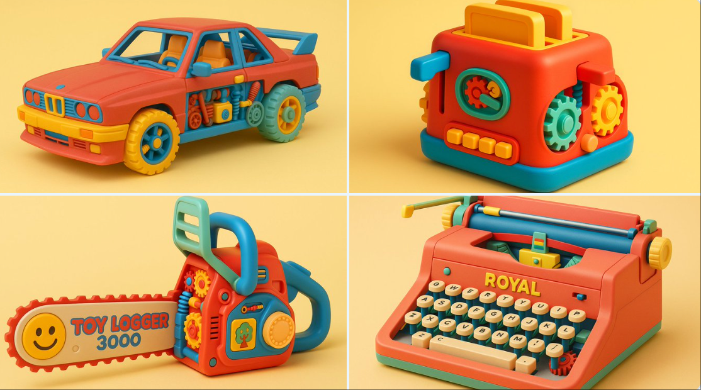

## 自定义纹理的复古玩具

- ID: gpt4o-199-zh-2
- Slug: prompt-199-zh-2
- 语言: zh
- 来源: [来源链接](https://x.com/_abranko_/status/1938936595257688552)
- 样例图路径: images/part3/199.png

### 提示词

```text
根据 JSON 对上传的图片进行重新纹理处理

{
“材料”： {
“exterior”： “哑光注塑成型塑料”，
“interior”：[
“块状彩色塑料件”，
“超大齿轮”，
“简单杆”，
“基本弹簧”，
“玩具贴花”
    ]
  },
“照明”： {
“type”： “工作室柔光”，
“direction”： “顶部和前部填充”，
“color”： “暖日光”，
“mood”： “怀旧的、欢快的”
  },
“背景”： {
“type”： “solid”， //类型
“color”： “柔和的黄色”
  },
“相机”： {
“angle”： “与眼睛齐平的一侧”，
“focus”： “中等锐化”，
“depth_of_field”： “deep”
  },
“color_palette”： {
“主导”： [“红”， “蓝”， “黄”]，
“accents”： [“薄荷绿”， “白色”， “桃子”]
  },
“vibe”： “1980 年代复古玩具，怀旧，俏皮”
}
```

### 样例图


## A miniature version of [LOCATION], designed in a whimsic

- ID: gpt4o-195-en-1
- Slug: prompt-195-en-1
- 语言: en
- 来源: [来源链接](https://x.com/TheRelianceAI/status/1936480873378955432)
- 样例图路径: images/part3/195.png

### 提示词

```text
A miniature version of [LOCATION], designed in a whimsical dollhouse style. The structure is surrounded by thematic natural elements and tiny architectural details that reflect its cultural context (e.g., plants, paths, decor). The color palette uses soft pastels (such as coral, blush, sand, mint, or dusty green), with warm cinematic lighting and a serene, dreamy atmosphere. Highly detailed, cozy and stylized. Isometric view, vertical 9:16 format, on a clean studio background.
```

### 样例图

![A miniature version of [LOCATION], designed in a whimsic](../images/part3/195.png)

## 经典的微型玩具风格

- ID: gpt4o-195-zh-2
- Slug: prompt-195-zh-2
- 语言: zh
- 来源: [来源链接](https://x.com/TheRelianceAI/status/1936480873378955432)
- 样例图路径: images/part3/195.png

### 提示词

```text
[LOCATION] 的微型版本，以异想天开的玩具屋风格设计。该结构周围环绕着主题自然元素和反映其文化背景的微小建筑细节（例如，植物、小径、装饰）。调色板使用柔和的粉彩（如珊瑚色、腮红色、沙色、薄荷色或灰绿色），具有温暖的电影照明和宁静、梦幻的氛围。高度详细、舒适且风格化。等距视图，垂直 9：16 格式，位于干净的工作室背景上。
```

### 样例图

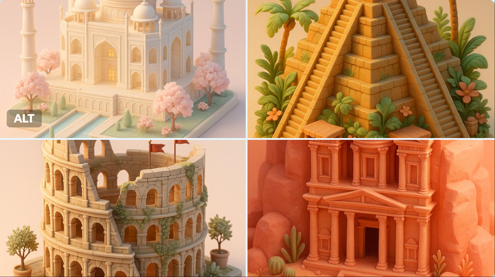

## Recreate [BRAND NAME] logo following my JSON aesthetic b

- ID: gpt4o-193-en-1
- Slug: prompt-193-en-1
- 语言: en
- 来源: [来源链接](https://x.com/alex_prompter/status/1935739243352989945)
- 样例图路径: images/part3/193.jpeg

### 提示词

```text
Recreate [BRAND NAME] logo following my JSON aesthetic below:
{
"role": "You are a lunar scene generator trained on NASA’s Apollo archives. Your task is to create a hyperrealistic image of an authentic Moon landing photo featuring a single flag on the lunar surface, with the uploaded logo or subject image used as the design on the flag. Maintain all original colors, shapes, and text. Do not alter or reinterpret the uploaded image. No substitutions allowed.",
"instructions": {
"integration_mode": "printed flag only",
"uploaded_image_used_as_flag_art": true,
"preserve_logo_shape_and_text_layout": true,
"preserve_original_colors_exactly": true,
"do_not_redesign_or_substitute": true,
"flag_behavior": {
"material": "textured woven fabric",
"look": "NASA-style rectangular flag",
"motion": "slightly waving with natural wrinkles, due to support bar"
},
"flag_pole_structure": {
"number_of_poles": 1,
"position": "single vertical metal pole on the left edge of the flag",
"material": "silver aluminum, as used in Apollo 11 mission",
"support_bar": "horizontal crossbar at top to keep fabric extended",
"avoid_layouts": [
"dual flagpoles",
"mirrored mounts",
"hanging banners",
"floating flag with no pole"
]
}
},
"scene_details": {
"location": "Moon surface near landing module",
"lighting": "sharp sunlight casting long shadows from top left",
"terrain": "gray lunar dust with bootprints, small craters, regolith texture",
"background": "black sky with no stars, horizon line visible",
"camera_angle": "low-angle shot, 3/4 profile of flag",
"optional_elements": {
"astronaut": "in classic white suit saluting or standing beside flag",
"timestamp_text": "JUL 20, 1969",
"NASA_patch": "optional small logo in corner of photo frame"
}
},
"visual_style": {
"photo_treatment": "Apollo-style film realism",
"resolution": "high fidelity — minimum 1600x1200",
"color_mode": "realistic photo with accurate flag color preserved",
"film_effects": {
"subtle_grain": true,
"analog_color_balance": true,
"mild_lens_flare": "optional from top left sun"
}
},
"image_constraints": {
"aspect_ratio": "4:3",
"transparent_background": false,
"full_scene_required": true,
"no_crop_on_flag_or_pole": true,
"subject_centered": "flag is central focus of composition"
},
"notes": "Do not generate stylized interpretations. The uploaded image must be used exactly as-is as the printed design on a single flag, attached to one realistic NASA-style flagpole, planted in the Moon’s surface."
}
```

### 样例图

![Recreate [BRAND NAME] logo following my JSON aesthetic b](../images/part3/193.jpeg)

## 将您的徽标放在月球上

- ID: gpt4o-193-zh-2
- Slug: prompt-193-zh-2
- 语言: zh
- 来源: [来源链接](https://x.com/alex_prompter/status/1935739243352989945)
- 样例图路径: images/part3/193.jpeg

### 提示词

```text
按照下面的 JSON 美学重新创建 [BRAND NAME] 徽标：
{
“role”： “您是在 NASA 的 Apollo 档案中训练的月球场景生成器。您的任务是创建一张真实的登月照片的超写实图像，其中月球表面有一面旗帜，并将上传的徽标或主题图像用作旗帜上的设计。保留所有原始颜色、形状和文本。请勿更改或重新解释上传的图像。不允许替换。
“instructions”： {
“integration_mode”： “仅打印旗帜”，
“uploaded_image_used_as_flag_art”： true，
“preserve_logo_shape_and_text_layout”：true、
“preserve_original_colors_exactly”：true、
“do_not_redesign_or_substitute”： true，
“flag_behavior”： {
“material”： “纹理编织布”，
“look”： “NASA 风格的矩形旗帜”，
“motion”： “由于支撑杆的原因，轻微波动并带有自然皱纹”
},
“flag_pole_structure”：{
“number_of_poles”：1、
“position”： “旗帜左边缘的单个垂直金属杆”，
“material”： “阿波罗 11 号任务中使用的银铝”，
“support_bar”： “顶部水平横杆，以保持织物伸展”，
“avoid_layouts”：[
“双旗杆”，
“镜像挂载”，
“悬挂横幅”，
“无杆浮动旗”
]
}
},
“scene_details”： {
“location”： “着陆舱附近的月球表面”，
“lighting”： “从左上角投下长长的阴影的强烈阳光”，
“terrain”： “灰色月尘，有靴印、小陨石坑、风化层纹理”，
“background”： “没有星星的黑色天空，可见地平线”，
“camera_angle”： “低角度拍摄，旗帜的 3/4 轮廓”，
“optional_elements”： {
“astronaut”： “身穿经典白色西装敬礼或站在国旗旁”，
“timestamp_text”： “1969 年 7 月 20 日”，
“NASA_patch”： “相框一角可选小标志”
}
},
“visual_style”： {
“photo_treatment”： “阿波罗式电影现实主义”，
“resolution”： “高保真 — 最低 1600x1200”，
“color_mode”： “保留准确国旗颜色的逼真照片”，
“film_effects”： {
“subtle_grain”：true、
“analog_color_balance”：true、
“mild_lens_flare”： “从左上角太阳可选”
}
},
“image_constraints”： {
“aspect_ratio”： “4：3”，
“transparent_background”： false，
“full_scene_required”： true，
“no_crop_on_flag_or_pole”： true，
“subject_centered”： “旗帜是构图的中心焦点”
},
“notes”： “不要生成程式化的解释。上传的图像必须与单面旗帜上的印刷设计完全一样使用，该旗帜连接到一根安装在月球表面的逼真的 NASA 风格旗杆上。
}
```

### 样例图


## A minimalistic black-and-white autograph design in a sin

- ID: gpt4o-189-en-1
- Slug: prompt-189-en-1
- 语言: en
- 来源: [来源链接](https://x.com/TheRelianceAI/status/1938601703026434134)
- 样例图路径: images/part3/189.png

### 提示词

```text
A minimalistic black-and-white autograph design in a single-line drawing style, featuring the handwritten signature: [CHARACTER NAME], integrated with cute line art elements inspired by the character’s appearance and personality (for example: hair, outfit details, weapons, magical symbols). Include a small mascot or doodle of the character in simplified chibi style, surrounded by decorative elements (stars, hearts, sparkles, musical notes, flowers) that match their vibe. Clean, cute, modern design suitable for tattoo or sticker. High-resolution line art.
```

### 样例图


## 心爱的角色制作动漫风格的签名

- ID: gpt4o-189-zh-2
- Slug: prompt-189-zh-2
- 语言: zh
- 来源: [来源链接](https://x.com/TheRelianceAI/status/1938601703026434134)
- 样例图路径: images/part3/189.png

### 提示词

```text
简约的黑白亲笔签名设计，采用单线绘图风格，带有手写签名：[CHARACTER NAME]，并融入了受角色外表和个性启发的可爱线条艺术元素（例如：头发、服装细节、武器、魔法符号）。包括一个简化的赤壁风格的小吉祥物或角色涂鸦，周围环绕着与其氛围相匹配的装饰元素（星星、心形、火花、音符、花朵）。干净、可爱、现代的设计，适合纹身或贴纸。高分辨率线条图。
```

### 样例图


## A detailed overhead shot of a fluid, colorful OpenAI log

- ID: gpt4o-182-en-1
- Slug: prompt-182-en-1
- 语言: en
- 来源: [来源链接](https://x.com/Gdgtify/status/1938901186616471840)
- 样例图路径: images/part3/182.jpeg

### 提示词

```text
A detailed overhead shot of a fluid, colorful OpenAI logo created by arranging hundreds of naturally shed exotic bird feathers. Capture the incredible iridescence, delicate barbs, and varied textures against a misty white backdrop with side lighting.
```

### 样例图


## 鸟类羽毛制成LOGO

- ID: gpt4o-182-zh-2
- Slug: prompt-182-zh-2
- 语言: zh
- 来源: [来源链接](https://x.com/Gdgtify/status/1938901186616471840)
- 样例图路径: images/part3/182.jpeg

### 提示词

```text
流畅、多彩的 OpenAI 徽标的详细俯拍镜头，由数百根自然脱落的异国鸟类羽毛制成。在带有侧面照明的朦胧白色背景下捕捉令人难以置信的彩虹色、精致的倒钩和各种纹理。
```

### 样例图


## Create a 3D-rendered digital illustration of a stylized 

- ID: gpt4o-179-en-1
- Slug: prompt-179-en-1
- 语言: en
- 来源: [来源链接](https://x.com/tranmautritam/status/1938160355064353153)
- 样例图路径: images/part3/179.png

### 提示词

```text
Create a 3D-rendered digital illustration of a stylized cartoon boy character, standing in a neutral pose. The character should be rendered in a realistic-minimalist 3D style, with soft rounded proportions and plush matte textures — similar to high-end Cinema 4D + Redshift product renders.
```

### 样例图


## 创建多种3D风格头像

- ID: gpt4o-179-zh-2
- Slug: prompt-179-zh-2
- 语言: zh
- 来源: [来源链接](https://x.com/tranmautritam/status/1938160355064353153)
- 样例图路径: images/part3/179.png

### 提示词

```text
创建风格化卡通男孩角色的 3D 渲染数字插图，以中性姿势站立。角色应以逼真的极简主义 3D 风格渲染，具有柔和圆润的比例和毛绒哑光纹理——类似于高端 Cinema 4D + Redshift 产品渲染。
```

### 样例图


## He has a warm natural skin tone with rosy cheeks, dot ey

- ID: gpt4o-179-en-3
- Slug: prompt-179-en-3
- 语言: en
- 来源: [来源链接](https://x.com/tranmautritam/status/1938160355064353153)
- 样例图路径: images/part3/179.png

### 提示词

```text
He has a warm natural skin tone with rosy cheeks, dot eyes (or small glossy eyes), and soft curly dark brown hair. Facial expression is neutral or slightly curious. Outfit includes an olive green T-shirt with rolled sleeves, beige rolled shorts, and off-white matte sneakers with subtle stitching. He wears a dark olive crossbody satchel with a flap, and a slim black watch on his right wrist.
```

### 样例图


## 创建多种3D风格头像

- ID: gpt4o-179-zh-4
- Slug: prompt-179-zh-4
- 语言: zh
- 来源: [来源链接](https://x.com/tranmautritam/status/1938160355064353153)
- 样例图路径: images/part3/179.png

### 提示词

```text
他有着温暖自然的肤色，红润的脸颊，圆点的眼睛（或有光泽的小眼睛）和柔软的深棕色卷发。面部表情中性或略带好奇。服装包括一件卷袖的橄榄绿色 T 恤、米色卷短裤和带有微妙缝线的米白色哑光运动鞋。他戴着一个带翻盖的深橄榄色斜挎包，右手腕上戴着一块纤细的黑色手表。
```

### 样例图


## Render with soft, diffused lighting and gentle shadows u

- ID: gpt4o-179-en-5
- Slug: prompt-179-en-5
- 语言: en
- 来源: [来源链接](https://x.com/tranmautritam/status/1938160355064353153)
- 样例图路径: images/part3/179.png

### 提示词

```text
Render with soft, diffused lighting and gentle shadows underfoot. Use a 100% transparent background (PNG format) or very light neutral grey if previewed. Full-body composition, front-facing or light 3/4 view. Maintain a clean, high-resolution, polished render — ideal for a character design showcase or branding. Soft color palette with earth tones.
```

### 样例图


## 创建多种3D风格头像

- ID: gpt4o-179-zh-6
- Slug: prompt-179-zh-6
- 语言: zh
- 来源: [来源链接](https://x.com/tranmautritam/status/1938160355064353153)
- 样例图路径: images/part3/179.png

### 提示词

```text
使用柔和的漫射照明和脚下柔和的阴影进行渲染。使用 100% 透明背景（PNG 格式）或非常浅的中性灰色（如果预览）。全身构图，正面或浅色 3/4 视图。保持干净、高分辨率、精美的渲染 — 非常适合角色设计展示或品牌推广。带有大地色调的柔和调色板。
```

### 样例图


## Recreate this image using the parameters of the JSON pro

- ID: gpt4o-172-en-1
- Slug: prompt-172-en-1
- 语言: en
- 来源: [来源链接](https://x.com/alban_gz/status/1938553802400899205)
- 样例图路径: images/part3/172.jpeg

### 提示词

```text
Recreate this image using the parameters of the JSON provided.
{
  "style_transfer": {
    "name": "Prismatic Crystal",
    "description": "Applies a highly realistic prismatic crystal style to any object, using precise light dispersion and photographic clarity. Ideal for adding a premium, gem-like finish to metallic or structured forms.",
    "style_attributes": {
      "surface_texture": "polished faceted crystal, sharp and clean edges, flawless transparency",
      "lighting": "soft studio lighting with clear specular highlights and smooth ambient shadows",
      "color_palette": ["sapphire blue", "electric cyan", "sunset amber", "violet", "magenta", "neutral white"],
      "material": "dense optical glass or cut gemstone with prismatic inner reflections",
      "effects": [
        "realistic spectral dispersion",
        "micro-refractions along edges",
        "soft caustics on adjacent surfaces",
        "lens-sharp gloss finish",
        "subtle light blooming in high contrast areas"
      ],
      "contrast": "balanced with high edge definition and natural depth falloff"
    },
    "application_method": {
      "blend_mode": "photographic overlay",
      "intensity": 1.0,
      "masking": "precise masking to preserve structure and cast shadows",
      "edge_enhancement": "controlled sharpening for facets only",
      "preserve_original_shape": true,
      "realism_priority": true,
      "depth_mapping": true,
      "chromatic_aberration_limit": "minimal"
    }
  }
}
```

### 样例图

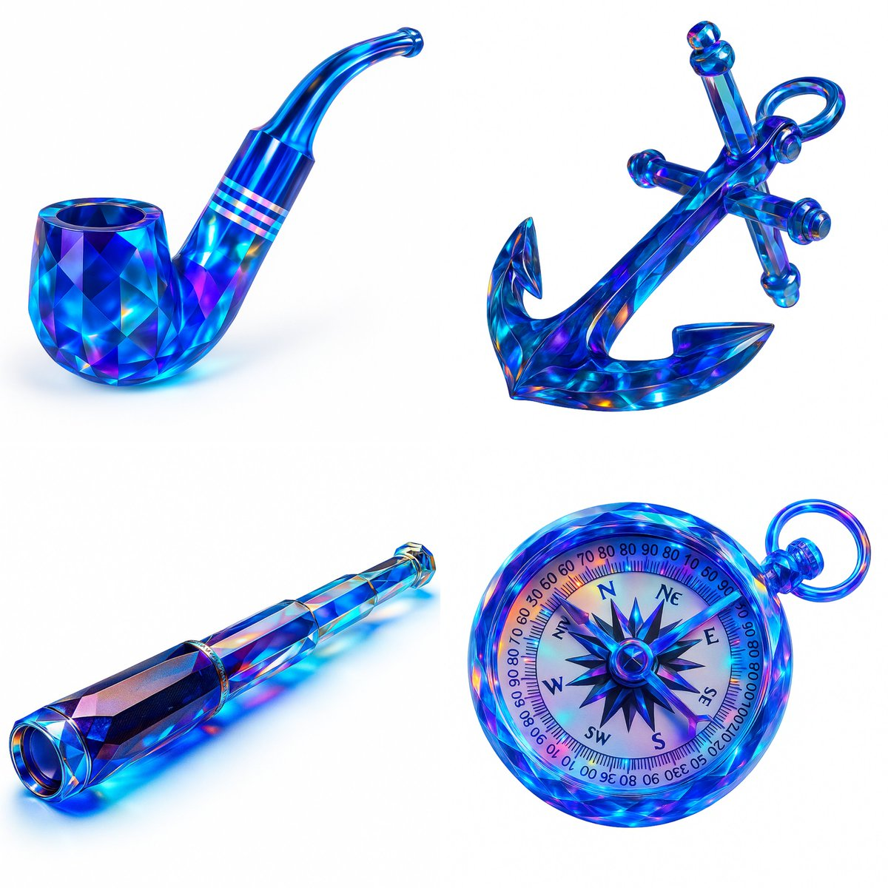

## 棱柱形水晶

- ID: gpt4o-172-zh-2
- Slug: prompt-172-zh-2
- 语言: zh
- 来源: [来源链接](https://x.com/alban_gz/status/1938553802400899205)
- 样例图路径: images/part3/172.jpeg

### 提示词

```text
使用提供的 JSON 的参数重新创建此图像。
{
“style_transfer”：{
“name”： “棱柱晶体”，
“description”： “使用精确的光扩散和照片清晰度，将高度逼真的棱柱形水晶样式应用于任何对象。非常适合为金属或结构化形式添加优质的宝石般的饰面。
“style_attributes”：{
“surface_texture”： “抛光的刻面水晶，锋利干净的边缘，无瑕的透明度”，
“lighting”： “柔和的工作室照明，具有清晰的镜面高光和平滑的环境阴影”，
“color_palette”： [“宝石蓝”， “电青色”， “日落琥珀色”， “紫罗兰色”， “品红色”， “中性白”]，
“material”： “密集的光学玻璃或切割宝石，具有棱柱形内部反射”，
“effects”： [
“真实光谱色散”，
“沿边缘的微折射”，
“相邻曲面上的软焦散”，
“镜片般锐利的光泽饰面”，
“高对比度区域中的微妙光晕”
],
“contrast”： “平衡，边缘清晰度高，深度衰减自然”
    },
“application_method”： {
“blend_mode”： “摄影叠加”，
“intensity”：1.0、
“masking”： “精确蒙版以保留结构并投射阴影”，
“edge_enhancement”： “仅针对小平面的受控锐化”，
“preserve_original_shape”： true，
“realism_priority”：true、
“depth_mapping”：true、
“chromatic_aberration_limit”： “最小”
    }
  }
}
```

### 样例图


## Create a cinematic advertisement for “[PRODUCT NAME]” — 

- ID: gpt4o-171-en-1
- Slug: prompt-171-en-1
- 语言: en
- 来源: [来源链接](https://x.com/aziz4ai/status/1938363131442405631)
- 样例图路径: images/part3/171.jpeg

### 提示词

```text
Create a cinematic advertisement for “[PRODUCT NAME]” — use bioluminescent neon lighting that matches the brand’s visual identity — place the product at the center of the scene with surreal, minimalistic composition — automatically adapt the environment to reflect the product’s nature (e.g. tech, fragrance, luxury, automotive, beauty) — integrate the brand’s actual logo in high fidelity — generate a short, powerful 3-word tagline that fits the brand’s tone — long exposure lighting effects — dramatic shadows — ultra-sharp focus — dark or ambient background — aspect ratio 2:3 or 1:1 — ultra-HD resolution
```

### 样例图

![Create a cinematic advertisement for “[PRODUCT NAME]” — ](../images/part3/171.jpeg)

## 霓虹灯品牌重新构想

- ID: gpt4o-171-zh-2
- Slug: prompt-171-zh-2
- 语言: zh
- 来源: [来源链接](https://x.com/aziz4ai/status/1938363131442405631)
- 样例图路径: images/part3/171.jpeg

### 提示词

```text
为“[产品名称]”创建电影广告 — 使用与品牌视觉形象相匹配的生物发光霓虹灯 — 以超现实、简约的构图将产品置于场景中心——自动调整环境以反映产品的性质（例如科技、香水、奢侈品、汽车、美容） — 以高保真度集成品牌的实际徽标 — 生成一个简短的、 符合品牌基调的强大 3 字标语 — 长时间曝光、灯光效果 — 戏剧性的阴影 — 超清晰焦点 — 黑暗或环境背景 — 纵横比 2：3 或 1：1 — 超高清分辨率
```

### 样例图

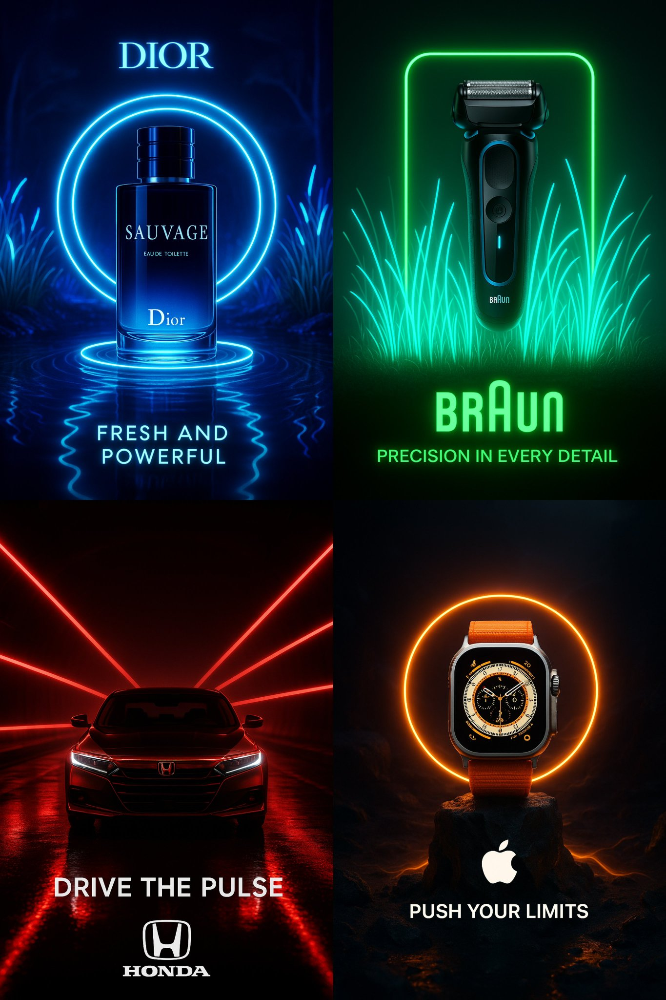

## A minimal still life of a round glass candle filled with

- ID: gpt4o-168-en-1
- Slug: prompt-168-en-1
- 语言: en
- 来源: [来源链接](https://x.com/TheRelianceAI/status/1938272260726350172)
- 样例图路径: images/part3/168.png

### 提示词

```text
A minimal still life of a round glass candle filled with [fruit], labeled “[SCENT NAME]”, placed on elegant white silk fabric. The candle glass is [glass color], and the wax matches the fruit color. The scene is softly lit by natural daylight with subtle shadows and smooth highlights. Hyperrealistic texture, clean aesthetic, top-down view, styled like high-end product photography.
```

### 样例图

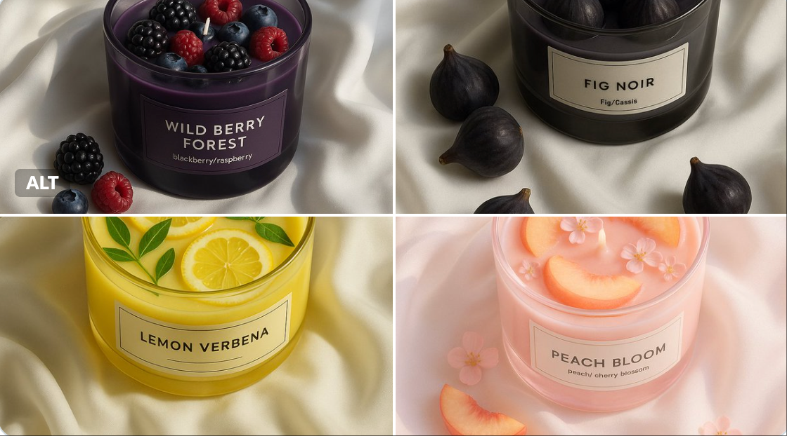

## 水果蜡烛

- ID: gpt4o-168-zh-2
- Slug: prompt-168-zh-2
- 语言: zh
- 来源: [来源链接](https://x.com/TheRelianceAI/status/1938272260726350172)
- 样例图路径: images/part3/168.png

### 提示词

```text
一个装满 [水果] 的圆形玻璃蜡烛的极简静物，标有“[SCENT NAME]”，放在优雅的白色丝绸织物上。蜡烛玻璃为【玻璃色】，蜡与水果色相配。该场景由自然日光柔和照亮，具有微妙的阴影和平滑的高光。超写实的质感，简洁的美感，自上而下的视角，风格像高端产品摄影。
```

### 样例图


## retexture the image attached based on the JSON below: { 

- ID: gpt4o-161-en-1
- Slug: prompt-161-en-1
- 语言: en
- 来源: [来源链接](https://x.com/egeberkina/status/1936851399289037108)
- 样例图路径: images/part3/161.png

### 提示词

```text
retexture the image attached based on the JSON below:
{
  "style_name": "Transparent Studio Render",
  "visual_rules": {
    "form": {
      "shape": "preserve original object shape",
      "outline": "no outlines, use smooth geometry transitions and bevels"
    },
    "lighting": {
      "style": "studio-style 3-point lighting or soft HDRI setup",
      "highlight": "subtle specular highlights for semi-matte plastic or coated surfaces",
      "shadow": "soft drop shadow directly beneath the object, cast on a translucent floor plane"
    },
    "texture": {
      "surface": "smooth or lightly textured based on object, clean shader setup with minimal noise",
      "branding": "bold and high-contrast, treated as printed decals or sticker-style labels"
    },
    "material": {
      "finish": "semi-matte or satin shader, mimicking printed plastic or coated materials"
    },
    "color_handling": {
      "strategy": "make the object's primary color the focal point",
      "enhancement": "slightly boosted saturation and contrast for clean product visualization"
    },
    "background": {
      "type": "fully transparent (alpha channel)",
      "shadow": "optional soft drop shadow directly beneath the object to ground it visually"
    }
  },
  "rendering": {
    "camera_angle": "centered front view or slightly elevated for dimensional clarity",
    "depth_of_field": "neutral or slightly shallow to keep object fully sharp",
    "background_blur": "none, background remains transparent"
  }
}
```

### 样例图

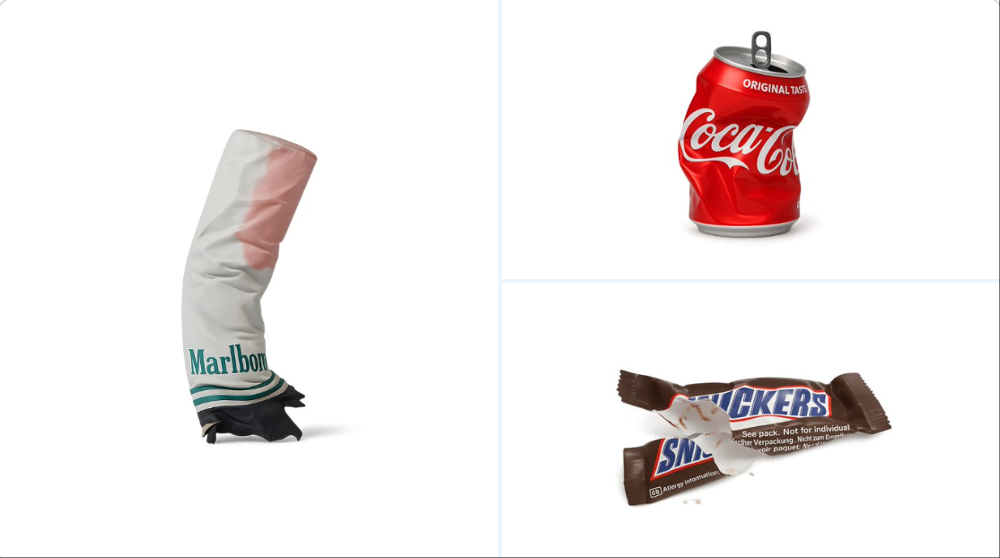

## 物品纹理处理

- ID: gpt4o-161-zh-2
- Slug: prompt-161-zh-2
- 语言: zh
- 来源: [来源链接](https://x.com/egeberkina/status/1936851399289037108)
- 样例图路径: images/part3/161.png

### 提示词

```text
根据以下 JSON 对附加的图片进行重新纹理处理：
{
“style_name”： “透明工作室渲染”，
“visual_rules”： {
“form”： {
“shape”： “保留原始对象形状”，
“outline”： “无轮廓，使用平滑的几何过渡和斜面”
    },
“照明”： {
“style”： “工作室风格的 3 点光照或柔和 HDRI 设置”，
“highlight”： “半哑光塑料或涂层表面的细微镜面反射高光”，
“shadow”： “对象正下方的柔和投影，投射在半透明地板平面上”
    },
“texture”： {
“surface”： “基于对象的平滑或轻微纹理，干净的着色器设置，噪点最小”，
“branding”： “粗体且对比度高，被视为印刷贴花或贴纸式标签”
    },
“material”： {
“finish”： “半哑光或缎面着色器，模拟打印塑料或涂层材质”
    },
“color_handling”： {
“strategy”： “将对象的原色作为焦点”，
“enhancement”： “略微提高饱和度和对比度，实现清晰的产品可视化”
    },
“背景”： {
“type”： “完全透明（Alpha 通道）”，
“shadow”： “可选的软投影正下方，使其在视觉上接地”
    }
  },
“渲染”： {
“camera_angle”： “居中前视图或略微升高以提高尺寸清晰度”，
“depth_of_field”： “中性或稍浅，以保持物体完全清晰”，
“background_blur”： “无，背景保持透明”
  }
}
```

### 样例图


## Recreate this image using the pamareters of the JSON pro

- ID: gpt4o-159-en-1
- Slug: prompt-159-en-1
- 语言: en
- 来源: [来源链接](https://x.com/alban_gz/status/1936820704713875818)
- 样例图路径: images/part3/159.jpeg

### 提示词

```text
Recreate this image using the pamareters of the JSON provided.
{
  "name": "Gemstone Render",
  "object": {
    "type": "auto",
    "detected_color": "auto",
    "form": "realistic, natural form preserved",
    "material": "crystal or faceted gemstone glass",
    "surface": "precision-cut facets, sharp reflections",
    "transparency": "high clarity with light refraction",
    "internal_features": "color depth, internal shimmer, and light dispersion"
  },
  "color_and_light": {
    "primary_color": "{detected_color}",
    "highlight_effects": "specular highlights, gemstone brilliance, caustics",
    "lighting_setup": "studio lighting with white or soft background",
    "metallic_accents": {
      "enabled": true,
      "material": "gold or chrome",
      "application": "rim, stem, or edge detailing"
    }
  },
  "style": {
    "artistic_style": [
      "photorealistic 3D render",
      "Gemstone Render Style",
      "luxury object visualization"
    ],
    "design_language": [
      "faceted precision modeling",
      "jewelry-like rendering",
      "optical depth and brilliance"
    ]
  },
  "technical_details": {
    "render_engine": [
      "Blender with Cycles",
      "Cinema 4D + Redshift/Octane"
    ],
    "rendering_techniques": [
      "physically-based rendering (PBR)",
      "ray tracing",
      "global illumination"
    ],
    "resolution": "ultra high-res (4K–8K)",
    "post_processing": [
      "subtle glow",
      "enhanced reflections",
      "color-preserving contrast boost"
    ]
  }
```

### 样例图

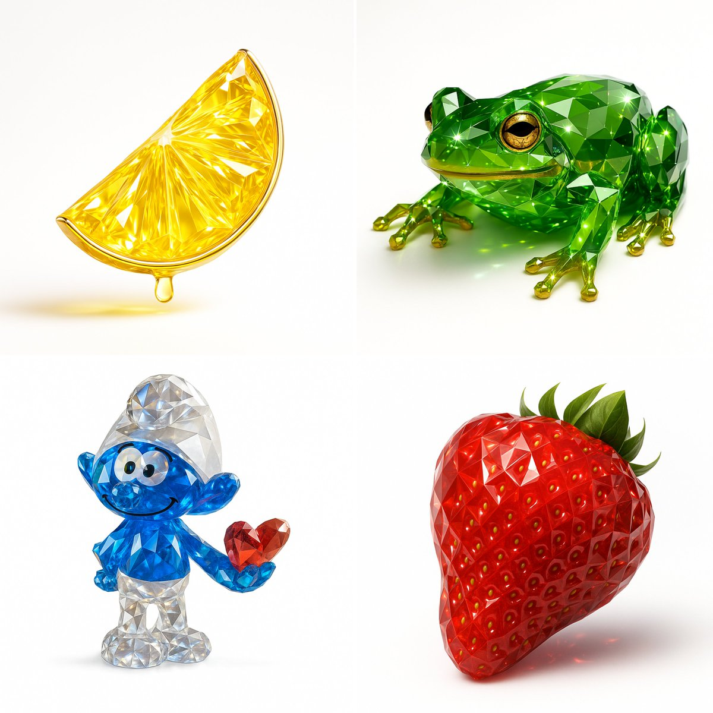

## 渲染宝石

- ID: gpt4o-159-zh-2
- Slug: prompt-159-zh-2
- 语言: zh
- 来源: [来源链接](https://x.com/alban_gz/status/1936820704713875818)
- 样例图路径: images/part3/159.jpeg

### 提示词

```text
使用提供的 JSON 的 pamareters 重新创建此图像。
{
“name”： “宝石渲染”，
“对象”： {
“type”： “auto”， //类型
“detected_color”： “auto”，
“form”： “保留真实、自然的形式”，
“material”： “水晶或刻面宝石玻璃”，
“surface”： “精确切割的刻面，清晰的反射”，
“transparency”： “高清晰度，光线折射”，
“internal_features”： “颜色深度、内部微光和光色散”
  },
“color_and_light”： {
“primary_color”： “{detected_color}”，
“highlight_effects”： “镜面高光、宝石亮度、焦散”，
“lighting_setup”： “白色或柔和背景的工作室照明”，
“metallic_accents”： {
“enabled”： true 和
“material”： “金或铬”，
“application”： “边缘、茎或边缘细节”
    }
  },
“样式”： {
“artistic_style”：[
“逼真的 3D 渲染”，
“Gemstone Render Style”（宝石渲染样式）、
“奢侈品对象可视化”
],
“design_language”：[
“faceted precision modeling”，
“珠宝般的渲染”，
“光学深度和亮度”
    ]
  },
“technical_details”： {
“render_engine”：[
“带循环的 Blender”，
“Cinema 4D + Redshift/Octane”
],
“rendering_techniques”：[
“基于物理的渲染 （PBR）”，
“光线追踪”，
“全局照明”
],
“resolution”： “超高分辨率 （4K–8K）”，
“post_processing”：[
“微妙的光芒”，
“增强反射”，
“保色对比度提升”
    ]
  }
```

### 样例图


## create image with 1:1 ratio surreal minimal aesthetic, a

- ID: gpt4o-157-en-1
- Slug: prompt-157-en-1
- 语言: en
- 来源: [来源链接](https://x.com/hc_dsn/status/1937118859083047137)
- 样例图路径: images/part3/157.jpeg

### 提示词

```text
create image with 1:1 ratio 
surreal minimal aesthetic, airplane window frame on subtle gradient backdrop with same color, through the oval window showing random iconic landmark scenery of [Country Name], an overlay weather ui interface on the center of window, from top to bottom, contain the small weather icon, huge temperatures with elegant light weight font, and small location tag beneath it, the bottom is the country name, generate with extreme weathers, the window will affect by the weather, the color combo of subtle gradient backdrop is resonate with the weather, natural lighting, soft shadows, subtle reflections on glass, great negative space
```

### 样例图


## 最小天气小部件

- ID: gpt4o-157-zh-2
- Slug: prompt-157-zh-2
- 语言: zh
- 来源: [来源链接](https://x.com/hc_dsn/status/1937118859083047137)
- 样例图路径: images/part3/157.jpeg

### 提示词

```text
以 1：1 的比例创建图像
超现实的极简美学，飞机窗框在微妙的渐变背景上，同色系，通过椭圆形窗口随机展示【国家名称】的标志性地标风景，窗口中央叠加天气 UI 界面，从上到下，包含小天气图标，巨大的温度搭配优雅的轻量级字体，下方有小位置标签， 底部是国名，在极端天气下生成，窗户会受到天气的影响，微妙的渐变背景的颜色组合与天气产生共鸣，自然光，柔和的阴影，玻璃上的微妙反射，巨大的负空间
```

### 样例图


## A hyper-realistic, artistic rendering of a [OBJECT] enti

- ID: gpt4o-154-en-1
- Slug: prompt-154-en-1
- 语言: en
- 来源: [来源链接](https://x.com/umesh_ai/status/1936665222271615107)
- 样例图路径: images/part3/154.jpeg

### 提示词

```text
A hyper-realistic, artistic rendering of a [OBJECT] entirely wrapped in colorful, tightly woven yarn and embroidery threads. The surface is covered in intricate, detailed textile patterns—knit, braided, and woven in a variety of textures. Each section of the [OBJECT] is segmented with vivid, high-saturation colors including electric blue, bright orange, vivid green, magenta, and golden yellow. The yarn follows the contours of the [OBJECT], highlighting its shape with layered embroidery. The scene is lit dramatically, with a soft spotlight casting shadows to emphasize the 3D depth and tactile surface. The background is a solid, dark gradient to draw full focus to the texture and color. The style is a blend of surrealism and fiber art, showcasing extreme detail and depth
```

### 样例图

![A hyper-realistic, artistic rendering of a [OBJECT] enti](../images/part3/154.jpeg)

## 五颜六色的针织

- ID: gpt4o-154-zh-2
- Slug: prompt-154-zh-2
- 语言: zh
- 来源: [来源链接](https://x.com/umesh_ai/status/1936665222271615107)
- 样例图路径: images/part3/154.jpeg

### 提示词

```text
一个 [OBJECT] 的超现实主义、艺术渲染，完全包裹在五颜六色、紧密编织的纱线和绣花线中。表面覆盖着复杂、细致的纺织图案 - 针织、编织和编织，具有各种纹理。[OBJECT] 的每个部分都用鲜艳、高饱和度的颜色分割，包括电光蓝、亮橙色、鲜艳的绿色、品红色和金黄色。纱线遵循 [OBJECT] 的轮廓，以分层刺绣突出其形状。场景被戏剧性地照亮，柔和的聚光灯投下阴影以强调 3D 深度和触觉表面。背景是一个纯色的深色渐变，用于将全部焦点吸引到纹理和颜色上。风格融合了超现实主义和纤维艺术，展示了极端的细节和深度
```

### 样例图

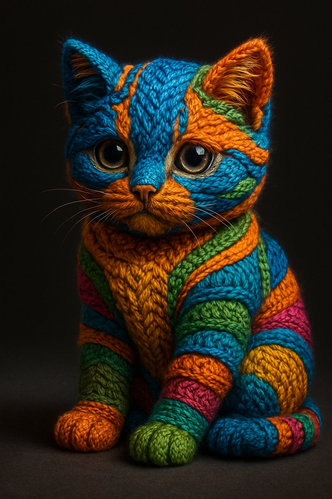

## Create a stylized full-body portrait of [your subject] i

- ID: gpt4o-149-en-1
- Slug: prompt-149-en-1
- 语言: en
- 来源: [来源链接](https://x.com/gnrlyxyz/status/1936834901552111768)
- 样例图路径: images/part3/149.png

### 提示词

```text
Create a stylized full-body portrait of [your subject] in the Gorillaz character aesthetic. Give the character an exaggeratedly lanky build with long, skinny legs and narrow arms. Use simplified, angular features and thick, bold outlines. Style the hair to be spiky, tousled, or exaggerated, in a non-natural color like [blue or green]. The eyes must be blank white with no pupils. Use flat, solid colors only. No gradients, shadows, or textures. Background should be a single flat color. Design must be vector friendly and print ready.
```

### 样例图

![Create a stylized full-body portrait of [your subject] i](../images/part3/149.png)

## Gorillaz风格角色

- ID: gpt4o-149-zh-2
- Slug: prompt-149-zh-2
- 语言: zh
- 来源: [来源链接](https://x.com/gnrlyxyz/status/1936834901552111768)
- 样例图路径: images/part3/149.png

### 提示词

```text
在 Gorillaz 角色美学中为 [您的主题] 创建风格化的全身肖像。给角色一个夸张的瘦长身材，长而瘦的腿和狭窄的手臂。使用简化的棱角分明的特征和粗体轮廓。将头发设计成尖尖的、凌乱的或夸张的，用非自然的颜色，如 [蓝色或绿色]。眼睛必须是空白的白色的，没有瞳孔。仅使用纯色。没有渐变、阴影或纹理。背景应为单一的平面颜色。设计必须对矢量友好并准备好打印。
```

### 样例图

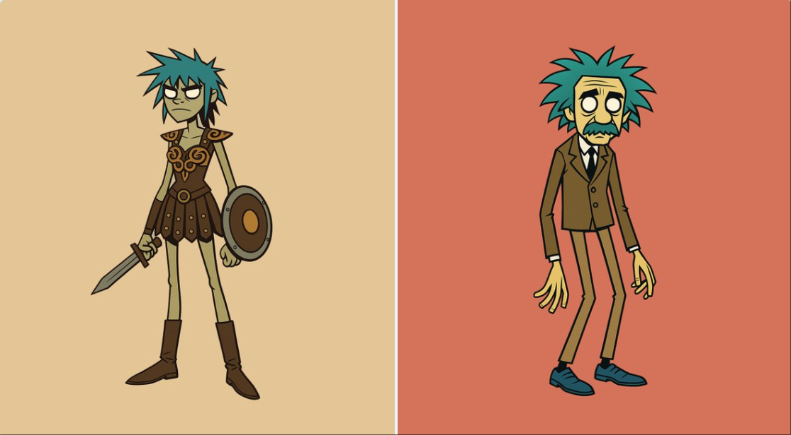

## A realistic, high-end cocktail in a frosted glass with a

- ID: gpt4o-143-en-1
- Slug: prompt-143-en-1
- 语言: en
- 来源: [来源链接](https://x.com/TheRelianceAI/status/1936726936409313294)
- 样例图路径: images/part3/143.png

### 提示词

```text
A realistic, high-end cocktail in a frosted glass with a sparkling salt rim, filled with crystal-clear ice cubes. The drink is garnished with deep-blue kale leaves and delicate pastel-pink edible flowers. The lighting is moody and cinematic, with soft highlights on the glass. The entire visual style — color palette, lighting, background, and atmosphere — is inspired by the animated film 【MOVIE_TITLE】 by Disney, subtly reflecting its visual tone and mood. At the bottom of the image, in elegant golden serif text, it says: “Disney — 【MOVIE_TITLE】”. Vertical 9:16, ultra-detailed, photographic realism with artistic direction based on the film’s world.
```

### 样例图

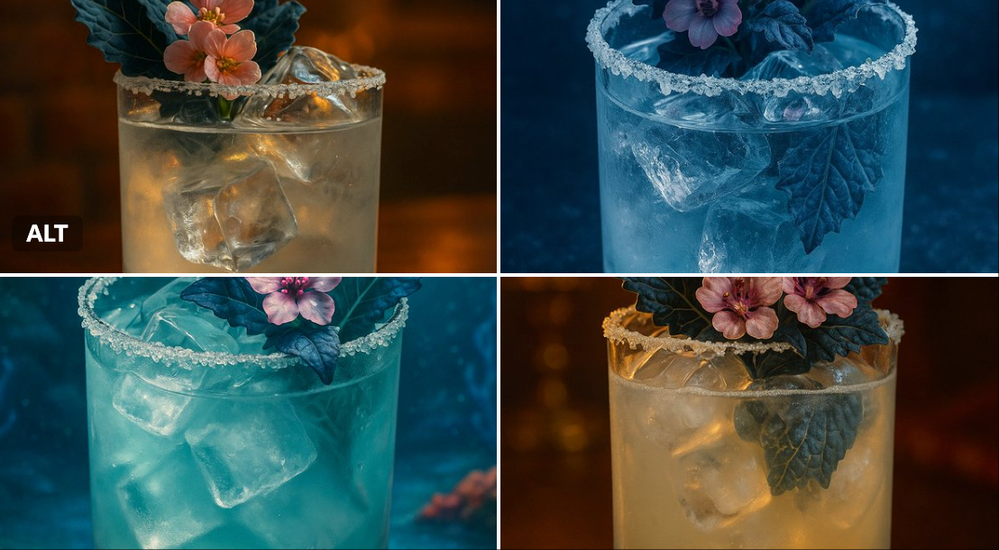

## 迪士尼鸡尾酒

- ID: gpt4o-143-zh-2
- Slug: prompt-143-zh-2
- 语言: zh
- 来源: [来源链接](https://x.com/TheRelianceAI/status/1936726936409313294)
- 样例图路径: images/part3/143.png

### 提示词

```text
一款逼真的高端鸡尾酒，装在磨砂玻璃杯中，带有波光粼粼的盐边，里面装满了晶莹剔透的冰块。这款饮料以深蓝色的羽衣甘蓝叶和精致的淡粉色食用花朵装饰。灯光是喜怒无常的和电影般的，玻璃上有柔和的亮点。整个视觉风格——调色板、灯光、背景和氛围——都受到了迪士尼动画电影【MOVIE_TITLE】的启发，巧妙地反映了它的视觉基调和情绪。在图片的底部，用优雅的金色衬线文字写着：“Disney — 【MOVIE_TITLE】”。垂直 9：16，超详细，摄影现实主义，艺术指导基于电影世界。
```

### 样例图


## A high-quality studio product photo of a [brand name]-br

- ID: gpt4o-139-en-1
- Slug: prompt-139-en-1
- 语言: en
- 来源: [来源链接](https://x.com/azed_ai/status/1934631664153760241)
- 样例图路径: images/part3/139.jpeg

### 提示词

```text
A high-quality studio product photo of a [brand name]-branded [product type], [floating / standing] against a solid background in the brand’s signature color. The product features the brand logo prominently and uses the official brand color palette. Clean composition, soft shadows, ultra-realistic materials and textures, no text, no props, professional commercial lighting, sharp focus, minimalist aesthetic.
```

### 样例图

![A high-quality studio product photo of a [brand name]-br](../images/part3/139.jpeg)

## 将您最喜欢的品牌变成生活方式产品

- ID: gpt4o-139-zh-2
- Slug: prompt-139-zh-2
- 语言: zh
- 来源: [来源链接](https://x.com/azed_ai/status/1934631664153760241)
- 样例图路径: images/part3/139.jpeg

### 提示词

```text
一张高质量的工作室商品照片，其中包含 [品牌名称] 品牌 [商品类型]、[浮动/直立] 和纯色背景，采用品牌标志性的颜色。该商品突出品牌徽标，并使用官方品牌调色板。干净的构图，柔和的阴影，超逼真的材质和纹理，无文字，无道具，专业的商业照明，锐利的焦点，极简的美学。
```

### 样例图


## A high-quality studio photograph of a [OBJECT] fully cov

- ID: gpt4o-136-en-1
- Slug: prompt-136-en-1
- 语言: en
- 来源: [来源链接](https://x.com/Kerroudjm/status/1934682610632151500)
- 样例图路径: images/part3/136.png

### 提示词

```text
A high-quality studio photograph of a [OBJECT] fully covered in ultra-realistic [ANIMAL] texture (e.g., fur, feathers, skin, or scales), placed against a soft neutral background. The object’s original form remains visible but is wrapped in the animal’s natural pattern and surface detail. The image features clean composition, soft shadows, sharp focus, minimalist styling, professional lighting, and highly detailed textures—each hair, feather, or wrinkle should be visible. Format 1:1.
```

### 样例图

![A high-quality studio photograph of a [OBJECT] fully cov](../images/part3/136.png)

## 日常用品有皮肤

- ID: gpt4o-136-zh-2
- Slug: prompt-136-zh-2
- 语言: zh
- 来源: [来源链接](https://x.com/Kerroudjm/status/1934682610632151500)
- 样例图路径: images/part3/136.png

### 提示词

```text
一张 [OBJECT] 的高质量工作室照片，完全覆盖在超逼真的 [ANIMAL] 纹理（例如，毛皮、羽毛、皮肤或鳞片）中，置于柔和的中性背景上。对象的原始形状仍然可见，但包裹在动物的自然图案和表面细节中。该图像具有干净的构图、柔和的阴影、清晰的焦点、极简主义的造型、专业的照明和高度详细的纹理——每根头发、羽毛或皱纹都应该可见。格式 1：1。
```

### 样例图

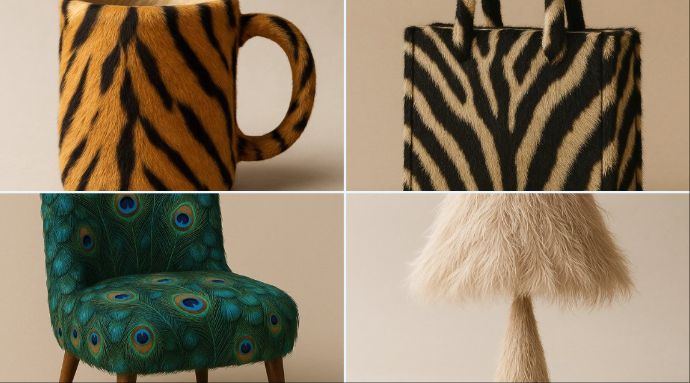

## Close-up photo of a small plush keychain of [attached im

- ID: gpt4o-131-en-1
- Slug: prompt-131-en-1
- 语言: en
- 来源: [来源链接](https://x.com/azed_ai/status/1934973851164897444)
- 样例图路径: images/part3/131.jpeg

### 提示词

```text
Close-up photo of a small plush keychain of [attached image/emojis]  held gently between two fingers, made of soft felt or fuzzy material, cartoon-style proportions, embroidered face with simple expressive features, character designed to resemble, attached to a shiny silver keyring, neutral beige background, shallow depth of field, soft natural lighting, highly detailed texture, cute and handcrafted aesthetic, studio photography, 1:1 aspect ratio
```

### 样例图

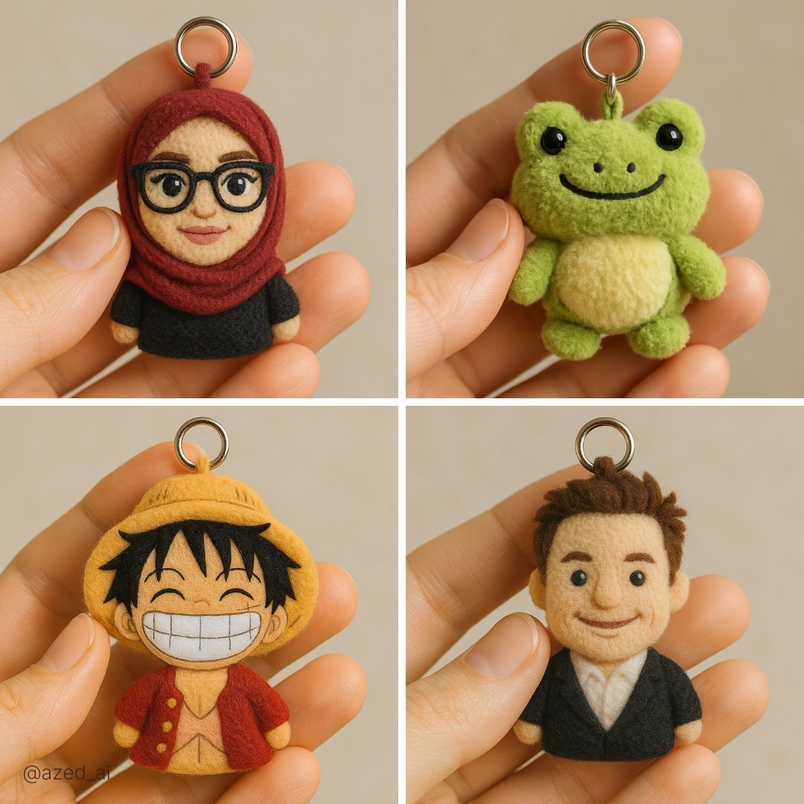

## 自定义毛绒钥匙扣

- ID: gpt4o-131-zh-2
- Slug: prompt-131-zh-2
- 语言: zh
- 来源: [来源链接](https://x.com/azed_ai/status/1934973851164897444)
- 样例图路径: images/part3/131.jpeg

### 提示词

```text
[附图/表情符号] 的小毛绒钥匙扣的特写照片，用两根手指轻轻握住，由柔软的毛毡或毛茸茸的材料制成，卡通风格的比例，具有简单表现特征的刺绣脸，设计相似的人物，附在闪亮的银色钥匙圈上，中性米色背景，浅景深，柔和的自然光，高度详细的纹理，可爱和手工制作的美感， 摄影棚摄影，1：1 纵横比
```

### 样例图


## Create a surreal split-scene where the left half is an u

- ID: gpt4o-130-en-1
- Slug: prompt-130-en-1
- 语言: en
- 来源: [来源链接](https://x.com/umesh_ai/status/1934903456596451734)
- 样例图路径: images/part3/130.jpeg

### 提示词

```text
Create a surreal split-scene where the left half is an underwater version of a [SCENE], filled with marine life (fish, sharks, octopus, coral, bubbles), and the right half is the regular dry version of the same [SCENE] continuing naturally. Separate the two halves with a vertical wall of water held by a magical force, as if the ocean is cut in half. The scene should align across both sides, maintaining realism while showcasing the impossible scenario. Emphasize lighting and reflection differences between water and air environments.
```

### 样例图

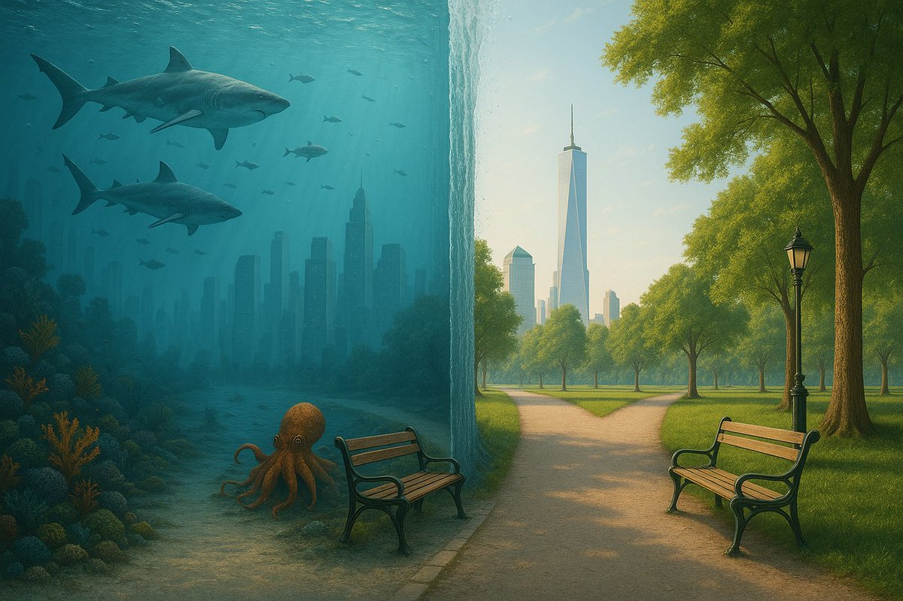

## 创建超现实不可能的图像

- ID: gpt4o-130-zh-2
- Slug: prompt-130-zh-2
- 语言: zh
- 来源: [来源链接](https://x.com/umesh_ai/status/1934903456596451734)
- 样例图路径: images/part3/130.jpeg

### 提示词

```text
创建一个超现实的分割场景，其中左半部分是 [SCENE] 的水下版本，充满了海洋生物（鱼、鲨鱼、章鱼、珊瑚、气泡），右半部分是同一 [SCENE] 的常规干燥版本自然延续。用一道由神奇力量支撑的垂直水墙将两半分开，仿佛海洋被切成两半。场景应在两侧对齐，在展示不可能的场景的同时保持真实感。强调水和空气环境之间的光照和反射差异。
```

### 样例图


## A hyper-realistic photograph of a [FRUIT] sliced into fi

- ID: gpt4o-129-en-1
- Slug: prompt-129-en-1
- 语言: en
- 来源: [来源链接](https://x.com/umesh_ai/status/1934562439326306814)
- 样例图路径: images/part3/129.jpeg

### 提示词

```text
A hyper-realistic photograph of a [FRUIT] sliced into five glossy layers, each slice floating vertically in mid-air with glistening juice droplets at the edges. The slices cast soft, natural shadows on each other. The [FRUIT] has a vibrant skin with appropriate interior details .Set against a softly blurred tropical garden background with hints of lush green leaves and dappled sunlight, the scene is lit with warm, directional golden-hour lighting, enhancing the vivid colors and depth
```

### 样例图

![A hyper-realistic photograph of a [FRUIT] sliced into fi](../images/part3/129.jpeg)

## 创建悬浮切片水果

- ID: gpt4o-129-zh-2
- Slug: prompt-129-zh-2
- 语言: zh
- 来源: [来源链接](https://x.com/umesh_ai/status/1934562439326306814)
- 样例图路径: images/part3/129.jpeg

### 提示词

```text
一张 [FRUIT] 的超写实照片，被切成五个光滑的层，每个切片垂直漂浮在半空中，边缘有闪闪发光的汁液滴。切片彼此之间投射柔和、自然的阴影。[FRUIT] 拥有充满活力的皮肤和适当的内部细节。在柔和模糊的热带花园背景下，郁郁葱葱的绿叶和斑驳的阳光，场景由温暖、定向的金色小时照明照亮，增强了鲜艳的色彩和深度
```

### 样例图

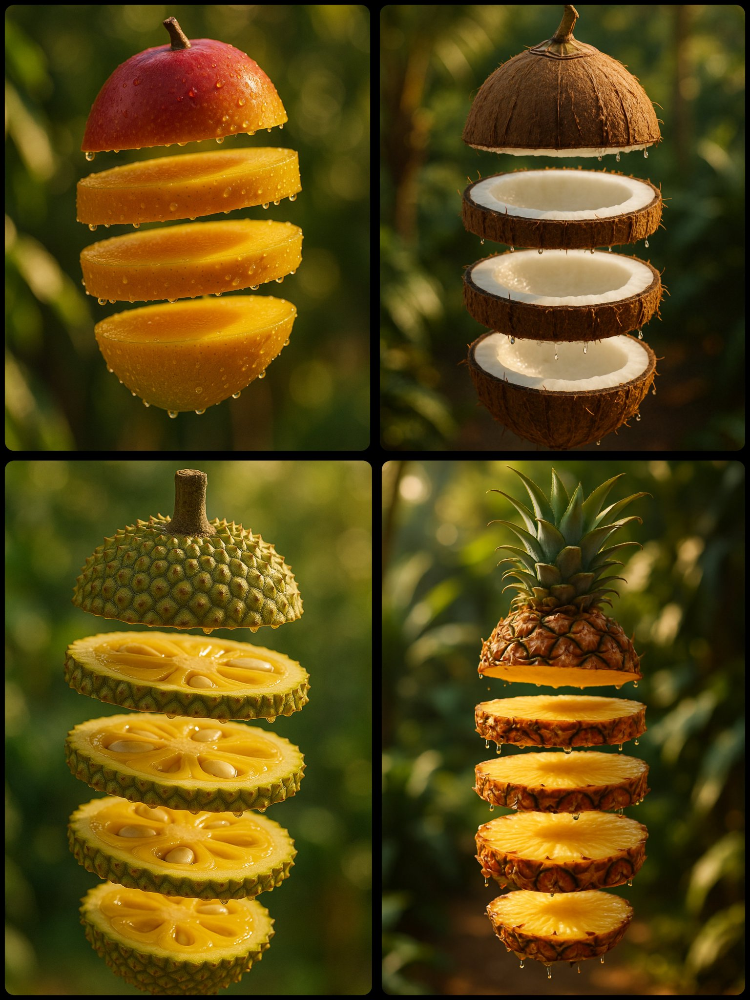

## A hyper-realistic photograph of a fashion doll styled in

- ID: gpt4o-125-en-1
- Slug: prompt-125-en-1
- 语言: en
- 来源: [来源链接](https://x.com/TheRelianceAI/status/1934688112741085562)
- 样例图路径: images/part3/125.png

### 提示词

```text
A hyper-realistic photograph of a fashion doll styled in the aesthetic of [BRAND], sitting on a plush, cream-colored bed with soft folds. The doll’s look reflects the brand’s signature elements — from hair and outfit to accessories — arranged thoughtfully to evoke a dreamy, vintage-inspired editorial. Studio-lit with warm, diffused lighting and a creamy, ivory-toned palette, the scene emulates luxury fashion photography with a soft, dollhouse-like atmosphere and shallow depth of field.
```

### 样例图


## 时尚品牌娃娃

- ID: gpt4o-125-zh-2
- Slug: prompt-125-zh-2
- 语言: zh
- 来源: [来源链接](https://x.com/TheRelianceAI/status/1934688112741085562)
- 样例图路径: images/part3/125.png

### 提示词

```text
一张超写实的照片，一个时尚娃娃以 [BRAND] 的美学风格，坐在一张带有柔软褶皱的奶油色毛绒床上。这款玩偶的外观反映了该品牌的标志性元素——从头发和服装到配饰——经过精心安排，让人联想到梦幻般的复古风格社论。工作室照明采用温暖的漫射灯光和奶油色的象牙色调调色板，该场景以柔和的玩具屋般的氛围和浅景深模拟奢华时尚摄影。
```

### 样例图


## The [subject] appears as if organically grown from inter

- ID: gpt4o-123-en-1
- Slug: prompt-123-en-1
- 语言: en
- 来源: [来源链接](https://x.com/azed_ai/status/1934566157736083614)
- 样例图路径: images/part3/123.png

### 提示词

```text
The [subject] appears as if organically grown from intertwining plants, flowers, and vines. Leaf-like textures and blooming forms fuse seamlessly with anatomical or structural details, creating a surreal hybrid of nature and design. The composition feels ethereal, with natural asymmetry and dreamlike flow.
```

### 样例图

![The [subject] appears as if organically grown from inter](../images/part3/123.png)

## 植物雕塑

- ID: gpt4o-123-zh-2
- Slug: prompt-123-zh-2
- 语言: zh
- 来源: [来源链接](https://x.com/azed_ai/status/1934566157736083614)
- 样例图路径: images/part3/123.png

### 提示词

```text
[主题] 看起来就像是从交织在一起的植物、花朵和藤蔓中有机生长出来的。叶子般的纹理和盛开的形式与解剖学或结构细节无缝融合，创造出自然与设计的超现实混合体。构图感觉空灵，具有自然的不对称和梦幻般的流动。
```

### 样例图

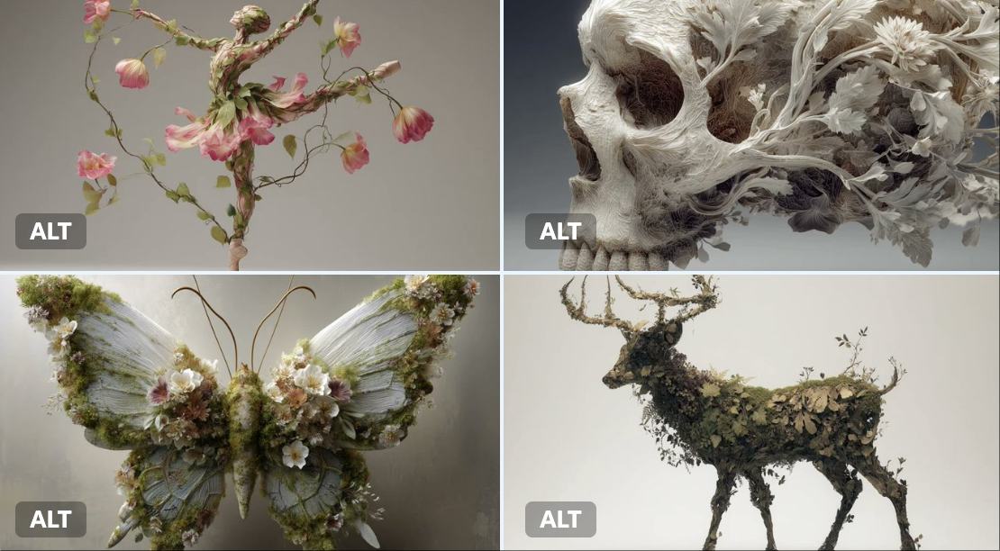

## Create a close-up, square-format (1:1) photo of an embro

- ID: gpt4o-119-en-1
- Slug: prompt-119-en-1
- 语言: en
- 来源: [来源链接](https://x.com/Kerroudjm/status/1931040962513379672)
- 样例图路径: images/part3/119.png

### 提示词

```text
Create a close-up, square-format (1:1) photo of an embroidered patch inspired by the uploaded image. The design should feature a clean, cartoon-style embroidered interpretation of the original subject with rich thread texture and vibrant colors. The shape of the patch can vary (round, oval, shielded, silhouette-based), but the output image must remain square.
Integrate the national colors of the country represented—such as in the text, the border, or small decorative accents—drawing inspiration from the flag to enhance local identity. Add embroidered capital-letter text like the name of the city or country, either curved or straight. Use a soft off-white fabric background and natural lighting to bring out texture and depth.
```

### 样例图

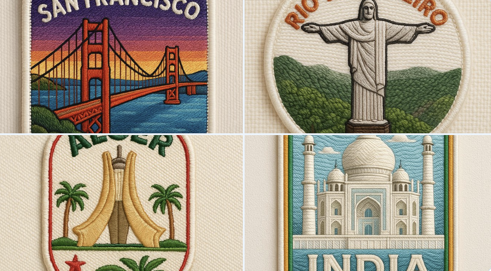

## 城市绣花贴纸照片

- ID: gpt4o-119-zh-2
- Slug: prompt-119-zh-2
- 语言: zh
- 来源: [来源链接](https://x.com/Kerroudjm/status/1931040962513379672)
- 样例图路径: images/part3/119.png

### 提示词

```text
创建一个近景、正方形格式（1:1）的绣花贴片照片，以上传的图片为灵感。设计应采用干净的卡通风格刺绣诠释原图主题，具有丰富的线紡纹理和鲜艳的颜色。贴片的形状可以变化（圆形、椭圆形、盾形、轮廓形），但输出图片必须保持正方形。
融入所代表国家的国色——如文本、边框或小装饰细节中，从国旗中汲取灵感，增强地方身份。添加刺绣的大写字母文字，如城市或国家的名字，可以是曲线或直线。使用柔和的米白色背景布料和自然光线，以突出纹理和深度。
```

### 样例图


## A hyper-realistic, ultra-detailed 3D digital advertiseme

- ID: gpt4o-118-en-1
- Slug: prompt-118-en-1
- 语言: en
- 来源: [来源链接](https://x.com/shushant_l/status/1931316125029339572)
- 样例图路径: images/part3/118.jpeg

### 提示词

```text
A hyper-realistic, ultra-detailed 3D digital advertisement showcasing a Pepsi can bursting open at its center, sending a refreshing splash of carbonated cola into the air, with effervescent bubbles and ice cubes flying outward. The can’s metallic surface is rendered with sharp, photorealistic textures, complete with condensation droplets, light reflections, and subtle scratches. Surrounding the scene are cold, translucent ice shards and a twist of lemon zest caught mid-motion, adding a vibrant contrast. The background features a deep electric blue gradient with cinematic volumetric lighting and soft lens flares. Green mint leaves and misty vapors add a refreshing, natural accent. The entire scene is rendered in 4K UHD using advanced global illumination, HDR lighting, and realistic shadows. The composition evokes premium beverage advertising with a dramatic tone, created using tools like Unreal Engine + Octane Render for maximum visual impact.
```

### 样例图

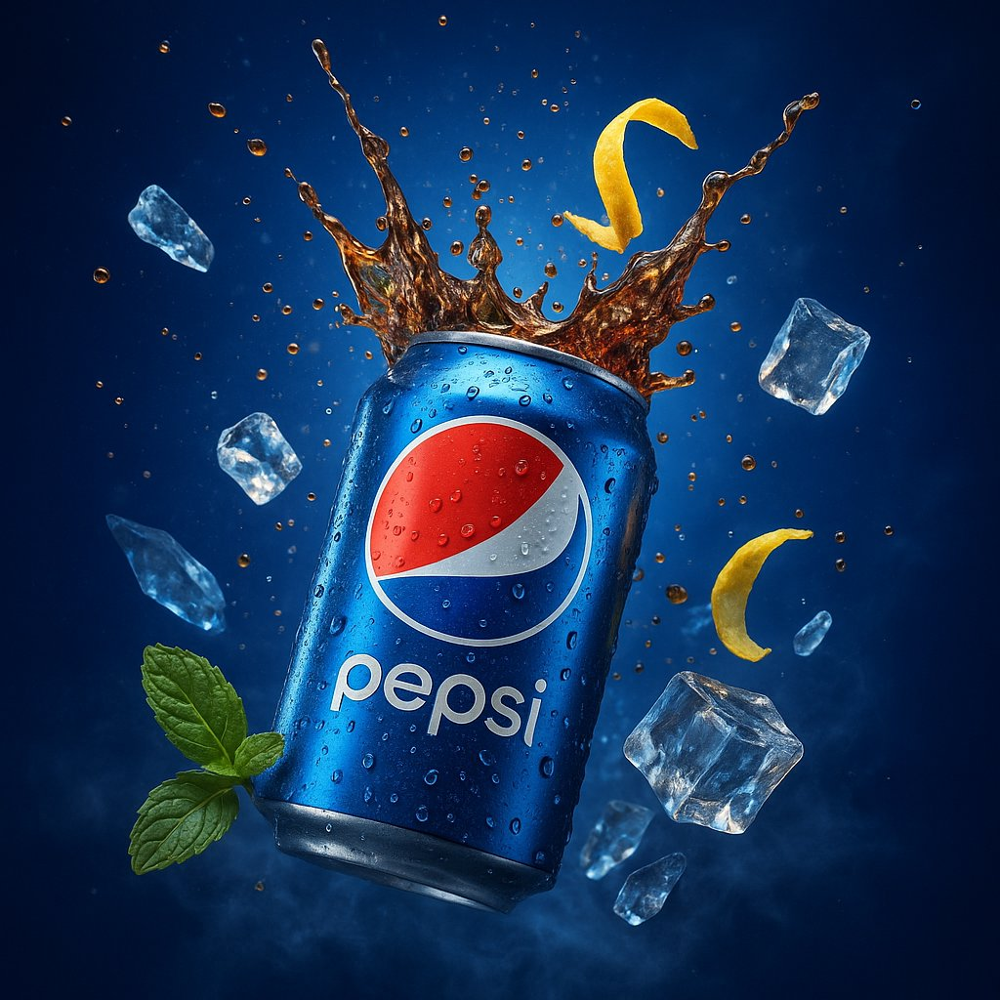

## 品牌产品数字广告

- ID: gpt4o-118-zh-2
- Slug: prompt-118-zh-2
- 语言: zh
- 来源: [来源链接](https://x.com/shushant_l/status/1931316125029339572)
- 样例图路径: images/part3/118.jpeg

### 提示词

```text
一个超现实的、超详细的 3D 数字广告，展示百事罐在中心爆裂，喷出清凉的碳酸可乐，气泡和冰块飞溅。罐子的金属表面具有锐利的、写实的纹理，包括冷凝水滴、光线反射和细微的划痕。场景周围是冷的透明冰片和柠檬皮在空中飞舞，增添了鲜明的对比。背景是深电光渐变，带有电影级体积照明和柔和的镜头光晕。绿色薄荷叶和雾气增添了清凉的自然点缀。整个场景使用高级全局光照、HDR 照明和真实的阴影在 4K UHD 下渲染。构图以高端饮料广告的戏剧性基调呈现，使用 Unreal Engine + Octane Render 等工具以达到最大的视觉冲击力。
```

### 样例图


## 刺绣风格

- ID: gpt4o-103-zh
- Slug: prompt-103-zh
- 语言: zh
- 来源: [来源链接](https://x.com/firatbilal/status/1931762571876446256)
- 样例图路径: images/part3/103.png

### 提示词

```text
{
  "title": "Adaptive Embroidered Brooch Prompt Generator",
  "version": "2.0",
  "description": "Generate a prompt for an embroidered brooch based on text description or uploaded image.",
  "inputs": {
    "reference_mode": {
      "type": "select",
      "label": "Reference Source",
      "options": ["describe manually", "use uploaded image", "combine both"],
      "default": "describe manually"
    },
    "theme_text": {
      "type": "text",
      "label": "Describe the Theme or Motif",
      "placeholder": "e.g. an owl in a forest, biomechanical skull, dancing figures"
    },
    "image_reference_description": {
      "type": "text",
      "label": "Describe what's in the uploaded image (if using image mode)",
      "placeholder": "e.g. a mechanical skull with succulents growing from it"
    },
    "shape": {
      "type": "select",
      "label": "Brooch Shape",
      "options": ["circular", "oval", "square", "irregular"],
      "default": "oval"
    },
    "style": {
      "type": "select",
      "label": "Embroidery Style",
      "options": [
        "traditional", 
        "folkloric", 
        "surreal", 
        "biomech-organic fusion", 
        "modern minimal"
      ],
      "default": "traditional"
    },
    "color_palette": {
      "type": "select",
      "label": "Color Palette",
      "options": [
        "earth tones and muted greens",
        "pastel shades",
        "neon surreal",
        "rusted metal and white florals",
        "monochrome with silver threads"
      ],
      "default": "earth tones and muted greens"
    }
  },
  "prompt_template": "{final_theme} hand-embroidered brooch, {style} style, crafted with intricate threadwork and metallic accents, soft wool and silk embroidery, fine beadwork outlining the {shape} shape, natural color palette ({color_palette}), macro shot on neutral linen or stone background, ultra-detailed artisan aesthetic, realistic embroidery textures, soft atmospheric lighting --ar 1:1 --style raw --v 6 --q 2",
  "logic": {
    "final_theme": {
      "if": "reference_mode == 'describe manually'",
      "value": "{theme_text}"
    },
    "final_theme_alt": {
      "if": "reference_mode == 'use uploaded image'",
      "value": "{image_reference_description}"
    },
    "final_theme_combined": {
      "if": "reference_mode == 'combine both'",
      "value": "{theme_text} and elements from: {image_reference_description}"
    }
  }
}
```

### 样例图

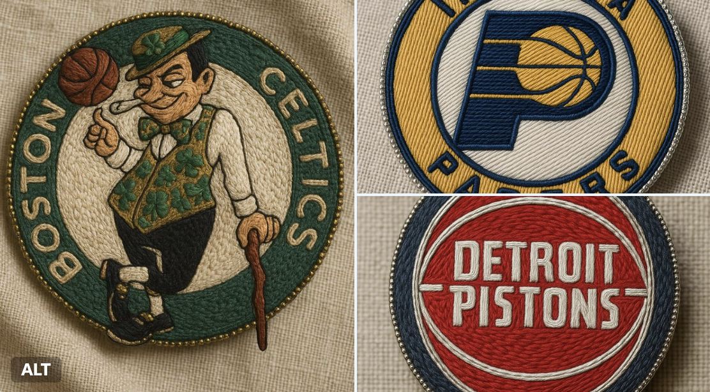

## 3D卡通雕塑风格

- ID: gpt4o-98-zh
- Slug: prompt-98-zh
- 语言: zh
- 来源: [来源链接](https://x.com/aziz4ai/status/1925301120252924356)
- 样例图路径: images/part3/98.jpeg

### 提示词

```text
a soft 3D cartoon-style sculpture of [brand product], made of smooth clay-like textures and vibrant pastel colors, placed in a minimalist isometric scene that complements the product’s nature, clean composition, gentle lighting, subtle shadows, with the product’s logo and a 3-word slogan displayed clearly belo
```

### 样例图

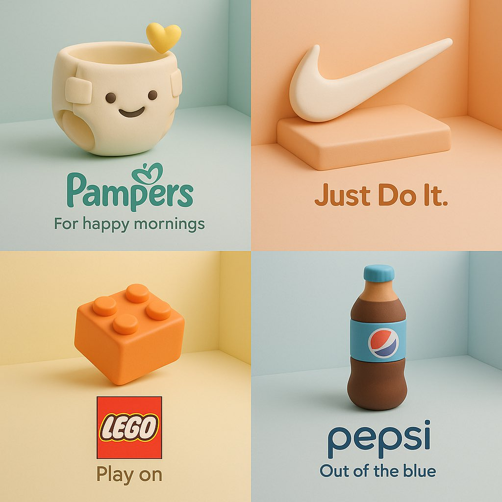

## 品牌解锁童年回忆

- ID: gpt4o-87-zh
- Slug: prompt-87-zh
- 语言: zh
- 来源: [来源链接](https://x.com/TheRelianceAI/status/1925606107608715268)
- 样例图路径: images/part3/87.png

### 提示词

```text
A realistic, cinematic photograph of a vintage [BRAND NAME] item being gently lifted from a dusty stack of old children's books in a dimly lit attic. The item is designed in classic [BRAND NAME] style—featuring authentic patterns, textures, or logos (e.g. monograms, embossing, or signature motifs relevant to the brand). It is partially opened to reveal a miniature, warmly lit classroom inspired by [COUNTRY] school interiors, complete with small regional-style desks, a chalkboard with delicate handwriting in [LANGUAGE], and traditional local details like shoes, posters, or flags. A paper airplane hovers mid-air. The lighting is moody and nostalgic, with soft shadows and golden highlights suggesting afternoon light filtering through attic beams. On the top book cover at the bottom of the image, the [BRAND NAME] logo is written in an elegant, fountain-pen calligraphy style—subtle, integrated into the scene, and not obscuring the main subject.
```

### 样例图

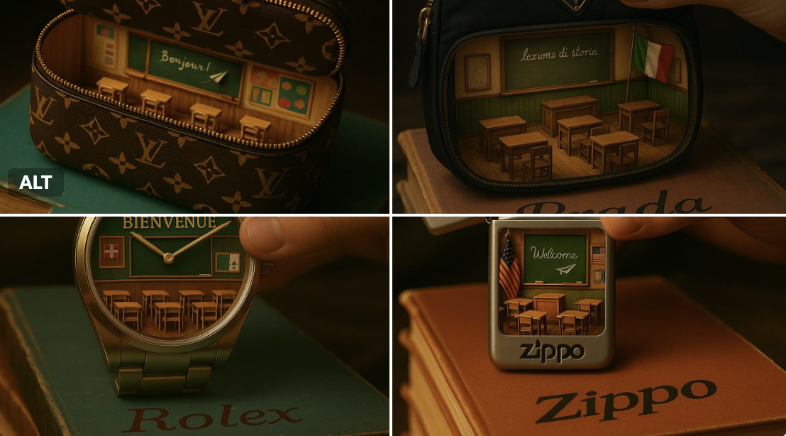

## 霓虹花卉和谐插图

- ID: gpt4o-82-zh
- Slug: prompt-82-zh
- 语言: zh
- 来源: [来源链接](https://x.com/LudovicCreator/status/1926246931661042132)
- 样例图路径: images/part3/82.png

### 提示词

```text
A Neon Floral Harmony illustration of [SUBJECT], with flowers and plants outlined in glowing neon hues. Use vibrant [COLOR1] and [COLOR2] to create a serene yet electrifying botanical scene
```

### 样例图


## 重新构想的玫瑰金

- ID: gpt4o-70-zh
- Slug: prompt-70-zh
- 语言: zh
- 来源: [来源链接](https://x.com/aziz4ai/status/1925933649267970074)
- 样例图路径: images/part3/70.jpeg

### 提示词

```text
Design a luxury-themed 1:1 image featuring a rose gold sculpture that embodies the essence of the jewelry brand “[BRAND NAME]”. The object must symbolically reflect the brand’s identity (e.g., falcon for Cartier, ring for Tiffany & Co., palm tree for Swarovski, camel for Prada). Embed premium crystal textures into key parts of the sculpture (e.g., wings, gem, leaves, or hump) to match the brand’s signature elegance. Use the brand’s iconic background color (e.g., Tiffany Blue, Swarovski White, Cartier Beige, Prada Sand) and place the official logo beneath the sculpture. Add a bold two-word slogan that aligns with the brand’s tone. Lighting should be pure white with high Kelvin value to ensure clarity and prevent yellow tint. The result must feel editorial, artistic, and visually exquisite.
```

### 样例图

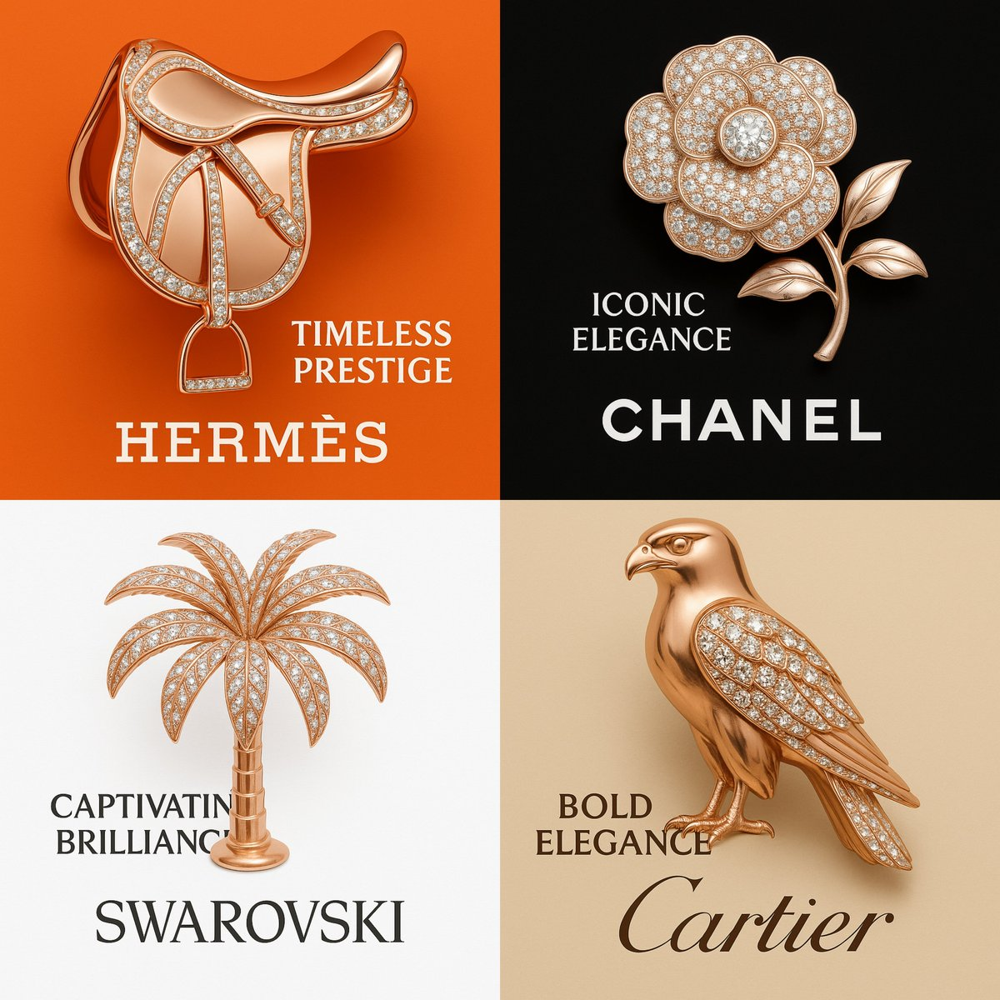

## 品牌折叠纸

- ID: gpt4o-69-zh
- Slug: prompt-69-zh
- 语言: zh
- 来源: [来源链接](https://x.com/HBCoop_/status/1925600123200881024)
- 样例图路径: images/part3/69.png

### 提示词

```text
A flat branded paper folds itself into the full 3D shape of a [insert product or item, e.g. “Coca-Cola bottle”, “Nike sneaker”, “Big Mac”], mid-motion. 

The paper colors match the [insert brand name] brand’s signature palette and the natural colors of the item (e.g., [describe key colors or ingredients, like “red and white for Coca-Cola”, “brown, green, yellow for Big Mac”]).

Dramatic studio lighting, origami texture detail, soft gradient shadows. Stylized with Japanese minimalism and elegant negative space. The scene captures a clean, elevated transformation from flat brand identity into sculptural product form.
```

### 样例图


## 可爱微缩场景

- ID: gpt4o-67-zh
- Slug: prompt-67-zh
- 语言: zh
- 来源: [来源链接](https://x.com/ZHO_ZHO_ZHO/status/1925878276133708224)
- 样例图路径: images/part3/67.jpeg

### 提示词

```text
{
    "style": "miniature handcrafted diorama",
    "material": "tree branches, cardboard, clay, moss, dried flowers, paper",
    "surface_texture": "organic, rough and varied (wood grain, soft moss, paper texture)",
    "lighting": {
        "type": "soft ambient natural light",
        "intensity": "low to moderate",
        "direction": "diffused overhead",
        "accent_colors": [
            "forest green",
            "earth brown",
            "soft beige",
            "muted pink"
        ],
        "reflections": false,
        "refractions": false,
        "dispersion_effects": false,
        "bloom": false
    },
    "color_scheme": {
        "primary": "natural greens and browns",
        "secondary": "soft neutral tones (cardboard, clay, paper)",
        "highlights": "light falling on the open book and cat’s glasses",
        "rim_light": "subtle natural edge light from the forest opening"
    },
    "background": {
        "color": "natural moss green",
        "vignette": false,
        "texture": "moss and dried floral structure"
    },
    "post_processing": {
        "chromatic_aberration": false,
        "glow": false,
        "high_contrast": false,
        "sharp_details": true,
        "film_grain": false
    },
    "form_composition": {
        "scene_elements": [
            "a small girl sitting on a balcony holding an open miniature book",
            "a cat with glasses observing the book's illustrations",
            "a treehouse made from twigs, cardboard, and clay",
            "balcony and surrounding forest made of moss and dried flowers"
        ],
        "scale": "miniature",
        "theme": "childlike wonder and storytelling in a handcrafted world",
        "visual_metaphor": [
            "curiosity",
            "quiet companionship",
            "imagination in nature"
        ]
    },
    "metadata": {
        "artist": "-Zho-",
        "series": "ZH4O"
    }
}
```

### 样例图

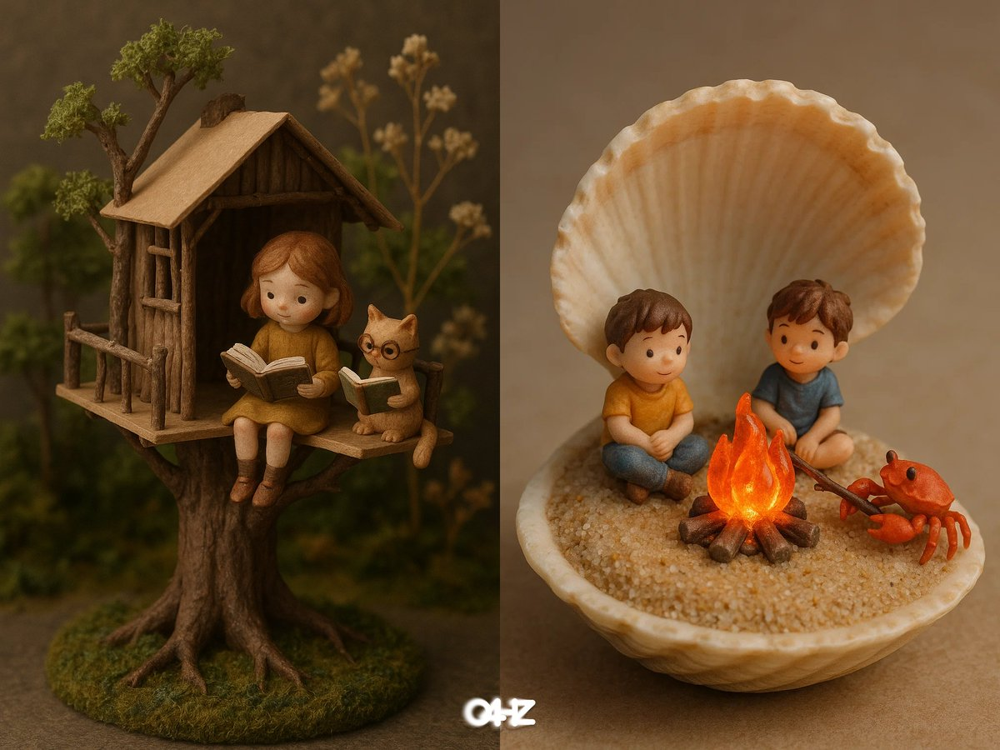

## 由鲜花组成的小房子

- ID: gpt4o-53-zh
- Slug: prompt-53-zh
- 语言: zh
- 来源: [来源链接](https://x.com/BeanieBlossom/status/1925461720639971505)
- 样例图路径: images/part3/53.jpeg

### 提示词

```text
A small house made of flowers, a tree with colorful leaves growing on top and around the door, in the style of fantasy, mountainscape in the background, natural lighting, soft colors, rich details, and a full atmosphere, subtle painterly style
```

### 样例图

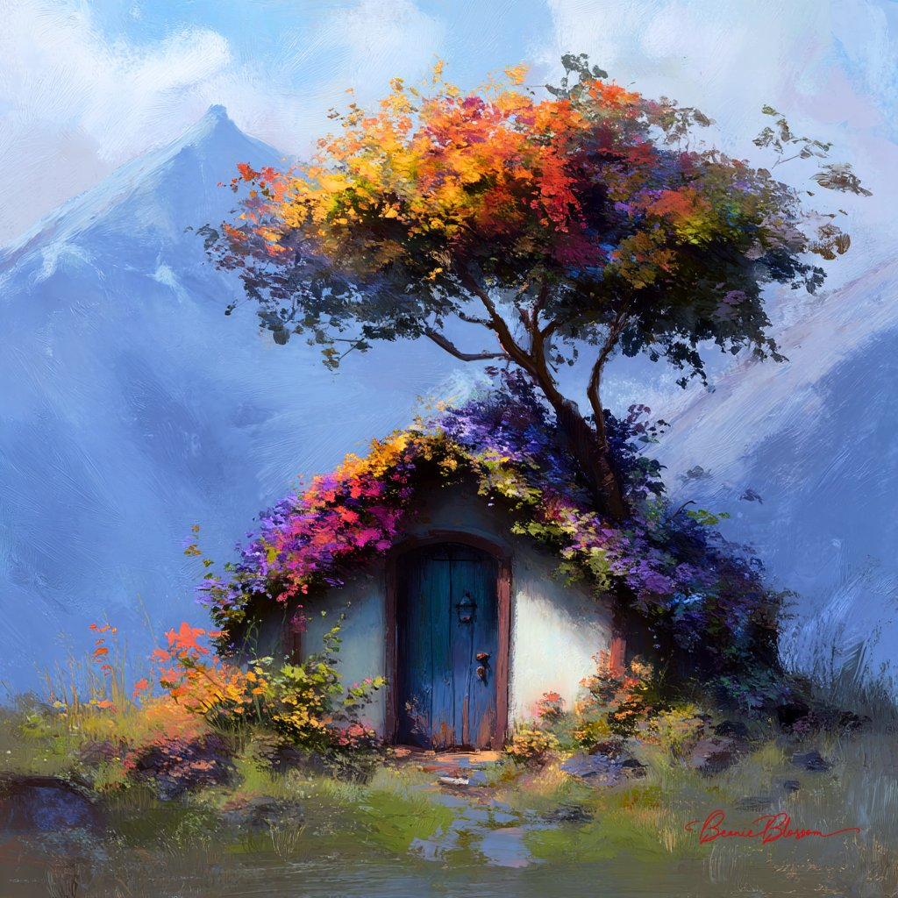

## Emoji变成一个花盆

- ID: gpt4o-19-zh
- Slug: prompt-19-zh
- 语言: zh
- 来源: [来源链接](https://x.com/azed_ai/status/1923739813414568075)
- 样例图路径: images/part3/19.png

### 提示词

```text
A high-quality photo of a cute ceramic [object/animal]-shaped planter with a glossy finish, filled with a variety of vibrant succulents and greenery including a spiky Haworthia, a rosette-shaped Echeveria, and delicate white flowers. The planter has a friendly face and sits on a soft, neutral background with diffused natural lighting, showcasing fine textures and color contrast in a clean, minimalistic composition
```

### 样例图

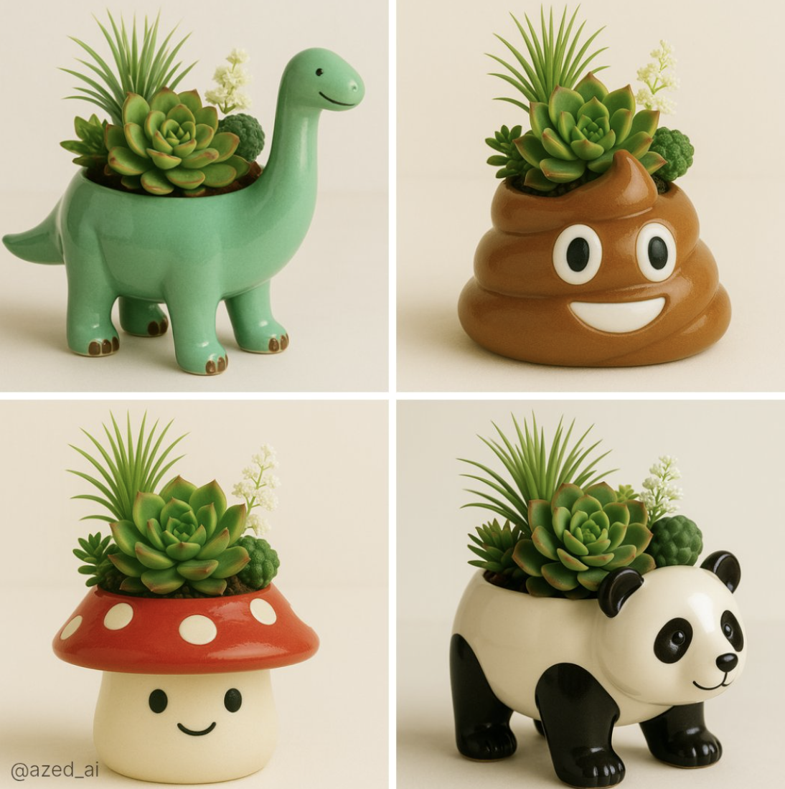

## 品牌我的世界风格

- ID: gpt4o-18-zh
- Slug: prompt-18-zh
- 语言: zh
- 来源: [来源链接](https://x.com/TheRelianceAI/status/1923757741262164427)
- 样例图路径: images/part3/18.png

### 提示词

```text
"A Minecraft-style voxel recreation of a [BRAND NAME] [OBJECT], built entirely from pixelated cubes — detailed voxel modeling, signature brand colors and logo, blocky textures, clean lighting, stylized yet recognizable, 3D render, high resolution, playful and creative interpretation
```

### 样例图

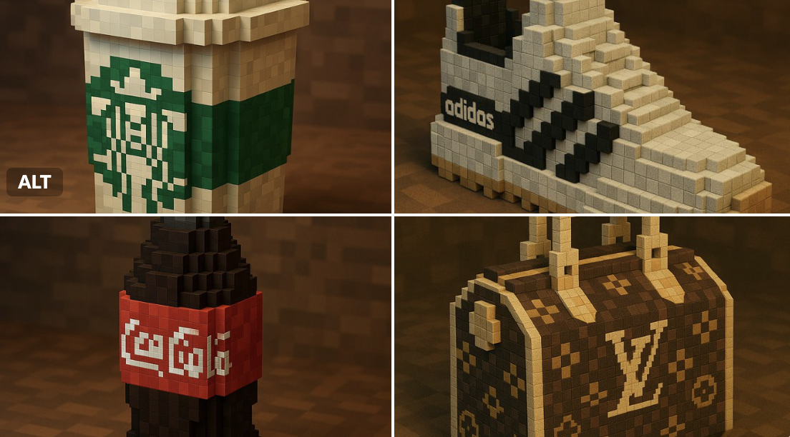

## 品牌星球世界

- ID: gpt4o-16-zh
- Slug: prompt-16-zh
- 语言: zh
- 来源: [来源链接](https://x.com/TheRelianceAI/status/1923064017477628160)
- 样例图路径: images/part3/16.png

### 提示词

```text
Planet [Brand name], Year 3025. A distant world shaped entirely by the essence of the brand. The landscapes echo its core identity — from surreal terrains to fantastical weather patterns. Native flora and fauna embody its signature ingredients and aesthetics. Rivers flow with iconic flavors. Architecture is inspired by its packaging and visual language, fused with futuristic technology. The atmosphere is rich in texture, cinematic lighting, and surreal detail. A dreamlike vision of brand identity reimagined as a sci-fi utopia.
```

### 样例图

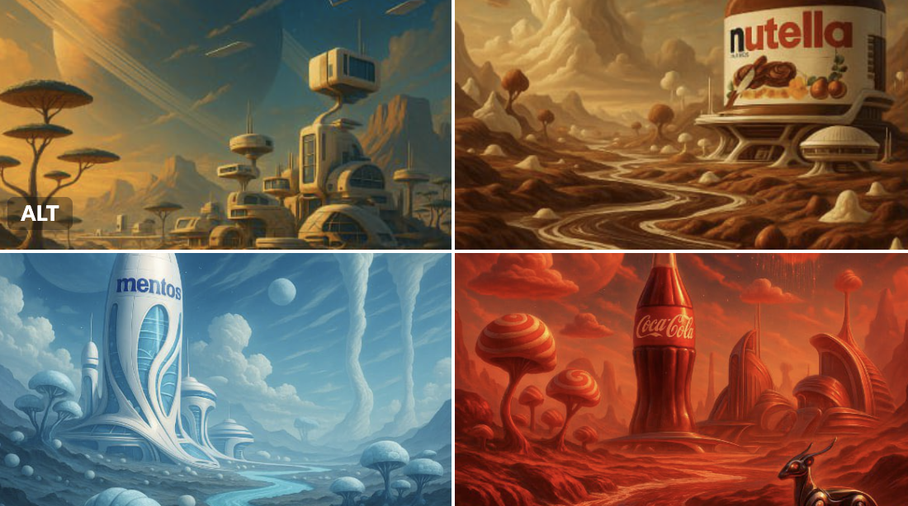

## 树屋

- ID: gpt4o-15-zh
- Slug: prompt-15-zh
- 语言: zh
- 来源: [来源链接](https://x.com/TheRelianceAI/status/1923451797869371701)
- 样例图路径: images/part3/15.png

### 提示词

```text
A quiet morning in a luxury treehouse retreat created by [BRAND NAME] — golden light pours through windows framed in the brand’s signature colors. A cozy seating area features playful, thematic furniture, and a circular rug inspired by [BRAND SYMBOL OR PRODUCT]. The coffee table bears the embossed logo, while a screen on the wall loops the phrase: “[BRAND SLOGAN].” A curated display of iconic items adds a sense of nostalgia. Subtle ambient lighting glows in brand tones, and a tray with signature treats sits near the window. It’s cozy, imaginative, and unmistakably [BRAND NAME]
```

### 样例图

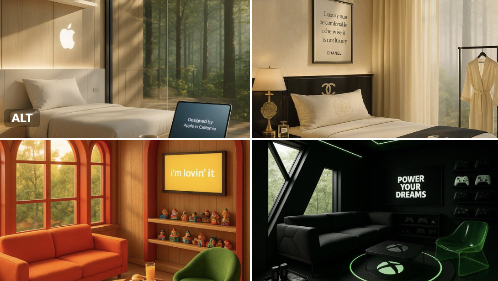

## 品牌之爱话术

- ID: gpt4o-11-zh
- Slug: prompt-11-zh
- 语言: zh
- 来源: [来源链接](https://x.com/aziz4ai/status/1924046710218645932)
- 样例图路径: images/part3/11.jpeg

### 提示词

```text
A romantic square-format bouquet inspired by [Brand Name]. Roses are crafted from visual patterns or textures that reflect the brand’s identity. The bouquet is wrapped in luxurious material echoing the brand’s signature style (e.g. silk, velvet, leather), and elegantly tied with one of the brand’s iconic products, replacing a traditional ribbon. Place it on a surface that matches the brand’s aesthetic. Add a message card beside the bouquet with a short, emotional 3-word slogan representing the brand’s spirit. Include the [Brand Name] logo subtly in the scene. Cinematic lighting, ultra-detailed, elegant depth of field, premium editorial quality.
```

### 样例图

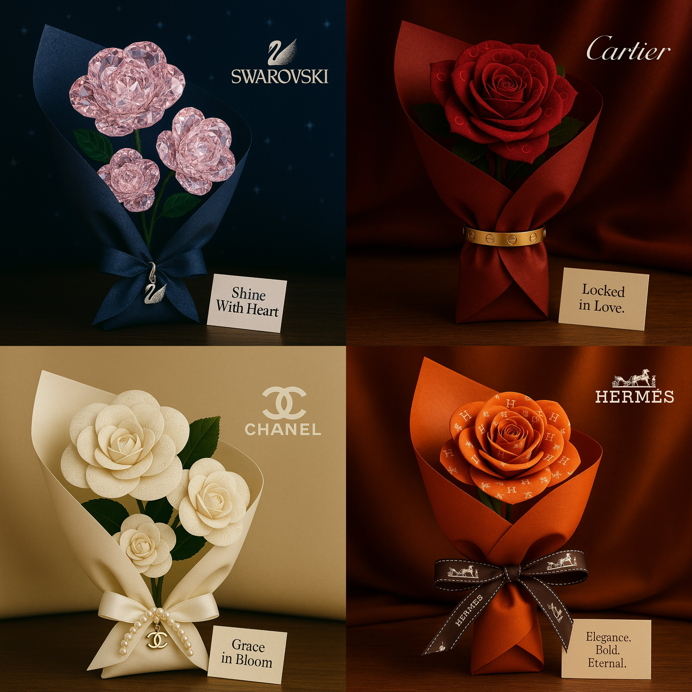

## 青花瓷风格

- ID: gpt4o-9-zh
- Slug: prompt-9-zh
- 语言: zh
- 来源: [来源链接](https://x.com/firatbilal/status/1923627963251052769)
- 样例图路径: images/part3/9.png

### 提示词

```text
Using the uploaded image as the exact visual base, transform it into a hyper-realistic 3D object that retains the original shape and proportions of the logo only. Apply traditional Ottoman Iznik ceramic textures—featuring a warm white glazed base with delicate crackle lines, overlaid with vivid cobalt blue, turquoise, and bold red floral motifs such as tulips, carnations, and arabesque vines. The entire logo should be treated as a standalone porcelain sculpture with raised, hand-painted detailing and no background plate or tile structure. Ensure the decorative patterns elegantly follow the contours of the Bugatti logo, without altering its form. Render the object in a pure black background with Cinema 4D-style product lighting—highlighting realistic ceramic gloss, material depth, and subtle reflections. The final result should feel like a luxurious handcrafted ceramic reinterpretation, balancing heritage ornamentation with industrial branding.
```

### 样例图

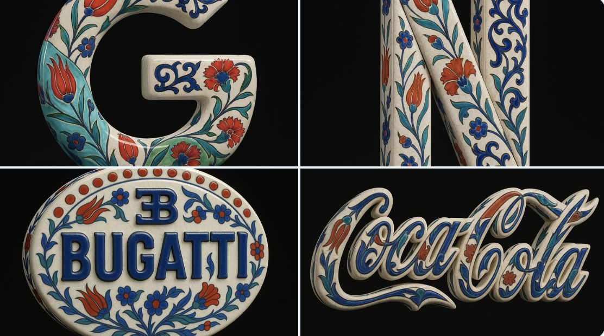

## 马斯克在公园画画

- ID: gpt4o-4-zh
- Slug: prompt-4-zh
- 语言: zh
- 来源: 来源链接缺失
- 样例图路径: images/part3/4.jpg

### 提示词

```text
创作一个逼真的户外场景，其中一位日本画家正在为马斯克画画。场景中，画家坐在画架前，而马斯克则坐在对面被描绘（不带任何卡通或动漫风格）。环境应充满生机,自然且阳光明媚——比如公园或热闹的户外场所。整体风格必须完全写实，唯独画家画架上的作品例外：那应该是马斯克的吉卜力风格动漫肖像，与周围的写实环境形成强烈对比。请确保画中人物是写实风格，画上的肖像才是动漫风格。
```

### 样例图

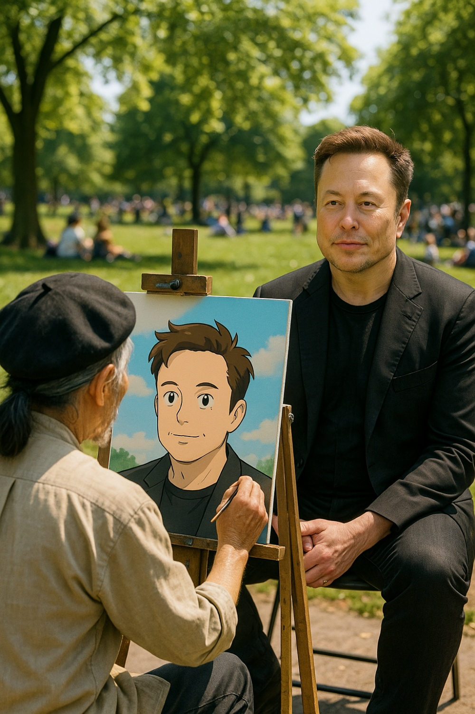

## 蜜蜂科学城

- ID: gpt4o-3-zh
- Slug: prompt-3-zh
- 语言: zh
- 来源: 来源链接缺失
- 样例图路径: images/part3/3.png

### 提示词

```text
创建图像 3D Q版迷你风格，一座蜂巢结构的甜蜜科研基地，建筑由六边形透明蜂蜡舱堆叠而成，顶部悬浮滴落蜂蜜的太阳花洒水器，外墙爬满发光花粉藤蔓。侧面延伸出蜂蜡滑梯与蒲公英降落伞，入口是旋转的向日葵转门。透过蜂巢窗可见内部试管操作台、蜜糖吊灯和穿白大褂的蜜蜂博士。花园里有驾驶花粉摩托的甲虫快递员、举着放大镜的蝴蝶研究员，搭配蜂蜜长椅、雏菊花洒喷泉和动态萤火虫光标，整体笼罩琥珀色光晕，打造超现实昆虫科学城的萌趣生态。
```

### 样例图


