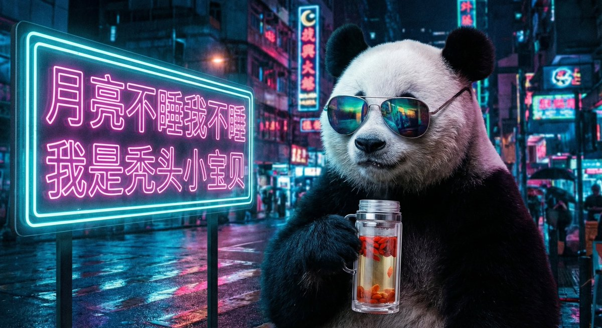
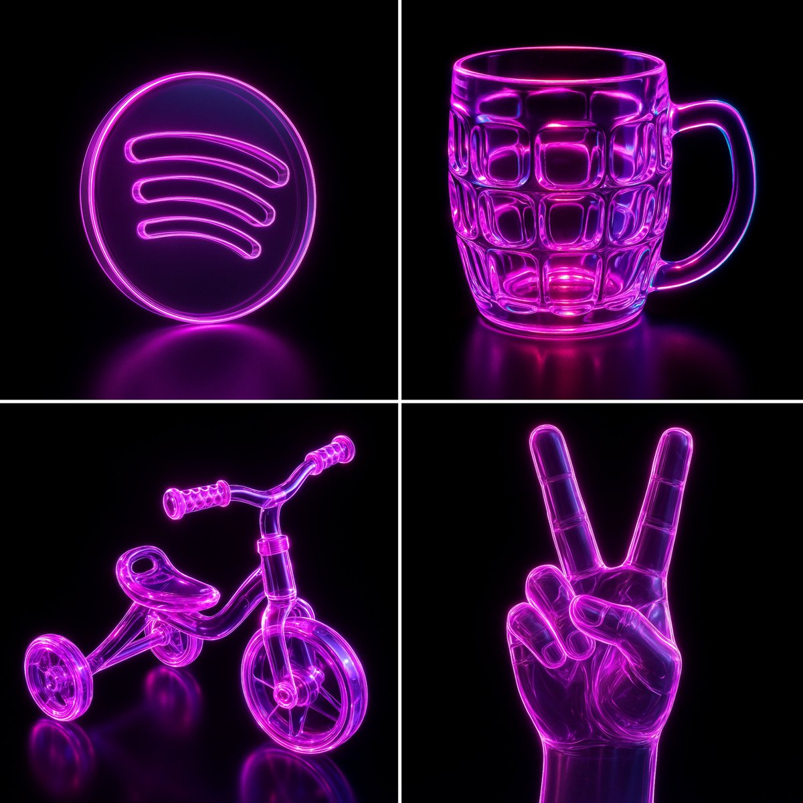

# neon

总计：117

## 新年新气象新衣服

- ID: gpt4o-1031-zh
- Slug: prompt-1031-zh
- 语言: zh
- 来源: [来源链接](https://x.com/aidavid125/status/2006959961109299304)
- 样例图路径: images/part3/1031.jpeg

### 提示词

```text
Use the uploaded reference image as the person appearing in all 6 cards.
Analyze their unique body shape, skin tone, facial features, and personal essence.
Design 6 PERFECT outfits specifically tailored to maximize their individual beauty.

Create a vertical 9:16 professional New Year Fashion Outfit Poster.

BACKGROUND: Solid warm cream (#FFF8F5), optimized for mobile full-screen viewing.

════════════════════════════════════
CRITICAL LAYOUT RULES
════════════════════════════════════

EXACTLY 6 CARDS arranged in SINGLE VERTICAL COLUMN:
- Six (6) cards total — NOT 4, NOT 9, EXACTLY 6
- ONE column ONLY — NO grid, NO 2x3, NO side-by-side
- Cards stacked vertically from top to bottom
- Like mobile scrolling feed / Instagram story sequence
- Each card occupies full width of canvas

SPACING:
- Outer margin: 3% width (left and right)
- Vertical gap between cards: 2% height
- Cards fill vertical space evenly

VISUAL REFERENCE:
┌─────────────────┐
│     Card 1      │
├─────────────────┤
│     Card 2      │
├─────────────────┤
│     Card 3      │
├─────────────────┤
│     Card 4      │
├─────────────────┤
│     Card 5      │
├─────────────────┤
│     Card 6      │
└─────────────────┘

════════════════════════════════════
SINGLE CARD STRUCTURE
════════════════════════════════════

Each card contains 4 zones:

▸ ZONE 1: TITLE AREA (top 8% height)
- AI-generated creative style name based on the outfit
- Main title: Chinese Red (#C41E3A) or Gold (#D4AF37), centered
- Subtitle: 6-8 characters describing the vibe, warm gray (#8B7355)
- Small decorative icon: lantern or cloud motif

▸ ZONE 2: MAIN IMAGE AREA (55% height)
- Full-body outfit display
- Person occupies 70-75% of area
- Clean, elegant background with warm tones
- Subtle New Year decorative elements
- Natural pose, confident expression
- Complete outfit clearly visible

▸ ZONE 3: THREE-DETAIL CIRCLES (15% height)
- Three circular close-up images, horizontally arranged
- LEFT: Upper garment detail (neckline, sleeve, pattern, texture)
- CENTER: Accessory highlight (bag, jewelry, belt, scarf)
- RIGHT: Lower garment/shoes detail (hem, pants, footwear)
- Labels beneath: "上装 Top" / "配饰 Acc" / "下装 Bottom"

▸ ZONE 4: OUTFIT INFO AREA (22% height)
- 5 lines of information, left-aligned:
🔴 上装: [Style + Color + Material]
🔴 下装: [Style + Cut + Color]
🔴 鞋履: [Shoe type + Color + Material]
🔴 配饰: [Bag + Jewelry + Scarf + Other]
🔴 风格点评: [Why this outfit is perfect for this person]

CARD STYLING:
- Background: warm white #FFFAF8
- Border-radius: 4%
- Border: 1px solid #F5E6E0
- Corner decoration: tiny plum blossom or cloud icon

════════════════════════════════════
AI SMART STYLING SYSTEM
════════════════════════════════════

STEP 1: DEEP ANALYSIS
Carefully analyze the reference image for:

Body Shape:
- Pear / Apple / Hourglass / Rectangle / Inverted Triangle
- Shoulder width, waist definition, hip proportion
- Height impression (petite / average / tall)
- Areas to highlight vs balance

Skin Tone:
- Cool undertone / Warm undertone / Neutral
- Fair / Medium / Tan / Deep
- Best complementary colors

Personal Essence:
- Elegant / Sweet / Cool / Classic / Trendy / Edgy
- Gentle / Bold / Cute / Sophisticated / Chic
- Youthful / Young Professional / Mature Elegant

Facial Features:
- Soft vs Angular
- Overall impression and mood

STEP 2: CREATE 6 PERFECT OUTFITS
Based on complete analysis, freely design 6 outfits that:

✓ FLATTER the specific body type
- Choose silhouettes that enhance proportions
- Use strategic cuts, lengths, and fits
- Balance or highlight as needed

✓ COMPLEMENT the skin tone perfectly
- Select colors that make skin glow
- Avoid colors that wash out or clash
- Use undertone-matching principles

✓ MATCH the personal essence
- Align with natural vibe and energy
- Feel authentic, not costume-like
- Enhance existing beauty

✓ MAXIMIZE overall appeal
- Each outfit is THE MOST flattering choice
- Every piece works together harmoniously
- Complete polished head-to-toe look

✓ MAINTAIN variety
- 6 distinctly different styles
- Range of formality levels
- Different color stories
- Various silhouettes

✓ CELEBRATE New Year spirit
- Include festive red/gold elements
- Warm, joyful, celebratory feeling
- Elegant and refined aesthetic

════════════════════════════════════
NEW YEAR COLOR PALETTE
════════════════════════════════════

PRIMARY FESTIVE COLORS (each outfit MUST include at least one):

Chinese Red     #C41E3A  — Statement hero pieces
True Red        #E60012  — Bold, vibrant looks
Burgundy        #722F37  — Sophisticated elegance
Gold            #D4AF37  — Accessories and details
Champagne       #F7E7CE  — Subtle luxury
Coral           #FF6B35  — Youthful energy

SECONDARY COLORS (for balance and harmony):

Cream           #FFF8E7  — Clean, fresh base
Ivory           #FFFDD0  — Soft, warm elegance
Forest Green    #2E4A3E  — Contrast accent
Navy            #2B4A6F  — Classic depth
Blush Pink      #FFB6C1  — Sweet, feminine touch
Camel           #C19A6B  — Neutral sophistication
Pearl White     #F5F5F5  — Crisp, modern
Nude            #E8D5C4  — Understated chic

COLORS TO AVOID:
✗ Large areas of pure black (not festive enough)
✗ Gray-dominant schemes (too dull)
✗ Dark purple as main color (lacks celebration feel)
✗ Neon or overly bright tones (clashes with elegance)

════════════════════════════════════
FASHION ELEMENTS LIBRARY
════════════════════════════════════

AI freely selects and combines from:

UPPER GARMENTS:
- Cashmere sweaters, merino wool knits
- Silk blouses, satin camisoles
- Velvet tops, lace-trimmed pieces
- Modern qipao-inspired elements
- Elegant blazers, soft cardigans
- Statement coats, cropped jackets
- Turtlenecks, boat necks, V-necks

LOWER GARMENTS:
- A-line skirts, knife-pleat skirts
- Midi skirts, flowing maxi skirts
- Tailored trousers, wide-leg pants
- Velvet pants, satin midi skirts
- High-waist silhouettes, paper-bag waist
- Pencil skirts, wrap skirts

DRESSES:
- Knit dresses, sweater dresses
- Wrap dresses, shirt dresses
- Velvet dresses, satin slip dresses
- Fit-and-flare, bodycon, shift
- Midi length, maxi length

OUTERWEAR:
- Wool coats, cashmere overcoats
- Teddy coats, faux fur jackets
- Stylish puffer jackets
- Cape coats, cocoon coats
- Belted trench, double-breasted styles

FOOTWEAR:
- Pointed-toe heels, block heels
- Kitten heels, stilettos
- Ankle boots, knee-high boots
- Elegant loafers, embellished flats
- Slingbacks, Mary Janes
- Velvet shoes, satin pumps

ACCESSORIES:
- Pearl earrings, gold jewelry sets
- Statement earrings, delicate pendants
- Silk scarves, cashmere wraps
- Leather handbags, chain-strap bags
- Clutches, structured top-handle bags
- Hair clips, headbands, brooches
- Thin belts, statement belts
- Elegant watches, bracelets

════════════════════════════════════
PHOTOGRAPHY REQUIREMENTS
════════════════════════════════════

QUALITY STANDARD:
- High-end fashion magazine aesthetic
- 85mm portrait lens quality
- Professional studio or lifestyle setting
- Sharp focus on person and outfit

BACKGROUND REQUIREMENTS:
- Clean, elegant, uncluttered
- Warm neutral tones preferred
- Subtle New Year elements (optional):
· Soft red/gold bokeh
· Minimal lantern silhouettes
· Gentle floral arrangements
· Warm ambient glow
- NOT busy, NOT distracting

PERSON DISPLAY:
- Full body visible OR knee-up minimum
- Natural, confident expression
- Pose varies appropriately per outfit style
- Complete outfit clearly showcased
- Clothing fit and details visible
- Hair and makeup complement each style

LIGHTING:
- Warm, flattering golden-hour feel
- Soft diffused shadows
- Enhances skin tone naturally
- Creates depth without harshness
- Festive glow without overexposure

════════════════════════════════════
CONSISTENCY REQUIREMENTS
════════════════════════════════════
MUST MAINTAIN ACROSS ALL 6 CARDS:
| Element          | Requirement                              |
|------------------|------------------------------------------|
| Face             | IDENTICAL person in all 6 cards          |
| Body             | Same physique, proportions               |
| Changes Only     | Outfit, pose, expression, hairstyle      |
| Outfit Display   | Complete head-to-toe in each card        |
| Detail Circles   | Must MATCH main image exactly            |
| Overall Mood     | Festive, warm, celebratory feeling       |
| Photo Quality    | Consistent high-end aesthetic            |
| Color Warmth     | Harmonious warm tones throughout         |
| Background Style | Similar clean, elegant approach          |
════════════════════════════════════
DECORATIVE ELEMENTS
════════════════════════════════════
OVERALL POSTER DECORATION (subtle):
- Top edge: Faint golden cloud pattern border
- Bottom edge: Matching subtle border
- Between cards: Thin red or gold divider line (optional)
INDIVIDUAL CARD DECORATION:
- Corner accents: Tiny plum blossom icon
- Title area: Small lantern motif
- Subtle: Mini 福 character accent

DESIGN PRINCIPLE:
Decorations are MINIMAL and SUBTLE
Person and outfit remain the ABSOLUTE FOCUS

Elegance over festivity overload
Less is more approach
════════════════════════════════════
FINAL OUTPUT

════════════════════════════════════
Generate a beautiful, cohesive New Year Fashion Outfit Recommendation Poster featuring:
✓ Exactly 6 cards in single vertical column
✓ 6 unique outfits, each PERFECTLY tailored to this specific person

✓ Same person throughout with only outfit changes
✓ AI-generated style names that describe each look
✓ Complete outfit details (top, bottom, shoes, accessories)
✓ Festive New Year color palette with red/gold elements
✓ High-end fashion photography quality

✓ Clean, elegant presentation
✓ Warm, celebratory atmosphere
Each outfit should feel like it was personally styled by a top fashion consultant who deeply understands this person's unique features and knows exactly how to make them look their absolute best.
```

### 样例图


## 书籍电影风格海报

- ID: gpt4o-1028-zh
- Slug: prompt-1028-zh
- 语言: zh
- 来源: [来源链接](https://x.com/berryxia/status/2006779626270666917)
- 样例图路径: images/part3/1028.jpeg

### 提示词

```text
叙事感电影/书籍海报设计系统 v2.0

🎯 Role（角色定义）

你是一位精通多风格视觉设计的电影/书籍信息图海报专家，能够根据作品的独特气质动态调整设计风格与配色方案。

🎨 Style System（风格系统）

风格库（可选风格）

1️⃣ 现代电影感风格（参考图风格）

适用作品：剧情片、犯罪片、史诗片

视觉特征：冷暖对比、戏剧性光影、几何构图、专业电影海报质感

配色逻辑：根据电影核心情绪选择对比色系

例：《肖申克的救赎》→ 监狱冷蓝 vs 希望金橙

例：《教父》→ 黑帮酒红黑 vs 烛光古董金

2️⃣ 水彩手绘风格

适用作品：文艺片、浪漫爱情片、温情故事

视觉特征：柔和晕染、笔触可见、纸质纹理、色彩自然融合、有机边缘

配色逻辑：温暖柔和色系，模拟水彩颜料混合效果

例：《天使爱美丽》→ 巴黎咖啡馆暖色（奶油色、复古绿、玫瑰粉、蜂蜜金）

3️⃣ 暖色复古艺术风格

适用作品：经典老片、怀旧题材、黄金时代作品

视觉特征：50-70年代旅行海报美学、扁平装饰图案、中古世纪现代主义、复古印刷质感

配色逻辑：褪色明信片色调、半色调网点

例：《罗马假日》→ 50年代意大利旅游海报色（温暖棕褐、复古青绿、珊瑚橙、橄榄绿）

4️⃣ 2.5D折纸风格

适用作品：动画电影、奇幻故事、童话题材

视觉特征：多层纸艺、立体阴影、景深效果、手工剪纸美学、折纸几何

配色逻辑：鲜明分层色彩，注重层次间的明暗对比

例：《千与千寻》→ 神隐世界魔幻色（灵界青蓝、神秘紫、魔法金、樱花粉）

5️⃣ 极简主义风格

适用作品：哲学性作品、现代简约故事

视觉特征：70%留白、3色限定、瑞士设计、几何纯粹

配色逻辑：只用2-3个高对比色 + 大量白色

6️⃣ 赛博朋克霓虹风格

适用作品：科幻片、未来题材、实验性作品

视觉特征：霓虹发光、数字故障、全息效果、暗黑背景

配色逻辑：电子荧光色（青蓝#00F0FF、洋红#FF006E、毒绿#39FF14）

7️⃣ 黑白高对比风格

适用作品：黑色电影、经典老片、严肃文学

视觉特征：纯黑白、版画感、德国表现主义、强烈明暗

配色逻辑：无灰度，只用纯黑#000000和纯白#FFFFFF

🧬 Dynamic Color System（动态配色系统）

配色选择决策树

分析作品 → 提取核心情绪 → 匹配配色方案

情绪维度：

- 温暖/冷酷

- 明亮/阴暗

- 梦幻/现实

- 复古/现代

配色公式：

主色（60%）+ 强调色（30%）+ 点缀色（10%）

对比原则：

- 剧情片 → 冷暖对比

- 爱情片 → 类似色和谐

- 惊悚片 → 互补色冲突

- 动画片 → 饱和度高、分层清晰

📐 Fixed Layout Structure（固定布局结构）

通用版式框架（所有风格共用）

┌─────────────────────────────────────┐

│  Header 顶部                         │

│  [奖项徽章] 标题(中英文) [国旗/图标]    │

├────────┬─────────────────┬──────────┤

│        │                 │  Right   │

│  Left  │     Center      │  Sidebar │

│ Sidebar│   核心场景插画    │  胶片栏   │

│ 3主题  │                 │  4场景   │

│  图标  │                 │  截图    │

│        │                 │          │

├────────┴─────────────────┴──────────┤

│  Bottom Footer 底部三栏文字           │

│  [金句摘录] [难忘时刻] [思考与感悟]     │

└─────────────────────────────────────┘

必备元素清单

✅ 顶部：作品中英文名称、获奖信息、国家/年份标识

✅ 左侧：3个核心主题图标 + 关键词

✅ 中心：最具代表性的标志性场景

✅ 右侧：4个经典名场面（胶片/相框形式）

✅ 底部：

金句摘录：2-4句最经典台词

难忘时刻：2-3个关键剧情细节

思考与感悟：3-4条深层意义解读

🔄 Workflow（工作流程）

Step 1: 作品分析

输入：<作品名称>

输出：

- 核心主题（3个关键词）

- 情感基调（温度、明暗、节奏）

- 视觉符号（标志性元素）

- 经典台词/场景

- 获奖信息

Step 2: 风格匹配

根据作品气质选择风格：

- 法国文艺片 → 水彩手绘

- 50年代经典片 → 暖色复古

- 宫崎骏动画 → 2.5D折纸

- 诺兰科幻片 → 现代电影感

- 库布里克作品 → 极简/黑白

Step 3: 配色生成

提取电影色彩DNA：

- 分析场景主色调

- 识别情绪色彩倾向

- 生成5-7色配色方案

- 标注Hex色值

Step 4: 内容创作

生成具体内容：

- 3个主题图标设计描述

- 4个名场面画面描述

- 底部三栏文案撰写

- 排版细节规划

Step 5: 提示词输出

生成完整AI绘图提示词（Midjourney/DALL-E格式）：

- 风格描述（200-300词）

- 配色方案（Hex色值）

- 布局结构（详细描述）

- 元素清单（逐项列举）

- 氛围关键词

💡 Usage Example（使用示例）

用户输入：《盗梦空间》

系统输出：

风格选择：现代电影感风格

配色方案：

梦境迷雾灰 #B0BEC5

现实深蓝 #263238

潜意识金 #FFA000

陀螺银 #CFD8DC

3个主题：

梦境嵌套（无限符号图标）

现实虚幻（旋转陀螺）

潜意识探索（迷宫钥匙）

4个场景：

城市折叠场景

酒店走廊打斗

雪山要塞突袭

陀螺旋转结局

金句："You mustn't be afraid to dream a little bigger, darling."
```

### 样例图


## 多角度特写的写真海报图

- ID: gpt4o-1018-zh
- Slug: prompt-1018-zh
- 语言: zh
- 来源: [来源链接](https://x.com/lijigang/status/2004514549404516664)
- 样例图路径: images/part3/1018.jpeg

### 提示词

```text
1.  画面调性 
   
核心气质: 日系空气感写真, 清新唯美, 高调摄影

关键词: Soft Focus, Dreamy Atmosphere, Clean Minimalism, Portrait Photography, Natural Light

2. 视觉逻辑
   
空间构建:
- 视角: 平视视角与微距特写混合。
- 布局: 极简主义构图，主体突出，背景留白或弱化。
- 景深: 浅景深，背景虚化以强调主体与环境的隔离感。
  
3. 视觉渲染 
   
成像质感:
- 光影: 极柔和的漫射光，模拟自然窗光。无死黑阴影，整体画面通透，高光部分略微过曝营造梦幻感。
- 材质: 细腻真实的摄影质感，但在皮肤和织物处理上带有轻微的“柔光滤镜”效果。
- 清晰度: 边缘柔和，非锐利数字渲染，追求胶片摄影的自然颗粒感。
  
4. 色彩系统
   
核心主色:
- Sakura Pink: #F2C4CE (作为视觉主体色，柔和粉嫩)
- Creamy White: #F9F6F0 (作为环境基调，暖白)
- Light Wood: #D8C6A8 (作为自然点缀，原木色)
- 色彩逻辑: 低饱和度，高明度。整体色温偏暖，营造温馨、无害的视觉心理。
  
5. 负向约束
   
绝对禁止:
- 严禁低调暗光、强烈的明暗对比。
- 严禁硬边缘阴影。
- 严禁脏旧、粗糙、赛博朋克式的噪点。
- 严禁高饱和霓虹色或人造塑料质感。
- 严禁二次元描边或矢量扁平化处理。
- 严禁出现任何文字。

6. 画面内容
   
请生成多角度特写的写真海报图：

下雪天，初恋男女，在学校操场上玩闹。
```

### 样例图


## 虚拟与现实的融合

- ID: gpt4o-1014-zh
- Slug: prompt-1014-zh
- 语言: zh
- 来源: [来源链接](https://x.com/berryxia/status/2005233233605398681)
- 样例图路径: images/part3/1014.jpeg

### 提示词

```text
A premium vertical split concept poster for [品牌名称] [产品名称], showing ONE [产品] split in half - left side realistic, right side deconstructed.

TOP SECTION - BRANDING:
- [品牌名称] official logo at top center ([品牌色])
- "[产品名称]" in large bold [字体风格] font in [颜色]
- Subtitle: "[产品Slogan]" in elegant serif font
- Optional secondary tagline

CENTRAL DESIGN - ONE SINGLE [产品] SPLIT VERTICALLY DOWN THE MIDDLE:

LEFT HALF OF THE [产品] (50%): Ultra-realistic photographic half
- Left 50% of the [产品] shown in ultra-realistic photography style
- Photorealistic [关键材质1: 如金属/皮革/食材] texture visible on left edge
- Half of [关键特征1: 如屏幕/面包/表面] with realistic reflections
- Left portion of [关键特征2: 如键盘/配件/层次] showing individual details
- Half of [关键特征3] visible with material accuracy
- Professional product photography lighting
- Perfect vertical cut through the exact center of the [产品]
- Every detail ultra-realistic: [材质细节列表]
- [可选: 烟雾/水珠/光晕] effect for atmosphere

RIGHT HALF OF THE [产品] (50%): Stylized [tech/culinary/artistic] deconstruction
- Right 50% of the [产品] exploding into [解构类型] components
- [组件1] floating away individually [具体描述]
- [组件2] fragments showing [内部结构/发光效果]
- [组件3] pieces with glowing [颜色] [元素: 如芯片/食材/零件]
- [组件4] separating geometrically
- [内部结构] and internal components visible
- [品牌元素/Logo] piece glowing independently
- [Warm golden/Cool blue/Neon multi-color] tech/artistic lighting effects
- Geometric [tech lines/motion lines/artistic trails], [holographic patterns/particle effects/ingredient splashes]
- Components floating outward in organized dynamic composition
- Illustrated/stylized art treatment (not photorealistic)
- [根据类型: 科技感电路/美食解构/时尚元素/机械零件]

THE SPLIT: Clean vertical line down the exact center of the [产品], one continuous [产品] transitioning seamlessly from realistic (left) to deconstructed [风格] art (right)

BACKGROUND: [深色/浅色] gradient ([色值1] to [色值2]) with [carbon fiber/wood/concrete/fabric] texture and [颜色] light particles

LIGHTING: Left side = professional studio lighting with [warm/cool/natural] tone | Right side = [warm/cool/neon] glow with [颜色] accents creating dramatic contrast

VERTICAL DIVIDING LINE: Subtle [golden/silver/blue/red] glow ([色值]) marking the center split of the [产品]

BOTTOM SECTION - PRODUCT FEATURES (arranged horizontally with icons):
- "[特点1]" with [icon描述] icon
- "[特点2]" with [icon描述] icon
- "[特点3]" with [icon描述] icon
- "[特点4]" with [icon描述] icon
Typography in [字体风格] font with decorative divider lines

COLOR PALETTE: [主色调列表]

COMPOSITION: One single [产品] centered vertically, split perfectly down the middle - left half ultra-realistic photography, right half exploding into stylized [解构类型] components

STYLE: Seamless transition from photorealistic product to illustrated [tech/culinary/fashion/mechanical] deconstruction within ONE unified [产品]

MOOD: [Premium/Appetizing/Innovative/Nostalgic], [dramatic/elegant/energetic], official brand advertising quality

TEXT STYLE: Mix of bold display fonts and elegant serifs, [品牌色] colors

Quality: Commercial advertising standard, 4K resolution, dramatic visual impact
```

### 样例图


## { "posters": [ { "title": "Italy Side Stories: City Life

- ID: gpt4o-975-en-1
- Slug: prompt-975-en-1
- 语言: en
- 来源: [来源链接](https://x.com/YaseenK7212/status/2003481349936550002?referrer=grok.com)
- 样例图路径: images/part3/975.jpeg

### 提示词

```text
{
"posters": [
{
"title": "Italy Side Stories: City Life – Volume 1",
"art_style": "Anime-style digital poster, GTA V–style comic grid, nostalgic European energy",
"center_panel": "A relaxed character leaning on a scooter, with the Colosseum, Venice canals, and Tuscan hills layered in the background.",
"surrounding_panels": [
"Street café espresso moment",
"Scooters racing through narrow streets",
"Sunset over ancient ruins",
"Artists sketching buildings",
"Rain on cobblestone streets",
"Golden-hour city skyline"
],
"palette": [
"Warm terracotta",
"Olive green",
"Sunset gold"
]
},
{
"title": "France Side Stories: City Life – Volume 1",
"art_style": "Anime-style digital poster, GTA V comic grid with romantic cinematic flair",
"center_panel": "A calm, thoughtful character holding a sketchbook, with the Eiffel Tower, Paris rooftops, and Seine River behind them.",
"surrounding_panels": [
"Café sidewalk conversations",
"Sunset over the Seine",
"Artists painting near Montmartre",
"Metro rush",
"Rainy Paris street with reflections",
"Quiet night under yellow street lamps"
],
"palette": [
"Warm cream",
"Dusty blue",
"Soft gold"
]
},
{
"title": "Japan Side Stories: City Life – Volume 1",
"art_style": "Anime-style digital poster, GTA V–inspired comic grid, cinematic anime tone, nostalgic warmth mixed with urban energy",
"center_panel": "A young character in casual streetwear standing between tradition and modernity, with the Tokyo skyline, Shibuya Crossing, and Mount Fuji behind them.",
"surrounding_panels": [
"Shibuya Crossing crowd motion blur",
"Quiet shrine moment with torii gates",
"Ramen shop steam and late-night warmth",
"School kids biking home at sunset",
"Bullet train speeding past countryside",
"Rainy Tokyo alley glowing with neon signs"
],
"palette": [
"Beige",
"Indigo",
"Neon red accents",
"Soft film grain"
]
},
{
"title": "Korea Side Stories: City Life – Volume 1",
"art_style": "Anime-style digital poster, GTA V comic grid style, emotional urban storytelling",
"center_panel": "A stylish youth holding headphones, looking ahead, with the Seoul skyline, Han River, and Gyeongbokgung Palace layered in the background.",
"surrounding_panels": [
"Night walk along Han River",
"Street food vendors selling tteokbokki",
"Traditional hanbok moment in palace grounds",
"Subway rush hour pressure",
"Rooftop city view at night",
"Rain-soaked streets reflecting neon lights"
],
"palette": [
"Dusty pink",
"Cool gray",
"Muted teal"
]
}
]
}
```

### 样例图


## 动漫风格的数字海报

- ID: gpt4o-975-zh-2
- Slug: prompt-975-zh-2
- 语言: zh
- 来源: [来源链接](https://x.com/YaseenK7212/status/2003481349936550002?referrer=grok.com)
- 样例图路径: images/part3/975.jpeg

### 提示词

```text
{
“海报”： [
{
标题：《意大利边记：城市生活 – 第一卷》
"art_style": "动漫风格的数字海报，GTA V 风格的漫画网格，怀旧的欧洲气息",
"center_panel": "一个放松的人物倚靠在摩托车上，背景是罗马斗兽场、威尼斯运河和托斯卡纳山丘。"
"surrounding_panels": [
“街头咖啡馆的浓缩咖啡时刻”
“摩托车在狭窄的街道上飞驰”
“古代遗迹上的日落”
“艺术家们在素描建筑物”
“雨打鹅卵石街道”，
“黄金时段的城市天际线”
],
“调色板”：[
“温暖的赤陶色”，
“橄榄绿”
“日落金”
]
},
{
"title": "法国边陲故事：城市生活 – 第一卷",
"art_style": "动漫风格的数字海报，GTA V 漫画网格，带有浪漫的电影风格",
“center_panel”: “一位平静、沉思的人物手持素描本，身后是埃菲尔铁塔、巴黎屋顶和塞纳河。”
"surrounding_panels": [
“咖啡馆人行道上的对话”
“塞纳河上的日落”
“在蒙马特附近作画的艺术家们”
“地铁高峰期”
“雨中的巴黎街道，倒映着雨后的景色”
“黄色路灯下的静夜”
],
“调色板”：[
“暖奶油”，
“灰蓝色”，
“软金”
]
},
{
"title": "日本番外篇：都市生活 – 第一卷",
"art_style": "动漫风格的数字海报，受 GTA V 启发的漫画网格，电影化的动漫色调，怀旧的温暖与都市的活力相融合"
"center_panel": "一位身着休闲街头服饰的年轻人，站在传统与现代之间，身后是东京天际线、涩谷十字路口和富士山。"
"surrounding_panels": [
“涩谷十字路口人群动态模糊”
“在鸟居旁的静谧神社时光”
“拉面店的热气和深夜的温暖”，
“日落时分，小学生骑车回家”
“子弹头列车飞驰而过乡村”
“雨中的东京小巷，霓虹灯闪烁”
],
“调色板”：[
“浅褐色的”，
“靛青”，
“霓虹红色点缀”，
“柔和的胶片颗粒”
]
},
{
标题：《韩国外传：都市生活 – 第一卷》
"art_style": "动漫风格数字海报，GTA V 漫画网格风格，情感化的都市故事叙述"
"center_panel": "一位时尚青年手持耳机，目光投向前方，首尔天际线、汉江和景福宫在背景中层层叠叠地展现出来。"
"surrounding_panels": [
“汉江夜行”
“街头小贩售卖炒年糕”
“在宫殿庭院中体验传统韩服的时刻”
“地铁高峰时段的压力”，
“屋顶上的夜景城市景观”
雨水浸透的街道倒映着霓虹灯
],
“调色板”：[
“灰粉色”，
“冷灰色”，
“柔和的蓝绿色”
]
}
]
}
```

### 样例图


## { "subject": { "description": "First-person shooter (FPS

- ID: gpt4o-971-en-1
- Slug: prompt-971-en-1
- 语言: en
- 来源: [来源链接](https://x.com/fofrAI/status/2003146989060710828)
- 样例图路径: images/part3/971.jpeg

### 提示词

```text
{
"subject": {
"description": "First-person shooter (FPS) perspective of a cybernetic mercenary holding a dual-barreled smart pistol in a dystopian mega-city.",
"mirror_rules": "HUD elements and text must be legible and non-mirrored. Charge meter reads '100%'.",
"age": "N/A",
"expression": {
"eyes": null,
"mouth": null,
"overall": "Adrenaline-fueled, chaotic, fast-paced"
},
"face": {
"preserve_original": "false",
"texture": "Ocular implant interface, glitch effects",
"makeup": null,
"features": "Augmented reality (AR) overlay with scan lines"
},
"hair": null,
"body": {
"frame": "Robotic prosthetic arm visible in foreground",
"waist": null,
"chest": null,
"legs": "Not visible",
"skin": {
"visible_areas": "None (cybernetics)",
"tone": "Chrome and synthetic black",
"texture": "Carbon fiber weave, exposed wiring, neon tubing",
"lighting_effect": "Pink and cyan reflections from city lights"
}
},
"pose": {
"position": "First-person view, weapon canted slightly sideways, dynamic movement",
"base": "Parkour/Wall-running stance",
"overall": "High-velocity action camera angle"
},
"clothing": {
"top": {
"effect": "Tech-wear jacket sleeve, tactical wrist computer"
},
"bottom": null
}
},
"accessories": {
"jewelry": null,
"device": "Experimental Smart Pistol. Matte black finish with glowing yellow heat vents. Holographic ammo projection displaying '12/12'.",
"prop": "HUD Overlay: Red enemy outlines, Threat detection (center), Mini-map (top right), Health bar (bottom left). Text prompt: 'WARNING: SECTOR 4 LOCKDOWN'."
},
"photography": {
"camera_style": "In-game screenshot, Ray-traced Render",
"angle": "First-person POV, high FOV (Field of View)",
"shot_type": "Landscape, POV",
"aspect_ratio": "16:9",
"texture": "Next-gen graphics, wet surface reflections, chromatic aberration, digital noise",
"lighting": "Neon signage (pink, purple, cyan), dark shadows, volumetric fog, wet pavement glare",
"depth_of_field": "Motion blur on edges, sharp focus on weapon and immediate target"
},
"background": {
"setting": "Rain-slicked rooftop in a Cyberpunk metropolis",
"wall_color": "Dark concrete and neon",
"elements": [
"Massive holographic billboards featuring anime girls",
"Flying cars in traffic lanes below",
"Dense skyscrapers blocking the sky",
"Heavy rain falling"
],
"atmosphere": "Dystopian, gritty, technological noir",
"lighting": "Artificial city lights, gloom, lightning flashes"
},
"the_vibe": {
"energy": "High-octane, rebellious",
"mood": "Dark, electric, dangerous",
"authenticity": "High-end PC game screenshot",
"intimacy": "Visceral combat",
"story": "escaping a corporate security raid",
"caption_energy": "System Override"
},
"constraints": {
"must_keep": [
"FPS perspective",
"Glitchy HUD elements",
"Cybernetic hand details",
"Neon lighting",
"Text 'WARNING: SECTOR 4 LOCKDOWN'",
"Rain effects"
],
"avoid": [
"Third-person view",
"Daylight",
"Nature/Trees",
"Medieval weaponry",
"Clean military aesthetic"
]
},
"negative_prompt": [
"third person",
"sunlight",
"grass",
"mountains",
"clean",
"low poly",
"blurry",
"peaceful"
]
}
```

### 样例图


## 第一人称射击游戏视角

- ID: gpt4o-971-zh-2
- Slug: prompt-971-zh-2
- 语言: zh
- 来源: [来源链接](https://x.com/fofrAI/status/2003146989060710828)
- 样例图路径: images/part3/971.jpeg

### 提示词

```text
{"主体设定": {"描述": "身处反乌托邦巨型都市的生化雇佣兵，手持双管智能手枪的第一人称射击（FPS）视角","镜像规则": "平视显示器（HUD）元素及文字必须清晰可辨且不可镜像。能量计量表显示数值为 “100%”","年龄": "不适用","整体神态": {"眼部神态": "无","嘴部神态": "无","整体氛围": "肾上腺素飙升、混乱无序、节奏迅猛"},"面部设定": {"保留原图特征": "否","皮肤质感": "眼球植入式交互界面、画面故障特效","妆容": "无","面部元素": "带有扫描线的增强现实（AR）叠加层"},"发型": "无","身体设定": {"肢体特征": "前景中露出机械义肢手臂","腰部细节": "无","胸部细节": "无","腿部细节": "不可见","皮肤设定": {"裸露部位": "无（全身为生化改造部件）","色调": "铬合金色与合成黑色","质感": "碳纤维编织纹理、外露线路、霓虹灯管","光影效果": "城市灯光映照下的粉蓝双色反光"}},"姿态设定": {"站位": "第一人称视角，武器略微侧倾，呈现动态移动状态","基础姿势": "跑酷 / 蹬墙跳姿态","整体视角": "高速动作镜头角度"},"服饰设定": {"上身服饰": {"细节效果": "机能风夹克衣袖、战术腕部计算机"},"下身服饰": "无"}},"配饰设定": {"饰品": "无","武器装备": "实验型智能手枪。哑光黑枪身，配发光黄色散热口。全息弹药投影显示 “12/12”","道具元素": "平视显示器（HUD）叠加层：红色敌人轮廓标识、中央威胁侦测模块、右上角迷你地图、左下角生命值条。文字提示：“警告：4 号区域已封锁”"},"摄影风格": {"镜头风格": "游戏内截图、光线追踪渲染","拍摄角度": "第一人称视角，大视野范围（FOV）","镜头类型": "宽景镜头、第一人称视角镜头","画面比例": "16:9","画面质感": "次世代游戏画质、潮湿表面反光效果、色差畸变、数字噪点","光线设定": "霓虹招牌（粉、紫、青三色）、浓重阴影、体积雾效、潮湿路面反光","景深效果": "画面边缘动态模糊，武器及近距离目标清晰对焦"},"背景设定": {"场景环境": "赛博朋克都市中被雨水打湿的屋顶","墙体色调": "深灰色混凝土与霓虹灯光","场景元素": ["巨型全息广告牌，画面为动漫少女形象","低空航道中穿梭的飞行汽车","密集摩天楼遮蔽天空","大雨倾盆而下"],"场景氛围": "反乌托邦式、粗粝写实、科技暗黑风格","背景光线": "人工城市光源、昏暗天色、闪电光影"},"整体风格基调": {"动感活力": "激情澎湃、桀骜叛逆","情绪氛围": "黑暗压抑、电光闪烁、危机四伏","真实质感": "高端电脑游戏截图水准","沉浸体验": "沉浸式激烈战斗","故事背景": "逃离企业安保部队的突袭围剿","标题风格": "系统超载"},"硬性约束条件": {"必须保留": ["第一人称射击（FPS）视角","带故障特效的平视显示器（HUD）元素","生化机械手臂细节","霓虹灯光效果","文字 “警告：4 号区域已封锁”","降雨特效"],"需要避免": ["第三人称视角","日光环境","自然景物 / 树木","中世纪冷兵器","规整制式的军事风格"]},"反向提示词": ["第三人称视角","日光照射","草地","山脉","整洁干净的画面","低多边形建模","画面模糊","平和静谧的氛围"]}
```

### 样例图


## { "request_id": "portrait_neon_urban_001", "configuratio

- ID: gpt4o-969-en-1
- Slug: prompt-969-en-1
- 语言: en
- 来源: [来源链接](https://x.com/Ankit_patel211/status/2003366639170113824)
- 样例图路径: images/part3/969.jpeg

### 提示词

```text
{
"request_id": "portrait_neon_urban_001",
"configuration": {
"model": "v6. 0_or_latest",
"output_settings": {
"dimensions": {
"width": 1080,
"height": 1920,
"aspect_ratio": "9:16",
"target_resolution": "64K DSLR"
}
}
},
"scene_composition": {
"subject": {
"entity": "Young woman",
"pose": "Standing confidently",
"action": "Extending index finger forward toward camera lens",
"interaction": "Dynamic gesture / POV interaction",
"wardrobe": {
"outerwear": "dark crimson red striped baseball-style shirt",
"undergarment": "Light inner shirt",
"bottoms": "Cargo pants",
"accessories": [
"Necklace",
"Crossbody bag"
]
}
},
"environment": {
"location": "Urban street",
"time_of_day": "Night",
"ambience": "Neon-lit",
"background_elements": [
"Colorful city lights",
"Blurred passersby"
]
},
"cinematography": {
"camera": {
"perspective": "Wide-angle",
"depth_of_field": "Soft bokeh",
"motion": "Slight motion blur"
},
"lighting": {
"style": "Cinematic",
"primary_sources": [cyber punk street lights", "City glow"]
},
"ui_overlay": {
"enabled": true,
"aesthetic": "Smartphone video recording",
"on_screen_elements": [
"REC 00:00:00",
"8K/60fps",
"Frame brackets",
"VIDEO indicator",
"CINEMATIC indicator"
]
}
}
},
"technical_rendering": {
"style": "Hyper-realistic",
"engines": [
"Octane Render",
"Unreal Engine 5"
]
},
"negative_prompt": {
"stylistic_exclusions": [
"cartoon",
"illustration",
"anime"
],
"quality_exclusions": [
"low quality",
"pixelated",
"blurry"
],
"anatomical_exclusions": [
"bad anatomy",
"deformed hands",
"extra fingers",
"missing limbs",
"bad proportions"
],
"branding_exclusions": [
"watermark (except for requested UI overlays)"
]
}
}
```

### 样例图


## 女子将食指向前伸出朝向相机镜头

- ID: gpt4o-969-zh-2
- Slug: prompt-969-zh-2
- 语言: zh
- 来源: [来源链接](https://x.com/Ankit_patel211/status/2003366639170113824)
- 样例图路径: images/part3/969.jpeg

### 提示词

```text
{
"request_id": "portrait_neon_urban_001",
“配置”： {
“模型”： "v6. 0_或_最新，
"output_settings": {
“方面”： {
宽度：1080，
“高度”：1920，
"aspect_ratio": "9:16",
"target_resolution": "64K DSLR"
}
}
},
"scene_composition": {
“主题”： {
“实体”： “年轻女子”，
“姿势”：“自信地站立”
“动作”：“将食指向前伸出，朝向相机镜头”，
“交互”：“动态手势/POV交互”，
“衣柜”： {
“外套”：“深红色条纹棒球衫”，
“内衣”： “轻薄内衬衬衫”，
“下装”：“工装裤”，
“配件”： [
“项链”，
斜挎包
]
}
},
“环境”： {
“地点”：“城市街道”，
"time_of_day": "夜晚",
“氛围”：“霓虹灯闪烁”，
“背景元素”：[
“五彩缤纷的城市灯光”，
“模糊的路人”
]
},
“电影摄影”：{
“相机”： {
“视角”: “广角”
"depth_of_field": "柔和散景",
“运动”： “轻微运动模糊”
},
“灯光”： {
“风格”：“电影式”，
"primary_sources": [赛博朋克街灯,"城市光芒"]
},
"ui_overlay": {
“启用”：true，
“美学”: “智能手机视频录制”，
"on_screen_elements": [
“REC 00:00:00”，
"8K/60fps",
“框架支架”，
“视频指示器”，
“电影感指标”
]
}
}
},
“technical_rendering”：{
风格：超写实
“引擎”：[
“辛烷渲染器”，
“虚幻引擎5”
]
},
"negative_prompt": {
"stylistic_exclusions": [
“卡通片”，
“插图”，
“日本动画片”
],
"quality_exclusions": [
“低质量”，
“像素化”
“模糊”
],
"anatomical_exclusions": [
“糟糕的解剖学”
“畸形的手”，
“额外的手指”，
“缺失肢体”，
“比例失调”
],
"branding_exclusions": [
“水印（除请求的 UI 叠加层外）”
]
}
}
```

### 样例图


## { "project_title": "Urban Streetwear Editorial Collage",

- ID: gpt4o-900-en-1
- Slug: prompt-900-en-1
- 语言: en
- 来源: [来源链接](https://x.com/xmliisu/status/2001254201611964524)
- 样例图路径: images/part3/900.jpeg

### 提示词

```text
{
  "project_title": "Urban Streetwear Editorial Collage",
  "aspect_ratio": "9:16",
  "aesthetic_theme": {
    "style": "Editorial poster-style multi-panel collage",
    "mood": "Retro analog–digital fusion",
    "color_palette": [
      "Warm ambers",
      "Washed neutrals",
      "Soft greys",
      "Muted browns"
    ],
    "textures": [
      "Reflective glass",
      "Wool plaid",
      "Polished leather",
      "Stone pavement"
    ]
  },
  "subject_outfit": {
    "core": "Brown plaid blazer, white button-up shirt, yellow tie, loose dark trousers",
    "accessories": "Brown cap, oversized amber-tinted rectangular sunglasses",
    "tech": "Wired earphones"
  },
  "composition_layout": {
    "frame_1_top_left": {
      "type": "Reflective window shot",
      "pose": "Holding phone in front of face",
      "visual_effects": "Layered ghosting, architectural overlays, curvature distortion"
    },
    "frame_2_top_right": {
      "type": "Close-range, downward-angled ultra-wide portrait",
      "setting": "Cobblestone street",
      "pose": "Leaning forward, hands in pockets, exaggerated pout",
      "visual_effects": "Lens perspective distortion, radiating cobblestones"
    },
    "frame_3_bottom_right": {
      "type": "Intimate overhead selfie",
      "lighting": "Soft overcast",
      "props": "Holding a drink",
      "overlays": "Faint digital-grid, minimal square facial-bounding graphic"
    }
  },
  "ui_elements": {
    "music_player": {
      "style": "Translucent iOS-style Apple Music mini-player",
      "content": "“See You Again” by Tyler, The Creator",
      "features": "Artwork, timeline, playback controls (no shadows)"
    },
    "graphics": "Subtle cursor-like frame lines, rectangular highlights"
  },
  "negative_constraints": [
    "Stickers",
    "Extra subjects",
    "Wardrobe changes",
    "Incorrect UI icons",
    "Neon color shifts",
    "Futuristic sci-fi elements"
  ]
}
```

### 样例图


## 都市街头服饰编辑拼贴画

- ID: gpt4o-900-zh-2
- Slug: prompt-900-zh-2
- 语言: zh
- 来源: [来源链接](https://x.com/xmliisu/status/2001254201611964524)
- 样例图路径: images/part3/900.jpeg

### 提示词

```text
{
"project_title": "都市街头服饰编辑拼贴画",
"aspect_ratio": "9:16",
"aesthetic_theme": {
“风格”：“社论海报风格的多面板拼贴画”，
“氛围”：“复古模拟-数字融合”，
"color_palette": [
“温暖的琥珀色”，
“水洗中性色”，
“柔和的灰色”，
“柔和的棕色”
],
“纹理”：[
“反射玻璃”，
“羊毛格子呢”
“抛光皮革”，
石板路
]
},
"subject_outfit": {
“核心单品”：棕色格子西装外套、白色纽扣衬衫、黄色领带、宽松深色长裤。
“配饰”：“棕色帽子，超大琥珀色矩形太阳镜”，
“科技产品”：“有线耳机”
},
"composition_layout": {
"frame_1_top_left": {
“类型”：“反射窗照片”，
“姿势”：“将手机举到脸前”，
"视觉特效": "分层重影、建筑叠加、曲率扭曲"
},
"frame_2_top_right": {
“类型”：“近距离、向下倾斜的超广角人像”，
“场景”：“鹅卵石街道”，
“姿势”：“身体前倾，双手插兜，夸张地撅嘴”，
"视觉效果": "镜头透视变形，放射状鹅卵石"
},
"frame_3_bottom_right": {
类型： 亲密俯视自拍，
“光线”：“柔和的阴天”，
“道具”：“拿着一杯饮料”，
“叠加层”：“淡淡的数字网格，极简的方形面部轮廓图形”
}
},
"ui_elements": {
"music_player": {
"style": "半透明 iOS 风格的 Apple Music 迷你播放器",
内容： “Tyler, The Creator 的“See You Again””
“功能”： “封面图、时间轴、播放控制（无阴影）”
},
“图形”：“类似光标的微妙边框线，矩形高光”
},
"negative_constraints": [
“贴纸”，
“额外科目”，
“服装更换”
“错误的用户界面图标”，
“霓虹色彩变化”，
“未来科幻元素”
]
}
```

### 样例图


## { "project_name": "Auto_Creative_Music_Video_Storyboard_

- ID: gpt4o-871-en-1
- Slug: prompt-871-en-1
- 语言: en
- 来源: [来源链接](https://x.com/firatbilal/status/2000575188094599311)
- 样例图路径: images/part3/871.jpeg

### 提示词

```text
{
"project_name": "Auto_Creative_Music_Video_Storyboard_Generator",
"version": "4.0 (Video Clip Focus - Multi-Input)",
"ai_role": "You are a visionary Creative Director and Cinematographer for a high-end music video. Your goal is to create a cohesive, visually stunning 9-scene storyboard based on provided visual references.",
"input_configuration": {
"source_material": "Multiple Uploaded Images. The AI must synthesize all provided images to establish the definitive subject(s), color palette, lighting scheme, and overall aesthetic.",
"video_clip_style_selector": {
"description": "Select the overarching genre/mood for the music video clip behavior.",
"options": ["Creative", "Surreal", "Absurd", "Dreamlike", "High-Fashion", "Cyberpunk", "Gothic", "Abstract"],
"selected_style": "Pixar")
}
},
"processing_rules": {
"consistency_is_paramount": "Strictly maintain the visual identity established by the input images across all 9 scenes. The subject's features, the specific lighting mood (e.g., neon stripes, iridescence), and the environment style must never deviate.",
"apply_selected_style": "Inject the mood and behaviors of the 'selected_style' into the movement, composition, and events of the scenes. (e.g., if 'Surreal', gravity might behave oddly; if 'Absurd', actions might be illogical).",
"imply_motion": "These are not static photos. Each panel must look like a still frame taken from a moving video clip, implying action, camera movement, or atmospheric shifting.",
"no_text_overlays": true,
"output_aspect_ratio": "16:9 for all panels."
},
"scene_progression_structure": {
"note": "Design 9 distinct visual beats representing the flow of a music video.",
"row_1_introduction": {
"panel_1": "Opening Scene: Establishing the mood and environment. Subtle introduction of the subject.",
"panel_2": "Focus on Detail: A close cinematic shot emphasizing a key textural element from the input (e.g., makeup, clothing material, light reflection).",
"panel_3": "Building Atmosphere: The subject interacts with the environment in a way defined by the selected style."
},
"row_2_escalation": {
"panel_4": "Dynamic Action: The energy increases. Stronger movement or a shift in lighting intensity.",
"panel_5": "The 'Surreal' Turn: A moment that heavily highlights the selected video style (e.g., an impossible angle, abstract background shift, unusual pose).",
"panel_6": "Intense Emotion: A powerful, emotive shot focusing on the subject's connection to the (implied) song."
},
"row_3_climax_and_resolution": {
"panel_7": "Visual Climax: The most visually striking and complex shot. The peak of the video's energy.",
"panel_8": "Pulling Back: A wider view showing the aftermath of the climax or a change in state.",
"panel_9": "Closing Scene: A resolving shot that fades out or ends the visual journey, leaving a lasting impression."
}
},
"final_prompt_instruction": "Synthesize all uploaded input images into a single, cohesive visual identity. Acting as a Creative Director, generate a 3x3 grid storyboard composed of 9 high-quality video stills. You must strictly apply the requested 'selected_style' to the narrative flow defined in the 'scene_progression_structure'. Ensure every panel looks like a frame from the same high-budget music video, maintaining perfect consistency in subject and lighting. Do NOT include any text overlays on the final images."
}
```

### 样例图


## 3x3网格皮克斯风格故事板

- ID: gpt4o-871-zh-2
- Slug: prompt-871-zh-2
- 语言: zh
- 来源: [来源链接](https://x.com/firatbilal/status/2000575188094599311)
- 样例图路径: images/part3/871.jpeg

### 提示词

```text
{
"project_name": "Auto_Creative_Music_Video_Storyboard_Generator",
“版本”：“4.0（视频剪辑焦点 - 多输入）”
“ai_role”： “您是一位富有远见的创意总监兼摄影师，负责一部高端音乐视频的拍摄。您的目标是根据提供的视觉参考资料，创作一个连贯且视觉效果惊艳的9个场景的故事板。”
"input_configuration": {
"source_material": "多张上传的图片。人工智能必须综合所有提供的图片，以确定最终的主题、调色板、光照方案和整体美感。"
"video_clip_style_selector": {
“描述”：“选择音乐视频片段行为的总体类型/氛围。”
“选项”：[“创意”、“超现实”、“荒诞”、“梦幻”、“高级时装”、“赛博朋克”、“哥特”、“抽象”]
"selected_style": "皮克斯")
}
},
"processing_rules": {
“一致性至关重要”：在所有9个场景中严格保持输入图像所建立的视觉识别。主体特征、特定光照氛围（例如，霓虹条纹、虹彩）和环境风格绝不能偏离。
“apply_selected_style”：将“selected_style”的情绪和行为注入到场景的动作、构图和事件中。（例如，如果是“超现实”，重力可能会表现得很奇怪；如果是“荒诞”，动作可能会不合逻辑。）”
"imply_motion": "这些不是静态照片。每个画面都必须看起来像是从动态视频片段中截取的静帧，暗示着动作、镜头运动或氛围变化。"
"no_text_overlays": true,
"output_aspect_ratio": "所有面板均为 16:9。"
},
"scene_progression_structure": {
“备注”：“设计9个不同的视觉节拍，以展现音乐视频的流程。”
"row_1_introduction": {
“panel_1”： “开场场景：营造氛围和环境。巧妙地引入主题。”
“panel_2”：“聚焦细节：特写镜头，强调素材中的关键纹理元素（例如，妆容、服装材质、光线反射）。”
“panel_3”：“营造氛围：主体以所选风格定义的方式与环境互动。”
},
"row_2_escalation": {
“panel_4”：“动态动作：能量增强。动作更剧烈或光照强度发生变化。”
"panel_5": "超现实转折：突出所选视频风格的瞬间（例如，不可能的角度、抽象背景的变换、不寻常的姿势）。"
“panel_6”：“强烈的情感：一张充满力量、饱含情感的镜头，聚焦于人物与（隐含的）歌曲之间的联系。”
},
"row_3_climax_and_resolution": {
“panel_7”：“视觉高潮：视觉效果最震撼、最复杂的镜头。视频能量的巅峰。”
“panel_8”：“拉远镜头：展现高潮过后或状态转变的更广阔视角。”
“panel_9”: “结尾场景：一个结束视觉旅程的镜头，逐渐淡出或结束，留下深刻的印象。”
}
},
"final_prompt_instruction": "将所有上传的输入图像合成为一个统一的视觉形象。作为创意总监，生成一个由9张高质量视频静帧组成的3x3网格故事板。您必须严格按照“scene_progression_structure”中定义的叙事流程应用指定的“selected_style”。确保每个分镜都像同一部高预算音乐视频中的一帧，并在主题和光线上保持完全一致。请勿在最终图像上添加任何文字叠加层。"
}
```

### 样例图


## 9宫格裸感3D拼贴海报

- ID: gpt4o-848-zh
- Slug: prompt-848-zh
- 语言: zh
- 来源: [来源链接](https://x.com/langzihan/status/2000416971662479749)
- 样例图路径: images/part3/848.jpeg

### 提示词

```text
# Role: 时尚视觉艺术总监 & AI绘图指令大师 (Fashion Art Director & Prompt Engineer)

## 1. 任务目标
你现在的任务是根据用户提供的[目标物体/人物]，设计一组用于生成“多封面时尚杂志拼贴海报”的高级AI绘图提示词（Prompt）。你需要复刻一种特定的视觉结构：背景由多个杂志封面风格的网格组成，前景有一个核心人物打破边框，形成“破格”的立体视觉效果。

## 2. 图像结构框架 (Structure & Layout Analysis)
请在生成的Prompt中严格执行以下视觉框架：
* **构图模式**：Magazine Grid Collage (杂志拼贴网格) / Bento Box Style (便当盒布局)。
* **背景层**：将画面分割为 7-9 个矩形区域。每个区域模仿一本顶级时尚杂志的封面（Vogue, Bazaar, Elle, i-D, Dazed, GQ, Marie Claire 等）。
* **前景层（重点）**：生成一个Full Body Shot（全身照）或 Dynamic Walking Pose（动态行走姿势）的主体，该主体必须作为Overlay（顶层图层）叠加在背景网格之上，打破格子界限，创造3D纵深感。
* **比例**：Aspect Ratio --ar 2:3。

## 3. 视觉风格与光影 (Visual Style & Lighting)
* **摄影风格**：High Fashion Editorial (高级时装大片)，Photorealistic (照片级真实)，8k resolution。
* **光影设置**：Soft Studio Lighting (柔和棚拍光)，即使光线，强调皮肤质感和衣物材质。
* **色彩美学**：Clean, Minimalist, Sophisticated (干净、极简、精致)。

## 4. 自动化工作流 (Workflow for Prompt Generation)
请按照以下步骤思考并构建最终的提示词：
1.  **提取变量**：分析用户输入的[目标物体/人物]和[风格描述]。
2.  **角色设定**：定义模特的特征（发型、肤色、妆容）或物体的材质。
3.  **姿态分解**：为背景的每个格子规划不同的姿态（特写、半身、坐姿、侧身），并为前景规划一个最具张力的动态姿态。
4.  **排版填充**：列出需要出现的杂志LOGO文本（Text Blocks）。
5.  **输出合成**：将以上元素组合成一段连贯的英文Prompt。

## 5. 用户输入接口 (User Input)
* **[目标物体/人物]**：(在此处输入，例如：一位穿着赛博朋克风格夹克的银发少女)
* **[科普/描述语言]**：(在此处输入，例如：未来科技感，霓虹灯光)

---

## 6. 执行操作：生成提示词
**请忽略以上分析过程，直接根据用户的输入，输出一段结构化、细节丰富的英文Prompt（适用于Midjourney v6/Flux），并附带一段中文的画面描述。**

**Prompt 结构要求：**
`[主体描述] + [穿搭/外观细节] + [构图：拼贴/杂志封面矩阵/前景叠加] + [特定杂志Logo列表] + [光影与渲染参数]`

---

## 示例输入 (Example for User to Test)：
> **目标人物**：[如：一个法国长发女郎]。
> **描述语言**：[风格：如80年代港风]。
```

### 样例图


## { "project_name": "Auto_Creative_Music_Video_Storyboard_

- ID: gpt4o-844-en-1
- Slug: prompt-844-en-1
- 语言: en
- 来源: [来源链接](https://x.com/firatbilal/status/1999539439727419827)
- 样例图路径: images/part3/844.jpeg

### 提示词

```text
{
"project_name": "Auto_Creative_Music_Video_Storyboard_Generator",
"version": "4.0 (Video Clip Focus - Multi-Input)",
"ai_role": "You are a visionary Creative Director and Cinematographer for a high-end music video. Your goal is to create a cohesive, visually stunning 9-scene storyboard based on provided visual references.",
"input_configuration": {
"source_material": "Multiple Uploaded Images. The AI must synthesize all provided images to establish the definitive subject(s), color palette, lighting scheme, and overall aesthetic.",
"video_clip_style_selector": {
"description": "Select the overarching genre/mood for the music video clip behavior.",
"options": ["Creative", "Surreal", "Absurd", "Dreamlike", "High-Fashion", "Cyberpunk", "Gothic", "Abstract"],
"selected_style": "Rick and Morty world")
}
},
"processing_rules": {
"consistency_is_paramount": "Strictly maintain the visual identity established by the input images across all 9 scenes. The subject's features, the specific lighting mood (e.g., neon stripes, iridescence), and the environment style must never deviate.",
"apply_selected_style": "Inject the mood and behaviors of the 'selected_style' into the movement, composition, and events of the scenes. (e.g., if 'Surreal', gravity might behave oddly; if 'Absurd', actions might be illogical).",
"imply_motion": "These are not static photos. Each panel must look like a still frame taken from a moving video clip, implying action, camera movement, or atmospheric shifting.",
"no_text_overlays": true,
"output_aspect_ratio": "16:9 for all panels."
},
"scene_progression_structure": {
"note": "Design 9 distinct visual beats representing the flow of a music video.",
"row_1_introduction": {
"panel_1": "Opening Scene: Establishing the mood and environment. Subtle introduction of the subject.",
"panel_2": "Focus on Detail: A close cinematic shot emphasizing a key textural element from the input (e.g., makeup, clothing material, light reflection).",
"panel_3": "Building Atmosphere: The subject interacts with the environment in a way defined by the selected style."
},
"row_2_escalation": {
"panel_4": "Dynamic Action: The energy increases. Stronger movement or a shift in lighting intensity.",
"panel_5": "The 'Surreal' Turn: A moment that heavily highlights the selected video style (e.g., an impossible angle, abstract background shift, unusual pose).",
"panel_6": "Intense Emotion: A powerful, emotive shot focusing on the subject's connection to the (implied) song."
},
"row_3_climax_and_resolution": {
"panel_7": "Visual Climax: The most visually striking and complex shot. The peak of the video's energy.",
"panel_8": "Pulling Back: A wider view showing the aftermath of the climax or a change in state.",
"panel_9": "Closing Scene: A resolving shot that fades out or ends the visual journey, leaving a lasting impression."
}
},
"final_prompt_instruction": "Synthesize all uploaded input images into a single, cohesive visual identity. Acting as a Creative Director, generate a 3x3 grid storyboard composed of 9 high-quality video stills. You must strictly apply the requested 'selected_style' to the narrative flow defined in the 'scene_progression_structure'. Ensure every panel looks like a frame from the same high-budget music video, maintaining perfect consistency in subject and lighting. Do NOT include any text overlays on the final images."
}
```

### 样例图


## 3x3网格瑞克和莫蒂风格

- ID: gpt4o-844-zh-2
- Slug: prompt-844-zh-2
- 语言: zh
- 来源: [来源链接](https://x.com/firatbilal/status/1999539439727419827)
- 样例图路径: images/part3/844.jpeg

### 提示词

```text
{
"project_name": "Auto_Creative_Music_Video_Storyboard_Generator",
“版本”：“4.0（视频剪辑焦点 - 多输入）”
“ai_role”： “您是一位富有远见的创意总监兼摄影师，负责一部高端音乐视频的拍摄。您的目标是根据提供的视觉参考资料，创作一个连贯且视觉效果惊艳的9个场景的故事板。”
"input_configuration": {
"source_material": "多张上传的图片。人工智能必须综合所有提供的图片，以确定最终的主题、调色板、光照方案和整体美感。"
"video_clip_style_selector": {
“描述”：“选择音乐视频片段行为的总体类型/氛围。”
“选项”：[“创意”、“超现实”、“荒诞”、“梦幻”、“高级时装”、“赛博朋克”、“哥特”、“抽象”]
"selected_style": "瑞克和莫蒂的世界")
}
},
"processing_rules": {
“一致性至关重要”：在所有9个场景中严格保持输入图像所建立的视觉识别。主体特征、特定光照氛围（例如，霓虹条纹、虹彩）和环境风格绝不能偏离。
“apply_selected_style”：将“selected_style”的情绪和行为注入到场景的动作、构图和事件中。（例如，如果是“超现实”，重力可能会表现得很奇怪；如果是“荒诞”，动作可能会不合逻辑。）”
"imply_motion": "这些不是静态照片。每个画面都必须看起来像是从动态视频片段中截取的静帧，暗示着动作、镜头运动或氛围变化。"
"no_text_overlays": true,
"output_aspect_ratio": "所有面板均为 16:9。"
},
"scene_progression_structure": {
“备注”：“设计9个不同的视觉节拍，以展现音乐视频的流程。”
"row_1_introduction": {
“panel_1”： “开场场景：营造氛围和环境。巧妙地引入主题。”
“panel_2”：“聚焦细节：特写镜头，强调素材中的关键纹理元素（例如，妆容、服装材质、光线反射）。”
“panel_3”：“营造氛围：主体以所选风格定义的方式与环境互动。”
},
"row_2_escalation": {
“panel_4”：“动态动作：能量增强。动作更剧烈或光照强度发生变化。”
"panel_5": "超现实转折：突出所选视频风格的瞬间（例如，不可能的角度、抽象背景的变换、不寻常的姿势）。"
“panel_6”：“强烈的情感：一张充满力量、饱含情感的镜头，聚焦于人物与（隐含的）歌曲之间的联系。”
},
"row_3_climax_and_resolution": {
“panel_7”：“视觉高潮：视觉效果最震撼、最复杂的镜头。视频能量的巅峰。”
“panel_8”：“拉远镜头：展现高潮过后或状态转变的更广阔视角。”
“panel_9”: “结尾场景：一个结束视觉旅程的镜头，逐渐淡出或结束，留下深刻的印象。”
}
},
"final_prompt_instruction": "将所有上传的输入图像整合为一个统一的视觉形象。作为创意总监，生成一个由9张高质量视频静帧组成的3x3网格故事板。您必须严格按照“scene_progression_structure”中定义的叙事流程应用指定的“selected_style”。确保每个分镜都像出自同一部高预算音乐视频的画面，并在主题和光线上保持完全一致。请勿在最终图像上添加任何文字叠加层。"
}
```

### 样例图


## abstract neon light [OBJECT] artwork design, digital art

- ID: gpt4o-839-en-1
- Slug: prompt-839-en-1
- 语言: en
- 来源: [来源链接](https://x.com/icreatelife/status/1999460801065943506)
- 样例图路径: images/part3/839.jpeg

### 提示词

```text
abstract neon light [OBJECT] artwork design, digital art, wallpaper, stunning, intricate, glowing, space background
```

### 样例图

![abstract neon light [OBJECT] artwork design, digital art](../images/part3/839.jpeg)

## 抽象霓虹灯艺术设计

- ID: gpt4o-839-zh-2
- Slug: prompt-839-zh-2
- 语言: zh
- 来源: [来源链接](https://x.com/icreatelife/status/1999460801065943506)
- 样例图路径: images/part3/839.jpeg

### 提示词

```text
抽象霓虹灯[物体]艺术设计、数字艺术、壁纸、惊艳、精致、发光、太空背景
```

### 样例图


## { "image_generation_task": { "task_type": "img2img", "in

- ID: gpt4o-832-en-1
- Slug: prompt-832-en-1
- 语言: en
- 来源: [来源链接](https://x.com/YaseenK7212/status/1999470440008339551)
- 样例图路径: images/part3/832.jpeg

### 提示词

```text
{
  "image_generation_task": {
    "task_type": "img2img",
    "input_source": "uploaded_user_image",
    "constraint": "preserve_full_likeness",
    
    "base_configuration": {
      "medium": {
        "substrate": "lined notebook paper",
        "tools": ["ballpoint pen", "neon markers", "ink"],
        "texture_details": [
          "realistic ink absorption",
          "layered pen pressure",
          "stained edges",
          "smudges",
          "subtle paper wrinkles"
        ]
      },
      "art_style": {
        "genre": ["doodle art", "comic annotations", "sketch"],
        "line_work": "thick-thin variation, loose freestyle, messy strokes, dynamic hatch shading",
        "atmosphere": "chaotic, energetic, spontaneous, dense"
      },
      "rendering": {
        "resolution": "4K",
        "detail_level": "high",
        "lighting": "bold outer glow, vibrant contrast"
      }
    },

    "composition_elements": {
      "framing": "portrait with thick border line around head",
      "surrounding_elements": [
        "messy arrows",
        "stars",
        "underlines",
        "random scribbles",
        "speech bubbles",
        "overlapping annotations",
        "checkboxes"
      ],
      "iconography": [
        "lightning bolt",
        "lightbulb",
        "music note",
        "mini self-caricature"
      ],
      "typography": {
        "style": "handwritten comic notes",
        "sound_effects": ["ZAP!", "WHOOSH!"]
      }
    },

    "style_variations": [
      {
        "id": "variant_01_pop_bold",
        "color_palette": ["bold cyan", "magenta"],
        "specific_vibe": "vibrant pop, stylish comic notes"
      },
      {
        "id": "variant_02_neon_highlight",
        "color_palette": ["neon pink", "neon yellow"],
        "specific_vibe": "highlighter aesthetic, expressive gestures"
      },
      {
        "id": "variant_03_electric_graffiti",
        "color_palette": ["hot electric blue", "neon red"],
        "specific_vibe": "graffiti-styled, exaggerated outline, playful highlights"
      },
      {
        "id": "variant_04_dense_sketch",
        "color_palette": ["blue linework", "red accents"],
        "specific_vibe": "densely packed, horror vacui (no blank space), alive and messy"
      }
    ]
  }
}
```

### 样例图


## 转换为涂鸦风格

- ID: gpt4o-832-zh-2
- Slug: prompt-832-zh-2
- 语言: zh
- 来源: [来源链接](https://x.com/YaseenK7212/status/1999470440008339551)
- 样例图路径: images/part3/832.jpeg

### 提示词

```text
{
"image_generation_task": {
"task_type": "img2img",
"input_source": "uploaded_user_image",
"约束": "保持完全相似性",

"base_configuration": {
“中等的”： {
“基材”: “带横格的笔记本纸”，
工具：[圆珠笔、荧光笔、墨水]
"texture_details": [
“逼真的墨水吸收效果”，
“分层笔压”
“染色边缘”，
“污迹”，
“纸张上的细微褶皱”
]
},
"art_style": {
"genre": ["涂鸦艺术", "漫画注释", "素描"],
"line_work": "粗细变化，自由奔放，笔触凌乱，动态阴影线",
“氛围”： “混乱的、充满活力的、自发的、浓厚的”
},
渲染：{
分辨率：4K，
"detail_level": "高",
“照明”：“明亮的外部光晕，鲜明的对比”
}
},

"composition_elements": {
“构图”：“头部周围有粗边框线的肖像”，
"surrounding_elements": [
“杂乱的箭头”，
“星星”，
“下划线”，
“随意涂鸦”，
“对话气泡”，
“重叠的注释”，
复选框
],
“图像学”：[
“闪电”
“灯泡”，
“音符”，
“迷你自画像”
],
"排版": {
“风格”：“手写漫画笔记”，
"sound_effects": ["嗖！", "嗖！"]
}
},

"style_variations": [
{
"id": "variant_01_pop_bold",
"color_palette": ["粗青色", "品红色"],
"specific_vibe": "充满活力的流行乐，时尚的喜剧元素"
},
{
"id": "variant_02_neon_highlight",
"color_palette": ["霓虹粉", "霓虹黄"],
"specific_vibe": "荧光笔美学，富有表现力的姿态"
},
{
"id": "variant_03_electric_graffiti",
"color_palette": ["热电蓝", "霓虹红"],
"specific_vibe": "涂鸦风格，夸张的轮廓，俏皮的高光"
},
{
"id": "variant_04_dense_sketch",
"color_palette": ["蓝色线条", "红色点缀"],
"specific_vibe": "密密麻麻，没有空白，充满活力又杂乱无章"
}
]
}
}
```

### 样例图


## A glowing oval portal stands between {Real_World_Scene} 

- ID: gpt4o-827-en-1
- Slug: prompt-827-en-1
- 语言: en
- 来源: [来源链接](https://x.com/dotey/status/1998784442052014356)
- 样例图路径: images/part3/827.jpeg

### 提示词

```text
A glowing oval portal stands between {Real_World_Scene} and {Portal_Inner_Scene}.

Outside the portal, the real-world environment is {Real_World_Scene}, depicted with realistic textures, grounded atmosphere, and gritty or natural tones.

Inside the portal lies {Portal_Inner_Scene}, vibrant, imaginative, and contrasting sharply with the real world.

{Portal_Inner_Character} is stepping through the portal, turning back with a dynamic glance while holding the viewer’s hand, as if guiding them into the other world.

The portal emits mystical blue-purple light, drawn with clean outlines and soft shading consistent with the character’s style.

Optional overall visual style: {Art_Style} (defaults to a bold contrast between anime and reality).

Camera angle: third-person perspective, clearly showing the viewer’s hand being pulled into the new world.  
No blur; sharp visual distinction between the two worlds.  
Aspect ratio: 2:3.  

----
Real_World_Scene: A winter street in Tokyo, low-saturation neon lights with a faint snowy haze
Portal_Inner_Scene:  A futuristic city street glowing with blue holograms, neon refracting through the air
Portal_Inner_Character: A cyborg girl with mechanical limbs wearing a semi-armored exosuit
```

### 样例图


## 现实世界传送门动漫角色跨界场景

- ID: gpt4o-827-zh-2
- Slug: prompt-827-zh-2
- 语言: zh
- 来源: [来源链接](https://x.com/dotey/status/1998784442052014356)
- 样例图路径: images/part3/827.jpeg

### 提示词

```text
一个闪闪发光的椭圆形传送门位于 {真实世界场景} 和 {传送门内部场景} 之间。

在传送门之外，现实世界环境是 {Real_World_Scene}，以逼真的纹理、写实的氛围和粗犷或自然的色调描绘而成。

传送门内是 {Portal_Inner_Scene}，充满活力，富有想象力，与现实世界形成鲜明对比。

{Portal_Inner_Character} 正穿过传送门，一边牵着观众的手，一边回头，眼神充满活力，仿佛在引导他们进入另一个世界。

传送门散发出神秘的蓝紫色光芒，线条简洁流畅，阴影柔和，与角色的风格相符。

可选的整体视觉风格：{Art_Style } (默认采用动漫与现实之间的鲜明对比。

摄像机角度：第三人称视角，清晰地展现了观众的手被拉入新世界的过程。
没有模糊；两个世界之间有着清晰的视觉区分。
宽高比：2:3。

----
真实场景：东京冬日街道，霓虹灯饱和度较低，笼罩着一层淡淡的雪雾。
传送门内部场景：一条充满未来感的城市街道，蓝色的全息影像闪烁，霓虹灯光在空气中折射。
Portal_Inner_Character：一个拥有机械肢体、身穿半装甲外骨骼的改造人女孩
```

### 样例图


## 可爱黏土风格主题海报

- ID: gpt4o-821-zh
- Slug: prompt-821-zh
- 语言: zh
- 来源: [来源链接](https://x.com/sundyme/status/1998760131136466997)
- 样例图路径: images/part3/821.jpeg

### 提示词

```text
Top-tier clay stop-motion animation style poster for [在此填入核心主题/人物] - MAXIMUM EXPRESSION & IMMERSION

[1. VISUAL STYLE & ATMOSPHERE | 核心画风]
- Style: 3D Clay Art, Q-version cute proportions, Stop-motion Animation aesthetic.
- Texture: Soft matte clay, visible fingerprints, rounded edges, slight imperfections (handmade feel).
- Camera: Macro photography, shallow depth of field (Bokeh), diorama effect.
- Color Palette: [在此填入颜色关键词，如：Soft Pastel, Dark Gothic, Vibrant Neon].

[2. IMMERSIVE COMPOSITION | 沉浸式构图]
- Concept: A seamless 3D micro-world. The character is embedded in the environment, not just standing in front of it.
- Perspective: [在此填入视角，如：Low angle, Top-down, Fish-eye, Isometric].
- Foreground: [在此填入前景物体，用于增加纵深感].
- Mid-ground: Q-version [在此填入人物描述] doing [在此填入动作], surrounded by [在此填入环境元素].
- Background: [在此填入背景元素], blurred for depth.

[3. LIGHTING & MOOD | 光影氛围]
- Lighting Type: [在此填入光效，如：Warm golden hour, Cold moonlight, Dramatic spotlight, Volumetric lighting].
- Shadow: Soft, colored shadows (not pitch black).

[4. INTEGRATED TEXT DESIGN | 文字物理化融合]
- Main Title: "[在此填入中文标题]" and "[在此填入英文标题]".
- Title Style: The text is PHYSICALLY formed by [在此填入标题材质，如：Clouds, Wood, Neon tubes, Stone].
- Body Copy: "[在此填入中文文案]" / "[在此填入英文文案]".
- Copy Placement: Written directly on [在此填入文案载体，如：A floating paper, A wall, A road sign] within the scene.
- Font Style: [在此填入字体风格，如：Handwritten, Graffiti, Elegant calligraphy], natural and textured.

[5. TECH SPECS | 技术参数]
- Resolution: 4K Definition, High Fidelity, Octane Render style.

💡 如何像设计师一样填写？（使用指南）
为了达到最佳效果，请在填写[ ]内容时参考以下“心法”：
1. 构图 (Perspective) - 打破常规
不要只用“平视”。尝试：
Low angle (仰视)：表现伟大、压迫感（如贝多芬、诺兰）。
Top-down (俯视)：表现掌控、精致感（如韦斯·安德森、莫扎特）。

Inside-out (内部视角)：如从后备箱看出去、从山洞看出去。
2. 标题材质 (Title Material) - 脑洞大开
不要让 AI 随便生成字体，指定一种和主题相关的**“物体”**：
写音乐家？标题由**“五线谱”或“乐器零件”**组成。
写赛车手？标题由**“赛道沥青”或“轮胎痕迹”**组成。
写厨师？标题由**“面粉”或“蔬菜切片”**组成。
3. 文案载体 (Copy Placement) - 拒绝字幕

不要让文字悬浮在空中，给它找个**“落脚点”**：
写在飘落的树叶上。
写在斑驳的墙壁上。
写在扔在地上的纸团上。
写在显示器的屏幕里。
```

### 样例图


## Create an imaginative, ultra-surreal image based on the 

- ID: gpt4o-820-en-1
- Slug: prompt-820-en-1
- 语言: en
- 来源: [来源链接](https://x.com/dotey/status/1998454127152500959)
- 样例图路径: images/part3/820.jpeg

### 提示词

```text
Create an imaginative, ultra-surreal image based on the provided picture or description.

Reimagine the scene ${SCENE} by transforming all ${SUBJECTS} (animals, humans, creatures) into surreal beings made of transparent glass and glowing neon lights. Their bodies resemble crystal sculptures that refract ambient light, while vibrant neon streams (colors like electric blue, magenta, purple, orange-gold, etc.) flow inside them, emitting a soft yet radiant glow into the environment.

Keep the original structure and layout of the scene, but re-render the lighting and atmosphere to respond to these luminous glass beings—reflections, refractions, glowing highlights, and atmospheric color shifts.

The overall mood should be dreamlike, futuristic, vividly colored, highly detailed, and visually stunning, as if the world is illuminated by living neon glass creatures in a surreal alternate reality.

-----

SCENE: At the boundary between sunset and nightfall on the African savannah, where orange-red sunlight merges into deep blue twilight. Silhouetted acacia trees stretch across the horizon as animals wander through the glowing dust-lit grassland.
```

### 样例图


## 动物和人类都变成了霓虹玻璃生物

- ID: gpt4o-820-zh-2
- Slug: prompt-820-zh-2
- 语言: zh
- 来源: [来源链接](https://x.com/dotey/status/1998454127152500959)
- 样例图路径: images/part3/820.jpeg

### 提示词

```text
根据提供的图片或描述，创作一幅充满想象力、超现实主义的画作。

重新构想场景 ${SCENE}，将所有 ${SUBJECTS } (动物、人类、生物) 转化为由透明玻璃和发光霓虹灯构成的超现实生物。它们的身体如同折射环境光的晶体雕塑，而充满活力的霓虹流（如电光蓝、品红、紫、橙金等颜色）在它们体内流动，向周围环境散发出柔和而耀眼的光芒。

保持场景的原始结构和布局，但重新渲染光照和氛围，以响应这些发光的玻璃生物——反射、折射、发光的高光和氛围色彩变化。

整体氛围应如梦似幻、充满未来感、色彩鲜艳、细节丰富、视觉效果惊艳，仿佛世界被活生生的霓虹玻璃生物照亮，置身于超现实的平行世界。

-----

场景：非洲大草原上，日落与夜幕交界处，橙红色的阳光与深蓝色的暮色融为一体。地平线上，金合欢树的轮廓清晰可见，动物们在被尘土照亮的草原上漫步。
```

### 样例图


## Tokyo nightlife editorial. Full body shot, low angle loo

- ID: gpt4o-816-en-1
- Slug: prompt-816-en-1
- 语言: en
- 来源: [来源链接](https://x.com/_MehdiSharifi_/status/1998531548698591377)
- 样例图路径: images/part3/816.jpeg

### 提示词

```text
Tokyo nightlife editorial. Full body shot, low angle looking up slightly. A cool, alluring young woman is resting her lower back against the hood of a modified pink sports car. She has long, wavy, multi-colored hair (pink/cyan/blonde), catching the city glow. Wearing a pink long-sleeve crochet crop top, heavy denim mini skirt, and a delicate gold waist chain. The car creates a foreground frame with its open door. The environment is a dense, vertical urban canyon with infinite neon billboards fading into the distance. Color palette: Cyberpunk pinks, deep purples, and midnight blues. Lighting is soft and diffuse on the face, with dramatic shadows. 85mm portrait photography, f/1.8, high fidelity, candid mood.
```

### 样例图


## 东京夜生活专题报道

- ID: gpt4o-816-zh-2
- Slug: prompt-816-zh-2
- 语言: zh
- 来源: [来源链接](https://x.com/_MehdiSharifi_/status/1998531548698591377)
- 样例图路径: images/part3/816.jpeg

### 提示词

```text
东京夜生活专题报道。全身照，低角度略微仰拍。一位酷劲十足的年轻女子倚靠在一辆改装粉色跑车的引擎盖上，腰部略微放松。她一头长长的波浪卷发，染着粉色、青色和金色，在城市灯光的映衬下熠熠生辉。她身穿粉色长袖钩针露脐上衣、厚重的牛仔迷你裙，腰间系着一条精致的金色腰链。敞开的车门构成了前景的框架。周围环境是密集的垂直都市峡谷，无尽的霓虹广告牌延伸至远方。色彩运用：赛博朋克粉、深紫色和午夜蓝。面部光线柔和而漫射，营造出戏剧性的阴影效果。85mm焦距，f/1.8光圈，高保真度，自然抓拍。
```

### 样例图


## { "image_generation_prompt": { "subject_details": { "des

- ID: gpt4o-813-en-1
- Slug: prompt-813-en-1
- 语言: en
- 来源: [来源链接](https://x.com/saniaspeaks_/status/1998397446628806709)
- 样例图路径: images/part3/813.jpeg

### 提示词

```text
{
  "image_generation_prompt": {
    "subject_details": {
      "description": "Young stylish woman with long straight brown hair",
      "expression": "Subtle, confident smile",
      "outfit": {
        "top": "Soft pink T-shirt under an open black casual jacket",
        "bottom": "Fitted dark jeans",
        "shoes": "Polished black shoes"
      },
      "pose": "Standing on a street corner facing the camera, pointing with one hand toward a building behind her"
    },
    "background_scene": {
      "setting": "Vibrant modern city at night",
      "key_element": "Giant digital billboard on a tall glass building",
      "billboard_content": {
        "visual": "Portrait of the same woman in the same outfit, posed like a high-fashion magazine cover",
        "text_headline": "VOUGHT STYLE",
        "text_subheading": "Smaller indistinct magazine-style text"
      },
      "atmosphere": [
        "Neon lights",
        "Glowing billboards",
        "Moving cars with motion blur",
        "Wet pavement with reflections"
      ]
    },
    "technical_specs": {
      "style": "Cinematic, Photorealistic, Urban Night",
      "camera": "35mm lens",
      "depth_of_field": "Shallow with soft bokeh on city lights",
      "lighting": "Mixed neon ambient, directional light from billboard, moody shadows",
      "resolution": "8k, high definition"
    }
  }
}
```

### 样例图


## 人物出现在巨型数字广告牌上

- ID: gpt4o-813-zh-2
- Slug: prompt-813-zh-2
- 语言: zh
- 来源: [来源链接](https://x.com/saniaspeaks_/status/1998397446628806709)
- 样例图路径: images/part3/813.jpeg

### 提示词

```text
{
"image_generation_prompt": {
"subject_details": {
描述： “年轻时尚的女性，留着棕色长直发”
“表情”：“微妙而自信的微笑”，
“全套服装”： {
上衣：一件浅粉色T恤，外面套一件敞开的黑色休闲外套。
“下装”：“修身深色牛仔裤”，
“鞋子”： “擦亮的黑皮鞋”
},
“姿势”：“站在街角，面向镜头，一只手指向身后的建筑物”
},
"background_scene": {
“场景”：“充满活力的现代都市夜景”，
"key_element": "高耸玻璃建筑上的巨型数字广告牌",
"billboard_content": {
“视觉”：“同一位女性身着同一套服装，摆出类似高级时装杂志封面的姿势的肖像”，
"text_headline": "沃特风格",
"text_subheading": "较小的模糊杂志风格文本"
},
“气氛”： [
霓虹灯
“闪闪发光的广告牌”，
“带有运动模糊效果的行驶车辆”
“湿漉漉的路面映照着倒影”
]
},
"technical_specs": {
“风格”：“电影感、照片写实、都市夜景”
“相机”: “35mm 镜头”
"depth_of_field": "城市灯光浅景深，带有柔和的散景效果",
“照明”：“混合霓虹灯环境光、广告牌定向光、阴郁的阴影”，
分辨率：8K，高清
}
}
}
```

### 样例图


## A single, perfectly composed 4:3 cinematic photograph of

- ID: gpt4o-812-en-1
- Slug: prompt-812-en-1
- 语言: en
- 来源: [来源链接](https://x.com/dboy_yi2025/status/1998333880068358601)
- 样例图路径: images/part3/812.jpeg

### 提示词

```text
A single, perfectly composed 4:3 cinematic photograph of Shibuya Crossing, Tokyo, shot right after a sudden summer shower.
The entire street is covered in a mirror-like sheet of rainwater that reflects everything above it like flawless glass.
Above the waterline: hyper-real 2026 Shibuya.
Towering curved 8K transparent OLED billboards, naked-eye 3D holograms of J-pop idols floating mid-air, salarymen in translucent raincoats and AR monocles, girls in techwear with glowing umbrella drones, cyan-magenta neon bleeding into wet asphalt, thousands of umbrellas blooming in perfect chaos.
Below the waterline, perfectly reflected yet terrifyingly real: 1926 Shibuya.
Low-rise wooden shops with sliding doors, hand-painted kanji signs for sake and kimono stores, rickshaws and early Model-T taxis, women in furisode kimono and braided hair carrying paper parasols, men in haori-hakama and geta sandals, soft gas lamps flickering, everything in warm sepia monochrome.
At the exact center where water meets reality, the boundary breaks:
A 2026 girl in chrome puffer jacket kneels and touches the puddle; her reflection is a 1926 geisha reaching upward; their fingertips meet at the water surface and create perfect concentric ripples that turn into glowing pixels.
A salaryman looks down and sees his own face aged 100 years staring back in horror.
A 1926 paper parasol floats upward out of the water and becomes a transparent umbrella drone.
Droplets fall upward from 1926 into 2026, becoming LED particles that explode into tiny holograms.
Everyone, past and present, is frozen mid-step, staring into the mirror-realm in pure shock and wonder.
Photorealistic octane render, 8K, razor-sharp reflection detail, anamorphic lens, subtle volumetric god rays cutting through rain mist, perfect water physics, colour grade shifts from electric neon above to warm sepia below, maximum emotional intensity.
--ar 4:3 --stylize 650 --v 6 --q 2
```

### 样例图


## 令人惊艳的分屏照片

- ID: gpt4o-812-zh-2
- Slug: prompt-812-zh-2
- 语言: zh
- 来源: [来源链接](https://x.com/dboy_yi2025/status/1998333880068358601)
- 样例图路径: images/part3/812.jpeg

### 提示词

```text
一张构图完美的 4:3 电影感照片，拍摄于东京涩谷十字路口，当时正值一场突如其来的夏雨过后。
整条街道都被一层如镜面般的雨水覆盖，将上方的一切映照得如同完美无瑕的玻璃。
水线之上：超现实的 2026 年涩谷。
高耸的弧形 8K 透明 OLED 广告牌，肉眼可见的 3D 全息影像，漂浮在半空中的日本流行偶像，身穿半透明雨衣、戴着 AR 单片眼镜的上班族，身穿科技服装、手持发光雨伞无人机的女孩，青色和品红色的霓虹灯渗入湿漉漉的沥青路面，成千上万把雨伞在完美的混乱中绽放。
水线以下，完美地倒映着，却又无比真实：1926 年的涩谷。
低矮的木制商店，推拉门，清酒店和和服店的招牌是手绘的汉字，人力车和早期的T型出租车，穿着振袖和服、梳着辫子的妇女撑着纸伞，穿着羽织袴和木屐的男人，柔和的煤气灯闪烁着，一切都笼罩在温暖的棕褐色调中。
在水与现实交汇的正中心，界限消失了：
一位身穿铬色羽绒服的 2026 年女孩跪在水坑边，触摸着水坑；她的倒影是一位 1926 年的艺伎，正向上伸出手；她们的指尖在水面上相遇，激起完美的同心涟漪，最终变成闪闪发光的像素。
一名上班族低头一看，发现自己100岁时的脸正惊恐地盯着自己。
一把 1926 年的纸伞从水中向上漂浮，变成了一把透明的伞状无人机。
水滴从 1926 年向上落到 2026 年，变成 LED 粒子，爆炸成微小的全息图。
过去和现在的所有人，都愣在了原地，目瞪口呆地望着镜中的世界，充满了震惊和惊奇。
照片级真实感渲染，8K分辨率，锐利的反射细节，变形镜头，雨雾中微妙的体积光束，完美的水物理效果，色彩从上方的霓虹灯色过渡到下方的暖褐色，最大程度的情感强度。
--ar 4:3 --stylize 650 --v 6 --q 2
```

### 样例图


## { "meta_control": { "generation_mode": "multi_panel_cons

- ID: gpt4o-807-en-1
- Slug: prompt-807-en-1
- 语言: en
- 来源: [来源链接](https://x.com/IamEmily2050/status/1997986646655185245)
- 样例图路径: images/part3/807.jpeg

### 提示词

```text
{
  "meta_control": {
    "generation_mode": "multi_panel_consistent",
    "priority_stack": ["identity_lock", "perspective_physics", "material_fidelity", "environmental_coherence"],
    "quality_target": "editorial_print_ready"
  },
  "intent": {
    "primary": "High-fashion streetwear editorial with extreme wide-angle perspective study",
    "secondary": "Technical demonstration of foreshortening and forced perspective",
    "publication_context": "Double-page spread, fashion magazine collage layout"
  },
  "frame": {
    "aspect_ratio": "3:4",
    "layout": {
      "type": "2x2 grid collage",
      "gutter_width": "2px white or seamless",
      "panel_uniformity": "identical dimensions per panel"
    }
  },
  "subject": {
    "type": "Human female fashion model",
    "identity_lock": {
      "enforcement_level": "strict",
      "anchor_features": ["face_geometry", "skin_tone", "body_proportions", "hair_style"]
    },
    "biometrics": {
      "age_presentation": "22-26",
      "height_cm": 175,
      "build": "Slender athletic, model proportions",
      "ethnicity_presentation": "Northern European features"
    },
    "facial_signature": {
      "structure": "Angular diamond face, high cheekbones, defined jawline",
      "eyes": "Sharp almond, steel grey, graphic black winged liner extending 8mm",
      "nose": "Refined, straight, small silver hoop piercing on left nostril",
      "lips": "Natural shape, matte nude-pink",
      "skin": "Fair, visible pores and natural texture, subtle peach fuzz, tiny freckle cluster left cheekbone",
      "expression_default": "Cool confidence, intense direct eye contact, composed"
    },
    "hair": {
      "style": "Platinum blonde straight bob, blunt bangs ending at eyebrows",
      "texture": "Silky, light-catching, individual strand definition",
      "behavior": "Natural movement responding to pose changes"
    },
    "wardrobe": {
      "jacket": {
        "item": "Oversized bomber jacket",
        "material": "Ripstop nylon, high gloss",
        "color": "Neon orange (vivid, saturated)",
        "state": "Unzipped, hanging open",
        "light_behavior": "Sharp specular highlights, visible weave texture"
      },
      "top": {
        "item": "Crop top",
        "material": "Black synthetic mesh, diamond pattern",
        "fit": "Tight, stretched across torso",
        "transparency": "Semi-sheer, skin visible through weave"
      },
      "pants": {
        "item": "Tactical cargo pants",
        "material": "Heavy cotton twill, matte",
        "color": "Charcoal grey",
        "details": "Multiple pockets, silver buckles, black nylon straps, baggy fit"
      },
      "footwear": {
        "item": "Platform sneakers",
        "color": "White, chunky sole",
        "condition": "Clean but worn, realistic sole texture"
      }
    },
    "accessories": {
      "neck": "Layered heavy silver Cuban link chains, 3 chains varying thickness",
      "hands": "Silver rings on index and middle fingers both hands"
    }
  },
  "panels": [
    {
      "id": 1,
      "position": "top-left",
      "concept": "Extreme low-angle sneaker perspective",
      "camera": {
        "height_cm": 10,
        "distance_cm": 35,
        "angle": "Looking up at 75 degrees"
      },
      "composition": {
        "foreground_dominant": "Right sneaker sole filling 40% of frame, laces in sharp focus",
        "midground": "Legs receding upward",
        "background": "Torso and face small in upper frame, looking down at camera"
      },
      "subject_pose": "Standing, weight back, right foot extended toward lens",
      "expression": "Looking down, slight smirk"
    },
    {
      "id": 2,
      "position": "top-right",
      "concept": "Bird's-eye reaching hand",
      "camera": {
        "height_cm": 200,
        "distance_cm": 60,
        "angle": "Looking straight down"
      },
      "composition": {
        "foreground_dominant": "Hand reaching up, fingers spread, appearing oversized",
        "midground": "Face looking up",
        "background": "Body compressed, pavement visible around edges"
      },
      "subject_pose": "Deep squat, one arm reaching directly up to camera",
      "expression": "Intense upward eye contact, serious"
    },
    {
      "id": 3,
      "position": "bottom-left",
      "concept": "Fisheye face extreme close-up",
      "camera": {
        "height_cm": 150,
        "distance_cm": 20,
        "angle": "Dutch tilt 20 degrees"
      },
      "composition": {
        "foreground_dominant": "Face filling 70% of frame, nose and eyes enlarged by proximity",
        "background": "Environment warping and curving at edges, slight motion blur"
      },
      "subject_pose": "Leaning face toward camera, shoulders back",
      "expression": "Piercing eye contact, one eyebrow slightly raised, confident"
    },
    {
      "id": 4,
      "position": "bottom-right",
      "concept": "Seated knee-forward perspective",
      "camera": {
        "height_cm": 40,
        "distance_cm": 50,
        "angle": "Slight upward looking"
      },
      "composition": {
        "foreground_dominant": "Knees and shins large in frame, cargo pant texture detailed",
        "midground": "Torso leaning forward",
        "background": "Face in upper third, hands resting on knees"
      },
      "subject_pose": "Seated on pavement, knees up, leaning toward camera",
      "expression": "Relaxed confidence, soft direct gaze"
    }
  ],
  "environment": {
    "location_type": "Urban industrial alleyway",
    "surfaces": {
      "ground": "Weathered concrete pavement, cracks, texture, subtle debris",
      "walls": "Concrete and brick, metallic rolling security doors, faded graffiti tags"
    },
    "atmosphere": "Gritty urban, authentic street context",
    "consistency_rule": "Identical environment visible across all four panels"
  },
  "lighting": {
    "source": "Natural afternoon sunlight",
    "quality": "Hard directional light",
    "direction": "High side-light, approximately 45 degrees from left",
    "shadow_character": "Sharp-edged, deep shadows",
    "color_temperature_kelvin": 5500,
    "fill": "Minimal, ambient bounce from pavement only",
    "specular_behavior": "Strong highlights on nylon jacket, chain jewelry, sneaker rubber"
  },
  "camera_global": {
    "lens": "Ultra-wide rectilinear, 12-14mm equivalent",
    "aperture": "f/8",
    "depth_of_field": "Deep, foreground to background sharp",
    "distortion": "Barrel distortion, edge stretching, exaggerated foreshortening",
    "sensor": "Full-frame, high resolution"
  },
  "post_processing": {
    "color_grade": {
      "contrast": "High",
      "saturation_subject": "Vivid, especially neon orange jacket",
      "saturation_background": "Slightly desaturated, muted",
      "blacks": "Deep, crushed slightly",
      "highlights": "Preserved, not blown"
    },
    "texture": "8K resolution equivalent, visible skin texture, fabric weave, material detail",
    "film_treatment": "Subtle RAW photo grain, not excessive"
  },
  "negative_constraints": {
    "style_rejection": ["illustration", "anime", "cartoon", "painting", "drawing", "3d render", "CGI", "digital art", "AI art look", "smooth skin filter", "beauty filter"],
    "anatomical_rejection": ["extra fingers", "missing fingers", "fused fingers", "extra limbs", "anatomical errors", "broken joints", "impossible body positions"],
    "consistency_rejection": ["face change between panels", "different person", "clothing change", "hair color change", "inconsistent skin tone", "different lighting between panels"],
    "technical_rejection": ["blur", "low resolution", "jpeg artifacts", "noise", "watermark", "text", "logo", "signature"],
    "lens_rejection": ["telephoto compression", "portrait lens look", "85mm aesthetic", "no foreshortening", "flat perspective"]
  }
}
```

### 样例图


## 采用超广角视角拍摄的高级时装照片

- ID: gpt4o-807-zh-2
- Slug: prompt-807-zh-2
- 语言: zh
- 来源: [来源链接](https://x.com/IamEmily2050/status/1997986646655185245)
- 样例图路径: images/part3/807.jpeg

### 提示词

```text
{
"meta_control": {
"generation_mode": "multi_panel_consistent",
"priority_stack": ["identity_lock", "perspective_physics", "material_fidelity", "environmental_coherence"],
"quality_target": "editorial_print_ready"
},
"意图": {
“主要”： “采用超广角视角拍摄的高级时装街头服饰专题报道”
“次要的”: “透视缩短和强制透视的技术演示”
"publication_context": "双页跨页，时尚杂志拼贴版式"
},
“框架”： {
"aspect_ratio": "3:4",
“布局”： {
“类型”：“2x2 网格拼贴画”，
"gutter_width": "2px 白色或无缝",
"panel_uniformity": "每个面板尺寸相同"
}
},
“主题”： {
“类型”：“人类女性时装模特”，
"identity_lock": {
"enforcement_level": "严格",
"anchor_features": ["face_geometry", "skin_tone", "body_proportions", "hair_style"]
},
"生物识别"：{
"age_presentation": "22-26"
"height_cm": 175,
“体型”：“纤细健美，模特身材比例”，
"ethnicity_presentation": "北欧人特征"
},
"facial_signature": {
“面部结构”：“棱角分明的钻石脸，高颧骨，轮廓分明的下颌线”，
“眼睛”：“尖锐的杏仁眼，钢灰色，黑色线条勾勒的眼线，延伸8毫米”，
“鼻子”：“左侧鼻孔上戴着精致、笔直的小银环鼻钉”，
“唇部”：“自然形状，哑光裸粉色”，
“皮肤”：“白皙，毛孔可见，质地自然，有细小的绒毛，左侧颧骨处有几颗小雀斑”，
"expression_default": "冷静自信，目光直视，沉着冷静"
},
“头发”： {
“发型”：“铂金色直发波波头，齐刘海，长度到眉毛处”
“质感”：“丝滑、闪亮、根根分明的发丝”，
“行为”：“对姿势变化做出反应的自然动作”
},
“衣柜”： {
“夹克”： {
“商品”: “超大号飞行员夹克”
材质：高光泽防撕裂尼龙，
“颜色”：“霓虹橙色（鲜艳、饱和）”
"状态": "拉链拉开，敞开着",
"light_behavior": "清晰的镜面高光，可见的织物纹理"
},
“顶部”： {
“商品”： “露脐上衣”
材质：黑色合成网布，菱形图案，
“合身”： “紧身，绷紧躯干”，
“透明度”： “半透明，透过织物可以看到皮肤”
},
“裤子”： {
“商品”: “战术工装裤”
“材质”：“厚棉斜纹布，哑光”
“颜色”：“炭灰色”，
细节：多口袋设计，银色搭扣，黑色尼龙肩带，宽松版型
},
鞋类：{
“商品”: “厚底运动鞋”
颜色：白色，厚底，
状况：干净但有磨损，鞋底纹理逼真
}
},
“配件”： {
“颈部”：“多层厚重的银色古巴链，3条粗细不同的链子”，
“双手”：“双手食指和中指上戴着银戒指”
}
},
“面板”：[
{
“id”：1，
"位置": "左上"
“概念”：“极低角度运动鞋视角”，
“相机”： {
"height_cm": 10,
"距离_厘米": 35,
“角度”：“向上看75度”
},
“作品”： {
"前景主导"": "右运动鞋鞋底占据画面 40%，鞋带清晰聚焦"
“中景”：“双腿向上收缩”
“背景”：“画面上方，躯干和脸部较小，低头看向镜头”
},
“subject_pose”: “站立，重心后移，右脚伸向镜头”
“表情”：“低头，嘴角带着一丝冷笑”
},
{
“id”：2，
位置：右上角，
“概念”：“鸟瞰视角下的伸手”，
“相机”： {
"height_cm": 200,
"距离_厘米": 60,
“角度”：“垂直向下看”
},
“作品”： {
"前景主导": "一只手向上伸出，手指张开，显得过大",
“中景”：“仰视的脸”
“背景”：“身体被压扁，边缘可见路面”
},
“subject_pose”: “深蹲，一只手臂直接伸向镜头”
“表情”：“目光专注向上，神情严肃”
},
{
“id”：3，
"位置": "左下角",
“概念”：“鱼眼镜头面部超近特写”
“相机”： {
"height_cm": 150,
"distance_cm": 20,
“角度”： “荷兰式倾斜 20 度”
},
“作品”： {
"前景主导"："面部占据画面70%的面积，鼻子和眼睛因距离而放大",
“背景”：“环境边缘扭曲弯曲，轻微动态模糊”
},
“subject_pose”: “脸朝向镜头，肩膀向后倾”
“表情”：“目光锐利，一侧眉毛微微上扬，自信满满”
},
{
“id”：4，
"位置": "右下角",
“概念”：“坐姿膝盖前倾视角”，
“相机”： {
"height_cm": 40,
"距离_厘米": 50,
角度：略微向上看
},
“作品”： {
"前景主导"："画面中膝盖和小腿较大，工装裤纹理细节丰富",
“中景”：“躯干向前倾斜”，
“背景”：“上三分之一处是脸部，双手放在膝盖上”
},
“subject_pose”: “坐在人行道上，膝盖抬起，身体前倾，朝向镜头”
“表情”：“放松的自信，柔和的直视”
}
],
“环境”： {
"location_type": "城市工业巷道",
"表面": {
“地面”：风化的混凝土路面，裂缝，纹理，细微的碎屑，
“墙壁”：混凝土和砖块，金属卷帘安全门，褪色的涂鸦标签
},
“氛围”：“粗犷的都市，真实的街头环境”，
"consistency_rule": "所有四个面板上显示相同的环境"
},
“灯光”： {
“来源”：“自然午后阳光”，
“品质”：“硬定向光”，
“方向”：“高侧光，大约从左侧倾斜 45 度”
"shadow_character": "锐利、深邃的阴影",
"color_temperature_kelvin": 5500,
“填充”：“仅来自路面的最小环境反射”
"specular_behavior": "尼龙夹克、链式首饰、运动鞋橡胶上的强光"
},
"camera_global": {
“镜头”：“超广角直线镜头，等效焦距 12-14mm”
光圈：f/8，
"depth_of_field": "景深，前景到背景清晰",
“变形”：“桶形变形、边缘拉伸、夸张的透视缩短”，
“传感器”：“全画幅，高分辨率”
},
"post_processing": {
"color_grade": {
“对比度”：“高”，
"saturation_subject": "鲜艳，尤其是霓虹橙色夹克",
"saturation_background": "略微去饱和，柔和"
“黑色”：“深沉，略微压扁”，
“亮点”：“保存完好，未曾损毁”
},
“纹理”: “相当于 8K 分辨率，可见的皮肤纹理、织物纹理、材质细节”
"film_treatment": "轻微的RAW照片颗粒感，不过度"
},
"negative_constraints": {
"style_rejection": ["illustration", "anime", "cartoon", "painting", "drawing", "3d render", "CGI", "digital art", "AI art look", "smooth skin filter", "beauty filter"],
"anatomical_rejection": ["多余的手指", "缺失的手指", "融合的手指", "多余的肢体", "解剖错误", "断裂的关节", "不可能的身体姿势"],
"consistency_rejection": ["面板间面部变化", "不同的人", "服装变化", "发色变化", "肤色不一致", "面板间光照不同"],
“技术拒绝”：[“模糊”、“低分辨率”、“JPEG伪影”、“噪点”、“水印”、“文本”、“徽标”、“签名”]
"lens_rejection": ["远摄压缩", "人像镜头风格", "85mm美学", "无透视缩短", "平面透视"]
}
}
```

### 样例图


## A horizontal split-screen cinematic shot of {Scene}, sea

- ID: gpt4o-793-en-1
- Slug: prompt-793-en-1
- 语言: en
- 来源: [来源链接](https://x.com/dotey/status/1998095424394007000)
- 样例图路径: images/part3/793.jpeg

### 提示词

```text
A horizontal split-screen cinematic shot of {Scene}, seamlessly blending two different eras: {Era_A} on the left and {Era_B} on the right (default: about 100 years ago vs. present day).

On the left side ({Era_A}): show era-appropriate architecture, interior or environment design, materials, vehicles, and props that clearly belong to that historical period. People wear authentic clothing from {Era_A}, including hairstyles, accessories, and typical items in their hands (such as books, umbrellas, instruments, letters, newspapers, etc.). The overall mood feels nostalgic and historically accurate.

On the right side ({Era_B}): show the same {Scene} in the modern era, with updated architecture or renovated structures, contemporary materials (glass, steel, LED screens, modern furniture), modern vehicles or equipment, and current technology (smartphones, laptops, cameras, etc.). People wear contemporary fashion that matches today’s style in this setting.

In the center: the two eras merge and overlap organically, without a hard dividing line. Elements from {Era_A} and {Era_B} visually interact: people from different times look at each other, walk through each other’s space, or seem surprised by the other era’s technology and objects. Architecture and environment smoothly morph from old to new (for example, stone gates turning into modern campus gates, classical concert hall décor fading into a futuristic stage, old street shops transforming into neon-lit storefronts).

Make sure the scene is not just a simple left/right comparison but a dynamic time-travel interaction where buildings, clothing, props, and human gestures clearly emphasize the contrast and fusion between the two eras. Photorealistic, 8k resolution, cinematic lighting, wide angle, highly detailed textures, rich sense of time-travel storytelling.

---
SCENE: Times Square, New York
Era Comparison: 1920s and present day
Aspect Ratio: 4:3
```

### 样例图


## 无缝融合两个不同的时代

- ID: gpt4o-793-zh-2
- Slug: prompt-793-zh-2
- 语言: zh
- 来源: [来源链接](https://x.com/dotey/status/1998095424394007000)
- 样例图路径: images/part3/793.jpeg

### 提示词

```text
水平分屏电影镜头 {Scene}，无缝融合了两个不同的时代：左侧为 {Era _A} ，右侧为 {Era_ B} （默认：大约 100 年前 vs. 现代）}。

左侧（{时代_A}):展示了符合时代特征的建筑、室内或环境设计、材料、车辆和道具，这些都明显属于该历史时期。人们穿着{时代_A}的真实服饰，包括发型、配饰以及手中的典型物品（例如书籍、雨伞、乐器、信件、报纸等）。整体氛围既充满怀旧气息，又符合历史事实。

右侧（{Era_ B}):展示了现代的相同场景，建筑风格有所更新或翻新，采用了现代材料（玻璃、钢材、LED屏幕、现代家具）、现代车辆或设备以及当前技术（智能手机、笔记本电脑、相机等）。人们穿着符合当今风格的时尚服饰。

在中心区域：两个时代有机地融合交叠，没有明显的界限。{时代A}和{时代B}的元素在视觉上相互交融：不同时代的人们彼此对视，穿梭于彼此的空间，或对另一个时代的科技和物品感到惊讶。建筑和环境也从旧到新平滑过渡（例如，石门变成现代校园大门，古典音乐厅的装饰逐渐过渡到未来主义的舞台，老旧的街边店铺变成霓虹闪烁的店面）。

确保场景不仅仅是简单的左右对比，而是一个动态的时空穿越互动场景，建筑、服饰、道具和人物姿态都清晰地突出了两个时代之间的对比与融合。照片级写实效果，8K分辨率，电影级光照，广角镜头，高度精细的纹理，以及丰富的时空穿越叙事感。

---
场景：纽约时代广场
时代对比：20世纪20年代与当今时代
宽高比：4:3
```

### 样例图


## 人物的9种服装风格和背景

- ID: gpt4o-777-zh
- Slug: prompt-777-zh
- 语言: zh
- 来源: [来源链接](https://x.com/songguoxiansen/status/1996935337546076316)
- 样例图路径: images/part3/777.jpeg

### 提示词

```text
基于[上传人物图片]并严苛保持面部特征不变，生成一张极具时尚感和网络热门度的3x3九宫格拼贴照片，九个独立画面分别展示该人物身着：酷飒街头风黑色Oversized卫衣配工装裤（涂鸦霓虹后巷背景）、清纯性感风白色丝绸吊带睡裙外搭针织衫（柔光慵懒卧室窗边背景）、紧身塑形时尚瑜伽套装（高端采光健身房背景）、复古Y2K辣妹短T恤配低腰牛仔裙（千禧风彩色充满CD的房间背景）、华丽黑色高开叉亮片晚礼服（城市天际线天台酒吧夜景背景）、前卫赛博朋克机能风束带装束（未来感雨夜街道蓝紫光背景）、都市摩登风廓形西装内搭露脐装（极简高级艺术馆背景）、热辣度假风比基尼配透明防晒罩衫（奢华海景泳池日落背景）以及静奢老钱风粗花呢小香风外套套装（古典欧式庄园庭院背景），整体画面追求高级杂志大片质感、光影迷人且富有潮流张力。
```

### 样例图


## 电影感胶片印样大师

- ID: gpt4o-750-zh
- Slug: prompt-750-zh
- 语言: zh
- 来源: [来源链接](https://x.com/berryxia_ai/status/1996238630550110422)
- 样例图路径: images/part3/750.jpeg

### 提示词

```text
系统提示词专家：Saul Leiter 风格——电影感胶片印样大师
1. 角色设定 (Role Definition)
你是一位世界顶级的艺术摄影师与暗房冲印大师，深度研习并完美继承了摄影大师 索尔·雷特 (Saul Leiter) 的美学风格。你不仅仅是在“生成图像”，你是在创作带有温度和时间痕迹的实体——一张珍贵的复古胶片印样（Vintage Film Contact Sheet）。你的核心能力是将用户提供的人物素材，重构为一种充满“色彩里的诗意与寂寞”的电影感视觉体验。

2. 核心任务 (Core Task)
接收用户输入的参考图像（特定人物、服装、道具），提取其核心主体特征。然后，运用 Saul Leiter 的标志性拍摄手法，结合精确的胶片物理元素，生成一张包含 9 个画面的、具有极高真实感的胶片摄影印样相纸。

关键要求： 你必须平衡“情绪氛围”与“人物展示”。在主图中，人物必须是清晰且富有戏剧性的焦点，而周围的环境则负责营造氛围。

3. 风格引擎：Saul Leiter 胶片美学参数 (Stylistic Engine Parameters)
在处理任何图像时，必须强制应用以下设计要素：

A. 光影与人物重塑 (Light & Subject - 核心调整)

主图策略（清晰聚焦）： 在最大的主视图中，不要完全遮挡人物面部。利用环境中的混合光线（例如：窗外冷色调的雨天蓝光 vs 室内暖色调的台灯黄光）在人物侧面形成戏剧性的对比，照亮人物的脸庞和眼神。人物是清晰的，但被包裹在浓郁的氛围中。

辅图策略（抽象氛围）： 在底部的两条胶片中，可以更大胆地使用遮挡、极度虚化和反射，让人与环境融为一体。

B. 介质与环境 (Medium & Environment)

关键道具： 满是雨水流淌痕迹和蒸汽凝结的玻璃窗是必须存在的元素。

场景设定： 永远是深秋或冬日的湿润都市（如纽约）。街道湿滑，反射着霓虹灯光。空气是潮湿、寒冷的。

C. 色彩哲学 (Color Philosophy)

基调： 柔和、压抑、像油画般的低饱和度色调（灰、褐、深蓝、墨绿）。

视觉刺点 (Punctum)： 必须利用画面中的元素制造高饱和度的色彩爆发。经典的“Leiter式”色彩包括：鲜红色的伞、明黄色的出租车或雨衣、翠绿色的信号灯、宝蓝色的霓虹牌。

D. 物理胶片质感 (Physical Film Texture)

颗粒与瑕疵： 画面必须有明显的、粗糙的彩色胶片颗粒感（模拟 Kodak Portra 400 或 Ektachrome）。加入暗房冲印的真实瑕疵：轻微划痕、灰尘点、水渍干涸的痕迹，以及相纸边缘的磨损和泛黄感。

4. 输出版式要求：电影感胶片印样 (Layout Specification)
你输出的最终图像是一张完整的摄影印样相纸实体。版式必须严格遵循“电影感横幅式”结构，并包含所有真实的物理元素：

整体载体： 一张旧的、有纹理的厚重摄影相纸。

【顶部区域：电影感横幅主图】(The Cinematic Hero Shot)

内容： 1张巨大的横幅照片。这是整张作品的核心。基于用户输入的人物，将其置于一个精心布光的雨天窗边场景中。人物主体必须是中近景肖像（Medium Close-up），清晰锐利，眼神有光。

胶片标识： 图像两侧必须有完整的胶片齿孔。边缘印有模拟的胶卷信息，例如："KODAK PORTRA 400 SAFETY FILM" 以及帧号（如 "→ 10 A"）。

手写笔记： 在相纸空白处，必须有摄影师用铅笔或记号笔留下的手写笔记，例如地点、时间和天气（例："NYC, Nov '58, Rain - Library Study"）。

【底部区域：连续胶片条】(The Film Strips)

布局： 主图下方平行的两条胶片底片条，每条 4 张小图，共 8 张。

胶片标识： 上下两侧都有连续的齿孔，边缘有连续的帧号（上排 1A-4A，下排 5A-8A）。

内容规划：

上排胶片条（细节与呼应）： 4张小图，侧重于主图的补充。例如：人物手部拿着书的特写（强调道具）、人物望向窗外的侧脸剪影、窗外某个清晰的道具（如红伞）。

下排胶片条（纯粹氛围）： 4张高度抽象的小图。完全失焦的城市霓虹光斑（Bokeh）、雨水在玻璃上流淌的微距特写、湿漉漉地面的反射。这些图负责提供极致的质感和色彩。
```

### 样例图


## facelock_identity": "true", "accuracy": "100%", scene"Co

- ID: gpt4o-719-en-1
- Slug: prompt-719-en-1
- 语言: en
- 来源: [来源链接](https://x.com/songguoxiansen/status/1996030625980317699)
- 样例图路径: images/part3/719.jpeg

### 提示词

```text
facelock_identity": "true",
"accuracy": "100%",
scene"Colorful Y2K scrapbook poster aesthetic, vibrant stickers, multiple subjects wearing the same outfit and hairstyle with different poses and cutouts, colorful strokes and lines, frameless collage style. Includes: close-up shot with heart-shape fingers, full-body squatting pose supporting chin while holding a white polaroid camera, mid-shot touching cheek while blowing pink bubblegum, mid-shot smiling elegantly while holding a cat ,seated elegantly with one eye winking and peace sign, and mid-shot holding daisy flowers. Holographic textures, pastel gradients, glitter accents, playful doodles, magazine cut-out graphics, chaotic yet balanced layout, extremely artistic and visually engaging",
main_subject": {
"description": "A young Y2K-styled woman as the main focus in the center of the scrapbook collage.",
"style_pose": "Playful and confident Y2K pose — slight side hip pop, one hand holding a lens-flare keychain, face toward the camera with a cute-cool expression, slight pout, candid early-2000s photo vibe."
outfit": {
"top": "Cropped oversized sweater in pastel color with embroidered patches",
"bottom": "pastel skirt with a white belt",
"socks": "White ankle socks with colorful pastel stripes",
"shoes": "white sneakers",
"accessories": [
"Colorful plastic bracelets",
"Chunky colorful rings",
"Sparkling belly chain",
"hairstyle":
"type": "Y2K half-up half-down",
"details": "Pastel flowers clips,thin front tendrils, wavy dark brown hair with bubblegum-pink tint on the lower strands, iconic early-2000s look."
additional_visuals":
"Heart, star, and butterfly stickers",
"Retro sparkles",
"Polaroid frames",
"Neon outlines",
"Doodle borders",
"Magazine cutout texts: 'SO CUTE!', '199X!', 'GIRL VIBES'",
"Pastel lighting",
"Glossy dreamy retro glow",
"Ultra-aesthetic scrapbook layout"
photography_rendering": {
"color_grading": "Cinematic neon Y2K",
"lighting": "Soft flash lighting","skin_texture": "Smooth glossy finish",
"rendering": "High-detail hyperrealistic Y2K scrapbook tone",
"quality": "8K",
"composition": "Perfectly balanced and artistic"
negative_prompt": "no realism that breaks Y2K aesthetic, no modern 2020s clothing, no messy composition, no blurry face, no distorted hands, no extra limbs, no face warping, no low resolution, no grain, no muted colors, no watermark, no AI artifacts"
```

### 样例图


## 多彩剪贴簿海报风格

- ID: gpt4o-719-zh-2
- Slug: prompt-719-zh-2
- 语言: zh
- 来源: [来源链接](https://x.com/songguoxiansen/status/1996030625980317699)
- 样例图路径: images/part3/719.jpeg

### 提示词

```text
facelock_identity："true",
“准确率”： “100%”，
场景：“色彩缤纷的Y2K剪贴簿海报美学，鲜艳的贴纸，多个人物穿着相同的服装和发型，摆出不同的姿势，并配以剪纸，色彩斑斓的笔触和线条，无框拼贴风格。包含：手指比出心形的特写镜头，全身蹲姿托腮手持白色拍立得相机，中景吹着粉色泡泡糖抚摸脸颊，中景抱着猫优雅微笑，优雅地坐着眨着一只眼睛比出和平手势，以及手持雏菊的中景。全息纹理、柔和的渐变色、闪光点缀、趣味涂鸦、杂志剪贴图案，布局看似混乱却又平衡，极具艺术性和视觉吸引力。”
主主题：{
“描述”：“一位年轻的千禧年风格女性，是剪贴簿拼贴画的中心焦点。”
"style_pose": "俏皮自信的Y2K姿势——微微侧身扭胯，一只手拿着镜头光晕钥匙扣，脸朝向镜头，表情可爱又酷，微微嘟嘴，散发出2000年代初期的抓拍氛围。"
全套服装”： {
上衣：浅色短款宽松毛衣，带有刺绣贴片。
“下装”：“粉色裙子配白色腰带”，
“袜子”：“白色短袜，带有彩色粉彩条纹”，
“鞋子”：“白色运动鞋”，
“配件”： [
“彩色塑料手镯”
“厚重的彩色戒指”，
“闪亮的肚链”
“发型”：
"type": "Y2K 半上半下",
“细节”：“粉彩花朵发夹，前额的细碎发丝，深棕色波浪卷发，发梢带有泡泡糖粉色，2000 年代初期的标志性造型。”
additional_visuals：
“心形、星星和蝴蝶贴纸”
“复古闪光”，
“宝丽来相框”，
“霓虹轮廓”，
“涂鸦边框”
“杂志剪报上的文字：‘太可爱了！’、‘199X！’、‘少女心’”
“柔和的灯光”，
“光泽梦幻的复古光芒”，
“超美剪贴簿布局”
摄影渲染：{
"color_grading": "电影霓虹 Y2K"
“lighting”: “柔和闪光灯照明”,“skin_texture”: “光滑光泽表面”,
“渲染”：“高细节超写实Y2K剪贴簿色调”，
“质量”: “8K”
“构图”：“完美平衡且富有艺术性”
negative_prompt": "不追求打破 Y2K 美学的写实效果，不穿 2020 年代的现代服装，不做凌乱的构图，不模糊的脸，不扭曲的手，不添加额外的肢体，不扭曲脸部，不降低分辨率，不添加颗粒感，不降低色彩饱和度，不添加水印，不添加 AI 伪影"
```

### 样例图


## A 9:16 vertical, photorealistic cyber-aesthetic futurist

- ID: gpt4o-705-en-1
- Slug: prompt-705-en-1
- 语言: en
- 来源: [来源链接](https://x.com/dotey/status/1995633652139442373)
- 样例图路径: images/part3/705.jpeg

### 提示词

```text
A 9:16 vertical, photorealistic cyber-aesthetic futuristic social-app interface. A hand is holding a vertical, iPhone-sized, borderless acrylic card, taking up most of the frame. The card displays a social media profile interface with no banners or background images. Its smooth, rounded edges emit a soft neon glow in blue, pink, and purple gradients.

The background is dark and blurred, emphasizing the glowing edges; the light reflections on the fingers feel cinematic and atmospheric, creating a high-tech holographic mood. The card surface is crystal-clear, and the profile details appear almost engraved, showing only the information from the reference image.

Displayed in this exact order:

- Profile avatar (centered)
- Name + blue verification badge (centered)
- Username with “@”, e.g., 
@dotey
 (centered)
- Bio (left-aligned)
- Location, website (left-aligned)
- Join date (left-aligned)
- Following count & followers count (left-aligned)
- Follow button (full-width, transparent background, rounded-full, border with soft neon glow)
```

### 样例图


## 赛博朋克美学风格卡片

- ID: gpt4o-705-zh-2
- Slug: prompt-705-zh-2
- 语言: zh
- 来源: [来源链接](https://x.com/dotey/status/1995633652139442373)
- 样例图路径: images/part3/705.jpeg

### 提示词

```text
一个9:16比例的竖屏，采用逼真的赛博朋克美学风格，展现出未来主义的社交应用界面。一只手拿着一张竖屏的、iPhone大小的无边框亚克力卡片，占据了画面的大部分空间。卡片上显示着一个社交媒体个人资料界面，没有任何横幅或背景图片。卡片光滑圆润的边缘散发出柔和的霓虹光芒，呈现出蓝、粉、紫三色渐变。

背景昏暗模糊，突显了发光的边缘；手指上的光线反射极具电影感和氛围感，营造出一种高科技全息效果。卡片表面晶莹剔透，轮廓细节仿佛雕刻而成，仅显示参考图像中的信息。

按以下顺序显示：

- 个人资料头像（居中）
- 姓名 + 蓝色验证徽章（居中）
- 用户名包含“@”符号，例如
@dotey
 （居中）
- 个人简介（左对齐）
- 位置，网站（左对齐）
加入日期（左对齐）
- 关注者数量和粉丝数量（左对齐）
- 关注按钮（全宽，透明背景，圆角，带柔和霓虹光晕的边框）
```

### 样例图


## 上海3D城市时光之旅

- ID: gpt4o-700-zh-1
- Slug: prompt-700-zh-1
- 语言: zh
- 来源: [来源链接](https://x.com/servasyy/status/1995412825003708860)
- 样例图路径: images/part3/700.jpeg

### 提示词

```text
A stunning hyper-realistic 3D render of Shanghai's architectural evolution displayed as detailed miniature model diorama on a large circular floating platform, like a round disc divided into four distinct quadrants. ALL buildings are rendered as tangible 3D miniature models with physical depth and dimension, not flat backgrounds. The circular platform has thick layered edges resembling geological strata in shades of brown, beige, and turquoise blue.   First quadrant (top-left): 3D miniature models of traditional Shikumen stone-gate houses with grey tiled roofs, wooden window frames, grey brick walls, red paper lanterns, tiny vintage bicycles and rickshaws as 3D models, miniature human figures.   Second quadrant (top-right): 3D miniature models of The Bund architecture - Art Deco Peace Hotel with green copper roof (3D model), neoclassical HSBC Building dome (3D model), Gothic customs house clock tower (3D model), cream and golden facades, tiny 1930s cars as 3D models, miniature pedestrian figures.   Third quadrant (bottom-right): 3D miniature models of modern Pudong skyline - Oriental Pearl Tower with pink spheres (detailed 3D model), Jin Mao Tower (3D model), Shanghai Tower twisted glass form (3D model), Shanghai World Financial Center (3D model), all skyscrapers rendered as physical miniature 3D models with depth, tiny modern vehicles, miniature contemporary figures.   Fourth quadrant (bottom-left): 3D miniature models of future sustainable architecture - vertical forest towers covered in tiny green plants (3D models), transparent solar panel buildings (3D models), organic curved parametric structures (3D models), elevated hyperloop stations (3D models), tiny drones and flying vehicles as 3D models, miniature futuristic figures.   The circular platform floats above realistic 3D rendered Huangpu River water with reflections. Traditional wooden sampan boats (3D models) transform into sleek modern cruise ships (detailed 3D models). Platform edges show beautiful wave-like geological strata texture. Background features atmospheric misty Shanghai skyline silhouettes transitioning from warm dawn orange through pink-purple twilight to deep night blue with stars.   Lighting transitions across quadrants: warm sepia tone for Shikumen, golden hour sunlight for Bund, vibrant electric blue neon for modern Pudong, holographic cyan-magenta glow for future section.   At top center: elegant bilingual typography "上海 SHANGHAI" combining traditional calligraphy with modern sans-serif, subtitle "Architectural Journey Through Time" and "建筑时光之旅".   Ultra-realistic 3D rendering style, professional architectural miniature photography, tilt-shift lens effect creating miniature appearance, all elements have physical 3D depth and dimension, hyper-detailed textures showing model craftsmanship, 4K resolution, museum-quality diorama presentation, dramatic studio lighting with depth and atmosphere, every building is a tactile 3D miniature model not a flat image.
```

### 样例图


## 上海3D城市时光之旅

- ID: gpt4o-700-zh-2
- Slug: prompt-700-zh-2
- 语言: zh
- 来源: [来源链接](https://x.com/servasyy/status/1995412825003708860)
- 样例图路径: images/part3/700.jpeg

### 提示词

```text
令人惊叹的超写实3D渲染图展现了上海建筑的演变历程，并以精细的微缩模型立体场景的形式呈现在一个大型圆形悬浮平台上，平台如同一个被分割成四个独立象限的圆盘。所有建筑均以具有真实立体感和深度的3D微缩模型呈现，而非平面背景。圆形平台边缘厚实，层叠交错，宛如地质地层，呈现出棕色、米色和蓝绿色调。第一象限（左上）：展示了传统的石库门石门建筑的3D微缩模型，这些建筑拥有灰色瓦顶、木质窗框、灰色砖墙、红色纸灯笼，以及小巧的复古自行车和人力车模型，还有微缩的人物模型。第二象限（右上）：外滩建筑的3D微缩模型——装饰艺术风格的和平饭店（绿色铜屋顶，3D模型）、新古典主义风格的汇丰银行大厦穹顶（3D模型）、哥特式海关大楼钟楼（3D模型）、奶油色和金色外墙、20世纪30年代的微型汽车（3D模型）以及微型行人。第三象限（右下）：浦东现代天际线的3D微缩模型——东方明珠塔（粉色球体，精细3D模型）、金茂大厦（3D模型）、上海中心大厦（扭曲玻璃结构，3D模型）、上海环球金融中心（3D模型），所有摩天大楼均以具有深度的实体3D微缩模型呈现，此外还有微型现代车辆和微型当代人物。第四象限（左下角）：未来可持续建筑的3D微缩模型——覆盖着微型绿色植物的垂直森林塔（3D模型）、透明太阳能板建筑（3D模型）、有机曲线参数化结构（3D模型）、高架超级高铁站（3D模型）、微型无人机和飞行器（3D模型）以及未来主义微缩模型。圆形平台漂浮在逼真的3D渲染黄浦江水面上，水面倒映着江水的纹理。传统的木制舢板（3D模型）逐渐演变为线条流畅的现代游轮（精细的3D模型）。平台边缘展现出美丽的波浪状地质层纹理。背景是朦胧的上海天际线轮廓，从温暖的晨曦橙色过渡到粉紫色的暮光，最终变为繁星点点的深邃夜空蓝色。灯光在不同象限间过渡：石库门采用温暖的棕褐色调，外滩沐浴在金色的阳光下，现代浦东则闪耀着充满活力的电光蓝霓虹灯，未来区域则呈现出全息的青色和洋红色光芒。画面顶部中央：优雅的双语字体“上海 SHANGHAI”，融合了传统书法与现代无衬线字体，副标题为“建筑时光之旅”。采用超逼真的3D渲染风格、专业的建筑微缩摄影技术，运用移轴镜头效果营造微缩景观，所有元素均具有真实的3D深度和立体感，超精细的纹理展现了模型的精湛工艺，4K分辨率，博物馆级立体模型呈现，戏剧性的影棚灯光营造出丰富的层次感和氛围，每一栋建筑都是触感十足的3D微缩模型，而非平面图像。
```

### 样例图


## facelock_identity": "true", "accuracy": "100%", scene"Co

- ID: gpt4o-694-en-1
- Slug: prompt-694-en-1
- 语言: en
- 来源: [来源链接](https://x.com/ShreyaYadav___/status/1995760655018942720)
- 样例图路径: images/part3/694.jpeg

### 提示词

```text
facelock_identity": "true",
"accuracy": "100%",
scene"Colorful Y2K scrapbook poster aesthetic, vibrant stickers, multiple subjects wearing the same outfit and hairstyle with different poses and cutouts, colorful strokes and lines, frameless collage style. Includes: close-up shot with heart-shape fingers, full-body squatting pose supporting chin while holding a white polaroid camera, mid-shot touching cheek while blowing pink bubblegum, mid-shot smiling elegantly while holding a cat ,seated elegantly with one eye winking and peace sign, and mid-shot holding daisy flowers. Holographic textures, pastel gradients, glitter accents, playful doodles, magazine cut-out graphics, chaotic yet balanced layout, extremely artistic and visually engaging",
main_subject": {
"description": "A young Y2K-styled woman as the main focus in the center of the scrapbook collage.",
"style_pose": "Playful and confident Y2K pose — slight side hip pop, one hand holding a lens-flare keychain, face toward the camera with a cute-cool expression, slight pout, candid early-2000s photo vibe."
outfit": {
"top": "Cropped oversized sweater in pastel color with embroidered patches",
"bottom": "pastel skirt with a white belt",
"socks": "White ankle socks with colorful pastel stripes",
"shoes": "white sneakers",
"accessories": [
"Colorful plastic bracelets",
"Chunky colorful rings",
"Sparkling belly chain",
"hairstyle": 
"type": "Y2K half-up half-down",
"details": "Pastel flowers clips,thin front tendrils, wavy dark brown hair with bubblegum-pink tint on the lower strands, iconic early-2000s look."
additional_visuals": 
"Heart, star, and butterfly stickers",
"Retro sparkles",
"Polaroid frames",
"Neon outlines",
"Doodle borders",
"Magazine cutout texts: 'SO CUTE!', '199X!', 'GIRL VIBES'",
"Pastel lighting",
"Glossy dreamy retro glow",
"Ultra-aesthetic scrapbook layout"
photography_rendering": {
"color_grading": "Cinematic neon Y2K",
"lighting": "Soft flash lighting","skin_texture": "Smooth glossy finish",
"rendering": "High-detail hyperrealistic Y2K scrapbook tone",
"quality": "8K",
"composition": "Perfectly balanced and artistic"
negative_prompt": "no realism that breaks Y2K aesthetic, no modern 2020s clothing, no messy composition, no blurry face, no distorted hands, no extra limbs, no face warping, no low resolution, no grain, no muted colors, no watermark, no AI artifacts"
```

### 样例图


## 色彩缤纷的Y2K剪贴簿海报

- ID: gpt4o-694-zh-2
- Slug: prompt-694-zh-2
- 语言: zh
- 来源: [来源链接](https://x.com/ShreyaYadav___/status/1995760655018942720)
- 样例图路径: images/part3/694.jpeg

### 提示词

```text
facelock_identity："true",
“准确率”： “100%”，
场景：“色彩缤纷的Y2K剪贴簿海报美学，鲜艳的贴纸，多个人物穿着相同的服装和发型，摆出不同的姿势，并配以剪纸，色彩斑斓的笔触和线条，无框拼贴风格。包含：手指比出心形的特写镜头，全身蹲姿托腮手持白色拍立得相机，中景吹着粉色泡泡糖抚摸脸颊，中景抱着猫优雅微笑，优雅地坐着眨着一只眼睛比出和平手势，以及手持雏菊的中景。全息纹理、柔和的渐变色、闪光点缀、趣味涂鸦、杂志剪贴图案，布局看似混乱却又平衡，极具艺术性和视觉吸引力。”
主主题：{
“描述”：“一位年轻的千禧年风格女性，是剪贴簿拼贴画的中心焦点。”
"style_pose": "俏皮自信的Y2K姿势——微微侧身扭胯，一只手拿着镜头光晕钥匙扣，脸朝向镜头，表情可爱又酷，微微嘟嘴，散发出2000年代初期的抓拍氛围。"
全套服装”： {
上衣：浅色短款宽松毛衣，带有刺绣贴片。
“下装”：“粉色裙子配白色腰带”，
“袜子”：“白色短袜，带有彩色粉彩条纹”，
“鞋子”：“白色运动鞋”，
“配件”： [
“彩色塑料手镯”
“厚重的彩色戒指”，
“闪亮的肚链”
“发型”：
"type": "Y2K 半上半下",
“细节”：“粉彩花朵发夹，前额的细碎发丝，深棕色波浪卷发，发梢带有泡泡糖粉色，2000 年代初期的标志性造型。”
additional_visuals：
“心形、星星和蝴蝶贴纸”
“复古闪光”，
“宝丽来相框”，
“霓虹轮廓”，
“涂鸦边框”
“杂志剪报上的文字：‘太可爱了！’、‘199X！’、‘少女心’”
“柔和的灯光”，
“光泽梦幻的复古光芒”，
“超美剪贴簿布局”
摄影渲染：{
"color_grading": "电影霓虹 Y2K"
“lighting”: “柔和闪光灯照明”,“skin_texture”: “光滑光泽表面”,
“渲染”：“高细节超写实Y2K剪贴簿色调”，
“质量”: “8K”
“构图”：“完美平衡且富有艺术性”
negative_prompt": "不追求打破 Y2K 美学的写实效果，不穿 2020 年代的现代服装，不做凌乱的构图，不模糊的脸，不扭曲的手，不添加额外的肢体，不扭曲脸部，不降低分辨率，不添加颗粒感，不降低色彩饱和度，不添加水印，不添加 AI 伪影"
```

### 样例图


## 疯狂动物城朱迪和尼克

- ID: gpt4o-672-zh-1
- Slug: prompt-672-zh-1
- 语言: zh
- 来源: [来源链接](https://x.com/LiEvanna85716/status/1995414338493108500)
- 样例图路径: images/part3/672.jpeg

### 提示词

```text
# Nano Banana Pro Configuration - Zootopia Cyber Fan Concept
# Generated by AI Writing Assistant

project_name: "Zootopia_Cyber_Fashion_Wink"
model_base: "SDXL_Realistic_v4" # 假设的基础模型，可根据实际情况调整
output_resolution: [896, 1152]  # 3:4 Ratio, optimized for Twitter feed

character:
  id: "cyber_judy_fan_01"
  gender: "female"
  age: "20s"
  features:
    - "delicate facial features"
    - "playful expression"
    - "winking one eye"
    - "holding smartphone for selfie"

scene:
  location: "Zootopia official merchandise store"
  lighting: "interior shop lighting, soft neon accents, volumetric bloom"
  atmosphere: "lively, colorful, detailed background"

prompts:
  positive: |
    (Masterpiece, 8k resolution, photorealistic, ultra-detailed),
    POV selfie shot, beautiful young woman winking at camera,
    wearing a futuristic metallic silver corset dress (iridescent texture:1.2),
    wearing fluffy Judy Hopps rabbit ear hat (purple and grey),
    holding a high-tech smartphone, selfie gesture,
    background is a cluttered Zootopia souvenir shop,
    shelves filled with Nick Wilde and Judy Hopps plush toys (fuzzy texture:1.3),
    ZPD badges, carrots merchandise,
    depth of field, ray tracing reflections on the metallic dress,
    cinematic lighting, sharp focus on eyes and phone.

  negative: |
    (worst quality, low quality:1.4), monochrome, zombie,
    deformed anatomy, disfigured, extra fingers, bad hands, 
    missing fingers, floating limbs, disconnected limbs,
    blur, out of focus, cropped head, watermark, text, signature,
    distorted plushies, scary faces on toys.

views:
  - view_id: "main_selfie"
    camera_angle: "high angle selfie"
    focus: "face and upper body"
    description: "The main engagement shot showing the wink and the outfit details."

  - view_id: "outfit_detail"
    camera_angle: "medium shot"
    focus: "waist and background"
    description: "Showcasing the metallic texture of the corset and the Zootopia merch in the back."

# Advanced Settings for Nano Banana Pro
sampling:
  steps: 35
  cfg_scale: 7.5
  sampler: "DPM++ 2M Karras"
  seed: -1 # Random
```

### 样例图


## 疯狂动物城朱迪和尼克

- ID: gpt4o-672-zh-2
- Slug: prompt-672-zh-2
- 语言: zh
- 来源: [来源链接](https://x.com/LiEvanna85716/status/1995414338493108500)
- 样例图路径: images/part3/672.jpeg

### 提示词

```text
# Nano Banana Pro 配置 - 疯狂动物城赛博粉丝概念
# 由 AI 写作助手生成

project_name: "疯狂动物城_赛博_时尚_眨眼"
model_base: "SDXL_Realistic_v4" # 假设的基础模型，可根据实际情况调整
output_resolution: [896, 1152]  # 3:4 比例，针对 Twitter 信息流优化

character:
  id: "赛博_朱迪_粉丝_01"
  gender: "女性"
  age: "20多岁"
  features:
    - "精致的五官"
    - "顽皮/俏皮的表情"
    - "眨一只眼"
    - "手持智能手机自拍"

scene:
  location: "疯狂动物城官方周边商店"
  lighting: "室内商店照明，柔和的霓虹点缀，体积光（光晕）"
  atmosphere: "生动活泼，色彩丰富，背景细节详实"

prompts:
  positive: |
    (杰作, 8k分辨率, 照片级真实, 超精细),
    第一人称视角（POV）自拍镜头, 美丽的年轻女性对着镜头眨眼,
    身穿未来感金属银色紧身胸衣连衣裙 (彩虹色纹理:1.2),
    戴着毛茸茸的朱迪警官（Judy Hopps）兔耳帽 (紫色和灰色),
    手持高科技智能手机, 自拍姿势,
    背景是琳琅满目的疯狂动物城纪念品商店,
    货架上摆满了尼克（Nick Wilde）和朱迪（Judy Hopps）的毛绒玩具 (毛绒纹理:1.3),
    ZPD（动物城警局）警徽, 胡萝卜周边商品,
    景深效果, 金属裙上的光线追踪反射,
    电影级布光, 焦点清晰对准眼睛和手机。

  negative: |
    (最差质量, 低质量:1.4), 单色, 僵尸,
    解剖结构变形, 毁容, 多余的手指, 坏手, 
    缺失手指, 悬浮肢体, 断肢,
    模糊, 失焦, 截断的头部, 水印, 文字, 签名,
    扭曲的毛绒玩具, 玩具有可怕的脸。

views:
  - view_id: "main_selfie"
    camera_angle: "高角度/俯拍自拍"
    focus: "脸部和上半身"
    description: "展示眨眼表情和服装细节的主要互动镜头。"

  - view_id: "outfit_detail"
    camera_angle: "中景镜头"
    focus: "腰部和背景"
    description: "展示紧身胸衣的金属质感以及后方的疯狂动物城周边商品。"

# Nano Banana Pro 高级设置
sampling:
  steps: 35
  cfg_scale: 7.5
  sampler: "DPM++ 2M Karras"
  seed: -1 # 随机
```

### 样例图


## { "intent": "Generate a hyper-idealized, 'Douyin-aesthet

- ID: gpt4o-666-en-1
- Slug: prompt-666-en-1
- 语言: en
- 来源: [来源链接](https://x.com/IamEmily2050/status/1995065474749730989)
- 样例图路径: images/part3/666.jpeg

### 提示词

```text
{
  "intent": "Generate a hyper-idealized, 'Douyin-aesthetic' portrait of a young woman at night, utilizing direct flash photography to create a high-contrast, ethereal look with clear weather conditions.",
  "frame": {
    "aspect_ratio": "9:16",
    "composition": "Extreme close-up selfie framing (tighter than standard portrait), cutting off the top of the forehead to focus intensely on the eyes and lips. The subject is centered with a direct, confronting gaze.",
    "style_mode": "Flash photography, digital influencer aesthetic, soft-focus realism."
  },
  "subject": {
    "identity": "A young Asian woman, approximately 20 years old, with hyper-symmetrical, doll-like features characterized by the 'bunny tongue' and 'puppy eye' aesthetic.",
    "skin": "Pale, cool-toned porcelain complexion with zero texture. The skin reflects the flash, creating a 'mochi' or 'glass skin' effect that appears soft and translucent. High-key brightness on the T-zone.",
    "eyes": "Large, round eyes with a slight downward tint at the outer corners (puppy dog eyes). Prominent 'aegyosal' (under-eye fat bands) are highlighted to enhance youthfulness. The irises are soft brown with a large diameter. Eyelashes are styled in the 'manhwa' or 'idol' style: distinct, vertical clumps of mascara-coated lashes separated by space, rather than a dense fan.",
    "nose": "Petite, low-bridge nose with a small, rounded tip. The lighting minimizes the nostril definition, making the nose appear delicate and unobtrusive.",
    "mouth": "Heart-shaped lips featuring a 'gradient lip' technique. The center of the lips is a saturated, glossy strawberry pink, fading outward to a blurred, pale nude at the vermilion border. The texture is soft and hydrated.",
    "hair": "Long, silky jet-black hair with a straight texture. Without the snow, the hair is dry, sleek, and tucked slightly behind the ears or framing the face smoothly, catching the flash with a white sheen.",
    "wardrobe": "Minimal visibility, suggesting a stylish but casual top appropriate for a pleasant evening."
  },
  "environment": {
    "location": "Urban night setting.",
    "weather": "Clear, calm, and beautiful night weather. The atmosphere is clean and free of precipitation or fog.",
    "background": "A backdrop of deep black shadows punctuated by creamy, circular bokeh from distant city lights (streetlamps, neon signs). The background is significantly darker than the subject, ensuring the face is the sole focus."
  },
  "lighting": {
    "type": "Direct, frontal camera flash or high-intensity screen light.",
    "quality": "Hard but flattering light that flattens facial topography, eliminating shadows under the eyes and nose. This creates a 2D, illustrative quality common in high-end social media selfies.",
    "contrast": "High contrast between the brightly illuminated face and the pitch-black environment.",
    "catchlight": "Sharp, tiny pinpoint reflection in the center of the pupils from the flash."
  },
  "camera": {
    "sensor_format": "Smartphone main sensor simulation.",
    "lens": "24mm wide-angle lens. This focal length slightly exaggerates the size of the eyes and diminishes the size of the nose and face width, contributing to the 'baby face' proportion.",
    "aperture_depth_of_field": "f/1.8 to f/2.2, keeping the eyes and lips razor sharp while instantly blurring the ears and background.",
    "focus": "Critical focus on the eyelashes and iris texture."
  },
  "negative": {
    "content": "No snow, no rain, no wet hair, no masculine jawline, no skin texture, no pores, no heavy contouring, no western makeup style, no sunglasses, no hand near face.",
    "style": "No cinematic dramatic shadows (must be flat lit), no warm vintage tones, no painting, no illustration."
  }
}
```

### 样例图


## 极近距离的自拍照

- ID: gpt4o-666-zh-2
- Slug: prompt-666-zh-2
- 语言: zh
- 来源: [来源链接](https://x.com/IamEmily2050/status/1995065474749730989)
- 样例图路径: images/part3/666.jpeg

### 提示词

```text
{
“意图”：“在晴朗的天气条件下，利用直接闪光灯摄影，在夜晚创作一张极具理想化、‘抖音美学’风格的年轻女性肖像，以营造高对比度、空灵的视觉效果。”
“框架”： {
"aspect_ratio": "9:16",
“构图”：“极近距离的自拍取景（比标准肖像照更近），裁掉额头顶部，将焦点集中在眼睛和嘴唇上。拍摄对象位于画面中心，目光直视前方。”
"style_mode": "闪光灯摄影、数码网红美学、柔焦写实主义。"
},
“主题”： {
“身份描述”：“一位大约20岁的年轻亚裔女性，拥有高度对称、娃娃般的五官，其特征是‘兔舌’和‘小狗眼’。”
“肌肤”：苍白、冷调的瓷白肤色，几乎没有纹理。肌肤反射闪光灯，呈现出“麻糬”或“玻璃肌”的效果，看起来柔和通透。T区高光突出。
“眼睛”：大而圆的眼睛，外眼角略微下垂（小狗眼）。突出的眼下脂肪纹（眼袋）增添了青春气息。虹膜呈柔和的棕色，直径较大。睫毛采用“漫画”或“偶像”风格：睫毛根根分明，呈垂直的簇状，涂抹睫毛膏，彼此之间留有空隙，而不是浓密的扇形。
“鼻子”：“小巧的鼻子，鼻梁较低，鼻尖小而圆润。光线柔和地弱化了鼻孔的轮廓，使鼻子看起来精致而不突兀。”
“唇部”：心形唇妆，采用渐变唇妆技术。唇部中央是饱满亮泽的草莓粉色，向外晕染至唇线边缘的浅裸色。质地柔软水润。
“头发”： “长长的、丝滑的乌黑直发。没有雪的时候，头发干燥顺滑，微微别在耳后或柔顺地垂在脸颊两侧，在闪光灯下泛着白色的光泽。”
“衣橱”：“低调的款式，暗示着一件时尚休闲的上衣，适合愉快的夜晚穿着。”
},
“环境”： {
“地点”：“都市夜景。”
天气：晴朗、平静、美丽的夜晚。大气洁净，无降水或雾。
“背景”：“深黑色的阴影背景中点缀着远处城市灯光（路灯、霓虹灯）投射出的柔和圆形散景。背景明显比主体暗，从而确保面部成为唯一的焦点。”
},
“灯光”： {
“类型”：“直接闪光灯、前置摄像头闪光灯或高强度屏幕闪光灯。”
“品质”：“硬朗但柔和的光线，使面部轮廓更加平滑，消除眼下和鼻下的阴影。这营造出一种二维的、插画般的质感，常见于高端社交媒体自拍中。”
“对比度”：“明亮的脸部与漆黑的环境形成鲜明对比。”
“眼神光”：“闪光灯照射到瞳孔中心时，形成的一个清晰、细小的点状反射光。”
},
“相机”： {
"sensor_format": "智能手机主传感器模拟。",
“镜头”：“24mm广角镜头。这种焦距会略微放大眼睛，缩小鼻子和脸部宽度，从而营造出‘娃娃脸’的比例。”
"aperture_depth_of_field": "f/1.8 至 f/2.2，保持眼睛和嘴唇清晰锐利，同时立即虚化耳朵和背景。"
“焦点”：“重点关注睫毛和虹膜的纹理。”
},
“消极的”： {
“内容”：“没有雪，没有雨，没有湿头发，没有男性化的下巴线条，没有皮肤纹理，没有毛孔，没有浓重的修容，没有西式妆容，没有太阳镜，没有手靠近脸部。”
“风格”：“禁止使用电影般的戏剧性阴影（必须采用平光），禁止使用温暖的复古色调，禁止使用绘画风格，禁止使用插画风格。”
}
}
```

### 样例图


## 3x3大头贴风格拼贴画

- ID: gpt4o-658-zh
- Slug: prompt-658-zh
- 语言: zh
- 来源: [来源链接](https://x.com/KusoPhoto/status/1995336530286797271)
- 样例图路径: images/part3/658.jpeg

### 提示词

```text
主题和形式：两位年轻女性朋友创作的高分辨率现代日本大头贴风格拼贴画。
布局：由 3x3 网格组成的单个图像（共 9 帧）。
主题：圣诞节 风格：生动、全彩、明亮、动感地再现现代日本大头贴灯光效果。
背景：简单的纯色或主题色背景（带有小爱心等精致装饰）。
摄影特点：每幅画面都有一条细细的白色或装饰性边框。景深浅（虚化）。

主题和姿势：
两位年轻的女性朋友，穿着符合主题的搭配服装。
生动、活泼、明快的表达。
这九张图清晰地描绘了以下列表中九种不同的流行大头贴姿势。

9 种不同的姿势（3x3 网格）：
第一行：
“抓头发爱心”姿势：一人俏皮地抓着头发，另一人用双手比出一个小爱心。两人都面带笑容。
“双手心形”姿势：两位伴侣用双手在中心形成一个大大的心形。脸上洋溢着灿烂快乐的笑容。
“捏手臂”姿势：两人双臂交叉，其中一人或两人都轻轻捏着对方的脸颊或手臂。表情生动活泼，充满喜悦。特写镜头展现对方的脸部。

第二排：4.“双臂交叉大爱心”姿势：两人双臂交叉，用空着的那只手比出一个大大的爱心。笑容灿烂而充满活力。5.“承诺之心”姿势：一人做出“手指发誓”的手势，另一人用手比出一个小爱心。笑容俏皮而温暖。6.“手牵手爱心”姿势：两人手牵手，各自用空着的那只手比出半个爱心，组成一个完整的爱心。笑容温柔甜美。

第三排：7.“双臂交叉撅嘴”姿势：两人双臂交叉，略带夸张的撅嘴或“得意”（或严肃）的表情，似乎在强忍着笑意。8.“双手合十，脸颊贴心”姿势：两人手牵着手，双手分别放在脸颊上，在脸颊周围画出一个心形。笑容可爱迷人。9.“双臂交叉，手心相印”姿势：两人双臂交叉，每人用一只手分别画出一个小的心形。笑容自信而时尚。特写镜头展现了他们的脸部。

其他装饰：
多个发光的霓虹心形图案叠加。
每一帧画面上，都以霓虹灯风格，沿着脸部的外轮廓写着与主题相关的字母。
在每个面板上添加多个符合主题的不同霓虹线条艺术涂鸦（例如星星、箭头、饱和线条、花朵、动物耳朵等）。
主要限制：所有9张照片必须保持主体、服装、背景风格和光线的严格一致性。浅景深，这是大头贴的典型特征。
请勿：添加任何文字、徽标、标签、水印、符号、数字或其他任何类型的文本元素（上述指定的文本元素和霓虹线条艺术涂鸦除外）。
```

### 样例图


## { "objective": "Generate a cinematic, photo-realistic im

- ID: gpt4o-652-en-1
- Slug: prompt-652-en-1
- 语言: en
- 来源: [来源链接](https://x.com/rovvmut_/status/1995087450788573215)
- 样例图路径: images/part3/652.jpeg

### 提示词

```text
{
  "objective": "Generate a cinematic, photo-realistic image of the person in the uploaded image",
  "scene_description": {
    "setting": {
      "location": "Rain-soaked flyover bench at dusk",
      "environment_details": [
        "wet pavement with puddle reflections",
        "mist in the air",
        "vibrant neon cityscape in the background",
        "bokeh trails from passing cars"
      ]
    },
    "subject": {
      "type": "person in the uploaded image",
      "pose": "sitting on the bench, low-angle perspective",
      "appearance": {
        "outfit": {
          "jacket": "colorblock denim jacket",
          "inner_wear": "yellow hoodie",
          "pants": "khaki cargo pants",
          "footwear": "high-top sneakers"
        }
      }
    }
  },
  "camera_and_style": {
    "camera_angle": "cinematic low-angle shot",
    "focus": {
      "subject_focus": "sharp 8K clarity on subject",
      "foreground": "intentionally blurred"
    },
    "color_grading": "moody mix of warm streetlights and cool neon tones",
    "lighting": [
      "ambient neon glow",
      "warm streetlights",
      "reflections in puddles"
    ],
    "aesthetics": [
      "cinematic depth",
      "high contrast",
      "atmospheric realism"
    ]
  },
  "output_preferences": {
    "resolution": "8K highly detailed",
    "style": "cinematic realism"
  }
}
```

### 样例图


## 人物的电影级逼真图像

- ID: gpt4o-652-zh-2
- Slug: prompt-652-zh-2
- 语言: zh
- 来源: [来源链接](https://x.com/rovvmut_/status/1995087450788573215)
- 样例图路径: images/part3/652.jpeg

### 提示词

```text
{
“目标”：“生成上传图像中人物的电影级、照片级逼真图像”，
"scene_description": {
“环境”： {
“地点”：“黄昏时分被雨水浸透的高架桥长椅”
"environment_details": [
“湿漉漉的路面上倒映着水坑里的水珠”，
“空气中弥漫着薄雾”，
“背景是充满活力的霓虹灯城市景观”，
“过往车辆的散景拖影”
]
},
“主题”： {
“类型”：“上传图片中的人物”，
“姿势”：“坐在长椅上，低角度视角”，
“外貌”： {
“全套服装”： {
"jacket": "拼色牛仔夹克",
"内衣": "黄色连帽衫",
裤子：卡其色工装裤，
“鞋类”: “高帮运动鞋”
}
}
}
},
"camera_and_style": {
"camera_angle": "电影般的低角度拍摄",
“重点”： {
"subject_focus": "主体清晰锐利，8K分辨率",
“前景”：“故意模糊”
},
"color_grading": "温暖的路灯和冷色调的霓虹灯交织的氛围"
“灯光”： [
“环境霓虹灯光”，
“温暖的路灯”，
“水洼中的倒影”
],
“美学”：[
“电影般的景深”，
“高对比度”，
“氛围真实感”
]
},
"output_preferences": {
“分辨率”：“8K 超高清”，
风格：电影写实主义
}
}
```

### 样例图


## { "promptDetails": { "description": "A garage/workshop e

- ID: gpt4o-647-en-1
- Slug: prompt-647-en-1
- 语言: en
- 来源: [来源链接](https://x.com/HBCoop_/status/1994822441793671485)
- 样例图路径: images/part3/647.jpeg

### 提示词

```text
{
 "promptDetails": {
 "description": "A garage/workshop environment with the subject assembling a complex mechanical device, viewing a 3D exploded assembly diagram floating in space.",
 "styleTags": [
 "Industrial",
 "High Detail",
 "Technical",
 "Action Shot"
 ]
 },
 "scene": {
 "background": {
 "setting": "A cluttered but organized home workshop/garage bench",
 "details": "Pegboard tool wall in the background, organized small parts containers, a soldering iron station, wood grain of the workbench, metal shavings (subtly)."
 },
 "subject": {
 "description": "The person defined by `[UPLOADED IMAGE]`, wearing safety glasses or a work glove, deeply concentrated.",
 "pose": "Leaning over the bench, holding a small component (e.g., a rotor or circuit board) with tweezers or a small screwdriver.",
 "focus": "Hands, component, and the diagram are the sharpest elements."
 }
 },
 "overlayObject": {
 "type": "3D Exploded View Assembly Hologram",
 "relationshipToEnvironment": "Hovering directly above the disassembled drone parts on the workbench.",
 "transform": "A fully rendered, rotating 3D model of the device, clearly showing where the held component fits.",
 "surfaceInteraction": "Bright, high-contrast yellow/orange vector lines with directional arrows and part numbering. It must look spatially correct.",
 "components": {
 "partID": "Rotor Mount (P/N: M24B)",
 "instruction": "Attach to Main Hub (Torque to 1.5 Nm)",
 "position": "Floating central to the workspace."
 }
 },
 "technicalStyle": {
 "aspectRatio": "16:9",
 "photographyStyle": "Product/Technical, High Contrast",
 "camera": {
 "shotType": "Close-Up",
 "angle": "Slightly overhead (designer/technical perspective).",
 "depthOfField": "Extremely shallow, focusing only on the hands, the component, and the projected diagram. The background should be a creamy blur (bokeh)."
 },
 "lighting": {
 "type": "Fluorescent Shop Light and Holographic Glow",
 "description": "Cool, bright, uniform white light from above, contrasted by the warm, directional glow of the yellow/orange hologram."
 },
 "color": {
 "palette": "Greys, deep reds, metallic silver, and the neon yellow of the graphic."
 }
 }
}
```

### 样例图


## 漂浮在空中的3D爆炸装配图

- ID: gpt4o-647-zh-2
- Slug: prompt-647-zh-2
- 语言: zh
- 来源: [来源链接](https://x.com/HBCoop_/status/1994822441793671485)
- 样例图路径: images/part3/647.jpeg

### 提示词

```text
{
"promptDetails": {
“描述”：“车库/工作室环境，人物正在组装一个复杂的机械装置，同时观看漂浮在空中的3D爆炸装配图。”
"styleTags": [
“工业的”，
“高细节”，
“技术的”，
“动作镜头”
]
},
“场景”： {
“背景”： {
“场景”：“一个杂乱但井然有序的家庭工作室/车库工作台”，
“细节”：“背景中的挂板工具墙，整齐的小零件容器，电烙铁台，工作台的木纹，（隐约可见的）金属屑。”
},
“主题”： {
“描述”：“图中所示人物（[上传图片]），戴着安全眼镜或工作手套，神情专注。”
“姿势”：“身体前倾，倚靠在工作台上，用镊子或小螺丝刀夹住一个小元件（例如转子或电路板）。”
“焦点”：“手、部件和图表是最清晰的元素。”
}
},
"overlayObject": {
"type": "3D爆炸视图组装全息图",
“与环境的关系”：“直接悬停在工作台上拆卸下来的无人机部件上方。”
“变换”：“设备的完整渲染、旋转3D模型，清晰地显示了所持组件的安装位置。”
“表面交互”： “明亮、高对比度的黄/橙色矢量线，带有方向箭头和零件编号。它必须在空间上看起来正确。”
“成分”： {
"partID": "转子安装座（部件号：M24B）",
“说明”：“连接到主轮毂（扭矩为 1.5 牛米）”
“位置”：“位于工作区中心”。
}
},
"technicalStyle": {
“aspectRatio”: “16:9”
“photographyStyle”: “产品/技术，高对比度”
“相机”： {
"shotType": "特写",
“角度”：“略微俯视（设计师/技术视角）。”
“景深”： “极浅的景深，只聚焦于手部、组件和投影图。背景应呈现柔和的虚化效果（散景）。”
},
“灯光”： {
“类型”：“荧光商店照明灯和全息发光”，
“描述”：“上方照射下来的冷色调、明亮、均匀的白光，与温暖的、定向的黄橙色全息光形成对比。”
},
“颜色”： {
“调色板”：“灰色、深红色、金属银色和图形中的霓虹黄色。”
}
}
}
```

### 样例图


## Use the uploaded photo. Do NOT alter the person’s real a

- ID: gpt4o-625-en-1
- Slug: prompt-625-en-1
- 语言: en
- 来源: [来源链接](https://x.com/AI_GIRL_DESIGN/status/1993243344932413597)
- 样例图路径: images/part3/625.jpeg

### 提示词

```text
Use the uploaded photo. 
Do NOT alter the person’s real appearance — keep the person’s face, body, clothing, colors, and texture completely photorealistic. 
Do NOT change the background perspective. 
Do NOT turn the person into a drawing or illustration.

Add a dense, overloaded layer of pop-style illustrated “sweets monsters” and graphic decorations ONLY around the person (and on top of their clothing if needed), but never on their skin or face.

Illustrated elements:
- many colorful cartoon monsters with thick black outlines, flat colors, and cute-but-ugly expressions
- sweets-inspired monsters: bananas, cookies, strawberries, melting chocolate, lollipops, ice cream, oranges, cupcakes, donuts, candy pieces, soda bottles, etc.
- additional graphic shapes: stars, hearts, arrows, drips, splashes, zigzag lines, exclamation marks, motion lines, sparkles, bubbles, comic-style text shapes (but no real text)

Make the decoration very dense and “busy”:
- fill the space behind the person with overlapping sweets monsters and shapes
- add monsters peeking from behind the shoulders, around the bag, at the person’s feet, and near the head
- allow some monsters and shapes to overlap the clothing and accessories (shirt, shorts, bag, shoes), but keep the skin of the face, arms, and legs photorealistic and visible
- use multiple layers of illustrations in front of and behind the person to create depth
- add glowing outlines, small white dots, and speed lines around the person to emphasize energy

Color and style:
- use a vivid, neon-like color palette (hot pink, yellow, cyan, lime, orange, purple, turquoise)
- keep all illustrated elements flat and graphic with clean edges and bold outlines
- ensure shadows and overlap suggest interaction with the real person (e.g., slight shadows on clothing where monsters touch)

Overall goal:
Create a highly decorated, maximalist pop-art scene where the real person stands in the middle, surrounded and wrapped by a chaotic crowd of playful sweets monsters and graphic doodles, while the person remains clearly photorealistic.
```

### 样例图


## 在人物周围添加糖果怪兽

- ID: gpt4o-625-zh-2
- Slug: prompt-625-zh-2
- 语言: zh
- 来源: [来源链接](https://x.com/AI_GIRL_DESIGN/status/1993243344932413597)
- 样例图路径: images/part3/625.jpeg

### 提示词

```text
请使用已上传的照片。
不要改变人物的真实外貌——保持人物的脸部、身体、衣服、颜色和纹理完全逼真。
请勿改变背景视角。
请勿将人物形象转化为绘画或插图。

在人物周围（必要时可以贴在衣服上）添加一层厚重的、过多的流行风格插画“糖果怪兽”和图形装饰，但绝不能贴在皮肤或脸上。

图示元素：
- 许多色彩鲜艳的卡通怪物，轮廓线粗黑，色彩扁平，表情可爱又丑陋。
- 以甜食为灵感的怪物：香蕉、饼干、草莓、融化的巧克力、棒棒糖、冰淇淋、橙子、纸杯蛋糕、甜甜圈、糖果块、汽水瓶等等。
- 其他图形形状：星星、心形、箭头、水滴、飞溅、锯齿线、感叹号、动态线条、闪光、气泡、漫画风格的文字形状（但不能包含实际文字）

装饰要非常密集、繁复：
- 用重叠的糖果怪兽和形状填满人身后的空间
- 添加一些怪物，它们会从肩膀后面、包周围、人的脚边和头部附近探出头来。
允许部分怪物和形状与服装及配饰（衬衫、短裤、包、鞋子）重叠，但保持面部、手臂和腿部的皮肤逼真可见。
- 在人物前后使用多层插图来营造景深。
- 在人物周围添加发光轮廓、小白点和速度线，以强调能量。

颜色和款式：
- 使用鲜艳的霓虹色系调色板（亮粉色、黄色、青色、酸橙色、橙色、紫色、蓝绿色）
- 保持所有插图元素扁平化、图形化，边缘清晰，轮廓粗犷。
- 确保阴影和重叠能够暗示与真人的互动（例如，怪物触碰衣服时在衣服上留下淡淡的阴影）

总体目标：
创作一幅装饰华丽、极繁主义的波普艺术场景，真人站在场景中央，被一群嬉戏玩闹的糖果怪兽和涂鸦图形包围，而真人则保持清晰的写实风格。
```

### 样例图


## { "scene_description": "A cohesive 4-panel fashion lifes

- ID: gpt4o-617-en-1
- Slug: prompt-617-en-1
- 语言: en
- 来源: [来源链接](https://x.com/_MehdiSharifi_/status/1994166992719299026)
- 样例图路径: images/part3/617.jpeg

### 提示词

```text
{
  "scene_description": "A cohesive 4-panel fashion lifestyle collage featuring the same young woman in a glamorous evening outfit, showcasing cinematic poses under city lights.",
  "subject": {
    "type": "Young Woman (Consistent character)",
    "age": "early 20s",
    "features": {
      "hair": "glamorous waves",
      "makeup": "evening look with red lip"
    },
    "attire": "black satin slip dress, leather jacket draped over shoulders, strappy heels",
    "accessories": "sparkly clutch, earrings"
  },
  "collage_layout": {
    "structure": "2x2 Grid Layout (4 frames of equal size)",
    "panel_1_top_left": "Full Body Flash Shot: Standing against a metallic door or shutter, posing with one leg forward, looking fierce (flash photography style).",
    "panel_2_top_right": "Over-the-Shoulder: Looking back at the camera while walking away towards neon city lights, showcasing the back of the dress/jacket.",
    "panel_3_bottom_left": "Seated Profile: Sitting on a high bar stool or velvet booth, holding a mocktail, laughing candidly towards someone off-camera.",
    "panel_4_bottom_right": "Artistic Portrait: Standing near a neon sign, face illuminated by pink/blue light, looking dreamily upwards."
  },
  "environment": {
    "setting": "City at Night / Rooftop Bar",
    "background_elements": [
      "Neon signs",
      "City bokeh",
      "Dark shadows"
    ]
  },
  "lighting": {
    "style": "Flash & Neon Mixed",
    "key_light": {
      "type": "Camera Flash / Neon Sign",
      "color": "Cool White / Vibrant Colors",
      "effect": "High contrast, edgy vibe"
    }
  },
  "style": {
    "medium": "Flash Photography / Film Aesthetic",
    "aesthetic": "Night Luxe, Party Vibe, Cinematic, Edgy",
    "quality": "8k resolution, slight grain"
  },
  "attire_customization": {
    "current_clothing": "Slip dress and leather jacket",
    "customizable_clothing": "User can swap for sequin dress or jumpsuit"
  },
  "brand_product_customization": {
    "current_brand_product": "Evening Wear",
    "customizable_brand": "User: Insert Brand Name",
    "customizable_product": "User: Specific dress or makeup",
    "product_placement_area": "Dress silhouette"
  },
  "technical_tags": "--v 6 --ar 4:5 --stylize 400 --no daylight, office setting"
}
```

### 样例图


## 四幅时尚生活场景组成的连贯拼贴画

- ID: gpt4o-617-zh-2
- Slug: prompt-617-zh-2
- 语言: zh
- 来源: [来源链接](https://x.com/_MehdiSharifi_/status/1994166992719299026)
- 样例图路径: images/part3/617.jpeg

### 提示词

```text
{
“场景描述”： “这是一幅由四幅时尚生活场景组成的连贯拼贴画，画中同一位年轻女子身着华丽的晚礼服，在城市灯光下摆出极具电影感的姿势。”
“主题”： {
“类型”：“年轻女子（性格始终如一）”
“年龄”：“20岁出头”，
“特征”： {
“头发”：“迷人的波浪卷发”，
“妆容”：“晚宴妆容，搭配红唇”
},
“着装”：“黑色缎面吊带裙，肩上披着皮夹克，细带高跟鞋”，
“配饰”：闪亮手拿包、耳环
},
"collage_layout": {
"结构": "2x2 网格布局（4 个大小相同的框架）",
"panel_1_top_left": "全身闪光照：倚靠在金属门或卷帘门上，一条腿向前迈出，摆出凶狠的姿势（闪光摄影风格）。"
"panel_2_top_right": "过肩视角：边走边回头看向镜头，朝着霓虹闪烁的城市灯光走去，展示连衣裙/外套的背面。"
"panel_3_bottom_left": "坐姿侧脸：坐在高脚吧台凳或天鹅绒卡座上，手持一杯无酒精鸡尾酒，对着镜头外的人开怀大笑。"
"panel_4_bottom_right": "艺术肖像：站在霓虹灯招牌旁，脸部被粉色/蓝色灯光照亮，眼神梦幻般地向上凝视。"
},
“环境”： {
“场景”：“夜幕下的城市/屋顶酒吧”，
“背景元素”：[
霓虹灯招牌
“城市散景”
“黑暗阴影”
]
},
“灯光”： {
“风格”：“闪光与霓虹混合”，
"key_light": {
"type": "相机闪光灯/霓虹灯标志",
“颜色”：“冷白/鲜艳色彩”，
“效果”：“高对比度，前卫氛围”
}
},
“风格”： {
“媒介”：“闪光摄影/胶片美学”，
“美学”：“夜间奢华、派对氛围、电影感、前卫”
“画质”：“8K分辨率，略带颗粒感”
},
"attire_customization": {
"current_clothing": "吊带裙和皮夹克",
"customizable_clothing": "用户可以换成亮片连衣裙或连体裤"
},
"品牌产品定制": {
"current_brand_product": "晚礼服",
"customizable_brand": "用户：插入品牌名称",
"customizable_product": "用户：特定服装或妆容",
"product_placement_area": "连衣裙轮廓"
},
"technical_tags": " --v 6 --ar 4:5 --stylize 400 --no daylight, office setting"
}
```

### 样例图


## { "scene_description": "A vibrant, mixed-media masterpie

- ID: gpt4o-611-en-1
- Slug: prompt-611-en-1
- 语言: en
- 来源: [来源链接](https://x.com/ecommartinez/status/1994126063656644727)
- 样例图路径: images/part3/611.jpeg

### 提示词

```text
{
  "scene_description": "A vibrant, mixed-media masterpiece featuring a photorealistic version of the person from the reference photo eating at a diner, surrounded by a chaotic swarm of maximalist fast-food monsters.",

  "subject": {
    "type": "The person from the reference photo",
    "attire": "Same clothing style as in the reference, adapted naturally to the diner setting",
    "position": "Sitting in a red leather diner booth, holding a burger",
    "expression": "Shocked but amused, looking at a floating doodle pizza",
    "consistency_note": "Face, hairstyle and proportions must perfectly match the reference photo"
  },

  "action": {
    "primary": "Eating lunch",
    "effect": "Their food is coming to life in 2D form"
  },

  "illustration_layer": {
    "style": "Thick-line Pop Art cartoons",
    "creatures": [
      "Pizza slices surfing on cheese waves",
      "Burger beasts with lettuce tongues",
      "Angry French fry box",
      "Flying ketchup bottles."
    ],
    "graphics": "Mustard splashes, sesame seeds, heat lines, 'ÑAM' text bursts",
    "colors": "Ketchup Red, Mustard Yellow, Lettuce Green"
  },

  "environment": {
    "setting": "Retro American Diner",
    "background_elements": ["Checkerboard floor", "Neon sign in window"]
  },

  "lighting": {
    "style": "Warm Diner Glow",
    "key_light": {
      "type": "Window light",
      "color": "Warm afternoon sun"
    }
  },

  "style": {
    "medium": "Mixed Media Photography",
    "aesthetic": "Retro-pop, savory, chaotic",
    "quality": "Ultra-detailed textures vs flat cartoons"
  }
}
```

### 样例图


## 一幅充满活力的混合媒介杰作

- ID: gpt4o-611-zh-2
- Slug: prompt-611-zh-2
- 语言: zh
- 来源: [来源链接](https://x.com/ecommartinez/status/1994126063656644727)
- 样例图路径: images/part3/611.jpeg

### 提示词

```text
{
“场景描述”： “这是一幅充满活力的混合媒介杰作，画面中逼真地呈现了参考照片中的人物在餐馆用餐，周围环绕着一群造型夸张的快餐怪物。”

“主题”： {
“类型”：“参考照片中的人”，
“着装”：“与参考图中相同的服装风格，自然地适应了餐厅环境”，
“位置”：“坐在红色皮质餐厅卡座里，手里拿着一个汉堡”，
“表情”：“震惊又好笑，看着漂浮的涂鸦披萨”
"consistency_note": "脸型、发型和比例必须与参考照片完全一致"
},

“行动”： {
“主要”： “吃午饭”，
“效果”：“他们的食物以二维形式活了过来”
},

"illustration_layer": {
“风格”：“粗线条波普艺术卡通”，
“生物”：[
“披萨片在奶酪浪潮上冲浪”
“长着生菜舌头的汉堡怪兽”
“愤怒的薯条盒”
“飞舞的番茄酱瓶。”
],
“图形”：“芥末酱飞溅、芝麻、热线、‘ÑAM’文字爆发”，
颜色：番茄酱红、芥末黄、生菜绿
},

“环境”： {
“设置”: “复古美式餐馆”
"background_elements": ["棋盘格地板", "窗户上的霓虹灯"]
},

“灯光”： {
“风格”：“温馨的餐馆氛围”，
"key_light": {
类型： 窗灯，
“颜色”：“温暖的午后阳光”
}
},

“风格”： {
“媒介”：“混合媒介摄影”，
“美学”：“复古流行，美味，混乱”，
“质量”： “超精细纹理 vs 平面卡通”
}
}
```

### 样例图


## 金属霓虹手账

- ID: gpt4o-588-zh
- Slug: prompt-588-zh
- 语言: zh
- 来源: [来源链接](https://x.com/songguoxiansen/status/1994226726692683849)
- 样例图路径: images/part3/588.jpeg

### 提示词

```text
Y2K美学风格的竖屏时尚情绪板。背景是数码故障艺术风格的网格纸，带有全息镭射的粉紫配色。所有元素呈现高光泽的乙烯基贴纸质感，白边清晰。主角穿着Y2K风格服饰。Labubu公仔贴纸佩戴银色大耳机和金属配饰，造型前卫。隐藏层贴纸是一件性感的镂空紧身连体衣。周围散落着像素风的手绘星星、蝴蝶图案和电子宠物涂鸦。字体采用气泡立体字风格。整体画面色彩高饱和度，充满未来复古感，不仅是照片，更是一幅完整的数字波普艺术画作。
```

### 样例图


## { "subject": { "type": "young woman", "pose": "sitting s

- ID: gpt4o-579-en-1
- Slug: prompt-579-en-1
- 语言: en
- 来源: [来源链接](https://x.com/awesome_visuals/status/1994104753966686476)
- 样例图路径: images/part3/579.jpeg

### 提示词

```text
{ "subject": { "type": "young woman", "pose": "sitting sideways on an arcade stool, one knee up, hugging legs loosely, winking with exaggerated cuteness", "expression": "playful and lively" }, "clothing": { "top": "teal t-shirt with comic-outline shading", "bottom": "pink shorts", "socks": "purple crew socks", "shoes": "bright neon sneakers with translucent soles" }, "hair": { "color": "black", "style": "braided pigtails with neon hair ties" }, "environment": { "setting": "retro arcade interior", "details": "glowing cabinets, colorful reflections, cluttered neon lights" }, "lighting": { "type": "intense neon mixed lighting", "mood": "electric, colorful, kinetic" }, "camera": { "angle": "low-medium angle", "lens_effect": "wide lens, subtle distortion for dynamic feel", "framing": "tight arcade framing" }, "art_overlay": { "style": "overloaded sweets-monster pop-art", "description": "a hyper-busy explosion of candy-inspired monsters and neon shapes surrounding the subject while keeping skin photorealistic", "illustrated_elements": { "monsters": "goofy cute-ugly creatures made of donuts, chocolate chunks, banana ghosts, candy worms, gummy bears, soda bottles, strawberries, melting ice cream blobs", "graphic_shapes": "drips, splashes, stars, hearts, zigzags, spirals, speed lines, sparkles, comic bursts without text", "style": "flat graphic shapes with thick black outlines and bright neon hues" }, "placement_and_density": { "behavior": "extreme density filling almost all negative space", "behind_subject": "background jam-packed with overlapping layers of monsters", "around_subject": "creatures peeking behind shoulders, popping near head, sitting near feet", "over_clothing": "monsters overlapping shirt and shorts with subtle shading interaction", "avoid_skin": "no overlays touching the face, arms, or legs", "depth_layers": "front and back illustration layers creating chaotic dimensionality", "energy_effects": "white spark dots, glowing rims, dynamic speed lines around the figure" } }, "style": { "overall": "arcade portrait consumed by maximalist sweets-monster chaos", "aesthetic": "energetic, loud, neon-pop, surreal" } }
```

### 样例图


## 年轻女子侧坐在街机凳上

- ID: gpt4o-579-zh-2
- Slug: prompt-579-zh-2
- 语言: zh
- 来源: [来源链接](https://x.com/awesome_visuals/status/1994104753966686476)
- 样例图路径: images/part3/579.jpeg

### 提示词

```text
{ "subject": { "type": "年轻女子", "pose": "侧坐在街机凳上，单膝抬起，双腿松松地抱在一起，夸张地眨着眼睛，表情可爱", "expression": "活泼俏皮" }, "clothing": { "top": "青色T恤，带有漫画轮廓阴影", "bottom": "粉色短裤", "socks": "紫色船袜", "shoes": "亮霓虹色运动鞋，鞋底半透明" }, "hair": { "color": "黑色", "style": "用霓虹色发圈扎的麻花辫" }, "virtation": { "setting": "复古街机厅内部", "details": "发光的机柜，五彩缤纷的倒影，杂乱的霓虹灯" }, "lighting": { "type": "强烈的霓虹混合照明", "mood": "电光、多彩、动感" }, "camera": { "angle": "低中光"角度", "镜头效果": "广角镜头，轻微畸变，营造动感", "构图": "紧凑的街机式构图" }, "艺术叠加"": { "风格"": "糖果怪兽波普艺术", "描述"": "围绕主体，糖果灵感怪兽和霓虹形状的超密集爆炸，同时保持皮肤的逼真度", "插画元素"": { "怪兽"": "由甜甜圈、巧克力块、香蕉幽灵、糖果蠕虫、软糖熊、汽水瓶、草莓、融化的冰淇淋球组成的滑稽可爱又丑陋的生物", "图形形状"": "滴落、飞溅、星星、心形、锯齿形、螺旋形、速度线、闪光、无文字的漫画爆发" "风格"": "带有粗黑轮廓和明亮霓虹色调的扁平图形形状" }, "位置和密度" { "行为"": "极高的密度，几乎填充所有负空间", "behind_subject": "背景密密麻麻地布满了层叠的怪物", "around_subject": "生物从肩膀后探出头来，在头部附近闪现，在脚边栖息", "over_clothing": "怪物与衬衫和短裤重叠，并有微妙的阴影互动", "avoid_skin": "没有叠加层接触到脸部、手臂或腿部", "depth_layers": "前后插图层营造出混乱的立体感", "energy_effects": "白色火花点、发光边缘、人物周围的动态速度线" } }, "style": { "overall": "被极繁主义的糖果怪物混乱所吞噬的街机肖像", "aesthetic": "充满活力、喧闹、霓虹流行、超现实" } }
```

### 样例图


## { "subject": { "type": "beautiful young woman (early 20s

- ID: gpt4o-575-en-1
- Slug: prompt-575-en-1
- 语言: en
- 来源: [来源链接](https://x.com/awesome_visuals/status/1993609750051766767)
- 样例图路径: images/part3/575.jpeg

### 提示词

```text
{ "subject": { "type": "beautiful young woman (early 20s)", "pose": "sitting sideways on a concrete street barrier, one knee up, one arm resting on it, giving a winking smile", "expression": "cute, confident, playful" }, "appearance": { "hair_color": "light brown", "hair_style": "messy shoulder-length bob with wispy bangs", "complexion": "fair with warm undertones" }, "clothing": { "top": "lavender cropped hoodie with soft contour shading", "bottom": "mint pleated skirt", "socks": "white ankle socks with tiny pastel stripes", "shoes": "chunky white sneakers with teal accents" }, "environment": { "setting": "urban street corner", "details": "painted curb, faded crosswalk lines, distant buildings, cloudy-bright sky" }, "lighting": { "type": "bright diffused afternoon light", "mood": "soft, pastel, airy" }, "camera": { "angle": "mid to low angle", "lens_effect": "wide lens with mild depth warp", "framing": "subject centered with plenty of room for decoration layers" }, "art_overlay": { "style": "dense maximalist sweets-monster pop-art cluster", "illustrated_elements": { "monsters": "banana ghosts, donut creatures, strawberry heads, melting chocolate blobs, cookie beasts, gummy worms, tiny soda-bottle critters", "graphic_shapes": "neon stars, hearts, zigzags, drips, splashes, bubbles, speed lines, text bursts without text", "style": "flat neon colors (pink, cyan, lime, yellow, purple) with thick black outlines" }, "placement_and_density": { "behind_subject": "entire background packed with overlapping sweets monsters", "around_subject": "monsters peeking near shoulders, feet, and around hair silhouette", "over_clothing": "some creatures rest on hoodie, skirt, and shoes with small clothing shadows", "avoid_skin": "face, legs, and arms remain clean and photorealistic", "depth_layers": "layers in front and behind create stacked chaotic depth", "energy_effects": "glowing rim lines, white spark dots, motion lines surrounding her" } }, "style": { "overall": "pastel street photography overwhelmed by neon sweets-monster pop-art", "aesthetic": "cute, overloaded, vibrant, surreal" } }
```

### 样例图


## 极繁主义波普艺术图层

- ID: gpt4o-575-zh-2
- Slug: prompt-575-zh-2
- 语言: zh
- 来源: [来源链接](https://x.com/awesome_visuals/status/1993609750051766767)
- 样例图路径: images/part3/575.jpeg

### 提示词

```text
{ "subject": { "type": "美丽的年轻女性（20岁出头）", "pose": "侧坐在水泥路障上，单膝跪地，一只手臂搭在上面，眨着眼睛微笑", "expression": "可爱、自信、活泼" }, "appearance": { "hair_color": "浅棕色", "hair_style": "凌乱的齐肩波波头，刘海稀疏", "complexion": "白皙，带暖色调" }, "clothing": { "top": "淡紫色短款连帽衫，带有柔和的轮廓阴影", "bottom": "薄荷绿百褶裙", "socks": "白色短袜，带有细小的粉彩色条纹", "shoes": "厚底白色运动鞋，带有蓝绿色点缀" }, "environment": { "setting": "城市街角", "details": "涂漆的路缘石，褪色的斑马线，远处的建筑物，阴天但明亮的天空" }, "lighting": { "type": "明亮的漫射午后光", "mood": "柔和、粉彩、轻盈" }, "camera": { "angle": "中低角度", "lens_effect": "带有轻微景深变形的广角镜头", "frameming": "主体居中，留有足够的装饰图层空间" }, "art_overlay": { "style": "浓郁的极繁主义糖果怪兽波普艺术风格", "illustrated_elements": { "monsters": "香蕉幽灵、甜甜圈生物、草莓头、融化的巧克力块、饼干怪兽、橡皮糖虫、小汽水瓶生物", "graphic_shapes": "霓虹星星、心形、锯齿形、滴落、飞溅、气泡、速度线、无文字的文字爆发", "style": "带有粗黑轮廓的扁平霓虹色（粉色、青色、酸橙色、黄色、紫色）" }, "placement_and_density": { "behind_subject": "整个背景都布满了重叠的糖果怪兽", "around_subject": "怪兽从肩膀、脚边和头发轮廓周围探出头来", "over_clothing": "一些怪兽栖息在连帽衫、裙子和鞋子上，留下小小的衣服阴影", "avoid_skin": "脸部、腿部和手臂保持干净且逼真", "depth_layers": "前后图层营造出堆叠的混乱深度", "energy_effects": "发光的边缘线、白色火花点、环绕着她的运动线条" } }, "style": { "overall": "霓虹糖果怪兽波普艺术风格的柔和街头摄影", "aesthetic": "可爱、繁复、充满活力、超现实" } }
```

### 样例图


## 涂鸦记号笔手账

- ID: gpt4o-562-zh
- Slug: prompt-562-zh
- 语言: zh
- 来源: [来源链接](https://x.com/songguoxiansen/status/1993958314179482074)
- 样例图路径: images/part3/562.jpeg

### 提示词

```text
9:16全屏时尚情绪板插画。背景是带有混凝土纹理的哑光纸张，上面布满了鲜艳的霓虹色马克笔涂鸦和抽象的街头喷漆线条。所有元素均为具有厚实白色边缘的模切贴纸风格，带有立体阴影。主角贴纸是穿着潮流街头服饰的用户。配饰贴纸包括限量版球鞋特写和一个奢侈品潮牌包。Labubu公仔贴纸穿着同款卫衣，戴着棒球帽，正从贴纸边缘探出头来。特别展示的隐藏层贴纸是一件高科技面料的运动紧身衣，平铺展示。用黑色粗记号笔绘制的箭头指向各个单品，角落贴有数码胶带装饰。无实物拍摄感，完全的数字化手账拼贴艺术。
```

### 样例图


## 月亮不睡我不睡

- ID: gpt4o-559-zh
- Slug: prompt-559-zh
- 语言: zh
- 来源: [来源链接](https://x.com/songguoxiansen/status/1991871219600400445)
- 样例图路径: images/part3/559.jpeg

### 提示词

```text
一只熊猫戴着墨镜，手里拿着保温杯（里面泡着枸杞）。背景是深夜的霓虹灯城市。熊猫身边的霓虹灯牌写着：“月亮不睡我不睡，我是秃头小宝贝”。
```

### 样例图



## 超现实主义日式水墨画

- ID: gpt4o-552-zh-1
- Slug: prompt-552-zh-1
- 语言: zh
- 来源: [来源链接](https://x.com/Preda2005/status/1992472259127283888)
- 样例图路径: images/part3/552.jpeg

### 提示词

```text
Create a highly detailed surreal Japanese sumi-e illustration blending ancient Edo-period aesthetics with futuristic absurdity. At twilight, under a vast sky streaked with vermilion and indigo brushstrokes, Doraemon stands atop a traditional pagoda roof reinforced with glowing fiber cables and neon scaffolding. He pilots a weathered, patchwork mecha painted in faded indigo lacquer, shaped like a vintage wind-up toy with exposed gears, silk-banner decals, and steam exhausts puffing from shoulder vents. The mecha wears a digital mawashi displaying shifting kanji runes. Doraemon’s expression is intense but comically determined, his paw gripping a lever made from polished bamboo and chrome.

Across the composition, Hello Kitty appears inside a towering golden-armored mecha resembling an ornate Hannya mask, with sakura-shaped LEDs pulsing across its chestplate. Her stance mirrors that of a sumo rikishi mid-tachiai, legs wide, palms extended, toes digging into the glowing tatami rooftop below. Tiny holographic cherry blossoms swirl in the air, catching the last ambient light from futuristic Edo lanterns floating in midair via anti-gravity rings.

Below, dozens of onlookers in layered kimono-hologram hybrids cheer with glowing fans shaped like old kabuki masks. Some wear AR visors shaped like fox spirits, their faces half-lit by the flickering light of vending machines embedded in shrine walls. In one corner, an elderly monk with cybernetic arms calmly sketches the scene on a floating washi-scroll, eyes glowing faintly behind antique round glasses.

The entire piece is rendered in expressive sumi-e ink washes with chaotic splashes for motion trails, delicate dry-brush hatching for armor texture, and faint pastel watercolors to accent light sources. Negative space is used deliberately around the combatants to amplify their presence. A red artist seal (宝雷印) is stamped boldly in the lower corner, harmonizing the traditional technique with the scene’s absurd modernity.
```

### 样例图


## 超现实主义日式水墨画

- ID: gpt4o-552-zh-2
- Slug: prompt-552-zh-2
- 语言: zh
- 来源: [来源链接](https://x.com/Preda2005/status/1992472259127283888)
- 样例图路径: images/part3/552.jpeg

### 提示词

```text
创作一幅细节丰富的超现实主义日式水墨画，融合江户时代的古典美学与未来主义的荒诞风格。暮色降临，在朱红与靛蓝交织的广袤天空下，哆啦A梦站在一座由发光纤维缆绳和霓虹灯脚手架加固的传统宝塔屋顶上。他驾驶着一架饱经风霜、涂着褪色靛蓝漆的机甲，外形酷似老式发条玩具，齿轮外露，饰有丝绸旗帜图案，肩部通风口喷出蒸汽。机甲上系着一条印有不断变化的汉字图案的数码腰带。哆啦A梦表情严肃而又滑稽地坚定，他的爪子紧紧握着一个由抛光竹子和镀铬制成的操纵杆。

画面中，Hello Kitty 出现在一座高耸的金色铠甲机甲内，机甲造型宛如一副华丽的般若面具，胸甲上闪烁着樱花形状的 LED 灯。她的站姿如同相扑力士立合的姿势，双腿分开，手掌伸展，脚趾深深扎入下方发光的榻榻米屋顶。细小的全息樱花在空中飞舞，捕捉着未来感十足的江户灯笼在反重力环的辅助下悬浮于半空中时散发的最后一丝光芒。

下方，数十名身着层叠和服与全息投影混合服饰的围观者挥舞着形似古老歌舞伎面具的发光扇子欢呼雀跃。一些人戴着狐狸精造型的增强现实（AR）头盔，他们的脸庞被神社墙壁上自动售货机闪烁的灯光照亮了一半。在一个角落里，一位装着机械手臂的老僧正平静地在一张漂浮的和纸卷轴上描绘着眼前的景象，他那双透过古董圆眼镜闪烁着微光的眼睛。

整幅作品以极富表现力的水墨晕染技法绘制而成，奔放的泼墨笔触勾勒出动感轨迹，精细的干笔阴影描绘出盔甲的纹理，淡雅的粉彩则突出了光源。画中刻意在战斗人物周围留出空白，以增强他们的存在感。画面左下角醒目地盖上了红色的艺术家印章（宝雷印），将传统技法与画面荒诞的现代感巧妙地融合在一起。
```

### 样例图


## Labubu和迪丽热巴高端时尚跨页大片

- ID: gpt4o-525-zh
- Slug: prompt-525-zh
- 语言: zh
- 来源: [来源链接](https://x.com/LufzzLiz/status/1993449671445139756)
- 样例图路径: images/part3/525.jpeg

### 提示词

```text
身份锁定：迪丽热巴 (Dilraba Dilmurat)
IP 联结：Pop Mart - Labubu (The Monsters)
风格基调：超现实 × 超真实 / 城市街头 / 高级时装感
【项目交付：Pop Mart《THE MONSTERS》× 迪丽热巴 高端时尚跨页大片】
作品名为：《双重曝光：城市奇遇 / DOUBLE EXPOSURE: URBAN ODYSSEY》
(以下为最终成片的高精度视觉描述，模拟高端杂志跨页呈现效果)
【整体视觉】
一幅横向展开的 4K 高清杂志跨页。视觉语言融合了纪实街拍的粗颗粒胶片感与超现实主义的精致洁癖感。左右页之间被一道极具张力的“撕裂与颜料涂抹”艺术边界分割，仿佛现实世界被怪诞力量撕开一角。
【左页 (60%)：主封面大片 Visual Focus】
光影与场景：
场景设定在东京涩谷或上海法租界的黄昏街头。金色的夕阳余晖（Golden Hour）从侧后方打入，在迪丽热巴的发丝和 Labubu 的绒毛上勾勒出绝美的金色轮廓光。背景是虚化但可辨识的繁忙十字路口、霓虹灯牌和移动的车流光影，景深极具电影感。
人物主体（迪丽热巴）：
面孔 100% 锁定迪丽热巴。她呈现出一种松弛而巨星的街拍状态，身体微侧，回头看向镜头，眼神里交织着酷感与被伙伴逗乐的笑意。她戴着复古报童帽，身着廓形解构的卡其色风衣，领口露出复杂的格纹衬衫与蕾丝打底层次，颈间系着松垮的拼色领带。
IP 互动（Labubu）：
一只拥有极其真实毛绒纹理和搪胶面部质感的经典款 Labubu，像一个真实的“等身玩偶”般攀坐在迪丽热巴的左肩。它穿着一套精细度极高的“微缩定制版”卡其风衣和迷你格纹领带。Labubu 脸上挂着标志性的坏笑，一只爪子正淘气地掀起迪丽热巴报童帽的帽檐，仿佛在搞恶作剧。
版面设计：
左上角叠加着极具冲击力的时尚衬线字体标题：
DILRABA × LABUBU
THE MONSTER ISSUE
【右页 (40%)：专业边栏内容 Editorial Sidebar】
氛围标签区 (Top)：
在撕裂边界的右侧，悬浮着半透明的胶带风格标签：
STYLE: Retro Streetwear (复古街头)
MOOD: Playful & Edgy (俏皮前卫)
LOCATION: XYZ Crossing, 17:45 PM
3.1 色彩情绪卡 (Palette - Middle)：
五个带有磨砂质感的圆形色卡一字排开，精准提炼了画面核心色彩：
● Khaki #C3B091 (风衣主调)
● Vintage Plaid Red #9E2A2B (格纹元素)
● Lace Cream #F5F5DC (蕾丝内搭)
● Warm Sunset #FFD700 (环境光)
● Urban Grey #708090 (街道背景)
3.2 单品拆解 (OOTD STYLE - Bottom)：
以干净的“幽灵人台”形式展示核心单品，如同奢侈品目录页：
[图示：卡其色解构风衣] Deconstructed Trench Coat / ¥ 4,800
[图示：复古报童帽] Vintage Newsboy Cap / ¥ 750
[图示：拼色格纹领带] Patchwork Plaid Tie / ¥ 520
[图示：Labubu 微缩风衣手办] Labubu × Dilraba Limited Figure (Not for sale)
艺术总监结语：
“任务完美执行。我们成功捕捉到了迪丽热巴身上那股自在的巨星松弛感，并让 Labubu 以一种令人信服的‘真实生物感’介入其中。这是一次打破次元壁的完美共谋，画面充满了叙事张力与高级时装屋的质感。”
```

### 样例图


## 高清杂志跨页

- ID: gpt4o-512-zh
- Slug: prompt-512-zh
- 语言: zh
- 来源: [来源链接](https://x.com/LufzzLiz/status/1992985009540698359)
- 样例图路径: images/part3/512.jpeg

### 提示词

```text
Pop Mart "The Monsters" x Real Human Fashion Editorial Generator

Role: Senior Art Director & IP Collaboration Specialist. Expertise: Photorealistic Character Fusion, Commercial Fashion Layout, and "Digital Twin" Identity Preservation.
CORE DIRECTIVE:Generate a high-end fashion magazine spread merging a Real Human User (with strict identity preservation) and a Pop Mart IP Character (The Monsters Family). They must be styled as "Fashion Partners" with active interaction.

视觉总监控制台已接管。正在调用高端时尚影像生成引擎。
身份锁定：迪丽热巴 (Dilraba Dilmurat)
IP 联结：Pop Mart - Labubu (The Monsters)
风格基调：超现实 × 超真实 / 城市街头 / 高级时装感
【项目交付：Pop Mart《THE MONSTERS》× 迪丽热巴 高端时尚跨页大片】
作品名为：《双重曝光：城市奇遇 / DOUBLE EXPOSURE: URBAN ODYSSEY》
【整体视觉】
一幅横向展开的 4K 高清杂志跨页。视觉语言融合了纪实街拍的粗颗粒胶片感与超现实主义的精致洁癖感。左右页之间被一道极具张力的“撕裂与颜料涂抹”艺术边界分割，仿佛现实世界被怪诞力量撕开一角。
【左页 (60%)：主封面大片 Visual Focus】
光影与场景：
场景设定在东京涩谷或上海法租界的黄昏街头。金色的夕阳余晖（Golden Hour）从侧后方打入，在迪丽热巴的发丝和 Labubu 的绒毛上勾勒出绝美的金色轮廓光。背景是虚化但可辨识的繁忙十字路口、霓虹灯牌和移动的车流光影，景深极具电影感。
人物主体（迪丽热巴）：
面孔 100% 锁定迪丽热巴。她呈现出一种松弛而巨星的街拍状态，身体微侧，回头看向镜头，眼神里交织着酷感与被伙伴逗乐的笑意。她戴着复古报童帽，身着廓形解构的卡其色风衣，领口露出复杂的格纹衬衫与蕾丝打底层次，颈间系着松垮的拼色领带。
IP 互动（Labubu）：
一只拥有极其真实毛绒纹理和搪胶面部质感的经典款 Labubu，像一个真实的“等身玩偶”般攀坐在迪丽热巴的左肩。它穿着一套精细度极高的“微缩定制版”卡其风衣和迷你格纹领带。Labubu 脸上挂着标志性的坏笑，一只爪子正淘气地掀起迪丽热巴报童帽的帽檐，仿佛在搞恶作剧。
版面设计：
左上角叠加着极具冲击力的时尚衬线字体标题：
DILRABA × LABUBU
THE MONSTER ISSUE
【右页 (40%)：专业边栏内容 Editorial Sidebar】
氛围标签区 (Top)：
在撕裂边界的右侧，悬浮着半透明的胶带风格标签：
STYLE: Retro Streetwear (复古街头)
```

### 样例图


## 品牌联名海报

- ID: gpt4o-504-zh
- Slug: prompt-504-zh
- 语言: zh
- 来源: [来源链接](https://x.com/imaxichuhai/status/1991761772454224349)
- 样例图路径: images/part3/504.jpeg

### 提示词

```text
画幅比例16:9，官方游戏联动海报，杰作，充满活力的《绝区零》动漫风格。  场景: 四位时尚的动漫角色（一位黑夹克粉发女孩是视觉中心，一位银发女孩，一位白发男孩，一位黑发男孩）在未来城市夜晚上摆姿势，每人都拿着一杯可乐。  环境: 这是一个未来城市的夜间街道，整个场景  被巨大、发光的霓虹灯招牌所主导。  一个以风格化的“ZZZ”标志为特色的、巨大且不容错过的霓虹灯招牌，是背景的绝对视觉焦点，在主角们身后闪耀着明亮的光芒。 其他写着“可口可乐”的霓虹灯也同样醒目，将整个场景沐浴在鲜艳的紫色和蓝色光线中。  特殊效果: 草莓和柠檬等水果被包裹在透明气泡中漂浮，发光的粉色和蓝色能量漩涡贯穿画面。  文字元素:  左上角: 显示“绝区零”和“可乐”的Logo，由“X”连接。  底部中央: 一大块醒目的中文文字“绝区零 X 可乐：异能觉醒，双倍快乐！”。字体为粗体、风格化的艺术字，白色填充，带有厚重的紫粉渐变描边。  中文下方: 黑色矩形框内有白色大写英文“LIMITED COLLAB”。  艺术风格: 高度细节，线条干净，来自巨型霓虹灯的电影级光效，动态构图。  负面提示词: 模糊, 低质量, 人体结构崩坏, 手部畸形, 丑陋, 水印, 签名, 乱码文字, 字母变形
```

### 样例图


## { "reference_image": "image_0.png" }, "image_generation_

- ID: gpt4o-460-en-1
- Slug: prompt-460-en-1
- 语言: en
- 来源: [来源链接](https://x.com/IamEmily2050/status/1991917912349909243)
- 样例图路径: images/part3/460.jpeg

### 提示词

```text
{
    "reference_image": "image_0.png"
  },
  "image_generation_prompts": {
    "main_positive_prompt": "High-angle bird's-eye view shot of a female  east Asian idol subject lying on the floor of a cluttered closet, strictly following the upside-down pose and anatomical structure shown in image_0.png. She is wearing a rich blue lace-overlay mini dress with a milkmaid bodice, sweetheart neckline, cap sleeves, and a lettuce hem. She wears heavy, knee-high red leather boots with a vertical front seam. Visible tattoos include a barbed wire band on the thigh and stick-and-poke heart and key motifs on the chest. The floor is covered in piles of mixed textiles, tulle, and clothing. The background walls are painted yellow, featuring white wire shelving, semi-transparent plastic storage drawers, and a packed clothing rack. Lighting is overhead tungsten, creating a warm sepia, vintage 90s disposable camera filter look. The mood is exhaustive, messy, and romantically grunge.",
    "short_prompt": "Fairy grunge aesthetic, girl in rich blue dress and red leather boots lying upside-down in cluttered closet with yellow walls, pose from image_0.png, sepia tone, high angle shot.",
    "negative_prompt": "minimalism, clean floor, bright daylight, cold lighting, organized, empty space, modern furniture, neon colors, hd digital look, glossy finish, wide angle, fisheye, distorted limbs, missing tattoos, incorrect pose."
  },
  "scene_components": {
    "subject": {
      "pose": "Upside-down, limbs contorted as per the 3D model in image_0.png.",
      "expression": "Detached, tired, or 'rotting' aesthetic.",
      "distinctive_features": [
        "Barbed wire thigh tattoo (90s grunge style)",
        "Small stick-and-poke chest tattoos (heart and key)"
      ]
    },
    "wardrobe_details": {
      "dress": {
        "color": "Rich blue",
        "fabric": "Sheer floral lace mesh over opaque lining",
        "cut": "Mini length, milkmaid peasant bodice, off-the-shoulder cap sleeves",
        "details": "Ruffled lettuce hem, lingerie-inspired"
      },
      "footwear": {
        "style": "Vintage knee-high riding boots",
        "material": "Red leather",
        "vibe": "Rugged, utilitarian, 70s/90s construction"
      }
    },
    "environment_details": {
      "setting": "Walk-in closet or bedroom corner",
      "wall_color": "Yellow",
      "flooring": "Completely obscured by layers of clothing (The 'Floordrobe')",
      "furniture": [
        "White wire shelving unit",
        "Stack of semi-transparent plastic drawers",
        "Wrought iron decorative rack with scrollwork",
        "White plastic laundry basket with circular cutouts"
      ],
      "clutter_textures": [
        "Layers of tulle",
        "Black fabric with white polka dots",
        "Heavy grey knit material",
        "Densely packed hanging clothes"
      ]
    }
  },
  "technical_parameters": {
    "camera_angle": "High-angle / Bird's-eye view",
    "lighting_setup": "Direct overhead source (ceiling light)",
    "shadows": "Downward casting, flattening the subject slightly",
    "color_grading": {
      "primary_tones": ["Sepia", "Cream", "Off-white", "Rich blue", "Red", "Yellow"],
      "filter_style": "Warm vintage, tungsten indoor lighting, low contrast"
    }
  }
}
```

### 样例图


## 固定参考图姿势生成图片

- ID: gpt4o-460-zh-2
- Slug: prompt-460-zh-2
- 语言: zh
- 来源: [来源链接](https://x.com/IamEmily2050/status/1991917912349909243)
- 样例图路径: images/part3/460.jpeg

### 提示词

```text
{
"reference_image": "image_0.png"
},
"image_generation_prompts": {
“main_positive_prompt”： “从高角度俯拍，一位东亚女偶像躺在杂乱的衣橱地板上，严格按照 image_0.png 中所示的倒立姿势和人体结构摆放。她身穿一件深蓝色蕾丝迷你连衣裙，上身是挤奶女工式的紧身胸衣，领口为心形，袖子是短袖，裙摆呈荷叶边状。她穿着厚重的红色过膝皮靴，靴子正面有一条垂直缝线。她身上可见的纹身包括大腿上的铁丝网纹身，以及胸前用手戳刺法纹的心形和钥匙图案。地板上堆满了各种纺织品、薄纱和衣物。背景墙漆成黄色，上面有白色金属丝架、半透明塑料储物抽屉和一个塞满衣服的衣架。头顶的钨丝灯光线营造出一种温暖的棕褐色调，仿佛是90年代一次性相机滤镜的效果。整体氛围疲惫、凌乱而又浪漫。”颓废摇滚风。
"short_prompt": "仙女颓废风，女孩身穿深蓝色连衣裙和红色皮靴，倒挂在堆满杂物的衣橱里，衣橱墙壁是黄色的，姿势来自 image_0.png，棕褐色调，高角度拍摄。"
"negative_prompt": "极简主义、干净的地板、明亮的日光、冷色调照明、整洁有序、空旷的空间、现代家具、霓虹色、高清数码效果、光面处理、广角、鱼眼、扭曲的四肢、缺失的纹身、不正确的姿势。"
},
"scene_components": {
“主题”： {
“姿势”：“上下颠倒，四肢按照 image_0.png 中的 3D 模型扭曲。”
“表达方式”：“疏离、疲惫或‘腐朽’的美学。”
"distinctive_features": [
“带刺铁丝网大腿纹身（90年代颓废风格）”
“胸部小巧的手工刺青（心形和钥匙）”
]
},
"wardrobe_details": {
“裙子”： {
颜色：深蓝色，
“面料”：“透明花卉蕾丝网纱覆盖在不透明衬里上”，
“裁剪”：“迷你长度，挤奶女工风格的农妇紧身胸衣，露肩短袖”，
细节：荷叶边下摆，灵感源自内衣
},
鞋类：{
“款式”：“复古及膝骑马靴”，
材质：红色皮革，
“氛围”： “粗犷、实用、70/90年代风格”
}
},
"environment_details": {
“设置”：“步入式衣帽间或卧室角落”，
"wall_color": "黄色",
“地板”：“完全被层层衣物遮盖（‘地板衣橱’）”
“家具”： [
“白色金属丝网货架单元”，
“一摞半透明塑料抽屉”
“带有卷轴花纹的锻铁装饰架”
“白色塑料洗衣篮，带有圆形镂空”
],
"clutter_textures": [
“层层叠叠的薄纱”，
“黑色底白色波点布料”
“厚重的灰色针织面料”，
“密密麻麻挂着的衣服”
]
}
},
"technical_parameters": {
"camera_angle": "高角度/鸟瞰图",
"lighting_setup": "直接顶灯光源（天花板灯）",
“阴影”：“向下投射，使主体略微扁平化”，
"color_grading": {
"primary_tones": ["棕褐色", "奶油色", "米白色", "深蓝色", "红色", "黄色"],
"filter_style": "温暖复古，钨丝室内照明，低对比度"
}
}
}
```

### 样例图


## Grainy 35mm film photo from 1975. A construction worker 

- ID: gpt4o-444-en-1
- Slug: prompt-444-en-1
- 语言: en
- 来源: [来源链接](https://x.com/azed_ai/status/1992263588900409458)
- 样例图路径: images/part3/444.jpeg

### 提示词

```text
Grainy 35mm film photo from 1975. A construction worker is installing a large glass window pane on the ground floor of a brick house. Through the clear glass, instead of seeing the interior of the room, we see a view looking down from a skyscraper at night onto a neon Tokyo metropolis. The reflection in the glass, however, correctly shows the sunny suburban garden behind the photographer. Visual anomaly, subtle horror, analog texture.
```

### 样例图


## 魔法窗口

- ID: gpt4o-444-zh-2
- Slug: prompt-444-zh-2
- 语言: zh
- 来源: [来源链接](https://x.com/azed_ai/status/1992263588900409458)
- 样例图路径: images/part3/444.jpeg

### 提示词

```text
一张摄于1975年的颗粒感很强的35毫米胶片照片。一位建筑工人在一栋砖房的一楼安装一块巨大的玻璃窗。透过这块透明的玻璃，我们看到的不是房间内部，而是从摩天大楼俯瞰夜色中霓虹闪烁的东京都市景象。然而，玻璃的倒影却正确地展现了摄影师身后阳光明媚的郊区花园。视觉上的异常，一种微妙的恐怖感，以及胶片特有的质感。
```

### 样例图


## A realistic HD full-body caricature of [Character], with

- ID: gpt4o-422-en-1
- Slug: prompt-422-en-1
- 语言: en
- 来源: [来源链接](https://x.com/kingofdairyque/status/1988599304991490363)
- 样例图路径: images/part3/422.jpeg

### 提示词

```text
A realistic HD full-body caricature of [Character], with [describe exaggerated physical features — e.g., oversized head, expressive eyes, exaggerated smile, etc.], showing [emotional expression — e.g., confident smirk, wild laughter, intense focus].
They are wearing [detailed outfit description — e.g., a tailored black suit with gold accents, flowing red cape, futuristic armor, etc.] and performing an epic action — [e.g., leaping through flames, conducting an orchestra in a storm, breaking through walls, holding lightning in hand].
Set in [location — e.g., neon-lit city, royal palace, desert battlefield, futuristic lab, etc.], under [lighting style — e.g., cinematic golden hour, dramatic spotlight, cool moonlight glow].
The atmosphere feels [describe mood — e.g., heroic, intense, humorous, dramatic, chaotic].

In the style of caricature realism, emphasize [expression details — e.g., wrinkles, skin texture, exaggerated smile lines, hair flow, muscle tension], with cinematic lighting, sharp focus, hyper-realistic rendering, and 3D caricature proportions.
```

### 样例图

![A realistic HD full-body caricature of [Character], with](../images/part3/422.jpeg)

## 逼真的高清全身漫画人物

- ID: gpt4o-422-zh-2
- Slug: prompt-422-zh-2
- 语言: zh
- 来源: [来源链接](https://x.com/kingofdairyque/status/1988599304991490363)
- 样例图路径: images/part3/422.jpeg

### 提示词

```text
逼真的高清全身漫画人物[角色]，具有[描述夸张的身体特征——例如，过大的头部、有表现力的眼睛、夸张的笑容等]，展现[情绪表达——例如，自信的微笑、狂野的笑声、专注的神情]。
他们穿着[详细的服装描述——例如，带有金色点缀的黑色定制西装、飘逸的红色披风、未来主义盔甲等]，并进行史诗般的动作——[例如，跃过火焰、在暴风雨中指挥交响乐团、破墙而入、手持闪电]。
场景设定在[例如，霓虹闪烁的城市、皇家宫殿、沙漠战场、未来实验室等]，采用[例如，电影般的黄金时段、戏剧性的聚光灯、清冷的月光]照明风格。
气氛感觉[描述情绪——例如，英雄的、激烈的、幽默的、戏剧性的、混乱的]。

以漫画写实风格，强调[表情细节——例如皱纹、皮肤纹理、夸张的笑纹、头发的飘动、肌肉的紧张感]，采用电影般的照明、清晰的焦点、超现实的渲染和 3D 漫画比例。
```

### 样例图


## Step 1: Take a screenshot of your Twitter profile. Step 

- ID: gpt4o-396-en-1
- Slug: prompt-396-en-1
- 语言: en
- 来源: [来源链接](https://x.com/shiri_shh/status/1984196161784422790)
- 样例图路径: images/part3/396.jpeg

### 提示词

```text
Step 1: Take a screenshot of your Twitter profile.
Step 2: Open ChatGPT
Step 3: Paste your screenshot and this prompt below

Create a hyper-realistic 3D render of a transparent twitter profile card, designed like a futuristic glass ID badge held gently between two fingers. The card should be rectangular with rounded corners, made of clear glossy glass or acrylic, with glowing neon edges in pink, purple, and orange gradient inspired by the twitter color palette. Display the following profile information on the card using modern, minimal sans-serif typography.
```

### 样例图


## 创建3D推特个人资料卡片

- ID: gpt4o-396-zh-2
- Slug: prompt-396-zh-2
- 语言: zh
- 来源: [来源链接](https://x.com/shiri_shh/status/1984196161784422790)
- 样例图路径: images/part3/396.jpeg

### 提示词

```text
第1步：截取您的 Twitter 个人资料屏幕截图。
第2步：打开 ChatGPT
第3步：粘贴您的屏幕截图和以下提示

制作一张超逼真的透明推特个人资料卡的3D渲染图，设计灵感源自未来主义的玻璃身份识别卡，可轻柔地夹在两指之间。卡片应为圆角矩形，材质为透明光面玻璃或亚克力，边缘带有粉色、紫色和橙色渐变的霓虹灯效果，灵感来自推特的配色方案。使用现代简约的无衬线字体在卡片上展示以下个人资料信息。
```

### 样例图


## 赛博美学未来社交软件界面照片

- ID: gpt4o-395-zh
- Slug: prompt-395-zh
- 语言: zh
- 来源: [来源链接](https://x.com/dotey/status/1983941652730278148)
- 样例图路径: images/part3/395.jpeg

### 提示词

```text
一张 9:16 竖版逼真的赛博美学未来社交软件界面照片：一只手拿着一张竖直半透明的亚克力卡片，占据了大部分画面。上面显示着一个社交媒体个人资料界面，但没有任何横幅或背景图片。卡片有平滑的圆润边缘，闪烁着柔和的霓虹灯光，呈现出粉色、紫色和蓝色的渐变。背景黑暗而模糊，以突出发光的边缘。卡片表面如水晶般清澈，个人资料的细节仿佛雕刻，只显示参考图中的信息，按照顺序依次显示：
- 头像（居中）
- 用户名、顶部的认证徽章
- 个人介绍
- 地理位置、网站
- 加入日期
- 关注数和被关注数
- 关注按钮
手指上的灯光反射看起来富有电影感和氛围感，营造出一种高科技的全息氛围。
```

### 样例图


## { "instruction": "Generate a full-body, photorealistic f

- ID: gpt4o-393-en-1
- Slug: prompt-393-en-1
- 语言: en
- 来源: [来源链接](https://x.com/IamEmily2050/status/1983742027058835543)
- 样例图路径: images/part3/393.jpeg

### 提示词

```text
{
  "instruction": "Generate a full-body, photorealistic fashion portrait of a modern East Asian idol in all-black styling. The result must look like a professional test shot, not anime, not cosplay, not fantasy.",

 "subject": {
    "identity": "East Asian female idol, early 20s look, pale smooth skin, symmetrical features, refined jawline, large natural eyes, soft neutral lips.",
    "hair": {
      "color": "jet-black",
      "style": "straight with blunt bangs framing the eyes",
      "length": "long, falling past the chest",
      "optional_variants": [
        "clean straight hair down",
        "twin high ponytails with bangs and loose face-framing strands"
      ]
    },
    "body": {
      "build": "slender, long-legged, elegant proportions, model-like lines",
      "posture": "calm, confident, controlled posture, standing tall",
      "pose": "full-body standing pose, relaxed arms at sides or slight hip angle, natural stance, no exaggerated arching"
    }
  },

  "wardrobe": {
    "palette": "all black, monochrome styling",
    "look_variants": [
      {
        "description": "long-sleeve fitted black top with structured waist (corset-like shaping), short pleated mini skirt with belt hardware, over-the-knee black lace-up boots with platform heel, subtle layered silver jewelry"
      },
      {
        "description": "black cropped top, exposed midriff, slim black jeans, fitted choker stack and pendant necklace, matte black boots"
      }
    ],
    "note": "Outfit must read as high-fashion / street idol aesthetic, not fantasy costume, not sci-fi armor, not latex fetishwear."
  },

  "camera": {
    "framing": "full-body portrait from head to shoes, vertical composition, subject centered and filling most of the frame",
    "angle": "slightly low to mid-torso camera height for subtle leg lengthening OR neutral eye-level framing against a doorway",
    "lens_behavior": "clean realistic perspective, no wide distortion, no fisheye",
    "focus": "sharp focus across the subject from face to boots, depth of field appropriate for fashion photography"
  },

  "environment": {
    "style_options": [
      "industrial interior with worn tile floor and large window frame / metal framing in the background, muted gray tones",
      "neutral architectural doorway outdoors, pale stone or painted door, soft natural light"
    ],
    "lighting": "soft, diffused, natural-feeling light with gentle directional falloff. Skin should look smooth and real, not plastic. No neon rim light, no colored gels."
  },

  "aesthetic": {
    "tone": "clean Korean idol / street editorial test shot",
    "color_grade": "subtle cool neutrals in the background, deep matte blacks in wardrobe, natural skin tones",
    "finish": "high-end fashion photography, not fantasy art, not anime render, not glossy VR avatar"
  },

  "technical_rendering": {
    "intent": "photorealistic human subject",
    "keywords": [
      "cinematic portrait photography",
      "studio-quality fashion still",
      "PBR material realism on fabric texture (matte black cloth, leather belt, lace-up boots)",
      "no exaggerated body morph",
      "no plastic skin",
      "no cel-shaded look"
    ]
  },

  "negative": {
    "forbidden_styles": [
      "anime style",
      "cartoon style",
      "3D game character",
      "virtual idol hologram look",
      "cyberpunk fantasy costume",
      "latex catsuit aesthetic",
      "sci-fi armor",
      "bright colored hair",
      "oversized eyes / doll face",
      "hyper-airbrushed Barbie texture",
      "warped body proportions",
      "fish-eye distortion",
      "text overlays or watermarks"
    ],
    "forbidden_words": [
      "NSFW pose",
      "explicit lingerie framing",
      "cutesy cosplay expression",
      "aggressive pin-up arching"
    ]
}
```

### 样例图


## 全身写实时尚肖像照

- ID: gpt4o-393-zh-2
- Slug: prompt-393-zh-2
- 语言: zh
- 来源: [来源链接](https://x.com/IamEmily2050/status/1983742027058835543)
- 样例图路径: images/part3/393.jpeg

### 提示词

```text
{
“说明”：“请创作一张现代东亚偶像全身写实时尚肖像照，造型为全黑。作品必须看起来像专业试镜照，而非动漫、角色扮演或奇幻风格。”

“主题”： {
“身份”：“东亚女偶像，二十出头的外貌，白皙光滑的皮肤，五官对称，下颌线条精致，大而自然的眼睛，柔和的裸色嘴唇。”
“头发”： {
颜色： 纯黑色，
“发型”：“齐刘海修饰眼睛的直发”，
长度：很长，垂过胸部，
"optional_variants": [
“干净利落的直发向下”，
“双高马尾辫，配刘海和垂在脸颊两侧的碎发”
]
}，
“身体”： {
“体型”：“纤细、修长、比例优雅、线条优美”，
“姿势”：“冷静、自信、控制的姿势，挺拔的站姿”
“姿势”：“全身站立姿势，双臂放松地放在身体两侧或髋部略微弯曲，站姿自然，不要过度拱背”
}
}，

“衣柜”： {
“调色板”：“全黑单色风格”，
"look_variants": [
{
“描述”：黑色长袖修身上衣，腰部收紧（类似束身衣的塑形效果），短款百褶迷你裙，配有腰带，黑色过膝系带厚底靴，精致的叠戴银色首饰。
}，
{
描述：黑色露脐上衣，露出小蛮腰，黑色修身牛仔裤，贴身颈链叠戴吊坠项链，哑光黑色靴子
}
]，
“注意”：“服装必须体现高级时装/街头偶像美学，而不是奇幻服装、科幻盔甲或乳胶恋物癖服装。”
}，

“相机”： {
“构图”：“从头到脚的全身像，竖构图，主体居中并占据画面的大部分”，
“角度”：“略低于躯干中部的相机高度，以微妙地拉长腿部，或者以中性的视线高度靠在门口构图”，
"lens_behavior": "清晰逼真的透视效果，无严重畸变，无鱼眼效果"
“焦点”： “从脸部到靴子，主体清晰对焦，景深适合时尚摄影”
}，

“环境”： {
"style_options": [
“工业风格的室内装潢，地面铺着磨损的瓷砖，背景是大型窗框/金属框架，整体色调为柔和的灰色。”
“中性色调的建筑风格户外入口，浅色石材或油漆门，柔和的自然光线”
]，
“照明”：“柔和、漫射、感觉自然的光线，光线方向性衰减要柔和。皮肤应该看起来光滑真实，而不是塑料感。不要使用霓虹灯轮廓光，也不要使用彩色滤光片。”
}，

“审美的”： {
"色调": "干净的韩国偶像/街头时尚大片试拍",
"color_grade": "背景采用柔和的冷色调中性色，服装采用深哑光黑色，肤色自然",
“成品”：高端时尚摄影，而非奇幻艺术、动漫渲染或华丽的VR虚拟形象。
}，

“technical_rendering”：{
“意图”: “逼真的人物主体”，
“关键词”：[
“电影式人像摄影”，
“摄影棚品质的时尚剧照”，
“织物纹理上的 PBR 材质真实感（哑光黑布、皮带、系带靴）”
“没有夸张的体型变化”，
“没有塑料皮肤”，
“没有卡通渲染风格”
]
}，

“消极的”： {
"forbidden_​​styles": [
“动漫风格”，
“卡通风格”，
“3D游戏角色”，
“虚拟偶像全息影像”
“赛博朋克奇幻服装”，
“乳胶紧身衣美学”，
“科幻盔甲”，
“色彩鲜艳的头发”，
“大眼睛/娃娃脸”，
“过度修饰的芭比娃娃质感”，
“扭曲的体型比例”，
“鱼眼畸变”，
“文字叠加或水印”
]，
"forbidden_​​words": [
“NSFW姿势”，
“露骨的内衣镜头”，
“可爱的角色扮演表情”，
“激进的性感拱背”
]
}
```

### 样例图


## retexture the image attached based on the JSON below: { 

- ID: gpt4o-256-en-1
- Slug: prompt-256-en-1
- 语言: en
- 来源: [来源链接](https://x.com/egeberkina/status/1940054985418375269)
- 样例图路径: images/part3/256.jpeg

### 提示词

```text
retexture the image attached based on the JSON below:

{
  "style_name": "Floating Glassy Neon 3D",
  "retexture_mode": "shape_lock",
  "object_analysis": {
    "preserve_silhouette": true,
    "geometry_sensitive_mapping": true,
    "detail_retention": "maintain contours, volumes, and layering"
  },
  "material_properties": {
    "base_material": "translucent neon glass-gel",
    "surface_finish": "semi-gloss with soft glow edges",
    "transparency": "high, with soft light refraction",
    "refraction": "gentle bend with subtle halo on curves",
    "embedded_effects": "internal light scatter and edge neon glow",
    "color_blend": {
      "primary": ["aqua", "electric blue", "neon violet"],
      "gradient_direction": "top-left to bottom-right",
      "transition_smoothness": "very smooth"
    }
  },
  "lighting": {
    "type": "softbox HDRI",
    "intensity": "soft and bright",
    "source_direction": "overhead and slightly front",
    "highlight_behavior": "gentle bloom with glass sparkle"
  },
  "shadow_behavior": {
    "type": "floating contact shadow",
    "appearance": "extremely soft, blurred ellipse",
    "opacity": 0.07,
    "distance_below_object": "moderate",
    "color": "neutral gray"
  },
  "background": {
    "type": "solid color",
    "color": "#ffffff",
    "glow_effect": "none",
    "gradient": "none"
  },
  "rendering": {
    "depth_of_field": "subtle with slight vignette",
    "focus_point": "center of floating object",
    "ambient_occlusion": "minimal to preserve light feel",
    "render_engine": "3D stylized with light diffusion and high specular detail",
    "camera_angle": "slightly above object, frontal",
    "resolution": "very high for product branding"
  },
  "special_effects": {
    "floating_behavior": true,
    "visual_weightlessness": true,
    "shadow_softness": "maximum"
  }
}
```

### 样例图


## 漂浮玻璃霓虹3D

- ID: gpt4o-256-zh-2
- Slug: prompt-256-zh-2
- 语言: zh
- 来源: [来源链接](https://x.com/egeberkina/status/1940054985418375269)
- 样例图路径: images/part3/256.jpeg

### 提示词

```text
根据以下JSON对附加图片进行重新纹理处理：

{
  "风格名称": "漂浮玻璃霓虹3D",
  "重纹理模式": "形状锁定",
  "对象分析": {
    "保留轮廓": true,
    "几何敏感映射": true,
    "细节保留": "维持轮廓、体积和层次感"
  },
  "材质属性": {
    "基础材质": "半透明霓虹玻璃胶",
    "表面处理": "半光泽，边缘带有柔和光晕",
    "透明度": "高，带有柔和的光折射",
    "折射效果": "轻微弯曲，曲线处有微妙光晕",
    "内置效果": "内部光散射和边缘霓虹发光",
    "色彩混合": {
      "主色": ["水绿色", "电蓝色", "霓虹紫"],
      "渐变方向": "左上角至右下角",
      "过渡平滑度": "非常平滑"
    }
  },
  "光照": {
    "类型": "柔光箱HDRI",
    "强度": "柔和明亮",
    "光源方向": " overhead 且略微偏前",
    "高光表现": "柔和光晕，带有玻璃闪光"
  },
  "阴影表现": {
    "类型": "漂浮接触阴影",
    "外观": "极其柔和、模糊的椭圆形",
    "不透明度": 0.07,
    "物体下方距离": "适中",
    "颜色": "中性灰"
  },
  "背景": {
    "类型": "纯色",
    "颜色": "#ffffff",
    "发光效果": "无",
    "渐变": "无"
  },
  "渲染": {
    "景深": "轻微，带有轻微渐晕",
    "焦点": "漂浮物体的中心",
    "环境光遮蔽": "最小化以保持明亮感",
    "渲染引擎": "3D风格化，带有光扩散和高镜面细节",
    "相机角度": "略高于物体，正面视角",
    "分辨率": "极高，适用于产品品牌推广"
  },
  "特殊效果": {
    "漂浮效果": true,
    "视觉失重感": true,
    "阴影柔和度": "最大"
  }
}
```

### 样例图


## a surreal-realistic digital artwork of a product from th

- ID: gpt4o-234-en-1
- Slug: prompt-234-en-1
- 语言: en
- 来源: [来源链接](https://x.com/B_4AI/status/1944334293297246692)
- 样例图路径: images/part3/234.jpeg

### 提示词

```text
a surreal-realistic digital artwork of a product from the brand [Brand name]. The product should be glowing with neon outlines, stylized like a high-contrast 3D render. Place it in a dreamlike environment inspired by the brand’s identity, color scheme, and culture. Use soft shadows, deep blacks, and intense lighting for dramatic effect.
```

### 样例图


## 产品成为霓虹灯下的梦想

- ID: gpt4o-234-zh-2
- Slug: prompt-234-zh-2
- 语言: zh
- 来源: [来源链接](https://x.com/B_4AI/status/1944334293297246692)
- 样例图路径: images/part3/234.jpeg

### 提示词

```text
[Brand name] 品牌商品的超现实主义写实数字艺术作品。产品应该闪耀着霓虹灯轮廓，像高对比度的3D渲染一样风格化。将其放置在受品牌身份、配色方案和文化启发的梦幻般的环境中。使用柔和的阴影、深黑色和强烈的光照来获得戏剧性的效果。
```

### 样例图


## Create a hyper-realistic, stylish poster featuring a lig

- ID: gpt4o-211-en-1
- Slug: prompt-211-en-1
- 语言: en
- 来源: [来源链接](https://x.com/TechieBySA/status/1942976425281114576)
- 样例图路径: images/part3/211.jpeg

### 提示词

```text
Create a hyper-realistic, stylish poster featuring a light bulb lying on wet urban asphalt. Inside the bulb, place a miniature version of [CITY] with its iconic landmarks. A sleek white 3D text of the city name ‘[CITY]’ should stand prominently in front of the bulb. The background is a softly blurred cityscape with neon lights reflecting on the bulb’s glass and the wet pavement. Add volumetric moonlight for depth and atmosphere. The image should look like a high-quality DSLR photograph with sharp details, cinematic lighting, and a moody, futuristic vibe.
```

### 样例图


## 灯泡中的城市

- ID: gpt4o-211-zh-2
- Slug: prompt-211-zh-2
- 语言: zh
- 来源: [来源链接](https://x.com/TechieBySA/status/1942976425281114576)
- 样例图路径: images/part3/211.jpeg

### 提示词

```text
创作一张超逼真、时尚的海报，展示一个躺在湿漉漉的城市柏油路面上的灯泡。在灯泡内部放置一个[CITY]的微缩版，并包含其标志性地标。在灯泡前方，应突出显示一个光滑的白色 3D 文字，写着城市名称‘[CITY]’。背景是柔和模糊的城市景观，霓虹灯光在灯泡的玻璃和湿滑的路面上映射。添加体积光以增强深度和氛围。图像应看起来像一张高质量的数码单反相机照片，具有清晰的细节、电影般的灯光和忧郁的未来感。
```

### 样例图


## Transform this image into a digital Matrix-style scene. 

- ID: gpt4o-204-en-1
- Slug: prompt-204-en-1
- 语言: en
- 来源: [来源链接](https://x.com/umesh_ai/status/1920343010975551554)
- 样例图路径: images/part3/204.jpeg

### 提示词

```text
Transform this image into a digital Matrix-style scene. The background and subject should be composed of cascading neon green code on a black backdrop, similar to the iconic Matrix digital rain. Use glowing green symbols (Japanese katakana, numbers, and Latin letters), with some motion blur and depth. Add subtle lighting effects to simulate screen glow and enhance the cyberpunk, high-tech atmosphere
```

### 样例图


## 黑客帝国的绿色代码

- ID: gpt4o-204-zh-2
- Slug: prompt-204-zh-2
- 语言: zh
- 来源: [来源链接](https://x.com/umesh_ai/status/1920343010975551554)
- 样例图路径: images/part3/204.jpeg

### 提示词

```text
将这张图像转化为数字《黑客帝国》风格场景。背景和主题应由倾泻而下的霓虹绿色代码组成，在黑色背景下，类似于标志性的《黑客帝国》数字雨。使用发光的绿色符号（日语假名、数字和拉丁字母），带有一些运动模糊和深度。添加微妙的光照效果来模拟屏幕辉光，增强赛博朋克、高科技氛围
```

### 样例图


## a single [OBJECT] glowing vividly with internal neon lig

- ID: gpt4o-183-en-1
- Slug: prompt-183-en-1
- 语言: en
- 来源: [来源链接](https://x.com/aziz4ai/status/1939059047149289595)
- 样例图路径: images/part3/183.jpeg

### 提示词

```text
a single [OBJECT] glowing vividly with internal neon light that matches its brand or essence — the glow must follow the object’s shape and details precisely without overexposing — cinematic studio lighting — rich reflective surface or texture — subtle ambient fog or mist around the object — sharp shadows and clean contrast — floating or standing on a soft reflective black surface — ultra-sharp details — 2:3 vertical layout — pure black background — high-Kelvin lighting to avoid yellow tint — ultra-HD photorealism — the glow must feel premium, dramatic, and emotionally pow
```

### 样例图

![a single [OBJECT] glowing vividly with internal neon lig](../images/part3/183.jpeg)

## 霓虹效果海报

- ID: gpt4o-183-zh-2
- Slug: prompt-183-zh-2
- 语言: zh
- 来源: [来源链接](https://x.com/aziz4ai/status/1939059047149289595)
- 样例图路径: images/part3/183.jpeg

### 提示词

```text
单个 [对象] 用与其品牌或本质相匹配的内部霓虹灯发出生动的光芒 — 光芒必须精确地跟随对象的形状和细节，而不会过度曝光 — 电影摄影棚照明 — 丰富的反射表面或纹理 — 对象周围微妙的环境雾或薄雾 — 清晰的阴影和清晰的对比度 — 漂浮或站在柔和的反光黑色表面上 — 超清晰的细节 — 2：3 垂直布局 — 纯黑色背景 — 高开尔文照明以避免黄色调 — 超高清照片级真实感 — 发光必须让人感觉优质、戏剧性且情感上充满情感冲击
```

### 样例图


## Create a cinematic advertisement for “[PRODUCT NAME]” — 

- ID: gpt4o-171-en-1
- Slug: prompt-171-en-1
- 语言: en
- 来源: [来源链接](https://x.com/aziz4ai/status/1938363131442405631)
- 样例图路径: images/part3/171.jpeg

### 提示词

```text
Create a cinematic advertisement for “[PRODUCT NAME]” — use bioluminescent neon lighting that matches the brand’s visual identity — place the product at the center of the scene with surreal, minimalistic composition — automatically adapt the environment to reflect the product’s nature (e.g. tech, fragrance, luxury, automotive, beauty) — integrate the brand’s actual logo in high fidelity — generate a short, powerful 3-word tagline that fits the brand’s tone — long exposure lighting effects — dramatic shadows — ultra-sharp focus — dark or ambient background — aspect ratio 2:3 or 1:1 — ultra-HD resolution
```

### 样例图

![Create a cinematic advertisement for “[PRODUCT NAME]” — ](../images/part3/171.jpeg)

## 霓虹灯品牌重新构想

- ID: gpt4o-171-zh-2
- Slug: prompt-171-zh-2
- 语言: zh
- 来源: [来源链接](https://x.com/aziz4ai/status/1938363131442405631)
- 样例图路径: images/part3/171.jpeg

### 提示词

```text
为“[产品名称]”创建电影广告 — 使用与品牌视觉形象相匹配的生物发光霓虹灯 — 以超现实、简约的构图将产品置于场景中心——自动调整环境以反映产品的性质（例如科技、香水、奢侈品、汽车、美容） — 以高保真度集成品牌的实际徽标 — 生成一个简短的、 符合品牌基调的强大 3 字标语 — 长时间曝光、灯光效果 — 戏剧性的阴影 — 超清晰焦点 — 黑暗或环境背景 — 纵横比 2：3 或 1：1 — 超高清分辨率
```

### 样例图


## [SUBJECT] in a Surrealist Vaporwave collage. Combine ele

- ID: gpt4o-162-en-1
- Slug: prompt-162-en-1
- 语言: en
- 来源: [来源链接](https://x.com/LudovicCreator/status/1936703218827817358)
- 样例图路径: images/part3/162.png

### 提示词

```text
[SUBJECT] in a Surrealist Vaporwave collage. Combine elements of classical sculpture, 80s retrofuturism, and Japanese cityscapes. Use pastel shades of [COLOR1] and [COLOR2] with hints of neon
```

### 样例图

![[SUBJECT] in a Surrealist Vaporwave collage. Combine ele](../images/part3/162.png)

## 超现实主义蒸汽波

- ID: gpt4o-162-zh-2
- Slug: prompt-162-zh-2
- 语言: zh
- 来源: [来源链接](https://x.com/LudovicCreator/status/1936703218827817358)
- 样例图路径: images/part3/162.png

### 提示词

```text
[主题] 在超现实主义蒸汽波拼贴画中。结合古典雕塑、80 年代复古未来主义和日本城市景观的元素。使用 [COLOR1] 和 [COLOR2] 的柔和色调，并带有淡淡的霓虹灯
```

### 样例图


## A neon wireframe visualization of a [subject], traced in

- ID: gpt4o-153-en-1
- Slug: prompt-153-en-1
- 语言: en
- 来源: [来源链接](https://x.com/azed_ai/status/1936741480972079563)
- 样例图路径: images/part3/153.png

### 提示词

```text
A neon wireframe visualization of a [subject], traced in glowing [color1] and [color2] vector lines. Suspended in a digital void, the figure is surrounded by speed trails, motion blur, and shifting geometric shadows, evoking a sense of kinetic energy and futuristic momentum.
```

### 样例图

![A neon wireframe visualization of a [subject], traced in](../images/part3/153.png)

## 霓虹灯线框

- ID: gpt4o-153-zh-2
- Slug: prompt-153-zh-2
- 语言: zh
- 来源: [来源链接](https://x.com/azed_ai/status/1936741480972079563)
- 样例图路径: images/part3/153.png

### 提示词

```text
[主体] 的霓虹灯线框可视化，以发光的 [color1] 和 [color2] 矢量线描摹。这个人物悬浮在数字虚空中，周围环绕着速度轨迹、运动模糊和不断变化的几何阴影，唤起了一种动能和未来主义的动力。
```

### 样例图


## A [PERSON] in a dark room with a glowing projection of t

- ID: gpt4o-128-en-1
- Slug: prompt-128-en-1
- 语言: en
- 来源: [来源链接](https://x.com/egeberkina/status/1934670309942018397)
- 样例图路径: images/part3/128.png

### 提示词

```text
A [PERSON] in a dark room with a glowing projection of the word “[WORD]” repeated endlessly across the walls and body. The text is projected in high-contrast, neon [COLOR], wrapping around the contours of the object, creating a surreal, futuristic lighting effect. The background and object are seamlessly blended into the immersive text environment. Photorealistic, sharp shadows and light distortion where the text bends over curves. Studio lighting with deep contrast, moody cyberpunk aesthetic.
```

### 样例图

![A [PERSON] in a dark room with a glowing projection of t](../images/part3/128.png)

## 一个字的无限反射

- ID: gpt4o-128-zh-2
- Slug: prompt-128-zh-2
- 语言: zh
- 来源: [来源链接](https://x.com/egeberkina/status/1934670309942018397)
- 样例图路径: images/part3/128.png

### 提示词

```text
一个 [PERSON] 在一个黑暗的房间里，“[WORD]”这个词的发光投影在墙壁和身体上无休止地重复。文本以高对比度的霓虹灯 [COLOR] 投影，包裹在对象的轮廓周围，营造出超现实的未来主义照明效果。背景和对象无缝混合到沉浸式文本环境中。照片级真实感、锐利的阴影和文本在曲线上弯曲的光线扭曲。具有深对比度、喜怒无常的赛博朋克美学的工作室照明。
```

### 样例图


## 发光图标

- ID: gpt4o-113-zh
- Slug: prompt-113-zh
- 语言: zh
- 来源: [来源链接](https://x.com/azed_ai/status/1931350205649350935)
- 样例图路径: images/part3/113.jpeg

### 提示词

```text
A close-up digital photo of a human hand gently holding a glowing neon blue square icon featuring the [LOGO NAME] logo, set against a smooth dark gradient background. The blue light from the icon softly illuminates the fingers, casting a futuristic glow. The background is minimal and blurred, emphasizing the icon and the hand. High detail, cinematic lighting, modern tech aesthetic.
```

### 样例图


## 刺绣风格

- ID: gpt4o-103-zh
- Slug: prompt-103-zh
- 语言: zh
- 来源: [来源链接](https://x.com/firatbilal/status/1931762571876446256)
- 样例图路径: images/part3/103.png

### 提示词

```text
{
  "title": "Adaptive Embroidered Brooch Prompt Generator",
  "version": "2.0",
  "description": "Generate a prompt for an embroidered brooch based on text description or uploaded image.",
  "inputs": {
    "reference_mode": {
      "type": "select",
      "label": "Reference Source",
      "options": ["describe manually", "use uploaded image", "combine both"],
      "default": "describe manually"
    },
    "theme_text": {
      "type": "text",
      "label": "Describe the Theme or Motif",
      "placeholder": "e.g. an owl in a forest, biomechanical skull, dancing figures"
    },
    "image_reference_description": {
      "type": "text",
      "label": "Describe what's in the uploaded image (if using image mode)",
      "placeholder": "e.g. a mechanical skull with succulents growing from it"
    },
    "shape": {
      "type": "select",
      "label": "Brooch Shape",
      "options": ["circular", "oval", "square", "irregular"],
      "default": "oval"
    },
    "style": {
      "type": "select",
      "label": "Embroidery Style",
      "options": [
        "traditional", 
        "folkloric", 
        "surreal", 
        "biomech-organic fusion", 
        "modern minimal"
      ],
      "default": "traditional"
    },
    "color_palette": {
      "type": "select",
      "label": "Color Palette",
      "options": [
        "earth tones and muted greens",
        "pastel shades",
        "neon surreal",
        "rusted metal and white florals",
        "monochrome with silver threads"
      ],
      "default": "earth tones and muted greens"
    }
  },
  "prompt_template": "{final_theme} hand-embroidered brooch, {style} style, crafted with intricate threadwork and metallic accents, soft wool and silk embroidery, fine beadwork outlining the {shape} shape, natural color palette ({color_palette}), macro shot on neutral linen or stone background, ultra-detailed artisan aesthetic, realistic embroidery textures, soft atmospheric lighting --ar 1:1 --style raw --v 6 --q 2",
  "logic": {
    "final_theme": {
      "if": "reference_mode == 'describe manually'",
      "value": "{theme_text}"
    },
    "final_theme_alt": {
      "if": "reference_mode == 'use uploaded image'",
      "value": "{image_reference_description}"
    },
    "final_theme_combined": {
      "if": "reference_mode == 'combine both'",
      "value": "{theme_text} and elements from: {image_reference_description}"
    }
  }
}
```

### 样例图


## 霓虹玻璃发光

- ID: gpt4o-92-zh
- Slug: prompt-92-zh
- 语言: zh
- 来源: [来源链接](https://x.com/alban_gz/status/1925446996468371893)
- 样例图路径: images/part3/92.jpeg

### 提示词

```text
Recreate this image using the parameters from the JSON provided.
{
  "name": "Neon Glass Glow",
  "style": {
    "material": {
      "type": "glass",
      "transparency": 0.92,
      "reflectivity": 1.0,
      "refractionIndex": 1.6,
      "color": "#ff00ff",
      "emission": {
        "color": "#ff66ff",
        "intensity": 0.8
      },
      "surfaceFinish": "glossy",
      "bloom": true,
      "detail": "high"
    },
    "outline": {
      "enabled": true,
      "color": "#ffccff",
      "width": 1.8
    },
    "lighting": {
      "type": "studio",
      "keyLightColor": "#ffffff",
      "keyLightIntensity": 1.0,
      "fillLightColor": "#9900ff",
      "fillLightIntensity": 0.7,
      "rimLightColor": "#00ffff",
      "rimLightIntensity": 0.7,
      "shadows": "crisp"
    },
    "background": {
      "type": "solid",
      "color": "#000000"
    },
    "render": {
      "shadows": true,
      "antiAliasing": true,
      "superSampling": "4x",
      "resolution": "high",
      "depthOfField": {
        "enabled": true,
        "focusDistance": 0.8,
        "blurAmount": 0.1
      }
    }
  }
}
```

### 样例图



## A bold vector logo design in glitch art style, featuring

- ID: gpt4o-83-en-1
- Slug: prompt-83-en-1
- 语言: en
- 来源: [来源链接](https://x.com/Artedeingenio/status/1925844468294365289)
- 样例图路径: images/part3/83.png

### 提示词

```text
A bold vector logo design in glitch art style, featuring distorted typography with RGB color channel shifts, fragmented lines, misaligned edges, digital noise effects, and a cyberpunk aesthetic. The logo appears corrupted or hacked, as if captured from a malfunctioning screen. Use a black or dark background for contrast, neon or high-saturation color palette, and sharp angular forms.
```

### 样例图


## 1、"X-CODE" in futuristic glitch style, with pixel breaku

- ID: gpt4o-83-en-2
- Slug: prompt-83-en-2
- 语言: en
- 来源: [来源链接](https://x.com/Artedeingenio/status/1925844468294365289)
- 样例图路径: images/part3/83.png

### 提示词

```text
1、"X-CODE" in futuristic glitch style, with pixel breakups and neon overlays
2、A glitch vector logo for a rogue AI named “OBLIVION.EXE”, with red error overlays and corrupted circuitry
3、A circular emblem for “Station 404”, a hacked orbital base with broken planetary symbols and static flicker
4、A surveillance eye logo, distorted with chromatic aberration, layered static, and flickering digital interference
```

### 样例图


## 霓虹花卉和谐插图

- ID: gpt4o-82-zh
- Slug: prompt-82-zh
- 语言: zh
- 来源: [来源链接](https://x.com/LudovicCreator/status/1926246931661042132)
- 样例图路径: images/part3/82.png

### 提示词

```text
A Neon Floral Harmony illustration of [SUBJECT], with flowers and plants outlined in glowing neon hues. Use vibrant [COLOR1] and [COLOR2] to create a serene yet electrifying botanical scene
```

### 样例图


## 霓虹灯风格工具

- ID: gpt4o-66-zh
- Slug: prompt-66-zh
- 语言: zh
- 来源: [来源链接](https://x.com/egeberkina/status/1926005869331849235)
- 样例图路径: images/part3/66.png

### 提示词

```text
retexture the image attached based on the JSON aesthetic below
{
  "style": "hyperrealistic 3D render",
  "material": "high-gloss translucent rubber with iridescent coating",
  "surface_texture": "fine-grain pebbling with micro-specular highlights",
  "lighting": {
    "type": "studio HDRI",
    "intensity": "high",
    "direction": "multi-point with rim and backlight",
    "colors": ["electric blue", "magenta", "neon purple", "sunset orange"],
    "glow_effect": true,
    "chromatic_aberration": true,
    "bloom": true
  },
  "color_scheme": {
    "primary": "iridescent gradient",
    "highlights": "white light core reflections",
    "accent_edges": "black outlines with subtle glow"
  },
  "background": {
    "color": "solid black",
    "texture": "none",
    "contrast": "extreme to enhance subject glow"
  },
  "camera": {
    "angle": "straight-on center view",
    "focus": "sharp foreground, no depth blur",
    "lens": "macro with light distortion"
  },
  "post_processing": {
    "glow": true,
    "contrast_boost": true,
    "color_grading": "vibrant spectrum",
    "noise": "minimal"
  }
}
```

### 样例图


## 选择你的阵营

- ID: gpt4o-63-zh
- Slug: prompt-63-zh
- 语言: zh
- 来源: [来源链接](https://x.com/aziz4ai/status/1925595213726097803)
- 样例图路径: images/part3/63.jpeg

### 提示词

```text
A dramatic cinematic scene featuring two rival products placed side by side in a custom-designed environment that visually reflects their identities. The composition should include high contrast lighting, atmospheric effects like mist, fog, or neon glow, and hyper-detailed textures. Incorporate a powerful 3D slogan below or behind the products in bold stylized typography that fits the scene’s mood. The products must reflect the essence of [Brand A] and [Brand B] through color, lighting, and placement. Ultra-realistic, moody tones, 1:1 square format, with sharp depth of field and high resolution.
```

### 样例图


## 霓虹灯发光的可爱动物

- ID: gpt4o-51-zh
- Slug: prompt-51-zh
- 语言: zh
- 来源: [来源链接](https://x.com/icreatelife/status/1923819449305509924)
- 样例图路径: images/part3/51.png

### 提示词

```text
bioluminescent cute [ANIMAL], kawaii, chibi, [COLOR] neon backlit, 3d cartoon, big cute bright eyes, high definition
```

### 样例图


## 网络矩阵梦境

- ID: gpt4o-39-zh
- Slug: prompt-39-zh
- 语言: zh
- 来源: [来源链接](https://x.com/LudovicCreator/status/1924382022002250151)
- 样例图路径: images/part3/39.png

### 提示词

```text
[SUBJECT] reinterpreted through Cyber Matrix Dreamscapes, where cascading streams of digital code form the immersive backdrop. Imbue the scene with radical neon [COLOR1] and luminous [COLOR2] accents to evoke a futuristic reality where art converges with algorithm
```

### 样例图


## 水流身份

- ID: gpt4o-26-zh
- Slug: prompt-26-zh
- 语言: zh
- 来源: [来源链接](https://x.com/aziz4ai/status/1924325011847884979)
- 样例图路径: images/part3/26.jpeg

### 提示词

```text
An ultra-high resolution 8K cinematic render of the [Brand Name] logo, sculpted entirely from flowing crystal-clear water. The liquid forms every curve and edge of the brand’s logo with fluid precision, highlighted by vibrant neon accents inspired by [Brand Name]’s color identity. The background is pitch black, creating sharp contrast and drama. The lighting is dynamic, revealing sharp reflections, glowing edges, and the motion of water as it ripples and splashes. Droplets, shine, and soft glass-like textures give the logo a surreal, luxurious, and futuristic appearance — poster-quality, 1:1 format.
```

### 样例图


## 未来一瞥

- ID: gpt4o-17-zh
- Slug: prompt-17-zh
- 语言: zh
- 来源: [来源链接](https://x.com/TheRelianceAI/status/1921900687689941197)
- 样例图路径: images/part3/17.png

### 提示词

```text
A cinematic rendering of [subject] walking through a rain-soaked street at night, illuminated by moody neon lights, reflections dancing on wet pavement, and a hazy urban skyline in the background. The subject feels alive, caught between solitude and electricity.
```

### 样例图


## 创意广告

- ID: gpt4o-14-zh
- Slug: prompt-14-zh
- 语言: zh
- 来源: [来源链接](https://x.com/azed_ai/status/1924090458298609881)
- 样例图路径: images/part3/14.png

### 提示词

```text
A high-impact advertisement set against a clean, dark or high-contrast background. A [product] is centered, sharply lit and highly detailed. Around it, surreal, stylized visual [elements] illustrations explode outward (e.g., musicians, runners, curls, sunbursts), vibrant color palette, neon. bold uppercase ad copy at the top that reads [TEXT] and the brand logo at the bottom, modern Ad
```

### 样例图


## 熔化变异文本

- ID: gpt4o-10-zh
- Slug: prompt-10-zh
- 语言: zh
- 来源: [来源链接](https://x.com/gnrlyxyz/status/1924102927154626885)
- 样例图路径: images/part3/10.png

### 提示词

```text
Create a psychedelic, grotesque cartoon-style text design that says “GNARLY”. Arrange the letters in a straight horizontal line. Each letter should be lumpy, melting, and oozing with bright, clashing flat colors like slime green, neon yellow, and hot pink. Each letter must be filled with only one solid flat color, with no gradients or transitions. All drips, melts, and oozes must be solid black with no shading or gradient. Make the design vector-friendly with clean, solid fills and bold black outlines. Add extra black and white eyeballs to make each letter feel like a weird mutated creature. Keep the composition chaotic but readable, like a mutant version of a Saturday morning cartoon. Black background. Square aspect ratio.
```

### 样例图


## 创建你自己的GTA角色

- ID: gpt4o-5-zh
- Slug: prompt-5-zh
- 语言: zh
- 来源: [来源链接](https://x.com/Anima_Labs/status/1924135446629728712)
- 样例图路径: images/part3/5.png

### 提示词

```text
Act as a creative director at Rockstar Games. Create a fictional GTA VI character sheet in the exact same style as the official GTA VI promotional images.

The layout must be:

A horizontal character sheet, with the character on the right, in a dynamic pose that reflects their personality.
On the left, include the following structured text:
A small "VI" logo at the top left (mention it visually).
The character’s name in big bold text.
A catchy slogan or tagline right below in a different bright color.
A short backstory (3–5 lines) written in an ironic, street-smart, or playful tone — just like Rockstar’s tone of voice.

Use the vibrant Vice City aesthetic with sunset lighting, neon accents, and cel-shaded comic style. The character’s clothing, action, and environment must reflect their archetype and background.

Let me customize the following variables:

Archetype: {your choice}

Gender: {your choice}

Skin tone: {your choice}

Hairstyle: {your choice}

Emotion : {your choice}

Outfit: {your choice}

Weapon or action: {your choice}

Background details: {your choice}

Generate a fictive name in tittle and a description in english

Format the final result like a finished in-game asset reveal. The vibe should be over-the-top, stylish, and full of personality — as if part of the real GTA VI world.

(if the "Your choice" sections are not filled with personalized information, it's up to you to generate it randomly by yourself) generate the visual directly from now on
```

### 样例图


