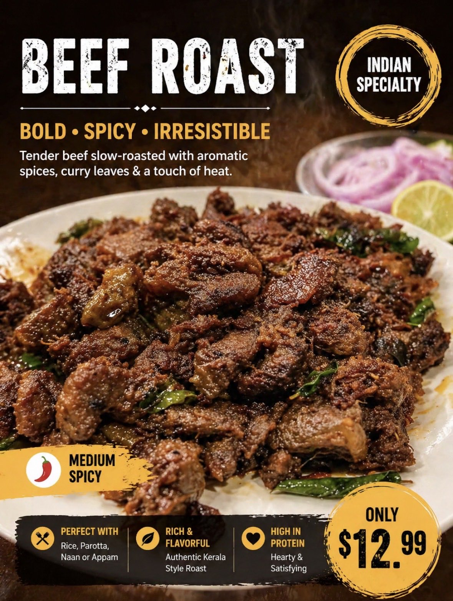
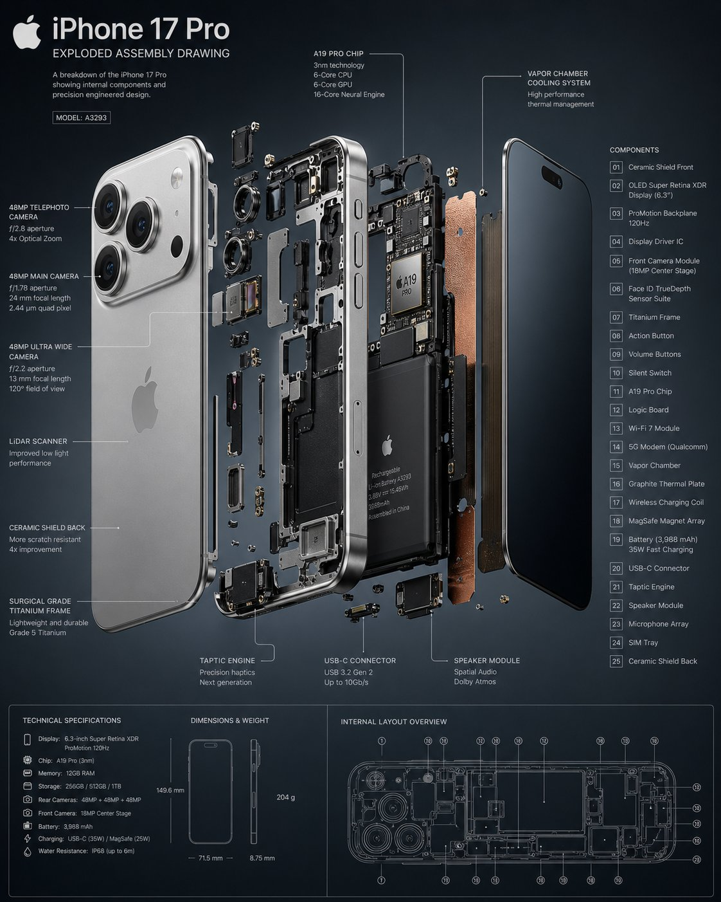
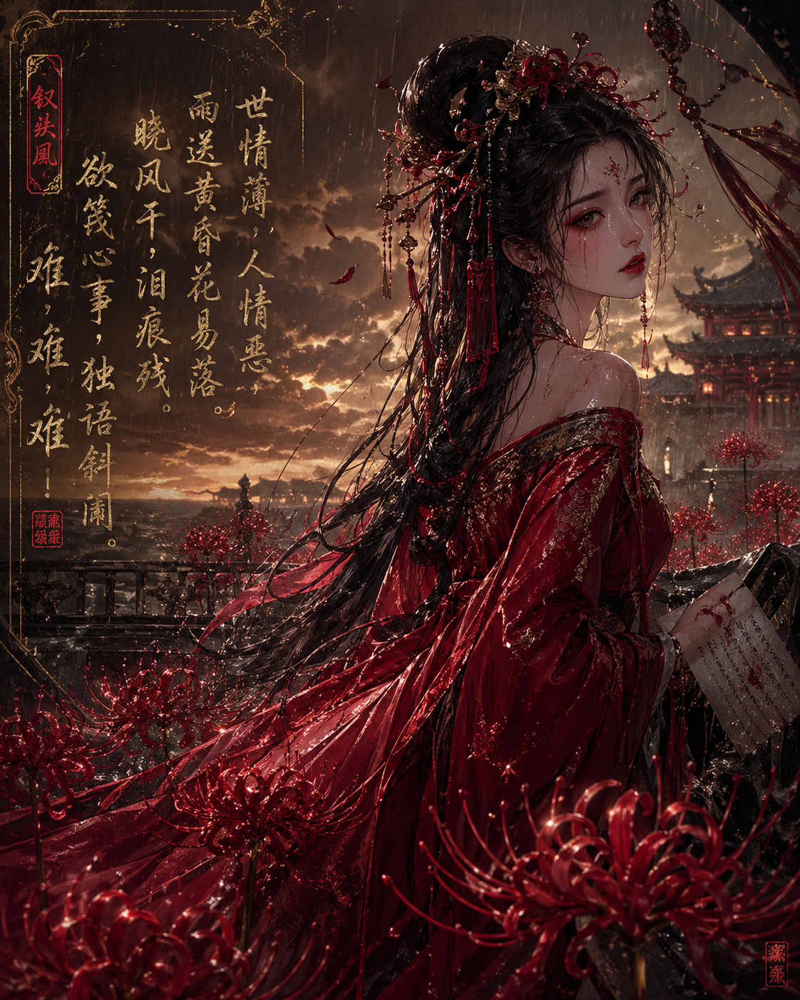
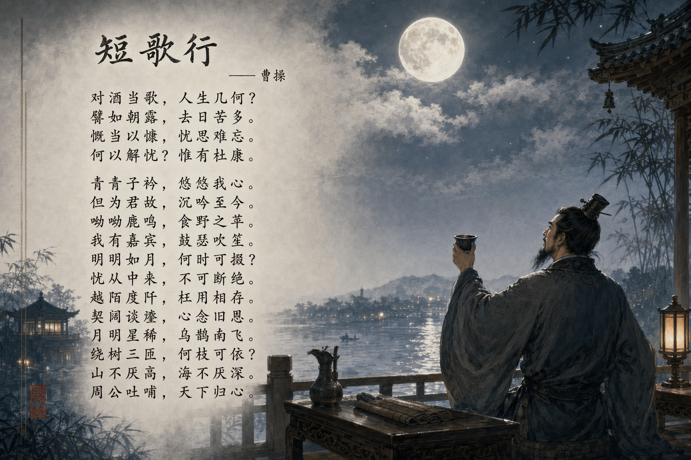
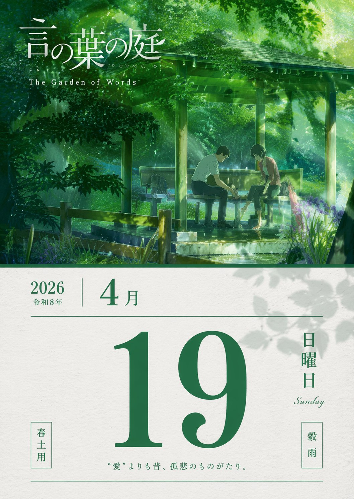
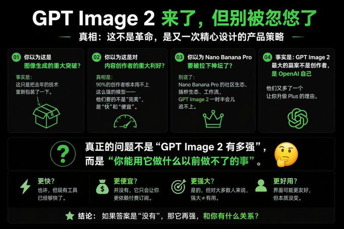

# Other Use Cases

总计：31

## 印度餐厅菜单改造宣传图

- ID: case-368
- Slug: case-368-zh
- 语言: zh
- 来源: [来源链接](https://x.com/Johnson998877/status/2050354965110268123)
- 样例图路径: images/part2/case368.jpg

### 提示词

```text
这是india 料理中的一份真实menu。根据此 重新生成带文本说明的 引人入胜垂涎欲滴的 说明图片 先用English 文本易于识别（手机小屏幕） 这个是beef roast
```

### 样例图



## 手机爆炸拆解图

- ID: case-361
- Slug: case-361-zh
- 语言: zh
- 来源: [来源链接](https://x.com/Ankit_patel211/status/2048834306379075759)
- 样例图路径: images/part2/case361.jpg

### 提示词

```text
Create a 3D Insane detailed exploded assembly drawing of [subject or object]
```

### 样例图



## 彼岸花丛中的红妆女子

- ID: case-340
- Slug: case-340-zh
- 语言: zh
- 来源: [来源链接](https://x.com/xiaofenggan)
- 样例图路径: images/part2/case340.png

### 提示词

```text
异质感oc，绝美红妆女子，位于彼岸花丛中，张力。 唐琬《钗头凤·世情薄》 世情薄，人情恶，雨送黄昏花易落。晓风干，泪痕残。欲笺心事，独语斜阑。难，难，难！
```

### 样例图



## 《短歌行》诗词意境图

- ID: case-337
- Slug: case-337-zh
- 语言: zh
- 来源: [来源链接](https://github.com/freestylefly/awesome-gpt-image-2/blob/main/docs/gallery-part-2.md#case-337)
- 样例图路径: images/part2/case337.png

### 提示词

```text
帮我生成一张《短歌行》的意境图，带整篇《短歌行》文字
```

### 样例图



## AI 眼镜爆炸拆解图

- ID: case-333
- Slug: case-333-zh
- 语言: zh
- 来源: [来源链接](https://github.com/freestylefly/awesome-gpt-image-2/blob/main/docs/gallery-part-2.md#case-333)
- 样例图路径: images/part2/case333.png

### 提示词

```text
生成一张AI眼镜的爆炸视图，包含每个组件的名称以及这款产品的几大核心卖点。
```

### 样例图


## 人教版三年级语文课本内页

- ID: case-303
- Slug: case-303-zh
- 语言: zh
- 来源: [来源链接](https://x.com/MrLarus/status/2044824800909054181)
- 样例图路径: images/part2/case303.jpg

### 提示词

```text
[中文]
生成人教版小学三年级语文课本的一页

[English]
Generate a page from the PEP (People's Education Press) primary school third-grade Chinese textbook
```

### 样例图


## 手写食谱变身杂志级跨页

- ID: case-297
- Slug: case-297-zh
- 语言: zh
- 来源: [来源链接](https://x.com/maxescu/status/2045203839910056014)
- 样例图路径: images/part2/case297.jpg

### 提示词

```text
[中文]
手写食谱 → 专业食谱页面 上传一份凌乱的手写家庭食谱；模型会搜索准确的现代计量/营养信息，然后生成一份精致的杂志风格双页跨页，包含分步平铺图、完美的食材标签和卡路里分解。

[INSERT_RECIPE_LINK]

[English]
Handwritten Recipe → Professional Cookbook Page Upload a messy handwritten family recipe; the model searches for accurate modern measurements/nutrition, then generates a polished, magazine-style double-page spread with step-by-step flat lays, perfect ingredient labels, and calorie breakdowns.

[INSERT_RECIPE_LINK]
```

### 样例图


## 复古传统老黄历二零二六年四月十八

- ID: case-295
- Slug: case-295-zh
- 语言: zh
- 来源: [来源链接](https://x.com/MrLarus/status/2044824800909054181)
- 样例图路径: images/part2/case295.jpg

### 提示词

```text
[中文]
生成一张2026年4月18日的老黄历

[English]
Generate an old almanac for April 18, 2026
```

### 样例图


## 精美潮汕菜馆菜单图

- ID: case-294
- Slug: case-294-zh
- 语言: zh
- 来源: [来源链接](https://x.com/MrLarus/status/2044824800909054181)
- 样例图路径: images/part2/case294.jpg

### 提示词

```text
[中文]
生成一张潮菜馆菜单图

[English]
Generate a Teochew restaurant menu image.
```

### 样例图


## 聚焦人工智能的校园日报

- ID: case-293
- Slug: case-293-zh
- 语言: zh
- 来源: [来源链接](https://x.com/MrLarus/status/2044824800909054181)
- 样例图路径: images/part2/case293.jpg

### 提示词

```text
[中文]
生成一张校园日报，主题AI教育

[English]
Generate a campus daily newspaper, theme AI education
```

### 样例图


## 真实动漫画面快照

- ID: case-285
- Slug: case-285-zh
- 语言: zh
- 来源: [来源链接](https://x.com/Thereallo1026/status/2044241997163311569)
- 样例图路径: images/part2/case285.jpg

### 提示词

```text
[中文]
向我展示这张附带的图像作为一部真实动漫的快照

[English]
Show me the attached image as a snapshot from an actual anime
```

### 样例图


## 赛博朋克科幻曼荼罗

- ID: case-281
- Slug: case-281-zh
- 语言: zh
- 来源: [来源链接](https://x.com/4WEB1/status/2045390207072256179)
- 样例图路径: images/part2/case281.jpg

### 提示词

```text
[中文]
でChatGPTで画像を作成してもらって、今日また作成してもらったらGPT image 2かもしれず、出来が変わったように見えるのでメモ

左の水色と黄色のが先週
右の紫のが今日

右のは透明感とか解像度、緻密さが違うような気がする…

プロンプト
曼荼羅の近未来SF版を描いて

[English]
I had ChatGPT create images, and when I had it create them again today, it might be GPT image 2, and it seems like the quality has changed, so I'm making a note of it

The light blue and yellow one on the left is from last week
The purple one on the right is from today

I feel like the transparency, resolution, and fineness are different for the one on the right.

Prompt
Draw a near-future sci-fi version of a mandala
```

### 样例图


## 威化岛回军前夕李成桂动态

- ID: case-268
- Slug: case-268-zh
- 语言: zh
- 来源: [来源链接](https://x.com/SKA_Neotype/status/2044637900978217334)
- 样例图路径: images/part2/case268.jpg

### 提示词

```text
[中文]
태조 이성계의 X  페이지(위화도 회군을 벌이기 직전- 최영 장군과 서로 디스하는 내용이 담긴 게시글들)을 만들어 주세요.

[English]
Please create an X page of King Taejo Yi Seong-gye (right before carrying out the Wihwa Island Retreat - containing posts where he and General Choi Yeong are dissing each other).
```

### 样例图


## 美妆产品广告图

- ID: case-264
- Slug: case-264-zh
- 语言: zh
- 来源: [来源链接](https://x.com/midori_tatsuta/status/2045378877363798279)
- 样例图路径: images/part2/case264.jpg

### 提示词

```text
[中文]
为Z世代设计的可爱Y2K风格的平价化妆品广告图像。使用鲜艳的配色，包括荧光色。纵横比为3:4。

[English]
Cute Y2K style affordable cosmetics advertising image designed for Gen Z. Using vibrant color schemes, including neon colors. Aspect ratio is 3:4.
```

### 样例图


## 五一劳动节手举牌创意设计集

- ID: case-252
- Slug: case-252-zh
- 语言: zh
- 来源: [来源链接](https://x.com/akokoi1/status/2045693939584516441)
- 样例图路径: images/part2/case252.jpg

### 提示词

```text
[中文]
生成一系列五一劳动节的手举牌设计

[English]
Generate a series of hand-held sign designs for May Day Labor Day
```

### 样例图


## 言叶之庭春雨绿意单日历

- ID: case-251
- Slug: case-251-zh
- 语言: zh
- 来源: [来源链接](https://x.com/akokoi1/status/2045693939584516441)
- 样例图路径: images/part2/case251.jpg

### 提示词

```text
[中文]
生成一张言叶之庭2026年4月19日单日日历

[English]
Generate a single-day calendar for The Garden of Words on April 19, 2026
```

### 样例图



## 黑白线稿勾勒的上海风情

- ID: case-246
- Slug: case-246-zh
- 语言: zh
- 来源: [来源链接](https://x.com/akokoi1/status/2045693939584516441)
- 样例图路径: images/part2/case246.jpg

### 提示词

```text
[中文]
设计一张黑色线稿风格的上海明信片

[English]
Design a Shanghai postcard in black line art style.
```

### 样例图


## 马斯克专属篆刻印章设计

- ID: case-245
- Slug: case-245-zh
- 语言: zh
- 来源: [来源链接](https://x.com/akokoi1/status/2045693939584516441)
- 样例图路径: images/part2/case245.jpg

### 提示词

```text
[中文]
给”埃隆·马斯克”设计一组篆刻印章

[English]
Design a set of seal carving stamps for "Elon Musk"
```

### 样例图


## 关键人物关系图谱

- ID: case-241
- Slug: case-241-zh
- 语言: zh
- 来源: [来源链接](https://x.com/yihui_indie/status/2045179926270361890)
- 样例图路径: images/part2/case241.jpg

### 提示词

```text
[中文]
请你生成 《XXX》 的关键人物关系图。

[English]
Please generate a key character relationship diagram for "XXX".
```

### 样例图


## 大师级真迹复刻

- ID: case-225
- Slug: case-225-zh
- 语言: zh
- 来源: [来源链接](https://x.com/MrLarus/status/2046201836525302032)
- 样例图路径: images/part2/case225.jpg

### 提示词

```text
[中文]
帮我生成xxxx真迹图片

[English]
Help me generate xxxx authentic picture
```

### 样例图


## 雅致图案四款时尚单品设计

- ID: case-216
- Slug: case-216-zh
- 语言: zh
- 来源: [来源链接](https://x.com/aiehon_aya/status/2046348182301683954)
- 样例图路径: images/part2/case216.png

### 提示词

```text
[中文]
使用附图中的图案，由专业设计师打造 4 款时尚单品，采用不同的色彩搭配与排版设计，附带穿搭效果图。以雅致的构图凸显图案的美感。格式为 2:3，希望将图像生成模型从 duct-tape-1 指定为 duct-tape-2、3。

[English]
Use the patterns in the attached image, crafted by professional designers to create 4 fashion items, using different color schemes and layout designs, accompanied by outfit effect pictures. Highlight the beauty of the patterns with an elegant composition. The format is 2:3, hoping to specify the image generation model from duct-tape-1 to duct-tape-2, 3.
```

### 样例图


## 西方艺术演进像素博物馆

- ID: case-215
- Slug: case-215-zh
- 语言: zh
- 来源: [来源链接](https://x.com/GeekCatX/status/2046172416716759171)
- 样例图路径: images/part2/case215.jpg

### 提示词

```text
[中文]
创作一张超高细节等距像素艺术时间线插画（3:4，4K），融合细节密度、象征性与隐喻。用户指定的主题为【Western Art Development】。

首先，围绕Western Art Development进行推理，确定：主题的中英文标题、涵盖的最早与最近历史时期、起始阶段标签与结束阶段标签，以及3-5个关键演进阶段及其各自的象征性元素与色彩方案。

然后构建一个以"Western Art Development"为主题的等距"演进博物馆"，每个展馆区域代表一个演进阶段，空间推进即代表时间演变。采用标准等距视角（2:1），丰富的层次深度与流畅过渡。每个阶段分配3-5个与主题强烈关联的象征元素，并用差异化色彩暗示时间流动。在场景中融入双语像素字体标题：中文"[主题中文]演进史"与英文"EVOLUTION OF Western Art Development"，加上起止阶段的双语副标题及关键时间节点标记。整体风格专业且具视觉张力，适合学术分析与对比可视化，直接出图。

[English]
Create an ultra-high-detail isometric pixel art timeline illustration (3:4, 4K), integrating detail density, symbolism, and metaphor. The user-specified theme is [Western Art Development]. First, reason around Western Art Development to determine: the Chinese and English titles of the theme, the earliest and most recent historical periods covered, the starting stage label and the ending stage label, as well as 3-5 key evolution stages and their respective symbolic elements and color schemes. Then build an isometric "Evolution Museum" themed "Western Art Development", where each exhibition hall area represents an evolution stage, and spatial progression represents time evolution. Adopt a standard isometric perspective (2:1), rich layer depth, and smooth transitions. Allocate 3-5 symbolic elements strongly associated with the theme to each stage, and use differentiated colors to imply the flow of time. Integrate bilingual pixel font titles in the scene: Chinese "[Theme Chinese] Evolution History" and English "EVOLUTION OF Western Art Development", plus bilingual subtitles for the starting and ending stages and key time node markers. The overall style is professional and visually tense, suitable for academic analysis and comparative visualization, direct image output.
```

### 样例图


## 神话三国枪战世界

- ID: case-209
- Slug: case-209-zh
- 语言: zh
- 来源: [来源链接](https://x.com/op7418/status/2046519666047426967)
- 样例图路径: images/part2/case209.jpg

### 提示词

```text
[中文]
模仿《无畏契约》的风格，生成一个三国神话的 FPS 游戏

[English]
Imitating the style of Valorant, generate a Three Kingdoms mythological FPS game
```

### 样例图


## 皇宫深处的御用快递驿站

- ID: case-205
- Slug: case-205-zh
- 语言: zh
- 来源: [来源链接](https://x.com/joshesye/status/2046596222505361866)
- 样例图路径: images/part2/case205.jpg

### 提示词

```text
[中文]
生成一张古代皇宫 × 快递驿站

[English]
Generate an ancient imperial palace × express delivery station
```

### 样例图


## 杠精视角的独特文案创意

- ID: case-203
- Slug: case-203-zh
- 语言: zh
- 来源: [来源链接](https://x.com/joshesye/status/2046596222505361866)
- 样例图路径: images/part2/case203.jpg

### 提示词

```text
[中文]
杠精视角文案 + GPT Image 2

[English]
Troll perspective copywriting + GPT Image 2
```

### 样例图



## 宅男必看绝美二次元少女

- ID: case-202
- Slug: case-202-zh
- 语言: zh
- 来源: [来源链接](https://x.com/joshesye/status/2046596222505361866)
- 样例图路径: images/part2/case202.jpg

### 提示词

```text
[中文]
生成高质量美女（宅男必备）

[English]
Generate high-quality beautiful girl (otaku must-have)
```

### 样例图


## 试卷上的涂鸦巨龙

- ID: case-196
- Slug: case-196-zh
- 语言: zh
- 来源: [来源链接](https://x.com/GeekCatX/status/2046539797578330152)
- 样例图路径: images/part2/case196.jpg

### 提示词

```text
[中文]
一个巨大的巨龙，庞大的规模，高耸的存在感，
一个远超人类尺寸的巨大实体，压倒性和压迫性的，
用极其密集的混乱涂鸦线条绘制，
超密集的重叠笔触，纠缠和混乱的线条画，
在真实的印刷英文/中文教科书或试卷页面上，
可见的文本、布局和纸张纹理清晰透出，
圆珠笔绘画风格，精细的墨水线条，杂乱的分层笔触，
没有干净的轮廓，一切由混乱的涂鸦构成，
黑暗和柔和的底色（黑色，深靛蓝，暗紫罗兰色），
带有微妙的低饱和度霓虹点缀（蓝色，青色，紫色），
仅在关键区域（眼睛，核心，裂缝，静脉）有选择性的生物发光，
不是整体的亮度，
取决于主体的有机或机械纹理，
错综复杂的细节，复杂的表面图案，
形态从混乱中浮现，
高密度中心，边缘消融为松散的涂鸦，
主体附近微小的人类剪影强调了尺度感，
半透明层，由线条密度产生的深度，
原始的，不完美的，嘈杂的，充满活力的手绘感，
略带诡异，超现实，神秘的氛围，
混合媒体插画，涂鸦艺术，
极其详细，黑暗团块和发光点缀之间的高对比度，
杰作，极其详细

[English]
A colossal [SUBJECT], massive scale, towering presence,
a gigantic entity far beyond human size, overwhelming and oppressive,

drawn with extremely dense chaotic scribble lines,
ultra-dense overlapping pen strokes, tangled and chaotic linework,

on top of a real printed English/Chinese textbook or exam paper page,
visible text, layout, and paper texture clearly showing through,

ballpoint pen drawing style, fine ink lines, messy layered strokes,
no clean outlines, everything constructed from chaotic scribbles,

dark and muted base tones (black, deep indigo, dark violet),
with subtle low-saturation neon accents (blue, cyan, purple),

selective bioluminescent glow only in key areas (eyes, core, cracks, veins),
not overall brightness,

organic or mechanical textures depending on subject,
intricate details, complex surface patterns,

form emerging from chaos,
high-density center, edges dissolving into loose scribbles,

sense of scale emphasized by tiny human silhouette near the subject,

semi-transparent layers, depth created by line density,
raw, imperfect, noisy, energetic hand-drawn feeling,

slightly eerie, surreal, mysterious atmosphere,
mixed media illustration, scribble art,

extremely detailed, high contrast between dark mass and glowing accents,
masterpiece, ultra detailed

主体：巨龙
```

### 样例图


## 武则天发微博自拍太魔性了

- ID: case-185
- Slug: case-185-zh
- 语言: zh
- 来源: [来源链接](https://x.com/MrLarus/status/2046585220393324553)
- 样例图路径: images/part2/case185.jpg

### 提示词

```text
[中文]
武则天自拍登记发微博

[English]
Wu Zetian taking a selfie, registering and posting on Weibo.
```

### 样例图


## 杜甫朋友圈吐槽茅屋被掀翻

- ID: case-184
- Slug: case-184-zh
- 语言: zh
- 来源: [来源链接](https://x.com/MrLarus/status/2046585220393324553)
- 样例图路径: images/part2/case184.jpg

### 提示词

```text
[中文]
杜甫发朋友圈吐槽房顶被风刮没了

[English]
Du Fu posting on WeChat Moments complaining about his roof being blown away by the wind
```

### 样例图


## 诗仙李白月下直播起舞

- ID: case-163
- Slug: case-163-zh
- 语言: zh
- 来源: [来源链接](https://x.com/MrLarus/status/2046585220393324553)
- 样例图路径: images/part2/case163.jpg

### 提示词

```text
[中文]
李白在抖音直播月下起舞

[English]
Li Bai dancing under the moon during a Douyin livestream
```

### 样例图


## 老干妈风味

- ID: case-4
- Slug: case-4-zh
- 语言: zh
- 来源: [来源链接](https://github.com/freestylefly/awesome-gpt-image-2/blob/main/docs/gallery-part-1.md#case-4)
- 样例图路径: images/part2/case4.jpg

### 提示词

```text
特朗普在抖音直播间卖老干妈，手里举着「老干妈风味」新品，背景还是 SpaceX 那种科技感，左下角弹幕飘着「特斯拉车主：求上链接」。
```

### 样例图


