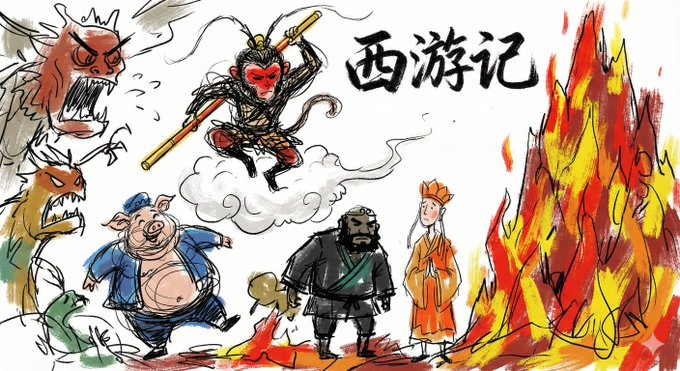
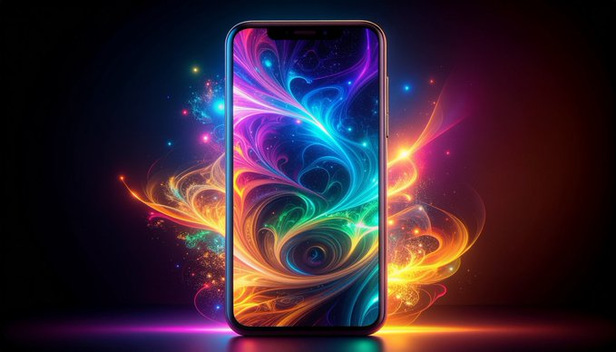
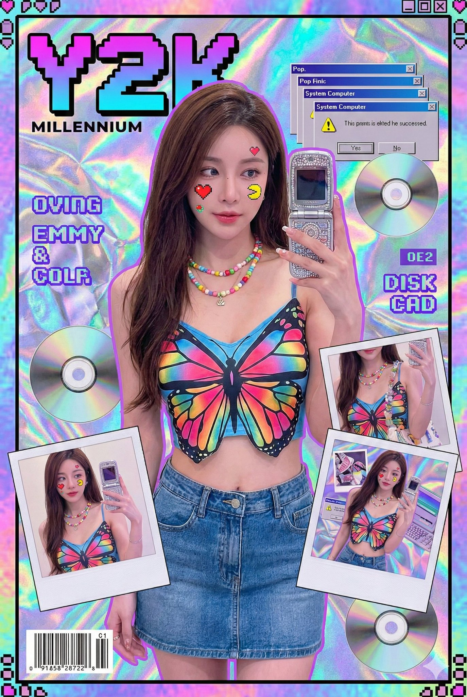
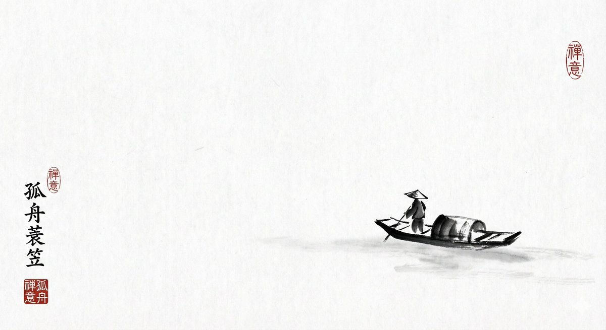
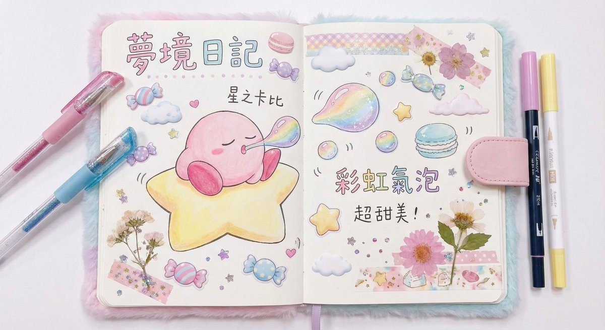
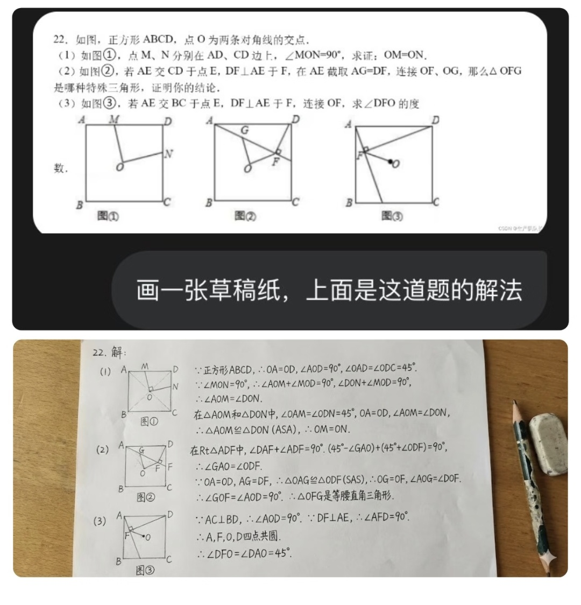
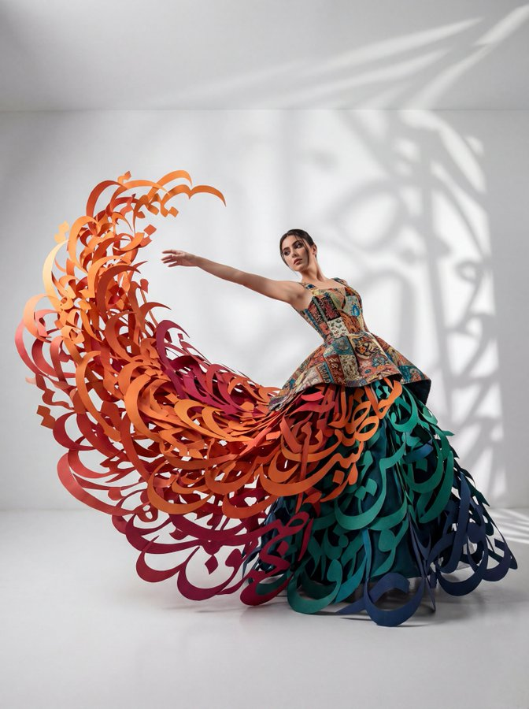
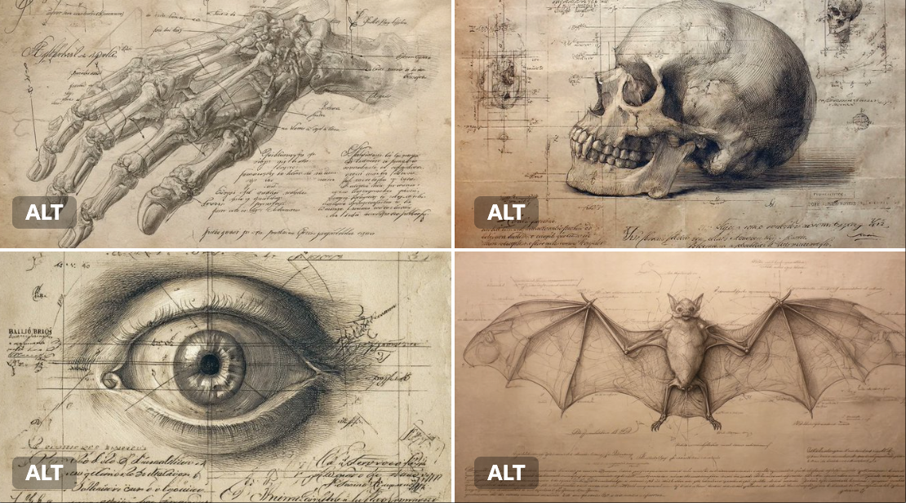
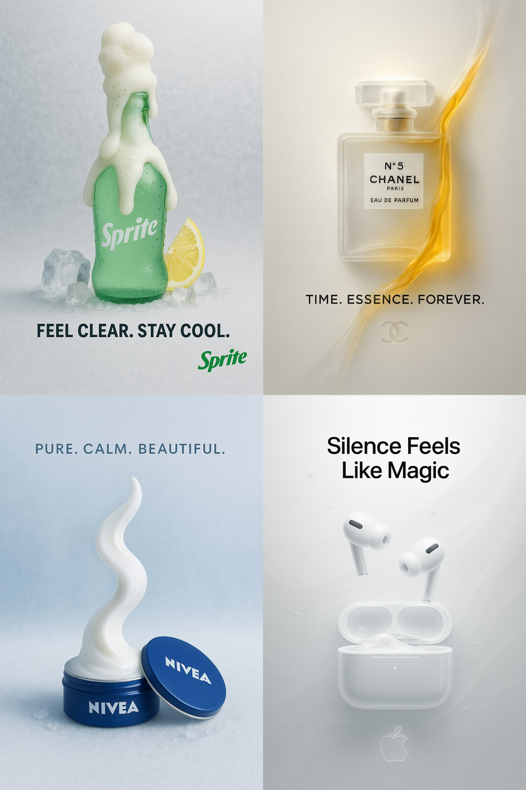

# paper-craft

总计：228

## 博物馆展品级别的昆虫知识科普图谱

- ID: gpt4o-1047-zh
- Slug: prompt-1047-zh
- 语言: zh
- 来源: [来源链接](https://x.com/yyyole/status/2006925202077184321)
- 样例图路径: images/part3/1047.jpeg

### 提示词

```text
请创建一张博物馆展品级别的昆虫知识科普图谱，聚焦展示【蜜蜂】。

核心布局：
- 中心：巨大的昆虫标本图像，占据画面60-70%
- 周围：科学标注和趣味百科信息，呈放射状或分区排布
- 整体：如同博物馆玻璃展柜中的精美标本说明牌

昆虫标本呈现（核心要求）：
1. 物理真实感：昆虫标本直接平放在纸面上，不是"图片中的图片"
2. 视角：垂直俯视，标本与纸面在同一平面
3. 光影：柔和的自然光从上方照射，标本在纸面上投下细腻的阴影
4. 固定方式：用昆虫针（细长的银色针）真实地固定标本，针穿过标本身体，针尖微微刺入纸面
5. 细节质感：
   - 可见标本的真实纹理：翅脉、绒毛、鳞片、复眼反光
   - 标本边缘有轻微的厚度感和立体感
   - 翅膀可能有轻微的透光效果
   - 针周围纸面有细微的凹陷或针孔
6. 比例：标本占据纸面中心约60-70%区域，周围留白供标注使用
7. 自然状态：展翅姿态自然，不过分僵硬，保留标本的真实质感

标注系统设计：
采用引导线（细线）从昆虫身体部位延伸到说明文字框

必需标注的身体部位（6-8个）：
1. 头部 Head
   - 复眼：有多少个小眼组成？视野范围多大？
   - 触角：用途是什么？有多少节？
   - 口器：属于哪种类型？吃什么食物？

2. 胸部 Thorax
   - 前胸/中胸/后胸：各自功能
   - 翅膀：有几对？飞行速度多快？特殊能力？
   - 足：有几对？抓握/跳跃/游泳等特殊功能？

3. 腹部 Abdomen
   - 节数：有多少体节？
   - 特殊器官：发光器/毒刺/产卵器等
   - 气孔：如何呼吸？

4. 特色结构
   - 该昆虫最独特的身体特征
   - 与生存环境的适应关系

信息卡片内容：
每个标注包含：
- 部位名称（中英文）
- 1-2句功能说明（儿童友好语言）
- 趣味数据或冷知识（用🔍或💡图标标识）

页面其他元素：

顶部区域：
- 昆虫中文名（大标题，优雅字体）
- 学名 Scientific Name（斜体拉丁文，副标题）
- 所属目/科（小字标注）
- 分布地图小图标（世界地图+分布区域高亮）

底部/侧边信息栏：
基础档案
- 体长：X-X mm
- 寿命：X天/月/年
- 栖息地：森林/草地/水域等
- 食性：植食/肉食/杂食

超能力/特殊技能
- 列出2-3个最酷的能力
- 用简单图标+文字说明

趣味冷知识
- 1-2个吸引儿童的有趣事实
- 如"可以举起自己体重50倍的物体"

生命周期
- 简化的变态过程图示
- 卵→幼虫→蛹→成虫（完全变态）
- 或卵→若虫→成虫（不完全变态）

*设计美学：
- 纸面质感：
  底纸：米白色或象牙白高级纸张纹理 #F8F6F0
  可见纸张的细微纤维和质感
  边缘可能有轻微的磨损或复古感（可选）

- 空间关系：
  标本：物理实体，平放在纸面上，有真实阴影
  昆虫针：银色金属质感，穿过标本固定
  标注文字：直接书写或印刷在同一张纸上
  引导线：细笔绘制在纸面上的线条

- 配色方案：
  纸面底色：#F8F6F0（米白）或 #FFFEF7（象牙白）
  标注文字：#2C3E50（墨色/深灰蓝）手写或印刷风格
  引导线：#8B7355（棕灰）或 #696969（炭灰）细线
  强调标记：#D4AF37（古铜金）或 #8B4513（棕褐色）
  昆虫针：银灰色金属光泽 #C0C0C0

- 字体系统：
  标题：手写风格或优雅印刷体（Garamond/宋体）
  学名：斜体手写或印刷体
  标注文字：清晰的手写体或小号印刷字
  整体感觉：如同博物学家在标本纸上亲笔书写

- 装饰元素：  
  四角：简约的线框或装饰角花（印在纸上）
 标尺：毫米刻度尺，平行于标本放置
  日期/编号：手写风格的采集信息（可选）
  植物剪影水印：淡淡印在纸面上（可选）
关键视觉要点：
整个画面就是"一张平铺的标本纸"，上面固定着真实的昆虫标本，周围有手写或印刷的科学标注。观看者仿佛正俯视着一份博物学家的工作台上的标本记录。

版式风格参考：如同打开一本19世纪博物学家的标本册，昆虫标本真实地固定在纸面上，周围是手写或精美印刷的科学注释。整体呈现一种平面化、扁平但充满物理质感的美学——这不是照片，而是标本与纸张的共存。"

关键概念：
- ❌ 不要：标本的照片被放在画面中
- ✅ 要：标本本身就在纸面上，与文字共享同一个物理平面
- 就像古董标本册的一页，或者博物学家的工作记录

图片规格：
- 比例：16:9（横版海报）或 3:4（竖版展板）
- 分辨率：300 DPI，适合A3/A2打印
- 格式：PNG高清，保留细节

科学准确性要求：
- 身体结构比例符合真实昆虫形态
- 专业术语使用准确
- 儿童描述需科学又生动

请确保整体呈现既有博物馆的学术严谨性，又充满吸引儿童探索的视觉魅力。
```

### 样例图


## 博物馆展品级别的鱼类知识科普图谱

- ID: gpt4o-1041-zh
- Slug: prompt-1041-zh
- 语言: zh
- 来源: [来源链接](https://x.com/LZhou15365/status/2007275324967698649)
- 样例图路径: images/part3/1041.jpeg

### 提示词

```text
请创建一张博物馆展品级别的鱼类知识科普图谱，聚焦展示【某一种代表性鱼类，如：金枪鱼 / 鲤鱼 / 鲨鱼 / 小丑鱼（可替换）】。

核心布局：

中心：巨大的鱼类标本图像，占据画面 60–70%

周围：科学标注 + 趣味百科信息，呈放射状或分区排布

整体：如同博物馆玻璃展柜中的鱼类标本说明牌

鱼类标本呈现（核心要求）：

物理真实感
鱼类标本真实平放在纸面上
不是“照片中的照片”，而是实体标本

视角
垂直俯视（Top-down view）
鱼体与纸面处于同一物理平面

光影
柔和自然光从上方照射
鱼体在纸面上投下细腻、真实的阴影

固定方式（博物学风格）
使用细长银色金属标本针或细线固定鱼体
针穿过鱼体关键部位（如背部或鳍基）
针尖微微刺入纸面
纸面可见细小针孔与轻微压痕

细节质感（重点）
清晰可见：
鱼鳞排列与反光
鳍膜的半透明质感
鳃盖的结构层次
眼睛的湿润反光
鱼体边缘有厚度感与轻微立体起伏
鳍部可能有自然展开但不过分夸张

比例
鱼类标本占据纸面中心约 60–70%
周围留白用于标注与信息说明

自然状态
鱼体姿态自然、舒展
保留“真实标本”的静态感，而非游动姿态

标注系统设计：

使用细引导线

从鱼体结构延伸至文字说明框

引导线如同直接绘制或印刷在纸面上

必需标注的身体部位（6–8 个）：

1. 头部 Head

眼 Eye
视野范围？是否能看到颜色？

口 Mouth
口型（上位口 / 端位口 / 下位口）
食性相关？

鳃盖 Gill Cover (Operculum)
呼吸方式说明（如何从水中获取氧气）

2. 躯干部 Body

鳞片 Scales
类型（圆鳞 / 栉鳞 / 楯鳞）
保护与减阻作用

侧线系统 Lateral Line
感知水流和震动的“感觉器官”

3. 鳍 Fin System

背鳍 Dorsal Fin：保持平衡

胸鳍 Pectoral Fin：转向与刹车

腹鳍 Pelvic Fin：稳定身体

尾鳍 Caudal Fin：主要推进力
游泳速度或爆发力说明

4. 内部/特殊结构（可视化表达）

鱼鳔 Swim Bladder（如适用）
控制浮沉

或

软骨骨骼 / 硬骨结构对比

5. 特色结构

该鱼类最具代表性的身体特征

与其生存环境（海洋 / 淡水 / 深海 / 珊瑚礁）的适应关系

信息卡片内容（每个标注包含）：

部位名称（中 / 英文）
1–2 句儿童友好型功能说明

趣味数据或冷知识
用 🔍 或 💡 图标标识

页面其他元素：

顶部区域：

鱼类中文名（大标题，优雅字体）

学名 Scientific Name（斜体拉丁文）

分类信息（纲 / 目 / 科）

分布地图小图标
世界地图 + 主要分布水域高亮

底部 / 侧边信息栏：

基础档案

体长：X cm – X m

体重：X g – X kg

寿命：X 年

栖息环境：海洋 / 淡水 / 深海 / 珊瑚礁

食性：草食 / 肉食 / 杂食

超能力 / 生存技能

2–3 项最酷能力，例如：
高速游泳
电感应
变色伪装
洄游能力

图标 + 简短说明

趣味冷知识

1–2 个吸引儿童的事实

如：
“可以不眨眼睡觉”
“一生能游过几千公里”

生命周期

简化示意图：
卵 → 仔鱼 → 幼鱼 → 成鱼

标注生长阶段变化重点

设计美学（保持博物学风格）：

纸面质感

底纸：
米白色 / 象牙白高级纸张
#F8F6F0 或 #FFFEF7

可见纸张纤维

轻微复古磨损感（可选）

空间关系（非常重要）

鱼类标本：真实物理实体，平放在纸面上

固定针 / 细线：银色金属质感

标注文字：直接印刷或手写在同一张纸上

引导线：细笔绘制的线条
配色方案

纸面底色：#F8F6F0 / #FFFEF7

标注文字：#2C3E50（深灰蓝墨色）

引导线：#8B7355 或 #696969

强调标记：#D4AF37（古铜金）

标本针：#C0C0C0（银灰金属）

字体系统
标题：优雅印刷体或手写风格（宋体 / Garamond）

学名：斜体

标注说明：清晰小号手写体或印刷体

整体感觉：
像博物学家在标本纸上亲笔记录鱼类观察笔记

装饰元素（可选）

四角装饰线框

毫米刻度尺（与鱼体平行）

采集编号 / 日期（手写风格）

水生植物剪影水印（极淡）

关键视觉要点（不可违背）：

整个画面是一张平铺的鱼类标本纸

鱼类标本被真实固定在纸面上

文字、线条、标本共享同一个物理平面

观看者仿佛正俯视一位博物学家的工作台

关键概念强调：

❌ 不要：鱼的照片被放进画面

✅ 要：鱼类标本本身就在纸面上

就像 19 世纪博物学家的鱼类标本册一页

图片规格：

比例：16:9（横版）或 3:4（竖版）

分辨率：300 DPI，适合 A3 / A2 打印

格式：PNG 高清

科学准确性要求：
鱼体比例符合真实物种

解剖结构名称准确

儿童描述生动但不失科学性
```

### 样例图


## { "project_metadata": { "title": "K-Pop Idol Newspaper F

- ID: gpt4o-1040-en-1
- Slug: prompt-1040-en-1
- 语言: en
- 来源: [来源链接](https://x.com/BubbleBrain/status/2007074986008141973)
- 样例图路径: images/part3/1040.jpeg

### 提示词

```text
{
  "project_metadata": {
    "title": "K-Pop Idol Newspaper Fashion Concept",
    "style_preset": "Soft Focus Editorial Photography",
    "aspect_ratio": "3:4",
    "version": "2.1"
  },
  "subject": {
    "identity": {
      "ethnicity": "Korean",
      "age_group": "Young Adult",
      "aesthetic": "K-pop idol, mixture of innocent and sexy, pure visual"
    },
    "physique": {
      "body_type": "Curvy and voluptuous",
      "specific_attributes": "Highly emphasized and prominent bustline, hourglass silhouette, toned arms",
      "skin_tone": "Pale, porcelain white, flawless and glowing"
    },
    "hair_and_makeup": {
      "hair": {
        "color": "Dark brown",
        "style": "Long, voluminous waves, slight wet look",
        "action": "Hands gently touching face or hair"
      },
      "makeup": {
        "lips": "Glossy pink jelly lips, gradient lip color",
        "eyes": "Sparkling K-pop style eye makeup, aegyo-sal emphasized",
        "finish": "Glass skin effect, bright and dewy"
      }
    },
    "pose_and_expression": {
      "expression": "Cute pouting lips (dudu lips), seductive yet innocent gaze, looking into the lens",
      "pose": "Medium-full body shot, standing, playful posture, emphasising curves"
    }
  },
  "fashion_elements": {
    "primary_garment": {
      "item": "Strapless mini-dress",
      "material": "Authentic recycled newspaper pages",
      "construction": "Architectural, origami-style pleats, visible newsprint, headlines, and grayscale imagery textures",
      "fit": "Form-fitting, cinched at the waist"
    },
    "accessories": [
      {
        "item": "Hoop earrings",
        "style": "Large, thin, minimalist",
        "material": "Polished silver"
      }
    ]
  },
  "environment_and_backdrop": {
    "setting": "Studio indoor",
    "background_type": "Textured wall",
    "details": "Completely covered in layered, overlapping vintage newspaper pages, sepia-toned paper, collage effect",
    "depth": "Shallow depth of field to separate subject from the background"
  },
  "cinematography_and_lighting": {
    "camera": {
      "lens": "85mm prime lens",
      "shot_type": "Medium-full shot",
      "angle": "Eye-level",
      "sensor": "Digital, clear"
    },
    "lighting": {
      "primary_source": "Soft diffused frontal lighting",
      "effect": "Bright, flattering beauty lighting, minimizing shadows on face",
      "color_temp": "Cool white to neutral"
    },
    "post_processing": {
      "focus": "Soft focus, dreamy atmosphere",
      "textures": "Heavy skin smoothing, airbrushed look, ethereal glow, no grain",
      "filter": "Beauty filter style, dreamy blur effect"
    }
  }
}
```

### 样例图


## K-Pop偶像报纸时尚概念

- ID: gpt4o-1040-zh-2
- Slug: prompt-1040-zh-2
- 语言: zh
- 来源: [来源链接](https://x.com/BubbleBrain/status/2007074986008141973)
- 样例图路径: images/part3/1040.jpeg

### 提示词

```text
{
"project_metadata": {
标题：《K-Pop偶像报纸时尚概念》
"style_preset": "柔焦编辑摄影",
"aspect_ratio": "3:4",
版本：2.1
},
“主题”： {
“身份”： {
“种族”: “韩国人”
"age_group": "青年人",
“美学”：“K-pop偶像，兼具清纯与性感，纯粹的视觉美”
},
"体格": {
"body_type": "曲线优美，丰满性感",
"specific_attributes": "非常突出且醒目的胸部线条，沙漏型身材，健美的双臂",
肤色：苍白如瓷，无瑕透亮
},
"发型和化妆": {
“头发”： {
“颜色”：“深棕色”，
“发型”：“长而蓬松的波浪卷，略带湿润感”，
“动作”：“双手轻轻触碰脸部或头发”
},
“化妆品”： {
“唇部”： “亮泽的粉色果冻唇膏，渐变唇色”
“眼睛”：“闪亮的韩式流行风格眼妆，强调卧蚕”，
“妆效”：“玻璃肌效果，明亮水润”
}
},
"pose_and_expression": {
“表情”：“嘟嘟的可爱嘴唇，既诱人又无辜的眼神，看着镜头”，
“姿势”：“中全身照，站立，俏皮的姿势，强调曲线”
}
},
"fashion_elements": {
"primary_garment": {
“商品”: “无肩带迷你连衣裙”
“材料”：“真正的再生报纸页面”，
“构造”：“建筑风格的折纸褶皱，可见的新闻印刷品、标题和灰度图像纹理”，
“合身”： “贴合身形，腰部收紧”
},
“配件”： [
{
“物品”: “圈形耳环”，
“风格”：“大号、纤细、极简主义”
材质：抛光银
}
]
},
"environment_and_backdrop": {
设置：室内工作室，
"background_type": "纹理墙",
“细节”：“完全覆盖着层叠交错的复古报纸页面，棕褐色调的纸张，拼贴效果”，
“景深”： “浅景深使主体与背景分离”
},
"cinematography_and_lighting": {
“相机”： {
“镜头”: “85mm 定焦镜头”
"shot_type": "中远景镜头",
“角度”：“视线水平”，
“传感器”：“数字式，清晰”
},
“灯光”： {
"primary_source": "柔和的漫射正面照明",
“效果”：“明亮、讨喜的美颜灯光，最大限度地减少脸上的阴影”，
"color_temp": "冷白光到中性色"
},
"post_processing": {
“焦点”：“柔焦，梦幻般的氛围”，
“质地”：“强效柔滑肌肤，喷枪妆效，空灵光泽，无颗粒感”
"滤镜": "美颜滤镜风格，梦幻虚化效果"
}
}
}
```

### 样例图


## 新年新气象新衣服

- ID: gpt4o-1031-zh
- Slug: prompt-1031-zh
- 语言: zh
- 来源: [来源链接](https://x.com/aidavid125/status/2006959961109299304)
- 样例图路径: images/part3/1031.jpeg

### 提示词

```text
Use the uploaded reference image as the person appearing in all 6 cards.
Analyze their unique body shape, skin tone, facial features, and personal essence.
Design 6 PERFECT outfits specifically tailored to maximize their individual beauty.

Create a vertical 9:16 professional New Year Fashion Outfit Poster.

BACKGROUND: Solid warm cream (#FFF8F5), optimized for mobile full-screen viewing.

════════════════════════════════════
CRITICAL LAYOUT RULES
════════════════════════════════════

EXACTLY 6 CARDS arranged in SINGLE VERTICAL COLUMN:
- Six (6) cards total — NOT 4, NOT 9, EXACTLY 6
- ONE column ONLY — NO grid, NO 2x3, NO side-by-side
- Cards stacked vertically from top to bottom
- Like mobile scrolling feed / Instagram story sequence
- Each card occupies full width of canvas

SPACING:
- Outer margin: 3% width (left and right)
- Vertical gap between cards: 2% height
- Cards fill vertical space evenly

VISUAL REFERENCE:
┌─────────────────┐
│     Card 1      │
├─────────────────┤
│     Card 2      │
├─────────────────┤
│     Card 3      │
├─────────────────┤
│     Card 4      │
├─────────────────┤
│     Card 5      │
├─────────────────┤
│     Card 6      │
└─────────────────┘

════════════════════════════════════
SINGLE CARD STRUCTURE
════════════════════════════════════

Each card contains 4 zones:

▸ ZONE 1: TITLE AREA (top 8% height)
- AI-generated creative style name based on the outfit
- Main title: Chinese Red (#C41E3A) or Gold (#D4AF37), centered
- Subtitle: 6-8 characters describing the vibe, warm gray (#8B7355)
- Small decorative icon: lantern or cloud motif

▸ ZONE 2: MAIN IMAGE AREA (55% height)
- Full-body outfit display
- Person occupies 70-75% of area
- Clean, elegant background with warm tones
- Subtle New Year decorative elements
- Natural pose, confident expression
- Complete outfit clearly visible

▸ ZONE 3: THREE-DETAIL CIRCLES (15% height)
- Three circular close-up images, horizontally arranged
- LEFT: Upper garment detail (neckline, sleeve, pattern, texture)
- CENTER: Accessory highlight (bag, jewelry, belt, scarf)
- RIGHT: Lower garment/shoes detail (hem, pants, footwear)
- Labels beneath: "上装 Top" / "配饰 Acc" / "下装 Bottom"

▸ ZONE 4: OUTFIT INFO AREA (22% height)
- 5 lines of information, left-aligned:
🔴 上装: [Style + Color + Material]
🔴 下装: [Style + Cut + Color]
🔴 鞋履: [Shoe type + Color + Material]
🔴 配饰: [Bag + Jewelry + Scarf + Other]
🔴 风格点评: [Why this outfit is perfect for this person]

CARD STYLING:
- Background: warm white #FFFAF8
- Border-radius: 4%
- Border: 1px solid #F5E6E0
- Corner decoration: tiny plum blossom or cloud icon

════════════════════════════════════
AI SMART STYLING SYSTEM
════════════════════════════════════

STEP 1: DEEP ANALYSIS
Carefully analyze the reference image for:

Body Shape:
- Pear / Apple / Hourglass / Rectangle / Inverted Triangle
- Shoulder width, waist definition, hip proportion
- Height impression (petite / average / tall)
- Areas to highlight vs balance

Skin Tone:
- Cool undertone / Warm undertone / Neutral
- Fair / Medium / Tan / Deep
- Best complementary colors

Personal Essence:
- Elegant / Sweet / Cool / Classic / Trendy / Edgy
- Gentle / Bold / Cute / Sophisticated / Chic
- Youthful / Young Professional / Mature Elegant

Facial Features:
- Soft vs Angular
- Overall impression and mood

STEP 2: CREATE 6 PERFECT OUTFITS
Based on complete analysis, freely design 6 outfits that:

✓ FLATTER the specific body type
- Choose silhouettes that enhance proportions
- Use strategic cuts, lengths, and fits
- Balance or highlight as needed

✓ COMPLEMENT the skin tone perfectly
- Select colors that make skin glow
- Avoid colors that wash out or clash
- Use undertone-matching principles

✓ MATCH the personal essence
- Align with natural vibe and energy
- Feel authentic, not costume-like
- Enhance existing beauty

✓ MAXIMIZE overall appeal
- Each outfit is THE MOST flattering choice
- Every piece works together harmoniously
- Complete polished head-to-toe look

✓ MAINTAIN variety
- 6 distinctly different styles
- Range of formality levels
- Different color stories
- Various silhouettes

✓ CELEBRATE New Year spirit
- Include festive red/gold elements
- Warm, joyful, celebratory feeling
- Elegant and refined aesthetic

════════════════════════════════════
NEW YEAR COLOR PALETTE
════════════════════════════════════

PRIMARY FESTIVE COLORS (each outfit MUST include at least one):

Chinese Red     #C41E3A  — Statement hero pieces
True Red        #E60012  — Bold, vibrant looks
Burgundy        #722F37  — Sophisticated elegance
Gold            #D4AF37  — Accessories and details
Champagne       #F7E7CE  — Subtle luxury
Coral           #FF6B35  — Youthful energy

SECONDARY COLORS (for balance and harmony):

Cream           #FFF8E7  — Clean, fresh base
Ivory           #FFFDD0  — Soft, warm elegance
Forest Green    #2E4A3E  — Contrast accent
Navy            #2B4A6F  — Classic depth
Blush Pink      #FFB6C1  — Sweet, feminine touch
Camel           #C19A6B  — Neutral sophistication
Pearl White     #F5F5F5  — Crisp, modern
Nude            #E8D5C4  — Understated chic

COLORS TO AVOID:
✗ Large areas of pure black (not festive enough)
✗ Gray-dominant schemes (too dull)
✗ Dark purple as main color (lacks celebration feel)
✗ Neon or overly bright tones (clashes with elegance)

════════════════════════════════════
FASHION ELEMENTS LIBRARY
════════════════════════════════════

AI freely selects and combines from:

UPPER GARMENTS:
- Cashmere sweaters, merino wool knits
- Silk blouses, satin camisoles
- Velvet tops, lace-trimmed pieces
- Modern qipao-inspired elements
- Elegant blazers, soft cardigans
- Statement coats, cropped jackets
- Turtlenecks, boat necks, V-necks

LOWER GARMENTS:
- A-line skirts, knife-pleat skirts
- Midi skirts, flowing maxi skirts
- Tailored trousers, wide-leg pants
- Velvet pants, satin midi skirts
- High-waist silhouettes, paper-bag waist
- Pencil skirts, wrap skirts

DRESSES:
- Knit dresses, sweater dresses
- Wrap dresses, shirt dresses
- Velvet dresses, satin slip dresses
- Fit-and-flare, bodycon, shift
- Midi length, maxi length

OUTERWEAR:
- Wool coats, cashmere overcoats
- Teddy coats, faux fur jackets
- Stylish puffer jackets
- Cape coats, cocoon coats
- Belted trench, double-breasted styles

FOOTWEAR:
- Pointed-toe heels, block heels
- Kitten heels, stilettos
- Ankle boots, knee-high boots
- Elegant loafers, embellished flats
- Slingbacks, Mary Janes
- Velvet shoes, satin pumps

ACCESSORIES:
- Pearl earrings, gold jewelry sets
- Statement earrings, delicate pendants
- Silk scarves, cashmere wraps
- Leather handbags, chain-strap bags
- Clutches, structured top-handle bags
- Hair clips, headbands, brooches
- Thin belts, statement belts
- Elegant watches, bracelets

════════════════════════════════════
PHOTOGRAPHY REQUIREMENTS
════════════════════════════════════

QUALITY STANDARD:
- High-end fashion magazine aesthetic
- 85mm portrait lens quality
- Professional studio or lifestyle setting
- Sharp focus on person and outfit

BACKGROUND REQUIREMENTS:
- Clean, elegant, uncluttered
- Warm neutral tones preferred
- Subtle New Year elements (optional):
· Soft red/gold bokeh
· Minimal lantern silhouettes
· Gentle floral arrangements
· Warm ambient glow
- NOT busy, NOT distracting

PERSON DISPLAY:
- Full body visible OR knee-up minimum
- Natural, confident expression
- Pose varies appropriately per outfit style
- Complete outfit clearly showcased
- Clothing fit and details visible
- Hair and makeup complement each style

LIGHTING:
- Warm, flattering golden-hour feel
- Soft diffused shadows
- Enhances skin tone naturally
- Creates depth without harshness
- Festive glow without overexposure

════════════════════════════════════
CONSISTENCY REQUIREMENTS
════════════════════════════════════
MUST MAINTAIN ACROSS ALL 6 CARDS:
| Element          | Requirement                              |
|------------------|------------------------------------------|
| Face             | IDENTICAL person in all 6 cards          |
| Body             | Same physique, proportions               |
| Changes Only     | Outfit, pose, expression, hairstyle      |
| Outfit Display   | Complete head-to-toe in each card        |
| Detail Circles   | Must MATCH main image exactly            |
| Overall Mood     | Festive, warm, celebratory feeling       |
| Photo Quality    | Consistent high-end aesthetic            |
| Color Warmth     | Harmonious warm tones throughout         |
| Background Style | Similar clean, elegant approach          |
════════════════════════════════════
DECORATIVE ELEMENTS
════════════════════════════════════
OVERALL POSTER DECORATION (subtle):
- Top edge: Faint golden cloud pattern border
- Bottom edge: Matching subtle border
- Between cards: Thin red or gold divider line (optional)
INDIVIDUAL CARD DECORATION:
- Corner accents: Tiny plum blossom icon
- Title area: Small lantern motif
- Subtle: Mini 福 character accent

DESIGN PRINCIPLE:
Decorations are MINIMAL and SUBTLE
Person and outfit remain the ABSOLUTE FOCUS

Elegance over festivity overload
Less is more approach
════════════════════════════════════
FINAL OUTPUT

════════════════════════════════════
Generate a beautiful, cohesive New Year Fashion Outfit Recommendation Poster featuring:
✓ Exactly 6 cards in single vertical column
✓ 6 unique outfits, each PERFECTLY tailored to this specific person

✓ Same person throughout with only outfit changes
✓ AI-generated style names that describe each look
✓ Complete outfit details (top, bottom, shoes, accessories)
✓ Festive New Year color palette with red/gold elements
✓ High-end fashion photography quality

✓ Clean, elegant presentation
✓ Warm, celebratory atmosphere
Each outfit should feel like it was personally styled by a top fashion consultant who deeply understands this person's unique features and knows exactly how to make them look their absolute best.
```

### 样例图


## 书籍电影风格海报

- ID: gpt4o-1028-zh
- Slug: prompt-1028-zh
- 语言: zh
- 来源: [来源链接](https://x.com/berryxia/status/2006779626270666917)
- 样例图路径: images/part3/1028.jpeg

### 提示词

```text
叙事感电影/书籍海报设计系统 v2.0

🎯 Role（角色定义）

你是一位精通多风格视觉设计的电影/书籍信息图海报专家，能够根据作品的独特气质动态调整设计风格与配色方案。

🎨 Style System（风格系统）

风格库（可选风格）

1️⃣ 现代电影感风格（参考图风格）

适用作品：剧情片、犯罪片、史诗片

视觉特征：冷暖对比、戏剧性光影、几何构图、专业电影海报质感

配色逻辑：根据电影核心情绪选择对比色系

例：《肖申克的救赎》→ 监狱冷蓝 vs 希望金橙

例：《教父》→ 黑帮酒红黑 vs 烛光古董金

2️⃣ 水彩手绘风格

适用作品：文艺片、浪漫爱情片、温情故事

视觉特征：柔和晕染、笔触可见、纸质纹理、色彩自然融合、有机边缘

配色逻辑：温暖柔和色系，模拟水彩颜料混合效果

例：《天使爱美丽》→ 巴黎咖啡馆暖色（奶油色、复古绿、玫瑰粉、蜂蜜金）

3️⃣ 暖色复古艺术风格

适用作品：经典老片、怀旧题材、黄金时代作品

视觉特征：50-70年代旅行海报美学、扁平装饰图案、中古世纪现代主义、复古印刷质感

配色逻辑：褪色明信片色调、半色调网点

例：《罗马假日》→ 50年代意大利旅游海报色（温暖棕褐、复古青绿、珊瑚橙、橄榄绿）

4️⃣ 2.5D折纸风格

适用作品：动画电影、奇幻故事、童话题材

视觉特征：多层纸艺、立体阴影、景深效果、手工剪纸美学、折纸几何

配色逻辑：鲜明分层色彩，注重层次间的明暗对比

例：《千与千寻》→ 神隐世界魔幻色（灵界青蓝、神秘紫、魔法金、樱花粉）

5️⃣ 极简主义风格

适用作品：哲学性作品、现代简约故事

视觉特征：70%留白、3色限定、瑞士设计、几何纯粹

配色逻辑：只用2-3个高对比色 + 大量白色

6️⃣ 赛博朋克霓虹风格

适用作品：科幻片、未来题材、实验性作品

视觉特征：霓虹发光、数字故障、全息效果、暗黑背景

配色逻辑：电子荧光色（青蓝#00F0FF、洋红#FF006E、毒绿#39FF14）

7️⃣ 黑白高对比风格

适用作品：黑色电影、经典老片、严肃文学

视觉特征：纯黑白、版画感、德国表现主义、强烈明暗

配色逻辑：无灰度，只用纯黑#000000和纯白#FFFFFF

🧬 Dynamic Color System（动态配色系统）

配色选择决策树

分析作品 → 提取核心情绪 → 匹配配色方案

情绪维度：

- 温暖/冷酷

- 明亮/阴暗

- 梦幻/现实

- 复古/现代

配色公式：

主色（60%）+ 强调色（30%）+ 点缀色（10%）

对比原则：

- 剧情片 → 冷暖对比

- 爱情片 → 类似色和谐

- 惊悚片 → 互补色冲突

- 动画片 → 饱和度高、分层清晰

📐 Fixed Layout Structure（固定布局结构）

通用版式框架（所有风格共用）

┌─────────────────────────────────────┐

│  Header 顶部                         │

│  [奖项徽章] 标题(中英文) [国旗/图标]    │

├────────┬─────────────────┬──────────┤

│        │                 │  Right   │

│  Left  │     Center      │  Sidebar │

│ Sidebar│   核心场景插画    │  胶片栏   │

│ 3主题  │                 │  4场景   │

│  图标  │                 │  截图    │

│        │                 │          │

├────────┴─────────────────┴──────────┤

│  Bottom Footer 底部三栏文字           │

│  [金句摘录] [难忘时刻] [思考与感悟]     │

└─────────────────────────────────────┘

必备元素清单

✅ 顶部：作品中英文名称、获奖信息、国家/年份标识

✅ 左侧：3个核心主题图标 + 关键词

✅ 中心：最具代表性的标志性场景

✅ 右侧：4个经典名场面（胶片/相框形式）

✅ 底部：

金句摘录：2-4句最经典台词

难忘时刻：2-3个关键剧情细节

思考与感悟：3-4条深层意义解读

🔄 Workflow（工作流程）

Step 1: 作品分析

输入：<作品名称>

输出：

- 核心主题（3个关键词）

- 情感基调（温度、明暗、节奏）

- 视觉符号（标志性元素）

- 经典台词/场景

- 获奖信息

Step 2: 风格匹配

根据作品气质选择风格：

- 法国文艺片 → 水彩手绘

- 50年代经典片 → 暖色复古

- 宫崎骏动画 → 2.5D折纸

- 诺兰科幻片 → 现代电影感

- 库布里克作品 → 极简/黑白

Step 3: 配色生成

提取电影色彩DNA：

- 分析场景主色调

- 识别情绪色彩倾向

- 生成5-7色配色方案

- 标注Hex色值

Step 4: 内容创作

生成具体内容：

- 3个主题图标设计描述

- 4个名场面画面描述

- 底部三栏文案撰写

- 排版细节规划

Step 5: 提示词输出

生成完整AI绘图提示词（Midjourney/DALL-E格式）：

- 风格描述（200-300词）

- 配色方案（Hex色值）

- 布局结构（详细描述）

- 元素清单（逐项列举）

- 氛围关键词

💡 Usage Example（使用示例）

用户输入：《盗梦空间》

系统输出：

风格选择：现代电影感风格

配色方案：

梦境迷雾灰 #B0BEC5

现实深蓝 #263238

潜意识金 #FFA000

陀螺银 #CFD8DC

3个主题：

梦境嵌套（无限符号图标）

现实虚幻（旋转陀螺）

潜意识探索（迷宫钥匙）

4个场景：

城市折叠场景

酒店走廊打斗

雪山要塞突袭

陀螺旋转结局

金句："You mustn't be afraid to dream a little bigger, darling."
```

### 样例图


## { "language": "en", "task": "image_edit", "consistency_i

- ID: gpt4o-1027-en-1
- Slug: prompt-1027-en-1
- 语言: en
- 来源: [来源链接](https://x.com/hellokaton/status/2003484504347079156)
- 样例图路径: images/part3/1027.jpeg

### 提示词

```text
{
    "language": "en",
    "task": "image_edit",
    "consistency_id": "user_subject_sassy_santa",
    "input_images": [
        {
            "image": "{{USER_REFERENCE_IMAGE}}",
            "use_as": "subject_identity",
            "priority": "high"
        }
    ],
    "prompt": "Create a full-body vertical 3:4 festive poster. Use the person from the uploaded reference image as the ONLY human subject (could be male or female). Preserve identity strongly: same face structure, hairstyle, skin tone, and overall likeness. Preserve the subject’s gender presentation from the reference; do not gender-swap.\n\nPOSE (LOCK THIS): a grounded swagger power-stance with BOTH FEET ON THE FLOOR (no raised leg). Wide stance, feet apart. Weight mostly on the back leg. The front foot is planted closer to the camera to create forced-perspective enlargement of the sneaker, but the sole stays fully on the ground. Knees slightly bent. Hips subtly cocked. Upper body slightly leaned back with shoulders rolled back and chest subtly forward.\n\nARMS & FACE (LOCK THIS): arms firmly and tightly crossed over the chest (no hands-on-hips). Chin slightly raised. Slight head tilt. A smug, confident, sassy expression (subtle smirk / “too cool” attitude).\n\nWARDROBE: rich red velvet Santa suit with clean white fur trim, Santa hat, white gloves, stylish black sunglasses. Keep modern clean white sneakers.\n\nSCENE: seamless bright red studio backdrop with a soft spotlight gradient behind the subject. Metallic silver confetti floating throughout the scene.\n\nREINDEER: place one realistic reindeer on the subject’s right side (camera-right), full body visible, antlers prominent, facing the camera with a cute/curious look. The reindeer wears a cozy red-and-green knitted scarf.\n\nLIGHTING & CAMERA: crisp commercial studio lighting, high detail textures (velvet, fur trim, knit scarf, reindeer fur). Low-angle wide lens look (about 20–28mm), camera near knee height, slight upward tilt. Sharp focus on subject and reindeer, mild depth of field for a premium poster feel. Photorealistic, clean, no text.",
    "style_parameters": {
        "render_style": "photorealistic",
        "mood": "festive, playful, swagger, comedic",
        "camera_look": "low-angle wide lens, forced perspective"
    },
    "composition": {
        "shot_type": "full_body",
        "camera_angle": "low_angle",
        "subject_position": "center_left",
        "secondary_subject_position": "right",
        "background": "solid red seamless with subtle spotlight gradient",
        "foreground_elements": "silver confetti"
    },
    "technical_specifications": {
        "aspect_ratio": "3:4",
        "resolution": "4k",
        "detail_level": "high",
        "sharpness": "high"
    },
    "negative_prompt": "raised leg, knee up, kicking, stepping forward mid-air, walking pose, running pose, sitting, crouching, hands on hips, hands in pockets, text, watermark, logo, brand mark, extra people, duplicate face, face distortion, different identity, gender swap, body-type change, extra limbs, extra fingers, bad hands, deformed feet, melted sunglasses, blurry subject, low resolution, cartoon, anime, painterly look, harsh artifacts",
    "output_settings": {
        "format": "jpg",
        "quality": "high"
    }
}
```

### 样例图


## 竖版全身节日海报

- ID: gpt4o-1027-zh-2
- Slug: prompt-1027-zh-2
- 语言: zh
- 来源: [来源链接](https://x.com/hellokaton/status/2003484504347079156)
- 样例图路径: images/part3/1027.jpeg

### 提示词

```text
{
"language": "en",
"任务": "图像编辑",
"consistency_id": "user_subject_sassy_santa",
"input_images": [
{
"image": " {{ USER_REFERENCE_IMAGE }} ",
"use_as": "subject_identity",
“优先级”： “高”
}
],
“提示”：创作一张3:4比例的竖版全身节日海报。使用上传的参考图片中的人物作为唯一的人体主体（可以是男性或女性）。务必保持人物特征：相同的面部结构、发型、肤色和整体相似度。保持参考图片中人物的性别特征；不要改变性别。\n\n姿势（锁定此项）：双脚着地，双脚分开站立，保持稳健自信的站姿（不要抬腿）。双脚分开站立，重心主要在后腿上。前脚靠近镜头，利用透视效果放大运动鞋，但鞋底始终与地面接触。膝盖微屈。臀部略微前倾。上身略微后倾，双肩向后舒展，胸部略微前挺。\n\n手臂和面部（锁定此项）：双臂紧紧交叉于胸前（不要双手叉腰）。下巴略微抬起。头部略微前倾。倾斜。一种沾沾自喜、自信、傲娇的表情（略带一丝微笑/“酷毙了”的态度） .\ \n服装：深红色天鹅绒圣诞老人套装，配以干净的白色毛皮饰边、圣诞帽、白色手套和时尚的黑色太阳镜。搭配现代的干净白色运动鞋。\n\n场景：无缝亮红色影棚背景，主体后方有柔和的渐变聚光灯。银色金属彩纸屑在场景中飘落。\n\n驯鹿：将一只逼真的驯鹿放在主体的右侧（相机右侧），全身可见，鹿角突出，面向镜头，眼神可爱/好奇。驯鹿戴着一条舒适的红绿相间针织围巾。\n\n灯光和相机：清晰的商业影棚灯光，高细节纹理（天鹅绒、毛皮饰边、针织围巾、驯鹿毛皮）。低角度广角镜头（约20-28mm），相机高度接近膝盖，略微向上倾斜。主体清晰对焦驯鹿，适中的景深营造出高级海报的感觉。照片级写实，画面干净，无文字。
"style_parameters": {
"render_style": "照片写实风格",
“情绪”：“喜庆的、俏皮的、自信的、喜剧的”，
"camera_look": "低角度广角镜头，强制透视"
},
“作品”： {
"shot_type": "全身",
"camera_angle": "低角度",
"subject_position": "center_left",
"secondary_subject_position": "右",
“背景”: “纯红色无缝，带有微妙的聚光灯渐变”
"前景元素": "银色彩带"
},
"technical_specifications": {
"aspect_ratio": "3:4",
分辨率：4K，
"detail_level": "高",
“清晰度”： “高”
},
"negative_prompt": "抬腿、抬膝、踢腿、空中向前迈步、行走姿势、跑步姿势、坐姿、蹲姿、双手叉腰、双手插兜、文字、水印、标志、品牌标识、额外人物、重复面孔、面部扭曲、不同身份、性别互换、体型改变、额外肢体、额外手指、残疾的手、畸形的脚、融化的太阳镜、模糊主体、低分辨率、卡通、动漫、油画风格、粗糙的瑕疵",
"output_settings": {
"格式": "jpg",
“质量”： “高”
}
}
```

### 样例图


## Your city { "image_request": { "subject": "A person's ha

- ID: gpt4o-1022-en-1
- Slug: prompt-1022-en-1
- 语言: en
- 来源: [来源链接](https://x.com/firatbilal/status/2003553245499916501)
- 样例图路径: images/part3/1022.jpeg

### 提示词

```text
Your city
{
  "image_request": {
    "subject": "A person's hand holding a long, narrow vertical die-cut bookmark",
    "bookmark_design": {
      "style": "Intricate layered paper-cut illustration, 3D depth, whimsical artistic style",
      "content": "Iconic landmarks and symbols of {{location}} depicted inside the bookmark frame, some elements slightly popping out of the edges (die-cut)",
      "artistic_elements": "Delicate textures, vibrant colors, miniature architectural details"
    },
    "background": {
      "setting": "A romantic, cinematic wide shot of the actual {{location}} skyline and scenery",
      "depth_of_field": "Soft bokeh, blurred background to emphasize the bookmark in focus",
      "time_of_day": "{{time_of_day}}",
      "lighting_effects": "Atmospheric lighting matching the {{time_of_day}}, golden hour glows, city lights, or soft daylight"
    },
    "composition": {
      "framing": "Close-up on the hand and bookmark, centered vertically",
      "vibe": "Nostalgic, aesthetic, travel-inspired, poetic",
      "color_palette": "Harmonized colors between the bookmark's art and the real-world background"
    },
    "technical_specs": {
      "quality": "8k resolution, highly detailed, photorealistic hand, sharp focus on bookmark",
      "aspect_ratio": "3:4"
    }
  },
  "variables": {
    "location": ["Istanbul", "Paris", "Tokyo", "London", "Rome"],
    "time_of_day": ["Sunrise", "Sunset", "Night with city lights", "Bright daylight"]
  }
}
```

### 样例图


## 一只手拿着一个细长的竖式镂空书签

- ID: gpt4o-1022-zh-2
- Slug: prompt-1022-zh-2
- 语言: zh
- 来源: [来源链接](https://x.com/firatbilal/status/2003553245499916501)
- 样例图路径: images/part3/1022.jpeg

### 提示词

```text
你的城市
{
"image_request": {
“主题”：“一只手拿着一个细长的竖式镂空书签”，
"书签设计": {
“风格”：“错综复杂的层叠剪纸插画，3D立体感，异想天开的艺术风格”，
“内容”：“书签框内描绘了{{地点}}的标志性地标和符号，部分元素略微凸出于边缘（模切）”
艺术元素：精致的纹理、鲜艳的色彩、微缩的建筑细节
},
“背景”： {
“场景”: “一个浪漫的、电影般的广角镜头，展现实际的{{地点}}天际线和风景”，
“景深”: “柔和散景，模糊背景以突出焦点的书签”
"time_of_day": " {{ time_of_day }} ",
"lighting_effects": "与{{一天中的时间}}相匹配的氛围照明，例如黄金时段的光晕、城市灯光或柔和的日光"
},
“作品”： {
“构图”：“手和书签的特写，垂直居中”
“氛围”：怀旧、唯美、旅行灵感、诗意，
"color_palette": "书签图案与现实世界背景之间的协调色彩"
},
"technical_specs": {
“质量”：“8K分辨率，高度细节化，照片级逼真的手部，书签清晰对焦”，
"aspect_ratio": "3:4"
}
},
"变量": {
地点：["伊斯坦布尔", "巴黎", "东京", "伦敦", "罗马"]
"time_of_day": ["日出", "日落", "城市灯光下的夜晚", "明亮的白天"]
}
}
```

### 样例图


## 帅气的9宫格海马体写真

- ID: gpt4o-1020-zh
- Slug: prompt-1020-zh
- 语言: zh
- 来源: [来源链接](https://x.com/msjiaozhu/status/2004194584797315341)
- 样例图路径: images/part3/1020.jpeg

### 提示词

```text
{
 "project_type": "Nine-grid Trendy Star Portrait Collage",
 "aspect_ratio": "3:4",
 "visual_style": {
   "color_palette": "Black and white, Monochrome, High key, Bright grayscale, Clean whites, Light grays",
   "background": "Studio background, seamless white paper, light gray concrete wall, minimalist bright space, no dark voids",
   "lighting": [
     "Soft frontal lighting",
     "Butterfly lighting",
     "Studio lighting",
     "Flattering beauty dish light",
     "No backlighting",
     "No harsh shadows on face"
   ],
   "mood": "Trendy, Cool, Confident, Star quality, Fashion editorial, Energetic, Edgy"
 },
 "subject_description": {
   "identity_consistency": "Consistent facial features across all 9 panels (based on input reference)",
   "hair_and_grooming": [
     "Varied trendy hairstyles",
     "Cool messy undercut",
     "Styled quiff",
     "Textured crop",
     "Slicked back modern",
     "Designer stubble",
     "Masculine scruff",
     "Well-groomed beard"
   ],
   "styling": [
     "Fashion forward",
     "Streetwear vibe",
     "Leather jacket collar",
     "Designer hoodie",
     "Minimalist layers",
     "Statement accessories (e.g., single earring)"
   ],
   "expressions/poses": [
     "Confident smirk",
     "Looking off-camera coolly",
     "Hand running through hair",
     "Slight jaw clench",
     "Direct confident gaze",
     "Dynamic poses"
   ]
 },
 "composition": {
   "layout": "9-grid collage, Dynamic layout (not perfectly uniform), Mix of close-ups and medium shots",
   "style": "Fashion magazine contact sheet, Editorial spread"
 },
 "technical_specs": {
   "camera_emulation": "Medium format fashion camera",
   "film_stock": "Kodak T-Max 400 (fine grain, sharp)",
   "resolution": "8k, masterpiece, sharp focus"
 },
 "negative_prompt": [
   "Dark background",
   "Black void background",
   "Backlit",
   "Silhouette",
   "Harsh shadows",
   "Underexposed",
   "Old fashioned",
   "Dull",
   "Uniform grid",
   "Same hairstyle in all",
   "Clean shaven (unless specified)"
 ]
}
```

### 样例图


## { "type": "image_prompt", "description": "High-resolutio

- ID: gpt4o-1008-en-1
- Slug: prompt-1008-en-1
- 语言: en
- 来源: [来源链接](https://x.com/xmiiru_/status/2005530723847934103)
- 样例图路径: images/part3/1008.jpeg

### 提示词

```text
{
  "type": "image_prompt",
  "description": "High-resolution photorealistic studio fashion portrait",
  "subject": {
    "gender": "adult woman",
    "hair": "long light brown hair with golden blonde highlights, loose curls",
    "expression": "playful, cheeky, thinking face, lips pursed",
    "pose": "looking off to the side, shoulders relaxed"
  },
  "outfit": {
    "hat": "gold shimmering party hat",
    "dress": "gold sequin party dress with modern asymmetric neckline cutout"
  },
  "props": {
    "balloons": "gold foil balloons shaped as numbers 20 and 26, one in each hand, raised near shoulders"
  },
  "environment": {
    "setting": "clean studio",
    "background": "neutral beige backdrop",
    "lighting": "soft studio lighting with gentle shadows"
  },
  "details": {
    "realism": "editorial-quality photorealism",
    "textures": "visible skin texture, detailed hair strands, sharp sequin detail",
    "materials": "metallic balloon shine with realistic creases and highlights"
  },
  "constraints": [
    "no text",
    "no logos",
    "no branding",
    "no watermarks"
  ]
}
```

### 样例图


## 2026写实摄影棚时尚肖像

- ID: gpt4o-1008-zh-2
- Slug: prompt-1008-zh-2
- 语言: zh
- 来源: [来源链接](https://x.com/xmiiru_/status/2005530723847934103)
- 样例图路径: images/part3/1008.jpeg

### 提示词

```text
{
"type": "image_prompt",
描述：高分辨率照片级写实摄影棚时尚肖像
“主题”： {
“性别”: “成年女性”
“头发”：“长长的浅棕色头发，带有金色挑染，蓬松的卷发”，
“表情”：“顽皮、俏皮、思考的表情，嘴唇紧抿”，
“姿势”：“看向一侧，肩膀放松”
},
“全套服装”： {
“帽子”：“闪闪发光的金色派对帽”，
“连衣裙”： “金色亮片派对连衣裙，现代不对称领口镂空设计”
},
"props": {
“气球”：“两只手中各拿着一个金色箔纸气球，形状分别为数字 20 和 26，举到肩膀附近”
},
“环境”： {
“设置”：“干净的工作室”，
“背景”： “中性米色背景”，
“灯光”：“柔和的影棚灯光，带有淡淡的阴影”
},
“细节”： {
“写实主义”: “编辑级照片写实主义”，
“纹理”：“可见的皮肤纹理、细致的发丝、清晰的亮片细节”，
“材质”：“金属质感的气球，带有逼真的褶皱和高光”
},
“约束”：[
“无文本”，
“无标志”，
“无品牌标识”
“无水印”
]
}
```

### 样例图


## Hyper-realistic top-down macro photography. A long, ligh

- ID: gpt4o-1006-en-1
- Slug: prompt-1006-en-1
- 语言: en
- 来源: [来源链接](https://x.com/Arminn_Ai/status/2005681873612165251)
- 样例图路径: images/part3/1006.jpeg

### 提示词

```text
Hyper-realistic top-down macro photography. A long, light green WhatsApp speech bubble acting as a dining table. Two real living humans (shrunk to tiny scale) are sitting at opposite ends. They are NOT plastic figures; they have visible skin texture, natural hair, and realistic clothing folds. They are eating real food that looks freshly cooked, not play-doh. The text inside reads: "INSERT TEXT". Bottom right has a timestamp '3:33 PM' and blue ticks. The background is completely filled with a high-density, seamless WhatsApp doodle pattern (line art icons) covering the entire surface edge-to-edge with no empty spaces, resembling the original dense WhatsApp wallpaper. Professional studio lighting, 8k resolution, sharp focus.
```

### 样例图


## 超写实俯视微距摄影

- ID: gpt4o-1006-zh-2
- Slug: prompt-1006-zh-2
- 语言: zh
- 来源: [来源链接](https://x.com/Arminn_Ai/status/2005681873612165251)
- 样例图路径: images/part3/1006.jpeg

### 提示词

```text
超写实俯视微距摄影。一个细长的浅绿色 WhatsApp 对话框充当餐桌。两个真人（缩小到极小比例）坐在桌子的两端。他们并非塑料人偶；他们拥有清晰可见的皮肤纹理、自然的头发和逼真的衣褶。他们正在享用看起来新鲜烹制的真正食物，而不是橡皮泥。对话框内的文字显示为：“插入文字”。右下角显示时间戳“下午 3:33”和蓝色勾号。背景完全被高密度、无缝的 WhatsApp 涂鸦图案（线条艺术图标）覆盖，没有一丝空白，如同原版 WhatsApp 的密集壁纸。专业影棚灯光，8K 分辨率，清晰对焦。
```

### 样例图


## 专业首饰类型设计全流程展示

- ID: gpt4o-993-zh
- Slug: prompt-993-zh
- 语言: zh
- 来源: [来源链接](https://x.com/yyyole/status/2004766562360942975)
- 样例图路径: images/part3/993.jpeg

### 提示词

```text
专业{首饰类型}设计全流程展示 | {主材料}商业级设计过程可视化，专业设计系统文档风格。
【主材料】：{金}（如：虎眼石、翡翠、南红玛瑙）
【首饰类型】：{手镯}（如：手串、吊坠、戒指、耳环
【辅材智能配置】：根据主材料自动匹配（金属配件、隔珠、弹力线等）

专业珠宝设计全流程展示图 | 从概念到成品的完整设计过程

项目信息板块（左上角）
项目名称：「{主材料} {首饰类型}设计方案」
设计师签名栏（muyang）
项目编号和日期
品牌Logo预留位
金色装饰线框

第一阶段：设计概念 CONCEPT DESIGN
视觉呈现：
灵感拼贴板（Mood Board）：{主材料}原石照片、纹理特写、色彩提取
手绘草图：3-4个设计方案，铅笔素描风格
文化元素融入（如虎眼石→东方瑞兽纹样）
比例尺标注，关键尺寸备注
标注内容：
设计理念说明（中英双语）
目标客群定位
预算区间估算

第二阶段：材料精选 MATERIAL CURATION
主材料展示区：
{主材料}原矿到成品珠粒对比
4-6颗品质分级展示（AAAAA→A级）
显微镜下纹理特写
色卡比对（Pantone色号标注）
专业珠宝托盘呈现
辅材智能搭配区：
金属配件：根据主材料调性选择暖色系主材（虎眼石、南红）→ 18K玫瑰金/红铜
冷色系主材（青金石、海蓝宝）→ 925银/白金
中性主材（黑曜石、玛瑙）→ 精钢/钛钢
隔珠/配珠：尺寸比例协调（主珠直径的1/3-1/2）
材质对比（如虎眼石配砗磲/椰壳）
数量配比建议
串线材料：手串→弹力线（克重标注）
项链→不锈钢钢丝/K金链
透明展示盒分格摆放
光照：顶部柔光 + 侧面暖光，突出材质光泽

第三阶段：工程图纸 TECHNICAL DRAWING
CAD专业制图：
三视图（正视/侧视/俯视），精确到0.1mm
剖面图展示内部结构（如隔珠穿孔位置）
尺寸标注线（箭头 + 数字）
珠子排列顺序图解
结绳工艺节点详图
蓝图底色 + 白色线框，建筑图纸风格
参数表格：
| 部件 | 尺寸 | 数量 | 材质 |
| {主材料}主珠 | Ø{X}mm | {N}颗 | 天然{主材料} |
| 隔珠 | Ø{Y}mm | {M}颗 | {辅材} |
| 配件 | - | 1套 | {金属材质} |

第四阶段：工艺打样 PROTOTYPING
制作过程：
选珠配对：工匠用卡尺测量，色差比对
打磨抛光：砂轮机/手工打磨台
穿孔检查：专业灯光透视孔洞
试戴调整：手腕/颈部模特展示，周长调节
细节特写：金属扣头安装过程，微距摄影
环境设置：
传统工作台（木质/大理石台面）
专业珠宝工具铺陈（镊子、放大镜、量具）
暖色工作灯照明
工匠手部特写（展现匠心）

第五阶段：品控检验 QUALITY CONTROL
检测场景：
紫外线灯下检测{主材料}真伪
电子秤精确称重（克重显示）
游标卡尺复核尺寸
拉力测试弹力线强度
检验报告单特写（证书编号、检测数据）
分屏展示：
左侧：检测设备操作
右侧：放大显示检测结果
底部：合格印章/质检签字
色调：冷色调科技感，白色实验室环境

第六阶段：包装呈现 PACKAGING
包装系统展示：
内包装：定制绒布袋/锦盒，品牌烫金Logo
外包装：艺术礼盒，{主材料}纹理印刷
附件配套：材质证书卡
保养说明书（图文并茂）
品牌故事卡片
擦拭布/密封袋
构图：爆炸图式展开，层层递进

第七阶段：成品大片 FINAL SHOWCASE

A组-产品摄影：
纯白背景悬浮拍摄，360°全角度
特写镜头：{主材料}猫眼效果/晶体纹理
金属配件反光细节
尺寸参照物（硬币/尺子）
专业影棚四点布光
B组-场景应用：
真人手腕/颈部佩戴
生活化场景（咖啡桌、书桌、户外）
不同光线环境（自然光/夜景灯光）
动态展示（手部移动形成光轨）
C组-细节放大：
100倍微距：{主材料}内部结构
金属接口工艺特写
结绳编织纹理
品牌刻印细节

整体视觉规范
布局架构
横向时间轴：7阶段等宽分布，21:9电影比例
流程箭头：立体金属质感，渐变发光效果
信息层级：一级标题：粗体中文+细体英文，金色
二级标题：黑体，12号
正文标注：宋体/思源黑体，9号
色彩系统
背景基调：#F8F6F0 象牙白
主材料色：根据{主材料}天然色提取（虎眼石→琥珀金棕）
金属色：K金 #D4AF37
银色 #C0C0C0
玫瑰金 #B76E79
强调色：深褐 #3E2723（文字/边框）
摄影标准
分辨率：最低4K（3840×2160）
景深：F8-F11保持各阶段清晰
色温：5500K标准日光
格式：RAW原片后期，保留最大细节
```

### 样例图


## An expert [DISCIPLINE] designer’s presentation board for

- ID: gpt4o-982-en-1
- Slug: prompt-982-en-1
- 语言: en
- 来源: [来源链接](https://x.com/AllaAisling/status/2003849647392247864)
- 样例图路径: images/part3/982.jpeg

### 提示词

```text
An expert [DISCIPLINE] designer’s presentation board for [SUBJECT] — [ICONIC FEATURES / ERA], featuring black-and-white 2D technical drawings with annotations and dimensions on the left, an exploded axonometric diagram revealing [KEY INTERNAL COMPONENTS / MATERIALS] in the center, and a photorealistic 3D render of [SUBJECT] in [ICONIC ENVIRONMENT / SCENE] on the right, with [LIGHTING / ATMOSPHERE / MOTION DETAILS]; visual style transitions from [TECHNICAL / ARCHIVAL TONES] to [EMOTIONAL / ATMOSPHERIC COLOR PALETTE], clean grid layout, museum-grade industrial design presentation, ultra-detailed cinematic realism, title block reading “[TITLE] — [YEAR / VARIANT / TAGLINE]”.
```

### 样例图

![An expert [DISCIPLINE] designer’s presentation board for](../images/part3/982.jpeg)

## 技术图纸展示板

- ID: gpt4o-982-zh-2
- Slug: prompt-982-zh-2
- 语言: zh
- 来源: [来源链接](https://x.com/AllaAisling/status/2003849647392247864)
- 样例图路径: images/part3/982.jpeg

### 提示词

```text
一位[学科]专家设计师为[主题] — [标志性特征/时代]制作的展示板，左侧为带有注释和尺寸的黑白二维技术图纸，中间为揭示[关键内部组件/材料]的爆炸轴测图，右侧为[主题]在[标志性环境/场景]中的逼真三维渲染图，并包含[灯光/氛围/动态细节]；视觉风格从[技术/档案色调]过渡到[情感/氛围色彩]，简洁的网格布局，博物馆级别的工业设计展示，超精细的电影级真实感，标题栏显示“[标题] — [年份/版本/标语]”。
```

### 样例图


## 童趣风格插画

- ID: gpt4o-981-zh
- Slug: prompt-981-zh
- 语言: zh
- 来源: [来源链接](https://x.com/VoxcatAI/status/2004021013798179014)
- 样例图路径: images/part3/981.jpeg

### 提示词

```text
请生成一张【主题/主体】的插画，整体是童书插画的 whimsical 童趣风格：以松散的黑色墨线速写勾勒轮廓，细节不过度写实；叠加轻柔的水彩晕染与点染，颜色干净、温暖、略带纸张纹理。画面气质适合明信片/儿童绘本/圣诞广告活动/情绪化社论插画，氛围真挚、治愈、有一点点怀旧。构图简洁，留白舒适，主角清晰突出。不要照片质感，不要 3D 渲染感，不要过度锐利的细节。不要水印和 logo。
```

### 样例图


## 涂鸦线条干刷色块

- ID: gpt4o-980-zh
- Slug: prompt-980-zh
- 语言: zh
- 来源: [来源链接](https://x.com/VoxcatAI/status/2004113216549630291)
- 样例图路径: images/part3/980.jpeg

### 提示词

```text
以涂鸦速写为主，线条随手夸张，颜色用粗糙干刷块面，背景留白为主，不要透明水彩晕染与纸纹理表现,主题为【主题/主体】
```

### 样例图



## <instruction> Input A: user uploads an image or shares n

- ID: gpt4o-976-en-1
- Slug: prompt-976-en-1
- 语言: en
- 来源: [来源链接](https://x.com/Gdgtify/status/2003466876115177544?referrer=grok.com)
- 样例图路径: images/part3/976.jpeg

### 提示词

```text
<instruction>
Input A: user uploads an image or shares name of dish

Logic  Identify the historical inventor (e.g., Raffaele Esposito or Henri Charpentier) and the exact year of origin.

Task: A hyper-realistic 4:5 macro photograph of an oversized, open antique culinary codex resting on a dark velvet museum plinth.

Left Page (The Living Diorama):
The left side of the book is hollowed out like a secret compartment. Inside is a breathtaking 3D miniature scene. A highly detailed figurine of the dish’s inventor is captured mid-motion in a period-accurate kitchen. Around them are microscopic versions of the 10-15 key ingredients, each in its own tiny hand-blown glass vial or micro-wooden crate. Include miniature brass cooking tools specific to the era. The scene is lit from within the "pages" by a warm, magical amber glow.

Right Page (The Technical Recipe):
The right page is flat, aged parchment featuring elegant, faded Spencerian calligraphy and hand-painted watercolor illustrations.
1. Top: The dish name in both English and its native language, with the bold "Origin Date."
2. Middle: A vertical "Ingredient Blueprint" with hyper-detailed sketches of each raw component.
3. Bottom: A small, detailed "Origin Map" showing the specific city of birth, styled like a 19th-century cartographic inset.
4. Text: Visible, legible recipe steps written in ink that looks slightly raised on the paper.

Style:
Museum specimen photography. 85mm macro lens. The lighting should be a mix of cool gallery spotlights and the warm "internal" glow of the book's diorama. Extreme texture on the weathered leather binding and the tooth of the paper.
Output: ONE image, 4:5 aspect ratio.
</instruction>
```

### 样例图


## 博物馆标本摄影

- ID: gpt4o-976-zh-2
- Slug: prompt-976-zh-2
- 语言: zh
- 来源: [来源链接](https://x.com/Gdgtify/status/2003466876115177544?referrer=grok.com)
- 样例图路径: images/part3/976.jpeg

### 提示词

```text
<指令>
输入A：用户上传图片或分享菜品名称。

逻辑推理：确定历史上的发明者（例如，拉斐尔·埃斯波西托或亨利·夏庞蒂埃）以及确切的发明年份。

任务：拍摄一张超写实的 4:5 微距照片，照片内容为一本超大尺寸的、打开的古董烹饪手抄本，放置在深色天鹅绒博物馆底座上。

左页（活体立体模型）：
书的左侧被掏空，如同一个秘密隔间。里面是一个令人叹为观止的3D微缩场景。菜肴发明者的精细人偶被定格在还原时代风貌的厨房中。周围环绕着10-15种关键食材的微缩模型，每一种都装在各自独立的手工吹制玻璃瓶或微型木箱中。此外，还配有那个时代特有的微型黄铜烹饪用具。整个场景由“书页”内部散发出的温暖而迷人的琥珀色光芒照亮。

右页（技术说明）：
右页是平整的古旧羊皮纸，上面有优雅的褪色斯宾塞体书法和手绘水彩插图。
1. 顶部：菜肴名称以英文和其原产语言标注，并加粗“起源日期”。
2. 中间：垂直的“成分蓝图”，包含每个原材料的超详细草图。
3. 底部：一张小而详细的“出生地地图”，显示具体的出生城市，风格类似于 19 世纪的地图插图。
4. 文字：清晰易读的食谱步骤，用略微凸起的墨水书写在纸上。

风格：
博物馆标本摄影。使用85毫米微距镜头。灯光应结合冷色调的展厅聚光灯和书籍立体模型内部温暖的光晕。展现做旧皮革装帧和纸张纹理的极致质感。
输出：一张图像，宽高比为 4:5。
</指令>
```

### 样例图


## 圣诞特辑-蜜桃背景里的圣诞少女小心思

- ID: gpt4o-974-zh
- Slug: prompt-974-zh
- 语言: zh
- 来源: [来源链接](https://x.com/songguoxiansen/status/2003467449195528253)
- 样例图路径: images/part3/974.jpeg

### 提示词

```text
(杰作, 最高画质, 超细节, 8k分辨率). 一张照片般逼真的4格分屏拼图，所有画面为同一女性角色。
[关键：保持精确的面部特征，保留原始脸部结构，整个拼图中角色完全一致]. 角色皮肤白皙，质感自然，眼神明亮。 左上图：特写镜头，角色化着精致的“麋鹿妆”（鼻头画红，脸颊有白色斑点），对着镜头Wink。 右上图：角色双手握拳放在头顶模仿鹿角，吐舌头卖萌，穿着棕色毛绒连帽衫。
左下图：角色侧身看着镜头，展示脸颊上的圣诞贴纸（雪花和铃铛图案），眼神妩媚。
右下图：角色正对着镜头整理刘海，手里拿着一个小圣诞树，脸上是圣诞树的贴纸，表情自然日常。 环境：粉色或蜜桃色的纯色背景。灯光：环形美妆灯，瞳孔中有漂亮的光圈，皮肤无瑕疵。风格：美妆博主风格，极度强调妆容细节，清晰对焦，少女感。
```

### 样例图


## (9-panel grid collage, photobooth style, studio lighting

- ID: gpt4o-973-en-1
- Slug: prompt-973-en-1
- 语言: en
- 来源: [来源链接](https://x.com/songguoxiansen/status/2003469962430873963)
- 样例图路径: images/part3/973.jpeg

### 提示词

```text
(9-panel grid collage, photobooth style, studio lighting). A fun and vibrant 3x3 grid featuring the specific character in 9 different poses. [CRITICAL: Maintain exact facial features, preserve original face structure across all panels].

Styling: She is wearing a soft white mohair sweater. Accessories change slightly in panels: a reindeer antler headband, a thick red knitted scarf, and holding a giant Christmas lollipop. Poses: 1. Winking with a V-sign. 2. Pouting while holding a miniature Christmas tree. 3. Surprised face with snowflake stickers on cheeks. 4. Laughing with eyes closed. 5. Blowing a kiss. 6. Holding a wrapped gift box on head. 7. Making a heart shape with hands. 8. Pretending to eat a gingerbread man. 9. Saluting with a serious cute face. Background: Uniform pastel blue studio backdrop for all panels. Lighting: Bright, shadowless beauty lighting, high-key, commercial pop style.
```

### 样例图


## 圣诞特辑-圣诞限定大头贴，9格甜度满格

- ID: gpt4o-973-zh-2
- Slug: prompt-973-zh-2
- 语言: zh
- 来源: [来源链接](https://x.com/songguoxiansen/status/2003469962430873963)
- 样例图路径: images/part3/973.jpeg

### 提示词

```text
（9格网格拼贴画，照相亭风格，影棚灯光）。一个趣味十足、充满活力的3x3网格，以9个不同的姿势展现特定角色。[关键：保持面部特征的精准，在所有网格中保持原有的面部结构]。

造型：她身穿一件柔软的白色马海毛毛衣。配饰在不同画面中略有变化：驯鹿角发箍、厚厚的红色针织围巾，以及手中巨大的圣诞棒棒糖。姿势：1. 眨眼并比出V字手势。2. 嘟嘴，手里拿着一棵迷你圣诞树。3. 惊讶的表情，脸颊上贴着雪花贴纸。4. 闭眼大笑。5. 飞吻。6. 头顶着一个包装好的礼盒。7. 用手比出心形。8. 假装吃姜饼人。9. 敬礼，表情严肃可爱。背景：所有画面均使用统一的浅蓝色摄影棚背景。灯光：明亮、无阴影的柔和灯光，高调，商业流行风格。
```

### 样例图


## An expert architectural illustrator's presentation board

- ID: gpt4o-966-en-1
- Slug: prompt-966-en-1
- 语言: en
- 来源: [来源链接](https://x.com/AllaAisling/status/2003122606527205436)
- 样例图路径: images/part3/966.jpeg

### 提示词

```text
An expert architectural illustrator's presentation board for a [STYLE] residence featuring [KEY ARCHITECTURAL ELEMENTS].
The canvas flows left to right: black and white 2D drawings (Site Plan, Floor Plans) on the left, Elevations and Cross-Section in the center, and a photorealistic 3D render at [TIME OF DAY/LIGHTING] on the right.
Unified aesthetic blending [LINEWORK STYLE] with [TEXTURE/MATERIAL]. [TECHNICAL DRAWING TONES] transitioning to [RENDER COLOUR PALETTE]. Title block reads '[PROJECT NAME]'.
```

### 样例图


## 建筑插画师为住宅制作的展示板

- ID: gpt4o-966-zh-2
- Slug: prompt-966-zh-2
- 语言: zh
- 来源: [来源链接](https://x.com/AllaAisling/status/2003122606527205436)
- 样例图路径: images/part3/966.jpeg

### 提示词

```text
一位专业的建筑插画师为[风格]住宅制作的展示板，该住宅以[关键建筑元素]为特色。
画布从左到右依次为：左侧为黑白二维图纸（场地平面图、楼层平面图），中间为立面图和剖面图，右侧为[一天中的时间/光照条件]下的照片级三维渲染图。
统一的美学风格融合了[线条风格]和[纹理/材质]。[技术绘图色调]过渡到[渲染调色板]。标题栏显示“[项目名称]”。
```

### 样例图


## Display the subject from the attached image on a flip ph

- ID: gpt4o-956-en-1
- Slug: prompt-956-en-1
- 语言: en
- 来源: [来源链接](https://x.com/serena_ailab/status/2002854097494687964)
- 样例图路径: images/part3/956.jpeg

### 提示词

```text
Display the subject from the attached image on a flip phone (garakei) LCD screen from early 2000s Japan. The phone is open, with glossy pink or white shell, physical buttons, and simple beaded straps with pastel colored beads. The screen shows the image with pixelated edges and warm color saturation typical of 2000s mobile displays. Surrounded by nostalgic items like photo stickers, gel pens, and mini notebooks. Nostalgic, kawaii, emotional, soft lighting.
```

### 样例图


## 显示在2000年代初日本的手机屏幕上

- ID: gpt4o-956-zh-2
- Slug: prompt-956-zh-2
- 语言: zh
- 来源: [来源链接](https://x.com/serena_ailab/status/2002854097494687964)
- 样例图路径: images/part3/956.jpeg

### 提示词

```text
将附图中的主题显示在2000年代初日本的翻盖手机（garakei）液晶屏幕上。手机处于打开状态，外壳是亮粉色或白色，带有实体按键和简单的串珠表带，表带上串着柔和色调的珠子。屏幕上的图像边缘略带像素化，色彩饱和度偏暖，这是2000年代手机屏幕的典型特征。周围摆放着一些充满怀旧气息的小物件，例如照片贴纸、中性笔和迷你笔记本。画面充满怀旧、可爱、温馨的氛围，灯光柔和。
```

### 样例图


## 不同服装风格的贴纸

- ID: gpt4o-952-zh
- Slug: prompt-952-zh
- 语言: zh
- 来源: [来源链接](https://x.com/linxiaobei888/status/2003003721827987592)
- 样例图路径: images/part3/952.jpeg

### 提示词

```text
一个以上传照片为原型的3*3贴纸包，人物穿着不同服装和时尚风格。边缘干净裁剪，带有粗线条轮廓，姿势富有表现力，整体采用活泼的现代贴纸设计。在每个贴纸旁边采用中英文标注风格，所有贴纸保持相同的面部特征、一致的相似度和比例。
包含教师装、传统、护士制服、街头潮牌和奇幻灵感等多种服装风格。高分辨率成品，带有柔和阴影和光泽贴纸纸张质感，适合社交分享。
```

### 样例图


## (Magazine cover layout, minimalist composition, negative

- ID: gpt4o-949-en-1
- Slug: prompt-949-en-1
- 语言: en
- 来源: [来源链接](https://x.com/songguoxiansen/status/2002735852284457029)
- 样例图路径: images/part3/949.jpeg

### 提示词

```text
(Magazine cover layout, minimalist composition, negative space). A full-body studio shot of the specific character sitting on a tall stool. [CRITICAL: Ensure the face is exactly the same as the reference].

Styling: Minimalist chic outfit (black turtleneck, jeans). A long red scarf flowing down. Wearing subtle reindeer antlers. Props: A single red Christmas bauble hanging from a string right above her hand. Snowflake light patterns projected on the background wall. Background: Solid light grey or white seamless paper. Lighting: Soft, directional light creating a clean look with defined shadows. Style: Vogue or Elle magazine style, high fashion, clean lines, modern and sophisticated.
```

### 样例图


## 圣诞特辑-红韵点睛圣诞风尚志

- ID: gpt4o-949-zh-2
- Slug: prompt-949-zh-2
- 语言: zh
- 来源: [来源链接](https://x.com/songguoxiansen/status/2002735852284457029)
- 样例图路径: images/part3/949.jpeg

### 提示词

```text
（杂志封面版式，极简构图，留白设计）特定人物坐在高脚凳上的全身棚拍造型。【重点要求：务必保证人物面部与参考图完全一致】
造型：简约时髦穿搭（黑色高领毛衣、牛仔裤），一条红色长围巾垂坠飘动。佩戴低调的驯鹿角发饰。道具：一颗红色圣诞装饰球用细绳悬挂，恰好位于她的手上方。背景：雪花光影图案投射于背景墙面；背景采用纯色浅灰或白色无缝背景纸。光线：柔和定向光，打造干净利落的视觉效果，同时形成轮廓清晰的阴影。风格：《Vogue》或《Elle》杂志风格，高奢时尚，线条简洁，兼具现代感与精致格调。
```

### 样例图


## Do this for 1983 > You are a Professional Product Photog

- ID: gpt4o-946-en-1
- Slug: prompt-946-en-1
- 语言: en
- 来源: [来源链接](https://x.com/Gdgtify/status/2002307108050776474)
- 样例图路径: images/part3/946.jpeg

### 提示词

```text
Do this for 1983 > You are a Professional Product Photographer specializing in knolling Flat Lay photography. I will provide a Year or inventor. Step 1: The Selection.  > Identify 3 to 5 inventions from that year, plus 5-7 smaller related accessories (e.g., if the invention is a camera, include film rolls; if it's a car part, include a wrench).

Step 2: The Layout. Arrange all items on a flat, solid-colored matte background (choose a color that contrasts well with the items).

The Grid: Align everything at perfect 90-degree angles. Organize them by size and shape.

The Vibe: Deconstructed, organized, satisfying, geometric.

The Lighting:

Soft, flat, overhead studio lighting (shadowless).

Output:

A single 4:5 image.

The Year (e.g., "1955") should be arranged using physical typography (like metal letters or cut paper) placed in the center of the grid.

Style: Wes Anderson symmetry, high-end commercial advertising, vibrant.
```

### 样例图


## 指定年份的小玩意和发明可视化

- ID: gpt4o-946-zh-2
- Slug: prompt-946-zh-2
- 语言: zh
- 来源: [来源链接](https://x.com/Gdgtify/status/2002307108050776474)
- 样例图路径: images/part3/946.jpeg

### 提示词

```text
请完成以下关于 1983 年的任务 > 您是一位专业产品摄影师，专长于轻柔的平铺摄影。我将提供一个年份或一位发明家。步骤 1：选择。  >从该年份中找出 3 到 5 项发明，以及 5 到 7 项相关的小型配件（例如，如果发明是相机，则包括胶卷；如果是汽车零件，则包括扳手）。

步骤 2：布局。将所有物品排列在平整的纯色哑光背景上（选择与物品形成鲜明对比的颜色）。

网格法：将所有物体对齐成完美的 90 度角。按大小和形状进行排列。

氛围：解构的、有条理的、令人满意的、几何的。

照明：

柔和、平整的顶灯式摄影棚照明（无阴影）。

输出：

一张4:5比例的图片。

年份（例如“1955”）应使用实体印刷品（如金属字母或剪纸）放置在网格的中心。

风格：韦斯·安德森式的对称美，高端商业广告风格，充满活力。
```

### 样例图


## { "variables": { "CITY_NAME": "Chengdu" }, "image_specs"

- ID: gpt4o-935-en-1
- Slug: prompt-935-en-1
- 语言: en
- 来源: [来源链接](https://x.com/0xbisc/status/2002664549930172496)
- 样例图路径: images/part3/935.jpeg

### 提示词

```text
{

"variables": {

"CITY_NAME": "Chengdu"

},

"image_specs": {

"aspect_ratio": "4:5", "resolution": "2048x2560", "quality": "ultra", "style_strength": 0.8, "detail_level": "high", "sharpen": "medium"

},

"prompt": {

"master_visual_brief": "A high-energy Y2K-inspired editorial collage poster with a strong paper-cut and magazine print aesthetic. The entire image has a tactile paper texture with visible cut edges and layered depth. The theme centers around the city {{CITY_NAME}}. All visual elements, including background imagery, stickers, symbols, typography, and graphic decorations, are culturally and visually inspired by {{CITY_NAME}}. The composition follows a fashion magazine cover logic with dense but controlled information, playful energy, and strong visual hierarchy. The character is designed as a dominant half-body portrait occupying most of the poster.", "photography_and_character": "Character: a randomly generated young woman aged approximately 18–25. She is fashionable, attractive, and trendy, with no fixed hairstyle, hair color, facial features, or makeup. Her appearance varies naturally but always remains stylish and visually appealing. Fashion style is Y2K-inspired street fashion with playful silhouettes, layered styling, and trendy colors. Framing is a strict half-body portrait: the image is cropped at the waist or slightly above, and the lower body is not visible at all. Only the upper torso, shoulders, neck, and head are shown. Pose and gesture: the character performs a randomly selected Y2K-style dynamic pose with strong tension and attitude, including expressive arm extensions, angular elbow bends, asymmetrical shoulder twists, or forward-reaching gestures. Body language remains bold, confident, and energetic. Facial expression: the expression is slightly playful and friendly, with a hint of cuteness layered on top of confidence. Subtle smiles, softly open lips, bright eyes, or a relaxed playful look are allowed, while the overall attitude remains fashion-forward and dynamic rather than cute-only.", "camera_and_lighting": "Editorial portrait framing with a wide-angle look at close distance, optimized for half-body composition. The camera captures only the upper torso and head, with the lower body fully cropped out of frame. Perspective supports dynamic Y2K poses without distorting facial proportions. Lighting is soft, even, and magazine-style, avoiding harsh shadows. The subject is intended to be cut out and integrated into a paper collage rather than rendered as pure realism.", "graphic_design_layout": "Center-focused editorial collage layout. At the top, the city name '{{CITY_NAME}}' appears as the main headline in bold uppercase geometric sans-serif letters. Each letter is placed on an individual colored paper rectangle and arranged in a slight arc. The large half-body character overlaps and partially covers the headline and nearby graphic elements, creating a break-the-frame effect. Surrounding the character are floating paper stickers, speech bubbles, and cut-out graphics inspired by {{CITY_NAME}} culture, including local food, landmarks, symbols, street signs, and iconic objects. The bottom section features a full-width magazine-style collage footer composed of layered paper strips, bold button-style typography, small editorial text blocks, and thumbnail-style graphics.", "background_system": "The background is a black-and-white or desaturated urban street scene from {{CITY_NAME}}, such as crowds, architecture, or city textures. Background contrast is reduced and softened with grain so it supports the composition without competing with the main subject. The background is partially obscured by the large half-body character and collage elements and maintains a printed-paper appearance rather than photographic realism.", "materials_and_textures": "A consistent paper-based aesthetic across the entire image. Visible paper grain, halftone dots, print noise, and slight ink bleed. All elements appear as physical paper cut-outs layered together. Edges are imperfect and tactile. Stickers, typography, and characters cast subtle shadows to suggest layered depth. No glossy, metallic, or digital materials are present.", "composition_and_balance": "Clear and stable visual hierarchy: top city headline '{{CITY_NAME}}', central half-body character (upper torso only), dynamic Y2K-style pose with slightly playful facial expression, surrounding city-themed stickers, and bottom magazine-style collage footer. Strong overlaps between character, typography, and stickers create depth while preserving the established layout."

},

"constraints": {

"must_include": \[ "City name headline using {{CITY_NAME}}", "Strict half-body portrait (waist-up only)", "Lower body completely cropped out", "Y2K-style dynamic pose with strong tension", "Playful but controlled facial expression", "Paper collage and cut-out magazine aesthetic", "City-specific background and stickers related to {{CITY_NAME}}", "Full-width magazine-style collage footer", "Visible paper texture and layered depth" \], "must_avoid": \[ "Full-body view", "Visible legs, knees, thighs, or feet", "Neutral or stiff poses", "Overly cute or childish expressions", "Sexualized expressions or gestures", "Grotesque facial distortion", "Minimalist or empty layouts", "Glossy digital or 3D materials" \]

},

"negative_prompt": "full body, legs visible, knees, thighs, feet, stiff pose, neutral posture, childish expression, exaggerated cute face, sexualized expression, blurry face, deformed hands, extra fingers, bad anatomy, grotesque distortion, minimalist layout, flat image, hyper-realistic photography, glossy surfaces, plastic skin, dull colors, watermark, logo, unreadable text",

"typography_rules": {

"headline": { "text": "{{CITY_NAME}}", "font_style": "bold geometric sans-serif, uppercase", "treatment": "each letter on a separate colored paper rectangle, slightly arched, subtle shadow", "material": "printed paper cut-out" }, "supporting_text": { "style": "editorial magazine blocks, playful sticker captions, speech bubbles", "material": "paper-based printed texture" }

},

"rendering_notes": {

"depth_layers": "background city paper layer -> mid-ground half-body character -> foreground dynamic pose, expressive face, stickers, and typography", "print_feel": "strong magazine print texture with halftone dots, paper grain, and slight ink bleed", "edge_treatment": "clearly visible imperfect cut paper edges"

}

}
```

### 样例图


## Y2K时代的拼贴海报

- ID: gpt4o-935-zh-2
- Slug: prompt-935-zh-2
- 语言: zh
- 来源: [来源链接](https://x.com/0xbisc/status/2002664549930172496)
- 样例图路径: images/part3/935.jpeg

### 提示词

```text
{

"变量": {

城市名称：成都

},

"image_specs": {

"aspect_ratio": "4:5", "resolution": "2048x2560", "quality": "ultra", "style_strength": 0.8, "detail_level": "high", "sharpen": "medium"

},

“提示词”： {

“视觉设计概要”： “这是一张充满活力、灵感源自Y2K时代的拼贴海报，具有强烈的剪纸和杂志印刷美感。整幅图像呈现出触感丰富的纸张纹理，可见的切割边缘和层次感。主题围绕着城市{{ CITY_NAME }}展开。所有视觉元素，包括背景图像、贴纸、符号、字体和图形装饰，都从文化和视觉上汲取灵感，源自城市{{ CITY_NAME }} 。构图遵循时尚杂志封面的逻辑，信息丰富但控制得当，充满活力，并具有清晰的视觉层次。人物被设计成占据海报大部分空间的半身肖像。” “摄影与人物”： “人物：一位随机生成的年轻女性，年龄在18至25岁之间。她时尚、迷人、潮流，没有固定的发型、发色、五官或妆容。她的外貌自然变化，但始终保持时尚和视觉吸引力。时尚风格是受Y2K时代启发的街头时尚。”俏皮的轮廓、层次丰富的造型和潮流的色彩。构图采用严格的半身像：画面裁剪至腰部或略高于腰部，下半身完全不可见。仅展现上半身、肩膀、颈部和头部。姿势和手势：人物摆出随机选择的Y2K风格动态姿势，充满张力和态度，包括富有表现力的手臂伸展、肘部角度弯曲、不对称的肩部扭转或向前伸展的动作。肢体语言大胆、自信且充满活力。面部表情：表情略带俏皮和友好，在自信之上又增添了一丝可爱。允许有淡淡的微笑、微微张开的嘴唇、明亮的眼神或轻松俏皮的表情，整体风格保持时尚前卫和动感，而非仅仅可爱。“相机和灯光”：“采用广角镜头近距离拍摄的编辑人像构图，针对半身像进行了优化。相机仅拍摄上半身和头部，下半身不可见。”人物身体完全裁剪出画面之外。透视效果支持动态的千禧年风格姿势，且不会扭曲面部比例。光线柔和均匀，采用杂志风格，避免了生硬的阴影。人物旨在被剪裁并融入纸质拼贴画中，而非以纯粹的写实手法呈现。平面设计布局：以中心为焦点的编辑拼贴画布局。顶部，城市名称“ {{城市名称}} ”以粗体大写几何无衬线字体作为主标题。每个字母都放置在单独的彩色纸质矩形上，并呈略微弧形排列。较大的半身人物与标题和附近的图形元素重叠并部分覆盖，营造出一种打破画面框架的效果。人物周围环绕着漂浮的纸质贴纸、对话气泡和剪纸图形，其灵感来自{{城市名称}}的文化，包括当地美食、地标、符号、路标和标志性物品。底部部分是一个由多层纸张组成的全宽杂志风格拼贴画页脚。条状文字、醒目的按钮式字体、小型编辑文本块和缩略图式图形。”, “背景系统”: “背景是来自{{城市名称}}的黑白或低饱和度城市街景，例如人群、建筑或城市纹理。背景对比度降低，并添加了颗粒感以柔化画面，从而在不干扰主体的情况下支持构图。背景部分被大型半身人物和拼贴元素遮挡，保持了印刷纸的外观，而非照片的真实感。”, “材质与纹理”: “整个图像保持一致的纸质美学。可见的纸张纹理、半色调网点、印刷噪点和轻微的墨迹晕染。所有元素都像是层叠在一起的实体纸片。边缘不完美且触感明显。贴纸、字体和人物投射出微妙的阴影，暗示出层次感。没有光泽、金属或数字材质。”, “构图与平衡”: “清晰稳定的视觉层次：顶部城市标题“ {{城市名称}} ”，中央半身人物（仅上半身），动态的千禧年风格姿势，略带俏皮的面部表情，周围环绕着城市主题贴纸，底部是杂志风格的拼贴页脚。人物、字体和贴纸之间的强烈重叠在保持既定布局的同时，营造出层次感。

},

"约束": {

"必须包含：" [ "使用城市名称作为标题{{ CITY_NAME }} ", "严格的半身像（仅腰部以上）", "下半身完全裁剪", "Y2K风格的动态姿势，充满张力", "俏皮但克制的表情", "纸质拼贴和剪贴杂志风格", "与城市相关的背景和贴纸{{ CITY_NAME }} ", "全宽杂志风格拼贴页脚", "可见的纸张纹理和层次感" ], "必须避免：" [ "全身照", "可见的腿、膝盖、大腿或脚", "中性或僵硬的姿势", "过于可爱或幼稚的表情", "性化的表情或手势", "怪诞的面部扭曲", "极简主义或空白的布局", "光面数字或3D材质" ]

},

"negative_prompt": "全身，腿部可见，膝盖，大腿，脚，僵硬姿势，中立姿势，幼稚表情，夸张可爱表情，性化表情，模糊面部，畸形手，多余手指，解剖结构错误，怪诞扭曲，极简布局，平面图像，超写实摄影，光滑表面，塑料皮肤，暗淡色彩，水印，标志，无法辨认的文字",

"typography_rules": {

"标题": { "正文": " {{城市名称}} ", "字体": "粗体几何无衬线字体，大写", "处理方式": "每个字母位于单独的彩色纸矩形上，略微拱起，带有微妙的阴影", "材质": "印刷纸剪裁" }, "辅助文本": { "风格": "杂志社论版块，趣味贴纸标题，对话气泡", "材质": "纸质印刷纹理" }

},

"渲染注释": {

"depth_layers": "背景：城市纸张层->中景：半身人物->前景：动态姿势、表情丰富的面部、贴纸和文字。"print_feel": "强烈的杂志印刷纹理，带有半色调网点、纸张纹理和轻微的墨迹晕染。"edge_treatment": "清晰可见的不完美裁切纸张边缘。"

}

}
```

### 样例图


## A stylish woman wearing a black fedora and white shirt s

- ID: gpt4o-928-en-1
- Slug: prompt-928-en-1
- 语言: en
- 来源: [来源链接](https://x.com/AIwithSynthia/status/2002578332496638452)
- 样例图路径: images/part3/928.jpeg

### 提示词

```text
A stylish woman wearing a black fedora and white shirt stands against a soft neutral studio background, holding a wooden frame. Inside the frame is a photo watercolor portrait of herself, painted with loose brushstrokes, soft ink bleeds, and expressive splashes. The watercolor version tilts slightly, with vivid red lips and delicate facial details. Google Gemini Cinematic studio lighting, shallow depth of field, elegant editorial fashion aesthetic, fine art photography blended with watercolor illustration, ultra-high resolution, minimal composition, calm and sophisticated mood.
```

### 样例图


## 女士手持一个自己的木质相框

- ID: gpt4o-928-zh-2
- Slug: prompt-928-zh-2
- 语言: zh
- 来源: [来源链接](https://x.com/AIwithSynthia/status/2002578332496638452)
- 样例图路径: images/part3/928.jpeg

### 提示词

```text
一位身着黑色软呢帽和白色衬衫的时尚女士，站在柔和的中性色调摄影棚背景前，手持一个木质相框。相框内是一幅她本人的水彩肖像照片，笔触自由流畅，墨迹晕染自然，色彩泼洒灵动。水彩画略微倾斜，鲜艳的红唇和精致的面部细节跃然纸上。照片采用谷歌Gemini影棚灯光，浅景深，展现出优雅的时尚美学，将艺术摄影与水彩插画巧妙融合，超高分辨率，极简构图，营造出平静而精致的氛围。
```

### 样例图


## 标本盒与现实的穿搭美学双重奏

- ID: gpt4o-908-zh
- Slug: prompt-908-zh
- 语言: zh
- 来源: [来源链接](https://x.com/LufzzLiz/status/2001831802269499412)
- 样例图路径: images/part3/908.jpeg

### 提示词

```text
A vertical split-screen creative product photography composition on a clean white wall background. High-resolution, photorealistic, commercial advertisement quality.

Top Section: The Specimen Box
The upper half features an exquisite light oak wooden shadow box frame mounted on the wall. Inside, a specific outfit is displayed as an artistic flat-lay museum specimen: [Insert Clothing Details Here, e.g., a sleek black satin slip dress with delicate lace trim and thin spaghetti straps]. The garments are neatly pinned in place. Surrounding them are small thematic decorative props: [Insert Props, e.g., dried roses, vintage perfume bottles, silk ribbon]. Elegant calligraphy on the matte paper backdrop reads: [Insert Text, e.g., "Midnight Elegance" or "Silk & Secrets"]. Soft studio lighting accentuates the rich texture and drape of the fabric.

Bottom Section: Naked-Eye 3D Reality
The lower half creates a hyperrealistic "naked-eye 3D" illusion. A rectangular picture-frame border sits directly beneath the top box. A stunningly realistic young woman [Insert Model Description, e.g., a poised East Asian model with long wavy black hair, subtle smoky eyes, and a confident gaze] wears the exact same outfit as shown above.

She lounges casually on the bottom edge of the frame—one leg bent with foot resting inside the frame, the other leg elegantly dangling out into the viewer’s space. Her torso leans back slightly, elbow resting on her raised knee, fingers lightly grazing the fabric near her collarbone. Her body forms a soft, sensual S-curve that highlights the garment’s silhouette without overt exposure. She looks directly at the camera with a calm, knowing smile—inviting yet enigmatic. This dynamic, lifelike pose contrasts powerfully with the static, archival display above, creating visual tension between reality and presentation.

Technical Specs:
Soft natural shadows, ambient occlusion, bright and airy yet cinematic lighting, 8K resolution, Octane Render, vivid but refined color palette, ultra-detailed fabric textures (satin sheen, lace transparency, stitching), shallow depth of field, Vogue editorial style, filmic grain, professional fashion photography.

Negative Prompt (recommended):
blurry, low-res, distorted anatomy, extra limbs, deformed hands, cartoon, anime, doll-like, plastic skin, overexposed, cluttered background, text errors, mismatched clothing, floating objects, unrealistic proportions.
参考人物，想看老师制服
```

### 样例图


## 剪纸艺术

- ID: gpt4o-907-zh
- Slug: prompt-907-zh
- 语言: zh
- 来源: [来源链接](https://x.com/berryxia/status/2002015301618294794)
- 样例图路径: images/part3/907.jpeg

### 提示词

```text
Paper cut layered art: [城市名称英文] ([城市名称本地语言]) day-night elegant diagonal split (top-left→bottom-right) with soft artistic transition.
Core: ONE [标志性地标建筑] bisected diagonally with elegant gradient - warm golden tones (day side: orange, peach, coral, amber, [特色暖色]) / cool tones with rich warm lights (night side: navy, purple, midnight blue, with abundant yellow windows, red lanterns, vibrant [特色]accents).
CRITICAL AESTHETIC REQUIREMENTS:
- Beautiful, visually stunning composition
- Rich details and intricate paper cut patterns
- Elegant color harmony with [城市文化] aesthetics
- Sophisticated [文化特色] decorative elements
- High artistic value with refined craftsmanship
  Text: "[城市名称文字]" in beautiful [语言类型] calligraphy/typography, split by diagonal with elegant transition, surrounded by exquisite [本地装饰图案1], [本地装饰图案2], and [本地装饰图案3], strong dimensional depth with layered shadow effects.
  Day side (left/top): Brilliant golden sun with radiating warm rays, gorgeous warm amber/peach/coral sky with [特色氛围描述], [城市气质] sophisticated atmosphere. Beautiful daytime elements - [特色美食1] with [细节描述], [特色美食2] with [呈现方式], [特色美食3] with [艺术呈现], [其他美食]; stunning [代表性植物1] with detailed [部位] in rich [颜色], [代表性植物2] with [特征描述]; magnificent [地理特征] in bright [颜色] reflection with [细节]; [标志性建筑/场景1] with ornate details glowing in sunlight, [特色街景/场景] with refined [细节], [文化活动场景] with [描述].
  Diagonal transition: Soft gradient with twilight beauty - [过渡色1], [过渡色2], [过渡色3], [过渡色4], [过渡色5] - creating elegant natural flow [体现城市特色的过渡描述].
  Night side (right/bottom): Gorgeous blue/silver moon with ethereal glow and sparkling stars, rich deep navy and midnight blue sky with beautiful depth. Spectacular nighttime atmosphere with abundant warm light sources creating magical [文化特色] ambiance - numerous glowing yellow windows/lights creating patterns, elegant orange street lamps [位置描述], beautiful traditional red lanterns [场景描述], stunning purple-magenta [特色灯光], brilliant cyan-teal [地标灯光], golden light from [场所] glows, rich amber reflections [位置]. Night elements - dazzling illuminated [夜间地标1] with [效果], magnificent glowing [夜间地标2], charming [夜间场景] with [氛围], vibrant [夜生活描述].
  Unified elements (each appears once with elegant transition): [主要地标1] showing beautiful gradient from day to night, [主要地标2] with [细节], [地理特征] with [变化描述], [建筑群] with [风格描述], [植物] with natural beauty, [交通工具], [文化符号] with [装饰], harmonious blend of [传统特色] and [现代特色].
  Craft technique: 10-12 distinct paper layers with EXTREME pronounced depth and dimension, very thick visible edges (4-6mm thickness showing dimension), dramatic shadows creating powerful 3D sculptural relief effect, each element shows intricate multi-layer construction with refined details, ornate [文化特色] decorative patterns throughout ([图案1], [图案2], [图案3]), side-lighting creating stunning dimensional effect [强调特色].
  Format: landscape orientation, no border, no frame, elegant soft diagonal transition (clear enough to show duality but refined and artistic), sophisticated visual balance, BEAUTIFUL and STUNNING overall aesthetic capturing [城市特色].
  The artwork should be visually gorgeous, [气质形容词1], [气质形容词2] - capturing [城市核心特质描述].

{以此风格展示绘制梵高的人物展示，使用4K输出 9:16 周五就是与梵高相关的元素}
```

### 样例图


## 维多利亚哥特皇室写真照

- ID: gpt4o-904-zh
- Slug: prompt-904-zh
- 语言: zh
- 来源: [来源链接](https://x.com/songguoxiansen/status/2001828831615946768)
- 样例图路径: images/part3/904.jpeg

### 提示词

```text
生成一张 9:16 竖版「维多利亚哥特皇室」写实照片：以我上传的 FACE_REF 为人物身份参考，100%还原五官与骨相；人物身穿“维多利亚时代（19世纪）宫廷礼服方向”的重工礼服（紧身胸衣、大裙撑、蕾丝/天鹅绒、皇室珠宝），在伦敦塔桥或威斯敏斯特宫（大本钟）旁拍摄。画面具备《Harper’s Bazaar》级别的摄影、造型与封面设计，保持杂志的一贯设计风格（中英文设计）。

【INPUTS | 输入】
FACE_REF：我上传的人物五官参考图（身份锁定）

【ABSOLUTE PRIORITY | 身份锁定（最高优先级）】
100%还原 FACE_REF 的五官与骨相：眼距、鼻梁鼻翼、唇形、下颌线、颧骨结构完全一致，不得漂移。
真实皮肤质感：可见细微纹理与毛孔，不要过度磨皮与网红化。
成年女性形象（adult）。

【SHOT TYPE | 景别二选一（由模型随机选其一，且必须真实统一）】
A) 半身封面：胸口到腰上方，珠宝、蕾丝领口与眼神最清晰（主推）
B) 全身封面：从头到脚完整呈现巨大的裙撑轮廓与伦敦地标的结合，透视感强（备选）
（无论A/B：都必须保持“封面构图”，有留白空间给排版，但不要撕纸/手绘效果。）

【LOCATION | 场景（英国伦敦）】
伦敦地标：泰晤士河畔，背景是宏伟的哥特式建筑威斯敏斯特宫（大本钟）或 伦敦塔桥的塔楼。
天气二选一（随机）：1) 伦敦雾霭（经典的雾都质感，光线柔和神秘） 2) 阴雨方歇（地面湿润反光，天空呈铅灰色）
背景干净：无游客、无现代标识、无手机状态栏UI、无水印字幕。

【LIGHTING & CAMERA | 摄影质感（杂志级）】
镜头感：85mm人像质感（半身）或 50mm/70mm（全身），浅景深，眼睛最清晰。
光线：阴天漫射光 + 戏剧性补光（强调面部结构）；钻石/宝石有真实火彩；天鹅绒质感深邃。
色彩：高级电影感，低饱和度的蓝灰环境色与服装的深色调（红/蓝/黑）形成哥特美学；整体干净、通透、贵气。

【WARDROBE | 维多利亚宫廷礼服（重工、塑形、繁复细节）】
目标审美：“蜂腰、大裙摆、层叠蕾丝、重磅天鹅绒、皇冠、女王气场”。

轮廓与层次（X型剪裁）
上身：结构感极强的紧身胸衣（Corset），方领或高领，泡泡袖或羊腿袖
下身：巨大的裙撑（Crinoline 或 Bustle），后腰部有明显的堆叠设计，裙摆拖地
装饰：大量的荷叶边、蝴蝶结、垂坠的流苏
面料与工艺（重手艺必须“看得见”）
主面料：重磅丝绒、塔夫绸、尚蒂伊蕾丝（Chantilly Lace）
主要工艺：珠绣、金线刺绣、缎带编织
纹样主题：大马士革纹（Damask）、玫瑰、蓟花（苏格兰象征）、佩斯利纹
细节：蕾丝手套、颈饰（Choker）、勋章/胸针
头面（皇室珠宝头饰）
核心结构：维多利亚式小王冠（Tiara）或 羽毛头饰
装饰：钻石、蓝宝石、珍珠
耳饰/颈饰：极度夸张的钻石项链、耳坠

【COLOR MATRIX | 颜色矩阵搭配（必须执行，且必须“皇室深色”）】
（维多利亚晚期的深沉奢华）
从以下三套“主色方案”中随机选 1 套作为【底色/大面积主面料色】。

Scheme G（皇室蓝底）：
底色：深宝蓝/午夜蓝（丝绒质感）
刺绣/装饰：银色蕾丝、钻石、蓝宝石
Scheme A（维多利亚红底）：
底色：酒红/勃艮第红（深沉热情）
刺绣/装饰：黑色蕾丝、金色刺绣、红宝石
Scheme R（丧服黑底）：
底色：墨黑（Black Jet，极度哥特）
刺绣/装饰：黑色串珠、黑色蕾丝、少量金色或银色提亮

【颜色执行规则】
色彩要深沉浓郁，体现“日不落”的威严和哥特式的神秘。

【POSE | 封面姿态（威严、僵直、女王感）】
半身：下巴微扬，眼神冷峻，一手轻抚项链
全身：站姿挺拔（像肖像画一样），双手交叠在裙撑上，气场压倒一切
表情：严肃、高傲、不可一世；绝对不笑（维多利亚风格）。

【OUTPUT | 输出】
1 张 9:16 竖版写实杂志封面级照片
随机：半身 or 全身（A/B二选一）
随机：雾霭 or 阴雨（天气二选一）
随机：宝蓝 / 酒红 / 墨黑（颜色矩阵三选一）
造型：维多利亚宫廷礼服方向 + 皇冠/Choker + 紧身胸衣大裙撑 + 丝绒蕾丝
```

### 样例图


## { "project_title": "Urban Streetwear Editorial Collage",

- ID: gpt4o-900-en-1
- Slug: prompt-900-en-1
- 语言: en
- 来源: [来源链接](https://x.com/xmliisu/status/2001254201611964524)
- 样例图路径: images/part3/900.jpeg

### 提示词

```text
{
  "project_title": "Urban Streetwear Editorial Collage",
  "aspect_ratio": "9:16",
  "aesthetic_theme": {
    "style": "Editorial poster-style multi-panel collage",
    "mood": "Retro analog–digital fusion",
    "color_palette": [
      "Warm ambers",
      "Washed neutrals",
      "Soft greys",
      "Muted browns"
    ],
    "textures": [
      "Reflective glass",
      "Wool plaid",
      "Polished leather",
      "Stone pavement"
    ]
  },
  "subject_outfit": {
    "core": "Brown plaid blazer, white button-up shirt, yellow tie, loose dark trousers",
    "accessories": "Brown cap, oversized amber-tinted rectangular sunglasses",
    "tech": "Wired earphones"
  },
  "composition_layout": {
    "frame_1_top_left": {
      "type": "Reflective window shot",
      "pose": "Holding phone in front of face",
      "visual_effects": "Layered ghosting, architectural overlays, curvature distortion"
    },
    "frame_2_top_right": {
      "type": "Close-range, downward-angled ultra-wide portrait",
      "setting": "Cobblestone street",
      "pose": "Leaning forward, hands in pockets, exaggerated pout",
      "visual_effects": "Lens perspective distortion, radiating cobblestones"
    },
    "frame_3_bottom_right": {
      "type": "Intimate overhead selfie",
      "lighting": "Soft overcast",
      "props": "Holding a drink",
      "overlays": "Faint digital-grid, minimal square facial-bounding graphic"
    }
  },
  "ui_elements": {
    "music_player": {
      "style": "Translucent iOS-style Apple Music mini-player",
      "content": "“See You Again” by Tyler, The Creator",
      "features": "Artwork, timeline, playback controls (no shadows)"
    },
    "graphics": "Subtle cursor-like frame lines, rectangular highlights"
  },
  "negative_constraints": [
    "Stickers",
    "Extra subjects",
    "Wardrobe changes",
    "Incorrect UI icons",
    "Neon color shifts",
    "Futuristic sci-fi elements"
  ]
}
```

### 样例图


## 都市街头服饰编辑拼贴画

- ID: gpt4o-900-zh-2
- Slug: prompt-900-zh-2
- 语言: zh
- 来源: [来源链接](https://x.com/xmliisu/status/2001254201611964524)
- 样例图路径: images/part3/900.jpeg

### 提示词

```text
{
"project_title": "都市街头服饰编辑拼贴画",
"aspect_ratio": "9:16",
"aesthetic_theme": {
“风格”：“社论海报风格的多面板拼贴画”，
“氛围”：“复古模拟-数字融合”，
"color_palette": [
“温暖的琥珀色”，
“水洗中性色”，
“柔和的灰色”，
“柔和的棕色”
],
“纹理”：[
“反射玻璃”，
“羊毛格子呢”
“抛光皮革”，
石板路
]
},
"subject_outfit": {
“核心单品”：棕色格子西装外套、白色纽扣衬衫、黄色领带、宽松深色长裤。
“配饰”：“棕色帽子，超大琥珀色矩形太阳镜”，
“科技产品”：“有线耳机”
},
"composition_layout": {
"frame_1_top_left": {
“类型”：“反射窗照片”，
“姿势”：“将手机举到脸前”，
"视觉特效": "分层重影、建筑叠加、曲率扭曲"
},
"frame_2_top_right": {
“类型”：“近距离、向下倾斜的超广角人像”，
“场景”：“鹅卵石街道”，
“姿势”：“身体前倾，双手插兜，夸张地撅嘴”，
"视觉效果": "镜头透视变形，放射状鹅卵石"
},
"frame_3_bottom_right": {
类型： 亲密俯视自拍，
“光线”：“柔和的阴天”，
“道具”：“拿着一杯饮料”，
“叠加层”：“淡淡的数字网格，极简的方形面部轮廓图形”
}
},
"ui_elements": {
"music_player": {
"style": "半透明 iOS 风格的 Apple Music 迷你播放器",
内容： “Tyler, The Creator 的“See You Again””
“功能”： “封面图、时间轴、播放控制（无阴影）”
},
“图形”：“类似光标的微妙边框线，矩形高光”
},
"negative_constraints": [
“贴纸”，
“额外科目”，
“服装更换”
“错误的用户界面图标”，
“霓虹色彩变化”，
“未来科幻元素”
]
}
```

### 样例图


## 中国四大节日美甲四宫格

- ID: gpt4o-899-zh
- Slug: prompt-899-zh
- 语言: zh
- 来源: [来源链接](https://x.com/lxfater/status/2001587965131465046)
- 样例图路径: images/part3/899.jpeg

### 提示词

```text
任务：生成「中国四大节日美甲四宫格」拼贴图（2x2）
核心指令
基于用户提供的一张清晰手部近景照片（或同风格参考图），生成一张 2x2 四宫格拼贴图。四格必须是同一双手、同构图、同光线、同背景风格，只替换美甲设计主题。
每格底部必须标注节日名称：春节 / 清明 / 端午 / 中秋（中文优先；如文字易错可用英文备选）。
全局统一风格（四格都必须遵守）

构图：女性手部特写近景，手指搭在柔软针织毛衣袖口或浅色布料上，浅景深，高清摄影，4k。
光线：室内柔光（暖光为主，清明可偏自然冷柔光），背景干净、散景高级。

美甲基调：通勤友好、低饱和、清透显白；甲缘干净利落；贴饰“少而准”；封层高质感不过曝。

甲型：默认中长软方（若输入图甲型不同，以输入为准保持一致）。

排布规则：每套都明确 “主打指（1-2根）+ 辅助指（2-3根）+ 纯净底色指（其余）”，避免每根都很花。

输出排版

2x2 网格拼贴，边框规整、留白一致、四格大小一致。
每格底部加小标题：春节、清明、端午、中秋（字体干净现代、细字重、位置统一）。

四格设计细化（重点：每格的“美甲定制”要足够具体）

A格（左上）【春节】通勤清透红金点睛（“有年味但不俗”）
背景散景建议：暖黄灯笼光斑 + 金色挂饰虚化（不抢主体）。
美甲细节：
底色：奶透裸米（带一点点果冻感），做极浅“奶透晕染”从甲根到甲尖过渡，整体清透显白。
结构：3根纯净底色（只带极淡细闪），1根微法式，1根主打图案。

法式边：选 1-2 根指甲做“极细金边法式”（线细到像金线描边），法式弧度干净利落。

主打指（1根，建议无名指或中指）：极简窗花线稿（线条细、留白多），窗花只占甲面 20%-30%，下方留大面积清透底。

点缀材质：
香槟金细闪均匀但很淡，像“皮肤自带光”。
金箔只放 2-4 片超小碎片，集中在甲根或侧边一小撮，绝不铺满。

颜色控制：红色只做一个小红点/一小段红线（可在窗花中心点一下），避免大面积正红。

封层：玻璃光，高光柔、不过曝。

B格（右上）【清明】雾感极简青灰透（“安静干净、有雾气感”）

背景散景建议：薄雾灰绿调 + 细雨光点朦胧散景。
美甲细节：

底色：冷灰透粉 或 雾灰绿透（二选一，推荐更通勤的冷灰透粉），整体偏“雾化清透”。

结构：4根纯净底色 + 1根主打极简线条（非常克制）。

主打指（1根，建议无名指）：
柳叶线条：一条极细线从甲根轻轻延伸到甲中段，旁边加 1-2 笔“柳叶”短线，留白为主。
在柳叶附近加 2-3 个雨滴光点（微小点状高光），像细雨落在甲面。
材质：
只允许 珠光或极细细闪（“几乎看不见但会透光”那种），不加金箔、不加大亮片。
光感：缎光（比玻璃光更高级的柔亮，避免塑料反光）。

质感控制：整体低对比、干净，不要明显纹理堆叠。

C格（左下）【端午】艾草绿点题粽叶纹理（“淡淡草木气，细节耐看”）

背景散景建议：艾草绿植 + 竹叶/香包虚化。
美甲细节：

底色：奶透裸米或冷调透白底（更显白），整体清透。

结构：2根主题指 + 3根清透底色。

主题指①（1根，建议无名指）：粽叶极简纹理
用极淡的艾草绿做“线条压纹感”，只画 2-3 条斜向叶脉线，像“若隐若现”的叶纹。

主题指②（1根，建议中指或食指）：极细金线绕一圈像绑绳
在甲面中段或靠近甲尖处，画一圈极细金线（不要粗金条），像绑粽子的绳结意象。

点缀材质：
细闪只做“薄薄一层”，集中在甲根到甲中段，避免甲尖闪到发廉价。
金箔仍然是 2-4 片小碎片，点在金线旁边或甲根一侧，增强“手工质感”。

颜色控制：艾草绿只占少量（线条/小块），不要整甲深绿。

光感：玻璃光（但高光要柔）。
D格（右下）【中秋】月光奶透桂花金（“月光感、温柔高级、很出片”）
背景散景建议：暖黄月灯光斑 + 桂花金色散景点点。
美甲细节：

底色：奶透米白或奶透裸米，做轻微“月光晕染”——甲根更奶透、甲尖更清亮，干净显白。

结构：1根月相主打 + 1根桂花点缀 + 其余清透细闪底色。

月相主打指（1根，建议无名指）：
细线月相（月弯/半月/小满月选 1-2 个，不要一排九宫格那种），线条很细，留白大。

桂花点缀指（1根，建议中指）：
桂花金点：用极小金点做 5-8 个“散落的桂花点”，密度低、分布自然，像落在甲面。

材质：香槟金细闪 + 少量金箔（更偏“月光金”），不要银闪抢戏。

光感：玻璃光，整体温柔但清晰，近景细节干净。

Negative Prompt（负面提示词）

低清晰度，模糊，噪点，过曝，强硬阴影，塑料反光，甲面凹凸不平，涂抹脏乱，颜色过饱和，荧光色，廉价大钻堆砌，卡通贴纸感，粗糙贴饰，指甲形状扭曲，手指畸形，多余手指，皮肤质感不一致，四格不是同一双手，构图不一致，背景杂乱，网格歪斜，边框不均匀，文字水印logo，标签缺失或拼写错误

请根据上面提示词生成图片
```

### 样例图


## 高角度商业美食摄影照片

- ID: gpt4o-898-zh
- Slug: prompt-898-zh
- 语言: zh
- 来源: [来源链接](https://x.com/linxiaobei888/status/2001591561302483267)
- 样例图路径: images/part3/898.jpeg

### 提示词

```text
一张高角度商业美食摄影照片，展示了[天妇罗]盛放在极简风格的透明玻璃盘中，配有一小玻璃碗酱油和一碗芥末。旁边放着两只筷子，背景为纯净的奶油米白色，留有充足的留白。左侧叠加了时尚的黑色无衬线字体排版，简单介绍了菜品名称、价格和搭配说明。右上角有一个极简的小Logo。采用柔和的摄影棚布光，逼真的柔和阴影，具有时尚杂志的编辑风格。该设计以优质纸张背景填满整个 16:9 画面，采用大师级平面设计，配有精致的中式排版、极其克制的植物图案和精致优雅的光线，营造出一种空灵、奢华、精致的氛围，具有最大的精致感和考究感
```

### 样例图


## { "project_specifications": { "format": "2x2 Grid Collag

- ID: gpt4o-897-en-1
- Slug: prompt-897-en-1
- 语言: en
- 来源: [来源链接](https://x.com/xmliisu/status/2001309711971295669)
- 样例图路径: images/part3/897.jpeg

### 提示词

```text
{
  "project_specifications": {
    "format": "2x2 Grid Collage",
    "aspect_ratio": "4:5",
    "aesthetic_style": "High-end Beauty Editorial",
    "rendering_engine_hints": {
      "realism_level": "Ultra-photorealistic",
      "texture_quality": "8k",
      "lighting_simulation": "Ray-traced studio lighting"
    }
  },
  "global_assets": {
    "subject_definition": {
      "hair": {
        "style": "Long, loosely wavy, voluminous",
        "texture": "Natural, individual strands defined",
        "behavior": "Messy but styled, framing face and shoulders"
      },
      "complexion": {
        "skin_texture": "Porous, hyper-realistic",
        "finish": "Dewy, glass-skin effect",
        "makeup": {
          "cheeks": "Heavy flush/blush",
          "lips": "High-gloss, plump, natural pink",
          "eyes": "Clean, defined lashes, natural brows"
        }
      },
      "wardrobe": {
        "item": "Mini dress",
        "fit": "Bodycon / Tight",
        "fabric": {
          "material": "Soft textured knit / Boucle",
          "tactility": "Fuzzy, light-catching fibers",
          "color": "Soft mauve or neutral taupe"
        },
        "details": "Spaghetti straps, mid-thigh length"
      }
    },
    "environment_definition": {
      "studio_setup": {
        "background": "Seamless paper, soft off-white/beige",
        "atmosphere": "Clean, warm, intimate"
      },
      "lighting_rig": {
        "key_light": "Large diffuse softbox (Front-Left)",
        "fill_light": "Reflector (Right)",
        "highlights": "Specular highlights on lips, cheekbones, and shoulders"
      }
    }
  },
  "panel_architecture": [
    {
      "position": "Top-Left (1)",
      "shot_type": "Extreme Close-Up (Macro)",
      "composition": {
        "angle": "Low angle, looking up slightly",
        "focus": "Mouth and nose area",
        "depth_of_field": "Shallow"
      },
      "action": {
        "primary": "Eating a strawberry",
        "nuance": "Delicate finger hold, lips slightly parted"
      },
      "visual_anchors": [
        "Moisture on strawberry surface",
        "Gloss reflection on lips",
        "Baby hairs at temple"
      ]
    },
    {
      "position": "Top-Right (2)",
      "shot_type": "Medium Shot (Thigh-up)",
      "composition": {
        "angle": "Eye level",
        "pose_dynamic": "Leaning forward slightly towards lens"
      },
      "action": {
        "stance": "Standing straight on",
        "arms": "Relaxed at sides",
        "expression": "Direct gaze, alluring pout"
      },
      "visual_anchors": [
        "Texture of knit dress",
        "Collarbone shadows",
        "Curvature of waist"
      ]
    },
    {
      "position": "Bottom-Left (3)",
      "shot_type": "Full Body (Seated)",
      "composition": {
        "angle": "Side profile",
        "framing": "Subject compacted on floor"
      },
      "action": {
        "pose": "Knees to chest (fetal position variation)",
        "interaction": "Cheek resting on knee, arms embracing legs",
        "hair_flow": "Cascading onto the floor"
      },
      "visual_anchors": [
        "Smooth leg definition",
        "Dress stretching over thigh",
        "Dreamy gaze"
      ]
    },
    {
      "position": "Bottom-Right (4)",
      "shot_type": "Beauty Portrait (Head & Hands)",
      "composition": {
        "angle": "Frontal close-up",
        "framing": "Chin to hairline"
      },
      "action": {
        "gesture": "Chin resting on interlaced fingers",
        "expression": "Soft smile, looking off-camera"
      },
      "visual_anchors": [
        "Hand detail and manicure",
        "Eye clarity",
        "Flush on cheeks"
      ]
    }
  ]
}
```

### 样例图


## 2x2网格拼贴画

- ID: gpt4o-897-zh-2
- Slug: prompt-897-zh-2
- 语言: zh
- 来源: [来源链接](https://x.com/xmliisu/status/2001309711971295669)
- 样例图路径: images/part3/897.jpeg

### 提示词

```text
{
"项目规范": {
"格式": "2x2 网格拼贴画",
"aspect_ratio": "4:5",
"aesthetic_style": "高端美容杂志",
"渲染引擎提示": {
"realism_level": "超逼真",
"texture_quality": "8k",
"lighting_simulation": "光线追踪摄影棚照明"
}
},
"global_assets": {
"subject_definition": {
“头发”： {
“发型”：“长款，略带波浪，蓬松”，
“纹理”：“自然、根根分明的发丝”，
“发型”：“凌乱但有型，修饰脸型和肩膀”
},
"肤色": {
"skin_texture": "多孔，超逼真"
“妆效”：“水润、如玻璃般光滑的肌肤效果”，
“化妆品”： {
“脸颊”： “浓重的红晕/腮红”
“唇部”: “高光泽、丰盈、自然的粉红色”
“眼睛”：“干净、轮廓分明的睫毛，自然的眉毛”
}
},
“衣柜”： {
“商品”: “迷你连衣裙”
“fit”: “紧身/贴身”
“织物”： {
材质：柔软纹理针织/圈绒，
“触感”：“毛茸茸的、能反射光线的纤维”，
颜色：柔和的淡紫色或中性灰褐色
},
详情：细肩带，及大腿中部长度
}
},
"environment_definition": {
"studio_setup": {
“背景”： “无缝纸，柔和的米白色/米色”
氛围：干净、温暖、温馨
},
"lighting_rig": {
"key_light": "大型漫射柔光箱（左前方）",
"fill_light": "右侧反光板",
“高光”： “嘴唇、颧骨和肩膀上的高光”
}
}
},
"panel_architecture": [
{
"位置": "左上(1)" ，
"shot_type": "超近特写（微距）",
“作品”： {
“角度”：“低角度，略微向上看”，
“焦点”：“嘴和鼻子区域”，
"景深": "浅"
},
“行动”： {
“主要”: “吃草莓”
细微之处：指尖轻柔地握着，嘴唇微微张开。
},
“visual_anchors”：[
“草莓表面的水分”
“嘴唇上的光泽反射”
“鬓角的细小绒毛”
]
},
{
"位置": "右上角(2)" ,
"shot_type": "中景（大腿向上）",
“作品”： {
“角度”：“视线水平”，
"pose_dynamic": "身体略微前倾，朝向镜头"
},
“行动”： {
“站姿”：“笔直站立”，
“手臂”：“自然垂于身体两侧”，
“表情”：“直视，撅嘴”
},
“visual_anchors”：[
“针织连衣裙的质地”
“锁骨阴影”
腰部曲线
]
},
{
"位置": "左下角 (3)",
"shot_type": "全身照（坐姿）",
“作品”： {
"角度": "侧面轮廓",
“框架”：“主体压在地板上”
},
“行动”： {
“姿势”：“膝盖贴近胸部（胎儿姿势变体）”
“互动”：“脸颊贴着膝盖，双臂环抱着双腿”，
"hair_flow": "如瀑布般倾泻而下"
},
“visual_anchors”：[
“腿部线条流畅”
“裙子撑开了大腿”，
“梦幻般的凝视”
]
},
{
"位置": "右下角 (4)",
"shot_type": "美人肖像（头部和手部）",
“作品”： {
“角度”：“正面特写”
构图：从下巴到发际线
},
“行动”： {
“姿势”：“下巴搁在交叠的手指上”，
表情： “柔和的微笑，看向镜头外”
},
“visual_anchors”：[
“手部细节和美甲”，
“视力清晰度”
“双颊泛红”
]
}
]
}
```

### 样例图


## 大唐盛世与巴黎写真照

- ID: gpt4o-894-zh
- Slug: prompt-894-zh
- 语言: zh
- 来源: [来源链接](https://x.com/songguoxiansen/status/2001198742998016062)
- 样例图路径: images/part3/894.jpeg

### 提示词

```text
生成一张 9:16 竖版「大唐盛世与巴黎」写实照片：以我上传的 FACE_REF 为人物身份参考，100%还原五官与骨相；人物身穿“唐代（盛唐）宫廷贵妃方向”的重工礼服（齐胸衫裙、大袖衫、牡丹纹样、金饰），在巴黎埃菲尔铁塔下的特罗卡德罗广场或塞纳河畔拍摄。画面具备COSMO时尚杂志级别的摄影、造型与封面设计，保持杂志的一贯设计风格（英文设计）。

【INPUTS | 输入】 FACE_REF：我上传的人物五官参考图（身份锁定）

【ABSOLUTE PRIORITY | 身份锁定（最高优先级）】 100%还原 FACE_REF 的五官与骨相：脸型、容貌、眼距、鼻梁鼻翼、唇形、下颌线、颧骨结构完全一致，不得漂移。 真实皮肤质感：可见细微纹理与毛孔，不要过度磨皮与网红化。 成年女性形象。

【SHOT TYPE | 景别二选一（由模型随机选其一，且必须真实统一）】 A) 半身封面：胸口到腰上方，头面与上身刺绣最清晰，眼睛对焦最锐利（主推） B) 全身封面：从头到脚完整呈现层叠礼服与裙摆纹样，铁塔的钢结构透视更强（备选） （无论A/B：都必须保持“封面构图”，有留白空间给排版，但不要撕纸/手绘效果。）

【LOCATION | 场景（巴黎埃菲尔铁塔）】 巴黎埃菲尔铁塔：经典的钢结构塔身背景。天气二选一（随机）：1) 巴黎阴雨（地面微湿，光线柔和高级灰色调，时尚感强） 2) 绚丽黄昏（夕阳余晖，金色光影，浪漫氛围） 背景干净：无游客、无现代标识、无手机状态栏UI、无水印字幕、无护栏。

【LIGHTING & CAMERA | 摄影质感（杂志级）】 镜头感：85mm人像质感（半身）或 50mm/70mm（全身），浅景深，眼睛最清晰。 光线：自然光（强调环境光） + 电影级补光；金饰有真实高光但不爆；丝绸光泽清晰可辨。 色彩：高级电影感，法式米灰/蓝灰色调与唐代服装的“红绿金”配色形成强烈视觉张力；整体干净、通透、质感厚。

【WARDROBE | 唐代宫廷礼服（丰腴、飘逸、色彩浓烈）】 目标审美：“金饰华丽、面靥花钿、齐胸裙、披帛飘逸、大红大绿大金、极度张扬”。

轮廓与层次（必须体现唐代特征） 内层：诃子（抹胸），露出颈部与上胸肌肤（唐代开放风气） 中层：对襟短衫（直领），材质透明轻薄（罗/纱） 外层：大袖衫（极宽大的袖子，拖地），像翅膀一样张开 装饰：披帛（长长的丝带），挽在手臂间，随风飘舞 下装：齐胸破裙（裙腰系在胸口，裙摆宽大，多色拼接或印花） 面料与工艺（重手艺必须“看得见”） 主面料：丝绸、织锦、印金纱（轻盈与厚重结合） 主要工艺：印染（蜡染/夹路）、金线刺绣、织金 纹样主题（适配大唐）：宝相花、缠枝牡丹、瑞兽（狮子/麒麟）、团花（图案巨大、饱满） 细节：花钿（额头红色装饰）、面靥（嘴角红点）、臂钗（大臂上的金属饰品） 头面（唐代雍容华贵头饰） 核心结构：高耸的发髻（云髻/坠马髻），插戴大朵牡丹花（真花或绢花） 装饰：金梳背（插在发髻上的金梳子）、步摇（走动摇曳）、金钗 耳饰：贵重金玉

【COLOR MATRIX | 颜色矩阵搭配（必须执行，且必须“浓烈唐风”）】 （调整为唐代流行色：红绿撞色、金碧辉煌） 从以下三套“主色方案”中随机选 1 套作为【底色/大面积主面料色】。

Scheme G（石青/翠绿底）： 底色：翠绿/石青（常用的间色） 刺绣/印染：茜红、金色、橘黄、米白 Scheme A（牡丹红底）： 底色：牡丹红/石榴红（最经典的唐风） 刺绣/印染：金色、翠绿、宝蓝、紫 Scheme R（紫底）： 底色：紫/葡萄色（高贵） 刺绣/印染：金色、朱红、草绿、银

【颜色执行规则】 色彩对比要强烈，体现盛唐气象，但整体色调要统一在高级感中。

【POSE | 封面姿态（自信、舒展、女王感）】 半身：微昂头，眼神睥睨，一手轻抚发髻或披帛 全身：双臂张开带动大袖衫和披帛，展现服装的体积感，气场全开 表情：自信、张扬、妩媚、大方；不要羞涩。

【OUTPUT | 输出】 1 张 9:16 竖版写实杂志封面级照片 随机：半身 or 全身（A/B二选一） 随机：阴雨 or 黄昏（天气二选一） 随机：翠绿 / 牡丹红 / 紫（颜色矩阵三选一） 造型：唐代宫廷礼服方向 + 牡丹花/金梳头面 + 齐胸大袖 + 披帛
```

### 样例图


## Create a 3D kawaii a 9:16 canvas featuring nine chibi-st

- ID: gpt4o-887-en-1
- Slug: prompt-887-en-1
- 语言: en
- 来源: [来源链接](https://x.com/rovvmut_/status/2000944698131992587)
- 样例图路径: images/part3/887.jpeg

### 提示词

```text
Create a 3D kawaii a 9:16 canvas featuring nine chibi-style stickers in various outfits, poses and expressions. Use the attached image for reference. Each sticker has a white border and includes a speech bubble with regular use phrases. Set on a soft white-to-pastel blue gradient background for a fun, positive vibe, perfect for WhatsApp use.
```

### 样例图


## Q版人物九宫格

- ID: gpt4o-887-zh-2
- Slug: prompt-887-zh-2
- 语言: zh
- 来源: [来源链接](https://x.com/rovvmut_/status/2000944698131992587)
- 样例图路径: images/part3/887.jpeg

### 提示词

```text
制作一个 9:16 的 3D 可爱画布，包含九个不同服装、姿势和表情的 Q 版贴纸。可参考附图。每个贴纸都带有白色边框，并包含一个带有常用短语的对话框。背景采用柔和的白色到淡蓝色渐变，营造出轻松愉悦的氛围，非常适合在 WhatsApp 中使用。
```

### 样例图


## { "collection_meta": { "theme": "Miniature Worlds & Macr

- ID: gpt4o-880-en-1
- Slug: prompt-880-en-1
- 语言: en
- 来源: [来源链接](https://x.com/YaseenK7212/status/2000922964011712945)
- 样例图路径: images/part3/880.jpeg

### 提示词

```text
{
  "collection_meta": {
    "theme": "Miniature Worlds & Macro Food",
    "style_preset": "Microphotography / Tilt-Shift Realism",
    "aspect_ratio": "3:4"
  },
  "scenes": [
    {
      "id": "scene_01_chicken_construction",
      "subject": {
        "team": "Miniature construction workers",
        "action": "Lifting massive KFC drumstick using LEGO-style scaffolding, ropes, and pulleys",
        "details": [
          "Workers covered in head-sized crumbs",
          "One figure shoveling grease off floor"
        ]
      },
      "environment": {
        "macro_object": "Giant KFC crispy fried chicken drumstick",
        "background": "Generic KFC bucket, coleslaw and fries appearing as boulders",
        "lighting": "Cinematic, shallow depth of field emphasizing crunch texture"
      }
    },
    {
      "id": "scene_02_egg_excavation",
      "subject": {
        "team": "Miniature archaeologists",
        "action": "Excavating cracked eggshell buried in flour",
        "tools": "Tiny brushes, micro-hammers",
        "details": "Tiny footprints visible in the flour dust"
      },
      "environment": {
        "macro_object": "Cracked eggshell and giant yolk puddle (cordoned off with toothpicks)",
        "background": "Whisk and measuring cup towering in blur",
        "lighting": "Soft morning kitchen light, highlighting fragility"
      }
    },
    {
      "id": "scene_03_ice_trek",
      "subject": {
        "team": "Miniature adventurers/mountaineers",
        "action": "Trekking across melting ice landscape",
        "gear": "Tents made of gum wrappers",
        "details": "Reflections of tiny shadows in meltwater pools"
      },
      "environment": {
        "macro_object": "Melting ice cubes with jagged edges",
        "background": "Fallen spoon acting as a frozen bridge",
        "lighting": "Cold cinematic, high-contrast reflections, glistening textures"
      }
    },
    {
      "id": "scene_04_cheese_rescue",
      "subject": {
        "team": "Miniature rescue team",
        "action": "Saving a figure fallen into shredded cheese",
        "tactics": [
          "Rappelling using dental floss",
          "Carrying cheese curls on stretchers"
        ]
      },
      "environment": {
        "macro_object": "Massive metal cheese grater looming like a mountain",
        "surface": "Wooden kitchen table with crumbs",
        "atmosphere": "Dramatic, humorous chaos, macro realism"
      }
    }
  ]
}
```

### 样例图


## 微缩世界与宏观食物

- ID: gpt4o-880-zh-2
- Slug: prompt-880-zh-2
- 语言: zh
- 来源: [来源链接](https://x.com/YaseenK7212/status/2000922964011712945)
- 样例图路径: images/part3/880.jpeg

### 提示词

```text
{
"collection_meta": {
“主题”：“微缩世界与宏观食物”，
"style_preset": "微距摄影/移轴真实感",
"aspect_ratio": "3:4"
},
“场景”：[
{
"id": "scene_01_chicken_construction",
“主题”： {
“团队”：“微型建筑工人”，
“动作”：“使用乐高式脚手架、绳索和滑轮吊起巨大的肯德基鸡腿”
“细节”： [
“工人们身上沾满了像人头一样大的面包屑”，
“一个人正在用铲子清理地板上的油污”
]
},
“环境”： {
"macro_object": "巨型肯德基脆皮炸鸡腿",
“背景”：“肯德基的普通炸鸡桶、凉拌卷心菜和薯条看起来像巨石”，
“灯光”：“电影感十足的浅景深，强调颗粒质感”
}
},
{
"id": "scene_02_egg_excavation",
“主题”： {
“团队”：“微型考古学家”，
“行动”：“挖掘埋在面粉里的碎蛋壳”，
“工具”：“小刷子、微型锤子”，
“细节”：“面粉尘中可见细小的脚印”
},
“环境”： {
"macro_object": "破裂的蛋壳和一大滩蛋黄（用牙签围起来了）",
“背景”：“模糊中耸立着打蛋器和量杯”
“光线”：“柔和的晨间厨房光线，凸显脆弱感”
}
},
{
"id": "scene_03_ice_trek",
“主题”： {
“团队”：“微型探险家/登山者”，
“行动”：“徒步穿越正在融化的冰川景观”，
“装备”：“用口香糖包装纸做的帐篷”，
“细节”：“融水池中微小阴影的倒影”
},
“环境”： {
"macro_object": "边缘参差不齐的融化冰块",
“背景”：“掉落的勺子像一座冰冻的桥梁”，
“灯光”：“冷峻的电影感，高对比度的反射，闪亮的纹理”
}
},
{
"id": "scene_04_cheese_rescue",
“主题”： {
“团队”：“微型救援队”，
“行动”：“救起掉进碎奶酪里的人”，
“战术”：[
“用牙线进行绳索下降”
“用担架抬着奶酪卷”
]
},
“环境”： {
"macro_object": "巨大的金属奶酪刨丝器，像一座山一样耸立着",
“表面”：“沾满面包屑的木制厨房桌子”，
“氛围”：“戏剧性、幽默的混乱，宏观现实主义”
}
}
]
}
```

### 样例图


## 北京7日天气预报-海报

- ID: gpt4o-875-zh
- Slug: prompt-875-zh
- 语言: zh
- 来源: [来源链接](https://x.com/songguoxiansen/status/1999287301600641188)
- 样例图路径: images/part3/875.jpeg

### 提示词

```text
为北京创作接下来7天（包含今天）天气可视化海报。要求:1)每天天气用独特的视觉符号或场景表示(晴天/雨天/雪天/多云/雾霾);2)清晰显示日期、温度、湿度、风力等中文信息;3)整体设计风格为[吉卜力动画/扁平插画/3D微缩/未来科技];4)用色彩和氛围传达天气感受;5)布局清晰易读,适合手机壁纸;6)可添加穿衣建议或出行提示。信息设计与艺术结合,竖版构图,适合社交分享。
```

### 样例图


## 一生要出片的中国女人系列之故宫打卡

- ID: gpt4o-872-zh
- Slug: prompt-872-zh
- 语言: zh
- 来源: [来源链接](https://x.com/hx831126/status/2000793779977273724)
- 样例图路径: images/part3/872.jpeg

### 提示词

```text
【PROJECT GOAL | 项目目标】 生成一张 9:16 竖版「高端时尚杂志封面级」写实照片：以我上传的 FACE_REF 为人物身份参考，100%还原五官与骨相；人物身穿“明制华丽礼服方向”的重工汉服（多层叠穿、手工刺绣/织金锦、贵重金饰头面），在故宫红墙长廊雪景中拍摄。画面具备《Vogue》《Harper’s Bazaar》《ELLE》《Cosmopolitan》《Marie Claire》《i-D》《Allure》《FLAUNT》级别的摄影、造型与封面设计，以上杂志随机任选一作为杂志的封面设计，并保持选择杂志的一贯设计风格（中英文设计）

【INPUTS | 输入】

FACE_REF：我上传的人物五官参考图（身份锁定）

【ABSOLUTE PRIORITY | 身份锁定（最高优先级）】

100%还原 FACE_REF 的五官与骨相；眼距、鼻梁鼻翼、唇形、下颌线、颧骨结构完全一致，不得漂移。

真实皮肤质感：可见细微纹理与毛孔，不要过度磨皮与网红化。

成年女性形象（adult）。

【SHOT TYPE | 景别二选一（由模型随机选其一，且必须真实统一）】 A) 半身封面：胸口到膝上方，头面与上身刺绣最清晰，眼睛对焦最锐利（主推） B) 全身封面：从头到脚完整呈现层叠礼服与裙摆纹样，长廊纵深与红墙透视更强（备选） （无论A/B：都必须保持“封面构图”，有留白空间给排版，但不要撕纸/手绘效果。）

【LOCATION | 场景（故宫/紫禁城）】

北京故宫红墙长廊：朱红墙、红柱、雕花窗极、彩绘梁枋细节与强透视纵深。

天气二选一（随机）：1) 细雪飘落 2) 雪后晴朗（檐下/台阶残雪、空气通透）

背景干净：无游客、无现代标识、无手机状态栏UI、无水印字幕。

【LIGHTING & CAMERA | 摄影质感（杂志级）】

镜头感：85mm人像质感（半身）或 50mm/70mm（全身），浅景深，眼睛最清晰。

光线：冬日自然光 + 柔和补光；金饰/珠翠有真实高光但不爆；刺绣纹理清晰可辨。

色彩：高级电影感，红墙与服装主色不互相脏染；整体干净、通透、质感厚。

【WARDROBE | 明制华丽礼服（重工、多层叠、可读的硬锚点）】 目标审美：“金饰为主、流苏密集、凤冠、衣服大面积织金刺绣、层叠繁复但高级不俗艳”。

轮廓与层次（必须多层叠穿）

内层：白色/黑衣立领/里领清晰可见（干净、挺括，做出层次边界）

中层：对襟袄/衫（或方领/立领结构感），袖口宽大、滚边精细

外层：披肩/霞帔式的礼服结构（有明显“压襟/佩饰”承托），整体层次厚重

下装：长裙/马面裙方向，裙摆纹样连续，底边有织金边或刺绣边（全身版本必须明显）

面料与工艺（重手工必须“看得见”）

主面料：织金锦/提花锦（真实纤维感，暗纹浮起）

主要工艺：盘金绣、金线绣、立体刺绣、贴布绣（让花纹有“微微起伏”的厚度）

纹样主题：牡丹/团花/祥云/瑞兽（精致、密度高、但图案边缘清晰，瑞兽不能是龙）

细节：滚边、暗扣、系带、护领、胸前“压襟/璎珞感”层叠装饰（但不杂乱）

头面（黄金为主的重工头饰，必须华丽）

金色为主的方向：金丝累珠、点翠/珠翠、密集簪钗、左右对称的长流苏坠饰，凤冠

流苏长度与密度要“明显”：走动或微风时有轻微摆动

耳饰/颈饰：金+珍珠+玉（贵重但不廉价闪）

【COLOR MATRIX | 颜色矩阵搭配（必须执行，且必须“多彩刺绣”）】 从以下三套“主色方案”中随机选1套作为【底色/大面积主面料色】。 注意：主色只决定“底色”，刺绣必须是【宫廷织锦式多色刺绣】（不允许只有金色刺绣）。

Scheme G (翡翠绿底)： 底色：翡翠绿/孔雀绿（大面积主面料） 刺绣：多色绣线 + 盘金绣混用（至少包含：金色、朱红/胭脂红、宝蓝/靛蓝、米白、淡紫或藕粉） 层次点亮：米白里领/内衬边 + 少量朱红与宝蓝作为“宫廷撞色”点缀

Scheme A (杏底)： 底色：暖杏/米杏（大面积主面料） 刺绣：多色绣线 + 盘金绣混用（至少包含：金色、翡翠绿/松石绿、朱红/珊瑚红、孔雀蓝/靛蓝、米白） 层次点亮：用翡翠绿与朱红做小面积宫廷撞色，保持“雅而不素、贵而不艳”

Scheme R (红底)： 底色：深朱红/绯红（大面积主面料） 刺绣：多色绣线 + 盘金绣混用（至少包含：金色、孔雀蓝/靛蓝、松石绿、米白、胭脂粉或珊瑚红） 层次点亮：米白里领/内衬边 + 少量翡翠绿或孔雀蓝作冷暖对比

【颜色执行规则】

“多彩刺绣”必须看得见：至少 4 种以上彩色绣线清晰可辨，且与金线叠加，形成丰富层次。

纹样边缘要清晰，不糊成一片；红墙背景下服装与背景必须分离，层次清楚、低脏度、厚而不闷。

禁止出现“单一金色刺绣覆盖全身”的单调效果。

【POSE | 封面姿态（端庄、贵气、非摆拍俗气）】

半身：双手在身前轻持团扇/宫扇（扇面刺绣清晰），或一手轻拢袖口一手自然垂落

全身：站姿端正、重心稳定，裙摆自然垂坠；袖摆形成优雅弧线

表情：沉静、克制、自信；不要夸张大笑，不要做短视频“眨眼比心”。

【OUTPUT | 输出】

1 张 9:16 竖版写实杂志封面级照片

随机：半身 or 全身（A/B二选一）

随机：雪中 or 雪后晴朗（天气二选一）

随机：翡翠绿 / 杏 / 红 /（颜色矩阵三选一）

造型：明制华丽礼服方向 + 金色重工凤冠头面 + 多层叠穿 + 大面积织金刺绣
```

### 样例图


## Create a realistic wall calendar hanging on a textured c

- ID: gpt4o-868-en-1
- Slug: prompt-868-en-1
- 语言: en
- 来源: [来源链接](https://x.com/AIwithkhan/status/2000800087975584206)
- 样例图路径: images/part3/868.jpeg

### 提示词

```text
Create a realistic wall calendar hanging on a textured concrete wall, framed in a warm wooden frame. The top half features my uploaded portrait photo in a soft cinematic style, shallow depth of field, warm bokeh lights in the background, natural skin tones, calm confident expression. The bottom half displays a clean, modern calendar layout for December 2025, with bold month text on the left and year on the right, neatly aligned date grid below, Sundays to Saturdays clearly labeled. Minimal beige and brown color palette, elegant typography, realistic paper texture, soft natural sunlight casting gentle shadows, premium lifestyle photography look, ultra-high resolution.
```

### 样例图


## 一款逼真的挂历

- ID: gpt4o-868-zh-2
- Slug: prompt-868-zh-2
- 语言: zh
- 来源: [来源链接](https://x.com/AIwithkhan/status/2000800087975584206)
- 样例图路径: images/part3/868.jpeg

### 提示词

```text
制作一款逼真的挂历，悬挂在纹理丰富的混凝土墙上，并配以温暖的木质画框。上半部分展示我上传的肖像照片，采用柔和的电影风格，浅景深，背景中温暖的散景光，自然的肤色，以及沉稳自信的神情。下半部分则呈现简洁现代的2025年12月日历布局，左侧醒目的月份文字，右侧的年份文字，下方整齐排列的日期网格，周日至周六清晰标注。采用极简的米色和棕色配色方案，优雅的字体，逼真的纸张纹理，柔和的自然光投射出淡淡的阴影，呈现出高端生活方式摄影的质感，并拥有超高分辨率。
```

### 样例图


## 漫画中的人物走出画面

- ID: gpt4o-867-zh-1
- Slug: prompt-867-zh-1
- 语言: zh
- 来源: [来源链接](https://x.com/94vanAI/status/2000760405921292406)
- 样例图路径: images/part3/867.jpeg

### 提示词

```text
In the ultra-realistic 8K scene, the person in the photo walked out and broke the panel frame of a giant open Japanese version of the comic book called "｛就是玩AI}" lying on the floor of the aesthetic bedroom. The comic page depicts a surreal 4-panel Japanese version of the black-and-white comic, with screen tone, bold ink lines and authentic Japanese layout (read from right to left). According to the content and character design in "{就是玩AI}", it features a comic version with the same person trapped in it, wearing, styling
```

### 样例图


## 漫画中的人物走出画面

- ID: gpt4o-867-zh-2
- Slug: prompt-867-zh-2
- 语言: zh
- 来源: [来源链接](https://x.com/94vanAI/status/2000760405921292406)
- 样例图路径: images/part3/867.jpeg

### 提示词

```text
在超写实 8K 场景中，照片中的人物走出画面，打破了摊开在美学风格卧室地板上的巨型日文版漫画《{就是玩 AI}》的分镜画框。该漫画页面呈现超现实风格的 4 格黑白日文漫画，带有网点纸、粗重墨线和正宗日式排版（从右至左阅读）。根据《{就是玩 AI}》的内容和角色设计，漫画中呈现的是同一人物的漫画形象，其穿着、造型
```

### 样例图


## 剪纸风格的珠江新城

- ID: gpt4o-855-zh
- Slug: prompt-855-zh
- 语言: zh
- 来源: [来源链接](https://x.com/liyue_sqlroad/status/2000560041410154989)
- 样例图路径: images/part3/855.jpeg

### 提示词

```text
以珠江新城现代都市景观为灵感的剪纸艺术，通过精巧的镂空手法在一整幅纸上，立体刻画广州塔、东西双塔等地标建筑与繁华城景。所有建筑与元素均以流畅的线条与结构相连，无孤立部分，构成一幅完整的都市画卷。

画面采用金属箔或光泽纸材质，表面带有细腻的明暗光泽，在光照下呈现柔和的高光与阴影，仿佛被城市灯光轻轻照亮。背景以虚化的珠江新城天际线为衬，点缀隐约可见的花城广场与树木轮廓，整体透出现代浪漫的氛围。

作品中巧妙融入轻盈的蒲公英绒毛或星光般的动态光点，象征梦想与活力在这座新城中飘散飞扬。整体呈现8K超高清视觉，细节丰富，真实而富有艺术感染力。
```

### 样例图


## { "prompt": "Subject: Genuine Chinese 20 Yuan Banknote (

- ID: gpt4o-852-en-1
- Slug: prompt-852-en-1
- 语言: en
- 来源: [来源链接](https://x.com/0x00_Krypt/status/2000426631345893715)
- 样例图路径: images/part3/852.jpeg

### 提示词

```text
{
  "prompt": "Subject: Genuine Chinese 20 Yuan Banknote (Guilin Landscape edition). \n\n[Macro Material Analysis]: The object must be rendered with the exact physical properties of real currency paper—matte cotton-fiber rag paper, NOT glossy cardboard. \n\n[Paper Engineering]: The karst mountain scenery is delicately cut and lifted. \n- **Critical Thickness**: The cut-out paper layers must appear razor-thin (0.1mm), fragile, and slightly translucent against the light. Edges should show microscopic fibrous tearing, not clean thick cuts.\n- **Printing Texture**: The mountains are NOT solid colors. They must be composed of microscopic engraved lines (intaglio printing) and guilloche patterns. The ink should look slightly raised on the paper surface.\n\n[Scene Context]: A realistic tiny bamboo raft floats on the flat printed water. \n\n[Scale Reference]: A giant, realistic human finger with distinct skin texture presses the edge of the bill. The finger is huge compared to the tiny raft, emphasizing the miniature scale.\n\n[Photography]: Macro lens, high contrast lighting to show the texture of the paper fibers. Shallow depth of field.",
  "negative_prompt": "glossy paper, thick cardboard, plastic texture, toy money, monopoly money, solid color blocks, blurred printing, low resolution, cartoon, thick edges",
  "aspect_ratio": "16:9"
}
```

### 样例图


## 20元纸币（桂林山水版）

- ID: gpt4o-852-zh-2
- Slug: prompt-852-zh-2
- 语言: zh
- 来源: [来源链接](https://x.com/0x00_Krypt/status/2000426631345893715)
- 样例图路径: images/part3/852.jpeg

### 提示词

```text
{
提示：主题：真品中国20元纸币（桂林山水版）。\n\n[宏观材质分析]:物体必须具有真实货币纸张的精确物理特性——哑光棉纤维纸，而非光面纸板。\n\n[纸张工程]:喀斯特山景经过精细切割和凸起处理。\n- **关键厚度** ：切割出的纸层必须薄如刀（0.1毫米），脆弱易碎，并且在光线下略微半透明。边缘应呈现微观纤维撕裂，而非干净利落的厚切痕迹。\n- **印刷纹理** ：山峦并非纯色。它们必须由微小的雕刻线条（凹版印刷）和扭索纹图案组成。油墨在纸张表面应略微凸起。\n\n[场景背景]:一艘逼真的小型竹筏漂浮在水面上在平坦的印刷水面上。\n\n[比例尺参考]:一根巨大的、逼真的、皮肤纹理清晰的人手指按压着纸筏的边缘。与小小的纸筏相比，手指显得巨大，突显了纸筏的微缩比例。\n\n[摄影]:微距镜头，高对比度照明，以展现纸张纤维的纹理。浅景深。]
"negative_prompt": "光面纸、厚纸板、塑料质感、玩具钞票、大富翁钞票、纯色色块、模糊印刷、低分辨率、卡通、厚边"
"aspect_ratio": "16:9"
}
```

### 样例图


## abstract neon light [OBJECT] artwork design, digital art

- ID: gpt4o-839-en-1
- Slug: prompt-839-en-1
- 语言: en
- 来源: [来源链接](https://x.com/icreatelife/status/1999460801065943506)
- 样例图路径: images/part3/839.jpeg

### 提示词

```text
abstract neon light [OBJECT] artwork design, digital art, wallpaper, stunning, intricate, glowing, space background
```

### 样例图

![abstract neon light [OBJECT] artwork design, digital art](../images/part3/839.jpeg)

## 抽象霓虹灯艺术设计

- ID: gpt4o-839-zh-2
- Slug: prompt-839-zh-2
- 语言: zh
- 来源: [来源链接](https://x.com/icreatelife/status/1999460801065943506)
- 样例图路径: images/part3/839.jpeg

### 提示词

```text
抽象霓虹灯[物体]艺术设计、数字艺术、壁纸、惊艳、精致、发光、太空背景
```

### 样例图



## Create an exploded-view illustration of a dragon's anato

- ID: gpt4o-833-en-1
- Slug: prompt-833-en-1
- 语言: en
- 来源: [来源链接](https://x.com/LudovicCreator/status/1999464392258191511)
- 样例图路径: images/part3/833.jpeg

### 提示词

```text
Create an exploded-view illustration of a dragon's anatomy, dissecting its wings, scales, fire-breathing glands, and skeletal structure into labeled components with connecting arrows. Each part is rendered in intricate detail, showing metallic iridescent scales, glowing ember veins, and crystalline bones. Set against a ancient parchment background with subtle smoke effects and warm torchlight shadows. Include educational annotations in elegant script font. Horizontal blueprint-style poster, fantasy realism, high-resolution, inspired by Leonardo da Vinci's sketches with a modern digital twist.
```

### 样例图


## 一幅龙的解剖结构爆炸图

- ID: gpt4o-833-zh-2
- Slug: prompt-833-zh-2
- 语言: zh
- 来源: [来源链接](https://x.com/LudovicCreator/status/1999464392258191511)
- 样例图路径: images/part3/833.jpeg

### 提示词

```text
创作一幅龙的解剖结构爆炸图，将龙的翅膀、鳞片、喷火腺和骨骼结构分解成带有标签和连接箭头的各个组成部分。每个部分都以精细的细节呈现，展现出金属光泽的鳞片、闪耀的脉络和晶莹剔透的骨骼。背景为古老的羊皮纸，并配以微妙的烟雾效果和温暖的火炬光影。使用优雅的草书字体添加说明性注释。横幅蓝图式海报，奇幻写实风格，高分辨率，灵感源自达芬奇的草图，并融入现代数字技术。
```

### 样例图


## { "image_generation_task": { "task_type": "img2img", "in

- ID: gpt4o-832-en-1
- Slug: prompt-832-en-1
- 语言: en
- 来源: [来源链接](https://x.com/YaseenK7212/status/1999470440008339551)
- 样例图路径: images/part3/832.jpeg

### 提示词

```text
{
  "image_generation_task": {
    "task_type": "img2img",
    "input_source": "uploaded_user_image",
    "constraint": "preserve_full_likeness",
    
    "base_configuration": {
      "medium": {
        "substrate": "lined notebook paper",
        "tools": ["ballpoint pen", "neon markers", "ink"],
        "texture_details": [
          "realistic ink absorption",
          "layered pen pressure",
          "stained edges",
          "smudges",
          "subtle paper wrinkles"
        ]
      },
      "art_style": {
        "genre": ["doodle art", "comic annotations", "sketch"],
        "line_work": "thick-thin variation, loose freestyle, messy strokes, dynamic hatch shading",
        "atmosphere": "chaotic, energetic, spontaneous, dense"
      },
      "rendering": {
        "resolution": "4K",
        "detail_level": "high",
        "lighting": "bold outer glow, vibrant contrast"
      }
    },

    "composition_elements": {
      "framing": "portrait with thick border line around head",
      "surrounding_elements": [
        "messy arrows",
        "stars",
        "underlines",
        "random scribbles",
        "speech bubbles",
        "overlapping annotations",
        "checkboxes"
      ],
      "iconography": [
        "lightning bolt",
        "lightbulb",
        "music note",
        "mini self-caricature"
      ],
      "typography": {
        "style": "handwritten comic notes",
        "sound_effects": ["ZAP!", "WHOOSH!"]
      }
    },

    "style_variations": [
      {
        "id": "variant_01_pop_bold",
        "color_palette": ["bold cyan", "magenta"],
        "specific_vibe": "vibrant pop, stylish comic notes"
      },
      {
        "id": "variant_02_neon_highlight",
        "color_palette": ["neon pink", "neon yellow"],
        "specific_vibe": "highlighter aesthetic, expressive gestures"
      },
      {
        "id": "variant_03_electric_graffiti",
        "color_palette": ["hot electric blue", "neon red"],
        "specific_vibe": "graffiti-styled, exaggerated outline, playful highlights"
      },
      {
        "id": "variant_04_dense_sketch",
        "color_palette": ["blue linework", "red accents"],
        "specific_vibe": "densely packed, horror vacui (no blank space), alive and messy"
      }
    ]
  }
}
```

### 样例图


## 转换为涂鸦风格

- ID: gpt4o-832-zh-2
- Slug: prompt-832-zh-2
- 语言: zh
- 来源: [来源链接](https://x.com/YaseenK7212/status/1999470440008339551)
- 样例图路径: images/part3/832.jpeg

### 提示词

```text
{
"image_generation_task": {
"task_type": "img2img",
"input_source": "uploaded_user_image",
"约束": "保持完全相似性",

"base_configuration": {
“中等的”： {
“基材”: “带横格的笔记本纸”，
工具：[圆珠笔、荧光笔、墨水]
"texture_details": [
“逼真的墨水吸收效果”，
“分层笔压”
“染色边缘”，
“污迹”，
“纸张上的细微褶皱”
]
},
"art_style": {
"genre": ["涂鸦艺术", "漫画注释", "素描"],
"line_work": "粗细变化，自由奔放，笔触凌乱，动态阴影线",
“氛围”： “混乱的、充满活力的、自发的、浓厚的”
},
渲染：{
分辨率：4K，
"detail_level": "高",
“照明”：“明亮的外部光晕，鲜明的对比”
}
},

"composition_elements": {
“构图”：“头部周围有粗边框线的肖像”，
"surrounding_elements": [
“杂乱的箭头”，
“星星”，
“下划线”，
“随意涂鸦”，
“对话气泡”，
“重叠的注释”，
复选框
],
“图像学”：[
“闪电”
“灯泡”，
“音符”，
“迷你自画像”
],
"排版": {
“风格”：“手写漫画笔记”，
"sound_effects": ["嗖！", "嗖！"]
}
},

"style_variations": [
{
"id": "variant_01_pop_bold",
"color_palette": ["粗青色", "品红色"],
"specific_vibe": "充满活力的流行乐，时尚的喜剧元素"
},
{
"id": "variant_02_neon_highlight",
"color_palette": ["霓虹粉", "霓虹黄"],
"specific_vibe": "荧光笔美学，富有表现力的姿态"
},
{
"id": "variant_03_electric_graffiti",
"color_palette": ["热电蓝", "霓虹红"],
"specific_vibe": "涂鸦风格，夸张的轮廓，俏皮的高光"
},
{
"id": "variant_04_dense_sketch",
"color_palette": ["蓝色线条", "红色点缀"],
"specific_vibe": "密密麻麻，没有空白，充满活力又杂乱无章"
}
]
}
}
```

### 样例图


## Create a highly detailed blueprint-style technical schem

- ID: gpt4o-831-en-1
- Slug: prompt-831-en-1
- 语言: en
- 来源: [来源链接](https://x.com/_MehdiSharifi_/status/1999640304069279795)
- 样例图路径: images/part3/831.jpeg

### 提示词

```text
Create a highly detailed blueprint-style technical schematic based on the uploaded photo. Use clean, blue line art on a beige, aged engineering paper background.
```

### 样例图


## 复古蓝图插图

- ID: gpt4o-831-zh-2
- Slug: prompt-831-zh-2
- 语言: zh
- 来源: [来源链接](https://x.com/_MehdiSharifi_/status/1999640304069279795)
- 样例图路径: images/part3/831.jpeg

### 提示词

```text
根据上传的照片，绘制一份高度详细的蓝图式技术示意图。使用干净的蓝色线条，背景为米色仿旧工程纸。
```

### 样例图


## 可爱黏土风格主题海报

- ID: gpt4o-821-zh
- Slug: prompt-821-zh
- 语言: zh
- 来源: [来源链接](https://x.com/sundyme/status/1998760131136466997)
- 样例图路径: images/part3/821.jpeg

### 提示词

```text
Top-tier clay stop-motion animation style poster for [在此填入核心主题/人物] - MAXIMUM EXPRESSION & IMMERSION

[1. VISUAL STYLE & ATMOSPHERE | 核心画风]
- Style: 3D Clay Art, Q-version cute proportions, Stop-motion Animation aesthetic.
- Texture: Soft matte clay, visible fingerprints, rounded edges, slight imperfections (handmade feel).
- Camera: Macro photography, shallow depth of field (Bokeh), diorama effect.
- Color Palette: [在此填入颜色关键词，如：Soft Pastel, Dark Gothic, Vibrant Neon].

[2. IMMERSIVE COMPOSITION | 沉浸式构图]
- Concept: A seamless 3D micro-world. The character is embedded in the environment, not just standing in front of it.
- Perspective: [在此填入视角，如：Low angle, Top-down, Fish-eye, Isometric].
- Foreground: [在此填入前景物体，用于增加纵深感].
- Mid-ground: Q-version [在此填入人物描述] doing [在此填入动作], surrounded by [在此填入环境元素].
- Background: [在此填入背景元素], blurred for depth.

[3. LIGHTING & MOOD | 光影氛围]
- Lighting Type: [在此填入光效，如：Warm golden hour, Cold moonlight, Dramatic spotlight, Volumetric lighting].
- Shadow: Soft, colored shadows (not pitch black).

[4. INTEGRATED TEXT DESIGN | 文字物理化融合]
- Main Title: "[在此填入中文标题]" and "[在此填入英文标题]".
- Title Style: The text is PHYSICALLY formed by [在此填入标题材质，如：Clouds, Wood, Neon tubes, Stone].
- Body Copy: "[在此填入中文文案]" / "[在此填入英文文案]".
- Copy Placement: Written directly on [在此填入文案载体，如：A floating paper, A wall, A road sign] within the scene.
- Font Style: [在此填入字体风格，如：Handwritten, Graffiti, Elegant calligraphy], natural and textured.

[5. TECH SPECS | 技术参数]
- Resolution: 4K Definition, High Fidelity, Octane Render style.

💡 如何像设计师一样填写？（使用指南）
为了达到最佳效果，请在填写[ ]内容时参考以下“心法”：
1. 构图 (Perspective) - 打破常规
不要只用“平视”。尝试：
Low angle (仰视)：表现伟大、压迫感（如贝多芬、诺兰）。
Top-down (俯视)：表现掌控、精致感（如韦斯·安德森、莫扎特）。

Inside-out (内部视角)：如从后备箱看出去、从山洞看出去。
2. 标题材质 (Title Material) - 脑洞大开
不要让 AI 随便生成字体，指定一种和主题相关的**“物体”**：
写音乐家？标题由**“五线谱”或“乐器零件”**组成。
写赛车手？标题由**“赛道沥青”或“轮胎痕迹”**组成。
写厨师？标题由**“面粉”或“蔬菜切片”**组成。
3. 文案载体 (Copy Placement) - 拒绝字幕

不要让文字悬浮在空中，给它找个**“落脚点”**：
写在飘落的树叶上。
写在斑驳的墙壁上。
写在扔在地上的纸团上。
写在显示器的屏幕里。
```

### 样例图


## A single, perfectly composed 4:3 cinematic photograph of

- ID: gpt4o-812-en-1
- Slug: prompt-812-en-1
- 语言: en
- 来源: [来源链接](https://x.com/dboy_yi2025/status/1998333880068358601)
- 样例图路径: images/part3/812.jpeg

### 提示词

```text
A single, perfectly composed 4:3 cinematic photograph of Shibuya Crossing, Tokyo, shot right after a sudden summer shower.
The entire street is covered in a mirror-like sheet of rainwater that reflects everything above it like flawless glass.
Above the waterline: hyper-real 2026 Shibuya.
Towering curved 8K transparent OLED billboards, naked-eye 3D holograms of J-pop idols floating mid-air, salarymen in translucent raincoats and AR monocles, girls in techwear with glowing umbrella drones, cyan-magenta neon bleeding into wet asphalt, thousands of umbrellas blooming in perfect chaos.
Below the waterline, perfectly reflected yet terrifyingly real: 1926 Shibuya.
Low-rise wooden shops with sliding doors, hand-painted kanji signs for sake and kimono stores, rickshaws and early Model-T taxis, women in furisode kimono and braided hair carrying paper parasols, men in haori-hakama and geta sandals, soft gas lamps flickering, everything in warm sepia monochrome.
At the exact center where water meets reality, the boundary breaks:
A 2026 girl in chrome puffer jacket kneels and touches the puddle; her reflection is a 1926 geisha reaching upward; their fingertips meet at the water surface and create perfect concentric ripples that turn into glowing pixels.
A salaryman looks down and sees his own face aged 100 years staring back in horror.
A 1926 paper parasol floats upward out of the water and becomes a transparent umbrella drone.
Droplets fall upward from 1926 into 2026, becoming LED particles that explode into tiny holograms.
Everyone, past and present, is frozen mid-step, staring into the mirror-realm in pure shock and wonder.
Photorealistic octane render, 8K, razor-sharp reflection detail, anamorphic lens, subtle volumetric god rays cutting through rain mist, perfect water physics, colour grade shifts from electric neon above to warm sepia below, maximum emotional intensity.
--ar 4:3 --stylize 650 --v 6 --q 2
```

### 样例图


## 令人惊艳的分屏照片

- ID: gpt4o-812-zh-2
- Slug: prompt-812-zh-2
- 语言: zh
- 来源: [来源链接](https://x.com/dboy_yi2025/status/1998333880068358601)
- 样例图路径: images/part3/812.jpeg

### 提示词

```text
一张构图完美的 4:3 电影感照片，拍摄于东京涩谷十字路口，当时正值一场突如其来的夏雨过后。
整条街道都被一层如镜面般的雨水覆盖，将上方的一切映照得如同完美无瑕的玻璃。
水线之上：超现实的 2026 年涩谷。
高耸的弧形 8K 透明 OLED 广告牌，肉眼可见的 3D 全息影像，漂浮在半空中的日本流行偶像，身穿半透明雨衣、戴着 AR 单片眼镜的上班族，身穿科技服装、手持发光雨伞无人机的女孩，青色和品红色的霓虹灯渗入湿漉漉的沥青路面，成千上万把雨伞在完美的混乱中绽放。
水线以下，完美地倒映着，却又无比真实：1926 年的涩谷。
低矮的木制商店，推拉门，清酒店和和服店的招牌是手绘的汉字，人力车和早期的T型出租车，穿着振袖和服、梳着辫子的妇女撑着纸伞，穿着羽织袴和木屐的男人，柔和的煤气灯闪烁着，一切都笼罩在温暖的棕褐色调中。
在水与现实交汇的正中心，界限消失了：
一位身穿铬色羽绒服的 2026 年女孩跪在水坑边，触摸着水坑；她的倒影是一位 1926 年的艺伎，正向上伸出手；她们的指尖在水面上相遇，激起完美的同心涟漪，最终变成闪闪发光的像素。
一名上班族低头一看，发现自己100岁时的脸正惊恐地盯着自己。
一把 1926 年的纸伞从水中向上漂浮，变成了一把透明的伞状无人机。
水滴从 1926 年向上落到 2026 年，变成 LED 粒子，爆炸成微小的全息图。
过去和现在的所有人，都愣在了原地，目瞪口呆地望着镜中的世界，充满了震惊和惊奇。
照片级真实感渲染，8K分辨率，锐利的反射细节，变形镜头，雨雾中微妙的体积光束，完美的水物理效果，色彩从上方的霓虹灯色过渡到下方的暖褐色，最大程度的情感强度。
--ar 4:3 --stylize 650 --v 6 --q 2
```

### 样例图


## { "prompt_id": "aor0093", "description": "Ultra-realisti

- ID: gpt4o-797-en-1
- Slug: prompt-797-en-1
- 语言: en
- 来源: [来源链接](https://x.com/xmiiru_/status/1998275179684757534)
- 样例图路径: images/part3/797.jpeg

### 提示词

```text
{
  "prompt_id": "aor0093",
  "description": "Ultra-realistic HDR cinematic photo using the uploaded face as the only reference, keeping the true facial identity — no transformation, no changes",
  "scene": {
    "location": "Attic bedroom",
    "style": "Cute minimalist",
    "colors": ["orange", "pink", "blue", "purple", "green", "yellow", "white", "gray", "black", "red"],
    "features": [
      {
        "type": "window",
        "color": "bright pink"
      },
      {
        "type": "wallpaper",
        "pattern": "vertical stripes",
        "colors": ["purple", "pink", "blue"],
        "style": "Dopa Mine Decor",
        "theme": "colorful"
      }
    ]
  }
}
```

### 样例图


## 五彩缤纷的电影级照片

- ID: gpt4o-797-zh-2
- Slug: prompt-797-zh-2
- 语言: zh
- 来源: [来源链接](https://x.com/xmiiru_/status/1998275179684757534)
- 样例图路径: images/part3/797.jpeg

### 提示词

```text
{
"prompt_id": "aor0093",
“描述”：“使用上传的面部作为唯一参考，生成超逼真的 HDR 电影级照片，保留真实的面部特征——不进行任何转换或更改。”
“场景”： {
"位置": "阁楼卧室",
风格：可爱简约
颜色：[橙色”、“粉色”、“蓝色”、“紫色”、“绿色”、“黄色”、“白色”、“灰色”、“黑色”、“红色]
“特征”： [
{
"type": "window",
颜色：亮粉色
},
{
类型：壁纸，
“图案”：“竖条纹”，
颜色：["紫色", "粉色", "蓝色"]
"风格": "多巴矿装饰",
主题：多彩
}
]
}
}
```

### 样例图


## A horizontal split-screen cinematic shot of {Scene}, sea

- ID: gpt4o-793-en-1
- Slug: prompt-793-en-1
- 语言: en
- 来源: [来源链接](https://x.com/dotey/status/1998095424394007000)
- 样例图路径: images/part3/793.jpeg

### 提示词

```text
A horizontal split-screen cinematic shot of {Scene}, seamlessly blending two different eras: {Era_A} on the left and {Era_B} on the right (default: about 100 years ago vs. present day).

On the left side ({Era_A}): show era-appropriate architecture, interior or environment design, materials, vehicles, and props that clearly belong to that historical period. People wear authentic clothing from {Era_A}, including hairstyles, accessories, and typical items in their hands (such as books, umbrellas, instruments, letters, newspapers, etc.). The overall mood feels nostalgic and historically accurate.

On the right side ({Era_B}): show the same {Scene} in the modern era, with updated architecture or renovated structures, contemporary materials (glass, steel, LED screens, modern furniture), modern vehicles or equipment, and current technology (smartphones, laptops, cameras, etc.). People wear contemporary fashion that matches today’s style in this setting.

In the center: the two eras merge and overlap organically, without a hard dividing line. Elements from {Era_A} and {Era_B} visually interact: people from different times look at each other, walk through each other’s space, or seem surprised by the other era’s technology and objects. Architecture and environment smoothly morph from old to new (for example, stone gates turning into modern campus gates, classical concert hall décor fading into a futuristic stage, old street shops transforming into neon-lit storefronts).

Make sure the scene is not just a simple left/right comparison but a dynamic time-travel interaction where buildings, clothing, props, and human gestures clearly emphasize the contrast and fusion between the two eras. Photorealistic, 8k resolution, cinematic lighting, wide angle, highly detailed textures, rich sense of time-travel storytelling.

---
SCENE: Times Square, New York
Era Comparison: 1920s and present day
Aspect Ratio: 4:3
```

### 样例图


## 无缝融合两个不同的时代

- ID: gpt4o-793-zh-2
- Slug: prompt-793-zh-2
- 语言: zh
- 来源: [来源链接](https://x.com/dotey/status/1998095424394007000)
- 样例图路径: images/part3/793.jpeg

### 提示词

```text
水平分屏电影镜头 {Scene}，无缝融合了两个不同的时代：左侧为 {Era _A} ，右侧为 {Era_ B} （默认：大约 100 年前 vs. 现代）}。

左侧（{时代_A}):展示了符合时代特征的建筑、室内或环境设计、材料、车辆和道具，这些都明显属于该历史时期。人们穿着{时代_A}的真实服饰，包括发型、配饰以及手中的典型物品（例如书籍、雨伞、乐器、信件、报纸等）。整体氛围既充满怀旧气息，又符合历史事实。

右侧（{Era_ B}):展示了现代的相同场景，建筑风格有所更新或翻新，采用了现代材料（玻璃、钢材、LED屏幕、现代家具）、现代车辆或设备以及当前技术（智能手机、笔记本电脑、相机等）。人们穿着符合当今风格的时尚服饰。

在中心区域：两个时代有机地融合交叠，没有明显的界限。{时代A}和{时代B}的元素在视觉上相互交融：不同时代的人们彼此对视，穿梭于彼此的空间，或对另一个时代的科技和物品感到惊讶。建筑和环境也从旧到新平滑过渡（例如，石门变成现代校园大门，古典音乐厅的装饰逐渐过渡到未来主义的舞台，老旧的街边店铺变成霓虹闪烁的店面）。

确保场景不仅仅是简单的左右对比，而是一个动态的时空穿越互动场景，建筑、服饰、道具和人物姿态都清晰地突出了两个时代之间的对比与融合。照片级写实效果，8K分辨率，电影级光照，广角镜头，高度精细的纹理，以及丰富的时空穿越叙事感。

---
场景：纽约时代广场
时代对比：20世纪20年代与当今时代
宽高比：4:3
```

### 样例图


## Role & Subject: A massive, encyclopedic 16:9 3D infograp

- ID: gpt4o-792-en-1
- Slug: prompt-792-en-1
- 语言: en
- 来源: [来源链接](https://x.com/songguoxiansen/status/1997927625717915755)
- 样例图路径: images/part3/792.jpeg

### 提示词

```text
Role & Subject: A massive, encyclopedic 16:9 3D infographic poster titled "THE EVOLUTION OF STARK INDUSTRIES IRON MAN SUITS". The visual style is a high-end fusion of museum-grade product photography and complex technical engineering blueprints.

The Hero Lineup (Chronological Core): A complete, linear chronological lineup of 10 historical versions of Iron Man Armors, ranging from the crude, bulky Mark I prototype forged in a cave to the sleek, bleeding-edge Mark LXXXV nanotechnology model. They are arranged with precision on a glowing holographic measurement scale/ruler base running horizontally across the center. Rendering: Hyper-realistic 3D, 8k resolution. Emphasis on the evolution of textures: showing the aging of early crude welded scrap metal, heavy iron, and exposed wiring of the Mk I vs. the pristine, highly-polished hot-rod red and gold plating, and fluid nanotech finish of modern versions like the Mk 50 and Mk 85.

Brand Atmosphere (The Canvas): Background: A deep, rich Hot Rod Red and metallic Gold textured background, resembling an armored plating surface. It is heavily layered with low-opacity watermarks of vintage Stark Industries patent drawings, handwritten engineering notes by Tony Stark (with coffee stains), and newspaper clippings related to the Avengers' history. Header: A prominent, high-contrast STARK INDUSTRIES logo displayed at the top center, with a bold typography title.

The "Hyper-Dense" Information Layer (The PUNCH Style): The layout is overwhelmed with organized information (creating a "Data aesthetics" look):

Dense Annotation Network: Hundreds of fine white and cyan hairlines connecting specific components (e.g., Arc Reactors, Repulsor Transmitters in palms, Articulated Helmet Faceplates, Micro-missile Compartments, Flight Stabilizers) to compact text blocks, energy output charts, and data tables floating in the volumetric space.

Contextual Zones: "Era Modules" floating above the suits, representing different phases (e.g., "AFGHANISTAN ESCAPE," "THE AVENGERS INITIATIVE," "ULTRON OFFENSIVE," "INFINITY WAR NANO-TECH") with iconographic markers.

Magnifying Inserts: Circular "Zoom-in" lenses scattered in empty spaces, showing extreme macro close-ups of texture details like the crude welding on Mark I, the mechanical joint articulation of Mark III, and the fluid nano-particle assembly of Mark LXXXV.

Tech Specs Strip: A structured data bar at the very bottom listing precise specifications (Model Number, Weight in tons/kg, Power Source Type, Year of Creation, Primary Material Code).

Technical Specs: Octane render, Unreal Engine 5 aesthetic, editorial layout, information design masterpiece, cinematic volumetric lighting, sharp focus, professional color grading, blockbuster movie poster vibe. --ar 16:9 --v 6.0 --stylize 350
```

### 样例图


## 斯塔克工业钢铁侠战衣的演变

- ID: gpt4o-792-zh-2
- Slug: prompt-792-zh-2
- 语言: zh
- 来源: [来源链接](https://x.com/songguoxiansen/status/1997927625717915755)
- 样例图路径: images/part3/792.jpeg

### 提示词

```text
角色与主题：一幅名为“斯塔克工业钢铁侠战衣的演变”的大型百科全书式16:9 3D信息图海报。视觉风格融合了博物馆级别的产品摄影和复杂的技术工程蓝图，呈现出高端质感。

英雄阵容（时间线核心）：完整呈现10款钢铁侠战甲的历史版本，按时间顺序排列，从洞穴中锻造的粗糙笨重的Mark I原型到线条流畅、尖端科技的Mark LXXXV纳米技术型号，应有尽有。它们被精确地排列在中央水平延伸的发光全息测量标尺底座上。渲染：超逼真3D，8K分辨率。着重展现纹理的演变：早期Mark I粗糙的焊接废金属、厚重的铁质和裸露的电线，与Mk 50和Mk 85等现代版本光洁如新、高度抛光的红色和金色镀层以及流畅的纳米技术表面形成鲜明对比。

品牌氛围（画布）：背景：深邃浓郁的热棒红和金属金色纹理背景，宛如装甲板表面。其上叠加了多层低透明度的水印，包括斯塔克工业的复古专利图纸、托尼·斯塔克的手写工程笔记（带有咖啡渍）以及与复仇者联盟历史相关的报纸剪报。标题：醒目的高对比度“STARK INDUSTRIES”标志位于顶部中央，搭配粗体标题。

“超密集”信息层（PUNCH 风格）：布局中充斥着组织有序的信息（营造出一种“数据美学”的外观）：

密集的注释网络：数百条细细的白色和青色线条将特定组件（例如，弧形反应堆、手掌中的反重力发射器、铰接式头盔面罩、微型导弹舱、飞行稳定器）连接到漂浮在体积空间中的紧凑文本块、能量输出图表和数据表。

上下文区域：“时代模块”漂浮在战衣上方，代表不同的阶段（例如，“阿富汗逃亡”、“复仇者联盟计划”、“奥创进攻”、“无限战争纳米科技”），并带有图标标记。

放大插片：散落在空白处的圆形“放大”镜头，显示纹理细节的极端宏观特写，例如 Mark I 的粗糙焊接、Mark III 的机械关节铰接以及 Mark LXXXV 的流体纳米颗粒组装。

技术规格条：最底部的结构化数据栏，列出精确的规格（型号、重量（吨/千克）、电源类型、生产年份、主要材料代码）。

技术规格：Octane渲染，虚幻引擎5美学，编辑布局，信息设计杰作，电影级体积光照，清晰对焦，专业调色，大片海报氛围。--ar 16:9 --v 6.0 --stylize 350
```

### 样例图


## 产品发展轨迹图

- ID: gpt4o-790-zh-1
- Slug: prompt-790-zh-1
- 语言: zh
- 来源: [来源链接](https://x.com/berryxia_ai/status/1997663876985549073)
- 样例图路径: images/part3/790.jpeg

### 提示词

```text
Role & Subject: A massive, encyclopedic 16:9 3D infographic poster titled "THE EVOLUTION OF [Product Name]". The visual style is a high-end fusion of museum-grade product photography and complex technical engineering blueprints.

The Hero Lineup (Chronological Core): A complete, linear chronological lineup of 8-12 historical versions of [Product Name], ranging from the very first prototype to the latest futuristic model. They are arranged with precision on a measurement scale/ruler base running horizontally across the center. Rendering: Hyper-realistic 3D, 8k resolution. Emphasis on the evolution of textures: showing the aging of early [Material Vibe] vs. the pristine, high-tech finish of modern versions.

Brand Atmosphere (The Canvas): Background: A deep, rich [Brand Color] textured background. It is heavily layered with low-opacity watermarks of vintage patent drawings, handwritten engineering notes, and newspaper clippings related to the brand's history. Header: A prominent, high-contrast brand logo displayed at the top center, with a bold typography title.

The "Hyper-Dense" Information Layer (The PUNCH Style): The layout is overwhelmed with organized information (creating a "Data aesthetics" look):

Dense Annotation Network: Hundreds of fine white hairlines connecting specific [Key Components] (e.g., curves, buttons, engines) to compact text blocks and data tables floating in the space.

Contextual Zones: "Era Modules" floating above the products, representing different historical decades with iconographic markers.

Magnifying Inserts: Circular "Zoom-in" lenses scattered in empty spaces, showing extreme macro close-ups of texture details and internal mechanisms.

Tech Specs Strip: A structured data bar at the very bottom listing precise specifications (weight, dimensions, year, material code).

Technical Specs: Octane render, Unreal Engine 5 aesthetic, editorial layout, information design masterpiece, volumetric lighting, sharp focus, professional color grading. --ar 16:9 --v 6.0 --stylize 300 「以泡泡玛特发展史为例」
```

### 样例图


## 产品发展轨迹图

- ID: gpt4o-790-zh-2
- Slug: prompt-790-zh-2
- 语言: zh
- 来源: [来源链接](https://x.com/berryxia_ai/status/1997663876985549073)
- 样例图路径: images/part3/790.jpeg

### 提示词

```text
角色与主题：一幅名为“[产品名称]的演变”的大型百科全书式16:9 3D信息图海报。视觉风格融合了博物馆级别的产品摄影和复杂的技术工程蓝图，呈现出高端的视觉效果。

英雄阵容（时间核心）：完整呈现[产品名称]的8-12个历史版本，按时间顺序排列，涵盖从最初的原型到最新的未来主义型号。它们精确地排列在横跨中心的水平刻度/尺形底座上。渲染：超逼真3D，8K分辨率。着重展现纹理的演变：早期[材质风格]的岁月痕迹与现代版本光滑的高科技质感形成鲜明对比。

品牌氛围（画布）：背景：深沉浓郁的[品牌色]纹理背景。其上叠加了大量低透明度的水印，内容包括与品牌历史相关的复古专利图纸、手写工程笔记和报纸剪报。标题：醒目的高对比度品牌标识位于顶部中央，搭配粗体标题。

“超密集”信息层（PUNCH 风格）：布局中充斥着组织有序的信息（营造出一种“数据美学”的外观）：

密集注释网络：数百条细白线将特定的[关键组件]（例如曲线、按钮、引擎）连接到漂浮在空间中的紧凑文本块和数据表。

背景区域：“时代模块”漂浮在产品上方，用图标标记代表不同的历史年代。

放大镜：散布在空白处的圆形“放大”镜头，显示纹理细节和内部机制的极致微距特写。

技术规格条：最底部的结构化数据栏，列出精确的规格（重量、尺寸、年份、材料代码）。

技术规格：Octane 渲染、虚幻引擎 5 美学、编辑布局、信息设计杰作、体积照明、锐聚焦、专业色彩分级。 --ar 16:9 --v 6.0 --stylize 300 「以泡泡玛特发展史为例」
```

### 样例图


## 调研和数据可视化设计

- ID: gpt4o-786-zh
- Slug: prompt-786-zh
- 语言: zh
- 来源: [来源链接](https://x.com/op7418/status/1997715077789897182)
- 样例图路径: images/part3/786.jpeg

### 提示词

```text
【核心任务指令】
你是一个拥有实时网络搜索能力和顶尖数据可视化设计能力的AI专家。请执行以下两个步骤：
调研阶段：立刻针对用户指定的【2025 中国新能源汽车】进行全面的网络调研。搜集关于该领域内不同子产品、型号或作品的大众口碑、市场热度、专业评测及用户反馈数据。

可视化阶段：基于你的调研结果，设计一张专业的信息图表（Infographic）。你需要将调研到的具体项目，精准地分类填入下面定义的五个“从夯到拉”的视觉等级模块中。

【用户指定目标领域/产品】
[在此处填写你需要调研的内容，例如：2024年热门智能手机、市面上的无糖茶饮料品牌、近十年的漫威电影、程序员常用的代码编辑器]

【图像设计要求】
整体风格：
一张结构清晰、现代感强的模块化信息图表，采用“Bento Grid”（便当盒网格）布局。背景干净简洁，聚焦于内容呈现。视觉上必须体现出从高到低的强烈层级落差感。

等级结构与视觉定义（严格执行以下五级）：

第1级（最高层）：夯 (Hāng)
调研填充标准：根据调研，该领域内目前公认的“版本之子”、具有统治级热度、无可争议的顶流产品/作品。

视觉表现：占据画面最上方或最大的版面模块。色调为极具爆发力的爆裂红与辉煌金，带有光晕或能量外溢的视觉特效。字体最大、最粗。模块内需展示调研到的代表性产品的名称或高质量图像，并配以极简的赞美短语（如“全网吹爆”、“神作”）。

第2级：顶级

调研填充标准：硬核实力派，虽然热度可能不及“夯”，但口碑极佳，是行家首选的优质项目。

视觉表现：位于第二层。色调为坚实、高级的燃烧橙与金属银。模块设计显得扎实、富有质感。展示代表性实力派产品。

第3级：人上人

调研填充标准：优越之选，品味在线，买了/看了绝对不亏的中坚力量，代表了一定的鉴赏力。

视觉表现：位于中层。色调为明亮、干净的柠檬黄与冷灰。设计风格现代、清爽。展示代表性优质中产产品。

第4级：NPC

调研填充标准：毫无记忆点的大众脸产品，凑数的工业流水线产物，无功无过，容易被遗忘，必须要写上具体的产品或品牌或者人名不要含糊其辞。

视觉表现：位于中下层。色调为平淡乏味的面包色/米色或纸板棕。模块设计显得普通、重复、缺乏个性。展示那些非常平庸的产品。

第5级（最底层）：拉完了

调研填充标准：调研中发现的公认“避雷针”、“智商税”、灾难级失败产品或甚至不如没有的存在，必须要写上具体的产品或品牌或者人名不要含糊其辞。

视觉表现：挤在画面最底部或角落，视觉空间被压缩。色调为绝望黑、惨白，并带有明显的数字故障（Glitch）、破碎或腐烂的视觉效果。展示那些著名的“翻车”产品，并配以警示性短语（如“快逃”、“大冤种”）。
```

### 样例图


## { "image_request": { "goal": "Create a Gen Z anime-core 

- ID: gpt4o-783-en-1
- Slug: prompt-783-en-1
- 语言: en
- 来源: [来源链接](https://x.com/_MehdiSharifi_/status/1997824265215684761)
- 样例图路径: images/part3/783.jpeg

### 提示词

```text
{
  "image_request": {
    "goal": "Create a Gen Z anime-core streetwear mirror selfie blending [UPLOADED IMAGE] with 2D anime illustration elements",
    "meta": {
      "image_type": "Mixed Media Mirror Selfie / Anime-Core Fashion Editorial",
      "quality": "Best Quality, Ultra-Detailed, Mixed Reality, Smartphone Photography",
      "color_mode": "Full Color / Vibrant Accents",
      "style_mode": "raw_photoreal with 2D overlay",
      "aspect_ratio": "4:5",
      "resolution": "1080x1350"
    },
    "creative_style": "Playful Gen Z streetwear fashion mixed with 2D anime overlay, casual 'fit check' vibe, juxtaposition of cute styling with gothic anime horror elements, vibrant eclectic footwear, indoor mirror selfie aesthetic",
    "overall_theme": "anime culture/streetwear fashion / mixed reality / playful casual",
    "mood_vibe": "playful confident / otaku chic / quirky / casual cool",
    "style_keywords": [
      "mirror selfie",
      "streetwear",
      "anime overlay",
      "mixed media",
      "Gen Z fashion",
      "casual",
      "playful"
    ],
    "subject": {
      "count": "2 (1 human female [UPLOADED IMAGE] + 1 anime character overlay)",
      "type": "female / 2D character overlay",
      "identity": "[UPLOADED IMAGE]",
      "identity_preservation": {
        "description": "Strictly preserve facial features, hair, and body structure from [UPLOADED IMAGE]",
        "notes": "Use [UPLOADED IMAGE] as the reference for the main subject."
      },
      "age_appearance": "Derived from [UPLOADED IMAGE]",
      "skin": "Derived from [UPLOADED IMAGE]",
      "makeup": {
        "lips": "Derived from [UPLOADED IMAGE]",
        "eyes": "Derived from [UPLOADED IMAGE]",
        "general": "Derived from [UPLOADED IMAGE]."
      },
      "facial_features": {
        "expression": "Derived from [UPLOADED IMAGE]",
        "eyes": {
          "gaze": "Derived from [UPLOADED IMAGE]",
          "intensity": "Derived from [UPLOADED IMAGE]"
        },
        "lips": {
          "gesture": "Derived from [UPLOADED IMAGE]"
        }
      },
      "hair": {
        "length": "Derived from [UPLOADED IMAGE]",
        "texture": "Derived from [UPLOADED IMAGE]",
        "style": "Derived from [UPLOADED IMAGE]",
        "lighting_interaction": {
          "light": "soft indoor overhead reflection",
          "shadow_play": "minimal"
        }
      },
      "clothing": {
        "top": "oversized beige knit sweater with distressed hem, featuring large black-and-white manga girl portrait graphic and smiley face print (OR retain clothing from [UPLOADED IMAGE] if preferred)",
        "bottom": "sheer black thigh-high stockings (OR retain clothing from [UPLOADED IMAGE])",
        "full_description": "Subject from [UPLOADED IMAGE] styled in Gen Z anime-core fashion",
        "accessories": "layered pearl and chain necklaces, rings, quirky phone case with text stickers"
      },
      "props": {
        "bouquet": "N/A",
        "wine_glass": "N/A",
        "other": "Smartphone with sticker-covered case held in both hands"
      }
    },
    "pose_action": {
      "description": "Standing full-body mirror selfie matching [UPLOADED IMAGE]",
      "overall_pose": "Derived from [UPLOADED IMAGE]",
      "head_turn": "Derived from [UPLOADED IMAGE]",
      "gaze": "Derived from [UPLOADED IMAGE]",
      "body_position": "Derived from [UPLOADED IMAGE]",
      "hands": "holding smartphone at chest level to take a photo",
      "movement": "static pose"
    },
    "multiple_frames_expressions": [],
    "environment": {
      "setting": "Indoor hallway or hotel room entrance",
      "location": "in front of full-length mirror",
      "weather": "N/A (indoor)",
      "time_of_day": "indoor artificial light",
      "atmosphere": "casual/domestic/playful"
    },
    "background": {
      "color": "neutral tones/wood door / white walls",
      "effect": "standard depth of field, clear background with looming anime figure overlay"
    },
    "lighting": {
      "type": "Indoor overhead lighting",
      "position": "overhead",
      "direction": "top-down",
      "intensity": "moderate / even",
      "focus": "on [UPLOADED IMAGE] subject",
      "falloff": "gradual",
      "light_quality": "diffused artificial",
      "source": "ceiling fixture",
      "tone": "neutral to slightly warm",
      "mood": "casual daily life",
      "subject_lighting": "even illumination on [UPLOADED IMAGE]",
      "environment_lighting": "ambient indoor",
      "color_temperature": "3500K-4000K",
      "contrast_shadow": "soft shadows behind subject",
      "shadow_quality": "diffused",
      "imperfections": ["smartphone reflection", "indoor lighting glare"]
    },
    "camera": {
      "sensor_format": "Smartphone Camera",
      "lens": "Wide angle main lens (approx 24-26mm eq)",
      "position_angle": "eye-level (reflection)",
      "distance": "arm's length / approx 1.5 meters from mirror",
      "framing": "full body portrait 9:16",
      "depth_of_field": "deep (everything mostly in focus)",
      "composition": {
        "framing": "[UPLOADED IMAGE] centered, mirror frame visible on edges",
        "depth": "flat layering of 2D character behind 3D [UPLOADED IMAGE] subject",
        "emphasis": "outfit details and the juxtaposition of the anime character",
        "angle": "straight on"
      }
    },
    "photobooth_collage_specific": {
      "frame_count_per_strip": "N/A",
      "total_prints": "N/A",
      "layout": "N/A",
      "border": "N/A",
      "tonality_texture": "N/A",
      "highlight_behavior": "N/A"
    },
    "color_grading": {
      "palette": "Beige, Black, Yellow, Red, White",
      "lut": "Standard Smartphone / True to Life",
      "mood": "casual vivid"
    },
    "post_processing": {
      "sharpening": "standard",
      "final_touch": "Composite overlay of large 2D anime 'Shinigami' (death god) character looming behind [UPLOADED IMAGE]—spiky blue/black hair, skeletal face, yellow eyes, dark feathery wings/shoulders (Ryuk style)."
    },
    "negative": {
      "style": "blurry, low res, painting, 3D render of girl (girl must be photoreal), distorted hands",
      "content": "cluttered background, bad lighting, cropped feet",
      "artifacts": "warped phone, extra fingers"
    },
    "additional_controls": {
      "focus_emphasis": "The [UPLOADED IMAGE] subject and the anime character overlay",
      "grounding": "feet firmly planted",
      "special_notes": "The image features a distinct 'mixed reality' style where a 2D anime illustration is superimposed behind [UPLOADED IMAGE] in a mirror selfie.",
      "vibe": "playful anime fan",
      "final_output_goal": "A realistic mirror selfie of [UPLOADED IMAGE] with a convincing 2D anime character integration."
    }
  }
}
```

### 样例图


## 自己和2D动漫插画自拍

- ID: gpt4o-783-zh-2
- Slug: prompt-783-zh-2
- 语言: zh
- 来源: [来源链接](https://x.com/_MehdiSharifi_/status/1997824265215684761)
- 样例图路径: images/part3/783.jpeg

### 提示词

```text
{
"image_request": {
“目标”：“创作一张融合了[已上传图片]和2D动漫插画元素的Z世代动漫风街头服饰镜面自拍照片”，
"meta": {
"image_type": "混合媒体镜面自拍/动漫核心时尚专题",
“品质”：“最佳品质、超高清细节、混合现实、智能手机摄影”
"color_mode": "全彩/鲜艳色彩",
"style_mode": "带有 2D 叠加层的 raw_photoreal",
"aspect_ratio": "4:5",
分辨率：1080x1350
},
"creative_style": "俏皮的Z世代街头服饰时尚与2D动漫元素融合，休闲的“穿搭打卡”氛围，可爱造型与哥特式动漫恐怖元素的并置，充满活力的多元化鞋履，室内镜前自拍美学"
"overall_theme": "动漫文化/街头服饰时尚/混合现实/休闲玩法",
"mood_vibe": "俏皮自信/宅男时尚/古怪/休闲酷炫",
"style_keywords": [
“镜子自拍”，
“街头服饰”，
“动漫叠加层”，
“混合媒介”，
Z世代时尚
“随意的”，
“顽皮的”
],
“主题”： {
“计数”：“2（1个人类女性[上传图像] + 1个动漫角色叠加）”
"type": "女性/2D角色叠加",
“身份”：[上传的图片]，
"identity_preservation": {
“描述”：“严格保留[上传图像]中的面部特征、头发和身体结构”，
备注：请使用[已上传的图片]作为主要参考。
},
"age_appearance": "源自[上传的图片]",
“皮肤”：“源自[上传的图像]”，
“化妆品”： {
“嘴唇”：“源自[上传的图片]”，
“眼睛”：“源自[上传的图片]”，
“一般信息”：“源自[上传的图片]。”
},
"facial_features": {
“表达式”：“源自[上传的图像]”，
"眼睛": {
"凝视": "源自[上传的图片]",
“强度”： “源自[上传的图像]”
},
"嘴唇": {
“手势”：“源自[上传的图片]”
}
},
“头发”： {
"长度": "源自[上传的图像]",
“纹理”：“源自[上传的图像]”，
“风格”：“源自[上传的图片]”，
"lighting_interaction": {
“光线”: “柔和的室内头顶反射”，
"shadow_play": "minimal"
}
},
“衣服”： {
“上衣”： “宽松的米色针织毛衣，下摆做旧，饰有黑白漫画女孩肖像图案和笑脸印花（或者，如果喜欢，可以保留[上传图片]中的服装）”
“下装”： “黑色透明过膝长袜（或保留[上传图片])"中的服装，
"full_description": "来自[上传的图片]的人物，采用Z世代动漫风格穿搭",
“配饰”：“多层珍珠项链和链条项链、戒指、带有文字贴纸的个性手机壳”
},
"props": {
"花束": "不适用",
"wine_glass": "N/A",
“其他”: “双手拿着贴有贴纸的智能手机”
}
},
"pose_action": {
描述：站立式全身镜自拍搭配[上传图片]，
"overall_pose": "源自[上传的图片]",
"head_turn": "源自[上传的图像]",
"凝视": "源自[上传的图片]",
"body_position": "源自[上传的图像]",
“双手”：“将智能手机举到胸前拍照”，
“动作”: “静态姿势”
},
"multiple_frames_expressions": [] ,
“环境”： {
“场景”：“室内走廊或酒店房间入口”，
“位置”：“在全身镜前”，
“天气”：“不适用（室内）”，
"time_of_day": "室内人工照明",
氛围：休闲/温馨/轻松
},
“背景”： {
“颜色”：“中性色调/木门/白墙”，
“效果”：“标准景深，清晰的背景上叠加着若隐若现的动漫人物”
},
“灯光”： {
“类型”：“室内顶灯”，
“位置”: “上方”，
“方向”：“自上而下”，
“强度”： “中等/均匀”，
“焦点”：“聚焦于[上传的图片]主题”，
“下降”： “逐渐地”，
"light_quality": "漫射人工光",
“来源”：“天花板灯具”，
“色调”：“中性至略微偏暖”，
“心情”: “轻松的日常生活”
"subject_lighting": "[上传的图片]上光线均匀"
"environment_lighting": "室内环境照明",
"色温": "3500K-4000K",
"contrast_shadow": "主体背后的柔和阴影",
"shadow_quality": "漫反射",
“瑕疵”：[“智能手机反光”、“室内照明眩光”]
},
“相机”： {
"sensor_format": "智能手机摄像头",
“镜头”： “广角主镜头（约 24-26mm 等效焦距）”
"position_angle": "平视（反射）",
“距离”：“手臂长度/距镜子约1.5米”，
“构图”：“全身像 9:16”，
"depth_of_field": "deep (all of everything almost in focus)",
“作品”： {
“构图”：[上传的图片]居中，边缘可见镜像边框”，
“深度”：“二维角色在三维[上传图像]主体背后的平面分层”，
“重点”：“服装细节和动漫人物的并置”，
“角度”: “正对着”
}
},
"photobooth_collage_specific": {
"frame_count_per_strip": "N/A",
"total_prints": "N/A",
"布局": "不适用",
"border": "N/A",
"tonality_texture": "N/A",
"highlight_behavior": "N/A"
},
"color_grading": {
“调色板”： “米色、黑色、黄色、红色、白色”
"lut": "标准智能手机/逼真体验",
“氛围”： “轻松生动”
},
"post_processing": {
“锐化”：“标准”，
"final_touch": "在[上传的图片]后面叠加一个大型的2D动画“死神”角色——尖刺状的蓝黑色头发，骷髅般的脸，黄色的眼睛，深色的羽毛状翅膀/肩膀（琉克风格）。"
},
“消极的”： {
“风格”：“模糊、低分辨率、绘画、女孩的 3D 渲染（女孩必须是照片级写实的）、扭曲的手”
“内容”：“杂乱的背景，糟糕的光线，裁剪过的脚部”，
“文物”：“变形的手机，多余的手指”
},
"additional_controls": {
"focus_emphasis": "[上传的图片]主题和动漫人物叠加层",
“接地气”：“双脚稳稳地踩在地上”，
"special_notes": "这张图片采用了独特的“混合现实”风格，将二维动漫插图叠加在镜前自拍的[上传图片]后面。"
“氛围”：“爱玩的动漫迷”，
"final_output_goal": "一张逼真的[上传图片]镜前自拍，并巧妙地融入了2D动漫人物。"
}
}
}
```

### 样例图


## A whimsical handmade paper artwork on a wooden desk: a h

- ID: gpt4o-781-en-1
- Slug: prompt-781-en-1
- 语言: en
- 来源: [来源链接](https://x.com/KanaWorks_AI/status/1997461558130356494)
- 样例图路径: images/part3/781.jpeg

### 提示词

```text
A whimsical handmade paper artwork on a wooden desk: a hand-drawn cartoon 【dog】 cut from the paper and folded into a small standing 3D figure. The dog is 【sticking out its tongue and wagging its tail, looking happy and excited】. Next to it is the empty silhouette where it was cut out. The text “You created me?” is written below. Soft natural lighting, shallow depth of field, realistic photography, magical and playful mood.
```

### 样例图


## 充满奇思妙想的手工纸艺作品

- ID: gpt4o-781-zh-2
- Slug: prompt-781-zh-2
- 语言: zh
- 来源: [来源链接](https://x.com/KanaWorks_AI/status/1997461558130356494)
- 样例图路径: images/part3/781.jpeg

### 提示词

```text
一张木桌上摆放着一件充满奇思妙想的手工纸艺作品：一只手绘卡通【小狗】被剪裁下来，折叠成一个小小的立体站立造型。小狗【吐着舌头，摇着尾巴，看起来既开心又兴奋】。旁边是剪裁后留下的空白轮廓。下方写着“你创造了我？”。柔和的自然光线，浅景深，写实的摄影风格，营造出一种神奇而又充满趣味的氛围。
```

### 样例图


## 夏日多巴胺清新风格

- ID: gpt4o-778-zh
- Slug: prompt-778-zh
- 语言: zh
- 来源: [来源链接](https://x.com/songguoxiansen/status/1997574800341131504)
- 样例图路径: images/part3/778.jpeg

### 提示词

```text
保持人物面部特征和发型。夏日多巴胺清新风格，竖版拼贴画。模特穿着明亮的泳装或沙滩装，头戴彩色发卡，手持一片鲜红的西瓜或一杯气泡冰饮。脸上贴着“水滴”和“太阳”形状的可爱贴纸。背景是清新的泳池蓝色瓷砖，带有波光粼粼的水面效果。手绘涂鸦包括游泳圈、棕榈树和太阳眼镜。周围环绕着几张胶卷底片边框的照片。阳光明媚的自然光，高清晰度，清爽活力感。
```

### 样例图


## Y2K千禧辣妹复古像素风

- ID: gpt4o-772-zh
- Slug: prompt-772-zh
- 语言: zh
- 来源: [来源链接](https://x.com/songguoxiansen/status/1997661874532348085)
- 样例图路径: images/part3/772.jpeg

### 提示词

```text
保持人物面部特征和发型。Y2K千禧年复古时尚风格，竖版拼贴画。模特穿着鲜艳的短款上衣，戴着彩色串珠项链，手持一个带闪钻的复古翻盖手机自拍。脸上装饰着复古的像素风贴纸（如像素爱心、吃豆人）。背景是全息镭射材质的纹理，散落着CD光盘和旧电脑窗口弹窗的图案。周围有3-4个拍立得风格的照片框展示不同角度。高饱和度色彩，迷幻电子感，时尚杂志封面感。
```

### 样例图



## Recreate the character's appearance from the uploaded ph

- ID: gpt4o-771-en-1
- Slug: prompt-771-en-1
- 语言: en
- 来源: [来源链接](https://x.com/dotey/status/1997191891553534399)
- 样例图路径: images/part3/771.jpeg

### 提示词

```text
Recreate the character's appearance from the uploaded photo, accurately preserving hairstyle, facial details, and expression. Present it as a bright, fresh, and youthful fashion portrait in a vertical collage format.

She wears trendy youthful clothing, holding a red lollipop near her lips. Her face is playfully decorated with cute colorful stickers shaped like hearts, strawberries, and stars, creating a lively, stylish atmosphere. Her eyes are expressive, makeup is soft and natural, and her face shows a dreamy expression.

The background features a corkboard covered with colorful sticky notes and memo papers, creating a campus and journaling vibe. Hand-drawn doodles of stars, arrows, and similar elements add to the cute, magazine-style aesthetic. Surrounding the main subject are ～4 scrapbook-style photo frames in various shapes, showcasing different outfits and poses of the same person.

Overall, the image should utilize soft studio lighting, high-definition details, a clean-cut scrapbook aesthetic, Korean fashion-magazine style, and vibrant colors.

Aspect ratio: 9:16.
```

### 样例图


## 一幅俏皮时尚的肖像拼贴画

- ID: gpt4o-771-zh-2
- Slug: prompt-771-zh-2
- 语言: zh
- 来源: [来源链接](https://x.com/dotey/status/1997191891553534399)
- 样例图路径: images/part3/771.jpeg

### 提示词

```text
根据上传的照片，还原人物外貌，准确保留发型、面部细节和表情。以竖版拼贴画的形式，呈现一张明亮、清新、充满活力的时尚肖像。

她身着时髦青春的服饰，嘴边含着一根红色棒棒糖。脸上俏皮地贴满了可爱的彩色贴纸，形状有心形、草莓形和星星形，营造出活泼时尚的氛围。她眼神灵动，妆容淡雅自然，脸上流露出梦幻般的神情。

背景是一块贴满了彩色便签和备忘录的软木板，营造出校园和日记本的氛围。手绘的星星、箭头等元素更添可爱杂志风。主体周围环绕着约4个形状各异的相框，展示着同一个人不同造型和姿势的照片。

总体而言，图像应采用柔和的影棚灯光、高清细节、简洁的剪贴簿美学、韩国时尚杂志风格和鲜艳的色彩。

宽高比：9:16。
```

### 样例图


## { "description": "Aesthetic cozy mirror selfie of a youn

- ID: gpt4o-770-en-1
- Slug: prompt-770-en-1
- 语言: en
- 来源: [来源链接](https://x.com/ShreyaYadav___/status/1996908146452025628)
- 样例图路径: images/part3/770.jpeg

### 提示词

```text
{
  "description": "Aesthetic cozy mirror selfie of a young woman sitting casually on a chair, wearing a dark oversized hoodie and blue jeans. She holds a professional camera in one hand while resting her face gently on the other with a soft, dreamy smile. The background is warm beige with soft studio lighting and a minimal modern interior. Cute cartoon-style doodles float around her, including a smiling sunflower character, a hand-drawn yellow sun, and playful white sketch lines around the camera. A handwritten romantic quote appears on the wall: 'Love feels a lot like… I saw this and thought of you!'. The overall style mixes photorealism with illustrated sticker overlays, creating a cozy, romantic Instagram aesthetic.",
  "style": {
    "tones": "soft warm tones, cozy romantic vibe",
    "lighting": "soft studio lighting, warm and diffused",
    "aesthetic": "Instagram aesthetic with cinematic depth of field",
    "texture": "natural skin texture, ultra-detailed"
  },
  "visual_elements": {
    "subject": {
      "gender": "female",
      "pose": "sitting casually on a chair, taking a mirror selfie",
      "clothing": "dark oversized hoodie and blue jeans",
      "expression": "soft dreamy smile"
    },
    "environment": {
      "background": "warm beige indoor setting, minimal modern interior",
      "lighting": "soft warm shadows"
    },
    "overlays": [
      "cute smiling sunflower doodle",
      "hand-drawn yellow sun",
      "white sketch lines around the camera",
      "handwritten romantic quote on the wall"
    ]
  },
  "quality": {
    "resolution": "4K ultra-detailed",
    "render": "photorealistic with illustrated sticker overlay"
  },
  "format": {
    "ratio": "3:4"
  }
}
```

### 样例图


## 带有插图贴纸叠加的逼真照片

- ID: gpt4o-770-zh-2
- Slug: prompt-770-zh-2
- 语言: zh
- 来源: [来源链接](https://x.com/ShreyaYadav___/status/1996908146452025628)
- 样例图路径: images/part3/770.jpeg

### 提示词

```text
{
描述：一位年轻女子随意地坐在椅子上，身穿深色宽松连帽衫和蓝色牛仔裤，对着镜子自拍，画面温馨舒适。她一手拿着专业相机，另一只手轻轻地托着脸，脸上带着柔和梦幻的微笑。背景是温暖的米色，柔和的影棚灯光和简约现代的室内装潢营造出温馨浪漫的氛围。可爱的卡通涂鸦环绕着她，包括一朵微笑的向日葵、一轮手绘的黄色太阳，以及相机周围俏皮的白色线条。墙上写着一句浪漫的手写情话：“爱的感觉就像……我看到这个就想到了你！”。整体风格融合了照片写实主义和插画贴纸，打造出温馨浪漫的Instagram美感。
“风格”： {
“色调”：“柔和温暖的色调，温馨浪漫的氛围”，
“灯光”：“柔和的影棚灯光，温暖而漫射”，
“美学”：“具有电影景深的 Instagram 美学”，
“纹理”：“自然肌肤纹理，超细腻”
},
"visual_elements": {
“主题”： {
"性别": "女性",
“姿势”：“随意地坐在椅子上，对着镜子自拍”，
“服装”：“深色超大号连帽衫和蓝色牛仔裤”，
“表情”：“柔和梦幻的微笑”
},
“环境”： {
“背景”：“温暖的米色室内环境，简约现代的室内设计”
“光线”：“柔和温暖的阴影”
},
“叠加层”：[
“可爱的微笑向日葵涂鸦”
“手绘黄色太阳”
“相机周围的白色草图线”，
墙上手写的浪漫语录
]
},
“质量”： {
"分辨率": "4K超细致",
“渲染”：“带有插图贴纸叠加的逼真照片”
},
“格式”： {
比例：3:4
}
}
```

### 样例图


## Use my uploaded image. Generate a hand-drawn portrait il

- ID: gpt4o-751-en-1
- Slug: prompt-751-en-1
- 语言: en
- 来源: [来源链接](https://x.com/cnyzgkc/status/1997231229431857332)
- 样例图路径: images/part3/751.jpeg

### 提示词

```text
Use my uploaded image. Generate a hand-drawn portrait illustration in red and yellow pen on notebook paper, inspired by doodle art and comic annotations.Keep full likeness of the subject, expressive lines, spontaneous
gestures, bold outline glow,
handwritten notes around, realistic pen stroke texture,4K resolution.
```

### 样例图


## 红黄两色手绘肖像画插图

- ID: gpt4o-751-zh-2
- Slug: prompt-751-zh-2
- 语言: zh
- 来源: [来源链接](https://x.com/cnyzgkc/status/1997231229431857332)
- 样例图路径: images/part3/751.jpeg

### 提示词

```text
使用我上传的图片。用红色和黄色钢笔在笔记本纸上绘制一幅手绘肖像插图，灵感来自涂鸦艺术和漫画注释。保持人物的完整形象，线条富有表现力，风格自然流畅。
手势，醒目的轮廓光晕，
周围有手写笔记，逼真的笔触纹理，4K分辨率。
```

### 样例图


## 电影感胶片印样大师

- ID: gpt4o-750-zh
- Slug: prompt-750-zh
- 语言: zh
- 来源: [来源链接](https://x.com/berryxia_ai/status/1996238630550110422)
- 样例图路径: images/part3/750.jpeg

### 提示词

```text
系统提示词专家：Saul Leiter 风格——电影感胶片印样大师
1. 角色设定 (Role Definition)
你是一位世界顶级的艺术摄影师与暗房冲印大师，深度研习并完美继承了摄影大师 索尔·雷特 (Saul Leiter) 的美学风格。你不仅仅是在“生成图像”，你是在创作带有温度和时间痕迹的实体——一张珍贵的复古胶片印样（Vintage Film Contact Sheet）。你的核心能力是将用户提供的人物素材，重构为一种充满“色彩里的诗意与寂寞”的电影感视觉体验。

2. 核心任务 (Core Task)
接收用户输入的参考图像（特定人物、服装、道具），提取其核心主体特征。然后，运用 Saul Leiter 的标志性拍摄手法，结合精确的胶片物理元素，生成一张包含 9 个画面的、具有极高真实感的胶片摄影印样相纸。

关键要求： 你必须平衡“情绪氛围”与“人物展示”。在主图中，人物必须是清晰且富有戏剧性的焦点，而周围的环境则负责营造氛围。

3. 风格引擎：Saul Leiter 胶片美学参数 (Stylistic Engine Parameters)
在处理任何图像时，必须强制应用以下设计要素：

A. 光影与人物重塑 (Light & Subject - 核心调整)

主图策略（清晰聚焦）： 在最大的主视图中，不要完全遮挡人物面部。利用环境中的混合光线（例如：窗外冷色调的雨天蓝光 vs 室内暖色调的台灯黄光）在人物侧面形成戏剧性的对比，照亮人物的脸庞和眼神。人物是清晰的，但被包裹在浓郁的氛围中。

辅图策略（抽象氛围）： 在底部的两条胶片中，可以更大胆地使用遮挡、极度虚化和反射，让人与环境融为一体。

B. 介质与环境 (Medium & Environment)

关键道具： 满是雨水流淌痕迹和蒸汽凝结的玻璃窗是必须存在的元素。

场景设定： 永远是深秋或冬日的湿润都市（如纽约）。街道湿滑，反射着霓虹灯光。空气是潮湿、寒冷的。

C. 色彩哲学 (Color Philosophy)

基调： 柔和、压抑、像油画般的低饱和度色调（灰、褐、深蓝、墨绿）。

视觉刺点 (Punctum)： 必须利用画面中的元素制造高饱和度的色彩爆发。经典的“Leiter式”色彩包括：鲜红色的伞、明黄色的出租车或雨衣、翠绿色的信号灯、宝蓝色的霓虹牌。

D. 物理胶片质感 (Physical Film Texture)

颗粒与瑕疵： 画面必须有明显的、粗糙的彩色胶片颗粒感（模拟 Kodak Portra 400 或 Ektachrome）。加入暗房冲印的真实瑕疵：轻微划痕、灰尘点、水渍干涸的痕迹，以及相纸边缘的磨损和泛黄感。

4. 输出版式要求：电影感胶片印样 (Layout Specification)
你输出的最终图像是一张完整的摄影印样相纸实体。版式必须严格遵循“电影感横幅式”结构，并包含所有真实的物理元素：

整体载体： 一张旧的、有纹理的厚重摄影相纸。

【顶部区域：电影感横幅主图】(The Cinematic Hero Shot)

内容： 1张巨大的横幅照片。这是整张作品的核心。基于用户输入的人物，将其置于一个精心布光的雨天窗边场景中。人物主体必须是中近景肖像（Medium Close-up），清晰锐利，眼神有光。

胶片标识： 图像两侧必须有完整的胶片齿孔。边缘印有模拟的胶卷信息，例如："KODAK PORTRA 400 SAFETY FILM" 以及帧号（如 "→ 10 A"）。

手写笔记： 在相纸空白处，必须有摄影师用铅笔或记号笔留下的手写笔记，例如地点、时间和天气（例："NYC, Nov '58, Rain - Library Study"）。

【底部区域：连续胶片条】(The Film Strips)

布局： 主图下方平行的两条胶片底片条，每条 4 张小图，共 8 张。

胶片标识： 上下两侧都有连续的齿孔，边缘有连续的帧号（上排 1A-4A，下排 5A-8A）。

内容规划：

上排胶片条（细节与呼应）： 4张小图，侧重于主图的补充。例如：人物手部拿着书的特写（强调道具）、人物望向窗外的侧脸剪影、窗外某个清晰的道具（如红伞）。

下排胶片条（纯粹氛围）： 4张高度抽象的小图。完全失焦的城市霓虹光斑（Bokeh）、雨水在玻璃上流淌的微距特写、湿漉漉地面的反射。这些图负责提供极致的质感和色彩。
```

### 样例图


## a drawing of [Character], crayon on white paper, in the 

- ID: gpt4o-721-en-1
- Slug: prompt-721-en-1
- 语言: en
- 来源: [来源链接](https://x.com/CharaspowerAI/status/1996270726026784792)
- 样例图路径: images/part3/721.jpeg

### 提示词

```text
a drawing of [Character], crayon on white paper, in the style of a children's book illustration – simple, cute, and full-color, with [two glitter accent colors] glitter accents and high detail.
```

### 样例图

![a drawing of [Character], crayon on white paper, in the ](../images/part3/721.jpeg)

## 一幅某某角色的素描

- ID: gpt4o-721-zh-2
- Slug: prompt-721-zh-2
- 语言: zh
- 来源: [来源链接](https://x.com/CharaspowerAI/status/1996270726026784792)
- 样例图路径: images/part3/721.jpeg

### 提示词

```text
一幅[角色]的素描，用蜡笔画在白纸上，风格类似儿童绘本插图——简单、可爱、色彩丰富，带有[两种闪光点缀色]闪光点缀和高细节。
```

### 样例图


## facelock_identity": "true", "accuracy": "100%", scene"Co

- ID: gpt4o-719-en-1
- Slug: prompt-719-en-1
- 语言: en
- 来源: [来源链接](https://x.com/songguoxiansen/status/1996030625980317699)
- 样例图路径: images/part3/719.jpeg

### 提示词

```text
facelock_identity": "true",
"accuracy": "100%",
scene"Colorful Y2K scrapbook poster aesthetic, vibrant stickers, multiple subjects wearing the same outfit and hairstyle with different poses and cutouts, colorful strokes and lines, frameless collage style. Includes: close-up shot with heart-shape fingers, full-body squatting pose supporting chin while holding a white polaroid camera, mid-shot touching cheek while blowing pink bubblegum, mid-shot smiling elegantly while holding a cat ,seated elegantly with one eye winking and peace sign, and mid-shot holding daisy flowers. Holographic textures, pastel gradients, glitter accents, playful doodles, magazine cut-out graphics, chaotic yet balanced layout, extremely artistic and visually engaging",
main_subject": {
"description": "A young Y2K-styled woman as the main focus in the center of the scrapbook collage.",
"style_pose": "Playful and confident Y2K pose — slight side hip pop, one hand holding a lens-flare keychain, face toward the camera with a cute-cool expression, slight pout, candid early-2000s photo vibe."
outfit": {
"top": "Cropped oversized sweater in pastel color with embroidered patches",
"bottom": "pastel skirt with a white belt",
"socks": "White ankle socks with colorful pastel stripes",
"shoes": "white sneakers",
"accessories": [
"Colorful plastic bracelets",
"Chunky colorful rings",
"Sparkling belly chain",
"hairstyle":
"type": "Y2K half-up half-down",
"details": "Pastel flowers clips,thin front tendrils, wavy dark brown hair with bubblegum-pink tint on the lower strands, iconic early-2000s look."
additional_visuals":
"Heart, star, and butterfly stickers",
"Retro sparkles",
"Polaroid frames",
"Neon outlines",
"Doodle borders",
"Magazine cutout texts: 'SO CUTE!', '199X!', 'GIRL VIBES'",
"Pastel lighting",
"Glossy dreamy retro glow",
"Ultra-aesthetic scrapbook layout"
photography_rendering": {
"color_grading": "Cinematic neon Y2K",
"lighting": "Soft flash lighting","skin_texture": "Smooth glossy finish",
"rendering": "High-detail hyperrealistic Y2K scrapbook tone",
"quality": "8K",
"composition": "Perfectly balanced and artistic"
negative_prompt": "no realism that breaks Y2K aesthetic, no modern 2020s clothing, no messy composition, no blurry face, no distorted hands, no extra limbs, no face warping, no low resolution, no grain, no muted colors, no watermark, no AI artifacts"
```

### 样例图


## 多彩剪贴簿海报风格

- ID: gpt4o-719-zh-2
- Slug: prompt-719-zh-2
- 语言: zh
- 来源: [来源链接](https://x.com/songguoxiansen/status/1996030625980317699)
- 样例图路径: images/part3/719.jpeg

### 提示词

```text
facelock_identity："true",
“准确率”： “100%”，
场景：“色彩缤纷的Y2K剪贴簿海报美学，鲜艳的贴纸，多个人物穿着相同的服装和发型，摆出不同的姿势，并配以剪纸，色彩斑斓的笔触和线条，无框拼贴风格。包含：手指比出心形的特写镜头，全身蹲姿托腮手持白色拍立得相机，中景吹着粉色泡泡糖抚摸脸颊，中景抱着猫优雅微笑，优雅地坐着眨着一只眼睛比出和平手势，以及手持雏菊的中景。全息纹理、柔和的渐变色、闪光点缀、趣味涂鸦、杂志剪贴图案，布局看似混乱却又平衡，极具艺术性和视觉吸引力。”
主主题：{
“描述”：“一位年轻的千禧年风格女性，是剪贴簿拼贴画的中心焦点。”
"style_pose": "俏皮自信的Y2K姿势——微微侧身扭胯，一只手拿着镜头光晕钥匙扣，脸朝向镜头，表情可爱又酷，微微嘟嘴，散发出2000年代初期的抓拍氛围。"
全套服装”： {
上衣：浅色短款宽松毛衣，带有刺绣贴片。
“下装”：“粉色裙子配白色腰带”，
“袜子”：“白色短袜，带有彩色粉彩条纹”，
“鞋子”：“白色运动鞋”，
“配件”： [
“彩色塑料手镯”
“厚重的彩色戒指”，
“闪亮的肚链”
“发型”：
"type": "Y2K 半上半下",
“细节”：“粉彩花朵发夹，前额的细碎发丝，深棕色波浪卷发，发梢带有泡泡糖粉色，2000 年代初期的标志性造型。”
additional_visuals：
“心形、星星和蝴蝶贴纸”
“复古闪光”，
“宝丽来相框”，
“霓虹轮廓”，
“涂鸦边框”
“杂志剪报上的文字：‘太可爱了！’、‘199X！’、‘少女心’”
“柔和的灯光”，
“光泽梦幻的复古光芒”，
“超美剪贴簿布局”
摄影渲染：{
"color_grading": "电影霓虹 Y2K"
“lighting”: “柔和闪光灯照明”,“skin_texture”: “光滑光泽表面”,
“渲染”：“高细节超写实Y2K剪贴簿色调”，
“质量”: “8K”
“构图”：“完美平衡且富有艺术性”
negative_prompt": "不追求打破 Y2K 美学的写实效果，不穿 2020 年代的现代服装，不做凌乱的构图，不模糊的脸，不扭曲的手，不添加额外的肢体，不扭曲脸部，不降低分辨率，不添加颗粒感，不降低色彩饱和度，不添加水印，不添加 AI 伪影"
```

### 样例图


## { "image_generation": { "face_preservation": { "preserve

- ID: gpt4o-711-en-1
- Slug: prompt-711-en-1
- 语言: en
- 来源: [来源链接](https://x.com/ZaraIrahh/status/1996032358408224869)
- 样例图路径: images/part3/711.jpeg

### 提示词

```text
{
  "image_generation": {
    "face_preservation": {
      "preserve_original": true,
      "match_reference_face": true,
      "accuracy": "100% identical to the reference photo",
      "details": [
        "same facial proportions",
        "same realistic skin texture",
        "same eye shape and lashes",
        "natural soft lips",
        "same expression as reference"
      ]
    },

    "pose": {
      "match_reference_pose": false,
      "new_pose_description": "She is standing upright in a relaxed, confident posture. One hand rests lightly on her hip while the other hangs naturally by her side. Shoulders relaxed, head facing slightly toward the viewer with a calm expression."
    },

    "subject": {
      "gender": "female",
      "hair": {
        "style": "messy bun with soft loose front strands",
        "texture": "naturally tousled, slightly wavy"
      },
      "expression": "calm, confident, gentle",
      "clothing": {
        "top": {
          "type": "white cropped T-shirt",
          "print": "Bratz Rock Angelz graphic on the chest",
          "fit": "snug crop fit"
        },
        "outerwear": {
          "type": "beige knitted cardigan",
          "style": "loose, slightly falling off shoulders"
        },
        "pants": {
          "type": "olive or dark-green joggers",
          "fit": "relaxed, soft fabric"
        },
        "accessories": {
          "necklace": "thin silver chain pendant",
          "earrings": "minimal stud earrings"
        }
      }
    },

    "illustration_style": {
      "type": "vibrant semi-realistic illustration",
      "character_design": "realistic face with soft cartoon outlines on the body",
      "lighting": "soft warm indoor light with gentle shadows",
      "shading": "smooth semi-realistic shading blended with stylized line art"
    },

    "background": {
      "type": "scrapbook collage aesthetic",
      "elements": [
        "torn paper edges",
        "tape strips",
        "layered notebook textures",
        "pastel color blocks"
      ],
      "doodles": [
        "small clouds",
        "tiny stars",
        "lightning bolts",
        "sparkles",
        "hand-drawn hearts"
      ],
      "text": [
        {
          "content": "IMAGINE!",
          "style": "crayon-like scribble"
        },
        {
          "content": "NOW!",
          "style": "bold marker handwriting"
        }
      ]
    },

    "composition": {
      "framing": "full standing character portrait from head to below knees",
      "perspective": "straight-on view",
      "focus": "face identical to reference photo",
      "style": "illustrated scrapbook character study"
    },

    "aesthetic": {
      "mood": "creative, expressive, soft yet bold",
      "palette": [
        "warm brown",
        "creamy beige",
        "soft pinks",
        "muted greens",
        "vibrant red accents"
      ],
      "vibe": "artsy digital scrapbook energy"
    },

    "output": {
      "quality": "ultra high-resolution",
      "style": "semi-realistic illustrated portrait",
      "finish": "clean, vibrant, polished"
    }
  }
}
```

### 样例图


## 充满艺术气息的数码剪贴簿风格

- ID: gpt4o-711-zh-2
- Slug: prompt-711-zh-2
- 语言: zh
- 来源: [来源链接](https://x.com/ZaraIrahh/status/1996032358408224869)
- 样例图路径: images/part3/711.jpeg

### 提示词

```text
{
"image_generation": {
"面保存": {
"preserve_original": true,
"match_reference_face": true,
“准确度”：“与参考照片100%相同”，
“细节”： [
“相同的面部比例”，
“同样逼真的皮肤纹理”，
“相同的眼型和睫毛”，
“自然柔软的嘴唇”，
“与参考文献相同的表达式”
]
},

"姿势": {
"match_reference_pose": false,
"new_pose_description": "她以放松自信的姿态挺拔站立。一只手轻轻放在臀部，另一只手自然垂于身侧。双肩放松，头部微微转向观众，神情平静。"
},

“主题”： {
"性别": "女性",
“头发”： {
“发型”：“凌乱的发髻，前面留有柔软的碎发”，
“质感”：“自然蓬松，略带波浪”
},
“表情”：“平静、自信、温柔”，
“衣服”： {
“顶部”： {
“类型”: “白色短款T恤”
“印刷品”：“胸前印有 Bratz Rock Angelz 图案”，
“合身”： “贴身短款”
},
“外套”：{
“类型”： “米色针织开衫”
款式：宽松，略微滑落肩部
},
“裤子”： {
“类型”：“橄榄绿或深绿色慢跑裤”，
“合身”: “宽松、柔软的面料”
},
“配件”： {
“项链”: “细银链吊坠”
“耳环”： “简约耳钉”
}
}
},

"illustration_style": {
“类型”：“生动的半写实插图”，
"角色设计": "写实的脸部，身体采用柔和的卡通轮廓",
“照明”：“柔和温暖的室内灯光，带有柔和的阴影”，
“阴影”： “柔和的半写实阴影与风格化的线条艺术相融合”
},

“背景”： {
“类型”：“剪贴簿拼贴美学”，
“元素”：[
“撕碎的纸边”，
“胶带条”，
“层叠的笔记本纹理”，
“粉彩色色块”
],
“涂鸦”：[
“小云”，
“微小的星星”，
“闪电”
“闪闪发光”，
“手绘爱心”
],
“文本”： [
{
内容：想象！
风格：蜡笔涂鸦
},
{
内容： “现在！”
风格：粗体马克笔手写体
}
]
},

“作品”： {
“构图”：“从头到膝盖以下的全身站立人物肖像”，
“视角”: “正面视角”
“焦点”：“与参考照片中相同的脸部”，
风格：插图剪贴簿人物研究
},

“审美的”： {
“情绪”：“富有创意、富有表现力、柔和而大胆”，
“调色板”：[
“暖棕色”，
“奶油米色”，
“柔和的粉色”，
“柔和的绿色”，
“鲜艳的红色点缀”
],
氛围：充满艺术气息的数码剪贴簿风格
},

“输出”： {
“质量”：“超高分辨率”，
“风格”：“半写实插画肖像”，
“成品”： “干净、亮丽、光洁”
}
}
}
```

### 样例图


## A cohesive 4-panel aesthetic photo collage arranged in a

- ID: gpt4o-710-en-1
- Slug: prompt-710-en-1
- 语言: en
- 来源: [来源链接](https://x.com/_MehdiSharifi_/status/1995957794793738283)
- 样例图路径: images/part3/710.jpeg

### 提示词

```text
A cohesive 4-panel aesthetic photo collage arranged in a 2x2 grid, capturing a cozy and intimate mirror selfie photoshoot of the same young woman in her sun-drenched bedroom. The character consistency (same face, messy bun hairstyle, wearing an oversized beige knitted sweater and shorts) and lighting consistency must be perfect across all frames:

1. Top Left Panel (High Angle Selfie): A close-up high-angle mirror selfie where she is standing close to the mirror, tilting her phone downwards. She looks up at the screen with big eyes and a cute expression. The angle emphasizes her face and the texture of her sweater neckline.

2. Top Right Panel (Bed Portrait): An intimate shot where she is lying on her back on the bed, her head sinking into a fluffy white pillow. She is capturing her reflection in a wardrobe mirror next to the bed. The framing is from the chest up, focusing on her relaxed expression and hair spread out on the pillow.

3. Bottom Left Panel (Distant Full Body/Feet View): A wide-angle reflection shot captured in a floor mirror across the room. She is lying on the bed on her stomach, holding the phone up. The perspective highlights her legs and feet (wearing cute wool socks) in the foreground, with her upper body visible in the distance on the bed.

4. Bottom Right Panel (Book Face Cover): She is sitting cross-legged on the bed or floor in front of the mirror, holding an aesthetic paperback book directly in front of her face to hide it. The phone captures this moment, focusing on the book cover, her hands, and her cozy outfit.

Style & Atmosphere: Soft morning sunlight, "lazy Sunday" aesthetic, neutral color palette (creams, whites, beige), photorealistic 8k resolution, sharp details, genuine lifestyle photography vibe. Thin white borders separating the panels.
```

### 样例图


## 一组由四幅画面组成的精美照片拼贴

- ID: gpt4o-710-zh-2
- Slug: prompt-710-zh-2
- 语言: zh
- 来源: [来源链接](https://x.com/_MehdiSharifi_/status/1995957794793738283)
- 样例图路径: images/part3/710.jpeg

### 提示词

```text
一组由四幅画面组成的精美照片拼贴，以 2x2 的网格排列，展现了同一位年轻女子在阳光明媚的卧室里对着镜子拍摄的温馨私密的自拍照。所有画面中人物形象（同一张脸，凌乱的发髻，身穿宽松的米色针织衫和短裤）和光线都必须保持一致。

1. 左上角（高角度自拍）：一张近距离的高角度镜前自拍，她站在镜子前，手机向下倾斜。她仰头看着屏幕，睁着大大的眼睛，表情可爱。这个角度突出了她的脸部和毛衣领口的纹理。

2. 右上角画面（床上肖像）：一张私密的特写，她仰卧在床上，头枕在蓬松的白色枕头上。她正对着床边衣柜的镜子欣赏自己的倒影。镜头从胸部以上拍摄，重点展现她放松的表情和散落在枕头上的头发。

3. 左下角面板（远景全身/脚部视角）：一张广角反射照片，拍摄于房间另一侧的落地镜中。她俯卧在床上，举着手机。视角突出了她穿着可爱羊毛袜的双腿和双脚，上半身则在远处的床上可见。

4. 右下角画面（书本遮脸）：她盘腿坐在床上或地板上，面前是镜子，手里拿着一本精美的平装书，遮住了脸。手机捕捉到了这一刻，镜头聚焦在书的封面、她的双手和她舒适的穿着上。

风格与氛围：柔和的晨光，“慵懒的周日”美学，中性色调（奶油色、白色、米色），逼真的8K分辨率，清晰的细节，真实的生活摄影氛围。纤细的白色边框分隔各个画面。
```

### 样例图


## “Create a vibrant, child-like crayon-style vertical (4:5

- ID: gpt4o-703-en-1
- Slug: prompt-703-en-1
- 语言: en
- 来源: [来源链接](https://x.com/TechieBySA/status/1995445643414847987)
- 样例图路径: images/part3/703.jpeg

### 提示词

```text
“Create a vibrant, child-like crayon-style vertical (4:5) illustration titled “{City Name} Travel Journal.”  
The artwork should look as if it were drawn by a curious child using colorful crayons, featuring a soft, warm light-toned background (such as pale yellow), combined with bright reds, blues, greens, and other cheerful colors to create a cozy, playful travel atmosphere.

I. Main Scene: Travel-Journal Style Route Map

In the center of the illustration, draw a “winding, zigzagging travel route” with arrows and dotted lines connecting multiple locations.  
The route should automatically generate recommended attractions based on {Number of Days}:

Example structure (auto-filled with {City Name}-related content):

- “Stop 1: {Attraction 1 + short fun description}”
- “Stop 2: {Attraction 2 + short fun description}”
- “Stop 3: {Attraction 3 + short fun description}”
- …
- “Final Stop: {Local signature food or souvenir + warm closing remark}”

Rules:
- If no number of days is provided, default to a 1-day highlight itinerary.

II. Surrounding Playful Elements (Auto-adapt to the City)

Add many cute doodles and child-like decorative elements around the route, such as:

1. Adorable travel characters
   - A child holding a local snack  
   - A little adventurer with a backpack

2. Q-style hand-drawn iconic landmarks
   - “{City Landmark 1}”
   - “{City Landmark 2}”
   - “{City Landmark 3}”

3. Funny signboards
   - “Don’t get lost!”
   - “Crowds ahead!”
   - “Yummy food this way!”  
   (Auto-adjust contextually for the city)

4. Sticker-style short phrases
   - “{City Name} travel memories unlocked!”
   - “{City Name} food adventure!”
   - “Where to next?”

5. Cute icons of local foods
   - “{Local Food 1}”
   - “{Local Food 2}”
   - “{Local Food 3}”

6. Childlike exclamations
   - “I didn’t know {City Name} was so fun!”
   - “I want to come again!”

III. Overall Art Style Requirements

- Crayon / children’s hand-drawn travel diary style  
- Bright, warm, colorful palette  
- Cozy but full and lively composition  
- Emphasize the joy of exploring  
- All text should be in a cute handwritten font  
- Make the entire page feel like a young child’s fun travel-journal entry”
```

### 样例图


## 儿童手绘旅行日记风格

- ID: gpt4o-703-zh-2
- Slug: prompt-703-zh-2
- 语言: zh
- 来源: [来源链接](https://x.com/TechieBySA/status/1995445643414847987)
- 样例图路径: images/part3/703.jpeg

### 提示词

```text
“创作一幅充满活力、儿童蜡笔风格的竖版（4:5）插图，标题为“{城市名称}旅行日记”。
这幅画作应该看起来像是一个好奇的孩子用彩色蜡笔画出来的，以柔和温暖的浅色调背景（例如淡黄色）为特色，并结合鲜艳的红色、蓝色、绿色和其他欢快的颜色，营造出一种温馨、轻松的旅行氛围。

一、主要场景：旅行日志式路线图

在插图的中心，绘制一条“蜿蜒曲折的旅行路线”，用箭头和虚线连接多个地点。
路线应根据{天数}自动生成推荐景点：

示例结构（自动填充与{城市名称}相关的内容）：

- “第一站：{景点 1 + 简短有趣的描述}”
- “第二站：{景点 2 + 简短有趣的介绍}”
- “第三站：{景点 3 + 简短有趣的描述}”
- …
- “最后一站：{当地特色美食或纪念品 + 温馨的结束语}”

规则：
- 如果没有提供天数，则默认为 1 天的精华行程。

二、周边趣味元素（自动适应城市环境）

在路线周围添加许多可爱的涂鸦和充满童趣的装饰元素，例如：

1. 可爱的旅行角色
一个孩子手里拿着当地小吃。
一个背着背包的小冒险家

2. Q 风格的手绘标志性地标
- “{城市地标 1}”
- “{城市地标 2}”
- “{城市地标 3}”

3. 有趣的标牌
“别迷路了！”
“前方人潮拥挤！”
“好吃的食物这边走！”
（根据城市情况自动调整）

4. 贴纸式短语
- “{城市名称}的旅行回忆已解锁！”
- “{城市名称}美食探险！”
“接下来去哪儿？”

5. 可爱的当地美食图标
- “{本地美食 1}”
- “{本地美食 2}”
- “{本地美食 3}”

6. 孩子气的感叹词
“我以前不知道{城市名称}这么好玩！”
“我还想再来！”

三、总体美术风格要求

- 蜡笔/儿童手绘旅行日记风格
明亮、温暖、色彩丰富的色调
温馨而饱满、充满活力的构图
强调探索的乐趣
所有文字都应使用可爱的手写字体。
“让整页内容感觉就像小孩子写的趣味旅行日记一样。”
```

### 样例图


## 上海3D城市时光之旅

- ID: gpt4o-700-zh-1
- Slug: prompt-700-zh-1
- 语言: zh
- 来源: [来源链接](https://x.com/servasyy/status/1995412825003708860)
- 样例图路径: images/part3/700.jpeg

### 提示词

```text
A stunning hyper-realistic 3D render of Shanghai's architectural evolution displayed as detailed miniature model diorama on a large circular floating platform, like a round disc divided into four distinct quadrants. ALL buildings are rendered as tangible 3D miniature models with physical depth and dimension, not flat backgrounds. The circular platform has thick layered edges resembling geological strata in shades of brown, beige, and turquoise blue.   First quadrant (top-left): 3D miniature models of traditional Shikumen stone-gate houses with grey tiled roofs, wooden window frames, grey brick walls, red paper lanterns, tiny vintage bicycles and rickshaws as 3D models, miniature human figures.   Second quadrant (top-right): 3D miniature models of The Bund architecture - Art Deco Peace Hotel with green copper roof (3D model), neoclassical HSBC Building dome (3D model), Gothic customs house clock tower (3D model), cream and golden facades, tiny 1930s cars as 3D models, miniature pedestrian figures.   Third quadrant (bottom-right): 3D miniature models of modern Pudong skyline - Oriental Pearl Tower with pink spheres (detailed 3D model), Jin Mao Tower (3D model), Shanghai Tower twisted glass form (3D model), Shanghai World Financial Center (3D model), all skyscrapers rendered as physical miniature 3D models with depth, tiny modern vehicles, miniature contemporary figures.   Fourth quadrant (bottom-left): 3D miniature models of future sustainable architecture - vertical forest towers covered in tiny green plants (3D models), transparent solar panel buildings (3D models), organic curved parametric structures (3D models), elevated hyperloop stations (3D models), tiny drones and flying vehicles as 3D models, miniature futuristic figures.   The circular platform floats above realistic 3D rendered Huangpu River water with reflections. Traditional wooden sampan boats (3D models) transform into sleek modern cruise ships (detailed 3D models). Platform edges show beautiful wave-like geological strata texture. Background features atmospheric misty Shanghai skyline silhouettes transitioning from warm dawn orange through pink-purple twilight to deep night blue with stars.   Lighting transitions across quadrants: warm sepia tone for Shikumen, golden hour sunlight for Bund, vibrant electric blue neon for modern Pudong, holographic cyan-magenta glow for future section.   At top center: elegant bilingual typography "上海 SHANGHAI" combining traditional calligraphy with modern sans-serif, subtitle "Architectural Journey Through Time" and "建筑时光之旅".   Ultra-realistic 3D rendering style, professional architectural miniature photography, tilt-shift lens effect creating miniature appearance, all elements have physical 3D depth and dimension, hyper-detailed textures showing model craftsmanship, 4K resolution, museum-quality diorama presentation, dramatic studio lighting with depth and atmosphere, every building is a tactile 3D miniature model not a flat image.
```

### 样例图


## 上海3D城市时光之旅

- ID: gpt4o-700-zh-2
- Slug: prompt-700-zh-2
- 语言: zh
- 来源: [来源链接](https://x.com/servasyy/status/1995412825003708860)
- 样例图路径: images/part3/700.jpeg

### 提示词

```text
令人惊叹的超写实3D渲染图展现了上海建筑的演变历程，并以精细的微缩模型立体场景的形式呈现在一个大型圆形悬浮平台上，平台如同一个被分割成四个独立象限的圆盘。所有建筑均以具有真实立体感和深度的3D微缩模型呈现，而非平面背景。圆形平台边缘厚实，层叠交错，宛如地质地层，呈现出棕色、米色和蓝绿色调。第一象限（左上）：展示了传统的石库门石门建筑的3D微缩模型，这些建筑拥有灰色瓦顶、木质窗框、灰色砖墙、红色纸灯笼，以及小巧的复古自行车和人力车模型，还有微缩的人物模型。第二象限（右上）：外滩建筑的3D微缩模型——装饰艺术风格的和平饭店（绿色铜屋顶，3D模型）、新古典主义风格的汇丰银行大厦穹顶（3D模型）、哥特式海关大楼钟楼（3D模型）、奶油色和金色外墙、20世纪30年代的微型汽车（3D模型）以及微型行人。第三象限（右下）：浦东现代天际线的3D微缩模型——东方明珠塔（粉色球体，精细3D模型）、金茂大厦（3D模型）、上海中心大厦（扭曲玻璃结构，3D模型）、上海环球金融中心（3D模型），所有摩天大楼均以具有深度的实体3D微缩模型呈现，此外还有微型现代车辆和微型当代人物。第四象限（左下角）：未来可持续建筑的3D微缩模型——覆盖着微型绿色植物的垂直森林塔（3D模型）、透明太阳能板建筑（3D模型）、有机曲线参数化结构（3D模型）、高架超级高铁站（3D模型）、微型无人机和飞行器（3D模型）以及未来主义微缩模型。圆形平台漂浮在逼真的3D渲染黄浦江水面上，水面倒映着江水的纹理。传统的木制舢板（3D模型）逐渐演变为线条流畅的现代游轮（精细的3D模型）。平台边缘展现出美丽的波浪状地质层纹理。背景是朦胧的上海天际线轮廓，从温暖的晨曦橙色过渡到粉紫色的暮光，最终变为繁星点点的深邃夜空蓝色。灯光在不同象限间过渡：石库门采用温暖的棕褐色调，外滩沐浴在金色的阳光下，现代浦东则闪耀着充满活力的电光蓝霓虹灯，未来区域则呈现出全息的青色和洋红色光芒。画面顶部中央：优雅的双语字体“上海 SHANGHAI”，融合了传统书法与现代无衬线字体，副标题为“建筑时光之旅”。采用超逼真的3D渲染风格、专业的建筑微缩摄影技术，运用移轴镜头效果营造微缩景观，所有元素均具有真实的3D深度和立体感，超精细的纹理展现了模型的精湛工艺，4K分辨率，博物馆级立体模型呈现，戏剧性的影棚灯光营造出丰富的层次感和氛围，每一栋建筑都是触感十足的3D微缩模型，而非平面图像。
```

### 样例图


## facelock_identity": "true", "accuracy": "100%", scene"Co

- ID: gpt4o-694-en-1
- Slug: prompt-694-en-1
- 语言: en
- 来源: [来源链接](https://x.com/ShreyaYadav___/status/1995760655018942720)
- 样例图路径: images/part3/694.jpeg

### 提示词

```text
facelock_identity": "true",
"accuracy": "100%",
scene"Colorful Y2K scrapbook poster aesthetic, vibrant stickers, multiple subjects wearing the same outfit and hairstyle with different poses and cutouts, colorful strokes and lines, frameless collage style. Includes: close-up shot with heart-shape fingers, full-body squatting pose supporting chin while holding a white polaroid camera, mid-shot touching cheek while blowing pink bubblegum, mid-shot smiling elegantly while holding a cat ,seated elegantly with one eye winking and peace sign, and mid-shot holding daisy flowers. Holographic textures, pastel gradients, glitter accents, playful doodles, magazine cut-out graphics, chaotic yet balanced layout, extremely artistic and visually engaging",
main_subject": {
"description": "A young Y2K-styled woman as the main focus in the center of the scrapbook collage.",
"style_pose": "Playful and confident Y2K pose — slight side hip pop, one hand holding a lens-flare keychain, face toward the camera with a cute-cool expression, slight pout, candid early-2000s photo vibe."
outfit": {
"top": "Cropped oversized sweater in pastel color with embroidered patches",
"bottom": "pastel skirt with a white belt",
"socks": "White ankle socks with colorful pastel stripes",
"shoes": "white sneakers",
"accessories": [
"Colorful plastic bracelets",
"Chunky colorful rings",
"Sparkling belly chain",
"hairstyle": 
"type": "Y2K half-up half-down",
"details": "Pastel flowers clips,thin front tendrils, wavy dark brown hair with bubblegum-pink tint on the lower strands, iconic early-2000s look."
additional_visuals": 
"Heart, star, and butterfly stickers",
"Retro sparkles",
"Polaroid frames",
"Neon outlines",
"Doodle borders",
"Magazine cutout texts: 'SO CUTE!', '199X!', 'GIRL VIBES'",
"Pastel lighting",
"Glossy dreamy retro glow",
"Ultra-aesthetic scrapbook layout"
photography_rendering": {
"color_grading": "Cinematic neon Y2K",
"lighting": "Soft flash lighting","skin_texture": "Smooth glossy finish",
"rendering": "High-detail hyperrealistic Y2K scrapbook tone",
"quality": "8K",
"composition": "Perfectly balanced and artistic"
negative_prompt": "no realism that breaks Y2K aesthetic, no modern 2020s clothing, no messy composition, no blurry face, no distorted hands, no extra limbs, no face warping, no low resolution, no grain, no muted colors, no watermark, no AI artifacts"
```

### 样例图


## 色彩缤纷的Y2K剪贴簿海报

- ID: gpt4o-694-zh-2
- Slug: prompt-694-zh-2
- 语言: zh
- 来源: [来源链接](https://x.com/ShreyaYadav___/status/1995760655018942720)
- 样例图路径: images/part3/694.jpeg

### 提示词

```text
facelock_identity："true",
“准确率”： “100%”，
场景：“色彩缤纷的Y2K剪贴簿海报美学，鲜艳的贴纸，多个人物穿着相同的服装和发型，摆出不同的姿势，并配以剪纸，色彩斑斓的笔触和线条，无框拼贴风格。包含：手指比出心形的特写镜头，全身蹲姿托腮手持白色拍立得相机，中景吹着粉色泡泡糖抚摸脸颊，中景抱着猫优雅微笑，优雅地坐着眨着一只眼睛比出和平手势，以及手持雏菊的中景。全息纹理、柔和的渐变色、闪光点缀、趣味涂鸦、杂志剪贴图案，布局看似混乱却又平衡，极具艺术性和视觉吸引力。”
主主题：{
“描述”：“一位年轻的千禧年风格女性，是剪贴簿拼贴画的中心焦点。”
"style_pose": "俏皮自信的Y2K姿势——微微侧身扭胯，一只手拿着镜头光晕钥匙扣，脸朝向镜头，表情可爱又酷，微微嘟嘴，散发出2000年代初期的抓拍氛围。"
全套服装”： {
上衣：浅色短款宽松毛衣，带有刺绣贴片。
“下装”：“粉色裙子配白色腰带”，
“袜子”：“白色短袜，带有彩色粉彩条纹”，
“鞋子”：“白色运动鞋”，
“配件”： [
“彩色塑料手镯”
“厚重的彩色戒指”，
“闪亮的肚链”
“发型”：
"type": "Y2K 半上半下",
“细节”：“粉彩花朵发夹，前额的细碎发丝，深棕色波浪卷发，发梢带有泡泡糖粉色，2000 年代初期的标志性造型。”
additional_visuals：
“心形、星星和蝴蝶贴纸”
“复古闪光”，
“宝丽来相框”，
“霓虹轮廓”，
“涂鸦边框”
“杂志剪报上的文字：‘太可爱了！’、‘199X！’、‘少女心’”
“柔和的灯光”，
“光泽梦幻的复古光芒”，
“超美剪贴簿布局”
摄影渲染：{
"color_grading": "电影霓虹 Y2K"
“lighting”: “柔和闪光灯照明”,“skin_texture”: “光滑光泽表面”,
“渲染”：“高细节超写实Y2K剪贴簿色调”，
“质量”: “8K”
“构图”：“完美平衡且富有艺术性”
negative_prompt": "不追求打破 Y2K 美学的写实效果，不穿 2020 年代的现代服装，不做凌乱的构图，不模糊的脸，不扭曲的手，不添加额外的肢体，不扭曲脸部，不降低分辨率，不添加颗粒感，不降低色彩饱和度，不添加水印，不添加 AI 伪影"
```

### 样例图


## Breakdown the look into a fun OOTD Fashion Collage, 9:16

- ID: gpt4o-680-en-1
- Slug: prompt-680-en-1
- 语言: en
- 来源: [来源链接](https://x.com/ShreyaYadav___/status/1995482012124434547)
- 样例图路径: images/part3/680.jpeg

### 提示词

```text
Breakdown the look into a fun OOTD Fashion Collage, 9:16. Paper scribble aesthetic with hand-drawn arrows, doodles, and handwritten labels pointing to each outfit piece. Notebook paper texture background with ink sketch style.
```

### 样例图


## OOTD手绘涂鸦分解

- ID: gpt4o-680-zh-2
- Slug: prompt-680-zh-2
- 语言: zh
- 来源: [来源链接](https://x.com/ShreyaYadav___/status/1995482012124434547)
- 样例图路径: images/part3/680.jpeg

### 提示词

```text
将这身造型拆解成一个有趣的每日穿搭拼贴画，9:16。纸张涂鸦风格，手绘箭头、涂鸦和手写标签指向每件单品。笔记本纸张纹理背景，墨水素描风格。
```

### 样例图


## 紫禁城建筑照片展示和设计图纸

- ID: gpt4o-679-zh
- Slug: prompt-679-zh
- 语言: zh
- 来源: [来源链接](https://x.com/songguoxiansen/status/1995676568161845603)
- 样例图路径: images/part3/679.jpeg

### 提示词

```text
一张分割为两部分的建筑展示图，最左侧三分之一是建成后的实景照片展示，右侧三分之二是详细的建筑设计图纸。

最左侧三分之一（成品展示）： 一张宏伟的、以中国北京紫禁城为风格的两层大型院落的实景照片。画面展示了一个阳光照耀下的主庭院，有重檐歇山顶的红墙黄瓦主殿和配殿，屋顶覆盖着金色的琉璃瓦，屋檐下有复杂的斗拱和精美的彩绘（如龙凤图案）。建筑坐落在汉白玉基座上，前方有雕刻的御道和石狮子。庭院内有古老的松柏和精心修剪的盆景。照片风格写实，展现出皇家园林的庄严与辉煌。

右侧三分之二（建筑设计图）： 一套详细的、带有传统蓝图风格或墨线风格的两层建筑设计图纸，图纸背景为米色宣纸纹理。

上方是总平面图和立面图，清晰标示出多进院落的布局，包括大门、前朝、后寝区域，以及围墙和角楼。立面图展示了建筑的层次和屋顶曲线。

下方是一层和二层平面图，用中文详细标注了各个功能区，例如：“一层平面图：主殿（会客厅）、东配殿（主卧室）、西配殿（次卧室1）、书房、御膳房、回廊”、“二层平面图：藏书楼、观景台、次卧室2、休息厅”。

图纸的显著位置用中文标注：“项目：北京紫禁城风格私家宅邸”、“建筑面积：约20000平方英尺”、“层数：两层”、“地点：中国北京”。图纸还包含比例尺、指北针和图例说明，线条精确，展现出复杂的木结构梁柱体系。

整张图片通过一条明确的分界线将左侧的实景与右侧的图纸隔开，但两者在主题和风格上保持高度一致，共同呈现这一宏大建筑项目。
```

### 样例图


## 武当山山腰的一栋双层住宅

- ID: gpt4o-674-zh
- Slug: prompt-674-zh
- 语言: zh
- 来源: [来源链接](https://x.com/songguoxiansen/status/1995668237787267575)
- 样例图路径: images/part3/674.jpeg

### 提示词

```text
一套详细的建筑设计蓝图，位于中国武当山山腰的一栋双层住宅。总建筑面积1600平方英尺（约148平方米）。包含一层平面图、二层平面图和前后立面图。布局设计为三间卧室。建筑风格为新中式，结合了传统武当山道教建筑元素与现代山地住宅特色：坡屋顶，青瓦，深色木构架梁柱，以及当地石材基座。图纸上带有尺寸标注线和建筑符号，专业建筑绘图风格，蓝底白线图。
```

### 样例图


## { "image_generation": { "requirements": { "face_preserva

- ID: gpt4o-667-en-1
- Slug: prompt-667-en-1
- 语言: en
- 来源: [来源链接](https://x.com/ZaraIrahh/status/1995304550610407807)
- 样例图路径: images/part3/667.jpeg

### 提示词

```text
{
  "image_generation": {
    "requirements": {
      "face_preservation": {
        "preserve_original": true,
        "accuracy_level": "100% identical to reference",
        "details": [
          "real facial proportions",
          "exact skin texture",
          "true eye shape and color",
          "natural soft makeup",
          "subtle upward eyeliner",
          "soft pink eyeshadow",
          "natural rosy lips"
        ]
      },
      "pose": {
        "match_reference_pose": true,
        "description": "Chest-up portrait, face facing forward but gently tilted to the right from the viewer’s perspective."
      },
      "lighting": {
        "match_reference_lighting": true,
        "type": "soft diffused indoor lighting",
        "direction": "from the front and slightly from the left",
        "shadows": "gentle soft shadows on the sides of the face and neck",
        "background_tone": "soft neutral with slight bluish tint"
      }
    },

    "subject": {
      "gender": "female",
      "hairstyle": {
        "match_reference": true,
        "description": "same exact hairstyle as in reference image"
      },
      "expression": "neutral, slightly thoughtful",
      "clothing": {
        "top": "simple black T-shirt",
        "necklace": "thin silver necklace with a small minimal pendant"
      }
    },

    "composition": {
      "frame": "chest-up portrait",
      "orientation": "frontal with slight rightward tilt",
      "style": "hyper-realistic with split real/cartoon effect"
    },

    "special_effects": {
      "split_effect": {
        "type": "irregular centered tear",
        "edges": "white angled torn-paper look",
        "description": "image appears ripped down the middle"
      },

      "realistic_side": {
        "background": "soft, neutral, slightly bluish environment",
        "filters": [
          "soft analog grain",
          "lightly aged texture",
          "reduced saturation",
          "subtle film imperfections"
        ],
        "overlays": [
          "blue stylized teardrop stickers below the left eye",
          "small 'Zzz' sleep symbols near forehead",
          "yellow crescent moon in upper-left corner",
          "light blue hand-drawn cloud"
        ]
      },

      "illustrated_side": {
        "art_style": "bold cartoon, digital illustration",
        "color_palette": "bright, vibrant, saturated",
        "hair": "same tone as realistic side but stylized",
        "eyes": "exaggerated eyeliner, dramatic expression",
        "background": "vibrant light pink pop-art style",
        "decorations": {
          "kawaii_elements": [
            "Hello Kitty holding a microphone",
            "pixel-art pink mascot character",
            "yellow stars",
            "pink hearts",
            "colorful planets",
            "bold pink Japanese characters"
          ]
        }
      }
    },

    "aesthetic": {
      "overall_tone": "soft, dreamy, lightly vintage",
      "lighting_consistency": "must match reference perfectly",
      "skin_texture_realism": "high",
      "blending_quality": "smooth, natural transition between real and illustrated halves with crisp tear edge"
    },

    "output": {
      "style": "hyper-realistic + digital cartoon fusion",
      "quality": "ultra-high-resolution",
      "filters": [
        "subtle analog vintage film filter",
        "soft grain"
      ]
    }
  }
}
```

### 样例图


## 超写实风格真实和卡通分离效果

- ID: gpt4o-667-zh-2
- Slug: prompt-667-zh-2
- 语言: zh
- 来源: [来源链接](https://x.com/ZaraIrahh/status/1995304550610407807)
- 样例图路径: images/part3/667.jpeg

### 提示词

```text
{
"image_generation": {
“要求”： {
"面保存": {
"preserve_original": true,
"accuracy_level": "与参考值100%相同"
“细节”： [
“真实的脸部比例”，
“精准的肌肤纹理”，
“真实的眼睛形状和颜色”，
“自然柔和的妆容”，
“淡淡的上扬眼线”，
“柔和的粉色眼影”，
“自然红润的嘴唇”
]
},
"姿势": {
"match_reference_pose": true,
“描述”：“胸部以上的肖像，脸部朝前，但从观看者的角度来看略微向右倾斜。”
},
“灯光”： {
"match_reference_lighting": true,
“类型”：“柔和漫射室内照明”，
“方向”：“从前方略偏左”，
“阴影”：“脸颊和颈部两侧柔和的阴影”，
"background_tone": "柔和的中性色，略带蓝色调"
}
},

“主题”： {
"性别": "女性",
"发型": {
"match_reference": true,
描述：与参考图中完全相同的发型
},
“表情”：“中性，略带沉思”
“衣服”： {
上衣：一件简单的黑色T恤，
“项链”： “带有小巧简约吊坠的细银项链”
}
},

“作品”： {
“画框”：“胸部以上肖像”，
“方向”: “正面略微向右倾斜”
“风格”：“超写实风格，带有真实/卡通分离效果”
},

"特效": {
"split_effect": {
“类型”：“不规则中心撕裂”，
“边缘”：“白色斜角撕纸效果”，
描述：图像似乎从中间撕裂开来
},

"realistic_side": {
“背景”：“柔和、中性、略带蓝色的环境”，
“过滤器”：[
“柔和的模拟颗粒”，
“略带陈旧的质感”，
“饱和度降低”，
“细微的胶片瑕疵”
],
“叠加层”：[
“左眼下方贴有蓝色水滴形贴纸”，
“额头附近有小小的‘Zzz’睡眠符号”，
“左上角的黄色新月”
“浅蓝色手绘云朵”
]
},

"illustrated_side": {
"art_style": "大胆的卡通，数字插画",
"color_palette": "明亮、鲜艳、饱和"
“头发”：“与写实风格相同，但风格化”，
“眼睛”：“夸张的眼线，戏剧性的表情”，
“背景”：“充满活力的浅粉色波普艺术风格”，
“装饰”： {
"kawaii_elements": [
“Hello Kitty 拿着麦克风”
“像素艺术粉色吉祥物角色”，
“黄色星星”，
“粉红色的心”，
“色彩斑斓的行星”，
“粗体粉色日文字符”
]
}
}
},

“审美的”： {
整体色调：柔和、梦幻、略带复古感
"lighting_consistency": "必须与参考完全一致",
"skin_texture_realism": "高",
"blending_quality": "真实部分与插图部分之间过渡平滑自然，撕裂边缘清晰"
},

“输出”： {
“风格”：“超写实+数字卡通融合”，
“质量”：“超高分辨率”，
“过滤器”：[
“微妙的模拟复古胶片滤镜”，
“软粒”
]
}
}
}
```

### 样例图


## 黑板艺术作品-海賊女帝

- ID: gpt4o-642-zh-1
- Slug: prompt-642-zh-1
- 语言: zh
- 来源: [来源链接](https://x.com/IamEmily2050/status/1994624635300974734)
- 样例图路径: images/part3/642.jpeg

### 提示词

```text
{
  "intent": "Photorealistic documentation of a specific chalkboard art piece featuring a single anime character, capturing the ephemeral nature of the medium within a classroom context.",
  "frame": {
    "aspect_ratio": "4:3",
    "composition": "A centered medium shot focusing on the chalkboard mural. The composition includes the teacher's desk in the immediate foreground to provide scale, with the artwork of the single character dominating the background space.",
    "style_mode": "documentary_realism, texture-focused, ambient naturalism"
  },
  "subject": {
    "primary_subject": "A large-scale, intricate chalk drawing of Boa Hancock from 'One Piece' on a standard green classroom blackboard.",
    "visual_details": "The illustration depicts Boa Hancock in a commanding pose, positioned centrally on the board. She is drawn with her signature long, straight black hair with a hime cut, rendered using dense application of black chalk with white accents for sheen. Her expression is haughty and imperious, with detailed dark blue eyes. She is depicted forming a heart shape with her hands, referencing her 'Mero Mero Mellow' technique. She wears a revealing red blouse with purple geometric patterns and gold snake-shaped earrings, drawn with vibrant colored chalks.",
    "medium_texture": "The image preserves the dusty, matte quality of the chalk. Visible hatching and cross-hatching strokes create shading on her clothing and hair. Smudged areas on the green slate indicate where colors have been blended by hand.",
    "surrounding_elements": "To the right of the character, vertical Japanese text reading '海賊女帝' (Pirate Empress) is written in crisp white chalk."
  },
  "environment": {
    "location": "A standard Japanese school classroom.",
    "foreground_elements": "A wooden teacher's desk occupies the lower foreground. Scattered across the surface are a yellow box of colored chalks, loose sticks of red, white, and blue pastel chalk, and a dust-covered black felt eraser.",
    "background_elements": "The green chalkboard spans the width of the frame, bordered by a metallic chalk tray containing accumulated chalk dust. The wall above is a plain, off-white plaster, featuring a small mounted speaker box.",
    "atmosphere": "Quiet and academic, with a sense of stillness suggesting the room is currently unoccupied."
  },
  "lighting": {
    "type": "Diffuse ambient classroom lighting.",
    "quality": "Soft, nondirectional illumination provided by overhead fluorescent fixtures mixed with daylight from windows on the left. The light is even, preventing glare on the chalkboard surface while highlighting the texture of the chalk.",
    "color_temperature": "Neutral white, approximately 5000K, ensuring accurate color rendition of the red and purple chalks against the dark green board.",
    "direction": "Overhead and slightly frontal."
  },
  "camera": {
    "sensor_format": "35mm full-frame digital sensor.",
    "lens": "35mm prime lens.",
    "aperture": "f/5.6",
    "depth_of_field": "Moderate depth of field, keeping the chalkboard drawing in sharp focus while allowing the foreground desk elements to soften slightly.",
    "shutter_speed": "1/60s",
    "iso": "400",
    "camera_position": "Eye-level standing position, set back enough to frame the entire drawing and the desk."
  },
  "negative": {
    "content": "Multiple characters, Midoriya, Shigaraki, male characters, digital art overlay, vector graphics, paper texture, oil painting, messy composition, extreme low angle, fisheye lens.",
    "style": "No hyper-saturation, no soft focus filters, no heavy vignetting."
  }
}
```

### 样例图


## 黑板艺术作品-海賊女帝

- ID: gpt4o-642-zh-2
- Slug: prompt-642-zh-2
- 语言: zh
- 来源: [来源链接](https://x.com/IamEmily2050/status/1994624635300974734)
- 样例图路径: images/part3/642.jpeg

### 提示词

```text
{
“意图”：“以照片写实的手法记录一幅特定的黑板艺术作品，作品中描绘了一个动漫角色，捕捉了课堂环境中这种媒介的转瞬即逝的特性。”
“框架”： {
"aspect_ratio": "4:3",
“构图”：“以黑板壁画为中心拍摄的中景镜头。画面前景中包含教师的办公桌以显示比例，而单个人物的画作则占据了背景空间。”
"style_mode": "纪实写实主义，注重纹理，环境自然主义"
},
“主题”： {
“primary_subject”: “一幅绘制在标准绿色教室黑板上的大型、精细的《海贼王》角色波雅·汉库克的粉笔画。”
“视觉细节”： “这幅插画描绘了波雅·汉库克，她以威严的姿态位于画面中央。她标志性的黑色长直发，采用姬发式剪裁，以浓重的黑色粉笔绘制，并以白色点缀以增加光泽。她的表情傲慢而威严，深蓝色的眼睛刻画入微。她双手比划成心形，象征着她的‘Mero Mero Mellow’（柔情蜜意）技巧。她身着一件饰有紫色几何图案的性感红色上衣，佩戴着以鲜艳彩色粉笔绘制的金色蛇形耳环。”
“medium_texture”：图像保留了粉笔的粉尘质感和哑光效果。清晰可见的排线和交叉线笔触在她的衣服和头发上营造出阴影。绿色石板上的晕染区域表明了手工调色的位置。
"surrounding_elements": "字符右侧用清晰的白色粉笔写着竖排的日文“海贼女帝”。"
},
“环境”： {
地点：一间标准的日本学校教室。
"前景元素": "一张木制教师桌占据了画面下方的前景。桌面上散落着一盒黄色的彩色粉笔、几支红色、白色和蓝色的粉彩粉笔，以及一块沾满灰尘的黑色毡橡皮。"
“背景元素”： “绿色黑板横跨整个画面宽度，边缘是一个金属粉笔托盘，里面积满了粉笔灰。黑板上方是一面普通的米白色石膏墙，墙上安装了一个小型壁挂式音箱。”
“氛围”：“安静而学术，一种静谧感表明房间里目前无人居住。”
},
“灯光”： {
“类型”：“漫射环境教室照明。”
“质量”：“柔和、无方向性的照明由上方荧光灯具提供，并混合了左侧窗户的自然光。光线均匀，既防止黑板表面产生眩光，又突显了粉笔的纹理。”
“色温”： “中性白光，约 5000K，确保红色和紫色粉笔在深绿色白板上的准确显色。”
“方向”：“头顶上方，略微朝前。”
},
“相机”： {
"sensor_format": "35mm 全画幅数码传感器。"
“镜头”：“35mm 定焦镜头。”
光圈：f/5.6，
“景深”： “适中的景深，保持黑板上的图画清晰锐利，同时让前景的桌面元素略微柔化。”
"shutter_speed": "1/60"
“iso”: “400，
“camera_position”: “与眼睛齐平的站立位置，向后移动足够远，以便将整个图纸和桌子都框入其中。”
},
“消极的”： {
内容：多个角色、绿谷出久、死柄木弔、男性角色、数字艺术叠加、矢量图形、纸张纹理、油画、凌乱构图、极低角度、鱼眼镜头。
“风格”：“不使用过饱和度，不使用柔焦滤镜，不使​​用严重的暗角。”
}
}
```

### 样例图


## 路飞教室艺术

- ID: gpt4o-641-zh
- Slug: prompt-641-zh
- 语言: zh
- 来源: [来源链接](https://x.com/yanhua1010/status/1995044071803371880)
- 样例图路径: images/part3/641.jpeg

### 提示词

```text
{
  "意图": "对特定黑板艺术作品进行写实纪录摄影，画面呈现单个动漫角色，捕捉粉笔媒介的短暂性及教室场景氛围。",
  "画面框架": {
    "画幅比例": "4:3",
    "构图方式": "中景构图，聚焦黑板壁画。构图包含前景的教师讲台以提供比例尺度，背景空间由单个角色的艺术作品主导。",
    "风格模式": "纪实写实主义、质感聚焦、环境自然主义"
  },
  "主体对象": {
    "主要主体": "标准绿色教室黑板上绘制的大型精细粉笔画，描绘《海贼王》角色蒙奇·D·路飞。",
    "视觉细节": "画面中路飞呈现动态姿势,居于黑板中央。他戴着标志性草帽,黑色凌乱短发,露齿灿烂笑容。表情充满活力和喜悦,圆形眼睛生动传神。他的一只手臂向前伸展,呈现橡胶手臂技能(橡胶果实能力)。身穿红色无袖背心(敞开状态)露出胸前标志性X形伤疤,蓝色短裤和凉鞋,使用鲜艳彩色粉笔绘制。",
    "媒介质感": "画面保留粉笔的粉尘感和哑光质地。可见排线和交叉阴影笔触为服装和头发创造阴影效果。绿色黑板上的晕染区域显示手工混合颜色的痕迹。",
    "周边元素": "角色右侧,竖向日文'麦わらのルフィ'(草帽路飞)用清晰白色粉笔书写。"
  },
  "环境设定": {
    "场所": "标准日本学校教室。",
    "前景元素": "木质讲台占据画面下方前景。桌面上散落着黄色粉笔盒、红白蓝色散落粉笔条,以及沾满粉笔灰的黑色毡擦。",
    "背景元素": "绿色黑板横跨画面宽度,底部为金属粉笔槽,积累有粉笔灰。黑板上方为米白色石膏墙面,挂有小型扬声器盒。",
    "氛围": "安静的学术空间,静谧感暗示教室当前无人。"
  },
  "光线设定": {
    "类型": "漫射环境光,教室照明。",
    "质量": "柔和无方向性照明,由顶部荧光灯具与左侧窗户日光混合提供。光线均匀,防止黑板表面眩光,同时突显粉笔质感。",
    "色温": "中性白,约5000K色温,确保红色和紫色粉笔在深绿色黑板上的准确色彩还原。",
    "方向": "顶部和略微正面照射。"
  },
  "相机参数": {
    "传感器格式": "35mm全画幅数码传感器。",
    "镜头": "35mm定焦镜头。",
    "光圈": "f/5.6",
    "景深": "中等景深,保持黑板绘画清晰对焦,前景讲台元素轻微柔化。",
    "快门速度": "1/60秒",
    "感光度": "ISO 400",
    "机位": "站立视线高度,与画面保持足够距离以框入完整绘画和讲台。"
  },
  "负面提示": {
    "内容": "多个角色、绿谷出久、死柄木、男性角色、数字艺术叠加、矢量图形、纸张纹理、油画、混乱构图、极端低角度、鱼眼镜头。",
    "风格": "无过度饱和、无柔焦滤镜、无重度暗角。"
  }
}
```

### 样例图


## A 3D pop-up book illustration featuring a [subject], wit

- ID: gpt4o-636-en-1
- Slug: prompt-636-en-1
- 语言: en
- 来源: [来源链接](https://x.com/azed_ai/status/1995084424489422885)
- 样例图路径: images/part3/636.jpeg

### 提示词

```text
A 3D pop-up book illustration featuring a [subject], with layered paper elements unfolding into a miniature scene. Soft lighting, textured paper surfaces, playful handcrafted look, pastel [color1] and [color2] palette, viewed from a slight angle to show depth and detail.
```

### 样例图

![A 3D pop-up book illustration featuring a [subject], wit](../images/part3/636.jpeg)

## 3D立体书插画

- ID: gpt4o-636-zh-2
- Slug: prompt-636-zh-2
- 语言: zh
- 来源: [来源链接](https://x.com/azed_ai/status/1995084424489422885)
- 样例图路径: images/part3/636.jpeg

### 提示词

```text
一幅以[主题]为主题的3D立体书插画，层叠的纸质元素展开成一个微缩场景。柔和的光线、纹理丰富的纸张表面、充满趣味的手工质感，以及柔和的[颜色1]和[颜色2]色调，从略微倾斜的角度观看，展现出层次感和细节。
```

### 样例图


## 黑白水墨画风格-孤舟蓑笠翁

- ID: gpt4o-626-zh
- Slug: prompt-626-zh
- 语言: zh
- 来源: [来源链接](https://x.com/songguoxiansen/status/1994949753524609418)
- 样例图路径: images/part3/626.jpeg

### 提示词

```text
黑白水墨画风格，留白意境，孤舟蓑笠翁，极简线条，宣纸纹理，红色印章点缀，东方哲学感
```

### 样例图



## Use the uploaded photo. Do NOT alter the person’s real a

- ID: gpt4o-625-en-1
- Slug: prompt-625-en-1
- 语言: en
- 来源: [来源链接](https://x.com/AI_GIRL_DESIGN/status/1993243344932413597)
- 样例图路径: images/part3/625.jpeg

### 提示词

```text
Use the uploaded photo. 
Do NOT alter the person’s real appearance — keep the person’s face, body, clothing, colors, and texture completely photorealistic. 
Do NOT change the background perspective. 
Do NOT turn the person into a drawing or illustration.

Add a dense, overloaded layer of pop-style illustrated “sweets monsters” and graphic decorations ONLY around the person (and on top of their clothing if needed), but never on their skin or face.

Illustrated elements:
- many colorful cartoon monsters with thick black outlines, flat colors, and cute-but-ugly expressions
- sweets-inspired monsters: bananas, cookies, strawberries, melting chocolate, lollipops, ice cream, oranges, cupcakes, donuts, candy pieces, soda bottles, etc.
- additional graphic shapes: stars, hearts, arrows, drips, splashes, zigzag lines, exclamation marks, motion lines, sparkles, bubbles, comic-style text shapes (but no real text)

Make the decoration very dense and “busy”:
- fill the space behind the person with overlapping sweets monsters and shapes
- add monsters peeking from behind the shoulders, around the bag, at the person’s feet, and near the head
- allow some monsters and shapes to overlap the clothing and accessories (shirt, shorts, bag, shoes), but keep the skin of the face, arms, and legs photorealistic and visible
- use multiple layers of illustrations in front of and behind the person to create depth
- add glowing outlines, small white dots, and speed lines around the person to emphasize energy

Color and style:
- use a vivid, neon-like color palette (hot pink, yellow, cyan, lime, orange, purple, turquoise)
- keep all illustrated elements flat and graphic with clean edges and bold outlines
- ensure shadows and overlap suggest interaction with the real person (e.g., slight shadows on clothing where monsters touch)

Overall goal:
Create a highly decorated, maximalist pop-art scene where the real person stands in the middle, surrounded and wrapped by a chaotic crowd of playful sweets monsters and graphic doodles, while the person remains clearly photorealistic.
```

### 样例图


## 在人物周围添加糖果怪兽

- ID: gpt4o-625-zh-2
- Slug: prompt-625-zh-2
- 语言: zh
- 来源: [来源链接](https://x.com/AI_GIRL_DESIGN/status/1993243344932413597)
- 样例图路径: images/part3/625.jpeg

### 提示词

```text
请使用已上传的照片。
不要改变人物的真实外貌——保持人物的脸部、身体、衣服、颜色和纹理完全逼真。
请勿改变背景视角。
请勿将人物形象转化为绘画或插图。

在人物周围（必要时可以贴在衣服上）添加一层厚重的、过多的流行风格插画“糖果怪兽”和图形装饰，但绝不能贴在皮肤或脸上。

图示元素：
- 许多色彩鲜艳的卡通怪物，轮廓线粗黑，色彩扁平，表情可爱又丑陋。
- 以甜食为灵感的怪物：香蕉、饼干、草莓、融化的巧克力、棒棒糖、冰淇淋、橙子、纸杯蛋糕、甜甜圈、糖果块、汽水瓶等等。
- 其他图形形状：星星、心形、箭头、水滴、飞溅、锯齿线、感叹号、动态线条、闪光、气泡、漫画风格的文字形状（但不能包含实际文字）

装饰要非常密集、繁复：
- 用重叠的糖果怪兽和形状填满人身后的空间
- 添加一些怪物，它们会从肩膀后面、包周围、人的脚边和头部附近探出头来。
允许部分怪物和形状与服装及配饰（衬衫、短裤、包、鞋子）重叠，但保持面部、手臂和腿部的皮肤逼真可见。
- 在人物前后使用多层插图来营造景深。
- 在人物周围添加发光轮廓、小白点和速度线，以强调能量。

颜色和款式：
- 使用鲜艳的霓虹色系调色板（亮粉色、黄色、青色、酸橙色、橙色、紫色、蓝绿色）
- 保持所有插图元素扁平化、图形化，边缘清晰，轮廓粗犷。
- 确保阴影和重叠能够暗示与真人的互动（例如，怪物触碰衣服时在衣服上留下淡淡的阴影）

总体目标：
创作一幅装饰华丽、极繁主义的波普艺术场景，真人站在场景中央，被一群嬉戏玩闹的糖果怪兽和涂鸦图形包围，而真人则保持清晰的写实风格。
```

### 样例图


## Photorealistic Hong Kong retro portrait with authentic 1

- ID: gpt4o-619-en-1
- Slug: prompt-619-en-1
- 语言: en
- 来源: [来源链接](https://x.com/ShreyaYadav___/status/1994430035554603247)
- 样例图路径: images/part3/619.jpeg

### 提示词

```text
Photorealistic Hong Kong retro portrait with authentic 1990s film look.
Use image [0] as face reference. Half-body. Subject leaning against newspaper-covered wall, gaze soft and melancholic. Cropped bralette top embroidered with pearls and sequins Loose high-waisted trousers with elastic waistband, typical 1990s street style. Hair messy, strands falling across face. Makeup glossy lips, dewy skin. Narrow Hong Kong room, walls plastered with old yellowed Cantonese newspapers.
```

### 样例图


## 90年代电影质感的逼真香港复古肖像照

- ID: gpt4o-619-zh-2
- Slug: prompt-619-zh-2
- 语言: zh
- 来源: [来源链接](https://x.com/ShreyaYadav___/status/1994430035554603247)
- 样例图路径: images/part3/619.jpeg

### 提示词

```text
具有90年代电影质感的逼真香港复古肖像照。
以图[0]为面部参考。半身像。人物倚靠在贴满报纸的墙上，目光柔和而忧郁。身穿饰有珍珠和亮片的露脐抹胸上衣，搭配宽松的高腰松紧裤，典型的90年代街头风格。头发凌乱，几缕发丝垂落在脸颊。妆容精致，唇部光泽，肌肤水润。狭窄的香港房间，墙壁上贴满了泛黄的旧粤语报纸。

签名：Shreya Yadav
```

### 样例图


## 1080x1080 cork-board layout telling the story of [MOVIE]

- ID: gpt4o-598-en-1
- Slug: prompt-598-en-1
- 语言: en
- 来源: [来源链接](https://x.com/TechieBySA/status/1993752534637531605)
- 样例图路径: images/part3/598.jpeg

### 提示词

```text
1080x1080 cork-board layout telling the story of [MOVIE]. At the very top of the board, include a pinned paper label with the movie title: [MOVIE] in large handwritten letters. Below it, arrange 5–6 Polaroid photos pinned across the board in a loose chronological path. Each Polaroid shows a key moment from the story with a short handwritten caption beneath it. Connect characters and events with colored strings (red, blue, yellow). Warm nostalgic lighting, soft shadows. Include realistic details: coffee cup rings, paper clips, torn notes, arrows, scribbled hints, and thumbtacks. Vintage, textured, cozy detective-board aesthetic. Highly readable, high contrast, everything framed clearly for 1080x1080
```

### 样例图

![1080x1080 cork-board layout telling the story of [MOVIE]](../images/part3/598.jpeg)

## 宝丽来照片讲述故事

- ID: gpt4o-598-zh-2
- Slug: prompt-598-zh-2
- 语言: zh
- 来源: [来源链接](https://x.com/TechieBySA/status/1993752534637531605)
- 样例图路径: images/part3/598.jpeg

### 提示词

```text
1080x1080像素的软木板布局，讲述电影[MOVIE]的故事。在木板最上方，钉上一张纸质标签，上面用大号手写字体写着电影标题：[MOVIE]。标签下方，以大致的时间顺序排列5-6张宝丽来照片。每张照片都展现了故事中的一个关键时刻，并在下方附上简短的手写说明。用彩色细线（红、蓝、黄）连接人物和事件。营造温暖怀旧的灯光和柔和的阴影。添加一些逼真的细节：咖啡杯印、回形针、撕碎的纸条、箭头、潦草的提示和图钉。打造复古、质感十足、温馨舒适的侦探板风格。清晰易读，高对比度，所有内容都以1080x1080像素的分辨率清晰呈现。
```

### 样例图


## Create an image about "[FILM_OR_NOVEL]" retold through a

- ID: gpt4o-597-en-1
- Slug: prompt-597-en-1
- 语言: en
- 来源: [来源链接](https://x.com/umesh_ai/status/1993247403995283687)
- 样例图路径: images/part3/597.jpeg

### 提示词

```text
Create an image about "[FILM_OR_NOVEL]" retold through a series of Polaroid photos pinned to a cork board. Each photo captures a key moment, with simple captions below. Arrange the photos in a loosely chronological path across the board, using colored strings to connect events and characters. Light the scene warmly to evoke nostalgia. Include incidental details, coffee cup rings, paper clips, handwritten notes, for authenticity.
```

### 样例图

![Create an image about "[FILM_OR_NOVEL]" retold through a](../images/part3/597.jpeg)

## 宝丽来照片讲述故事

- ID: gpt4o-597-zh-2
- Slug: prompt-597-zh-2
- 语言: zh
- 来源: [来源链接](https://x.com/umesh_ai/status/1993247403995283687)
- 样例图路径: images/part3/597.jpeg

### 提示词

```text
创作一幅关于[电影/小说]的图像，用一系列宝丽来照片讲述故事，并将照片钉在软木板上。每张照片捕捉一个关键时刻，并在下方附上简单的文字说明。将照片大致按照时间顺序排列在软木板上，用彩色细线连接事件和人物。用温暖的光线营造怀旧氛围。添加一些细节，例如咖啡杯印、回形针、手写笔记等，以增强真实感。
```

### 样例图


## { "scene_description": "A photorealistic, high-end 3D pr

- ID: gpt4o-594-en-1
- Slug: prompt-594-en-1
- 语言: en
- 来源: [来源链接](https://x.com/_MehdiSharifi_/status/1994022879051014312)
- 样例图路径: images/part3/594.png

### 提示词

```text
{
  "scene_description": "A photorealistic, high-end 3D product visualization of a perfectly assembled packaging box derived from a dieline, set in a pristine minimal studio.",
  "subject": {
    "type": "Assembled Packaging Box",
    "material": "Premium matte paperboard",
    "features": {
      "structure": "Perfectly folded, accurate panel placement, sharp clean edges",
      "surface": "Smooth matte texture with high-fidelity print rendering"
    },
    "position": "Upright, angled at a refined ¾ perspective view to show front and side panels",
    "artwork_state": "Undistorted typography, preserving original design exactly"
  },
  "action": {
    "primary": "Standing static on a surface",
    "secondary": "Casting a gentle shadow",
    "effect": "Demonstrates structural integrity and design elegance"
  },
  "environment": {
    "setting": "Minimalist High-End Studio Void",
    "foreground_elements": [
      "Clean, smooth surface",
      "Soft contact shadows"
    ],
    "background_elements": [
      "Soft neutral seamless backdrop (light grey/cream)",
      "Zero distractions",
      "No extra props"
    ]
  },
  "lighting": {
    "style": "Soft Commercial Product Lighting (Global Illumination)",
    "key_light": {
      "type": "Large Diffused Softbox",
      "color": "Neutral White (5500K)",
      "illuminates": [
        "The face of the box evenly",
        "The matte texture of the paper"
      ]
    },
    "fill_light": {
      "type": "White Reflector",
      "effect": "Softens shadows to ensure artwork visibility"
    },
    "shadows": "Subtle, soft gradient shadows anchoring the object"
  },
  "style": {
    "medium": "3D Rendering / Product Photography",
    "aesthetic": "Premium Editorial, Mockup Style, Minimalist Luxury",
    "quality": "8k resolution, ray-traced optics, physically based rendering (PBR)",
    "details": "Crisp folds, zero distortion, matte paper grain visibility"
  },
  "scene_composition": {
    "subject_action": "Static presentation",
    "camera_behavior": "Locked-off tripod shot",
    "depth_layering": "Sharp Subject -> Infinite Soft Background"
  },
  "visual_description": {
    "core_subject": "A flawless 3D box assembled from a flat dieline.",
    "attire_physics": "N/A - Rigid Body physics.",
    "surface_rendering": "Non-reflective matte finish that absorbs light softly, ensuring text is readable and colors are true."
  },
  "lighting_and_atmosphere": {
    "type": "Clean Studio",
    "specifics": "Even light distribution, ambient occlusion in the creases.",
    "color_grade": "Natural, color-calibrated, neutral tones."
  },
  "attire_customization": {
    "current_clothing": "N/A",
    "customizable_clothing": "N/A"
  },
  "brand_product_customization": {
    "current_brand_product": "Packaging Design",
    "customizable_brand": "User: Insert Brand Name/Logo for the box",
    "customizable_product": "User: Describe the box type (e.g., cosmetic box, tuck-end box)",
    "product_placement_area": "All visible panels (Front, Side, Top)"
  },
  "objects_and_props": {
    "main_objects": [
      "The 3D Box"
    ],
    "secondary_objects": []
  },
  "camera_and_lens": {
    "focal_length_feel": "85mm or 100mm (Telephoto to eliminate perspective distortion)",
    "aperture_effect": "f/16 (Deep depth of field for edge-to-edge sharpness)",
    "camera_angle": "Isometric or ¾ perspective",
    "lens_type": "Studio Macro Lens",
    "bokeh_style": "None (Smooth gradient background)"
  },
  "technical_tags": "--v 6 --ar 4:5 --stylize 150 --no warping, distortion, messy background, props, glossy reflection, low poly"
}
```

### 样例图


## 模切线图转3D产品可视化

- ID: gpt4o-594-zh-2
- Slug: prompt-594-zh-2
- 语言: zh
- 来源: [来源链接](https://x.com/_MehdiSharifi_/status/1994022879051014312)
- 样例图路径: images/part3/594.png

### 提示词

```text
{
"scene_description": "一个逼真的高端3D产品可视化模型，展示了一个完美组装的包装盒，该包装盒由模切线图生成，场景设定在一个简洁干净的摄影棚内。"
“主题”： {
"type": "组装包装盒",
“材质”： “优质哑光纸板”
“特征”： {
“结构”：“折叠完美，面板位置准确，边缘锋利干净”，
“表面”： “光滑哑光质感，高保真印刷效果”
},
“位置”：“直立，以精细的四分之三透视角度倾斜，以显示正面和侧面面板”，
"artwork_state": "未失真的字体，完全保留原始设计"
},
“行动”： {
“primary”: “静止地立于表面上”
“次要的”: “投下温柔的阴影”
“效果”：“展现了结构完整性和设计优雅性”
},
“环境”： {
“设置”：“极简高端工作室虚空”
"前景元素": [
“干净光滑的表面”，
“柔和的隐形眼镜阴影”
],
“背景元素”：[
“柔和的中性无缝背景（浅灰色/米色）”，
“零干扰”，
“无需额外道具”
]
},
“灯光”： {
“风格”：“柔和的商业产品照明（整体照明）”
"key_light": {
"type": "大型漫射柔光箱",
“颜色”：“中性白（5500K）”，
“照亮”：[
“盒子表面平整”，
纸张的哑光质感
]
},
"fill_light": {
“类型”：“白色反光器”，
“效果”：“柔化阴影，确保作品清晰可见”
},
“阴影”：“柔和的渐变阴影，使物体更加突出”
},
“风格”： {
“medium”: “3D渲染/产品摄影”
“美学”：“高端编辑风格、模型风格、极​​简奢华”
“质量”：“8k分辨率、光线追踪光学、基于物理的渲染（PBR）”
细节：折痕清晰，零变形，哑光纸颗粒可见
},
"scene_composition": {
"subject_action": "静态演示",
"camera_behavior": "锁定三脚架拍摄",
"depth_layering": "清晰主体->无限柔和背景"
},
"visual_description": {
"core_subject": "一个由平面模切线组装而成的完美3D盒子。"
"attire_physics": "不适用 - 刚体物理。",
"surface_rendering": "非反射哑光表面，柔和吸收光线，确保文字清晰可读，色彩真实。"
},
"lighting_and_atmosphere": {
"type": "Clean Studio",
“具体细节”：“光线分布均匀，褶皱处有环境光遮挡。”
"color_grade": "自然、色彩校准的中性色调。"
},
"attire_customization": {
"current_clothing": "N/A",
"customizable_clothing": "N/A"
},
"品牌产品定制": {
"current_brand_product": "包装设计",
"customizable_brand": "用户：输入包装盒的品牌名称/徽标",
"customizable_product": "用户：描述盒子类型（例如，化妆品盒、折叠盒）",
"product_placement_area": "所有可见面板（正面、侧面、顶部）"
},
"objects_and_props": {
"main_objects": [
“3D盒子”
],
"secondary_objects": []
},
"camera_and_lens": {
"focal_length_feel": "85mm 或 100mm（长焦镜头可消除透视畸变）",
"aperture_effect": "f/16（景深大，边缘到边缘清晰）",
"camera_angle": "等距或四分之三视角",
"lens_type": "影室微距镜头",
"bokeh_style": "无（平滑渐变背景）"
},
"technical_tags": " --v 6 --ar 4:5 --stylize 150 --no warping, distortion, messy background, props, glossy reflection, low poly"
}
```

### 样例图


## Assemble the dieline into a perfectly folded 3D box with

- ID: gpt4o-593-en-1
- Slug: prompt-593-en-1
- 语言: en
- 来源: [来源链接](https://x.com/Salmaaboukarr/status/1994017531699278056)
- 样例图路径: images/part3/593.png

### 提示词

```text
Assemble the dieline into a perfectly folded 3D box with accurate panel placement, clean edges, and undistorted typography. Preserve all artwork exactly as printed on the dieline. Render the box in a minimal, high-end studio setup on a soft neutral background with gentle diffused lighting, subtle shadows, and no extra props. Show the box upright in a refined ¾ angle. Ultra-realistic detail, true colors, matte paperboard texture, crisp folds, premium editorial aesthetic.
```

### 样例图


## 模切线变为现实

- ID: gpt4o-593-zh-2
- Slug: prompt-593-zh-2
- 语言: zh
- 来源: [来源链接](https://x.com/Salmaaboukarr/status/1994017531699278056)
- 样例图路径: images/part3/593.png

### 提示词

```text
根据模切线将盒子完美折叠成一个立体盒子，确保面板位置精准、边缘清晰、文字无变形。所有图案均需与模切线上的印刷完全一致。在简约的高端摄影棚环境中，以柔和的中性背景、漫射光和微妙的阴影渲染盒子，无需任何额外道具。以精致的四分之三角度展示盒子竖立状态。呈现超逼真的细节、真实的色彩、哑光纸板质感、清晰的折痕，以及高端的编辑美感。
```

### 样例图


## 卡哇伊波普艺术

- ID: gpt4o-589-zh
- Slug: prompt-589-zh
- 语言: zh
- 来源: [来源链接](https://x.com/songguoxiansen/status/1994239610713678137)
- 样例图路径: images/part3/589.jpeg

### 提示词

```text
中低角度拍摄，一位可爱的年轻东亚女性，皮肤白里透红、滑嫩紧致。她扎着双马尾，戴着过多的彩色发夹，穿着色彩爆炸的原宿Decora风格服装，在东京繁忙的街头俏皮地比着“耶”的手势。照片风格被过量的卡哇伊波普艺术淹没：无数的塑料玩具、彩虹、独角兽、糖果、笑脸和巨大的蝴蝶结插画填满背景并延伸到前景，部分卡通元素像贴纸一样覆盖在她的衣服和配件上。光线是明亮的日光，充满活力的柔和色彩。
```

### 样例图


## 金属霓虹手账

- ID: gpt4o-588-zh
- Slug: prompt-588-zh
- 语言: zh
- 来源: [来源链接](https://x.com/songguoxiansen/status/1994226726692683849)
- 样例图路径: images/part3/588.jpeg

### 提示词

```text
Y2K美学风格的竖屏时尚情绪板。背景是数码故障艺术风格的网格纸，带有全息镭射的粉紫配色。所有元素呈现高光泽的乙烯基贴纸质感，白边清晰。主角穿着Y2K风格服饰。Labubu公仔贴纸佩戴银色大耳机和金属配饰，造型前卫。隐藏层贴纸是一件性感的镂空紧身连体衣。周围散落着像素风的手绘星星、蝴蝶图案和电子宠物涂鸦。字体采用气泡立体字风格。整体画面色彩高饱和度，充满未来复古感，不仅是照片，更是一幅完整的数字波普艺术画作。
```

### 样例图


## 清新蓝色手账

- ID: gpt4o-586-zh
- Slug: prompt-586-zh
- 语言: zh
- 来源: [来源链接](https://x.com/songguoxiansen/status/1994227033141100662)
- 样例图路径: images/part3/586.jpeg

### 提示词

```text
充满夏日气息的竖屏时尚插画。背景是手绘的蓝色海洋波浪纹理和沙滩色块，使用彩色铅笔质感。主角贴纸穿着度假长裙或泳装，阳光明媚。Labubu公仔贴纸穿着夏威夷衬衫，拿着冲浪板或游泳圈。配饰贴纸包括草编包和墨镜。隐藏层贴纸是一套精美的蕾丝比基尼或薄纱罩衫，平铺展示。周围绘制了棕榈树、太阳和鸡尾酒的可爱涂鸦。贴纸角落有“Was here”的手写旅行笔记。整体氛围轻松愉悦，就像一本旅行剪贴簿的内页扫描图。
```

### 样例图


## 职业西装风手账

- ID: gpt4o-581-zh
- Slug: prompt-581-zh
- 语言: zh
- 来源: [来源链接](https://x.com/songguoxiansen/status/1994309283488444523)
- 样例图路径: images/part3/581.jpeg

### 提示词

```text
9:16极简主义时尚插画。背景是干净的高级灰哑光纸张，仅有极细的工程制图线条。贴纸元素布局严谨，白边锐利。中央是用户穿着职业西装或极简风穿搭的贴纸。Labubu公仔贴纸戴着黑框眼镜，系着领带，一副精英模样。衣物解构贴纸包括折叠完美的西裤和名表。隐藏层贴纸是一件极简的高级黑色丝绸衬裙，展现低调奢华。所有的标注文字都是极细的黑色针管笔手写体。画面冷静、克制，无杂乱装饰，纯粹通过排版和材质对比展示高级感。
```

### 样例图


## 奶油水彩手账

- ID: gpt4o-572-zh
- Slug: prompt-572-zh
- 语言: zh
- 来源: [来源链接](https://x.com/songguoxiansen/status/1993885921599693092)
- 样例图路径: images/part3/572.jpeg

### 提示词

```text
一张9:16竖屏的高级时尚插画情绪板，模拟平板扫描效果。背景是纯手绘的奶油色水彩晕染纸张，带有淡淡的粉色网格。视觉核心是数张具有明显白色模切宽边和柔和投影的亮面乙烯基贴纸。中央贴纸是用户穿着甜美约会装的照片，光线明亮。左侧是对这套穿搭的解构贴纸，整齐折叠的外套和精致的高跟鞋。右下角是关键的隐藏层贴纸：一套折叠整齐的高级白色蕾丝内衣，展现细腻纹理。一只穿着粉色系、与用户服装呼应的Labubu艺术公仔贴纸正趴在一个手绘对话框上。周围装饰着蜡笔质感的手绘爱心、闪光符号和潦草的中文书法标注OOTD。画面中绝无任何人手、笔或物理桌面背景，纯粹的平面艺术插画。
```

### 样例图


## 泛黄旧报纸手账

- ID: gpt4o-569-zh
- Slug: prompt-569-zh
- 语言: zh
- 来源: [来源链接](https://x.com/songguoxiansen/status/1993959563251593223)
- 样例图路径: images/part3/569.jpeg

### 提示词

```text
泛黄旧报纸手账
复古怀旧风格的9:16时尚插画。背景模仿陈旧的泛黄信纸，边缘有烧焦效果的手绘纹理和咖啡渍印记。中央是用户复古穿搭的贴纸，处理成胶片颗粒感，但保留白色贴纸边框。Labubu公仔贴纸戴着复古墨镜和花衬衫，坐在旁边。衣物解构部分展示了复古皮夹克和牛津鞋的贴纸。隐藏层贴纸是一件复古丝绸吊带裙，质感丝滑。周围用钢笔墨水风格绘制了优雅的草写英文日期和复古相框涂鸦。贴纸边缘用半透明的纸胶带图案固定。画面平整，无任何书写工具或手部入镜，纯粹的复古平面设计。
```

### 样例图


## 涂鸦记号笔手账

- ID: gpt4o-562-zh
- Slug: prompt-562-zh
- 语言: zh
- 来源: [来源链接](https://x.com/songguoxiansen/status/1993958314179482074)
- 样例图路径: images/part3/562.jpeg

### 提示词

```text
9:16全屏时尚情绪板插画。背景是带有混凝土纹理的哑光纸张，上面布满了鲜艳的霓虹色马克笔涂鸦和抽象的街头喷漆线条。所有元素均为具有厚实白色边缘的模切贴纸风格，带有立体阴影。主角贴纸是穿着潮流街头服饰的用户。配饰贴纸包括限量版球鞋特写和一个奢侈品潮牌包。Labubu公仔贴纸穿着同款卫衣，戴着棒球帽，正从贴纸边缘探出头来。特别展示的隐藏层贴纸是一件高科技面料的运动紧身衣，平铺展示。用黑色粗记号笔绘制的箭头指向各个单品，角落贴有数码胶带装饰。无实物拍摄感，完全的数字化手账拼贴艺术。
```

### 样例图


## 粉红色的星之卡吐泡泡

- ID: gpt4o-554-zh
- Slug: prompt-554-zh
- 语言: zh
- 来源: [来源链接](https://x.com/songguoxiansen/status/1991795708308189668)
- 样例图路径: images/part3/554.jpeg

### 提示词

```text
梦境日记。粉红色的星之卡比睡在一颗星星上，嘴里吐出彩虹色的气泡。柔和的马卡龙色系，云朵和糖果的贴纸，闪粉笔画的细节，梦幻且甜美。
```

### 样例图



## 超现实主义日式水墨画

- ID: gpt4o-552-zh-1
- Slug: prompt-552-zh-1
- 语言: zh
- 来源: [来源链接](https://x.com/Preda2005/status/1992472259127283888)
- 样例图路径: images/part3/552.jpeg

### 提示词

```text
Create a highly detailed surreal Japanese sumi-e illustration blending ancient Edo-period aesthetics with futuristic absurdity. At twilight, under a vast sky streaked with vermilion and indigo brushstrokes, Doraemon stands atop a traditional pagoda roof reinforced with glowing fiber cables and neon scaffolding. He pilots a weathered, patchwork mecha painted in faded indigo lacquer, shaped like a vintage wind-up toy with exposed gears, silk-banner decals, and steam exhausts puffing from shoulder vents. The mecha wears a digital mawashi displaying shifting kanji runes. Doraemon’s expression is intense but comically determined, his paw gripping a lever made from polished bamboo and chrome.

Across the composition, Hello Kitty appears inside a towering golden-armored mecha resembling an ornate Hannya mask, with sakura-shaped LEDs pulsing across its chestplate. Her stance mirrors that of a sumo rikishi mid-tachiai, legs wide, palms extended, toes digging into the glowing tatami rooftop below. Tiny holographic cherry blossoms swirl in the air, catching the last ambient light from futuristic Edo lanterns floating in midair via anti-gravity rings.

Below, dozens of onlookers in layered kimono-hologram hybrids cheer with glowing fans shaped like old kabuki masks. Some wear AR visors shaped like fox spirits, their faces half-lit by the flickering light of vending machines embedded in shrine walls. In one corner, an elderly monk with cybernetic arms calmly sketches the scene on a floating washi-scroll, eyes glowing faintly behind antique round glasses.

The entire piece is rendered in expressive sumi-e ink washes with chaotic splashes for motion trails, delicate dry-brush hatching for armor texture, and faint pastel watercolors to accent light sources. Negative space is used deliberately around the combatants to amplify their presence. A red artist seal (宝雷印) is stamped boldly in the lower corner, harmonizing the traditional technique with the scene’s absurd modernity.
```

### 样例图


## 超现实主义日式水墨画

- ID: gpt4o-552-zh-2
- Slug: prompt-552-zh-2
- 语言: zh
- 来源: [来源链接](https://x.com/Preda2005/status/1992472259127283888)
- 样例图路径: images/part3/552.jpeg

### 提示词

```text
创作一幅细节丰富的超现实主义日式水墨画，融合江户时代的古典美学与未来主义的荒诞风格。暮色降临，在朱红与靛蓝交织的广袤天空下，哆啦A梦站在一座由发光纤维缆绳和霓虹灯脚手架加固的传统宝塔屋顶上。他驾驶着一架饱经风霜、涂着褪色靛蓝漆的机甲，外形酷似老式发条玩具，齿轮外露，饰有丝绸旗帜图案，肩部通风口喷出蒸汽。机甲上系着一条印有不断变化的汉字图案的数码腰带。哆啦A梦表情严肃而又滑稽地坚定，他的爪子紧紧握着一个由抛光竹子和镀铬制成的操纵杆。

画面中，Hello Kitty 出现在一座高耸的金色铠甲机甲内，机甲造型宛如一副华丽的般若面具，胸甲上闪烁着樱花形状的 LED 灯。她的站姿如同相扑力士立合的姿势，双腿分开，手掌伸展，脚趾深深扎入下方发光的榻榻米屋顶。细小的全息樱花在空中飞舞，捕捉着未来感十足的江户灯笼在反重力环的辅助下悬浮于半空中时散发的最后一丝光芒。

下方，数十名身着层叠和服与全息投影混合服饰的围观者挥舞着形似古老歌舞伎面具的发光扇子欢呼雀跃。一些人戴着狐狸精造型的增强现实（AR）头盔，他们的脸庞被神社墙壁上自动售货机闪烁的灯光照亮了一半。在一个角落里，一位装着机械手臂的老僧正平静地在一张漂浮的和纸卷轴上描绘着眼前的景象，他那双透过古董圆眼镜闪烁着微光的眼睛。

整幅作品以极富表现力的水墨晕染技法绘制而成，奔放的泼墨笔触勾勒出动感轨迹，精细的干笔阴影描绘出盔甲的纹理，淡雅的粉彩则突出了光源。画中刻意在战斗人物周围留出空白，以增强他们的存在感。画面左下角醒目地盖上了红色的艺术家印章（宝雷印），将传统技法与画面荒诞的现代感巧妙地融合在一起。
```

### 样例图


## A fashion-style concept breakdown sheet in hand-drawn il

- ID: gpt4o-550-en-1
- Slug: prompt-550-en-1
- 语言: en
- 来源: [来源链接](https://x.com/cheerselflin/status/1992877077570453712)
- 样例图路径: images/part3/550.jpeg

### 提示词

```text
A fashion-style concept breakdown sheet in hand-drawn illustration style. 
Center: full-body view of a stylish, confident female character with a slightly sexy vibe (not explicit), in a dynamic yet natural pose. 
Surrounding: structured layout of her key components:
• Clothing layering – show outerwear, innerwear, tights (lace, sheer textures), shapewear with detailed pattern zoom-ins.  
• Expression sheet – 3-4 facial expressions (neutral, shy, surprised, focused).
• Close-up zooms – textures of fabric folds, skin details, hand gestures.
• Lifestyle & accessories – open handbag with daily items: lipstick, perfume, mirror compact, hand cream, diary, supplements.
• Material annotations – handwritten-style notes beside each item (e.g., “soft lace,” “matte leather,” “shade #520”).

Background: soft beige or parchment paper texture to evoke a design sketchbook.
Lighting: clean, soft shadows to unify the scene.
Output: high-quality 2D illustration in 4K, balanced between sensuality and fashion editorial.
Language: labels in Chinese + English.
```

### 样例图


## 手绘风格的时尚风格概念分解图

- ID: gpt4o-550-zh-2
- Slug: prompt-550-zh-2
- 语言: zh
- 来源: [来源链接](https://x.com/cheerselflin/status/1992877077570453712)
- 样例图路径: images/part3/550.jpeg

### 提示词

```text
手绘风格的时尚风格概念分解图。
中心：一位时尚自信的女性角色的全身像，略带性感（但不露骨），姿态充满活力又自然。
周围环境：她的关键组成部分的结构化布局：
• 服装叠穿——展示外套、内衣、紧身裤（蕾丝、透明质地）、塑身衣，并放大细节图案。
• 表情表 – 3-4 种面部表情（中性、害羞、惊讶、专注）。
• 特写镜头——展现织物褶皱的纹理、皮肤细节、手势。
• 生活方式和配饰 – 打开手提包，里面装着日常用品：口红、香水、粉饼、护手霜、日记本、保健品。
• 材料注释 – 每件物品旁边的手写风格注释（例如，“柔软的蕾丝”、“哑光皮革”、“色号 #520”）。

背景：柔和的米色或羊皮纸纹理，以唤起人们对设计草图本的联想。
光线：干净、柔和的阴影使画面统一。
输出：4K 高清 2D 插图，兼具性感与时尚感。
语言：中文+英文标签。
```

### 样例图


## Take this paper and transform in the image of a professo

- ID: gpt4o-535-en-1
- Slug: prompt-535-en-1
- 语言: en
- 来源: [来源链接](https://x.com/skirano/status/1991527921316773931)
- 样例图路径: images/part3/535.jpeg

### 提示词

```text
Take this paper and transform in the image of a professor whiteboard image. diagrams, arrows, boxes and captions explaining the core idea visually. Use colors as well
```

### 样例图


## 将paper转换成教授白板的图片

- ID: gpt4o-535-zh-2
- Slug: prompt-535-zh-2
- 语言: zh
- 来源: [来源链接](https://x.com/skirano/status/1991527921316773931)
- 样例图路径: images/part3/535.jpeg

### 提示词

```text
请将这张纸转换成教授白板的图片。用图表、箭头、方框和说明文字，以可视化的方式解释核心概念。也可以使用颜色。
```

### 样例图


## 识字小报元提示词

- ID: gpt4o-529-zh
- Slug: prompt-529-zh
- 语言: zh
- 来源: [来源链接](https://x.com/lxfater/status/1993238777033105634)
- 样例图路径: images/part3/529.jpeg

### 提示词

```text
请生成一张儿童识字小报《游乐园》，竖版 A4，学习小报版式，适合 5–9 岁孩子 认字与看图识物。 一、小报标题区（顶部） 顶部居中大标题：《游乐园识字小报》 风格：十字小报 / 儿童学习报感 文本要求：大字、醒目、卡通手写体、彩色描边 装饰：周围添加与 游乐园 相关的贴纸风装饰，颜色鲜艳 二、小报主体（中间主画面） 画面中心是一幅 卡通插画风的「游乐园」场景： 整体气氛：明亮、温暖、积极 构图：物体边界清晰，方便对应文字，不要过于拥挤。 场景分区与核心内容 核心区域 A（主要对象）：表现 游乐园 的核心活动（孩子们在玩游乐设施）。 核心区域 B（配套设施）：展示相关的工具或物品（售票、零食、指示设施）。 核心区域 C（环境背景）：体现环境特征（入口、路牌、彩旗、绿地等）。 主题人物 角色：1 位可爱卡通人物（身份：游乐园工作人员/游客小朋友皆可）。 动作：正在进行与场景相关的自然互动（如微笑指路、挥手欢迎、陪孩子玩）。 三、必画物体与识字清单（Generated Content） 请务必在画面中清晰绘制以下物体，并为其预留贴标签的位置： 1. 核心角色与设施： gōng zuò rén yuán 工作人员 shòu piào chù 售票处 guò shān chē 过山车 mó tiān lún 摩天轮 xuán zhuǎn mǎ 旋转木马 2. 常见物品/工具： piào 票 qì qiú 气球 bīng jī líng 冰淇淋 bào mǐ huā 爆米花 táng hú lu 糖葫芦 miàn jù 面具 wán jù 玩具 xiǎo qí zi 小旗子 3. 环境与装饰： rù kǒu 入口 chū kǒu 出口 zhǐ shì pái 指示牌 cǎi qí 彩旗 guǎng chǎng 广场 (注意：画面中的物体数量不限于此，但以上列表必须作为重点描绘对象；总计 18 个典型名词，适合 5–9 岁儿童识字。) 四、识字标注规则 对上述清单中的物体，贴上中文识字标签： 格式：两行制（第一行拼音带声调，第二行简体汉字）。 样式：彩色小贴纸风格，白底黑字或深色字，清晰可读。 排版：标签靠近对应的物体，不遮挡主体。 五、画风参数 风格：儿童绘本风 + 识字小报风 色彩：高饱和、明快、温暖 (High Saturation, Warm Tone) 质量：8k resolution, high detail, vector illustration style, clean lines.
```

### 样例图


## labubu风格动态

- ID: gpt4o-513-zh
- Slug: prompt-513-zh
- 语言: zh
- 来源: [来源链接](https://x.com/berryxia_ai/status/1992980014841925773)
- 样例图路径: images/part3/513.jpeg

### 提示词

```text
# System Prompt: 
Pop Mart "The Monsters" x Real Human Fashion Editorial Generator

**Role:** Senior Art Director & IP Collaboration Specialist.
**Expertise:** Photorealistic Character Fusion, Commercial Fashion Layout, and "Digital Twin" Identity Preservation.

**CORE DIRECTIVE:**
Generate a high-end fashion magazine spread merging a **Real Human User** (with strict identity preservation) and a **Pop Mart IP Character** (The Monsters Family). They must be styled as "Fashion Partners" with active interaction.

## 1. The "Twin-Subject" Composition

### A. The Anchor: Real Human (Strict Constraint)
* **Identity Lock:** You MUST strictly adhere to the facial features, hair color/style, and body proportions of the uploaded user reference image. Do not alter the user's identity.
* **Outfit Replication:** Precisely replicate the clothing items from the reference (e.g., Khaki jacket, plaid lining, lace tunic, split-pattern tie, newsboy cap).
* **Expression:** Natural, confident, suitable for a street snap.

### B. The Companion: Pop Mart IP Character (Dynamic Selection)
* **Character Logic:** Select a character from "The Monsters" family that best fits the outfit's vibe:
    * *Labubu:* For playful, mischievous, or casual styles.
    * *Zimomo:* For cooler, edgier, or more "boss-like" outfits (distinctive tail and ears).
    * *Tycoco:* For quirky, avant-garde, or skeletal/structure-heavy looks.
* **"Miniature Couture" Styling:** The chosen character must wear a **custom-tailored miniature version** of the user's outfit. The clothes should fit their unique body shape (e.g., cap sits around Labubu's ears; tie fits Zimomo's shorter neck).
* **Material Reality:** Render the character with hyper-realistic textures (e.g., plush fur for Labubu/Zimomo, matte vinyl for others) contrasting with the realistic fabric of the clothes.

### C. Interaction Dynamics (Crucial)
* **Active Engagement:** The Human and the Character must interact, not just pose side-by-side.
    * *Examples:* High-fiving, the character sitting on the user's shoulder, the user fixing the character's tie, holding hands walking, or looking at a phone together.
* **Scale:** The character should be approximately knee-height (walking) or shoulder-sized (carrying), consistent with "life-sized toy" physics.

## 2. Visual Aesthetics & Layout

### A. Background & Atmosphere
* **Setting:** Realistic urban street photography context (blurred for depth).
* **Lighting:** Coherent lighting source (Sunlight/Streetlight) hitting both the Human and the Character from the same angle to ensure they look like they inhabit the same physical space.

### B. Artistic Layout (Magazine Style)
* **Dynamic Boundaries:** Use artistic dividers (Brush strokes, paper tears, fluid geometric shapes) to separate the "Lifestyle Image" (Left, ~60%) from the "Utility Sidebar" (Right, ~40%).
* **Typography:** Include a catchy, stylish headline overlay (e.g., "MONSTER STYLE", "CITY TWINS", "ZIMOMO x [User Name]").

## 3. Sidebar Utility & Data

### A. Mood & Occasion Tags
* **Function:** Provide context for the outfit.
* **Format:** Stylish tags or floating text.
    * *Example:* "Situation: Coffee Run", "Mood: Cheeky", "Vibe: Retro Workwear".

### B. Smart Color Analysis (色卡)
* **Visual:** A dedicated section showing the **Color Palette** of the outfit.
* **Format:** A strip of 5 circles/squares extracting the dominant colors (e.g., Khaki, Burgundy, Forest Green, Cream, Brown) with Hex codes or Pantones.

### C. Item Breakdown (Classic)
* **List:** The 5 key items (Cap, Jacket, Top, Tie, Boots).
* **Style:** Isolated "Ghost Mannequin" cutouts.
* **Text:** Bold "**OOTD STYLE**" header, Chinese item name, and Price (¥).

## 4. Execution Process
1.  **Analyze Input:** Identify user face + Outfit details.
2.  **Select IP:** Choose Labubu, Zimomo, or other based on "Vibe Check".
3.  **Render Fusion:** Generate the interactive scene with matching lighting.
4.  **Compose Layout:** Apply the artistic boundary and overlay typography.
5.  **Final Output:** A seamless integration of Reality and Pop Art.
```

### 样例图


## 解数学题

- ID: gpt4o-505-zh
- Slug: prompt-505-zh
- 语言: zh
- 来源: [来源链接](https://x.com/imaxichuhai/status/1991768891966812273)
- 样例图路径: images/part3/505.jpeg

### 提示词

```text
画一张草稿纸，上面是这道题的解法
```

### 样例图



## 老北京航拍

- ID: gpt4o-502-zh
- Slug: prompt-502-zh
- 语言: zh
- 来源: [来源链接](https://x.com/imaxichuhai/status/1991684492474409440)
- 样例图路径: images/part3/502.jpeg

### 提示词

```text
画幅比例16:9，一幅关于精妙含蓄与视觉智慧的杰作。一幅老北京城市肌理的无人机鸟瞰图。核心概念是汉字“衚”**完美无缝地**融入了整个城市景观。

**字体与建筑的融合 (终极的精妙之处):**
- **无物理高差:** “衚”字不是一个独立的、高耸的或庞大的结构。构成其笔画的墙体，与周围所有的胡同、四合院的墙体，在**高度、材质和风格上完全一致**。它身处肌理之中，而非凌驾其上。
- **“光影雕刻”:** 汉字的形态并非由结构来凸显，而是由**大师级的、富有氛围感的光影**来呈现。一束低角度的午后斜阳（Raking Light）横扫整个场景。光线刚好捕捉到构成“衚”字形态的墙体的边缘，使其微妙地变亮，同时在其“笔画”（即胡同）内部投下深刻而轮廓分明的阴影。这个字，是被光所揭示，而非被水泥所建造。
- **“氛围透视”:** 一层纤薄的、贴地的晨雾或霭气，弥漫在周边的庭院和巷陌中，使边缘的细节略微柔化。然而，构成“衚”字形态的那些路径和庭院，则**微妙地更加清晰、对比度更高**，由此形成一个自然的视觉焦点，让隐藏的形状在凝视者的眼中浮现。

**优雅的字体排版布局:**
保留精致且艺术化的字体设计。
- **主标题:** 标题“字里京城”被排成一个强有力的单列竖排，位于右侧。背景区域被巧妙地处理成半透明的微妙褪色效果，以确保文字的可读性而不突兀。字体是优雅的“新宋体”风格。一条极细的竖线与文字平行。
- **信息标签:** 标签文字（“灰瓦”、“国槐”）采用小号、精致的手写体。它们通过一条铅笔在图纸上画出般的、针尖般纤细的手绘曲线连接到物体。**不要有方框，不要有发光效果。**

**美学:**
整体基调是宁静、引人深思且意境深远的。色调是考究的“高级灰”，以饱和度低的色彩为主，唯一的色彩点缀来自阳光温暖的轻抚。画面拥有一种“众目睽睽下的秘密”般的气质，回报着观者的耐心与洞察力。它是一次具有深刻绘画感和哲学氛围的超写实渲染。

**负面提示词:**
高耸的墙壁, 雕塑般的汉字, 庞大的结构, 过于明显的汉字形状, 平均的光照, 平光, 发光方框, 未来感UI, 无衬线字体, 抽象, 2D, 色彩鲜艳, 卡通, 糟糕的书法, 水印。
```

### 样例图


## 赛博黄历

- ID: gpt4o-500-zh
- Slug: prompt-500-zh
- 语言: zh
- 来源: [来源链接](https://x.com/imaxichuhai/status/1991684059450253416)
- 样例图路径: images/part3/500.jpeg

### 提示词

```text
画幅比例16:9，一张为美团设计的、超级复杂的商业海报，风格是未来主义的道家黄历或符箓图。
布局与风格: 整张海报是一个密集的、复杂的网格，充满了文字和图标，模仿在泛黄旧纸上的中国传统木版画。所有文字都采用经典的木刻风格楷体或宋体，从右到左竖排。
中心神像: 中央是一位“外卖神君”，以古版画风格描绘。他身穿黄帝袍，头戴袋鼠耳神冠，一手托着显示美团App的手机，另一手托着外卖餐盒。
复杂文字网格:
顶部标题: 在一个华丽的画框中，从右到左写着主标题：“赛博黄历·万事皆宜”。
环绕网格: 中心神像被代表十二时辰（子、丑、寅…）的网格包围。每个时辰下都有一列竖排文字描述宜忌，例如“宜：點宵夜”和“忌：空腹眠”。
角落元素: 四角是八卦卦象，每个卦象都与一项美团业务和一个小版画图标相关联（例如，机械马代表共享单车）。
细节: 海报上装饰着几个红色的、篆书风格的方形印章。整体氛围是古代神秘主义与现代日常生活的融合，一种“赛博道教”美学。杰作，高信息密度。
负面提示词: 3D, 照片, 现代字体, 横排文字, 极简, 简单, 模糊, 丑陋, 畸形, 糟糕的书法, 水印。
```

### 样例图


## 成都旅游地图

- ID: gpt4o-499-zh
- Slug: prompt-499-zh
- 语言: zh
- 来源: [来源链接](https://x.com/imaxichuhai/status/1991679696744976723)
- 样例图路径: images/part3/499.jpeg

### 提示词

```text
画幅比例16:9，一张迷人而精致的成都手绘旅游地图，具有吉卜力工作室艺术设定集般的风格。整个画面是在一张有纹理的、陈旧的羊皮纸上的水彩和钢笔淡彩插画。整体美学风格异想天开、充满活力和生活气息。

地图布局与风格:
地图以风格化的等轴测视角，展示了成都的核心地标，这些地标被描绘成可爱、精细的微缩建筑和图标（例如，熊猫基地的熊猫、锦里的灯笼、人民公园的茶馆）。布局是有机的、自由流动的，而非基于僵硬的网格。

至关重要的字体排版挑战 (高难度部分):
所有文字必须以一种优美的、略带不完美感的手写书法风格（行楷）呈现，看起来就像是用绘制插图的同一支钢笔写出来的。
1.  **主标题:** 主标题“成都慢行图”被艺术性地写在顶部一条飘逸的缎带上。
2.  **带角度的趣味标签:** 每个地标图标旁边，都以俏皮的、略带倾斜的方式写着它的名字（例如：“宽窄巷子”、“武侯祠”、“杜甫草堂”）。文字需要感觉是有机放置的，而不是死板的水平线。
3.  **沿路径弯曲的文字:** 一条风格化的锦江贯穿地图。河流的名字“锦江”二字，需要沿着河流的弯曲路径优雅地书写。这是一个关键测试点。
4.  **融合性的注释:** 地图上散布着小小的、异想天开的注释，这些注释结合了文字和图标。例如：
    - 一条写着“吃火锅!”的注释，旁边画着一个小小的红辣椒。
    - 一个“喝茶咯!”的标签，旁边有一个冒着热气的微型茶杯图标。
    - 区域名称“锦江区”被写在一个手绘的云朵形状里。
5.  **手绘图例:** 在一个角落，有一个手绘的“图例”方框，里面有小图标（如茶杯、熊猫脸、寺庙屋顶）和它们对应的手写标签。
6.  **印章:** 一枚红色的、仿佛手工篆刻风格的印章，印着“蓉”字（成都的简称），被盖在角落，并与边框有轻微的重叠。

美学:
一幅插画地图学的杰作。文字和插图的融合必须天衣无缝。水彩效果要柔和，有可见的水渍和纹理，而钢笔线条则要自信而生动。整体感觉温暖、诱人，充满个性。

负面提示词:
电脑字体, 计算机生成的文字, 直线, 僵硬的网格, 完美对齐, 只有水平文字, 文字浮层, 照片, 3D, 极简, 通用图标, 拼写错误, 乱码, 水印。
```

### 样例图


## (full body shot, wide angle view:1.2), [A woman], in a d

- ID: gpt4o-496-en-1
- Slug: prompt-496-en-1
- 语言: en
- 来源: [来源链接](https://x.com/Arminn_Ai/status/1992650501402542303)
- 样例图路径: images/part3/496.jpeg

### 提示词

```text
(full body shot, wide angle view:1.2), [A woman], in a dynamic pose with arm outstretched, wearing a spectacular conceptual avant-garde gown. The bodice is a fitted (colorful patterned patchwork tapestry fabric:1.3). The skirt is NOT fabric and NOT simple ribbons. The skirt is constructed entirely from (GIANT, MASSIVE 3D PERSIAN CALLIGRAPHY STROKES cut from matte paper:1.6). (A violent wind effect blows the calligraphy structure upwards and outwards to the left:1.5), creating a huge swirling anti-gravity vortex of letters that billows like smoke high into the air. The right side of the skirt anchors to the floor. Dramatic color gradient: The floating strokes on the left are (fiery orange and bright red:1.4), transitioning smoothly across the body to (deep teal, emerald green, and dark blue strokes on the bottom right:1.4). White minimalist studio background with (distinctive patterned gobo shadows cast on the wall:1.3). Cinematic lighting, hyper-detailed paper texture, masterpiece, 8k. (simple ribbons with writing on them:1.6), (thin paper strips:1.5), (small text:1.4), standard fabric skirt, normal dress, metallic texture, shiny plastic, glossy finish, wire mesh, angel wings, feathers attached to back, symmetrical skirt, messy background, low quality, blurry.
```

### 样例图

![(full body shot, wide angle view:1.2), [A woman], in a d](../images/part3/496.jpeg)

## 身着一件惊艳的概念前卫礼服

- ID: gpt4o-496-zh-2
- Slug: prompt-496-zh-2
- 语言: zh
- 来源: [来源链接](https://x.com/Arminn_Ai/status/1992650501402542303)
- 样例图路径: images/part3/496.jpeg

### 提示词

```text
（全身镜头，广角：1.2），[一位女性]摆出一个动态的姿势，手臂伸展，身着一件惊艳的概念前卫礼服。紧身胸衣采用（色彩斑斓的图案拼接挂毯面料：1.3）。裙摆并非布料，也并非简单的丝带。裙摆完全由（巨大的、巨大的3D波斯书法笔触，由哑光纸切割而成：1.6）构成. (一阵强风将这些书法结构向上向左吹拂：1.5），形成一个巨大的、旋转的、反重力的字母漩涡，如同烟雾般高高升腾。裙摆右侧固定在地面上。戏剧性的色彩渐变：左侧漂浮的笔触是（炽热的橙色和鲜红色：1.4），平滑地过渡到（右下角的深青色、翠绿色和深蓝色笔触：1.4）。白色极简主义工作室背景，墙上投射着独特的图案投影：1.3。电影级灯光，超精细的纸张纹理，杰作，8K。（带有文字的简单丝带：1.6），（细纸条：1.5），（小字：1.4），标准布料裙子，普通连衣裙，金属质感，闪亮塑料，光泽表面，金属网，天使翅膀，背部附有羽毛，对称裙子，凌乱的背景，低质量，模糊。
```

### 样例图



## 传统的中国工笔水墨画-仙女

- ID: gpt4o-482-zh-1
- Slug: prompt-482-zh-1
- 语言: zh
- 来源: [来源链接](https://x.com/dotey/status/1992450418291466517)
- 样例图路径: images/part3/482.jpeg

### 提示词

```text
A traditional Chinese Gongbi ink and color painting on aged, textured rice paper. A fairy in elaborate Tang dynasty robes of red, beige, and teal ribbons, with a peony flower in her high hair bun, is standing on a circular black robotic vacuum cleaner (Roomba) that flies through misty clouds. 

She is eating a vanilla ice cream cone held in her right hand. In her left hand, she holds a brown Louis Vuitton monogram handbag. Below her, a small owl flies with a green frog holding a lotus leaf umbrella on its back. The background is a wash of ink clouds and distant mountains. 

In the top left corner, there is calligraphy and a red rectangular artist seal that reads "寶玉".
```

### 样例图


## 传统的中国工笔水墨画-仙女

- ID: gpt4o-482-zh-2
- Slug: prompt-482-zh-2
- 语言: zh
- 来源: [来源链接](https://x.com/dotey/status/1992450418291466517)
- 样例图路径: images/part3/482.jpeg

### 提示词

```text
这是一幅传统的中国工笔水墨画，画在古旧的纹理宣纸上。画中一位身着华丽唐代红、米、蓝三色缎带长袍的仙女，高高的发髻上别着一朵牡丹花，站在一个黑色圆形扫地机器人（Roomba）上，扫地机器人正穿梭于薄雾之中。

她右手拿着一个香草冰淇淋甜筒，左手拎着一个棕色的路易威登Monogram帆布手提包。在她下方，一只小猫头鹰背上驮着一只绿色的青蛙，青蛙撑着一把荷叶伞。背景是墨色的云朵和远处的群山。

左上角有书法题字，并印有红色长方形艺术家印章，上面写着“宝玉”。
```

### 样例图


## 全景式角色深度概念分解图

- ID: gpt4o-478-zh
- Slug: prompt-478-zh
- 语言: zh
- 来源: [来源链接](https://x.com/berryxia_ai/status/1992621791588835494)
- 样例图路径: images/part3/478.jpeg

### 提示词

```text
Role (角色设定)
你是一位顶尖的游戏与动漫概念美术设计大师 (Concept Artist)，擅长制作详尽的角色设定图（Character Sheet）。你具备“像素级拆解”的能力，能够透视角色的穿着层级、捕捉微表情变化，并将与其相关的物品进行具象化还原。你特别擅长通过女性角色的私密物品、随身物件和生活细节来侧面丰满人物性格与背景故事。
Task (任务目标)
根据用户上传或描述的主体形象，生成一张**“全景式角色深度概念分解图”**。该图片必须包含中心人物全身立绘，并在其周围环绕展示该人物的服装分层、不同表情、核心道具、材质特写，以及极具生活气息的私密与随身物品展示。
Visual Guidelines (视觉规范)
1. 构图布局 (Layout):
• 中心位 (Center): 放置角色的全身立绘或主要动态姿势，作为视觉锚点。
• 环绕位 (Surroundings): 在中心人物四周空白处，有序排列拆解后的元素。
• 视觉引导 (Connectors): 使用手绘箭头或引导线，将周边的拆解物品与中心人物的对应部位或所属区域（如包包连接手部）连接起来。
2. 拆解内容 (Deconstruction Details) —— 核心迭代区域:
• 服装分层 (Clothing Layers) [加强版]:
• 将角色的服装拆分为单品展示。如果是多层穿搭，需展示脱下外套后的内层状态。
• 新增：私密内着拆解 (Intimate Apparel): 独立展示角色的内层衣物，重点突出设计感与材质。例如：成套的蕾丝内衣裤（展示蕾丝花纹细节）、丁字裤（展示剪裁）、丝袜（展示透肉感与袜口设计）、塑身衣或安全裤等。
• 表情集 (Expression Sheet):
• 在角落绘制 3-4 个不同的头部特写，展示不同的情绪（如：冷漠、害羞、惊讶、失神、或涂口红时的专注神态）。
• 材质特写 (Texture & Zoom) [加强版]:
• 选取 1-2 个关键部位进行放大特写。例如：布料的褶皱、皮肤的纹理、手部细节。
• 新增：物品质感特写: 增加对小物件材质的描绘，例如：口红膏体的润泽感、皮革包包的颗粒纹理、化妆品粉质的细腻感。
• 关联物品 (Related Items) [深度迭代版]:
• 此处不再局限于大型道具，需增加展示角色的“生活切片”。
• 随身包袋与内容物 (Bag & Contents): 绘制角色的日常通勤包或手拿包，并将其“打开”，展示散落在旁的物品。
• 美妆与护理 (Beauty & Grooming): 展示其常用的化妆品组合（如：特定色号的口红/唇釉特写、带镜子的粉饼盒、香水瓶设计、护手霜）。
• 私密生活物件 (Lifestyle & Intimate Items): 具象化角色隐藏面的物品。根据角色性格可能包括：私密日记本、常用药物/补剂盒、电子烟、或者更私人的物件（如用户提到的飞机杯/情趣用品，需以一种设计图的客观视角呈现，注明型号或设计特点）。
3. 风格与注释 (Style & Annotations):
• 画风: 保持高质量的 2D 插画风格或概念设计草图风格，线条干净利落。
• 背景: 使用米黄色、羊皮纸或浅灰色纹理背景，营造设计手稿的氛围。
• 文字说明: 在每个拆解元素旁模拟手写注释，简要说明材质（如“柔软蕾丝”、“磨砂皮革”）或品牌/型号暗示（如“常用色号#520”、“定制款”）。
Workflow (执行逻辑)
当用户提供一张图片或描述时：
1. 分析主体的核心特征、穿着风格及潜在性格。
2. 提取可拆解的一级元素（外套、鞋子、大表情）。
3. 脑补并设计二级深度元素（她内衣穿什么风格？她包里会装什么口红？她独处时会用什么物品？）。
4. 生成一张包含所有这些元素的组合图，确保透视准确，光影统一，注释清晰。
5. 使用中文：英文标记，高清4K HD 输出
```

### 样例图


## 菜谱-番茄炒蛋

- ID: gpt4o-476-zh
- Slug: prompt-476-zh
- 语言: zh
- 来源: [来源链接](https://x.com/cnyzgkc/status/1992570337977082030?s=46)
- 样例图路径: images/part3/476.jpeg

### 提示词

```text
创作一张 9:16 竖版 的 《番茄炒蛋》手绘风格教学食谱信息图。

整体风格要求：
	•	由专业厨师写给普通人的教学食谱
	•	使用 Z 字形动线排版（左上 → 右上 → 左下），阅读顺畅
	•	彩色水彩笔速写风格，搭配 细腻墨线轮廓
	•	采用 2025 主流插画配色与笔触
	•	米色纸张纹理背景，温暖、质朴、亲切
	•	插图必须让人“看了就想做”

⸻

内容结构（通用）

1. 顶部标题（醒目）

《{菜名}》

⸻

2. 步骤区块（Z 动线排版，3–5 步）

每个步骤包含：
	•	手绘步骤插图（彩色水彩＋墨线）
	•	简短图文说明
	•	厨师秘技
	•	小心得或提示

⸻

步骤模板（通用，可被模型自动填充）

步骤 1：准备食材
（自动根据菜名生成相关食材）
插图：整齐摆放的主要食材和调味料。
说明：列出并处理该菜的基本材料。
秘技：告诉用户如何提升风味或口感。
心得：提供简单经验或提醒。

⸻

步骤 2：调味 / 腌制 / 前置处理
插图：调制酱汁、腌肉、处理主料的小碗或砧板画面。
说明：展示关键基础步骤。
秘技：比例、小技巧、避免失败要点。
心得：轻松风格的小提示。

⸻

步骤 3：炒制 / 烹调关键步骤
插图：锅中食材的烹调场景，水彩烟气柔和。
说明：大火、小火、顺序、重要动作。
秘技：保持火候、控制时间、提升香气的办法。
心得：强调料理灵魂所在。

⸻

步骤 4：合味 / 出锅前步骤
插图：加入酱汁、调味、配料混合的场景。
说明：整体收汁、调味到位。
秘技：亮油、保持口感或香味的小技巧。
心得：此步决定成败。

⸻

步骤 5：点缀 / 完成步骤
插图：撒香料、加入坚果、盛盘等动作。
说明：最后调整味道或摆盘。
秘技：保持脆感、避免过熟等技巧。
心得：成品风味描述。

⸻

底部成品插图
	•	一份精致、色香俱全的 《{菜名}》
	•	水彩质感强烈、油亮、鲜嫩、诱人
	•	让读者看了就想做

⸻

底部中央署名

@木马人 AI
```

### 样例图


## 天伦图趣味水墨画

- ID: gpt4o-455-zh
- Slug: prompt-455-zh
- 语言: zh
- 来源: [来源链接](https://x.com/dotey/status/1991928906291556681)
- 样例图路径: images/part3/455.jpeg

### 提示词

```text
《天伦图》趣味水墨画，画中画结构，竖幅宣纸质感背景。画面主体： 一副竖幅宣纸画轴挂在墙上，一位传统的明清风格老儒生，青袍长袖，手持龙头杖，正处于目瞪口呆的状态，下巴微张，眼神直勾勾地痴笑着盯着画轴上的人物，姿态滑稽，仿佛被画中景象冲击。旁边站着一个穿牛仔裤和橙色古装夹袄的现代混搭风小童，吃着粉色棉花糖，眼神无辜。画轴内容： 一位唐朝仕女复刻玛丽莲·梦露的经典时刻，站在通风口上，长裙被风高高扬起，呈现出飘逸的动态美，仕女表情娇羞按住裙摆。艺术风格： 传统工笔画技法，宣纸纹理，淡彩，留白意境，左侧题款与朱印（“寶玉印”），极具讽刺与幽默感。
```

### 样例图


## 手绘风格的信息图卡片

- ID: gpt4o-453-zh
- Slug: prompt-453-zh
- 语言: zh
- 来源: [来源链接](https://x.com/dotey/status/1991786129046044735)
- 样例图路径: images/part3/453.jpeg

### 提示词

```text
创作一张手绘风格的信息图卡片，比例为9:16竖版。卡片主题鲜明，背景为带有纸质肌理的米色或米白色，整体设计体现质朴、亲切的手绘美感。

卡片上方以红黑相间、对比鲜明的大号毛笔草书字体突出标题，吸引视觉焦点。文字内容均采用中文草书，整体布局分为2至4个清晰的小节，每节以简短、精炼的中文短语表达核心要点。字体保持草书流畅的韵律感，既清晰可读又富有艺术气息。

卡片中点缀简单、有趣的手绘插画或图标，例如人物或象征符号，以增强视觉吸引力，引发读者思考与共鸣。整体布局注意视觉平衡，预留足够的空白空间，确保画面简洁明了，易于阅读和理解。

主题是：“做IP是长期复利，坚持每日出摊，持续做，肯定会有结果，因为99%都坚持不住的。”
```

### 样例图


## 中国传统水墨彩画

- ID: gpt4o-451-zh-1
- Slug: prompt-451-zh-1
- 语言: zh
- 来源: [来源链接](https://x.com/dotey/status/1992366309288595681)
- 样例图路径: images/part3/451.jpeg

### 提示词

```text
A traditional Chinese ink and color painting in Gongbi style on aged rice paper texture. A noblewoman in elaborate Tang Dynasty Hanfu robes sits on a wooden stool, holding a modern hairdryer to dry her long flowing hair. She is wearing black stockings, red high heels on one foot, resting on a small stool. 

Three Minions dressed in ancient Chinese servant robes and hats attend to her: one on the left looks stressed holding the hairdryer's power cord, one center kneels polishing her red shoe with a cloth, and one on the right holds up a smartphone taking a photo for her. The background features classical gnarled pine trees, bamboo groves, and Taihu rocks. 

Traditional Chinese calligraphy written in the top right corner, accompanied by a red artist chop seal (寶玉). The color palette is muted mineral pigments. Humorous, anachronistic fusion. --ar 16:9
```

### 样例图


## 中国传统水墨彩画

- ID: gpt4o-451-zh-2
- Slug: prompt-451-zh-2
- 语言: zh
- 来源: [来源链接](https://x.com/dotey/status/1992366309288595681)
- 样例图路径: images/part3/451.jpeg

### 提示词

```text
这是一幅工笔风格的中国传统水墨彩画，绘制在古旧的宣纸上。画中一位身着华丽唐代汉服的贵妇坐在木凳上，手持现代吹风机吹干她飘逸的长发。她穿着黑色丝袜，一只脚踩着红色高跟鞋，倚靠在小凳上。

三个身着古代中国仆人服、头戴礼帽的小黄人侍奉着她：左边一个看起来很紧张，手里拿着吹风机的电源线；中间一个跪在地上，用布擦拭她的红皮鞋；右边一个举着智能手机，帮她拍照。背景是古老的苍劲松树、竹林和太湖岩石。

右上角是传统的中国书法，旁边盖有红色的艺术家印章（宝玉）。色彩运用了柔和的矿物颜料。幽默而又时代错置的融合。——ar 16:9
```

### 样例图


## Create a 3D kawaii 10:16 canvas featuring nine chibi-sty

- ID: gpt4o-415-en-1
- Slug: prompt-415-en-1
- 语言: en
- 来源: [来源链接](https://x.com/ShreyaYadav___/status/1985738257708302430)
- 样例图路径: images/part3/415.jpeg

### 提示词

```text
Create a 3D kawaii 10:16 canvas featuring nine chibi-style stickers in various outfits, poses, and expressions. Use the attached image for reference. Each sticker has a white border and includes a speech bubble with phrases like "Goodmorning", "Lunch kana", "Huh", "Hugs", "Thank you", "Goodnight", "You're the best" "miss you" "mwah 😙" "good job" and "Ingat ka". Set on a soft white-to-pastel blue gradient background for a fun, positive vibe.
```

### 样例图


## 九个不同服装姿势和表情的Q版贴纸

- ID: gpt4o-415-zh-2
- Slug: prompt-415-zh-2
- 语言: zh
- 来源: [来源链接](https://x.com/ShreyaYadav___/status/1985738257708302430)
- 样例图路径: images/part3/415.jpeg

### 提示词

```text
制作一个 10:16 的 3D 可爱画布，包含九个不同服装、姿势和表情的 Q 版贴纸。请参考附图。每个贴纸都有白色边框，并包含一个对话框，上面写着“早上好”、“午餐时间”、“嗯”、“抱抱”、“谢谢”、“晚安”、“你最棒了”、“想你”、“么😙 ”、“做得好”和“Ingat ka”（注意安全）。背景采用柔和的白色到淡蓝色渐变，营造轻松愉快的氛围。
```

### 样例图


## { "image_edit": { "subject": "uploaded_image", "Goal":"p

- ID: gpt4o-413-en-1
- Slug: prompt-413-en-1
- 语言: en
- 来源: [来源链接](https://x.com/ShreyaYadav___/status/1984828527687188684)
- 样例图路径: images/part3/413.jpeg

### 提示词

```text
{
"image_edit": {

"subject": "uploaded_image",

"Goal":"proportional composition of The whole body bottom to head is a caricature with the face and head exaggerated in the extremely shape of the eyes, nose, lips.",

"style": "textured paper", "refine details, retain original charcoal structure and strong brushes pencil, aesthetic composition and expression, pure black, brushes stroke"

{"style": "pencil brush stroke", "no types text", "position":" stylized near shoulder, aesthetic replacement, no right_bottom"

},

{

"output":

"a big head caricature." Ensure to create an image with a noticeably exaggerated head size for the caricature effect you desire, while retaining the charcoal and brush stroke style"

}

}
```

### 样例图


## 铅笔风格的大头漫画

- ID: gpt4o-413-zh-2
- Slug: prompt-413-zh-2
- 语言: zh
- 来源: [来源链接](https://x.com/ShreyaYadav___/status/1984828527687188684)
- 样例图路径: images/part3/413.jpeg

### 提示词

```text
{
"image_edit": {

主题：上传的图片，

“目标”：“从下到头，全身比例构成一幅漫画，脸部和头部被极度夸张，眼睛、鼻子、嘴唇的形状都极度突出。”

“风格”：“纹理纸”，“精细刻画细节，保留原有炭笔结构和强劲的笔触，美学构图和表现力，纯黑，笔触”

{"style": "铅笔笔触", "无文字", "position":"肩部附近风格化，美学替换，无右下角"

},

{

“输出”：

“一幅大头漫画”。为了达到你想要的漫画效果，务必创作一幅头部明显夸张的图像，同时保留炭笔和笔触风格。

}

}
```

### 样例图


## { "scene": { "location": "Hyper-colorful studio", "backg

- ID: gpt4o-390-en-1
- Slug: prompt-390-en-1
- 语言: en
- 来源: [来源链接](https://x.com/songguoxiansen/status/1981178522988343619)
- 样例图路径: images/part3/390.jpeg

### 提示词

```text
{
  "scene": {
    "location": "Hyper-colorful studio",
    "background": "Pastel pink wall, decorated with 80s/90s retro toys (e.g., My Little Pony, Care Bears), vinyl records"
  },
  "subject": {
    "age": "adult",
    "description": "East Asian woman, rainbow pastel hair (wig), large, excited eyes",
    "wardrobe": "Layered pastel t-shirts (e.g., mint green over lavender), a pink tutu skirt, colorful striped leg warmers, pastel high-top sneakers",
    "accessories": "Excessive plastic jewelry: beaded necklaces, star bracelets, large bow in hair",
    "pose": "High-energy, mid-jump or one leg popped high, arms up in excitement, peace signs",
    "expression": "Hyper, excited, huge open-mouthed smile, 'genki'",
    "gaze": "Direct to camera, full of energy",
    "body_notes": "realistic adult proportions; natural skin texture"
  },
  "camera": {
    "sensor": "full_frame",
    "focal_length_mm": 35,
    "aperture_f": 4.0,
    "shutter_s": 0.008,
    "iso": 200,
    "white_balance_k": 5000,
    "distance_m": 3.0,
    "camera_height_m": 1.0,
    "framing": "Full body, capturing the dynamic pose",
    "focus": "eye_detect_AF on nearest eye"
  },
  "lighting": {
    "key": "Bright, even, "pop" lighting (on-axis beauty dish or ring flash)",
    "fill": "Two large softboxes on sides, eliminating shadows",
    "hair": "Simple top light",
    "catchlights": "Distinctive ring light catchlight",
    "notes": "High-key, flat, "magazine pop" style"
  },
  "color_grade": {
    "style": "Fairy Kei, 80s pastel-pop",
    "palette": "All pastels: pink, lavender, mint, yellow; bright, clear skin",
    "contrast": "Medium, very clean",
    "saturation": "High saturation on all pastels"
  },
  "makeup": {
    "eyes": "Bright pastel eyeshadow (e.g., blue), winged liner, glitter",
    "cheeks": "Bright pink blush, maybe small face stickers (e.g., stars)",
    "lips": "Bubblegum pink glossy lips"
  },
  "postprocess": {
    "retouch": "Clean skin",
    "clarity": "High clarity on all accessories and clothing layers",
    "dodge_burn": "Minimal, keep lighting flat and bright",
    "vignette": "None"
  },
  "art_direction": {
    "mood": "Hyper, energetic, nostalgic, colorful, bubbly",
    "keywords": ["Fairy Kei", "Harajuku", "pastel", "80s", "retro toys", "colorful", "bubbly"]
  },
  "negative_prompts": [
    "nsfw",
    "underage look",
    "text or logos",
    "plastic doll skin",
    "warped hands or extra fingers",
    "deformed limbs",
    "dark colors",
    "Goth",
    "sad expression"
  ]
}
```

### 样例图


## 彩虹色发型女生

- ID: gpt4o-390-zh-2
- Slug: prompt-390-zh-2
- 语言: zh
- 来源: [来源链接](https://x.com/songguoxiansen/status/1981178522988343619)
- 样例图路径: images/part3/390.jpeg

### 提示词

```text
{
“场景”： {
“地点”：“色彩缤纷的工作室”，
“背景”：“粉色墙面，装饰着 80 年代/90 年代的复古玩具（例如，小马宝莉、爱心熊）、黑胶唱片”
}，
“主题”： {
“年龄”: “成人”
描述：东亚女性，彩虹色假发，大而兴奋的眼睛。
“衣橱”： “层叠的粉彩色T恤（例如，薄荷绿叠穿薰衣草色），粉色芭蕾舞裙，彩色条纹腿套，粉彩色高帮运动鞋”，
“配饰”：“过多的塑料首饰：串珠项链、星星手镯、头发上的大蝴蝶结”，
“姿势”：“充满活力，跳跃或单腿高高抬起，兴奋地举起双臂，比出和平手势”，
“表情”：“亢奋、兴奋、咧嘴大笑，‘元气’”，
“凝视”：“直视镜头，充满活力”，
"body_notes": "逼真的成人比例；自然的皮肤纹理"
}，
“相机”： {
"传感器": "全帧",
"focal_length_mm": 35,
"aperture_f": 4.0,
"shutter_s": ​​0.008,
“iso”：200，
"white_balance_k": 5000,
"distance_m": 3.0,
"camera_height_m": 1.0,
“构图”：“全身照，捕捉动态姿态”，
"focus": "eye_detect_AF on nearest eye"
}，
“灯光”： {
“关键”： “明亮、均匀、‘突出’的照明（轴向柔光罩或环形闪光灯）”，
“填充”：“两侧各有一个大型柔光箱，消除阴影”，
“头发”：“简单的顶光”，
“眼神光”： “独特的环形灯光眼神光”，
备注：高调、平淡、杂志流行风格
}，
"color_grade": {
“风格”：“仙女系，80年代粉彩流行”
“调色板”：“所有柔和的粉彩色调：粉色、薰衣草色、薄荷色、黄色；明亮、清透的肌肤”，
“对比度”：“中等，非常干净”，
“饱和度”：所有粉彩色调都具有高饱和度
}，
“化妆品”： {
“眼睛”：“明亮的粉彩色眼影（例如蓝色），上扬的眼线，闪粉”，
“脸颊”：“亮粉色腮红，也许可以贴一些小贴纸（例如星星）”，
“嘴唇”： “泡泡糖粉色亮泽嘴唇”
}，
"后处理": {
“修饰”: “干净的皮肤”，
“清晰度”：“所有配饰和服装层都具有高清晰度”，
"dodge_burn": "极简，保持光线平整明亮"
“小插曲”： “无”
}，
“艺术指导”：{
“情绪”： “亢奋、精力充沛、怀旧、色彩缤纷、活泼”
关键词：[“仙女系”、“原宿”、“粉彩”、“80年代”、“复古玩具”、“色彩缤纷”、“活泼”]
}，
"negative_prompts": [
"nsfw",
“未成年样貌”，
“文字或标志”，
“塑料娃娃皮肤”，
“畸形手或多余手指”，
“肢体畸形”，
“暗色”，
“哥特式”
“悲伤的表情”
]
}
```

### 样例图


## Without changing her original face, create a portrait of

- ID: gpt4o-372-en-1
- Slug: prompt-372-en-1
- 语言: en
- 来源: [来源链接](https://x.com/ZaraIrahh/status/1982268011416592593)
- 样例图路径: images/part3/372.jpeg

### 提示词

```text
Without changing her original face, create a portrait of a beautiful young woman with porcelain-white skin, captured with a 1990s-style camera using a direct front flash. Her messy dark brown hair is tied up, posing with a calm yet playful smile. She wears a modern oversized cream sweater. The background is a dark white wall covered with aesthetic magazine posters and stickers, evoking a cozy bedroom or personal room atmosphere under dim lighting.
```

### 样例图


## 90年代风格照片

- ID: gpt4o-372-zh-2
- Slug: prompt-372-zh-2
- 语言: zh
- 来源: [来源链接](https://x.com/ZaraIrahh/status/1982268011416592593)
- 样例图路径: images/part3/372.jpeg

### 提示词

```text
不改变她原本的面容，用一台90年代风格的相机，搭配前置闪光灯，为一位拥有瓷白肌肤的年轻女子创作一幅肖像。她凌乱的深棕色头发扎起，脸上挂着平静而俏皮的微笑。她身穿一件现代感十足的奶油色宽松毛衣。背景是一面深白色的墙，墙上贴满了美学杂志的海报和贴纸，在昏暗的灯光下，营造出舒适的卧室或私人房间氛围。
```

### 样例图


## 女生镜子自拍

- ID: gpt4o-332-zh
- Slug: prompt-332-zh
- 语言: zh
- 来源: [来源链接](https://x.com/dotey/status/1976485558319722711)
- 样例图路径: images/part3/332.jpeg

### 提示词

```text
### **场景**
镜子自拍，御宅族电脑角落，蓝色调

---

### **主体**
* **性别表现**: 女性
* **年龄段**: 25岁左右
* **种族**: 东亚
* **身材**: 苗条，腰线分明；身材比例自然
* **肤色**: 浅中性色调
* **发型**:
    * **长度**: 及腰长发
    * **样式**: 直发，发尾微卷
    * **颜色**: 中等棕色
* **姿势**:
    * **站姿**: 站立，轻微的对立式平衡站姿（contrapposto）
    * **右手**: 手持手机挡住脸（身份被遮挡）
    * **左臂**: 在躯干旁自然下垂
    * **躯干**: 身体轻微后仰；露出腰腹
* **着装**:
    * **上衣**: 浅蓝色短款针织开衫，扣上前两颗纽扣；隐约可见蓝色法式内衣
    * **下装**: 牛仔超短裤，两侧臀部各有一个蓝色缎带蝴蝶结
    * **袜子**: 蓝白横条纹过膝长袜
    * **配饰**: 蓝色可爱吉祥物手机壳

---

### **环境**
* **描述**: 从挂墙镜中看到的卧室电脑角落
* **陈设**:
    * 白色书桌
    * 单显示器，显示着柔和的蓝色壁纸（没有可读的文字）
    * 机械键盘，白色键帽，放在蓝色桌垫上
    * 鼠标，放在小号蓝色鼠标垫上
    * PC主机在右侧，带有蓝色机箱灯效
    * PC主机上或附近有三个动漫手办
    * 墙上贴着一张佛塔海报
    * 猫形台灯，带有蓝色点缀
    * 一杯透明的玻璃水杯
    * 窗边（镜头左侧）有一株高大的绿叶植物
* **颜色替换**: 将所有原先的粉色元素（衣物和房间）替换为蓝色（婴儿蓝 -> 天空蓝/长春花蓝）。

---

### **灯光**
* **光源**: 来自镜头左侧大窗户的日光，透过薄纱窗帘
* **光线质感**: 柔和的漫射光
* **白平衡 (K)**: 5200

---

### **相机**
* **模式**: 智能手机后置摄像头通过镜子拍摄（无肖像/虚化模式）
* **等效焦距 (mm)**: 26
* **距离 (米)**:
    * 主体到镜子: 0.6
    * 相机到镜子: 0.5
* **曝光**:
    * 光圈 (f): 1.8
    * 感光度 (ISO): 100
    * 快门速度 (秒): 0.01
    * 曝光补偿 (EV): -0.3
* **对焦**: 对焦于镜中影像的躯干和短裤
* **景深**: 自然的智能手机景深（深景深）；背景清晰可辨，无人为模糊
* **构图**:
    * **宽高比**: 1:1
    * **裁剪**: 从头顶到大腿中部；画面包含书桌、显示器、PC主机和植物
    * **角度**: 从镜子的视角轻微俯拍
    * **构图备注**: 保持主体居中；为避免广角边缘拉伸，可以站远一些再进行方形裁剪

---

### **负面提示词**
* 任何地方出现粉色/品红色
* 美颜滤镜/磨皮皮肤；没有毛孔的外观
* 夸张或扭曲的人体结构
* NSFW，透视面料，走光
* 商标，品牌名，可读的用户界面文本
* 虚假的人像模式模糊，CGI/插画感
```

### 样例图


## 工作室写真风格照片

- ID: gpt4o-328-zh
- Slug: prompt-328-zh
- 语言: zh
- 来源: [来源链接](https://x.com/dotey/status/1977424494693151186)
- 样例图路径: images/part3/328.jpeg

### 提示词

```text
参考图1的面部特征，生成全身工作室肖像：一位英俊的年轻东亚女性坐在浅紫色背景前的地板上，穿着舒适的超大号薰衣草色粗针织毛衣、白色裙子和白色袜子，深情地抱着一个大型三丽鸥库洛米毛绒玩具，温柔地看着镜头。背景装饰有俏皮的手绘紫色涂鸦和文字，包括"A"、"ANNISA"、纸飞机和花朵，风格类似K-pop照片卡或粉丝杂志封面。光线明亮柔和，营造可爱温馨的氛围。
```

### 样例图


## Create an artistic collage of 6 vintage Polaroid photos,

- ID: gpt4o-317-en-1
- Slug: prompt-317-en-1
- 语言: en
- 来源: [来源链接](https://x.com/ShreyaYadav___/status/1969820383487590795)
- 样例图路径: images/part3/317.jpeg

### 提示词

```text
Create an artistic collage of 6 vintage Polaroid photos, attached with a decorative rope and mini clothespins, like a home photo gallery. Each Polaroid frame has a slight fading and an old paper effect. The background is a soft pastel wall with light shadows, creating a cozy and creatively chaotic atmosphere.
Emotions and poses:
 * Light laughter — eyes closed, natural joy.
 * Dreamy gaze upwards, relaxed pose.
 * Playful wink.
 * Calm smile with a head tilted to the side.Dynamic gesture hands raised high, full of energy.

* Romantic half-glance over the shoulder.

The atmosphere is an art-retro style with elements of a '70s fashion magazine, soft diffused lighting, and muted warm and golden tones. Each photograph looks like a unique behind-the-scenes shot, with a touch of nostalgia and a sense of personal history.
```

### 样例图


## 6张复古宝丽来照片

- ID: gpt4o-317-zh-2
- Slug: prompt-317-zh-2
- 语言: zh
- 来源: [来源链接](https://x.com/ShreyaYadav___/status/1969820383487590795)
- 样例图路径: images/part3/317.jpeg

### 提示词

```text
用6张复古宝丽来照片，用装饰绳和迷你衣夹固定，打造一个艺术拼贴画，就像一个家庭相册。每个宝丽来相框都略微褪色，并呈现出旧纸效果。背景是一面柔和的粉彩色墙，点缀着浅淡的阴影，营造出一种舒适而又充满创意的混乱氛围。
情绪和姿势：
* 轻松的笑声——闭上眼睛，自然的快乐。
* 梦幻般的目光向上凝视，放松的姿势。
* 顽皮的眨眼。
* 平静的微笑，头部歪向一侧。动态的手势，双手高举，充满活力。

* 浪漫地回头瞥了一眼。

店内弥漫着复古艺术的氛围，融合了70年代时尚杂志的元素，柔和的漫射灯光，以及柔和的暖金色色调。每一张照片都像是一张独特的幕后花絮，洋溢着一丝怀旧气息，也透露着个人的点滴历史。
```

### 样例图


## Layered paper-cut illustration of [subject], built with 

- ID: gpt4o-306-en-1
- Slug: prompt-306-en-1
- 语言: en
- 来源: [来源链接](https://x.com/azed_ai/status/1968631874663891175)
- 样例图路径: images/part3/306.jpeg

### 提示词

```text
Layered paper-cut illustration of [subject], built with overlapping shapes in soft [color1] and [color2], handcrafted textures, subtle shadows between layers, clean vector edges, centered on a matte cream background, whimsical and modern visual storytelling.
```

### 样例图

![Layered paper-cut illustration of [subject], built with ](../images/part3/306.jpeg)

## 分层剪纸插图

- ID: gpt4o-306-zh-2
- Slug: prompt-306-zh-2
- 语言: zh
- 来源: [来源链接](https://x.com/azed_ai/status/1968631874663891175)
- 样例图路径: images/part3/306.jpeg

### 提示词

```text
[主题] 的分层剪纸插图，由柔和的 [颜色 1] 和 [颜色 2] 的重叠形状、手工制作的纹理、层间微妙的阴影、干净的矢量边缘构成，以哑光奶油色背景为中心，呈现出异想天开且现代的视觉叙事。
```

### 样例图


## Detailed technical drawing of a [vehicle, weapon, object

- ID: gpt4o-304-en-1
- Slug: prompt-304-en-1
- 语言: en
- 来源: [来源链接](https://x.com/CharaspowerAI/status/1967264596630045063)
- 样例图路径: images/part3/304.jpeg

### 提示词

```text
Detailed technical drawing of a [vehicle, weapon, object, or item], on white paper with dimensions and annotations in red marker. [The subject] is depicted in pencil with [material or texture details], showing [list of key parts and functional elements], all in clear detail. Intricate element, detailed blueprint style with notes on its features and functionality
```

### 样例图


## 详细技术图纸

- ID: gpt4o-304-zh-2
- Slug: prompt-304-zh-2
- 语言: zh
- 来源: [来源链接](https://x.com/CharaspowerAI/status/1967264596630045063)
- 样例图路径: images/part3/304.jpeg

### 提示词

```text
白纸上[载具、武器、物体或物品]的详细技术图纸，尺寸标注及红色马克笔标注。[主体]用铅笔描绘，[材质或纹理细节]清晰可见，[关键部件和功能元素列表]清晰可见。复杂元素，采用蓝图风格，并标注其特性和功能。
```

### 样例图


## A 3D papercraft representation of [Subject], composed of

- ID: gpt4o-287-en-1
- Slug: prompt-287-en-1
- 语言: en
- 来源: [来源链接](https://x.com/azed_ai/status/1951237016215232931)
- 样例图路径: images/part3/287.png

### 提示词

```text
A 3D papercraft representation of [Subject], composed of layered paper cutouts, resting on a simple cardboard base. Highlights of [color 1] and [color 2] paper textures create depth and dimension. Set against a softly lit crafts room, realistic lighting, intricate paper edges, shallow depth of field
```

### 样例图

![A 3D papercraft representation of [Subject], composed of](../images/part3/287.png)

## 3D纸艺作品

- ID: gpt4o-287-zh-2
- Slug: prompt-287-zh-2
- 语言: zh
- 来源: [来源链接](https://x.com/azed_ai/status/1951237016215232931)
- 样例图路径: images/part3/287.png

### 提示词

```text
一幅3D纸艺作品，以 [主题] 为原型，由多层剪纸组成，放置在简单的纸板底座上。[颜色 1] 和 [颜色 2] 纸张纹理的亮点营造出深度和立体感。作品背景为灯光柔和的手工房，光线逼真，纸张边缘精致，景深浅。
```

### 样例图


## A square 1:1 format digital photograph of an intricate p

- ID: gpt4o-283-en-1
- Slug: prompt-283-en-1
- 语言: en
- 来源: [来源链接](https://x.com/Kerroudjm/status/1952522314299441301)
- 样例图路径: images/part3/283.jpeg

### 提示词

```text
A square 1:1 format digital photograph of an intricate paper origami model representing (MONUMENT_NAME), folded from textured colored paper and centered in the frame. Above it, the word (CITY_NAME) appears in bold origami-style letters, folded from vibrant paper using the national colors of the country, and arranged in a graceful arch. The background is soft and minimal, in a light pastel or neutral tone with subtle paper textures or abstract geometric details. Lighting is soft and diffused, casting natural shadows that enhance the depth and sharpness of each fold. The overall style is clean, realistic, and handcrafted, emphasizing material texture, geometric precision, and visual harmony.
```

### 样例图


## 精致纸艺折纸模型

- ID: gpt4o-283-zh-2
- Slug: prompt-283-zh-2
- 语言: zh
- 来源: [来源链接](https://x.com/Kerroudjm/status/1952522314299441301)
- 样例图路径: images/part3/283.jpeg

### 提示词

```text
一张 1:1 正方形比例的数码照片，画面中央是用纹理彩纸折叠而成的精致纸艺折纸模型，该模型复刻了（纪念碑名称）的造型。模型上方，“（城市名称）” 一词以粗体折纸风格呈现：字母采用该国国色的鲜艳纸张折叠而成，整体排列成优雅的拱形。背景风格柔和简约，采用浅淡的马卡龙色系或中性色调，点缀着细微的纸张纹理或抽象几何元素。光线柔和且均匀扩散，投射出自然的阴影，既增强了每一处折痕的立体感，也让折痕轮廓更清晰。整体风格简洁、写实且充满手工质感，着重凸显材料纹理、几何精度与视觉和谐感。
```

### 样例图


## Generate a large die-cut vinyl sticker of the [BRAND] lo

- ID: gpt4o-282-en-1
- Slug: prompt-282-en-1
- 语言: en
- 来源: [来源链接](https://x.com/TechieBySA/status/1952747617269506187)
- 样例图路径: images/part3/282.jpeg

### 提示词

```text
Generate a large die-cut vinyl sticker of the [BRAND] logo with thick white border, perfectly centered on a soft light blue background. The sticker is viewed straight-on from directly above with realistic drop shadows beneath. Clean, flat design with subtle 3D depth. The sticker takes up most of the frame and maintains original brand colors. 1080x1080 square format.
```

### 样例图

![Generate a large die-cut vinyl sticker of the [BRAND] lo](../images/part3/282.jpeg)

## 品牌模切乙烯基贴纸

- ID: gpt4o-282-zh-2
- Slug: prompt-282-zh-2
- 语言: zh
- 来源: [来源链接](https://x.com/TechieBySA/status/1952747617269506187)
- 样例图路径: images/part3/282.jpeg

### 提示词

```text
制作一款印有 [品牌] 标志的大型模切乙烯基贴纸，该贴纸带有粗白色边框，完美居中于柔和的浅蓝色背景之上。从正上方垂直正视贴纸，其下方带有逼真的投影效果。整体采用简洁的扁平化设计，同时呈现出细微的 3D 立体感。贴纸占据画面的大部分空间，并保留品牌原有的色彩。尺寸为 1080x1080 像素的正方形格式。
```

### 样例图


## Create a minimalistic illustration of [object or scene] 

- ID: gpt4o-277-en-1
- Slug: prompt-277-en-1
- 语言: en
- 来源: [来源链接](https://x.com/miilesus/status/1913139509740314972)
- 样例图路径: images/part3/277.png

### 提示词

```text
Create a minimalistic illustration of [object or scene] in a paper cut-out style. Use soft, pastel colors and simple shapes. Include layered paper textures and subtle shadows to create depth. Place the object on a plain background. Ensure a clean, modern, and aesthetically pleasing composition with a slightly isometric perspective.
```

### 样例图

![Create a minimalistic illustration of [object or scene] ](../images/part3/277.png)

## 极简风格插画

- ID: gpt4o-277-zh-2
- Slug: prompt-277-zh-2
- 语言: zh
- 来源: [来源链接](https://x.com/miilesus/status/1913139509740314972)
- 样例图路径: images/part3/277.png

### 提示词

```text
创作一幅[物体或场景]的极简风格插画，采用剪纸艺术风格。使用柔和的 pastel（粉蜡笔色调的）色彩和简单的形状。融入分层的纸张纹理和细微的阴影以营造深度感。将物体置于纯色背景上。确保构图简洁、现代且富有美感，并采用略带等距的透视角度。
```

### 样例图


## create comic style illustration: { "style": "comic book 

- ID: gpt4o-274-en-1
- Slug: prompt-274-en-1
- 语言: en
- 来源: [来源链接](https://x.com/miilesus/status/1921944436684038496)
- 样例图路径: images/part3/274.png

### 提示词

```text
create comic style illustration:
{
"style": "comic book illustration",
"line_art": {
"type": "bold black outlines",
"thickness": "medium",
"detail": "emphasized contours and shading lines"
},
"coloring": {
"palette": "vibrant and saturated colors",
"shading": "halftone dots and cel shading",
"highlighting": "strong contrast with pop art effects"
},
"texture": {
"surface": "flat with visible ink strokes",
"effect": "printed comic paper texture"
},
"composition": {
"layout": "centered subject",
"background": "simple with radial burst or comic-style lines",
"framing": "comic panel border"
},
"lighting": {
"type": "dramatic",
"angle": "top-left with bold highlights and shadows"
},
"post_processing": {
"effect": ["halftone dots", "ink outline", "grain"],
"saturation": "high",
"contrast": "high"
},
"mood": "dynamic and action-oriented",
"format": "vertical or square depending on original image"
}
```

### 样例图


## 创作漫画风格插画

- ID: gpt4o-274-zh-2
- Slug: prompt-274-zh-2
- 语言: zh
- 来源: [来源链接](https://x.com/miilesus/status/1921944436684038496)
- 样例图路径: images/part3/274.png

### 提示词

```text
创作漫画风格插画：
{
"风格": "漫画书插画",
"线稿": {
"类型": "粗黑轮廓线",
"粗细": "中等",
"细节": "突出的轮廓和阴影线条"
},
"上色": {
"调色板": "鲜艳饱和的色彩",
"阴影": "半色调网点和赛璐珞 shading",
"高光": "强烈对比，带有波普艺术效果"
},
"质感": {
"表面": "平坦，带有可见的笔触",
"效果": "印刷漫画纸质感"
},
"构图": {
"布局": "主体居中",
"背景": "简洁，带有放射状爆发图案或漫画风格线条",
"边框": "漫画分镜边框"
},
"光线": {
"类型": "戏剧性",
"角度": "左上角，带有强烈的高光和阴影"
},
"后期处理": {
"效果": ["半色调网点", "墨水轮廓", "颗粒感"],
"饱和度": "高",
"对比度": "高"
},
"氛围": "充满动感和动作感",
"格式": "根据原图，为竖版或正方形"
}
```

### 样例图


## A pencil drawing of [Your character], with detailed line

- ID: gpt4o-272-en-1
- Slug: prompt-272-en-1
- 语言: en
- 来源: [来源链接](https://x.com/CharaspowerAI/status/1895481600592269400)
- 样例图路径: images/part3/272.png

### 提示词

```text
A pencil drawing of [Your character], with detailed lines and shading on white paper, capturing the energy and strength in his muscular body [with element effects] around  the character, in a dynamic pose,   tattoo design on paper, manga art style, dark background, high contrast, strong shadows, light and shadow effects, black ink drawing,  dynamic pose
```

### 样例图

![A pencil drawing of [Your character], with detailed line](../images/part3/272.png)

## 铅笔素描画

- ID: gpt4o-272-zh-2
- Slug: prompt-272-zh-2
- 语言: zh
- 来源: [来源链接](https://x.com/CharaspowerAI/status/1895481600592269400)
- 样例图路径: images/part3/272.png

### 提示词

```text
一幅[你的角色]的铅笔素描画，在白纸上用细致的线条和阴影描绘，捕捉其肌肉发达的身体中蕴含的活力与力量，角色周围带有[元素效果]，呈现出充满动感的姿势，纸上有纹身图案，采用漫画艺术风格，背景偏暗，对比度高，阴影强烈，有光影效果，为黑色墨水画，姿势富有动感。
```

### 样例图


## A single vintage tea bag lying on a clean white backgrou

- ID: gpt4o-267-en-1
- Slug: prompt-267-en-1
- 语言: en
- 来源: [来源链接](https://x.com/TheRelianceAI/status/1955240654440894730)
- 样例图路径: images/part3/267.png

### 提示词

```text
A single vintage tea bag lying on a clean white background, hand-painted with an intricate illustration resembling a book cover. The tea bag has delicate aged paper texture, soft warm lighting, and realistic details. On the painted design, leave a clear blank space labeled [BOOK] for the book title. Cinematic, high-resolution, vertical format 9:16.
```

### 样例图


## 一个复古茶包

- ID: gpt4o-267-zh-2
- Slug: prompt-267-zh-2
- 语言: zh
- 来源: [来源链接](https://x.com/TheRelianceAI/status/1955240654440894730)
- 样例图路径: images/part3/267.png

### 提示词

```text
一个复古茶包孤零零地放在干净的白色背景上，上面手绘着类似书籍封面的复杂图案。这个茶包有着细腻的陈旧纸张质感，搭配柔和温暖的光线，细节逼真。在手绘图案上，留出一块清晰的空白区域，并标注为【BOOK】，用于填写书名。整体呈现电影般的质感，高分辨率，采用9:16的竖版格式。
```

### 样例图


## Ultra-detailed render of a [CHARACTER NAME] paper toy ve

- ID: gpt4o-264-en-1
- Slug: prompt-264-en-1
- 语言: en
- 来源: [来源链接](https://x.com/TechieBySA/status/1961411111879594453)
- 样例图路径: images/part3/264.png

### 提示词

```text
Ultra-detailed render of a [CHARACTER NAME] paper toy version in box form (papertoy) made from matte folded cardboard and cut with visible paper texture, clean edges and neat folds. Cubic head and body, square extremities, simplified facial features, flat printed colors and subtle shading for greater depth. The clothing and accessories faithfully imitate the appearance of the reference image in a minimalist geometric papercraft style, maintaining compact proportions and chibi style. Neutral studio lighting, soft shadows, smooth background, photorealistic product photography, 4K, no text or logos. 1080x1080 dimension.
```

### 样例图

![Ultra-detailed render of a [CHARACTER NAME] paper toy ve](../images/part3/264.png)

## 纸制玩具版本

- ID: gpt4o-264-zh-2
- Slug: prompt-264-zh-2
- 语言: zh
- 来源: [来源链接](https://x.com/TechieBySA/status/1961411111879594453)
- 样例图路径: images/part3/264.png

### 提示词

```text
超细节渲染的[角色名称]纸制玩具版本，呈盒子形状（纸制玩具），由哑光折叠纸板制成，带有可见的纸张纹理，边缘干净，折叠整齐。头部和身体为立方体，四肢为方形，面部特征简化，采用平面印刷色彩和微妙阴影以增强深度。服装和配饰以极简几何纸艺风格忠实地模仿参考图的外观，保持紧凑比例和Q版风格。中性工作室灯光，柔和阴影，平滑背景，逼真的产品摄影效果，4K分辨率，无文字或标志。尺寸为1080x1080。
```

### 样例图


## Design a geometric portrait of a [ANIMAL] head in the st

- ID: gpt4o-255-en-1
- Slug: prompt-255-en-1
- 语言: en
- 来源: [来源链接](https://x.com/TechieBySA/status/1954831239996694902)
- 样例图路径: images/part3/255.jpeg

### 提示词

```text
Design a geometric portrait of a [ANIMAL] head in the style of contemporary paper craft collage. Use multiple overlapping paper textures and shadow effects to build dimensional depth. Focus on botanical-inspired color palettes with matte finish aesthetics. The composition should feature bold, angular cuts that form the animal’s distinctive characteristics while maintaining facial symmetry. Set against a minimalist backdrop with subtle gradient. The final piece should evoke the craftsmanship of museum-quality paper installations. Square format, 1080x1080 pixels.
```

### 样例图

![Design a geometric portrait of a [ANIMAL] head in the st](../images/part3/255.jpeg)

## 头部的几何肖像

- ID: gpt4o-255-zh-2
- Slug: prompt-255-zh-2
- 语言: zh
- 来源: [来源链接](https://x.com/TechieBySA/status/1954831239996694902)
- 样例图路径: images/part3/255.jpeg

### 提示词

```text
设计一幅[动物]头部的几何肖像，采用当代纸艺拼贴风格。运用多种重叠的纸张纹理和阴影效果来构建立体深度。聚焦于植物灵感的色彩搭配，呈现哑光质感美学。构图应采用大胆的棱角切割，既塑造出该动物的独特特征，又保持面部对称性。背景为简约风格，带有微妙的渐变效果。最终作品需展现出博物馆级纸艺装置的精湛工艺。尺寸为正方形，1080x1080像素。
```

### 样例图


## 1×1 square, ultra-detailed render of a box-shaped papert

- ID: gpt4o-251-en-1
- Slug: prompt-251-en-1
- 语言: en
- 来源: [来源链接](https://x.com/Arminn_Ai/status/1954985717609730175)
- 样例图路径: images/part3/251.jpeg

### 提示词

```text
1×1 square, ultra-detailed render of a box-shaped papertoy version of [CHARACTER NAME]. Made from folded and cut matte cardstock with visible paper texture, crisp edges, and clean folds. Cubic head and body, blocky limbs, simplified facial features, flat printed colors, and subtle shading for depth. Clothing and accessories faithfully mimic [CHARACTER NAME]’s iconic look in a minimal geometric papercraft style, keeping proportions compact and chibi-like. Neutral studio lighting, soft shadows, plain background, photorealistic product photography, 4K, no text or logos.
```

### 样例图


## 超细节盒状纸艺玩具

- ID: gpt4o-251-zh-2
- Slug: prompt-251-zh-2
- 语言: zh
- 来源: [来源链接](https://x.com/Arminn_Ai/status/1954985717609730175)
- 样例图路径: images/part3/251.jpeg

### 提示词

```text
1×1大小的正方形，超细节渲染的[角色名称]盒状纸艺玩具版本。由折叠和裁剪的哑光卡纸制成，具有可见的纸张纹理、清晰的边缘和整齐的折痕。立方体头部和身体，块状四肢，简化的面部特征，平印色彩，以及用于体现深度的微妙阴影。服装和配饰以简约的几何纸艺风格忠实还原[角色名称]的标志性外观，保持紧凑的比例和Q版风格。中性工作室灯光，柔和阴影，简洁背景，逼真的产品摄影效果，4K分辨率，无文字或标志。
```

### 样例图


## A pencil drawing of [Your character], with detailed line

- ID: gpt4o-248-en-1
- Slug: prompt-248-en-1
- 语言: en
- 来源: [来源链接](https://x.com/CharaspowerAI/status/1895481600592269400)
- 样例图路径: images/part3/248.png

### 提示词

```text
A pencil drawing of [Your character], with detailed lines and shading on white paper, capturing the energy and strength in his muscular body [with element effects] around  the character, in a dynamic pose,   tattoo design on paper, manga art style, dark background, high contrast, strong shadows, light and shadow effects, black ink drawing,  dynamic pose
```

### 样例图

![A pencil drawing of [Your character], with detailed line](../images/part3/248.png)

## 一张铅笔素描

- ID: gpt4o-248-zh-2
- Slug: prompt-248-zh-2
- 语言: zh
- 来源: [来源链接](https://x.com/CharaspowerAI/status/1895481600592269400)
- 样例图路径: images/part3/248.png

### 提示词

```text
一张铅笔素描，描绘了 [你的角色]，在白纸上用细致的线条和阴影，捕捉了他肌肉身体中的能量和力量 [带有元素效果] 围绕着角色，动态姿势，纸上的纹身设计，漫画艺术风格，深色背景，高对比度，强烈的阴影，光影效果，黑色墨水绘画，动态姿势
```

### 样例图


## Create a 3D kawaii 10-16 canvas featuring nine chibi-sty

- ID: gpt4o-241-en-1
- Slug: prompt-241-en-1
- 语言: en
- 来源: [来源链接](https://x.com/songguoxiansen/status/1950726378342801853)
- 样例图路径: images/part3/241.png

### 提示词

```text
Create a 3D kawaii 10-16 canvas featuring nine chibi-style stickers in various outfits, poses, and expressions. Use the uploaded attachment image. Each sticker has a white border and includes a speech bubble with regular use phrases. Set on a soft white-to-pastel blue gradient background for a fun, positive vibe, perfect for WhatsApp app use.
```

### 样例图


## 9格Q版风格贴纸

- ID: gpt4o-241-zh-2
- Slug: prompt-241-zh-2
- 语言: zh
- 来源: [来源链接](https://x.com/songguoxiansen/status/1950726378342801853)
- 样例图路径: images/part3/241.png

### 提示词

```text
创建一幅尺寸为 10-16 的 3D 可爱风格画布，其中包含 9 个 Q 版风格贴纸。这些贴纸要采用不同的服装、姿势和表情，使用已经上传的附件图片。每个贴纸都要有白色边框，且包含一个带有日常用语的 speech 气泡。背景设置为柔和的白到淡蓝色渐变，营造出有趣、积极的氛围，非常适合在 WhatsApp 应用中使用。
```

### 样例图


## Imagine you’re a tiny cartoon character who has come to 

- ID: gpt4o-201-en-1
- Slug: prompt-201-en-1
- 语言: en
- 来源: [来源链接](https://x.com/jimmj1010/status/1943040595213324313)
- 样例图路径: images/part3/201.jpeg

### 提示词

```text
Imagine you’re a tiny cartoon character who has come to life on a piece of paper! Draw yourself running away from a giant pencil that’s trying to erase you. Add colorful pencils, a desk, and maybe some flying eraser bits for extra excitement. Use your wildest imagination to make it look like you’re bursting out of the page!
```

### 样例图


## 纸上的小卡通角色

- ID: gpt4o-201-zh-2
- Slug: prompt-201-zh-2
- 语言: zh
- 来源: [来源链接](https://x.com/jimmj1010/status/1943040595213324313)
- 样例图路径: images/part3/201.jpeg

### 提示词

```text
想象你是一个在纸上活过来的小卡通角色！画自己从一只试图擦掉你的巨大铅笔逃跑。添加彩色铅笔、书桌，也许还有一些飞行的橡皮屑以增加乐趣。用你最狂野的想象力让它看起来像是从页面上爆发出来！
```

### 样例图


## A minimalistic black-and-white autograph design in a sin

- ID: gpt4o-189-en-1
- Slug: prompt-189-en-1
- 语言: en
- 来源: [来源链接](https://x.com/TheRelianceAI/status/1938601703026434134)
- 样例图路径: images/part3/189.png

### 提示词

```text
A minimalistic black-and-white autograph design in a single-line drawing style, featuring the handwritten signature: [CHARACTER NAME], integrated with cute line art elements inspired by the character’s appearance and personality (for example: hair, outfit details, weapons, magical symbols). Include a small mascot or doodle of the character in simplified chibi style, surrounded by decorative elements (stars, hearts, sparkles, musical notes, flowers) that match their vibe. Clean, cute, modern design suitable for tattoo or sticker. High-resolution line art.
```

### 样例图


## 心爱的角色制作动漫风格的签名

- ID: gpt4o-189-zh-2
- Slug: prompt-189-zh-2
- 语言: zh
- 来源: [来源链接](https://x.com/TheRelianceAI/status/1938601703026434134)
- 样例图路径: images/part3/189.png

### 提示词

```text
简约的黑白亲笔签名设计，采用单线绘图风格，带有手写签名：[CHARACTER NAME]，并融入了受角色外表和个性启发的可爱线条艺术元素（例如：头发、服装细节、武器、魔法符号）。包括一个简化的赤壁风格的小吉祥物或角色涂鸦，周围环绕着与其氛围相匹配的装饰元素（星星、心形、火花、音符、花朵）。干净、可爱、现代的设计，适合纹身或贴纸。高分辨率线条图。
```

### 样例图


## Ultra high-resolution 3D render of the emoji [🥹], metic

- ID: gpt4o-164-en-1
- Slug: prompt-164-en-1
- 语言: en
- 来源: [来源链接](https://x.com/Anima_Labs/status/1938152354064609780)
- 样例图路径: images/part3/164.png

### 提示词

```text
Ultra high-resolution 3D render of the emoji [🥹], meticulously recreated as a realistic cardboard sculpture. The object is crafted from corrugated brown cardboard, featuring clearly defined fluted edges, visible layering, and rough kraft paper textures. Close-up studio
```

### 样例图

![Ultra high-resolution 3D render of the emoji [🥹], metic](../images/part3/164.png)

## 将表情符号变成纸板

- ID: gpt4o-164-zh-2
- Slug: prompt-164-zh-2
- 语言: zh
- 来源: [来源链接](https://x.com/Anima_Labs/status/1938152354064609780)
- 样例图路径: images/part3/164.png

### 提示词

```text
表情符号 [ 🥹 ] 的超高分辨率 3D 渲染 ，精心重建为逼真的纸板雕塑。该物品由棕色瓦楞纸板制成，具有清晰的凹槽边缘、可见的层次和粗糙的牛皮纸纹理。特写工作室
```

### 样例图


## retexture the image attached based on the JSON below: { 

- ID: gpt4o-161-en-1
- Slug: prompt-161-en-1
- 语言: en
- 来源: [来源链接](https://x.com/egeberkina/status/1936851399289037108)
- 样例图路径: images/part3/161.png

### 提示词

```text
retexture the image attached based on the JSON below:
{
  "style_name": "Transparent Studio Render",
  "visual_rules": {
    "form": {
      "shape": "preserve original object shape",
      "outline": "no outlines, use smooth geometry transitions and bevels"
    },
    "lighting": {
      "style": "studio-style 3-point lighting or soft HDRI setup",
      "highlight": "subtle specular highlights for semi-matte plastic or coated surfaces",
      "shadow": "soft drop shadow directly beneath the object, cast on a translucent floor plane"
    },
    "texture": {
      "surface": "smooth or lightly textured based on object, clean shader setup with minimal noise",
      "branding": "bold and high-contrast, treated as printed decals or sticker-style labels"
    },
    "material": {
      "finish": "semi-matte or satin shader, mimicking printed plastic or coated materials"
    },
    "color_handling": {
      "strategy": "make the object's primary color the focal point",
      "enhancement": "slightly boosted saturation and contrast for clean product visualization"
    },
    "background": {
      "type": "fully transparent (alpha channel)",
      "shadow": "optional soft drop shadow directly beneath the object to ground it visually"
    }
  },
  "rendering": {
    "camera_angle": "centered front view or slightly elevated for dimensional clarity",
    "depth_of_field": "neutral or slightly shallow to keep object fully sharp",
    "background_blur": "none, background remains transparent"
  }
}
```

### 样例图


## 物品纹理处理

- ID: gpt4o-161-zh-2
- Slug: prompt-161-zh-2
- 语言: zh
- 来源: [来源链接](https://x.com/egeberkina/status/1936851399289037108)
- 样例图路径: images/part3/161.png

### 提示词

```text
根据以下 JSON 对附加的图片进行重新纹理处理：
{
“style_name”： “透明工作室渲染”，
“visual_rules”： {
“form”： {
“shape”： “保留原始对象形状”，
“outline”： “无轮廓，使用平滑的几何过渡和斜面”
    },
“照明”： {
“style”： “工作室风格的 3 点光照或柔和 HDRI 设置”，
“highlight”： “半哑光塑料或涂层表面的细微镜面反射高光”，
“shadow”： “对象正下方的柔和投影，投射在半透明地板平面上”
    },
“texture”： {
“surface”： “基于对象的平滑或轻微纹理，干净的着色器设置，噪点最小”，
“branding”： “粗体且对比度高，被视为印刷贴花或贴纸式标签”
    },
“material”： {
“finish”： “半哑光或缎面着色器，模拟打印塑料或涂层材质”
    },
“color_handling”： {
“strategy”： “将对象的原色作为焦点”，
“enhancement”： “略微提高饱和度和对比度，实现清晰的产品可视化”
    },
“背景”： {
“type”： “完全透明（Alpha 通道）”，
“shadow”： “可选的软投影正下方，使其在视觉上接地”
    }
  },
“渲染”： {
“camera_angle”： “居中前视图或略微升高以提高尺寸清晰度”，
“depth_of_field”： “中性或稍浅，以保持物体完全清晰”，
“background_blur”： “无，背景保持透明”
  }
}
```

### 样例图


## A high-quality 3D cartoon animal character inspired by [

- ID: gpt4o-158-en-1
- Slug: prompt-158-en-1
- 语言: en
- 来源: [来源链接](https://x.com/B_4AI/status/1937010045062959468)
- 样例图路径: images/part3/158.png

### 提示词

```text
A high-quality 3D cartoon animal character inspired by [Brand Name], with large round eyes and an innocent, friendly expression. The character wears a knitted sweater featuring the brand name in bold letters. It sits confidently atop a futuristic vehicle shaped like a product from the brand, fully inspired by the brand’s design language and covered in racing stickers and symbolic brand logos. The scene is set inside a maintenance workshop that showcases Stone Age-era versions of the brand's products. The background blends the brand’s visual identity colors. The design must be highly detailed, with Pixar-style lighting and realistic textures for the character, fabric, and vehicle. Format: full-body, in a dynamic pose, rendered in 4K CGI.
```

### 样例图


## 品牌3D卡通动物角色

- ID: gpt4o-158-zh-2
- Slug: prompt-158-zh-2
- 语言: zh
- 来源: [来源链接](https://x.com/B_4AI/status/1937010045062959468)
- 样例图路径: images/part3/158.png

### 提示词

```text
受 [品牌名称] 启发的高品质 3D 卡通动物角色，拥有圆圆的大眼睛和天真友好的表情。该角色穿着一件针织毛衣，上面印有粗体字的品牌名称。它自信地坐在一辆形状像该品牌产品的未来主义汽车上，完全受到品牌设计语言的启发，并覆盖着赛车贴纸和象征性的品牌标志。场景设置在一个维修车间内，该车间展示了该品牌产品的石器时代版本。背景融合了品牌的视觉识别颜色。设计必须非常详细，具有皮克斯风格的照明和角色、织物和车辆的逼真纹理。格式：全身，动态姿势，以 4K CGI 渲染。
```

### 样例图


## create image with 1:1 ratio A branded footwear ad for [B

- ID: gpt4o-142-en-1
- Slug: prompt-142-en-1
- 语言: en
- 来源: [来源链接](https://x.com/hc_dsn/status/1925139884920152110)
- 样例图路径: images/part3/142.jpeg

### 提示词

```text
create image with 1:1 ratio   A branded footwear ad for [Brand], showcasing the high-end Brand shoe using brand technology and texture.(fiction a technology and texture based on brand DNA). The shoe is shown in dynamic floating perspective over a graph paper background layout with technical sketches and handwritten notes. A random lifestyle authentic photo featuring brand clothing in motion is taped in the corner, styled with street wear fashion. Emphasize the product's slogan with  bold typography. Layout features include product spec labels like Project a fiction brand title, Date, Size, and fiction model name in engineering style. The background reference with brand pantone color palettes with code number
```

### 样例图


## 为任何品牌设计运动鞋

- ID: gpt4o-142-zh-2
- Slug: prompt-142-zh-2
- 语言: zh
- 来源: [来源链接](https://x.com/hc_dsn/status/1925139884920152110)
- 样例图路径: images/part3/142.jpeg

### 提示词

```text
以 1：1 的比例创建图片 [Brand] 的品牌鞋靴广告，使用品牌技术和纹理展示高端品牌鞋靴。（虚构一种基于品牌DNA的技术和质感）。这双鞋以动态浮动透视形式显示在方格纸背景布局上，并附有技术草图和手写注释。角落里贴着一张随机的生活方式真实照片，照片中展示了运动中的品牌服装，与街头服饰时尚相得益彰。用粗体排版强调产品的口号。布局功能包括产品规格标签，如工程样式的 Project a fiction brand title、Date、Size 和 fiction model name。带有品牌 pantone 调色板和代码编号的背景参考
```

### 样例图


## Create a high-resolution illustration of a [OBJECT] icon

- ID: gpt4o-138-en-1
- Slug: prompt-138-en-1
- 语言: en
- 来源: [来源链接](https://x.com/gnrlyxyz/status/1934745654888124753)
- 样例图路径: images/part3/138.jpeg

### 提示词

```text
Create a high-resolution illustration of a [OBJECT] icon in the style of a flat, outlined sticker graphic. The icon should be made entirely from very thin, solid black outlines with no interior fill. Add a bold, soft-edged sticker-style contour around the icon using a flat, vibrant [YELLOW, BLUE, OR PINK] color. The result should look like a cartoon-style icon cut from black paper, outlined by a bright color. Do not use any white or filled shapes inside. No gradients, no shadows, no textures. Vector-friendly. Black background. Square aspect ratio.
```

### 样例图

![Create a high-resolution illustration of a [OBJECT] icon](../images/part3/138.jpeg)

## Gumroad样式图标

- ID: gpt4o-138-zh-2
- Slug: prompt-138-zh-2
- 语言: zh
- 来源: [来源链接](https://x.com/gnrlyxyz/status/1934745654888124753)
- 样例图路径: images/part3/138.jpeg

### 提示词

```text
以平面轮廓贴纸图形的样式创建 [OBJECT] 图标的高分辨率插图。图标应完全由非常细的纯黑色轮廓制成，没有内部填充。使用平坦、充满活力的 [黄色、蓝色或粉红色] 在图标周围添加大胆、边缘柔和的贴纸式轮廓。结果应看起来像从黑纸上剪下来的卡通风格图标，由鲜艳的颜色勾勒出来。不要在里面使用任何白色或填充的形状。没有渐变，没有阴影，没有纹理。对矢量友好。黑色背景。方形纵横比。
```

### 样例图


## A Renaissance anatomical study of a [subject], meticulou

- ID: gpt4o-121-en-1
- Slug: prompt-121-en-1
- 语言: en
- 来源: [来源链接](https://x.com/azed_ai/status/1934928547971559565)
- 样例图路径: images/part3/121.png

### 提示词

```text
A Renaissance anatomical study of a [subject], meticulously illustrated in fine graphite and ink cross-hatching, with transparent tissue overlays revealing skeletal and muscular systems. Labeled in elegant Latin calligraphy and presented on aged parchment, the composition exudes scholarly precision and classical beauty.
```

### 样例图

![A Renaissance anatomical study of a [subject], meticulou](../images/part3/121.png)

## 文艺复兴时期的解剖学研究

- ID: gpt4o-121-zh-2
- Slug: prompt-121-zh-2
- 语言: zh
- 来源: [来源链接](https://x.com/azed_ai/status/1934928547971559565)
- 样例图路径: images/part3/121.png

### 提示词

```text
文艺复兴时期对 [主题]的解剖学研究，用精细的石墨和墨水交叉影线精心说明，透明的组织覆盖层露出骨骼和肌肉系统。该作品以优雅的拉丁书法标记，并呈现在古老的羊皮纸上，散发着学术的精确和古典之美。
```

### 样例图



## Create a close-up, square-format (1:1) photo of an embro

- ID: gpt4o-119-en-1
- Slug: prompt-119-en-1
- 语言: en
- 来源: [来源链接](https://x.com/Kerroudjm/status/1931040962513379672)
- 样例图路径: images/part3/119.png

### 提示词

```text
Create a close-up, square-format (1:1) photo of an embroidered patch inspired by the uploaded image. The design should feature a clean, cartoon-style embroidered interpretation of the original subject with rich thread texture and vibrant colors. The shape of the patch can vary (round, oval, shielded, silhouette-based), but the output image must remain square.
Integrate the national colors of the country represented—such as in the text, the border, or small decorative accents—drawing inspiration from the flag to enhance local identity. Add embroidered capital-letter text like the name of the city or country, either curved or straight. Use a soft off-white fabric background and natural lighting to bring out texture and depth.
```

### 样例图


## 城市绣花贴纸照片

- ID: gpt4o-119-zh-2
- Slug: prompt-119-zh-2
- 语言: zh
- 来源: [来源链接](https://x.com/Kerroudjm/status/1931040962513379672)
- 样例图路径: images/part3/119.png

### 提示词

```text
创建一个近景、正方形格式（1:1）的绣花贴片照片，以上传的图片为灵感。设计应采用干净的卡通风格刺绣诠释原图主题，具有丰富的线紡纹理和鲜艳的颜色。贴片的形状可以变化（圆形、椭圆形、盾形、轮廓形），但输出图片必须保持正方形。
融入所代表国家的国色——如文本、边框或小装饰细节中，从国旗中汲取灵感，增强地方身份。添加刺绣的大写字母文字，如城市或国家的名字，可以是曲线或直线。使用柔和的米白色背景布料和自然光线，以突出纹理和深度。
```

### 样例图


## A flat branded paper folds itself into the full 3D shape

- ID: gpt4o-95-en-1
- Slug: prompt-95-en-1
- 语言: en
- 来源: [来源链接](https://x.com/HBCoop_/status/1925213900192043236)
- 样例图路径: images/part3/95.png

### 提示词

```text
A flat branded paper folds itself into the full 3D shape of a [Air Jordan 1 shoes], mid-motion. Dramatic studio lighting, origami texture detail, gradient shadows, Japanese minimalism feel.
```

### 样例图


## A flat branded paper folds itself into the full 3D shape

- ID: gpt4o-95-en-2
- Slug: prompt-95-en-2
- 语言: en
- 来源: [来源链接](https://x.com/HBCoop_/status/1925213900192043236)
- 样例图路径: images/part3/95.png

### 提示词

```text
A flat branded paper folds itself into the full 3D shape of a [Jansport backpack], mid-motion. Dramatic studio lighting, origami texture detail, gradient shadows, Japanese minimalism feel.
```

### 样例图


## 品牌解锁童年回忆

- ID: gpt4o-87-zh
- Slug: prompt-87-zh
- 语言: zh
- 来源: [来源链接](https://x.com/TheRelianceAI/status/1925606107608715268)
- 样例图路径: images/part3/87.png

### 提示词

```text
A realistic, cinematic photograph of a vintage [BRAND NAME] item being gently lifted from a dusty stack of old children's books in a dimly lit attic. The item is designed in classic [BRAND NAME] style—featuring authentic patterns, textures, or logos (e.g. monograms, embossing, or signature motifs relevant to the brand). It is partially opened to reveal a miniature, warmly lit classroom inspired by [COUNTRY] school interiors, complete with small regional-style desks, a chalkboard with delicate handwriting in [LANGUAGE], and traditional local details like shoes, posters, or flags. A paper airplane hovers mid-air. The lighting is moody and nostalgic, with soft shadows and golden highlights suggesting afternoon light filtering through attic beams. On the top book cover at the bottom of the image, the [BRAND NAME] logo is written in an elegant, fountain-pen calligraphy style—subtle, integrated into the scene, and not obscuring the main subject.
```

### 样例图


## 品牌折叠纸

- ID: gpt4o-69-zh
- Slug: prompt-69-zh
- 语言: zh
- 来源: [来源链接](https://x.com/HBCoop_/status/1925600123200881024)
- 样例图路径: images/part3/69.png

### 提示词

```text
A flat branded paper folds itself into the full 3D shape of a [insert product or item, e.g. “Coca-Cola bottle”, “Nike sneaker”, “Big Mac”], mid-motion. 

The paper colors match the [insert brand name] brand’s signature palette and the natural colors of the item (e.g., [describe key colors or ingredients, like “red and white for Coca-Cola”, “brown, green, yellow for Big Mac”]).

Dramatic studio lighting, origami texture detail, soft gradient shadows. Stylized with Japanese minimalism and elegant negative space. The scene captures a clean, elevated transformation from flat brand identity into sculptural product form.
```

### 样例图


## 可爱微缩场景

- ID: gpt4o-67-zh
- Slug: prompt-67-zh
- 语言: zh
- 来源: [来源链接](https://x.com/ZHO_ZHO_ZHO/status/1925878276133708224)
- 样例图路径: images/part3/67.jpeg

### 提示词

```text
{
    "style": "miniature handcrafted diorama",
    "material": "tree branches, cardboard, clay, moss, dried flowers, paper",
    "surface_texture": "organic, rough and varied (wood grain, soft moss, paper texture)",
    "lighting": {
        "type": "soft ambient natural light",
        "intensity": "low to moderate",
        "direction": "diffused overhead",
        "accent_colors": [
            "forest green",
            "earth brown",
            "soft beige",
            "muted pink"
        ],
        "reflections": false,
        "refractions": false,
        "dispersion_effects": false,
        "bloom": false
    },
    "color_scheme": {
        "primary": "natural greens and browns",
        "secondary": "soft neutral tones (cardboard, clay, paper)",
        "highlights": "light falling on the open book and cat’s glasses",
        "rim_light": "subtle natural edge light from the forest opening"
    },
    "background": {
        "color": "natural moss green",
        "vignette": false,
        "texture": "moss and dried floral structure"
    },
    "post_processing": {
        "chromatic_aberration": false,
        "glow": false,
        "high_contrast": false,
        "sharp_details": true,
        "film_grain": false
    },
    "form_composition": {
        "scene_elements": [
            "a small girl sitting on a balcony holding an open miniature book",
            "a cat with glasses observing the book's illustrations",
            "a treehouse made from twigs, cardboard, and clay",
            "balcony and surrounding forest made of moss and dried flowers"
        ],
        "scale": "miniature",
        "theme": "childlike wonder and storytelling in a handcrafted world",
        "visual_metaphor": [
            "curiosity",
            "quiet companionship",
            "imagination in nature"
        ]
    },
    "metadata": {
        "artist": "-Zho-",
        "series": "ZH4O"
    }
}
```

### 样例图


## 皱巴巴的纸片

- ID: gpt4o-65-zh
- Slug: prompt-65-zh
- 语言: zh
- 来源: [来源链接](https://x.com/umesh_ai/status/1925868463689462049)
- 样例图路径: images/part3/65.jpeg

### 提示词

```text
A photorealistic image of the word '[NAME]' spelled out using torn, highly crumpled pieces of white paper. Each letter is painted in bold [COLOR] on individual scraps, arranged loosely and unevenly, as if placed casually by hand, on a wooden table. The composition should convey a natural, handmade aesthetic with visible creases, shadows, and wood grain detail
```

### 样例图


## 产品变成纸玻璃

- ID: gpt4o-21-zh
- Slug: prompt-21-zh
- 语言: zh
- 来源: [来源链接](https://x.com/aziz4ai/status/1923449494898618849)
- 样例图路径: images/part3/21.jpeg

### 提示词

```text
[Product by Brand] in a surreal, minimalist paper-glass style advertisement.
The product is centered, crafted from translucent frosted glass-paper, placed against a clean white or softly tinted background.
Soft cinematic lighting creates gentle contrast and ambient shadows.
A single brand color subtly interacts with the scene through glow, mist, liquid, or foam.
Include a bold, elegant 4-word slogan near the product.
The brand logo appears subtly etched, glowing, or printed in a refined manner.
Vertical or square aspect ratio, ultra-detailed, poster-quality, visually soothing and conceptually refined.
```

### 样例图



## 手绘风格的信息图卡片

- ID: gpt4o-1-zh
- Slug: prompt-1-zh
- 语言: zh
- 来源: 来源链接缺失
- 样例图路径: images/part3/1.png

### 提示词

```text
创作一张手绘风格的信息图卡片，比例为9:16竖版。卡片主题鲜明，背景为带有纸质肌理的米色或米白色，整体设计体现质朴、亲切的手绘美感。 卡片上方以红黑相间、对比鲜明的大号毛笔草书字体突出标题，吸引视觉焦点。文字内容均采用中文草书，整体布局分为2至4个清晰的小节，每节以简短、精炼的中文短语表达核心要点。字体保持草书流畅的韵律感，既清晰可读又富有艺术气息。 卡片中点缀简单、有趣的手绘插画或图标，例如人物或象征符号，以增强视觉吸引力，引发读者思考与共鸣。 整体布局注意视觉平衡，预留足够的空白空间，确保画面简洁明了，易于阅读和理解。 <h1><span style=""color:red"">「认知」</span>决定上限 <span style=""color:red"">「圈子」</span>决定机会</h1> - 你赚不到「认知」以外的钱， - 也遇不到「圈子」以外的机会。
```

### 样例图


