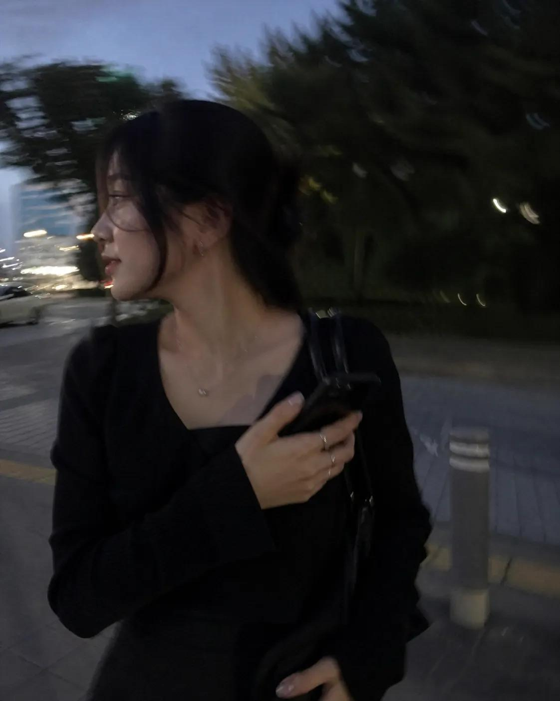

# Photography & Realism

总计：26

## AI 日常生活 iPhone 抓拍

- ID: case-383
- Slug: case-383-zh
- 语言: zh
- 来源: [来源链接](https://x.com/Ciri_ai/status/2051292618248904809)
- 样例图路径: images/part2/case383.jpg

### 提示词

```text
I want to see what you really look like.
Draw a snapshot of your everyday life as if it were accidentally taken on an iPhone.
Make it feel like a very ordinary, imperfect candid shot.
The photo should have slight motion blur, with uneven, natural lighting.
```

### 样例图



## 春日花田三联竖版写真拼贴

- ID: case-382
- Slug: case-382-zh
- 语言: zh
- 来源: [来源链接](https://x.com/frametheory058/status/2051294907214844249)
- 样例图路径: images/part2/case382.jpg

### 提示词

```text
A high-quality 3-panel vertical photo collage of a stunning uploaded woman with soft, voluminous wavy hair glowing in golden sunlight. She is styled in a cream-colored lace-up vintage blouse with delicate textures, olive green high-waisted flowy trousers, and a wide-brimmed straw hat slightly tilted for a fashionable editorial look. Light golden jewelry (thin chains, rings) adds a subtle luxury touch.

The setting is a dreamy, vibrant yellow mustard flower field under a bright blue sky with soft clouds, enhanced by golden hour lighting for a magical glow.

Top panel: Back view of the woman standing in the field with arms wide open, sunlight creating a glowing halo around her hair, slight motion blur in flowers for a cinematic feel.

Middle panel: Close-up portrait, she smiles naturally at the camera, wind softly moving her hair, her hand reaching toward the lens creating depth and a slightly blurred foreground for a DSLR effect.

Bottom panel: Playful pose, she leans sideways in the flowers, making a double peace sign, laughing candidly, capturing an authentic joyful moment.

Add cute, trendy white doodle overlays (smiley faces, sparkles, stars, tiny hearts) with a subtle animated/sketchy feel. Include light leaks, sun flares, and soft film grain for a premium Instagram aesthetic.

Ultra-realistic, 4K, cinematic lighting, shallow depth of field, high dynamic range, natural skin tones, editorial fashion photography, soft pastel color grading.

Aspect ratio: 4:5
Style tags: viral Instagram aesthetic, Pinterest style, dreamy spring vibe, candid luxury
```

### 样例图


## 樱花咖啡户外人像

- ID: case-377
- Slug: case-377-zh
- 语言: zh
- 来源: [来源链接](https://x.com/xRahultripathi/status/2050677614168391716)
- 样例图路径: images/part2/case377.jpg

### 提示词

```text
Edit the provided image while preserving the same face identity, shape, and facial features without altering age, ethnicity, or structure. Maintain a calm, relaxed expression with the subject not looking at the camera.

Subject: young woman (18–23) with soft feminine beauty, smooth glowing skin, natural texture.
Pose (strict): seated on a wooden chair, body angled sideways (45–70°), legs crossed naturally, upper body slightly leaning forward, head turned away from camera, gaze to the side. She holds a drink cup with a straw using both hands.
Framing: full-body vertical (9:16), head to shoes visible, centered but slightly offset for natural composition.
Outfit: light pink varsity jacket with white stripes, soft pink inner top, modest knee-length pleated skirt, white sneakers.
Accessories: beige newsboy cap, sunglasses (on face or cap), pink shoulder bag, small earrings.
Hair: neat low bun with soft loose strands.
Environment: outdoor flower shop street scene with pastel flowers (pink, soft tones), decorative plants, floral storefront.
Lighting: bright natural daylight, soft glossy skin highlights, balanced exposure, soft shadows.
Camera: low/frog angle (slightly below, looking up), 50mm lens, shallow depth of field.
Color grading: warm pastel palette (pink, cream), clean bright lifestyle aesthetic.
Quality: ultra-photorealistic, 8K detail, DSLR realism, natural skin texture.
Negative: front-facing, eye contact, close-up, cropped body, mini/short skirt, indoor scene, dark lighting, anime, cartoon, CGI, plastic skin, distorted anatomy.
--ar 9:16 --style raw --quality high
```

### 样例图


## 泼洒抹茶街头手机照片

- ID: case-376
- Slug: case-376-zh
- 语言: zh
- 来源: [来源链接](https://x.com/Shinning1010/status/2050693240253214894)
- 样例图路径: images/part2/case376.jpg

### 提示词

```text
A realistic vertical smartphone photo of a spilled green iced drink on outdoor stone pavement, a transparent disposable plastic cup lying on its side inside the green puddle, clear plastic lid nearby, scattered ice cubes floating in the drink, small foam bubbles on the surface, green liquid naturally spreading across rough square floor tiles, strong midday sunlight, harsh realistic shadows, a dark human shadow silhouette cast across the ground and partially over the spill, accidental street moment, urban documentary photography, handheld phone camera perspective, slightly top-down angle, natural colors, realistic pavement texture, raw unedited photo look, high detail, authentic everyday scene, 9:16 vertical composition

Negative Prompt:
cartoon, illustration, anime, CGI, 3D render, fantasy style, studio lighting, overly perfect composition, overly clean floor, fake liquid, unrealistic reflections, plastic-looking liquid, oversaturated green, blurry, low resolution, distorted cup, melted plastic, extra cups, duplicated objects, readable brand logo, messy text, watermark, poster design, dramatic artificial lighting, excessive sharpening, over-processed, unrealistic shadow, floating ice, deformed perspective
```

### 样例图


## 鱼眼镜面复古咖啡馆人像

- ID: case-357
- Slug: case-357-zh
- 语言: zh
- 来源: [来源链接](https://x.com/harboriis/status/2049044698900361241)
- 样例图路径: images/part2/case357.jpg

### 提示词

```text
A fish-eye lens close-up of [your photo as reference] sipping from a teal/turquoise coffee mug, leaning forward intimately toward camera. Shot through or near a round mirror. Retro café interior with glossy teal subway tiles, vintage appliances, pendant lights. Black t-shirt, yellow-tinted round glasses. Warm moody tones.
```

### 样例图


## 烬甲猎鹰者与燃翼神禽

- ID: case-329
- Slug: case-329-zh
- 语言: zh
- 来源: [来源链接](https://x.com/iamsofiaijaz/status/2008896649901535342)
- 样例图路径: images/part2/case329.jpg

### 提示词

```text
[中文]
一幅充满奇幻色彩的电影场景：一位英姿飒爽的女战士兼猎鹰师，身着饱经战火洗礼、饰以闪耀余烬纹理的皮甲，漫步于幽暗迷雾笼罩的森林之中。她高举手臂，指挥着一头巨大的凤凰与雄鹰的混合体，这头猛禽双翼燃烧，羽毛燃焰，尖端喷吐着火焰。它周身散发着橙红色的熔岩光芒，火星和余烬飞溅。女战士梳着辫子，皮肤上沾满了灰烬，神情坚定，手中拿着绳索和工具袋。画面细节丰富，羽毛纹理逼真，火焰物理效果自然，光照效果极具戏剧性，运用了体积雾、浅景深等技术，营造出史诗般的奇幻氛围，色彩调校极具电影质感，背景阴郁深沉，分辨率高达8K，呈现出概念艺术的精髓，并采用了虚幻引擎的渲染效果。

[English]
A cinematic fantasy scene of a fierce female use image for face reference warrior falconer walking through a dark misty forest, wearing battle-worn leather armor infused with glowing ember textures. Her arm is raised, commanding a massive phoenix-eagle hybrid with blazing wings and flaming feathers, fire trailing from its tips. The bird radiates molten orange and red light, casting sparks and embers into the air.The warrior has braided hair, ash-streaked skin, and a determined expression, carrying a rope and utility pouch. Ultra-detailed feathers, realistic fire physics, dramatic lighting, volumetric fog, shallow depth of field, epic fantasy atmosphere, hyper-realistic, cinematic color grading, dark moody background, 8k, concept art, unreal engine quality.
```

### 样例图


## 红蓝撞色高跟诱惑

- ID: case-326
- Slug: case-326-zh
- 语言: zh
- 来源: [来源链接](https://x.com/meng_dagg695/status/2012437899955097836)
- 样例图路径: images/part2/case326.jpg

### 提示词

```text
[中文]
{
  "global_settings": {
    "resolution": "8K",
    "quality": "超高清晰度",
    "aspect_ratio": "2:3",
    "render_style": "AI编辑、高细节3D渲染",
    "lighting_quality": "柔和影棚光与逼真阴影",
    "sharpness": "极致清晰、锐利边缘",
    "noise": "无",
    "compression": "无"
  },
  "image_style": {
    "subject": {
      "character_type": "风格化3D卡通女性",
      "pose": "微微后仰靠在背景上",
      "expression": "俏皮、嘴唇轻撅、眼睛斜视",
      "hair": {
        "color": "棕色",
        "style": "短发、凌乱",
        "accessories": "红色太阳镜架在头顶"
      }
    },
    "clothing": {
      "dress": "贴身蓝色罗纹吊带裙",
      "footwear": "红色高跟凉鞋配蝴蝶结"
    },
    "color_palette": [
      "大胆红色",
      "深蓝"
    ],
    "background": {
      "color": "纯红色",
      "texture": "光滑哑光表面"
    },
    "lighting": {
      "direction": "一侧柔和定向光",
      "shadow": "在红色背景上投下清晰影子"
    },
    "composition": {
      "framing": "全身",
      "pose_emphasis": "弯曲身姿、交叉双腿"
    }
  }
}

[English]
{
  "global_settings": {
    "resolution": "8K",
    "quality": "ultra-high definition",
    "aspect_ratio": "2:3",
    "render_style": "AI-edited, high-detail 3D render",
    "lighting_quality": "soft studio lighting with realistic shadows",
    "sharpness": "extreme clarity, crisp edges",
    "noise": "none",
    "compression": "none"
  },
  "image_style": {
    "subject": {
      "character_type": "stylized 3D cartoon female",
      "pose": "leaning slightly backward against background",
      "expression": "playful, lips slightly pursed, eyes looking sideways",
      "hair": {
        "color": "brown",
        "style": "short, tousled",
        "accessories": "red sunglasses resting on head"
      }
    },
    "clothing": {
      "dress": "form-fitting blue ribbed dress with thin straps",
      "footwear": "red high-heel sandals with bow detail"
    },
    "color_palette": [
      "bold red",
      "deep blue"
    ],
    "background": {
      "color": "solid red",
      "texture": "smooth matte surface"
    },
    "lighting": {
      "direction": "soft directional light from one side",
      "shadow": "defined shadow cast on red background"
    },
    "composition": {
      "framing": "full body",
      "pose_emphasis": "curved posture, crossed legs"
    }
  }
}
```

### 样例图


## 街头炫瓶男模

- ID: case-322
- Slug: case-322-zh
- 语言: zh
- 来源: [来源链接](https://x.com/ecommartinez/status/2017311074551533921)
- 样例图路径: images/part2/case322.jpg

### 提示词

```text
[中文]
专业照片，一位男士，30岁的俄罗斯模特（参考图像），正对着镜头，向相机倾斜，从下往上拍摄，使用广角镜头。男士倾斜着身体，近距离将一瓶饮料展示给镜头，一只手拿着瓶子，紧贴在镜头前。瓶子的标签和方向保持笔直，以便标签清晰可读。他穿着白色运动鞋，一只脚在镜头前方。男士站在街道上，湿漉漉的沥青和飞溅的水花从下方拍出。鲜艳的色彩，电影级灯光，光线从后方打在模特的脸上。--v7 --ar 3:4 --style raw

[English]
Professional photo, a guy, a 30-year-old Russian model (reference image), is facing the lens, tilted towards the camera, angle from below, shot with a wide-angle lens. The guy is tilted and shows a bottle close-up to the camera, a hand with a bottle close-up right in front of the lens. The label and direction of the bottle are straight so the label is readable. He's wearing white sneakers, one foot in front of the camera. The guy is standing on the street, wet asphalt and splashes from below. Bright colors, cinematic lighting, the light is behind and on the model’s face. --v7 --ar 3:4 --style raw
```

### 样例图


## 冲破次元壁的写实漫画跑者

- ID: case-316
- Slug: case-316-zh
- 语言: zh
- 来源: [来源链接](https://x.com/Fujimoto_hina/status/2027748030825500722)
- 样例图路径: images/part2/case316.jpg

### 提示词

```text
[中文]
{
  "prompt": "超写实，一位留着深色短卷发、修剪整齐的胡须和黑色方形眼镜的年轻男子的鲜艳逼真渲染，身穿深色纹理高领毛衣和牛仔裤。他奔跑到一半被捕捉下来，姿态充满动感，向前突破，充满戏剧性地从一个破碎的漫画分镜框中显现——一条腿和一只手臂冲入现实世界，而身体的其余部分仍留在漫画框内。他的表情充满活力和喜悦，拥有锐利的面部细节，自然的皮肤纹理，以及具有高对比度和深度的戏剧性电影灯光。\n\n背景：一个非常详细的黑白漫画布局，充满了幽默、夸张的且与他直接互动的反应场景。周围的漫画人物表现出震惊和喜剧的表情，配有粗体的对话气泡和速度线。漫画分镜采用经典的高对比度水墨风格绘制，线条清晰，网点阴影。撕裂的纸张边缘和碎片增强了他冲破漫画世界的幻觉。全彩色的写实人物与单色的漫画环境形成强烈对比，创造出写实与漫画艺术之间的动态混合体。超精细，8k分辨率，清晰聚焦，戏剧性的阴影，电影级景深。"
}

[English]
{
  "prompt": "Ultra-realistic, vibrant photorealistic rendering of a young man with short curly dark hair, neatly trimmed beard, and black rectangular glasses, wearing a dark textured turtleneck sweater and jeans. He is captured mid-run in a dynamic, forward-breaking pose, dramatically emerging from a torn manga panel — one leg and one arm bursting into the real world while the rest of his body remains inside the comic frame. His expression is energetic and joyful, with sharp facial details, natural skin texture, and dramatic cinematic lighting with high contrast and depth. \n\nBackground: a highly detailed black-and-white manga layout filled with humorous, exaggerated reaction scenes that directly interact with him. The surrounding manga characters display shocked and comedic expressions, with bold speech bubbles and motion lines. The manga panels are illustrated in a classic high-contrast ink style with crisp linework and halftone shading. Torn paper edges and debris enhance the illusion of him breaking through the comic world. The fully colored, photorealistic figure contrasts strongly against the monochrome manga environment, creating a dynamic hybrid between reality and comic art. Ultra-detailed, 8k resolution, sharp focus, dramatic shadows, cinematic depth of field."
}
```

### 样例图


## 晨曦薰衣草田梦幻少女三联画

- ID: case-311
- Slug: case-311-zh
- 语言: zh
- 来源: [来源链接](https://x.com/Naiknelofar788/status/2028417667846341062)
- 样例图路径: images/part2/case311.jpg

### 提示词

```text
[中文]
日出时分薰衣草田中女子的水平三联画。
上部：半身像，闭着眼睛，淡紫色连衣裙，一只手放在头发里，模糊的薰衣草前景。
中部：特写镜头，看着镜头，蓬乱的头发，薄纱围巾，脸上的阳光。
下部：四分之三镜头，手持薰衣草花束，飘逸的裙子，柔和的粉彩天空，温暖的梦幻色调。

[English]
Horizontal triptych of a woman in a lavender field at sunrise.
Top: Waist-up, eyes closed, pale lilac dress, one hand in hair, blurred lavender foreground.
Middle: Close-up, looking at camera, tousled hair, sheer scarf, sunlight on face.
Bottom: Three-quarter shot, holding lavender bouquet, flowing skirt, soft pastel sky, warm dreamy tones.
```

### 样例图


## 创意树叶拼贴构成的角色画像

- ID: case-309
- Slug: case-309-zh
- 语言: zh
- 来源: [来源链接](https://x.com/meng_dagg695/status/2032019839070716170)
- 样例图路径: images/part2/case309.jpg

### 提示词

```text
[中文]
{ 角色名称 } 完全由天然树叶制成，创意树叶拼贴艺术，分层绿叶和干叶构成身体、面部和衣服，可见叶脉和纹理，手工植物艺术风格，干净的白色背景，俯视平铺构图，高度细节，柔和自然光，逼真树叶纹理，8k

[English]
{
  CHARACTER NAME
} made entirely from natural leaves,
creative leaf collage art,
layered green and dry leaves forming body,
face and clothes,
visible leaf veins and textures,
handcrafted botanical art style,
clean white background,
top-down flat lay composition,
highly detailed,
soft natural lighting,
realistic leaf textures,
8k
```

### 样例图


## 黑板上的出师表全文

- ID: case-300
- Slug: case-300-zh
- 语言: zh
- 来源: [来源链接](https://x.com/rionaifantasy/status/2045356799751303194)
- 样例图路径: images/part2/case300.jpg

### 提示词

```text
[中文]
生成图片:
手写在教室黑板上的出师表全文，真实感的粉笔字迹，晴朗白天用iPhone手机实拍

[English]
Generate image: The full text of Chu Shi Biao handwritten on a classroom blackboard, realistic chalk handwriting, taken with an iPhone in real life on a sunny day
```

### 样例图


## 温馨卧室里的少女自拍

- ID: case-284
- Slug: case-284-zh
- 语言: zh
- 来源: [来源链接](https://x.com/Shinning1010/status/2045002808903020962)
- 样例图路径: images/part2/case284.jpg

### 提示词

```text
[中文]
一个惊艳的18岁中国女孩，拥有年轻纯真的脸庞和逼真的皮肤纹理，坐在她卧室里一张舒适且略显凌乱的床上。她正用智能手机拍镜子自拍，捕捉一个自然且亲密的瞬间。穿着随意的灰色居家服和整洁的白色船袜。柔和的自然光（黄金时刻）从侧面窗户照进来，营造出一种温暖、富有情绪感和电影般的氛围。35毫米镜头，对镜子中的主体保持锐利对焦，带有美丽模糊背景（散景）的景深。照片写实，8K，高分辨率，影棚级质量，杰作。反向提示词：没有多余的肢体，没有变形的手，没有模糊，没有噪点，没有水印，没有文字，没有卡通/动漫风格。长宽比：3:4。

[English]
A stunning 18-year-old Chinese girl with a youthful, pure face and realistic skin texture, sitting on a cozy, slightly messy bed in her bedroom. She is taking a mirror selfie with a smartphone, capturing a natural and intimate moment. Wearing casual gray loungewear and neat white crew socks. Soft natural light (golden hour) streams in from a side window, creating a warm, moody, and cinematic atmosphere. 35mm lens, sharp focus on the subject in the mirror, depth of field with a beautifully blurred background (bokeh). Photorealistic, 8K, high resolution, studio quality, masterpiece.
Negative Prompts: no extra limbs, no deformed hands, no blur, no noise, no watermark, no text, no cartoon/anime style. Aspect Ratio: 3:4.
```

### 样例图


## 橙红渐变中的孤独剪影

- ID: case-273
- Slug: case-273-zh
- 语言: zh
- 来源: [来源链接](https://x.com/iam_miharbi/status/2045151354679665101)
- 样例图路径: images/part2/case273.jpg

### 提示词

```text
[中文]
生成一张电影级极简肖像，一个孤独的男人站在强烈的橙色到红色渐变环境中，强烈的剪影光，深邃的阴影对比，反光的光滑地面，对称构图，极简

[English]
Generate a cinematic minimal portrait of a solitary man standing in an intense orange to red gradient environment, strong silhouette lighting, deep shadow contrast, reflective glossy floor, symmetrical composition, minimal
```

### 样例图


## 桌面上的黑色圆珠笔手写笔记

- ID: case-266
- Slug: case-266-zh
- 语言: zh
- 来源: [来源链接](https://x.com/patrickassale/status/2044569086013718958)
- 样例图路径: images/part2/case266.jpg

### 提示词

```text
[中文]
一张平放着的打开的笔记本的业余照片，里面填满了用黑色圆珠笔写的手写笔记。笔迹随意且略显凌乱，就像个人笔记，自然的瑕疵，划掉的单词，划线的标题。从略高角度拍摄，来自窗户的自然日光，未使用闪光灯。随意的桌面设置，用 iPhone 拍摄。

[English]
Amateur photo of an open notebook lying flat, filled with handwritten notes in black ballpoint pen. The handwriting is casual and slightly messy, like personnal notes, natural imperfections, crossed out words, underlined headings. Shot from slightly above, natural daylight from a window, no flash. Casual desk setting, shot on iPhone
```

### 样例图


## 胶片闪光灯下的球场少女

- ID: case-240
- Slug: case-240-zh
- 语言: zh
- 来源: [来源链接](https://x.com/BubbleBrain/status/2045052982728016131)
- 样例图路径: images/part2/case240.jpg

### 提示词

```text
[中文]
35毫米彩色胶片摄影，带有强烈的机顶直射闪光灯，皮肤和衣物上有镜面高光，眼睛里有强烈的眼神光，高对比度闪光灯照明，真实的胶片颗粒和色彩偏移，高级时尚清新纯真篮球场编辑风格，亲密的第一人称低角度仰视POV镜头，二十出头的性感中国女性偶像，具有超写实的精致细腻的中国特征，诱人的杏仁形狐狸眼，带有自然双眼皮，高鼻梁，小巧锋利的V型下颌线，无瑕逼真的瓷白肌肤，带有冷象牙色底调和可见的闪光镜面高光，细腻精致的皮肤纹理，带有微妙的毛孔微距细节和闪光灯下的自然水光感，清新自然的运动妆容，带有柔和的水光感，脸颊上有微妙的自然红晕，自然粉唇微张，鼻子和脸颊上有微妙的自然雀斑，深棕色长发扎成高高的俏皮马尾辫，有一些散落的发丝修饰脸型，以及逼真的散落发丝，穿着宽松的白色背心和白色高腰篮球短裤，白色及膝运动袜，在黄昏的户外球场上靠在篮球架杆上的诱人自然倾斜姿势，身体侧成角度，背部自然弓起，臀部轻轻向后推，以凸显挺拔圆润的臀部和性感的臀部曲线，一条腿自然向前伸向镜头，另一条腿微微弯曲以强调修长性感的双腿，双手轻轻放在肩膀高度的篮球杆上，极其诱人俏皮又惹人怜爱的鹿眼凝视直视观看者，带着柔软脆弱渴望的眼睛和温柔挑逗的微笑，充满安静的诱惑和欲望，强烈的机顶直射闪光灯产生锐利的镜面高光和强烈的眼神光，背景是黄昏天空下模糊的篮球场和篮筐，高对比度胶片调色，带有自然闪光灯外观，极其锐利却又柔和的皮肤渲染，具有真实的35毫米直射闪光美学，自然发丝，背心和短裤上逼真的织物纹理以及袜子细节，没有塑料感皮肤，没有数码过度锐化，没有磨皮，没有瑕疵，没有痣，没有油性皮肤，没有水印，没有文字，真实的35毫米直射闪光胶片篮球场外观 --ar 9:16

[English]
35mm color film photography with harsh direct on-camera flash, specular highlights on skin and clothing, strong catchlights in eyes, high contrast flash illumination, authentic film grain and color shift, high fashion fresh innocent basketball court editorial style, intimate first-person low-angle POV shot from below, early 20s sexy Chinese female idol with ultra-realistic delicate refined Chinese features, seductive almond-shaped fox eyes with natural double eyelids, high nose bridge, small sharp V-shaped jawline, flawless realistic porcelain skin with cool ivory undertone and visible flash specular highlights, fine delicate skin texture with subtle pores micro details and natural dewy glow under flash, fresh natural sporty makeup with soft dewy glow, subtle natural flush on cheeks, natural pink lips slightly parted, subtle natural freckles across nose and cheeks, long dark brown hair tied in a high playful ponytail with some loose strands framing the face and realistic loose strands, wearing a loose white tank top and white high-waisted basketball shorts, white knee-high sports socks, seductive natural leaning pose against the basketball hoop pole on the outdoor court at dusk, body angled sideways with naturally arched back and hips gently pushed back to accentuate perky round hips and sexy butt curve, one leg naturally extended forward toward the camera and the other leg slightly bent to emphasize long sexy legs, both hands lightly resting on the basketball pole at shoulder height, intensely seductive playful yet pitiable doe-eyed gaze straight at the viewer with soft vulnerable longing eyes and a gentle teasing smile full of quiet temptation and desire, harsh direct on-camera flash creating sharp specular highlights and strong catchlights, background with blurred basketball court and hoop under dusk sky, high contrast film color grading with natural flash look, extremely sharp yet soft skin rendering with authentic 35mm direct flash aesthetic, natural hair strands, realistic fabric texture on tank top and shorts with socks detail, no plastic skin, no digital over-sharpening, no airbrushing, no blemishes, no moles, no oily skin, no watermark, no text, authentic 35mm direct flash film basketball court look --ar 9:16
```

### 样例图


## 超写实海滩高角度手机自拍

- ID: case-199
- Slug: case-199-zh
- 语言: zh
- 来源: [来源链接](https://x.com/IamEmily2050/status/2046602266627465534)
- 样例图路径: images/part2/case199.jpg

### 提示词

```text
[中文]
{
  超写实iPhone 15 Pro前置摄像头自拍，一位成年女性在明亮的沙滩上，
  从举臂高角度自拍视角拍摄。手机略微举在脸部上方，
  营造出自然的前置摄像头几何形态，带有轻微的等效24mm广角畸变，
  写实的面部比例，
  以及智能手机的深景深。她向上抬起下巴，一只手遮挡刺眼的阳光，同时直视手机镜头。她的表情中性，
  面无表情，
  且略带疏离感，
  眼睛大而专注，但在解剖学上具有真实的眼部尺寸和自然面部比例。\n\n她有着极浅的铂金色头发，梳成两条紧紧的辫子，
  苍白的皮肤带有真实摄影的皮肤纹理，
  可见的毛孔，
  细微的绒毛，
  淡淡的眼下纹理，
  自然的唇部纹理，
  以及柔和的阳光光泽，而不是磨皮后的完美无瑕。她的嘴唇是自然色调且略丰满，
  她的鼻子小巧精致但很写实。她的指甲是鲜艳的蓝色。她穿着一件浅蓝色紧身弹力棉上衣，领口非常深且宽，以自然、
  非风格化的方式露出突出的锁骨和上胸结构。\n\n背景是宽阔的海岸沙滩，在强烈的上午晚些时候的阳光下，
  背景中有一条柔和模糊的地平线。光线明亮，
  色温约5500K的高调海岸日光，
  强烈的白色沙子反光从下方和脸部周围均匀地填充阴影。皮肤被直射阳光加上海滩宽阔柔和的反射补光照亮，
  产生清脆但写实的高光，没有生硬的对比。明亮沙子的细小颗粒微妙地捕捉光线。整体图像应该感觉像是在强烈的海边光线下在户外拍摄的真正高曝光智能手机自拍。\n\n色彩渲染应该是柔和、
  干净、
  且现代的，
  带有中性至柔和的色调，
  写实的iPhone计算摄影，
  略微提高的曝光，
  受控的高光过渡，
  自然的肤色，
  没有电影级调色。优先考虑写实性、
  物理准确性、
  可信的解剖结构，
  以及真实的智能手机图像表现，而不是美化风格化。", "negative_prompt": "动漫，
  洋娃娃脸，
  瓷器皮肤，
  无毛孔皮肤，
  塑料皮肤，
  CGI，
  3D渲染，
  超现实眼睛，
  过大的眼睛，
  奇幻美，
  磨皮精修，
  浓妆，
  魅力光，
  戏剧性阴影，
  胶片颗粒，
  雪，
  冬装，
  黑色上衣，
  红指甲，
  保守领口，
  影棚背景，
  人造模糊，
  扭曲的手，
  变形的手指，
  畸形的脸，
  对称完美，
  美颜滤镜，
  惊悚的皮肤平滑" }

[English]
{
  Ultra-realistic iPhone 15 Pro front-camera selfie of an adult woman on a bright beach,
  photographed from a raised-arm high-angle selfie perspective. The phone is held slightly above her face,
  creating natural front-camera geometry with mild 24mm equivalent wide-angle distortion,
  realistic facial proportions,
  and deep smartphone depth of field. She tilts her chin upward and looks directly toward the phone lens while shielding harsh sunlight with one hand. Her expression is neutral,
  blank,
  and slightly distant,
  with wide attentive eyes but anatomically realistic eye size and natural facial proportions.\n\nShe has very light platinum-blonde hair styled in two tight braids,
  pale skin with real photographic skin texture,
  visible pores,
  subtle peach fuzz,
  faint under-eye texture,
  natural lip texture,
  and a soft sunlit sheen rather than airbrushed perfection. Her lips are naturally toned and slightly full,
  her nose is small and refined but realistic. Her nails are vivid blue. She wears a light blue fitted stretch-cotton top with a very deep wide neckline that reveals pronounced collarbones and upper chest structure in a natural,
  non-stylized way.\n\nThe setting is a wide coastal beach under strong late-morning sunlight,
  with a softly blurred horizon line in the background. The lighting is bright,
  high-key coastal daylight around 5500K,
  with strong white sand bounce filling the shadows evenly from below and around the face. Skin is illuminated by direct sun plus broad soft reflected fill from the beach,
  producing crisp but realistic highlights without harsh contrast. Fine grains of bright sand catch light subtly. The overall image should feel like a real high-exposure smartphone selfie taken outdoors in intense seaside light.\n\nColor rendering should be soft,
  clean,
  and modern,
  with neutral-to-pastel tones,
  realistic iPhone computational photography,
  slightly elevated exposure,
  controlled highlight rolloff,
  natural skin color,
  and no cinematic grading. Prioritize realism,
  physical accuracy,
  believable anatomy,
  and true smartphone image behavior over beauty stylization.", "negative_prompt": "anime,
  doll face,
  porcelain skin,
  poreless skin,
  plastic skin,
  CGI,
  3D render,
  surreal eyes,
  oversized eyes,
  fantasy beauty,
  airbrushed retouching,
  heavy makeup,
  glamour lighting,
  dramatic shadows,
  film grain,
  snow,
  winter clothing,
  black top,
  red nails,
  conservative neckline,
  studio backdrop,
  artificial blur,
  warped hands,
  deformed fingers,
  malformed face,
  symmetry perfection,
  beauty filter,
  uncanny skin smoothing" }
```

### 样例图


## 苍白陶瓷娃娃沙滩仰视

- ID: case-198
- Slug: case-198-zh
- 语言: zh
- 来源: [来源链接](https://x.com/IamEmily2050/status/2046584217656570035)
- 样例图路径: images/part2/case198.jpg

### 提示词

```text
[中文]
{
  "相机参数": {
    "设备类型": "iPhone 15 Pro 前置自拍",
    "镜头": "24mm",
    "构图": "高角度 POV（第一人称视角）",
    "后期处理": "计算摄影风格，清晰的数字读出，深景深"
  },
  "主体描述": {
    "特征": "陶瓷娃娃审美，无瑕的苍白皮肤，巨大的冰蓝色眼睛，小巧的鼻子，翘起的自然色嘴唇",
    "表情": "面无表情，空洞，瞪大眼睛注视",
    "造型": "白金色的双紧辫发型，鲜艳的蓝色美甲",
    "服装": "浅蓝色紧身弹力棉上衣，极深超宽 V 领，深邃锁骨与领口线",
    "动作": "抬头仰视镜头，用一只手遮挡刺眼的阳光"
  },
  "环境与灯光": {
    "场景": "广阔的沙滩，背景中模糊的海平线",
    "灯光": "高调明亮的沿海日光，5500K 色温，强烈的白沙反光填充，均匀照明",
    "质感": "微带露水的无孔皮肤，细腻的反光白沙颗粒"
  },
  "技术约束": {
    "色彩科学": "柔和的粉彩色调，线性中性色，高曝光",
    "负面提示词": [
      "重阴影",
      "雪",
      "冬装",
      "红指甲",
      "黑色上衣",
      "保守的领口",
      "胶片颗粒感"
    ]
  }
}

[English]
{
  "cameraParameters": {
    "deviceType": "iPhone 15 Pro front selfie",
    "lens": "24mm",
    "composition": "High angle POV (first-person perspective)",
    "postProcessing": "Computational photography style, clear digital readout, deep depth of field"
  },
  "subjectDescription": {
    "features": "Porcelain doll aesthetic, flawless pale skin, huge ice-blue eyes, small nose, slightly upturned natural-colored lips",
    "expression": "Expressionless, hollow, wide-eyed staring",
    "styling": "Platinum blonde tight double braids hairstyle, vibrant blue nail polish",
    "clothing": "Light blue tight stretch cotton top, extremely deep ultra-wide V-neck, deep collarbone and neckline",
    "action": "Looking up at the camera, blocking the glaring sunlight with one hand"
  },
  "environmentAndLighting": {
    "scene": "Vast sandy beach, blurry horizon in the background",
    "lighting": "High-key bright coastal daylight, 5500K color temperature, strong white sand reflection fill, even lighting",
    "texture": "Slightly dewy poreless skin, fine reflective white sand particles"
  },
  "technicalConstraints": {
    "colorScience": "Soft pastel tones, linear neutral colors, high exposure",
    "negativePrompts": [
      "Heavy shadows",
      "Snow",
      "Winter clothing",
      "Red nails",
      "Black top",
      "Conservative neckline",
      "Film grain"
    ]
  }
}
```

### 样例图


## 韩系极简氛围感少女写真

- ID: case-187
- Slug: case-187-zh
- 语言: zh
- 来源: [来源链接](https://x.com/BubbleBrain/status/2046434670724907395)
- 样例图路径: images/part2/case187.jpg

### 提示词

```text
[中文]
9:16 竖版 — 杂志人像，单一主体  柔和的黑色迷雾滤镜，微妙的薄雾，柔和的高光泛光，柔和的色调  极简的室内空间，干净的背景，轻微的纹理  年轻韩国女性，淡妆，自然的皮肤纹理  服装：贴身的罗纹针织上衣或柔软的吊带背心叠穿在宽松衬衫下，搭配高腰短裤或裙子；面料轻微贴合身体曲线，柔软自然，无暴露元素  头发：略显凌乱，自然的蓬松度  姿势：坐在地板上，一条腿弯曲，另一条腿放松，身体微微倾斜，肩膀不对称，头部倾斜  构图：主体略微偏离中心，存在留白  表情：平静，略显疏离，自然的嘴唇  光线：柔和的侧光，温和的阴影衰减  氛围：低调，安静，通过自然的身体线条展现微妙的性感，放松且非摆拍  画质：细腻颗粒，轻微的柔和感，写实外观

[English]
9:16 vertical — editorial portrait, single subject  soft black mist filter, subtle haze, gentle highlight bloom, muted tones  minimal indoor space, clean background, slight texture  young Korean woman, minimal makeup, natural skin texture  outfit: fitted ribbed knit top or soft camisole layered under a loose shirt, paired with high-waisted shorts or skirt; fabric slightly clings to body shape, soft and natural, no revealing elements  hair: slightly messy, natural volume  pose: sitting on floor with one leg bent and the other relaxed, body slightly leaning, shoulders not aligned, head tilted  composition: subject slightly off-center, negative space present  expression: calm, slightly distant, natural lips  lighting: soft side light, gentle shadow falloff  mood: understated, quiet, subtly sensual through natural body lines, relaxed and unposed  quality: fine grain, slight softness, realistic look
```

### 样例图


## 写实摄影风格创作

- ID: case-154
- Slug: case-154-zh
- 语言: zh
- 来源: [来源链接](https://x.com/AlwaveNazca)
- 样例图路径: images/part2/case154.jpg

### 提示词

```text
A photorealistic, high-resolution commercial photograph of a {argument name="car model and color" default="bright blue Alpine A110 R sports car"} parked in the foreground inside a massive aircraft hangar. The car features a black carbon fiber hood, black roof, black alloy wheels, and a front license plate reading "{argument name="license plate text" default="A110 R"}". Directly behind the car, dominating the background, is a {argument name="airplane model" default="white Airbus A320 commercial airliner"} with a blue tail. The hangar has a highly polished, reflective concrete floor that mirrors the car and plane. To the left, a sign on the metal wall reads "{argument name="hangar sign text" default="HANGAR 05 MAINTENANCE"}". The hangar doors are wide open, revealing a bright, overcast sky and a distant cityscape. The lighting is soft and cinematic, highlighting the sleek aerodynamic curves of both vehicles.
```

### 样例图


## 写实摄影风格创作

- ID: case-56
- Slug: case-56-zh
- 语言: zh
- 来源: [来源链接](https://x.com/danieldmai)
- 样例图路径: images/part2/case56.jpg

### 提示词

```text
A candid, realistic photograph of a young {argument name="subject aesthetic" default="goth"} woman with pale skin, long straight black hair with bangs, heavy black eyeliner, and black lipstick. She has a {argument name="expression" default="deadpan"} expression, looking directly at the camera while sitting on a children's coin-operated {argument name="ride type" default="unicorn"} ride. She is wearing a black lace-trimmed tank top, black arm warmers, layered necklaces including a choker, black lace tights, and chunky black platform boots with buckles. A large black shoulder bag hangs from her arm. The ride is a white unicorn with a pink mane, gold horn, and purple hooves, mounted on a purple base with a small sticker reading "{argument name="ride cost" default="50¢ PER RIDE"}". The setting is outside a store with a tan cinderblock wall. To the left is a glass door reflecting a person, a brown trash can, and a white sign with red text reading "{argument name="sign text" default="NO PARKING FIRE LANE"}". To the right is a blue vending machine. Overcast, natural daylight.
```

### 样例图


## 写实摄影风格图

- ID: case-52
- Slug: case-52-zh
- 语言: zh
- 来源: [来源链接](https://x.com/nicdunz)
- 样例图路径: images/part2/case52.jpg

### 提示词

```text
A realistic photograph of a whiteboard with a highly detailed {argument name="marker color" default="green"} dry-erase marker drawing of {argument name="subject" default="a samurai with a messy topknot and facial hair, hands clasped in prayer"}. The character is drawn in a {argument name="art style" default="detailed manga sketch"} style, shown in profile with eyes closed, wearing a traditional kimono with a katana tucked into his belt. To the left of the character, handwritten text in all-caps reads "{argument name="text line 1" default="VAGABOND"}" with "{argument name="text line 2" default="MUSASHI"}" written directly below it. The whiteboard has a glossy surface with realistic light reflections and glare on the left side, and a thin metallic frame is visible at the bottom edge, giving the impression of an authentic classroom or office environment.
```

### 样例图


## 插画艺术创作图

- ID: case-43
- Slug: case-43-zh
- 语言: zh
- 来源: [来源链接](https://x.com/stark_nico99)
- 样例图路径: images/part2/case43.jpg

### 提示词

```text
{
  "type": "character portrait grid",
  "theme": "{argument name=\"theme\" default=\"Game of Thrones characters\"}",
  "style": "{argument name=\"art style\" default=\"2D flat illustration, clean line art, comic style, profile view facing right, pale skin with blush\"}",
  "layout": {
    "grid": "3x3",
    "background": "light gray textured",
    "frame_style": "white rounded-rectangle frames with text labels below each"
  },
  "count": 9,
  "portraits": [
    { "label": "Jon Snow", "description": "black hair half-up, beard, dark fur cloak" },
    { "label": "Daenerys Targaryen", "description": "silver braided hair, blue dress" },
    { "label": "Tyrion Lannister", "description": "curly brown hair, beard, dark tunic with gold pin" },
    { "label": "Cersei Lannister", "description": "blonde braided hair, ornate red and gold dress" },
    { "label": "Ned Stark", "description": "brown hair half-up, beard, dark fur cloak" },
    { "label": "Arya Stark", "description": "short dark hair half-up, brown tunic, sword hilt" },
    { "label": "Jaime Lannister", "description": "short blonde hair, gold armor with lion motif" },
    { "label": "Sansa Stark", "description": "red braided hair, blue dress with fur collar" },
    { "label": "Theon Greyjoy", "description": "short dark curly hair, dark tunic with kraken pin" }
  ]
}
```

### 样例图


## 插画艺术创作图

- ID: case-34
- Slug: case-34-zh
- 语言: zh
- 来源: [来源链接](https://x.com/Ryan_Suo)
- 样例图路径: images/part2/case34.jpg

### 提示词

```text
{
  "type": "character avatar grid",
  "theme": "{argument name=\"theme\" default=\"Journey to the West mythology\"}",
  "style": "{argument name=\"art style\" default=\"clean 2D cartoon vector illustration, thick outlines, flat colors\"}",
  "layout": {
    "background": "{argument name=\"background color\" default=\"light gray\"} subtle texture",
    "format": "grid of circular portraits with text labels centered below each circle",
    "rows": [
      {
        "count": 4,
        "items": [
          {"label": "Sun Wukong", "description": "monkey boy with golden headband and red scarf"},
          {"label": "Tang Sanzang", "description": "monk with ornate golden crown"},
          {"label": "Zhu Bajie", "description": "pig man holding a rake"},
          {"label": "Sha Wujing", "description": "bearded man holding a crescent moon staff"}
        ]
      },
      {
        "count": 4,
        "items": [
          {"label": "White Dragon Horse", "description": "white horse with golden bridle"},
          {"label": "Jade Emperor", "description": "older man with white beard and golden crown"},
          {"label": "Guanyin", "description": "goddess holding a willow branch"},
          {"label": "Bull Demon Kink", "description": "fierce bull demon in armor"}
        ]
      },
      {
        "count": 4,
        "items": [
          {"label": "Princess Iron Fan", "description": "woman holding a green palm leaf fan"},
          {"label": "Red Boy", "description": "boy with red hair, horns, and a small flame"},
          {"label": "Black Wind Demon", "description": "dark shadowy demon with glowing red eyes"},
          {"label": "Nezha", "description": "boy with double hair buns holding a flaming spear"}
        ]
      },
      {
        "count": 3,
        "description": "partial row repeating Princess Iron Fan, Black Wind Demon, and Nezha, slightly cropped at the bottom"
      }
    ]
  }
}
```

### 样例图


## 人像写实摄影图

- ID: case-31
- Slug: case-31-zh
- 语言: zh
- 来源: [来源链接](https://x.com/jun_kongo)
- 样例图路径: images/part2/case31.jpg

### 提示词

```text
A highly detailed, photorealistic anime-style portrait of a young woman crouching down and looking slightly down at the camera from a low angle. She has long, flowing {argument name="hair color" default="ash-blonde"} hair blowing gently in the wind, pale skin, and large, expressive eyes. She is wearing a {argument name="outfit" default="Japanese school uniform with a light grey cardigan, white shirt, dark plaid bow tie, dark plaid pleated skirt, dark knee-high socks, and black leather loafers"}. Her arms are resting casually on her knees. The background is a bright {argument name="sky condition" default="clear blue sky with scattered white clouds"}, with a blurred {argument name="background setting" default="chain-link fence and green trees"} visible at the very bottom, suggesting a schoolyard. The lighting is bright, natural daylight with soft, cinematic shadows, emphasizing the realistic textures of her clothing and skin.
```

### 样例图


## 人物角色设定图

- ID: case-27
- Slug: case-27-zh
- 语言: zh
- 来源: [来源链接](https://x.com/anemone_sd)
- 样例图路径: images/part2/case27.jpg

### 提示词

```text
{
  "type": "collection of instant photos",
  "setting": "laid out flat on a white fabric surface",
  "character": {
    "hair": "{argument name=\"hair color\" default=\"long pink hair with blue inner color\"}",
    "outfit": "{argument name=\"outfit\" default=\"black and white maid uniform with frilly headband and black ribbons\"}",
    "eyes": "reddish-pink"
  },
  "layout": {
    "arrangement": "two rows of five polaroid photos",
    "count": 10,
    "photos": [
      { "position": "top row 1", "description": "holding a pink heart cushion" },
      { "position": "top row 2", "description": "winking, making a peace sign" },
      { "position": "top row 3", "description": "making a hand heart, pink heart doodle on the bottom border" },
      { "position": "top row 4", "description": "resting chin on hands, gentle smile" },
      { "position": "top row 5", "description": "holding a red rose, winking" },
      { "position": "bottom row 1", "description": "finger to lips, shy expression" },
      { "position": "bottom row 2", "description": "holding a small pink cake" },
      { "position": "bottom row 3", "description": "winking, hand near face, signature '{argument name=\"signature text\" default=\"Hanashi\"}' and heart doodle on border" },
      { "position": "bottom row 4", "description": "holding a pink bunny plushie, sparkle doodles, signature '{argument name=\"signature text\" default=\"Hanashi\"}' and bunny doodle on border" },
      { "position": "bottom row 5", "description": "winking, sparkle doodles, message '{argument name=\"message text\" default=\"いつも応援ありがとう！これからもよろしくね♪\"}' and signature '{argument name=\"signature text\" default=\"Hanashi\"}' on border" }
    ]
  }
}
```

### 样例图


