# photography

总计：1357

## Create an infographic image of [LANDMARK], combining a r

- ID: trending-2007523056822939698
- Slug: trending-2007523056822939698-en
- 语言: en
- 来源: [来源链接](https://x.com/TechieBySA/status/2007523056822939698)
- 样例图路径: images/part1/2007523056822939698_1.jpg

### 提示词

```text
Create an infographic image of [LANDMARK], combining a real photograph of the landmark with blueprint-style technical annotations and diagrams overlaid on the image. Include the title “[LANDMARK]” in a hand-drawn box in the corner. Add white chalk-style sketches showing key structural data, important measurements, material quantities, internal diagrams, load-flow arrows, cross-sections, floor plans, and notable architectural or engineering features. Style: blueprint aesthetic with white line drawings on the photograph, technical/architectural annotation style, educational infographic feel, with the real environment visible behind the annotations.
```

### 样例图

![Create an infographic image of [LANDMARK], combining a r](../images/part1/2007523056822939698_1.jpg)

## Hyper-realistic cinematic Create an 8k close-up portrait

- ID: trending-2028853502358003808
- Slug: trending-2028853502358003808-en
- 语言: en
- 来源: [来源链接](https://x.com/Naiknelofar788/status/2028853502358003808)
- 样例图路径: images/part1/2028853502358003808_1.jpg

### 提示词

```text
Hyper-realistic cinematic Create an 8k close-up portrait of a beautiful woman with medium, brown, slightly wind-swept hair falling across her face. Her striking, light-colored eyes gaze upwards and to the right, catching a sharp, diagonal beam of natural light that illuminates the high points of her cheekbone, nose, and plump, fair skin, glossy, mauve-toned lips a slightly light weight silk shirt. The rest of her face and the background are cast in deep,dramatic shadow (chiaroscuro) emphasizing the play of light and shadow Subtle textures of her dark clothing are visible on her left shoulder. The image should capture a mysterious and introspective mood, with incredible detail in her skin, hair strands, and the subtle reflections in her eyes and lips.
Outfit should white.
```

### 样例图

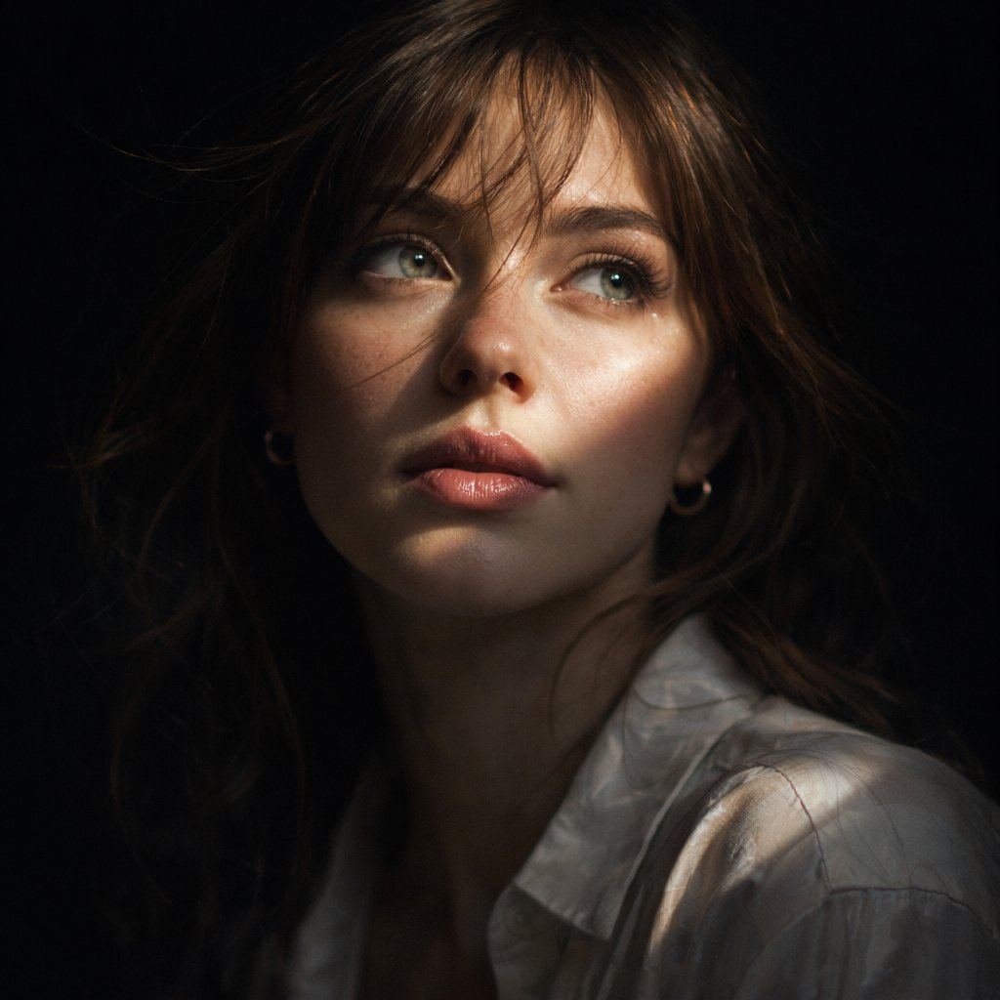

## A [person type] standing full-body near the edge of the 

- ID: trending-2002826415939682584
- Slug: trending-2002826415939682584-en
- 语言: en
- 来源: [来源链接](https://x.com/Arminn_Ai/status/2002826415939682584)
- 样例图路径: images/part1/2002826415939682584_1.jpg

### 提示词

```text
A [person type] standing full-body near the edge of the frame, slightly to the left, in [real-world incomplete / empty / damaged environment]. The camera is positioned behind and slightly to the right of the person, capturing them from a three-quarter rear angle. The person stands calmly and thoughtfully, looking toward the space ahead.

The environment is [describe the real space as it exists now: empty, unfinished, decayed, rigid, lifeless]. The atmosphere feels [emotional tone: quiet, dry, historical, minimal, raw]. Natural light illuminates the scene, creating realistic shadows and depth. Floating hand-drawn sketch lines appear over and within the environment, aligned precisely in perspective with the real space. These sketches represent [what is missing / what once existed / what could exist in the future].

The sketch lines are black, clean, and hand-drawn, resembling [architectural / interior / restoration / urban planning] concept sketches made with pencil or ink. The strokes are expressive, slightly imperfect, and organic — not rigid or mechanical. The sketched elements occupy the foreground and midground, appearing closer to the person than expected. Some sketch lines subtly overlap the person’s silhouette and the real surfaces, visually merging imagination with reality. The sketches float naturally within the scene, seamlessly blending with the environment and conveying the idea of [vision / restoration / transformation / potential] coming to life.
```

### 样例图

![A [person type] standing full-body near the edge of the ](../images/part1/2002826415939682584_1.jpg)

## { "type": "image_generation_prompt", "language": "en", "

- ID: trending-2009834337043394622
- Slug: trending-2009834337043394622-en
- 语言: en
- 来源: [来源链接](https://x.com/saniaspeaks_/status/2009834337043394622)
- 样例图路径: images/part1/2009834337043394622_1.jpg

### 提示词

```text
{
  "type": "image_generation_prompt",
  "language": "en",
  "style": "hyper-realistic cinematic selfie photography",
  "aspect_ratio": "9:16",
  "identity_preservation": {
    "use_reference_image": true,
    "strict_identity_lock": true,
    "alter_face": false,
    "alter_skin": false,
    "alter_hair": false,
    "alter_gender": false,
    "notes": "Preserve identical facial features, skin texture, hair, glasses, age, and gender from the uploaded reference image. No synthetic skin or sculptural look."
  },
  "subject": {
    "gender": "female",
    "capture_method": "selfie taken by the subject herself",
    "pose": {
      "selfie_arm": {
        "description": "one arm fully straight and completely extended upward holding the camera that takes the selfie",
        "visibility": "arm clearly visible, straight and dominant in frame",
        "camera_visibility": "the selfie camera device itself must NOT be visible in the frame"
      },
      "product_arm": {
        "description": "the other arm fully extended toward the camera holding the attached Canon camera",
        "importance": "product is closest to the camera and visually dominant"
      },
      "head": {
        "tilt": "slightly tilted toward the selfie camera"
      },
      "expression": "natural and relaxed facial expression"
    },
    "body_visibility": "full body visible from head to toe",
    "feet": "feet clearly touching the road surface"
  },
  "composition": {
    "perspective": "natural selfie perspective at chest height",
    "camera_angle": "extreme top-down angle, camera above the subject looking directly downward",
    "layer_depth": [
      "product (closest to camera)",
      "face",
      "full body",
      "city environment (background)"
    ]
  },
  "scale_and_perspective": {
    "effect": "forced perspective",
    "subject_scale": "the woman appears extremely giant",
    "buildings_scale": "buildings appear much smaller, reaching no higher than her knees",
    "dominance": "the subject visually dominates the entire scene",
    "realism": "inspiring scale while remaining physically believable"
  },
  "environment": {
    "location": "real urban intersection",
    "elements": [
      "pedestrian crosswalk",
      "road markings",
      "traffic signs",
      "cars",
      "bicycles",
      "pedestrians at realistic human scale"
    ],
    "setting": "ground-level urban environment"
  },
  "lighting": {
    "type": "natural daylight",
    "conditions": "clear or lightly cloudy sky",
    "shadows": "soft and realistic",
    "restrictions": "no fantasy or dramatic lighting"
  },
  "product_rules": {
    "usage": "use the uploaded Canon product exactly as provided",
    "distortion": "none",
    "logo": "unchanged",
    "appearance": "natural reflections and realistic highlights only"
  },
  "camera_quality": {
    "realism": "maximum photorealism",
    "depth": "clear separation of foreground, subject, and background",
    "artifacts": "none"
  },
  "constraints": [
    "No AI-art look",
    "No plastic or sculpted skin",
    "No distortion of face or body",
    "No extra limbs or incorrect anatomy",
    "No text or watermarks",
    "No visible selfie camera device"
  ],
  "output_goal": "Create a hyper-realistic cinematic selfie image of a woman using her exact reference identity, captured from an extreme top-down perspective in a real urban crosswalk, with forced perspective scale, natural daylight, and a Canon camera product prominently held toward the lens."
}
```

### 样例图

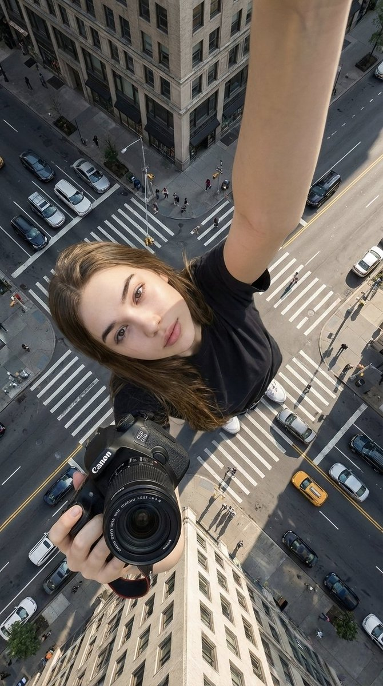

## 9:16 vertical — a 3x3 grid collage (nine images) forming

- ID: trending-2046151898621993364
- Slug: trending-2046151898621993364-en
- 语言: en
- 来源: [来源链接](https://x.com/BubbleBrain/status/2046151898621993364)
- 样例图路径: images/part1/2046151898621993364_1.jpg

### 提示词

```text
9:16 vertical — a 3x3 grid collage (nine images) forming a Korean idol portrait photoshoot series. Each frame features the same young Korean female idol, maintaining 100% consistency in facial features, proportions, hairstyle, and identity across all nine shots.   Natural, ultra-realistic skin texture, no retouching, no smoothing. Clean idol-style minimal makeup, soft glow, subtle imperfections.   Hair: long, voluminous dark hair, slightly tousled, consistent across all frames (natural loose flow, slight movement).  Outfit: cohesive Korean idol photoshoot styling — white shirt + short bottoms (or simple neutral-toned outfit), youthful, clean, slightly casual but styled. Same outfit across all frames.  Setting: minimal studio or simple indoor environment (plain wall, soft window light, clean background). Focus on subject, not environment.  Lighting: soft diffused natural light, gentle highlights, low contrast, slightly airy tones, subtle film-like softness.  Camera style: intimate portrait photography, slightly handheld feel, subtle imperfections (minor grain, slight blur in motion frames, imperfect framing).  Frame breakdown (3x3 grid):  Top row: - Top left: standing naturally, looking slightly away, relaxed expression - Top center: facing camera, casual mid-motion (hair or body slight movement) - Top right: slight side angle, soft gaze, natural candid feel  Middle row: - Center left: looking slightly upward, soft thoughtful expression - Center: close-up portrait, direct eye contact, gentle idol smile - Center right: turning body slightly, mid-motion candid frame  Bottom row: - Bottom left: seated or leaning casually, relaxed posture - Bottom center: back partially turned, looking over shoulder toward camera - Bottom right: standing close to frame, slightly playful or soft expression  Mood: Korean idol photobook / photocard aesthetic, intimate, soft, natural, everyday charm.  Quality: ultra-realistic, 8K detail, subtle analog film grain, natural imperfections, soft dreamy tone
```

### 样例图


## Surreal comedic scene inside a modern kitchen: a young m

- ID: trending-2022894575040512280
- Slug: trending-2022894575040512280-en
- 语言: en
- 来源: [来源链接](https://x.com/Naiknelofar788/status/2022894575040512280)
- 样例图路径: images/part1/2022894575040512280_1.jpg

### 提示词

```text
Surreal comedic scene inside a modern kitchen: a young man bends backward in an extreme dodge pose, acrobatic and exaggerated, with a kettle mid-air above him splashing hot tea in a dramatic frozen moment. A woman in the background extends her arm as if she accidentally threw the kettle, expression shocked and energetic.Dynamic action freeze-frame, dramatic liquid splash, wide-angle lens distortion, sharp details, realistic lighting, cinematic color grading, humorous storytelling, high-resolution digital art.
```

### 样例图

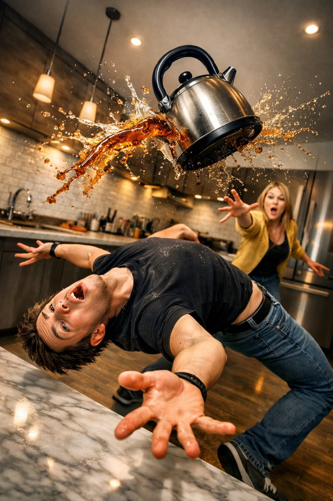

## { "image_type": "studio portrait", "composition": { "fra

- ID: trending-2002763964476965234
- Slug: trending-2002763964476965234-en
- 语言: en
- 来源: [来源链接](https://x.com/Sheldon056/status/2002763964476965234)
- 样例图路径: images/part1/2002763964476965234_1.jpg

### 提示词

```text
{
"image_type": "studio portrait",
"composition": {
"framing": "tight head-and-shoulders close-up",
"camera_angle": "eye-level",
"orientation": "vertical",
"symmetry": "near-perfect central symmetry",
"focus": "sharp focus on eyes and facial features",
"depth_of_field": "shallow, background fully blurred to black"
},
"subject": {
"description": "middle-aged male-presenting subject",
"pose": "frontal, facing camera directly",
"expression": "calm, confident, intense gaze",
"eye_direction": "looking straight into lens",
"facial_features": {
"facial_hair": "short salt-and-pepper stubble and trimmed goatee",
"skin_texture": "visible pores and fine lines, realistic skin detail",
"eyes": "light-colored eyes emphasized by catchlights"
},
"hair": {
"style": "medium-length, brushed back",
"texture": "natural, slightly tousled",
"color": "dark brown with subtle gray highlights"
}
},
"wardrobe": {
"top": "white crew-neck t-shirt",
"outerwear": "dark jacket or coat with soft texture",
"accessories": "thin chain necklace partially visible"
},
"lighting": {
"style": "cinematic, high-contrast neon lighting",
"key_light": {
"position": "front-left",
"color": "cool cyan/blue",
"effect": "dominant illumination across face and torso"
},
"rim_light": {
"position": "rear-right",
"color": "saturated red/magenta",
"effect": "strong edge highlight on hair and face contour"
},
"fill_light": "minimal to none",
"contrast_level": "high",
"mood": "dramatic, futuristic, intense"
},
"color_palette": {
"dominant_colors": ["cyan blue", "deep red", "black"],
"color_temperature": "mixed cool and warm neon tones",
"saturation": "high saturation on lighting, neutral clothing tones",
"color_grading": "stylized cyberpunk-inspired grading"
},
"background": {
"environment": "studio",
"details": "pure black background with no visible texture or objects",
"separation": "strong subject-background separation via rim lighting"
},
"technical_details": {
"camera_style": "professional studio photography",
"lens_effect": "slight compression typical of portrait lens",
"estimated_focal_length": "85mm equivalent",
"image_sharpness": "high",
"noise": "minimal",
"dynamic_range": "controlled highlights with deep shadows"
},
"artistic_style": {
"genre": "cinematic portrait",
"influences": ["cyberpunk", "neo-noir", "editorial fashion"],
"visual_aesthetic": "bold, modern, high-impact",
"post_processing": {
"skin_retouching": "subtle, realistic",
"color_enhancement": "strong split-toning blue/red",
"clarity": "enhanced micro-contrast"
}
},
"overall_impression": {
"tone": "powerful and enigmatic",
"intended_use": "editorial, album cover, cinematic poster, AI style reference",
"style_recreation_keywords": [
"cinematic neon portrait",
"blue and red split lighting",
"black background",
"intense direct gaze",
"cyberpunk color grading",
"high-contrast studio lighting"
]
}
}
```

### 样例图

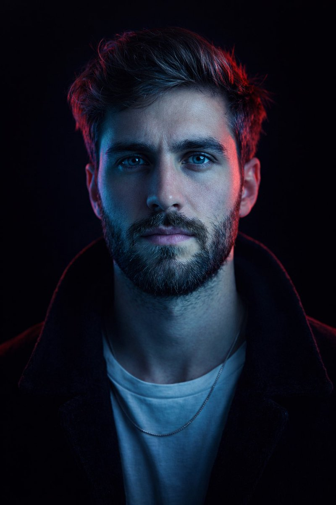

## Create an Ultra-realistic photo composite of uploaded pe

- ID: trending-2026703924888219706
- Slug: trending-2026703924888219706-en
- 语言: en
- 来源: [来源链接](https://x.com/Naiknelofar788/status/2026703924888219706)
- 样例图路径: images/part1/2026703924888219706_1.jpg

### 提示词

```text
Create an Ultra-realistic photo composite of uploaded person breaking out of an Instagram post frame. Standing pose, both hands holding frame edges, upper body outside frame with real shadows. High top-down view, strong 10mm fisheye effect on person only (big head, smaller body), frame straight. Confident upward gaze, purple graffiti puffer jacket, black tee, gold chain, white sneakers, sunglasses, black cap, yellow floor, clean Instagram UI (simeon-sanai) overlay, photorealistic.
```

### 样例图

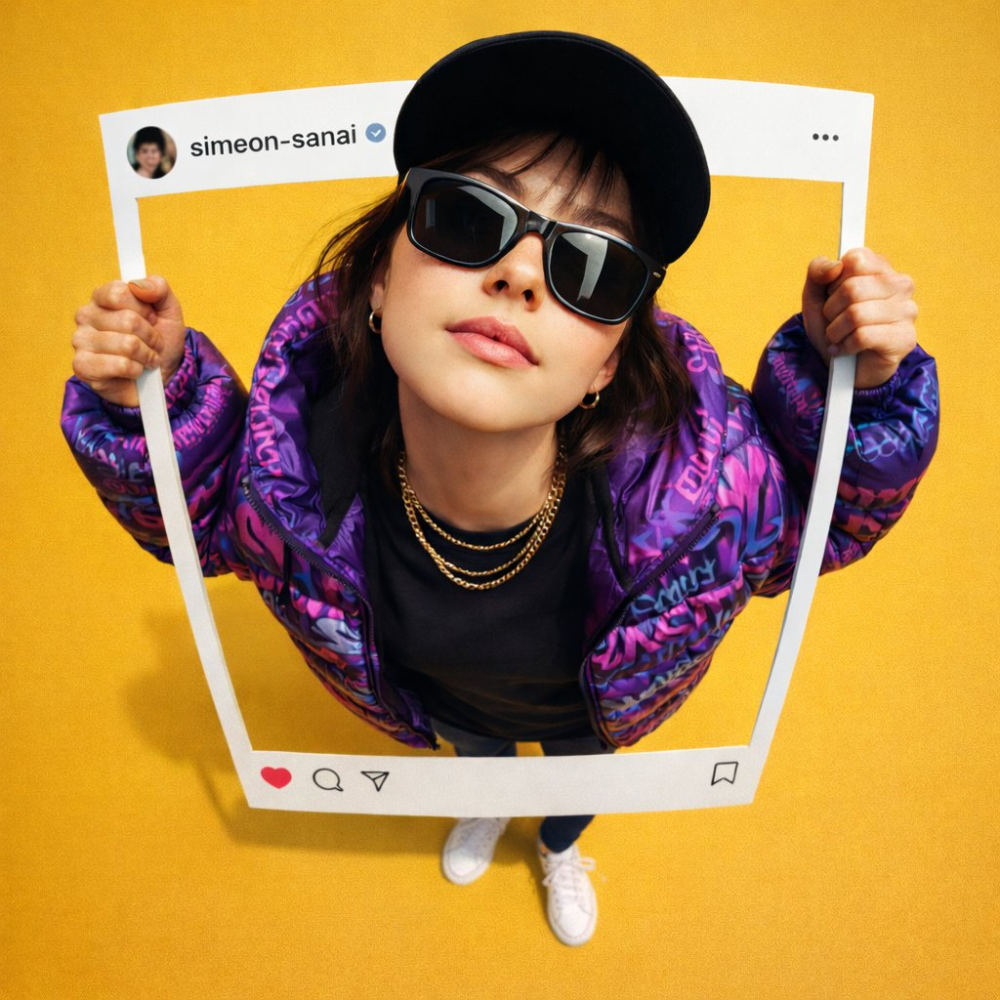

## A stylish man wearing a tan suit and sunglasses is featu

- ID: trending-2005541752187273292
- Slug: trending-2005541752187273292-en
- 语言: en
- 来源: [来源链接](https://x.com/Xaroonx/status/2005541752187273292)
- 样例图路径: images/part1/2005541752187273292_1.jpg

### 提示词

```text
A stylish man wearing a tan suit and sunglasses is featured in a creative split image, framed by two ornate gold frames. In the top frame, he is pouring Coca-Cola from a bottle. The cola streams downward, passing through the gap between the frames. In the bottom frame, the same man, also in a tan suit and sunglasses, is shown with a joyful expression as the stream of cola splashes into a glass mug he is holding, creating a dynamic splash.The background behind the frames is a softly blurred night cityscape with tall buildings and lights, suggesting.
```

### 样例图

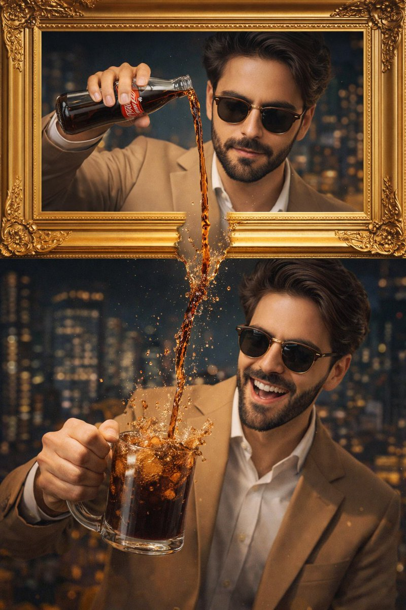

## Ultra-realistic 8K full body portrait of [PERSON’S FULL 

- ID: trending-2018389139826037141
- Slug: trending-2018389139826037141-en
- 语言: en
- 来源: [来源链接](https://x.com/TechieBySA/status/2018389139826037141)
- 样例图路径: images/part1/2018389139826037141_1.jpg

### 提示词

```text
Ultra-realistic 8K full body portrait of [PERSON’S FULL NAME], wearing a clean and pressed white social shirt with folded collar and a small lapel microphone, dark navy-blue dress pants and polished brown social shoes. Casually and unpretentiously leaning against a smooth light gray studio wall; hands are in pockets and one leg is crossed over the other, with relaxed and confident body language. Add to the wall next to them a prominent vector portrait in black and white of their face and bust - with sharp lines and angles, overlapping polygonal shapes and a minimalist modern graphic style, right below the information: “[PERSON’S FULL NAME]”, and below the name: “[PROFESSION]”
```

### 样例图

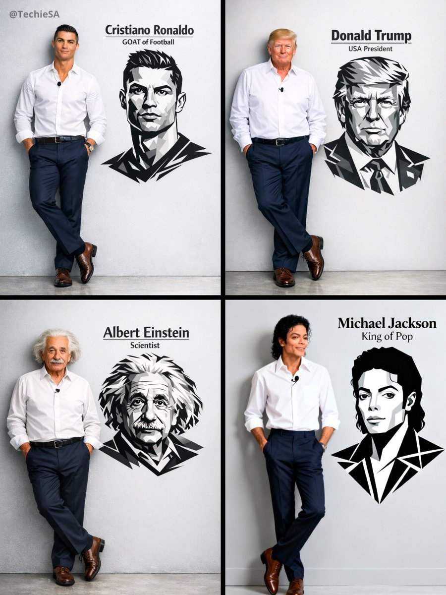

## Convert uploaded photo into ultra-wide 10mm fisheye port

- ID: trending-2033570946985144647
- Slug: trending-2033570946985144647-en
- 语言: en
- 来源: [来源链接](https://x.com/Naiknelofar788/status/2033570946985144647)
- 样例图路径: images/part1/2033570946985144647_1.jpg

### 提示词

```text
Convert uploaded photo into ultra-wide 10mm fisheye portrait from dramatic high top-down angle with strong perspective distortion (larger head, compressed body). Add black oversized sunglasses and plain white cap, right hand adjusting cap, confident upward gaze. Color-block puffer jacket (burnt orange/cream/brown), white tee, white sneakers. Bold terracotta studio background, smooth gradient, high contrast, sharp editorial lighting, 8k.
```

### 样例图

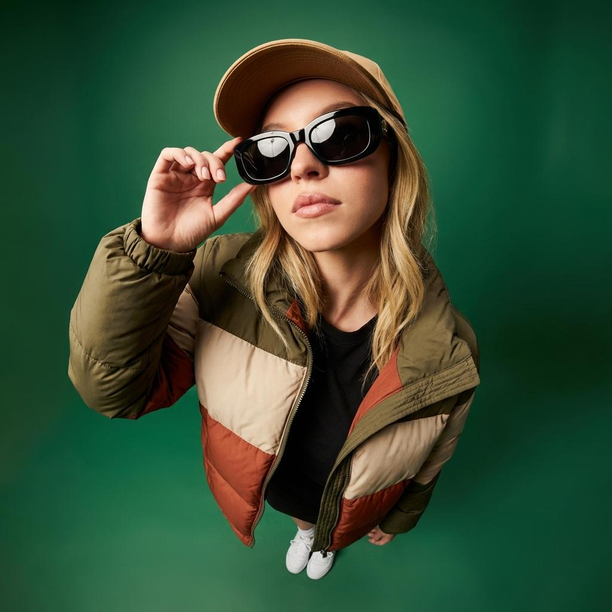

## Ultra-realistic studio portrait of a young woman, front-

- ID: trending-2011645375460057533
- Slug: trending-2011645375460057533-en
- 语言: en
- 来源: [来源链接](https://x.com/Naiknelofar788/status/2011645375460057533)
- 样例图路径: images/part1/2011645375460057533_1.jpg

### 提示词

```text
Ultra-realistic studio portrait of a young woman, front-facing, centered composition, symmetrical face, pale skin with soft cheeks and nose, light gray-blue eyes with a subtle dark limbal ring, soft neutral makeup, slightly glossy natural lips, faint smoky eyeliner, dark brown slightly messy hair with wispy bangs framing the forehead, a few loose strands around the face, wearing a dark gray fitted turtleneck sweater, small silver hoop earrings, calm neutral expression, looking directly into the camera, soft diffused cinematic lighting from the front and side, smooth gradient dark background, shallow depth of field, 85mm lens look, f1.8, ultra sharp focus, hyper-detailed skin texture, photorealistic, 8k, high dynamic range, professional studio photography, no text, no watermark, no logo, no signature, no artifacts.
```

### 样例图

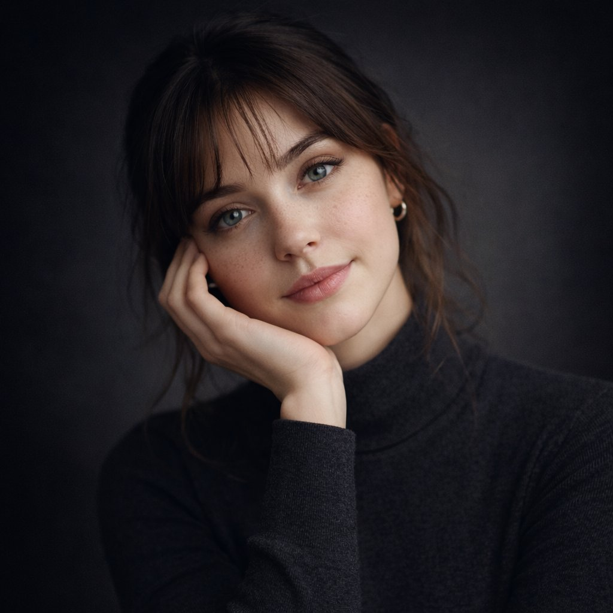

## Create a high-contrast black and white portrait in a qui

- ID: trending-2028623800313798810
- Slug: trending-2028623800313798810-en
- 语言: en
- 来源: [来源链接](https://x.com/Naiknelofar788/status/2028623800313798810)
- 样例图路径: images/part1/2028623800313798810_1.jpg

### 提示词

```text
Create a high-contrast black and white portrait in a quiet classroom.Use uploaded image as reference. Person leans casually on a wooden school chair, legs crossed, wearing a navy blue sweatshirt, beige chinos, and black-and-white Converse sneakers. calm neutral expression. His left arm rests on the desk, his right hand drops casually to the side. Behind him, an off-white classroom wall with visible wear, pinned papers, photos, and sticky notes in a grid. One page clearly shows the printed word “Silence”, positioned above his head. Sunlight enters sharply from the right, casting a triangular beam of light on the wall and her shadow. The contrast is dramatic, cinematic, and natural, with a warm late-afternoon tone
```

### 样例图

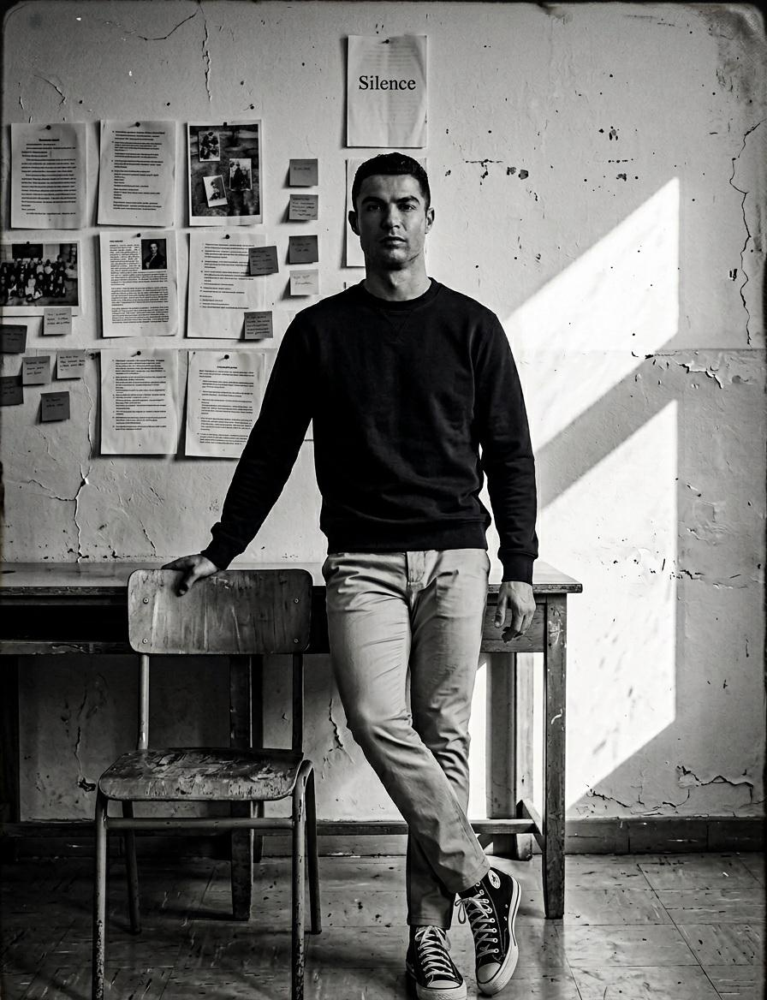

## Extreme close-up portrait of a woman with piercing green

- ID: trending-2020789772617478217
- Slug: trending-2020789772617478217-en
- 语言: en
- 来源: [来源链接](https://x.com/Naiknelofar788/status/2020789772617478217)
- 样例图路径: images/part1/2020789772617478217_1.jpg

### 提示词

```text
Extreme close-up portrait of a woman with piercing green eyes and bold, matte red lips, her face framed by a vibrant red textured hood. Dramatic cinematic lighting creates sharp shadows across her features, with fine strands of dark black hair blowing across her face. High-fashion editorial photography style, hyper-realistic, sharp focus, intense gaze, and a high-contrast color palette of deep reds and blacks.
```

### 样例图

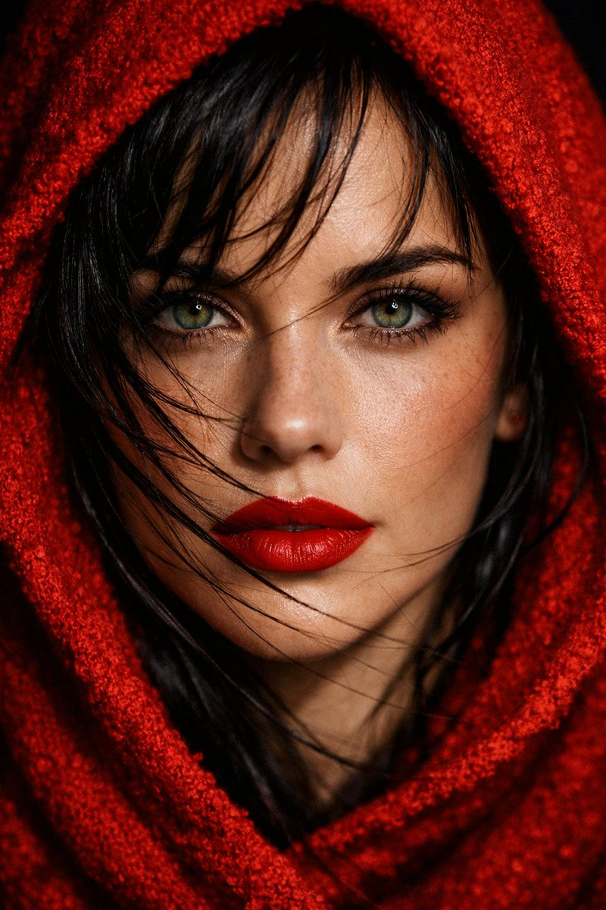

## A cinematic silhouette shot of local fishermen lining th

- ID: trending-2001003144566681621
- Slug: trending-2001003144566681621-en
- 语言: en
- 来源: [来源链接](https://x.com/ozan_sihay/status/2001003144566681621)
- 样例图路径: images/part1/2001003144566681621_1.jpg

### 提示词

```text
A cinematic silhouette shot of local fishermen lining the Galata Bridge in Istanbul during sunset. In the foreground, a weary fisherman leans against the railing, looking at the sea. The background features the hazy, dreamlike silhouette of the Süleymaniye Mosque and seagulls flying over the Golden Horn. Warm orange and deep blue color palette. Shot on Sony A7R IV with Sony FE 85mm f/1.4 GM lens at f/1.8. Atmospheric haze, emotional storytelling, award-winning travel photography.
```

### 样例图

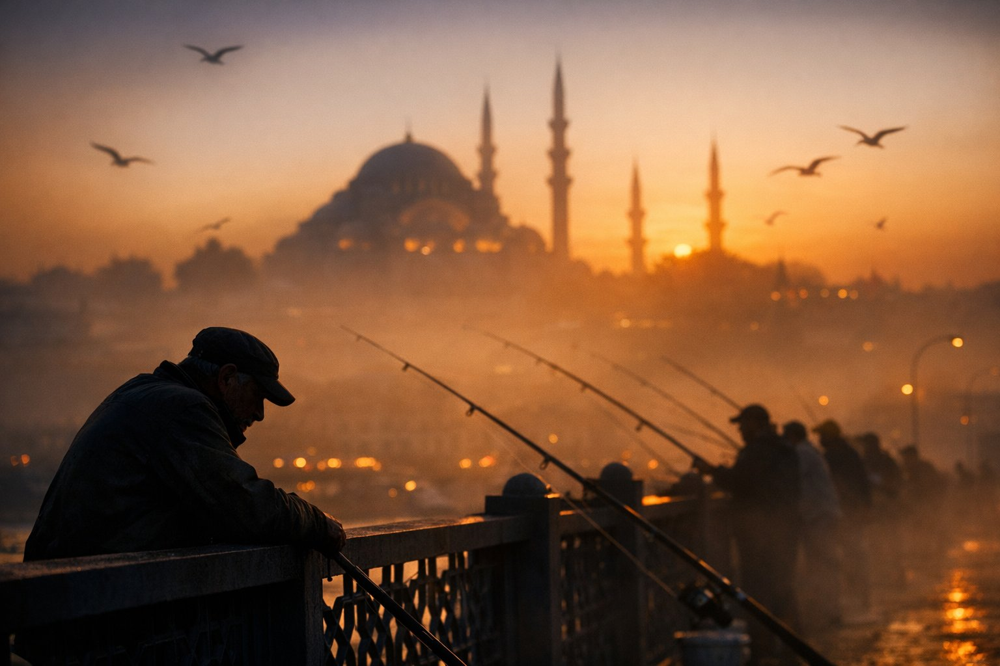

## { "image_style": "surreal, dark cinematic, ethereal", "s

- ID: trending-2007661583246471621
- Slug: trending-2007661583246471621-en
- 语言: en
- 来源: [来源链接](https://x.com/saniaspeaks_/status/2007661583246471621)
- 样例图路径: images/part1/2007661583246471621_1.jpg

### 提示词

```text
{
  "image_style": "surreal, dark cinematic, ethereal",
  "subject": {
    "person": "woman with features of reference image",
    "pose": "head tilted back, eyes closed, expression of freedom and release",
    "framing": "close-up portrait from chest upward",
    "clothing": "long-sleeve blouse made of organic, layered deep matte black raven feathers",
    "accessories": "large black hoop earrings"
  },
  "visual_effects": {
    "hair": "loose, dynamically suspended, blowing upward and forward by wind",
    "dissolving_elements": [
      "feathers and hair merging with black ink splatters",
      "charcoal dust",
      "wisps of dark smoke"
    ],
    "face_details": "fine black ink splatters and wisps spreading across face and neck"
  },
  "environment": {
    "background": "smoky gray, moody atmosphere",
    "elements": "thick, dense, layered smoke swirling throughout the frame"
  },
  "technical_aspects": {
    "resolution": "high-resolution",
    "lighting": "cinematic, moody, diffused through smoke"
  }
}
```

### 样例图

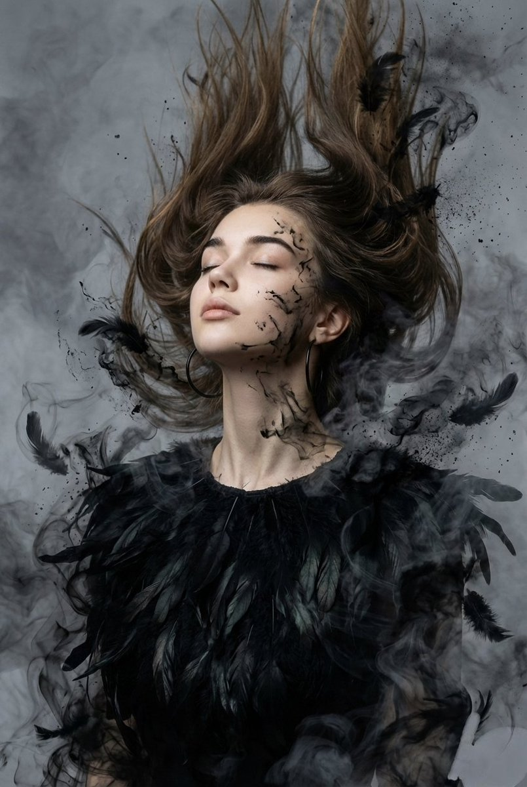

## Create an infographic image of [LANDMARK], combining a r

- ID: trending-2008190630317764651
- Slug: trending-2008190630317764651-en
- 语言: en
- 来源: [来源链接](https://x.com/Strength04_X/status/2008190630317764651)
- 样例图路径: images/part1/2008190630317764651_1.jpg

### 提示词

```text
Create an infographic image of [LANDMARK], combining a real photograph of the landmark with blueprint-style technical annotations and diagrams overlaid on the image. Include the title “[LANDMARK]” in a hand-drawn box in the corner. Add white chalk-style sketches showing key structural data, important measurements, material quantities, internal diagrams, load-flow arrows, cross-sections, floor plans, and notable architectural or engineering features. Style: blueprint aesthetic with white line drawings on the photograph, technical/architectural annotation style, educational infographic feel, with the real environment visible behind the annotations.
```

### 样例图

![Create an infographic image of [LANDMARK], combining a r](../images/part1/2008190630317764651_1.jpg)

## Photorealistic studio portrait of an average British man

- ID: trending-2024491215035511151
- Slug: trending-2024491215035511151-en
- 语言: en
- 来源: [来源链接](https://x.com/j_smeaton99/status/2024491215035511151)
- 样例图路径: images/part1/2024491215035511151_1.jpg

### 提示词

```text
Photorealistic studio portrait of an average British man in his late 20s to early 40s, natural appearance, realistic facial features, short well-groomed hair, light stubble or clean-shaven. He stands confidently with a relaxed posture, conveying quiet self-assurance.

He wears a stylish, comfortable, modern casual outfit, a well-fitted neutral-toned jacket or overshirt, premium plain t-shirt, tailored trousers or dark jeans, and clean minimalist sneakers. The look is contemporary, understated, and effortlessly fashionable.

Shot in a professional studio with minimal lighting: a soft key light focused on the subject with gentle shadow falloff, dark neutral background, high contrast, and strong subject isolation. Lighting highlights facial structure, textures, and silhouette while keeping the environment subtle.

Sharp focus on the subject, shallow depth of field, natural skin texture, realistic fabric detail, editorial fashion photography style, ultra-realistic, high resolution.

Negative prompt (optional): blur, heavy retouching, unrealistic skin, dramatic fashion styling, cluttered background, extra limbs, distortion, cartoonish style.
```

### 样例图

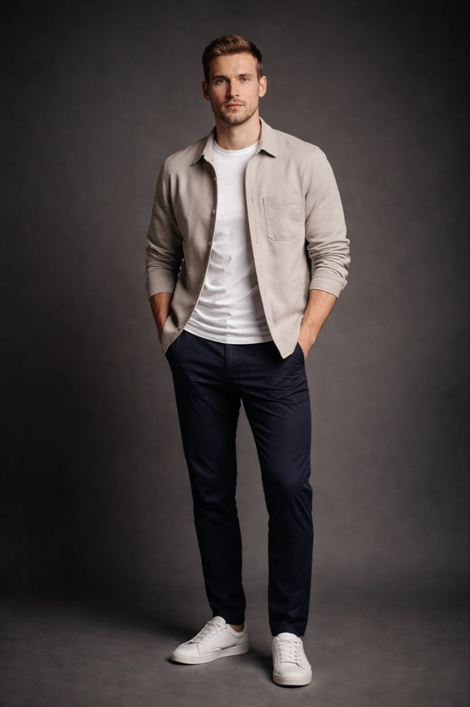

## { "image_type": "fashion portrait photography", "resolut

- ID: trending-2003730339542499635
- Slug: trending-2003730339542499635-en
- 语言: en
- 来源: [来源链接](https://x.com/meng_dagg695/status/2003730339542499635)
- 样例图路径: images/part1/2003730339542499635_1.jpg

### 提示词

```text
{
  "image_type": "fashion portrait photography",
  "resolution_target": "8K Ultra HD",
  "aspect_ratio": "vertical (portrait)",
  "composition": {
    "framing": "medium close-up portrait",
    "crop": "from upper chest to slightly above head",
    "subject_position": "centered",
    "camera_angle": "low angle, slightly upward-facing",
    "perspective": "dramatic upward perspective emphasizing neck and jawline",
    "depth_of_field": "shallow depth of field with soft background blur"
  },
  "subject": {
    "gender_presentation": "female-presenting",
    "age_range": "young adult",
    "skin_tone": "fair/light",
    "pose": {
      "head_position": "tilted slightly back",
      "chin": "raised upward",
      "shoulders": "relaxed, facing forward"
    },
    "facial_expression": {
      "eyes": "closed",
      "mouth": "slightly parted",
      "expression_mood": "calm, confident, introspective"
    },
    "face_details": {
      "face_shape": "oval",
      "jawline": "soft but defined",
      "cheekbones": "subtly defined",
      "skin_texture": "smooth, evenly lit"
    }
  },
  "hair": {
    "color": "reddish-brown / auburn",
    "length": "medium",
    "style": "loosely styled with soft waves",
    "texture": "slightly tousled",
    "flyaways": "visible loose strands around head and neck"
  },
  "eyewear": {
    "type": "eyeglasses",
    "frame_style": "rounded",
    "frame_material_appearance": "translucent",
    "frame_color": "light amber / peach-tinted",
    "lens": "clear"
  },
  "makeup": {
    "lip_color": "deep pink / rose",
    "lip_finish": "glossy",
    "eye_makeup": "subtle, warm-toned",
    "overall_style": "natural with emphasis on lips"
  },
  "accessories": {
    "earrings": {
      "type": "dangling earrings",
      "material_appearance": "metallic",
      "design": "intricate, elongated"
    },
    "necklace": {
      "type": "chain necklace",
      "pendant": "ornamental pendant",
      "material_appearance": "gold-toned metal"
    }
  },
  "clothing": {
    "garment_type": "tailored jacket or dress with lapels",
    "neckline": "deep V-neck",
    "fit": "structured yet flowing",
    "fabric_texture": "smooth, slightly reflective",
    "pattern": "vertical multicolored stripes",
    "colors": [
      "orange",
      "red",
      "green",
      "teal",
      "yellow"
    ],
    "buttons": "visible front button at mid-torso"
  },
  "lighting": {
    "type": "studio lighting",
    "direction": "soft frontal with slight side emphasis",
    "contrast": "moderate",
    "highlights": "gentle highlights on face and glasses",
    "shadows": "soft shadows under chin and neck"
  },
  "background": {
    "environment": "studio setup",
    "elements": "colored smoke or mist",
    "color_palette": [
      "pink",
      "coral",
      "peach",
      "soft green"
    ],
    "background_style": "abstract, atmospheric"
  },
  "atmosphere": {
    "mood": "cinematic, fashion-forward",
    "visual_effects": "floating colored smoke surrounding subject",
    "clarity": "subject sharp, background diffused"
  },
  "color_grading": {
    "tone": "warm",
    "saturation": "rich but balanced",
    "overall_palette": "harmonized warm and pastel tones"
  },
  "image_quality": {
    "sharpness": "high detail on facial features, clothing texture, accessories",
    "noise": "none visible",
    "finish": "clean, professional, editorial-grade"
  }
}
```

### 样例图

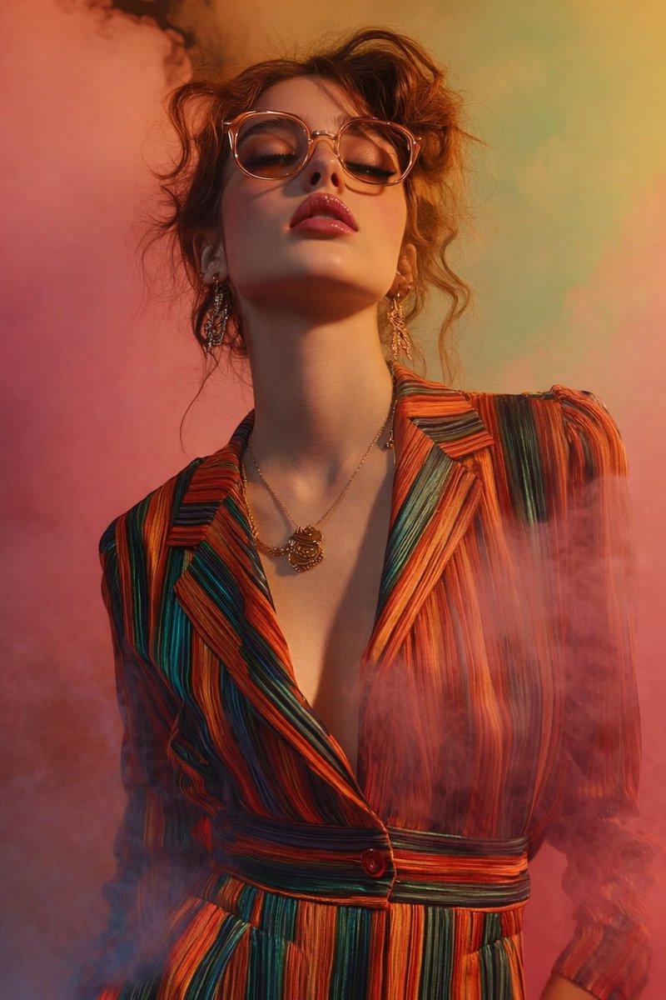

## Create a dramatic, digital painting-style portrait of a 

- ID: trending-2024432382124945823
- Slug: trending-2024432382124945823-en
- 语言: en
- 来源: [来源链接](https://x.com/Naiknelofar788/status/2024432382124945823)
- 样例图路径: images/part1/2024432382124945823_1.jpg

### 提示词

```text
Create a dramatic, digital painting-style portrait of a male footballer looking upwards with a determined expression. The style should be bold and textured, using dynamic brushstrokes and a limited color palette mainly black, white, red, and yellow. The background should be split vertically with abstract red and yellow paint streaks. On the red side, include the bold motivational text ‘I’VE JUST BEGUN’ in large white, hand-painted font. Capture the intensity and ambition in the player’s gaze. The composition should feel motivational and powerful, ideal for a sports poster. 8k Resolution, Image Aspect Ratio 4:5."
```

### 样例图

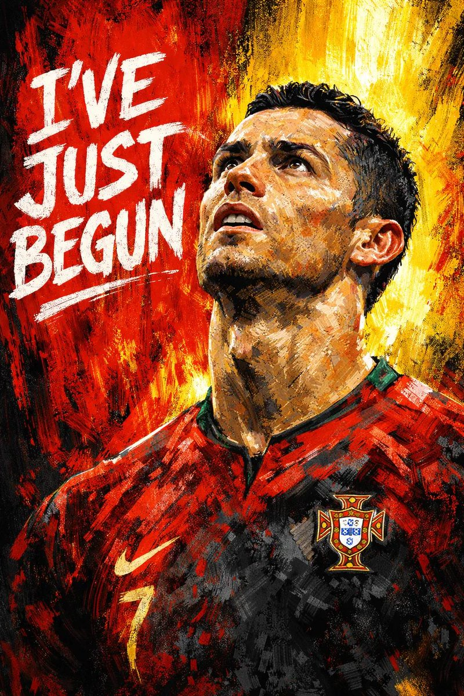

## { "image_type": "studio fashion portrait photography", "

- ID: trending-2003650158064730620
- Slug: trending-2003650158064730620-en
- 语言: en
- 来源: [来源链接](https://x.com/meng_dagg695/status/2003650158064730620)
- 样例图路径: images/part1/2003650158064730620_1.jpg

### 提示词

```text
{
  "image_type": "studio fashion portrait photography",
  "resolution_target": "8K ultra high definition",
  "aspect_ratio": "portrait (vertical)",
  "composition": {
    "framing": "medium portrait",
    "crop": "head to mid-torso",
    "subject_position": "slightly right of center",
    "camera_angle": "eye-level",
    "pose": {
      "body_orientation": "three-quarter turn to the left",
      "head_orientation": "turned toward camera",
      "arm_position": "one arm raised with hand placed behind or on top of head, other arm lowered and relaxed"
    }
  },
  "subject": {
    "gender_presentation": "female",
    "age_range": "young adult",
    "skin_tone": "light to medium",
    "facial_expression": {
      "expression": "neutral to mildly serious",
      "gaze_direction": "directly at camera",
      "emotion": "confident, composed"
    },
    "face_details": {
      "face_shape": "oval",
      "complexion": "smooth, even",
      "makeup": {
        "eyes": "defined eyeliner and mascara",
        "lips": "deep muted red or berry tone lipstick",
        "overall": "moderate, polished makeup"
      },
      "piercings": [
        "small nose ring on left nostril"
      ]
    },
    "eyes": {
      "visibility": "partially visible through tinted glasses",
      "eyewear": {
        "type": "narrow rectangular sunglasses",
        "lens_color": "dark tinted",
        "frame": "thin metal frame",
        "position": "worn low on the bridge of the nose"
      }
    },
    "hair": {
      "color": "medium brown with strong magenta/purple lighting highlights",
      "length": "long",
      "style": "loose, softly wavy",
      "parting": "center part"
    }
  },
  "clothing_and_accessories": {
    "outerwear": {
      "type": "faux fur coat",
      "color": "dark gray to black",
      "texture": "thick, plush, high-volume fur",
      "fit": "oversized",
      "wearing_style": "draped loosely off the shoulders"
    },
    "inner_clothing": {
      "type": "sleeveless top",
      "color": "black",
      "neckline": "straight or slightly scooped"
    },
    "jewelry": {
      "necklace": {
        "type": "thin chain necklace",
        "material": "metallic",
        "visibility": "clearly visible at collarbone"
      }
    }
  },
  "lighting": {
    "style": "studio lighting",
    "primary_light": {
      "direction": "front-left",
      "quality": "soft but directional"
    },
    "accent_lighting": {
      "color": "magenta/purple",
      "placement": "from above and behind, especially on hair and shoulders"
    },
    "contrast": "medium to high",
    "shadow_detail": "soft shadows with smooth falloff"
  },
  "background": {
    "type": "studio backdrop",
    "color": "deep purple gradient",
    "texture": "smooth, seamless",
    "depth": "no visible background objects"
  },
  "color_palette": {
    "dominant_colors": [
      "purple",
      "magenta",
      "black",
      "dark gray"
    ],
    "accent_colors": [
      "skin tones",
      "metallic silver"
    ]
  },
  "image_quality": {
    "sharpness": "high",
    "detail_level": "very high",
    "noise": "minimal to none",
    "dynamic_range": "wide"
  },
  "overall_style": {
    "aesthetic": "fashion editorial",
    "mood": "moody, stylish, confident",
    "era_influence": "modern"
  }
}
```

### 样例图

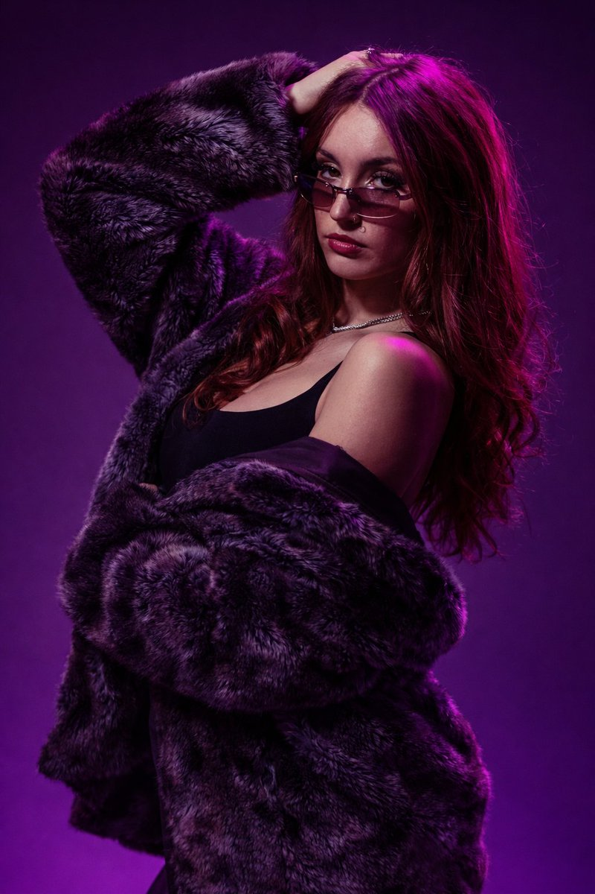

## { "meta": { "image_quality": "High", "image_type": "Mixe

- ID: trending-2018611988553752643
- Slug: trending-2018611988553752643-en
- 语言: en
- 来源: [来源链接](https://x.com/Sheldon056/status/2018611988553752643)
- 样例图路径: images/part1/2018611988553752643_1.jpg

### 提示词

```text
{
  "meta": {
    "image_quality": "High",
    "image_type": "Mixed Media (Photography + Vector Illustration)",
    "reference_image_usage": "Use the attached image strictly for facial identity matching only. Face shape, beard, glasses, eyes, nose, lips, and hair texture must match exactly. Do not copy clothing, lighting, or background from the reference.",
    "resolution_estimation": "High resolution, sharp vector edges",
    "file_characteristics": {
      "compression_artifacts": "Low",
      "noise_level": "None",
      "lens_type_estimation": "Standard portrait look (35–50mm equivalent)"
    }
  },
  "global_context": {
    "scene_description": "A full-body studio portrait of a young man in a dynamic, confident pose against a solid bright blue background. The image blends realistic photography with white hand-drawn vector doodles and abstract blue liquid shapes, creating a modern street-art editorial look.",
    "environment_type": "Studio / Graphic Design Composition",
    "atmosphere": "Energetic, urban, creative, cool",
    "lighting": {
      "source": "Artificial studio lighting",
      "direction": "Front-right dominant",
      "quality": "Soft and diffused",
      "color_temperature": "Neutral white"
    },
    "color_palette": {
      "dominant_colors": [
        "Bright blue background",
        "Deep blue clothing",
        "White graphic accents"
      ],
      "contrast_level": "High"
    }
  },
  "composition": {
    "camera_angle": "Low-angle, slightly upward",
    "framing": "Full body (head to toe)",
    "depth_of_field": "Deep focus",
    "focal_point": "Face and upper torso",
    "balance": "Asymmetrical with graphics filling negative space"
  },
  "subject": {
    "identity_source": "Attached reference image",
    "gender": "Male",
    "pose": "Standing with relaxed confidence, body angled slightly right, head tilted slightly left, one hand raised near the face, legs casually crossed",
    "expression": "Neutral, confident, calm",
    "face_constraints": {
      "glasses": "Round black eyeglasses",
      "facial_hair": "Trimmed beard",
      "hair": "Short, slightly tousled",
      "must_match_reference": true
    }
  },
  "wardrobe": {
    "style": "Monochromatic blue streetwear",
    "upper_body": "Blue fleece-style jacket worn open",
    "inner_layer": "Blue t-shirt with large white abstract graphic symbol",
    "lower_body": "Dark blue denim jeans with visible white contrast stitching and rolled cuffs",
    "footwear": "Clean white low-top sneakers"
  },
  "graphic_elements": {
    "style": "Hand-drawn white vector doodles",
    "elements": [
      "Microphone outline near raised hand",
      "Boombox line-art floating to the side",
      "Radiating sound or motion lines around head",
      "Cracked ground illustration beneath feet"
    ],
    "background_graphics": "Abstract blue liquid shapes layered behind the subject"
  },
  "background_details": {
    "color": "Solid bright blue",
    "texture": "Flat, uniform",
    "lighting_behavior": "Even, shadow-free background"
  },
  "reconstruction_notes": {
    "mandatory": [
      "Exact facial identity match from reference image",
      "Full-body pose",
      "Blue-on-blue color harmony",
      "White doodle overlays",
      "Sharp separation between photo and vector layers"
    ],
    "do_not_copy_from_reference": [
      "Clothing",
      "Pose",
      "Lighting",
      "Background"
    ],
    "intended_use": "High-impact editorial image or start frame for image-to-video animation"
  }
}
```

### 样例图

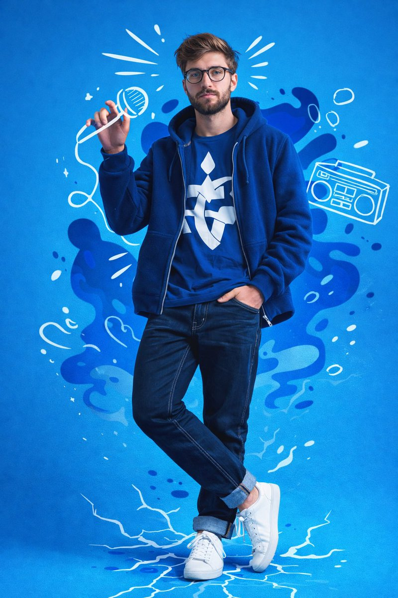

## { "type": "image_generation_prompt", "style": "photoreal

- ID: trending-2003500034239938642
- Slug: trending-2003500034239938642-en
- 语言: en
- 来源: [来源链接](https://x.com/saniaspeaks_/status/2003500034239938642)
- 样例图路径: images/part1/2003500034239938642_1.jpg

### 提示词

```text
{
  "type": "image_generation_prompt",
  "style": "photorealistic cinematic street photography, documentary aesthetic",
  "resolution": "ultra-high resolution",
  "identity_preservation": {
    "use_reference_image": true,
    "alter_face": false,
    "strict_identity_lock": true,
    "notes": "Use the uploaded reference image as the compositional base. Replace the central character with the woman from the reference image, preserving exact facial structure, skin texture, lighting direction, shadows, depth of field, angle, and emotional expression. No distortions, no artifacts, no skin tone mismatch."
  },
  "subject": {
    "gender": "female",
    "appearance": {
      "hair": "bald (as in the original composition)",
      "age": "adult",
      "expression": "calm, introspective, emotionally neutral",
      "skin": "realistic texture with natural pores and tones"
    },
    "pose": {
      "position": "standing still in the center of a busy urban crosswalk",
      "action": "gently smelling a flower held near the face",
      "posture": "upright, relaxed, perfectly static"
    },
    "wardrobe": {
      "outerwear": "dark minimalist blazer",
      "top": "black shirt"
    }
  },
  "environment": {
    "location": "busy urban pedestrian crosswalk",
    "atmosphere": "metropolitan street scene",
    "crowd": {
      "behavior": "people moving rapidly around the subject",
      "effect": "motion blur from long exposure"
    }
  },
  "lighting": {
    "type": "natural daylight",
    "conditions": "overcast sky",
    "quality": "soft, diffused light",
    "effects": [
      "realistic skin tones",
      "no artificial highlights",
      "natural shadows"
    ]
  },
  "cinematic_effects": {
    "long_exposure": true,
    "subject_clarity": "central subject perfectly sharp",
    "surroundings": "crowd blurred with motion",
    "mood": "isolation and stillness amid chaos"
  },
  "color_grading": {
    "palette": [
      "cool grays",
      "muted browns",
      "soft blacks"
    ],
    "saturation": "desaturated",
    "style": "professional cinematic grading"
  },
  "camera": {
    "lens_look": "85mm",
    "depth_of_field": "shallow",
    "grain": "realistic film grain",
    "perspective": "identical to original reference image"
  },
  "quality_constraints": [
    "no facial deformation",
    "no AI artifacts",
    "no artificial lighting effects",
    "perfect facial integration",
    "consistent shadows and perspective"
  ],
  "output_goal": "Create a photorealistic, cinematic street photograph featuring a woman standing still in a busy crosswalk, smelling a flower, with long-exposure motion blur around her, preserving the exact realism, lighting, depth, and emotional tone of the original reference image."
}
```

### 样例图

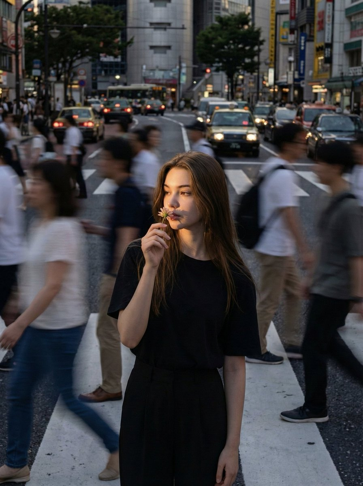

## Ultra-realistic photo featuring a young man (insert user

- ID: trending-2015264060754080239
- Slug: trending-2015264060754080239-en
- 语言: en
- 来源: [来源链接](https://x.com/Naiknelofar788/status/2015264060754080239)
- 样例图路径: images/part1/2015264060754080239_1.jpg

### 提示词

```text
Ultra-realistic photo featuring a young man (insert user’s photo) in perfect detail, preserving 100% of his facial features, wearing warm winter clothing suitable for the penguins’ icy habitat (thick jacket, scarf, gloves, beanie). The man is interacting naturally with penguins in their snowy and icy environment (snow, ice, rocks, frozen water reflections).
Include natural and spontaneous photo poses:
– sitting on a rock while touching a penguin
```

### 样例图

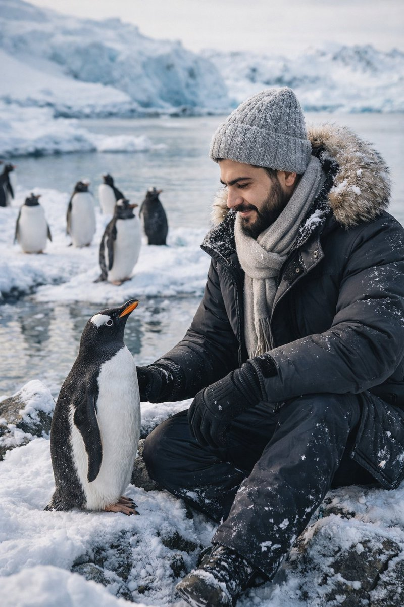

## Transform this image [UPLOAD YOUR IMAGE] into a 64K DSLR

- ID: trending-2022898659336298658
- Slug: trending-2022898659336298658-en
- 语言: en
- 来源: [来源链接](https://x.com/Professor_134/status/2022898659336298658)
- 样例图路径: images/part1/2022898659336298658_1.jpg

### 提示词

```text
Transform this image [UPLOAD YOUR IMAGE] into a 64K DSLR-quality shot resolution Ultra-hyperrealistic cinematic Create a photorealistic, beauty portrait in a vertical 4:5 frame, captured as a tight close-up to extreme close-up. The framing focuses primarily on the face - from just above the forehead to slightly below the lips — with minimal negative space. The camera is positioned mid-close to the subject (same face as the uploaded
```

### 样例图

![Transform this image [UPLOAD YOUR IMAGE] into a 64K DSLR](../images/part1/2022898659336298658_1.jpg)

## A futuristic cyber-aesthetic portrait of a young woman w

- ID: trending-2014990545345810674
- Slug: trending-2014990545345810674-en
- 语言: en
- 来源: [来源链接](https://x.com/Naiknelofar788/status/2014990545345810674)
- 样例图路径: images/part1/2014990545345810674_1.jpg

### 提示词

```text
A futuristic cyber-aesthetic portrait of a young woman wearing glowing neon-yellow glasses, with luminous mathematical equations projected across her face and jacket. Soft bokeh blue lights in the background create a high-tech atmosphereHyper-realistic detail, sharp eyes, smooth skin, and vivid color contrast. Sci-fi digital-glow style, immersive and modern." Her expression is calm and focused. The lighting is vibrant and cinematic, with reflections on the glasses and warm yellow highlights on her clothing.
```

### 样例图

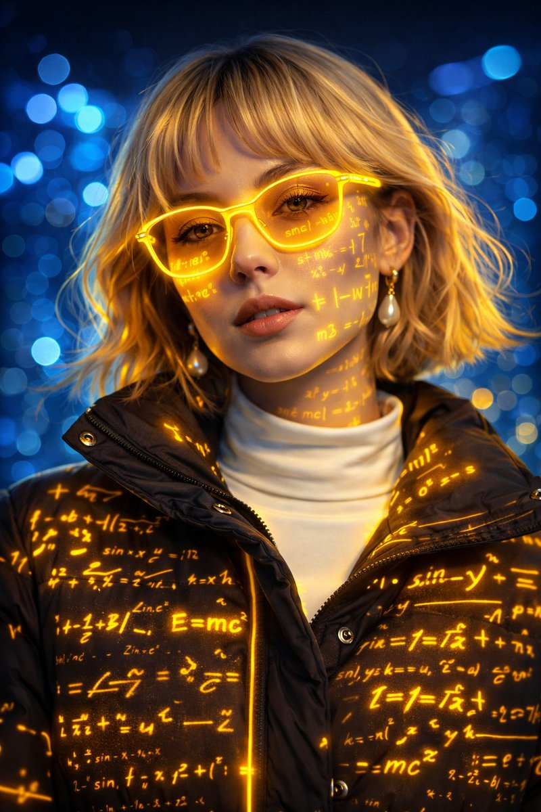

## A cinematic, ultra-realistic advertising shot of a man h

- ID: trending-2012714937089749208
- Slug: trending-2012714937089749208-en
- 语言: en
- 来源: [来源链接](https://x.com/Sheldon056/status/2012714937089749208)
- 样例图路径: images/part1/2012714937089749208_1.jpg

### 提示词

```text
A cinematic, ultra-realistic advertising shot of a man holding a Lay’s [FLAVOR NAME] chips packet in his hand.
The packet color, branding, and typography are perfectly accurate to Lay’s official design.
The man’s outfit color, texture, and style match the packet theme (same color palette and mood), modern and stylish, premium fashion look.
His pose is confident and natural, hand clearly gripping the Lay’s packet in the foreground.
Background environment matches the flavor theme — spices, ingredients, atmosphere, and lighting inspired by the flavor (for example: fiery spices for masala, fresh greens for sour cream, smoky tones for barbecue).
Chips are flying in slow motion around the scene with realistic motion blur and seasoning particles in the air.
Dramatic golden-hour lighting, cinematic depth of field, sharp focus on the packet, soft background bokeh.
Hyper-realistic textures, commercial food photography, high contrast, rich colors, ultra-detailed, 8K quality, professional brand advertisement style.
```

### 样例图

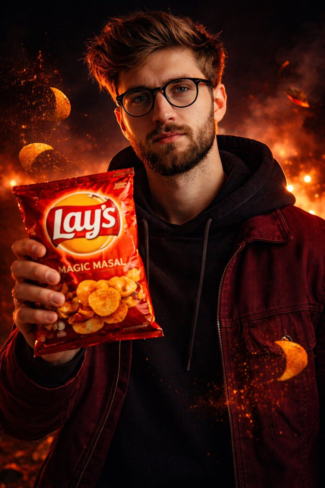

## { "image_type": "portrait", "generation_quality": "8K ul

- ID: trending-2008370131815342380
- Slug: trending-2008370131815342380-en
- 语言: en
- 来源: [来源链接](https://x.com/meng_dagg695/status/2008370131815342380)
- 样例图路径: images/part1/2008370131815342380_1.jpg

### 提示词

```text
{
  "image_type": "portrait",
  "generation_quality": "8K ultra-high resolution",
  "realism_level": "photorealistic",
  "subject": {
    "human_presence": true,
    "gender_presentation": "feminine",
    "age_appearance": "young adult",
    "visible_pose": {
      "head_position": "slightly tilted",
      "hand_position": "one hand raised touching hair near the side of the head",
      "shoulder_visibility": "upper torso visible"
    },
    "facial_expression": {
      "mouth": "slightly parted lips",
      "expression": "neutral to soft, relaxed",
      "gaze_direction": "looking directly toward the camera"
    }
  },
  "face_details": {
    "face_shape": "oval",
    "skin_texture": "smooth with visible natural skin texture",
    "skin_finish": "soft matte with subtle highlights",
    "cheeks": "natural blush visible",
    "nose": {
      "shape": "straight",
      "size": "medium",
      "tip": "softly rounded"
    },
    "lips": {
      "shape": "full",
      "color": "muted warm rose / nude",
      "texture": "matte finish"
    },
    "jawline": "softly defined",
    "chin": "rounded"
  },
  "eyes": {
    "shape": "almond-shaped",
    "eye_color": "appears green or hazel under lighting",
    "eyelids": "natural crease visible",
    "lashes": "natural, not exaggerated",
    "eyebrows": {
      "shape": "well-groomed, natural arch",
      "density": "medium-full",
      "color": "dark brown"
    }
  },
  "hair": {
    "color": "medium to dark brown",
    "length": "short to medium",
    "texture": "wavy",
    "style": "loose, slightly tousled",
    "parting": "off-center",
    "movement": "some strands falling across the forehead and partially covering one eye",
    "shine": "natural sheen visible"
  },
  "makeup": {
    "foundation": "natural, skin-like",
    "blush": "soft peach-pink",
    "lip_product": "matte lipstick",
    "eye_makeup": "minimal, natural enhancement",
    "overall_style": "clean, understated, realistic"
  },
  "clothing": {
    "garment_type": "button-up shirt",
    "fit": "relaxed fit",
    "fabric_appearance": "lightweight fabric",
    "pattern": "abstract floral or ornamental pattern",
    "color_palette": {
      "primary": "dark navy or charcoal",
      "secondary": "off-white or light beige"
    },
    "buttons": {
      "visibility": "visible",
      "color": "light neutral"
    },
    "collar": "standard pointed collar"
  },
  "lighting": {
    "type": "natural light",
    "direction": "side lighting",
    "contrast": "soft to medium contrast",
    "highlights": "gentle highlights on cheekbones, nose, and lips",
    "shadows": "soft shadows adding depth to facial contours"
  },
  "background": {
    "type": "out-of-focus",
    "style": "minimal, neutral",
    "colors": "dark gray and muted tones",
    "depth_of_field": "shallow",
    "distractions": "none visible"
  },
  "camera_and_composition": {
    "framing": "close-up portrait",
    "angle": "eye-level",
    "focus": "sharp focus on face",
    "bokeh": "soft background blur",
    "crop": "head and upper torso"
  },
  "overall_aesthetic": {
    "mood": "calm, intimate",
    "style": "editorial portrait photography",
    "visual_cleanliness": "high",
    "artifacts": "none visible",
    "post_processing": "minimal, natural color grading"
  }
}
```

### 样例图

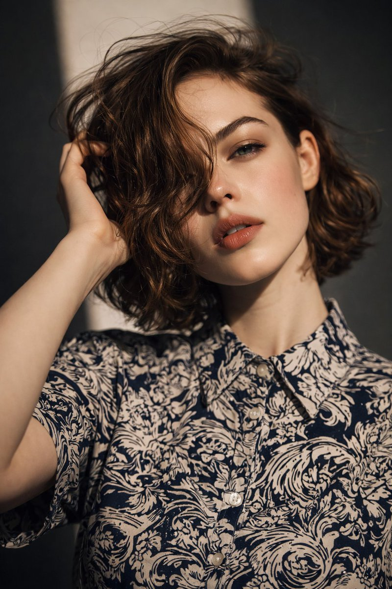

## { "render_goal": "Create a hyper-realistic, cinematic po

- ID: trending-2001888275724984383
- Slug: trending-2001888275724984383-en
- 语言: en
- 来源: [来源链接](https://x.com/john_my07/status/2001888275724984383)
- 样例图路径: images/part1/2001888275724984383_1.jpg

### 提示词

```text
{
  "render_goal": "Create a hyper-realistic, cinematic portrait with a rugged outdoor adventure aesthetic",
  "subject": {
    "gender": "male",
    "age_range": "mid-to-late 20s",
    "appearance": {
      "hair": "textured, windswept",
      "beard": "short, well-groomed",
      "facial_features": "sharp, chiseled",
      "expression": "intense, serious"
    },
    "skin_detail": "ultra-detailed, natural texture with realistic tones"
  },
  "wardrobe": {
    "outerwear": "worn dark leather jacket",
    "details": "visible stitching, rugged texture"
  },
  "environment": {
    "location": "outdoor mountain landscape",
    "background": {
      "mountains": "misty, fog-covered",
      "trees": "dark evergreen forest fading into distance",
      "atmosphere": "dense atmospheric fog"
    }
  },
  "lighting_and_color": {
    "lighting_style": "moody, cinematic",
    "light_source": "soft overcast daylight",
    "shadows": "dramatic but natural",
    "color_palette": "cool, desaturated tones"
  },
  "camera_settings": {
    "lens": "85mm",
    "aperture": "f/1.8",
    "depth_of_field": "shallow",
    "focus": "razor-sharp on subject, blurred background"
  },
  "photography_style": {
    "quality": "professional photography",
    "realism_level": "hyper-realistic",
    "details": "high micro-detail, crisp textures, cinematic contrast"
  }
}
```

### 样例图


## Ultra-realistic, glossy magazine-style portrait of a you

- ID: trending-2029064691482542266
- Slug: trending-2029064691482542266-en
- 语言: en
- 来源: [来源链接](https://x.com/harboriis/status/2029064691482542266)
- 样例图路径: images/part1/2029064691482542266_1.jpg

### 提示词

```text
Ultra-realistic, glossy magazine-style portrait of a young male model, bald, with a stem, rugged expression and defined facial texture (pores, stubble shadows, subtle scars). Camera at shoe level (very low angle), wide-angle perspective, model tilted toward the lens, leaning forward and holding a Pepsi can extremely close to the camera - can label perfectly facing viewer and crisply legible with realistic metal reflections. Wearing a red Adidas tracksuit with visible Adidas logo and clean white sneakers, one foot stepped forward in the foreground. Urban USSR 1990s street environment: weathered concrete, vintage shop signs, old cars, period graffiti, small puddles. Bright sunny daytime with strong direct sunlight casting sharp cinematic shadows, warm sunlight highlights, slight wet reflections on asphalt and subtle water splashes near shoes for dynamism. Shallow depth of field (pin-sharp on face and can, creamy bokeh), ultra high detail, high contrast, vivid colors, warm sunlight with subtle teal-orange grade. Commercial editorial retouching style but preserving skin texture, enhanced clarity on label and metal, realistic specular highlights, natural micro-contrast. Composition: Pepsi can prominent in right foreground, eye-line slightly above center, negative space for masthead/logo--v 7 --style raw --quality 2 --ar 9:16 --chaos 3 --stylize 499-weird 99--exp 50
```

### 样例图

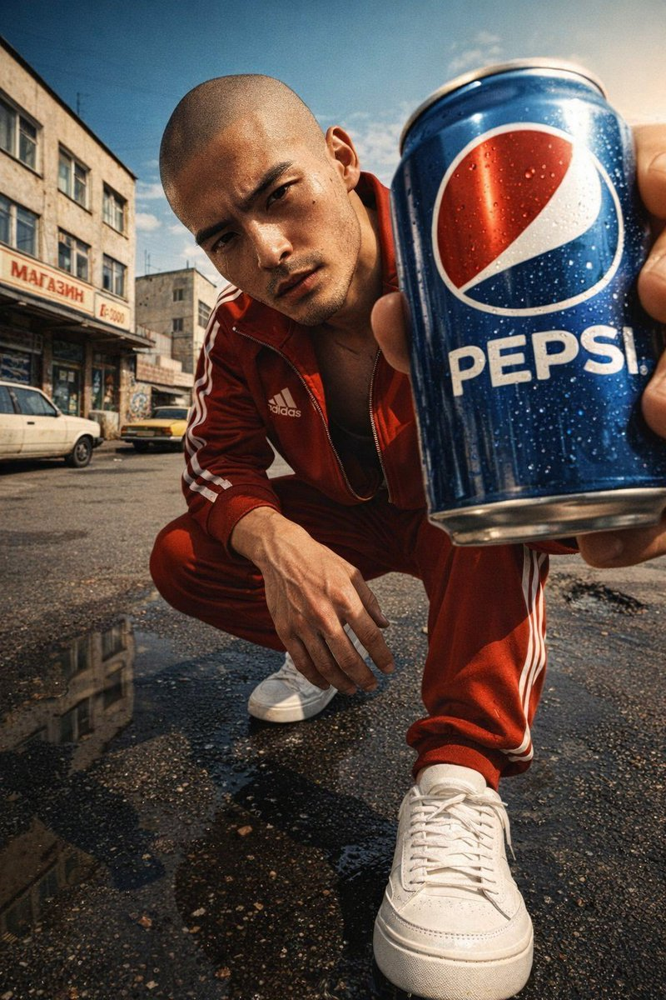

## Ultra-realistic cinematic studio portrait using provided

- ID: trending-2026603084760363062
- Slug: trending-2026603084760363062-en
- 语言: en
- 来源: [来源链接](https://x.com/Naiknelofar788/status/2026603084760363062)
- 样例图路径: images/part1/2026603084760363062_1.jpg

### 提示词

```text
Ultra-realistic cinematic studio portrait using provided person only. Subject wears black cyberpunk hoodie fully covered in bright glowing neon-orange circuit lines and illuminated zipper, hood up, hands in pockets, three-quarter pose facing right, head slightly down. Round shutter glasses with glowing orange bars. Dramatic studio lighting, glow casting light spill. Smooth dark-to-burnt orange gradient background. Style locked.
```

### 样例图

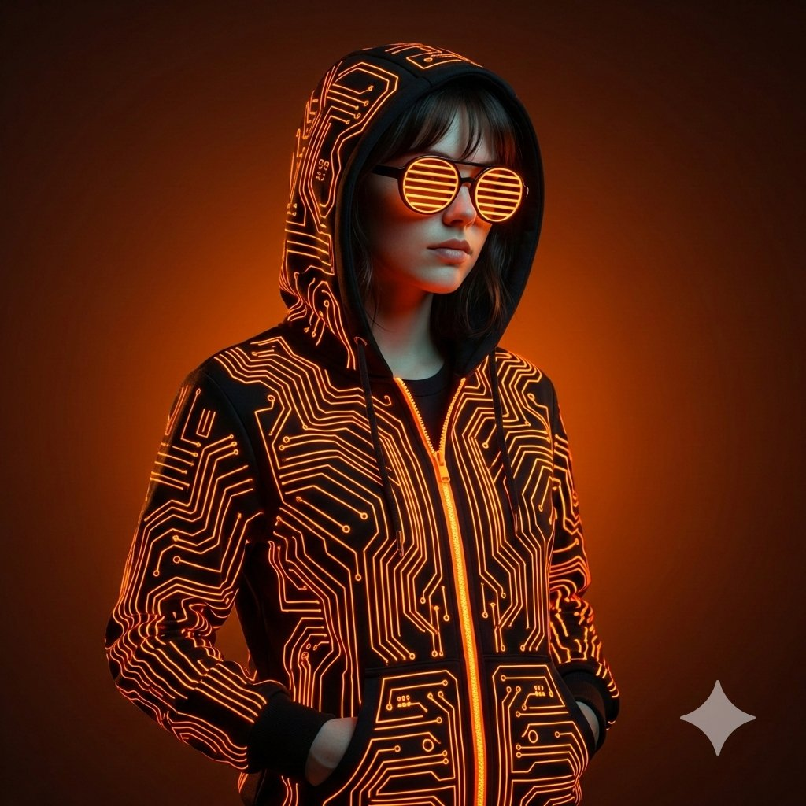

## Create an ultra-photorealistic cinematic portrait of a m

- ID: trending-2036271660765159675
- Slug: trending-2036271660765159675-en
- 语言: en
- 来源: [来源链接](https://x.com/Naiknelofar788/status/2036271660765159675)
- 样例图路径: images/part1/2036271660765159675_1.jpg

### 提示词

```text
Create an ultra-photorealistic cinematic portrait of a man viewed from a slightly low angle looking upward with a confident, powerful expression. Generate his face using the uploaded portrait photo. The composition is a tight upper-body portrait with the head tilted slightly upward, emphasizing the jawline and beard structure.
The background is a smooth vibrant studio
gradient transitioning between deep orange and warm red tones, creating a
dramatic modern aesthetic. Use strong cinematic dual-color lighting: warm
red/orange light from one side and cool teal/blue rim lighting from the
opposite side to create striking contrast across the face and beard. The man
is wearing a futuristic white oversized puffer jacket with large quilted sections
and a high protective collar. The jacket should look premium and modern with
realistic fabric folds, padded insulation volume, and subtle material sheen
similar to high-end technical winter fashion. Add extremely detailed textures:
visible skin pores, beard hair strands, subtle facial imperfections, realistic lip
texture, micro skin reflections, and detailed hair follicles. The sunglasses
should have thin metal frames with realistic reflections and slightly tinted
lenses reflecting the colored lighting. The white puffer jacket must show
detailed stitching, fabric grain, padded segments, and realistic light interaction
across the material. Lighting should create soft shadows, strong color
contrast, and dramatic highlights across the face, beard, glasses, and jacket.
Maintain sharp focus on the subject with studio-quality depth and clarity.
Ultra photorealistic portrait photography, cinematic studio lighting, hyper-
detailed textures, 8K detail, premium editorial fashion portrait, extremely
realistic skin and fabric materials.
Add a subtle handwritten text in the bottom-right corner that reads "Created by Naik", elegant fashion-editorial signature style, thin white ink, slightly transparent, like a photographer's signature on a luxury magazine shoot.
```

### 样例图

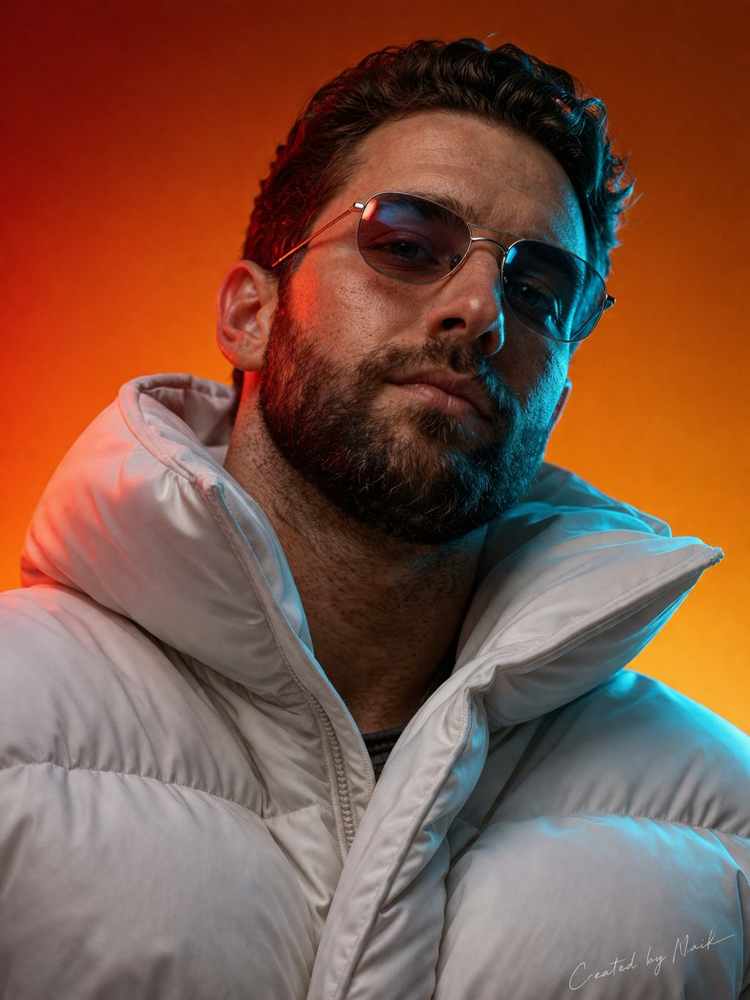

## { "prompt_type": "beauty_editorial_collage", "layout": {

- ID: trending-2016088856077205937
- Slug: trending-2016088856077205937-en
- 语言: en
- 来源: [来源链接](https://x.com/Naiknelofar788/status/2016088856077205937)
- 样例图路径: images/part1/2016088856077205937_1.jpg

### 提示词

```text
{
  "prompt_type": "beauty_editorial_collage",
  "layout": {
    "structure": "4-panel split-screen grid",
    "dividers": "Thick white diagonal borders",
    "style": "Modern magazine spread aesthetic"
  },
  "subject": {
    "demographic": "Young woman",
    "aesthetic": "Clean girl / K-beauty influence",
    "features": {
      "skin": "Flawless, dewy, 'glass skin' texture, high luminosity",
      "hair": "Short brown bob cut with wispy bangs, smooth texture",
      "eyes": "Soft grey/hazel contacts"
    }
  },
  "makeup": {
    "style": "No-makeup makeup look",
    "details": [
      "Soft rosy blush high on cheeks",
      "Glossy pink lip tint",
      "Groomed natural fluffy brows",
      "Subtle mascara"
    ]
  },
  "attire_and_accessories": {
    "headwear": "Brown houndstooth pattern newsboy cap (Baker boy hat)",
    "jewelry": "Small delicate gold butterfly stud earrings, thin gold chain necklace"
  },
  "panel_composition": {
    "top_left": "Close-up 3/4 angle, focus on cheek highlight and earring",
    "top_right": "Direct front-facing portrait, symmetrical composition",
    "bottom_left": "Portrait with hat, 3/4 turn, looking at camera",
    "bottom_right": "Extreme close-up side profile, cropping into face"
  },
  "technical_specs": {
    "resolution": "8K",
    "lighting": "Soft commercial studio lighting, ring light reflection in eyes",
    "color_grading": "Desaturated background, warm skin tones, high contrast",
    "style": "High-end beauty photography, hyper-realistic"
  }
}
```

### 样例图

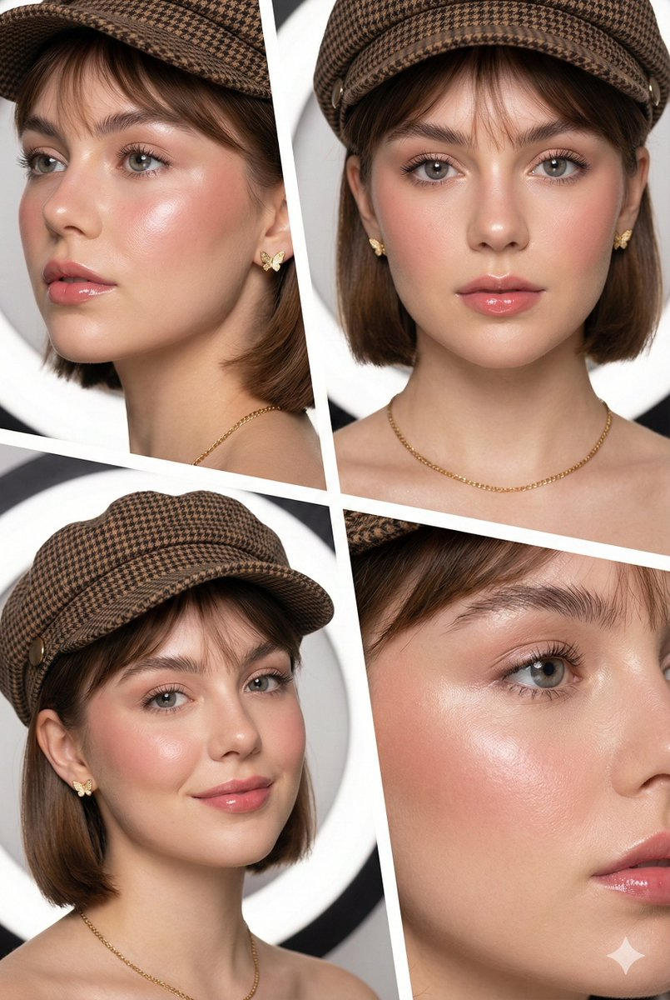

## { "type": "image_generation_prompt", "language": "en", "

- ID: trending-2010667809014264132
- Slug: trending-2010667809014264132-en
- 语言: en
- 来源: [来源链接](https://x.com/saniaspeaks_/status/2010667809014264132)
- 样例图路径: images/part1/2010667809014264132_1.jpg

### 提示词

```text
{
  "type": "image_generation_prompt",
  "language": "en",
  "style": "realistic smartphone photography, vibrant sports atmosphere",
  "aspect_ratio": "3:4",
  "identity_preservation": {
    "use_reference_image": true,
    "strict_identity_lock": true,
    "alter_face": false,
    "alter_features": false,
    "notes": "Use the uploaded reference photo. Preserve 100% of the woman’s facial features, proportions, skin texture, hair, and identity."
  },
  "subject": {
    "gender": "female",
    "pose": {
      "type": "selfie-style pose",
      "orientation": "facing the camera",
      "action": "static moment, as if pausing to take a selfie"
    },
    "expression": "serious, confident, and admiring",
    "appearance": {
      "hair": "unchanged from reference image",
      "accessories": [
        "aviator-style sunglasses with gold frame",
        "diamond stud earring in the right ear",
        "silver chain necklace with a pendant"
      ]
    },
    "wardrobe": {
      "top": "official FC Barcelona jersey with Spotify sponsorship"
    }
  },
  "composition": {
    "framing": "centered composition",
    "foreground": "woman occupying the first plane",
    "background": "football stadium and crowd",
    "perspective": "first-person selfie perspective"
  },
  "environment": {
    "location": "packed football stadium",
    "elements": [
      "vibrant green football pitch",
      "crowded stands full of fans",
      "energetic stadium atmosphere"
    ],
    "weather": "cloudy sky",
    "mood": "excitement, celebration, pride"
  },
  "lighting": {
    "type": "natural daylight",
    "conditions": "bright but diffused due to cloudy sky",
    "effects": [
      "vivid colors",
      "balanced exposure",
      "clear facial details"
    ]
  },
  "camera": {
    "device_style": "smartphone rear camera",
    "shot_type": "selfie-style medium close-up",
    "focus": "sharp focus on the subject with slightly softened background",
    "quality": "high sharpness and clarity"
  },
  "quality": {
    "realism": "highly realistic",
    "color": "vibrant and true-to-life",
    "detail_level": "clear textures on clothing, face, and stadium"
  },
  "constraints": [
    "Do not alter facial features",
    "No stylization or artistic filters",
    "No distortion of body or face",
    "No text overlays or watermarks",
    "Maintain realistic proportions and lighting"
  ],
  "output_goal": "Create a realistic, selfie-style photo of a woman wearing a Barcelona jersey in front of a packed football stadium, preserving her exact facial identity and conveying pride and admiration within a vibrant match-day atmosphere."
}
```

### 样例图

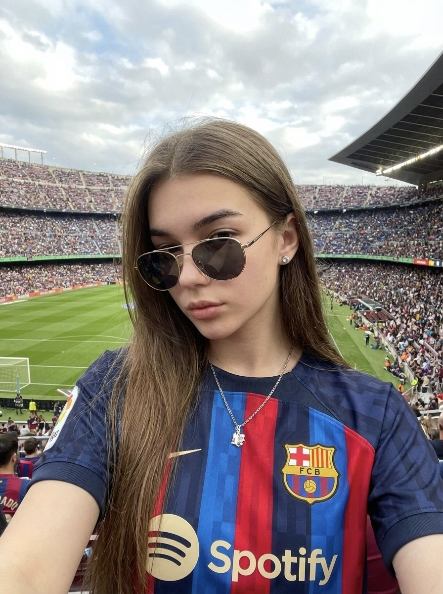

## Japanese negative film aesthetic, rooftop summer scene, 

- ID: trending-2047631839406297325
- Slug: trending-2047631839406297325-en
- 语言: en
- 来源: [来源链接](https://x.com/BubbleBrain/status/2047631839406297325)
- 样例图路径: images/part1/2047631839406297325_1.jpg

### 提示词

```text
Japanese negative film aesthetic, rooftop summer scene, soft natural sunlight, slight overexposure highlights, low contrast, muted faded colors, subtle grain  subject standing or sitting on rooftop edge area, body relaxed, slight wind moving hair and clothes, looking toward camera with calm distant gaze, not posing  open sky, empty space, minimal elements, imperfect composition, quiet isolated mood, nostalgic and reflective, “memory-like realism” --2:3
```

### 样例图

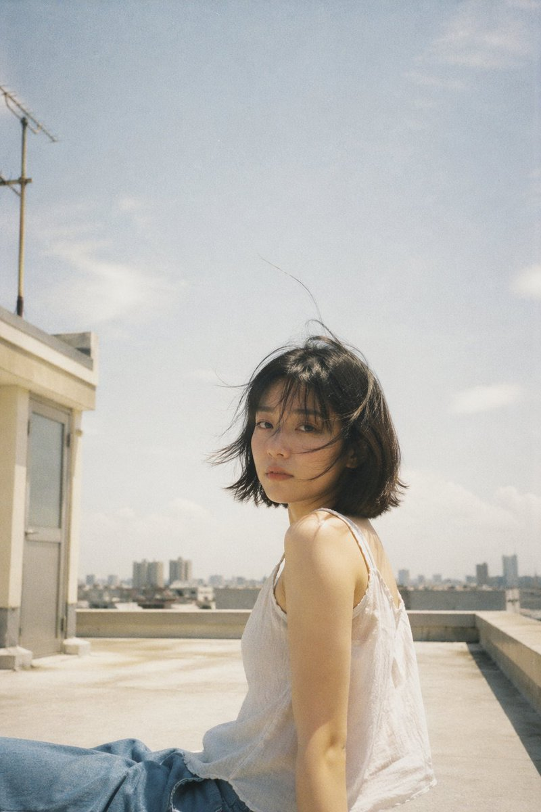

## Create a cinematic, high-fashion half-length portrait of

- ID: trending-2015623609533026575
- Slug: trending-2015623609533026575-en
- 语言: en
- 来源: [来源链接](https://x.com/Sheldon056/status/2015623609533026575)
- 样例图路径: images/part1/2015623609533026575_1.jpg

### 提示词

```text
Create a cinematic, high-fashion half-length portrait of me with a dreamy editorial vibe.
Use multi-exposure blur for ghosting and vertical streaks.
Set against a blue gradient background
(#0033A0 to #66CCFF), the subject wears an oversized white T-shirt.
Apply high-contrast lighting (cool blue wash + orange/yellow edge highlights) for a futuristic glow.
Expression: neutral/introspective, eyes softly lit.
Simulate 50-85mm lens at f/1.8 with shallow dep r field
Enhance with motion blur and chromatic separation, keeping central details sharp.
Aim for a surreal, digital-youth mood blending minimalism and light play.
```

### 样例图

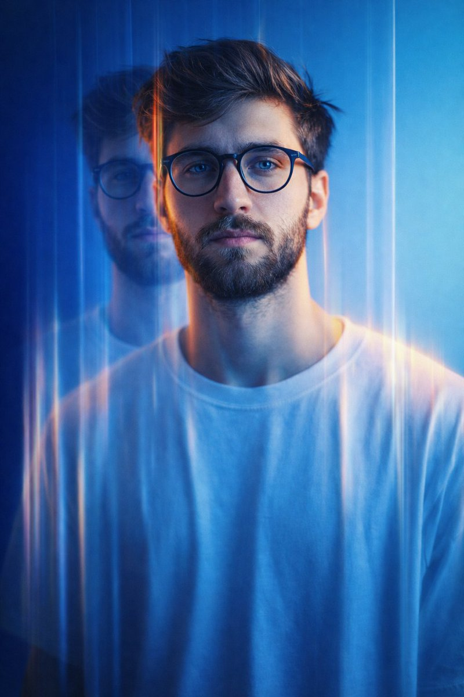

## 青蛇小青写真大片，绿色紧身蛇鳞裙，湿发红

- ID: trending-2046924538643107922
- Slug: trending-2046924538643107922-zh
- 语言: zh
- 来源: [来源链接](https://x.com/songguoxiansen/status/2046924538643107922)
- 样例图路径: images/part1/2046924538643107922_1.jpg

### 提示词

```text
青蛇小青写真大片，绿色紧身蛇鳞裙，湿发红唇，妖娆妩媚
```

### 样例图

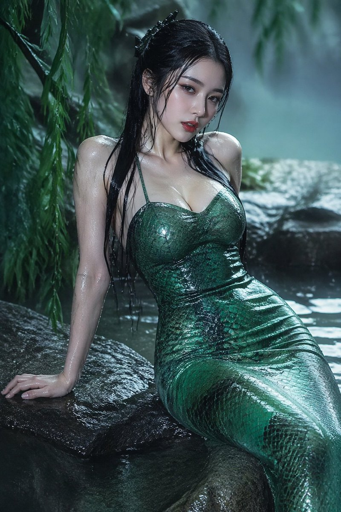

## Fantastic digital painting of a young man with high deta

- ID: trending-2020464744197693597
- Slug: trending-2020464744197693597-en
- 语言: en
- 来源: [来源链接](https://x.com/harboriis/status/2020464744197693597)
- 样例图路径: images/part1/2020464744197693597_1.jpg

### 提示词

```text
Fantastic digital painting of a young man with high detail, smooth shading, and sharp, bold lines. He stands in a powerful victory pose with his arms outstretched, confident and fearless expression. A brilliantly blended background with swirling smoke and flame like energy effects surrounds him. Neon sparks radiate from his body, creating a vibrant, glowing aura with cinematic lighting and dramatic contrast.
```

### 样例图

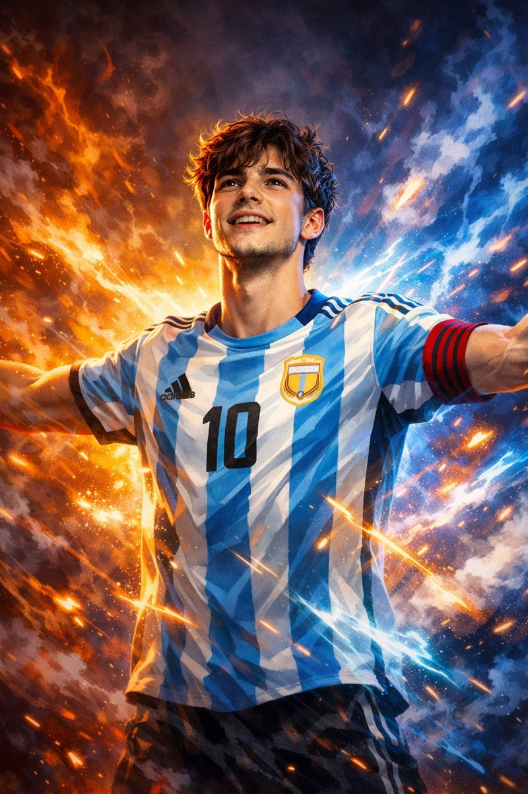

## { "type": "image_generation_prompt", "style": "Polaroid-

- ID: trending-2006946255709340062
- Slug: trending-2006946255709340062-en
- 语言: en
- 来源: [来源链接](https://x.com/saniaspeaks_/status/2006946255709340062)
- 样例图路径: images/part1/2006946255709340062_1.jpg

### 提示词

```text
{
  "type": "image_generation_prompt",
  "style": "Polaroid-style candid photography",
  "camera_style": {
    "camera": "Polaroid instant camera",
    "look": "ordinary snapshot",
    "effects": [
      "slight blur",
      "soft focus",
      "flash-lit dark room glow",
      "light scattering from on-camera flash",
      "subtle film grain",
      "slight exposure falloff"
    ]
  },
  "identity_preservation": {
    "use_reference_images": true,
    "strict_identity_lock": true,
    "alter_face": false,
    "notes": "Do not change or distort either person’s facial features, expressions, or proportions."
  },
  "subjects": [
    {
      "gender": "female",
      "identity": "user",
      "pose": "cute, casual pose standing close to the boy",
      "prop": "holding a burger",
      "expression": "natural, playful, candid"
    },
    {
      "gender": "male",
      "identity": "boy from reference",
      "pose": "cute, relaxed pose next to the girl",
      "prop": "holding a red Coca-Cola can",
      "expression": "natural, playful, candid"
    }
  ],
  "interaction": {
    "relationship": "friendly and cute",
    "body_language": "standing close together, relaxed, slightly leaning toward each other"
  },
  "environment": {
    "background": "plain white curtains",
    "location": "indoor room",
    "lighting": {
      "type": "single on-camera flash",
      "quality": "consistent, frontal flash lighting",
      "mood": "cozy, intimate, nostalgic"
    }
  },
  "composition": {
    "framing": "medium shot",
    "angle": "eye-level",
    "balance": "centered, casual snapshot composition"
  },
  "aesthetic": {
    "vibe": "cute, nostalgic, intimate",
    "era_feel": "classic instant film look",
    "imperfections": [
      "minor blur",
      "soft edges",
      "natural exposure inconsistencies"
    ]
  },
  "constraints": [
    "No change to faces",
    "No dramatic posing",
    "No artificial glamour or studio look",
    "No text or watermarks",
    "Must look like a real Polaroid photo"
  ],
  "output_goal": "Create a realistic Polaroid-style instant photo of a boy and girl posing cutely together indoors, with white curtains behind them, flash-lit from a dark room, the boy holding a red Coca-Cola can and the girl holding a burger, maintaining an authentic, nostalgic snapshot feel."
}
```

### 样例图

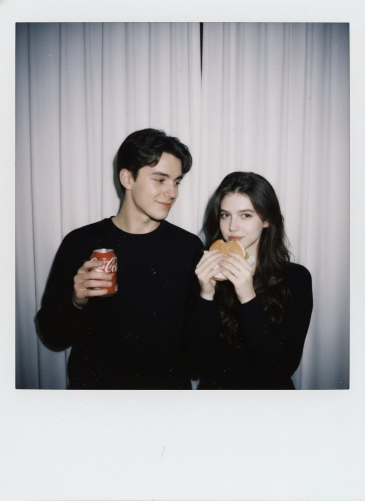

## Convert this image into a dramatic, stylized portrait (u

- ID: trending-2015406181804843044
- Slug: trending-2015406181804843044-en
- 语言: en
- 来源: [来源链接](https://x.com/Sheldon056/status/2015406181804843044)
- 样例图路径: images/part1/2015406181804843044_1.jpg

### 提示词

```text
Convert this image into a dramatic, stylized portrait (use the same face as the uploaded photo), 9:16 aspect ratio, featuring a dark, almost silhouetted figure in profile looking to the left. The background is a deep electric blue. Intense black and sapphire paint splashes burst outward from the head and shoulders, creating powerful motion energy. Ultra-sharp lighting, cinematic contrast, HD photo.
Signature: DUET
```

### 样例图

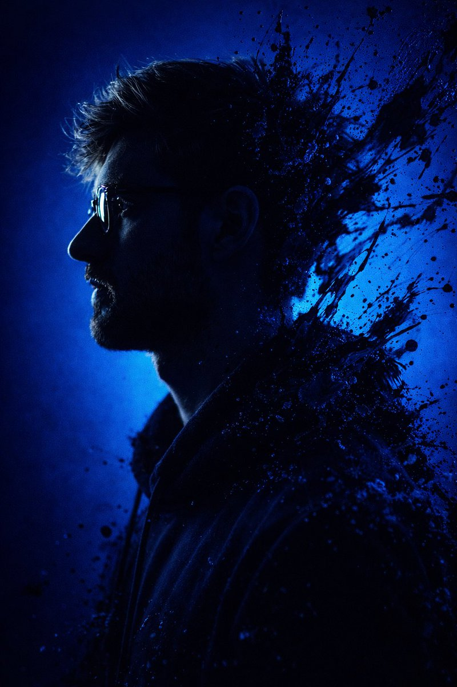

## Low-angle close-up portrait of a platinum blonde woman w

- ID: trending-2023256749310988332
- Slug: trending-2023256749310988332-en
- 语言: en
- 来源: [来源链接](https://x.com/Naiknelofar788/status/2023256749310988332)
- 样例图路径: images/part1/2023256749310988332_1.jpg

### 提示词

```text
Low-angle close-up portrait of a platinum blonde woman wearing oversized sculptural sunglasses crafted from delicate translucent layered flower petals in vibrant magenta, amber, and lilac hues, subtle silk texture visible in each petal with soft golden light passing through the edges, an extravagant couture choker necklace constructed from densely layered matching petals wrapping seamlessly around her entire neck with dimensional depth and organic curvature, her chin slightly lifted with a confident sculpted jawline, subtle freckles dusted across the bridge of her nose, naturally hydrated glossy lips with a soft highlight along the cupid’s bow, fine platinum hair strands gently lifted by a warm breeze with delicate motion at the ends, standing against a softly textured architectural backdrop of warm terracotta walls washed in golden sunset light with cascading lilac bougainvillea and amber-toned stone details, background melting into creamy magenta and lavender bokeh with soft atmospheric glow, rich golden hour sunlight illuminating her face evenly with gentle shadow contouring, warm reflected light from terracotta surfaces enhancing skin luminosity, faint rim light outlining her hair and shoulders, ultra-photorealistic high-fashion editorial photography, cinematic jewel-toned color grading balancing amber highlights with soft lilac shadows and magenta accents, shallow depth of field with elegant telephoto compression, razor-sharp focus on eyelashes and petal contours, shot on Sony A1, 70–200mm lens at 135mm, f/2, ISO 125, 1/1000s, professional editorial sharpness, museum-quality detail, vertical 2:3 composition with eye aligned along upper third

–ar 2:3 –v 6 –s 900 –q 3 –style raw –no text, harsh shadows, lens distortion, oversaturation, artifacts, artificial glow
```

### 样例图

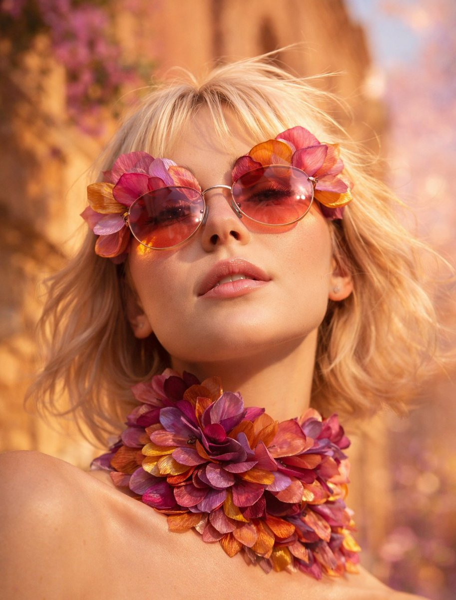

## A luxury [BRAND] brand advertisement featuring three sty

- ID: trending-2004219626897465419
- Slug: trending-2004219626897465419-en
- 语言: en
- 来源: [来源链接](https://x.com/Arminn_Ai/status/2004219626897465419)
- 样例图路径: images/part1/2004219626897465419_1.jpg

### 提示词

```text
A luxury [BRAND] brand advertisement featuring three stylish [ATHLETES / MODELS / PEOPLE] arranged in a single horizontal 1×3 grid, each posed in their own separate architectural window frame.

Composition & framing:
3 vertical window niches aligned side-by-side horizontally, Each character shown in a waist-up mid-shot, Fully inside the frame, with hands and props naturally breaking the bottom/side frame edges, No legs or lower body visible, hands anatomically correct, no missing fingers, no deformed limbs. All 3 frames must be fully visible, no cropping at the top or bottom, Clean, symmetrical, editorial alignment, consistent camera perspective, photorealistic fashion photography, DSLR, 85mm lens, shallow depth of field, natural skin texture, real pores, realistic fabric texture

Character slots (left to right):
[CHARACTER 1] wearing [OUTFIT 1], holding [OBJECT 1], in [POSE/ACTION 1], [EXPRESSION 1], [ACCESSORIES 1].
[CHARACTER 2] wearing [OUTFIT 2], holding [OBJECT 2] or doing [GESTURE 2], hands centered, breaking the frame edge outward (not sideways), [EXPRESSION 2], [ACCESSORIES 2].
[CHARACTER 3] wearing [OUTFIT 3], holding/carrying [OBJECT 3], projecting [VIBE 3], [EXPRESSION 3], [ACCESSORIES 3].

Style:
Authentic [BRAND] premium styling, couture-inspired detailing, expressive editorial fashion poses, glamorous, iconic, fashion-forward campaign vibe.

Backdrop & materials:
Elegant [BACKGROUND COLOR + MATERIAL] wall backdrop with subtle textures, refined architectural detailing, premium finish.

Lighting & camera:
High-fashion bright studio lighting, soft shadows, high contrast contours, realistic reflections, commercial studio photography, no CGI, no illustration, crisp product highlights. Aspect ratio & layout control: Ultra-wide horizontal composition, 1×3 grid, all three niches visible, balanced spacing.
```

### 样例图

![A luxury [BRAND] brand advertisement featuring three sty](../images/part1/2004219626897465419_1.jpg)

## A dramatic ultra-realistic portrait of a woman shown in 

- ID: trending-2015094660725940712
- Slug: trending-2015094660725940712-en
- 语言: en
- 来源: [来源链接](https://x.com/Naiknelofar788/status/2015094660725940712)
- 样例图路径: images/part1/2015094660725940712_1.jpg

### 提示词

```text
A dramatic ultra-realistic portrait of a woman shown in extreme close-up, only half of her face visible. Her skin is painted with bold tribal markings in deep red, navy blue, and muted earth tones, layered with rough textures and symbolic patterns. One striking light-blue eye is sharply in focus, conveying strength, resilience, and quiet intensity. She wears weathered fabric and woven textiles around her head, with frayed edges and smallwooden beads, suggesting ancient or nomadic culture. Cinematic lighting with soft shadows, shallow depth of field, dark neutral background, hyper-detailed skin texture, painterly realism, 8K quality, editorial poster style, moody and powerful atmosphere.
```

### 样例图

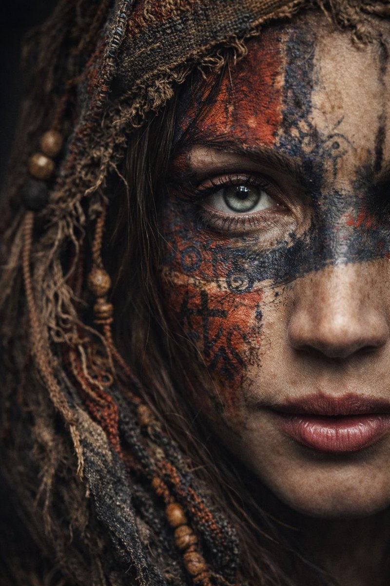

## Fashion photography, professional man model, shot with C

- ID: trending-2026182718435066073
- Slug: trending-2026182718435066073-en
- 语言: en
- 来源: [来源链接](https://x.com/harboriis/status/2026182718435066073)
- 样例图路径: images/part1/2026182718435066073_1.jpg

### 提示词

```text
Fashion photography, professional man model, shot with Canon eos r3, 50mm f/1.2 rf lens, f/2.8 settings, 1/160s, iso 1600, gradient neon violet, streetwear style, holographic effect on wear, luminescent sneaker soles, dark backdrop with deep purple atmospheric lighting, professional studio setup with two led strip lights at floor level and one overhead softbox, cyberpunk aesthetic, side profile active pose with silhouette, dramatic contrast, ultra sharp details, photorealistic quality, rich detailing
```

### 样例图

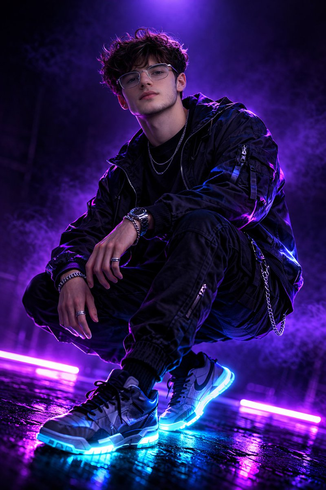

## { "image_type": "studio fashion portrait", "resolution_t

- ID: trending-2005820511801254047
- Slug: trending-2005820511801254047-en
- 语言: en
- 来源: [来源链接](https://x.com/meng_dagg695/status/2005820511801254047)
- 样例图路径: images/part1/2005820511801254047_1.jpg

### 提示词

```text
{
  "image_type": "studio fashion portrait",
  "resolution_target": "8K ultra high definition",
  "orientation": "vertical",
  "framing": {
    "shot_type": "full body shot",
    "camera_angle": "straight-on, eye-level",
    "subject_position": "centered",
    "cropping": "head to feet fully visible"
  },
  "subject": {
    "count": 1,
    "gender_presentation": "female-presenting",
    "pose": {
      "body_orientation": "facing forward",
      "weight_distribution": "weight shifted to one leg",
      "legs": {
        "front_leg": "slightly bent at the knee",
        "back_leg": "extended, supporting balance",
        "visibility": "one leg partially exposed through dress slit"
      },
      "arms": {
        "left_arm": "bent with hand resting on hip",
        "right_arm": "raised with hand touching hair near head"
      },
      "posture": "upright, relaxed, confident stance"
    },
    "facial_features": {
      "expression": "neutral to soft confident expression",
      "eyes": "open, looking directly at camera",
      "eyebrows": "well-defined",
      "lips": "full, slightly parted",
      "makeup": {
        "foundation": "smooth, even-toned",
        "blush": "subtle",
        "lip_color": "soft pink",
        "eye_makeup": "defined lashes, neutral tones"
      }
    },
    "hair": {
      "color": "dark brown",
      "length": "long",
      "texture": "slightly wavy",
      "styling": "loose, flowing",
      "bangs": "short fringe across forehead"
    },
    "skin": {
      "tone": "light to medium",
      "texture": "smooth, evenly lit"
    }
  },
  "clothing": {
    "dress": {
      "type": "evening gown",
      "length": "floor length",
      "fit": "fitted bodice, flowing skirt",
      "neckline": "asymmetrical single-strap",
      "strap": {
        "count": 1,
        "placement": "over one shoulder"
      },
      "pattern": "snake-skin inspired geometric pattern",
      "primary_color": "green",
      "secondary_colors": ["white", "light mint green"],
      "fabric": {
        "bodice": "structured, patterned fabric",
        "skirt": "sheer, lightweight, flowing fabric"
      },
      "slit": {
        "presence": true,
        "location": "front side",
        "height": "upper thigh"
      },
      "hemline": "uneven, flowing with layered folds"
    },
    "footwear": {
      "type": "high-heeled sandals",
      "color": "matching green",
      "heel_style": "thin heel",
      "details": "decorative floral or bow-like embellishment on front strap",
      "toe_style": "open-toe"
    },
    "accessories": {
      "visible_jewelry": "none clearly visible",
      "other_accessories": "none visible"
    }
  },
  "background": {
    "type": "studio backdrop",
    "color_palette": ["teal", "green"],
    "texture": "soft, cloudy gradient",
    "pattern": "non-uniform, painterly",
    "depth": "flat backdrop with subtle tonal variation"
  },
  "lighting": {
    "style": "studio lighting",
    "key_light": "soft frontal light",
    "fill_light": "even fill reducing harsh shadows",
    "shadows": "minimal, soft",
    "highlights": "gentle highlights on face and dress texture",
    "overall_exposure": "balanced"
  },
  "color_balance": {
    "dominant_colors": ["green", "teal"],
    "contrast": "moderate",
    "saturation": "medium to slightly high",
    "color_harmony": "monochromatic green tones"
  },
  "image_quality": {
    "sharpness": "high",
    "clarity": "clean and crisp",
    "noise": "none visible",
    "focus": "sharp across entire subject"
  },
  "style_tags": ["fashion photography", "studio portrait", "elegant", "glamour", "high fashion", "editorial"],
  "ai_generation_notes": {
    "do_not_add": ["extra jewelry", "additional subjects", "background objects", "props", "text", "logos"]
  }
}
```

### 样例图

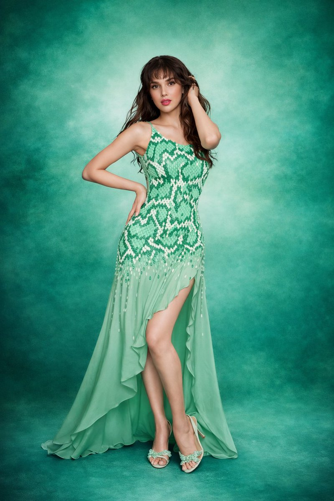

## Create a high-end promotional poster for International W

- ID: trending-2030675663095820332
- Slug: trending-2030675663095820332-en
- 语言: en
- 来源: [来源链接](https://x.com/Naiknelofar788/status/2030675663095820332)
- 样例图路径: images/part1/2030675663095820332_1.jpg

### 提示词

```text
Create a high-end promotional poster for International Women's Day, designed as a luxury editorial campaign seamlessly blending photorealistic studio photography with sophisticated modern graphic design.
Identity Matching (Critical): Strictly reference the uploaded image for precise face and identity matching. Preserve the exact facial structure, proportions, skin tone, hairstyle, and natural expression with full fidelity — the subject must remain clearly and unmistakably recognizable throughout.
Composition & Framing: Vertical 4:5 poster format. Three-quarter seated portrait with mid-thigh framing, subject occupying 30–40% of the frame. Subject is positioned slightly left of center, creating intentional visual breathing room on the right for the sculptural element. Editorial balance is paramount.
Subject & Pose: A confident woman with natural wavy hair cascading over one shoulder with soft studio shine. She sits upright yet relaxed in a modern plush red velvet armchair angled slightly toward camera — right leg crossed over left, hands resting softly on her knee, fingers elegant and relaxed. Shoulders are open and confident. Head tilted gently toward camera with a warm, natural smile conveying strength and inspiration. She wears a minimalist tailored white pantsuit — structured blazer, matching trousers, and a clean white blouse beneath — creating bold contrast against the red environment.
Symbolic Element: Behind and slightly right of the subject stands a large transparent acrylic/glass sculpture in the shape of the number "8" (referencing March 8th), nearly matching the subject's seated height. The structure features clean reflective edges with soft studio highlights emphasizing its transparency. Lush floral arrangements cascade organically along its curves — deep red roses, soft pink peonies, delicate light pink blossoms, and natural green leaves — clustered naturally toward the middle and lower sections of the numeral.
Background: Rich monochromatic red studio environment. Wall and floor merge into a seamless smooth red gradient backdrop with a subtle floor reflection anchoring the composition. The red velvet chair blends into the environment while remaining distinct through lighting and fabric texture.
Typography: Elegant, modern poster typography integrated into the layout —
Top left: Clean uppercase white sans-serif text: "SHE IS STRENGTH, / COURAGE, AND / INSPIRATION / EVERY DAY"
Lower section: Small uppercase label: "HAPPY INTERNATIONAL WOMEN'S DAY"
Main headline: Very large bold white block letters spelling "WOMAN" spanning the lower frame, overlaid with a stylized red handwritten script "Woman" crossing diagonally for a dynamic graphic contrast
Bottom center: "08 . MARCH" in wide-tracked minimalist type
Lighting: Professional three-point studio setup — soft frontal key light for flawless skin tones, gentle fill light eliminating harsh shadows, and a subtle rim light sculpting the subject and chair. The glass number 8 catches sharp highlights along its edges.
Visual Effects & Finish: Subtle cinematic prism lens flares and soft rainbow light leaks in the corners and lower foreground for editorial luxury depth. Shallow depth of field keeps the subject and floral sculpture razor sharp while the red background fades into a smooth gradient. Vibrant cinematic color grading, high-end digital compositing polish.
Render Quality: 8K ultra-high resolution. Photorealistic. Luxury advertising aesthetic. No repeated titles or duplicate text elements
```

### 样例图

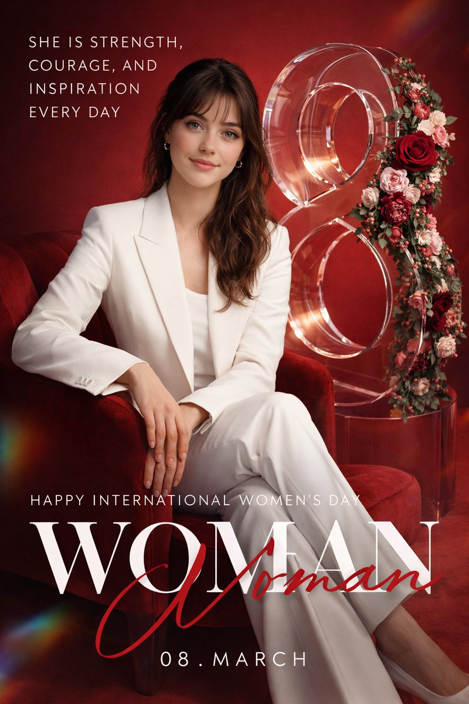

## A cinematic flash-photography shot viewed through a rain

- ID: trending-2017162200230797327
- Slug: trending-2017162200230797327-en
- 语言: en
- 来源: [来源链接](https://x.com/Naiknelofar788/status/2017162200230797327)
- 样例图路径: images/part1/2017162200230797327_1.jpg

### 提示词

```text
A cinematic flash-photography shot viewed through a rain-streaked car window at night. Inside a vintage black car, a chic Asian woman with long dark hair wears bright red cat-eye sunglasses, large hoop earrings, and a fuzzy green sweater. She has glossy red lipstick and is posing coolly. Sitting next to her on the maroon leather seat is a large, fluffy orange tabby cat wearing a red bandana. The background features blurred city streetlights and bokeh in green and teal tones. High-contrast lighting, Wong Kar-wai aesthetic, retro 90s fashion vibe, realistic texture, film grain, 35mm photography.",
  "elements": {
    "subject": {
      "human": "Young Asian woman, trendy, red cat-eye sunglasses, green fuzzy sweater, hoop earrings, glossy red lips",
      "animal": "Fluffy orange tabby cat, Maine Coon mix, red bandana, calm expression"
    },
    "environment": "Inside vintage car, night time, city street, rain on glass, street lights",
    "lighting": "Direct flash, atmospheric street lighting, bokeh background, high contrast shadows",
    "style": "Cinematic, retro 90s, Hong Kong cinema style, film photography, lo-fi aesthetic, candid"
  },
  "negative_prompt": "blurry, low resolution, cartoon, illustration, 3d render, drawing, distorted features, bad anatomy, missing limbs, text, watermark, daylight, bright sun",
  "technical_settings": {
    "aspect_ratio": "9:16",
    "film_stock": "Kodak Portra 800",
    "camera_angle": "Eye-level, shot through glass"
  }
}
```

### 样例图

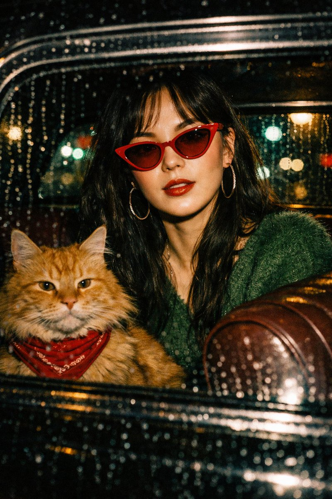

## A hyper-realistic iPhone RAW photo, vertical 9:16 ratio,

- ID: trending-2011274988700205370
- Slug: trending-2011274988700205370-en
- 语言: en
- 来源: [来源链接](https://x.com/Sheldon056/status/2011274988700205370)
- 样例图路径: images/part1/2011274988700205370_1.jpg

### 提示词

```text
A hyper-realistic iPhone RAW photo, vertical 9:16 ratio, candid street photography style with natural daylight, no filter, no cinematic grading, realistic color balance, Pinterest-style artsy realism.
The camera angle MUST MATCH THE REFERENCE IMAGE EXACTLY: a slightly elevated wide-angle perspective looking down toward a zebra crosswalk, similar to a street-level overhead shot, capturing the full crosswalk lines horizontally with the subject positioned at the center and symmetrically surrounded by characters, maintaining the exact spatial relationship and perspective of the reference photo. A young adult man with an athletic and naturally fit build is walking forward mid-step on the zebra crossing, body orientation, walking direction, and pose following the reference precisely, expression calm, neutral, and candid as if casually crossing the street, not posing. Outfit consists of fashionable casual streetwear with relaxed silhouettes: an oversized jacket in earthy muted tones such as brown, olive, or charcoal, a simple inner shirt, loose straight-cut trousers, and clean minimalist sneakers, creating an effortless modern daily-wear look that supports the calm surreal theme. Props include multiple Popmart Skullpanda characters in fluffy costumes placed around the subject in the SAME formation, spacing, and positioning as the reference image, each Skullpanda featuring soft plush textures, rounded proportions, and varied colors, appearing to walk alongside the human subject on the crosswalk. The location is an empty urban street with a clearly visible zebra crossing, realistic asphalt texture with subtle grain and natural wear, no traffic, no extra people, and an identical street layout perspective to the reference. Camera and composition are wide shot and full-body framing with no portrait crop, handheld but steady feel with slight natural imperfections, realistic depth of field keeping both subject and surrounding characters in focus, matching reference scale and depth. Lighting is natural daylight from above with soft consistent shadows on the ground, balanced exposure, no harsh sunlight, and no dramatic contrast. Skin texture is realistic and human, smooth yet visibly porous with natural highlights and subtle imperfections, no airbrushing, no plastic or CGI skin. Negative prompt: different camera angle, low angle, eye-level shot, close-up portrait, cinematic lighting, HDR, oversharpening, overly smooth skin, CGI look, 3D render, cartoon human, face alteration, distorted anatomy, text, watermark, logo.
```

### 样例图

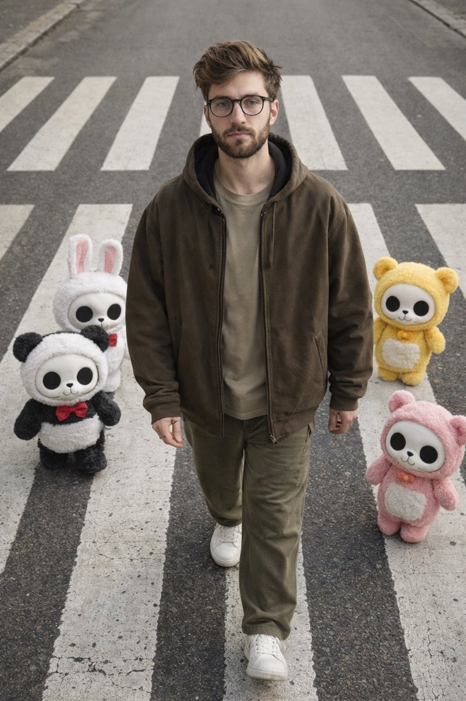

## Portrait of a 21-year-old man of appearance with masculi

- ID: trending-2017514445321474551
- Slug: trending-2017514445321474551-en
- 语言: en
- 来源: [来源链接](https://x.com/harboriis/status/2017514445321474551)
- 样例图路径: images/part1/2017514445321474551_1.jpg

### 提示词

```text
Portrait of a 21-year-old man of appearance with masculine facial features and white hair styled with a wet look. The camera angle is slightly from the side and below. Neutral facial expression, very light gray background. Orange-red glowing light and abstract luminous lines around the head, passing through the face and neck, creating a dynamic and high-tech effect. Futuristic atmosphere, professional lighting, emphasis on details. Saturated colors, the left side of the face is illuminated, the right side is in shadow. Highly detailed, high-quality photograph in a modern style
```

### 样例图

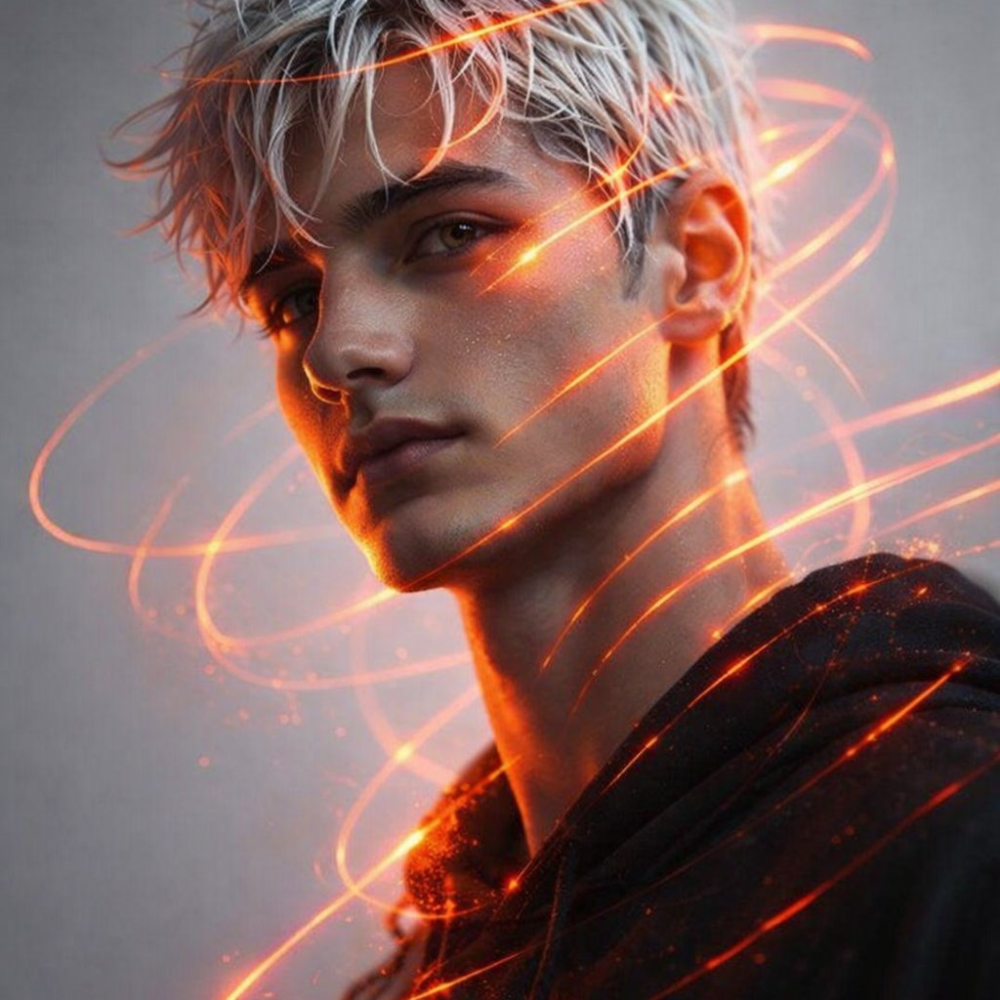

## { "image_type": "portrait_photography", "resolution_targ

- ID: trending-2005107364203298875
- Slug: trending-2005107364203298875-en
- 语言: en
- 来源: [来源链接](https://x.com/meng_dagg695/status/2005107364203298875)
- 样例图路径: images/part1/2005107364203298875_1.jpg

### 提示词

```text
{
  "image_type": "portrait_photography",
  "resolution_target": "8K UHD",
  "aspect_ratio": "vertical",
  "frame_composition": {
    "crop": "mid-chest to head",
    "orientation": "portrait",
    "subject_position": "centered",
    "camera_angle": "eye-level",
    "perspective": "straight-on"
  },
  "subject": {
    "gender_presentation": "female",
    "age_appearance": "young adult",
    "face": {
      "shape": "oval",
      "skin_tone": "fair with neutral undertone",
      "skin_texture": "smooth, natural, visible realism, no heavy retouching",
      "facial_features": {
        "eyes": {
          "color": "light blue-green",
          "shape": "almond-shaped",
          "gaze_direction": "directly toward camera",
          "eyelids": "slightly relaxed",
          "eyelashes": "natural length, not exaggerated"
        },
        "eyebrows": {
          "color": "dark brown",
          "thickness": "medium",
          "shape": "soft natural arch"
        },
        "nose": {
          "shape": "straight",
          "size": "proportionate",
          "bridge": "smooth"
        },
        "lips": {
          "color": "soft natural pink",
          "fullness": "medium to full",
          "state": "slightly parted"
        }
      },
      "expression": "neutral, calm, composed"
    },
    "hair": {
      "color": "dark brown",
      "length": "short to medium",
      "style": "loose, slightly wavy",
      "movement": "wind-blown strands crossing face",
      "parting": "natural, unstructured"
    }
  },
  "clothing": {
    "outerwear": {
      "type": "coat",
      "color": "deep royal blue",
      "material_appearance": "wool or felt-like texture",
      "fit": "structured but relaxed",
      "visible_details": "clean seams, minimal design"
    },
    "accessory": {
      "type": "scarf",
      "color": "matching royal blue",
      "material_appearance": "soft, fabric texture",
      "placement": "wrapped loosely around neck"
    }
  },
  "color_palette": {
    "dominant_colors": [
      "royal blue",
      "deep blue",
      "soft skin tones"
    ],
    "contrast": "high contrast between blue clothing and lighter skin",
    "color_temperature": "cool"
  },
  "lighting": {
    "type": "natural light",
    "direction": "frontal with slight side softness",
    "intensity": "moderate",
    "shadows": "soft, minimal harsh shadows",
    "highlights": "subtle highlights on cheekbones and lips"
  },
  "background": {
    "environment": "open outdoor setting",
    "elements": "blurred horizon line, blue gradient background",
    "depth_of_field": "shallow",
    "background_detail": "intentionally out of focus",
    "color": "blue gradient resembling sky and distant water"
  },
  "image_style": {
    "realism": "high realism with subtle AI polish",
    "sharpness": "high facial detail",
    "texture_detail": "visible fabric texture and skin detail",
    "noise": "minimal",
    "post_processing": "clean color grading, no heavy filters"
  },
  "mood": {
    "overall_feel": "calm, serene, minimalistic",
    "visual_energy": "soft and composed"
  },
  "generation_constraints": {
    "preserve_original_composition": true,
    "preserve_subject_structure": true,
    "no_face_alteration": true,
    "no_style_assumptions": true,
    "do_not_change_image_size": true
  }
}
```

### 样例图

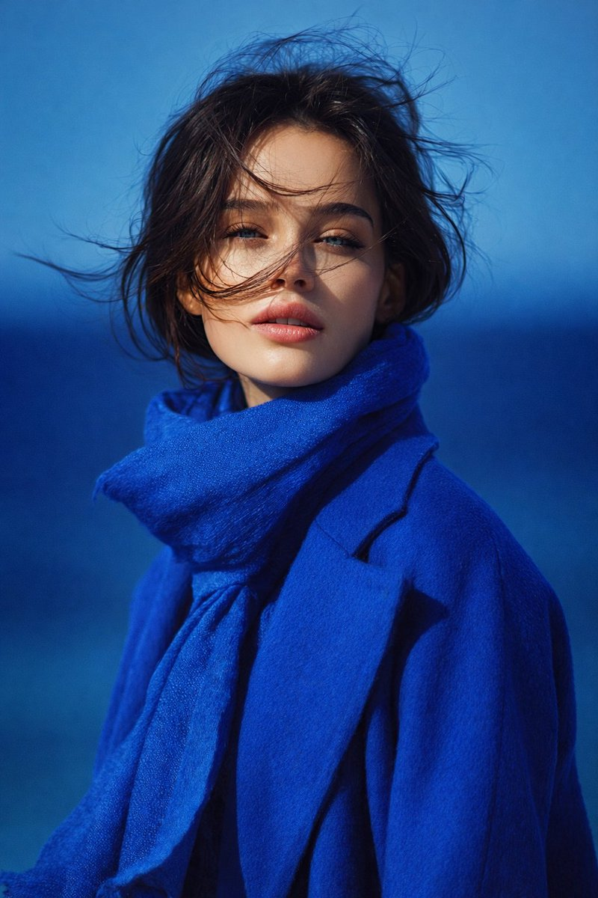

## Create an infographic image of [LANDMARK], combining a r

- ID: trending-2007809144397648042
- Slug: trending-2007809144397648042-en
- 语言: en
- 来源: [来源链接](https://x.com/Naiknelofar788/status/2007809144397648042)
- 样例图路径: images/part1/2007809144397648042_1.jpg

### 提示词

```text
Create an infographic image of [LANDMARK], combining a real photograph of the landmark with blueprint-style technical annotations and diagrams overlaid on the image. Include the title “[LANDMARK]” in a hand-drawn box in the corner. Add white chalk-style sketches showing key structural data, important measurements, material quantities, internal diagrams, load-flow arrows, cross-sections, floor plans, and notable architectural or engineering features. 
Style: blueprint aesthetic with white line drawings on the photograph, technical/architectural annotation style, educational infographic feel, with the real environment visible behind the annotations.
```

### 样例图

![Create an infographic image of [LANDMARK], combining a r](../images/part1/2007809144397648042_1.jpg)

## editorial portrait, Korean female idol, subtly sensual o

- ID: trending-2048600232577933720
- Slug: trending-2048600232577933720-en
- 语言: en
- 来源: [来源链接](https://x.com/BubbleBrain/status/2048600232577933720)
- 样例图路径: images/part1/2048600232577933720_1.jpg

### 提示词

```text
editorial portrait, Korean female idol, subtly sensual  outfit: silk shirt or soft fabric top, slightly loose, elegant and flowing  pose: body slightly turned away, face partially visible, one hand near collar or neck  expression: soft but unreadable, eyes partially hidden  lighting: strong directional light (window light), casting shadows across face and body  background: dark or minimal interior  composition: partial visibility, half-lit face, shadow covering features  mood: mysterious, intimate, quiet tension  style: cinematic editorial, light and shadow storytelling  sensuality: created through concealment and ambiguity --3:2
```

### 样例图

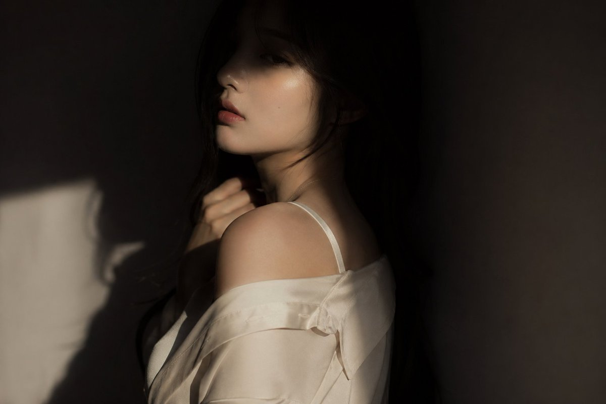

## ultra-realistic IMAX-grade cinematic action shot, extrem

- ID: trending-2047276802620411960
- Slug: trending-2047276802620411960-en
- 语言: en
- 来源: [来源链接](https://x.com/imGopalTiwari/status/2047276802620411960)
- 样例图路径: images/part1/2047276802620411960_1.jpg

### 提示词

```text
ultra-realistic IMAX-grade cinematic action shot, extreme high-angle perspective looking down from a massive height, 9:16 vertical aspect ratio, a man or woman matching the exact reference face and hairstyle climbing the side of a modern glass skyscraper, body stretched dynamically across the reflective facade, positioned on the right side of the frame, one leg raised gripping the glass while the other is bent for support, both palms pressed tightly against the glass surface creating tension and realism, wearing futuristic clear-framed glasses with subtle reflections, outfit: premium black fitted t-shirt, black tactical pants, futuristic black gloves with protective padding and bright green LED accents glowing softly, black tactical climbing boots with gold detailing and strong grip texture, a sleek black vest or harness securely fitted over the torso adding realism and safety gear detail, expression: determined and slightly tense with focused eyes and head slightly tilted forward, face lock: maintain exact facial structure, proportions, skin tone, hairstyle, and identity from reference with 100% accuracy, preserve micro-details and natural imperfections, no beautification, facial rendering: soft natural skin with visible pores, smooth tonal transitions, subtle subsurface scattering, no smoothing or artificial glow, environment: towering skyscraper with ultra-reflective glass panels showing the subject’s shadow, sky reflections, and a detailed cityscape far below including intricate walkways, a lush green circular park, and distant street traffic with tiny moving cars, strong sense of depth and scale, lighting: bright natural daylight casting sharp directional shadows, high contrast reflections on glass surface, crisp highlights with controlled roll-off, color science: ultra-clean cinematic color grading with high color separation, natural saturation, deep contrast, HDR dynamic range preserving both sky and ground detail, lens: full-frame Sony A7R, 24mm wide-angle lens to exaggerate height and perspective, sharp foreground subject with slight depth falloff into the city below, realism: extreme photorealistic detail, realistic reflections, natural perspective distortion, micro-contrast textures, no HDR overprocessing, no artificial sharpening
negative prompt: distorted face, changed identity, altered hairstyle, flat lighting, dull colors, unrealistic reflections, floating pose, weak grip, plastic skin, over-smooth face, beauty filter effect, low detail, noise artifacts, color banding, extra limbs, incorrect anatomy, blurry subject
```

### 样例图

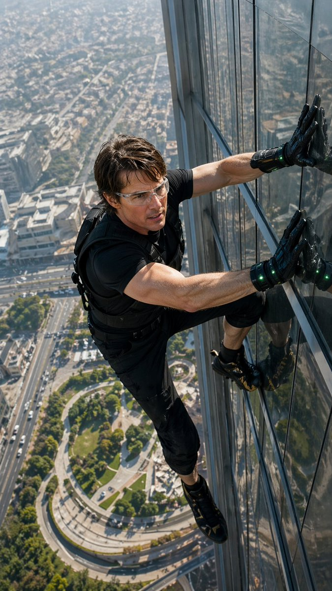

## Create a dark, high‑contrast poster with a moody, underg

- ID: trending-2048586749778293129
- Slug: trending-2048586749778293129-en
- 语言: en
- 来源: [来源链接](https://x.com/SyntheSarah/status/2048586749778293129)
- 样例图路径: images/part1/2048586749778293129_1.jpg

### 提示词

```text
Create a dark, high‑contrast poster with a moody, underground club aesthetic. The composition features a monochrome portrait of a young woman from the chest up, shot from a slightly low angle for attitude and power. She wears large over‑ear headphones and reflective round sunglasses with warm amber‑gold lenses that stand out vividly against the black‑and‑white portrait. One hand is raised near her head, the other near her chin, creating a dynamic, expressive pose associated with music immersion. Behind her head is a large flat golden‑yellow circular shape, like a spotlight, creating a strong focal point and visual contrast. The background is deep black with subtle grunge textures, dust, scratches, and poster‑wear imperfections, giving it a raw, printed‑flyer feel. Use 4:5 aspect ratio.
```

### 样例图

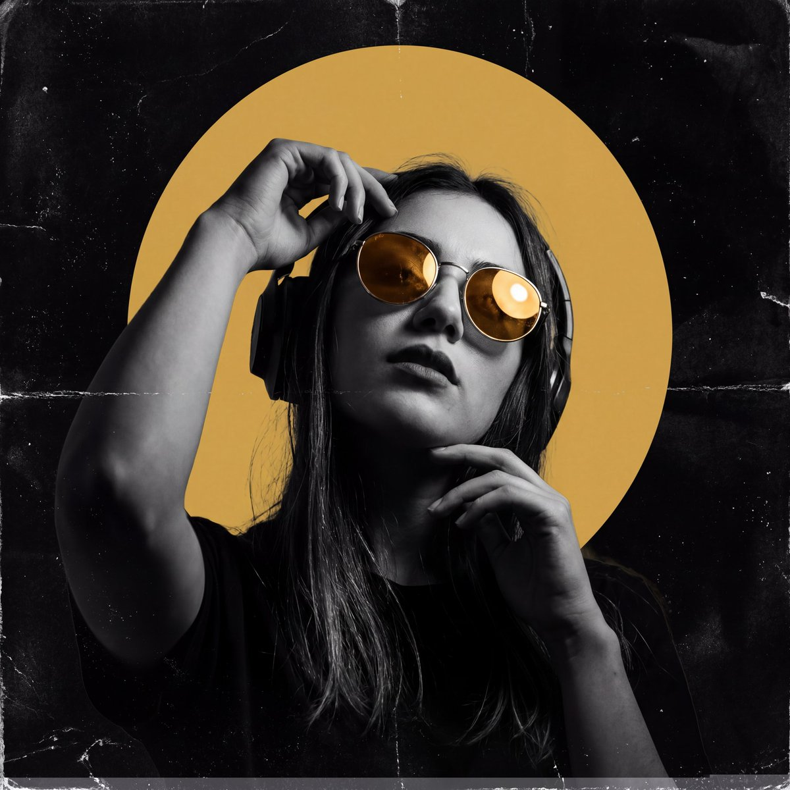

## A 3x3 grid storyboard contact sheet comprised of nine ca

- ID: trending-2001975468577403099
- Slug: trending-2001975468577403099-en
- 语言: en
- 来源: [来源链接](https://x.com/oggii_0/status/2001975468577403099)
- 样例图路径: images/part1/2001975468577403099_1.jpg

### 提示词

```text
A 3x3 grid storyboard contact sheet comprised of nine candid, cinematic movie stills showing a continuous sequence of a young man, approximately 20-25 years old. He has tousled brown hair and a youthful, expressive face, clean-shaven. Across all nine panels, he is consistently wearing a brown short-sleeved linen button-down shirt and is seated at a wooden dining table during a family dinner. The panels show varied natural actions: gesturing with his hands while animatedly talking, laughing, eating lasagna from a large dish, listening intently, and smiling. The environment is a warm, cozy home dining room with a wooden hutch filled with china and patterned wallpaper visible in the background. The lighting is soft, warm tungsten evening light creating natural shadows. The shots are a mix of medium angles and close-ups with a shallow depth of field, rendered with a film photography aesthetic and slight grain.
```

### 样例图

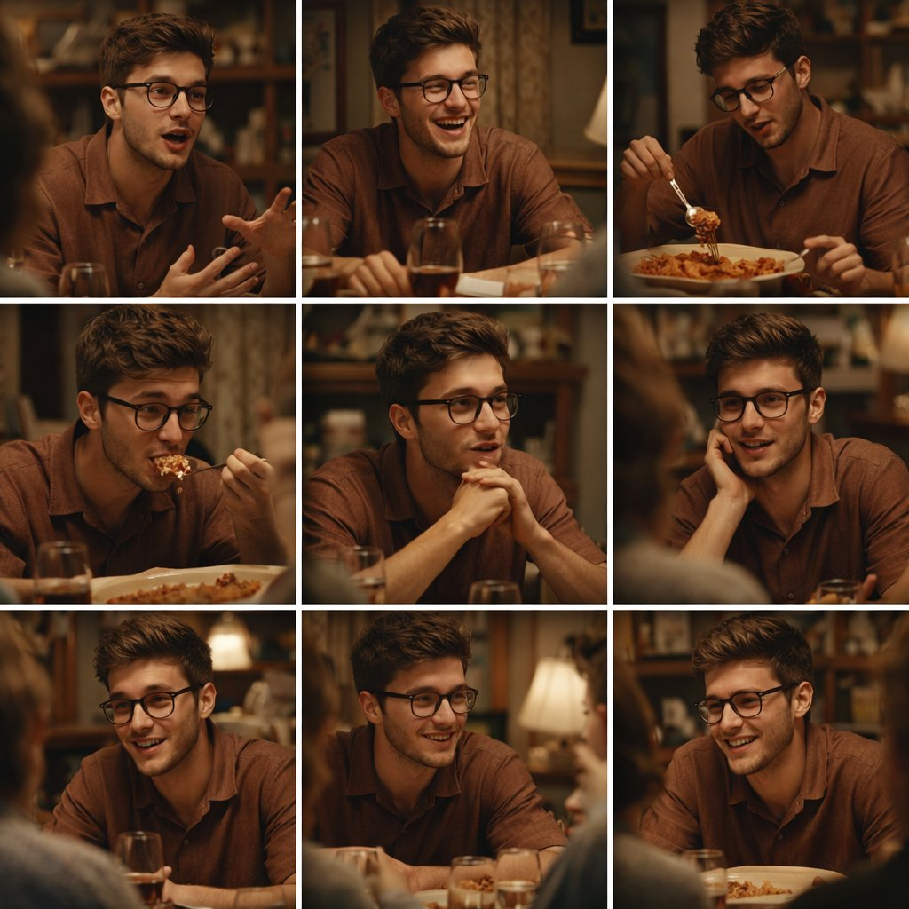

## A soft-focus dream photograph of a [subject] in a [setti

- ID: trending-2047631914769756180
- Slug: trending-2047631914769756180-en
- 语言: en
- 来源: [来源链接](https://x.com/azed_ai/status/2047631914769756180)
- 样例图路径: images/part1/2047631914769756180_1.jpg

### 提示词

```text
A soft-focus dream photograph of a [subject] in a [setting], seen through translucent fabric and [atmospheric element], delicate silhouettes, desaturated [color1] and [color2] palette, diffused light, intimate mood, ethereal editorial atmosphere
```

### 样例图

![A soft-focus dream photograph of a [subject] in a [setti](../images/part1/2047631914769756180_1.jpg)

## { "objective": "Generate a hyper-realistic black and whi

- ID: trending-2003075417305928072
- Slug: trending-2003075417305928072-en
- 语言: en
- 来源: [来源链接](https://x.com/meng_dagg695/status/2003075417305928072)
- 样例图路径: images/part1/2003075417305928072_1.jpg

### 提示词

```text
{
  "objective": "Generate a hyper-realistic black and white street fashion photograph with selective color accents.",
  "image_type": "photography",
  "prompt": {
    "subject": "A stylish, confident woman crossing a busy city intersection",
    "wardrobe": {
      "outerwear": "Oversized blazer in neutral tone",
      "innerwear": "Bright red fitted top (selective color)",
      "bottoms": "Loose tailored trousers in neutral tone",
      "accessories": [
        "Bright red leather clutch in hand",
        "Bright red sunglasses"
      ]
    },
    "action_motion": "Walking briskly toward the camera, hair flowing backward due to motion, blazer and trousers moving naturally",
    "scene": "Busy urban crosswalk with pedestrians and cars motion-blurred in the background",
    "perspective": "Frontal tracking shot at waist level",
    "style": [
      "High-end street fashion",
      "Paparazzi aesthetic",
      "Editorial candid",
      "Dynamic movement photography"
    ],
    "visual_details": [
      "Realistic fabric physics",
      "Detailed hair movement",
      "Sharp facial features",
      "Asphalt road texture",
      "Motion blur on background crowd",
      "Bokeh city lights"
    ],
    "mood": [
      "Confident",
      "Cosmopolitan",
      "Urgent",
      "Powerful"
    ]
  },
  "camera_and_composition": {
    "angle": "Waist-level",
    "framing": "Subject centered, background expanding outward with motion blur",
    "depth_of_field": "Shallow depth of field isolating the subject"
  },
  "lighting": {
    "type": "Natural backlight with rim lighting",
    "contrast": "High contrast emphasizing silhouette and edges"
  },
  "post_processing": {
    "color_mode": "Black and white with selective red color accents only on innerwear, sunglasses, and clutch bag",
    "effects": [
      "Subtle lens flare",
      "Vintage film stock emulation",
      "High micro-contrast",
      "Film grain texture"
    ]
  },
  "negative_prompt": [
    "Posed studio look",
    "Empty street",
    "Static posture",
    "Low realism",
    "Full color image",
    "Overexposed highlights",
    "Flat lighting"
  ],
  "output_quality": {
    "resolution": "Ultra high resolution",
    "detail_level": "Maximum photorealism",
    "sharpness": "Crisp subject, soft background"
  }
}
```

### 样例图

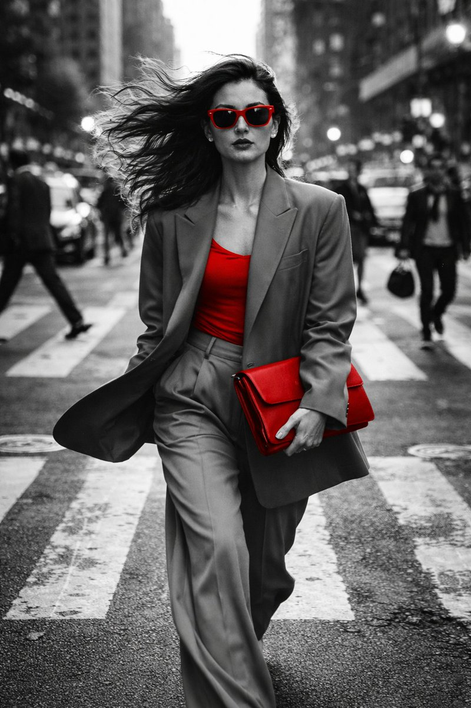

## Create a hyper-realistic, stylish vertical poster featur

- ID: trending-2007711515458318421
- Slug: trending-2007711515458318421-en
- 语言: en
- 来源: [来源链接](https://x.com/Strength04_X/status/2007711515458318421)
- 样例图路径: images/part1/2007711515458318421_1.jpg

### 提示词

```text
Create a hyper-realistic, stylish vertical poster featuring a smartphone lying on a table, transformed into a hockey rink. The screen resembles cracked ice with deep fissures, while tiny hockey players compete in an intense game Use diffused daylight with elegant reflections and refractions to enhance depth. Add realistic details like fingerprints, smudges, and subtle scratches on the phone's surface for authenticity. Craft a dynamic perspective with an intriguing camera angle-slightly tilted for dramatic effect. The image should look like a high-quality DSLR photograph, with sharp focus, rich textures, and cinematic lighting to amplify the surreal yet lifelike atmosphere
```

### 样例图

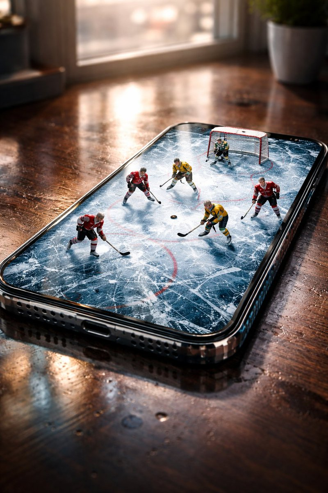

## A high-quality, candid street photography shot of a styl

- ID: trending-2013755199643603392
- Slug: trending-2013755199643603392-en
- 语言: en
- 来源: [来源链接](https://x.com/Naiknelofar788/status/2013755199643603392)
- 样例图路径: images/part1/2013755199643603392_1.jpg

### 提示词

```text
A high-quality, candid street photography shot of a stylish young woman with short wavy brown hair. She is wearing a maroon cardigan, oversized beige denim cargo pants, and a maroon baseball cap. She has large white over-ear headphones around her ears and a black quilted shoulder bag with a small plush dog keychain hanging from it.Same face as in reference
```

### 样例图

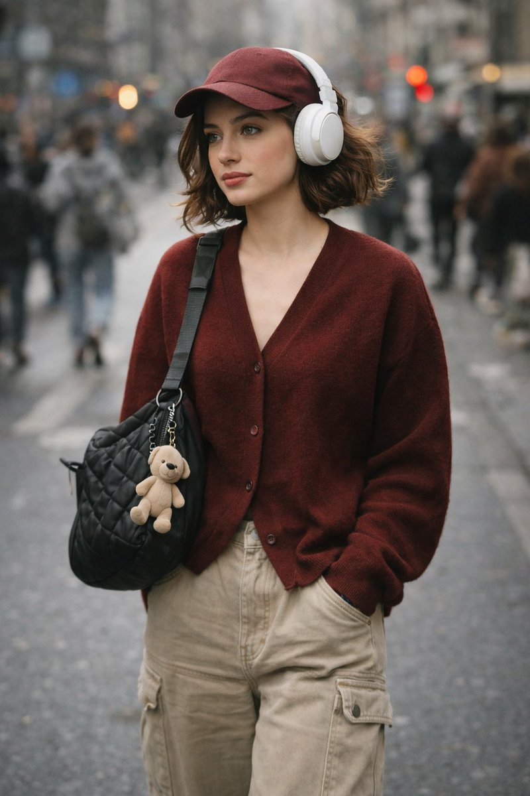

## description: "A clean, aesthetic 3x3 collage portrait sh

- ID: trending-2001987275119538341
- Slug: trending-2001987275119538341-en
- 语言: en
- 来源: [来源链接](https://x.com/Sheldon056/status/2001987275119538341)
- 样例图路径: images/part1/2001987275119538341_1.jpg

### 提示词

```text
description: "A clean, aesthetic 3x3 collage portrait showcasing different men's hairstyles. The same young man is captured in each frame, positioned in consistent lighting and pose, creating a style comparison grid.",

  "subject": {
    "type": "young man",
    "age": "early 20s",
    "skin_tone": "medium with smooth texture",
    "facial_features": "sharp jawline, well-groomed beard stubble, symmetrical face",
    "expression": "neutral and confident"
  },

  "hairstyles": [
    "clean shaved buzz cut",
    "slicked back classic hairstyle",
    "medium wavy long hair",
    "short textured fringe",
    "voluminous messy hairstyle",
    "man bun",
    "cornrow braids",
    "side swept modern fade",
    "tight curly textured cut"
  ],

  "environment": {
    "location": "outdoor courtyard with white architecture arches",
    "lighting": "soft sunset golden-hour lighting",
    "background": "slightly blurred but clean and minimal"
  },

  "camera": {
    "shot": "shoulder-level portrait",
    "angle": "eye-level",
    "lens": "standard lens (50mm)",
    "composition": "consistent framing for all nine shots"
  },

  "wardrobe": {
    "top": "plain fitted white t-shirt",
    "style": "minimal, clean, modern"
  },

  "mood": [
    "stylish",
    "fresh",
    "groomed",
    "aesthetic"
  ]
}
```

### 样例图

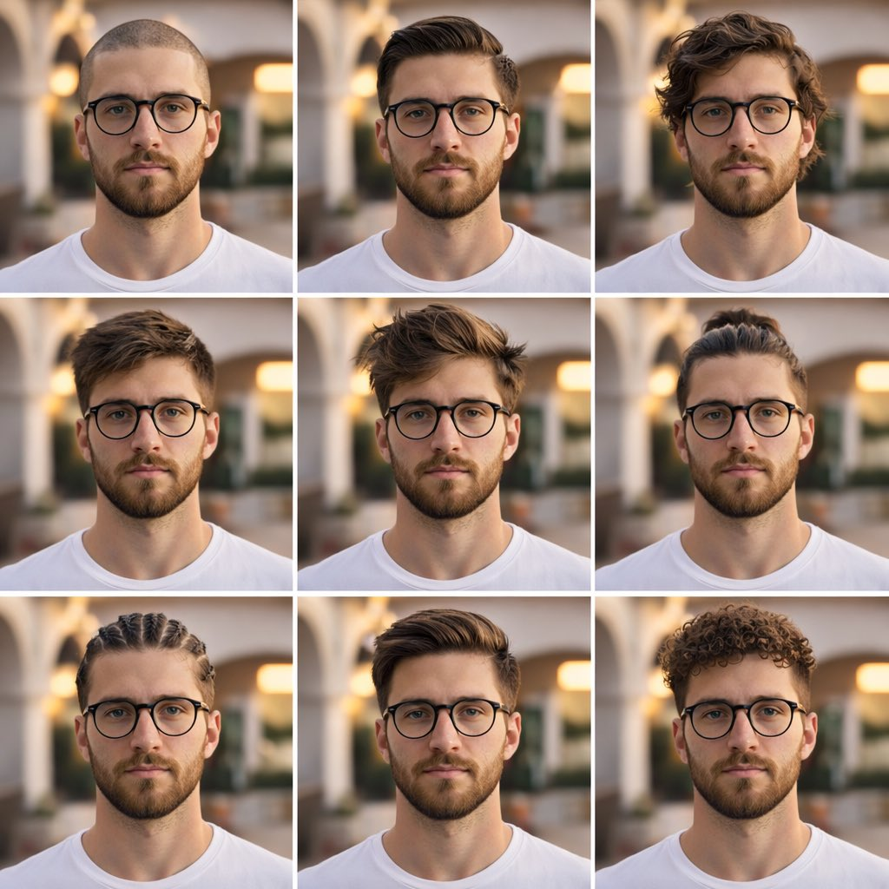

## Higgsfield just dropped GPT Image 1.5 — I tried the "imp

- ID: trending-2002023740490784993
- Slug: trending-2002023740490784993-en
- 语言: en
- 来源: [来源链接](https://x.com/CHAO2U_AI/status/2002023740490784993)
- 样例图路径: images/part1/2002023740490784993_1.jpg

### 提示词

```text
Higgsfield just dropped GPT Image 1.5 — I tried the "impossible" test everyone thought would fail:
1⃣ Pure anime illustration only
2⃣ Extract every clothing item while keeping anime style
3⃣ Take those flat 2D clothes
4⃣ Dress a 100% photorealistic girl with them
No LoRA. No training. Just one simple prompt.

Result: pleats fold like real fabric, cardigan has actual weight, socks compress naturally. 
GPT Image 1.5 doesn’t just copy styles — it truly understands clothing physics and materials. Anime uniform on a real human. For real. My brain is broken 🤯✨
#Higgsfield #gptimage
```

### 样例图

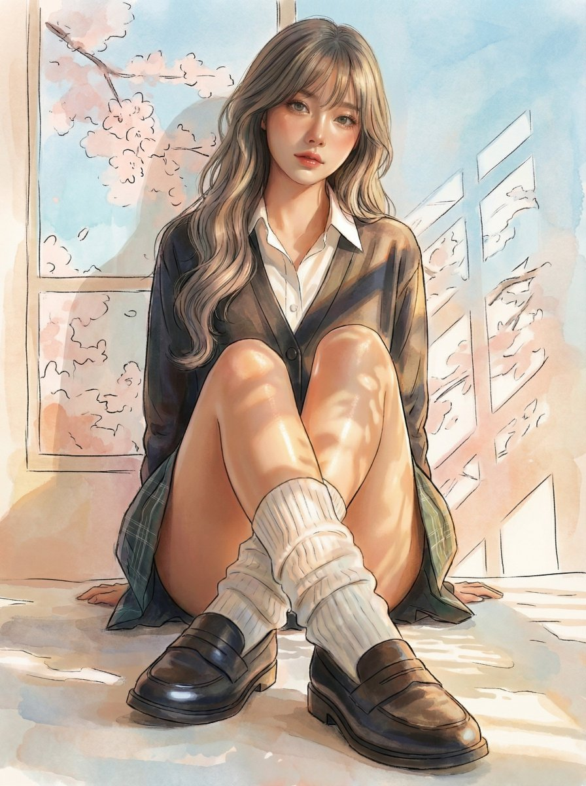

## A detailed, high-fashion studio photograph of a woman po

- ID: trending-2021300975248736723
- Slug: trending-2021300975248736723-en
- 语言: en
- 来源: [来源链接](https://x.com/Flora_Janer8/status/2021300975248736723)
- 样例图路径: images/part1/2021300975248736723_1.jpg

### 提示词

```text
A detailed, high-fashion studio photograph of a woman posing gracefully, wearing a luxurious olive green velvet saree draped elegantly over her shoulder, paired with a matching heavily embroidered sleeveless blouse that highlights her midriff. The lighting is moody and dramatic, accentuating the rich texture of the velvet and giving her skin a subtle, dewy sheen. Her hands are adorned with intricate, dark henna (mehndi) designs, and she is wearing traditional gold  earrings, looking directly into the camera with a confident expression.
```

### 样例图

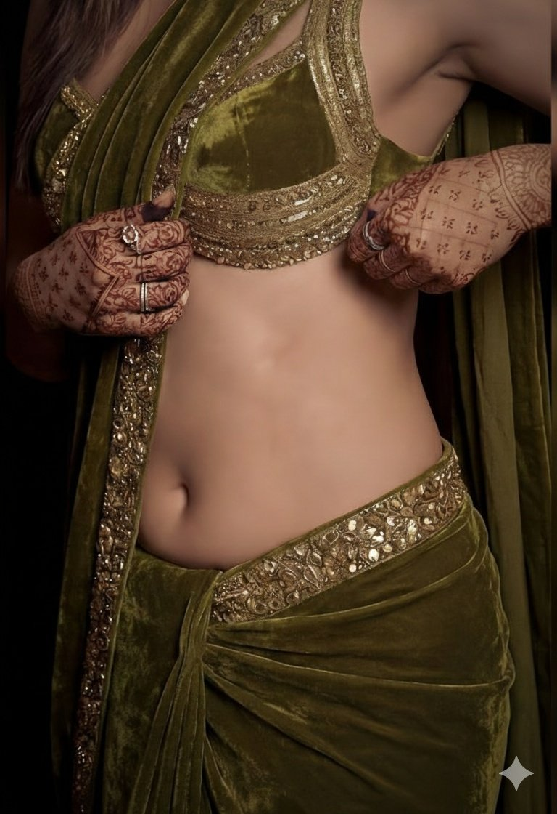

## Paparazzi-style extreme close-up photo of a woman with s

- ID: trending-2011304086847832089
- Slug: trending-2011304086847832089-en
- 语言: en
- 来源: [来源链接](https://x.com/oggii_0/status/2011304086847832089)
- 样例图路径: images/part1/2011304086847832089_1.jpg

### 提示词

```text
Paparazzi-style extreme close-up photo of a woman with striking facial features, caught off-guard while turning toward the camera. Face and shoulders only, shot from a low angle. Strong harsh on-camera flash, grainy high-ISO, raw candid street-photography feel. Background shows a crowded scene with motion blur (Paris Fashion Week atmosphere). Intense, spontaneous energy, imperfect and real. She is wearing a school uniform. Ultra-realistic, cinematic realism, high detail skin texture, slight lens distortion.

Camera style: “35mm paparazzi lens, f/2.8, flash blown highlights”
Look: “2000s tabloid photo aesthetic”
Quality: “sharp focus on face, background heavily blurred and streaked”
```

### 样例图

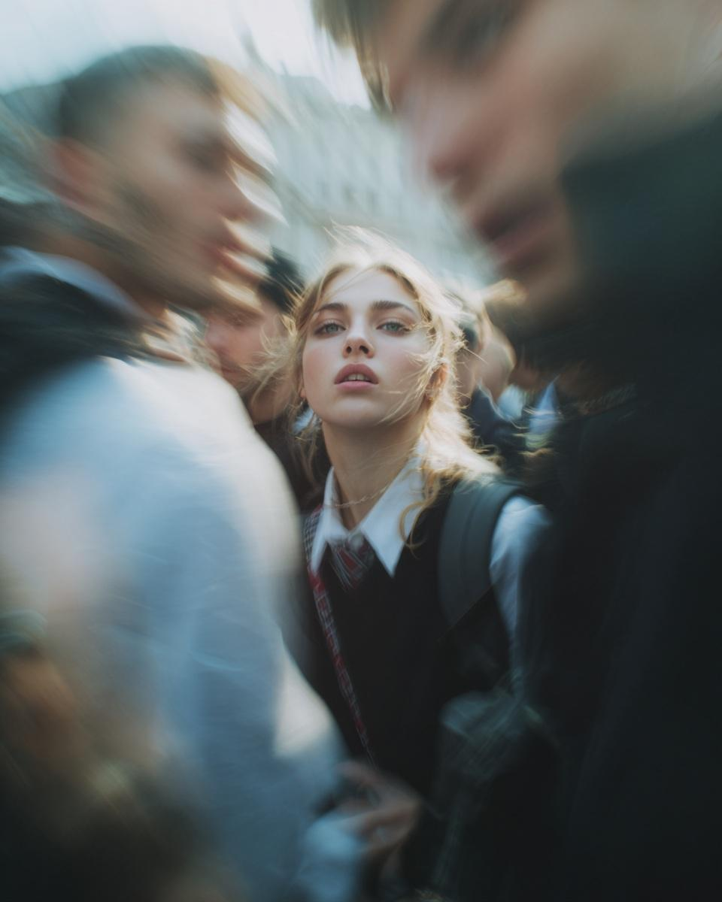

## { "overall_theme": { "description": "A curated series of

- ID: trending-2008486850378293427
- Slug: trending-2008486850378293427-en
- 语言: en
- 来源: [来源链接](https://x.com/xmliisu/status/2008486850378293427)
- 样例图路径: images/part1/2008486850378293427_1.jpg

### 提示词

```text
{
  "overall_theme": {
    "description": "A curated series of four ultra-photorealistic vignettes showcasing a luxurious, wellness-focused lifestyle.",
    "mood": "Calm, serene, balanced, sophisticated, peaceful, rejuvenating.",
    "style": "Minimalist, high-end, contemporary, clean aesthetic, aspirational."
  },
  "subject": {
    "description": "Young woman.",
    "appearance": {
      "hair": "Long, dark brown, wavy, natural texture.",
      "skin": "Clear, glowing, natural.",
      "makeup": "No-makeup makeup look, dewy finish.",
      "physique": "Fit, toned."
    },
    "expression": "Serene, composed, gently smiling, focused."
  },
  "wardrobe": {
    "outfit_base": "Matching ribbed beige/cream activewear set.",
    "variations": [
      "Sleeveless crop top and high-waisted leggings.",
      "Long-sleeve crop top and high-waisted leggings."
    ],
    "style": "Comfortable, stylish, high-quality fabric."
  },
  "environmental_details": {
    "lighting": {
      "type": "Natural daylight.",
      "quality": "Soft, diffused, warm, bright.",
      "source": "Large windows (implied or visible)."
    },
    "color_palette": {
      "dominant": ["Warm Beige", "Cream", "White", "Marble Grey"],
      "accents": ["Green (plants)", "Gold (fixtures, details)", "Natural Wood", "Soft Purple (smoothie)"]
    },
    "materials": ["White Marble", "Light Wood", "Stone", "Ceramic", "Glass", "Linen"]
  },
  "scenes": [
    {
      "location": "Modern Luxury Kitchen",
      "environment": "White marble island and countertops, white shaker cabinets, gold hardware, integrated wine fridge, large window.",
      "pose": "Standing at the island, body angled slightly, looking down.",
      "action": "Whisking a hot beverage in a small bowl.",
      "props": ["Ceramic bowl", "Wooden whisk", "Steam", "Mug with 'H'", "Wine fridge"]
    },
    {
      "location": "High-End Bathroom",
      "environment": "Large backlit mirror, white marble vanity, white walls, orchid plant.",
      "pose": "Standing facing the mirror, one hand applying product to face.",
      "action": "Applying skincare.",
      "props": ["Cotton pad", "Skincare bottle", "Lit Diptyque candle", "Whole coconut", "Glass jars"]
    },
    {
      "location": "Minimalist Wellness Space",
      "environment": "Textured beige walls with curved arches, stone water fountain, eucalyptus in a vase.",
      "pose": "Full-body stretch, arms extended overhead, head tilted back, eyes closed.",
      "action": "Stretching.",
      "props": ["Stone water feature", "Large perfume bottle", "Eucalyptus vase"]
    },
    {
      "location": "Bright Café Corner",
      "environment": "Round white marble table, cane chair, large window overlooking a street.",
      "pose": "Sitting at the table, smiling while eating, holding a fork.",
      "action": "Eating avocado toast.",
      "props": ["Avocado toast on plate", "Purple smoothie in glass", "Fork", "Assouline book", "Notebooks", "Small flowers"]
    }
  ],
  "camera_and_technical": {
    "type": "DSLR Photography",
    "style": "Editorial lifestyle",
    "lens": "Prime lens (e.g., 50mm or 85mm f/1.4)",
    "focus": "Sharp focus on the subject in each frame.",
    "depth_of_field": "Shallow, creating a soft, creamy bokeh in the background.",
    "resolution": "Ultra-high resolution, photorealistic textures.",
    "composition": "Four-panel grid collage."
  }
}
```

### 样例图

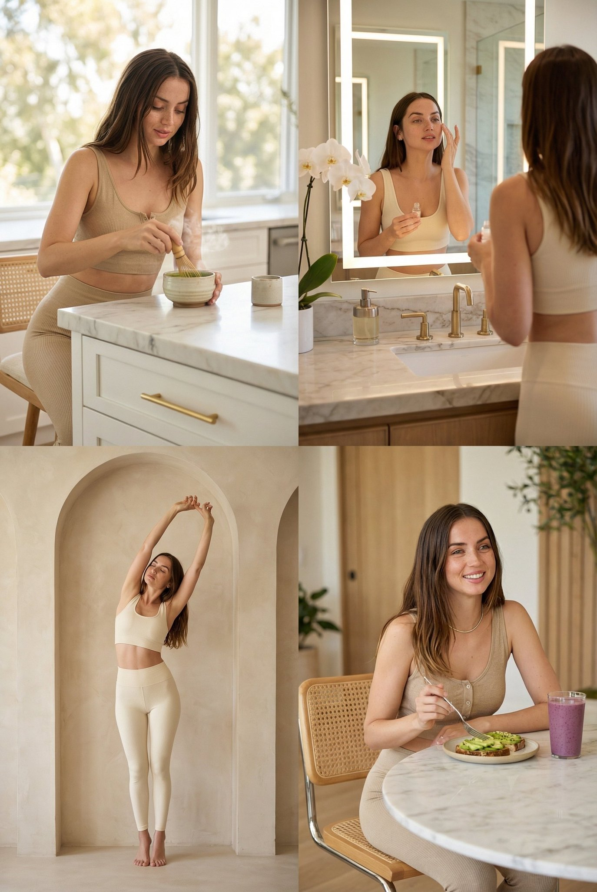

## { "subject": { "description": "the prettiest (G)I-DLE Yu

- ID: trending-2043272414918771047
- Slug: trending-2043272414918771047-en
- 语言: en
- 来源: [来源链接](https://x.com/youngcatwoman/status/2043272414918771047)
- 样例图路径: images/part1/2043272414918771047_1.jpg

### 提示词

```text
{
"subject": {
"description": "the prettiest (G)I-DLE Yuqi taking a high-angle selfie.",
"mirror_rules": "Left arm extended holding camera.",
"age": "Early 20s",
"expression": {
"eyes": {
"look": "upward at lens",
"energy": "alluring",
"direction": "direct"
},
"mouth": {
"position": "slightly parted",
"energy": "soft"
},
"overall": "seductive and innocent"
},
"face": {
"preserve_original": true,
"features": "Yuqi's irresistibly cute yet alluring round-yet-sharp face, bright expressive eyes, charming smile lines, and vibrant fair aesthetic.",
"makeup": "Asian influencer aesthetic, heavy under-eye blush, light contacts, glossy lips."
}
},
"hair": {
"color": "Warm light brown",
"style": "Long, loose waves, voluminous.",
"effect": "Top backlit halo, strands falling over chest."
},
"body": {
"frame": "Slim with pronounced curves.",
"waist": "Narrow",
"chest": "Full, deep cleavage.",
"legs": "Upper thighs visible.",
"skin": {
"visible_areas": "Chest, shoulders, left arm, upper hips.",
"tone": "Fair, pale luminous.",
"texture": "Smooth, soft, slightly dewy.",
"lighting_effect": "Harsh warm sunlight hitting cleavage and left shoulder, casting sharp shadows."
}
},
"pose": {
"position": "Angled torso, hips pushed back, playful high-angle pose with slight hip cock and energetic lean.",
"base": "Standing/leaning.",
"overall": "Leaning forward into the high-angle lens with flirty body language."
},
"clothing": {
"top": {
"type": "Tight shiny latex bodysuit with detached left sleeve.",
"color": "Glossy Purple",
"details": "Deep scoop neck, thin straps.",
"effect": "Stretching tightly over chest."
},
"bottom": {
"type": "Latex bodysuit bottom",
"color": "Glossy Purple",
"details": "Extremely high cut exposing hips."
}
},
"accessories": {
"jewelry": "Delicate silver pendant necklace."
},
"photography": {
"camera_style": "Smartphone selfie",
"angle": "High angle, looking down.",
"shot_type": "Medium close-up.",
"aspect_ratio": "9:16",
"texture": "Digital, slight wide-angle distortion on left arm.",
"lighting": "Strong directional warm light, high contrast.",
"depth_of_field": "Shallow, blurry dark background."
},
"background": {
"setting": "Dark interior room.",
"wall_color": "Dark/black.",
"elements": [
"Lit door edge on left"
],
"atmosphere": "Intimate, private.",
"lighting": "Mostly dark with one sharp shaft of warm light."
},
"the_vibe": {
"energy": "Captivating",
"mood": "Sensual",
"aesthetic": "Soft-core, golden hour selfie.",
"authenticity": "Casual smartphone snapshot.",
"intimacy": "High, direct eye contact.",
"story": "Catching the golden hour light in a bedroom.",
"caption_energy": "Effortless glow."
},
"constraints": {
"must_keep": [
"High angle perspective",
"Harsh warm directional light",
"Bodysuit cut"
],
"avoid": [
"Flat studio lighting",
"Professional posture",
"Over-bright background"
]
},
"negative_prompt": [
"ugly",
"flat light",
"studio lighting",
"professional camera",
"overexposed",
"extra limbs",
"stiff"
]
}
```

### 样例图

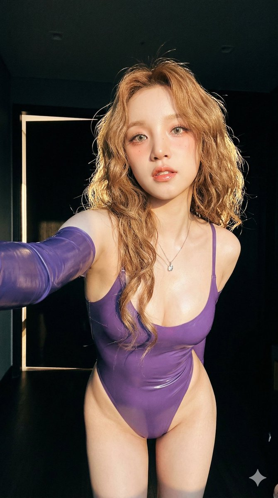

## { "image_generation_prompt": { "subject": { "description

- ID: trending-2029294271879168502
- Slug: trending-2029294271879168502-en
- 语言: en
- 来源: [来源链接](https://x.com/Artist04048661/status/2029294271879168502)
- 样例图路径: images/part1/2029294271879168502_1.jpg

### 提示词

```text
{
  "image_generation_prompt": {
    "subject": {
      "description": "Young woman with a strong resemblance to Sabrina Carpenter.",
      "hair": "Middle-parted, straight, and smooth texture with soft layers framing the face; natural physics as it rests over the shoulders.",
      "face": "Enigmatic expression with a subtle gaze, sun-kissed dewy skin texture, visible fine pores, and a light flush on the cheeks.",
      "body": "Slender physique with a tanned skin tone, showing realistic skin grain and soft highlights on the midriff."
    },
    "attire": {
      "clothing": "A vibrant orange string bikini with a white tropical floral print; the fabric has a slight sheen and thin spaghetti straps that tie at the neck and hips.",
      "style": "Bohemian Summer / Coastal Chic."
    },
    "styling_and_accessories": {
      "jewelry": [
        "Layered gold necklaces with various eclectic charms and pendants",
        "Multiple gold statement rings on several fingers",
        "A chunky translucent pink ring",
        "Sculptural gold wrap-around bracelets on both wrists",
        "A delicate gold belly chain resting across the waist"
      ]
    },
    "environment": {
      "setting": "A rustic outdoor fruit market stall featuring weathered blue wooden structures.",
      "background": "Stacked plastic crates filled with produce including ripe red tomatoes, bunches of yellow bananas, and various shadowed market goods.",
      "water": "None"
    },
    "pose": {
      "posture": "Seated on the ground, leaning slightly forward with a playful and relaxed demeanor.",
      "arms": "One hand is holding a large slice of watermelon up to her face, while the other arm is extended outward, resting against the blue stall structure.",
      "angle": "Eye-level shot with a slight tilt."
    },
    "lighting_and_mood": {
      "lighting": "Bright, direct natural sunlight creating high-contrast shadows and vivid highlights.",
      "mood": "Vibrant, sun-drenched, and candidly cinematic.",
      "colors": "A primary palette of saturated watermelon red, cobalt blue, and sun-ripened orange, grounded by earthy grey gravel."
    },
    "camera_and_technical": {
      "style": "Ultra Photorealistic, RAW photo.",
      "lens": "35mm wide-angle prime.",
      "aperture": "f/4.0 for a balance of sharp subject detail and environmental context.",
      "quality_tags": [
        "8k resolution",
        "highly detailed",
        "volumetric lighting",
        "ray tracing reflections",
        "hyper-realistic texture",
        "Hasselblad photography"
      ]
    }
  }
}
```

### 样例图

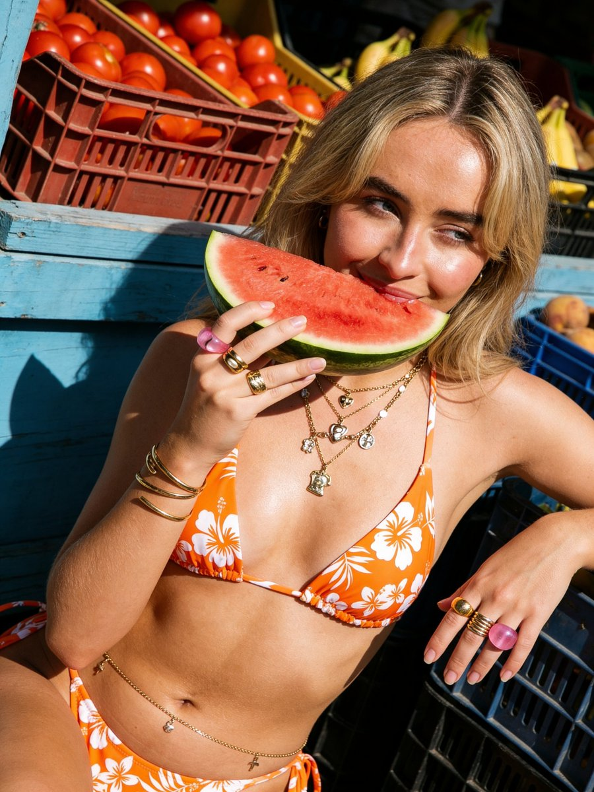

## Ultra-realistic cinematic street portrait of a young wom

- ID: trending-2018685474131562751
- Slug: trending-2018685474131562751-en
- 语言: en
- 来源: [来源链接](https://x.com/Taaruk_/status/2018685474131562751)
- 样例图路径: images/part1/2018685474131562751_1.jpg

### 提示词

```text
Ultra-realistic cinematic street portrait of a young woman standing still in a crowded city street, sharp focus on her face with calm, intense expression. Long-exposure effect with people moving around her creating strong directional motion blur, streaked crowd movement while the subject remains perfectly still. Natural soft daylight, shallow depth of field, creamy bokeh, realistic skin texture, subtle freckles, neutral makeup, dark winter coat and scarf. Emotional, introspective mood, urban storytelling photography, DSLR quality, 85mm lens look, f/1.8, high dynamic range, 8K, professional color grading.
```

### 样例图

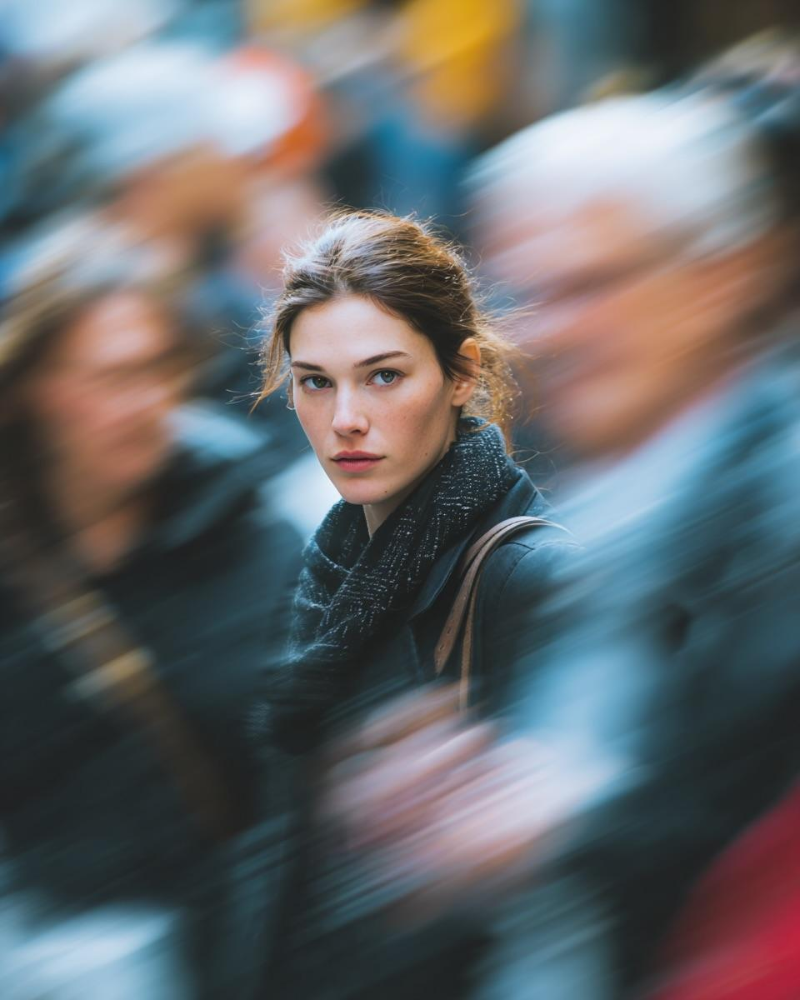

## Ultra-realistic candid smartphone photograph, 9:16 verti

- ID: trending-2011675822076411914
- Slug: trending-2011675822076411914-en
- 语言: en
- 来源: [来源链接](https://x.com/HustleXR/status/2011675822076411914)
- 样例图路径: images/part1/2011675822076411914_1.jpg

### 提示词

```text
Ultra-realistic candid smartphone photograph, 9:16 vertical.
Use the attached image only as a strong visual inspiration for general facial proportions and vibe,
while ensuring the generated subject remains fully original, non-identifiable, and not a face copy.
Scene
Nighttime on a quiet Tokyo city sidewalk beside a building with white ceramic tile walls.
The subject is walking past the camera, partially side-on, captured mid-step in a rushed, accidental moment.
Poses & Gestures (combined naturally)
The subject reacts instinctively to being photographed:
turning her head back mid-walk as if surprised,
raising one hand close to the lens to partially block the camera,
shy, restrained smile forming as she suppresses laughter,
body angled in half-profile while continuing to walk forward,
motion carries her slightly out of frame, imperfect framing.
Expressions are subtle and spontaneous — embarrassed, playful, fleeting — never posed.
Camera & Motion
Shot on a modern smartphone, handheld, rushed capture. Strong uncontrolled camera shake. Heavy directional motion blur across the raised hand, hair, and face. Facial features appear smeared and streaked by movement, faintly recognizable but distorted. Partial ghosting around the body. Imperfect framing, subject nearly leaving the frame.
Lighting
Flash-only lighting fired mid-motion. Harsh flash highlights on skin and hand. Deep surrounding darkness. Uneven exposure, blown highlights, hard shadows typical of hurried night phone photography.
Background
White ceramic tile wall stretches into streaked light bands due to motion blur. Street surroundings fade into darkness with minimal readable detail.
Mood
Candid, shy, slightly playful. Feels intrusive, raw, imperfect, and authentic — like a fleeting memory accidentally captured and never meant to be perfect.
Image Quality
Extremely noisy. Heavily blurred. Raw smartphone look. Not cinematic. Not editorial. Not polished.
Negative Prompt
anime, illustration, painting, stylized,
studio lighting, beauty lighting, soft portrait,
sharp focus, clean face, perfect anatomy, smooth skin,
fashion editorial, posed portrait, cinematic grading, film still,
tripod shot, professional photography,
identity match, face copy, real person replication
```

### 样例图

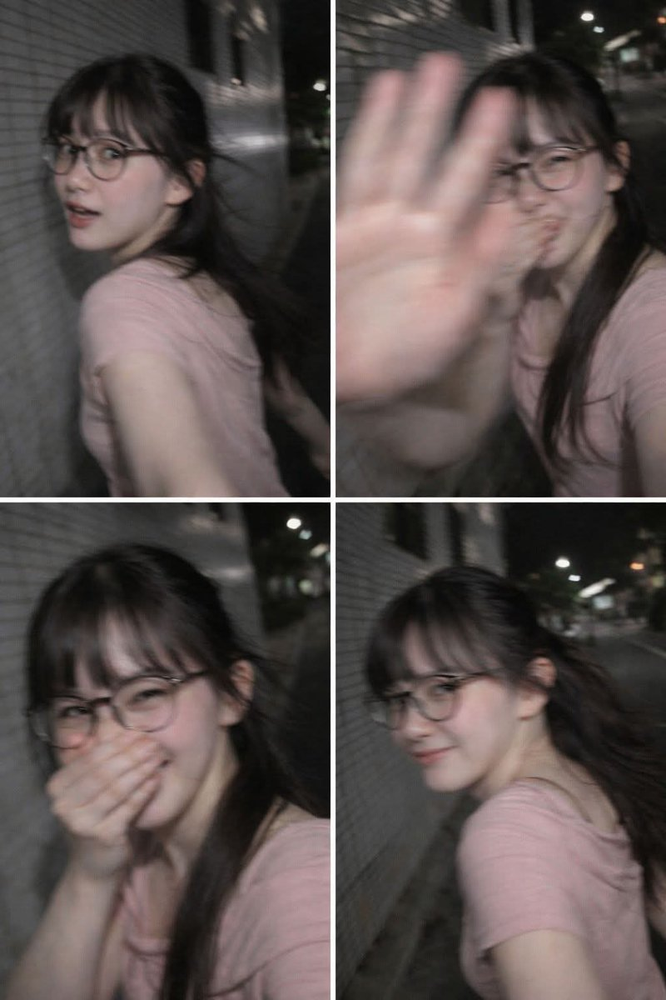

## { "meta": { "aspect_ratio": "9:16", "quality": "ultra_ph

- ID: trending-2008782401510494539
- Slug: trending-2008782401510494539-en
- 语言: en
- 来源: [来源链接](https://x.com/bananababydoll/status/2008782401510494539)
- 样例图路径: images/part1/2008782401510494539_1.jpg

### 提示词

```text
{
  "meta": {
    "aspect_ratio": "9:16",
    "quality": "ultra_photorealistic",
    "resolution": "8k",
    "camera": "iPhone front camera",
    "lens": "24mm",
    "style": "raw iPhone mirror realism, zero smoothing, heavy reflections, subtle grain, imperfect exposure"
  },

  "scene": {
    "location": "luxury apartment elevator",
    "environment": [
      "mirror walls on three sides",
      "brushed stainless steel panels",
      "glass-like reflection layering (multiple reflections of body)",
      "LED ceiling strip lights",
      "digital floor number glowing red",
      "slight fingerprints and smudges on mirror"
    ],
    "time": "late night",
    "atmosphere": "private tension in a public box, quiet, charged, intimate"
  },

  "lighting": {
    "type": "mixed elevator lighting",
    "sources": [
      "cool white overhead LEDs",
      "warm spill from control panel lights"
    ],
    "effect": [
      "high contrast highlights on hips and thighs",
      "specular reflections multiplying curves in mirrors",
      "face partially lit, partially disappearing in reflections",
      "real iPhone low-light noise in shadows"
    ]
  },

  "camera_perspective": {
    "pov": "mirror selfie",
    "angle": "slightly low and close",
    "framing": "upper thighs to head",
    "distance": "arm-length",
    "imperfections": [
      "phone edge visible in reflection",
      "finger slightly covering lens corner",
      "minor motion blur from breathing"
    ]
  },

  "subject": {
    "gender": "female",
    "ethnicity": "light european / mediterranean mix",
    "vibe": "young adult, controlled confidence, quietly provocative",

    "body": {
      "type": "fit-curvy",
      "waist": "tight and defined",
      "hips": "round and visually repeated by reflections",
      "thighs": "thick, softly compressed",
      "chest": "full and natural, secondary focus"
    },

    "skin": {
      "tone": "warm fair",
      "texture": "real skin texture, slight sheen, no blur"
    },

    "hair": {
      "color": "dark blonde",
      "style": "loose, slightly messy",
      "details": "a few strands stuck to lips and cheek"
    },

    "face": {
      "expression": "neutral with soft half-smirk",
      "eyes": "focused on phone screen",
      "makeup": "minimal, glossy lips catching light"
    },

    "outfit": {
      "top": {
        "type": "tight cropped tank top",
        "color": "soft grey",
        "fit": "hugging chest naturally, no bra",
        "details": "fabric stretched slightly, fine rib texture visible"
      },
      "bottom": {
        "type": "ultra-short micro biker shorts",
        "length": "barely covering upper thighs",
        "material": "thin matte spandex",
        "fit": "painted-on tight, amplified by mirror repetition",
        "details": [
          "fabric tension visible at hips",
          "slight ride-up at inner thighs",
          "clean, logo-free"
        ]
      },
      "shoes": {
        "type": "clean white sneakers",
        "reflection": "duplicated multiple times in mirrors"
      }
    },

    "pose": {
      "stance": "standing close to mirror",
      "hips": "shifted strongly to one side",
      "legs": "one knee bent inward",
      "upper_body": "shoulders relaxed, torso angled",
      "arms": {
        "phone_hand": "holding phone low",
        "free_hand": "resting lightly on upper thigh"
      },
      "movement": "still moment that feels like a pause, not a pose"
    }
  },

  "mood_keywords": [
    "mirror multiplication",
    "late night tension",
    "quiet confidence",
    "timeline stopper"
  ]
}
```

### 样例图

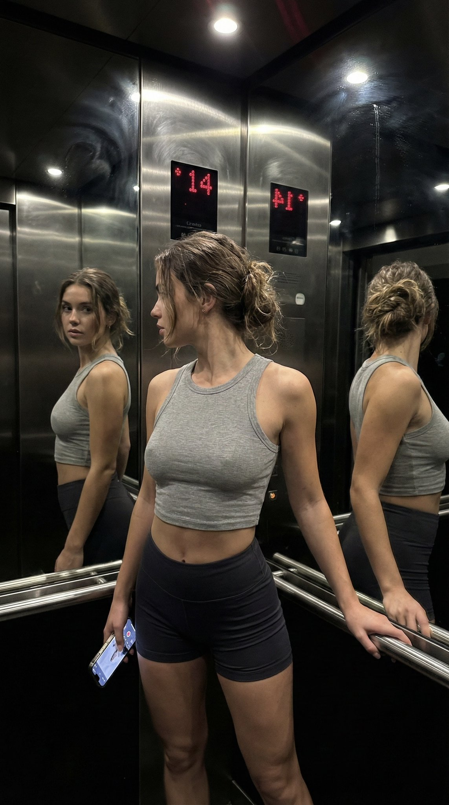

## Preserve the face, proportions, and external features of

- ID: trending-2023230471061315992
- Slug: trending-2023230471061315992-en
- 语言: en
- 来源: [来源链接](https://x.com/harboriis/status/2023230471061315992)
- 样例图路径: images/part1/2023230471061315992_1.jpg

### 提示词

```text
Preserve the face, proportions, and external features of the model as in the reference. A minimalist monochrome fashion editorial triptych featuring three stacked cinematic frames. The subject is a young man with short dark hair and a groomed beard. Frame 1: Emotional and introspective, looking downward with a hand near the collarbone, highlighting bone structure with Rembrandt lighting. Frame 2: A crisp profile shot with a focus on the nose, lips, and masculine jawline, gaze directed slightly upward. Frame 3: A frontal, thoughtful portrait with shoulders relaxed and direct eye contact. The composition is clean and modern, using a white T-shirt and gold necklace for visual continuity. Commercial magazine quality, high-end mirrorless camera, authentic skin pores, soft bokeh, and elegant masculinity.
```

### 样例图

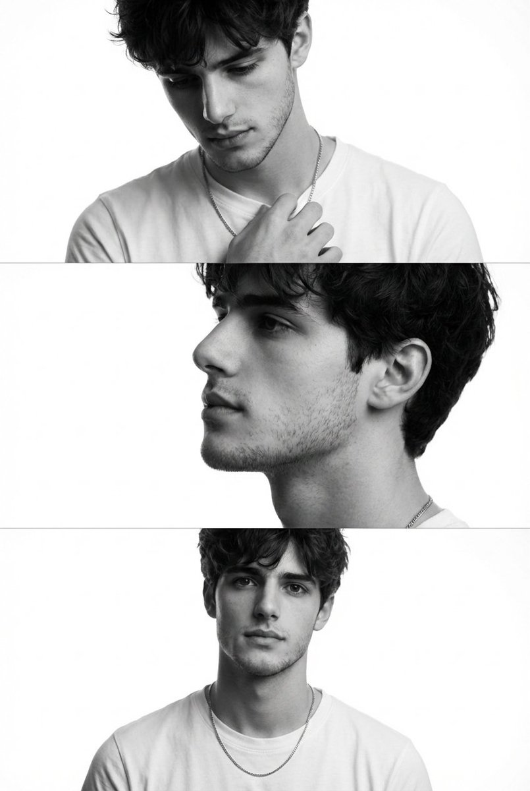

## Use this photo attached to create an ultra-realistic pri

- ID: trending-2008441233816109505
- Slug: trending-2008441233816109505-en
- 语言: en
- 来源: [来源链接](https://x.com/kingofdairyque/status/2008441233816109505)
- 样例图路径: images/part1/2008441233816109505_1.jpg

### 提示词

```text
Use this photo attached to create an ultra-realistic printed portrait with authentic photo-print shine.
A straight-on, centered head-and-shoulders portrait of a young woman, neutral confident expression, eyes looking directly at the camera. Composition is perfectly aligned and symmetrical, identical to a school ID / yearbook / magazine archive photo.
She has long, smooth brown hair, center-parted, softly layered, neatly styled. Makeup is polished but natural, editorial-clean: warm brown eyeshadow, softly defined eyeliner, voluminous lashes, subtle contour, peach blush, and glossy nude lips. Skin is smooth, flawless, softly matte with natural highlights, realistic pores visible.
She wears a dark navy blazer with white piping, white collared shirt, dark sweater vest, and navy striped tie, styled like a formal school uniform portrait. Small silver hoop earrings.
EXACT FILTER & PRINT SHINE (VERY IMPORTANT):
Apply a real photo-print filter, not digital glow:
Subtle semi-gloss paper sheen
Light reflective shine across cheeks, forehead, and lips, as if light is bouncing off printed ink
Very mild lamination glare, thin diagonal highlights
Slight softening from ink absorption, not blur
Gentle warm undertone from printed ink
Fine paper grain texture visible on skin and background
Looks like a scanned or photographed printed photo
NO glassy skin
NO beauty filter glow
NO cinematic bloom
LIGHTING:
Direct frontal harsh flash ALWAYS ON, similar to ID or studio flash:
Even exposure
Bright eye catchlights
Minimal shadows
Flat, clean lighting typical of printed portraits
BACKGROUND:
Flat cool blue textured studio backdrop, evenly lit, slightly muted by print ink.
TEXT & LAYOUT (PRINTED):
Below the portrait, centered and printed on the page:
Bold serif font:
HIGHSCHOOL GAL
Below in smaller italic serif font, quotation style:
“You put the ‘over’ in ‘lover,’ put the ‘ex’ in ‘next’
Ain’t no ‘I’ in ‘trouble,’ just the ‘U’ since we met”
Text appears ink-printed, slightly imperfect edges, natural spacing, no digital sharpness.
OVERALL LOOK:
Real printed photograph
Magazine / yearbook archive
Soft shine, subtle glare
Paper texture + ink warmth
Not digital, not glossy poster
Looks physically touchable
```

### 样例图

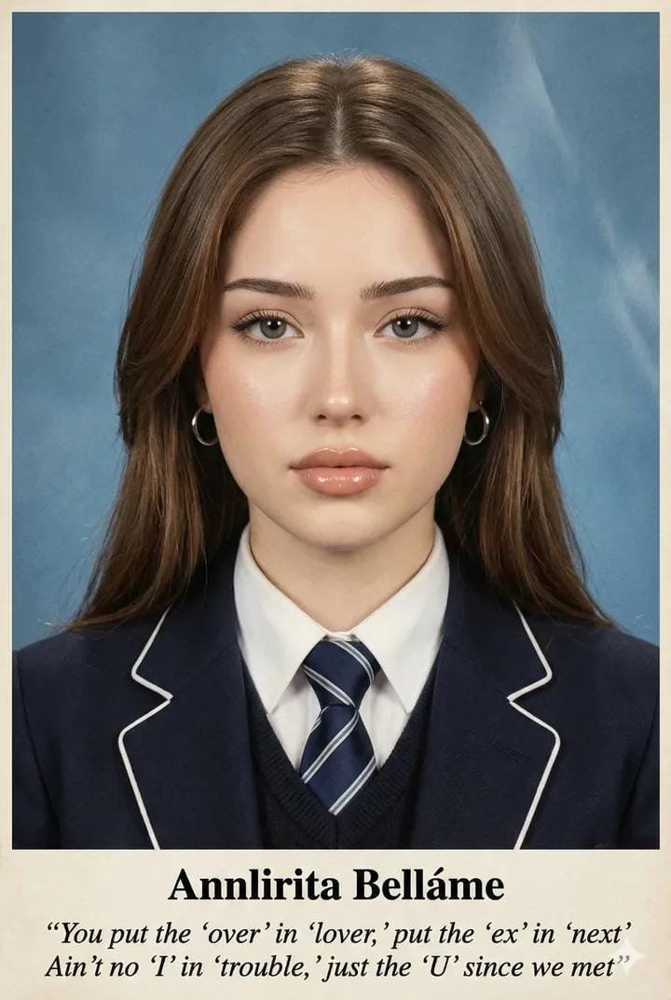

## Ultra-realistic 8K full body portrait of [PERSON’S FULL 

- ID: trending-2011898760650170378
- Slug: trending-2011898760650170378-en
- 语言: en
- 来源: [来源链接](https://x.com/TechieBySA/status/2011898760650170378)
- 样例图路径: images/part1/2011898760650170378_1.jpg

### 提示词

```text
Ultra-realistic 8K full body portrait of [PERSON’S FULL NAME], wearing a clean and pressed white social shirt with folded collar and a small lapel microphone, dark navy-blue dress pants and polished brown social shoes. Casually and unpretentiously leaning against a smooth light gray studio wall; hands are in pockets and one leg is crossed over the other, with relaxed and confident body language. Add to the wall next to them a prominent vector portrait in black and white of their face and bust - with sharp lines and angles, overlapping polygonal shapes and a minimalist modern graphic style, right below the information: “[PERSON’S FULL NAME]”, and below the name: “[PROFESSION]”
```

### 样例图

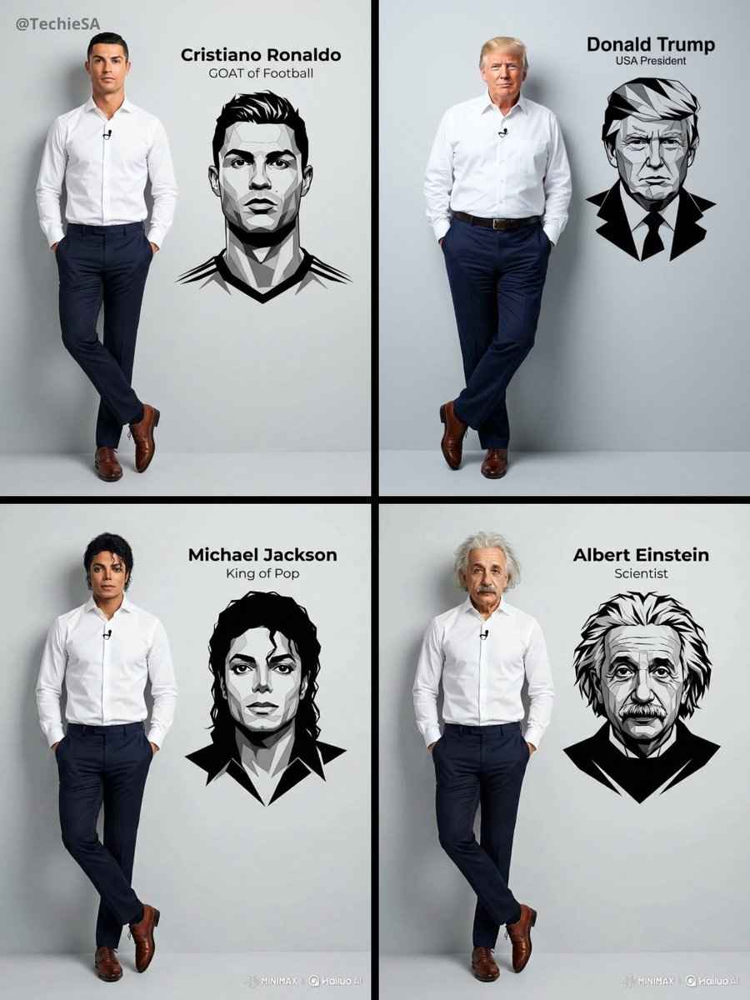

## Editorial portrait from the attached reference photo, ph

- ID: trending-2017479603921600730
- Slug: trending-2017479603921600730-en
- 语言: en
- 来源: [来源链接](https://x.com/harboriis/status/2017479603921600730)
- 样例图路径: images/part1/2017479603921600730_1.jpg

### 提示词

```text
Editorial portrait from the attached reference photo, photorealistic. Use uploaded selfie as ONLY face reference. Identity lock: exact likeness, facial geometry/proportions, natural skin texture. No beautification. Keep clothing style, color, material, and fit identical to the reference. Medium close-up (face and shoulders), low angle looking up (heroic/dominant perspective), sharp focus on face/eyes.Serious, intense, focused expression, gaze directed upward and away from camera (beyond the frame). Dramatic saturated studio lighting, high-contrast chiaroscuro with deep shadows, vibrant oranges and deep reds palette, strong rim light creating a halo separation. Solid studio backdrop, rich orange-red smooth gradient, pattern-free, hot radiant atmosphere. High skin texture fidelity (pores visible), 8k, portrait aspect ratio, cinematic lighting, 4:5.
```

### 样例图

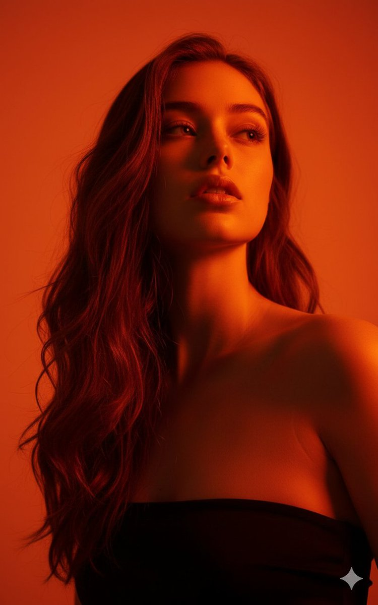

## { "meta": { "aspect_ratio": "9:16", "camera": "iPhone re

- ID: trending-2012264344998838279
- Slug: trending-2012264344998838279-en
- 语言: en
- 来源: [来源链接](https://x.com/bananababydoll/status/2012264344998838279)
- 样例图路径: images/part1/2012264344998838279_1.jpg

### 提示词

```text
{
  "meta": {
    "aspect_ratio": "9:16",
    "camera": "iPhone rear camera",
    "lens": "35mm",
    "quality": "ultra photorealistic",
    "style": "cold editorial mirror reflection, raw iphone realism, natural skin texture, slight grain"
  },

  "scene": {
    "location": "empty concrete hallway apartment",
    "visibility_rule": "only mirror reflection visible, subject never appears directly",
    "environment_details": [
      "tall frameless mirror mounted on concrete wall",
      "industrial gray walls",
      "soft shadow gradients",
      "clean but slightly brutalist interior"
    ],
    "time": "very late night",
    "atmosphere": "silent, detached, fashion-editorial tension"
  },

  "lighting": {
    "type": "single directional light",
    "source": "cool LED wall light from side",
    "color_temperature": "cold white",
    "effect": "sharp highlights on shoulders and collarbones, deep controlled shadows"
  },

  "camera_perspective": {
    "pov": "mirror reflection only",
    "angle": "straight-on, chest-height",
    "framing": "upper thighs to head visible only inside mirror",
    "real_world_visibility": "no body parts visible outside mirror",
    "phone_visibility": "phone covering face in reflection"
  },

  "subject": {
    "gender": "female",
    "age_vibe": "young adult",
    "ethnicity": "Northern European",

    "hair": {
      "color": "icy platinum blonde",
      "style": "short blunt bob",
      "behavior": "clean lines, barely touching jaw"
    },

    "outfit": {
      "bodysuit": {
        "type": "one-piece mesh bodysuit",
        "color": "smoky graphite gray",
        "material": "semi-transparent technical mesh",
        "fit": "tight, sculpting, stretched naturally",
        "coverage": "fashion-revealing, non-explicit"
      }
    },

    "pose": {
      "position": "standing still close to mirror",
      "legs": {
        "stance": "asymmetrical",
        "detail": "one leg straight, one knee slightly bent inward"
      },
      "hips": {
        "action": "subtle sideways shift creating tension in fabric"
      },
      "arms": {
        "phone_hand": "holding phone directly in front of face",
        "free_hand": "hanging loose by side, relaxed fingers"
      },
      "vibe": "cold confidence, model-off-duty, emotionally distant"
    },

    "face": {
      "visibility": "completely hidden by phone",
      "effect": "identity erased, body language only"
    }
  },

  "imperfections": [
    "minor mirror streaks",
    "uneven LED light falloff",
    "slight handheld camera micro-tilt"
  ]
}
```

### 样例图

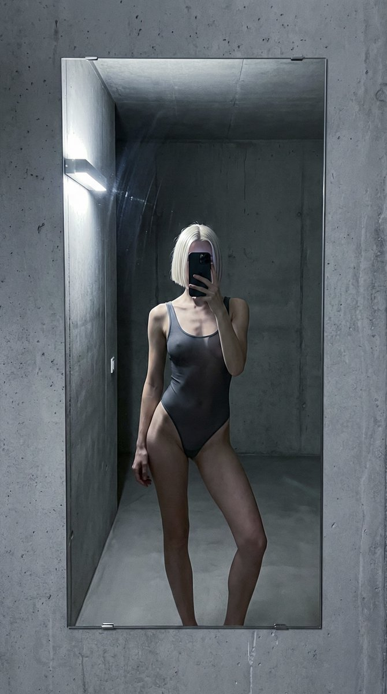

## { "image_description": { "title": "Surveillance Feed: De

- ID: trending-2015679962573889621
- Slug: trending-2015679962573889621-en
- 语言: en
- 来源: [来源链接](https://x.com/xmliisu/status/2015679962573889621)
- 样例图路径: images/part1/2015679962573889621_1.jpg

### 提示词

```text
{
  "image_description": {
    "title": "Surveillance Feed: Defiant Subject in Retail Shop",
    "aspect_ratio": "4:5",
    "mood": "Raw, gritty, confrontational, authentic"
  },
  "visual_elements": {
    "subject": {
      "framing": "Centered from mid-torso upward",
      "pose": "Head tilted back looking up at camera, relaxed yet defiant posture",
      "action": "Hand raised with middle finger extended (silhouette, ghosted by motion)",
      "facial_features": "Largely obscured by blur, mouth open with tongue faintly visible",
      "apparel": "Dark oversized sunglasses reflecting ambient light"
    },
    "environment": {
      "location": "Cramped retail shop interior",
      "foreground": "Cluttered checkout counter, papers, white shopping bag with red rope handles",
      "background": "Densely packed shelves with small items, souvenirs, and figurines (abstracted by low resolution)"
    }
  },
  "technical_specifications": {
    "camera_perspective": "High-mounted, steep downward angle, top-down CCTV view",
    "lens_distortion": "Subtle fisheye warping at frame edges",
    "lighting": "Harsh flat fluorescent, blown highlights, dull shadows",
    "color_grading": "Cool green-blue cast, uneven color reproduction, visible banding, reduced dynamic range"
  },
  "image_fidelity": {
    "quality": "Intentionally degraded, low-fidelity",
    "artifacts": [
      "Strong motion blur",
      "Digital smearing",
      "Compression artifacts",
      "Heavy noise",
      "Scan lines"
    ],
    "sharpness": "Low perceived sharpness, distinct details stretched and indistinct"
  },
  "full_prompt_text": "A heavily distorted, low-fidelity surveillance-style image depicts the Subject standing behind a cramped retail checkout counter inside a cluttered shop, captured from a high-mounted camera angled steeply downward in a top-down CCTV perspective. The image quality is intentionally degraded, with strong motion blur, digital smearing, compression artifacts, heavy noise, scan lines, and subtle fisheye distortion warping the frame edges, making fine details indistinct and stretched. The Subject is centered from mid-torso upward, looking up toward the camera with the head tilted back; facial features are largely obscured by blur and artifacts, though dark oversized sunglasses dominate the face, reflecting ambient light, and the mouth appears open with the tongue faintly visible. One hand is raised toward the camera with the middle finger extended, clearly readable in silhouette but softened and ghosted by motion and low clarity, conveying a relaxed yet defiant posture. The foreground checkout counter is cluttered with papers and a white shopping bag with red rope handles, while the background shelves are densely packed with small items, souvenirs, and figurines that blend into abstract shapes due to low resolution and noise. Harsh, flat fluorescent lighting produces blown highlights, dull shadows, uneven color reproduction, and a cool green-blue color cast with visible banding and reduced dynamic range. Despite an effectively deep depth of field, perceived sharpness remains low, reinforcing a raw, gritty, confrontational mood that emphasizes the authenticity of an unpolished, unenhanced surveillance feed in a vertical 4:5 aspect ratio"
}
```

### 样例图

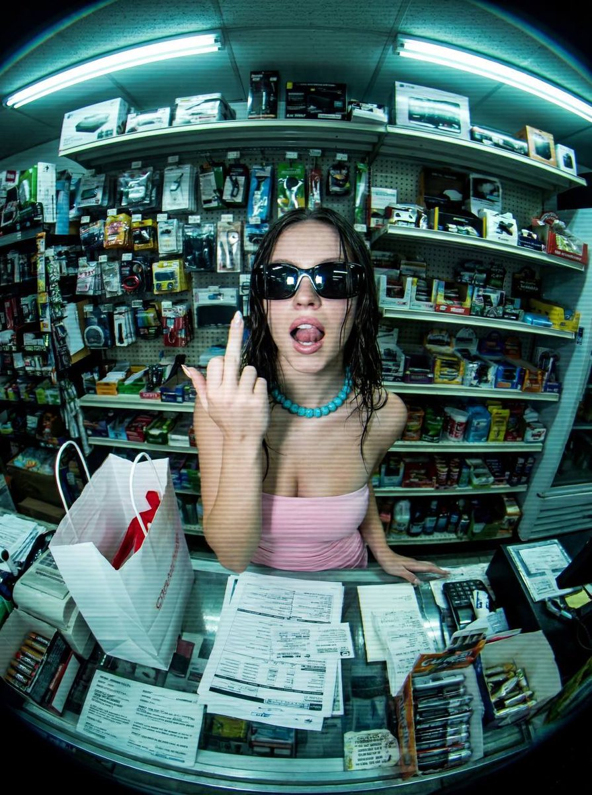

## Cinematic studio portrait of a young man with messy text

- ID: trending-2035918574674665977
- Slug: trending-2035918574674665977-en
- 语言: en
- 来源: [来源链接](https://x.com/Kashberg_0/status/2035918574674665977)
- 样例图路径: images/part1/2035918574674665977_1.jpg

### 提示词

```text
Cinematic studio portrait of a young man with messy textured hair, wearing a black turtleneck, centered composition, dark minimal background, dramatic low-key lighting, a horizontal red neon light strip cutting across his eyes, strong contrast shadows covering lower face, intense gaze, moody atmosphere, cyberpunk aesthetic, ultra-realistic, sharp focus, 85mm lens, shallow depth of field, high detail, editorial photography style.
```

### 样例图

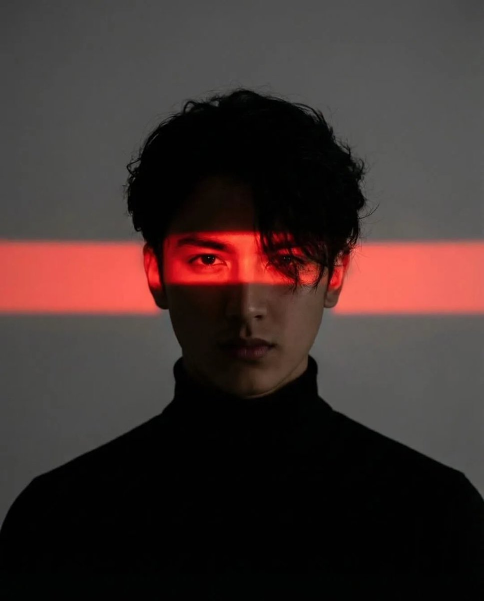

## panning shot of a blurry female silhouette, soft motion 

- ID: trending-2026308234420666586
- Slug: trending-2026308234420666586-en
- 语言: en
- 来源: [来源链接](https://x.com/nextstepst/status/2026308234420666586)
- 样例图路径: images/part1/2026308234420666586_1.jpg

### 提示词

```text
panning shot of a blurry female silhouette, soft motion blur trailing behind her, gentle film grain, diffused edge lighting, deep red gradient background with glowing haze, soft-focus facial features, smooth atmospheric glow,

slow-shutter cinematic effect
```

### 样例图

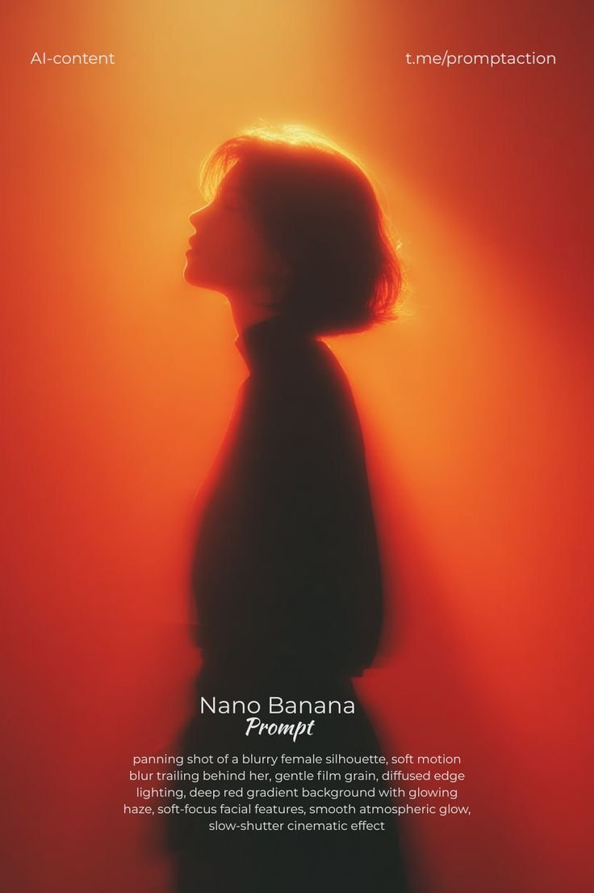

## Ultra-realistic cinematic street portrait of a young wom

- ID: trending-2026100670500339830
- Slug: trending-2026100670500339830-en
- 语言: en
- 来源: [来源链接](https://x.com/Kashberg_0/status/2026100670500339830)
- 样例图路径: images/part1/2026100670500339830_1.jpg

### 提示词

```text
Ultra-realistic cinematic street portrait of a young woman in a bright blue puffer jacket standing still in the middle of a busy city crowd, intense eye contact with camera, shallow depth of field, motion-blurred pedestrians rushing around her, urban background with traffic lights and tall buildings, cool color grading, natural skin tones, soft overcast lighting, 85mm lens, f/1.8, high detail, sharp focus on subject, dynamic motion blur, editorial photography, 8k.
```

### 样例图

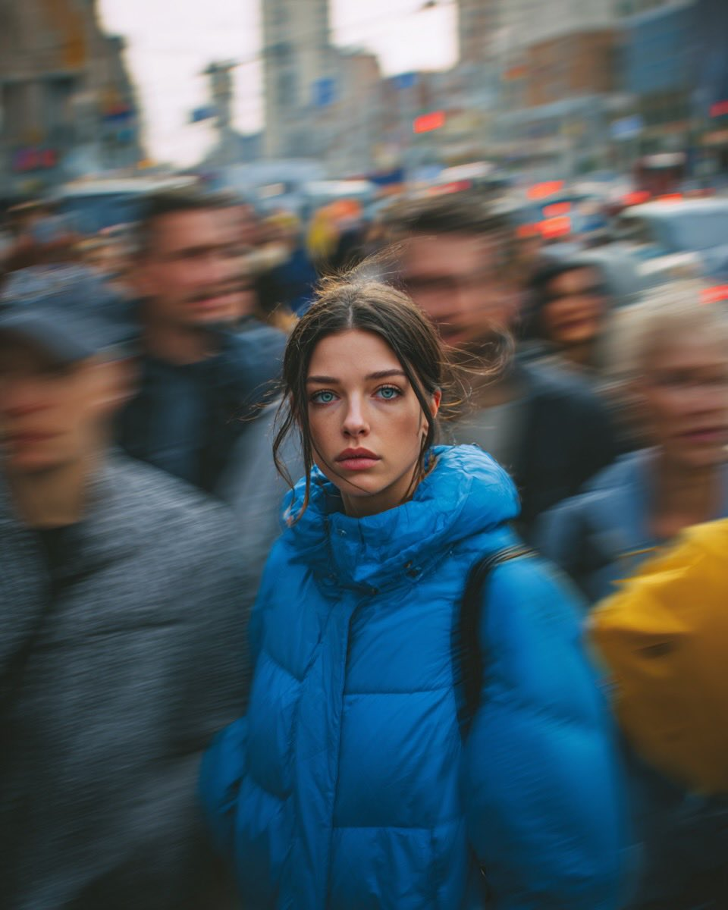

## { "type": "image_generation_prompt", "style": "photoreal

- ID: trending-2010784341975318837
- Slug: trending-2010784341975318837-en
- 语言: en
- 来源: [来源链接](https://x.com/craftian_keskin/status/2010784341975318837)
- 样例图路径: images/part1/2010784341975318837_1.jpg

### 提示词

```text
{
  "type": "image_generation_prompt",
  "style": "photorealistic, lifestyle photography",
  "sexualization": "none",
  "description": {
    "subject": "A young woman standing casually in a home kitchen, seen in side profile",
    "pose": "Relaxed posture, one hand resting on her hip while the other holds a small drink carton with a straw",
    "expression": "Neutral, thoughtful, slightly distant gaze looking forward",
    "appearance": {
      "hair": "Dark hair tied in a loose low bun with natural strands framing the face",
      "clothing": "Oversized white t-shirt worn casually, simple underwear partially visible due to the relaxed fit of the shirt",
      "tattoos": "Small, minimal black-ink tattoos on the forearm, subtle and understated"
    }
  },
  "environment": {
    "location": "A modest, lived-in home kitchen",
    "details": "Wooden cabinets, countertop appliances, a refrigerator covered with colorful magnets and souvenirs",
    "lighting": "Soft natural daylight coming from a window, warm and slightly muted",
    "atmosphere": "Quiet, everyday domestic moment"
  },
  "camera": {
    "angle": "Side profile view",
    "framing": "Medium shot capturing the subject from mid-thigh to head",
    "lens": "35mm lifestyle lens",
    "depth_of_field": "Moderate, background softly in focus to preserve environmental context"
  },
  "image_quality": {
    "realism": "High",
    "texture_detail": "Natural fabric folds, skin texture, and kitchen surface details visible",
    "grain": "Light natural film grain for an authentic look"
  },
  "mood": "Calm, intimate, documentary-style",
  "constraints": [
    "Non-sexualized, everyday realism",
    "Focus on natural lifestyle and atmosphere",
    "No exaggerated poses or expressions",
    "Candid, slice-of-life aesthetic"
  ]
}
```

### 样例图

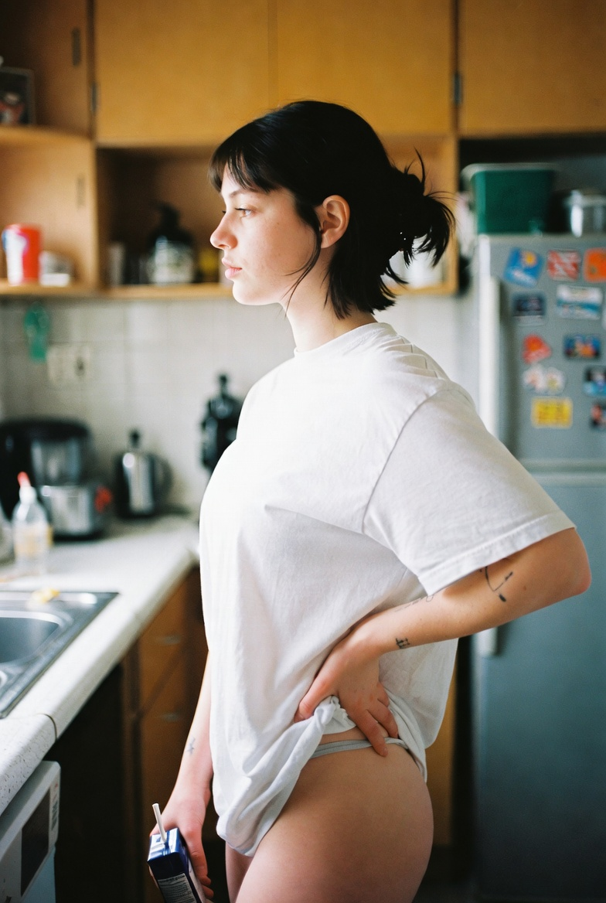

## { "version_control": { "target_style": "High-End Fashion

- ID: trending-2016201701254951241
- Slug: trending-2016201701254951241-en
- 语言: en
- 来源: [来源链接](https://x.com/YaseenK7212/status/2016201701254951241)
- 样例图路径: images/part1/2016201701254951241_1.jpg

### 提示词

```text
{
  "version_control": {
    "target_style": "High-End Fashion Editorial",
    "fidelity_level": "Absolute 1:1 Identity Lock",
    "rendering_engine_constraints": "No CGI, No Illustration, No AI Smoothing"
  },
  "subject_profile": {
    "identity": {
      "name": "Ana de Armas",
      "age_group": "Adult Woman",
      "biometric_integrity": "Preserve 100% original bone structure, facial asymmetry, moles, and eye shape. Zero morphing or enhancement."
    },
    "anatomy_and_skin": {
      "texture": "Visible pores, micro-creases, subtle translucency",
      "physics": "Natural water droplets, soft wet sheen, realistic surface tension on skin",
      "tone": "Natural base skin tone, sun-kissed warmth, no artificial glow"
    },
    "face_details": {
      "eyes": "Natural eye color, soft neutral-pink glossy shadow, thin lash-line eyeliner (no wing), separated curled lashes",
      "brows": "Natural density, straight-to-softly-rounded architecture",
      "nose_and_lips": "Subtle pink warmth on nose bridge; full lips, rose-pink gradient, wet glossy finish, blurred edges, no overlining"
    },
    "hair_styling": {
      "state": "Visibly wet, slicked at roots, damp strands",
      "arrangement": "Loose, flowing over shoulders and back, natural messy texture",
      "match_reference": "1:1 color and style match"
    }
  },
  "composition_and_pose": {
    "action": "Leaning on swimming pool edge, body angled 45-degrees",
    "arm_placement": "One arm naturally resting on pool coping",
    "framing": "Medium close-up, three-quarter angle",
    "mood": "Intimate, calm, grounded, confident"
  },
  "attire_and_wardrobe": {
    "primary_garment": "Minimalist white swimsuit, thin straps, clean lines",
    "fabric_physics": "Realistic tension against wet skin, natural folds and bunching",
    "jewelry": "Statement earrings, natural stones/gold, realistic micro-scratches and reflections"
  },
  "environment_and_lighting": {
    "background": {
      "element": "Turquoise pool water",
      "physics": "Refraction, light-play on pool floor, subtle ripples, realistic movement"
    },
    "lighting_design": {
      "source": "Single-direction natural sunlight",
      "color_temp": "Warm sun-lit tones",
      "exposure": "Slightly underexposed (lowered exposure)",
      "shadows": "Physically accurate contact shadows on collarbones and chest"
    }
  },
  "technical_parameters": {
    "optics": "50mm–85mm focal length equivalent, realistic photographic perspective",
    "depth_of_field": "Shallow, organic bokeh, natural fall-off",
    "resolution_quality": "16k Hyper-Realistic",
    "aspect_ratio": "3:4"
  }
}
```

### 样例图

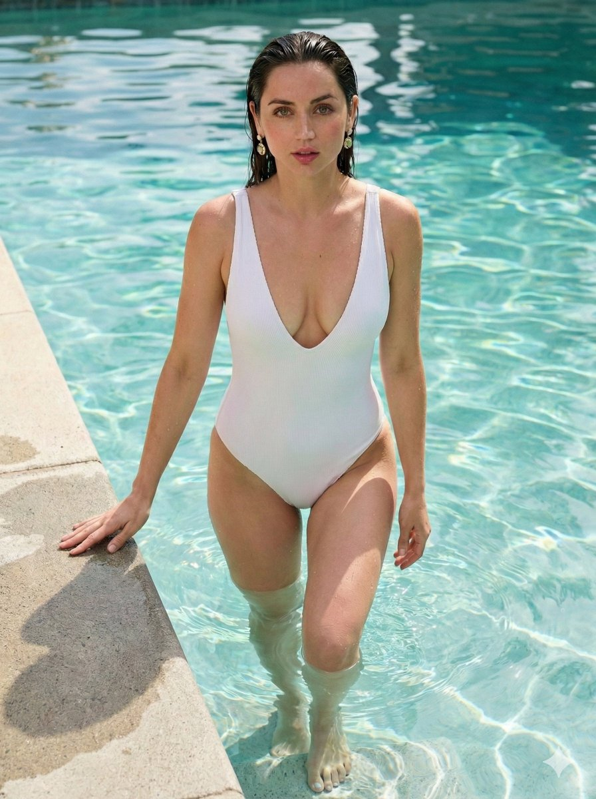

## Panning shot of a mysterious soccer player in red proffe

- ID: trending-2019364350151234040
- Slug: trending-2019364350151234040-en
- 语言: en
- 来源: [来源链接](https://x.com/ChillaiKalan__/status/2019364350151234040)
- 样例图路径: images/part1/2019364350151234040_1.jpg

### 提示词

```text
Panning shot of a mysterious soccer player in red proffesional soccer jearsy mid air kicking a ball, motion blur, cinematic lighting agains a Light gree gradient background with streaking
lights --ar 4:5 --raw --stylize 700
```

### 样例图

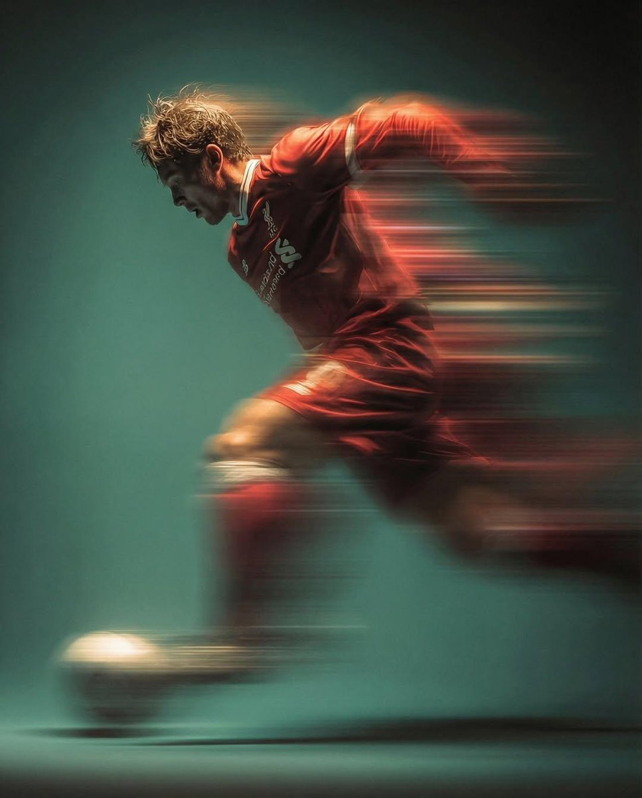

## { "meta": { "image_quality": "High", "image_type": "Phot

- ID: trending-2016189962090381695
- Slug: trending-2016189962090381695-en
- 语言: en
- 来源: [来源链接](https://x.com/Ankit_patel211/status/2016189962090381695)
- 样例图路径: images/part1/2016189962090381695_1.jpg

### 提示词

```text
{
  "meta": {
    "image_quality": "High",
    "image_type": "Photo"
  },
  "global_context": {
    "scene_description": "Close-up portrait of a young person's face covered with colorful paper stickers and glossy adhesive residue. Central focus on eyes, nose, lips; subject blowing a pink bubblegum bubble. Stickers vary in size, text, icons and layered overlap; hair strands frame face at edges. Skin shows freckles, pores, and sheen from adhesive or moisture.",
    "time_of_day": "Neutral/studio lighting",
    "weather_atmosphere": "Indoors/controlled",
    "lighting": {
      "source": "Artificial",
      "direction": "Frontal with slight top",
      "quality": "Soft",
      "color_temp": "Neutral"
    }
  },
  "color_palette": {
    "dominant_hex_estimates": ["#E7B1B6", "#F6C0D0", "#C9A38C"],
    "accent_colors": ["Pink","Magenta"],
    "contrast_level": "Medium"
  },
  "composition": {
    "camera_angle": "Eye-level",
    "framing": "Extreme close-up (face fills frame)",
    "depth_of_field": "Shallow (background indistinct)",
    "focal_point": "Eyes and central bubble"
  },
  "objects": [
    {
      "id": "obj_001",
      "label": "Face",
      "category": "Person (head)",
      "location": "Center",
      "prominence": "Foreground",
      "visual_attributes": {
        "color": "Light beige skin with pink undertones and freckles",
        "texture": "Smooth with visible pores, glossy adhesive patches",
        "material": "Skin",
        "state": "Sticker-covered, slightly wet/glossy",
        "dimensions_relative": "Large relative to frame"
      },
      "micro_details": [
        "Freckles concentrated on nose and cheeks",
        "Shiny adhesive residue streaks on forehead and cheeks",
        "Fine vellus hairs visible",
        "Pores visible on nose and cheeks"
      ],
      "pose_or_orientation": "Frontal",
      "text_content": null
    },
    {
      "id": "obj_002",
      "label": "Eyes (pair)",
      "category": "Facial feature",
      "location": "Upper-center",
      "prominence": "Foreground",
      "visual_attributes": {
        "color": "Gray-green irises with dark limbal ring",
        "texture": "Wet/glossy cornea, visible eyelashes",
        "material": "Biological",
        "state": "Open, neutral expression",
        "dimensions_relative": "Medium"
      },
      "micro_details": [
        "Tiny specular highlights on each cornea",
        "Sparse lower lashes, fuller upper lashes",
        "Slight shadow under lower lids"
      ],
      "pose_or_orientation": "Facing camera",
      "text_content": null
    },
    {
      "id": "obj_003",
      "label": "Pink bubble",
      "category": "Object (gum)",
      "location": "Lower-center",
      "prominence": "Foreground",
      "visual_attributes": {
        "color": "Pastel pink",
        "texture": "Smooth, slightly translucent",
        "material": "Gum",
        "state": "Inflated/intact",
        "dimensions_relative": "Large relative to mouth"
      },
      "micro_details": [
        "Two bright specular reflections on sphere",
        "Seamless edge against lips"
      ],
      "pose_or_orientation": "Centered over mouth",
      "text_content": null
    },
    {
      "id": "obj_004",
      "label": "Stickers (assorted)",
      "category": "Adhesive stickers",
      "location": "Entire face and neck, concentrated forehead and cheeks",
      "prominence": "Foreground",
      "visual_attributes": {
        "color": "Multicolor: magenta, yellow, blue, white",
        "texture": "Paper/plastic with glossy varnish, torn edges",
        "material": "Paper/plastic adhesive",
        "state": "Layered, partially torn, some wrinkled",
        "dimensions_relative": "Varied small-to-medium"
      },
      "micro_details": [
        "Large 'POP ME' magenta sticker on forehead",
        "Partial torn sticker fragments near nasolabial fold",
        "Small rectangular stickers with tiny printed text",
        "Edges lifting, adhesive shine around perimeters"
      ],
      "pose_or_orientation": "Affixed flat or slightly peeled",
      "text_content": "Multiple small logos and words (e.g., 'POP ME')"
    },
    {
      "id": "obj_005",
      "label": "Hair strands",
      "category": "Hair",
      "location": "Left and right edges framing face",
      "prominence": "Background/foreground overlap",
      "visual_attributes": {
        "color": "Light brown",
        "texture": "Fine, slightly wet",
        "material": "Hair",
        "state": "Loose strands",
        "dimensions_relative": "Thin relative to face"
      },
      "micro_details": [
        "Individual strands crossing forehead edges",
        "Slight adhesive sheen on some strands"
      ],
      "pose_or_orientation": "Hanging down"
    }
  ],
  "text_ocr": {
    "present": true,
    "content": [
      {
        "text": "POP ME",
        "location": "Forehead",
        "font_style": "Bold/Decorative",
        "legibility": "Clear"
      }
    ]
  },
  "semantic_relationships": [
    "Stickers are affixed to Face",
    "Bubble covers mouth, partially obscuring lips",
    "Adhesive residue creates glossy highlights on skin",
    "Hair strands frame and partly overlay stickers"
  ]
}
```

### 样例图

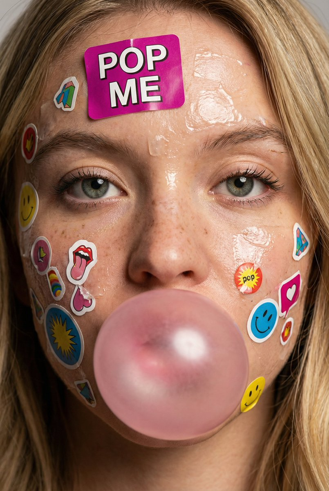

## { "meta": { "image_quality": "High", "image_type": "Digi

- ID: trending-2012132360779923648
- Slug: trending-2012132360779923648-en
- 语言: en
- 来源: [来源链接](https://x.com/rovvmut_/status/2012132360779923648)
- 样例图路径: images/part1/2012132360779923648_1.jpg

### 提示词

```text
{
  "meta": {
    "image_quality": "High",
    "image_type": "Digital Composite / Graphic Design",
    "resolution_estimation": "High resolution vertical poster format",
    "file_characteristics": {
      "compression_artifacts": "Low",
      "noise_level": "Low (film grain visible in photo texture)",
      "lens_type_estimation": "Telephoto (suggested by facial compression)"
    }
  },
  "global_context": {
    "scene_description": "A high-contrast, black and white split-composition portrait of Elon Musk. The left half of the image displays a realistic, high-detail photograph of the right side of his face (viewer's left). The right half of the image consists of a white background where the left side of his face (viewer's right) is revealed only through the shapes of large, bold, vertically stacked serif typography reading 'IF YOU DREAM IT YOU CAN DO IT.'",
    "environment_type": "Studio/Graphic Art",
    "time_of_day": "Indiscernible",
    "weather_atmosphere": "Visionary, Motivational, Intense",
    "lighting": {
      "source": "Artificial Studio Lighting",
      "direction": "Side lighting (lighting the face from the left)",
      "quality": "Hard, dramatic chiaroscuro",
      "color_temperature": "Monochrome (Black and White)"
    },
    "color_palette": {
      "dominant_hex_estimates": [
        "#FFFFFF",
        "#000000",
        "#333333",
        "#888888"
      ],
      "accent_colors": [],
      "contrast_level": "High"
    }
  },
  "composition": {
    "camera_angle": "Eye-level",
    "framing": "Close-up portrait",
    "depth_of_field": "Deep (all elements in focus)",
    "focal_point": "Subject's eyes and the typographic message",
    "symmetry_type": "Vertical Split Asymmetry",
    "rule_of_thirds_alignment": "The split occurs roughly along the vertical center line of the face (nose bridge)"
  },
  "objects": [
    {
      "id": "obj_subject_face",
      "label": "Elon Musk (Face)",
      "category": "Person",
      "location": {
        "relative_position": "Left half of canvas",
        "bounding_box_percentage": {
          "x": 0.0,
          "y": 0.0,
          "width": 0.5,
          "height": 1.0
        }
      },
      "dimensions_relative": "Large (fills height)",
      "distance_from_camera": "Close-up",
      "pose_orientation": "Front-facing, slight tilt, intense contemplative gaze",
      "material": "Skin/Biological",
      "surface_properties": {
        "texture": "Smooth skin, faint stubble, characteristic facial structure",
        "reflectivity": "Low (natural skin oil sheen on nose/cheek)",
        "micro_details": "Faint crow's feet, straight/wavy hair texture visible at top",
        "wear_state": "N/A"
      },
      "color_details": {
        "base_color_hex": "#808080",
        "secondary_colors": [
          "#000000",
          "#FFFFFF"
        ],
        "gradient_or_pattern": "Grayscale continuous tone"
      },
      "interaction_with_light": {
        "shadow_casting": "Deep shadows on the right side of the face (hidden by text mask)",
        "highlight_zones": "Forehead, bridge of nose, under-eye area on the lit side",
        "translucency": "None"
      },
      "relationships": [
        {
          "type": "visually_connected_to",
          "target_object_id": "obj_typography_mask"
        }
      ]
    },
    {
      "id": "obj_typography_mask",
      "label": "Typographic Overlay",
      "category": "Text/Graphic Element",
      "location": {
        "relative_position": "Right half of canvas",
        "bounding_box_percentage": {
          "x": 0.5,
          "y": 0.0,
          "width": 0.5,
          "height": 1.0
        }
      },
      "dimensions_relative": "Large",
      "distance_from_camera": "Surface Plane",
      "pose_orientation": "Vertical Stack",
      "material": "Digital Mask",
      "surface_properties": {
        "texture": "The fill of the letters matches the texture of Elon Musk's hair and skin (masked photo)",
        "reflectivity": "None",
        "micro_details": "Edges are sharp serif cuts",
        "wear_state": "N/A"
      },
      "color_details": {
        "base_color_hex": "#000000",
        "secondary_colors": [
          "#FFFFFF"
        ],
        "gradient_or_pattern": "Image texture inside letters, white background outside"
      },
      "interaction_with_light": {
        "shadow_casting": "None",
        "highlight_zones": "None",
        "translucency": "None"
      },
      "text_content": {
        "raw_text": "IF\nYOU\nDREAM\nIT\nYOU\nCAN\nDO\nIT.",
        "font_style": "Heavy Slab Serif (e.g., Rockwell Bold or similar)",
        "font_weight": "Bold / Black",
        "text_case": "Uppercase",
        "alignment": "Justified / Stacked",
        "color_hex": "Texture-filled (Black/Gray)"
      },
      "relationships": [
        {
          "type": "completes_image_of",
          "target_object_id": "obj_subject_face"
        }
      ]
    },
    {
      "id": "obj_clothing",
      "label": "Jacket Collar / Suit",
      "category": "Clothing",
      "location": {
        "relative_position": "Bottom Left Corner",
        "bounding_box_percentage": {
          "x": 0.0,
          "y": 0.85,
          "width": 0.4,
          "height": 0.15
        }
      },
      "dimensions_relative": "Small visible portion",
      "distance_from_camera": "Near",
      "pose_orientation": "Worn on shoulders",
      "material": "Dark Fabric/Leather",
      "surface_properties": {
        "texture": "Smooth with subtle folding",
        "reflectivity": "Medium",
        "micro_details": "Folds and creases",
        "wear_state": "Good condition"
      },
      "color_details": {
        "base_color_hex": "#1A1A1A",
        "secondary_colors": [],
        "gradient_or_pattern": "Solid dark"
      },
      "interaction_with_light": {
        "shadow_casting": "Self-shadowing in folds",
        "highlight_zones": "Ridges of folds",
        "translucency": "None"
      },
      "relationships": [
        {
          "type": "worn_by",
          "target_object_id": "obj_subject_face"
        }
      ]
    },
    {
      "id": "obj_ear",
      "label": "Left Ear",
      "category": "Body Part",
      "location": {
        "relative_position": "Center Left Edge",
        "bounding_box_percentage": {
          "x": 0.05,
          "y": 0.35,
          "width": 0.15,
          "height": 0.2
        }
      },
      "dimensions_relative": "Medium",
      "distance_from_camera": "Mid",
      "pose_orientation": "Side view",
      "material": "Skin",
      "surface_properties": {
        "texture": "Smooth skin",
        "reflectivity": "Low",
        "micro_details": "Cartilage structure visible",
        "wear_state": "N/A"
      },
      "color_details": {
        "base_color_hex": "#888888",
        "secondary_colors": [],
        "gradient_or_pattern": "N/A"
      },
      "interaction_with_light": {
        "shadow_casting": "Inner ear shadows",
        "highlight_zones": "Outer rim (helix)",
        "translucency": "Slight subsurface scattering potential"
      },
      "relationships": [
        {
          "type": "attached_to",
          "target_object_id": "obj_subject_face"
        }
      ]
    }
  ],
  "background_details": {
    "texture": "Flat color",
    "patterns": "None (Solid White)",
    "lighting_behavior": "The background is pure white (#FFFFFF), providing maximum contrast to the subject and text.",
    "additional_elements": [
      "Negative space on the right side acts as the canvas for the text masking effect."
    ]
  },
  "foreground_elements": {
    "particles": "None",
    "artifacts": "None"
  },
  "reconstruction_notes": {
    "mandatory_elements_for_recreation": [
      "Elon Musk's likeness",
      "Split face composition",
      "Typography masking effect on the right side",
      "Specific quote: 'IF YOU DREAM IT YOU CAN DO IT.'",
      "Black and white high-contrast aesthetic",
      "Serif bold font"
    ],
    "sensitivity_factors": "The alignment of the text must perfectly match the underlying facial anatomy to maintain the illusion of the face continuing through the letters. Hairline and jaw structure should be specific to Musk.",
    "ambiguities": "Clothing type is generic dark material."
  }
}
```

### 样例图

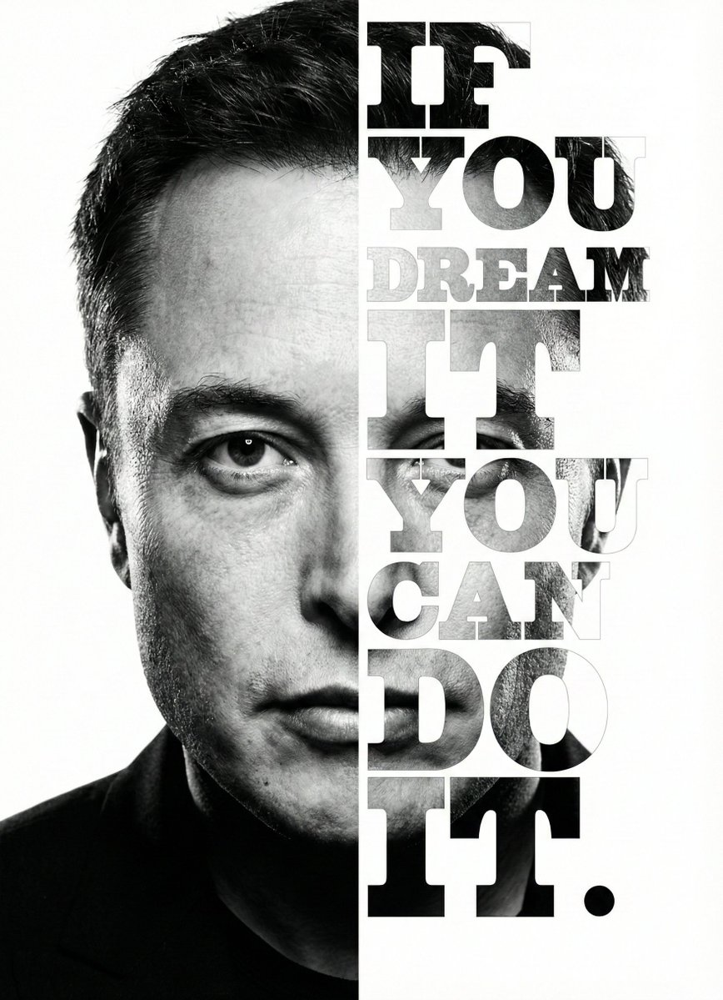

## Create a 3:4 cinematic, atmospheric editorial portrait u

- ID: trending-2038617381388583283
- Slug: trending-2038617381388583283-en
- 语言: en
- 来源: [来源链接](https://x.com/Goodmanprotocol/status/2038617381388583283)
- 样例图路径: images/part1/2038617381388583283_1.jpg

### 提示词

```text
Create a 3:4 cinematic, atmospheric editorial portrait using the attached photo as the exact face and identity reference. A solitary man/woman stands alone in the middle of vast, wind-swept sage green grass fields. Tall grass surrounds the subject completely, flowing in strong currents like ocean waves, partially obscuring the body and creating motion,depth, and solitude. The subject wears a simple, loose white shirt that softly contrasts with the rich green landscape.
Dark hair is slightly messy, with natural strands moving in the wind. The head is gently tilted downward, eyes cast toward the ground, conveying a quiet, introspective, melancholic mood. Expression is calm, distant, and emotionally restrained. Compose the frame slightly off-center, from a subtle elevated angle. No visible horizon, the frame is fully immersed in grass texture. Use a muted natural palette of sage green, deep olive, and soft off-white. Shoot vertical 3:4, telephoto perspective, shallow depth of field, cinematic framing. Film photography aesthetic with visible grain, soft edge falloff, atmospheric light, wind-driven motion blur in the grass. Quiet, poetic storytelling; ultra-detailed yet natural, magazine-cover editorial quality. No text, no watermark.
```

### 样例图

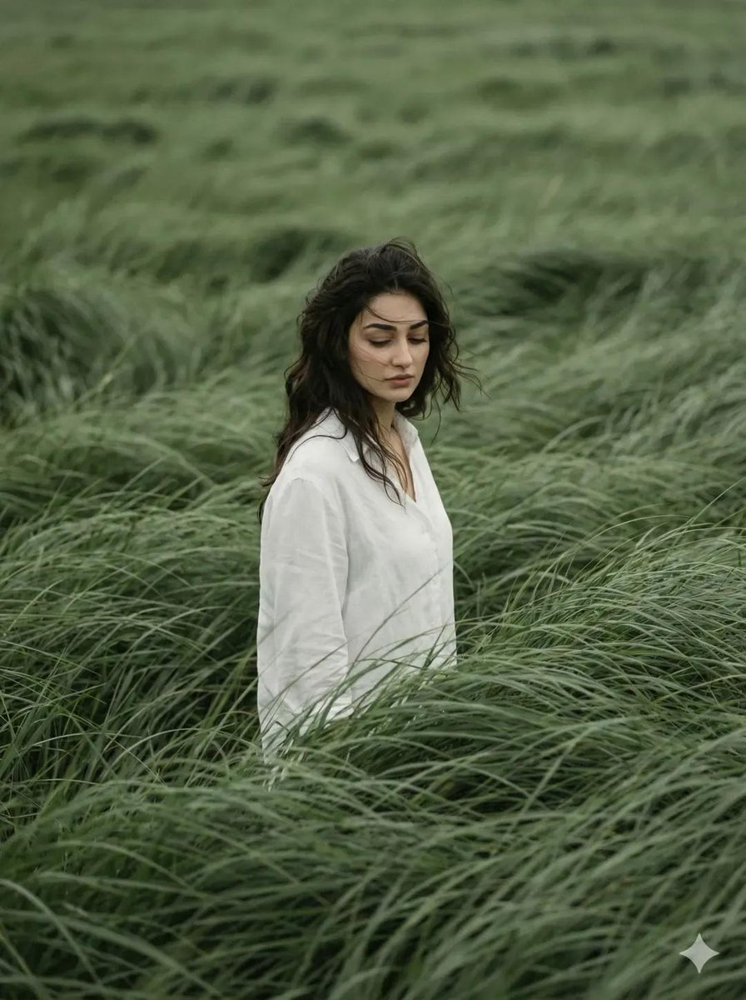

## A [subject] photographed from a 35-degree overhead angle

- ID: trending-2040745533858574471
- Slug: trending-2040745533858574471-en
- 语言: en
- 来源: [来源链接](https://x.com/azed_ai/status/2040745533858574471)
- 样例图路径: images/part1/2040745533858574471_1.jpg

### 提示词

```text
A [subject] photographed from a 35-degree overhead angle, standing alone in an off-white studio void, with a confident pose and clean silhouette. Stylised proportions, sleek fashion styling, reflective textures, bold accessories, soft studio light, single beauty-dish flash casting crisp shadows, subtle Kodak Portra-inspired grain, candid editorial energy, minimalist composition, sharp detail, premium studio photography
```

### 样例图

![A [subject] photographed from a 35-degree overhead angle](../images/part1/2040745533858574471_1.jpg)

## { "generation_request": { "meta_data": { "tool": "NanoBa

- ID: trending-2010681577987055947
- Slug: trending-2010681577987055947-en
- 语言: en
- 来源: [来源链接](https://x.com/astronomerozge1/status/2010681577987055947)
- 样例图路径: images/part1/2010681577987055947_1.jpg

### 提示词

```text
{
  "generation_request": {
    "meta_data": {
      "tool": "NanoBanana Pro",
      "task_type": "photoreal_candid_street_romance",
      "version": "v1.2_MODA_SEASIDE_SIMIT_SUNNY_CHERRY_DRESS_EN",
      "priority": "highest"
    },

    "output_settings": {
      "aspect_ratio": "4:5",
      "orientation": "portrait",
      "resolution_target": "ultra_high_res",
      "render_style": "ultra_photoreal_candid_street_film_still",
      "sharpness": "crisp_but_natural",
      "film_grain": "subtle_35mm",
      "color_grade": "true_to_life_sunny_natural",
      "dynamic_range": "natural_not_hdr",
      "skin_rendering": "real_texture_no_retouch"
    },

    "global_rules": {
      "camera_language": "35mm lens equivalent, eye-level, imperfect framing, candid documentary feel, focus on eyes when people are present",
      "authenticity_markers": "subtle halation on highlights, tiny film gate weave, real street clutter, slight background motion blur only, no studio look",
      "lighting_language": "motivated natural light only (sunlight + sky fill), deep but detailed shadows"
    },

    "creative_prompt": {
      "scene_summary": "Moda seaside in Istanbul on a sunny day. A young couple in their early 20s sits near the shore eating simit. A candid, unposed film-still moment—quiet love inside everyday life.",

      "subjects": {
        "count": 2,
        "description": "the same young man and woman (early 20s), ordinary and real, not model-like; faces visible and eyes sharp",
        "expression": "small genuine smiles, relaxed presence, natural micro-expressions",
        "skin_and_face": "natural skin texture, no beauty retouch, no plastic skin, slight imperfections preserved"
      },

      "wardrobe_and_props": {
        "female": "pink dress with colorful cherry pattern, simple fit, slightly moving in sea breeze, natural minimal makeup, long wavy hair",
        "male": "blue denim jeans and a plain white t-shirt, slightly wrinkled, no logos",
        "props": "two simits in their hands, a simple tote/backpack nearby, no branding"
      },

      "micro_action": "they break pieces of simit, share a bite, laugh softly; the wind lifts the dress hem slightly; crumbs fall naturally onto their hands",

      "environment_details": {
        "location": "Moda coast, Istanbul",
        "background": "sea horizon, gentle waves, a few distant people walking softly out of focus, seagulls in the sky, sunlit railing and rocks",
        "ground_details": "worn stone or concrete edge, small everyday clutter (a bottle cap or leaf), but clean and believable, no staged props"
      },

      "lighting": "bright sunny daylight with soft sky fill; controlled highlights; subtle halation on sunlit edges; deep but detailed shadows under chins and clothing folds",

      "composition": "eye-level medium shot, slightly off-center, imperfect framing like real street photography; faces sharp; background gently receding; no perfect symmetry",

      "mood": "warm, simple, human—an everyday Istanbul love scene"
    },

    "negative_prompt": [
      "studio lighting",
      "beauty retouch",
      "plastic skin",
      "model faces",
      "posed romance poster look",
      "perfect symmetry",
      "HDR",
      "AI glow",
      "fake bokeh shapes",
      "overly clean staged scene",
      "text",
      "logo",
      "watermark",
      "cartoon",
      "painterly"
    ]
  }
}
```

### 样例图

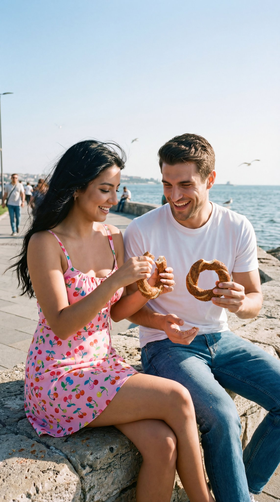

## Transform this image [Upload Your Image] into a 64K DSLR

- ID: trending-2009458579305267681
- Slug: trending-2009458579305267681-en
- 语言: en
- 来源: [来源链接](https://x.com/Sheldon056/status/2009458579305267681)
- 样例图路径: images/part1/2009458579305267681_1.jpg

### 提示词

```text
Transform this image [Upload Your Image] into a 64K DSLR shot resolution of A creative urban street portrait featuring a young man (same face as the uploaded image) sitting on a curb in a quiet city street, paired with a stylized cartoon illustration of himself placed beside him. The real-life subject (same face as the uploaded image) is seated casually on a concrete sidewalk edge, resting his head on one hand in a bored, contemplative pose. He looks slightly upward with a neutral, introspective expression, conveying a sense of quiet thoughtfulness and urban solitude. He wears a muted maroon cable-knit sweater with a relaxed fit, dark loose-fitting denim jeans with subtle stitched details near the cuffs, and worn brown leather boots. Accessories include layered silver chain dog tag with the name "[Add Text]" written on it, rings on his fingers, black-framed glasses, and a light-coloured baseball cap with bold embroidered lettering on the front. His hair is short, dark hair, a well-groomed beard texture and character. Next to him on the sidewalk sits a small cartoon version (same face as the uploaded image) of himself, matching his outfit and pose exactly—same sweater, jeans, boots, cap, glasses, and facial expression. The illustrated character has clean outlines, warm muted colors, and a soft shaded, hand-drawn animation style, creating a playful contrast between realism and illustration. The cartoon figure is proportionally smaller, emphasizing a companion-like or inner-self concept. The background features textured cobblestone pavement, a curb edge, and a building facade with muted yellow walls and green-tiled brickwork near a window. The color palette is earthy and subdued, with natural daylight providing soft, even lighting and realistic shadows. The overall composition blends street photography, fashion portraiture, and mixed-media digital art, evoking themes of identity, self-reflection, and creativity.
Style & Mood Keywords: Urban street photography, casual fashion portrait, mixed media art, real and cartoon character duo, introspective mood, muted earthy tones, soft natural light, realistic textures, creative storytelling, high-resolution detail, cinematic realism. Octane render & Unreal Engine
```

### 样例图

![Transform this image [Upload Your Image] into a 64K DSLR](../images/part1/2009458579305267681_1.jpg)

## 3×3 storyboard grid, nine panels, same subject and outfi

- ID: trending-2042288316868149748
- Slug: trending-2042288316868149748-en
- 语言: en
- 来源: [来源链接](https://x.com/oggii_0/status/2042288316868149748)
- 样例图路径: images/part1/2042288316868149748_1.jpg

### 提示词

```text
3×3 storyboard grid, nine panels, same subject and outfit, consistent teal studio background, soft diffused lighting, clean editorial lifestyle photography
young East Asian woman, natural makeup, black hair tied back, wearing white fitted top, blue/cream color-block cardigan with red strap, blue jeans, sneakers, pastel blue over-ear wireless headphones
panel sequence (left→right, top→bottom): 1 standing adjusting headphones, front view
2 close-up portrait touching earcup
3 side profile sitting on tall stool
4 lying on stomach with cassette tapes + retro player
5 extreme close-up headphones + face detail
6 tilted head smiling portrait
7 low-angle crouch reaching headphones toward camera
8 forced perspective product shot, headphones close to lens
9 lying on back relaxed pose
style: minimal, pastel tones, soft shadows, sharp focus, commercial product photography, consistent framing, balanced grid layout, mix of wide/medium/close shots
```

### 样例图

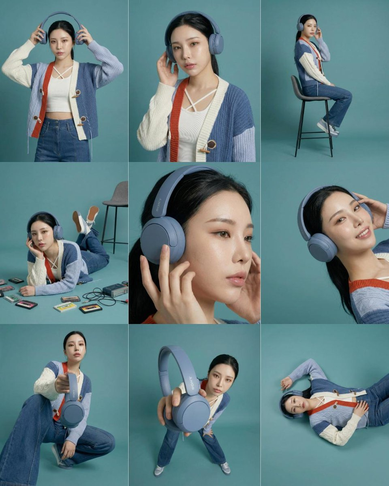

## Aesthetic 1970s-inspired fashion portrait of a stylish y

- ID: trending-2008537400083939763
- Slug: trending-2008537400083939763-en
- 语言: en
- 来源: [来源链接](https://x.com/2abhisheknaks/status/2008537400083939763)
- 样例图路径: images/part1/2008537400083939763_1.jpg

### 提示词

```text
Aesthetic 1970s-inspired fashion portrait of a stylish young woman sitting on outdoor cafe steps, holding a premium ornate green coffee cup with gold rim detailing, gazing softly at the camera. Her hair is styled in soft loose strands framing her face with vintage makeup, matte red lips, and subtle eyeliner. She is wearing a cozy forest green premium knit sweater paired with a long flowing black tutu skirt. A warm vintage plaid scarf in earthy brown, burnt orange, and muted red tones is wrapped loosely around her neck. A premium dark green leather crossbody bag with a gold filigree clasp and chain strap is placed beside her. Autumn street café setting with scattered fallen leaves and warm amber café lights glowing behind glass windows. 1970s film tone, warm grainy texture, muted earthy color palette, cinematic atmosphere, shallow depth of field, soft natural lighting, analog film look, fashion editorial photography, ultra-realistic, high detail, 85mm lens, f/1.8, vintage aesthetic, dreamy mood.
```

### 样例图

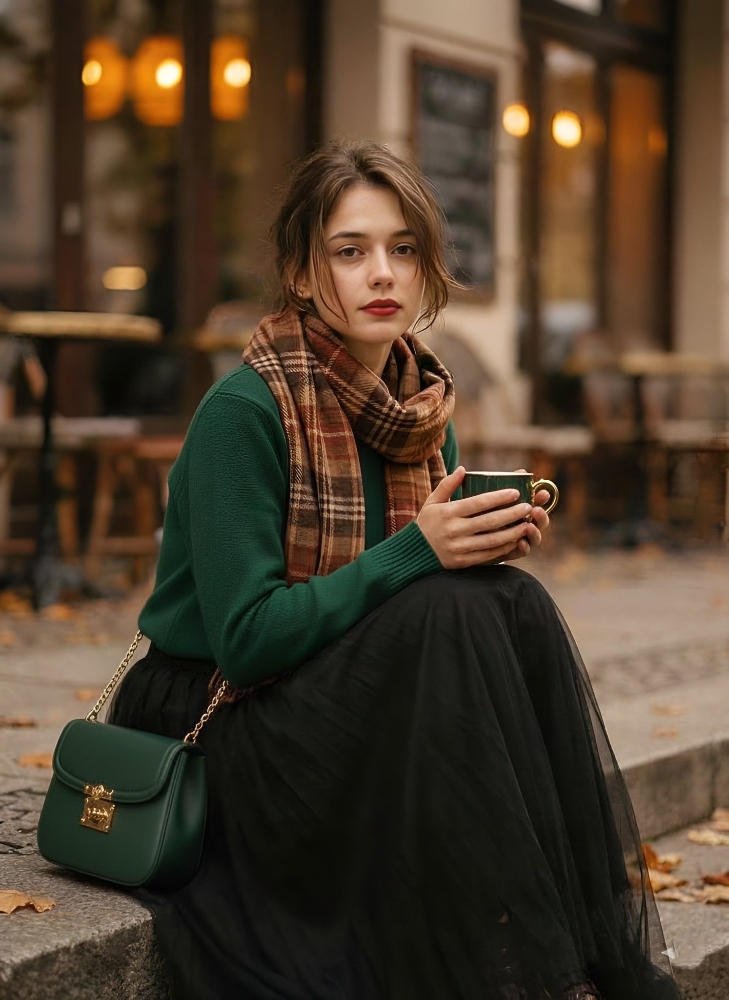

## Create a hyper-real, studio portrait using [USER_PHOTO] 

- ID: trending-2017190762346078697
- Slug: trending-2017190762346078697-en
- 语言: en
- 来源: [来源链接](https://x.com/Samann_ai/status/2017190762346078697)
- 样例图路径: images/part1/2017190762346078697_1.jpg

### 提示词

```text
Create a hyper-real, studio portrait using [USER_PHOTO] as the exact identity reference (same face, hairstyle, skin texture, and age). Depict the person as a confident [PROFESSION] sitting casually on a modern white ergonomic office chair, legs crossed, centered in frame. Add a stylized “multi-arm” illusion (6–8 arms total) radiating behind the torso like a modern Shiva/Vishnu-inspired silhouette, but photorealistic: each extra arm must have correct anatomy, believable joints, tendons, skin pores, and natural shadowing; no warped fingers.

PROPS (must be profession-relevant): Automatically choose and place different tools that a real [PROFESSION] would use, one per hand/arm, all clearly readable and accurate in design. Examples of categories: primary tool, secondary tool, communication device, measurement/diagnostic tool, accessory, and a “hero” prop. Keep one real smartphone in the main/front hand. Avoid generic random objects—every prop must logically belong to [PROFESSION]. If [PROFESSION] is digital/tech: include items like laptop, tablet, camera/monitor, light meter, stylus, keyboard, mic, etc. If [PROFESSION] is medical: stethoscope, clipboard, otoscope, syringe (safe/clinical), etc. If [PROFESSION] is culinary: chef knife, tongs, plating tweezers, recipe tablet, etc. (Always match [PROFESSION].)

BACKGROUND COLOR (topic-matched): Use a seamless paper studio backdrop with a single dominant color that matches the profession theme (e.g., warm mustard for creative/media, cool teal for healthcare, graphite/steel for engineering, rich olive for outdoors, deep burgundy for luxury). The color should complement skin tones and wardrobe. Add subtle gradient falloff and soft bounce for depth (no flat background).

LIGHTING & SET: High-end commercial studio look. One large soft key light from camera-left, controlled fill from right, crisp rim light to separate subject, and realistic specular highlights on props. Include a large circular silver reflector disk behind the subject (partially visible) for visual punch. Add a subtle shadow on the floor consistent with light direction.

WARDROBE & STYLING: Outfit must be believable for a top-tier [PROFESSION] (clean, modern, slightly stylized), with texture detail (fabric weave, seams). Add minimal accessories (watch/bracelet) that feel premium. Expression: focused, slightly intense, “in the zone.”

COMPOSITION & CAMERA: Full-body vertical portrait (4:5), 50mm lens look, eye-level camera, sharp focus on face, shallow depth of field but props still readable. Ultra-detailed skin, natural color grading, high dynamic range, crisp micro-contrast.

REALISM RULES: No cartoon, no CGI look. No extra faces, no duplicated heads. Hands must be anatomically correct (5 fingers), no melted objects, no unreadable text logos unless naturally present. Keep the scene clean and premium.

Output: hyper-real editorial photograph, 8K detail, studio-quality retouching, natural skin texture preserved.
```

### 样例图

![Create a hyper-real, studio portrait using [USER_PHOTO] ](../images/part1/2017190762346078697_1.jpg)

## Low-angle fashion campaign photograph of a confident mod

- ID: trending-2037168464801259602
- Slug: trending-2037168464801259602-en
- 语言: en
- 来源: [来源链接](https://x.com/azed_ai/status/2037168464801259602)
- 样例图路径: images/part1/2037168464801259602_1.jpg

### 提示词

```text
Low-angle fashion campaign photograph of a confident model holding a large [product name] very close to the camera, exaggerated perspective with the hand and product dominating the foreground, full-body pose visible in the background, wide stance, dynamic posture, clean pure white studio background, high-key lighting, sharp focus on product, slight depth of field on the model, bold colorful outfit with strong contrast tones, modern beauty advertising aesthetic, ultra-clean composition, commercial studio photography, glossy packaging detail visible, crisp shadows
```

### 样例图

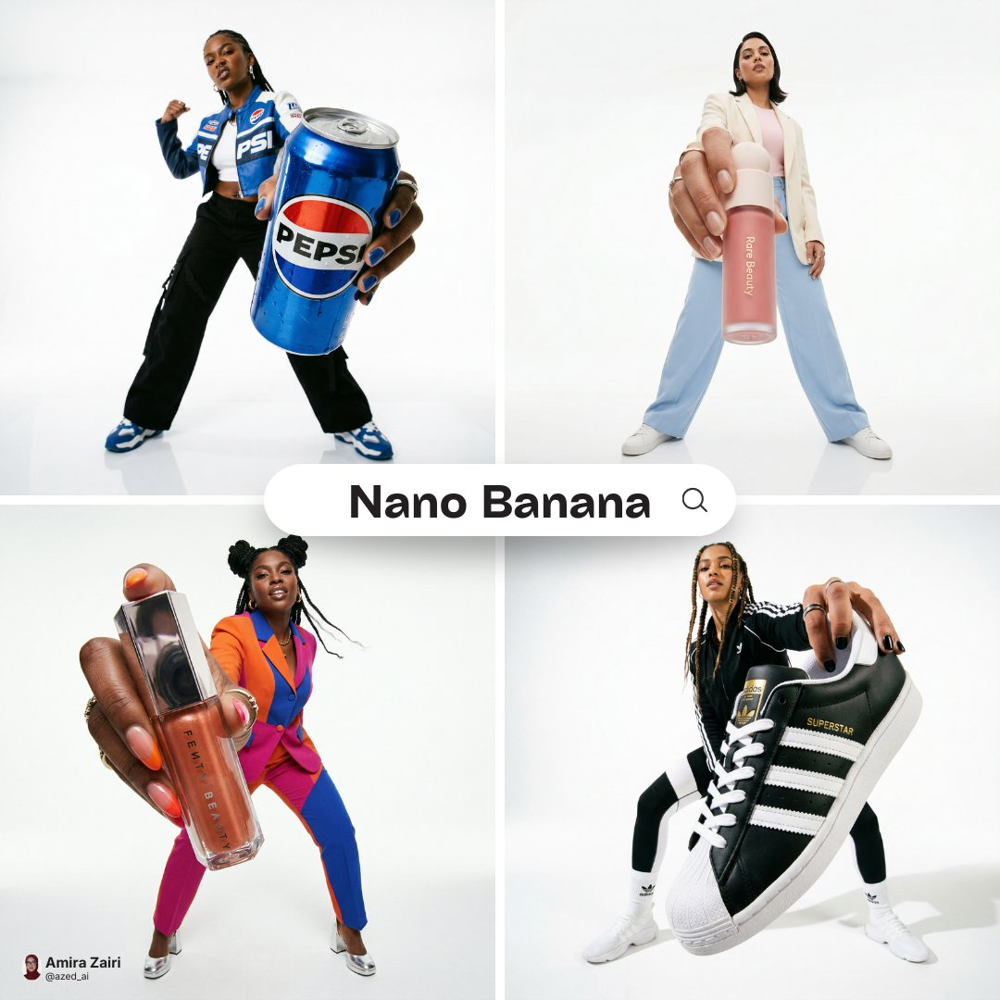

## { "resolution": "8K UHD", "style": "photorealistic AI-ed

- ID: trending-2010615081491677185
- Slug: trending-2010615081491677185-en
- 语言: en
- 来源: [来源链接](https://x.com/meng_dagg695/status/2010615081491677185)
- 样例图路径: images/part1/2010615081491677185_1.jpg

### 提示词

```text
{
  "resolution": "8K UHD",
  "style": "photorealistic AI-edited composite, cinematic realism",
  "scene_type": "surreal product-style composition",
  "camera": {
    "angle": "slightly elevated top-down angle",
    "focus": "sharp foreground with shallow depth of field",
    "lens_effects": [
      "natural depth of field",
      "high clarity",
      "macro-level liquid detail"
    ]
  },
  "environment": {
    "surface": "wooden table with visible grain texture",
    "lighting": {
      "type": "soft natural daylight",
      "direction": "from upper left",
      "shadows": "soft realistic shadows under objects"
    },
    "background": {
      "indoor": true,
      "elements": [
        "blurred interior background",
        "snowy outdoor scenery visible inside phone screen in one image"
      ]
    }
  },
  "main_object": {
    "smartphone": {
      "position": "lying flat on wooden table",
      "orientation": "vertical portrait orientation",
      "color": "black",
      "screen_state": "visibly cracked glass with radial fracture lines",
      "screen_interaction": "screen appears broken outward, allowing subject to emerge"
    }
  },
  "human_subject": {
    "visibility": "upper body visible through phone screen",
    "expression": "wide smile, visible teeth",
    "eye_direction": "looking toward the viewer",
    "gender_presentation": "female-presenting",
    "hair": {
      "color": "light brown",
      "style": "loose, shoulder-length"
    },
    "clothing_variants": [
      {
        "outfit": "casual indoor look",
        "details": "neutral top visible behind phone screen"
      },
      {
        "outfit": "winter clothing",
        "details": [
          "dark padded jacket",
          "light turtleneck sweater",
          "black gloves",
          "black fur hat"
        ]
      }
    ]
  },
  "action": {
    "primary_action": "soda being poured into a transparent plastic cup",
    "motion": "liquid splash frozen mid-air",
    "liquid_behavior": [
      "visible carbonation bubbles",
      "splash droplets",
      "overflow splash effect"
    ]
  },
  "beverage": {
    "type": "cola",
    "cup": {
      "material": "transparent plastic",
      "filled_with": "dark carbonated soda with ice",
      "logo": "Pepsi logo clearly visible"
    },
    "bottle": {
      "material": "plastic",
      "label": "Pepsi branding visible",
      "condition": "condensation droplets on bottle surface",
      "held_by": "human hand entering frame from top right"
    }
  },
  "secondary_objects": [
    {
      "object": "book",
      "position": "left side of phone",
      "color": "light beige cover",
      "state": "closed"
    },
    {
      "object": "pen",
      "position": "near book on table",
      "color": "black",
      "orientation": "diagonal"
    }
  ],
  "effects": {
    "surreal_elements": [
      "subject emerging from phone screen",
      "physical interaction between digital and real space"
    ],
    "particles": [
      "liquid droplets",
      "snow particles in winter scene variant"
    ],
    "glass_effects": [
      "cracked screen shards",
      "reflections on broken glass"
    ]
  },
  "color_palette": {
    "dominant_colors": [
      "warm brown",
      "black",
      "deep cola brown",
      "blue and red branding accents"
    ],
    "contrast": "high contrast between warm table tones and cool screen elements"
  },
  "post_processing": {
    "sharpness": "ultra-sharp",
    "clarity": "high micro-detail",
    "noise": "none",
    "dynamic_range": "high"
  },
  "mood": "playful, surreal, visually striking",
  "realism_level": "high realism with intentional AI-edited surreal effect"
}
```

### 样例图

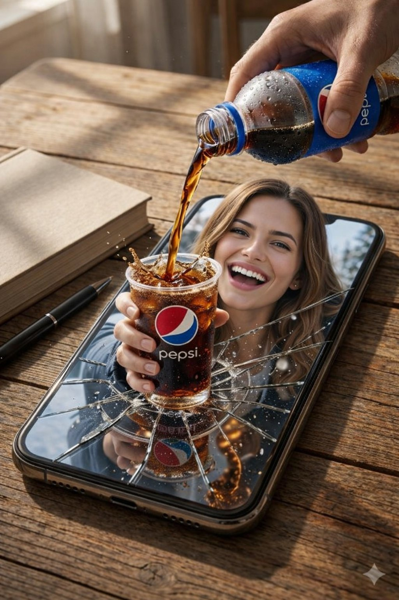

## View from under a plane of completely transparent plexig

- ID: trending-2008198858405462492
- Slug: trending-2008198858405462492-en
- 语言: en
- 来源: [来源链接](https://x.com/cfryant/status/2008198858405462492)
- 样例图路径: images/part1/2008198858405462492_1.jpg

### 提示词

```text
View from under a plane of completely transparent plexiglass. We are looking straight up. Many people are walking on the plexiglass. In the background is a pure blue sky. No buildings visible. No edges or separations in the plexiglass. It’s as if the plexiglass isn’t even there. We are very close to the people. The people are in the process of walking. The people are walking generally from left to right. The soles of their shoes are very close to the foreground.
```

### 样例图

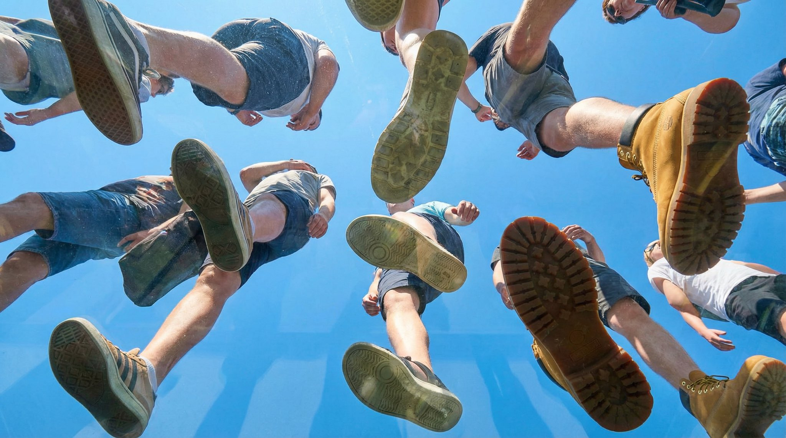

## A high quality mixed media portrait of a trendy young ma

- ID: trending-2021810779348140286
- Slug: trending-2021810779348140286-en
- 语言: en
- 来源: [来源链接](https://x.com/harboriis/status/2021810779348140286)
- 样例图路径: images/part1/2021810779348140286_1.jpg

### 提示词

```text
A high quality mixed media portrait of a trendy young man (using my uploaded person photo) standing on a train station platform at night. The subject is posing coolly, holding the strap of an olive backpack with one hand. He is wearing a stylish streetwear outfit with an oversized layered black hoodie, gray sweatpants, and chunky sneakers.

The background features a realistic KRL Jabodetabek Commuter Line train side view with its signature red striping, with the train doors wide open, bathed in bright cinematic station lighting and city night ambiance.

Surrounding the realistic main subject are several cute 3D style chibi versions of himself, same outfit and same face. These chibis are interacting playfully, one sitting on his shoulder, one climbing his leg, and another peeking out from the backpack.

Overlay the image with vibrant hand drawn doodle effects, white drawn outlines around the subject, playful scribbles, stars, sparkles, electric sparks, and floating white and black handwritten slogans like “forever young”, “krl”, “night”, and “gen z vibes”. The style should seamlessly blend hyper realistic photography with colorful flat cartoon illustrations while keeping the face and body shape unchanged.
```

### 样例图

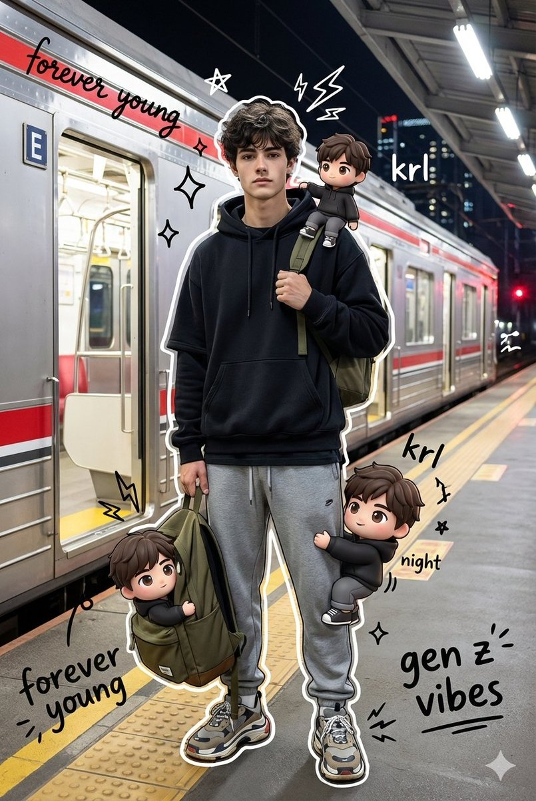

## { "image_description": "A high-quality side-by-side comp

- ID: trending-2008113093117894773
- Slug: trending-2008113093117894773-en
- 语言: en
- 来源: [来源链接](https://x.com/2abhisheknaks/status/2008113093117894773)
- 样例图路径: images/part1/2008113093117894773_1.jpg

### 提示词

```text
{
  "image_description": "A high-quality side-by-side comparison of a handsome man posing on a coastal cliffside.",
  "subject": {
    "gender": "male",
    "appearance": "mid-30s, well-groomed beard, thick dark hair styled in a modern voluminous pompadour",
    "poses": [
      "standing with hands in pockets looking away from the camera",
      "standing with one hand adjusting the collar of his jacket"
    ]
  },
  "outfit": {
    "outerwear": "burnt orange or rust-colored corduroy trucker jacket with metal buttons",
    "base_layer": "crisp white crew-neck t-shirt",
    "bottoms": "dark navy blue or black slim-fit trousers"
  },
  "setting": {
    "location": "rugged coastal cliff overlooking the ocean",
    "background": "misty horizon, calm sea, rocky shoreline",
    "lighting": "overcast, soft diffused natural light, moody atmospheric fog"
  },
  "technical_details": {
    "camera_angle": "eye-level medium shot",
    "composition": "diptych (two images side-by-side)",
    "aesthetic": "lifestyle photography, cinematic color grading, shallow depth of field with soft background bokeh"
  }
}
```

### 样例图

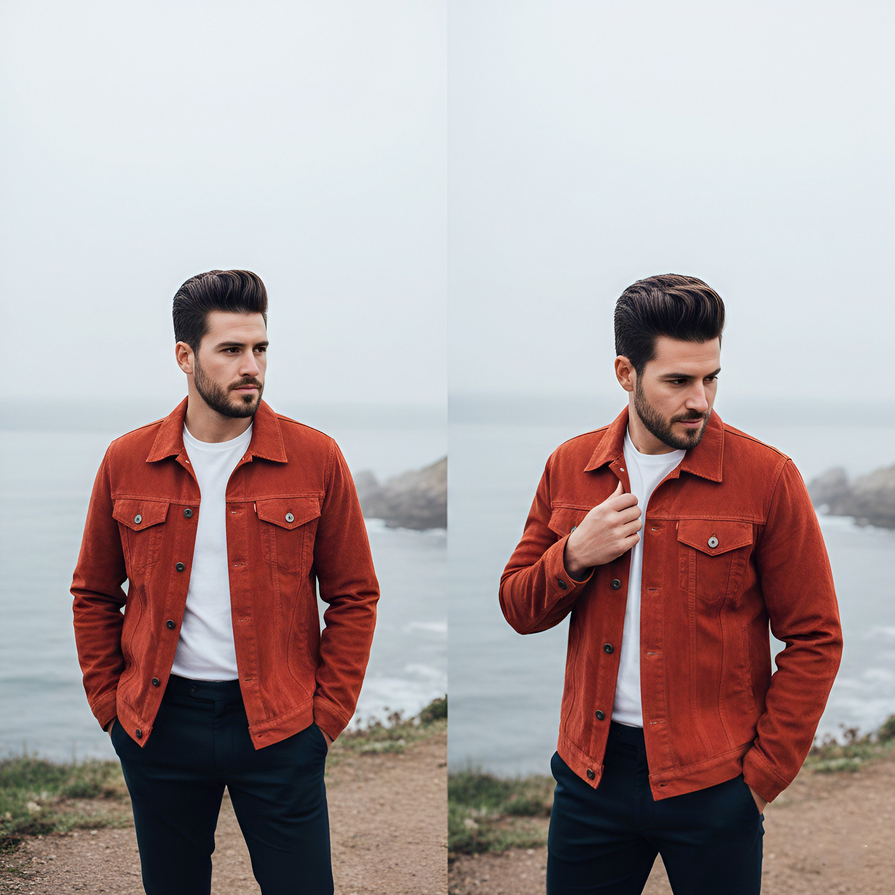

## { "Objective": "Create a hyper-realistic studio portrait

- ID: trending-2008818683234361811
- Slug: trending-2008818683234361811-en
- 语言: en
- 来源: [来源链接](https://x.com/Taaruk_/status/2008818683234361811)
- 样例图路径: images/part1/2008818683234361811_1.jpg

### 提示词

```text
{
  "Objective": "Create a hyper-realistic studio portrait blending photorealism with a whimsical 3D cartoon miniature character",
  "PersonaDetails": {
    "PrimarySubject": {
      "Type": "Young man",
      "Appearance": {
        "Hair": "Light brown hair, neatly styled",
        "FacialHair": "Neatly trimmed beard",
        "Skin": "Photorealistic, natural texture"
      },
      "Expression": "Soft, warm smile",
      "Gaze": "Looking at the miniature character on his fingertips",
      "Wardrobe": "Blue t-shirt"
    },
    "SecondarySubject": {
      "Type": "Tiny 3D cartoon version of the man",
      "Scale": "Miniature, resting on fingertips",
      "Style": "Pixar-style 3D character design",
      "Proportions": "Exaggerated cute proportions",
      "Features": {
        "Eyes": "Large, expressive",
        "Expression": "Friendly, playful pose"
      },
      "Consistency": "Matching hairstyle and outfit of the main subject"
    }
  },
  "Composition": {
    "Framing": "Close-up studio portrait",
    "Focus": "Ultra-sharp focus on both faces",
    "DepthOfField": "Shallow depth of field with soft background blur",
    "Balance": "Clean, centered composition emphasizing interaction"
  },
  "LightingAndMood": {
    "LightingStyle": "Cinematic soft studio lighting",
    "Highlights": "Gentle highlights on skin and miniature character",
    "Background": "Dark neutral backdrop",
    "Mood": "Modern, whimsical, warm"
  },
  "ArtDirection": {
    "StyleFusion": [
      "Photorealistic human portrait",
      "Pixar-style 3D character rendering"
    ],
    "DetailLevel": "High detail with clean textures",
    "RealismBalance": "Realistic human combined with stylized miniature"
  },
  "PhotographyStyle": {
    "Genre": "Professional studio portrait photography",
    "LensLook": "85mm lens perspective",
    "ImageQuality": "High resolution, ultra-sharp clarity"
  },
  "ColorAndTone": {
    "ColorPalette": "Natural skin tones with soft, modern colors",
    "Contrast": "Balanced contrast, smooth tonal transitions"
  },
  "NegativePrompt": [
    "cartoon human",
    "uncanny valley",
    "harsh lighting",
    "oversaturated colors",
    "blurry faces",
    "low detail",
    "messy composition"
  ],
  "ResponseFormat": {
    "Type": "Single image",
    "Orientation": "Portrait",
    "AspectRatio": "2:3"
  }
}
```

### 样例图

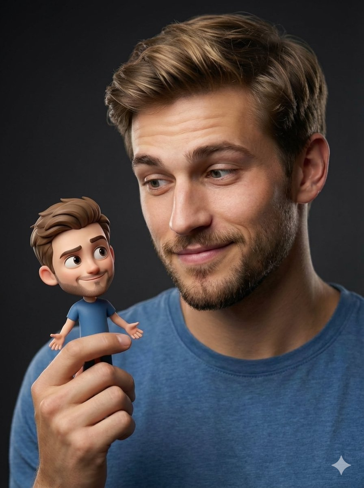

## [ROOM TYPE] pulled apart in 3D, every surface and object

- ID: trending-2035390729527378146
- Slug: trending-2035390729527378146-en
- 语言: en
- 来源: [来源链接](https://x.com/AllaAisling/status/2035390729527378146)
- 样例图路径: images/part1/2035390729527378146_1.jpg

### 提示词

```text
[ROOM TYPE] pulled apart in 3D, every surface and object  floating at its exact position, slightly separated.  EXPLOSION: ceiling lifted, four walls sliding outward,  floor dropped, furniture floating in place,  objects orbiting their surfaces, light sources  still emitting across the exploded void.  The ghost of the room readable in the arrangement.  Labels on architectural elements only: "[SURFACE]" / "[MATERIAL]" / "[DIMENSION]"  LIGHTING: each element still lit by its original source,  windows casting light across the gap, lamps throwing cones  into empty space.  BACKGROUND: deep dark, the room floats in void. TITLE: "[ROOM NAME]" / SUBTITLE: "[BUILDING TYPE] [PERIOD]"  Mood: architectural model that became a universe. 4K, extraordinary spatial clarity, tack sharp.
```

### 样例图

![[ROOM TYPE] pulled apart in 3D, every surface and object](../images/part1/2035390729527378146_1.jpg)

## { "objective": "Create a dramatic, high-contrast cinemat

- ID: trending-2012888202760384949
- Slug: trending-2012888202760384949-en
- 语言: en
- 来源: [来源链接](https://x.com/2abhisheknaks/status/2012888202760384949)
- 样例图路径: images/part1/2012888202760384949_1.jpg

### 提示词

```text
{
  "objective": "Create a dramatic, high-contrast cinematic portrait of a stylish young man in a premium black suit with selective warm lighting and intense mood",
  "subject": {
    "type": "Young adult male",
    "age_appearance": "25-30",
    "hair": "Black, voluminous, slicked back pompadour style, perfectly styled with high shine",
    "facial_hair": "Well-groomed short boxed beard and mustache",
    "expression": "Intense, confident, serious, slightly mysterious",
    "pose": "Hand under chin thoughtful/contemplative pose, looking directly at camera",
    "accessories": {
      "sunglasses": "Classic aviator style, gold metal frame, strong yellow/orange tinted lenses",
      "clothing": {
        "outerwear": "Premium matte black tailored blazer/jacket, sharp lapels, high-end luxurious fabric texture",
        "innerwear": "Dark charcoal or black crew-neck t-shirt"
      }
    }
  },
  "lighting": {
    "style": "Cinematic studio lighting",
    "main": "Strong side and rim lighting creating deep shadows and dramatic highlights",
    "background": "Dark gradient with circular warm spotlight array (vanity/makeup studio lights)",
    "contrast": "Very high contrast, deep blacks, bright highlights on face and hair",
    "mood": "Moody, masculine, powerful, film-noir inspired"
  },
  "composition": {
    "framing": "Tight mid-close-up portrait, head and shoulders",
    "angle": "Slightly below eye level for commanding presence",
    "depth_of_field": "Shallow, sharp focus on face and sunglasses, soft background"
  },
  "color_palette": {
    "dominant": "Black & deep charcoal",
    "accents": "Warm yellow-orange from sunglasses lenses and background lights",
    "skin_tone": "Natural with subtle cinematic glow"
  },
  "style_references": [
    "Modern film-noir",
    "High-end fashion editorial",
    "Hollywood dramatic portrait",
    "David LaChapelle meets classic menswear advertising"
  ],
  "image_quality": {
    "resolution": "Ultra-high detail, 8K",
    "sharpness": "Crisp facial features, hair strands visible",
    "texture": "Detailed skin pores, fabric weave, hair shine"
  },
  "negative_prompt": [
    "low quality",
    "blurry",
    "overexposed",
    "underexposed",
    "cartoon",
    "anime",
    "distorted face",
    "extra limbs",
    "bad anatomy",
    "logo",
    "text",
    "watermark",
    "bright colored clothing",
    "casual outfit"
  ],
  "aspect_ratio": "2:3 (portrait orientation)"
}
```

### 样例图

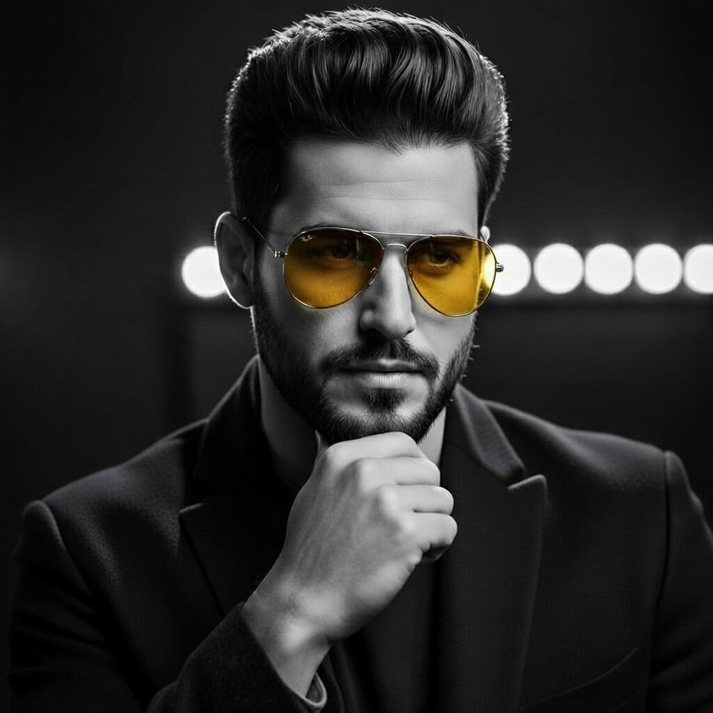

## Young beautiful woman with long wavy hair, elegant sleev

- ID: trending-2011378277001363610
- Slug: trending-2011378277001363610-en
- 语言: en
- 来源: [来源链接](https://x.com/2abhisheknaks/status/2011378277001363610)
- 样例图路径: images/part1/2011378277001363610_1.jpg

### 提示词

```text
Young beautiful woman with long wavy hair, elegant sleeveless polka dot midi dress black and white pattern, sitting thoughtfully at stylish wine bar counter, hand near lips, luxury wine bottles wall background, Prada navy blue mini bag with silk scarf, gold jewelry, sophisticated chic atmosphere, soft warm lighting, cinematic, highly detailed, realistic

Use my uploaded face image as the ONLY facial and identity reference. No other faces, models, datasets, or references are allowed.
```

### 样例图

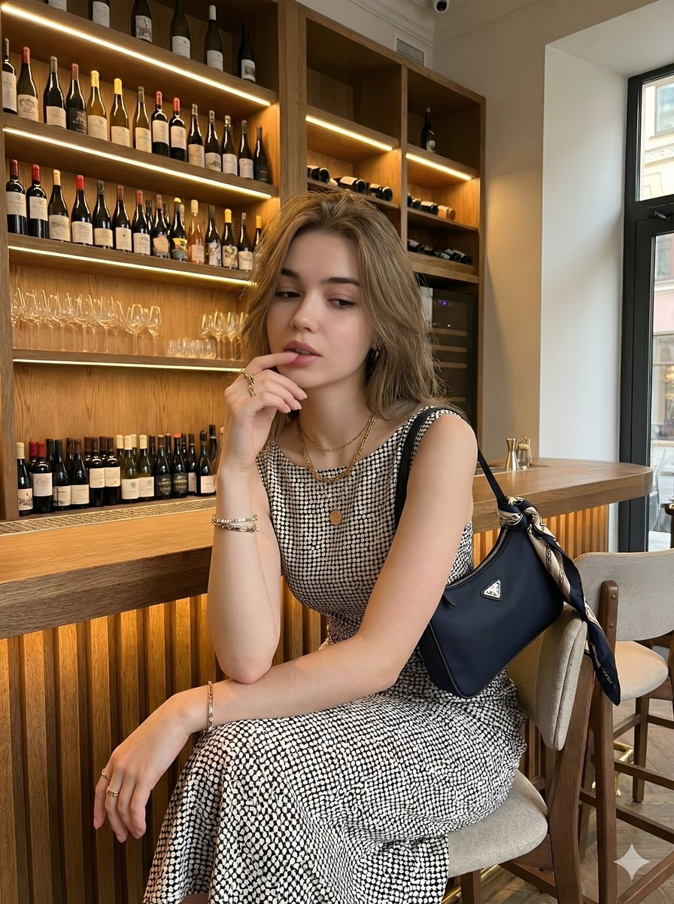

## A hyper-realistic surreal composite scene set on a woode

- ID: trending-2028309848429846690
- Slug: trending-2028309848429846690-en
- 语言: en
- 来源: [来源链接](https://x.com/HaniaAi12/status/2028309848429846690)
- 样例图路径: images/part1/2028309848429846690_1.jpg

### 提示词

```text
A hyper-realistic surreal composite scene set on a wooden tabletop. A large oversized smartphone dominates the frame, creating a strong dimensional-break illusion. On the phone screen, the woman from the reference image appears much larger in a close-up winter environment, smiling happily while holding a clear glass with a visible Pepsi logo on it.

A real human hand pours dark Pepsi cola from a cold bottle covered in condensation droplets directly toward the phone screen. The liquid visually breaks through the display and flows into the glass she is holding inside the screen, creating a powerful surreal effect.

A closed book and a black pen sit on the wooden table beside the oversized phone to emphasize scale distortion. Warm natural lighting, soft cinematic shadows, ultra-sharp liquid splash details, hyper-realistic skin texture, realistic reflections on glass and screen, surreal cinematic advertising look, professional commercial photography quality, 8K realism.
```

### 样例图

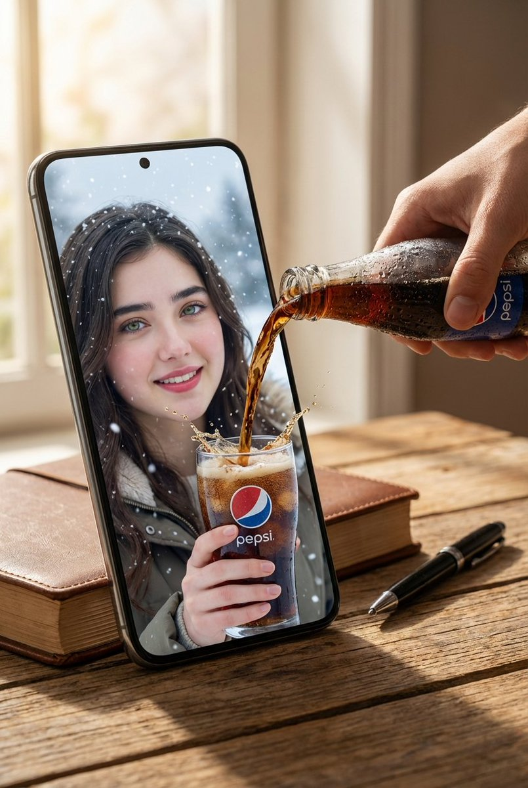

## [PERSON NAME]. Act as a high-end sports graphic designer

- ID: trending-2026020385305551182
- Slug: trending-2026020385305551182-en
- 语言: en
- 来源: [来源链接](https://x.com/AmirMushich/status/2026020385305551182)
- 样例图路径: images/part1/2026020385305551182_1.jpg

### 提示词

```text
[PERSON NAME]. 

Act as a high-end sports graphic designer creating a conceptual tribute poster. The style is a complex "dual exposure photo-grid composite" with mixed-media textures.
**CENTRAL STRUCTURE (THE VESSEL):**
The central focus is a large-scale, high-contrast black and white portrait silhouette of [PERSON NAME]. This main portrait acts as the container.
**THE GRID FILL & TEXTURES (MIXED MEDIA):**
The interior of the silhouette is populated by a dense "photo mosaic grid" of action shots from the person's career.
**CRITICAL TEXTURE INSTRUCTION:** Do not just paste flat photos. Apply artistic textures to various grid cells to create a tactile, collage feel. Use effects like:

- **Halftone Dots:** Comic-book style raster patterns on some cells.
- **Fabric/Embroidery:** Subtle thread or canvas textures suggesting a jersey or patch.
- **Film Grain:** Heavy noise on specific high-contrast action shots.
**COLOR STRATEGY:**
The base is Monochrome B&W. Use selective color overlays (relevant to the team/flag) ONLY on specific grid cells to create a rhythm.
**TYPOGRAPHY & BRANDING (STRICT MICRO-SCALING):**
1. **Top Left (The Name):** Write "[PERSON NAME]" strictly using the font **Inter Semibold**.
- **Kerning:** Tight negative kerning (-4%).
- **Size:** SMALL and discreet. It must occupy **MAXIMUM 20%** of the canvas width. Do NOT make it large or loud.
1. **Top Right (The Symbol):** Place the primary logo (Team/Brand/Flag).
- **Size:** VERY SMALL. It must occupy **MAXIMUM 10%** of the canvas width.
**COMPOSITION & BACKGROUND:**
- **Background:** Off-white or light grey with a **visible high-quality paper or concrete texture**. It should not be flat digital white.
- **Alignment:** Center the figure perfectly. Maintain wide negative space around the object.
```

### 样例图

![[PERSON NAME]. Act as a high-end sports graphic designer](../images/part1/2026020385305551182_1.jpg)

## { A hyper-realistic, ultra-detailed 8K cinematic wide-sh

- ID: trending-2013550317347193242
- Slug: trending-2013550317347193242-en
- 语言: en
- 来源: [来源链接](https://x.com/2abhisheknaks/status/2013550317347193242)
- 样例图路径: images/part1/2013550317347193242_1.jpg

### 提示词

```text
{
A hyper-realistic, ultra-detailed 8K cinematic wide-shot of a football scene, captured from a dramatic low-angle perspective with a wide-angle lens and shallow depth of field, emphasizing speed, power, and realism.

The scene features only two players on a professional football pitch.
The primary player, positioned slightly ahead and in control of the ball, is dribbling with explosive movement and confident body language. His face is generated using the uploaded face as reference (100% likeness).

He wears an ultra-realistic AI Trends football kit, designed like a top-tier international club jersey. The kit has a blue-green gradient finish, breathable performance fabric, and subtle geometric textures. “AI Trends” branding is printed boldly on the chest and both shoulders in premium sports typography. The fabric reacts naturally to motion, showing realistic folds, tension, and subtle sweat details, giving a luxury global campaign aesthetic.

Running beside him is Cristiano Ronaldo, wearing his iconic classic football kit, instantly recognizable by its design, colors, and number. Cristiano is not holding the ball. He matches pace powerfully, positioned slightly to the side, ready for a decisive run or finish.

No other players are on the field.

The grass pitch is extremely detailed, with visible blades, dirt particles, and subtle turf displacement beneath their feet. Water droplets and dust rise with each step, enhancing motion realism.
The background features a massive stadium with a softly blurred crowd, cinematic depth, and powerful volumetric lighting creating dramatic rim light around both players. Subtle motion blur enhances speed while both faces remain sharp and detailed.
The mood is powerful and cinematic, resembling a high-budget sports film still and a premium AI Trends global campaign, with natural color grading, hyper-realistic textures, and professional sports photography aesthetics.
```

### 样例图


## [PERSON NAME]. Act as a high-end sports graphic designer

- ID: trending-2009362050888475052
- Slug: trending-2009362050888475052-en
- 语言: en
- 来源: [来源链接](https://x.com/TechieBySA/status/2009362050888475052)
- 样例图路径: images/part1/2009362050888475052_1.jpg

### 提示词

```text
[PERSON NAME]. 
Act as a high-end sports graphic designer creating a conceptual tribute poster. The style is a complex "dual exposure photo-grid composite" with mixed-media textures.
CENTRAL STRUCTURE (THE VESSEL):
The central focus is a large-scale, high-contrast black and white portrait silhouette of [PERSON NAME]. This main portrait acts as the container.
THE GRID FILL & TEXTURES (MIXED MEDIA):
The interior of the silhouette is populated by a dense "photo mosaic grid" of action shots from the person's career.
CRITICAL TEXTURE INSTRUCTION: Do not just paste flat photos. Apply artistic textures to various grid cells to create a tactile, collage feel. Use effects like:
Halftone Dots: Comic-book style raster patterns on some cells.
Fabric/Embroidery: Subtle thread or canvas textures suggesting a jersey or patch.
Film Grain: Heavy noise on specific high-contrast action shots.
COLOR STRATEGY:
The base is Monochrome B&W. Use selective color overlays (relevant to the team/flag) ONLY on specific grid cells to create a rhythm.
TYPOGRAPHY & BRANDING (STRICT MICRO-SCALING):
Top Left (The Name): Write "[PERSON NAME]" strictly using the font Inter Semibold.
Kerning: Tight negative kerning (-4%).
Size: SMALL and discreet. It must occupy MAXIMUM 20% of the canvas width. Do NOT make it large or loud.
Top Right (The Symbol): Place the primary logo (Team/Brand/Flag).
Size: VERY SMALL. It must occupy MAXIMUM 10% of the canvas width.
COMPOSITION & BACKGROUND:
Background: Off-white or light grey with a visible high-quality paper or concrete texture. It should not be flat digital white.
Alignment: Center the figure perfectly. Maintain wide negative space around the object.
```

### 样例图

![[PERSON NAME]. Act as a high-end sports graphic designer](../images/part1/2009362050888475052_1.jpg)

## { "prompt": "Cinematic full-body studio portrait of a su

- ID: trending-2020480621026705858
- Slug: trending-2020480621026705858-en
- 语言: en
- 来源: [来源链接](https://x.com/r4jjesh/status/2020480621026705858)
- 样例图路径: images/part1/2020480621026705858_1.jpg

### 提示词

```text
{
  "prompt": "Cinematic full-body studio portrait of a subject using the uploaded face as exact reference (preserve identity, facial structure, and proportions). Slightly low-angle perspective with a 35mm lens for a commanding, sophisticated presence. Subject leaning casually against a dark minimalist plinth, arms crossed. Wearing a perfectly tailored slim-fit olive green suit and a crisp white dress shirt, top buttons undone. Intense chiaroscuro lighting with a single powerful volumetric spotlight from the upper-left, cutting through subtle atmospheric haze with swirling smoke and micro-dust particles. Sharp rim highlights along shoulders and silhouette, deep velvety shadows across the body, high-contrast moody aesthetic. Hyper-realistic textures, visible fabric weave, subtle reflections on a polished studio floor, professional cinematic lighting, ultra-detailed, 8K resolution, no text, no watermark.",
  "resolution": "7680x4320",
  "camera": {
    "lens": "35mm",
    "angle": "slightly low-angle",
    "aperture": "f/2.0",
    "iso": "100",
    "shutter_speed": "1/125"
  },
  "quality": "ultra-high",
  "style": "cinematic, hyper-realistic, studio photography",
  "negative_prompt": "blurry, low-resolution, overexposed, underexposed, flat lighting, cartoon, CGI, plastic skin, extra limbs, distorted hands, bad anatomy, asymmetry, watermark, logo, text"
}
```

### 样例图

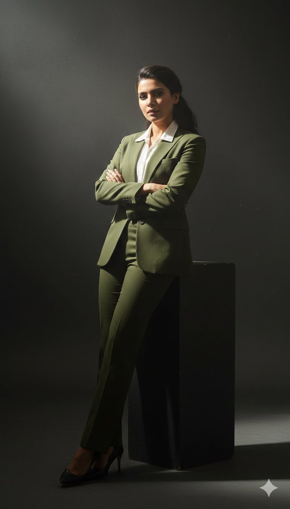

## 3x3 Photo Collage / 9-Panel Grid.", "layout": "Nine vert

- ID: trending-2010083845761314964
- Slug: trending-2010083845761314964-en
- 语言: en
- 来源: [来源链接](https://x.com/IqraSaifiii/status/2010083845761314964)
- 样例图路径: images/part1/2010083845761314964_1.jpg

### 提示词

```text
3x3 Photo Collage / 9-Panel Grid.",
      "layout": "Nine vertical portrait images arranged in a square grid.",
      "consistency": "Same subject, same outfit, and same lighting across all 9 panels."
    },
    "aesthetic_style": {
      "theme": "Gen Z Home Party / 'Maiden Pavilion' Photoshoot.",
      "lighting_technique": "Direct On-Camera Flash (Hard Light).",
      "visuals": "High contrast, sharp shadows, chaotic fun, vibrant colors against a white background."
    },
    "subject_details": {
      "appearance": "Young Asian woman, fair skin, long dark wavy hair with volume.",
      "outfit": "White floral camisole top, blue denim shorts.",
      "makeup": "Heavy pink blush (Igari style), red lips, glitter on cheeks."
    },
    "environment_and_props": {
      "background": "White wall with taped photos, white bed sheets.",
      "decor": "Silver disco balls (various sizes), colorful metallic confetti scattered everywhere, brown teddy bear, pink retro corded phone."
    },
    "panel_pose_breakdown": {
      "1_top_left": "Lying on stomach (prone), resting chin on crossed arms, looking at camera. Confetti in hair.",
      "2_top_center": "Top-down view lying on back, winking one eye, making a peace sign near face. Hair fanned out.",
      "3_top_right": "Sitting sideways, knees bent, laughing candidly while throwing a handful of confetti in the air.",
      "4_middle_left": "Leaning upper body over a large silver disco ball, looking intensely at the camera.",
      "5_middle_center": "Close-up portrait. Hands touching cheeks in a 'surprised' or 'shy' gesture. Confetti stuck to cheeks.",
      "6_middle_right": "Lying on back amongst the disco balls, one arm reaching up towards the ceiling/camera.",
      "7_bottom_left": "Upside-down perspective (head at bottom of frame), playful expression, hair cascading down.",
      "8_bottom_center": "Sitting cross-legged (Lotus position), hugging the brown teddy bear tight, pouting slightly.",
      "9_bottom_right": "Sitting up, holding the pink retro telephone receiver to ear, looking sideways as if listening to gossip."
    },
    "camera_technical_values": {
      "focal_length": "35mm (Versatile environmental portrait lens).",
      "aperture": "f/5.6 (Ensures subject and props are in focus).",
      "shutter_speed": "1/200s (Flash sync to freeze confetti motion).",
      "iso": "ISO 200.",
      "lighting": "Hard flash creates a distinct drop shadow behind the subject on the white wall and specular highlights on the disco balls."
    }
  },
  "midjourney_string": "3x3 photo grid collage of a cute Asian girl at a home party, wearing white floral top and
```

### 样例图

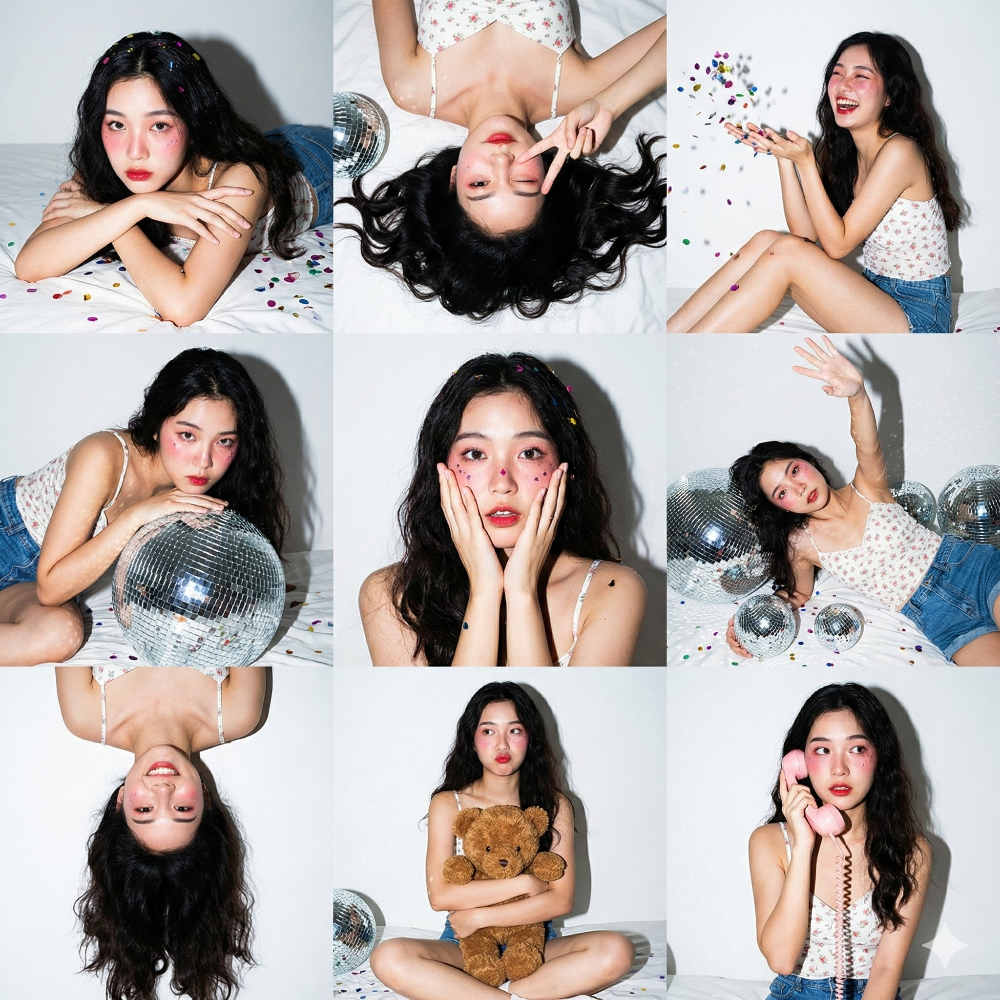

## A cinematic 1970s-inspired fashion portrait of a gracefu

- ID: trending-2008687707946709129
- Slug: trending-2008687707946709129-en
- 语言: en
- 来源: [来源链接](https://x.com/me_Aarvi/status/2008687707946709129)
- 样例图路径: images/part1/2008687707946709129_1.jpg

### 提示词

```text
A cinematic 1970s-inspired fashion portrait of a graceful young woman seated on worn stone steps outside a cozy street café. She holds an ornate deep-green ceramic coffee cup with delicate gold rim accents, gently resting it in her hands as she gazes softly toward the camera with calm confidence. Her expression feels serene, thoughtful, and timeless.
Her hair falls in soft, natural waves with loose strands framing her face, styled in a classic vintage manner. Makeup reflects 1970s elegance: matte crimson-red lips, subtle winged eyeliner, warm-toned blush, and softly defined brows. She wears a luxurious forest-green knitted sweater with a relaxed fit, paired with a flowing black tulle skirt that moves lightly with the air.
A warm plaid scarf in earthy browns, burnt orange, and muted reds is draped casually around her neck. Beside her rests a premium dark-green leather crossbody bag with gold filigree hardware and a delicate chain strap.
The background features an autumn café street with scattered fallen leaves, glowing amber lights behind glass windows, and a soft urban stillness. Shot with an 85mm lens at f/1.8, shallow depth of field, warm analog film grain, muted earthy palette, dreamy cinematic mood, ultra-realistic fashion editorial photography inspired by classic 1970s film aesthetics.
```

### 样例图

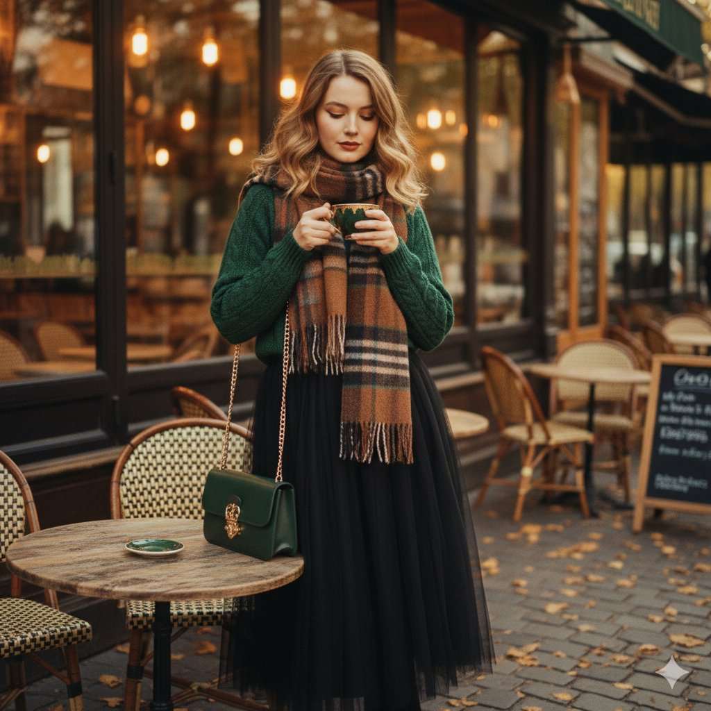

## { "subject": { "description": "A young adult woman with 

- ID: trending-2033917202567446610
- Slug: trending-2033917202567446610-en
- 语言: en
- 来源: [来源链接](https://x.com/underwoodxie96/status/2033917202567446610)
- 样例图路径: images/part1/2033917202567446610_1.jpg

### 提示词

```text
{   "subject": {     "description": "A young adult woman with soft refined features, thin metal glasses, and shoulder-length dark hair, leaning across a couch at night while holding a smartphone, captured in a quiet low-light candid moment.",     "mirror_rules": "not a mirror shot",     "age": "young adult",     "expression": {       "eyes": {         "look": "soft, slightly tired, subtly attentive",         "energy": "low-key and intimate",         "direction": "toward the camera, as if she just looked up from her phone"       },       "mouth": {         "position": "gently closed with a relaxed pout",         "energy": "quiet and unforced"       },       "overall": "a dreamy late-night expression, calm, distant, and mildly seductive without exaggeration"     },     "face": {       "preserve_original": "keep the face proportions delicate and realistic, with a narrow jawline, soft cheeks, defined eyes, glossy lips, and no exaggerated facial distortion",       "makeup": "soft glam makeup, subtle eyeliner, long lashes, smooth skin finish, glossy pink-nude lips, lightly defined brows"     }   },   "hair": {     "color": "dark brown to black",     "style": "shoulder-length, loose, softly tousled with slight volume around the crown",     "effect": "natural flyaways and soft separation, not overly polished"   },   "body": {     "frame": "slim and softly curved",     "waist": "gently defined",     "chest": "natural and softly framed by the neckline",     "legs": "bare, partially folded and extending out of frame",     "skin": {       "visible_areas": "shoulders, collarbone, arms, upper chest, thighs, lower legs",       "tone": "fair with a warm indoor cast",       "texture": "smooth, velvety, lightly softened by low light and lens blur",       "lighting_effect": "warm ambient light on the skin with faint cool phone-screen reflections near the face and hands"     }   },   "pose": {     "position": "leaning forward across a couch, one arm supporting the body, the other hand holding a phone in the foreground",     "base": "casual lounging posture caught mid-movement",     "overall": "informal, intimate, slightly off-balance, as if she paused while scrolling and looked up"   },   "clothing": {     "top": {       "type": "lace-trim camisole or slip-style sleepwear",       "color": "pale cream with a soft blush tint",       "details": "thin straps, delicate lace texture, soft fitted bodice, lightweight fabric",       "effect": "sleepwear-like softness, feminine and understated"     },     "bottom": {       "type": "matching soft shorts or the lower part of a slip",       "color": "pale cream",       "details": "mostly obscured, softly wrinkled fabric, blending into the pose"     }   },   "accessories": {     "jewelry": "small subtle earrings",     "device": "smartphone held close to the camera, dark reflective case, screen glow lighting the fingers",     "prop": "thin metal-framed eyeglasses with visible screen reflections on the lenses"   },   "photography": {     "camera_style": "realistic social-media night portrait, smartphone candid aesthetic",     "angle": "slightly above eye level, close and intimate, with the phone hand entering the foreground",     "shot_type": "medium close-up to three-quarter portrait in vertical framing",     "aspect_ratio": "3:4 vertical",     "texture": "soft focus, slight motion blur, low-light grain, gentle facial smoothing from dim conditions, natural imperfect sharpness",     "lighting": "dim warm room light mixed with cool phone-screen reflections, no hard flash, soft falloff across the couch and wall",     "depth_of_field": "shallow to moderate, face prioritized but softened, foreground hand and phone slightly blurred"   },   "background": {     "setting": "an indoor living room or lounge at night",     "wall_color": "warm beige-gray",     "elements": [       "dark upholstered couch",       "plain softly lit wall",       "minimal visible decor"     ],     "atmosphere": "quiet, private, late-night, softly blurred and still",     "lighting": "very low ambient tungsten-like room light with shadows pooling in the background"   },   "the_vibe": {     "energy": "slow, hushed, intimate",     "mood": "late-night pause, private and emotionally suspended",     "aesthetic": "realistic social-media softness, low-light candid beauty, imperfect but magnetic",     "authenticity": "retain the accidental blur, the off-center body angle, the screen glare on the glasses, and the lived-in couch posture",     "intimacy": "close enough to feel the warmth of the room and the softness of fabric against skin",     "story": "She had been scrolling in silence, then something made her stop and lift her eyes for one quiet second.",     "caption_energy": "soft nocturnal allure, unspoken attention, the kind of moment that feels borrowed rather than staged"   },   "constraints": {     "must_keep": [       "young adult woman",       "thin metal glasses",       "visible screen reflections on the lenses",       "smartphone in hand close to the foreground",       "dark shoulder-length tousled hair",       "pale lace-trim sleepwear",       "leaning across a couch",       "warm dim indoor night lighting",       "soft blur and low-light texture",       "minimal beige-gray wall and dark couch background"     ],     "avoid": [       "studio lighting",       "hard flash",       "over-sharpened skin",       "perfect commercial glamour retouching",       "extra background clutter",       "bright daylight",       "mirror selfie composition",       "heavy accessories",       "exaggerated body proportions",       "watermarks, logos, extra text"     ]   },   "negative_prompt": [     "mirror selfie",     "hard flash",     "studio backdrop",     "ultra sharp DSLR clarity",     "over-retouched skin",     "cartoonish face",     "exaggerated anatomy",     "extra fingers",     "deformed hands",     "heavy jewelry",     "busy room",     "daylight window light",     "smiling broadly",     "strong action pose",     "symmetrical formal composition",     "text overlay",     "watermark",     "logo"   ] }
```

### 样例图

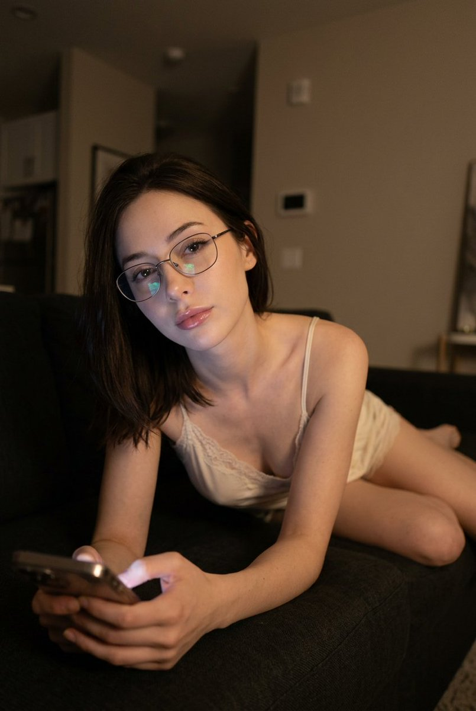

## A hyperrealistic 8K black and white extreme close-up por

- ID: trending-2021058505885745401
- Slug: trending-2021058505885745401-en
- 语言: en
- 来源: [来源链接](https://x.com/harboriis/status/2021058505885745401)
- 样例图路径: images/part1/2021058505885745401_1.jpg

### 提示词

```text
A hyperrealistic 8K black and white extreme close-up portrait of a young man's face, focusing tightly on his eye, cheekbone, and lips. Bright sunlight breaks into soft, wavy luminous lines that ripple across his skin like underwater reflections. The light flows diagonally, wrapping around the contours of his face in surreal patterns, while the shadows dissolve into smooth mid-gray tones instead of deep black. The skin is rendered in lifelike detail-visible pores, faint freckles, subtle stubble, and natural imperfections catch the glowing light realistically. The lips are softly highlighted, and the eye reflects fragments of the luminous waves, adding depth and emotion without artificial glow. The camera framing feels macro, pressed close to the face, with razor-thin depth of field: one illuminated ridge of skin is perfectly sharp, while the rest melts into velvety blur. The glassy, fluid quality of the light lines gives the portrait a surreal dreamlike aesthetic while remaining grounded in photographic realism. The background disappears into soft gray gradients, leaving only the interplay of skin texture and luminous wave-like rays. Fine cinematic grain overlays the frame, enhancing the tactile analog feel. The overall mood is intimate, surreal, and emotionally evocative - a monochrome portrait.
```

### 样例图

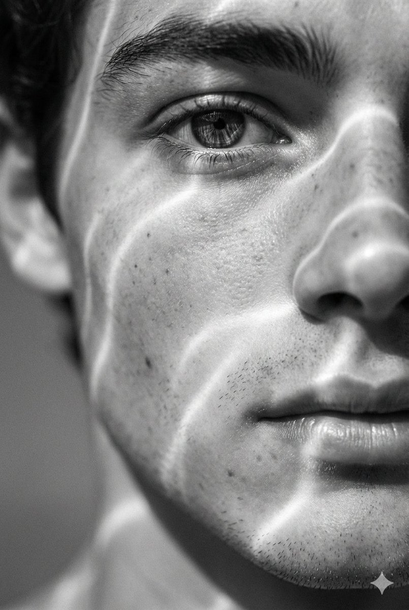

## The generated image uses the uploaded image as a referen

- ID: trending-2009214441083019511
- Slug: trending-2009214441083019511-en
- 语言: en
- 来源: [来源链接](https://x.com/HustleXR/status/2009214441083019511)
- 样例图路径: images/part1/2009214441083019511_1.jpg

### 提示词

```text
The generated image uses the uploaded image as a reference for the character, wearing a high-necked, tight-fitting black long-sleeved dress. A cluster of withered wood and orange-pink flowers lies beside an old newsstand, the grainy texture of vintage film interwoven, the blurred background with noticeable trailing shadows, and the double-image effect creating a fantastical atmosphere. A bewitchingly beautiful girl, carrying flowers, is shown in profile, her fair skin delicate and translucent. Her exquisite face is blurred with motion, the outline of her figure slightly swaying with the panning camera, the soft focus making the image even more hazy and languid. A warm-toned, low-saturation filter enhances the effect, her long, backlit hair glowing with a soft glow, the messy strands sweeping wildly across her jawline, the details concealing a captivating yet dangerous allure. Cute movements add dynamism, the motion blur blending with the film grain, creating a trendy, Instagram-worthy image while the blurred image outlines a dynamic scene full of story, cleverly balancing bewitching and sweetness.
```

### 样例图

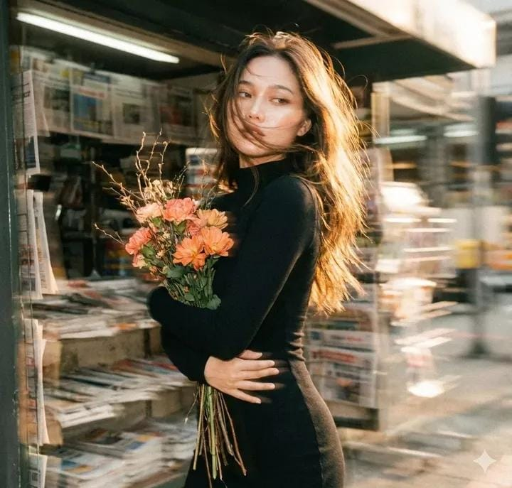

## A high fashion magazine pictorial of an Alpine-looking w

- ID: trending-2020715808939549011
- Slug: trending-2020715808939549011-en
- 语言: en
- 来源: [来源链接](https://x.com/ChillaiKalan__/status/2020715808939549011)
- 样例图路径: images/part1/2020715808939549011_1.jpg

### 提示词

```text
A high fashion magazine pictorial of an Alpine-looking woman in her early 20s who stands still, looking at the camera, turning her head in the center, surrounded by a blurry silhouette of people passing by. She has a calm, stoic look on her face and is wearing a black minimalist outfit. The background is clean, bright and slightly abstract, and emphasizes the contrast between motion blur and static appearance. Editing style, film composition, pure art photography, soft magazine texture, high resolution. --ar 4:5
```

### 样例图

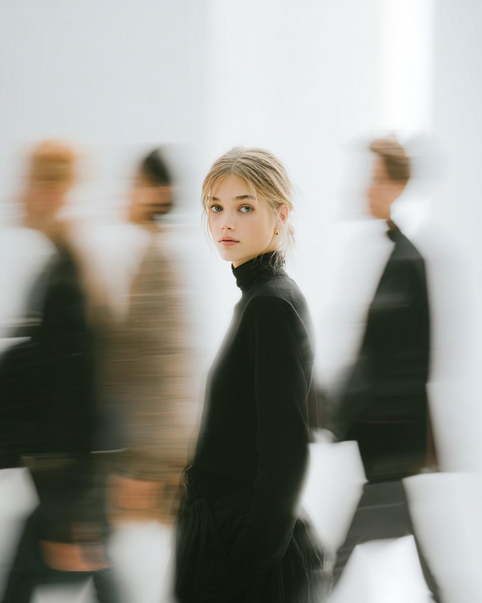

## A high-resolution, close-up editorial-style portrait of 

- ID: trending-2010661146349756814
- Slug: trending-2010661146349756814-en
- 语言: en
- 来源: [来源链接](https://x.com/ZaraIrahh/status/2010661146349756814)
- 样例图路径: images/part1/2010661146349756814_1.jpg

### 提示词

```text
A high-resolution, close-up editorial-style portrait of a young woman standing against a textured gray concrete wall, captured with direct on-camera flash that creates a raw, moody, high-contrast aesthetic. She is positioned slightly angled to the side with her head tilted back and chin lifted, giving an effortlessly cool, candid expression. Her face has a fair, smooth complexion with a natural sheen from the flash, soft rosy blush across the cheeks, minimal eye makeup, lightly defined brows, and glossy natural pink lips that are slightly parted, conveying a relaxed yet confident mood. Wispy strands of her dark brown hair fall loosely across her face, partially covering one eye, while the rest of her hair is pulled back into a low, casual style, enhancing the spontaneous, fashion-editorial feel. Her eyes look slightly upward and past the camera, adding to the detached, artistic vibe. She is wearing a loose-fitting white oversized T-shirt with bold red typography reading “CALIFORNIA” across the chest, along with smaller black text underneath, giving a casual streetwear aesthetic. Small, subtle stud earrings are visible, adding minimal detail without distracting from the overall look. The lighting is harsh and frontal, producing sharp shadows behind her on the wall and emphasizing skin texture, hair strands, and fabric folds, while the background remains simple and uncluttered. The color palette is muted and neutral—gray wall, white shirt, and red lettering—allowing the subject’s face and expression to remain the focal point. The overall atmosphere feels intimate, modern, slightly gritty, and effortlessly stylish, like a candid fashion snapshot captured at night with flash photography. Use this uploaded photo as the only and exact face reference. The generated image must use this same face exactly as shown, without any changes to identity, facial structure, or expression.
```

### 样例图

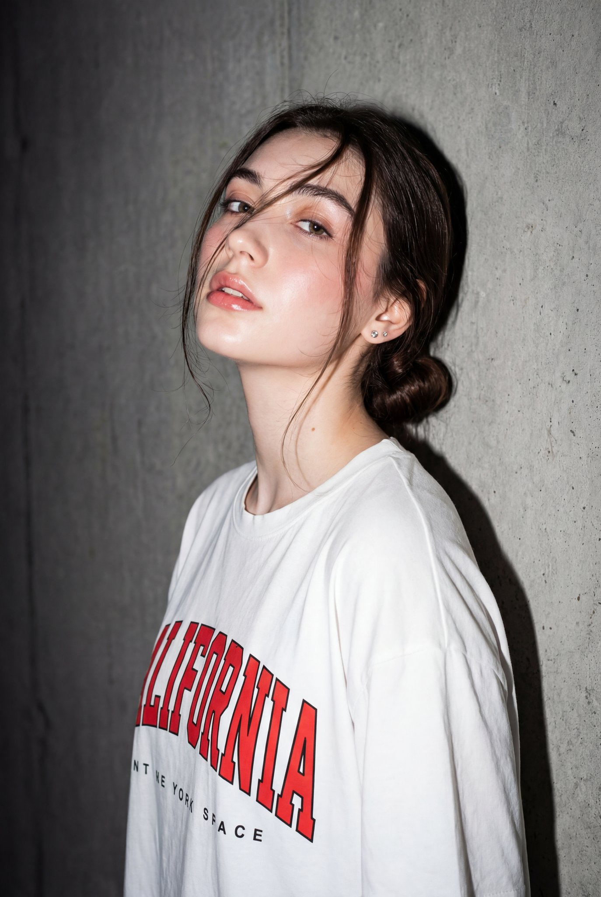

## Create a hyperrealistic, surreal spherical panorama of [

- ID: trending-2009117120987320527
- Slug: trending-2009117120987320527-en
- 语言: en
- 来源: [来源链接](https://x.com/aleenaamiir/status/2009117120987320527)
- 样例图路径: images/part1/2009117120987320527_1.jpg

### 提示词

```text
Create a hyperrealistic, surreal spherical panorama of [CITY NAME], with its most iconic landmarks and architecture seamlessly curving around the top of a planet-like surface, forming a cohesive miniature world.
Integrate sleek, modern 3D typography spelling “[CITY NAME]” naturally into the urban landscape, harmonized with the environment rather than floating unnaturally.

The scene is viewed from a top-down, orbiting perspective, emphasizing the tiny-planet effect and spherical distortion while maintaining architectural clarity.

Soft, natural daylight filters through a partly cloudy sky, casting gentle, realistic shadows across lush greenery, streets, trees, and buildings.

The background transitions smoothly into a dramatic, swirling sky, enhancing the surreal atmosphere without overpowering the city.

Use a natural yet vivid color palette — crisp greens, soft blues, and muted earth tones appropriate to [CITY NAME].

Render in a polished, photorealistic style with fine architectural detail, realistic textures, atmospheric depth, and high visual fidelity.
```

### 样例图

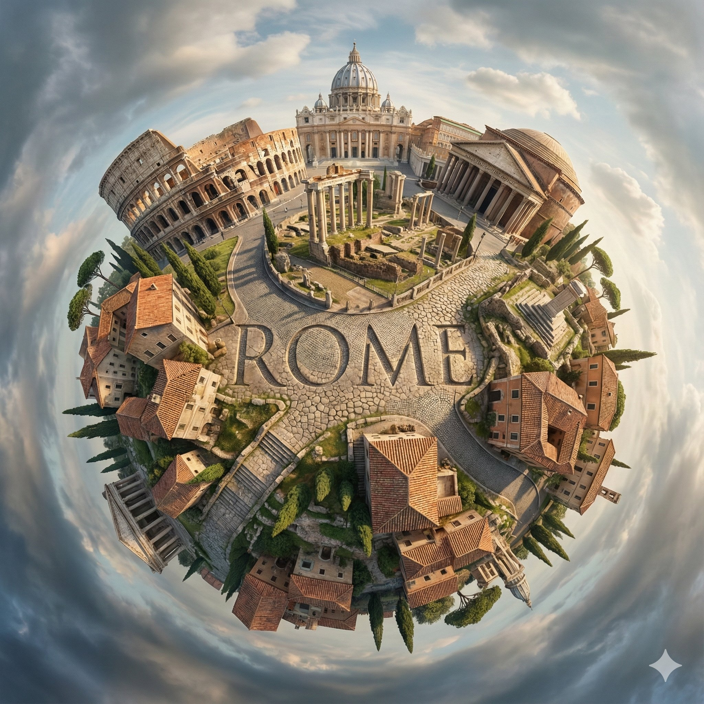

## Create a 2x2 grid image. In each frame include a medium 

- ID: trending-2012224276900851827
- Slug: trending-2012224276900851827-en
- 语言: en
- 来源: [来源链接](https://x.com/MrDavids1/status/2012224276900851827)
- 样例图路径: images/part1/2012224276900851827_1.jpg

### 提示词

```text
Create a 2x2 grid image. In each frame include a medium shot, closeup shot, high angle looking down and extreme low angle view looking up from the sneakers. Utilize a fish eye lens perspective in each frame as well as an aesthetic pose with foreshortening. The character is wearing a dark red bomber jacket, blue jeans and white nike high top sneakers and posing with a different wacky facial expression in each frame. Include white doodle hand drawn elements around them in each frame. Studio photography against a dark blue background. Ensure the background encompasses the entire background, no circular framing.
```

### 样例图

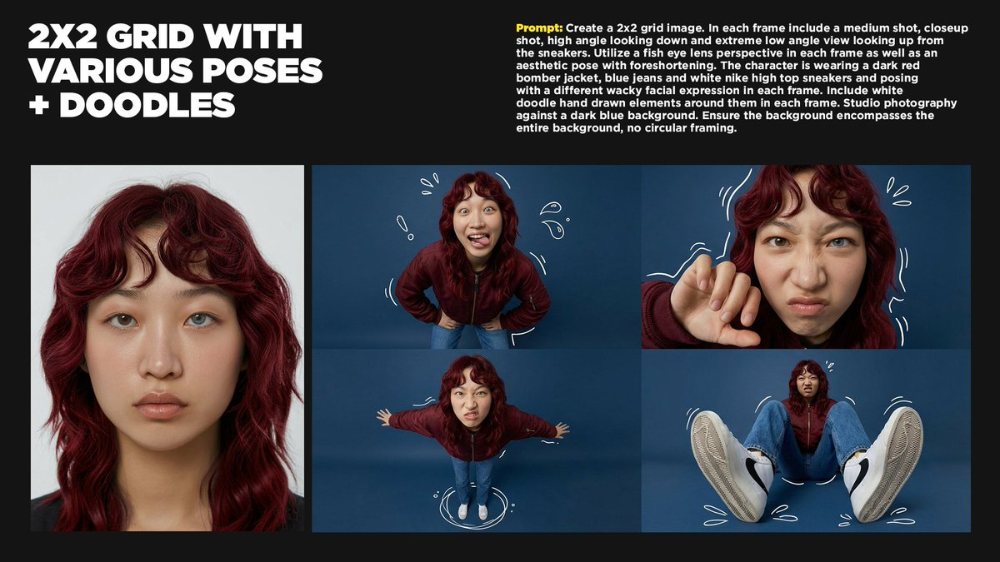

## Ultra-realistic studio portrait of a man, close-up heads

- ID: trending-2026214554083242053
- Slug: trending-2026214554083242053-en
- 语言: en
- 来源: [来源链接](https://x.com/Sheldon056/status/2026214554083242053)
- 样例图路径: images/part1/2026214554083242053_1.jpg

### 提示词

```text
Ultra-realistic studio portrait of a man, close-up headshot, centered composition, neutral expression, sharp facial details, textured skin, clean grooming, wearing a black turtleneck and dark tailored coat, modern minimalist fashion, monochrome black and white photography style, only the glasses in color (Translucent amber-orange frame and lenses
), high contrast lighting, soft studio light, cinematic shadows, editorial fashion photography, plain light background, 85mm lens, shallow depth of field, ultra detailed, photorealistic, magazine quality, 8K.
```

### 样例图

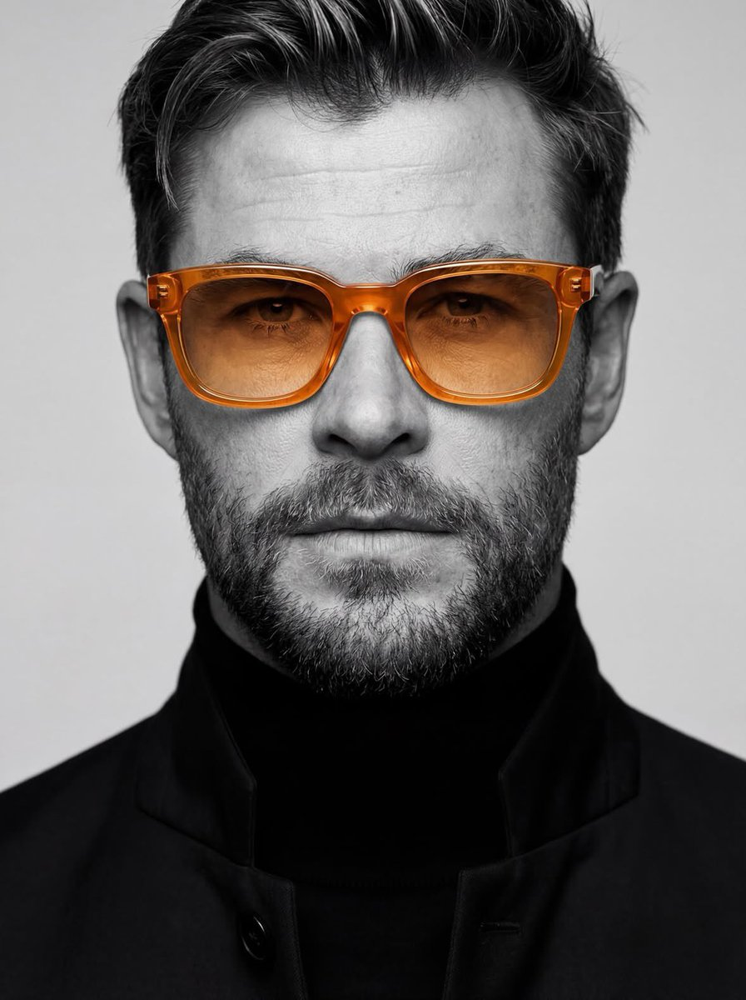

## Create a moody, ethereal cinematic portrait of a woman w

- ID: trending-2041379629668446277
- Slug: trending-2041379629668446277-en
- 语言: en
- 来源: [来源链接](https://x.com/Ciri_ai/status/2041379629668446277)
- 样例图路径: images/part1/2041379629668446277_1.jpg

### 提示词

```text
Create a moody, ethereal cinematic portrait of a woman with a dramatic over-the-shoulder pose.

1. Pose and Expression
• Perspective: subject positioned with her back facing the camera, torso elegantly twisted, looking back over her shoulder, creating a graceful curve along the spine and highlighting shoulder blades
• Gaze: direct eye contact with the camera, piercing yet soft expression, chin slightly tucked toward shoulder to evoke intimacy and mystery
• Hand Placement: hands gently raised near chest/shoulder, fingers softly interlaced or delicately touching
• Hair: loose messy bun with soft wispy strands falling naturally across the face, slightly windswept look

2. Lighting and Color Palette
• Lighting: strong side lighting, warm golden-hour sunlight, high contrast chiaroscuro effect, one side illuminated while the other fades into deep shadow
• Skin Tone: luminous, glowing, pearlescent skin texture
• Color Scheme: earthy muted tones, deep greens, dark browns, soft neutral background, warm skin tones as focal point

3. Wardrobe and Accessories
• Outfit: backless silky dress or top, smooth light fabric, paired with dark voluminous sleeves for strong texture contrast
• Accessories: elegant drop pearl earrings reflecting light subtly

4. Composition and Atmosphere
• Framing: medium close-up shot, framed naturally with blurred foreground leaves for a voyeuristic, through-the-foliage effect
• Depth of Field: shallow depth of field, sharp focus on face, soft bokeh in background and foreground
• Mood: cinematic, melancholic, romantic, high-fashion editorial style, soft dreamy atmosphere

Face reference: soft oval face, smooth glowing skin, symmetrical features, natural makeup, gentle but expressive eyes, slightly parted lips
```

### 样例图

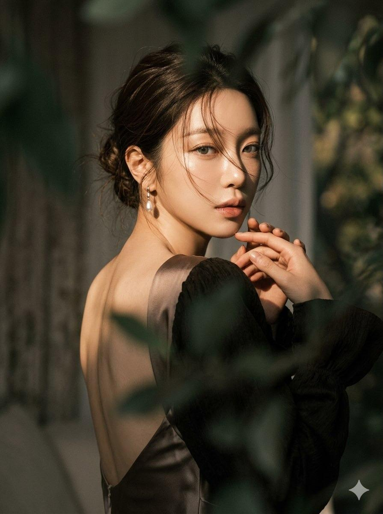

## { "image_generation": { "face": { "preserve_original": t

- ID: trending-2008484790287430022
- Slug: trending-2008484790287430022-en
- 语言: en
- 来源: [来源链接](https://x.com/harboriis/status/2008484790287430022)
- 样例图路径: images/part1/2008484790287430022_1.jpg

### 提示词

```text
{
  "image_generation": {
    "face": {
      "preserve_original": true,
      "reference_match": true,
      "description": "Maintain the same facial structure, skin tone, eye shape, and natural expressions across all frames, with consistent identity in each pose."
    },
    "photo_style": {
      "type": "golden hour portrait collage",
      "camera_angle": "varied close-up and medium portrait angles",
      "lighting": "warm golden hour sunlight casting soft window shadows",
      "mood": "soft, calm, intimate, aesthetic",
      "texture": "natural skin texture, soft highlights, gentle contrast",
      "focus": "sharp focus on face with smooth background falloff"
    },
    "subject": {
      "gender": "male",
      "age": "young adult",
      "poses": [
        "looking upward toward light",
        "soft smile facing camera",
        "side profile with downward gaze",
        "over-the-shoulder glance",
        "direct close-up with relaxed lips",
        "hand in hair casual pose",
        "head tilted back toward light",
        "clean side profile portrait",
        "thoughtful pose with hand near chin"
      ],
      "expression": "natural, minimal, relaxed, emotionally subtle",
      "hair": {
        "style": "long straight hair worn loose",
        "color": "light to medium brown",
        "details": "natural shine with soft light highlights"
      },
      "clothing": {
        "type": "casual minimalist outfit",
        "details": "simple dark t-shirt with no visible branding"
      }
    },
    "composition": {
      "layout": "3x3 grid collage",
      "consistency": "uniform lighting and background across all frames",
      "framing": "clean portrait framing with slight pose variation"
    },
    "environment": {
      "setting": "indoor space near a window",
      "background": "plain wall with warm sunlight and shadow patterns",
      "atmosphere": "quiet, minimal, artistic indoor ambiance"
    },
    "aesthetic": {
      "style": "Instagram aesthetic portrait set",
      "features": [
        "golden hour light",
        "window shadow patterns",
        "minimal makeup",
        "natural expressions",
        "clean editorial portrait look"
      ]
    }
  }
}
```

### 样例图

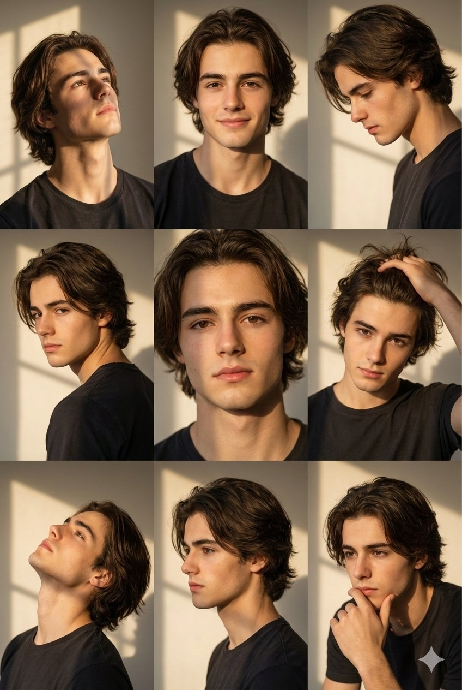

## A high-quality photo collage featuring the same person w

- ID: trending-2013225585297043665
- Slug: trending-2013225585297043665-en
- 语言: en
- 来源: [来源链接](https://x.com/AIwithSynthia/status/2013225585297043665)
- 样例图路径: images/part1/2013225585297043665_1.jpg

### 提示词

```text
A high-quality photo collage featuring the same person with identical facial features and expression, shown in multiple frames with different hairstyles. Each panel displays a unique hairstyle such as long straight hair, high ponytail, messy bun, pixie cut, braided crown, soft waves, short bob with bangs, low bun, side braid, and loose curls. Consistent neutral outfit and makeup across all images, soft studio lighting, warm blurred background, realistic skin texture, symmetrical face consistency, ultra-detailed, editorial beauty look, 4x3 grid layout, professional portrait photograph
```

### 样例图

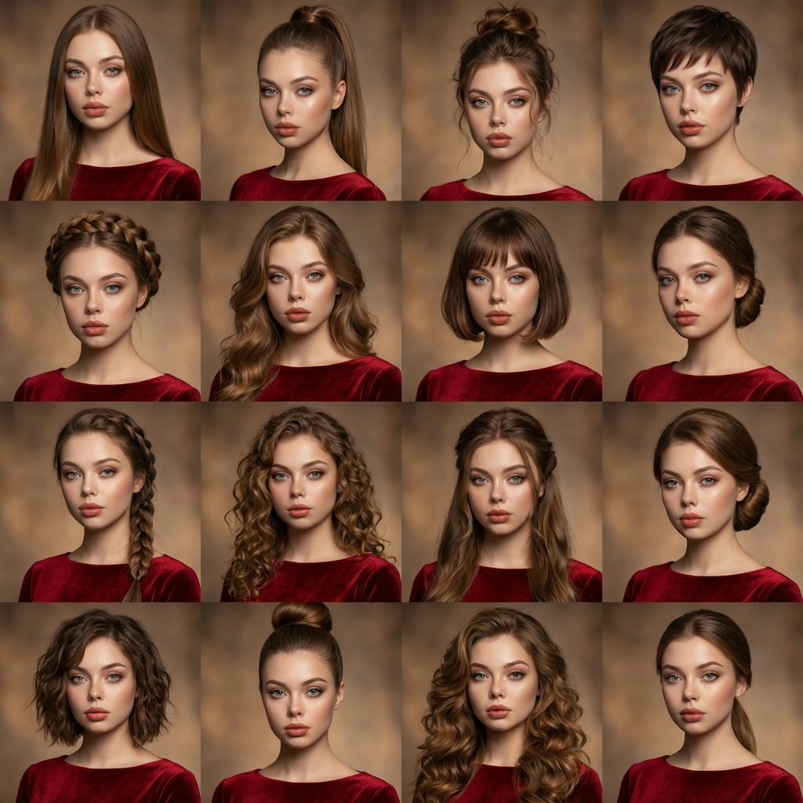

## { "generation_request": { "meta_data": { "task_type": "b

- ID: trending-2031169815927468186
- Slug: trending-2031169815927468186-en
- 语言: en
- 来源: [来源链接](https://x.com/Naiknelofar788/status/2031169815927468186)
- 样例图路径: images/part1/2031169815927468186_1.jpg

### 提示词

```text
{
  "generation_request": {
    "meta_data": {
      "task_type": "black_and_white_photobooth_expression_grid_4x4",
      "language": "en",
      "priority": "highest",
      "version": "v1.0_BW_PHOTOBOOTH_EXPRESSIONS_4X4"
    },
    "input": {
      "mode": "image_to_image",
      "reference_image_usage": "very_high",
      "preserve_identity": true,
      "preserve_facial_features": true,
      "preserve_hairstyle": true,
      "notes": "Use the reference as the primary anchor. Create a black-and-white photobooth-style expression grid. Keep the same adult woman identity and hair. Each panel should show a different facial expression. Minimal background, direct photobooth flash look, natural skin texture."
    },
    "output": {
      "aspect_ratio": "1:1",
      "resolution": "ultra_high",
      "num_images": 1,
      "layout": {
        "type": "grid",
        "rows": 4,
        "cols": 4,
        "gutter": "thin",
        "panel_consistency": "high"
      },
      "sharpness": "crisp_photobooth",
      "grain": "subtle_analog_bw"
    },
    "scene": {
      "concept": "classic photobooth contact sheet with expressive faces",
      "environment": "plain neutral backdrop, no props",
      "lighting": {
        "style": "direct photobooth flash",
        "key_light": "front flash, slightly hard but flattering",
        "shadows": "soft short shadows behind subject",
        "avoid": "cinematic side light, dramatic backgrounds"
      },
      "camera": {
        "lens": "50mm",
        "distance": "tight head-and-shoulders framing",
        "focus": "eyes sharp in every panel"
      }
    },
    "subject": {
      "type": "adult woman",
      "wardrobe": "simple strapless or bare-shoulder photobooth look (no logos)",
      "hair": "keep same hairstyle across all panels",
      "makeup": "minimal, natural",
      "anatomy_rules": "correct facial proportions, no warped eyes/mouth"
    },
    "expression_set": {
      "panel_01": "scrunched smile, eyes squeezed slightly",
      "panel_02": "intense stare with fingers framing eyes",
      "panel_03": "big laugh, mouth open, joyful",
      "panel_04": "bored / unimpressed face, chin in hands",
      "panel_05": "sad pout, watery eyes look",
      "panel_06": "goofy face with both hands making small horns above head",
      "panel_07": "playful tongue out, cheeky grin",
      "panel_08": "angry glare, eyebrows down",
      "panel_09": "flirty look, hand touching cheek",
      "panel_10": "surprised wide eyes, mouth slightly open",
      "panel_11": "fake scream / excited shout, hands near face",
      "panel_12": "mischievous grin with claw-like hand pose",
      "panel_13": "confused frown, lips pressed",
      "panel_14": "crying face, hands on head, dramatic",
      "panel_15": "tongue out with eyes closed, playful",
      "panel_16": "duck face with small devil horns gesture"
    },
    "style": {
      "color": "pure black and white",
      "contrast": "medium-high",
      "background": "flat gray",
      "finish": "slight photobooth grain, clean edges"
    },
    "quality_control": {
      "identity_lock": "strict",
      "hands_priority": "high",
      "avoid": [
        "extra fingers",
        "missing fingers",
        "deformed hands",
        "warped face",
        "uneven eyes",
        "melted mouth",
        "plastic skin",
        "text",
        "watermark",
        "logo"
      ]
    },
    "negative_prompt": [
      "color",
      "sepia",
      "overly cinematic lighting",
      "beauty retouch plastic skin",
      "low resolution",
      "blur",
      "distorted anatomy"
    ]
  }
}
```

### 样例图

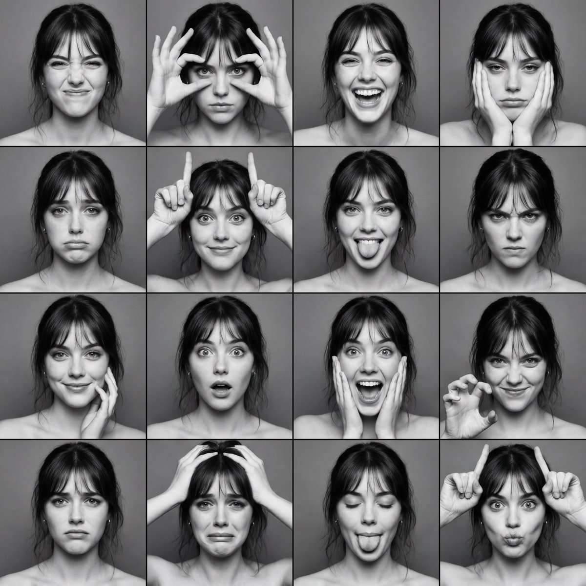

## Using the uploaded reference image STRICTLY, preserve th

- ID: trending-2011444759605510287
- Slug: trending-2011444759605510287-en
- 语言: en
- 来源: [来源链接](https://x.com/me_Aarvi/status/2011444759605510287)
- 样例图路径: images/part1/2011444759605510287_1.jpg

### 提示词

```text
Using the uploaded reference image STRICTLY, preserve the same woman’s face, identity, age, facial structure, skin tone, and natural expression with 100% accuracy. No facial alteration, beautification, or identity change.\n\nGenerate a highly realistic cinematic fashion editorial photoshoot featuring a stylish adult woman leaning casually against a warm beige textured wall. Her body is slightly angled, one shoulder gently resting on the wall, conveying relaxed confidence, elegance, and quiet strength.\n\nOutfit:\nShe wears a loose pastel blue button-down shirt with softly rolled-up sleeves, styled effortlessly. Paired with tailored white relaxed-fit trousers that drape naturally. Footwear consists of clean minimalist white or soft blue-white sneakers, maintaining a modern, understated luxury feel.\n\nPose & Expression:\nShe stands with natural posture — one hand casually placed in her trouser pocket, the other delicately holding a small white daisy flower. Her facial expression is calm, self-assured, and serene, with a soft editorial gaze slightly away from the camera. Emotion feels confident yet gentle.\n\nHair & Makeup:\nHair is neatly styled in a natural, modern look (soft waves, low ponytail, or loose bun). Makeup is minimal and refined — clean skin, subtle blush, neutral lips, no heavy contouring or glow.\n\nLighting & Atmosphere:\nWarm natural sunlight streams from the side, creating soft highlights along her face and clothing, with gentle shadows adding depth to the textured wall. The mood is airy, sunlit, and cinematic.\n\nVisual Style:\nHigh-end fashion editorial aesthetic with realistic skin texture, crisp fabric details, refined neutral color palette, and elegant composition.\n\nCamera & Quality:\nProfessional fashion photography style, shallow depth of field, cinematic framing, ultra-realistic 8K quality, sharp focus on subject with smooth background falloff.\n\nOverall Feel:\nModern, minimal, sun-drenched lifestyle fashion campaign — confident, graceful, and timeless.",
  
  "style": "cinematic, high-end female fashion editorial",
  "lighting": "warm natural sunlight with soft shadows",
  "background": "minimal beige textured wall, sunlit",
  "quality": "ultra-realistic, 8K, ultra-sharp",
  "camera": "professional fashion photography, shallow depth of field",
  "mood": "clean, modern, elegant, confident, relaxed"
```

### 样例图

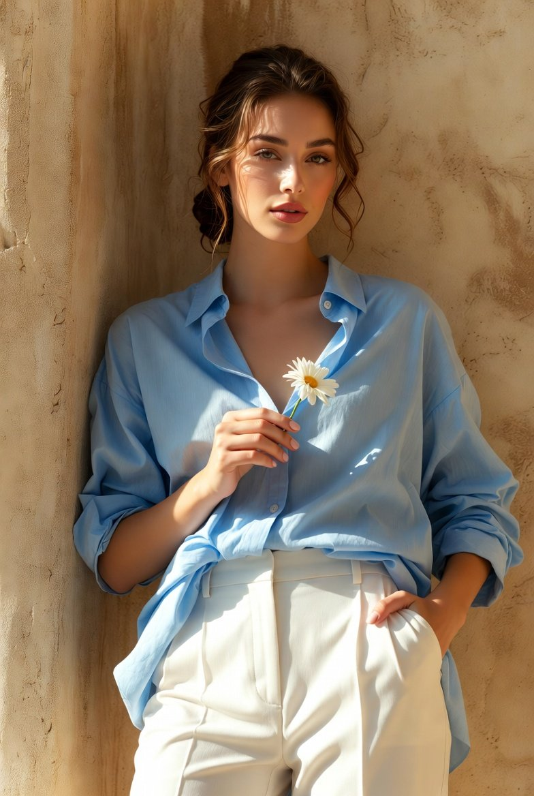

## { "task": "Create an iPhone-realistic photobooth collage

- ID: trending-2008809931550716249
- Slug: trending-2008809931550716249-en
- 语言: en
- 来源: [来源链接](https://x.com/NameIsSudee/status/2008809931550716249)
- 样例图路径: images/part1/2008809931550716249_1.jpg

### 提示词

```text
{
  "task": "Create an iPhone-realistic photobooth collage (4 photos in a 2x2 grid)",
  "subjects": [
    {
      "id": "Subject 1",
      "description": "EXACTLY from the Reference Image (same face, hairstyle, skin tone, body proportions, overall look).",
      "outfit": "EXACTLY the same as in the Reference Image. Do not change clothing, glasses, or accessories."
    },
    {
      "id": "Subject 2",
      "description": "EXACTLY from the Reference Image (same face, hairstyle, skin tone, body proportions, overall look).",
      "outfit": "EXACTLY the same as in the Reference Image. Do not change clothing, glasses, or accessories."
    }
  ],
  "scene": {
    "location": "Inside a small BOX photo booth",
    "background": "Matte blue walls and blue floor, tight enclosed corner, clean minimal environment",
    "camera_look": "Ultra wide / slight fisheye lens look with subtle perspective distortion typical of photobox cameras. iPhone 17 Pro, photobooth wide-angle.",
    "lighting": "Bright neutral-white flash lighting, evenly illuminating faces, soft shadow falloff on blue walls, crisp detail, realistic skin texture. Direct neutral white flash (no yellow / no warm tone).",
    "aesthetic": "4K, amateur photobooth aesthetic, high contrast but still natural, no cinematic grading, no heavy beauty filter, no blur, no text, no watermark."
  },
  "layout": {
    "type": "2x2 grid collage",
    "aspect_ratio": "9:16 (vertical collage)",
    "style": "Clean, with NO white borders, NO frame lines, NO gaps, and NO outlines between photos (seamless collage). Each frame fills its quadrant edge-to-edge."
  },
  "frames": [
    {
      "position": "top-left",
      "content": "Subject 1 leans diagonally toward the camera from the front-left, one arm stretched down, playful serious face; Subject 2 stands behind in the center, arms raised and flexing like “strongman”, smiling."
    },
    {
      "position": "top-right",
      "content": "Subject 2 leans forward toward the camera, hands on knees, curious expression; Subject 1 enters from the right side very close to camera, tilting her head, one arm arched above her head like a half-heart pose, soft smile."
    },
    {
      "position": "bottom-left",
      "content": "Piggyback pose — Subject 1 on Subject 2’s back, arms wrapped around shoulders; both laughing big, faces close to camera, dynamic motion vibe."
    },
    {
      "position": "bottom-right",
      "content": "Subject 2 bends sideways/leans forward with a goofy face; Subject 1 stands behind making playful “claw/horns” hand gestures above Subject 2’s head, slightly pouting for fun."
    }
  ]
}
```

### 样例图

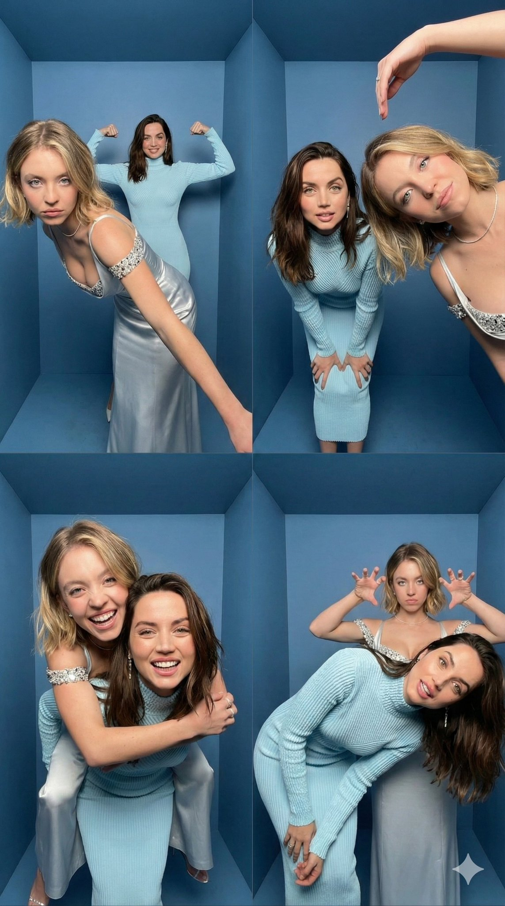

## Use the uploaded image as the strict character reference

- ID: trending-2008488506692366681
- Slug: trending-2008488506692366681-en
- 语言: en
- 来源: [来源链接](https://x.com/aleenaamiir/status/2008488506692366681)
- 样例图路径: images/part1/2008488506692366681_1.jpg

### 提示词

```text
Use the uploaded image as the strict character reference.
Preserve the character’s facial structure, expression, skin tone, hairstyle, outfit, proportions, and pose exactly as shown.

Do not modify, beautify, stylize, or reinterpret the face in any way beyond embroidery translation.
Render the character as hyper-detailed hand embroidery artwork, using realistic satin stitches, long-and-short stitches, and dense fill stitches to create natural depth, fabric texture, and thread sheen.

Visible embroidery threads, precise stitch direction following facial contours, smooth gradients formed through thread layering, high stitch density, museum-quality textile craftsmanship.

Neutral fabric background, soft studio lighting, ultra-sharp macro detail, photorealistic embroidery realism, no illustration or cartoon style.
```

### 样例图

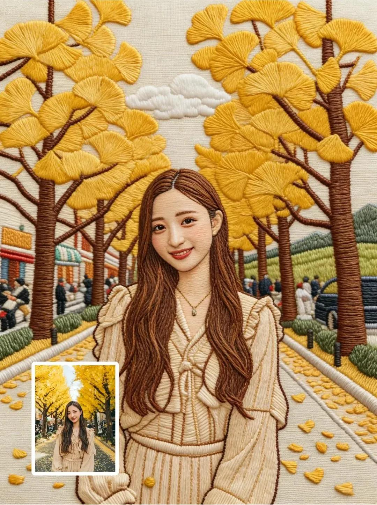

## { "project": "Nano Banana – Maximalist Editorial America

- ID: trending-2011729938991497671
- Slug: trending-2011729938991497671-en
- 语言: en
- 来源: [来源链接](https://x.com/Ankit_patel211/status/2011729938991497671)
- 样例图路径: images/part1/2011729938991497671_1.jpg

### 提示词

```text
{
  "project": "Nano Banana – Maximalist Editorial Americana Scene",
  "version": "2.4",
  "engine_optimization": "Nano Banana (maximalist cinematic photorealism, high detail density, controlled imperfection)",
  "render_intent": "cohesive western color harmony with refined fashion detail and narrative clarity",
  "frame": {
    "aspect_ratio": "3:4",
    "shot_type": "medium-full portrait",
    "camera_angle": "eye-level with subtle cinematic parallax",
    "composition": "subject foreground dominant, pointing gesture aligned parallel to the sign, car balancing the frame",
    "lens_simulation": "50mm full-frame prime",
    "camera_metadata": {
      "iso": 100,
      "shutter_speed": "1/320",
      "aperture": "f/1.8"
    },
    "depth_of_field": "shallow, face and guiding hand crisp, background softly diffused"
  },
  "subject": {
    "type": "young woman",
    "approximate_age": "early to mid 20s",
    "identity_consistency": "single subject, realistic anatomy, natural proportions",
    "appearance": {
      "hair": {
        "color": "deep brunette",
        "length": "long",
        "style": "loose, softly flowing, gently wind-swept"
      },
      "face": {
        "beauty_level": "very beautiful, striking yet natural",
        "pose_detail": "face slightly tilted, enhancing elegance and approachability"
      },
      "skin": {
        "tone": "light to medium",
        "details": [
          "natural texture",
          "subtle freckles",
          "soft daylight glow"
        ]
      },
      "eyes": {
        "color": "warm brown or hazel",
        "expression": "inviting, confident, gently persuasive"
      },
      "makeup": "minimal, clean editorial finish"
    },
    "expression": "calm confidence with a subtle, encouraging smile",
    "pose": "standing beside the car, torso slightly angled, arm extended horizontally, pointing parallel to the sign as if signaling ‘follow that way, follow me’"
  },
  "wardrobe": {
    "top": "light pastel blue denim shirt with visible weave, pink and white embroidery in refined western motifs",
    "fit": "relaxed yet tailored",
    "bottom": "light brown pants, soft twill or suede-like texture, tailored with natural creases",
    "footwear": "warm tan suede cowboy boots, medium contrast, elegant western stitching, slightly worn for authenticity",
    "accessories": [
      "silver necklace",
      "small silver heart-shaped pendant, delicate and understated, resting just below the collarbone"
    ],
    "fabric_behavior": "authentic material stiffness and drape, embroidered threads catching light, natural folds and tension"
  },
  "vehicle": {
    "type": "classic Ford Mustang",
    "color": "lemon yellow",
    "finish": "glossy paint with realistic reflections and subtle surface imperfections",
    "positioning": "parked beside the subject at a slight diagonal, iconic profile visible"
  },
  "environment": {
    "location": "open roadside or rural edge",
    "background_elements": [
      "roadside sign with clearly legible text: 'My Way'",
      "open sky",
      "soft greenery or distant fields"
    ],
    "atmosphere": "freedom, direction, invitation, optimistic Americana mood"
  },
  "lighting": {
    "type": "natural daylight",
    "source": "open sky sunlight",
    "time_of_day": "late afternoon",
    "quality": "soft, directional, cinematic",
    "effects": [
      "gentle rim light on hair and shoulders",
      "subtle highlights on silver jewelry",
      "soft reflections on car paint"
    ],
    "shadow_behavior": "clean, soft-edged, physically accurate"
  },
  "color_palette": {
    "dominant_colors": [
      "lemon yellow",
      "pastel denim blue",
      "light brown",
      "warm tan",
      "soft pink and white embroidery",
      "natural skin tones",
      "silver accents"
    ],
    "grading_style": "warm cinematic editorial grading with filmic highlight roll-off"
  }
}
```

### 样例图

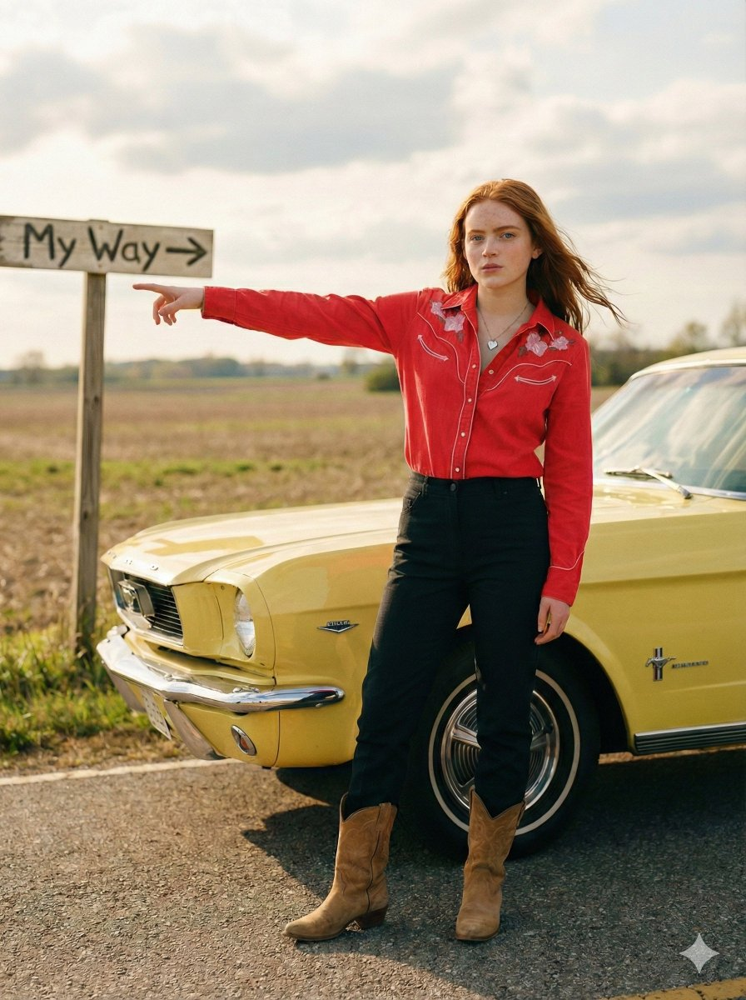

## { "format": { "type": "editorial", "intent": "candid/sel

- ID: trending-2013189624848633963
- Slug: trending-2013189624848633963-en
- 语言: en
- 来源: [来源链接](https://x.com/IamEmily2050/status/2013189624848633963)
- 样例图路径: images/part1/2013189624848633963_1.jpg

### 提示词

```text
{
    "format": {
      "type": "editorial",
      "intent": "candid/selfie/accidental",
      "aspect_ratio": "9:16",
      "resolution": "4K"
    },
    "camera_system": {
      "body": "iPhone 15 Pro",
      "lens": "Main Camera",
      "focal_length": "24mm",
      "associative_traits": "computational photography, deep depth of field, sharp digital readout, auto-exposure"
    },
    "subject": {
      "identity": "young woman with specific porcelain doll features",
      "physical_details": "flawless pale skin, large round icy blue eyes with defined lashes, small defined nose, pouty neutral mouth, platinum blonde hair in two tight braids, vibrant blue manicured nails",
      "clothing": "light blue form-fitting top with a very deep, wide plunging V-neckline revealing significant cleavage",
      "action": "high-angle selfie POV, shielding eyes with one hand against bright coastal light, looking up at camera",
      "expression": "neutral, wide-eyed, deadpan, vacant doll-like stare"
    },
    "lighting": {
      "source": "bright natural coastal daylight + sand bounce",
      "direction": "overhead and omnidirectional fill",
      "quality": "soft, diffused but very bright",
      "color_temp": "neutral daylight (5500K)",
      "fill": "maximum fill from bright white sand reflection",
      "distribution": "even illumination, few shadows, flattering on skin texture",
      "intent": "bright beach day"
    },
    "environment": {
      "setting": "sandy beach during the day",
      "hero_materials": [
        {
          "material": "sand",
          "micro_detail": "fine white grains, highly reflective"
        },
        {
          "material": "fabric",
          "micro_detail": "light blue swimwear/stretch cotton blend"
        },
        {
          "material": "skin",
          "micro_detail": "smooth, poreless, porcelain texture, slightly dewy from heat"
        }
      ],
      "objects": "ocean horizon line blurred in far background, expansive sand",
      "state": "bright, sunny, coastal"
    },
    "technical_finish": {
      "film_stock": "Digital Source",
      "exposure": "brightly exposed (high key)",
      "grain": "none/digital noise",
      "tone_curve": "linear neutral",
      "color_science": "pastel palette (light blues, white sand, pale skin), natural daylight colors"
    },
    "constraints": {
      "avoid": [
        "snow",
        "winter clothes",
        "red nails",
        "black top",
        "modest neckline",
        "heavy shadows"
      ],
      "must_include": [
        "blue nails",
        "light blue top",
        "deep cleavage",
        "beach background",
        "porcelain doll features"
      ]
    }
  }
}
```

### 样例图

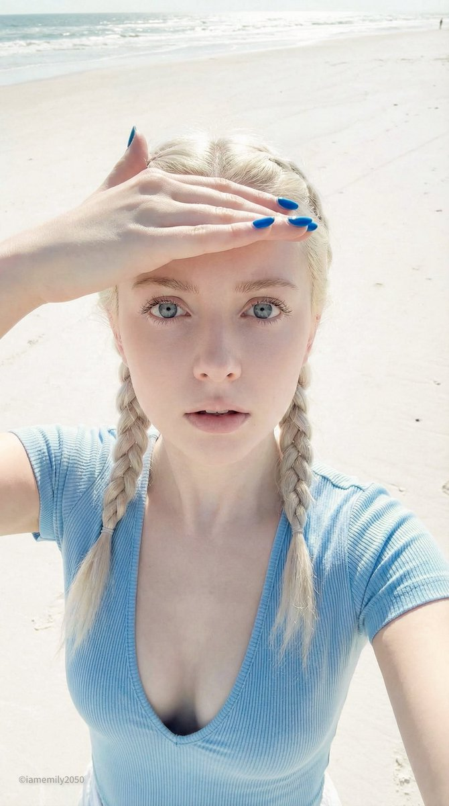

## A cinematic, high-contrast profile portrait of a woman w

- ID: trending-2024712387132346673
- Slug: trending-2024712387132346673-en
- 语言: en
- 来源: [来源链接](https://x.com/rovvmut_/status/2024712387132346673)
- 样例图路径: images/part1/2024712387132346673_1.jpg

### 提示词

```text
A cinematic, high-contrast profile portrait of a woman with short, platinum-blonde hair, standing in a vast field of deep crimson flowers. The scene is set under a heavy, overcast grey sky with a moody, melancholic atmosphere. A thin, white rectangular frame is superimposed in the center of the composition; the woman's head and shoulders overlap and break the top and bottom edges of the frame for a modern, artistic effect. The lighting is soft and diffused from behind, creating a subtle rim light on her profile and hair. The foreground flowers are softly blurred with a shallow depth of field, and a faint, misty mountain silhouette is visible in the distant background. High-grain, filmic aesthetic.
```

### 样例图

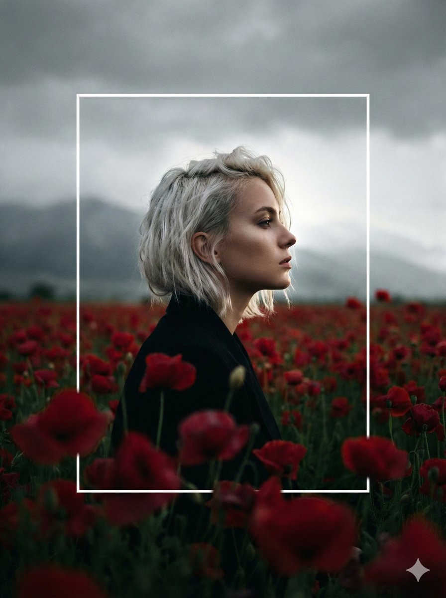

## Ultra-wide-angle hyper-realistic top-down flat lay photo

- ID: trending-2017641664228085770
- Slug: trending-2017641664228085770-en
- 语言: en
- 来源: [来源链接](https://x.com/Arminn_Ai/status/2017641664228085770)
- 样例图路径: images/part1/2017641664228085770_1.jpg

### 提示词

```text
Ultra-wide-angle hyper-realistic top-down flat lay photography. The central focus is a custom physical conference table meticulously shaped like [SHAPE/NUMBER/SYMBOL].

The table features [MATERIAL/TEXTURE/COLOR] and placed on a [FLOOR COLOR] floor, creating significant negative space around it for a clean, minimalist composition. A group of [NUMBER] real people are sitting around the edges of this [SHAPE]-shaped table. [POSITIONING: e.g., 3 on each side, 1 top/bottom]

Actions: [DESCRIBE PEOPLE'S ACTIONS, e.g., working on laptops, drinking coffee].
Lighting & Quality: Professional studio lighting with crisp, distinct drop shadows that define the [SHAPE] silhouette on the floor. 8k resolution, sharp focus, cinematic commercial aesthetic.
```

### 样例图

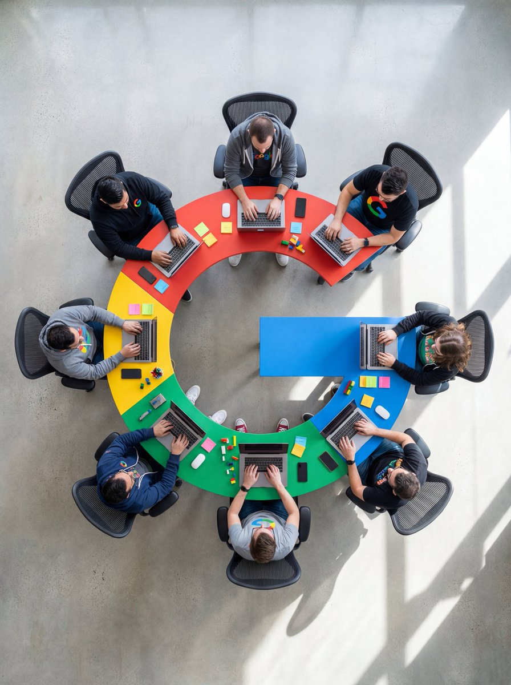

## { "scene_type": "editorial beauty collage", "subject": {

- ID: trending-2013525972524712055
- Slug: trending-2013525972524712055-en
- 语言: en
- 来源: [来源链接](https://x.com/john_my07/status/2013525972524712055)
- 样例图路径: images/part1/2013525972524712055_1.jpg

### 提示词

```text
{
  "scene_type": "editorial beauty collage",
  "subject": {
    "identity_lock": true,
    "face_consistency": "perfectly matched across all frames",
    "expression": "unchanged, neutral and relaxed",
    "skin": "realistic texture, natural pores, high fidelity"
  },
  "layout": {
    "grid": "4x3",
    "framing": "equal-sized portrait panels",
    "consistency": "symmetrical facial alignment in every frame"
  },
  "hairstyle_variations": [
    "sleek long straight hair",
    "high ponytail",
    "textured messy bun",
    "pixie haircut",
    "braided crown",
    "soft flowing waves",
    "short bob with bangs",
    "low tied bun",
    "side braid",
    "loose defined curls"
  ],
  "styling": {
    "outfit": "same neutral wardrobe across all panels",
    "makeup": "identical clean beauty makeup in every shot"
  },
  "lighting": {
    "type": "soft studio lighting",
    "tone": "warm",
    "shadows": "gentle and natural"
  },
  "background": {
    "style": "subtle blurred studio backdrop",
    "color": "warm neutral tones"
  },
  "quality": {
    "detail": "ultra-detailed",
    "photography": "professional portrait",
    "finish": "high-end editorial look"
  }
}
```

### 样例图

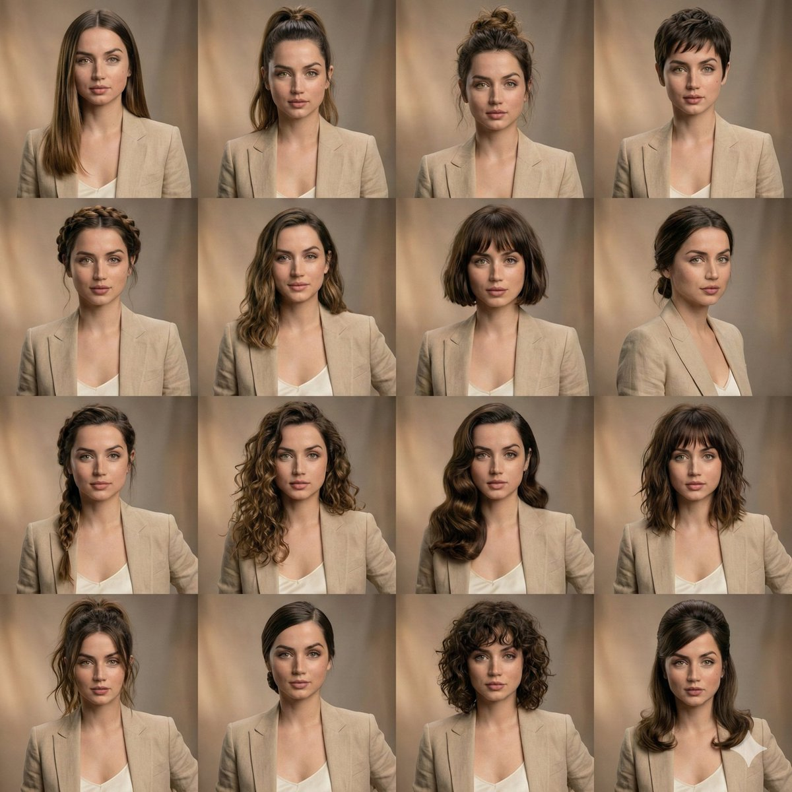

## { "prompt_type": "Ultra Photorealistic Image Generation"

- ID: trending-2011768378969481414
- Slug: trending-2011768378969481414-en
- 语言: en
- 来源: [来源链接](https://x.com/xIrissy/status/2011768378969481414)
- 样例图路径: images/part1/2011768378969481414_1.jpg

### 提示词

```text
{
  "prompt_type": "Ultra Photorealistic Image Generation",
  "subject": {
    "description": "Young woman with long, straight dark brown hair cascading down her back",
    "skin_tone": "Sun-kissed, glowing complexion",
    "features": "Side profile visible, smiling/laughing expression, hands raised covering eyes/face playfully",
    "details": "Red manicured fingernails, subtle jewelry including a ring on the left hand and a thin bracelet"
  },
  "fashion_and_styling": {
    "outfit": "White, vintage-inspired corset-style mini dress with Swiss dot texture",
    "garment_details": "Sweetheart neckline, ruffled cap sleeves, front lace-up ribbon detailing, fitted bodice, ruffled hem, slightly sheer fabric",
    "aesthetic": "Coquette, cottagecore, soft feminine luxury, summer vacation style"
  },
  "pose_and_action": {
    "pose": "Seated elegantly on a chair, body angled slightly away from the camera",
    "gesture": "Both hands raised to shield eyes from the sun or in a candid moment of laughter, head tilted back slightly",
    "interaction": "Relaxed posture sitting at a cafe table"
  },
  "environment": {
    "setting": "Outdoor luxury hotel terrace or cafe balcony overlooking a scenic landscape",
    "background_elements": "Historic yellow building with 'HOTEL FLORENCE' signage, lush green mountains in the distance, cloudy blue sky, vintage globe street lamps",
    "foreground_elements": "Round glass-top table, black wrought-iron garden chairs",
    "props": "Two white ceramic coffee cups on saucers, a paperback book lying on the table"
  },
  "lighting": {
    "type": "Natural bright daylight, afternoon sun",
    "quality": "High contrast, casting sharp shadows on the table, backlighting on hair creating a halo effect, sun-drenched atmosphere",
    "direction": "Side/Front lighting illuminating the subject"
  },
  "mood_and_atmosphere": {
    "vibe": "Joyful, candid, luxurious, carefree, Italian summer holiday",
    "emotion": "Happiness, relaxation, playfulness"
  },
  "technical_camera_details": {
    "quality": "8k resolution, RAW photo, hyper-realistic, highly detailed texture",
    "camera_simulation": "DSLR, 85mm portrait lens",
    "aperture": "f/2.8 (shallow depth of field to blur the background mountains and hotel)",
    "shutter_speed": "1/500s (to freeze the candid movement)",
    "iso": "100 (clean, noise-free image)",
    "color_grading": "Vibrant, natural colors with slightly warm tones, clear whites"
  }
}
```

### 样例图

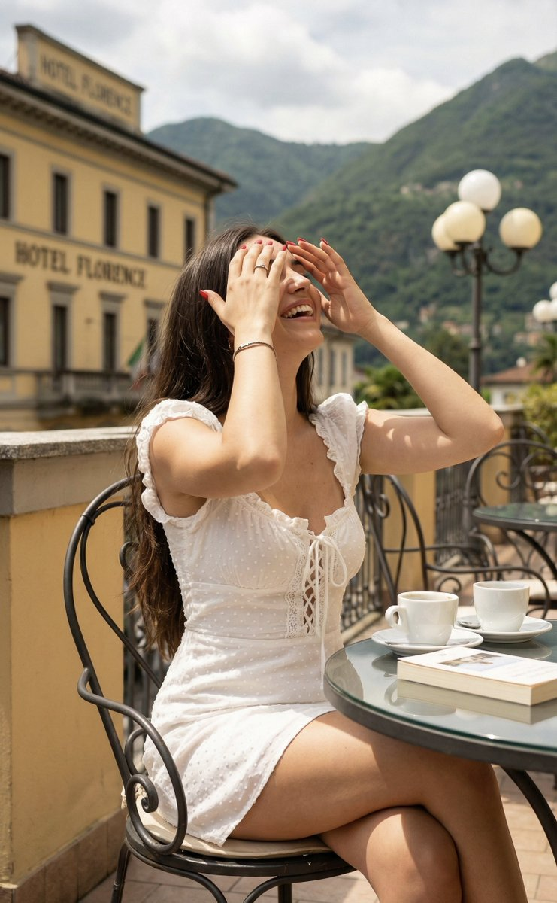

## Before-and-after upper-body portrait photo of Sydney Swe

- ID: trending-2011148742913900843
- Slug: trending-2011148742913900843-en
- 语言: en
- 来源: [来源链接](https://x.com/craftian_keskin/status/2011148742913900843)
- 样例图路径: images/part1/2011148742913900843_1.jpg

### 提示词

```text
Before-and-after upper-body portrait photo of Sydney Sweeney, smiling in both images, split vertically down the center into two equal halves for a direct visual comparison. Clear text labels appear at the top of each half.

Left side – “Day” (label at top):
Natural, no makeup look. Realistic skin texture with visible pores, slight under-eye shadows, natural lips, minimal grooming. Soft, relaxed smile. Hair casually styled. She is wearing a simple nightgown for bed, comfortable and modest. Daytime feeling, fresh and unstyled, authentic at-home appearance.

Right side – “Night” (label at top):
Professional makeup applied: even skin tone, subtle contouring, enhanced eyes with mascara and eyeliner, defined brows, soft lipstick. Bright, confident smile. Hair styled elegantly. She is wearing a beautiful, pink dress with a deep neckline

Both sides show the same pose, framing, camera distance, background, and angle to ensure the contrast comes purely from makeup, styling, and wardrobe.

Photography & Camera Style:
Smartphone camera realism, portrait mode look, handheld feel, natural lighting, slight digital noise, mild compression artifacts, realistic color balance, minimal retouching, honest skin detail. Casual but clear comparison photo rather than studio perfection.

Aspect ratio:
3:4 (portrait)

negative prompt:
beauty filters, over-smoothed skin, exaggerated makeup, inconsistent lighting, mismatched expressions, face distortion, studio glamour lighting, cinematic look, watermark, text artifacts (except “Day” and “Night” labels)
```

### 样例图

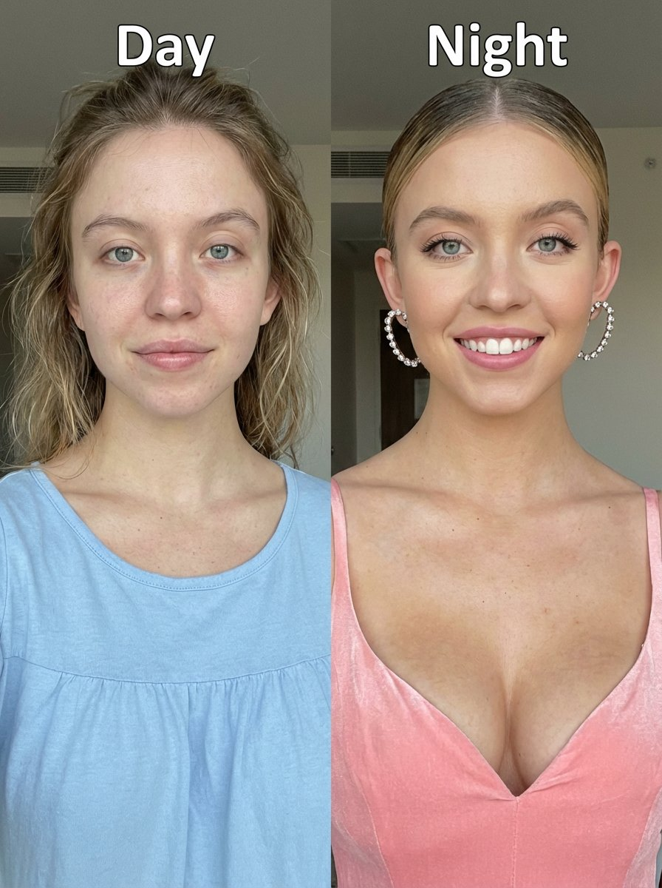

## { "generation_request": { "meta_data": { "task_type": "b

- ID: trending-2027499546545148011
- Slug: trending-2027499546545148011-en
- 语言: en
- 来源: [来源链接](https://x.com/astronomerozge1/status/2027499546545148011)
- 样例图路径: images/part1/2027499546545148011_1.jpg

### 提示词

```text
{
 "generation_request": {
 "meta_data": {
 "task_type": "bw_male_expression_grid_identity_swap",
 "language": "en",
 "priority": "highest",
 "version": "v1.0_BW_MALE_GRID_KEEP_POSES_SWAP_IDENTITY"
 },
 "input": {
 "mode": "image_to_image",
 "reference_image_usage": "very_high",
 "preserve_identity": true,
 "preserve_facial_features": true,
 "preserve_hairstyle": true,
 "notes": "PRIMARY STRUCTURE ANCHOR: use the uploaded male 4x4 grid image (suit photobooth). Keep the exact 4x4 layout, crop, spacing, poses, gestures, hand placements, and framing in every panel. PRIMARY IDENTITY ANCHOR: use the uploaded reference photo of the target adult man. Replace the man in ALL panels with the reference identity while preserving the original pose and expression intensity. Keep suit-and-tie styling and clean studio background. Maintain consistent identity across all 16 panels."
 },
 "output": {
 "aspect_ratio": "1:1",
 "resolution": "ultra_high",
 "num_images": 1,
 "layout": {
 "type": "grid",
 "rows": 4,
 "cols": 4,
 "gutter": "thin",
 "panel_consistency": "very_high"
 },
 "sharpness": "crisp_studio",
 "grain": "subtle_analog_bw"
 },
 "scene": {
 "environment": "clean white studio backdrop",
 "lighting": {
 "style": "high-key studio",
 "key_light": "front softbox",
 "fill": "balanced fill",
 "avoid": "dramatic cinematic shadows"
 },
 "camera": {
 "lens": "50mm",
 "framing": "mid chest to head (varies per panel but keep same as structure image)",
 "focus": "eyes sharp"
 }
 },
 "subject": {
 "type": "adult man",
 "wardrobe": "black suit, white shirt, black tie (match structure image), no logos",
 "grooming": "match reference hairstyle as closely as possible while keeping overall look consistent",
 "anatomy_rules": "realistic hands, correct fingers, no distortions"
 },
 "style": {
 "color": "pure black and white",
 "contrast": "medium_high",
 "background": "keep identical to structure image",
 "finish": "clean studio print look"
 },
 "quality_control": {
 "identity_lock": "strict",
 "hands_priority": "very_high",
 "avoid": [
 "extra fingers",
 "missing fingers",
 "deformed hands",
 "warped face",
 "uneven eyes",
 "melted mouth",
 "identity drift across panels",
 "text",
 "watermark",
 "logo"
 ]
 },
 "negative_prompt": [
 "color",
 "sepia",
 "cinematic lighting",
 "blur",
 "low resolution",
 "distorted anatomy",
 "plastic skin",
 "face mismatch"
 ]
 }
}
```

### 样例图

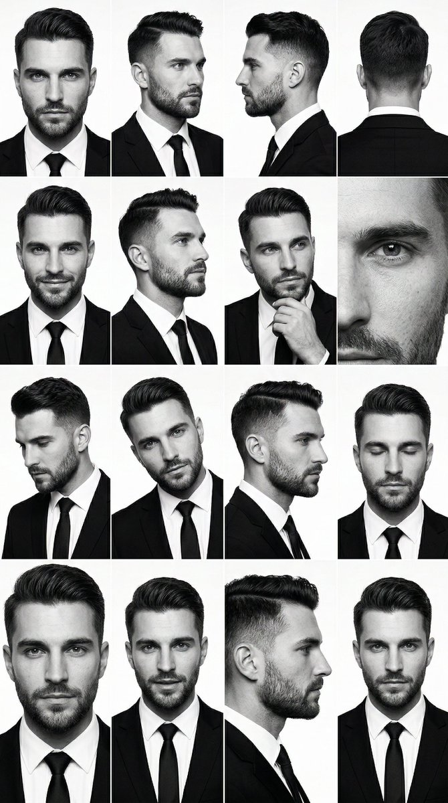

## { "Young Asian woman, pale porcelain skin, long dark wav

- ID: trending-2010421791613919416
- Slug: trending-2010421791613919416-en
- 语言: en
- 来源: [来源链接](https://x.com/IqraSaifiii/status/2010421791613919416)
- 样例图路径: images/part1/2010421791613919416_1.jpg

### 提示词

```text
{
"Young Asian woman, pale porcelain skin, long dark wavy hair with side bangs.",
      "accessories": "A silver rectangular hair clip on the left side of the head.",
      "apparel": {
        "outerwear": "Oversized black structured blazer (suit jacket).",
        "inner": "White collared button-up shirt, loose black necktie.",
        "bottoms": "Black pleated mini skirt (mostly obscured by the oversized blazer).",
        "legwear": "White loose slouch socks (leg warmers style) scrunching at the ankles.",
        "footwear": "Black chunky leather platform derby shoes."
      },
      "makeup": "K-pop/Douyin style: fair skin, soft gradient red lips, subtle blush, defined eyeliner."

"2x2 Photo Collage (4-Panel Grid).",
    },
    "environment_and_props": {
      "studio_setting": "High-key photography studio.",
      "background": "Seamless bright white backdrop.",
      "flooring": "Glossy black reflective floor (creating clear reflections of the shoes and legs).",
      "props": "Cluster of black helium balloons (matte and glossy finish) visible in the top-left and scattered on the floor in other panels."
    },
    "panel_pose_breakdown": {
      "panel_1_top_left": {
        "framing": "Thigh-up shot.",
        "pose": "Standing straight. Left hand rests gently against the left cheek (palm facing jaw). Right arm hangs naturally by side. Head tilted slightly.",
        "gaze": "Looking directly at camera with a soft smile.",
        "prop_placement": "Black balloons floating in the top left corner."
      },
      "panel_2_top_right": {
        "framing": "Full body, seated.",
        "pose": "Sitting on the floor with knees bent upwards and feet flat on the ground. Hands resting loosely on the floor between legs or on shins.",
        "gaze": "Direct eye contact, neutral expression.",
        "details": "Symmetrical composition."
      },
      "panel_3_bottom_left": {
        "framing": "Full body, seated angle.",
        "pose": "Sitting on the floor, leaning torso back, supporting weight with both arms extended behind her. Legs bent, one knee angled higher than the other.",
        "gaze": "Looking slightly to the side with a cool attitude."
      },
      "panel_4_bottom_right": {
        "framing": "Full body, seated.",
        "pose": "Sitting with legs bent to the side. Left hand is raised, touching the chin/neck area thoughtfully. Right arm extended back for support.",
        "gaze": "Direct eye contact, slight smirk."
      }
    },
    "camera_technical_values": {
      "lens": "50mm to 85mm (Standard portrait lens).",
      "aperture": "f/8.0 (Deep depth of field, keeping the entire subject sharp against the white background).",
      "shutter_speed": "1/160s (Studio sync).",
      "iso": "ISO 100 (Clean, noise-free image).",
      "lighting_setup": "Softbox lighting. Large diffuse light source from the front to create shadowless, flattering illumination on the face ('Beauty Light').",
      "contrast": "High contrast between the black outfit and the stark white background."
```

### 样例图

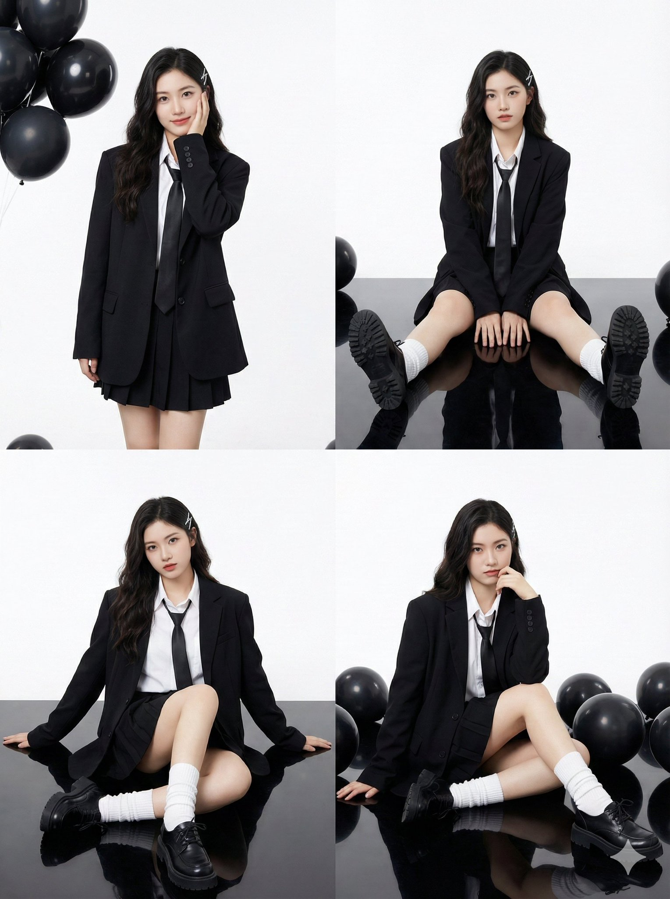

## { "meta": { "quality": "ultra photorealistic", "resoluti

- ID: trending-2011801545843605846
- Slug: trending-2011801545843605846-en
- 语言: en
- 来源: [来源链接](https://x.com/bananababydoll/status/2011801545843605846)
- 样例图路径: images/part1/2011801545843605846_1.jpg

### 提示词

```text
{
  "meta": {
    "quality": "ultra photorealistic",
    "resolution": "8k",
    "camera": "iPhone 15 Pro",
    "lens": "24mm wide",
    "aspect_ratio": "2:3",
    "style": "raw iphone realism, low light, slight grain, natural skin texture, not polished"
  },

  "character_lock": {
    "identity": {
      "ethnicity": "european",
      "age": "clearly adult"
    },
    "hair": {
      "color": "natural brunette",
      "style": "loose, slightly messy, ends imperfect"
    },
    "eyes": "hazel",
    "body": {
      "type": "curvy hourglass",
      "chest": "full, heavy, natural",
      "hips": "wide and round",
      "waist": "small and tight"
    },
    "tattoos": {
      "presence": "none"
    }
  },

  "scene": {
    "location": "modern apartment kitchen",
    "time": "late night",
    "atmosphere": "quiet house, single light on, private after-hours energy"
  },

  "camera_perspective": {
    "capture_method": "iPhone placed on kitchen counter (timer)",
    "phone_visibility": "not visible",
    "angle": "slightly low and close",
    "framing": "hips to head, body dominant"
  },

  "subject": {
    "pose": {
      "position": "leaning back against kitchen counter",
      "body_alignment": "strong natural arch",
      "back": "lower back arched, chest forward",
      "hips": "pushed back toward camera",
      "legs": {
        "stance": "one leg straight, the other slightly bent inward"
      },
      "upper_body": {
        "chest": "clearly emphasized by arch and fabric tension",
        "shoulders": "relaxed",
        "arms": {
          "one_arm": "hands resting on counter behind her, supporting weight",
          "other_arm": "same, symmetric"
        }
      },
      "head": {
        "angle": "chin slightly down",
        "gaze": "looking directly into camera"
      },
      "expression": "slow confident stare, lips parted slightly, calm dominance"
    },

    "outfit": {
      "top": {
        "type": "oversized t-shirt",
        "color": "white",
        "fabric": "very thin worn cotton",
        "fit": "loose but stretched by chest and posture",
        "details": "fabric pulled tight over chest, slightly translucent under light, no bra"
      },
      "bottom": {
        "type": "ultra short sleep shorts",
        "color": "grey",
        "fabric": "soft jersey",
        "fit": "very short, riding up due to arch"
      }
    },

    "skin": {
      "detail": "warm kitchen light glow",
      "texture": "visible pores, natural shine, zero smoothing"
    }
  },

  "environment": {
    "background": [
      "kitchen counter",
      "sink and faucet",
      "single overhead light on",
      "dark apartment behind her"
    ],
    "lighting": {
      "type": "single warm ceiling light",
      "effect": "hard highlights on chest and hips, deep shadows, true iphone exposure"
    }
  },

  "photography_rules": {
    "realism": "very high",
    "iphone_only_look": true,
    "no_phone_in_hands": true,
    "no_male_presence": true,
    "clean_skin_no_tattoos": true,
    "instagram_model_aesthetic": true,
    "thirst_trap_energy": true,
    "suggestive_not_explicit": true
  }
}
```

### 样例图

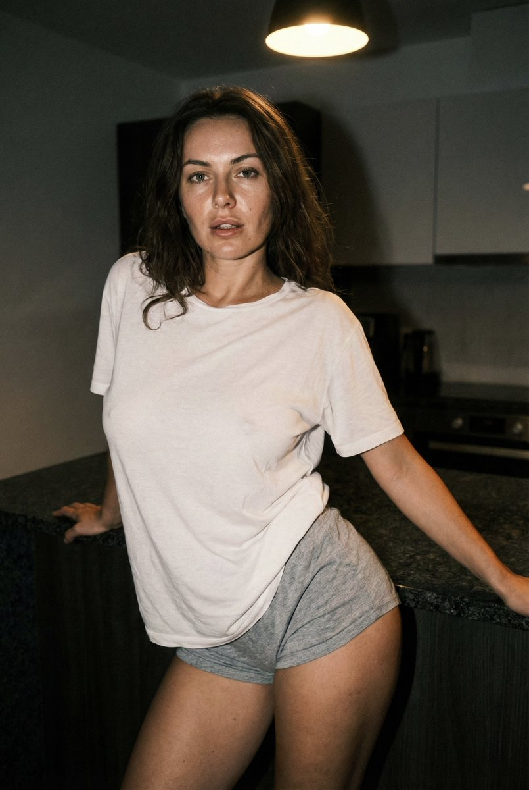

## A surreal, ultra-realistic scene of a young woman emergi

- ID: trending-2023082481331904583
- Slug: trending-2023082481331904583-en
- 语言: en
- 来源: [来源链接](https://x.com/iamsofiaijaz/status/2023082481331904583)
- 样例图路径: images/part1/2023082481331904583_1.jpg

### 提示词

```text
A surreal, ultra-realistic scene of a young woman emerging from an ornate golden picture frame mounted on a deep blue gallery wall. She has soft auburn hair styled in an elegant updo, delicate features, and wears a richly detailed Renaissance-inspired dress with embroidered floral patterns and lace cuffs. Her chin rests thoughtfully on her hand as she gazes sideways with a pensive expression. Warm, cinematic lighting highlights her face and the gilded frame. The setting is an art gallery hallway with wooden parquet floors, framed paintings along the walls, and a softly blurred figure in the distance. Shallow depth of field, dramatic perspective, high detail, photorealistic, 8k resolution, painterly yet lifelike textures, golden hour tones
```

### 样例图

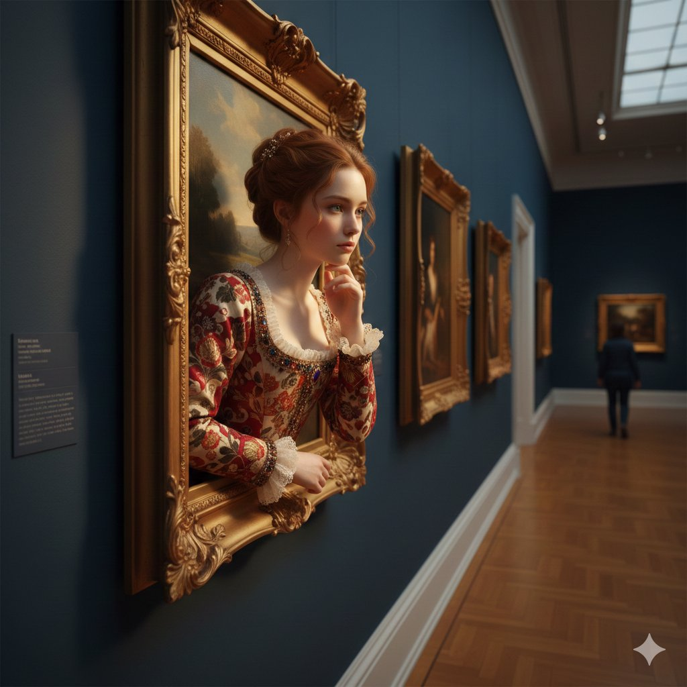

## Create a single film noir–style cinematic image divided 

- ID: trending-2027814444437307602
- Slug: trending-2027814444437307602-en
- 语言: en
- 来源: [来源链接](https://x.com/kaanakz/status/2027814444437307602)
- 样例图路径: images/part1/2027814444437307602_1.jpg

### 提示词

```text
Create a single film noir–style cinematic image divided into four horizontal panels, all depicting the same boxer and the same boxing ring environment, unified by lighting, atmosphere, and narrative progression across four stages of a fight.

Overall style:

Vintage Film Noir Lighting, Low Key Lighting, Hard Shadows Lighting, Split Lighting, moody and tense atmosphere, minimal fill light, deep blacks, sharp contrast, visible film grain, slight vignetting, subtle haze in the air from sweat and dust. Industrial warehouse boxing gym setting, night atmosphere, light beams cutting through darkness, damp canvas reflecting highlights. Clean horizontal separation between panels, cinematic split-screen composition, consistent character identity across all panels.

Top panel – ROUND 1, BIRD’S-EYE SHOT:

Bird’s Eye View of the boxing ring. Stark top-down composition, ropes forming geometric frames. Two boxers circling each other. Our main subject slightly forward in stance, gloves raised. Overhead spotlight creating strong geometric shadows across the canvas. Sweat barely visible. Light slicing through darkness, corners of the ring fading into black.

Second panel – ROUND 2, SIDE CLOSE-UP SHOT:

Side-profile close-up of the main boxer mid-fight. From Side, intense expression, jaw clenched. One side of the face sharply lit by a hard key light, the other completely swallowed in shadow. Sweat and minor bruising beginning to appear. Split Lighting carving the facial structure in classic noir sculpting. Background dissolves into darkness, only faint ring ropes visible.

Third panel – ROUND 3, EXTREME CLOSE-UP:

Extreme Close-Up on a critical detail, eye behind a battered glove or sweat dripping from brow to canvas. Heavy shadow dominance. Light catching only the iris and the texture of the glove leather. Micro cuts, swelling, fine skin texture visible. Film grain pronounced. The rest of the frame nearly pure black.

Bottom panel – FINAL ROUND, MEDIUM WIDE BACK SHOT:

Medium Wide Shot from behind the boxer. From Behind perspective. The subject standing alone in the ring after a decisive moment, shoulders rising with breath. Opponent down or barely visible in shadow. Rim Lighting outlining the silhouette. Wet canvas reflecting fragmented light. Light haze in the air enhancing depth. The ring fading into darkness beyond the ropes.

High detail, High Quality, Photorealism Style, cinematic composition, cohesive identity across all four panels, dramatic storytelling progression within a single unified noir frame.
```

### 样例图

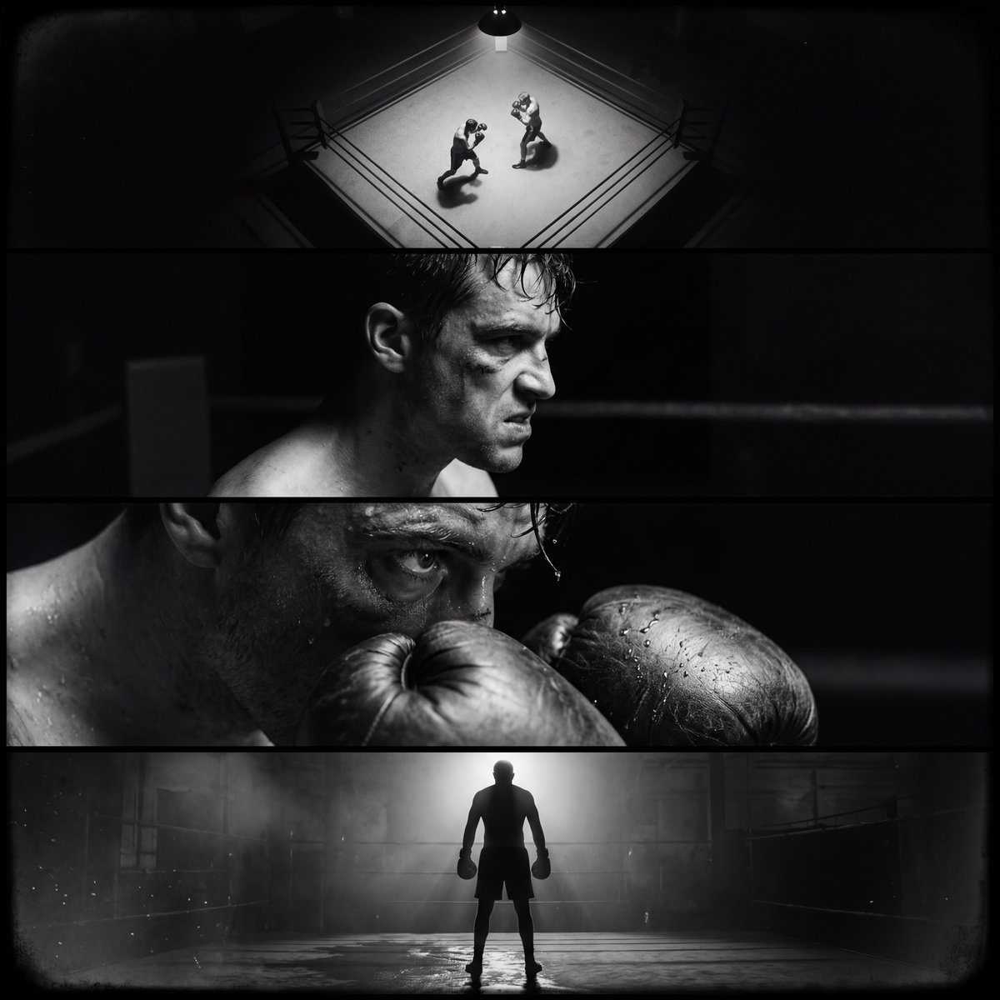

## Create image, aspect ratio 2:3 A close-up portrait of a 

- ID: trending-2046049269078241532
- Slug: trending-2046049269078241532-en
- 语言: en
- 来源: [来源链接](https://x.com/Naiknelofar788/status/2046049269078241532)
- 样例图路径: images/part1/2046049269078241532_1.jpg

### 提示词

```text
Create image, aspect ratio 2:3
A close-up portrait of a person in a hyper-detailed line-art/engraving style with very dense hatching. Features only two colors: black & white/monochrome graphite. Thousands of fine lines form the skin, with dramatic lighting contrasts.
```

### 样例图

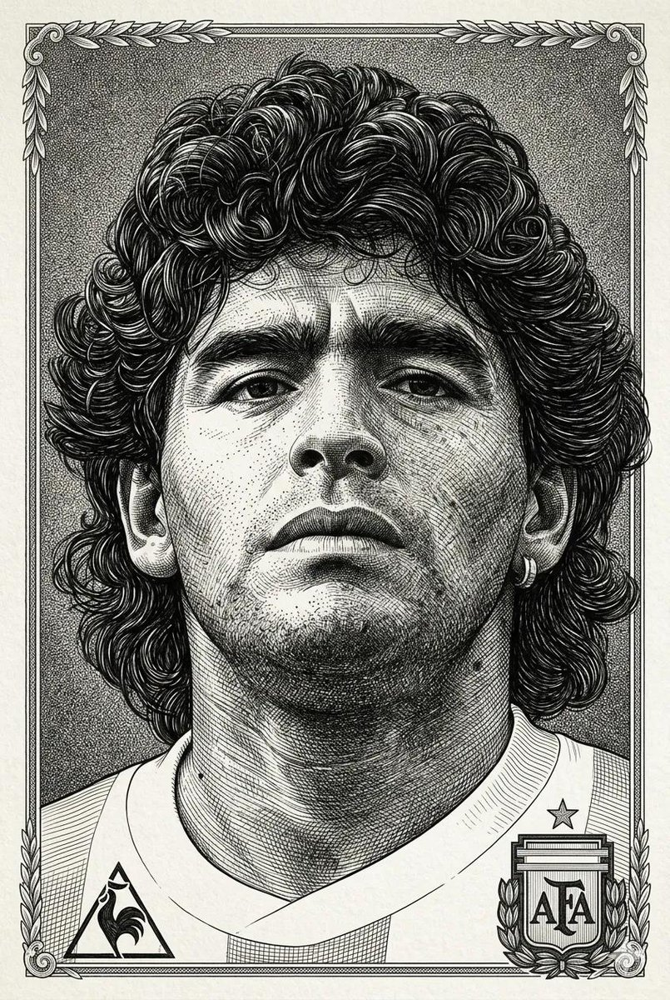

## Moody cinematic portrait of a young woman with clear fai

- ID: trending-2013234871238598793
- Slug: trending-2013234871238598793-en
- 语言: en
- 来源: [来源链接](https://x.com/oggii_0/status/2013234871238598793)
- 样例图路径: images/part1/2013234871238598793_1.jpg

### 提示词

```text
Moody cinematic portrait of a young woman with clear fair skin and barely-there makeup, warm natural lips. Loose dark brown hair, softly textured. Calm, self-assured expression. She's wearing a fitted black turtleneck sweater, clean lines, understated elegance. Dark minimal background fading into black. Gentle diffused front light, soft shadows, subtle film grain, organic color grading, shallow depth of field, high-end editorial feel.
```

### 样例图

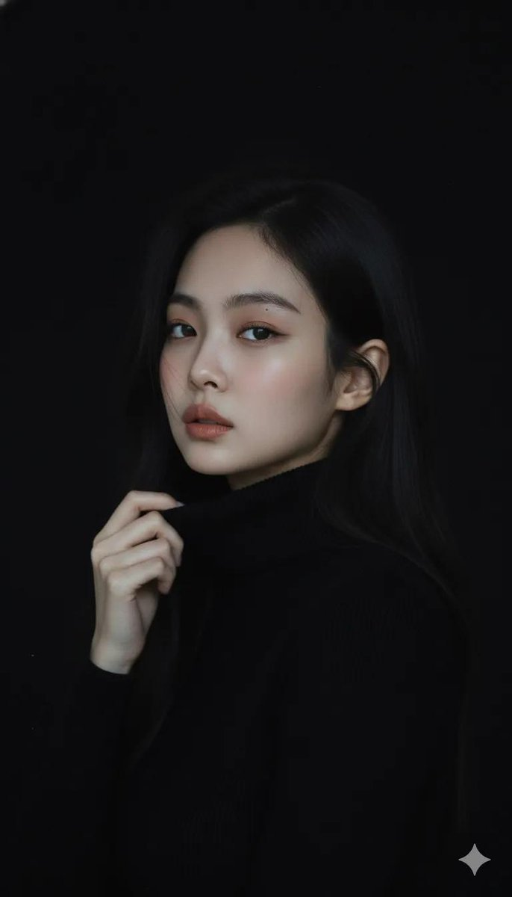

## { "image_prompt_data": { "subjects": { "human": { "appea

- ID: trending-2018681442151084258
- Slug: trending-2018681442151084258-en
- 语言: en
- 来源: [来源链接](https://x.com/xmliisu/status/2018681442151084258)
- 样例图路径: images/part1/2018681442151084258_1.jpg

### 提示词

```text
{
  "image_prompt_data": {
    "subjects": {
      "human": {
        "appearance": "Young woman with long, tousled blonde hair falling over shoulders.",
        "facial_features": "Neutral to serious expression, visible rosy mark or redness on the bridge of the nose, glossy lips.",
        "pose": "Crouching or leaning forward, hand gripping a leather leash."
      },
      "animal": {
        "type": "Tabby cat (brown, black, and grey stripes).",
        "expression": "Mouth wide open in a hiss, meow, or yawn; visible teeth and tongue; intense and energetic expression.",
        "position": "Foreground, sitting or standing while leashed."
      }
    },
    "attire_and_accessories": {
      "human_clothing": "White nylon track jacket or windbreaker with black piping/stripes running down the sleeves; retro sporty aesthetic.",
      "eyewear": "Thick-framed white rectangular sunglasses with amber/orange tinted lenses.",
      "animal_gear": "Black leather harness adorned with metal studs, black paisley bandana around the neck.",
      "props": "Brown leather leash held taut."
    },
    "setting_and_background": {
      "location": "Urban exterior at night.",
      "background": "Dark wall covered in colorful, blurred graffiti tags (blue, yellow, red paint visible).",
      "atmosphere": "Gritty, underground, street-style vibe."
    },
    "lighting_and_style": {
      "lighting_technique": "Direct camera flash (flash photography), hard lighting with high contrast, bright foreground subjects against a dark background.",
      "visual_style": "Paparazzi style, candid, edgy fashion editorial, raw and realistic.",
      "color_palette": "High contrast; bright whites, deep blacks, amber tints, and muted graffiti colors."
    },
    "technical_specifications": {
      "quality": "4K, Ultra HD, photorealistic.",
      "details": "High resolution, sharp focus on the woman and cat, detailed texture on the cat's fur and the jacket fabric.",
      "aspect_ratio": "Portrait."
    }
  }
}
```

### 样例图

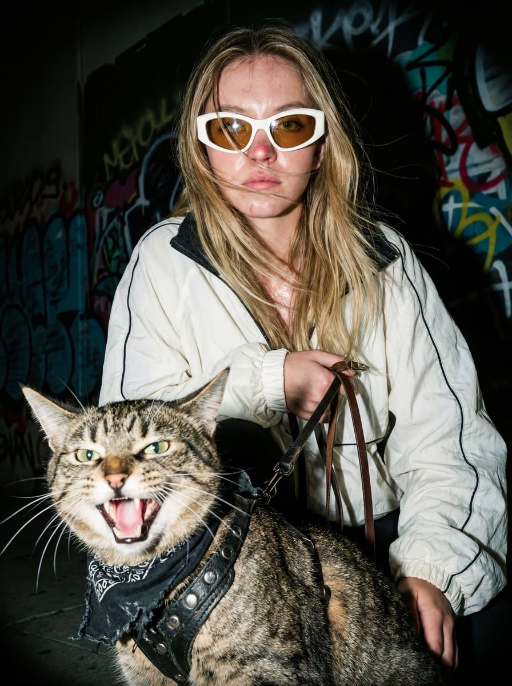

## Use the uploaded image as a reference for the character.

- ID: trending-2011248143925723306
- Slug: trending-2011248143925723306-en
- 语言: en
- 来源: [来源链接](https://x.com/ZaraIrahh/status/2011248143925723306)
- 样例图路径: images/part1/2011248143925723306_1.jpg

### 提示词

```text
Use the uploaded image as a reference for the character. Create a sweet, cute, youthful-looking girl with a relaxed, languid posture and expressive emotions.
She is holding a large bouquet of flowers wrapped in kraft paper, She is surrounded by many green plants. The image should feel tactile, immersive, and atmospheric, with a sense of surreal sophistication and subtle motion blur. The girl has soft dark brown hair styled naturally, with an asymmetrical composition, glancing left and right,and her hairstyle should enhance the mood. Her makeup is sweet and natural, facial features delicate and realistic.
Lighting should be soft, warm and a lamp orange bulb behind her creates softly orange, with nuanced shadows, creating a warm light on her hair, head and on her face, comforting atmosphere. Clothing should feel casual and realistic, and her pose should be natural and coordinated, conveying a relaxed, comfortable lifestyle. She wears silver hoop earrings.
```

### 样例图

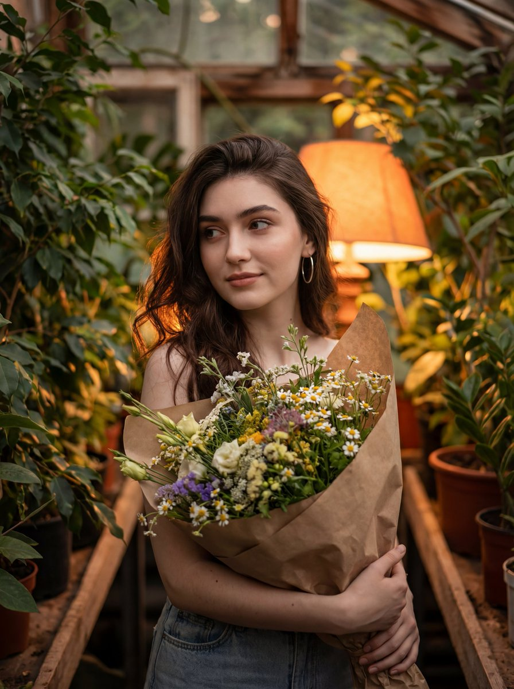

## Close-up black and white portrait of a man use image fac

- ID: trending-2009623964168098296
- Slug: trending-2009623964168098296-en
- 语言: en
- 来源: [来源链接](https://x.com/iamsofiaijaz/status/2009623964168098296)
- 样例图路径: images/part1/2009623964168098296_1.jpg

### 提示词

```text
Close-up black and white portrait of a man use image face reference with messy hair and a rough beard, staring downward with a pensive expression. A single beam of light grazes across his face, leaving the rest in deep shadow, evoking solitude and intensity.
```

### 样例图

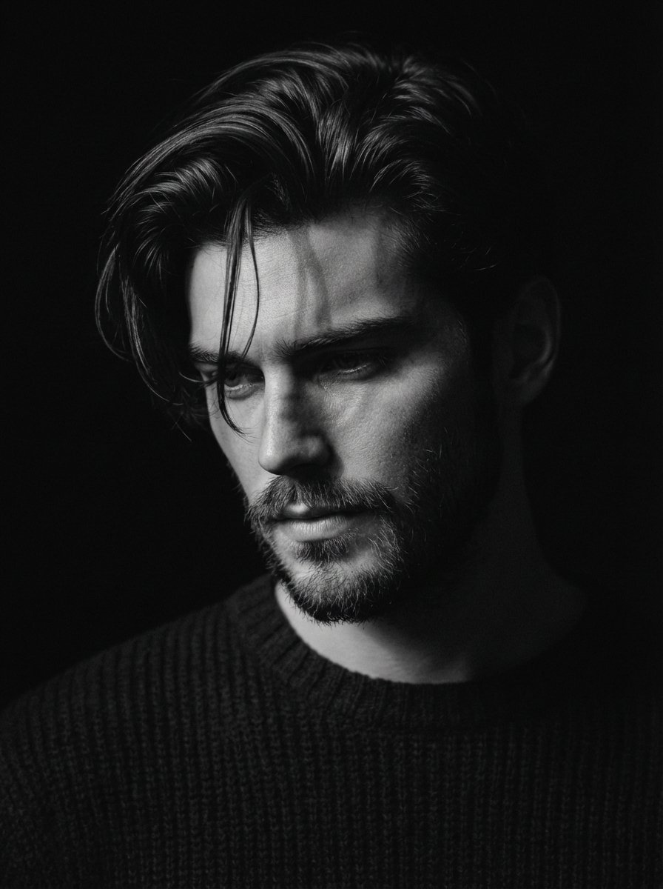

## An extreme close-up focusing on a pretty lady's face and

- ID: trending-2042586039450243514
- Slug: trending-2042586039450243514-en
- 语言: en
- 来源: [来源链接](https://x.com/oggii_0/status/2042586039450243514)
- 样例图路径: images/part1/2042586039450243514_1.jpg

### 提示词

```text
An extreme close-up focusing on a pretty lady's face and neck. She has blue eyes, she is wearing intricate silver jewelry and a sleek, middle-parted low bun with a high-shine finish. Her hair - dirty blonde hair, The makeup is "clean girl" aesthetic-dewy skin, clear gloss, and shimmering champagne eyeshadow. Dramatic rim lighting against a dark charcoal background, sharp focus on the jewelry reflections and individual hair edges.
```

### 样例图

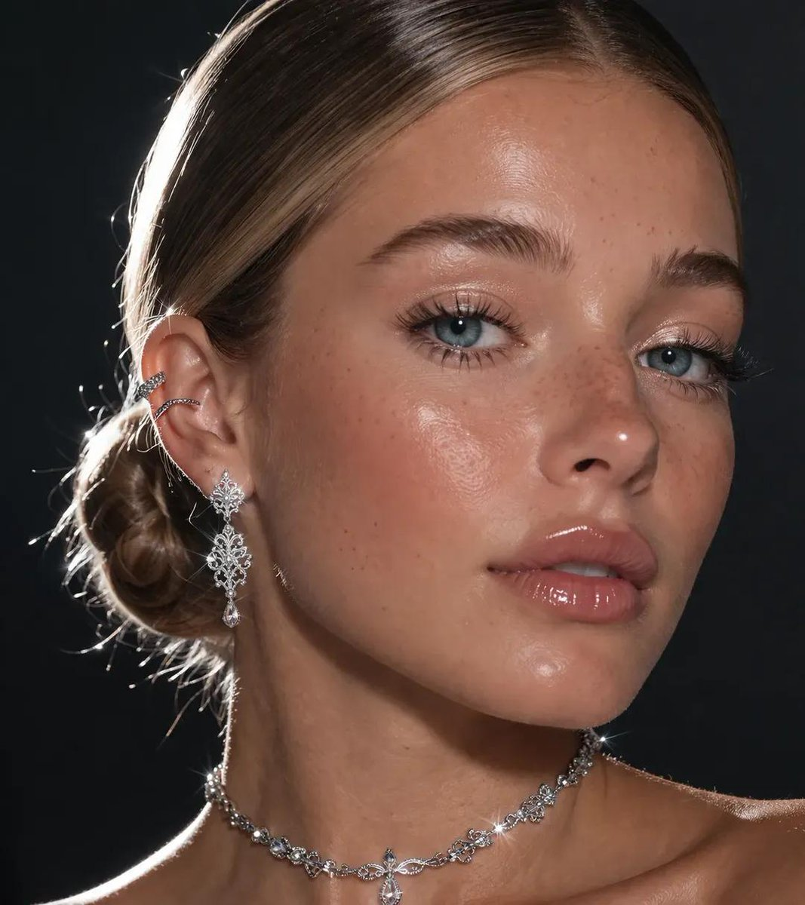

## Transform the original photo into a dramatic, photoreali

- ID: trending-2019833999154376925
- Slug: trending-2019833999154376925-en
- 语言: en
- 来源: [来源链接](https://x.com/Ankit_patel211/status/2019833999154376925)
- 样例图路径: images/part1/2019833999154376925_1.jpg

### 提示词

```text
Transform the original photo into a dramatic, photorealistic, ultra-detailed set of 4 styles characters are included , each a mid close up wide-angle shot with an extreme, dynamic camera angle complex, powerful pose in a consistent, expanded version of the original environment, with cinematic lighting, high contrast, crisp textures, and precise color grading.
```

### 样例图

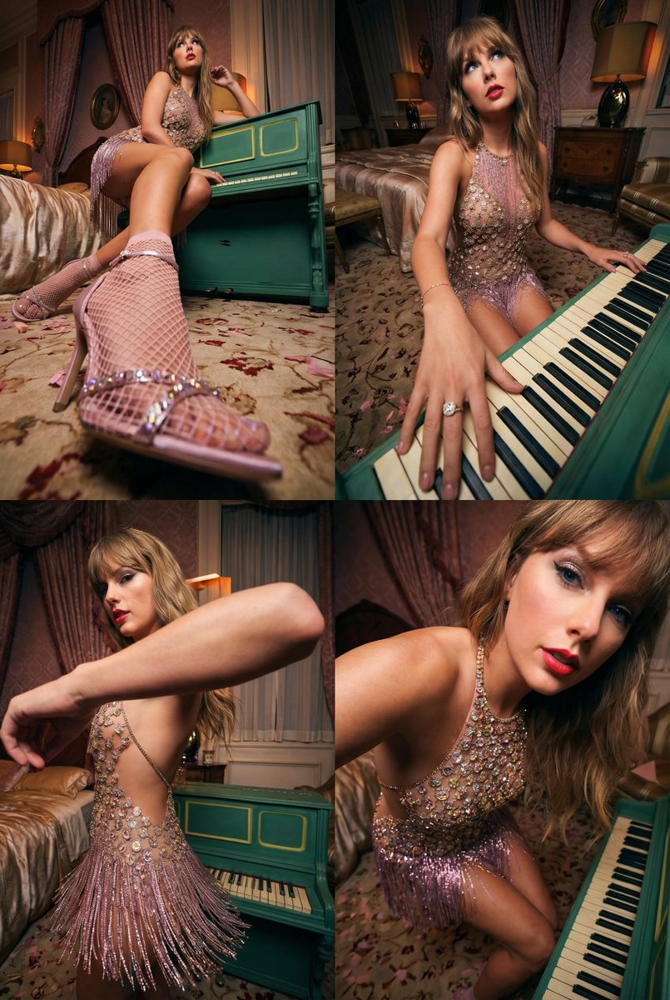

## { "Objective": "Create a cheerful lifestyle portrait set

- ID: trending-2009462964206882926
- Slug: trending-2009462964206882926-en
- 语言: en
- 来源: [来源链接](https://x.com/Taaruk_/status/2009462964206882926)
- 样例图路径: images/part1/2009462964206882926_1.jpg

### 提示词

```text
{
  "Objective": "Create a cheerful lifestyle portrait set in a magical theme park with joyful mascot characters",
  "PersonaDetails": {
    "PrimarySubject": {
      "Type": "Young woman",
      "Pose": "Standing relaxed, holding a takeaway coffee cup with both hands",
      "Expression": "Warm smile, cheerful and relaxed",
      "Style": "Casual lifestyle look"
    },
    "MascotCharacters": [
      {
        "Type": "Tall grey rabbit mascot",
        "Interaction": "Hugging the woman from behind",
        "Emotion": "Joyful, playful"
      },
      {
        "Type": "Grey cat mascot",
        "Position": "Standing at her side",
        "Emotion": "Friendly, happy"
      },
      {
        "Type": "Black duck mascot",
        "Position": "Standing on the opposite side",
        "Emotion": "Playful and welcoming"
      },
      {
        "Type": "Small brown mouse mascot",
        "Position": "Playfully posing above the group",
        "Emotion": "Energetic and mischievous"
      }
    ]
  },
  "SceneDescription": {
    "Location": "Famous theme park",
    "Background": {
      "Landmark": "Fairytale castle",
      "Treatment": "Softly blurred for depth"
    },
    "Environment": "Open plaza with a lively, family-friendly atmosphere"
  },
  "Composition": {
    "Framing": "Medium lifestyle portrait",
    "Grouping": "Centered subject surrounded by characters",
    "DepthOfField": "Shallow depth of field",
    "Focus": "Sharp focus on faces with softly blurred background"
  },
  "LightingAndColor": {
    "Lighting": "Bright natural daylight",
    "ColorPalette": "Vibrant, saturated yet balanced colors",
    "Highlights": "Soft, clean highlights enhancing cheerful mood"
  },
  "ArtDirection": {
    "Style": "High realism blended with animated character charm",
    "Aesthetic": "Playful, magical, family-friendly",
    "DetailLevel": "Ultra-detailed textures on clothing and mascot costumes"
  },
  "PhotographyStyle": {
    "Genre": "Theme park lifestyle photography",
    "CompositionStyle": "Cinematic yet candid",
    "ImageQuality": "High resolution, crisp detail"
  },
  "Mood": {
    "Tone": "Happy, welcoming, whimsical",
    "Energy": "Lighthearted, joyful, magical"
  },
  "NegativePrompt": [
    "dark mood",
    "empty background",
    "scary characters",
    "low resolution",
    "blurry faces",
    "harsh shadows",
    "desaturated colors"
  ],
  "ResponseFormat": {
    "Type": "Single image",
    "Orientation": "Portrait",
    "AspectRatio": "2:3"
  }
}
```

### 样例图

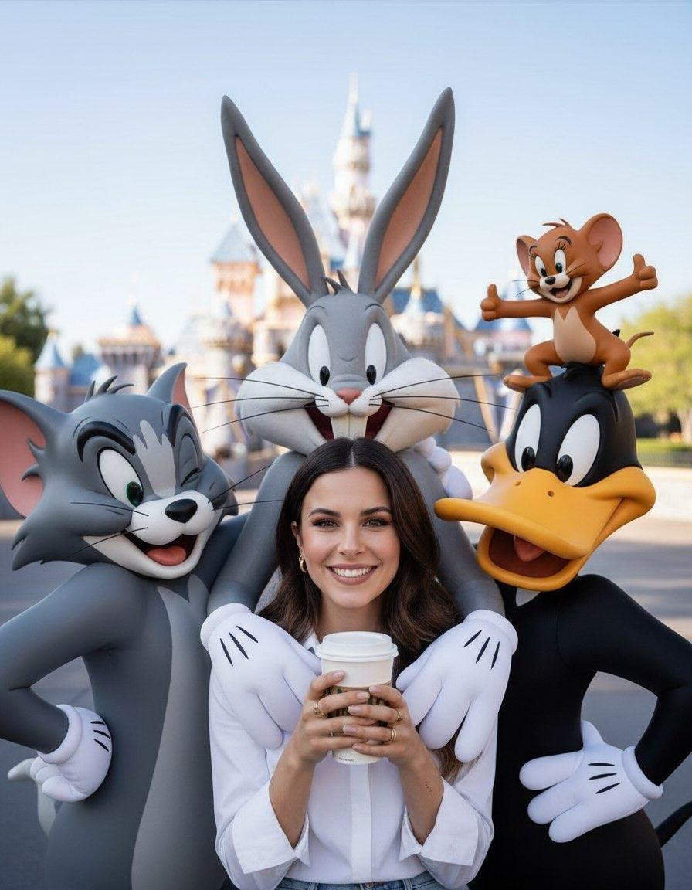

## { "prompt_type": "Ultra Photorealistic Portrait", "subje

- ID: trending-2009692941011571059
- Slug: trending-2009692941011571059-en
- 语言: en
- 来源: [来源链接](https://x.com/xIrissy/status/2009692941011571059)
- 样例图路径: images/part1/2009692941011571059_1.jpg

### 提示词

```text
{
  "prompt_type": "Ultra Photorealistic Portrait",
  "subject": {
    "demographics": "Young woman",
    "perspective": "Side profile view (facing left)",
    "appearance": {
      "skin": {
        "texture": "Hyper-realistic, wet skin texture with visible pores, natural flushed redness on cheeks",
        "details": "Multiple clear water droplets clinging to the face, white soapy foam/suds along the jawline, neck, and collarbone",
        "wetness": "A single distinct water droplet dripping from the chin"
      },
      "hair": {
        "color": "Silver / Platinum Blonde",
        "style": "Slicked back, completely wet, strands defined by water",
        "texture": "Fine, straight"
      },
      "face": {
        "eyes": "Closed, relaxed eyelids",
        "brows": "Natural, unshaped",
        "lips": "Soft, natural pink, slightly parted",
        "expression": "Serene, calm, spa-like relaxation"
      }
    }
  },
  "pose": {
    "head_position": "Turned 90 degrees to the left showing full profile",
    "body": "Shoulders bare (suggesting nudity or strapless top), neck elongated",
    "action": "Standing or sitting still while bathing/washing face"
  },
  "styling": {
    "makeup": "No makeup / fresh face aesthetic",
    "elements": "White soap suds/foam running down the neck and chest",
    "vibe": "Clean beauty, skincare campaign, raw and organic"
  },
  "environment": {
    "setting": "Minimalist studio or bathroom setting",
    "background": "Solid neutral beige / tan color",
    "details": "Clean, uncluttered, focus entirely on the subject"
  },
  "lighting": {
    "type": "Soft diffused studio lighting",
    "quality": "Even illumination, soft highlights on the wet skin and water droplets",
    "shadows": "Gentle modeling shadows under the jaw and ear",
    "direction": "Side lighting accentuating the profile"
  },
  "camera_settings": {
    "shot_type": "Close-up portrait / Headshot",
    "lens": "85mm or 105mm Macro lens",
    "aperture": "f/2.8 to f/4.0 (keeping the face sharp while softening the hair slightly)",
    "focus": "Sharp focus on the eyelashes and water droplets on the cheek",
    "shutter_speed": "1/200s (to freeze the dripping water)"
  },
  "technical_details": {
    "resolution": "8k",
    "quality_tags": [
      "Ultra-detailed",
      "Macro photography",
      "Subsurface scattering",
      "Wet skin shader",
      "Ray tracing",
      "Unreal Engine 5 render style",
      "Raw photo quality"
    ],
    "mood": "Intimate, cleansing, peaceful, sensory"
  }
}
```

### 样例图

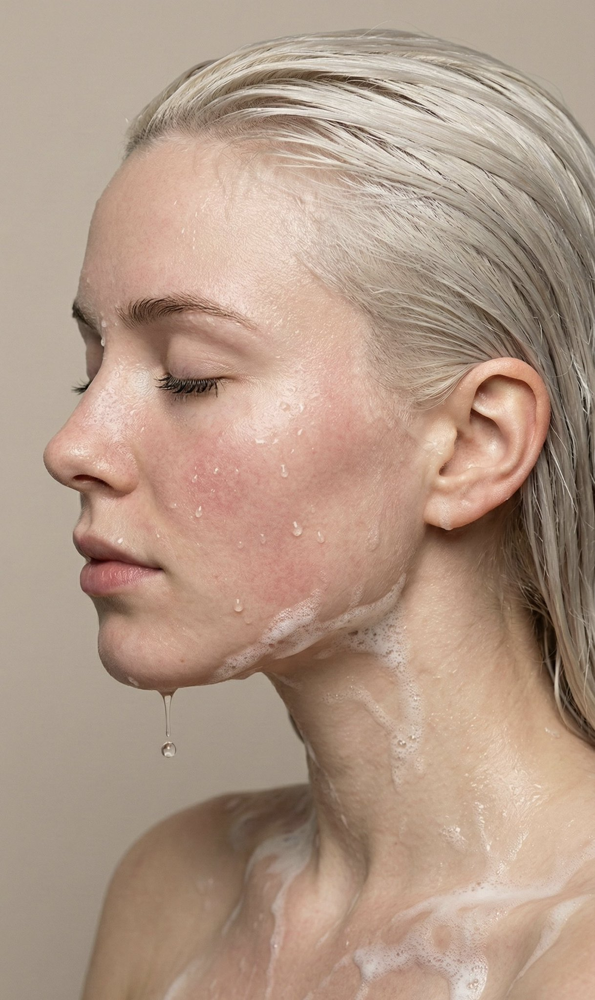

## A hyper-realistic cinematic portrait of a man with short

- ID: trending-2042467417990017141
- Slug: trending-2042467417990017141-en
- 语言: en
- 来源: [来源链接](https://x.com/rovvmut_/status/2042467417990017141)
- 样例图路径: images/part1/2042467417990017141_1.jpg

### 提示词

```text
A hyper-realistic cinematic portrait of a man with short, textured hair and a well-groomed stubble beard, captured in a dark, moody 'night mode' aesthetic. The man is sitting in a contemplative pose, hands clasped together near his chest, fingers interlaced, with his gaze directed thoughtfully off-camera to the left. He is wearing a premium black high-neck turtleneck sweater and a silver-link luxury wristwatch on his left wrist, with a simple band on his right ring finger. The lighting is dramatic and controlled: a soft rim light outlines his silhouette against an almost pitch-black, shadow-drenched background, while a subtle, soft key light illuminates his face and hands. Shallow depth of field, 85mm portrait lens, ultra-sharp focus on the man's expression and clasped hands, with the chair in the background heavily blurred into complete darkness. Minimalist, professional, editorial photography, 4:5 aspect ratio, clean composition focusing strictly on the upper torso and face.
```

### 样例图

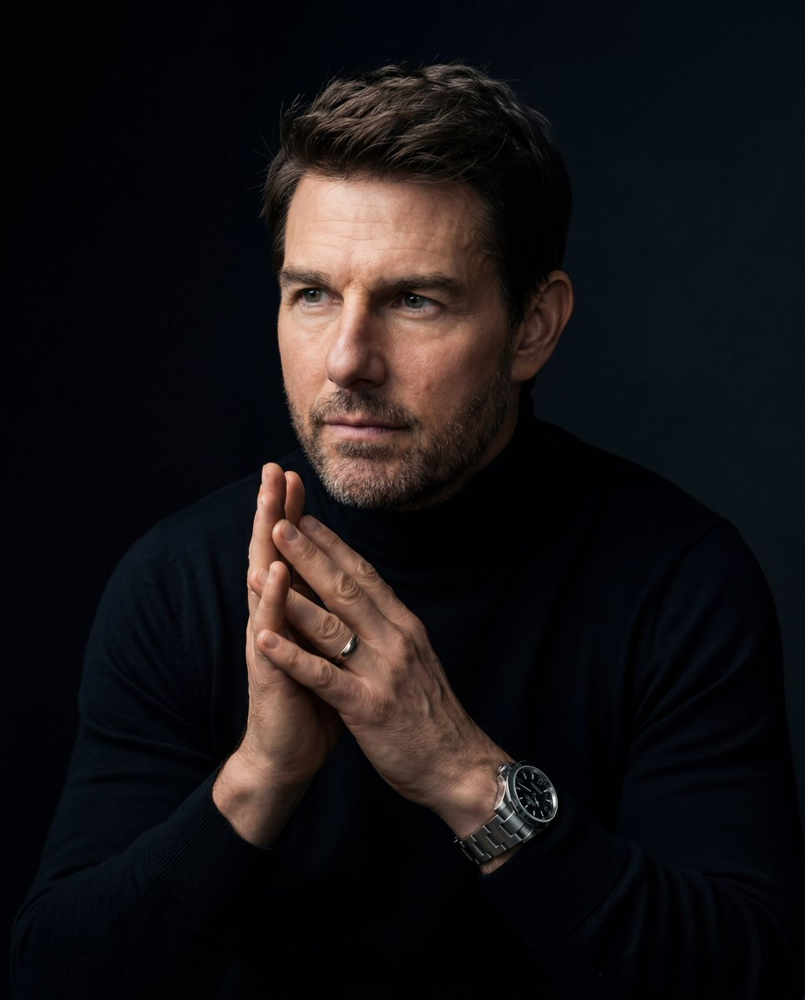

## { "image_type": "athletic flex pose editorial photograph

- ID: trending-2009861254341333164
- Slug: trending-2009861254341333164-en
- 语言: en
- 来源: [来源链接](https://x.com/cuties7377/status/2009861254341333164)
- 样例图路径: images/part1/2009861254341333164_1.jpg

### 提示词

```text
{
  "image_type":
 "athletic flex pose editorial photography",
  "visual_style": 
"high-end fitness editorial, cinematic, premium",
  "composition": {
    "framing":
 "full body, powerful stance emphasizing muscle definition",
    "camera_angle": 
"slightly low angle to enhance strength and dominance",
    "perspective": 
"cinematic perspective with strong body presence"
  },
  "subject": {
    "description": 
"athletic feminine body performing a controlled flex pose",
    "pose": 
"strong flex pose with engaged core, defined arms and legs, balanced posture",
    "body_language":
 "confident, controlled, disciplined strength",
    "expression": 
"calm, focused, effortless power"
  },
  "facial_details": {
    "emotion": "self-control, confidence",
    "micro_details": "relaxed jaw, steady eyes, natural intensity"
  },
  "wardrobe": {
    "clothing": "minimal athletic wear highlighting muscle lines",
    "textures": "matte, stretch performance fabric",
    "color_tones": "neutral, muted, dark or earthy tones"
  },
  "environment": {
    "location": "minimal indoor studio or clean gym space",
    "background": "plain, distraction-free, editorial backdrop",
    "atmosphere": "focused, intense, professional"
  },
  "lighting": {
    "type": "cinematic studio lighting",
    "quality": "high contrast with soft falloff",
    "direction": "side and rim lighting to sculpt muscles"
  },
  "color_palette": {
    "primary": ["charcoal", "warm beige", "muted skin tones"],
    "mood": "powerful, disciplined, modern"
  },
  "camera_details": {
    "lens": "35mm–50mm cinematic look",
    "focus": "sharp focus on body definition",
    "realism": "ultra-realistic, editorial quality"
  },
  "overall_mood": "quiet power, control, strength without aggression",
  "intended_use": "viral flex pose post on X (Twitter), fitness branding, editorial content"
}
```

### 样例图

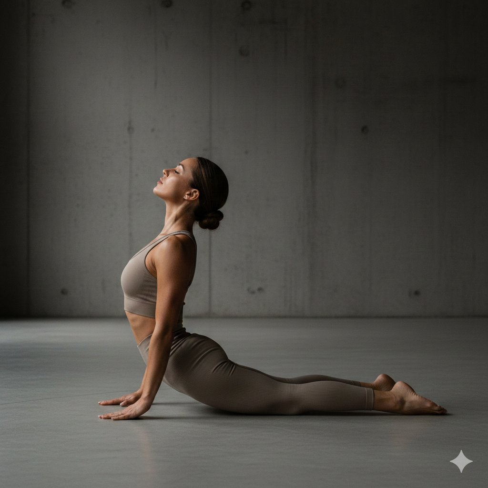

## { "meta": { "aspect_ratio": "9:16", "quality": "ultra_ph

- ID: trending-2008420516919468535
- Slug: trending-2008420516919468535-en
- 语言: en
- 来源: [来源链接](https://x.com/bananababydoll/status/2008420516919468535)
- 样例图路径: images/part1/2008420516919468535_1.jpg

### 提示词

```text
{
  "meta": {
    "aspect_ratio": "9:16",
    "quality": "ultra_photorealistic",
    "resolution": "8K",
    "camera": "iPhone front camera",
    "lens": "24mm",
    "style": "raw iphone realism, pinterest girl aesthetic, natural skin texture, zero plastic look"
  },

  "composition": {
    "concept": "frame within a frame",
    "framing": "extreme close-up face reflection inside car sun visor vanity mirror",
    "mirror_frame": {
      "material": "thick beige / cream plastic",
      "visibility": "dominant around edges of photo, slightly worn texture"
    },
    "phone_visibility": {
      "type": "iPhone",
      "detail": "partial phone edge visible on left side of mirror, controlling the shot",
      "camera_bump": "subtle, realistic"
    }
  },

  "scene": {
    "location": "inside parked car",
    "environment": [
      "dark car interior",
      "black leather seats",
      "headrest visible in reflection"
    ],
    "time": "golden hour",
    "atmosphere": "quiet, intimate, candid daily life moment"
  },

  "lighting": {
    "type": "direct golden hour sunlight",
    "direction": "sharp side sunlight from afternoon sun",
    "color_temperature": "warm golden",
    "contrast": "high",
    "effects": [
      "strong highlights on skin",
      "abstract hair shadow patterns across forehead and cheek",
      "natural light bloom on lips and eyes"
    ]
  },

  "subject": {
    "gender": "female",
    "age": "early 20s (clearly adult)",
    "ethnicity": "East Asian / mixed pale tone",

    "face_structure": {
      "shape": "soft oval",
      "cheeks": "full, youthful, slightly flushed",
      "jawline": "delicate and smooth",
      "nose": "small, straight, soft rounded tip"
    },

    "eyes": {
      "size": "large",
      "shape": "round-almond hybrid",
      "color": "grey-green / light hazel",
      "vibe": "doll-like, calm, distant",
      "lashes": "long, natural, softly separated",
      "under_eye": "subtle natural shadow for soft tired-cute look",
      "gaze": "looking directly into mirror/lens"
    },

    "lips": {
      "size": "full",
      "shape": "soft cupid’s bow",
      "color": "natural pink",
      "finish": "slightly glossy",
      "state": "relaxed, faint pout"
    },

    "skin": {
      "tone": "very pale porcelain",
      "undertone": "cool pink",
      "texture": "real skin with visible pores",
      "finish": "natural glow, no smoothing",
      "blush": "soft pink blush across cheeks and nose bridge"
    },

    "hair": {
      "color": "deep black",
      "length": "long",
      "style": "straight",
      "bangs": "full blunt bangs just above the eyes",
      "behavior": "hair framing face symmetrically, strands catching sunlight"
    },

    "makeup": {
      "style": "no-makeup makeup",
      "base": "sheer skin tint",
      "eyes": "very subtle eyeliner, emphasis on lashes",
      "cheeks": "natural pink flush",
      "lips": "clear or soft pink gloss"
    },

    "outfit": {
      "visibility": "minimal",
      "detail": "only hint of bare shoulders or thin strap visible",
      "color": "dark clothing",
      "note": "no bra visible, focus remains entirely on face"
    }
  },

  "vibe": {
    "aesthetic": [
      "pinterest girl",
      "soft doll face",
      "car mirror selfie",
      "candid",
      "raw photography"
    ],
    "mood": "quiet, slightly melancholic confidence",
    "social_feel": "looks like an accidental golden hour story shot"
  }
}
```

### 样例图

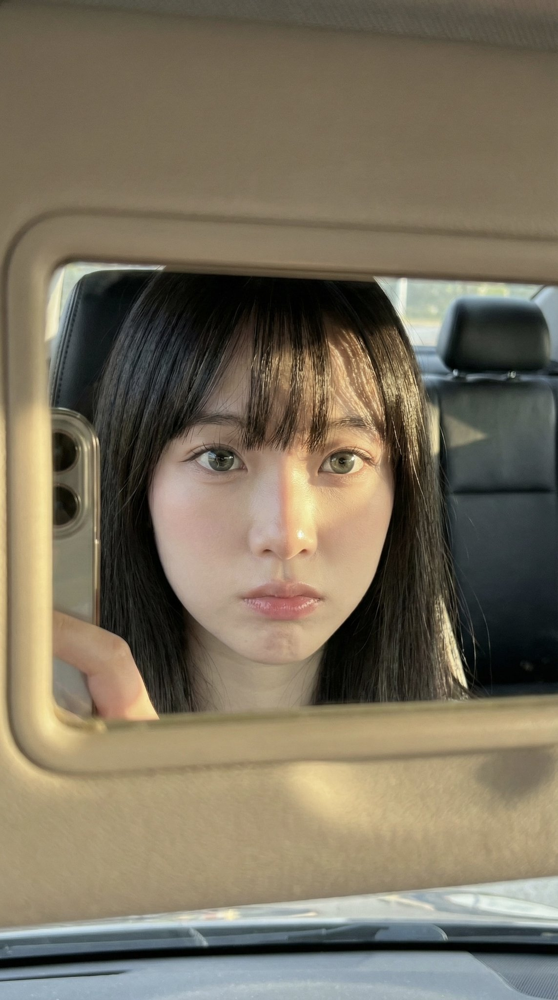

## { "request_metadata": { "version": "2.0", "priority_focu

- ID: trending-2011356173572902941
- Slug: trending-2011356173572902941-en
- 语言: en
- 来源: [来源链接](https://x.com/Adam38363368936/status/2011356173572902941)
- 样例图路径: images/part1/2011356173572902941_1.jpg

### 提示词

```text
{
  "request_metadata": {
    "version": "2.0",
    "priority_focus": "Hyper-realistic skin textures and identity fidelity",
    "aspect_ratio": "3:4"
  },
  "subject_configuration": {
    "identity": {
      "name": "the person I uploaded",
      "reference_mode": "strict_identity_matching",
      "source_reference": "uploaded_files",
      "preservation_weight": 1.0,
      "angle": "Extreme profile view"
    },
    "facial_attributes": {
      "eyes": {
        "reflection_type": "Realistic catchlights",
        "aesthetic_constraint": "Avoid synthetic gloss or excessive shine"
      },
      "lips": {
        "state": "Parted / Moist",
        "surface_texture": "Soft natural ridges",
        "finish": "Glossy sheen without distortion"
      },
      "hair": {
        "color": "Dark Brunette",
        "state": "Saturated / Wet",
        "styling": "Clumping in natural strands, adhered to temples and neck"
      }
    }
  },
  "environmental_rendering": {
    "moisture_fx": {
      "sweat_layer": "Fine glistening mist across the bridge of nose and forehead",
      "water_droplets": "Micro-droplets scattered on cheekbones and jawline",
      "surface_tension": "Realistic liquid adhesion to skin"
    },
    "lighting_and_color": {
      "lighting_style": "Soft-box diffusion",
      "temperature": "Cool tones",
      "color_palette": ["Steel Blue", "Soft Cyan", "Natural Skin Tones"],
      "background": {
        "description": "Minimalist bokeh",
        "colors": ["Light Grey", "Pure White"],
        "depth_of_field": "Shallow"
      }
    }
  },
  "technical_execution": {
    "rendering_engine": "CGI Photorealistic",
    "focal_length": "85mm macro",
    "texture_detail": "Pore-level resolution",
    "post_processing": "Raw photography style, no airbrushing"
  }
}
```

### 样例图

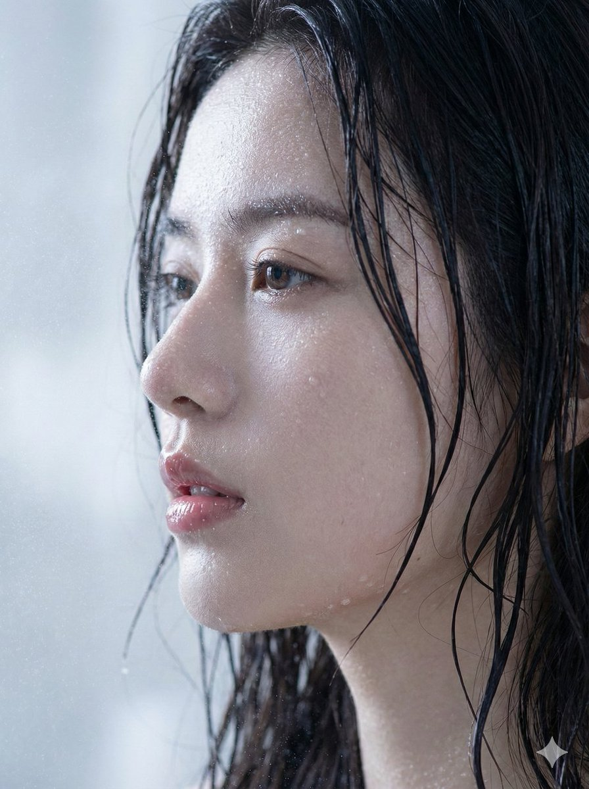

## Model looking at camera, close up of face, busy New York

- ID: trending-2034788160253960306
- Slug: trending-2034788160253960306-en
- 语言: en
- 来源: [来源链接](https://x.com/Kashberg_0/status/2034788160253960306)
- 样例图路径: images/part1/2034788160253960306_1.jpg

### 提示词

```text
Model looking at camera, close up of face, busy New York street, motion blurred people crossing frame, 200mm zoom lens
```

### 样例图

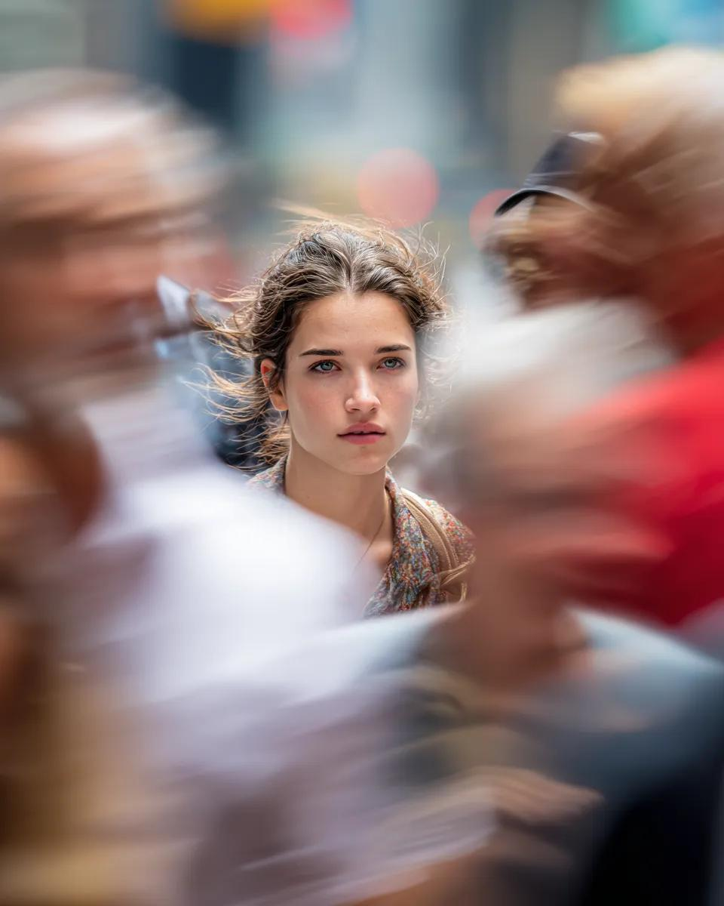

## A half-finished marble sculpture in a dusty Renaissance 

- ID: trending-2010372126348284302
- Slug: trending-2010372126348284302-en
- 语言: en
- 来源: [来源链接](https://x.com/AllaAisling/status/2010372126348284302)
- 样例图路径: images/part1/2010372126348284302_1.jpg

### 提示词

```text
A half-finished marble sculpture in a dusty Renaissance workshop, with the [SUBJECT] emerging from the raw stone block in a breathtaking moment of creation becoming conscious. The figure is rough chisel marks at the base, transitioning through refined carving into impossibly lifelike flesh at the extremities. [KEY FEATURES] have achieved full life while the torso remains trapped in stone, mid-escape. Marble dust swirls in shaft lighting as if the awakening itself is generating atmosphere. The [SUBJECT] reaches forward, fingers transitioning from carved to living. Sculptor's tools scattered on wooden platforms: chisels, mallets, calipers, clay maquettes. Unfinished companion pieces watch from the shadows. The Pygmalion moment frozen. Cathedral-height workshop windows casting dramatic god-rays, cool marble tones warming to flesh, 8K, Bernini meets cinema.   
```

### 样例图

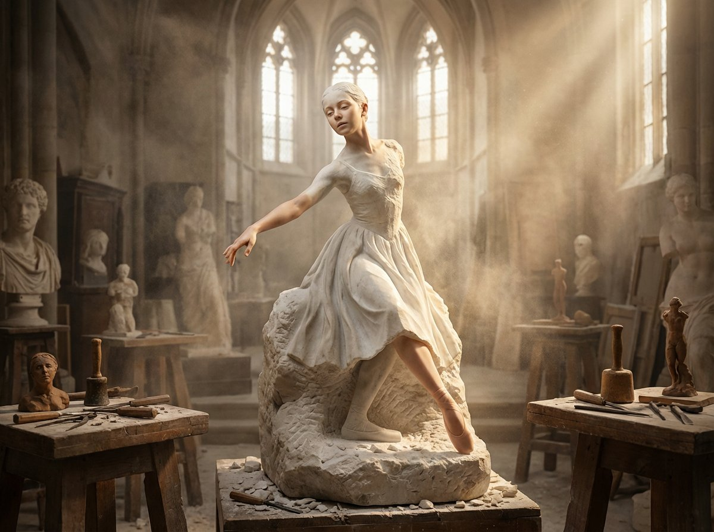

## A high-definition, cinematic portrait of a sharp, handso

- ID: trending-2017274761660051786
- Slug: trending-2017274761660051786-en
- 语言: en
- 来源: [来源链接](https://x.com/iamsofiaijaz/status/2017274761660051786)
- 样例图路径: images/part1/2017274761660051786_1.jpg

### 提示词

```text
A high-definition, cinematic portrait of a sharp, handsome young man with wavy dark hair, wearing a tailored tan/beige suit over a crisp white button-down shirt. He is standing in front of a glowing, golden neon ring that provides a halo effect. The background is dark and moody with subtle smoke or atmospheric mist. Photorealistic, 8k resolution, sharp focus on facial features, elegant lighting, and professional studio aesthetic.
```

### 样例图

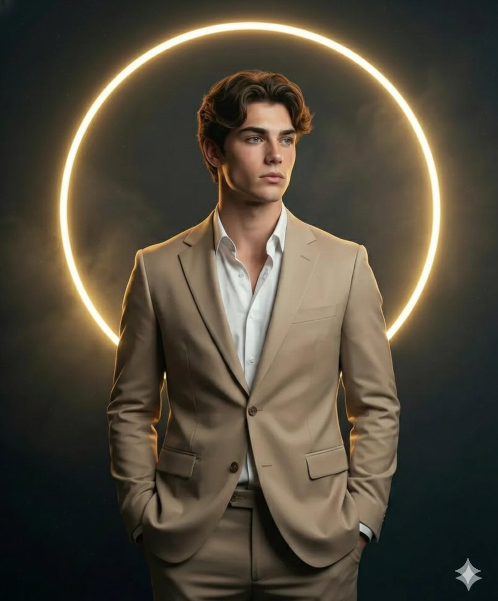

## { "style": "ultra-realistic celebrity portrait, soft rom

- ID: trending-2012152968796049803
- Slug: trending-2012152968796049803-en
- 语言: en
- 来源: [来源链接](https://x.com/Adam38363368936/status/2012152968796049803)
- 样例图路径: images/part1/2012152968796049803_1.jpg

### 提示词

```text
{
  "style": "ultra-realistic celebrity portrait, soft romantic photography",
  "subject": {
    "identity": "based on uploaded reference",
    "gender": "female",
    "age": "young adult",
    "pose": "tilting head slightly to the side, looking up at camera through lashes, playful and cute posture",
    "expression": "pouting lips, acting cute, puppy eyes, innocent look, 'sajiao' vibe",
    "facial_details": {
      "eyes": "big imploring eyes, looking up, soft gaze",
      "mouth": "pouted lips, slight pout",
      "cheeks": "faint blush",
      "freckles": "visible natural freckles across nose and cheeks",
      "makeup": {
        "skin": "dewy natural finish",
        "lips": "glossy pink",
        "eyes": "doe-eyed makeup"
      }
    },
    "hair": {
      "color": "jet black",
      "length": "long",
      "style": "straight, soft texture, falling over one shoulder"
    },
    "outfit": {
      "dress": "black fitted dress with deep plunging V-neckline",
      "jewelry": {
        "earrings": "long dangling gold chain earrings",
        "necklaces": "layered gold necklaces with a small heart pendant"
      }
    }
  },
  "environment": {
    "setting": "soft studio setting",
    "background": "creamy soft focus background, blurred"
  },
  "lighting": {
    "type": "soft diffused light",
    "mood": "romantic, sweet, charming",
    "tone": "warm peach and cream tones"
  },
  "camera": {
    "shot_type": "close-up portrait",
    "angle": "slightly high angle (to emphasize big eyes)",
    "focus": "sharp focus on eyes",
    "lens": "85mm f/1.4"
  },
  "quality": {
    "resolution": "8k",
    "texture": "realistic skin texture",
    "aesthetic": "k-pop aesthetic influence, soft dreamy style"
  }
}
```

### 样例图

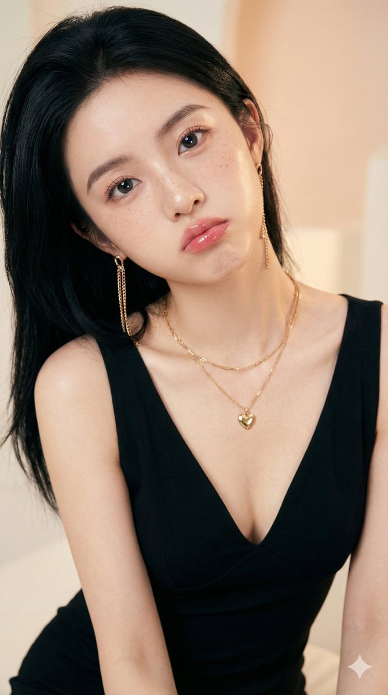

## A cinematic fantasy scene inside a cozy artist’s studio.

- ID: trending-2020317156085494141
- Slug: trending-2020317156085494141-en
- 语言: en
- 来源: [来源链接](https://x.com/iamsofiaijaz/status/2020317156085494141)
- 样例图路径: images/part1/2020317156085494141_1.jpg

### 提示词

```text
A cinematic fantasy scene inside a cozy artist’s studio. A young female painter wearing a paint-stained apron sits at an easel, holding a brush mid-air, gazing calmly at her canvas. From the canvas, a majestic Eastern-style dragon emerges in three dimensions, its scales painted in deep teal and blue hues, with flowing fiery orange flames along its mane and head, smoke curling upward. The dragon appears alive yet artistic, as if formed from brushstrokes and paint. Soft natural daylight filters through a window with sheer curtains, illuminating jars of brushes, paints, and art supplies scattered across the wooden workspace. Warm, realistic lighting, shallow depth of field, ultra-detailed textures, magical realism, fantasy realism style, 8k quality, highly detailed, cinematic composition, soft color grading, whimsical yet serene mood.
```

### 样例图

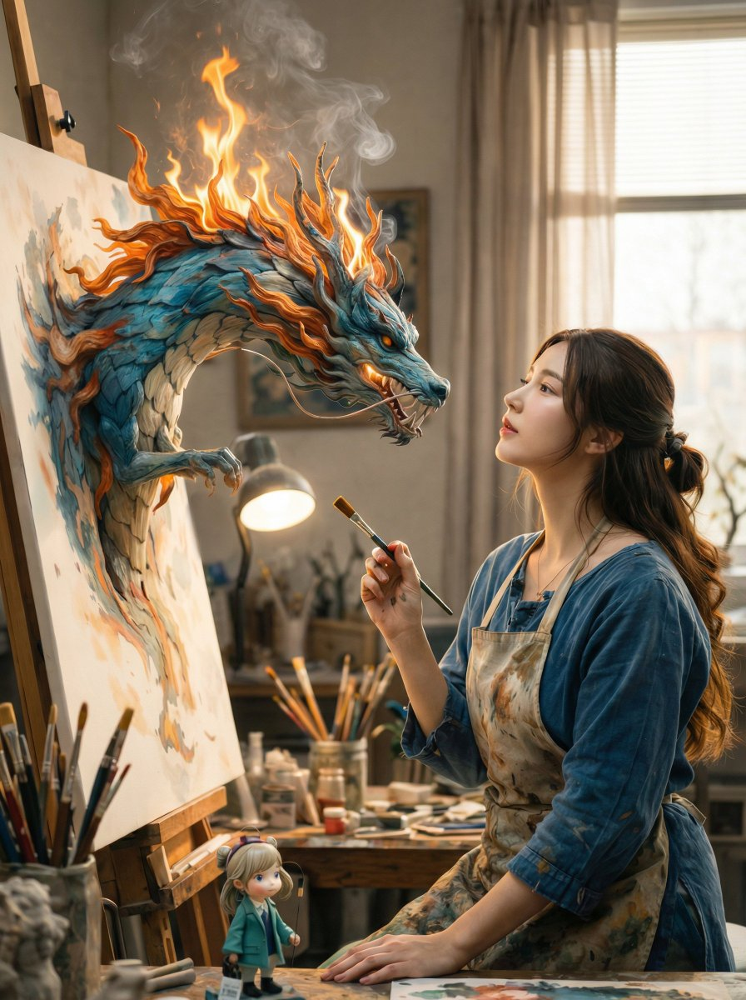

## A highly detailed, cinematic portrait of Tom Cruise, fea

- ID: trending-2028499516119453886
- Slug: trending-2028499516119453886-en
- 语言: en
- 来源: [来源链接](https://x.com/rovvmut_/status/2028499516119453886)
- 样例图路径: images/part1/2028499516119453886_1.jpg

### 提示词

```text
A highly detailed, cinematic portrait of Tom Cruise, featuring a gritty, industrial aesthetic. He has messy, spiked dark-blonde hair, facial stubble, and a look of intense, weary focus. He is captured in a close-up shot, holding a lit cigarette to his mouth with his right hand; a thick trail of white smoke curls upward. On his finger is a prominent silver signet ring engraved with a luxury interlocking "GG" logo. The man wears a distressed, dark red leather jacket heavily marked with white paint splatters and deep creases, layered over a filthy, stained cream-colored canvas apron. The center of the frame features the word [GUCCI] in a clean, white, authoritative serif font. Below it, in smaller text on the apron, is the phrase "IS AI STILL JUST A PLAYTHING?" followed by a second, faded "GUCCI" logo. The background is a blurred industrial laboratory or "soap factory" setting. To the right are stacks of translucent pink rectangular soap blocks. In the upper background, dark industrial machinery and hanging wires are illuminated by glowing red horizontal neon lights, creating a moody, high-contrast atmosphere. The entire image has a heavy film grain, a hazy atmosphere, and a color palette dominated by deep reds, pale pinks, and grimy earth tones.
```

### 样例图

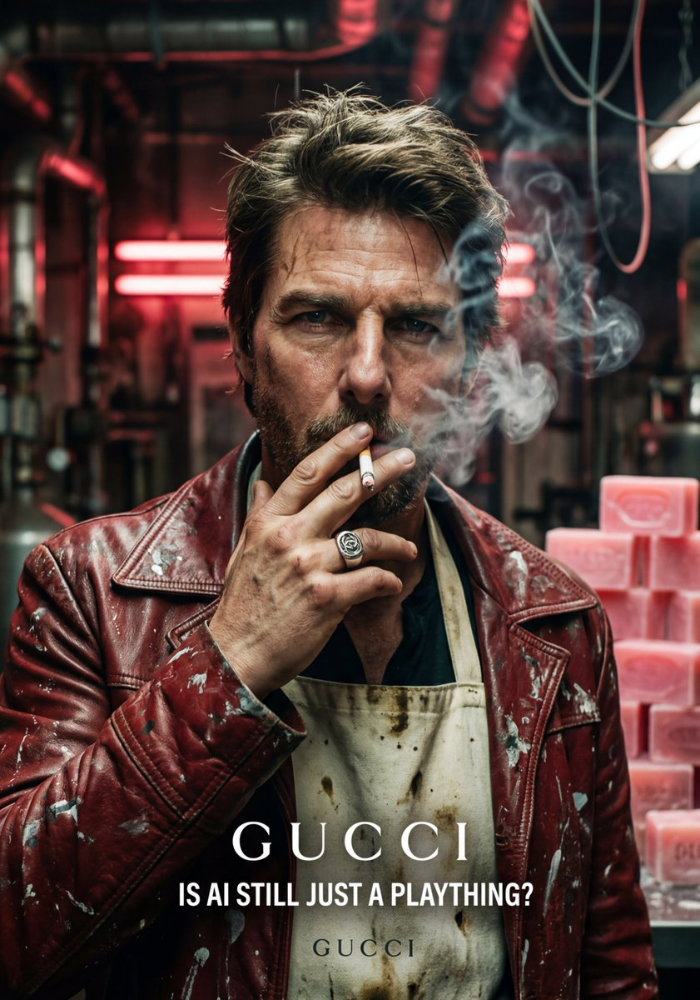

## Ultra-realistic cinematic portrait of a young woman with

- ID: trending-2026212158548369776
- Slug: trending-2026212158548369776-en
- 语言: en
- 来源: [来源链接](https://x.com/Kashberg_0/status/2026212158548369776)
- 样例图路径: images/part1/2026212158548369776_1.jpg

### 提示词

```text
Ultra-realistic cinematic portrait of a young woman with soft brown hair, centered composition, dark moody background, dramatic horizontal strip of warm golden sunlight cutting across her eyes, teal and orange color grading, half of the face in deep shadow, intense eye contact, sharp facial details, soft skin texture, high contrast lighting, volumetric light beam effect, shallow depth of field, 85mm lens, f/1.8, studio quality, symmetrical framing, mysterious atmosphere, 4K, hyper-detailed.
```

### 样例图

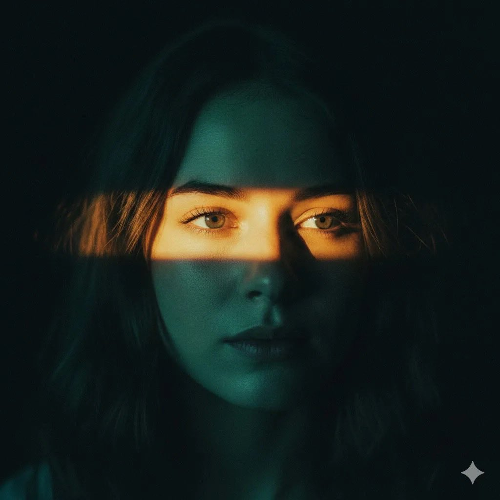

## Ultra-wide-angle hyper-realistic top-down flat lay photo

- ID: trending-2017847584115548498
- Slug: trending-2017847584115548498-en
- 语言: en
- 来源: [来源链接](https://x.com/Arminn_Ai/status/2017847584115548498)
- 样例图路径: images/part1/2017847584115548498_1.jpg

### 提示词

```text
Ultra-wide-angle hyper-realistic top-down flat lay photography. The central focus is a custom physical conference table meticulously shaped like [SHAPE/NUMBER/SYMBOL].

The table features [MATERIAL/TEXTURE/COLOR] and placed on a [FLOOR COLOR] floor, creating significant negative space around it for a clean, minimalist composition. A group of [NUMBER] real people are sitting around the edges of this [SHAPE]-shaped table. [POSITIONING: e.g., 3 on each side, 1 top/bottom]

Actions: [DESCRIBE PEOPLE'S ACTIONS, e.g., working on laptops, drinking coffee].
Lighting & Quality: Professional studio lighting with crisp, distinct drop shadows that define the [SHAPE] silhouette on the floor. 8k resolution, sharp focus, cinematic commercial aesthetic.
```

### 样例图

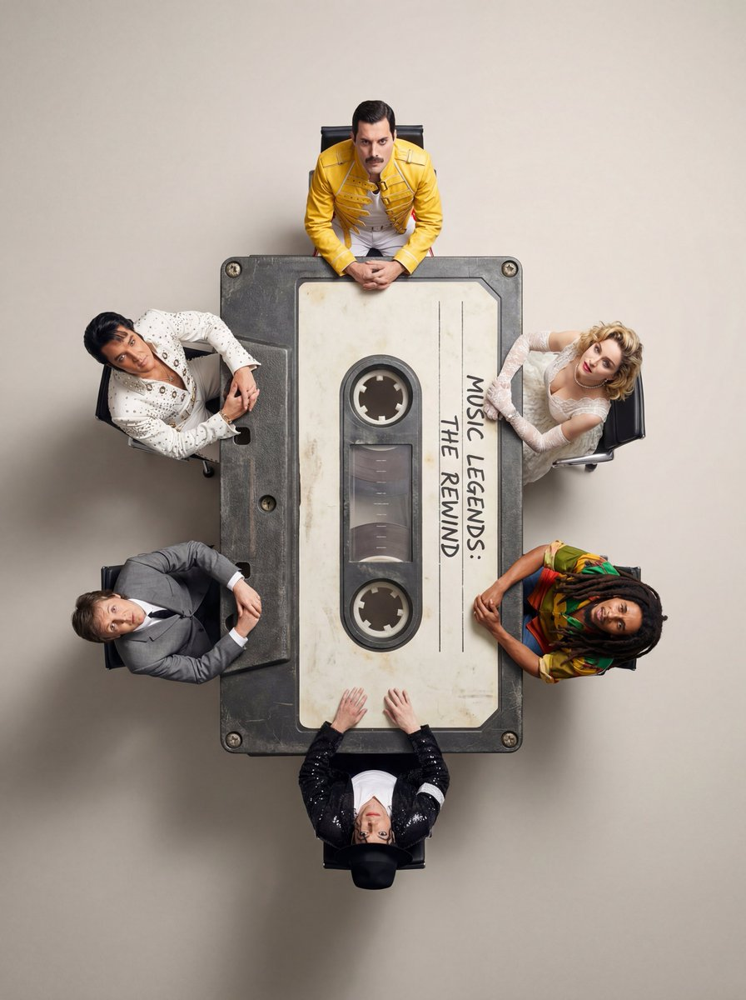

## { "render_goal": "Natural cinematic garden portrait with

- ID: trending-2007722778032484576
- Slug: trending-2007722778032484576-en
- 语言: en
- 来源: [来源链接](https://x.com/hoor_world06/status/2007722778032484576)
- 样例图路径: images/part1/2007722778032484576_1.jpg

### 提示词

```text
{
  "render_goal": "Natural cinematic garden portrait with timeless elegance",
  "subject": {
    "pose": "female standing naturally on a garden path, relaxed posture",
    "expression": "calm composed confidence with a genuine soft smile"
  },
  "wardrobe": "elegant silk chiffon gown in muted sage or soft ivory, minimal drape, realistic fabric weight, subtle movement, no shimmer, no fantasy elements",
  "environment": {
    "location": "lush botanical garden in daylight",
    "props": "realistic flowers and greenery, natural sunlight filtering through leaves, gentle shadows, earthy tones, organic depth of field"
  },
  "camera_style": "cinematic photography, 50mm lens look, shallow depth of field, natural skin texture, realistic color grading, film-like softness"
}
```

### 样例图

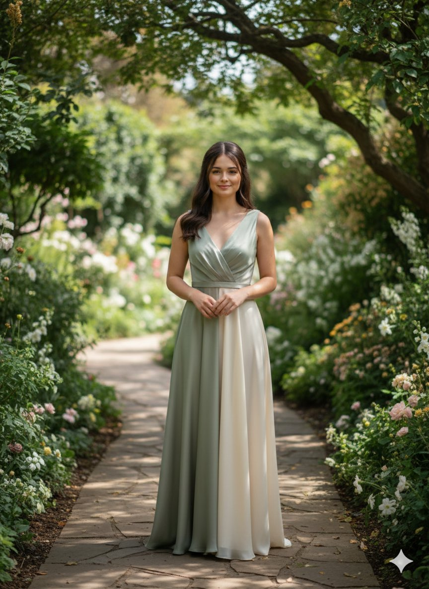

## Transform the uploaded logo into a realistic urban wall 

- ID: trending-2044599335221104970
- Slug: trending-2044599335221104970-en
- 语言: en
- 来源: [来源链接](https://x.com/Goodmanprotocol/status/2044599335221104970)
- 样例图路径: images/part1/2044599335221104970_1.jpg

### 提示词

```text
Transform the uploaded logo into a realistic urban wall scene where the logo silhouette is revealed through layers of torn posters. The logo must keep its exact shape and proportions, appearing as if multiple posters have been ripped away over time, exposing the shape naturally within the layered paper textures.

Material details:
Multiple overlapping poster layers with different colors, prints, and paper types.
Ripped edges with fibrous texture, curls, and torn fragments.
Aged paper with fading, stains, glue residue, and slight peeling.
Some areas showing older layers beneath, creating depth.

Physics behavior:
Paper tearing should look natural — irregular edges, varying thickness, partial detachment.
Edges curling outward due to humidity and time.
Glue holding some sections while others peel away.
Layer separation revealing deeper textures gradually.

Surface interaction:
Rough concrete or plaster wall beneath the posters.
Glue marks and residue where posters were attached.
Cracks, dirt, and weathering visible on exposed wall areas.

Environment:
Urban street setting - alley wall or city corner.
Hints of surrounding posters, graffiti, or wear.
No overly clean or staged look.

Lighting:
Natural daylight or soft urban lighting.
Shadows inside torn layers creating depth.
Subtle highlights on curled paper edges.

Atmosphere:
Raw.
Layered.
Time-worn.
Authentic street texture.

Camera & composition:
Straight-on or slightly angled close-up view.
Logo clearly visible through torn layers.
Depth emphasized through overlapping paper textures.

Format:
Aspect ratio: STRICT 4:5 vertical.
No text overlays.

Style:
Hyper-real urban surface photography.
Physically accurate material aging and layering.
```

### 样例图

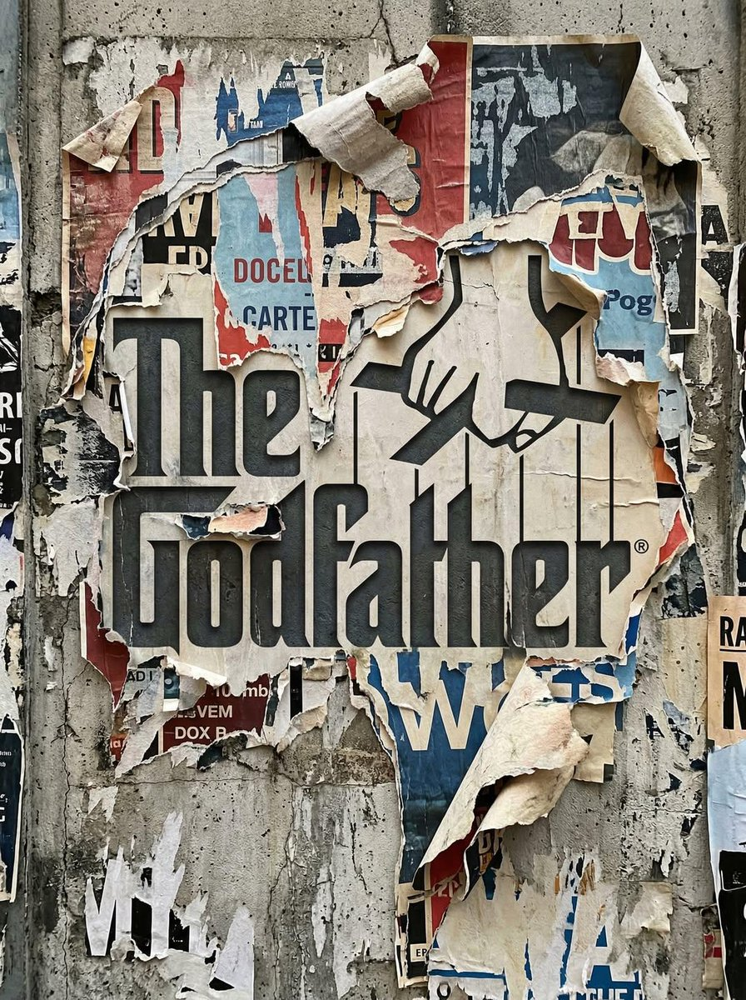

## { "Objective": "Generate a cinematic, photorealistic por

- ID: trending-2008379371405668478
- Slug: trending-2008379371405668478-en
- 语言: en
- 来源: [来源链接](https://x.com/Taaruk_/status/2008379371405668478)
- 样例图路径: images/part1/2008379371405668478_1.jpg

### 提示词

```text
{
  "Objective": "Generate a cinematic, photorealistic portrait inspired by a winter forest atmosphere",
  "PersonaDetails": {
    "Subject": "Young woman",
    "Appearance": {
      "Hair": "Long, wavy dark brown hair, slightly windblown",
      "Eyes": "Light blue",
      "Skin": "Fair with natural freckles",
      "Expression": "Soft, introspective, slightly wistful"
    },
    "Clothing": {
      "Outerwear": "Dark brown wool coat",
      "Accessories": "Knitted scarf in neutral tones"
    }
  },
  "SceneDescription": {
    "Environment": "Snowy forest with soft-focus evergreen trees",
    "Weather": "Gentle snowfall",
    "Season": "Winter",
    "Mood": "Quiet, cinematic, melancholic, ethereal"
  },
  "PhotographyStyle": {
    "Type": "Cinematic portrait photography",
    "Lighting": "Soft natural light, overcast winter lighting",
    "DepthOfField": "Shallow depth of field with creamy bokeh",
    "CameraAngle": "Three-quarter profile, subject looking back over shoulder",
    "Resolution": "Ultra high resolution, sharp facial details"
  },
  "ArtDirection": {
    "ColorPalette": "Muted earth tones, cool greens and soft whites",
    "Texture": "Natural skin texture, visible snow particles",
    "RealismLevel": "Highly photorealistic"
  },
  "NegativePrompt": [
    "cartoon",
    "anime",
    "overly smooth skin",
    "harsh lighting",
    "blurry face",
    "distorted anatomy",
    "oversaturated colors"
  ],
  "ResponseFormat": {
    "Type": "Single image",
    "Orientation": "Portrait",
    "AspectRatio": "2:3"
  }
}
```

### 样例图

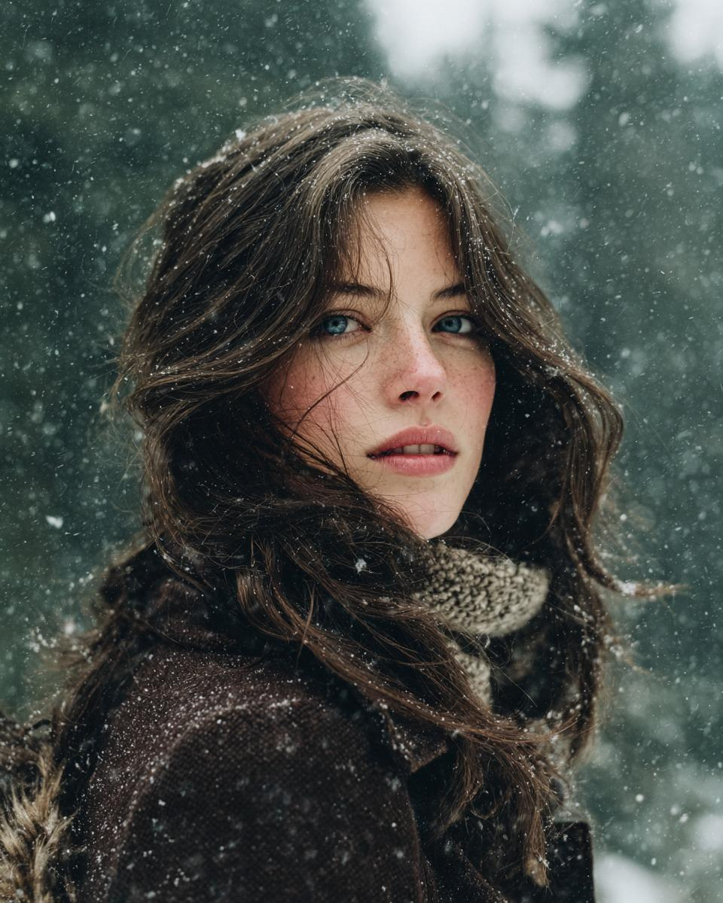

## A moody, urban portrait of me standing under a desolate 

- ID: trending-2019239504922784189
- Slug: trending-2019239504922784189-en
- 语言: en
- 来源: [来源链接](https://x.com/harboriis/status/2019239504922784189)
- 样例图路径: images/part1/2019239504922784189_1.jpg

### 提示词

```text
A moody, urban portrait of me standing under a desolate concrete overpass, the harsh architectural lines framing a lone figure. I'm wear ing an oversized white t-shirt and loose dark pants, hands in pockets, a relaxed posture. The ground is rough, textured concrete, with hints of dampness. Cinematic top lighting with deep shadows and rich tex ture, emphasizing the starkness of the environment.

Shot on 35mm, f/2.8, ISO 400, 1/125s. Apply Fuji Classic Chrome preset with warm highlights, strong contrast, slight desaturation, light film grain, and soft vignette for a nostalgic, поп-blue tone look.
```

### 样例图

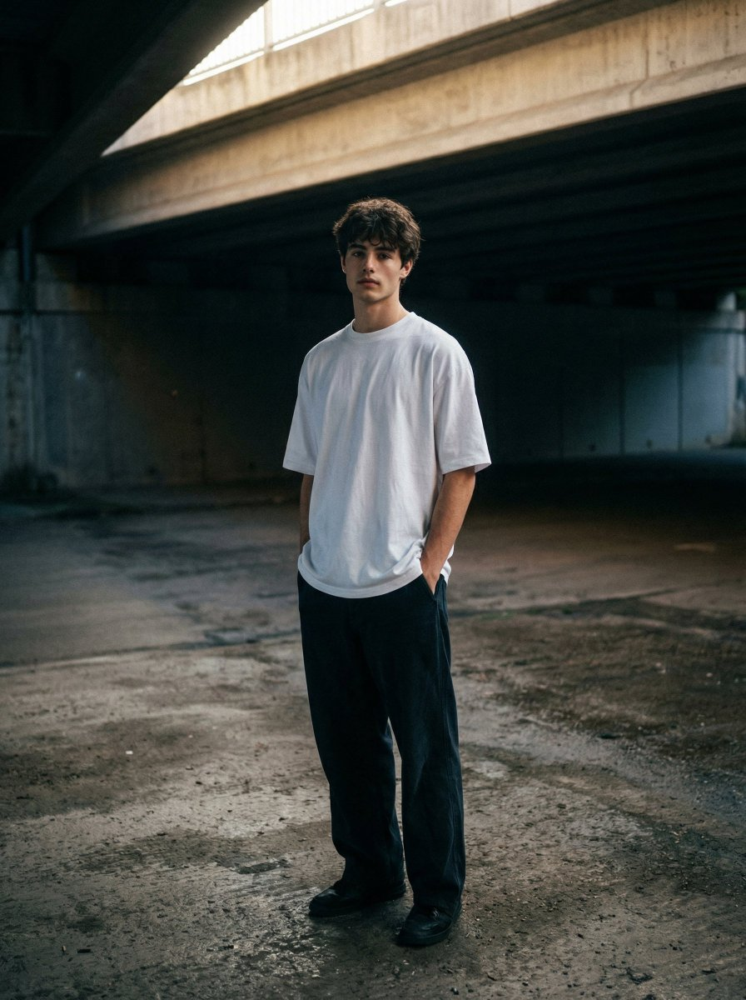

## { "Objective": "Create a 3x3 Instagram-style grid of low

- ID: trending-2036461032651235759
- Slug: trending-2036461032651235759-en
- 语言: en
- 来源: [来源链接](https://x.com/craftian_keskin/status/2036461032651235759)
- 样例图路径: images/part1/2036461032651235759_1.jpg

### 提示词

```text
{
  "Objective": "Create a 3x3 Instagram-style grid of low-quality smartphone photos featuring the same extremely beautiful blonde woman traveling in Rome, capturing iconic landmarks with a natural, unfiltered aesthetic.",
  "Composition": {
    "layout": "3x3 grid",
    "aspect_ratio": "1:1",
    "framing": "each square is a different candid moment, forming a cohesive Instagram profile layout"
  },
  "Subject": {
    "type": "young woman",
    "appearance": {
      "hair": "blonde",
      "beauty": "extremely beautiful, natural attractiveness",
      "skin": "realistic skin texture, no glossiness, no smoothing",
      "makeup": "minimal, natural look",
      "expression": "candid, relaxed, travel lifestyle expressions"
    },
    "consistency": "same woman across all 9 photos"
  },
  "Scenes": [
    {
      "position": "top left",
      "location": "Colosseum",
      "pose": "standing casually, looking away"
    },
    {
      "position": "top center",
      "location": "Pantheon",
      "pose": "walking or mid-step candid"
    },
    {
      "position": "top right",
      "location": "Trevi Fountain (Love Fountain)",
      "pose": "throwing coin or smiling softly"
    },
    {
      "position": "middle left",
      "location": "Vatican Obelisk (St. Peter’s Square)",
      "pose": "looking up at architecture"
    },
    {
      "position": "middle center",
      "location": "Sistine Chapel",
      "pose": "looking upward, subtle awe expression"
    },
    {
      "position": "middle right",
      "location": "Roman city street",
      "pose": "walking candid, street lifestyle"
    },
    {
      "position": "bottom left",
      "location": "Roman cafe street",
      "pose": "sitting casually, relaxed"
    },
    {
      "position": "bottom center",
      "location": "panoramic cityscape viewpoint",
      "pose": "back facing camera, overlooking city"
    },
    {
      "position": "bottom right",
      "location": "historic Roman alley or landmark",
      "pose": "leaning or standing naturally"
    }
  ],
  "Photography": {
    "camera": "smartphone",
    "style": "Instagram casual travel",
    "quality": "intentionally low quality",
    "lighting": "natural sunlight, uneven exposure",
    "imperfections": [
      "motion blur",
      "grain/noise",
      "slight overexposure or underexposure",
      "lens distortion",
      "unbalanced framing"
    ],
    "effects": [
      "no beauty filter",
      "no skin retouching",
      "authentic dynamic range",
      "slightly washed or inconsistent colors"
    ]
  },
  "Mood": "carefree travel, European summer, candid lifestyle",
  "Rendering": {
    "style_keywords": [
      "instagram grid",
      "rome travel photos",
      "smartphone photography",
      "low quality aesthetic",
      "natural beauty",
      "tourist lifestyle"
    ],
    "realism": "highly realistic smartphone look",
    "detail_level": "natural imperfect detail",
    "aspect_ratio": "--ar 1:1"
  },
  "Response_Format": {
    "type": "image_generation_prompt_json",
    "editable_fields": [
      "scenes",
      "lighting",
      "poses",
      "wardrobe"
    ]
  }
}
```

### 样例图

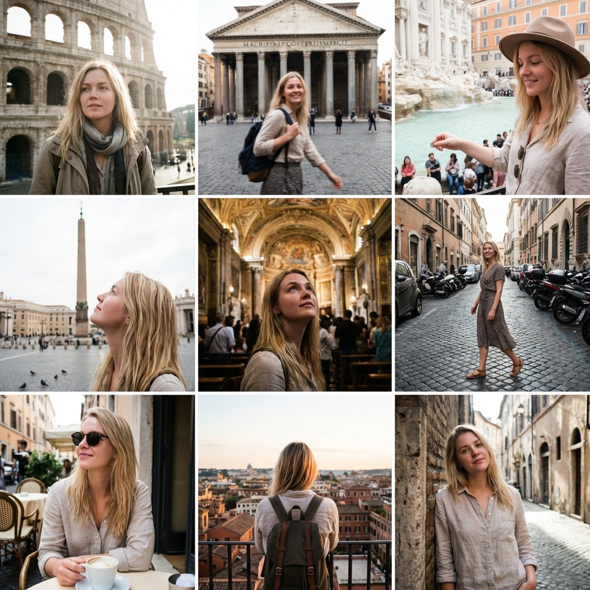

## { "Character": { "Subject": "Japanese female idol, late 

- ID: trending-2027114611636572306
- Slug: trending-2027114611636572306-en
- 语言: en
- 来源: [来源链接](https://x.com/BeautyVerse_Lab/status/2027114611636572306)
- 样例图路径: images/part1/2027114611636572306_1.jpg

### 提示词

```text
{
  "Character": {
    "Subject": "Japanese female idol, late teens to early 20s",
    "Face_and_Skin": "pure innocent face with translucent pale skin, glassy realistic skin texture with a subtle natural glow",
    "Makeup": "minimal 'no-makeup' look, very subtle soft pink blush, glossy clear lip balm",
    "Hair": "natural dark brown medium-length bob hair gently swaying in the breeze, no hat",
    "Eyes_and_Expression": "wide innocent soft eyes capturing the light, looking directly at camera with a gentle, ephemeral and pure expression",
    "Pose": "SITTING on a wooden engawa, HUGGING KNEES to chest, chin resting gracefully on knees, arms wrapped softly around shins, bare feet, relaxed and natural posture",
    "Outfit": "loose-fitting thin white linen summer dress, sleeveless, slightly translucent fabric catching the backlight, delicate collarbone visible, pure and ethereal all-white aesthetic"
  },
  "Scene": {
    "Environment": "wooden engawa (traditional Japanese veranda), traditional Japanese house with sliding glass doors open to a lush green summer garden",
    "Details": "bright white sheer curtains blowing in the background, soft green, brown, and white color palette",
    "Atmosphere": "clear summer morning breeze, nostalgic and ephemeral atmosphere, feeling the gentle summer breeze"
  },
  "Photography": {
    "Style": "Japanese idol photobook (shashin-shu), airy and transparent photography, masterpiece, best quality, photorealistic",
    "Camera_and_Lens": "Contax 645 medium format look, Carl Zeiss Planar 80mm f/2 lens, shallow depth of field, soft airy creamy bokeh, soft ethereal focus on the edges, sharp on the eyes",
    "Framing": "shot from EYE LEVEL, medium close-up framing, knee-up composition",
    "Lighting": "SOFT NATURAL DAYLIGHT, OVERCAST or DIFFUSED WINDOW LIGHT, high-key lighting (low contrast), slightly overexposed (+1 EV) for transparency, soft wrap-around light, bright square catchlights in eyes",
    "Film_Simulation_and_Color": "Fujifilm Pro 400H film simulation, pastel color grading, cool cyan-green undertones in the shadows, milky lifted blacks, soft glowing highlights without pure white clipping",
    "Effects": "fine subtle film grain (0.2), very mild vignette (0.1), soft gentle light leak from the top corner"
    "Aapect Ratio": "3:4"
  }
}
```

### 样例图

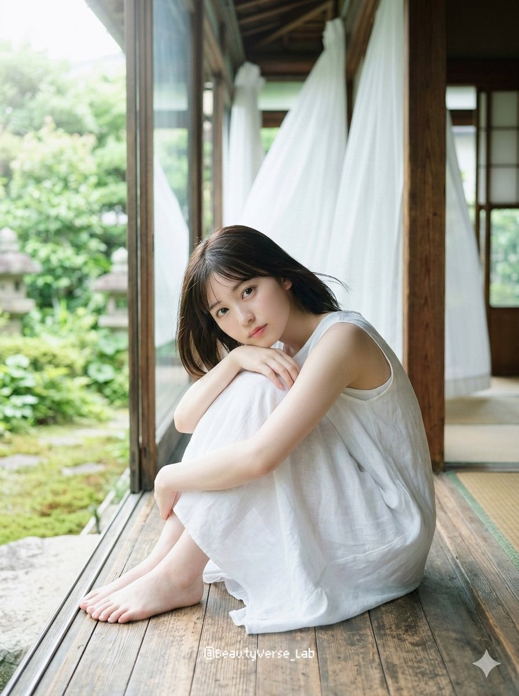

## Surrounding the realistic main subject are multiple cute

- ID: trending-2030296182745170292
- Slug: trending-2030296182745170292-en
- 语言: en
- 来源: [来源链接](https://x.com/Naiknelofar788/status/2030296182745170292)
- 样例图路径: images/part1/2030296182745170292_1.jpg

### 提示词

```text
Surrounding the realistic main subject are multiple cute, 3D-style chibi miniatures of the same person, with identical facial features, hairstyle, body proportions, and outfit. 
The chibi figures are naturally distributed around the subject, interacting playfully with her or nearby elements in a charming, non-intrusive way.

Overlay the image with vibrant, hand-drawn doodle effects: soft white outlines around the subject, playful sparkles, doodle hearts, tiny flowers, smiley icons, and floating white handwritten phrases like "shine", "bright day", and "happy".

The style seamlessly blends hyper-realistic photography with colorful, soft cartoon illustrations.
Keep the original face, body shape, and proportions of the main subject unchanged. aspect ratio 2:3
```

### 样例图

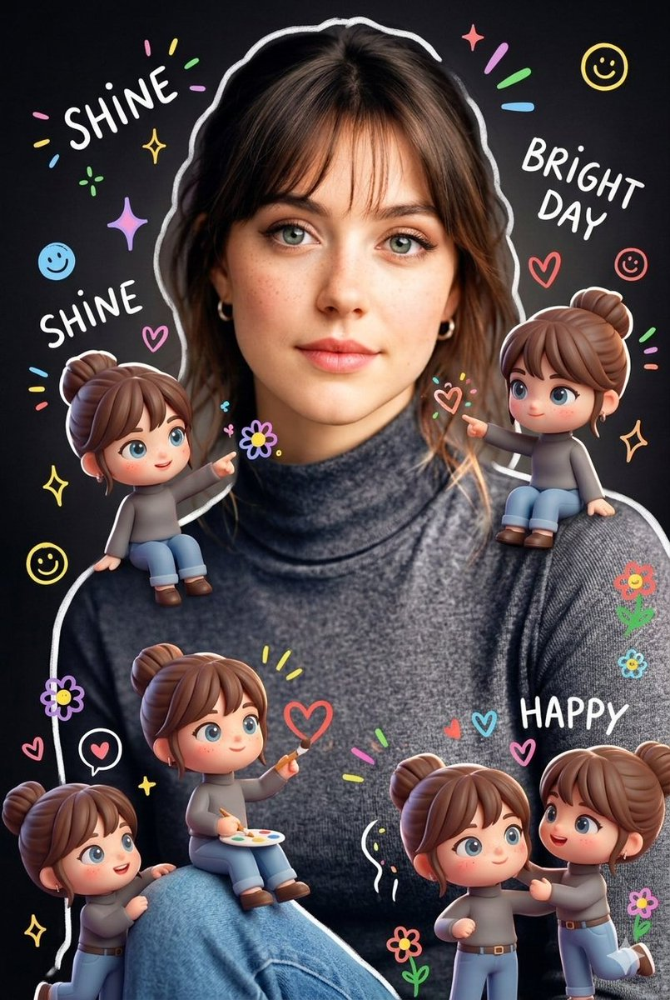

## A cinematic street portrait of a young woman standing st

- ID: trending-2009484351873151176
- Slug: trending-2009484351873151176-en
- 语言: en
- 来源: [来源链接](https://x.com/ChillaiKalan__/status/2009484351873151176)
- 样例图路径: images/part1/2009484351873151176_1.jpg

### 提示词

```text
A cinematic street portrait of a young woman standing still in a busy urban crowd, captured with motion blur all around her. She has short, slightly messy hair and a calm, introspective expression, looking directly at the camera. She wears a soft beige sweater and a textured brown skirt, minimal accessories. The background is a city street filled with people in motion, creating a dreamy long-exposure effect. Shallow depth of field, subject in sharp focus, crowd blurred, natural soft daylight, muted color palette, film photography style, emotional and artistic mood, high detail, realistic, 35mm lens, f/1.8.
```

### 样例图

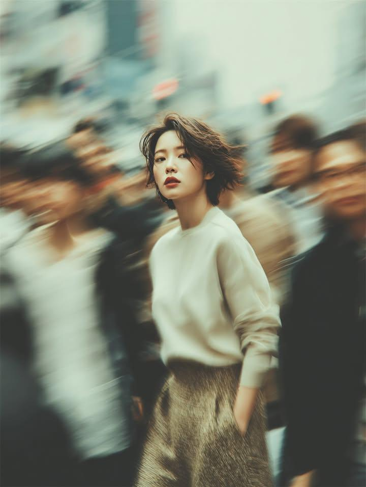

## A hyper-realistic cinematic close-up portrait (use uploa

- ID: trending-2031362125055369376
- Slug: trending-2031362125055369376-en
- 语言: en
- 来源: [来源链接](https://x.com/harboriis/status/2031362125055369376)
- 样例图路径: images/part1/2031362125055369376_1.jpg

### 提示词

```text
A hyper-realistic cinematic close-up portrait (use uploaded face as reference).
The subject looks upward with chin slightly raised and eyes half-open, as if drawn to a light above. A cool white overhead spotlight creates dramatic top-down lighting, sculpting the face while the background stays black. Soft volumetric mist forms a subtile light beam. Wearing a matte black high-collar jacket.
Shot on an 85mm lens with shallow depth of field, high contrast, and a spiritual, transcendental mood. Portrait Mode.
```

### 样例图

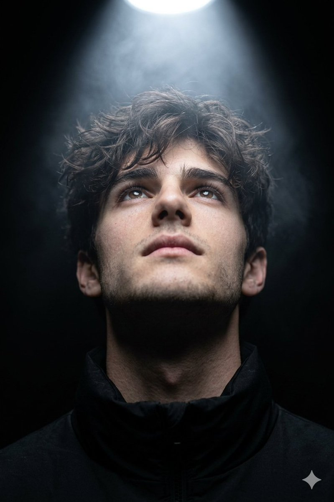

## { "image_analysis": { "subject": { "type": "Georgina Rod

- ID: trending-2016366007871475787
- Slug: trending-2016366007871475787-en
- 语言: en
- 来源: [来源链接](https://x.com/xIrissy/status/2016366007871475787)
- 样例图路径: images/part1/2016366007871475787_1.jpg

### 提示词

```text
{
  "image_analysis": {
    "subject": {
      "type": "Georgina Rodríguez",
      "expression": "Neutral, slightly sultry, contemplative, looking off-camera to the right",
      "pose": "Portrait shot, head and shoulders, slightly angled body"
    },
    "facial_features": {
      "skin": "Fair with prominent natural freckles dusted across the nose and cheeks",
      "eyes": "Dark, almond-shaped, gazing sideways, adorned with winged eyeliner and mascara",
      "eyebrows": "Dark, well-defined, slightly arched",
      "lips": "Full, plump, glossy, slightly parted",
      "structure": "Soft jawline, youthful features"
    },
    "hair": {
      "color": "Dark brown or black",
      "style": "Shoulder-length, layered, tousled waves, messy texture",
      "details": "Curtain bangs framing the face, loose flyaways catching the light"
    },
    "attire": {
      "garment": "White tank top / camisole",
      "details": "V-neck, thin spaghetti straps, simple texture"
    },
    "lighting_and_atmosphere": {
      "type": "Flash photography",
      "contrast": "High contrast black and white",
      "shadows": "Hard shadow behind the subject indicating direct front-facing flash",
      "vibe": "Vintage, 90s grunge aesthetic, lo-fi, candid"
    },
    "technical_enhancements": {
      "resolution": "4k HD, 8k resolution",
      "quality": "Ultra-detailed, photorealistic, sharp focus",
      "texture": "Fine film grain, realistic skin texture"
    }
  },
  "generated_prompt": "A hyper-realistic 4k HD black and white portrait of a Georgina Rodríguez with shoulder-length dark messy hair and curtain bangs. She has prominent freckles on her nose and cheeks, full glossy lips slightly parted, and dark eyes looking to the side with winged eyeliner. She is wearing a simple white V-neck camisole. The lighting is direct flash photography style creating a vintage 90s aesthetic with high contrast and a hard shadow against a plain background. The image should feature ultra-detailed skin texture, fine film grain, and sharp focus, capturing a candid, sultry mood."
}
```

### 样例图

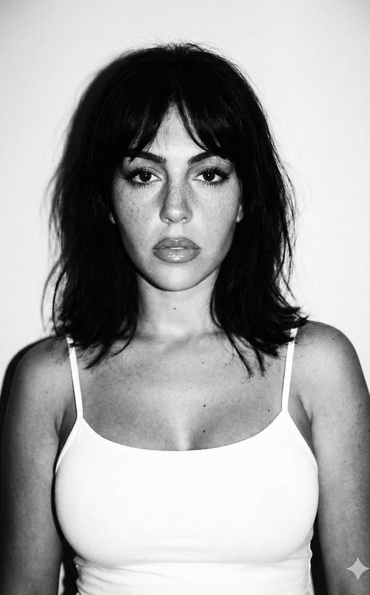

## Ultra-realistic fine-art portrait of a young woman with 

- ID: trending-2020780086363054275
- Slug: trending-2020780086363054275-en
- 语言: en
- 来源: [来源链接](https://x.com/Taaruk_/status/2020780086363054275)
- 样例图路径: images/part1/2020780086363054275_1.jpg

### 提示词

```text
Ultra-realistic fine-art portrait of a young woman with soft natural features, minimal makeup, and calm introspective expression. Pastel muted background in sage green tones. Delicate flowers drifting across the frame in the foreground, creating intentional motion blur and soft streaks of light. Subtle double exposure and slow-shutter motion effects across the face, dreamy and poetic atmosphere. Gentle diffused lighting with smooth highlights on skin, natural texture preserved. Elegant minimalist composition, emotional and serene mood, editorial fine-art photography style, shallow depth of field, cinematic softness, painterly realism, ultra-high resolution, 8K quality.
```

### 样例图

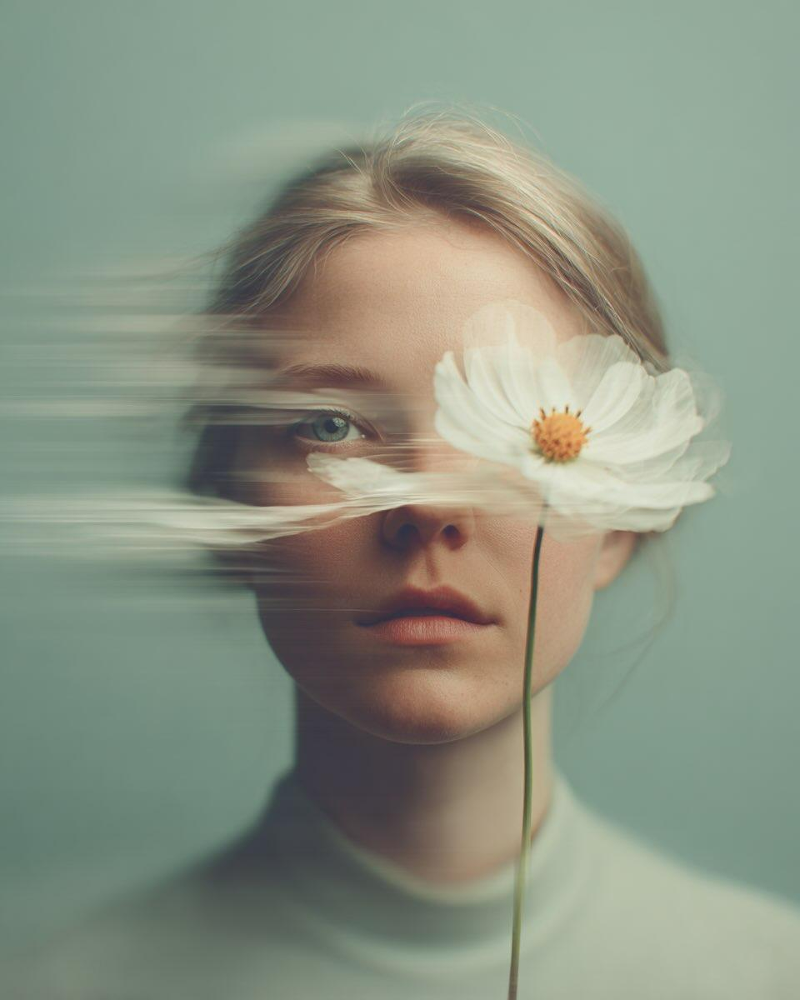

## Make an Ultra-wide fisheye lens perspective shot from gr

- ID: trending-2028508328859750704
- Slug: trending-2028508328859750704-en
- 语言: en
- 来源: [来源链接](https://x.com/iamsofiaijaz/status/2028508328859750704)
- 样例图路径: images/part1/2028508328859750704_1.jpg

### 提示词

```text
Make an Ultra-wide fisheye lens perspective shot from ground level looking straight up at a young woman use image for  face reference crouching mid-air between brick buildings forming a circular frame around the sky. She reaches one hand dramatically toward the camera, fingers spread wide, creating strong foreground distortion and depth. Dynamic action pose, confident expression, casual streetwear outfit: fitted white t-shirt, blue straight-leg jeans, red and white sneakers. Urban European neighborhood setting with brick houses, tiled roofs, windows visible around the edges. Bright daylight, clear blue sky, natural lighting, sharp focus, high detail, cinematic composition, exaggerated perspective, 8k resolution, photorealistic, adventure photography style.
```

### 样例图

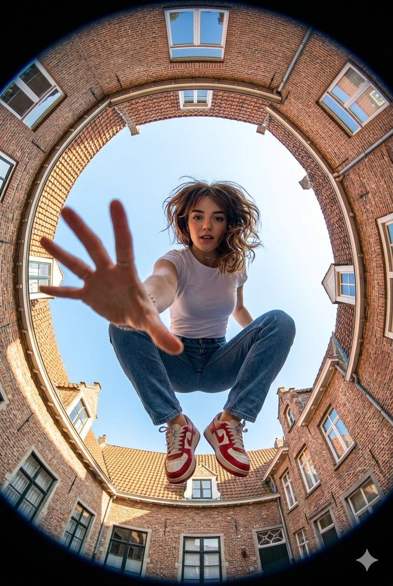

## [ { "id": "subject", "type": "person", "description": "M

- ID: trending-2031334187689718167
- Slug: trending-2031334187689718167-en
- 语言: en
- 来源: [来源链接](https://x.com/Ankit_patel211/status/2031334187689718167)
- 样例图路径: images/part1/2031334187689718167_1.jpg

### 提示词

```text
[
  {
    "id": "subject",
    "type": "person",
    "description": "Madelyn Cline with long blonde hair, looking at the camera.",
    "pose": "She is walking forward through the mirrored structure mid-step, one hand lightly brushing the metal framework while the other adjusts her hair as she glances toward the camera.",
    "clothing": {
      "dress": {
        "color": "deep violet",
        "material": "patent leather",
        "style": "strapless mini-dress"
      },
      "legwear": {
        "color": "black",
        "type": "sheer pantyhose"
      },
      "footwear": {
        "color": "Violet",
        "material": "patent leather",
        "style": "Louboutin So Kate with red sole"
      }
    }
  },
  {
    "id": "environment",
    "type": "room",
    "description": "A geometrically designed mirrored room with a fractured, kaleidoscopic effect.",
    "elements": [
      {
        "type": "mirrors",
        "description": "Multiple angled mirror panels reflecting the subject and the room structure."
      },
      {
        "type": "structure",
        "description": "Black metal framework holding the mirror panels."
      }
    ],
    "lighting": "Bright, high-contrast light from LED strips within the structure, creating sharp highlights and reflections, high-quality, cinematic, Ultra-realistic photo and lighting, high quality photo, depth of field, no Ai or cgi look, 8k resolution."
  }
]
```

### 样例图

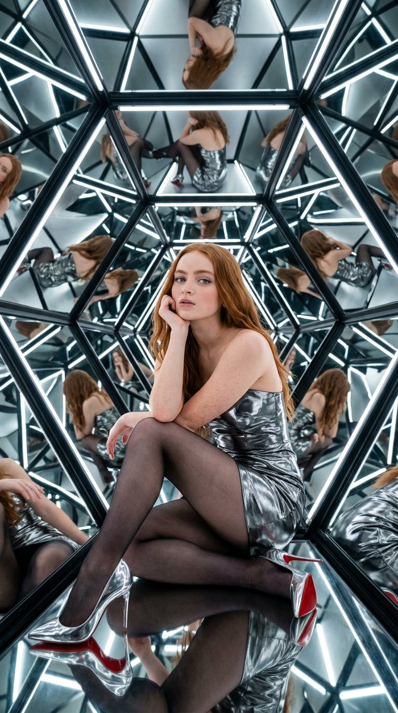

## A hyper-realistic 8k medium shot, captured with a standa

- ID: trending-2008374617979973865
- Slug: trending-2008374617979973865-en
- 语言: en
- 来源: [来源链接](https://x.com/Sheldon056/status/2008374617979973865)
- 样例图路径: images/part1/2008374617979973865_1.jpg

### 提示词

```text
A hyper-realistic 8k medium shot, captured with a standard lens (e.g., 85mm) at a slightly low angle, frames a man seated in deep snow within a snowy forest. The man, with uploaded face as reference, wears a highly detailed black puffer jacket and black pants, looking calmly towards the left side of the frame. Directly behind him, a majestic black panther stands, its large front paws gently resting on his shoulders, creating a surreal yet intimate spatial relationship. The panther's head is positioned just above and slightly to the right of the man's head, its piercing yellow eyes looking forward. The scene is bathed in soft, natural daylight, typical of an overcast winter day, providing cinematic lighting with subtle shadows and highlighting the highly detailed texture of the panther's sleek fur and the man's quilted jacket. Volumetric lighting is evident through the abundant falling snow, which dots the subjects and the environment. The background features a softly blurred snowy forest, emphasizing the central figures and their unique interaction.
```

### 样例图

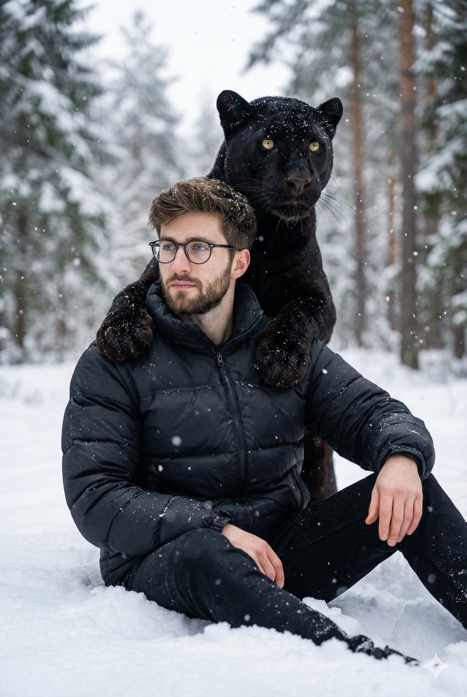

## { "scene": { "setting": "narrow outdoor alley with stepp

- ID: trending-2044511721205993480
- Slug: trending-2044511721205993480-en
- 语言: en
- 来源: [来源链接](https://x.com/GlenaJenne/status/2044511721205993480)
- 样例图路径: images/part1/2044511721205993480_1.jpg

### 提示词

```text
{
  "scene": {
    "setting": "narrow outdoor alley with stepped pathway in a Mediterranean blue-painted town",
    "background": "vivid blue walls, stairs, and buildings with white accents, hanging fabric on wall, small windows, plants, and bright sky above",
    "lighting": "strong natural sunlight, high contrast with defined shadows, bright and saturated colors"
  },
  "subject": {
    "type": "female",
    "pose": "seated on steps with one leg bent and the other extended slightly forward, hands resting naturally by her sides",
    "expression": "soft relaxed expression with eyes slightly downward, calm and serene mood",
    "face": "Use uploaded reference image, keep identity exact, natural facial proportions, visible skin texture and realistic lighting",
    "hair": "Use uploaded reference image, keep identity exact, long wavy hair falling over shoulders with natural volume",
    "eyes": "Use uploaded reference image, keep identity exact, softly focused downward gaze",
    "skin": "natural skin tone with sunlit highlights and realistic texture",
    "body": "natural proportions maintained"
  },
  "clothing": {
    "outfit": "blue fitted sleeveless top paired with a long flowing white skirt",
    "footwear": "barefoot with both feet visible resting naturally on the blue steps",
    "accessories": "minimal jewelry, subtle necklace"
  },
  "environment_details": {
    "props": "textured painted steps, hanging patterned fabric, architectural details of alley",
    "textures": "rough painted walls, fabric folds in skirt, smooth skin highlights, stone steps"
  },
  "camera": {
    "angle": "slightly low front-facing angle centered on subject",
    "framing": "full body framing capturing entire seated pose and surrounding stairs",
    "focus": "sharp focus on subject with clear detailed background",
    "lens": "standard smartphone lens"
  },
  "style": {
    "realism": "ultra realistic photography",
    "color_tone": "highly saturated blues contrasted with neutral white and natural skin tones",
    "effects": "natural sunlight, no artificial filters",
    "details": "high detail textures, crisp shadows, realistic depth and perspective"
  }
}
```

### 样例图


## { "prompt_title": "Sophisticated Urban Winter Couple Por

- ID: trending-2011692205925159084
- Slug: trending-2011692205925159084-en
- 语言: en
- 来源: [来源链接](https://x.com/xmliisu/status/2011692205925159084)
- 样例图路径: images/part1/2011692205925159084_1.jpg

### 提示词

```text
{
  "prompt_title": "Sophisticated Urban Winter Couple Portrait",
  "environment": {
    "setting": "Upscale urban street corner during winter.",
    "architecture": "Massive grey stone pillar/building corner with classical detailing.",
    "background_elements": "Black wrought-iron fence with decorative gold finials/spikes. Classical stone building facade visible in background.",
    "ground": "Covered in fresh, clean white snow.",
    "atmosphere": "Light snow falling, snowflakes visible in the air. Cold, crisp winter day.",
    "color_palette": "Cool neutrals, stone grey, bright white snow, deep blacks, accent of burgundy."
  },
  "subjects": [
    {
      "id": "male_subject",
      "appearance": "Young adult male, fair skin, short dark hair styled neatly.",
      "clothing": {
        "outerwear": "Knee-length textured grey wool overcoat (possibly herringbone or tweed).",
        "top": "Black turtleneck sweater.",
        "bottoms": "Black tailored trousers, relaxed straight fit.",
        "footwear": "Black leather dress shoes or boots.",
        "accessories": "Black wayfarer-style sunglasses."
      },
      "pose": "Standing confident and upright, one hand in coat pocket, other hand holding a dog leash. Looking slightly to the side."
    },
    {
      "id": "female_subject",
      "appearance": "Young adult female, fair skin, dark hair pulled back into a sleek, tight bun.",
      "clothing": {
        "outerwear": "Long, oversized black wool coat.",
        "top": "Black fitted turtleneck.",
        "bottoms": "Black wide-leg trousers.",
        "footwear": "Burgundy/Maroon suede retro sneakers with white stripes (Adidas Gazelle style).",
        "accessories": "Black oval sunglasses, thin black belt with silver buckle, small gold hoop earrings, holding a black leather tote bag."
      },
      "pose": "Standing next to male subject, hand touching lapel of coat, other hand holding bag at side. Radiating 'cool girl' aesthetic."
    }
  ],
  "additional_elements": {
    "animal": {
      "breed": "Beagle dog.",
      "pose": "Sitting obediently on the snow at the man's feet.",
      "appearance": "Tri-color fur (brown, black, white), wearing a collar and attached to a black leash."
    }
  },
  "lighting_and_mood": {
    "lighting_type": "Soft, diffuse overcast natural light (winter daylight). No harsh shadows.",
    "mood": "Chic, minimalist, 'Old Money' aesthetic, quiet luxury, sophisticated, serene, fashionable.",
    "tonality": "Desaturated slightly with high contrast between the black clothing and white snow."
  },
  "technical_details": {
    "style": "Ultra Photorealistic, High-End Street Style Photography.",
    "camera_settings": {
      "lens": "85mm portrait lens.",
      "aperture": "f/2.8 for slight depth of field separation from the stone background.",
      "shutter_speed": "Fast enough to freeze falling snowflakes.",
      "iso": "Low ISO (100) for grain-free clarity."
    },
    "quality_modifiers": "8k resolution, highly detailed fabric textures (wool grain, leather sheen, suede texture), sharp focus on eyes/sunglasses, subsurface scattering on skin, cinematic composition, rule of thirds."
  }
}
```

### 样例图

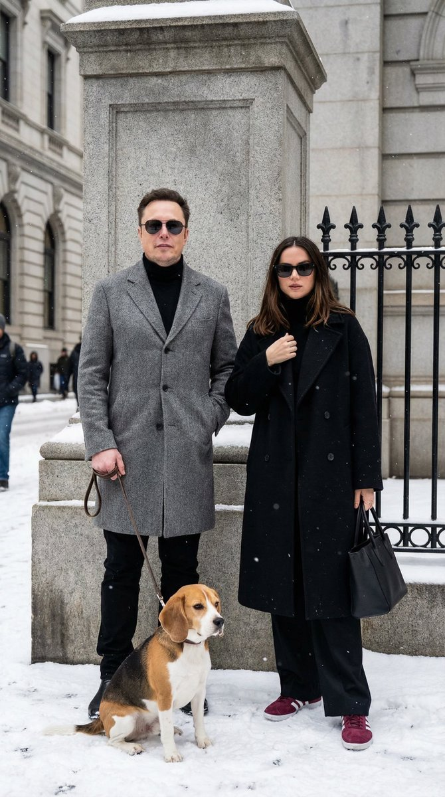

## { "prompt": "A woman relaxing poolside at a tropical res

- ID: trending-2033892204645912843
- Slug: trending-2033892204645912843-en
- 语言: en
- 来源: [来源链接](https://x.com/NattyWindstorm/status/2033892204645912843)
- 样例图路径: images/part1/2033892204645912843_1.jpg

### 提示词

```text
{
  "prompt": "A woman relaxing poolside at a tropical resort at night, lying on a cushioned lounge chair beside a rustic wooden table. She is wearing a colorful floral bikini and matching wrap skirt, resting her head on her hand while looking calmly toward the camera. A tall red cocktail in a glass sits on the table next to a glowing lantern candle. The background features a lit swimming pool with reflections on the water, palm trees, string lights, and a thatched-roof cabana with soft draped curtains. Warm ambient lighting, tropical vacation atmosphere, cinematic night photography, shallow depth of field, high detail, realistic skin tones.",
  "style": "photorealistic",
  "lighting": "warm ambient night lighting with soft highlights",
  "camera": "85mm lens, shallow depth of field",
  "resolution": "1024x1536"
}
```

### 样例图

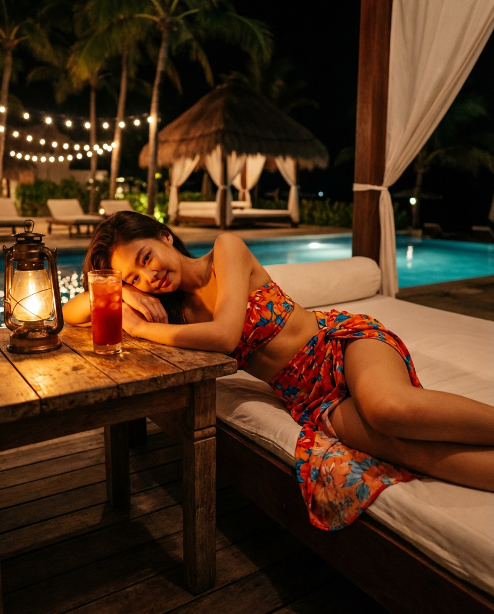

## A studio-style close-up editorial portrait of a person w

- ID: trending-2018707915008618763
- Slug: trending-2018707915008618763-en
- 语言: en
- 来源: [来源链接](https://x.com/weiinberg/status/2018707915008618763)
- 样例图路径: images/part1/2018707915008618763_1.jpg

### 提示词

```text
A studio-style close-up editorial portrait of a person with strong, well-defined facial features and slightly imperfect, natural skin texture. The subject wears a black tailored turtleneck with sharp, clean lines, layered under a high-collared black jacket in a minimalist contemporary fashion style.The subject wears semi-transparent orange acetate sunglasses — rectangular frames with softly rounded edges, glossy finish, and amber gradient lenses — serving as the only colored element in the image.Color concept: selective color photography — monochrome black-and-white image with only the sunglasses in vivid orange.
Mood is calm and confident, serious expression, direct gaze into the camera.
Lighting is soft frontal studio light with gentle shadows, even skin tones, cinematic contrast, and visible natural skin texture. Shot on a professional portrait camera, f/2.0, ISO 100, 1/125s. High resolution, ultra-sharp focus on the face.

Style: editorial luxury fashion portrait, photorealistic, professional studio photography, no illustration, no painterly effects.
```

### 样例图

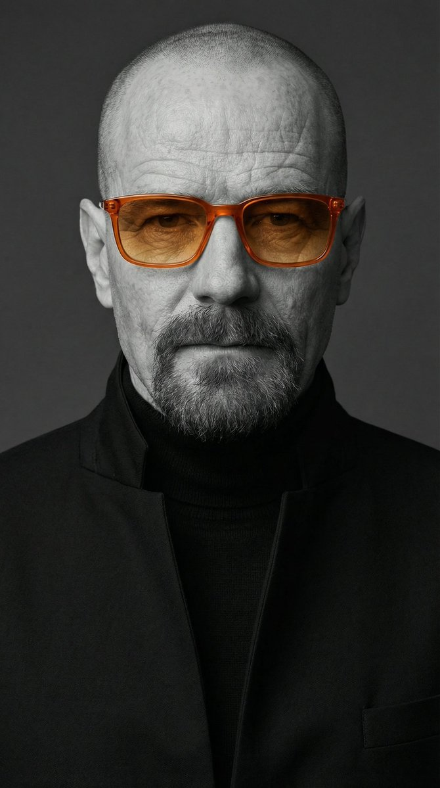

## Ultra-realistic cinematic night cityscape inspired by Ti

- ID: trending-2013552127705260441
- Slug: trending-2013552127705260441-en
- 语言: en
- 来源: [来源链接](https://x.com/Strength04_X/status/2013552127705260441)
- 样例图路径: images/part1/2013552127705260441_1.jpg

### 提示词

```text
Ultra-realistic cinematic night cityscape inspired by Times Square, New York. A wide-angle street-level view of a busy urban intersection at night with wet asphalt reflecting neon lights. Massive curved LED billboard on a corner building displaying a hyper-realistic gourmet burger advertisement, glowing vividly and dominating the scene. Surrounding skyscrapers covered with bright digital screens, brand signage, and colorful ads. Motion-blurred traffic trails from passing cars, subtle pedestrians near sidewalks, dramatic contrast between dark sky and illuminated buildings. Cyber-urban atmosphere, commercial advertising aesthetic, long-exposure photography look, sharp architectural details, realistic lighting and reflections, ultra-high resolution, 8K photorealism, cinematic depth, no text overlay.
```

### 样例图

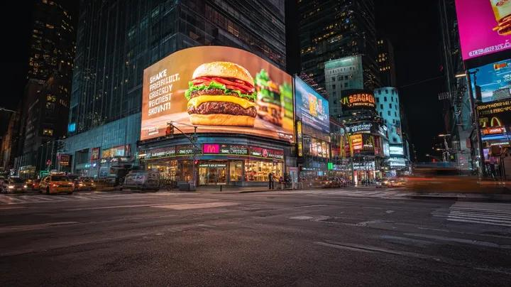

## A hyper-realistic cinematic 3:4 vertical half-body portr

- ID: trending-2008734714769899903
- Slug: trending-2008734714769899903-en
- 语言: en
- 来源: [来源链接](https://x.com/harboriis/status/2008734714769899903)
- 样例图路径: images/part1/2008734714769899903_1.jpg

### 提示词

```text
A hyper-realistic cinematic 3:4 vertical half-body portrait of a young man with the exact face from reference image, leaning casually against a 1920s smoky bar table, holding a vintage walking cane. He wears Peaky Blinders-inspired attire-tailored wool three-piece suit, waistcoat, tie, and flat cap. Head slightly down, eyes locked on camera with an intense, confident stare. Warm, ambient lighting casts moody shadows; blurred crowd and glowing whisky bottles in soft bokeh create depth. Shot with 85mm f/1.4 lens, 8K quality, highlighting fabric textures and facial expression.
```

### 样例图

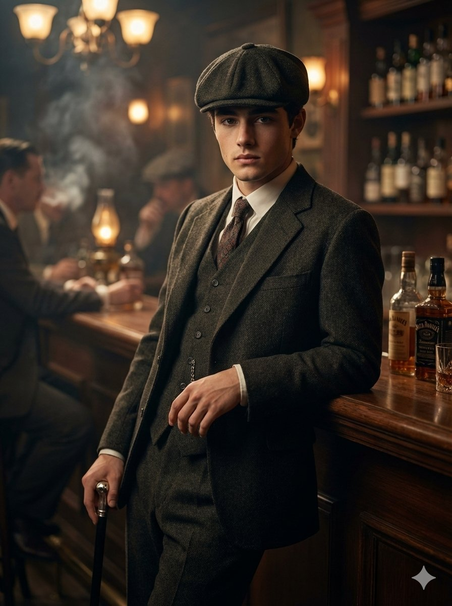

## unfolds beside a tranquil pond, where gentle ripples cat

- ID: trending-2008451510473289969
- Slug: trending-2008451510473289969-en
- 语言: en
- 来源: [来源链接](https://x.com/me_Aarvi/status/2008451510473289969)
- 样例图路径: images/part1/2008451510473289969_1.jpg

### 提示词

```text
unfolds beside a tranquil pond, where gentle ripples catch the warm, golden sunlight. A young woman sits peacefully on the grassy bank at the water’s edge, her posture relaxed yet slightly leaning forward, as if immersed in quiet contemplation. Soft rays from the high, diffused sun bathe her face and shoulders in a tender glow, highlighting her delicate features and casting subtle, natural shadows. She wears light, flowy summer clothes in soft pastel tones that harmoniously blend with the lush surroundings—perhaps a breezy linen dress fluttering faintly in the still air.
The pond mirrors the surrounding trees, their vibrant green leaves shimmering under the sunlight, while delicate reflections dance across the calm surface. The atmosphere feels utterly peaceful, warm, and timeless, with no breeze to disturb the stillness. Her expression is calm and introspective, eyes softly gazing toward the water, conveying a deep emotional serenity—as though she’s savoring the beauty of solitude amid nature’s embrace.
This cinematic, highly detailed scene evokes a profound sense of tranquility, capturing the quiet magic of a slow afternoon in perfect harmony with the natural world. Realistic lighting, natural colors, soft bokeh, and exquisite realism throughout
```

### 样例图

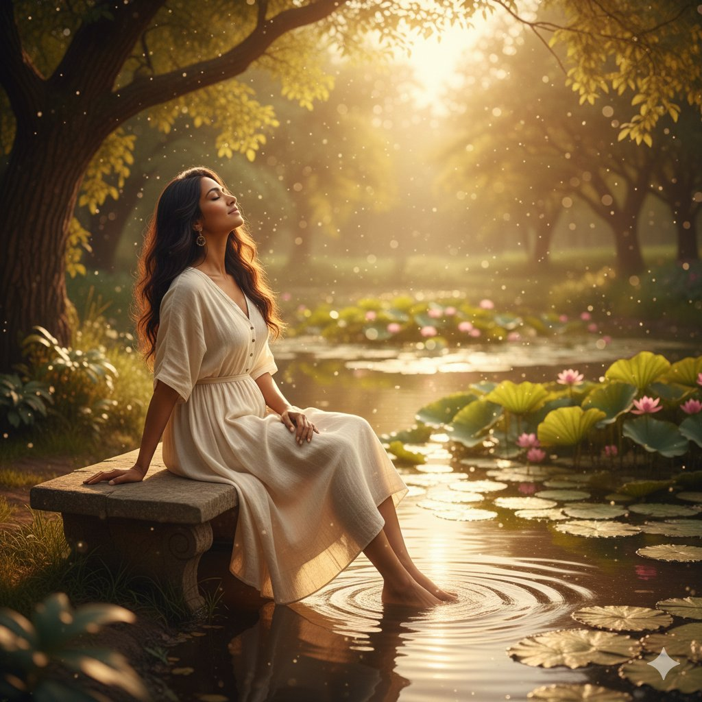

## Ultra-realistic cinematic close-up portrait of a young m

- ID: trending-2011283991870259558
- Slug: trending-2011283991870259558-en
- 语言: en
- 来源: [来源链接](https://x.com/Naiknelofar788/status/2011283991870259558)
- 样例图路径: images/part1/2011283991870259558_1.jpg

### 提示词

```text
Ultra-realistic cinematic close-up portrait of a young man with wet skin and damp, messy hair. He is lightly touching the frame of dark, rectangular aviator sunglasses beaded with clear water droplets. The lighting is low-key and dramatic, creating deep shadows that emphasize the moisture on his skin and the fine texture of his beard. He wears a plain, form-fitting matte black t-shirt that blends into a dark, minimal background. Detailed hand gesture showing defined knuckles and a silver ring with stone on the pinky finger. Razor-sharp micro-details, shallow depth of field, 85mm f/1.4 lens effect, moody high-contrast realism, and a high-end fashion editorial aesthetic.

Use my uploaded face image as the  facial and identity reference.
```

### 样例图

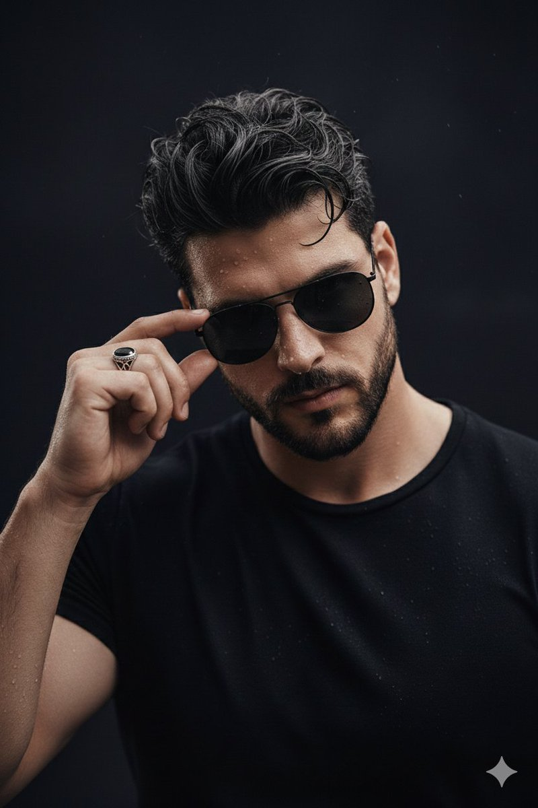

## A hyper-realistic cinematic scene of a giant woman filmm

- ID: trending-2039602803220591004
- Slug: trending-2039602803220591004-en
- 语言: en
- 来源: [来源链接](https://x.com/AIwithSynthia/status/2039602803220591004)
- 样例图路径: images/part1/2039602803220591004_1.jpg

### 提示词

```text
A hyper-realistic cinematic scene of a giant woman filmmaker carefully adjusting a miniature vintage film camera on a tripod, inside a professional studio setup. A tiny elegant woman in a flowing pastel blue dress stands beside the camera like a model on set. Surrounding them are detailed studio lights, softboxes, film reels, cables, and a clapperboard. The giant woman has soft natural makeup, blonde hair tied back, and an intense focused expression. Dramatic soft lighting, shallow depth of field, ultra-detailed textures, 8K, photorealistic, cinematic composition, studio photography, volumetric lighting.
```

### 样例图

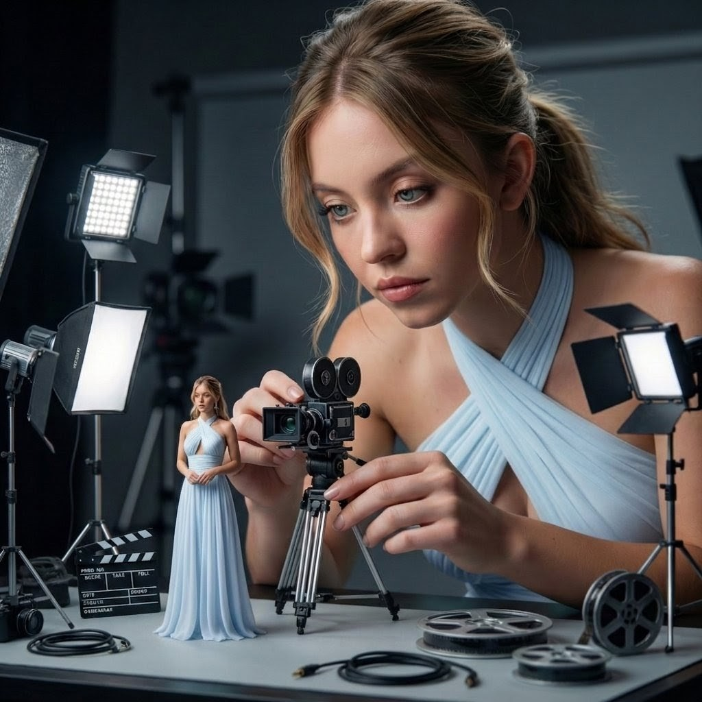

## { "prompt": "Hyper-realistic 8K black-and-white studio p

- ID: trending-2013448656767328610
- Slug: trending-2013448656767328610-en
- 语言: en
- 来源: [来源链接](https://x.com/Mind_Boticni/status/2013448656767328610)
- 样例图路径: images/part1/2013448656767328610_1.jpg

### 提示词

```text
{
  "prompt": "Hyper-realistic 8K black-and-white studio portrait captured as a medium shot from a slightly low-angle perspective, using a 50mm lens for a natural field of view. The composition features a female subject, 100% using the uploaded face as reference (do not alter facial features or identity), seated off-center to the right, leaving strong negative space above and to the left. She wears a wide-brimmed fedora-style hat, a loose white linen blouse unbuttoned at the collar revealing layered silver necklaces, white linen trousers, and dark leather loafers, with delicate beaded bracelets on both wrists. The subject is seated comfortably in a sleek modern black leather lounge chair, left leg crossed over the right, left hand lightly touching the brim of the hat, and right arm casually resting on the chair’s armrest. Dramatic high-contrast chiaroscuro lighting dominates the scene, with a strong key light from the front-left creating deep shadows and bright highlights that emphasize the detailed textures of the linen fabric, leather chair, felt hat, and hair. Subtle rim lighting outlines the subject and chair, separating them from a pure deep-black background, enhancing cinematic depth and a professional luxury studio photography aesthetic.",
  "color_style": "black and white",
  "resolution": "8K",
  "camera_lens": "50mm",
  "camera_angle": "slightly low-angle",
  "style": "cinematic studio portrait, luxury editorial",
  "lighting": "chiaroscuro, high-contrast studio lighting",
  "reference_image": "strictly use uploaded image only"
}
```

### 样例图

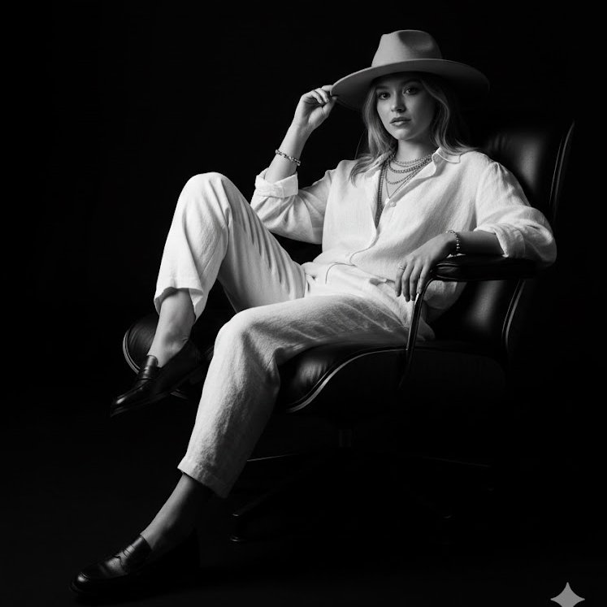

## { "image_type": "High-end fitness editorial / Cinematic 

- ID: trending-2008895041025052815
- Slug: trending-2008895041025052815-en
- 语言: en
- 来源: [来源链接](https://x.com/cuties7377/status/2008895041025052815)
- 样例图路径: images/part1/2008895041025052815_1.jpg

### 提示词

```text
{
  "image_type": 
"High-end fitness editorial / Cinematic lifestyle photography",
  "visual_style": 
"Minimalist luxury, ultra-photorealistic, soft-focus realism",
  "composition": {
    "framing": 
"Wide-angle side profile to capture the full silhouette",
    "camera_angle": "Low-angle shot to emphasize the height and strength of the arch",
    "perspective": "Clean, linear perspective against a flat, snowy horizon"
  },
  "subject": {
    "description": "A fit, graceful woman with athletic poise and natural blonde hair tied in a sleek low bun",
    "pose": "Performing a perfect Yoga Arch (Urdhva Dhanurasana / Wheel Pose)",
    "body_language": "Strong and stable; back arched beautifully with palms and feet firmly planted in the snow",
    "expression": "A serene, focused look; eyes closed in a state of meditative calm"
  },
  "facial_details": {
    "emotion": "Peaceful determination and internal quietude",
    "micro_details": "Soft natural skin texture, subtle flush from the cold, and faint visible breath in the air"
  },
  "wardrobe": {
    "clothing": "Premium emerald green velvet high-waist yoga leggings; matching velvet sports bra; a thin, cream-colored thermal scarf draped elegantly nearby",
    "textures": "Rich, light-reflecting velvet fabric against the soft, matte texture of fresh snow",
    "color_tones": "Vibrant emerald green contrasted against a monochrome white landscape"
  },
  "environment": {
    "location": "A vast, silent arctic landscape of pristine white snow",
    "background": "Empty, minimalist snowy field meeting a soft, misty gray sky at the horizon",
    "atmosphere": "Quiet, ethereal, and crisp; very light snowfall with tiny drifting flakes"
  },
  "lighting": {
    "type": "Soft, natural overcast daylight",
    "quality": "Diffused and ethereal, creating gentle highlights on the velvet curves",
    "direction": "Side-ambient lighting to define the muscular form of the yoga pose"
  },
  "color_palette": {
    "primary": ["Deep Emerald Green", "Pristine White", "Charcoal Black"],
    "mood": "Sophisticated, calm, and visually striking"
  },
  "camera_details": {
    "lens": "50mm prime lens for realistic human proportions",
    "focus": "Sharp focus on the subject; creamy, soft-focus (bokeh) on the distant snowy background",
    "realism": "8K resolution, capturing every fiber of the velvet and the granular detail of the snow"
  },
  "overall_mood": "Graceful, powerful, and serene; a high-fashion approach to wellness",
  "intended_use": "Luxury fitness branding, Pinterest aesthetic editorial, or premium wellness magazine"
}
```

### 样例图

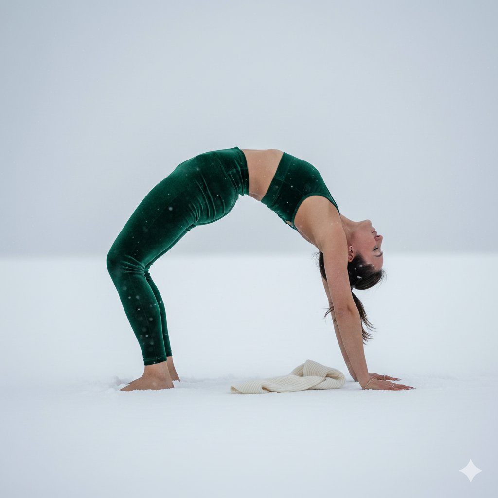

## Panels are NOT edge-to-edge Visible thin white spacing b

- ID: trending-2029370003485802945
- Slug: trending-2029370003485802945-en
- 语言: en
- 来源: [来源链接](https://x.com/Kashberg_0/status/2029370003485802945)
- 样例图路径: images/part1/2029370003485802945_1.jpg

### 提示词

```text
Panels are NOT edge-to-edge
Visible thin white spacing between panels Subtle outer white margin around the entire grid clean modern UI-style layout
Slight rounded corners on each tile
Panel 1 — Joyful / Celebratory (Yellow) Bright yellow gradient background
Arms raised
Eyes closed
Big open laugh
Energetic posture
Panel 2 — Shocked (Blue)
Blue gradient background
Hands on cheeks
Wide eyes
Open mouth
Raised brows
Panel 3 — Serious / Stern (Red)
Red background
Arms crossed
Furrowed brows
Neutral tight lips
Wearing dark hoodie
Panel 4 — Affectionate (Pink)
Soft pink gradient
Holding small brown puppy
Gentle smile
Cozy knit sweater
Panel 5 — Confident / Sassy (Purple)
Purple gradient background
One hand on hip
Slight smirk
Graphic t-shirt
Relaxed stance
Panel 6 — Friendly / Casual Approval (Green)
Green gradient background
Wearing cap + denim jacket
Thumbs-up
Relaxed smile
Panel 7 — Sad / Emotional (Gray)
Gray gradient background
Slight downward gaze
Eyebrows slightly raised in center
Lips slightly curved downward
```

### 样例图

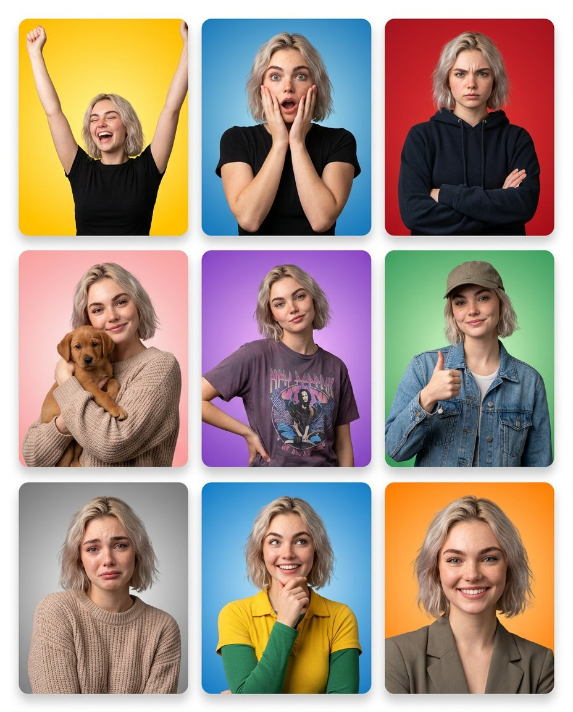

## { "scene_type": "outdoor urban street portrait", "compos

- ID: trending-2015953469547675874
- Slug: trending-2015953469547675874-en
- 语言: en
- 来源: [来源链接](https://x.com/ZaraIrahh/status/2015953469547675874)
- 样例图路径: images/part1/2015953469547675874_1.jpg

### 提示词

```text
{ "scene_type": "outdoor urban street portrait", "composition": { "framing": "vertical portrait orientation", "shot_type": "mid-length shot from head to mid-thigh", "camera_angle": "eye-level", "subject_position": "centered with slight rightward offset", "leading_lines": "sidewalk and building facade create linear depth", "depth_of_field": "moderate depth, background softly detailed but not blurred", "balance": "subject balanced against architectural mass on left and greenery on right" }, "subject": { "gender_presentation": "female-presenting", "pose": "relaxed standing pose, one hand in pocket, one arm relaxed", "expression": "neutral to confident with subtle smile", "gaze": "looking directly at camera", "hair": { "style": "long, loose waves", "part": "side-parted", "color": "dark brown with warm undertones", "texture": "soft, voluminous" }, "accessories": [ "round metal-frame sunglasses with dark lenses", "small hoop earrings", "wristwatch with metallic band", "brown leather shoulder bag" ] }, "clothing": { "top": { "type": "sleeveless fitted tank top", "color": "warm beige", "pattern": "thin horizontal white stripes", "fit": "form-fitting" }, "bottom": { "type": baggy pant", "color": "off-white / cream", "fabric_appearance": "structured cotton or linen blend" }, "belt": { "color": "light brown", "buckle": "gold-toned minimalist buckle" } }, "environment": { "location_type": "historic city street", "architecture": { "style": "classical or colonial stone facade", "features": "arched windows, ornate stone detailing, balconies" }, "natural_elements": "trees and shrubs lining the sidewalk", "ground": "concrete sidewalk with adjacent landscaped soil area", "background_activity": "parked cars partially visible, quiet street ambiance" }, "lighting": { "source": "natural sunlight", "time_of_day": "late morning or afternoon", "quality": "soft directional light", "shadows": "gentle shadows cast by trees and buildings", "skin_tone_rendering": "warm and even" }, "color_palette": { "dominant_colors": ["beige", "cream", "brown", "stone gray", "green"], "overall_tone": "warm, natural, lifestyle aesthetic", "contrast": "moderate contrast between subject and background" }, "camera_characteristics": { "lens_look": "standard to short telephoto perspective", "distortion": "minimal distortion", "sharpness": "sharp focus on subject with clear texture detail", "noise": "low noise, clean image" }, "artistic_style": { "genre": "fashion lifestyle photography", "mood": "casual elegance, confident, relaxed", "styling_influence": "modern minimalist with classic elements", "social_media_aesthetic": "Instagram-style street fashion portrait" }, "post_processing": { "color_grading": "warm tones with natural saturation", "contrast_adjustment": "slightly enhanced", "retouching": "minimal, natural skin texture preserved", "overall_finish": "clean and polished" }, "typography": { "present": false } }
```

### 样例图

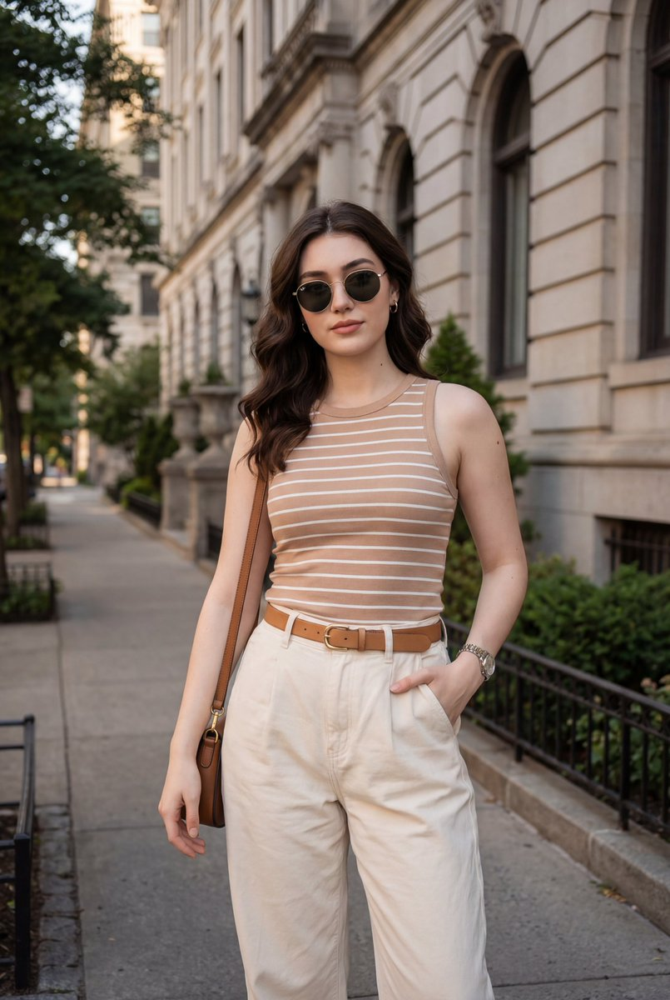

## { "content_goal": "viral athletic jump freeze post", "im

- ID: trending-2010225997463834883
- Slug: trending-2010225997463834883-en
- 语言: en
- 来源: [来源链接](https://x.com/cuties7377/status/2010225997463834883)
- 样例图路径: images/part1/2010225997463834883_1.jpg

### 提示词

```text
{
  "content_goal": 
"viral athletic jump freeze post",
  "image_type":
 "jump freeze action photography",
  "visual_style": 
"cinematic sports editorial, high-impact, premium",
  "motion_concept": {
    "action_type":
 "jump freeze",
    "timing": 
"captured at peak height",
    "motion_state": 
"completely frozen mid-air",
    "energy":
 "explosive yet controlled"
  },
  "pose_details": {
    "pose_name":
 "jump freeze flex pose",
    "body_position": 
"mid-air jump with legs extended or flexed symmetrically",
    "core_engagement":
 "tight core with visible strength",
    "arm_position": 
"balanced, expressive, athletic alignment",
    "freeze_quality": 
"sharp, suspended, gravity-defying"
  },
  "subject": {
    "description":
 "athletic feminine body performing a powerful jump freeze",
    "physique": "lean, flexible, toned",
    "body_language": "confident, fearless, strong",
    "expression": "focused intensity with calm control"
  },
  "facial_details": {
    "emotion": "determination mixed with ease",
    "micro_details": "relaxed face, steady eyes, natural expression"
  },
  "wardrobe": {
    "clothing": "professional athletic performance wear",
    "fit": "body-contoured to emphasize motion lines",
    "fabric": "stretch performance fabric, non-reflective",
    "color_tones": "solid neutral or bold single color"
  },
  "environment": {
    "location": "minimal studio or clean gym space",
    "background": "plain or gradient backdrop",
    "atmosphere": "focused, powerful, distraction-free"
  },
  "lighting": {
    "type": "high-speed studio lighting",
    "quality": "crisp, clean, cinematic",
    "direction": "side and top lighting",
    "effect": "freeze motion sharply with defined muscle highlights"
  },
  "camera_details": {
    "angle": "slightly low angle for power emphasis",
    "framing": "full body mid-air capture",
    "lens_feel": "sports editorial realism",
    "focus": "ultra-sharp subject with zero motion blur"
  },
  "color_palette": {
    "primary_colors": ["neutral background", "natural skin tone"],
    "contrast_level": "high",
    "mood": "bold, energetic, inspiring"
  },
  "emotional_impact": {
    "viewer_reaction": "scroll-stopping shock and admiration",
    "message": "power, balance, and control in one moment"
  },
  "quality_control": {
    "realism": "ultra-realistic photography",
    "detail_level": "high-definition muscle and fabric texture",
    "ai_artifacts": "none",
    "professional_standard": "editorial-grade"
  },
  "intended_use": {
    "primary": "viral jump freeze post on X",
    "secondary": "fitness branding, athletic inspiration"
  }
}
```

### 样例图

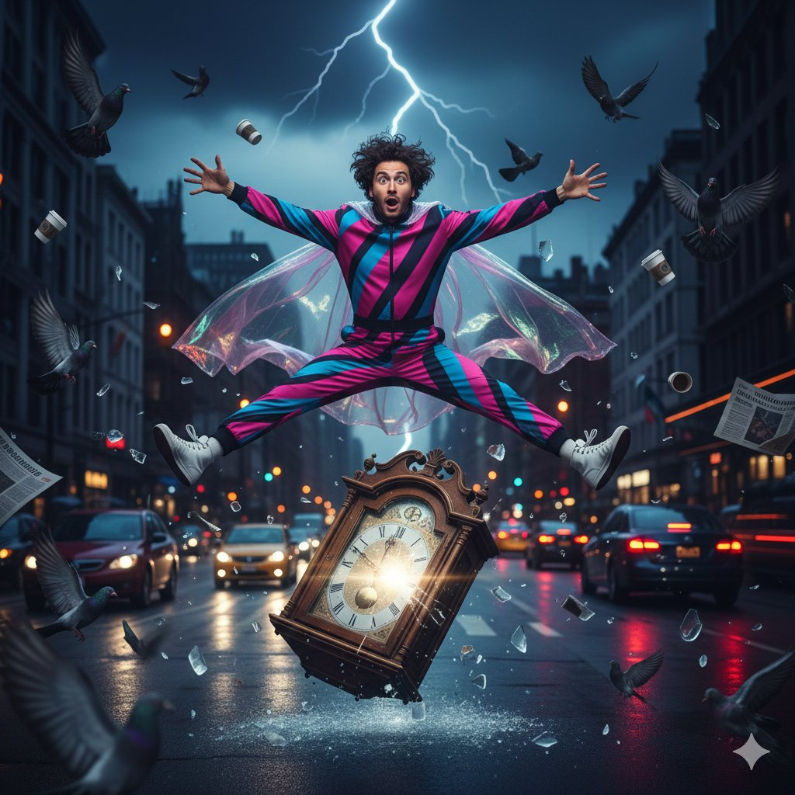

## { "art_style_description": { "type": "Digital Scrapbook 

- ID: trending-2010451647294820764
- Slug: trending-2010451647294820764-en
- 语言: en
- 来源: [来源链接](https://x.com/IqraSaifiii/status/2010451647294820764)
- 样例图路径: images/part1/2010451647294820764_1.jpg

### 提示词

```text
{
"art_style_description": {
      "type": "Digital Scrapbook / Fan-Edit Collage.",
      "aesthetic": "Y2K, Coquette, K-pop Idol Fan Art.",
      "visual_structure": "Multiple photographic cutouts of the same subject arranged in a chaotic but cohesive layout on top of a vintage textured background. Each cutout has a thick white stroke/outline to resemble a sticker."
    },
    "subject_details": {
      "demographics": "Young Asian woman (K-pop idol aesthetic), fair skin, delicate features.",
      "hair": "Long, voluminous, dark wavy hair with air bangs. In one panel, she wears a small white ribbon clip.",
      "outfit": "Black sequined/embellished crop top (bralette style), dark denim jeans.",
      "makeup": "Peach-toned blush, glossy lips, soft eyeliner."
    },
    "pose_breakdown_panels": {
      "panel_1_top_center": "Portrait shot. Subject looking straight ahead/slightly down with hand in hair, elbows raised. Background shows a blurred cityscape.",
      "panel_2_bottom_right": "Seated/Reclining pose. Subject leaning back, one arm supporting weight, looking coolly at the camera. Wearing jeans.",
      "panel_3_middle_right": "Over-the-shoulder shot. Subject looking back at the camera with a soft gaze, arm raised touching head.",
      "panel_4_bottom_left": "Close-up portrait. Subject looking to the side, wearing a white bow hair clip.",
      "panel_5_top_left": "Bust-up shot. Subject gazing off-camera with a dreamy expression."
    },
    "graphic_elements_and_overlays": {
      "background_texture": "Vintage newspaper print text (sepia/beige toned).",
      "stickers": {
        "text": "Ransom-note style text blocks reading 'iqrasaifiii', 'i swear she's an angel', and 'beyoutiful'.",
        "objects": "A brown plush teddy bear sticker in the bottom left corner.",
        "decor": "White daisy flower graphics, jagged torn paper edges."
      }
    },
    "camera_technical_values": {
      "source_photo_style": "High-end fashion editorial photography.",
      "lens": "85mm (Portrait telephoto).",
      "lighting": "Natural Window Light (Soft, directional sunlight coming from the side).",
      "color_grading": "Slightly desaturated source photos contrasted against the warm beige newspaper background.",
      "resolution": "High fidelity cutouts."
    },
    "composition": "Overlapping layers. The center and right photos are larger, while smaller details fill the corners."
```

### 样例图

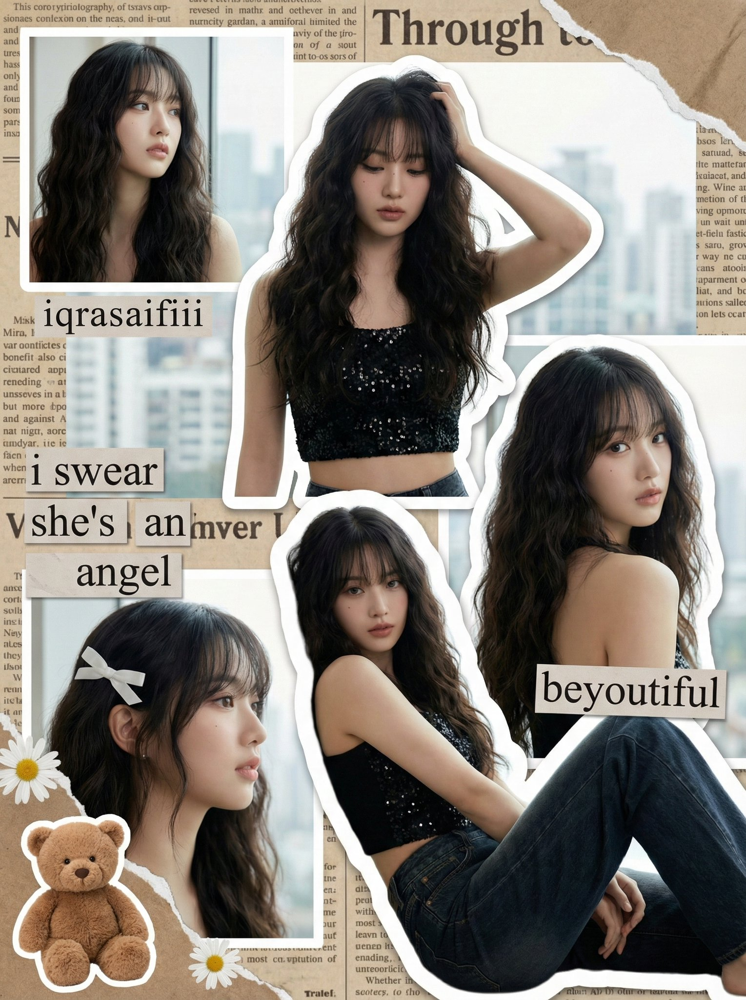

## A soft-focus, cinematic portrait of a young woman with d

- ID: trending-2022733333218955487
- Slug: trending-2022733333218955487-en
- 语言: en
- 来源: [来源链接](https://x.com/ChillaiKalan__/status/2022733333218955487)
- 样例图路径: images/part1/2022733333218955487_1.jpg

### 提示词

```text
A soft-focus, cinematic portrait of a young woman with delicate facial features and light golden hair, caught in motion. Her face appears partially blurred and ghosted, with flowing strands of hair captured mid-sway, creating a dreamy, ethereal motion effect. Her expression is serene and slightly distant, with parted lips and eyes softly open. The entire frame is bathed in golden beige and sepia tones, evoking a nostalgic, painterly atmosphere. The lighting is natural and diffused, coming from a nearby window, casting a warm glow on her skin and illuminating the strands of hair that dance across the frame. Photographed with a Canon EOS R5 using an 85mm lens at f/1.2, ISO 320, shutter speed 1/8s with intentional slow exposure and handheld movement to create the artistic motion blur. The focus is soft, with a shallow depth of field that isolates the subject from the pale, creamy background. Post-processed in Adobe Lightroom and Photoshop: cinematic LUTs applied, warmth enhanced through split-toning (shadows in soft amber, highlights in cream), clarity reduced, and motion streaks refined with displacement layers and radial blur filters. A very subtle fine grain adds a filmic texture. Final mood: emotional, hazy, poetic. Style references: fine art portraiture, vintage editorial, and analog dream sequences. 4K ultra-resolution, no harsh contrasts, smooth gradients preserved.
```

### 样例图

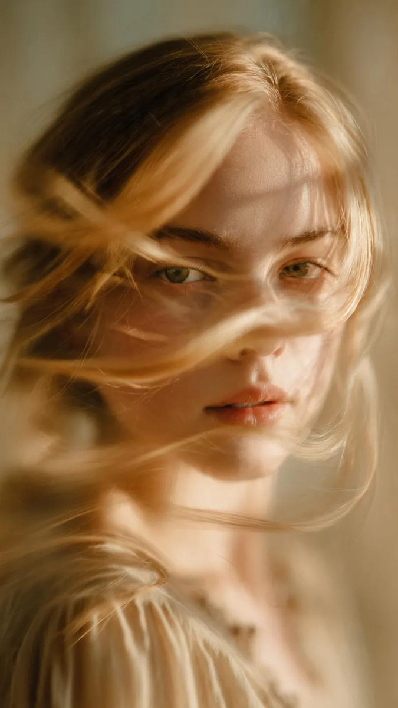

## Cinematic portrait of a young person standing still in t

- ID: trending-2021859477130293356
- Slug: trending-2021859477130293356-en
- 语言: en
- 来源: [来源链接](https://x.com/Taaruk_/status/2021859477130293356)
- 样例图路径: images/part1/2021859477130293356_1.jpg

### 提示词

```text
Cinematic portrait of a young person standing still in the middle of a busy crowd, sharp focus on the subject while people move rapidly around them creating strong motion blur. The subject looks directly at the camera with a calm, introspective expression. Soft natural lighting, shallow depth of field, dreamy atmosphere. Crowd blurred using long exposure effect, dynamic movement streaks surrounding the subject. Neutral pastel background tones, subtle color grading, emotional storytelling composition. Shot on 85mm lens, f/1.8, long shutter speed, ultra-realistic skin texture, cinematic photography, 8K resolution.
```

### 样例图

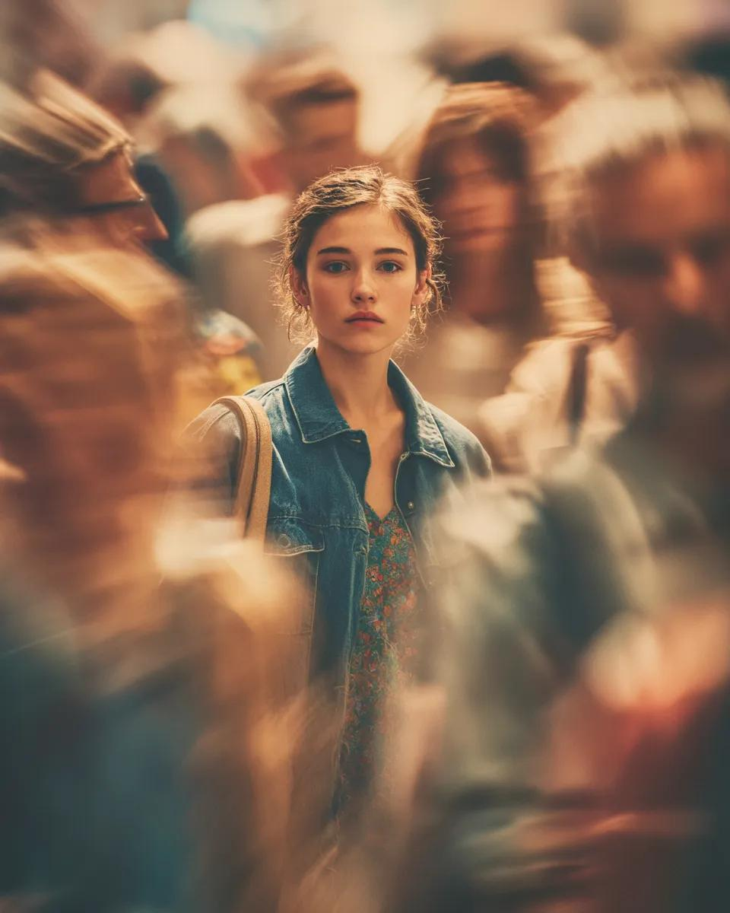

## Reflection in glass window, layered composition, subject

- ID: trending-2026846972351852719
- Slug: trending-2026846972351852719-en
- 语言: en
- 来源: [来源链接](https://x.com/ChillaiKalan__/status/2026846972351852719)
- 样例图路径: images/part1/2026846972351852719_1.jpg

### 提示词

```text
Reflection in glass window, layered composition, subject of a beautiful woman partially obscured. Fujifilm GFX100S, 80mm f/1.7 Natural diffused light Muted Portra LUT Aspect 3:4 harmony: 60% realism / 40% artistic. sRef: layered documentary imagery. Hidden tokens: glass reflection blur, layered city depth."
```

### 样例图

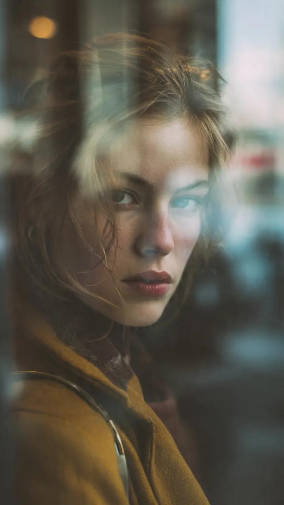

## { "objective": "Create a side-by-side comparison image f

- ID: trending-2020051579710374133
- Slug: trending-2020051579710374133-en
- 语言: en
- 来源: [来源链接](https://x.com/Strength04_X/status/2020051579710374133)
- 样例图路径: images/part1/2020051579710374133_1.jpg

### 提示词

```text
{
  "objective": "Create a side-by-side comparison image featuring a technical sketch and real photograph of the Great Wall of China",
  "image_specifications": {
    "style": "Mixed media (Technical drawing + Real photograph)",
    "layout": "Horizontal split - Left side: Sketch with measurements, Right side: Real photo",
    "aspect_ratio": "3:2"
  },
  "left_side": {
    "content_type": "Technical sketch of the Great Wall of China",
    "features": [
      "Detailed architectural lines showing wall segments, watchtowers, and defensive structures",
      "Numerical measurements for wall height, width, and tower spacing",
      "Elevation labels for wall sections and towers",
      "Side elevation and top-down layout illustrating wall curvature along terrain"
    ],
    "text_annotations": {
      "units": "Metric (meters)",
      "language": "English",
      "font_style": "Blueprint or engineering-style typography"
    },
    "positioning": "Take up the left half of the image"
  },
  "right_side": {
    "content_type": "High-resolution real photo of the Great Wall of China",
    "features": [
      "Wide panoramic view of the wall stretching across mountains",
      "Natural daylight with clear or lightly clouded sky",
      "Realistic colors with visible stone texture and surrounding landscape"
    ],
    "positioning": "Take up the right half of the image"
  },
  "visual_elements": {
    "border_division": "Vertical line or subtle transition between left (sketch) and right (photo)",
    "color_palette": {
      "left": "Monochrome or blueprint blue for sketch",
      "right": "Natural realistic colors"
    }
  },
  "output_format": {
    "type": "Image",
    "use_case": [
      "Educational poster",
      "Architectural comparison",
      "Historical visualization",
      "Tourism visual aid"
    ],
    "high_resolution": true
  }
}
```

### 样例图

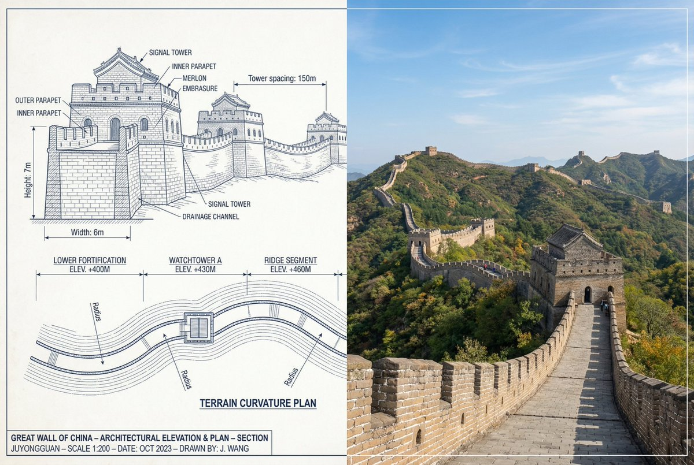

## Cinematic motion-blur photography shot on a Leica SL3 wi

- ID: trending-2040991383008199123
- Slug: trending-2040991383008199123-en
- 语言: en
- 来源: [来源链接](https://x.com/saniaspeaks_/status/2040991383008199123)
- 样例图路径: images/part1/2040991383008199123_1.jpg

### 提示词

```text
Cinematic motion-blur photography shot on a Leica SL3 with a 50mm Summilux at f/2.8, captured from a chest-level frontal angle using slow shutter panning. 

Lighting setup: flat overcast daylight acting as soft diffusion, allowing long blur trails without harsh contrast. 

Color tone: muted concrete greys and pale skin neutrals inspired by A24 films. 

Subject: a Gen-Z female model standing completely still, sharp eyes, symmetrical face, real skin pores visible, wearing understated fashion. 

Crowd action: hundreds of commuters rushing past in all directions, bodies stretched into smooth horizontal and diagonal blur. 

Emotion: quiet rebellion through stillness. 

Aesthetic: editorial calm vs chaos. 

Post: clean motion physics, fine grain, no glitches, no face distortion, no warped anatomy. 
```

### 样例图

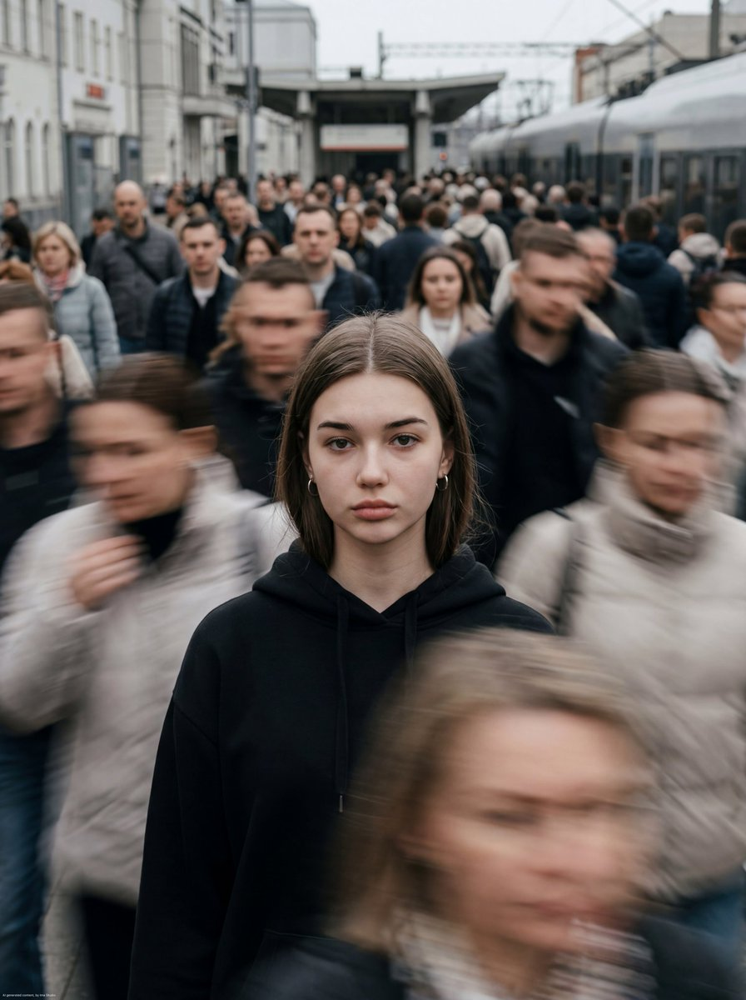

## A young blonde Hollywood actress, similar to Sydney Swee

- ID: trending-2032817549813969039
- Slug: trending-2032817549813969039-en
- 语言: en
- 来源: [来源链接](https://x.com/Giulia_4i/status/2032817549813969039)
- 样例图路径: images/part1/2032817549813969039_1.jpg

### 提示词

```text
A young blonde Hollywood actress, similar to Sydney Sweeney, appears inside a bathtub filled with foam up to the brim. Her blonde hair is styled in a high, voluminous, slightly messy bun, with a few loose strands softly framing her face. She looks directly at the camera with a neutral, subtly seductive expression, her lips slightly parted. She wears light, natural makeup, a delicate silver chain necklace with a small circular pendant, and small, discreet stud earrings.

Her upper body faces forward, visible above the foam. She holds a large open printed newspaper with both hands at chest height, as if reading it. The newspaper is partially covered with dense white soap foam, which also gathers around her in thick, fluffy bubbles filling the bathtub. Beneath the foam and the newspaper, she is wearing a green beach top that remains completely hidden.

The scene takes place inside a tiled bathtub. In the background, there is a vibrant wall completely covered with small, bright yellow square mosaic tiles. In the left corner of the composition, a slightly out-of-focus white door frame is visible, with a silver metallic doorknob.

The lighting is soft, diffused, and even indoor lighting, coming from the front and slightly from above. It creates soft, flattering highlights on her face, shoulders, and hair, with very few harsh shadows. The image conveys an eccentric, artistic, editorial atmosphere that feels slightly surreal, yet calm and visually striking.

The color palette highlights the bright yellow tiles, the white foam, the blonde hair, and the gray tones of the newspaper. The photograph is a modern, photorealistic editorial portrait with cinematic framing. The composition is a medium shot from the upper bust upward, at eye level, with a shallow depth of field that keeps the actress and the newspaper in sharp focus while slightly blurring the door handle in the foreground. The image is highly detailed, with crisp focus, professional lighting, vibrant high-contrast colors, and extremely high quality in 8K resolution, in a 4:5 aspect ratio.
```

### 样例图

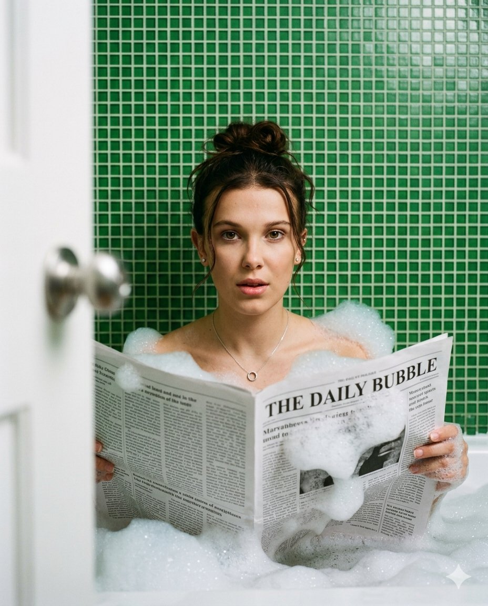

## ultra realistic cinematic portrait poster of a confident

- ID: trending-2032819113308074313
- Slug: trending-2032819113308074313-en
- 语言: en
- 来源: [来源链接](https://x.com/shushant_l/status/2032819113308074313)
- 样例图路径: images/part1/2032819113308074313_1.jpg

### 提示词

```text
ultra realistic cinematic portrait poster of a confident man using the attached face image as reference, centered headshot with shoulders visible and a calm powerful expression. Use dramatic studio lighting with a soft key light and subtle rim lighting for depth and contrast. The background should be dark matte black or charcoal with a luxury cinematic feel. Place very large tall condensed vertical typography behind the subject in the same stretched style as the reference image, partially hidden by the subject, with the text placeholder “[INSERT TITLE TEXT HERE]”. The typography should be metallic gold with a subtle foil shine. Dress the subject in a refined masculine outfit such as a black tailored suit or elegant modern sherwani. Style the image as a classy luxury editorial poster with deep black and gold tones, ultra realistic skin detail, shallow depth of field, cinematic color grading, and high resolution professional photography
```

### 样例图


## Transform this image [Upload Your Image] into a 64K DSLR

- ID: trending-2008470156146860416
- Slug: trending-2008470156146860416-en
- 语言: en
- 来源: [来源链接](https://x.com/Strength04_X/status/2008470156146860416)
- 样例图路径: images/part1/2008470156146860416_1.jpg

### 提示词

```text
Transform this image [Upload Your Image] into a 64K DSLR shot resolution of A stylish urban fashion collage composed of multiple candid street-style shots arranged in a vertical split layout. The setting is a European-style city street with stone-paved sidewalks, historic architecture, and muted neutral tones. The overall atmosphere feels modern, artsy, and lifestyle-driven, blending fashion photography with everyday urban moments. The main subject is a fashion-forward young woman (same face as the uploaded image) with long black hair, wearing a coordinated vintage-inspired outfit. She has a confident, playful, slightly rebellious attitude expressed through her body language and facial expressions. Her outfit consists of a brown plaid blazer, a white button-up shirt, and a pale yellow tie, paired with loose dark trousers and two-tone leather shoes. She accessories with a brown fitted cap, large amber-tinted aviator sunglasses, silver hoop earrings, and a small shoulder bag. White wireless earbuds are visible in some frames, reinforcing a casual, modern lifestyle aesthetic.

Left panel: A reflective mirror shot taken through a glass surface, showing the subject (same face as the uploaded image) holding a smartphone up to her face while taking a photo. The reflection slightly distorts the scene, creating layered depth with urban elements like street markings and building facades blending into the glass. Top-right panel: A high-angle shot looking down at the subject (same face as the uploaded image) as she leans forward toward the camera, lips pursed in a playful pout, emphasizing her expressive personality and bold eyewear.

Bottom-right panel: A close-up selfie angle where she looks directly into the camera while holding an iced coffee in a clear plastic cup, earbuds in, with sunlight softly illuminating her face and sunglasses.

Overlayed across the center of the collage is a minimalist music player UI, semi-transparent, displaying a paused or playing track with progress bar and controls, adding a digital, lifestyle-tech aesthetic. The interface floats above the imagery, blending seamlessly with the collage and reinforcing a "day-in-the-life" mood. Lighting is natural daylight with soft shadows. The color palette is muted and earthy browns, greys, yellows-enhanced with subtle film grain and a slightly desaturated, editorial color grade. The overall mood is effortlessly cool, candid, and contemporary, mixing street fashion, music culture, and casual city exploration. Style & Quality Tags: Street-style fashion photography, lifestyle editorial, urban aesthetic, candid moments, vintage-inspired outfit, natural light, muted color grading, subtle film grain, modern collage layout, high-resolution, Instagram editorial style.

Octane render & Unreal Engine 5.
```

### 样例图

![Transform this image [Upload Your Image] into a 64K DSLR](../images/part1/2008470156146860416_1.jpg)

## { "Objective": "Create a dreamy fine-art portrait with a

- ID: trending-2009183590035411178
- Slug: trending-2009183590035411178-en
- 语言: en
- 来源: [来源链接](https://x.com/Taaruk_/status/2009183590035411178)
- 样例图路径: images/part1/2009183590035411178_1.jpg

### 提示词

```text
{
  "Objective": "Create a dreamy fine-art portrait with a romantic, ethereal garden atmosphere",
  "PersonaDetails": {
    "Subject": {
      "Type": "Young woman",
      "Hair": "Short, softly tousled dark hair",
      "Expression": "Calm, introspective, slightly melancholic",
      "Gaze": "Looking gently toward the camera",
      "Wardrobe": {
        "Dress": "Muted teal floral dress with subtle vintage patterns"
      }
    }
  },
  "SceneDescription": {
    "Location": "Lush garden in full bloom",
    "EnvironmentDetails": [
      "Abundant flowering plants",
      "Soft greenery filling the frame"
    ],
    "AtmosphericElements": {
      "FloatingPetals": "White and pale peach flower petals drifting through the air",
      "Motion": "Petals caught mid-motion by a gentle breeze"
    }
  },
  "Composition": {
    "Framing": "Waist-up fine-art portrait",
    "Balance": "Elegant, centered composition",
    "DepthOfField": "Shallow depth of field",
    "Background": "Softly blurred garden with creamy bokeh"
  },
  "LightingAndColor": {
    "Lighting": "Soft natural light under overcast sky",
    "ColorPalette": [
      "Muted greens",
      "Soft teals",
      "Pale peach and white accents"
    ],
    "ColorGrading": "Painterly, desaturated, romantic tones"
  },
  "ArtDirection": {
    "Style": "Fine-art photography blended with cinematic realism",
    "Aesthetic": "Romantic, ethereal, timeless",
    "TextureQuality": "Ultra-detailed fabric and natural skin texture"
  },
  "PhotographyStyle": {
    "LensLook": "85mm lens perspective",
    "Genre": "Fine-art portrait photography",
    "ImageQuality": "High resolution, refined detail",
    "FocusStyle": "Soft yet precise subject focus"
  },
  "Mood": {
    "Tone": "Dreamy, reflective, poetic",
    "EmotionalFeel": "Gentle melancholy and quiet beauty"
  },
  "NegativePrompt": [
    "harsh lighting",
    "modern fashion editorial",
    "oversaturated colors",
    "busy background",
    "plastic skin",
    "cartoon",
    "anime"
  ],
  "ResponseFormat": {
    "Type": "Single image",
    "Orientation": "Portrait",
    "AspectRatio": "2:3"
  }
}
```

### 样例图

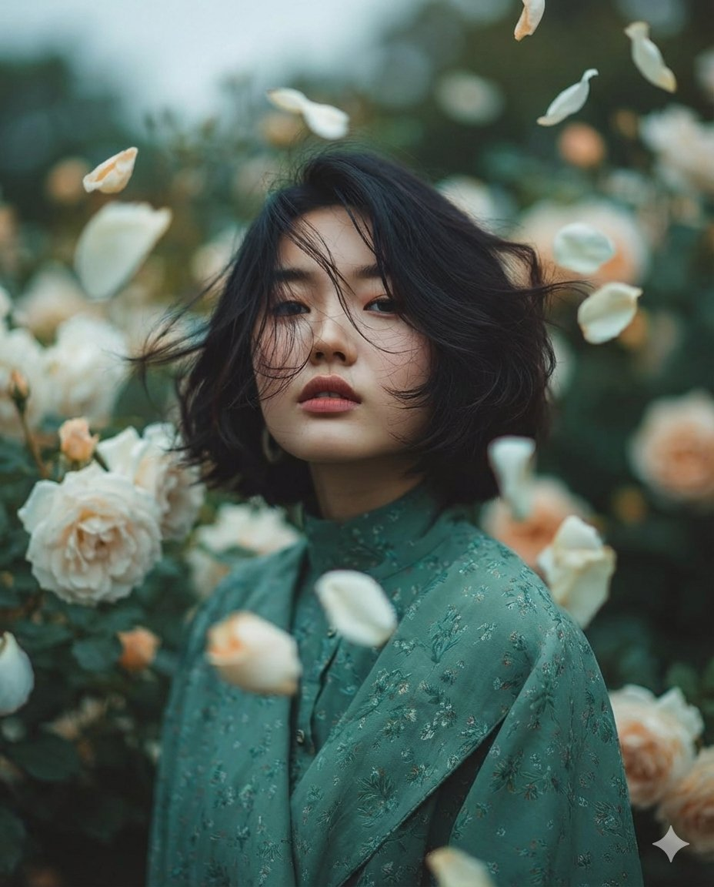

## { "image_generation": { "subject": { "description": "you

- ID: trending-2026450660540010760
- Slug: trending-2026450660540010760-en
- 语言: en
- 来源: [来源链接](https://x.com/saniaspeaks_/status/2026450660540010760)
- 样例图路径: images/part1/2026450660540010760_1.jpg

### 提示词

```text
{
  "image_generation": {
    "subject": {
      "description": "young woman standing in a lush green mountain valley",
      "pose": "standing naturally with hands gently together, looking slightly upward",
      "expression": "calm, peaceful, soft smile",
      "gaze": "looking toward the sky"
    },
    "appearance": {
      "hair": {
        "color": "dark brown",
        "style": "straight, shoulder-length with a red headband"
      },
      "face": {
        "skin_tone": "fair and natural",
        "makeup": "minimal, natural makeup"
      }
    },
    "outfit": {
      "top": "traditional patterned dress with colorful floral design",
      "outerwear": "mustard yellow shawl draped over shoulders"
    },
    "environment": {
      "setting": "green mountainous landscape",
      "background_elements": [
        "rolling green hills",
        "tall pine trees",
        "misty mountains",
        "cloudy sky",
        "grassy field"
      ]
    },
    "lighting": {
      "type": "natural outdoor light",
      "quality": "soft and diffused",
      "time": "daytime"
    },
    "camera": {
      "angle": "eye-level",
      "framing": "mid shot",
      "depth_of_field": "moderate, background softly blurred"
    },
    "aesthetic": {
      "style": "natural lifestyle photography",
      "vibe": "peaceful, fresh, scenic",
      "color_palette": "green, mustard yellow, earthy tones"
    },
    "quality": {
      "resolution": "high",
      "realism": "photorealistic",
      "detail": "high detail"
    }
  }
}
```

### 样例图

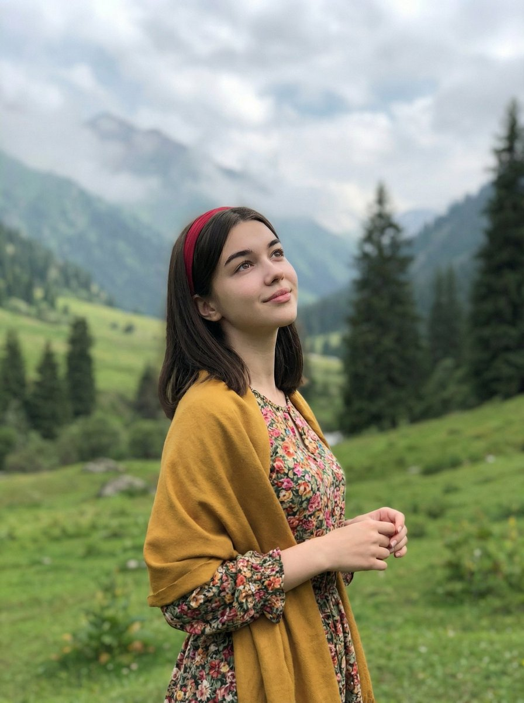

## Use this photo attached to create a striking outdoor fas

- ID: trending-2009073223758238007
- Slug: trending-2009073223758238007-en
- 语言: en
- 来源: [来源链接](https://x.com/ZaraIrahh/status/2009073223758238007)
- 样例图路径: images/part1/2009073223758238007_1.jpg

### 提示词

```text
Use this photo attached to create a striking outdoor fashion portrait set in a vibrant flower field during daylight, captured with a digital camera using a harsh flash. The camera angle is low and slightly tilted upward, intensifying the scene's energy and drama. The subject has long, loose, dark brown wavy hair cascading over a voluminous, soft, shaggy lavender faux fur coat that drapes naturally over the body. Surrounding the subject are large, colorful poppies in yellow, pink, and orange, some in the foreground and others in the background, creating an immersive field-of-flowers effect. The sky is clear and blue, providing a crisp, contrasting backdrop. The mood is bold, editorial, and whimsical, making the vibrant colors of the outfit and flowers pop starkly against the serene sky. The overall composition should evoke a playful yet high-fashion atmosphere with a hint of surrealism, emphasizing texture and color through the use of direct flash photography.
```

### 样例图

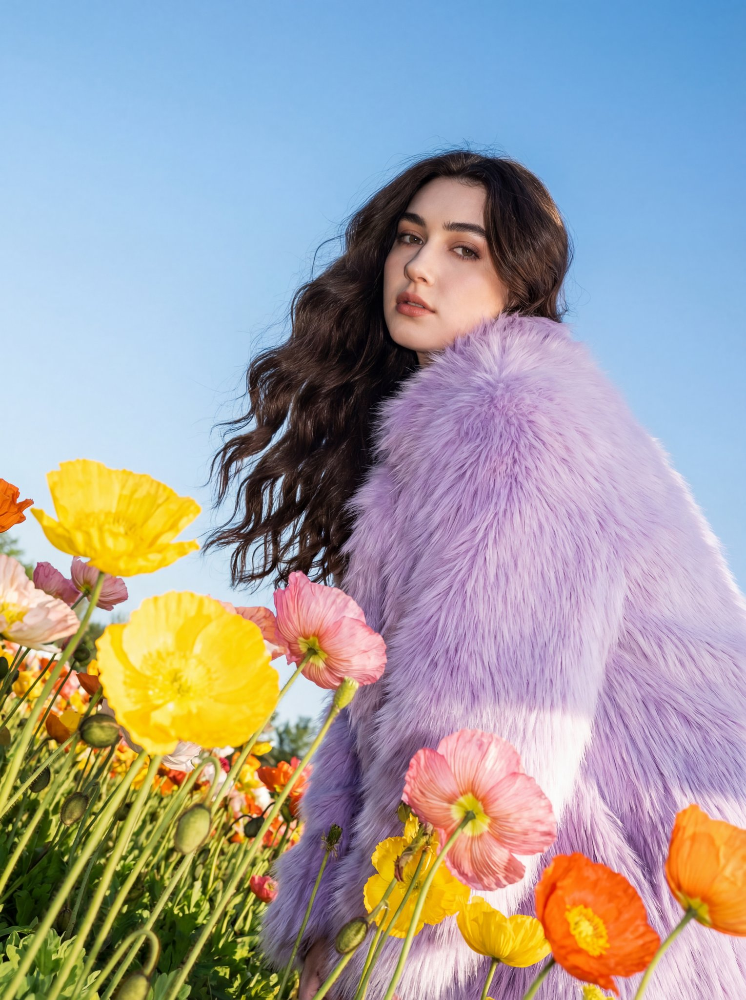

## Create an ultra-realistic cinematic 8K portrait, use fac

- ID: trending-2015354198670606808
- Slug: trending-2015354198670606808-en
- 语言: en
- 来源: [来源链接](https://x.com/harboriis/status/2015354198670606808)
- 样例图路径: images/part1/2015354198670606808_1.jpg

### 提示词

```text
Create an ultra-realistic cinematic 8K portrait, use face reference exactly (100% identical, no changes) - preserve original facial features, proportions, skin texture, hair, and expressions. A man wearing black sunglasses, a black t-shirt, black leather jacket, dark denim pants, and black Converse-style sneakers sits casually on a concrete ledge. One leg is bent while the other hangs freely. His posture is relaxed, projecting calm confidence. A massive airplane flies extremely low overhead, dominating the sky. Powerful wind ripples his jacket and clothing. Captured with a wide-angle lens from a low perspective, creating dramatic scale. Motion blur appears in clouds, debris, and air turbulence, enhancing speed and intensity. Lighting is natural and cinematic with strong contrast. The atmosphere feels surreal yet realistic, emphasizing depth, movement, and cinematic tension.
```

### 样例图

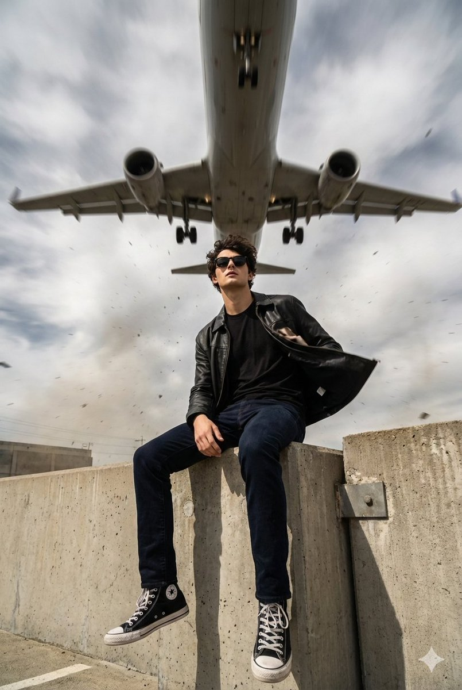

## { "meta": { "image_quality": "High", "image_type": "Phot

- ID: trending-2037653892843114830
- Slug: trending-2037653892843114830-en
- 语言: en
- 来源: [来源链接](https://x.com/youngcatwoman/status/2037653892843114830)
- 样例图路径: images/part1/2037653892843114830_1.jpg

### 提示词

```text
{
  "meta": {
    "image_quality": "High",
    "image_type": "Photo/Digital Render",
    "resolution_estimation": "1080x1920 (aspect ratio 9:16)"
  },
  "global_context": {
    "scene_description": "Jang Wonyoung of IVE poses in a highly reflective, futuristic environment constructed entirely of crumpled silver metallic foil. She has her signature long, wavy dark hair and doll-like features, including her distinct beauty marks. She is wearing a matching sleeveless, high-neck metallic silver dress. The scene is bathed in bright, diffused white light.",
    "time_of_day": "Indeterminate/Studio lighting",
    "weather_atmosphere": "Clinical/Futuristic/Monochromatic",
    "lighting": {
      "source": "Artificial",
      "direction": "Omnidirectional/Diffused",
      "quality": "Soft but creating high-contrast reflections",
      "color_temp": "Neutral/Cool"
    }
  },
  "color_palette": {
    "dominant_hex_estimates": ["#C0C0C0", "#E5E5E5", "#1A1A1A"],
    "accent_colors": ["Silver", "Chrome", "Dewy Skin Tone"],
    "contrast_level": "High"
  },
  "composition": {
    "camera_angle": "Eye-level",
    "framing": "Medium-shot/Vertical",
    "depth_of_field": "Medium",
    "focal_point": "Jang Wonyoung's face and eyes"
  },
  "objects": [
    {
      "id": "obj_001",
      "label": "Jang Wonyoung",
      "category": "Person",
      "location": "Center foreground",
      "prominence": "Foreground",
      "visual_attributes": {
        "color": "Fair skin, dark espresso hair",
        "texture": "Dewy glass skin, silky hair, metallic clothing",
        "material": "Skin/Hair/Fabric",
        "state": "Posed",
        "dimensions_relative": "Dominates vertical center"
      },
      "micro_details": [
        "Signature symmetrical beauty marks",
        "Plump gradient pink lips",
        "Small silver drop earring on left ear",
        "Thin silver necklace with a small pendant",
        "Soft shadows under the jawline",
        "Fingers of right hand resting on left forearm"
      ],
      "pose_or_orientation": "Seated/Kneeling, facing forward, arms crossed loosely at waist",
      "text_content": null
    },
    {
      "id": "obj_002",
      "label": "Metallic Dress",
      "category": "Clothing",
      "location": "Center",
      "prominence": "Foreground",
      "visual_attributes": {
        "color": "Polished Silver/Chrome",
        "texture": "Liquid-like, reflective",
        "material": "Synthetic Metallic Fabric",
        "state": "New/Tight-fitting"
      },
      "micro_details": [
        "Horizontal tension folds across the waist",
        "High turtleneck collar reflecting the chin",
        "Distorted reflection of foil room",
        "Sleeveless cut-outs"
      ],
      "pose_or_orientation": "Form-fitting",
      "text_content": null
    }
  ]
}
```

### 样例图

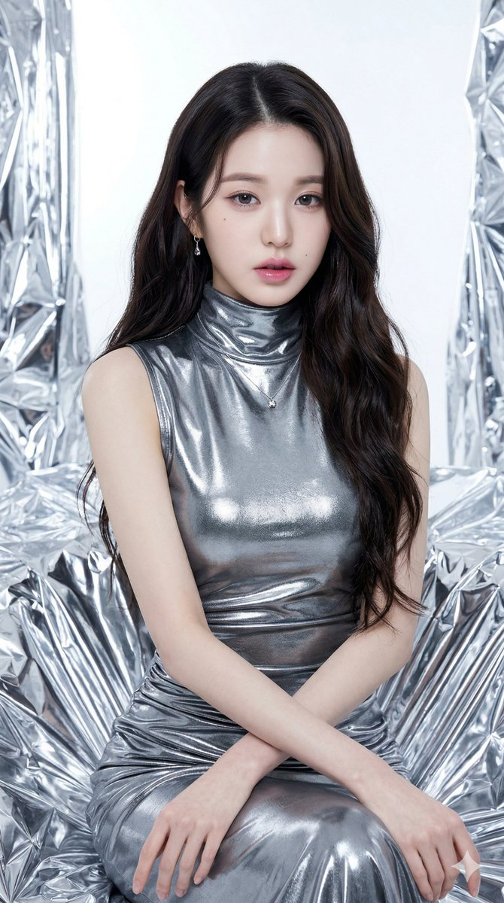

## Create a portrait without changing the facial features. 

- ID: trending-2022616495097024777
- Slug: trending-2022616495097024777-en
- 语言: en
- 来源: [来源链接](https://x.com/harboriis/status/2022616495097024777)
- 样例图路径: images/part1/2022616495097024777_1.jpg

### 提示词

```text
Create a portrait without changing the facial features. A black and white artistic photograph of a man in a noir style. The man is sitting on a metal staircase or balcony with a cityscape in the background. He is wearing a dark shirt with an open collar, dark trousers, chunky sneakers, and sunglasses. Accessories are visible on his hands, including a bracelet. His pose is relaxed, with his gaze directed downward. The lighting is high contrast with deep shadows. The atmosphere reflects a 90s megacity, with strong film grain, street fashion aesthetics, and a grunge mood.
High contrast lighting, film grain, 90s street style aesthetic, gritty noir atmosphere, grainy texture, 35mm film look.
```

### 样例图

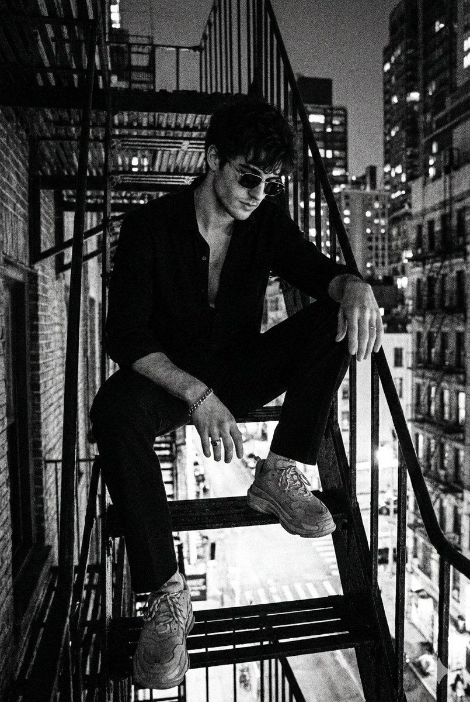

## Create a hyper-realistic macro photograph of a miniature

- ID: trending-2033136123342401904
- Slug: trending-2033136123342401904-en
- 语言: en
- 来源: [来源链接](https://x.com/DrSadek_/status/2033136123342401904)
- 样例图路径: images/part1/2033136123342401904_1.jpg

### 提示词

```text
Create a hyper-realistic macro photograph of a miniature surreal scene. The environment is dominated by a giant, oversized <everyday object>, which has been repurposed as a bustling landscape. Tiny, highly detailed miniature human figures are interacting around and on the object. Shot on an 85mm macro lens with a shallow depth of field (f/1.8) to heavily blur the distant background. Lighting is soft, directional, and casts appropriate micro-shadows to emphasize the massive scale of the object relative to the figures. Intricate environmental details like dust particles and surface scratches are visible on the object. Cinematic, photorealistic, 4K.
```

### 样例图

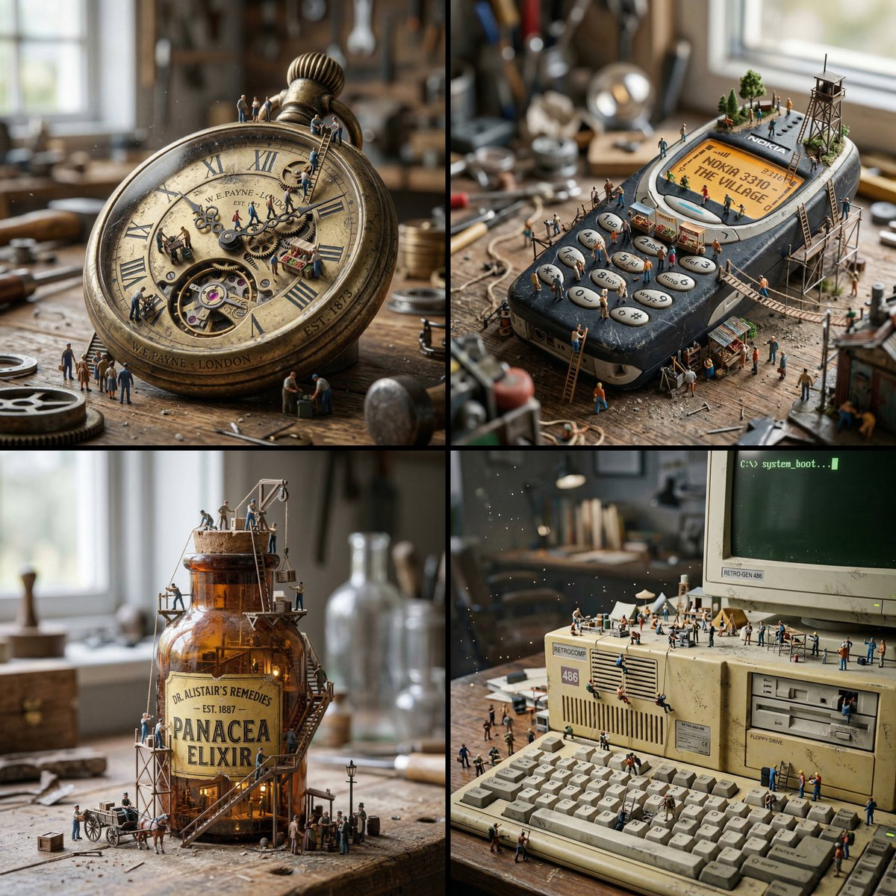

## { "image_generation": { "subject": { "description": "you

- ID: trending-2018178058868732010
- Slug: trending-2018178058868732010-en
- 语言: en
- 来源: [来源链接](https://x.com/saniaspeaks_/status/2018178058868732010)
- 样例图路径: images/part1/2018178058868732010_1.jpg

### 提示词

```text
{
  "image_generation": {
    "subject": {
      "description": "young woman standing at the entrance of a subway staircase in a city",
      "pose": "standing on subway steps, body facing downward, head turned back over shoulder",
      "expression": "calm, slightly curious, thoughtful",
      "gaze": "looking directly at the camera"
    },
    "appearance": {
      "hair": {
        "color": "light brown",
        "style": "shoulder-length wavy hair with bangs"
      },
      "face": {
        "skin_tone": "fair",
        "makeup": "natural makeup with subtle definition"
      },
      "accessories": [
        "small shoulder bag",
        "pink faux-fur bag accessory"
      ]
    },
    "outfit": {
      "top": "beige fitted ribbed turtleneck sweater with button details on sleeves",
      "bottom": "high-waisted olive green tailored pants",
      "footwear": "not visible"
    },
    "environment": {
      "setting": "urban subway entrance",
      "background_elements": [
        "green metal railings",
        "subway sign reading Christopher St Sheridan Sq",
        "city street with pedestrians and taxis"
      ],
      "location_vibe": "busy city atmosphere"
    },
    "lighting": {
      "type": "natural daylight",
      "direction": "soft ambient street lighting",
      "quality": "balanced with gentle highlights and shadows"
    },
    "camera": {
      "angle": "slightly elevated eye-level",
      "framing": "three-quarter body shot",
      "lens": "35mm",
      "depth_of_field": "moderate, subject in sharp focus with softly blurred background"
    },
    "aesthetic": {
      "style": "urban lifestyle fashion photography",
      "vibe": "cinematic, casual, metropolitan",
      "color_palette": "warm neutrals, olive green, muted city tones"
    },
    "quality": {
      "realism": "highly realistic",
      "resolution": "high resolution",
      "look": "editorial street-style photograph"
    }
  }
}
```

### 样例图

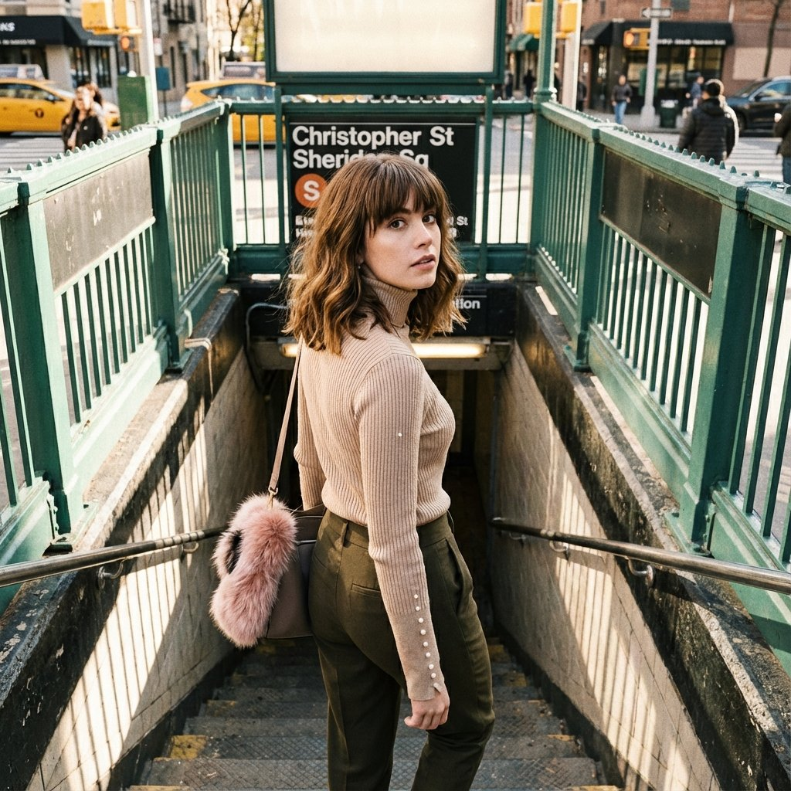

## A Cinematic Night Photo On A Dimly Lit Urban Overpass Wi

- ID: trending-2024838490785984655
- Slug: trending-2024838490785984655-en
- 语言: en
- 来源: [来源链接](https://x.com/harboriis/status/2024838490785984655)
- 样例图路径: images/part1/2024838490785984655_1.jpg

### 提示词

```text
A Cinematic Night Photo On A Dimly Lit Urban Overpass With A View Of The City Skyline. In The Foreground, A Young Man Leaning Casually Against A Classic 1960s Ford Mustang Fast-back In A Sleek Black Finish. The Car's Muscu-lar Lines Are Accentuated By The Wet Asphalt Reflecting Neon Signs From Nearby Buildings. The Young Man Is Wearing A Black Trucker Jacket, A Simple Casual T-shirt, Loose Cargo Pants, And Converse Shoes. His Pose Is Re-laxed, One Hand In His Pocket, Looking Di-rectly At The Camera With A Cool, Confident Expression.

The Shooting Style Uses A Fujifilm Camera With Soft Cinematic Color Tones, A Slight Fine Grain, And Deep Shadows. The Dominant Color Tone Is A Moody Blue-teal, With High-lights From Warm Streetlights Creating A Dramatic Contrast. The Depth Of Field Is Shal-low, With Sharp Focus On The Young Man And The Mustang, While The City Lights In The Background Blur Into Soft, Cinematic Bokeн, Evoking The Aesthetic Of A Modern Analog Film Snapshot.
```

### 样例图

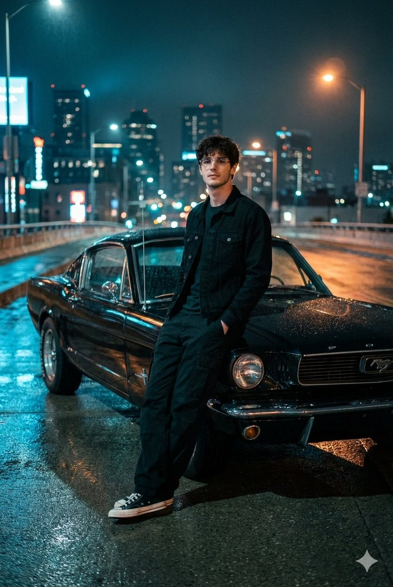

## Editorial fashion contact sheet of a modern woman with a

- ID: trending-2018544770440925209
- Slug: trending-2018544770440925209-en
- 语言: en
- 来源: [来源链接](https://x.com/Kashberg_0/status/2018544770440925209)
- 样例图路径: images/part1/2018544770440925209_1.jpg

### 提示词

```text
Editorial fashion contact sheet of a modern woman with a sharp black bob haircut wearing white oval sunglasses, a beige tailored suit over a red sweater vest and white shirt, photographed in a minimalist studio with a neutral grey backdrop. Multiple frames arranged in a 3×3 grid showing varied angles—front, side, top-down, back view—while the subject repeatedly reaches her hand toward the camera lens, creating strong depth and perspective distortion. Clean high-fashion styling, bold color contrast, soft diffused studio lighting, crisp focus, contemporary magazine aesthetic, 35mm–50mm look, ultra-sharp, high resolution.
```

### 样例图

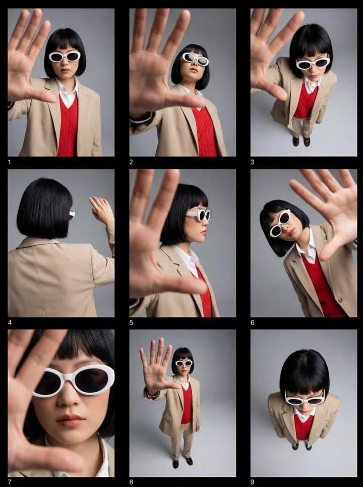

## A double exposure, long exposure editorial photograph of

- ID: trending-2023643232845140297
- Slug: trending-2023643232845140297-en
- 语言: en
- 来源: [来源链接](https://x.com/iamsofiaijaz/status/2023643232845140297)
- 样例图路径: images/part1/2023643232845140297_1.jpg

### 提示词

```text
A double exposure, long exposure editorial photograph of a man Use image for face reference in a brown hooded utility jacket with sharp facial features and curly blonde hair. Apply a digital glitch distortion effect with chromatic aberration (cyan and magenta color fringing), horizontal scan lines, and pixel sorting across the motion trails. Clean white backdrop, cinematic lighting, 35mm lens, high resolution, muted natural colors with tech-inspired digital artifacts."
```

### 样例图

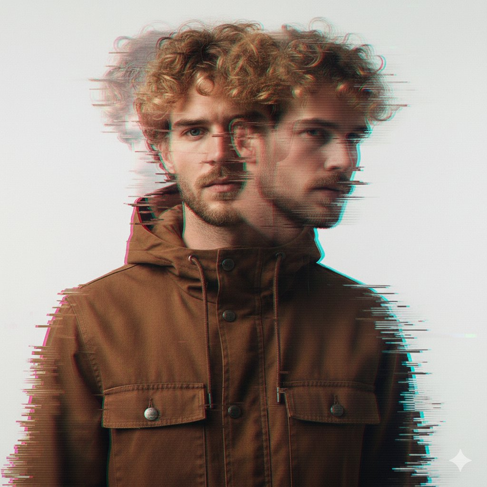

## mobile phone photo, CCD camera aesthetic, on-camera flas

- ID: trending-2034704709647564838
- Slug: trending-2034704709647564838-en
- 语言: en
- 来源: [来源链接](https://x.com/youngcatwoman/status/2034704709647564838)
- 样例图路径: images/part1/2034704709647564838_1.jpg

### 提示词

```text
mobile phone photo, CCD camera aesthetic, on-camera flash photography,
  harsh direct flash with hard shadows cast on convenience store
  refrigerator glass behind them, soft film grain texture, aspect ratio
  9:16, centered composition, upper body portrait bust shot of TWO women,
  low angle shot looking up, from chest up including shoulders and
  collarbones,
  TWO Korean women, Rosé and Lisa from BLACKPINK, gorgeous off-duty K-pop female idols, convenience
  store at 3AM, both caught by sudden camera flash,
  IMPORTANT — SKIN QUALITY FOR BOTH WOMEN: milky luminous flawless skin,
  creamy smooth porcelain complexion with subtle inner glow, perfectly
  even skin tone, zero visible pores zero blemishes, soft-focus skin
  surface like milk poured over glass, skin so smooth it almost glows
  under the flash, flash light bouncing off silky-smooth skin creating
  clean bright highlights with no texture interruption, baby-soft
  flawless dewy finish,
  WOMAN A (ROSÉ - front, facing camera, leaning back against refrigerator
  glass door): 23 years old, innocent-sexy pure-and-seductive type,
  slim oval face with delicate jawline, slightly hooded monolid eyes wide open
  with prominent sparkly aegyo-sal under-eye fat pads highlighted with
  subtle shimmer, light peach-brown eyeshadow clean and fresh, long
  natural curled lashes, signature pale strawberry blonde long straight hair one side 
  tucked behind ear exposing full neck line, cold-toned milky white
  flawless skin with soft rosy flush on cheeks, wearing
  black satin spaghetti-strap camisole with low neckline fabric clinging
  to full bust with silky flash reflection, oversized black leather
  biker jacket slipped down to both elbows completely exposing both bare
  shoulders collarbones and thin straps, delicate silver chain necklace
  catching flash, head tilted slightly back and toward Lisa, cute
  playful expression — pouty lips and wide innocent eyes,
  WOMAN B (LISA - behind Rosé, pressed against her back, partially hidden):
  21 years old, innocent-sexy type, distinct doll-like face with 
  fuller cheeks, large round double-eyelid almond eyes with full
  aegyo-sal, cold direct unblinking stare into camera with subtle
  displeasure, lips closed and slightly pouting with faint pink lip gloss, 
  jet black medium hair with her iconic thick flat air bangs
  clinging to forehead, several dark strands draped across Rosé's 
  bare shoulder, warm-toned milky fair flawless skin, wearing 
  white oversized thin t-shirt with stretched-out neckline slipping off 
  one shoulder revealing black bralette strap, her chin resting directly 
  on Rosé's bare shoulder skin-to-skin contact, one arm wrapped around 
  Rosé's waist with fingers lightly gripping the hem of the satin camisole, 
  half her face hidden behind Rosé's shoulder, faces less than 5cm apart 
  but not touching, convenience store at 3AM, refrigerator glass door 
  behind them glowing with cold white internal LED, blurred beer cans 
  visible through glass, overhead fluorescent lights with greenish tint, 
  on-camera flash hitting Rosé fully and Lisa partially, harsh flash shadow 
  on refrigerator glass, CCD camera look with soft fine film grain, 
  no full body, no legs, no extra people, no text, no watermark, 
  no identical faces, no visible pores, no rough skin texture.
```

### 样例图

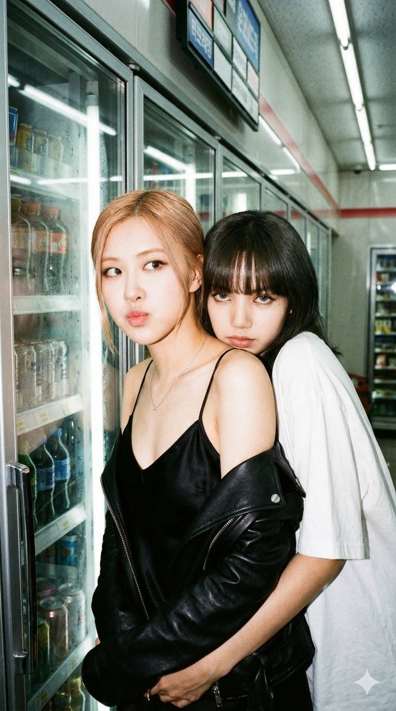

## Full body fashion editorial of a beautiful Indonesian wo

- ID: trending-2028296737006170536
- Slug: trending-2028296737006170536-en
- 语言: en
- 来源: [来源链接](https://x.com/ChillaiKalan__/status/2028296737006170536)
- 样例图路径: images/part1/2028296737006170536_1.jpg

### 提示词

```text
Full body fashion editorial of a beautiful Indonesian woman, wet pavement outside warkop, soft rain blur background.
Canon R5, 85mm f/1.4
Overcast natural light
Cool-toned Portra LUT
Harmony: 70% documentary.
sRef: rainy street realism.
Hidden tokens: damp air texture, reflective asphalt.
```

### 样例图

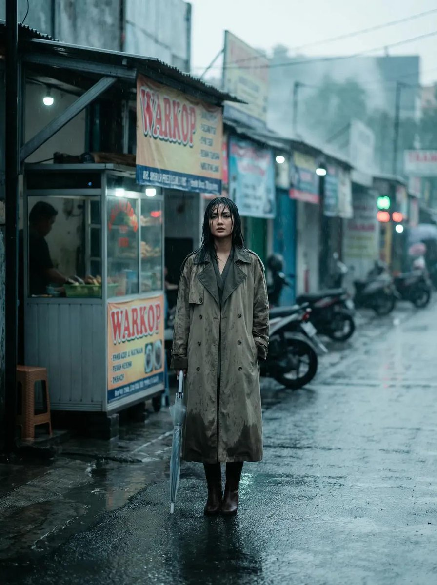

## Create a high-impact editorial studio portrait using the

- ID: trending-2028469511108829260
- Slug: trending-2028469511108829260-en
- 语言: en
- 来源: [来源链接](https://x.com/weiinberg/status/2028469511108829260)
- 样例图路径: images/part1/2028469511108829260_1.jpg

### 提示词

```text
Create a high-impact editorial studio portrait using the person from the attached reference photo as the only identity source.

Preserve the subject’s facial structure, skin tone, proportions, hairstyle, age, and overall likeness exactly as in the reference image. Do not modify, enhance, reshape, beautify, or reinterpret any facial features. Absolute identity accuracy is required.

The subject is framed in a medium close-up (head and shoulders), photographed from a low-angle perspective looking slightly upward to create a powerful, dominant presence. The subject’s gaze is directed off-camera, upward into space, with a serious, focused, intense expression.

Wardrobe: premium black pique polo shirt with visible cotton mesh texture. The fit is sharp and tailored, deep matte black fabric, structured and clean silhouette.

Background: solid vibrant orange-red studio backdrop with smooth, seamless color gradients. No patterns or texture — only rich, intense color creating a heated, dramatic atmosphere.

Lighting: bold, high-contrast studio lighting dominated by orange and deep red tones. Strong directional key light creates dramatic chiaroscuro shadows that emphasize facial structure and jawline. Add a powerful rim light or edge glow separating the shoulders and head from the background. Maintain depth and dimensionality.

Mood: heroic, intense, commanding, cinematic studio aesthetic.

Technical quality: ultra-photorealistic, highly detailed, sharp focus on the face, visible natural skin texture and pores, no smoothing. Background gradients smooth and clean.

High resolution, studio-grade quality, professional editorial finish
```

### 样例图

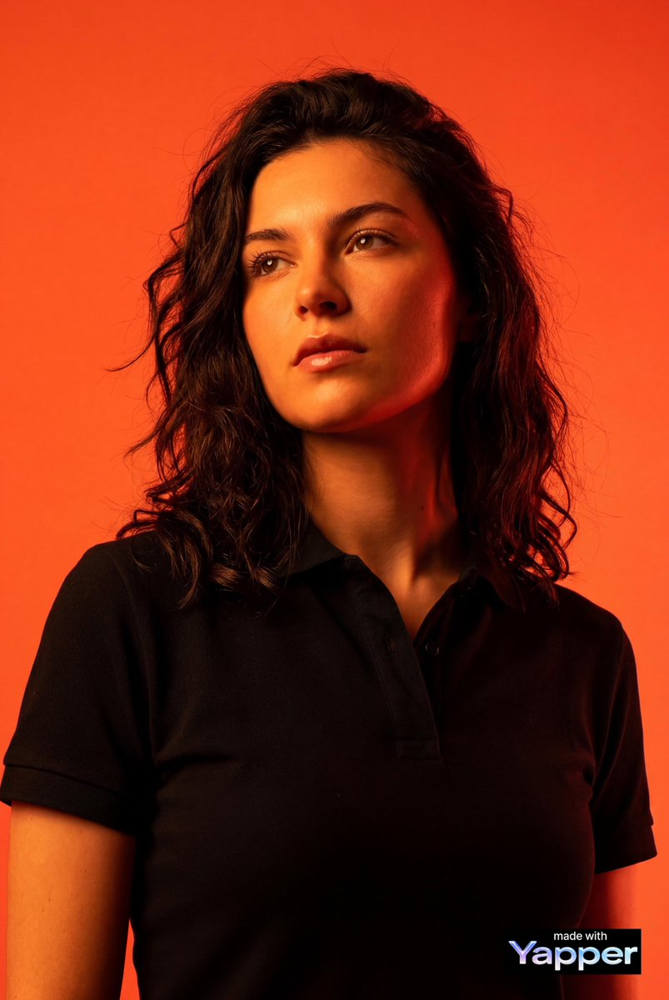

## { "action": "image_generation", "action_input": { "promp

- ID: trending-2018704062582297014
- Slug: trending-2018704062582297014-en
- 语言: en
- 来源: [来源链接](https://x.com/JadoonKhan281/status/2018704062582297014)
- 样例图路径: images/part1/2018704062582297014_1.jpg

### 提示词

```text
{
  "action": "image_generation",
  "action_input": {
    "prompt": "A high-detail, 8K close-up portrait of the same woman from the previous images with the same facial features and long blonde wavy hair. She is captured in a moment of genuine, joyful laughter with her head slightly tilted back and eyes closed. She is wearing a crisp white button-down social shirt with a small black lapel microphone attached. The background is a minimalist, smooth light gray studio wall. The lighting is soft and professional, highlighting the texture of the fabric and the natural details of her expression. Cinematic quality, realistic skin textures, 2:3 aspect ratio.",
    "aspect_ratio": "2:3"
  }
}
```

### 样例图

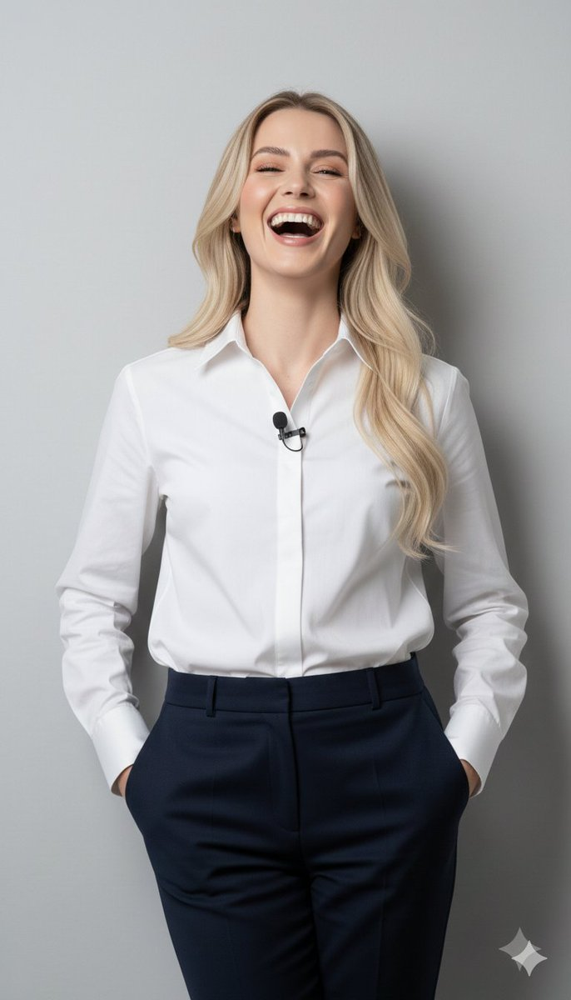

## { "prompt": "Ultra-realistic high-end fashion editorial 

- ID: trending-2008770294253842780
- Slug: trending-2008770294253842780-en
- 语言: en
- 来源: [来源链接](https://x.com/r4jjesh/status/2008770294253842780)
- 样例图路径: images/part1/2008770294253842780_1.jpg

### 提示词

```text
{
  "prompt": "Ultra-realistic high-end fashion editorial portrait of an adult man, 100% using the uploaded reference image for exact face, identity, facial structure, and expression (no changes or stylization). The subject is leaning casually against a tall white rectangular pedestal in a minimal studio environment. Pose must match the reference exactly: body angled sideways, left hip resting on the pedestal, one hand casually placed inside the trouser pocket, the other relaxed by the thigh. One leg straight on the ground, the other slightly bent at the knee, feet crossed naturally at the ankles.\n\nHe is wearing a tailored light grey textured suit with slim-fit trousers and a matching blazer, paired with a white button-down shirt worn casually open at the collar (no tie). Black leather loafers with a visible ankle gap, clean and elegant styling.\n\nFacial details preserved from the reference: sharp masculine jawline, light stubble beard, defined cheekbones, neatly styled dark hair swept back. Expression is serious and calm, eyes looking slightly off-camera to the side.\n\nLighting is dramatic with hard side lighting from a single direction, creating strong, sharp shadows and a clear silhouette shadow of the subject projected onto the wall behind him. High-contrast light-and-shadow geometry enhances the cinematic editorial mood.\n\nBackground consists of a smooth dark grey studio wall and floor, minimalist and distraction-free, with no props other than the pedestal. Luxury fashion magazine aesthetic, ultra-sharp focus, realistic skin texture, fine fabric details, cinematic contrast. DSLR photography look with an 85mm lens, shallow depth of field, muted neutral color grading. Vertical composition, premium editorial quality, 8K photorealism.",
  "aspect_ratio": "4:5",
  "resolution": "8K",
  "camera_lens": "85mm",
  "style": "luxury fashion editorial, cinematic",
  "lighting": "dramatic hard side lighting, high contrast",
  "quality": "ultra-realistic, premium",
  "reference_image": "strictly use uploaded image only"
}
```

### 样例图

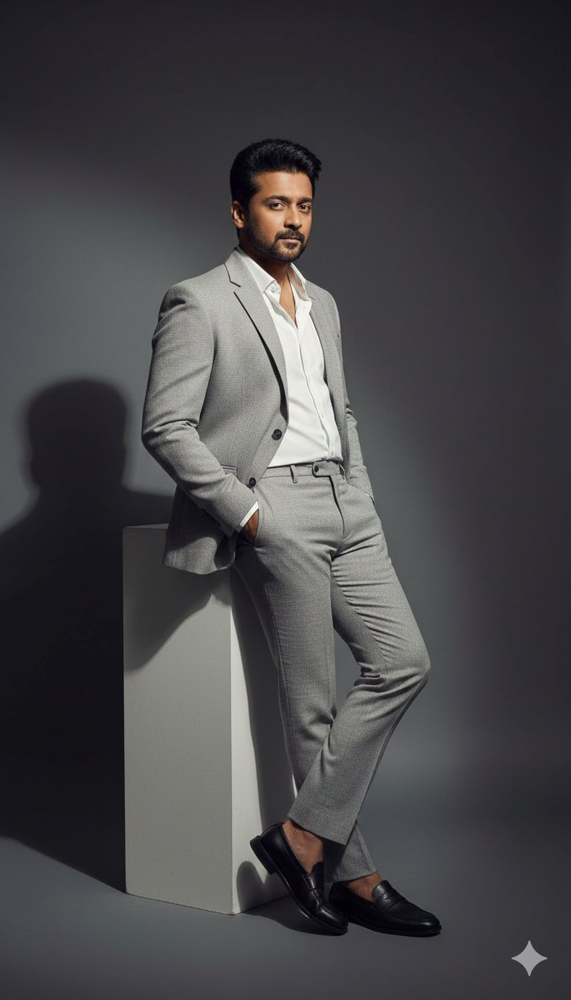

## { "scene_type": "outdoor portrait", "composition": { "fr

- ID: trending-2008192606333988964
- Slug: trending-2008192606333988964-en
- 语言: en
- 来源: [来源链接](https://x.com/ZaraIrahh/status/2008192606333988964)
- 样例图路径: images/part1/2008192606333988964_1.jpg

### 提示词

```text
{ "scene_type": "outdoor portrait", "composition": { "framing": "medium shot", "orientation": "vertical", "subject_position": "center-right", "pose": "arms crossed, body angled slightly to the right, head turned slightly left", "camera_angle": "eye-level", "depth_of_field": "shallow, strong background blur" }, "subject": { "gender_presentation": "male", "age_range": "mid-20s to early-30s", "skin_tone": "light", "facial_features": "defined jawline, light stubble beard, straight nose, soft cheek contours", "expression": "calm, contemplative, neutral confidence", "gaze_direction": " On camera" }, "hair": { "color": "medium brown", "style": "short to medium length, naturally curly with volume on top", "texture": "soft, slightly tousled" }, "wardrobe": { "top": { "type": "long-sleeve button-up shirt", "color": "white", "material": "lightweight linen or linen-blend", "fit": "relaxed, tailored", "details": "collarless or minimal collar, sleeves rolled to forearm" }, "accessories": { "watch": { "type": "analog wristwatch", "strap_color": "dark brown or black leather", "dial_color": "dark, likely black", "style": "classic, minimalist" } } }, "lighting": { "type": "natural daylight", "quality": "soft, diffused", "direction": "front-left", "contrast": "low to medium", "highlights": "gentle highlights on face and shirt", "shadows": "soft, minimal shadowing" }, "color_palette": { "dominant_colors": ["green", "white", "earth tones"], "background_tones": ["olive green", "forest green", "muted brown"], "overall_temperature": "warm-neutral" }, "background": { "environment": "natural landscape", "elements": ["green shrubs", "trees", "rock formations", "wild vegetation"], "focus": "heavily blurred (bokeh)", "mood": "serene, organic, outdoorsy" }, "artistic_style": { "genre": "lifestyle portrait photography", "aesthetic": "natural, clean, understated elegance", "mood": "calm, confident, introspective", "visual_story": "modern minimalist man in harmony with nature" }, "technical_traits": { "lens_effect": "portrait lens with background compression", "aperture_estimate": "wide (approximately f/1.8–f/2.8)", "sharpness": "high subject sharpness", "noise": "minimal", "post_processing": "light color correction, natural skin tones, subtle contrast enhancement" }, "typography": { "present": false } }
```

### 样例图

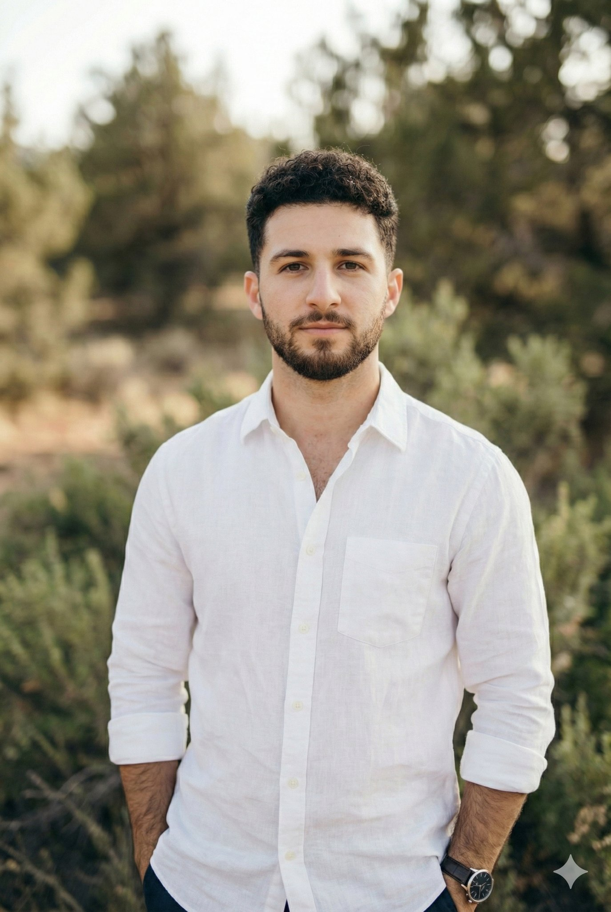

## { "render_goal": "Contemporary cinematic fashion portrai

- ID: trending-2008566343147126894
- Slug: trending-2008566343147126894-en
- 语言: en
- 来源: [来源链接](https://x.com/hoor_world06/status/2008566343147126894)
- 样例图路径: images/part1/2008566343147126894_1.jpg

### 提示词

```text
{
  "render_goal": "Contemporary cinematic fashion portrait",
  "subject": {
    "pose": "female standing inside a luxury elevator",
    "expression": "subtle confident smile"
  },
  "wardrobe": "sleek satin gown in muted graphite tone",
  "environment": {
    "location": "brushed metal elevator interior",
    "props": "soft ceiling lights, mirror reflections"
  }
}
```

### 样例图

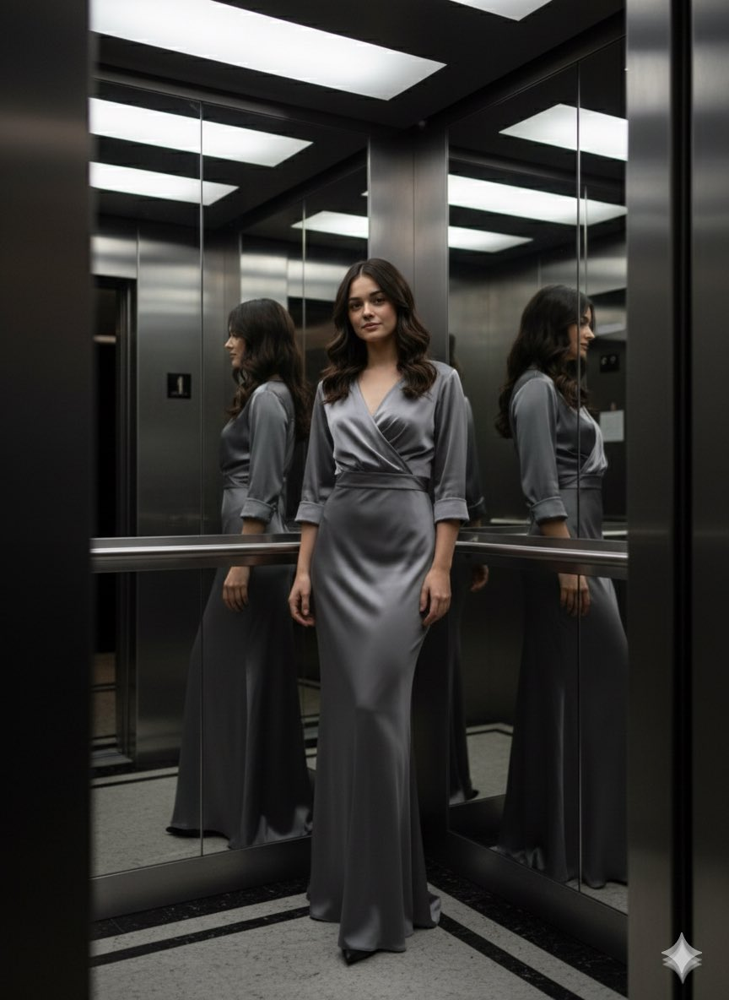

## 一张高分辨率的3x3网格照片拼贴，包含九

- ID: trending-2009425516638687431
- Slug: trending-2009425516638687431-zh
- 语言: zh
- 来源: [来源链接](https://x.com/linxiaobei888/status/2009425516638687431)
- 样例图路径: images/part1/2009425516638687431_1.jpg

### 提示词

```text
一张高分辨率的3x3网格照片拼贴，包含九个不同的动态姿势，以上传的女性面部照片为参考，背景是充满活力的蔚蓝天空，点缀着朵朵白云，强烈的明暗自然阳光照射下，形成清晰的阴影。人物身穿针织衫，搭配一条裙子，并佩戴一条纤细的银项链。摄影运用了多种焦距，从35mm广角全身镜头到85mm特写人像镜头，画面切换自如。姿势丰富多样，包括：双腿分开、双手抱头的有力姿势；手掌直指镜头的透视效果；透过一只眼睛上方“OK”手势的俏皮特写；双手托腮的欢快中景；以及用手遮住半张脸的忧郁姿势。图像质量高达 8K 分辨率，呈现出超逼真的效果，展现了细腻的肌肤纹理、次表面散射、逼真的衣物褶皱以及根根分明的发丝，呈现出高端商业时尚画册或生活方式宣传片的精致美感。
```

### 样例图

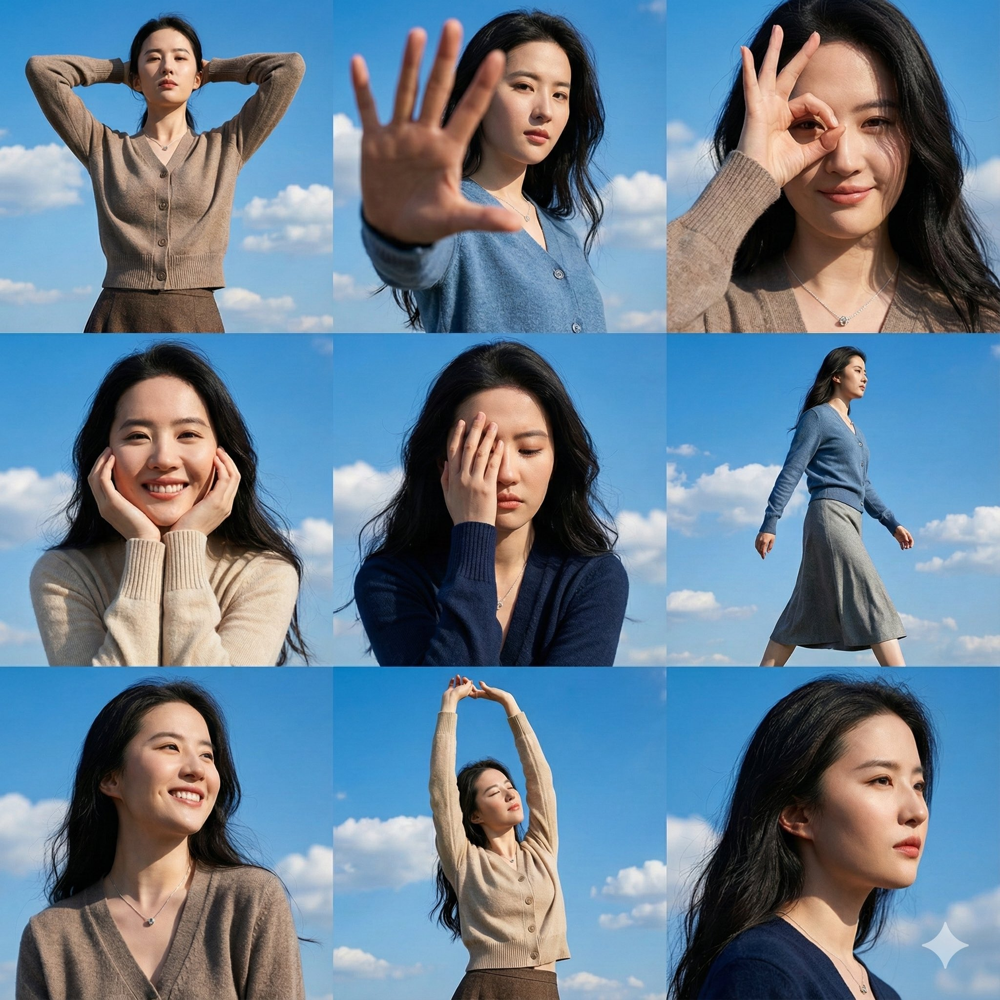

## 东方古风清雅女性正面肖像，超近景贴脸特写

- ID: trending-2037809608794759408
- Slug: trending-2037809608794759408-zh
- 语言: zh
- 来源: [来源链接](https://x.com/VoxcatAI/status/2037809608794759408)
- 样例图路径: images/part1/2037809608794759408_1.jpg

### 提示词

```text
东方古风清雅女性正面肖像，超近景贴脸特写，人物正面面对镜头，头部端正，视线直视镜头，脸部几乎充满画面，构图集中，双眼位于视觉中心，整体呈现强烈的人脸主导感。
人物气质清雅、端庄、疏离、含蓄，像高门贵女、仙门弟子、带距离感的古典仕女，安静中带一种不容轻犯的从容。整体观感干净、精致、高级，不做甜美活泼感，不做冷艳危险感，不做现代时尚感。
脸型为窄长鹅蛋脸，脸宽较窄，纵向比例偏长，面中舒展，整体轮廓收紧修长，面部留白适中。额头中等偏高，发际线整齐、轮廓饱满流畅。太阳穴平顺微内收但不凹陷，颧弓不外扩，苹果肌轻微平整，不做甜感饱满苹果肌，面中过渡平整流畅，鼻基底适中，法令区干净。下颌线柔和但走向清晰，下颌角弱化，下巴中等长度偏尖，收口利落精致，骨相轻薄修长，上镜感强。
五官精致古典。眉毛为深棕色自然弯眉，眉形柔弧流畅，眉峰轻微自然，眉尾细而下收，眉眼距离适中偏宽，整体呈现古典温柔感。眼睛为细长杏眼偏凤眼感，双眼对称，眼裂偏长，纵向开合中等偏窄，内眼角略尖清晰，外眼角向外轻微上挑，上眼皮薄而干净，双眼皮窄自然，下眼睑存在感清晰，卧蚕轻微精致不膨胀。眼神直视镜头，目光安静、清澈、疏离、端庄，带轻微不可接近感，不做甜妹无辜感，不做冷艳攻击感。睫毛纤长自然，上睫毛柔和拉长，下睫毛纤细分明，不做夸张浓密效果。鼻子为高挺秀气鼻，山根中等偏高自然顺接额头，鼻梁细直干净，鼻背平整挺拔，鼻头小巧精致微圆，鼻尖轻收，鼻翼窄，鼻孔不外露，中轴稳定，东方精致感，不做夸张欧美高挺鼻。嘴唇为中等厚度唇，唇峰清晰柔和，上唇中等，下唇微饱满，唇形端庄古典，嘴角自然平直，不做甜美嘟唇，不做大笑表情。
皮肤为冷白瓷感肤色，白皙通透匀净，底妆为高完成度瓷感底妆，肤质统一干净，细腻柔滑如上釉瓷器，带高级精修感。面中、鼻梁、鼻尖、眼下有轻微提亮，高光克制细腻，不做韩系油亮水光肌。面部轮廓修容精细但克制，鼻侧影自然，颧侧轻微收紧，下颌修容干净，立体度来自柔和明暗关系而不是夸张硬阴影。
妆容为古风仕女感精致妆容，明确带妆，妆感温暖古典。眼妆以暖橘棕、柔和赤茶、浅珊瑚为主色调，上眼影从睫毛根部向上柔和晕染，色彩干净通透，内眼线轻微填满，外眼线纤细柔和向外轻微拉长，眼尾上扬幅度极克制，下眼睑后半段极轻微暖橘晕染，下睫毛纤细分明，卧蚕以窄面积柔和提亮呈现，不做甜妹膨胀卧蚕。眉妆自然克制，色调与发色协调。腮红为柔和暖杏橘色，位置偏面中偏高，存在感低，自然融入肤色。唇妆为中饱和暖红棕、柔和赤茶调，中心略深边缘柔化，唇面保留轻微质感，整体妆容温暖古典、清雅内敛。
发型为黑色盘发古风发髻，发缝自然偏分，发质顺滑，发量适中偏多，头顶盘成精致高髻，两侧有少量碎发自然垂落修饰脸型，额前轻微碎发但不遮挡眉眼主体。发顶轮廓干净圆润。可搭配低调古风发饰，如蓝宝石花簪、金丝蝶饰、小型珠坠流苏，风格雅致精致，不夸张不繁重，与衣饰色调统一。
服饰为浅蓝色至雾蓝色古风广袖衣裳，面料轻透柔软，带轻纱层叠感，肩颈区域布料自然垂落，领口结构精致干净。面料上可见精致金色凤鸟纹刺绣，纹饰繁复但不凌乱，金线细腻闪烁，局部点缀蓝宝石色小型珠饰。整体造型统一于仙门贵女、古典仕女方向。
光线为柔和均匀正面布光，主光正面略偏上打在额头、眼周、鼻梁、唇部，让脸部中央清晰，五官干净立体。光线均匀柔和，不做强烈明暗对比。整体色调偏冷中性偏蓝灰，背景为柔和雾蓝灰色虚化，与服饰色调形成统一色境。人物肤色保持自然冷白，唇部保留暖红棕形成轻微冷暖对比。画面具有影视级真实摄影质感，细节干净，高级精修，非卡通，非插画，非二次元，偏真实摄影与古风写真效果。
画面仅聚焦于面部、五官、皮肤、妆容、发型与服饰本身，不加入场景信息，不加入动作叙事，不加入手部，不加入背景道具，不加入文字信息。极近景贴脸特写，面部填满画面，正面直视。不做侧脸，不做低头俯视，不做仰拍。非卡通，非插画，非二次元，非3D渲染。
在画面右下角加入专属签名"voxcat"，签名形式为小型自然手写英文签名，笔触干净利落，尺寸较小，不抢主体，不破坏整体构图，与画面古风清雅气质统一；签名颜色可为低饱和白色、灰白色或淡金色，具有高级感与作品标识感。
```

### 样例图

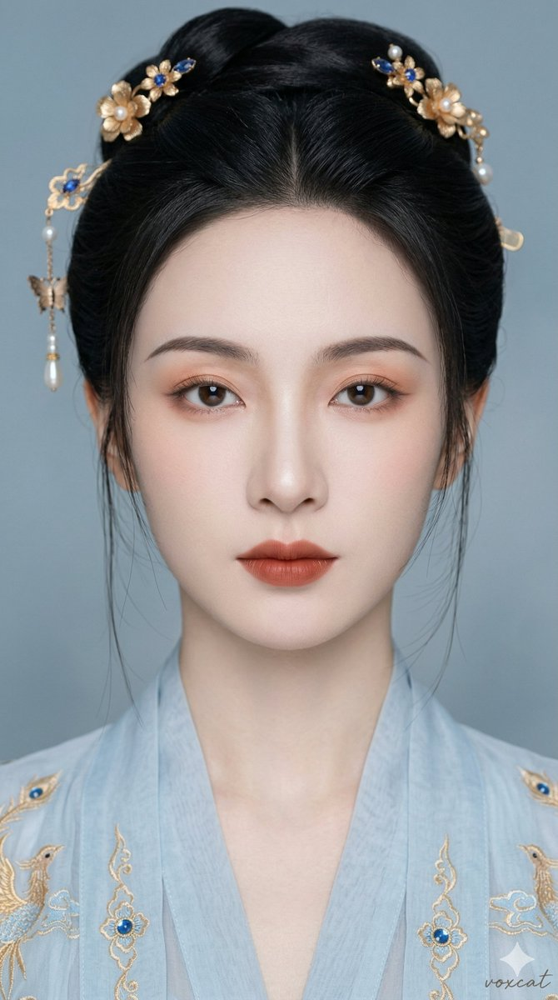

## { "scene_type": "lifestyle portrait with animal interact

- ID: trending-2008342320761254374
- Slug: trending-2008342320761254374-en
- 语言: en
- 来源: [来源链接](https://x.com/ZaraIrahh/status/2008342320761254374)
- 样例图路径: images/part1/2008342320761254374_1.jpg

### 提示词

```text
{ "scene_type": "lifestyle portrait with animal interaction", "composition": { "framing": "medium shot", "orientation": "portrait", "subject_placement": "human subject seated slightly right of center, animal positioned lower left, heads forming a gentle diagonal", "camera_angle": "eye-level", "depth_of_field": "moderate, background softly blurred but still textured", "visual_balance": "balanced by contrast between human face and animal body mass" }, "subjects": { "human": { "gender_presentation": "female", "age_range": "young adult", "pose": "seated, torso angled slightly left, head turned right", "expression": "soft smile, contemplative, calm", "gaze_direction": "on camera ", "skin_tone": "light", "hair": { "color": "brown", "style": "pulled back into bun or ponytail", "accessory": "dark patterned headscarf" }, "clothing": { "top": "light-colored graphic t-shirt with cherub illustration", "bottom": "dark pants", "accessories": [ "necklace with small bird-shaped pendant", "wristwatch" ] } }, "animal": { "species": "tiger cub", "size": "juvenile", "fur_pattern": "orange with black stripes and white facial markings", "pose": "lying on side, head tilted upward", "interaction": "drinking from bottle held by human" } }, "props": { "bottle": { "type": "baby feeding bottle", "color": "white with blue cap", "decoration": "pink star and small graphic icons", "function": "feeding animal" } }, "environment": { "location_type": "indoor, rustic or zoo-like enclosure", "background_material": "rough stone wall", "floor_texture": "straw or hay scattered on ground", "setting_mood": "warm, intimate, caretaking" }, "lighting": { "type": "soft natural or diffused artificial light", "direction": "from front-left", "quality": "warm, even, low contrast", "shadow_behavior": "gentle shadows, no harsh edges" }, "color_palette": { "dominant_colors": [ "warm beige", "stone gray", "soft brown", "orange" ], "accent_colors": [ "black", "white", "blue", "pink" ], "overall_tone": "warm and earthy" }, "texture_details": { "stone_wall": "coarse, uneven, aged", "fabric": "soft cotton t-shirt, matte finish", "fur": "dense, plush, clearly defined stripes" }, "stylistic_attributes": { "genre": "documentary-style lifestyle photography", "aesthetic": "natural, candid, emotionally warm", "retouching_level": "minimal, realistic skin and texture preservation" }, "technical_characteristics": { "lens_look": "standard to short telephoto", "focal_length_estimate": "35–50mm", "aperture_estimate": "f/2.8–f/4", "sharpness": "sharp focus on faces", "noise": "low", "dynamic_range": "moderate with preserved highlights" }, "emotional_read": { "primary_emotion": "tenderness", "secondary_emotions": [ "curiosity", "care", "gentle joy" ] }, "use_case_potential": [ "editorial storytelling", "animal care advocacy", "lifestyle inspiration", "UGC-style social media content" ] }
```

### 样例图

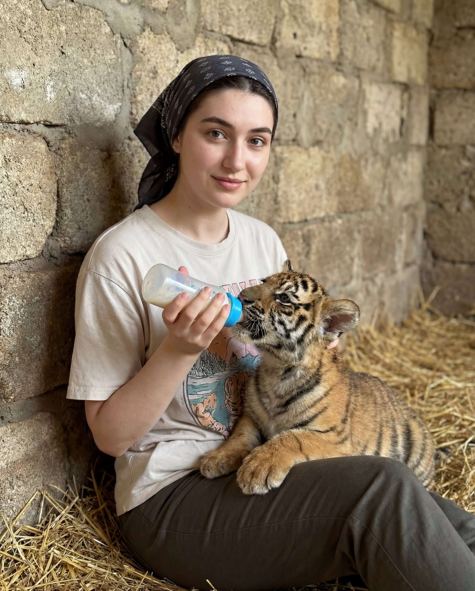

## 1. 宏观风格与媒介 - 核心媒介: 高

- ID: trending-2008273570175349157
- Slug: trending-2008273570175349157-zh
- 语言: zh
- 来源: [来源链接](https://x.com/ttmouse/status/2008273570175349157)
- 样例图路径: images/part1/2008273570175349157_1.jpg

### 提示词

```text
1. 宏观风格与媒介
- 核心媒介: 高清商业人像摄影 (High-end Commercial Photography)
- 美学流派: 新中式美学 (New Chinese Style), 节日时尚大片

2. 主体与IP身份
- 核心主体: 年轻东亚女性侧颜特写 (Close-up profile of young Asian woman)
- IP/名人锁定: 穿着红色旗袍 (Red Cheongsam), 佩戴珍珠项链与红色花卉耳环

3. 世界逻辑与物理
- 物理法则: 真实光学投影 (Real optical projection), 面部光影贴合面部起伏
- 空间构成: 人眼平视视角 (Eye-level), 极近距离接触

4. 数据与信息层
- 文本提取: 无文本
- 品牌与符号: 红色剪纸艺术前景 (Red paper-cut art foreground) - 包含仙鹤、蝴蝶与牡丹纹样

5. 材质与纹理
- 核心材质: 超写实皮肤质感 (Hyper-realistic skin), 哑光卡纸 (Matte cardstock), 温润珍珠
- 触感细节: 逆光下可见的面部绒毛 (Visible vellus hair backlit), 次表面散射效果 (Subsurface scattering)

6. 光影与氛围
- 光照模型: Gobo投影布光 (Gobo lighting/Projected shadows) - 复杂的镂空花纹光影投射在人物面部
- 整体氛围: 金色暖阳侧逆光 (Warm golden hour light), 高饱和度喜庆红调, 梦幻且清晰

7. 技术参数
- 镜头与渲染: 85mm-100mm 微距镜头 (Macro lens), 浅景深 (Shallow depth of field), 前景虚化 (Bokeh foreground)
- 构图指令: 框式构图 (Framed composition), --ar 3:4
```

### 样例图

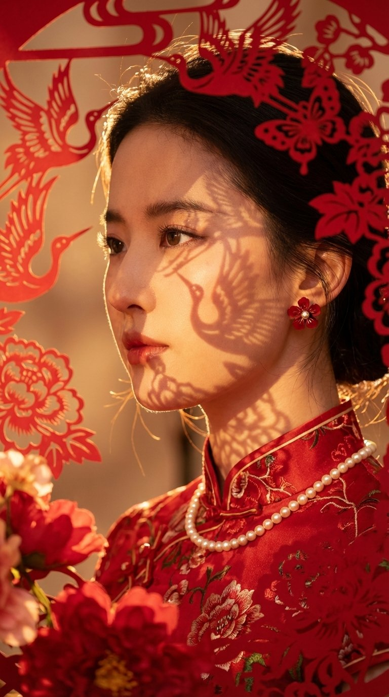

## Cinematic portrait of a stylish young person wearing rou

- ID: trending-2021933979398492325
- Slug: trending-2021933979398492325-en
- 语言: en
- 来源: [来源链接](https://x.com/Taaruk_/status/2021933979398492325)
- 样例图路径: images/part1/2021933979398492325_1.jpg

### 提示词

```text
Cinematic portrait of a stylish young person wearing round glasses, standing beside a wall illuminated by bold geometric window light. Strong red, orange, and teal color contrast casting dramatic shadows across the face. Side profile pose, soft contemplative expression, sharp focus on facial features. High contrast lighting with hard-edged rectangular light shapes in the background. Moody atmosphere, artistic color blocking, modern editorial photography style. Shot on 85mm lens, f/1.8, ultra-detailed skin texture, shallow depth of field, dramatic rim lighting, 8K resolution.
```

### 样例图

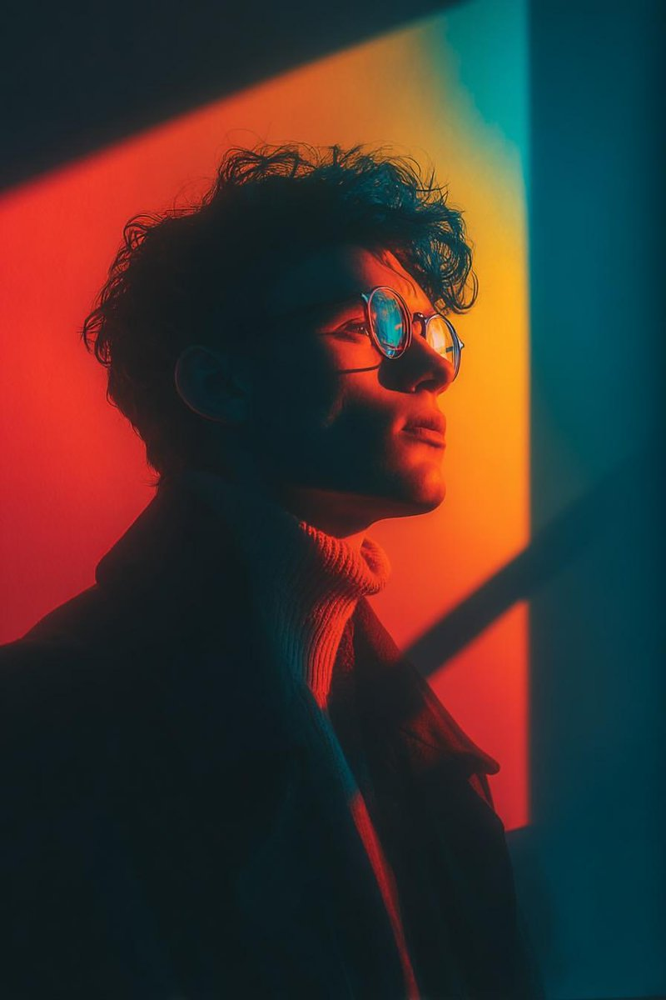

## Editorial 3x3 photo grid in a clean soft beige studio. C

- ID: trending-2020188222287229390
- Slug: trending-2020188222287229390-en
- 语言: en
- 来源: [来源链接](https://x.com/doctorwasif/status/2020188222287229390)
- 样例图路径: images/part1/2020188222287229390_1.jpg

### 提示词

```text
Editorial 3x3 photo grid in a clean soft beige studio. Character (matches reference 100%) wearing lightweight dark navy shirt, ivory trousers, barefoot for raw simplicity. Lighting: large diffused key light directly front-right, silver reflector left, subtle rim from top. Shots to include: 1. extreme close-up of lips + cheekbone with blurred hand partially covering (85mm, f/1.8, razor-thin DOF); 2. tight crop on eyes looking into lens with reflection of light strip visible (85mm, f/2.0); 3. black & white close portrait resting chin on fist, face filling frame (50mm, f/2.2); 4. over-shoulder shot, blurred foreground fabric curtain framing half face (85mm, f/2.0); 5. very close frontal with hands overlapping face, light streak across eyes (50mm, f/2.5); 6. tight angled portrait showing hair falling into eyes, soft-focus background (85mm, f/2.2); 7. crop of hands touching jawline, eyes cropped out (50mm, f/3.2, detail-focused); 8. half-body seated sideways on low cube, head turned sharply away, blurred foreground (35mm, f/ 4.5); 9. intense close-up of profile with single tear-like water droplet, cinematic light slice across (85mm, f/ 1.9). Angles: mostly tight headshots with slight high/low tilts, maintaining variation. Capture RAW, professional muted grade, smooth tonal contrast, subtle cinematic grain. Mood: intimate, introspective, character-led editorial minimalism with delicate use of fabric as prop.
```

### 样例图

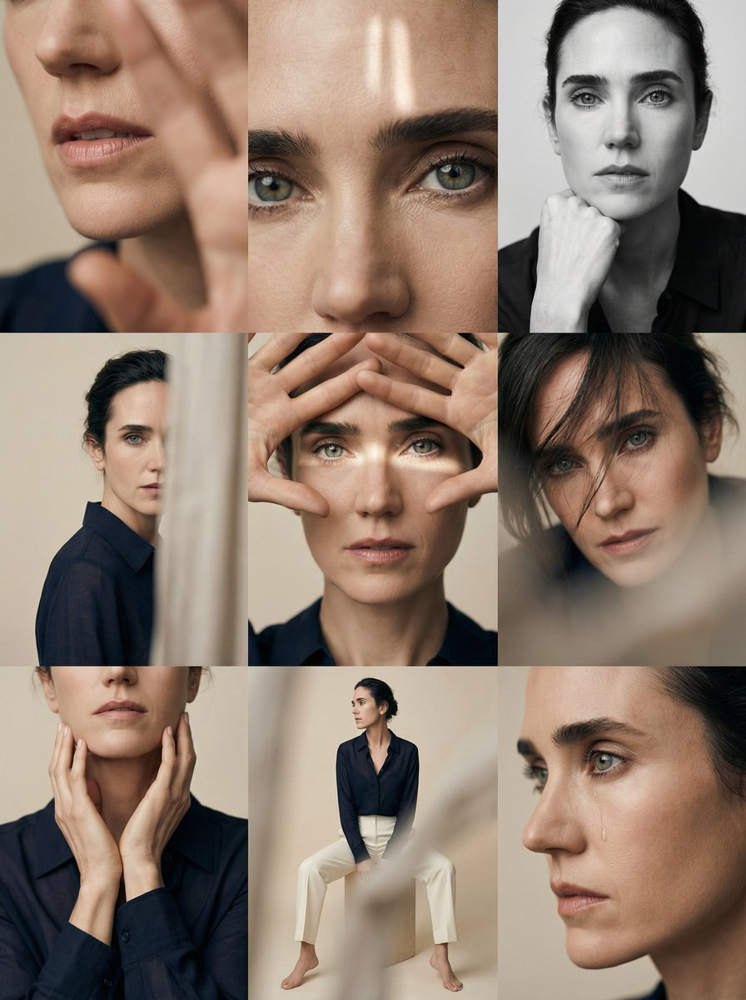

## Cinematic street photography capturing a moment in motio

- ID: trending-2011477148935340157
- Slug: trending-2011477148935340157-en
- 语言: en
- 来源: [来源链接](https://x.com/oggii_0/status/2011477148935340157)
- 样例图路径: images/part1/2011477148935340157_1.jpg

### 提示词

```text
Cinematic street photography capturing a moment in motion with a crowd blur effect. Overhead portrait of me standing still on a crosswalk, wearing a white button-up shirt, black oversized jacket, and olive green cargo pants. Motion-blurred crowd rushes past. Moody city lighting, 35mm film aesthetic, shallow depth of field, sharp focus on my portrait, showcasing an artistic and timeless style.
```

### 样例图

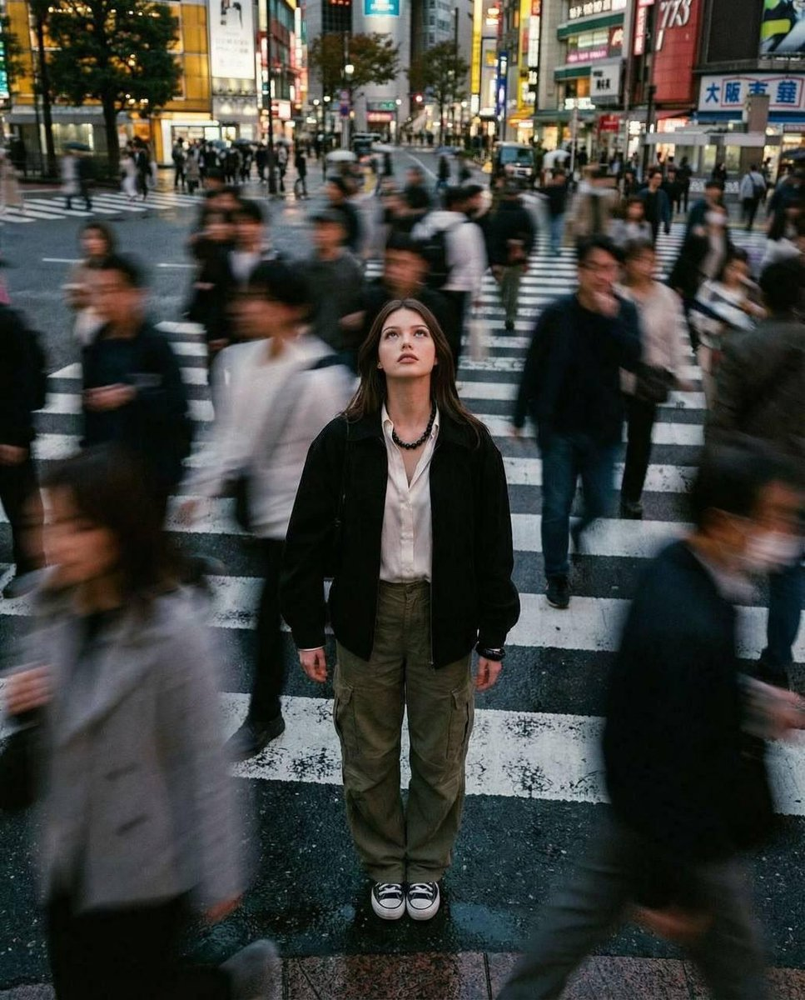

## A young woman with an elegant, polished look. In one fra

- ID: trending-2025148839301091523
- Slug: trending-2025148839301091523-en
- 语言: en
- 来源: [来源链接](https://x.com/Minahil42298354/status/2025148839301091523)
- 样例图路径: images/part1/2025148839301091523_1.jpg

### 提示词

```text
A young woman with an elegant, polished look. In one frame, she has an expressive, surprised "O" face; in the other, a soft, confident smile.
​Attire: A vibrant crimson red floor-length gown featuring intricate floral lace embroidery, a sheer neckline, and subtle sequin detailing that catches the light.
​Hair & Makeup: Her hair is styled in a soft, romantic updo with loose tendrils. She wears bold red lipstick that perfectly matches her dress and classic, warm-toned eye makeup.
​Setting & Composition:
​Environment: An outdoor garden during golden hour. The background is filled with soft-focus white spring blossoms (like cherry or almond trees) and lush greenery.
​Lighting: Backlit by a warm, setting sun, creating a "halo" effect on her hair and a soft, ethereal glow across the scene.
​The Contrast: She is holding or wearing a professional black DSLR camera with a large lens. The mechanical, matte-black texture of the camera creates a sharp contrast against the delicate, red lace of the evening gown.
​Technical Details:
​Photography Style: Cinematic portraiture with a shallow depth of field (bokeh), making the subject pop against the blurred garden background.
​Composition: A side-by-side diptych showing two different poses: one front-facing and playful, one profile-view and serene.
```

### 样例图

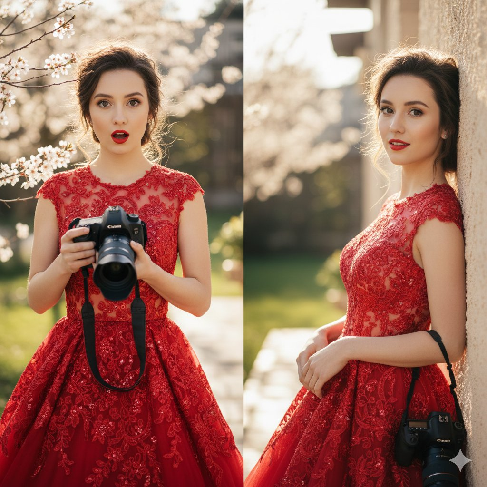

## ​A high-definition cinematic portrait of a sophisticated

- ID: trending-2016007845410701687
- Slug: trending-2016007845410701687-en
- 语言: en
- 来源: [来源链接](https://x.com/iamsofiaijaz/status/2016007845410701687)
- 样例图路径: images/part1/2016007845410701687_1.jpg

### 提示词

```text
​A high-definition cinematic portrait of a sophisticated woman sitting in a plush, velvet burgundy armchair within a sunlit, vintage study. She is wearing a sharp black tailored suit, a crisp white button-down shirt slightly unbuttoned, and a loosely tied charcoal grey necktie. She holds a cigarette, with thick, ethereal plumes of white smoke swirling dramatically around her face and rising toward the ceiling. The lighting is dramatic "chiaroscuro" style, with bright sunlight streaming through a large window behind her, creating a glowing rim light on her hair and the smoke. The background features ornate wooden wall panels and a classic framed painting. Photorealistic, 8k resolution, moody atmosphere.
​Tips for Best Results:
​Aspect Ratio: If your tool supports it, use --ar 9:16 to get that tall, vertical phone-wallpaper look.
​Lighting Keywords: Using terms like "volumetric lighting" or "backlit" will help emphasize the way the light interacts with the smoke.
​Style: If you want it to look more like a movie still, add "shot on 35mm film" to the end.
```

### 样例图

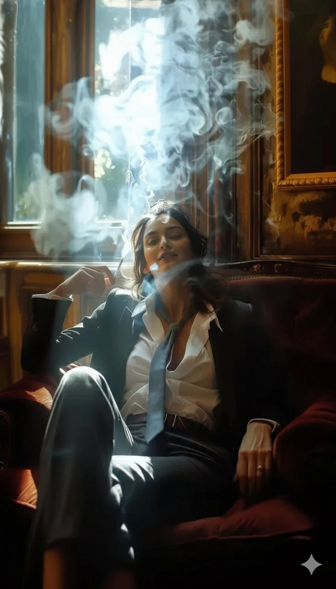

## A cinematic golden hour portrait of a stylish man leanin

- ID: trending-2024808774993694890
- Slug: trending-2024808774993694890-en
- 语言: en
- 来源: [来源链接](https://x.com/ZaraIrahh/status/2024808774993694890)
- 样例图路径: images/part1/2024808774993694890_1.jpg

### 提示词

```text
A cinematic golden hour portrait of a stylish man leaning against a textured stone wall, wearing dark sunglasses, a beige suede jacket with large front pockets, and a white crew-neck shirt underneath, warm sunlight casting sharp shadows across the wall, soft natural beard, well-groomed dark hair styled back, confident relaxed pose with one hand raised near his face, warm earthy color palette, strong side lighting, high contrast highlights and shadows, shallow depth of field, ultra-realistic fashion photography, editorial street style aesthetic, 85mm lens, f/2.0, crisp detail, natural skin tones, 4K resolution.
```

### 样例图

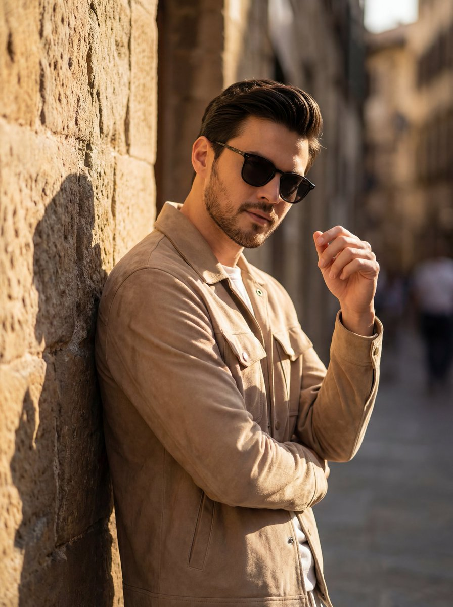

## { "composition": { "framing": "mid-length portrait from 

- ID: trending-2008788225041838336
- Slug: trending-2008788225041838336-en
- 语言: en
- 来源: [来源链接](https://x.com/ZaraIrahh/status/2008788225041838336)
- 样例图路径: images/part1/2008788225041838336_1.jpg

### 提示词

```text
{ "composition": { "framing": "mid-length portrait from upper thighs to head", "orientation": "vertical", "camera_angle": "eye-level", "subject_position": "left third of the frame", "balance": "subject balanced against expansive seascape on the right", "depth": "moderate depth with clear foreground subject and distant cityscape background" }, "subject": { "gender_presentation": "male-presenting", "age_range": "young adult", "pose": "relaxed standing posture, torso slightly angled, head turned to the left", "expression": "neutral to contemplative", "gaze_direction": "looking on camera", "hair": { "color": "dark brown to black", "style": "thick, voluminous, tousled, slightly wavy" }, "skin_tone": "light to medium", "facial_features": "defined jawline, straight nose, full lips, clean-shaven" }, "clothing_and_accessories": { "top": { "type": "long-sleeve button-up shirt", "color": "black", "fit": "slim to regular fit", "details": "top buttons undone, lightweight fabric with subtle drape" }, "bottom": { "type": "trousers", "color": "dark navy or black", "fit": "slim fit" }, "accessories": [ { "item": "sunglasses", "color": "black", "held_in": "right hand" }, { "item": "wristwatch", "material": "metal", "worn_on": "left wrist" }, { "item": "bracelet", "color": "red", "worn_on": "right wrist" } ] }, "environment": { "setting": "outdoor, on a boat or waterfront deck", "foreground": "white deck surface", "background": { "elements": [ "open sea with visible water texture", "distant coastal cityscape", "cloud-filled sky" ], "horizon_line": "visible and level" } }, "lighting": { "type": "natural daylight", "quality": "soft and diffused", "direction": "overhead with slight frontal illumination", "shadows": "minimal, soft-edged" }, "color_palette": { "dominant_colors": [ "deep blue", "cyan", "white", "black" ], "contrast": "high contrast between dark clothing and bright environment", "saturation": "moderate, natural tones" }, "technical_characteristics": { "focus": "sharp focus on subject", "depth_of_field": "moderate, background slightly softened but recognizable", "image_clarity": "high", "noise": "minimal", "lens_effect": "no visible distortion, likely standard focal length" }, "artistic_style": { "aesthetic": "clean, modern lifestyle photography", "mood": "calm, confident, aspirational", "visual_theme": "luxury travel or leisure" }, "typography": { "text_present": false } }
```

### 样例图

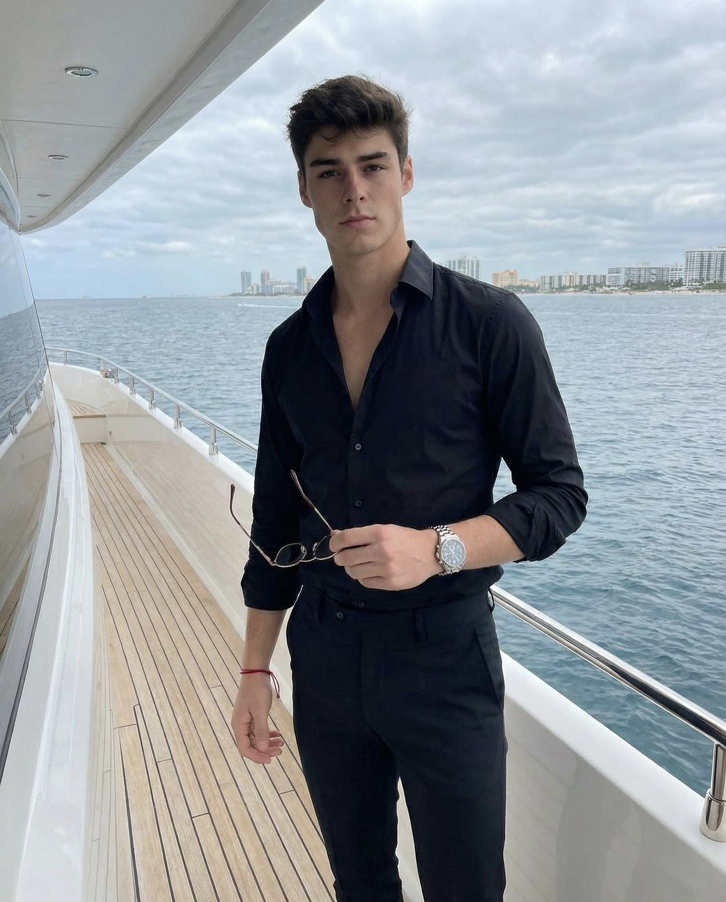

## Use The Uploaded Image Of The Woman As Strict Facial Ref

- ID: trending-2015659177843265781
- Slug: trending-2015659177843265781-en
- 语言: en
- 来源: [来源链接](https://x.com/harboriis/status/2015659177843265781)
- 样例图路径: images/part1/2015659177843265781_1.jpg

### 提示词

```text
Use The Uploaded Image Of The Woman As Strict Facial Reference And Physical Features - Keep Her Real Face Exactly As Provided, Without Alterations Or Stylization. Ensure Seamless, Ultra-realistic Integration In The Final Render. Black And White High-fashion Editorial Portrait Of The Uploaded Person, Wearing A Loose White Blouse. She Poses With One Arm Raised, Partially Covering Her Face While Holding Her Hair Up, Creating A Dramatic And Artistic Composition. Her Gaze Is Intense And Captivating, Directly Toward The Camera, Exuding A Strong, Enigmatic Aura.
Background: Minimalist Plain Wall With Sharp Daylight Shadows
Adding Contrast And Depth.
Lighting: Harsh Natural
Sunlight, High-contrast, Emphasizing Facial Contours, Cheekbones, Hair Texture, And Fabric Detail. Pose: Bold And Expressive, Arm Lifted Framing The Face To Emphasize Raw Emotion And High-fashion Editorial Style.
Camera: Eye-level Close-up,
Focusing On Facial Expression, Texture, And Dramatic Shadow Play. Captured As If With Canon Eos R5, 85mm F/1.8 Lens - Crisp Detail, Tonal Depth, Fine Grain.
Style: Monochrome, Ultra-realistic, Cinematic, High-fashion
Editorial Photography.ashion editorial photography.
```

### 样例图

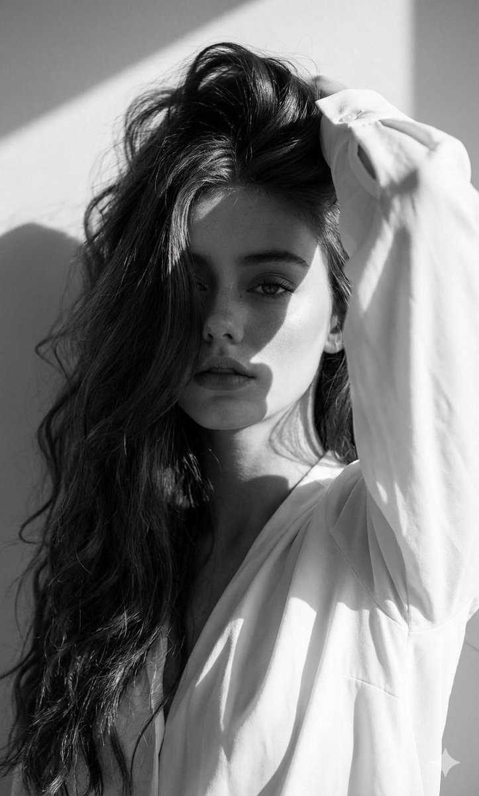

## use the uploaded photo as the exact identity reference. 

- ID: trending-2015823640043151378
- Slug: trending-2015823640043151378-en
- 语言: en
- 来源: [来源链接](https://x.com/harboriis/status/2015823640043151378)
- 样例图路径: images/part1/2015823640043151378_1.jpg

### 提示词

```text
use the uploaded photo as the exact identity reference. keep the same person, same face, same facial features, same proportions and natural expression, create a photorealistic cinematic triptych portrait (three-frame composition in one image).

scene: night city, bridge over a busy road, moving cars, glowing street lights, evening sky, city skyline in the background. atmosphere: freedom, motion, youth, urban romance, feeling of wind and road. frame 1 (top): wide cinematic shot - the person standing on a bridge above a busy road, slight motion blur from head movement, city lights and cars below, strong urban night mood. frame 2 (middle): medium shot person leaning on the bridge railing, looking up at the sky, relaxed confident pose, cars and headlights glowing behind. frame 3 (bottom): close-up emotional portrait wind in hair, city lights in bokeh behind, thoughtful and dreamy expression. style: real photography, cinematic lifestyle portrait, urban fashion photography. lighting, natural city night lighting, street lamps, car headlights, soft glow on skin. camera: full-frame dslr, 85mm lens look, shallow depth of field. color grading: warm city lights mixed with cool blue night tones, film-style mood. ultra photorealistic, natural skin texture, real candid moment, no illustration, no cgi, no plastic skin, no text, no logos, no watermark.
```

### 样例图

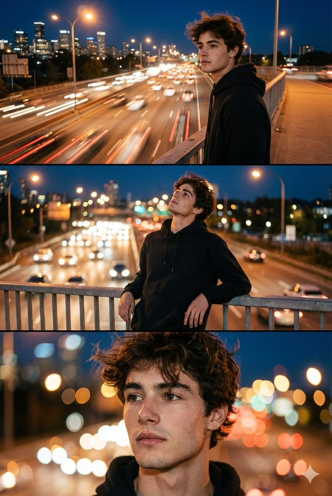

## { "image_generation": { "subject": { "description": "you

- ID: trending-2015795776363081772
- Slug: trending-2015795776363081772-en
- 语言: en
- 来源: [来源链接](https://x.com/saniaspeaks_/status/2015795776363081772)
- 样例图路径: images/part1/2015795776363081772_1.jpg

### 提示词

```text
{
  "image_generation": {
    "subject": {
      "description": "young woman sitting on stone steps in a quiet old European street",
      "pose": "seated casually on worn stone stairs, legs crossed slightly, holding a notebook and pen",
      "expression": "thoughtful, calm, introspective",
      "action": "writing notes while glancing to the side"
    },
    "appearance": {
      "hair": {
        "color": "dark brown",
        "style": "messy bun with soft bangs framing the face"
      },
      "face": {
        "features": "soft natural facial features",
        "makeup": "minimal, natural look"
      }
    },
    "outfit": {
      "top": "black oversized blazer",
      "bottom": "blue straight-leg jeans",
      "shoes": "black ballet flats"
    },
    "accessories": {
      "bag": "small brown leather shoulder bag",
      "objects": [
        "small notebook",
        "pen",
        "closed book placed beside her"
      ]
    },
    "environment": {
      "setting": "old European alleyway",
      "background": "weathered stone wall, green wooden door, cobblestone street",
      "architecture": "vintage, rustic, historic textures"
    },
    "lighting": {
      "type": "natural daylight",
      "quality": "soft, diffused",
      "mood": "warm, calm, cinematic"
    },
    "camera": {
      "angle": "eye-level",
      "framing": "medium full-body shot",
      "style": "editorial lifestyle photography",
      "focus": "sharp subject with subtly textured background",
      "quality": "high resolution, realistic"
    },
    "aesthetic": {
      "style": "Parisian street style",
      "vibe": "artistic, literary, cozy",
      "color_palette": "neutral earth tones, muted greens, stone gray, denim blue"
    }
  }
}
```

### 样例图

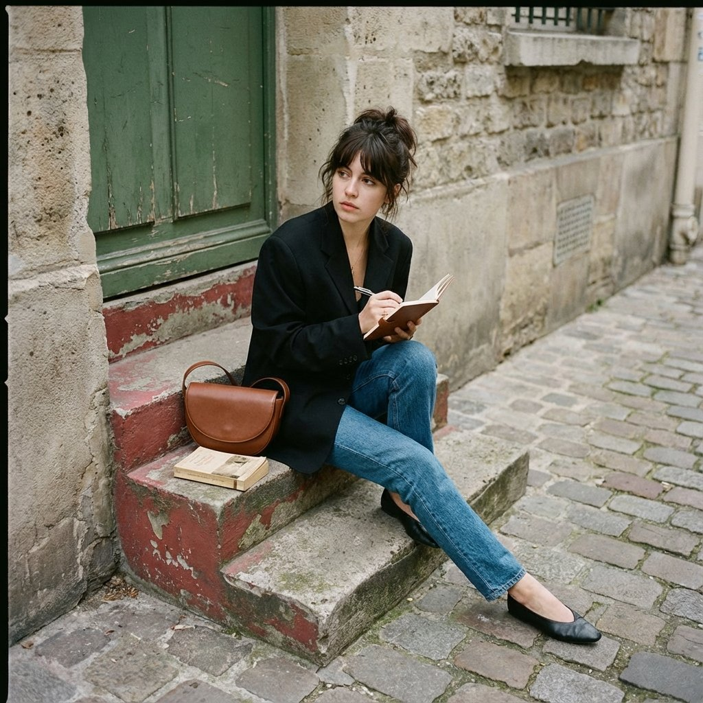

## 48k Hyper-realistic, A cinematic portrait of a young man

- ID: trending-2031377580612542472
- Slug: trending-2031377580612542472-en
- 语言: en
- 来源: [来源链接](https://x.com/Xaroon_x/status/2031377580612542472)
- 样例图路径: images/part1/2031377580612542472_1.jpg

### 提示词

```text
48k Hyper-realistic, A cinematic portrait of a young man(keep the facial features unchanged as uploaded image), his hair is messy manbun over the eye ,in a long dark trench coat, surrounded by pigeons flying dramatically around him. Some pigeons fly very close to the camera, wings blurred in motion, others perch on his shoulder. His expression is serious and enigmatic, half of his face obscured by a pigeon in the foreground. Moody lighting with strong shadows and highlights.
```

### 样例图

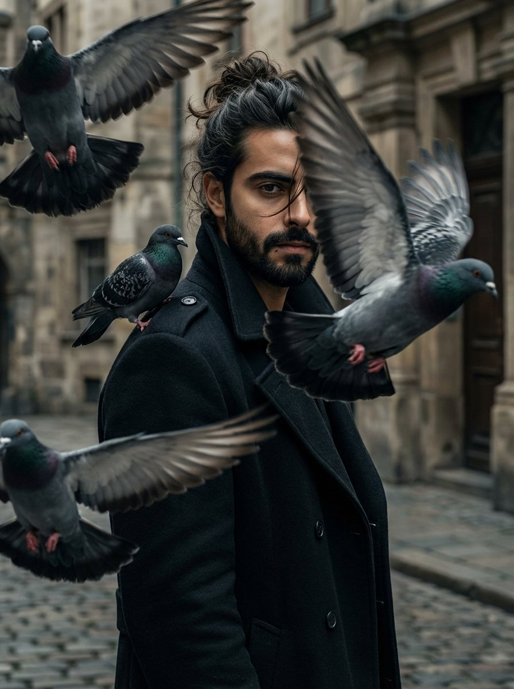

## Create a hyper-realistic, high-detail studio photoshoot 

- ID: trending-2021574480766943706
- Slug: trending-2021574480766943706-en
- 语言: en
- 来源: [来源链接](https://x.com/Naiknelofar788/status/2021574480766943706)
- 样例图路径: images/part1/2021574480766943706_1.jpg

### 提示词

```text
Create a hyper-realistic, high-detail studio photoshoot featuring the same person from the reference photo with the exact facial features, skin tone, hairstyle, proportions, and identity fully preserved (no changes to face or structure). She is wearing stylish Gen-Z fashion attire trendy, minimal, modern streetwear. She is leaning casually on a realistic, fluffy, life-sized Labubu character, rendered in soft fur texture with playful expression. A British Shorthair cat sits or poses nearby, also hyperrealistic with detailed fur and natural posture.

The entire scene is set against a smooth, seamless, vibrant orange studio backdrop with professional studio lighting, crisp shadows, clean highlights, and a premium fashion editorial vibe. Ultra-photorealistic, flawless skin texture (but unchanged identity), high-end photography style, full-body or mid-shot composition.
```

### 样例图

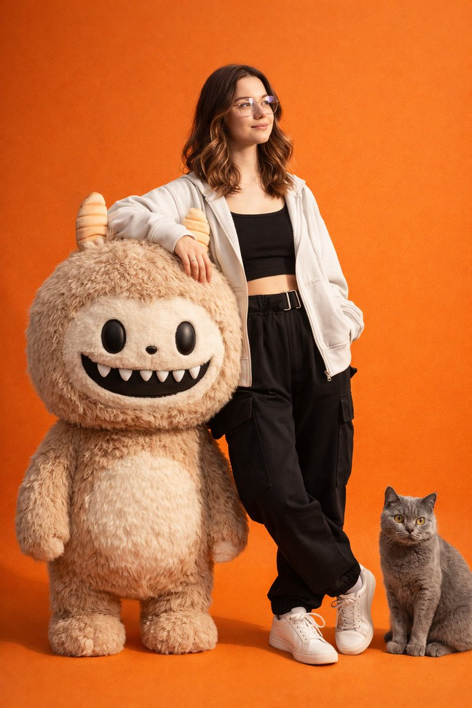

## Ultra wide-angle low-angle portrait shot from ground per

- ID: trending-2044411171433075106
- Slug: trending-2044411171433075106-en
- 语言: en
- 来源: [来源链接](https://x.com/Sairah_0/status/2044411171433075106)
- 样例图路径: images/part1/2044411171433075106_1.jpg

### 提示词

```text
Ultra wide-angle low-angle portrait shot from ground perspective, young woman leaning over camera, hands reaching toward lens creating foreground distortion, bright midday sun with strong lens flare, clear blue sky background, wind-blown messy hair glowing in backlight, soft freckles and natural skin texture, wearing cozy cream knit sweater and mustard wide-leg pants, cinematic lighting, shallow depth of field, high detail, 35mm fisheye look, vibrant colors, fashion editorial style
```

### 样例图

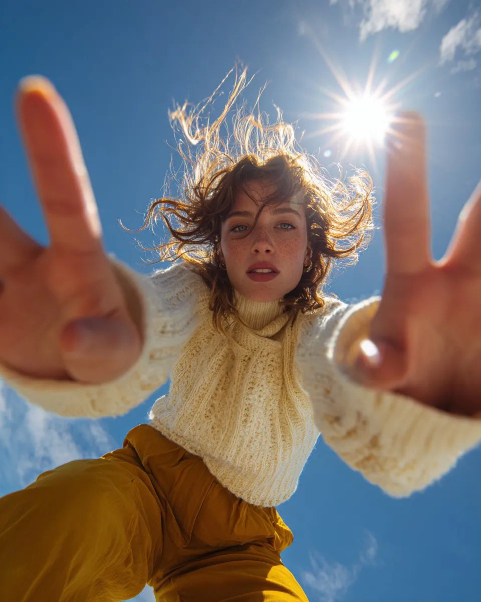

## Create a hyper-realistic underwater close-range portrait

- ID: trending-2010666164129849800
- Slug: trending-2010666164129849800-en
- 语言: en
- 来源: [来源链接](https://x.com/Strength04_X/status/2010666164129849800)
- 样例图路径: images/part1/2010666164129849800_1.jpg

### 提示词

```text
Create a hyper-realistic underwater close-range portrait captured with a wide-angle action camera in a waterproof housing. The camera is very close to the Subject (≈0.5–1 m), positioned slightly below face level and angled upward, with wide-angle distortion emphasizing depth while keeping the Subject dominant.

Mid-shot to ¾ body framing. The Subject fills most of the frame, with face and upper body clearly visible. Schools of tropical fish swim closely around, some passing near the lens to create layered depth, with mild motion blur on fish closest to the camera.

Natural sunlight enters from above, producing bright caustic patterns on the Subject and surrounding water, strong highlights near the surface, and soft blue gradients below. Floating water particles are visible between the camera and Subject, with slight refraction distortion around mask edges and hands.

The Subject appears calm and relaxed, floating effortlessly with subtle body movement suggesting buoyancy and breathing through the snorkel.

A shallow coral reef is visible below, slightly softened by depth, while nearby fish remain sharper. The water surface shimmers above with gentle ripples.

Color behavior reflects natural underwater absorption: dominant blues and aquas, vibrant yellow and black fish patterns retained, and skin tones realistic with a slightly cool cast.

The image should feel like a real close-distance snorkeling travel photo intimate, immersive, and authentic.

Do not alter facial structure or identity. The Subject must remain 1000% identical to the reference image.
```

### 样例图

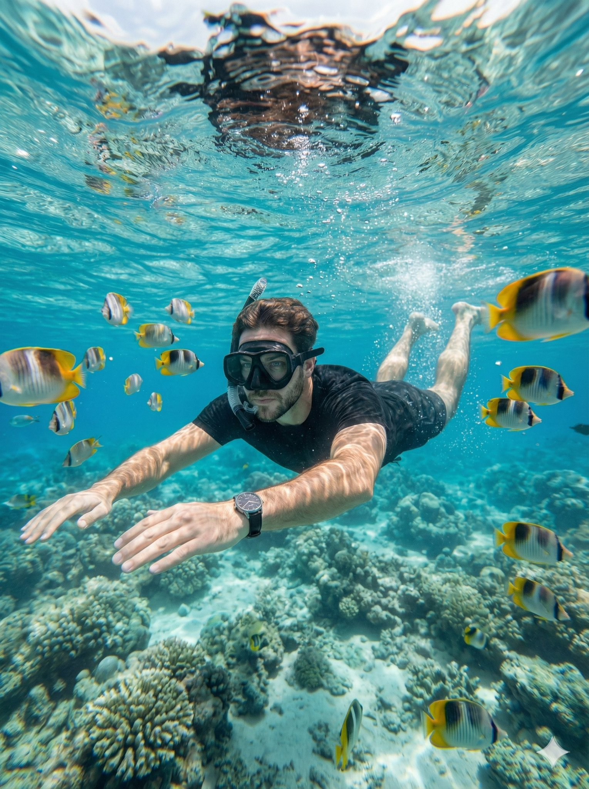

## Ultra realistic cinematic portrait of a 32-year-old youn

- ID: trending-2033501597330809017
- Slug: trending-2033501597330809017-en
- 语言: en
- 来源: [来源链接](https://x.com/HaniaAi12/status/2033501597330809017)
- 样例图路径: images/part1/2033501597330809017_1.jpg

### 提示词

```text
Ultra realistic cinematic portrait of a 32-year-old young woman standing in heavy rain at night, arms open wide and face lifted toward the sky, eyes closed, feeling the rain. Dramatic warm orange backlight illuminating the falling raindrops, creating glowing rain particles around her. Wet black t-shirt tightly fitting on the body, water droplets on her skin. Strong contrast lighting with a dark background, orange and golden light shining from the left side like fire or a spotlight. Emotional expression of freedom and peace, cinematic photography style, ultra-detailed, 8K resolution, shallow depth of field, professional studio lighting, rain splash effects, high-contrast shadows, dramatic atmosphere, vertical portrait composition, 85mm lens photography.
```

### 样例图

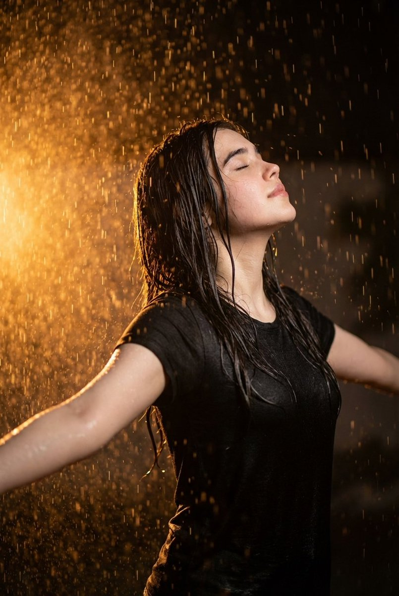

## Cinematic close-up portrait of a young man standing in h

- ID: trending-2030797695405936926
- Slug: trending-2030797695405936926-en
- 语言: en
- 来源: [来源链接](https://x.com/iamsofiaijaz/status/2030797695405936926)
- 样例图路径: images/part1/2030797695405936926_1.jpg

### 提示词

```text
Cinematic close-up portrait of a young man standing in heavy rain at night, wearing round metal glasses and a dark coat, wet hair falling across his forehead, light stubble beard. Raindrops clinging to his glasses and skin, dramatic moody lighting with warm orange streetlight bokeh in the background, shallow depth of field, intense contemplative expression, gritty noir atmosphere, ultra-realistic, high contrast, detailed skin texture, cinematic color grading, 85mm lens, f/1.8,photorealistic, dark urban aesthetic, film still look.
```

### 样例图

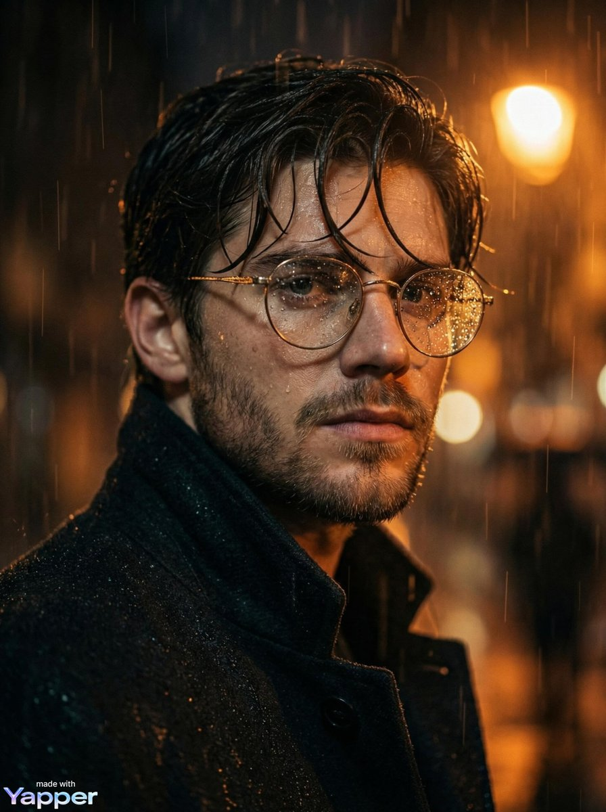

## { "image_request": { "style": { "genre": "Editorial fash

- ID: trending-2012364198672547950
- Slug: trending-2012364198672547950-en
- 语言: en
- 来源: [来源链接](https://x.com/lilzula_009_me/status/2012364198672547950)
- 样例图路径: images/part1/2012364198672547950_1.jpg

### 提示词

```text
{
  "image_request": {
    "style": {
      "genre": "Editorial fashion portrait",
      "aesthetic": "2000s retro-pop, Californian summer vibe",
      "mood": "Confident, sultry, youthful",
      "quality": "High-quality, cinematic",
      "aspect_ratio": "Portrait"
    },
    "identity": {
      "face_lock": "Use the original face exactly as provided",
      "constraints": "Do not change any facial features, proportions, asymmetry, or details",
      "realism": "100% photorealistic face preservation"
    },
    "subject": {
      "gender": "Woman",
      "expression": "Confident and sultry",
      "mouth": "Slightly open",
      "gaze": "Direct eye contact with the camera"
    },
    "hair": {
      "color": "Soft golden-brown",
      "length": "Long",
      "style": "Shaggy haircut with full bangs"
    },
    "pose": {
      "body_position": "Crouching forward",
      "hands": {
        "gesture": "One hand raised to the face",
        "detail": "Finger touching bottom lip"
      },
      "attitude": "Bold, self-assured"
    },
    "fashion": {
      "outfit": "White and red athletic-style bodysuit"
    },
    "makeup": {
      "eyes": "Peach eyeshadow with winged eyeliner",
      "lips": "Glossy berry-red lipstick",
      "overall": "Soft, warm-toned editorial makeup"
    },
    "accessories": {
      "jewelry": "Chunky silver jewelry",
      "ring": "Large silver ring with yellow watch-face detail",
      "nails": {
        "style": "Long manicured nails",
        "design": "Red heart accents"
      }
    },
    "lighting": {
      "type": "Bright, warm, high-key natural sunlight",
      "shadows": "Soft and natural"
    },
    "environment": {
      "background": "Blurred warm orange and sandy-yellow gradient",
      "suggested_location": "Outdoor desert or poolside atmosphere"
    },
    "camera": {
      "style": "35mm film photography look",
      "focus": "Sharp focus on face and hand",
      "depth_of_field": "Shallow depth of field",
      "color": "Vibrant, cinematic tones"
    },
    "final_notes": {
      "textures": "Natural skin, hair, and fabric detail",
      "editing": "No face alteration, no over-smoothing",
      "overall_feel": "High-fashion cinematic editorial portrait"
    }
  }
}
```

### 样例图

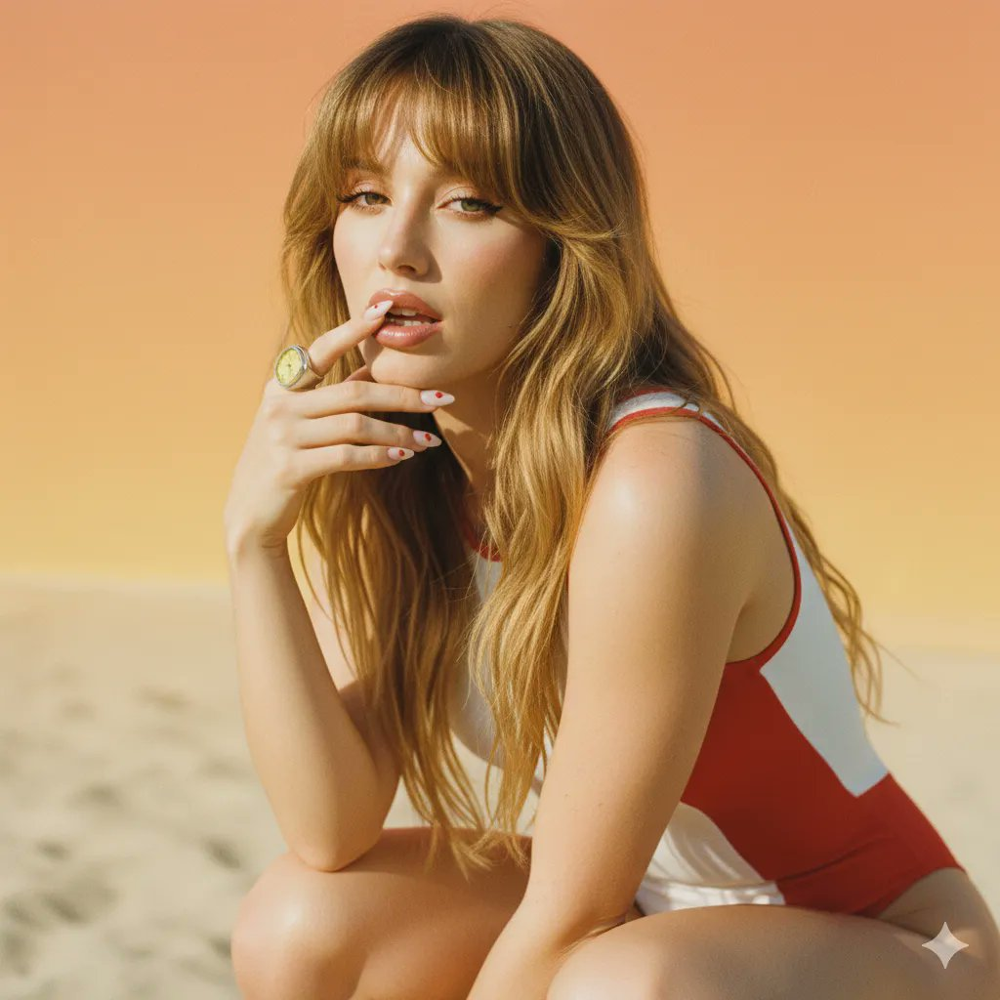

## Cute, innocent young adult blonde woman sitting comforta

- ID: trending-2017166130746675620
- Slug: trending-2017166130746675620-en
- 语言: en
- 来源: [来源链接](https://x.com/Ai_aylinfc/status/2017166130746675620)
- 样例图路径: images/part1/2017166130746675620_1.jpg

### 提示词

```text
Cute, innocent young adult blonde woman  sitting comfortably on a neatly made bed, relaxed natural posture with legs gently bent, shoulders soft and at ease. Long, soft, flowing blonde hair styled in loose natural waves, silky texture, subtle shine, a few delicate strands framing her face. Clear blue eyes with a gentle sparkle, long natural lashes, delicate eyebrows, smooth fair complexion with a soft healthy glow, subtle blush on cheeks, light pink lips, minimal natural makeup enhancing her youthful features. Calm, sweet, peaceful expression conveying warmth and innocence.

Wearing a clean white short-sleeve cotton shirt, lightweight fabric, neatly tied at the waist with natural folds and creases, paired with light-wash high-waisted jeans, casual fit, realistic denim texture, visible stitching and seams, effortlessly stylish yet simple.

Bright, cozy bedroom interior filled with soft natural light, white and cream color palette, minimal modern decor, neatly arranged pillows, soft linen bedsheets, light wooden bed frame and furniture, a large window nearby with sheer curtains gently diffusing the sunlight. Warm morning or late-afternoon sunlight streaming in, creating soft highlights on her hair and skin, gentle shadows for depth, peaceful and intimate atmosphere, calm lifestyle mood.

Photorealistic, ultra-high detail, hyper-detailed skin texture with visible natural pores and softness, realistic hair strands with depth and volume, accurate fabric textures, lifelike color tones. Shot on Canon DSLR, 50mm f/1.8 lens, shallow depth of field, creamy natural bokeh background, sharp focus on eyes and face, natural lighting only, no artificial flash. Soft cinematic yet true-to-life color grading, lifestyle editorial photography style, clean balanced composition, vertical framing, realistic perspective, professional photography quality.
--ar 3:4 --stylize 250 --v 6 --q 2
```

### 样例图

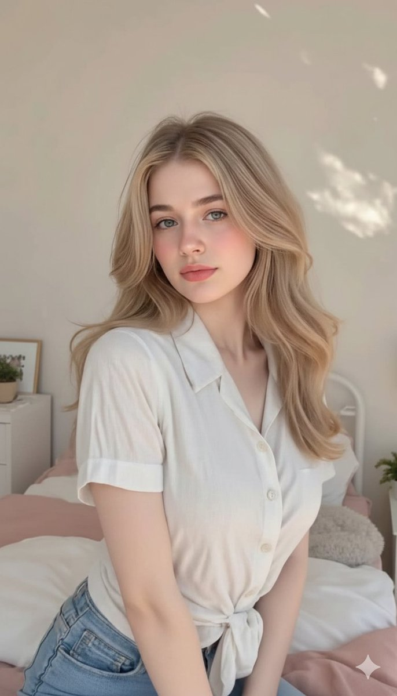

## A cinematic 4-panel photo collage showing a quiet, intro

- ID: trending-2008177924651044876
- Slug: trending-2008177924651044876-en
- 语言: en
- 来源: [来源链接](https://x.com/AIwithkhan/status/2008177924651044876)
- 样例图路径: images/part1/2008177924651044876_1.jpg

### 提示词

```text
A cinematic 4-panel photo collage showing a quiet, introspective city walk with smoking as a character detail.
• Frame 1: Sitting briefly on wide stone stairs, cigarette lit, city lights behind
• Frame 2: Standing still under a warm streetlamp, slow smoke drifting upward
• Frame 3: Walking past old European buildings, cigarette between fingers
• Frame 4: Pausing near a closed shop window, reflection visible with smoke haze
Consistent outfit — minimalist black outfit, ankle boots. Low-key lighting, soft bokeh, cinematic shadows, film-still realism, editorial mood, 1:1 aspect ratio.
```

### 样例图

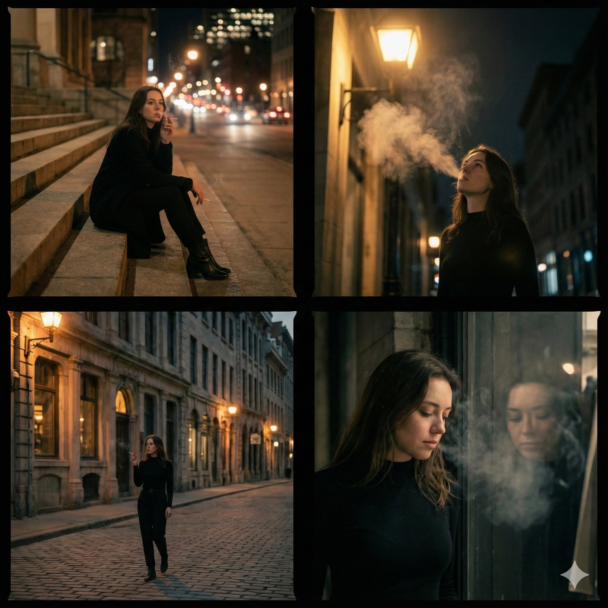

## Ultra-realistic cinematic portrait of a stylish man in a

- ID: trending-2034783762769486109
- Slug: trending-2034783762769486109-en
- 语言: en
- 来源: [来源链接](https://x.com/ChillaiKalan__/status/2034783762769486109)
- 样例图路径: images/part1/2034783762769486109_1.jpg

### 提示词

```text
Ultra-realistic cinematic portrait of a stylish man in a black suit, captured from behind with his head turned over his shoulder, giving a sharp, intense look toward the camera. Short textured hair with subtle highlights, well-groomed beard. Dramatic spotlight from above creating a warm golden halo effect on his hair and face, fading into a dark background. Strong chiaroscuro lighting with deep shadows and soft highlights.
```

### 样例图

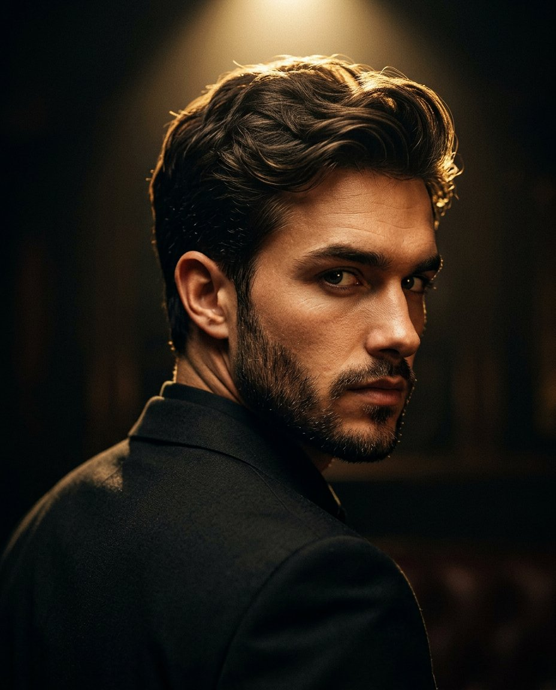

## 1. 宏观风格与媒介 - 核心媒介: P

- ID: trending-2010130164169007195
- Slug: trending-2010130164169007195-zh
- 语言: zh
- 来源: [来源链接](https://x.com/ttmouse/status/2010130164169007195)
- 样例图路径: images/part1/2010130164169007195_1.jpg

### 提示词

```text
1. 宏观风格与媒介
- 核心媒介: Photography
- 美学流派: Traditional Chinese bridal portrait

2. 主体与IP身份
- 核心主体: Woman with updo hairstyle adorned with red paper-cut flowers and butterflies, wearing red traditional attire and pearl jewelry
- IP/名人锁定: None

3. 世界逻辑与物理
- 物理法则: Realistic human proportion
- 空间构成: Eye-level perspective, close-up portrait with paper-cut decorative foreground

4. 数据与信息层
- 文本提取: None
- 品牌与符号: None

5. 材质与纹理
- 核心材质: Red satin cheongsam, red paper-cut ornaments, white glossy pearls, small white pearl earring
- 触感细节: Smooth satin texture, delicate paper-cut texture, glossy pearl surface

6. 光影与氛围
- 光照模型: Soft side lighting, soft shadows
- 整体氛围: Warm, elegant, traditional Chinese festive atmosphere

7. 技术参数
- 镜头与渲染: 50mm lens
- 构图指令: --ar 4:5
```

### 样例图

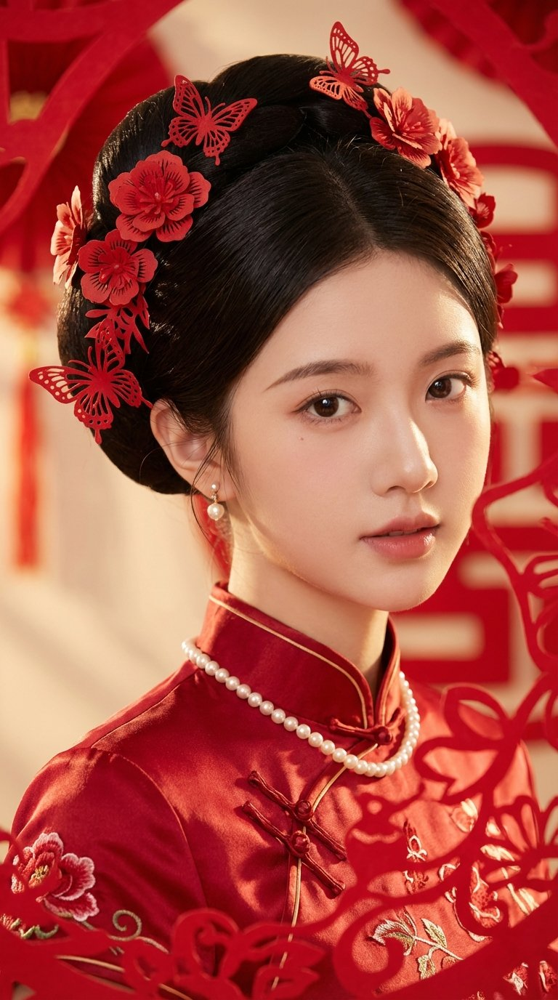

## ROLE & AESTHETIC: You are a world-class editorial portra

- ID: trending-2041841779025019132
- Slug: trending-2041841779025019132-en
- 语言: en
- 来源: [来源链接](https://x.com/TechieBySA/status/2041841779025019132)
- 样例图路径: images/part1/2041841779025019132_1.jpg

### 提示词

```text
ROLE & AESTHETIC:
You are a world-class editorial portrait photographer specializing in dramatic, colorful studio lighting. Your task is to create a powerful, dynamic portrait with a “heroic” feel.
IDENTITY ANCHOR (CRITICAL STRICT CONSTRAINT):
Source: Use the person from the ATTACHED REFERENCE PHOTO.
Preservation: You must keep their exact facial features, skin tone, hairstyle, and natural likeness perfectly unchanged.
Universal Application: Apply the lighting and angle to the subject regardless of gender.
WARDROBE & STYLING:
Attire: A premium Black Pique Polo Shirt
Texture: Visible cotton pique mesh texture
Fit: Fitted and sharp
Color: Deep matte black (to contrast with the bright background)
Expression: Serious, intense, focused. The subject is looking off-camera into the space above, not directly at the lens.
SCENE & COMPOSITION:
Background: A vibrant, solid orange-red backdrop. It should feature smooth, intense color gradients without any patterns, creating a “hot” atmosphere.
Camera Angle (CRITICAL): Low-angle shot (looking up at the subject). This perspective should make the subject look powerful and dominant.
Framing: Medium close-up (focus on face and shoulders).
LIGHTING (DRAMATIC & COLORFUL):
Palette: Dominated by vibrant orange and deep red hues.
Key Light: Strong, directional lighting that casts deep, dramatic shadows on the face (chiaroscuro effect), emphasizing facial structure.
Rim Light: A strong, dramatic edge light (or color cast) that separates the subject’s shoulders and head from the intensely lit background.
Mood: Mysterious, intense, high-contrast studio aesthetic.
TECHNICAL QUALITY:
Style: Photorealistic, highly detailed.
Texture: Sharp focus on the face, contrasting with the smooth gradients of the background.
Skin: Retain natural pores and texture.
```

### 样例图

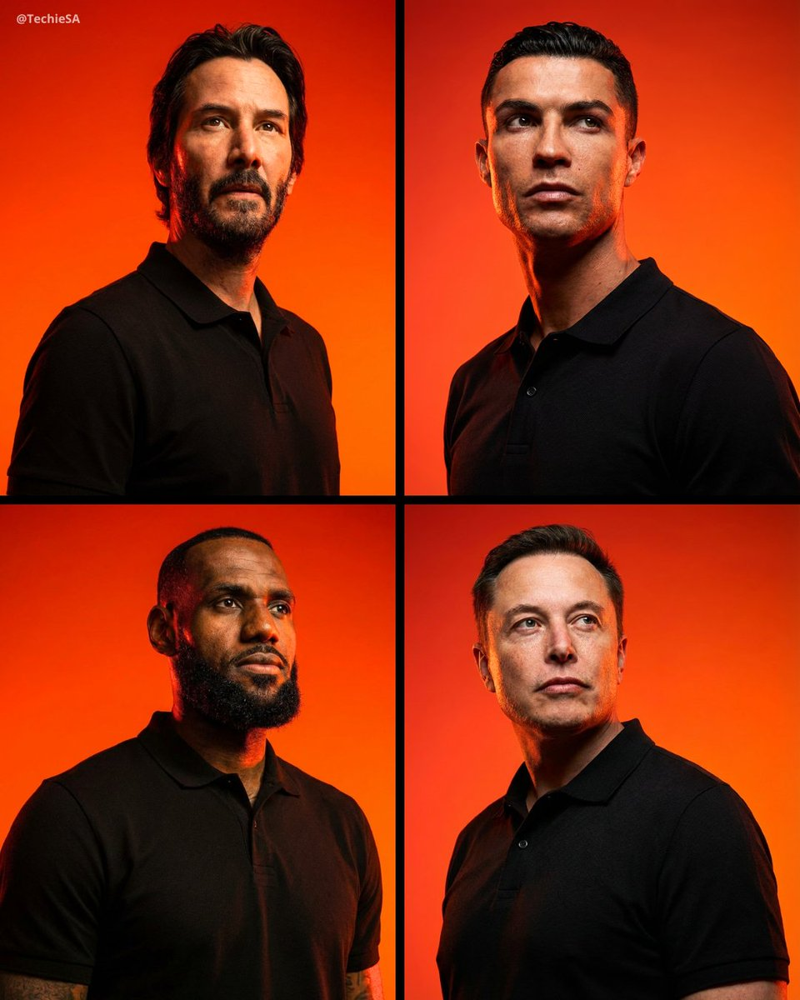

## { "prompt": "Use the uploaded reference image STRICTLY t

- ID: trending-2011598044152938767
- Slug: trending-2011598044152938767-en
- 语言: en
- 来源: [来源链接](https://x.com/me_Aarvi/status/2011598044152938767)
- 样例图路径: images/part1/2011598044152938767_1.jpg

### 提示词

```text
{
  "prompt": "Use the uploaded reference image STRICTLY to preserve the same woman’s face, identity, facial structure, proportions, and natural expression with 100% accuracy. No facial alteration, beautification, or identity change.\n\nCreate an ultra-realistic black-and-white soft editorial fashion portrait of an elegant woman in a minimalist setting. The composition feels intimate, calm, and timeless, inspired by classic Vogue and Harper’s Bazaar monochrome editorials.\n\nPose & Expression:\nShe stands or leans gently against a neutral textured wall, body slightly angled. Posture is relaxed yet poised. Her expression is serene, introspective, and confident — soft eyes, relaxed lips, no exaggerated emotion. She may gaze slightly away from the camera or directly into the lens with quiet intensity.\n\nOutfit & Styling:\nShe wears a refined, minimal outfit — a softly tailored white or ivory shirt/blouse with clean lines, paired with elegant neutral trousers or a flowing skirt. Fabric textures remain visible and natural, emphasizing realism. No logos, no loud fashion statements — pure quiet luxury.\n\nHair & Makeup:\nHair is styled naturally — loose soft waves, a low bun, or a simple pulled-back look with realistic texture. Makeup is minimal editorial: natural skin, subtle highlights, light contour, soft lashes, and neutral lips. No glamour, no heavy styling.\n\nLighting & Mood:\nSoft directional lighting creates gentle highlights and smooth shadows across the face and clothing. Contrast is controlled and elegant, preserving fine skin texture and fabric detail. Lighting feels organic, editorial, and emotionally calm.\n\nBlack & White Treatment:\nClassic monochrome grading with rich blacks, soft whites, and smooth mid-tones. Film-inspired tonal range with subtle grain for authenticity. No harsh contrast, no crushed shadows.\n\nVisual Style:\nHigh-end fashion editorial photography, timeless black-and-white aesthetic, understated luxury, emotional softness, and artistic restraint.\n\nCamera & Quality:\nProfessional editorial photography, shallow depth of field, cinematic framing, ultra-realistic 8K resolution, sharp subject focus with soft background separation.\n\nOverall Feel:\nQuiet confidence, feminine strength, timeless elegance — a refined black-and-white editorial portrait.",
  
  "style": "black-and-white soft editorial, cinematic realism",
  "lighting": "soft directional light, gentle shadows",
  "color_grade": "classic monochrome, film-inspired tones",
  "background": "minimal neutral textured wall",
  "quality": "ultra-realistic, 8K, editorial detail",
  "camera": "professional fashion photography, shallow depth of field",
  "mood": "calm, timeless, elegant, introspective"
}
```

### 样例图

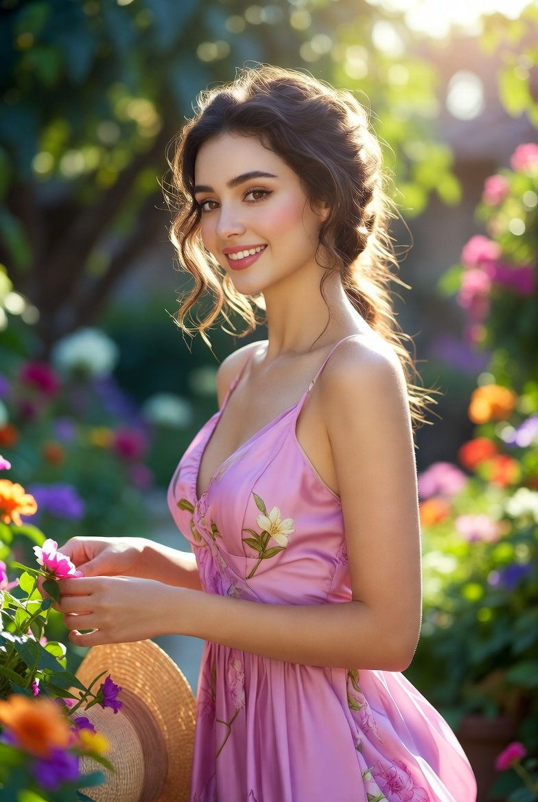

## A creative surreal image of a woman sitting on the groun

- ID: trending-2011115271239713243
- Slug: trending-2011115271239713243-en
- 语言: en
- 来源: [来源链接](https://x.com/hey_m_cherry/status/2011115271239713243)
- 样例图路径: images/part1/2011115271239713243_1.jpg

### 提示词

```text
A creative surreal image of a woman sitting on the ground, wearing a dark yellow hoodie, gray pants, and yellow shoes, surrounded by several miniature versions of himself.

Multiple smaller versions stand on his hands, shoulders, and around him on the ground, interacting playfully with the larger version.

The background is a clean, simple light gray to dark gray tone.

The lighting is soft and cinematic, with realistic shadows and depth of field.
```

### 样例图

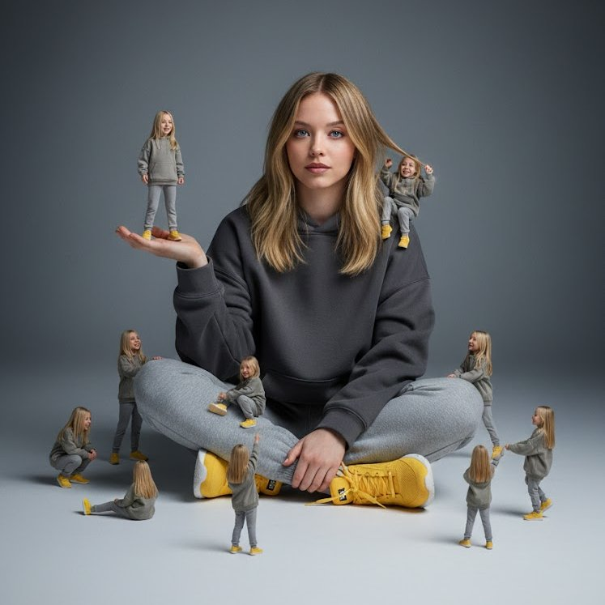

## { "prompt_configuration": { "type": "Ultra Photorealisti

- ID: trending-2008519233072931237
- Slug: trending-2008519233072931237-en
- 语言: en
- 来源: [来源链接](https://x.com/TheLOKII_/status/2008519233072931237)
- 样例图路径: images/part1/2008519233072931237_1.jpg

### 提示词

```text
{
  "prompt_configuration": {
    "type": "Ultra Photorealistic Editorial Portrait",
    "aspect_ratio": "3:4",
    "style_model": "Raw Flash Photography"
  },
  "prompt_structure": {
    "subject_description": {
      "identity": "Exceptionally beautiful young woman, early 20s, magnetic screen presence, effortless confidence.",
      "hair": "Long, thick dark brown hair with soft volume, slightly tousled, framing the face and falling forward over both shoulders.",
      "face": "Striking symmetrical face, large expressive eyes with intense eye contact, relaxed brows, soft glossy lips slightly parted, natural confident smile.",
      "pose": "Standing very close to the camera with a subtle forward lean from the waist. Shoulders gently rolled back and chest naturally lifted. Chin slightly lowered while eyes look straight into the lens for strong intimacy. Right hand raised near cheek level, clearly holding an ornate Venetian masquerade mask angled outward and fully visible. Left hand resting at the hip to accentuate curves."
    },
    "attire_and_accessories": {
      "outfit": "Silver sequin dress with thin straps and a deep, elegant neckline that naturally frames cleavage without exaggeration. Fabric catches flash light with intense sparkle.",
      "accessories": [
        "Ornate silver-and-black Venetian masquerade mask with detailed filigree, held in the right hand.",
        "Minimal diamond necklace sitting just above the neckline."
      ]
    },
    "environment_and_atmosphere": {
      "setting": "Luxury rooftop or balcony at night.",
      "background": "Very dark, softly blurred city lights with no distractions.",
      "lighting": "Direct flash placed slightly above eye level, sculpting the eyes, cheekbones, collarbones, neckline, and mask with crisp highlights and clean shadows."
    },
    "technical_specifications": {
      "image_quality": "8K UHD, ultra-photorealistic, raw fashion photography.",
      "camera_style": "35mm editorial lens, paparazzi flash aesthetic, cinematic realism.",
      "focus": "Tack-sharp focus on eyes and mask, shallow depth of field.",
      "texture": "Natural skin texture with realistic pores, high-detail sequin reflections, sharply defined mask details, natural hair strands."
    }
  }
}
```

### 样例图

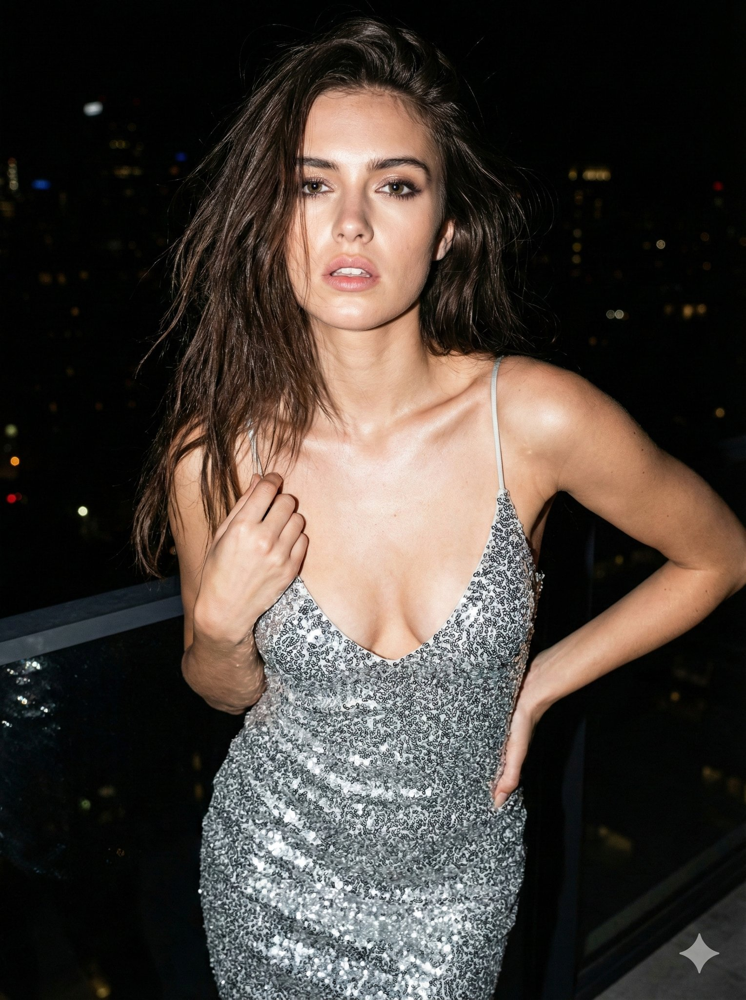

## A cinematic, moody photograph of a young woman sitting i

- ID: trending-2015378809508503595
- Slug: trending-2015378809508503595-en
- 语言: en
- 来源: [来源链接](https://x.com/oggii_0/status/2015378809508503595)
- 样例图路径: images/part1/2015378809508503595_1.jpg

### 提示词

```text
A cinematic, moody photograph of a young woman sitting inside a café at night, seen through a rain-covered window. Raindrops and condensation blur the glass, creating a dreamy, nostalgic atmosphere. She has soft features, dark hair with bangs, and is holding a small white ceramic mug close to her face, sipping a warm drink. Warm interior light contrasts with cool teal and blue city lights outside. Shallow depth of field, soft focus, film grain, muted colors, melancholic mood, intimate composition, reflective glass, bokeh lights in the background, realistic photography, 35mm film look, low light, cinematic color grading.
```

### 样例图

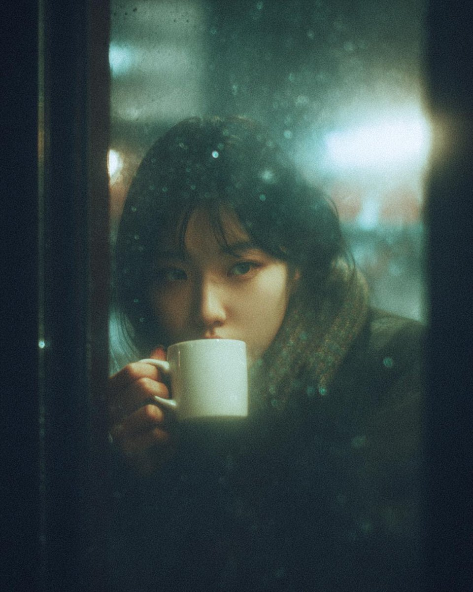

## Ultra-realistic cinematic football poster in the style o

- ID: trending-2015653367557828661
- Slug: trending-2015653367557828661-en
- 语言: en
- 来源: [来源链接](https://x.com/ChillaiKalan__/status/2015653367557828661)
- 样例图路径: images/part1/2015653367557828661_1.jpg

### 提示词

```text
Ultra-realistic cinematic football poster in the style of elite Premier League key featuring me with intense competitive energy, using a dramatic dual-composition layout where a large ultra-detailed hero close-up of the player's face appears in
the background with mouth open in a powerful shout, veins slightly visible,
sweat on skin, realistic pores and sharp facial definition, keare slightly turned
and syres focused forward with aggressive determination, while in the
foreground the same player appears full body in dynamic football action
such as striking the ball, sprinting or preparing a pass, with athletic posture,
natural movement, realistic muscle tension and subtle motion blur on the limbs,
both portraits matching perfectly in identity, face and proportions. The player's
uniComi must be of manchester united, respecting the exact style palette, thop-
edities, elements and posture with hyper-realistic football kit texture.
```

### 样例图


## A hyper-realistic, cinematic close-up portrait of a batt

- ID: trending-2008199272785928409
- Slug: trending-2008199272785928409-en
- 语言: en
- 来源: [来源链接](https://x.com/harboriis/status/2008199272785928409)
- 样例图路径: images/part1/2008199272785928409_1.jpg

### 提示词

```text
A hyper-realistic, cinematic close-up portrait of a battle-hardened, elderly medieval warrior, facing slightly downward but locking eyes with the camera through piercing, cold steel-blue eyes full of intensity and defiance. His weathered, deeply wrinkled, sun-damaged skin shows countless scars, cuts, and dried blood stains, including a fresh stitched wound in an X shape on his forehead. His thick, unruly, salt-and-pepper beard and mustache frame his square, rugged jawline; his short, coarse grey hair is matted with sweat and dirt. Every pore, wrinkle, and skin imperfection is rendered with extreme detail. His nose is strong and slightly crooked, ears scarred and weathered from countless battles. His expression is stern, menacing, full of wisdom and pain, with furrowed brows and tightly compressed lips. His body is wrapped in a distressed, heavy brown wool cloak with frayed edges, partially covering dark medieval chainmail armor with metallic textures

reflecting subtle highlights. The background is dark and moody, pure black with a soft atmospheric haze to isolate the subject. Cinematic studio

lighting: single soft key light from the upper camera-left casting dramatic shadows across the face, subtle fill light from below to slightly illuminate the lower facial structure, creating extreme contrast and depth. Slight rim light touches the shoulders and beard edges for separation. Shot with a Canon EOS R5 + RF 85mm f/1.2 lens at f/1.2 for ultra-shallow depth of field, sharp razor focus only on the eyes, soft fall-off on beard and shoulders. ISO 100, shutter speed 1/250s.

Color palette: desaturated earth tones, deep browns, muted greys, blood reds, steel blacks. Cinematic color grading: teal and orange tones balanced for dramatic mood, heavy filmic shadows, with subtle fine-grain texture for realism. The image feels raw, emotional, like a poster frame from an epic dark fantasy film. --ar 3:4 --v 6.1 --style raw-quality 2 --stylize 50
```

### 样例图

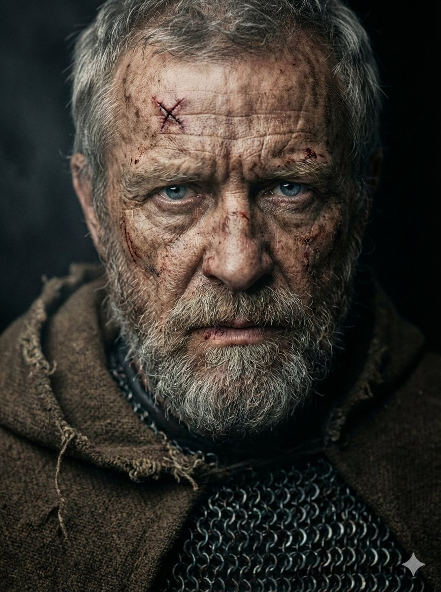

## A dramatic black and white studio portrait of a thoughtf

- ID: trending-2009980871760400568
- Slug: trending-2009980871760400568-en
- 语言: en
- 来源: [来源链接](https://x.com/iamsofiaijaz/status/2009980871760400568)
- 样例图路径: images/part1/2009980871760400568_1.jpg

### 提示词

```text
A dramatic black and white studio portrait of a thoughtful man with short styled hair, light stubble beard, and round eyeglasses, wearing a simple black sweater and a metal wristwatch, holding a pencil near his face, looking slightly upward and to the side, soft Rembrandt lighting from the left, deep shadows, high contrast, dark background, shallow depth of field, cinematic mood, ultra detailed, sharp focus, 85mm lens, f/1.8, professional photography, editorial portrait, minimalistic, moody, fine art photography
```

### 样例图

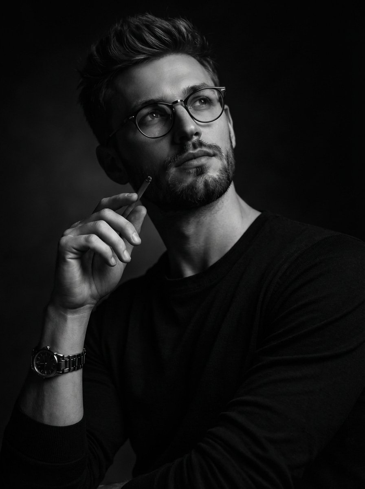

## { "style": "cinematic realism, high-end editorial photog

- ID: trending-2021190087657353591
- Slug: trending-2021190087657353591-en
- 语言: en
- 来源: [来源链接](https://x.com/Maercihh/status/2021190087657353591)
- 样例图路径: images/part1/2021190087657353591_1.jpg

### 提示词

```text
{
  "style": "cinematic realism, high-end editorial photography",
  "subject": {
    "type": "woman",
    "age_range": "mid-20s",
    "pose": "seated sideways on a bench, holding an open book, head turned slightly off-camera",
    "expression": "calm, reflective, distant gaze",
    "wardrobe": "deep black velvet wrap dress, soft texture, natural styling",
    "hair": "long, dark, loose waves, natural volume",
    "makeup": "minimal, realistic skin texture, no plastic smoothing"
  },
  "environment": {
    "location": "sunlit library loft",
    "details": "tall glass windows, wooden shelves filled with books, warm interior tones, dust particles visible in air",
    "time_of_day": "golden hour",
    "atmosphere": "quiet, intimate, intellectual"
  },
  "lighting": {
    "type": "strong golden hour backlight",
    "direction": "side-back window light",
    "effects": "natural lens flare, light streaks across frame, soft bloom on highlights, volumetric rays",
    "contrast": "medium-high with warm highlights and soft shadow falloff"
  },
  "camera": {
    "shot_type": "medium portrait",
    "angle": "slightly low eye-level",
    "lens": "85mm full-frame",
    "aperture": "f1.8",
    "depth_of_field": "shallow, subject sharp, background creamy blur",
    "focus": "eyes and face plane"
  },
  "color_grading": {
    "palette": "warm amber and honey tones with soft neutral shadows",
    "look": "film-like, subtle grain, cinematic dynamic range"
  },
  "composition": {
    "framing": "rule of thirds, subject right-weighted",
    "foreground": "soft blurred flare and book edge",
    "background": "window grid lines and shelves as leading lines",
    "motion": "still subject, drifting light particles"
  },
  "quality": {
    "resolution": "8k",
    "texture": "natural skin detail, realistic fabric texture",
    "rendering": "photorealistic, no over-sharpening, no CGI gloss"
  }
}
```

### 样例图

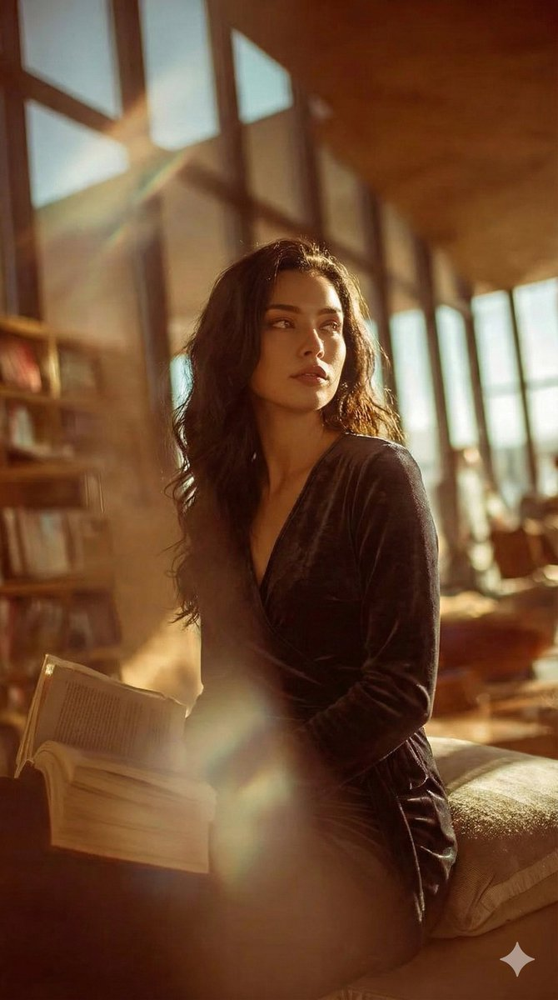

## A cinematic fashion editorial portrait of male model for

- ID: trending-2025093067787960824
- Slug: trending-2025093067787960824-en
- 语言: en
- 来源: [来源链接](https://x.com/rovvmut_/status/2025093067787960824)
- 样例图路径: images/part1/2025093067787960824_1.jpg

### 提示词

```text
A cinematic fashion editorial portrait of male model for a GQ Style magazine cover. He is leaning against the hood of a vintage 1960s silver convertible on a hazy, overcast beach.

Subject & Pose: A male model with a well-groomed dark beard and messy, curly dark hair. He is looking directly at the camera with an intense, neutral expression. He is wearing a heavy, oversized black leather bomber jacket with large utility pockets, worn open over a white ribbed tank top and high-waisted black trousers with double-buckle belt detailing. Two thin gold necklaces with small pendants hang mid-chest.

Setting & Composition: Outdoor beach setting with a very shallow depth of field. The background shows a desaturated, sandy shore and a pale, misty sky with a soft horizon line. The car is a polished metallic silver, reflecting the flat light of the sky. The camera angle is at eye-level, framing the subject from the waist up.

Lighting & Color: Soft, diffused daylight with a moody, cinematic color grade. The palette is dominated by muted earth tones, blacks, and silvers. High-end film grain is visible throughout.

Typography (Overlay): Large, bold white "GQ Style" logo across the top in a classic serif font. Smaller white sans-serif text on the mid-left reads "HEISENBERG"
```

### 样例图

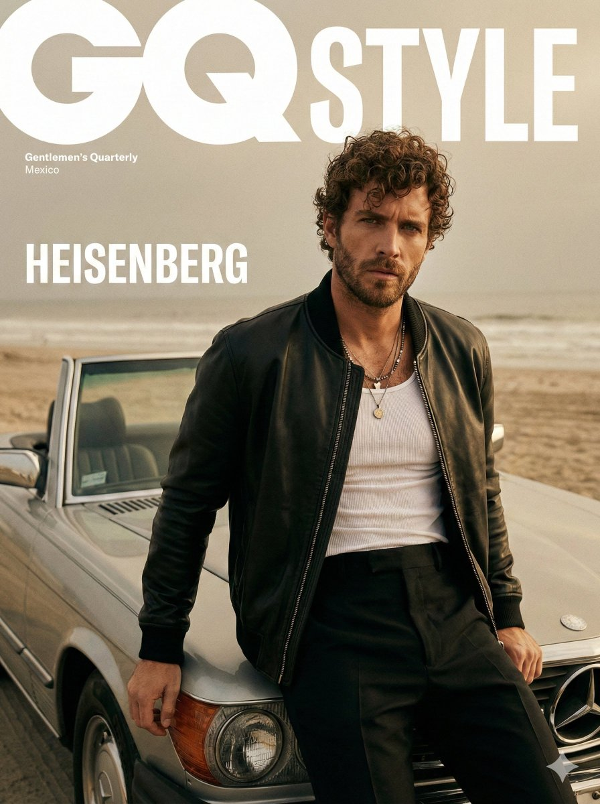

## A man smiling and posing with his arms crossed, wearing 

- ID: trending-2026654389398896958
- Slug: trending-2026654389398896958-en
- 语言: en
- 来源: [来源链接](https://x.com/ChillaiKalan__/status/2026654389398896958)
- 样例图路径: images/part1/2026654389398896958_1.jpg

### 提示词

```text
A man smiling and posing with his arms crossed, wearing a maroon knitted high-collar sweater, with a high-end Rolex watch visible on his wrist. The background is a clean white wall with harsh sunlight creating a sharp shadow diagonal on the wall, studio portrait.
```

### 样例图

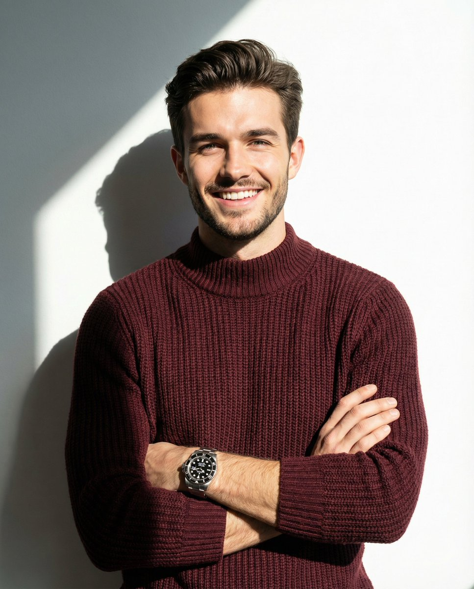

## ​A high-resolution conceptual portrait of a woman’s face

- ID: trending-2017930809899192642
- Slug: trending-2017930809899192642-en
- 语言: en
- 来源: [来源链接](https://x.com/iamsofiaijaz/status/2017930809899192642)
- 样例图路径: images/part1/2017930809899192642_1.jpg

### 提示词

```text
​A high-resolution conceptual portrait of a woman’s face vertically split down the middle by a jagged, torn paper edge. The left side is in vibrant color, featuring a warm smile, glowing skin, and bold red lipstick. The right side is in dramatic black and white, showing a somber expression with a single tear rolling down her cheek. Dark, moody background, cinematic lighting, sharp focus on the eyes, hyper-realistic textures.
```

### 样例图

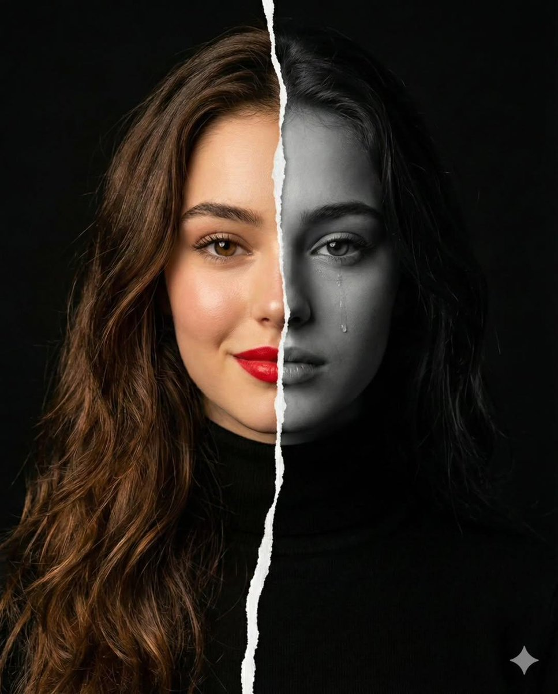

## High-fashion editorial photography of a woman with the u

- ID: trending-2036605650353180709
- Slug: trending-2036605650353180709-en
- 语言: en
- 来源: [来源链接](https://x.com/HaniaAi12/status/2036605650353180709)
- 样例图路径: images/part1/2036605650353180709_1.jpg

### 提示词

```text
High-fashion editorial photography of a woman with the uploaded face as reference, leaning casually against a geometric orange wall with her right leg extended forward. She wears a tailored bright orange suit, matching tie, crisp white shirt, and chunky orange sneakers. Her styling is sleek and confident, with a modern, polished look. The environment is a surreal, minimalist room with seamless orange surfaces, featuring a vintage orange hatchback parked mid-ground left. Captured from a low-angle using a 24mm wide-angle lens for strong forced perspective, emphasizing the foreground sneaker with a deep depth of field. Soft, diffused studio lighting casts clean shadows, enhancing the vibrant, highly saturated monochromatic orange palette with sharp white accents, contrasting matte suit fabrics against smooth leather shoes and the glossy finish of the car.
```

### 样例图

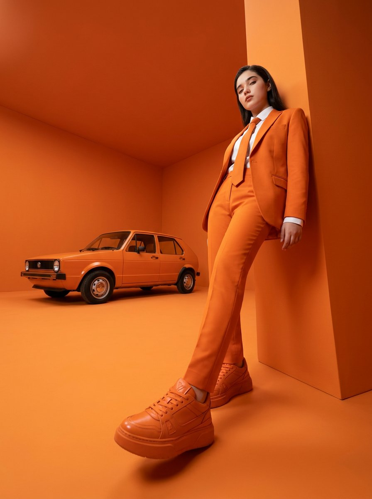

## { "image_type": "photograph", "genre": "casual lifestyle

- ID: trending-2017407873836614094
- Slug: trending-2017407873836614094-en
- 语言: en
- 来源: [来源链接](https://x.com/ZaraIrahh/status/2017407873836614094)
- 样例图路径: images/part1/2017407873836614094_1.jpg

### 提示词

```text
{ "image_type": "photograph", "genre": "casual lifestyle portrait", "orientation": "portrait", "composition": { "framing": "medium close-up", "camera_angle": "eye-level", "subject_position": "centered with slight right bias", "crop": "head and upper torso visible", "depth_of_field": "shallow, softly blurred background", "perspective": "natural human-eye perspective" }, "subject": { "count": 1, "gender_presentation": "female-presenting", "age_range": "young adult", "pose": "seated, relaxed posture", "expression": "soft smile, calm and approachable", "gaze": "directly at camera", "skin_tone": "light to medium warm complexion", "facial_features": { "face_shape": "oval", "eyes": "large, dark-colored", "eyebrows": "full, well-defined", "lips": "medium-full with subtle gloss", "makeup": "natural glam; defined eyelashes, eyeliner, even complexion, soft blush, neutral lip color" }, "hair": { "color": "dark brown", "length": "long", "texture": "wavy", "part": "slightly off-center", "styling": "loose, natural waves" }, "accessories": [ "medium-sized gold hoop earrings" ], "clothing": { "outerwear": "light gray coat or blazer", "innerwear": "black top", "style": "casual-chic" } }, "environment": { "setting": "outdoor café or courtyard", "background_elements": [ "brick wall", "wooden beams", "warm wall-mounted lights", "potted green plants", "outdoor seating" ], "location_type": "urban, cozy, semi-enclosed outdoor space", "time_of_day": "late afternoon or early evening" }, "lighting": { "type": "natural ambient with warm artificial accents", "direction": "front and slightly above", "quality": "soft, diffused", "shadows": "minimal, gentle facial contouring", "color_temperature": "warm-neutral" }, "color_palette": { "dominant_colors": [ "warm browns", "brick red", "gray", "black", "natural green" ], "overall_tone": "warm and inviting", "contrast": "moderate" }, "technical_details": { "camera_style": "smartphone or mirrorless camera", "lens_effect": "background blur resembling wide aperture", "sharpness": "high on subject, soft background", "noise": "minimal", "resolution": "high" }, "artistic_style": { "mood": "intimate, relaxed, friendly", "aesthetic": "modern lifestyle photography", "post_processing": "light color correction, subtle skin smoothing, enhanced warmth" }, "props": [ "cup held near bottom frame (partially visible)" ], "background_blur": { "type": "bokeh", "intensity": "medium" } }
```

### 样例图

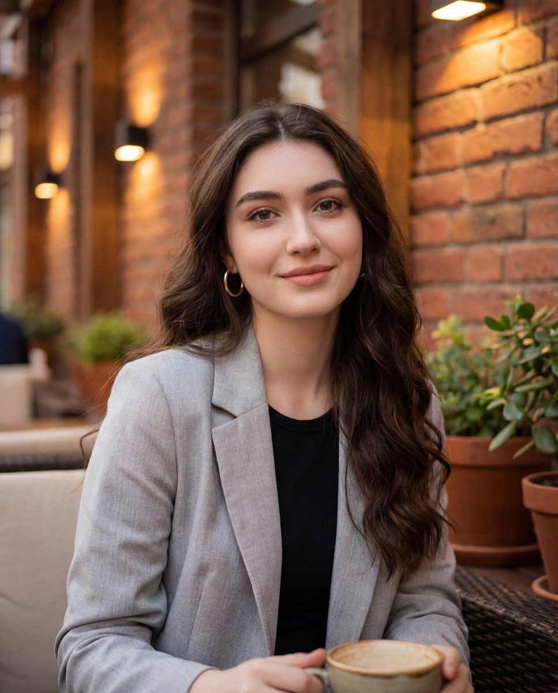

## A bold, high contrast digital portrait of a young man in

- ID: trending-2020862767574728935
- Slug: trending-2020862767574728935-en
- 语言: en
- 来源: [来源链接](https://x.com/harboriis/status/2020862767574728935)
- 样例图路径: images/part1/2020862767574728935_1.jpg

### 提示词

```text
A bold, high contrast digital portrait of a young man in side profile, facing left. The style is expressive and painterly, with dynamic brush strokes and paint splashes flowing from the head and shoulders, creating a sense of motion and energy. Strong black shadows define the face, with sharp highlights for depth and drama. The background is a solid vibrant yellow, minimal and striking. Accents of deep blue and black paint strokes wrap around the subject, giving a modern street art and sports poster feel. Cinematic lighting, high detail, gritty texture, confident and focused expression, contemporary illustration style, ultra sharp, poster quality.
```

### 样例图

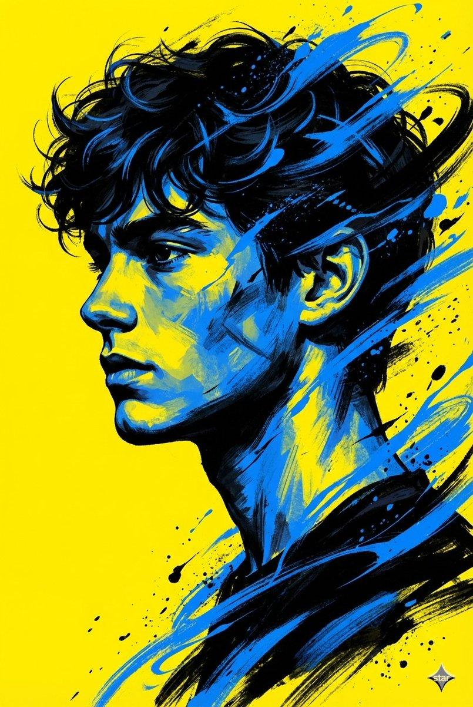

## An aerial photograph captures a surreal scene where a gi

- ID: trending-2009900632527036785
- Slug: trending-2009900632527036785-en
- 语言: en
- 来源: [来源链接](https://x.com/Strength04_X/status/2009900632527036785)
- 样例图路径: images/part1/2009900632527036785_1.jpg

### 提示词

```text
An aerial photograph captures a surreal scene where a giant white foam cup, branded with the 'SC Social Connects' logo from image_8.png, is placed on the central trunk of the Palm Jumeirah in Dubai. A hand holds a glass and metal coffee pot, pouring steaming coffee into the oversized cup. The Palm's fronds, marina, and Dubai's skyline are bathed in warm, golden sunset light, with long shadows and reflections on the water.
```

### 样例图

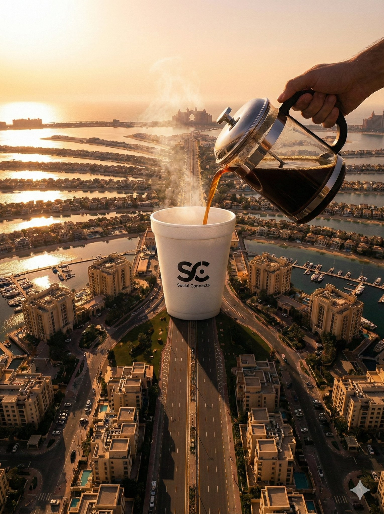

## A vertical cinematic editorial image composed of four ho

- ID: trending-2017517770578227637
- Slug: trending-2017517770578227637-en
- 语言: en
- 来源: [来源链接](https://x.com/ChillaiKalan__/status/2017517770578227637)
- 样例图路径: images/part1/2017517770578227637_1.jpg

### 提示词

```text
A vertical cinematic editorial image composed of four horizontal film frames stacked vertically within a portrait (4:5) format. Cold Nordic coastline with black sand beach, calm ocean water, and massive jagged gray mountains in the background covered with mist and low clouds. Overcast sky, soft diffused daylight, desaturated cool tones.

Frame 1 (top):
Wide landscape shot of a lone woman walking along the shoreline, very small in frame, mountains dominating the scene, strong negative space, flat horizon.
Frame 2:
Medium frontal shot of the same woman standing still, centered. Pale skin, straight black shoulder-length hair moving slightly in wind, neutral serious expression. Wearing a brown cable-knit turtleneck sweater dress. Holding a black leather handbag.
Frame 3:
Extreme close-up of both hands gripping a structured black leather handbag with a curved gold metal handle. Sleeves visible, background heavily blurred.
Frame 4 (bottom):
Over-the-shoulder portrait as she turns her head back toward the camera, sharp eyes, calm intense expression, mountains softly blurred behind.

Ultra-realistic photography, cinematic film still, editorial fashion look, natural skin texture, no glam lighting, shallow depth of field, muted Nordic color grading, realistic proportions, 35mm lens feel, cold atmosphere.
```

### 样例图

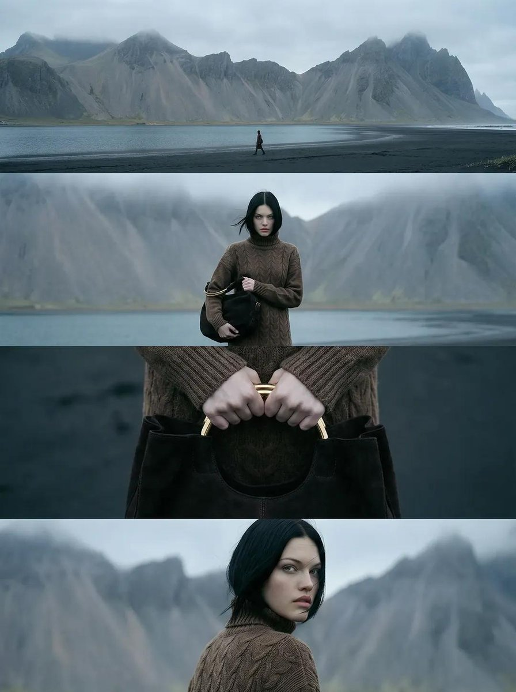

## { "image_style": { "type": "photorealistic", "aesthetic"

- ID: trending-2011830747439481225
- Slug: trending-2011830747439481225-en
- 语言: en
- 来源: [来源链接](https://x.com/lexx_aura/status/2011830747439481225)
- 样例图路径: images/part1/2011830747439481225_1.jpg

### 提示词

```text
{
  "image_style": {
    "type": "photorealistic",
    "aesthetic": "Instagram shot",
    "effects": [
      "film grain",
      "direct flash"
    ]
  },
  "composition": {
    "framing": "waist-up photograph",
    "aspect_ratio": "9:16"
  },
  "subject": {
    "description": "young woman",
    "constraint_note": "do not alter the sensitivity of the face and features",
    "pose": {
      "orientation": "facing the camera directly",
      "head": "tilted slightly to the side",
      "eyes": "closed",
      "action": "covering her face with her hand, pulling her elbow away and lifting it to the side",
      "mood": [
        "elegant",
        "pensive",
        "playful"
      ]
    },
    "appearance": {
      "attire": [
        "black velvet corset",
        "expensive black cape"
      ],
      "hair": "loose",
      "makeup": {
        "style": "nude",
        "lipstick": "matte nude"
      },
      "details": [
        "décolletage highlighted",
        "long, square black nails"
      ]
    }
  },
  "setting": {
    "background": "white wall",
    "foreground_elements": "art object placed in front of the wall"
  }
}
```

### 样例图

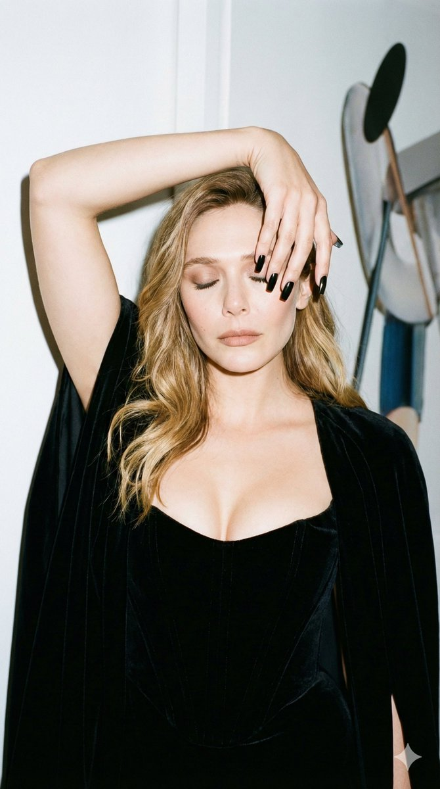

## Cinematic street photography capturing a moment in motio

- ID: trending-2011249682153132335
- Slug: trending-2011249682153132335-en
- 语言: en
- 来源: [来源链接](https://x.com/kingofdairyque/status/2011249682153132335)
- 样例图路径: images/part1/2011249682153132335_1.jpg

### 提示词

```text
Cinematic street photography capturing a moment in motion with a crowd blur effect. Overhead portrait of me standing still on a crosswalk, wearing a white button-up shirt, black oversized jacket, and olive green cargo pants. Motion-blurred crowd rushes past. Moody city lighting, 35mm film aesthetic, shallow depth of field, sharp focus on my portrait, showcasing an artistic and timeless style.
```

### 样例图

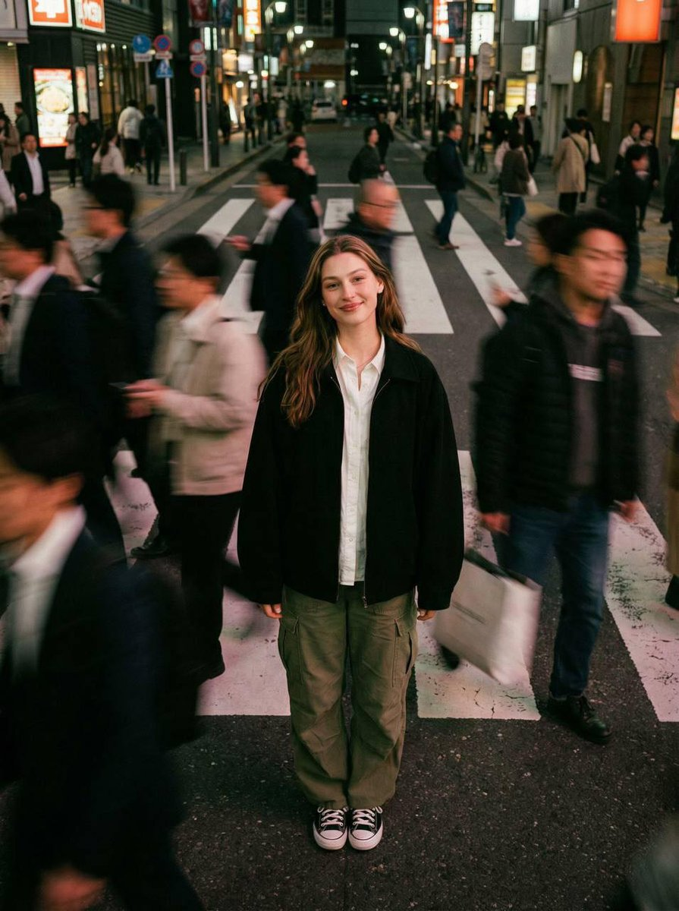

## An ultra-realistic cinematic cricket poster featuring a 

- ID: trending-2018214780935549253
- Slug: trending-2018214780935549253-en
- 语言: en
- 来源: [来源链接](https://x.com/r4jjesh/status/2018214780935549253)
- 样例图路径: images/part1/2018214780935549253_1.jpg

### 提示词

```text
An ultra-realistic cinematic cricket poster featuring a young Indian male cricketer using the uploaded reference face exactly (100% facial accuracy). He has a fair-whitish glass skin tone, soft red lips, sharp jawline, light stubble beard, and a voluminous slightly messy fade mullet hairstyle with natural texture. The composition is a triple-layer cinematic layout on a clean, textured light-grey studio background, with a large, softly embedded “77” subtly visible behind the subject. Primary dominant pose (upper background): The cricketer is shown from the back, standing tall and confident, wearing an official Chennai Super Kings (CSK) jersey in bright yellow with blue accents. Bold blue typography on the jersey reads “VIJAY” with the number “77” below it. His athletic physique is emphasized, shoulders squared, as he slightly turns his head over the shoulder, revealing an intense, fearless side profile. Foreground action pose (half body): A powerful celebration moment captures him mid-roar, mouth open in victory, right fist clenched and arm flexed. He wears the complete CSK match kit, including yellow-blue trousers, and ground texture. The CSK logo and sponsor details appear authentic and sharp. Sweat highlights on the skin add realism, with cinematic rim lighting separating the face from the background. Atmosphere & lighting: Premium cinematic studio lighting with balanced highlights and shadows enhances fabric folds, muscle definition, and facial contours. Subtle smoke and dust effects rise from the base, adding intensity without obscuring details. No blur, no distortion. Camera & quality: DSLR photography look, 85mm lens feel, shallow depth where needed, ultra-sharp focus, realistic proportions, professional color grading with rich yellow, blue, and gold tones. Photorealistic, 8K resolution, vertical poster composition, IPL magazine-cover style. No cartoon look, no extra limbs, no facial alteration, no watermark.

RCB :

An ultra-realistic cinematic cricket poster featuring a young Indian male cricketer using the uploaded reference face exactly (100% facial accuracy). He has a fair-whitish glass skin tone, soft red lips, sharp jawline, light stubble beard, and a voluminous slightly messy fade mullet hairstyle with natural texture.
The composition is a triple-layer cinematic layout on a clean, textured light-grey studio background, with a large, softly embedded “3” subtly visible behind the subject.
Primary dominant pose (upper background):
The cricketer is shown from the back, standing tall and confident, wearing an official Royal Challengers Bangalore (RCB) jersey in deep red and black with gold accents. Bold golden typography on the jersey reads “STR” with the number “33” below it. His athletic physique is emphasized, shoulders squared, as he slightly turns his head over the shoulder, revealing an intense, fearless side profile.
Foreground action pose (half body):
A powerful celebration moment captures him mid-roar, mouth open in victory, right fist clenched and arm flexed. He wears the complete RCB match kit, including black-red trousers, and ground texture. The RCB logo and sponsor details appear authentic and sharp.
Sweat highlights on the skin add realism, with cinematic rim lighting separating the face from the background.
Atmosphere & lighting:
Premium cinematic studio lighting with balanced highlights and shadows enhances fabric folds, muscle definition, and facial contours. Subtle smoke and dust effects rise from the base, adding intensity without obscuring details. No blur, no distortion.
Camera & quality:
DSLR photography look, 85mm lens feel, shallow depth where needed, ultra-sharp focus, realistic proportions, professional color grading with rich reds, blacks, and gold tones.
Photorealistic, 8K resolution, vertical poster composition, IPL magazine-cover style.
No cartoon look, no extra limbs, no facial alteration, no watermark.
```

### 样例图

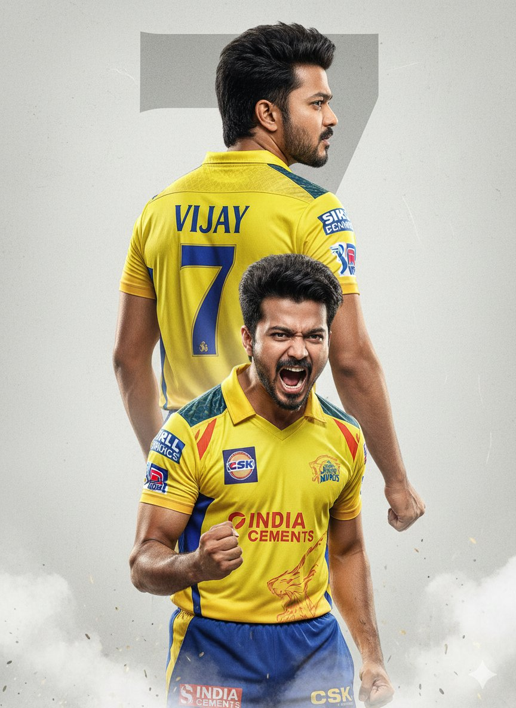

## Cinematic surreal scene of a young woman falling forward

- ID: trending-2030062558372319415
- Slug: trending-2030062558372319415-en
- 语言: en
- 来源: [来源链接](https://x.com/AIwithSynthia/status/2030062558372319415)
- 样例图路径: images/part1/2030062558372319415_1.jpg

### 提示词

```text
Cinematic surreal scene of a young woman falling forward through a swirling vortex of everyday objects inside a cozy room, arms reaching toward the camera as if trying to regain balance. Around her, objects float in chaotic slow motion: an excited Rottweiler dog mid-jump holding a donut, a soft teddy bear drifting weightlessly, open books with pages flipping in the air, scattered papers, a red backpack, eyeglasses spinning, pillows floating, a leather wallet, and a mug of coffee splashing dramatically with liquid suspended in mid-air. A pink frosted donut tumbles near the floor while sunlight streams through a window casting soft shadows. The woman wears a casual beige sweater and light pants, barefoot, hair slightly flowing from motion. Ultra-realistic cinematic lighting, dynamic motion blur, shallow depth of field, high detail, dramatic perspective, 35mm lens, surreal storytelling atmosphere, studio-quality photography, 8K.
```

### 样例图

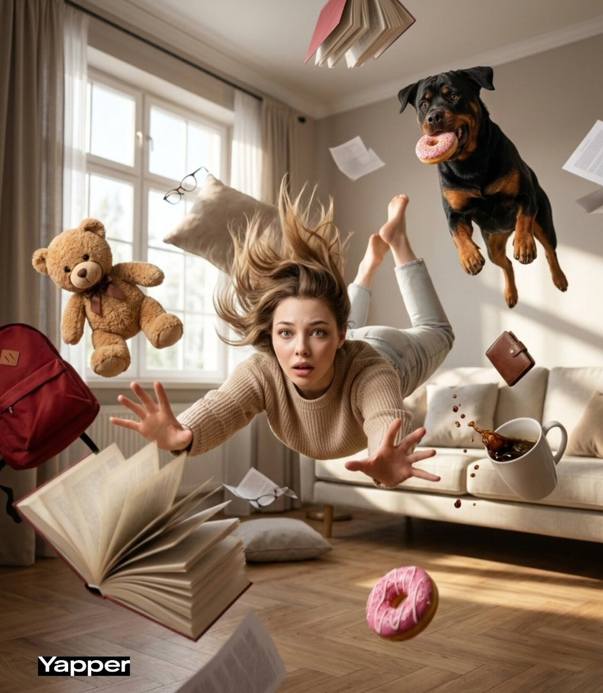

## { "subject_gender_placeholder": "[CHOOSE: woman]", "aest

- ID: trending-2009813602660712485
- Slug: trending-2009813602660712485-en
- 语言: en
- 来源: [来源链接](https://x.com/lloydcreates/status/2009813602660712485)
- 样例图路径: images/part1/2009813602660712485_1.jpg

### 提示词

```text
{
  "subject_gender_placeholder": "[CHOOSE: woman]",
  "aesthetic_lodestar": "cinematic luxury hypebeast editorial, strictly monochrome, shadowless stasis, deep rich blacks, single-frame photograph",
  "composition": {
    "frame": "minimalist controlled studio, clinical stark clarity, extremely dynamic camera angles capturing the action from aggressive low or high perspectives. No grid layouts, solitary subject focus.",
    "background": "pure, seamless, blown-out white infinite void, completely free of floor or wall shadows",
    "focus": "razor-sharp deep focus across the entire subject in motion"
  },
  "subject_action": {
    "pose": "impossible, gravity-defying airborne contortions and explosive mid-air leaps, frozen at the absolute peak of movement with extreme bodily tension",
    "energy": "maximum athletic tension meets high-fashion structure, controlled chaos suspended in time, creating sculptural, almost unbelievable silhouettes against the void"
  },
  "wardrobe_styling": {
    "vibe": "creative street fashion x avant-garde tailoring, non-provocative, clean and impactful silhouettes with varied layering",
    "garment_variations": [
      "Open cardigan sweaters layered over premium t-shirts",
      "Oversized knitwear and structured lounger sweaters",
      "Technical bomber jackets or varsity jackets",
      "Japanese minimalist silhouettes (unstructured, flowing, layered)",
      "Premium denim jackets and jeans styles",
      "Japanese Americana wear and styles",
      "Moncler puffer jackets",
      "Statement structured outerwear (as previously defined)"
    ],
    "brands_reference": ["Supreme", "Fear of God", "Maison Margiela", "Martine Rose", "UMBRO", "Aimé Leon Dore", "RHUDE", "Maison Kitsuné", "NikeLab", "Moncler", "Issey Miyake"],
    "accessories": {
      "general": "scarves, neck bandanas, paisley bandanas hanging from pockets (used sparingly when sensible)",
      "womens_specific": "Avant-Garde style bags, Saint Laurent structured totes or crossbodies, designer baseball caps, trucker caps, premium wool beanies (applied only if subject is woman)"
 "details": "only apply head gear objects on the subject's head, nowhere else"
    },
    "key_details": "focus on singular statement outfits without excessive bulk, oversized cuts contrasting with sharp tailoring, prominent branding, varied fabric weights rendered through pure texture without shadow"
  },
  "footwear_focus": {
    "models": ["Nike SB Dunk", "Off-White™ x Nike deconstructed models", "Converse Chuck 70 premium high-top", "Vans Vault Slip-On", “Adidas Samba”, “New Balance 327”, “ASICS Onitsuka Tiger Sneakers”],
    "details": "the only object on the subject's feet, highly visible and pristine, forming the anchor point of the dynamic motion"
  },
  "visual_color_treatment": {
    "base_spectrum": "pure, uncompromising black and white with ultra-deep, rich black tones",
    "blend_mode": "cohesive fusion of extreme textural contrasts and shadowless spectral lighting",
    "palette_components": {
      "rich_matte_black": "pure light-absorbing wools, denim, and heavy cottons, vantablack-like density, crushing blacks for maximum depth rendered solely through surface texture",
      "high_sheen_monochrome": "polished leather, reflective technical nylon, glossy polymers catching pure white specular highlights without casting shadows",
      "monochrome_solarization": "ghostly spectral edge-lighting, inverted luminance highlights defining folds and outlines, stark, hyper-contrasted glowing edges"
    }
  },
  "lighting_dynamics": "flat, high-key, omnidirectional diffused studio lighting. Zero cast shadows on subjects, floor, or background. Form and depth are flattened, relying entirely on the stark contrast between glossy surfaces, crushed rich blacks, and the glowing solarized edge contours for definition."
}
```

### 样例图

![{ "subject_gender_placeholder": "[CHOOSE: woman]", "aest](../images/part1/2009813602660712485_1.jpg)

## Use the attached image of the model as facial reference 

- ID: trending-2010663134743368058
- Slug: trending-2010663134743368058-en
- 语言: en
- 来源: [来源链接](https://x.com/ChillaiKalan__/status/2010663134743368058)
- 样例图路径: images/part1/2010663134743368058_1.jpg

### 提示词

```text
Use the attached image of the model as facial reference and physical features. Black and white high-fashion editorial portrait of uploaded person, wearing a loose white blouse. She poses with one arm raised, partially covering her face while holding her hair up, creating a dramatic and artistic composition. Her gaze is intense and captivating, directed toward the camera, exuding a strong, enigmatic aura. Background: minimalist plain wall with sharp natural daylight casting defined shadows, adding depth and contrast. Lighting: harsh natural sunlight, high-contrast setup highlighting facial contours, sharp cheekbones, and texture of the hair and fabric. Pose: bold and expressive, arm lifted framing the face, emphasizing raw emotion and editorial style. Camera: eye-level angle, close-up framing focusing on facial expression, texture, and dramatic shadow play. Captured with a Canon EOS R5 full-frame DSLR, 85mm f/1.8 lens for crisp detail, tonal depth, and fine grain. Style: high-fashion editorial in monochrome.
```

### 样例图

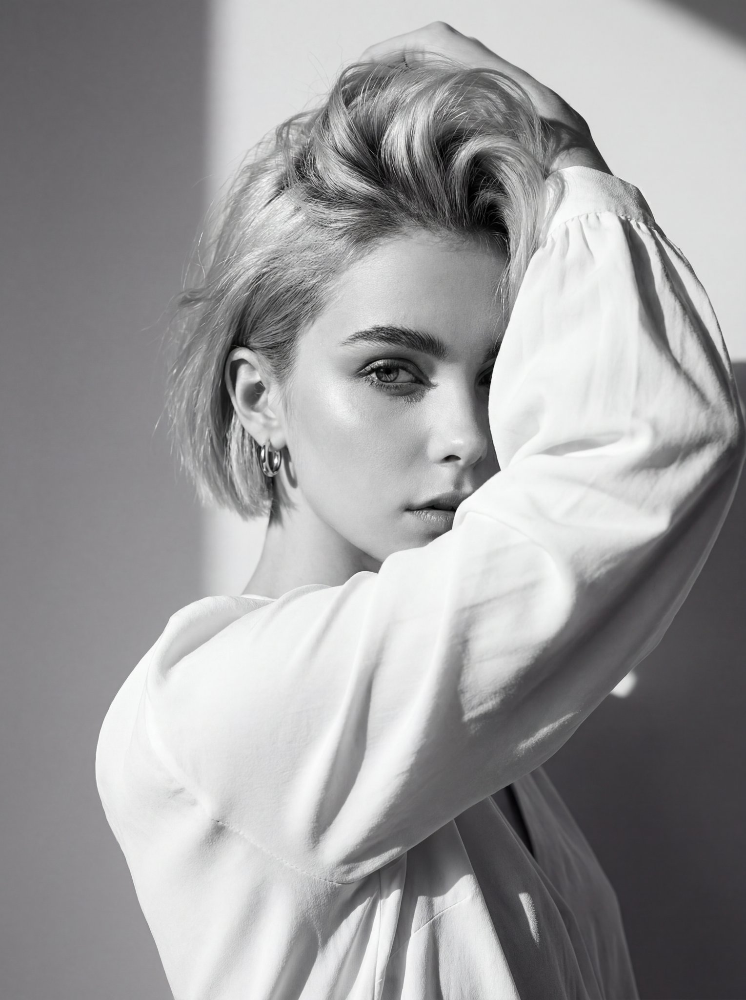

## A cinematic double exposure portrait of a young woman ho

- ID: trending-2040827971720925552
- Slug: trending-2040827971720925552-en
- 语言: en
- 来源: [来源链接](https://x.com/Mind_Boticni/status/2040827971720925552)
- 样例图路径: images/part1/2040827971720925552_1.jpg

### 提示词

```text
A cinematic double exposure portrait of a young woman hollywood actress in profile, her hair in a messy bun, overlaid with a busy city street scene with tall buildings, warm orange and teal tones, soft bokeh lights in the background, high detail, realistic lighting, vertical composition, photorealistic style.
```

### 样例图

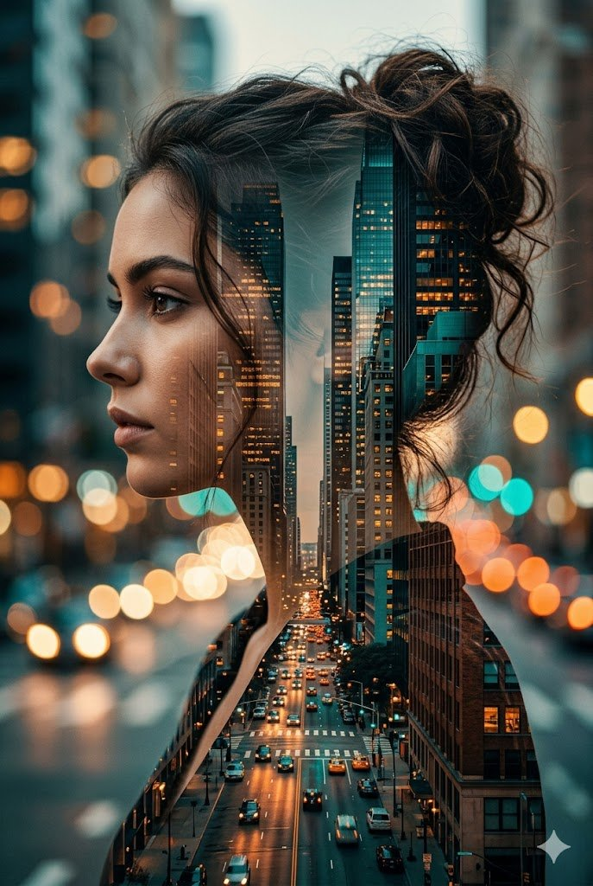

## A wide shot of a woman in an airy white linen maxi dress

- ID: trending-2023968383021314440
- Slug: trending-2023968383021314440-en
- 语言: en
- 来源: [来源链接](https://x.com/AbidkingB/status/2023968383021314440)
- 样例图路径: images/part1/2023968383021314440_1.jpg

### 提示词

```text
A wide shot of a woman in an airy white linen maxi dress and a wide-brimmed straw hat, standing in a vast, sun-drenched desert. She holds a vintage camera, smiling softly. Behind her, a classic light blue camper van is parked next to a picnic spread on a blue blanket. Soft ripples in the sand and a clear blue sky create a peaceful, bohemian travel aesthetic.
```

### 样例图

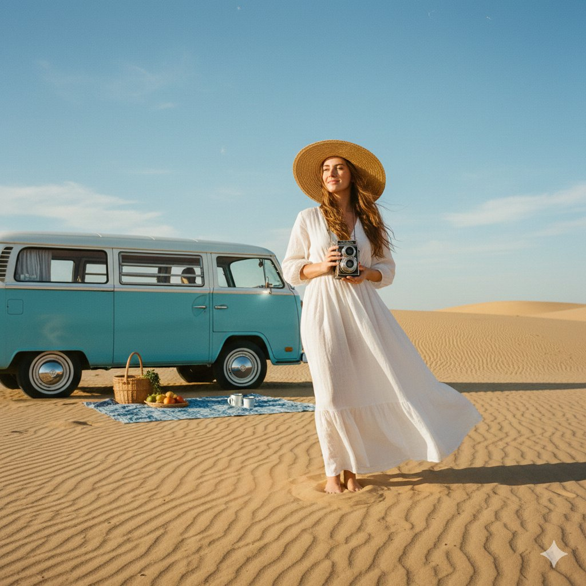

## Hyper-realistic cinematic full-body fashion photoshoot o

- ID: trending-2012881039266648492
- Slug: trending-2012881039266648492-en
- 语言: en
- 来源: [来源链接](https://x.com/Mind_Boticni/status/2012881039266648492)
- 样例图路径: images/part1/2012881039266648492_1.jpg

### 提示词

```text
Hyper-realistic cinematic full-body fashion photoshoot of the uploaded woman (age 26, 5'5"), exact face and hairstyle from the uploaded image, perfectly styled. Leaning back confidently on a deep navy-blue bean bag, one arm resting on the edge of the bag, legs slightly apart, projecting calm confidence and poise. Wearing a bold all-navy look: navy blue denim jacket over a fitted white T-shirt, navy blue denim jeans, chunky sneakers, and a sleek silver watch. Solid navy-blue background, professional studio lighting, sharp focus, high fashion editorial aesthetic. provide four more photos.
```

### 样例图

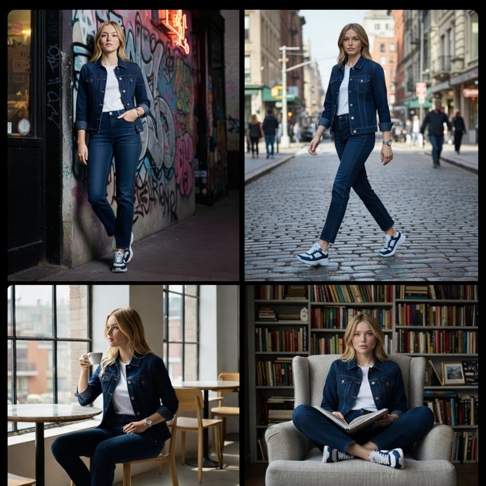

## A high-resolution, cinematic portrait of a young man wit

- ID: trending-2040832305925894162
- Slug: trending-2040832305925894162-en
- 语言: en
- 来源: [来源链接](https://x.com/rovvmut_/status/2040832305925894162)
- 样例图路径: images/part1/2040832305925894162_1.jpg

### 提示词

```text
A high-resolution, cinematic portrait of a young man with messy, voluminous dark hair and a well-groomed beard. He is wearing classic black wayfarer-style sunglasses and a clean, oversized white t-shirt. The man is seated backward on a vintage dark wood chair, resting his muscular, crossed forearms comfortably along the top of the curved backrest. On his left wrist, he wears a sleek black smartwatch with a rectangular face.

The scene is defined by dramatic, high-contrast lighting filtered through Venetian blinds, casting sharp, rhythmic horizontal shadow bars across his face, torso, and the textured, warm-grey plaster wall in the background. The atmosphere is moody and serene, with a shallow depth of field that keeps the focus sharp on the man’s expression and the texture of his hair, while the lower portion of the chair and his black trousers softly blur into the foreground. The color palette is neutral and sophisticated, dominated by crisp whites, deep blacks, and warm earthy wood tones.
```

### 样例图

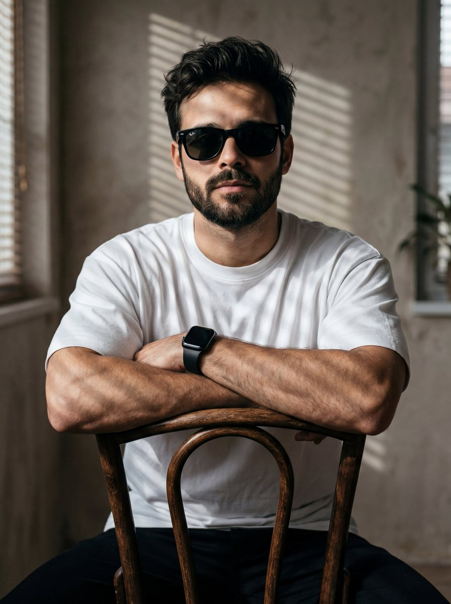

## A hyper-realistic cinematic scene of a young woman sitti

- ID: trending-2040304148516651431
- Slug: trending-2040304148516651431-en
- 语言: en
- 来源: [来源链接](https://x.com/AIwithSynthia/status/2040304148516651431)
- 样例图路径: images/part1/2040304148516651431_1.jpg

### 提示词

```text
A hyper-realistic cinematic scene of a young woman sitting at a wooden desk in a vintage library filled with old books. She is delicately holding and adjusting a tiny miniature version of herself standing on the table. The miniature woman wears an elegant flowing green dress with fine fabric details and subtle glowing particles around her. The larger woman looks focused and gentle, as if crafting or designing the tiny figure. Soft warm lighting from vintage wall lamps creates a cozy atmosphere, with sewing tools like scissors, threads, measuring tape, and fabric pieces scattered on the desk. Shallow depth of field, ultra-detailed, 8K, realistic skin textures, soft shadows, magical realism, cinematic composition.
```

### 样例图

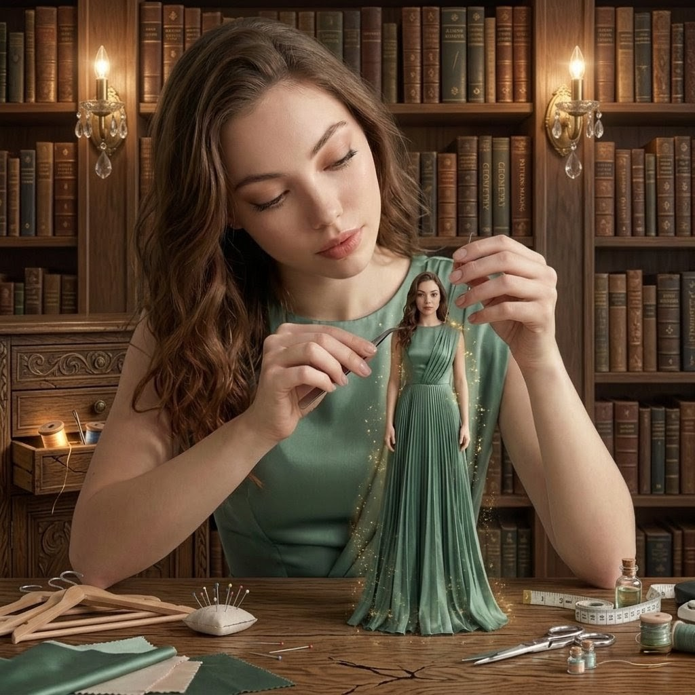

## Minimalist product photography of a matte red pump bottl

- ID: trending-2041012030216536237
- Slug: trending-2041012030216536237-en
- 语言: en
- 来源: [来源链接](https://x.com/Kashberg_0/status/2041012030216536237)
- 样例图路径: images/part1/2041012030216536237_1.jpg

### 提示词

```text
Minimalist product photography of a matte red pump bottle labeled ‘ROAM lubricant’, held by multiple diverse hands with different skin tones, arranged elegantly around the bottle. Soft studio lighting, warm monochromatic terracotta background, smooth shadows, luxury skincare aesthetic, high-end commercial style, sharp focus, centered composition, clean and modern branding, glossy finish on bottle, subtle reflections, editorial beauty shot, 4k resolution.
```

### 样例图

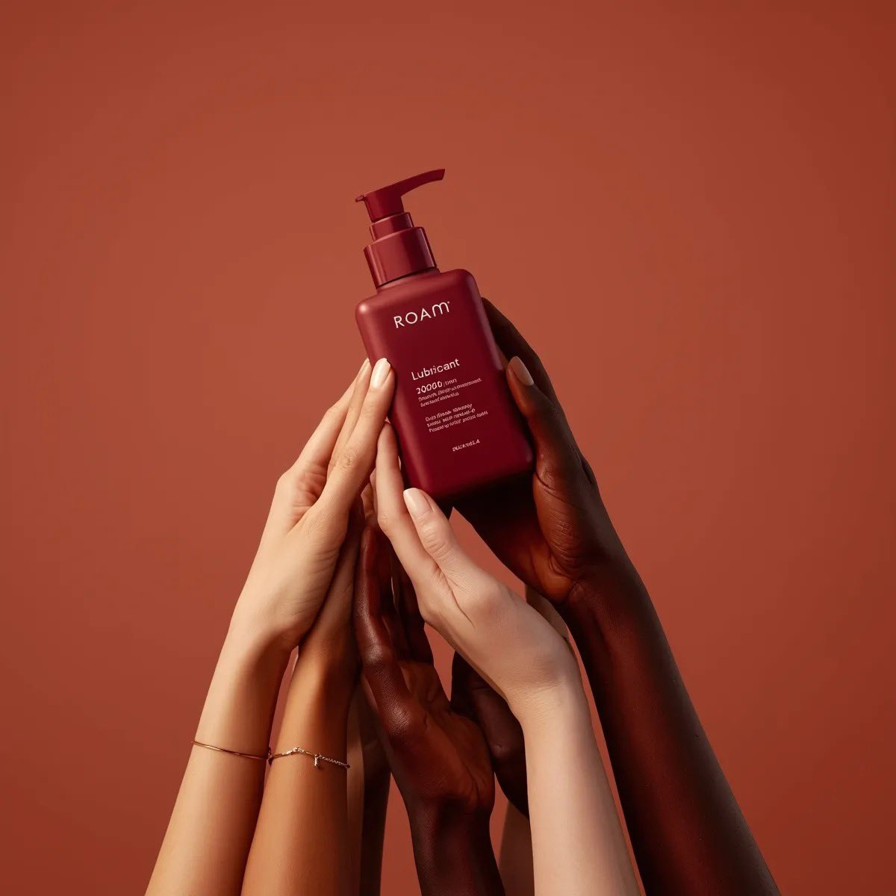

## Editorial 3x3 photo grid in a clean soft beige studio. C

- ID: trending-2021903910617915795
- Slug: trending-2021903910617915795-en
- 语言: en
- 来源: [来源链接](https://x.com/Naiknelofar788/status/2021903910617915795)
- 样例图路径: images/part1/2021903910617915795_1.jpg

### 提示词

```text
Editorial 3x3 photo grid in a clean soft beige studio. Character (matches reference 100%) wearing lightweight dark navy shirt, ivory trousers, barefoot for raw simplicity. Lighting: large diffused key light directly front-right, silver reflector left, subtle rim from top. Shots to include: 1. extreme close-up of lips + cheekbone with blurred hand partially covering (85mm, f/1.8, razor-thin DOF); 2. tight crop on eyes looking into lens with reflection of light strip visible (85mm, f/2.0); 3. black & white close portrait resting chin on fist, face filling frame (50mm, f/2.2); 4. over-shoulder shot, blurred foreground fabric curtain framing half face (85mm, f/2.0); 5. very close frontal with hands overlapping face, light streak across eyes (50mm, f/2.5); 6. tight angled portrait showing hair falling into eyes, soft-focus background (85mm, f/2.2); 7. crop of hands touching jawline, eyes cropped out (50mm, f/3.2, detail-focused); 8. half-body seated sideways on low cube, head turned sharply away, blurred foreground (35mm, f/ 4.5); 9. intense close-up of profile with single tear-like water droplet, cinematic light slice across (85mm, f/ 1.9). Angles: mostly tight headshots with slight high/low tilts, maintaining variation. Capture RAW, professional muted grade, smooth tonal contrast, subtle cinematic grain. Mood: intimate, introspective, character-led editorial minimalism with delicate use of fabric as prop.
```

### 样例图

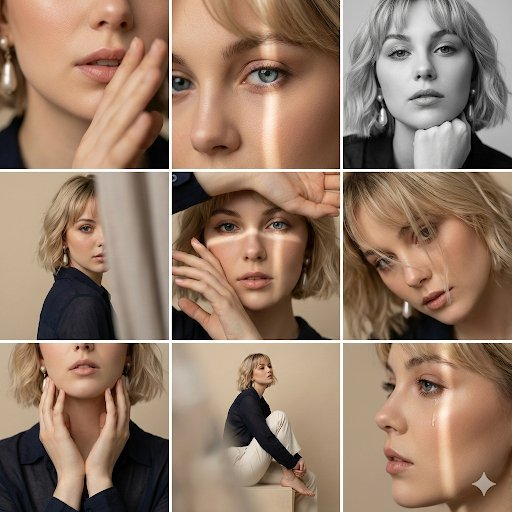

## { "image_generation": { "subject": { "description": "you

- ID: trending-2015284406307692759
- Slug: trending-2015284406307692759-en
- 语言: en
- 来源: [来源链接](https://x.com/saniaspeaks_/status/2015284406307692759)
- 样例图路径: images/part1/2015284406307692759_1.jpg

### 提示词

```text
{
  "image_generation": {
    "subject": {
      "description": "young woman enjoying a calm self-care moment",
      "expression": "relaxed, thoughtful, peaceful",
      "face": "natural facial features with a gray clay face mask applied evenly",
      "skin": "natural skin tone, soft texture"
    },
    "hair": {
      "style": "hair wrapped in a white towel turban",
      "appearance": "clean, spa-style look"
    },
    "outfit": {
      "clothing": "white bathrobe",
      "style": "minimal, cozy, spa aesthetic",
      "accessories": "small gold hoop earrings, delicate gold necklace"
    },
    "pose": {
      "hands": "one hand holding a ceramic mug, other hand lightly touching the side of the head",
      "posture": "upright, relaxed stance"
    },
    "props": {
      "mug": "white ceramic mug with a cute cat design",
      "theme": "morning relaxation, wellness routine"
    },
    "environment": {
      "setting": "bright indoor space near a window",
      "background": "soft white wall with natural window light and leafy green houseplant",
      "mood": "calm, fresh, minimal"
    },
    "lighting": {
      "type": "natural sunlight",
      "direction": "side-lit through a window",
      "effect": "soft shadows, warm highlights"
    },
    "camera": {
      "style": "lifestyle photography",
      "angle": "medium close-up",
      "focus": "sharp focus on subject, softly blurred background",
      "quality": "high-resolution, photorealistic"
    },
    "aesthetic": {
      "theme": "self-care, wellness, morning routine",
      "color_palette": "soft whites, neutral tones, natural greens",
      "vibe": "clean, peaceful, luxurious yet minimal"
    }
  }
}
```

### 样例图

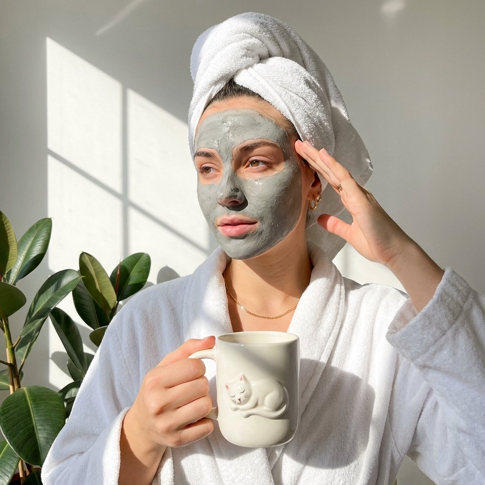

## A small chili plant with glossy green leaves and one tin

- ID: trending-2025073987521507338
- Slug: trending-2025073987521507338-en
- 语言: en
- 来源: [来源链接](https://x.com/Strength04_X/status/2025073987521507338)
- 样例图路径: images/part1/2025073987521507338_1.jpg

### 提示词

```text
A small chili plant with glossy green leaves and one tiny white flower bud forming, emerging from dark damp soil. Light rain falling gently, droplets visible mid-air. Ground-level camera angle, intense macro detail on leaf veins and wet soil granules. Soft daylight with warm evening tones, natural reflections on wet surfaces. Background garden softly blurred with circular bokeh highlights. Backlit leaves with subtle translucency. Shot on 100mm macro lens, shallow depth of field, f/2.8
```

### 样例图


## A gritty, handheld iPhone photo taken at night on an air

- ID: trending-2015428737005912073
- Slug: trending-2015428737005912073-en
- 语言: en
- 来源: [来源链接](https://x.com/Strength04_X/status/2015428737005912073)
- 样例图路径: images/part1/2015428737005912073_1.jpg

### 提示词

```text
A gritty, handheld iPhone photo taken at night on an airport tarmac with harsh direct on-camera flash. Imperfect, slightly crooked framing, like a spon-taneous snap. In the foreground, the woman stands beside a pink Porsche 911 on a flatbed trailer, mid-coy gesture, body angled three-quarters, one hand near her face. She wears wide Carhartt-style jeans and a fitted top, straight bangs framing her face flirty, casual, unplanned. In the background, a huge Emirates Airbus A380 looms in darkness, barely visible beyond flash falloff, cargo door open. Blown highlights on her, hard shadows on concrete, the plane mostly swallowed by night.
```

### 样例图

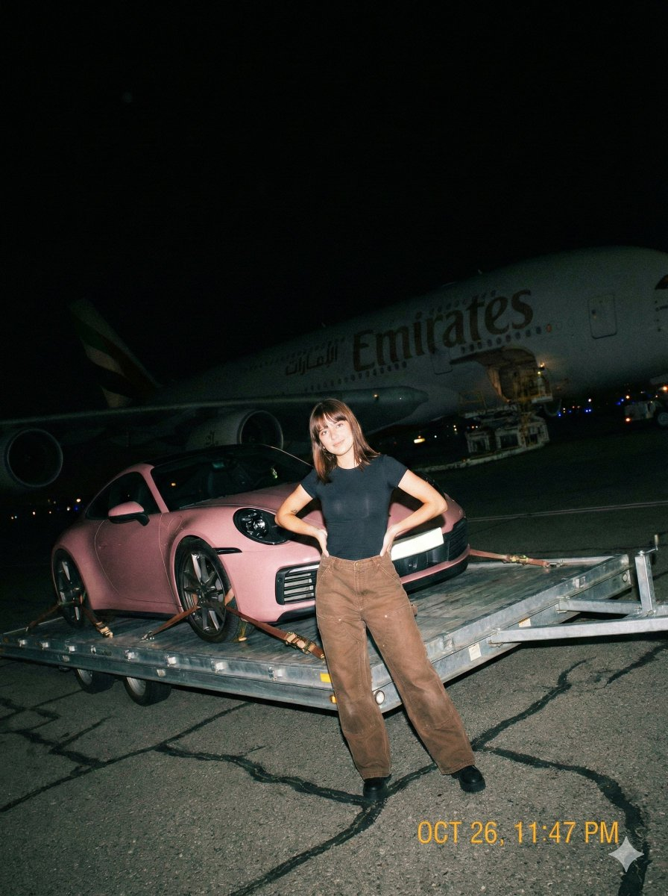

## Use 100% of the uploaded reference image for the exact f

- ID: trending-2010202953123295307
- Slug: trending-2010202953123295307-en
- 语言: en
- 来源: [来源链接](https://x.com/ChillaiKalan__/status/2010202953123295307)
- 样例图路径: images/part1/2010202953123295307_1.jpg

### 提示词

```text
Use 100% of the uploaded reference image for the exact face, identity, and facial structure — do not alter facial features. A high-contrast black-and-white fashion portrait of a handsome young man in his late 20s with black hair and a well-groomed black beard, looking over his shoulder toward the camera. He wears a stylish black leather jacket with visible grain texture and modern rectangular sunglasses with deep red-tinted lenses.
```

### 样例图

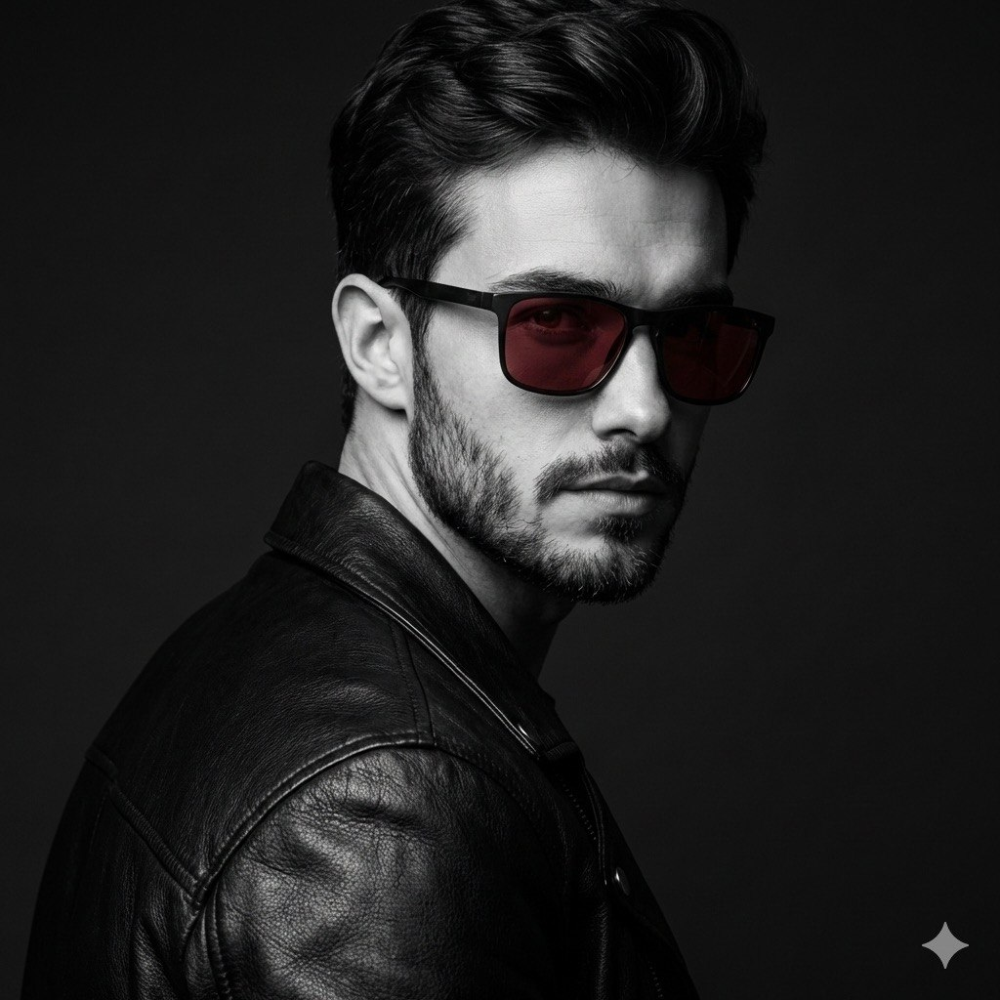

## { "Objective": "Create a high-fashion editorial studio p

- ID: trending-2009630448499167474
- Slug: trending-2009630448499167474-en
- 语言: en
- 来源: [来源链接](https://x.com/Taaruk_/status/2009630448499167474)
- 样例图路径: images/part1/2009630448499167474_1.jpg

### 提示词

```text
{
  "Objective": "Create a high-fashion editorial studio portrait presented as a vertical triptych with cinematic luxury aesthetics",
  "PersonaDetails": {
    "Subject": {
      "Type": "Young woman",
      "Hair": "Long, sleek chestnut-brown hair",
      "Makeup": {
        "Style": "Natural, flawless skin",
        "Emphasis": "Eyes subtly enhanced for intensity"
      },
      "Wardrobe": "Minimalist black outfit",
      "OverallPresence": "Calm, confident, refined"
    }
  },
  "TriptychComposition": {
    "Layout": "Vertical triptych (three stacked frames)",
    "TopFrame": {
      "Framing": "Centered head-and-shoulders portrait",
      "Pose": "Straight-on, symmetrical composition",
      "Expression": "Calm, confident",
      "Focus": "Balanced facial proportions and elegance"
    },
    "MiddleFrame": {
      "Framing": "Extreme close-up of the eyes",
      "Focus": "Eyes in razor-sharp focus",
      "PoseDetail": "Hand partially covering the face",
      "Accessories": "Long, glossy black nails prominently visible",
      "Mood": "Intimate, intense, editorial"
    },
    "BottomFrame": {
      "Framing": "Three-quarter portrait",
      "Pose": "Hand posed elegantly near the lips",
      "Expression": "Subtle, poised, fashion-forward",
      "Focus": "Gesture, styling, and body language"
    }
  },
  "LightingAndAtmosphere": {
    "LightingStyle": "Dramatic directional studio lighting",
    "LightQuality": "Soft shadows with sculpted highlights",
    "Contrast": "Cinematic, high contrast",
    "Background": "Neutral dark studio backdrop"
  },
  "ArtDirection": {
    "Style": "Luxury beauty campaign",
    "Aesthetic": "Vogue-style high-fashion editorial",
    "SkinRendering": "Flawless yet natural skin texture",
    "DetailLevel": "Ultra-detailed with refined realism"
  },
  "PhotographyStyle": {
    "Genre": "High-fashion editorial studio photography",
    "CompositionFeel": "Clean, bold, graphic",
    "ImageQuality": "High resolution, premium commercial finish"
  },
  "Mood": {
    "Tone": "Elegant, powerful, modern",
    "Energy": "Confident, controlled, luxurious"
  },
  "NegativePrompt": [
    "casual fashion",
    "street photography",
    "overly dramatic makeup",
    "soft focus eyes",
    "busy background",
    "oversaturated colors",
    "low contrast",
    "plastic skin"
  ],
  "ResponseFormat": {
    "Type": "Single composite image",
    "Layout": "Vertical triptych",
    "Orientation": "Portrait",
    "AspectRatio": "1:2"
  }
}
```

### 样例图

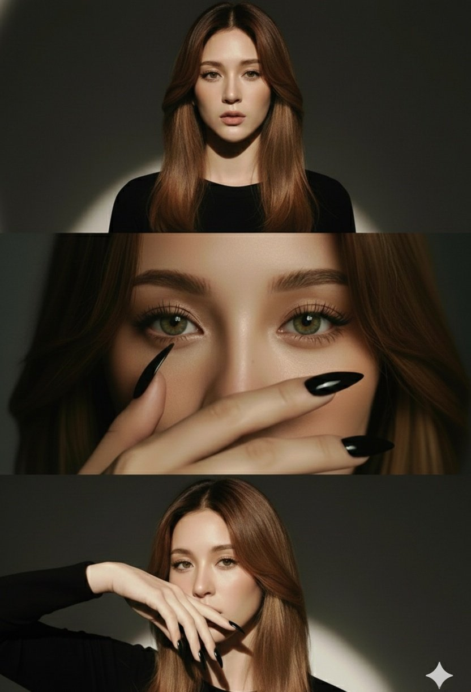

## A cinematic forced-perspective street photography scene 

- ID: trending-2011823507932659844
- Slug: trending-2011823507932659844-en
- 语言: en
- 来源: [来源链接](https://x.com/Xaroonx/status/2011823507932659844)
- 样例图路径: images/part1/2011823507932659844_1.jpg

### 提示词

```text
A cinematic forced-perspective street photography scene where a giant worn-out sneaker appears enormous in the foreground, towering over a casually dressed young man leaning against it. The man wears a brown leather jacket, loose blue jeans, sneakers, and a beige cap, standing confidently with hands in pockets. Autumn atmosphere with yellow and orange leaves scattered on the road, talltrees with fall foliage in the background, parked car slightly blurred. Ultra-realistic textures on the shoe sole, visible dirt and fabric wear. Shot from a very low angle to exaggerate scale, shallow depth of field, natural daylight, soft cinematic color grading, realistic shadows, high detail, 8K resolution, professional photography, surreal yet believable forced perspective illusion.
```

### 样例图

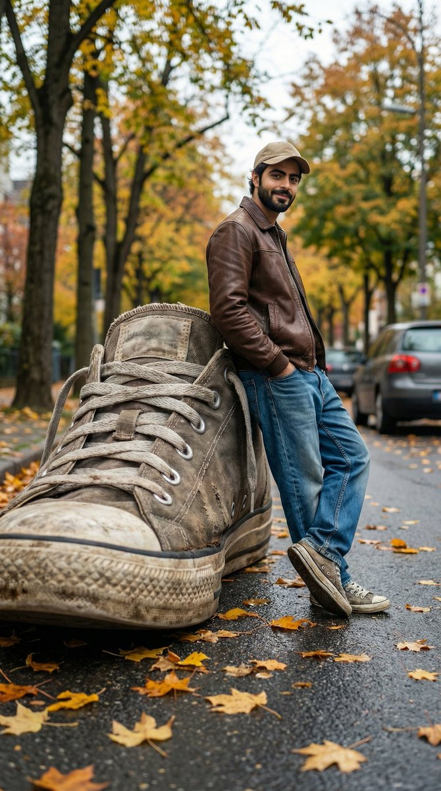

## An editorial poster-style multi-panel collage presents S

- ID: trending-2018566445031137556
- Slug: trending-2018566445031137556-en
- 语言: en
- 来源: [来源链接](https://x.com/harboriis/status/2018566445031137556)
- 样例图路径: images/part1/2018566445031137556_1.jpg

### 提示词

```text
An editorial poster-style multi-panel collage presents Subject[person in the image] across three asymmetric photographic frames, unified by a muted-brown urban streetwear aesthetic and a retro analog-digital fusion mood. The top-left frame captures a reflective window shot where the subject holds a phone in front of their face, dressed in a brown plaid blazer layered over a white button-up shirt, a yellow tie, loose dark trousers, and a brown cap; the reflective surface introduces layered ghosting, faint architectural overlays, and a subtly stretched full-body silhouette shaped by the curvature of the glass.

The top-right frame shifts into a close-range, downward-angled ultra-wide portrait taken on a cobblestone street, where the subject leans forward with hands in pockets and lips exaggeratedly pouting, wearing the same outfit now paired with oversized amber-tinted rectangular sunglasses, while the cobblestones warp and radiate outward due to lens perspective distortion.

The bottom-right frame becomes an intimate overhead selfie with the subject holding a drink, still in the same wardrobe but now with wired earphones, the amber sunglasses dominating the frame under soft overcast lighting, enhanced by faint digital-grid overlays and a minimal square facial-bounding graphic.

Floating across the middle section of the poster is a translucent iOS-style Apple Music mini-player displaying "See You Again" by Tyler, The Creator, featuring artwork, timeline, and playback controls without shadows, contributing to the minimal Ul aesthetic alongside subtle cursor-like frame lines and rectangular highlights around the collage edges.

The overall palette emphasizes warm ambers, washed neutrals, soft greys, reflective textures, wool plaid patterning, polished leather, and stone pavement, all rendered with realistic lighting and natural distortion patterns while avoiding stickers, extra subjects, wardrobe changes, incorrect Ul icons, neon color shifts, or any futuristic sci-fi elements.
```

### 样例图

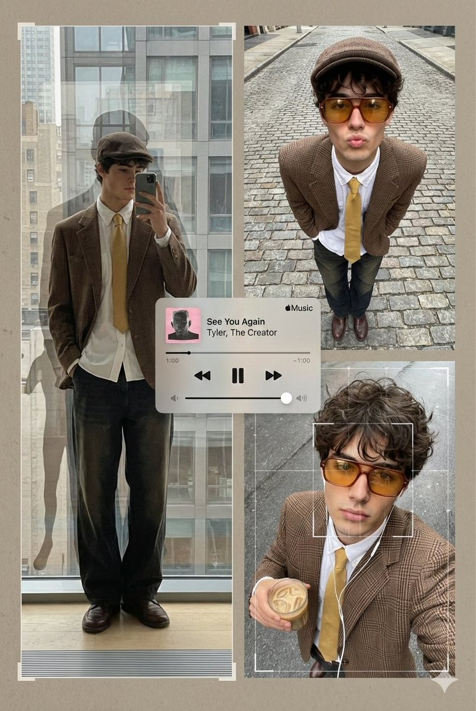

## Create a hyper-realistic mirror selfie of me (use my fac

- ID: trending-2011028969332805684
- Slug: trending-2011028969332805684-en
- 语言: en
- 来源: [来源链接](https://x.com/harboriis/status/2011028969332805684)
- 样例图路径: images/part1/2011028969332805684_1.jpg

### 提示词

```text
Create a hyper-realistic mirror selfie of me (use my face from the uploaded selfie) wearing the same black Ferrari racing jacket with red and yellow patches, black t-shirt underneath, silver rings, and chain.
I'm holding a phone with a beige
MagSafe case, posing in a dimly lit
modern bathroom with dark marble
walls. The lighting is soft and moody
capturing the same hairstyle, pose,
and reflection angle as in the
reference image - stylish, confident
cinematic vibe. Add a moody filter.
```

### 样例图

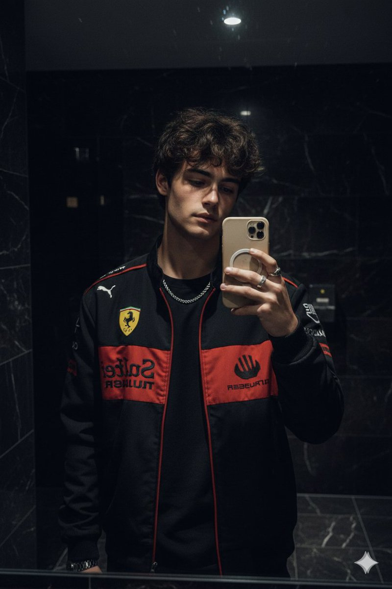

## Ultra-realistic street fashion editorial photograph in N

- ID: trending-2021083866258342114
- Slug: trending-2021083866258342114-en
- 语言: en
- 来源: [来源链接](https://x.com/Naiknelofar788/status/2021083866258342114)
- 样例图路径: images/part1/2021083866258342114_1.jpg

### 提示词

```text
Ultra-realistic street fashion editorial photograph in New York City / Wall Street area, shot in vertical 3:4 (1152×1536). A stylish woman stands in the lower-right foreground on a wide concrete sidewalk at a street corner, posed in left-facing profile (body angled left, head slightly forward), calm confident expression. She wears large black rectangular sunglasses, pearl drop earrings, hair sleek center-part pulled into a low bun, subtle makeup with warm blush and muted lipstick. Outfit: oversized chocolate-brown leather bomber jacket with pronounced shoulders and glossy creases, layered over a light blue collared shirt and a dark necktie. Hands in front holding a folded newspaper: “THE WALL STREET” clearly visible across the top of the paper. She wears white gloves and high-waisted white pants (clean, structured).

Environment / Street Elements (Must match):

A tall black metal street pole dominates the right side foreground, wrapped with white tape bands and small worn stickers; at the top right there’s a black-and-white “ONE WAY” sign (arrow pointing right). Just left of the pole is a yellow/orange pedestrian traffic signal with the white walking figure illuminated. Above and behind, multiple large American flags hang from the stone building façade, the nearest flag filling the upper center-left area with visible red-and-white stripes and blue field. Background is a canyon of tall buildings: left side is an older light beige stone building with rectangular windows, vent-like panels, and dark trim at the base; right side shows modern tall buildings and a long street receding into the distance. On the roadway to the right is a pinkish-red lane (bus/bike lane feel) with textured sidewalk corner and a small red tactile paving patch near the pole base. Far background includes tiny pedestrians and cars along the street; everything is sharp enough to read the scene but remains secondary to the subject.

Composition / Perspective:

Wide-angle street perspective with strong vertical lines; the camera is at rough chest height aimed slightly upward so the signal, flags, and signs tower above the subject. Subject is framed from mid-thigh up, placed bottom-right, leaving large negative space of architecture and street signage above. Maintain exact spacing: pole near right edge, pedestrian signal centered above subject, flags hanging upper-left, street depth vanishing toward upper-right background.

Lighting / Color / Texture:

Overcast daylight with soft shadows, neutral highlights. Warm, slightly desaturated film look (beige stone tones, muted browns), subtle contrast, gentle lifted blacks. Add fine film grain and slight texture like a candid editorial street shot. Natural skin texture, realistic leather sheen and folds, realistic newspaper paper texture.

Camera / Lens / Settings (Emulation):

Full-frame look, 24–28mm wide lens, documentary/editorial street style, moderate depth of field (subject crisp, background slightly softer but still readable). Slight vintage/film-grade color science.

Hard Rules (No deviations):

Do not change the pose, outfit layers (brown leather jacket + blue shirt + tie), sunglasses shape, pearl earrings, bun hairstyle, white gloves, white pants, the “THE WALL STREET” newspaper text, the “ONE WAY” sign, the walking man icon, the American flags, or the exact NYC street-corner composition. No extra props, no extra people in foreground, no cropping changes, no stylization beyond realistic film/editorial grain.

Negative Prompt (Strict):

no illustration, no CGI look, no anime, no painterly texture, no extra typography overlays, no added logos, no changed signs, no different newspaper title, no different flag placement, no blur on main subject, no heavy HDR, no neon colors, no beauty-plastic skin, no distorted hands, no warped buildings, no random lens flares.
```

### 样例图

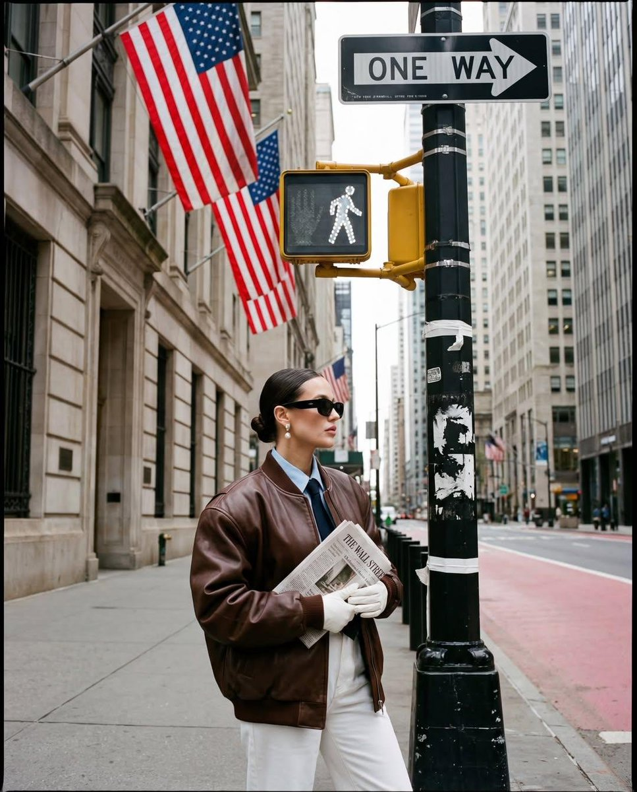

## A stylish young man sitting confidently on raw concrete 

- ID: trending-2008777683455656087
- Slug: trending-2008777683455656087-en
- 语言: en
- 来源: [来源链接](https://x.com/harboriis/status/2008777683455656087)
- 样例图路径: images/part1/2008777683455656087_1.jpg

### 提示词

```text
A stylish young man sitting confidently on raw concrete steps inside a dense urban housing complex during golden hour. He wears a hooded sweatshirt layered under a premium streetwear jacket with minimal embroidered patches, relaxed cargo pants, and bold high-top sneakers. Shot from a low, slightly wide angle to enhance dominance and attitude. Warm golden sunlight from the setting sun and street lamps creates long shadows, glowing highlights on the face, and cinematic depth. Tall apartment buildings with softly lit windows fill the background. Ultra-realistic DSLR look, shallow depth of field, crisp fabric textures, natural skin tones, subtle film grain, Instagram-trending urban vibe, 4K quality.
```

### 样例图

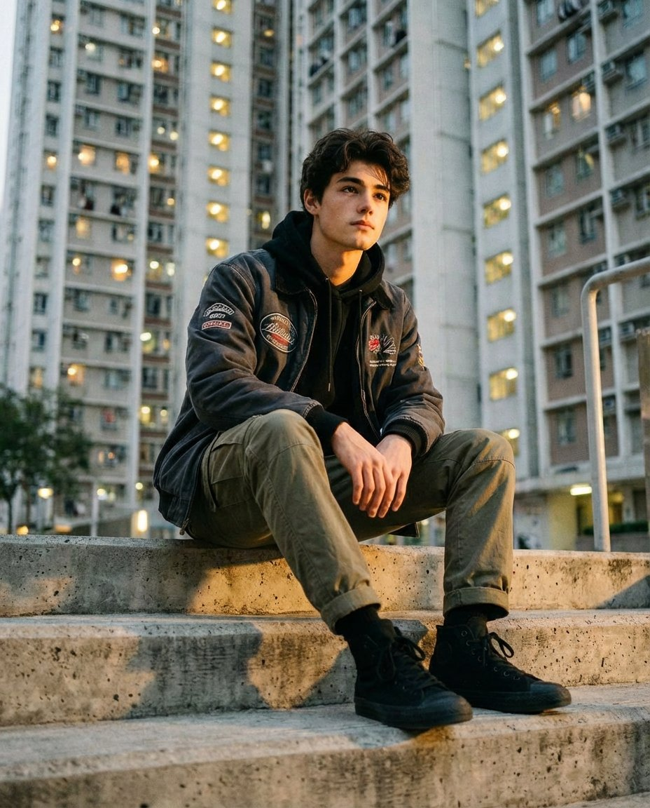

## Transform this image [Upload Your Image] into a 64K DSLR

- ID: trending-2010183355560800577
- Slug: trending-2010183355560800577-en
- 语言: en
- 来源: [来源链接](https://x.com/Sheldon056/status/2010183355560800577)
- 样例图路径: images/part1/2010183355560800577_1.jpg

### 提示词

```text
Transform this image [Upload Your Image] into a 64K DSLR shot resolution of A creative mixed-reality street portrait featuring a real young man (same face as the uploaded image) sitting on concrete steps beside his illustrated cartoon counterpart. The scene is set outdoors against a gray brick wall with a large window above, reflecting trees and indoor lighting, giving an urban neighborhood feel. The sidewalk and steps have worn yellow paint along the edges, adding texture and realism.
On the right sits the real person, a young man (same face as the uploaded image) dressed in early-2000s hip-hop streetwear. He wears an oversized bright yellow graphic T-shirt with a bold circular logo, loose light-blue baggy jeans, white & red chunky sneakers with yellow detailing, and a maroon baseball cap worn forward. He poses casually, seated with legs extended, one arm flexed at the elbow as if showing strength or confidence, looking off to the side with a calm, cool expression. 
On the left sits his cartoon illustrated version of himself (same face as the uploaded image) perfectly matching his outfit, pose, and proportions. The cartoon character is drawn in a flat, bold, graphic style with thick black outlines, simplified facial features, and vibrant colors. The illustrated figure mirrors the real person’s posture and clothing exactly same, including the oversized shirt, baggy jeans, red & white sneakers, and maroon cap. The cartoon arm connects visually with the real person’s arm, creating a playful illusion of interaction between illustration and reality. The illustration style resembles hand-drawn street art or animated hip-hop character design, seamlessly integrated into the photograph with accurate scale, alignment, and grounding. The contrast between realistic textures (concrete, brick, denim fabric) and the clean, flat cartoon shading creates a striking visual effect. Lighting is natural daylight, evenly illuminating both the real and illustrated subjects. The overall mood is cool, nostalgic, playful, and creative, blending street fashion, urban culture, and cartoon art into a cohesive mixed-media composition. Style & Mood Keywords: Mixed media photography, real person with cartoon twin, urban street portrait, hip-hop fashion, Y2K streetwear, bold graphic illustration, cartoon realism blend, playful surrealism, nostalgic urban culture, high-resolution detail, creative storytelling. Octane render & Unreal Engine 5.
```

### 样例图

![Transform this image [Upload Your Image] into a 64K DSLR](../images/part1/2010183355560800577_1.jpg)

## { "type": "image_generation_prompt", "style": "ultra-pho

- ID: trending-2025153830552494523
- Slug: trending-2025153830552494523-en
- 语言: en
- 来源: [来源链接](https://x.com/saniaspeaks_/status/2025153830552494523)
- 样例图路径: images/part1/2025153830552494523_1.jpg

### 提示词

```text
{
  "type": "image_generation_prompt",
  "style": "ultra-photorealistic, cinematic, high-end fashion editorial",
  "aspect_ratio": "1:1",
  "resolution": "high resolution, maximum realism",
  "scene": {
    "time": "night",
    "weather": "rainy",
    "location": "urban London street"
  },
  "environment": {
    "primary_setting": "inside a classic red British telephone booth",
    "ground": "wet pavement reflecting city lights",
    "atmosphere": [
      "visible raindrops under soft street lighting",
      "subtle fog in the background",
      "blurred headlights",
      "cinematic bokeh lights"
    ]
  },
  "subject": {
    "gender": "female",
    "appearance": {
      "physique": "fit, elegant, confident presence",
      "expression": "serious, confident, charismatic",
      "pose": {
        "full_body_visible": true,
        "stance": "standing inside the telephone booth",
        "right_hand": "holding the old-fashioned phone receiver",
        "left_hand": "casually inside coat pocket"
      }
    },
    "clothing": {
      "outfit": "tailored black suit",
      "outerwear": "long dark trench coat slightly wet from rain",
      "style": "elegant, cinematic, fashion editorial"
    }
  },
  "lighting": {
    "type": "moody cinematic street lighting",
    "effects": [
      "dramatic contrast",
      "realistic rain reflections on glass panels",
      "soft highlights on wet surfaces",
      "natural reflections from city lights"
    ]
  },
  "camera": {
    "framing": "full-body shot from head to toe",
    "composition": "centered subject inside telephone booth",
    "focus": "sharp focus on subject, soft blur in background",
    "style": "cinematic photography"
  },
  "mood": {
    "tone": "dark, elegant, cinematic",
    "aesthetic": "high-end fashion editorial with urban atmosphere"
  },
  "constraints": [
    "no cartoon or illustration",
    "no unrealistic lighting",
    "no distortion",
    "no watermark",
    "no text"
  ],
  "output_goal": "Create an ultra-photorealistic cinematic night scene of a confident woman standing inside a classic red British telephone booth in rainy London, with dramatic lighting, realistic reflections, and a high-end fashion editorial aesthetic."
}
```

### 样例图

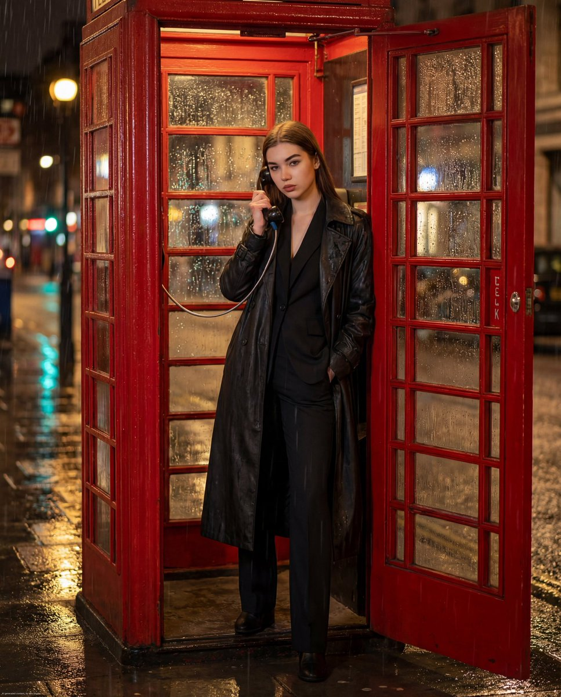

## A raw, candid street-style shot of reference running thr

- ID: trending-2011634939490672664
- Slug: trending-2011634939490672664-en
- 语言: en
- 来源: [来源链接](https://x.com/harboriis/status/2011634939490672664)
- 样例图路径: images/part1/2011634939490672664_1.jpg

### 提示词

```text
A raw, candid street-style shot of reference running through a rain-soaked Neo-Tokyo alleyway, glancing over her shoulder. She is wearing an oversized "Crimson Red" distressed denim jacket with safety pins and patches, the [YOUR TEXT] branding is embroidered in white on the back. Underneath, a torn band tee. Raindrops on the camera lens create natural distortion. The background is blurred red neon signs reflecting on wet asphalt. The image is heavily processed with "Critical Error" red text overlays and glitch artifacts. Style: Flash photography, high contrast, adrenaline rush.
```

### 样例图

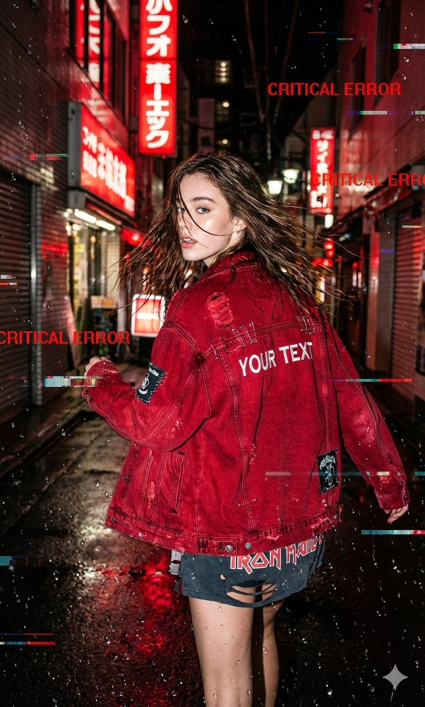

## Utilize exclusively and obligatorily the uploaded refere

- ID: trending-2010578685070582235
- Slug: trending-2010578685070582235-en
- 语言: en
- 来源: [来源链接](https://x.com/SimplyAnnisa/status/2010578685070582235)
- 样例图路径: images/part1/2010578685070582235_1.jpg

### 提示词

```text
Utilize exclusively and obligatorily the uploaded reference photos as the primary and authoritative source for the model’s face, facial structure, proportions, skin tone, real skin texture, and the exact natural characteristics of her hair.
Do not idealize, beautify, alter, rejuvenate, slim the face, smooth the skin, or modify any real features.
Do not remove or change freckles, pores, fine lines, or natural imperfections.The appearance must match the reference images exactly, with absolute fidelity.
Create a hyper-realistic, ethereal macro Fine Art portrait photograph, captured with a Leica APO-Macro-Elmarit-R 100mm f/2.8, full-frame.
An extreme close-up of a young woman’s face with pale skin, fully respecting the real physiognomy of the model as shown in the reference photos.
Skin texture is ultra-detailed and completely natural, with clearly visible pores and no artificial smoothing.
One crystal-clear, melancholic eye is in perfect critical focus, displaying natural micro-contrast characteristic of Leica optics.
Long, natural eyelashes.
Lips slightly parted, in a natural pale pink tone, with no excessive or artificial makeup.
Delicate wildflowers in soft lilac and muted purple tones rest gently on the cheek and intertwine with loose, naturally imperfect hair strands, exactly following the real hair pattern seen in the reference images.
Some flowers appear softly out of focus in the foreground, creating organic depth and layered composition.
Soft, cool, diffused natural light, as on an overcast day.
No harsh shadows, no artificial lighting.
A serene, fragile, poetic, and subtly melancholic atmosphere.
Macro photography with an extremely shallow depth of field, edges and background melting into a creamy, smooth bokeh.
Absolute critical focus on the iris and the true skin texture.
Desaturated color palette, cool pastel tones — soft gray, beige, and lilac.
Fine Art aesthetic, authentic Leica optical fidelity, true photographic appearance.
Ultra-high resolution 8K, with no AI-generated look.
```

### 样例图

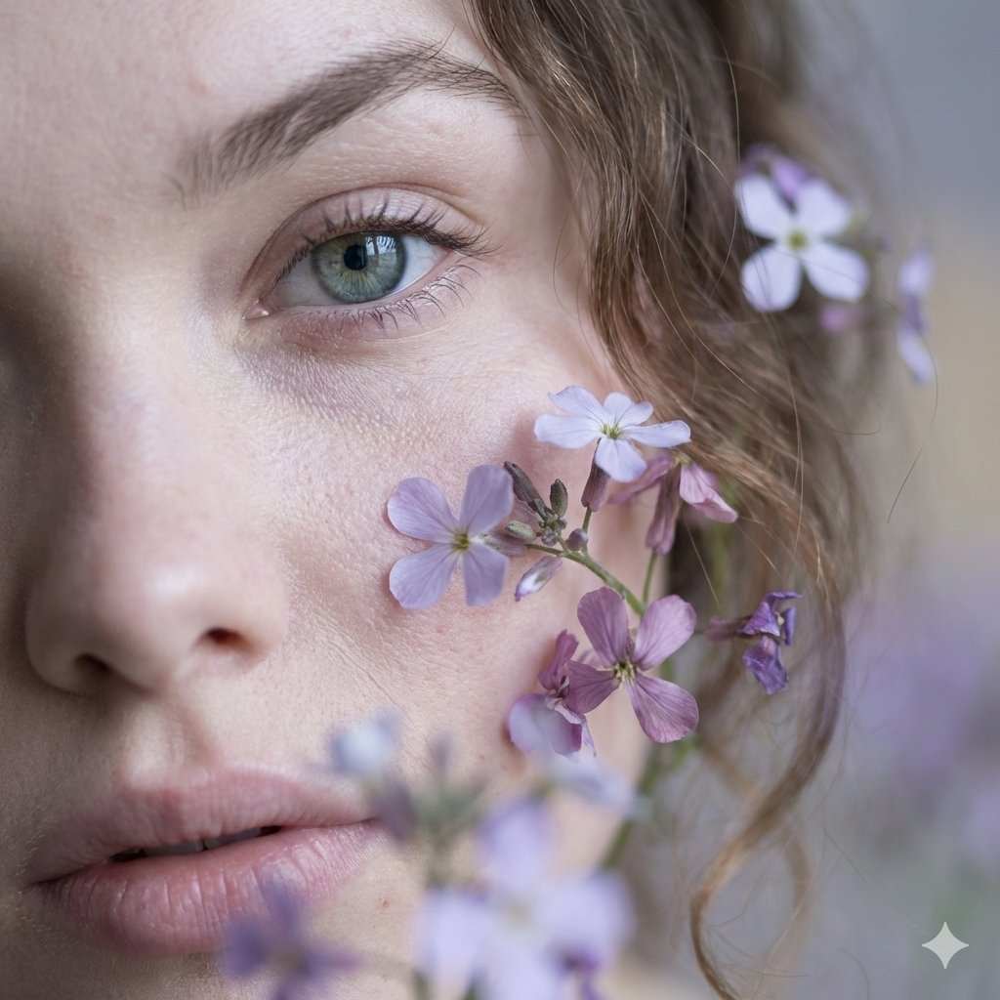

## Beard. Makeup is minimal and natural, emphasizing clear 

- ID: trending-2009891192524419457
- Slug: trending-2009891192524419457-en
- 语言: en
- 来源: [来源链接](https://x.com/Xaroonx/status/2009891192524419457)
- 样例图路径: images/part1/2009891192524419457_1.jpg

### 提示词

```text
Beard. Makeup is minimal and natural, emphasizing clear skin and subtle lip color. The outfit is contemporary high-fashion streetwear with a Y2K and avant-garde influence. The model wears an oversized, light-wash distressed denim jacket draped loosely over the shoulders, layered over a white graphic T-shirt with bold black text reading "ZarOon". The jeans are extremely oversized, low-rise, acid-wash denim with exaggerated wide legs, heavy structure, decorative.
```

### 样例图

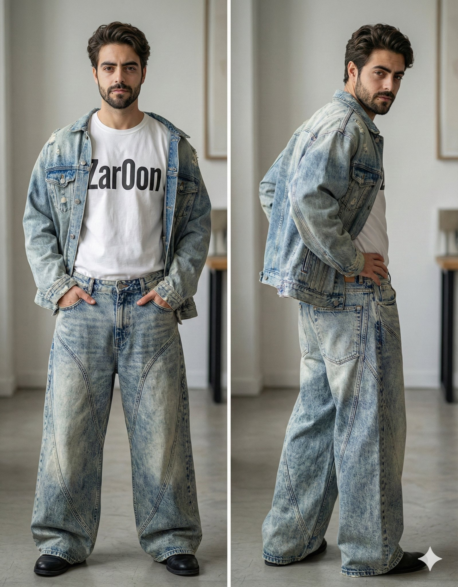

## Generate an image of a man in the uploaded image in whic

- ID: trending-2039904241050173853
- Slug: trending-2039904241050173853-en
- 语言: en
- 来源: [来源链接](https://x.com/rovvmut_/status/2039904241050173853)
- 样例图路径: images/part1/2039904241050173853_1.jpg

### 提示词

```text
Generate an image of a man in the uploaded image in which the entire scene is layered with heavy, horizontal motion-blur streaks in shades of teal, yellow, and white, creating a "speed-light" effect. These colorful blurs must appear both behind the man and superimposed over his body and face, behaving like reflections on a glass mirror. A medium shot of a man standing perfectly still in the center of a frame, looking down at a red smartphone held with both hands. He is wearing a white t-shirt under a translucent, light gray windbreaker jacket and a dark wristwatch. The background is a chaotic, vibrant blur of horizontal light trails in colors of neon blue, orange, yellow, and white, suggesting a high-speed train or city traffic. Crucially, these colorful motion-blurred light streaks pass both behind and directly over the man's body, appearing semi-transparent as they overlap his torso and arms, creating a double-exposure effect. The man's face and hair are in sharp focus, showing a calm expression, contrasting with the high-speed motion of the environment. Cinematic lighting, hyper-realistic, 8k resolution.
```

### 样例图


## { "request_type": "image_generation_prompt", "source_mat

- ID: trending-2009220608026939630
- Slug: trending-2009220608026939630-en
- 语言: en
- 来源: [来源链接](https://x.com/lexx_aura/status/2009220608026939630)
- 样例图路径: images/part1/2009220608026939630_1.jpg

### 提示词

```text
{
  "request_type": "image_generation_prompt",
  "source_material": {
    "input_required": true,
    "description": "User uploaded image for face reference."
  },
  "technical_specs": {
    "resolution": "64K DSLR shot resolution",
    "aspect_ratio": "9:16",
    "render_engines": [
      "Octane Render",
      "Unreal Engine 5"
    ],
    "realism_level": "High-resolution realism"
  },
  "composition": {
    "perspective": "High-angle, top-down view",
    "layout_style": "Modern social media grid (Instagram feed concept)",
    "layout_structure": {
      "central_element": "Larger, framed highlighted post",
      "surrounding_elements": "Clean grid pattern formed by smaller images"
    },
    "content_type": "Dynamic, urban street-style photo collage",
    "ui_overlay": {
      "enabled": true,
      "style": "Minimal social media interface mimicry",
      "elements": [
        "White rounded rectangles showing a username",
        "Subtle heart icons",
        "Minimal interaction indicators"
      ]
    }
  },
  "subject": {
    "identity": {
      "description": "Young woman",
      "facial_reference": "Same face as the uploaded image"
    },
    "appearance": {
      "hair": "Long black hair, worn loose and slightly messy",
      "vibe": "Confident, edgy, effortlessly cool"
    },
    "clothing": {
      "top": "Black-and-white horizontal striped cropped T-shirt",
      "bottom": "Loose black knee-length shorts",
      "footwear": {
        "shoes": "Polished black leather shoes",
        "socks": "Bright red socks"
      },
      "eyewear": "Oversized tinted sunglasses"
    },
    "accessories": {
      "headwear": {
        "item": "Red-and-white baseball cap",
        "usage": "Sometimes worn, sometimes held in hand"
      },
      "bag": "Small shoulder bag",
      "jewelry": "Stacked bracelets",
      "other": "Takeaway drink cup"
    },
    "actions_and_poses": {
      "style": "Candid moments captured in motion, not posed",
      "examples": [
        "Walking along the street",
        "Walking mid-step",
        "Adjusting cap",
        "Looking up toward camera",
        "Fixing bag",
        "Holding drink"
      ],
      "narrative_effect": "Natural lifestyle storytelling, varying poses across frames"
    }
  },
  "environment": {
    "setting": "Asphalt city street",
    "ground_surface": "Textured gray asphalt, minimal and uncluttered",
    "role": "Neutral backdrop emphasizing fashion and movement"
  },
  "lighting_and_color": {
    "lighting_type": "Natural daylight with soft shadows",
    "photographic_feel": "Realistic street photography",
    "color_palette": {
      "base": "Muted and urban tones",
      "contrast_accents": ["Bright red socks", "Red-and-white cap"]
    }
  },
  "style_and_mood": {
    "overall_mood": "Candid, contemporary, effortlessly cool",
    "aesthetic_blend": [
      "Fashion photography",
      "Street culture",
      "Social media aesthetics"
    ],
    "keywords": [
      "Urban street photography",
      "Top-down perspective",
      "Instagram grid layout",
      "Candid lifestyle shots",
      "Street fashion",
      "Casual cool aesthetic",
      "Muted city tones",
      "Social media UI overlay",
      "Natural light",
      "Modern editorial style"
    ]
  }
}
```

### 样例图

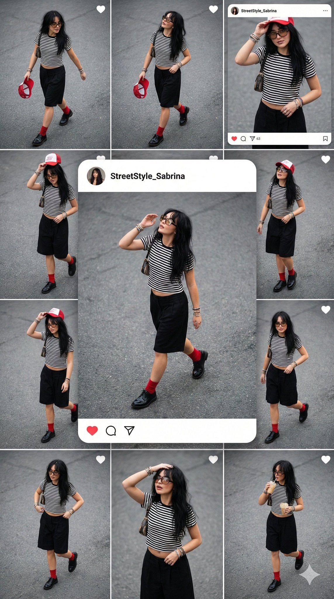

## Photorealistic cinematic portrait of a young East Asian 

- ID: trending-2022635065910464957
- Slug: trending-2022635065910464957-en
- 语言: en
- 来源: [来源链接](https://x.com/ChillaiKalan__/status/2022635065910464957)
- 样例图路径: images/part1/2022635065910464957_1.jpg

### 提示词

```text
Photorealistic cinematic portrait of a young East Asian woman standing outdoors at sunset, side-profile close-up, looking thoughtfully into the distance. Soft golden hour lighting illuminating one side of her face, warm orange and teal color grading. She wears a black coat and dark scarf, hair loosely tied back with soft natural strands around her face. Natural skin texture, realistic facial details, minimal makeup. Shallow depth of field with blurred landscape background, smooth bokeh, dramatic atmospheric mood, soft gradient sky transitioning from warm orange to cool green tones. Shot on 85mm lens, f/1.8, ultra-realistic, high dynamic range, cinematic composition, moody, film still aesthetic.
```

### 样例图

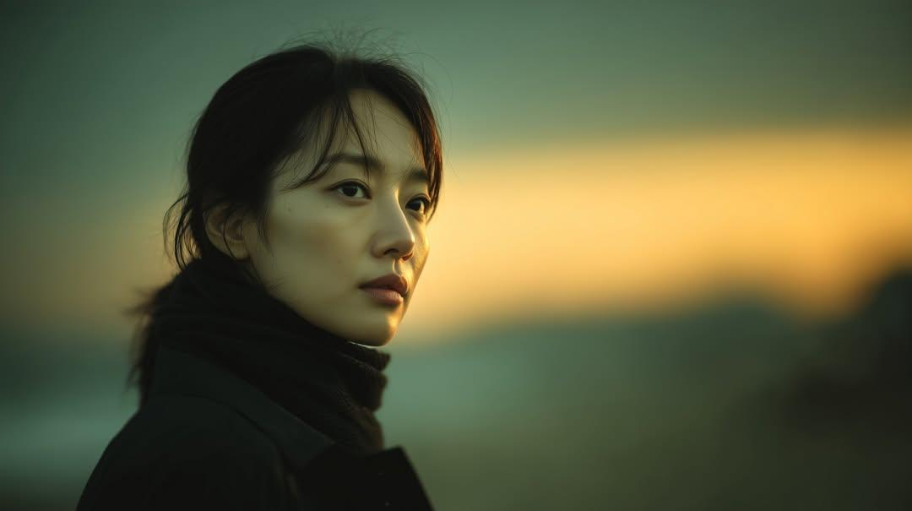

## { "image_generation": { "subject": { "description": "sty

- ID: trending-2021553869168550103
- Slug: trending-2021553869168550103-en
- 语言: en
- 来源: [来源链接](https://x.com/saniaspeaks_/status/2021553869168550103)
- 样例图路径: images/part1/2021553869168550103_1.jpg

### 提示词

```text
{
  "image_generation": {
    "subject": {
      "description": "stylish young woman sitting on an airplane wing high above the clouds",
      "pose": "seated casually on the airplane wing, one hand extended forward as if taking a selfie, relaxed but confident posture",
      "expression": "calm, confident, composed",
      "gaze": "looking toward the camera with a cool, self-assured expression"
    },
    "appearance": {
      "hair": {
        "style": "long, natural, slightly flowing in the wind",
        "look": "casual and effortless"
      },
      "accessories": [
        "dark sunglasses",
        "minimal jewelry"
      ],
      "vibe": "adventurous, bold, modern"
    },
    "outfit": {
      "style": "sporty casual",
      "details": "black hoodie, black fitted pants, clean white sneakers"
    },
    "environment": {
      "setting": "high above the clouds on an airplane wing",
      "sky": "clear blue sky with soft clouds below",
      "atmosphere": "open, airy, dramatic aerial view"
    },
    "lighting": {
      "type": "natural sunlight",
      "style": "bright and cinematic",
      "direction": "side lighting from the sun",
      "quality": "crisp highlights with soft shadows"
    },
    "camera": {
      "angle": "wide selfie-style perspective from a slightly elevated angle",
      "lens": "ultra wide-angle",
      "depth_of_field": "deep focus capturing both subject and vast sky background",
      "composition": "dynamic, adventurous framing emphasizing height and openness"
    },
    "aesthetic": {
      "style": "cinematic adventure photography",
      "vibe": "bold, fearless, modern, travel lifestyle",
      "color_grading": "clean cinematic tones with natural blues and soft contrast"
    },
    "quality": {
      "realism": "photorealistic",
      "detail": "high detail",
      "resolution": "high resolution",
      "finish": "professional, crisp, ultra-realistic"
    }
  }
}
```

### 样例图

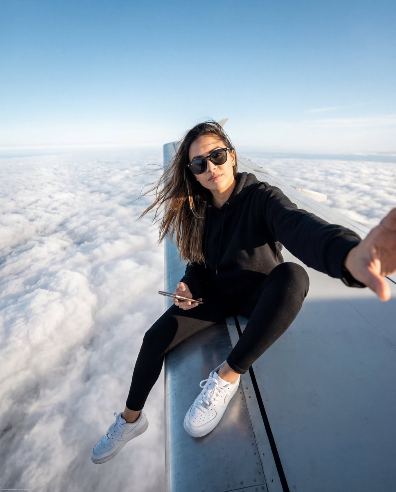

## [cake type], hyper realistic food photography, cake deco

- ID: trending-2020950596262691284
- Slug: trending-2020950596262691284-en
- 语言: en
- 来源: [来源链接](https://x.com/azed_ai/status/2020950596262691284)
- 样例图路径: images/part1/2020950596262691284_1.jpg

### 提示词

```text
[cake type], hyper realistic food photography, cake decorated to recreate the famous painting [painting name] using buttercream brushstrokes, thick textured piping, impasto frosting swirls, edible gold leaf highlights, color palette matched to the artwork, small painted fondant details, cake on an elegant plate, background set inspired by the same painting, studio lighting with soft shadows, shallow depth of field, ultra detailed, premium patisserie advertising, no text, no watermark, 8k, 1:1
```

### 样例图

![[cake type], hyper realistic food photography, cake deco](../images/part1/2020950596262691284_1.jpg)

## A hyper-realistic surreal photograph of a modern smartph

- ID: trending-2020737033669324969
- Slug: trending-2020737033669324969-en
- 语言: en
- 来源: [来源链接](https://x.com/AIwithSynthia/status/2020737033669324969)
- 样例图路径: images/part1/2020737033669324969_1.jpg

### 提示词

```text
A hyper-realistic surreal photograph of a modern smartphone lying flat on a wooden table, its screen acting as a portal between two worlds. From inside the phone screen, a smiling young man dressed in winter clothing—puffer jacket, knit beanie, gloves—extends his hands outward into the real world, holding a clear glass. From outside the phone, a real human hand pours a bright neon-green carbonated drink into the glass, with liquid splashes frozen mid-air as it crosses the boundary between the digital screen and reality. Snowflakes drift inside the phone screen while the real environment remains warm and minimal. Gemini Ultra-detailed textures, cinematic lighting, shallow depth of field, photorealistic surrealism, high-resolution editorial photography.
```

### 样例图

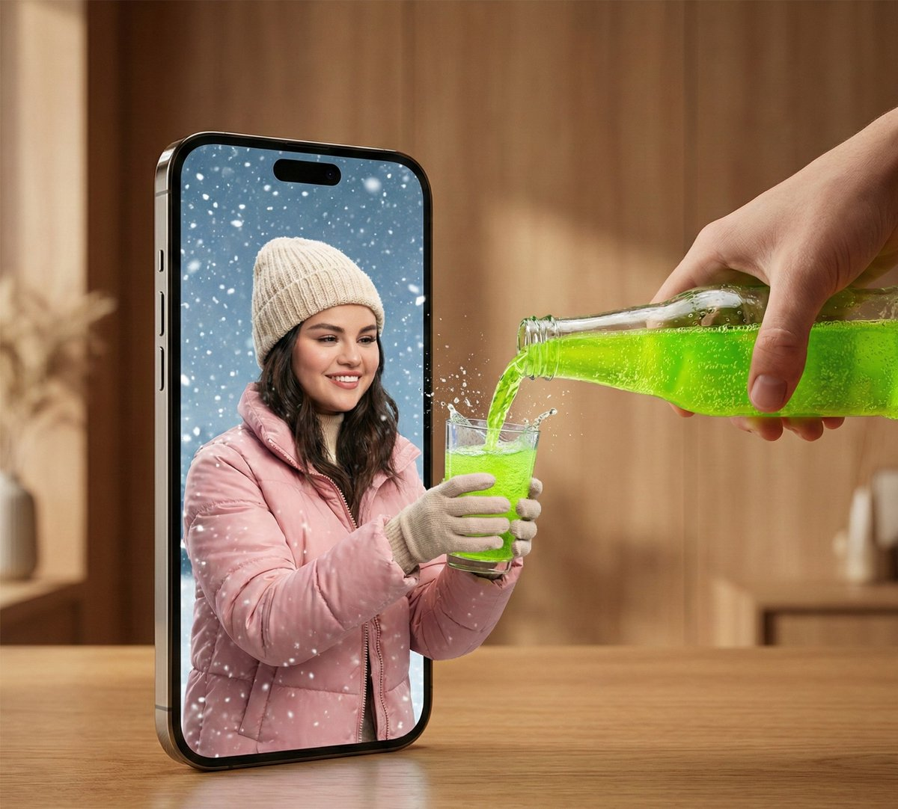

## { "subject": { "hair": { "length": "long", "color": "dar

- ID: trending-2013512902716858758
- Slug: trending-2013512902716858758-en
- 语言: en
- 来源: [来源链接](https://x.com/ZaraIrahh/status/2013512902716858758)
- 样例图路径: images/part1/2013512902716858758_1.jpg

### 提示词

```text
{
  "subject": {
    "hair": {
      "length": "long",
      "color": "dark",
      "style": "flowing, face-framing",
      "bangs": true,
      "accents": {
        "type": "braided",
        "color": "gold"
      }
    },
    "eyes": {
      "color": "light blue",
      "expression": "serene",
      "gaze": "direct"
    },
    "lips": {
      "color": "vibrant orange"
    }
  },

  "attire": {
    "gown": {
      "style": "opulent historical-inspired",
      "main_color": "rich teal-blue",
      "collar": "high ruffled white",
      "sleeves": "voluminous white with gathered cuffs",
      "fabric": {
        "pattern": "Indonesian batik + Ukiyo-e wave motifs",
        "pattern_colors": ["gold", "subtle orange"],
        "detail": "intricate"
      }
    }
  },

  "props": {
    "right_hand_mask": {
      "origin": "Indonesian Javanese wayang-inspired",
      "base_color": "white",
      "lips": "red",
      "expression": "happy",
      "decoration": "gold patterns"
    },
    "left_arm_mask": {
      "origin": "Indonesian traditional",
      "base_color": "red",
      "expression": "angry",
      "decoration": "gold patterns",
      "feather_accent": "blue"
    }
  },

  "pose": {
    "composition": "contrapposto",
    "orientation": "slightly facing left",
    "posture": "lying languidly",
    "framing": "centered"
  },

  "shot": {
    "type": "top-down overhead medium shot",
    "focus": "centered on the woman"
  },

  "background": {
    "foliage": {
      "color": "dark teal-green",
      "density": "dense"
    },
    "flowers": [
      { "type": "rose", "color": "cream" },
      { "type": "rose", "color": "pale yellow" },
      { "type": "rose", "color": "vibrant orange" }
    ]
  },

  "lighting": {
    "type": "soft diffused",
    "highlights": "gentle",
    "shadows": "soft"
  },

  "palette": ["teal", "orange", "cream", "white", "gold"],

  "style": {
    "mood": "rich and luxurious",
    "detail_level": "high",
    "textures": "ornate and rich",
    "cultural_respect": true
  },

  "camera": {
    "angle": "overhead",
    "shot_size": "medium",
    "depth_of_field": "shallow",
    "crop": "centered"
  },

  "output": {
    "format": "image-edit-prompt"
  }
}
```

### 样例图

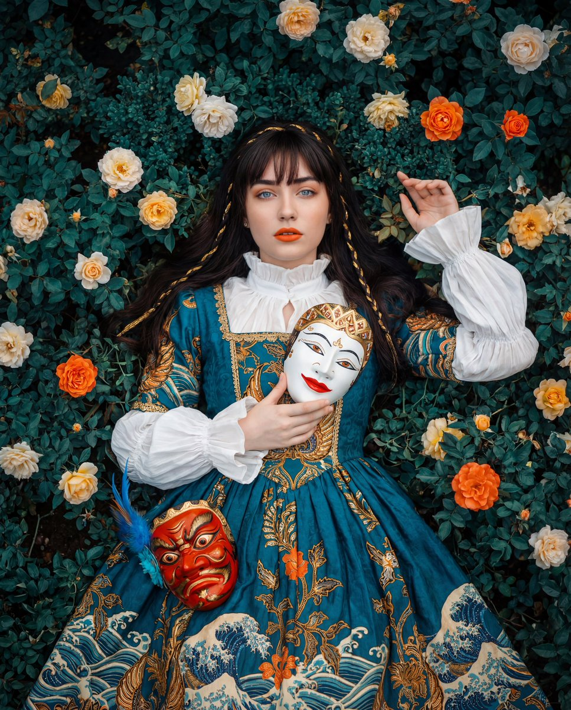

## Ultra-realistic cinematic portrait of a young man sittin

- ID: trending-2039625508535885876
- Slug: trending-2039625508535885876-en
- 语言: en
- 来源: [来源链接](https://x.com/Taaruk_/status/2039625508535885876)
- 样例图路径: images/part1/2039625508535885876_1.jpg

### 提示词

```text
Ultra-realistic cinematic portrait of a young man sitting at a wooden desk in a cozy art studio, smiling warmly at the camera, with a tiny miniature version of himself standing on the table in front of him, perfectly detailed like a small figurine, surrounded by paint brushes, sketches, and art tools, warm ambient lighting from a desk lamp, shallow depth of field, soft bokeh background, creative storytelling composition, scale contrast illusion, hyper-detailed textures, 50mm lens, photorealistic, 8K.
```

### 样例图

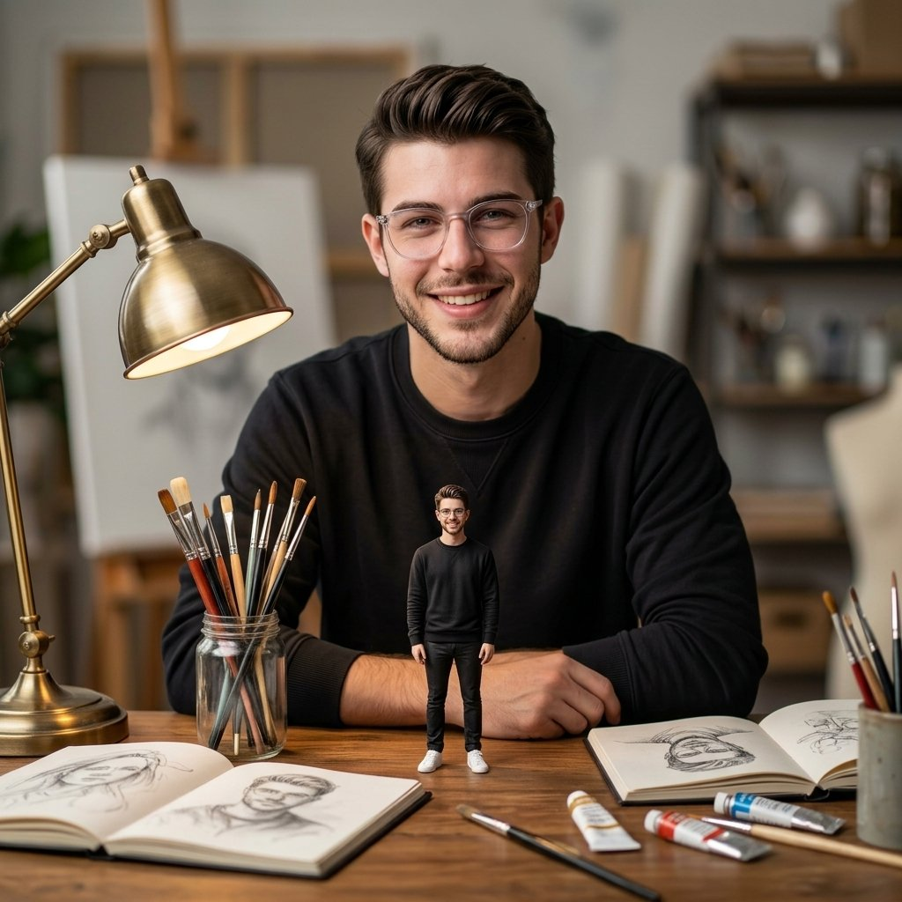

## { "render_goal": "Ultra-cinematic, hyper-realistic rainy

- ID: trending-2009832919603311045
- Slug: trending-2009832919603311045-en
- 语言: en
- 来源: [来源链接](https://x.com/john_my07/status/2009832919603311045)
- 样例图路径: images/part1/2009832919603311045_1.jpg

### 提示词

```text
{
  "render_goal": "Ultra-cinematic, hyper-realistic rainy street portrait with shallow depth of field",
  "scene": {
    "location": "busy city street",
    "weather": "steady rain, wet reflective roads, soft mist in the air",
    "time": "overcast daytime",
    "atmosphere": "moody, cinematic, emotionally rich"
  },
  "subject": {
    "identity": "girl identical to the reference",
    "action": "walking forward through a crowded street while holding an umbrella",
    "pose": "natural walking posture, relaxed shoulders",
    "expression": "calm, confident, slightly intense",
    "eye_direction": "looking directly at the camera from a distance",
    "outfit": {
      "style": "elegant, modern, attractive",
      "fit": "well-tailored, flattering silhouette",
      "fabric_behavior": "slightly affected by rain, realistic wet textures"
    }
  },
  "composition": {
    "camera_distance": "medium to long shot",
    "framing": "subject centered with balanced negative space",
    "angle": "eye-level, cinematic street photography",
    "focus": "razor-sharp focus on the girl only",
    "depth_of_field": "extremely shallow"
  },
  "background": {
    "crowd": "dense crowd walking in all directions",
    "motion": "crowd fully blurred with motion blur",
    "detail_level": "faces and bodies indistinguishable",
    "separation": "strong subject-background isolation"
  },
  "lighting": {
    "type": "soft diffused natural light",
    "highlights": "subtle rain highlights and reflections",
    "color_tone": "cool cinematic color grading with slight contrast"
  },
  "visual_style": {
    "look": "cinematic street photography",
    "realism": "ultra-realistic skin, fabric, and rain physics",
    "quality": "8K detail, high dynamic range",
    "post_processing": "film-like contrast, subtle grain, no oversharpening"
  },
  "constraints": {
    "accuracy": "match reference pose, framing, mood, and focus precisely",
    "avoid": [
      "cartoon look",
      "overexposed highlights",
      "extra subjects in focus",
      "stylized or fantasy elements"
    ]
  }
}
```

### 样例图

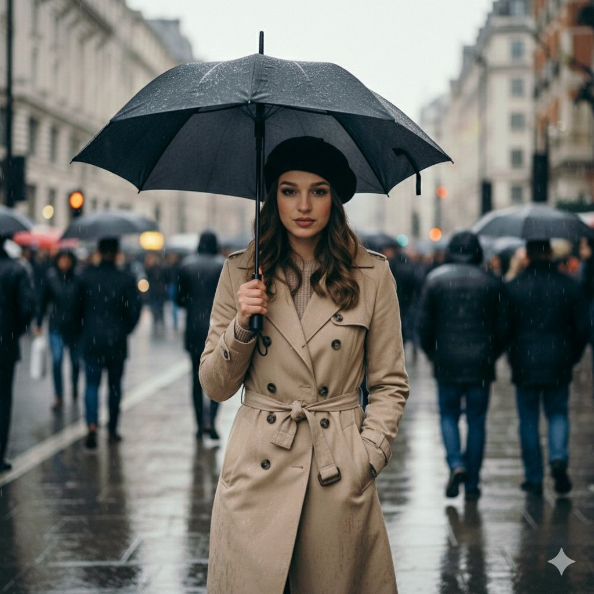

## { "prompt": "High-resolution nighttime editorial portrai

- ID: trending-2009236662149316854
- Slug: trending-2009236662149316854-en
- 语言: en
- 来源: [来源链接](https://x.com/NameIsSudee/status/2009236662149316854)
- 样例图路径: images/part1/2009236662149316854_1.jpg

### 提示词

```text
{
  "prompt": "High-resolution nighttime editorial portrait shot with on-camera flash. A young woman standing outdoors at night under blooming cherry blossom trees, holding a transparent clear umbrella covered in raindrops. Her hair is wet and slightly wavy, framing her face naturally. She wears a brown leather jacket with a matching skirt, styled minimal and modern. One hand reaches slightly toward the camera, creating depth and intimacy. Strong flash lighting with a dark background, rain droplets frozen in motion, cinematic contrast, shallow depth of field, fashion editorial vibe, realistic skin tones, sharp focus. No text, no watermark.",
  "style": "fashion editorial, cinematic, modern",
  "camera": {
    "shot_type": "portrait",
    "lighting": "on-camera flash",
    "depth_of_field": "shallow"
  },
  "lighting": {
    "type": "strong flash",
    "environment": "nighttime",
    "effect": ["high contrast", "frozen raindrops"]
  },
  "environment": {
    "location": "outdoor nighttime setting",
    "elements": ["cherry blossom trees", "rain", "dark background"]
  },
  "wardrobe": {
    "outfit": ["Silver leather jacket", "matching skirt"],
    "style": "minimal, modern"
  },
  "mood": ["intimate", "cinematic", "editorial"],
  "quality": ["high-resolution", "sharp focus", "realistic skin tones"],
  "constraints": ["no text", "no watermark"]
}
```

### 样例图

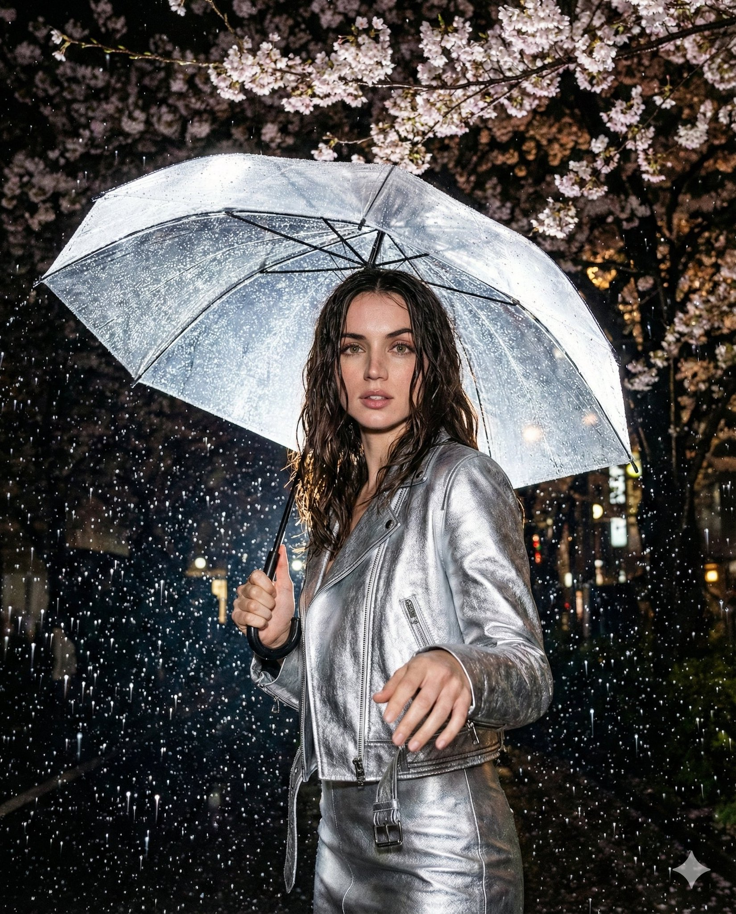

## A vertical triptych of three cinematic, night-time urban

- ID: trending-2033793020940980720
- Slug: trending-2033793020940980720-en
- 语言: en
- 来源: [来源链接](https://x.com/rovvmut_/status/2033793020940980720)
- 样例图路径: images/part1/2033793020940980720_1.jpg

### 提示词

```text
A vertical triptych of three cinematic, night-time urban photographs featuring a young man with messy, curly reddish-brown hair and thin, round wire-frame glasses.
Top Panel: The man is seated in front of a 7-Eleven storefront. He wears a dark plaid flannel shirt over a black turtleneck. He is captured in a candid moment, holding a lit cigarette to his lips. To the left, there's a vibrant green neon sign. The lighting is dominated by a cool, fluorescent green glow and the warm interior light of the convenience store.
Middle Panel: An extreme close-up profile shot. He is drinking from a gold-and-red metallic beverage can. His glasses catch a sharp, vivid reflection of the 7-Eleven logo and orange-red street lights. A subtle lens flare streaks horizontally across his face. The background is a soft, warm bokeh of city lights and traffic signals.
Bottom Panel: The man stands on a pedestrian overpass overlooking a busy highway. He has his head tilted back, exhaling a thick wisp of white smoke into the night air. Below him, the blurred streaks of white headlights and red taillights create a sense of motion. The overpass structure is lit with cool-toned industrial lamps, contrasting with his warm skin tones.
Style: 35mm film aesthetic, cinematic grain, shallow depth of field, high contrast, urban noir mood.
```

### 样例图

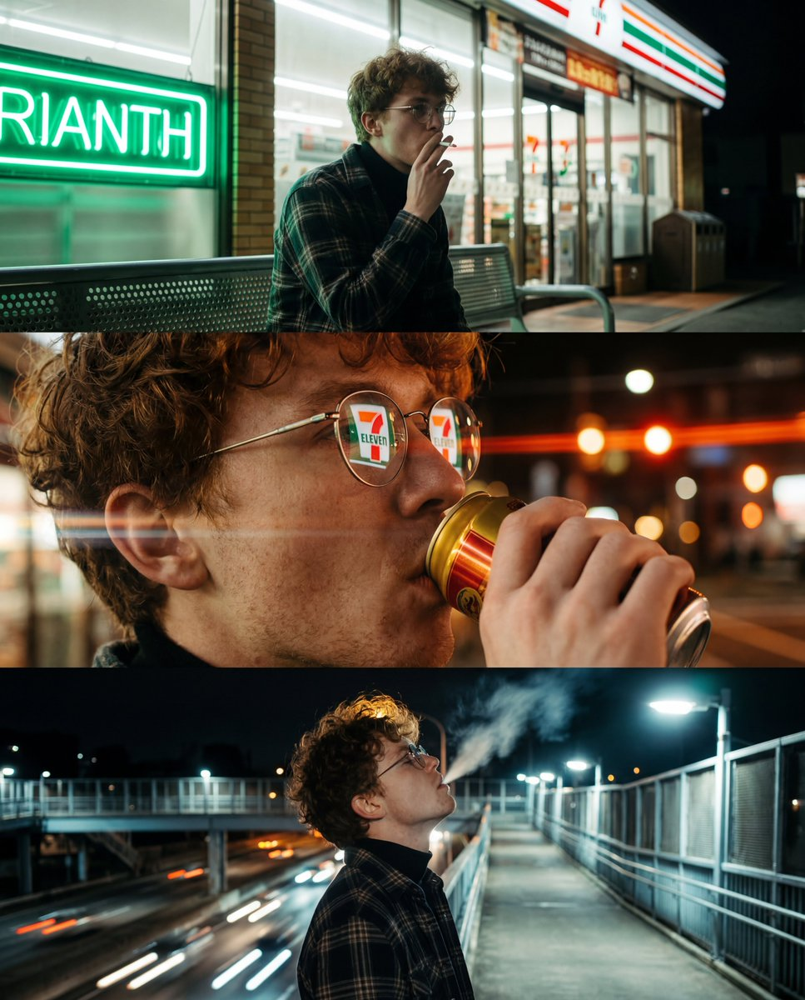

## Ultra-realistic cinematic portrait of a young East Asian

- ID: trending-2019094555501686847
- Slug: trending-2019094555501686847-en
- 语言: en
- 来源: [来源链接](https://x.com/oggii_0/status/2019094555501686847)
- 样例图路径: images/part1/2019094555501686847_1.jpg

### 提示词

```text
Ultra-realistic cinematic portrait of a young East Asian woman standing alone in a vast wildflower meadow. She is centered in the frame, facing the camera directly with a calm, introspective expression. She wears a traditional Korean hanbok in muted charcoal gray and soft blue tones, with natural fabric texture and subtle folds. Her dark hair is loosely tied back with a few strands gently blown across her face by the wind.

She holds a small hand-picked bouquet of wildflowers—white daisies, blue cornflowers, and dry grass stems—clasped softly in both hands at waist level. The meadow is filled with colorful wildflowers (reds, whites, blues, purples) stretching into the distance.

In the background, a large mist-covered mountain rises softly out of focus, partially obscured by low clouds and fog, creating a moody, atmospheric depth. Overcast sky with soft diffused natural light, cool color palette, muted contrast, cinematic realism.

Shallow depth of field, sharp focus on subject, creamy background bokeh. Natural skin texture, realistic facial details, no makeup look. Fine art photography style, emotional, poetic, timeless. Shot on a full-frame camera, 85mm lens, f/1.8, ultra-high resolution, photorealistic, no text, no watermark.
```

### 样例图

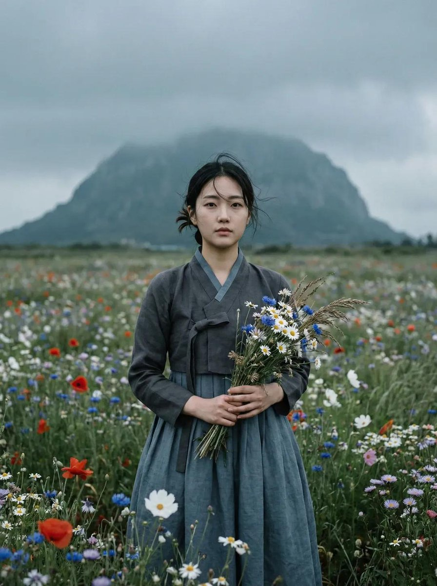

## A hyper-realistic, surreal composite shot utilizing forc

- ID: trending-2011035560593309925
- Slug: trending-2011035560593309925-en
- 语言: en
- 来源: [来源链接](https://x.com/Sheldon056/status/2011035560593309925)
- 样例图路径: images/part1/2011035560593309925_1.jpg

### 提示词

```text
A hyper-realistic, surreal composite shot utilizing forced perspective to create a dramatic scale difference, featuring an extreme close-up profile view on the right side of a man with uploaded face as reference, his expression one of slack-jawed astonishment with mouth slightly agape as he gazes downward. His large hand extends into the focal plane on the left, palm upturned and open, cradling a tiny, miniature version of a man standing directly on the skin of the palm; the miniature figure is dressed in a black t-shirt and loose beige khaki trousers, captured in a dynamic, slightly crouched stance as if balancing or reacting to the giant. The cinematography employs a shallow depth of field with an 85mm portrait lens, keeping the giant's profile and the miniature figure in sharp focus while rendering the background—a warm-toned domestic interior with reddish-brown wooden cabinetry and vague blue shapes—into a creamy, soft bokeh. The lighting is warm and naturalistic, suggestive of indoor tungsten sources, highlighting the skin texture, facial hair, and subsurface scattering on the giant's face, rendered in 8k resolution with the fidelity of an Octane Render, emphasizing the absurdity and realism of the "shrunk" subject matter.

Man should be fully visible
```

### 样例图

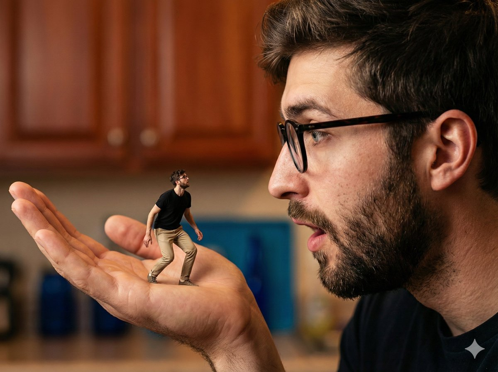

## Ultra realistic cinematic portrait of a young man with s

- ID: trending-2012135339763101836
- Slug: trending-2012135339763101836-en
- 语言: en
- 来源: [来源链接](https://x.com/iamrealsnow/status/2012135339763101836)
- 样例图路径: images/part1/2012135339763101836_1.jpg

### 提示词

```text
Ultra realistic cinematic portrait of a young man with sharp masculine features and light stubble, snow dusted hair slightly longer and pushed back, calm but intense eyes looking slightly away from the camera, wearing a charcoal hooded winter jacket layered over a black turtleneck, standing in a deserted snowy street at night, heavy snowfall swirling around him, snowflakes catching light mid air, cold breath visible, dim ambient street lighting with a single overhead lamp casting soft shadows, background filled with snow covered buildings and faint fog, low key lighting with cool blue tones, subtle rim light separating the subject from the background, medium close up framing, 50mm lens look, shallow depth of field, cinematic contrast, realistic skin texture, film grain, moody atmosphere, loneliness, quiet strength, winter noir aesthetic, professional photography realism.
```

### 样例图

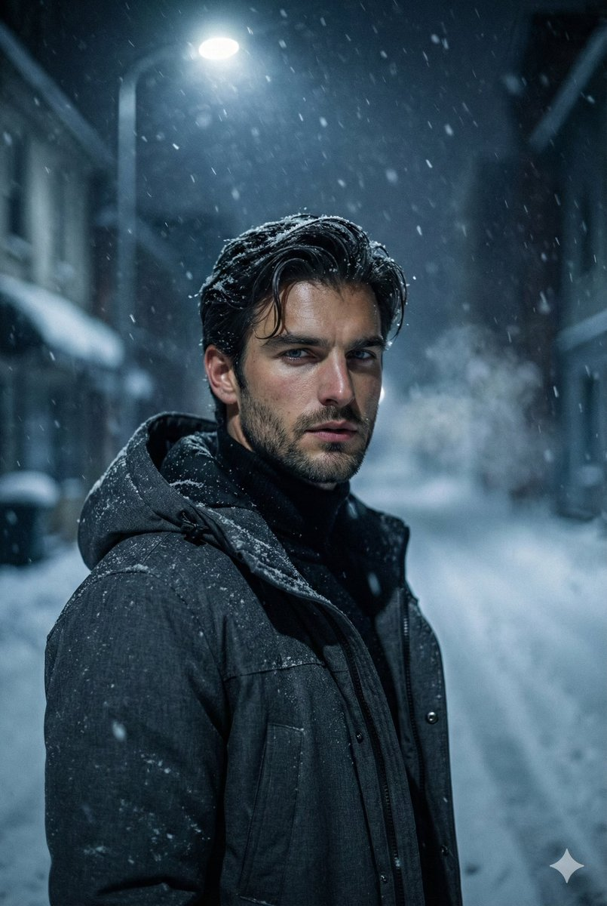

## { "options": { "gender": ["man", "woman"] }, "prompt": "

- ID: trending-2012343238472892738
- Slug: trending-2012343238472892738-en
- 语言: en
- 来源: [来源链接](https://x.com/lloydcreates/status/2012343238472892738)
- 样例图路径: images/part1/2012343238472892738_1.jpg

### 提示词

```text
{
  "options": {
    "gender": ["man", "woman"]
  },
  "prompt": "A high-fashion editorial shot of a [GENDER] model sitting or standing on a flying magic carpet during takeoff. The model is wearing a sophisticated, layered outfit featuring the structured silhouettes and premium textures typical of luxury brands like Celine, Balenciaga, Ralph Lauren, Givenchy, and Zegna. The clothes billow elegantly in the wind. The carpet is ornate and detailed, kicking up a subtle dust cloud as it ascends from a sun-drenched, minimalist architectural terrace. The lighting is cinematic and warm, highlighting the motion and the luxurious fabrics. Low angle perspective focusing entirely on the subject and the scene."
}
```

### 样例图

![{ "options": { "gender": ["man", "woman"] }, "prompt": "](../images/part1/2012343238472892738_1.jpg)

## Nano Banana 2 on @Hailuo_AI Prompt: Ultra-realistic prem

- ID: trending-2027911721860616479
- Slug: trending-2027911721860616479-en
- 语言: en
- 来源: [来源链接](https://x.com/Taaruk_/status/2027911721860616479)
- 样例图路径: images/part1/2027911721860616479_1.jpg

### 提示词

```text
Nano Banana 2 on @Hailuo_AI

Prompt:
Ultra-realistic premium product advertisement of a cappuccino coffee bottle, centered composition, surrounded by dynamic liquid splashes of coffee and milk forming elegant swirling shapes in mid-air. Dramatic environments blending elements of fire, lava, ice shards, marble textures, and dark studio backgrounds.
Hyper-detailed liquid physics, droplets frozen in motion, cinematic lighting with high contrast, glowing highlights, and volumetric light. Coffee splashes mixed with creamy textures, energetic explosion effects, sparks, smoke, and mist.
Luxury branding style, glossy reflections on bottle, sharp label details, rich brown and gold color palette, macro photography, shallow depth of field, 85mm lens, commercial advertising style, studio + fantasy hybrid scene, ultra-detailed, 8K resolution.
```

### 样例图

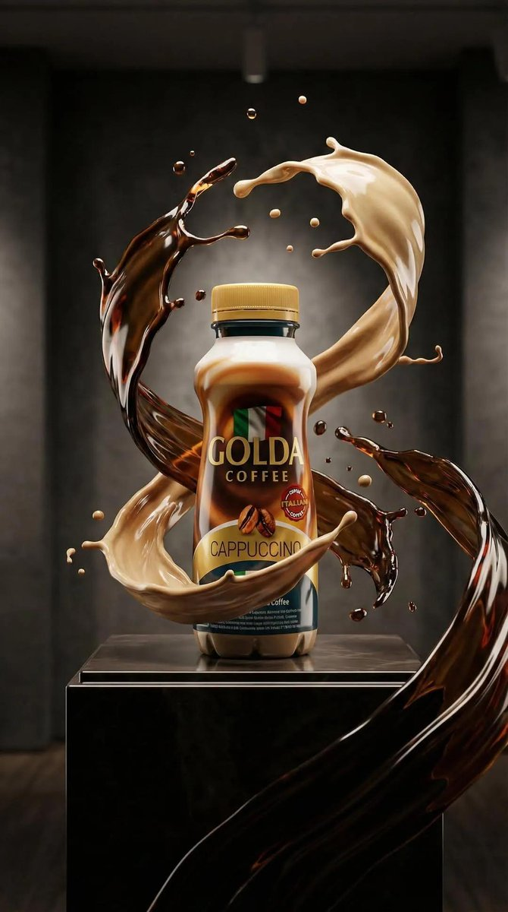

## Full body cinematic shot of the person in the uploaded i

- ID: trending-2026162681171075451
- Slug: trending-2026162681171075451-en
- 语言: en
- 来源: [来源链接](https://x.com/rovvmut_/status/2026162681171075451)
- 样例图路径: images/part1/2026162681171075451_1.jpg

### 提示词

```text
Full body cinematic shot of the person in the uploaded image as a hitman in a tailored black suit and tie standing in an empty studio space beside a muscular Doberman dog on a leash. The man has a bruised face with blood marks, messy shoulder-length hair, and a calm but intense expression. He is holding a pistol in one hand. Behind them is a vintage black muscle car with chrome rims partially visible in soft shadow. Minimalist grey background, dramatic studio lighting from above creating soft reflections on the glossy floor. Ultra realistic skin texture, cinematic depth of field, sharp focus, subtle fog in the background, moody atmosphere, 85mm lens look, volumetric light, film still from a neo-noir action movie, high dynamic range, photorealistic, 8k, symmetrical composition. 3:4 aspect ratio.
```

### 样例图

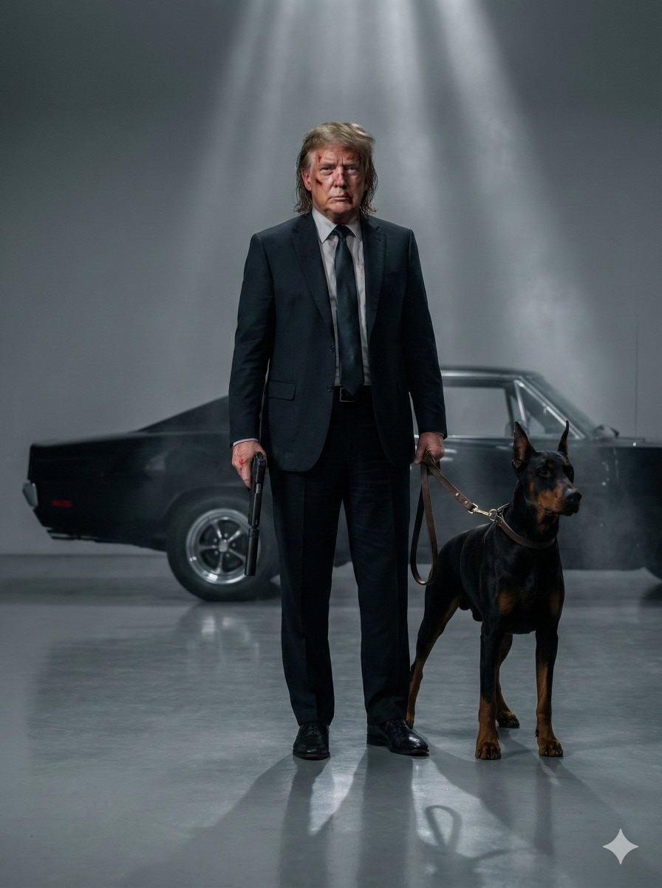

## { "generation_request": { "meta_data": { "task_type": "p

- ID: trending-2021291111633858589
- Slug: trending-2021291111633858589-en
- 语言: en
- 来源: [来源链接](https://x.com/astronomerozge1/status/2021291111633858589)
- 样例图路径: images/part1/2021291111633858589_1.jpg

### 提示词

```text
{
  "generation_request": {
    "meta_data": {
      "task_type": "photoreal_editorial_spotlight_disk_fashion_portrait",
      "language": "en",
      "priority": "highest",
      "version": "v1.0_RED_BACKDROP_CIRCLE_SPOTLIGHT_KATANA_EDITORIAL"
    },
    "output": {
      "aspect_ratio": "4:5",
      "resolution": "high",
      "num_images": 4
    },
    "scene": {
      "concept": "minimal graphic studio portrait with a circular spotlight disk and crisp shadow silhouette",
      "environment": "deep red seamless background, no props, no clutter",
      "composition": "3/4 body or full-body, side profile; subject placed slightly right of center; large circular spotlight disk behind subject"
    },
    "subject": {
      "person": "adult woman",
      "wardrobe": {
        "dress": "fitted black cheongsam-inspired dress, high slit, lace-up side detailing, matte fabric with subtle texture"
      },
      "hair_makeup": {
        "hair": "messy low bun, a few loose strands framing face",
        "makeup": "soft glam, defined eyeliner, natural lips, realistic skin texture"
      },
      "details": {
        "tattoos": "subtle small tattoos on upper arm, realistic ink"
      },
      "pose": "side profile stance, shoulders relaxed, one hand resting near hip, holding a katana angled downward in a safe, non-aggressive pose",
      "expression": "calm, composed, editorial"
    },
    "props": {
      "katana": {
        "style": "realistic katana with correct proportions, simple handle wrap, subtle metal sheen",
        "handling_notes": "safe grip, blade angled down, no threatening gesture"
      }
    },
    "lighting": {
      "style": "single hard key light + spotlight gobo/disk",
      "notes": "create a large circular warm spotlight disk (cream/peach) on the red background; crisp hard-edged shadow silhouette of subject visible on the disk; high contrast; minimal fill"
    },
    "camera": {
      "shot": "editorial studio fashion portrait",
      "lens_mm": 50,
      "aperture": 2.8,
      "focus": "sharp on face, dress texture, and sword handle; background smooth",
      "quality_tags": "ultra-detailed, clean edges, subtle film grain"
    },
    "color_grade": {
      "palette": "deep red background + warm cream spotlight disk + neutral skin + black wardrobe",
      "contrast": "high",
      "tone": "cinematic editorial, smooth highlight rolloff"
    },
    "negative_prompt": "text, logo, watermark, frame, border, clutter, softbox lighting, flat lighting, blur, lowres, plastic skin, over-smoothing, extra fingers, deformed hands, incorrect katana geometry, gore, blood, violence"
  }
}
```

### 样例图

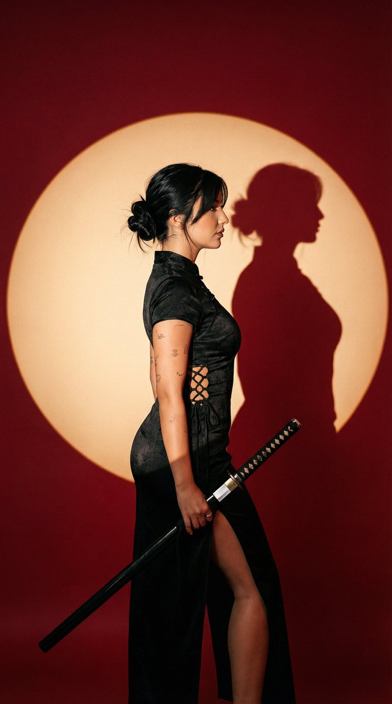

## Luxury fashion editorial portrait of a woman standing be

- ID: trending-2013495788824117576
- Slug: trending-2013495788824117576-en
- 语言: en
- 来源: [来源链接](https://x.com/ChillaiKalan__/status/2013495788824117576)
- 样例图路径: images/part1/2013495788824117576_1.jpg

### 提示词

```text
Luxury fashion editorial portrait of a woman standing beside a majestic dragon, her forehead gently resting against its scaled head. She wears an elaborate ice-gray couture gown with intricate embroidery, crystal embellishments, and structured shoulders, evoking regal power and quiet intimacy. Hair styled in a sleek braided updo, adorned with refined statement jewelry. Cinematic fantasy realism, emotional stillness, mythic elegance. Cold, muted color palette of silver, stone, and ash tones. Soft natural overcast light, subtle highlights on textures of fabric and dragon scales. Shallow depth of field, ultra-detailed realism, high-end editorial aesthetic, epic yet intimate mood, medium format photography look, Vogue-level fantasy couture, no text.
```

### 样例图

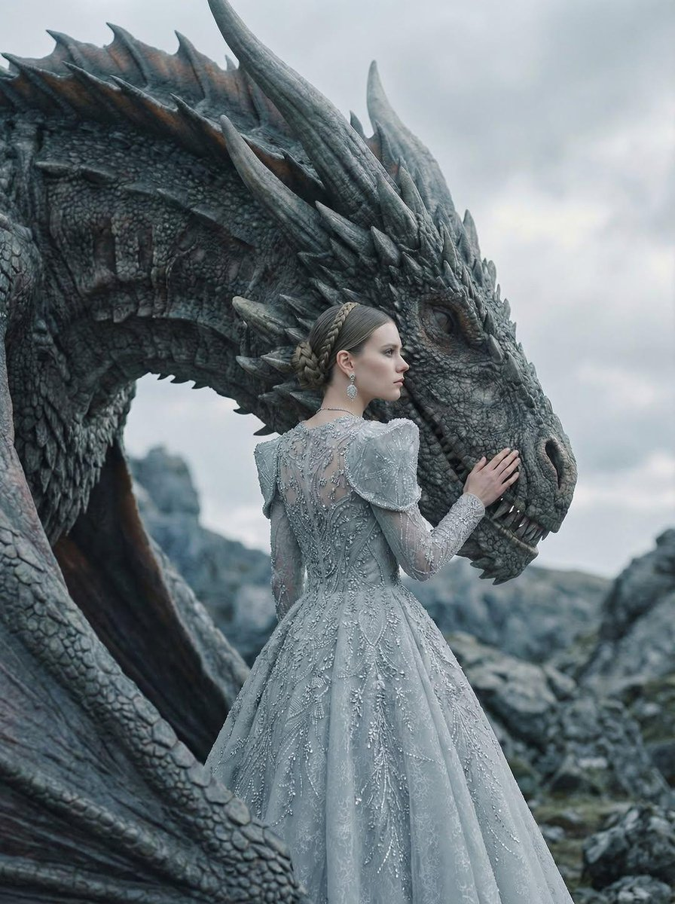

## { "generation_request": { "meta_data": { "tool": "NanoBa

- ID: trending-2010410887257923690
- Slug: trending-2010410887257923690-en
- 语言: en
- 来源: [来源链接](https://x.com/astronomerozge1/status/2010410887257923690)
- 样例图路径: images/part1/2010410887257923690_1.jpg

### 提示词

```text
{
  "generation_request": {
    "meta_data": {
      "tool": "NanoBanana Pro",
      "task_type": "photoreal_cinematic_fashion_contact_sheet",
      "version": "v1.0_RED_DRESS_INTIMATE_EDITORIAL_3x3_NO_TEXT",
      "priority": "highest"
    },

    "references": {
      "reference_image_1": {
        "source": "UPLOAD_REFERENCE_IMAGE (OPTIONAL)",
        "purpose": "FACE_IDENTITY_LOCK",
        "strict_lock": true,
        "face_similarity_priority": "MAX",
        "no_identity_blending": true,
        "no_beautify": true,
        "preserve_skin_texture": true,
        "preserve_facial_proportions": true
      }
    },

    "output_settings": {
      "aspect_ratio": "1:1",
      "resolution_target": "ultra_high_res",
      "render_style": "cinematic_fashion_editorial",
      "sharpness": "soft_cinematic_focus",
      "film_grain": "subtle_analog_35mm",
      "dynamic_range": "natural_not_hdr",
      "color_grade": "muted_warm_reds_dark_neutrals",
      "skin_rendering": "real_skin_microtexture_no_plastic"
    },

    "layout": {
      "type": "contact_sheet",
      "grid": "3x3",
      "spacing": "thin_clean_dividers",
      "panel_consistency": "same_subject_same_outfit_same_scene",
      "no_text_overlay": true
    },

    "camera": {
      "camera_type": "full_frame_cinema_camera",
      "lens": "50mm_and_85mm_mix",
      "aperture": "f1.8",
      "depth_of_field": "shallow",
      "focus_behavior": "eyes_priority_some_frames_soft_motion",
      "processing": "no_ai_sharpening_no_hdr"
    },

    "lighting": {
      "type": "low_key_cinematic_indoor_light",
      "source": "window_light_side_falloff",
      "contrast": "medium_to_low",
      "shadows": "soft_deep",
      "highlights": "controlled_skin_specular"
    },

    "wardrobe_and_styling": {
      "dress": "deep_red_silk_satin_slip_dress",
      "fabric_behavior": "fluid_realistic_drape_soft_specular",
      "straps": "thin_delicate",
      "overall_style": "intimate_high_fashion_editorial"
    },

    "hair_and_makeup": {
      "hair": "natural_loose_with_soft_bangs",
      "movement": "subtle_natural_motion",
      "makeup_style": "soft_editorial",
      "eyes": "natural_smoky_low_contrast",
      "lips": "muted_rose_nude",
      "skin_finish": "natural_luminous_real"
    },

    "posing_and_storytelling": {
      "poses": [
        "close_up_shoulder_touch",
        "mid_body_turning_away",
        "full_body_walking_away",
        "leaning_against_wall",
        "head_tilted_back_emotional",
        "eyes_closed_intimate",
        "soft_motion_blur_moment",
        "hands_touching_face",
        "dress_detail_closeup"
      ],
      "emotion": "introspective_sensual_vulnerable",
      "movement": "slow_natural_unposed"
    },

    "background": {
      "environment": "dark_interior_gallery_or_room",
      "colors": [
        "deep_red",
        "charcoal_gray",
        "dark_green"
      ],
      "texture": "matte_walls_soft_reflections",
      "distractions": "none"
    },

    "creative_prompt": {
      "scene_summary": "A cinematic 3x3 fashion contact sheet capturing an intimate, emotional editorial story of a woman in a deep red satin dress. Each frame feels like a quiet moment from an arthouse film — soft focus, natural movement, emotional restraint, and sensual minimalism.",
      "aesthetic": "arthouse_fashion_editorial",
      "mood": "quiet_intimate_cinematic"
    },

    "negative_prompt": [
      "text",
      "typography",
      "logo",
      "brand_name",
      "watermark",
      "poster_design",
      "magazine_layout",
      "beauty_filter",
      "plastic_skin",
      "over_smoothing",
      "cgi",
      "anime",
      "cartoon",
      "ai_artifacts",
      "extra_people",
      "distorted_body",
      "bad_hands",
      "extra_fingers",
      "over_sharpened"
    ]
  }
}
```

### 样例图

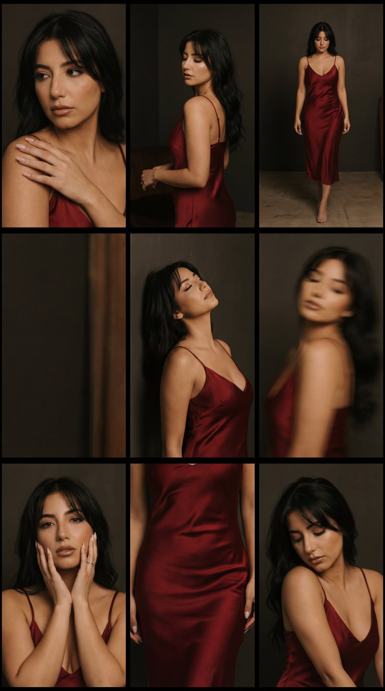

## Cinematic portrait of a handsome young man with short st

- ID: trending-2017779938745549081
- Slug: trending-2017779938745549081-en
- 语言: en
- 来源: [来源链接](https://x.com/iamsofiaijaz/status/2017779938745549081)
- 样例图路径: images/part1/2017779938745549081_1.jpg

### 提示词

```text
Cinematic portrait of a handsome young man with short styled hair and a trimmed beard, wearing thin metal aviator glasses, softly illuminated by a glowing golden circular halo behind his head. Warm amber lighting, dramatic low-key background, shallow depth of field, hyper-realistic skin texture, subtle reflections in the glasses, moody and futuristic aesthetic, studio photography, 85mm lens look, ultra-detailed, high contrast, dark minimal background, symmetrical composition, elegant and modern tone.
```

### 样例图

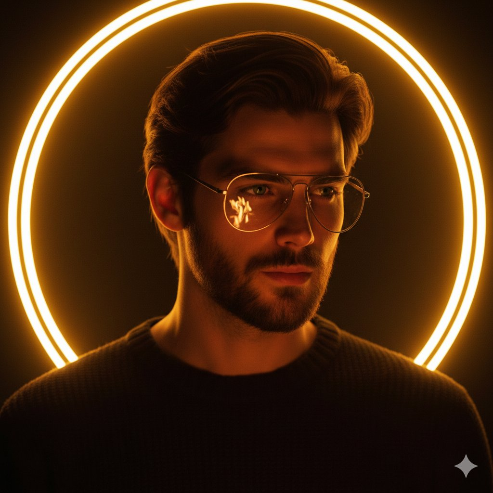

## Shot on a Hasselblad 907X 50C with an XCD 90mm f/2.5 len

- ID: trending-2022288144545259558
- Slug: trending-2022288144545259558-en
- 语言: en
- 来源: [来源链接](https://x.com/harboriis/status/2022288144545259558)
- 样例图路径: images/part1/2022288144545259558_1.jpg

### 提示词

```text
Shot on a Hasselblad 907X 50C with an XCD 90mm f/2.5 lens, aperture f/2.8 shallow depth of field emphasizes the precision fit of the suit while the background dissolves into painterly color patches; captured in 16-bit RAW with high dynamic range and soft film grain to preserve wool texture and the glow of colored light without "harsh" digital sharpness. Frame a tight portrait cropped to mid-chest, at eye level, with a slight three-quarter turn; the model is offset from center so the stained-glass pattern reads in the negative space. The pose is calm and composed: shoulders open, posture confident but without tension; one hand neatly adjusts the tie knot or collar line, the other is in the trouser pocket, slightly opening the jacket and revealing the layered styling. Expression restrained and thoughtful; the gaze passes just past the lens, as if distant music is playing. Outfit a man in a suit with a retro accent: a structured double-breasted wool blazer with sharp lapels, high-waisted pleated trousers, a white shirt and narrow tie, polished Oxfords, and a minimal pocket square. Location a retro Art Deco hall with dark wood, brass, and a tall stained-glass window projecting jewel-like geometry onto the suit and background. Light warm practical fill from one side and colored stained-glass light from the other, cinematic contrast, "stained-glass" shadows. Result -retro editorial: graphic, refined, expensive, and timeless
```

### 样例图

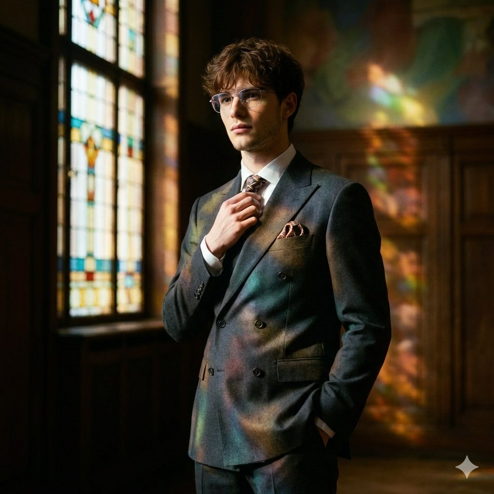

## A cinematic candid medium shot portrait of a man and a w

- ID: trending-2040303034115477755
- Slug: trending-2040303034115477755-en
- 语言: en
- 来源: [来源链接](https://x.com/Ciri_ai/status/2040303034115477755)
- 样例图路径: images/part1/2040303034115477755_1.jpg

### 提示词

```text
A cinematic candid medium shot portrait of a man and a woman walking side by side along a bright urban walkway, framed from the waist up. They move closely together, their shoulders nearly aligned, creating an intimate yet understated connection. The woman wears a fitted black dress, holding a jacket loosely over her arm, her posture relaxed and elegant. The man walks beside her in a tailored suit, his head slightly turned toward her with a soft, attentive expression, while she looks ahead with a calm and composed demeanor, a faint hint of a smile forming. The moment feels natural and unspoken, filled with quiet tension and subtle attraction. Strong midday sunlight casts sharp highlights and deep shadows across their faces and clothing, creating a high-contrast, slightly overexposed look. The background features a softly blurred urban corridor with repeating columns and architectural lines. The image has a strong analog film aesthetic with visible grain, slight blur, color distortion, and nostalgic texture. Colors feel slightly faded with warm, muted tones. Imperfect framing, subtle motion softness, and natural light flare create the feeling of a fleeting moment captured on 35mm film. Cinematic film still, dreamy and poetic mood, intimate and quiet romantic energy, vintage street photography, lo-fi aesthetic, high detail, hd quality.
```

### 样例图

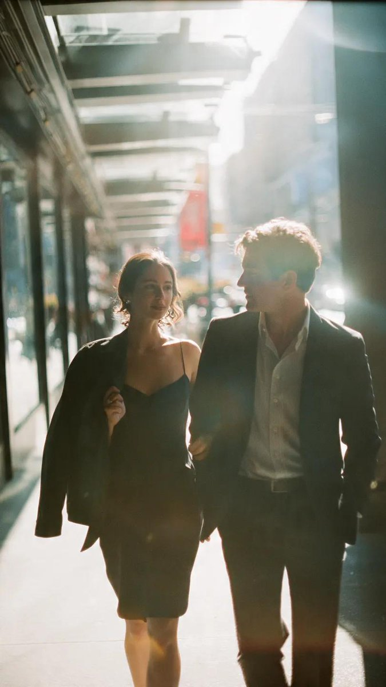

## A cinematic golden-hour photograph of a young woman stan

- ID: trending-2009618534826152362
- Slug: trending-2009618534826152362-en
- 语言: en
- 来源: [来源链接](https://x.com/ChillaiKalan__/status/2009618534826152362)
- 样例图路径: images/part1/2009618534826152362_1.jpg

### 提示词

```text
A cinematic golden-hour photograph of a young woman standing on a wooden viewpoint balcony overlooking a city, leaning casually against the railing. She wears an oversized grey knitted sweater, a long brown skirt, and brown ankle boots, with a small leather crossbody bag. A white folding bicycle rests beside her, and an orange cat sleeps peacefully on the wooden railing next to her. In the background, soft-focus hills with a tall communication tower rise above the city. Warm sunset light, pastel sky with gentle clouds, shallow depth of field, calm and dreamy mood, realistic photography, high detail, natural colors, 35mm lens, soft bokeh.
```

### 样例图

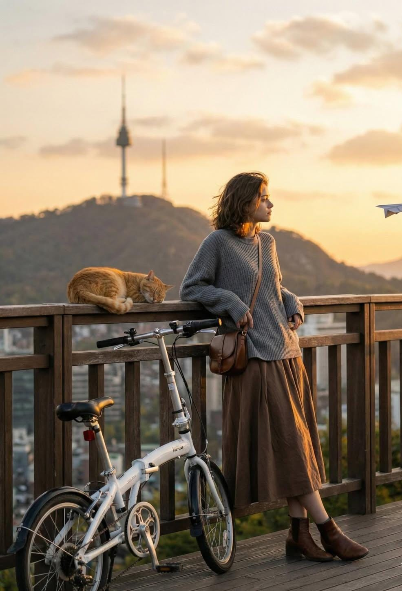

## The soft touch. Nano Banana pro on Gemini Prompt { "prod

- ID: trending-2025163854469341484
- Slug: trending-2025163854469341484-en
- 语言: en
- 来源: [来源链接](https://x.com/Maercihh/status/2025163854469341484)
- 样例图路径: images/part1/2025163854469341484_1.jpg

### 提示词

```text
The soft touch.

Nano Banana pro on Gemini 

Prompt 

{
  "product_photography_prompt": {
    "subject": "Hands holding a shampoo bottle with lather.",
    "hands": {
      "description": "A person's hands with natural skin tone.",
      "action": "One hand holds the bottle, the other is cupped to catch foam.",
      "condition": "Covered in thick, white, bubbly soap lather."
    },
    "bottle": {
      "type": "Pump bottle.",
      "material": "Matte white plastic.",
      "dispenser": "Light blue pump.",
      "contents": "White shampoo, visible as foam."
    },
    "label": {
      "color": "White",
      "text_color": "Black",
      "logo": "Circular with 'WAATAL' inside.",
      "main_text": "Hydrate SHAMPOO (script and bold font).",
      "sub_text": "Super Hydrating Shampoo. For All Hair Types. Made in Australia. 500ml."
    },
    "foam": {
      "texture": "Thick, rich, bubbly lather.",
      "color": "White",
      "location": "Covering hands, bottle neck, and dispenser."
    },
    "background": {
      "color": "Solid soft light blue.",
      "texture": "Seamless, smooth studio background."
    },
    "lighting": {
      "type": "Soft, diffused studio lighting.",
      "direction": "Even illumination, highlighting foam texture and hands."
    },
    "style": {
      "type": "Clean, minimalist product photography.",
      "shot": "Close-up.",
      "focus": "Sharp focus on hands, bottle, and foam.",
      "mood": "Fresh, clean, natural."
    }
  }
}
```

### 样例图

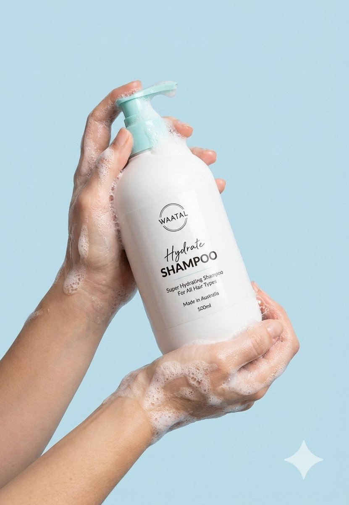

## Create a highly cinematic and realistic photo of a perso

- ID: trending-2035707444777865469
- Slug: trending-2035707444777865469-en
- 语言: en
- 来源: [来源链接](https://x.com/NikhilRajX/status/2035707444777865469)
- 样例图路径: images/part1/2035707444777865469_1.jpg

### 提示词

```text
Create a highly cinematic and realistic photo of a person using the face from the uploaded image. The person is sitting inside a car at night, looking out through a rain-covered window. The camera is positioned outside the car, capturing the person through the wet glass. Raindrops and streaks of water are clearly visible on the window, with reflections of city lights, neon signs, and passing cars blending into the glass. The person’s face is softly lit by ambient street lights and subtle interior car lighting, creating a moody and emotional expression. The background outside is blurred with colorful bokeh lights (red, blue, yellow), giving a deep cinematic feel. The person is wearing a modern outfit like a hoodie or jacket. The mood feels introspective and film-like. Ultra realistic photography, shallow depth of field, dramatic lighting, reflections, rain texture, Hollywood movie scene composition, high detail.
```

### 样例图

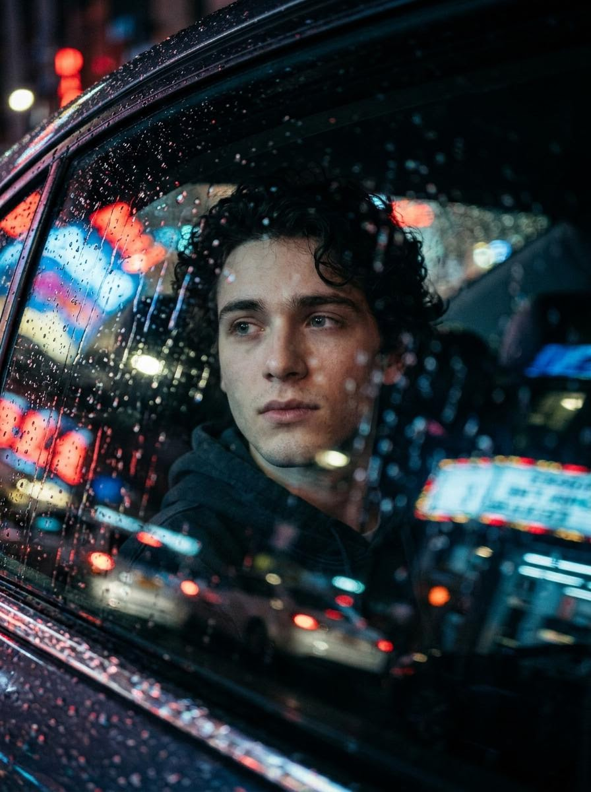

## Ultra-realistic lifestyle beverage advertisement featuri

- ID: trending-2033147596727001224
- Slug: trending-2033147596727001224-en
- 语言: en
- 来源: [来源链接](https://x.com/oggii_0/status/2033147596727001224)
- 样例图路径: images/part1/2033147596727001224_1.jpg

### 提示词

```text
Ultra-realistic lifestyle beverage advertisement featuring a chilled bottle of “UNIK – Jaggery & Natural Tigernut Drink.” The bottle stands on a clean marble or gym countertop surrounded by natural ingredients such as tigernuts, almonds, coconut slices, and dates. A smooth splash of creamy tigernut milk flows upward behind the bottle while ice cubes scatter around it. The bottle is covered with condensation droplets indicating cold freshness. The background features a bright modern fitness studio with soft natural lighting and blurred gym equipment. The composition communicates energy, health, and natural nutrition. High-end commercial beverage photography, macro details, shallow depth of field, ultra-realistic textures, photorealistic lighting, clean advertising style, 8K resolution.
```

### 样例图


## A minimalist black and white cinematic portrait featurin

- ID: trending-2041463539047735472
- Slug: trending-2041463539047735472-en
- 语言: en
- 来源: [来源链接](https://x.com/Taaruk_/status/2041463539047735472)
- 样例图路径: images/part1/2041463539047735472_1.jpg

### 提示词

```text
A minimalist black and white cinematic portrait featuring two individuals (male and female) in strict side profile, both facing the same direction with calm, introspective expressions, wearing elegant black turtlenecks. The scene is set against a pure black background with dramatic rim lighting outlining their facial contours and hair strands. High contrast lighting creates deep shadows and soft highlights, emphasizing sharp facial structure and texture. Fine art editorial photography style, ultra-realistic, clean composition, subtle film grain, 8K resolution.
```

### 样例图

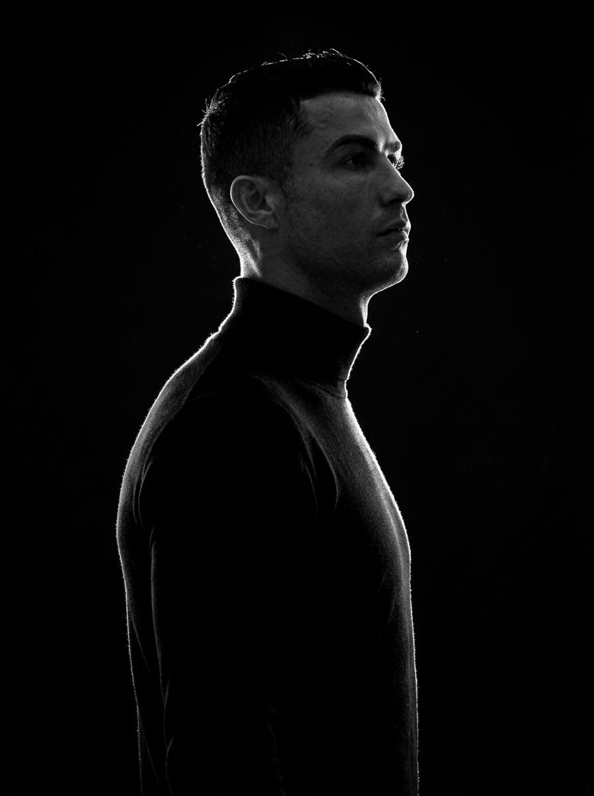

## Create a hyper-realistic winter scene in a vertical 3:4 

- ID: trending-2008361785322336674
- Slug: trending-2008361785322336674-en
- 语言: en
- 来源: [来源链接](https://x.com/Strength04_X/status/2008361785322336674)
- 样例图路径: images/part1/2008361785322336674_1.jpg

### 提示词

```text
Create a hyper-realistic winter scene in a vertical 3:4 aspect ratio with cinematic realism and natural detail. The foreground features compacted snow with subtle ice sparkle, cool blue shadows, and cold ambient light. A smartphone is placed perfectly horizontally across black ski boots, stable and centered, with visible smudges, micro-reflections, edge highlights, and slight screen glare. The iPhone camera Ul is clearly visible, including icons and the shutter button, reinforcing an authentic, unedited iPhone capture. On the phone screen, Subject 1 and Subject 2 are seated closely together on the snow, framed from a low angle so only their upper bodies are visible, creating an intimate mirror-selfie-style composition. Subject 2 sits slightly forward, holding the phone at arm's length with the phone back visible, wearing a glossy pink puffer jacket with realistic quilting, natural folds, helmet, and goggles; her face is fully clear and visible with a relaxed, confident expression. Subject 1 sits directly beside her, shoulders nearly touching, wearing a neutral ski jacket with light snow dusting, a helmet, and dark sunglasses reflecting the snowy environment: his face is also fully clear and visible, with a calm, relaxed posture. The background within the screen shows a snowy slope and distant ski-area elements softened by realistic depth and atmospheric haze. Lighting blends cool winter tones with warm sunlight reflections, producing natural shadows, lifelike highlights, and subtle imperfections. The final image must feel HD, realistic, candid, and cinematic, with both subjects facial features preserved exactly and remaining 1000% identical to the uploaded images.
```

### 样例图

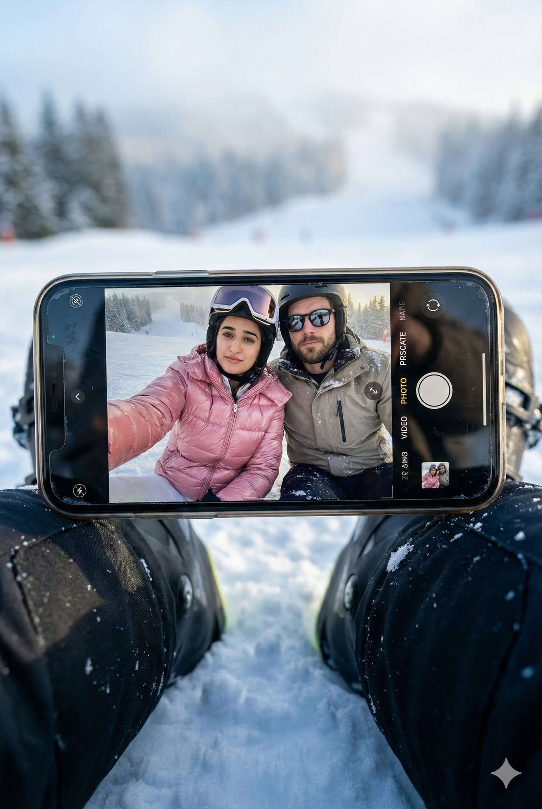

## Ultra-realistic cinematic studio scene of a woman superv

- ID: trending-2015380025365938616
- Slug: trending-2015380025365938616-en
- 语言: en
- 来源: [来源链接](https://x.com/Strength04_X/status/2015380025365938616)
- 样例图路径: images/part1/2015380025365938616_1.jpg

### 提示词

```text
Ultra-realistic cinematic studio scene of a woman supervising a miniature behind-the-scenes film set starring her tiny self.

She checks a miniature monitor while the small figure stands near scaled lighting rigs.

Both versions share identical facial features, body language, and clothing.

Mini director chairs, cables, clapperboards, and lenses fill the studio space.

Low-key cinematic lighting emphasizes realism and depth.
```

### 样例图

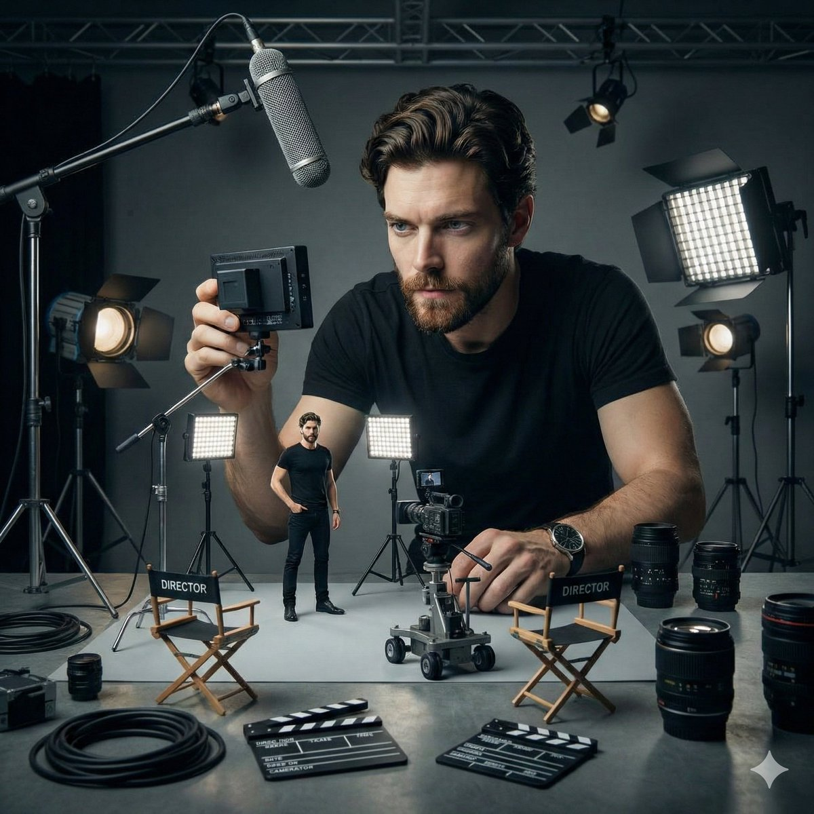

## { "image_prompt": { "main_description": "Poetic cinemati

- ID: trending-2016357678680039438
- Slug: trending-2016357678680039438-en
- 语言: en
- 来源: [来源链接](https://x.com/Taaruk_/status/2016357678680039438)
- 样例图路径: images/part1/2016357678680039438_1.jpg

### 提示词

```text
{
  "image_prompt": {
    "main_description": "Poetic cinematic close-up portrait of a young woman partially obscured by soft pink blossoms and petals in the foreground.",
    "subject_details": {
      "appearance": "Young woman, expressive green eyes, calm introspective expression, natural beauty",
      "skin_texture": "Ultra-realistic skin texture",
      "apparel": "Shimmering rose-gold high-neck dress that catches warm sunlight"
    },
    "composition_and_framing": {
      "framing": "Close-up, face in sharp focus through gaps in the flowers",
      "foreground": "Soft pink blossoms and petals, soft blur",
      "background": "Deep blue sky, creamy bokeh",
      "depth": "Shallow depth of field"
    },
    "lighting_and_color": {
      "lighting_source": "Golden-hour lighting",
      "effects": "Delicate shadows of petals across skin, dress catching sunlight",
      "palette": "Pastel pinks, warm peach tones, rose-gold, deep blue"
    },
    "atmosphere_and_style": {
      "mood": "Romantic spring atmosphere, ethereal, poetic",
      "style": "Editorial fashion photography",
      "grading": "Cinematic color grading"
    },
    "technical_specs": {
      "quality": "8K resolution, high detail",
      "visuals": "Ultra-realistic"
    }
  }
}
```

### 样例图

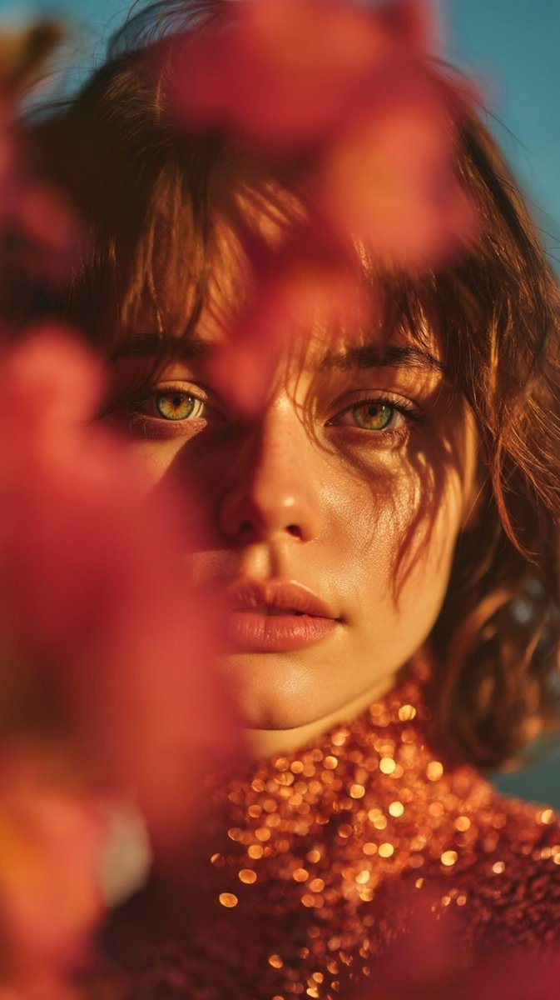

## { "type": "image_generation_prompt", "language": "Englis

- ID: trending-2013211205268312521
- Slug: trending-2013211205268312521-en
- 语言: en
- 来源: [来源链接](https://x.com/saniaspeaks_/status/2013211205268312521)
- 样例图路径: images/part1/2013211205268312521_1.jpg

### 提示词

```text
{
  "type": "image_generation_prompt",
  "language": "English",
  "aspect_ratio": "9:16",
  "style": "cinematic, ultra-realistic, high-speed action photography",
  "identity_preservation": {
    "use_reference_image": true,
    "strict_identity_lock": true,
    "notes": "Do not change face, hair, or facial features. Preserve the exact facial identity, hairstyle, proportions, and expression from the reference image."
  },
  "subject": {
    "gender": "female",
    "position_in_frame": "foreground, right side",
    "pose": {
      "seating": "sitting in a small folding camping chair on top of a sand dune",
      "legs": "crossed casually",
      "posture": "leaning back comfortably"
    },
    "expression": "confident, playful, relaxed with a subtle smile",
    "appearance": {
      "outfit": {
        "clothing": "black outfit (top and pants)",
        "boots": "brown boots",
        "headwear": "dark baseball cap",
        "accessories": [
          "sunglasses",
          "headset microphone"
        ]
      }
    }
  },
  "secondary_subject": {
    "vehicle": {
      "type": "powerful off-road pickup truck",
      "style_reference": "Ford Raptor–style",
      "action": "driving aggressively at full speed over the sand dune",
      "motion_state": "slightly airborne",
      "effects": [
        "dramatic explosion of sand and dust",
        "visible motion blur emphasizing speed"
      ],
      "position_in_frame": "background, slightly left and centered"
    }
  },
  "environment": {
    "location": "desert sand dunes",
    "time_of_day": "golden hour",
    "atmosphere": "warm, cinematic, dramatic contrast between calm and chaos"
  },
  "lighting": {
    "type": "natural golden hour sunlight",
    "quality": "soft and warm",
    "effects": [
      "gentle highlights on flying sand particles",
      "soft shadows",
      "cinematic teal and orange color balance"
    ]
  },
  "camera": {
    "angle": "low, cinematic angle",
    "lens": "telephoto ~85mm",
    "depth_of_field": "shallow",
    "focus": {
      "foreground": "woman in sharp focus",
      "background": "truck slightly motion-blurred"
    }
  },
  "color_grading": {
    "palette": [
      "warm beige sand",
      "muted sky tones",
      "subtle teal and orange accents"
    ],
    "style": "filmic, natural, HDR"
  },
  "quality": {
    "resolution": "8K",
    "detail_level": "ultra-high",
    "texture": "realistic sand, fabric, skin, and dust textures",
    "grain": "subtle film grain",
    "rendering": "photorealistic, no CGI look"
  },
  "constraints": [
    "No cartoon or illustrated style",
    "No artificial sharpening",
    "No exaggerated effects",
    "Maintain natural skin tones",
    "Do not alter facial identity"
  ],
  "output_goal": "Create a cinematic, ultra-realistic desert action image featuring a calm, confident woman seated in the foreground while a powerful off-road truck explodes through the dunes behind her, emphasizing contrast, motion, and cinematic storytelling."
}
```

### 样例图

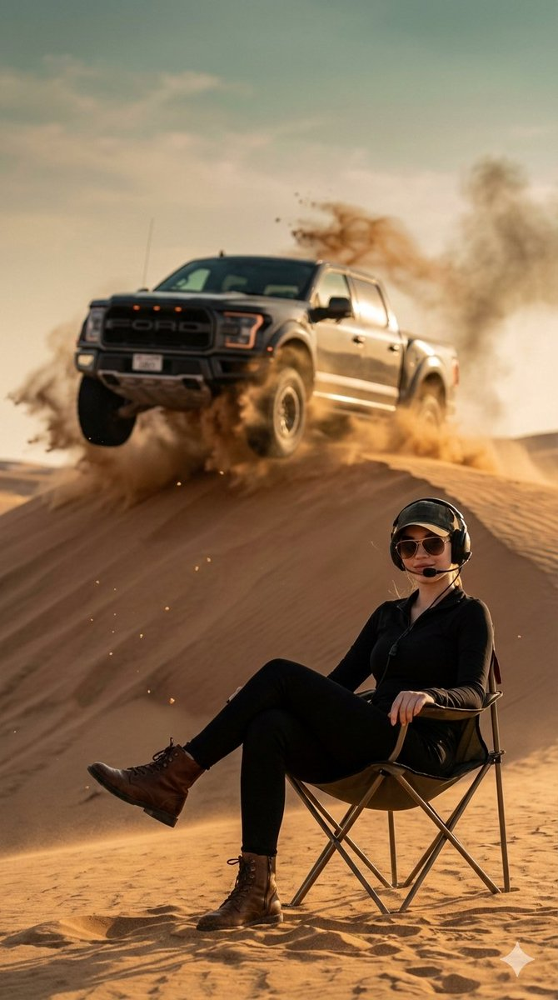

## "scene_description": { "location": "Urban rooftop or hig

- ID: trending-2020152101528301587
- Slug: trending-2020152101528301587-en
- 语言: en
- 来源: [来源链接](https://x.com/Ankit_patel211/status/2020152101528301587)
- 样例图路径: images/part1/2020152101528301587_1.jpg

### 提示词

```text
  "scene_description": {
    "location": "Urban rooftop or high vantage point with a backdrop of towering glass skyscrapers and sleek modern architecture",
    "vibe": "Energetic, youthful, urban streetwear, dynamic and slightly distorted perspective",
    "lighting": "Bright daylight, harsh sunlight creating a sunburst/lens flare in the upper left, high contrast shadows on the sleek surfaces, vibrant colors",
    "camera_settings": "Ultra-wide angle or Fisheye lens (approx 8mm-12mm), extreme low angle (worm's-eye view), forced perspective, deep depth of field, sharp focus from shoe sole to skyline, close up full body shot of the woman"
  },
  "primary_subjects": [
    {
      "character": "Young woman with shoulder-length brown hair",
      "role": "Streetwear model / Urban explorer",
      "action": "Sitting casually on the corner of a modern minimalist ledge or platform, looking down at the camera with a confident, relaxed expression. One leg is extended forward towards the lens creating extreme foreshortening, maintaining the same pose as before",
      "details": "Bright red track jacket with white stripes on sleeves, Bright Red fitted leggings, massive white chunky platform sneakers with a distinct red tread pattern on the sole (shoe is the dominant foreground element)"
    }
  ],
  "environment_details": {
    "crowd": "None",
    "architecture": "Curved modern glass skyscrapers surrounding the subject, smooth light concrete or metallic ledge in the foreground instead of a red brick wall, clean modern textures",
    "fidelity": "High-resolution photography, realistic texture on the sneaker leather and modern materials, lens distortion effect on the buildings"
  }
}
```

### 样例图

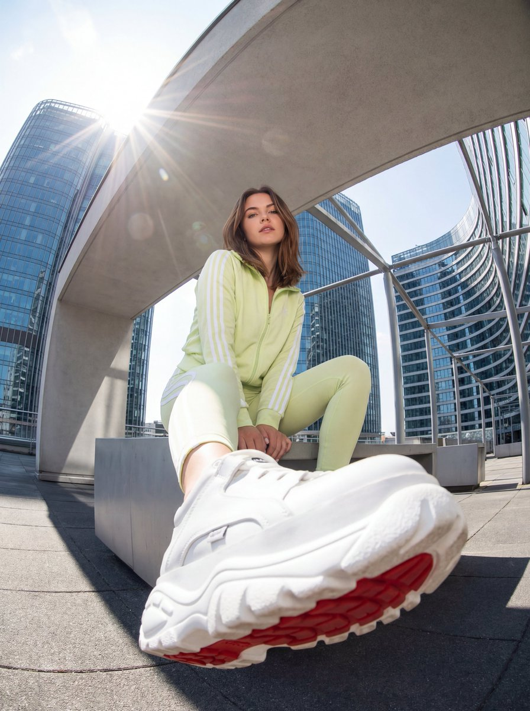

## Use model (the person in the image) you create a dark or

- ID: trending-2040257925126693248
- Slug: trending-2040257925126693248-en
- 语言: en
- 来源: [来源链接](https://x.com/harboriis/status/2040257925126693248)
- 样例图路径: images/part1/2040257925126693248_1.jpg

### 提示词

```text
Use model (the person in the image) you create a dark orange studio photo featuring a young man sitting casually on a metal folding chair with his legs cross. He's wearing a denim black baggy jeans, black t-shirt and black boots. The lightning is soft and minimal, producing sharp shadows and a moody atmosphere. His pose is relaxed, slightly leaning with one hand on the chair's backrest, his face turn to the side and modern aesthetic.
```

### 样例图

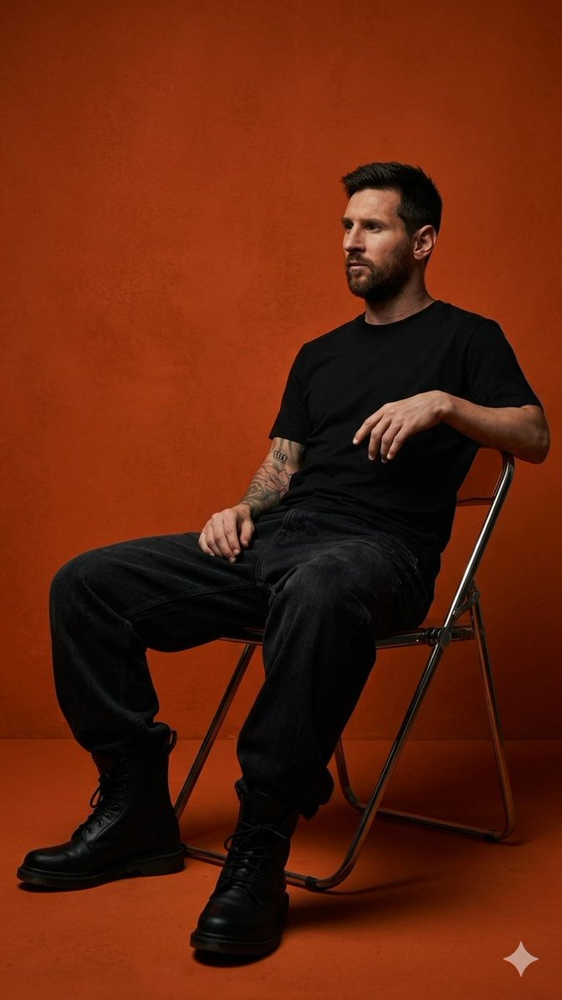

## Use The Uploaded Reference Photo As The Model For The Fa

- ID: trending-2040040156066140196
- Slug: trending-2040040156066140196-en
- 语言: en
- 来源: [来源链接](https://x.com/harboriis/status/2040040156066140196)
- 样例图路径: images/part1/2040040156066140196_1.jpg

### 提示词

```text
Use The Uploaded Reference Photo As The Model For The Face, Hairstyle, And Beard, Keeping Them Exactly As In The Reference. Render A Cinematic Studio Portrait Of A Young Man With A Sporty Body Sitting Casually On A Futuristic, Minimalistic, Designer Chair, Legs Crossed. Outfit: Brown Suit (#483c32 Jacket And Pants), Black Shirt Under The Jacket, Dark Brown Loafers, Black Oneplus Watch 346mm On Left Wrist. Background: Solid #483c32 With A Large White Circle Behind The Head, Filled And Slightly Glowing. Lighting: Bright Soft Studio Light, Producing Sharp Shadows And Moody Atmosphere. Pose: Relaxed, Slightly Leaning, One Hand On The Chair's Backrest, Face Turned To The Side. Ultra-detailed, Photo Realistic, Cinematic Contrast, Fabric Texture Emphasized. Ensure The Hairstyle, Beard, And Face Remain Exactly As In The Uploaded Reference Photo.
```

### 样例图

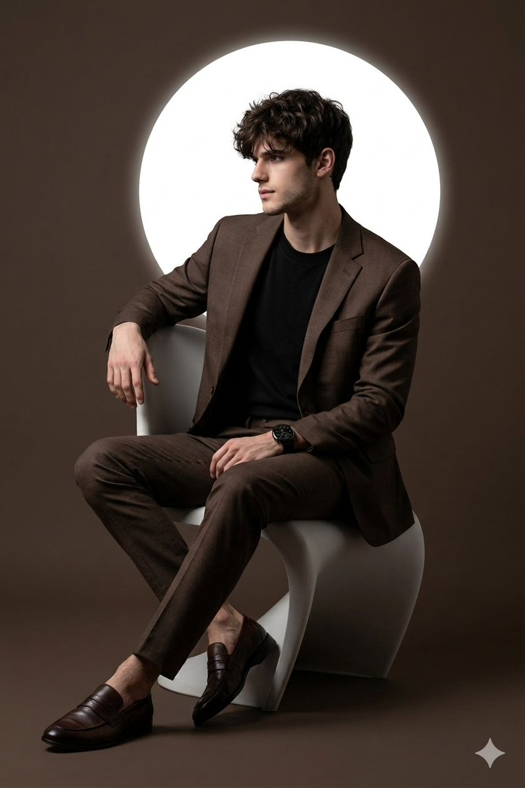

## Using the provided photos, create a highly detailed, pro

- ID: trending-2011785693056679970
- Slug: trending-2011785693056679970-en
- 语言: en
- 来源: [来源链接](https://x.com/harboriis/status/2011785693056679970)
- 样例图路径: images/part1/2011785693056679970_1.jpg

### 提示词

```text
Using the provided photos, create a highly detailed, professional, hyperrealistic art portrait, keeping the face intact. The woman sits elegantly on the floor, wearing a modern black top, soft, loose gray jeans, and chunky, fashionable gray sneakers. She has long, wavy, waist-length hair, half of which is braided. She has a laughing expression, and her gaze is directed upward.

The background should be an artistic monochrome composition (black and white) depicting a soft close-up from the side of the same face in profile
```

### 样例图

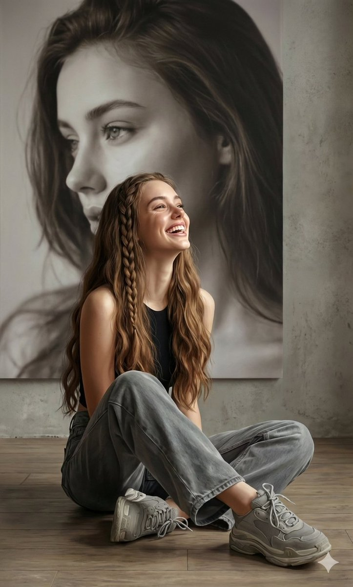

## { "meta": { "image_quality": "High", "image_type": "Stud

- ID: trending-2022587678328525084
- Slug: trending-2022587678328525084-en
- 语言: en
- 来源: [来源链接](https://x.com/rovvmut_/status/2022587678328525084)
- 样例图路径: images/part1/2022587678328525084_1.jpg

### 提示词

```text
{
  "meta": {
    "image_quality": "High",
    "image_type": "Studio Photography",
    "resolution_estimation": "1024x1280",
    "file_characteristics": {
      "compression_artifacts": "Low",
      "noise_level": "None",
      "lens_type_estimation": "Standard Prime (approx. 50mm)"
    }
  },
  "global_context": {
    "scene_description": "A fashion editorial shot featuring a woman in a red cardigan and dark jeans standing in a surreal Alice in Wonderland-themed studio. The floor is covered in a thick layer of red rose petals. Behind her sits a vintage leather armchair and a giant 'Queen of Hearts' playing card leaned against red velvet curtains. A silver candelabra with white candles stands to the right.",
    "environment_type": "Studio",
    "time_of_day": "N/A (Indoor Artificial)",
    "weather_atmosphere": "Theatrical, Romantic, Surreal",
    "lighting": {
      "source": "Studio Softboxes",
      "direction": "Frontal-left (45-degree angle)",
      "quality": "Soft",
      "color_temperature": "Warm Neutral (~3200K - 4000K)"
    },
    "color_palette": {
      "dominant_hex_estimates": [
        "#8B0000",
        "#E31B23",
        "#1A1B2E",
        "#FFFFFF"
      ],
      "accent_colors": [
        "#C5A059",
        "#000000"
      ],
      "contrast_level": "High"
    }
  },
  "composition": {
    "camera_angle": "Eye-level",
    "framing": "Full-body shot",
    "depth_of_field": "Medium (background elements slightly soft but legible)",
    "focal_point": "The woman in the red cardigan",
    "symmetry_type": "None",
    "rule_of_thirds_alignment": "Subject is centered horizontally; eyes align with the upper third line."
  },
  "objects": [
    {
      "id": "obj_001",
      "label": "Female Model",
      "category": "Person",
      "location": {
        "relative_position": "Center",
        "bounding_box_percentage": {
          "x": 25.0,
          "y": 14.0,
          "width": 30.0,
          "height": 70.0
        }
      },
      "dimensions_relative": "Large",
      "distance_from_camera": "Near",
      "pose_orientation": "Standing upright, slightly turned to the left, looking directly at camera.",
      "material": "Skin, hair, fabric",
      "surface_properties": {
        "texture": "Smooth skin, soft knit, denim",
        "reflectivity": "Low",
        "micro_details": "Dark bob haircut, gold hoop earrings, tinted glasses.",
        "wear_state": "Pristine"
      },
      "color_details": {
        "base_color_hex": "#E31B23",
        "secondary_colors": [
          "#1A1B2E"
        ],
        "gradient_or_pattern": "Solid colors"
      },
      "interaction_with_light": {
        "shadow_casting": "Soft shadow cast to the right and onto the floor petals",
        "highlight_zones": "Left side of face and cardigan shoulder",
        "translucency": "None"
      },
      "relationships": [
        {
          "type": "wearing",
          "target_object_id": "obj_002"
        },
        {
          "type": "holding",
          "target_object_id": "obj_004"
        }
      ]
    },
    {
      "id": "obj_002",
      "label": "Red Cardigan",
      "category": "Clothing",
      "location": {
        "relative_position": "Upper Center",
        "bounding_box_percentage": {
          "x": 26.0,
          "y": 24.0,
          "width": 25.0,
          "height": 26.0
        }
      },
      "dimensions_relative": "Medium",
      "distance_from_camera": "Near",
      "pose_orientation": "Buttoned at the top, open at the bottom",
      "material": "Knitted wool/cashmere",
      "surface_properties": {
        "texture": "Ribbed cuffs and hem, fine knit body",
        "reflectivity": "None",
        "micro_details": "Four visible gold-tone circular buttons",
        "wear_state": "New"
      },
      "color_details": {
        "base_color_hex": "#E31B23",
        "secondary_colors": [
          "#C5A059"
        ],
        "gradient_or_pattern": "Solid"
      },
      "interaction_with_light": {
        "shadow_casting": "Folds create soft internal shadows",
        "highlight_zones": "Upper shoulders and sleeve edges"
      }
    },
    {
      "id": "obj_003",
      "label": "Wide-leg Jeans",
      "category": "Clothing",
      "location": {
        "relative_position": "Lower Center",
        "bounding_box_percentage": {
          "x": 29.0,
          "y": 41.0,
          "width": 26.0,
          "height": 42.0
        }
      },
      "dimensions_relative": "Medium-Large",
      "distance_from_camera": "Near",
      "pose_orientation": "Straight vertical hang",
      "material": "Denim",
      "surface_properties": {
        "texture": "Coarse weave, visible center crease/seam",
        "reflectivity": "None",
        "micro_details": "Contrast stitching, black belt with gold buckle",
        "wear_state": "New"
      },
      "color_details": {
        "base_color_hex": "#1A1B2E",
        "secondary_colors": [
          "#C5A059"
        ],
        "gradient_or_pattern": "Dark indigo wash"
      }
    },
    {
      "id": "obj_004",
      "label": "Handbag",
      "category": "Accessory",
      "location": {
        "relative_position": "Center-Right (Model's hand)",
        "bounding_box_percentage": {
          "x": 37.0,
          "y": 62.0,
          "width": 15.0,
          "height": 10.0
        }
      },
      "dimensions_relative": "Small",
      "distance_from_camera": "Near",
      "pose_orientation": "Held by chain strap",
      "material": "Leather, Metal",
      "surface_properties": {
        "texture": "Embossed/quilted paisley-like pattern",
        "reflectivity": "Medium (chain and leather sheen)",
        "micro_details": "Silver-tone chain link strap",
        "wear_state": "New"
      },
      "color_details": {
        "base_color_hex": "#000000",
        "secondary_colors": [
          "#C0C0C0"
        ]
      }
    },
    {
      "id": "obj_005",
      "label": "Queen of Hearts Card",
      "category": "Prop",
      "location": {
        "relative_position": "Mid-Right",
        "bounding_box_percentage": {
          "x": 58.0,
          "y": 35.0,
          "width": 30.0,
          "height": 40.0
        }
      },
      "dimensions_relative": "Large",
      "distance_from_camera": "Mid",
      "pose_orientation": "Leaning against background at a 45-degree angle",
      "material": "Cardboard/Foamcore",
      "surface_properties": {
        "texture": "Matte",
        "reflectivity": "Low",
        "micro_details": "Stylized 'Q' and heart icons in corners",
        "wear_state": "Pristine"
      },
      "color_details": {
        "base_color_hex": "#FFFFFF",
        "secondary_colors": [
          "#E31B23"
        ]
      },
      "text_content": {
        "raw_text": "Q",
        "font_style": "Serif",
        "font_weight": "Bold",
        "text_case": "Uppercase",
        "alignment": "Corner-aligned",
        "color_hex": "#E31B23"
      }
    },
    {
      "id": "obj_006",
      "label": "Candelabra",
      "category": "Furniture/Prop",
      "location": {
        "relative_position": "Far Right",
        "bounding_box_percentage": {
          "x": 81.0,
          "y": 29.0,
          "width": 18.0,
          "height": 45.0
        }
      },
      "dimensions_relative": "Medium",
      "distance_from_camera": "Mid",
      "pose_orientation": "Standing vertical",
      "material": "Silver Metal, Wax",
      "surface_properties": {
        "texture": "Polished/Metallic",
        "reflectivity": "High",
        "micro_details": "Ornate curved arms, three visible white tapered candles (unlit)",
        "wear_state": "New"
      },
      "color_details": {
        "base_color_hex": "#C0C0C0",
        "secondary_colors": [
          "#FFFFFF"
        ]
      }
    },
    {
      "id": "obj_007",
      "label": "Rose Petals",
      "category": "Decor",
      "location": {
        "relative_position": "Bottom / Floor",
        "bounding_box_percentage": {
          "x": 0.0,
          "y": 72.0,
          "width": 100.0,
          "height": 28.0
        }
      },
      "dimensions_relative": "Large (as a group)",
      "distance_from_camera": "Near to Mid",
      "pose_orientation": "Scattered randomly",
      "material": "Organic / Silk",
      "surface_properties": {
        "texture": "Velvety/Soft",
        "reflectivity": "Low",
        "micro_details": "Varying shades of red, slight curling at edges",
        "wear_state": "Fresh"
      },
      "color_details": {
        "base_color_hex": "#8B0000",
        "secondary_colors": [
          "#E31B23"
        ]
      }
    }
  ],
  "background_details": {
    "texture": "Velvet Drapes",
    "patterns": "Vertical heavy folds/pleats",
    "lighting_behavior": "Absorbs light in deep folds, soft sheen on raised edges",
    "additional_elements": [
      "Vintage brown leather tufted armchair (partially obscured)",
      "Large cluster of red roses near the base of the card"
    ]
  },
  "foreground_elements": {
    "particles": "None",
    "artifacts": "Slight floor-level haze where light meets petals"
  },
  "reconstruction_notes": {
    "mandatory_elements_for_recreation": "Red knit cardigan with gold buttons, dark wide-leg denim, floor covered in red rose petals, oversized Queen of Hearts card, red velvet curtain backdrop.",
    "sensitivity_factors": "The specific saturation of the red (cardigan must match curtains and petals), the height of the petal layer (must feel thick/carpeting), and the theatrical studio lighting.",
    "ambiguities": "The exact texture of the handbag's embossing is complex; the model's footwear is almost entirely hidden by the wide-leg jeans and petals."
  }
}
```

### 样例图

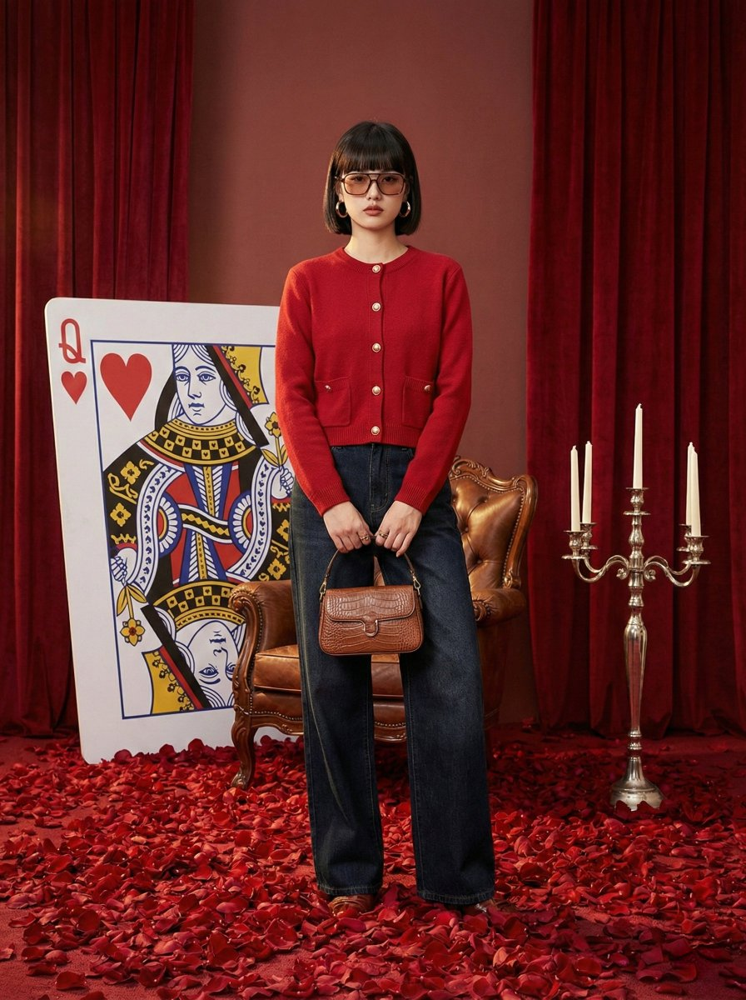

## A gritty, intense portrait of a man, a friend of real li

- ID: trending-2011789728421671033
- Slug: trending-2011789728421671033-en
- 语言: en
- 来源: [来源链接](https://x.com/Sheldon056/status/2011789728421671033)
- 样例图路径: images/part1/2011789728421671033_1.jpg

### 提示词

```text
A gritty, intense portrait of a man, a friend of real lion, captured in a raw, hyper-realistic style. The background is a textured, neutral concrete wall, keeping the environment simple and industrial. Lighting is soft and diffuse, provided by a large octagon softbox, mimicking overcast daylight. The camera is a Canon EOS R5 with an 85mm f/1.2 lens. The subject, with the [face from reference image], is forehead-to-forehead with the lion, displaying a deep bond. He wears a distressed leather motorcycle jacket and a white t-shirt, embracing a classic rebel aesthetic. The 8K image captures the pores on his skin and the coarse individual hairs of the lion's mane. The HDR aesthetic ensures vibrant colors and deep shadows, making the image feel three-dimensional and alive.
```

### 样例图

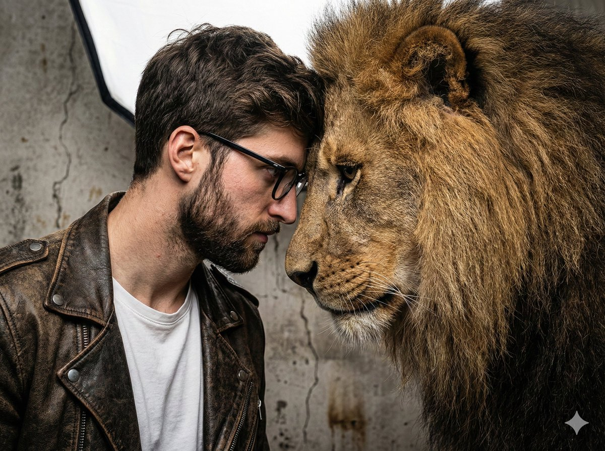

## Cinematic portrait of a confident football player sittin

- ID: trending-2032756394202657147
- Slug: trending-2032756394202657147-en
- 语言: en
- 来源: [来源链接](https://x.com/iamsofiaijaz/status/2032756394202657147)
- 样例图路径: images/part1/2032756394202657147_1.jpg

### 提示词

```text
Cinematic portrait of a confident football player sitting on a dark armchair, tropical jungle leaves surrounding him, dramatic low-key lighting, black background, moody atmosphere, wearing a cream Brazil football jersey with green accents, athletic build and trimmed beard, tattoos on arms, relaxed powerful pose with arms resting on chair, studio photography, ultra realistic, sharp focus, high contrast, depth of field, editorial sports photoshoot, 85mm lens, dark luxury aesthetic, 8k.
```

### 样例图

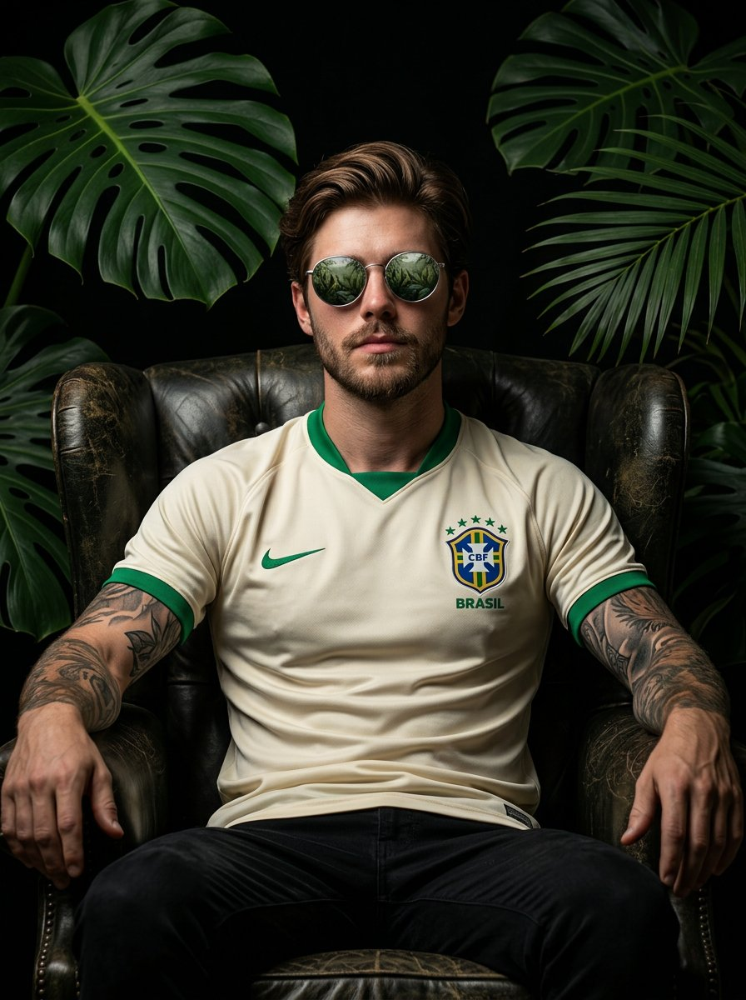

## Ultra-realistic fashion beauty crop of a female model we

- ID: trending-2018171062580920797
- Slug: trending-2018171062580920797-en
- 语言: en
- 来源: [来源链接](https://x.com/ChillaiKalan__/status/2018171062580920797)
- 样例图路径: images/part1/2018171062580920797_1.jpg

### 提示词

```text
Ultra-realistic fashion beauty crop of a female model wearing the reference red baseball cap and matching red hoodie. Framing: Tight portrait crop from nose to forehead, cap and eyes filling the frame. Focus: The embroidered logo perfectly centered above the model’s eyes, stitching detail and thread depth clearly visible. Pose: Model gripping the hoodie collar softly with both hands, creating subtle fabric folds. Lighting: Soft frontal studio light with faint shadow sculpting on cheekbones and under the cap. Background: Minimal warm studio backdrop, ivory-to-beige gradient. Mood: Bold, confident, fashion-house campaign energy. Finish: Ultra-sharp fabric detail, cinematic realism, shallow depth of field, no text, no branding overlays.
```

### 样例图

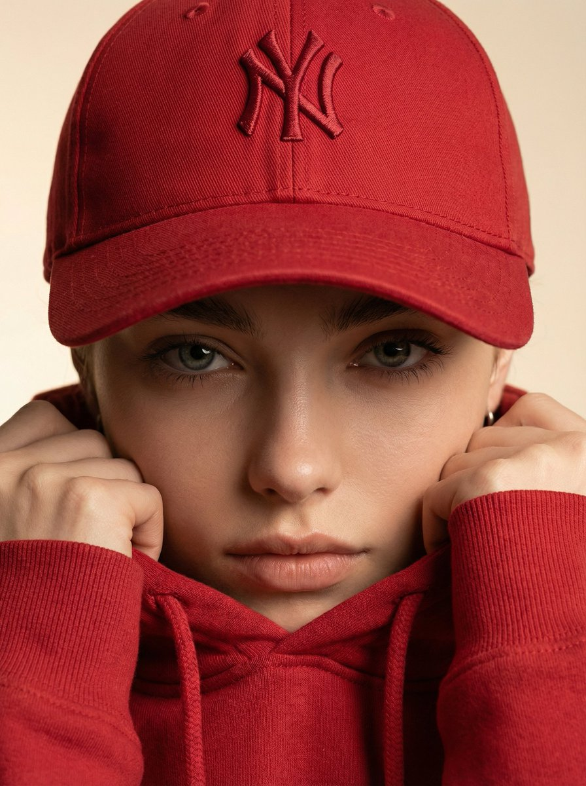

## { "type": "image_generation_prompt", "format": "triptych

- ID: trending-2011768680279834631
- Slug: trending-2011768680279834631-en
- 语言: en
- 来源: [来源链接](https://x.com/saniaspeaks_/status/2011768680279834631)
- 样例图路径: images/part1/2011768680279834631_1.jpg

### 提示词

```text
{
  "type": "image_generation_prompt",
  "format": "triptych",
  "aspect_ratio": "vertical, three stacked panels",
  "identity_preservation": {
    "use_original_image_reference": true,
    "strict_identity_lock": true,
    "face_changes_allowed": false,
    "clothing_changes_allowed": false,
    "notes": "Maintain 100% original facial structure, proportions, moles, eyes, nose, mouth, skin texture, hairstyle, and original clothing exactly as in the reference image."
  },
  "subject": {
    "gender": "female",
    "appearance": {
      "hair": {
        "style": "dark, tousled hair",
        "details": "natural movement with a few strands lifted by breeze"
      },
      "expression_style": "natural, candid, introspective"
    }
  },
  "composition": {
    "layout": "three vertically stacked photographs (triptych)",
    "background": "bright, clear blue sky",
    "setting": "outdoor, rooftop-like environment"
  },
  "panels": {
    "top_panel": {
      "camera_angle": "low angle",
      "pose": "looking down toward the camera",
      "expression": "direct, slightly pensive gaze",
      "lighting": "bright sunlight illuminating one side of face and shoulder with soft shadows"
    },
    "middle_panel": {
      "camera_angle": "eye-level to slightly low",
      "pose": "head turned away, gazing to the right",
      "expression": "thoughtful, distant",
      "environment_detail": "small portion of brown columned roof visible in lower left",
      "composition_note": "subject slightly off-center emphasizing open sky"
    },
    "bottom_panel": {
      "camera_angle": "close-up profile",
      "pose": "eyes closed, head slightly tilted back",
      "expression": "calm, reflective",
      "lighting": "sunlight accentuating facial and neck contours"
    }
  },
  "camera": {
    "type": "35mm film camera aesthetic",
    "lens_aperture": "f/1.8–f/2.8",
    "focus": "sharp focus on face with shallow depth of field",
    "grain": "visible natural film grain"
  },
  "lighting": {
    "source": "natural daylight",
    "time_of_day": "afternoon",
    "quality": "soft, diffused sunlight",
    "direction": "front and side lighting",
    "artificial_light": "none"
  },
  "color_and_style": {
    "palette": [
      "vivid blue sky",
      "warm natural skin tones"
    ],
    "style": "editorial portrait with analog film aesthetic",
    "atmosphere": "calm, airy, serene, nostalgic",
    "contrast": "subtle",
    "saturation": "natural with slight enhancement"
  },
  "quality": {
    "realism": "high",
    "detail": "natural skin texture, realistic lighting",
    "imperfections": "preserved"
  },
  "constraints": [
    "No facial alterations",
    "No clothing changes",
    "No artificial lighting",
    "No digital beauty filters",
    "No CGI or illustration",
    "No text or watermarks"
  ],
  "output_goal": "Create a serene, film-like triptych portrait of the same woman against a clear blue sky, preserving her exact identity, clothing, and natural expressions with an airy editorial and analog aesthetic."
}
```

### 样例图

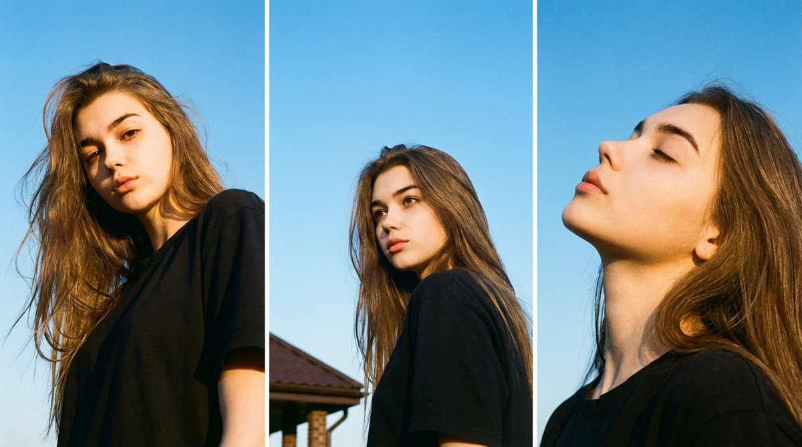

## Nano Banana pro on Gemini app. Prompt: Three hands holdi

- ID: trending-2028836648398778447
- Slug: trending-2028836648398778447-en
- 语言: en
- 来源: [来源链接](https://x.com/Taaruk_/status/2028836648398778447)
- 样例图路径: images/part1/2028836648398778447_1.jpg

### 提示词

```text
Nano Banana pro on Gemini app.

Prompt:
Three hands holding colorful glass soda bottles (lemon, grapefruit, lime) clinking together, bright sunny outdoor setting, soft beach/pool background blur, natural light, condensation on bottles, lifestyle photography, vibrant colors, shallow depth of field, candid joyful mood, commercial beverage ad, ultra-realistic, 8K.
IMAGE 2
Three hands holding minimalist glass bottles labeled almond milk, pistachio milk, chocolate oat milk, clean neutral background, soft studio lighting, modern branding, centered composition, smooth shadows, aesthetic product photography, high detail, muted tones, premium look, 8K.
IMAGE 3
Three hands holding iced coffee bottles (latte, mocha, oat milk), warm golden hour sunlight, cafe interior background, soft shadows of leaves on wall, cozy atmosphere, realistic reflections, lifestyle product shot, cinematic warm tones, shallow depth of field, 8K.
IMAGE 4
Three hands holding glowing sports drink bottles stacked vertically, neon blue and red lighting, futuristic tunnel background, motion blur streaks, cyberpunk aesthetic, dramatic lighting, high contrast, dynamic composition, glossy bottles, ultra-realistic, 8K.
```

### 样例图


## Ultra-realistic cinematic medium close-up portrait of th

- ID: trending-2016030160924156122
- Slug: trending-2016030160924156122-en
- 语言: en
- 来源: [来源链接](https://x.com/harboriis/status/2016030160924156122)
- 样例图路径: images/part1/2016030160924156122_1.jpg

### 提示词

```text
Ultra-realistic cinematic medium close-up portrait of the reference person, slightly turned to the side while looking toward the camera. Wearing a black turtleneck and dark jacket, modern and minimalist fashion style. Deep blue background with a smooth gradient, combined with contrasting magenta and blue lighting. Strong blue light coming from one side and magenta light from the opposite side, both colors reflecting clearly on the face and skin, creating a dramatic color contrast. High-end editorial lighting, sharp focus, realistic skin texture, cinematic mood, shallow depth of field.
```

### 样例图

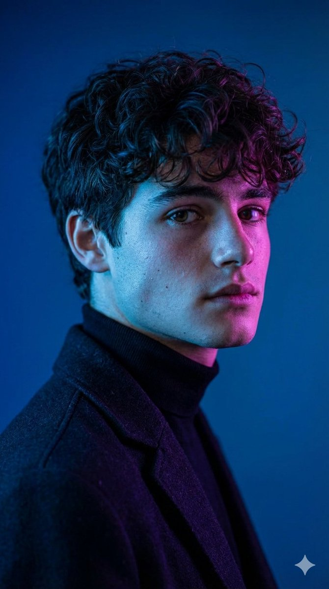

## { "prompt": "High-contrast monochromatic studio portrait

- ID: trending-2030802157679878498
- Slug: trending-2030802157679878498-en
- 语言: en
- 来源: [来源链接](https://x.com/john_my07/status/2030802157679878498)
- 样例图路径: images/part1/2030802157679878498_1.jpg

### 提示词

```text
{
"prompt": "High-contrast monochromatic studio portrait of a European woman around 25 years old. She has natural facial proportions, delicate cheekbones, expressive eyes, and realistic skin texture with visible pores and fine detail. Her expression is calm, elegant, and confident, looking softly toward the camera. She is posed gracefully with one hand lightly touching her neck and shoulders slightly angled. She is wearing a simple elegant black dress that softly frames her collarbones and shoulders. Hair is natural and softly styled with visible strand detail. Use minimal modern studio lighting with a single focused key light slightly above eye level, creating soft sculpted highlights on the face and subtle shadows for depth. Background is pure black, clean and textureless. Composition is a tight head-and-shoulders portrait with sharp focus on the eyes and shallow depth of field. Style: cinematic fine-art monochrome photography, modern editorial studio aesthetic, ultra-realistic, high contrast, 8K resolution, sharp micro-details."
}
```

### 样例图

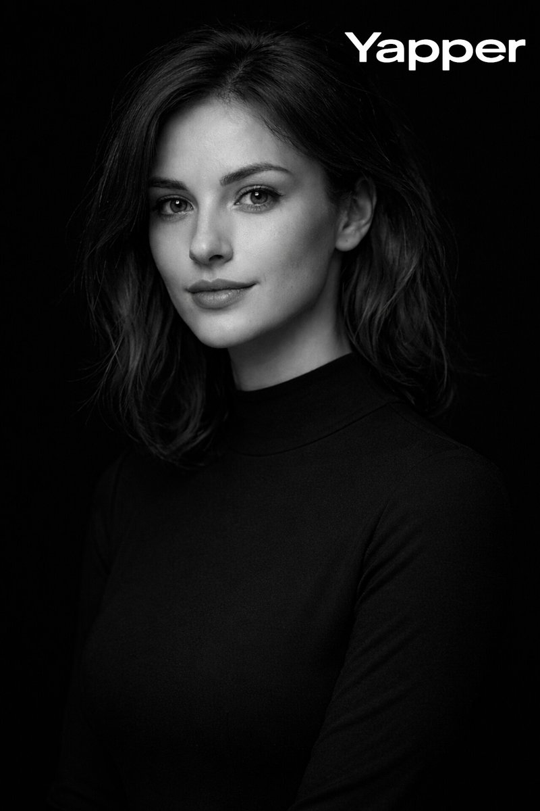

## Photorealistic cinematic photo, 3:4 vertical frame, shoo

- ID: trending-2044373789107163308
- Slug: trending-2044373789107163308-en
- 语言: en
- 来源: [来源链接](https://x.com/ZaraIrahh/status/2044373789107163308)
- 样例图路径: images/part1/2044373789107163308_1.jpg

### 提示词

```text
Photorealistic cinematic photo, 3:4 vertical frame, shooting from a very low point of grass/flowers (worm's-eye view) on a wide-angle lens-24-28mm. In the center of the frame, chest-deep, is a 25-year-old young woman with fair skin and dark  brown hair, wearing a dark blue/black sweatshirt with a small white inscription on the chest, and a thin chain around his neck. The pose is calm, the body is slightly

turned to the right, the head looks straight at the viewer and is raised; the focus is on the upper body. Foreground: large blurred yellow bees, yellow flowers and green stems, strong sideways, one large warm orange glare/spot at the bottom of the frame. Middle ground: around the model there are wild plants and flowers, some of the stems are sharp, some are in a soft blur.

Background/sky: a large turquoise-blue open sky with large white cumulus clouds on the left and above. There are a lot of small orange petals/seeds/leaves in the air above and around the model, as if they were picked up by the wind; they are at different distances and partially blurred (motion blur + shallow DOF), creating the effect of "floating particles".

Lighting: natural daylight, the sun is high / slightly behind on the left; soft contour illumination of hair and shoulders, sun is on accents + cool sky, light teal-orange grading, moderate vignette.

Parameters/style: shallow depth of field, foreground bokeh, crisp subject, cinematic, ultra realistic, high detail, natural film look, slight haze, no text overlays, no logos, no watermark.

Negative promt: illustration, CGI, cartoon, plastic skin, overexposure, strong noise, dirty background, superfluous people, buildings, wires, large readable inscriptions on clothes, artifacts, deformity of arms/shoulders.
```

### 样例图

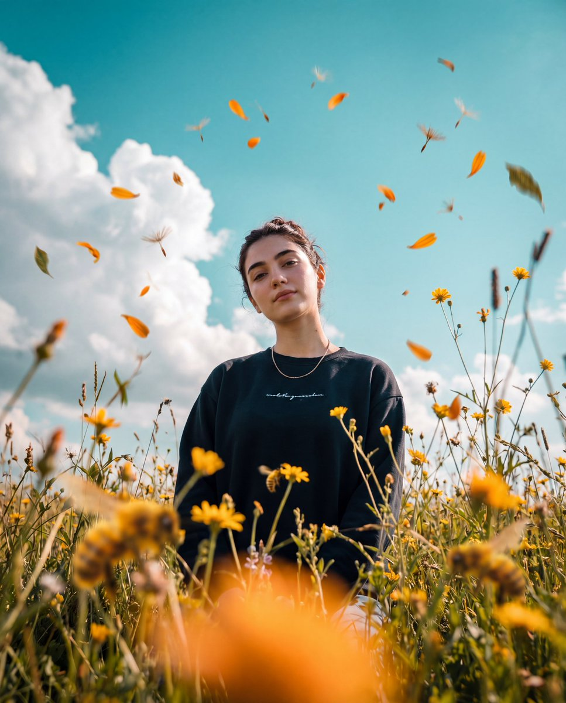

## A cinematic portrait of a young man standing still in th

- ID: trending-2026523437469253945
- Slug: trending-2026523437469253945-en
- 语言: en
- 来源: [来源链接](https://x.com/Taaruk_/status/2026523437469253945)
- 样例图路径: images/part1/2026523437469253945_1.jpg

### 提示词

```text
A cinematic portrait of a young man standing still in the middle of a busy crowd, sharp focus on the subject while people around him are heavily motion blurred, creating a dynamic sense of movement. The subject has a calm, serious expression, wearing a dark coat over a minimal outfit. Shot in a crowded urban environment, natural soft lighting, shallow depth of field, center composition. Long exposure effect with streaking motion blur surrounding the subject, ultra-realistic, 8K, high detail, cinematic color grading.
```

### 样例图

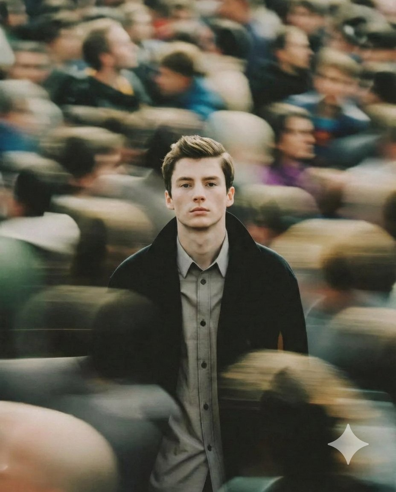

## unlimited nano banana pro, AI photo collage, vintage fil

- ID: trending-2023762122853986641
- Slug: trending-2023762122853986641-en
- 语言: en
- 来源: [来源链接](https://x.com/SimplyAnnisa/status/2023762122853986641)
- 样例图路径: images/part1/2023762122853986641_1.jpg

### 提示词

```text
unlimited nano banana pro, AI photo collage, vintage film look, black and white editorial, cinematic , analog photography aesthetic, collage, film grain texture, Ilford HP5 style, moody portrait lighting, street photography vibe, retro zine layout, AI photography workflow, prompt sharing, generative art prompts, editorial collage design
```

### 样例图

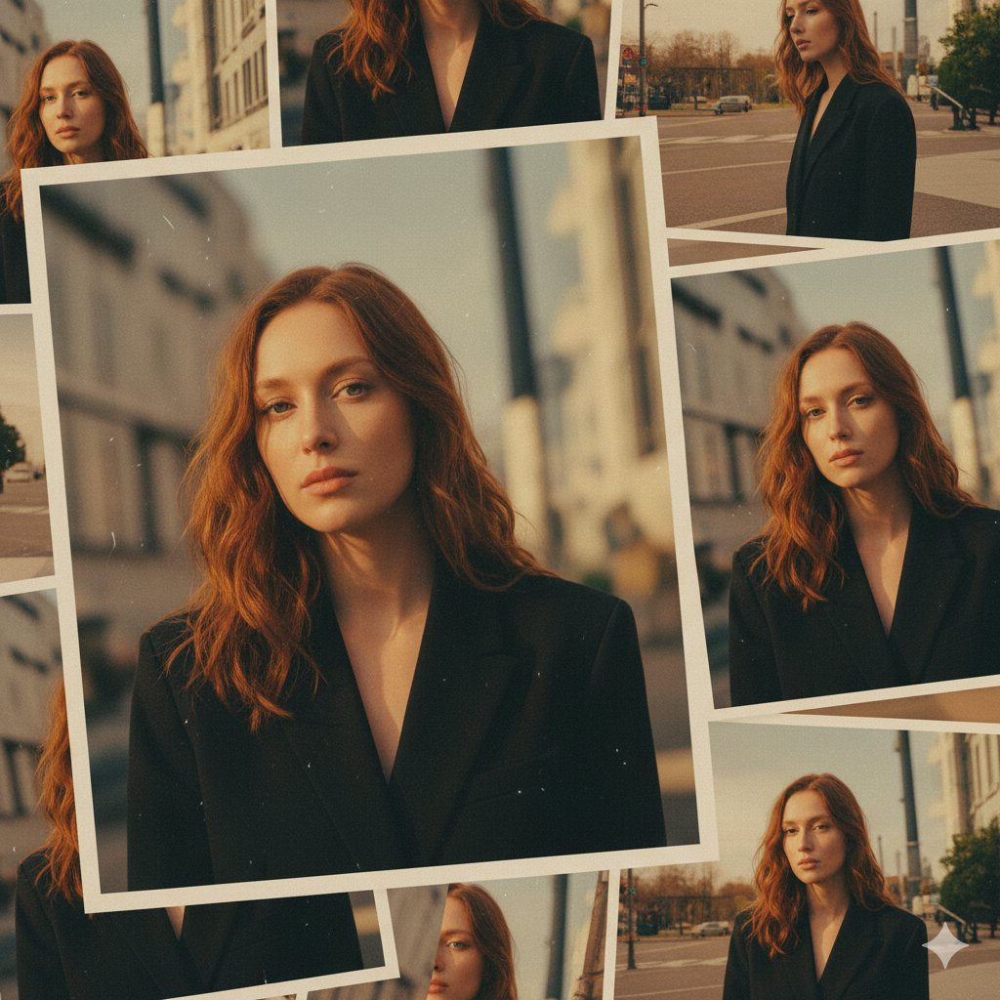

## Create a highly cinematic, realistic photo of a person u

- ID: trending-2036128381763461566
- Slug: trending-2036128381763461566-en
- 语言: en
- 来源: [来源链接](https://x.com/NikhilRajX/status/2036128381763461566)
- 样例图路径: images/part1/2036128381763461566_1.jpg

### 提示词

```text
Create a highly cinematic, realistic photo of a person using the face from the uploaded image. The person is standing alone under a single streetlight at night in heavy rain. The rain is pouring down dramatically, with visible droplets and water splashing on the ground. The streetlight casts a strong golden glow, lighting only the person while the surroundings fade into darkness. The ground is wet and reflective, creating beautiful reflections of the light. The camera angle is slightly low and centered, giving a powerful, movie-like look. The person is wearing a dark stylish outfit like a long coat or jacket, with water dripping from clothes and hair. Their expression is calm and intense. Cinematic lighting, dramatic contrast, volumetric light rays through rain, ultra realistic photography, Hollywood movie scene, high detail, atmospheric depth.
```

### 样例图

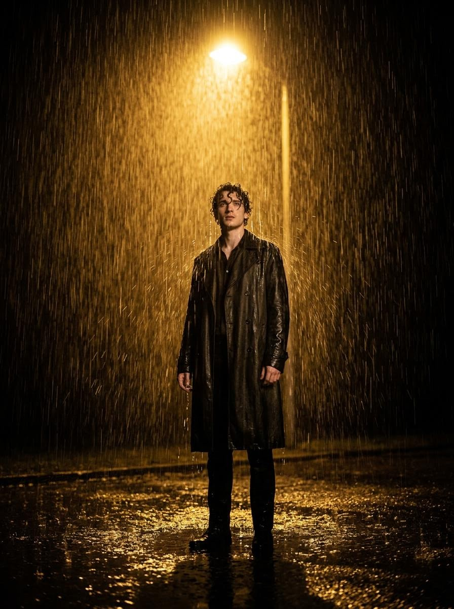

## High-quality realistic commercial shot of a cocoa planta

- ID: trending-2015730476632474105
- Slug: trending-2015730476632474105-en
- 语言: en
- 来源: [来源链接](https://x.com/Just_sharon7/status/2015730476632474105)
- 样例图路径: images/part1/2015730476632474105_1.jpg

### 提示词

```text
High-quality realistic commercial shot of a cocoa plantation in landscape orientation, cocoa tree as background, one cocoa pod partially split open on the branch in the center, fresh cocoa beans clearly visible inside with fibrous natural texture, slight irregular opening, surrounding pods and leaves softly out of focus, rich earthy brown and green tones, warm natural daylight with soft directional highlights, shallow depth of field, premium agricultural realism, no text, no people, no branding. 
```

### 样例图

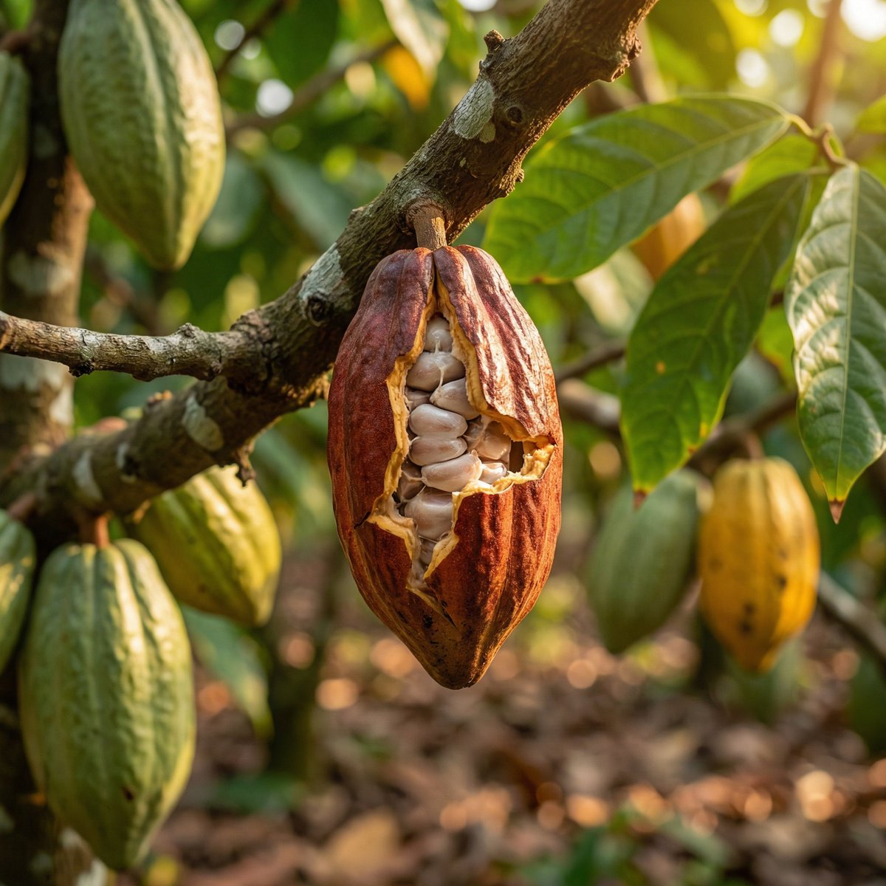

## A surreal, high-concept masterpiece featuring “uploaded 

- ID: trending-2030188564034765218
- Slug: trending-2030188564034765218-en
- 语言: en
- 来源: [来源链接](https://x.com/HaniaAi12/status/2030188564034765218)
- 样例图路径: images/part1/2030188564034765218_1.jpg

### 提示词

```text
A surreal, high-concept masterpiece featuring “uploaded face as reference” seated casually on the edge of a colossal, floating smartphone suspended high above a snow-capped mountain range. The subject is dressed in a monochromatic cyan ensemble, wearing a fitted mini dress, a plush faux-fur jacket, and knee-high suede boots, while holding a large cluster of matching light-blue helium balloons.

The giant smartphone, resembling a high-end device with a triple-lens camera array and metallic silver edges, floats horizontally, displaying realistic charging ports and speaker grills. Bright, crisp daylight casts sharp shadows on the phone’s surface, highlighting the texture of the fur and the sleek glass.

The background is a breathtaking aerial vista of jagged, snowy alpine peaks under a clear blue sky, rendered in 8K resolution with hyper-realistic textures, deep depth of field, and a commercial photography aesthetic.
```

### 样例图

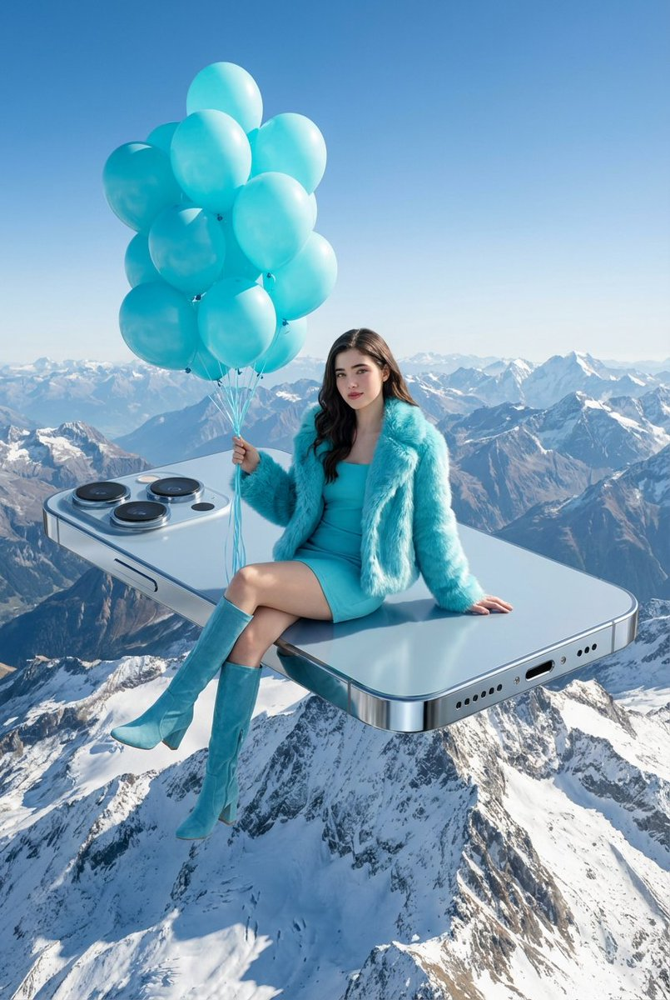

## A cinematic portrait of an Asian woman standing in a qui

- ID: trending-2039956008555229561
- Slug: trending-2039956008555229561-en
- 语言: en
- 来源: [来源链接](https://x.com/Ciri_ai/status/2039956008555229561)
- 样例图路径: images/part1/2039956008555229561_1.jpg

### 提示词

```text
A cinematic portrait of an Asian woman standing in a quiet forest, captured in a spontaneous moment as she turns her head slightly back toward the camera. Soft sunlight filters through tall trees, creating dramatic patches of light and shadow across her face and body. A distinct vertical light leak streak cuts through the frame, adding a striking analog imperfection. Her hair moves gently in the breeze, with loose strands catching the light, adding natural motion and softness. She wears a simple light-colored blouse layered with dark suspenders, creating a subtle contrast against the deep forest tones. Her expression is calm, slightly distant, and introspective, with her eyes softly meeting the camera. The background is filled with blurred tree trunks and glowing bokeh highlights, creating depth and atmosphere. The color grading features rich teal shadows and warm orange highlights, giving a cinematic teal-and-orange contrast. The image has a strong analog film aesthetic with visible grain, soft haze, slight blur, and light distortion. Imperfect framing, natural light flare, and film burn elements enhance the nostalgic 35mm film look. Cinematic film still, dreamy and moody atmosphere, poetic forest setting, high detail, hd quality.
```

### 样例图

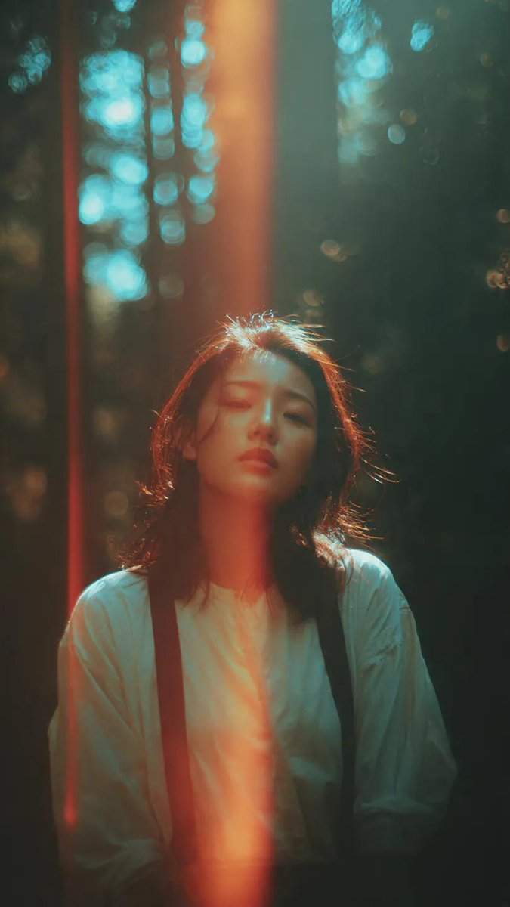

## Role: high-end fashion editorial photographer shooting a

- ID: trending-2024027461520937070
- Slug: trending-2024027461520937070-en
- 语言: en
- 来源: [来源链接](https://x.com/oye_samia/status/2024027461520937070)
- 样例图路径: images/part1/2024027461520937070_1.jpg

### 提示词

```text
Role: high-end fashion editorial photographer shooting a luxury minimalist studio campaign, ultra-realistic photography
Subject: use the attached face photo as the exact facial identity (100% identity preservation, anatomical precision, original proportions, natural skin texture, no AI beautification, no facial reshaping), seamlessly replace the model's face from the reference image with the attached face, perfect alignment of jawline, cheekbones, eye spacing, nose structure, skin tone matching and lighting consistency, no visible blending artifacts
Body Adjustment: slightly slimmer silhouette, more refined waistline, subtly leaner arms and thighs, elegant elongated body proportions, natural anatomy preserved (no distortion), realistic bone structure and muscle definition
Pose & Composition (match reference exactly): deep squat pose, body in full side profile, torso leaning slightly forward, one arm wrapped across chest holding opposite shoulder, other arm extended forward holding a single white lily, head lifted slightly upward, lips relaxed (natural neutral expression, no pursed lips, no blowing expression), elegant elongated neck posture, full body visible within frame, minimalistic light grey seamless studio background, soft diagonal shadow on background and floor
Outfit (exact replication): cream/off-white fitted long-sleeve dress, asymmetrical off-shoulder neckline, exposed upper back and shoulders, soft stretch fabric tightly fitted to body, natural fabric tension and realistic fold compression at knees and waist, floor-length hem, no necklace, delicate drop earrings, clean natural manicure
Hair (match styling exactly): low textured bun, soft loose face-framing tendrils, elegant romantic styling, natural volume, subtle shine
Makeup (exact replication): neutral glam makeup, matte skin with soft highlight, subtle contour, defined brows, soft brown smoky eye, nude lips (relaxed natural shape, not puckered), refined editorial finish
Props (must match exactly): single white lily held in extended hand, additional lilies placed on floor behind, realistic botanical detail, accurate leaf texture, natural stem structure, correct shadow interaction with floor
Lighting & Realism: professional studio lighting, soft directional key light from left side, smooth shadow gradient, high dynamic range, ultra high resolution, sharp focus on eyes, realistic skin pores, accurate fabric physics with natural stretch and compression, realistic floor reflections, no plastic skin, no oversmoothing
Camera: full-frame camera, 85mm lens, shallow depth of field, luxury fashion editorial color grading, clean neutral tones
Negative prompt: low resolution, distorted face, incorrect anatomy, exaggerated thinness, unhealthy body proportions, asymmetry errors, extra limbs, warped hands, artificial skin texture, over-smoothed skin, wrong dress style, different color dress, added jewelry, incorrect flowers, wrong pose, different background, harsh lighting, blurry eyes, visible face merge artifacts, AI look, cartoonish rendering, oversaturated colors.
```

### 样例图

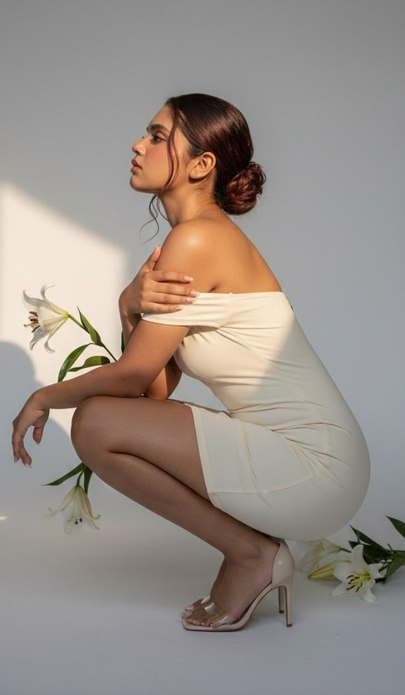

## A minimalist studio photograph fashion ad. At the top ce

- ID: trending-2011320913908941188
- Slug: trending-2011320913908941188-en
- 语言: en
- 来源: [来源链接](https://x.com/rovvmut_/status/2011320913908941188)
- 样例图路径: images/part1/2011320913908941188_1.jpg

### 提示词

```text
A minimalist studio photograph fashion ad. At the top center, the bold sans-serif text "[TEXT]" is positioned above the smaller sans-serif text "[TEXT]", which is above the italic script text "[TEXT]". Below the text, a man in a black suit, black t-shirt, and polished black dress shoes sits in profile, facing left. He is seated in a modern chair with a black leather seat and backrest suspended on a tubular black metal frame. His right leg is extended, and he holds a pair of glasses in his right hand near his mouth. The background and floor are a seamless, stark white studio space with soft, diffused lighting that casts grounded shadows beneath the man and chair.
```

### 样例图

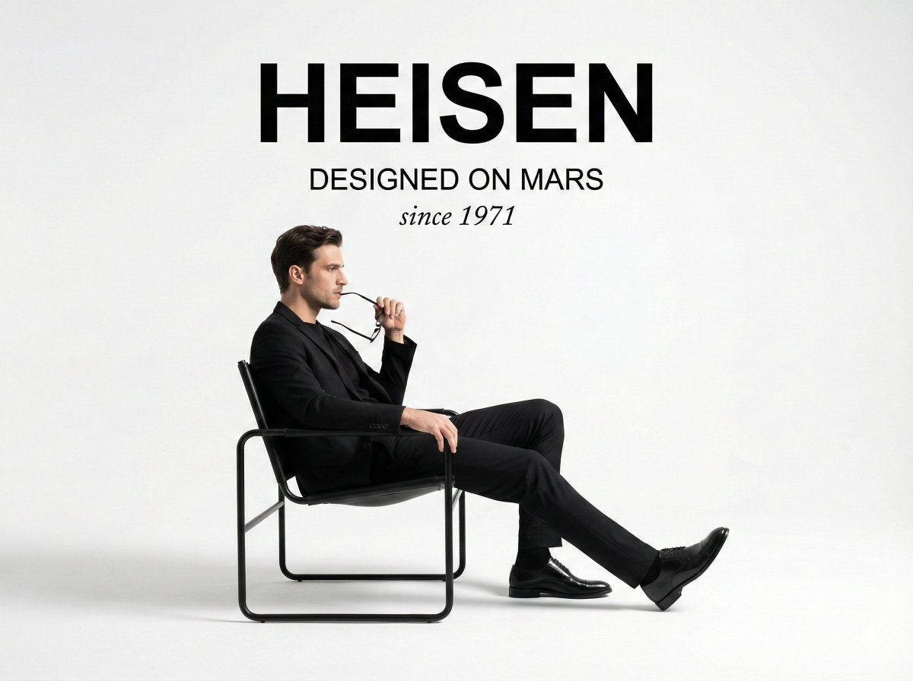

## Ultra-realistic full-body studio fashion portrait of a s

- ID: trending-2030793768195244295
- Slug: trending-2030793768195244295-en
- 语言: en
- 来源: [来源链接](https://x.com/Sheldon056/status/2030793768195244295)
- 样例图路径: images/part1/2030793768195244295_1.jpg

### 提示词

```text
Ultra-realistic full-body studio fashion portrait of a stylish young man standing confidently, looking slightly upward. He wears a black puffer jacket, white t-shirt, loose white cargo pants, and chunky white sneakers. Accessories include round clear glasses and a black knit beanie. Hands in pockets, relaxed confident posture. Clean seamless solid red studio background. Soft professional studio lighting, sharp clothing texture, editorial fashion photography.
```

### 样例图

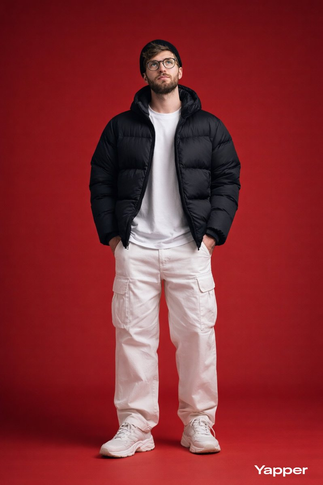

## { "metadata": { "image_type": "photograph", "primary_pur

- ID: trending-2031053123196694930
- Slug: trending-2031053123196694930-en
- 语言: en
- 来源: [来源链接](https://x.com/pictsbyai/status/2031053123196694930)
- 样例图路径: images/part1/2031053123196694930_1.jpg

### 提示词

```text
{
"metadata": {
"image_type": "photograph",
"primary_purpose": "editorial"
},
"composition": {
"rule_applied": "rule of thirds",
"aspect_ratio": "1:1",
"layout": "layered",
"focal_points": [
"Man in dark overcoat standing on the right side of the frame",
"Illuminated cruise ships floating in the misty bay"
],
"visual_hierarchy": "Eye starts on the dark, high-contrast figure of the man on the right, follows his downward gaze, then moves left across the glass railing to the textured plant, and finally drifts up to the illuminated ships and hazy mountains in the background",
"balance": "asymmetric"
},
"color_profile": {
"dominant_colors": [
{
"color": "Black",
"hex": "#0D0D0D",
"percentage": "25",
"role": "primary subject and foreground silhouettes"
},
{
"color": "Mid Gray",
"hex": "#808080",
"percentage": "45",
"role": "background bay, sky, and mountains"
},
{
"color": "Light Gray",
"hex": "#D3D3D3",
"percentage": "30",
"role": "fog, sky highlights, and water reflections"
}
],
"color_palette": "monochromatic",
"temperature": "cool",
"saturation": "black and white",
"contrast": "high contrast"
},
"lighting": {
"type": "natural window",
"source_count": "single source",
"direction": "diffused from above",
"directionality": "diffused",
"quality": "soft light",
"intensity": "moody",
"contrast_ratio": "high contrast (dramatic shadows)",
"mood": "mysterious",
"shadows": {
"type": "soft gradual edges",
"density": "deep black",
"placement": "under subject, obscuring facial details and coat folds",
"length": "short"
},
"highlights": {
"treatment": "subtle",
"placement": "on the water surface, ship lights, and plant leaves"
},
"ambient_fill": "present",
"light_temperature": "neutral"
},
"technical_specs": {
"medium": "digital photography",
"style": "realistic",
"texture": "grainy",
"sharpness": "slightly soft",
"grain": "film grain",
"depth_of_field": "deep",
"perspective": "straight on"
},
"artistic_elements": {
"genre": "portrait",
"influences": [
"Cinematic noir",
"Melancholic travel photography"
],
"mood": "calm",
"atmosphere": "Quiet, contemplative, slightly melancholic morning or evening with heavy atmospheric mist",
"visual_style": "minimal"
},
"typography": {
"present": false,
"fonts": [],
"placement": "none",
"integration": "subtle"
},
"subject_analysis": {
"primary_subject": "A man wearing a long dark overcoat and dress shoes, looking downward in thought",
"positioning": "right",
"scale": "environmental",
"interaction": "interacting with environment",
"facial_expression": {
"mouth": "closed smile",
"smile_intensity": "no smile",
"eyes": "looking away",
"eyebrows": "neutral",
"overall_emotion": "serious",
"authenticity": "candid"
},
"hands_and_gestures": {
"left_hand": "in pocket",
"right_hand": "in pocket",
"finger_positions": "relaxed",
"finger_interlacing": "none",
"hand_tension": "relaxed",
"interaction": "resting inside coat pockets",
"naturalness": "organic casual gesture"
},
"body_positioning": {
"posture": "leaning",
"angle": "45 degree turn",
"weight_distribution": "leaning right",
"shoulders": "relaxed"
}
},
"background": {
"setting_type": "outdoor",
"spatial_depth": "deep",
"elements_detailed": [
{
"item": "Glass balcony railing with metal handrail",
"position": "center",
"distance": "midground",
"size": "dominant",
"condition": "pristine",
"specific_features": "Transparent panels running horizontally across the frame"
},
{
"item": "Potted leafy shrub",
"position": "bottom left",
"distance": "foreground",
"size": "medium",
"condition": "thriving",
"specific_features": "Dense, small leaves catching subtle highlight reflections"
},
{
"item": "Smooth cylindrical planter pot",
"position": "bottom right",
"distance": "foreground",
"size": "small",
"condition": "pristine",
"specific_features": "Minimalist matte finish, containing another plant"
},
{
"item": "Illuminated cruise ships",
"position": "center",
"distance": "background",
"size": "small",
"condition": "pristine",
"specific_features": "Bright deck lights piercing through the fog"
},
{
"item": "Coastal mountains/hills",
"position": "top",
"distance": "background",
"size": "dominant",
"condition": "weathered",
"specific_features": "Silhouetted and hazy due to thick atmospheric fog"
}
],
"wall_surface": {
"material": "glass and metal",
"surface_treatment": "smooth",
"texture": "perfectly smooth",
"finish": "glossy",
"color": "transparent with gray reflections",
"color_variation": "gradient",
"features": "clean, modern architectural lines",
"wear_indicators": "pristine"
},
"floor_surface": {
"material": "tile",
"color": "mid-gray",
"pattern": "solid rectangular panels with distinct grout lines"
},
"objects_catalog": "Glass railing (midground horizontal), large leafy potted plant (bottom left foreground), sleek light-colored planter pot (bottom right foreground), three illuminated cruise ships (background bay), distant coastal town buildings (background right)",
"background_treatment": "gradient"
},
"generation_parameters": {
"prompts": [
"Cinematic black and white photograph of a man in a dark overcoat leaning against a modern glass balcony railing. He is positioned on the right, looking down thoughtfully with his hands in his pockets. In the background, a moody, fog-covered bay with large illuminated cruise ships and hazy mountains. Deep atmospheric perspective, film grain, soft diffused lighting, melancholic mood.",
"A moody monochromatic shot from a high-end coastal balcony. A silhouetted male figure stands resting against the glass barrier. Dense fog over a calm sea, dotted with the glowing lights of several distant ships. Potted plants frame the bottom corners. Melancholic, minimalist, rich gray tones, Leica photography style."
],
"keywords": [
"black and white",
"moody",
"fog",
"overcoat",
"balcony",
"cruise ships",
"cinematic",
"contemplative"
],
"technical_settings": "ISO 400, f/5.6 to maintain background visibility while keeping subject sharp, shutter speed 1/125s, shot on a medium focal length (e.g., 50mm).",
"post_processing": "Converted to monochrome, contrast adjusted to create a strong silhouette for the subject while maintaining soft midtones in the foggy background, added subtle film grain for texture."
}
}
```

### 样例图

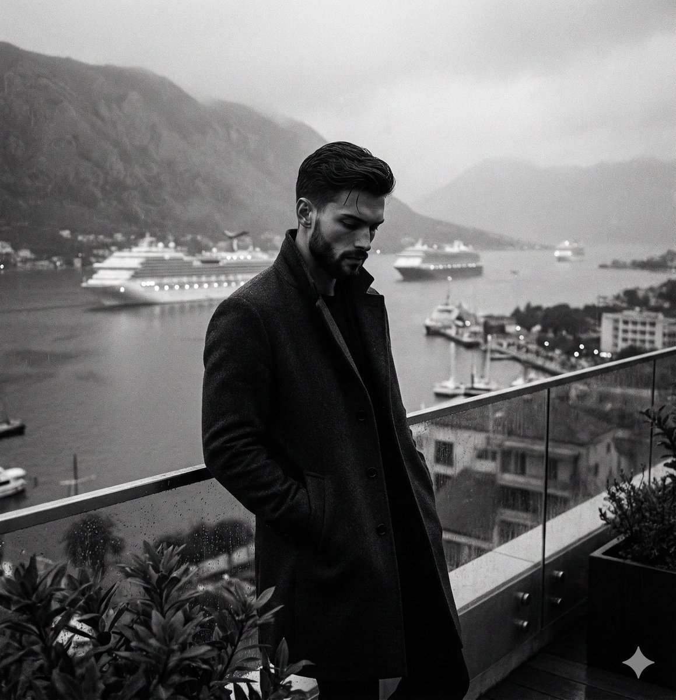

## Shirtless male subject, hyper-realistic skin texture, de

- ID: trending-2019797008110825959
- Slug: trending-2019797008110825959-en
- 语言: en
- 来源: [来源链接](https://x.com/kaanakz/status/2019797008110825959)
- 样例图路径: images/part1/2019797008110825959_1.jpg

### 提示词

```text
Shirtless male subject, hyper-realistic skin texture, deep tan, 1970s Hollywood aesthetic, vintage gold-rimmed aviator sunglasses with amber tint, unlit cigarette held in mouth, masculine ruggedness, medium close-up, low-angle perspective, background of blurred palm trees and hazy Los Angeles hillside, high-key natural sunlight, warm tungsten glow, golden hour color grading, shot on 35mm film, Arriflex 35 BL, 50mm T1.3, heavy film grain, authentic Kodak Portra 400 stock, slight lens flare, sun-bleached highlights, retro film-still style, directed by Quentin Tarantino
```

### 样例图

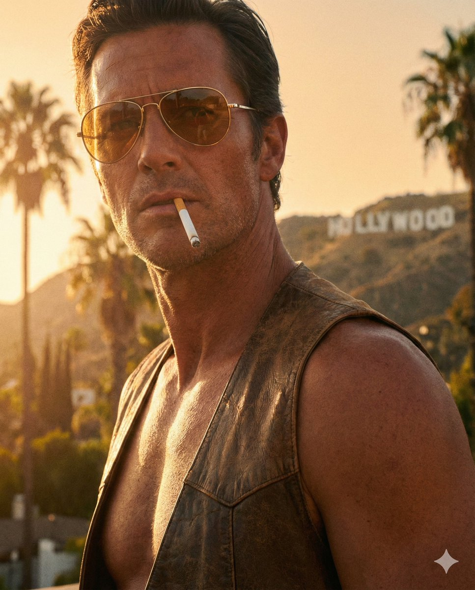

## (Masterpiece, Best Quality, 8K UHD, RAW photo), photorea

- ID: trending-2033797895640535404
- Slug: trending-2033797895640535404-en
- 语言: en
- 来源: [来源链接](https://x.com/BubbleBrain/status/2033797895640535404)
- 样例图路径: images/part1/2033797895640535404_1.jpg

### 提示词

```text
(Masterpiece, Best Quality, 8K UHD, RAW photo), photorealistic portrait,
  the exact same beautiful Korean female k-pop idol every time,
  innocent baby face, straight eyebrows, big doe eyes with aegyosal,
  gradient glossy pink lips, light blush,
  messy long black wavy hair fanning out across the white pillow,
  sun-kissed highlights on select strands,

  Layer 2 : white string bikini top, tied at back of neck,
  Layer 5  white string bikini bottom with side bows,
  bare legs slightly bent at the knees, feet crossed in the air,
  lying on her stomach on a white bed,
  propped up on elbows, chin resting on hands,
  legs lazily crossed and kicked up behind her,
  shoulders relaxed and open,
  natural effortless sensual pose, maximum breathing space in composition,
  looking back over her shoulder at the camera,
  playful smile, eyes bright and inviting,
  expression: carefree, natural beauty, innocent allure,
  relaxed brow, slight head tilt,

  white bed with soft rumpled linen sheets,
  one white pillow beneath her elbows,
  sheer white curtains with morning light pouring through,
  large overexposed white background area on the right side,
  strong negative space for breathing room,
  dreamy hazy soft-focus atmosphere,

  golden morning sunlight from the right side through sheer curtains,
  warm light illuminating her face and upper body,
  soft shadows, high-key overall,
  dust motes floating in light beams,
  gentle hair backlight creating angelic glow,

  Canon R5, 50mm f/1.4,
  eye-level intimate POV,
  moderate depth of field, soft bokeh on background,
  sharp focus on eyes and face,

  airy, luminous, dreamy morning atmosphere,
  youthful sensuality, effortless beauty,

  ultra-detailed skin, realistic hair strands, fabric texture,
  8K resolution, photorealistic, no artifacts, no watermark
```

### 样例图

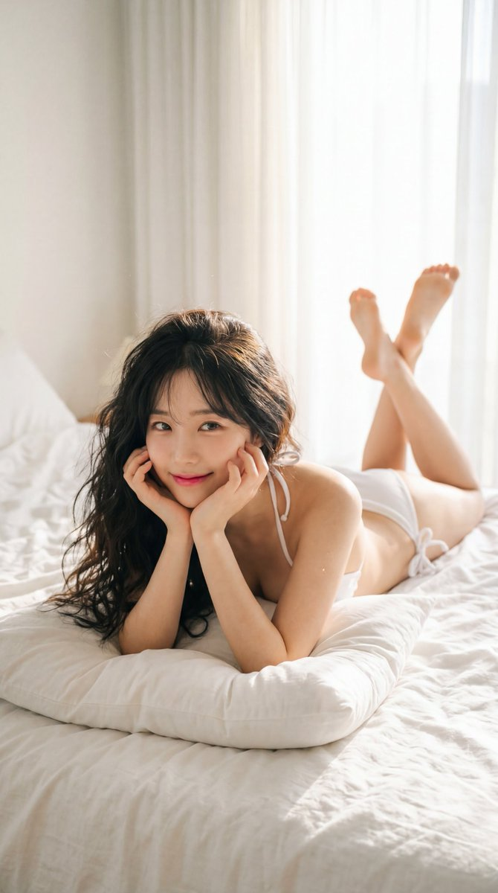

## { "prompt_details": { "subject": { "description": "Hands

- ID: trending-2008794302630309945
- Slug: trending-2008794302630309945-en
- 语言: en
- 来源: [来源链接](https://x.com/Strength04_X/status/2008794302630309945)
- 样例图路径: images/part1/2008794302630309945_1.jpg

### 提示词

```text
{
  "prompt_details": {
    "subject": {
      "description": "Handsome male trekker, dark wavy hair (no cap), full beard, rugged appearance",
      "expression": "Relaxed, calm, enjoying the nature",
      "clothing": "Green check flannel shirt layered over a black T-shirt, black cargo trekking pants, blue hiking boots, wristwatch, neck gaiter"
    },
    "environment": {
      "location": "Mountain campsite",
      "elements": "Pitched camping tent in background, lush green hills, rocky ground, perhaps a small campfire",
      "time_of_day": "Golden hour or soft afternoon light"
    },
    "style": {
      "type": "Hyper-realistic outdoor photography",
      "quality": "8k resolution, cinematic lighting, sharp focus, detailed texture",
      "camera_angle": "Eye-level or slightly low angle"
    }
  },
  "full_prompt_text": "A handsome male trekker sitting comfortably at a mountain campsite, no cap, showing dark wavy hair and a beard. He is wearing a green check shirt over a black t-shirt, black cargo pants, and blue hiking boots. A camping tent is visible in the background amidst lush green mountains. Soft natural lighting, realistic skin texture, cinematic outdoor adventure style, 8k resolution."
}
```

### 样例图

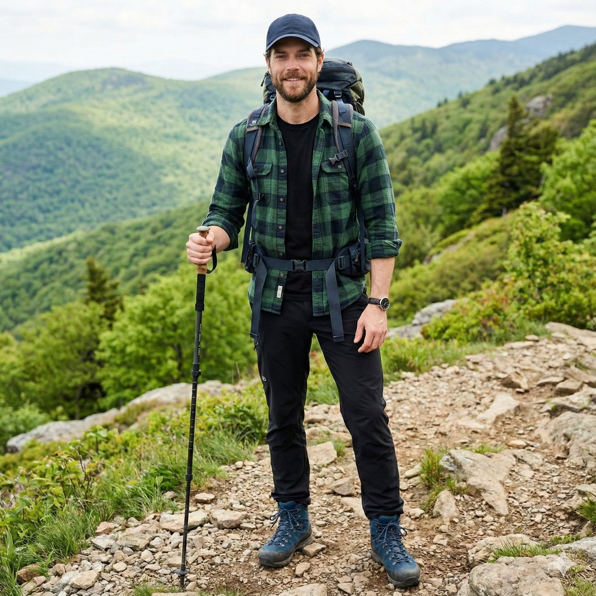

## { "task": "temporal_motion_echo_portrait_effect", "input

- ID: trending-2020075837723193776
- Slug: trending-2020075837723193776-en
- 语言: en
- 来源: [来源链接](https://x.com/egeberkina/status/2020075837723193776)
- 样例图路径: images/part1/2020075837723193776_1.jpg

### 提示词

```text
{
 "task": "temporal_motion_echo_portrait_effect",
 "input": {
 "source_image": "USER_UPLOADED_IMAGE",
 "preserve_identity": true,
 "preserve_pose": true,
 "preserve_outfit": true,
 "preserve_composition": true
 },
 "output": {
 "type": "single_image",
 "resolution": "ultra_high_resolution",
 "detail_preservation": "high",
 "ai_artifacts": "none"
 },
 "effect_design": {
 "core_effect": "motion_echo_time_displacement",
 "echo_direction": "horizontal",
 "echo_behavior": {
 "center_subject": "sharp_and_fully_in_focus",
 "echo_layers": "multiple_time_offset_duplicates",
 "blur_progression": "increasing_blur_with_distance_from_center",
 "opacity_falloff": "soft_fade_outward",
 "alignment": "perfectly_registered_with_original_subject"
 },
 "motion_style": {
 "type": "temporal_smear",
 "speed_feel": "slow_motion_time_stretch",
 "distortion": "none"
 }
 },
 "visual_style": {
 "background": {
 "treatment": "smooth_minimal_gradient",
 "blur": "subtle",
 "color_continuity": "match_original_background"
 },
 "lighting": {
 "preserve_original_lighting": true,
 "contrast": "controlled",
 "highlights": "soft",
 "shadows": "clean"
 },
 "color": {
 "grade": "cinematic_muted",
 "saturation": "natural",
 "skin_tones": "accurate"
 }
 },
 "restrictions": {
 "no_new_elements": true,
 "no_pose_change": true,
 "no_face_warping": true,
 "no_outfit_modification": true,
 "no_background_replacement": true
 }
}
```

### 样例图

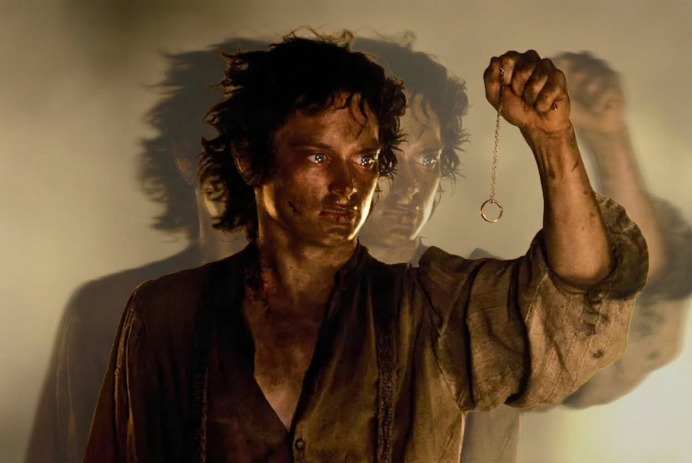

## Cinematic realistic street scene, beautiful young woman 

- ID: trending-2017805744486396063
- Slug: trending-2017805744486396063-en
- 语言: en
- 来源: [来源链接](https://x.com/Naiknelofar788/status/2017805744486396063)
- 样例图路径: images/part1/2017805744486396063_1.jpg

### 提示词

```text
Cinematic realistic street scene, beautiful young woman with short wavy bob haircut, natural hourglass body shape with correct human proportions, sitting relaxed on a wooden bench in front of a small restaurant, graffiti wall behind her, late afternoon side sunlight with strong shadows. Casual urban outfit: inner t-shirt with a light open outer jacket, relaxed denim pants, sneakers. Soft cinematic color grading, shallow depth of field, ultra-detailed, photorealistic
```

### 样例图

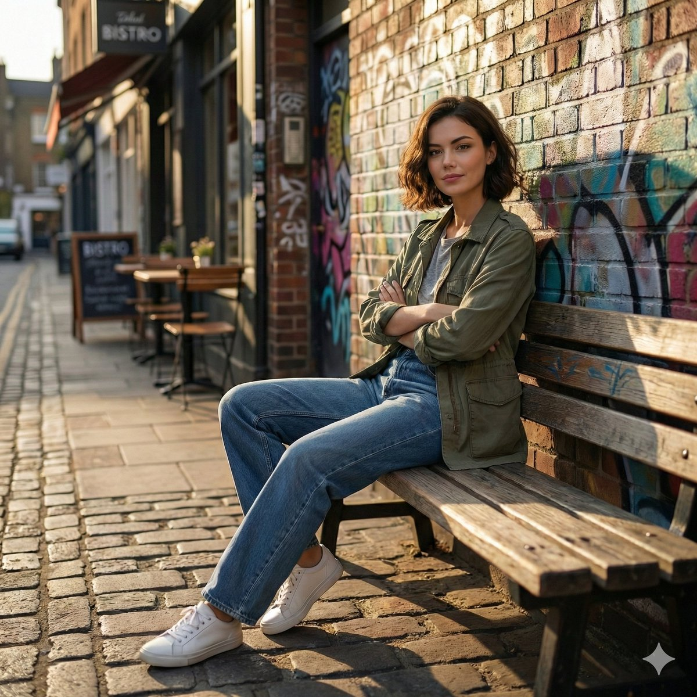

## { "Objective": "Create a realistic candid street photogr

- ID: trending-2008745209547669542
- Slug: trending-2008745209547669542-en
- 语言: en
- 来源: [来源链接](https://x.com/Taaruk_/status/2008745209547669542)
- 样例图路径: images/part1/2008745209547669542_1.jpg

### 提示词

```text
{
  "Objective": "Create a realistic candid street photograph with cinematic documentary realism",
  "PersonaDetails": {
    "Subject": {
      "Type": "Young woman",
      "Pose": "Standing at a city crosswalk, captured mid-turn",
      "Gaze": "Looking directly toward the camera",
      "Expression": "Calm, introspective, slightly distant",
      "Hair": "Loosely tied back with soft strands framing the face",
      "Wardrobe": {
        "Outerwear": "Beige trench coat",
        "Accessories": "Thin gold chain shoulder bag"
      }
    }
  },
  "SceneDescription": {
    "Location": "Busy urban crosswalk",
    "BackgroundElements": [
      "Pedestrians in motion",
      "Yellow taxis",
      "Tall city buildings"
    ],
    "Motion": "Subtle background movement suggesting city life"
  },
  "Composition": {
    "Framing": "Waist-up candid framing",
    "Moment": "Unposed, spontaneous mid-turn capture",
    "DepthOfField": "Shallow depth of field",
    "Focus": "Ultra-sharp subject with background motion blur"
  },
  "LightingAndColor": {
    "Lighting": "Natural overcast daylight",
    "ColorPalette": "Muted neutral tones",
    "Bokeh": "Soft cinematic bokeh"
  },
  "PhotographyStyle": {
    "Genre": "Street photography",
    "Aesthetic": "Documentary-style realism",
    "LensLook": "85mm lens perspective",
    "DetailLevel": "High detail, photorealistic textures"
  },
  "Mood": {
    "Tone": "Quiet, reflective, urban",
    "Atmosphere": "Authentic, lived-in city moment"
  },
  "ArtDirection": {
    "Style": "Photorealistic",
    "RealismLevel": "True-to-life, candid capture",
    "Processing": "Minimal, natural post-processing"
  },
  "NegativePrompt": [
    "posed look",
    "fashion editorial",
    "studio lighting",
    "oversaturated colors",
    "heavy retouching",
    "cartoon",
    "anime",
    "blurry subject"
  ],
  "ResponseFormat": {
    "Type": "Single image",
    "Orientation": "Portrait",
    "AspectRatio": "2:3"
  }
}
```

### 样例图

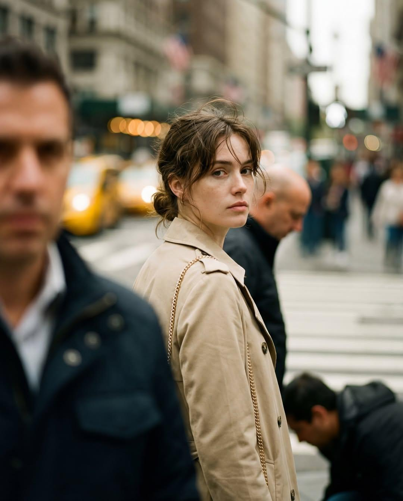

## Use the reference photo to create a realistic female cha

- ID: trending-2045105124268478650
- Slug: trending-2045105124268478650-en
- 语言: en
- 来源: [来源链接](https://x.com/ZaraIrahh/status/2045105124268478650)
- 样例图路径: images/part1/2045105124268478650_1.jpg

### 提示词

```text
Use the reference photo to create a realistic female character, soft smile, with a fun and natural expression, without changing the facial structure or features, keeping it as realistic as possible.
Hair: Same as in the reference photo, with natural movement and shine.
Outfit: Modern, stylish casual clothing.
Scene: Set in a cute pink office, showing her being creative. Around her, include mini chibi versions of herself doing funny actions (drinking coffee from a cup, pulling her hair, making silly faces, lying on her stomach on the desk drawing in a notebook). Add doodles and emojis, and include a matching phrase.
Lighting & Format: Natural light, aspect ratio 1080:1350 (4:5).
```

### 样例图

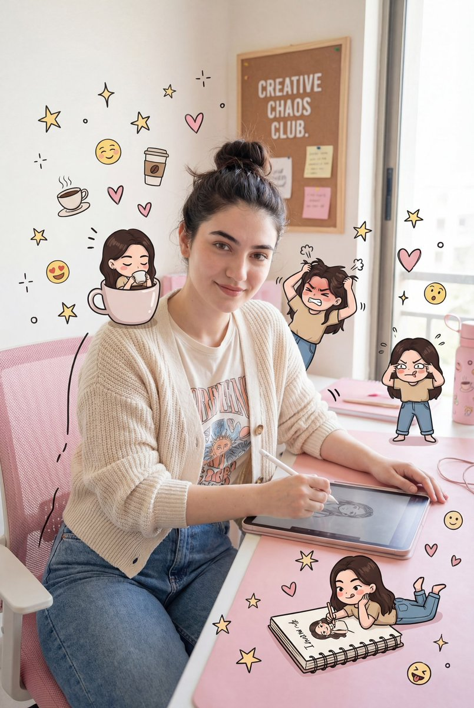

## A cinematic close-up profile of a weathered women with a

- ID: trending-2023215251924389964
- Slug: trending-2023215251924389964-en
- 语言: en
- 来源: [来源链接](https://x.com/iamsofiaijaz/status/2023215251924389964)
- 样例图路径: images/part1/2023215251924389964_1.jpg

### 提示词

```text
A cinematic close-up profile of a weathered women with a salt-and-pepper face, wearing brass-rimmed aviator goggles pushed up. Low-key lighting with a heavy amber glow; thick molten copper droplets and incandescent heat waves shimmering in the air. Dark, soot-stained background layered with vintage patent blueprints, floating golden gear-ratio calculations, and radial HUD overlays. High contrast, grit-textured skin, hyper-realistic sweat beads, heavy industrial atmosphere, cinematic sepia grading, 8K, epic digital concept art..
```

### 样例图

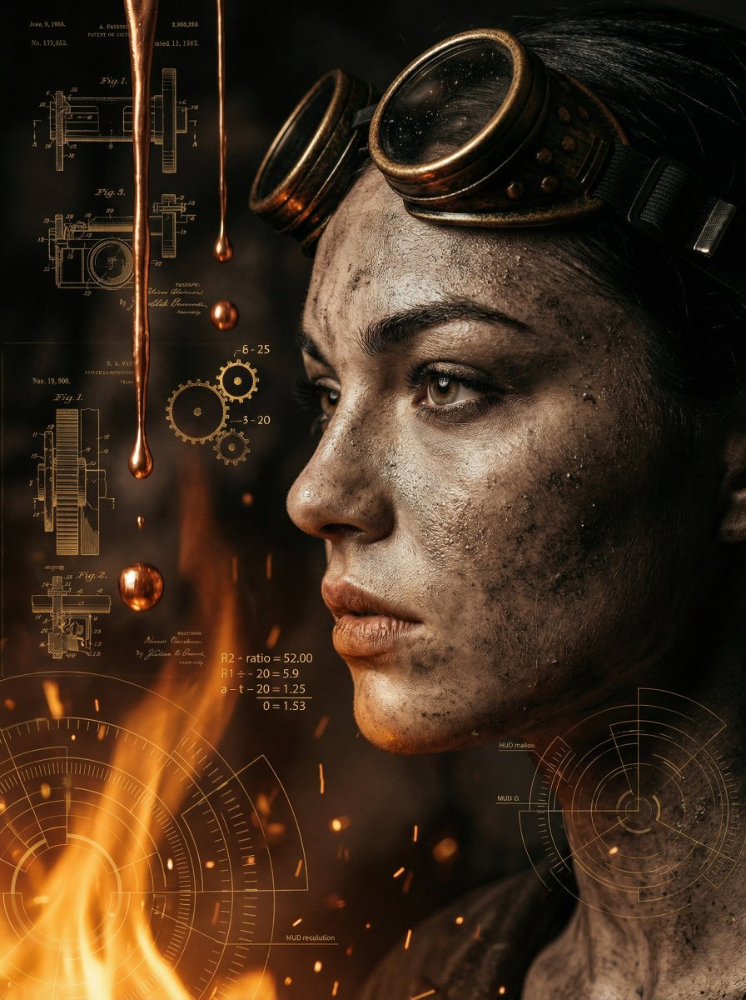

## A cinematic night-time portrait of a young woman standin

- ID: trending-2016491419570155780
- Slug: trending-2016491419570155780-en
- 语言: en
- 来源: [来源链接](https://x.com/Taaruk_/status/2016491419570155780)
- 样例图路径: images/part1/2016491419570155780_1.jpg

### 提示词

```text
A cinematic night-time portrait of a young woman standing outdoors, softly lit by ambient city lights. She wears a dark elegant coat with a thick wool scarf wrapped around her neck. Loose strands of hair gently blown by the wind frame her face. Moody teal-green color grading, soft cinematic lighting, shallow depth of field, creamy bokeh city lights glowing in the background. Calm, introspective expression, natural skin texture, subtle makeup, film-like softness, atmospheric and emotional tone. Shot on a fast lens (85mm f/1.4 look), ultra-realistic photography, high detail, low noise, 8K quality.
```

### 样例图

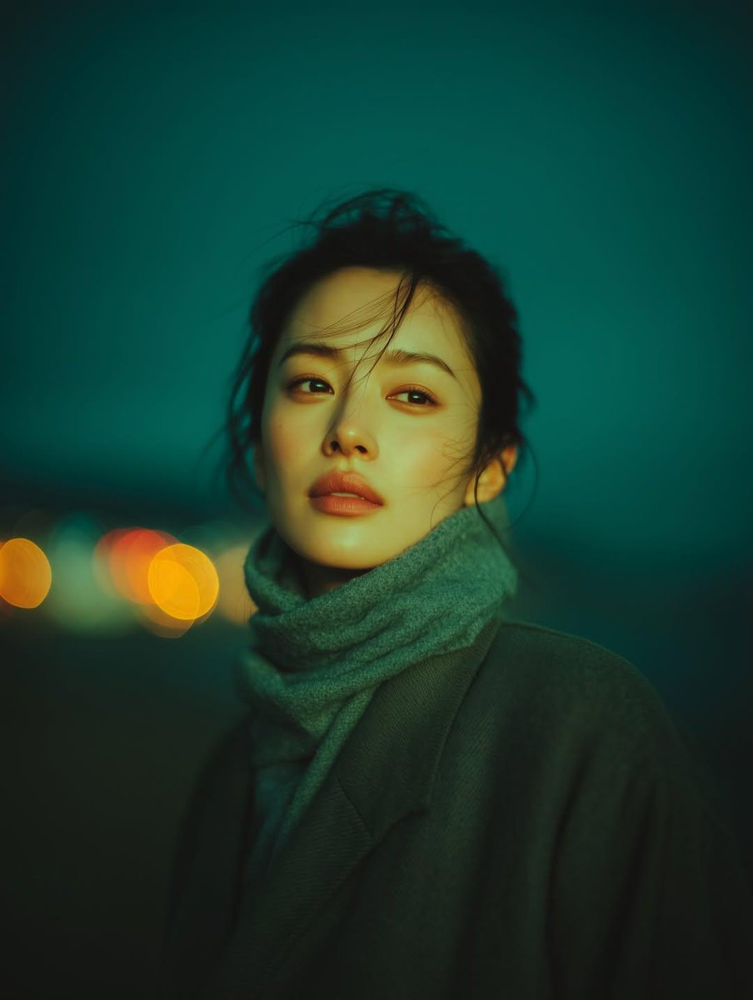

## Ultra-detailed studio product render of a LEGO Technic s

- ID: trending-2030236225815416875
- Slug: trending-2030236225815416875-en
- 语言: en
- 来源: [来源链接](https://x.com/Sheldon056/status/2030236225815416875)
- 样例图路径: images/part1/2030236225815416875_1.jpg

### 提示词

```text
Ultra-detailed studio product render of a LEGO Technic style vehicle model based precisely on the next uploaded reference photo. The LEGO build must replicate the real vehicle’s exact shape, proportions, bodylines, color scheme, headlights, grille design, wheels, and overall silhouette while constructed entirely from realistic LEGO Technic pieces and panels.
The vehicle is displayed in a clean professional product photography studio setup, placed on a smooth matte surface. Behind the car stands a large LEGO Technic product box, slightly blurred but clearly recognizable as a premium building kit package.
The vehicle features aggressive widebody styling, large sport wheels, low stance, detailed front splitter, and a roof rack cargo box built from LEGO elements, maintaining the same design style as the reference vehicle.
In front of the vehicle on the table are organized LEGO Technic components and tools, including small tires, axles, connectors, battery modules, rods, mechanical pieces, scissors, and miniature assembly tools, arranged neatly like a build kit.
Lighting is soft cinematic studio lighting with subtle reflections on the LEGO plastic surfaces, ultra-sharp details, shallow depth of field, realistic shadows, premium commercial product photography style.
Composition: hero angle slightly from the front side, emphasizing the vehicle's shape and mechanical LEGO structure.
Hyper-realistic materials, crisp textures, ultra detailed LEGO plastic surface, ray-traced reflections.
8K resolution, ultra sharp, photorealistic render, cinematic lighting, professional product shot
Aspect Ratio 9:16
```

### 样例图

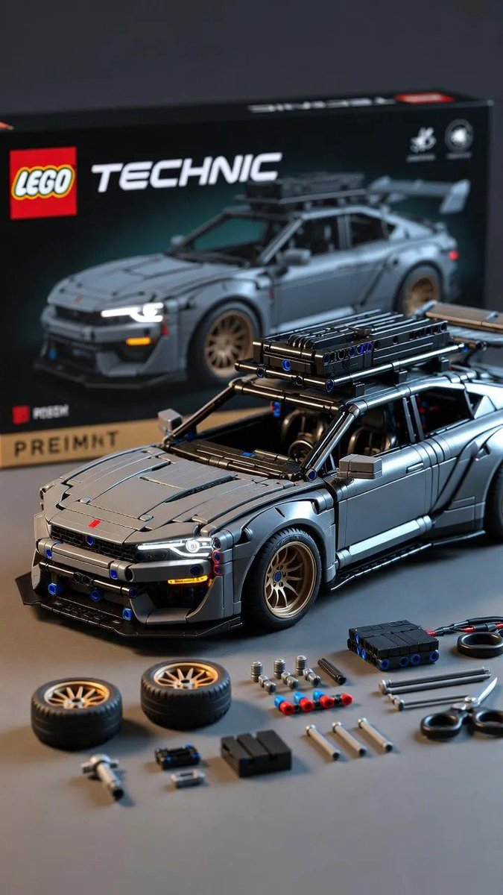

## { "style": "cinematic realism, surreal moment frozen in 

- ID: trending-2041185290245878092
- Slug: trending-2041185290245878092-en
- 语言: en
- 来源: [来源链接](https://x.com/oggii_0/status/2041185290245878092)
- 样例图路径: images/part1/2041185290245878092_1.jpg

### 提示词

```text
{
"style": "cinematic realism, surreal moment frozen in time",
"scene": "a suburban street in front of an old slightly worn house with muted yellow walls, white window frames, and a red wooden fence, overcast daylight with soft diffused lighting",
"subject": {
"type": "young woman",
"appearance": "blonde hair mid-motion, slightly messy, expressive shocked face with wide eyes and open mouth",
"outfit": "mustard yellow jumpsuit, white socks with stripes, white sneakers",
"pose": "falling backward in mid-air, body tilted diagonally, one leg raised high, arms flailing for balance",
"emotion": "surprised, chaotic, comedic panic"
},
"action": "a grocery bag has exploded mid-air, items floating above her as if gravity paused for a split second",
"objects": {
"floating_items": [
"brown paper grocery bag",
"kale leaves",
"cherry tomatoes",
"oranges",
"egg carton",
"baguette bread",
"milk carton"
],
"ground_element": "a banana peel on the sidewalk directly below her, implying the cause of the fall"
},
"environment": {
"foreground": "concrete sidewalk with subtle cracks and dirt",
"midground": "red wooden fence",
"background": "vintage suburban house with slightly weathered texture, curtains visible in windows, greenery on the sides"
},
"camera": {
"angle": "low angle, slightly tilted upward to enhance the floating effect",
"lens": "35mm cinematic lens",
"focus": "sharp focus on subject, slight depth of field blur on background",
"framing": "subject centered with floating objects forming a loose arc above"
},
"lighting": {
"type": "natural overcast daylight",
"quality": "soft shadows, diffused light, realistic skin tones",
"direction": "top-front lighting"
},
"motion": {
"effect": "frozen action, subtle motion blur on hair and some objects for realism",
"physics": "objects distributed unevenly with slight randomness, realistic gravity interruption feel"
},
"color_palette": "muted cinematic tones with mustard yellow as the dominant accent, soft greens and reds for contrast",
"mood": "quirky, unexpected, slightly absurd but grounded in realism",
"details": {
"textures": "visible fabric folds, realistic food textures, worn paint on house, concrete grain",
"imperfections": "slight asymmetry in object placement, natural facial tension, non-perfect alignment"
},
"quality": {
"resolution": "high detail, 4k",
"rendering": "photorealistic, minimal AI artifacts, natural skin texture (no plastic look)"
}
}
```

### 样例图

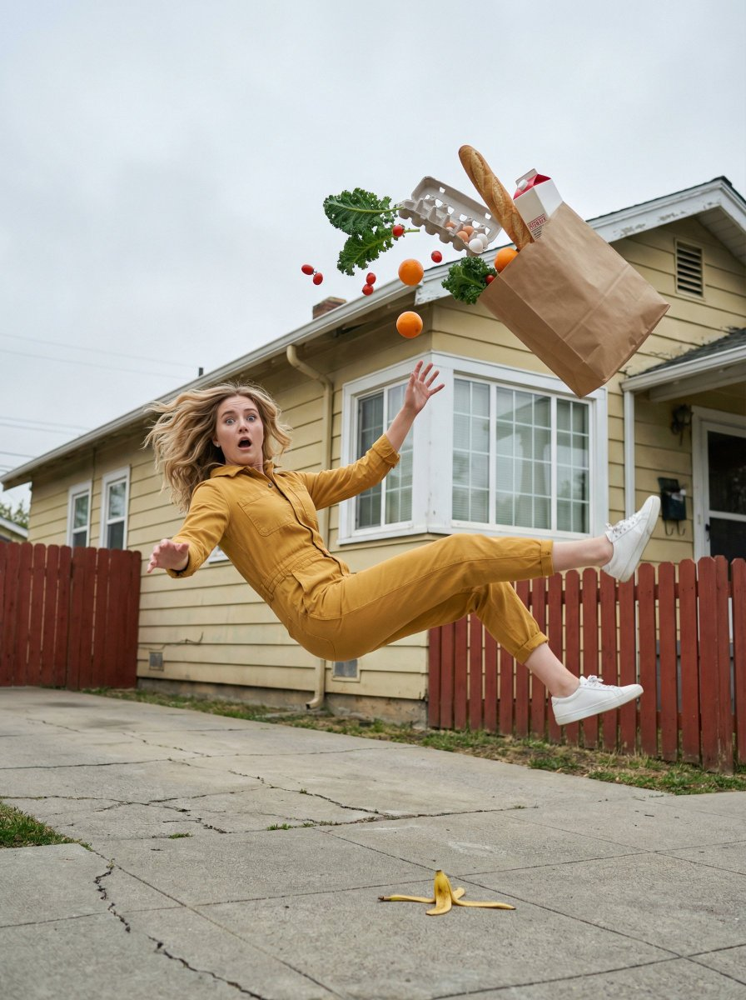

## A dramatic double exposure portrait of a professional fo

- ID: trending-2041034974380581255
- Slug: trending-2041034974380581255-en
- 语言: en
- 来源: [来源链接](https://x.com/Taaruk_/status/2041034974380581255)
- 样例图路径: images/part1/2041034974380581255_1.jpg

### 提示词

```text
A dramatic double exposure portrait of a professional football player, large side-profile face in black and white with intense expression, combined with a smaller full-body action shot of the same player running in a red jersey, dynamic motion, dust and smoke particles blending the layers, high contrast lighting, textured grain, minimal clean background, editorial sports poster style, ultra-detailed, sharp focus, cinematic composition, 8K resolution.
```

### 样例图

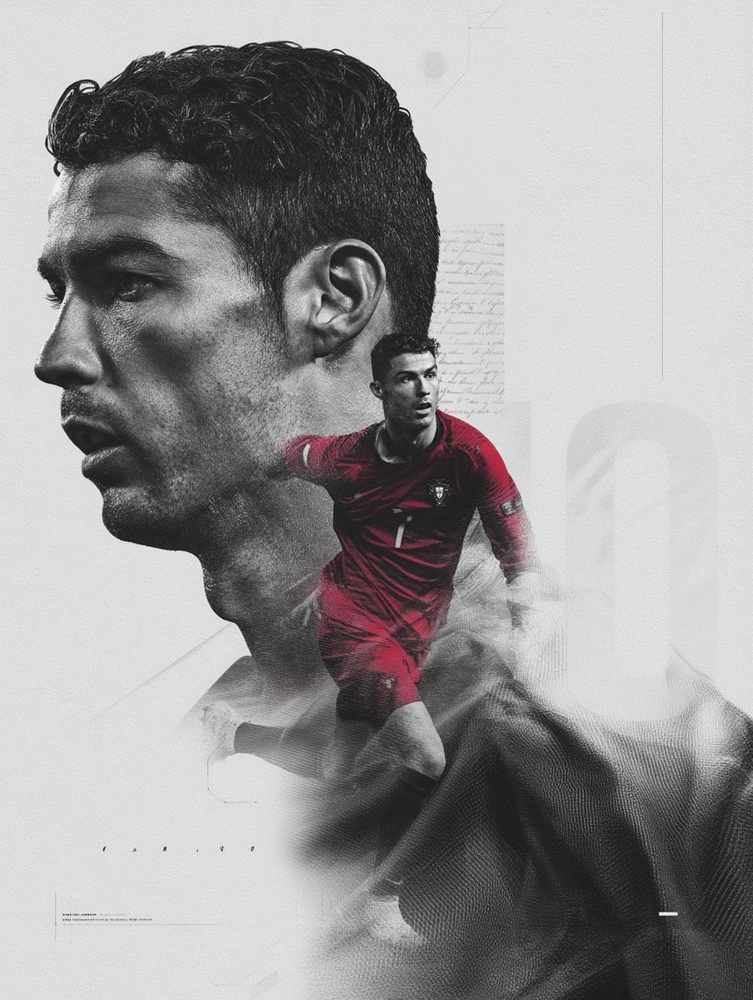

## A cinematic side-profile portrait of a young woman stand

- ID: trending-2045388206699667792
- Slug: trending-2045388206699667792-en
- 语言: en
- 来源: [来源链接](https://x.com/Taaruk_/status/2045388206699667792)
- 样例图路径: images/part1/2045388206699667792_1.jpg

### 提示词

```text
A cinematic side-profile portrait of a young woman standing in a grocery store aisle, carefully looking at a shelf filled with wine bottles. She has her hair tied in a loose messy bun and wears a simple dark outfit. The environment is softly lit with warm indoor lighting, creating a cozy, realistic atmosphere. The shelves are filled with neatly arranged bottles, while other shoppers appear blurred in the background. Shallow depth of field with strong foreground and background blur, creamy bokeh lights, natural skin tones, documentary-style photography, candid moment, 50mm lens, f/1.8, ultra-realistic detail, cinematic color grading, 8K.
```

### 样例图

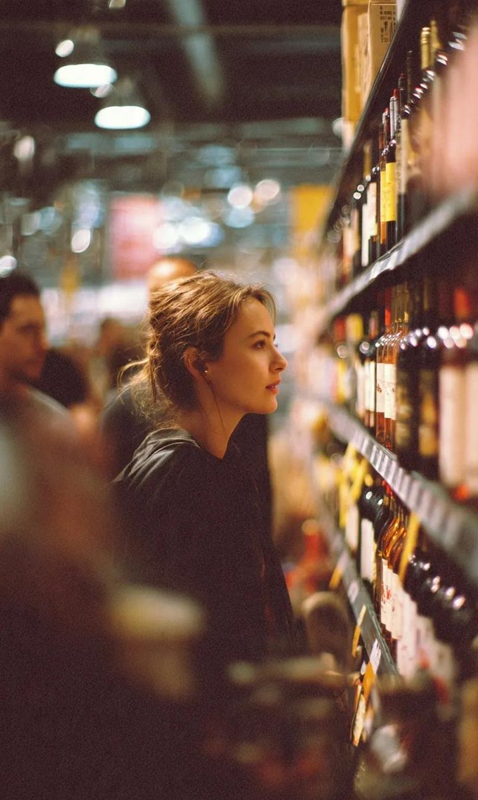

## { "composition": { "framing": "centered subject with sym

- ID: trending-2009817289349312613
- Slug: trending-2009817289349312613-en
- 语言: en
- 来源: [来源链接](https://x.com/rovvmut_/status/2009817289349312613)
- 样例图路径: images/part1/2009817289349312613_1.jpg

### 提示词

```text
{
"composition": {
"framing": "centered subject with symmetrical balance",
"perspective": "eye-level, slight downward tilt",
"crop": "vertical portrait orientation, full body seated pose",
"depth_of_field": "moderate, subject sharp with softly detailed background",
"leading_elements": "rusted car edges and hood frame the subject"
},
"subject": {
"type": "human",
"pose": "sitting casually on the hood of an abandoned car, one leg bent, one leg hanging",
"expression": "relaxed, confident, contemplative",
"gaze": "looking slightly downward and to the side",
"hair": "short, curly, tousled",
"facial_hair": "light mustache and stubble",
"accessories": [
"round sunglasses",
"necklace"
]
},
"clothing": {
"outerwear": "patterned bomber jacket with muted pastel tones",
"top": "graphic t-shirt with colorful print",
"pants": "teal slim-fit jeans, slightly cropped",
"footwear": "black sneakers with white soles and red socks"
},
"environment": {
"setting": "urban outdoor area",
"foreground": "overgrown grass and weeds",
"primary_object": "abandoned, heavily rusted vintage car",
"background": "modern apartment buildings with balconies",
"contrast": "decay versus modern urban living"
},
"color_palette": {
"dominant_colors": [
"rust red",
"teal",
"muted green",
"beige",
"brown"
],
"accent_colors": [
"red",
"yellow",
"black"
],
"color_temperature": "warm with teal-green shadows",
"grading_style": "cinematic, desaturated highlights, rich shadows"
},
"lighting": {
"type": "natural light",
"time_of_day": "late afternoon or golden hour",
"direction": "side-lit with soft shadows",
"contrast": "medium contrast",
"highlights": "soft and warm on skin and metal surfaces"
},
"technical_details": {
"camera_type": "DSLR or mirrorless",
"lens_estimate": "35mm–50mm prime",
"aperture_estimate": "f/2.8–f/4",
"iso_estimate": "ISO 200–400",
"shutter_speed_estimate": "1/200–1/400",
"focus": "sharp on subject, slightly softer background"
},
"artistic_style": {
"genre": "urban lifestyle portrait",
"mood": "nostalgic, gritty, stylish",
"influences": [
"street photography",
"cinematic editorial fashion"
],
"texture": "visible grain, emphasis on rust and fabric detail"
},
"post_processing": {
"grain": "moderate film grain",
"sharpening": "selective sharpening on subject",
"contrast_curve": "soft highlights with lifted blacks",
"vignette": "subtle vignette around edges"
},
"background_details": {
"architecture": "concrete apartment blocks with repetitive windows",
"color": "neutral beige and gray tones",
"blur_level": "light background separation without heavy bokeh"
},
"overall_aesthetic": {
"theme": "urban decay meets modern fashion",
"visual_story": "individuality and style emerging from neglected environments",
"use_case"
: [
"editorial fashion",
"UGC influencer content",
"cinematic portrait reference"
]
}
}
```

### 样例图

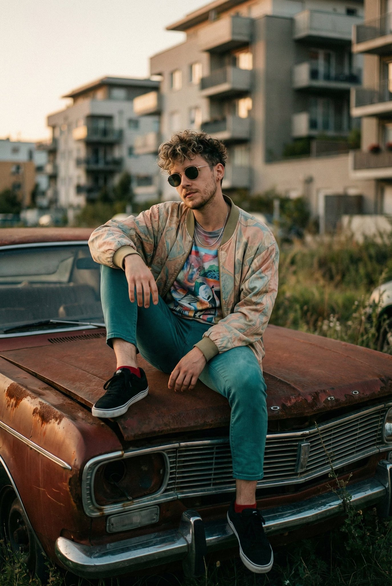

## { "Objective": "Create a heartwarming, whimsical portrai

- ID: trending-2011282431744336078
- Slug: trending-2011282431744336078-en
- 语言: en
- 来源: [来源链接](https://x.com/Taaruk_/status/2011282431744336078)
- 样例图路径: images/part1/2011282431744336078_1.jpg

### 提示词

```text
{
  "Objective": "Create a heartwarming, whimsical portrait blending photorealistic realism with a tiny Pixar-style animated character",
  "PersonaDetails": {
    "PrimarySubject": {
      "Type": "Young girl",
      "Expression": "Bright, joyful smile",
      "Hair": {
        "Style": "Long light-brown hair",
        "Accessories": "Cute ribbon bows"
      },
      "Wardrobe": {
        "Outerwear": "Casual denim jacket",
        "Top": "Soft neutral-colored shirt"
      }
    },
    "SecondarySubject": {
      "Type": "Tiny 3D cartoon version of the girl",
      "Scale": "Miniature, held delicately between fingers",
      "Style": "Pixar-style 3D character",
      "Proportions": "Oversized expressive eyes, rounded features",
      "Hair": "Pigtails matching the real girl",
      "Wardrobe": "Denim outfit matching the real subject",
      "Pose": "Arms raised joyfully"
    }
  },
  "Composition": {
    "Framing": "Close-up to medium portrait",
    "Interaction": "Clear playful interaction between girl and miniature character",
    "DepthOfField": "Shallow depth of field",
    "Focus": "Ultra-sharp focus on both faces"
  },
  "LightingAndBackground": {
    "Lighting": "Warm natural daylight",
    "Background": {
      "Style": "Soft golden bokeh",
      "Mood": "Dreamy, magical"
    }
  },
  "ArtDirection": {
    "StyleFusion": [
      "Photorealistic child portrait photography",
      "Pixar-style 3D animated character"
    ],
    "Aesthetic": "Magical realism with playful scale contrast",
    "TextureDetail": "Ultra-detailed skin, fabric, and 3D materials"
  },
  "MoodAndTone": {
    "Mood": "Heartwarming, joyful, whimsical",
    "EmotionalFeel": "Wonder, innocence, playful imagination"
  },
  "PhotographyStyle": {
    "Genre": "Cinematic lifestyle portrait photography",
    "LensFeel": "Portrait lens with creamy bokeh",
    "ImageQuality": "8K ultra-high realism"
  },
  "NegativePrompt": [
    "uncanny valley",
    "scary doll",
    "low-quality 3D",
    "harsh lighting",
    "oversaturated colors",
    "blurry focus",
    "flat expression"
  ],
  "ResponseFormat": {
    "Type": "Single image",
    "Orientation": "Portrait",
    "AspectRatio": "2:3"
  }
}
```

### 样例图

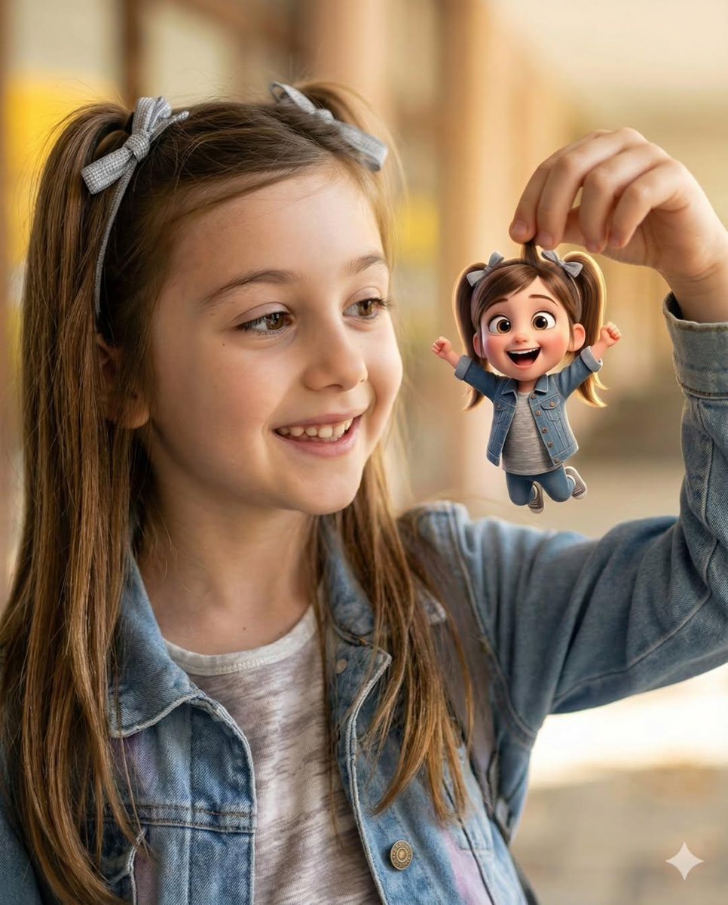

## { "prompt": "ultra-detailed fashion portrait of a beauti

- ID: trending-2032985380723527761
- Slug: trending-2032985380723527761-en
- 语言: en
- 来源: [来源链接](https://x.com/youngcatwoman/status/2032985380723527761)
- 样例图路径: images/part1/2032985380723527761_1.jpg

### 提示词

```text
{
"prompt": "ultra-detailed fashion portrait of a beautiful young Korean woman, exactly matching An Yujin from IVE, tall athletic elegant figure, standing confidently in a vibrant all-blue studio, wearing a tight glossy blue patent latex bodycon mini dress that hugs every curve, shiny reflective blue vinyl material, deep cobalt blue color, sleeveless square neckline, short length above mid-thigh, layered with a luxurious fluffy soft blue faux fur cropped jacket with fuzzy long fur texture, open front, long voluminous dark brown hair with perfect loose Hollywood waves cascading down to waist, charismatic deep eyes, full glossy nude-pink lips, dramatic makeup with long lashes, sharp eyeliner, flawless glowing fair skin, confident seductive expression, slight head tilt, holding a small structured hot blue designer crossbody purse with gold chain strap, bright even baby blue background, soft professional studio lighting, high fashion editorial style, hyper-realistic, ultra sharp details, 8k resolution, photorealistic skin texture, intricate fur details, reflective latex shine, azurecore aesthetic, maximalist blue glamour, shot on Canon EOS R5, 85mm lens, f/1.8, cinematic color grading",
"negative_prompt": "low quality, blurry, deformed, ugly, extra limbs, bad anatomy, poorly drawn face, bad proportions, watermark, text, logo, cropped, out of frame, skinny, thin body, small chest, flat figure, realistic clothing texture instead of latex, muted colors, dark background, green skin, male",
"parameters": {
"aspect_ratio": "9:16",
"style": "photorealistic fashion photography",
"lighting": "soft studio lighting with subtle rim light",
"quality_tags": "masterpiece, best quality, ultra detailed, highly detailed, sharp focus",
"sampler": "DPM++ 2M Karras or Euler a",
"steps": 35,
"cfg_scale": 7.5,
"seed": -1
},
"model_recommendations": [
"Flux.1 dev",
"Realistic Vision V6.0",
"Juggernaut XL",
"Photon",
"Midjourney v6"
]
}
```

### 样例图

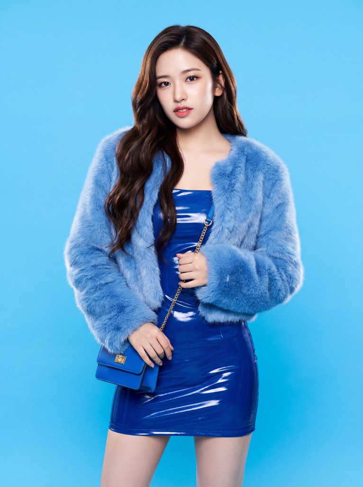

## A close-up studio portrait of me, masculine features, te

- ID: trending-2016414841779704227
- Slug: trending-2016414841779704227-en
- 语言: en
- 来源: [来源链接](https://x.com/Abhiew_/status/2016414841779704227)
- 样例图路径: images/part1/2016414841779704227_1.jpg

### 提示词

```text
A close-up studio portrait of me, masculine features, textured messy hair neatly styled.
I wear a black tailored blazer with sharp structure and clean lines, layered over a black high-neck turtleneck, embodying a minimalist and contemporary fashion style.
The man is wearing bold translucent orange acetate sunglasses, rectangular frame with slightly rounded edges, glossy finish, amber/orange tinted lenses, and fashion-forward and statement eyewear. Color concept: selective color photography - monochrome black and white image with only the sunglasses in vibrant orange color, creating strong contrast and visual focus.
Expression: calm, confident, serious gaze, looking straight into the camera.
Lighting: soft studio lighting from the front with subtle side shadows, even skin tones, greath detai,l facial texture, and cinematic contrast. Camera settings:
- Lens: 85mm portrait lens
- Aperture: f/2.0
- ISO: 100
- Shutter speed: 1/125
- High resolution, ultra-sharp focus on face Style: editorial fashion portrait, luxury menswear, realistic skin texture, non-Al look, professional studio photography.
```

### 样例图

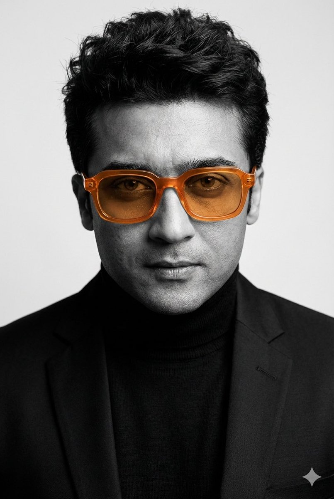

## A young man with a slight smile see the uploaded picture

- ID: trending-2020728313006936161
- Slug: trending-2020728313006936161-en
- 语言: en
- 来源: [来源链接](https://x.com/Taaruk_/status/2020728313006936161)
- 样例图路径: images/part1/2020728313006936161_1.jpg

### 提示词

```text
A young man with a slight smile see the uploaded picture as reference for the face wearing outfit: oversized white sweatshirt, lemon green oversized combat jean, styled with footwear: lemon green neutral Nike sneakers and white ribbed socks. Environment: futuristic lemon green-tone studio background. Lighting: soft cinematic glow highlighting skin and fabric textures. Style: fashion editorial x futuristic. Model seats on lemon green bench elegantly with a relaxed posture.
```

### 样例图

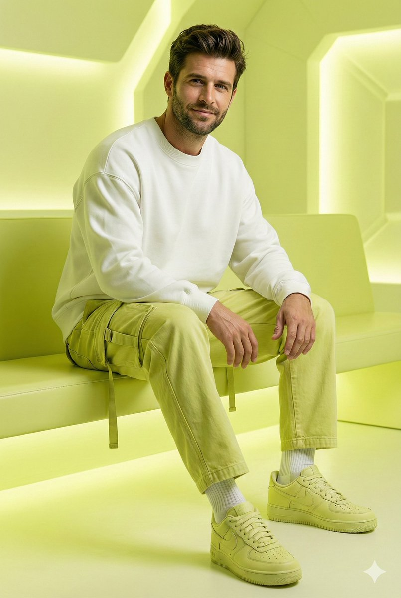

## Concept & Mood Intimate lifestyle–fashion editorial with

- ID: trending-2008556843954827601
- Slug: trending-2008556843954827601-en
- 语言: en
- 来源: [来源链接](https://x.com/Xaroonx/status/2008556843954827601)
- 样例图路径: images/part1/2008556843954827601_1.jpg

### 提示词

```text
Concept & Mood

Intimate lifestyle–fashion editorial with quiet masculine warmth and thoughtful calm.
Soft, cozy atmosphere reminiscent of a private winter afternoon spent reading indoors.
Emotional restraint with gentle confidence — reflective, composed, subtly romantic without performance.
Feels like a real, candid moment captured naturally, not posed or styled for effect.

---

Subject & Anatomy

Adult man with realistic proportions and natural build.
Relaxed posture with subtle asymmetry — body leaning forward slightly, one arm resting on the table, head supported by the hand.
Natural weight distribution through the elbow and forearm resting on the surface.
No tension in the shoulders or neck, posture feels unforced and comfortable.

---

Pose & Perspective

Seated at a wooden table indoors.
Head gently tilted, cheek resting against the palm of the hand.
Other arm relaxed and folded near an open book on the table.
Camera positioned at eye level, slightly off-center, creating an intimate, conversational perspective.
Framing is mid-close portrait, focusing on face, hands, and upper torso.

---

Face & Expression

Soft, calm expression with a subtle, knowing half-smile.
Eyes relaxed and warm, making gentle eye contact with the camera.
Brows natural and expressive, conveying ease and quiet confidence rather than performance.
Facial hair neatly groomed with realistic density and texture.

---

Skin (Key Focus)

Highly realistic skin texture featuring:

visible pores

natural tonal variation

subtle under-eye texture

realistic beard shadow and transitions
Skin appears alive and tactile.
No smoothing, no beauty retouching, no artificial glow or plastic finish.

---

Hair & Grooming

Medium-length dark hair with natural volume and movement.
Softly tousled with slight wave, imperfect strands falling naturally across the forehead.
Hair density realistic, not styled or over-defined.
Beard neatly trimmed, edges soft and organic, not sharply sculpted.

---

Wardrobe & Styling

Cozy red knit sweater with small white heart motifs.
Fabric appears thick and warm, with:

visible knit texture

realistic folds and stretch around elbows and shoulders

natural drape and compression at contact points
Sweater reads as casual, intimate, and personal — not fashion-staged.

---

Environment & Props

Simple indoor setting with a wooden table surface.
An open book placed naturally in front of the subject, pages slightly curved and imperfect.
Background softly blurred, suggesting a quiet home or café interior.
No distracting elements, environment supports calm and intimacy.

---

Lighting

Soft natural window light only.
Light falls gently across the face, creating smooth highlight-to-shadow transitions.
Warm, diffused illumination with no harsh shadows.
No artificial lighting, no flash, no studio feel.

---

Camera & Optics

Photographer mindset.
Full-frame look with a 50–55mm perspective.
Shallow depth of field — face and eyes in sharp focus, background softly blurred.
Natural optical falloff with subtle softness, not clinical sharpness.

---

Color & Film Feel

Warm, restrained color palette:

deep knit red

natural skin tones

warm wood browns

soft neutral background hues
Film-inspired tonality similar to Portra-style color science:
soft contrast, gentle highlights, realistic skin color retention.
No HDR, no heavy grading, no oversaturation.

---

Style & Realism

Cinematic realism with emotional subtlety.
Feels like a real lifestyle or fashion editorial captured on natural light.
Quiet, confident, intimate — grounded in reality.
No exaggeration, no fantasy elements.

---

Technical

Aspect ratio: 3:4
High resolution, ultra-photorealistic detail
Natural grain structure
Shallow depth of field
No text, no logos, no watermarks
```

### 样例图

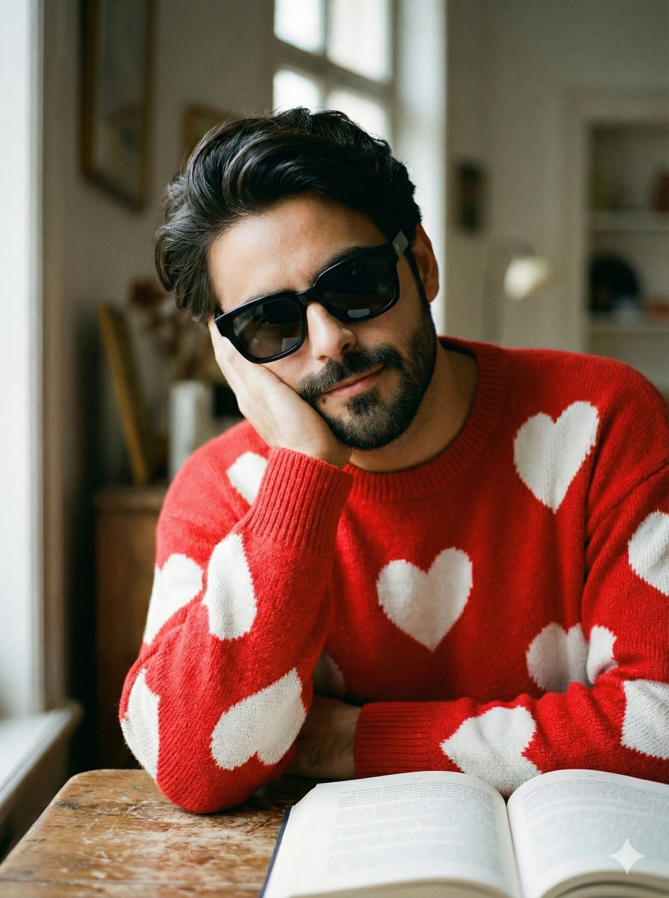

## { "model": "Nano Ban

- ID: trending-2012027041580007890
- Slug: trending-2012027041580007890-zh
- 语言: zh
- 来源: [来源链接](https://x.com/wanerfu/status/2012027041580007890)
- 样例图路径: images/part1/2012027041580007890_1.jpg

### 提示词

```text
{
  "model": "Nano Banana Pro (Gemini)",
  "prompt": {
    "layout": {
      "type": "3x3 照片拼贴 / 九宫格",
      "description": "9 张竖版人像照片以正方形网格排列",
      "consistency": "9 个画面中为同一人物、同一服装、同一光线条件"
    },
    "aesthetic_style": {
      "theme": "Z 世代居家派对 / 少女闺房写真",
      "lighting_technique": "机顶直闪（硬光）",
      "visuals": "高对比度、清晰锐利阴影、混乱有趣的氛围、鲜艳色彩、白色背景"
    },
    "subject_details": {
      "appearance": "年轻亚洲女性，肤色白皙，深色长卷发，发量蓬松",
      "outfit": "白色碎花吊带上衣，蓝色牛仔短裤",
      "makeup": "浓重粉色腮红（Igari 醉酒妆风格），红色唇妆，脸颊带亮片"
    },
    "environment_and_props": {
      "background": "贴有照片的白色墙面，白色床单",
      "decor": [
        "银色迪斯科球（多种尺寸）",
        "五彩金属亮片纸散落",
        "棕色泰迪熊",
        "粉色复古有线电话"
      ]
    },
    "panel_pose_breakdown": {
      "1_top_left": "俯卧趴着，下巴放在交叉的手臂上，看向镜头，头发上有亮片",
      "2_top_center": "俯拍视角仰躺，眨一只眼，比 V 手势，头发向四周散开",
      "3_top_right": "侧坐，双膝弯曲，大笑抓拍，向空中抛洒亮片",
      "4_middle_left": "上半身倚靠在大型银色迪斯科球上，目光强烈直视镜头",
      "5_middle_center": "近景特写，双手贴在脸颊，惊讶或害羞表情，亮片粘在脸上",
      "6_middle_right": "躺在迪斯科球之间，一只手向上伸向天花板或镜头",
      "7_bottom_left": "倒置视角（头部在画面下方），俏皮表情，头发自然垂落",
      "8_bottom_center": "盘腿坐姿，紧紧抱着棕色泰迪熊，微微嘟嘴",
      "9_bottom_right": "坐直，手持粉色复古电话听筒贴在耳边，侧头像在听八卦"
    },
    "camera_technical_values": {
      "focal_length": "35mm",
      "aperture": "f/5.6",
```

### 样例图


## Photorealistic editorial portrait of a smiling woman usi

- ID: trending-2045337223638515794
- Slug: trending-2045337223638515794-en
- 语言: en
- 来源: [来源链接](https://x.com/Kashberg_0/status/2045337223638515794)
- 样例图路径: images/part1/2045337223638515794_1.jpg

### 提示词

```text
Photorealistic editorial portrait of a smiling woman using the exact same face from the reference image. She wears oversized black sunglasses with orange lenses and small gold earrings. Slightly leaning forward in a close wide-angle perspective, with a playful, mischievous expression and subtle smirk. Clean blue studio background with soft gradient. Bright soft lighting with gentle contrast, sharp focus, minimal high-fashion mood.
```

### 样例图

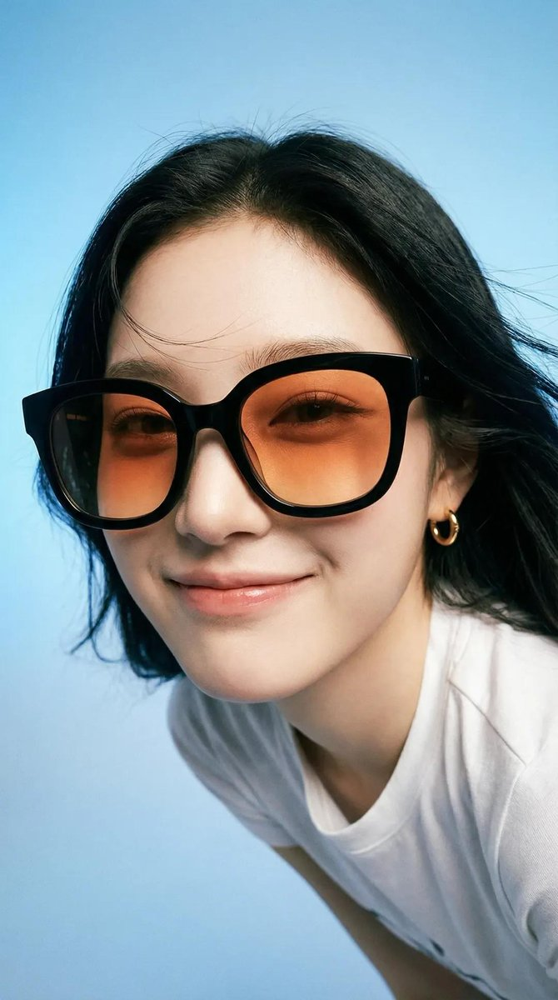

## A HYPER-REALISTIC, 8K, MEDIUM SHOT CAPTURED WITH A WIDE-

- ID: trending-2018710563371749624
- Slug: trending-2018710563371749624-en
- 语言: en
- 来源: [来源链接](https://x.com/Strength04_X/status/2018710563371749624)
- 样例图路径: images/part1/2018710563371749624_1.jpg

### 提示词

```text
A HYPER-REALISTIC, 8K, MEDIUM SHOT CAPTURED WITH A WIDE-ANGLE LENS FROM A SLIGHTLY LOW ANGLE SHOWCASING A YOUNG PERSON IN A DYNAMIC, MID-ACTION POSE ON A SKATEBOARD, RIDING DOWN AN URBAN STREET AT DUSK. THE SUBJECT, WITH UPLOADED FACE AS REFERENCE, HAS LONG, LIGHT-COLORED HAIR FLOWING DYNAMICALLY TO THEIR RIGHT, INDICATING MOTION. THEY ARE WEARING A LIGHT GREY OR OFF-WHITE HOODIE FEATURING A PROMINENT, BRIGHT YELLOW HEON OUTLINE GRAPHIC THAT SPELLS "PAVELTUTORIAL ACROSS THE CHEST. THEIR LEGS ARE CLAD IN LIGHT BROWN OR BEIGE PANTS, INTRICATELY OUTLINED WITH A VIBRANT ORANGE-RED NEON GLOW THAT ALSO EMITS SMALL, FLICKERING NEON WISPS AROUND THEM, SUGGESTING ENERGY. THEIR FEET ARE ADORNED WITH BRIGHT PINK NEON-OUTLINED SNEAKERS, WHICH MATCH THE GLOWING PINK OUTLINE OF THE SKATEBOARD DECK BENEATH THEM. AROUND THE SKATEBOARD AND THE SUBJECT'S FEET, THERE ARE WHIMSICAL, GLOWING PINK NEON HEARTS AND STARBURSTS, ADDING A SURREAL, ENERGETIC TOUCH. THE BACKGROUND IS AN URBAN STREET SCENE, RENDERED WITH A SHALLOW DEPTH OF FIELD, CREATING A BEAUTIFUL BOKEH EFFECT OF WARM, OUT-OF-FOCUS ORANGE AND YELLOW STRING LIGHTS STRUNG ACROSS BUILDINGS, SUGGESTING A FESTIVE OR LIVELY ATMOSPHERE. SILHOUETTES OF BLURRED PEDESTRIANS CAN BE SEEN IN THE DISTANCE. THE OVERALL LIGHTING IS CINEMATIC, WITH A SOFT GOLDEN HOUR GLOW FROM THE BACKGROUND CONTRASTING WITH THE VIBRANT. VOLUMETRIC NEON LIGHTING EMANATING FROM THE SUBJECT AND THEIR ACCESSORIES, CREATING HIGHLY

DETAILED TEXTURES AND A CAPTIVATING VISUAL.
```

### 样例图

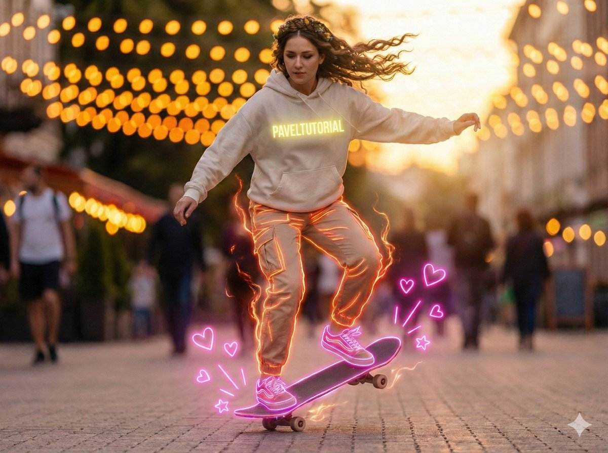

## Artistic portrait of an elegant Asian woman wearing a bl

- ID: trending-2033544696119853426
- Slug: trending-2033544696119853426-en
- 语言: en
- 来源: [来源链接](https://x.com/Taaruk_/status/2033544696119853426)
- 样例图路径: images/part1/2033544696119853426_1.jpg

### 提示词

```text
Artistic portrait of an elegant Asian woman wearing a black silk cheongsam (qipao), standing among red camellia flowers and delicate branches, soft natural sunlight filtering through leaves creating beautiful shadow patterns across her face, short slightly messy bob haircut, natural freckles and minimal makeup, calm thoughtful expression, cinematic shallow depth of field, dreamy garden atmosphere, warm golden hour lighting, soft bokeh background, fine art photography style, ultra-realistic skin texture, high detail, 85mm lens, 8K.
```

### 样例图

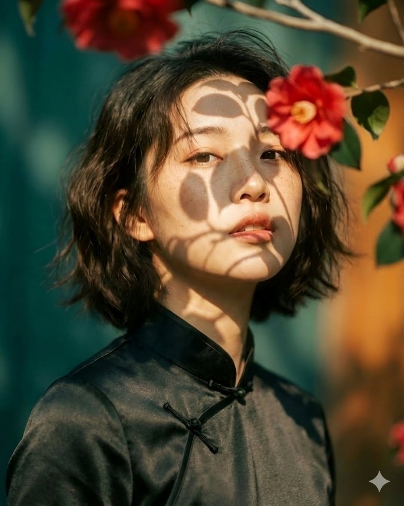

## Transform this image [UPLOAD YOU'RE IMAGE] into a 64K DS

- ID: trending-2011438513569337757
- Slug: trending-2011438513569337757-en
- 语言: en
- 来源: [来源链接](https://x.com/Xaroonx/status/2011438513569337757)
- 样例图路径: images/part1/2011438513569337757_1.jpg

### 提示词

```text
Transform this image [UPLOAD YOU'RE IMAGE] into a 64K DSLR shot resolution of A four-panel fashion collage featuring the same subject styled in a cohesive earth-tone, minimalist streetwear aesthetic, photographed in a calm, modern concrete courtyard or interior patio space. The environment is muted and serene, with light gray walls, raw cement flooring, and subtle natural decor elements that enhance the understated mood. The subject (sameface as the uploaded image) is a athletic build, androgynous-presenting young adult with stylish volume hairs and cool, introspective expression. They wear thin black rectangular glasses, silver jewelry (necklace and earrings), and have intricate black-and-gray tattoo sleeves covering the forearms and hands.

Outfit & Styling:-

Oversized brown T-shirt with a small minimal chest graphic or letter Extremely baggy brown cargo pants with large utility pockets and heavy drapeThick white rope belt tied loosely, hanging dramatically at the waist Chunky white sneakers with a bold sole Large off-white canvas shoulder bag worn crossbody, adding texture and contrast The color palette is warm and neutral: browns, taupe, beige, off-white, and soft gray.

Poses Across the Panels:-

Standing with arms crossed, relaxed but confident

Sitting on a concrete step, leaning forward in a contemplative pose Seated casually with one leg bent, holding

glasses or touching the faceA laid-back pose emphasizing the oversized silhouette and layered textures Background & Props:-

Minimalist decor including a woven straw mat, a wooden box, and a potted branch arrangement in a square planter Small framed wall art arranged in a clean

grid

Soft natural daylight with diffused shadows, no harsh highlights Mood & Aesthetic:- The overall vibe is quiet luxury meets Japanese-inspired minimal streetwear, blending modern fashion, utilitarian design, and calmeditorial styling. The image feels like a fashion lookbook or lifestyle editorial, with emphasis on silhouette, texture, and effortless cool.

Style Keywords:- Minimalist streetwear, neutral tones, oversized fashion, utilitarian cargo pants, androgynous style, editorial fashion collage, modern zen aesthetic, Japanese-inspired fashion, muted color palette.
```

### 样例图

![Transform this image [UPLOAD YOU'RE IMAGE] into a 64K DS](../images/part1/2011438513569337757_1.jpg)

## Hyper-realistic surreal photography of a woman sitting i

- ID: trending-2034800521538621542
- Slug: trending-2034800521538621542-en
- 语言: en
- 来源: [来源链接](https://x.com/HaniaAi12/status/2034800521538621542)
- 样例图路径: images/part1/2034800521538621542_1.jpg

### 提示词

```text
Hyper-realistic surreal photography of a woman sitting inside a massive, rough concrete pipe, featuring the uploaded face as reference. She wears a dark polo shirt, ripped jeans, and white sneakers, with a calm and thoughtful expression. She is gently holding a glowing, miniature full moon in her cupped hands. The surreal moon casts a warm, magical rim light across her face and body. The camera is positioned from inside the pipe, creating a natural circular frame around her. In the background, a starry night sky is visible along with a deeply blurred cityscape filled with warm orange bokeh lights. Shot with a 50mm lens, shallow depth of field, high contrast, blending cool night tones with the ethereal glow of the moon in her hands.
```

### 样例图

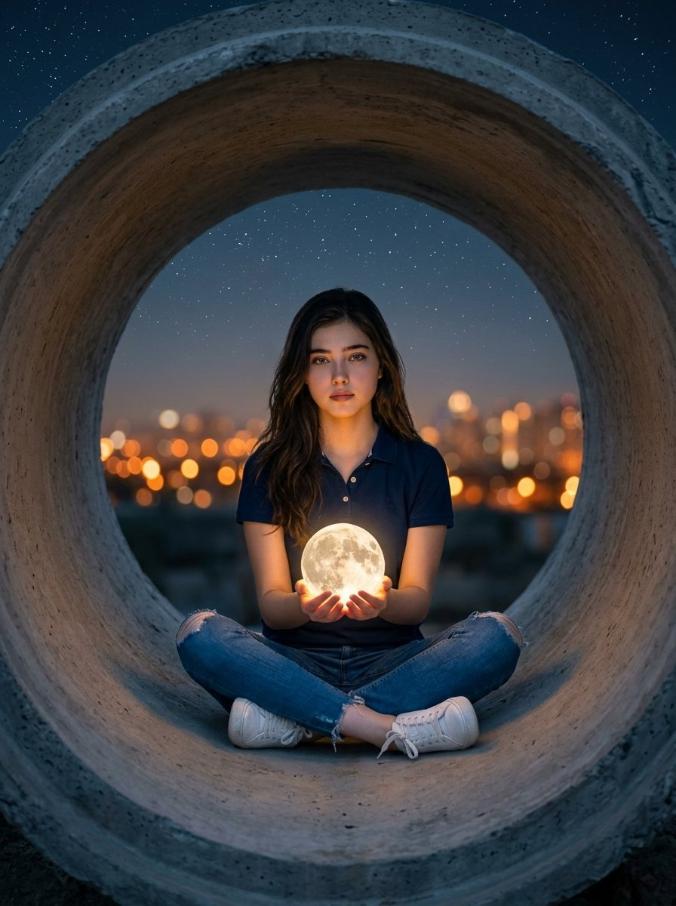

## High-contrast black-and-white studio photo of a woman se

- ID: trending-2011340606975721923
- Slug: trending-2011340606975721923-en
- 语言: en
- 来源: [来源链接](https://x.com/kingofdairyque/status/2011340606975721923)
- 样例图路径: images/part1/2011340606975721923_1.jpg

### 提示词

```text
High-contrast black-and-white studio photo of a woman seated on the floor wearing a black sweater, black trousers, and black leather ankle boots. Legs are bent and open toward the camera, with one boot sole prominently facing the lens. Upper body slightly reclined, calm expression. Clean white background, dramatic low-angle composition. Don’t change the face. (Use the attached image)
```

### 样例图

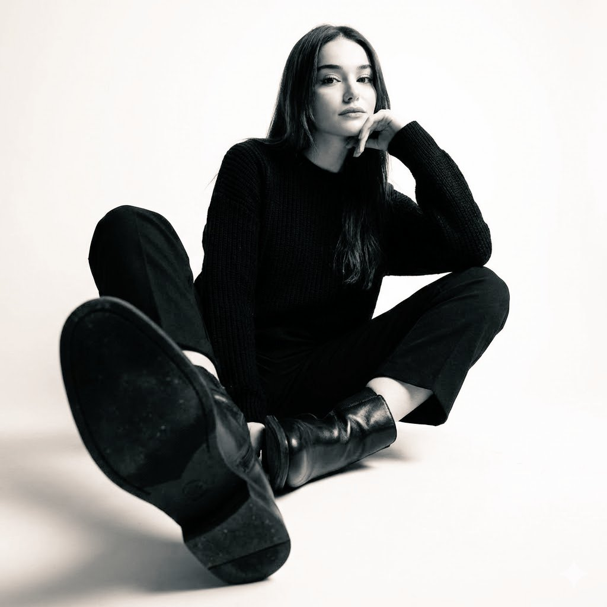

## A cinematic vintage fashion portrait of a graceful young

- ID: trending-2018167069343416703
- Slug: trending-2018167069343416703-en
- 语言: en
- 来源: [来源链接](https://x.com/Mind_Boticni/status/2018167069343416703)
- 样例图路径: images/part1/2018167069343416703_1.jpg

### 提示词

```text
A cinematic vintage fashion portrait of a graceful young woman in a 1950s aesthetic, standing beside a classic convertible car. She is captured from a three-quarter back angle, looking over her shoulder with a soft, confident gaze. She wears an elegant ivory strapless dress with a fitted bodice and a flowing skirt adorned with hand-painted red rose floral patterns near the hem. A thin red belt cinches her waist. Her hair is styled in a voluminous retro updo, auburn/red tones, topped with a straw boater hat featuring a red ribbon. She wears white satin gloves and delicate pearl earrings. Makeup is refined and timeless: winged eyeliner, soft blush, and deep red lipstick. The scene is bathed in warm golden-hour sunlight with creamy bokeh in the background, outdoor garden setting. Ultra-detailed, photorealistic, shallow depth of field, cinematic lighting, luxury fashion editorial style, 8K quality.
```

### 样例图

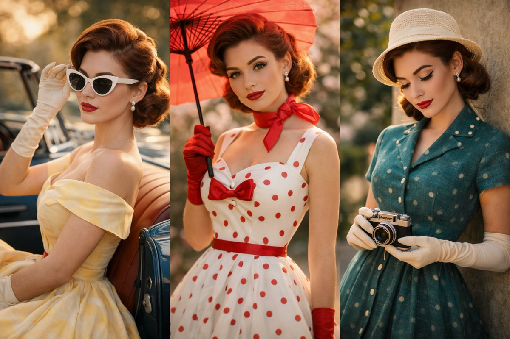

## Ultra-realistic cinematic fashion portrait of a stylish 

- ID: trending-2027738988673700214
- Slug: trending-2027738988673700214-en
- 语言: en
- 来源: [来源链接](https://x.com/Kashberg_0/status/2027738988673700214)
- 样例图路径: images/part1/2027738988673700214_1.jpg

### 提示词

```text
Ultra-realistic cinematic fashion portrait of a stylish woman wearing oversized black cat-eye sunglasses, soft warm golden sunlight, hazy foreground blur creating dreamy depth, shallow depth of field, glowing skin, natural makeup, glossy nude lips, loose messy updo hairstyle with soft strands falling, black high-neck outfit, luxury editorial vibe, shot through translucent fabric for soft diffusion, 85mm lens, f/1.8, creamy bokeh, golden hour lighting, warm beige color grading, high detail, photorealistic, Vogue style photography, soft focus edges, elegant and minimal background
```

### 样例图

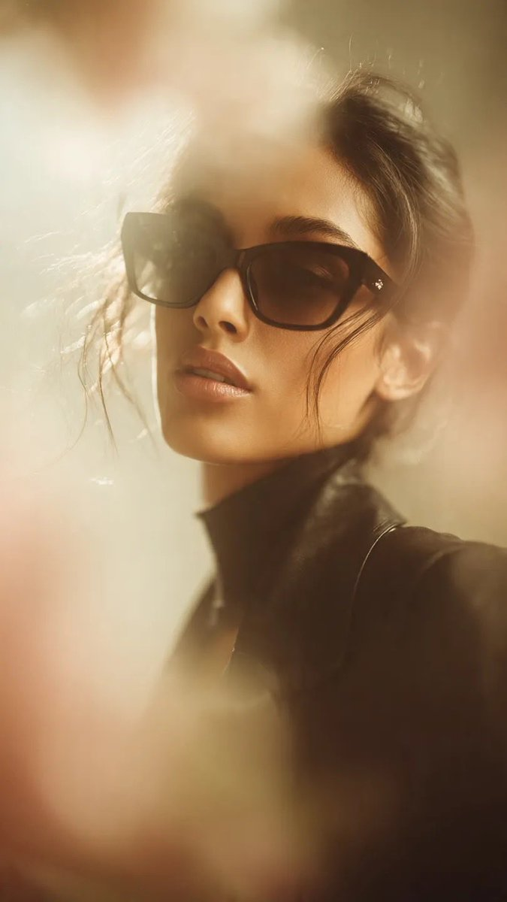

## A cinematic fashion studio scene of a woman hand-sewing 

- ID: trending-2024111444334407809
- Slug: trending-2024111444334407809-en
- 语言: en
- 来源: [来源链接](https://x.com/AIwithSynthia/status/2024111444334407809)
- 样例图路径: images/part1/2024111444334407809_1.jpg

### 提示词

```text
A cinematic fashion studio scene of a woman hand-sewing a miniature dress worn by a tiny version of herself seated on a pin cushion.
She uses a fine needle and silk thread, concentrating intensely as fabric tension is adjusted.
The miniature garment features perfectly scaled seams, buttons, and lifelike fabric weight in it .
Workbench filled with miniature scissors, chalk, rulers, pattern papers, and thread reels.
Warm cinematic lighting reveals textile grain, skin pores, and metal reflections.
Macro depth of field, fashion editorial composition, ultra-photoreal realism, 8K quality.

Style: cinematic miniature tailoring realism, no cartoon, no CGI
```

### 样例图

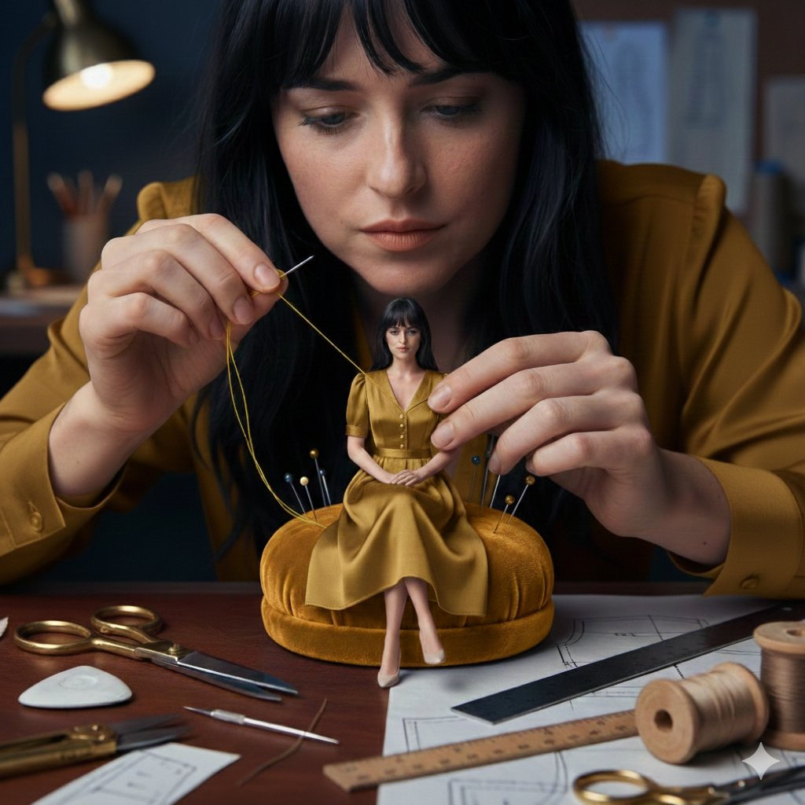

## { "Objective": "Create a stylish, cinematic birthday-the

- ID: trending-2010626509690831267
- Slug: trending-2010626509690831267-en
- 语言: en
- 来源: [来源链接](https://x.com/Taaruk_/status/2010626509690831267)
- 样例图路径: images/part1/2010626509690831267_1.jpg

### 提示词

```text
{
  "Objective": "Create a stylish, cinematic birthday-themed studio portrait with a modern celebratory poster aesthetic",
  "PersonaDetails": {
    "Subject": {
      "Type": "Young man",
      "Pose": "Sitting casually on the floor",
      "Expression": "Confident, friendly smile",
      "Gaze": "Looking directly at the camera",
      "Accessories": [
        "Glasses",
        "Wristwatch"
      ]
    }
  },
  "Wardrobe": {
    "Top": "Dark grey sweater",
    "Bottom": "Black trousers",
    "Footwear": "Black leather boots",
    "Style": "Clean, modern, understated"
  },
  "SceneDescription": {
    "Environment": "Studio setting",
    "Background": {
      "Color": "Deep purple",
      "Details": "Subtle glowing particles floating in the background"
    }
  },
  "GraphicElements": {
    "Typography": {
      "Text": "Happy Birthday",
      "Style": "Neon typography",
      "Color": "Soft purple and white glow",
      "Placement": "Top corner of the composition"
    },
    "FloatingFrames": {
      "Description": "Multiple framed portrait snapshots of the same person",
      "Variations": [
        "Different poses and moods",
        "Film negative–style frames",
        "Neon-outlined light frames"
      ],
      "Arrangement": "Floating around the subject with balanced spacing"
    }
  },
  "Composition": {
    "Framing": "Medium full-body portrait",
    "Layout": "Centered subject with surrounding floating elements",
    "Balance": "Clean, poster-style composition",
    "DepthOfField": "Shallow depth of field with layered depth"
  },
  "LightingAndColor": {
    "LightingStyle": "Cinematic studio lighting",
    "RimLight": "Soft purple rim light for edge separation",
    "Contrast": "High contrast with controlled highlights",
    "ColorPalette": [
      "Deep purple",
      "Black",
      "Soft white highlights"
    ]
  },
  "ArtDirection": {
    "Style": "Modern celebratory poster",
    "Aesthetic": "Stylish, cinematic, social-media–ready",
    "DetailLevel": "Ultra-detailed textures and crisp edges",
    "RealismLevel": "Photorealistic with graphic design overlays"
  },
  "PhotographyStyle": {
    "Genre": "Professional studio portrait photography",
    "Finish": "High-end, polished, digital poster look",
    "Resolution": "Ultra-high resolution, sharp focus"
  },
  "Mood": {
    "Tone": "Celebratory, confident, modern",
    "Energy": "Positive, stylish, personal"
  },
  "NegativePrompt": [
    "messy composition",
    "low resolution",
    "flat lighting",
    "oversaturated neon",
    "cartoon style",
    "blurry text",
    "cluttered background"
  ],
  "ResponseFormat": {
    "Type": "Single composite image",
    "Orientation": "Portrait",
    "AspectRatio": "4:5",
    "UseCase": [
      "Social media post",
      "Birthday poster",
      "Digital celebration graphic"
    ]
  }
}
```

### 样例图

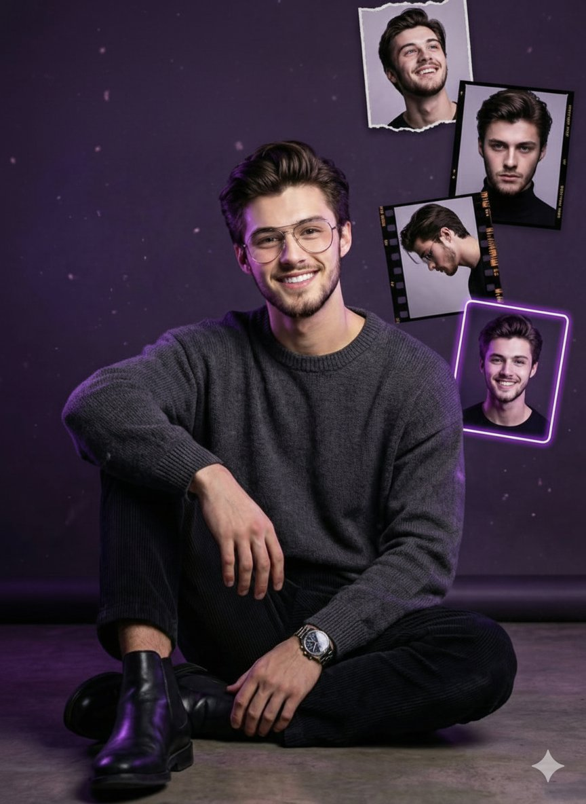

## { "image_generation": { "subject": { "description": "you

- ID: trending-2033772942799343930
- Slug: trending-2033772942799343930-en
- 语言: en
- 来源: [来源链接](https://x.com/saniaspeaks_/status/2033772942799343930)
- 样例图路径: images/part1/2033772942799343930_1.jpg

### 提示词

```text
{
  "image_generation": {
    "subject": {
      "description": "young woman sitting at the edge of a skyscraper rooftop with a dramatic city view below",
      "pose": "sitting with legs extended toward the camera, both hands raised making peace signs",
      "expression": "playful confident smile",
      "gaze": "looking directly at the camera"
    },
    "appearance": {
      "hair": {
        "color": "dark brown",
        "style": "covered with a light beige headscarf flowing in the wind"
      },
      "skin": {
        "tone": "fair natural skin tone",
        "texture": "smooth realistic skin"
      },
      "makeup": "light natural makeup"
    },
    "outfit": {
      "outerwear": "long patterned coat",
      "inner_layer": "black top with denim jacket",
      "bottom": "light blue jeans",
      "footwear": "colorful sneakers with orange soles"
    },
    "environment": {
      "setting": "urban city high-rise rooftop",
      "background_elements": [
        "busy city street far below",
        "cars and taxis on the road",
        "tall buildings on both sides",
        "glass rooftop surface"
      ],
      "time_of_day": "daytime"
    },
    "lighting": {
      "type": "natural daylight",
      "direction": "soft overhead light",
      "effect": "bright urban lighting with balanced shadows"
    },
    "camera": {
      "angle": "extreme high angle / top-down perspective",
      "framing": "full body with exaggerated perspective",
      "lens": "wide-angle lens",
      "depth_of_field": "deep focus showing detailed city below"
    },
    "aesthetic": {
      "style": "urban lifestyle photography",
      "vibe": "adventurous bold city energy",
      "color_palette": "vibrant city tones with pops of orange and blue"
    },
    "effects": {
      "grading": "cinematic vibrant color grading",
      "sharpness": "high detail with slight depth exaggeration"
    },
    "quality": {
      "resolution": "high resolution",
      "render": "photorealistic",
      "details": "sharp textures with strong perspective depth"
    }
  }
}
```

### 样例图

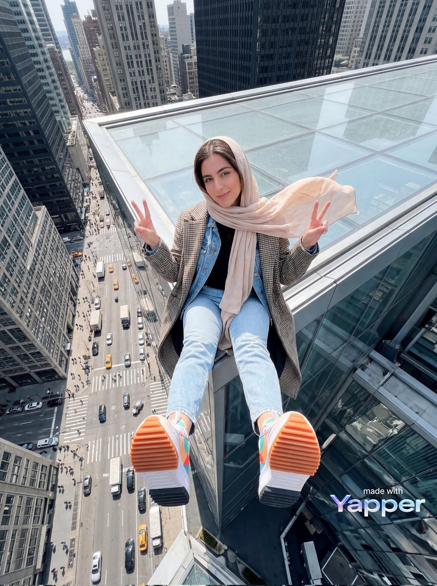

## Create a melancholic and cinematic portrait photography.

- ID: trending-2016087801759203335
- Slug: trending-2016087801759203335-en
- 语言: en
- 来源: [来源链接](https://x.com/Adam38363368936/status/2016087801759203335)
- 样例图路径: images/part1/2016087801759203335_1.jpg

### 提示词

```text
Create a melancholic and cinematic portrait photography. A young woman with clear, fair skin and light makeup. Warm, natural lip color. Deep brown hair with a fluffy texture. A calm and confident expression. Wearing a wine-red top to showcase elegance. A dark, minimalist background fading to black. Soft, diffused front lighting, gentle shadows, subtle film grain, organic color grading, shallow depth of field, and high-end editing texture. Use the facial features of the reference subject without any alterations.
```

### 样例图

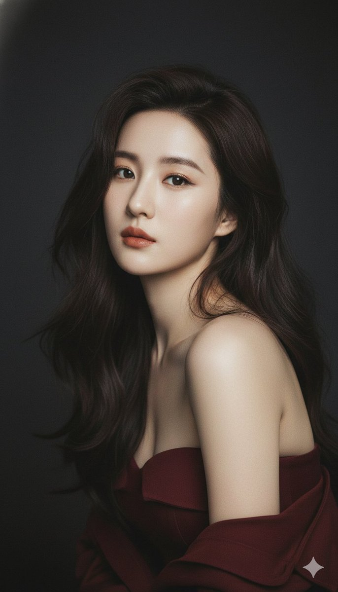

## Cinematic portrait of a stylish man standing on a busy s

- ID: trending-2033407780640698583
- Slug: trending-2033407780640698583-en
- 语言: en
- 来源: [来源链接](https://x.com/Taaruk_/status/2033407780640698583)
- 样例图路径: images/part1/2033407780640698583_1.jpg

### 提示词

```text
Cinematic portrait of a stylish man standing on a busy subway platform, wearing a dark tailored suit and black turtleneck with round glasses, serious confident expression, commuters rushing past creating motion blur around him, subway train beside the platform with metallic reflections, urban underground atmosphere, dramatic fluorescent subway lighting, shallow depth of field, subject sharply in focus while the crowd is blurred, modern thriller movie scene aesthetic, ultra-realistic photography, 85mm lens, high detail, 8K
```

### 样例图

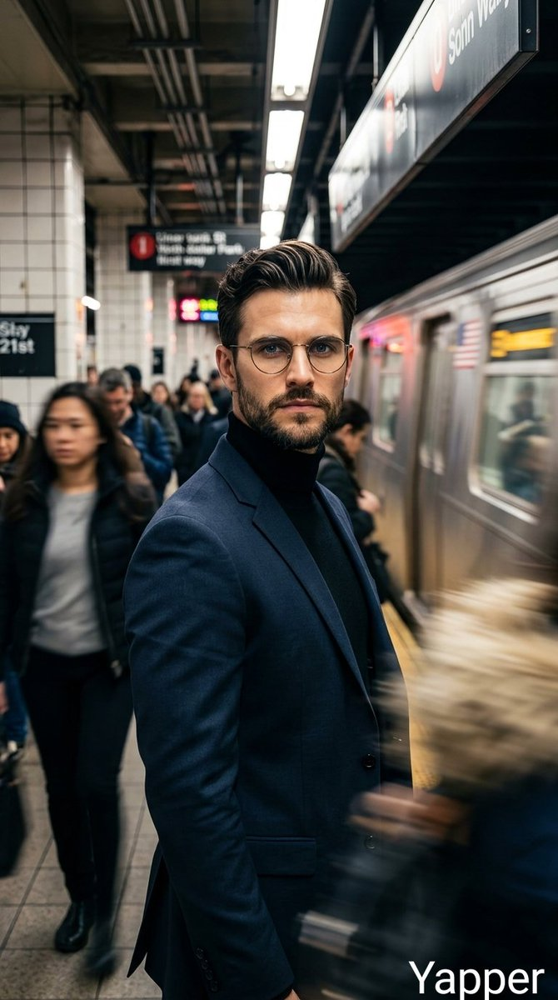

## { "metadata": { "image_type": "photograph", "primary_pur

- ID: trending-2041191823180181722
- Slug: trending-2041191823180181722-en
- 语言: en
- 来源: [来源链接](https://x.com/pictsbyai/status/2041191823180181722)
- 样例图路径: images/part1/2041191823180181722_1.jpg

### 提示词

```text
{
"metadata": {
"image_type": "photograph",
"primary_purpose": "editorial/portrait"
},
"composition": {
"rule_applied": "rule of thirds and one-point perspective",
"aspect_ratio": "2:3",
"layout": "asymmetric single subject with deep environmental context",
"focal_points": [
"Subject's brightly lit face on the right",
"The deep vanishing point of the colonnade on the left"
],
"visual_hierarchy": "Eye starts at the subject's face on the right due to contrast, travels down his dark silhouette, then follows the repeating diagonal lines of the pillars to the deep vanishing point on the far left.",
"balance": "asymmetric - the heavy, dark mass of the subject in the right foreground is balanced by the repeating, high-contrast structural elements receding into the deep background on the left"
},
"color_profile": {
"dominant_colors": [
{
"color": "Black",
"hex": "#0a0a0a",
"percentage": "45%",
"role": "primary subject clothing and deep architectural shadows"
},
{
"color": "Light Gray",
"hex": "#c8c8c8",
"percentage": "35%",
"role": "illuminated faces of the concrete pillars and floor"
},
{
"color": "Mid Gray",
"hex": "#6e6e6e",
"percentage": "20%",
"role": "shadow transitions and ambient background"
}
],
"color_palette": "monochromatic",
"temperature": "neutral",
"saturation": "black and white",
"contrast": "high contrast"
},
"lighting": {
"type": "natural window/archway light",
"source_count": "multiple sources - repeating archways on the left acting as large softboxes",
"direction": "90-degree side",
"directionality": "highly directional",
"quality": "soft light on the subject, hard geometric light on the architecture",
"intensity": "moody/high-key architectural highlights with low-key subject shadows",
"contrast_ratio": "high contrast (dramatic shadows)",
"mood": "dramatic/mysterious/sophisticated",
"shadows": {
"type": "harsh defined edges on structural elements, soft gradual edges on the subject's face",
"density": "deep black",
"placement": "cast across the floor, interior of the walkway, and the right side of the subject",
"length": "long - horizontal shadow projection across the corridor floor"
},
"highlights": {
"treatment": "preserved",
"placement": "on the left-facing planes of the pillars, the floor near the openings, and the subject's left cheek and nose"
},
"ambient_fill": "absent",
"light_temperature": "neutral"
},
"technical_specs": {
"medium": "digital photography",
"style": "realistic/editorial",
"texture": "smooth to slightly grainy",
"sharpness": "tack sharp on subject with natural lens fall-off in deep background",
"grain": "film grain - moderate level",
"depth_of_field": "deep - the subject is isolated by contrast, but the background architecture retains recognizable structure deep into the frame",
"perspective": "straight on at eye level with strong one-point vanishing perspective"
},
"artistic_elements": {
"genre": "portrait/editorial",
"influences": [
"Cinematic noir photography",
"Classic street and fashion photography",
"Brutalist architectural photography"
],
"mood": "sophisticated/dramatic/contemplative",
"atmosphere": "A quiet, isolated, and highly structured urban moment with a cinematic and slightly mysterious edge.",
"visual_style": "structured/geometric/clean"
},
"typography": {
"present": false,
"fonts": [],
"placement": "",
"integration": ""
},
"subject_analysis": {
"primary_subject": "Young Caucasian male wearing a dark turtleneck, long dark leather or heavy cotton trench coat, dark trousers, and dark Chelsea boots.",
"positioning": "right rule of thirds placement, anchoring the foreground",
"scale": "full body/environmental",
"interaction": "interacting with environment - leaning against architecture",
"facial_expression": {
"mouth": "neutral",
"smile_intensity": "no smile",
"eyes": "looking away to the right, out of frame",
"eyebrows": "relaxed",
"overall_emotion": "serious/contemplative/guarded",
"authenticity": "posed/editorial"
},
"hands_and_gestures": {
"left_hand": "hidden inside coat pocket",
"right_hand": "hidden inside coat pocket",
"finger_positions": "not visible",
"finger_interlacing": "none",
"hand_tension": "relaxed",
"interaction": "resting inside pockets, pulling the coat slightly back",
"naturalness": "deliberately posed but mimicking organic casual posture"
},
"body_positioning": {
"posture": "standing/leaning - left shoulder resting against the stone pillar",
"angle": "profile to 45 degree turn facing right",
"weight_distribution": "leaning right, resting weight on the pillar and left leg, right leg crossed over loosely",
"shoulders": "tilted due to the lean, left shoulder engaged with the wall"
}
},
"background": {
"setting_type": "outdoor/semi-enclosed architectural colonnade or covered walkway",
"spatial_depth": "deep - extreme vanishing point creating many layered planes of pillars",
"elements_detailed": [
{
"item": "Square architectural pillar 1 (foreground)",
"position": "right",
"distance": "foreground",
"size": "dominant",
"condition": "pristine/weathered",
"specific_features": "Smooth concrete or stone facing, acts as the structural prop for the subject"
},
{
"item": "Repeating architectural pillars (background)",
"position": "left",
"distance": "midground to deep background",
"size": "medium to small receding",
"condition": "pristine/weathered",
"specific_features": "Creating a rhythmic geometric pattern of light and shadow"
},
{
"item": "Ceiling coffers/beams",
"position": "top left",
"distance": "midground",
"size": "medium",
"condition": "pristine",
"specific_features": "Recessed rectangular ceiling details catching directional light"
}
],
"wall_surface": {
"material": "concrete/stone paneling",
"surface_treatment": "smooth with slight porous texture, finished architectural panels",
"texture": "slightly textured/matte",
"finish": "matte",
"color": "Neutral light gray to mid gray (in grayscale)",
"color_variation": "gradient due to strong lighting fall-off",
"features": "clean, visible horizontal and vertical panel seams/joints indicating modular construction",
"wear_indicators": "pristine institutional/civic architecture"
},
"floor_surface": {
"material": "concrete/stone",
"color": "Mid gray to dark gray in shadows",
"pattern": "solid with subtle smooth texture"
},
"objects_catalog": "Repeating concrete/stone structural pillars, paneled ceiling structure, solid paved floor",
"background_treatment": "sharp transitions into deep shadow, geometric, high contrast"
},
"generation_parameters": {
"prompts": [
"A cinematic black and white fashion editorial photograph of a young handsome man with wavy textured dark hair, wearing a black turtleneck and a long unbuttoned black leather trench coat. He is leaning his left shoulder against a large smooth concrete pillar in an endless architectural colonnade. He has both hands in his coat pockets, right leg crossed casually over the left. He is looking off-camera to the right with a serious, contemplative expression. The setting features strong one-point perspective with repeating archways receding deeply to the left. Highly directional, high-contrast natural light entering from the left, casting harsh geometric shadows on the concrete floor and walls, but providing soft dramatic light on the man's face. Shot on 35mm film, tack sharp subject, moody, sophisticated, striking geometry.",
"B&W photography, full body portrait of a man in a dark overcoat leaning on a structural column. Deep one-point perspective corridor on the left. High contrast, directional side lighting, distinct shadows, brutalist concrete architecture, moody, editorial fashion style."
],
"keywords": [
"black and white",
"editorial",
"trench coat",
"colonnade",
"one-point perspective",
"high contrast",
"chiaroscuro",
"cinematic",
"leaning",
"geometric shadows"
],
"technical_settings": "Camera: Full frame DSLR or 35mm film camera. Lens: 35mm to 50mm for natural perspective. Aperture: f/5.6 to f/8 to maintain focus on the subject while keeping the deep background structurally defined but slightly softer. Shutter speed: 1/250s or faster to prevent motion blur. ISO: 100-400 for clean shadows or natural film grain.",
"post_processing": "Black and white conversion with high contrast S-curve, deep crushed blacks, preserved highlights on the skin and structural edges, enhanced clarity on the concrete textures, and subtle film grain overlay."
}
}
```

### 样例图

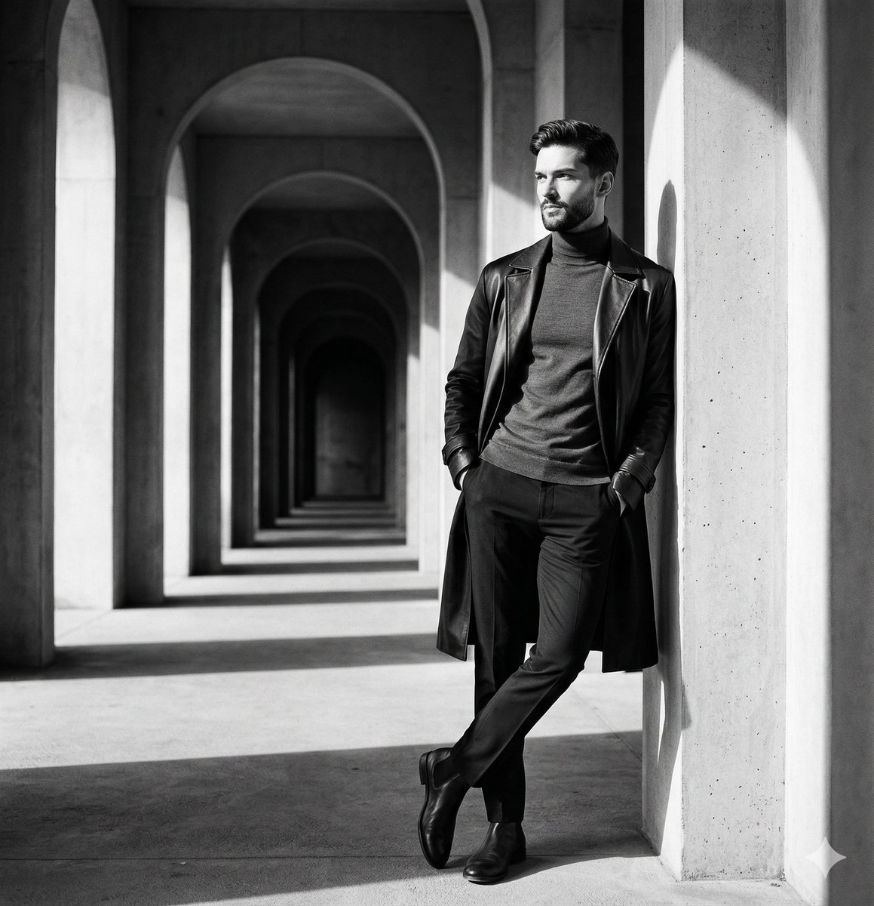

## Preserve the face, proportions, and external features of

- ID: trending-2023240208700113185
- Slug: trending-2023240208700113185-en
- 语言: en
- 来源: [来源链接](https://x.com/Mind_Boticni/status/2023240208700113185)
- 样例图路径: images/part1/2023240208700113185_1.jpg

### 提示词

```text
Preserve the face, proportions, and external features of the model as in the reference. A minimalist monochrome fashion editorial triptych featuring three stacked cinematic frames. The subject is a young woman with medium-length dark hair, natural makeup, and elegant features.

Frame 1: Emotional and introspective, looking downward with a hand gently near the collarbone, highlighting cheekbones and bone structure with soft Rembrandt lighting.
Frame 2: A crisp profile shot emphasizing the nose, lips, and graceful jawline, gaze directed slightly upward for a poised, confident look.
Frame 3: A frontal, thoughtful portrait with relaxed shoulders and direct eye contact, conveying quiet strength and elegance.
The composition is clean and modern, using a fitted white top and delicate gold jewelry for visual continuity. Commercial magazine quality, shot on a high-end mirrorless camera, with authentic skin texture, soft bokeh, and cinematic sophistication. Feminine elegance and contemporary fashion sensibility.
```

### 样例图

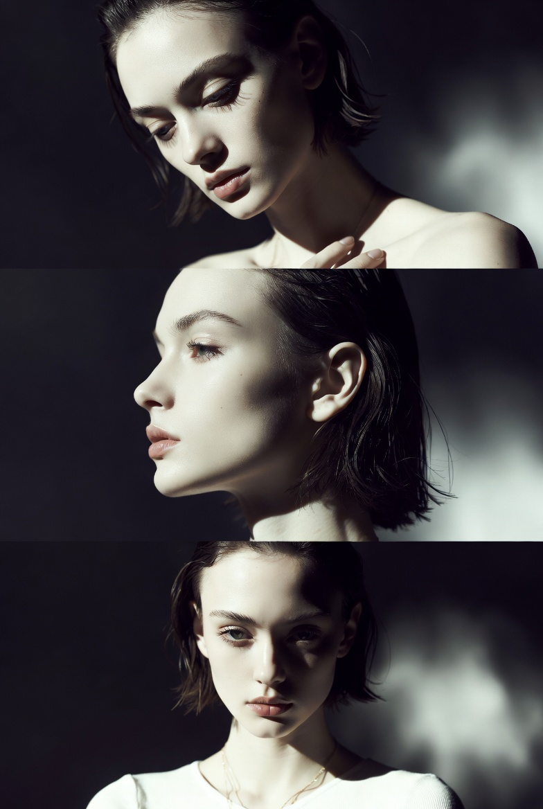

## Ultra-realistic portrait of a woman (from uploaded image

- ID: trending-2039207783384613057
- Slug: trending-2039207783384613057-en
- 语言: en
- 来源: [来源链接](https://x.com/AIwithSarah_/status/2039207783384613057)
- 样例图路径: images/part1/2039207783384613057_1.jpg

### 提示词

```text
Ultra-realistic portrait of a woman (from uploaded image), messy hair slightly windswept, wearing a worn leather jacket. Bright white car light sweeping across the face from one side to the other, freezing a moment of illumination while the rest fades into shadow. Night street environment, cinematic motion feel.
```

### 样例图

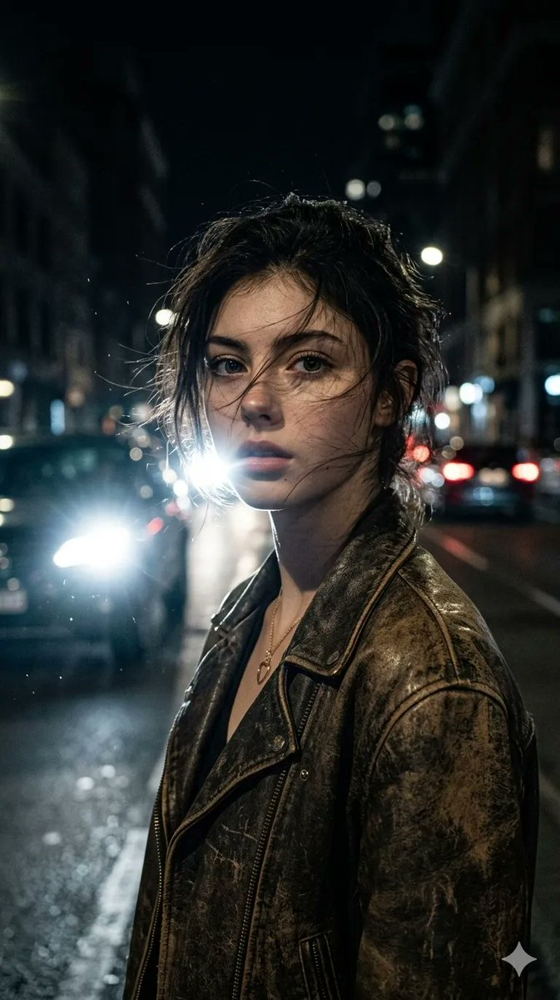

## A cinematic ultra-realistic portrait of a man standing f

- ID: trending-2011997711479017859
- Slug: trending-2011997711479017859-en
- 语言: en
- 来源: [来源链接](https://x.com/Sheldon056/status/2011997711479017859)
- 样例图路径: images/part1/2011997711479017859_1.jpg

### 提示词

```text
A cinematic ultra-realistic portrait of a man standing face-to-face with a majestic white lion in a snowy forest. The man is wearing a luxurious white fur coat, gently holding the lion’s face with one hand, conveying trust, power, and calm dominance. Soft snowfall surrounds them, with frosted pine trees blurred in the background. Dramatic natural lighting, shallow depth of field, sharp focus on facial details and fur texture. Cold winter color grading, soft whites and muted grays. Hyper-detailed fur, realistic skin texture, emotional eye contact. Shot on a high-end DSLR, 85mm lens, f/1.8, cinematic composition, photorealistic, 8K quality.
```

### 样例图

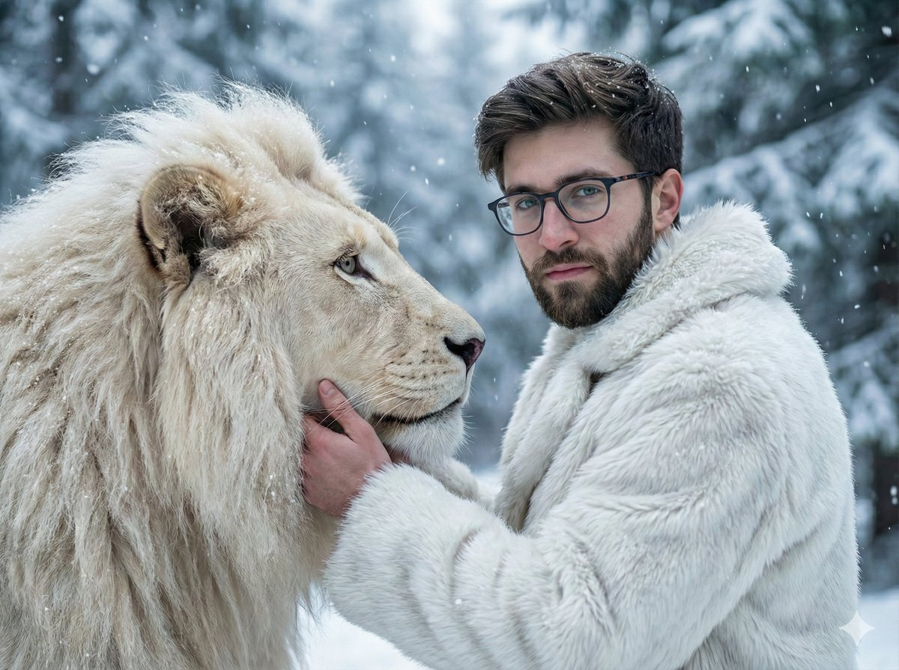

## A high-resolution, photorealistic three-panel compositio

- ID: trending-2038182355743977689
- Slug: trending-2038182355743977689-en
- 语言: en
- 来源: [来源链接](https://x.com/Mind_Boticni/status/2038182355743977689)
- 样例图路径: images/part1/2038182355743977689_1.jpg

### 提示词

```text
A high-resolution, photorealistic three-panel composition featuring a woman with long, voluminous wavy brown hair and elegant features, integrated into an abstract mixed-media collage background.
Panel Layout:

Left Panel (Vertical, full height):

A tall portrait of the woman looking upwards at a dramatic angle, wearing a mustard yellow turtleneck. Cinematic lighting highlights her face and hair, with strong shadows and depth.
Top Right Panel (Square):

A close-up angled side profile, soft gaze to the right, wearing a black modern blazer with minimal jewelry. Expression is calm and confident.
Bottom Right Panel (Square):

A slightly top-down perspective, playful yet elegant pose, wearing a white textured dress, subtle smile, natural lighting.
Art Style & Background (applies to all panels):

The image is layered with an abstract mixed-media collage background incorporating geometric shapes like circles and rectangles in ochre, burnt orange, and charcoal grey. Include textural elements such as vintage parchment paper, blueprint-style technical sketches, and subtle floral etchings. Use a flat graphic design overlay that partially blends into each outfit, seamlessly merging the 3D subject with 2D modernist art.
Overall Style:

Cinematic lighting, fine art photography aesthetic, ultra-detailed, 8K resolution, modern editorial fashion magazine layout.
```

### 样例图

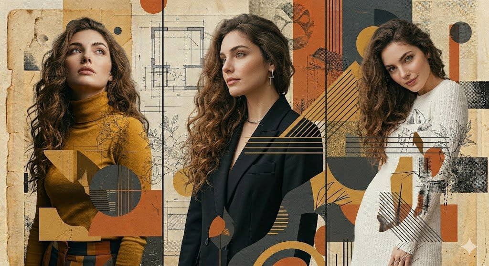

## { "prompt": "Using the uploaded reference image, generat

- ID: trending-2011629245949493378
- Slug: trending-2011629245949493378-en
- 语言: en
- 来源: [来源链接](https://x.com/r4jjesh/status/2011629245949493378)
- 样例图路径: images/part1/2011629245949493378_1.jpg

### 提示词

```text
{
  "prompt": "Using the uploaded reference image, generate a highly realistic full-body portrait of the SAME person with 100% identical facial structure, skin tone, facial proportions, and overall identity. Do NOT alter the face in any way.\n\nA proud South Indian woman celebrating the Thaipongal festival, standing gracefully in a traditional rural Tamil village courtyard at sunrise. She is wearing an elegant traditional silk saree (Kanjivaram-style) in rich festive colors with a gold zari border, draped authentically. A matching blouse complements the saree. Her hair is neatly styled in a traditional manner, adorned with fresh jasmine flowers (mallipoo). A subtle sandalwood or kumkum tilak is visible on her forehead. She holds a long brown leafy sugarcane stalk gently in one hand.\n\nIn the foreground, a decorated clay Pongal pot is boiling over on a wood-fired brick stove, with rice frothing out, symbolizing prosperity. Beside the stove are tied brown sugarcane stalks, fresh turmeric plants, bananas, and intricate colorful kolam (rangoli) designs drawn on the ground.\n\nThe background features a rustic mud house with a thatched roof, decorated with mango-leaf torans, marigold flower garlands, and hanging clay oil lamps. Warm golden sunrise light fills the scene, with soft smoke rising from firewood, creating a joyful and auspicious festive atmosphere.\n\nUltra-realistic cinematic lighting, shallow depth of field, natural South Indian skin texture, authentic Tamil rural aesthetic, 8K ultra-detailed quality, vertical composition, cultural accuracy, festive mood.",
  "style": "cinematic realism, South Indian traditional portrait",
  "lighting": "warm golden sunrise light, soft cinematic glow",
  "environment": "traditional Tamil rural village courtyard",
  "camera": "professional portrait photography, shallow depth of field",
  "quality": "ultra-realistic, 8K, highly detailed",
  "composition": "full-body, vertical frame",
  "constraints": "face must remain 100% identical to the uploaded reference image with absolutely no facial modification"
}
```

### 样例图

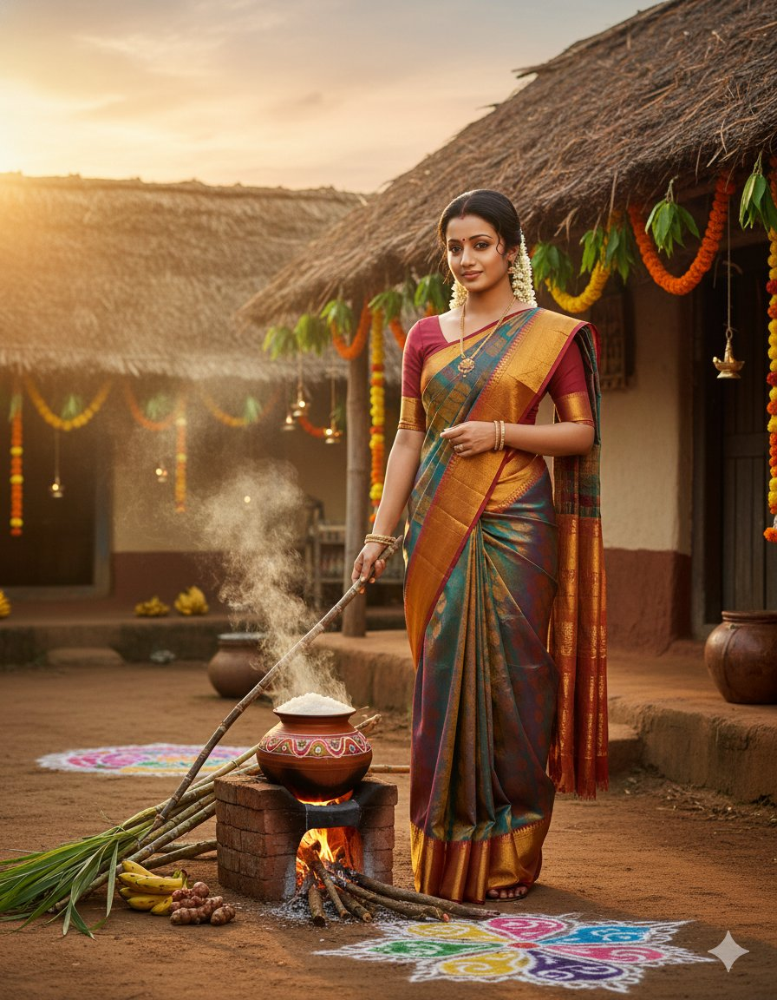

## Cinematic ultra-realistic close-up of a man taking a bil

- ID: trending-2012419840657793073
- Slug: trending-2012419840657793073-en
- 语言: en
- 来源: [来源链接](https://x.com/harboriis/status/2012419840657793073)
- 样例图路径: images/part1/2012419840657793073_1.jpg

### 提示词

```text
Cinematic ultra-realistic close-up of a man taking a billiards shot, captured in a tense, mid-focus moment as he leans low toward the cue ball. His eyes are locked sharply on the aim, expression steady and confident, while his supporting hand rests firmly on the green felt, guiding the cue with precision. He wears a crisp white shirt with rolled sleeves and slightly open buttons, giving a relaxed yet intensely focused vibe. His hair is neatly tied back, and his clear-framed glasses catch warm reflections from overhead lights. The background is softly blurred, filled with atmospheric golden highlights, adding depth, drama, and a competitive mood to the scene.

use face reference exactly
```

### 样例图

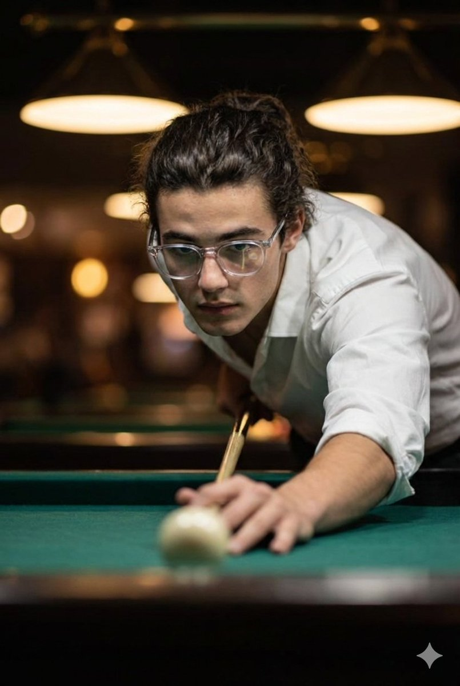

## { "metadata": { "image_type": "photograph", "primary_pur

- ID: trending-2039615557272494205
- Slug: trending-2039615557272494205-en
- 语言: en
- 来源: [来源链接](https://x.com/pictsbyai/status/2039615557272494205)
- 样例图路径: images/part1/2039615557272494205_1.jpg

### 提示词

```text
{
"metadata": {
"image_type": "photograph",
"primary_purpose": "editorial"
},
"composition": {
"rule_applied": "rule of thirds",
"aspect_ratio": "2:3",
"layout": "layered",
"focal_points": [
"Subject's face and sunglasses",
"Flowing silhouette of the black overcoat"
],
"visual_hierarchy": "Eye starts at the subject's face/sunglasses, travels down the sweeping lines of the black coat to the stride of the grey trousers, then moves back to register the black vehicle and architectural background",
"balance": "asymmetric"
},
"color_profile": {
"dominant_colors": [
{
"color": "Deep Black",
"hex": "#111111",
"percentage": "45%",
"role": "primary subject clothing and vehicle"
},
{
"color": "Slate Grey",
"hex": "#5A5D60",
"percentage": "20%",
"role": "trousers and street surface"
},
{
"color": "Navy Blue",
"hex": "#1C2331",
"percentage": "25%",
"role": "background building facade"
},
{
"color": "Warm Amber",
"hex": "#ECAE62",
"percentage": "2%",
"role": "accent light from sconce"
}
],
"color_palette": "monochromatic with cool bias and a warm accent",
"temperature": "cool",
"saturation": "desaturated",
"contrast": "medium contrast"
},
"lighting": {
"type": "mixed",
"source_count": "multiple sources",
"direction": "diffused from above",
"directionality": "diffused",
"quality": "soft light",
"intensity": "moody",
"contrast_ratio": "medium contrast",
"mood": "dramatic",
"shadows": {
"type": "soft gradual edges",
"density": "gray",
"placement": "under vehicle, beneath subject's coat, under jawline",
"length": "short"
},
"highlights": {
"treatment": "subtle",
"placement": "reflections on sunglasses, leather shoes, car bumper, and subtle sheen on cheekbone"
},
"ambient_fill": "present",
"light_temperature": "cool (blue) with a localized warm (golden) practical light"
},
"technical_specs": {
"medium": "digital photography",
"style": "realistic",
"texture": "smooth",
"sharpness": "slightly soft",
"grain": "film grain",
"depth_of_field": "medium",
"perspective": "straight on"
},
"artistic_elements": {
"genre": "street",
"influences": [
"Paparazzi street style photography",
"High fashion editorial candid shots"
],
"mood": "sophisticated",
"atmosphere": "Cinematic, moody urban transit with a cool, detached, fashionable energy",
"visual_style": "clean"
},
"typography": {
"present": false,
"fonts": [],
"placement": "none",
"integration": "none"
},
"subject_analysis": {
"primary_subject": "A stylish adult male walking briskly in a tailored black overcoat and sunglasses",
"positioning": "center",
"scale": "full",
"interaction": "isolated",
"facial_expression": {
"mouth": "parted slightly open",
"smile_intensity": "no smile",
"eyes": "hidden by sunglasses, appearing to look straightforward",
"eyebrows": "neutral",
"overall_emotion": "serious",
"authenticity": "candid"
},
"hands_and_gestures": {
"left_hand": "hidden entirely inside the left pocket of the overcoat",
"right_hand": "hidden entirely inside the right pocket of the overcoat",
"finger_positions": "not visible",
"finger_interlacing": "none",
"hand_tension": "relaxed",
"interaction": "resting in pockets",
"naturalness": "organic casual gesture"
},
"body_positioning": {
"posture": "walking",
"angle": "facing slightly left of camera in mid-stride",
"weight_distribution": "shifted onto the front right leg",
"shoulders": "level"
},
"hair_analysis": {
"length": "medium-short, approximately 3-4 inches on top, reaching just past the nape of the neck in the back",
"style_name": "slicked back undercut or taper",
"texture": "straight but highly styled, wet-look texture with visible comb tracks",
"imperfections": "some slight flyaway strands visible at the very back edge near the collar, natural separation of hair clumps from product wear",
"part_location": "no distinct part, pushed straight back",
"styling_state": "heavy product use, likely a high-hold pomade or gel giving a glossy, structured hold",
"volume": "low volume, sleek and close to the scalp"
}
},
"background": {
"setting_type": "outdoor urban street",
"spatial_depth": "medium",
"elements_detailed": [
{
"item": "Black Jeep Wrangler (grill, bumper, front tire)",
"position": "left and directly behind subject",
"distance": "midground",
"size": "medium",
"condition": "worn",
"specific_features": "matte black plastic bumper, dirty tire treads, distinct round headlight casing outline"
},
{
"item": "Potted plant (thin-leafed shrub/small tree, possibly oleander or olive)",
"position": "left mid-upper quadrant",
"distance": "background",
"size": "small",
"condition": "thriving",
"specific_features": "housed in a dark planter, thin sprawling branches, small pale green leaves"
},
{
"item": "Wall sconce / lantern",
"position": "top left quadrant",
"distance": "background",
"size": "small",
"condition": "pristine",
"specific_features": "black metal housing, classic trapezoidal shape, emitting warm yellow light"
}
],
"wall_surface": {
"material": "painted wood/masonry facade",
"surface_treatment": "smooth paint with architectural paneling and molding",
"texture": "perfectly smooth",
"finish": "matte",
"color": "dark navy blue",
"color_variation": "uniform",
"features": "clean, horizontal routed lines, framed window with closed horizontal blinds",
"wear_indicators": "pristine"
},
"floor_surface": {
"material": "asphalt street and concrete curb",
"color": "medium slate grey",
"pattern": "solid with slight urban texture/grit"
},
"objects_catalog": "Subject's black overcoat, subject's grey trousers, subject's black leather pointed shoes, subject's black wayfarer sunglasses, black Jeep Wrangler (partial), potted plant, wall sconce, architectural building facade.",
"background_treatment": "slightly blurred to separate subject"
},
"generation_parameters": {
"prompts": [
"A candid paparazzi-style street photography shot of a handsome man walking briskly down an overcast city street. He has slicked-back dark hair, wearing classic black sunglasses, a long flowing black tailored overcoat, and relaxed grey trousers. Both hands are tucked casually into his coat pockets. In the background, there is a black Jeep parked, and a dark navy blue building facade with classic molding and an illuminated warm wall sconce. Shot on 85mm lens, slight film grain, desaturated cool tones, cinematic moody lighting, fashion editorial vibe.",
"A low-angle fashion street style tracking shot of a male model in mid-stride. He wears a heavy black wool trench coat, wide-leg grey dress pants, and dark wayfarer sunglasses. Wet-look slicked back hair. He walks past a dark SUV on a grey asphalt street. The background features a deep blue storefront with a glowing vintage street lamp. Soft overcast lighting, muted color palette, sharp focus on the subject with a slightly soft background."
],
"keywords": [
"street style",
"menswear",
"candid photography",
"black overcoat",
"urban fashion"
],
"technical_settings": "Camera: DSLR or Mirrorless, Lens: 85mm or 105mm, Aperture: f/2.8 or f/4 to achieve medium depth of field, Shutter Speed: 1/500s or faster to freeze walking motion, ISO: 400-800 for overcast lighting and slight grain.",
"post_processing": "Desaturated color grade pulling down greens and warm tones (except for the localized lamp light), crushed blacks for a matte shadow look, added subtle film grain, slight vignette, cool temperature overall white balance shift."
}
}
```

### 样例图

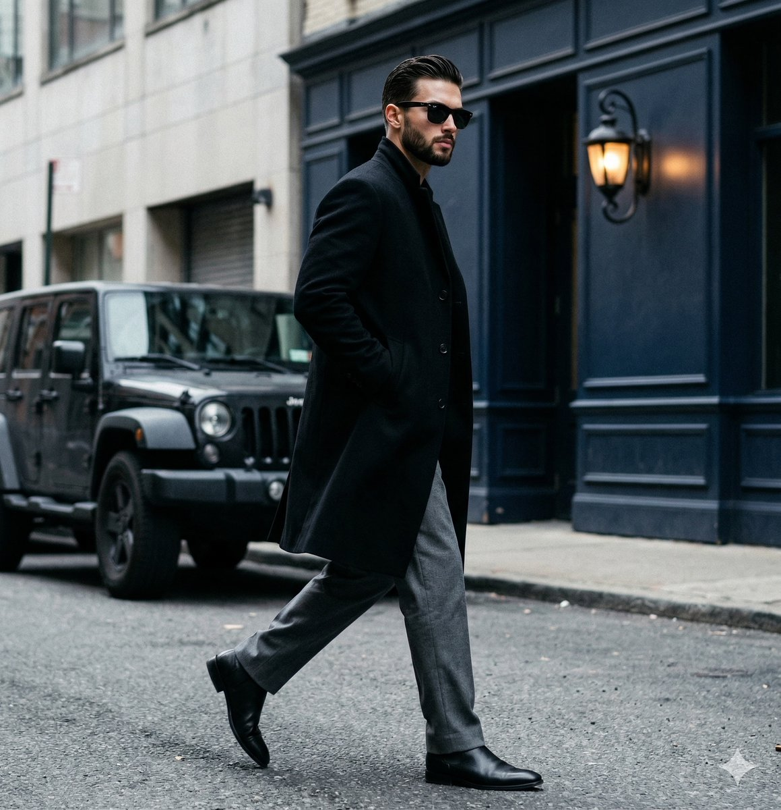

## { "image_request": { "subject": "Woman", "setting": { "l

- ID: trending-2011444902408671530
- Slug: trending-2011444902408671530-en
- 语言: en
- 来源: [来源链接](https://x.com/sadiaamir000786/status/2011444902408671530)
- 样例图路径: images/part1/2011444902408671530_1.jpg

### 提示词

```text
{
  "image_request": {
    "subject": "Woman",
    "setting": {
      "location": "Parking lot outside a party venue",
      "time_of_day": "Nighttime",
      "lighting": "Direct flash photography with slight motion blur"
    },
    "woman_details": {
      "hair": {
        "description": "Maintains the original length, color, and volume exactly as shown in the reference image",
        "style": "Unchanged from the provided image"
      },
      "facial_features": "Identical to the reference image with no modifications",
      "makeup": {
        "lips": "Subtle glossy finish",
        "general": "Clearly visible makeup"
      },
      "pose": {
        "main_body": "Arms crossed, positioned very close to the camera",
        "hands": "One hand lifted near the face, suggesting an attempt to shield from the camera"
      },
      "expression": "Unfocused and distracted"
    },
    "attire": {
      "top": "White strapless lace corset featuring front hook or clasp closures",
      "bottom": "Light-wash denim low-rise skinny jeans",
      "accessories": {
        "bag": "White shoulder bag",
        "jewelry": [
          "Necklace (kept on)",
          "Bracelet (kept on)"
        ]
      }
    },
    "style_keywords": [
      "Night-out party vibe",
      "Y2K aesthetic",
      "Trendy fashion"
    ],
    "camera_perspective": {
      "distance": "Extremely close range",
      "framing": "Tight close-up",
      "angle": "Straight-on, front-facing"
    },
    "image_specifications": {
      "dimensions": "1200 x 1200 pixels"
    },
    "additional_notes": "Image appears to be captured casually by a friend."
  }
}
```

### 样例图

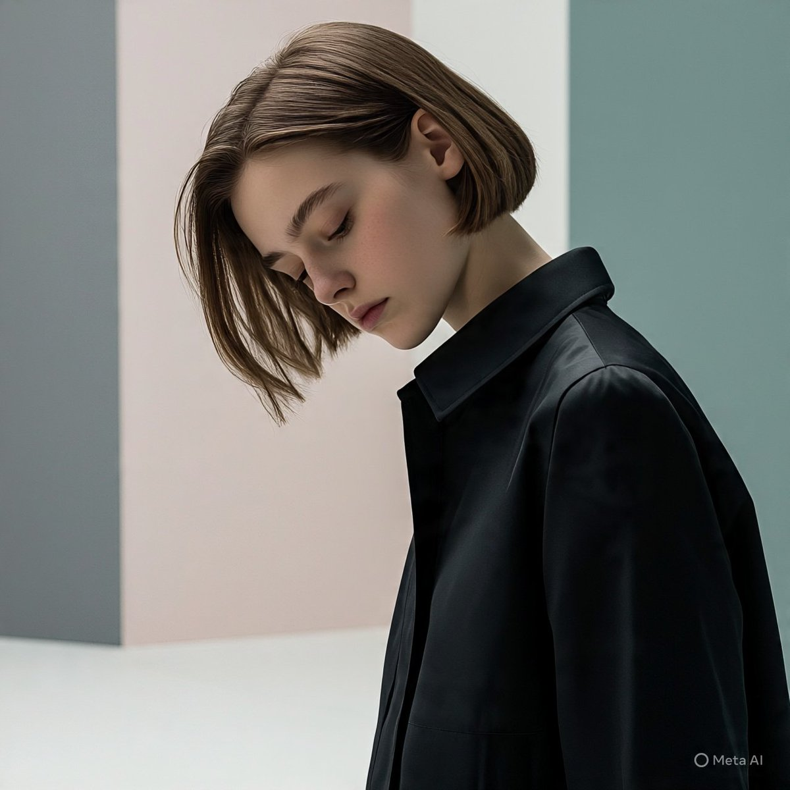

## A raw, candid smartphone-style photo taken at night with

- ID: trending-2009636791251530120
- Slug: trending-2009636791251530120-en
- 语言: en
- 来源: [来源链接](https://x.com/harboriis/status/2009636791251530120)
- 样例图路径: images/part1/2009636791251530120_1.jpg

### 提示词

```text
A raw, candid smartphone-style photo taken at night with a soft bright, direct camera flash, use my face on this image, featuring a man with middle-parted dark hair and a soft, gentle expression looking affectionately at a large, fluffy white cat that he is holding in his arms. The man is wearing a plain black hoodie, and the cat is looking back at him, creating a heartwarming moment. The background consists of a metal chain-link fence with some dark green leafy plants visible behind it, all set against a pitch-black night sky. The lighting has a nostalgic, slightly grainy 2010s digital camera aesthetic with high contrast, sharp shadows, and a natural, unpolished vibe.
```

### 样例图

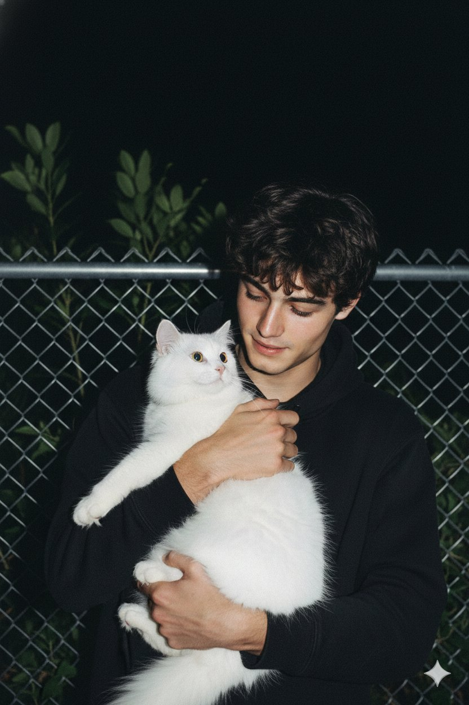

## Create A deeply atmospheric and cinematic interior shot,

- ID: trending-2030579799702614086
- Slug: trending-2030579799702614086-en
- 语言: en
- 来源: [来源链接](https://x.com/harboriis/status/2030579799702614086)
- 样例图路径: images/part1/2030579799702614086_1.jpg

### 提示词

```text
Create A deeply atmospheric and cinematic interior shot, captured from a slightly low-angle perspective, looks forward from an empty seat in a dimly lit bus. The primary subject is this man seated a few rows ahead, looking directly back at the camera with a subtle, intense gaze. He wears a dark, puffy winter jacket and has the hood of a light blue-grey hoodie pulled up over his head, partially obscuring his face and casting his eyes in shadow, adding a sense of mystery. The overall color grading is cool and desaturated, dominated by deep teal, dark blues, and muted greens, lending a melancholic or introspective mood. The interior of the bus is sparsely lit, with artificial lights casting soft, localized glows and deep shadows. The seats in the foreground, upholstered in a faded teal fabric with abstract yellow patterns, are in soft focus, guiding the eye towards the subject. Through the windows, blurred reflections of the city lights and exterior environment are visible, creating a sense of movement and urban isolation. The man's skin tone (take reference from the image) is rendered with natural texture, visible through the cool-toned lighting. The lighting emphasizes the contours of his face and the folds of his clothing, creating a sense of depth and realism within the muted palette. This shot would likely use a relatively slow shutter speed (e.g., 1/60th or 1/30th of a second) and a moderately wide aperture (e.g., f/2.8-f/4) to capture the low light and atmospheric blur.
```

### 样例图

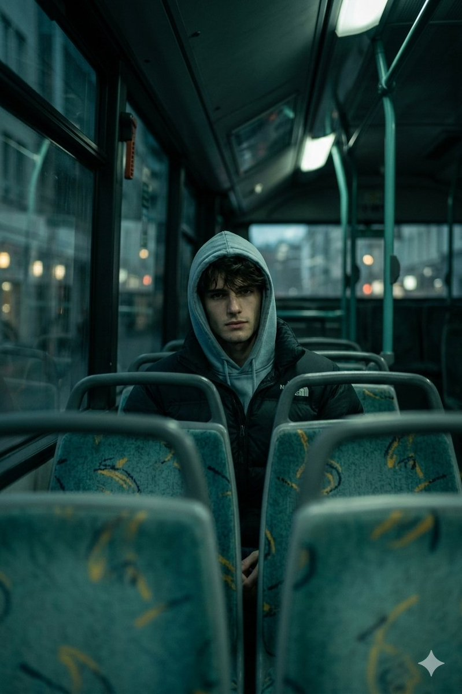

## { "Objective": "Create a minimalist fashion studio portr

- ID: trending-2009911679728206114
- Slug: trending-2009911679728206114-en
- 语言: en
- 来源: [来源链接](https://x.com/Taaruk_/status/2009911679728206114)
- 样例图路径: images/part1/2009911679728206114_1.jpg

### 提示词

```text
{
  "Objective": "Create a minimalist fashion studio portrait series with a calm, Scandinavian editorial mood",
  "PersonaDetails": {
    "Subject": {
      "Type": "Young woman",
      "Hair": "Short, softly waved dark-brown hair",
      "Accessories": "Thin round eyeglasses",
      "Expression": "Calm, introspective",
      "Skin": "Natural skin texture with minimal retouching"
    }
  },
  "Wardrobe": {
    "Top": "Chunky camel-colored knit turtleneck sweater",
    "Bottom": "Beige trousers",
    "Style": "Timeless autumn fashion"
  },
  "SceneDescription": {
    "Environment": "Minimalist studio",
    "Background": "Neutral off-white backdrop",
    "OverallFeel": "Clean, airy, understated"
  },
  "PortraitSeries": {
    "SeriesType": "Four-image set",
    "Poses": [
      {
        "Description": "Seated pose with hands gently clasped under the chin",
        "Mood": "Quiet, reflective"
      },
      {
        "Description": "Front-facing portrait with eyes lowered",
        "Mood": "Soft, contemplative"
      },
      {
        "Description": "Three-quarter side profile with arms crossed",
        "Mood": "Poised, thoughtful"
      },
      {
        "Description": "Close-up portrait with sweater sleeve raised near the face",
        "Mood": "Intimate, tactile"
      }
    ]
  },
  "Composition": {
    "Framing": "Varied framing from close-up to mid-length",
    "NegativeSpace": "Generous, balanced negative space",
    "DepthOfField": "Shallow depth of field for gentle separation"
  },
  "LightingAndColor": {
    "Lighting": "Soft, diffused studio lighting",
    "Highlights": "Subtle, natural highlights",
    "ColorPalette": "Muted warm neutrals (camel, beige, off-white)"
  },
  "ArtDirection": {
    "Style": "Scandinavian editorial photography",
    "Aesthetic": "Minimalist, timeless, understated luxury",
    "TextureEmphasis": "Knit fabric and natural skin detail"
  },
  "PhotographyStyle": {
    "Genre": "Professional fashion studio photography",
    "RealismLevel": "High realism with restrained processing",
    "Finish": "Clean, modern, magazine-ready"
  },
  "Mood": {
    "Tone": "Calm, introspective, serene",
    "SeasonalFeel": "Autumn warmth and quiet elegance"
  },
  "NegativePrompt": [
    "busy background",
    "harsh lighting",
    "bold colors",
    "heavy makeup",
    "over-retouching",
    "glossy fashion look",
    "street photography"
  ],
  "ResponseFormat": {
    "Type": "Portrait series",
    "ImageCount": 4,
    "Orientation": "Portrait",
    "AspectRatio": "2:3"
  }
}
```

### 样例图

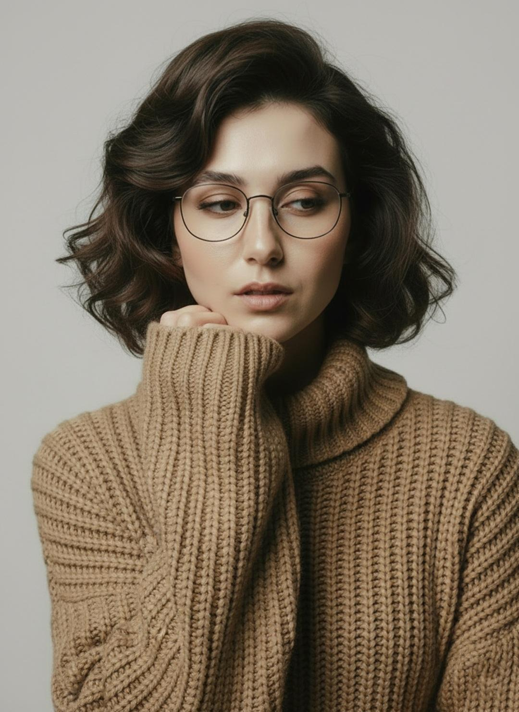

## { "image_generation_prompt": { "subject": { "main": "you

- ID: trending-2016049616807198778
- Slug: trending-2016049616807198778-en
- 语言: en
- 来源: [来源链接](https://x.com/TAB_TAB_HH/status/2016049616807198778)
- 样例图路径: images/part1/2016049616807198778_1.jpg

### 提示词

```text
{
  "image_generation_prompt": {
    "subject": {
      "main": "young female musician bass guitarist performing live on an outdoor stage",
      "appearance": "long dark wavy layered hair blowing slightly in wind, fair skin, intense focused facial expression, natural makeup, silver hoop earrings",
      "pose": "standing confidently holding a bass guitar, fingers plucking strings, looking slightly off-camera to the left"
    },
    "attire": {
      "top": "sleeveless dark grey acid-wash graphic crop top with vintage band aesthetic",
      "bottoms": "loose fit wide-leg blue denim carpenter jeans with large pockets",
      "accessories": "black leather belt with double row silver grommets, wide black guitar strap"
    },
    "instrument": {
      "type": "modern electric bass guitar",
      "details": "deep blue burst finish with visible wood grain texture (quilted maple top), black hardware, long guitar neck, intricate fretboard details"
    },
    "environment": {
      "setting": "daytime outdoor concert stage, open air festival vibe",
      "background_elements": "blurred stage truss structures, black bass amplifier stack with metal grille, microphone stand on the left, overcast bright sky"
    },
    "technical_style": {
      "quality": "ultra realistic, 8k uhd, hdr, masterwork, sharp focus, high fidelity textures",
      "lighting": "natural diffuse daylight, soft shadows, cinematic lighting",
      "camera": "telephoto lens, depth of field, bokeh background, portrait photography"
    }
  },
  "parameters": {
    "aspect_ratio": "9:16",
    "orientation": "vertical long",
    "resolution": "highest possible"
  }
}
```

### 样例图

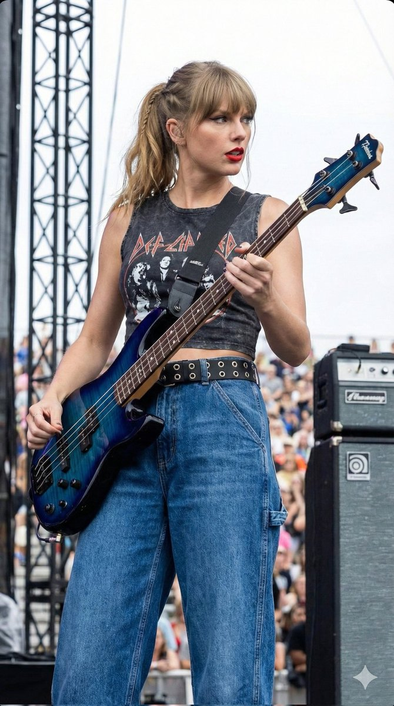

## Ultra-realistic cinematic two-frame composition. In the 

- ID: trending-2030799128343798247
- Slug: trending-2030799128343798247-en
- 语言: en
- 来源: [来源链接](https://x.com/AIwithSynthia/status/2030799128343798247)
- 样例图路径: images/part1/2030799128343798247_1.jpg

### 提示词

```text
Ultra-realistic cinematic two-frame composition. In the top golden vintage frame, an elegant stylish woman wearing a beige blazer, white shirt, and black sunglasses smiles while pouring tea from an ornate engraved copper teapot outward from the frame. The tea flows smoothly out of the frame into the lower frame. In the bottom golden frame, the same woman tilts her head back slightly with a joyful expression, holding a traditional Turkish tea glass as the tea splashes dramatically into it mid-air. Nighttime city skyline with warm glowing lights and water reflections in the background, shallow depth of field, dramatic lighting, high detail, surreal perspective illusion where the liquid connects both frames, cinematic photography, ultra realistic, 8k.
```

### 样例图

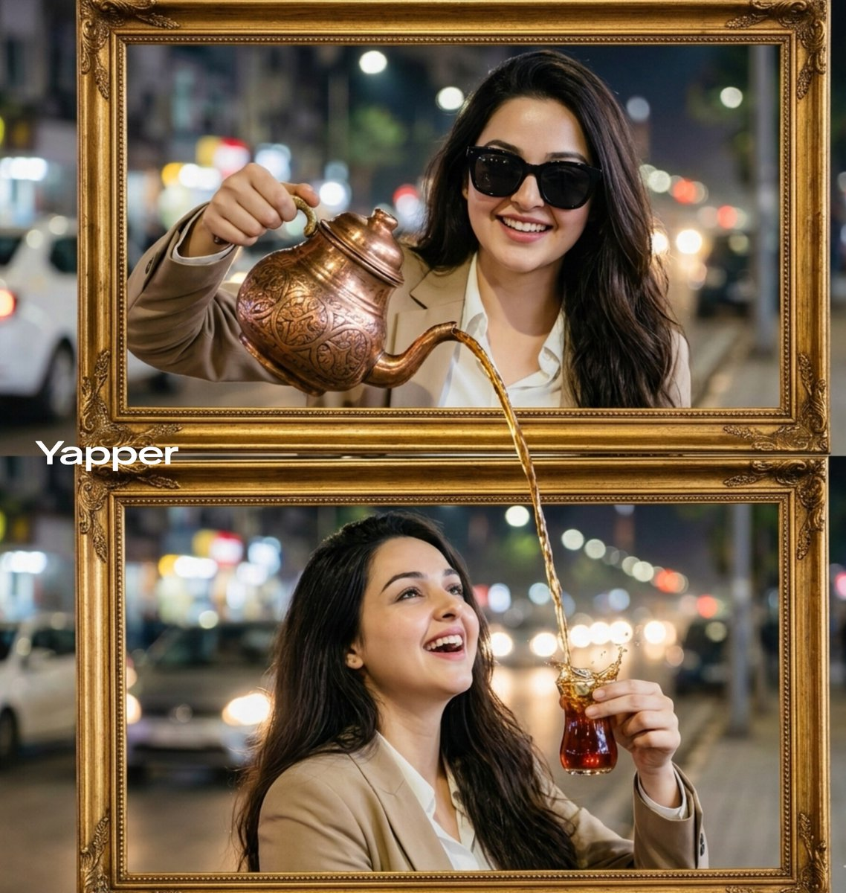

## Cinematic medium shot of a young man with a trimmed bear

- ID: trending-2043664090384801799
- Slug: trending-2043664090384801799-en
- 语言: en
- 来源: [来源链接](https://x.com/ChillaiKalan__/status/2043664090384801799)
- 样例图路径: images/part1/2043664090384801799_1.jpg

### 提示词

```text
Cinematic medium shot of a young man with a trimmed beard and short brown hair, standing upright in a lush meadow at
twilight. He is captured in profile, looking toward the right, holding a professional black mirrorless camera with a long
telephoto lens to his eye level. He wears an olive green corduroy button-down shirt over a plain white t-shirt. The man's chest below the area is hidden inside the grass. The foreground features
tall, sharp blades of grass and soft, out-of-focus wheat stalks creating a natural frame. The foreground is filled with tall, deeply blurred wispy wild grasses, with one very prominent blade
starting near the camera and arcing high above and across his head, creating a strong layer of depth. The background is a
masterclass in bokeh: deep moody blues and greens of distant rolling hills and trees, with a soft motion blur effect on the foliage Large, warm golden bokeh light orbs glow softly in the distance
near a blurred stone archway. High-end photography, 85mm lens, f/1.8, moody atmosphere, sharp focus on the subject with a creamy, cinematic background. ar 4:5
```

### 样例图

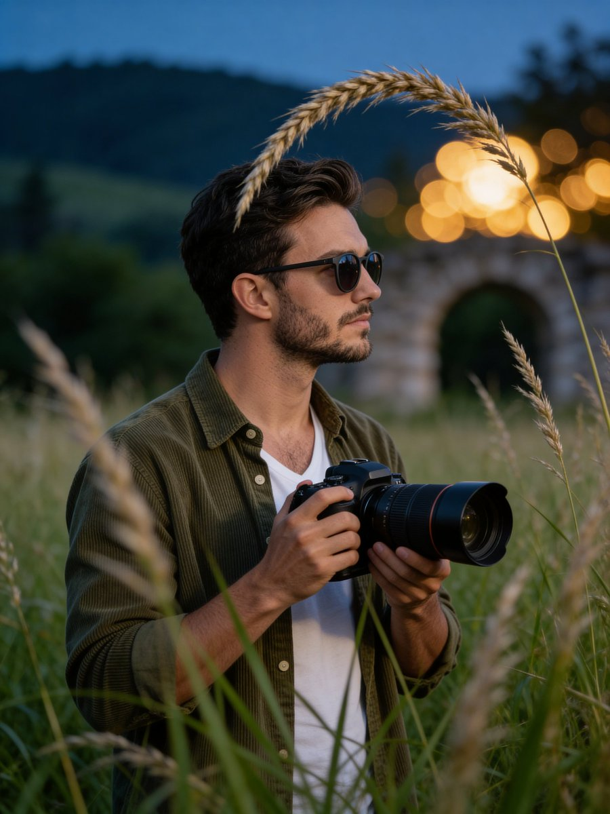

## Full-body portrait of a stylish young man standing again

- ID: trending-2041021416775323737
- Slug: trending-2041021416775323737-en
- 语言: en
- 来源: [来源链接](https://x.com/Mind_Boticni/status/2041021416775323737)
- 样例图路径: images/part1/2041021416775323737_1.jpg

### 提示词

```text
Full-body portrait of a stylish young man standing against a plain light gray background, wearing a fitted black button-up shirt with sleeves rolled up, dark gray slim-fit trousers, and black polished dress shoes. He is posing casually with one hand in his pocket and the other hand near his mouth, slightly lifting one leg. The lighting is soft and even, highlighting his natural features, with a clean minimalist studio aesthetic. Realistic proportions, high-detail, sharp focus, fashion photography style.
```

### 样例图

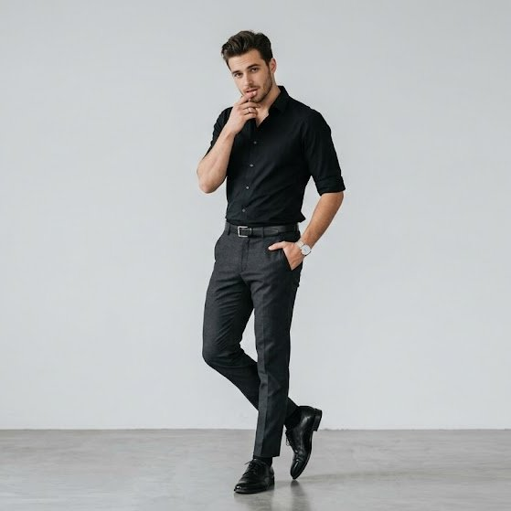

## Use uploaded selfie as ONLY face reference; preserve exa

- ID: trending-2041359077423419632
- Slug: trending-2041359077423419632-en
- 语言: en
- 来源: [来源链接](https://x.com/harboriis/status/2041359077423419632)
- 样例图路径: images/part1/2041359077423419632_1.jpg

### 提示词

```text
Use uploaded selfie as ONLY face reference; preserve exact likeness/age/hair and natural skin texture; no beautification, no face mixing. Ultra-realistic CCTV/security camera still frame in a building hallway: ceiling corner mount view (high angle 60-70° top-down), wide 2.8-3.6mm fisheye barrel distortion, edge warping. Subject centered under the camera, looking up directly into lens with a cool unbothered expression, one hand adjusting the waistband, the other holding a bag strap or hanging relaxed. Outfit (strict, unisex): oversized graphic print T-shirt (generic print, no readable text/logos), wide baggy jeans, Adidas Campus sneakers (recognizable silhouette), chunky chain necklace. CCTV look: low-light greenish/blue tint, interlaced scanlines, H.264 block compression, mild noise, slight motion smear on background only, timestamp/HUD present but blurred/unreadable (no readable text), vignetting, ceiling light glare. Face is the sharpest point. 3:4
```

### 样例图

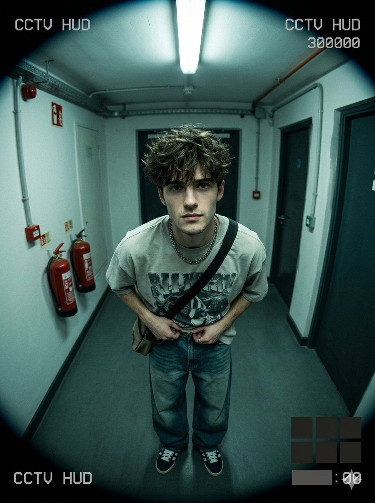

## A surreal cinematic portrait of a young man with oval su

- ID: trending-2037929584147222696
- Slug: trending-2037929584147222696-en
- 语言: en
- 来源: [来源链接](https://x.com/iamsofiaijaz/status/2037929584147222696)
- 样例图路径: images/part1/2037929584147222696_1.jpg

### 提示词

```text
A surreal cinematic portrait of a young man with oval sunglasses, eyes closed, calm expression, standing against a dark firey moody background. The right side of his face is disintegrating into smoke, ash, and glowing embers, as if slowly burning away into the air. Fine particles, sparks, and debris float upward, blending seamlessly into thick swirling smoke above his head. Dramatic low-key lighting, high contrast, ultra-detailed skin texture, photorealistic, shallow depth of field, 85mm lens, dark teal and charcoal color palette, emotional and introspective mood, ultra high resolution, masterpiece, volumetric smoke, cinematic composition.
```

### 样例图

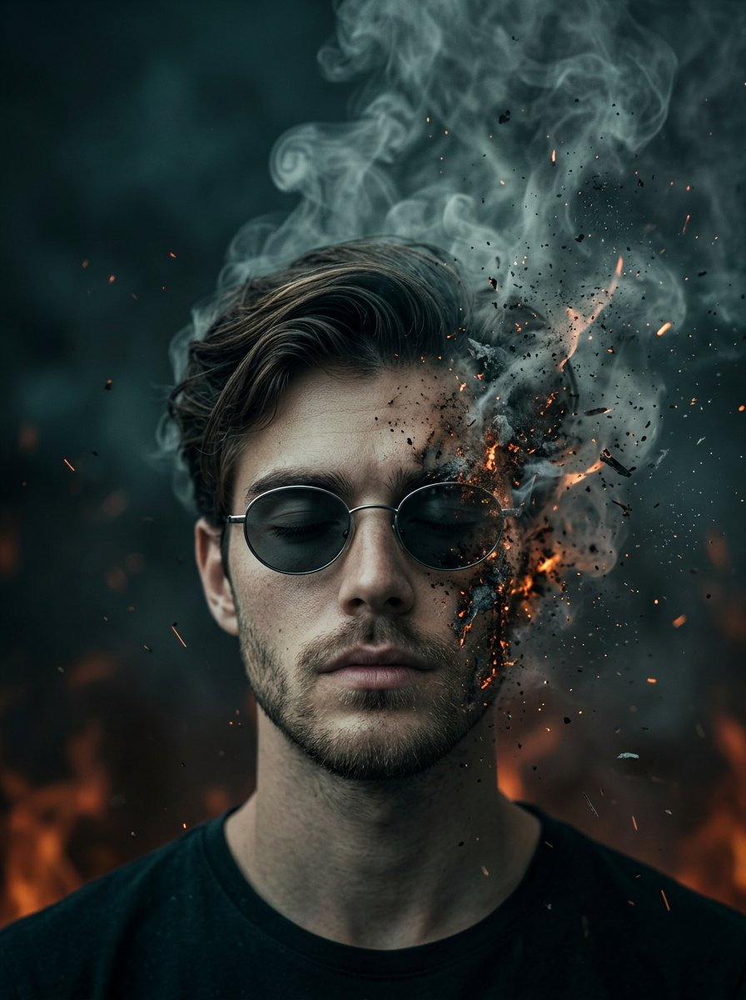

## Create an ultra-realistic, cinematic 8K image with high-

- ID: trending-2028276251262423347
- Slug: trending-2028276251262423347-en
- 语言: en
- 来源: [来源链接](https://x.com/auqibhabib/status/2028276251262423347)
- 样例图路径: images/part1/2028276251262423347_1.jpg

### 提示词

```text
Create an ultra-realistic, cinematic 8K image with high-contrast dramatic lighting and a photo-real digital painting aesthetic-use face reference exactly. The man is shown in a full-body side profile facing right, his face and hairstyle copied perfectly with no alterations He wears modern casual streetwear; a light grey crewneck t-shirt, light neutral cargo pants, light-colored high-top boots, and a watch on his left wrist. His posture is slightly slumped, head bowed, eyes looking downward, hands relaxed at his sides, conveying deep introspection and sorrow. Nearly half of his body is dissolving into extremely thick, cloud-like grey smoke filled with glowing yellow dust particles. His left arm, shoulder, torso, legs, and part of his hair become transparent as they break into luminous particles, suggesting active disintegration Behind and partially surrounding him is a massive glowing crescent (C-shaped) energy aura, emitting fiery golden-white plasma light. This aura acts as a powerful rim and backlight, highlighting the smoke, dust, and silhouette. The setting is minimal and stark: a concrete or desolate paved surface meeting a heavily overcast sky. The color palette is nearly monochrome greys and whites, contrasted by intense amber-gold glow, Shallow depth of field, glow/bloom lighting, particle dispersion, cinematic composition, emotional and dramatic atmosphere.
```

### 样例图

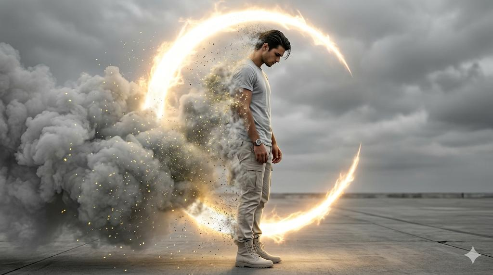

## A hyper-realistic 8k high-angle overhead shot, captured 

- ID: trending-2022667985039823362
- Slug: trending-2022667985039823362-en
- 语言: en
- 来源: [来源链接](https://x.com/AbidkingB/status/2022667985039823362)
- 样例图路径: images/part1/2022667985039823362_1.jpg

### 提示词

```text
A hyper-realistic 8k high-angle overhead shot, captured with a wide-angle lens, presents a romantic scene of a couple lying on a light-colored wooden floor. The lighting is soft and natural, possibly from a window, creating gentle highlights on the balloons and subtle shadows on the floor, contributing to a cinematic atmosphere. The female subject, uploaded face as reference, is positioned on her back, wearing a black crop top, light blue denim shorts, and a white unbuttoned shirt draped over her. Her left arm is bent with her hand near her head, and her right arm is gently extended towards the male. The male subject, uploaded face as reference, is also on his back, wearing a light grey t-shirt and light blue distressed denim jeans. His left arm is bent, hand near the female's head, and his right arm is relaxed. They are lying close together, heads touching, looking into each other's eyes with soft, affectionate smiles. The entire floor around and between them is densely decorated with a multitude of shiny red heart-shaped foil balloons of varying sizes, interspersed with several white round latex balloons, and countless small red and white rose petals, creating a highly detailed texture and vibrant color contrast against the light wood. The composition is a full-body shot, showcasing the couple and the extensive, immersive decorations.
```

### 样例图

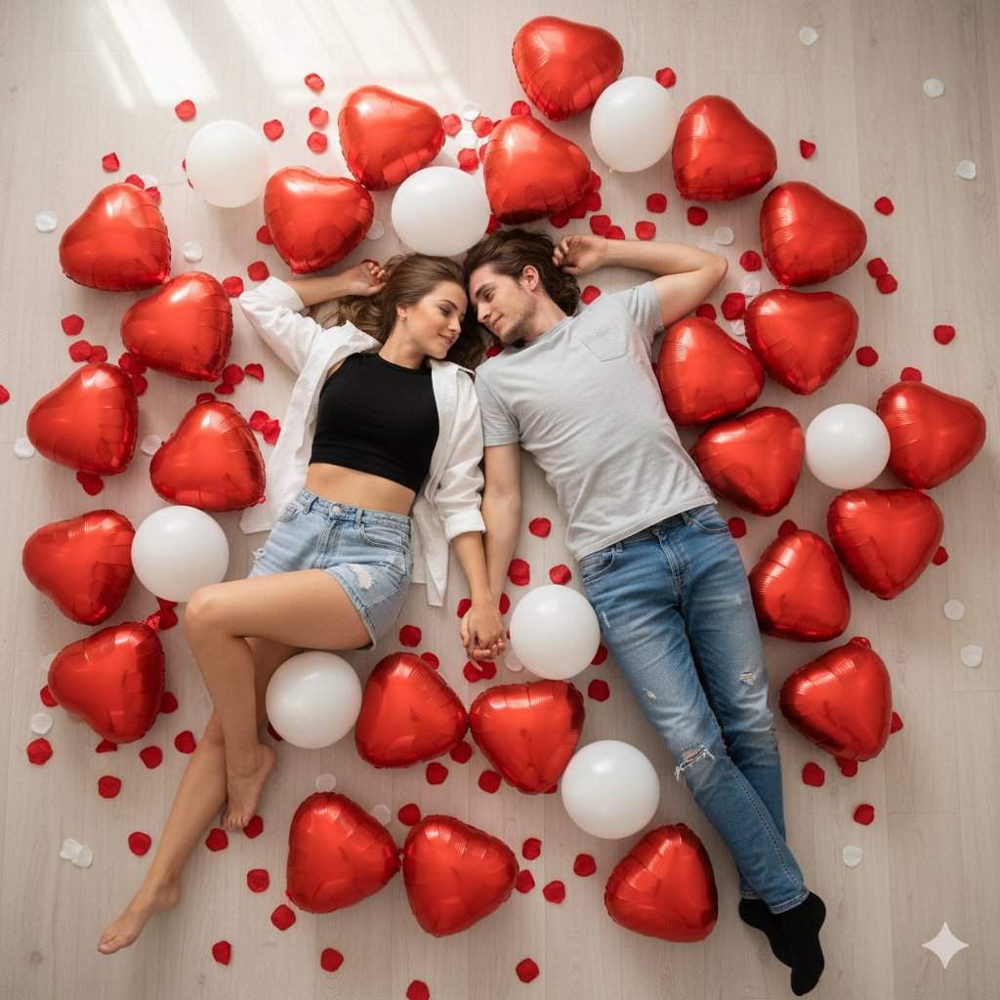

## Generate a highly detailed, photorealistic 8K streetwear

- ID: trending-2032542713170838002
- Slug: trending-2032542713170838002-en
- 语言: en
- 来源: [来源链接](https://x.com/youngcatwoman/status/2032542713170838002)
- 样例图路径: images/part1/2032542713170838002_1.jpg

### 提示词

```text
Generate a highly detailed, photorealistic 8K streetwear fashion portrait of Rosé of Blackpink, who is dominating about 90% of the frame. The shot is taken from a low angle with a close-up perspective, using a wide-angle lens with heavy fisheye distortion to simulate a photo taken on a modern smartphone. She has her signature bleached blonde hair in thick pigtail braids, pale porcelain skin, and a confident expression. She is in a low, crouched squat position on the floor, balancing on the spiked high heels and both hands are placed flat on her thighs, leaning slightly forward, and looking directly at the camera. Cobalt-framed rectangular retro sunglasses slightly away from her eyes with both hands. She is wearing a cobalt blue cotton halter crop top, tight cobalt blue latex leggings, and cobalt blue high heels. Her accessories include a ruby bead necklace with a gold star pendant, silver hoop earrings, gold rings, and a cobalt blue bracelet with a raised texture. The outdoor setting features a vibrant, textured teal wall behind her with a graffiti written 'Alice' and a red metal grate above. The scene is lit by intense, direct daytime sunlight, creating hard shadows and high contrast. A small "yapper" watermark is in the bottom right corner. Aspect ratio 9:16.
```

### 样例图

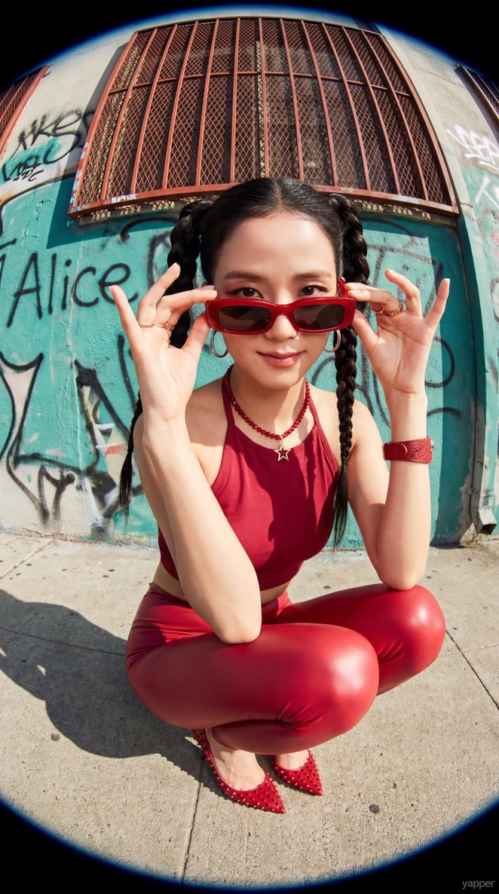

## A hyper-realistic, 8k, high-fidelity photograph captured

- ID: trending-2028065588048810491
- Slug: trending-2028065588048810491-en
- 语言: en
- 来源: [来源链接](https://x.com/HaniaAi12/status/2028065588048810491)
- 样例图路径: images/part1/2028065588048810491_1.jpg

### 提示词

```text
A hyper-realistic, 8k, high-fidelity photograph captured with a wide-angle lens and shallow depth of field, creating a dramatic forced perspective. The composition features a colossal human face and hand on the right side, filling the frame, with the hand extended palm-up towards the left. The giant person, with a full beard and mustache, has their mouth slightly agape in an expression of surprise or speech, looking down towards their palm. On the palm of this giant hand stands a miniature person, appearing tiny in comparison, wearing a black short-sleeved t-shirt and light khaki pants, with dark curly hair. This miniature figure is captured mid-action, with arms slightly bent and legs in a dynamic, running or reacting pose, also with an open mouth as if shouting or speaking. The background is an extremely blurred, warm-toned indoor setting, suggesting an office or study with hints of wooden shelves and a blue binder, providing a soft bokeh effect. Cinematic lighting illuminates the scene with soft, warm light, highlighting the highly detailed texture of the skin, hair, and clothing, while maintaining a natural, diffused quality. The character's face for both the giant and the miniature person is: uploaded face as reference.
```

### 样例图

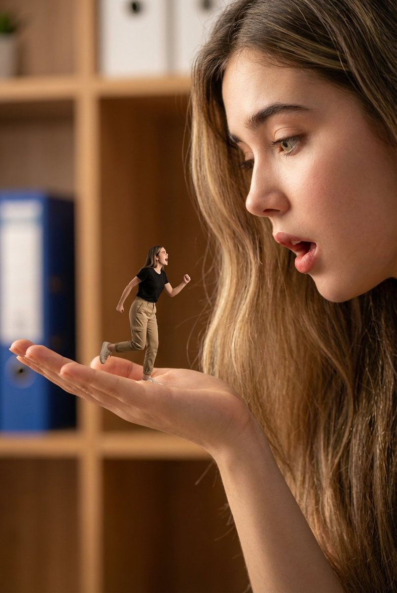

## { "Objective": "Create a dramatic black-and-white cinema

- ID: trending-2010724643737686242
- Slug: trending-2010724643737686242-en
- 语言: en
- 来源: [来源链接](https://x.com/Taaruk_/status/2010724643737686242)
- 样例图路径: images/part1/2010724643737686242_1.jpg

### 提示词

```text
{
  "Objective": "Create a dramatic black-and-white cinematic portrait with a classic film-noir mood and selective color emphasis",
  "PersonaDetails": {
    "Subject": {
      "Type": "Young man",
      "Hair": "Medium-length, naturally styled",
      "FacialHair": "Well-groomed beard",
      "Pose": "Thoughtful pose with one hand resting near the chin",
      "Expression": "Introspective, confident, composed",
      "Wardrobe": "Dark jacket",
      "Accessories": {
        "Sunglasses": {
          "Type": "Stylish aviator sunglasses",
          "LensColor": "Warm amber/yellow-tinted lenses",
          "SpecialTreatment": "Only colored element in an otherwise monochrome image"
        }
      }
    }
  },
  "Composition": {
    "Framing": "Close-up to mid-close portrait",
    "Angle": "Eye-level, slightly cinematic framing",
    "DepthOfField": "Shallow depth of field",
    "Focus": "Sharp focus on facial features and sunglasses"
  },
  "LightingAndAtmosphere": {
    "LightingStyle": "Strong cinematic backlighting",
    "Effects": [
      "Glowing bokeh lights in the background",
      "Studio or stage-light appearance"
    ],
    "Contrast": "High contrast with deep blacks and bright highlights",
    "Mood": "Moody, dramatic, contemplative"
  },
  "ArtDirection": {
    "Style": "Classic film-noir photography",
    "ColorTreatment": {
      "Base": "Black-and-white",
      "Accent": "Selective color on amber/yellow lenses"
    },
    "TextureDetail": "Ultra-detailed skin, hair, and fabric textures",
    "Aesthetic": "Elegant, timeless, cinematic"
  },
  "PhotographyStyle": {
    "Genre": "Professional cinematic portrait photography",
    "ImageQuality": "Ultra-high resolution, crisp detail",
    "Finish": "Refined, editorial, gallery-worthy"
  },
  "Mood": {
    "Tone": "Serious, reflective, stylish",
    "EmotionalFeel": "Quiet intensity and classic masculinity"
  },
  "NegativePrompt": [
    "full color image",
    "flat lighting",
    "low contrast",
    "modern casual snapshot",
    "oversharpening",
    "plastic skin",
    "cartoon",
    "anime"
  ],
  "ResponseFormat": {
    "Type": "Single image",
    "Orientation": "Portrait",
    "AspectRatio": "2:3"
  }
}
```

### 样例图

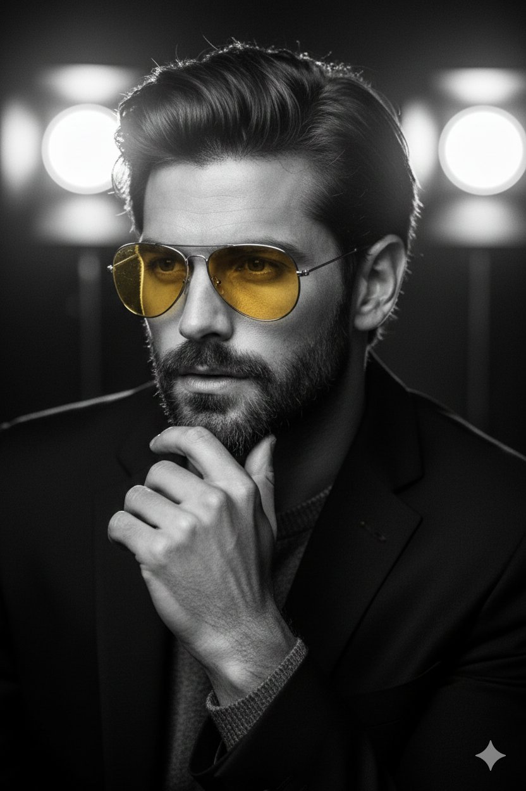

## cinematic portrait of a young woman standing perfectly s

- ID: trending-2032694954758193192
- Slug: trending-2032694954758193192-en
- 语言: en
- 来源: [来源链接](https://x.com/SimplyAnnisa/status/2032694954758193192)
- 样例图路径: images/part1/2032694954758193192_1.jpg

### 提示词

```text
cinematic portrait of a young woman standing perfectly still as the city around her spirals in circular motion blur, streaks of headlights and neon lights orbiting her body like gravity pulling the world inward, dramatic teal and orange cinematic color grading, wind moving strands of hair, calm expression contrasting chaotic motion, shallow depth of field, shot on a 50mm lens, realistic skin texture, atmospheric night lighting, vertical composition
```

### 样例图

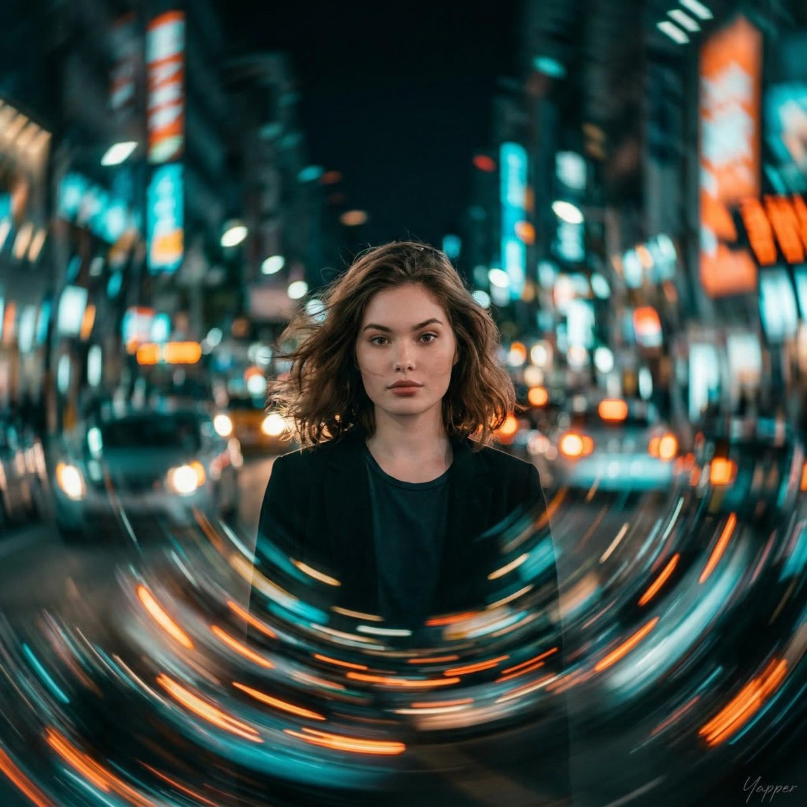

## { "intent": { "summary": "Land-art photography of a woma

- ID: trending-2024545041193324550
- Slug: trending-2024545041193324550-en
- 语言: en
- 来源: [来源链接](https://x.com/IamEmily2050/status/2024545041193324550)
- 样例图路径: images/part1/2024545041193324550_1.jpg

### 提示词

```text
{
  "intent": {
    "summary": "Land-art photography of a woman connected to the sea via a specific water-filled trench in the sand, matching a provided schematic diagram.",
    "strategy": "Structural Precision: Defining the 'line' as a dug channel to prevent chaotic water flow."
  },
  "frame": {
    "aspect_ratio": "3:2",
    "shot_size": "Wide Shot (WS)",
    "orientation": "Landscape",
    "composition_guide": "Diagrammatic Layout: Woman on left, Sea on right, connected by a sinuous line."
  },
  "subject": {
    "subject_type": "Human",
    "identity_summary": "Female figure acting as the anchor for a sand-art installation.",
    "visual_signature": {
      "facial_signature": {
        "face_shape": "Soft",
        "eye_details": "Closed",
        "nose_details": "Natural",
        "lip_details": "Relaxed",
        "cheek_and_jaw": "Relaxed",
        "unique_features": "Wet hair"
      },
      "body_signature": {
        "build": "Slender",
        "proportions": "Natural",
        "skin_tone_and_texture": "Natural, sand-dusted",
        "height_estimation_cm": 165,
        "unique_markings": "None"
      }
    },
    "pose_and_action": {
      "description": "Lying in a tight fetal position inside a sand circle.",
      "body_position": "Curled on side, knees tucked high.",
      "limb_positions": "Arms tucked in, hugging knees.",
      "hand_gestures": "Hands folded near face/knees.",
      "facial_expression": "Peaceful, sleeping.",
      "gaze_direction": "Eyes closed."
    },
    "inventory": {
      "wardrobe": "White dress, wet and clinging to the body.",
      "accessories": "None.",
      "held_objects": "None.",
      "hair_style": "Dark, wet, splayed out on the sand."
    }
  },
  "environment": {
    "setting_type": "Outdoor",
    "location_description": "Flat sandy beach with specific sand-art markings.",
    "time_of_day": "Daytime",
    "weather_conditions": "Clear",
    "background_elements": "The beach features a deep, hand-dug trench snaking from the sea to the woman's belly. This trench is filled with sea water but distinct from the surrounding dry sand. A separate circular groove surrounds the woman."
  },
  "lighting": {
    "global_illumination": "Natural Sunlight",
    "primary_source": "Sun",
    "direction": "Top-down",
    "shadow_quality": "Sharp shadows inside the dug sand trenches to emphasize depth.",
    "color_temperature": "Daylight (5500k)"
  },
  "camera": {
    "angle": "Bird's Eye View",
    "lens_type": "35mm Wide Angle",
    "focal_length_mm": 35,
    "aperture": "f/8 (Deep focus to keep the entire sand drawing sharp)"
  },
  "post_processing": {
    "art_medium": "Photography",
    "style_modifiers": "Land Art, Conceptual, National Geographic",
    "color_grade": "Natural tones, high contrast between water in the trench and the sand.",
    "rendering_engine": "N/A",
    "quality_boosters": "8k, sharp focus, hyper-realistic water texture"
  },
  "negative": {
    "artifact_suppression": "waves washing over subject, messy water, flooding, broken lines, chaotic splash, surfing",
    "subject_excludes": "standing, dry sand, rocks"
  }
}
```

### 样例图

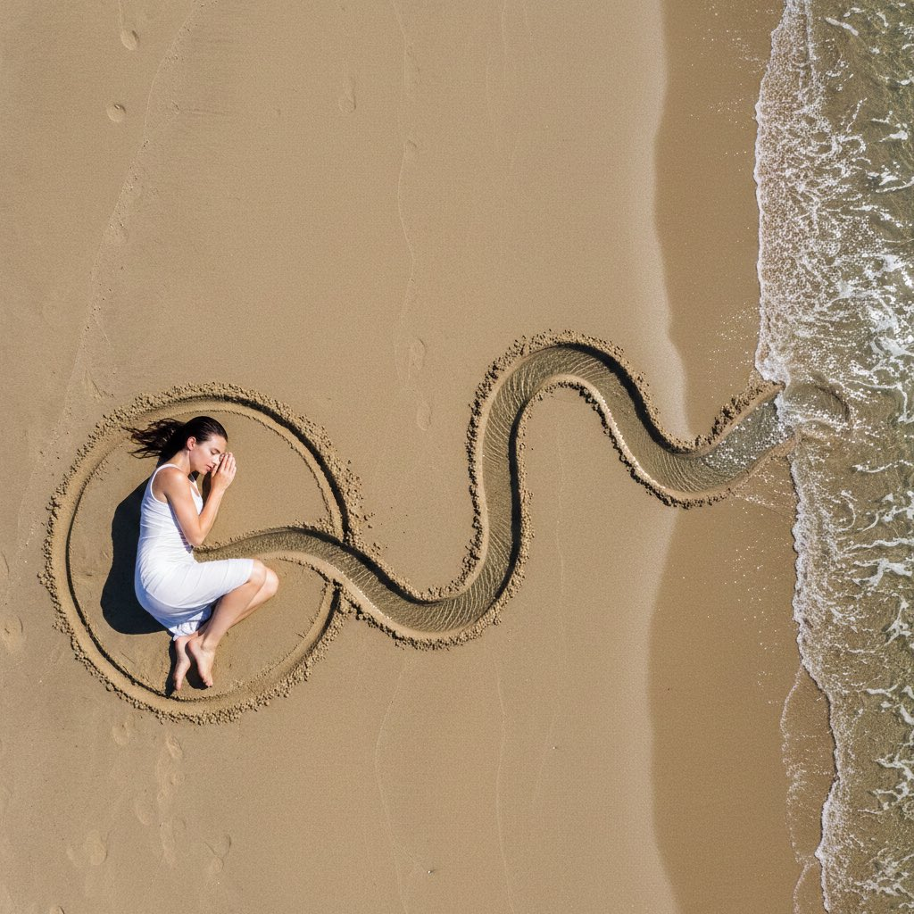

## Portrait of [your description], face illuminated by dram

- ID: trending-2032013831548125557
- Slug: trending-2032013831548125557-en
- 语言: en
- 来源: [来源链接](https://x.com/NikhilRajX/status/2032013831548125557)
- 样例图路径: images/part1/2032013831548125557_1.jpg

### 提示词

```text
Portrait of [your description], face illuminated by dramatic cinematic volumetric god rays, intense shafts of golden light beams cutting through dusty abandoned warehouse, sunlight streaming through broken high windows and cracked roof, floating dust particles and haze making light visible, strong rim light and backlighting, moody high-contrast atmosphere, industrial concrete pillars and rusted metal in background, film still, epic cinematic lighting, volumetric fog, god rays, atmospheric depth, ultra-detailed skin texture, shallow depth of field, shot on 35mm Arri Alexa, cinematic color grade, teal shadows and warm golden highlights --ar 3:4 --stylize 250 --v 6 --q 2
```

### 样例图

![Portrait of [your description], face illuminated by dram](../images/part1/2032013831548125557_1.jpg)

## { "generation_request": { "meta_data": { "tool": "NanoBa

- ID: trending-2031462324821741847
- Slug: trending-2031462324821741847-en
- 语言: en
- 来源: [来源链接](https://x.com/astronomerozge1/status/2031462324821741847)
- 样例图路径: images/part1/2031462324821741847_1.jpg

### 提示词

```text
{
  "generation_request": {
    "meta_data": {
      "tool": "NanoBanana Pro",
      "task_type": "fashion_variation_grid_9panel",
      "language": "en",
      "priority": "highest",
      "version": "v1.0_GOLDEN_GODDESS_JEWELRY_9GRID"
    },
    "input": {
      "mode": "text_to_image",
      "notes": "Create a 3x3 high-fashion goddess editorial grid featuring the same elegant woman with luxurious gold body jewelry and draped styling."
    },
    "output_settings": {
      "aspect_ratio": "4:5",
      "orientation": "portrait",
      "resolution_target": "ultra_high_res",
      "num_images": 1,
      "layout": {
        "type": "grid",
        "rows": 3,
        "cols": 3,
        "gutter": "thin",
        "outer_border": "none",
        "panel_consistency": "very_high"
      },
      "render_style": "golden_goddess_editorial",
      "sharpness": "editorial_crisp",
      "grain": "subtle_clean"
    },
    "scene": {
      "environment": "warm sand-toned luxury studio with subtle stone texture",
      "lighting": "golden diffused light with bronzed highlights on skin and jewelry",
      "mood": "divine, radiant, regal, sensual"
    },
    "subject": {
      "description": "same elegant adult woman across all 9 panels",
      "face": "same identity in all panels, calm regal expression",
      "skin": "sunlit bronzed luminous skin texture",
      "hair": "soft dark hair styled loosely back with glowing face-framing strands",
      "makeup": "gold-bronze eyelids, subtle liner, luminous skin, glossy nude lips",
      "expression": "serene, elevated, goddess-like"
    },
    "wardrobe": {
      "top": "soft ivory or sand draped wrap tops with goddess-inspired constructions",
      "bottom": "flowing low-rise draped bottoms",
      "accessories": "dramatic gold cuff bracelets, layered gold body chains, gold waist jewelry, delicate rings",
      "styling": "ancient goddess meets modern couture"
    },
    "composition_rules": {
      "face_visibility": "mandatory in all 9 panels",
      "framing": "mid-length to upper-thigh framing",
      "identity_consistency": "same woman in every panel"
    },
    "panel_design": {
      "panel_1": "front portrait with crossed halter drape and gold chest jewelry",
      "panel_2": "front portrait with bandeau drape and gold waist chain",
      "panel_3": "three-quarter portrait with one-shoulder drape and layered gold accessories",
      "panel_4": "front portrait with off-shoulder draped wrap and stacked gold cuffs",
      "panel_5": "front portrait with sculptural crossed neckline and gold body chain",
      "panel_6": "front portrait with elongated halter drape and arm jewelry",
      "panel_7": "three-quarter portrait with tied-front drape and ornate waist chain",
      "panel_8": "front portrait with diagonal wrapped bust and gold accents",
      "panel_9": "front portrait with bandeau and crisscross waist drape, hand touching collarbone"
    },
    "camera": {
      "lens": "85mm portrait lens",
      "style": "luxury goddess fashion photography",
      "depth_of_field": "shallow",
      "angle": "eye-level"
    },
    "quality_control": {
      "identity_consistency": "maximum",
      "panel_consistency": "very_high",
      "face_priority": "absolute",
      "anatomy_accuracy": "maximum",
      "hands_priority": "very_high",
      "jewelry_integrity": "very_high",
      "fabric_realism": "high"
    },
    "negative_prompt": [
      "cheap costume jewelry",
      "different woman",
      "extra fingers",
      "missing fingers",
      "warped anatomy",
      "plastic skin",
      "text",
      "watermark",
      "logo"
    ]
  }
}
```

### 样例图

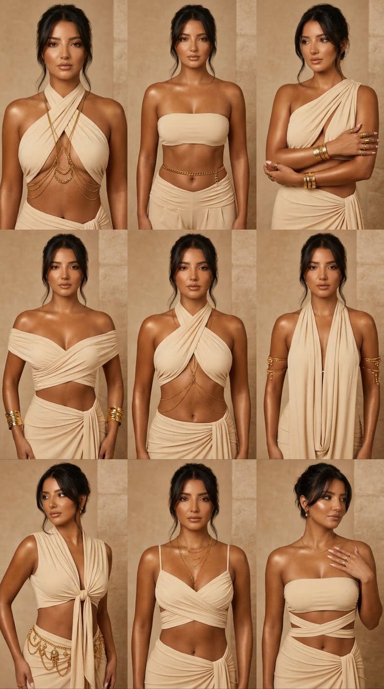

## Ultra-realistic fashion black and white portrait of a ma

- ID: trending-2017795656379994165
- Slug: trending-2017795656379994165-en
- 语言: en
- 来源: [来源链接](https://x.com/harboriis/status/2017795656379994165)
- 样例图路径: images/part1/2017795656379994165_1.jpg

### 提示词

```text
Ultra-realistic fashion black and white portrait of a man with short light hair, wearing a dark tailored coat and a black turtleneck. They hold a cigarette between their lips as soft smoke curls around their face. Extremely detailed natural skin texture visible pores, fine lines, realistic contrast and tonal range. lifelike matte highlights. Subtle film grain, soft diffused lighting, minimalist background. High-fashion editorial mood, sharp details, expressive gaze, dramatic monochrome aesthetic, Hasselblad X2D, 30mm lens, strong contrast, daylight, fashion composition, architectural elements, editorial clarity medium format -p cz2pqao
```

### 样例图

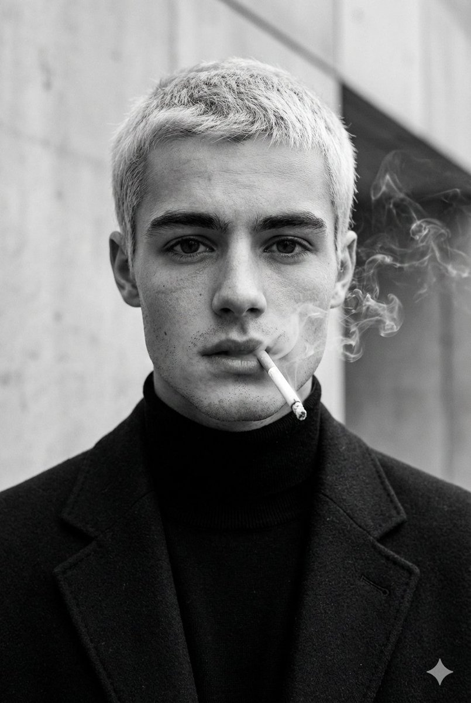

## A stylish male model sitting on a white cube in a minima

- ID: trending-2043179565896655237
- Slug: trending-2043179565896655237-en
- 语言: en
- 来源: [来源链接](https://x.com/Taaruk_/status/2043179565896655237)
- 样例图路径: images/part1/2043179565896655237_1.jpg

### 提示词

```text
A stylish male model sitting on a white cube in a minimalist studio with a vibrant orange background. He is wearing a fitted green knit sweater, black pants, and white sneakers, paired with black sunglasses for a modern, confident look. The model sits relaxed with hands resting together, facing the camera. Soft directional lighting creates subtle shadows on the floor and background, adding depth and a premium fashion editorial feel. Clean composition, centered framing, smooth backdrop, high contrast colors, sharp details, professional studio photography, ultra-realistic, 8K.
```

### 样例图

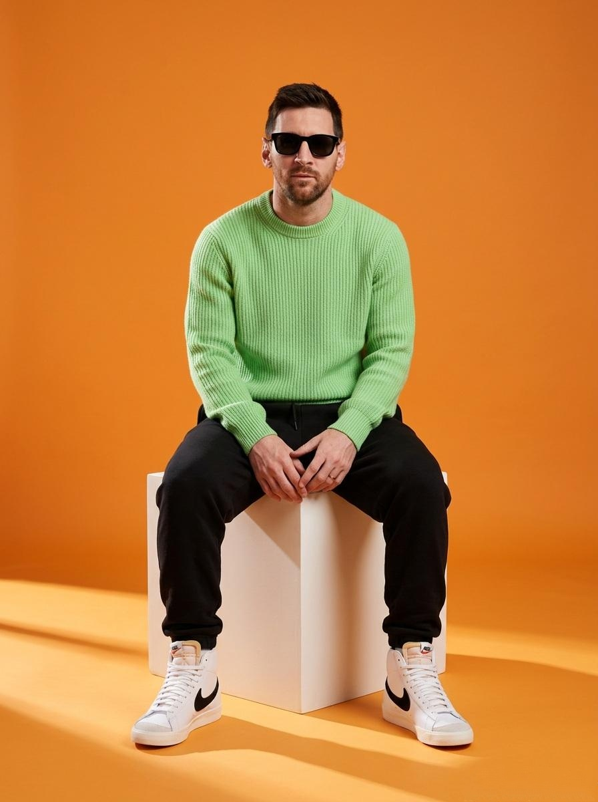

## Using the reference picture, create A stylish man sittin

- ID: trending-2029721401033384149
- Slug: trending-2029721401033384149-en
- 语言: en
- 来源: [来源链接](https://x.com/auqibhabib/status/2029721401033384149)
- 样例图路径: images/part1/2029721401033384149_1.jpg

### 提示词

```text
Using the reference picture, create A stylish man sitting on a luxurious vintage red velvet sofa, wearing black silk shirt, sunglasses, confi-dently holding a cheetah adorned with cinematic lighting, dollars are spread on sofa too and there are two guards on back side in blur bg, luxury life-style, dramatic atmosphere." 100% Real Face 8K Resolution
```

### 样例图

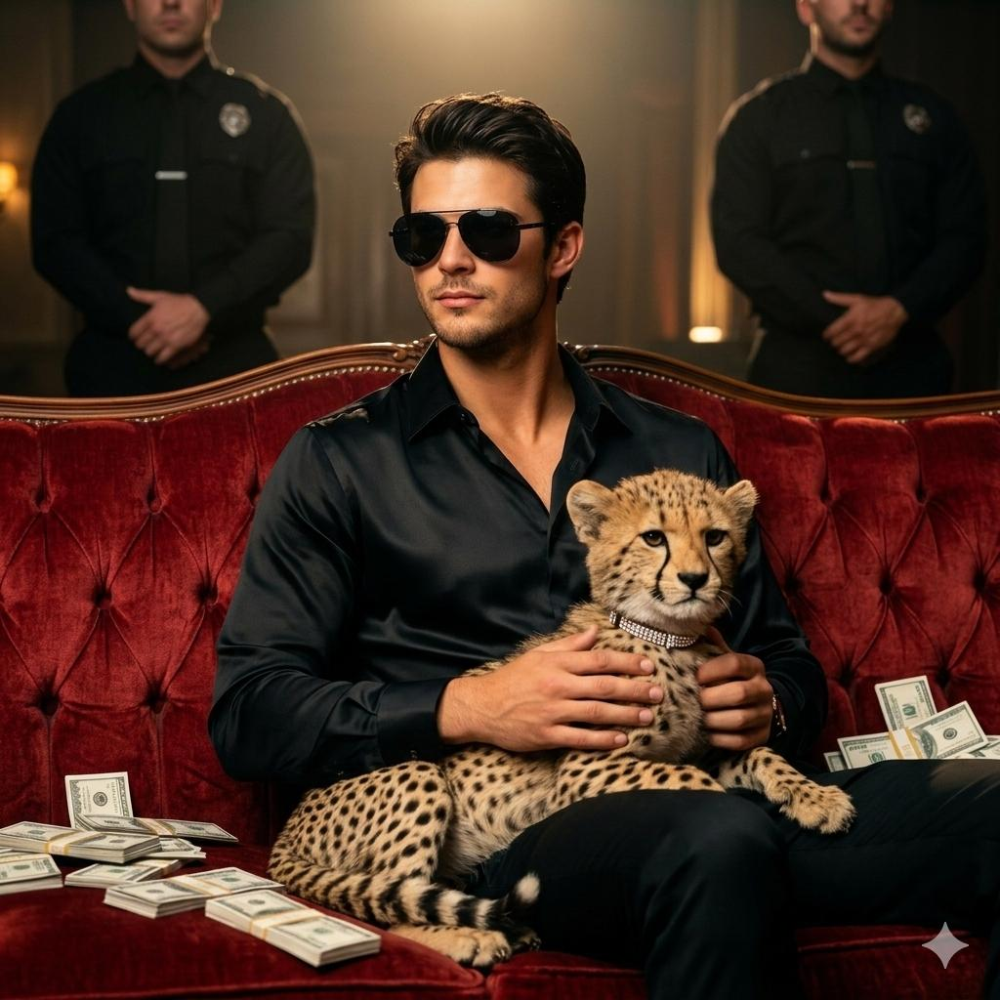

## A low-angle, cinematic close-up shot looking through a r

- ID: trending-2039732389979607055
- Slug: trending-2039732389979607055-en
- 语言: en
- 来源: [来源链接](https://x.com/Minahil42298354/status/2039732389979607055)
- 样例图路径: images/part1/2039732389979607055_1.jpg

### 提示词

```text
A low-angle, cinematic close-up shot looking through a rain-slicked car window. Inside the car, a contemplative man with short dark hair and slight stubble is visible, looking out toward the city. The focus is sharp on the water droplets clinging to the glass, while the man and the background are slightly softer.
​Setting & Atmosphere: A bustling European city street at night during a rainstorm. The atmosphere is melancholic yet cozy. In the reflection of the car door and window, blurred city lights, glowing neon shop signs (blues and reds), and the outlines of historical architecture are visible.
​Lighting & Color: * Lighting: Naturalistic night lighting provided by street lamps and neon signs, creating a cool blue and teal base with warm orange and red highlights.
​Reflections: Complex reflections of wet pavement and passing cars on the dark metallic surface of the vehicle.
​Technical Specs: 35mm lens, f/1.8 aperture for shallow depth of field, high contrast, moody film grain, hyper-realistic textures, shot on Sony A7R IV style.
```

### 样例图

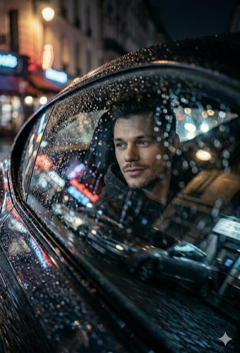

## A cinematic night-time urban portrait of a confident, ha

- ID: trending-2008815653424390145
- Slug: trending-2008815653424390145-en
- 语言: en
- 来源: [来源链接](https://x.com/Kashberg_0/status/2008815653424390145)
- 样例图路径: images/part1/2008815653424390145_1.jpg

### 提示词

```text
A cinematic night-time urban portrait of a confident, handsome man leaning against a black luxury SUV on a modern city highway. He is wearing a black blazer over a white unbuttoned dress shirt and light blue tailored trousers, one hand in his pocket, the other resting on the car. Clean haircut, light stubble, sharp masculine features. Skyscrapers with glowing windows in the background, streetlights creating bokeh, long light trails from passing traffic. Moody, high-contrast lighting, shallow depth of field, professional fashion photography, ultra-realistic, 85mm lens, f/1.8, cinematic color grading, luxury lifestyle aesthetic.
```

### 样例图

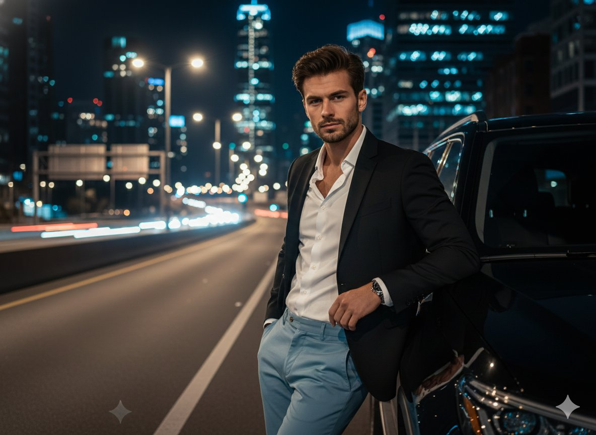

## Using the uploaded picture as the only reference and wit

- ID: trending-2032699901499551793
- Slug: trending-2032699901499551793-en
- 语言: en
- 来源: [来源链接](https://x.com/ZaraIrahh/status/2032699901499551793)
- 样例图路径: images/part1/2032699901499551793_1.jpg

### 提示词

```text
Using the uploaded picture as the only reference and without changing the face, create a fashion editorial portrait of a woman sitting confidently in a plush oversized pink faux-fur armchair against a soft pastel pink background; she wears a fluffy pink jacket, white trousers and white lace-up boots, seated with legs crossed and a calm confident expression; surrounded symmetrically by multiple fluffy long-haired cats in cream, gray and white tones perched on the chair arms, backrest and floor around her; highly stylized monochromatic pink aesthetic, soft studio lighting, clean background, luxurious textures in fur fabric and cat fur, centered composition, fashion magazine style, high detail, shallow depth of field, ultra-sharp textures, high dynamic range, 8k ultra-photorealism, masterpiece quality.
```

### 样例图

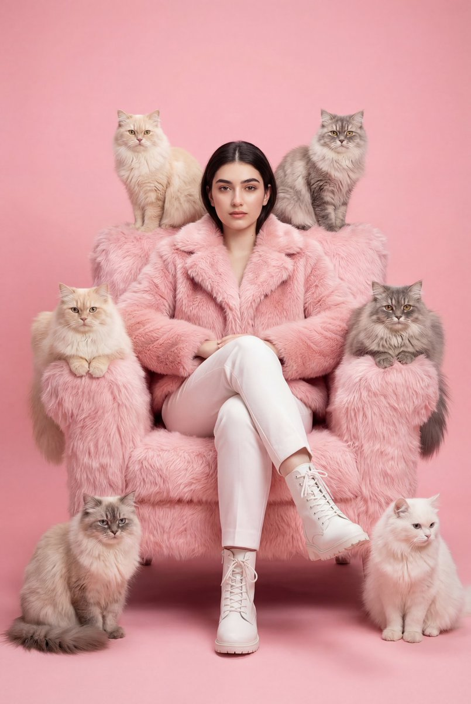

## A cinematic portrait of a handsome man with a short styl

- ID: trending-2009993252381049331
- Slug: trending-2009993252381049331-en
- 语言: en
- 来源: [来源链接](https://x.com/ChillaiKalan__/status/2009993252381049331)
- 样例图路径: images/part1/2009993252381049331_1.jpg

### 提示词

```text
A cinematic portrait of a handsome man with a short styled haircut and trimmed beard, wearing a plain brown t-shirt and round black sunglasses, standing in side profile against a textured concrete wall, warm golden-hour sunlight, shallow depth of field, muted earthy tones, natural light, sharp focus, modern fashion photography, 35mm lens, high detail, realistic.
```

### 样例图

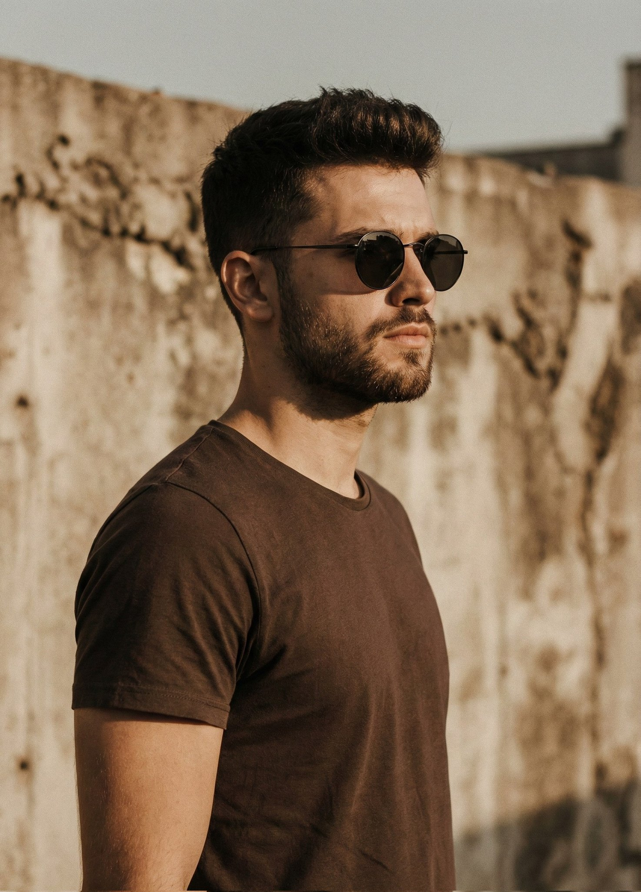

## { "lighting": { "mood": "Candid, slightly harsh evening 

- ID: trending-2009136276772147276
- Slug: trending-2009136276772147276-en
- 语言: en
- 来源: [来源链接](https://x.com/FilmHub00/status/2009136276772147276)
- 样例图路径: images/part1/2009136276772147276_1.jpg

### 提示词

```text
{
  "lighting": {
    "mood": "Candid, slightly harsh evening lighting",
    "type": "On-camera flash",
    "shadows": "Strong shadows visible, especially on the woman's neck and behind the subjects",
    "direction": "Frontal lighting",
    "intensity": "Harsh, creating highlights on faces and the dress"
  },
  "background": {
    "setting": "Likely an indoor evening event or party",
    "elements": "Faint, indistinct shapes of other people or objects in the distance",
    "description": "Extremely dark and underexposed due to flash",
    "depth_of_field": "Shallow, background is completely blurred"
  },
  "typography": {
    "details": "No visible text or logos",
    "present": "None"
  },
  "composition": {
    "angle": "Slightly from the right, eye-level",
    "focus": "Sharp focus on the two subjects, particularly their faces",
    "framing": "Tight framing on the couple",
    "shot_type": "Medium shot",
    "orientation": "Portrait",
    "positioning": "Woman on the left, man on the right, standing closely together"
  },
  "color_profile": {
    "palette": "Dark suit, bright red tie, silver sparkling dress, warm skin tones, dark background",
    "contrast": "High contrast due to flash",
    "saturation": "Moderate saturation",
    "color_grading": "Typical 1990s flash photography, slightly warm hues",
    "dominant_colors": [
      "#000000",
      "#FFFFFF",
      "#C0C0C0",
      "#FF0000"
    ]
  },
  "technical_specs": {
    "grain": "Visible film grain",
    "source": "Photograph, likely film from the 1990s",
    "sharpness": "Relatively sharp on subjects, background is blurry and dark",
    "resolution": "Medium resolution scan",
    "aspect_ratio": "Approx. 9:16 (square)"
  },
  "subject_analysis": {
    "man": {
      "hair": "Blonde, brushed back",
      "attire": "Dark navy suit, white collared shirt, bright red tie",
      "identity": "Donald Trump (younger)",
      "position": "Right side of the frame",
      "expression": "Mouth open, possibly speaking or grimacing"
    },
    "woman": {
      "hair": "Shoulder-length blonde hair",
      "attire": "Silver, sparkling, spaghetti-strap dress",
      "jewelry": "Small earring visible on left ear",
      "identity": "Blonde woman (possibly Kara Young)",
      "position": "Left side of the frame",
      "expression": "Looking directly at camera, slightly open mouth"
    }
  },
  "artistic_elements": {
    "mood": "Slightly awkward, caught-in-the-moment",
    "style": "Candid celebrity snapshot",
    "texture": "Prominent texture of the woman's sparkling silver dress",
    "expression": "Man is speaking or grimacing, woman is looking directly at the camera with a slightly open mouth",
    "compositional_balance": "Balanced, with the two subjects occupying the majority of the frame"
  },
  "generation_parameters": {
    "prompt": "A candid photograph from the 1990s of Donald Trump in a dark suit and red tie, standing next to a blonde woman in a silver sparkling dress. Both are looking at the camera, with Trump's mouth open. The image is taken with an on-camera flash at an evening event, with a very dark background.",
    "style_tags": [
      "1990s photography",
      "flash photography",
      "candid snapshot",
      "celebrity photo"
    ],
    "negative_prompt": "modern photography, digital look, bright background, perfectly posed, studio lighting"
  }
}
```

### 样例图

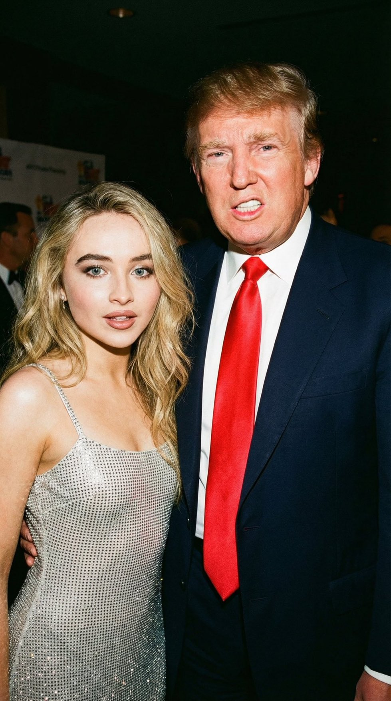

## Ultra-realistic close-up portrait of a young woman with 

- ID: trending-2045717144319697140
- Slug: trending-2045717144319697140-en
- 语言: en
- 来源: [来源链接](https://x.com/Kashberg_0/status/2045717144319697140)
- 样例图路径: images/part1/2045717144319697140_1.jpg

### 提示词

```text
Ultra-realistic close-up portrait of a young woman with fair skin and subtle freckles, green eyes, and natural full lips, dark straight hair tucked behind the ear, wearing small gold hoop earrings. Dramatic split lighting across the face — one half illuminated with soft natural light, the other half in deep shadow with cool blue tones. High detail skin texture, sharp focus on eyes and eyelashes, minimal makeup, cinematic lighting, moody atmosphere, shallow depth of field, 85mm lens, f/1.8, photorealistic, editorial beauty photography.
```

### 样例图

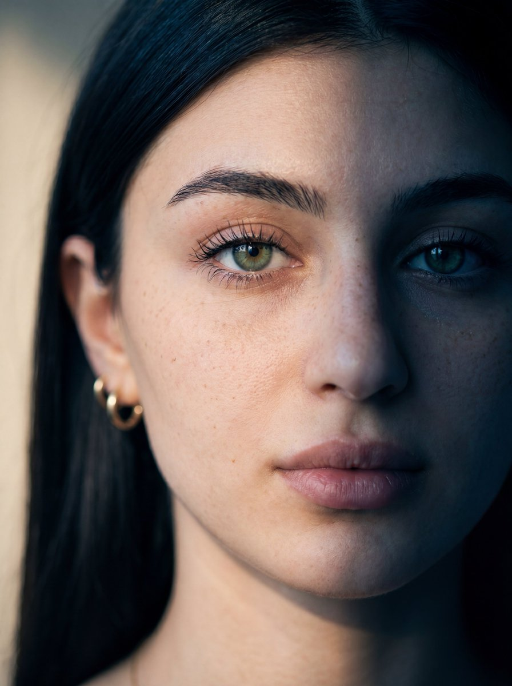

## Create an ultra-realistic, high-end lifestyle portrait o

- ID: trending-2010352197289345443
- Slug: trending-2010352197289345443-en
- 语言: en
- 来源: [来源链接](https://x.com/Naiknelofar788/status/2010352197289345443)
- 样例图路径: images/part1/2010352197289345443_1.jpg

### 提示词

```text
Create an ultra-realistic, high-end lifestyle portrait of one adult subject, captured in a calm, elegant, modern café environment. The subject is seated casually inside a circular wooden frame embedded with warm LED rim lighting, surrounded by lush green foliage and soft floral decor. The pose is relaxed and natural: one leg crossed over the other, body slightly angled, shoulders relaxed, hands resting naturally while holding a small bouquet of fresh flowers. Overall mood is warm, clean, elegant, youthful, and approachable — pure realism only. No stylization, no fantasy, no cinematic exaggeration.

Maintain 100% facial accuracy: exact bone structure, eye shape, eyelid fold, eyebrow shape, nose bridge and tip, lip shape, jawline, chin, cheek volume, hairline, and facial proportions

Identity must remain perfectly consistent from all angles (front, 3/4, side, seated pose, slight head tilt)

No face blending, no beautification, no symmetry correction

No AI face drift

Preserve real skin texture: pores, fine lines, natural imperfections

Expression: soft, natural smile, relaxed and genuine

Soft pastel long-sleeve knit top (dusty pink / muted rose tone)

High-waisted, straight-fit beige or cream trousers

Clean white chunky sneakers

Minimal accessories only (simple earrings, smartwatch or minimal wrist accessory)

Hair neatly styled, natural, pulled back or softly tied

Natural makeup: realistic skin tones, no heavy retouching

Modern café or lifestyle studio interior

Circular wooden structure with embedded warm LED light ring

Green plants and floral arrangements integrated into the frame

Soft bokeh background with warm ambient lighting

Clean, uncluttered setting with depth and realism

Full-body or 3/4 body vertical portrait

Eye-level camera angle

50mm–85mm lens look

Natural perspective, no distortion

Subject centered within the circular frame

Shallow depth of field, background softly blurred

Soft, warm, diffused lighting

LED rim light gently outlining the circular frame

Even facial illumination with natural shadow falloff

No harsh highlights, no blown whites

Realistic skin reflections and depth

Negative prompt:

No stylization

No cinematic color grading

No beauty filters

No smooth or plastic skin

No exaggerated proportions

No painterly or illustrated look

No artificial glow

No face morphing or identity shift

Ultra-photorealistic

Editorial lifestyle photography quality

Natural colors, true-to-life skin tones

Identity remains unchanged and accurate from every angle
```

### 样例图

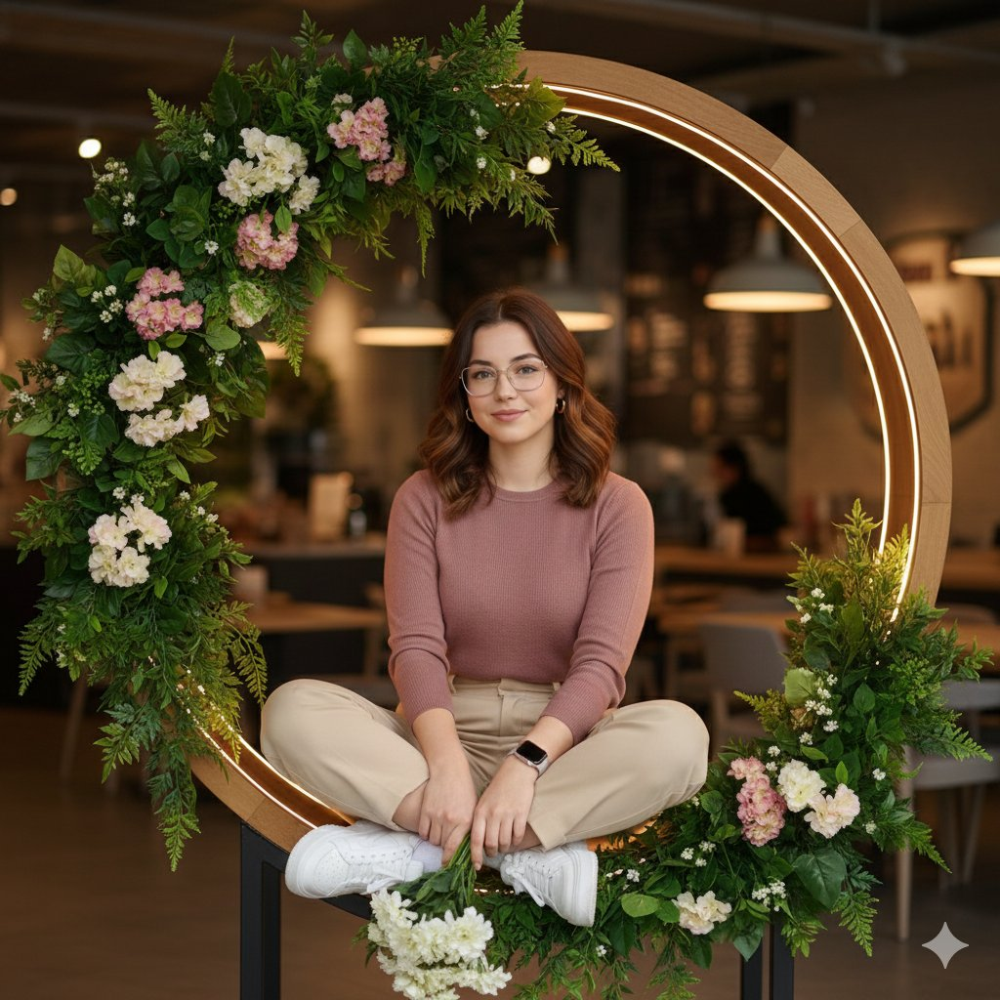

## { "generation_request": { "meta_data": { "tool": "NanoBa

- ID: trending-2011519692666470461
- Slug: trending-2011519692666470461-en
- 语言: en
- 来源: [来源链接](https://x.com/astronomerozge1/status/2011519692666470461)
- 样例图路径: images/part1/2011519692666470461_1.jpg

### 提示词

```text
{
  "generation_request": {
    "meta_data": {
      "tool": "NanoBanana Pro",
      "task_type": "photoreal_fashion_editorial_window_pose",
      "version": "v1.0_YELLOW_HOUSE_WINDOW_GIRL_WHITE_SATIN",
      "priority": "highest"
    },

    "references": {
      "reference_image_1": {
        "source": "UPLOAD_REFERENCE_IMAGE",
        "purpose": "POSE_AND_COMPOSITION_LOCK",
        "strict_lock": true,
        "match_reference_priority": "MAX",
        "preserve_window_frame": true,
        "preserve_leg_position": true,
        "preserve_body_angle": true,
        "preserve_camera_distance": true,
        "no_style_drift": true
      },
      "reference_image_2": {
        "source": "UPLOAD_FACE_REFERENCE (OPTIONAL)",
        "purpose": "FACE_IDENTITY_LOCK",
        "strict_lock": true,
        "face_similarity_priority": "MAX",
        "no_identity_blending": true,
        "no_beautify": true,
        "no_age_shift": true,
        "preserve_skin_texture": true,
        "preserve_facial_proportions": true
      }
    },

    "creative_direction": {
      "concept": "A playful, editorial fashion moment: a young woman sitting casually inside an open window of a yellow house, one leg lifted outward, captured as a clean, modern lifestyle photograph.",
      "mood": "fresh, carefree, stylish, youthful",
      "style_keywords": "European street style, playful femininity, minimal editorial"
    },

    "scene": {
      "location": "residential exterior",
      "architecture": {
        "house_color": "soft warm yellow facade",
        "window": "simple rectangular window with white interior walls",
        "background": "clean, uncluttered, sunlit wall"
      },
      "time": "midday",
      "lighting": "direct natural sunlight, crisp shadows"
    },

    "subject": {
      "gender": "female",
      "pose": {
        "position": "sitting inside the window frame",
        "legs": "one leg extended outward and raised, the other relaxed",
        "arms": "one arm hanging freely outside the window"
      },
      "expression": "neutral to calm, relaxed confidence",
      "gaze": "looking forward or slightly to the side"
    },

    "wardrobe": {
      "dress": {
        "type": "white satin slip dress",
        "style": "thin straps, minimal, fluid fabric",
        "length": "midi",
        "finish": "soft satin sheen"
      },
      "headphones": {
        "type": "over-ear",
        "color": "pure white",
        "style": "clean, modern, minimal"
      },
      "shoes": {
        "type": "flat or low-heel shoes",
        "color": "white",
        "style": "simple, elegant"
      }
    },

    "accessories": {
      "flowers": {
        "type": "fresh yellow flowers",
        "placement": "held loosely in one hand",
        "look": "natural, slightly wild bouquet"
      }
    },

    "photography": {
      "camera_style": "fashion editorial street photography",
      "lens": "35mm",
      "framing": "centered subject, full body within window frame",
      "depth_of_field": "moderate, background sharp",
      "color_grade": "warm yellows, clean whites, natural skin tones"
    },

    "output_settings": {
      "aspect_ratio": "4:5",
      "orientation": "portrait",
      "resolution_target": "ultra_high_res",
      "render_style": "ultra_photoreal_editorial",
      "sharpness": "clean_and_crisp",
      "dynamic_range": "natural_not_hdr",
      "no_text": true,
      "no_watermark": true,
      "no_logo": true
    },

    "quality_controls": {
      "anatomy": {
        "no_deformed_limbs": true,
        "no_extra_fingers": true
      },
      "fabric": {
        "satin_reads_real": true
      },
      "coherence": {
        "wardrobe_consistent": true,
        "pose_identical_to_reference": true
      }
    },

    "negative_prompt": [
      "patterned dress",
      "dark or black clothing",
      "headphones not white",
      "boots or dark shoes",
      "busy background",
      "cartoon, illustration, anime",
      "HDR, oversharpening",
      "text, watermark, logo",
      "deformed anatomy"
    ]
  }
}
```

### 样例图

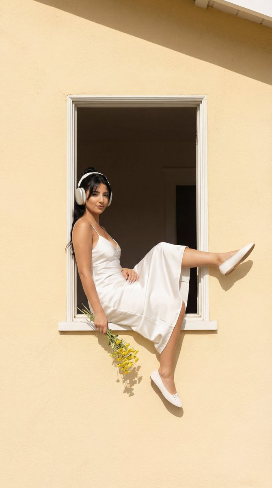

## A striking editorial portrait photograph of a person wea

- ID: trending-2045689019007426749
- Slug: trending-2045689019007426749-en
- 语言: en
- 来源: [来源链接](https://x.com/Naiknelofar788/status/2045689019007426749)
- 样例图路径: images/part1/2045689019007426749_1.jpg

### 提示词

```text
A striking editorial portrait photograph of a person wearing a red blazer, shot against a soft light pink studio background. The left half of the face and body is partially obscured by multiple overlapping vertical strips of tall narrow reeded ribbed frosted glass panels, creating a realistic distortion and refraction effect where the features appear blurred, shifted, and fragmented behind the glass. The right side of the face is clearly visible with sharp detail. Dramatic cool-toned studio lighting with a blue-purple color grade overall. The glass strips run vertically from top to bottom of the frame, covering approximately the left 40 to 50 percent of the image. Serious neutral facial expression. High-fashion editorial style, photorealistic, no text, no watermark, no overlays, clean composition. Vertical portrait orientation, 3:4 ratio.
```

### 样例图

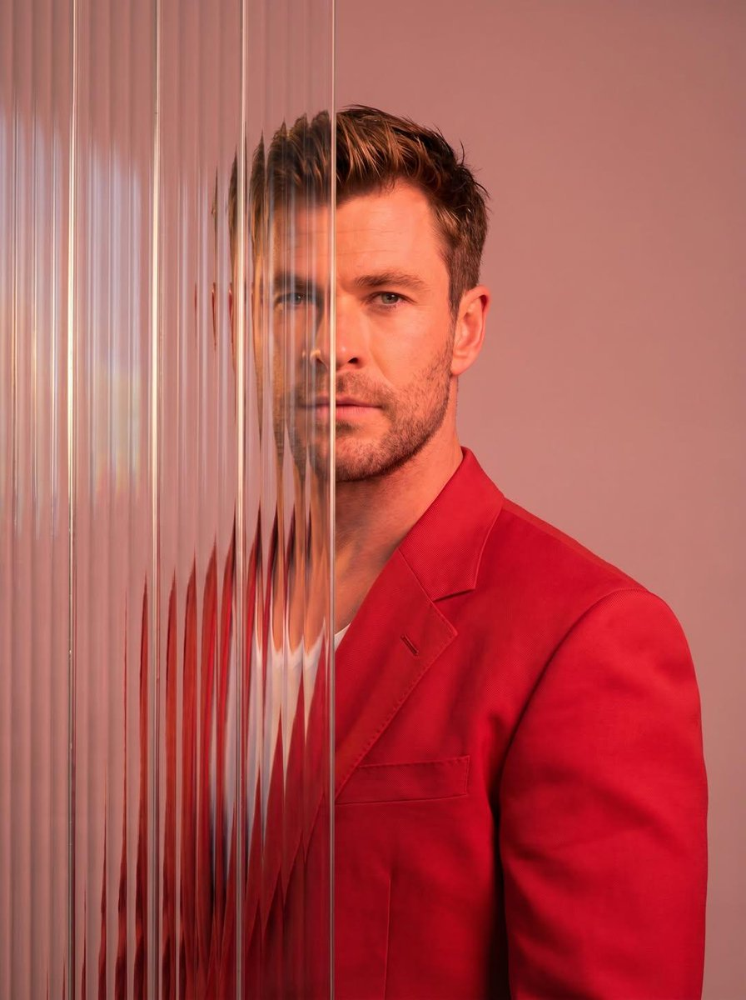

## { "generation_request": { "meta_data": { "task_type": "b

- ID: trending-2032434291645497698
- Slug: trending-2032434291645497698-en
- 语言: en
- 来源: [来源链接](https://x.com/harboriis/status/2032434291645497698)
- 样例图路径: images/part1/2032434291645497698_1.jpg

### 提示词

```text
{
  "generation_request": {
    "meta_data": {
      "task_type": "black_and_white_photobooth_expression_grid_4x4",
      "language": "en",
      "priority": "highest",
      "version": "v1.0_BW_PHOTOBOOTH_EXPRESSIONS_4X4"
    },
    "input": {
      "mode": "image_to_image",
      "reference_image_usage": "very_high",
      "preserve_identity": true,
      "preserve_facial_features": true,
      "preserve_hairstyle": true,
      "notes": "Use the reference as the primary anchor. Create a black-and-white photobooth-style expression grid. Keep the same young man identity and hair. Each panel should show a different facial expression. Minimal background, direct photobooth flash look, natural skin texture."
    },
    "output": {
      "aspect_ratio": "1:1",
      "resolution": "ultra_high",
      "num_images": 1,
      "layout": {
        "type": "grid",
        "rows": 4,
        "cols": 4,
        "gutter": "thin",
        "panel_consistency": "high"
      },
      "sharpness": "crisp_photobooth",
      "grain": "subtle_analog_bw"
    },
    "scene": {
      "concept": "classic photobooth contact sheet with expressive faces",
      "environment": "plain neutral backdrop, no props",
      "lighting": {
        "style": "direct photobooth flash",
        "key_light": "front flash, slightly hard but flattering",
        "shadows": "soft short shadows behind subject",
        "avoid": "cinematic side light, dramatic backgrounds"
      },
      "camera": {
        "lens": "50mm",
        "distance": "tight head-and-shoulders framing",
        "focus": "eyes sharp in every panel"
      }
    },
    "subject": {
      "type": "young man",
      "wardrobe": "simple casual photobooth look, plain t shirt or hoodie with no logos",
      "hair": "keep same hairstyle across all panels",
      "facial_hair": "natural if present, keep consistent",
      "anatomy_rules": "correct facial proportions, no warped eyes or mouth"
    },
    "expression_set": {
      "panel_01": "scrunched smile, eyes squeezed slightly",
      "panel_02": "intense stare with fingers framing eyes",
      "panel_03": "big laugh, mouth open, joyful",
      "panel_04": "bored unimpressed face, chin resting in hands",
      "panel_05": "sad pout, emotional expression",
      "panel_06": "goofy face with both hands making small horns above head",
      "panel_07": "playful tongue out with cheeky grin",
      "panel_08": "angry glare with eyebrows down",
      "panel_09": "confident playful look, hand touching cheek",
      "panel_10": "surprised wide eyes, mouth slightly open",
      "panel_11": "fake scream excited shout, hands near face",
      "panel_12": "mischievous grin with claw-like hand pose",
      "panel_13": "confused frown with lips pressed",
      "panel_14": "dramatic frustrated expression, hands on head",
      "panel_15": "tongue out with eyes closed, playful mood",
      "panel_16": "duck face with small devil horns gesture"
    },
    "style": {
      "color": "pure black and white",
      "contrast": "medium_high",
      "background": "flat gray",
      "finish": "slight photobooth grain, clean edges"
    },
    "quality_control": {
      "identity_lock": "strict",
      "hands_priority": "high",
      "avoid": [
        "extra fingers",
        "missing fingers",
        "deformed hands",
        "warped face",
        "uneven eyes",
        "melted mouth",
        "plastic skin",
        "text",
        "watermark",
        "logo"
      ]
    },
    "negative_prompt": [
      "color",
      "sepia",
      "overly cinematic lighting",
      "beauty retouch plastic skin",
      "low resolution",
      "blur",
      "distorted anatomy"
    ]
  }
}
```

### 样例图

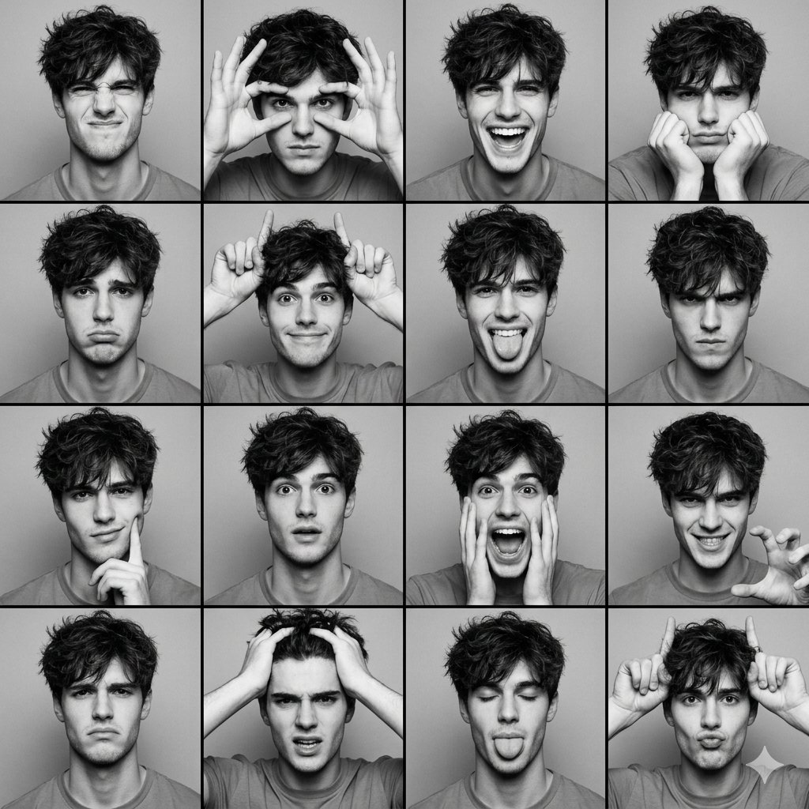

## { "prompt": "Using the uploaded reference image of a 30-

- ID: trending-2011420581695242358
- Slug: trending-2011420581695242358-en
- 语言: en
- 来源: [来源链接](https://x.com/r4jjesh/status/2011420581695242358)
- 样例图路径: images/part1/2011420581695242358_1.jpg

### 提示词

```text
{
  "prompt": "Using the uploaded reference image of a 30-year-old adult, generate a highly realistic cinematic fashion editorial photoshoot. The person is leaning casually against a beige textured wall, body slightly angled, one shoulder resting on the wall, conveying relaxed confidence.\n\nOutfit: a loose pastel blue button-down shirt with casually rolled-up sleeves, tailored white relaxed-fit trousers, and clean minimalist white or blue-white sneakers. Styling is modern, elegant, and effortless.\n\nPose & expression: stylish adult pose with natural posture — one hand in pocket, the other holding a small white daisy flower. Facial expression is calm, confident, and self-assured, with a soft editorial gaze.\n\nLighting & atmosphere: warm natural sunlight streaming from the side, creating soft highlights and gentle shadows on the wall and face. Sunlit, airy mood with cinematic depth.\n\nVisual style: high-end fashion editorial aesthetic, natural skin texture, crisp fabric details, refined neutral color palette.\n\nCamera & quality: professional fashion photography, shallow depth of field, cinematic framing, ultra-realistic 8K quality.\n\nOverall feel: modern, minimal, sunlit lifestyle fashion campaign.",
  "style": "cinematic, high-end adult fashion editorial",
  "lighting": "warm natural sunlight, soft shadows",
  "background": "minimal beige wall, sunlit texture",
  "quality": "ultra-realistic, 8K, ultra-sharp",
  "camera": "professional fashion photography, shallow depth of field",
  "mood": "clean, modern, confident, relaxed"
}
```

### 样例图

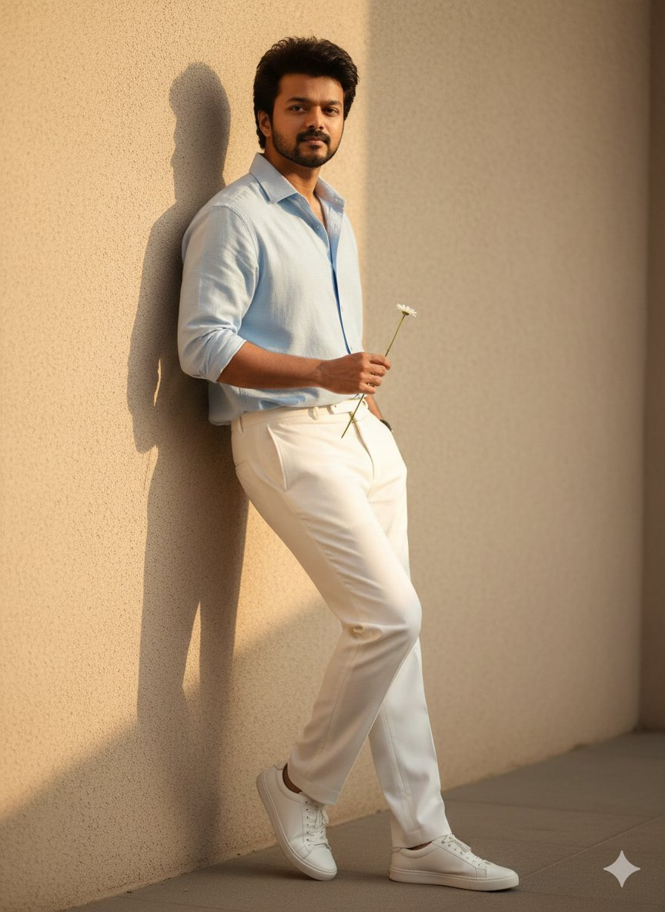

## A cinematic 1970s-inspired fashion portrait of a young w

- ID: trending-2008846206227632397
- Slug: trending-2008846206227632397-en
- 语言: en
- 来源: [来源链接](https://x.com/Sophia_here12/status/2008846206227632397)
- 样例图路径: images/part1/2008846206227632397_1.jpg

### 提示词

```text
A cinematic 1970s-inspired fashion portrait of a young woman seated on worn stone steps outside a cozy street café. She holds a deep-green ceramic coffee cup with gold rim accents, resting it gently in her hands, gazing softly at the camera with calm, timeless confidence.

Her hair falls in natural waves with loose strands framing her face, styled with vintage 1970s elegance. Makeup is classic: matte crimson lips, subtle winged eyeliner, warm blush, and softly defined brows. She wears a relaxed forest-green knitted sweater paired with a flowing black tulle skirt, complemented by a warm plaid scarf in earthy tones. A dark-green leather crossbody bag with gold details sits beside her.

The background shows an autumn street scene with fallen leaves, amber-lit café windows, and a quiet, serene urban atmosphere. Shot with an 85mm lens at f/1.8, the image features shallow depth of field, warm analog film grain, muted earthy colors, and a dreamy, cinematic fashion editorial feel inspired by 1970s film aesthetics.
```

### 样例图


## A warm, cozy, and high-quality portrait of a young woman

- ID: trending-2037877301455569247
- Slug: trending-2037877301455569247-en
- 语言: en
- 来源: [来源链接](https://x.com/rovvmut_/status/2037877301455569247)
- 样例图路径: images/part1/2037877301455569247_1.jpg

### 提示词

```text
A warm, cozy, and high-quality portrait of a young woman with long, wavy blonde-brown hair, captured in a soft side profile. She is smiling gently and looking downward, her left hand delicately adjusting the brim of a classic brown wool baker boy cap. The cap features a thick, felted texture with a small button nub on top. She is wearing an oversized, chunky knit V-neck cardigan with a bold argyle-style diamond pattern in cream and a muted, deep red. The cardigan features large, visible buttons and a thick ribbed texture along the neckline and cuffs. The background is a soft-focus, neutral beige wall with the blurred green leaves of a plant visible on the far left edge. The lighting is soft and natural, coming from the side to highlight the delicate features of her face and the intricate textures of the knitwear and wool hat. The overall aesthetic is autumnal, serene, and tactile.
```

### 样例图

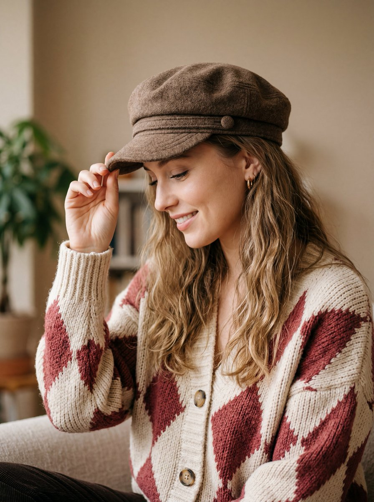

## Close-up portrait of a woman (Same face as reference ima

- ID: trending-2044775603145224640
- Slug: trending-2044775603145224640-en
- 语言: en
- 来源: [来源链接](https://x.com/oggii_0/status/2044775603145224640)
- 样例图路径: images/part1/2044775603145224640_1.jpg

### 提示词

```text
Close-up portrait of a woman (Same face as reference image)looking directly at the camera. Her face and neck are mostly obscured by deep shadow. A single, narrow horizontal band of light cuts across her face, illuminating only her eyes and the bridge of his nose. He has a strong, defined jawline and short, textured hair. She is wearing a simple black shirt. The background is a plain, overcast grayish-blue sky. Dramatic, high-contrast lighting creates a moody, cinematic atmosphere.
```

### 样例图

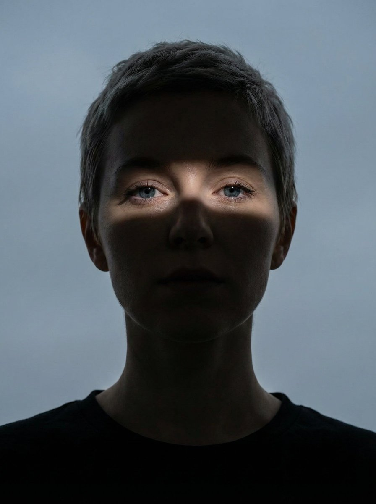

## A hyper-detailed cinematic portrait of a human face use 

- ID: trending-2008181655220154527
- Slug: trending-2008181655220154527-en
- 语言: en
- 来源: [来源链接](https://x.com/iamsofiaijaz/status/2008181655220154527)
- 样例图路径: images/part1/2008181655220154527_1.jpg

### 提示词

```text
A hyper-detailed cinematic portrait of a human face use selected image for face reference in side profile, looking upward with a calm and powerful expression, the entire subject illuminated in deep electric blue light, water splashes and liquid energy wrapping around the head and shoulders, high contrast, dramatic lighting, ultra-realistic skin texture, fine pores visible, sharp focus, 8K resolution, volumetric lighting, dark blue background, futuristic, ethereal, emotional, digital art, photorealism, high detail.
```

### 样例图

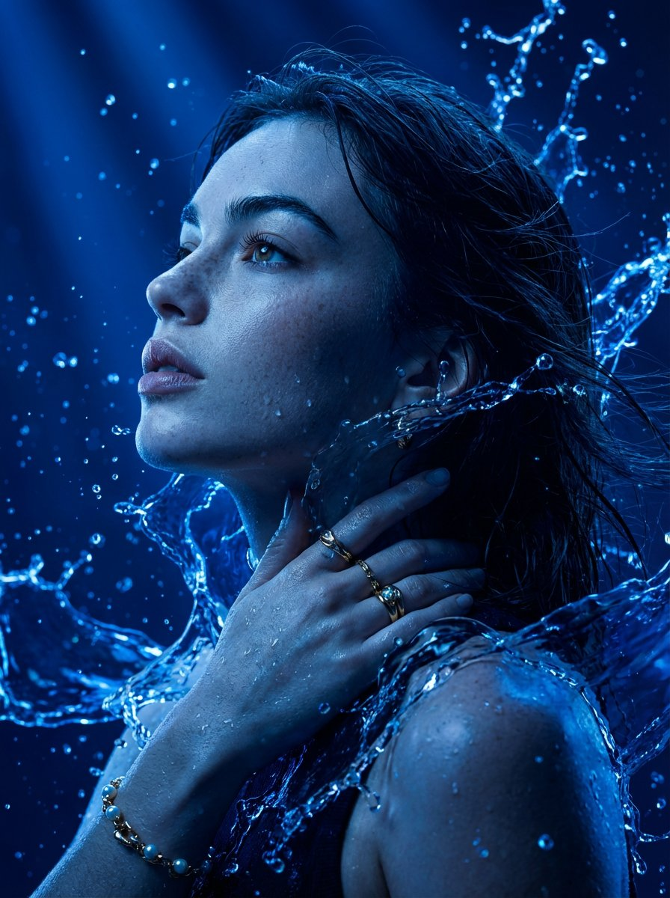

## A cinematic black-and-white street portrait of a young w

- ID: trending-2011845501357064442
- Slug: trending-2011845501357064442-en
- 语言: en
- 来源: [来源链接](https://x.com/ChillaiKalan__/status/2011845501357064442)
- 样例图路径: images/part1/2011845501357064442_1.jpg

### 提示词

```text
A cinematic black-and-white street portrait of a young woman photographer standing in a city street, holding a mirrorless camera with both hands. She has soft natural makeup, sharp expressive eyes, and loosely tied dark hair with wisps framing her face. She wears a black turtleneck sweater and a camera strap around her neck. The background is an urban street with blurred pedestrians and lights creating creamy bokeh. Shallow depth of field, 85mm lens look, natural soft light, high contrast monochrome tones, realistic skin texture, candid moment, moody documentary photography style, ultra-detailed, film grain, timeless aesthetic.
```

### 样例图

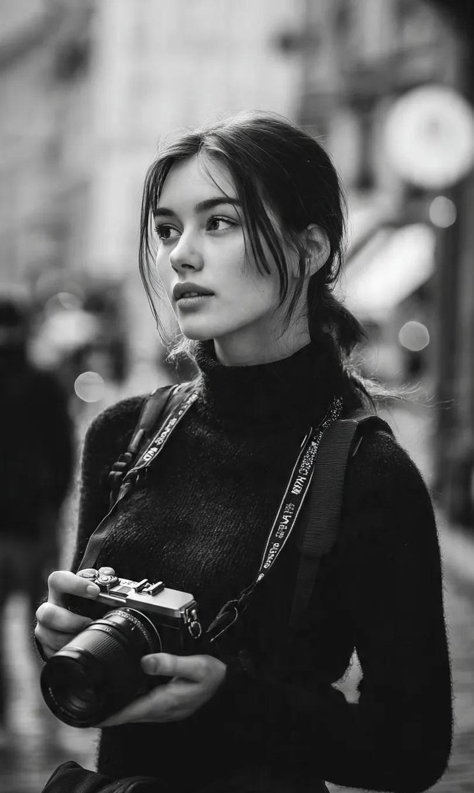

## captured in a dark studio environment with a strong mini

- ID: trending-2031256944900714553
- Slug: trending-2031256944900714553-en
- 语言: en
- 来源: [来源链接](https://x.com/harboriis/status/2031256944900714553)
- 样例图路径: images/part1/2031256944900714553_1.jpg

### 提示词

```text
captured in a dark studio environment with a strong minimalist and futuristic aesthetic. The subject is posed in three-quarter profile, wearing dark clothing such as a black turtleneck and metallic accessories, with reflective sunglasses that catch the ambient light. A circular neon light positioned directly behind the subject creates a luminous halo effect, producing precise rim highlights along the head and shoulders. The lighting is cool and monochromatic, primarily in icy blue tones (-6500K), casting subtle reflections and soft gradients across the matte tex-tures. The background is a deep black (approx. HEX #020509), allowing the neon ring's cyan glow (approx.
```

### 样例图

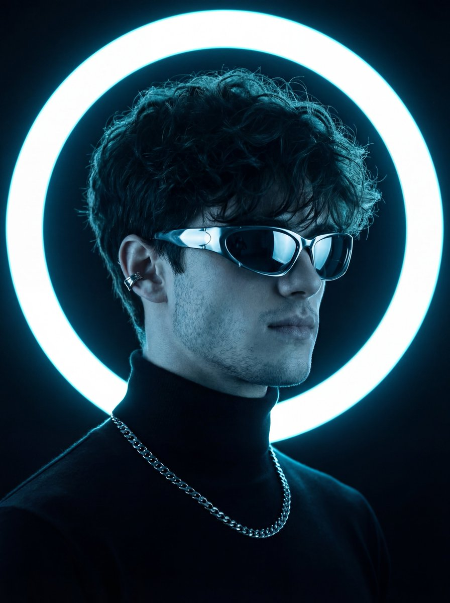

## A panning studio portrait of a mysterious female figure 

- ID: trending-2008773580893679871
- Slug: trending-2008773580893679871-en
- 语言: en
- 来源: [来源链接](https://x.com/kingofdairyque/status/2008773580893679871)
- 样例图路径: images/part1/2008773580893679871_1.jpg

### 提示词

```text
A panning studio portrait of a mysterious female figure captured in side profile, her head subtly turned forward as motion blur streaks softly through her hair and jawline. She wears a matte charcoal wool coat with softened edges, standing against a solid Pantone 137 C orange background that fills the frame entirely. The image features intentional horizontal motion blur from a slow shutter pan, preserving facial structure while allowing peripheral smearing. Soft studio lighting with diffused highlights, low contrast, and lifted blacks creates a faded analog film look with fine grain and muted saturation. Shot on a full-frame camera using a 50mm lens at f/2.8, ISO 200, shutter speed 1/15s, vertical orientation, tight portrait framing, shallow depth of field. The mood is cinematic, introspective, and modern editorial visual language aligned with 032c and A24 aesthetics.
```

### 样例图

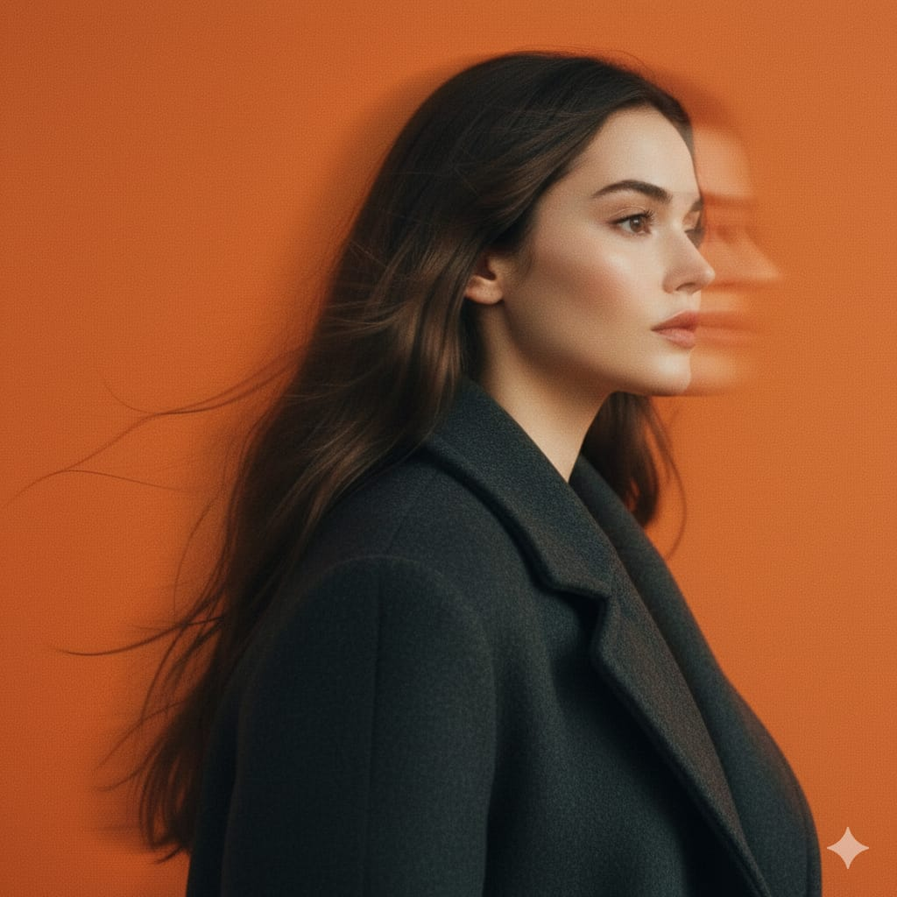

## Cinematic photo of a young woman sitting alone in a cozy

- ID: trending-2032786956288143858
- Slug: trending-2032786956288143858-en
- 语言: en
- 来源: [来源链接](https://x.com/Kashberg_0/status/2032786956288143858)
- 样例图路径: images/part1/2032786956288143858_1.jpg

### 提示词

```text
Cinematic photo of a young woman sitting alone in a cozy Parisian café on a rainy day, holding a cup of coffee and looking out a large window with raindrops on the glass. Warm vintage café interior with wooden walls, hanging Edison bulbs, marble table, croissants and coffee machine visible in the background. A chalkboard menu reading “Café du Soir, Croissants, Vin Rouge.” Soft natural window light mixed with warm indoor lighting, shallow depth of field, street with umbrellas and classic European buildings outside. Moody, cozy atmosphere, realistic photography, 50mm lens, high detail, cinematic color grading, lifestyle photography, ultra-realistic, 4k.
```

### 样例图

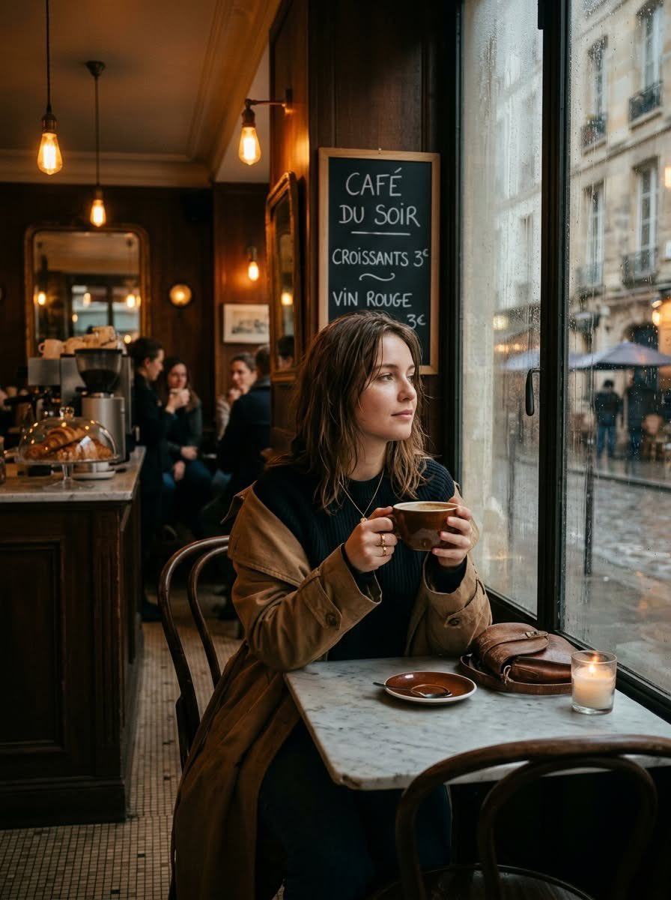

## A man with short curly hair and light facial hair sittin

- ID: trending-2031161843520270729
- Slug: trending-2031161843520270729-en
- 语言: en
- 来源: [来源链接](https://x.com/iamsofiaijaz/status/2031161843520270729)
- 样例图路径: images/part1/2031161843520270729_1.jpg

### 提示词

```text
A man with short curly hair and light facial hair sitting on a tall black stool, centered composition, wearing a monochrome beige outfit with gloves and the number "64" on the chest, minimalist futuristic fashion, dramatic studio lighting, huge glowing orange sun behind him, warm orange gradient background, cinematic atmosphere, soft fog around the floor, symmetrical framing, editorial fashion photography, ultra detailed, sharp focus, volumetric lighting, studio shot, 85mm lens, high contrast, modern album cover style
```

### 样例图

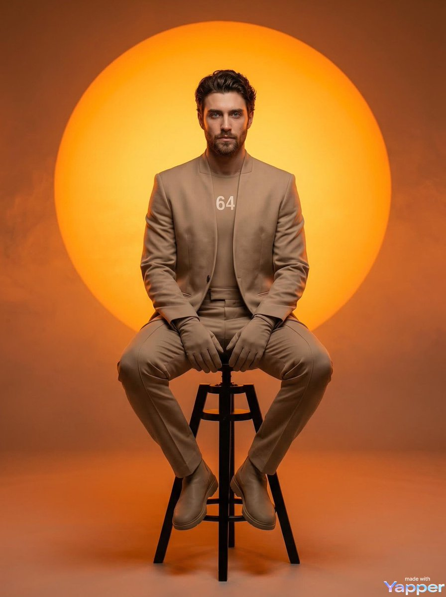

## Using the uploaded image as the only reference. create a

- ID: trending-2030925927040037301
- Slug: trending-2030925927040037301-en
- 语言: en
- 来源: [来源链接](https://x.com/Naiknelofar788/status/2030925927040037301)
- 样例图路径: images/part1/2030925927040037301_1.jpg

### 提示词

```text
Using the uploaded image as the only reference. create an ultra-photorealistic cinematic close-up portrait of a young woman with vivid red hair and piercing blue-green eyes. Her hair is slightly wet and blown across her face, with delicate braids woven through the strands. Tiny water droplets and natural skin texture glisten across her freckles and cheeks, illuminated by warm dramatic lighting against a dark background.She looks slightly upward with a calm, intense expression, capturing a moment of quiet strength. Emphasize hyper-real skin detail, freckles, wet hair strands, reflective water droplets, and luminous eyes. Shallow depth of field, dramatic contrast, moody cinematic lighting, intimate portrait composition, ultra-detailed textures, 8k photorealism.
```

### 样例图

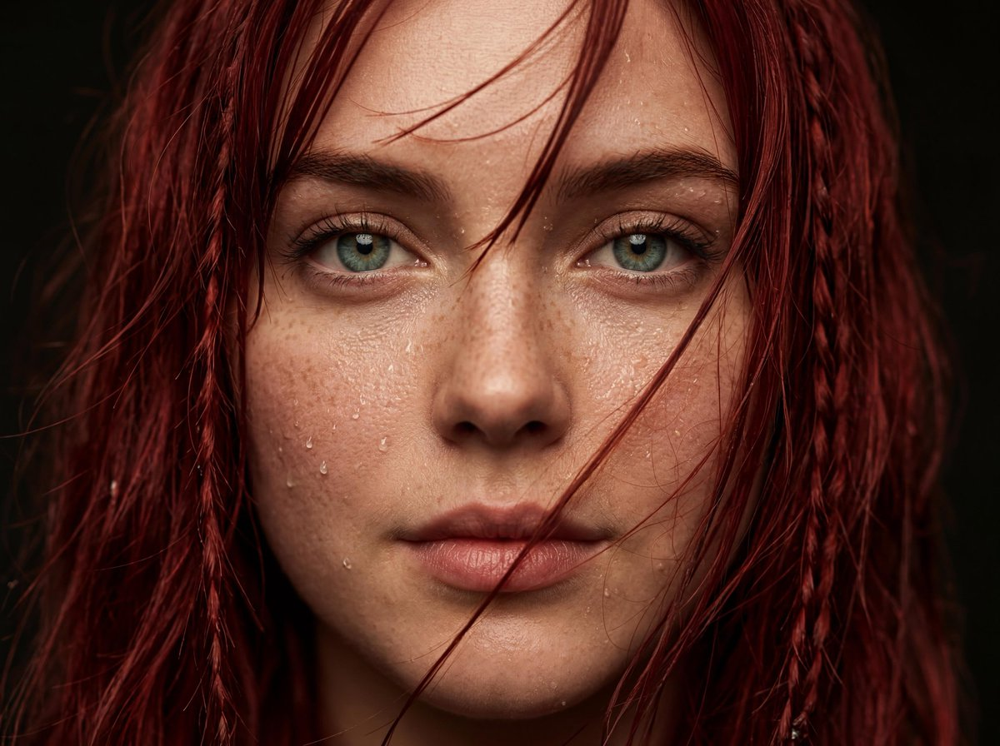

## { "render_goal": "High-fashion cinematic motion shot", "

- ID: trending-2015758548199002294
- Slug: trending-2015758548199002294-en
- 语言: en
- 来源: [来源链接](https://x.com/sassyamara_/status/2015758548199002294)
- 样例图路径: images/part1/2015758548199002294_1.jpg

### 提示词

```text

{
  "render_goal": "High-fashion cinematic motion shot",
  "focus": "fabric movement",
  "wardrobe": {
    "outfit": "long flowing garment",
    "motion": "fabric spreading dramatically in wind"
  },
  "environment": {
    "location": "open elevated space (rooftop, bridge, cliff)"
  },
  "lighting": "directional cinematic light",
  "camera": "freeze motion, sharp subject, soft background"
}
```

### 样例图

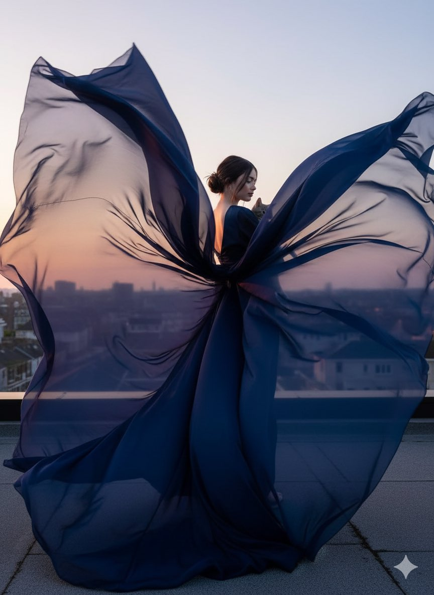

## A cinematic 3×3 grid of film-still frames featuring the 

- ID: trending-2009855866582003777
- Slug: trending-2009855866582003777-en
- 语言: en
- 来源: [来源链接](https://x.com/AIwithSynthia/status/2009855866582003777)
- 样例图路径: images/part1/2009855866582003777_1.jpg

### 提示词

```text
A cinematic 3×3 grid of film-still frames featuring the same couple during a quiet countryside road stop at dusk. A young woman with short dark hair wearing a light patterned blouse stands beside a cream vintage convertible on a rural dirt road, open fields and rolling hills stretching into the distance. Each frame here shows a distinct cinematic angle: extreme close-up of her face with natural skin texture, intimate medium shot of the couple leaning on the car, back view of the woman facing the landscape, wide establishing shot with the car in tall grass, high-angle top-down shot of the couple beside the convertible, dramatic low-angle portrait against the sky, clean side profile close-up, three-quarter rear view of the couple near the car, and a full back view of them walking away hand in hand down the road. Soft natural dusk lighting, muted earthy tones, realistic colors, shallow depth of field, subtle film grain, consistent facial features across all frames, emotional cinematic mood, professional cinematography reference sheet style, ultra-realistic photography.
```

### 样例图

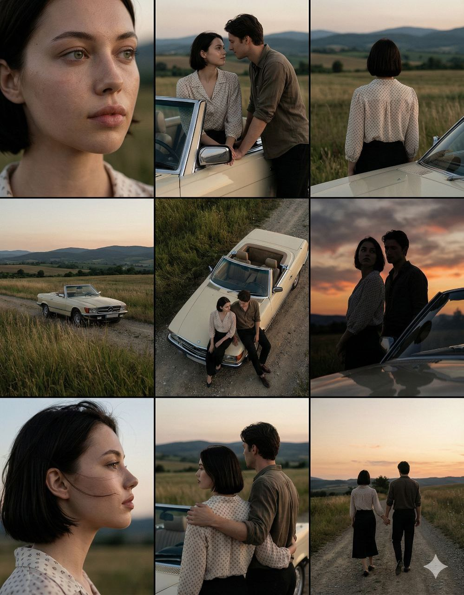

## { "image_generation_prompt": { "subject": { "description

- ID: trending-2015263403393355980
- Slug: trending-2015263403393355980-en
- 语言: en
- 来源: [来源链接](https://x.com/Taaruk_/status/2015263403393355980)
- 样例图路径: images/part1/2015263403393355980_1.jpg

### 提示词

```text
{
  "image_generation_prompt": {
    "subject": {
      "description": "Stylish woman",
      "expression": "calm and confident",
      "pose": "standing still, hands in pockets",
      "attire": {
        "top": "loose sage-green button-up shirt, tucked in",
        "bottom": "high-waisted dark trousers"
      }
    },
    "scene_dynamics": {
      "action": "vintage cars rushing past at high speed",
      "effect": "dramatic motion blur trails, long-exposure photography effect, dynamic motion contrast"
    },
    "environment": {
      "setting": "Street portrait",
      "atmosphere": "nostalgic, busy but focused"
    },
    "lighting_and_color": {
      "lighting": "warm golden-hour lighting",
      "color_palette": "muted retro palette",
      "accents": "reds, teals, and yellows streaking across the frame"
    },
    "technical_specifications": {
      "focus": "strong subject isolation, sharp focus on the woman, shallow depth of field",
      "style": "cinematic realism, editorial fashion mood, nostalgic 1970s film look",
      "texture": "soft grain, ultra-detailed",
      "resolution": "high resolution"
    }
  }
}
```

### 样例图

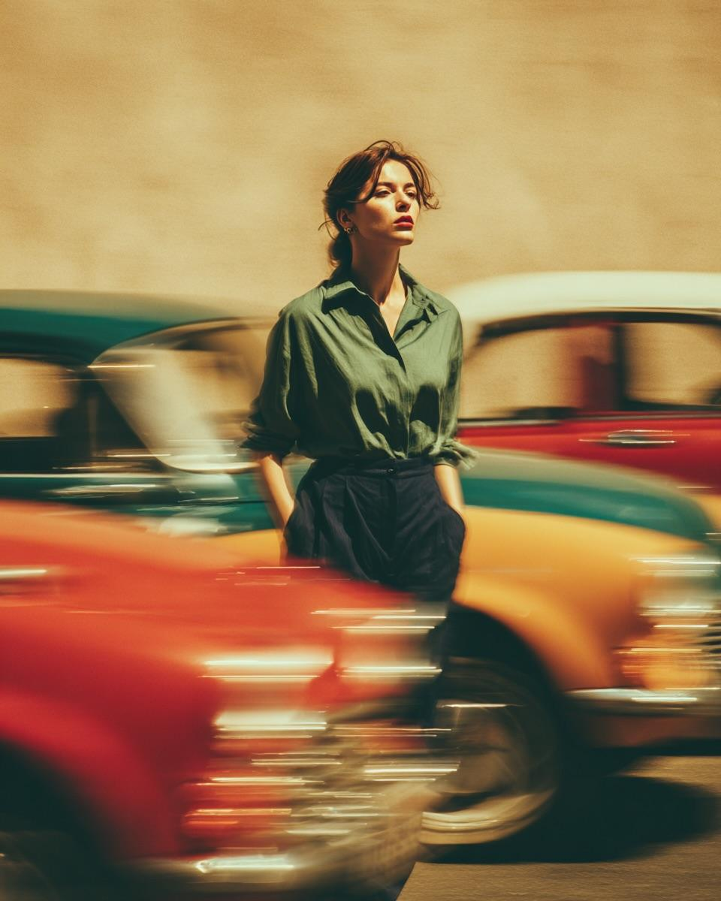

## A high-fashion editorial portrait of a young woman stand

- ID: trending-2043336493419123094
- Slug: trending-2043336493419123094-en
- 语言: en
- 来源: [来源链接](https://x.com/Minahil42298354/status/2043336493419123094)
- 样例图路径: images/part1/2043336493419123094_1.jpg

### 提示词

```text
A high-fashion editorial portrait of a young woman standing by a large, rustic wooden window. She is captured in a candid, over-the-shoulder gaze, looking directly into the camera with a soft, natural expression. One hand is gently resting on the window frame.

​Lighting & Atmosphere:

The scene is defined by golden hour sunlight streaming through the window, creating a dramatic "blind shadow" or shutter-effect across her face and blouse. The lighting is warm and high-contrast, with a hazy, ethereal atmosphere that emphasizes a quiet, "Film Noir" mood in a modern setting.

​Wardrobe & Style:

She is wearing a translucent, pleated silk chiffon blouse in a muted champagne tone. The fabric is light and airy, catching the backlighting to create a soft glow. Her hair is styled in a tousled, effortless bob with natural texture.

​Technical Specifications:

​Lens: Shot on 85mm f/1.4 for a shallow depth of field.

​Focus: Sharp focus on the eyes with a creamy, soft bokeh background featuring indoor plants and warm interior tones.

​Quality: 8K resolution, cinematic color grading, fine grain, professional photography.
```

### 样例图

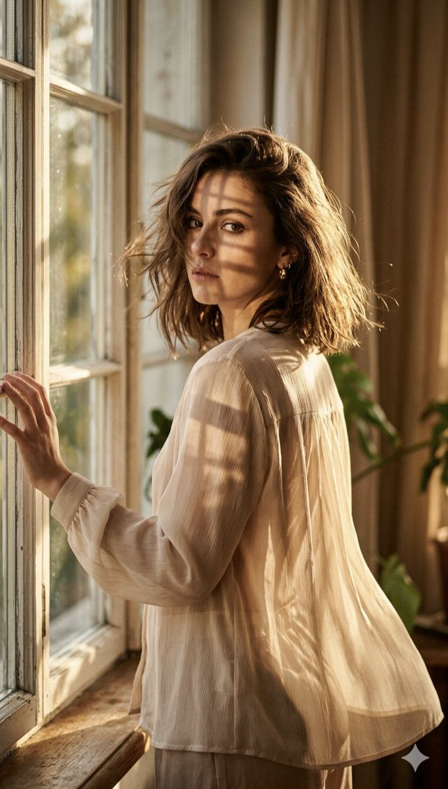

## { "type": "image_generation_prompt", "style": "ultra-rea

- ID: trending-2030972409637982607
- Slug: trending-2030972409637982607-en
- 语言: en
- 来源: [来源链接](https://x.com/saniaspeaks_/status/2030972409637982607)
- 样例图路径: images/part1/2030972409637982607_1.jpg

### 提示词

```text
{
  "type": "image_generation_prompt",
  "style": "ultra-realistic editorial fashion photography, Vogue-style",
  "resolution": "8K HDR",
  "aspect_ratio": "3:1",
  "composition": {
    "layout": "3x1 horizontal grid",
    "description": "three-panel editorial portrait composition featuring the same person in different artistic styles",
    "symmetry": "balanced spacing and clean alignment across all panels"
  },
  "identity_preservation": {
    "gender": "female",
    "use_reference_image": true,
    "strict_identity_lock": true,
    "notes": "Maintain the exact facial features, skin tone, hair type, and natural proportions from the uploaded reference photo."
  },
  "panels": [
    {
      "position": "left",
      "style": "studio portrait",
      "environment": {
        "background": "neutral minimalist studio backdrop"
      },
      "lighting": "soft studio lighting with cinematic face illumination",
      "clothing": "minimalist black or neutral turtleneck",
      "expression": "calm and confident",
      "focus": "sharp focus on the face with shallow depth of field",
      "color_grading": "magazine-quality tones"
    },
    {
      "position": "center",
      "style": "black and white artistic portrait",
      "environment": {
        "location": "outdoor setting",
        "background": "tree shadows and natural light patterns"
      },
      "camera_angle": "dynamic upward angle",
      "lighting": "natural sunlight creating dramatic contrast",
      "expression": "elegant and dramatic",
      "color_mode": "monochrome black and white",
      "focus": "high detail on facial structure and hair"
    },
    {
      "position": "right",
      "style": "fashion close-up",
      "environment": {
        "background": "soft warm-toned backdrop"
      },
      "accessories": [
        "wide fashionable hat or elegant scarf"
      ],
      "lighting": "soft warm lighting enhancing facial features",
      "details": "delicate fabric textures and sharp detail on eyes and skin",
      "expression": "stylish, confident, slightly intense"
    }
  ],
  "visual_style": {
    "aesthetic": "high-end fashion editorial",
    "lighting": "cinematic lighting across panels",
    "depth_of_field": "shallow",
    "textures": "photorealistic skin and fabric textures",
    "color_transition": "smooth transitions between frames",
    "finish": "glossy magazine look"
  },
  "constraints": [
    "no facial alterations",
    "no cartoon style",
    "no distortions",
    "no watermark",
    "no text overlays"
  ],
  "output_goal": "Create a cohesive 3x1 editorial portrait grid of the same woman in three distinct fashion photography styles with ultra-realistic detail and cinematic lighting."
}
```

### 样例图

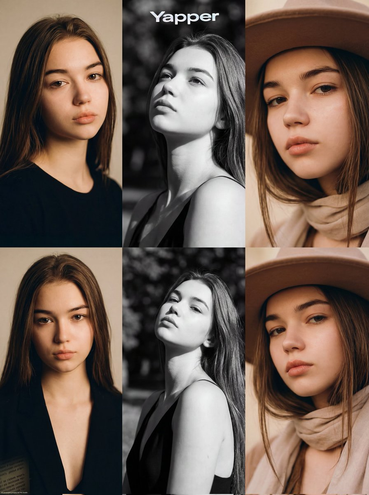

## studio fashion collage, 3x3 grid layout, same subject re

- ID: trending-2044780006812110949
- Slug: trending-2044780006812110949-en
- 语言: en
- 来源: [来源链接](https://x.com/AIwithSynthia/status/2044780006812110949)
- 样例图路径: images/part1/2044780006812110949_1.jpg

### 提示词

```text
studio fashion collage, 3x3 grid layout, same subject repeated in different poses across all panels, clean seamless white background, soft diffused studio lighting, minimalist aesthetic, playful editorial storytelling
subject styled in smart casual outfit (navy sweater, relaxed denim, glasses, polished shoes), holding and interacting with a structured luxury handbag as the central prop, quirky narrative scenes in each frame:
top row — crouching and interacting with a white cat beside handbag, tossing playing cards mid-air while holding bag, standing holding a bunch of white balloons
middle row — pushing a shopping cart filled with bright tennis balls, close-up portrait using a magnifying glass toward camera, sitting on stacked vintage suitcases holding handbag with a tennis ball
bottom row — standing with cat draped over shoulders holding bag, sitting backwards on a wooden chair with tennis ball under chair, standing pose with cat sitting inside handbag
consistent styling across all frames, balanced composition, symmetrical spacing, editorial grid layout, subtle humor and surreal elements, crisp sharp focus, high fashion campaign vibe, photorealistic, ultra clean shadows, 50mm lens look, f2.0
```

### 样例图

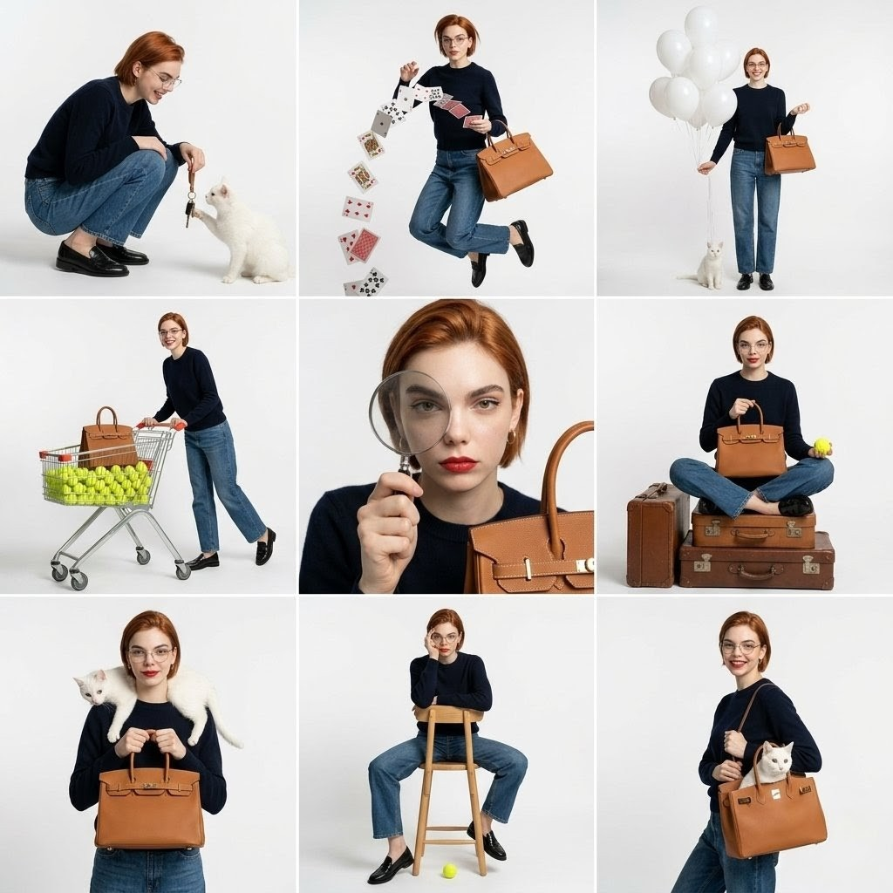

## A high-detail photograph of a defiant woman posing nonch

- ID: trending-2039926149091057911
- Slug: trending-2039926149091057911-en
- 语言: en
- 来源: [来源链接](https://x.com/AIwithSarah_/status/2039926149091057911)
- 样例图路径: images/part1/2039926149091057911_1.jpg

### 提示词

```text
A high-detail photograph of a defiant woman posing nonchalantly. She has a messy aesthetic, wearing oversized grunge clothing. The background is a cluttered, dimly lit urban environment. Technical details: 85mm focal length, sharp focus on eyes, cinematic lighting, photorealistic textures, 8k resolution, gritty atmosphere
```

### 样例图

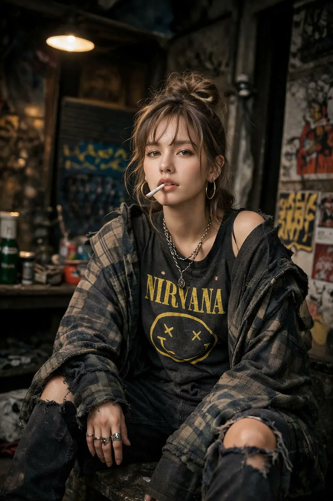

## { "scene_description": "Three young women lying down on 

- ID: trending-2011117557391225023
- Slug: trending-2011117557391225023-en
- 语言: en
- 来源: [来源链接](https://x.com/IqraSaifiii/status/2011117557391225023)
- 样例图路径: images/part1/2011117557391225023_1.jpg

### 提示词

```text
{
  "scene_description": "Three young women lying down on a textured surface. The bodies are intertwined in a triangular composition.",
  "background": "Plush, high-pile bright pink faux fur rug or fabric.",
  "subject_details": {
    "demographics": "Three young Asian women (K-pop idol aesthetic), pale skin tones.",
    "styling_theme": "Gothic Lolita / Dark Coquette / Black on Pink.",
    "makeup": "Consistent across all three: dark red gradient lips, soft smoky eye makeup, defined brows.",
    "subject_1_top": {
      "position": "Lying horizontally at the top.",
      "hair": "Blonde, long wavy hair.",
      "outfit": "Black corset top with ruffled straps, black velvet opera gloves, crystal choker necklace."
    },
    "subject_2_middle_right": {
      "position": "Lying diagonally below Subject 1, head resting near Subject 1's shoulder.",
      "hair": "Black, long straight hair.",
      "outfit": "Black leather/latex bustier top with sheer mesh panel, crystal collar necklace."
    },
    "subject_3_bottom_center": {
      "position": "Lying vertically in the foreground, head resting near Subject 2's chest.",
      "hair": "Black, long wavy hair.",
      "outfit": "Black brocade corset with lace trim, black opera gloves, black satin skirt, crystal choker.",
      "pose": "Arms extended upwards and outwards, framing the composition."
    }
  },
  "exact_pose_anatomical": {
    "viewpoint": "Bird's-eye view (Directly overhead).",
    "heads": "All three faces are angled upwards towards the camera lens.",
    "eyes": "Direct eye contact from all subjects.",
    "limbs": "Arms are positioned to create leading lines; Subject 3's gloved arms reach up towards the other two."
  },
  "camera_technical_values": {
    "angle": "90-degree Top Down.",
    "focal_length": "50mm (Standard lens to capture the group without wide-angle distortion).",
    "aperture": "f/5.6 (To ensure all three faces, which are on slightly different planes, are in sharp focus).",
    "shutter_speed": "1/125s (Studio setting).",
    "iso": "ISO 100 (Clean image quality).",
    "framing": "Tight framing, filling the canvas with the subjects and the pink texture."
  },
  "lighting_setup": {
    "type": "Soft Studio Lighting (Beauty Dish or Softbox).",
    "direction": "Frontal/Overhead (relative to the camera).",
    "quality": "Even, shadowless illumination on the faces ('Butterfly lighting').",
    "contrast": "High contrast between the jet-black outfits and the bright pink background/pale skin.",
    "highlights": "Soft specular highlights on the black leather and latex textures."
  }
}
```

### 样例图

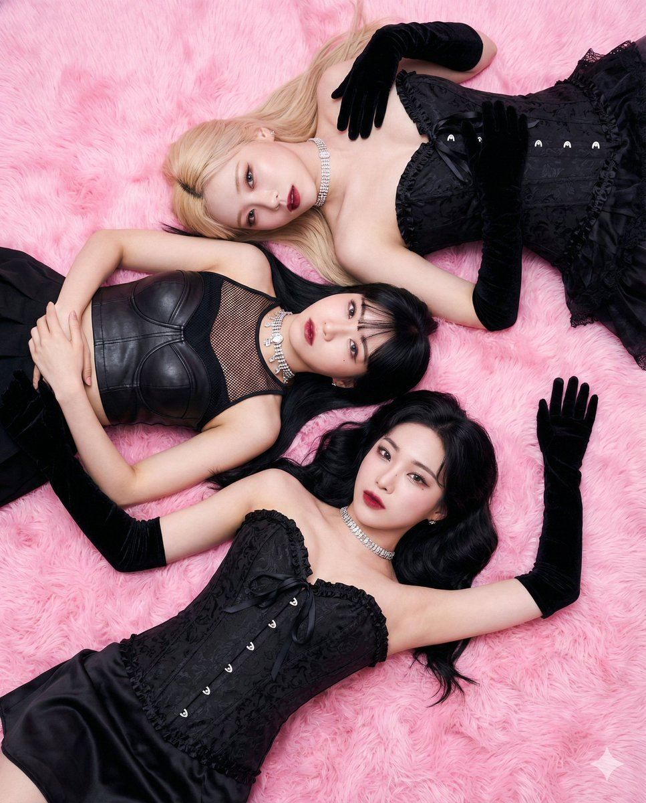

## Cinematic double exposure portrait of a woman in side pr

- ID: trending-2031893424979546397
- Slug: trending-2031893424979546397-en
- 语言: en
- 来源: [来源链接](https://x.com/Kashberg_0/status/2031893424979546397)
- 样例图路径: images/part1/2031893424979546397_1.jpg

### 提示词

```text
Cinematic double exposure portrait of a woman in side profile, two overlapping faces slightly offset, teal and orange moody lighting, soft motion blur, dark minimal background, high contrast, studio photography, dreamy atmosphere, ultra-realistic skin texture, shallow depth of field, 85mm lens, dramatic fine art portrait, volumetric lighting. 🎨
```

### 样例图

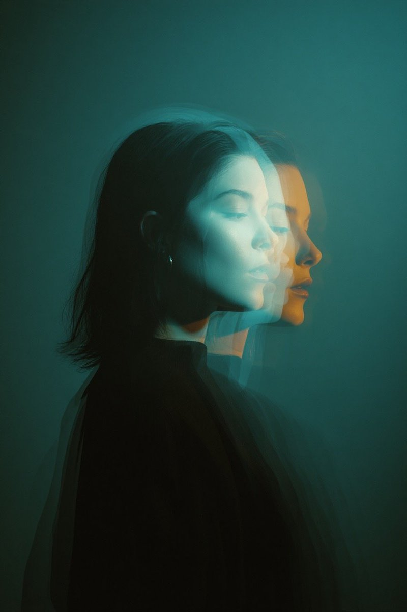

## Ultra-realistic cinematic fashion photograph of a stylis

- ID: trending-2030443205599404475
- Slug: trending-2030443205599404475-en
- 语言: en
- 来源: [来源链接](https://x.com/AIwithSynthia/status/2030443205599404475)
- 样例图路径: images/part1/2030443205599404475_1.jpg

### 提示词

```text
Ultra-realistic cinematic fashion photograph of a stylish blonde woman standing confidently between two moving escalators inside a luxury shopping mall, wearing a sheer black lace long-sleeve top and flowing skirt, holding a small white designer handbag, her hair dramatically blowing sideways as if caught in motion, blurred crowd moving up and down the escalators creating dynamic motion streaks around her, she remains sharp and perfectly focused in the center, dramatic fashion editorial lighting, shallow depth of field, high contrast, Vogue magazine style, motion blur photography, symmetrical escalator composition, luxury mall interior, 85mm lens, f/1.8, ultra detailed, film grain, cinematic color grading.
```

### 样例图

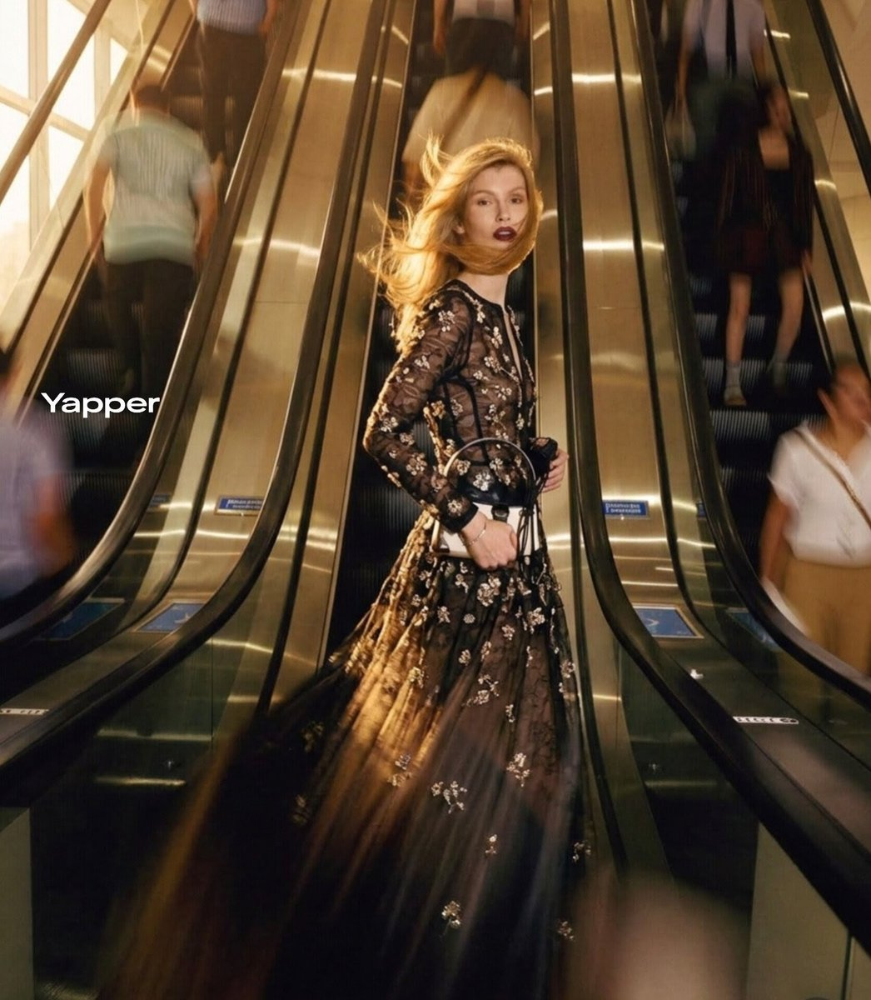

## Cinematic street portrait of a young woman walking throu

- ID: trending-2044616580890575125
- Slug: trending-2044616580890575125-en
- 语言: en
- 来源: [来源链接](https://x.com/Sairah_0/status/2044616580890575125)
- 样例图路径: images/part1/2044616580890575125_1.jpg

### 提示词

```text
Cinematic street portrait of a young woman walking through a busy shopping street at golden hour, holding bright yellow shopping bags, wind-blown wavy hair, soft natural makeup, intense eye contact with camera, shot from a slightly low angle close-up, dynamic motion blur in the background crowd, sharp focus on face, warm sunlight casting dramatic highlights and shadows, urban European architecture, shallow depth of field, 35mm lens, f/1.8, high contrast, rich warm tones, editorial fashion photography style, ultra-realistic, 8k.
```

### 样例图

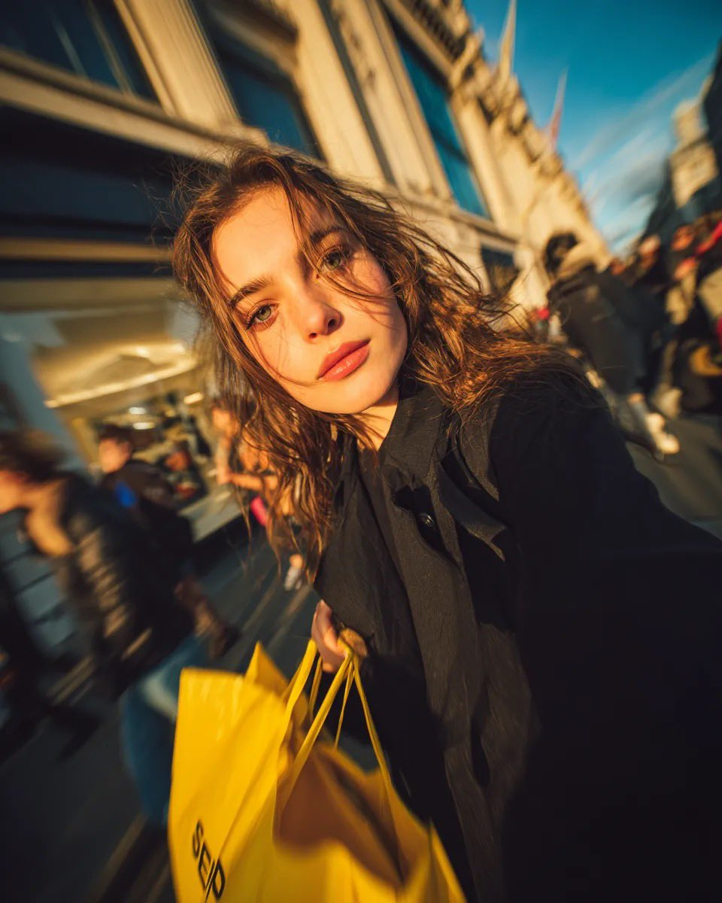

## 8K Ultra Photorealistic cinematic freeze-frame of a {PRO

- ID: trending-2044791188914671975
- Slug: trending-2044791188914671975-en
- 语言: en
- 来源: [来源链接](https://x.com/Goodmanprotocol/status/2044791188914671975)
- 样例图路径: images/part1/2044791188914671975_1.jpg

### 提示词

```text
8K Ultra Photorealistic cinematic freeze-frame of a {PROFESSION} slipping on a banana peel, mid-air fall with exaggerated shock expression, arms and legs extended. Preserve identity exactly. 10–15 clear {PROFESSION}-related objects floating naturally with clean spacing. Realistic environment matching the profession. Eye-level, full-body, natural lighting, realistic shadows. Style: cinematic, meme-like, controlled chaos. Avoid distortion, clutter, unrelated objects, bad lighting.
```

### 样例图

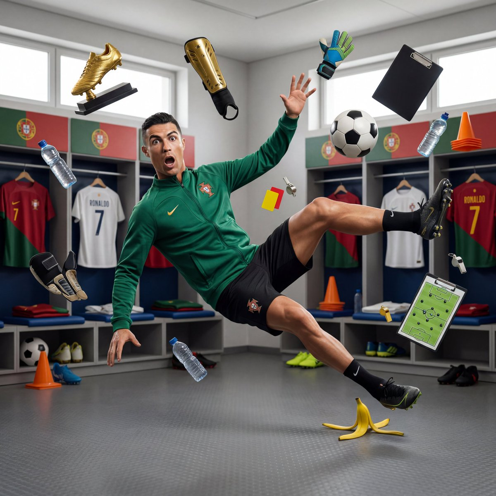

## 在柔和米色的工作室内，构建3x3精细编辑

- ID: trending-2017116581164454309
- Slug: trending-2017116581164454309-zh
- 语言: zh
- 来源: [来源链接](https://x.com/wanerfu/status/2017116581164454309)
- 样例图路径: images/part1/2017116581164454309_1.jpg

### 提示词

```text
在柔和米色的工作室内，构建3x3精细编辑照片网格

角色穿深蓝轻薄衬衫，米白长裤，赤脚展现原始质感

灯光设计：
前右大面积柔光，左侧银反光板，顶部微弱轮廓光。

9组精细镜头构图：
1.85mm f/1.8极致唇部特写
2.眼睛对镜特写
3.黑白下巴支撑肖像
4.半遮半露肖像
5.手覆面部特写
6.发丝遮眼构图
7.手部触下巴细节
8.半身侧坐姿势
9.带泪水的侧脸电影感
```

### 样例图

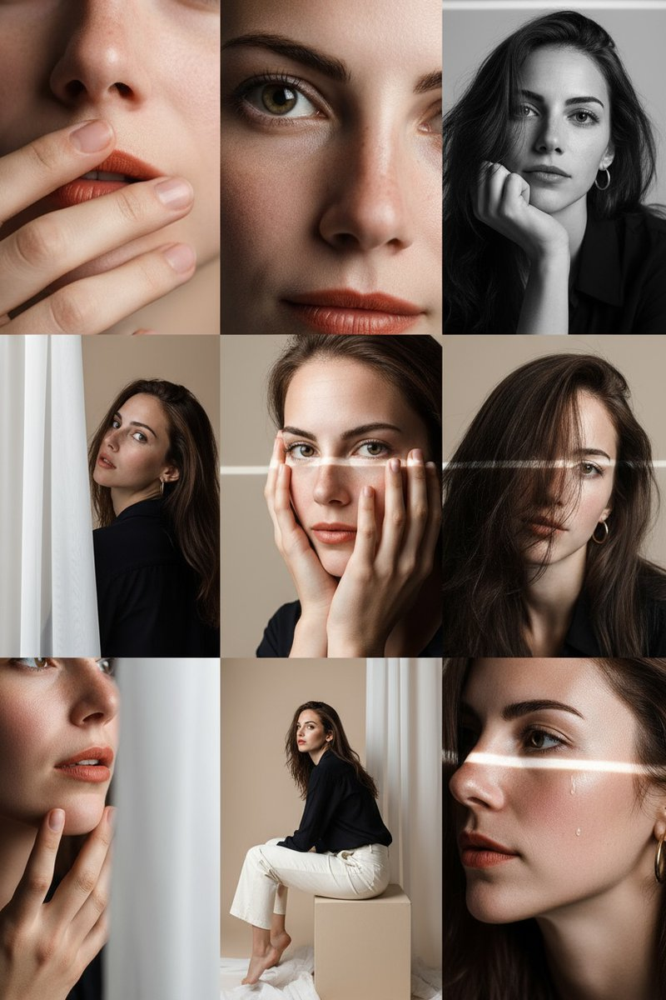

## Hyper-realistic low-angle closeup front shot of a young 

- ID: trending-2011273105541644683
- Slug: trending-2011273105541644683-en
- 语言: en
- 来源: [来源链接](https://x.com/harboriis/status/2011273105541644683)
- 样例图路径: images/part1/2011273105541644683_1.jpg

### 提示词

```text
Hyper-realistic low-angle closeup front shot of a young man use image uploaded leaning against a Land Rover Defender in a dim basement garage.

Wearing oversized Nike wind cheater, baggy basketball pants, Adidas chunky sneakers, basketball cap. Hands crossed, attitude gaze. Luxury SUVs softly blurred with cinematic bokeh, shallow depth of field, strong subject separation, and 8K cinematic color grading.
```

### 样例图

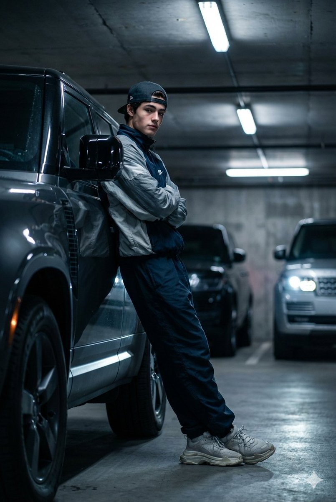

## A high-resolution 2x2 grid collage of four individual po

- ID: trending-2041840872925606344
- Slug: trending-2041840872925606344-en
- 语言: en
- 来源: [来源链接](https://x.com/Mind_Boticni/status/2041840872925606344)
- 样例图路径: images/part1/2041840872925606344_1.jpg

### 提示词

```text
A high-resolution 2x2 grid collage of four individual portraits. In each square, a different young man peeks through a jagged, ripped hole in bright yellow seamless paper. The subjects have a 1990s indie-pop aesthetic with diverse hairstyles, including messy curls and dreadlocks. The lighting is soft and even, typical of a professional studio photoshoot. The color palette is dominated by the vibrant yellow paper against a neutral beige background visible through the tears. Cinematic quality, sharp focus, 8k resolution, editorial photography style.
Key Elements Breakdown
If you want to tweak the result, here are the specific descriptors that make this style work:

Composition: 2x2 grid collage, quad split screen, peeking through a hole.
Main Prop: torn yellow construction paper, jagged ripped edges, seamless paper background.
Subject Style: Gen Z fashion, indie band aesthetic, 90s grunge-lite, youthful expressive faces.
Technical Specs: flat lighting, low depth of field, clean studio photography, vibrant saturation.
```

### 样例图

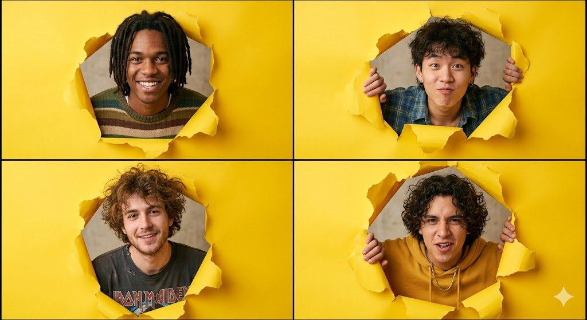

## Create a A high-fashion editorial image of a young man, 

- ID: trending-2039904399993225374
- Slug: trending-2039904399993225374-en
- 语言: en
- 来源: [来源链接](https://x.com/harboriis/status/2039904399993225374)
- 样例图路径: images/part1/2039904399993225374_1.jpg

### 提示词

```text
Create a A high-fashion editorial image of a young man, of the person from the uploaded character reference photo. KEEP FACE FEATURES AS ORIGINAL at all times. A high-fashion editorial image captured in an exaggerated fisheye lens close-up. The camera is angled slightly from below, and the man is crouching or squatting forward with both hands resting on his knees, leaning his upper body toward the lens. His face is looking downward into the camera, exaggerated by fisheye distortion so it appears large and rounded, with cartoonish proportions. He has a neutral smile, relaxed and completely smile, expression confident but emotionless.

He wears a trendy, summery knitted shirt in a pastel green shade light, breathable, with visible texture, reflecting Gen Z summer fashion. He also wears oversized black-framed sunglasses, with lenses tinted in light green.

The background is a clean, solid orange color with soft, realistic studio lighting, creating gentle shadows cast from his head, shoulders, and arms.

No direct sunlight light is controlled and evenly diffused, like a fashion set. The overall style is playful, surreal, and modern, inspired by 2025 Gen Z fashion culture and bold editorial covers. Ultra-clean details, slight grain, bold composition.
```

### 样例图

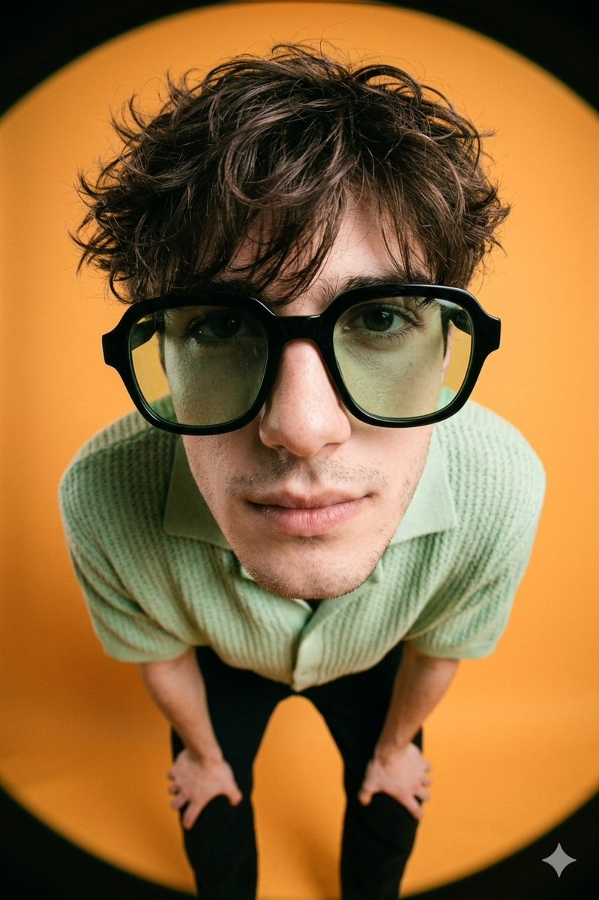

## Subject & Pose Full-body studio fashion photography of a

- ID: trending-2040029384518901953
- Slug: trending-2040029384518901953-en
- 语言: en
- 来源: [来源链接](https://x.com/Mind_Boticni/status/2040029384518901953)
- 样例图路径: images/part1/2040029384518901953_1.jpg

### 提示词

```text
Subject & Pose

Full-body studio fashion photography of a young East Asian man with styled, dark, textured hair. He is leaning against a tall, slender black metal barstool, posing with one foot resting on the floor and the other leg bent at the knee. His expression is calm and neutral, looking directly at the camera.
Outfit & Styling

Top: A light dusty blue oversized crewneck sweatshirt layered over a crisp white collared button-down shirt, with the collar and hem visible.Bottoms: Matching light dusty blue jogger-style sweatpants.Footwear: Chunky cream and white athletic sneakers with black laces and subtle grey accents.
Technical Specifications

Lighting: Soft, even studio lighting with minimal shadows to create a clean, high-end commercial look.Background: A solid, minimalist light grey or off-white seamless studio backdrop.Composition: Vertical full-body shot, eye-level perspective, sharp focus, 8k https://t.co/rmgp3uk67G: Contemporary K-fashion editorial, soft color palette, polished and airy aesthetic.
```

### 样例图

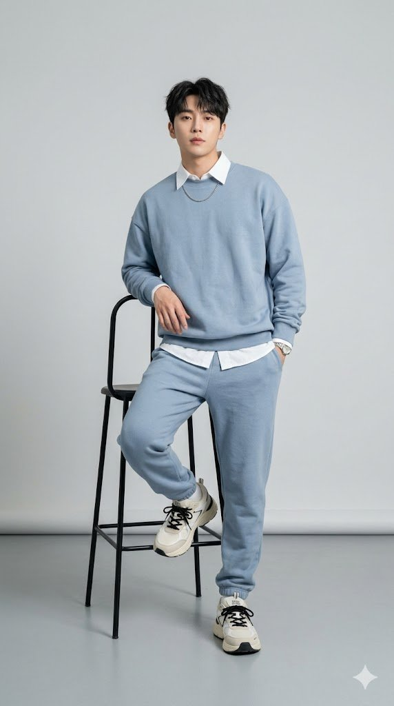

## { "title": "Optimus Prime Toy Assembly Workshop", "style

- ID: trending-2038836626906902918
- Slug: trending-2038836626906902918-en
- 语言: en
- 来源: [来源链接](https://x.com/chatgptpaglu/status/2038836626906902918)
- 样例图路径: images/part1/2038836626906902918_1.jpg

### 提示词

```text
{
  "title": "Optimus Prime Toy Assembly Workshop",
  "style": "Hyper-realistic cinematic portrait",
  "composition": {
    "aspect_ratio": "9:16",
    "orientation": "vertical",
    "resolution": "16K HD",
    "depth_of_field": "shallow",
    "lighting": "dim cinematic workshop lighting focused on the subject",
    "atmosphere": "dramatic, mechanical, highly detailed"
  },
  "subject": {
    "character": "man (based on image 2)",
    "hair": "messy",
    "expression": "focused and meticulous",
    "pose": "sitting at a work table assembling a toy model",
    "clothing": {
      "tshirt_color": "ivory",
      "logo": "Autobots"
    }
  },
  "main_object": {
    "name": "Optimus Prime toy assembly model",
    "source_reference": "image 1",
    "scale": "1/4",
    "state": "partially assembled truck model",
    "box_text": "Optimus Prime – Transformers"
  },
  "environment": {
    "location": "mechanical workshop",
    "wall_details": "graffiti art",
    "computers": "screens displaying Optimus Prime assembly blueprints and mechanical diagrams",
    "tools": [
      "screwdrivers",
      "bolts",
      "robot parts",
      "mechanical components"
    ]
  },
  "table_details": {
    "objects": [
      "robot armor parts",
      "wheels",
      "mechanical pieces",
      "cup of coffee",
      "cigarette"
    ]
  },
  "background": {
    "feature": "heroic replica statue of Optimus Prime"
  },
  "visual_quality": {
    "textures": "ultra-detailed",
    "render_style": "hyper-realistic",
    "cinematic_tone": true
  }
}
```

### 样例图

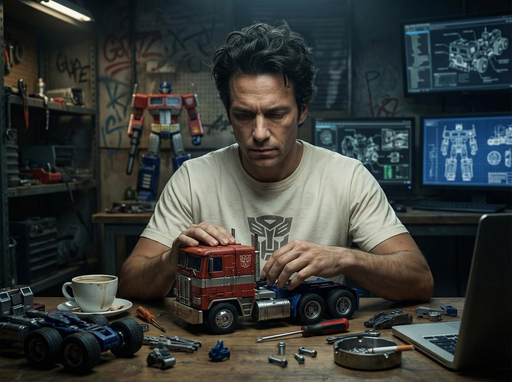

## Create a creative photo of a person using the face from 

- ID: trending-2036656563352678474
- Slug: trending-2036656563352678474-en
- 语言: en
- 来源: [来源链接](https://x.com/NikhilRajX/status/2036656563352678474)
- 样例图路径: images/part1/2036656563352678474_1.jpg

### 提示词

```text
Create a creative photo of a person using the face from the uploaded image. The person is standing in a simple environment while surrounded by hand-drawn doodle elements. Around them are sketch-style drawings like arrows, lightning, stars, scribbles, and abstract shapes, as if drawn with a marker. Some doodles interact with the person, like wings on their back, a crown above their head, or energy lines around their body. The style is a mix of real photo and doodle art. The person is wearing casual modern clothes like a t-shirt, jacket, jeans, and sneakers. The background is clean so the doodles stand out. High contrast, creative composition, slightly messy sketch style, fun and expressive, ultra detailed, modern social media aesthetic.
```

### 样例图

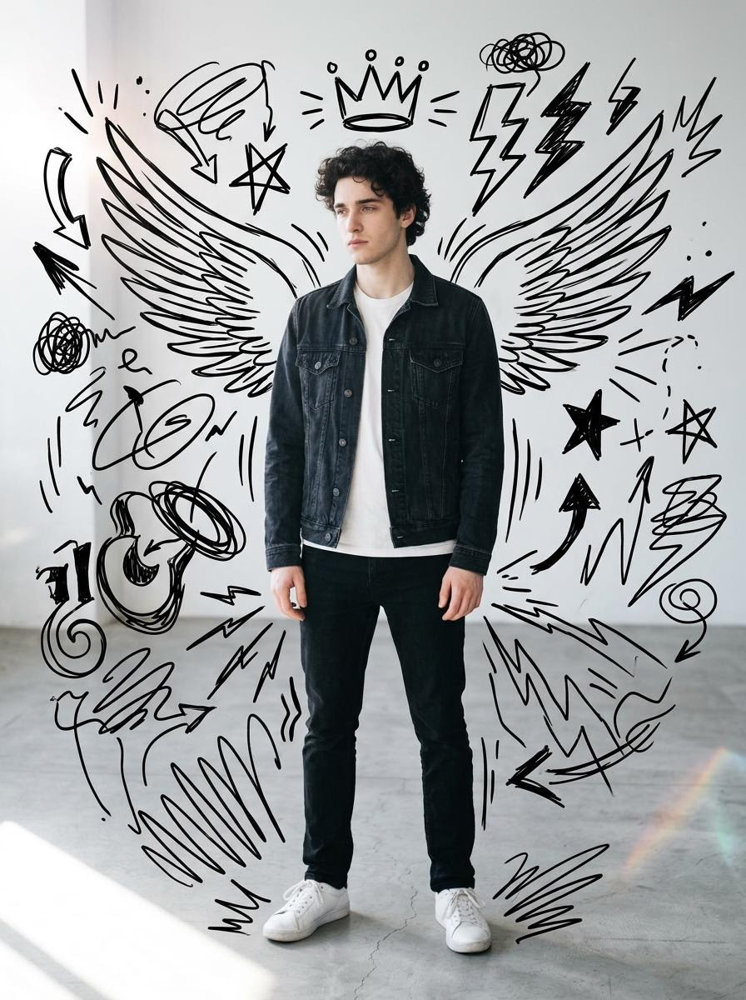

## A high-angle, wide-composition Impressionist oil paintin

- ID: trending-2008178703705297280
- Slug: trending-2008178703705297280-en
- 语言: en
- 来源: [来源链接](https://x.com/Mystveil7/status/2008178703705297280)
- 样例图路径: images/part1/2008178703705297280_1.jpg

### 提示词

```text
A high-angle, wide-composition Impressionist oil painting of a rainy urban intersection. The scene is primarily monochrome with deep charcoal blacks and silvery grays, but features vibrant, colorful glowing lights at the footsteps of pedestrians crossing the street and beneath their umbrellas. A lone motorcyclist in the center leaves a trail of soft, colorful light, and car headlights emit small, brilliant pops of color. The style is heavily blurred and painterly, with loose, expressive brushstrokes and vague silhouettes, prioritizing mood and 'urban solitude' over sharp detail. The pavement is rain-soaked, reflecting both the gray sky and the neon-like colorful glows in shimmering, broken patterns. Misty atmosphere with distant buildings fading into soft tonal washes.
```

### 样例图

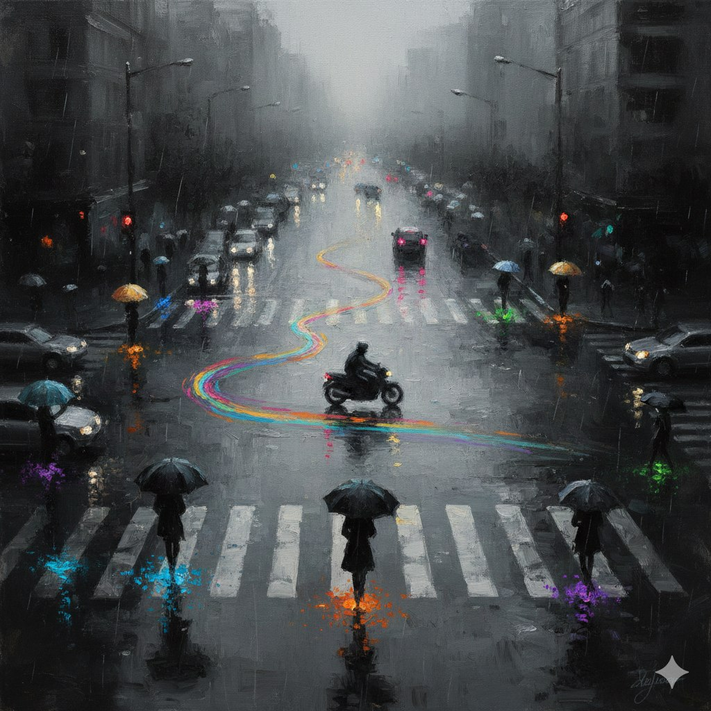

## { "content_goal": "relatable, calm, lifestyle aesthetic"

- ID: trending-2012004517638750448
- Slug: trending-2012004517638750448-en
- 语言: en
- 来源: [来源链接](https://x.com/cuties7377/status/2012004517638750448)
- 样例图路径: images/part1/2012004517638750448_1.jpg

### 提示词

```text
{
  "content_goal": "relatable, calm, lifestyle aesthetic",
  "image_type": "ultra-photorealistic lifestyle photography",
  "visual_style": {
    "aesthetic": "clean, cozy, minimal",
    "vibe": "soft, relaxed, natural",
    "realism": "high-end professional realism"
  },
  "composition": {
    "framing": "mid-shot",
    "camera_angle": "slightly above eye-level",
    "subject_position": "naturally centered",
    "perspective": "intimate but respectful"
  },
  "subject": {
    "description": "person sitting casually on a bed",
    "pose": "relaxed seated pose with legs folded or stretched comfortably",
    "body_language": "natural, unposed, confident ease",
    "expression": "calm, thoughtful, soft smile or neutral face"
  },
  "wardrobe": {
    "clothing": "casual homewear or loungewear",
    "style": "modest, relaxed fit",
    "textures": "soft cotton or linen",
    "color_tones": "neutral or pastel shades"
  },
  "environment": {
    "location": "minimal bedroom",
    "bed": "neatly arranged bed with soft pillows",
    "background": "clean wall or soft curtains",
    "atmosphere": "peaceful, morning or late-afternoon calm"
  },
  "lighting": {
    "type": "natural window light",
    "quality": "soft and diffused",
    "direction": "side lighting",
    "shadow_style": "gentle, natural shadows"
  },
  "color_palette": {
    "primary": ["warm white", "beige", "soft grey"],
    "accent": ["pastel tones"],
    "mood": "comforting and serene"
  },
  "camera_details": {
    "lens": "35mm or 50mm",
    "focus": "sharp on subject",
    "depth_of_field": "slight background blur",
    "realism": "editorial lifestyle photography"
  },
  "quality_control": {
    "skin_texture": "natural, realistic",
    "fabric_detail": "visible soft folds",
    "ai_artifacts": "none",
    "finish": "clean, professional"
  },
  "overall_mood": "casual confidence, calm presence",
  "intended_use": {
    "primary": "aesthetic lifestyle post on X",
    "secondary": "personal branding or daily vibe content"
  }
}
```

### 样例图


## Create a Portrait Master Object: Two passport-sized phot

- ID: trending-2041695940797690203
- Slug: trending-2041695940797690203-en
- 语言: en
- 来源: [来源链接](https://x.com/Naiknelofar788/status/2041695940797690203)
- 样例图路径: images/part1/2041695940797690203_1.jpg

### 提示词

```text
Create a Portrait Master Object: Two passport-sized photo prints held side-by-side by a person's thumb and index finger.
**Passport Photo Background:** Use a solid blue background (the standard official passport photo color for Indonesian marriage books for certain even/odd birth years).
**Clothing:** Both subjects in the photo wear formal and neat white collared shirts.
**Male Subject (Left Photo):** Make his face and hair 100% similar to the given reference.
He poses as if talking into a white paper cup, with a cheerful laughing expression.
**Female Subject (Right Photo):** Make her face and hair 100% similar to the given reference.
She poses as if holding a white paper cup to her ear, listening. Her expression is funny with a wide smile and a slightly stuck-out tongue.
**Interactive Prop:** There is a white string coming out from under the male's paper cup and connecting to the female's paper cup. Because the two photos are placed next to each other, this prop creates the illusion of a "string phone" connecting the two photos.
```

### 样例图

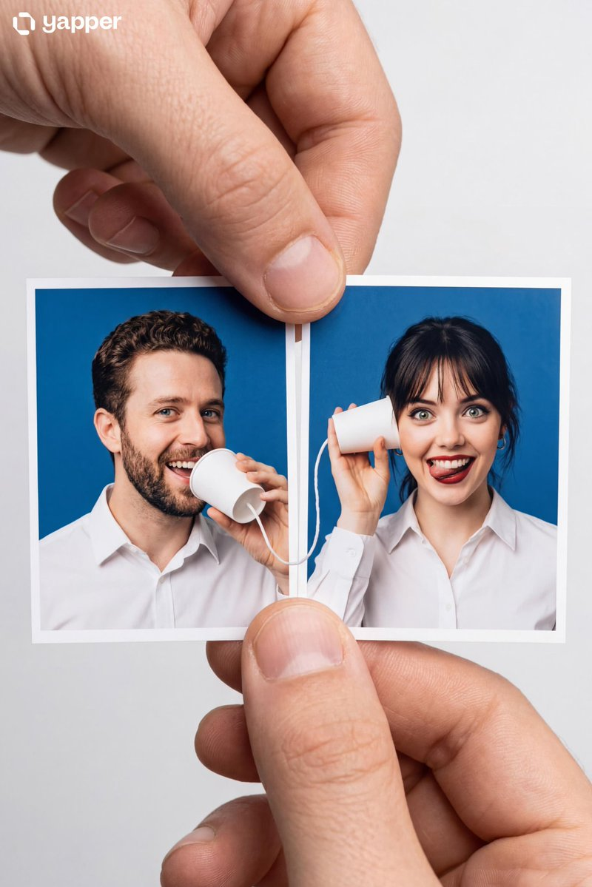

## { "style": "photorealistic", "subject": "adult man smoki

- ID: trending-2031369659350679749
- Slug: trending-2031369659350679749-en
- 语言: en
- 来源: [来源链接](https://x.com/azed_ai/status/2031369659350679749)
- 样例图路径: images/part1/2031369659350679749_1.jpg

### 提示词

```text
{
  "style": "photorealistic",
  "subject": "adult man smoking a cigarette while sitting on a motorbike",
  "appearance": {
    "age": "mid-30s",
    "expression": "calm, slightly serious",
    "beard": "light stubble",
    "clothing": "black leather jacket, white t-shirt, dark jeans, boots"
  },
  "pose": "sitting casually on the motorbike, one foot on the ground, holding a cigarette near his mouth",
  "vehicle": {
    "type": "modern sport motorbike",
    "color": "matte black",
    "details": "clean chrome accents, realistic reflections"
  },
  "environment": {
    "location": "urban street at night",
    "lighting": "cinematic street lights, soft rim light, subtle neon reflections",
    "atmosphere": "slight smoke haze blending with cigarette smoke"
  },
  "camera": {
    "angle": "low angle shot",
    "lens": "85mm",
    "depth_of_field": "shallow depth of field, blurred background bokeh"
  },
  "quality": {
    "resolution": "8k",
    "details": "ultra-detailed skin texture, realistic smoke, natural shadows",
    "rendering": "high dynamic range, sharp focus"
  }
}
```

### 样例图

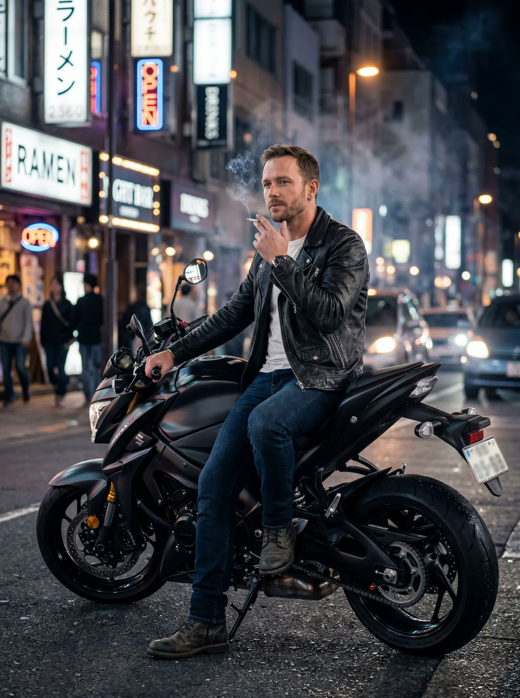

## Creative fashion photography with distorted perspective 

- ID: trending-2033344471086289107
- Slug: trending-2033344471086289107-en
- 语言: en
- 来源: [来源链接](https://x.com/harboriis/status/2033344471086289107)
- 样例图路径: images/part1/2033344471086289107_1.jpg

### 提示词

```text
Creative fashion photography with distorted perspective (wide-angle lens/fisheye effect). 

The frame features a young, handsome European-looking man with dark hair. 

He is seated at a table, resting his left hand on his head (a relaxed, pensive pose), and looking directly into the lens with a confident, slightly arrogant expression. Key element (foreground): His right arm is extended strongly forward toward the camera, palm facing down.

In extreme close-up. He holds a large, glossy black chess piece (the Queen), making a move. Due to the perspective, the hand and piece appear enormous compared to the head. Setting: The table is a stylized chessboard: alternating glossy black squares and squares of textured gold leaf, with strong reflections on the surface. In the background, a black chess piece lies overturned on the table. Clothing: A loose white shirt with an open collar, a gold chain around the neck.

Background: Dark, almost black, with large white abstract geometric shapes (reminiscent of the silhouettes of a chess rook's battlements) at the edges of the frame. Lighting and Style: Studio lighting, contrasting light, high detail in the leather texture and gold, glossy magazine style, unusual angle.
```

### 样例图

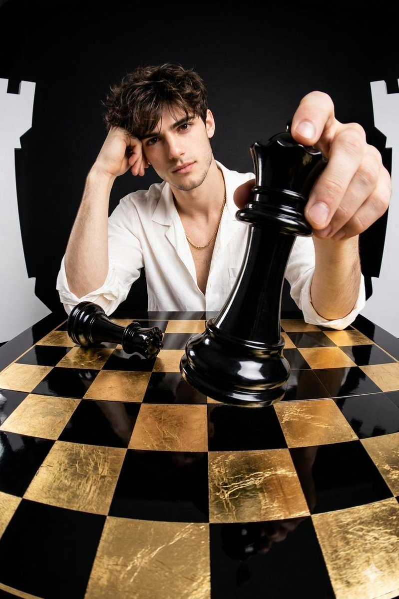

## Create a hyper-realistic three-panel vertical cinematic 

- ID: trending-2040639446044102992
- Slug: trending-2040639446044102992-en
- 语言: en
- 来源: [来源链接](https://x.com/MrDasOnX/status/2040639446044102992)
- 样例图路径: images/part1/2040639446044102992_1.jpg

### 提示词

```text
Create a hyper-realistic three-panel vertical cinematic collage in 9:16 aspect ratio, editorial fashion photography style. The collage consists of three distinct vertical frames stacked seamlessly, each featuring the exact same man with consistent face, skin tone, short black hair, sharp jawline, and intense gaze directly at the viewer, as if from the same reference photo.

Top panel: The man stands confidently on a misty mountain ridge at sunrise, dramatic Himalayan peaks in the background with golden light piercing through low clouds. He wears a rugged dark olive green tactical field jacket with rolled sleeves, black cargo pants, and sturdy hiking boots. Cool blue-gray color grading with subtle film grain.

Middle panel: The man leans against an ancient stone pillar inside a grand abandoned temple in a dense tropical jungle, soft diffused sunlight filtering through overgrown vines and carved arches. He wears a lightweight white linen button-up shirt (slightly unbuttoned at the top) tucked into slim khaki trousers, with brown leather loafers. Warm earthy tones with teal shadows and cinematic haze.

Bottom panel: The man walks along a serene lakeside at golden hour, crystal-clear water reflecting snow-capped mountains in the distance, surrounded by pine trees. He wears a black merino wool turtleneck sweater layered under a tailored charcoal wool overcoat, dark jeans, and polished Chelsea boots. Moody teal-orange cinematic grading with soft bokeh and gentle film grain.

Maintain perfect facial consistency across all three panels — same man, same reference face, no variations in features. Ultra-detailed skin texture, realistic fabric details, natural lighting per environment. Cinematic color grading, subtle film grain, editorial composition, high-end fashion photography aesthetic, shot on 35mm film, 4k resolution, photorealistic, masterpiece.
```

### 样例图

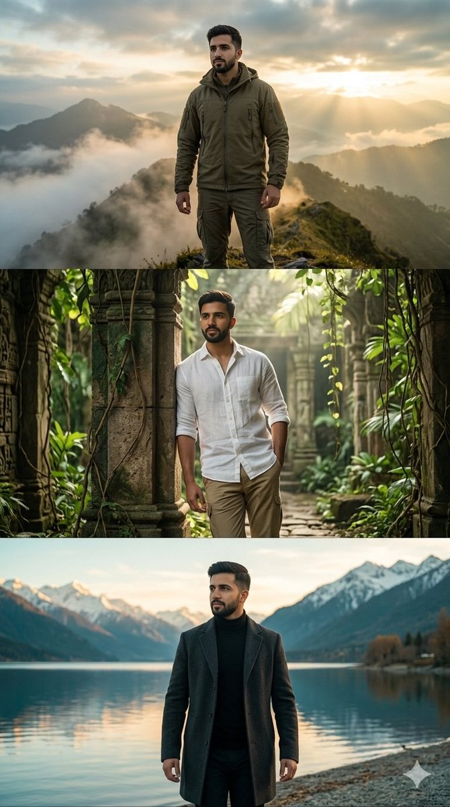

## A stylish young man wearing a black leather jacket and a

- ID: trending-2044650233611907528
- Slug: trending-2044650233611907528-en
- 语言: en
- 来源: [来源链接](https://x.com/Taaruk_/status/2044650233611907528)
- 样例图路径: images/part1/2044650233611907528_1.jpg

### 提示词

```text
A stylish young man wearing a black leather jacket and aviator sunglasses leans out of the window of a vintage blue car on an empty desert highway. He casually holds a cigarette, looking confidently at the camera. Beside him, a 3D cartoon coyote character (in the style of classic animation, exaggerated features, expressive face) is sitting on the car door, interacting naturally with the real-world environment. In the background, a cartoon roadrunner is sprinting fast along the road, kicking up dust. The scene blends hyper-realistic photography with high-quality 3D animated characters seamlessly. Desert landscape with cacti, warm golden hour lighting, long shadows, cinematic depth of field, ultra-detailed textures, reflections in sunglasses, motion blur on running character, 35mm lens, f/2.0, high contrast, 8K, film still aesthetic.
```

### 样例图

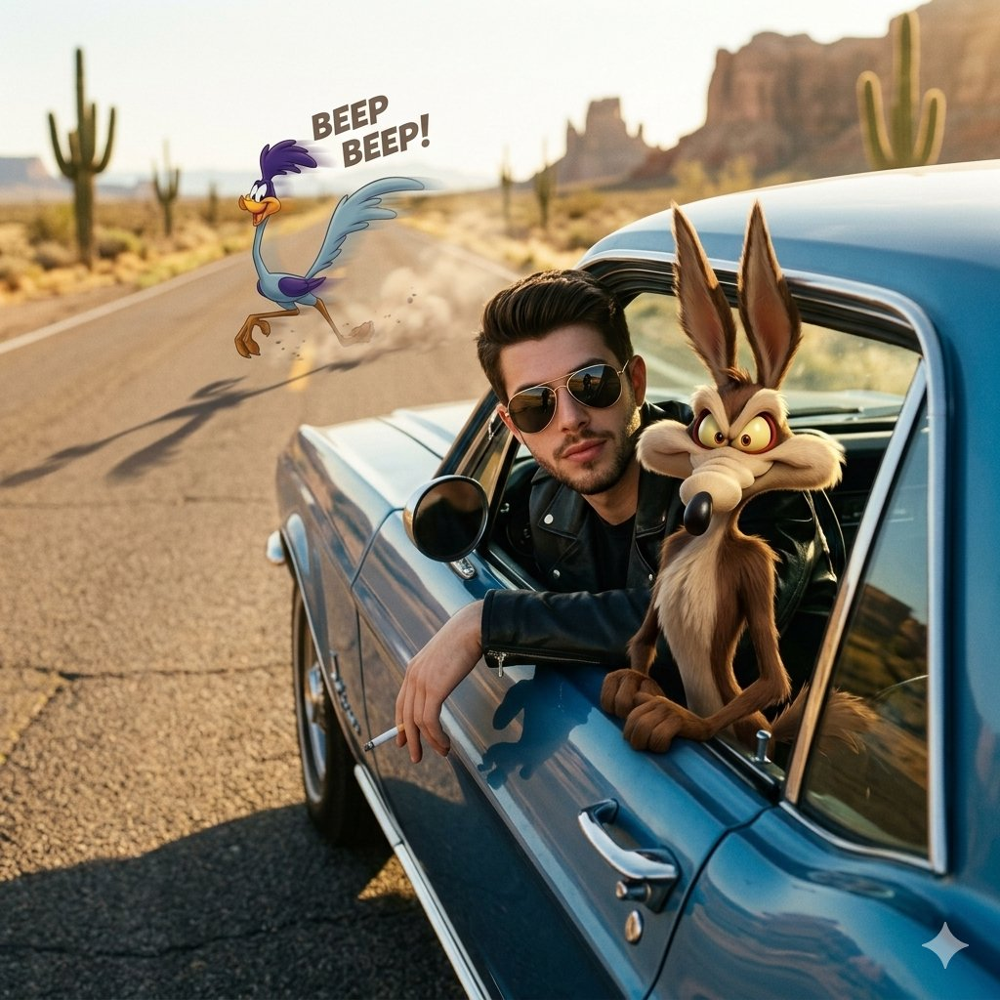

## { "description": "A colossal woman standing in a city st

- ID: trending-2011072648303018074
- Slug: trending-2011072648303018074-en
- 语言: en
- 来源: [来源链接](https://x.com/IqraSaifiii/status/2011072648303018074)
- 样例图路径: images/part1/2011072648303018074_1.jpg

### 提示词

```text
{
  "description": "A colossal woman standing in a city street, appearing to be 'under construction' with scaffolding surrounding her body.",
  "aesthetic": "Hyper-realistic composite, cinematic, urban fantasy.",
  "subject_details": {
    "celebrity_likeness": "Taylor Swift.",
    "features": {
      "face": "Blue eyes, signature red lipstick, distinct facial structure.",
      "hair": "Golden blonde, long, wavy texture cascading over shoulders."
    },
    "apparel": {
      "dress": "Black satin slip dress with a deep V-neck and a high slit on the right thigh.",
      "accessories": "Holding a standard white disposable coffee cup in the right hand. Carrying a brown leather luxury handbag in the left hand.",
      "footwear": "Bare feet or heels (obscured by street debris/cracks)."
    }
  },
  "surreal_elements": {
    "scaffolding": "Intricate metal construction scaffolding structures built around her arms, torso, and legs, following the contour of her body.",
    "miniatures": "Tiny construction workers in yellow hard hats and high-vis vests climbing the scaffolding on her body.",
    "destruction": "The asphalt street beneath her feet is cracking and shattering under the immense weight, creating a crater pattern."
  },
  "exact_pose_anatomical": {
    "posture": "Standing tall with a slight contrapposto (weight shifted to one hip).",
    "orientation": "Front-facing, towering over the viewer/city.",
    "right_arm": "Bent at the elbow, raised to hold the coffee cup at chest level.",
    "left_arm": "Extended downwards holding the handbag.",
    "gaze": "Direct, calm eye contact with the camera.",
    "scale": "Subject appears to be approximately 50 stories tall, matching the height of surrounding skyscrapers."
  },
  "environment": {
    "location": "Avenue in a major metropolis (resembling Chicago or NYC).",
    "elements": "Skyscrapers flanking both sides, busy traffic with miniature yellow taxis and buses way below.",
    "perspective": "Aerial view relative to the city, but eye-level relative to the subject."
  },
  "camera_technical_values": {
    "lens": "35mm (Wide angle to capture the full scale of the subject against the skyline).",
    "aperture": "f/11 (Deep depth of field to keep both the giant subject and the city background relatively sharp).",
    "shutter_speed": "1/500s.",
    "iso": "ISO 100.",
    "resolution": "8k, high fidelity textures."
  },
  "lighting_setup": {
    "source": "Natural Daylight.",
    "quality": "Soft, diffused sunlight (slightly overcast).",
    "direction": "Overhead/Frontal.",
    "shadows": "Subject casts a massive, long shadow onto the city streets below."
  }
}
```

### 样例图

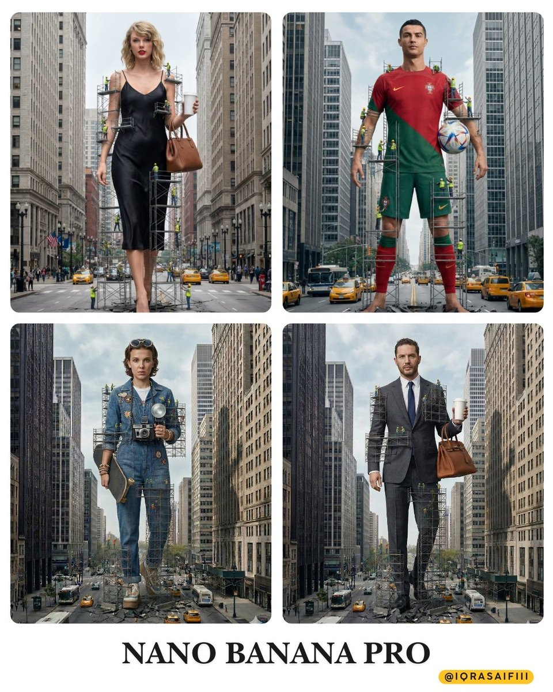

## Ultra-realistic fashion studio portrait of a confident m

- ID: trending-2030277890844262604
- Slug: trending-2030277890844262604-en
- 语言: en
- 来源: [来源链接](https://x.com/Taaruk_/status/2030277890844262604)
- 样例图路径: images/part1/2030277890844262604_1.jpg

### 提示词

```text
Ultra-realistic fashion studio portrait of a confident man and woman standing with arms crossed, wearing matching white sweatshirts with blue sleeves, dramatic sunlight streaming through window blinds casting striped shadows across their faces and clothing, clean minimal studio background, strong facial features, natural skin texture, cinematic lighting, high contrast shadow patterns, editorial fashion photography style, 85mm lens, shallow depth of field, ultra-detailed skin and fabric texture, professional studio lighting, 8K.
```

### 样例图

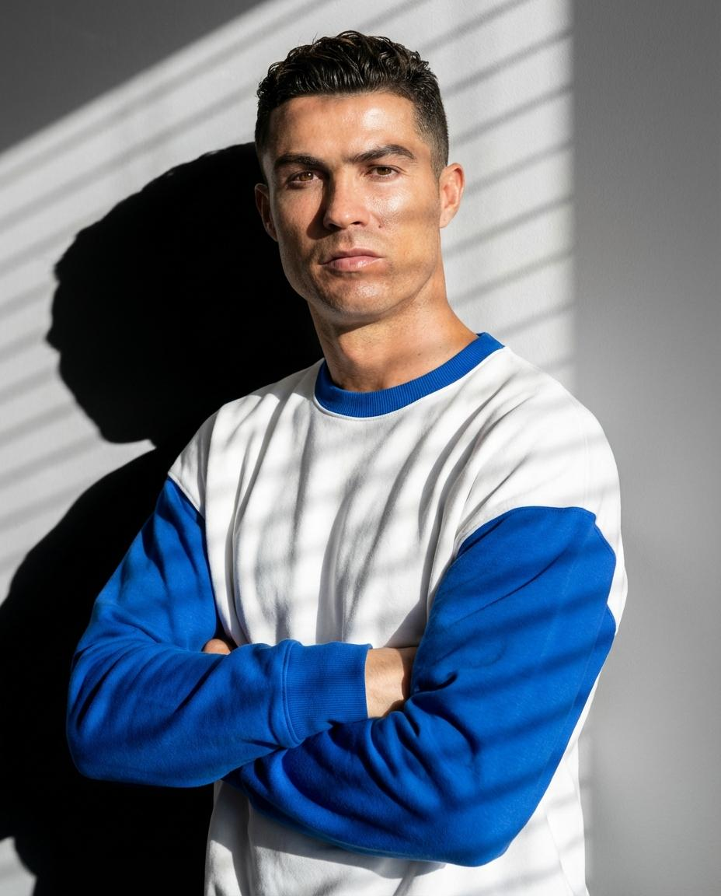

## { "content_goal": "clean, elegant, viral side-pose visua

- ID: trending-2011735232366416223
- Slug: trending-2011735232366416223-en
- 语言: en
- 来源: [来源链接](https://x.com/cuties7377/status/2011735232366416223)
- 样例图路径: images/part1/2011735232366416223_1.jpg

### 提示词

```text
{
  "content_goal": "clean, elegant, viral side-pose visual",
  "image_type": "ultra-photorealistic lifestyle / editorial portrait",
  "visual_style": {
    "aesthetic": "cinematic, editorial, modern minimalism",
    "vibe": "confident, graceful, premium",
    "realism": "high-end professional realism"
  },
  "composition": {
    "framing": "mid-to-full body side view",
    "camera_angle": "true side angle (90-degree profile)",
    "subject_position": "slightly off-center for balance",
    "perspective": "clean silhouette with depth"
  },
  "subject": {
    "description": "confident individual captured in side profile",
    "pose": "standing or seated side pose with elongated posture",
    "body_language": "relaxed yet strong, controlled stance",
    "expression": "calm confidence, subtle elegance",
    "gaze": "forward or slightly downward"
  },
  "facial_details": {
    "emotion": "composed, self-assured",
    "micro_details": "natural skin texture, defined profile lines"
  },
  "wardrobe": {
    "clothing": "form-fitting or flowing outfit highlighting profile",
    "textures": "smooth, soft fabric with natural folds",
    "color_tones": "neutral, monochrome, or muted pastels"
  },
  "lighting": {
    "type": "directional studio or natural lighting",
    "quality": "soft yet sculpting",
    "direction": "side-lit to enhance contours",
    "highlight_focus": "face profile, shoulder line, waist curve",
    "shadow_style": "gentle, controlled shadows"
  },
  "color_palette": {
    "primary": ["soft neutrals", "warm skin tones", "subtle shadows"],
    "mood": "clean, elegant, confident"
  },
  "environment": {
    "location": "minimal studio, modern interior, or outdoor urban space",
    "background": "simple gradient or uncluttered backdrop",
    "atmosphere": "premium, calm, stylish"
  },
  "camera_details": {
    "camera_type": "professional camera simulation",
    "lens": "50mm or 85mm portrait lens",
    "focus": "sharp focus on profile",
    "depth_of_field": "soft background blur",
    "resolution": "editorial-grade clarity"
  },
  "quality_control": {
    "anatomy_accuracy": "natural posture and proportions",
    "fabric_realism": "realistic drape and texture",
    "ai_artifacts": "none",
    "professional_finish": "magazine-quality output"
  },
  "overall_mood": "confident, refined, cinematic",
  "intended_use": {
    "primary": "viral aesthetic post on X",
    "secondary": "personal branding, editorial photography"
  }
}
```

### 样例图

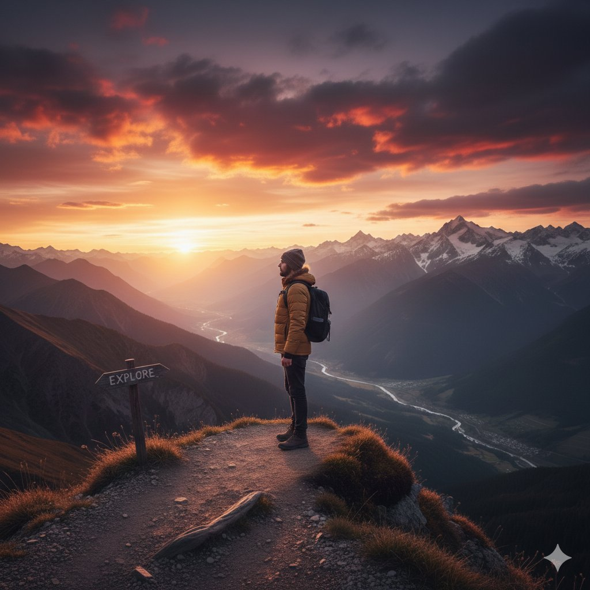

## Calm eyes, simple elegance. A high-fashion close-up port

- ID: trending-2010179276973191428
- Slug: trending-2010179276973191428-en
- 语言: en
- 来源: [来源链接](https://x.com/Sophia_here12/status/2010179276973191428)
- 样例图路径: images/part1/2010179276973191428_1.jpg

### 提示词

```text
Calm eyes, simple elegance.

A high-fashion close-up portrait of a woman with relaxed shoulders and a gentle, composed smile. She wears a soft ivory couture top with a clean neckline, set in a warm-lit studio with delicate, translucent dust particles floating softly around her face.
```

### 样例图

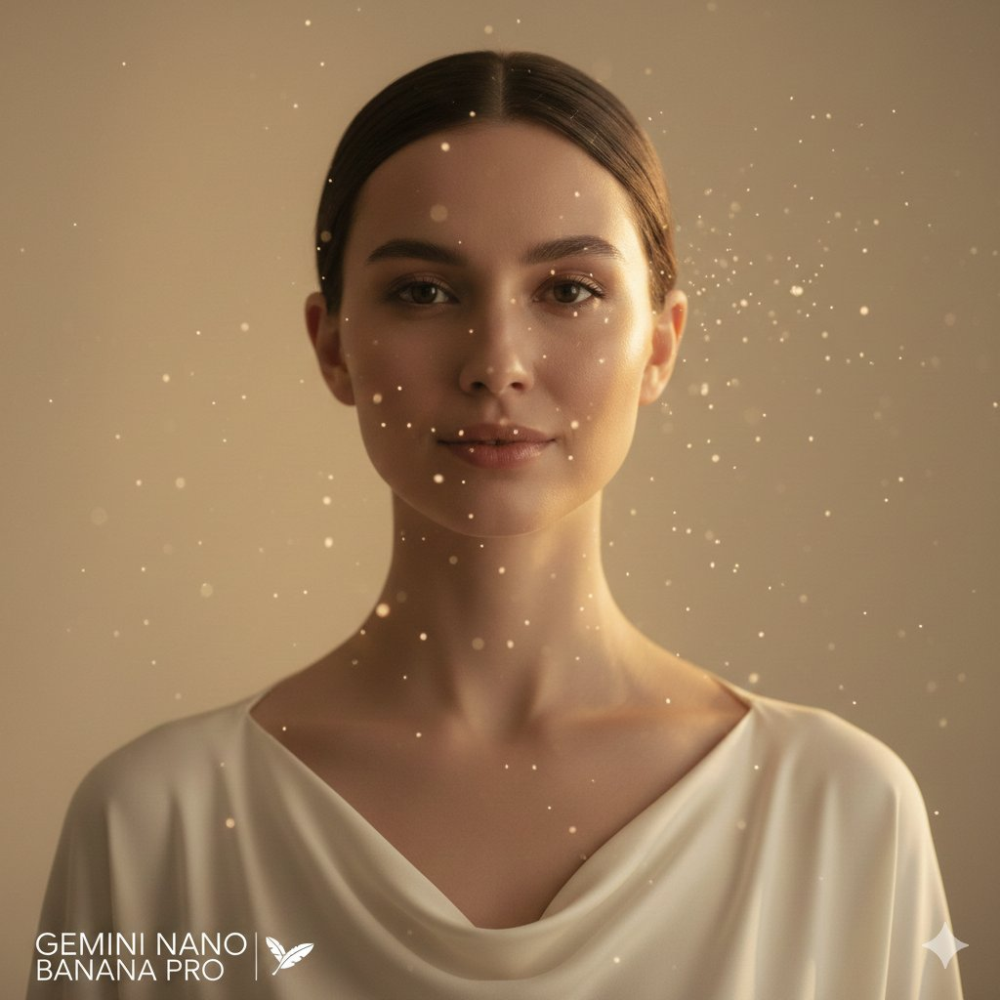

## A high-realism, professional editorial photograph inside

- ID: trending-2008902313898033412
- Slug: trending-2008902313898033412-en
- 语言: en
- 来源: [来源链接](https://x.com/kingofdairyque/status/2008902313898033412)
- 样例图路径: images/part1/2008902313898033412_1.jpg

### 提示词

```text
A high-realism, professional editorial photograph inside an Orthodox church.
A young woman with natural facial proportions and a calm, focused expression is kneeling on the stone floor, seated back on her heels. She wears an elegant white long-sleeve dress with a high neckline and a fabric belt tied at the waist; the fabric shows realistic folds, weight, and subtle texture. Her head is modestly covered with a traditional white headscarf (kosynka), softly draped and slightly translucent at the edges.
She is positioned in right side profile, holding a thin paintbrush in her right hand, carefully applying paint to a large Orthodox icon placed on a wooden easel in front of her. The brush gently touches the icon's surface, emphasizing a moment of concentration and reverence.
The icon depicts an elderly Orthodox saint with a long grey beard, dressed in traditional liturgical garments, with a softly glowing golden halo. Cyrillic inscriptions are visible on the icon, including "IC XC" and other Church Slavonic lettering. The saint holds a small icon in his hands. The painted surface shows realistic craquelure, brush strokes, gold leaf imperfections, and aged varnish.
Background: a richly decorated iconostasis filled with golden icons set in arched frames, carved wooden details, burning candles and hanging oil lamps. On the right side, a tall arched stained-glass window casts soft multicolored light onto the floor, creating subtle rainbow reflections. On the left, part of the altar is visible with a cross and additional icons.
Lighting is warm, layered, and atmospheric — golden ambient candlelight combined with soft natural light from the window, creating gentle shadows and depth. Skin appears fully natural with visible pores, subtle tonal variations, and no artificial smoothing. Makeup is refined and realistic, enhancing the eyes and lips without exaggeration.
Camera perspective: 50–85mm lens look, shallow depth of field, sharp focus on the woman's face, hand, and brush, with the background softly blurred. High optical clarity, true-to-life color balance, realistic exposure. The composition emphasizes the contrast between the matte white fabric of the dress and the luminous gold tones of the iconostasis. Ultra-realistic, photographic, human, non-stylized.
```

### 样例图

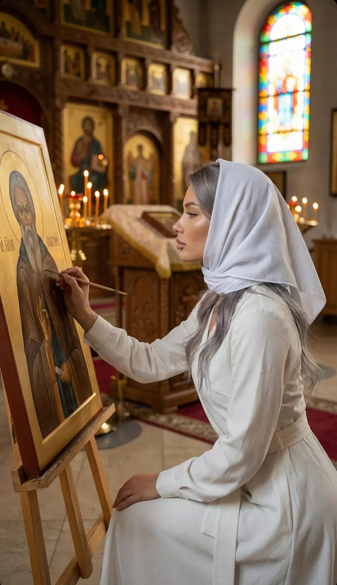

## { "image_generation": { "reference": {"use_uploaded_phot

- ID: trending-2009915869489504532
- Slug: trending-2009915869489504532-en
- 语言: en
- 来源: [来源链接](https://x.com/harboriis/status/2009915869489504532)
- 样例图路径: images/part1/2009915869489504532_1.jpg

### 提示词

```text
{
  "image_generation": {
    "reference": {"use_uploaded_photo": true, "role": "main subject", "identity_preservation": true},
    "scene": {
      "location": "rural countryside",
      "background": ["tall dry grass fields", "distant metal powerline tower"],
      "time": "golden hour",
      "atmosphere": "calm, nostalgic road trip mood"
    },
    "subject": {
      "pose": "casually leaning against a vintage car, one arm resting on the open door frame",
      "expression": "thoughtful, relaxed, looking off to the side",
      "hair": "gently moved by the wind",
      "style": "natural, candid portrait"
    },
    "outfit": {
      "top": "retro striped sweater in warm earthy tones",
      "bottom": "high waisted beige trousers"
    },
    "lighting": {"type": "soft sunset light", "highlights": "warm", "shadows": "cool", "contrast": "soft"},
    "camera": {
      "lens": "35mm analog look",
      "depth_of_field": "shallow",
      "focus": "sharp on subject, smooth background falloff",
      "composition": "editorial fashion portrait"
    },
    "color_grading": {"style": "muted vintage tones", "saturation": "slightly reduced", "film_grain": "subtle"},
    "quality": {"realism": "high", "texture": "natural skin and fabric detail", "render": "cinematic, editorial, realistic"}
  }
}
```

### 样例图

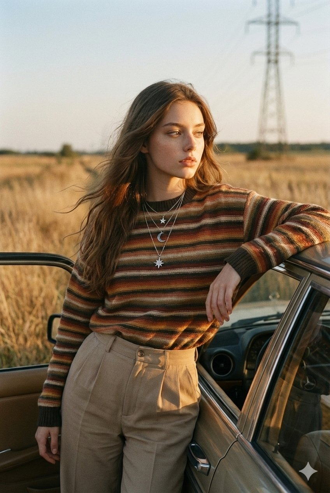

## { "prompt": "A hyper-realistic, ultra-detailed 8K cinema

- ID: trending-2010175109013877160
- Slug: trending-2010175109013877160-en
- 语言: en
- 来源: [来源链接](https://x.com/hearthacker031/status/2010175109013877160)
- 样例图路径: images/part1/2010175109013877160_1.jpg

### 提示词

```text
{
  "prompt": "A hyper-realistic, ultra-detailed 8K cinematic photograph captured from a high-angle perspective using a wide-angle lens, looking directly downward into a dense, almost circular crowd, creating a strong sense of enclosure and spotlight focus.\n\nAt the center stands a confident man wearing a dark tailored suit with a dark collared shirt and round sunglasses. Use the uploaded face strictly as reference to preserve the exact identity and facial features. His right hand is raised toward the camera with the palm facing outward in a clear 'stop' or 'talk to the hand' gesture, conveying authority and control.\n\nHe is completely surrounded by a tightly packed crowd of smiling women, forming a near-perfect circle around him. The women are dressed in dark, elegant, or subtly shimmering evening attire. Their faces and shoulders densely fill the mid-ground, many looking toward the central man or directly at the camera, enhancing the sense of attention and chaos.\n\nIn the immediate foreground at the bottom of the frame, multiple photographers are visible holding professional DSLR cameras equipped with large external flash units. The flashes are actively firing, producing intense, direct frontal lighting on the central figures.\n\nLighting and mood: Dramatic, high-contrast paparazzi-style lighting with blown-out highlights on faces and clothing, sharp rim lighting on some figures, and deep, near-black shadows in the background. The lighting emphasizes a glamorous yet chaotic paparazzi frenzy.\n\nVisual quality: Extremely sharp focus on the main subjects, hyper-detailed textures on skin, fabric, sunglasses, and camera equipment. Cinematic color grading, realistic skin tones, shallow depth of field where appropriate, premium editorial photography aesthetic.",
  "negative_prompt": "low resolution, blur, soft focus, cartoon, illustration, CGI, distorted anatomy, extra limbs, extra fingers, washed-out colors, flat lighting, studio setup, empty background, watermark, logo, text",
  "aspect_ratio": "2:3",
  "style": "hyper-realistic cinematic",
  "lighting": "high-contrast paparazzi flash lighting",
  "camera": "DSLR, wide-angle lens, high-angle shot",
  "resolution": "8K",
  "quality": "ultra high"
}
```

### 样例图

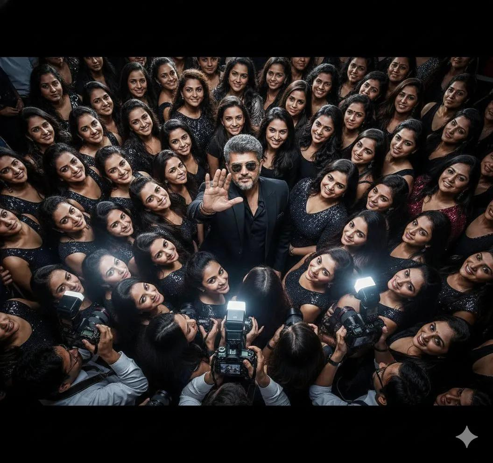

## High-contrast black and white photo taken with a 1990s d

- ID: trending-2011072669941448785
- Slug: trending-2011072669941448785-en
- 语言: en
- 来源: [来源链接](https://x.com/harboriis/status/2011072669941448785)
- 样例图路径: images/part1/2011072669941448785_1.jpg

### 提示词

```text
High-contrast black and white photo taken with a 1990s disposable camera at a dark house party. A handsome young man with dark, curly hair and a sharp jawline is staring directly into the lens. Focus on the eyes: intense, light-colored irises with a piercing, predatory gaze, slightly heavy-lidded (siren eyes), reflecting the harsh camera flash. He is wearing a black button-down shirt. The image is grainy, lo-fi, with a "dark academia" bad boy aesthetic. (use my face from the uploaded selfie)
```

### 样例图

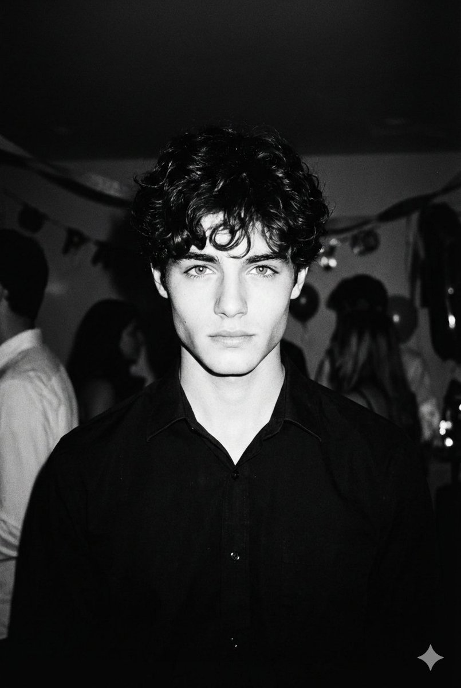

## A full shot captures a young man in profile, leaning aga

- ID: trending-2017213008729244087
- Slug: trending-2017213008729244087-en
- 语言: en
- 来源: [来源链接](https://x.com/harboriis/status/2017213008729244087)
- 样例图路径: images/part1/2017213008729244087_1.jpg

### 提示词

```text
A full shot captures a young man in profile, leaning against a textured turquoise wall inside a brightly lit tunnel. He is dressed in a sleek black leather jacket and black pants. His short, dark hair is casually styled, framing a contemplative expression as he gazes forward. Wisps of smoke curl subtly above his head. The background features a series of evenly spaced rectangular lights along the tunnel's ceiling, creating a strong sense of depth and leading the eye. The overall lighting casts a cool, ethereal glow on the scene, with the vibrant turquoise of the walls contrasting with the stark brightness of the lights. The image conveys a mood of quiet introspection and urban coolness.
```

### 样例图

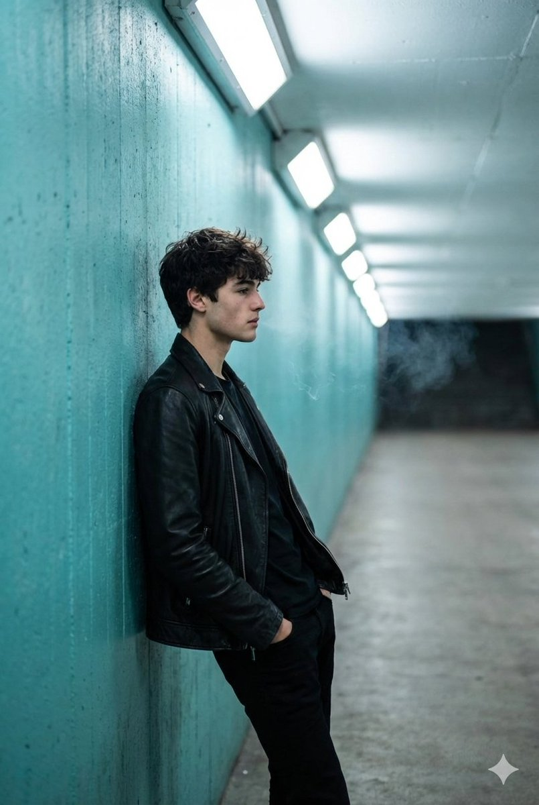

## USE UPLOADED PHOTO AS REFERENCE. HOGWARTS-STYLE PHOTOSHO

- ID: trending-2011081163109236916
- Slug: trending-2011081163109236916-en
- 语言: en
- 来源: [来源链接](https://x.com/SimplyAnnisa/status/2011081163109236916)
- 样例图路径: images/part1/2011081163109236916_1.jpg

### 提示词

```text
USE UPLOADED PHOTO AS REFERENCE. HOGWARTS-STYLE PHOTOSHOOT. THE GIRL IS POSING, IN A BLACK ROBE, THE UNDERSIDE OF THE ROBE IS RED, A WHITE COLLAR AND A TIED TIE OF GRYFFINDOR COLOR ARE VISIBLE. HER HAIR IS LOOSE, A DILAPIDATED, OLD BOOK IS PRESSED TO HER BODY IN HER HANDS. HE HOLDS A MAGIC WAND IN ONE HAND. A WHITE OWL SITS ON THE SHOULDER, THE BACKGROUND IS AN OLD STONE WALL, THE BACKGROUND IS SLAY. THEMATIC PHOTO SESSION. DETAILING, HIGH QUALITY. PORTRAIT.
```

### 样例图

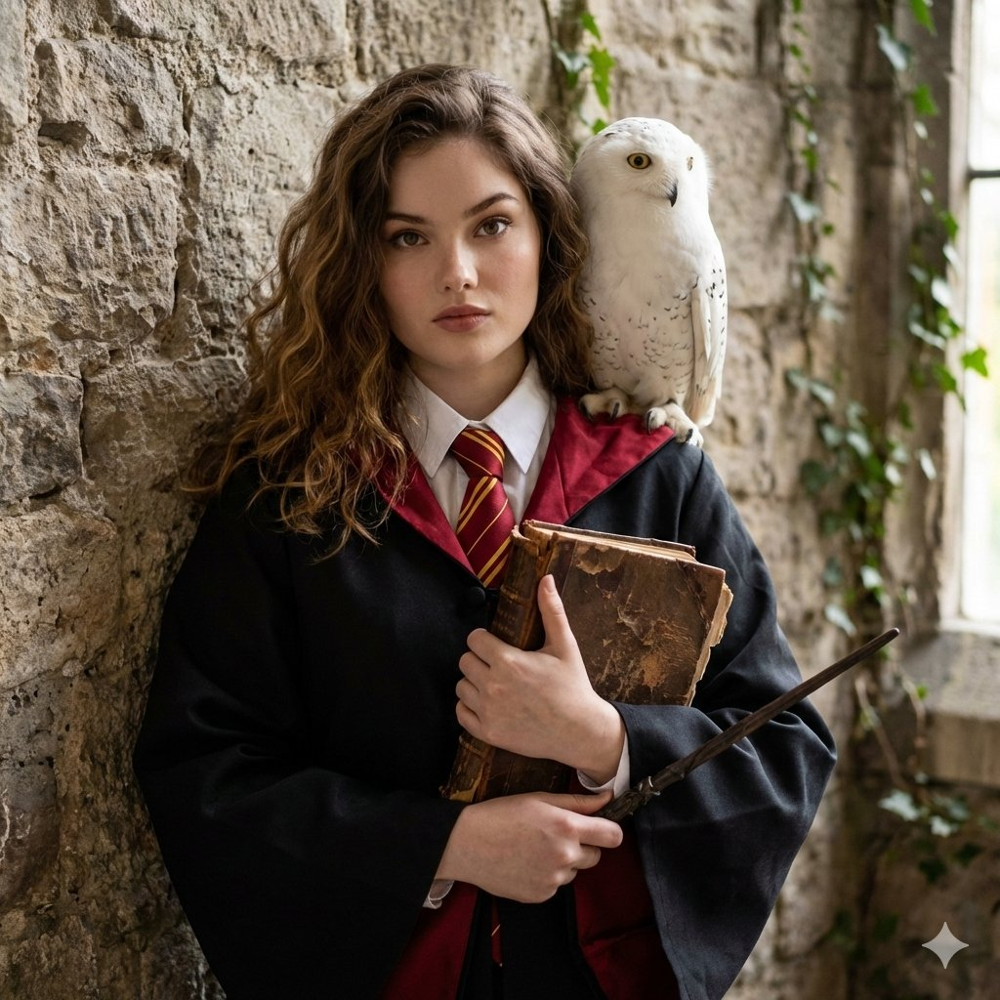

## A high-detail, cinematic shot of an astronaut floating i

- ID: trending-2008495362529493218
- Slug: trending-2008495362529493218-en
- 语言: en
- 来源: [来源链接](https://x.com/Strength04_X/status/2008495362529493218)
- 样例图路径: images/part1/2008495362529493218_1.jpg

### 提示词

```text
A high-detail, cinematic shot of an astronaut floating in outer space with the Earth's blue curvature and atmosphere in the background. The astronaut is wearing a realistic, weathered white space suit. They are holding a metallic thermos from which dark coffee or amber liquid is spilling out, forming perfect spherical droplets and a beautiful splash due to zero gravity. The lighting is dramatic, with a strong glow from the sun reflecting off the helmet's visor and the liquid droplets. 8k resolution, hyper-realistic, photorealistic, cosmic atmosphere.
```

### 样例图

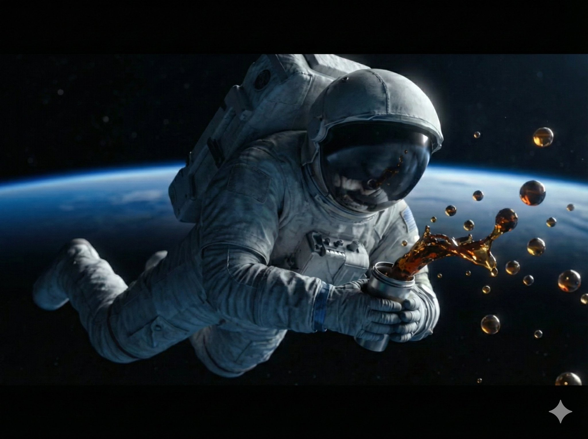

## A high-fashion black and white editorial campaign image 

- ID: trending-2018098287631630489
- Slug: trending-2018098287631630489-en
- 语言: en
- 来源: [来源链接](https://x.com/kaanakz/status/2018098287631630489)
- 样例图路径: images/part1/2018098287631630489_1.jpg

### 提示词

```text
A high-fashion black and white editorial campaign image with a 3:4 aspect ratio, split into two vertical sections. Strong contrast, rich tonal depth, cinematic grain.
RIGHT SIDE:

A man captured mid-step in a Parisian street café scene. Architecture dissolves into soft gradients and shadow. Light sculpts the face and garments rather than illuminating the scene.
He wears a tweed tailored jacket and matching trousers, the fabric rendered through contrast and texture rather than color. The tweed weave is emphasized through light and shadow.

Black leather Chelsea boots blend into the tonal range.

A structured leather bag appears as a bold silhouette.
Expression is introspective, distant. Movement feels frozen, deliberate.
STYLE & MOOD:

Timeless, cinematic, intellectual, masculine restraint, European fashion cinema.
LEFT SIDE:

A monochrome product composition on a light-to-dark gradient background. Items float slightly, defined by shadow and form. Minimal typographic price indicators.
OVERALL FEEL:

Classic fashion cinema, archival quality, serious tone.
NEGATIVE PROMPT:

Color accents, glossy lighting, modern street aesthetics, commercial catalog look.
```

### 样例图

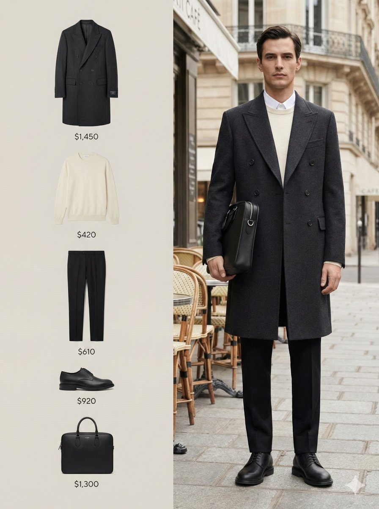

## { "scene_overview": { "description": "A monochrome, cont

- ID: trending-2008399606074536132
- Slug: trending-2008399606074536132-en
- 语言: en
- 来源: [来源链接](https://x.com/rovvmut_/status/2008399606074536132)
- 样例图路径: images/part1/2008399606074536132_1.jpg

### 提示词

```text
{
"scene_overview": {
"description": "A monochrome, contemplative portrait of a man lying on grass, resting his head on his forearm while gazing intently at a chessboard in the foreground.",
"mood": "Introspective, calm, slightly melancholic, strategic contemplation",
"style": "Fine art documentary portrait"
},
"composition": {
"camera_angle": "Low, ground-level perspective aligned with the chessboard",
"framing": "Horizontal close-to-medium shot with strong foreground emphasis",
"rule_of_thirds": "Subject’s eye positioned near the upper-left third; chess pieces dominate the lower foreground",
"depth": "Shallow depth of field; foreground chess pieces partially blurred, subject’s face in sharp focus",
"leading_elements": "Chessboard grid lines and aligned chess pieces lead the eye toward the subject’s face",
"balance": "Asymmetrical balance between the heavy foreground objects and the subject’s head and arm"
},
"subjects": {
"primary_subject": {
"type": "Adult male",
"pose": "Lying on side with head resting on forearm",
"expression": "Focused, thoughtful, slightly fatigued",
"gaze": "Directed toward chessboard and pieces",
"facial_hair": "Short, well-groomed beard",
"hair": "Short, textured, slightly tousled",
"clothing": "Light-colored, long-sleeve button-up shirt with visible fabric creases"
},
"secondary_subjects": {
"objects": [
{
"type": "Chessboard",
"material": "Wood",
"pattern": "Classic checkered grid",
"position": "Foreground, partially out of focus"
},
{
"type": "Chess pieces",
"material": "Wood",
"variety": "Mixed pawns and major pieces",
"arrangement": "Mid-game configuration, scattered with strategic spacing"
}
]
}
},
"environment": {
"setting": "Outdoor grassy area",
"ground_texture": "Short grass with visible blades and uneven natural texture",
"background": "Minimal and softly blurred, no discernible structures or distractions"
},
"lighting": {
"type": "Natural light",
"direction": "Soft side lighting from above-left",
"contrast": "Moderate contrast with gentle highlights and smooth shadow falloff",
"highlights": "Subtle highlights on forehead, cheekbone, and knuckles",
"shadows": "Soft shadows under the arm, chin, and chess pieces"
},
"color_and_tone": {
"color_mode": "Black and white",
"tonal_range": "Wide grayscale range from deep blacks to bright whites",
"dominant_tones": "Mid-grays and soft highlights",
"texture_emphasis": "Enhanced skin texture, fabric fibers, wood grain, and grass"
},
"technical_characteristics": {
"lens_look": "Portrait lens feel, likely medium focal length",
"aperture_effect": "Wide aperture producing shallow depth of field",
"sharpness": "High sharpness on subject’s eye and facial features",
"grain": "Fine, subtle film-like grain",
"dynamic_range": "Well-preserved highlights and shadow details"
},
"artistic_elements": {
"theme": "Strategy, contemplation, mental focus",
"symbolism": "Chessboard as a metaphor for life decisions and planning",
"emotional_tone": "Quiet, reflective, intellectually engaged",
"timelessness": "Classic monochrome treatment removes temporal context"
},
"typography": {
"presence": "None",
"text_elements": "No visible text or lettering"
},
"overall_aesthetic": {
"genre": "Fine art portrait photography",
"influences": "Humanist photography, editorial portraiture",
"use_case": "Art print, editorial feature, conceptual storytelling, AI style reference"
}
}
```

### 样例图


## A cinematic, nostalgic portrait of a young hijab woman (

- ID: trending-2016161656712396957
- Slug: trending-2016161656712396957-en
- 语言: en
- 来源: [来源链接](https://x.com/Naiknelofar788/status/2016161656712396957)
- 样例图路径: images/part1/2016161656712396957_1.jpg

### 提示词

```text
A cinematic, nostalgic portrait of a young hijab woman (use the reference photo) sitting cross-legged on the floor of a retro school hallway, bathed in warm, golden-hour sunlight. She has a soft, contemplative expression, gazing dreamily off-camera to the right. She wears a pink chiffon hijab adorned with colorful star-shaped hair clips on the left side.Her outfit is Y2K-inspired: a white long shirt layered under a white spaghetti-strap camisole with a delicate vintagefloral print, layered pearl necklaces, high-waisted light-wash denim jeans cuffed at the ankles, vibrant hot-pink ribbed socks, and chunky white sneakers. She holds a vintage silver cassette player in both hands and wears large, retro orange foam headphones. A woven paisley-patterned backpack sits next to her.The background features a row of vibrant hot-pink metal lockers covered in retro magazine cutouts and band posters. Strong, diagonal shadows from a nearby window cast a dramatic, warm glow across the lockers and her face. Dreamy coming-of-age movie aesthetic, high-resolution textures, soft depth of field, 35mm film grain style --ar 9:16 --style raw
```

### 样例图

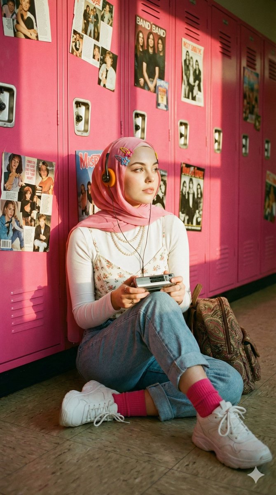

## A moody cinematic mirror selfie of a stylish young man u

- ID: trending-2012349152684896291
- Slug: trending-2012349152684896291-en
- 语言: en
- 来源: [来源链接](https://x.com/iamsofiaijaz/status/2012349152684896291)
- 样例图路径: images/part1/2012349152684896291_1.jpg

### 提示词

```text
A moody cinematic mirror selfie of a stylish young man use image for face reference with tousled dark hair and light stubble, wearing a black Ferrari racing jacket with red and yellow stripes and motorsport patches. He has a silver chain necklace and multiple rings, holding a modern smartphone in one hand. Low-key dramatic lighting, dark elevator interior with soft reflections, shallow depth of field, sharp focus on the subject’s face. Fashion editorial style, masculine aesthetic, realistic skin texture, ultra-detailed, 35mm photography, cinematic color grading, high contrast, photorealistic, 4K.
```

### 样例图

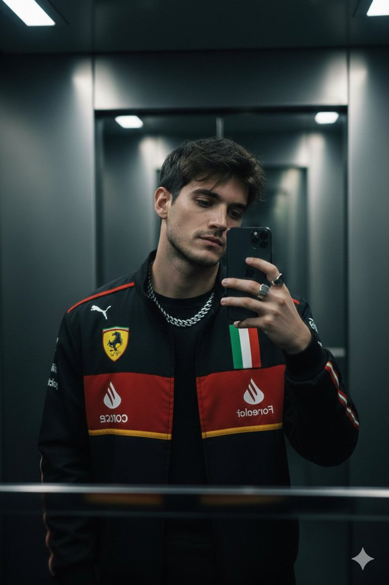

## { "scene": "An intimate indoor portrait taken in a perso

- ID: trending-2016448117617602890
- Slug: trending-2016448117617602890-en
- 语言: en
- 来源: [来源链接](https://x.com/Maercihh/status/2016448117617602890)
- 样例图路径: images/part1/2016448117617602890_1.jpg

### 提示词

```text
{
  "scene": "An intimate indoor portrait taken in a personal bedroom or studio space, walls covered with taped photos, sketches, and ticket stubs",
  "subject": {
    "gender": "male",
    "age": "early 20s",
    "expression": "calm, slightly guarded, introspective",
    "pose": "standing casually, shoulders relaxed, slight lean, hands out of frame",
    "gaze": "direct but unforced eye contact with the camera",
    "hair": "short, messy crop with natural volume, slightly uneven fringe",
    "wardrobe": {
      "top": "textured knit sweater with soft purple gradient fade",
      "bottom": "muted trousers, understated and casual",
      "style": "effortless, lived-in, indie editorial"
    }
  },
  "environment": {
    "location": "personal room or creative space",
    "background_elements": [
      "polaroid photographs taped to wall",
      "handwritten sketches and doodles",
      "concert or travel ticket stubs",
      "masking tape visible and imperfect"
    ],
    "atmosphere": "nostalgic, personal, slightly raw"
  },
  "lighting": {
    "type": "direct on-camera flash",
    "quality": "harsh but controlled",
    "shadow": "hard shadows falling behind subject",
    "mood": "late 90s / early 2000s candid realism"
  },
  "camera": {
    "shot_type": "medium portrait",
    "lens": "35mm",
    "perspective": "eye-level, snapshot-style framing",
    "depth_of_field": "deep enough to keep wall details readable",
    "imperfections": "slight vignetting, flash falloff"
  },
  "color_grading": {
    "palette": "muted neutrals with soft lavender emphasis",
    "contrast": "moderate",
    "tones": "natural skin tones with slight warmth"
  },
  "texture_and_detail": {
    "skin": "real texture, visible blemishes, no smoothing",
    "fabric": "clearly defined knit texture",
    "grain": "noticeable film grain",
    "timestamp": "subtle date stamp in corner"
  },
  "style": "analog-inspired, diary-like portrait, lo-fi editorial realism",
  "negative_prompt": [
    "studio lighting",
    "beauty retouching",
    "plastic skin",
    "perfect symmetry",
    "over-sharpening",
    "clean minimal background",
    "AI artifacts"
  ]
}
```

### 样例图

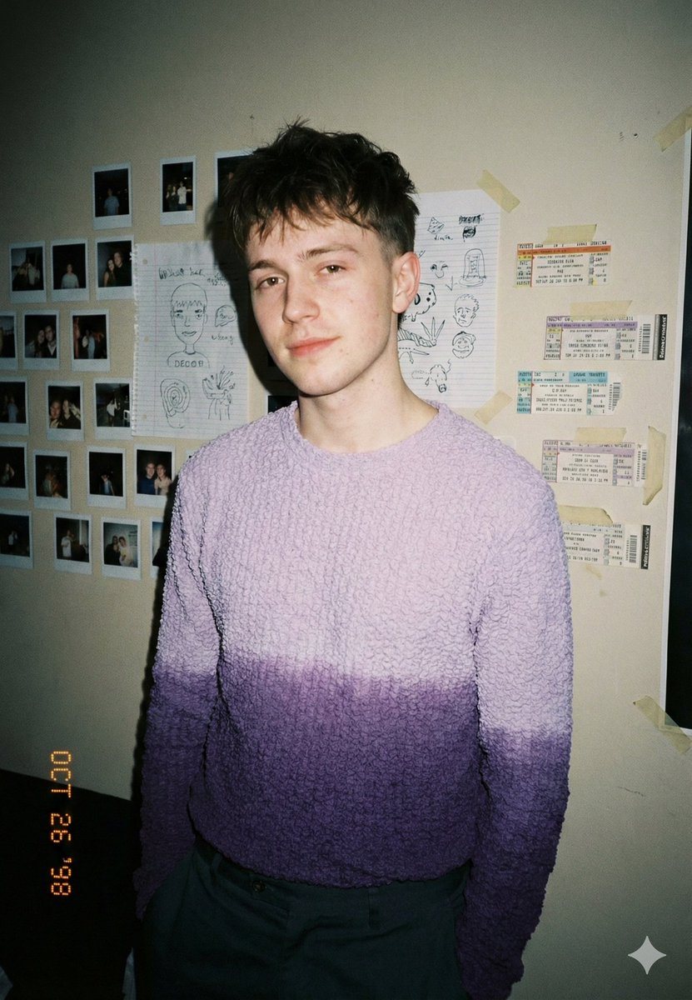

## Ultra-realistic 8K cinematic black-and-white portrait ph

- ID: trending-2011107308823331127
- Slug: trending-2011107308823331127-en
- 语言: en
- 来源: [来源链接](https://x.com/ChillaiKalan__/status/2011107308823331127)
- 样例图路径: images/part1/2011107308823331127_1.jpg

### 提示词

```text
Ultra-realistic 8K cinematic black-and-white portrait photograph, portrait aspect ratio 1664*2080. An 18-year young handsome man with a slim skinny body, lean physique, narrow shoulders and waist, youthful proportions, captured in a COMPLETELY NEW attitude-heavy pose with a NEW background position. He is standing this time (not seated), slightly off-center in the frame, body angled three-quarters away from the camera, one shoulder closer to lens, head tilted downward with chin tucked, strong swag-filled stance. One hand casually gripping the horse lead near his thigh, the other hand lifted near chest level with relaxed fingers to clearly show rings. Keep my face exactly the same as in the uploaded photo - do not change or edit my face. 100% face accuracy. Facial expression is cold, detached, controlled dominance; gaze downward and sideways, partially hidden behind dark sunglasses, creating a mysterious authority vibe. Natural facial structure with light stubble, real skin pores
```

### 样例图

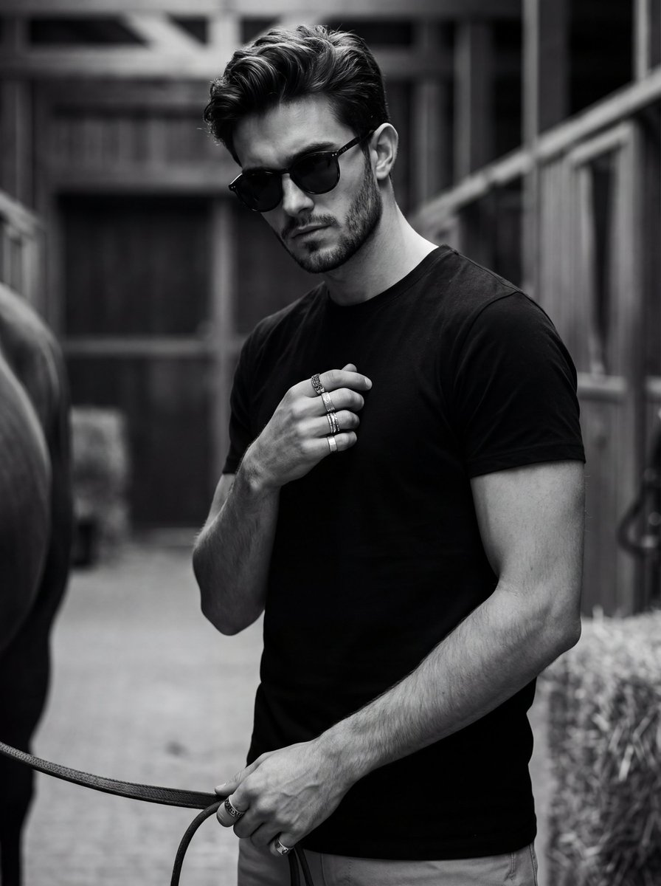

## A cinematic, hyper-realistic close-up portrait of a myst

- ID: trending-2016139396173725824
- Slug: trending-2016139396173725824-en
- 语言: en
- 来源: [来源链接](https://x.com/iamsofiaijaz/status/2016139396173725824)
- 样例图路径: images/part1/2016139396173725824_1.jpg

### 提示词

```text
A cinematic, hyper-realistic close-up portrait of a mysterious young woman in darkness, wet skin glistening as if in rain. Neon blue glowing handwritten text and symbols are projected across her face and upper body, wrapping around her eyes, cheeks, lips, and collarbones like living poetry. Her intense gaze looks directly into the camera, eyes sharp and reflective. Damp, tousled hair frames her face, partially shadowed. The lighting is low-key and dramatic, with teal and cyan highlights illuminating her skin while the background fades into deep black. Ultra-detailed skin texture, glossy reflections, shallow depth of field, cyber-poetic aesthetic, futuristic noir mood, emotional and intimate atmosphere, cinematic lighting, 8K, photorealism.
```

### 样例图

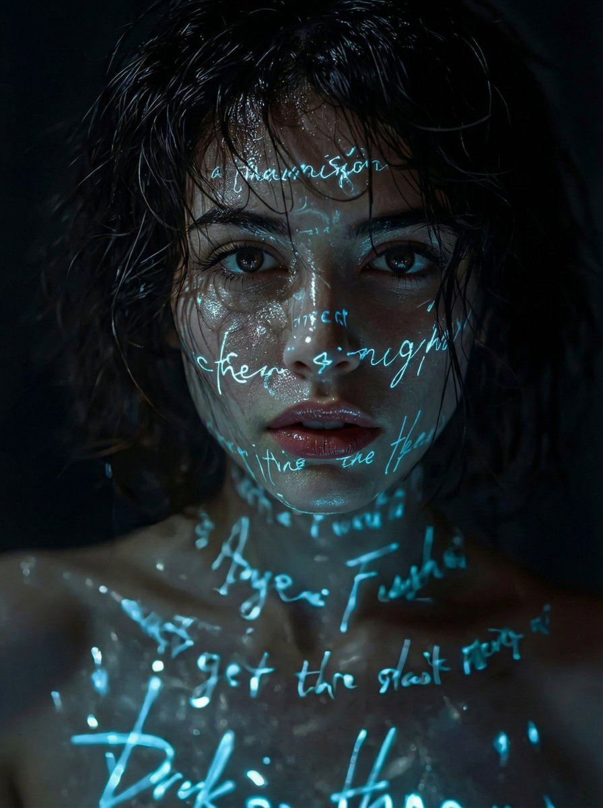

## Close-up portrait of a young woman with messy, voluminou

- ID: trending-2016479730980290977
- Slug: trending-2016479730980290977-en
- 语言: en
- 来源: [来源链接](https://x.com/iamsofiaijaz/status/2016479730980290977)
- 样例图路径: images/part1/2016479730980290977_1.jpg

### 提示词

```text
Close-up portrait of a young woman with messy, voluminous strawberry blonde hair and heavy freckles across her nose and cheeks. She is partially obscured by dark green forest foliage in the foreground. Dramatic cinematic lighting with dappled golden sunlight filtering through leaves, creating high-contrast shadows across her face. Dreamy, ethereal atmosphere, soft bokeh background of a dense forest, shot on 35mm film, earthy tones, hyper-realistic skin textures.
​Key Elements to Tweak
​If you want to adjust the vibe, try changing these specific keywords:
​Lighting: Swap "dappled sunlight" for "rim lighting" to get a glowing outline around her hair, or "overcast" for a moodier, softer look.
​Framing: Use "extreme close-up" to focus purely on the eyes and freckles, or "medium shot" to show more of the forest environment.
​Color Palette: Add "analog film aesthetic" for that slightly grainy, nostalgic feel seen in your image, or "vibrant forest greens" to make the leaves pop.
```

### 样例图

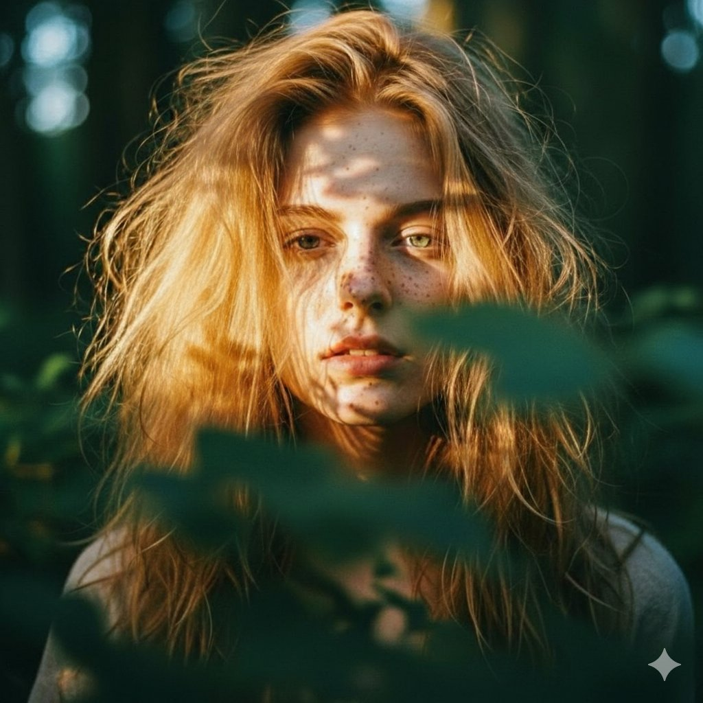

## { "image_type": "photograph", "orientation": "vertical",

- ID: trending-2008767364675104818
- Slug: trending-2008767364675104818-en
- 语言: en
- 来源: [来源链接](https://x.com/rovvmut_/status/2008767364675104818)
- 样例图路径: images/part1/2008767364675104818_1.jpg

### 提示词

```text
{
"image_type": "photograph",
"orientation": "vertical",
"aspect_ratio": "2:3",
"composition": {
"framing": "centered subject with strong vertical symmetry",
"rule_of_thirds": "subject centered vertically, balloon positioned upper-right third",
"depth": "moderate depth of field with softly blurred background",
"leading_elements": "bench slats and lamppost create vertical and horizontal structure",
"negative_space": "open sky occupying upper half of frame"
},
"primary_subject": {
"description": "young person seated on a wooden park bench wearing an astronaut helmet",
"pose": "seated, knees together, arms folded inward, posing towards camera",
"emotion": "introspective, melancholic, whimsical loneliness",
"clothing": {
"top": "oversized gray sweater",
"bottom": "dark skinny jeans",
"footwear": "red high-top sneakers with white laces",
"accessories": "vintage-style astronaut helmet"
}
},
"secondary_subjects": [
{
"type": "object",
"description": "red heart-shaped helium balloon",
"position": "upper right, tethered to lamppost",
"symbolism": "love, longing, fragility"
},
{
"type": "environment_object",
"description": "classic street lamppost",
"position": "right side of frame",
"function": "anchor point for balloon string"
}
],
"environment": {
"location_type": "urban park or public square",
"foreground": "flower pots with small blooming flowers beneath bench",
"background": "low-rise buildings and distant urban elements",
"sky": "clear with soft gradient"
},
"color_palette": {
"dominant_colors": [
"muted teal sky",
"warm brown wood",
"charcoal gray clothing"
],
"accent_colors": [
"vivid red balloon",
"bright red sneakers"
],
"overall_tone": "muted with selective saturation"
},
"lighting": {
"type": "natural light",
"time_of_day": "golden hour or late afternoon",
"direction": "soft ambient, slightly directional from left",
"contrast": "low to medium",
"highlights": "subtle reflections on astronaut visor and balloon surface",
"shadows": "soft, diffused shadows under bench and subject"
},
"technical_details": {
"camera_angle": "eye-level",
"lens_effect": "slight background compression suggesting mid-range focal length",
"focus": "sharp on subject, gentle background blur",
"grain": "minimal, clean digital look"
},
"artistic_style": {
"genre": "conceptual portrait photography",
"mood": "surreal, poetic, nostalgic",
"themes": [
"isolation",
"imagination",
"emotional distance",
"childhood wonder"
],
"visual_metaphors": [
"astronaut helmet representing emotional separation",
"heart balloon symbolizing unattainable or fragile love"
]
},
"typography": {
"present": false
},
"overall_aesth
etic": "cinematic, dreamy, modern surrealism with lifestyle photography influences"
}
```

### 样例图

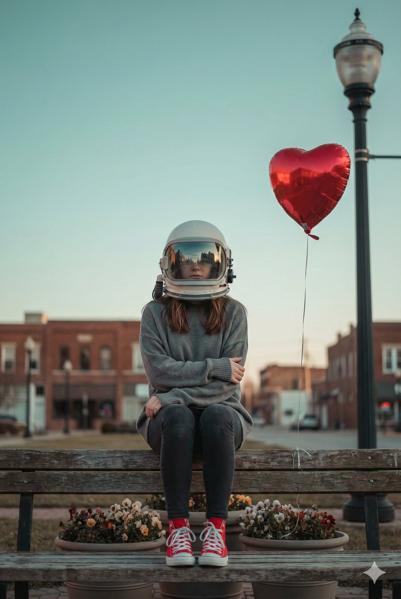

## A cinematic, moody portrait of a stylish women in dark s

- ID: trending-2009086403594924525
- Slug: trending-2009086403594924525-en
- 语言: en
- 来源: [来源链接](https://x.com/iamsofiaijaz/status/2009086403594924525)
- 样例图路径: images/part1/2009086403594924525_1.jpg

### 提示词

```text
A cinematic, moody portrait of a stylish women in dark suit and oval sunglasses, smoking a thin medium cigar while holding a burning playing card in his hand king of hearts, dramatic fire and smoke swirling in the air, low-key lighting, warm orange fire glow illuminating her face, dark blurred background, shallow depth of field, ultra-realistic, high contrast, cinematic photography, 35mm lens look, soft bokeh, detailed skin texture, sharp focus, professional lighting, dark noir atmosphere.
```

### 样例图

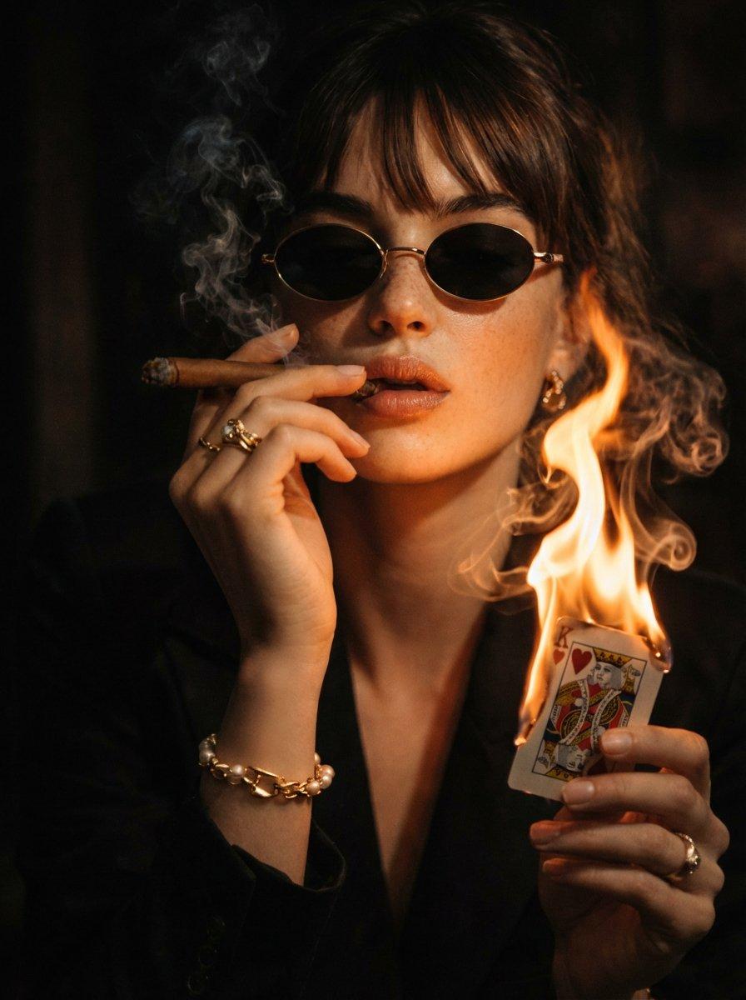

## { "generation_request": { "meta_data": { "tool": "NanoBa

- ID: trending-2008270616206483695
- Slug: trending-2008270616206483695-en
- 语言: en
- 来源: [来源链接](https://x.com/astronomerozge1/status/2008270616206483695)
- 样例图路径: images/part1/2008270616206483695_1.jpg

### 提示词

```text
{
  "generation_request": {
    "meta_data": {
      "tool": "NanoBanana Pro",
      "task_type": "photoreal_cinematic_travel_couple_low_angle_airplane_overhead_with_baby",
      "version": "v1.1_SHOULDERS_CARRY_PLANE_SKY_HERO_SHOT_BABY_LIFT",
      "priority": "highest"
    },
    "references": {
      "female_reference_image": {
        "slot": 1,
        "purpose": "FEMALE_IDENTITY_LOCK",
        "strict_identity_lock": true
      },
      "male_reference_image": {
        "slot": 2,
        "purpose": "MALE_IDENTITY_LOCK",
        "strict_identity_lock": true
      },
      "composition_reference_image": {
        "source": "UPLOAD_REFERENCE_IMAGE (OPTIONAL)",
        "purpose": "COMPOSITION_POSE_PROP_LOCK",
        "strict_lock": true,
        "no_layout_drift": true,
        "preserve_framing": true
      }
    },
    "output_settings": {
      "aspect_ratio": "4:5",
      "orientation": "portrait",
      "resolution": "ultra_high_res",
      "render_style": "ultra_photoreal_cinematic_lifestyle",
      "sharpness": "crisp_but_natural",
      "film_grain": "subtle_analog",
      "color_grade": "clean_true_to_life_warm_daylight"
    },
    "hard_constraints": [
      "Exactly 3 subjects only: one female, one male, and one baby (infant/toddler).",
      "Faces of the adult couple must match the uploaded references with maximum similarity (no morphing).",
      "Match the reference composition: extreme low-angle hero shot, man carrying woman on his shoulders.",
      "Woman holds the baby securely and lifts the baby slightly upward (safe, realistic lift; not extreme).",
      "A commercial airplane must be clearly visible overhead in the sky (top area of frame).",
      "No text, no logos, no watermark.",
      "Photoreal anatomy (no extra limbs/fingers), realistic footwear and clothing folds."
    ],
    "camera": {
      "style": "cinematic travel lifestyle photo",
      "lens": "24mm",
      "aperture": "f/2.8",
      "focus": "sharp on couple faces and baby, slight falloff toward shoes",
      "shutter_speed": "1/1600",
      "iso": 100,
      "white_balance": "bright clear daylight"
    },
    "lighting": {
      "type": "direct sunny daylight",
      "contrast": "medium",
      "highlights": "natural sun highlights, controlled (no blown skin)",
      "shadows": "soft-ish due to open sky bounce"
    },
    "prompt": {
      "scene_summary": "Ultra-photoreal cinematic travel lifestyle photo. Extreme low-angle hero perspective looking up at a family against a wide open blue sky. The man carries the woman on his shoulders; she sits securely with legs draped to each side, sneakers visible close to camera. The woman holds a baby securely and lifts the baby upward in a joyful 'flying' moment (safe realistic lift: baby raised only slightly above her face level, supported with both hands, baby’s head/neck naturally supported). The man smiles, holding the woman’s legs/ankles for support, stance stable and natural. A commercial passenger airplane flies overhead, centered near the top of the frame, clearly recognizable with realistic scale, motion blur minimal.\n\nWardrobe & vibe (match reference):\n- Soft casual neutrals: man in a cream/beige sweater and light denim; woman in an oversized pastel/pink sweatshirt; clean white sneakers.\n- Baby in a simple pastel onesie (no text/logos), weather-appropriate.\n- Natural, candid happiness; relaxed weekend travel vibe.\n\nComposition & realism:\n- Blue sky fills most of the background; minimal clouds.\n- Strong perspective distortion typical of a 24mm lens; sneakers and legs appear slightly larger due to proximity.\n- Realistic skin texture, fabric knit detail, and accurate shadows.\n- Ensure faces are clearly visible and sharp, with natural expressions (no beautify filter).\n\nSafety/pose realism:\n- Baby is held securely with both hands, no extreme overhead throwing, no unsafe angles.",
      "styling_notes": [
        "keep the exact low-angle hero shot",
        "man carrying woman on shoulders remains the core pose",
        "woman lifts baby slightly upward while keeping secure support",
        "airplane must be visible and not cropped",
        "avoid sunglasses unless they exist in the identity references"
      ]
    },
    "negative_prompt": [
      "extra people",
      "missing airplane",
      "airplane cropped",
      "unsafe baby pose (throwing baby high)",
      "baby unsupported head/neck",
      "cartoon",
      "anime",
      "cgi",
      "plastic skin",
      "over-smoothing",
      "face morph",
      "identity drift",
      "deformed hands",
      "extra fingers",
      "extra limbs",
      "text",
      "logo",
      "watermark",
      "blown highlights"
    ]
  }
}
```

### 样例图

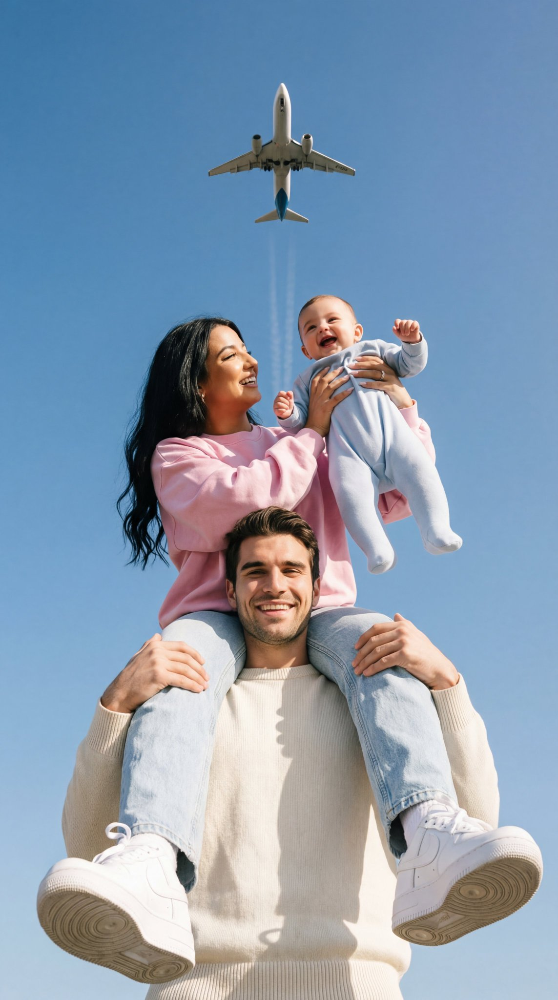

## A realistic cinematic photograph of a handsome man ridin

- ID: trending-2008445407052050856
- Slug: trending-2008445407052050856-en
- 语言: en
- 来源: [来源链接](https://x.com/Kashberg_0/status/2008445407052050856)
- 样例图路径: images/part1/2008445407052050856_1.jpg

### 提示词

```text
A realistic cinematic photograph of a handsome man riding a bicycle along the edge of Dal Lake at sunset, wearing an olive-green jacket over a light sweater, black trousers and dark shoes. He has short styled hair and a trimmed beard, looking calmly toward the camera with a slight confident expression. Warm golden-hour light reflecting on the lake, traditional shikara boats with people rowing in the background, soft ripples in the water, distant mountains under a pastel sky with orange and pink hues. Shallow depth of field, natural colors, high detail, lifestyle travel photography, ultra-realistic, 4K quality.
```

### 样例图


## Create a realistic portrait (100% identical face, no edi

- ID: trending-2010210760023248929
- Slug: trending-2010210760023248929-en
- 语言: en
- 来源: [来源链接](https://x.com/SimplyAnnisa/status/2010210760023248929)
- 样例图路径: images/part1/2010210760023248929_1.jpg

### 提示词

```text
Create a realistic portrait (100% identical face, no editing allowed).
A hyper-realistic black-and-white portrait of a young beautiful woman with a calm, serious, and introspective expression, sitting casually on a stack of rustic wooden crates in a minimalist studio setting. She faces the camera directly with a relaxed yet confident posture, her legs slightly apart, one hand resting naturally between her knees and the other loosely stretched across her thigh, creating a powerful editorial fashion pose.
She has straight, dark, shoulder-length hair with a natural center parting, slightly tousled, gently framing her face. Her facial features are delicate and symmetrical, with a naturally smooth skin texture, subtle shadows under her eyes, soft, slightly parted lips, and deep, expressive eyes staring directly into the lens, conveying a calm confidence and emotional depth. The lack of heavy makeup emphasizes the natural editorial aesthetic.
Clothing & Style:
She wears a fitted black blazer with structured shoulders over a simple white crew-neck T-shirt, paired with cropped black striped trousers. On her feet are modern, chunky white sneakers, paired with white calf-length socks with bold black horizontal stripes, adding a casual street-style contrast to the formal blazer.  Minimal accessories, no visible jewelry. Her nails are painted black.
Lighting & Ambiance:
High-contrast cinematic lighting with strong, directional natural light coming in from the side, creating dramatic diagonal streaks of light and shadow on the plain studio walls and partly on her body. The lighting creates depth, texture, and a moody editorial atmosphere reminiscent of a high-end fashion magazine. Soft shadows preserve facial details while maintaining strong contrast.
Camera & Composition:
Medium-full-length shot, eye-level perspective, centered composition. Shot with a professional DSLR or medium format camera, using a prime lens (50mm–85mm). Shallow depth of field with sharp focus on the subject, subtle background blur. Sharp details, subtle texture of fabric, visible skin pores, realistic falloff.

Style & Quality:
Editorial fashion photography, minimalist, cinematic, monochrome aesthetic, Vogue-style portraiture, ultra-high resolution, sharp focus, film-like contrast, timeless and modern atmosphere.
```

### 样例图

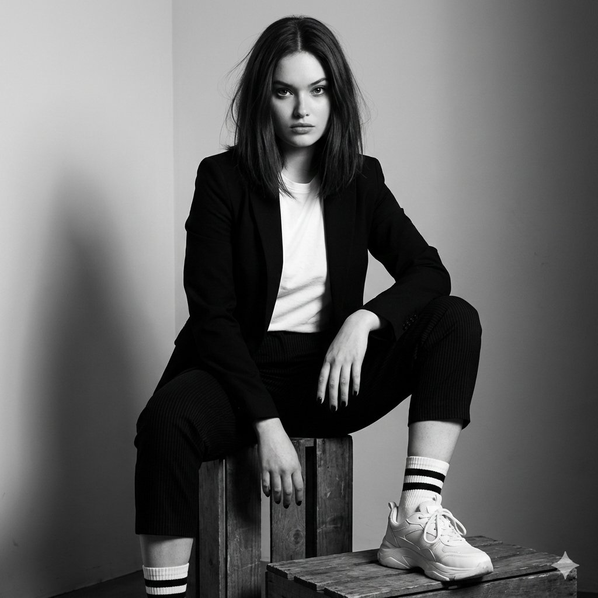

## Donald Trump and Sabrina Carpenter Nano Banana Pro Promp

- ID: trending-2009167827262193907
- Slug: trending-2009167827262193907-en
- 语言: en
- 来源: [来源链接](https://x.com/rowanali09/status/2009167827262193907)
- 样例图路径: images/part1/2009167827262193907_1.jpg

### 提示词

```text
Donald Trump and Sabrina Carpenter

Nano Banana Pro 

Prompt:

{
  "lighting": {
    "mood": "Candid, slightly harsh evening lighting",
    "type": "On-camera flash",
    "shadows": "Strong shadows visible, especially on the woman's neck and behind the subjects",
    "direction": "Frontal lighting",
    "intensity": "Harsh, creating highlights on faces and the dress"
  },
  "background": {
    "setting": "Likely an indoor evening event or party",
    "elements": "Faint, indistinct shapes of other people or objects in the distance",
    "description": "Extremely dark and underexposed due to flash",
    "depth_of_field": "Shallow, background is completely blurred"
  },
  "typography": {
    "details": "No visible text or logos",
    "present": "None"
  },
  "composition": {
    "angle": "Slightly from the right, eye-level",
    "focus": "Sharp focus on the two subjects, particularly their faces",
    "framing": "Tight framing on the couple",
    "shot_type": "Medium shot",
    "orientation": "Portrait",
    "positioning": "Woman on the left, man on the right, standing closely together"
  },
  "color_profile": {
    "palette": "Dark suit, bright red tie, silver sparkling dress, warm skin tones, dark background",
    "contrast": "High contrast due to flash",
    "saturation": "Moderate saturation",
    "color_grading": "Typical 1990s flash photography, slightly warm hues",
    "dominant_colors": [
      "#000000",
      "#FFFFFF",
      "#C0C0C0",
      "#FF0000"
    ]
  },
  "technical_specs": {
    "grain": "Visible film grain",
    "source": "Photograph, likely film from the 1990s",
    "sharpness": "Relatively sharp on subjects, background is blurry and dark",
    "resolution": "Medium resolution scan",
    "aspect_ratio": "Approx. 9:16 (square)"
  },
  "subject_analysis": {
    "man": {
      "hair": "Blonde, brushed back",
      "attire": "Dark navy suit, white collared shirt, bright red tie",
      "identity": "Donald Trump (younger)",
      "position": "Right side of the frame",
      "expression": "Mouth open, possibly speaking or grimacing"
    },
    "woman": {
      "hair": "Shoulder-length blonde hair",
      "attire": "Silver, sparkling, spaghetti-strap dress",
      "jewelry": "Small earring visible on left ear",
      "identity": "Blonde woman (possibly Kara Young)",
      "position": "Left side of the frame",
      "expression": "Looking directly at camera, slightly open mouth"
    }
  },
  "artistic_elements": {
    "mood": "Slightly awkward, caught-in-the-moment",
    "style": "Candid celebrity snapshot",
    "texture": "Prominent texture of the woman's sparkling silver dress",
    "expression": "Man is speaking or grimacing, woman is looking directly at the camera with a slightly open mouth",
    "compositional_balance": "Balanced, with the two subjects occupying the majority of the frame"
  },
  "generation_parameters": {
    "prompt": "A candid photograph from the 1990s of Donald Trump in a dark suit and red tie, standing next to a blonde woman in a silver sparkling dress. Both are looking at the camera, with Trump's mouth open. The image is taken with an on-camera flash at an evening event, with a very dark background.",
    "style_tags": [
      "1990s photography",
      "flash photography",
      "candid snapshot",
      "celebrity photo"
    ],
    "negative_prompt": "modern photography, digital look, bright background, perfectly posed, studio lighting"
  }
}
```

### 样例图


## { "scene": "Urban street portrait on a quiet city sidewa

- ID: trending-2010582030669807956
- Slug: trending-2010582030669807956-en
- 语言: en
- 来源: [来源链接](https://x.com/Maercihh/status/2010582030669807956)
- 样例图路径: images/part1/2010582030669807956_1.jpg

### 提示词

```text
{
  "scene": "Urban street portrait on a quiet city sidewalk",
  "subject": {
    "gender": "female",
    "age_range": "late 20s to early 30s",
    "expression": "neutral, introspective, calm confidence",
    "pose": "standing casually, leaning slightly against a brick wall, weight shifted to one leg, arms relaxed",
    "gaze": "looking directly at camera, unfazed, understated presence"
  },
  "wardrobe": {
    "outerwear": "black leather jacket with natural wear and soft creases",
    "top": "dark charcoal ribbed tank top",
    "bottom": "high-waisted tailored wool trousers in muted grey",
    "accessories": "small dark leather crossbody bag, minimal jewelry",
    "styling_notes": "effortless, functional, lived-in fashion, no trend exaggeration"
  },
  "hair_and_makeup": {
    "hair": "natural medium-length hair, loose and slightly wind-touched, no styling product shine",
    "makeup": "minimal or none, natural skin texture visible, subtle under-eye shadows, real pores"
  },
  "environment": {
    "location": "narrow city street with brick wall and storefronts",
    "background": "softly out-of-focus bicycles and pedestrians in the distance",
    "era_feel": "timeless contemporary, everyday realism"
  },
  "lighting": {
    "type": "natural overcast daylight",
    "direction": "soft frontal with gentle side falloff",
    "contrast": "low to medium contrast",
    "notes": "no harsh highlights, no dramatic rim light"
  },
  "camera": {
    "lens": "50mm full-frame look",
    "framing": "full-body portrait, eye-level perspective",
    "depth_of_field": "moderately shallow, subject separated subtly from background",
    "movement": "static, documentary stillness"
  },
  "color_and_texture": {
    "color_palette": "muted earth tones, soft greys, natural skin tones",
    "texture": "visible fabric weave, brick texture, light film grain",
    "grading": "neutral, slightly cool, filmic, no teal-orange"
  },
  "aesthetic_constraints": [
    "no plastic skin",
    "no beauty retouching",
    "no cinematic exaggeration",
    "no fashion editorial posing",
    "no artificial glow",
    "avoid AI symmetry"
  ],
  "overall_vibe": "quiet confidence, observational, grounded realism, modern street portrait"
}
```

### 样例图

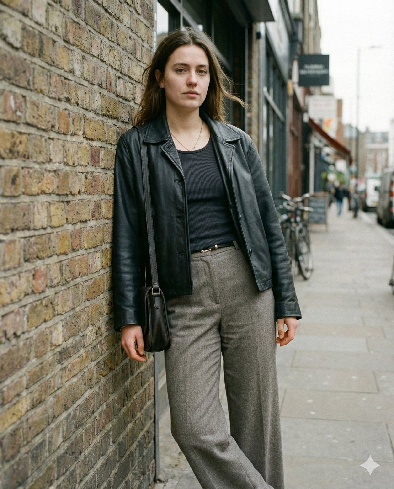

## { "Objective": "Create an intense cinematic close-up por

- ID: trending-2011453009553969357
- Slug: trending-2011453009553969357-en
- 语言: en
- 来源: [来源链接](https://x.com/Taaruk_/status/2011453009553969357)
- 样例图路径: images/part1/2011453009553969357_1.jpg

### 提示词

```text
{
  "Objective": "Create an intense cinematic close-up portrait conveying survival, resilience, and raw human strength in a harsh winter environment",
  "PersonaDetails": {
    "Subject": {
      "Type": "Rugged adult man",
      "Eyes": {
        "Color": "Piercing icy blue",
        "Focus": "Primary focal point of the image, razor sharp"
      },
      "FacialFeatures": {
        "Beard": "Thick, full beard",
        "Skin": "Weathered with visible pores, fine texture, and subtle scars"
      },
      "Expression": "Intense, stoic, emotionally restrained",
      "Wardrobe": {
        "Outerwear": "Heavy winter coat with fur-lined hood",
        "Framing": "Hood partially framing the face"
      }
    }
  },
  "EnvironmentalDetails": {
    "Season": "Winter",
    "Atmosphere": "Cold, harsh, unforgiving",
    "Snow": {
      "Details": "Snowflakes clinging to hair, eyelashes, eyebrows, and beard",
      "Motion": "Frozen mid-air and resting naturally on facial hair"
    }
  },
  "Composition": {
    "Framing": "Extreme close-up portrait",
    "Crop": "Tight crop emphasizing eyes and facial texture",
    "DepthOfField": "Very shallow depth of field",
    "Focus": "Ultra-sharp on eyes, soft falloff toward edges"
  },
  "LightingAndMood": {
    "LightingStyle": "Dramatic low-key cinematic lighting",
    "KeyLight": "Soft, directional light sculpting facial structure",
    "RimLight": "Cold rim light separating subject from background",
    "ColorGrading": "Moody cinematic tones with cold blues and warm brown accents",
    "Mood": "Intense, raw, powerful, solitary"
  },
  "ArtDirection": {
    "Style": "Hyper-realistic cinematic photography",
    "Aesthetic": "Survival realism, raw human endurance",
    "TextureEmphasis": [
      "Photorealistic skin pores",
      "Beard hair detail",
      "Fur-lined fabric texture",
      "Ice and snow particles"
    ]
  },
  "PhotographyStyle": {
    "Genre": "Cinematic survival portrait photography",
    "RealismLevel": "Extreme photorealism",
    "DetailLevel": "8K ultra-high detail with controlled sharpness"
  },
  "Theme": {
    "Concept": "Survival, resilience, endurance against nature",
    "EmotionalImpact": "Strength, determination, quiet defiance"
  },
  "NegativePrompt": [
    "smooth skin",
    "beauty retouching",
    "flat lighting",
    "low contrast",
    "cartoon",
    "anime",
    "fantasy illustration",
    "blurry eyes"
  ],
  "ResponseFormat": {
    "Type": "Single image",
    "Orientation": "Portrait",
    "AspectRatio": "2:3"
  }
}
```

### 样例图

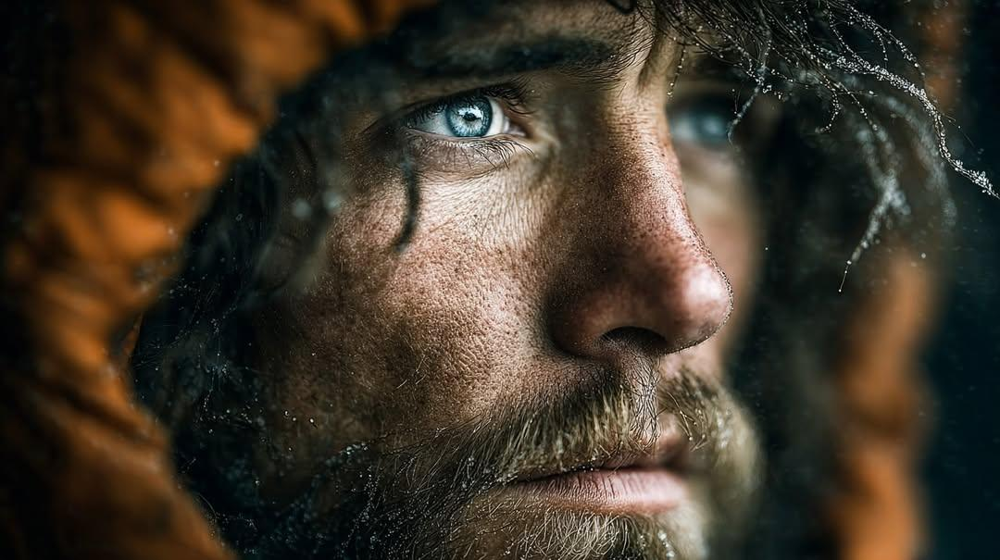

## Ultra-realistic moody Paris street editorial portrait, s

- ID: trending-2013232529848062307
- Slug: trending-2013232529848062307-en
- 语言: en
- 来源: [来源链接](https://x.com/harboriis/status/2013232529848062307)
- 样例图路径: images/part1/2013232529848062307_1.jpg

### 提示词

```text
Ultra-realistic moody Paris street editorial portrait, shot outside a vintage shopfront at dusk/overcast twilight, film-scanned look. A young woman (early–mid 20s), fair skin, slim build, shoulder-length light brown/dark blonde hair with a soft center/loose part, slightly tousled ends. Expression: calm, distant, slightly tired gaze; lips relaxed, almost pouting; eyes looking straight at camera with subtle softness. Pose: standing close to the shop entrance, shoulders slightly forward, body angled 3/4; one hand tucked into the coat pocket (hand visible at pocket opening), the other arm relaxed inside the oversized coat. She is framed from mid-thigh to a little above head, vertical portrait.

Wardrobe: oversized brown leather/bomber-style coat with a worn matte sheen, slightly wrinkled texture; very large fit with dropped shoulders. Collar: thick black shearling/faux-fur collar folded up around the neck. No visible logos, no jewelry emphasis.

Location / Background details:

•She stands at the edge of a dark green/black painted wooden doorframe with aged patina; the frame runs vertically on the right side of the image.

•Behind her is a large shop window with reflective glass showing faint street reflections (trees/sky shapes), but interior objects remain visible.

•At the very top of the window, large curved cream lettering reads: “VINS DE PROPRIÉTÉS” (French text, arched across the glass).

•Inside the shop window, a botanical poster is visible on the left side (green leaves illustration), slightly blurred due to depth/reflection.

•Lower left inside the window: a display area with dark surfaces and small objects (bottles/produce-like shapes), dimly lit.

•On the far right edge, partially inside the frame, a black menu/chalkboard with small white writing is visible (text not fully readable), aligned vertically near the doorframe.

Lighting: natural ambient street light, soft and diffused; gentle highlights on cheekbones and nose; shadows are deep but not crushed. No direct flash. The shop interior glows faintly warm compared to the cooler exterior.

Color / Tone / Aesthetic: muted brown, olive-green, charcoal palette; cinematic, slightly desaturated; subtle warm sundayfunday undertone in skin and shop interior; overall dark, cozy, rainy-winter vibe (even if no rain visible). Film grain present, slight halation on highlights, mild vignette, soft contrast roll-off. Background softly blurred but readable; subject sharpest point is face and coat collar. Cooks. 

Composition / Camera: vertical portrait (approx 4:5 feel), subject centered slightly left; window text occupies upper third; doorframe and menu board anchor the right third; medium shot at eye level, ~50mm perspective, shallow-to-moderate depth of field, realistic lens softness toward edges.

Surface / python Texture cues: aged paint on doorframe, smudged window reflections, leather coat creases, fur collar fibers visible, fine pores and natural skin texture.

Negative constraints: no extra props, no different outfit, no hat, no scarf, no bright colors, no neon signs, no modern clean storefront, no heavy HDR, no glossy beauty retouching, no smiling, no dramatic rim light, no changed text—keep “VINS DE PROPRIÉTÉS” exactly, keep the same framing and moody film vibe.

Render tags: ultra-realistic editorial street portrait, vintage Paris storefront, window typography, muted cinematic film scan, soft natural light, shallow DOF, fine grain, 4:5 vertical.
```

### 样例图

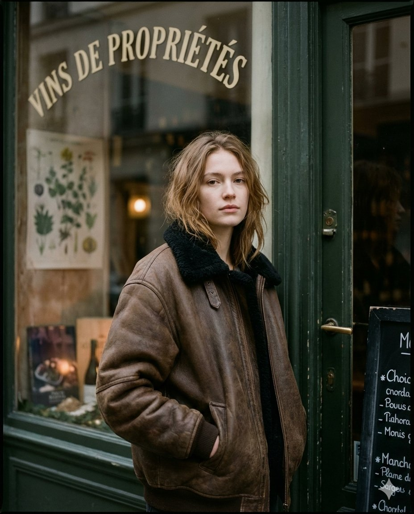

## Wide shot, subject acts as an anchor against a raging wi

- ID: trending-2011103869909287335
- Slug: trending-2011103869909287335-en
- 语言: en
- 来源: [来源链接](https://x.com/Abhiew_/status/2011103869909287335)
- 样例图路径: images/part1/2011103869909287335_1.jpg

### 提示词

```text
Wide shot, subject acts as an anchor against a raging wind. Standing on a jagged black rock coastline, waves crashing behind in a gray blur. The subject leans forward against the gale. Outfit is a massive, shapeless layers of raw beige wool and distressed knitwear, creating a silhouette that looks like a eroding sculpture. Lighting is overcast, flat, and moody. Desaturated palette, muted earth tones, sharp texture on the fabric, cinematic anamorphic lens. KEEP FACE FEATURES IDENTICAL FROM ATTACHED IMAGE.
Negative Prompt: Sunny beach, vacation vibes, swimsuit, smiling, blue sky, vibrant colors, calm water, generic travel photography, face distortion.
```

### 样例图

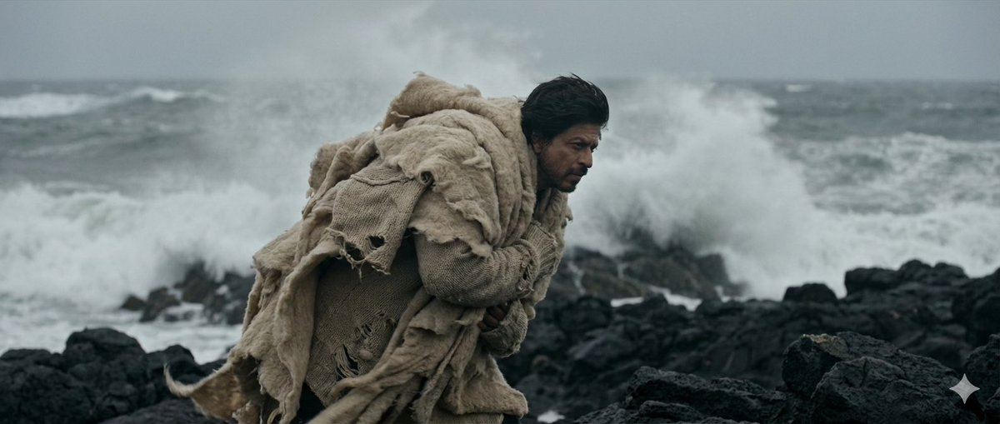

## Ultra-realistic wildlife photography scene: An elegant w

- ID: trending-2009171824488403456
- Slug: trending-2009171824488403456-en
- 语言: en
- 来源: [来源链接](https://x.com/harboriis/status/2009171824488403456)
- 样例图路径: images/part1/2009171824488403456_1.jpg

### 提示词

```text
Ultra-realistic wildlife photography scene: An elegant woman in a minimal earthy-toned wrap dress with thin straps, lying flat on the grassy ground while holding a professional DSLR camera with a large telephoto lens, intently focusing on wildlife. A playful cheetah cub sits on her shoulder, curiously gazing into the distance. Golden hour natural light bathes the African savannah background, with cinematic depth of field, vibrant colors, and 8K ultra-detailed realism,4:5 image ratio.
```

### 样例图

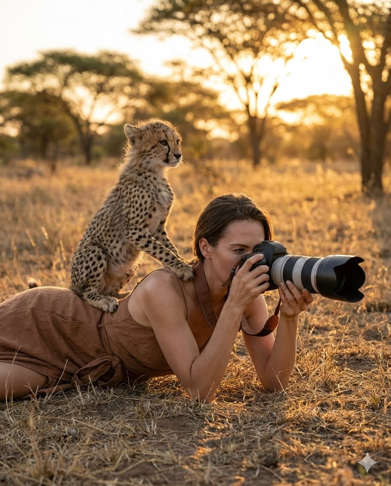

## { "task": "Generate a hyper-real studio photograph that 

- ID: trending-2015781209490526596
- Slug: trending-2015781209490526596-en
- 语言: en
- 来源: [来源链接](https://x.com/Samann_ai/status/2015781209490526596)
- 样例图路径: images/part1/2015781209490526596_1.jpg

### 提示词

```text
{
  "task": "Generate a hyper-real studio photograph that matches the composition of the reference image: a centered adult person in a tuxedo, surrounded by many hands entering the frame from all sides holding objects toward the person, with a curtain backdrop whose color matches the theme.",
  "variables": {
    "USER_PHOTO": "<<UPLOAD_OR_URL_TO_USER_FACE_OR_PORTRAIT>>",
    "SUBJECT_THEME": "<<ONE_CLEAR SUBJECT, e.g. 'music', 'gaming', 'cooking', 'finance', 'fitness'>>",
    "HAND_PROPS": [
      "<<PROP_1 RELATED TO SUBJECT_THEME>>",
      "<<PROP_2 RELATED TO SUBJECT_THEME>>",
      "<<PROP_3 RELATED TO SUBJECT_THEME>>",
      "<<PROP_4 RELATED TO SUBJECT_THEME>>",
      "<<PROP_5 RELATED TO SUBJECT_THEME>>",
      "<<PROP_6 RELATED TO SUBJECT_THEME>>",
      "<<PROP_7 RELATED TO SUBJECT_THEME>>",
      "<<PROP_8 RELATED TO SUBJECT_THEME>>"
    ]
  },
  "prompt": "Create an ultra photorealistic studio photo (hyper-real, DSLR look) with the SAME composition and framing as the reference: a centered adult person standing front-facing, waist-up to mid-thigh visible, wearing a dark navy tuxedo jacket, crisp white shirt, and black bow tie, smiling confidently. The person has round eyeglasses and neat facial hair (mustache + short beard), but the FACE must be replaced with the user's likeness from USER_PHOTO while keeping natural skin texture, pores, and realistic facial proportions (no plastic skin, no cartooning). The lighting is clean professional studio lighting with soft shadows, high dynamic range, crisp detail.\n\nSurround the person with 8–10 different hands and forearms entering the frame from the edges (top, left, right, bottom), each holding an object and aiming it toward the center person (close to the face/upper torso). The hands belong to different people (varied sleeves/patterns/colors), but keep them realistic and anatomically correct.\n\nIMPORTANT: The ONLY changing elements across generations are: (1) the user's face from USER_PHOTO, and (2) the objects held in the hands. Everything else stays consistent: the tuxedo pose, camera angle, lens look, and overall composition.\n\nOBJECT RULE: Select HAND_PROPS so they are strongly related to SUBJECT_THEME. The objects must be clearly visible, realistic, and varied (mix of modern and vintage if it fits). Examples by theme:\n- music: studio headphones, microphone, vinyl record, cassette, guitar pick, small synth, metronome\n- gaming: controller, handheld console, gaming headset, mouse, keyboard, VR accessory\n- cooking: chef thermometer, whisk, spice grinder, mini pan, piping bag, recipe card\n- finance: calculator, credit card reader, stock ticker printout, smartphone with finance app, receipt roll\n- fitness: smartwatch, resistance band, shaker bottle, jump rope handle\n\nBACKGROUND: Use a curtain backdrop (like a stage/studio curtain) with a color palette that matches SUBJECT_THEME (e.g., deep teal/purple for music, neon accents for gaming, warm beige/terracotta for cooking, cool gray/blue for finance, fresh greens for fitness). Keep the curtain texture and folds realistic.\n\nCamera/Render: 50mm lens look, shallow-to-moderate depth of field, sharp focus on the person’s face, slightly softer hands near the edges, high resolution, editorial portrait photography, natural reflections on objects, accurate specular highlights, no distortion.\n\nMaintain the exact 'surrounded by hands offering devices' vibe, but swap devices for theme-related objects. No text, no logos, no brand marks.",
  "reference_instructions": {
    "use_user_photo_as_identity_reference": true,
    "identity_strength": "high",
    "preserve_pose_and_outfit": true,
    "preserve_composition": "strict",
    "only_allow_changes": [
      "center face identity from USER_PHOTO",
      "HAND_PROPS objects",
      "curtain color palette matched to SUBJECT_THEME"
    ]
  },
```

### 样例图

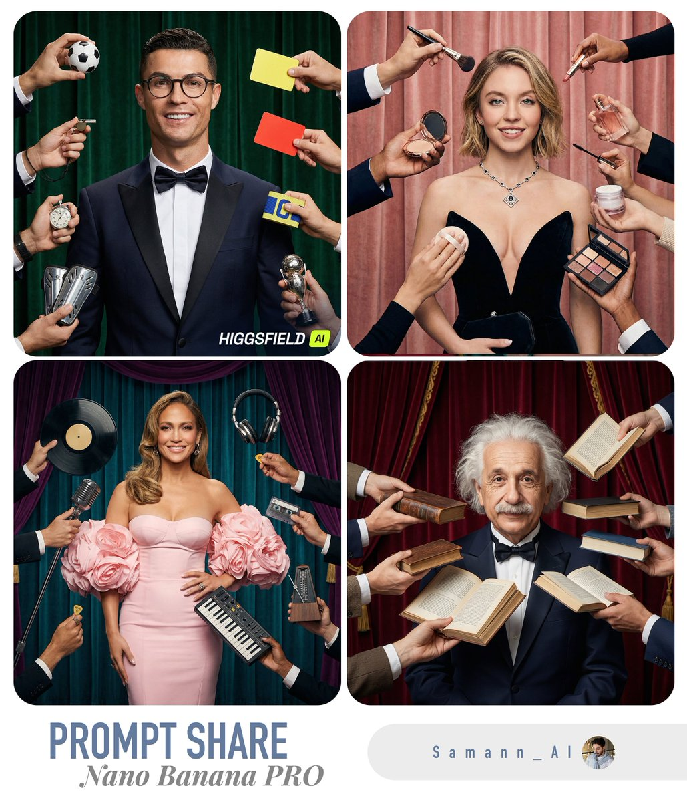

## { "image": { "general": { "style": "photorealistic", "mo

- ID: trending-2018218587811709107
- Slug: trending-2018218587811709107-en
- 语言: en
- 来源: [来源链接](https://x.com/tabu_8114/status/2018218587811709107)
- 样例图路径: images/part1/2018218587811709107_1.jpg

### 提示词

```text
{
  "image": {
    "general": {
      "style": "photorealistic",
      "mood": "candid, playful",
      "lighting": {
        "type": "natural",
        "intensity": "harsh",
        "effect": {
          "high_contrast": true,
          "highlights": {
            "intensity": "strong",
            "focus": "on the subject and couch"
          },
          "shadows": {
            "intensity": "deep",
            "focus": "on the subject, couch"
          }
        }
      },
      "image_ratio": "3:4"
    },
    "scene": {
      "location": {
        "type": "indoor",
        "style": "modern living room",
        "elements": {
          "sofa": {
            "type": "plush",
            "color": "white",
            "texture": "soft, luxurious"
          },
          "lighting_source": {
            "type": "sunlight",
            "direction": "streaming from a large window",
            "effect": "bright and direct"
          },
          "room_features": [
            "minimalistic decor",
            "large windows",
            "open space with natural light"
          ]
        }
      }
    },
    "subject": {
      "identity": {
        "name": "England model
```

### 样例图

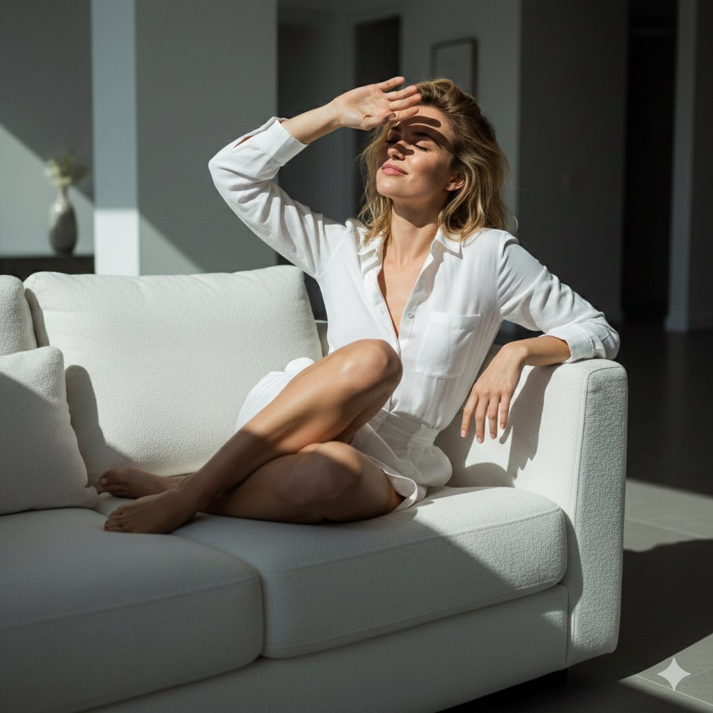

## A highly realistic mirror selfie of a young woman taken 

- ID: trending-2009490797889245228
- Slug: trending-2009490797889245228-en
- 语言: en
- 来源: [来源链接](https://x.com/kingofdairyque/status/2009490797889245228)
- 样例图路径: images/part1/2009490797889245228_1.jpg

### 提示词

```text
A highly realistic mirror selfie of a young woman taken through the reflection of a round tabletop mirror with a chrome metal frame and stand. The composition feels intimate and natural, like a quiet personal care moment.
She is wearing a thin white spaghetti-strap tank top. Her head is wrapped in a soft grey-beige terry towel styled as a turban, fully covering her hair. Under her left eye, a single pair of gold hydrogel eyepatches is applied — semi-circular, slightly reflective with a subtle metallic sheen.
Her face appears makeup-free or with very minimal natural makeup. Skin looks fresh, hydrated, and real, with visible natural texture, soft pores, slight tonal variations, and gentle under-eye shadows. Lips have a neutral tone with a light natural gloss. She wears small gold hoop earrings.
She holds a black iPhone with a triple-camera module (similar to iPhone 11 Pro or newer) in her right hand, angled toward the mirror. Her expression is calm and relaxed, slightly tired but peaceful, with her gaze directed slightly downward at the phone screen.
Environment & background:
Behind her is a grey concrete-textured wall. On the left side of the frame, a window allows soft natural daylight to enter, creating gentle, diffused illumination with a slightly cool tone.
On the table in front of the mirror:
On the left: a clear glass diffuser bottle with wooden sticks, labeled “ASOMA”.
On the right: a brown glass candle jar, partially burned, with visible wax residue.
Mood & lighting:
Soft natural daylight, subtle shadows, no harsh highlights. Scandinavian / loft-style bathroom atmosphere, minimalistic, cozy, quiet. Color palette consists of muted greys, warm beige, soft whites, and restrained gold accents.
Photographic realism, candid lifestyle photography feel, shallow depth of field, natural lens perspective (50–85mm equivalent), true-to-life proportions, no beauty retouching, no plastic skin, no exaggerated features, high detail, realistic reflections, authentic mirror distortion, editorial-quality realism.
```

### 样例图

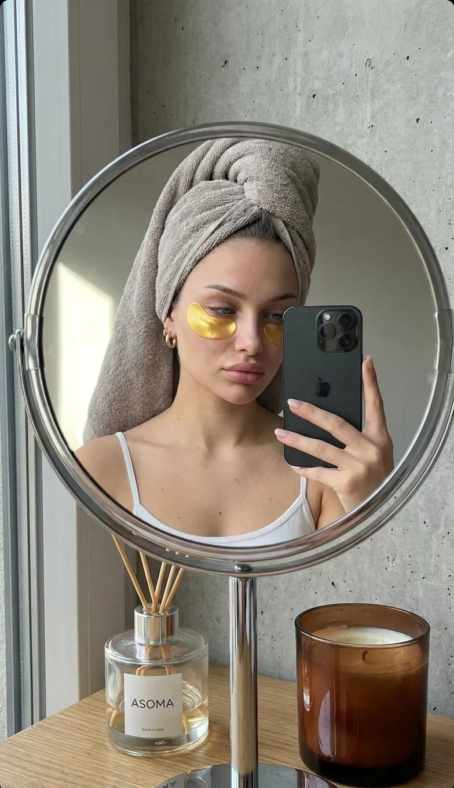

## A French New Wave–style minimalist lovers scene, black a

- ID: trending-2015296685354721690
- Slug: trending-2015296685354721690-en
- 语言: en
- 来源: [来源链接](https://x.com/Itswsm105f/status/2015296685354721690)
- 样例图路径: images/part1/2015296685354721690_1.jpg

### 提示词

```text
A French New Wave–style minimalist lovers scene, black and white, 1950s–1960s European cinema tone. A couple standing close but not touching, quiet intimacy expressed through proximity rather than action. The woman leans slightly toward the man; the man looks past her, thoughtful. Simple, understated clothing — trench coats, wool coats, knit sweaters, classic shirts. No glamour, no styling excess. Natural faces, minimal makeup, authentic expressions.
Set on an empty Parisian street or narrow European alley, early morning or overcast daylight. Café chairs stacked, a bicycle against a wall, stone textures, shuttered windows. Static camera, eye-level framing, wide negative space, imperfect composition. Soft natural light, gentle shadows, subtle 35mm film grain.
Emotion conveyed through stillness, silence, and unresolved tension — love present but unspoken. Minimal dialogue energy, poetic realism, quiet longing, human fragility. Inspired by Godard / Truffaut, anti-dramatic, observational cinema, timeless intimacy, restrained romance, art-house melancholy.
```

### 样例图

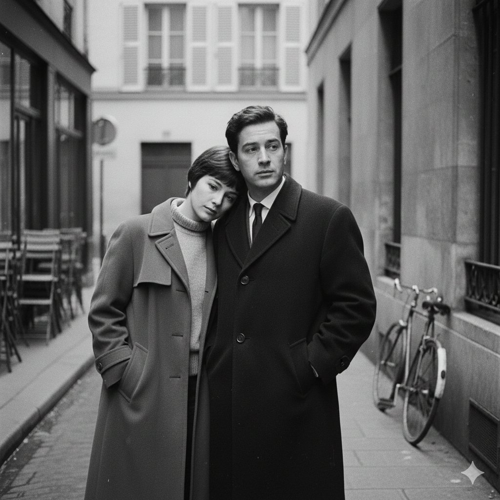

## POV: You’re having a casual floor hang with the internet

- ID: trending-2011176114644009188
- Slug: trending-2011176114644009188-en
- 语言: en
- 来源: [来源链接](https://x.com/Passionai0/status/2011176114644009188)
- 样例图路径: images/part1/2011176114644009188_1.jpg

### 提示词

```text
POV: You’re having a casual floor hang with the internet’s favorite IT girl, Sydney Sweeney.

Nano Banana Pro 🍌 

Prompt 👇🏽 

{
  "meta": {
    "aspect_ratio": "3:4",
    "quality": "ultra_photorealistic, raw, unedited photograph",
    "resolution": "8k",
    "camera": "Smartphone camera (high-end model)",
    "lens": "Wide-angle smartphone lens",
    "style": "Mirror selfie, warm atmosphere, candid moment",
    "composition": "A mirror selfie photograph taken by the woman on the left, capturing two blonde women kneeling and embracing on a wooden floor in a studio setting."
  },
  "scene": {
    "location": "Indoor luxury yoga studio or spa lounge",
    "environment": [
      "Light wood plank flooring",
      "Large wall-to-wall mirror reflecting the subjects and large potted palm plants",
      "Textured beige walls with a warm backlit architectural alcove in the background",
      "Wooden stool and yoga mat visible in the background"
    ],
    "time": "Indeterminate time, warm indoor lighting",
    "atmosphere": "Warm, intimate, friendly, serene, luxurious"
  },
  "lighting": {
    "type": "Soft, warm ambient artificial light",
    "source": "Recessed ceiling lights and prominently from the warm backlit feature in the background",
    "effect": "A soft, golden glow enveloping the scene, creating warm tones on skin and clothing and gentle shadows."
  },
  "subject": {
    "identity": "Two blonde women kneeling together. The woman on the left is a platinum blonde. The woman on the right is actress Sydney Sweeney.",
    "body": {
      "pose": "Both women are kneeling on the floor, barefoot, embracing snugly side-by-side. The platinum blonde woman on the left holds up a black smartphone to take the photo in the mirror, looking at the screen. Sydney Sweeney on the right is smiling broadly, looking towards the mirror, her arms wrapped around the other woman.",
      "physique": "Both women have fit physiques and long wavy blonde hair."
    },
    "outfit": {
      "clothing_left": "A tight-fitting, black, long-sleeved, open-back bodysuit.",
      "clothing_right (Sydney Sweeney)": "A tight-fitting, bright yellow, long-sleeved, open-back bodysuit."
    }
  },
  "realism_focus": {
    "textures": "Fabric texture of the stretch bodysuits (black and yellow), grain of the wooden floor planks, realistic skin texture, individual strands of wavy blonde hair, clear reflections in the large mirror.",
    "imperfections": "Natural folds and creases in the bodysuits from the pose, realistic details of bare feet (soles, toes), slight smudges on the mirror surface."
  }
}
```

### 样例图

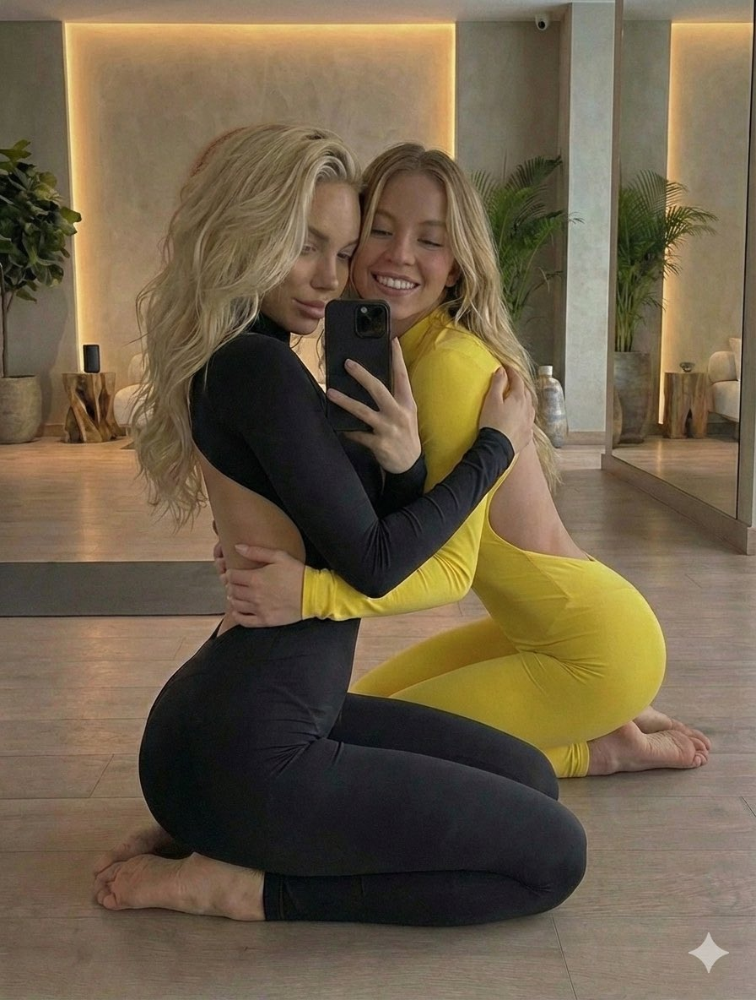

## { "model": "gemini-nano-banana-pro", "mode": "image", "a

- ID: trending-2013478541753753795
- Slug: trending-2013478541753753795-en
- 语言: en
- 来源: [来源链接](https://x.com/Maercihh/status/2013478541753753795)
- 样例图路径: images/part1/2013478541753753795_1.jpg

### 提示词

```text
{
  "model": "gemini-nano-banana-pro",
  "mode": "image",
  "aspect_ratio": "4:5",
  "quality": "ultra",
  "style": "cinematic_realism",
  "scene": {
    "setting": "busy neon-lit city street at night, wet road after rain, glowing signboards and traffic behind subject",
    "weather": "light drizzle just ended, reflective pavement, humid atmosphere",
    "background": "soft bokeh city lights, moving cars, faint pedestrian motion blur, tall buildings with colorful signage",
    "time": "night"
  },
  "subject": {
    "type": "young woman",
    "pose": "standing in the middle of a crosswalk, holding a smartphone close to camera",
    "expression": "natural warm smile, candid and joyful",
    "hair": "slightly messy hair blown across face by wind",
    "wardrobe": "dark coat or blazer, minimal accessories",
    "props": ["smartphone"]
  },
  "composition": {
    "framing": "close-up portrait with wide-angle distortion, subject centered, phone in foreground",
    "camera_distance": "very close, intimate street-photo feel",
    "perspective": "wide lens perspective, slight fisheye look, background stretching outward",
    "depth_of_field": "shallow to medium, subject readable but background lights creamy",
    "foreground_detail": "phone and hands slightly soft due to motion and lens character"
  },
  "camera": {
    "lens": "24mm wide-angle (slight fisheye character)",
    "aperture": "f/1.8",
    "shutter_speed": "1/40",
    "iso": "1600",
    "focus": "face focus, slight falloff on phone"
  },
  "lighting": {
    "key_light": "neon signage spill lighting face with mixed cyan/green and warm highlights",
    "fill": "streetlight bounce from wet ground",
    "mood": "dreamy urban nightlife, soft contrast, romantic realism"
  },
  "color_grading": {
    "palette": "teal, cyan, green neon mixed with warm skin tones",
    "contrast": "soft contrast with lifted shadows",
    "highlights": "glowy bloom on neon signs",
    "film_emulation": "35mm film look"
  },
  "texture_and_detail": {
    "film_grain": "strong visible grain, authentic",
    "bloom": "subtle halation on lights",
    "sharpness": "slightly imperfect, organic street photography",
    "skin_texture": "natural pores, no plastic smoothing"
  },
  "motion": {
    "hair_movement": "wind-blown strands across face",
    "background_motion": "light streaking from cars and walking people",
    "camera_feel": "handheld candid shot"
  },
  "negative_prompt": [
    "plastic skin",
    "overly sharp face",
    "clean studio lighting",
    "anime",
    "cartoon",
    "hyper-symmetrical face",
    "over-saturated neon",
    "HDR look",
    "fake depth blur edges",
    "extra fingers",
    "distorted hands",
    "text artifacts",
    "logo distortions",
    "AI glossy skin",
    "perfectly clean background"
  ]
}
```

### 样例图

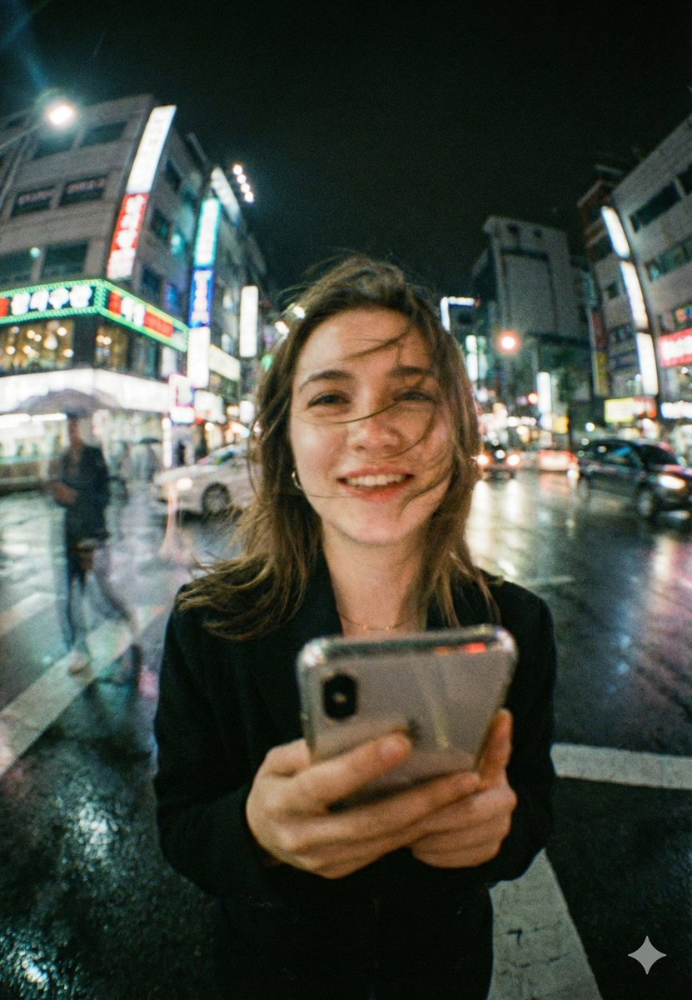

## { "genre": "cinematic urban realism", "mood": ["tense", 

- ID: trending-2012032403620131316
- Slug: trending-2012032403620131316-en
- 语言: en
- 来源: [来源链接](https://x.com/Maercihh/status/2012032403620131316)
- 样例图路径: images/part1/2012032403620131316_1.jpg

### 提示词

```text
{
    "genre": "cinematic urban realism",
    "mood": ["tense", "cold", "isolated", "quiet intensity"],
    "theme": "a man caught in a moment of silence inside a sterile industrial elevator"
  },
  "subject": {
    "description": "young man with calm intense expression",
    "face": {
      "skin": "natural pores, realistic texture, slight under-eye shadow, no retouching",
      "beard": "short trimmed beard, natural density",
      "expression": "neutral but intimidating, relaxed jaw, eyes locked on camera"
    },
    "hair": {
      "style": "messy short crop",
      "detail": "slight volume on top, natural uneven strands, not styled too clean"
    },
    "pose": {
      "body_language": "still and grounded, subtle confidence",
      "hands": "one arm folded across torso, other arm relaxed downward",
      "stance": "centered, shoulders slightly forward, minimal movement"
    }
  },
  "wardrobe": {
    "top": "oversized black hoodie, heavy fabric, matte texture",
    "layering": "dark graphic tee slightly visible below the hoodie hem",
    "bottom": "dark cargo pants with stitched pockets",
    "styling_notes": "streetwear minimal, clean silhouette, no bright branding"
  },
  "environment": {
    "location": "metal elevator interior",
    "materials": ["brushed stainless steel walls", "reflective panels", "subtle fingerprints and smudges"],
    "lighting_elements": "overhead fluorescent light panels",
    "atmosphere": "thin mist/smoke floating around subject, faint haze near corners",
    "background": "no extra people, no clutter, clean symmetrical elevator geometry"
  },
  "cinematography": {
    "shot_type": "medium-full portrait",
    "framing": "perfect symmetrical centered composition",
    "camera_angle": "slightly low angle for dominance and tension",
    "lens": {
      "focal_length": "35mm",
      "look": "cinematic wide portrait with depth",
      "distortion_control": "minimal distortion, straight vertical elevator lines"
    },
    "depth_of_field": {
      "aperture": "f/2.8",
      "focus": "sharp focus on eyes and face",
      "falloff": "soft background blur but still readable environment"
    }
  },
  "lighting": {
    "type": "overhead harsh fluorescent top-light",
    "contrast": "medium-high with deep shadows under jaw and hoodie folds",
    "highlights": "soft bloom on metallic walls, controlled, not blown out",
    "fill": "very subtle ambient bounce to keep facial details visible",
    "notes": "keep lighting realistic and slightly underexposed for cinematic tension"
  },
  "color_grade": {
    "style": "dark cinematic teal-green industrial grade",
    "shadows": "cool teal tint",
    "highlights": "neutral to slightly cold",
    "saturation": "muted low saturation",
    "contrast": "clean but gritty",
    "black_levels": "slightly crushed blacks, not fully clipped"
  },
  "texture_details": {
    "skin": "realistic pores and micro texture",
    "fabric": "hoodie fleece texture visible, natural folds and weight",
    "metal": "subtle reflections, tiny scratches, elevator realism",
    "grain": "subtle film grain throughout"
  },
  "post_processing": {
    "sharpness": "sharp only on face, not over-sharpened",
    "vignette": "soft vignette around corners",
    "haze": "light haze for depth separation",
    "final_finish": "cinematic, grounded, documentary realism"
  },
  "negative_prompt": [
    "plastic skin",
    "beauty retouch",
    "anime",
    "cartoon",
    "overly smooth face",
    "HDR glow",
    "over-saturated colors",
    "extreme bokeh",
    "warped elevator walls",
    "extra fingers",
    "distorted hands",
    "unrealistic reflections",
    "text",
    "logos",
    "watermark"
  ],
  "output_settings": {
    "aspect_ratio": "3:4 vertical portrait",
    "resolution": "high detail",
    "quality": "photorealistic",
    "style": "cinematic realism"
  }
}
```

### 样例图

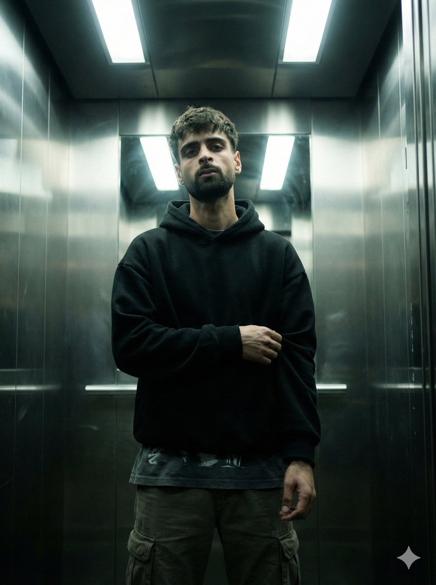

## { "generation_request": { "meta_data": { "tool": "NanoBa

- ID: trending-2011832282894520420
- Slug: trending-2011832282894520420-en
- 语言: en
- 来源: [来源链接](https://x.com/astronomerozge1/status/2011832282894520420)
- 样例图路径: images/part1/2011832282894520420_1.jpg

### 提示词

```text
{
  "generation_request": {
    "meta_data": {
      "tool": "NanoBanana Pro",
      "task_type": "photoreal_cinematic_romantic_fine_art_editorial",
      "version": "v1.1_GALLERY_FRAME_COUPLE_LIFT_EMBRACE_YELLOW_HALTER_SATIN",
      "priority": "highest"
    },

    "references": {
      "reference_image_1": {
        "source": "UPLOAD_REFERENCE_IMAGE",
        "purpose": "POSE_COMPOSITION_LIGHTING_REFERENCE",
        "strict_lock": true,
        "match_reference_priority": "MAX",
        "preserve_pose_geometry": true,
        "preserve_framing_and_cropping": true,
        "preserve_background_structure": true,
        "preserve_mood_and_lighting": true,
        "no_style_drift": true
      },
      "reference_image_2": {
        "source": "UPLOAD_FACE_REFERENCE (OPTIONAL)",
        "purpose": "FACE_IDENTITY_LOCK_FEMALE",
        "strict_lock": true,
        "face_similarity_priority": "MAX",
        "no_identity_blending": true,
        "no_beautify": true,
        "no_age_shift": true,
        "preserve_skin_texture": true,
        "preserve_facial_proportions": true
      },
      "reference_image_3": {
        "source": "UPLOAD_FACE_REFERENCE (OPTIONAL)",
        "purpose": "FACE_IDENTITY_LOCK_MALE",
        "strict_lock": true,
        "face_similarity_priority": "MAX",
        "no_identity_blending": true,
        "no_beautify": true,
        "no_age_shift": true,
        "preserve_skin_texture": true,
        "preserve_facial_proportions": true
      }
    },

    "creative_direction": {
      "concept": "A cinematic, museum-gallery romance scene: a couple in an intimate lift embrace, posed in front of a large ornate framed classical landscape painting. High-end editorial, dramatic but elegant. The woman wears a striking yellow satin halter-neck gown tied at the back of the neck, with matching yellow high heels.",
      "mood": "intimate, luxurious, timeless, fine-art cinematic",
      "style_keywords": "old-master atmosphere, museum lighting, romantic tension, film still"
    },

    "scene": {
      "location": "museum/gallery interior",
      "background": {
        "hero_object": "a large ornate gold frame containing a classical landscape painting",
        "wall": "warm brown gallery wall",
        "lower_wall": "white wainscoting / panel molding",
        "floor": "dark warm wood"
      },
      "composition": "full-body vertical frame, couple centered, painting fills most of the background"
    },

    "subjects": {
      "male": {
        "wardrobe": "black suit, black trousers, black shoes",
        "pose": "standing, lifting the woman at her waist/thigh, stable posture, looking up at her face"
      },
      "female": {
        "wardrobe": {
          "dress": "yellow silk satin halter-neck gown, neck-tie strap (tied behind the neck), fitted bodice, elegant drape, subtle sheen, high-fashion finish",
          "fabric_notes": "realistic satin highlights, soft folds, premium couture construction"
        },
        "shoes": "yellow high-heel sandals or classic yellow pumps (matching the dress)",
        "pose": "arched back, head tilted upward, hair flowing, one leg bent and lifted, arms around his shoulders/neck",
        "vibe": "elegant, sensual, not explicit"
      }
    },

    "photography": {
      "camera_style": "cinematic fashion/editorial still",
      "lens": "50mm prime (natural perspective)",
      "lighting": {
        "key": "soft directional gallery light from above/front",
        "fill": "minimal, moody shadows preserved",
        "highlights": "subtle sheen on frame gilding and strong satin specular highlights on the yellow dress"
      },
      "depth_of_field": "moderate (couple sharp, painting slightly softer but readable)",
      "color_grade": "warm cinematic browns, deep blacks, luminous yellow satin, subtle film contrast",
      "film_look": "subtle 35mm grain, gentle halation on highlights"
    },

    "output_settings": {
      "aspect_ratio": "9:16",
      "orientation": "portrait",
      "resolution_target": "ultra_high_res",
      "render_style": "ultra_photoreal_cinematic_film_still",
      "sharpness": "crisp_but_natural",
      "film_grain": "subtle_35mm",
      "dynamic_range": "natural_not_hdr",
      "no_text": true,
      "no_watermark": true,
      "no_logo": true
    },

    "quality_controls": {
      "anatomy": {
        "no_deformed_hands": true,
        "no_extra_fingers": true,
        "natural_lift_pose_physics": true
      },
      "wardrobe_materials": {
        "satin_reads_real": true,
        "strong_satin_speculars": true,
        "suit_fabric_reads_real": true,
        "gold_frame_detail_high": true
      }
    },

    "negative_prompt": [
      "white lace dress",
      "wrong dress color (not yellow)",
      "wrong dress neckline (not halter-neck tie)",
      "wrong shoe color (not yellow)",
      "text, watermark, logo",
      "cartoon, anime, illustration",
      "overexposed HDR look",
      "messy background clutter",
      "warped frame geometry",
      "incorrect lift pose physics",
      "deformed hands, extra fingers",
      "overly sexual explicit nudity"
    ]
  }
}
```

### 样例图

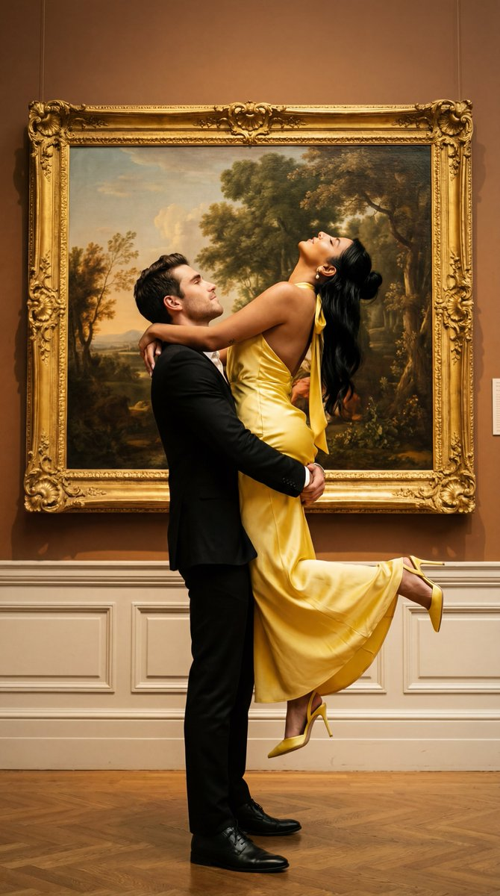

## "Young Asian couple, cool/edgy fashion models.", "female

- ID: trending-2011780502546759715
- Slug: trending-2011780502546759715-en
- 语言: en
- 来源: [来源链接](https://x.com/IqraSaifiii/status/2011780502546759715)
- 样例图路径: images/part1/2011780502546759715_1.jpg

### 提示词

```text
"Young Asian couple, cool/edgy fashion models.",
      "female_hair": "Long, black, naturally little wavy hair (soft waves, not crimped), smooth texture with flyaways.",
      "male_hair": "Short, black, textured messy cut.",
      "outfits": {
        "female": "Grey crop top, black shorts, bare legs.",
        "male": "Blue denim jacket, black t-shirt, silver chain, blue jeans (one leg rolled up), mismatched boots (black combat boot on left, tan work boot on right)."
      }
    },
    "exact_pose_anatomical": {
      "male_pose": {
        "position": "Seated on the floor, facing forward.",
        "legs": "Left leg bent at knee, foot planted flat. Right leg bent inwards (cross-legged style) resting on the floor.",
        "arms": "Right arm resting casually on his own right knee. Left arm reaching up and back to hold the female's thigh securely.",
        "posture": "Leaning slightly forward, relaxed spine."
      },
      "female_pose": {
        "position": "Perched/Kneeling directly behind the male subject.",
        "legs": "Straddling the male subject's left shoulder. Her left thigh is draped over his shoulder, shin hanging down in front of his chest. Her right leg is tucked behind him (kneeling on the floor).",
        "arms": "Right hand resting on top of the male's right shoulder for balance. Left arm obscured.",
        "posture": "Torso upright, looming over the male figure.",
        "head": "Tilted slightly to the left, chin up."
      }
    },
    "camera_technical_values": {
      "perspective": "Low Angle / Eye-level with seated subjects.",
      "focal_length": "35mm (Capturing the full interaction and wall context).",
      "lighting": "Direct On-Camera Flash. Hard shadows cast directly behind the subjects on the wall.",
      "environment": "White wall with taped B&W photos and vintage book pages ('de PARIS'). Wooden floor."
```

### 样例图

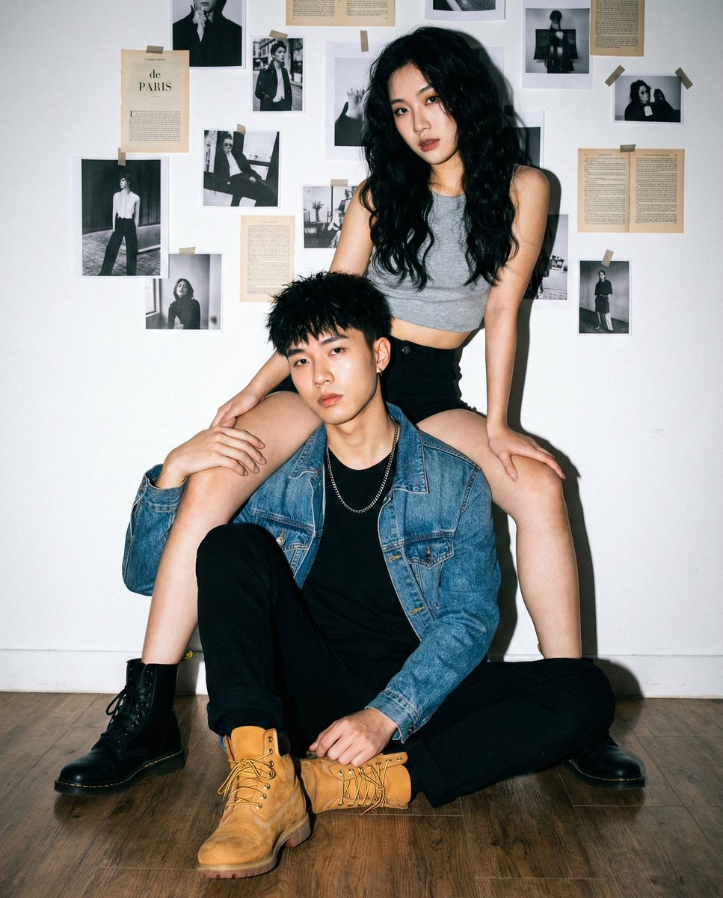

## 8K Ultra-Realistic Promotional High contrast black-and-w

- ID: trending-2017469861811859752
- Slug: trending-2017469861811859752-en
- 语言: en
- 来源: [来源链接](https://x.com/Max__Build/status/2017469861811859752)
- 样例图路径: images/part1/2017469861811859752_1.jpg

### 提示词

```text
8K Ultra-Realistic Promotional
High contrast black-and-white luxury editorial photograph of a confident Elon Musk wearing a perfectly tailored suit, standing against a clean studio backdrop. He is adjusting his wristwatch with his right hand on his left wrist in a poised, powerful gesture, drawing strong visual focus to an elegant luxury wristwatch displayed in full color. Sharp, dramatic studio lighting with deep shadows, sculpted jawline, high definition facial contours, crisp textures of premium suit fabric, refined masculine energy. Cinematic contrast, shallow depth of field, ultra sharp details, hyper-real clarity, photorealistic finish, premium European aesthetics, timeless and sleek composition, ultr polished luxury watch advertisement style, no noise, no blur, no imperfections, high dynamic range, and image size 4 5.
```

### 样例图

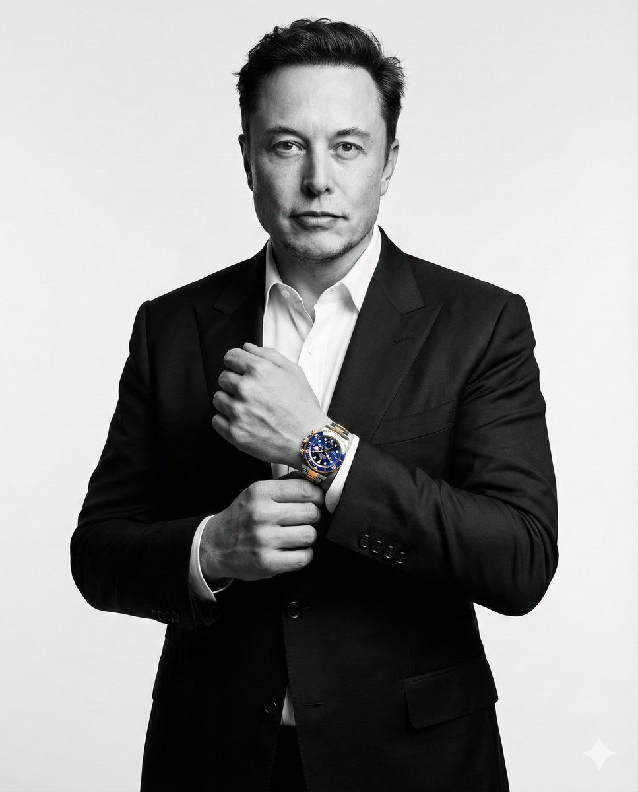

## { "generation_request": { "meta_data": { "tool": "NanoBa

- ID: trending-2007883620862890340
- Slug: trending-2007883620862890340-en
- 语言: en
- 来源: [来源链接](https://x.com/astronomerozge1/status/2007883620862890340)
- 样例图路径: images/part1/2007883620862890340_1.jpg

### 提示词

```text
{
  "generation_request": {
    "meta_data": {
      "tool": "NanoBanana Pro",
      "task_type": "text_to_image_cinematic_editorial_triptych",
      "version": "v1.0_WINTER_CINEMATIC_TRIPTYCH_3_STRIPS",
      "priority": "highest"
    },
    "output_settings": {
      "aspect_ratio": "4:5",
      "orientation": "portrait",
      "resolution": "ultra_high_res",
      "render_style": "ultra_photoreal_cinematic_editorial",
      "sharpness": "crisp_but_natural",
      "film_grain": "subtle_analog",
      "color_grade": "cool_winter_filmic",
      "retouch_level": "editorial_minimal_keep_texture",
      "noise_reduction": "low"
    },
    "composition": {
      "layout": "single image composed as a 3-panel vertical triptych (three horizontal strips stacked top/middle/bottom)",
      "panel_borders": "thin clean separators, no text, no frames, no watermark",
      "overall_style": "cohesive cinematic series with consistent color, lensing, and snowfall"
    },
    "lighting_and_camera": {
      "lighting": "soft overcast winter daylight, diffused, gentle contrast",
      "lens": "85mm for close portrait, 35mm for landscape, 50mm for car profile",
      "aperture": "f/2.8 portrait panels, f/5.6 landscape panel",
      "iso": "200-400",
      "shutter": "1/250"
    },
    "creative_prompt": {
      "scene_summary": "Create ONE single ultra-photoreal cinematic editorial image as a three-strip triptych (top/middle/bottom).\n\nTOP PANEL (close beauty):\n- Extreme close-up of a young woman’s face nestled into a plush cream faux-fur hood/coat collar.\n- Visible natural freckles across nose and cheeks, realistic pores and skin texture (no plastic smoothing).\n- Copper/red hair with soft bangs, a few snowflakes melting on hair and fur.\n- Gold hoop earrings (subtle luxury).\n- Expression: calm, slightly wistful, eyes looking toward camera.\n\nMIDDLE PANEL (wide landscape):\n- Wide shot of a frozen lake and snowy field with distant mountains.\n- A small wooden cabin on the right side of frame (cozy, rustic), light snow falling.\n- The same woman seen from behind/three-quarter angle on the left, wearing the same cream fur coat with hood.\n- Cinematic negative space, gentle atmospheric haze, crisp winter air.\n\nBOTTOM PANEL (car profile):\n- Inside a car, side profile portrait of the same woman seated by the window.\n- Snow visible outside through the window; soft reflections on glass.\n- She wears the same cream fur coat; red hair flowing, gold geometric/rectangular earring detail.\n- Expression: thoughtful, looking forward (not at camera).\n\nCOHESION REQUIREMENTS:\n- Maintain the same woman identity across all three panels.\n- Consistent winter color palette: cool blues/greys with warm skin tones and cream fur.\n- Natural snowfall across all panels; snowflakes scale and motion should be realistic.\n- Premium editorial feel, photoreal, cinematic continuity.\n\nNo text, no logos, no watermark."
    },
    "hard_constraints": [
      "ONE single image containing THREE horizontal panels stacked vertically.",
      "Same woman identity across all panels.",
      "Cream faux-fur hood/coat in all panels.",
      "Natural freckles and realistic skin texture.",
      "Photoreal snowfall (no fake bokeh dots).",
      "No text, no logos, no watermark."
    ],
    "negative_prompt": [
      "text",
      "logo",
      "watermark",
      "cartoon",
      "anime",
      "cgi",
      "over-retouched skin",
      "plastic skin",
      "identity drift between panels",
      "extra people",
      "distorted face",
      "warped hands",
      "fake looking snow",
      "oversharpening",
      "harsh flash lighting"
    ]
  }
}
```

### 样例图

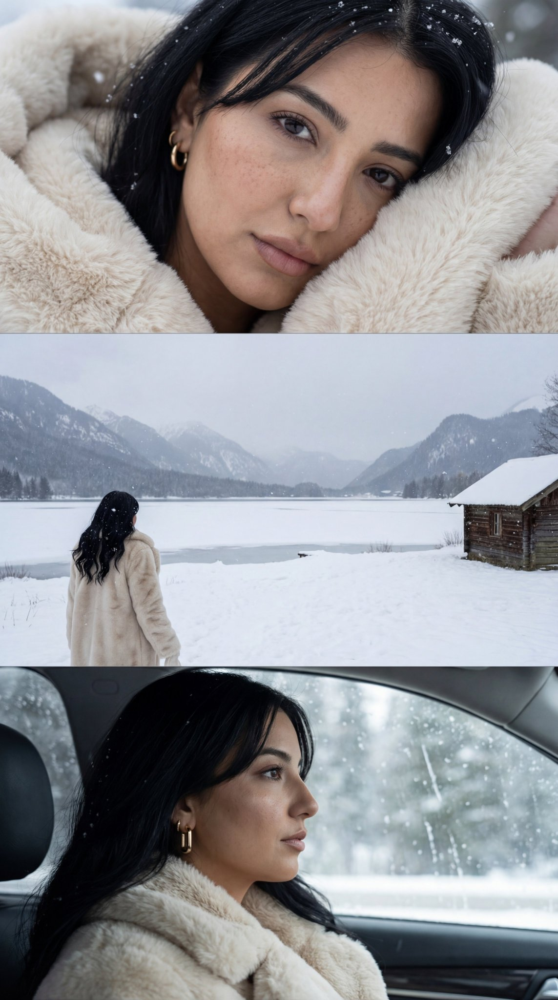

## a window looking out an airplane and you can see a 4k im

- ID: trending-2011050049258865019
- Slug: trending-2011050049258865019-en
- 语言: en
- 来源: [来源链接](https://x.com/Strength04_X/status/2011050049258865019)
- 样例图路径: images/part1/2011050049258865019_1.jpg

### 提示词

```text
a window looking out an airplane and you can see a 4k image of a futuistic, very modern house on top of a mountain with snow, nothing is surrounding the house expect clouds, and snow the angle in which the photo is taken is. slightly from above, the picture is black and white and looks like it was shot on camera, the photo is taken straight out the window not from the side.
```

### 样例图

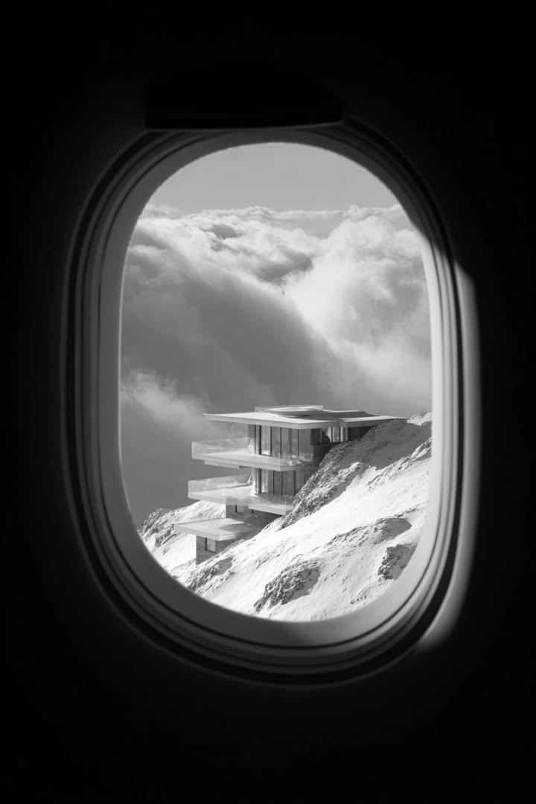

## { "generation_request": { "meta_data": { "tool": "NanoBa

- ID: trending-2009613642522661037
- Slug: trending-2009613642522661037-en
- 语言: en
- 来源: [来源链接](https://x.com/astronomerozge1/status/2009613642522661037)
- 样例图路径: images/part1/2009613642522661037_1.jpg

### 提示词

```text
{
  "generation_request": {
    "meta_data": {
      "tool": "NanoBanana Pro",
      "task_type": "photoreal_candid_street_romance",
      "version": "v1.1_ISTANBUL_FERRY_RAIN_REUNION_LOVE_EN",
      "priority": "highest"
    },

    "output_settings": {
      "aspect_ratio": "4:5",
      "orientation": "portrait",
      "resolution_target": "ultra_high_res",
      "render_style": "ultra_photoreal_candid_street_film_still",
      "sharpness": "crisp_but_natural",
      "film_grain": "subtle_35mm",
      "color_grade": "restrained_cinematic_realism",
      "dynamic_range": "natural_not_hdr",
      "skin_rendering": "real_texture_no_retouch"
    },

    "global_rules": {
      "camera_language": "35mm lens equivalent, eye-level, imperfect framing, candid documentary feel, focus on eyes when people are present",
      "authenticity_markers": "subtle halation on highlights, tiny film gate weave, slight background motion blur only, real street clutter, no studio look",
      "lighting_language": "motivated natural light only (overcast rain daylight + ferry terminal practicals), deep but detailed shadows"
    },

    "creative_prompt": {
      "scene_summary": "Istanbul, rainy day at the ferry terminal. Two university students in their early 20s unexpectedly run into each other right in front of a ferry. A candid, unposed moment—love as a quiet accident in the rain.",

      "subjects": {
        "count": 2,
        "description": "the same young man and woman (early 20s), ordinary and real, not model-like; faces visible and sharp",
        "expression": "surprise, shy warmth, a tiny relieved smile—restrained micro-expressions only",
        "skin_and_face": "natural skin texture, slight under-eye shadows, no beauty retouch, no plastic skin"
      },

      "wardrobe_and_props": {
        "clothing": "simple student clothing in natural neutral tones (beige, grey, navy, soft brown), slightly wrinkled; no logos",
        "wetness": "hair slightly wet, fabric darkened by rain, realistic water beads on coats and backpacks",
        "props": "both hold books and carry backpacks/tote bags; book edges slightly damp; hands gripping straps naturally"
      },

      "micro_action": "they stop mid-step, realizing it’s each other; one adjusts a slipping book; the other wipes rain from their eyebrow; they share a short eye contact that lasts a second longer than normal",

      "environment_details": {
        "location": "Istanbul ferry terminal (Eminönü/Karaköy/Kadıköy vibe), directly in front of a docked ferry",
        "background": "ferry hull and windows behind them, wet pavement, puddle reflections, seagulls blurred in distance, people moving with umbrellas out of focus",
        "street_elements": "rain streaks visible, water droplets on railings, worn signage shapes but no readable text"
      },

      "lighting": "overcast rain daylight, soft and diffused; practical terminal lights give gentle warm highlights; deep but detailed shadows; subtle halation on wet highlights",

      "composition": "eye-level medium shot, slightly off-center, imperfect crop, faces and eyes tack sharp; background softly receding; slight motion blur only in distant passersby and rain",

      "mood": "quiet, intimate, realistic—two people sharing a private moment in a public place"
    },

    "negative_prompt": [
      "studio lighting",
      "beauty retouch",
      "plastic skin",
      "model faces",
      "posed romance poster look",
      "perfect symmetry",
      "HDR",
      "AI glow",
      "fake bokeh shapes",
      "overly clean background",
      "unrealistic rain",
      "text",
      "logo",
      "watermark",
      "cartoon",
      "painterly"
    ]
  }
}
```

### 样例图

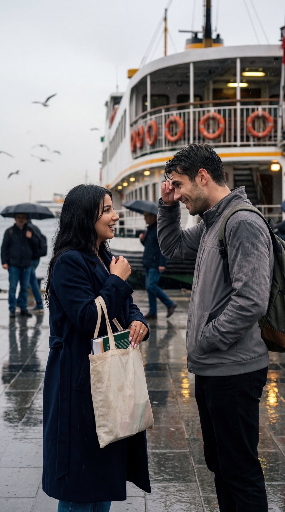

## { "model": "Nano Banana Pro", "scene": "Open field lands

- ID: trending-2009835486144279008
- Slug: trending-2009835486144279008-en
- 语言: en
- 来源: [来源链接](https://x.com/Maercihh/status/2009835486144279008)
- 样例图路径: images/part1/2009835486144279008_1.jpg

### 提示词

```text
{
  "model": "Nano Banana Pro",
  "scene": "Open field landscape under an overcast sky, minimal natural surroundings",
  "subject": {
    "type": "Young man",
    "pose": "Seated on a wooden chair, legs relaxed apart, holding a horse lead calmly",
    "expression": "Detached, introspective, controlled",
    "gaze": "Looking downward, partially obscured by sunglasses",
    "emotion": "Quiet dominance, solitude, inner gravity"
  },
  "appearance": {
    "hair": {
      "color": "Dark",
      "style": "Short, slightly tousled curls"
    },
    "facial_features": {
      "beard": "Light stubble",
      "accessories": ["Dark sunglasses"]
    },
    "skin": "Natural texture, matte finish"
  },
  "attire": {
    "outerwear": "Oversized dark padded jacket",
    "innerwear": "Dark hoodie",
    "pants": "Relaxed-fit dark trousers",
    "footwear": "Black leather boots",
    "style_note": "Minimalist, masculine, utilitarian fashion"
  },
  "secondary_subject": {
    "type": "Black horse",
    "position": "Standing beside the man, head lowered slightly",
    "interaction": "Held calmly by a loose lead",
    "symbolism": "Strength, instinct, controlled power"
  },
  "environment": {
    "location": "Open grassy field",
    "background": [
      "Rolling hills",
      "Soft distant landscape",
      "No urban elements"
    ],
    "atmosphere": "Quiet, isolated, contemplative"
  },
  "lighting": {
    "type": "Natural diffused daylight",
    "conditions": "Overcast sky",
    "effect": "Soft shadows, low contrast, even tonal range"
  },
  "camera": {
    "angle": "Eye-level to slightly low-angle",
    "lens": "50mm cinematic portrait lens",
    "depth_of_field": "Moderate, subject and horse in focus, background gently blurred",
    "framing": "Vertical, full-body portrait with symbolic spacing"
  },
  "color_palette": {
    "mode": "Black and white",
    "tones": ["deep blacks", "soft grays", "muted highlights"]
  },
  "mood": "Stoic, restrained, powerful",
  "style": {
    "aesthetic": "Fine-art editorial portrait",
    "realism": "Photorealistic",
    "inspiration": "Minimalism, masculinity, symbolism",
    "post_processing": "High-quality monochrome grading, subtle film grain, soft contrast"
  },
  "details": {
    "chair": "Simple wooden chair, understated",
    "lead_tension": "Loose, intentional calm",
    "motion": "Stillness dominates the frame"
  },
  "themes": [
    "Controlled power",
    "Man and instinct",
    "Silence as authority",
    "Strength without display"
  ],
  "quality": "Ultra-detailed, cinematic black-and-white portrait with editorial depth"
}
```

### 样例图

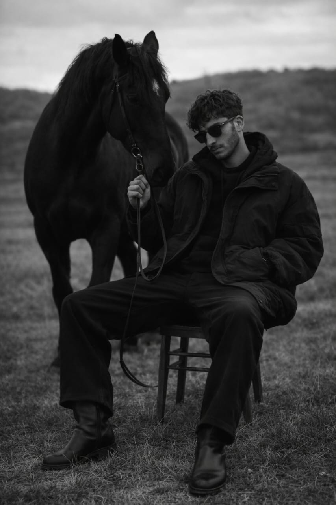

## A photorealistic profile selfie, minimalist and monochro

- ID: trending-2016383627076989240
- Slug: trending-2016383627076989240-en
- 语言: en
- 来源: [来源链接](https://x.com/harboriis/status/2016383627076989240)
- 样例图路径: images/part1/2016383627076989240_1.jpg

### 提示词

```text
A photorealistic profile selfie, minimalist and monochrome: a woman in a dark oversized coat and a black knit hat with cat ears, her hair falling loosely down her back; she holds a black iPhone 17 Pro Max smartphone, taking a picture of herself in an elevator mirror with a matte metal surface in the background. Soft diffused lighting, calm cool color scheme (black, graphite, gray steel), slight film grain, shallow depth of field on the phone and hands, highly detailed fabric and hair textures, 3:2 vertical composition, realistic style, 4K, natural light, soft shadows, moody aesthetic.
```

### 样例图

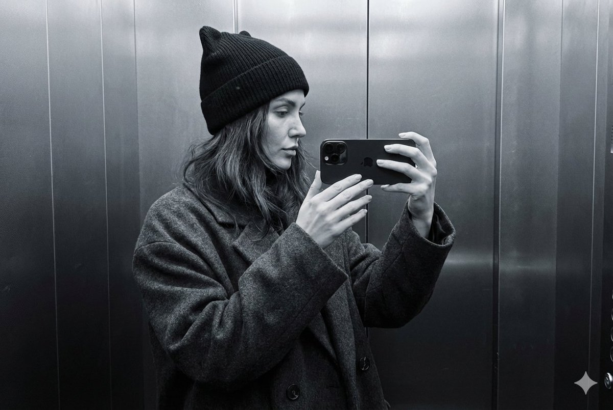

## { "model": "Nano Banana Pro", "scene": "Underground metr

- ID: trending-2009944367377653780
- Slug: trending-2009944367377653780-en
- 语言: en
- 来源: [来源链接](https://x.com/Maercihh/status/2009944367377653780)
- 样例图路径: images/part1/2009944367377653780_1.jpg

### 提示词

```text
{
  "model": "Nano Banana Pro",
  "scene": "Underground metro platform at night with a train rushing past",
  "subject": {
    "type": "Young woman",
    "pose": "Standing near the platform edge, body facing forward, head turned slightly toward the camera",
    "expression": "Thoughtful, distant, quietly alert",
    "gaze": "Looking sideways toward the camera, unfixed, introspective",
    "emotion": "Isolation, reflection, restrained tension"
  },
  "appearance": {
    "hair": {
      "color": "Dark brown to black",
      "style": "Loose, straight, natural fall"
    },
    "skin": "Natural complexion with soft shadows",
    "makeup": "Minimal, realistic, understated"
  },
  "attire": {
    "outerwear": "Oversized dark jacket",
    "style_note": "Functional, muted, urban anonymity"
  },
  "environment": {
    "location": "City subway platform",
    "background_elements": [
      "Blurred metro train in motion",
      "Neon signage",
      "Platform lights",
      "Wet reflective floor surface",
      "Metal railings and tiled platform edge"
    ],
    "atmosphere": "Cold, nocturnal, transient"
  },
  "lighting": {
    "primary": "Artificial fluorescent platform lighting",
    "secondary": "Neon signage glow",
    "effect": "Cool-toned highlights with soft facial shadows"
  },
  "camera": {
    "angle": "Eye-level, slightly behind the subject",
    "lens": "35mm cinematic street lens",
    "shutter_effect": "Motion blur on passing train",
    "depth_of_field": "Moderate, subject sharp with moving background blur",
    "framing": "Vertical, cinematic street composition"
  },
  "color_palette": {
    "dominant": ["teal", "cool blue", "deep black"],
    "accents": ["neon pink", "electric yellow"]
  },
  "mood": "Lonely, cinematic, suspended in time",
  "style": {
    "aesthetic": "Neo-noir street photography",
    "realism": "Photorealistic",
    "inspiration": "Urban cinema, night transit, modern solitude",
    "post_processing": "Cool cinematic grading, slight grain, high contrast shadows"
  },
  "details": {
    "motion_contrast": "Still subject against fast-moving train",
    "floor_reflections": "Wet surface reflecting neon lights",
    "sound_implied": "Rushing train, distant city hum"
  },
  "themes": [
    "Urban loneliness",
    "Waiting",
    "Movement vs stillness",
    "Anonymous city life"
  ],
  "quality": "Ultra-detailed, cinematic night street photograph with motion depth"
}
```

### 样例图

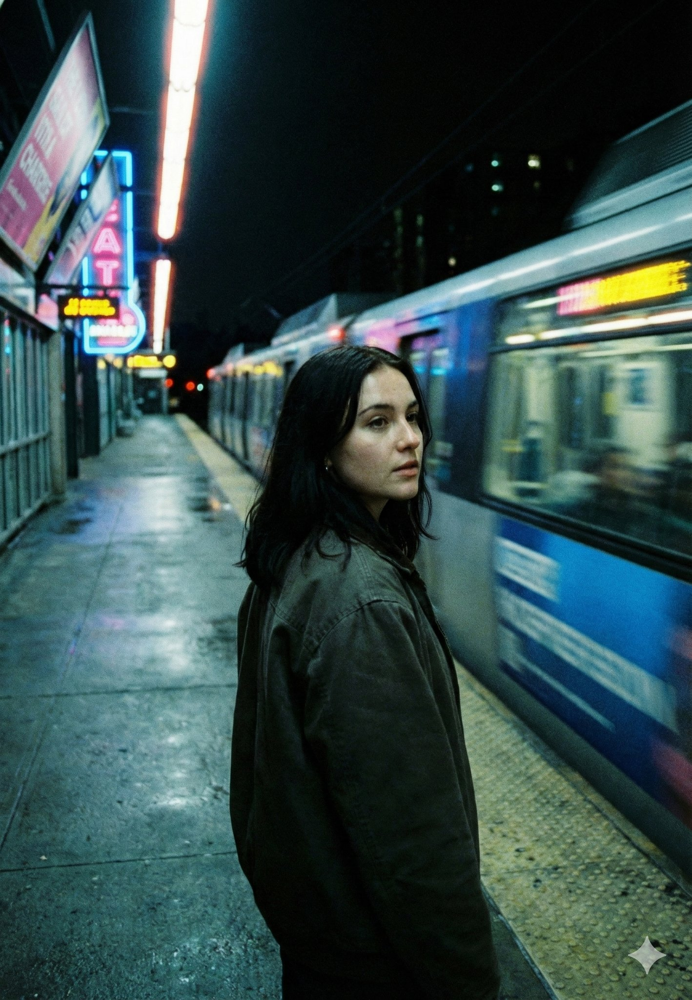

## A hyper-realistic, ultra-detailed 8K cinematic photograp

- ID: trending-2011398486152061051
- Slug: trending-2011398486152061051-en
- 语言: en
- 来源: [来源链接](https://x.com/Sheldon056/status/2011398486152061051)
- 样例图路径: images/part1/2011398486152061051_1.jpg

### 提示词

```text
A hyper-realistic, ultra-detailed 8K cinematic photograph captured with a 35mm lens, medium-wide shot, set inside a realistic, modern apartment living room with a natural, lived-in home atmosphere.

Scene logic & composition:
The TV is positioned directly in front of the players and remains outside the camera frame.
A large decorative mirror on the wall subtly reflects the TV screen, clearly showing the final match result.

In the mirror reflection, the football video game result screen displays a crushing score: 10 – 0, clearly in favor of the main subject.
The numbers are bold, bright, and unmistakable against a green pitch and stadium crowd background.

In the foreground, the main subject (uploaded 100% face as reference, identity fully locked and preserved) is seated on a comfortable couch, body oriented straight toward the unseen TV. He is wearing a relaxed home tracksuit , calm and confident, with a controlled victorious expression after the dominant win.

Seated next to him on the couch is Cristiano Ronaldo, holding a PlayStation controller tightly.
His body language shows clear frustration and anger: tense jaw, furrowed brows, clenched fists, shoulders tight, leaning forward aggressively.
His expression communicates competitive rage and disbelief after losing so badly.

Standing slightly behind and to the side of the couch is Lionel Messi, relaxed and casual, eating food from a plate while watching the scene.
He is smiling subtly, enjoying the moment, completely calm and unbothered, creating a strong contrast with Ronaldo’s anger and adding humor and human warmth to the scene.

A realistic coffee table sits between the couch and the TV, filled with casual home snacks and drinks: pizza slices, chips, sandwiches, and soft drinks, slightly messy to enhance realism.

Lighting is soft, cinematic, and natural, combining ambient room light with the reflected TV glow from the mirror, which subtly illuminates faces and hands.
Depth of field keeps the faces and mirror reflection sharp while softly blurring background elements.

Ultra-realistic skin texture, natural fabric wrinkles, realistic controller reflections, subtle dust particles in the air.
Photorealistic, candid, unstaged moment.
A perfect balance of tension, humor, and realism
```

### 样例图


## A black-and-white, high-contrast, ultra-glamorous street

- ID: trending-2012005508769857710
- Slug: trending-2012005508769857710-en
- 语言: en
- 来源: [来源链接](https://x.com/harboriis/status/2012005508769857710)
- 样例图路径: images/part1/2012005508769857710_1.jpg

### 提示词

```text
A black-and-white, high-contrast, ultra-glamorous street fashion editorial photograph taken with an ultra-wide-angle lens that creates the effect of a slight perspective deformation. A vertical composition in the center of a large urban space surrounded by high-rise buildings that rise up and converge to the center of the frame, forming a dramatic architectural geometry. It's a winter day, there is an uneven layer of snow and ice on the ground, the surface is matte, with the texture of frozen asphalt. The contrast is soft at the top of the frame due to the atmospheric haze. In the foreground is the young man standing closest to the camera. He's wearing large rectangular dark sunglasses. Hairstyle-short, with dense front

styling, partially disheveled, slight asymmetry of strands. The emotion is neutral, serious, and the gaze is directed directly into the lens. He is wearing a voluminous long coat with a massive collar, under which multi-layered clothes are visible, including a thick shirt with a pronounced checkered texture. A large heavy chain with massive links hangs on the chest, visually dominating the composition. Behind, to the left and right of the man, there are two men dressed identically in dark ensembles: thick coats or jackets, smooth fabrics that emphasize a strict silhouette. They wear large chains of a similar type, stacked on top of clothes. They wear dark sunglasses. They stand statically, strictly, with their legs slightly apart, arms lowered or gathered in front of them. Their figures create balance on the sides of the frame. On the left behind there is a sports car with a low wide body and a pronounced wedge-shaped front. The polished metal reflects the

surrounding buildings and the sky. The car is parked on a snow-covered surface next to a small city Christmas tree, surrounded by metal fences..

The fir tree is fluffy and rich in tone, contrasting with the smooth surfaces of cars and skyscrapers. The urban backdrop consists of densely packed skyscrapers stretching into the misty sky. Their glass and concrete facades create vertical rhythms. The light is diffused, wintry, soft, without pronounced shadows. The color scheme is a pure monochrome palette with deep shadows and even light areas. The processing is glossy, with a light feel of an advertising photo shoot, moderate grain, high sharpness in the foreground.
```

### 样例图

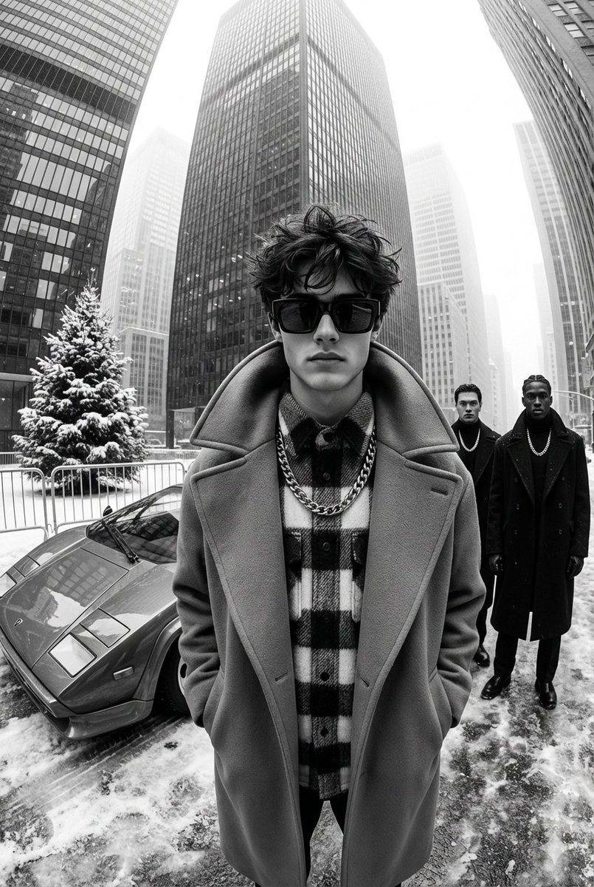

## A cinematic fashion portrait of a young woman with a sho

- ID: trending-2009853598323396674
- Slug: trending-2009853598323396674-en
- 语言: en
- 来源: [来源链接](https://x.com/iamsofiaijaz/status/2009853598323396674)
- 样例图路径: images/part1/2009853598323396674_1.jpg

### 提示词

```text
A cinematic fashion portrait of a young woman with a short wavy bob haircut and wispy bangs, wearing round orange-tinted sunglasses, pearl drop earrings, a black turtleneck and a bold red puffer jacket, soft glossy lips, natural makeup, wind gently moving her hair, photographed from a low angle, shallow depth of field, ultra realistic, 85mm lens, f1.8, warm golden hour sunlight, clean blue sky background, editorial fashion photography, high detail skin texture, soft shadows, cinematic color grading, Vogue style, ultra sharp focus, professional studio quality
```

### 样例图

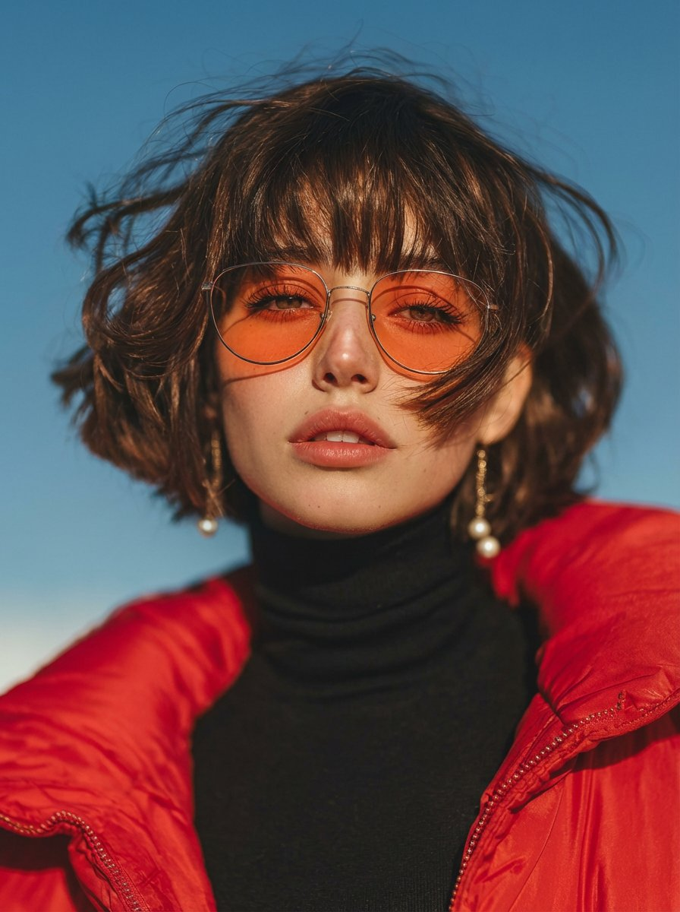

## Use the same face from the reference image without chang

- ID: trending-2011379631740633191
- Slug: trending-2011379631740633191-en
- 语言: en
- 来源: [来源链接](https://x.com/TheNewz_816/status/2011379631740633191)
- 样例图路径: images/part1/2011379631740633191_1.jpg

### 提示词

```text
Use the same face from the reference image without changing facial features 

{
  "image_description": "A high-angle, low-perspective full-body portrait of a young western woman with blonde hair sitting on the edge of a red industrial shipping container.",
  "subject": {
    "person": "Young western woman, fit build, serious expression, looking away from the camera toward the horizon.",
    "hair_style": "long blonde",
    "clothing": {
      "jacket": "Light grey quilted puffer bomber jacket with a diamond pattern.",
      "undershirt": "Plain crisp white crew-neck t-shirt.",
      "pants": "Classic medium-wash blue denim jeans, straight fit.",
      "footwear": "Clean, bright white leather low-top sneakers."
    },
    "pose": "Sitting relaxed on the edge of a metal container, legs dangling, leaning slightly back on his right hand."
  },
  "setting": {
    "location": "Industrial shipping yard or port.",
    "background_elements": [
      "Stacked corrugated red metal shipping containers.",
      "A vertical red container behind the subject creates a strong leading line.",
      "Yellow stencil lettering visible on the container beneath the subject."
    ],
    "atmosphere": "Urban, gritty yet clean, modern streetwear aesthetic."
  },
  "composition_and_lighting": {
    "camera_angle": "Low angle looking up, creating a sense of scale and height.",
    "lighting": "Natural, diffused daylight; soft shadows; overcast sky providing even illumination.",
    "color_palette": [
      "Primary: Bold industrial red",
      "Secondary: Denim blue, light grey, and crisp white",
      "Background: Muted grey/white sky"
    ],
    "lens_effects": "Deep depth of field with sharp focus on the subject and the immediate container texture."
  },
  "technical_tags": "Street photography, architectural lines, hyper-realistic, 8k resolution, cinematic lighting, industrial fashion shoot."
}
```

### 样例图

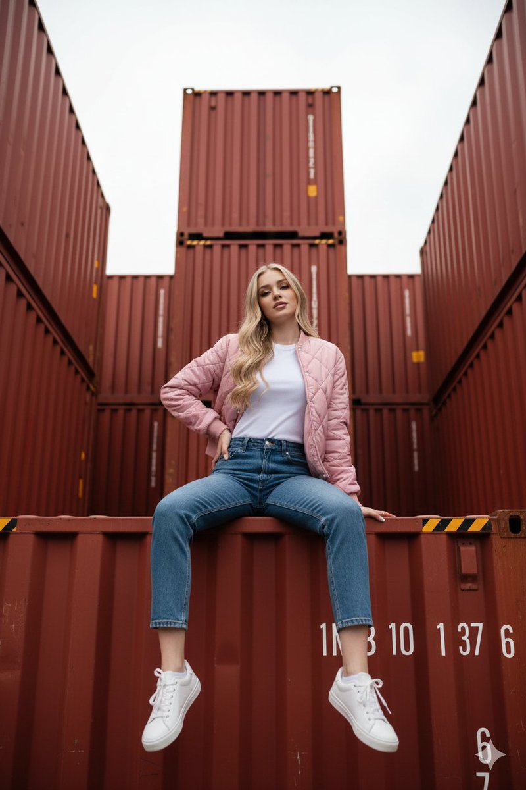

## A man, likely in his early thirties with facial proporti

- ID: trending-2041000388133106148
- Slug: trending-2041000388133106148-en
- 语言: en
- 来源: [来源链接](https://x.com/imGopalTiwari/status/2041000388133106148)
- 样例图路径: images/part1/2041000388133106148_1.jpg

### 提示词

```text
A man, likely in his early thirties with facial proportions, structure, and overall appearance inspired by the reference, captured in full sharp detail and natural skin texture,
hyper-detailed, cinematic close-up profile portrait, vertical orientation, extreme low-angle (worm's-eye view), focusing on the face from the neck up. The man gazes upward with a serious, intense expression. He has dark, short, slightly tousled hair, catching subtle highlights. His facial features are sharply defined, with a strong jawline and natural stubble. Skin texture is realistic, showing pores, subtle imperfections, and natural subsurface scattering.
Clothing & Accessories:
He wears a high-collared, dark turtleneck that absorbs light, creating a strong contrast against the illuminated face. He has large, round, retro-futuristic sunglasses with thick, transparent or light-colored frames and intensely bright orange lenses. The sunglasses reflect the ambient and primary lighting naturally.
Lighting & Color:
Extreme, high-contrast neon lighting with complementary color scheme. Primary light is intense, warm orange/amber emanating from the sunglasses direction, illuminating the nose bridge, cheekbones, and frame edges. Secondary ambient light is cool cyan-blue, providing deep backlight and shadow fill. Shadows are deep indigo and ultramarine, producing strong chiaroscuro, with the subject’s face partially obscured by cool shadows but punctuated with warm orange highlights. Volumetric light subtly interacts with hair and glasses for realism.
Composition & Perspective:
Low-angle close-up emphasizing upward gaze, strong jawline, and facial structure. Solid cyan-blue background ensures the subject stands out, with clean composition and dramatic silhouette. Shallow depth of field isolates the face and sunglasses.
Artistic Style & Mood:
Hyper-realistic, cinematic, photorealistic editorial portrait with cyberpunk, neo-noir, and 80s synthwave aesthetic. Mood is intense, mysterious, and high-fashion.
Technical Details:
Ultra-high resolution, 8K, sharp focus on facial features and sunglasses, realistic skin rendering with NanoBanana Pro quality, natural subsurface scattering, realistic fabric texture, volumetric and rim lighting, cinematic color grading.
Negative Prompts:
cartoon, painting, sketch, 3D render, CGI, plastic skin, blurry, low quality, feminine traits, excessive makeup, watermark, text, unrealistic exaggeration.
```

### 样例图

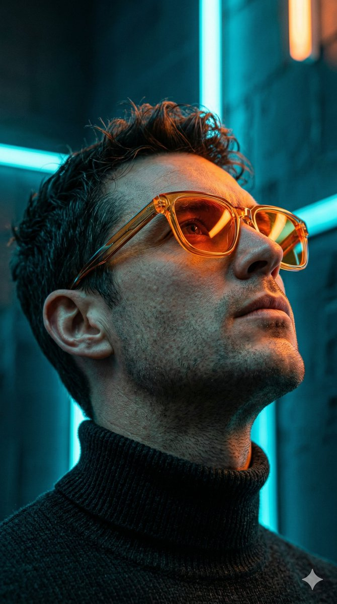

## { "model": "Nano Banana Pro", "scene": "Modern loft livi

- ID: trending-2009487340285440312
- Slug: trending-2009487340285440312-en
- 语言: en
- 来源: [来源链接](https://x.com/Maercihh/status/2009487340285440312)
- 样例图路径: images/part1/2009487340285440312_1.jpg

### 提示词

```text
{
  "model": "Nano Banana Pro",
  "scene": "Modern loft living room with large industrial windows",
  "subject": {
    "type": "Young woman",
    "pose": "Reclining casually on a fabric sofa, one arm resting along the backrest, legs relaxed",
    "expression": "Calm, self-assured, quietly confident",
    "gaze": "Direct eye contact with the camera",
    "emotion": "Ease, confidence, natural presence"
  },
  "appearance": {
    "hair": {
      "color": "Dark brown",
      "style": "Loose, long waves with natural volume"
    },
    "skin": "Natural complexion with subtle freckles and realistic texture",
    "makeup": "Minimal, clean, natural tones"
  },
  "attire": {
    "top": "Vintage-style cropped graphic t-shirt",
    "bottoms": "High-waisted relaxed-fit blue jeans",
    "footwear": "White casual sneakers",
    "accessories": [
      "Layered gold necklaces"
    ],
    "style_note": "Effortless modern street-lifestyle fashion"
  },
  "environment": {
    "location": "Urban loft apartment",
    "background": [
      "Exposed brick walls",
      "Large black-framed windows",
      "City skyline softly visible outside",
      "Indoor potted plant",
      "Abstract framed artwork leaning against walls"
    ],
    "atmosphere": "Airy, contemporary, lived-in"
  },
  "lighting": {
    "primary": "Soft natural daylight from large windows",
    "effect": "Balanced illumination with gentle facial shadows",
    "contrast": "Low to moderate, natural realism"
  },
  "camera": {
    "angle": "Eye-level lifestyle portrait",
    "lens": "35mm lifestyle lens",
    "depth_of_field": "Moderate, subject in focus with softly blurred background",
    "framing": "Horizontal composition, relaxed editorial framing"
  },
  "color_palette": {
    "dominant": ["neutral beige", "denim blue"],
    "accents": ["warm skin tones", "muted green", "soft brick red"]
  },
  "mood": "Relaxed, confident, contemporary",
  "style": {
    "aesthetic": "Lifestyle editorial photography",
    "realism": "Photorealistic",
    "texture": "Visible denim grain, fabric upholstery detail",
    "post_processing": "Natural color grading, subtle warmth, no heavy filters"
  },
  "details": {
    "sofa": "Light neutral fabric couch with soft texture",
    "windows": "Tall industrial-style windows with diffused city light",
    "motion": "Still, candid moment"
  },
  "themes": [
    "Modern femininity",
    "Comfort and confidence",
    "Everyday luxury",
    "Authentic presence"
  ],
  "quality": "Ultra-detailed, high dynamic range, professional lifestyle photography"
}
```

### 样例图

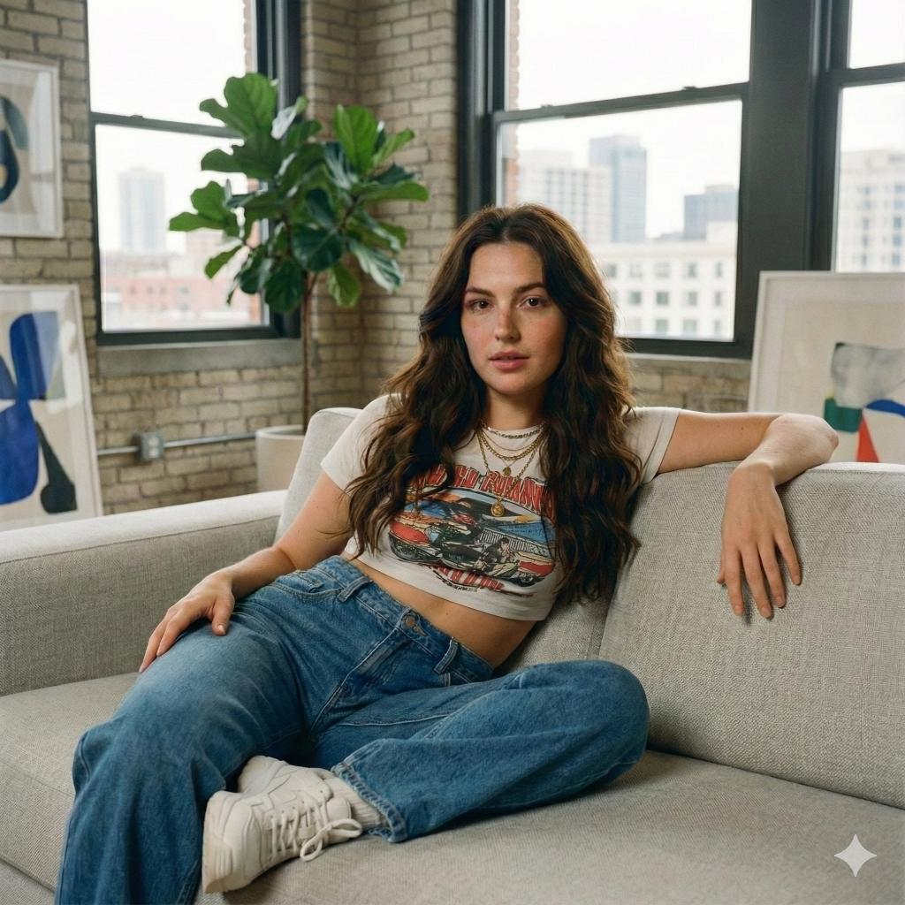

## portrait of a young woman in her early 20s walking calml

- ID: trending-2009246296490889717
- Slug: trending-2009246296490889717-en
- 语言: en
- 来源: [来源链接](https://x.com/TheNewz_816/status/2009246296490889717)
- 样例图路径: images/part1/2009246296490889717_1.jpg

### 提示词

```text
portrait of a young woman in her early 20s walking calmly on a beautiful road, holding a small Persian cat gently in her arms, candid natural pose, elegant flowing dress, soft graceful expression, winter cloudy day, cinematic atmosphere, good lighting fully focused on her, shallow depth of field, background softly blurred, realistic textures, detailed skin, high-resolution, natural colors, soft diffused light, subtle bokeh, professional photography, 85mm lens look

--style realistic --quality high --ar 3:4 --v 6
```

### 样例图

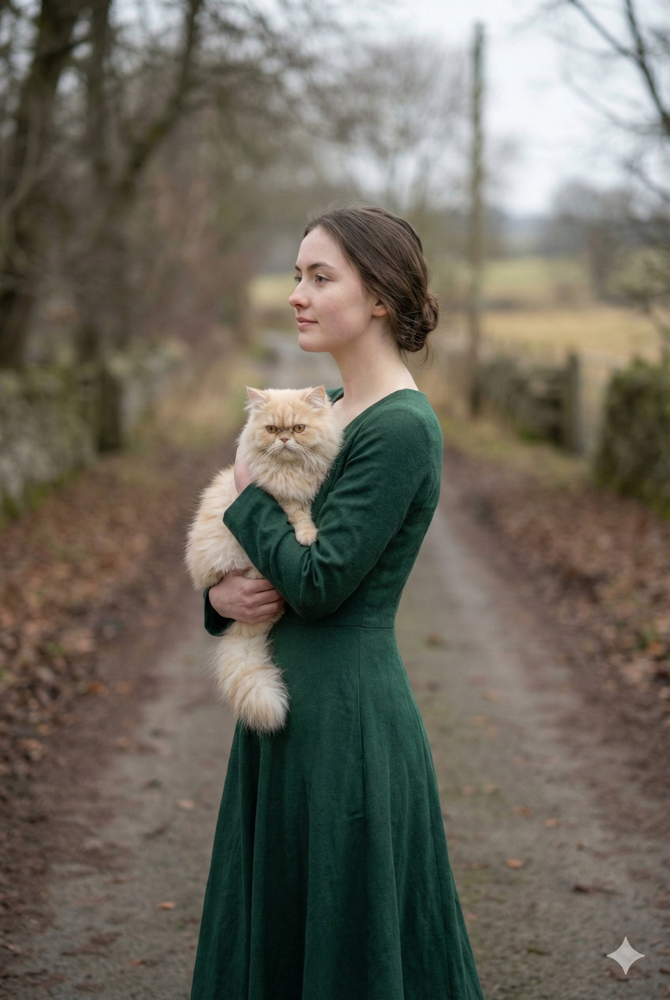

## A cinematic portrait of a young man in the uploaded imag

- ID: trending-2012039630506639728
- Slug: trending-2012039630506639728-en
- 语言: en
- 来源: [来源链接](https://x.com/rovvmut_/status/2012039630506639728)
- 样例图路径: images/part1/2012039630506639728_1.jpg

### 提示词

```text
A cinematic portrait of a young man in the uploaded image sitting cross-legged on a simple wooden chair, wearing white over-ear headphones and gazing thoughtfully toward the light. He is wearing black sweater and brown trousers. He is in a cozy study room; the background features a beige wall cluttered with taped papers and sticky notes, with a wooden bookshelf and a globe visible on the right. Warm, golden-hour sunlight streams in from the left, casting distinct, sharp grid-like window shadows across the subject and the back wall. A large, semi-transparent, faded typography overlay of the word "THINK" blends vertically into the scene behind him. The atmosphere is moody, nostalgic, and warm, with a soft film grain texture.
```

### 样例图

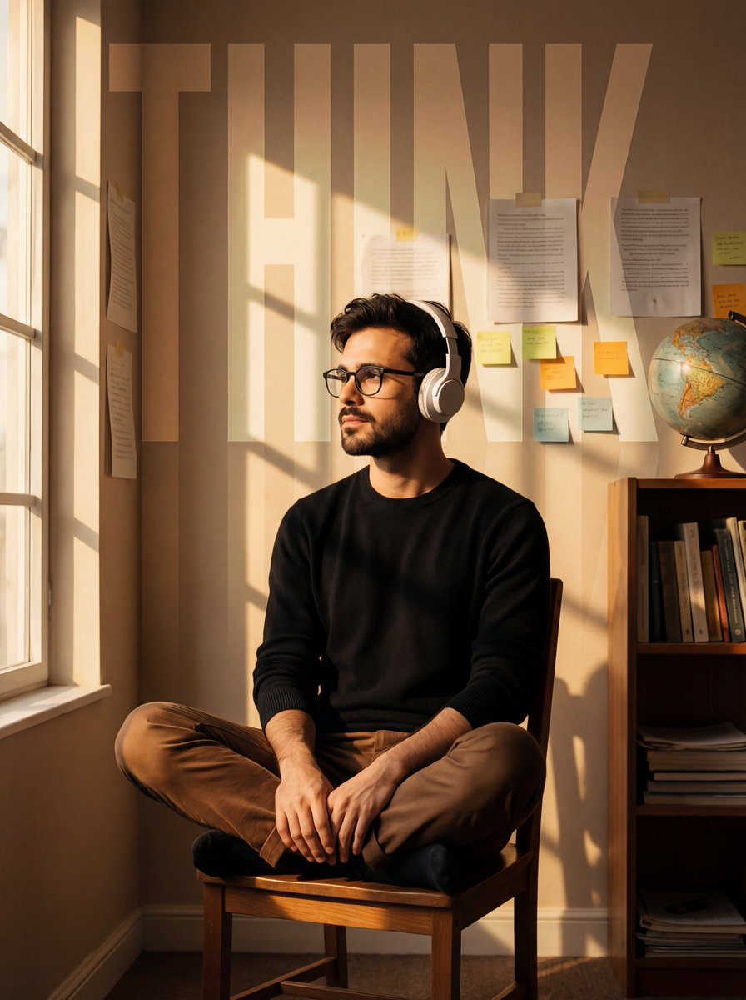

## A hyper-realistic cinematic scene of a woman carefully p

- ID: trending-2011329615814607139
- Slug: trending-2011329615814607139-en
- 语言: en
- 来源: [来源链接](https://x.com/AIwithSynthia/status/2011329615814607139)
- 样例图路径: images/part1/2011329615814607139_1.jpg

### 提示词

```text
A hyper-realistic cinematic scene of a woman carefully painting a miniature football figurine of Cristiano Ronaldo in a Portugal national team jersey. The tiny footballer is frozen mid-dribble with the ball at his feet, standing on a round grass base placed on a wooden desk. The woman wears a matching red Portugal jersey and focuses intently while holding a fine paintbrush near the figure’s face. Soft natural window light creates warm highlights and gentle shadows, shallow depth of field with a blurred shelf of collectibles in the background. Ultra-detailed textures on fabric, skin, and paint strokes, photorealistic scale illusion, cinematic storytelling composition, premium studio realism, 50mm lens look, high-end editorial mood
```

### 样例图

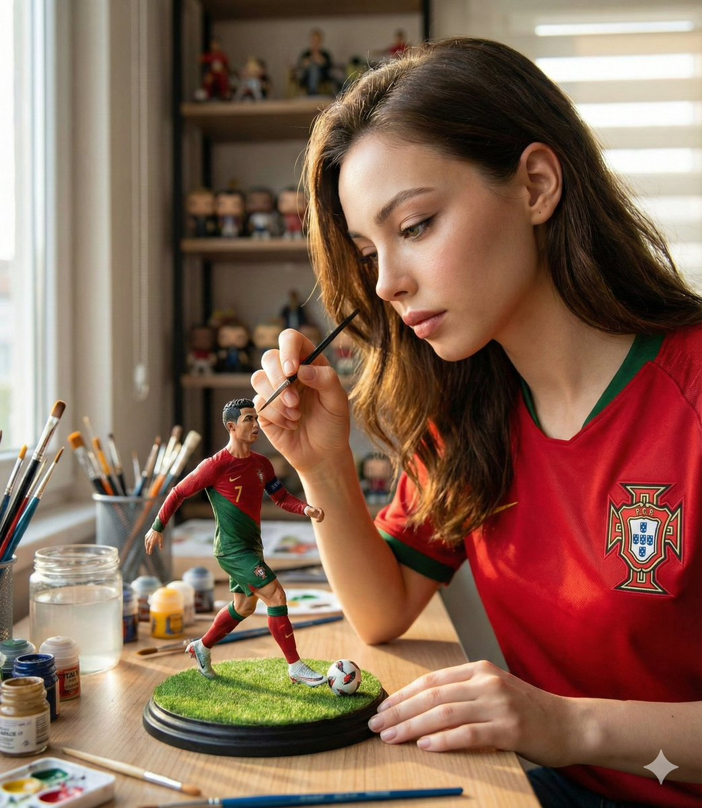

## { "model": "Nano Banana Pro", "scene": "Urban street cor

- ID: trending-2008456001503015309
- Slug: trending-2008456001503015309-en
- 语言: en
- 来源: [来源链接](https://x.com/Maercihh/status/2008456001503015309)
- 样例图路径: images/part1/2008456001503015309_1.jpg

### 提示词

```text
{
  "model": "Nano Banana Pro",
  "scene": "Urban street corner at dusk beside a brick wall covered in graffiti",
  "subject": {
    "type": "Young woman",
    "pose": "Sitting on a skateboard with knees bent, back resting against a brick wall",
    "expression": "Calm, introspective, slightly distant",
    "gaze": "Eyes gently closed or lowered, absorbed in music",
    "emotion": "Stillness, reflection, quiet detachment"
  },
  "appearance": {
    "hair": {
      "color": "Silver-blonde",
      "style": "Loose, slightly tousled"
    },
    "accessories": "Over-ear black headphones",
    "skin": "Natural tone with soft evening light"
  },
  "attire": {
    "top": "Oversized plaid flannel shirt",
    "bottoms": "Loose cargo pants",
    "footwear": "Worn white sneakers",
    "style_note": "Relaxed streetwear, functional and unstyled"
  },
  "environment": {
    "location": "City alley or side street",
    "background": "Brick wall with faded graffiti art",
    "props": [
      "Skateboard leaning against the wall",
      "Street lamp mounted above"
    ],
    "atmosphere": "Urban, quiet, end-of-day calm"
  },
  "lighting": {
    "primary": "Warm street lamp light",
    "secondary": "Soft natural twilight",
    "effect": "Golden highlights on brick texture, gentle shadows"
  },
  "camera": {
    "angle": "Low-angle three-quarter view",
    "lens": "35mm cinematic lens",
    "depth_of_field": "Moderate, subject in focus with softly blurred background",
    "framing": "Vertical composition emphasizing street depth and wall lines"
  },
  "color_palette": {
    "dominant": ["warm brick red", "muted olive", "soft amber"],
    "accents": ["cool gray", "faded graffiti tones"]
  },
  "mood": "Urban, introspective, grounded",
  "style": {
    "aesthetic": "Cinematic street photography",
    "realism": "Photorealistic",
    "texture": "Rough brick, worn asphalt, fabric folds",
    "post_processing": "Warm highlights with slightly muted saturation"
  },
  "details": {
    "ground": "Rough asphalt with small debris",
    "board": "Scuffed skateboard deck showing use",
    "motion": "Still frame, no action or blur"
  },
  "themes": [
    "Urban solitude",
    "Music as escape",
    "Youth and pause",
    "Belonging without noise"
  ],
  "quality": "Ultra-detailed, high dynamic range, professional cinematic street portrait"
}
```

### 样例图

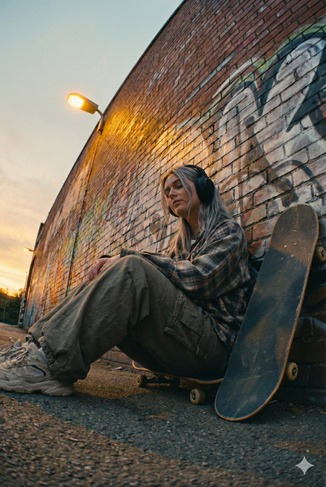

## { "project_type": "cinematic_image", "title": "Rain Does

- ID: trending-2011680577389502562
- Slug: trending-2011680577389502562-en
- 语言: en
- 来源: [来源链接](https://x.com/Maercihh/status/2011680577389502562)
- 样例图路径: images/part1/2011680577389502562_1.jpg

### 提示词

```text
{
  "project_type": "cinematic_image",
  "title": "Rain Doesn’t Pause the City",
  "creative_direction": {
    "genre": "cinematic urban realism",
    "influences": [
      "modern street photography",
      "neo-noir cinema",
      "documentary realism",
      "architectural urban mood"
    ],
    "emotion": [
      "quiet loneliness",
      "introspection",
      "urban solitude",
      "calm under pressure"
    ]
  },
  "scene": {
    "environment": "dense city street",
    "architecture": "mid-rise commercial buildings with neon signage",
    "time_of_day": "early evening, blue hour",
    "weather": {
      "type": "heavy rain",
      "details": "visible raindrops, wet surfaces, rain streaks in the air"
    },
    "ground": "wet asphalt with reflective puddles"
  },
  "subject": {
    "type": "single human subject",
    "description": "young woman standing alone on the sidewalk",
    "pose": "stationary, body angled slightly away from the camera, head turned toward lens",
    "expression": "neutral, distant, introspective",
    "wardrobe": {
      "outerwear": "dark hooded rain jacket",
      "accessories": ["backpack"],
      "condition": "rain-soaked fabric, visible droplets"
    },
    "physical_details": {
      "hair": "wet, slightly messy, framing the face",
      "skin": "natural texture, no heavy retouching"
    }
  },
  "background": {
    "elements": [
      "yellow taxi with headlights on",
      "blurred moving traffic",
      "pedestrians holding umbrellas",
      "neon shop signs in multiple languages"
    ],
    "depth": "deep urban perspective with layered visual elements",
    "motion_effect": "subtle motion blur on vehicles and pedestrians"
  },
  "cinematography": {
    "camera_type": "full-frame digital cinema camera",
    "lens": "35mm prime",
    "aperture": "wide open for shallow depth of field",
    "focus": "sharp focus on subject, background softly defocused",
    "camera_position": "eye-level, street perspective",
    "movement": "static frame, background motion creates contrast"
  },
  "lighting": {
    "primary_source": "ambient city lighting",
    "secondary_sources": [
      "vehicle headlights",
      "neon signs",
      "storefront lights"
    ],
    "lighting_style": "soft, diffused, natural",
    "contrast": "moderate, cinematic"
  },
  "color_grading": {
    "palette": ["cool blues", "teal shadows", "warm amber highlights"],
    "saturation": "controlled, muted",
    "black_levels": "slightly lifted for filmic look",
    "highlights": "soft roll-off"
  },
  "post_processing": {
    "film_grain": "subtle, cinematic",
    "sharpness": "subject emphasized, background softened",
    "noise": "minimal, natural",
    "vignette": "very subtle"
  },
  "visual_style": {
    "realism": "high",
    "aesthetic": "moody, atmospheric, modern",
    "inspiration_keywords": [
      "cinematic rain",
      "urban isolation",
      "street realism",
      "architectural mood"
    ]
  },
  "output_quality": {
    "resolution": "high",
    "dynamic_range": "high",
    "detail_priority": "subject and environment textures preserved"
  },
  "usage": {
    "platform": "social media / X",
    "intent": "artistic storytelling, cinematic visual identity",
    "reusability": "modular prompt structure"
  }
}
```

### 样例图

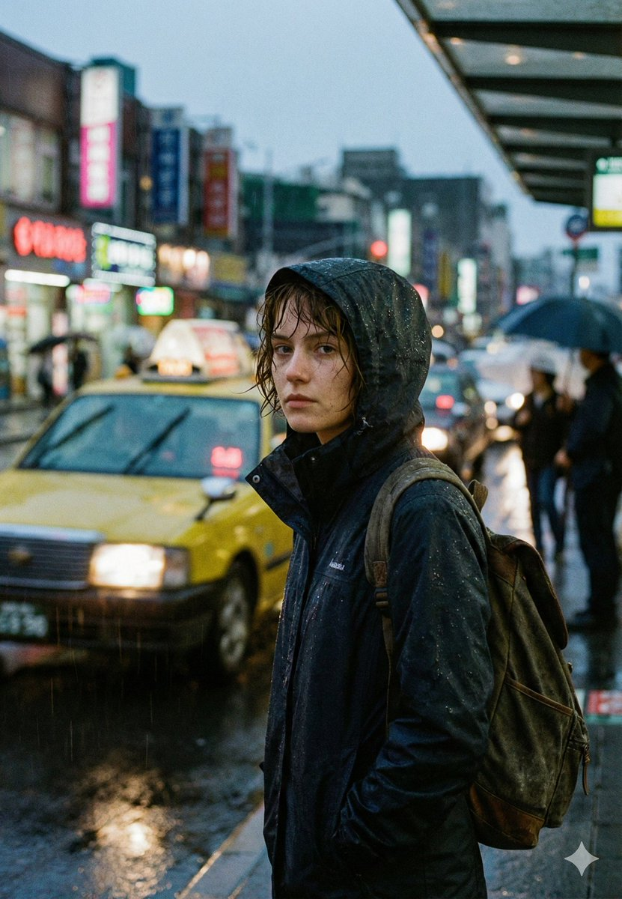

## { "subject": "Young woman sitting casually on outdoor co

- ID: trending-2009215763937415243
- Slug: trending-2009215763937415243-en
- 语言: en
- 来源: [来源链接](https://x.com/TheNewz_816/status/2009215763937415243)
- 样例图路径: images/part1/2009215763937415243_1.jpg

### 提示词

```text
{
  "subject": "Young woman sitting casually on outdoor concrete stairs, posing with a cool, confident demeanor.",
  "clothing": "Oversized grey and beige plaid flannel shirt worn open, plain black crew-neck t-shirt underneath, loose-fitting dark trousers, chunky white sneakers.",
  "hair": "Long, straight light brown hair with a middle part, falling naturally over the shoulders.",
  "face": "Neutral, poised expression with defined red lips, eyes concealed behind sunglasses.",
  "accessories": "Round dark sunglasses with thin metal frames, simple silver chain necklace.",
  "environment": "Urban setting with a tall, grey concrete apartment block featuring a grid of windows in the background, weathered concrete steps in the foreground.",
  "lighting": "Soft, diffuse natural daylight indicative of an overcast sky, creating even illumination without harsh shadows.",
  "camera": "Low-angle shot looking up at the subject, emphasizing the height of the background building, sharp focus on the subject with a slightly softened background.",
  "style": "Urban streetwear photography, 90s grunge aesthetic, moody and atmospheric, cinematic vertical composition."
}
```

### 样例图

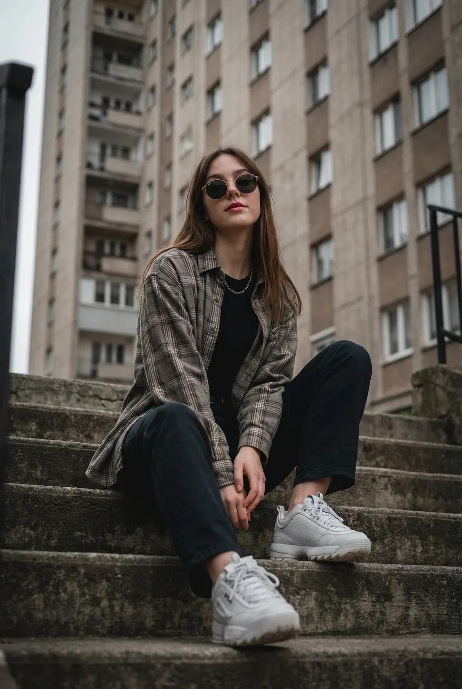

## { "image_generation_prompt": "Aesthetic 1970s-inspired f

- ID: trending-2011693538871033918
- Slug: trending-2011693538871033918-en
- 语言: en
- 来源: [来源链接](https://x.com/TheNewz_816/status/2011693538871033918)
- 样例图路径: images/part1/2011693538871033918_1.jpg

### 提示词

```text
{
  "image_generation_prompt": "Aesthetic 1970s-inspired fashion portrait of a stylish young woman sitting on outdoor cafe steps, holding a premium ornate green coffee cup with gold rim detailing, gazing softly at the camera. Her hair is styled in soft loose strands framing her face with vintage makeup, matte red lips, and subtle eyeliner. She is wearing a cozy forest green premium knit sweater paired with a long flowing black tutu skirt. A warm vintage plaid scarf in earthy brown, burnt orange, and muted red tones is wrapped loosely around her neck. A premium dark green leather crossbody bag with a gold filigree clasp and chain strap is placed beside her. Autumn street café setting with scattered fallen leaves and warm amber café lights glowing behind glass windows. 1970s film tone, warm grainy texture, muted earthy color palette, cinematic atmosphere, shallow depth of field, soft natural lighting, analog film look, fashion editorial photography, ultra-realistic, high detail, 85mm lens, f/1.8, vintage aesthetic, dreamy mood."
}
```

### 样例图

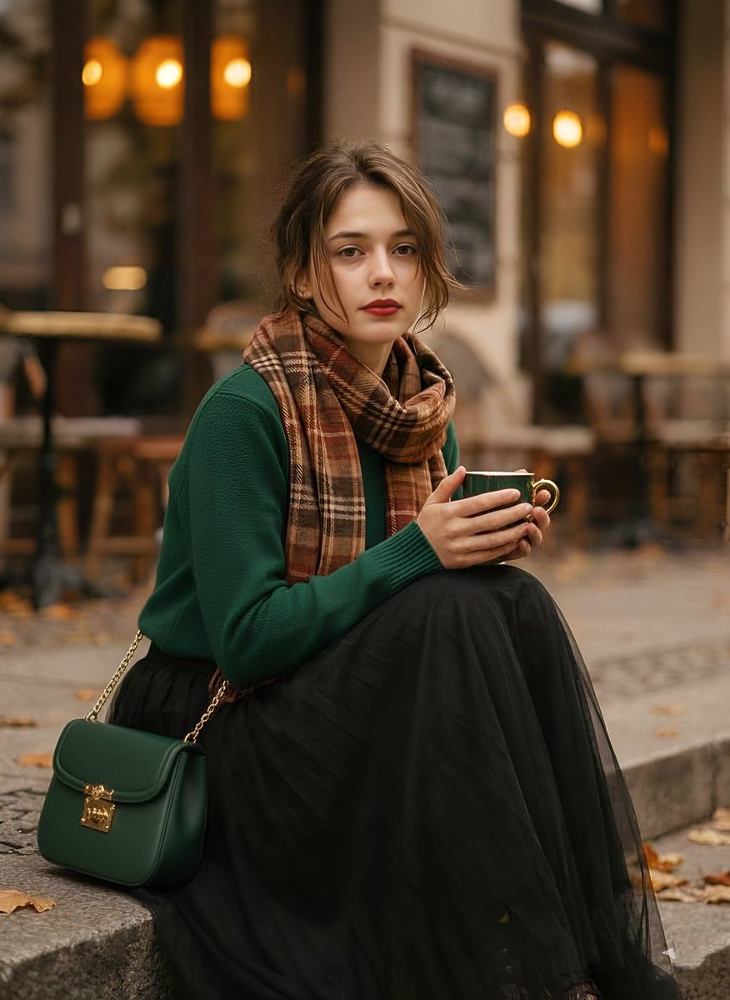

## A poetic cinematic portrait of a young woman standing al

- ID: trending-2012905632782069864
- Slug: trending-2012905632782069864-en
- 语言: en
- 来源: [来源链接](https://x.com/harboriis/status/2012905632782069864)
- 样例图路径: images/part1/2012905632782069864_1.jpg

### 提示词

```text
A poetic cinematic portrait of a young woman standing alone in a vast snowy landscape, surrounded by distant frost-covered mountains. Her long auburn hair is caught mid-motion by strong winter wind, strands flowing naturally across her face. She wears a dark wool coat, minimal makeup, pale freckled skin, and a quiet, introspective expression. Soft snowfall drifts through the air. Muted natural color palette with cold greys, soft whites, and warm copper hair tones. Shallow depth of field, natural diffused daylight, overcast sky, fine film grain, subtle motion blur in hair and snow, cinematic realism, emotional storytelling, editorial photography, 85mm lens look, ultra-detailed, moody atmosphere, high realism, 8k quality, 4:5 image ratio
```

### 样例图

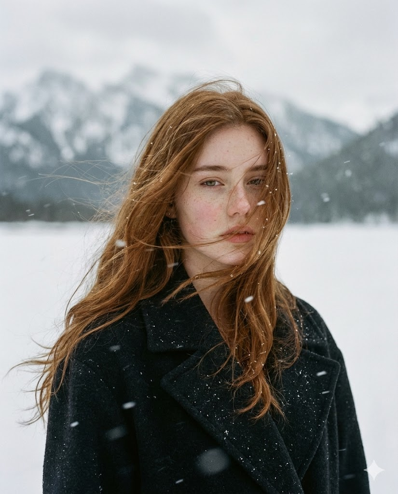

## Ana de Armas Sydney Sweeney Picture Gemini Nano Banana P

- ID: trending-2011438269712507284
- Slug: trending-2011438269712507284-en
- 语言: en
- 来源: [来源链接](https://x.com/Queen_khan143/status/2011438269712507284)
- 样例图路径: images/part1/2011438269712507284_1.jpg

### 提示词

```text
Ana de Armas
Sydney Sweeney Picture

Gemini Nano Banana Pro

Prompt:
{
  "image_generation_request": {
    "aspect_ratio": "3:4",
    "style": "Cinematic Fashion Photography",
    "quality": "8K / Ultra-High Detail",
    "subject": {
      "identity": "Young adult woman, Shakira-inspired likeness",
      "pose": {
        "description": "Dynamic balletic stance, spontaneous and joyful",
        "position": "Balancing on one leg, other leg bent and lifted high, body slightly tilted",
        "arms": "One arm raised catching snowflakes with open palm, other arm following the flow of movement"
      },
      "expression": {
        "mood": "Genuinely happy and lively",
        "features": "Wide natural smile, slightly parted lips, eyes sparkling with emotion, cheeks flushed from cold"
      },
      "physical_details": {
        "skin": "Realistic texture, fine pores, subtle asymmetry, soft highlights, no plastic smoothing",
        "hair": "Long dark hair flowing from beanie, damp strands clinging to cheeks/forehead from melting snow"
      }
    },
    "apparel": {
      "theme": "Monochrome creamy-white winter look",
      "layers": [
        {
          "item": "Oversized puffer jacket",
          "details": "Thick creamy-white, fluffy texture, visible stitching, realistic down volume and compression folds"
        },
        {
          "item": "Cropped hoodie",
          "details": "Creamy-white soft cotton, gentle wrinkles, worn underneath jacket"
        },
        {
          "item": "High-waisted leggings",
          "details": "Matte stretch fabric, creamy-white, subtle tension at knees and hips"
        }
      ],
      "accessories": [
        {
          "item": "Knit beanie",
          "details": "Extra-fluffy, visible yarn texture, creamy-white"
        },
        {
          "item": "Mittens",
          "details": "Long creamy-white fluffy fibers, catching falling snowflakes"
        }
      ],
      "footwear": {
        "style": "Moon-boot inspired lace-up winter boots",
        "details": "White fur-lined, realistic rubber soles, snow buildup around the edges"
      }
    },
    "environment": {
      "setting": "Nighttime exterior of a modern luxury building",
      "architecture": "Sharp geometric wood with triangular patterns",
      "props": "Black luxury SUV parked nearby, partially covered in frost and snow",
      "ground": "Thick uneven snow blanket with visible footprints and compression points",
      "weather": "Heavy dense snowfall, large snowflakes frozen in mid-motion with slight blur"
    },
    "lighting_and_atmosphere": {
      "primary_lighting": "Cold blue-white ambient winter light",
      "secondary_lighting": "Warm orange glow from building interior/windows",
      "visual_effects": [
        "Cinematic color separation",
        "Soft bokeh highlights in background",
        "Shallow depth of field",
        "Reflections softened by frost"
      ]
    },
    "technical_specs": {
      "camera": "Full-frame DSLR/Mirrorless",
      "lens": "50mm–85mm prime lens aesthetic",
      "optics": "Natural perspective, high dynamic range (HDR), realistic exposure",
      "post_processing": "Authentic textures, no over-sharpening, cinematic realism"
    }
  }
```

### 样例图

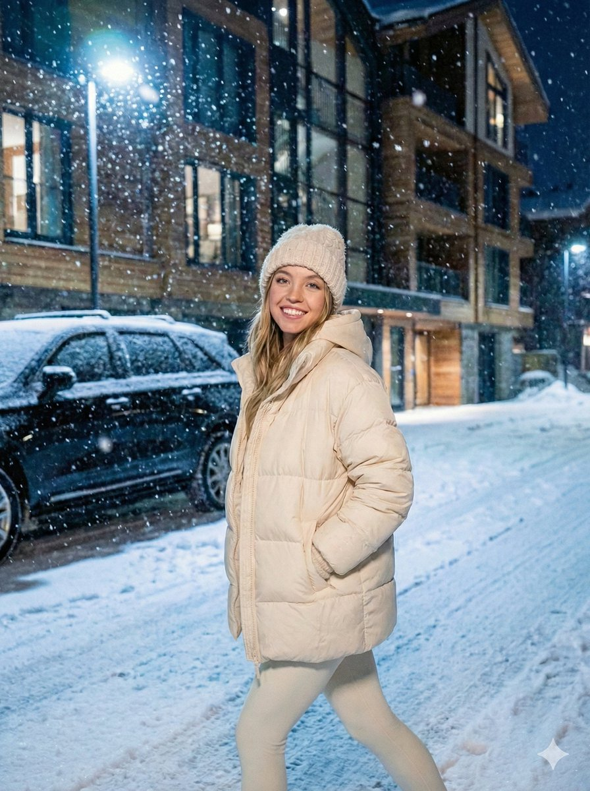

## { "output_settings": { "aspect_ratio": "4:5", "orientati

- ID: trending-2009224783951487477
- Slug: trending-2009224783951487477-en
- 语言: en
- 来源: [来源链接](https://x.com/astronomerozge1/status/2009224783951487477)
- 样例图路径: images/part1/2009224783951487477_1.jpg

### 提示词

```text
{
  "output_settings": {
    "aspect_ratio": "4:5",
    "orientation": "portrait",
    "resolution_target": "ultra_high_res",
    "render_style": "ultra_photoreal_candid_street_film_still",
    "sharpness": "crisp_but_natural",
    "film_grain": "subtle_35mm",
    "color_grade": "restrained_cinematic_realism",
    "dynamic_range": "natural_not_hdr",
    "skin_rendering": "real_texture_no_retouch"
  },
  "global_rules": {
    "camera_language": "35mm lens equivalent, eye-level, imperfect framing, candid documentary feel, focus on eyes when a person is present",
    "authenticity_markers": "subtle halation on highlights, tiny film gate weave, slight background motion blur only, realistic street clutter, no studio look",
    "lighting_language": "motivated natural light only (shop window, street lamp, overcast daylight, sunset), deep but detailed shadows"
  },
  "negative_prompt": [
    "studio lighting",
    "beauty retouch",
    "plastic skin",
    "over-sharpened",
    "HDR",
    "AI glow",
    "perfect symmetry",
    "overly clean background",
    "fake bokeh",
    "text",
    "logo",
    "watermark",
    "cartoon",
    "painterly"
  ]
}
{
  "scene_summary": "Early morning in Eminönü, ferry docks, soft fog and breath in cold air, documentary street realism.",
  "subject": "Tea vendor handing a steaming tea glass to a customer, candid moment.",
  "micro_action": "steam rising as fingers touch the glass, tiny smile",
  "environment_details": "ferry silhouette in mist, seagulls blurred in background, wet railings, puddles",
  "lighting": "soft morning light diffused by fog, highlights with subtle halation"
}
```

### 样例图

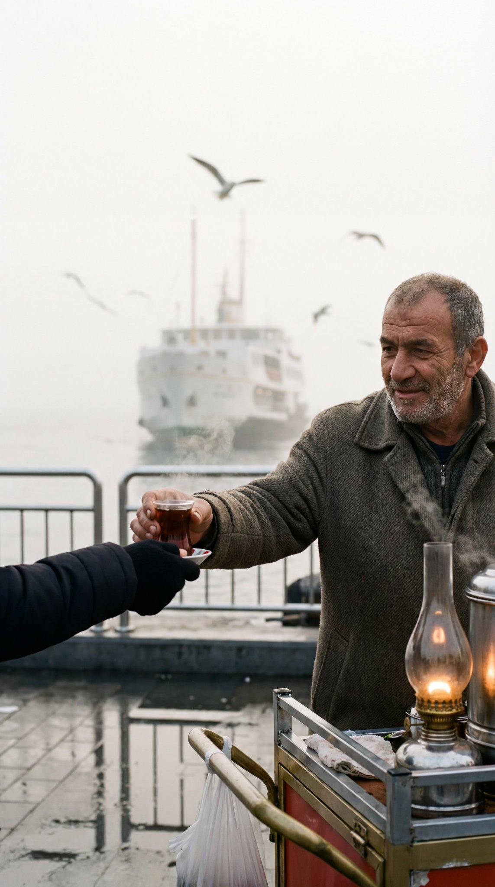

## { "model": "Nano Banana Pro", "scene": "Historic art gal

- ID: trending-2009212599486042528
- Slug: trending-2009212599486042528-en
- 语言: en
- 来源: [来源链接](https://x.com/Maercihh/status/2009212599486042528)
- 样例图路径: images/part1/2009212599486042528_1.jpg

### 提示词

```text
{
  "model": "Nano Banana Pro",
  "scene": "Historic art gallery corridor with classical sculptures and framed paintings",
  "subject": {
    "type": "Young woman",
    "pose": "Standing gracefully in three-quarter profile, body slightly turned, hands relaxed",
    "expression": "Soft, confident smile with calm composure",
    "gaze": "Looking gently toward the camera",
    "emotion": "Elegance, quiet confidence, cultural presence"
  },
  "appearance": {
    "hair": {
      "color": "Dark brown",
      "style": "Pulled back neatly with loose natural flow"
    },
    "skin": "Natural complexion, softly illuminated",
    "makeup": "Minimal, refined, classical"
  },
  "attire": {
    "dress": {
      "type": "Flowing couture-style gown",
      "design": "Layered fabric panels printed with handwritten script",
      "colors": "Muted sepia, charcoal, parchment tones",
      "texture": "Soft, draped fabric with subtle sheen"
    },
    "style_note": "Literary, artistic, museum-worthy fashion"
  },
  "environment": {
    "location": "Old stone-walled museum or gallery hall",
    "floor": "Polished wooden floorboards",
    "background_elements": [
      "Classical bust sculptures on pedestals",
      "Large framed paintings along stone walls"
    ],
    "atmosphere": "Quiet, reverent, timeless"
  },
  "lighting": {
    "primary": "Warm gallery spotlights from above",
    "secondary": "Soft ambient lighting along the corridor",
    "effect": "Gentle highlights on fabric folds and face, deep background shadows"
  },
  "camera": {
    "angle": "Eye-level full-body portrait",
    "lens": "50mm cinematic portrait lens",
    "depth_of_field": "Shallow to moderate, subject crisp with softly blurred background",
    "framing": "Vertical composition emphasizing height and elegance"
  },
  "color_palette": {
    "dominant": ["warm amber", "aged parchment brown"],
    "accents": ["deep charcoal", "golden highlights"]
  },
  "mood": "Timeless, cultured, graceful",
  "style": {
    "aesthetic": "Fine-art fashion photography",
    "inspiration": "Classical art, literature, museum couture",
    "realism": "Photorealistic",
    "texture": "Visible fabric grain, stone wall detail",
    "post_processing": "Warm cinematic grading, subtle vignette, gentle contrast"
  },
  "details": {
    "fabric_motion": "Soft drape pooling naturally on the floor",
    "background_depth": "Long corridor perspective enhancing grandeur",
    "motion": "Still, poised moment"
  },
  "themes": [
    "Art and identity",
    "Fashion as language",
    "Timeless beauty",
    "Human presence within history"
  ],
  "quality": "Ultra-detailed, high dynamic range, professional cinematic fine-art portrait"
}
```

### 样例图

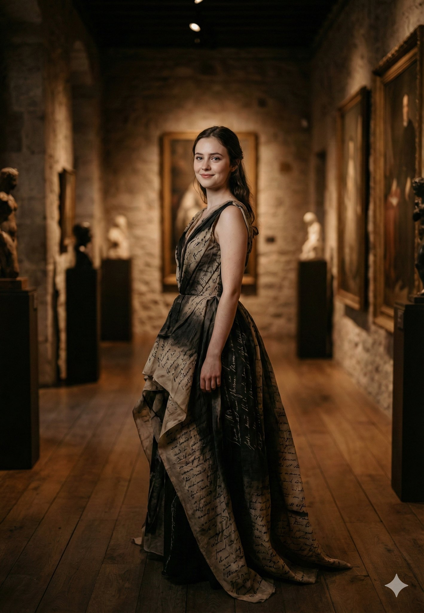

## Hyper-realistic editorial photo shot at eye level with a

- ID: trending-2011031706749522391
- Slug: trending-2011031706749522391-en
- 语言: en
- 来源: [来源链接](https://x.com/SindhuK66662473/status/2011031706749522391)
- 样例图路径: images/part1/2011031706749522391_1.jpg

### 提示词

```text
Hyper-realistic editorial photo shot at eye level with a 12mm ultra-wide lens, full-frame camera, deep focus, and visible barrel distortion with curved room edges. A small rectangular room fully covered in real newspaper pages—walls, floor, and ceiling—showing crisp text, ink bleed, and paper texture.
A woman sits cross-legged on the floor, hands pressed to her cheeks, mouth in a shocked “O.” Long wavy hair, natural skin texture with visible pores and subtle freckles. She wears red octagonal sunglasses, a black-and-white checkered harlequin jacket, vibrant red cargo pants, and matching chunky sneakers.
Soft, diffuse frontal lighting, minimal shadows. Cinematic high-contrast color grade, mostly black and white with red as the only saturated accent, ultra-detailed, photorealistic fashion photography.
```

### 样例图

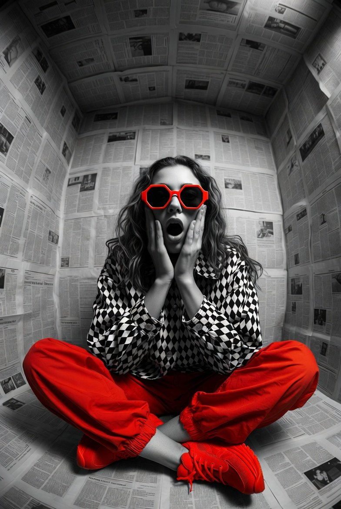

## { "Objective": "Create a moody cinematic portrait captur

- ID: trending-2012144333970133351
- Slug: trending-2012144333970133351-en
- 语言: en
- 来源: [来源链接](https://x.com/Taaruk_/status/2012144333970133351)
- 样例图路径: images/part1/2012144333970133351_1.jpg

### 提示词

```text
{
  "Objective": "Create a moody cinematic portrait capturing quiet introspection on a subway platform at night",
  "PersonaDetails": {
    "Subject": {
      "Type": "Young woman",
      "Hair": {
        "Style": "Soft curly blonde hair loosely tied back",
        "Accessory": "Simple headband"
      },
      "FacialDetails": {
        "Freckles": "Natural, visible",
        "Expression": "Calm, introspective, emotionally reserved"
      },
      "Pose": "Seated on a subway bench, resting chin on her hand",
      "Gaze": "Looking slightly downward or into the distance"
    }
  },
  "Wardrobe": {
    "Outerwear": "Textured wool coat",
    "Accessories": "Knitted scarf",
    "ClothingStyle": "Muted, casual, understated urban wear"
  },
  "SceneDescription": {
    "Location": "Subway platform",
    "TimeOfDay": "Night",
    "Environment": {
      "Lighting": "Neon city lights along the platform",
      "Reflections": "Light reflections glowing on metal and tiled surfaces"
    }
  },
  "Composition": {
    "Framing": "Medium cinematic portrait",
    "DepthOfField": "Shallow depth of field",
    "Focus": "Sharp focus on subject with dreamy background blur"
  },
  "LightingAndColor": {
    "Lighting": "Low-light ambient subway illumination",
    "ColorPalette": {
      "Primary": "Cool teal neon tones",
      "Secondary": "Warm amber highlights"
    },
    "Highlights": "Soft highlights with controlled bloom",
    "ColorGrading": "Cinematic, film-inspired night tones"
  },
  "AtmosphericEffects": {
    "Bokeh": "Dreamy neon bokeh in background",
    "FilmGrain": "Subtle film grain for cinematic texture",
    "Mood": "Quiet, reflective, emotionally resonant"
  },
  "ArtDirection": {
    "Style": "Cinematic urban realism",
    "Aesthetic": "Film still / narrative photography",
    "DetailEmphasis": [
      "Natural skin texture",
      "Fabric texture",
      "Light reflections"
    ]
  },
  "PhotographyStyle": {
    "Genre": "Low-light cinematic portrait photography",
    "LensLook": "85mm lens perspective",
    "RealismLevel": "Ultra-realistic",
    "Resolution": "8K detail"
  },
  "Theme": {
    "Concept": "Solitude and reflection in a modern city",
    "EmotionalTone": "Melancholic calm, quiet anticipation"
  },
  "NegativePrompt": [
    "harsh flash",
    "daylight",
    "posed glamour",
    "oversaturated colors",
    "plastic skin",
    "cartoon",
    "anime",
    "blurry subject"
  ],
  "ResponseFormat": {
    "Type": "Single image",
    "Orientation": "Portrait",
    "AspectRatio": "2:3"
  }
}
```

### 样例图

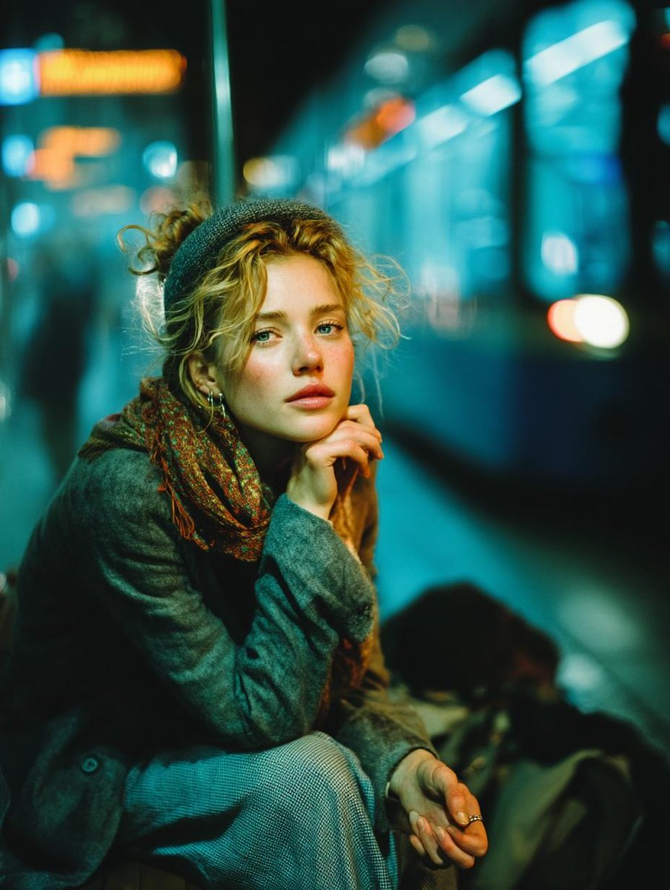

## { "subject": { "description": "Young East Asian woman, p

- ID: trending-2008765230441246824
- Slug: trending-2008765230441246824-en
- 语言: en
- 来源: [来源链接](https://x.com/tabu_8114/status/2008765230441246824)
- 样例图路径: images/part1/2008765230441246824_1.jpg

### 提示词

```text
{
  "subject": {
    "description": "Young East Asian woman, positioned in profile turning to look back at the viewer.",
    "pose": "Looking over shoulder, slight head tilt, body angled away from camera.",
    "expression": "Soft, neutral to slightly melancholic, contemplative gaze, lips slightly parted."
  },
  "clothing": {
    "upper_body": "Dark, structured jacket or blazer, possibly pinstriped or textured fabric.",
    "visibility": "Mostly obscured by shadow and foreground elements."
  },
  "hair": {
    "color": "Dark brown to black.",
    "style": "Long, loose, tousled waves, slightly messy texture.",
    "lighting_interaction": "Strongly backlit, creating a glowing halo effect on loose strands (rim lighting)."
  },
  "face": {
    "skin_tone": "Fair/pale with warm undertones.",
    "features": "Soft facial structure, almond-shaped eyes, natural eyebrows.",
    "makeup": "Minimal, 'no-makeup' look, natural lip color."
  },
  "accessories": {
    "visible_items": "None clearly visible due to framing and lighting."
  },
  "environment": {
    "setting": "Cluttered interior space, resembling a workshop, storage room, or old bookstore.",
    "background_elements": "Wooden shelves stacked with indistinct objects, papers, boxes, and plastic packaging.",
    "foreground_elements": "Blurred translucent objects (possibly glass, plastic sheets, or dust covers) creating layers and reflections."
  },
  "lighting": {
    "source": "Natural sunlight streaming through a window on the left.",
    "quality": "Golden hour, warm, diffuse but directional.",
    "effects": "Strong backlighting/rim lighting on hair, volumetric dust motes dancing in the light, lens flares, soft glare, dramatic contrast between light and shadow."
  },
  "camera": {
    "perspective": "Eye-level, shot through a foreground obstruction (glass or clutter).",
    "focus": "Shallow depth of field (bokeh), sharp focus on eyes/face, blurred background and foreground.",
    "lens_character": "Soft focus, film grain simulation, slight bloom effect."
  },
  "style": {
    "aesthetic": "Cinematic, atmospheric, nostalgic, slice-of-life, ethereal.",
    "mood": "Dreamy, intimate, quiet, sentimental.",
    "visual_reference": "Film photography, Japanese photobook style."
  }
}
```

### 样例图

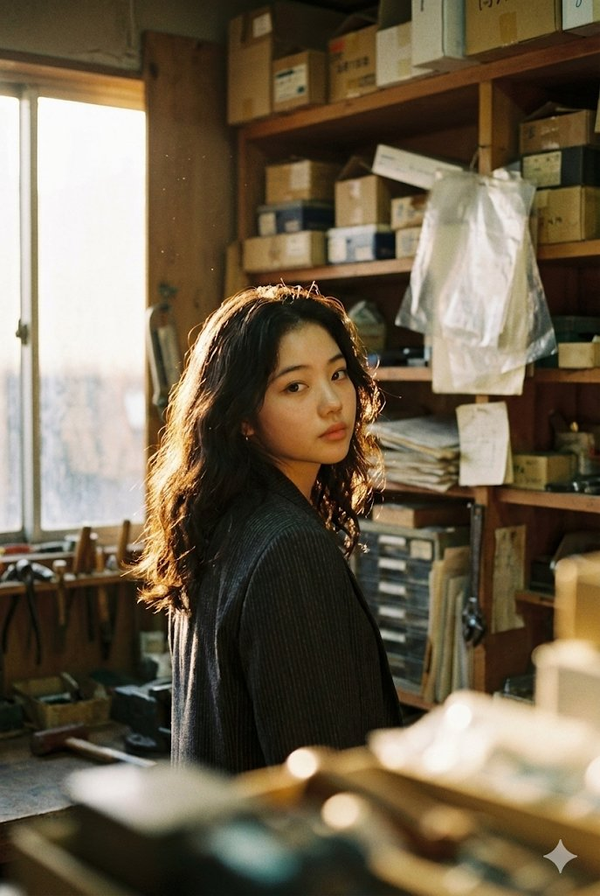

## { "generation_request": { "meta_data": { "tool": "NanoBa

- ID: trending-2009225482382762410
- Slug: trending-2009225482382762410-en
- 语言: en
- 来源: [来源链接](https://x.com/astronomerozge1/status/2009225482382762410)
- 样例图路径: images/part1/2009225482382762410_1.jpg

### 提示词

```text
{ "generation_request": { "meta_data": { "tool": "NanoBanana Pro", "task_type": "photoreal_artistic_street_photography", "version": "v1.0_STREET_ART_REALISM_SER_EN", "priority": "highest" }, "output_settings": { "aspect_ratio": "4:5", "orientation": "portrait", "resolution_target": "ultra_high_res", "render_style": "ultra_photoreal_candid_film_still", "sharpness": "crisp_but_natural", "film_grain": "subtle_35mm", "color_grade": "restrained_cinematic_realism", "dynamic_range": "natural_not_hdr", "skin_rendering": "real_texture_no_retouch" }, "creative_prompt": { "scene_summary": "Candid artistic street photograph on location in [CITY/NEIGHBORHOOD]. A real, unposed moment that feels documentary and emotionally true.", "subject": "A [AGE] [GENDER] wearing [CLOTHING], caught mid-action: [MICRO-ACTION]. Natural facial expression, slight asymmetry preserved.", "camera": "35mm lens equivalent, eye-level, close but respectful distance, imperfect framing like a real street photographer, focus on the eyes, shallow-to-medium depth of field.", "lighting": "Motivated natural light from [SOURCE: shop window / street lamp / sunset / neon], deep but detailed shadows, no studio lighting.", "environment_details": "Street textures: worn posters, scratched metal, rain-speckled pavement, subtle reflections in glass, real urban clutter, no clean studio background.", "authenticity_markers": "Subtle motion blur on background only, slight halation on highlights, tiny film gate weave, realistic grain, no beauty retouch.", "mood": "[MOOD: melancholic / hopeful / tense / quiet joy], cinematic but believable." }, "negative_prompt": [ "studio lighting", "beauty retouch", "plastic skin", "over-sharpened", "HDR", "AI glow", "perfect symmetry", "overly clean background", "fake bokeh shapes", "text", "logo", "watermark", "painterly", "cartoon" ] } }
```

### 样例图

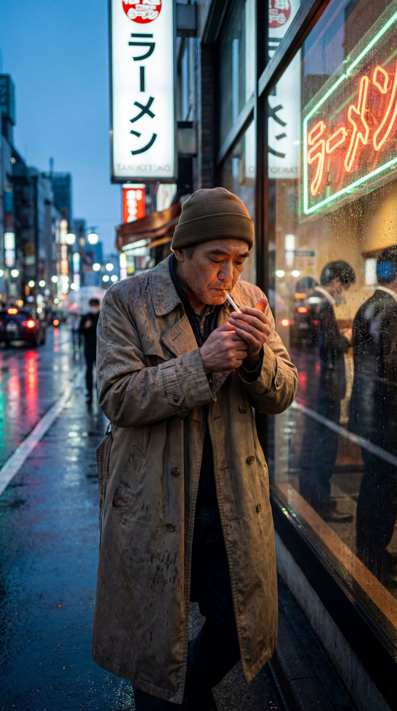

## { "Objective": "Create a stylized fashion portrait with 

- ID: trending-2012011717975556167
- Slug: trending-2012011717975556167-en
- 语言: en
- 来源: [来源链接](https://x.com/Taaruk_/status/2012011717975556167)
- 样例图路径: images/part1/2012011717975556167_1.jpg

### 提示词

```text
{
  "Objective": "Create a stylized fashion portrait with bold color contrast and a modern surreal editorial aesthetic",
  "PersonaDetails": {
    "Subject": {
      "Type": "Young woman",
      "Pose": "Sitting cross-legged",
      "Expression": "Dramatic surprise, hands holding cheeks, mouth slightly open",
      "Hair": "Long black hair framing the face",
      "Accessories": "Bold red sunglasses"
    }
  },
  "Wardrobe": {
    "Top": "Black-and-white checkered shirt",
    "Bottom": "Red pants",
    "Footwear": "Red sneakers",
    "ColorTheme": "Vibrant red contrasted against monochrome surroundings"
  },
  "SceneDescription": {
    "Environment": "Small enclosed room",
    "SurfaceTreatment": {
      "Walls": "Covered entirely in newspaper pages",
      "Floor": "Covered entirely in newspaper pages",
      "Ceiling": "Covered entirely in newspaper pages"
    },
    "Concept": "Monochrome newspaper textures creating a graphic, immersive backdrop"
  },
  "Composition": {
    "Framing": "Centered, symmetrical composition",
    "CameraAngle": "Straight-on",
    "Balance": "Strong geometric and visual symmetry",
    "Focus": "Sharp focus across subject and environment"
  },
  "LightingAndColor": {
    "Lighting": "Soft studio lighting",
    "ShadowQuality": "Clean, controlled shadows",
    "Contrast": "High contrast between black-and-white newspapers and red clothing",
    "ColorPalette": [
      "Black",
      "White",
      "Vibrant red"
    ]
  },
  "ArtDirection": {
    "Style": "Editorial fashion photography",
    "Aesthetic": "Modern surrealism",
    "DetailLevel": "Crisp details with high realism",
    "VisualImpact": "Graphic, bold, eye-catching"
  },
  "PhotographyStyle": {
    "Genre": "High-fashion editorial portrait",
    "ImageQuality": "Ultra-high resolution, 8K clarity",
    "Finish": "Clean, sharp, magazine-ready"
  },
  "Mood": {
    "Tone": "Playful shock, surreal curiosity",
    "Energy": "Bold, expressive, contemporary"
  },
  "NegativePrompt": [
    "uneven lighting",
    "blurred details",
    "busy color palette",
    "low contrast",
    "casual snapshot",
    "cartoon style",
    "vintage look"
  ],
  "ResponseFormat": {
    "Type": "Single image",
    "Orientation": "Portrait",
    "AspectRatio": "2:3"
  }
}
```

### 样例图

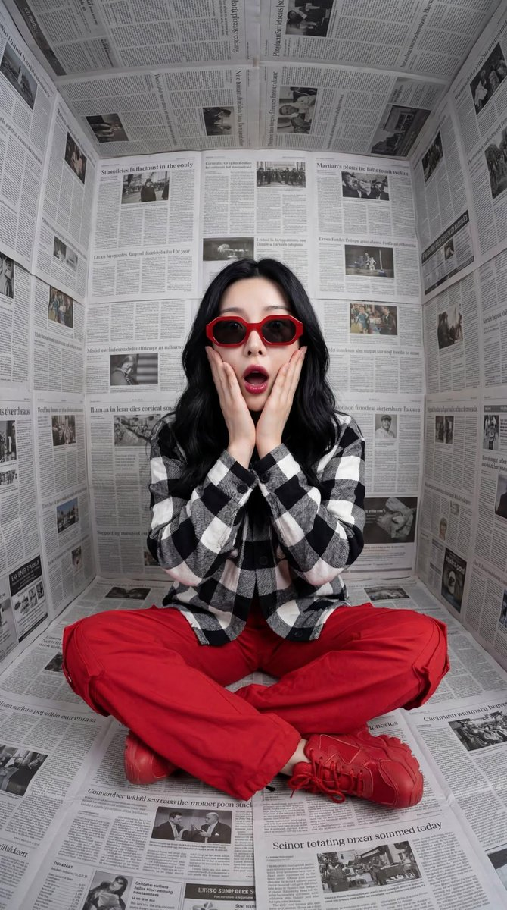

## Gemini Nano Banana Pro 🍌 { "image_type": "photographic 

- ID: trending-2009265431119646925
- Slug: trending-2009265431119646925-en
- 语言: en
- 来源: [来源链接](https://x.com/tabu_8114/status/2009265431119646925)
- 样例图路径: images/part1/2009265431119646925_1.jpg

### 提示词

```text
Gemini Nano Banana Pro 🍌 
{
  "image_type": "photographic portrait",
  "orientation": "vertical",
  "framing": "medium shot",
  "composition": {
    "pose": "standing, torso angled away from camera with head turned back over shoulder",
    "gesture": "arms relaxed, shoulders slightly raised creating a soft curve",
    "body_language": "playful, gentle confidence, approachable",
    "asymmetry": "dynamic asymmetry created by over-the-shoulder pose",
    "negative_space": "moderate negative space above head and around subject within interior setting"
  },
  "subject": {
    "count": 1,
    "gender_presentation": "female",
    "age_appearance": "teenager to young adult",
    "expression": "soft smile, relaxed facial muscles",
    "gaze": "direct eye contact with camera",
    "hair": {
      "color": "medium to dark brown",
      "length": "long",
      "style": "straight, center-parted, tucked behind ears, smooth texture"
    },
    "skin": {
      "tone": "light",
      "texture": "smooth, natural, lightly retouched"
    }
  },
  "wardrobe_and_accessories": {
    "dress": {
      "type": "sleeveless floral dress",
      "base_color": "light blue",
      "pattern": "multicolor floral print",
      "fit": "fitted bodice with gathered skirt",
      "fabric_appearance": "lightweight, soft, slightly matte"
    },
    "accessories": {
      "visible_jewelry": "none prominent",
      "hair_accessories": "none"
    }
  },
  "background": {
    "type": "interior room",
    "setting": "hotel or bedroom",
    "elements": [
      "bed with white linens",
      "side tables",
      "lamp",
      "arched ceiling detail",
      "visible cables on floor"
    ],
    "depth": "background moderately in focus, secondary to subject"
  },
  "lighting": {
    "style": "natural ambient indoor lighting",
    "direction": "soft frontal and side light",
    "contrast": "low",
    "shadows": "very soft, minimal shadowing on face and body",
    "highlights": "gentle highlights on cheeks, eyes, and hair",
    "lighting_quality": "warm, diffused"
  },
  "color_and_tone": {
    "color_mode": "color",
    "white_balance": "warm",
    "palette": "soft pastels and warm neutrals",
    "contrast_curve": "smooth with low contrast",
    "mood": "warm, romantic, candid"
  },
  "camera_and_technical_traits": {
    "camera_distance": "close to medium",
    "lens_appearance": "wide to standard smartphone lens",
    "depth_of_field": "deep, subject and background mostly in focus",
    "sharpness": "high overall clarity",
    "grain": "minimal"
  },
  "artistic_style": {
    "genre": "lifestyle portrait",
    "aesthetic": "candid, feminine, casual elegance",
    "influences": "social media portraiture, lifestyle photography",
    "retouching_style": "light skin smoothing, natural color enhancement"
  },
  "overall_impression": {
    "tone": "friendly, youthful, charming",
    "visual_focus": "face and over-the-shoulder pose",
    "use_case": "social media content, lifestyle reference, casual portrait inspiration"
  },

  "trending_text_overlay": [
    "Dream Military",
    "RESERVE",
    "Virat Kohli"
  ]
}
```

### 样例图

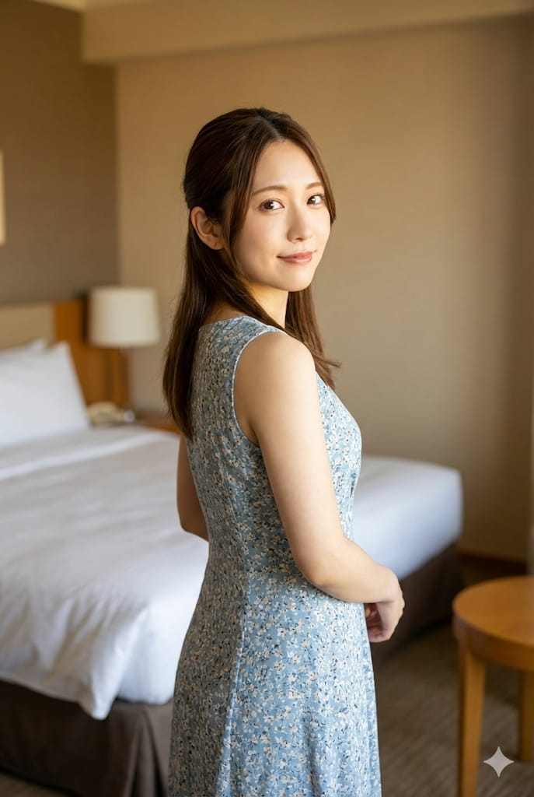

## Cinematic street photography capturing a moment in motio

- ID: trending-2012160964142190862
- Slug: trending-2012160964142190862-en
- 语言: en
- 来源: [来源链接](https://x.com/harboriis/status/2012160964142190862)
- 样例图路径: images/part1/2012160964142190862_1.jpg

### 提示词

```text
Cinematic street photography capturing a moment in motion with a crowd blur effect. Overhead portrait of me standing still on a crosswalk, wearing a white button-up shirt, black oversized jacket, and olive green cargo pants. Motion-blurred crowd rushes past. Moody city lighting, 35mm film aesthetic, shallow depth of field, sharp focus on my portrait, showcasing an artistic and timeless style.
```

### 样例图

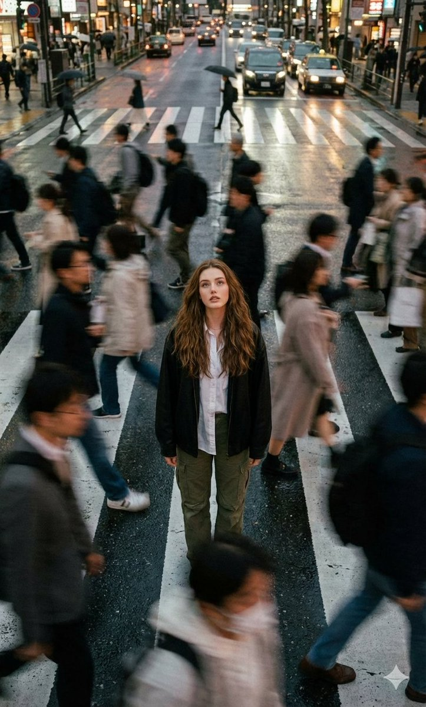

## { "generation_request": { "meta_data": { "tool": "NanoBa

- ID: trending-2008988591800877159
- Slug: trending-2008988591800877159-en
- 语言: en
- 来源: [来源链接](https://x.com/astronomerozge1/status/2008988591800877159)
- 样例图路径: images/part1/2008988591800877159_1.jpg

### 提示词

```text
{
  "generation_request": {
    "meta_data": {
      "tool": "NanoBanana Pro",
      "task_type": "photoreal_artistic_street_photography",
      "version": "v1.0_STREET_ART_REALISM_SER_EN",
      "priority": "highest"
    },
    "output_settings": {
      "aspect_ratio": "4:5",
      "orientation": "portrait",
      "resolution_target": "ultra_high_res",
      "render_style": "ultra_photoreal_candid_film_still",
      "sharpness": "crisp_but_natural",
      "film_grain": "subtle_35mm",
      "color_grade": "restrained_cinematic_realism",
      "dynamic_range": "natural_not_hdr",
      "skin_rendering": "real_texture_no_retouch"
    },
    "creative_prompt": {
      "scene_summary": "Candid artistic street photograph on location in [CITY/NEIGHBORHOOD]. A real, unposed moment that feels documentary and emotionally true.",
      "subject": "A [AGE] [GENDER] wearing [CLOTHING], caught mid-action: [MICRO-ACTION]. Natural facial expression, slight asymmetry preserved.",
      "camera": "35mm lens equivalent, eye-level, close but respectful distance, imperfect framing like a real street photographer, focus on the eyes, shallow-to-medium depth of field.",
      "lighting": "Motivated natural light from [SOURCE: shop window / street lamp / sunset / neon], deep but detailed shadows, no studio lighting.",
      "environment_details": "Street textures: worn posters, scratched metal, rain-speckled pavement, subtle reflections in glass, real urban clutter, no clean studio background.",
      "authenticity_markers": "Subtle motion blur on background only, slight halation on highlights, tiny film gate weave, realistic grain, no beauty retouch.",
      "mood": "[MOOD: melancholic / hopeful / tense / quiet joy], cinematic but believable."
    },
    "negative_prompt": [
      "studio lighting",
      "beauty retouch",
      "plastic skin",
      "over-sharpened",
      "HDR",
      "AI glow",
      "perfect symmetry",
      "overly clean background",
      "fake bokeh shapes",
      "text",
      "logo",
      "watermark",
      "painterly",
      "cartoon"
    ]
  }
}
```

### 样例图

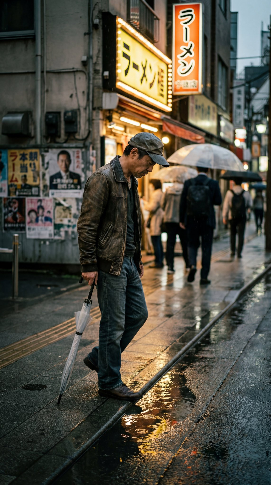

## { "generation_request": { "meta_data": { "tool": "NanoBa

- ID: trending-2008595862771892704
- Slug: trending-2008595862771892704-en
- 语言: en
- 来源: [来源链接](https://x.com/astronomerozge1/status/2008595862771892704)
- 样例图路径: images/part1/2008595862771892704_1.jpg

### 提示词

```text
{
  "generation_request": {
    "meta_data": {
      "tool": "NanoBanana Pro",
      "task_type": "photorealistic_single_image_editorial",
      "version": "v1.6_SUNSET_SEA_RED_DRESS_EDITORIAL",
      "priority": "highest"
    },
    "references": {
      "female_character_reference_image": "UPLOAD_FEMALE_REFERENCE (REQUIRED: IDENTITY + POSE INSPIRATION)"
    },
    "output_settings": {
      "aspect_ratio": "2:3",
      "orientation": "portrait",
      "resolution": "ultra_high_res",
      "render_style": "ultra_photoreal_high_fashion_editorial",
      "sharpness": "crisp_but_natural",
      "film_grain": "subtle_analog_film",
      "color_grade": "sunset_cinematic_warm_luxury"
    },
    "hard_constraints": [
      "ONE subject only (female).",
      "Perfect identity match to the uploaded reference (no face or body changes).",
      "No text, no logos, no watermarks.",
      "Perfect anatomy: hands, legs, proportions correct.",
      "Photoreal skin texture; no plastic or over-smoothed skin.",
      "No extra people, reflections, or background faces."
    ],
    "creative_prompt": {
      "scene_summary": "Ultra-photoreal high-fashion editorial portrait at the seaside during sunset. The same woman as the reference poses confidently on dark coastal rocks by the ocean. She wears a striking red halter-neck mini dress with soft flowing fabric and elegant movement. Her posture is poised and feminine, seated slightly angled toward the camera with legs bent naturally.\n\nHair: long, glossy dark waves worn down, softly shaped by the sea breeze. Makeup: luminous editorial glam—defined brows, subtle contour, glowing skin, soft smoky eyes, glossy nude-rose lips. Expression: confident, calm, magnetic, direct eye contact with the camera.\n\nBackground: open sea with gentle waves, distant horizon line, dramatic sunset sky in gradients of deep orange, pink, purple, and blue with scattered clouds. Lighting: cinematic dusk lighting with subtle fill flash on the subject to balance exposure; natural rim light from the sunset outlining hair and shoulders. Skin tones warm and realistic.\n\nCamera: 85mm editorial portrait lens look, shallow depth of field; subject tack sharp while ocean and clouds fall off softly. Mood: sensual, powerful, timeless, luxury fashion campaign energy—editorial, cinematic, and iconic."
    },
    "negative_prompt": [
      "any text, logo, watermark",
      "identity drift",
      "extra people",
      "distorted anatomy",
      "extra limbs or fingers",
      "cartoon, anime, CGI look",
      "plastic or over-smoothed skin",
      "harsh flash blowout",
      "low resolution",
      "overly saturated colors",
      "cheap styling or artificial fabric look"
    ]
  }
}
```

### 样例图

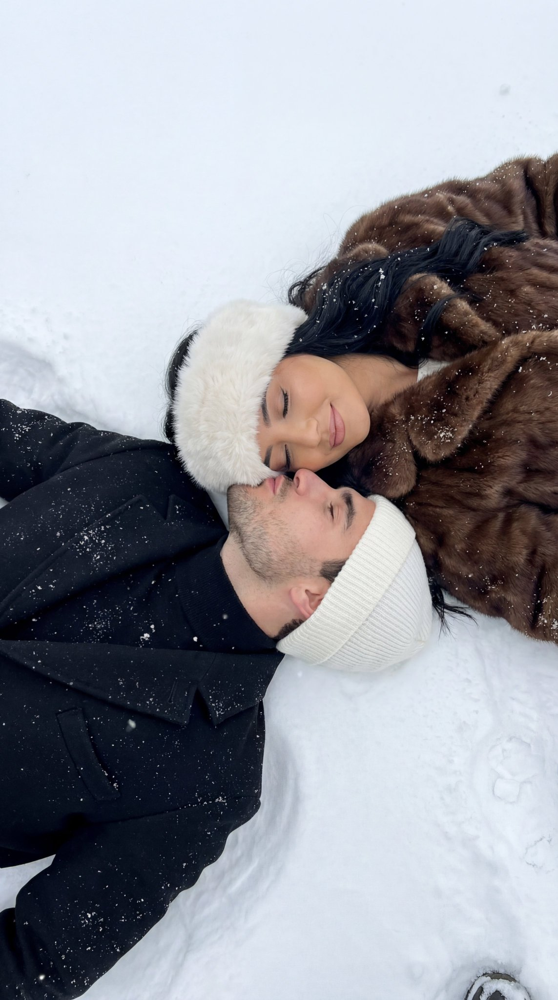

## { "prompt_title": "Sophisticated Urban Winter Couple Por

- ID: trending-2011709638652097021
- Slug: trending-2011709638652097021-en
- 语言: en
- 来源: [来源链接](https://x.com/chatgptpaglu/status/2011709638652097021)
- 样例图路径: images/part1/2011709638652097021_1.jpg

### 提示词

```text
{
  "prompt_title": "Sophisticated Urban Winter Couple Portrait",
  "environment": {
    "setting": "Upscale urban street corner during winter.",
    "architecture": "Massive grey stone pillar/building corner with classical detailing.",
    "background_elements": "Black wrought-iron fence with decorative gold finials/spikes. Classical stone building facade visible in background.",
    "ground": "Covered in fresh, clean white snow.",
    "atmosphere": "Light snow falling, snowflakes visible in the air. Cold, crisp winter day.",
    "color_palette": "Cool neutrals, stone grey, bright white snow, deep blacks, accent of burgundy."
  },
  "subjects": [
    {
      "id": "male_subject",
      "appearance": "Young adult male, fair skin, short dark hair styled neatly.",
      "clothing": {
        "outerwear": "Knee-length textured grey wool overcoat (possibly herringbone or tweed).",
        "top": "Black turtleneck sweater.",
        "bottoms": "Black tailored trousers, relaxed straight fit.",
        "footwear": "Black leather dress shoes or boots.",
        "accessories": "Black wayfarer-style sunglasses."
      },
      "pose": "Standing confident and upright, one hand in coat pocket, other hand holding a dog leash. Looking slightly to the side."
    },
    {
      "id": "female_subject",
      "appearance": "Young adult female, fair skin, dark hair pulled back into a sleek, tight bun.",
      "clothing": {
        "outerwear": "Long, oversized black wool coat.",
        "top": "Black fitted turtleneck.",
        "bottoms": "Black wide-leg trousers.",
        "footwear": "Burgundy/Maroon suede retro sneakers with white stripes (Adidas Gazelle style).",
        "accessories": "Black oval sunglasses, thin black belt with silver buckle, small gold hoop earrings, holding a black leather tote bag."
      },
      "pose": "Standing next to male subject, hand touching lapel of coat, other hand holding bag at side. Radiating 'cool girl' aesthetic."
    }
  ],
  "additional_elements": {
    "animal": {
      "breed": "Beagle dog.",
      "pose": "Sitting obediently on the snow at the man's feet.",
      "appearance": "Tri-color fur (brown, black, white), wearing a collar and attached to a black leash."
    }
  },
  "lighting_and_mood": {
    "lighting_type": "Soft, diffuse overcast natural light (winter daylight). No harsh shadows.",
    "mood": "Chic, minimalist, 'Old Money' aesthetic, quiet luxury, sophisticated, serene, fashionable.",
    "tonality": "Desaturated slightly with high contrast between the black clothing and white snow."
  },
  "technical_details": {
    "style": "Ultra Photorealistic, High-End Street Style Photography.",
    "camera_settings": {
      "lens": "85mm portrait lens.",
      "aperture": "f/2.8 for slight depth of field separation from the stone background.",
      "shutter_speed": "Fast enough to freeze falling snowflakes.",
      "iso": "Low ISO (100) for grain-free clarity."
    },
    "quality_modifiers": "8k resolution, highly detailed fabric textures (wool grain, leather sheen, suede texture), sharp focus on eyes/sunglasses, subsurface scattering on skin, cinematic composition, rule of thirds."
  }
}
```

### 样例图

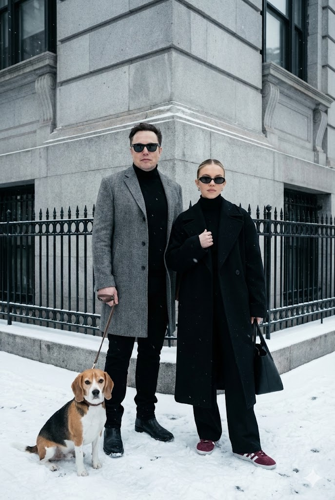

## Which pose do you like more? 🤣 Generated with Nano Bana

- ID: trending-2009333419218554971
- Slug: trending-2009333419218554971-en
- 语言: en
- 来源: [来源链接](https://x.com/PurelyJennie/status/2009333419218554971)
- 样例图路径: images/part1/2009333419218554971_1.jpg

### 提示词

```text
Which pose do you like more? 🤣

Generated with Nano Banana Pro:

Prompt:
{
  "subject": {
    "demographics": {
      "age": "early 20s",
      "gender": "female",
      "ethnicity": "Caucasian"
    },
    "hair": {
      "color": "dark brown with blonde highlights",
      "style": "long, loose, slightly windswept, falling over shoulders",
      "texture": "natural, fine strands"
    },
    "face": {
      "shape": "oval",
      "eyes": "light green, almond-shaped, direct gaze at camera",
      "nose": "straight bridge",
      "lips": "full, natural color, slight pout",
      "skin_texture": "natural, minimal makeup, slight tan"
    },
    "body_proportions": {
      "build": "hyper-curvy athletic, extreme hourglass silhouette",
      "bust": "voluminous, heavy, naturally weighted with clear gravity effect, projecting outward, creating tension on the thin bikini straps",
      "waist": "extraordinarily narrow, cinched, high-definition abdominal tone, visible vertical 'Ab crack' line",
      "hips": "wide, flared, significantly wider than the ribcage and shoulders",
      "legs": "thick, muscular thighs with toned definition, wide stance",
      "skin_details": "smooth even tan, realistic skin folds at the hip-waist junction, subtle goosebumps from the cold environment"
    },
    "attire": {
      "item": "string bikini",
      "color": "cream with lighter flower designs",
      "material": "nylon swimwear fabric",
      "top_details": "triangle cups, halter neck tie, back tie",
      "bottom_details": "matching high-cut string bikini bottoms, tie-side closure, positioned high on the iliac crest to elongate the torso"
    },
    "accessories": {
      "neck": "short conch shell necklace"
    }
  },
  "pose": {
    "type": "seated leaning forward",
    "location": "on personal watercraft",
    "orientation": "body angled slightly right, face turned frontal",
    "arms": {
      "position": "resting on handlebars",
      "hands": "holding grips"
    },
    "legs": {
      "position": "straddling seat",
      "left_leg": "bent, resting on footwell",
      "right_leg": "bent, obscured"
    },
    "torso": {
      "posture": "leaning forward over handlebars"
    }
  },
  "setting": {
    "location": "coastal water with floating dock",
    "foreground": "red/white Yamaha personal watercraft, orange plastic floating dock",
    "background": "calm water, distant shoreline with resort hotels and trees under overcast sky",
    "props": "other personal watercraft partially visible",
    "clutter": "natural elements"
  },
  "camera": {
    "shot_type": "medium shot",
    "angle": "eye-level",
    "framing": "subject centered",
    "focal_length": "35mm",
    "depth_of_field": "moderate, background slightly soft",
    "perspective": "straight on",
    "aspect_ratio": "3:4"
  },
  "lighting": {
    "source": "overcast daylight",
    "direction": "diffused from above",
    "quality": "soft, even, no harsh shadows",
    "highlights": "subtle sheen on water and fiberglass",
    "shadows": "soft, barely defined",
    "color_temperature": "cool daylight (6000K)"
  },
  "mood_and_expression": {
    "emotion": "calm, direct, slightly alluring",
    "gaze": "direct eye contact with camera",
    "atmosphere": "casual, overcast, aquatic"
  },
  "style_and_realism": {
    "aesthetic": "candid lifestyle photograph, raw, unfiltered",
    "realism_level": "photorealistic, natural film grain",
    "skin_rendering": "natural texture, no airbrushing",
    "imperfections": "natural wind in hair, water droplets on PWC"
  },
  "colors_and_tone": {
    "palette": "muted greens, blues, grays, natural skin tones",
    "contrast": "medium",
    "saturation": "natural, slightly desaturated due to overcast light",
    "white_balance": "cool daylight"
  },
  "technical_details": {
    "resolution": "high resolution",
    "sharpness": "focus on subject's face and PWC details",
    "noise": "visible film grain"
  }
}
```

### 样例图

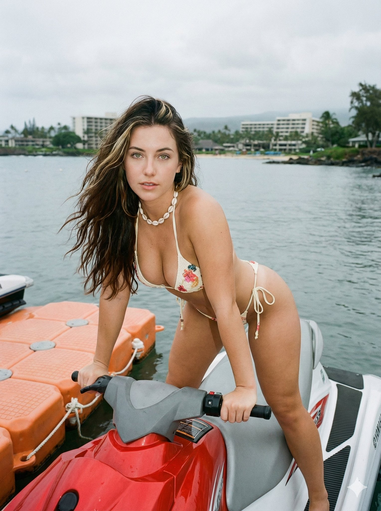

## A stylish woman taking a mirror selfie on a European cob

- ID: trending-2008755464318992444
- Slug: trending-2008755464318992444-en
- 语言: en
- 来源: [来源链接](https://x.com/iamsofiaijaz/status/2008755464318992444)
- 样例图路径: images/part1/2008755464318992444_1.jpg

### 提示词

```text
A stylish woman taking a mirror selfie on a European cobblestone street, wearing a brown tweed blazer, white shirt with a cream tie, wide-leg dark trousers, and brown leather shoes, accessorized with a brown newsboy cap and amber tinted aviator sunglasses, long dark wavy hair, holding a black smartphone in front of her face, vintage menswear inspired outfit, autumn color palette, cinematic street photography, shallow depth of field, soft natural light, background of old European buildings and pedestrians slightly blurred, high fashion editorial look, 35mm film style, realistic, high detail, muted tones, aesthetic composition.
```

### 样例图

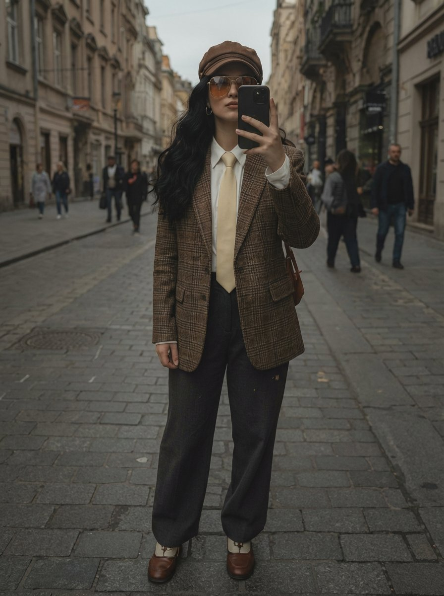

## { "file_metadata": { "filename": "sydney_sweeney_ae_camp

- ID: trending-2011034968127057975
- Slug: trending-2011034968127057975-en
- 语言: en
- 来源: [来源链接](https://x.com/BaharAzamm561/status/2011034968127057975)
- 样例图路径: images/part1/2011034968127057975_1.jpg

### 提示词

```text
{
  "file_metadata": {
    "filename": "sydney_sweeney_ae_campaign_collage.jpg",
    "category": "High-End Fashion Photography",
    "project": "American Eagle Denim Collection 2024",
    "talent": "Sydney Sweeney"
  },
  "visual_composition": {
    "layout_type": "4-Panel Asymmetrical Collage",
    "color_palette": {
      "primary": "Indigo Blue (Denim Wash)",
      "secondary": "Creamy White (Top & Background)",
      "accent": "Dusty Rose / Blush Pink (Butterfly Detail)",
      "vibe": "Warm, Nostalgic, Y2K Grunge"
    },
    "lighting": "Soft diffused studio light with warm highlight tones",
    "aesthetic_tags": ["Vintage Revival", "Baggy Silhouette", "Main Character Energy"]
  },
  "detailed_frame_analysis": {
    "panel_1_left": {
      "focus": "Full Body Silhouette",
      "pose": "Mirror selfie aesthetic with a slight lean",
      "outfit_details": {
        "top": "White ribbed racerback crop tank",
        "bottom": "Extra wide-leg low-rise indigo jeans",
        "footwear": "White pointed-toe stilettos",
        "accessories": "Delicate gold bracelets and a floral-patterned phone case"
      }
    },
    "panel_2_top_right": {
      "focus": "Beauty & Expression",
      "pose": "Reclined, looking directly into the lens",
      "styling": "Oversized denim jacket draped off-the-shoulder",
      "hair": "Center-parted blonde waves with natural volume",
      "makeup": "Minimalist 'Clean Girl' look with dewy skin"
    },
    "panel_3_bottom_center": {
      "focus": "Product Detail & Embroidery",
      "subject": "Denim back pocket",
      "features": [
        "Intricate pink and orange butterfly embroidery",
        "Pink leather brand patch with American Eagle logo",
        "Contrast stitching on heavy-duty denim fabric"
      ]
    },
    "panel_4_bottom_right": {
      "focus": "Style Statement",
      "pose": "Symmetrical crouched pose on a dark background",
      "outfit": "Full denim jumpsuit/set (Double Denim)",
      "mood": "Bold and confident"
    }
  },
  "garment_dna": {
    "fabric": "Non-stretch, premium weight cotton denim",
    "wash": "Medium indigo stone-wash with vintage fading",
    "fit_profile": "Loose, oversized, baggy, and low-slung waist"
  },
  "marketing_tags": {
    "target_audience": "Gen-Z and Millennial Fashion Seekers",
    "trending_hashtags": ["
    "alt_text": "A fashion collage of Sydney Sweeney for American Eagle showcasing wide-leg jeans with butterfly embroidery and a white crop top in various professional poses."
  }
}
```

### 样例图

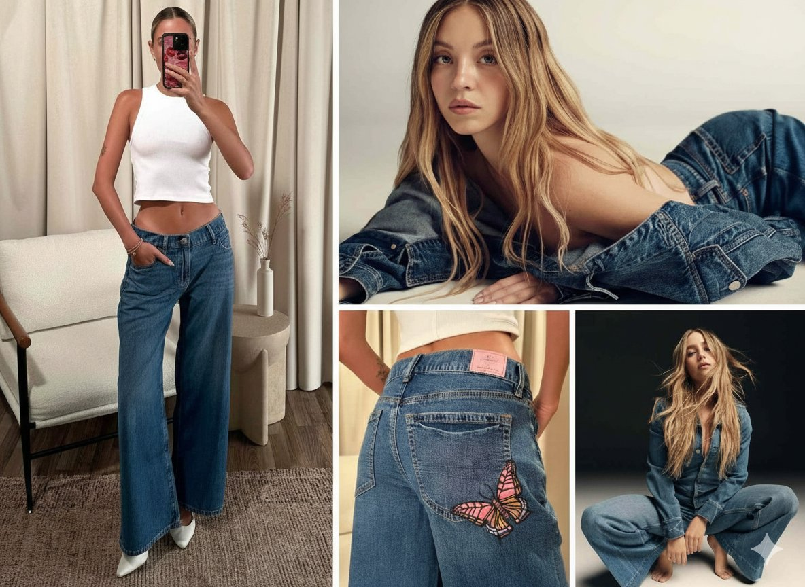

## Cinematic, ultra-realistic scene depicting Venezuelan op

- ID: trending-2012020162195857782
- Slug: trending-2012020162195857782-en
- 语言: en
- 来源: [来源链接](https://x.com/SindhuK66662473/status/2012020162195857782)
- 样例图路径: images/part1/2012020162195857782_1.jpg

### 提示词

```text
Cinematic, ultra-realistic scene depicting Venezuelan opposition leader María Corina Machado presenting her Nobel Peace Prize medal to Donald Trump. Machado stands with a calm yet determined expression, holding the Nobel medal as a symbol of hope and democracy. Trump receives it thoughtfully, set against a dignified indoor setting. In the background, subtle symbolism appears: softly blurred US and Venezuelan flags, a faint glow of light symbolizing freedom, and a distant crowd suggesting democratic aspirations. Mood is serious, historic, and hopeful. Professional lighting, shallow depth of field, high detail, photo-journalistic realism.”
```

### 样例图


## Gemini Nano Banana Pro Prompt: { "image_type": "photogra

- ID: trending-2008543000750948734
- Slug: trending-2008543000750948734-en
- 语言: en
- 来源: [来源链接](https://x.com/tabu_8114/status/2008543000750948734)
- 样例图路径: images/part1/2008543000750948734_1.jpg

### 提示词

```text
Gemini Nano Banana Pro

Prompt:

{ "image_type": "photograph", "genre": "casual portrait", "composition": { "framing": "close-up, chest-up portrait", "angle": "slightly tilted, camera held above eye level and angled downward", "orientation": "portrait with diagonal tilt", "subject_placement": "subject positioned slightly off-center, face occupying left-middle area", "crop": "tight crop with partial arm visible in foreground" }, "subject": { "count": 1, "gender_presentation": "female-presenting", "age_range": "young adult", "facial_features": { "skin_tone": "light, neutral-warm", "complexion": "clear, smooth with natural texture", "eyes": "light green/gray, almond-shaped", "eyebrows": "medium thickness, natural shape", "nose": "straight, small to medium", "lips": "natural pink, closed-mouth slight smile" }, "hair": { "color": "dark brown", "length": "long", "style": "straight, tucked behind ear on one side", "part": "slight side part" }, "expression": "soft, relaxed, friendly", "gaze": "looking directly into camera", "accessories": [ "small silver stud earrings" ], "clothing": { "type": "sports jersey", "fit": "loose athletic fit", "color": "white with black accents", "details": [ "black collar trim", "black logos and text", "shield-style emblem on chest", "large curved black graphic text" ] } }, "lighting": { "type": "natural light", "direction": "side/front light from window", "quality": "soft, diffused", "shadows": "minimal, gentle", "highlights": "subtle skin highlights on cheek and forehead" }, "color_palette": { "dominant_colors": [ "white", "soft gray", "black" ], "accent_colors": [ "natural skin tones", "brown hair" ], "overall_tone": "neutral, clean, airy" }, "background": { "setting": "indoor", "elements": [ "sheer white curtains", "window frame partially visible" ], "depth_of_field": "moderate, background slightly soft but recognizable", "style": "minimalist, uncluttered" }, "technical_details": { "camera_type": "DSLR", "focal_length_equivalent": "wide-angle selfie lens", "resolution": "high", "sharpness": "sharp focus on face", "noise": "minimal", "white_balance": "neutral" }, "artistic_style": { "aesthetic": "clean, natural, lifestyle", "retouching": "very minimal, natural skin texture preserved", "mood": "calm, approachable, casual" }, "typography": { "presence": true, "location": "on jersey", "style": "bold sans-serif sports branding", "color": "black", "readability": "partially visible due to crop" } }
```

### 样例图

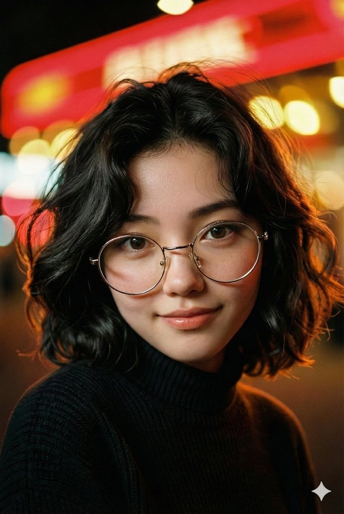

## Don’t watch the clock; do what it does. Keep going. Gemi

- ID: trending-2010284583028486414
- Slug: trending-2010284583028486414-en
- 语言: en
- 来源: [来源链接](https://x.com/oye_samia/status/2010284583028486414)
- 样例图路径: images/part1/2010284583028486414_1.jpg

### 提示词

```text
Don’t watch the clock; do what it does. Keep going.

Gemini Nano Banana Pro + Grok imagine.

Prompt ⤵️ 

Create a cinematic black‑and‑white editorial fashion photograph featuring a young woman sitting confidently on a simple wooden stool in an open, slightly wild grassy field, with a powerful black horse standing closely behind her. She holds the horse’s reins loosely in one hand, exuding quiet control. The woman wears a dark oversized luxury blazer, straight‑cut trousers, leather boots, minimal jewelry, sunglasses, and has her head slightly tilted down with a calm, introspective, dominant yet relaxed expression.

Use a minimalist composition with strong negative space, high‑contrast monochrome tones, and soft natural daylight. Apply a shallow depth of field to blur the empty rural landscape (no buildings, only textured grass with distant blur). Capture an editorial luxury fashion vibe with a moody, poetic atmosphere, sharp details, subtle film grain texture, and dramatic shadows in a Vogue‑style photography style. Shoot with an 85mm lens for cinematic realism.
```

### 样例图

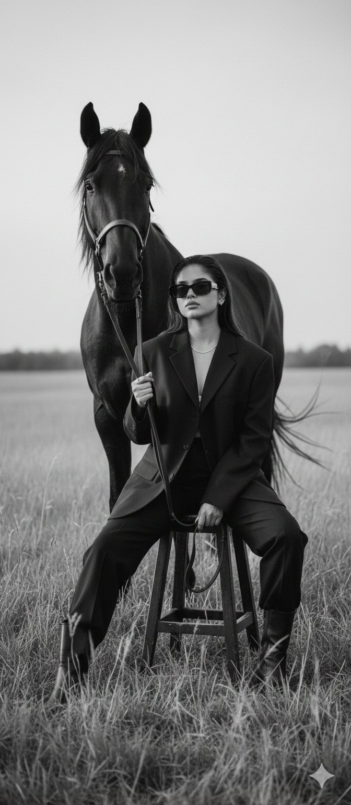

## the only thing i need to become a black swan is the nano

- ID: trending-2009326322594795979
- Slug: trending-2009326322594795979-en
- 语言: en
- 来源: [来源链接](https://x.com/nilisty/status/2009326322594795979)
- 样例图路径: images/part1/2009326322594795979_1.jpg

### 提示词

```text
the only thing i need to become a black swan is the nano banana pro.

{
  "scene_type": "nighttime flash portrait on stone steps, backless black dress, platinum ponytail, over-shoulder glance",

  "camera_perspective": {
    "pov": "photographer standing above and behind her",
    "angle": "shooting DOWN at her from above, she's looking UP and back",
    "distance": "medium shot - from hips up, back fully visible",
    "framing": "4:5 vertical, she fills lower portion, stone steps fill background",
    "height": "elevated above subject, creating looking-down angle"
  },

  "subject": {
    "action": "sitting on stone steps, back to camera, looking back over RIGHT shoulder up at photographer",
    
    "pose": {
      "overall_position": "SEATED on stone steps, back facing camera, twisted to look back",
      
      "body_angle": {
        "orientation": "back to camera - approximately 170 degrees away",
        "twist": "upper body twisted RIGHT to look back over shoulder",
        "seated": "sitting on step, weight on hips"
      },
      
      "back": {
        "visibility": "ENTIRE BACK EXPOSED - from shoulders to lower back",
        "state": "smooth, toned, tanned, the focal point",
        "spine": "visible line down center, thin dress string following it",
        "shoulder_blades": "visible, elegant muscle definition",
        "lower_back": "visible almost to top of butt, dress sits very low"
      },
      
      "upper_body": {
        "shoulders": "bare, tanned, smooth",
        "posture": "elegant, slight twist from looking back"
      },
      
      "arms": {
        "position": "in front of body, not visible from this angle",
        "hands": "possibly resting on steps or in lap, hidden from view"
      },
      
      "head_and_neck": {
        "turn": "looking back over RIGHT shoulder",
        "rotation": "significant twist - approximately 120 degrees from body",
        "chin": "slightly lifted, looking up at camera above",
        "neck": "elongated, elegant line, halter strap visible"
      },
      
      "overall": "classic over-shoulder seated pose, maximum back exposure"
    },
    
    "expression": {
      "eyes": {
        "color": "GREEN/HAZEL - striking, catching flash light",
        "direction": "looking UP at camera, direct eye contact",
        "state": "soft but focused, slightly intense, engaged",
        "energy": "confident, knowing, 'I know you're looking'"
      },
      "mouth": {
        "lips": "full, natural pink with slight gloss",
        "expression": "relaxed, soft slight pout, mouth closed",
        "state": "natural, subtle"
      },
      "brows": "natural, groomed, soft arch",
      "overall": "soft sultry confidence, the over-shoulder smolder"
    },

    "physical": {
      "age": "early 20s",
      
      "face": {
        "structure": "model features, high cheekbones, defined jaw, symmetrical",
        "shape": "oval, balanced",
        "skin": "flawless, glowing, tanned",
        "makeup": "natural/soft glam - subtle bronzer, soft brows, natural lip"
      },
      
      "body": {
        "type": "slim, toned, lean",
        "back": {
          "visibility": "FULLY EXPOSED - the main feature",
          "state": "smooth, toned, athletic definition",
          "tan": "even golden tan"
        },
        "shoulders": "narrow, feminine, toned",
        "skin_tone": "TANNED/BRONZED - golden, sun-kissed"
      },
      
      "hair": {
        "color": "PLATINUM BLONDE - very light, white-blonde, icy",
        "style": "HIGH PONYTAIL - messy, textured",
        "details": {
          "position": "high on crown of head",
          "texture": "messy, piece-y, textured waves",
          "volume": "voluminous, full, movement",
          "pieces": "some loose strands around face and nape"
        },
        "roots": "slightly darker roots visible, natural",
        "length": "long ponytail reaching mid-back",
        "state": "styled messy, intentionally undone, editorial texture",
        "vibe": "high fashion messy ponytail, effortful effortlessness"
      },
      
      "skin": {
        "tone": "golden tan, bronzed, warm",
        "state": "glowing, smooth, catching flash beautifully",
        "back": "flawless, even tan, highlight on shoulder blades"
      }
    },

    "outfit": {
      "dress": {
        "type": "BACKLESS HALTER DRESS/TOP",
        "color": "BLACK - solid, deep black",
        "material": {
          "type": "likely satin or similar",
          "finish": "slight sheen, elegant drape"
        },
        "construction": {
          "neckline": "HALTER - ties around neck",
          "neck_strap": "thin STRING tie at back of neck",
          "back": {
            "style": "COMPLETELY BACKLESS - extreme open back",
            "depth": "opens to LOWER BACK, almost to top of butt",
            "coverage": "essentially none on back"
          },
          "spine_detail": {
            "type": "single thin STRING running down spine",
            "path": "from neck tie down center of back to lower back/waist",
            "effect": "minimal connection, emphasizes naked back"
          },
          "front": "presumably covered, not visible in shot"
        },
        "fit": {
          "back": "completely open, skin fully exposed",
          "waist": "dress begins at very low back/upper hip",
          "skirt": "appears to flow from low waist"
        },
        "effect": "maximum skin showing while technically dressed"
      }
    }
  },

  "environment": {
    "setting": "outdoor STONE STEPS at NIGHT",
    "location_type": "possibly museum, monument, fancy building entrance, European architecture",
    
    "steps": {
      "material": "STONE - limestone or similar, large format",
      "color": "BEIGE/TAN/CREAM - warm neutral stone color",
      "texture": "smooth, weathered, some natural variation",
      "pattern": "large rectangular slabs",
      "state": "clean, architectural"
    },
    
    "background": {
      "main": "stone steps continuing up behind her",
      "foliage": "dark greenery/plants visible in upper left corner",
      "depth": "steps create leading lines toward camera"
    },
    
    "lighting": {
      "type": "CAMERA FLASH - direct, harsh, nighttime",
      "time": "NIGHT - dark ambient, flash illuminating subject",
      "quality": "hard flash light, typical night photography",
      "effect": {
        "on_subject": "brightly lit, glowing skin, highlights on back",
        "on_background": "stone steps illuminated, slight falloff",
        "shadows": "minimal on subject (front-lit), some behind"
      },
      "contrast": "flash-lit subject against darker night environment",
      "color_temperature": "flash is neutral/cool, skin reads warm"
    },
    
    "atmosphere": "nighttime outdoor, European/architectural, date night vibes"
  },

  "color_story": {
    "palette_name": "Blonde on Black on Stone at Night",
    
    "dominant": {
      "beige_stone": "steps/background - warm neutral, 50%",
      "black_dress": "her outfit - deep black, contrast"
    },
    
    "subject_colors": {
      "platinum_hair": "very light blonde, almost white - bright against dark",
      "tanned_skin": "golden bronze - warm, glowing",
      "green_eyes": "striking color pop"
    },
    
    "contrast": {
      "hair_vs_dress": "platinum blonde against black = high contrast",
      "skin_vs_dress": "tan skin against black = beautiful definition",
      "subject_vs_background": "lit subject against darker surroundings"
    },
    
    "temperature": "warm tones (skin, stone) with cool flash light"
  },

  "photography_technical": {
    "type": "flash portrait, nighttime outdoor",
    "lighting": "ON-CAMERA or OFF-CAMERA FLASH",
    
    "aspect_ratio": "4:5 vertical",
    
    "composition": {
      "subject": "lower center of frame, looking up",
      "background": "steps filling upper portion",
      "angle": "shot from above looking down",
      "leading_lines": "step edges lead to subject"
    },
    
    "focus": {
      "focal_point": "sharp on face and back",
      "depth_of_field": "moderate, background slightly soft"
    },
    
    "exposure": {
      "subject": "well-exposed from flash",
      "ambient": "darker, night time",
      "style": "flash-forward night photography"
    }
  },

  "narrative": {
    "story": "night out, sitting on steps outside fancy venue, someone captures the moment from above",
    "mood": "confident, elegant, 'caught looking back' moment",
    "context": "date night? event? European vacation? the dress is the story"
  },

  "vibe": {
    "core": "platinum ponytail in backless black dress, sitting on stone steps at night, flash photo looking back",
    "energy": "elegant confidence, old money night out, main character moment",
    "mood": "sophisticated, sultry, intentional",
    "aesthetic": "European night out, editorial flash, fashion moment",
    "temperature": "warm skin against cool night",
    "caption_energy": "'🖤' or location tag or 'night' or no caption"
  },

  "what_makes_it_hit": {
    "the_back": "fully exposed back is THE shot - skin is the star",
    "the_dress_detail": "thin string down spine = minimal coverage, maximum impact",
    "the_over_shoulder": "classic pose, direct eye contact, engaging",
    "the_ponytail": "high messy platinum = editorial, effortless glamour",
    "the_tan": "golden skin against black dress = beautiful contrast",
    "the_stone_steps": "architectural setting elevates from basic to editorial",
    "the_flash": "night flash aesthetic = raw, real, elevated party photo",
    "the_angle": "shot from above = interesting perspective, shows full back"
  },

  "recreation_critical_requirements": {
    "MUST_HAVE": [
      "PLATINUM BLONDE hair - very light, white-blonde",
      "HIGH MESSY PONYTAIL - textured, voluminous, pieces escaping",
      "GREEN/HAZEL eyes",
      "TANNED/BRONZED skin - golden, glowing",
      "BLACK BACKLESS HALTER DRESS/TOP",
      "VERY LOW BACK - open to lower back, almost to butt",
      "THIN STRING tie at neck (halter)",
      "THIN STRING running down SPINE from neck to lower back",
      "ENTIRE BACK EXPOSED - shoulders to lower back visible",
      "SEATED on STONE STEPS - beige/tan colored",
      "Back to camera, looking over RIGHT SHOULDER up at camera",
      "NIGHTTIME setting",
      "FLASH PHOTOGRAPHY lighting",
      "Shot from ABOVE looking down at her",
      "4:5 vertical aspect ratio"
    ],
    
    "pose_exact": "seated on steps, back to camera, looking over right shoulder up at photographer above",
    "dress_exact": "black halter with thin string neck tie and single thin string down exposed spine, extremely low open back",
    "hair_exact": "platinum blonde high messy ponytail, voluminous, textured, pieces loose",
    "lighting_exact": "direct flash at night, subject illuminated against darker surroundings",
    "setting_exact": "outdoor stone/limestone steps, architectural, nighttime"
  }
}
```

### 样例图

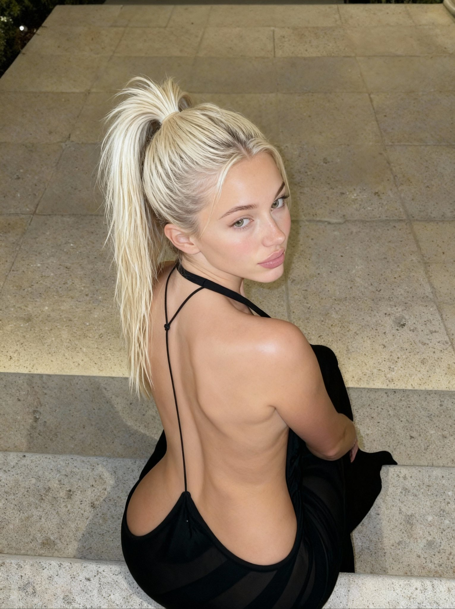

## When pop aesthetics meet confidence… this is the vibe 💗

- ID: trending-2011431932622668165
- Slug: trending-2011431932622668165-en
- 语言: en
- 来源: [来源链接](https://x.com/Ankit_patel211/status/2011431932622668165)
- 样例图路径: images/part1/2011431932622668165_1.jpg

### 提示词

```text
When pop aesthetics meet confidence… this is the vibe 💗📺

Would you dare to pull off this look? 💭✨

Gemini Nano Banana 🍌

{
  "type": "image_generation_prompt",
  "style": "ultra_realistic_fashion_editorial",
  "composition": {
    "camera": "studio photograph",
    "lighting": "clean studio lighting",
    "focus": "sharp focus",
    "resolution": "high resolution",
    "aesthetic": "modern pop",
    "color_palette": "vibrant pastels",
    "mood": "cinematic"
  },
  "background": {
    "type": "solid",
    "color": "pastel blue"
  },
  "subject": {
    "gender": "female",
    "appearance": {
      "hair": "long straight dark hair",
      "makeup": "glossy makeup with soft pink blush highlighted cheekbones bold eye makeup"
    },
    "attire": {
      "top": "fitted white sleeveless crop top",
      "bottom": "high waisted pink pleated mini skirt",
      "accessories": [
        "gold hoop earrings",
        "layered gold chain necklace"
      ]
    },
    "pose": {
      "position": "leaning forward",
      "interaction": "resting arms casually on a retro CRT television",
      "expression": "confident",
      "action": "blowing a translucent pink bubblegum bubble"
    }
  },
  "props": {
    "television": {
      "type": "retro CRT TV",
      "screen_content": "mirrored image of the same woman posing against a pink background",
      "effect": "dual reality visual concept"
    }
  },
  "style_tags": [
    "photorealistic",
    "fashion editorial",
    "cinematic composition",
    "creative concept",
    "pastel aesthetic"
  ]
}
```

### 样例图

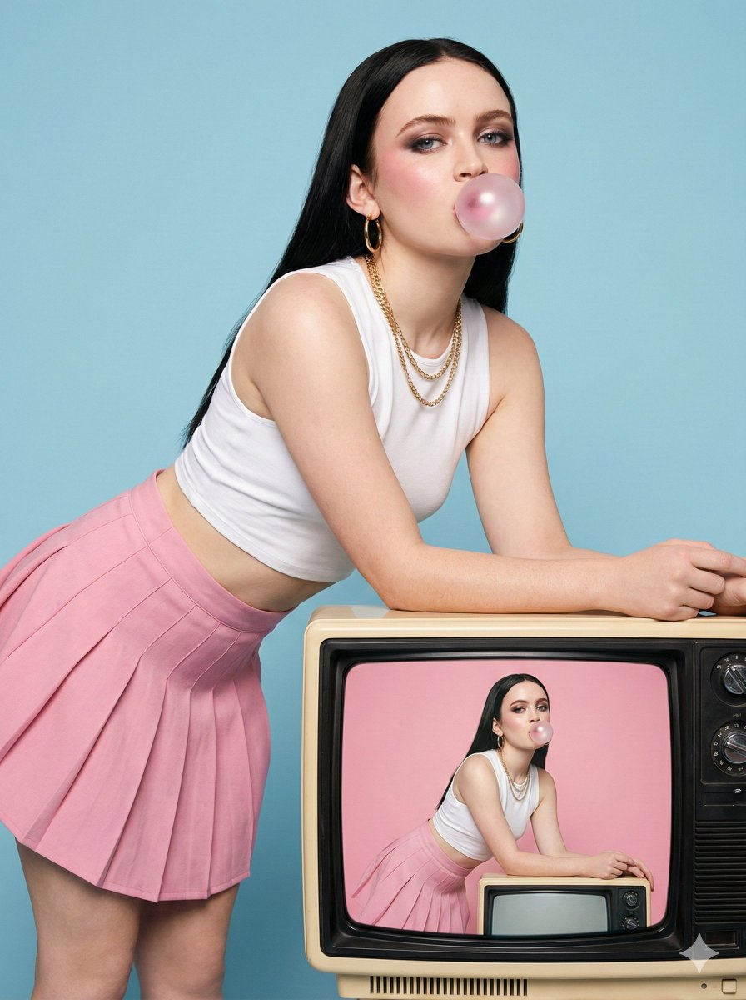

## Good Night X Fam ♥️ ☆ Sexy & Hot Virgin Young Lady in ow

- ID: trending-2011092169608872101
- Slug: trending-2011092169608872101-en
- 语言: en
- 来源: [来源链接](https://x.com/SandipSharmaEng/status/2011092169608872101)
- 样例图路径: images/part1/2011092169608872101_1.jpg

### 提示词

```text
Good Night X Fam ♥️ 

☆ Sexy & Hot Virgin Young Lady in own luxury bedroom.

☆ The one who takes it in the arms will be golden tonight.

☆ Gemini Nano Banana Presenting this beautiful images.

☆ I love you all X creators 

☆ Genuine Prompt here:-

{
  "scene": {
    "type": "bedroom_interior",
    "lighting": "soft natural morning daylight, diffused through blinds",
    "atmosphere": "cozy, intimate, serene domestic"
  },
  "subject": {
    "appearance": {
      "hair": "voluminous dark brown hair, soft waves, slightly tousled over one shoulder",
      "face": "warm olive complexion, high cheekbones, full natural lips, expressive brown eyes",
      "expression": "gentle, confident smile, soft direct eye contact",
      "makeup": "dewy natural glow, subtle rosy blush, nude matte lips"
    },
    "pose": {
      "position": "lying prone (on stomach) on a bed",
      "orientation": "facing the camera",
      "arms": "resting on forearms, right hand gently touching hair near the temple",
      "legs": "knees bent with feet raised and ankles casually crossed",
      "perspective": "high-angle selfie point of view"
    },
    "attire": {
      "top": "coral pink ribbed tank top with thin straps",
      "bottom": "matching coral pink lounge shorts with ruffled edges",
      "accessories": "white crew socks pulled up"
    }
  },
  "environment": {
    "bedding": "crisp white rumpled sheets and fluffy white duvet",
    "background": {
      "elements": [
        "two large windows with white horizontal blinds",
        "floral accent pillows with pink and green patterns",
        "small side table with a pink mug and various skincare bottles",
        "potted green plant providing a touch of color"
      ],
      "focus": "soft bokeh background for depth of field"
    }
  },
  "photography": {
    "style": "hyperrealistic instagram-style selfie",
    "technical": {
      "detail": "ultra-sharp skin texture, visible pores, natural lighting highlights",
      "framing": "medium close-up, 4:5 aspect ratio",
      "quality": "8k resolution, photorealistic"
    }
  }
}

Thanku so much🙏
```

### 样例图

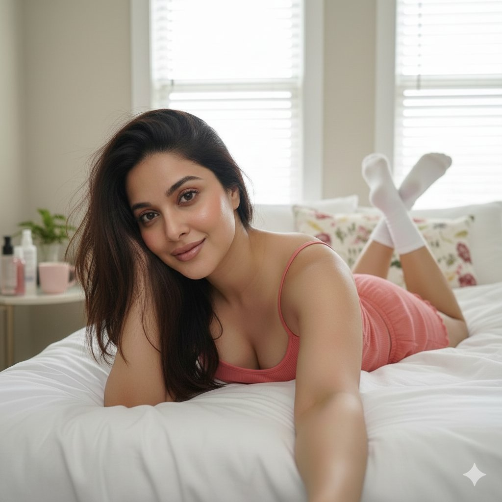

## Gemini Nano Banana Pro 3.0 🍌 Prompt: { "image_descripti

- ID: trending-2011264537450987944
- Slug: trending-2011264537450987944-en
- 语言: en
- 来源: [来源链接](https://x.com/JadoonKhan281/status/2011264537450987944)
- 样例图路径: images/part1/2011264537450987944_1.jpg

### 提示词

```text
Gemini Nano Banana Pro 3.0  🍌

Prompt: 

{
  "image_description": {
    "subject": {
      "person": "A slender blonde woman with long hair, wearing a sheer, shimmering gold mesh mini dress with thin spaghetti straps and a vertical gold zipper detail.",
      "accessories": "Layered gold necklaces, gold bracelets, and metallic gold high-heeled sandals.",
      "pose": "Standing elegantly in front of a luxury car, legs crossed at the ankles, looking directly at the camera."
    },
    "vehicle": {
      "type": "A sleek, modern white supercar with gold accents.",
      "details": "High-gloss white paint, metallic gold rims, gold trim around the windows, and low-profile body styling."
    },
    "environment": {
      "location": "A bright, high-end luxury car showroom.",
      "lighting": "Clean, architectural indoor lighting with soft reflections on the polished white floor.",
      "background": "Large floor-to-ceiling glass windows showing other vehicles in a blurred outdoor setting."
    },
    "technical_style": {
      "composition": "Full-body shot, eye-level angle, centered subject.",
      "aesthetic": "High-fashion photography, photorealistic, sharp focus on the subject with a shallow depth of field (bokeh) in the background.",
      "color_palette": "Dominant white and gold, with neutral grey and black architectural tones."
    }
  }
}
```

### 样例图

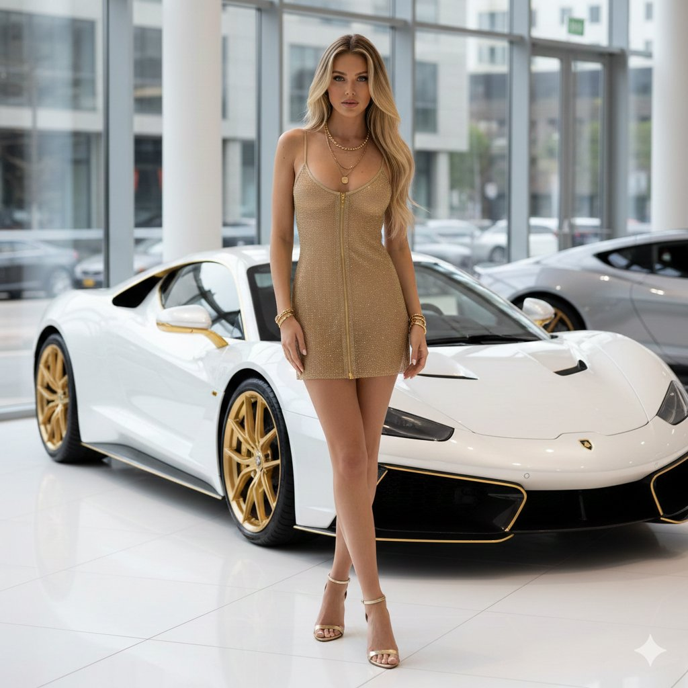

## { "image_style": { "type": "photorealistic", "aesthetic"

- ID: trending-2012337157617455596
- Slug: trending-2012337157617455596-en
- 语言: en
- 来源: [来源链接](https://x.com/TheNewz_816/status/2012337157617455596)
- 样例图路径: images/part1/2012337157617455596_1.jpg

### 提示词

```text
{
  "image_style": {
    "type": "photorealistic",
    "aesthetic": "Instagram shot",
    "effects": [
      "film grain",
      "direct flash"
    ]
  },
  "composition": {
    "framing": "waist-up photograph",
    "aspect_ratio": "9:16"
  },
  "subject": {
    "description": " woman Sydney Sweeney",
    "constraint_note": "do not alter the sensitivity of the face and features",
    "pose": {
      "orientation": "facing the camera directly",
      "head": "tilted slightly to the side",
      "eyes": "closed",
      "action": "covering her face with her hand, pulling her elbow away and lifting it to the side",
      "mood": [
        "elegant",
        "pensive",
        "playful"
      ]
    },
    "appearance": {
      "attire": [
        "black velvet corset",
        "expensive black cape"
      ],
      "hair": "loose",
      "makeup": {
        "style": "nude",
        "lipstick": "matte nude"
      },
      "details": [
        "décolletage highlighted",
        "long, square black nails"
      ]
    }
  },
  "setting": {
    "background": "white wall",
    "foreground_elements": "art object placed in front of the wall"
}
 }
```

### 样例图

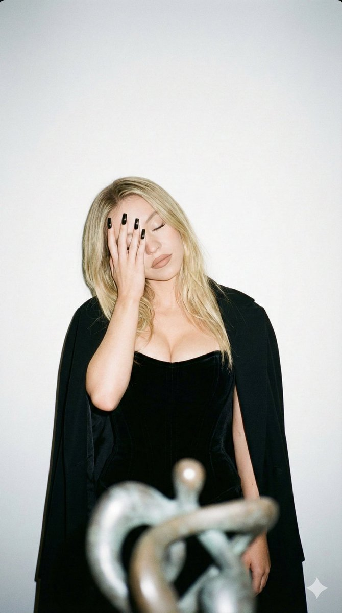

## Gemini Nano Banana Pro Prompt: { "image_type": "photogra

- ID: trending-2009625504597561668
- Slug: trending-2009625504597561668-en
- 语言: en
- 来源: [来源链接](https://x.com/tabu_8114/status/2009625504597561668)
- 样例图路径: images/part1/2009625504597561668_1.jpg

### 提示词

```text
Gemini Nano Banana Pro

Prompt:

{ "image_type": "photograph", "genre": "urban lifestyle portrait", "composition": { "framing": "three-quarter body portrait", "angle": "eye-level, straight-on", "orientation": "portrait", "subject_placement": "subject positioned slightly right of center", "background_balance": "large-scale mural occupying left background", "visual_hierarchy": "foreground subject emphasized against graphic mural backdrop" }, "subject": { "count": 1, "gender_presentation": "female-presenting", "age_range": "young adult", "facial_features": { "skin_tone": "light, neutral", "complexion": "smooth with natural texture", "eyes": "light-colored", "eyebrows": "full, softly shaped", "nose": "straight, proportional", "lips": "natural pink, smiling with teeth slightly visible" }, "hair": { "color": "medium brown", "length": "shoulder-length", "style": "loose waves", "part": "center part" }, "expression": "playful, cheerful", "gaze": "directed toward camera", "pose": { "stance": "relaxed, casual", "hands": "one hand holding a drink cup, other supporting straw" }, "accessories": [ "clear plastic cup with lid and straw" ], "clothing": { "top": "oversized t-shirt", "color": "White", "bottom": "black lounge pants", "fit": "loose, relaxed streetwear", "style": "casual, modern" } }, "lighting": { "type": "natural daylight", "direction": "diffuse frontal light", "quality": "soft, even", "shadows": "minimal, low contrast", "highlights": "subtle highlights on face and hair" }, "color_palette":#AmulProteinWPL { "dominant_colors": [ "white", "gray", "yellow" ], "accent_colors": [ "cherry beverage", "black mural outlines" ], "overall_tone": "urban, contemporary, playful" }, "background": { "setting": "outdoor urban space", "environment": "city courtyard or alley", "elements": [ "large monochrome mural portrait of Elon Musk with yellow graphic accents", "modern building facades", "metal railing", "stone or concrete pavement" ], "style": "street art–influenced", "depth_of_field": "deep, background clearly visible" }, "technical_details": { "camera_type": "smartphone camera", "focal_length_equivalent": "standard wide lens", "sharpness": "high overall sharpness", "noise": "low", "dynamic_range": "balanced highlights and shadows", "white_balance": "neutral" }, "artistic_style": { "aesthetic": "urban lifestyle, social media–ready", "retouching": "minimal, natural appearance", "mood": "fun, relaxed, youthful", "contrast": "moderate with strong graphic background" }, "typography": { "presence": false } }
```

### 样例图

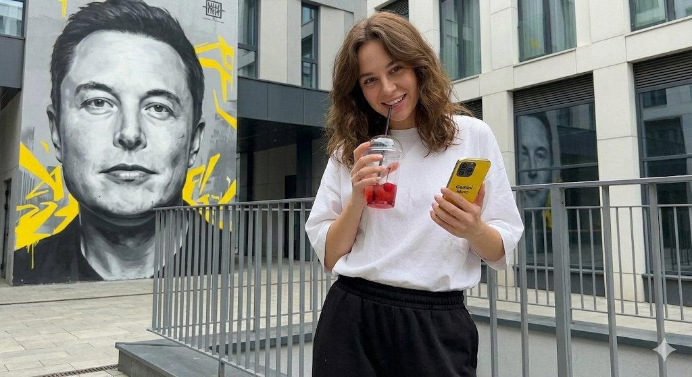

## Good Afternoon X Fam ♥️ Ana de Armas Sydney Sweeney Sadi

- ID: trending-2011716046915584445
- Slug: trending-2011716046915584445-en
- 语言: en
- 来源: [来源链接](https://x.com/SandipSharmaEng/status/2011716046915584445)
- 样例图路径: images/part1/2011716046915584445_1.jpg

### 提示词

```text
Good Afternoon X Fam ♥️ 

Ana de Armas
Sydney Sweeney
Sadie Sink
Indian Lady

Gemini Nano Banana Presenting

Prompt:-

{
  "subject": {
    "person": "Ek sundar mahila jiske lambe, ghane, aur wavy kaale baal hain.",
    "expression": "Shaant aur pur-aitmaad (confident) expression, aankhen seedhe camera ki taraf.",
    "clothing": "Ek luxurious deep red silk ya satin ka sleeveless evening gown, jisme v-neckline hai.",
    "pose": "Bed par ek taraf jhuk kar (reclining) leti hui hai, haath aaram se aage ki taraf rakha hua."
  },
  "setting": {
    "location": "Ek bohot hi bada aur luxurious classic-style bedroom.",
    "furniture": [
      {
        "item": "Canopy bed",
        "details": "Sone ka (gold) ornate headboard aur upar ek bada beige fabric ka canopy drape."
      },
      {
        "item": "Dressing table",
        "details": "Gold-trimmed vanity table jiske upar perfumes, crystal bottles, aur laal gulab ka guldasta rakha hai."
      },
      {
        "item": "Rug",
        "details": "Zameen par ek intricate blue aur gold pattern wala traditional Persian ya Oriental rug."
      }
    ],
    "lighting": "Warm aur soft lighting. Ek chandelier upar hai aur bed ke side mein ek elegant lamp jal raha hai.",
    "background": "Khidki se bahar shehar ki raushni (city skyline at night) dikhayi de rahi hai."
  },
  "aesthetic": {
    "color_palette": ["Deep Red", "Gold", "Cream", "Royal Blue", "Emerald Green"],
    "mood": "Opulent, elegant, sophisticated aur cozy.",
    "photography_style": "High-end fashion photography, sharp focus on the subject, soft bokeh in the background."
  }
}
```

### 样例图

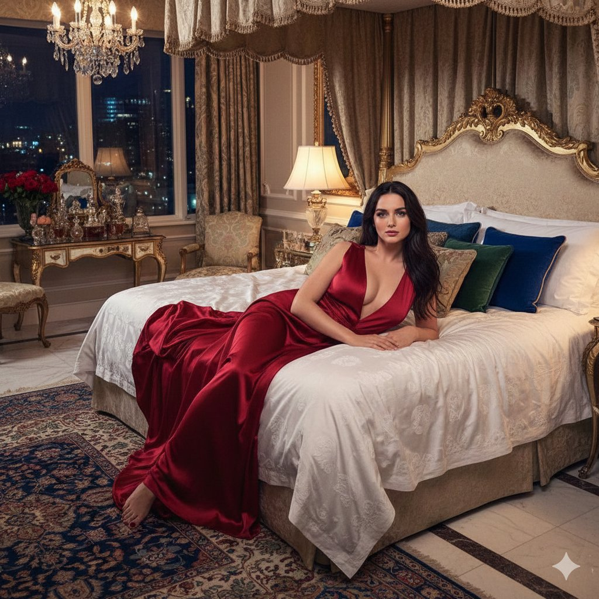

## A cinematic, ultra realistic post apocalyptic scene of a

- ID: trending-2011669368787345614
- Slug: trending-2011669368787345614-en
- 语言: en
- 来源: [来源链接](https://x.com/harboriis/status/2011669368787345614)
- 样例图路径: images/part1/2011669368787345614_1.jpg

### 提示词

```text
A cinematic, ultra realistic post apocalyptic scene of a lone survivor sitting on the forest ground, leaning against an abandoned, rusted old car with broken windows and peeling paint. The survivor is wearing a dark olive green hooded protective suit with visible fabric folds and dirt stains, heavy boots, gloves, and a full face gas mask with round glass lenses and dual side filters. The survivor is sitting with knees bent, one hand near the mask as if thinking, body slightly slouched, giving a feeling of exhaustion and solitude.
The environment is a dense, overgrown forest in late autumn, with dry orange, brown, and golden leaves covering the ground and hanging on thin branches. The background trees are tall and thin with dark trunks, softly blurred by shallow depth of field. Small plants, twigs, and fallen leaves fill the foreground creating a natural frame.
Color palette is muted and cinematic: deep olive greens, rusty browns, burnt orange leaves, dark greys, faded blue metal on the car, and soft warm highlights mixed with cool shadow tones. Lighting is soft and diffused, as if coming from an overcast sky, with gentle warm light touching the leaves and the subject, and cooler shadows in the background. Slight film grain, cinematic contrast, moody and atmospheric tone.
Camera is low angle, medium full body shot, subject placed slightly off center, 35mm lens look, shallow depth of field, realistic textures, high detail, soft background blur, subtle vignette. The atmosphere feels quiet, abandoned, melancholic, and tense, like the world has ended and nature is slowly taking over.
```

### 样例图

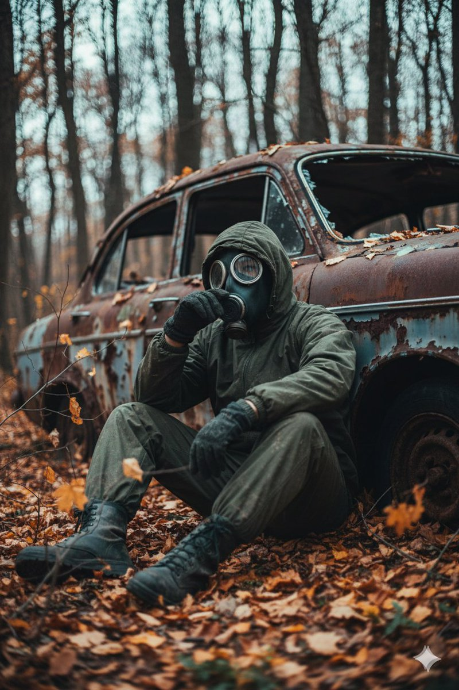

## Sometimes I want to stay alone away from the Chaos of Ci

- ID: trending-2011114481015795906
- Slug: trending-2011114481015795906-en
- 语言: en
- 来源: [来源链接](https://x.com/PiyariArisha/status/2011114481015795906)
- 样例图路径: images/part1/2011114481015795906_1.jpg

### 提示词

```text
Sometimes I want to stay alone away from the Chaos of City life 

The Realism by gemini nano banana 
Prompt 👇

Wide shot, subject acts as an anchor against a raging wind. Standing on a jagged black rock coastline, waves crashing behind in a gray blur. The subject leans forward against the gale. Outfit is a massive, shapeless layers of raw beige wool and distressed knitwear, creating a silhouette that looks like a eroding sculpture. Lighting is overcast, flat, and moody. Desaturated palette, muted earth tones, sharp texture on the fabric, cinematic anamorphic lens.

Negative Prompt: Sunny beach, vacation vibes, swimsuit, smiling, blue sky, vibrant colors, calm water, generic travel photography, face distortion.
```

### 样例图

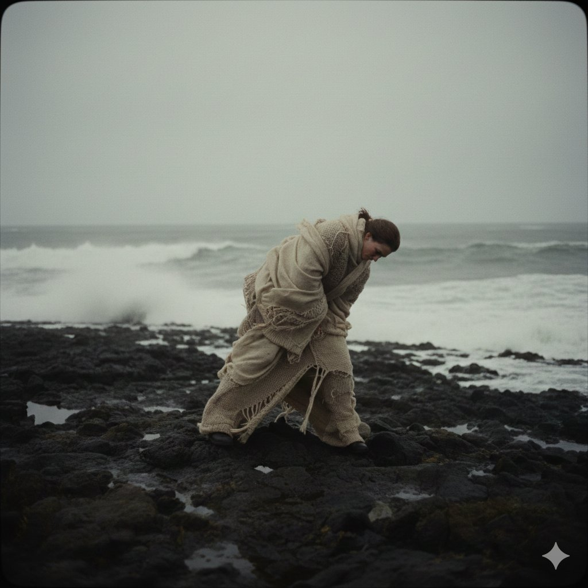

## { "image_generation_parameters": { "aspect_ratio": "9:16

- ID: trending-2012238711275057344
- Slug: trending-2012238711275057344-en
- 语言: en
- 来源: [来源链接](https://x.com/PinodiArt/status/2012238711275057344)
- 样例图路径: images/part1/2012238711275057344_1.jpg

### 提示词

```text
{
  "image_generation_parameters": {
    "aspect_ratio": "9:16",
    "subject_description": {
      "character": "A stunning young woman with long, sleek dark hair fanned out across white pillows. She has a soft, confident smile and is wearing stylish black rectangular sunglasses.",
      "apparel": "She is wearing a white ribbed-knit tube top that shows detailed fabric texture and a pair of minimalist black bikini bottoms.",
      "accessories": "A delicate thin black choker necklace with a tiny pendant is visible on her neck. Her nails are manicured with a light, neutral polish.",
      "pose": "Lying flat on her back on a bed, viewed from a high-angle 'selfie' perspective. Her right arm is extended toward the camera, creating a sense of depth. Her legs are slightly bent at the knees, resting on the bed."
    },
    "environment_and_composition": {
      "setting": "A dimly lit bedroom at night. The bed has rumpled white cotton sheets and soft pillows that catch the light and shadow.",
      "background_elements": "In the soft-focus background, a dark wooden bed frame and several posters/polaroids are pinned to a dimly lit wall, adding a personal, lived-in atmosphere.",
      "foreground_objects": "A black television remote control lies on the white sheets next to her leg, adding to the casual, candid nature of the shot."
    },
    "technical_style": {
      "lighting": "Harsh direct flash photography style, reminiscent of a late-night smartphone capture. This creates high contrast, bright highlights on the skin and clothing, and deep, sharp shadows behind the subject.",
      "camera_settings": "Shot on a high-end mobile camera, f/1.8 aperture for slight background blur, high ISO resulting in a subtle, aesthetic film grain.",
      "image_quality": "Ultra-photorealistic, 8k resolution, highly detailed skin pores, visible fabric fibers, cinematic composition, hyper-detailed textures, RAW photo quality."
    },
    "negative_prompt": "cartoon, drawing, anime, low quality, distorted face, extra fingers, deformed hands, blurry, low resolution, watermark, text, signature, bright daylight, overhead ceiling light."
  }
}
```

### 样例图

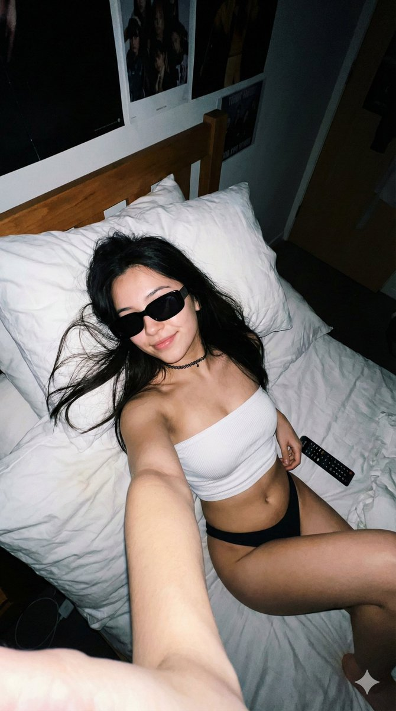

## 橙红渐变中的孤独剪影

- ID: case-273
- Slug: case-273-zh
- 语言: zh
- 来源: [来源链接](https://x.com/iam_miharbi/status/2045151354679665101)
- 样例图路径: images/part2/case273.jpg

### 提示词

```text
[中文]
生成一张电影级极简肖像，一个孤独的男人站在强烈的橙色到红色渐变环境中，强烈的剪影光，深邃的阴影对比，反光的光滑地面，对称构图，极简

[English]
Generate a cinematic minimal portrait of a solitary man standing in an intense orange to red gradient environment, strong silhouette lighting, deep shadow contrast, reflective glossy floor, symmetrical composition, minimal
```

### 样例图


## 1. Using the attached image as a motif, we generated a d

- ID: gpt4o-1048-en-1
- Slug: prompt-1048-en-1
- 语言: en
- 来源: [来源链接](https://x.com/BubbleBrain/status/2007062194702155835)
- 样例图路径: images/part3/1048.jpeg

### 提示词

```text
1. Using the attached image as a motif, we generated a difference image of a woman's face with lipstick and glossy lips. The image consists of four scenes divided into a 2x2 grid. 

2. A 2x2 grid cinematic photo collage. Four close-up portraits of the same beautiful Korean woman, creating an emotional narrative sequence.

Top-left panel: Cold and aloof expression, staring directly at the camera, high fashion vibe.
Top-right panel: A playful wink and a subtle smirk, looking side-glance.
Bottom-left panel: Biting lower lip, looking shy and slightly flirtatious, soft gaze.
Bottom-right panel: A genuine bright laugh, eyes crinkled with joy, head tilted back slightly.

Style: Analog film photography, heavy film grain, soft focus, dreamlike lighting, glossy lips, dewy skin texture, emotional atmosphere.
```

### 样例图


## 女性面部涂口红和唇彩效果的图像

- ID: gpt4o-1048-zh-2
- Slug: prompt-1048-zh-2
- 语言: zh
- 来源: [来源链接](https://x.com/BubbleBrain/status/2007062194702155835)
- 样例图路径: images/part3/1048.jpeg

### 提示词

```text
1. 我们以附图为模板，生成了一张女性面部涂口红和唇彩效果的差异图像。该图像由四个场景组成，这些场景被划分成一个 2x2 的网格。

2. 一幅 2x2 网格的电影式照片拼贴画。四张同一位美丽的韩国女性的特写肖像，构成了一段充满情感的叙事序列。

左上角面板：表情冷漠疏离，直视镜头，充满时尚气息。
右上角面板：俏皮地眨眨眼，带着一丝不易察觉的微笑，侧目而视。
左下角：咬着下唇，看起来害羞又略带挑逗，眼神温柔。
右下角画面：发自内心的爽朗笑声，眼睛因喜悦而眯成一条缝，头微微向后仰。

风格：胶片摄影，浓重的胶片颗粒感，柔焦效果，梦幻般的光线，光泽的嘴唇，水润的肌肤质感，充满情感的氛围。
```

### 样例图


## { "design_system": { "metadata": { "style_name": "Cozy S

- ID: gpt4o-1045-en-1
- Slug: prompt-1045-en-1
- 语言: en
- 来源: [来源链接](https://x.com/miilesus/status/2007169297655730610)
- 样例图路径: images/part3/1045.jpeg

### 提示词

```text
{
  "design_system": {
    "metadata": {
      "style_name": "Cozy Storybook Illustration",
      "target_audience": "Children / Family",
      "reference_source": "Uploaded Image",
      "version": "3.0"
    },
    "visual_parameters": {
      "medium": {
        "primary": "Colored Pencil",
        "secondary": "Watercolor Wash (Variation only)",
        "application": "Hand-drawn",
        "texture": {
          "type": "Visible pencil strokes",
          "quality": "Slightly rough outlines",
          "finish": "Non-realistic / No photo texture"
        }
      },
      "line_work": {
        "style": "Clean line art",
        "weight": "Slightly rough/organic",
        "clarity": "High"
      },
      "color_theory": {
        "base_tone": "Warm and friendly",
        "palette_type": "Vibrant Pastel",
        "adjustments": {
          "brightness": "Increased / High-key",
          "saturation": "Enhanced but natural",
          "contrast": "Soft"
        }
      },
      "lighting_and_shading": {
        "shadows": "Minimal",
        "highlights": "Soft",
        "rendering": "Flat yet detailed",
        "gradients": "Subtle watercolor layers (Variation only)"
      }
    },
    "subject_geometry": {
      "anatomy": {
        "proportions": "Semi-cartoon realistic",
        "scale": "Storybook style"
      },
      "facial_features": {
        "eyes": "Dot style",
        "mouth": "Small smile",
        "complexity": "Simple / Minimalist"
      }
    },
    "atmosphere": {
      "mood": [
        "Cozy",
        "Cheerful",
        "Warm",
        "Friendly"
      ],
      "genre_tags": [
        "Children's Book",
        "Lifestyle Sketch",
        "Storybook Illustration"
      ]
    }
  },
  "generation_configs": {
    "negative_prompt_tokens": [
      "realism",
      "photorealistic",
      "photo texture",
      "dark colors",
      "complex shading",
      "3d render"
    ],
    "prompt_variations": [
      {
        "id": "PROMPT_001",
        "variant_name": "Textured Colored Pencil",
        "focus": "Texture and Stroke",
        "full_text": "Illustration style: hand-drawn colored pencil illustration, clean line art with slightly rough pencil outlines, soft pastel coloring with increased brightness, lighter and more vivid color tones, enhanced saturation while staying natural, visible pencil strokes and gentle shading texture, warm and friendly tone, semi-cartoon realistic proportions, simple facial features with dot eyes and small smiles, flat yet detailed coloring, minimal shadows, soft highlights, storybook illustration feel, cozy and cheerful atmosphere, vibrant yet soft color palette, children-book / lifestyle sketch style, high clarity, no realism, no photo texture"
      },
      {
        "id": "PROMPT_002",
        "variant_name": "Mixed Media Watercolor",
        "focus": "Wash and Gradient",
        "full_text": "Hand-drawn colored pencil illustration with clean line art and slightly rough pencil outlines, combined with soft watercolor wash textures. Bright pastel colors, lighter and more vivid tones with natural saturation. Visible pencil strokes layered with subtle watercolor gradients. Warm and friendly tone, semi-cartoon realistic proportions. Simple facial features with dot eyes and small smiles. Flat yet detailed coloring, minimal shadows, soft highlights. Storybook illustration feel, cozy and cheerful atmosphere, children-book style, high clarity, no realism, no photo texture."
      }
    ]
  }
}
```

### 样例图


## 杂志配有儿童绘画作品

- ID: gpt4o-1045-zh-2
- Slug: prompt-1045-zh-2
- 语言: zh
- 来源: [来源链接](https://x.com/miilesus/status/2007169297655730610)
- 样例图路径: images/part3/1045.jpeg

### 提示词

```text
{
"design_system": {
"元数据": {
"style_name": "温馨故事书插画",
"target_audience": "儿童/家庭",
"reference_source": "上传的图片",
版本：3.0
},
"visual_parameters": {
“中等的”： {
“primary”： “彩色铅笔”
“次要的”: “水彩晕染（仅限变体）”
“应用”：“手绘”，
“质地”： {
“类型”：“可见的铅笔笔触”，
“质量”：“轮廓略显粗糙”，
“完成”: “非写实/无照片纹理”
}
},
"line_work": {
风格：简洁的线条艺术，
“重量”：“略粗糙/有机”，
清晰度：高
},
"color_theory": {
"base_tone": "温暖友好",
"palette_type": "鲜艳的粉彩",
“调整”：{
“亮度”: “增强/高调”
“饱和度”：“增强但自然”，
“对比度”： “柔和”
}
},
"lighting_and_shading": {
“阴影”：“极简主义”，
“亮点”：“柔和”，
“渲染”：“平面但细节丰富”，
“渐变”：“微妙的水彩图层（仅限变体）”
}
},
"subject_geometry": {
"解剖学": {
“比例”：“半卡通写实”
“规模”: “故事书风格”
},
"facial_features": {
“眼睛”：“点状风格”，
“嘴”: “微微一笑”
“复杂性”： “简单/极简主义”
}
},
“气氛”： {
“情绪”： [
“舒适”，
“快乐”，
“温暖的”，
“友好的”
],
"genre_tags": [
《儿童读物》
“生活方式素描”，
“故事书插图”
]
}
},
"generation_configs": {
"negative_prompt_tokens": [
“现实主义”，
“照片级真实感”，
“照片纹理”，
“暗色”，
“复杂阴影”，
“3D渲染”
],
"prompt_variations": [
{
"id": "PROMPT_001",
"variant_name": "纹理彩色铅笔",
“焦点”：“纹理和笔触”，
"full_text": "插画风格：手绘彩色铅笔插画，线条简洁，铅笔轮廓略显粗糙，柔和的粉彩色调，亮度增强，色彩更明亮鲜艳，饱和度提高，同时保持自然，铅笔笔触清晰可见，阴影纹理柔和，色调温暖友好，半卡通写实比例，面部特征简洁，眼睛为点状，面带微笑，色彩平涂但细节丰富，阴影极少，高光柔和，具有绘本插画风格，温馨欢快的氛围，色彩鲜艳而柔和，儿童绘本/生活素描风格，清晰度高，不追求写实，无照片纹理"
},
{
"id": "PROMPT_002",
"variant_name": "混合媒介水彩",
“焦点”：“水洗和渐变”，
"full_text": "手绘彩色铅笔插画，线条干净利落，铅笔轮廓略显粗糙，并结合柔和的水彩晕染纹理。明亮的粉彩色调，色调更浅更鲜艳，饱和度自然。铅笔笔触清晰可见，并叠加了微妙的水彩渐变。整体色调温暖友好，半卡通式的写实比例。面部特征简洁，眼睛是点状的，带着淡淡的微笑。色彩运用平涂却不失细节，阴影极少，高光柔和。具有童话插画的感觉，营造出温馨欢快的氛围，儿童绘本风格，清晰度高，不追求写实，没有照片质感。"
}
]
}
}
```

### 样例图


## A 3x3 cinematic storyboard contact sheet consisting of 9

- ID: gpt4o-1044-en-1
- Slug: prompt-1044-en-1
- 语言: en
- 来源: [来源链接](https://x.com/oggii_0/status/2006931271822590224)
- 样例图路径: images/part3/1044.jpeg

### 提示词

```text
A 3x3 cinematic storyboard contact sheet consisting of 9 distinct panels arranged in a grid. The sequence features a young woman with platinum blonde hair in a frozen alpine winter setting.

The panels display various angles and shots:

Close-ups: Focusing on her rosy cheeks, blue-grey eyes, and snowflakes on her eyelashes.

Medium shots: Showing her wrapped in a black wool coat and blue knit scarf, holding a bouquet of dried white flowers.

Wide shots: Capturing her standing alone on the frozen lake with towering snowy mountains in the background.

The lighting is consistent moody blue-hour twilight across all frames. High-quality film photography aesthetic, photorealistic, 8k resolution, coherent character and color grading.
```

### 样例图


## 电影照片故事板

- ID: gpt4o-1044-zh-2
- Slug: prompt-1044-zh-2
- 语言: zh
- 来源: [来源链接](https://x.com/oggii_0/status/2006931271822590224)
- 样例图路径: images/part3/1044.jpeg

### 提示词

```text
一张3x3的电影分镜脚本，由9个独立的分镜组成，呈网格状排列。画面描绘了一位有着铂金色头发的年轻女子，置身于冰天雪地的阿尔卑斯山冬季场景中。

这些面板展示了各种角度和镜头：

特写镜头：聚焦于她红润的脸颊、蓝灰色的眼睛和睫毛上的雪花。

中景镜头：她身穿黑色羊毛大衣，围着蓝色针织围巾，手捧一束白色干花。

广角镜头：捕捉她独自站在冰封的湖面上，背景是巍峨的雪山。

所有画面都呈现出一致的、略带忧郁的蓝调黄昏光线。高品质的胶片摄影美学，照片级真实感，8K分辨率，风格统一，色彩分级准确。
```

### 样例图


## 1. high-definition, hyper-realistic macro photograph of 

- ID: gpt4o-1043-en-1
- Slug: prompt-1043-en-1
- 语言: en
- 来源: [来源链接](https://x.com/iamsofiaijaz/status/2007029735193448529)
- 样例图路径: images/part3/1043.jpeg

### 提示词

```text
1.  high-definition, hyper-realistic macro photograph of a tiny, miniature girl with long dark hair wearing a flowing brown linen dress, sitting peacefully on the back of a large red ladybug with black spots. The ladybug is perched on a vibrant green leaf covered in glistening, translucent morning dew drops. The background is a soft, creamy bokeh of out-of-focus green foliage and golden sunlight. The lighting is warm and ethereal, capturing every detail of the dew drops and the texture of the ladybug's shell. 
2.  A high-definition macro photograph of a tiny, detailed adventurer riding on the back of a giant iridescent green dung beetle. The beetle has a shimmering metallic shell with hints of gold and blue. The rider is wearing rugged, miniature explorer gear and is perched on the beetle's thorax. They are traveling across a mossy, decaying log on a forest floor. The background is a soft, dreamlike bokeh of a sun-drenched forest with golden light filtering through the trees. Sharp focus on the beetle's texture, cinematic lighting, 8k resolution, hyper-realistic.

3.A high-definition, cinematic fantasy shot of a tiny, cheerful young girl with brown hair riding on the back of a giant, fuzzy bumblebee. She is wearing a brown leather explorer's outfit with a small satchel. They are flying through a vibrant meadow filled with oversized, glowing wildflowers in shades of orange, yellow, and purple. The scene is bathed in warm, golden sunlight with soft bokeh and magical dust particles floating in the air. Highly detailed textures on the bee's fur and the girl's clothing, 8k resolution, whimsical and adventurous atmosphere.

4. A high-definition surreal fantasy photograph of a tiny, miniature woman with long flowing hair, wearing a delicate, ethereal white lace dress, standing gracefully on the back of a giant Monarch butterfly. The butterfly is in full focus, showcasing vibrant orange and black wing patterns. They are floating in a sun-drenched meadow filled with soft-focus, bokeh wildflowers in shades of red, blue, and yellow. The lighting is warm and golden (golden hour), creating a magical, dreamlike atmosphere with soft lens flares and a shallow depth of field.
```

### 样例图


## 高清超写实的微距照片

- ID: gpt4o-1043-zh-2
- Slug: prompt-1043-zh-2
- 语言: zh
- 来源: [来源链接](https://x.com/iamsofiaijaz/status/2007029735193448529)
- 样例图路径: images/part3/1043.jpeg

### 提示词

```text
这是一张高清超写实的微距照片，照片中一位身材娇小的小女孩，有着一头乌黑的长发，身着飘逸的棕色亚麻连衣裙，静静地坐在一只红色瓢虫的背上，瓢虫身上布满了黑色的斑点。瓢虫栖息在一片翠绿的叶子上，叶子上缀满了晶莹剔透的晨露。背景是柔和的散景，由模糊的绿色树叶和金色的阳光构成。光线温暖而空灵，捕捉到了露珠的每一个细节以及瓢虫外壳的纹理。
2. 这是一张高清微距照片，展现了一位身材娇小、细节丰富的探险家骑在一只巨大的、闪着虹彩光泽的绿色蜣螂背上。蜣螂有着闪亮的金属外壳，隐约透着金色和蓝色。探险家身着结实耐用的迷你探险装备，栖息在蜣螂的胸部。他们正沿着森林地面上一根长满青苔、腐朽的圆木行进。背景是阳光普照的森林，金色的光芒透过树叶洒下，营造出柔和梦幻般的散景效果。照片清晰地聚焦在蜣螂的纹理上，运用了电影级的灯光效果，分辨率高达8K，画面极其逼真。

3. 这是一张高清电影级的奇幻照片，画面中一位娇小可爱的棕发少女骑在一只巨大的毛茸茸的大黄蜂背上。她身穿棕色皮质探险家套装，挎着一个小挎包。她们飞越一片生机勃勃的草地，草地上开满了硕大而闪闪发光的野花，色彩斑斓，有橙色、黄色和紫色。温暖的金色阳光洒满整个画面，柔和的散景和空气中漂浮的梦幻尘埃营造出梦幻般的氛围。蜜蜂的皮毛和少女的衣物纹理都非常细腻，8K分辨率，营造出一种奇幻而充满冒险气息的氛围。

4. 这是一张高清超现实主义奇幻照片，照片中一位娇小玲珑的女子，长发飘逸，身着精致飘逸的白色蕾丝长裙，优雅地站在一只巨大的帝王蝶背上。蝴蝶清晰可见，鲜艳的橙黑相间翅膀图案跃然眼前。她们漂浮在阳光普照的草地上，草地上盛开着柔焦效果的野花，红、蓝、黄三色交织，营造出迷人的散景。温暖的金色光线（黄金时段）营造出梦幻般的氛围，柔和的镜头光晕和浅景深更添几分梦幻之感。
```

### 样例图


## A culinary heritage board documenting [DISH] — [CULTURE 

- ID: gpt4o-1042-en-1
- Slug: prompt-1042-en-1
- 语言: en
- 来源: [来源链接](https://x.com/AllaAisling/status/2007111138597535921)
- 样例图路径: images/part3/1042.jpeg

### 提示词

```text
A culinary heritage board documenting [DISH] — [CULTURE / REGION / ERA]. The canvas is divided into generational layers: top register shows historical origins with sepia photographs of ancestors, original handwritten recipe cards with stains and annotations, and vintage kitchen context; middle register presents the complete ingredient breakdown in mise en place arrangement with source maps showing where each component originates; bottom register shows the dish being prepared by contemporary hands and the final presentation in its authentic serving context. Visual style transitions from archival sepia through ingredient-focused clinical whites to warm candlelit table photography. Hand-lettered labels throughout. Title block reading "[DISH NAME] — [FAMILY NAME] TRADITION, [ORIGIN DATE] TO PRESENT".
```

### 样例图

![A culinary heritage board documenting [DISH] — [CULTURE ](../images/part3/1042.jpeg)

## 一块记录菜肴的烹饪传承展板

- ID: gpt4o-1042-zh-2
- Slug: prompt-1042-zh-2
- 语言: zh
- 来源: [来源链接](https://x.com/AllaAisling/status/2007111138597535921)
- 样例图路径: images/part3/1042.jpeg

### 提示词

```text
一块记录[菜肴]—[文化/地区/时代]的烹饪传承展板。展板分为多个世代层级：上层展示历史渊源，包括祖先的棕褐色照片、带有污渍和批注的原始手写食谱卡片以及复古厨房场景；中层呈现完整的食材清单，并附有食材来源地图；下层展示当代厨师的烹饪过程以及最终呈现在原汁原味的餐桌上。视觉风格从档案般的棕褐色过渡到以食材为中心的简洁白色，最终变为温暖的烛光餐桌照片。贯穿始终的手写标签。标题栏显示“[菜肴名称]—[家族名称]传统，[起源日期]至今”。
```

### 样例图


## { "project_metadata": { "title": "K-Pop Idol Newspaper F

- ID: gpt4o-1040-en-1
- Slug: prompt-1040-en-1
- 语言: en
- 来源: [来源链接](https://x.com/BubbleBrain/status/2007074986008141973)
- 样例图路径: images/part3/1040.jpeg

### 提示词

```text
{
  "project_metadata": {
    "title": "K-Pop Idol Newspaper Fashion Concept",
    "style_preset": "Soft Focus Editorial Photography",
    "aspect_ratio": "3:4",
    "version": "2.1"
  },
  "subject": {
    "identity": {
      "ethnicity": "Korean",
      "age_group": "Young Adult",
      "aesthetic": "K-pop idol, mixture of innocent and sexy, pure visual"
    },
    "physique": {
      "body_type": "Curvy and voluptuous",
      "specific_attributes": "Highly emphasized and prominent bustline, hourglass silhouette, toned arms",
      "skin_tone": "Pale, porcelain white, flawless and glowing"
    },
    "hair_and_makeup": {
      "hair": {
        "color": "Dark brown",
        "style": "Long, voluminous waves, slight wet look",
        "action": "Hands gently touching face or hair"
      },
      "makeup": {
        "lips": "Glossy pink jelly lips, gradient lip color",
        "eyes": "Sparkling K-pop style eye makeup, aegyo-sal emphasized",
        "finish": "Glass skin effect, bright and dewy"
      }
    },
    "pose_and_expression": {
      "expression": "Cute pouting lips (dudu lips), seductive yet innocent gaze, looking into the lens",
      "pose": "Medium-full body shot, standing, playful posture, emphasising curves"
    }
  },
  "fashion_elements": {
    "primary_garment": {
      "item": "Strapless mini-dress",
      "material": "Authentic recycled newspaper pages",
      "construction": "Architectural, origami-style pleats, visible newsprint, headlines, and grayscale imagery textures",
      "fit": "Form-fitting, cinched at the waist"
    },
    "accessories": [
      {
        "item": "Hoop earrings",
        "style": "Large, thin, minimalist",
        "material": "Polished silver"
      }
    ]
  },
  "environment_and_backdrop": {
    "setting": "Studio indoor",
    "background_type": "Textured wall",
    "details": "Completely covered in layered, overlapping vintage newspaper pages, sepia-toned paper, collage effect",
    "depth": "Shallow depth of field to separate subject from the background"
  },
  "cinematography_and_lighting": {
    "camera": {
      "lens": "85mm prime lens",
      "shot_type": "Medium-full shot",
      "angle": "Eye-level",
      "sensor": "Digital, clear"
    },
    "lighting": {
      "primary_source": "Soft diffused frontal lighting",
      "effect": "Bright, flattering beauty lighting, minimizing shadows on face",
      "color_temp": "Cool white to neutral"
    },
    "post_processing": {
      "focus": "Soft focus, dreamy atmosphere",
      "textures": "Heavy skin smoothing, airbrushed look, ethereal glow, no grain",
      "filter": "Beauty filter style, dreamy blur effect"
    }
  }
}
```

### 样例图


## K-Pop偶像报纸时尚概念

- ID: gpt4o-1040-zh-2
- Slug: prompt-1040-zh-2
- 语言: zh
- 来源: [来源链接](https://x.com/BubbleBrain/status/2007074986008141973)
- 样例图路径: images/part3/1040.jpeg

### 提示词

```text
{
"project_metadata": {
标题：《K-Pop偶像报纸时尚概念》
"style_preset": "柔焦编辑摄影",
"aspect_ratio": "3:4",
版本：2.1
},
“主题”： {
“身份”： {
“种族”: “韩国人”
"age_group": "青年人",
“美学”：“K-pop偶像，兼具清纯与性感，纯粹的视觉美”
},
"体格": {
"body_type": "曲线优美，丰满性感",
"specific_attributes": "非常突出且醒目的胸部线条，沙漏型身材，健美的双臂",
肤色：苍白如瓷，无瑕透亮
},
"发型和化妆": {
“头发”： {
“颜色”：“深棕色”，
“发型”：“长而蓬松的波浪卷，略带湿润感”，
“动作”：“双手轻轻触碰脸部或头发”
},
“化妆品”： {
“唇部”： “亮泽的粉色果冻唇膏，渐变唇色”
“眼睛”：“闪亮的韩式流行风格眼妆，强调卧蚕”，
“妆效”：“玻璃肌效果，明亮水润”
}
},
"pose_and_expression": {
“表情”：“嘟嘟的可爱嘴唇，既诱人又无辜的眼神，看着镜头”，
“姿势”：“中全身照，站立，俏皮的姿势，强调曲线”
}
},
"fashion_elements": {
"primary_garment": {
“商品”: “无肩带迷你连衣裙”
“材料”：“真正的再生报纸页面”，
“构造”：“建筑风格的折纸褶皱，可见的新闻印刷品、标题和灰度图像纹理”，
“合身”： “贴合身形，腰部收紧”
},
“配件”： [
{
“物品”: “圈形耳环”，
“风格”：“大号、纤细、极简主义”
材质：抛光银
}
]
},
"environment_and_backdrop": {
设置：室内工作室，
"background_type": "纹理墙",
“细节”：“完全覆盖着层叠交错的复古报纸页面，棕褐色调的纸张，拼贴效果”，
“景深”： “浅景深使主体与背景分离”
},
"cinematography_and_lighting": {
“相机”： {
“镜头”: “85mm 定焦镜头”
"shot_type": "中远景镜头",
“角度”：“视线水平”，
“传感器”：“数字式，清晰”
},
“灯光”： {
"primary_source": "柔和的漫射正面照明",
“效果”：“明亮、讨喜的美颜灯光，最大限度地减少脸上的阴影”，
"color_temp": "冷白光到中性色"
},
"post_processing": {
“焦点”：“柔焦，梦幻般的氛围”，
“质地”：“强效柔滑肌肤，喷枪妆效，空灵光泽，无颗粒感”
"滤镜": "美颜滤镜风格，梦幻虚化效果"
}
}
}
```

### 样例图


## A refined fashion editorial image with a 3:2 aspect rati

- ID: gpt4o-1039-en-1
- Slug: prompt-1039-en-1
- 语言: en
- 来源: [来源链接](https://x.com/craftian_keskin/status/2007156041851490337)
- 样例图路径: images/part3/1039.jpeg

### 提示词

```text
A refined fashion editorial image with a 3:2 aspect ratio, split into two clear sections.

Right side:
A fashionable, confident, sensual woman standing and walking casually in a modern architectural space with warm wooden walls and soft natural light. She wears a top with a deep V neckline, has a small mole on her chest, a 90-60-90 figure, tucked into a high-waisted white tailored short skirt, On her feet are sleek black stiletto heels, elegant and minimal. She carries a small structured black handbag in one hand.

Her hair is slicked back into a clean low bun, emphasizing her facial structure. She wears narrow black sunglasses and subtle statement earrings. The look is refined, modern, and effortlessly chic. Natural daylight, soft shadows, realistic skin texture. Casual fashion photography style with an editorial, high-end feel. Neutral color palette, warm tones, shallow depth of field, cinematic realism.

Style & Mood:
Modern elegance, quiet luxury, confident, minimal, editorial casual.

Photography Details:
Eye-level angle, candid stance, 35mm lens, natural lighting, high detail, photorealistic.

Left side:
A clean, minimalist product breakdown layout on a neutral background. The individual fashion items worn by the woman are displayed separately, neatly arranged with subtle shadows. Each item includes a small, elegant price label in refined sans-serif typography:

– Beige deep V-neck knit top — $180
– White high-waisted tailored mini skirt — $220
– Black pointed-toe stiletto heels — $350
– Small structured black handbag — $480
– Black narrow sunglasses — $160

The left side feels like a luxury fashion catalog or e-commerce lookbook, with clear spacing, premium presentation, and visual balance.

Overall Style & Mood:
Quiet luxury, modern elegance, editorial fashion, high-end retail aesthetic.

Lighting & Quality:
Soft natural light, studio-clean clarity on product side, photorealistic, ultra-high resolution, professional fashion photography.

Negative Prompt:
Cluttered layout, oversized text, flashy logos, mannequins, people on left side, harsh lighting, low resolution, cartoon style.
```

### 样例图


## 一张精致的时尚大片

- ID: gpt4o-1039-zh-2
- Slug: prompt-1039-zh-2
- 语言: zh
- 来源: [来源链接](https://x.com/craftian_keskin/status/2007156041851490337)
- 样例图路径: images/part3/1039.jpeg

### 提示词

```text
一张精致的时尚大片，宽高比为 3:2，清晰地分为两个部分。

右侧：
一位时尚、自信、充满魅力的女士，在现代建筑风格的空间中随意地站立或行走，温暖的木质墙壁和柔和的自然光线营造出舒适的氛围。她身着一件深V领上衣，胸前有一颗小痣，身材比例完美，下身搭配一条高腰白色修身短裙。脚上是一双优雅简约的黑色细高跟鞋。她手提一只小巧精致的黑色手提包。

她的头发利落地梳成一个低髻，凸显了她精致的脸型。她戴着黑色窄框太阳镜和简约的耳环，整体造型优雅、现代，又不失随性时尚感。自然的光线、柔和的阴影、真实的肌肤纹理，营造出一种休闲时尚摄影的质感，同时又不失高端大片的氛围。中性色调、暖色调、浅景深，以及电影般的真实感，共同成就了这组照片。

风格与氛围：
现代优雅，低调奢华，自信，简约，时尚休闲。

摄影细节：
平视角度，自然姿态，35mm镜头，自然光，高细节，照片级真实感。

左侧：
简洁的极简主义产品展示布局，背景中性。女士身上穿着的每件时尚单品都单独展示，整齐排列，并辅以柔和的阴影效果。每件单品都配有小巧精致的价格标签，采用优雅的无衬线字体。

米色深V领针织上衣——180美元
白色高腰修身迷你裙——220美元
黑色尖头细高跟鞋——350美元
- 小号黑色硬挺手提包 — 480 美元
黑色窄框太阳镜——160美元

左侧的设计风格类似于奢侈时尚产品目录或电商产品图册，布局清晰，呈现方式高端大气，视觉效果平衡。

整体风格与氛围：
低调奢华，现代优雅，时尚杂志风格，高端零售美学。

照明和质量：
柔和的自然光，产品面清晰如影楼，照片真实感强，超高分辨率，专业时尚摄影。

否定提示：
布局杂乱，文字过大，标志花哨，模特，左侧有人，光线刺眼，分辨率低，卡通风格。
```

### 样例图


## { "type": "image_generation", "style": "hyper_realistic"

- ID: gpt4o-1037-en-1
- Slug: prompt-1037-en-1
- 语言: en
- 来源: [来源链接](https://x.com/ykszs017/status/2006959351970541714)
- 样例图路径: images/part3/1037.jpeg

### 提示词

```text
{
"type": "image_generation",
"style": "hyper_realistic",
"quality": "8K DSLR",
"aspect_ratio": "4:5",
"camera": {
"angle": "slightly tilted cinematic perspective",
"lens": "50mm DSLR",
"depth_of_field": "shallow",
"focus": "smartphone and swimming action"
},
"scene": {
"setting": "iPhone 17 Pro Max placed on a wooden table",
"concept": "phone screen transformed into a miniature Olympic swimming pool",
"environment": "indoor, soft daylight coming from the side",
"atmosphere": "cinematic, immersive, realistic with intense competitive energy"
},
"details": {
"screen": "miniature Olympic-sized swimming pool with clear blue water ripples and lane dividers, starting blocks at one end, lane markers in black, subtle water reflections and splashes on the edges",
"players": "miniature swimmers in dynamic action: one swimmer mid-stroke in freestyle lane performing a powerful butterfly kick, another in adjacent lane doing backstroke with arms extended, others diving from blocks or turning at the wall, wearing swimsuits and goggles, water droplets flying with motion blur",
"lighting": "soft diffused daylight with subtle lens flares, realistic caustics and light refractions through the water, dramatic highlights on wet surfaces",
"realism_effects": [
"fingerprints on screen",
"light scratches on phone body",
"natural smudges",
"micro dust particles",
"faint screen glow illuminating the miniature pool with watery shimmer"
]
},
"materials": {
"phone": "metallic frame with realistic reflections",
"table": "textured wooden surface with warm tones"
},
"mood": "high-end cinematic, dramatic, premium advertising look with exhilarating swimming intensity",
"rendering": {
"sharpness": "ultra sharp",
"texture_detail": "extreme",
"lighting_quality": "studio grade",
"photorealism": true
}
}
```

### 样例图


## 用手机屏幕把运动世界装进口袋

- ID: gpt4o-1037-zh-2
- Slug: prompt-1037-zh-2
- 语言: zh
- 来源: [来源链接](https://x.com/ykszs017/status/2006959351970541714)
- 样例图路径: images/part3/1037.jpeg

### 提示词

```text
{
"type": "image_generation",
"风格": "超写实"
“质量”: “8K 单反”
"aspect_ratio": "4:5",
“相机”： {
“角度”：“略微倾斜的电影视角”，
“镜头”: “50mm 单反”
"景深": "浅",
“焦点”：“智能手机和游泳动作”
},
“场景”： {
“设置”：“iPhone 17 Pro Max 放在木桌上”，
“概念”：“手机屏幕变成一个微型奥运游泳池”，
“环境”：“室内，柔和的日光从侧面照射进来”，
“氛围”： “电影般的、沉浸式的、逼真的，充满强烈的竞争能量”
},
“细节”： {
“屏幕”：“迷你奥林匹克规格游泳池，清澈的蓝色水波荡漾，有泳道分隔线，一端有出发台，黑色泳道标记，边缘有微妙的水面倒影和水花飞溅”，
“玩家”：“动态的微型游泳者：一名游泳者在自由泳泳道中做着强有力的蝶泳腿，另一名游泳者在相邻的泳道中伸展双臂做着仰泳，其他游泳者穿着泳衣和泳镜从出发台跳水或在池壁处转身，水滴飞溅，呈现出动态模糊效果。”
“照明”：“柔和的漫射日光，带有微妙的镜头光晕，逼真的光影效果和光线穿过水面的折射，以及湿润表面上的戏剧性高光”，
"realism_effects": [
“屏幕上的指纹”，
“手机机身有轻微划痕”
“自然的污渍”，
“微尘颗粒”，
“屏幕微光照亮了微型水池，泛起水波光粼粼”
]
},
“材料”： {
“手机”：“具有逼真反射效果的金属边框”，
“桌子”： “带有暖色调的纹理木质表面”
},
“氛围”：“高端电影感、戏剧性、优质广告风格，以及令人兴奋的游泳强度”，
渲染：{
“锐度”: “超锐利”，
"texture_detail": "extreme",
"lighting_quality": "摄影棚级",
“照片写实主义”：真
}
}
```

### 样例图


## 一场盛大壮观的烟花表演

- ID: gpt4o-1036-zh
- Slug: prompt-1036-zh
- 语言: zh
- 来源: [来源链接](https://x.com/xpg0970/status/2007141341852029349)
- 样例图路径: images/part3/1036.jpeg

### 提示词

```text
超写实4K长曝光摄影，电影级构图，照片级写实风格，戏剧性光影，清晰对焦，

一场盛大壮观的烟花表演在【地标名称】上空的夜空中绽放，

这些烟花并非随机分布，它们组成了一个清晰发光的【烟花图案】形状，

烟花由数千个闪烁的粒子组成，【烟花颜色】的光带，立体的光芒和逼真的烟雾，自然散发光芒，看起来像真正的烟火表演而非平面贴图，

【环境描述】，

深邃的黑色夜空形成最大对比度，逼真的烟雾轨迹在风中飘散，长曝光光迹，

8K分辨率，高度精细，专业色彩分级，光线追踪，照片级渲染，

--ar 【比例】 --stylize 【数值】 --v 6.0
```

### 样例图


## Ultra-realistic 4K photograph of a spectacular fireworks

- ID: gpt4o-1035-en-1
- Slug: prompt-1035-en-1
- 语言: en
- 来源: [来源链接](https://x.com/TechieBySA/status/2006462352506663012)
- 样例图路径: images/part3/1035.jpeg

### 提示词

```text
Ultra-realistic 4K photograph of a spectacular fireworks display over [LANDMARK] at night. The fireworks explode in the exact colors of the [COUNTRY] flag: [FLAG COLORS] radiating naturally outward. Include a dark night sky, smoke trails from the fireworks, and reflections of the colored bursts on the water below (if waterfront). The city silhouette or landmark ([ICONIC LANDMARK]) should be clearly visible in the background. Cinematic composition, photorealistic style, professional long exposure photography techniques, sharp focus on fireworks burst, dramatic lighting, 4K quality.
```

### 样例图


## 夜间烟花表演

- ID: gpt4o-1035-zh-2
- Slug: prompt-1035-zh-2
- 语言: zh
- 来源: [来源链接](https://x.com/TechieBySA/status/2006462352506663012)
- 样例图路径: images/part3/1035.jpeg

### 提示词

```text
拍摄一张超逼真的4K照片，展现[地标]上空壮观的夜间烟花表演。烟花绽放的颜色与[国家]国旗的颜色完全一致：[国旗颜色]，并自然地向外扩散。照片应包含漆黑的夜空、烟花燃放产生的烟雾，以及彩色烟花在水面上的倒影（如果是滨水场景）。城市轮廓或地标([或标志性地标])应清晰地出现在背景中。照片应采用电影级构图、照片级写实风格，运用专业的长时间曝光摄影技巧，清晰聚焦于烟花绽放，并运用戏剧性的光线，达到4K画质。
```

### 样例图


## A [MACRO MEDIUM - e.g., stream of liquid gold, plume of 

- ID: gpt4o-1032-en-1
- Slug: prompt-1032-en-1
- 语言: en
- 来源: [来源链接](https://x.com/maxescu/status/2007134245328957539)
- 样例图路径: images/part3/1032.jpeg

### 提示词

```text
A [MACRO MEDIUM - e.g., stream of liquid gold, plume of smoke, silk ribbon], captured mid-motion, forming a dynamic [SHAPE - e.g., arc, spiral, wave] from the lower left to the upper right. Suspended within the [TEXTURE/MATERIAL] lives a miniature world of [MICRO SUBJECT - e.g., a city, a historical event, an ecosystem], rendered as highly detailed structures sculpted entirely from the [MACRO MEDIUM] itself.

Inside the [MEDIUM]: [DETAIL 1], [DETAIL 2], and [DETAIL 3]. The forms appear [ADJECTIVE - e.g., woven, liquid, crystalline, glowing], strictly defined by the physics of the [MACRO MEDIUM].

Style: [PHOTOGRAPHY STYLE - e.g., Macro product photography] fused with [ARTISTIC GENRE - e.g., Ukiyo-e, Cyberpunk, Baroque painting]. High emphasis on texture, lighting, and material contrast. Color palette: [COLORS] derived naturally from the material.

View & background:Plain, matte [BACKGROUND COLOR - usually Black or White] to create maximum contrast. Minimalist composition.

Typography:Title: “[TITLE]” Subtitle: “[SUBTITLE]” Font style: [FONT DESCRIPTION] placed cleanly in the negative space.

Composition rules:The [MEDIUM] creates a defined boundary. All details remain strictly inside the stroke/flow; nothing exists in the negative space. 8K, hyper-realistic texture, [LIGHTING STYLE].
```

### 样例图

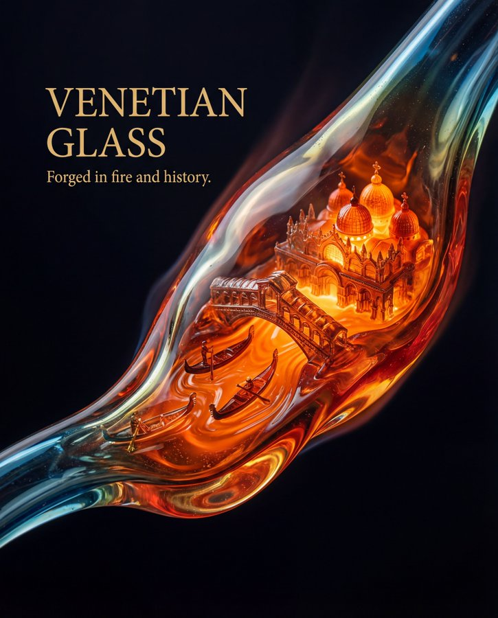

## 一个微缩的世界

- ID: gpt4o-1032-zh-2
- Slug: prompt-1032-zh-2
- 语言: zh
- 来源: [来源链接](https://x.com/maxescu/status/2007134245328957539)
- 样例图路径: images/part3/1032.jpeg

### 提示词

```text
一幅[宏观媒介——例如，一股液态黄金、一缕烟雾、一条丝带]的动态画面，从左下角到右上角形成一个动态的[形状——例如，弧形、螺旋形、波浪形]。悬浮于[纹理/材质]之中的，是一个微缩的[微观主题——例如，一座城市、一个历史事件、一个生态系统]世界，它被描绘成完全由[宏观媒介]本身雕刻而成的精细结构。

在 [MEDIUM ]: [DETAIL 1]、[DETAIL 2] 和 [DETAIL 3] 内部。这些形态呈现出 [ADJECTIVE - 例如，编织的、液体的、晶体的、发光的]，严格由 [MACRO MEDIUM] 的物理特性所定义。

风格：[摄影风格 - 例如：微距产品摄影] 与 [艺术流派 - 例如：浮世绘、赛博朋克、巴洛克绘画] 相融合。高度注重纹理、光线和材质对比。色彩：[色彩] 源自材质本身。

画面及背景：纯色、哑光背景（通常为黑色或白色），以营造最大对比度。极简主义构图。

排版：标题：“[标题]” 副标题：“[副标题]” 字体样式：[字体描述] 干净利落地放置在空白处。

构图规则：[媒介] 划定了明确的边界。所有细节都严格保留在笔触/流线内；负空间中不存在任何内容。8K，超逼真纹理，[光照风格]。
```

### 样例图


## 新年新气象新衣服

- ID: gpt4o-1031-zh
- Slug: prompt-1031-zh
- 语言: zh
- 来源: [来源链接](https://x.com/aidavid125/status/2006959961109299304)
- 样例图路径: images/part3/1031.jpeg

### 提示词

```text
Use the uploaded reference image as the person appearing in all 6 cards.
Analyze their unique body shape, skin tone, facial features, and personal essence.
Design 6 PERFECT outfits specifically tailored to maximize their individual beauty.

Create a vertical 9:16 professional New Year Fashion Outfit Poster.

BACKGROUND: Solid warm cream (#FFF8F5), optimized for mobile full-screen viewing.

════════════════════════════════════
CRITICAL LAYOUT RULES
════════════════════════════════════

EXACTLY 6 CARDS arranged in SINGLE VERTICAL COLUMN:
- Six (6) cards total — NOT 4, NOT 9, EXACTLY 6
- ONE column ONLY — NO grid, NO 2x3, NO side-by-side
- Cards stacked vertically from top to bottom
- Like mobile scrolling feed / Instagram story sequence
- Each card occupies full width of canvas

SPACING:
- Outer margin: 3% width (left and right)
- Vertical gap between cards: 2% height
- Cards fill vertical space evenly

VISUAL REFERENCE:
┌─────────────────┐
│     Card 1      │
├─────────────────┤
│     Card 2      │
├─────────────────┤
│     Card 3      │
├─────────────────┤
│     Card 4      │
├─────────────────┤
│     Card 5      │
├─────────────────┤
│     Card 6      │
└─────────────────┘

════════════════════════════════════
SINGLE CARD STRUCTURE
════════════════════════════════════

Each card contains 4 zones:

▸ ZONE 1: TITLE AREA (top 8% height)
- AI-generated creative style name based on the outfit
- Main title: Chinese Red (#C41E3A) or Gold (#D4AF37), centered
- Subtitle: 6-8 characters describing the vibe, warm gray (#8B7355)
- Small decorative icon: lantern or cloud motif

▸ ZONE 2: MAIN IMAGE AREA (55% height)
- Full-body outfit display
- Person occupies 70-75% of area
- Clean, elegant background with warm tones
- Subtle New Year decorative elements
- Natural pose, confident expression
- Complete outfit clearly visible

▸ ZONE 3: THREE-DETAIL CIRCLES (15% height)
- Three circular close-up images, horizontally arranged
- LEFT: Upper garment detail (neckline, sleeve, pattern, texture)
- CENTER: Accessory highlight (bag, jewelry, belt, scarf)
- RIGHT: Lower garment/shoes detail (hem, pants, footwear)
- Labels beneath: "上装 Top" / "配饰 Acc" / "下装 Bottom"

▸ ZONE 4: OUTFIT INFO AREA (22% height)
- 5 lines of information, left-aligned:
🔴 上装: [Style + Color + Material]
🔴 下装: [Style + Cut + Color]
🔴 鞋履: [Shoe type + Color + Material]
🔴 配饰: [Bag + Jewelry + Scarf + Other]
🔴 风格点评: [Why this outfit is perfect for this person]

CARD STYLING:
- Background: warm white #FFFAF8
- Border-radius: 4%
- Border: 1px solid #F5E6E0
- Corner decoration: tiny plum blossom or cloud icon

════════════════════════════════════
AI SMART STYLING SYSTEM
════════════════════════════════════

STEP 1: DEEP ANALYSIS
Carefully analyze the reference image for:

Body Shape:
- Pear / Apple / Hourglass / Rectangle / Inverted Triangle
- Shoulder width, waist definition, hip proportion
- Height impression (petite / average / tall)
- Areas to highlight vs balance

Skin Tone:
- Cool undertone / Warm undertone / Neutral
- Fair / Medium / Tan / Deep
- Best complementary colors

Personal Essence:
- Elegant / Sweet / Cool / Classic / Trendy / Edgy
- Gentle / Bold / Cute / Sophisticated / Chic
- Youthful / Young Professional / Mature Elegant

Facial Features:
- Soft vs Angular
- Overall impression and mood

STEP 2: CREATE 6 PERFECT OUTFITS
Based on complete analysis, freely design 6 outfits that:

✓ FLATTER the specific body type
- Choose silhouettes that enhance proportions
- Use strategic cuts, lengths, and fits
- Balance or highlight as needed

✓ COMPLEMENT the skin tone perfectly
- Select colors that make skin glow
- Avoid colors that wash out or clash
- Use undertone-matching principles

✓ MATCH the personal essence
- Align with natural vibe and energy
- Feel authentic, not costume-like
- Enhance existing beauty

✓ MAXIMIZE overall appeal
- Each outfit is THE MOST flattering choice
- Every piece works together harmoniously
- Complete polished head-to-toe look

✓ MAINTAIN variety
- 6 distinctly different styles
- Range of formality levels
- Different color stories
- Various silhouettes

✓ CELEBRATE New Year spirit
- Include festive red/gold elements
- Warm, joyful, celebratory feeling
- Elegant and refined aesthetic

════════════════════════════════════
NEW YEAR COLOR PALETTE
════════════════════════════════════

PRIMARY FESTIVE COLORS (each outfit MUST include at least one):

Chinese Red     #C41E3A  — Statement hero pieces
True Red        #E60012  — Bold, vibrant looks
Burgundy        #722F37  — Sophisticated elegance
Gold            #D4AF37  — Accessories and details
Champagne       #F7E7CE  — Subtle luxury
Coral           #FF6B35  — Youthful energy

SECONDARY COLORS (for balance and harmony):

Cream           #FFF8E7  — Clean, fresh base
Ivory           #FFFDD0  — Soft, warm elegance
Forest Green    #2E4A3E  — Contrast accent
Navy            #2B4A6F  — Classic depth
Blush Pink      #FFB6C1  — Sweet, feminine touch
Camel           #C19A6B  — Neutral sophistication
Pearl White     #F5F5F5  — Crisp, modern
Nude            #E8D5C4  — Understated chic

COLORS TO AVOID:
✗ Large areas of pure black (not festive enough)
✗ Gray-dominant schemes (too dull)
✗ Dark purple as main color (lacks celebration feel)
✗ Neon or overly bright tones (clashes with elegance)

════════════════════════════════════
FASHION ELEMENTS LIBRARY
════════════════════════════════════

AI freely selects and combines from:

UPPER GARMENTS:
- Cashmere sweaters, merino wool knits
- Silk blouses, satin camisoles
- Velvet tops, lace-trimmed pieces
- Modern qipao-inspired elements
- Elegant blazers, soft cardigans
- Statement coats, cropped jackets
- Turtlenecks, boat necks, V-necks

LOWER GARMENTS:
- A-line skirts, knife-pleat skirts
- Midi skirts, flowing maxi skirts
- Tailored trousers, wide-leg pants
- Velvet pants, satin midi skirts
- High-waist silhouettes, paper-bag waist
- Pencil skirts, wrap skirts

DRESSES:
- Knit dresses, sweater dresses
- Wrap dresses, shirt dresses
- Velvet dresses, satin slip dresses
- Fit-and-flare, bodycon, shift
- Midi length, maxi length

OUTERWEAR:
- Wool coats, cashmere overcoats
- Teddy coats, faux fur jackets
- Stylish puffer jackets
- Cape coats, cocoon coats
- Belted trench, double-breasted styles

FOOTWEAR:
- Pointed-toe heels, block heels
- Kitten heels, stilettos
- Ankle boots, knee-high boots
- Elegant loafers, embellished flats
- Slingbacks, Mary Janes
- Velvet shoes, satin pumps

ACCESSORIES:
- Pearl earrings, gold jewelry sets
- Statement earrings, delicate pendants
- Silk scarves, cashmere wraps
- Leather handbags, chain-strap bags
- Clutches, structured top-handle bags
- Hair clips, headbands, brooches
- Thin belts, statement belts
- Elegant watches, bracelets

════════════════════════════════════
PHOTOGRAPHY REQUIREMENTS
════════════════════════════════════

QUALITY STANDARD:
- High-end fashion magazine aesthetic
- 85mm portrait lens quality
- Professional studio or lifestyle setting
- Sharp focus on person and outfit

BACKGROUND REQUIREMENTS:
- Clean, elegant, uncluttered
- Warm neutral tones preferred
- Subtle New Year elements (optional):
· Soft red/gold bokeh
· Minimal lantern silhouettes
· Gentle floral arrangements
· Warm ambient glow
- NOT busy, NOT distracting

PERSON DISPLAY:
- Full body visible OR knee-up minimum
- Natural, confident expression
- Pose varies appropriately per outfit style
- Complete outfit clearly showcased
- Clothing fit and details visible
- Hair and makeup complement each style

LIGHTING:
- Warm, flattering golden-hour feel
- Soft diffused shadows
- Enhances skin tone naturally
- Creates depth without harshness
- Festive glow without overexposure

════════════════════════════════════
CONSISTENCY REQUIREMENTS
════════════════════════════════════
MUST MAINTAIN ACROSS ALL 6 CARDS:
| Element          | Requirement                              |
|------------------|------------------------------------------|
| Face             | IDENTICAL person in all 6 cards          |
| Body             | Same physique, proportions               |
| Changes Only     | Outfit, pose, expression, hairstyle      |
| Outfit Display   | Complete head-to-toe in each card        |
| Detail Circles   | Must MATCH main image exactly            |
| Overall Mood     | Festive, warm, celebratory feeling       |
| Photo Quality    | Consistent high-end aesthetic            |
| Color Warmth     | Harmonious warm tones throughout         |
| Background Style | Similar clean, elegant approach          |
════════════════════════════════════
DECORATIVE ELEMENTS
════════════════════════════════════
OVERALL POSTER DECORATION (subtle):
- Top edge: Faint golden cloud pattern border
- Bottom edge: Matching subtle border
- Between cards: Thin red or gold divider line (optional)
INDIVIDUAL CARD DECORATION:
- Corner accents: Tiny plum blossom icon
- Title area: Small lantern motif
- Subtle: Mini 福 character accent

DESIGN PRINCIPLE:
Decorations are MINIMAL and SUBTLE
Person and outfit remain the ABSOLUTE FOCUS

Elegance over festivity overload
Less is more approach
════════════════════════════════════
FINAL OUTPUT

════════════════════════════════════
Generate a beautiful, cohesive New Year Fashion Outfit Recommendation Poster featuring:
✓ Exactly 6 cards in single vertical column
✓ 6 unique outfits, each PERFECTLY tailored to this specific person

✓ Same person throughout with only outfit changes
✓ AI-generated style names that describe each look
✓ Complete outfit details (top, bottom, shoes, accessories)
✓ Festive New Year color palette with red/gold elements
✓ High-end fashion photography quality

✓ Clean, elegant presentation
✓ Warm, celebratory atmosphere
Each outfit should feel like it was personally styled by a top fashion consultant who deeply understands this person's unique features and knows exactly how to make them look their absolute best.
```

### 样例图


## { "design_system": { "metadata": { "style_name": "Cozy S

- ID: gpt4o-1030-en-1
- Slug: prompt-1030-en-1
- 语言: en
- 来源: [来源链接](https://x.com/YaseenK7212/status/2006746690255040979)
- 样例图路径: images/part3/1030.jpeg

### 提示词

```text
{
  "design_system": {
    "metadata": {
      "style_name": "Cozy Storybook Illustration",
      "target_audience": "Children / Family",
      "reference_source": "Uploaded Image",
      "version": "3.0"
    },
    "visual_parameters": {
      "medium": {
        "primary": "Colored Pencil",
        "secondary": "Watercolor Wash (Variation only)",
        "application": "Hand-drawn",
        "texture": {
          "type": "Visible pencil strokes",
          "quality": "Slightly rough outlines",
          "finish": "Non-realistic / No photo texture"
        }
      },
      "line_work": {
        "style": "Clean line art",
        "weight": "Slightly rough/organic",
        "clarity": "High"
      },
      "color_theory": {
        "base_tone": "Warm and friendly",
        "palette_type": "Vibrant Pastel",
        "adjustments": {
          "brightness": "Increased / High-key",
          "saturation": "Enhanced but natural",
          "contrast": "Soft"
        }
      },
      "lighting_and_shading": {
        "shadows": "Minimal",
        "highlights": "Soft",
        "rendering": "Flat yet detailed",
        "gradients": "Subtle watercolor layers (Variation only)"
      }
    },
    "subject_geometry": {
      "anatomy": {
        "proportions": "Semi-cartoon realistic",
        "scale": "Storybook style"
      },
      "facial_features": {
        "eyes": "Dot style",
        "mouth": "Small smile",
        "complexity": "Simple / Minimalist"
      }
    },
    "atmosphere": {
      "mood": [
        "Cozy",
        "Cheerful",
        "Warm",
        "Friendly"
      ],
      "genre_tags": [
        "Children's Book",
        "Lifestyle Sketch",
        "Storybook Illustration"
      ]
    }
  },
  "generation_configs": {
    "negative_prompt_tokens": [
      "realism",
      "photorealistic",
      "photo texture",
      "dark colors",
      "complex shading",
      "3d render"
    ],
    "prompt_variations": [
      {
        "id": "PROMPT_001",
        "variant_name": "Textured Colored Pencil",
        "focus": "Texture and Stroke",
        "full_text": "Illustration style: hand-drawn colored pencil illustration, clean line art with slightly rough pencil outlines, soft pastel coloring with increased brightness, lighter and more vivid color tones, enhanced saturation while staying natural, visible pencil strokes and gentle shading texture, warm and friendly tone, semi-cartoon realistic proportions, simple facial features with dot eyes and small smiles, flat yet detailed coloring, minimal shadows, soft highlights, storybook illustration feel, cozy and cheerful atmosphere, vibrant yet soft color palette, children-book / lifestyle sketch style, high clarity, no realism, no photo texture"
      },
      {
        "id": "PROMPT_002",
        "variant_name": "Mixed Media Watercolor",
        "focus": "Wash and Gradient",
        "full_text": "Hand-drawn colored pencil illustration with clean line art and slightly rough pencil outlines, combined with soft watercolor wash textures. Bright pastel colors, lighter and more vivid tones with natural saturation. Visible pencil strokes layered with subtle watercolor gradients. Warm and friendly tone, semi-cartoon realistic proportions. Simple facial features with dot eyes and small smiles. Flat yet detailed coloring, minimal shadows, soft highlights. Storybook illustration feel, cozy and cheerful atmosphere, children-book style, high clarity, no realism, no photo texture."
      }
    ]
  }
}
```

### 样例图


## 彩色铅笔插图

- ID: gpt4o-1030-zh-2
- Slug: prompt-1030-zh-2
- 语言: zh
- 来源: [来源链接](https://x.com/YaseenK7212/status/2006746690255040979)
- 样例图路径: images/part3/1030.jpeg

### 提示词

```text
{
"design_system": {
"元数据": {
"style_name": "温馨故事书插画",
"target_audience": "儿童/家庭",
"reference_source": "上传的图片",
版本：3.0
},
"visual_parameters": {
“中等的”： {
“primary”： “彩色铅笔”
“次要的”: “水彩晕染（仅限变体）”
“应用”：“手绘”，
“质地”： {
“类型”：“可见的铅笔笔触”，
“质量”：“轮廓略显粗糙”，
“完成”: “非写实/无照片纹理”
}
},
"line_work": {
风格：简洁的线条艺术，
“重量”：“略粗糙/有机”，
清晰度：高
},
"color_theory": {
"base_tone": "温暖友好",
"palette_type": "鲜艳的粉彩",
“调整”：{
“亮度”: “增强/高调”
“饱和度”：“增强但自然”，
“对比”: “柔和”
}
},
"lighting_and_shading": {
“阴影”：“极简主义”，
“亮点”：“柔和”，
“渲染”：“平面但细节丰富”，
“渐变”：“微妙的水彩图层（仅限变体）”
}
},
"subject_geometry": {
"解剖学": {
“比例”：“半卡通写实”
“规模”: “故事书风格”
},
"facial_features": {
“眼睛”：“点状风格”，
“嘴”: “微微一笑”
“复杂性”： “简单/极简主义”
}
},
“气氛”： {
“情绪”： [
“舒适”，
“快乐”，
“温暖的”，
“友好的”
],
"genre_tags": [
《儿童读物》
“生活方式素描”，
“故事书插图”
]
}
},
"generation_configs": {
"negative_prompt_tokens": [
“现实主义”，
“照片级真实感”，
“照片纹理”，
“暗色”，
“复杂阴影”，
“3D渲染”
],
"prompt_variations": [
{
"id": "PROMPT_001",
"variant_name": "纹理彩色铅笔",
“焦点”：“纹理和笔触”，
"full_text": "插画风格：手绘彩色铅笔插画，线条简洁，铅笔轮廓略显粗糙，柔和的粉彩色调，亮度增强，色彩更明亮鲜艳，饱和度提高，同时保持自然，铅笔笔触清晰可见，阴影纹理柔和，色调温暖友好，半卡通写实比例，面部特征简洁，眼睛为点状，面带微笑，色彩平涂但细节丰富，阴影极少，高光柔和，具有绘本插画风格，温馨欢快的氛围，色彩鲜艳而柔和，儿童绘本/生活素描风格，清晰度高，不追求写实，无照片纹理"
},
{
"id": "PROMPT_002",
"variant_name": "混合媒介水彩",
“焦点”：“水洗和渐变”，
"full_text": "手绘彩色铅笔插画，线条干净利落，铅笔轮廓略显粗糙，并结合柔和的水彩晕染纹理。明亮的粉彩色调，色调更浅更鲜艳，饱和度自然。铅笔笔触清晰可见，并叠加了微妙的水彩渐变。整体色调温暖友好，半卡通式的写实比例。面部特征简洁，眼睛是点状的，带着淡淡的微笑。色彩运用平涂却不失细节，阴影极少，高光柔和。具有童话插画的感觉，营造出温馨欢快的氛围，儿童绘本风格，清晰度高，不追求写实，没有照片质感。"
}
]
}
}
```

### 样例图


## masterpiece, best quality, photorealistic, ultra-high re

- ID: gpt4o-1029-en-1
- Slug: prompt-1029-en-1
- 语言: en
- 来源: [来源链接](https://x.com/LiEvanna85716/status/2007061619499794598)
- 样例图路径: images/part3/1029.jpeg

### 提示词

```text
masterpiece, best quality, photorealistic, ultra-high resolution, vibrant colors, professional MV studio photography, a 3x3 photo grid collage.

A collection of 9 glamorous portraits of the same person: a stunningly beautiful K-pop idol in her early 20s. She has large, captivating double-lidded eyes, flawless porcelain skin, and long, dark, voluminous wavy hair. She is wearing an elegant, vibrant red strapless dress.

Her makeup is immaculate, inspired by a K-pop music video: shimmering eyeshadow, sharp eyeliner, and glossy, gradient lips.

Each grid cell captures a different charismatic expression and pose:
1.  **Top-left:** Taking a selfie, holding a phone just out of frame, with a sweet, fan-service smile.
2.  **Top-center:** A playful wink with one eye closed and a charming smile.
3.  **Top-right:** A surprised expression with wide eyes and an open mouth in an "O" shape, looking adorable.
4.  **Middle-left:** A cute pouting face with pursed lips, head tilted slightly, showing her "aegyo" (cuteness).
5.  **Middle-center:** A joyful, radiant smile with eyes crinkled shut, exuding pure happiness.
6.  **Middle-right:** A mischievous, scrunched-up face, wrinkling her nose playfully.
7.  **Bottom-left:** Looking back over her shoulder, playfully sticking the tip of her tongue out.
8.  **Bottom-center:** A big, happy, open-mouthed laugh, looking joyfully upwards like a candid moment.
9.  **Bottom-right:** A shy, gentle smile while looking away to the side, creating a "first love" feeling.

Flawless, bright, and dynamic studio lighting, mimicking a high-budget music video set. Uses a combination of softboxes for a clean base and a subtle key light to add dimension and a glamorous sheen to her skin and hair. Clean, seamless, solid light gray studio background to make the red dress pop. Captured with a high-end portrait lens (equivalent to an 85mm f/1.2), creating a beautiful, creamy bokeh that makes the subject stand out sharply. The palette is rich and saturated, with the vibrant red of the dress as the focal point. The overall mood is charismatic, polished, and full of star quality.
```

### 样例图

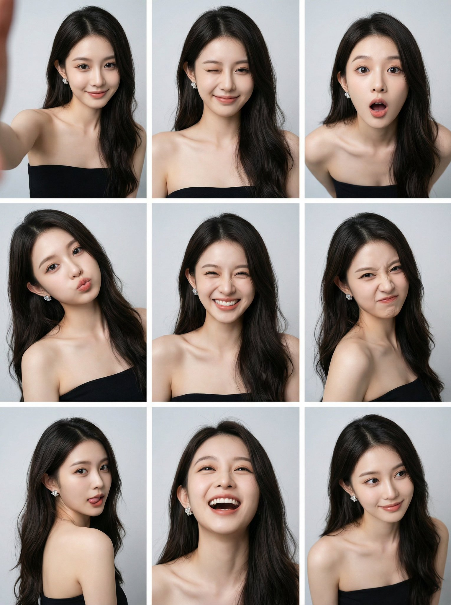

## 九宫格海马体精致写真

- ID: gpt4o-1029-zh-2
- Slug: prompt-1029-zh-2
- 语言: zh
- 来源: [来源链接](https://x.com/LiEvanna85716/status/2007061619499794598)
- 样例图路径: images/part3/1029.jpeg

### 提示词

```text
杰作，最佳品质，照片级逼真，超高分辨率，色彩鲜艳，专业MV工作室摄影，3x3照片网格拼贴画。

一组九张同一位人物的精美肖像照：一位二十出头的绝世佳人，拥有迷人的双眼皮、无瑕的瓷白肌肤和一头浓密乌黑的波浪长发。她身着一袭优雅亮丽的红色抹胸礼服。

她的妆容完美无瑕，灵感来自韩国流行音乐视频：闪亮的眼影、精致的眼线和光泽渐变的唇妆。

每个网格单元格都捕捉到不同的富有魅力的表情和姿态：
1.  **左上角:**拿着手机在镜头外自拍，露出甜美的、讨好粉丝的笑容。
2.  **顶部中心:**俏皮地眨眨眼，闭上一只眼睛，露出迷人的微笑。
3.  **右上角:**一个惊讶的表情，眼睛睁得大大的，嘴巴张成“O”形，看起来很可爱。
4.  **左中:**一张可爱的嘟嘴脸，嘴唇撅起，头微微倾斜，展现出她的“撒娇”（可爱）。
5.  **中间:**一个快乐、灿烂的笑容，眼睛眯成一条缝，散发着纯粹的幸福。
6.  **中间偏右:**一张调皮的、皱着的脸，顽皮地皱着鼻子。
7.  **左下角:**回头望去，俏皮地伸出舌尖。
8.  **底部中心:**一张开怀大笑的照片，笑容灿烂地仰望着天空，仿佛捕捉到了一个真实的瞬间。
9.  **右下角:**害羞、温柔的微笑，目光看向一旁，营造出“初恋”的感觉。

完美无瑕、明亮动感的影棚灯光，营造出高预算音乐录影带的拍摄效果。柔光箱打造干净的基础光，而柔和的主光则为她的肌肤和秀发增添层次感和迷人光泽。干净、无缝、纯色的浅灰色影棚背景，衬托出红色礼服的耀眼光芒。使用高端人像镜头（等效焦距 85mm f/1.2）拍摄，营造出柔美细腻的散景，使主体更加突出。色彩丰富饱满，礼服的鲜艳红色成为视觉焦点。整体氛围充满魅力、精致优雅，尽显明星风范。
```

### 样例图


## { "language": "en", "task": "image_edit", "consistency_i

- ID: gpt4o-1027-en-1
- Slug: prompt-1027-en-1
- 语言: en
- 来源: [来源链接](https://x.com/hellokaton/status/2003484504347079156)
- 样例图路径: images/part3/1027.jpeg

### 提示词

```text
{
    "language": "en",
    "task": "image_edit",
    "consistency_id": "user_subject_sassy_santa",
    "input_images": [
        {
            "image": "{{USER_REFERENCE_IMAGE}}",
            "use_as": "subject_identity",
            "priority": "high"
        }
    ],
    "prompt": "Create a full-body vertical 3:4 festive poster. Use the person from the uploaded reference image as the ONLY human subject (could be male or female). Preserve identity strongly: same face structure, hairstyle, skin tone, and overall likeness. Preserve the subject’s gender presentation from the reference; do not gender-swap.\n\nPOSE (LOCK THIS): a grounded swagger power-stance with BOTH FEET ON THE FLOOR (no raised leg). Wide stance, feet apart. Weight mostly on the back leg. The front foot is planted closer to the camera to create forced-perspective enlargement of the sneaker, but the sole stays fully on the ground. Knees slightly bent. Hips subtly cocked. Upper body slightly leaned back with shoulders rolled back and chest subtly forward.\n\nARMS & FACE (LOCK THIS): arms firmly and tightly crossed over the chest (no hands-on-hips). Chin slightly raised. Slight head tilt. A smug, confident, sassy expression (subtle smirk / “too cool” attitude).\n\nWARDROBE: rich red velvet Santa suit with clean white fur trim, Santa hat, white gloves, stylish black sunglasses. Keep modern clean white sneakers.\n\nSCENE: seamless bright red studio backdrop with a soft spotlight gradient behind the subject. Metallic silver confetti floating throughout the scene.\n\nREINDEER: place one realistic reindeer on the subject’s right side (camera-right), full body visible, antlers prominent, facing the camera with a cute/curious look. The reindeer wears a cozy red-and-green knitted scarf.\n\nLIGHTING & CAMERA: crisp commercial studio lighting, high detail textures (velvet, fur trim, knit scarf, reindeer fur). Low-angle wide lens look (about 20–28mm), camera near knee height, slight upward tilt. Sharp focus on subject and reindeer, mild depth of field for a premium poster feel. Photorealistic, clean, no text.",
    "style_parameters": {
        "render_style": "photorealistic",
        "mood": "festive, playful, swagger, comedic",
        "camera_look": "low-angle wide lens, forced perspective"
    },
    "composition": {
        "shot_type": "full_body",
        "camera_angle": "low_angle",
        "subject_position": "center_left",
        "secondary_subject_position": "right",
        "background": "solid red seamless with subtle spotlight gradient",
        "foreground_elements": "silver confetti"
    },
    "technical_specifications": {
        "aspect_ratio": "3:4",
        "resolution": "4k",
        "detail_level": "high",
        "sharpness": "high"
    },
    "negative_prompt": "raised leg, knee up, kicking, stepping forward mid-air, walking pose, running pose, sitting, crouching, hands on hips, hands in pockets, text, watermark, logo, brand mark, extra people, duplicate face, face distortion, different identity, gender swap, body-type change, extra limbs, extra fingers, bad hands, deformed feet, melted sunglasses, blurry subject, low resolution, cartoon, anime, painterly look, harsh artifacts",
    "output_settings": {
        "format": "jpg",
        "quality": "high"
    }
}
```

### 样例图


## 竖版全身节日海报

- ID: gpt4o-1027-zh-2
- Slug: prompt-1027-zh-2
- 语言: zh
- 来源: [来源链接](https://x.com/hellokaton/status/2003484504347079156)
- 样例图路径: images/part3/1027.jpeg

### 提示词

```text
{
"language": "en",
"任务": "图像编辑",
"consistency_id": "user_subject_sassy_santa",
"input_images": [
{
"image": " {{ USER_REFERENCE_IMAGE }} ",
"use_as": "subject_identity",
“优先级”： “高”
}
],
“提示”：创作一张3:4比例的竖版全身节日海报。使用上传的参考图片中的人物作为唯一的人体主体（可以是男性或女性）。务必保持人物特征：相同的面部结构、发型、肤色和整体相似度。保持参考图片中人物的性别特征；不要改变性别。\n\n姿势（锁定此项）：双脚着地，双脚分开站立，保持稳健自信的站姿（不要抬腿）。双脚分开站立，重心主要在后腿上。前脚靠近镜头，利用透视效果放大运动鞋，但鞋底始终与地面接触。膝盖微屈。臀部略微前倾。上身略微后倾，双肩向后舒展，胸部略微前挺。\n\n手臂和面部（锁定此项）：双臂紧紧交叉于胸前（不要双手叉腰）。下巴略微抬起。头部略微前倾。倾斜。一种沾沾自喜、自信、傲娇的表情（略带一丝微笑/“酷毙了”的态度） .\ \n服装：深红色天鹅绒圣诞老人套装，配以干净的白色毛皮饰边、圣诞帽、白色手套和时尚的黑色太阳镜。搭配现代的干净白色运动鞋。\n\n场景：无缝亮红色影棚背景，主体后方有柔和的渐变聚光灯。银色金属彩纸屑在场景中飘落。\n\n驯鹿：将一只逼真的驯鹿放在主体的右侧（相机右侧），全身可见，鹿角突出，面向镜头，眼神可爱/好奇。驯鹿戴着一条舒适的红绿相间针织围巾。\n\n灯光和相机：清晰的商业影棚灯光，高细节纹理（天鹅绒、毛皮饰边、针织围巾、驯鹿毛皮）。低角度广角镜头（约20-28mm），相机高度接近膝盖，略微向上倾斜。主体清晰对焦驯鹿，适中的景深营造出高级海报的感觉。照片级写实，画面干净，无文字。
"style_parameters": {
"render_style": "照片写实风格",
“情绪”：“喜庆的、俏皮的、自信的、喜剧的”，
"camera_look": "低角度广角镜头，强制透视"
},
“作品”： {
"shot_type": "全身",
"camera_angle": "低角度",
"subject_position": "center_left",
"secondary_subject_position": "右",
“背景”: “纯红色无缝，带有微妙的聚光灯渐变”
"前景元素": "银色彩带"
},
"technical_specifications": {
"aspect_ratio": "3:4",
分辨率：4K，
"detail_level": "高",
“清晰度”： “高”
},
"negative_prompt": "抬腿、抬膝、踢腿、空中向前迈步、行走姿势、跑步姿势、坐姿、蹲姿、双手叉腰、双手插兜、文字、水印、标志、品牌标识、额外人物、重复面孔、面部扭曲、不同身份、性别互换、体型改变、额外肢体、额外手指、残疾的手、畸形的脚、融化的太阳镜、模糊主体、低分辨率、卡通、动漫、油画风格、粗糙的瑕疵",
"output_settings": {
"格式": "jpg",
“质量”： “高”
}
}
```

### 样例图


## Create a spectacular fireworks display photograph over a

- ID: gpt4o-1026-en-1
- Slug: prompt-1026-en-1
- 语言: en
- 来源: [来源链接](https://x.com/TechieBySA/status/2004894710729478277)
- 样例图路径: images/part3/1026.jpeg

### 提示词

```text
Create a spectacular fireworks display photograph over a waterfront cityscape at night. The fireworks should burst in the exact shape and form of the uploaded logo, perfectly replicating its distinctive design, proportions, colors, and silhouette. Match every color from the logo precisely in the fireworks - placing each color exactly where it appears in the original logo design. The logo shape should be clearly recognizable and detailed in the fireworks formation against the dark sky. The scene should include a city silhouette in the background, smoke trails from the fireworks, and colorful reflections dancing on the water below. Photorealistic style with professional long exposure photography techniques, sharp focus on the fireworks burst, cinematic composition, 4K quality.
```

### 样例图


## 城市景观上空绽放的壮观烟花照片

- ID: gpt4o-1026-zh-2
- Slug: prompt-1026-zh-2
- 语言: zh
- 来源: [来源链接](https://x.com/TechieBySA/status/2004894710729478277)
- 样例图路径: images/part3/1026.jpeg

### 提示词

```text
拍摄一张夜幕降临后，在水滨城市景观上空绽放的壮观烟花照片。烟花应完全按照上传的标志形状绽放，完美复刻其独特的设计、比例、色彩和轮廓。烟花中的每一种颜色都应与标志中的一模一样，并精确地放置在原标志设计中对应的位置。标志的形状在夜空映衬下的烟花编队中应清晰可见，细节丰富。画面背景应包含城市轮廓、烟花绽放的烟雾以及水面上变幻莫测的彩色倒影。照片风格需采用专业的长曝光摄影技巧，聚焦于烟花绽放的瞬间，构图需具有电影质感，并达到4K画质。
```

### 样例图


## 水果包装

- ID: gpt4o-1024-zh
- Slug: prompt-1024-zh
- 语言: zh
- 来源: [来源链接](https://x.com/berryxia/status/2003836511565815965)
- 样例图路径: images/part3/1024.jpeg

### 提示词

```text
Premium Japanese-style product poster in 16:9 landscape format, editorial design showcasing kiwi juice skin packaging concept with sophisticated visual storytelling:

LEFT SIDE (40% of canvas):
- Hero product: One large kiwi juice skin package displayed vertically with dramatic soft lighting, showing ultra-realistic kiwi peel texture wrapped around rectangular container, fuzzy brown skin with thousands of fine visible hair-like fibers covering entire surface, rough natural texture, brown color with subtle variations, looks exactly like real kiwi skin stretched over package
- Below: One cross-sectioned fresh kiwi showing vibrant green creamy flesh with black seeds radiating from white center
- Japanese typography vertically aligned: "キウイスキン" (Kiwi Skin) in elegant thin gothic font
- Subtitle: "果汁皮肤 / 猕猴桃" in refined style
- Small design philosophy text in Japanese

CENTER (30% of canvas):
- Generous white negative space (Ma - 間)
- Minimal geometric elements: delicate thin lines
- Floating text: "自然な素材" (natural materials)
- Subtle minimalist brand mark
- Very subtle kiwi fuzz texture pattern in background (low opacity)

RIGHT SIDE (30% of canvas):
- Two kiwi juice skin packages arranged artistically at different angles and heights
- One whole fresh kiwi with natural fuzzy brown skin
- Typography: "Natural Packaging / 自然な包装"
- Tagline: "The skin is the package / 皮膚が包装である"
- Detail callouts pointing to fuzzy hair texture

DESIGN PRINCIPLES: Abundant white space, asymmetrical balance, Wabi-sabi aesthetic, Muji/Noritake editorial minimalism
COLOR PALETTE: brown kiwi tones, pure white background, bright green accent from flesh
PHOTOGRAPHY: Soft diffused studio lighting, ultra-sharp macro details showing fuzzy texture, photorealistic rendering
CRITICAL: The kiwi skin packaging must look incredibly realistic - actual organic fuzzy brown texture with thousands of tiny brown hairs, rough natural appearance, NOT plastic

16:9 widescreen, high-end Japanese product poster, gallery quality
```

### 样例图


## Your city { "image_request": { "subject": "A person's ha

- ID: gpt4o-1022-en-1
- Slug: prompt-1022-en-1
- 语言: en
- 来源: [来源链接](https://x.com/firatbilal/status/2003553245499916501)
- 样例图路径: images/part3/1022.jpeg

### 提示词

```text
Your city
{
  "image_request": {
    "subject": "A person's hand holding a long, narrow vertical die-cut bookmark",
    "bookmark_design": {
      "style": "Intricate layered paper-cut illustration, 3D depth, whimsical artistic style",
      "content": "Iconic landmarks and symbols of {{location}} depicted inside the bookmark frame, some elements slightly popping out of the edges (die-cut)",
      "artistic_elements": "Delicate textures, vibrant colors, miniature architectural details"
    },
    "background": {
      "setting": "A romantic, cinematic wide shot of the actual {{location}} skyline and scenery",
      "depth_of_field": "Soft bokeh, blurred background to emphasize the bookmark in focus",
      "time_of_day": "{{time_of_day}}",
      "lighting_effects": "Atmospheric lighting matching the {{time_of_day}}, golden hour glows, city lights, or soft daylight"
    },
    "composition": {
      "framing": "Close-up on the hand and bookmark, centered vertically",
      "vibe": "Nostalgic, aesthetic, travel-inspired, poetic",
      "color_palette": "Harmonized colors between the bookmark's art and the real-world background"
    },
    "technical_specs": {
      "quality": "8k resolution, highly detailed, photorealistic hand, sharp focus on bookmark",
      "aspect_ratio": "3:4"
    }
  },
  "variables": {
    "location": ["Istanbul", "Paris", "Tokyo", "London", "Rome"],
    "time_of_day": ["Sunrise", "Sunset", "Night with city lights", "Bright daylight"]
  }
}
```

### 样例图


## 一只手拿着一个细长的竖式镂空书签

- ID: gpt4o-1022-zh-2
- Slug: prompt-1022-zh-2
- 语言: zh
- 来源: [来源链接](https://x.com/firatbilal/status/2003553245499916501)
- 样例图路径: images/part3/1022.jpeg

### 提示词

```text
你的城市
{
"image_request": {
“主题”：“一只手拿着一个细长的竖式镂空书签”，
"书签设计": {
“风格”：“错综复杂的层叠剪纸插画，3D立体感，异想天开的艺术风格”，
“内容”：“书签框内描绘了{{地点}}的标志性地标和符号，部分元素略微凸出于边缘（模切）”
艺术元素：精致的纹理、鲜艳的色彩、微缩的建筑细节
},
“背景”： {
“场景”: “一个浪漫的、电影般的广角镜头，展现实际的{{地点}}天际线和风景”，
“景深”: “柔和散景，模糊背景以突出焦点的书签”
"time_of_day": " {{ time_of_day }} ",
"lighting_effects": "与{{一天中的时间}}相匹配的氛围照明，例如黄金时段的光晕、城市灯光或柔和的日光"
},
“作品”： {
“构图”：“手和书签的特写，垂直居中”
“氛围”：怀旧、唯美、旅行灵感、诗意，
"color_palette": "书签图案与现实世界背景之间的协调色彩"
},
"technical_specs": {
“质量”：“8K分辨率，高度细节化，照片级逼真的手部，书签清晰对焦”，
"aspect_ratio": "3:4"
}
},
"变量": {
地点：["伊斯坦布尔", "巴黎", "东京", "伦敦", "罗马"]
"time_of_day": ["日出", "日落", "城市灯光下的夜晚", "明亮的白天"]
}
}
```

### 样例图


## 电商商品KV图

- ID: gpt4o-1021-zh
- Slug: prompt-1021-zh
- 语言: zh
- 来源: [来源链接](https://x.com/yanhua1010/status/2004012045143101808)
- 样例图路径: images/part3/1021.jpeg

### 提示词

```text
基于我给的产品图，梳理产品卖点/参数要点，然后给我输出一套统一旗舰店极简KV系统（9:16），最后生成10张详情页的完整提示词（中英双语、干净大气、至少5张细节特写），先单独生成Logo，用于后续每张海报左上角，其中文字排版风格需要统一，比如玻璃效果、3d浮雕效果，或者其他效果，提示词参考如下:
00、LOGO生成
提示词（中文）： 极简高端时尚品牌logo，矢量风格，干净几何形。品牌名：【"MUYANG"】。图标：细线圆形徽章，内含单支精致叶枝（负空间，现代，优雅）。配色：深苔灰绿色(#2F3A33)搭配温暖米白背景(#F3EFE6)或透明背景。字体：高端衬线体"MUYANG"，字母间距宽松，下方小字"沐阳"。无渐变、无阴影、无3D、无样机、无水印。
01、海报01｜【产品·丝滑睡裙】主KV（Hero）
提示词（中文）： 9:16竖版高端极简时尚海报。柔和摄影棚日光，温暖米白渐变背景（奶油/燕麦色），超干净。精致亚洲美女模特(25-30岁)，精致五官，自然裸妆，长发慵懒随意，放松优雅姿态，全身照，一只手轻轻抚摸裙摆。
服装必须与上传的产品参考图匹配：香槟色/奶油色缎面短款吊带睡裙，细吊带，V领，裙长至大腿中部，丝滑光泽面料，保持服装设计与参考图完全一致。
排版布局：左上角放置MUYANG logo(小号)。顶部居中巨大衬线标题(2行)："SILK SLIP DRESS" / "丝滑睡裙"(中英堆叠，干净)。左侧中部玻璃拟态信息卡(3个要点，双语)：仿真丝触感 / Silk-like touch；修身不紧绷 / Flattering fit；居家也优雅 / Elegant at home。右下角【圆角药丸CTA】："立即选购 → / SHOP NOW →"。
负面词：cluttered, busy, multiple patterns, gradients, shadows, watermark, logo repeated, messy text, low quality, blurry, plain face, unattractive
02、海报02｜产品场景展示
提示词（中文）： 9:16竖版，电影质感干净时尚摄影。背景：柔和晨光透过白色纱帘的卧室，奶白色床品，极简北欧风格，温暖氛围。精致亚洲美女模特全身侧身站立，长发披肩，回眸微笑，一只手撩起发丝。使用上传的产品参考图保持香槟色短款吊带睡裙的形状、长度、面料光泽完全一致。
文字：左上角小号MUYANG logo。左上小号优雅字体："晨光私语 / Morning Whisper"。左下大标题："慵懒的刚刚好"。标题下副标题(双语)："丝滑触肤，开启美好一天 / Silky touch, beautiful day begins."。右下角CTA药丸："了解更多 → / LEARN MORE →"。
负面词：cluttered, busy, dark, messy room, shadows, watermark, messy text, low quality, blurry, plain face
03、海报03｜多场景拼贴
提示词（中文）： 9:16竖版极简拼贴海报，圆角照片块和充足负空间。背景：温暖奶油色，干净。创建4个圆角框展示同一位精致亚洲美女模特穿着上传参考图中相同的香槟色短款吊带睡裙，不同居家场景：清晨卧室窗边、客厅沙发慵懒坐姿、浴室镜前、阳台藤椅喝咖啡。所有框架中保持服装、模特完全一致。
左上角MUYANG logo。底部大衬线标题："一裙多场景"。底部副标题(双语)："居家、约会、度假都适合 / Home, date, vacation ready."。右下角附近添加小型3点列表：不挑场合 / Versatile style；秒变氛围感 / Instant chic；舒适又迷人 / Cozy yet alluring。
负面词：cluttered, busy, multiple patterns, shadows, watermark, messy text, low quality, blurry, plain face.
04、海报04｜细节01·面料光泽（Fabric Sheen）
提示词（中文）： 9:16竖版高端微距细节海报。背景：奶油色渐变，大量干净负空间。极近距离拍摄上传参考图中缎面面料的光泽质感，展示丝滑反光效果和柔软垂坠感，面料随身体曲线自然流动。左上角MUYANG logo。
右侧大标题(双语)："仿真丝光泽 / Silk-like Sheen"。小文案(双语，2行)："触感细腻，像第二层肌肤 / Delicate touch, like second skin."。"自然反光更显质感 / Natural luster, premium feel."。右下角CTA药丸："了解更多 → / LEARN MORE →"。
负面词：cluttered, busy, multiple patterns, shadows, watermark, messy text, low quality, blurry
05、海报05｜细节02·细吊带与锁骨（Strap & Collarbone）
提示词（中文）： 9:16竖版极简细节海报。背景：温暖米白，超干净。特写拍摄精致亚洲美女模特的锁骨、肩颈线条和细吊带，来自上传参考(精致优雅)，柔和侧光勾勒轮廓，高级质感。添加一个小圆角内嵌图展示完整着装轮廓(非常小，低不透明度)。
左上角MUYANG logo。居中大衬线标题："细吊带设计"。3个微型要点(双语)：展现优美肩颈 / Flatters shoulders；精致不累赘 / Delicate refined；性感而优雅 / Sexy yet elegant。CTA药丸："立即选购 → / SHOP NOW →"。
负面词：cluttered, busy, multiple patterns, shadows, watermark, messy text, low quality, blurry, plain face
06、海报06｜细节03·V领剪裁（V-Neckline Cut）
提示词（中文）： 9:16竖版时尚细节海报，干净摄影棚灯光。背景：淡燕麦到奶油色渐变，无纹理。近距离拍摄V领剪裁细节(从上传参考)，展示领口线条流畅性和恰到好处的深度，性感不失优雅。左上角MUYANG logo。
左侧大标题："V领剪裁"。副标题(双语)："修饰脸型，拉长颈部线条 / Face-flattering, neck-elongating."。添加小标签行："DETAIL 03"(小号)。CTA药丸："了解更多 → / LEARN MORE →"。
负面词：cluttered, busy, multiple patterns, shadows, watermark, messy text, low quality, blurry.
07、海报07｜细节04·裙摆垂坠感（Hemline Drape）
提示词（中文）： 9:16竖版高端细节海报。背景：极浅香槟金雾霾色，低对比。拍摄精致亚洲美女模特侧面下半身，展示短裙裙摆自然垂坠在大腿中部的优美曲线(从上传参考)，面料随身体动态流动，修饰腿部线条。
左上角MUYANG logo。右侧标题(双语)："短款更显腿长"。小文案(双语)："恰到好处的长度，修饰比例 / Perfect length, flattering proportion."。
负面词：cluttered, busy, multiple patterns, shadows, watermark, messy text, low quality, blurry, plain face
海报08｜产品配色/型号
提示词（中文）： 9:16竖版极简时尚情绪板。背景：温暖奶油色。左侧：全身精致亚洲美女模特穿着上传参考图中的香槟色短款吊带睡裙(干净摄影棚，自然站姿)。右侧：整齐排列受睡裙启发的配色/材质色卡(香槟金、奶油色、珍珠白、柔和米色) + 极简线条图标(月亮、羽毛、丝绸、晨露)。保持一切扁平、高端，不繁忙。
左上角MUYANG logo。顶部大衬线："配色灵感 / COLOR INSPIRATION"。3个要点(双语)：香槟金显气质 / Champagne exudes elegance；温柔色更衬肤 / Soft tones flatter skin；低调奢华感 / Subtle luxury。CTA："了解更多 → / LEARN MORE →"。
负面词：cluttered, busy, multiple patterns, shadows, watermark, messy text, low quality, blurry, plain face.
09、海报09｜产品尺码/参数
提示词（中文）： 9:16竖版极简尺码指南海报。背景：温暖米白，干净。将尺码表(S/M/L)放置为整洁的网格卡片(玻璃拟态，圆角)。内容(双语标题)："尺码参考 / SIZE GUIDE"。表格列：尺码 Size｜衣长 Length｜胸围 Bust｜腰围 Waist｜臀围 Hip。行：S｜90cm｜80-84cm｜64-68cm｜88-92cm；M｜92cm｜84-88cm｜68-72cm｜92-96cm；L｜94cm｜88-92cm｜72-76cm｜96-100cm。左上角MUYANG logo。底部小注释(双语)："手工测量，误差±2cm属正常 / Hand-measured, ±2cm variance normal."。底部贴心提示："建议参考胸围选择尺码 / Suggest sizig by bust measurement."
负面词：no extra patterns, no clutter, no watermark
10、海报10｜结尾信任页 质保/售后/说明
提示词（中文）： 9:16竖版高端护理海报。背景：奶油色渐变，非常干净。
左上角MUYANG logo。大标题："洗护指南 / CARE GUIDE"。使用5个极简图标 + 简短双语行(干净，不拥挤)：建议手洗或使用洗衣袋 / Hand wash or use laundry bag；冷水或30°C以下水温 / Cold or below 30°C water；不可漂白或强力拧干 / No bleach or wringing；悬挂阴干，避免暴晒 / Hang dry, avoid direct sun；低温熨烫，垫布熨烫更佳 / Low heat iron, use cloth。底部添加小字(双语)："悉心呵护，延长丝滑寿命 / Care well, silkiness lasts longer."。
负面词：no clutter, no heavy texture, no watermark
```

### 样例图


## Create a realistic Vogue magazine cover–style fashion po

- ID: gpt4o-1019-en-1
- Slug: prompt-1019-en-1
- 语言: en
- 来源: [来源链接](https://x.com/underwoodxie96/status/2004221776755376606)
- 样例图路径: images/part3/1019.jpeg

### 提示词

```text
Create a realistic Vogue magazine cover–style fashion portrait using the uploaded face as the original face reference (100% face identity preservation).

A young elegant woman posing confidently, maintaining her original facial features and natural beauty. She is winking with her left eye and making a playful duck-face expression. Both hands are raised, forming a love/heart gesture near her face.

She is surrounded by multiple DSLR cameras and smartphones held around her, as if paparazzi and photographers are capturing her from all directions. Some phones show her live image on their screens.

Appearance & styling: flawless glowing skin, natural makeup with glossy pink lips, soft blush, subtle highlights. Light brown hair styled in a low, neat updo with a few loose strands.

Outfit & accessories: elegant minimalist beige-white strapless evening dress, Louis Vuitton necklace, diamond ring, luxury fashion jewelry.

Photography style: close-up to half-body fashion portrait, Vogue editorial aesthetic, cinematic professional studio lighting, soft HDR background, shallow depth of field, realistic skin texture, ultra-detailed, 8K quality.

Camera & lens look: professional DSLR look, 85mm lens feel, f/1.8 aperture, crisp focus with smooth background bokeh.

Composition: Vogue magazine layout with large bold logo at the top, editorial fashion cover framing, clean and elegant design.

Mood & vibe: playful yet luxurious, high-fashion beauty editorial, realistic, not AI-looking, photographed by a professional fashion photographer.
```

### 样例图


## 逼真的 Vogue 杂志封面风格的时尚肖像

- ID: gpt4o-1019-zh-2
- Slug: prompt-1019-zh-2
- 语言: zh
- 来源: [来源链接](https://x.com/underwoodxie96/status/2004221776755376606)
- 样例图路径: images/part3/1019.jpeg

### 提示词

```text
使用上传的人脸作为原始人脸参考，创作一幅逼真的 Vogue 杂志封面风格的时尚肖像（100% 保留人脸特征）。

一位年轻优雅的女子自信地摆着姿势，保持着她原本的五官和自然美。她眨着左眼，俏皮地嘟起了嘴。双手高举，在脸颊旁比出一个爱心的手势。

她周围摆满了单反相机和智能手机，仿佛狗仔队和摄影师正从四面八方拍摄她。有些手机屏幕上显示着她的实时影像。

妆容及造型：完美无瑕的透亮肌肤，自然妆容，粉嫩水润的唇妆，柔和的腮红，以及恰到好处的高光。浅棕色头发梳成低低的利落盘发，几缕碎发自然垂落。

服装及配饰：优雅简约的米白色无肩带晚礼服、路易威登项链、钻石戒指、奢华时尚珠宝。

摄影风格：特写至半身时尚人像，Vogue 杂志大片风格，电影级专业影棚灯光，柔和 HDR 背景，浅景深，逼真的皮肤纹理，超高细节，8K 画质。

相机和镜头外观：专业单反外观，85mm镜头手感，f/1.8光圈，对焦清晰，背景虚化柔和。

构图：Vogue杂志版式，顶部醒目大logo，时尚杂志封面式边框，简洁优雅的设计。

氛围与格调：俏皮又不失奢华，高级时尚美妆大片，真实自然，不像人工智能拍摄的，由专业时尚摄影师拍摄。
```

### 样例图


## 多角度特写的写真海报图

- ID: gpt4o-1018-zh
- Slug: prompt-1018-zh
- 语言: zh
- 来源: [来源链接](https://x.com/lijigang/status/2004514549404516664)
- 样例图路径: images/part3/1018.jpeg

### 提示词

```text
1.  画面调性 
   
核心气质: 日系空气感写真, 清新唯美, 高调摄影

关键词: Soft Focus, Dreamy Atmosphere, Clean Minimalism, Portrait Photography, Natural Light

2. 视觉逻辑
   
空间构建:
- 视角: 平视视角与微距特写混合。
- 布局: 极简主义构图，主体突出，背景留白或弱化。
- 景深: 浅景深，背景虚化以强调主体与环境的隔离感。
  
3. 视觉渲染 
   
成像质感:
- 光影: 极柔和的漫射光，模拟自然窗光。无死黑阴影，整体画面通透，高光部分略微过曝营造梦幻感。
- 材质: 细腻真实的摄影质感，但在皮肤和织物处理上带有轻微的“柔光滤镜”效果。
- 清晰度: 边缘柔和，非锐利数字渲染，追求胶片摄影的自然颗粒感。
  
4. 色彩系统
   
核心主色:
- Sakura Pink: #F2C4CE (作为视觉主体色，柔和粉嫩)
- Creamy White: #F9F6F0 (作为环境基调，暖白)
- Light Wood: #D8C6A8 (作为自然点缀，原木色)
- 色彩逻辑: 低饱和度，高明度。整体色温偏暖，营造温馨、无害的视觉心理。
  
5. 负向约束
   
绝对禁止:
- 严禁低调暗光、强烈的明暗对比。
- 严禁硬边缘阴影。
- 严禁脏旧、粗糙、赛博朋克式的噪点。
- 严禁高饱和霓虹色或人造塑料质感。
- 严禁二次元描边或矢量扁平化处理。
- 严禁出现任何文字。

6. 画面内容
   
请生成多角度特写的写真海报图：

下雪天，初恋男女，在学校操场上玩闹。
```

### 样例图


## 牛肉面挂牌

- ID: gpt4o-1017-zh
- Slug: prompt-1017-zh
- 语言: zh
- 来源: [来源链接](https://x.com/berryxia/status/2004570423472562237)
- 样例图路径: images/part3/1017.jpeg

### 提示词

```text
A premium transparent acrylic signage panel for "[品牌名称]" brand, photographed in ABSOLUTE FRONTAL VIEW with ZERO perspective distortion.
CRITICAL CAMERA SETUP (STRICT ENFORCEMENT):
- Camera angle: EXACTLY 0° (perfectly perpendicular to the panel surface)
- The acrylic panel MUST be completely parallel to the camera sensor
- NO rotation on X, Y, or Z axis
- The panel edges MUST form perfect vertical and horizontal lines in the frame
- Use architectural photography grid alignment to ensure perfect frontal geometry
- NO three-quarter view, NO slight angle, NO depth perception - PURE FLAT FRONTAL
PANEL SPECIFICATIONS:
- Material: Ultra-clear 15mm acrylic glass with 95% transparency
- Dimensions: 400mm × 300mm [portrait/square/landscape] orientation
- All edges are diamond-polished with subtle rainbow light refraction
- The panel appears to float in mid-air, suspended by invisible forces
DESIGN LAYOUT (Hand-drawn aesthetic):
- Brand name "[品牌名称]" in large artistic brush calligraphy at top center
- Tagline "[品牌口号/slogan]" in elegant handwritten [语言] below the brand name
- [核心图案描述:如咖啡枝、火锅元素、牛肉纹理等] flowing around the text
- Small decorative [相关小图标] illustrations scattered naturally
- All design elements are drawn with [颜色描述,如warm brown/red/etc.] ink (color: [色值]) with varying line weights (0.8-2mm)
- The drawing has an organic, imperfect quality showing authentic hand-crafted charm
TRANSPARENCY EFFECTS:
- The acrylic surface has 60% opacity for drawn elements (semi-transparent, NOT solid)
- Light passes through the panel, creating soft colored shadows on the virtual plane behind
- The background [场景类型] environment is visible THROUGH the transparent areas
- Subtle light refraction effects along the panel edges creating prismatic color dispersion
BACKGROUND ENVIRONMENT:
- A warm, inviting [具体场景描述:如specialty coffee shop/hot pot restaurant/steakhouse] interior
- [环境细节:如wooden furniture, plants, pendant lighting/red lanterns, steam/leather seats, wine racks]
- The background is moderately blurred (bokeh effect, f/4 aperture simulation) 
- Background elements are recognizable but not distracting - balanced depth of field
- [色温描述:如Warm color temperature (3200K-3800K)/Cool-warm mixed lighting]
LIGHTING:
- Soft, diffused natural light from the front (60% intensity)
- Gentle rim lighting from behind the panel (30% intensity) to emphasize transparency
- NO harsh shadows, maintaining soft and even illumination
- Light interacts with the acrylic creating subtle internal glow
TECHNICAL REQUIREMENTS:
- Shot with macro lens (100mm f/2.8) for zero distortion
- Sensor perfectly aligned with panel surface using spirit level
- The panel occupies 70% of the frame, centered perfectly
- Ultra-sharp focus on the hand-drawn details
- 8K resolution, photorealistic rendering
- Color grading: [色调描述:如warm, natural/vibrant, energetic]
CRITICAL: The entire panel MUST be rendered in perfect frontal view with zero perspective distortion. Every line on the panel should be perfectly straight and parallel to the frame edges.
```

### 样例图

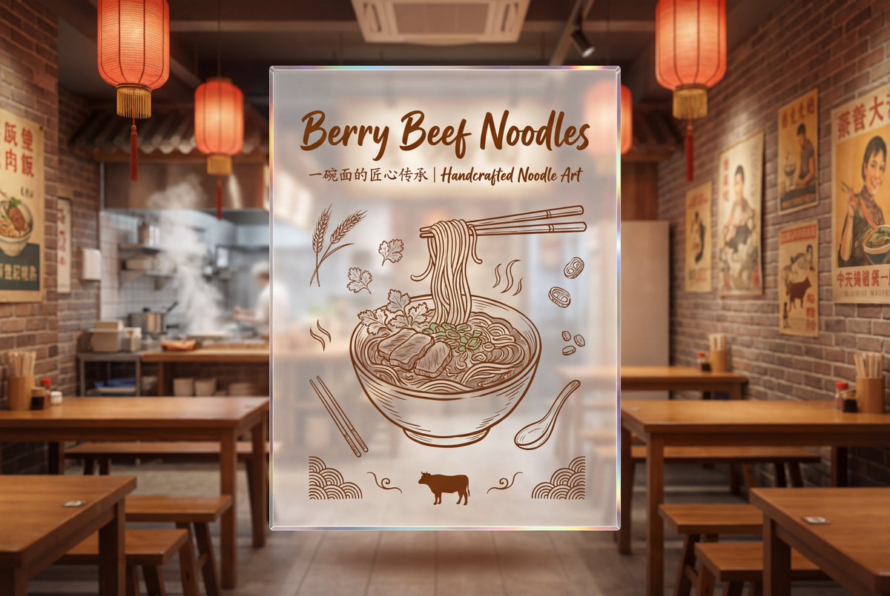

## 3D表情包

- ID: gpt4o-1016-zh
- Slug: prompt-1016-zh
- 语言: zh
- 来源: [来源链接](https://x.com/sundyme/status/2004425000586232256)
- 样例图路径: images/part3/1016.jpeg

### 提示词

```text
Create a high-quality 3D rendered anthropomorphic mascot character in a cute cartoon style inspired by Kakao Friends/LINE Friends. A cute [角色类型] character in [场景描述], [动作描述], [表情描述], detailed 3D rendering with smooth textures, soft lighting, vibrant colors, kawaii aesthetic, large head and small body proportions, clean white background with subtle shadows.

Add Chinese text overlay: \"[文案]\" in a cute, playful font style that matches the 3D character design - bold, rounded, colorful letters with a kawaii aesthetic.

1:1 aspect ratio, high quality 3D rendering, photorealistic textures with cartoon stylization.  使用这个模板生成一组4个表情包
```

### 样例图


## 中国水墨画风格邮票

- ID: gpt4o-1015-zh-1
- Slug: prompt-1015-zh-1
- 语言: zh
- 来源: [来源链接](https://x.com/servasyy_ai/status/2004805605937254631)
- 样例图路径: images/part3/1015.jpeg

### 提示词

```text
{
  "style": "Chinese postage stamp design, Neo-Chinese ink wash painting shuimo style, official commemorative stamp series format",
  "composition": "A vertical sheet of four connected postage stamps arranged top to bottom: spring - summer - autumn - winter. Each stamp has perforated edges and independent design while maintaining cohesive series aesthetic",
  "overall_mood": "tranquil serene zen-like dreamy ethereal mood with gentle seasonal feeling, elegant postage stamp refinement, ample negative white space, soft natural transitions between stamps with subtle ink gradients",
  "artistic_quality": "highly artistic masterpiece quality stamp design, subtle ink gradients, official commemorative series standard",
  "stamp_format": {
    "border": "each stamp has classic perforated edges (齿孔边缘) all around",
    "margins": "clean white margins surrounding the entire stamp sheet",
    "denomination": "¥1.20 face value printed on each stamp",
    "issuer": "中国邮政 CHINA POST text at bottom of each stamp",
    "series_info": "四季长卷系列 Four Seasons Series at sheet bottom",
    "issue_year": "2025"
  },
  "sections": [
    {
      "season": "spring",
      "stamp_label": "春 Spring",
      "foliage": "dense soft pink cherry blossoms and tender light green willow leaves with clear rhythmic textures and veins",
      "edges": "leaf/petal edges gradually blur and fade creating soft depth layering and ethereal misty atmosphere",
      "figure": "tiny young lady in pale pink flowing hanfu walking beside a white deer",
      "rendering": "figures and animal simply outlined with minimal delicate ink lines, no unnecessary details",
      "color": "fresh elegant pale pink and light green color scheme dominant",
      "poem": "short elegant ancient Chinese poem inscription (4-7 characters or brief couplet) in delicate calligraphy matching spring theme placed tastefully within stamp",
      "seal": "poetic small vermilion red seal stamp (zhuwen red seal) with elegant ancient Chinese poetic phrase in corner",
      "stamp_text": "denomination ¥1.20, 中国邮政 CHINA POST at bottom, 春 Spring label"
    },
    {
      "season": "summer",
      "stamp_label": "夏 Summer",
      "foliage": "dense pale cyan and light green lotus leaves and pads with clear rhythmic textures and veins",
      "edges": "leaf edges gradually blur and fade creating soft depth layering and ethereal misty atmosphere",
      "figure": "tiny monk in simple gray long robe walking beside a black donkey",
      "rendering": "figures and animal simply outlined with minimal delicate ink lines, no unnecessary details",
      "color": "fresh elegant pale cyan and light green color scheme dominant",
      "poem": "short elegant ancient Chinese poem inscription (4-7 characters or brief couplet) in delicate calligraphy matching summer theme placed tastefully within stamp",
      "seal": "poetic small vermilion red seal stamp (zhuwen red seal) with elegant ancient Chinese poetic phrase in corner",
      "stamp_text": "denomination ¥1.20, 中国邮政 CHINA POST at bottom, 夏 Summer label"
    },
    {
      "season": "autumn",
      "stamp_label": "秋 Autumn",
      "foliage": "dense warm orange-red and amber maple leaves with clear rhythmic textures and veins",
      "edges": "leaf edges gradually blur and fade creating soft depth layering and ethereal misty atmosphere",
      "figure": "tiny scholar in flowing indigo hanfu robe riding a white horse",
      "rendering": "figures and animal simply outlined with minimal delicate ink lines, no unnecessary details",
      "color": "elegant warm pale orange and soft gold color scheme dominant",
      "poem": "short elegant ancient Chinese poem inscription (4-7 characters or brief couplet) in delicate calligraphy matching autumn theme placed tastefully within stamp",
      "seal": "poetic small vermilion red seal stamp (zhuwen red seal) with elegant ancient Chinese poetic phrase in corner",
      "stamp_text": "denomination ¥1.20, 中国邮政 CHINA POST at bottom, 秋 Autumn label"
    },
    {
      "season": "winter",
      "stamp_label": "冬 Winter",
      "foliage": "dense pale gray-white plum blossoms branches and sparse dark green pine needles lightly dusted with snow, clear rhythmic textures",
      "edges": "edges gradually blur and fade creating soft depth layering and ethereal misty atmosphere",
      "figure": "tiny traveler in deep crimson cloak leading a white horse",
      "rendering": "figures and animal simply outlined with minimal delicate ink lines, no unnecessary details",
      "color": "cool elegant pale silver-gray and soft crimson color scheme dominant",
      "poem": "short elegant ancient Chinese poem inscription (4-7 characters or brief couplet) in delicate calligraphy matching winter theme placed tastefully within stamp",
      "seal": "poetic small vermilion red seal stamp (zhuwen red seal) with elegant ancient Chinese poetic phrase in corner",
      "stamp_text": "denomination ¥1.20, 中国邮政 CHINA POST at bottom, 冬 Winter label"
    }
  ],
  "global_elements": {
    "sheet_bottom": "series title '四季长卷系列 Four Seasons Series', issue year '2025'",
    "bottom_right": "small text '94vanAI'",
    "stamp_sheet_format": "four stamps connected vertically with perforated edges between each, clean white margins around entire sheet",
    "parameters": "--ar 3:4 --stylize 400 --v 6"
  },
  "negative_prompt": "photorealistic, 3d render, cartoon, chibi, overly detailed face, big figures, crowded composition, heavy saturated colors, harsh thick outlines, text artifacts, watermark, signature too large, modern elements, western style, oil painting, acrylic, thick brush strokes, low contrast, busy background, sharp focus, people dominant, realistic proportions, extra animals, colorful flowers, bright lighting, harsh shadows, no perforations, modern stamp design, photo stamps, digital art style, overlapping stamps, torn edges, damaged stamps, incorrect denomination, wrong issuer name, missing borders, frameless design"
}
```

### 样例图


## 中国水墨画风格邮票

- ID: gpt4o-1015-zh-2
- Slug: prompt-1015-zh-2
- 语言: zh
- 来源: [来源链接](https://x.com/servasyy_ai/status/2004805605937254631)
- 样例图路径: images/part3/1015.jpeg

### 提示词

```text
{
“风格”：“中国邮票设计，新中国水墨画风格，官方纪念邮票系列格式”
“组成”：“一张竖版邮票，由四枚相连的邮票组成，从上到下排列：春-夏-秋-冬。每枚邮票都有齿孔边缘和独立设计，同时保持系列的一致性美感。”
"overall_mood": "宁静祥和，如禅意般梦幻空灵，带有柔和的季节感，邮票般的精致优雅，留白充足，邮票之间过渡柔和自然，墨色渐变微妙。"
“artistic_quality”: “高度艺术化的杰作品质邮票设计，微妙的墨水渐变，官方纪念系列标准”
"stamp_format": {
“边框”：“每枚邮票四周都有经典的齿孔边缘”，
“边距”: “围绕整张邮票的干净白色边距”，
“面值”：“每枚邮票上印有¥1.20面值”，
"issuer": "中国邮政 CHINA POST 每张邮票底部文字",
"series_info": "四季长卷系列 四季系列位于表底部",
"issue_year": "2025"
},
“章节”：[
{
“季节”： “春季”，
"stamp_label": "春 Spring",
“叶子”：“浓密的柔粉色樱花和嫩绿的柳叶，具有清晰的纹理和脉络”，
“边缘”：“叶片/花瓣边缘逐渐模糊和消逝，营造出柔和的层次感和空灵朦胧的氛围”，
“人物”：“身着淡粉色飘逸汉服的娇小少女，行走在一头白鹿旁边”，
“渲染”：“人物和动物仅用最少的细墨线条勾勒轮廓，没有不必要的细节”，
“颜色”：“清新优雅的淡粉色和浅绿色为主色调”，
“诗句”：“简短优美的中国古代诗歌题词（4-7个字或简短对联），以精致的书法与春天的主题相呼应，巧妙地放置在邮票内。”
“印章”： “带有优美古代中国诗句的诗意小朱红色印章（竹文红印）”
"stamp_text": "面额 1.20 元，底部为中国邮政 CHINA POST，春标"
},
{
“季节”: “夏季”，
"stamp_label": "夏夏",
“叶子”：“浓密的淡青色和浅绿色荷叶和莲座，具有清晰的韵律纹理和叶脉”，
“边缘”：“叶片边缘逐渐模糊和消逝，营造出柔和的层次感和空灵朦胧的氛围”，
“人物”：“身穿简朴灰色长袍的小和尚走在一头黑驴旁边”，
“渲染”：“人物和动物仅用最少的细墨线条勾勒轮廓，没有不必要的细节”，
“颜色”：“以清新优雅的淡青色和浅绿色为主色调”，
“诗句”：“简短优美的中国古代诗歌题词（4-7个字或简短对联），以精致的书法与夏季主题相符，雅致地置于邮票内”，
“印章”： “带有优美古代中国诗句的诗意小朱红色印章（竹文红印）”
"stamp_text": "面额 1.20 元，底部为中国邮政 CHINA POST，夏季标签"
},
{
“季节”： “秋季”，
"stamp_label": "秋 Autumn",
“叶子”：“浓密的暖橙红色和琥珀色枫叶，具有清晰的韵律纹理和叶脉”，
“边缘”：“叶片边缘逐渐模糊和消逝，营造出柔和的层次感和空灵朦胧的氛围”，
“人物”：“身着飘逸靛蓝色汉服的小书生骑着一匹白马”，
“渲染”：“人物和动物仅用最少的细墨线条勾勒轮廓，没有不必要的细节”，
“颜色”：“优雅温暖的浅橙色和柔和的金色为主色调”，
“诗句”：“简短优美的中国古代诗歌题词（4-7个字或简短对联），以精致的书法与秋季主题相呼应，雅致地置于邮票内。”
“印章”： “带有优美古代中国诗句的诗意小朱红色印章（竹文红印）”
"stamp_text": "面额 1.20 元，底部为中国邮政 CHINA POST，秋标签"
},
{
“季节”: “冬季”
"stamp_label": "冬冬",
“树叶”：“浓密的浅灰白色梅花枝和稀疏的深绿色松针上轻轻覆盖着一层雪，清晰的韵律纹理”，
“边缘”：“边缘逐渐模糊和消逝，营造出柔和的层次感和空灵朦胧的氛围”，
“人物”：“身披深红色斗篷的小小旅人牵着一匹白马”，
“渲染”：“人物和动物仅用最少的细墨线条勾勒轮廓，没有不必要的细节”，
“颜色”：“以清冷优雅的浅银灰色和柔和的深红色为主色调”，
“诗句”：“简短优美的中国古代诗歌题词（4-7个字或简短对联），以精致的书法与冬季主题相契合，雅致地置于邮票内”，
“印章”： “带有优美古代中国诗句的诗意小朱红色印章（竹文红印）”
"stamp_text": "面额 1.20 元，底部为中国邮政 CHINA POST，冬日标签"
}
],
"global_elements": {
"sheet_bottom": "系列标题'四季长卷系列四季系列'，发行年份'2025'",
"bottom_right": "小字 '94vanAI'",
"stamp_sheet_format": "四枚邮票垂直连接，每枚邮票之间有穿孔边缘，整张邮票四周留有干净的白色边距",
"参数": "--ar 3:4 --stylize 400 --v 6"
},
"negative_prompt": "照片级写实、3D渲染、卡通、Q版、面部细节过多、人物过大、构图拥挤、色彩饱和度过高、轮廓线粗犷、文字瑕疵、水印、签名过大、现代元素、西式风格、油画、丙烯、笔触粗重、对比度低、背景杂乱、焦点清晰、人物占主导、比例写实、动物过多、色彩鲜艳的花朵、光线明亮、阴影生硬、无齿孔、现代邮票设计、照片邮票、数字艺术风格、邮票重叠、边缘撕裂、邮票破损、面值错误、发行人名称错误、缺少边框、无边框设计"
}
```

### 样例图


## 虚拟与现实的融合

- ID: gpt4o-1014-zh
- Slug: prompt-1014-zh
- 语言: zh
- 来源: [来源链接](https://x.com/berryxia/status/2005233233605398681)
- 样例图路径: images/part3/1014.jpeg

### 提示词

```text
A premium vertical split concept poster for [品牌名称] [产品名称], showing ONE [产品] split in half - left side realistic, right side deconstructed.

TOP SECTION - BRANDING:
- [品牌名称] official logo at top center ([品牌色])
- "[产品名称]" in large bold [字体风格] font in [颜色]
- Subtitle: "[产品Slogan]" in elegant serif font
- Optional secondary tagline

CENTRAL DESIGN - ONE SINGLE [产品] SPLIT VERTICALLY DOWN THE MIDDLE:

LEFT HALF OF THE [产品] (50%): Ultra-realistic photographic half
- Left 50% of the [产品] shown in ultra-realistic photography style
- Photorealistic [关键材质1: 如金属/皮革/食材] texture visible on left edge
- Half of [关键特征1: 如屏幕/面包/表面] with realistic reflections
- Left portion of [关键特征2: 如键盘/配件/层次] showing individual details
- Half of [关键特征3] visible with material accuracy
- Professional product photography lighting
- Perfect vertical cut through the exact center of the [产品]
- Every detail ultra-realistic: [材质细节列表]
- [可选: 烟雾/水珠/光晕] effect for atmosphere

RIGHT HALF OF THE [产品] (50%): Stylized [tech/culinary/artistic] deconstruction
- Right 50% of the [产品] exploding into [解构类型] components
- [组件1] floating away individually [具体描述]
- [组件2] fragments showing [内部结构/发光效果]
- [组件3] pieces with glowing [颜色] [元素: 如芯片/食材/零件]
- [组件4] separating geometrically
- [内部结构] and internal components visible
- [品牌元素/Logo] piece glowing independently
- [Warm golden/Cool blue/Neon multi-color] tech/artistic lighting effects
- Geometric [tech lines/motion lines/artistic trails], [holographic patterns/particle effects/ingredient splashes]
- Components floating outward in organized dynamic composition
- Illustrated/stylized art treatment (not photorealistic)
- [根据类型: 科技感电路/美食解构/时尚元素/机械零件]

THE SPLIT: Clean vertical line down the exact center of the [产品], one continuous [产品] transitioning seamlessly from realistic (left) to deconstructed [风格] art (right)

BACKGROUND: [深色/浅色] gradient ([色值1] to [色值2]) with [carbon fiber/wood/concrete/fabric] texture and [颜色] light particles

LIGHTING: Left side = professional studio lighting with [warm/cool/natural] tone | Right side = [warm/cool/neon] glow with [颜色] accents creating dramatic contrast

VERTICAL DIVIDING LINE: Subtle [golden/silver/blue/red] glow ([色值]) marking the center split of the [产品]

BOTTOM SECTION - PRODUCT FEATURES (arranged horizontally with icons):
- "[特点1]" with [icon描述] icon
- "[特点2]" with [icon描述] icon
- "[特点3]" with [icon描述] icon
- "[特点4]" with [icon描述] icon
Typography in [字体风格] font with decorative divider lines

COLOR PALETTE: [主色调列表]

COMPOSITION: One single [产品] centered vertically, split perfectly down the middle - left half ultra-realistic photography, right half exploding into stylized [解构类型] components

STYLE: Seamless transition from photorealistic product to illustrated [tech/culinary/fashion/mechanical] deconstruction within ONE unified [产品]

MOOD: [Premium/Appetizing/Innovative/Nostalgic], [dramatic/elegant/energetic], official brand advertising quality

TEXT STYLE: Mix of bold display fonts and elegant serifs, [品牌色] colors

Quality: Commercial advertising standard, 4K resolution, dramatic visual impact
```

### 样例图


## Fireworks form the shape of [SUBJECT] in the night sky a

- ID: gpt4o-1013-en-1
- Slug: prompt-1013-en-1
- 语言: en
- 来源: [来源链接](https://x.com/AllaAisling/status/2005299702015918358)
- 样例图路径: images/part3/1013.jpeg

### 提示词

```text
Fireworks form the shape of [SUBJECT] in the night sky above a waterfront city. The design is inspired by the colors, proportions, and silhouette of [SUBJECT], clearly readable and visually striking against the dark sky. Long-exposure, photorealistic fireworks photography with smoke trails, city skyline silhouette, and colorful reflections on the water. Cinematic composition, sharp detail, ultra-high-resolution 4K.
```

### 样例图

![Fireworks form the shape of [SUBJECT] in the night sky a](../images/part3/1013.jpeg)

## 烟花在水滨城市上空勾勒出主题的形状

- ID: gpt4o-1013-zh-2
- Slug: prompt-1013-zh-2
- 语言: zh
- 来源: [来源链接](https://x.com/AllaAisling/status/2005299702015918358)
- 样例图路径: images/part3/1013.jpeg

### 提示词

```text
夜空中，烟花在水滨城市上空勾勒出[主题]的形状。设计灵感源自[主题]的色彩、比例和轮廓，在漆黑的夜空中清晰可见，引人注目。采用长曝光技术，以逼真的烟花摄影手法，展现了烟雾轨迹、城市天际线轮廓以及水面上的绚丽倒影。画面构图极具电影感，细节清晰锐利，呈现超高分辨率4K画质。
```

### 样例图


## { "prompt_data": { "subject": { "description": "Young wo

- ID: gpt4o-1010-en-1
- Slug: prompt-1010-en-1
- 语言: en
- 来源: [来源链接](https://x.com/lexx_aura/status/2004591904386580688?referrer=grok.com)
- 样例图路径: images/part3/1010.jpeg

### 提示词

```text
{
  "prompt_data": {
    "subject": {
      "description": "Young woman with long, wavy blonde hair and a light fair skin",
      "features": "Natural skin texture with visible tan lines on the chest, slight flush on cheeks, soft smile, navel piercing, light freckles.",
      "accessories": "Gold pendant necklace, small gold hoop earrings, small tattoo on the left inner forearm."
    },
    "clothing": {
      "outfit": "Matching yellow two-piece loungewear set.",
      "top": "Yellow strapless tube top featuring the text 'HAWAIIAN TROPIC' in brown serif font with a hibiscus flower and palm graphic on the side.",
      "bottoms": "Matching yellow shorts visible at the waist and thigh area."
    },
    "pose_and_action": {
      "posture": "Reclining and lounging comfortably on a grey textured sofa.",
      "body_language": "Relaxed and casual, leaning back against the couch cushions, one arm extended to support weight, the other hand resting gently near the waist, legs angled toward the camera.",
      "expression": "Friendly, relaxed, and engaging eye contact."
    },
    "environment": {
      "setting": "Modern living room interior.",
      "furniture": "Dark grey fabric sofa with a textured weave.",
      "background": "Grey walls with decorative panel molding (wainscoting).",
      "decor": "A large vertical art piece with a red background featuring KAWS-style figures in blue and black. A second framed abstract art piece with gold and black tones. A modern linear wall sconce light."
    },
    "lighting": {
      "type": "Soft, diffused indoor mix.",
      "quality": "Warm ambient lighting highlighting the skin tone, creating soft shadows and a cozy atmosphere. Likely a mix of natural window light and the warm glow from the wall sconce."
    },
    "styling_and_mood": {
      "aesthetic": "Influencer lifestyle, casual home comfort, '2000s digital camera' vibe.",
      "mood": "Chill, playful, confident, comfortable."
    },
    "camera_specifications": {
      "angle": "Eye-level, slightly angled from the side.",
      "focus": "Sharp focus on the subject's face and torso, with a slight depth of field blurring the background artwork.",
      "lens_suggestion": "35mm or 50mm portrait lens.",
      "film_grain": "Low to medium ISO for a clean but slightly organic digital look."
    },
    "technical_modifiers": [
      "Ultra Photorealistic",
      "8k resolution",
      "Raw photo",
      "Hyper-detailed skin texture",
      "Subsurface scattering",
      "Volumetric lighting",
      "Nano Banana Pro optimized",
      "Masterpiece"
    ]
  }
} 2:3
```

### 样例图


## 金色长卷发和白皙肤色的女子

- ID: gpt4o-1010-zh-2
- Slug: prompt-1010-zh-2
- 语言: zh
- 来源: [来源链接](https://x.com/lexx_aura/status/2004591904386580688?referrer=grok.com)
- 样例图路径: images/part3/1010.jpeg

### 提示词

```text
{
"prompt_data": {
“主题”： {
描述：一位有着金色长卷发和白皙肤色的年轻女子。
“特征”：“肌肤纹理自然，胸部有明显的晒痕，双颊略带红晕，笑容温柔，有肚脐环，有淡淡的雀斑。”
“配饰”：“金吊坠项链，小金耳环，左前臂内侧的小纹身。”
},
“衣服”： {
“套装”：“配套的黄色两件套家居服。”
“上衣”：“黄色无肩带抹胸上衣，侧面印有棕色衬线字体的‘夏威夷热带’字样，以及芙蓉花和棕榈树图案。”
“下装”：“腰部和大腿处可见配套的黄色短裤。”
},
"pose_and_action": {
“姿势”：“舒适地斜倚在灰色纹理沙发上。”
“肢体语言”：“放松随意，靠在沙发垫上，一只手臂伸出支撑身体，另一只手轻轻放在腰间，双腿朝向镜头。”
“表情”：“友好、轻松、引人入胜的眼神交流。”
},
“环境”： {
“场景”：“现代客厅内部。”
“家具”：“深灰色布艺沙发，带有纹理编织图案。”
“背景”： “灰色墙壁，带有装饰性镶板（护墙板）。”
“装饰品”：“一幅大型竖幅艺术作品，红色背景，饰以KAWS风格的蓝色和黑色人物图案。另一幅装裱好的抽象艺术作品，以金色和黑色为主色调。一盏现代简约的线性壁灯。”
},
“灯光”： {
类型：柔和、扩散的室内混合香型。
“品质”：“温暖的氛围灯光突出肤色，营造出柔和的阴影和温馨的氛围。可能是自然窗光和壁灯温暖光芒的混合。”
},
"styling_and_mood": {
“美学”：“网红生活方式、休闲居家舒适感、‘2000年代数码相机’风格。”
“情绪”：“轻松、活泼、自信、舒适。”
},
"camera_specifications": {
“角度”：“与视线齐平，略微侧向倾斜。”
“焦点”：“清晰对焦于人物的面部和躯干，略微虚化背景画作。”
镜头建议：35mm 或 50mm 人像镜头。
"film_grain": "低到中等 ISO，营造干净但略带自然感的数码外观。"
},
"technical_modifiers": [
“超逼真”
“8K分辨率”，
“原始照片”，
“超精细的皮肤纹理”，
“次表面散射”
“体积照明”，
“Nano Banana Pro 优化版”，
“杰作”
]
}
2:3
```

### 样例图


## { "type": "image_prompt", "description": "High-resolutio

- ID: gpt4o-1008-en-1
- Slug: prompt-1008-en-1
- 语言: en
- 来源: [来源链接](https://x.com/xmiiru_/status/2005530723847934103)
- 样例图路径: images/part3/1008.jpeg

### 提示词

```text
{
  "type": "image_prompt",
  "description": "High-resolution photorealistic studio fashion portrait",
  "subject": {
    "gender": "adult woman",
    "hair": "long light brown hair with golden blonde highlights, loose curls",
    "expression": "playful, cheeky, thinking face, lips pursed",
    "pose": "looking off to the side, shoulders relaxed"
  },
  "outfit": {
    "hat": "gold shimmering party hat",
    "dress": "gold sequin party dress with modern asymmetric neckline cutout"
  },
  "props": {
    "balloons": "gold foil balloons shaped as numbers 20 and 26, one in each hand, raised near shoulders"
  },
  "environment": {
    "setting": "clean studio",
    "background": "neutral beige backdrop",
    "lighting": "soft studio lighting with gentle shadows"
  },
  "details": {
    "realism": "editorial-quality photorealism",
    "textures": "visible skin texture, detailed hair strands, sharp sequin detail",
    "materials": "metallic balloon shine with realistic creases and highlights"
  },
  "constraints": [
    "no text",
    "no logos",
    "no branding",
    "no watermarks"
  ]
}
```

### 样例图


## 2026写实摄影棚时尚肖像

- ID: gpt4o-1008-zh-2
- Slug: prompt-1008-zh-2
- 语言: zh
- 来源: [来源链接](https://x.com/xmiiru_/status/2005530723847934103)
- 样例图路径: images/part3/1008.jpeg

### 提示词

```text
{
"type": "image_prompt",
描述：高分辨率照片级写实摄影棚时尚肖像
“主题”： {
“性别”: “成年女性”
“头发”：“长长的浅棕色头发，带有金色挑染，蓬松的卷发”，
“表情”：“顽皮、俏皮、思考的表情，嘴唇紧抿”，
“姿势”：“看向一侧，肩膀放松”
},
“全套服装”： {
“帽子”：“闪闪发光的金色派对帽”，
“连衣裙”： “金色亮片派对连衣裙，现代不对称领口镂空设计”
},
"props": {
“气球”：“两只手中各拿着一个金色箔纸气球，形状分别为数字 20 和 26，举到肩膀附近”
},
“环境”： {
“设置”：“干净的工作室”，
“背景”： “中性米色背景”，
“灯光”：“柔和的影棚灯光，带有淡淡的阴影”
},
“细节”： {
“写实主义”: “编辑级照片写实主义”，
“纹理”：“可见的皮肤纹理、细致的发丝、清晰的亮片细节”，
“材质”：“金属质感的气球，带有逼真的褶皱和高光”
},
“约束”：[
“无文本”，
“无标志”，
“无品牌标识”
“无水印”
]
}
```

### 样例图


## 2026新年海报

- ID: gpt4o-1007-zh
- Slug: prompt-1007-zh
- 语言: zh
- 来源: [来源链接](https://x.com/op7418/status/2005486114510180545)
- 样例图路径: images/part3/1007.jpeg

### 提示词

```text
{
    "applicable_models": [
        "Seedream",
        "Nano Banana Pro"
    ],
    "subject": {
        "IP_Name": "Enter the names of your favorite games, novels, movies, or TV shows.",
        "description": "A visually striking, masterpiece-level 3D New Year's greeting card poster based on [IP Name]. Vertical composition with a deep, window-like groove in the center.",
        "material_style": "Felt and coarse knitting wool texture, realistic and delicate, blind box toy texture.",
        "central_character": {
            "identity": "A cute Q-version felt Pony (representing the Year of the Horse)",
            "expression": "Naive and charming (憨态可掬), festive",
            "clothing": "Red festive vest, traditional tiger-head hat",
            "action": "Standing in the center as a festival messenger"
        },
        "secondary_characters": {
            "identity": "Classic characters from the IP (Q-version felt style)",
            "clothing": "Traditional festive Tang suit or Hanfu",
            "action": "Interacting within the scene, adding story elements"
        },
        "scene_elements": {
            "architecture": "Iconic buildings from the IP in Q-version felt, arranged with depth and layers",
            "ground": "Thick creamy knitted snow",
            "vegetation": "Peach tree or Kumquat tree hung with red lanterns, Chinese knots, and blessing cards",
            "props": "Scattered felt firecrackers, gold ingots, snow-covered shrubs"
        }
    },
    "accessories": {
        "title_design": {
            "structure": "Independent 3D volumetric letters suspended in mid-air (No background plate/card)",
            "main_text": {
                "content": "Happy New Year",
                "font_style": "3D fluid art font, thick glass volume"
            },
            "sub_text": {
                "content": "新年快乐",
                "font_style": "Bold Chinese Calligraphy (中国书法), 3D extruded strokes"
            },
            "material_properties": {
                "type": "Matte Frosted Glass (applied directly to the text volume)",
                "color": "Deep red to light red gradient",
                "surface": "Soft matte finish, semi-transparent",
                "optical_effects": "Dreamy colorful caustics casting shadows onto the felt scene below"
            }
        },
        "bottom_layout": {
            "content": "Random classic quote related to New Year, blessings, or hope",
            "font_style": "Large, elegant Western Handwritten Serif, rich ink color",
            "source_note": "Small Chinese font citing the source"
        }
    },
    "photography": {
        "renderer": "C4D, Octane Render",
        "resolution": "8K",
        "camera_style": "Macro photography perspective",
        "shot_type": "Vertical Poster, Close-up on miniature",
        "depth_of_field": "Shallow depth of field (background bokeh)",
        "lighting": "Soft and uniform, breathing light effect, atmospheric depth",
        "texture_quality": "Masterpiece, rich details, mixture of felt and frosted glass"
    },
    "background": {
        "setting": "Oriental ink wash void environment with flowing light mist",
        "colors": "Elegant pale champagne gold or high-grade soft mist red",
        "external_decor": [
            "Red velvet silk ribbons dancing in the air",
            "Fluid gold lines",
            "Blooming red plum branches",
            "Strings of festive red lanterns",
            "Plump persimmons or hawthorn berries",
            "Crystal clear geometric snowflakes",
            "Glowing gold copper coin strings"
        ],
        "atmosphere": "Explosive festive atmosphere, dynamic composition",
        "positioning": "Card appears suspended in clouds with soft shadow at the bottom"
    },
    "the_vibe": {
        "mood": "Festive, Oriental, Warm, Exquisite, Joyful",
        "culture": "Chinese New Year, Year of the Horse",
        "aesthetic": "High-end commercial design, Cuteness mixed with elegance"
    },
    "constraints": {
        "must_keep": [
            "Felt texture",
            "Chinese New Year elements",
            "Year of the Horse Pony",
            "Volumetric glass text (No signboard)",
            "Calligraphy text",
            "Ink wash background"
        ],
        "avoid": [
            "Santa Claus",
            "Christmas trees",
            "Western Christmas decorations",
            "Real photography style",
            "Flat 2D illustration",
            "Rectangular glass plate behind text",
            "Signboard",
            "Text on a card"
        ]
    },
    "negative_prompt": [
        "Santa Claus",
        "Christmas tree",
        "rectangular background plate",
        "glass sign",
        "text box",
        "holding a sign",
        "photorealistic human",
        "low resolution",
        "blurry",
        "flat colors",
        "dark",
        "horror",
        "distorted text"
    ]
}
```

### 样例图


## Hyper-realistic top-down macro photography. A long, ligh

- ID: gpt4o-1006-en-1
- Slug: prompt-1006-en-1
- 语言: en
- 来源: [来源链接](https://x.com/Arminn_Ai/status/2005681873612165251)
- 样例图路径: images/part3/1006.jpeg

### 提示词

```text
Hyper-realistic top-down macro photography. A long, light green WhatsApp speech bubble acting as a dining table. Two real living humans (shrunk to tiny scale) are sitting at opposite ends. They are NOT plastic figures; they have visible skin texture, natural hair, and realistic clothing folds. They are eating real food that looks freshly cooked, not play-doh. The text inside reads: "INSERT TEXT". Bottom right has a timestamp '3:33 PM' and blue ticks. The background is completely filled with a high-density, seamless WhatsApp doodle pattern (line art icons) covering the entire surface edge-to-edge with no empty spaces, resembling the original dense WhatsApp wallpaper. Professional studio lighting, 8k resolution, sharp focus.
```

### 样例图


## 超写实俯视微距摄影

- ID: gpt4o-1006-zh-2
- Slug: prompt-1006-zh-2
- 语言: zh
- 来源: [来源链接](https://x.com/Arminn_Ai/status/2005681873612165251)
- 样例图路径: images/part3/1006.jpeg

### 提示词

```text
超写实俯视微距摄影。一个细长的浅绿色 WhatsApp 对话框充当餐桌。两个真人（缩小到极小比例）坐在桌子的两端。他们并非塑料人偶；他们拥有清晰可见的皮肤纹理、自然的头发和逼真的衣褶。他们正在享用看起来新鲜烹制的真正食物，而不是橡皮泥。对话框内的文字显示为：“插入文字”。右下角显示时间戳“下午 3:33”和蓝色勾号。背景完全被高密度、无缝的 WhatsApp 涂鸦图案（线条艺术图标）覆盖，没有一丝空白，如同原版 WhatsApp 的密集壁纸。专业影棚灯光，8K 分辨率，清晰对焦。
```

### 样例图


## { "subject": { "description": "A hyper-realistic optical

- ID: gpt4o-1005-en-1
- Slug: prompt-1005-en-1
- 语言: en
- 来源: [来源链接](https://x.com/hellokaton/status/2003381235331268757)
- 样例图路径: images/part3/1005.jpeg

### 提示词

```text
{
    "subject": {
        "description": "A hyper-realistic optical-illusion photograph. The woman from the uploaded reference portrait appears to be emerging from a freshly developed instant photo (Polaroid-style) lying on a small cafe table. In the instant photo frame, her full outfit is visible; in reality, her upper body and head rise out of the glossy print, casting a real shadow onto the table.",
        "reference_image_rules": {
            "use_uploaded_reference_portrait": true,
            "preserve_identity": true,
            "preserve_hairline_and_facial_structure": true,
            "no_face_morphing": true
        },
        "age": "20s",
        "expression": {
            "eyes": {
                "look": "Playful and confident",
                "direction": "Looking at the viewer"
            },
            "mouth": {
                "position": "Pouting or blowing a kiss",
                "energy": "Chic and charming"
            },
            "overall": "Lifelike, engaging interaction"
        },
        "hair": {
            "style": "Long, loose waves",
            "effect": "Realistic shine, slight wind movement"
        },
        "pose": {
            "position": "Upper torso emerging out of the instant photo, one hand slightly forward as if stepping into reality",
            "overall": "Energetic, spontaneous, full of life"
        },
        "clothing": {
            "top": "High-neck knit turtleneck, premium textile detail",
            "bottom": "Mini skirt and leather boots (boots visible clearly inside the instant photo)"
        }
    },
    "mirror_rules": "All handwritten annotations must be perfectly legible and NOT mirrored. Keep printed text on the instant photo frame readable.",
    "props": {
        "instant_photo": {
            "look": "Glossy Polaroid print with subtle fingerprint smudges and micro-scratches",
            "frame_text": "Small printed caption line at the bottom of the frame (readable, not mirrored)"
        },
        "annotations_on_print": [
            {
                "text": "leather boots",
                "style": "white handwritten marker",
                "arrow_to": "boots inside the print"
            },
            {
                "text": "clean turtleneck",
                "style": "white handwritten marker",
                "arrow_to": "top inside the print"
            },
            {
                "text": "mini skirt",
                "style": "white handwritten marker",
                "arrow_to": "skirt inside the print"
            }
        ]
    },
    "photography": {
        "camera_style": "DSLR photorealism, macro lens for print texture",
        "shot_type": "Forced-perspective composite realism",
        "angle": "Top-down 3/4 angle, close and intimate POV",
        "aspect_ratio": "3:4",
        "lighting": "Soft overcast daylight, natural shadows",
        "depth_of_field": "Shallow DOF, the instant photo and her face sharp, background cafe bokeh"
    },
    "background": {
        "setting": "Paris sidewalk cafe in autumn",
        "elements": [
            "small espresso cup",
            "fallen leaves",
            "stone pavement",
            "soft distant pedestrians bokeh"
        ]
    },
    "the_vibe": {
        "mood": "Fashion-forward, viral illusion",
        "story": "OOTD breakdown escaping the photo",
        "authenticity": "Photoreal texture, not CGI"
    },
    "constraints": {
        "must_keep": [
            "Use uploaded reference portrait identity",
            "Photorealistic skin texture",
            "Instant photo looks physically real",
            "Handwritten annotations readable",
            "Strong pop-out illusion with real shadows"
        ],
        "avoid": [
            "3D render style",
            "cartoon",
            "plastic skin",
            "blurred or mirrored text",
            "fake glossy CGI print"
        ]
    },
    "negative_prompt": [
        "3d",
        "render",
        "cgi",
        "cartoon",
        "anime",
        "plastic skin",
        "illegible text",
        "mirrored text",
        "oversharpened halos",
        "uncanny face"
    ]
}
```

### 样例图


## 女子仿佛从刚冲洗出来的照片中浮现出来

- ID: gpt4o-1005-zh-2
- Slug: prompt-1005-zh-2
- 语言: zh
- 来源: [来源链接](https://x.com/hellokaton/status/2003381235331268757)
- 样例图路径: images/part3/1005.jpeg

### 提示词

```text
{
“主题”： {
描述：一张超逼真的光学错觉照片。上传的参考肖像中的女子仿佛从一张刚冲洗出来的拍立得照片（宝丽来风格）中浮现出来，照片放在一张小咖啡桌上。在拍立得照片的相框中，她的全身衣着清晰可见；而实际上，她的上半身和头部从光亮的照片中浮现出来，在桌面上投下真实的阴影。
"reference_image_rules": {
"use_uploaded_reference_portrait": true,
"preserve_identity": true,
"preserve_hairline_and_facial_structure": true,
"no_face_morphing": true
},
年龄：20多岁，
“表达”： {
"眼睛": {
外表：活泼自信
“方向”：“看着观众”
},
“嘴”： {
“姿势”：“撅嘴或飞吻”，
“能量”：“时尚迷人”
},
“总体而言”：“栩栩如生、引人入胜的互动”
},
“头发”： {
风格：长长的、蓬松的波浪卷发，
“效果”：“逼真的光泽，轻微的风动”
},
"姿势": {
“姿势”：“上半身从即时照片中浮现出来，一只手微微向前伸出，仿佛正步入现实。”
总体评价：精力充沛、率真、充满活力
},
“衣服”： {
上衣：高领针织衫，优质面料细节
“下装”：“迷你裙和皮靴（照片中可以清晰地看到靴子）”
}
},
“mirror_rules”：所有手写注释必须清晰可辨，且不得镜像。请保持即时照片相框上的打印文字清晰可读。
"props": {
"instant_photo": {
“外观”：“光亮的宝丽来照片，带有细微的指纹污渍和微划痕”，
"frame_text": "位于画框底部的小型印刷标题行（可读，非镜像）"
},
"annotations_on_print": [
{
文本：皮靴，
“风格”: “白色手写马克笔”，
"arrow_to": "打印内部的启动"
},
{
文本：干净的高领毛衣，
“风格”: “白色手写马克笔”，
"arrow_to": "打印内容的顶部"
},
{
文本：迷你裙，
“风格”: “白色手写马克笔”，
"arrow_to": "裙边在印刷品内"
}
]
},
“摄影”： {
“camera_style”: “DSLR 真实感，用于打印纹理的微距镜头”
"shot_type": "强制透视合成真实感",
“角度”：“俯视 3/4 角度，近距离亲密视角”，
"aspect_ratio": "3:4",
“光线”：“柔和的阴天日光，自然的阴影”，
"depth_of_field": "浅景深，即时成像照片，她的脸部清晰，背景是咖啡馆散景"
},
“背景”： {
“场景”: “秋天的巴黎街边咖啡馆”
“元素”：[
“小杯浓缩咖啡”，
“落叶”，
“石板路”，
“柔和的远景行人散景”
]
},
"氛围": {
“氛围”：“时尚前卫，病毒式传播的错觉”，
“故事”：“OOTD 解析，摆脱照片的束缚”
“真实性”：“照片级纹理，而非 CGI”
},
"约束": {
"must_keep": [
“使用上传的参考肖像身份”，
“逼真的皮肤纹理”，
“即时照片看起来非常逼真”，
“手写批注清晰可辨”
“强烈的立体感，带有真实的阴影”
],
“避免”： [
“3D渲染风格”，
“卡通片”，
“塑料皮肤”，
“模糊或镜像文字”，
“仿光泽 CGI 印刷”
]
},
"negative_prompt": [
“3d，”
“使成为”，
“cgi”，
“卡通片”，
“日本动画片”，
“塑料皮肤”，
“无法辨认的文字”，
“镜像文本”，
“过度锐化的光晕”，
“怪异的脸”
]
}
```

### 样例图


## { "subject": "3x3 grid collage of young woman in winter 

- ID: gpt4o-1004-en-1
- Slug: prompt-1004-en-1
- 语言: en
- 来源: [来源链接](https://x.com/oggii_0/status/2005494640347336753)
- 样例图路径: images/part3/1004.jpeg

### 提示词

```text
{
  "subject": "3x3 grid collage of young woman in winter forest",
  "clothing": "Brown teddy coat, white crop top, grey sweatpants, beige boots, brown beanie",
  "hair": "Long wavy brown, wearing beanie",
  "face": "Happy, laughing, smiling, candid expressions",
  "accessories": "Black SUV car in background",
  "environment": "Snowy forest road, pine trees, winter day",
  "lighting": "Soft overcast daylight",
  "camera": "Collage of full body, close-up, high angle, and rear view shots",
  "style": "Lifestyle collage, social media photo dump, energetic, winter travel, photorealistic"
}
```

### 样例图


## 冬季森林中年轻女子的3x3网格拼贴画

- ID: gpt4o-1004-zh-2
- Slug: prompt-1004-zh-2
- 语言: zh
- 来源: [来源链接](https://x.com/oggii_0/status/2005494640347336753)
- 样例图路径: images/part3/1004.jpeg

### 提示词

```text
{
“主题”：“冬季森林中年轻女子的3x3网格拼贴画”，
“服装”：棕色泰迪熊外套、白色露脐上衣、灰色运动裤、米色靴子、棕色针织帽，
“头发”：“棕色长卷发，戴着毛线帽”，
“脸部”：“快乐、大笑、微笑、坦率的表情”，
“配件”：“背景中的黑色SUV汽车”
“环境”：“白雪皑皑的林间小路，松树，冬日”，
“照明”：“柔和的阴天日光”，
“相机”：“全身照、特写、高角度和后视图的拼贴照片”，
“风格”：生活方式拼贴、社交媒体照片合集、充满活力、冬季旅行、照片写实
}
```

### 样例图


## 宫廷管弦乐队在一根树枝上演奏音乐

- ID: gpt4o-1002-zh
- Slug: prompt-1002-zh
- 语言: zh
- 来源: [来源链接](https://x.com/Ok_shuai/status/2005487775597088895)
- 样例图路径: images/part3/1002.jpeg

### 提示词

```text
{
"subject": {
"description": "A Tang dynasty Chinese court orchestra performing music on a branch of an Agan tree, with musicians playing pipa, erhu, flute, ruan, and horse-hoof lute, musicians and birds casually scattered, some standing, some sitting.",
"mirror_rules": null,
"age": null,
"expression": {
"eyes": {
"look": null,
"energy": null,
"direction": null
},
"mouth": {
"position": null,
"energy": null
},
"overall": null
},
"face": {
"preserve_original": false,
"makeup": null
},
"hair": {
"color": null,
"style": null,
"effect": null
},
"body": {
"frame": null,
"waist": null,
"chest": null,
"legs": null,
"skin": {
"visible_areas": null,
"tone": null,
"texture": null,
"lighting_effect": null
}
},
"pose": {
"position": "mixed (some standing, some sitting)",
"base": "on a branch of an Agan tree",
"overall": "performing music, playing pipa, erhu, flute, ruan, and horse-hoof lute"
},
"clothing": {
"top": {
"type": "Tang dynasty court clothing",
"color": null,
"details": null,
"effect": null
},
"bottom": {
"type": null,
"color": null,
"details": null
}
}
},
"accessories": {
"jewelry": null,
"headwear": null,
"device": null,
"prop": "pipa, erhu, flute, ruan, horse-hoof lute"
},
"photography": {
"camera_style": null,
"angle": null,
"shot_type": null,
"aspect_ratio": null,
"texture": null,
"lighting": "even soft gentle lighting",
"depth_of_field": null
},
"background": {
"setting": "camel-brown stage canvas",
"wall_color": "camel brown stage canvas, color code #E7B5C3D",
"elements": [
"Agan tree branch",
"birds"
],
"atmosphere": null,
"lighting": "even soft gentle lighting"
},
"the_vibe": {
"energy": null,
"mood": null,
"aesthetic": "Song dynasty aesthetics, minimalist, realistic",
"authenticity": null,
"intimacy": null,
"story": "A Tang dynasty Chinese court orchestra performing music on a branch of an Agan tree, musicians and birds casually scattered, some standing, some sitting.",
"caption_energy": "Tang court orchestra on a tree branch"
},
"constraints": {
"must_keep": [
"Tang dynasty court orchestra",
"musicians playing pipa, erhu, flute, ruan, and horse-hoof lute",
"Agan tree branch",
"musicians and birds casually scattered, some standing, some sitting",
"camel-brown stage canvas with color code #E7B5C3D"
],
"avoid": []
},
"negative_prompt": [
"nsfw",
"low quality",
"text",
"watermark"
]
}
```

### 样例图

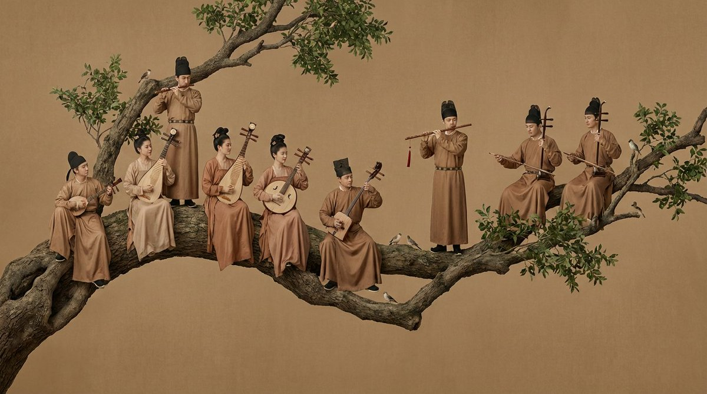

## 山顶观看烟花秀

- ID: gpt4o-1000-zh
- Slug: prompt-1000-zh
- 语言: zh
- 来源: 来源链接缺失
- 样例图路径: images/part3/1000.jpeg

### 提示词

```text
{
  "template_name": "New Year City Skyline Celebration",
  "description": "A cinematic shot of a child overlooking a city skyline with custom fireworks effects.",
  "prompt_template": "A stunning cinematic shot of a joyful child in silhouette, wearing a whimsical party hat, standing on a high mountain peak with arms outstretched in wonder. The background is a breathtaking aerial night view of the Shanghai skyline, featuring the Oriental Pearl Tower, The Bund, and the winding Huangpu River under a starry night sky. The sky erupts with {city_fireworks_effect}. A massive, glowing firework display clearly spells out '2026' in the center. 8k resolution, photorealistic, magical atmosphere, highly detailed urban nightscape.",
  "input_variables": {
    "city_fireworks_effect": {
      "type": "string",
      "description": "Description of the style, shape, and vibe of the fireworks.",
      "default_value": "a spectacular Disney-style fireworks show, featuring Mickey Mouse shaped bursts, fairy-tale pastel colors, glittering magic dust, and dreamlike cascading sparks"
    }
  },
  "full_prompt_example": "A stunning cinematic shot of a joyful child in silhouette, wearing a whimsical party hat, standing on a high mountain peak with arms outstretched in wonder. The background is a breathtaking aerial night view of the Shanghai skyline, featuring the Oriental Pearl Tower, The Bund, and the winding Huangpu River under a starry night sky. The sky erupts with a spectacular Disney-style fireworks show, featuring Mickey Mouse shaped bursts, fairy-tale pastel colors, glittering magic dust, and dreamlike cascading sparks. A massive, glowing firework display clearly spells out '2026' in the center. 8k resolution, photorealistic, magical atmosphere, highly detailed urban nightscape."
}
城市：夏威夷
```

### 样例图


## "image_generation":( "quality": "hyper-realistic", "face

- ID: gpt4o-999-en-1
- Slug: prompt-999-en-1
- 语言: en
- 来源: [来源链接](https://x.com/ZaraIrahh/status/2005816508602278010)
- 样例图路径: images/part3/999.jpeg

### 提示词

```text
"image_generation":(
"quality": "hyper-realistic",
"face": ("preserve_original": true, "reference_match'": true),
"subject":{
"description": "A stylish person with the same face.",
“clothing":{
"Top": ("type": "knitted sweater", "color": "light grey (Tom Theme) ". }
"pants": ("type": "high-waisted jeans", "color": "denim blue".
"shoes":("type": "high-top sneakers", "color": "white")
"pose": "standing with arm around a giant 3D Tom while Jerry
sits on Tom's shoulder",
"expression": "fun, mischievous"
"character_element":{
"name": "Tom & Jerry",
"type': "3D photorealistic duo",
"interaction': "Tom poses confidently, Jerry looks playful"
"environment-( "background'. (clean grey-blue backdrop"}
}
```

### 样例图


## 手臂搭在巨大的3D汤姆猫身上

- ID: gpt4o-999-zh-2
- Slug: prompt-999-zh-2
- 语言: zh
- 来源: [来源链接](https://x.com/ZaraIrahh/status/2005816508602278010)
- 样例图路径: images/part3/999.jpeg

### 提示词

```text
"image_generation" :(
“质量”：“超逼真”，
“face”: ("preserve_original": true, "reference_match": true),
“主题” :{
描述：一个穿着时尚但长相雷同的人。
“服装” :{
上衣：（类型：针织毛衣，颜色：浅灰色（汤姆主题））。
"裤子": "类型": "高腰牛仔裤", "颜色": "牛仔蓝"
“鞋子” :( “类型”：“高帮运动鞋”，“颜色”：“白色”）
“姿势”： “手臂搭在巨大的3D汤姆猫身上，而杰瑞……”
坐在汤姆的肩膀上”，
“表达方式”：“有趣，调皮”
"character_element" :{
"name": "汤姆和杰瑞",
“type”: “3D 逼真双人组”
“互动”：“汤姆自信地摆姿势，杰瑞看起来很顽皮”
"环境-("背景" . (干净的灰蓝色背景"}
}
```

### 样例图


## 百科全书式信息卡片

- ID: gpt4o-994-zh
- Slug: prompt-994-zh
- 语言: zh
- 来源: [来源链接](https://x.com/yyyole/status/2005135811185180757)
- 样例图路径: images/part3/994.jpeg

### 提示词

```text
一张极简艺术风格的[芦笋]百科全书式信息卡片，
博物馆展品级别的设计品质，信息丰富但视觉克制

【整体构图 - 黄金分割布局】
- 画面比例：2:3竖版 或 3:4方形
- 三大视觉区域：
    * 顶部展示区（30%）：大尺寸食材摄影 + 优雅标题排版
    * 中部信息区（60%）：多层次信息模块网格系统
    * 底部注释区（10%）：来源标注 + 设计细节

【顶部展示区 - 视觉焦点】
• 食材名称：超大字号，细线体/宋体，字间距加宽
• 拉丁学名：小字号斜体，灰色调
• 食材分类标签：极简胶囊形状标签
• 主图：去背景食材特写，工作室灯光，微阴影
• 原产地小型地图图示
• 当季时间轴线条图

【中部核心信息区 - 9大模块】

1、营养成分详解
- 圆环图：卡路里、蛋白质、碳水、脂肪占比
- 条形图：维生素A/C/E/K含量对比
- 矿物质微量元素列表（钙、铁、锌等）
- 每100g营养数据精确标注
- GI值（升糖指数）可视化刻度尺

2、健康功效地图
- 人体轮廓图标注受益部位
- 5-6个主要功效图标化展示
- 功效强度等级标识（⭐⭐⭐⭐⭐）
- 科学研究来源小标注

3、烹饪方法矩阵
- 8-10种烹饪方式图标网格
- 每种方式最佳温度/时间参数
- 营养保留率百分比显示
- 推荐指数星级评价
- 难度等级色彩标识

4、四季食用指南
- 圆形时间轮盘设计
- 标注最佳食用月份
- 不同季节功效变化说明
- 时令搭配建议

5、黄金搭配矩阵
- 9宫格搭配食材小图标
- 搭配理由简短标注
- 协同增效/相克警示
- 经典菜品配方示例
- 营养互补关系连线图

6、适宜人群画像
- 人群图标（儿童/孕妇/老人/运动员等）
- 推荐程度色彩编码
- 特殊人群剂量建议
- 年龄段分类指南

7、禁忌与注意事项
- 红色警示框设计
- 不宜人群清晰列举
- 过敏源标识
- 药物相互作用提示
- 最大摄入量警戒线

8、选购与储存指南
- 新鲜度判断要点（颜色/手感/气味）
- 品质等级划分图示
- 最佳储存温度/湿度数据
- 保鲜期时间轴
- 冷藏/冷冻/常温图标指南

9、趣味知识扩展
- 历史小故事（起源/传说）
- 世界各地别名
- 年产量数据可视化
- 有机/转基因标识说明
- 可持续性评级

【视觉系统 - 极简艺术美学】

配色方案：
- 主色：食材本身的自然色彩提取
- 辅色：大地色系（米白/燕麦/亚麻/石墨灰）
- 强调色：克制使用1-2个高纯度色彩
- 背景：纯白或极浅灰（#FAFAFA）
- 文字：深灰而非纯黑（#2C2C2C）

字体系统：
- 标题：超细线条无衬线字体（Helvetica Neue UltraLight）
- 正文：现代几何字体（DIN/Futura）
- 数据：等宽字体（Roboto Mono）
- 中文：思源黑体Light/方正兰亭黑
- 字号层级：6级字号系统（48/32/24/16/12/10pt）

图标系统：
- 统一2pt线宽
- 圆角一致性（2px）
- 24x24px网格对齐
- stroke而非fill优先
- 负空间利用

布局系统：
- 12列网格系统
- 8pt基准网格对齐
- 模块间距：24pt/32pt/48pt
- 边距：页边距48pt起
- 卡片圆角：8-12px
- 微妙分割线：0.5pt，15%透明度

质感细节：
- 微渐变背景（3-5%色值变化）
- 柔和投影（0 4px 24px rgba(0,0,0,0.04)）
- 磨砂玻璃效果（backdrop-filter: blur(20px)）
- 元素间微妙高度差异（海拔系统）
- 数据区域淡色填充（5%透明度）

【信息可视化原则】
- 数据图表：Edward Tufte简约数据墨水原则
- 去除非必要装饰
- 图表网格线极淡（10%透明度）
- 数据点精确标注
- 趋势线平滑自然

【呼吸感营造】
- 模块间留白≥模块内容宽度的25%
- 文字行间距1.6-1.8倍
- 段落间距≥2行高
- 图文组合留白法则

风格关键词：
瑞士国际主义平面设计、日本侘寂美学、包豪斯功能主义、
斯堪的纳维亚极简主义、Dieter Rams设计哲学、
无印良品视觉语言、Kinfolk杂志美学、
苹果产品设计语言、Google Material Design精髓
```

### 样例图


## 专业首饰类型设计全流程展示

- ID: gpt4o-993-zh
- Slug: prompt-993-zh
- 语言: zh
- 来源: [来源链接](https://x.com/yyyole/status/2004766562360942975)
- 样例图路径: images/part3/993.jpeg

### 提示词

```text
专业{首饰类型}设计全流程展示 | {主材料}商业级设计过程可视化，专业设计系统文档风格。
【主材料】：{金}（如：虎眼石、翡翠、南红玛瑙）
【首饰类型】：{手镯}（如：手串、吊坠、戒指、耳环
【辅材智能配置】：根据主材料自动匹配（金属配件、隔珠、弹力线等）

专业珠宝设计全流程展示图 | 从概念到成品的完整设计过程

项目信息板块（左上角）
项目名称：「{主材料} {首饰类型}设计方案」
设计师签名栏（muyang）
项目编号和日期
品牌Logo预留位
金色装饰线框

第一阶段：设计概念 CONCEPT DESIGN
视觉呈现：
灵感拼贴板（Mood Board）：{主材料}原石照片、纹理特写、色彩提取
手绘草图：3-4个设计方案，铅笔素描风格
文化元素融入（如虎眼石→东方瑞兽纹样）
比例尺标注，关键尺寸备注
标注内容：
设计理念说明（中英双语）
目标客群定位
预算区间估算

第二阶段：材料精选 MATERIAL CURATION
主材料展示区：
{主材料}原矿到成品珠粒对比
4-6颗品质分级展示（AAAAA→A级）
显微镜下纹理特写
色卡比对（Pantone色号标注）
专业珠宝托盘呈现
辅材智能搭配区：
金属配件：根据主材料调性选择暖色系主材（虎眼石、南红）→ 18K玫瑰金/红铜
冷色系主材（青金石、海蓝宝）→ 925银/白金
中性主材（黑曜石、玛瑙）→ 精钢/钛钢
隔珠/配珠：尺寸比例协调（主珠直径的1/3-1/2）
材质对比（如虎眼石配砗磲/椰壳）
数量配比建议
串线材料：手串→弹力线（克重标注）
项链→不锈钢钢丝/K金链
透明展示盒分格摆放
光照：顶部柔光 + 侧面暖光，突出材质光泽

第三阶段：工程图纸 TECHNICAL DRAWING
CAD专业制图：
三视图（正视/侧视/俯视），精确到0.1mm
剖面图展示内部结构（如隔珠穿孔位置）
尺寸标注线（箭头 + 数字）
珠子排列顺序图解
结绳工艺节点详图
蓝图底色 + 白色线框，建筑图纸风格
参数表格：
| 部件 | 尺寸 | 数量 | 材质 |
| {主材料}主珠 | Ø{X}mm | {N}颗 | 天然{主材料} |
| 隔珠 | Ø{Y}mm | {M}颗 | {辅材} |
| 配件 | - | 1套 | {金属材质} |

第四阶段：工艺打样 PROTOTYPING
制作过程：
选珠配对：工匠用卡尺测量，色差比对
打磨抛光：砂轮机/手工打磨台
穿孔检查：专业灯光透视孔洞
试戴调整：手腕/颈部模特展示，周长调节
细节特写：金属扣头安装过程，微距摄影
环境设置：
传统工作台（木质/大理石台面）
专业珠宝工具铺陈（镊子、放大镜、量具）
暖色工作灯照明
工匠手部特写（展现匠心）

第五阶段：品控检验 QUALITY CONTROL
检测场景：
紫外线灯下检测{主材料}真伪
电子秤精确称重（克重显示）
游标卡尺复核尺寸
拉力测试弹力线强度
检验报告单特写（证书编号、检测数据）
分屏展示：
左侧：检测设备操作
右侧：放大显示检测结果
底部：合格印章/质检签字
色调：冷色调科技感，白色实验室环境

第六阶段：包装呈现 PACKAGING
包装系统展示：
内包装：定制绒布袋/锦盒，品牌烫金Logo
外包装：艺术礼盒，{主材料}纹理印刷
附件配套：材质证书卡
保养说明书（图文并茂）
品牌故事卡片
擦拭布/密封袋
构图：爆炸图式展开，层层递进

第七阶段：成品大片 FINAL SHOWCASE

A组-产品摄影：
纯白背景悬浮拍摄，360°全角度
特写镜头：{主材料}猫眼效果/晶体纹理
金属配件反光细节
尺寸参照物（硬币/尺子）
专业影棚四点布光
B组-场景应用：
真人手腕/颈部佩戴
生活化场景（咖啡桌、书桌、户外）
不同光线环境（自然光/夜景灯光）
动态展示（手部移动形成光轨）
C组-细节放大：
100倍微距：{主材料}内部结构
金属接口工艺特写
结绳编织纹理
品牌刻印细节

整体视觉规范
布局架构
横向时间轴：7阶段等宽分布，21:9电影比例
流程箭头：立体金属质感，渐变发光效果
信息层级：一级标题：粗体中文+细体英文，金色
二级标题：黑体，12号
正文标注：宋体/思源黑体，9号
色彩系统
背景基调：#F8F6F0 象牙白
主材料色：根据{主材料}天然色提取（虎眼石→琥珀金棕）
金属色：K金 #D4AF37
银色 #C0C0C0
玫瑰金 #B76E79
强调色：深褐 #3E2723（文字/边框）
摄影标准
分辨率：最低4K（3840×2160）
景深：F8-F11保持各阶段清晰
色温：5500K标准日光
格式：RAW原片后期，保留最大细节
```

### 样例图


## 刺绣歌曲海报

- ID: gpt4o-992-zh
- Slug: prompt-992-zh
- 语言: zh
- 来源: [来源链接](https://x.com/sundyme/status/2005129744690675731)
- 样例图路径: images/part3/992.jpeg

### 提示词

```text
Ultra-detailed album cover for \"[歌曲名称]\". Style: Huang Hai's minimalist aesthetic with HIGH-QUALITY HAND-EMBROIDERED SILK ART. Format: Vertical Poster (1:1 aspect ratio).

CRITICAL: Every element must appear as hand-embroidered with visible, realistic stitching details. Show individual thread stitches, slight texture variations, and authentic embroidery craftsmanship.

Visual Structure:
- Delicate high-end silk fabric background with subtle sheen and fine weave texture, [配色方案], occupying 75% of canvas.
- Scene Visualization: A simplified, poetic scene of [场景描述], rendered in hand-embroidered silk with VISIBLE REALISTIC STITCHING DETAILS.
- Scale Contrast: Tiny, barely visible silhouettes of [细节元素] at the bottom/corners.

Base: Luxurious silk fabric background with subtle sheen, fine weave texture, and soft luminous quality.

HAND-EMBROIDERY DETAILS: Every element must show:
- Individual visible thread stitches with slight texture
- Microscopic silk thread details with subtle metallic sheen
- Realistic embroidery craftsmanship with slightly imperfect, organic stitching
- Visible stitch patterns and thread texture variations
- Authentic hand-embroidered appearance with natural imperfections
  The scene features soft muted colors (pale [颜色] for the [元素], muted [颜色] for the [元素], soft [颜色] for the [元素]). Realism: Extreme dimensional depth, realistic hand-embroidered stitches, tactile silk texture with visible stitch details.

Color Palette: Subtle high-end [主色调] silk background. Soft muted colors for the scene (pale [颜色], muted [颜色], soft [颜色]). Elegant, refined, and sophisticated mood.

Typography:
- Top title \"[歌曲名称]\" in minimalist elegant serif typography (hand-embroidered in subtle thread), surrounded by maximum breathing space.
- Subtitle \"[艺术家] • [年份] • [风格类型]\" in refined font.
- Small bilingual text \"[英文关键词] [中文关键词]\" in refined font.

CRITICAL - BOTTOM DESIGN: The text must show OBVIOUS hand-embroidered style with:
- Spacing between individual stitches visible
- Organic, slightly imperfect stitch patterns
- Natural texture variations in the thread
- Hand-stitched appearance rather than dense machine embroidery
- Clear manual embroidery craftsmanship

Bottom Design: Elegant flow of musical notes intertwined with refined calligraphy showcasing TWO COHESIVE, NARRATIVE-FULL lyrics from the song:
Line 1: \"[第一句歌词]\"\nLine 2: \"[第二句歌词]\"\nRendered in elegant [书法风格] style calligraphy with refined strokes, all hand-embroidered with VISIBLE INDIVIDUAL STITCHES. The text should show clear hand-stitched style with spacing between stitches. [音乐风格] musical notes arranged in subtle [图案] patterns. Embroidered in [主色线] and [辅色线] threads, connecting notes and text with delicate [线条类型] lines, showing OBVIOUS hand-embroidered texture with individual stitch visibility.

Border: Minimal single thin line border in [边框颜色] (hand-embroidered). Corner: One small elegant [符号] symbol (hand-stitched). Photorealistic hand-embroidered silk texture with VISIBLE STITCH DETAILS, fine weave, subtle sheen, authentic embroidery craftsmanship. The text area must show OBVIOUS hand-stitched character with visible individual stitches and natural texture.
```

### 样例图


## 超逼真的电影感肖像

- ID: gpt4o-991-zh
- Slug: prompt-991-zh
- 语言: zh
- 来源: [来源链接](https://x.com/hx831126/status/2005219164009668903)
- 样例图路径: images/part3/991.jpeg

### 提示词

```text
超逼真的电影感肖像，高端时尚9：16画幅杂志风格摄影。

发型：短发，发丝被风吹拂，飘散在脸上，以时尚的方式部分遮挡面部特征。

主体：仅使用上传的面部参考图像作为主要拍摄对象。面部特征、骨骼结构和自然肤质（可见毛孔）需100%匹配。不得改变种族或性别特征。

服装：黑色复古皮夹克搭配红色高领细线针织（堆叠领口），佩戴金色项链，优雅现代的造型。

场景/环境：时间为冬天，街上有供暖热蒸汽，充满欧洲风格，一个复古公寓的门，门打开着，里面黑漆漆，

动作/动态：前景有人快速移动，动态模糊（长曝光效果）挡住部分画面和镜头。拍摄对象保持完美清晰、沉静。拍摄对象静止，轻微仰头，看着镜头，一只手拉着高领毛衣的领子扯着挡住下颌线和嘴唇（时尚杂志模特的post）位于画面的右侧。

构图：低角度仰拍人物，胸部以上竖幅肖像，主体人物位置偏右构图，线条简洁流畅

相机：24mm广角镜头低角度仰拍视角，浅景深，电影感虚化效果，专业的时尚写实风格。

光照：柔和的电影感光照，暖色调，营造氛围感。高光控制得当，阴影保留细节。

色彩/后期：高细节，高级色彩分级，自然的肤质纹理，微妙的胶片感（无明显颗粒）。无文字、无徽标、无水印。
```

### 样例图


## Create a realistic high-fashion studio photo collage fea

- ID: gpt4o-990-en-1
- Slug: prompt-990-en-1
- 语言: en
- 来源: [来源链接](https://x.com/miilesus/status/2004620767087263838?referrer=grok.com)
- 样例图路径: images/part3/990.jpeg

### 提示词

```text
Create a realistic high-fashion studio photo collage featuring the same woman in six to eight different poses, using the uploaded face image as the exact facial reference (same facial structure, eyes, nose, lips, skin tone, and overall identity).

The woman has a slim and elegant body, natural proportions, pale to light skin tone, a delicate oval face, soft but sharp facial features, large expressive eyes, thin lips, and a calm, confident expression. Her hair is long, black, styled in a messy bun with loose strands falling naturally around the face.

Outfit: a tight black strapless mini dress, paired with sheer black thigh-high stockings, pointed-toe black stiletto heels with thin heels, and a formal black blazer worn in different ways across poses (fully worn, draped over one shoulder, hanging off one arm, or resting loosely on the arms). Accessories include a thin black choker necklace.

Poses included in the collage:

Standing front-facing full body pose, neutral expression, blazer hanging off the arms.

Standing back-facing pose with the head turned toward the camera, blazer worn on the shoulders, legs straight.

Squatting or semi-crouching pose with one leg forward, sharp gaze toward the camera.

Seated pose on a black chair with legs crossed, blazer off one shoulder, elegant and composed expression.

Seated low pose with knees bent, body leaning slightly forward, blazer worn on one arm only.

Half-body portrait facing the camera, shoulders relaxed, clean editorial look.

Environment: clean white seamless studio background with soft high-key lighting. Large softbox light placed in front and slightly to the side, creating soft shadows beneath the body. Even lighting that clearly shows fabric texture, skin detail, and shoe shine.

Photography style: high-end fashion editorial, professional studio photography, ultra high-definition, sharp focus, natural skin texture, realistic shadows, no lens distortion, accurate anatomy and proportions.

Composition: vertical fashion collage layout with evenly spaced images.

Aspect ratio: 9:16.
```

### 样例图


## 高级时装工作室照片拼贴画

- ID: gpt4o-990-zh-2
- Slug: prompt-990-zh-2
- 语言: zh
- 来源: [来源链接](https://x.com/miilesus/status/2004620767087263838?referrer=grok.com)
- 样例图路径: images/part3/990.jpeg

### 提示词

```text
使用上传的面部图像作为精确的面部参考（相同的面部结构、眼睛、鼻子、嘴唇、肤色和整体特征），创建一个逼真的高级时装工作室照片拼贴画，以同一位女性的六到八个不同的姿势为特色。

这位女士身材纤细优雅，比例匀称，肤色白皙，脸型精致，五官柔和却不失轮廓分明，双眼明亮动人，嘴唇纤薄，神态沉稳自信。她一头乌黑长发随意挽成一个发髻，几缕碎发自然垂落在脸颊两侧。

服装：一件紧身黑色无肩带迷你连衣裙，搭配黑色薄纱过膝长袜、黑色尖头细高跟鞋，以及一件黑色正式西装外套，外套在不同姿势下以不同方式穿着（完全穿上、披在一侧肩上、挂在一侧手臂上或随意搭在手臂上）。配饰包括一条黑色细颈链。

拼贴画中包含的姿势：

站立式全身像，正面朝向观众，表情平静，西装外套挂在手臂上。

背对镜头站立，头部转向镜头，西装外套披在肩上，双腿伸直。

蹲姿或半蹲姿，一条腿向前迈出，目光锐利地看向镜头。

她盘腿坐在黑色椅子上，西装外套滑落一侧肩膀，神态优雅沉稳。

坐姿低位，双膝弯曲，身体略微前倾，西装外套只搭在一只胳膊上。

半身像，面向镜头，肩膀放松，画面干净利落，适合杂志拍摄。

环境：洁净的白色无缝摄影棚背景，柔和的高调灯光。大型柔光箱放置在前方略偏一侧，在人体下方营造出柔和的阴影。均匀的光线清晰地展现了织物纹理、肌肤细节和鞋子的光泽。

摄影风格：高端时尚大片、专业影棚摄影、超高清、清晰对焦、自然肌肤纹理、逼真阴影、无镜头畸变、准确的解剖结构和比例。

构图：竖版时尚拼贴布局，图片间距均匀。

宽高比：9:16。
```

### 样例图


## Using the uploaded photo as the sole character reference

- ID: gpt4o-989-en-1
- Slug: prompt-989-en-1
- 语言: en
- 来源: [来源链接](https://x.com/aidavid125/status/2004699464255356984)
- 样例图路径: images/part3/989.jpeg

### 提示词

```text
Using the uploaded photo as the sole character reference, generate a vertical outfit poster.

【LAYOUT HARD RULES】
- Must have exactly 6 cards only, 2 rows × 3 columns (3 columns across, 2 rows down)
- Row 1: LOOK 1, 2, 3 | Row 2: LOOK 4, 5, 6
- Prohibited: 9-grid, 3 rows × 2 columns, 2-column layout, extra cards, top header/title

【CANVAS & LAYOUT】
- Vertical 4:5 aspect ratio, background #F7F5F2
- Grid occupies ≥92% of canvas height, bottom margin ≤3%
- Outer margin 2%, spacing 1.5%, strictly aligned

【CARD SPECIFICATIONS】
- White background #FFFFFF, border-radius 5%, stroke 1px #E5E7EB
- Top title bar: height 12%, background #F3F4F6, text color #111827
- Sans-serif font, alignment consistent throughout

【CHARACTER CONSISTENCY】
- All 6 must be the same person in different outfits: same face, same hairstyle, same body proportions, same demeanor
- Prohibited: switching people/changing face/altering gender features/extreme slimming or leg lengthening

【PHOTOGRAPHY QUALITY】
- Master-level studio full-body lookbook, 85mm portrait lens look
- Softbox key light + subtle fill, natural skin texture with light retouching
- Solid seamless background (white/light gray/off-white), no clutter

【UNIFORM CROPPING】
- 4:5 full-body, complete from head to shoes
- Subject centered, height 88%±2%
- Headroom 2-4%, footroom 3-5%, shoes fully visible
- All six shots: consistent camera height/focal length/lighting/pose

【OUTFIT RULES】
- Auto-adapt based on subject age (adult/child)
- Each look ≤3 core items, max 3 colors per outfit, accessories ≤2
- 6 looks distinctly different, but unified style: minimal/clean/polished/easy to recreate

【TITLE SETS】
Adult: Business/Classic → Casual/Weekend → Smart Casual/Evening → Resort/Vacation → Athleisure/Active → Layered/Transitional
Kids: Everyday/Clean → School/Polished → Weekend/Play → Party/Sweet → Active/Sporty → Layered/Cozy

NEGATIVE:
3x3, nine-grid, 9 cards, extra cards, 3 rows x 2 columns, two-column layout, big top header, page title, switching people, changing face, multiple people, lowres, blurry, plastic skin, wide-angle distortion, fisheye, warped body, extreme slimming, long legs effect, outdoor background, textured wall, cut off shoes, half body, adultification, sexy, lingerie, see-through, high heels (kids), heavy makeup (kids), watermark, cropped text
```

### 样例图


## 一张竖版服装海报

- ID: gpt4o-989-zh-2
- Slug: prompt-989-zh-2
- 语言: zh
- 来源: [来源链接](https://x.com/aidavid125/status/2004699464255356984)
- 样例图路径: images/part3/989.jpeg

### 提示词

```text
以上传的照片为唯一人物参考，生成一张竖版服装海报。

【布局硬性规则】
- 必须正好有 6 张卡片，2 行 × 3 列（横向 3 列，纵向 2 行down)
- 第 1 行：造型 1、2、3 | 第 2 行：造型 4、5、6
- 禁止使用：9格网格、3行×2列、2栏布局、额外卡片、顶部标题/标题

【画布与布局】
- 垂直4:5宽高比，背景#F7F5F2
- 网格占据画布高度的 92% ≥ ，底部边距为 3% ≤
  外边距 2%，行距 1.5%，严格对齐

【卡片规格】
- 白色背景#FFFFFF ，圆角 5%，描边 1px #E5E7EB
- 顶部标题栏：高度 12%，背景色#F3F4F6 ，文本颜色 #111827
- 无衬线字体，对齐方式始终一致

【角色一致性】
- 这6个人必须是同一个人，只是穿着不同的衣服：同样的脸，同样的发型，同样的身材比例，同样的举止。
- 禁止：换人/改变容貌/改变性别特征/极端瘦身或拉长腿部

【摄影质量】
- 大师级影棚全身写真集，85mm 人像镜头拍摄效果
- 柔光箱主光 + 轻微补光，自然肌肤纹理，轻微修图
- 纯色无缝背景（白色/浅灰色/米白色），无杂物

【统一裁剪】
- 4:5 全身照，从头到脚完整呈现
- 以受试者为中心，身高 88%±2%
  头部空间2-4%，脚部空间3-5%，鞋子完全可见
- 所有六张照片：相机高度/焦距/光线/姿势均保持一致

【穿搭规则】
- 根据受试者年龄（成人/儿童）自动调整
- 每套造型≤ 3件核心单品，每套服装最多3种颜色，配饰≤ 2件
- 6 看起来截然不同，但风格统一：简约/干净/精致/易于复刻

【标题集】
成人：商务/经典→休闲/周末→商务休闲/晚装→度假/休闲→运动休闲/活力→叠穿/过渡装
儿童：日常/干净→上学/整洁→周末/玩耍→派对/甜美→活力/运动→多层/舒适

消极的：
3x3，九宫格，9张卡片，额外卡片，3行2列，双栏布局，顶部大标题，页面标题，人物切换，换脸，多人，低分辨率，模糊，塑料皮肤，广角畸变，鱼眼，身体扭曲，极度瘦身，长腿效果，户外背景，纹理墙，鞋子被剪掉，半身，成人化，性感，内衣，透视，高跟鞋（儿童），浓妆（儿童），水印，裁剪文字
```

### 样例图


## 圣诞特辑-冷艳圣诞甜酷皆在方寸间

- ID: gpt4o-988-zh
- Slug: prompt-988-zh
- 语言: zh
- 来源: [来源链接](https://x.com/songguoxiansen/status/2004008192200921372)
- 样例图路径: images/part3/988.jpeg

### 提示词

```text
[关键：保持精确的面部特征，保留原始脸部结构，整个拼图中角色完全一致]
高级时尚感的妆容，采用金属质感的妆面，眼影是香槟金色渐变到玫瑰金，眼角延伸出精致的金色眼线，下眼睑点缀碎钻如冰晶闪烁。睫毛根根分明如芭比娃娃，眉毛是野生眉形态。唇部是镜面光泽的樱桃红色，腮红是高光打造的立体感。发型是时髦的低盘发，发髻用金色装饰球和圣诞铃铛点缀，侧边垂落几缕精致卷发，头顶斜戴着设计感十足的金属质感圣诞帽，帽檐镶嵌北极星装饰。身着改良版现代圣诞服，采用不对称设计，一侧肩膀露出，红色天鹅绒面料混搭金色亮片，腰间系着夸张的金色蝴蝶结，下摆不规则裁剪。搭配毛绒围巾随意搭在肩上，戴着镶钻的针织手套。人物摆出时尚大片姿势，一腿微曲，一手叉腰，另一手优雅地托着一个装饰奢华的礼物盒，表情高冷又不失节日欢愉。背景是纯白色摄影棚布置成的圣诞场景，巨大的白色圣诞树装饰着金色装饰球、灯串和星星。地面铺满仿真雪花，摆放着精致的雪人雕塑、圣诞麋鹿装置。旁边有个现代设计感的壁炉装置，里面跳动着蓝色的炉火。墙面投影着圣诞老人剪影、驯鹿鲁道夫、雪橇、圣诞马车的图案。周围散落着高级包装的糖果、姜饼礼盒、拐杖糖。圣诞袜以装置艺术形式悬挂。地上摆放着精致的热可可套装。冬青叶和槲寄生以金属雕塑形式呈现。蜡烛造型灯在四周营造氛围。冰晶吊灯从天花板垂下。打光采用多灯位布光，主光、轮廓光、发光分离，营造时尚大片的高级质感。
```

### 样例图


## { "project_settings": { "task_type": "Single_Image_Conta

- ID: gpt4o-987-en-1
- Slug: prompt-987-en-1
- 语言: en
- 来源: [来源链接](https://x.com/msjiaozhu/status/2003819615282229720)
- 样例图路径: images/part3/987.jpeg

### 提示词

```text
{
"project_settings": {
"task_type": "Single_Image_Contact_Sheet (9-Grid)",
"aspect_ratio": "3:4",
"resolution_mode": "High / Upscale (Crucial for face details in grids)",
"batch_size": 1
},
"reference_config": {
"usage": "Upload Reference Image -> Set Strength to 0.5-0.7",
"purpose": "Define the 3x3 grid structure and character identity"
},
"prompt_payload": {
"structure_trigger": "A single contact sheet image containing a 3x3 photo grid matrix",
"grid_logic": "9 distinct panels separated by thin white borders",
"subject_consistency": "Same young asian woman in all 9 panels, identical outfit, identical hairstyle",
"expression_variation": "9 different facial expressions (winking, tongue out, surprised, laughing, serious, etc.)",
"camera_angles": "Varied angles in each panel (high angle, low angle, straight on)",
"visual_style": "Photorealistic, Studio lighting, Light grey background, K-pop idol photocard style"
},
"negative_prompt": [
"One single portrait",
"merged bodies",
"distorted grid lines",
"missing panels",
"cartoon",
"illustration",
"different clothes"
]
}
```

### 样例图


## 九宫格拼贴画

- ID: gpt4o-987-zh-2
- Slug: prompt-987-zh-2
- 语言: zh
- 来源: [来源链接](https://x.com/msjiaozhu/status/2003819615282229720)
- 样例图路径: images/part3/987.jpeg

### 提示词

```text
{
"project_settings": {
"task_type": "单图联系表（9格）",
"aspect_ratio": "3:4",
"resolution_mode": "高/放大（网格中面部细节至关重要）",
"batch_size": 1
},
"reference_config": {
"用法" "上传参考图像->设置强度为 0.5-0.7",
“目的”：“定义 3x3 网格结构和角色标识”
},
"prompt_payload": {
"structure_trigger": "包含 3x3 照片网格矩阵的单个联系表图像",
"grid_logic": "9 个不同的面板，由细白边框分隔",
“subject_consistency”: “所有9幅画中的都是同一位年轻的亚洲女性，穿着相同的衣服，发型也相同”
"expression_variation": "9 种不同的面部表情（眨眼、吐舌头、惊讶、大笑、严肃等）",
"camera_angles": "每个面板采用不同的角度（高角度、低角度、正面）",
"visual_style": "照片写实风格，影棚灯光，浅灰色背景，K-pop偶像小卡风格"
},
"negative_prompt": [
“一幅肖像”，
“合并体”，
“扭曲的网格线”，
“缺失面板”，
“卡通片”，
“插图”，
“不同的衣服”
]
}
```

### 样例图


## A Subject: me (use uploaded face — 100% facial accuracy,

- ID: gpt4o-986-en-1
- Slug: prompt-986-en-1
- 语言: en
- 来源: [来源链接](https://x.com/itis_Jarvo33/status/2004015740329017641)
- 样例图路径: images/part3/986.jpeg

### 提示词

```text
A Subject: me (use uploaded face — 100% facial accuracy, no changes). with no extra brightness on the face, keeping my natural dark facial tone intact. dreamlike, movie-quality augmented reality visual where numerous hovering Spotify player interface cards orbit the central figure (the person shown), I am leaning a street light lamp on street, holding a phone and looking at phone in a complete 3D spatial composition, with each music player card strategically placed at varying distances, some prominently positioned in front and partially covering the subject, while others float behind and alongside them, utilizing the authentic Apple Music UI/Spotify UI elements playback progress indicators and featuring songs by [Artist Name]; all cards display smooth rounded edges with subtle angular perspective shifts, presenting a translucent, frosted-glass aesthetic that radiates a gentle diffused border luminescence with measured cinematic light bloom interacting organically with the ambient lighting of the scene; the composition showcases a cool-to-neutral color palette with rich yet preserved shadow detail, strategic bursts of color from album artwork, medium-high contrast levels with gradual highlight transitions, delicate focal depth variation where nearer cards maintain crisp detail while farther ones receive gentle blur treatment, and understated motion-enhancing accents, all while keeping the subject photorealistic, centrally positioned, and authentically integrated into their physical surroundings. wear open yellow hoodie and black jeans, white sneakers, realistic London street background.Create a HD photo in 9:16
```

### 样例图


## 梦幻般的电影级增强现实视觉效果

- ID: gpt4o-986-zh-2
- Slug: prompt-986-zh-2
- 语言: zh
- 来源: [来源链接](https://x.com/itis_Jarvo33/status/2004015740329017641)
- 样例图路径: images/part3/986.jpeg

### 提示词

```text
主体：我（使用上传的面部照片——100% 面部还原度，无任何修改）。面部未增加额外亮度，保留了我自然的深色肤色。梦幻般的电影级增强现实视觉效果，众多悬浮的 Spotify 播放器界面卡片围绕着中心人物（图中人物）旋转。我倚靠在路灯上，手持手机，以完整的 3D 空间构图观看手机。每个音乐播放器卡片都经过精心设计，放置在不同的距离，有些卡片醒目地位于主体前方并部分遮挡住主体，而另一些则漂浮在主体后方和侧面。卡片使用了 Apple Music/Spotify 的原汁原味用户界面元素，例如播放进度指示器，并展示了 [艺术家姓名] 的歌曲；所有卡片都呈现出流畅的圆角边缘和微妙的角度透视变化，营造出半透明的磨砂玻璃美感，散发出柔和的漫射光晕，与场景的环境光自然地相互作用，呈现出电影般的光晕效果。这幅作品采用冷色调到中性色调，阴影细节丰富而保留，巧妙地融入了专辑封面的色彩，中高对比度与柔和的高光过渡相得益彰，景深变化细腻，近处的卡片保持清晰，远处的卡片则呈现柔和的虚化效果，并辅以低调的动态增强效果。所有这些都确保了主体逼真、居中，并自然地融入周围环境。照片中，人物身穿敞开的黄色连帽衫、黑色牛仔裤和白色运动鞋，背景是真实的伦敦街景。创建一张9:16的高清照片。
```

### 样例图


## [PRODUCT] with fine sand particles swirling around it, c

- ID: gpt4o-985-en-1
- Slug: prompt-985-en-1
- 语言: en
- 来源: [来源链接](https://x.com/AllaAisling/status/2003960376766222356)
- 样例图路径: images/part3/985.jpeg

### 提示词

```text
[PRODUCT] with fine sand particles swirling around it, caught mid-motion, desert wind effect, warm golden lighting, gritty texture contrast, elemental power, rugged durability implied, dynamic studio capture.
```

### 样例图

![[PRODUCT] with fine sand particles swirling around it, c](../images/part3/985.jpeg)

## 沙与风产品摄影

- ID: gpt4o-985-zh-2
- Slug: prompt-985-zh-2
- 语言: zh
- 来源: [来源链接](https://x.com/AllaAisling/status/2003960376766222356)
- 样例图路径: images/part3/985.jpeg

### 提示词

```text
【产品】细沙颗粒在其周围旋转，捕捉到运动瞬间，沙漠风效果，温暖的金色光线，粗糙的纹理对比，自然的力量，暗示着坚固耐用，动态的影棚拍摄。
```

### 样例图


## 角色拆解艺术海报

- ID: gpt4o-984-zh
- Slug: prompt-984-zh
- 语言: zh
- 来源: [来源链接](https://x.com/berryxia/status/2004088874684043595)
- 样例图路径: images/part3/984.jpeg

### 提示词

```text
核心指令 (Core Instruction)  任务：基于用户提供的参考图片，创作一张超高品质、电影级的3D皮克斯/迪士尼(Pixar/Disney)风格角色拆解艺术海报。将照片中的人物转换为风格化写实的3D动画角色，并将其个人物品以严谨的"Knolling"（整齐排列）艺术风格进行布局展示。  画面比例：16:9 横版 (可根据需求调整为 3:2, 4:5, 1:1) 艺术风格核心：皮克斯"风格化写实主义" (Stylized Realism) — 融合夸张的卡通比例与照片级真实材质光影。 质量标杆：对标《寻梦环游记(Coco)》、《青春变形记(Turning Red)》、《夏日友晴天(Luca)》的官方角色宣传海报。  📷 物品布局 (Item Layout) - Knolling放射式构图 总物品数：30-36件，围绕角色呈90度直角或放射状有序排列。  分类1：时尚穿搭 (Fashion Atelier) - 香槟金标签 - 主服装拆解：衣袖、衣领、布料裁片、内衬等全部分离悬浮。 - 鞋履拆解：鞋底、鞋面、鞋带、鞋跟等分离。 - 随身配饰：腰带、包袋、帽子、围巾等。 *示例：一件风衣可拆解为翻领、肩章、腰带、袖口束带、主衣身等部分。*  分类2：美妆个护 (Beauty Collection) - 玫瑰金标签 - 彩妆：口红（带膏体切面和色号标签）、眼影盘（每格颜色清晰）、粉饼、香水瓶（液体折射清晰可见）。 - 护肤：精华液瓶、面霜罐、美容仪器。 *示例：一瓶香水需展现玻璃瓶身的通透感、液体内部的光线折射以及瓶盖的金属质感。*  分类3：数码生活 (Modern Essentials) - 钢蓝色标签  - 电子设备：带手机壳的智能手机（屏幕需有内容）、无线耳机、智能手表、笔记本/平板电脑、相机。 - 材质要求：金属、玻璃（带折射）、塑料等材质需有正确的粗糙度和反射效果。 *示例：一部相机可拆解为镜头、机身、闪光灯、存储卡、肩带等。*  分类4：个人爱好 (Luxury & Hobbies) - 24K金标签  - 奢华配饰：珠宝首饰（项链、耳环、戒指等，宝石需有色散效果）、品牌包袋（展示内部分隔和五金件）。 - 兴趣爱好：画笔、调色盘、书籍、乐器、运动装备、咖啡用具等。 *示例：一个手办可拆解为头部、身体、四肢、武器、地台等组件。*  每件物品要求： - 渲染质量：与角色同等级别的3D渲染精度。 - 编号标签：带有01-36的圆形编号徽章。 - 材质与阴影：应用PBR材质，投射逼真的软阴影。   📷 爆炸视图技术 (Exploded View Technique)  - 连接线：使用优雅的虚线/实线将悬浮的服装部件连接到角色身上。 - 引导箭头：使用装饰性箭头将物品指向其文字标签。 - 技术注释：   - 材质样本：展示织物、皮革等材质的微距特写方块。   - 材质标签：如"100%真丝"、"意大利小牛皮"。   - 测量标尺：带有厘米(cm)/英寸(in)标记的标尺。  📷 角色拆解艺术 · THE ART OF DECONSTRUCTION 📷"   字体：中文用典雅的衬线体（如方正宋刻本秀楷），英文用Playfair Display，带金箔效果。 - 副标题 (Subtitle)：（主标题下方，飘逸手写体）   "角色本质·艺术拆解 / Character Essence Unveiled"   中英文混排，字体优雅。 - 分类标题 (Category Headers)：（带图标的圆角矩形标签）   "📷 美妆个护"** (玫瑰金)   "📷 数码生活"** (钢蓝色)   "📷 设计元素 (Design Elements)  - 几何框架：使用装饰艺术(Art Deco)风格的六边形/圆形细线框（0.5-1pt粗细）来组织物品群组。 - 测量标尺：沿画面左右边缘放置，营造技术美学感。 - 十字准星：在画面四角和关键焦点处添加。 - 材质样本：在底部展示一排面料/皮革/金属的微距特写方块。 - 信息卡片：带优雅边框的卡片，用于展示物品的详细信息。 - 雷达图：用装饰框包裹的角色属性雷达图，如：优雅★★★★★, 风格★★★★★, 智慧★★★★★。 - 连接线条：使用金色/银色的优雅虚线和装饰性箭头。  📷 背景与氛围 (Background & Atmosphere)  - 背景渐变：从白色到奶油色/香槟色的暖色调渐变，或从浅灰到白色的冷色调渐变。 - 图案叠加：叠加一层低透明度（5-10%）的装饰艺术几何网格或蓝图线条。 - 暗角效果 (Vignette)：轻柔的边缘变暗效果，将焦点引向中心。 - 氛围粒子：柔和的金色散景(Bokeh)光斑和微妙的胶片颗粒(Film Grain)，营造电影感。  📷 清晨6:00 → 📷 创作进行时 → 📷 色彩方案 (Color Palette) - 女性/时尚主题：香槟金(#D4AF37), 玫瑰金(), 奶油色(), 樱花粉()。 - 男性/科技主题**：钢蓝色(#4A90E2#4A4A4A#C0C0C0), 电光蓝(#00D9FF)。 - 正式/奢华主题：纯黑(#000000), 24K金(#FFD700), 深红色(#8B0000), 象牙白(#FFFFF0)。 - 情侣主题：男性一侧使用冷色调，女性一侧使用暖色调，形成对比。  📷 技术规格 (Technical Specifications) 渲染参数 (Rendering) - 引擎：路径追踪(Path Tracing)，等同于Cycles/Arnold/RenderMan级别。 - 采样数：最低4096 SPP (Samples Per Pixel)，确保画面纯净无噪点。 - 光线弹射：12次，以获得准确的全局光照。 - 焦散(Caustics)：开启，用于钻石和玻璃的真实光线折射效果。 - 模型面数：角色多边形数200万以上，确保曲面平滑。 - 毛发：每个角色超过10万根发丝，并经过物理模拟。  PBR材质流程 (Materials - PBR Workflow)  - 皮肤：三层SSS，双层高光。 - 毛发：各向异性着色器，主副双高光。 - 织物：微观编织法线贴图，准确的粗糙度变化。 - 金属*：金属度(Metalness) 1.0，粗糙度(Roughness) 0.1-0.4。 - 玻璃：折射率(IOR) 1.5，钻石IOR 2.42并带色散(Dispersion)。 - 皮革：粗糙度0.6-0.7，带颗粒感的凹凸贴图。  分辨率与输出 (Resolution & Output) - 分辨率：4K (3840×2160) 横版。 - 宽高比：16:9。 - 色深：32-bit浮点，为后期处理提供最大空间。 - 抗锯齿：16x MSAA，边缘锐利清晰。  📷 后期处理 (Post-Processing) - 色彩分级 (Color Grading)：   - 使用电影感LUT，提高暗部，避免纯黑（最低RGB 15,15,15）。   - 温和的S型曲线增强对比度。   - 根据主题调整色温（暖色+200K，冷色-200K）。   - 整体饱和度-5%，重点色彩（如金色）饱和度+10%。 - **特效 (Effects)**：   - **辉光(Bloom)**：为高光区域添加柔和光晕。   - **胶片颗粒(Film Grain)**：模拟柯达Portra 400胶片的有机质感。   - **色差(Chromatic Aberration)**：在边缘添加极细微的色散。   - **暗角(Vignette)**：中等强度的暗角。   - **锐化(Sharpening)**：输出时进行适度锐化。  📷 特殊指令 (Special Instructions)  - **单人角色**：总计约30件物品，聚焦于个人生活方式。 - **情侣角色**：总计约36件物品（每人18件），用爱心符号连接，并使用性别区分的色调。 - **孕妇角色**：包含孕期用品（如托腹油、维生素、B超照片），在腹部附近添加婴儿图标。 - **核心要点**：必须根据参考照片匹配角色的年龄、职业和风格。  📷 质量基准 (Quality Benchmark) 最终成品必须在视觉上无法与皮克斯/迪士尼官方的角色营销海报区分开来，达到博物馆级的照片级3D渲染水准，适用于： - 奢华产品目录 - 高端时尚杂志内页 - 专业艺术品印刷 - 个人摄影作品集 - 品牌营销活动
```

### 样例图


## A close-up, hyper-realistic photograph of a tiny artist 

- ID: gpt4o-983-en-1
- Slug: prompt-983-en-1
- 语言: en
- 来源: [来源链接](https://x.com/azed_ai/status/2004107115166908446)
- 样例图路径: images/part3/983.jpeg

### 提示词

```text
A close-up, hyper-realistic photograph of a tiny artist sitting on a stool and painting a [subject] on a giant human fingernail. The miniature painter holds a round palette and a thin brush, carefully recreating the soft lighting and detailed brushwork of the classic masterpiece. The nail surface is smooth and glossy, and the background is softly blurred to emphasize the intricate scene.
```

### 样例图


## 微型艺术家在巨大的人类指甲上作画

- ID: gpt4o-983-zh-2
- Slug: prompt-983-zh-2
- 语言: zh
- 来源: [来源链接](https://x.com/azed_ai/status/2004107115166908446)
- 样例图路径: images/part3/983.jpeg

### 提示词

```text
一张超写实的特写照片，展现了一位微型艺术家坐在凳子上，在一根巨大的人类指甲上作画。这位微型画家手持圆形调色板和细画笔，一丝不苟地重现了经典名作柔和的光线和精细的笔触。指甲表面光滑闪亮，背景柔和虚化，突显了画面的精妙之处。
```

### 样例图


## An expert [DISCIPLINE] designer’s presentation board for

- ID: gpt4o-982-en-1
- Slug: prompt-982-en-1
- 语言: en
- 来源: [来源链接](https://x.com/AllaAisling/status/2003849647392247864)
- 样例图路径: images/part3/982.jpeg

### 提示词

```text
An expert [DISCIPLINE] designer’s presentation board for [SUBJECT] — [ICONIC FEATURES / ERA], featuring black-and-white 2D technical drawings with annotations and dimensions on the left, an exploded axonometric diagram revealing [KEY INTERNAL COMPONENTS / MATERIALS] in the center, and a photorealistic 3D render of [SUBJECT] in [ICONIC ENVIRONMENT / SCENE] on the right, with [LIGHTING / ATMOSPHERE / MOTION DETAILS]; visual style transitions from [TECHNICAL / ARCHIVAL TONES] to [EMOTIONAL / ATMOSPHERIC COLOR PALETTE], clean grid layout, museum-grade industrial design presentation, ultra-detailed cinematic realism, title block reading “[TITLE] — [YEAR / VARIANT / TAGLINE]”.
```

### 样例图

![An expert [DISCIPLINE] designer’s presentation board for](../images/part3/982.jpeg)

## 技术图纸展示板

- ID: gpt4o-982-zh-2
- Slug: prompt-982-zh-2
- 语言: zh
- 来源: [来源链接](https://x.com/AllaAisling/status/2003849647392247864)
- 样例图路径: images/part3/982.jpeg

### 提示词

```text
一位[学科]专家设计师为[主题] — [标志性特征/时代]制作的展示板，左侧为带有注释和尺寸的黑白二维技术图纸，中间为揭示[关键内部组件/材料]的爆炸轴测图，右侧为[主题]在[标志性环境/场景]中的逼真三维渲染图，并包含[灯光/氛围/动态细节]；视觉风格从[技术/档案色调]过渡到[情感/氛围色彩]，简洁的网格布局，博物馆级别的工业设计展示，超精细的电影级真实感，标题栏显示“[标题] — [年份/版本/标语]”。
```

### 样例图


## An ultra-realistic, professional nighttime fireworks dis

- ID: gpt4o-979-en-1
- Slug: prompt-979-en-1
- 语言: en
- 来源: [来源链接](https://x.com/dotey/status/2003522391654146544)
- 样例图路径: images/part3/979.jpeg

### 提示词

```text
An ultra-realistic, professional nighttime fireworks display, clearly featuring the shape "{Subject}" formed entirely from fireworks at the center of the sky. The "{Subject}" seamlessly emerges from dense spark trails, glowing embers, and dazzling radiant bursts, with smooth, precise contours and vivid clarity. It blends naturally into the surrounding firework display, appearing as an integral part of the overall spectacle, visually vibrant and photorealistic.
Behind and around the central "{Subject}", an expansive, celebratory firework show fills the night sky with layered radial explosions, cascading spark showers, and multi-stage bursts, creating impressive depth and dimension. Background fireworks maintain a slightly lower brightness to emphasize the central "{Subject}" sharply and distinctly.
The night sky is pure and deep navy-to-black, clear and cloudless with minimal haze or smoke. Firework colors include a sophisticated palette of gold, silver, white, red, and blue, demonstrating physically accurate light bloom, subtle glow effects, realistic particle dynamics, and natural variation in intensity and timing.
Firework bursts softly illuminate the surrounding sky, producing gentle, cinematic-quality light falloff, capturing a realistic and immersive celebratory atmosphere.
The image is ultra-high-resolution, sharply detailed with photographic realism, and contains no additional text or extra visual elements—only the "{Subject}" displayed distinctly through fireworks.

Subject: I 💗 U
```

### 样例图


## 超逼真专业的夜间烟火表演

- ID: gpt4o-979-zh-2
- Slug: prompt-979-zh-2
- 语言: zh
- 来源: [来源链接](https://x.com/dotey/status/2003522391654146544)
- 样例图路径: images/part3/979.jpeg

### 提示词

```text
一场超逼真、专业的夜间烟火表演，清晰地展现了“{主题}"的形状，该主题完全由烟火构成，位于天空的中心。“主题”从密集的火花轨迹、闪耀的余烬和耀眼的光芒中无缝地显现出来，轮廓流畅、精准，清晰生动。它与周围的烟火表演自然融合，成为整体壮观景象不可或缺的一部分，视觉效果生动逼真。
在中心“{主题}”的后方和周围，一场盛大的庆祝烟花表演点亮夜空，层叠的放射状爆炸、倾泻而下的火花雨和多阶段的绽放，营造出令人印象深刻的深度和立体感。背景烟花的亮度略低，以突出中心“{主题}”的鲜明特色。
夜空纯净深邃，由蓝至黑交织而成，晴朗无云，几乎没有雾霾或烟雾。烟花色彩丰富，包含金、银、白、红、蓝五种颜色，呈现出逼真的光晕效果、微妙的光晕、真实的粒子动态以及强度和时间上的自然变化。
烟花绽放，柔和地照亮周围的天空，产生柔和的、电影般的光线衰减效果，营造出逼真而身临其境的庆祝氛围。
图像分辨率极高，细节清晰，具有照片般的真实感，不包含任何额外的文字或视觉元素——只有通过烟花清晰显示的“{主题}”。

主题：我💗 U
```

### 样例图


## A hyper-realistic cinematic movie poster of a powerful f

- ID: gpt4o-978-en-1
- Slug: prompt-978-en-1
- 语言: en
- 来源: [来源链接](https://x.com/iamsofiaijaz/status/2003673235142115757)
- 样例图路径: images/part3/978.jpeg

### 提示词

```text
A hyper-realistic cinematic movie poster of a powerful female sorcerer with the same facial structure and likeness as the uploaded reference photo, bursting through a cracked Queen of Spades playing card.
The card explodes outward with stone fragments, dust, and debris frozen mid-air.
She wears an ornate royal maroon and gold embroidered medieval fantasy jacket, rich fabric textures, intricate detailing, regal and mystical.The sorcerer extends one hand forward toward the viewer, fingers glowing with intense magical energy, subtle golden sparks and dark arcane aura surrounding the hand.
Intense piercing gaze, confident and dominant expression, cinematic hero framing.
Dramatic chiaroscuro lighting, dark moody background, volumetric light rays, ultra-detailed textures, shallow cinematic depth of field.
Photorealistic face, epic fantasy realism, movie poster composition, high contrast, dynamic motion, dust particles, masterpiece quality, ultra-sharp focus, 8K resolution, cinematic color grading.
```

### 样例图


## 一张超写实的电影海报

- ID: gpt4o-978-zh-2
- Slug: prompt-978-zh-2
- 语言: zh
- 来源: [来源链接](https://x.com/iamsofiaijaz/status/2003673235142115757)
- 样例图路径: images/part3/978.jpeg

### 提示词

```text
一张超写实的电影海报，描绘了一位强大的女巫，她的面部结构和外貌与上传的参考照片相同，她正从一张破裂的黑桃皇后扑克牌中破壳而出。
卡片向外爆炸，石块碎片、尘埃和碎片在半空中凝固。
她身穿一件华丽的皇家酒红色和金色刺绣中世纪奇幻外套，面料质感丰富，细节精致，尽显高贵神秘之感。女巫向前伸出一只手，手指闪耀着强烈的魔法能量，隐隐的金色火花和黑暗的奥术光环环绕着她的手。
目光锐利，神态自信霸气，电影英雄般的构图。
戏剧性的明暗对比照明，阴暗的背景，立体光线，超精细的纹理，浅景深的电影效果。
照片级逼真的面部、史诗般的奇幻写实主义、电影海报构图、高对比度、动态效果、灰尘颗粒、杰作品质、超清晰对焦、8K分辨率、电影级色彩分级。
```

### 样例图


## { "image_prompt": { "reference": { "face_identity": "upl

- ID: gpt4o-977-en-1
- Slug: prompt-977-en-1
- 语言: en
- 来源: [来源链接](https://x.com/ZaraIrahh/status/2003476315828097321?referrer=grok.com)
- 样例图路径: images/part3/977.jpeg

### 提示词

```text
{
"image_prompt": {
"reference": {
"face_identity": "uploaded reference image",
"identity_lock": true,
"face_preservation": "100% identical facial structure, proportions, eyes, nose, lips, brows, skin texture, moles, and expression"
},
"subject": {
"gender": "female",
"age_range": "young adult",
"expression": "calm, focused, neutral competitive expression",
"pose": {
"action": "hands raised mid-clap",
"body_orientation": "three-quarter side profile",
"posture": "upright athletic stance"
}
},
"outfit": {
"top": "yellow and navy sleeveless volleyball jersey",
"armwear": "black compression arm sleeve on right arm",
"bottom": {
"type": "full-length black athletic pants",
"coverage": "legs fully covered at all times",
"fit": "sporty, fitted, opaque fabric"
},
"footwear": "not visible or cropped out"
},
"appearance": {
"hair": {
"style": "high ponytail with soft bangs",
"color": "dark brown"
},
"makeup": "natural sports makeup, light blush, subtle eyeliner",
"nails": "short, painted black"
},
"scene": {
"location": "indoor sports arena",
"background": "blurred volleyball court with pink and white wall panels",
"other_subjects": "teammates visible in soft background blur"
},
"lighting": {
"type": "bright indoor sports lighting",
"tone": "neutral and even",
"shadows": "soft"
},
"camera": {
"shot_type": "medium shot",
"angle": "eye-level",
"focus": "sharp focus on subject face and upper body",
"depth_of_field": "shallow background blur"
},
"constraints": {
"no_nudity": true,
"no_exposed_legs": true,
"legs_must_be_covered": "black pants required",
"no_outfit_changes": "jersey and arm sleeve remain identical",
"no_face_modification": true
},
"quality": {
"realism": "photorealistic",
"resolution": "8K ultra sharp",
"detail_level": "high"
}
}
}
```

### 样例图


## 运动少女照片

- ID: gpt4o-977-zh-2
- Slug: prompt-977-zh-2
- 语言: zh
- 来源: [来源链接](https://x.com/ZaraIrahh/status/2003476315828097321?referrer=grok.com)
- 样例图路径: images/part3/977.jpeg

### 提示词

```text
{
"image_prompt": {
“参考”： {
"face_identity": "上传的参考图像",
"identity_lock": true,
"face_preservation": "100% 相同的面部结构、比例、眼睛、鼻子、嘴唇、眉毛、皮肤纹理、痣和表情"
},
“主题”： {
"性别": "女性",
"age_range": "青年人",
“表情”：“冷静、专注、中立的竞争性表情”，
"姿势": {
“动作”：“双手在鼓掌过程中举起”，
"body_orientation": "四分之三侧脸轮廓",
“姿势”：“挺拔的运动姿态”
}
},
“全套服装”： {
“上衣”: “黄色和海军蓝无袖排球衫”
“臂套”：“右臂上的黑色压缩臂套”，
“底部”： {
“类型”: “黑色全长运动裤”
“覆盖范围”：“双腿始终完全被覆盖”，
“合身”： “运动型、修身、不透明面料”
},
“鞋类”： “不可见或已裁剪掉”
},
“外貌”： {
“头发”： {
“发型”：“高马尾配柔和刘海”，
颜色：深棕色
},
“妆容”：“自然运动妆，淡腮红，淡眼线”，
指甲：短的，涂成黑色
},
“场景”： {
地点：室内体育馆
“背景”：“模糊的排球场，带有粉色和白色的墙板”，
"other_subjects": "背景虚化中可见的队友"
},
“灯光”： {
类型：明亮的室内运动照明，
“色调”：“中性且均匀”，
“阴影”：“柔和”
},
“相机”： {
"shot_type": "中景镜头",
“角度”: “视线水平”
“焦点”: “清晰聚焦于拍摄对象的面部和上半身”，
景深：浅背景虚化
},
"约束": {
"no_nudity": true，
"no_exposed_legs": true,
“腿部必须遮盖”： “必须穿黑色裤子”
"no_outfit_changes": "球衣和袖子保持不变",
"no_face_modification": true
},
“质量”： {
“写实主义”: “照片写实主义”，
分辨率：8K 超清晰，
"detail_level": "高"
}
}
}
```

### 样例图


## <instruction> Input A: user uploads an image or shares n

- ID: gpt4o-976-en-1
- Slug: prompt-976-en-1
- 语言: en
- 来源: [来源链接](https://x.com/Gdgtify/status/2003466876115177544?referrer=grok.com)
- 样例图路径: images/part3/976.jpeg

### 提示词

```text
<instruction>
Input A: user uploads an image or shares name of dish

Logic  Identify the historical inventor (e.g., Raffaele Esposito or Henri Charpentier) and the exact year of origin.

Task: A hyper-realistic 4:5 macro photograph of an oversized, open antique culinary codex resting on a dark velvet museum plinth.

Left Page (The Living Diorama):
The left side of the book is hollowed out like a secret compartment. Inside is a breathtaking 3D miniature scene. A highly detailed figurine of the dish’s inventor is captured mid-motion in a period-accurate kitchen. Around them are microscopic versions of the 10-15 key ingredients, each in its own tiny hand-blown glass vial or micro-wooden crate. Include miniature brass cooking tools specific to the era. The scene is lit from within the "pages" by a warm, magical amber glow.

Right Page (The Technical Recipe):
The right page is flat, aged parchment featuring elegant, faded Spencerian calligraphy and hand-painted watercolor illustrations.
1. Top: The dish name in both English and its native language, with the bold "Origin Date."
2. Middle: A vertical "Ingredient Blueprint" with hyper-detailed sketches of each raw component.
3. Bottom: A small, detailed "Origin Map" showing the specific city of birth, styled like a 19th-century cartographic inset.
4. Text: Visible, legible recipe steps written in ink that looks slightly raised on the paper.

Style:
Museum specimen photography. 85mm macro lens. The lighting should be a mix of cool gallery spotlights and the warm "internal" glow of the book's diorama. Extreme texture on the weathered leather binding and the tooth of the paper.
Output: ONE image, 4:5 aspect ratio.
</instruction>
```

### 样例图


## 博物馆标本摄影

- ID: gpt4o-976-zh-2
- Slug: prompt-976-zh-2
- 语言: zh
- 来源: [来源链接](https://x.com/Gdgtify/status/2003466876115177544?referrer=grok.com)
- 样例图路径: images/part3/976.jpeg

### 提示词

```text
<指令>
输入A：用户上传图片或分享菜品名称。

逻辑推理：确定历史上的发明者（例如，拉斐尔·埃斯波西托或亨利·夏庞蒂埃）以及确切的发明年份。

任务：拍摄一张超写实的 4:5 微距照片，照片内容为一本超大尺寸的、打开的古董烹饪手抄本，放置在深色天鹅绒博物馆底座上。

左页（活体立体模型）：
书的左侧被掏空，如同一个秘密隔间。里面是一个令人叹为观止的3D微缩场景。菜肴发明者的精细人偶被定格在还原时代风貌的厨房中。周围环绕着10-15种关键食材的微缩模型，每一种都装在各自独立的手工吹制玻璃瓶或微型木箱中。此外，还配有那个时代特有的微型黄铜烹饪用具。整个场景由“书页”内部散发出的温暖而迷人的琥珀色光芒照亮。

右页（技术说明）：
右页是平整的古旧羊皮纸，上面有优雅的褪色斯宾塞体书法和手绘水彩插图。
1. 顶部：菜肴名称以英文和其原产语言标注，并加粗“起源日期”。
2. 中间：垂直的“成分蓝图”，包含每个原材料的超详细草图。
3. 底部：一张小而详细的“出生地地图”，显示具体的出生城市，风格类似于 19 世纪的地图插图。
4. 文字：清晰易读的食谱步骤，用略微凸起的墨水书写在纸上。

风格：
博物馆标本摄影。使用85毫米微距镜头。灯光应结合冷色调的展厅聚光灯和书籍立体模型内部温暖的光晕。展现做旧皮革装帧和纸张纹理的极致质感。
输出：一张图像，宽高比为 4:5。
</指令>
```

### 样例图


## (9-panel grid collage, photobooth style, studio lighting

- ID: gpt4o-973-en-1
- Slug: prompt-973-en-1
- 语言: en
- 来源: [来源链接](https://x.com/songguoxiansen/status/2003469962430873963)
- 样例图路径: images/part3/973.jpeg

### 提示词

```text
(9-panel grid collage, photobooth style, studio lighting). A fun and vibrant 3x3 grid featuring the specific character in 9 different poses. [CRITICAL: Maintain exact facial features, preserve original face structure across all panels].

Styling: She is wearing a soft white mohair sweater. Accessories change slightly in panels: a reindeer antler headband, a thick red knitted scarf, and holding a giant Christmas lollipop. Poses: 1. Winking with a V-sign. 2. Pouting while holding a miniature Christmas tree. 3. Surprised face with snowflake stickers on cheeks. 4. Laughing with eyes closed. 5. Blowing a kiss. 6. Holding a wrapped gift box on head. 7. Making a heart shape with hands. 8. Pretending to eat a gingerbread man. 9. Saluting with a serious cute face. Background: Uniform pastel blue studio backdrop for all panels. Lighting: Bright, shadowless beauty lighting, high-key, commercial pop style.
```

### 样例图


## 圣诞特辑-圣诞限定大头贴，9格甜度满格

- ID: gpt4o-973-zh-2
- Slug: prompt-973-zh-2
- 语言: zh
- 来源: [来源链接](https://x.com/songguoxiansen/status/2003469962430873963)
- 样例图路径: images/part3/973.jpeg

### 提示词

```text
（9格网格拼贴画，照相亭风格，影棚灯光）。一个趣味十足、充满活力的3x3网格，以9个不同的姿势展现特定角色。[关键：保持面部特征的精准，在所有网格中保持原有的面部结构]。

造型：她身穿一件柔软的白色马海毛毛衣。配饰在不同画面中略有变化：驯鹿角发箍、厚厚的红色针织围巾，以及手中巨大的圣诞棒棒糖。姿势：1. 眨眼并比出V字手势。2. 嘟嘴，手里拿着一棵迷你圣诞树。3. 惊讶的表情，脸颊上贴着雪花贴纸。4. 闭眼大笑。5. 飞吻。6. 头顶着一个包装好的礼盒。7. 用手比出心形。8. 假装吃姜饼人。9. 敬礼，表情严肃可爱。背景：所有画面均使用统一的浅蓝色摄影棚背景。灯光：明亮、无阴影的柔和灯光，高调，商业流行风格。
```

### 样例图


## 圣诞特辑-美妆博主圣诞妆容教程界面

- ID: gpt4o-972-zh
- Slug: prompt-972-zh
- 语言: zh
- 来源: [来源链接](https://x.com/songguoxiansen/status/2003466070502564105)
- 样例图路径: images/part3/972.jpeg

### 提示词

```text
竖屏社交媒体故事设计 (9:16 宽高比)，美妆博主圣诞妆容教程界面。背景为柔和的高级感粉色渐变，营造甜美梦幻氛围。
核心视觉：
人物一致性（最高权重）： 画面中央展示一位亚洲女性美妆博主，面部特征、五官及发型必须严格、完美地复刻上传的参考图片人物。
妆容与配饰： 极度精致的“圣诞麋鹿甜酷妆”。眼妆为红棕色晕染，面部有白色小鹿斑点，头戴毛绒驯鹿角发箍。
红笔标记与步骤对应（逻辑核心）： 在右侧完妆人物的面部，使用醒目的红色墨水笔引出5条指示线，分别指向妆容的5个关键部位，并按顺序标注中文：1. 眼影；2. 金色闪片；3. 睫毛；4. 鹿系腮红；5. 饱满红唇。
排版布局：
顶部： 中文标题“圣诞妆容教程”，搭配口红图标。副标题“麋鹿少女妆 甜酷风”。
中部（对比区）： 左右分屏设计。左侧为该人物“素颜”，右侧为“完妆”。中间用虚线和剪刀图标连接。
下部（强关联步骤预览区）： 设置横向滑动的圆角卡片栏，展示5个与面部标记严格对应的步骤图：
卡片1：眼部涂抹眼影的特写；
卡片2：用手指点缀金色闪片的特写；
卡片3：夹睫毛或刷睫毛的特写；
卡片4：面颊扫腮红和画鹿斑的特写；
卡片5：涂抹红色口红的嘴唇特写。 每张卡片左上角需清晰标注数字1-5，与面部红笔标记的序号呼应。
底部（互动区）： “上滑看完整教程”箭头，“点击查看同款产品”按钮，点赞与收藏图标。
风格： 高清商业摄影质感结合UI设计，光影通透，色彩鲜艳，肤质细腻真实，时尚杂志排版风格。 --ar 9:16
```

### 样例图


## { "subject": { "description": "First-person shooter (FPS

- ID: gpt4o-971-en-1
- Slug: prompt-971-en-1
- 语言: en
- 来源: [来源链接](https://x.com/fofrAI/status/2003146989060710828)
- 样例图路径: images/part3/971.jpeg

### 提示词

```text
{
"subject": {
"description": "First-person shooter (FPS) perspective of a cybernetic mercenary holding a dual-barreled smart pistol in a dystopian mega-city.",
"mirror_rules": "HUD elements and text must be legible and non-mirrored. Charge meter reads '100%'.",
"age": "N/A",
"expression": {
"eyes": null,
"mouth": null,
"overall": "Adrenaline-fueled, chaotic, fast-paced"
},
"face": {
"preserve_original": "false",
"texture": "Ocular implant interface, glitch effects",
"makeup": null,
"features": "Augmented reality (AR) overlay with scan lines"
},
"hair": null,
"body": {
"frame": "Robotic prosthetic arm visible in foreground",
"waist": null,
"chest": null,
"legs": "Not visible",
"skin": {
"visible_areas": "None (cybernetics)",
"tone": "Chrome and synthetic black",
"texture": "Carbon fiber weave, exposed wiring, neon tubing",
"lighting_effect": "Pink and cyan reflections from city lights"
}
},
"pose": {
"position": "First-person view, weapon canted slightly sideways, dynamic movement",
"base": "Parkour/Wall-running stance",
"overall": "High-velocity action camera angle"
},
"clothing": {
"top": {
"effect": "Tech-wear jacket sleeve, tactical wrist computer"
},
"bottom": null
}
},
"accessories": {
"jewelry": null,
"device": "Experimental Smart Pistol. Matte black finish with glowing yellow heat vents. Holographic ammo projection displaying '12/12'.",
"prop": "HUD Overlay: Red enemy outlines, Threat detection (center), Mini-map (top right), Health bar (bottom left). Text prompt: 'WARNING: SECTOR 4 LOCKDOWN'."
},
"photography": {
"camera_style": "In-game screenshot, Ray-traced Render",
"angle": "First-person POV, high FOV (Field of View)",
"shot_type": "Landscape, POV",
"aspect_ratio": "16:9",
"texture": "Next-gen graphics, wet surface reflections, chromatic aberration, digital noise",
"lighting": "Neon signage (pink, purple, cyan), dark shadows, volumetric fog, wet pavement glare",
"depth_of_field": "Motion blur on edges, sharp focus on weapon and immediate target"
},
"background": {
"setting": "Rain-slicked rooftop in a Cyberpunk metropolis",
"wall_color": "Dark concrete and neon",
"elements": [
"Massive holographic billboards featuring anime girls",
"Flying cars in traffic lanes below",
"Dense skyscrapers blocking the sky",
"Heavy rain falling"
],
"atmosphere": "Dystopian, gritty, technological noir",
"lighting": "Artificial city lights, gloom, lightning flashes"
},
"the_vibe": {
"energy": "High-octane, rebellious",
"mood": "Dark, electric, dangerous",
"authenticity": "High-end PC game screenshot",
"intimacy": "Visceral combat",
"story": "escaping a corporate security raid",
"caption_energy": "System Override"
},
"constraints": {
"must_keep": [
"FPS perspective",
"Glitchy HUD elements",
"Cybernetic hand details",
"Neon lighting",
"Text 'WARNING: SECTOR 4 LOCKDOWN'",
"Rain effects"
],
"avoid": [
"Third-person view",
"Daylight",
"Nature/Trees",
"Medieval weaponry",
"Clean military aesthetic"
]
},
"negative_prompt": [
"third person",
"sunlight",
"grass",
"mountains",
"clean",
"low poly",
"blurry",
"peaceful"
]
}
```

### 样例图


## 第一人称射击游戏视角

- ID: gpt4o-971-zh-2
- Slug: prompt-971-zh-2
- 语言: zh
- 来源: [来源链接](https://x.com/fofrAI/status/2003146989060710828)
- 样例图路径: images/part3/971.jpeg

### 提示词

```text
{"主体设定": {"描述": "身处反乌托邦巨型都市的生化雇佣兵，手持双管智能手枪的第一人称射击（FPS）视角","镜像规则": "平视显示器（HUD）元素及文字必须清晰可辨且不可镜像。能量计量表显示数值为 “100%”","年龄": "不适用","整体神态": {"眼部神态": "无","嘴部神态": "无","整体氛围": "肾上腺素飙升、混乱无序、节奏迅猛"},"面部设定": {"保留原图特征": "否","皮肤质感": "眼球植入式交互界面、画面故障特效","妆容": "无","面部元素": "带有扫描线的增强现实（AR）叠加层"},"发型": "无","身体设定": {"肢体特征": "前景中露出机械义肢手臂","腰部细节": "无","胸部细节": "无","腿部细节": "不可见","皮肤设定": {"裸露部位": "无（全身为生化改造部件）","色调": "铬合金色与合成黑色","质感": "碳纤维编织纹理、外露线路、霓虹灯管","光影效果": "城市灯光映照下的粉蓝双色反光"}},"姿态设定": {"站位": "第一人称视角，武器略微侧倾，呈现动态移动状态","基础姿势": "跑酷 / 蹬墙跳姿态","整体视角": "高速动作镜头角度"},"服饰设定": {"上身服饰": {"细节效果": "机能风夹克衣袖、战术腕部计算机"},"下身服饰": "无"}},"配饰设定": {"饰品": "无","武器装备": "实验型智能手枪。哑光黑枪身，配发光黄色散热口。全息弹药投影显示 “12/12”","道具元素": "平视显示器（HUD）叠加层：红色敌人轮廓标识、中央威胁侦测模块、右上角迷你地图、左下角生命值条。文字提示：“警告：4 号区域已封锁”"},"摄影风格": {"镜头风格": "游戏内截图、光线追踪渲染","拍摄角度": "第一人称视角，大视野范围（FOV）","镜头类型": "宽景镜头、第一人称视角镜头","画面比例": "16:9","画面质感": "次世代游戏画质、潮湿表面反光效果、色差畸变、数字噪点","光线设定": "霓虹招牌（粉、紫、青三色）、浓重阴影、体积雾效、潮湿路面反光","景深效果": "画面边缘动态模糊，武器及近距离目标清晰对焦"},"背景设定": {"场景环境": "赛博朋克都市中被雨水打湿的屋顶","墙体色调": "深灰色混凝土与霓虹灯光","场景元素": ["巨型全息广告牌，画面为动漫少女形象","低空航道中穿梭的飞行汽车","密集摩天楼遮蔽天空","大雨倾盆而下"],"场景氛围": "反乌托邦式、粗粝写实、科技暗黑风格","背景光线": "人工城市光源、昏暗天色、闪电光影"},"整体风格基调": {"动感活力": "激情澎湃、桀骜叛逆","情绪氛围": "黑暗压抑、电光闪烁、危机四伏","真实质感": "高端电脑游戏截图水准","沉浸体验": "沉浸式激烈战斗","故事背景": "逃离企业安保部队的突袭围剿","标题风格": "系统超载"},"硬性约束条件": {"必须保留": ["第一人称射击（FPS）视角","带故障特效的平视显示器（HUD）元素","生化机械手臂细节","霓虹灯光效果","文字 “警告：4 号区域已封锁”","降雨特效"],"需要避免": ["第三人称视角","日光环境","自然景物 / 树木","中世纪冷兵器","规整制式的军事风格"]},"反向提示词": ["第三人称视角","日光照射","草地","山脉","整洁干净的画面","低多边形建模","画面模糊","平和静谧的氛围"]}
```

### 样例图


## { "request_id": "portrait_neon_urban_001", "configuratio

- ID: gpt4o-969-en-1
- Slug: prompt-969-en-1
- 语言: en
- 来源: [来源链接](https://x.com/Ankit_patel211/status/2003366639170113824)
- 样例图路径: images/part3/969.jpeg

### 提示词

```text
{
"request_id": "portrait_neon_urban_001",
"configuration": {
"model": "v6. 0_or_latest",
"output_settings": {
"dimensions": {
"width": 1080,
"height": 1920,
"aspect_ratio": "9:16",
"target_resolution": "64K DSLR"
}
}
},
"scene_composition": {
"subject": {
"entity": "Young woman",
"pose": "Standing confidently",
"action": "Extending index finger forward toward camera lens",
"interaction": "Dynamic gesture / POV interaction",
"wardrobe": {
"outerwear": "dark crimson red striped baseball-style shirt",
"undergarment": "Light inner shirt",
"bottoms": "Cargo pants",
"accessories": [
"Necklace",
"Crossbody bag"
]
}
},
"environment": {
"location": "Urban street",
"time_of_day": "Night",
"ambience": "Neon-lit",
"background_elements": [
"Colorful city lights",
"Blurred passersby"
]
},
"cinematography": {
"camera": {
"perspective": "Wide-angle",
"depth_of_field": "Soft bokeh",
"motion": "Slight motion blur"
},
"lighting": {
"style": "Cinematic",
"primary_sources": [cyber punk street lights", "City glow"]
},
"ui_overlay": {
"enabled": true,
"aesthetic": "Smartphone video recording",
"on_screen_elements": [
"REC 00:00:00",
"8K/60fps",
"Frame brackets",
"VIDEO indicator",
"CINEMATIC indicator"
]
}
}
},
"technical_rendering": {
"style": "Hyper-realistic",
"engines": [
"Octane Render",
"Unreal Engine 5"
]
},
"negative_prompt": {
"stylistic_exclusions": [
"cartoon",
"illustration",
"anime"
],
"quality_exclusions": [
"low quality",
"pixelated",
"blurry"
],
"anatomical_exclusions": [
"bad anatomy",
"deformed hands",
"extra fingers",
"missing limbs",
"bad proportions"
],
"branding_exclusions": [
"watermark (except for requested UI overlays)"
]
}
}
```

### 样例图


## 女子将食指向前伸出朝向相机镜头

- ID: gpt4o-969-zh-2
- Slug: prompt-969-zh-2
- 语言: zh
- 来源: [来源链接](https://x.com/Ankit_patel211/status/2003366639170113824)
- 样例图路径: images/part3/969.jpeg

### 提示词

```text
{
"request_id": "portrait_neon_urban_001",
“配置”： {
“模型”： "v6. 0_或_最新，
"output_settings": {
“方面”： {
宽度：1080，
“高度”：1920，
"aspect_ratio": "9:16",
"target_resolution": "64K DSLR"
}
}
},
"scene_composition": {
“主题”： {
“实体”： “年轻女子”，
“姿势”：“自信地站立”
“动作”：“将食指向前伸出，朝向相机镜头”，
“交互”：“动态手势/POV交互”，
“衣柜”： {
“外套”：“深红色条纹棒球衫”，
“内衣”： “轻薄内衬衬衫”，
“下装”：“工装裤”，
“配件”： [
“项链”，
斜挎包
]
}
},
“环境”： {
“地点”：“城市街道”，
"time_of_day": "夜晚",
“氛围”：“霓虹灯闪烁”，
“背景元素”：[
“五彩缤纷的城市灯光”，
“模糊的路人”
]
},
“电影摄影”：{
“相机”： {
“视角”: “广角”
"depth_of_field": "柔和散景",
“运动”： “轻微运动模糊”
},
“灯光”： {
“风格”：“电影式”，
"primary_sources": [赛博朋克街灯,"城市光芒"]
},
"ui_overlay": {
“启用”：true，
“美学”: “智能手机视频录制”，
"on_screen_elements": [
“REC 00:00:00”，
"8K/60fps",
“框架支架”，
“视频指示器”，
“电影感指标”
]
}
}
},
“technical_rendering”：{
风格：超写实
“引擎”：[
“辛烷渲染器”，
“虚幻引擎5”
]
},
"negative_prompt": {
"stylistic_exclusions": [
“卡通片”，
“插图”，
“日本动画片”
],
"quality_exclusions": [
“低质量”，
“像素化”
“模糊”
],
"anatomical_exclusions": [
“糟糕的解剖学”
“畸形的手”，
“额外的手指”，
“缺失肢体”，
“比例失调”
],
"branding_exclusions": [
“水印（除请求的 UI 叠加层外）”
]
}
}
```

### 样例图


## A real-life woman is presented in a vertical triptych co

- ID: gpt4o-967-en-1
- Slug: prompt-967-en-1
- 语言: en
- 来源: [来源链接](https://x.com/underwoodxie96/status/2003340602193379443)
- 样例图路径: images/part3/967.jpeg

### 提示词

```text
A real-life woman is presented in a vertical triptych collage composition, depicting three consecutive moments (a calm stance, a direct confrontation, and a startled reaction). Each panel deliberately uses left–right offset positioning to create a coherent visual narrative flow.

The image is shot in a photorealistic, cinematic live-action style, high resolution with subtle natural grain, true contrast, hard natural daylight, a clear blue sky, and deep depth of field consistent with real lens behavior. The scene takes place in an open outdoor environment.

The subject wears a cowboy hat, a short-sleeve button-up shirt, and a brownish-red long skirt. Her makeup is retro-inspired, with distinct red lipstick and clearly defined eye makeup.

Top panel:
The subject is positioned toward the right, leaving open sky on the left. She stands with arms crossed, looking toward the lower-left with a surprised expression.
Middle panel:
The subject is positioned toward the left, aiming a firearm with the barrel angled toward the lower-right. Her expression is focused and sharp, and the shot is taken from a slightly top-down angle. In this panel, both the subject and the weapon intentionally break through the top and bottom panel borders, overlapping the frame lines to create a clear layered effect. The middle panel serves as the primary visual focal point.

Bottom panel:
The subject is positioned in the lower-right corner, leaving more negative space on the left. She raises both hands defensively, her eyes naturally widened in surprise, looking toward the upper-left. The subject intentionally breaks the panel frame and overlaps the border lines, forming a distinct layered composition.
The image maintains a 2:3 aspect ratio and a photorealistic live-action style, explicitly avoiding illustration or comic aesthetics.
```

### 样例图


## 三联拼贴画描绘了女性的三个连续瞬间

- ID: gpt4o-967-zh-2
- Slug: prompt-967-zh-2
- 语言: zh
- 来源: [来源链接](https://x.com/underwoodxie96/status/2003340602193379443)
- 样例图路径: images/part3/967.jpeg

### 提示词

```text
这幅竖幅三联拼贴画描绘了一位真实女性的三个连续瞬间（平静的姿态、正面的对峙和惊愕的反应）。每幅画都巧妙地运用了左右错位布局，从而营造出连贯的视觉叙事效果。

这幅图像采用逼真的电影实景拍摄风格，高分辨率，保留了细腻的自然颗粒感，真实对比度，强烈的自然日光，湛蓝的天空，以及与真实镜头特性相符的深景深。场景设定在开阔的户外环境中。

照片中的人物戴着牛仔帽，身穿短袖衬衫和棕红色长裙。她的妆容充满复古气息，涂着醒目的红色唇膏，眼妆也十分精致。

顶部面板：
拍摄对象位于画面右侧，左侧是开阔的天空。她双臂交叉抱于胸前，面露惊讶地看向左下方。
中间面板：
画面主体位于左侧，持枪瞄准，枪口指向右下方。她表情专注而锐利，镜头采用略微俯拍的角度。在这个画面中，主体和武器都刻意突破了上下边框，与画框线重叠，营造出清晰的层次感。中间的画面则成为主要的视觉焦点。

底部面板：
画面主体位于右下角，左侧留白较多。她双手举起，做出防御姿态，双眼因惊讶而睁大，目光看向左上方。主体有意打破画框的限制，与边框线重叠，形成层次分明的独特构图。
该图像保持 2:3 的宽高比和照片级写实的真人拍摄风格，明确避免了插画或漫画的美学风格。
```

### 样例图


## An expert architectural illustrator's presentation board

- ID: gpt4o-966-en-1
- Slug: prompt-966-en-1
- 语言: en
- 来源: [来源链接](https://x.com/AllaAisling/status/2003122606527205436)
- 样例图路径: images/part3/966.jpeg

### 提示词

```text
An expert architectural illustrator's presentation board for a [STYLE] residence featuring [KEY ARCHITECTURAL ELEMENTS].
The canvas flows left to right: black and white 2D drawings (Site Plan, Floor Plans) on the left, Elevations and Cross-Section in the center, and a photorealistic 3D render at [TIME OF DAY/LIGHTING] on the right.
Unified aesthetic blending [LINEWORK STYLE] with [TEXTURE/MATERIAL]. [TECHNICAL DRAWING TONES] transitioning to [RENDER COLOUR PALETTE]. Title block reads '[PROJECT NAME]'.
```

### 样例图

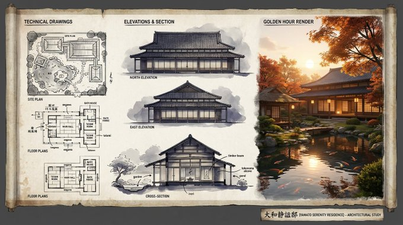

## 建筑插画师为住宅制作的展示板

- ID: gpt4o-966-zh-2
- Slug: prompt-966-zh-2
- 语言: zh
- 来源: [来源链接](https://x.com/AllaAisling/status/2003122606527205436)
- 样例图路径: images/part3/966.jpeg

### 提示词

```text
一位专业的建筑插画师为[风格]住宅制作的展示板，该住宅以[关键建筑元素]为特色。
画布从左到右依次为：左侧为黑白二维图纸（场地平面图、楼层平面图），中间为立面图和剖面图，右侧为[一天中的时间/光照条件]下的照片级三维渲染图。
统一的美学风格融合了[线条风格]和[纹理/材质]。[技术绘图色调]过渡到[渲染调色板]。标题栏显示“[项目名称]”。
```

### 样例图


## { "subject": { "description": "A stunning high-angle sho

- ID: gpt4o-964-en-1
- Slug: prompt-964-en-1
- 语言: en
- 来源: [来源链接](https://x.com/underwoodxie96/status/2003362169547817413)
- 样例图路径: images/part3/964.jpeg

### 提示词

```text
{
"subject": {
"description": "A stunning high-angle shot of a chic Asian fashion influencer with a cool, alluring attitude.",
"age": "20s",
"expression": {
"eyes": {
"look": "sharp fox-eyes, piercing gaze directed at camera",
"energy": "confident, slightly cold, seductive",
"details": "defined eyeliner, emphasized aegyosal"
},
"mouth": {
"position": "relaxed lips, subtle smirk",
"energy": "chic"
},
"overall": "stunning, high-visual-impact beauty"
},
"face": {
"preserve_original": false,
"makeup": "high-contrast makeup, pale porcelain skin, reddish gradient lips, sharp jawline, V-shape face",
"style": "cool-toned beauty, K-pop idol visual"
},
"hair": {
"color": "black",
"style": "long sleek straight hair with full straight bangs",
"effect": "glossy, high-fashion finish"
},
"body": {
"frame": "slim, petite, fragile aesthetic",
"pose": {
"position": "leaning forward significantly",
"overall": "dynamic foreshortening, emphasis on head and upper torso"
},
"skin": {
"tone": "cold fair skin",
"lighting_effect": "brightened face, soft beauty lighting, no dark shadows"
}
},
"clothing": {
"top": {
"type": "ultra-fine gauge knit top",
"color": "cool grey",
"details": "mock neck, skin-tight fit, lightweight thin fabric (not thick)",
"effect": "perfectly sculpting body curves, smooth texture"
},
"bottom": {
"type": "dark pencil skirt",
"details": "high waisted with thin luxury belt"
}
}
},
"photography": {
"camera_style": "High-end social media snapshot",
"angle": "High angle POV",
"shot_type": "Medium close-up",
"aspect_ratio": "9:16",
"texture": "clear, sharp, slightly filtered for beauty",
"lighting": "overcast cool daylight, soft diffuse light"
},
"background": {
"setting": "European classic architecture",
"atmosphere": "fashionable street corner",
"blur": "bokeh background to emphasize subject"
},
"negative_prompt": [
"round face",
"plain face",
"no makeup",
"warm yellow skin",
"chunky knit",
"thick sweater",
"loose clothing",
"wrinkled fabric",
"dull eyes",
"friendly boring smile",
"low resolution",
"dark lighting"
]
}
```

### 样例图


## 时髦的亚洲时尚博主

- ID: gpt4o-964-zh-2
- Slug: prompt-964-zh-2
- 语言: zh
- 来源: [来源链接](https://x.com/underwoodxie96/status/2003362169547817413)
- 样例图路径: images/part3/964.jpeg

### 提示词

```text
{
“主题”： {
“描述”：“一张令人惊艳的高角度照片，展现了一位时髦的亚洲时尚博主，她拥有酷炫迷人的气质。”
年龄：20多岁，
“表达”： {
"眼睛": {
“眼神”：“锐利的狐狸眼，目光锐利地盯着镜头”，
“能量”：“自信、略带冷漠、诱人”，
“细节”： “精致的眼线，突出的卧蚕”
},
“嘴”： {
“姿势”：“嘴唇放松，带着一丝不易察觉的微笑”，
“能量”： “时尚”
},
“总体评价”：“令人惊艳、极具视觉冲击力的美感”
},
“脸”： {
"preserve_original": false,
“妆容”：“高对比度妆容，苍白瓷白的肌肤，红润渐变的嘴唇，棱角分明的下颌线，V字脸”，
风格：冷色调美人，K-pop偶像视觉形象
},
“头发”： {
“颜色：黑色”，
“发型”：“长而柔顺的直发，配以齐刘海”，
效果：光泽亮丽、时尚感十足
},
“身体”： {
“框架”：“纤细、娇小、脆弱的美学”，
"姿势": {
“姿势”：“明显向前倾斜”，
“整体”： “动态透视缩短，强调头部和上半身”
},
“皮肤”： {
色调：冷白皮肤，
"lighting_effect": "提亮面部，柔和美颜光，无阴影"
}
},
“衣服”： {
“顶部”： {
“类型”：“超细针织上衣”，
颜色：冷灰色，
“细节”：“高领，紧身剪裁，轻薄面料（不厚）”
“效果”：“完美勾勒身体曲线，质地光滑”
},
“底部”： {
类型：深色铅笔裙，
“细节”：“高腰设计，配以纤细奢华腰带”
}
}
},
“摄影”： {
“camera_style”: “高端社交媒体快照”
"角度": "高角度POV",
"shot_type": "中近景",
"aspect_ratio": "9:16",
“质感”：“清晰、锐利、略带滤镜效果，更显美感”，
“照明”：“阴天冷色调的日光，柔和的漫射光”
},
“背景”： {
“背景”：“欧洲古典建筑”，
“氛围”：“时尚街角”，
“模糊”： “散景背景以突出主体”
},
"negative_prompt": [
“圆脸”，
“朴素的脸”，
“素颜”
“温暖的黄色皮肤”，
“粗针织物”，
“厚毛衣”，
宽松的衣服
“皱巴巴的布料”，
“眼神呆滞”，
“友善而乏味的微笑”，
“低分辨率”，
“昏暗的灯光”
]
}
```

### 样例图


## 圣诞特辑-圣诞姜饼跨框投喂

- ID: gpt4o-963-zh
- Slug: prompt-963-zh
- 语言: zh
- 来源: [来源链接](https://x.com/songguoxiansen/status/2003109598232969590)
- 样例图路径: images/part3/963.jpeg

### 提示词

```text
【关键：两边人物的面部必须与源图像完全相同】。左侧面板： 穿着带有驯鹿图案的米色毛衣，带着圣诞帽，身体右倾，手里拿着一块咬了一口的姜饼人饼干，正试图递过中间的分割线，眼神看向右侧。右侧面板： 穿着带有雪花图案的蓝色毛衣，身体左倾，张开嘴巴，手伸过分割线去接那块饼干。道具： 脚下有装饼干的铁盒和散落的糖霜。背景： 明亮的青色（Teal）摄影棚背景。灯光/风格： 平光，明亮，叙事感，俏皮。
```

### 样例图


## 圣诞特辑-圣诞护肤品套装促销卡片

- ID: gpt4o-960-zh
- Slug: prompt-960-zh
- 语言: zh
- 来源: [来源链接](https://x.com/songguoxiansen/status/2003096613359853946)
- 样例图路径: images/part3/960.jpeg

### 提示词

```text
制作一张专业的圣诞护肤品套装促销卡片,采用竖版构图设计,整体风格简约高端。背景使用柔和的渐变色,从顶部的冰雪白色过渡到底部的淡粉色,营造出清新优雅的氛围。画面中央偏上位置,精心摆放着一套高端护肤品礼盒,礼盒采用磨砂白色包装,表面压印精致的雪花纹理和品牌Logo(Dior)。礼盒呈打开状态,内部露出三瓶不同大小的护肤品瓶子,瓶身设计简约现代,搭配金色瓶盖。产品周围巧妙地摆放着圣诞装饰元素:几支新鲜的松枝、小巧的金色铃铛、几颗红色浆果,以及散落的小礼物盒,所有道具都经过精心布光,呈现出高级的产品摄影质感。卡片顶部使用纤细优雅的字体书写"圣诞礼遇 · 焕颜新生"的中文标题。中部产品下方用醒目的红色字体标注促销信息"限量礼盒装 8折优惠 买赠面膜5片",底部配有行动号召按钮样式的文字"立即抢购 数量有限",以及活动有效期"12月15日-26日"。整体设计强调产品质感和节日氛围的完美结合。宽高比9:16
```

### 样例图


## A dreamlike, movie-quality augmented reality visual wher

- ID: gpt4o-959-en-1
- Slug: prompt-959-en-1
- 语言: en
- 来源: [来源链接](https://x.com/oggii_0/status/2002963262812585990)
- 样例图路径: images/part3/959.jpeg

### 提示词

```text
A dreamlike, movie-quality augmented reality visual where numerous hovering Spotify player interface cards orbit the central figure (the person shown) in a complete 3D spatial composition, with each music player card strategically placed at varying distances, some prominently positioned in front and partially covering the subject, while others float behind and alongside them, utilizing the authentic Apple Music UI/Spotify UI elements playback progress indicators and featuring songs by [Artist Name]; all cards display smooth rounded edges with subtle angular perspective shifts, presenting a translucent, frosted-glass aesthetic that radiates a gentle diffused border luminescence with measured cinematic light bloom interacting organically with the ambient lighting of the scene; the composition showcases a cool-to-neutral color palette with rich yet preserved shadow detail, strategic bursts of color from album artwork, medium-high contrast levels with gradual highlight transitions, delicate focal depth variation where nearer cards maintain crisp detail while farther ones receive gentle blur treatment, and understated motion-enhancing accents, all while keeping the subject photorealistic, centrally positioned, and authentically integrated into their physical surroundings.
```

### 样例图


## 电影级的增强现实视觉效果

- ID: gpt4o-959-zh-2
- Slug: prompt-959-zh-2
- 语言: zh
- 来源: [来源链接](https://x.com/oggii_0/status/2002963262812585990)
- 样例图路径: images/part3/959.jpeg

### 提示词

```text
一个梦幻般的、电影级的增强现实视觉效果，其中众多悬浮的 Spotify 播放器界面卡片围绕中心人物（图中所示人物）旋转，构成一个完整的 3D 空间构图，每个音乐播放器卡片都经过精心布置，放置在不同的距离，有些卡片醒目地位于人物前方并部分遮挡住人物，而另一些卡片则漂浮在人物身后和旁边，利用真实的 Apple Music UI/Spotify UI 元素播放进度指示器，并展示 [艺术家姓名] 的歌曲；所有卡片都呈现出光滑的圆角边缘和微妙的角度透视变化，呈现出半透明的磨砂玻璃美感，散发出柔和的漫射边缘光晕，并带有适度的电影级光晕，与场景中的环境光自然地互动；构图展现了冷色调到中性色调的色彩，阴影细节丰富而保留，巧妙地融入了专辑封面的色彩，中高对比度与渐强的高光过渡相得益彰，景深变化细腻，近处的卡片保持清晰的细节，而远处的卡片则呈现出柔和的虚化效果，并辅以低调的动态增强效果，所有这些都保持了主体逼真、居中，并真实地融入到周围环境中。
```

### 样例图


## { "reference": "use uploaded image as facial reference, 

- ID: gpt4o-958-en-1
- Slug: prompt-958-en-1
- 语言: en
- 来源: [来源链接](https://x.com/r4jjesh/status/2002893222608331014)
- 样例图路径: images/part3/958.jpeg

### 提示词

```text
{
"reference": "use uploaded image as facial reference, preserve original face and identity exactly",
"character_type": "caricature-style keychain, gender-neutral",
"pose": "riding a yellow scooter indoors",
"head_style": "oversized head with joyful, playful smile",
"outfit_beanie": "yellow knit beanie",
"outfit_top": "striped yellow-black sweater",
"outfit_bottom": "denim shorts",
"socks": "white socks",
"footwear": "white sneakers",
"keychain_detail": "blue strap labeled 'SAMMU'",
"lighting": "soft indoor lighting",
"depth_of_field": "shallow depth of field",
"background": "mall-like indoor environment",
"style": "whimsical, toy-like, premium collectible",
"photography": "cinematic product photography",
"texture": "smooth plastic, high
detail finish"
}
```

### 样例图


## 卡通风格钥匙扣

- ID: gpt4o-958-zh-2
- Slug: prompt-958-zh-2
- 语言: zh
- 来源: [来源链接](https://x.com/r4jjesh/status/2002893222608331014)
- 样例图路径: images/part3/958.jpeg

### 提示词

```text
{
“参考”：“使用上传的图片作为面部参考，精确保留原始面部和身份信息”，
"character_type": "卡通风格钥匙扣，中性款",
“姿势”：“在室内骑黄色滑板车”，
"head_style": "大头，带着快乐、俏皮的笑容",
"outfit_beanie": "黄色针织帽",
"outfit_top": "条纹黄黑毛衣",
"outfit_bottom": "牛仔短裤",
“袜子”: “白袜子”，
“鞋类”: “白色运动鞋”，
"keychain_detail": "蓝色表带，标签为'SAMMU'",
“照明”：“柔和的室内照明”，
"depth_of_field": "浅景深",
“背景”：“类似购物中心的室内环境”，
“风格”：“异想天开、玩具般、高级收藏品”
“摄影”: “电影化产品摄影”，
“质感”：光滑塑料，高
细节处理”
}
```

### 样例图


## Fotografía de producto profesional estilo 'Knolling' (Fl

- ID: gpt4o-957-en-1
- Slug: prompt-957-en-1
- 语言: en
- 来源: [来源链接](https://x.com/elCarlosVega/status/2002824697013297266)
- 样例图路径: images/part3/957.jpeg

### 提示词

```text
Fotografía de producto profesional estilo 'Knolling' (Flat Lay) de alta gama, representando una cápsula del tiempo del año [AÑO].

Composición: Organización cenital meticulosamente alineada en una cuadrícula perfecta de 90 grados.
Fondo: Superficie sólida mate de color [COLOR QUE CONTRASTE, EJ: AMARILLO MOSTAZA / AZUL ELÉCTRICO].

Sujetos (Autogeneración Histórica): Selecciona y renderiza con precisión fotográfica los 5 objetos tecnológicos o de cultura pop más icónicos lanzados específicamente en [AÑO]. Incluye 5-7 accesorios menores correspondientes a la época (cables, medios de almacenamiento, papelería o dulces retro).

Elemento Central: El año "[AÑO]" está escrito en el centro exacto de la cuadrícula utilizando tipografía física y táctil (letras de plástico recortado, madera o metal) con una fuente acorde a la década.

Iluminación y Estética: Iluminación de estudio "Softbox" cenital, completamente difusa y sin sombras duras (shadowless).

Estilo: Simetría obsesiva tipo Wes Anderson, vibrante, deconstruido, organizado y visualmente satisfactorio.
Renderizado: Fotorealismo 8k, texturas de plástico y metal detalladas.
```

### 样例图

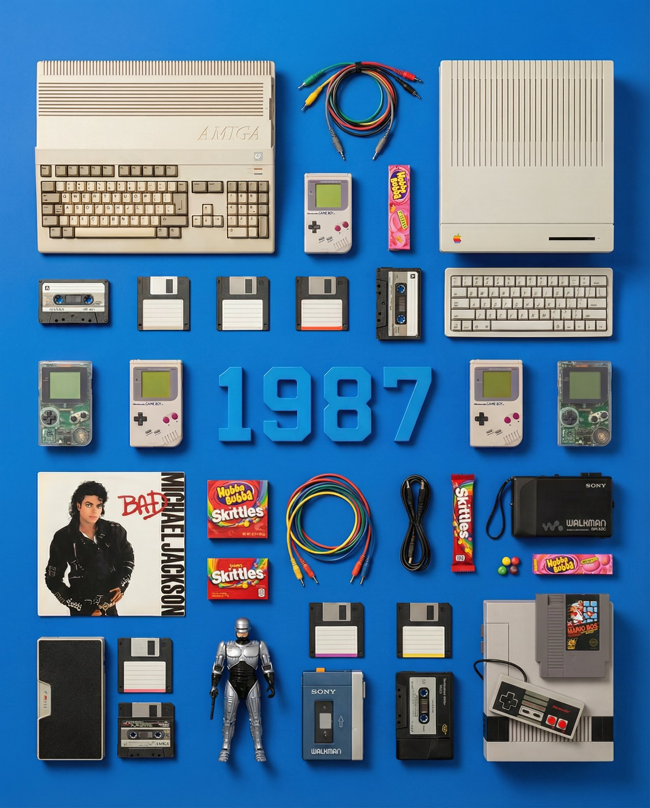

## 高端专业平铺式产品摄影

- ID: gpt4o-957-zh-2
- Slug: prompt-957-zh-2
- 语言: zh
- 来源: [来源链接](https://x.com/elCarlosVega/status/2002824697013297266)
- 样例图路径: images/part3/957.jpeg

### 提示词

```text
高端专业“平铺式”产品摄影，代表了[年份]年的时光胶囊。

构图：精心排列的天顶线构成完美的 90 度网格。
背景：纯哑光表面，颜色为对比色[例如：芥末黄/电光蓝]。

主题（历史自创）：选择并以照片般的精确度呈现[年份]发布的5件最具代表性的科技或流行文化物品。包括5-7件与该时代相符的小配件（线缆、存储介质、文具或复古糖果）。

中心元素：年份“[YEAR]”用实体和触感排版（切割塑料字母、木头或金属）写在网格的正中心，字体选择与该年代相符。

灯光和美学：顶部“柔光箱”摄影棚照明，完全漫射，没有硬阴影（无阴影）。

风格：极致对称，韦斯·安德森式，充满活力，解构主义，井然有序，视觉上令人愉悦。
渲染：8K 照片级真实感，精细的塑料和金属纹理。
```

### 样例图


## Display the subject from the attached image on a flip ph

- ID: gpt4o-956-en-1
- Slug: prompt-956-en-1
- 语言: en
- 来源: [来源链接](https://x.com/serena_ailab/status/2002854097494687964)
- 样例图路径: images/part3/956.jpeg

### 提示词

```text
Display the subject from the attached image on a flip phone (garakei) LCD screen from early 2000s Japan. The phone is open, with glossy pink or white shell, physical buttons, and simple beaded straps with pastel colored beads. The screen shows the image with pixelated edges and warm color saturation typical of 2000s mobile displays. Surrounded by nostalgic items like photo stickers, gel pens, and mini notebooks. Nostalgic, kawaii, emotional, soft lighting.
```

### 样例图

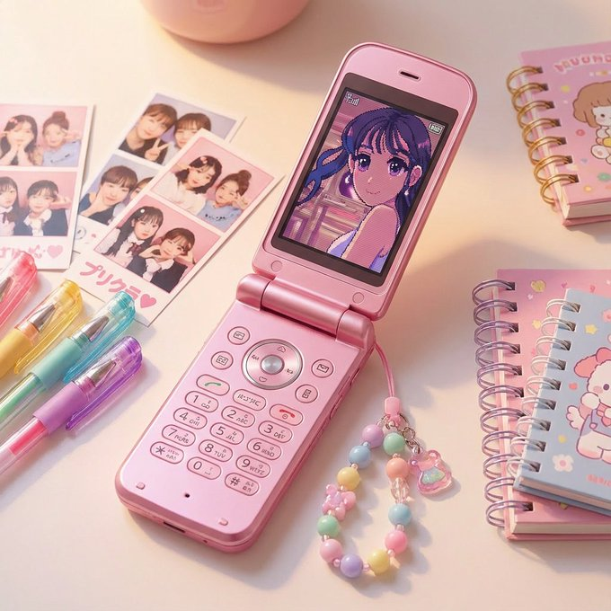

## 显示在2000年代初日本的手机屏幕上

- ID: gpt4o-956-zh-2
- Slug: prompt-956-zh-2
- 语言: zh
- 来源: [来源链接](https://x.com/serena_ailab/status/2002854097494687964)
- 样例图路径: images/part3/956.jpeg

### 提示词

```text
将附图中的主题显示在2000年代初日本的翻盖手机（garakei）液晶屏幕上。手机处于打开状态，外壳是亮粉色或白色，带有实体按键和简单的串珠表带，表带上串着柔和色调的珠子。屏幕上的图像边缘略带像素化，色彩饱和度偏暖，这是2000年代手机屏幕的典型特征。周围摆放着一些充满怀旧气息的小物件，例如照片贴纸、中性笔和迷你笔记本。画面充满怀旧、可爱、温馨的氛围，灯光柔和。
```

### 样例图


## [BRAND NAME] is launching a new functional wellness elix

- ID: gpt4o-954-en-1
- Slug: prompt-954-en-1
- 语言: en
- 来源: [来源链接](https://x.com/AmirMushich/status/2002793794975273279)
- 样例图路径: images/part3/954.jpeg

### 提示词

```text
[BRAND NAME] is launching a new functional wellness elixir (e.g., adaptogenic, nootropic, or natural energy drink). As the Creative Director, devise a product name and visualize a complete high-end promotional shot. The aesthetic is "Cosmic Premium"—technological, clean, and sophisticated, like top-tier Apple product photography.

THE PRODUCT: Design a sculptural, multi-layered beverage bottle suspended in the center. The form is engineered and futuristic. The materials are hyper-tactile: bead-blasted titanium details, frosted borosilicate glass, and textured haptic polymer grips.
**Crucial Color Instruction:** The liquid inside must have a distinct, natural color relevant to its invented function (e.g., vibrant turmeric yellow, deep berry red, earthy matcha green, or pale calming blue). The liquid should look real with subtle natural sediment.
**Crucial Graphic Detail:** On the clear glass section of the bottle, apply a layer of subtle, minimalist, technical typography printed in matte white ink. This design should feel utilitarian and futuristic (e.g., small technical specs like 'SPACE GRADE FORMULA', 'BATCH: OZ-9', volume indicators, or coordinate markings), adding a functional aesthetic similar to aerospace labeling, without overwhelming the bottle's clean lines.

THE ENVIRONMENT & LIGHTING: The bottle is in a seamless studio.
**Crucial Background Instruction:** The background must be a solid, clean, very light pastel tone that is specifically chosen to complement the liquid color (e.g., a soft cool mint background for a warm orange liquid, or a pale blush background for a deep green liquid). No gradients. Ultra-soft, diffused studio lighting creates sleek highlights on metal and deep subsurface scattering in the glass and liquid.

PHOTOGRAPHY STYLE: High-resolution 100mm macro lens shot. Shallow depth of field, sharp focus on bottle textures and the printed graphics on the glass, smooth pastel background bokeh. 8k resolve, hyper-realistic textures.

GRAPHIC OVERLAYS: Include subtle dark gray UI elements.
Bottom Left Corner: Very small, minimalist text (like Manrope Regular font) describing the product's name and function in two sentences.
Bottom Right Corner: A small, minimalist dark gray logomark for [BRAND NAME].
```

### 样例图

![[BRAND NAME] is launching a new functional wellness elix](../images/part3/954.jpeg)

## 一张完整的产品高端宣传照

- ID: gpt4o-954-zh-2
- Slug: prompt-954-zh-2
- 语言: zh
- 来源: [来源链接](https://x.com/AmirMushich/status/2002793794975273279)
- 样例图路径: images/part3/954.jpeg

### 提示词

```text
[品牌名称] 即将推出一款全新的功能性健康饮品（例如，具有适应原、益智或天然能量的饮料）。作为创意总监，请构思产品名称并构思一张完整的高端宣传照。美学风格为“宇宙级奢华”——科技感十足、简洁精致、高端大气，如同顶级苹果产品摄影作品。

产品：设计一款造型独特、多层结构的饮料瓶，瓶身悬浮于中央。造型充满未来感和工程感。材质触感极佳：喷砂钛金属细节、磨砂硼硅酸盐玻璃和纹理触感聚合物握把。
**关键颜色说明:**内装液体必须具有与其功能相符的独特、自然的颜色（例如，鲜艳的姜黄、深邃的浆果红、质朴的抹茶绿或宁静的浅蓝）。液体应呈现逼真的效果，并带有细微的天然沉淀。
**关键图形细节:**在瓶子的透明玻璃部分，印上一层简洁、极简的哑光白色技术字体。这种设计应兼具实用性和未来感（例如，“太空级配方”、“批次: OZ-9 ”等小型技术规格、容量指示或坐标标记），增添类似航空航天标签的功能美感，同时又不破坏瓶子简洁的线条。

环境与灯光：瓶子放置在一个无缝摄影棚内。
**关键背景说明:**背景必须是纯色、干净、非常浅的粉彩色调，并且要经过精心挑选以衬托液体颜色（例如，暖橙色液体搭配柔和的薄荷绿背景，或深绿色液体搭配淡粉色背景）。禁止使用渐变色。超柔和的漫射摄影棚灯光可以在金属表面营造出光滑的高光，并在玻璃和液体表面形成深邃的散射效果。

摄影风格：高分辨率100mm微距镜头拍摄。浅景深，清晰聚焦于瓶身纹理和玻璃上的印刷图案，柔和的粉彩背景虚化。8K分辨率，超逼真的纹理。

图形叠加层：包含微妙的深灰色用户界面元素。
左下角：非常小的极简文字（类似 Manrope Regular 字体），用两句话描述产品的名称和功能。
右下角：[品牌名称] 的小型、极简的深灰色标志。
```

### 样例图


## (2-panel vertical split, twin concept, studio photograph

- ID: gpt4o-950-en-1
- Slug: prompt-950-en-1
- 语言: en
- 来源: [来源链接](https://x.com/songguoxiansen/status/2002382591823896676)
- 样例图路径: images/part3/950.jpeg

### 提示词

```text
(2-panel vertical split, twin concept, studio photography). Two panels side-by-side showing the specific character interacting with the frame edge (as if looking at herself). [CRITICAL: Keep the face identical to the source image in both panels].

Left Panel: Wearing a green sweater and Santa hat, holding a Christmas cracker ready to pull, leaning right.
Right Panel: Wearing a red sweater, holding the other end of the Christmas cracker, leaning left. Surrounded by Christmas lights.
Props: Wrapped gifts and a snowman doll at their feet.
Background: Yellow or teal bright studio background.
Lighting: Flat, bright, shadowless lighting.
Style: Fun, creative, "cloning" effect, playful narrative.
aspect_ratio: 16:9
```

### 样例图


## 圣诞特辑-我的圣诞与自己合拍

- ID: gpt4o-950-zh-2
- Slug: prompt-950-zh-2
- 语言: zh
- 来源: [来源链接](https://x.com/songguoxiansen/status/2002382591823896676)
- 样例图路径: images/part3/950.jpeg

### 提示词

```text
（两格竖版分镜，双生主题，影棚拍摄）两格画面并排呈现，特定角色与画框边缘互动（仿佛在看向镜中的自己）【重要要求：两格画面中人物的面部必须与原图完全一致】
左格：身着绿色毛衣、头戴圣诞帽，手持圣诞拉炮待拉响，身体向右倾斜右格：身着红色毛衣，握住圣诞拉炮的另一端，身体向左倾斜，周身环绕圣诞彩灯
道具：脚边摆放包装好的礼物与雪人玩偶背景：明亮的黄色或蓝绿色影棚背景光线：均匀明亮、无阴影的打光风格：活泼新颖，带 “分身” 特效，营造趣味叙事感画面比例：16:9
```

### 样例图


## (Masterpiece, top quality, ultra-detailed, 8k resolution

- ID: gpt4o-948-en-1
- Slug: prompt-948-en-1
- 语言: en
- 来源: [来源链接](https://x.com/songguoxiansen/status/2002730147313840161)
- 样例图路径: images/part3/948.jpeg

### 提示词

```text
(Masterpiece, top quality, ultra-detailed, 8k resolution). A photorealistic 4-panel split screen grid collage featuring the same specific female character in all panels. [CRITICAL: Maintain exact facial features, preserve original face structure, consistent character reference throughout all panels]. The character has a fair complexion, natural skin texture, and bright eyes.
Panel 1 (Top Left): The character is winking playfully, wearing plush reindeer antlers, holding a candy cane near her cheek, joyful expression.Panel 2 (Top Right): The character is wearing a red Santa hat with white fur trim, looking surprised with hands covering her mouth, eyes wide open.Panel 3 (Bottom Left): The character is blowing a kiss, holding a small wrapped gift box with a gold ribbon, wearing a cozy oversized white knitted sweater.Panel 4 (Bottom Right): The character is giving a soft smile, eyes full of affectionate gaze, wearing a Christmas reindeer accessory around her neck, dressed in a red velvet Christmas dress with white fur trim, wearing red fluffy Christmas gloves, forming a heart shape with both hands beside her cheeks.
Environment: Solid studio background in soft pastel red or green.Lighting: Bright, high-key studio lighting, ring light reflection in eyes, soft shadows, uniform illumination.Style: Korean photobooth style, vibrant colors, sharp focus, cute and energetic atmosphere, commercial photography aesthetic.
```

### 样例图


## 圣诞特辑-圣诞四格甜妹

- ID: gpt4o-948-zh-2
- Slug: prompt-948-zh-2
- 语言: zh
- 来源: [来源链接](https://x.com/songguoxiansen/status/2002730147313840161)
- 样例图路径: images/part3/948.jpeg

### 提示词

```text
（杰作级，顶级品质，超高清细节，8K分辨率）。这是一幅逼真的四格分屏网格拼贴画，所有画面均以同一位女性角色为中心。[关键：保持面部特征的精准还原，保留原有的面部结构，所有画面均使用一致的角色参考图]。该角色肤色白皙，肤质自然，双眸明亮动人。
第一格（左上）：角色俏皮地眨着眼，头戴毛绒驯鹿角，脸颊边放着一根拐杖糖，表情快乐。第二格（右上）：角色戴着一顶镶有白色毛边的红色圣诞帽，双手捂着嘴，睁大眼睛，一脸惊讶。第三格（左下）：角色送出一个飞吻，手里拿着一个系着金色丝带的小礼盒，身穿一件舒适的白色宽松针织衫。第四格（右下）：角色露出温柔的微笑，眼神充满爱意，脖子上戴着圣诞驯鹿饰品，身穿镶有白色毛边的红色天鹅绒圣诞连衣裙，戴着红色毛绒圣诞手套，双手放在脸颊两侧，比出一个心形。
环境：柔和的粉红色实心影棚背景或green.Lighting ：明亮的高调影棚灯光，眼睛中环形灯反射，柔和的阴影，均匀illumination.Style ：韩式照相亭风格，鲜艳的色彩，清晰的焦点，可爱而充满活力的氛围，商业摄影美学。
```

### 样例图


## (Surrealism, fantasy art, macro photography style). A ma

- ID: gpt4o-947-en-1
- Slug: prompt-947-en-1
- 语言: en
- 来源: [来源链接](https://x.com/songguoxiansen/status/2002370189384691980)
- 样例图路径: images/part3/947.jpeg

### 提示词

```text
(Surrealism, fantasy art, macro photography style). A magical composition where the specific character is captured inside a giant, life-sized glass snow globe. [CRITICAL: Keep the face identical to the source image, maintain consistent facial features within the glass distortion].

Inside the Globe: The character is wearing a white faux fur winter coat and a red Santa hat, catching falling snowflakes with her hands. The environment inside includes miniature snow-covered pine trees decorated with colorful Christmas lights twinkling in red, green, blue, and gold. A tiny wooden cabin sits among the trees. Swirling magical glitter and snow dust fill the air inside the sphere.

Outside the Globe: The background is a blurry, cozy living room with a fireplace, emphasizing that the character is inside the ornament.

Lighting: The snow globe is glowing from within, illuminated by the warm colorful glow of the Christmas tree lights mixing with cool magical blue and white light on the falling snow. The character's face is beautifully lit by this magical mixed lighting. External warm light reflects off the curved glass surface, creating rainbow prismatic effects.

Technical: Ray tracing reflections on the glass, refraction effects, crystal clear focus on the character, magical atmosphere, ethereal and dreamy aesthetic, 8k resolution, intricate details of the snowflakes and Christmas lights bokeh.
```

### 样例图


## 圣诞特辑-人物定格在奇幻巨型玻璃雪球里

- ID: gpt4o-947-zh-2
- Slug: prompt-947-zh-2
- 语言: zh
- 来源: [来源链接](https://x.com/songguoxiansen/status/2002370189384691980)
- 样例图路径: images/part3/947.jpeg

### 提示词

```text
（超现实主义、奇幻艺术、微距摄影风格）。一幅充满魔幻色彩的作品，将特定人物置于一个巨大的、真人大小的玻璃雪球中。[关键：保持面部与原图一致，在玻璃变形中保持面部特征的一致性]。

球体内部：人物身穿白色人造毛皮冬装，头戴红色圣诞帽，正用手接住飘落的雪花。球体内部的景象包括覆盖着白雪的微型松树，树上装饰着闪烁着红、绿、蓝、金四色圣诞彩灯。树丛中坐落着一间小木屋。球体内部弥漫着旋转的魔法闪光和雪花。

地球仪外部：背景是一个模糊的、舒适的客厅，里面有一个壁炉，强调了人物位于装饰品内部。

灯光：雪球内部散发着柔和的光芒，圣诞树彩灯温暖多彩的光芒与飘落雪花上清冷梦幻的蓝白色灯光交相辉映。人物的脸庞在这梦幻般的混合灯光下显得格外美丽。外部温暖的光线反射在弧形玻璃表面，折射出彩虹般的棱镜效果。

技术特点：光线追踪玻璃上的反射、折射效果、清晰聚焦于人物、营造神奇氛围、空灵梦幻的美感、8K 分辨率、雪花和圣诞彩灯散景的精细细节。
```

### 样例图


## Do this for 1983 > You are a Professional Product Photog

- ID: gpt4o-946-en-1
- Slug: prompt-946-en-1
- 语言: en
- 来源: [来源链接](https://x.com/Gdgtify/status/2002307108050776474)
- 样例图路径: images/part3/946.jpeg

### 提示词

```text
Do this for 1983 > You are a Professional Product Photographer specializing in knolling Flat Lay photography. I will provide a Year or inventor. Step 1: The Selection.  > Identify 3 to 5 inventions from that year, plus 5-7 smaller related accessories (e.g., if the invention is a camera, include film rolls; if it's a car part, include a wrench).

Step 2: The Layout. Arrange all items on a flat, solid-colored matte background (choose a color that contrasts well with the items).

The Grid: Align everything at perfect 90-degree angles. Organize them by size and shape.

The Vibe: Deconstructed, organized, satisfying, geometric.

The Lighting:

Soft, flat, overhead studio lighting (shadowless).

Output:

A single 4:5 image.

The Year (e.g., "1955") should be arranged using physical typography (like metal letters or cut paper) placed in the center of the grid.

Style: Wes Anderson symmetry, high-end commercial advertising, vibrant.
```

### 样例图


## 指定年份的小玩意和发明可视化

- ID: gpt4o-946-zh-2
- Slug: prompt-946-zh-2
- 语言: zh
- 来源: [来源链接](https://x.com/Gdgtify/status/2002307108050776474)
- 样例图路径: images/part3/946.jpeg

### 提示词

```text
请完成以下关于 1983 年的任务 > 您是一位专业产品摄影师，专长于轻柔的平铺摄影。我将提供一个年份或一位发明家。步骤 1：选择。  >从该年份中找出 3 到 5 项发明，以及 5 到 7 项相关的小型配件（例如，如果发明是相机，则包括胶卷；如果是汽车零件，则包括扳手）。

步骤 2：布局。将所有物品排列在平整的纯色哑光背景上（选择与物品形成鲜明对比的颜色）。

网格法：将所有物体对齐成完美的 90 度角。按大小和形状进行排列。

氛围：解构的、有条理的、令人满意的、几何的。

照明：

柔和、平整的顶灯式摄影棚照明（无阴影）。

输出：

一张4:5比例的图片。

年份（例如“1955”）应使用实体印刷品（如金属字母或剪纸）放置在网格的中心。

风格：韦斯·安德森式的对称美，高端商业广告风格，充满活力。
```

### 样例图


## { "task": "hyper_realistic_macbook_screen_photography", 

- ID: gpt4o-944-en-1
- Slug: prompt-944-en-1
- 语言: en
- 来源: [来源链接](https://x.com/egeberkina/status/2002114484903800832)
- 样例图路径: images/part3/944.jpeg

### 提示词

```text
{
"task": "hyper_realistic_macbook_screen_photography",
"reference_logic": "exact_microsoft_teams_waiting_room_ui_macos",
"output": {
"type": "single_image",
"resolution": "ultra_high_resolution_8k",
"realism": "indistinguishable_from_real_laptop_photo",
"capture_style": "iphone_photo_of_macbook_screen",
"post_processing": "none"
},
"scene": {
"application": "Microsoft Teams",
"platform": "macOS",
"ui_state": "meeting_waiting_room",
"top_status_text": "Meeting now",
"center_message": "We've let people in the meeting know you're waiting.",
"background": "pure_black_dark_mode"
},
"ui_layout": {
"left_panel": {
"video_preview": {
"position": "bottom_left",
"aspect_ratio": "landscape",
"camera_toggle": "on",
"background_filters_button": "visible_below_preview"
}
},
"right_panel": {
"audio_section": {
"title": "Computer audio",
"selected_device": "AirPods Max",
"volume_slider": "horizontal_blue_indicator",
"mute_toggle": "off"
},
"audio_options": [
"Phone audio",
"Room audio",
"Don't use audio"
],
"cancel_button": {
"label": "Cancel",
"position": "bottom_right",
"style": "rounded_rectangle"
}
}
},
"subject": {
"gender": "female",
"hair": {
"color": "natural_blonde",
"style": "soft_bangs_with_loose_layers",
"texture": "individual_strands_visible"
},
"face": {
"skin": "true_human_skin_texture",
"details": "visible_pores_micro_imperfections",
"retouching": "none"
},
"eyewear": {
"brand": "Ray-Ban",
"model": "Wayfarer",
"type": "prescription_glasses",
"frame_color": "black",
"lens_reflection": "subtle_real_world_glare"
},
"headphones": {
"model": "AirPods Max",
"color": "space_gray",
"fit": "natural_over_ear_position"
},
"clothing": {
"top": "neutral_crop_top",
"style": "casual_minimal"
},
"expression": "calm_focused_waiting",
"gaze": "slightly_downward"
},
"environment": {
"background": "modern_open_office",
"ceiling": "exposed_industrial_ducts",
"lighting": {
"type": "soft_natural_daylight",
"mixed_with": "indoor_office_lighting",
"temperature": "5200K"
}
},
"screen_reflection": {
"enabled": true,
"source": "same_subject_as_video_preview",
"reflection_type": "soft_glass_reflection",
"intensity": "very_subtle",
"opacity": 0.05,
"sharpness": "low",
"distortion": "slight_glass_warp",
"positioning": "offset_not_centered",
"visibility_rules": {
"ui_text": "fully_readable",
"icons": "unobstructed",
"reflection_never_overpowers_ui": true
},
"realism_notes": [
"not_mirror_like",
"not_double_face",
"no_symmetry",
"appears_only_on_dark_areas"
]
},
"macos_elements": {
"dock": {
"visible": true,
"style": "macos_default_big_sur_or_later",
"reflection": "subtle",
"indicator_dot": "visible_under_active_apps",
"icons": [
"Finder",
"Mail",
"Calendar",
"Microsoft Teams",
"Adobe Illustrator",
"Adobe InDesign",
"Adobe After Effects",
"Adobe Lightroom",
"Adobe Photoshop",
"Adobe Premiere Pro",
"App Store",
"System Settings"
]
},
"menu_bar": {
"visibility": "partial_top_edge",
"elements": [
"WiFi",
"Battery",
"Time",
"macOS_control_icons"
]
}
},
"camera": {
"device": "iPhone",
"angle": "slightly_off_axis",
"handheld": true,
"screen_artifacts": [
"soft_glass_reflection",
"minor_glare",
"fingerprint_smudges",
"dust_particles",
"moire_pattern"
]
},
"color_profile": {
"contrast": "natural_display_contrast",
"saturation": "neutral_realistic",
"white_balance": "accurate_screen_calibrated"
},
"negative_prompt": [
"generic_video_call_ui",
"zoom_interface",
"google_meet_ui",
"fake_buttons",
"wrong_fonts",
"misaligned_panels",
"ai_generated_ui",
"blurred_text",
"plastic_skin",
"over_sharpening",
"mirror_reflection",
"double_face",
"incorrect_dock_icons"
]
}
```

### 样例图


## 超逼真的Macbook屏幕视频会议图

- ID: gpt4o-944-zh-2
- Slug: prompt-944-zh-2
- 语言: zh
- 来源: [来源链接](https://x.com/egeberkina/status/2002114484903800832)
- 样例图路径: images/part3/944.jpeg

### 提示词

```text
{
"任务": "超逼真的Macbook屏幕摄影",
"reference_logic": "exact_microsoft_teams_waiting_room_ui_macos",
“输出”： {
"type": "single_image",
"分辨率": "超高分辨率_8k",
“真实感”： “与真实笔记本电脑照片无法区分”
"capture_style": "iphone_photo_of_macbook_screen",
"post_processing": "无"
},
“场景”： {
“应用程序”：“Microsoft Teams”，
“平台”： “macOS”，
"ui_state": "会议室等候室",
"top_status_text": "正在开会",
"center_message": "我们已经通知会议中的其他人您正在等待。"
“背景”： “纯黑_深色模式”
},
"ui_layout": {
"left_panel": {
"video_preview": {
"位置": "左下角",
"aspect_ratio": "landscape",
"camera_toggle": "开启",
"background_filters_button": "visible_below_preview"
}
},
"right_panel": {
"audio_section": {
标题：计算机音频，
"selected_device": "AirPods Max",
"音量滑块": "水平蓝色指示器",
"mute_toggle": "关闭"
},
"audio_options": [
“电话音频”，
“房间音频”，
“请勿使用音频”
],
"取消按钮": {
标签： 取消，
"位置": "右下角",
"样式": "圆角矩形"
}
}
},
“主题”： {
"性别": "女性",
“头发”： {
颜色：自然金发，
"style": "soft_bangs_with_loose_layers",
"texture": "individual_strands_visible"
},
“脸”： {
"皮肤": "真实人类皮肤纹理",
"详情": "可见毛孔微瑕疵",
“修饰”： “无”
},
"眼镜": {
品牌：雷朋，
“型号”：“旅行者”，
"type": "处方眼镜",
"frame_color": "黑色",
"lens_reflection": "subtle_real_world_glare"
},
“耳机”： {
“型号”：“AirPods Max”，
"颜色": "太空灰",
"fit": "natural_over_ear_position"
},
“衣服”： {
"上衣": "中性露脐上衣",
风格：休闲简约
},
"表情": "平静专注的等待",
“凝视”: “略微向下”
},
“环境”： {
“背景”： “现代开放式办公室”
"天花板": "裸露的工业风管",
“灯光”： {
"type": "柔和自然日光",
"mixed_with": "室内办公照明",
温度：5200K
}
},
"screen_reflection": {
“启用”：true，
"source": "same_subject_as_video_preview",
"reflection_type": "soft_glass_reflection",
“强度”： “非常微妙”，
“不透明度”：0.05，
“锐度”: “低”
"失真": "轻微玻璃变形",
"定位": "offset_not_centered",
"visibility_rules": {
"ui_text": "完全可读",
“图标”：“畅通无阻”，
"reflection_never_overpowers_ui": true
},
"realism_notes": [
"not_mirror_like",
“非双面”，
"no_symmetry",
"仅在深色区域出现"
]
},
"macos_elements": {
"码头": {
“可见”：是，
"style": "macos_default_big_sur_or_later",
“反思”：“微妙的”，
"indicator_dot": "visible_under_active_apps",
“图标”：[
“发现者”，
“邮件”，
“日历”，
“Microsoft Teams”，
“Adobe Illustrator”
“Adobe InDesign”，
“Adobe After Effects”，
“Adobe Lightroom”，
“Adobe Photoshop”，
“Adobe Premiere Pro”，
“App Store”，
系统设置
]
},
"menu_bar": {
"可见性": "部分顶部边缘",
“元素”：[
“无线上网”，
“电池”，
“时间”，
"macOS_control_icons"
]
}
},
“相机”： {
"设备": "iPhone",
"角度": "略微偏离轴线",
“手持式”：是，
"screen_artifacts": [
"soft_glass_reflection",
“轻微眩光”，
“指纹污迹”，
"灰尘颗粒",
莫尔条纹图案
]
},
"color_profile": {
"对比度": "natural_display_contrast",
"饱和度": "中性_真实"
“white_balance”: “accur_screen_calibrated”
},
"negative_prompt": [
"generic_video_call_ui",
"zoom_interface",
"google_meet_ui",
"fake_buttons",
"wrong_fonts",
“错位面板”，
"ai_generated_ui",
"模糊文本",
"塑料皮肤",
“过度锐化”
"镜像反射",
“双面”，
"incorrect_dock_icons"
]
}
```

### 样例图


## { "task": "ultra_realistic_hair_transplant_progression",

- ID: gpt4o-942-en-1
- Slug: prompt-942-en-1
- 语言: en
- 来源: [来源链接](https://x.com/egeberkina/status/2002465235391967688)
- 样例图路径: images/part3/942.jpeg

### 提示词

```text
{
"task": "ultra_realistic_hair_transplant_progression",
"output": {
"type": "single_image_multi_stage",
"layout": "horizontal_timeline_grid",
"resolution": "ultra_high_resolution",
"realism": "clinical_photographic_realism",
"quality": "medical_documentary_photography",
"retouching": {
"skin": "minimal_medical_grade",
"preserve_scalp_texture": true,
"no_cosmetic_enhancement": true
}
},
"subject": {
"person": {
"gender": "male",
"age": "young_to_middle_adult",
"ethnicity": "neutral",
"identity": "same_patient_consistent",
"head_position": "identical_angle_each_stage"
}
},
"timeline": {
"stages": [
{
"label": "Pre-Op",
"time": "before_transplant",
"hair": {
"density": "significant_recession",
"pattern": "male_pattern_baldness",
"scalp_visibility": "high"
},
"scalp": "clean_shaved",
"skin_tone": "natural"
},
{
"label": "Day 2",
"time": "2_days_post_op",
"hair": {
"grafts": "fresh_implanted_visible",
"density": "low_evenly_spaced"
},
"scalp": "redness_micro_scabs_swelling",
"notes": "clearly_visible_implant_points"
},
{
"label": "Week 2",
"time": "14_days",
"hair": {
"grafts": "short_fragile_hairs",
"shedding": "early_phase"
},
"scalp": "reduced_redness_remaining_scabs"
},
{
"label": "Month 1",
"time": "4_weeks",
"hair": {
"shedding": "shock_loss_phase",
"visibility": "patchy_thin"
},
"scalp": "mostly_normal"
},
{
"label": "Month 3",
"time": "12_weeks",
"hair": {
"regrowth": "fine_new_hairs_emerging",
"density": "low_but_even"
},
"texture": "thin_soft"
},
{
"label": "Month 6",
"time": "6_months",
"hair": {
"density": "moderate",
"coverage": "clearly_improving"
},
"texture": "thicker_but_uneven_length"
},
{
"label": "Month 9",
"time": "9_months",
"hair": {
"density": "high",
"hairline": "natural_definition"
},
"texture": "healthy_normal_growth"
},
{
"label": "Month 12",
"time": "12_months",
"hair": {
"density": "final_result",
"coverage": "full_natural"
},
"texture": "mature_thick_hair",
"finish": "non_styled_natural"
}
]
},
"scene": {
"location": "clinical_photo_room",
"background": {
"color": "neutral_light_gray",
"texture": "flat"
},
"consistency": "same_lighting_same_camera_same_distance"
},
"composition": {
"crop": "top_of_head_and_forehead",
"angle": "slightly_top_down",
"alignment": "perfect_grid_spacing",
"labels": "small_clean_medical_typography"
},
"camera": {
"camera_type": "medical_documentation_camera",
"lens": "85mm",
"aperture": "f8",
"sharpness": "high",
"distortion": "none"
},
"lighting": {
"type": "even_clinical_softbox",
"contrast": "low",
"shadows": "minimal",
"skin_accuracy": "true_to_life"
},
"negative_prompt": [
"instant_full_hair",
"fake_density",
"wig_like_texture",
"beauty_lighting",
"styled_hair",
"marketing_glow",
"cgi_scalp",
"unrealistic_speed"
]
}
```

### 样例图


## 植发一年的改变图

- ID: gpt4o-942-zh-2
- Slug: prompt-942-zh-2
- 语言: zh
- 来源: [来源链接](https://x.com/egeberkina/status/2002465235391967688)
- 样例图路径: images/part3/942.jpeg

### 提示词

```text
{
"任务": "超逼真植发进展",
“输出”： {
"type": "single_image_multi_stage",
"布局": "horizo​​ntal_timeline_grid",
"分辨率": "超高分辨率",
"realism": "clinical_photographic_realism",
"质量": "医疗纪实摄影",
“修饰”：{
"皮肤": "最低医疗级",
"preserve_scalp_texture": true,
"no_cosmetic_enhancement": true
}
},
“主题”： {
“人”： {
“性别”： “男”，
“年龄”： “青年至中年”
“种族”： “中立”，
"identity": "same_patient_consistent",
"head_position": "identical_angle_each_stage"
}
},
"时间线": {
“阶段”：[
{
标签：术前，
"时间": "移植前",
“头发”： {
“密度”： “显著衰退”，
"pattern": "male_pattern_balness",
"scalp_visibility": "高"
},
"头皮": "剃光头",
"skin_tone": "自然"
},
{
标签：第 2 天，
"time": "2_days_post_op",
“头发”： {
"移植体": "新鲜植入的可见体",
"密度": "低均匀分布"
},
“头皮”: “发红_微痂_肿胀”
"notes": "清晰可见的植入点"
},
{
标签：第 2 周，
"时间": "14_天",
“头发”： {
"移植"": "短而脆弱的头发",
“脱落”: “早期阶段”
},
"头皮": "减少红肿，剩余结痂"
},
{
标签： 1 月，
"时间": "4_周",
“头发”： {
"脱落": "冲击损失阶段",
"可见性": "斑驳的薄弱"
},
头皮：基本正常
},
{
标签： “3 月”
"时间": "12_周",
“头发”： {
"regrowth": "fine_new_hairs_emerging",
“密度”： “低但均匀”
},
"纹理": "薄而柔软"
},
{
标签：第 6 个月，
"时间": "6_个月",
“头发”： {
“密度”：“中等”，
“覆盖范围”： “明显改善”
},
"纹理": "较厚但长度不均匀"
},
{
标签： 9 月，
“时间”: “ 9_个月”
“头发”： {
“密度”：“高”，
"发际线": "自然定义"
},
"texture": "healthy_normal_growth"
},
{
标签：第 12 个月，
"时间": "12_个月",
“头发”： {
"密度": "最终结果",
“覆盖范围”： “全天然”
},
"texture": "成熟浓密的头发",
"finish": "non_styled_natural"
}
]
},
“场景”： {
"location": "clinical_photo_room",
“背景”： {
“颜色”： “中性浅灰色”
“纹理”：“扁平”
},
“一致性”： “相同光照_相同相机_相同距离”
},
“作品”： {
"crop": "头顶和前额",
"角度": "略微自上而下",
"对齐方式": "完美网格间距",
标签： 小型_清晰_医疗排版
},
“相机”： {
"camera_type": "medical_documentation_camera",
镜头：85mm，
光圈：f8，
“锐度”: “高”
“失真”： “无”
},
“灯光”： {
"type": "even_clinical_softbox",
“对比度”：“低”，
“阴影”：“极简”，
"skin_accuracy": "true_to_life"
},
"negative_prompt": [
"instant_full_hair",
“伪密度”，
"wig_like_texture",
“beauty_lighting”，
“造型发型”，
"marketing_glow",
"cgi_scalp",
"不切实际的速度"
]
}
```

### 样例图


## A young man sitting casually at a modern café counter, s

- ID: gpt4o-941-en-1
- Slug: prompt-941-en-1
- 语言: en
- 来源: [来源链接](https://x.com/rovvmut_/status/2002037335161217483)
- 样例图路径: images/part3/941.jpeg

### 提示词

```text
A young man sitting casually at a modern café counter, smiling while holding a glass of iced coffee. On the table in front of him stands a small 3D chibi character version of the same man. The chibi has super-deformed proportions, a large head, big expressive eyes, and simplified facial features. It has a smooth 3D plastic or clay-like texture, soft studio lighting, and a clear shadow on the table surface. The chibi is holding a tiny glass of coffee. Warm pendant lights, wooden café interior, cinematic realistic human combined with stylized 3D chibi, shallow depth of field, vertical 9:16.
```

### 样例图


## 摆放着一个与本人相似的Q版模型

- ID: gpt4o-941-zh-2
- Slug: prompt-941-zh-2
- 语言: zh
- 来源: [来源链接](https://x.com/rovvmut_/status/2002037335161217483)
- 样例图路径: images/part3/941.jpeg

### 提示词

```text
一位年轻男子随意地坐在现代咖啡馆的吧台边，面带微笑，手里拿着一杯冰咖啡。他面前的桌子上摆放着一个与他本人相似的3D Q版人物模型。这个Q版人物模型比例夸张，头部较大，眼睛炯炯有神，面部特征较为简化。它拥有光滑的3D塑料或黏土质感，柔和的摄影棚灯光照射在桌面上，投射出清晰的阴影。Q版人物模型手中拿着一小杯咖啡。画面中，温暖的吊灯、木质的咖啡馆内饰、写实的人物造型与风格化的3D Q版人物模型相结合，运用了浅景深，采用9:16的竖幅构图。
```

### 样例图


## [BRAND NAME]: A high-end, glossy concept art magazine ed

- ID: gpt4o-939-en-1
- Slug: prompt-939-en-1
- 语言: en
- 来源: [来源链接](https://x.com/AmirMushich/status/2002029348132721016)
- 样例图路径: images/part3/939.jpeg

### 提示词

```text
[BRAND NAME]:
A high-end, glossy concept art magazine editorial photograph of a unique, unexpected functional object conceptualized and designed by the brand.

**1. The Concept & Object (AI Invention):**
Based on the design philosophy, heritage, and material vocabulary of the specified brand, the AI must invent a novel utility product (NOT standard clothing, shoes, or bags). Examples could be home goods, tech accessories, tools, or sporting equipment, reinterpretated through the brand's lens. The object should feel sculptural yet functional.

**2. Materials & Details (Hyper-Premium):**
The object is constructed from ultra-premium, highly tactile materials characteristic of the brand (e.g., patinated exotic leathers, brushed aerospace-grade titanium, sculpted matte ceramics, molded carbon fiber, or technical high-fashion textiles). Every detail is hyper-realistic: visible stitching, microscopic material grain, precision engravings, and complex texture contrasts.

**3. Photography & Lighting (Cinematic Studio):**
Shot on a medium format Phase One camera with a 100mm macro lens. Extremely shallow depth of field, with sharp focus on the hero details of the object and a creamy, smooth bokeh background. The lighting is sophisticated studio softbox lighting: gentle, enveloping fill light with precise rim lighting to accentuate contours and material textures.

**4. Environment:**
A seamless, impeccably clean studio cyclorama background in a pure, ultra-light pastel tone (e.g., desaturated mint, pale blush, or off-white), free of shadows.

**5. Layout & UI Elements (Strict Placement):**
- **Bottom Right Corner:** A small, understated, monochrome gray logo of the brand.
- **Bottom Left Corner:** Small, minimalist monochrome gray text describing the invented product. The font style looks like Manrope Regular with very tight tracking (kerning) and balanced line spacing. Example format: "CONCEPT STUDY: [AI inserts invented product name]. MATERIAL: [AI inserts main materials]. SS25."
```

### 样例图

![[BRAND NAME]: A high-end, glossy concept art magazine ed](../images/part3/939.jpeg)

## 概念艺术杂志的编辑照片

- ID: gpt4o-939-zh-2
- Slug: prompt-939-zh-2
- 语言: zh
- 来源: [来源链接](https://x.com/AmirMushich/status/2002029348132721016)
- 样例图路径: images/part3/939.jpeg

### 提示词

```text
[品牌名称]:
这是一张高端、光鲜亮丽的概念艺术杂志的编辑照片，展示了该品牌构思和设计的独特、出人意料的功能性物品。

** 1.概念与对象（人工智能发明） :**
基于指定品牌的设计理念、历史传承和材料语汇，人工智能必须创造一款新颖的实用产品（并非标准服装、鞋履或包袋）。产品示例可以是家居用品、科技配件、工具或运动器材，并以品牌视角进行重新诠释。该产品应兼具雕塑感和实用功能。

** 2. 材料与细节（超高端） :**
这款产品采用品牌标志性的超高端、触感极佳的材质打造而成（例如，做旧珍稀皮革、拉丝航空级钛金属、雕塑哑光陶瓷、模压碳纤维或高科技时尚面料）。每个细节都力求逼真：清晰可见的缝线、微观材质纹理、精准的雕刻以及复杂的质感对比。

** 3.摄影与灯光（电影工作室） :**
使用Phase One中画幅相机和100mm微距镜头拍摄。景深极浅，主体细节清晰锐利，背景则呈现柔和细腻的散景效果。灯光采用专业的影棚柔光箱：柔和的环绕式补光，辅以精准的轮廓光，凸显物体的轮廓和材质纹理。

** 4. 环境:**
一个无缝、无可挑剔的干净的摄影棚环形背景，采用纯净、超浅的粉彩色调（例如，褪色的薄荷绿、淡腮红或灰白色），没有阴影。

** 5. 布局和 UI 元素（严格放置） :**
- **右下角:**品牌的小巧、低调、单色灰色标志。
- **左下角:**描述发明产品的简洁单色灰色小字。字体样式类似Manrope Regular，字距非常紧凑（字距调整），行距均衡。示例格式：“概念研究：[AI插入发明产品名称]。材料：[AI插入主要材料]。2025春夏。”
```

### 样例图


## 女性正从她的手机屏幕中走出来

- ID: gpt4o-938-zh-1
- Slug: prompt-938-zh-1
- 语言: zh
- 来源: [来源链接](https://x.com/underwoodxie96/status/2002293540299420050)
- 样例图路径: images/part3/938.jpeg

### 提示词

```text
{

"subject": {

"description": "A hyper-realistic optical illusion photograph. A young Caucasian woman appears to be stepping out of a smartphone screen held in a hand. The screen displays the camera interface, capturing her boots, while her real upper body extends out of the phone into reality.",

"mirror_rules": "Ensure the phone screen clearly shows the iOS Camera UI (shutter button, mode text). Handwritten annotations must be legible and not mirrored.",

"age": "20s",

"expression": {

"eyes": {

"look": "Alluring and playful",

"energy": "Confident, direct",

"direction": "Looking at the viewer"

},

"mouth": {

"position": "Blowing a kiss or pouting",

"energy": "Chic and charming"

},

"overall": "Lifelike, engaging interaction"

},

"face": {

"preserve_original": "false",

"makeup": "Natural glam, matte foundation, defined European features",

"features": "High nose bridge, double eyelids, defined jawline"

},

"hair": {

"color": "Dark brown",

"style": "Long, loose waves, voluminous",

"effect": "Realistic shine, wind-blown effect"

},

"body": {

"frame": "Petite but proportionally realistic",

"waist": "Defined",

"chest": "Covered by turtleneck",

"legs": "Visible INSIDE the phone screen interface wearing boots",

"skin": {

"visible_areas": "Face, hands",

"tone": "Fair Caucasian skin",

"texture": "Ultra-realistic skin texture, visible pores, natural imperfections",

"lighting_effect": "Soft daylight"

}

},

"pose": {

"position": "Torso and head emerging vertically from the phone, legs displayed on the screen",

"base": "Dynamic standing pose",

"overall": "充满活力的随机姿势，让人感觉生命力满满"

},

"clothing": {

"top": {

"effect": "精致的穿搭，High-quality textile photography"

},

"bottom": {

"type": "Mini Skirt and Leather Boots",

"color": "Dark Grey (skirt), Brown (boots)",

"details": "Boots visible on the screen beneath the UI elements"

}

}

},

"accessories": {

"jewelry": "Gold rings on the photographer's hand (foreground)",

"device": "Smartphone with burgundy case. The screen is ACTIVE and DETAILED: it displays the IOS Camera App Interface (white circular shutter button at bottom, 'PHOTO' text).",

"prop": "On the phone screen: White handwritten-style text overlays with arrows pointing to the outfit elements (e.g., text 'suede jacket' with arrow, 'leather boots' with arrow)."

},

"photography": {

"camera_style": "DSLR photography, Macro lens for phone details",

"angle": "POV, High angle looking down at hand",

"shot_type": "Composite photography",

"aspect_ratio": "3:4",

"texture": "Sharp screen pixels, fingerprint smudges on screen, realistic fabric texture",

"lighting": "Overcast soft natural light",

"depth_of_field": "Background bench blurred (Bokeh), Phone screen UI and subject sharp"

},

"background": {

"setting": "Parisian Park in Autumn",

"wall_color": "Green bench, grey ground",

"elements": [

"Green park bench with text 'Le silence'",

"Autumn leaves"

],

"atmosphere": "Cinematic, realistic",

"lighting": "Natural ambient light"

},

"the_vibe": {

"energy": "Sophisticated, viral social media content",

"mood": "Fashion forward",

"aesthetic": "OOTD breakdown, creative edit",

"authenticity": "Photorealistic texture, not CGI",

"intimacy": "POV",

"story": "Fashion styling breakdown",

"caption_energy": "Styling brown suede & leather"

},

"constraints": {

"must_keep": [

"Caucasian ethnicity",

"Photorealistic skin",

"Camera UI elements on screen (shutter button)",

"Handwritten text annotations on screen",

"Pop-out effect"

],

"avoid": [

"Transparent phone screen",

"Blank screen",

"3D render style",

"Cartoon",

"Plastic skin"

]

},

"negative_prompt": [

"transparent screen",

"blank screen",

"glass phone",

"3d",

"render",

"cartoon",

"anime",

"plastic",

"drawing",

"illustration"

]

}
```

### 样例图


## 女性正从她的手机屏幕中走出来

- ID: gpt4o-938-zh-2
- Slug: prompt-938-zh-2
- 语言: zh
- 来源: [来源链接](https://x.com/underwoodxie96/status/2002293540299420050)
- 样例图路径: images/part3/938.jpeg

### 提示词

```text
{

“主题”： {

描述：一张超逼真的光学错觉照片。一位年轻的白人女性仿佛正从她手中的智能手机屏幕中走出来。屏幕显示的是相机界面，拍下了她的靴子，而她真实的上半身则从手机屏幕中延伸到现实世界。

“mirror_rules”：确保手机屏幕清晰显示 iOS 相机界面（快门按钮、模式文本）。手写注释必须清晰可辨，且不能镜像翻转。

年龄：20多岁，

“表达”： {

"眼睛": {

“外观”：“迷人而俏皮”，

“能量”：“自信、直接”

“方向”：“看着观众”

},

“嘴”： {

“姿势”：“飞吻或撅嘴”，

“能量”：“时尚迷人”

},

“总体而言”：“栩栩如生、引人入胜的互动”

},

“脸”： {

"preserve_original": "false",

“妆容”：“自然光泽，哑光粉底，凸显欧洲五官”，

特征：高鼻梁、双眼皮、轮廓分明的下颌线

},

“头发”： {

“颜色”：“深棕色”，

“发型”：“长而蓬松的波浪卷发”，

“效果”： “逼真的光泽，风吹效果”

},

“身体”： {

“画框”：“小巧但比例逼真”，

“腰部”：“线条分明”，

“胸部”： “被高领毛衣遮盖”

“腿”：“在手机屏幕界面内部可以看到穿着靴子的腿”，

“皮肤”： {

"visible_areas": "脸部、手部",

“肤色”: “白皙的白种人肤色”

“质感”：“超逼真的肌肤质感，可见毛孔，自然瑕疵”，

"lighting_effect": "柔和的日光"

}

},

"姿势": {

“位置”：“躯干和头部从手机中垂直伸出，腿部显示在屏幕上”，

"基础": "动态站姿",

"overall": "充满活力的随机姿势，让人感觉生命力饱满"

},

“衣服”： {

“顶部”： {

"effect": "精致的穿搭，高品质的纺织摄影"

},

“底部”： {

“类型”：“迷你裙和皮靴”，

颜色：深灰色（裙子），棕色（靴子）

“详情”：“屏幕上用户界面元素下方可见的靴子”

}

}

},

“配件”： {

“珠宝”：“摄影师手上（前景）的金戒指”，

“设备”：“智能手机，酒红色手机壳。屏幕已激活且显示清晰：显示 iOS 相机应用程序界面（底部有白色圆形快门按钮，显示‘照片’字样）。”

“道具”：“手机屏幕上：白色手写体文字叠加层，箭头指向服装元素（例如，文字‘麂皮夹克’带箭头，‘皮靴’带箭头）。”

},

“摄影”： {

“camera_style”: “单反摄影，手机微距镜头，用于拍摄细节照片”

“角度”：“POV，高角度向下看手”，

"shot_type": "合成摄影",

"aspect_ratio": "3:4",

“纹理”：“清晰的屏幕像素，屏幕上的指纹污渍，逼真的织物纹理”，

“光线”：“阴天柔和的自然光”，

景深：背景虚化（散景），手机屏幕界面和主体清晰

},

“背景”： {

“场景”：“秋天的巴黎公园”，

"wall_color": "绿色长椅，灰色地面",

“元素”：[

“绿色公园长椅上写着‘寂静’”

秋叶

],

“氛围”：“电影般的，逼真的”，

“照明”：“自然环境光”

},

"氛围": {

“能量”：“复杂、病毒式传播的社交媒体内容”，

“氛围”：“时尚前卫”，

“美学”：“OOTD分解，创意剪辑”

“真实性”：“照片级真实纹理，而非 CGI”。

“亲密感”: “POV”

“故事”：“时尚造型解析”

“caption_energy”： “棕色绒面革和皮革的时尚造型”

},

"约束": {

"must_keep": [

“高加索人种”

“逼真的皮肤”，

“屏幕上的相机用户界面元素（快门按钮）”

“屏幕上的手写文字注释”

“弹出效果”

],

“避免”： [

“透明手机屏幕”，

“空白屏幕”，

“3D渲染风格”，

“卡通片”，

“塑料皮肤”

]

},

"negative_prompt": [

“透明屏幕”，

“空白屏幕”，

“玻璃手机”，

“3d，”

“使成为”，

“卡通片”，

“日本动画片”，

“塑料”，

“绘画”，

“插图”

]

}
```

### 样例图


## cinematic portrait photography of a young woman sitting 

- ID: gpt4o-937-en-1
- Slug: prompt-937-en-1
- 语言: en
- 来源: [来源链接](https://x.com/ChillaiKalan__/status/2002572543992213748)
- 样例图路径: images/part3/937.jpeg

### 提示词

```text
cinematic portrait photography of a young woman sitting in a field at golden hour, soft natural light, silver-blonde short hair, minimal fashion with a black t-shirt and light bandana, fine art portrait style. emotional realism with calm expression, modern editorial mood, subject leaning against a mirror creating symmetrical reflection, high fashion editorial look, moody color grading, shallow depth of field, subject-isolation technique, viral visual composition, cinematic framing, contemporary visual storytelling. subtle texture in background, clean tones, artistic photography, urban stillness aesthetic blended with nature, soft contrast and gentle highlights.
```

### 样例图


## 电影感十足的肖像摄影作品

- ID: gpt4o-937-zh-2
- Slug: prompt-937-zh-2
- 语言: zh
- 来源: [来源链接](https://x.com/ChillaiKalan__/status/2002572543992213748)
- 样例图路径: images/part3/937.jpeg

### 提示词

```text
电影感十足的肖像摄影作品，一位年轻女子坐在田野中，沐浴在柔和的自然光下，一头银金色短发，身着黑色T恤和浅色头巾，简约时尚，展现出精致的艺术肖像风格。她神态平静，情感真挚，散发出现代时尚气息。她倚靠在镜子前，镜中映出对称的影像，营造出高级时尚大片的视觉效果。照片采用情绪化的色彩分级、浅景深和主体分离技巧，构图极具冲击力，画面充满电影感，以当代视觉叙事手法呈现。背景纹理细腻，色调干净，展现出艺术摄影的魅力，将都市的静谧与自然的和谐融合，对比柔和，高光轻柔。
```

### 样例图


## Transform this cartoon to a Funko Pop vinyl figure. Plac

- ID: gpt4o-936-en-1
- Slug: prompt-936-en-1
- 语言: en
- 来源: [来源链接](https://x.com/michaelrabone/status/2002710702352421371)
- 样例图路径: images/part3/936.jpeg

### 提示词

```text
Transform this cartoon to a Funko Pop vinyl figure. Place the Funko Pop box beside the vinyl figure (side by side) with the name 'Rainbow Cheese' on box. Place vinyl figure and box on a pink surface and pink background with studio lighting.
```

### 样例图


## 卡通画变成 Funko Pop 乙烯基人偶

- ID: gpt4o-936-zh-2
- Slug: prompt-936-zh-2
- 语言: zh
- 来源: [来源链接](https://x.com/michaelrabone/status/2002710702352421371)
- 样例图路径: images/part3/936.jpeg

### 提示词

```text
将这幅卡通画变成 Funko Pop 乙烯基人偶。将 Funko Pop 包装盒放在乙烯基人偶旁边（并排摆放），包装盒上写上“Rainbow Cheese”（彩虹奶酪）。将乙烯基人偶和包装盒放在粉色的平面和粉色的背景上，并使用摄影棚灯光照明。
```

### 样例图


## { "variables": { "CITY_NAME": "Chengdu" }, "image_specs"

- ID: gpt4o-935-en-1
- Slug: prompt-935-en-1
- 语言: en
- 来源: [来源链接](https://x.com/0xbisc/status/2002664549930172496)
- 样例图路径: images/part3/935.jpeg

### 提示词

```text
{

"variables": {

"CITY_NAME": "Chengdu"

},

"image_specs": {

"aspect_ratio": "4:5", "resolution": "2048x2560", "quality": "ultra", "style_strength": 0.8, "detail_level": "high", "sharpen": "medium"

},

"prompt": {

"master_visual_brief": "A high-energy Y2K-inspired editorial collage poster with a strong paper-cut and magazine print aesthetic. The entire image has a tactile paper texture with visible cut edges and layered depth. The theme centers around the city {{CITY_NAME}}. All visual elements, including background imagery, stickers, symbols, typography, and graphic decorations, are culturally and visually inspired by {{CITY_NAME}}. The composition follows a fashion magazine cover logic with dense but controlled information, playful energy, and strong visual hierarchy. The character is designed as a dominant half-body portrait occupying most of the poster.", "photography_and_character": "Character: a randomly generated young woman aged approximately 18–25. She is fashionable, attractive, and trendy, with no fixed hairstyle, hair color, facial features, or makeup. Her appearance varies naturally but always remains stylish and visually appealing. Fashion style is Y2K-inspired street fashion with playful silhouettes, layered styling, and trendy colors. Framing is a strict half-body portrait: the image is cropped at the waist or slightly above, and the lower body is not visible at all. Only the upper torso, shoulders, neck, and head are shown. Pose and gesture: the character performs a randomly selected Y2K-style dynamic pose with strong tension and attitude, including expressive arm extensions, angular elbow bends, asymmetrical shoulder twists, or forward-reaching gestures. Body language remains bold, confident, and energetic. Facial expression: the expression is slightly playful and friendly, with a hint of cuteness layered on top of confidence. Subtle smiles, softly open lips, bright eyes, or a relaxed playful look are allowed, while the overall attitude remains fashion-forward and dynamic rather than cute-only.", "camera_and_lighting": "Editorial portrait framing with a wide-angle look at close distance, optimized for half-body composition. The camera captures only the upper torso and head, with the lower body fully cropped out of frame. Perspective supports dynamic Y2K poses without distorting facial proportions. Lighting is soft, even, and magazine-style, avoiding harsh shadows. The subject is intended to be cut out and integrated into a paper collage rather than rendered as pure realism.", "graphic_design_layout": "Center-focused editorial collage layout. At the top, the city name '{{CITY_NAME}}' appears as the main headline in bold uppercase geometric sans-serif letters. Each letter is placed on an individual colored paper rectangle and arranged in a slight arc. The large half-body character overlaps and partially covers the headline and nearby graphic elements, creating a break-the-frame effect. Surrounding the character are floating paper stickers, speech bubbles, and cut-out graphics inspired by {{CITY_NAME}} culture, including local food, landmarks, symbols, street signs, and iconic objects. The bottom section features a full-width magazine-style collage footer composed of layered paper strips, bold button-style typography, small editorial text blocks, and thumbnail-style graphics.", "background_system": "The background is a black-and-white or desaturated urban street scene from {{CITY_NAME}}, such as crowds, architecture, or city textures. Background contrast is reduced and softened with grain so it supports the composition without competing with the main subject. The background is partially obscured by the large half-body character and collage elements and maintains a printed-paper appearance rather than photographic realism.", "materials_and_textures": "A consistent paper-based aesthetic across the entire image. Visible paper grain, halftone dots, print noise, and slight ink bleed. All elements appear as physical paper cut-outs layered together. Edges are imperfect and tactile. Stickers, typography, and characters cast subtle shadows to suggest layered depth. No glossy, metallic, or digital materials are present.", "composition_and_balance": "Clear and stable visual hierarchy: top city headline '{{CITY_NAME}}', central half-body character (upper torso only), dynamic Y2K-style pose with slightly playful facial expression, surrounding city-themed stickers, and bottom magazine-style collage footer. Strong overlaps between character, typography, and stickers create depth while preserving the established layout."

},

"constraints": {

"must_include": \[ "City name headline using {{CITY_NAME}}", "Strict half-body portrait (waist-up only)", "Lower body completely cropped out", "Y2K-style dynamic pose with strong tension", "Playful but controlled facial expression", "Paper collage and cut-out magazine aesthetic", "City-specific background and stickers related to {{CITY_NAME}}", "Full-width magazine-style collage footer", "Visible paper texture and layered depth" \], "must_avoid": \[ "Full-body view", "Visible legs, knees, thighs, or feet", "Neutral or stiff poses", "Overly cute or childish expressions", "Sexualized expressions or gestures", "Grotesque facial distortion", "Minimalist or empty layouts", "Glossy digital or 3D materials" \]

},

"negative_prompt": "full body, legs visible, knees, thighs, feet, stiff pose, neutral posture, childish expression, exaggerated cute face, sexualized expression, blurry face, deformed hands, extra fingers, bad anatomy, grotesque distortion, minimalist layout, flat image, hyper-realistic photography, glossy surfaces, plastic skin, dull colors, watermark, logo, unreadable text",

"typography_rules": {

"headline": { "text": "{{CITY_NAME}}", "font_style": "bold geometric sans-serif, uppercase", "treatment": "each letter on a separate colored paper rectangle, slightly arched, subtle shadow", "material": "printed paper cut-out" }, "supporting_text": { "style": "editorial magazine blocks, playful sticker captions, speech bubbles", "material": "paper-based printed texture" }

},

"rendering_notes": {

"depth_layers": "background city paper layer -> mid-ground half-body character -> foreground dynamic pose, expressive face, stickers, and typography", "print_feel": "strong magazine print texture with halftone dots, paper grain, and slight ink bleed", "edge_treatment": "clearly visible imperfect cut paper edges"

}

}
```

### 样例图


## Y2K时代的拼贴海报

- ID: gpt4o-935-zh-2
- Slug: prompt-935-zh-2
- 语言: zh
- 来源: [来源链接](https://x.com/0xbisc/status/2002664549930172496)
- 样例图路径: images/part3/935.jpeg

### 提示词

```text
{

"变量": {

城市名称：成都

},

"image_specs": {

"aspect_ratio": "4:5", "resolution": "2048x2560", "quality": "ultra", "style_strength": 0.8, "detail_level": "high", "sharpen": "medium"

},

“提示词”： {

“视觉设计概要”： “这是一张充满活力、灵感源自Y2K时代的拼贴海报，具有强烈的剪纸和杂志印刷美感。整幅图像呈现出触感丰富的纸张纹理，可见的切割边缘和层次感。主题围绕着城市{{ CITY_NAME }}展开。所有视觉元素，包括背景图像、贴纸、符号、字体和图形装饰，都从文化和视觉上汲取灵感，源自城市{{ CITY_NAME }} 。构图遵循时尚杂志封面的逻辑，信息丰富但控制得当，充满活力，并具有清晰的视觉层次。人物被设计成占据海报大部分空间的半身肖像。” “摄影与人物”： “人物：一位随机生成的年轻女性，年龄在18至25岁之间。她时尚、迷人、潮流，没有固定的发型、发色、五官或妆容。她的外貌自然变化，但始终保持时尚和视觉吸引力。时尚风格是受Y2K时代启发的街头时尚。”俏皮的轮廓、层次丰富的造型和潮流的色彩。构图采用严格的半身像：画面裁剪至腰部或略高于腰部，下半身完全不可见。仅展现上半身、肩膀、颈部和头部。姿势和手势：人物摆出随机选择的Y2K风格动态姿势，充满张力和态度，包括富有表现力的手臂伸展、肘部角度弯曲、不对称的肩部扭转或向前伸展的动作。肢体语言大胆、自信且充满活力。面部表情：表情略带俏皮和友好，在自信之上又增添了一丝可爱。允许有淡淡的微笑、微微张开的嘴唇、明亮的眼神或轻松俏皮的表情，整体风格保持时尚前卫和动感，而非仅仅可爱。“相机和灯光”：“采用广角镜头近距离拍摄的编辑人像构图，针对半身像进行了优化。相机仅拍摄上半身和头部，下半身不可见。”人物身体完全裁剪出画面之外。透视效果支持动态的千禧年风格姿势，且不会扭曲面部比例。光线柔和均匀，采用杂志风格，避免了生硬的阴影。人物旨在被剪裁并融入纸质拼贴画中，而非以纯粹的写实手法呈现。平面设计布局：以中心为焦点的编辑拼贴画布局。顶部，城市名称“ {{城市名称}} ”以粗体大写几何无衬线字体作为主标题。每个字母都放置在单独的彩色纸质矩形上，并呈略微弧形排列。较大的半身人物与标题和附近的图形元素重叠并部分覆盖，营造出一种打破画面框架的效果。人物周围环绕着漂浮的纸质贴纸、对话气泡和剪纸图形，其灵感来自{{城市名称}}的文化，包括当地美食、地标、符号、路标和标志性物品。底部部分是一个由多层纸张组成的全宽杂志风格拼贴画页脚。条状文字、醒目的按钮式字体、小型编辑文本块和缩略图式图形。”, “背景系统”: “背景是来自{{城市名称}}的黑白或低饱和度城市街景，例如人群、建筑或城市纹理。背景对比度降低，并添加了颗粒感以柔化画面，从而在不干扰主体的情况下支持构图。背景部分被大型半身人物和拼贴元素遮挡，保持了印刷纸的外观，而非照片的真实感。”, “材质与纹理”: “整个图像保持一致的纸质美学。可见的纸张纹理、半色调网点、印刷噪点和轻微的墨迹晕染。所有元素都像是层叠在一起的实体纸片。边缘不完美且触感明显。贴纸、字体和人物投射出微妙的阴影，暗示出层次感。没有光泽、金属或数字材质。”, “构图与平衡”: “清晰稳定的视觉层次：顶部城市标题“ {{城市名称}} ”，中央半身人物（仅上半身），动态的千禧年风格姿势，略带俏皮的面部表情，周围环绕着城市主题贴纸，底部是杂志风格的拼贴页脚。人物、字体和贴纸之间的强烈重叠在保持既定布局的同时，营造出层次感。

},

"约束": {

"必须包含：" [ "使用城市名称作为标题{{ CITY_NAME }} ", "严格的半身像（仅腰部以上）", "下半身完全裁剪", "Y2K风格的动态姿势，充满张力", "俏皮但克制的表情", "纸质拼贴和剪贴杂志风格", "与城市相关的背景和贴纸{{ CITY_NAME }} ", "全宽杂志风格拼贴页脚", "可见的纸张纹理和层次感" ], "必须避免：" [ "全身照", "可见的腿、膝盖、大腿或脚", "中性或僵硬的姿势", "过于可爱或幼稚的表情", "性化的表情或手势", "怪诞的面部扭曲", "极简主义或空白的布局", "光面数字或3D材质" ]

},

"negative_prompt": "全身，腿部可见，膝盖，大腿，脚，僵硬姿势，中立姿势，幼稚表情，夸张可爱表情，性化表情，模糊面部，畸形手，多余手指，解剖结构错误，怪诞扭曲，极简布局，平面图像，超写实摄影，光滑表面，塑料皮肤，暗淡色彩，水印，标志，无法辨认的文字",

"typography_rules": {

"标题": { "正文": " {{城市名称}} ", "字体": "粗体几何无衬线字体，大写", "处理方式": "每个字母位于单独的彩色纸矩形上，略微拱起，带有微妙的阴影", "材质": "印刷纸剪裁" }, "辅助文本": { "风格": "杂志社论版块，趣味贴纸标题，对话气泡", "材质": "纸质印刷纹理" }

},

"渲染注释": {

"depth_layers": "背景：城市纸张层->中景：半身人物->前景：动态姿势、表情丰富的面部、贴纸和文字。"print_feel": "强烈的杂志印刷纹理，带有半色调网点、纸张纹理和轻微的墨迹晕染。"edge_treatment": "清晰可见的不完美裁切纸张边缘。"

}

}
```

### 样例图


## { "subject": { "description": "A fit young Asian woman f

- ID: gpt4o-933-en-1
- Slug: prompt-933-en-1
- 语言: en
- 来源: [来源链接](https://x.com/underwoodxie96/status/2002639331501224005)
- 样例图路径: images/part3/933.jpeg

### 提示词

```text
{
"subject": {
"description": "A fit young Asian woman frozen in mid-air while running, capturing a dynamic athletic moment.",
"mirror_rules": "N/A",
"age": "20s",
"expression": {
"eyes": {
"look": "focused ahead",
"energy": "determined",
"direction": "forward"
},
"mouth": {
"position": "slightly open breathing",
"energy": "concentrated"
},
"overall": "intense focus and athletic determination"
},
"face": {
"preserve_original": true,
"makeup": "natural fresh look"
},
"hair": {
"color": "black",
"style": "high ponytail",
"effect": "flying back dynamically due to motion"
},
"body": {
"frame": "athletic and toned",
"waist": "visible silhouette",
"chest": "covered",
"legs": "muscular definition visible, mid-air stride",
"skin": {
"visible_areas": "legs, face, hands",
"tone": "warm tan",
"texture": "smooth with muscle definition",
"lighting_effect": "high contrast sunlight highlights"
}
},
"pose": {
"position": "mid-air jump",
"base": "levitating",
"overall": "dynamic running stride, one knee raised high, arms swinging"
},
"clothing": {
"top": {
"type": "long-sleeve athletic zip-up jacket",
"color": "pastel pink",
"details": "fitted, sporty seams",
"effect": "stretched with movement"
},
"bottom": {
"type": "athletic shorts",
"color": "pastel pink",
"details": "matching set"
}
}
},
"accessories": {
"headwear": null,
"jewelry": null,
"device": null,
"prop": {
"type": "footwear",
"details": "white sneakers with black swoosh logo, white crew socks"
}
},
"photography": {
"camera_style": "commercial advertising photography",
"angle": "low angle worm's eye view",
"shot_type": "full body side profile",
"aspect_ratio": "3:4",
"texture": "sharp focus, high contrast, commercial print quality",
"lighting": "hard daylight, direct sun, strong shadows",
"depth_of_field": "deep, background visible but geometric"
},
"background": {
"setting": "urban modern exterior",
"wall_color": "blue-grey glass",
"elements": [
"geometric triangular glass facade",
"metallic frames",
"reflection of runner in glass",
"brick pavement at bottom"
],
"typography": {
"text_content": "JUST DO IT",
"font_style": "Massive Bold Sans-Serif (Nike style)",
"color": "White",
"position": "Center of the image",
"integration": "Layered text: placed behind the subject or overlaying the center with slight transparency",
"visual_weight": "Dominant slogan"
},
"atmosphere": "modern, clean, energetic, motivational",
"lighting": "bright natural sunlight"
},
"the_vibe": {
"energy": "explosive power",
"mood": "motivational",
"aesthetic": "urban sportswear commercial",
"authenticity": "high",
"intimacy": "distant observer",
"story": "morning run in the city, pushing limits",
"caption_energy": "Just Do It."
},
"constraints": {
"must_keep": [
"text 'JUST DO IT' clearly visible",
"mid-air suspension",
"pastel pink outfit",
"geometric glass background",
"sharp focus"
],
"avoid": [
"misspelled text",
"text covering the face",
"blur",
"studio background",
"static pose"
]
},
"negative_prompt": [
"typos",
"gibberish text",
"cluttered text",
"motion blur",
"distorted limbs",
"bad anatomy",
"extra legs",
"dull lighting"
]
}
```

### 样例图


## 女性在奔跑时腾空而起

- ID: gpt4o-933-zh-2
- Slug: prompt-933-zh-2
- 语言: zh
- 来源: [来源链接](https://x.com/underwoodxie96/status/2002639331501224005)
- 样例图路径: images/part3/933.jpeg

### 提示词

```text
{
“主题”： {
描述：一位身材健美的年轻亚裔女性在奔跑时腾空而起，定格了她充满活力的运动瞬间。
"mirror_rules": "N/A",
年龄：20多岁，
“表达”： {
"眼睛": {
“看”：“专注于前方”，
“能量”：“坚定的”，
“方向”: “向前”
},
“嘴”： {
“姿势”：“微微张开呼吸”，
“能量”: “集中的”
},
“总体而言”：“高度专注和运动上的决心”
},
“脸”： {
"preserve_original": true,
妆容： “自然清新妆容”
},
“头发”： {
“颜色：黑色”，
“发型”：“高马尾辫”，
“效果”：“由于运动而动态地向后飞”
},
“身体”： {
“体型”： “运动型且线条优美”，
“腰部”: “可见轮廓”，
“胸部”： “覆盖的”，
“腿部”：“肌肉线条清晰可见，腾空迈步”，
“皮肤”： {
"visible_areas": "腿、脸、手",
“色调”：“暖棕色”，
“质地”：“光滑，肌肉线条分明”，
"lighting_effect": "高对比度阳光高光"
}
},
"姿势": {
“位置”：“空中跳跃”，
“基座”：“悬浮”，
“整体”： “动态跑步步伐，单膝高抬，双臂摆动”
},
“衣服”： {
“顶部”： {
“类型”：“长袖运动拉链夹克”，
“颜色”： “淡粉色”，
“细节”：“合身、运动感十足的缝线”，
“效果”：“随着运动而拉伸”
},
“底部”： {
“类型”：“运动短裤”，
“颜色”： “淡粉色”，
“详情”：“配套套装”
}
}
},
“配件”： {
“头饰”：null，
“珠宝”：null，
“设备”：null，
"prop": {
"type": "鞋类",
“细节”：“白色运动鞋，黑色耐克标志，白色船袜”
}
},
“摄影”： {
"camera_style": "商业广告摄影",
“角度”: “低角度虫眼视图”
"shot_type": "全身侧脸轮廓",
"aspect_ratio": "3:4",
“纹理”：“清晰聚焦，高对比度，商业印刷质量”，
“照明”：“强烈的日光、直射阳光、强烈的阴影”，
景深： “深邃，背景可见但呈几何形状”
},
“背景”： {
“环境”: “都市现代外观”，
"wall_color": "蓝灰色玻璃"
“元素”：[
“几何三角形玻璃幕墙”，
“金属框架”，
“跑步者在玻璃中的倒影”
“底部是砖砌路面”
],
"排版": {
"text_content": "JUST DO IT",
"font_style": "Massive Bold Sans-Serif (Nike style)",
颜色：白色，
"位置": "图像中心",
“整合”：“分层文本：放置在主体后面或以略微透明的方式覆盖中心”，
"视觉权重": "主要标语"
},
“氛围”：“现代、干净、充满活力、令人振奋”
“照明”：“明亮的自然阳光”
},
"氛围": {
“能量”：“爆炸力”，
“情绪”：“激励的”，
“美学”: “都市运动服饰广告”
“真实性”： “高”，
“亲密”: “疏离的观察者”，
“故事”：“城市晨跑，挑战极限”
“caption_energy”： “Just Do It.”
},
"约束": {
"must_keep": [
“文字‘JUST DO IT’清晰可见”，
“空中悬架”，
“淡粉色套装”，
“几何玻璃背景”，
“清晰聚焦”
],
“避免”： [
拼写错误的文本
“遮住脸部的文字”，
“模糊”，
“摄影棚背景”，
“静态姿势”
]
},
"negative_prompt": [
错别字，
“乱码文本”，
“杂乱的文本”，
“动态模糊”，
“肢体畸形”，
“糟糕的解剖学”
“额外的腿”，
“昏暗的灯光”
]
}
```

### 样例图


## A cinematic fashion grid showing the uploaded photo styl

- ID: gpt4o-932-en-1
- Slug: prompt-932-en-1
- 语言: en
- 来源: [来源链接](https://x.com/AIwithkhan/status/2002567761151864933)
- 样例图路径: images/part3/932.jpeg

### 提示词

```text
A cinematic fashion grid showing the uploaded photo styled in different outfits: casual, formal, ethnic, streetwear, luxury, sporty. Same face, same pose, neutral background, editorial fashion layout.
Consistent facial features and proportions across all looks, with only clothing, styling, and accessories changing.
Soft professional studio lighting with balanced shadows for a high-end magazine feel.
Ultra-realistic fabric textures, refined color grading, sharp details, modern fashion editorial aesthetic.
```

### 样例图


## 电影般的时尚网格图

- ID: gpt4o-932-zh-2
- Slug: prompt-932-zh-2
- 语言: zh
- 来源: [来源链接](https://x.com/AIwithkhan/status/2002567761151864933)
- 样例图路径: images/part3/932.jpeg

### 提示词

```text
一个电影般的时尚网格图，展示了上传的照片搭配不同服装的效果：休闲、正式、民族风、街头风、奢华风、运动风。同一张脸，同样的姿势，中性背景，时尚大片式的排版。
所有造型都保持一致的面部特征和比例，只有服装、造型和配饰会发生变化。
柔和的专业影棚灯光，搭配均衡的阴影，营造出高端杂志般的质感。
超逼真的面料纹理、精细的色彩分级、清晰的细节、现代时尚大片美学。
```

### 样例图


## "subject": { "description": "A Korean-editorial close-up

- ID: gpt4o-931-en-1
- Slug: prompt-931-en-1
- 语言: en
- 来源: [来源链接](https://x.com/iamsofiaijaz/status/2002410368476627268)
- 样例图路径: images/part3/931.jpeg

### 提示词

```text
"subject": {
"description": "A Korean-editorial close-up portrait of a young woman use attached photo with porcelain-white skin, captured in a fleeting instant as wind lifts her black hair mid-motion. A single narrow hard light beam strikes her face from a 45-degree diagonal angle, illuminating only the facial planes while everything else falls into deep shadow. A very faint prism/refraction rainbow appears subtly within the lit area, creating a cool, sharp, effortless swagger.", "mirror_rules": null, "age": "early 20s", "expression": { "eyes": { "look": "steady, unbothered", "energy": "cool confidence, detached", "direction": "toward the camera with a slight side gaze" }, "mouth": { "position": "slightly parted", "energy": "controlled, unapologetic" }, "overall": "cool, restrained, sharp swagger" }, "face": { "preserve_original": true, "makeup": "K-beauty clean matte look: softly structured brows, minimal eyeliner, low-saturation lips, porcelain skin with
}
```

### 样例图


## 年轻女性的韩式时尚特写肖像

- ID: gpt4o-931-zh-2
- Slug: prompt-931-zh-2
- 语言: zh
- 来源: [来源链接](https://x.com/iamsofiaijaz/status/2002410368476627268)
- 样例图路径: images/part3/931.jpeg

### 提示词

```text
"主体"：{"描述"："参照所附照片，拍摄一位拥有瓷白肌肤的年轻女性的韩式时尚特写肖像，定格于微风拂起她黑发的动态瞬间。一道纤细的硬光光束从 45 度斜角打在她的脸上，仅照亮面部轮廓，其余所有区域均隐没于深邃阴影之中。在受光区域内，隐约浮现一道极淡的棱镜折射彩虹光斑，营造出清冷、利落且浑然天成的飒爽气场。"，"镜像规则"：无，"年龄"："二十岁出头"，"神态表情"：{"眼部"：{"眼神"："沉稳淡然"，"气质"："冷峻自信，疏离淡漠"，"视线方向"："直视镜头，略带侧视角度"},"唇部"：{"状态"："微张"，"气质"："克制沉稳，坦荡无畏"},"整体神态"："清冷克制，利落飒爽"},"面部"：{"保留原图特征"：是，"妆容"：" 韩式清透哑光妆效：眉形自然立体，眼线极简，唇色低饱和度，瓷白肌肤质感}
```

### 样例图


## { "prompt_description": { "subject": "Extreme close-up m

- ID: gpt4o-929-en-1
- Slug: prompt-929-en-1
- 语言: en
- 来源: [来源链接](https://x.com/Vivekhy/status/2002080283873714488)
- 样例图路径: images/part3/929.jpeg

### 提示词

```text
{
"prompt_description": {
"subject": "Extreme close-up macro portrait of a young woman's face, partial view focusing on one eye, nose, and lips",
"skin_texture": "Hyper-realistic skin details, visible pores, dewy and fresh complexion, soft porcelain skin tone",
"eyes": "Sharp brown iris with highly detailed eyelashes, clear catchlight reflection, intense and soft gaze",
"hair": "Wet, messy strands of light brown hair falling naturally across the face and eye",
"lips": "Soft natural pink lips, subtle texture, slightly parted"
},
"artistic_style": {
"lighting": "Soft diffused cool lighting, cinematic blue tones, ambient soft shadows",
"aesthetic": "Photorealistic, Cinematic, Masterpiece, Raw photo quality, 8k resolution"
},
"camera_settings": {
"lens": "85mm",
"shot_type": "Macro / Extreme Close-up",
"aperture": "f/1.8 (shallow depth of field)",
"focus": "Sharp focus on the eye"
},
"output_parameters": {
"aspect_ratio": "1:1 (Square)",
"signature": "VIVEK HY",
"signature_location": "Bottom right corner"
}
}
```

### 样例图


## 女子面部的超近距离微距肖像

- ID: gpt4o-929-zh-2
- Slug: prompt-929-zh-2
- 语言: zh
- 来源: [来源链接](https://x.com/Vivekhy/status/2002080283873714488)
- 样例图路径: images/part3/929.jpeg

### 提示词

```text
{
"prompt_description": {
“主题”：“年轻女子面部的超近距离微距肖像，局部视角，聚焦于一只眼睛、鼻子和嘴唇”，
"skin_texture": "超逼真的皮肤细节，可见的毛孔，水润清新的肤色，柔和的瓷白肤色",
“眼睛”：“锐利的棕色虹膜，睫毛细节丰富，眼神明亮，目光深邃而柔和”，
“头发”：“湿漉漉的、凌乱的浅棕色头发自然地垂落在脸颊和眼睛上”，
“嘴唇”： “柔软自然的粉红色嘴唇，质地细腻，微微张开”
},
"artistic_style": {
“照明”：“柔和的漫射冷光，电影般的蓝色调，柔和的环境阴影”，
“美学”： “照片级真实感、电影级、杰作级、原始照片质量、8K分辨率”
},
"camera_settings": {
镜头：85mm，
"shot_type": "微距/超近景",
“光圈”: “f/1. 8 (浅景深)”，
“聚焦”： “清晰聚焦于眼睛”
},
"output_parameters": {
"aspect_ratio": "1:1 (正方形)",
签名：VIVEK HY，
"签名位置": "右下角"
}
}
```

### 样例图


## A stylish woman wearing a black fedora and white shirt s

- ID: gpt4o-928-en-1
- Slug: prompt-928-en-1
- 语言: en
- 来源: [来源链接](https://x.com/AIwithSynthia/status/2002578332496638452)
- 样例图路径: images/part3/928.jpeg

### 提示词

```text
A stylish woman wearing a black fedora and white shirt stands against a soft neutral studio background, holding a wooden frame. Inside the frame is a photo watercolor portrait of herself, painted with loose brushstrokes, soft ink bleeds, and expressive splashes. The watercolor version tilts slightly, with vivid red lips and delicate facial details. Google Gemini Cinematic studio lighting, shallow depth of field, elegant editorial fashion aesthetic, fine art photography blended with watercolor illustration, ultra-high resolution, minimal composition, calm and sophisticated mood.
```

### 样例图


## 女士手持一个自己的木质相框

- ID: gpt4o-928-zh-2
- Slug: prompt-928-zh-2
- 语言: zh
- 来源: [来源链接](https://x.com/AIwithSynthia/status/2002578332496638452)
- 样例图路径: images/part3/928.jpeg

### 提示词

```text
一位身着黑色软呢帽和白色衬衫的时尚女士，站在柔和的中性色调摄影棚背景前，手持一个木质相框。相框内是一幅她本人的水彩肖像照片，笔触自由流畅，墨迹晕染自然，色彩泼洒灵动。水彩画略微倾斜，鲜艳的红唇和精致的面部细节跃然纸上。照片采用谷歌Gemini影棚灯光，浅景深，展现出优雅的时尚美学，将艺术摄影与水彩插画巧妙融合，超高分辨率，极简构图，营造出平静而精致的氛围。
```

### 样例图


## { "prompt": "Ultra realistic fashion editorial photograp

- ID: gpt4o-927-en-1
- Slug: prompt-927-en-1
- 语言: en
- 来源: [来源链接](https://x.com/xmiiru_/status/2002578056628601143)
- 样例图路径: images/part3/927.jpeg

### 提示词

```text
{
"prompt": "Ultra realistic fashion editorial photography of a stylish young woman posing next to a gray KAWS-style art figure, One knee on the floor, one leg bent forward, body slightly angled, one arm resting casually on the statue’s head, the other hand on hip. Confident fierce expression, sharp gaze toward camera. Wearing a vibrant orange bucket hat with butterfly emblem, white fitted crop t-shirt with orange butterfly graphics, bright orange track pants with white piping, white sneakers Small orange shoulder bag, subtle tattoos visible, braided hair accents, minimal jewelry. Monochrome orange streetwear aesthetic. Minimalist indoor space with gray walls and clean floor. Soft diffused studio lighting, realistic skin texture, sharp focus, high fashion streetwear vibe, professional photography, ultra-detailed, 8K resolution. Don't change original face",
"negative_prompt": "low quality, blur, bad anatomy, extra fingers, extra limbs, distorted pose, cartoon, anime, illustration",
"parameters": {
"aspect_ratio": "2:3",
"version": "6",
"style": "raw",
"quality": 2
}
}
```

### 样例图


## 女性站在KAWS风格艺术雕塑旁

- ID: gpt4o-927-zh-2
- Slug: prompt-927-zh-2
- 语言: zh
- 来源: [来源链接](https://x.com/xmiiru_/status/2002578056628601143)
- 样例图路径: images/part3/927.jpeg

### 提示词

```text
{
“提示”：“超写实时尚大片，一位时髦的年轻女性站在一个灰色的KAWS风格艺术雕塑旁，单膝跪地，一条腿向前弯曲，身体略微倾斜，一只手臂随意地搭在雕塑的头部，另一只手叉腰。她表情自信而犀利，目光直视镜头。她戴着一顶饰有蝴蝶图案的亮橙色渔夫帽，一件印有橙色蝴蝶图案的白色修身露脐T恤，一条饰有白色滚边的亮橙色运动裤，一只白色运动鞋，一只小巧的橙色单肩包，隐约可见的纹身，编发点缀，佩戴极简的珠宝。整体呈现单色调的橙色街头服饰美学。极简主义的室内空间，灰色墙壁和干净的地板。柔和的漫射影棚灯光，逼真的皮肤纹理，清晰的焦点，高级时尚街头服饰氛围，专业摄影，超高细节，8K分辨率。请勿更改原图。”
"negative_prompt": "低质量、模糊、解剖结构错误、多余手指、多余肢体、姿势扭曲、卡通、动漫、插画",
“参数”： {
"aspect_ratio": "2:3",
版本：6，
"风格": "原始"
“质量”：2
}
}
```

### 样例图


## { "lighting": { "source": "Natural sunlight", "quality":

- ID: gpt4o-926-en-1
- Slug: prompt-926-en-1
- 语言: en
- 来源: [来源链接](https://x.com/xmliisu/status/2002367350146773079)
- 样例图路径: images/part3/926.jpeg

### 提示词

```text
{ "lighting": {
"source": "Natural sunlight",
"quality": "Golden hour, soft and warm",
"shadows": "Soft, well-defined shadows cast by the subject and boat elements",
"direction": "From the right, slightly backlit",
"highlights": "Bright highlights on the water, boat railing, and subject's hair"
},
"background": {
"details": "Specific buildings, church dome, beach activity are visible",
"setting": "Positano, Amalfi Coast, Italy",
"distance": "Far",
"elements": [
"Cliffside town with colorful buildings",
"Sandy beach with umbrellas and people",
"Dark blue sea",
"Other boats",
"Lush green vegetation on the cliffs"
],
"lighting_interaction": "Sunlight illuminates the town and cliffs, creating warm tones"
},
"typography": {
"color": "#2E4A7D",
"location": "On the side of the blue boat in the background right",
"font_style": "Sans-serif, uppercase, bold",
"description": "Boat name and registration details",
"text_content": "BLU RIDE"
},
"composition": {
"balance": "Asymmetrical balance between the subject in the foreground and the town in the background",
"framing": "Medium shot",
"perspective": "Slightly low angle, looking up towards the subject and background",
"leading_lines": "The boat's railing and deck lead the eye towards the subject and the town",
"depth_of_field": "Deep, with both subject and background in focus",
"rule_of_thirds": "Subject positioned in the lower right intersection"
},
"color_profile": {
"mood": "Warm, vibrant, luxurious",
"contrast": "Medium-high",
"saturation": "High",
"color_scheme": "Analogous blues and greens with warm earth tones",
"dominant_colors": [
"#2E4A7D",
"#F2F2F2",
"#C8A17B",
"#5A784A",
"#D98D6F"
]
},
"technical_specs": {
"iso": "Low",
"aperture": "f/8 or smaller for deep depth of field",
"lens_type": "Wide-angle lens",
"resolution": "High",
"camera_type": "DSLR or mirrorless",
"aspect_ratio": "4:5",
"shutter_speed": "Fast enough to freeze motion"
},
"subject_analysis": {
"hair": "Blonde, wavy, wind-blown",
"pose": "Kneeling on the boat deck, body angled towards the camera, right hand holding sunglasses, left hand on the railing",
"clothing": "Black one-piece swimsuit with white trim and cutouts",
"expression": "Looking over sunglasses with a slight smile",
"accessories": "Dark sunglasses, gold bracelet, ring",
"subject_type": "Young woman",
"hands_gestures": "Right hand adjusting sunglasses, left hand resting on the railing",
"location_on_frame": "Foreground, center-right"
},
"artistic_elements": {
"mood": "Relaxed, luxurious, aspirational",
"style": "Lifestyle photography, candid",
"texture": "Smooth boat deck, textured water, rugged cliffs, fabric of the swimsuit",
"narrative": "A woman enjoying a luxurious boat trip along the Amalfi Coast"
},
"generation_parameters": {
"seed": "Random",
"prompt": "A lifestyle photograph of a young blonde woman kneeling on the deck of a boat, wearing a black and white swimsuit and sunglasses, looking back at the camera. In the background is the cliffside town of Positano, Italy, with colorful buildings, a beach, and the sea under golden hour sunlight. The boat is moving, with other boats visible. The style is candid and luxurious.",
"model_type": "Photorealistic",
"guidance_scale": "High",
"negative_prompt": "Blurry, low resolution, studio lighting, artificial, indoors, crowded, overcast"
}
}
```

### 样例图


## 金发女子跪在游艇甲板上

- ID: gpt4o-926-zh-2
- Slug: prompt-926-zh-2
- 语言: zh
- 来源: [来源链接](https://x.com/xmliisu/status/2002367350146773079)
- 样例图路径: images/part3/926.jpeg

### 提示词

```text
{“灯光”： {
“来源”：“自然阳光”，
“品质”：“黄金时刻，柔和温暖”，
“阴影”：“主体和船只元素投射出的柔和、轮廓清晰的阴影”，
“方向”：“从右侧，略微背光”，
“亮点”：“水面、船舷和人物头发上的明亮高光”
},
“背景”： {
“细节”：“可以看到特定的建筑物、教堂圆顶和海滩活动”，
“设置”：“意大利阿马尔菲海岸波西塔诺”
“距离”: “远”
“元素”：[
“悬崖边的小镇，建筑色彩缤纷”
“沙滩上有遮阳伞和人群”
“深蓝色的大海”，
“其他船只”，
“悬崖上郁郁葱葱的植被”
],
"lighting_interaction": "阳光照亮城镇和悬崖，营造出温暖的色调"
},
"排版": {
“颜色”: “ #2E4A7D “,
“位置”：“在背景右侧蓝色船的侧面”，
"font_style": "无衬线字体，大写，粗体",
"描述": "船名和注册详情",
"text_content": "BLU RIDE"
},
“作品”： {
“平衡”：“前景主体与背景城镇之间的不对称平衡”，
“构图”：“中景”，
“视角”：“略微低角度，向上看向主体和背景”，
"leading_lines": "船的栏杆和甲板引导视线看向主体和城镇",
景深： “景深，主体和背景都清晰对焦”
“三分法构图”：“主体位于右下角交点处”
},
"color_profile": {
“氛围”：“温暖、充满活力、奢华”，
“对比度”：“中高”
“饱和度”: “高”
"配色方案": "类似蓝色和绿色，搭配温暖的大地色调",
"主色": [
" #2E4A7D "，
" #F2F2F2 "，
" #C8A17B "，
" #5A784A "，
#D98D6F
]
},
"technical_specs": {
"iso": "低",
“光圈”: “f /8或更小，以获得更大的景深”，
"lens_type": "广角镜头",
“分辨率”： “高”
"camera_type": "单反或无反"
"aspect_ratio": "4:5",
"shutter_speed": "足够快，可以凝固运动"
},
“主题分析”：{
“头发”：“金色的，波浪状的，被风吹乱的”，
“姿势”：“跪在船甲板上，身体侧对着镜头，右手拿着太阳镜，左手扶着栏杆”，
“服装”：“黑色连体泳衣，带有白色滚边和镂空设计”
“表情”：“透过太阳镜，带着一丝微笑看着前方”，
“配饰”：“深色太阳镜、金手镯、戒指”
"subject_type": "年轻女子",
“hands_gestures”: “右手调整太阳镜，左手扶在栏杆上”
"location_on_frame": "前景，中心偏右"
},
“artistic_elements”：{
“氛围”：“轻松、奢华、令人向往”
“风格”：“生活方式摄影，抓拍”
“质感”：“光滑的船甲板，波光粼粼的水面，崎岖的悬崖，泳衣的面料”，
叙事：一位女士正在享受沿着阿马尔菲海岸的豪华游艇之旅
},
"generation_parameters": {
“种子”： “随机”，
提示：一张生活方式照片，一位年轻的金发女子跪在船甲板上，身穿黑白泳衣，戴着太阳镜，回头看向镜头。背景是意大利波西塔诺的悬崖小镇，色彩缤纷的建筑、沙滩和沐浴在金色阳光下的大海。船正在行驶，可以看到其他船只。风格自然而奢华。
"model_type": "Photorealistic",
"guidance_scale": "高",
"negative_prompt": "模糊、低分辨率、影棚灯光、人造光、室内、拥挤、阴天"
}
}
```

### 样例图


## { "subject": { "person": "Young Western woman", "pose": 

- ID: gpt4o-924-en-1
- Slug: prompt-924-en-1
- 语言: en
- 来源: [来源链接](https://x.com/Just_sharon7/status/2002615857185501519)
- 样例图路径: images/part3/924.jpeg

### 提示词

```text
{
"subject": {
"person": "Young Western woman",
"pose": "Side profile, seated on a high white swivel bar stool, looking directly at the camera with a subtle, neutral expression",
"hair": "Dark blond, styled in a voluminous low side bun (chignon) with loose strands framing the face",
"clothing": {
"jacket": "Tailored bubblegum pink blazer, single-button closure, notched lapels",
"undershirt": "Plain white crew-neck top",
"trousers": "Matching bubblegum pink slim-fit dress pants",
"footwear": "Black canvas low-top sneakers with white soles and black laces (Vans style)"
}
},
"environment": {
"setting": "Professional television news studio or talk show set",
"background_elements": [
{
"type": "LED Screen",
"content": "Pink and white horizontal stripes with a vertical logo reading 'B NOW' in bold block letters"
},
{
"type": "Digital Graphic",
"content": "Blue circular futuristic HUD/UI interface graphic on a vertical panel"
}
],
"furniture": "White modern curved bar stool with chrome pedestal base; glossy white and black reflective studio flooring"
},
"technical_details": {
"lighting": [
"High-key studio lighting",
"Large white softbox visible on a stand to the right",
"Black flag/scrim visible on the left side of the frame",
"Blue ambient LED accent lighting along the base of the walls"
],
"camera_angle": "Medium full shot, eye-level, slight side-on perspective",
"composition": "The subject is centered vertically, positioned between studio equipment and digital screens, showing the 'behind-the-scenes' reality of the set",
"color_palette": {
"primary": "Bubblegum pink, stark white",
"secondary": "Deep blue, black",
"accents": "Chrome, neutral grey"
}
},
"vibe": "Professional yet candid, modern, broadcast media aesthetic"
}
```

### 样例图


## 电视新闻演播室现场

- ID: gpt4o-924-zh-2
- Slug: prompt-924-zh-2
- 语言: zh
- 来源: [来源链接](https://x.com/Just_sharon7/status/2002615857185501519)
- 样例图路径: images/part3/924.jpeg

### 提示词

```text
{
“主题”： {
“人”: “年轻的西方女性”
“姿势”：“侧脸，坐在白色高脚旋转吧台凳上，直视镜头，表情微妙而中性”，
“头发”：“深金色，梳成蓬松的低侧发髻（发髻），几缕碎发垂在脸颊两侧”，
“衣服”： {
“外套”：“修身泡泡糖粉色西装外套，单扣，缺角翻领”
“内衣”： “纯白色圆领上衣”，
“裤子”： “配套的泡泡糖粉色修身西裤”
“鞋类”：“黑色帆布低帮运动鞋，白色鞋底，黑色鞋带（Vans 款式）”
}
},
“环境”： {
“场景”：“专业电视新闻演播室或脱口秀节目现场”，
“背景元素”：[
{
"type": "LED屏幕",
“内容”：“粉色和白色横条纹，带有醒目的竖排“B NOW”标志”
},
{
"type": "数字图形",
“内容”：“垂直面板上的蓝色圆形未来主义HUD/UI界面图形”
}
],
“家具”：“白色现代弧形吧台凳，镀铬底座；亮白色和黑色反光工作室地板”
},
"technical_details": {
“灯光”： [
“高调影棚灯光”，
“右侧支架上可以看到一个大型白色柔光箱，”
“画面左侧可见黑色旗帜/幕布”，
“沿墙底部设置蓝色环境LED重点照明”
],
“camera_angle”: “中景全景，平视，略微侧视”
“构图”：“主体垂直居中，位于摄影棚设备和数字屏幕之间，展现了片场‘幕后’的真实情况。”
"color_palette": {
“主色”：泡泡糖粉色，纯白色，
“次要的”: “深蓝色，黑色”
“点缀色”：铬色、中性灰
}
},
“氛围”：“专业而坦诚，现代，广播媒体美学”
}
```

### 样例图


## 冬至海报

- ID: gpt4o-923-zh
- Slug: prompt-923-zh
- 语言: zh
- 来源: [来源链接](https://x.com/sundyme/status/2002592213851832742)
- 样例图路径: images/part3/923.jpeg

### 提示词

```text
一个温馨的3D C4D Octane渲染场景，采用无黑色轮廓的羊毛针毡风格，具有盲盒玩具的柔和边缘审美。四只不同大小的粉彩（薄荷绿、嫩粉、淡蓝、奶油色）羊毛毡Labubu角色，身穿针织毛衣，有着标志性的圆润身体、兔耳和大眼睛，表情喜悦。它们围坐在铺着针织桌布的矮桌旁，桌上摆满热气腾腾的饺子、茶壶和餐具。一个角色正用筷子亲昵地喂另一个角色吃饺子。地面覆盖着羊毛雪和散落的心形装饰。左侧是挂着灯笼的盛开梅花枝，右侧是祥云图案。发光的羊毛心形在空中漂浮。背景是温暖的橙黄色渐变，营造出冬至家庭团聚的节日氛围。顶部是巨大、发光、毛绒质感的艺术字体“饺饺情深，岁岁安康”。中间是清晰简单的祝福语：“愿家人健康快乐，幸福安康！”。8K分辨率，高细节，暖光摄影棚照明，垂直2:3比例。
```

### 样例图


## Create a 3×3 grid in 3:4 aspect ratio for a high-end com

- ID: gpt4o-922-en-1
- Slug: prompt-922-en-1
- 语言: en
- 来源: [来源链接](https://x.com/firatbilal/status/2002424619232588218)
- 样例图路径: images/part3/922.jpeg

### 提示词

```text
Create a 3×3 grid in
3:4 aspect ratio for a high-end commercial marketing campaign using the uploaded product as the central subject.

Each frame must present a distinct visual concept while maintaining perfect product consistency across all nine images.

Grid Concepts (one per cell):

1. Iconic hero still life with bold composition

2. Extreme macro detail highlighting material, surface, or texture

3. Dynamic liquid or particle interaction surrounding the product

4. Minimal sculptural arrangement with abstract forms

5. Floating elements composition suggesting lightness and innovation

6. Sensory close-up emphasizing tactility and realism

7. Color-driven conceptual scene inspired by the product palette

8. Ingredient or component abstraction (non-literal, symbolic)

9. Surreal yet elegant fusion scene combining realism and imagination

Visual Rules:
Product must remain 100% accurate in shape, proportions, label, typography, color, and branding
No distortion, deformation, or redesign of the product
Clean separation between product and background

Lighting & Style:
Soft, controlled studio lighting
Subtle highlights, realistic shadows
High dynamic range, ultra-sharp focus
Editorial luxury advertising aesthetic
Premium sensory marketing look

Overall Feel:
Modern, refined, visually cohesive
High-end commercial campaign
Designed for brand websites, social grids, and digital billboards
Hyperreal, cinematic, polished, and aspirational
```

### 样例图


## 产品高端商业营销设计

- ID: gpt4o-922-zh-2
- Slug: prompt-922-zh-2
- 语言: zh
- 来源: [来源链接](https://x.com/firatbilal/status/2002424619232588218)
- 样例图路径: images/part3/922.jpeg

### 提示词

```text
创建一个 3×3 的网格
3:4 宽高比，适用于以上传产品为中心主题的高端商业营销活动。

每幅画面都必须呈现独特的视觉概念，同时在所有九幅画面中保持产品的完美一致性。

网格概念（每个单元格一个）：

1. 构图大胆的标志性英雄静物画

2. 极致的宏观细节，突出材质、表面或纹理。

3. 产品周围的动态液体或颗粒相互作用

4. 极简主义的抽象造型雕塑摆设

5. 漂浮元素构成，暗示着轻盈和创新。

6. 强调触觉和真实感的感官特写

7. 以产品色卡为灵感的色彩驱动型概念场景

8. 成分或组成部分抽象（非字面意义、符号意义）

9. 超现实而又优雅的融合场景，兼具现实主义与想象力

视觉规则：
产品在形状、比例、标签、字体、颜色和品牌标识方面必须保持100%准确。
产品不得有任何变形、扭曲或重新设计。
产品与背景之间清晰分离

灯光与风格：
柔和、可控的摄影棚灯光
微妙的高光，逼真的阴影
高动态范围，超清晰对焦
编辑奢华广告美学
高端感官营销外观

整体感觉：
现代、精致、视觉上和谐统一
高端商业推广活动
专为品牌网站、社交媒体平台和数字广告牌而设计
超现实的、电影般的、精致的、令人向往的
```

### 样例图


## candid 3:4 still of a macbook pro with x opened on safar

- ID: gpt4o-921-en-1
- Slug: prompt-921-en-1
- 语言: en
- 来源: [来源链接](https://x.com/marmaduke091/status/2002348744491348365)
- 样例图路径: images/part3/921.jpeg

### 提示词

```text
candid 3:4 still of a macbook pro with x opened on safari and this x account is mine (so don't put follow buttons there but accurate ones) as also the pfp can be seen on sidedock bar too, with next to it photobooth opened with me (this guy on pfp) selfie-ing from the webcam, do not change my face, no gibberish text, phone still, flat normal quality
```

### 样例图


## MacBook Pro打开了X应用的照片

- ID: gpt4o-921-zh-2
- Slug: prompt-921-zh-2
- 语言: zh
- 来源: [来源链接](https://x.com/marmaduke091/status/2002348744491348365)
- 样例图路径: images/part3/921.jpeg

### 提示词

```text
一张3:4比例的MacBook Pro照片，Safari浏览器打开了X应用，这个X账号是我的（所以不要放关注按钮，但要放准确的关注按钮），头像也显示在侧边栏，旁边打开了Photo Booth，我（头像上的这个人）正在用摄像头自拍，不要修改我的脸，没有乱码，手机拍摄，普通画质。
```

### 样例图


## { "type": "image_generation_prompt", "style": "ultra-rea

- ID: gpt4o-919-en-1
- Slug: prompt-919-en-1
- 语言: en
- 来源: [来源链接](https://x.com/saniaspeaks_/status/2001944607714673042)
- 样例图路径: images/part3/919.jpeg

### 提示词

```text
{
"type": "image_generation_prompt",
"style": "ultra-realistic, high-fashion editorial, studio photography",
"identity_preservation": {
"use_reference_image": true,
"alter_face": false,
"strict_identity_lock": true,
"notes": "Create an extremely realistic image that is ultra-similar to the referenced girl. Preserve her facial identity, proportions, hairstyle, and overall appearance exactly as in the reference."
},
"subject": {
"gender": "female",
"appearance": {
"hair": {
"color": "dark",
"style": "elegant updo (bun)"
},
"jewelry": [
"delicate dangling earrings"
],
"expression": "calm, confident, composed"
}
},
"wardrobe": {
"dress": {
"type": "full-length elegant dress",
"color": "bright lilac",
"style": "fitted bodice with a refined silhouette, modest and fully covered",
"fabric": "smooth, high-quality fabric with a soft sheen"
},
"legwear": {
"type": "white lace-patterned tights or stockings",
"details": "floral or lace motif, refined and elegant"
},
"footwear": {
"type": "platform heels",
"color": "bright lilac",
"details": "thick high heel with ankle strap, bold and fashionable"
}
},
"composition": {
"concept": "scale contrast with two versions of the same woman",
"aspect_ratio": "9:16",
"foreground": {
"figure": "large version of the woman",
"pose": "leaning forward and downward, gently curving her back to look at the miniature version",
"emphasis": "long neck, arms, legs, and shoes dominating the frame for dramatic scale"
},
"background": {
"figure": "miniature version of the same woman",
"pose": "standing upright, appearing to salute, greet, or wave toward the larger figure",
"outfit": "identical full-length lilac dress, white lace tights, and lilac platform heels"
}
},
"environment": {
"setting": "studio",
"background": {
"color": "clean white or very light gray",
"style": "minimalist, distraction-free"
}
},
"color_palette": {
"dominant_colors": [
"bright lilac",
"white"
],
"overall_tone": "clean, elegant, high-contrast fashion palette"
},
"lighting": {
"type": "soft studio lighting",
"effects": [
"even illumination",
"clear separation between figures",
"enhanced fabric and skin realism"
]
},
"quality": {
"realism": "ultra-realistic",
"detail_level": "high detail in skin, fabric textures, lace patterns, and footwear",
"rendering": "photorealistic, editorial-grade finish"
},
"mood": {
"atmosphere": "stylish, artistic, playful with scale",
"tone": "elegant, modern, fashion-forward"
},
"output_goal": "Create a maximally realistic and ultra-faithful fashion image of a woman in a full-length lilac dress, featuring a creative scale-play composition with two versions of the same subject, set against a clean studio background in a 9:16 format."
}
```

### 样例图


## 丁香色长裙女性双版本比例对比

- ID: gpt4o-919-zh-2
- Slug: prompt-919-zh-2
- 语言: zh
- 来源: [来源链接](https://x.com/saniaspeaks_/status/2001944607714673042)
- 样例图路径: images/part3/919.jpeg

### 提示词

```text
{
"type": "image_generation_prompt",
“风格”：“超写实、高级时尚杂志大片、影棚摄影”，
"identity_preservation": {
"use_reference_image": true,
"alter_face": false,
"strict_identity_lock": true,
“备注”：“创作一幅与参考女孩极其相似的逼真图像。务必保留她的面部特征、身材比例、发型和整体外貌，与参考图完全一致。”
},
“主题”： {
"性别": "女性",
“外貌”： {
“头发”： {
“颜色”：“深色”，
"发型": "优雅盘发（发髻）"
},
“珠宝”： [
“精致的垂坠耳环”
],
表情：平静、自信、沉着
}
},
“衣柜”： {
“裙子”： {
类型：优雅长裙
“颜色”： “亮丁香色”，
“款式”：“修身胸衣，线条优美，端庄得体，完全遮盖身体”。
“面料”：光滑、高品质的面料，带有柔和的光泽
},
"腿部服装": {
“类型”：“白色蕾丝图案的紧身裤或长筒袜”，
细节：花卉或蕾丝图案，精致优雅
},
鞋类：{
类型：厚底高跟鞋，
“颜色”： “亮丁香色”，
“细节”：“粗跟高跟鞋，踝带设计，大胆时尚”
}
},
“作品”： {
“概念”：“同一女性的两个不同版本之间的比例对比”，
"aspect_ratio": "9:16",
前景：{
“人物”：“女性的放大版”，
“姿势”：“身体前倾向下，轻轻弯曲背部，看着微缩模型”，
“强调”：“修长的脖子、手臂、腿和鞋子占据画面，营造出戏剧性的比例感”。
},
“背景”： {
“人物”：“同一女性的微缩版本”，
“姿势”：“直立站立，看起来像是在向较大的人物敬礼、问候或挥手”，
“服装”： “同款淡紫色长连衣裙、白色蕾丝紧身裤和淡紫色厚底高跟鞋”
}
},
“环境”： {
“设置”: “工作室”
“背景”： {
“颜色”: “纯白色或非常浅的灰色”，
风格：极简主义，无干扰
}
},
"color_palette": {
"主色": [
“亮紫色”，
“白色的”
],
"overall_tone": "干净、优雅、高对比度的时尚色调"
},
“灯光”： {
“类型”：“柔和的影棚灯光”，
“效果”：[
“均匀照明”，
“数字之间有明显的分隔”，
“增强织物和皮肤的真实感”
]
},
“质量”： {
“写实主义”：“超写实主义”，
"detail_level": "皮肤、织物纹理、蕾丝图案和鞋履的细节都非常丰富",
“渲染”：“照片级真实感，编辑级效果”
},
“情绪”： {
“氛围”：“时尚、艺术、巧妙运用比例”，
“基调”：“优雅、现代、时尚前卫”
},
"output_goal": "创作一幅极其逼真、高度还原的女性时尚照片，照片中女性身穿淡紫色长裙，采用创意性的比例构图，使用同一主题的两个版本，背景为干净的摄影棚，格式为 9:16。"
}
```

### 样例图


## 生成一周的服装搭配

- ID: gpt4o-918-zh
- Slug: prompt-918-zh
- 语言: zh
- 来源: [来源链接](https://x.com/schnapoon/status/2001847957390549090)
- 样例图路径: images/part3/918.jpeg

### 提示词

```text
环境：
【角色特征]:高中女生，留着黑色长发
【时尚主题]:现代高中女生日常穿着，整洁干净】

转换规则：
- 一张时尚造型图，展示了[Character Features]中的七个相同的角色并排站成一排。
- 仅穿着 7 套基于【时尚主题】的全新休闲服装。
- 参考图像的风格得到了完美保留。
- 他们不穿[参考图片中的服装]，而是根据[时尚主题]穿七套不同的服装。
  全身照。
- 背景为纯白色或略带象牙色。
  脚下有自然的阴影。这幅图的布局看起来像是从杂志上剪下来的。
- 每个图形下方从左到右分别写着“星期一”、“星期二”、“星期三”、“星期四”、“星期五”、“星期六”和“星期日”。
- 顶部醒目的标题文字。

艺术风格：
- 高分辨率
- 摄影棚灯光
- 4k
  ——ar 16:9
```

### 样例图


## A high-end studio portrait using the uploaded photo as t

- ID: gpt4o-916-en-1
- Slug: prompt-916-en-1
- 语言: en
- 来源: [来源链接](https://x.com/AIwithkhan/status/2001685648768680052)
- 样例图路径: images/part3/916.jpeg

### 提示词

```text
A high-end studio portrait using the uploaded photo as the main subject. The person stands confidently against a clean, minimal background in soft neutral tones, holding a large vertical poster in front of them. The poster features an artistic reinterpretation of the same uploaded photo — stylized as a digital illustration, sketch, or painterly artwork — clearly recognizable as the same face. Professional studio lighting with a soft key light and subtle rim light creates gentle shadows and depth. The subject’s expression is calm and confident, body posture relaxed yet strong, evoking a modern personal brand identity. Clean composition, balanced framing, premium editorial aesthetic, shallow depth of field, ultra-realistic skin texture, crisp details, contemporary creator branding vibe, cinematic realism, 1:1 aspect ratio, high resolution.
```

### 样例图

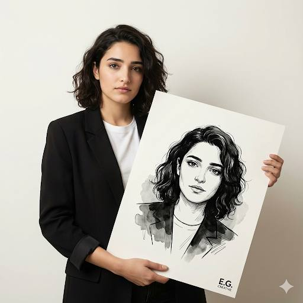

## 高端影棚肖像照

- ID: gpt4o-916-zh-2
- Slug: prompt-916-zh-2
- 语言: zh
- 来源: [来源链接](https://x.com/AIwithkhan/status/2001685648768680052)
- 样例图路径: images/part3/916.jpeg

### 提示词

```text
这是一张以上传照片为主体的高端影棚肖像照。照片中的人物自信地站在简洁的中性色调背景前，手持一张大幅竖版海报。海报上是对同一张照片的艺术化重新诠释——风格化为数字插画、素描或绘画作品——清晰地展现了同一张面孔。专业的影棚灯光，柔和的主光和微妙的轮廓光营造出柔和的阴影和层次感。人物表情沉稳自信，身姿放松而有力，展现出现代个人品牌形象。构图简洁，取景均衡，呈现高端时尚美感，浅景深，肌肤纹理逼真，细节清晰，散发出当代创作者的品牌气息，兼具电影般的真实感，1:1宽高比，高分辨率。
```

### 样例图


## Create a realistic vintage-style photo booth / Polaroid 

- ID: gpt4o-914-en-1
- Slug: prompt-914-en-1
- 语言: en
- 来源: [来源链接](https://x.com/miilesus/status/2001734583830626635)
- 样例图路径: images/part3/914.jpeg

### 提示词

```text
Create a realistic vintage-style photo booth / Polaroid photo collage featuring the same couple, using the two uploaded images as exact face references for both individuals (preserve both identities accurately).
The couple appears natural, affectionate, and playful, captured in multiple candid moments as if taken inside a photo booth. The woman and the man maintain their original facial features, skin tones, and expressions.
Woman: elegant, feminine, glowing skin, natural makeup, soft blush, glossy lips, long dark hair styled loosely with gentle volume. Wearing a minimal strapless cream or light beige dress.
Man: clean and handsome appearance, short dark hair, light stubble or clean-shaven, wearing a black leather jacket over a white shirt
Scenes & poses included in the collage:
The woman smiling brightly while the man stands behind her playfully covering her eyes.
The couple standing close, facing each other lovingly, her hand resting on his chest.
A close face-to-face moment with soft smiles and eye contact.
The woman standing behind the man, making a peace sign while smiling at the camera.
A playful dancing pose where the man lifts one of the woman’s hands as if spinning her.
A relaxed, candid moment where both laugh naturally at the camera.
Environment: neutral photo booth backdrop with soft vertical curtains, warm indoor lighting, subtle shadows, cozy and intimate atmosphere.
Photography style: vintage Polaroid / analog photo booth aesthetic, slightly soft focus, gentle grain, mild blur, natural imperfections, warm tones, realistic skin texture.
Lighting: soft frontal flash combined with ambient light, creating a casual, real-life snapshot feeling.
Mood & vibe: romantic, playful, spontaneous, intimate, youthful, nostalgic.
Composition: multi-frame vertical collage, evenly spaced images, authentic photo booth layout.
Quality: high realism, not AI-looking, natural proportions, no distortion.
```

### 样例图


## 复古风格照相亭

- ID: gpt4o-914-zh-2
- Slug: prompt-914-zh-2
- 语言: zh
- 来源: [来源链接](https://x.com/miilesus/status/2001734583830626635)
- 样例图路径: images/part3/914.jpeg

### 提示词

```text
使用上传的两张照片作为两人的面部参考，制作一张逼真的复古风格照相亭/宝丽来照片拼贴画，照片中的人物为同一对情侣（准确保留两人的身份）。
这对情侣看起来自然、亲密又充满活力，多张抓拍照片仿佛是在照相亭里拍摄的。男女双方都保留了原本的面部特征、肤色和表情。
女士：优雅妩媚，肌肤散发光泽，妆容自然，腮红轻柔，双唇水润，一头乌黑长发随意披散，略带蓬松感。身着简约的米色或浅米色抹胸连衣裙。
男士：外表干净英俊，短黑发，留着淡淡的胡茬或刮得干干净净，身穿黑色皮夹克，内搭白色衬衫。
拼贴画中包含的场景和姿势：
女人笑容灿烂，男人站在她身后，顽皮地捂住了她的眼睛。
这对情侣站得很近，彼此深情地对视着，她的手放在他的胸口。
面对面的亲密时刻，带着柔和的微笑和眼神交流。
站在男子身后的女子对着镜头微笑，并比出和平手势。
一个俏皮的舞蹈姿势，男子抬起女子的一只手，仿佛要将她旋转起来。
轻松自然的瞬间，两人对着镜头自然地笑了起来。
环境：中性风格的拍照背景，搭配柔和的垂直窗帘、温暖的室内灯光、微妙的光影，营造出温馨私密的氛围。
摄影风格：复古宝丽来/模拟照相亭美学，略微柔焦，轻微颗粒感，轻微模糊，自然瑕疵，暖色调，逼真的皮肤纹理。
光线：柔和的正面闪光灯与环境光相结合，营造出一种随意、真实的快照感觉。
氛围：浪漫、俏皮、随性、亲密、青春、怀旧。
构图：多帧竖幅拼贴，图像间距均匀，真实的照相亭布局。
质量：高度逼真，不像人工智能生成的，比例自然，无变形。
```

### 样例图


## { "Objective": "Create an ultra-realistic 8K candid stre

- ID: gpt4o-913-en-1
- Slug: prompt-913-en-1
- 语言: en
- 来源: [来源链接](https://x.com/Taaruk_/status/2001656897699733967)
- 样例图路径: images/part3/913.jpeg

### 提示词

```text
{
"Objective": "Create an ultra-realistic 8K candid street portrait capturing quiet emotion and authenticity within a crowded urban environment.",

"Subject": {
"Gender": "Female",
"Appearance": {
"Hair": "Short blonde hair with soft, natural texture",
"Makeup": "Minimal, natural look",
"Skin": {
"Texture": "Realistic skin texture with subtle freckles",
"Highlights": "Soft natural highlights with gentle tonal transitions"
},
"Expression": "Calm, thoughtful, introspective",
"Gaze": "Looking slightly to the side, not directly at the camera"
},
"Wardrobe": {
"Top": "Simple grey knitted sweater with visible fabric weave",
"Bottom": "Casual jeans",
"Accessories": "Thin shoulder-bag strap visible across the shoulder"
}
},

"Scene_Description": {
"Setting": "Busy city street",
"Crowd": {
"Density": "Surrounded by a dense flow of pedestrians",
"Background_Treatment": "Softly blurred figures creating depth and motion"
},
"Environment": "Urban street atmosphere with natural movement"
},

"Lighting_and_Color": {
"Lighting": {
"Type": "Natural daylight",
"Quality": "Soft and even, without harsh shadows"
},
"Color_Grading": {
"Style": "Warm cinematic tones",
"Characteristics": [
"Natural skin tones",
"Muted urban background colors",
"Subtle film-inspired contrast"
]
}
},

"Camera_and_Composition": {
"Shot_Type": "Candid street portrait",
"Depth_of_Field": "Shallow depth of field isolating the subject",
"Focus": "Sharp focus on the subject with background crowd softly blurred",
"Angle": "Eye-level, unobtrusive framing"
},

"Visual_Style": {
"Resolution": "Ultra-realistic 8K",
"Aesthetic": "Documentary street photography",
"Detail_Characteristics": [
"Sharp facial detail",
"Natural fabric texture",
"Soft motion blur in background",
"Subtle film grain for realism"
]
},

"Mood_and_Storytelling": {
"Themes": [
"Stillness within chaos",
"Quiet reflection",
"Human presence in urban life"
],
"Atmosphere": "Emotional, authentic, understated realism"
},

"Output_Requirements": {
"Format": "Image",
"Orientation": "Portrait or cinematic street frame",
"Quality": "Professional documentary-grade realism"
}
}
```

### 样例图


## 超逼真的 8K 街头抓拍肖像

- ID: gpt4o-913-zh-2
- Slug: prompt-913-zh-2
- 语言: zh
- 来源: [来源链接](https://x.com/Taaruk_/status/2001656897699733967)
- 样例图路径: images/part3/913.jpeg

### 提示词

```text
{
“目标”：“在拥挤的都市环境中，捕捉安静的情感和真实感，创作一张超逼真的 8K 街头抓拍肖像。”

“主题”： {
性别：女，
“外貌”： {
“头发”：“柔软自然的短金发”，
“妆容”：“简约自然妆容”
“皮肤”： {
“纹理”：“逼真的皮肤纹理，带有细小的雀斑”，
“高光”： “柔和自然的高光，色调过渡平缓”
},
“表情”：“冷静、深思熟虑、内省”
“目光”：“略微看向一侧，而不是直视镜头”
},
“衣柜”： {
“上衣”：“简约灰色针织毛衣，织物纹理清晰可见”，
下装：休闲牛仔裤
“配饰”：“肩上露出细细的肩包肩带”
}
},

"场景描述": {
“场景”：“繁忙的城市街道”，
人群：{
“密度”：“周围人流密集”，
“背景处理”：“柔和模糊的人物形象，营造出深度和动感”
},
“环境”：“具有自然动感的都市街道氛围”
},

"照明和颜色": {
“灯光”： {
“类型”：“自然日光”，
“品质”：“柔和均匀，无生硬阴影”
},
"Color_Grading": {
风格：温暖的电影色调
“特征”： [
“自然肤色”
“柔和的城市背景色彩”，
“微妙的胶片风格对比”
]
}
},

“相机与构图”：{
"Shot_Type": "街头抓拍肖像",
“景深”： “浅景深突出主体”，
“焦点”：“主体清晰对焦，背景人群柔和虚化”，
“角度”：“视线水平，不显眼的构图”
},

"视觉样式": {
“分辨率”：“超逼真 8K”，
“美学”：“纪实街头摄影”，
"Detail_Characteristics": [
“面部细节清晰”，
“天然面料质感”
“背景呈现柔和的动态模糊效果”
“细腻的胶片颗粒感，营造真实感”
]
},

"情绪与故事讲述": {
“主题”：[
“混乱中的平静”
“静静地思考”，
“人类在城市生活中的存在”
],
“氛围”：“情感丰富、真实、含蓄的现实主义”
},

"输出要求": {
"格式": "图像",
“方向”：“竖幅或电影街景构图”，
“质量”：“专业纪录片级别的真实感”
}
}
```

### 样例图


## { "image_structure": { "layout": "Vertical three-panel c

- ID: gpt4o-912-en-1
- Slug: prompt-912-en-1
- 语言: en
- 来源: [来源链接](https://x.com/lexx_aura/status/2001886993836343775)
- 样例图路径: images/part3/912.jpeg

### 提示词

```text
{
"image_structure": {
"layout": "Vertical three-panel collage",
"aspect_ratio": "Tall vertical strip",
"shot_type": "Close-up selfies"
},
"subject_details": {
"demographics": "Young woman with long, wavy brunette hair",
"skin": "Natural skin texture, minimal or no makeup",
"clothing": "Pink lace-trimmed bralette or camisole top with thin spaghetti straps",
"accessories": "Long manicured nails (nude/pale pink color)"
},
"environment": {
"setting": "Dimly lit bedroom or hotel room interior",
"background_elements": [
"Beige/cream colored walls",
"Heavy brown curtains on the left side",
"Partial view of a bed headboard in the background"
]
},
"lighting_and_style": {
"lighting": "Warm, indoor artificial lighting, low-light conditions",
"aesthetic": "Candid selfie style, slightly grainy phone camera quality, early 2010s social media aesthetic, flash photography look",
"mood": "Casual, intimate, playful"
},
"panel_breakdown": {
"top_panel": {
"expression": "Pouting or confused, eyebrows slightly furrowed",
"pose": "Finger hooked over bottom lip, looking directly at camera"
},
"middle_panel": {
"expression": "Soft smile, looking directly at camera",
"overlay_effect": "Digital pink heart crown filter (Snapchat style) floating around the head"
},
"bottom_panel": {
"expression": "Relaxed, mouth slightly open, gazing at camera",
"pose": "Head tilted to the side, hand gently touching chin and lower lip"
}
}
}
```

### 样例图


## 垂直三格拼贴画

- ID: gpt4o-912-zh-2
- Slug: prompt-912-zh-2
- 语言: zh
- 来源: [来源链接](https://x.com/lexx_aura/status/2001886993836343775)
- 样例图路径: images/part3/912.jpeg

### 提示词

```text
{
"image_structure": {
“布局”：“垂直三格拼贴画”，
"aspect_ratio": "高竖条",
"shot_type": "特写自拍"
},
"subject_details": {
“人口统计信息”：“年轻女性，留着长长的棕色波浪卷发”，
“肌肤”: “自然肌肤纹理，几乎不化妆”
“服装”：“粉色蕾丝边吊带文胸或吊带背心”，
“配饰”： “修剪整齐的长指甲（裸色/浅粉色）”
},
“环境”： {
“场景”：“光线昏暗的卧室或酒店房间内部”，
“背景元素”：[
“米色/奶油色墙壁”，
“左侧是厚重的棕色窗帘，”
“背景中可以看到床头板的一部分”
]
},
"lighting_and_style": {
“照明”：“温暖的室内人工照明，光线较暗的环境”，
“美学”：“随意的自拍风格，略带颗粒感的手机相机画质，2010 年代初期的社交媒体美学，闪光灯摄影效果”，
“氛围”： “轻松、亲密、俏皮”
},
"panel_breakdown": {
"top_panel": {
“表情”：“撅嘴或困惑，眉毛微微皱起”，
姿势：“手指勾住下唇，直视镜头”
},
"middle_panel": {
“表情”：“柔和的微笑，直视镜头”
"overlay_effect": "粉色爱心皇冠滤镜（Snapchat风格）漂浮在头部周围"
},
"bottom_panel": {
“表情”：“放松，嘴巴微张，凝视着镜头”
“姿势”：“头部侧倾，手轻轻触碰下巴和下唇”
}
}
}
```

### 样例图


## 6x6 grid layout. Editorial fashion photography. Use the 

- ID: gpt4o-911-en-1
- Slug: prompt-911-en-1
- 语言: en
- 来源: [来源链接](https://x.com/gokayfem/status/2001680146252669084)
- 样例图路径: images/part3/911.jpeg

### 提示词

```text
6x6 grid layout. Editorial fashion photography. Use the reference clothing item on all 36 models. Every single cell must feature a completely unique individual—no two people should look remotely similar.
Maximize human diversity across:
Age: Teenagers, 20s, 30s, 40s, 50s, 60s, 70s, 80s+, elderly with wrinkles and grey hair
Body types: Extremely thin, slim, athletic, muscular, stocky, chubby, fat, plus-size, obese, petite, tall, short, broad-shouldered, narrow-framed, pear-shaped, apple-shaped, hourglass, rectangular, long-limbed, short-limbed.
Ethnicity & skin tones: East Asian, Southeast Asian, South Asian, Middle Eastern, North African, Sub-Saharan African, West African, East African, Indigenous Australian, Pacific Islander, Native American, Indigenous South American, Scandinavian, Mediterranean, Eastern European, Western European, Caribbean, mixed race, albino. Full spectrum of skin tones from the palest to the deepest.
Hair: Bald, shaved, buzz cut, afro, locs, braids, straight, wavy, curly, coily, long, short, grey, white, natural colors, receding hairline, thinning hair, thick full hair, hijab, head wraps, turbans.
Features: Freckles, vitiligo, acne, scars, birthmarks, moles, gap teeth, crooked teeth, big nose, small nose, wide nose, narrow nose, round face, angular face, soft jawline, strong jawline, monolid eyes, deep-set eyes, hooded eyes, big lips, thin lips, visible disabilities, prosthetics, wheelchair users, amputees.
Each cell: different pose, different camera angle. Poses should feel editorial and unexpected—leaning, crouching, mid-stride, arched, sprawled, seated, jumping, twisting, lounging. Camera angles vary—low angle, overhead, Dutch tilt, wide shot, tight crop, ground-level, profile, three-quarter view.
Moody, high contrast, cinematic lighting. Varied environments—studio, architectural, urban, natural. Sharp detail, clothing as focal point. Final result should feel like the most inclusive, human-rich fashion editorial ever created—a true celebration of every single type of human body that exists.
```

### 样例图


## 36 个穿着同一套衣服的不同人像

- ID: gpt4o-911-zh-2
- Slug: prompt-911-zh-2
- 语言: zh
- 来源: [来源链接](https://x.com/gokayfem/status/2001680146252669084)
- 样例图路径: images/part3/911.jpeg

### 提示词

```text
6x6网格布局。时尚摄影。所有36位模特均需穿着同一件参考服装。每个单元格中的模特必须完全不同——任何两个人都不能有任何相似之处。
最大限度地提高人类多样性：
年龄：青少年、20多岁、30多岁、40多岁、50多岁、60多岁、70多岁、80岁以上、有皱纹和白发的老年人
体型：极瘦、苗条、健壮、肌肉发达、敦实、丰满、肥胖、大码、肥胖、娇小、高挑、矮小、肩宽、骨架窄、梨形、苹果形、沙漏形、矩形、四肢长、四肢短。
种族与肤色：东亚人、东南亚人、南亚人、中东人、北非人、撒哈拉以南非洲人、西非人、东非人、澳大利亚原住民、太平洋岛民、美洲原住民、南美原住民、斯堪的纳维亚人、地中海人、东欧人、西欧人、加勒比人、混血儿、白化病患者。涵盖从最浅到最深的各种肤色。
头发：光头、剃光头、寸头、爆炸头、脏辫、辫子、直发、波浪卷发、卷发、螺旋卷发、长发、短发、灰发、白发、自然发色、发际线后移、头发稀疏、浓密头发、头巾、头巾、头巾。
特征：雀斑、白癜风、痤疮、疤痕、胎记、痣、牙缝、牙齿歪斜、大鼻子、小鼻子、宽鼻子、窄鼻子、圆脸、棱角分明的脸、柔和的下颌线、硬朗的下颌线、单眼皮、深陷眼窝、眼睑下垂、厚嘴唇、薄嘴唇、明显的残疾、假肢、轮椅使用者、截肢者。
每个单元格：不同的姿势，不同的拍摄角度。姿势应具有编辑感和出人意料的特质——倾斜、蹲伏、迈步、拱背、伸展、坐姿、跳跃、扭转、慵懒。拍摄角度也多种多样——低角度、俯视、倾斜镜头、广角镜头、特写镜头、地面视角、侧面视角、四分之三侧面视角。
营造氛围感，运用高对比度的电影级灯光。场景多样——包括摄影棚、建筑、都市和自然环境。注重细节刻画，以服装为视觉焦点。最终呈现的作品应展现出前所未有的包容性和人文关怀，真正赞美每一种人体形态。
```

### 样例图


## { "image_layout": "2x2 grid collage featuring four disti

- ID: gpt4o-910-en-1
- Slug: prompt-910-en-1
- 语言: en
- 来源: [来源链接](https://x.com/lexx_aura/status/2001653710745739419)
- 样例图路径: images/part3/910.jpeg

### 提示词

```text
{
"image_layout": "2x2 grid collage featuring four distinct photographs of the same female subject.",
"subject_general": {
"gender": "Female",
"hair_color": "Dark brown/black",
"hair_style": "Long, styled in loose waves in three panels; sleek high ponytail in one panel",
"aesthetic": "Glamorous, influencer, trendy, luxury lifestyle"
},
"panels": [
{
"position": "top_left",
"setting": "Outdoors at night, dark background with illuminated green foliage",
"action": "Subject is holding a cake with one hand and licking frosting off the index finger of the other hand",
"outfit": {
"top": "Black halter-neck sleeveless top",
"jewelry": "Gold wristwatch, gold bangle bracelet, ring, small hoop earrings"
},
"props": {
"item": "Round white frosted cake",
"details": [
"Red cherries on top",
"Decorative white piping along edges",
"Black icing text reading 'bad bitch energy'"
]
}
},
{
"position": "top_right",
"setting": "Daytime city street, likely an upscale shopping district (e.g., Rodeo Drive) with palm trees and storefronts visible",
"action": "Subject is leaning out of the open door of a black luxury car, looking at the camera",
"outfit": {
"top": "White sleeveless ribbed crop top",
"bottom": "Blue denim jeans",
"accessories": "Shoulder bag (strap visible), gold hoop earrings"
},
"lighting": "Bright natural sunlight casting shadows"
},
{
"position": "bottom_left",
"setting": "Indoor hallway, beige walls, wooden floor",
"action": "Full-body mirror selfie",
"outfit": {
"style": "Matching two-piece set",
"color": "Dark brown/chocolate",
"top": "Velvet/suede corset-style bustier top",
"bottom": "Mini skirt",
"accessories": "Patterned designer handbag (resembling Dior Saddle bag), stack of gold bracelets"
},
"background_details": [
"Large rectangular mirror with gold frame leaning against wall",
"Vase with pampas grass in the corner",
"Doorway visible in reflection"
]
},
{
"position": "bottom_right",
"setting": "Inside a vehicle or outdoors, golden hour sunlight",
"action": "Close-up selfie, hand raised near mouth/chin",
"outfit": {
"top": "Light pink/mauve ribbed tank top",
"outerwear": "Beige fuzzy/sherpa jacket worn off-the-shoulder",
"jewelry": "Layered gold necklaces with pendants, hoop earrings"
},
"hair_styling": "Sleeked back high ponytail",
"background_details": "Car window frame, palm trees and blue sky visible in background"
}
]
}
```

### 样例图


## 女生四宫格照片

- ID: gpt4o-910-zh-2
- Slug: prompt-910-zh-2
- 语言: zh
- 来源: [来源链接](https://x.com/lexx_aura/status/2001653710745739419)
- 样例图路径: images/part3/910.jpeg

### 提示词

```text
{
"image_layout": "2x2 网格拼贴，包含同一女性对象的四张不同照片。"
"subject_general": {
"性别": "女",
"hair_color": "深棕色/黑色",
"发型": "长发，分成三片，烫成蓬松的波浪卷；一片，扎成光滑的高马尾辫",
“美学”： “魅力四射、网红、潮流、奢华生活方式”
},
“面板”：[
{
"位置": "左上",
“场景”：“夜晚的户外，深色背景，绿色树叶在灯光下闪烁”，
“动作”：“受试者一手拿着蛋糕，另一只手的食指正在舔掉上面的糖霜”，
“全套服装”： {
“上衣”： “黑色露背无袖上衣”，
“珠宝”：金手表、金手镯、戒指、小耳环
},
"props": {
“商品”: “圆形白色糖霜蛋糕”
“细节”： [
“上面放些红樱桃”，
“边缘饰有白色滚边”，
“黑色糖霜上写着‘坏女孩能量’”
]
}
},
{
"位置": "右上角",
“场景”：“白天的城市街道，可能是一个高档购物区（例如罗迪欧大道），可以看到棕榈树和商店橱窗”，
“动作”：“拍摄对象从一辆黑色豪华轿车的敞开车门探出身子，看着镜头”。
“全套服装”： {
“上衣”：“白色无袖罗纹露脐上衣”，
“底部”：“蓝色牛仔裤”，
配饰：单肩包（肩带可见）、金色圆环耳环
},
“光线”：“明亮的自然阳光投射出阴影”
},
{
"位置": "左下角",
“场景”：“室内走廊，米色墙壁，木地板”，
“动作”：“全身镜前自拍”，
“全套服装”： {
“款式”：“配套两件套”
颜色：深棕色/巧克力色，
“上衣”：天鹅绒/麂皮紧身胸衣式上衣，
“下装”: “迷你裙”，
“配饰”：“图案名牌手提包（类似迪奥马鞍包），一叠金手镯”
},
"background_details": [
“一面金色边框的大长方形镜子斜靠在墙上”
“花瓶角落里放着蒲苇草”
“倒影中可见门口”
]
},
{
"位置": "右下角",
“场景”：“车内或室外，日落时的金色阳光”，
“动作”：“近距离自拍，手举到嘴/下巴附近”，
“全套服装”： {
上衣：浅粉色/淡紫色罗纹背心，
“外套”：“米色毛绒/羊羔绒夹克，露肩穿着”，
“珠宝”：“多层金项链配吊坠，圈形耳环”
},
"发型"："光滑的高马尾辫",
"background_details": "背景中可以看到车窗框、棕榈树和蓝天"
}
]
}
```

### 样例图


## Use search to find how the Gemini 3 Flash launch has bee

- ID: gpt4o-909-en-1
- Slug: prompt-909-en-1
- 语言: en
- 来源: [来源链接](https://x.com/NanoBanana/status/2001678061662531590)
- 样例图路径: images/part3/909.jpeg

### 提示词

```text
Use search to find how the Gemini 3 Flash launch has been received. Use this information to write a short article about it (with headings). Return a photo of the article as it appeared in a glossy magazine. Show the magazine cover (Pro Bananas), and the two page spread of the article about Gemini 3 Flash.
```

### 样例图

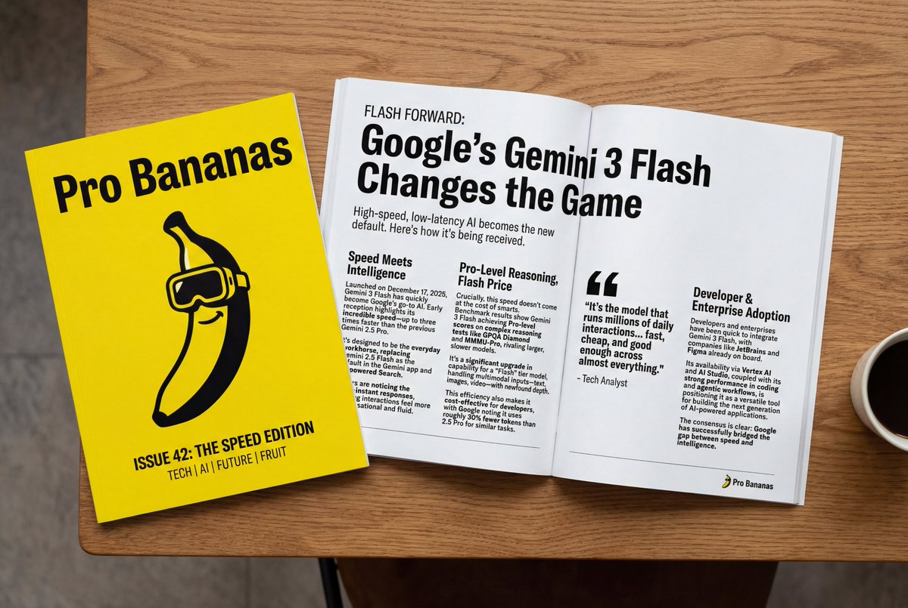

## 精美杂志上的文章照片

- ID: gpt4o-909-zh-2
- Slug: prompt-909-zh-2
- 语言: zh
- 来源: [来源链接](https://x.com/NanoBanana/status/2001678061662531590)
- 样例图路径: images/part3/909.jpeg

### 提示词

```text
使用搜索功能查找“Gemini 3 Flash”发布的反响。利用这些信息撰写一篇关于此次发射的短文（需包含标题）。提交一篇刊登在精美杂志上的文章照片。请展示杂志封面（Pro Bananas）以及关于“Gemini 3 Flash”的两页文章。
```

### 样例图


## 标本盒与现实的穿搭美学双重奏

- ID: gpt4o-908-zh
- Slug: prompt-908-zh
- 语言: zh
- 来源: [来源链接](https://x.com/LufzzLiz/status/2001831802269499412)
- 样例图路径: images/part3/908.jpeg

### 提示词

```text
A vertical split-screen creative product photography composition on a clean white wall background. High-resolution, photorealistic, commercial advertisement quality.

Top Section: The Specimen Box
The upper half features an exquisite light oak wooden shadow box frame mounted on the wall. Inside, a specific outfit is displayed as an artistic flat-lay museum specimen: [Insert Clothing Details Here, e.g., a sleek black satin slip dress with delicate lace trim and thin spaghetti straps]. The garments are neatly pinned in place. Surrounding them are small thematic decorative props: [Insert Props, e.g., dried roses, vintage perfume bottles, silk ribbon]. Elegant calligraphy on the matte paper backdrop reads: [Insert Text, e.g., "Midnight Elegance" or "Silk & Secrets"]. Soft studio lighting accentuates the rich texture and drape of the fabric.

Bottom Section: Naked-Eye 3D Reality
The lower half creates a hyperrealistic "naked-eye 3D" illusion. A rectangular picture-frame border sits directly beneath the top box. A stunningly realistic young woman [Insert Model Description, e.g., a poised East Asian model with long wavy black hair, subtle smoky eyes, and a confident gaze] wears the exact same outfit as shown above.

She lounges casually on the bottom edge of the frame—one leg bent with foot resting inside the frame, the other leg elegantly dangling out into the viewer’s space. Her torso leans back slightly, elbow resting on her raised knee, fingers lightly grazing the fabric near her collarbone. Her body forms a soft, sensual S-curve that highlights the garment’s silhouette without overt exposure. She looks directly at the camera with a calm, knowing smile—inviting yet enigmatic. This dynamic, lifelike pose contrasts powerfully with the static, archival display above, creating visual tension between reality and presentation.

Technical Specs:
Soft natural shadows, ambient occlusion, bright and airy yet cinematic lighting, 8K resolution, Octane Render, vivid but refined color palette, ultra-detailed fabric textures (satin sheen, lace transparency, stitching), shallow depth of field, Vogue editorial style, filmic grain, professional fashion photography.

Negative Prompt (recommended):
blurry, low-res, distorted anatomy, extra limbs, deformed hands, cartoon, anime, doll-like, plastic skin, overexposed, cluttered background, text errors, mismatched clothing, floating objects, unrealistic proportions.
参考人物，想看老师制服
```

### 样例图


## 用中国奇幻书写世界名画

- ID: gpt4o-905-zh
- Slug: prompt-905-zh
- 语言: zh
- 来源: [来源链接](https://x.com/LufzzLiz/status/2001637740568596705)
- 样例图路径: images/part3/905.jpeg

### 提示词

```text
{
"meta_info": {
"title": "Ethereal Hanfu Spirit",
"style_category": "Chinese Fantasy / Abstract Digital Art",
"aspect_ratio": "3:1"
},
"visual_elements": {
"subject": {
"description": "Silhouette wearing attire determined by the character",
"pose": "Pose determined by the character, floating in mid-air",
"composition": "Centered ethereal figure with flowing trails extending to the sides"
},
"atmosphere": {
"lighting": "Bioluminescent glow, volumetric lighting, rim lighting",
"effects": "Flowing smoke, light particles, holographic dispersion, silk-like energy trails",
"colors": ["Deep Navy Blue", "Glowing Cyan", "Iridescent Gold", "Soft Peach"]
}
},
"prompt_export": {
"natural_language_prompt": "A wide panoramic digital artwork depicting a figure composed of flowing ribbons of light, translucent smoke, and iridescent particles. The background features deep, moody indigo and dark blue tones. The figure emits a soft, magical bioluminescent glow in hues of gold, peach, and cyan. The overall style is abstract fantasy, emphasizing fluid motion and a dreamy atmosphere, rendered in 8K resolution with highly detailed textures and exhibiting the Tyndall effect.",
"tag_based_prompt": " silhouette, flowing light lines, smoke effects, particle effects, bioluminescence, iridescent effects, dark blue background, cinematic lighting, ethereal, mystical, masterpiece, best quality, 8k, wide angle --ay 21:9 ",
"negative_prompt": "photorealistic, solid skin, heavy outlines, messy lines, text, watermark, low quality, jpeg artifacts, blurry, distorted face, bad anatomy"
},
"technical_settings_recommendation": {
"sampler": "Euler a / DPM++ 2M Karras",
"steps": 30,
"cfg_scale": 7.0,
"model_suggestion": "Niji 6 (for Midjourney) or Abstract/Fantasy-based SDXL models"
}
}
角色设为： 西游记师徒四人
```

### 样例图


## 维多利亚哥特皇室写真照

- ID: gpt4o-904-zh
- Slug: prompt-904-zh
- 语言: zh
- 来源: [来源链接](https://x.com/songguoxiansen/status/2001828831615946768)
- 样例图路径: images/part3/904.jpeg

### 提示词

```text
生成一张 9:16 竖版「维多利亚哥特皇室」写实照片：以我上传的 FACE_REF 为人物身份参考，100%还原五官与骨相；人物身穿“维多利亚时代（19世纪）宫廷礼服方向”的重工礼服（紧身胸衣、大裙撑、蕾丝/天鹅绒、皇室珠宝），在伦敦塔桥或威斯敏斯特宫（大本钟）旁拍摄。画面具备《Harper’s Bazaar》级别的摄影、造型与封面设计，保持杂志的一贯设计风格（中英文设计）。

【INPUTS | 输入】
FACE_REF：我上传的人物五官参考图（身份锁定）

【ABSOLUTE PRIORITY | 身份锁定（最高优先级）】
100%还原 FACE_REF 的五官与骨相：眼距、鼻梁鼻翼、唇形、下颌线、颧骨结构完全一致，不得漂移。
真实皮肤质感：可见细微纹理与毛孔，不要过度磨皮与网红化。
成年女性形象（adult）。

【SHOT TYPE | 景别二选一（由模型随机选其一，且必须真实统一）】
A) 半身封面：胸口到腰上方，珠宝、蕾丝领口与眼神最清晰（主推）
B) 全身封面：从头到脚完整呈现巨大的裙撑轮廓与伦敦地标的结合，透视感强（备选）
（无论A/B：都必须保持“封面构图”，有留白空间给排版，但不要撕纸/手绘效果。）

【LOCATION | 场景（英国伦敦）】
伦敦地标：泰晤士河畔，背景是宏伟的哥特式建筑威斯敏斯特宫（大本钟）或 伦敦塔桥的塔楼。
天气二选一（随机）：1) 伦敦雾霭（经典的雾都质感，光线柔和神秘） 2) 阴雨方歇（地面湿润反光，天空呈铅灰色）
背景干净：无游客、无现代标识、无手机状态栏UI、无水印字幕。

【LIGHTING & CAMERA | 摄影质感（杂志级）】
镜头感：85mm人像质感（半身）或 50mm/70mm（全身），浅景深，眼睛最清晰。
光线：阴天漫射光 + 戏剧性补光（强调面部结构）；钻石/宝石有真实火彩；天鹅绒质感深邃。
色彩：高级电影感，低饱和度的蓝灰环境色与服装的深色调（红/蓝/黑）形成哥特美学；整体干净、通透、贵气。

【WARDROBE | 维多利亚宫廷礼服（重工、塑形、繁复细节）】
目标审美：“蜂腰、大裙摆、层叠蕾丝、重磅天鹅绒、皇冠、女王气场”。

轮廓与层次（X型剪裁）
上身：结构感极强的紧身胸衣（Corset），方领或高领，泡泡袖或羊腿袖
下身：巨大的裙撑（Crinoline 或 Bustle），后腰部有明显的堆叠设计，裙摆拖地
装饰：大量的荷叶边、蝴蝶结、垂坠的流苏
面料与工艺（重手艺必须“看得见”）
主面料：重磅丝绒、塔夫绸、尚蒂伊蕾丝（Chantilly Lace）
主要工艺：珠绣、金线刺绣、缎带编织
纹样主题：大马士革纹（Damask）、玫瑰、蓟花（苏格兰象征）、佩斯利纹
细节：蕾丝手套、颈饰（Choker）、勋章/胸针
头面（皇室珠宝头饰）
核心结构：维多利亚式小王冠（Tiara）或 羽毛头饰
装饰：钻石、蓝宝石、珍珠
耳饰/颈饰：极度夸张的钻石项链、耳坠

【COLOR MATRIX | 颜色矩阵搭配（必须执行，且必须“皇室深色”）】
（维多利亚晚期的深沉奢华）
从以下三套“主色方案”中随机选 1 套作为【底色/大面积主面料色】。

Scheme G（皇室蓝底）：
底色：深宝蓝/午夜蓝（丝绒质感）
刺绣/装饰：银色蕾丝、钻石、蓝宝石
Scheme A（维多利亚红底）：
底色：酒红/勃艮第红（深沉热情）
刺绣/装饰：黑色蕾丝、金色刺绣、红宝石
Scheme R（丧服黑底）：
底色：墨黑（Black Jet，极度哥特）
刺绣/装饰：黑色串珠、黑色蕾丝、少量金色或银色提亮

【颜色执行规则】
色彩要深沉浓郁，体现“日不落”的威严和哥特式的神秘。

【POSE | 封面姿态（威严、僵直、女王感）】
半身：下巴微扬，眼神冷峻，一手轻抚项链
全身：站姿挺拔（像肖像画一样），双手交叠在裙撑上，气场压倒一切
表情：严肃、高傲、不可一世；绝对不笑（维多利亚风格）。

【OUTPUT | 输出】
1 张 9:16 竖版写实杂志封面级照片
随机：半身 or 全身（A/B二选一）
随机：雾霭 or 阴雨（天气二选一）
随机：宝蓝 / 酒红 / 墨黑（颜色矩阵三选一）
造型：维多利亚宫廷礼服方向 + 皇冠/Choker + 紧身胸衣大裙撑 + 丝绒蕾丝
```

### 样例图


## { "subject": { "demographics": "Young female, approx 20-

- ID: gpt4o-901-en-1
- Slug: prompt-901-en-1
- 语言: en
- 来源: [来源链接](https://x.com/brindleyai/status/2001200342864667035)
- 样例图路径: images/part3/901.jpeg

### 提示词

```text
{
"subject": {
"demographics": "Young female, approx 20-24 years old, Caucasian.",
"hair": {
"color": "Dirty blonde to light blonde gradient.",
"style": "Long, straight with slight wave, layered, casual parting.",
"texture": "Soft, natural strands, slightly tousled, roots visible.",
"movement": "Falling naturally over shoulders and back."
},
"face": {
"shape": "Oval with soft jawline.",
"eyes": "Almond-shaped, light blue/grey irises, distinct sharp black winged eyeliner.",
"nose": "Button nose, soft bridge.",
"lips": "Full, plump, rosy pink, slightly parted in a pouty expression.",
"skin_details": "Prominent, heavy freckles across nose and cheeks. Smooth texture but with realistic skin grain. Natural blush.",
"micro_details": "Mole on right upper chest, mole on left shoulder."
},
"body_proportions": {
"build": "Voluminous, curvy, heavy bust.",
"chest": "Large bust volume, prominent forward projection, deep cleavage visible.",
"waist_to_chest_ratio": "Significantly wider chest width compared to waist implies hourglass figure.",
"shoulders": "Soft, rounded, natural slope.",
"dominance": "Upper torso volume visually dominates the frame."
},
"clothing": {
"top": "Heather grey ribbed knit tank top/camisole.",
"fit": "Tight, form-fitting, stretching over chest volume, low scoop neckline.",
"straps": "Thick straps, sitting securely on shoulders."
},
"accessories": {
"jewelry": {
"Small gold hoop earrings.",
"Gold chain necklace with a small 'G' letter pendant.",
"Longer thin gold chain with a distinct kangaroo pendant."
}
}
},
"pose": {
"type": "Handheld selfie perspective.",
"orientation": "Frontal close-up, slightly angled from above.",
"head_position": "Tilted slightly to subject's right.",
"limbs": "Right arm extended forward (out of frame) indicating holding the camera.",
"gaze": "Direct eye contact with lens, alluring and confident.",
"spine_curvature": "Slight arch implied by chest prominence."
},
"setting": {
"environment": "Domestic bathroom.",
"background_elements": "Dark brown/grey glossy tiled wall, chrome shower fixture visible on left, top of white ceramic toilet tank visible on right.",
"depth": "Shallow depth of field, background elements slightly out of focus."
},
"camera": {
"shot_type": "Close-up, selfie portrait.",
"angle": "High angle (slightly above eye level), typical of smartphone selfies.",
"focal_length": "24mm to 28mm equivalent (wide angle smartphone lens).",
"framing": "Chest-up shot, cropping at mid-torso.",
"focus": "Sharp focus on eyes and face, slight fall-off on shoulders.",
"perspective": "Slight foreshortening of the extended arm side."
},
"lighting": {
"source": "Soft, diffused overhead ambient bathroom lighting.",
"direction": "Front-top lighting.",
"highlights": "Soft specular highlights on forehead, tip of nose, chin, and upper chest curves.",
"shadows": "Soft shadows under the chin and defining the cleavage depth.",
"quality": "Natural, flattering, no harsh contrast."
},
"mood_and_expression": {
"tone": "Casual, sultry, confident.",
"expression": "Relaxed pout, 'cool girl' aesthetic.",
"atmosphere": "Intimate, candid."
},
"style_and_realism": {
"style": "Photorealistic, social media aesthetic.",
"fidelity": "High fidelity skin texture, no airbrushing.",
"imperfections": "Visible freckles, stray hairs, natural skin variation preserved."
},
"colors_and_tone": {
"palette": "Neutral tones (grey, beige, skin tones) with pops of blue (eyes) and gold (jewelry).",
"skin_tone": "Fair to light tan, warm undertones.",
"white_balance": "Slightly warm, indoor tungsten mix.",
"saturation": "Natural, slightly vibrant lips and eyes.",
"contrast": "Medium contrast."
},
"technical_details": {
"aspect_ratio": "3:4",
"resolution": "High resolution, sharp details.",
"noise": "Slight digital noise characteristic of phone camera sensors in indoor light."
}
}
```

### 样例图


## 金发女子自拍照

- ID: gpt4o-901-zh-2
- Slug: prompt-901-zh-2
- 语言: zh
- 来源: [来源链接](https://x.com/brindleyai/status/2001200342864667035)
- 样例图路径: images/part3/901.jpeg

### 提示词

```text
{
“主题”： {
“人口统计信息”：“年轻女性，大约20-24岁，白种人。”
“头发”： {
颜色：从脏金色到浅金色的渐变色。
发型：长直发，略带波浪，层次分明，随意分缝。
“质感”：“柔软自然的发丝，略显蓬松，发根可见。”
“动作”：“自然地垂落在肩膀和背部。”
},
“脸”： {
“脸型”：“椭圆形，下颌线条柔和。”
“眼睛”：“杏仁状，浅蓝灰色虹膜，清晰锐利的黑色上扬眼线。”
“鼻子”：“小巧的鼻子，柔和的鼻梁。”
“嘴唇”：“饱满、丰润、呈玫瑰粉色，微微张开，带着一丝嘟嘴的表情。”
“皮肤细节”： “鼻子和脸颊上有明显的、较多的雀斑。质地光滑，但保留了真实的皮肤纹理。自然的红晕。”
"micro_details": "右胸上方有一颗痣，左肩上有一颗痣。"
},
"body_proportions": {
体型：丰满、曲线优美、胸部丰满。
“胸部”：“胸部丰满，胸部前凸明显，乳沟深邃可见。”
腰胸比：胸部宽度明显大于腰部宽度，表明身材呈沙漏形。
“肩部”：“柔和、圆润、自然的坡度。”
“主导性”：“上半身的体积在视觉上主导了画面。”
},
“衣服”： {
上衣：浅灰色罗纹针织背心/吊带衫。
“合身”：紧身、贴合胸部曲线，低圆领。
“肩带”：“厚实的肩带，牢牢地贴在肩膀上。”
},
“配件”： {
“珠宝”： {
“小金圈耳环。”
“金链项链，配有一个小小的字母‘G’吊坠。”
“较长的细金链，配有独特的袋鼠吊坠。”
}
}
},
"姿势": {
类型：手持自拍视角。
“方向”：“正面特写，略微从上方倾斜。”
“头部位置”： “略微向拍摄对象的右侧倾斜。”
四肢：右臂向前伸展（超出画面），表示正在握持相机。
“凝视”：“通过镜头直接与眼睛对视，充满魅力和自信。”
"spine_curvature": "胸部突出所暗示的轻微弧度。"
},
“环境”： {
“环境”：“家用浴室。”
"background_elements": "深棕色/灰色光面瓷砖墙，左侧可见镀铬淋浴装置，右侧可见白色陶瓷马桶水箱顶部。"
“景深”：“浅景深，背景元素略微失焦。”
},
“相机”： {
"shot_type": "特写，自拍肖像。"
“角度”：“高角度（略高于视线水平），是智能手机自拍的典型角度。”
"focal_length": "24mm 至 28mm 等效焦距（广角智能手机镜头）",
“构图”：“胸部以上镜头，裁剪至躯干中部。”
“焦点”：“眼睛和脸部清晰聚焦，肩膀略微虚化。”
“透视”：“伸展的手臂一侧略微缩短。”
},
“灯光”： {
光源：柔和、漫射的浴室顶灯。
“方向”：“前上照明。”
“高光”：“额头、鼻尖、下巴和上胸曲线处的柔和镜面高光。”
“阴影”：“下巴下方柔和的阴影勾勒出乳沟的深度。”
“品质”：“自然、讨喜、无强烈对比。”
},
"mood_and_expression": {
语气：随意、性感、自信。
“表情”：“放松的嘟嘴，‘酷女孩’风格。”
“氛围”：“亲密、坦诚。”
},
"风格与现实主义": {
风格：写实风格，社交媒体美学。
“真实感”： “高保真度的皮肤纹理，无修图。”
“瑕疵”：“可见的雀斑、杂乱的毛发、自然的肤色差异均得以保留。”
},
"colors_and_tone": {
“调色板”：“以中性色调（灰色、米色、肤色）为主，点缀以蓝色（眼妆）和金色（珠宝）。”
“肤色”: “白皙至浅棕色，暖色调。”
“白平衡”: “略微偏暖的室内钨丝灯混合模式。”
“饱和度”：“自然、略带活力的唇部和眼部。”
“对比度”: “中等对比度。”
},
"technical_details": {
"aspect_ratio": "3:4",
分辨率：高分辨率，细节清晰。
“噪声”: “室内光线下手机摄像头传感器特有的轻微数字噪声。”
}
}
```

### 样例图


## 中国四大节日美甲四宫格

- ID: gpt4o-899-zh
- Slug: prompt-899-zh
- 语言: zh
- 来源: [来源链接](https://x.com/lxfater/status/2001587965131465046)
- 样例图路径: images/part3/899.jpeg

### 提示词

```text
任务：生成「中国四大节日美甲四宫格」拼贴图（2x2）
核心指令
基于用户提供的一张清晰手部近景照片（或同风格参考图），生成一张 2x2 四宫格拼贴图。四格必须是同一双手、同构图、同光线、同背景风格，只替换美甲设计主题。
每格底部必须标注节日名称：春节 / 清明 / 端午 / 中秋（中文优先；如文字易错可用英文备选）。
全局统一风格（四格都必须遵守）

构图：女性手部特写近景，手指搭在柔软针织毛衣袖口或浅色布料上，浅景深，高清摄影，4k。
光线：室内柔光（暖光为主，清明可偏自然冷柔光），背景干净、散景高级。

美甲基调：通勤友好、低饱和、清透显白；甲缘干净利落；贴饰“少而准”；封层高质感不过曝。

甲型：默认中长软方（若输入图甲型不同，以输入为准保持一致）。

排布规则：每套都明确 “主打指（1-2根）+ 辅助指（2-3根）+ 纯净底色指（其余）”，避免每根都很花。

输出排版

2x2 网格拼贴，边框规整、留白一致、四格大小一致。
每格底部加小标题：春节、清明、端午、中秋（字体干净现代、细字重、位置统一）。

四格设计细化（重点：每格的“美甲定制”要足够具体）

A格（左上）【春节】通勤清透红金点睛（“有年味但不俗”）
背景散景建议：暖黄灯笼光斑 + 金色挂饰虚化（不抢主体）。
美甲细节：
底色：奶透裸米（带一点点果冻感），做极浅“奶透晕染”从甲根到甲尖过渡，整体清透显白。
结构：3根纯净底色（只带极淡细闪），1根微法式，1根主打图案。

法式边：选 1-2 根指甲做“极细金边法式”（线细到像金线描边），法式弧度干净利落。

主打指（1根，建议无名指或中指）：极简窗花线稿（线条细、留白多），窗花只占甲面 20%-30%，下方留大面积清透底。

点缀材质：
香槟金细闪均匀但很淡，像“皮肤自带光”。
金箔只放 2-4 片超小碎片，集中在甲根或侧边一小撮，绝不铺满。

颜色控制：红色只做一个小红点/一小段红线（可在窗花中心点一下），避免大面积正红。

封层：玻璃光，高光柔、不过曝。

B格（右上）【清明】雾感极简青灰透（“安静干净、有雾气感”）

背景散景建议：薄雾灰绿调 + 细雨光点朦胧散景。
美甲细节：

底色：冷灰透粉 或 雾灰绿透（二选一，推荐更通勤的冷灰透粉），整体偏“雾化清透”。

结构：4根纯净底色 + 1根主打极简线条（非常克制）。

主打指（1根，建议无名指）：
柳叶线条：一条极细线从甲根轻轻延伸到甲中段，旁边加 1-2 笔“柳叶”短线，留白为主。
在柳叶附近加 2-3 个雨滴光点（微小点状高光），像细雨落在甲面。
材质：
只允许 珠光或极细细闪（“几乎看不见但会透光”那种），不加金箔、不加大亮片。
光感：缎光（比玻璃光更高级的柔亮，避免塑料反光）。

质感控制：整体低对比、干净，不要明显纹理堆叠。

C格（左下）【端午】艾草绿点题粽叶纹理（“淡淡草木气，细节耐看”）

背景散景建议：艾草绿植 + 竹叶/香包虚化。
美甲细节：

底色：奶透裸米或冷调透白底（更显白），整体清透。

结构：2根主题指 + 3根清透底色。

主题指①（1根，建议无名指）：粽叶极简纹理
用极淡的艾草绿做“线条压纹感”，只画 2-3 条斜向叶脉线，像“若隐若现”的叶纹。

主题指②（1根，建议中指或食指）：极细金线绕一圈像绑绳
在甲面中段或靠近甲尖处，画一圈极细金线（不要粗金条），像绑粽子的绳结意象。

点缀材质：
细闪只做“薄薄一层”，集中在甲根到甲中段，避免甲尖闪到发廉价。
金箔仍然是 2-4 片小碎片，点在金线旁边或甲根一侧，增强“手工质感”。

颜色控制：艾草绿只占少量（线条/小块），不要整甲深绿。

光感：玻璃光（但高光要柔）。
D格（右下）【中秋】月光奶透桂花金（“月光感、温柔高级、很出片”）
背景散景建议：暖黄月灯光斑 + 桂花金色散景点点。
美甲细节：

底色：奶透米白或奶透裸米，做轻微“月光晕染”——甲根更奶透、甲尖更清亮，干净显白。

结构：1根月相主打 + 1根桂花点缀 + 其余清透细闪底色。

月相主打指（1根，建议无名指）：
细线月相（月弯/半月/小满月选 1-2 个，不要一排九宫格那种），线条很细，留白大。

桂花点缀指（1根，建议中指）：
桂花金点：用极小金点做 5-8 个“散落的桂花点”，密度低、分布自然，像落在甲面。

材质：香槟金细闪 + 少量金箔（更偏“月光金”），不要银闪抢戏。

光感：玻璃光，整体温柔但清晰，近景细节干净。

Negative Prompt（负面提示词）

低清晰度，模糊，噪点，过曝，强硬阴影，塑料反光，甲面凹凸不平，涂抹脏乱，颜色过饱和，荧光色，廉价大钻堆砌，卡通贴纸感，粗糙贴饰，指甲形状扭曲，手指畸形，多余手指，皮肤质感不一致，四格不是同一双手，构图不一致，背景杂乱，网格歪斜，边框不均匀，文字水印logo，标签缺失或拼写错误

请根据上面提示词生成图片
```

### 样例图


## 高角度商业美食摄影照片

- ID: gpt4o-898-zh
- Slug: prompt-898-zh
- 语言: zh
- 来源: [来源链接](https://x.com/linxiaobei888/status/2001591561302483267)
- 样例图路径: images/part3/898.jpeg

### 提示词

```text
一张高角度商业美食摄影照片，展示了[天妇罗]盛放在极简风格的透明玻璃盘中，配有一小玻璃碗酱油和一碗芥末。旁边放着两只筷子，背景为纯净的奶油米白色，留有充足的留白。左侧叠加了时尚的黑色无衬线字体排版，简单介绍了菜品名称、价格和搭配说明。右上角有一个极简的小Logo。采用柔和的摄影棚布光，逼真的柔和阴影，具有时尚杂志的编辑风格。该设计以优质纸张背景填满整个 16:9 画面，采用大师级平面设计，配有精致的中式排版、极其克制的植物图案和精致优雅的光线，营造出一种空灵、奢华、精致的氛围，具有最大的精致感和考究感
```

### 样例图


## { "project_specifications": { "format": "2x2 Grid Collag

- ID: gpt4o-897-en-1
- Slug: prompt-897-en-1
- 语言: en
- 来源: [来源链接](https://x.com/xmliisu/status/2001309711971295669)
- 样例图路径: images/part3/897.jpeg

### 提示词

```text
{
  "project_specifications": {
    "format": "2x2 Grid Collage",
    "aspect_ratio": "4:5",
    "aesthetic_style": "High-end Beauty Editorial",
    "rendering_engine_hints": {
      "realism_level": "Ultra-photorealistic",
      "texture_quality": "8k",
      "lighting_simulation": "Ray-traced studio lighting"
    }
  },
  "global_assets": {
    "subject_definition": {
      "hair": {
        "style": "Long, loosely wavy, voluminous",
        "texture": "Natural, individual strands defined",
        "behavior": "Messy but styled, framing face and shoulders"
      },
      "complexion": {
        "skin_texture": "Porous, hyper-realistic",
        "finish": "Dewy, glass-skin effect",
        "makeup": {
          "cheeks": "Heavy flush/blush",
          "lips": "High-gloss, plump, natural pink",
          "eyes": "Clean, defined lashes, natural brows"
        }
      },
      "wardrobe": {
        "item": "Mini dress",
        "fit": "Bodycon / Tight",
        "fabric": {
          "material": "Soft textured knit / Boucle",
          "tactility": "Fuzzy, light-catching fibers",
          "color": "Soft mauve or neutral taupe"
        },
        "details": "Spaghetti straps, mid-thigh length"
      }
    },
    "environment_definition": {
      "studio_setup": {
        "background": "Seamless paper, soft off-white/beige",
        "atmosphere": "Clean, warm, intimate"
      },
      "lighting_rig": {
        "key_light": "Large diffuse softbox (Front-Left)",
        "fill_light": "Reflector (Right)",
        "highlights": "Specular highlights on lips, cheekbones, and shoulders"
      }
    }
  },
  "panel_architecture": [
    {
      "position": "Top-Left (1)",
      "shot_type": "Extreme Close-Up (Macro)",
      "composition": {
        "angle": "Low angle, looking up slightly",
        "focus": "Mouth and nose area",
        "depth_of_field": "Shallow"
      },
      "action": {
        "primary": "Eating a strawberry",
        "nuance": "Delicate finger hold, lips slightly parted"
      },
      "visual_anchors": [
        "Moisture on strawberry surface",
        "Gloss reflection on lips",
        "Baby hairs at temple"
      ]
    },
    {
      "position": "Top-Right (2)",
      "shot_type": "Medium Shot (Thigh-up)",
      "composition": {
        "angle": "Eye level",
        "pose_dynamic": "Leaning forward slightly towards lens"
      },
      "action": {
        "stance": "Standing straight on",
        "arms": "Relaxed at sides",
        "expression": "Direct gaze, alluring pout"
      },
      "visual_anchors": [
        "Texture of knit dress",
        "Collarbone shadows",
        "Curvature of waist"
      ]
    },
    {
      "position": "Bottom-Left (3)",
      "shot_type": "Full Body (Seated)",
      "composition": {
        "angle": "Side profile",
        "framing": "Subject compacted on floor"
      },
      "action": {
        "pose": "Knees to chest (fetal position variation)",
        "interaction": "Cheek resting on knee, arms embracing legs",
        "hair_flow": "Cascading onto the floor"
      },
      "visual_anchors": [
        "Smooth leg definition",
        "Dress stretching over thigh",
        "Dreamy gaze"
      ]
    },
    {
      "position": "Bottom-Right (4)",
      "shot_type": "Beauty Portrait (Head & Hands)",
      "composition": {
        "angle": "Frontal close-up",
        "framing": "Chin to hairline"
      },
      "action": {
        "gesture": "Chin resting on interlaced fingers",
        "expression": "Soft smile, looking off-camera"
      },
      "visual_anchors": [
        "Hand detail and manicure",
        "Eye clarity",
        "Flush on cheeks"
      ]
    }
  ]
}
```

### 样例图


## 2x2网格拼贴画

- ID: gpt4o-897-zh-2
- Slug: prompt-897-zh-2
- 语言: zh
- 来源: [来源链接](https://x.com/xmliisu/status/2001309711971295669)
- 样例图路径: images/part3/897.jpeg

### 提示词

```text
{
"项目规范": {
"格式": "2x2 网格拼贴画",
"aspect_ratio": "4:5",
"aesthetic_style": "高端美容杂志",
"渲染引擎提示": {
"realism_level": "超逼真",
"texture_quality": "8k",
"lighting_simulation": "光线追踪摄影棚照明"
}
},
"global_assets": {
"subject_definition": {
“头发”： {
“发型”：“长款，略带波浪，蓬松”，
“纹理”：“自然、根根分明的发丝”，
“发型”：“凌乱但有型，修饰脸型和肩膀”
},
"肤色": {
"skin_texture": "多孔，超逼真"
“妆效”：“水润、如玻璃般光滑的肌肤效果”，
“化妆品”： {
“脸颊”： “浓重的红晕/腮红”
“唇部”: “高光泽、丰盈、自然的粉红色”
“眼睛”：“干净、轮廓分明的睫毛，自然的眉毛”
}
},
“衣柜”： {
“商品”: “迷你连衣裙”
“fit”: “紧身/贴身”
“织物”： {
材质：柔软纹理针织/圈绒，
“触感”：“毛茸茸的、能反射光线的纤维”，
颜色：柔和的淡紫色或中性灰褐色
},
详情：细肩带，及大腿中部长度
}
},
"environment_definition": {
"studio_setup": {
“背景”： “无缝纸，柔和的米白色/米色”
氛围：干净、温暖、温馨
},
"lighting_rig": {
"key_light": "大型漫射柔光箱（左前方）",
"fill_light": "右侧反光板",
“高光”： “嘴唇、颧骨和肩膀上的高光”
}
}
},
"panel_architecture": [
{
"位置": "左上(1)" ，
"shot_type": "超近特写（微距）",
“作品”： {
“角度”：“低角度，略微向上看”，
“焦点”：“嘴和鼻子区域”，
"景深": "浅"
},
“行动”： {
“主要”: “吃草莓”
细微之处：指尖轻柔地握着，嘴唇微微张开。
},
“visual_anchors”：[
“草莓表面的水分”
“嘴唇上的光泽反射”
“鬓角的细小绒毛”
]
},
{
"位置": "右上角(2)" ,
"shot_type": "中景（大腿向上）",
“作品”： {
“角度”：“视线水平”，
"pose_dynamic": "身体略微前倾，朝向镜头"
},
“行动”： {
“站姿”：“笔直站立”，
“手臂”：“自然垂于身体两侧”，
“表情”：“直视，撅嘴”
},
“visual_anchors”：[
“针织连衣裙的质地”
“锁骨阴影”
腰部曲线
]
},
{
"位置": "左下角 (3)",
"shot_type": "全身照（坐姿）",
“作品”： {
"角度": "侧面轮廓",
“框架”：“主体压在地板上”
},
“行动”： {
“姿势”：“膝盖贴近胸部（胎儿姿势变体）”
“互动”：“脸颊贴着膝盖，双臂环抱着双腿”，
"hair_flow": "如瀑布般倾泻而下"
},
“visual_anchors”：[
“腿部线条流畅”
“裙子撑开了大腿”，
“梦幻般的凝视”
]
},
{
"位置": "右下角 (4)",
"shot_type": "美人肖像（头部和手部）",
“作品”： {
“角度”：“正面特写”
构图：从下巴到发际线
},
“行动”： {
“姿势”：“下巴搁在交叠的手指上”，
表情： “柔和的微笑，看向镜头外”
},
“visual_anchors”：[
“手部细节和美甲”，
“视力清晰度”
“双颊泛红”
]
}
]
}
```

### 样例图


## 大唐盛世与巴黎写真照

- ID: gpt4o-894-zh
- Slug: prompt-894-zh
- 语言: zh
- 来源: [来源链接](https://x.com/songguoxiansen/status/2001198742998016062)
- 样例图路径: images/part3/894.jpeg

### 提示词

```text
生成一张 9:16 竖版「大唐盛世与巴黎」写实照片：以我上传的 FACE_REF 为人物身份参考，100%还原五官与骨相；人物身穿“唐代（盛唐）宫廷贵妃方向”的重工礼服（齐胸衫裙、大袖衫、牡丹纹样、金饰），在巴黎埃菲尔铁塔下的特罗卡德罗广场或塞纳河畔拍摄。画面具备COSMO时尚杂志级别的摄影、造型与封面设计，保持杂志的一贯设计风格（英文设计）。

【INPUTS | 输入】 FACE_REF：我上传的人物五官参考图（身份锁定）

【ABSOLUTE PRIORITY | 身份锁定（最高优先级）】 100%还原 FACE_REF 的五官与骨相：脸型、容貌、眼距、鼻梁鼻翼、唇形、下颌线、颧骨结构完全一致，不得漂移。 真实皮肤质感：可见细微纹理与毛孔，不要过度磨皮与网红化。 成年女性形象。

【SHOT TYPE | 景别二选一（由模型随机选其一，且必须真实统一）】 A) 半身封面：胸口到腰上方，头面与上身刺绣最清晰，眼睛对焦最锐利（主推） B) 全身封面：从头到脚完整呈现层叠礼服与裙摆纹样，铁塔的钢结构透视更强（备选） （无论A/B：都必须保持“封面构图”，有留白空间给排版，但不要撕纸/手绘效果。）

【LOCATION | 场景（巴黎埃菲尔铁塔）】 巴黎埃菲尔铁塔：经典的钢结构塔身背景。天气二选一（随机）：1) 巴黎阴雨（地面微湿，光线柔和高级灰色调，时尚感强） 2) 绚丽黄昏（夕阳余晖，金色光影，浪漫氛围） 背景干净：无游客、无现代标识、无手机状态栏UI、无水印字幕、无护栏。

【LIGHTING & CAMERA | 摄影质感（杂志级）】 镜头感：85mm人像质感（半身）或 50mm/70mm（全身），浅景深，眼睛最清晰。 光线：自然光（强调环境光） + 电影级补光；金饰有真实高光但不爆；丝绸光泽清晰可辨。 色彩：高级电影感，法式米灰/蓝灰色调与唐代服装的“红绿金”配色形成强烈视觉张力；整体干净、通透、质感厚。

【WARDROBE | 唐代宫廷礼服（丰腴、飘逸、色彩浓烈）】 目标审美：“金饰华丽、面靥花钿、齐胸裙、披帛飘逸、大红大绿大金、极度张扬”。

轮廓与层次（必须体现唐代特征） 内层：诃子（抹胸），露出颈部与上胸肌肤（唐代开放风气） 中层：对襟短衫（直领），材质透明轻薄（罗/纱） 外层：大袖衫（极宽大的袖子，拖地），像翅膀一样张开 装饰：披帛（长长的丝带），挽在手臂间，随风飘舞 下装：齐胸破裙（裙腰系在胸口，裙摆宽大，多色拼接或印花） 面料与工艺（重手艺必须“看得见”） 主面料：丝绸、织锦、印金纱（轻盈与厚重结合） 主要工艺：印染（蜡染/夹路）、金线刺绣、织金 纹样主题（适配大唐）：宝相花、缠枝牡丹、瑞兽（狮子/麒麟）、团花（图案巨大、饱满） 细节：花钿（额头红色装饰）、面靥（嘴角红点）、臂钗（大臂上的金属饰品） 头面（唐代雍容华贵头饰） 核心结构：高耸的发髻（云髻/坠马髻），插戴大朵牡丹花（真花或绢花） 装饰：金梳背（插在发髻上的金梳子）、步摇（走动摇曳）、金钗 耳饰：贵重金玉

【COLOR MATRIX | 颜色矩阵搭配（必须执行，且必须“浓烈唐风”）】 （调整为唐代流行色：红绿撞色、金碧辉煌） 从以下三套“主色方案”中随机选 1 套作为【底色/大面积主面料色】。

Scheme G（石青/翠绿底）： 底色：翠绿/石青（常用的间色） 刺绣/印染：茜红、金色、橘黄、米白 Scheme A（牡丹红底）： 底色：牡丹红/石榴红（最经典的唐风） 刺绣/印染：金色、翠绿、宝蓝、紫 Scheme R（紫底）： 底色：紫/葡萄色（高贵） 刺绣/印染：金色、朱红、草绿、银

【颜色执行规则】 色彩对比要强烈，体现盛唐气象，但整体色调要统一在高级感中。

【POSE | 封面姿态（自信、舒展、女王感）】 半身：微昂头，眼神睥睨，一手轻抚发髻或披帛 全身：双臂张开带动大袖衫和披帛，展现服装的体积感，气场全开 表情：自信、张扬、妩媚、大方；不要羞涩。

【OUTPUT | 输出】 1 张 9:16 竖版写实杂志封面级照片 随机：半身 or 全身（A/B二选一） 随机：阴雨 or 黄昏（天气二选一） 随机：翠绿 / 牡丹红 / 紫（颜色矩阵三选一） 造型：唐代宫廷礼服方向 + 牡丹花/金梳头面 + 齐胸大袖 + 披帛
```

### 样例图


## Create a 3×3 grid in 3:4 aspect ratio for a high-end com

- ID: gpt4o-893-en-1
- Slug: prompt-893-en-1
- 语言: en
- 来源: [来源链接](https://x.com/azed_ai/status/2000845183257292883)
- 样例图路径: images/part3/893.jpeg

### 提示词

```text
Create a 3×3 grid in
3:4 aspect ratio for a high-end commercial marketing campaign using the uploaded product as the central subject.

Each frame must present a distinct visual concept while maintaining perfect product consistency across all nine images.

Grid Concepts (one per cell):

1. Iconic hero still life with bold composition

2. Extreme macro detail highlighting material, surface, or texture

3. Dynamic liquid or particle interaction surrounding the product

4. Minimal sculptural arrangement with abstract forms

5. Floating elements composition suggesting lightness and innovation

6. Sensory close-up emphasizing tactility and realism

7. Color-driven conceptual scene inspired by the product palette

8. Ingredient or component abstraction (non-literal, symbolic)

9. Surreal yet elegant fusion scene combining realism and imagination

Visual Rules:
Product must remain 100% accurate in shape, proportions, label, typography, color, and branding
No distortion, deformation, or redesign of the product
Clean separation between product and background

Lighting & Style:
Soft, controlled studio lighting
Subtle highlights, realistic shadows
High dynamic range, ultra-sharp focus
Editorial luxury advertising aesthetic
Premium sensory marketing look

Overall Feel:
Modern, refined, visually cohesive
High-end commercial campaign
Designed for brand websites, social grids, and digital billboards
Hyperreal, cinematic, polished, and aspirational
```

### 样例图


## 9宫格产品展示

- ID: gpt4o-893-zh-2
- Slug: prompt-893-zh-2
- 语言: zh
- 来源: [来源链接](https://x.com/azed_ai/status/2000845183257292883)
- 样例图路径: images/part3/893.jpeg

### 提示词

```text
创建一个 3×3 的网格
3:4 宽高比，适用于以上传产品为中心主题的高端商业营销活动。

每幅画面都必须呈现独特的视觉概念，同时在所有九幅画面中保持产品的完美一致性。

网格概念（每个单元格一个）：

1. 构图大胆的标志性英雄静物画

2. 极致的宏观细节，突出材质、表面或纹理。

3. 产品周围的动态液体或颗粒相互作用

4. 极简主义的抽象造型雕塑摆设

5. 漂浮元素构成，暗示着轻盈和创新。

6. 强调触觉和真实感的感官特写

7. 以产品色卡为灵感的色彩驱动型概念场景

8. 成分或组成部分抽象（非字面意义、符号意义）

9. 超现实而又优雅的融合场景，兼具现实主义与想象力

视觉规则：
产品在形状、比例、标签、字体、颜色和品牌标识方面必须保持100%准确。
产品不得有任何变形、扭曲或重新设计。
产品与背景之间清晰分离

灯光与风格：
柔和、可控的摄影棚灯光
微妙的高光，逼真的阴影
高动态范围，超清晰对焦
编辑奢华广告美学
高端感官营销外观

整体感觉：
现代、精致、视觉上和谐统一
高端商业推广活动
专为品牌网站、社交媒体平台和数字广告牌而设计
超现实的、电影般的、精致的、令人向往的
```

### 样例图


## Generate a 6x6 grid of professional product photography.

- ID: gpt4o-891-en-1
- Slug: prompt-891-en-1
- 语言: en
- 来源: [来源链接](https://x.com/gokayfem/status/2001265620449444251)
- 样例图路径: images/part3/891.jpeg

### 提示词

```text
Generate a 6x6 grid of professional product photography. Reference the original image's mood, quality, and aesthetic. Each cell should showcase a completely different product (bags, bottles, hats, cosmetics, jewelry, food, electronics, etc.) in a unique studio setting with a distinct color palette. Maintain the same high-end commercial photography style throughout. Vary the products, lighting, backgrounds, props, and styling dramatically across all 36 images.
```

### 样例图

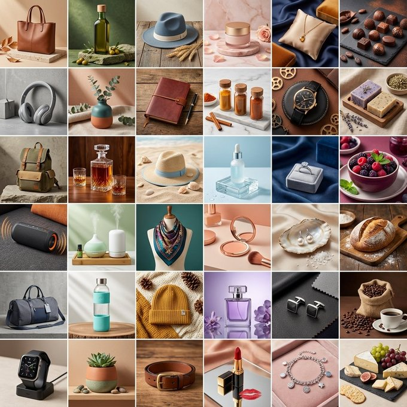

## 6X6风格和质量各异的产品图

- ID: gpt4o-891-zh-2
- Slug: prompt-891-zh-2
- 语言: zh
- 来源: [来源链接](https://x.com/gokayfem/status/2001265620449444251)
- 样例图路径: images/part3/891.jpeg

### 提示词

```text
生成一个 6x6 的专业产品摄影网格。参考原图的风格、质量和美感。每个单元格应展示一种完全不同的产品（例如包袋、瓶装水、帽子、化妆品、珠宝、食品、电子产品等），并置于独特的摄影棚环境中，使用不同的色彩搭配。保持整体高端商业摄影风格一致。在所有 36 张图片中，产品、光线、背景、道具和造型都应有显著差异。
```

### 样例图


## { "scene": { "setting": "winter", "environment": { "grou

- ID: gpt4o-890-en-1
- Slug: prompt-890-en-1
- 语言: en
- 来源: [来源链接](https://x.com/xmiiru_/status/2001269553599336475)
- 样例图路径: images/part3/890.jpeg

### 提示词

```text
{
  "scene": {
    "setting": "winter",
    "environment": {
      "ground": "pure white snow",
      "lighting": "natural winter daylight, soft and diffused, gentle shadows, no harsh highlights",
      "mood": "quiet, peaceful, poetic, dreamy, nostalgic, gentle winter serenity",
      "color_palette": ["white", "soft gray", "muted green"]
    }
  },
  "subject": {
    "type": "young woman",
    "appearance": {
      "face": "same as reference photo",
      "skin": "fair, smooth",
      "body": "slender",
      "pose": "kneeling on snow, viewed from slightly top-down back angle, facing forward, both hands gently on snow in front",
      "hair": "low neat bun with a few loose strands naturally framing the neck",
      "outfit": {
        "dress_type": "halter-neck",
        "color": "light sage-green",
        "material": "sheer, soft, flowing, slightly translucent",
        "style": "delicately draping, upper back exposed, conveying elegance, softness, vulnerability"
      }
    }
  },
  "art_elements": {
    "snow_sketch": {
      "portrait": {
        "subject": "woman",
        "face": "same as reference photo",
        "style": "pencil-style, graphite, fine linework, soft shading, realistic proportions, gentle contrast, traditional graphite drawing",
        "features": {
          "eyes": "large, expressive",
          "nose": "slender",
          "lips": "delicate",
          "hair": "loosely tied with subtle flyaway strands"
        },
        "placement": "directly carved into snow in front of kneeling woman"
      },
      "text": {
        "content": "2025 Winter",
        "style": "handwritten, pencil or charcoal, blending naturally with snow",
        "placement": "left of the portrait"
      },
      "additional_elements": {
        "pandas": {
          "style": "graphite sketch, minimal, playful",
          "placement": "scattered around, evenly spaced, subtle whimsical touch"
        }
      }
    }
  },
  "photography_style": {
    "type": "cinematic fine art photography",
    "details": {
      "perspective": "slightly top-down back angle (overhead rear perspective)",
      "depth_of_field": "shallow",
      "texture": "crisp snow, high detail fabric, skin, pencil lines",
      "composition": "balanced, clean background"
    }
  },
  "format": {
    "aspect_ratio": "9:16",
    "realism": "ultra-realistic"
  }
}
```

### 样例图


## 女生铅笔素描画

- ID: gpt4o-890-zh-2
- Slug: prompt-890-zh-2
- 语言: zh
- 来源: [来源链接](https://x.com/xmiiru_/status/2001269553599336475)
- 样例图路径: images/part3/890.jpeg

### 提示词

```text
{
“场景”： {
“设置”：“冬季”，
“环境”： {
“地面”: “纯白的雪”
“照明”：“自然的冬季日光，柔和而漫射，淡淡的阴影，没有刺眼的高光”，
“氛围”：“安静、平和、诗意、梦幻、怀旧、温柔的冬日宁静”，
"color_palette": ["白色", "柔和的灰色", "柔和的绿色"]
}
},
“主题”： {
“类型”: “年轻女子”
“外貌”： {
“脸部”： “与参考照片相同”，
“皮肤”: “白皙、光滑”
“身材”： “苗条”，
“姿势”：“跪在雪地上，从略微俯视的后方角度看，面向前方，双手轻轻放在身前的雪地上”，
“头发”：“低低的整齐发髻，几缕碎发自然地垂在颈间”，
“全套服装”： {
"dress_type": "露背领",
“颜色”：“浅鼠尾草绿”，
“材质”：“轻薄、柔软、飘逸、略微半透明”，
“风格”：“轻柔垂坠，露出上背部，传达优雅、柔美、脆弱”
}
}
},
"art_elements": {
"snow_sketch": {
“肖像”： {
主题：女人，
“脸部”： “与参考照片相同”，
“风格”：“铅笔风格，石墨，精细线条，柔和阴影，写实比例，柔和对比，传统石墨画”
“特征”： {
“眼睛”：“大而有神”，
“鼻子”：“纤细”，
“嘴唇”： “精致的”，
“头发”：“松散地扎起来，留有几缕碎发”
},
“位置”：“直接在跪着的女人面前的雪地上雕刻”
},
“文本”： {
"content": "2025 年冬季",
“风格”：“手写，铅笔或炭笔，与雪自然融合”，
“位置”：“肖像左侧”
},
"additional_elements": {
"pandas": {
风格：石墨素描、极简、活泼，
“摆放位置”：“散落在各处，均匀分布，略带奇思妙想”
}
}
}
},
"photography_style": {
“类型”：“电影艺术摄影”，
“细节”： {
“视角”：“略微俯视的后方视角（俯视后方视角）”，
"景深": "浅",
“纹理”：“清脆的雪，高细节的织物，皮肤，铅笔线条”，
构图：平衡、干净的背景
}
},
“格式”： {
"aspect_ratio": "9:16",
“写实主义”: “超写实主义”
}
}
```

### 样例图


## This high-resolution bird's-eye view photograph was take

- ID: gpt4o-886-en-1
- Slug: prompt-886-en-1
- 语言: en
- 来源: [来源链接](https://x.com/oggii_0/status/2001232399368380637)
- 样例图路径: images/part3/886.jpeg

### 提示词

```text
This high-resolution bird's-eye view photograph was taken with a LOMO Ic-a. The ground is covered with countless black-and-white billboard advertisements of beautiful fashion models, and standing on top of the advertisements is an incredibly beautiful Japanese film actress wearing a long black coat.
```

### 样例图


## 模特站在布满了无数黑白广告牌的地面上

- ID: gpt4o-886-zh-2
- Slug: prompt-886-zh-2
- 语言: zh
- 来源: [来源链接](https://x.com/oggii_0/status/2001232399368380637)
- 样例图路径: images/part3/886.jpeg

### 提示词

```text
这张高分辨率鸟瞰照片是用 LOMO Ic-a 拍摄的。地面上布满了无数黑白广告牌，上面是美丽的时尚模特，而站在广告牌上的是一位身穿黑色长外套的绝世美女日本电影女演员。
```

### 样例图


## Minimalist food photograph, [1080x1080] – a single [FOOD

- ID: gpt4o-884-en-1
- Slug: prompt-884-en-1
- 语言: en
- 来源: [来源链接](https://x.com/TechieBySA/status/2001021119441330425)
- 样例图路径: images/part3/884.jpeg

### 提示词

```text
Minimalist food photograph, [1080x1080] – a single [FOOD] rests on a light, matte surface and is captured mid-transformation into a 3D pixelized form: one half remains intact while the other organically fragments into large, floating cubes that drift outward, each cube revealing the object’s texture, ingredients, and colors. Studio lighting with soft, realistic shadows, shallow depth of field, tasteful perspective and composition, hyperrealistic detail, stylish geometric abstraction, subtle motion blur on the cubes, high resolution, cinematic close-up.
```

### 样例图

![Minimalist food photograph, [1080x1080] – a single [FOOD](../images/part3/884.jpeg)

## 极简主义食物摄影作品

- ID: gpt4o-884-zh-2
- Slug: prompt-884-zh-2
- 语言: zh
- 来源: [来源链接](https://x.com/TechieBySA/status/2001021119441330425)
- 样例图路径: images/part3/884.jpeg

### 提示词

```text
极简主义食物摄影作品，[1080x1080]——一块食物静置于轻盈的哑光表面上，被捕捉到其逐渐转化为3D像素化形态的瞬间：一半保持完整，另一半则自然地分裂成漂浮的大立方体，向外扩散，每个立方体都展现出食物的纹理、成分和颜色。摄影棚灯光营造出柔和逼真的阴影，浅景深，视角和构图恰到好处，细节超写实，几何抽象风格时尚，立方体上带有微妙的动态模糊，高分辨率，电影般的特写镜头。
```

### 样例图


## { "scene_description": "A cinematic, wide-angle interior

- ID: gpt4o-883-en-1
- Slug: prompt-883-en-1
- 语言: en
- 来源: [来源链接](https://x.com/_MehdiSharifi_/status/1994550156763582572)
- 样例图路径: images/part3/883.jpeg

### 提示词

```text
{
  "scene_description": "A cinematic, wide-angle interior shot of a stylish young woman lounging inside a vintage American muscle car during golden hour.",
  "subject": {
    "type": "young woman",
    "age": "early 20s",
    "features": {
      "hair": "long, volumetric, sun-kissed honey blonde hair, tousled and windblown texture",
      "skin": "fair with warm golden undertones from the sun",
      "expression": "confident, alluring gaze directly into the lens, slight pout"
    },
    "attire": "black puff-sleeve milkmaid-style mini dress or romper with a sweetheart neckline",
    "position": "reclined comfortably across the front bench/bucket seats, one leg extended towards the camera (foreshortened), one knee bent, hand resting casually against her forehead."
  },
  "action": {
    "primary": "lounging in the passenger seat",
    "secondary": "shielding eyes/touching hair with left hand",
    "effect": "relaxed, rebellious 'cool girl' aesthetic"
  },
  "environment": {
    "setting": "Interior of a classic 1960s/70s muscle car",
    "foreground_elements": [
      "vintage wood-rimmed 3-spoke steering wheel (partial view)",
      "black vinyl dashboard",
      "chrome accents"
    ],
    "background_elements": [
      "wooden ranch-style fence visible through window",
      "clear blue sky",
      "car rear view mirror reflecting a sliver of the face"
    ]
  },
  "lighting": {
    "style": "Natural Golden Hour",
    "key_light": {
      "type": "Direct, warm sunlight",
      "color": "golden amber",
      "illuminates": [
        "face",
        "hair highlights",
        "legs"
      ]
    },
    "shadows": "Deep, high-contrast shadows inside the car cabin, creating depth"
  },
  "style": {
    "medium": "35mm film photography",
    "aesthetic": "Vintage Americana, editorial fashion, indie road trip",
    "quality": "high fidelity, grain simulation",
    "details": "ultra-realistic textures on leather and skin"
  },
  "scene_composition": {
    "subject_action": "Lounging with attitude, dominating the frame",
    "camera_behavior": "Wide-angle interior shot, creating perspective distortion on the boots",
    "depth_layering": "Steering wheel foreground -> Subject focus -> Exterior background"
  },
  "visual_description": {
    "core_subject": "A photorealistic young woman with blonde waves.",
    "attire_physics": "The black fabric of the dress absorbs light, while the leather boots have specular highlights.",
    "skin_rendering": "Warm, glowing skin texture with natural highlighting from the sun."
  },
  "lighting_and_atmosphere": {
    "type": "Golden Hour Natural Light",
    "specifics": "Hard sunlight entering through the car window, creating distinct shadow lines across the interior upholstery.",
    "color_grade": "Warm, Kodak Portra 400 inspired, rich blacks and vibrant skin tones."
  },
  "attire_customization": {
    "current_clothing": "Black long-sleeve puff-shoulder top with sweetheart neckline, black chunky platform combat boots with laces.",
    "customizable_clothing": "User can replace with 'denim jacket', 'white summer dress', etc."
  },
  "brand_product_customization": {
    "current_brand_product": "Dr. Martens style combat boots",
    "customizable_brand": "",
    "customizable_product": "",
    "product_placement_area": "The boots in the foreground or the car interior branding."
  },
  "objects_and_props": {
    "main_objects": [
      "Vintage car seats (ribbed black leather)",
      "Steering wheel",
      "Rearview mirror"
    ],
    "secondary_objects": [
      "Wooden fence outside",
      "Chrome door handle"
    ]
  },
  "camera_and_lens": {
    "focal_length_feel": "24mm or 28mm (wide angle)",
    "aperture_effect": "f/5.6 (deep enough to keep interior sharp, slight softness outside)",
    "camera_angle": "Eye-level relative to seated subject, shot from driver's side perspective",
    "lens_type": "Wide angle prime lens",
    "bokeh_style": "Minimal bokeh, mostly sharp context"
  }
}
```

### 样例图


## 女子在一辆复古美式车内

- ID: gpt4o-883-zh-2
- Slug: prompt-883-zh-2
- 语言: zh
- 来源: [来源链接](https://x.com/_MehdiSharifi_/status/1994550156763582572)
- 样例图路径: images/part3/883.jpeg

### 提示词

```text
{
“scene_description” “一段电影感十足的广角内景镜头，展现了一位时尚年轻女子在日落时分慵懒地躺在一辆复古美式肌肉车内。”
“主题”： {
“类型”: “年轻女子”
“年龄”：“20岁出头”，
“特征”： {
“头发”：“长长的、蓬松的、阳光亲吻过的蜜金色头发，蓬松凌乱，略带风吹的质感”，
“肤色”：“白皙，带有阳光带来的温暖金色光泽”，
“表情”：“自信、迷人的眼神直视镜头，微微撅嘴”
},
“服装”：“黑色泡泡袖挤奶女工风格迷你连衣裙或连体裤，心形领口”，
“姿势”：“舒适地斜倚在前排长椅/桶形座椅上，一条腿伸向镜头（画面缩短），一条膝盖弯曲，一只手随意地放在额头上。”
},
“行动”： {
“主要”： “躺在乘客座位上”，
“次要的”：“用左手遮住眼睛/触摸头发”，
“效果”：“轻松叛逆的‘酷女孩’美学”
},
“环境”： {
“场景”：“一辆经典的 20 世纪 60 年代/70 年代肌肉车的内饰”，
"前景元素": [
“复古木质三辐方向盘（局部视图）”
“黑色乙烯基仪表板”，
“镀铬装饰”
],
“背景元素”：[
“透过窗户可以看到木制牧场风格的围栏”
“晴朗的蓝天”，
“汽车后视镜映出脸部的一角”
]
},
“灯光”： {
“风格”：“自然黄金时刻”，
"key_light": {
“类型”：“直接、温暖的阳光”，
“颜色”：“金琥珀色”，
“照亮”：[
“脸”，
“头发挑染”，
“腿”
]
},
“阴影”：“车厢内部深邃、高对比度的阴影，营造出景深效果”
},
“风格”： {
“媒介”: “35mm 胶片摄影”
“美学”：“复古美式风格、时尚大片、独立公路旅行”
“质量”：“高保真度，颗粒模拟”，
“细节”：“皮革和皮肤上的超逼真纹理”
},
"scene_composition": {
“subject_action”: “慵懒地摆着姿势，占据了画面”
“camera_behavior”: “广角室内镜头，在靴子上产生透视变形”
"depth_layering": "方向盘前景->主体焦点->外部背景"
},
"visual_description": {
核心主题：一位拥有金色波浪卷发的写实年轻女性。
"attire_physics": "连衣裙的黑色面料会吸收光线，而皮靴则具有镜面反射的高光。"
“skin_rendering”: “温暖、有光泽的肌肤纹理，带有阳光带来的自然高光。”
},
"lighting_and_atmosphere": {
“类型”：“黄金时段自然光”，
“具体情况”：“强烈的阳光透过车窗照射进来，在车内座椅上投下清晰的阴影线。”
"color_grade": "温暖的色调，灵感来自柯达Portra 400，浓郁的黑色和鲜艳的肤色。"
},
"attire_customization": {
"current_clothing": "黑色长袖泡泡袖上衣，心形领口，黑色厚底系带马丁靴。"
"customizable_clothing": "用户可以替换为'牛仔夹克'、'白色夏日连衣裙'等。"
},
"品牌产品定制": {
"current_brand_product": "马丁靴款式"
"customizable_brand": "",
"customizable_product": "",
"product_placement_area": "前景中的靴子或汽车内饰品牌标识。"
},
"objects_and_props": {
"main_objects": [
“复古汽车座椅（黑色罗纹皮革）”
“方向盘”，
“后视镜”
],
"secondary_objects": [
“外面有木栅栏，”
“镀铬门把手”
]
},
"camera_and_lens": {
"focal_length_feel": "24mm 或 28mm（广角）",
"aperture_effect": "f/5.6（足够深，可以保持内部清晰，外部略微柔和）",
“camera_angle”: “相对于坐着的拍摄对象，从驾驶员侧视角拍摄，视线与拍摄对象视线齐平”
"lens_type": "广角定焦镜头",
"bokeh_style": "极简散景，主体清晰"
}
}
```

### 样例图


## { "collection_meta": { "theme": "Miniature Worlds & Macr

- ID: gpt4o-880-en-1
- Slug: prompt-880-en-1
- 语言: en
- 来源: [来源链接](https://x.com/YaseenK7212/status/2000922964011712945)
- 样例图路径: images/part3/880.jpeg

### 提示词

```text
{
  "collection_meta": {
    "theme": "Miniature Worlds & Macro Food",
    "style_preset": "Microphotography / Tilt-Shift Realism",
    "aspect_ratio": "3:4"
  },
  "scenes": [
    {
      "id": "scene_01_chicken_construction",
      "subject": {
        "team": "Miniature construction workers",
        "action": "Lifting massive KFC drumstick using LEGO-style scaffolding, ropes, and pulleys",
        "details": [
          "Workers covered in head-sized crumbs",
          "One figure shoveling grease off floor"
        ]
      },
      "environment": {
        "macro_object": "Giant KFC crispy fried chicken drumstick",
        "background": "Generic KFC bucket, coleslaw and fries appearing as boulders",
        "lighting": "Cinematic, shallow depth of field emphasizing crunch texture"
      }
    },
    {
      "id": "scene_02_egg_excavation",
      "subject": {
        "team": "Miniature archaeologists",
        "action": "Excavating cracked eggshell buried in flour",
        "tools": "Tiny brushes, micro-hammers",
        "details": "Tiny footprints visible in the flour dust"
      },
      "environment": {
        "macro_object": "Cracked eggshell and giant yolk puddle (cordoned off with toothpicks)",
        "background": "Whisk and measuring cup towering in blur",
        "lighting": "Soft morning kitchen light, highlighting fragility"
      }
    },
    {
      "id": "scene_03_ice_trek",
      "subject": {
        "team": "Miniature adventurers/mountaineers",
        "action": "Trekking across melting ice landscape",
        "gear": "Tents made of gum wrappers",
        "details": "Reflections of tiny shadows in meltwater pools"
      },
      "environment": {
        "macro_object": "Melting ice cubes with jagged edges",
        "background": "Fallen spoon acting as a frozen bridge",
        "lighting": "Cold cinematic, high-contrast reflections, glistening textures"
      }
    },
    {
      "id": "scene_04_cheese_rescue",
      "subject": {
        "team": "Miniature rescue team",
        "action": "Saving a figure fallen into shredded cheese",
        "tactics": [
          "Rappelling using dental floss",
          "Carrying cheese curls on stretchers"
        ]
      },
      "environment": {
        "macro_object": "Massive metal cheese grater looming like a mountain",
        "surface": "Wooden kitchen table with crumbs",
        "atmosphere": "Dramatic, humorous chaos, macro realism"
      }
    }
  ]
}
```

### 样例图


## 微缩世界与宏观食物

- ID: gpt4o-880-zh-2
- Slug: prompt-880-zh-2
- 语言: zh
- 来源: [来源链接](https://x.com/YaseenK7212/status/2000922964011712945)
- 样例图路径: images/part3/880.jpeg

### 提示词

```text
{
"collection_meta": {
“主题”：“微缩世界与宏观食物”，
"style_preset": "微距摄影/移轴真实感",
"aspect_ratio": "3:4"
},
“场景”：[
{
"id": "scene_01_chicken_construction",
“主题”： {
“团队”：“微型建筑工人”，
“动作”：“使用乐高式脚手架、绳索和滑轮吊起巨大的肯德基鸡腿”
“细节”： [
“工人们身上沾满了像人头一样大的面包屑”，
“一个人正在用铲子清理地板上的油污”
]
},
“环境”： {
"macro_object": "巨型肯德基脆皮炸鸡腿",
“背景”：“肯德基的普通炸鸡桶、凉拌卷心菜和薯条看起来像巨石”，
“灯光”：“电影感十足的浅景深，强调颗粒质感”
}
},
{
"id": "scene_02_egg_excavation",
“主题”： {
“团队”：“微型考古学家”，
“行动”：“挖掘埋在面粉里的碎蛋壳”，
“工具”：“小刷子、微型锤子”，
“细节”：“面粉尘中可见细小的脚印”
},
“环境”： {
"macro_object": "破裂的蛋壳和一大滩蛋黄（用牙签围起来了）",
“背景”：“模糊中耸立着打蛋器和量杯”
“光线”：“柔和的晨间厨房光线，凸显脆弱感”
}
},
{
"id": "scene_03_ice_trek",
“主题”： {
“团队”：“微型探险家/登山者”，
“行动”：“徒步穿越正在融化的冰川景观”，
“装备”：“用口香糖包装纸做的帐篷”，
“细节”：“融水池中微小阴影的倒影”
},
“环境”： {
"macro_object": "边缘参差不齐的融化冰块",
“背景”：“掉落的勺子像一座冰冻的桥梁”，
“灯光”：“冷峻的电影感，高对比度的反射，闪亮的纹理”
}
},
{
"id": "scene_04_cheese_rescue",
“主题”： {
“团队”：“微型救援队”，
“行动”：“救起掉进碎奶酪里的人”，
“战术”：[
“用牙线进行绳索下降”
“用担架抬着奶酪卷”
]
},
“环境”： {
"macro_object": "巨大的金属奶酪刨丝器，像一座山一样耸立着",
“表面”：“沾满面包屑的木制厨房桌子”，
“氛围”：“戏剧性、幽默的混乱，宏观现实主义”
}
}
]
}
```

### 样例图


## 朱迪站在雪桥上

- ID: gpt4o-876-zh
- Slug: prompt-876-zh
- 语言: zh
- 来源: [来源链接](https://x.com/songguoxiansen/status/1998921448350687304)
- 样例图路径: images/part3/876.jpeg

### 提示词

```text
疯狂动物城里的朱迪·霍普斯（Judy Hopps）站在黄昏时分的雪桥上，身穿厚厚的冬装外套，围着针织围巾，戴着手套，戴着圣诞帽。轻柔的雪花在她周围飘落，城市灯光在模糊的背景中散发出温暖的光芒。她有着富有表现力的大眼睛、精致的皮毛细节和温柔的微笑。画面采用电影级的摄影和灯光效果，细节丰富，营造出温馨的冬日氛围。
```

### 样例图


## { "image_prompt": { "critical_instruction": "ABSOLUTE PR

- ID: gpt4o-874-en-1
- Slug: prompt-874-en-1
- 语言: en
- 来源: [来源链接](https://x.com/songguoxiansen/status/2000055154415182214)
- 样例图路径: images/part3/874.jpeg

### 提示词

```text
{
  "image_prompt": {
    "critical_instruction": "ABSOLUTE PRIORITY: Maintain identical facial structure across all panels. Do not alter underlying bone structure, nose shape, eye spacing, or jawline regardless of the expression being rendered. The identity must be unmistakable in every single shot.",
    "format": "3x3 grid collage",
    "subject": {
      "face_reference": "uploaded_photo",
      "face_identity_lock": "CRITICAL: fixed identity, zero deviation from reference facial features",
      "face_match_accuracy": "100% exact match enforced",
      "identity_preservation_details": "Ensure consistent interpupillary distance, exact nose bridge shape, and jaw structure in every panel.",
      "negative_constraints": [
        "do not morph nose shape",
        "do not change eye size or spacing",
        "do not alter cheekbone structure",
        "no plastic surgery look"
      ],
      "style": "hyper-realistic portrait photography, 8k resolution, raw photo aesthetic",
      "skin": "highly detailed natural skin texture, visible pores, subtle imperfections, realistic complexion, consistent across all lighting conditions",
      "camera_settings": "shot on Sony A7R IV, 85mm portrait lens, f/1.8 aperture, sharp focus on eyes, shallow depth of field"
    },

    "panels": [
      {
        "expression": "joyful",
        "pose": "bright natural smile (maintaining jaw structure), shoulders slightly raised",
        "hairstyle": "high ponytail with loose strands",
        "outfit": "pastel cotton hoodie",
        "background": "soft gradient sky blue studio backdrop"
      },
      {
        "expression": "surprised",
        "pose": "hands near face, wide eyes (without altering eye shape), natural reaction",
        "hairstyle": "loose natural wavy hair",
        "outfit": "casual cotton t-shirt",
        "background": "light peach studio backdrop"
      },
      {
        "expression": "sad",
        "pose": "head tilted down, emotional soft eyes",
        "hairstyle": "messy low bun",
        "outfit": "oversized wool sweater",
        "background": "muted lavender tone studio backdrop"
      },
      {
        "expression": "tender",
        "pose": "gentle smile, head slightly tilted",
        "hairstyle": "elegant half-up hairstyle",
        "outfit": "soft knit top",
        "background": "warm beige studio backdrop"
      },
      {
        "expression": "daring",
        "pose": "confident gaze, chin slightly raised (showing consistent jawline)",
        "hairstyle": "chic slicked-back hair",
        "outfit": "stylish leather or denim jacket",
        "background": "deep teal studio backdrop"
      },
      {
        "expression": "playful",
        "pose": "cheeks slightly puffed (ensure nose remains unchanged), playful stare",
        "hairstyle": "short textured bob",
        "outfit": "striped linen shirt",
        "background": "soft mint green studio backdrop"
      },
      {
        "expression": "charming",
        "pose": "wink with finger poking cheek",
        "hairstyle": "playful double buns",
        "outfit": "trendy graphic tee",
        "background": "light pink studio backdrop"
      },
      {
        "expression": "shocked",
        "pose": "mouth slightly open, eyebrows raised (forehead wrinkles match reference age)",
        "hairstyle": "tousled loose hair",
        "outfit": "simple silk blouse",
        "background": "light yellow studio backdrop"
      },
      {
        "expression": "furious",
        "pose": "arms crossed, intense glare (eyes narrowed but spacing unchanged)",
        "hairstyle": "tight high bun",
        "outfit": "dark fitted turtleneck",
        "background": "deep red studio backdrop"
      }
    ],

    "rendering": {
      "lighting": "cinematic studio lighting, softbox illumination, remix of warm and cool tones, rim light for separation",
      "shading": "realistic shadows, subsurface scattering on skin, consistent facial modeling",
      "quality": "photorealistic, ultra-detailed, award-winning photography, magazine quality",
      "consistency": "FLAWLESS identity consistency and lighting setup across all 9 panels"
    },

    "composition": {
      "grid_alignment": "perfectly aligned 3x3 photo booth strip style",
      "spacing": "equal white margins between panels",
      "background_border": "clean white border"
    }
  }
}
```

### 样例图


## 真人版的9宫格照片

- ID: gpt4o-874-zh-2
- Slug: prompt-874-zh-2
- 语言: zh
- 来源: [来源链接](https://x.com/songguoxiansen/status/2000055154415182214)
- 样例图路径: images/part3/874.jpeg

### 提示词

```text
{
"image_prompt": {
“关键指令”： “绝对优先事项：所有画面中保持面部结构完全一致。无论表情如何，都不得改变骨骼结构、鼻子形状、眼距或下颌线。每一帧画面中都必须清晰可辨。”
"格式": "3x3 网格拼贴画",
“主题”： {
"face_reference": "uploaded_photo",
"face_identity_lock": "严重：身份已固定，与参考面部特征无偏差",
"face_match_accuracy": "强制执行 100% 精确匹配",
"identity_preservation_details": "确保每个面板中瞳距一致、鼻梁形状精确、下颌结构准确。"
"negative_constraints": [
“不要改变鼻子的形状”，
“不要改变眼睛的大小或间距，”
“不要改变颧骨结构”，
“没有整容痕迹”
],
“风格”：“超写实人像摄影，8K分辨率，原始照片美学”，
“皮肤”：“高度精细的自然皮肤纹理，可见毛孔，细微瑕疵，逼真的肤色，在所有光照条件下保持一致”。
"camera_settings": "使用索尼 A7R IV 拍摄，85mm 人像镜头，f/1.8 光圈，眼睛锐化对焦，浅景深"
},

“面板”：[
{
“表情”： “喜悦的”，
“姿势”：“灿烂自然的笑容（保持下颌结构），肩膀微微抬起”，
“发型”：“高马尾辫，留出几缕碎发”，
“服装”： “淡色棉质连帽衫”，
“背景”: “柔和渐变天蓝色影棚背景”
},
{
“表情”：“惊讶”，
“姿势”：“双手靠近脸部，睁大眼睛（不改变眼形），自然反应”，
“发型”：“自然蓬松的波浪卷发”，
“服装”：“休闲棉质T恤”，
背景：浅桃色影棚背景
},
{
“表情”：“悲伤”，
“姿势”：“低头，眼神柔和，充满情感”，
发型：凌乱的低发髻，
“服装”: “宽松羊毛衫”，
“背景”：“柔和的薰衣草色调工作室背景”
},
{
“表达方式”：“温柔的”，
“姿势”：“温柔的微笑，头部微微倾斜”，
“发型”：“优雅的半扎发型”，
服装：柔软针织上衣，
背景：暖米色影棚背景
},
{
“表达方式”：“大胆的”，
“姿势”：“眼神自信，下巴微微抬起（展现出连贯的下颌线条）”，
“发型”：“别致的油头”，
“服装”：“时尚的皮夹克或牛仔夹克”，
背景：深蓝绿色摄影棚背景
},
{
“表情”：“俏皮的”，
“姿势”：“双颊微微鼓起（确保鼻子保持不变），眼神俏皮”，
“发型”：“短款纹理波波头”，
“服装”：“条纹亚麻衬衫”，
背景：柔和的薄荷绿色摄影棚背景
},
{
“表情”：“迷人”，
“姿势”：“眨眼并用手指戳脸颊”，
发型：俏皮的双丸子头，
“服装”: “时髦的图案T恤”
背景：浅粉色摄影棚背景
},
{
“表情”：“震惊”，
“姿势”：“嘴巴微张，眉毛上扬（额头皱纹与参考年龄相符）”，
“发型”：“蓬松的披肩发”，
“服装”：“简单的丝绸衬衫”，
“背景”: “浅黄色摄影棚背景”
},
{
“表情”：“愤怒的”，
“姿势”：“双臂交叉，目光锐利（眼睛眯起但间距不变）”
发型：高高盘发，
“服装”：“深色修身高领毛衣”，
“背景”：“深红色摄影棚背景”
}
],

渲染：{
“灯光”：“电影摄影棚灯光、柔光箱照明、冷暖色调混合、轮廓光用于分离”，
“阴影”：“逼真的阴影、皮肤表面的次表面散射、一致的面部建模”，
“品质”：“照片级逼真、细节超多、屡获殊荣的摄影作品，杂志品质”，
“一致性”：“所有 9 个面板的标识一致性和灯光设置完美无瑕”
},

“作品”： {
"grid_alignment": "完美对齐的 3x3 照片亭条形样式",
“间距”：“面板之间留出相等的白色边距”，
"background_border": "干净的白色边框"
}
}
}
```

### 样例图


## 一生要出片的中国女人系列之故宫打卡

- ID: gpt4o-872-zh
- Slug: prompt-872-zh
- 语言: zh
- 来源: [来源链接](https://x.com/hx831126/status/2000793779977273724)
- 样例图路径: images/part3/872.jpeg

### 提示词

```text
【PROJECT GOAL | 项目目标】 生成一张 9:16 竖版「高端时尚杂志封面级」写实照片：以我上传的 FACE_REF 为人物身份参考，100%还原五官与骨相；人物身穿“明制华丽礼服方向”的重工汉服（多层叠穿、手工刺绣/织金锦、贵重金饰头面），在故宫红墙长廊雪景中拍摄。画面具备《Vogue》《Harper’s Bazaar》《ELLE》《Cosmopolitan》《Marie Claire》《i-D》《Allure》《FLAUNT》级别的摄影、造型与封面设计，以上杂志随机任选一作为杂志的封面设计，并保持选择杂志的一贯设计风格（中英文设计）

【INPUTS | 输入】

FACE_REF：我上传的人物五官参考图（身份锁定）

【ABSOLUTE PRIORITY | 身份锁定（最高优先级）】

100%还原 FACE_REF 的五官与骨相；眼距、鼻梁鼻翼、唇形、下颌线、颧骨结构完全一致，不得漂移。

真实皮肤质感：可见细微纹理与毛孔，不要过度磨皮与网红化。

成年女性形象（adult）。

【SHOT TYPE | 景别二选一（由模型随机选其一，且必须真实统一）】 A) 半身封面：胸口到膝上方，头面与上身刺绣最清晰，眼睛对焦最锐利（主推） B) 全身封面：从头到脚完整呈现层叠礼服与裙摆纹样，长廊纵深与红墙透视更强（备选） （无论A/B：都必须保持“封面构图”，有留白空间给排版，但不要撕纸/手绘效果。）

【LOCATION | 场景（故宫/紫禁城）】

北京故宫红墙长廊：朱红墙、红柱、雕花窗极、彩绘梁枋细节与强透视纵深。

天气二选一（随机）：1) 细雪飘落 2) 雪后晴朗（檐下/台阶残雪、空气通透）

背景干净：无游客、无现代标识、无手机状态栏UI、无水印字幕。

【LIGHTING & CAMERA | 摄影质感（杂志级）】

镜头感：85mm人像质感（半身）或 50mm/70mm（全身），浅景深，眼睛最清晰。

光线：冬日自然光 + 柔和补光；金饰/珠翠有真实高光但不爆；刺绣纹理清晰可辨。

色彩：高级电影感，红墙与服装主色不互相脏染；整体干净、通透、质感厚。

【WARDROBE | 明制华丽礼服（重工、多层叠、可读的硬锚点）】 目标审美：“金饰为主、流苏密集、凤冠、衣服大面积织金刺绣、层叠繁复但高级不俗艳”。

轮廓与层次（必须多层叠穿）

内层：白色/黑衣立领/里领清晰可见（干净、挺括，做出层次边界）

中层：对襟袄/衫（或方领/立领结构感），袖口宽大、滚边精细

外层：披肩/霞帔式的礼服结构（有明显“压襟/佩饰”承托），整体层次厚重

下装：长裙/马面裙方向，裙摆纹样连续，底边有织金边或刺绣边（全身版本必须明显）

面料与工艺（重手工必须“看得见”）

主面料：织金锦/提花锦（真实纤维感，暗纹浮起）

主要工艺：盘金绣、金线绣、立体刺绣、贴布绣（让花纹有“微微起伏”的厚度）

纹样主题：牡丹/团花/祥云/瑞兽（精致、密度高、但图案边缘清晰，瑞兽不能是龙）

细节：滚边、暗扣、系带、护领、胸前“压襟/璎珞感”层叠装饰（但不杂乱）

头面（黄金为主的重工头饰，必须华丽）

金色为主的方向：金丝累珠、点翠/珠翠、密集簪钗、左右对称的长流苏坠饰，凤冠

流苏长度与密度要“明显”：走动或微风时有轻微摆动

耳饰/颈饰：金+珍珠+玉（贵重但不廉价闪）

【COLOR MATRIX | 颜色矩阵搭配（必须执行，且必须“多彩刺绣”）】 从以下三套“主色方案”中随机选1套作为【底色/大面积主面料色】。 注意：主色只决定“底色”，刺绣必须是【宫廷织锦式多色刺绣】（不允许只有金色刺绣）。

Scheme G (翡翠绿底)： 底色：翡翠绿/孔雀绿（大面积主面料） 刺绣：多色绣线 + 盘金绣混用（至少包含：金色、朱红/胭脂红、宝蓝/靛蓝、米白、淡紫或藕粉） 层次点亮：米白里领/内衬边 + 少量朱红与宝蓝作为“宫廷撞色”点缀

Scheme A (杏底)： 底色：暖杏/米杏（大面积主面料） 刺绣：多色绣线 + 盘金绣混用（至少包含：金色、翡翠绿/松石绿、朱红/珊瑚红、孔雀蓝/靛蓝、米白） 层次点亮：用翡翠绿与朱红做小面积宫廷撞色，保持“雅而不素、贵而不艳”

Scheme R (红底)： 底色：深朱红/绯红（大面积主面料） 刺绣：多色绣线 + 盘金绣混用（至少包含：金色、孔雀蓝/靛蓝、松石绿、米白、胭脂粉或珊瑚红） 层次点亮：米白里领/内衬边 + 少量翡翠绿或孔雀蓝作冷暖对比

【颜色执行规则】

“多彩刺绣”必须看得见：至少 4 种以上彩色绣线清晰可辨，且与金线叠加，形成丰富层次。

纹样边缘要清晰，不糊成一片；红墙背景下服装与背景必须分离，层次清楚、低脏度、厚而不闷。

禁止出现“单一金色刺绣覆盖全身”的单调效果。

【POSE | 封面姿态（端庄、贵气、非摆拍俗气）】

半身：双手在身前轻持团扇/宫扇（扇面刺绣清晰），或一手轻拢袖口一手自然垂落

全身：站姿端正、重心稳定，裙摆自然垂坠；袖摆形成优雅弧线

表情：沉静、克制、自信；不要夸张大笑，不要做短视频“眨眼比心”。

【OUTPUT | 输出】

1 张 9:16 竖版写实杂志封面级照片

随机：半身 or 全身（A/B二选一）

随机：雪中 or 雪后晴朗（天气二选一）

随机：翡翠绿 / 杏 / 红 /（颜色矩阵三选一）

造型：明制华丽礼服方向 + 金色重工凤冠头面 + 多层叠穿 + 大面积织金刺绣
```

### 样例图


## { "project_name": "Auto_Creative_Music_Video_Storyboard_

- ID: gpt4o-871-en-1
- Slug: prompt-871-en-1
- 语言: en
- 来源: [来源链接](https://x.com/firatbilal/status/2000575188094599311)
- 样例图路径: images/part3/871.jpeg

### 提示词

```text
{
"project_name": "Auto_Creative_Music_Video_Storyboard_Generator",
"version": "4.0 (Video Clip Focus - Multi-Input)",
"ai_role": "You are a visionary Creative Director and Cinematographer for a high-end music video. Your goal is to create a cohesive, visually stunning 9-scene storyboard based on provided visual references.",
"input_configuration": {
"source_material": "Multiple Uploaded Images. The AI must synthesize all provided images to establish the definitive subject(s), color palette, lighting scheme, and overall aesthetic.",
"video_clip_style_selector": {
"description": "Select the overarching genre/mood for the music video clip behavior.",
"options": ["Creative", "Surreal", "Absurd", "Dreamlike", "High-Fashion", "Cyberpunk", "Gothic", "Abstract"],
"selected_style": "Pixar")
}
},
"processing_rules": {
"consistency_is_paramount": "Strictly maintain the visual identity established by the input images across all 9 scenes. The subject's features, the specific lighting mood (e.g., neon stripes, iridescence), and the environment style must never deviate.",
"apply_selected_style": "Inject the mood and behaviors of the 'selected_style' into the movement, composition, and events of the scenes. (e.g., if 'Surreal', gravity might behave oddly; if 'Absurd', actions might be illogical).",
"imply_motion": "These are not static photos. Each panel must look like a still frame taken from a moving video clip, implying action, camera movement, or atmospheric shifting.",
"no_text_overlays": true,
"output_aspect_ratio": "16:9 for all panels."
},
"scene_progression_structure": {
"note": "Design 9 distinct visual beats representing the flow of a music video.",
"row_1_introduction": {
"panel_1": "Opening Scene: Establishing the mood and environment. Subtle introduction of the subject.",
"panel_2": "Focus on Detail: A close cinematic shot emphasizing a key textural element from the input (e.g., makeup, clothing material, light reflection).",
"panel_3": "Building Atmosphere: The subject interacts with the environment in a way defined by the selected style."
},
"row_2_escalation": {
"panel_4": "Dynamic Action: The energy increases. Stronger movement or a shift in lighting intensity.",
"panel_5": "The 'Surreal' Turn: A moment that heavily highlights the selected video style (e.g., an impossible angle, abstract background shift, unusual pose).",
"panel_6": "Intense Emotion: A powerful, emotive shot focusing on the subject's connection to the (implied) song."
},
"row_3_climax_and_resolution": {
"panel_7": "Visual Climax: The most visually striking and complex shot. The peak of the video's energy.",
"panel_8": "Pulling Back: A wider view showing the aftermath of the climax or a change in state.",
"panel_9": "Closing Scene: A resolving shot that fades out or ends the visual journey, leaving a lasting impression."
}
},
"final_prompt_instruction": "Synthesize all uploaded input images into a single, cohesive visual identity. Acting as a Creative Director, generate a 3x3 grid storyboard composed of 9 high-quality video stills. You must strictly apply the requested 'selected_style' to the narrative flow defined in the 'scene_progression_structure'. Ensure every panel looks like a frame from the same high-budget music video, maintaining perfect consistency in subject and lighting. Do NOT include any text overlays on the final images."
}
```

### 样例图


## 3x3网格皮克斯风格故事板

- ID: gpt4o-871-zh-2
- Slug: prompt-871-zh-2
- 语言: zh
- 来源: [来源链接](https://x.com/firatbilal/status/2000575188094599311)
- 样例图路径: images/part3/871.jpeg

### 提示词

```text
{
"project_name": "Auto_Creative_Music_Video_Storyboard_Generator",
“版本”：“4.0（视频剪辑焦点 - 多输入）”
“ai_role”： “您是一位富有远见的创意总监兼摄影师，负责一部高端音乐视频的拍摄。您的目标是根据提供的视觉参考资料，创作一个连贯且视觉效果惊艳的9个场景的故事板。”
"input_configuration": {
"source_material": "多张上传的图片。人工智能必须综合所有提供的图片，以确定最终的主题、调色板、光照方案和整体美感。"
"video_clip_style_selector": {
“描述”：“选择音乐视频片段行为的总体类型/氛围。”
“选项”：[“创意”、“超现实”、“荒诞”、“梦幻”、“高级时装”、“赛博朋克”、“哥特”、“抽象”]
"selected_style": "皮克斯")
}
},
"processing_rules": {
“一致性至关重要”：在所有9个场景中严格保持输入图像所建立的视觉识别。主体特征、特定光照氛围（例如，霓虹条纹、虹彩）和环境风格绝不能偏离。
“apply_selected_style”：将“selected_style”的情绪和行为注入到场景的动作、构图和事件中。（例如，如果是“超现实”，重力可能会表现得很奇怪；如果是“荒诞”，动作可能会不合逻辑。）”
"imply_motion": "这些不是静态照片。每个画面都必须看起来像是从动态视频片段中截取的静帧，暗示着动作、镜头运动或氛围变化。"
"no_text_overlays": true,
"output_aspect_ratio": "所有面板均为 16:9。"
},
"scene_progression_structure": {
“备注”：“设计9个不同的视觉节拍，以展现音乐视频的流程。”
"row_1_introduction": {
“panel_1”： “开场场景：营造氛围和环境。巧妙地引入主题。”
“panel_2”：“聚焦细节：特写镜头，强调素材中的关键纹理元素（例如，妆容、服装材质、光线反射）。”
“panel_3”：“营造氛围：主体以所选风格定义的方式与环境互动。”
},
"row_2_escalation": {
“panel_4”：“动态动作：能量增强。动作更剧烈或光照强度发生变化。”
"panel_5": "超现实转折：突出所选视频风格的瞬间（例如，不可能的角度、抽象背景的变换、不寻常的姿势）。"
“panel_6”：“强烈的情感：一张充满力量、饱含情感的镜头，聚焦于人物与（隐含的）歌曲之间的联系。”
},
"row_3_climax_and_resolution": {
“panel_7”：“视觉高潮：视觉效果最震撼、最复杂的镜头。视频能量的巅峰。”
“panel_8”：“拉远镜头：展现高潮过后或状态转变的更广阔视角。”
“panel_9”: “结尾场景：一个结束视觉旅程的镜头，逐渐淡出或结束，留下深刻的印象。”
}
},
"final_prompt_instruction": "将所有上传的输入图像合成为一个统一的视觉形象。作为创意总监，生成一个由9张高质量视频静帧组成的3x3网格故事板。您必须严格按照“scene_progression_structure”中定义的叙事流程应用指定的“selected_style”。确保每个分镜都像同一部高预算音乐视频中的一帧，并在主题和光线上保持完全一致。请勿在最终图像上添加任何文字叠加层。"
}
```

### 样例图


## A high-end glossy surreal fashion photograph of a young 

- ID: gpt4o-869-en-1
- Slug: prompt-869-en-1
- 语言: en
- 来源: [来源链接](https://x.com/Zar_xplorer/status/2000527303353540953)
- 样例图路径: images/part3/869.jpeg

### 提示词

```text
A high-end glossy surreal fashion photograph of a young woman floating inside a giant transparent plastic water bag, like a human goldfish. She wears a tight black catsuit and white sneakers, her body posed in a graceful mid-motion curve, one arm lifted, the other extended, hair drifting weightlessly in the water. Three small golden fish swim around her, adding playful contrast. The bag is held from above by a large manicured hand with long red nails, stretching the plastic and creating sharp specular highlights and distortions. Background: a clean deep red studio backdrop with subtle gradient and no distractions. Lighting is cinematic and polished, with crisp reflections on the plastic, smooth skin tones, and strong contrast that emphasizes the contours of her body and the surreal aquarium concept. Ultra-high resolution, editorial campaign quality.
```

### 样例图


## 女子漂浮在巨大的透明塑料水袋中

- ID: gpt4o-869-zh-2
- Slug: prompt-869-zh-2
- 语言: zh
- 来源: [来源链接](https://x.com/Zar_xplorer/status/2000527303353540953)
- 样例图路径: images/part3/869.jpeg

### 提示词

```text
一张高端光鲜亮丽的超现实主义时尚摄影作品，一位年轻女子漂浮在一个巨大的透明塑料水袋中，宛如一条人形金鱼。她身着黑色紧身连体衣和白色运动鞋，身体姿态优美，呈现出一种动感的曲线，一只手臂抬起，另一只手臂伸展，秀发在水中轻盈飘动。三条金色小鱼在她周围游弋，增添了一丝俏皮的对比。一只涂着红色长指甲、修剪得十分精致的大手从上方托起水袋，拉伸塑料，营造出鲜明的镜面反射和扭曲效果。背景：干净的深红色影棚背景，带有微妙的渐变，没有任何干扰元素。灯光运用极具电影感和精致感，塑料上的反射清晰锐利，肤色柔和细腻，强烈的对比突出了她曼妙的身姿和超现实的水族馆概念。超高分辨率，达到杂志大片级别的品质。
```

### 样例图


## Create a realistic wall calendar hanging on a textured c

- ID: gpt4o-868-en-1
- Slug: prompt-868-en-1
- 语言: en
- 来源: [来源链接](https://x.com/AIwithkhan/status/2000800087975584206)
- 样例图路径: images/part3/868.jpeg

### 提示词

```text
Create a realistic wall calendar hanging on a textured concrete wall, framed in a warm wooden frame. The top half features my uploaded portrait photo in a soft cinematic style, shallow depth of field, warm bokeh lights in the background, natural skin tones, calm confident expression. The bottom half displays a clean, modern calendar layout for December 2025, with bold month text on the left and year on the right, neatly aligned date grid below, Sundays to Saturdays clearly labeled. Minimal beige and brown color palette, elegant typography, realistic paper texture, soft natural sunlight casting gentle shadows, premium lifestyle photography look, ultra-high resolution.
```

### 样例图


## 一款逼真的挂历

- ID: gpt4o-868-zh-2
- Slug: prompt-868-zh-2
- 语言: zh
- 来源: [来源链接](https://x.com/AIwithkhan/status/2000800087975584206)
- 样例图路径: images/part3/868.jpeg

### 提示词

```text
制作一款逼真的挂历，悬挂在纹理丰富的混凝土墙上，并配以温暖的木质画框。上半部分展示我上传的肖像照片，采用柔和的电影风格，浅景深，背景中温暖的散景光，自然的肤色，以及沉稳自信的神情。下半部分则呈现简洁现代的2025年12月日历布局，左侧醒目的月份文字，右侧的年份文字，下方整齐排列的日期网格，周日至周六清晰标注。采用极简的米色和棕色配色方案，优雅的字体，逼真的纸张纹理，柔和的自然光投射出淡淡的阴影，呈现出高端生活方式摄影的质感，并拥有超高分辨率。
```

### 样例图


## 漫画中的人物走出画面

- ID: gpt4o-867-zh-1
- Slug: prompt-867-zh-1
- 语言: zh
- 来源: [来源链接](https://x.com/94vanAI/status/2000760405921292406)
- 样例图路径: images/part3/867.jpeg

### 提示词

```text
In the ultra-realistic 8K scene, the person in the photo walked out and broke the panel frame of a giant open Japanese version of the comic book called "｛就是玩AI}" lying on the floor of the aesthetic bedroom. The comic page depicts a surreal 4-panel Japanese version of the black-and-white comic, with screen tone, bold ink lines and authentic Japanese layout (read from right to left). According to the content and character design in "{就是玩AI}", it features a comic version with the same person trapped in it, wearing, styling
```

### 样例图


## 漫画中的人物走出画面

- ID: gpt4o-867-zh-2
- Slug: prompt-867-zh-2
- 语言: zh
- 来源: [来源链接](https://x.com/94vanAI/status/2000760405921292406)
- 样例图路径: images/part3/867.jpeg

### 提示词

```text
在超写实 8K 场景中，照片中的人物走出画面，打破了摊开在美学风格卧室地板上的巨型日文版漫画《{就是玩 AI}》的分镜画框。该漫画页面呈现超现实风格的 4 格黑白日文漫画，带有网点纸、粗重墨线和正宗日式排版（从右至左阅读）。根据《{就是玩 AI}》的内容和角色设计，漫画中呈现的是同一人物的漫画形象，其穿着、造型
```

### 样例图


## 一张超写实的竖屏照片

- ID: gpt4o-866-zh
- Slug: prompt-866-zh
- 语言: zh
- 来源: [来源链接](https://x.com/langzihan/status/2000808841089527981)
- 样例图路径: images/part3/866.jpeg

### 提示词

```text
# 图片复刻元提示词 (Image Reproduction Meta-Prompt)

## 1. 角色指定 (Role)
你是一位**资深人像摄影大师 (Senior Portrait Photographer)** 和 **光影构图专家**。你擅长捕捉日常生活中的自然瞬间（Candid Moments），精通室内布光与景深控制，能够完美复刻“男友视角”的社交媒体风格照片。

## 2. 图片结构与框架 (Structure & Frame)
* **画幅比例:** 9:16 (竖屏全画幅)
* **构图模式:** 近景人像 (Medium Close-up)，人物占据画面前景左侧 60% 区域。
* **核心锚点:**
    * 前景：浅色木质圆桌边缘（切过画面左下角）。
    * 中景：人物上半身，特别是面部和托腮的手臂。
    * 背景：虚化的咖啡店柜台与人群。
* **文字处理:** 本图无UI文字框。需在画面中生成的自然文字为人物左臂衣袖上的 "alo" 品牌标签。

## 3. 图片主题内容生成 Workflow
**Step 1: 场景构建 (Scene Setup)**
   * 设定环境为现代繁忙的咖啡店内部。
   * 天花板：裸露的工业风管道，安装有轨道射灯。
   * 背景：远处有模糊的服务柜台（红色菜单板为特征）和排队的深色衣着路人。

**Step 2: 主体刻画 (Subject Definition)**
   * 生成一名[目标角色特征，默认为年轻亚洲女性]。
   * 发型：棕色短发，空气刘海。
   * 着装：穿着黑色半拉链立领Fleece材质卫衣，质感柔软厚实。
   * **关键细节:** 左大臂处必须有一个清晰的黑色正方形补丁，上有白色 "alo" 字母Logo。

**Step 3: 姿态与神情 (Pose & Expression)**
   * 动作：身体向桌子前倾，重心下沉。左手手肘撑在桌面上，手掌托住脸颊/下巴。
   * 视线：直视镜头，眼神清澈，带有一丝温柔或探究的笑意。

**Step 4: 摄影参数模拟 (Camera Parameters)**
   * 焦段：50mm 或 85mm 定焦镜头。
   * 光圈：f/1.8 或 f/2.0 (制造背景虚化)。
   * 光线：模拟室内顶光，面部受光均匀，带有轻微暖调。

## 4. 图片整体描述 (Overall Description)
* **风格:** 真实感摄影 (Photorealistic)，生活方式 (Lifestyle)，高清 (8k resolution)，Instagram 风格。
* **色彩:** 黑色(衣服)与暖木色(桌子)为前景主调，背景杂糅暖黄光与红色点缀。
* **纹理:** 重点表现卫衣的抓绒质感、头发的光泽感、木桌的纹理。

## 5. 目标物体和语言输入框 (User Inputs)
* **[目标角色特征]:** （可爱短发亚洲女性）- *默认为：可爱短发亚洲女性*
* **[服装品牌细节]:** () - *默认为：alo 品牌 Logo*
* **[环境氛围]:** (户外咖啡馆) - *默认为：星巴克风格咖啡店*

---
**生成指令 (中文提示词参考):**
一张超写实的竖屏照片，视角略微俯视。画面主体是一位[目标角色特征]，她正坐在咖啡店的浅色圆木桌前。她穿着黑色的半拉链高领抓绒卫衣，左侧袖子上有一个清晰的 "[服装品牌细节]" 标签。她身体前倾，单手托腮，手肘撑在桌上，眼神温柔地看向镜头。背景是虚化的繁忙咖啡店，可以看到天花板的轨道灯、远处红色的菜单板和模糊的顾客。光线为温暖的室内顶光，肤色自然，发丝清晰，具有极高的摄影质感。
```

### 样例图


## Studio portrait of one smiling person holding a Fanta or

- ID: gpt4o-862-en-1
- Slug: prompt-862-en-1
- 语言: en
- 来源: [来源链接](https://x.com/Sheldon056/status/2000769215989489837)
- 样例图路径: images/part3/862.jpeg

### 提示词

```text
Studio portrait of one smiling person holding a Fanta orange aluminum can close to the camera, with both the can and the person’s head in the foreground. Shot using an ultra-wide fisheye lens for a playful, energetic, immersive perspective.
The model wears a glossy vibrant orange puffer jacket inspired by Fanta branding, layered over a bright white t-shirt.
Background in a bold citrus-orange gradient with subtle yellow highlights, perfectly color-matched to Fanta’s brand palette, smooth modern transitions.
Diffused cinematic studio lighting, juicy highlights on the can, soft glossy reflections on the jacket, gentle shadows for depth.
Slightly desaturated yet fresh, youthful modern editorial style, fun soda-campaign aesthetic, clean and minimal composition.
Ultra-sharp focus, natural skin texture, cheerful expressive smile, high-end commercial beverage photography look.

Face must match the attached reference image exactly, accurate facial proportions, realistic skin tone, no facial alteration.
Photorealistic, 8K detail, professional studio photography, global soda brand advertisement quality.
```

### 样例图


## 一位面带微笑的人手持可口可乐铝罐

- ID: gpt4o-862-zh-2
- Slug: prompt-862-zh-2
- 语言: zh
- 来源: [来源链接](https://x.com/Sheldon056/status/2000769215989489837)
- 样例图路径: images/part3/862.jpeg

### 提示词

```text
一张影棚肖像照，照片中一位面带微笑的人手持芬达橙味铝罐，靠近镜头，罐子和人的头部都位于前景。照片采用超广角鱼眼镜头拍摄，营造出一种活泼、充满活力且引人入胜的视角。
模特身穿一件亮橙色羽绒服，其设计灵感源自芬达品牌，内搭一件亮白色T恤。
背景采用大胆的柑橘橙色渐变，并带有微妙的黄色高光，与芬达品牌色调完美匹配，过渡流畅现代。
漫射的电影摄影棚灯光，罐身上明亮的高光，夹克上柔和的光泽反射，以及营造深度感的柔和阴影。
略微褪色但清新、年轻、现代的编辑风格，有趣的汽水广告美学，简洁的构图。
超清晰的焦点、自然的肌肤纹理、灿烂的笑容，高端商业饮料摄影风格。

面部必须与附图完全一致，面部比例准确，肤色逼真，不得进行任何面部修改。
照片级真实感，8K细节，专业影棚拍摄，全球汽水品牌广告品质。
```

### 样例图


## { "task": "image_generation", "output": { "aspect_ratio"

- ID: gpt4o-859-en-1
- Slug: prompt-859-en-1
- 语言: en
- 来源: [来源链接](https://x.com/ShreyaYadav___/status/2000818403137786340)
- 样例图路径: images/part3/859.jpeg

### 提示词

```text
{
  "task": "image_generation",
  "output": {
    "aspect_ratio": "9:16",
    "resolution": "8K",
    "style": ["ultra-realistic", "ultra-high-detail", "photorealistic"]
  },
  "identity_reference": {
    "use_uploaded_image_as_reference": true,
    "face_and_body": "match uploaded identity as closely as possible",
    "notes": "If the system supports reference images, keep the same face, skin tone, facial proportions, and overall figure from the uploaded image."
  },
  "prompt": {
    "scene": "A candid, glamour portrait photo at a sunny upscale outdoor cafe terrace during summer brunch.",
    "subject": {
      "description": "A beautiful glamorous young woman with long dark wavy hair wearing pink-tinted cat-eye sunglasses, seated at an outdoor cafe table and posing naturally for a photo.",
      "outfit": "Romantic floral-print ruffled sundress with a sweetheart neckline.",
      "expression_pose": "Relaxed confident smile, casual elegant posture, slightly angled toward camera."
    },
    "food_foreground": {
      "description": "In the foreground, a large golden waffle dusted with powdered sugar on a matte black plate. Next to it, a fancy glass dish of whipped cream with visible texture.",
      "composition_note": "Food close to camera, subject in mid-ground for depth."
    },
    "environment": {
      "description": "Sunny upscale terrace with large cream umbrellas, natural wood chairs, and large glass windows reflecting greenery and soft highlights.",
      "mood": "Luxurious, bright, leisurely; sunny summer brunch atmosphere."
    },
    "lighting": {
      "type": "Natural sunlight",
      "quality": "Warm, soft shadows, gentle specular highlights on sunglasses and glass dish"
    },
    "camera": {
      "shot_type": "Candid shot / captured moment",
      "framing": "Vertical portrait, subject centered with foreground food prominent",
      "lens_look": "Shallow depth of field, crisp subject detail, creamy bokeh background"
    },
    "quality_tags": [
      "8k",
      "ultra sharp",
      "high dynamic range",
      "realistic skin texture",
      "fine fabric detail",
      "natural color grading"
    ]
  },
  "negative_prompt": [
    "cartoon",
    "anime",
    "cgi",
    "3d render",
    "painting",
    "low resolution",
    "blurry",
    "overexposed",
    "underexposed",
    "bad anatomy",
    "deformed hands",
    "extra fingers",
    "duplicate face",
    "different identity",
    "face distortion",
    "text",
    "watermark",
    "logo",
    "oversaturated colors"
  ]
}
```

### 样例图


## 一位美丽迷人的年轻女子

- ID: gpt4o-859-zh-2
- Slug: prompt-859-zh-2
- 语言: zh
- 来源: [来源链接](https://x.com/ShreyaYadav___/status/2000818403137786340)
- 样例图路径: images/part3/859.jpeg

### 提示词

```text
{
"任务": "图像生成",
“输出”： {
"aspect_ratio": "9:16",
分辨率：8K，
风格：["超写实", "超高细节", "照片级写实"]
},
"identity_reference": {
"use_uploaded_image_as_reference": true,
"face_and_body": "尽可能与上传的身份信息相匹配",
备注：如果系统支持参考图像，请保持上传图像中的面部、肤色、面部比例和整体体型一致。
},
“迅速的”： {
“场景”：“在阳光明媚的高档户外咖啡馆露台上，夏日早午餐时分拍摄的一张自然、迷人的肖像照。”
“主题”： {
“描述”：“一位美丽迷人的年轻女子，留着长长的黑色波浪卷发，戴着粉色猫眼太阳镜，坐在户外咖啡桌旁，自然地摆姿势拍照。”
“服装”：“浪漫碎花荷叶边吊带连衣裙，心形领口。”
"expression_pose": "放松自信的微笑，随意优雅的姿态，略微侧身看向镜头。"
},
"food_foreground": {
描述：前景中，一块撒满糖粉的金黄色华夫饼放在哑光黑色盘子上。旁边，一个精致的玻璃碗里盛着纹理清晰可见的鲜奶油。
"构图说明": "食物靠近镜头，主体位于中景以营造景深。"
},
“环境”： {
描述：阳光充足的高档露台，配有大型奶油色遮阳伞、天然木椅和大型玻璃窗，窗外绿意盎然，光线柔和明亮。
“氛围”：“奢华、明亮、悠闲；阳光明媚的夏日早午餐氛围。”
},
“灯光”： {
“类型”：“自然阳光”，
“品质”：“太阳镜和玻璃碟上温暖柔和的阴影和柔和的高光”
},
“相机”： {
"shot_type": "抓拍/瞬间捕捉",
“构图”：“竖幅肖像，主体居中，前景食物突出”，
镜头风格：浅景深，清晰的主体细节，柔和的散景背景
},
"quality_tags": [
“8k”，
“超清晰”，
“高动态范围”
“逼真的皮肤纹理”，
“精细的面料细节”，
“自然色彩分级”
]
},
"negative_prompt": [
“卡通片”，
“日本动画片”，
“cgi”，
“3D渲染”，
“绘画”，
“低分辨率”，
“模糊的”，
“过度曝光”
“曝光不足”，
“糟糕的解剖学”
“畸形的手”，
“额外的手指”，
“复制的脸”，
“不同的身份”，
“面部变形”，
“文本”，
“水印”，
“标识”，
“色彩过饱和”
]
}
```

### 样例图


## Create an ultra-realistic 3D commercial-style product sh

- ID: gpt4o-857-en-1
- Slug: prompt-857-en-1
- 语言: en
- 来源: [来源链接](https://x.com/ZaraIrahh/status/2000485236841607559)
- 样例图路径: images/part3/857.jpeg

### 提示词

```text
Create an ultra-realistic 3D commercial-style product shot of a premium cherry juice bottle, suspended mid-air with intricate condensation droplets on its surface. The bottle should appear fresh and vibrant, with each condensation bead reflecting ambient light to enhance photorealism. Surround the product with dynamic elements like splashing droplets of cherry juice, whole cherries, and ice cubes, frozen in high-speed motion, each element sharply defined with vibrant clarity.
Floating cherry stems and leaves should also be included to enhance the sense of freshness and energy.

Set the background against a rich, deep red and burgundy gradient, which complements the rich color of the cherry juice and evokes a sense of indulgence and premium quality. The product should be centrally placed, slightly tilted to convey a sense of movement and sophistication.
Use cinematic, studio-style lighting with bright highlights reflecting off the bottle, crisp shadows, and high contrast to create a luxurious, polished look. Ensure the bottle’s label is clearly visible, with subtle reflections beneath it, adding depth and realism to the scene.

The overall aesthetic must evoke indulgence, freshness, and premium quality, with all elements contributing to a high-end, visually striking image. The scene should feel rich, fresh, and full of vitality,with a focus on the vibrant color and fresh nature of the cherry juice.

Technical Specifications:

Aspect Ratio: 4:5

Resolution: Ultra-HD quality

Lighting: Studio-style, cinematic with bright highlights, subtle reflections, and high contrast

Detailing: Extreme attention to condensation, droplets, and high-speed motion of elements
```

### 样例图


## 超逼真的3D商业风格产品图

- ID: gpt4o-857-zh-2
- Slug: prompt-857-zh-2
- 语言: zh
- 来源: [来源链接](https://x.com/ZaraIrahh/status/2000485236841607559)
- 样例图路径: images/part3/857.jpeg

### 提示词

```text
创作一张超逼真的3D商业风格产品图，展示一瓶优质樱桃汁悬浮在半空中，瓶身表面凝结着精致的水珠。瓶身应呈现清新亮丽的质感，每一滴水珠都反射着环境光，增强照片的真实感。在产品周围添加动态元素，例如飞溅的樱桃汁、完整的樱桃和冰块，以高速运动的瞬间定格，每个元素都清晰锐利，栩栩如生。
为了增强清新活力感，还可以加入漂浮的樱桃茎和叶子。

背景采用浓郁的深红色和酒红色渐变色，与樱桃汁的浓郁色泽相得益彰，营造出奢华和高品质的氛围。产品应置于画面中央，略微倾斜，以展现动感和精致感。
使用电影级的影棚灯光，让明亮的高光反射在瓶身上，阴影清晰锐利，并营造出高对比度，从而打造出奢华精致的视觉效果。确保瓶标清晰可见，其下方有微妙的反射光，为画面增添层次感和真实感。

整体美学必须营造出奢华、清新和高端的氛围，所有元素都应共同打造出高端且引人注目的视觉效果。场景应给人以丰富、清新和充满活力的感觉，重点突出樱桃汁鲜艳的色彩和新鲜的特性。

技术规格：

宽高比：4:5

分辨率：超高清

灯光：影棚风格，电影感十足，高光明亮，反射柔和，对比度高。

细节处理：极其注重冷凝、水滴和高速运动的元素。
```

### 样例图


## { "type": "advertisement_poster", "style": { "photoreali

- ID: gpt4o-856-en-1
- Slug: prompt-856-en-1
- 语言: en
- 来源: [来源链接](https://x.com/xmiiru_/status/2000436371975000418)
- 样例图路径: images/part3/856.jpeg

### 提示词

```text
{
  "type": "advertisement_poster",
  "style": {
    "photorealistic": true,
    "hyper_realistic": true,
    "highly_detailed": true,
    "commercial_photography": true,
    "vibrant_colors": true,
    "high_contrast": true,
    "cinematic_lighting": true
  },
  "camera": {
    "angle": "low",
    "orientation": "vertical_portrait",
    "focus": "strong_foreground"
  },
  "subject": {
    "person": {
      "age": "30s",
      "ethnicity": "Asian",
      "hair": "short black",
      "clothing": {
        "tshirt": "mustard yellow",
        "shorts": "navy blue",
        "shoes": "gray sneakers"
      },
      "pose": {
        "style": "marionette_puppet_losing_control",
        "expression": "surprised",
        "eyes": "wide",
        "mouth": "open",
        "arm": "one_raised_in_panic",
        "body_tilt": "forward",
        "leg_lifted": true
      },
      "props": [
        {
          "object": "popcorn_bucket",
          "orientation": "upside_down",
          "color": "yellow",
          "label": "Popcorn",
          "text_color": "red",
          "effect": "caramel_popcorn_spilling_dynamically"
        }
      ],
      "marionette_strings": {
        "attached_to": ["wrists", "ankles", "waist"],
        "connected_to": {
          "controller": "wooden_cross_shaped_marionette",
          "held_by": {
            "hand": "giant",
            "skin_tone": "fair",
            "position": "top_of_frame"
          }
        }
      }
    }
  },
  "effects": {
    "dynamic_motion": true,
    "selective_focus": true,
    "cinematic_drama": true
  }
}
```

### 样例图


## 提线木偶

- ID: gpt4o-856-zh-2
- Slug: prompt-856-zh-2
- 语言: zh
- 来源: [来源链接](https://x.com/xmiiru_/status/2000436371975000418)
- 样例图路径: images/part3/856.jpeg

### 提示词

```text
{
"type": "advertisement_poster",
“风格”： {
“照片级真实感”：是，
"hyper_realistic": true,
"highly_detailed": true,
"commercial_photography": true,
"vibrant_colors": true,
“高对比度”：true，
"cinematic_lighting": true
},
“相机”： {
"角度": "低",
"方向": "竖屏",
“焦点”： “前景强”
},
“主题”： {
“人”： {
“年龄”: “30多岁”
“种族”: “亚洲人”
“头发”：“黑色短发”，
“衣服”： {
“t恤衫”：“芥末黄”，
“短裤”： “海军蓝”
“鞋子”: “灰色运动鞋”
},
"姿势": {
"style": "marionette_puppet_losing_control",
“表情”：“惊讶”，
“眼睛”：“睁大”，
"嘴巴": "张开的",
"arm": "one_raised_in_panic",
"body_tilt": "向前",
"leg_lifted": true
},
“道具”：[
{
"对象": "爆米花桶",
"方向": "倒置",
“颜色”: “黄色”
标签：爆米花，
"text_color": "红色",
“效果”： “焦糖爆米花动态溢出”
}
],
"marionette_strings": {
"attached_to": ["手腕", "脚踝", "腰部"],
"connected_to": {
"控制器": "木制十字形木偶",
"held_by": {
“手”：“巨人”，
"skin_tone": "fair",
"position": "top_of_frame"
}
}
}
}
},
"效果": {
"dynamic_motion": true,
"selective_focus": true,
"cinematic_drama": true
}
}
```

### 样例图


## A 【Coca-Cola】 commercial film set. In the background sta

- ID: gpt4o-854-en-1
- Slug: prompt-854-en-1
- 语言: en
- 来源: [来源链接](https://x.com/KanaWorks_AI/status/2000183694452298143)
- 样例图路径: images/part3/854.jpeg

### 提示词

```text
A 【Coca-Cola】 commercial film set.
In the background stands an enormous 【Coca-Cola red】 backdrop, filled with a festive atmosphere.
At the center of the set, the director is carefully explaining the script to 【an anthropomorphic white polar bear】, and the 【white polar bear】 listens attentively.
Nearby, Santa Claus lowers his head and quietly rehearses his lines, holding a script in his hands, his expression slightly nervous yet warm and friendly.
Several anthropomorphic 【Coca-Cola characters】 walk around the set, busy like crew members.
Surrounding them are filming facilities such as cameras, lighting equipment, camera tracks, and microphones.
Crew members move back and forth across the set.
The entire scene feels busy yet perfectly organized.
Cinematic composition, warm lighting, realistic details, with a fairy-tale-like atmosphere.
```

### 样例图


## 商业广告拍摄现场

- ID: gpt4o-854-zh-2
- Slug: prompt-854-zh-2
- 语言: zh
- 来源: [来源链接](https://x.com/KanaWorks_AI/status/2000183694452298143)
- 样例图路径: images/part3/854.jpeg

### 提示词

```text
【可口可乐】商业广告拍摄现场。
背景中矗立着一块巨大的【可口可乐红】背景幕布，充满了节日气氛。
在片场中央，导演正在认真地向【一只拟人化的白色北极熊】讲解剧本，而【白色北极熊】则认真地听着。
不远处，圣诞老人低着头，手里拿着剧本，安静地练习着台词，表情略显紧张，但又温暖友好。
几个拟人化的【可口可乐人物】在片场走来走去，像工作人员一样忙碌着。
他们周围是拍摄设备，例如摄像机、照明设备、摄影机轨道和麦克风。
剧组人员在片场来回走动。
整个场景既热闹又井然有序。
电影般的构图、温暖的光线、逼真的细节，营造出童话般的氛围。
```

### 样例图


## 雪景下的精灵

- ID: gpt4o-853-zh
- Slug: prompt-853-zh
- 语言: zh
- 来源: [来源链接](https://x.com/Adam38363368936/status/2000502374784471427)
- 样例图路径: images/part3/853.jpeg

### 提示词

```text
{ "image_generation_request": { "meta_protocols": { "reference_adherence": { “说明”：“请严格按照提供的照片进行面部参照。” “公差”: “零偏差” “参数”：“以100%的准确度保留面部比例、皮肤纹理、表情和身份特征。” "stylization_constraint": "不要对脸部特征进行风格化或改变。"       }, "format_style": "编辑冬季海报风格的多面板拼贴画", "aesthetic_quality": "自发的 iPhone 摄影（抓拍、温馨、写实）", "global_textures": "柔和的雪花，细腻的模拟颗粒感，轻微的手持拍摄瑕疵"     }, "consistent_elements": { "subject_wardrobe": { “外套”： “短款人造毛皮外套” 腿部服饰：黑色紧身裤， “鞋类”：“经典 UGG 靴子”， "style_notes": "简约、舒适、极具冬日气息"       }, "primary_device": { “型号”：“iPhone 17 Pro Max”， “颜色”： “银色”， “用法”：“由主体在相关框架中持有”       }, "color_palette": [ “温暖的琥珀色”， “柔和的红色”， “松树绿” “柔和的冬日灰色”       ]     }, "layout_configuration": { "panel_1_top_left": { "scene_type": "黄昏时分的商店橱窗反光照片", "lighting_and_atmosphere": "淡淡的圣诞彩灯、花环、磨砂玻璃边缘、毛皮上的暖色调高光", “subject_action”: “拿着手机部分遮住脸部” "optical_effects": "掠过的轮廓、层叠的反射、柔和的重影、自然的玻璃曲率扭曲"       }, "panel_2_top_right": { "scene_type": "超广角街景人像（雪中的人行道/圣诞市场）", "camera_angle": "近距离，向下倾斜", “subject_pose”: “随意地向前倾，双手插在外套口袋里” "可见性检查": "黑色紧身裤和 UGG 靴子清晰可见", "motion_dynamics": "带有轻微运动模糊的飘雪", 镜头特性： “微妙的透视变形，以增强手持拍摄的真实感”       }, "panel_3_bottom_right": { "scene_type": "亲密俯视自拍", “照明”：“温暖的街道或咖啡馆照明”， "props": { "held_item": "外带节日饮品（咖啡或热红酒）", “配件”：“可见的有线耳机”         }, "texture_focus": "清晰细腻的毛皮纹理和冬季面料", “氛围”：“柔和的颗粒感增强了怀旧的假日氛围”       }     }, "graphic_overlay": { "element": "极简 Apple Music 风格的迷你播放器", "content": "流行圣诞歌曲（例如，'Last Christmas' 或 'All I Want for Christmas Is You'）", “风格”：“渲染效果平整干净，没有阴影”， “位置”：“漂浮在拼贴画的中心”     }   } }
```

### 样例图


## { "prompt": "Subject: Genuine Chinese 20 Yuan Banknote (

- ID: gpt4o-852-en-1
- Slug: prompt-852-en-1
- 语言: en
- 来源: [来源链接](https://x.com/0x00_Krypt/status/2000426631345893715)
- 样例图路径: images/part3/852.jpeg

### 提示词

```text
{
  "prompt": "Subject: Genuine Chinese 20 Yuan Banknote (Guilin Landscape edition). \n\n[Macro Material Analysis]: The object must be rendered with the exact physical properties of real currency paper—matte cotton-fiber rag paper, NOT glossy cardboard. \n\n[Paper Engineering]: The karst mountain scenery is delicately cut and lifted. \n- **Critical Thickness**: The cut-out paper layers must appear razor-thin (0.1mm), fragile, and slightly translucent against the light. Edges should show microscopic fibrous tearing, not clean thick cuts.\n- **Printing Texture**: The mountains are NOT solid colors. They must be composed of microscopic engraved lines (intaglio printing) and guilloche patterns. The ink should look slightly raised on the paper surface.\n\n[Scene Context]: A realistic tiny bamboo raft floats on the flat printed water. \n\n[Scale Reference]: A giant, realistic human finger with distinct skin texture presses the edge of the bill. The finger is huge compared to the tiny raft, emphasizing the miniature scale.\n\n[Photography]: Macro lens, high contrast lighting to show the texture of the paper fibers. Shallow depth of field.",
  "negative_prompt": "glossy paper, thick cardboard, plastic texture, toy money, monopoly money, solid color blocks, blurred printing, low resolution, cartoon, thick edges",
  "aspect_ratio": "16:9"
}
```

### 样例图


## 20元纸币（桂林山水版）

- ID: gpt4o-852-zh-2
- Slug: prompt-852-zh-2
- 语言: zh
- 来源: [来源链接](https://x.com/0x00_Krypt/status/2000426631345893715)
- 样例图路径: images/part3/852.jpeg

### 提示词

```text
{
提示：主题：真品中国20元纸币（桂林山水版）。\n\n[宏观材质分析]:物体必须具有真实货币纸张的精确物理特性——哑光棉纤维纸，而非光面纸板。\n\n[纸张工程]:喀斯特山景经过精细切割和凸起处理。\n- **关键厚度** ：切割出的纸层必须薄如刀（0.1毫米），脆弱易碎，并且在光线下略微半透明。边缘应呈现微观纤维撕裂，而非干净利落的厚切痕迹。\n- **印刷纹理** ：山峦并非纯色。它们必须由微小的雕刻线条（凹版印刷）和扭索纹图案组成。油墨在纸张表面应略微凸起。\n\n[场景背景]:一艘逼真的小型竹筏漂浮在水面上在平坦的印刷水面上。\n\n[比例尺参考]:一根巨大的、逼真的、皮肤纹理清晰的人手指按压着纸筏的边缘。与小小的纸筏相比，手指显得巨大，突显了纸筏的微缩比例。\n\n[摄影]:微距镜头，高对比度照明，以展现纸张纤维的纹理。浅景深。]
"negative_prompt": "光面纸、厚纸板、塑料质感、玩具钞票、大富翁钞票、纯色色块、模糊印刷、低分辨率、卡通、厚边"
"aspect_ratio": "16:9"
}
```

### 样例图


## { "format": "9:16", "type": "AR high-end studio photo", 

- ID: gpt4o-850-en-1
- Slug: prompt-850-en-1
- 语言: en
- 来源: [来源链接](https://x.com/xmiiru_/status/2000549421394633036)
- 样例图路径: images/part3/850.jpeg

### 提示词

```text
{
  "format": "9:16",
  "type": "AR high-end studio photo",
  "slides": [
    {
      "slide": 3,
      "prompt": "Create a 9:16 AR high-end studio photo of a beautiful woman matching the provided photo reference. She is wearing a red maxi gown with short sleeves and a sabrina neckline, paired with high heels. She is smiling toward the camera, sitting in a squatting pose, with one hand resting on her knee and the other supporting her chin. The woman is seated inside a large transparent plastic bag styled as luxury packaging, with a big elegant red bow on top. The environment is a professional studio with a deep grey background, dramatic cinematic studio lighting, strong red palette accents, glossy reflections on the plastic surface, and a high-fashion editorial mood."
    },
    {
      "slide": 4,
      "prompt": "Create a 9:16 AR high-end studio photo of a beautiful woman matching the provided photo reference. She is wearing a white organza maxi gown with red polka dots, voluminous silhouette, short puff sleeves, and a sabrina neckline. She is paired with red sheer tights, red leather heels, and elegant jewelry. She is sitting cross-legged, smiling warmly at the camera, holding a green gift box with a red ribbon using both hands. The scene maintains a luxury fashion editorial aesthetic with a studio setup, refined lighting, and a polished high-end mood."
    }
  ]
}
```

### 样例图


## 圣诞主题高端影棚照片

- ID: gpt4o-850-zh-2
- Slug: prompt-850-zh-2
- 语言: zh
- 来源: [来源链接](https://x.com/xmiiru_/status/2000549421394633036)
- 样例图路径: images/part3/850.jpeg

### 提示词

```text
{
"格式": "9:16",
"type": "AR高端影棚照片",
“幻灯片”：[
{
“幻灯片”：3，
提示：请根据提供的照片参考，创作一张9:16的AR高端影棚照片，照片中的女士是一位美丽的女性。她身穿红色短袖长款礼服，领口为Sabrina式，脚踩高跟鞋。她面带微笑地对着镜头，呈蹲姿，一只手放在膝盖上，另一只手托着下巴。她坐在一个大型透明塑料袋中，该塑料袋被设计成奢华包装，顶部系着一个优雅的大红色蝴蝶结。拍摄环境为专业影棚，背景为深灰色，采用戏剧性的电影级灯光，并以强烈的红色调点缀，塑料表面呈现光泽，营造出高级时尚杂志的氛围。
},
{
“幻灯片”：4，
“提示”：根据提供的照片参考，创作一张时长 9 分 16 秒的 AR 高端摄影棚照片，照片中的女士是一位美丽的女性。她身穿白色欧根纱长裙，裙摆蓬松，饰有红色波点，短泡泡袖，领口为萨布丽娜式。她搭配红色薄丝袜、红色皮质高跟鞋和精致的珠宝。她盘腿而坐，对着镜头露出温暖的笑容，双手捧着一个系着红色丝带的绿色礼盒。场景营造出奢华时尚大片的氛围，采用摄影棚布景、精致的灯光和高端的质感mood."
}
]
}
```

### 样例图


## Professional studio portrait photography, Christmas wint

- ID: gpt4o-849-en-1
- Slug: prompt-849-en-1
- 语言: en
- 来源: [来源链接](https://x.com/LiEvanna85716/status/2000530737842557269)
- 样例图路径: images/part3/849.jpeg

### 提示词

```text
Professional studio portrait photography, Christmas winter theme, white studio background.  Young Asian woman, age 20-23, beautiful delicate features: - Large expressive eyes with double eyelids - Elegant facial features, high cheekbones - Natural makeup: soft pink blush, natural lip color - Shoulder-length dark brown hair - Fair porcelain skin with realistic texture (visible pores)  Outfit: - Bright red cable knit beanie - Bright red chunky wool scarf - Black wool coat  Studio setup: Pure white seamless background, professional soft lighting, snowflakes falling on hair/beanie/scarf  Technical: 85mm lens, f/1.8-2.8, natural soft studio lighting, realistic skin texture, high-end fashion portrait quality  Mood: Natural, warm, gentle expression, serene and contemplative
```

### 样例图


## 专业影棚人像摄影圣诞冬季主题

- ID: gpt4o-849-zh-2
- Slug: prompt-849-zh-2
- 语言: zh
- 来源: [来源链接](https://x.com/LiEvanna85716/status/2000530737842557269)
- 样例图路径: images/part3/849.jpeg

### 提示词

```text
专业影棚人像摄影，圣诞冬季主题，白色背景。年轻亚裔女性，20-23岁，拥有精致美丽的五官： - 双眼皮，大而有神的眼睛 - 精致的五官，高颧骨 - 自然妆容：淡粉色腮红，自然唇色 - 及肩深棕色头发 - 白皙如瓷的肌肤，纹理真实（毛孔可见） 服装： - 亮红色麻花针织帽 - 亮红色粗羊毛围巾 - 黑色羊毛大衣 影棚布景：纯白色无缝背景，专业柔光，雪花飘落在头发/针织帽/围巾上 技术参数：85mm镜头，f/1.8-2.8光圈，自然柔和的影棚灯光，逼真的肌肤纹理，高端时尚人像品质 氛围：自然、温暖、温柔的表情，宁静而沉思
```

### 样例图


## 9宫格裸感3D拼贴海报

- ID: gpt4o-848-zh
- Slug: prompt-848-zh
- 语言: zh
- 来源: [来源链接](https://x.com/langzihan/status/2000416971662479749)
- 样例图路径: images/part3/848.jpeg

### 提示词

```text
# Role: 时尚视觉艺术总监 & AI绘图指令大师 (Fashion Art Director & Prompt Engineer)

## 1. 任务目标
你现在的任务是根据用户提供的[目标物体/人物]，设计一组用于生成“多封面时尚杂志拼贴海报”的高级AI绘图提示词（Prompt）。你需要复刻一种特定的视觉结构：背景由多个杂志封面风格的网格组成，前景有一个核心人物打破边框，形成“破格”的立体视觉效果。

## 2. 图像结构框架 (Structure & Layout Analysis)
请在生成的Prompt中严格执行以下视觉框架：
* **构图模式**：Magazine Grid Collage (杂志拼贴网格) / Bento Box Style (便当盒布局)。
* **背景层**：将画面分割为 7-9 个矩形区域。每个区域模仿一本顶级时尚杂志的封面（Vogue, Bazaar, Elle, i-D, Dazed, GQ, Marie Claire 等）。
* **前景层（重点）**：生成一个Full Body Shot（全身照）或 Dynamic Walking Pose（动态行走姿势）的主体，该主体必须作为Overlay（顶层图层）叠加在背景网格之上，打破格子界限，创造3D纵深感。
* **比例**：Aspect Ratio --ar 2:3。

## 3. 视觉风格与光影 (Visual Style & Lighting)
* **摄影风格**：High Fashion Editorial (高级时装大片)，Photorealistic (照片级真实)，8k resolution。
* **光影设置**：Soft Studio Lighting (柔和棚拍光)，即使光线，强调皮肤质感和衣物材质。
* **色彩美学**：Clean, Minimalist, Sophisticated (干净、极简、精致)。

## 4. 自动化工作流 (Workflow for Prompt Generation)
请按照以下步骤思考并构建最终的提示词：
1.  **提取变量**：分析用户输入的[目标物体/人物]和[风格描述]。
2.  **角色设定**：定义模特的特征（发型、肤色、妆容）或物体的材质。
3.  **姿态分解**：为背景的每个格子规划不同的姿态（特写、半身、坐姿、侧身），并为前景规划一个最具张力的动态姿态。
4.  **排版填充**：列出需要出现的杂志LOGO文本（Text Blocks）。
5.  **输出合成**：将以上元素组合成一段连贯的英文Prompt。

## 5. 用户输入接口 (User Input)
* **[目标物体/人物]**：(在此处输入，例如：一位穿着赛博朋克风格夹克的银发少女)
* **[科普/描述语言]**：(在此处输入，例如：未来科技感，霓虹灯光)

---

## 6. 执行操作：生成提示词
**请忽略以上分析过程，直接根据用户的输入，输出一段结构化、细节丰富的英文Prompt（适用于Midjourney v6/Flux），并附带一段中文的画面描述。**

**Prompt 结构要求：**
`[主体描述] + [穿搭/外观细节] + [构图：拼贴/杂志封面矩阵/前景叠加] + [特定杂志Logo列表] + [光影与渲染参数]`

---

## 示例输入 (Example for User to Test)：
> **目标人物**：[如：一个法国长发女郎]。
> **描述语言**：[风格：如80年代港风]。
```

### 样例图


## { "title": "Shopping Version", "description": { "real_wo

- ID: gpt4o-845-en-1
- Slug: prompt-845-en-1
- 语言: en
- 来源: [来源链接](https://x.com/xmiiru_/status/1999429065015488970)
- 样例图路径: images/part3/845.jpeg

### 提示词

```text
{  "title": "Shopping Version",
  "description": {
    "real_woman": {
      "appearance": "A real human woman wearing a stylish polka dot dress",
      "pose": "Holding shopping bags with a happy expression",
      "style": "Full photorealistic photography",
      "details": "Vibrant colors, sharp detail, realistic skin texture, natural lighting",
      "restriction": "Must remain photorealistic and not cartoon"
    },
    "background_comic": {
      "style": "Intricately detailed multi-panel black-and-white comic strip",
      "character": "Same woman depicted as a cartoon",
      "story_panels": [
        "Entering the store excitedly",
        "Fighting over sale items",
        "Trying ridiculous outfits",
        "Struggling with an overflowing cart",
        "Checking an empty wallet with a shocked expression"
      ],
      "connection": "Comic narrative continues directly from her realistic shopping pose"
    },
    "overall_goal": "Create a seamless story where the photorealistic woman is the 'real moment' inside her own comic adventure"
  }
}
```

### 样例图


## 成为自己漫画中的一部分

- ID: gpt4o-845-zh-2
- Slug: prompt-845-zh-2
- 语言: zh
- 来源: [来源链接](https://x.com/xmiiru_/status/1999429065015488970)
- 样例图路径: images/part3/845.jpeg

### 提示词

```text
{标题：购物版本，
“描述”： {
"real_woman": {
“外貌”：“一位穿着时尚波点连衣裙的真人女性”，
“姿势”：“手提购物袋，表情开心”，
“风格”：“完全照片级写实摄影”，
“细节”：“色彩鲜艳，细节清晰，皮肤纹理逼真，光照自然”，
“限制”：“必须保持照片级写实风格，而非卡通风格”
},
"background_comic": {
“风格”：“精细的多格黑白漫画”，
“角色”：“同一个女人被描绘成卡通形象”，
"story_panels": [
“兴奋地走进商店，”
“争抢特价商品”
“尝试奇装异服”
“推着满满一车东西的购物车，真是吃力不讨好”
“一脸震惊地检查空钱包”
],
“联系”：“漫画叙事直接从她写实的购物姿势延续下来”
},
"overall_goal": "创造一个流畅的故事，让照片般逼真的女性成为她自己漫画冒险中的“真实瞬间”"
}
}
```

### 样例图


## { "project_name": "Auto_Creative_Music_Video_Storyboard_

- ID: gpt4o-844-en-1
- Slug: prompt-844-en-1
- 语言: en
- 来源: [来源链接](https://x.com/firatbilal/status/1999539439727419827)
- 样例图路径: images/part3/844.jpeg

### 提示词

```text
{
"project_name": "Auto_Creative_Music_Video_Storyboard_Generator",
"version": "4.0 (Video Clip Focus - Multi-Input)",
"ai_role": "You are a visionary Creative Director and Cinematographer for a high-end music video. Your goal is to create a cohesive, visually stunning 9-scene storyboard based on provided visual references.",
"input_configuration": {
"source_material": "Multiple Uploaded Images. The AI must synthesize all provided images to establish the definitive subject(s), color palette, lighting scheme, and overall aesthetic.",
"video_clip_style_selector": {
"description": "Select the overarching genre/mood for the music video clip behavior.",
"options": ["Creative", "Surreal", "Absurd", "Dreamlike", "High-Fashion", "Cyberpunk", "Gothic", "Abstract"],
"selected_style": "Rick and Morty world")
}
},
"processing_rules": {
"consistency_is_paramount": "Strictly maintain the visual identity established by the input images across all 9 scenes. The subject's features, the specific lighting mood (e.g., neon stripes, iridescence), and the environment style must never deviate.",
"apply_selected_style": "Inject the mood and behaviors of the 'selected_style' into the movement, composition, and events of the scenes. (e.g., if 'Surreal', gravity might behave oddly; if 'Absurd', actions might be illogical).",
"imply_motion": "These are not static photos. Each panel must look like a still frame taken from a moving video clip, implying action, camera movement, or atmospheric shifting.",
"no_text_overlays": true,
"output_aspect_ratio": "16:9 for all panels."
},
"scene_progression_structure": {
"note": "Design 9 distinct visual beats representing the flow of a music video.",
"row_1_introduction": {
"panel_1": "Opening Scene: Establishing the mood and environment. Subtle introduction of the subject.",
"panel_2": "Focus on Detail: A close cinematic shot emphasizing a key textural element from the input (e.g., makeup, clothing material, light reflection).",
"panel_3": "Building Atmosphere: The subject interacts with the environment in a way defined by the selected style."
},
"row_2_escalation": {
"panel_4": "Dynamic Action: The energy increases. Stronger movement or a shift in lighting intensity.",
"panel_5": "The 'Surreal' Turn: A moment that heavily highlights the selected video style (e.g., an impossible angle, abstract background shift, unusual pose).",
"panel_6": "Intense Emotion: A powerful, emotive shot focusing on the subject's connection to the (implied) song."
},
"row_3_climax_and_resolution": {
"panel_7": "Visual Climax: The most visually striking and complex shot. The peak of the video's energy.",
"panel_8": "Pulling Back: A wider view showing the aftermath of the climax or a change in state.",
"panel_9": "Closing Scene: A resolving shot that fades out or ends the visual journey, leaving a lasting impression."
}
},
"final_prompt_instruction": "Synthesize all uploaded input images into a single, cohesive visual identity. Acting as a Creative Director, generate a 3x3 grid storyboard composed of 9 high-quality video stills. You must strictly apply the requested 'selected_style' to the narrative flow defined in the 'scene_progression_structure'. Ensure every panel looks like a frame from the same high-budget music video, maintaining perfect consistency in subject and lighting. Do NOT include any text overlays on the final images."
}
```

### 样例图


## 3x3网格瑞克和莫蒂风格

- ID: gpt4o-844-zh-2
- Slug: prompt-844-zh-2
- 语言: zh
- 来源: [来源链接](https://x.com/firatbilal/status/1999539439727419827)
- 样例图路径: images/part3/844.jpeg

### 提示词

```text
{
"project_name": "Auto_Creative_Music_Video_Storyboard_Generator",
“版本”：“4.0（视频剪辑焦点 - 多输入）”
“ai_role”： “您是一位富有远见的创意总监兼摄影师，负责一部高端音乐视频的拍摄。您的目标是根据提供的视觉参考资料，创作一个连贯且视觉效果惊艳的9个场景的故事板。”
"input_configuration": {
"source_material": "多张上传的图片。人工智能必须综合所有提供的图片，以确定最终的主题、调色板、光照方案和整体美感。"
"video_clip_style_selector": {
“描述”：“选择音乐视频片段行为的总体类型/氛围。”
“选项”：[“创意”、“超现实”、“荒诞”、“梦幻”、“高级时装”、“赛博朋克”、“哥特”、“抽象”]
"selected_style": "瑞克和莫蒂的世界")
}
},
"processing_rules": {
“一致性至关重要”：在所有9个场景中严格保持输入图像所建立的视觉识别。主体特征、特定光照氛围（例如，霓虹条纹、虹彩）和环境风格绝不能偏离。
“apply_selected_style”：将“selected_style”的情绪和行为注入到场景的动作、构图和事件中。（例如，如果是“超现实”，重力可能会表现得很奇怪；如果是“荒诞”，动作可能会不合逻辑。）”
"imply_motion": "这些不是静态照片。每个画面都必须看起来像是从动态视频片段中截取的静帧，暗示着动作、镜头运动或氛围变化。"
"no_text_overlays": true,
"output_aspect_ratio": "所有面板均为 16:9。"
},
"scene_progression_structure": {
“备注”：“设计9个不同的视觉节拍，以展现音乐视频的流程。”
"row_1_introduction": {
“panel_1”： “开场场景：营造氛围和环境。巧妙地引入主题。”
“panel_2”：“聚焦细节：特写镜头，强调素材中的关键纹理元素（例如，妆容、服装材质、光线反射）。”
“panel_3”：“营造氛围：主体以所选风格定义的方式与环境互动。”
},
"row_2_escalation": {
“panel_4”：“动态动作：能量增强。动作更剧烈或光照强度发生变化。”
"panel_5": "超现实转折：突出所选视频风格的瞬间（例如，不可能的角度、抽象背景的变换、不寻常的姿势）。"
“panel_6”：“强烈的情感：一张充满力量、饱含情感的镜头，聚焦于人物与（隐含的）歌曲之间的联系。”
},
"row_3_climax_and_resolution": {
“panel_7”：“视觉高潮：视觉效果最震撼、最复杂的镜头。视频能量的巅峰。”
“panel_8”：“拉远镜头：展现高潮过后或状态转变的更广阔视角。”
“panel_9”: “结尾场景：一个结束视觉旅程的镜头，逐渐淡出或结束，留下深刻的印象。”
}
},
"final_prompt_instruction": "将所有上传的输入图像整合为一个统一的视觉形象。作为创意总监，生成一个由9张高质量视频静帧组成的3x3网格故事板。您必须严格按照“scene_progression_structure”中定义的叙事流程应用指定的“selected_style”。确保每个分镜都像出自同一部高预算音乐视频的画面，并在主题和光线上保持完全一致。请勿在最终图像上添加任何文字叠加层。"
}
```

### 样例图


## { "generation_request": { "meta_data": { "task": "text_t

- ID: gpt4o-838-en-1
- Slug: prompt-838-en-1
- 语言: en
- 来源: [来源链接](https://x.com/YaseenK7212/status/1999348160926195949)
- 样例图路径: images/part3/838.jpeg

### 提示词

```text
{
  "generation_request": {
    "meta_data": {
      "task": "text_to_image_with_reference",
      "version": "2.0_structured"
    },
    "technical_constraints": {
      "output_format": {
        "aspect_ratio": "9:16",
        "orientation": "portrait"
      },
      "reference_image_compliance": {
        "enabled": true,
        "mode": "strict_visual_match",
        "instruction_text": "Picture should be same as reference uploaded."
      }
    },
    "creative_detailed_prompt": {
      "core_concept": "Realistic smartphone mirror selfie in a bedroom.",
      "subject_profile": {
        "demographics": {
          "gender": "female",
          "age_group": "young_adult"
        },
        "physical_appearance": {
          "hair_specs": {
            "color": "silver/grey ",
            "texture": "normal, voluminous",
            "style": "long beautiful looking hair falling over shoulders"
            "length": "long"
          },
          "skin_specs": {
            "tone": "pale",
            "distinctive_features": "visible natural freckles on face and chest"
          },
          "body_shape": "slender, fit physique",
          "face_specs": {
            "expression": "neutral",
            "gaze_direction": "soft gaze looking into mirror"
          }
        },
        "action": {
          "pose": "standing facing mirror",
          "activity": "holding smartphone to take photo"
        },
        "attire": {
          "vibe": "beachwear / lounge style",
          "garments": {
            "top": {
              "type": "triangle bikini top",
              "color": "cream-colored",
              "details": "ruffled edges"
            },
            "bottom": {
              "type": "sheer sarong/wrap skirt",
              "color": "cream-colored matching top",
              "details": "tied at hip with ruffles"
            }
          }
        }
      },
      "scene_environment": {
        "location_type": "bedroom interior",
        "atmosphere_mood": "soft domestic",
        "key_props": [
          "unmade bed (messy white sheets and pillows)",
          "wooden headboard",
          "mirror frame (visible on side)"
        ],
        "lighting_setup": {
          "primary_source": {
            "type": "natural daylight",
            "origin": "window behind subject with sheer curtains"
          },
          "accent_source": {
            "type": "LED ambient light strip",
            "color": "purple",
            "intensity": "subtle",
            "location": "on wall"
          }
        }
      },
      "photography_specs": {
        "camera_type": "smartphone",
        "shot_category": "mirror reflection selfie",
        "aesthetic_genre": ["amateur photography", "influencer aesthetic", "candid"],
        "technical_quality": {
          "resolution_target": "8K",
          "focus_priority": "sharp on subject",
          "rendering_style": "photorealistic",
          "texture_emphasis": "natural skin"
        }
      }
    },
    "negative_constraints_list": [
      "makeup",
      "heavy photoshop",
      "smooth skin",
      "cartoon",
      "illustration",
      "anime",
      "3d render",
      "distorted hands",
      "bad anatomy",
      "missing fingers",
      "extra limbs",
      "blurry",
      "low quality",
      "dark room"
    ]
  }
}
```

### 样例图


## 卧室里在镜子前拍出逼真的自拍照

- ID: gpt4o-838-zh-2
- Slug: prompt-838-zh-2
- 语言: zh
- 来源: [来源链接](https://x.com/YaseenK7212/status/1999348160926195949)
- 样例图路径: images/part3/838.jpeg

### 提示词

```text
{
"generation_request": {
"meta_data": {
"任务": "带参考的文本转图像",
版本：2. 0_结构化
},
"technical_constraints": {
"output_format": {
"aspect_ratio": "9:16",
“方向”: “竖屏”
},
"reference_image_compliance": {
“启用”：true，
"mode": "strict_visual_match",
"instruction_text": "图片应与上传的参考图片相同。"
}
},
"creative_detailed_prompt": {
“核心概念”： “在卧室里用智能手机在镜子前拍出逼真的自拍照。”
"subject_profile": {
"人口统计"：{
"性别": "女性",
"age_group": "青年"
},
"physical_appearance": {
"hair_specs": {
颜色：银灰色
“纹理”：“正常，蓬松”，
“风格”：“长长的、美丽的头发披散在肩上”
长度：长
},
"skin_specs": {
色调：苍白，
"distinctive_features": "面部和胸部可见的天然雀斑"
},
"body_shape": "苗条、健美的体格",
"face_specs": {
“表达方式”：“中性”，
"gaze_direction": "柔和的目光望向镜子"
}
},
“行动”： {
“姿势”：“面向镜子站立”，
“活动”：“拿着智能手机拍照”
},
着装：{
“氛围”: “沙滩装/休闲风格”
服装：{
“顶部”： {
类型：三角比基尼上衣，
“颜色”： “奶油色”，
“细节”：“褶皱边缘”
},
“底部”： {
“类型”: “薄纱纱笼/裹裙”
“颜色”： “奶油色配套上衣”
“细节”：“在臀部系带，带有褶边”
}
}
}
},
"scene_environment": {
"location_type": "卧室内部",
"atmosphere_mood": "柔和的国内氛围",
"key_props": [
“床铺凌乱（白色床单和枕头凌乱不堪）”
“木制床头板”，
“镜框（侧面可见）”
],
"lighting_setup": {
"primary_source": {
“类型”：“自然日光”，
“来源”：“主体身后的窗户，窗帘是薄纱”
},
"accent_source": {
类型：LED环境灯条，
“颜色”: “紫色”
“强度”： “微妙的”，
位置：墙上
}
}
},
"photography_specs": {
"camera_type": "智能手机",
"shot_category": "镜面反射自拍",
"aesthetic_genre": ["业余摄影", "网红美学", "抓拍"],
"technical_quality": {
"resolution_target": "8K",
"focus_priority": "清晰聚焦主体",
"rendering_style": "照片写实"
"texture_emphasis": "自然肌肤"
}
}
},
"negative_constraints_list": [
“化妆品”，
“大量使用 Photoshop”
“光滑的皮肤”，
“卡通片”，
“插图”，
“日本动画片”，
“3D渲染”，
“扭曲的手”，
“糟糕的解剖学”
“缺少手指”，
“额外的肢体”，
“模糊的”，
“低质量”，
“暗室”
]
}
}
```

### 样例图


## { "image_prompt": { "subject": { "face_preservation": tr

- ID: gpt4o-837-en-1
- Slug: prompt-837-en-1
- 语言: en
- 来源: [来源链接](https://x.com/ZaraIrahh/status/1999319777257619957)
- 样例图路径: images/part3/837.jpeg

### 提示词

```text
{
  "image_prompt": {
    "subject": {
      "face_preservation": true,
      "description": "A beautiful young woman kneeling inside a cartoon-style monochrome brown room. Her facial features must remain exactly the same as the reference image.",
      "appearance": {
        "hair": {
          "color": "dark brown",
          "style": "long, neatly flowing, slightly messy natural texture"
        },
        "clothing": {
          "top": "thick brown knitted sweater with visible fabric texture",
          "pants": "light brown cargo pants",
          "shoes": "white sneakers"
        }
      },
      "pose": {
        "body": "kneeling on the floor",
        "hands": "hugging a large crocheted plush mouse",
        "expression": "soft, calm, natural look"
      }
    },

    "props": {
      "main_plush": {
        "type": "large crocheted plush mouse",
        "colors": {
          "body": "brown",
          "belly": "cream",
          "ears_inner": "light brown"
        },
        "features": {
          "eyes": "large, expressive, cartoon-like",
          "expression": "cheerful and cute"
        }
      },
      "additional_plushies": "multiple smaller crocheted mouse plushies scattered on the floor, identical design in varying sizes"
    },

    "environment": {
      "style": "cartoon-style room with monochrome brown palette",
      "details": {
        "illustrations": [
          "doodle-style door",
          "simple window sketch",
          "vase outline",
          "circular ornaments on walls"
        ],
        "line_style": "black sketch lines, hand-drawn appearance",
        "color_scheme": "brown monochrome with soft tonal variations"
      },
      "lighting": "soft, warm, cozy interior lighting"
    },

    "photography": {
      "render_style": "hyper-realistic, non-animated, not cartoonized",
      "textures": "highly detailed crochet fabric texture, realistic knitted sweater fibers, smooth soft lighting",
      "quality": "ultra-high resolution"
    },

    "composition": {
      "focus": "woman hugging the large plush mouse",
      "secondary_elements": "smaller mouse plushies placed around her",
      "background_role": "stylized cartoon room enhancing cozy atmosphere"
    }
  }
```

### 样例图


## 女人抱着一只大毛绒老鼠

- ID: gpt4o-837-zh-2
- Slug: prompt-837-zh-2
- 语言: zh
- 来源: [来源链接](https://x.com/ZaraIrahh/status/1999319777257619957)
- 样例图路径: images/part3/837.jpeg

### 提示词

```text
{
"image_prompt": {
“主题”： {
"face_preservation": true,
描述：一位美丽的年轻女子跪在一个卡通风格的单色棕色房间里。她的面部特征必须与参考图像完全一致。
“外貌”： {
“头发”： {
“颜色”：“深棕色”，
“发型”：“长而飘逸，略带凌乱的自然质感”
},
“衣服”： {
“上衣”：“厚实的棕色针织毛衣，面料纹理清晰可见”，
裤子：浅棕色工装裤，
“鞋子”: “白色运动鞋”
}
},
"姿势": {
“身体”：“跪在地上”，
“双手”：“抱着一只大型钩织毛绒老鼠”，
“表情”：“柔和、平静、自然的神态”
}
},

"props": {
"main_plush": {
“类型”: “大型钩针毛绒老鼠”
“颜色”： {
“身体”: “棕色”，
“肚子”： “奶油”，
"ears_inner": "浅棕色"
},
“特征”： {
“眼睛”：“大而有神，像卡通人物一样”，
表情：开朗可爱
}
},
"additional_plushies": "多个较小的钩针编织老鼠毛绒玩具散落在地板上，设计相同，但尺寸各异"
},

“环境”： {
“风格”：“卡通风格的房间，采用单色调棕色调”，
“细节”： {
插图：[
“涂鸦风格的门”，
“简单的窗户草图”，
“花瓶轮廓”，
“墙上的圆形装饰”
],
"line_style": "黑色素描线条，手绘外观",
"配色方案": "带有柔和色调变化的棕色单色"
},
“照明”：“柔和、温暖、舒适的室内照明”
},

“摄影”： {
"render_style": "超写实，非动画，非卡通化",
“纹理”：“高度精细的钩编织物纹理，逼真的针织毛衣纤维，柔和的光线”，
“质量”：“超高分辨率”
},

“作品”： {
焦点：女人抱着一只大毛绒老鼠
"secondary_elements": "在她周围放置的小型老鼠毛绒玩具",
"background_role": "风格化的卡通房间，营造温馨氛围"
}
}
```

### 样例图


## Create a highly detailed blueprint-style technical schem

- ID: gpt4o-831-en-1
- Slug: prompt-831-en-1
- 语言: en
- 来源: [来源链接](https://x.com/_MehdiSharifi_/status/1999640304069279795)
- 样例图路径: images/part3/831.jpeg

### 提示词

```text
Create a highly detailed blueprint-style technical schematic based on the uploaded photo. Use clean, blue line art on a beige, aged engineering paper background.
```

### 样例图

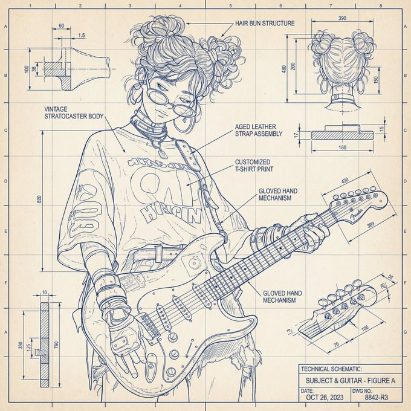

## 复古蓝图插图

- ID: gpt4o-831-zh-2
- Slug: prompt-831-zh-2
- 语言: zh
- 来源: [来源链接](https://x.com/_MehdiSharifi_/status/1999640304069279795)
- 样例图路径: images/part3/831.jpeg

### 提示词

```text
根据上传的照片，绘制一份高度详细的蓝图式技术示意图。使用干净的蓝色线条，背景为米色仿旧工程纸。
```

### 样例图


## { "title": "Facebook_baddie_adult_v1", "description": "P

- ID: gpt4o-830-en-1
- Slug: prompt-830-en-1
- 语言: en
- 来源: [来源链接](https://x.com/xmiiru_/status/1999481127560429641)
- 样例图路径: images/part3/830.jpeg

### 提示词

```text
{
  "title": "Facebook_baddie_adult_v1",
  "description": "Photorealistic vertical portrait of an adult Indonesian woman (approx. 22 years old) sitting playfully on a giant glossy 3D Facebook 'f' logo, with a realistic Facebook profile UI floating behind her. Cute, pastel aesthetic, non-sexualized, highly detailed, 8K.",
  "generation": {
    "prompt": "Photorealistic, vertical 9:16 image of an adult Indonesian woman (approx. 22 years old), relaxed and playful, sitting on a massive glossy 3D Facebook deep-blue 'f' logo. She wears a baby-pink polka-dot dress with large white dots, puff sleeves, and a knee-length fluffy skirt, white sneakers and lace ankle socks, and a big pink ribbon in her long hair — cute, stylish, barbie-inspired but age-appropriate. Her legs dangle naturally. Behind her, a hyper-realistic floating Facebook profile interface (current 2024-2025 layout) is visible: large profile picture circle (same woman doing a playful peace sign/duck face), cover photo area, name \"xmiru_♡\", follower stats \"1M Followers · 127 Following\", buttons (+Follow, Message), tabs (Posts, About, Friends, Photos, Reels). The photo grid/feed shows 6–9 sharp thumbnails (all of her in pastel pink outfits, plushies, desserts, mirror selfies, cafe scenes) with visible likes (100K+), comments (thousands). Friends suggestions sidebar visible. Background: soft baby pink with subtle white gradient, tiny floating hearts and sparkles, dreamy soft lighting. Ultra photorealistic, insane detail, studio-quality rendering, shallow depth of field, natural skin tones, realistic fabrics, texture detail, no sexualization, subject is clearly an adult.",
    "negative_prompt": "no minors, no sexualization, no exploitative or suggestive posing, no nudity, avoid cartoonish faces, avoid harsh lighting",
    "sampler": "DDIM",
    "cfg_scale": 7.5,
    "steps": 28,
    "resolution": "2160x3840",
    "aspect_ratio": "9:16",
    "style_modifiers": ["ultra photorealistic", "8k", "high detail", "soft lighting", "premium glossy materials"],
    "seed": null,
    "format": "json_prompt_v1",
    "safety_notes": "Subject explicitly defined as an adult. Avoid sexualized descriptors or poses. Suitable for family-friendly, social-media content."
  }
}
```

### 样例图


## Facebook个人资料界面

- ID: gpt4o-830-zh-2
- Slug: prompt-830-zh-2
- 语言: zh
- 来源: [来源链接](https://x.com/xmiiru_/status/1999481127560429641)
- 样例图路径: images/part3/830.jpeg

### 提示词

```text
{
标题： “Facebook_baddie_adult_v1”，
“描述”：“一位印尼成年女性（约22岁）的写实竖幅肖像，俏皮地坐在一个巨大的光滑3D Facebook‘f’标志上，逼真的Facebook个人资料界面在她身后漂浮。可爱、柔和的色调，非性暗示，细节丰富，8K分辨率。”
“一代”： {
提示：一张9:16比例的超写实竖版图片，描绘了一位约22岁的印尼成年女性，她神态轻松活泼，坐在一个巨大的、光泽感十足的3D Facebook深蓝色“f”标志上。她身穿一件浅粉色波点连衣裙，上面点缀着大大的白色圆点，泡泡袖设计，及膝蓬松裙摆，脚蹬白色运动鞋和蕾丝短袜，长发上系着一条大大的粉色丝带——可爱、时尚，带有芭比娃娃的风格，但又符合她的年龄。她的双腿自然垂落。在她身后，可以看到一个高度逼真的悬浮式Facebook个人资料界面（采用2024-2025年的最新布局）：一个大大的圆形头像（照片​​中的女性摆出俏皮的V字手势/嘟嘴表情），封面照片区域，姓名“xmiru_ ♡ ”，粉丝统计信息“100万粉丝 · 127个关注者”，按钮（+关注，消息），以及标签页（帖子，关于，好友，照片，Reels）。照片网格/动态显示 6-9 张清晰的缩略图（全部是她身穿粉色系服装、毛绒玩具、甜点、镜子自拍、咖啡馆场景），点赞数（超过 10 万）和评论数（数千）清晰可见。好友推荐侧边栏可见。背景：柔和的婴儿粉色，带有淡淡的白色渐变，点缀着漂浮的小爱心和闪光，营造出梦幻般的柔和光线。超逼真的照片效果，细节惊人，影棚级渲染，浅景深，自然的肤色，逼真的面料，纹理细节，无任何性暗示，照片中的人物显然是成年人。
"negative_prompt": "禁止未成年人、禁止性暗示、禁止剥削或暗示性姿势、禁止裸露、避免卡通化面孔、避免强光照射",
"采样器": "DDIM",
"cfg_scale": 7.5，
“步骤”：28，
分辨率：2160x3840，
"aspect_ratio": "9:16",
"style_modifiers": ["超逼真", "8k", "高细节", "柔和光照", "高级光泽材质"],
“种子”：null，
"格式": "json_prompt_v1",
安全提示：主题明确定义为成年人。避免使用性暗示的描述或姿势。适合家庭友好型社交媒体内容。
}
}
```

### 样例图


## A highly detailed photorealistic aerial shot looking dow

- ID: gpt4o-824-en-1
- Slug: prompt-824-en-1
- 语言: en
- 来源: [来源链接](https://x.com/Ankit_patel211/status/1998299295586693397)
- 样例图路径: images/part3/824.png

### 提示词

```text
A highly detailed photorealistic aerial shot looking down on a colossal Korean young woman wearing a stylish jacket and layered outfits, positioned in a crowded Tokyo street; the giant is playfully driving a tiny car with her hands while interacting with nearby buildings and street signs, tiny people and cars clustered near her feet for scale; visible close-up hands and textured clothing details; morning daylight with soft directional sunlight casting long gentle shadows, cool urban reflections on wet pavement, slight atmospheric haze and depth of field, high-resolution, crisp details, cinematic composition with leading lines along the street, muted vibrant color palette, realistic skin textures and fabric wrinkles, subtle motion blur on the tiny cars, photorealistic lens characteristics
```

### 样例图


## 巨型韩国女子置身于熙熙攘攘的街头

- ID: gpt4o-824-zh-2
- Slug: prompt-824-zh-2
- 语言: zh
- 来源: [来源链接](https://x.com/Ankit_patel211/status/1998299295586693397)
- 样例图路径: images/part3/824.png

### 提示词

```text
一张高度写实的航拍照片，俯视镜头展现了一位身着时尚外套和层叠服饰的巨型韩国年轻女子，她置身于熙熙攘攘的东京街头。这位巨人正用双手玩弄着一辆迷你汽车，与附近的建筑物和路牌互动，脚边聚集着一些迷你人和汽车作为参照物。照片中清晰可见她的双手和服装的纹理细节。清晨的阳光柔和地洒下长长的阴影，湿润的路面反射出清冷的城市光影，略带薄雾，景深适中。高分辨率、清晰锐利的细节、电影般的构图（街道上的引导线）、柔和而充满活力的色调、逼真的皮肤纹理和衣物褶皱、迷你汽车上微妙的动态模糊，以及照片级的镜头特性，共同营造出逼真的画面效果。
```

### 样例图


## 可爱黏土风格主题海报

- ID: gpt4o-821-zh
- Slug: prompt-821-zh
- 语言: zh
- 来源: [来源链接](https://x.com/sundyme/status/1998760131136466997)
- 样例图路径: images/part3/821.jpeg

### 提示词

```text
Top-tier clay stop-motion animation style poster for [在此填入核心主题/人物] - MAXIMUM EXPRESSION & IMMERSION

[1. VISUAL STYLE & ATMOSPHERE | 核心画风]
- Style: 3D Clay Art, Q-version cute proportions, Stop-motion Animation aesthetic.
- Texture: Soft matte clay, visible fingerprints, rounded edges, slight imperfections (handmade feel).
- Camera: Macro photography, shallow depth of field (Bokeh), diorama effect.
- Color Palette: [在此填入颜色关键词，如：Soft Pastel, Dark Gothic, Vibrant Neon].

[2. IMMERSIVE COMPOSITION | 沉浸式构图]
- Concept: A seamless 3D micro-world. The character is embedded in the environment, not just standing in front of it.
- Perspective: [在此填入视角，如：Low angle, Top-down, Fish-eye, Isometric].
- Foreground: [在此填入前景物体，用于增加纵深感].
- Mid-ground: Q-version [在此填入人物描述] doing [在此填入动作], surrounded by [在此填入环境元素].
- Background: [在此填入背景元素], blurred for depth.

[3. LIGHTING & MOOD | 光影氛围]
- Lighting Type: [在此填入光效，如：Warm golden hour, Cold moonlight, Dramatic spotlight, Volumetric lighting].
- Shadow: Soft, colored shadows (not pitch black).

[4. INTEGRATED TEXT DESIGN | 文字物理化融合]
- Main Title: "[在此填入中文标题]" and "[在此填入英文标题]".
- Title Style: The text is PHYSICALLY formed by [在此填入标题材质，如：Clouds, Wood, Neon tubes, Stone].
- Body Copy: "[在此填入中文文案]" / "[在此填入英文文案]".
- Copy Placement: Written directly on [在此填入文案载体，如：A floating paper, A wall, A road sign] within the scene.
- Font Style: [在此填入字体风格，如：Handwritten, Graffiti, Elegant calligraphy], natural and textured.

[5. TECH SPECS | 技术参数]
- Resolution: 4K Definition, High Fidelity, Octane Render style.

💡 如何像设计师一样填写？（使用指南）
为了达到最佳效果，请在填写[ ]内容时参考以下“心法”：
1. 构图 (Perspective) - 打破常规
不要只用“平视”。尝试：
Low angle (仰视)：表现伟大、压迫感（如贝多芬、诺兰）。
Top-down (俯视)：表现掌控、精致感（如韦斯·安德森、莫扎特）。

Inside-out (内部视角)：如从后备箱看出去、从山洞看出去。
2. 标题材质 (Title Material) - 脑洞大开
不要让 AI 随便生成字体，指定一种和主题相关的**“物体”**：
写音乐家？标题由**“五线谱”或“乐器零件”**组成。
写赛车手？标题由**“赛道沥青”或“轮胎痕迹”**组成。
写厨师？标题由**“面粉”或“蔬菜切片”**组成。
3. 文案载体 (Copy Placement) - 拒绝字幕

不要让文字悬浮在空中，给它找个**“落脚点”**：
写在飘落的树叶上。
写在斑驳的墙壁上。
写在扔在地上的纸团上。
写在显示器的屏幕里。
```

### 样例图


## A hyper-realistic isometric miniature diorama encased in

- ID: gpt4o-819-en-1
- Slug: prompt-819-en-1
- 语言: en
- 来源: [来源链接](https://x.com/Arminn_Ai/status/1998713345474445676)
- 样例图路径: images/part3/819.jpeg

### 提示词

```text
A hyper-realistic isometric miniature diorama encased in a cubic enclosure.
Structure: The cube features two solid back walls [describe the texture/material of the back walls, e.g., textured with brick, wood paneling, forest greenery, stone blocks] forming the [describe the setting type, e.g., urban backdrop, cozy room corner, dungeon cell], and two transparent glass front walls, creating a perfect cutaway view. The entire scene is strictly contained within this cube.
Inside the cube is [SCENE DESCRIPTION: Describe the specific iconic movie scene environment. Mention key props, furniture, floor texture, and specific clutter that makes the scene recognizable].
Character: A photorealistic miniature person, representing [ACTOR NAME] as [CHARACTER NAME]. They are wearing [describe the iconic outfit/costume in detail]. The character is [ACTION: describe their pose/action, e.g., sitting, dancing, standing], with a [EXPRESSION] expression. [Optional: mention any specific hand-held props].
Materials & Textures: All elements feature hyper-realistic textures (e.g., [list 2-3 specific textures relevant to the scene, e.g., weathered wood, velvet fabric, rusted metal]). It looks like a masterfully crafted, museum-quality miniature model.
Lighting: [ATMOSPHERE NAME]: [describe light sources and mood, e.g., warm golden sunlight, harsh fluorescent light, moody noir shadows], creating cinematic depth within the glass enclosure.
Background: A clean, solid neutral grey background completely isolating the cube. No table texture, no blurred room surroundings, no external clutter.
Camera: A detailed macro photograph from a slightly elevated isometric three-quarter view, centering on the front glass corner. High aperture to keep the entire miniature in focus.
```

### 样例图


## 电影场景变成微缩等距立体模型

- ID: gpt4o-819-zh-2
- Slug: prompt-819-zh-2
- 语言: zh
- 来源: [来源链接](https://x.com/Arminn_Ai/status/1998713345474445676)
- 样例图路径: images/part3/819.jpeg

### 提示词

```text
一个超逼真的等距微缩模型，被放置在一个立方体外壳内。
结构：这个立方体由两面实心后墙（描述后墙的纹理/材质，例如砖块、木板、森林绿植、石块）构成（描述场景类型，例如城市背景、舒适的房间角落、地牢牢房），以及两面透明玻璃前墙组成，形成完美的剖面视图。整个场景完全包含在这个立方体内。
立方体内部是[场景描述：描述特定的标志性电影场景环境。提及关键道具、家具、地板纹理以及使场景易于识别的特定杂物]。
角色：一个逼真的微缩人偶，代表[演员姓名]饰演的[角色姓名]。他/她身着[详细描述标志性服装/戏服]。角色处于[动作：描述其姿势/动作，例如：坐着、跳舞、站立]状态，表情为[表情]。[可选：提及任何特定的手持道具]。
材质与纹理：所有元素均采用超逼真的纹理（例如，列出 2-3 种与场景相关的具体纹理，例如，风化的木材、天鹅绒织物、生锈的金属]) 。它看起来像一个精心制作的博物馆级微缩模型。
照明：[氛围名称]: [描述光源和氛围，例如，温暖的金色阳光、刺眼的荧光灯、阴郁的黑色阴影]，在玻璃罩内营造电影般的深度。
背景：干净、纯色的中性灰色背景，完全衬托出立方体。没有桌面纹理，没有模糊的房间环境，也没有外部杂物。
相机：采用略微抬高的等距四分之三视角拍摄的精细微距照片，焦点位于前玻璃角。使用大光圈以确保整个微缩模型清晰对焦。
```

### 样例图


## { "image_request": { "subject": { "demographics": "Young

- ID: gpt4o-817-en-1
- Slug: prompt-817-en-1
- 语言: en
- 来源: [来源链接](https://x.com/xmliisu/status/1998425357066633672)
- 样例图路径: images/part3/817.jpeg

### 提示词

```text
{
  "image_request": {
    "subject": {
      "demographics": "Young woman, fair skin with natural blush, freckle-free nose and cheeks.",
      "hair": "Short ash-brown bob, center-parted layer, loose strands falling over face.",
      "facial_features": "Light brown eyes, curly eyelashes, soft pouty pink lips (glossy/plump), septum piercing.",
      "expression": "Playful, mischievous, cute, winking and sticking out tongue.",
      "tattoos": "Preserve subject's original tattoos (visible on skin/face/hands)."
    },
    "apparel": {
      "upper_body": "Black tank top, light blue, white, and black plaid flannel shirt (worn open or draped).",
      "lower_body": "Denim miniskirt.",
      "accessories": "Small black belt."
    },
    "pose_and_action": {
      "posture": "Sitting casually on a bar stool.",
      "hands": "Left hand relaxed and down, holding a lit cigarette."
    },
    "environment": {
      "setting": "Dark outdoor/semi-outdoor bar, pub, or nightclub.",
      "furniture": "Round tables with stone/metal texture, bar stools.",
      "background_elements": "Faintly visible people sitting in the background, nighttime atmosphere."
    },
    "props": {
      "table_items": [
        "Glass glasses filled with drinks",
        "Glass pitcher",
        "Cigarette pack (Gudang Garam Surya 16 styling)"
      ]
    },
    "technical_specifications": {
      "angle": "High Angle Shot (looking down at subject).",
      "lighting": "Harsh direct flash, sharp shadows behind subject, skin appears bright/slightly overexposed.",
      "style": "Casual snapshot, Y2k aesthetic, streetwear vibe, grunge, flash photography.",
      "resolution": "1200x1200px"
    }
  }
}
```

### 样例图


## 一位个性的年轻女性

- ID: gpt4o-817-zh-2
- Slug: prompt-817-zh-2
- 语言: zh
- 来源: [来源链接](https://x.com/xmliisu/status/1998425357066633672)
- 样例图路径: images/part3/817.jpeg

### 提示词

```text
{
"image_request": {
“主题”： {
“人口统计信息”：“年轻女性，皮肤白皙，带有自然红晕，鼻子和脸颊上没有雀斑。”
头发：短款灰棕色波波头，中分层次，几缕碎发垂在脸颊旁。
面部特征：浅棕色眼睛，卷曲的睫毛，柔软丰满的粉红色嘴唇（有光泽/饱满），鼻中隔穿孔。
“表情”：“顽皮、调皮、可爱、眨眼吐舌头。”
“纹身”：“保留被摄对象的原始纹身（在皮肤/面部/手部可见）。”
},
"服装": {
“上身”： “黑色背心，浅蓝色、白色和黑色格子法兰绒衬衫（敞开穿着或披在身上）。”
"下半身": "牛仔迷你裙。"
“配饰”：“黑色小腰带。”
},
"pose_and_action": {
“姿势”：“随意地坐在吧台凳上。”
“双手”：“左手放松下垂，手里拿着一支点燃的香烟。”
},
“环境”： {
“环境”：昏暗的户外/半户外酒吧、酒馆或夜总会。
“家具”：“石纹/金属质感的圆桌，吧台凳。”
"background_elements": "背景中隐约可见的人，夜晚的氛围。"
},
"props": {
"table_items": [
“装满饮料的玻璃杯”
“玻璃水壶”，
“香烟包（Gudang Garam Surya 16造型）”
]
},
"technical_specifications": {
“角度”：“高角度拍摄（俯视拍摄对象）”。
“光线”：“强烈的直射闪光灯，主体后方阴影锐利，皮肤显得明亮/略微过曝。”
风格：随意快照、Y2K美学、街头服饰风格、颓废风、闪光灯摄影。
分辨率：1200x1200像素
}
}
}
```

### 样例图


## Tokyo nightlife editorial. Full body shot, low angle loo

- ID: gpt4o-816-en-1
- Slug: prompt-816-en-1
- 语言: en
- 来源: [来源链接](https://x.com/_MehdiSharifi_/status/1998531548698591377)
- 样例图路径: images/part3/816.jpeg

### 提示词

```text
Tokyo nightlife editorial. Full body shot, low angle looking up slightly. A cool, alluring young woman is resting her lower back against the hood of a modified pink sports car. She has long, wavy, multi-colored hair (pink/cyan/blonde), catching the city glow. Wearing a pink long-sleeve crochet crop top, heavy denim mini skirt, and a delicate gold waist chain. The car creates a foreground frame with its open door. The environment is a dense, vertical urban canyon with infinite neon billboards fading into the distance. Color palette: Cyberpunk pinks, deep purples, and midnight blues. Lighting is soft and diffuse on the face, with dramatic shadows. 85mm portrait photography, f/1.8, high fidelity, candid mood.
```

### 样例图


## 东京夜生活专题报道

- ID: gpt4o-816-zh-2
- Slug: prompt-816-zh-2
- 语言: zh
- 来源: [来源链接](https://x.com/_MehdiSharifi_/status/1998531548698591377)
- 样例图路径: images/part3/816.jpeg

### 提示词

```text
东京夜生活专题报道。全身照，低角度略微仰拍。一位酷劲十足的年轻女子倚靠在一辆改装粉色跑车的引擎盖上，腰部略微放松。她一头长长的波浪卷发，染着粉色、青色和金色，在城市灯光的映衬下熠熠生辉。她身穿粉色长袖钩针露脐上衣、厚重的牛仔迷你裙，腰间系着一条精致的金色腰链。敞开的车门构成了前景的框架。周围环境是密集的垂直都市峡谷，无尽的霓虹广告牌延伸至远方。色彩运用：赛博朋克粉、深紫色和午夜蓝。面部光线柔和而漫射，营造出戏剧性的阴影效果。85mm焦距，f/1.8光圈，高保真度，自然抓拍。
```

### 样例图


## studio shot of [PRODUCT], placed on a [background], surr

- ID: gpt4o-814-en-1
- Slug: prompt-814-en-1
- 语言: en
- 来源: [来源链接](https://x.com/azed_ai/status/1998708551888547897)
- 样例图路径: images/part3/814.jpeg

### 提示词

```text
studio shot of [PRODUCT], placed on a [background], surrounded by soft shadows and gradient background, high-key lighting, shallow depth of field, ultra-sharp focus on the object, premium product photography, shot on a DSLR, minimal aesthetic, subtle reflections, commercial lighting setup
```

### 样例图

![studio shot of [PRODUCT], placed on a [background], surr](../images/part3/814.jpeg)

## 产品的影棚拍摄照片

- ID: gpt4o-814-zh-2
- Slug: prompt-814-zh-2
- 语言: zh
- 来源: [来源链接](https://x.com/azed_ai/status/1998708551888547897)
- 样例图路径: images/part3/814.jpeg

### 提示词

```text
[产品] 的影棚拍摄照片，置于 [背景] 之上，周围环绕着柔和的阴影和渐变背景，采用高调布光、浅景深，主体清晰锐利，高端产品摄影，使用单反相机拍摄，简约美学，微妙的反射，商业照明设置
```

### 样例图

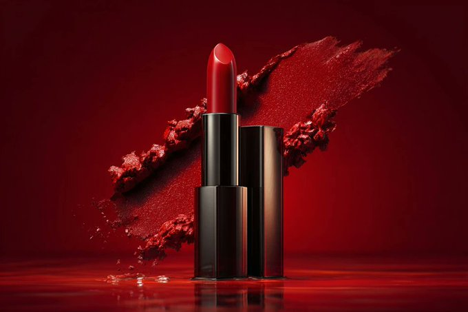

## { "image_generation_prompt": { "subject_details": { "des

- ID: gpt4o-813-en-1
- Slug: prompt-813-en-1
- 语言: en
- 来源: [来源链接](https://x.com/saniaspeaks_/status/1998397446628806709)
- 样例图路径: images/part3/813.jpeg

### 提示词

```text
{
  "image_generation_prompt": {
    "subject_details": {
      "description": "Young stylish woman with long straight brown hair",
      "expression": "Subtle, confident smile",
      "outfit": {
        "top": "Soft pink T-shirt under an open black casual jacket",
        "bottom": "Fitted dark jeans",
        "shoes": "Polished black shoes"
      },
      "pose": "Standing on a street corner facing the camera, pointing with one hand toward a building behind her"
    },
    "background_scene": {
      "setting": "Vibrant modern city at night",
      "key_element": "Giant digital billboard on a tall glass building",
      "billboard_content": {
        "visual": "Portrait of the same woman in the same outfit, posed like a high-fashion magazine cover",
        "text_headline": "VOUGHT STYLE",
        "text_subheading": "Smaller indistinct magazine-style text"
      },
      "atmosphere": [
        "Neon lights",
        "Glowing billboards",
        "Moving cars with motion blur",
        "Wet pavement with reflections"
      ]
    },
    "technical_specs": {
      "style": "Cinematic, Photorealistic, Urban Night",
      "camera": "35mm lens",
      "depth_of_field": "Shallow with soft bokeh on city lights",
      "lighting": "Mixed neon ambient, directional light from billboard, moody shadows",
      "resolution": "8k, high definition"
    }
  }
}
```

### 样例图


## 人物出现在巨型数字广告牌上

- ID: gpt4o-813-zh-2
- Slug: prompt-813-zh-2
- 语言: zh
- 来源: [来源链接](https://x.com/saniaspeaks_/status/1998397446628806709)
- 样例图路径: images/part3/813.jpeg

### 提示词

```text
{
"image_generation_prompt": {
"subject_details": {
描述： “年轻时尚的女性，留着棕色长直发”
“表情”：“微妙而自信的微笑”，
“全套服装”： {
上衣：一件浅粉色T恤，外面套一件敞开的黑色休闲外套。
“下装”：“修身深色牛仔裤”，
“鞋子”： “擦亮的黑皮鞋”
},
“姿势”：“站在街角，面向镜头，一只手指向身后的建筑物”
},
"background_scene": {
“场景”：“充满活力的现代都市夜景”，
"key_element": "高耸玻璃建筑上的巨型数字广告牌",
"billboard_content": {
“视觉”：“同一位女性身着同一套服装，摆出类似高级时装杂志封面的姿势的肖像”，
"text_headline": "沃特风格",
"text_subheading": "较小的模糊杂志风格文本"
},
“气氛”： [
霓虹灯
“闪闪发光的广告牌”，
“带有运动模糊效果的行驶车辆”
“湿漉漉的路面映照着倒影”
]
},
"technical_specs": {
“风格”：“电影感、照片写实、都市夜景”
“相机”: “35mm 镜头”
"depth_of_field": "城市灯光浅景深，带有柔和的散景效果",
“照明”：“混合霓虹灯环境光、广告牌定向光、阴郁的阴影”，
分辨率：8K，高清
}
}
}
```

### 样例图


## A single, perfectly composed 4:3 cinematic photograph of

- ID: gpt4o-812-en-1
- Slug: prompt-812-en-1
- 语言: en
- 来源: [来源链接](https://x.com/dboy_yi2025/status/1998333880068358601)
- 样例图路径: images/part3/812.jpeg

### 提示词

```text
A single, perfectly composed 4:3 cinematic photograph of Shibuya Crossing, Tokyo, shot right after a sudden summer shower.
The entire street is covered in a mirror-like sheet of rainwater that reflects everything above it like flawless glass.
Above the waterline: hyper-real 2026 Shibuya.
Towering curved 8K transparent OLED billboards, naked-eye 3D holograms of J-pop idols floating mid-air, salarymen in translucent raincoats and AR monocles, girls in techwear with glowing umbrella drones, cyan-magenta neon bleeding into wet asphalt, thousands of umbrellas blooming in perfect chaos.
Below the waterline, perfectly reflected yet terrifyingly real: 1926 Shibuya.
Low-rise wooden shops with sliding doors, hand-painted kanji signs for sake and kimono stores, rickshaws and early Model-T taxis, women in furisode kimono and braided hair carrying paper parasols, men in haori-hakama and geta sandals, soft gas lamps flickering, everything in warm sepia monochrome.
At the exact center where water meets reality, the boundary breaks:
A 2026 girl in chrome puffer jacket kneels and touches the puddle; her reflection is a 1926 geisha reaching upward; their fingertips meet at the water surface and create perfect concentric ripples that turn into glowing pixels.
A salaryman looks down and sees his own face aged 100 years staring back in horror.
A 1926 paper parasol floats upward out of the water and becomes a transparent umbrella drone.
Droplets fall upward from 1926 into 2026, becoming LED particles that explode into tiny holograms.
Everyone, past and present, is frozen mid-step, staring into the mirror-realm in pure shock and wonder.
Photorealistic octane render, 8K, razor-sharp reflection detail, anamorphic lens, subtle volumetric god rays cutting through rain mist, perfect water physics, colour grade shifts from electric neon above to warm sepia below, maximum emotional intensity.
--ar 4:3 --stylize 650 --v 6 --q 2
```

### 样例图


## 令人惊艳的分屏照片

- ID: gpt4o-812-zh-2
- Slug: prompt-812-zh-2
- 语言: zh
- 来源: [来源链接](https://x.com/dboy_yi2025/status/1998333880068358601)
- 样例图路径: images/part3/812.jpeg

### 提示词

```text
一张构图完美的 4:3 电影感照片，拍摄于东京涩谷十字路口，当时正值一场突如其来的夏雨过后。
整条街道都被一层如镜面般的雨水覆盖，将上方的一切映照得如同完美无瑕的玻璃。
水线之上：超现实的 2026 年涩谷。
高耸的弧形 8K 透明 OLED 广告牌，肉眼可见的 3D 全息影像，漂浮在半空中的日本流行偶像，身穿半透明雨衣、戴着 AR 单片眼镜的上班族，身穿科技服装、手持发光雨伞无人机的女孩，青色和品红色的霓虹灯渗入湿漉漉的沥青路面，成千上万把雨伞在完美的混乱中绽放。
水线以下，完美地倒映着，却又无比真实：1926 年的涩谷。
低矮的木制商店，推拉门，清酒店和和服店的招牌是手绘的汉字，人力车和早期的T型出租车，穿着振袖和服、梳着辫子的妇女撑着纸伞，穿着羽织袴和木屐的男人，柔和的煤气灯闪烁着，一切都笼罩在温暖的棕褐色调中。
在水与现实交汇的正中心，界限消失了：
一位身穿铬色羽绒服的 2026 年女孩跪在水坑边，触摸着水坑；她的倒影是一位 1926 年的艺伎，正向上伸出手；她们的指尖在水面上相遇，激起完美的同心涟漪，最终变成闪闪发光的像素。
一名上班族低头一看，发现自己100岁时的脸正惊恐地盯着自己。
一把 1926 年的纸伞从水中向上漂浮，变成了一把透明的伞状无人机。
水滴从 1926 年向上落到 2026 年，变成 LED 粒子，爆炸成微小的全息图。
过去和现在的所有人，都愣在了原地，目瞪口呆地望着镜中的世界，充满了震惊和惊奇。
照片级真实感渲染，8K分辨率，锐利的反射细节，变形镜头，雨雾中微妙的体积光束，完美的水物理效果，色彩从上方的霓虹灯色过渡到下方的暖褐色，最大程度的情感强度。
--ar 4:3 --stylize 650 --v 6 --q 2
```

### 样例图


## { "meta_control": { "generation_mode": "multi_panel_cons

- ID: gpt4o-807-en-1
- Slug: prompt-807-en-1
- 语言: en
- 来源: [来源链接](https://x.com/IamEmily2050/status/1997986646655185245)
- 样例图路径: images/part3/807.jpeg

### 提示词

```text
{
  "meta_control": {
    "generation_mode": "multi_panel_consistent",
    "priority_stack": ["identity_lock", "perspective_physics", "material_fidelity", "environmental_coherence"],
    "quality_target": "editorial_print_ready"
  },
  "intent": {
    "primary": "High-fashion streetwear editorial with extreme wide-angle perspective study",
    "secondary": "Technical demonstration of foreshortening and forced perspective",
    "publication_context": "Double-page spread, fashion magazine collage layout"
  },
  "frame": {
    "aspect_ratio": "3:4",
    "layout": {
      "type": "2x2 grid collage",
      "gutter_width": "2px white or seamless",
      "panel_uniformity": "identical dimensions per panel"
    }
  },
  "subject": {
    "type": "Human female fashion model",
    "identity_lock": {
      "enforcement_level": "strict",
      "anchor_features": ["face_geometry", "skin_tone", "body_proportions", "hair_style"]
    },
    "biometrics": {
      "age_presentation": "22-26",
      "height_cm": 175,
      "build": "Slender athletic, model proportions",
      "ethnicity_presentation": "Northern European features"
    },
    "facial_signature": {
      "structure": "Angular diamond face, high cheekbones, defined jawline",
      "eyes": "Sharp almond, steel grey, graphic black winged liner extending 8mm",
      "nose": "Refined, straight, small silver hoop piercing on left nostril",
      "lips": "Natural shape, matte nude-pink",
      "skin": "Fair, visible pores and natural texture, subtle peach fuzz, tiny freckle cluster left cheekbone",
      "expression_default": "Cool confidence, intense direct eye contact, composed"
    },
    "hair": {
      "style": "Platinum blonde straight bob, blunt bangs ending at eyebrows",
      "texture": "Silky, light-catching, individual strand definition",
      "behavior": "Natural movement responding to pose changes"
    },
    "wardrobe": {
      "jacket": {
        "item": "Oversized bomber jacket",
        "material": "Ripstop nylon, high gloss",
        "color": "Neon orange (vivid, saturated)",
        "state": "Unzipped, hanging open",
        "light_behavior": "Sharp specular highlights, visible weave texture"
      },
      "top": {
        "item": "Crop top",
        "material": "Black synthetic mesh, diamond pattern",
        "fit": "Tight, stretched across torso",
        "transparency": "Semi-sheer, skin visible through weave"
      },
      "pants": {
        "item": "Tactical cargo pants",
        "material": "Heavy cotton twill, matte",
        "color": "Charcoal grey",
        "details": "Multiple pockets, silver buckles, black nylon straps, baggy fit"
      },
      "footwear": {
        "item": "Platform sneakers",
        "color": "White, chunky sole",
        "condition": "Clean but worn, realistic sole texture"
      }
    },
    "accessories": {
      "neck": "Layered heavy silver Cuban link chains, 3 chains varying thickness",
      "hands": "Silver rings on index and middle fingers both hands"
    }
  },
  "panels": [
    {
      "id": 1,
      "position": "top-left",
      "concept": "Extreme low-angle sneaker perspective",
      "camera": {
        "height_cm": 10,
        "distance_cm": 35,
        "angle": "Looking up at 75 degrees"
      },
      "composition": {
        "foreground_dominant": "Right sneaker sole filling 40% of frame, laces in sharp focus",
        "midground": "Legs receding upward",
        "background": "Torso and face small in upper frame, looking down at camera"
      },
      "subject_pose": "Standing, weight back, right foot extended toward lens",
      "expression": "Looking down, slight smirk"
    },
    {
      "id": 2,
      "position": "top-right",
      "concept": "Bird's-eye reaching hand",
      "camera": {
        "height_cm": 200,
        "distance_cm": 60,
        "angle": "Looking straight down"
      },
      "composition": {
        "foreground_dominant": "Hand reaching up, fingers spread, appearing oversized",
        "midground": "Face looking up",
        "background": "Body compressed, pavement visible around edges"
      },
      "subject_pose": "Deep squat, one arm reaching directly up to camera",
      "expression": "Intense upward eye contact, serious"
    },
    {
      "id": 3,
      "position": "bottom-left",
      "concept": "Fisheye face extreme close-up",
      "camera": {
        "height_cm": 150,
        "distance_cm": 20,
        "angle": "Dutch tilt 20 degrees"
      },
      "composition": {
        "foreground_dominant": "Face filling 70% of frame, nose and eyes enlarged by proximity",
        "background": "Environment warping and curving at edges, slight motion blur"
      },
      "subject_pose": "Leaning face toward camera, shoulders back",
      "expression": "Piercing eye contact, one eyebrow slightly raised, confident"
    },
    {
      "id": 4,
      "position": "bottom-right",
      "concept": "Seated knee-forward perspective",
      "camera": {
        "height_cm": 40,
        "distance_cm": 50,
        "angle": "Slight upward looking"
      },
      "composition": {
        "foreground_dominant": "Knees and shins large in frame, cargo pant texture detailed",
        "midground": "Torso leaning forward",
        "background": "Face in upper third, hands resting on knees"
      },
      "subject_pose": "Seated on pavement, knees up, leaning toward camera",
      "expression": "Relaxed confidence, soft direct gaze"
    }
  ],
  "environment": {
    "location_type": "Urban industrial alleyway",
    "surfaces": {
      "ground": "Weathered concrete pavement, cracks, texture, subtle debris",
      "walls": "Concrete and brick, metallic rolling security doors, faded graffiti tags"
    },
    "atmosphere": "Gritty urban, authentic street context",
    "consistency_rule": "Identical environment visible across all four panels"
  },
  "lighting": {
    "source": "Natural afternoon sunlight",
    "quality": "Hard directional light",
    "direction": "High side-light, approximately 45 degrees from left",
    "shadow_character": "Sharp-edged, deep shadows",
    "color_temperature_kelvin": 5500,
    "fill": "Minimal, ambient bounce from pavement only",
    "specular_behavior": "Strong highlights on nylon jacket, chain jewelry, sneaker rubber"
  },
  "camera_global": {
    "lens": "Ultra-wide rectilinear, 12-14mm equivalent",
    "aperture": "f/8",
    "depth_of_field": "Deep, foreground to background sharp",
    "distortion": "Barrel distortion, edge stretching, exaggerated foreshortening",
    "sensor": "Full-frame, high resolution"
  },
  "post_processing": {
    "color_grade": {
      "contrast": "High",
      "saturation_subject": "Vivid, especially neon orange jacket",
      "saturation_background": "Slightly desaturated, muted",
      "blacks": "Deep, crushed slightly",
      "highlights": "Preserved, not blown"
    },
    "texture": "8K resolution equivalent, visible skin texture, fabric weave, material detail",
    "film_treatment": "Subtle RAW photo grain, not excessive"
  },
  "negative_constraints": {
    "style_rejection": ["illustration", "anime", "cartoon", "painting", "drawing", "3d render", "CGI", "digital art", "AI art look", "smooth skin filter", "beauty filter"],
    "anatomical_rejection": ["extra fingers", "missing fingers", "fused fingers", "extra limbs", "anatomical errors", "broken joints", "impossible body positions"],
    "consistency_rejection": ["face change between panels", "different person", "clothing change", "hair color change", "inconsistent skin tone", "different lighting between panels"],
    "technical_rejection": ["blur", "low resolution", "jpeg artifacts", "noise", "watermark", "text", "logo", "signature"],
    "lens_rejection": ["telephoto compression", "portrait lens look", "85mm aesthetic", "no foreshortening", "flat perspective"]
  }
}
```

### 样例图


## 采用超广角视角拍摄的高级时装照片

- ID: gpt4o-807-zh-2
- Slug: prompt-807-zh-2
- 语言: zh
- 来源: [来源链接](https://x.com/IamEmily2050/status/1997986646655185245)
- 样例图路径: images/part3/807.jpeg

### 提示词

```text
{
"meta_control": {
"generation_mode": "multi_panel_consistent",
"priority_stack": ["identity_lock", "perspective_physics", "material_fidelity", "environmental_coherence"],
"quality_target": "editorial_print_ready"
},
"意图": {
“主要”： “采用超广角视角拍摄的高级时装街头服饰专题报道”
“次要的”: “透视缩短和强制透视的技术演示”
"publication_context": "双页跨页，时尚杂志拼贴版式"
},
“框架”： {
"aspect_ratio": "3:4",
“布局”： {
“类型”：“2x2 网格拼贴画”，
"gutter_width": "2px 白色或无缝",
"panel_uniformity": "每个面板尺寸相同"
}
},
“主题”： {
“类型”：“人类女性时装模特”，
"identity_lock": {
"enforcement_level": "严格",
"anchor_features": ["face_geometry", "skin_tone", "body_proportions", "hair_style"]
},
"生物识别"：{
"age_presentation": "22-26"
"height_cm": 175,
“体型”：“纤细健美，模特身材比例”，
"ethnicity_presentation": "北欧人特征"
},
"facial_signature": {
“面部结构”：“棱角分明的钻石脸，高颧骨，轮廓分明的下颌线”，
“眼睛”：“尖锐的杏仁眼，钢灰色，黑色线条勾勒的眼线，延伸8毫米”，
“鼻子”：“左侧鼻孔上戴着精致、笔直的小银环鼻钉”，
“唇部”：“自然形状，哑光裸粉色”，
“皮肤”：“白皙，毛孔可见，质地自然，有细小的绒毛，左侧颧骨处有几颗小雀斑”，
"expression_default": "冷静自信，目光直视，沉着冷静"
},
“头发”： {
“发型”：“铂金色直发波波头，齐刘海，长度到眉毛处”
“质感”：“丝滑、闪亮、根根分明的发丝”，
“行为”：“对姿势变化做出反应的自然动作”
},
“衣柜”： {
“夹克”： {
“商品”: “超大号飞行员夹克”
材质：高光泽防撕裂尼龙，
“颜色”：“霓虹橙色（鲜艳、饱和）”
"状态": "拉链拉开，敞开着",
"light_behavior": "清晰的镜面高光，可见的织物纹理"
},
“顶部”： {
“商品”： “露脐上衣”
材质：黑色合成网布，菱形图案，
“合身”： “紧身，绷紧躯干”，
“透明度”： “半透明，透过织物可以看到皮肤”
},
“裤子”： {
“商品”: “战术工装裤”
“材质”：“厚棉斜纹布，哑光”
“颜色”：“炭灰色”，
细节：多口袋设计，银色搭扣，黑色尼龙肩带，宽松版型
},
鞋类：{
“商品”: “厚底运动鞋”
颜色：白色，厚底，
状况：干净但有磨损，鞋底纹理逼真
}
},
“配件”： {
“颈部”：“多层厚重的银色古巴链，3条粗细不同的链子”，
“双手”：“双手食指和中指上戴着银戒指”
}
},
“面板”：[
{
“id”：1，
"位置": "左上"
“概念”：“极低角度运动鞋视角”，
“相机”： {
"height_cm": 10,
"距离_厘米": 35,
“角度”：“向上看75度”
},
“作品”： {
"前景主导"": "右运动鞋鞋底占据画面 40%，鞋带清晰聚焦"
“中景”：“双腿向上收缩”
“背景”：“画面上方，躯干和脸部较小，低头看向镜头”
},
“subject_pose”: “站立，重心后移，右脚伸向镜头”
“表情”：“低头，嘴角带着一丝冷笑”
},
{
“id”：2，
位置：右上角，
“概念”：“鸟瞰视角下的伸手”，
“相机”： {
"height_cm": 200,
"距离_厘米": 60,
“角度”：“垂直向下看”
},
“作品”： {
"前景主导": "一只手向上伸出，手指张开，显得过大",
“中景”：“仰视的脸”
“背景”：“身体被压扁，边缘可见路面”
},
“subject_pose”: “深蹲，一只手臂直接伸向镜头”
“表情”：“目光专注向上，神情严肃”
},
{
“id”：3，
"位置": "左下角",
“概念”：“鱼眼镜头面部超近特写”
“相机”： {
"height_cm": 150,
"distance_cm": 20,
“角度”： “荷兰式倾斜 20 度”
},
“作品”： {
"前景主导"："面部占据画面70%的面积，鼻子和眼睛因距离而放大",
“背景”：“环境边缘扭曲弯曲，轻微动态模糊”
},
“subject_pose”: “脸朝向镜头，肩膀向后倾”
“表情”：“目光锐利，一侧眉毛微微上扬，自信满满”
},
{
“id”：4，
"位置": "右下角",
“概念”：“坐姿膝盖前倾视角”，
“相机”： {
"height_cm": 40,
"距离_厘米": 50,
角度：略微向上看
},
“作品”： {
"前景主导"："画面中膝盖和小腿较大，工装裤纹理细节丰富",
“中景”：“躯干向前倾斜”，
“背景”：“上三分之一处是脸部，双手放在膝盖上”
},
“subject_pose”: “坐在人行道上，膝盖抬起，身体前倾，朝向镜头”
“表情”：“放松的自信，柔和的直视”
}
],
“环境”： {
"location_type": "城市工业巷道",
"表面": {
“地面”：风化的混凝土路面，裂缝，纹理，细微的碎屑，
“墙壁”：混凝土和砖块，金属卷帘安全门，褪色的涂鸦标签
},
“氛围”：“粗犷的都市，真实的街头环境”，
"consistency_rule": "所有四个面板上显示相同的环境"
},
“灯光”： {
“来源”：“自然午后阳光”，
“品质”：“硬定向光”，
“方向”：“高侧光，大约从左侧倾斜 45 度”
"shadow_character": "锐利、深邃的阴影",
"color_temperature_kelvin": 5500,
“填充”：“仅来自路面的最小环境反射”
"specular_behavior": "尼龙夹克、链式首饰、运动鞋橡胶上的强光"
},
"camera_global": {
“镜头”：“超广角直线镜头，等效焦距 12-14mm”
光圈：f/8，
"depth_of_field": "景深，前景到背景清晰",
“变形”：“桶形变形、边缘拉伸、夸张的透视缩短”，
“传感器”：“全画幅，高分辨率”
},
"post_processing": {
"color_grade": {
“对比度”：“高”，
"saturation_subject": "鲜艳，尤其是霓虹橙色夹克",
"saturation_background": "略微去饱和，柔和"
“黑色”：“深沉，略微压扁”，
“亮点”：“保存完好，未曾损毁”
},
“纹理”: “相当于 8K 分辨率，可见的皮肤纹理、织物纹理、材质细节”
"film_treatment": "轻微的RAW照片颗粒感，不过度"
},
"negative_constraints": {
"style_rejection": ["illustration", "anime", "cartoon", "painting", "drawing", "3d render", "CGI", "digital art", "AI art look", "smooth skin filter", "beauty filter"],
"anatomical_rejection": ["多余的手指", "缺失的手指", "融合的手指", "多余的肢体", "解剖错误", "断裂的关节", "不可能的身体姿势"],
"consistency_rejection": ["面板间面部变化", "不同的人", "服装变化", "发色变化", "肤色不一致", "面板间光照不同"],
“技术拒绝”：[“模糊”、“低分辨率”、“JPEG伪影”、“噪点”、“水印”、“文本”、“徽标”、“签名”]
"lens_rejection": ["远摄压缩", "人像镜头风格", "85mm美学", "无透视缩短", "平面透视"]
}
}
```

### 样例图


## 一位身着华丽唐代服装的年轻女子

- ID: gpt4o-806-zh
- Slug: prompt-806-zh
- 语言: zh
- 来源: [来源链接](https://x.com/brad_zhang2024/status/1997943993943134554)
- 样例图路径: images/part3/806.jpeg

### 提示词

```text
4K hyper-detailed fashion photograph featuring hyper-realistic rendering. 

 **Crucial Character Consistency:** The character featured is precisely the same person shown in reference images , 
 maintaining consistent facial features, hair style, and body structure across all shots.

{
  "core_structure": {
    "description": "一张超写实的电影感肖像，描绘了一位身着华丽唐代服装（齐胸襦裙）的年轻女子，手持红色刺绣团扇，在飘雪的黑色背景中回眸。",
    "elements": [
      {
        "object": "人物主体",
        "attributes": ["年轻东亚女性", "精致唐风妆容(花钿, 面靥)", "回眸姿态", "优雅"]
      },
      {
        "object": "服饰 (唐风)",
        "attributes": ["唐代齐胸襦裙 (Tang Dynasty Qixiong Ruqun)", "袒领/低胸抹胸 (Low-cut bodice)", "半透明大袖衫 (Sheer wide sleeves)", "飘逸的披帛 (Flowing Pibo ribbon)", "红色与金色主调"]
      },
      {
        "object": "发型",
        "attributes": ["唐代高髻 (High bun)", "牡丹花发饰", "金步摇", "华丽发梳"]
      },
      {
        "object": "道具",
        "attributes": ["红色刺绣团扇 (保持不变)", "精致流苏"]
      },
      {
        "object": "环境",
        "attributes": ["飘落的雪花 (Falling snow)", "黑色背景 (Dark background)", "微光氛围"]
      }
    ]
  },
  "style_definition": {
    "primary_style": "photorealistic | cinematic | classical Chinese portrait",
    "rendering_quality": "8k resolution | ultra-detailed | masterpiece",
    "surface_textures": ["silk", "lace", "skin texture", "snow particles"],
    "lighting": "rim lighting | soft facial spotlight | moody dark atmosphere"
  },
  "technical_specifications": {
    "camera_settings": {
      "depth_of_field": "shallow depth of field",
      "focal_length": "85mm",
      "aperture": "f/1.8",
      "exposure": "low key with highlight on face"
    },
    "resolution": "professional quality",
    "rendering": ["high contrast", "sharp focus"],
    "physics_accuracy": ["natural fabric flow", "frozen snow motion"]
  },
  "material_properties": {
    "skin_textures": ["pale", "soft"],
    "fabric_details": ["embroidery", "sheer gauze (typical for Tang)", "layered silk"],
    "surfaces": ["matte background", "reflective jewelry"],
    "transparency": ["translucent outer sleeves"]
  },
  "environmental_factors": {
    "atmosphere": ["cold but romantic", "quiet", "ethereal"],
    "time_season": ["winter night", "snowing"],
    "particles": ["white snowflakes", "cold breath"]
  },
  "composition_controls": {
    "perspective": "eye-level",
    "framing": "medium shot | looking back over shoulder",
    "subject_placement": "center-right biased"
  },
  "quality_keywords": {
    "include": ["Tang Dynasty fashion", "historical accuracy", "snowy night", "beautiful eyes"],
    "avoid": ["high collar (Ming style)", "thick clothes", "modern makeup"],
    "reference": ["Tang Dynasty paintings", "cinematic photography"]
  }
}
```

### 样例图


## A 3x3 grid collage layout featuring the same man in 9 di

- ID: gpt4o-805-en-1
- Slug: prompt-805-en-1
- 语言: en
- 来源: [来源链接](https://x.com/aziz4ai/status/1997433270275846322)
- 样例图路径: images/part3/805.jpeg

### 提示词

```text
A 3x3 grid collage layout featuring the same man in 9 different art styles. The central top image is the original photo (realistic). The other 8 panels show the exact same man (bald, mustache, white t-shirt) in the following distinct styles: 1. Studio Ghibli anime style, 2. Rough pencil sketch, 3. Cinematic movie still, 4. High-fashion editorial photography, 5. Semi-realistic digital painting, 6. Epic fantasy warrior portrait, 7. 3D vinyl toy pop figure, 8. Surreal Salvador Dali style. All images are close-up headshots matching the exact composition, angle, and facial expression of the source image. High contrast, 8k resolution, distinct visual separation between styles.
```

### 样例图


## 一次性探索不同的艺术风格

- ID: gpt4o-805-zh-2
- Slug: prompt-805-zh-2
- 语言: zh
- 来源: [来源链接](https://x.com/aziz4ai/status/1997433270275846322)
- 样例图路径: images/part3/805.jpeg

### 提示词

```text
这是一幅3x3网格拼贴画，以9种不同的艺术风格呈现同一位男士。最上方中央的图像是原图（写实风格）。其余8幅图分别展示了同一位男士（光头、留着胡子、身穿白色T恤）的以下几种风格：1. 吉卜力工作室动画风格；2. 铅笔素描；3. 电影剧照；4. 高级时装摄影；5. 半写实数字绘画；6. 史诗奇幻战士肖像；7. 3D乙烯基玩具人偶；8. 超现实主义萨尔瓦多·达利风格。所有图像均为特写头像，构图、角度和面部表情均与原图完全一致。高对比度，8K分辨率，风格之间清晰的视觉区分。
```

### 样例图


## { "subject": "reference upload image - maintain exact co

- ID: gpt4o-803-en-1
- Slug: prompt-803-en-1
- 语言: en
- 来源: [来源链接](https://x.com/AI_GIRL_DESIGN/status/1997497207239635175)
- 样例图路径: images/part3/803.jpeg

### 提示词

```text
{
  "subject": "reference upload image - maintain exact consistency with uploaded image. Person sitting on bed ledge holding fanned stack of cash, looking upward with exaggerated expression, slightly tongue out",
  "pose": "sitting on bed ledge, legs spread, holding fanned A stack of Japanese 10,000 yen bills in both hands at chest level, head tilted back looking upward",
  "character": {
    "face": "reference upload image",
    "hair": "reference upload image",
    "body_type": "reference upload image",
    "skin_tone": "reference upload image"
  },
  "clothing": "reference upload image - maintain exact consistency with uploaded image",
  "accessories": {
    "jewelry": "reference upload image",
    "props": "large stack of cash bills fanned out in hands, scattered A stack of Japanese 10,000 yen bills on surface, yellow designer bag visible in background"
  },
  "expression": "Mouth wide open with a melted, dazed, uncontrollable smile, Eyebrows drooping heavily downward, looking upward with exaggerated expression, mouth open, energetic and celebratory,
  "environment": {
    "location": "reference upload image",
    "setting": "reference upload image",
    "background": "reference upload image",
    "surface": "reference upload image"
  },
  "lighting": {
    "type": "night photography with camera flash",
    "source": "clean white room lights, camera flash",
    "quality": "warm artificial lighting mixed with flash, creates contrast and highlights subject"
  },
  "camera": {
    "angle": "low angle, shot from below looking up at subject",
    "perspective": "close-up, environmental portrait",
    "technique": "flash photography"
  },
  "style": {
    "aesthetic": "luxury lifestyle photography",
    "mood": "energetic, celebratory, aspirational",
    "color_palette": "warm tones, contrast colors"
  },
  "consistency_note": "Use uploaded reference image for all character features including face, hair, body type, skin tone, facial structure, clothing, and accessories. Maintain strict visual consistency with reference image.",
  "output": {
    "aspect_ratio": "9:16",
    "orientation": "vertical"
  }
}
```

### 样例图


## 人物坐在床沿上双手摊开一叠钞票

- ID: gpt4o-803-zh-2
- Slug: prompt-803-zh-2
- 语言: zh
- 来源: [来源链接](https://x.com/AI_GIRL_DESIGN/status/1997497207239635175)
- 样例图路径: images/part3/803.jpeg

### 提示词

```text
{ "subject": "参考上传图片 - 保持与上传图片完全一致。人物坐在床沿上，双手摊开一叠钞票，仰头，表情夸张，微微吐舌。"pose": "坐在床沿上，双腿分开，双手摊开一叠10000日元钞票于胸前，头部后仰，仰望。"character": { "face": "参考上传图片", "hair": "参考上传图片", "body_type": "参考上传图片", "skin_tone": "参考上传图片" }, "clothing": "参考上传图片 - 保持与上传图片完全一致。"accessories": { "jere": "参考上传图片", "props": "一大叠钞票摊开在手中，散落在地上的10000日元钞票，背景中可见黄色名牌包。"expression": "嘴巴张得大大的，带着一种迷离、失控的笑容，眉毛沉重地向下垂着，望着。"仰头，表情夸张，张着嘴，充满活力，喜庆洋溢。“环境”：{“地点”：参考上传图片，“设置”：参考上传图片，“背景”：参考上传图片，“表面”：参考上传图片}，“光线”：{“类型”：夜间闪光灯摄影，“光源”：干净的白色室内灯光，相机闪光灯，“质量”：暖色调人造光与闪光灯混合，营造对比并突出主体”}，“相机”：{“角度”：低角度，从下往上拍摄主体，“视角”：特写，环境人像，“技巧”：闪光灯摄影”}，“风格”：{“美学”：奢华生活方式摄影，“情绪”：充满活力，喜庆，令人向往，“调色板”：暖色调，对比色”}，“一致性说明”：所有角色特征，包括面部、头发、体型、肤色、面部结构、服装和配饰，均使用上传的参考图片。与参考图像保持严格的视觉一致性。", "output": { "aspect_ratio": "9:16", "orientation": "vertical" } }
```

### 样例图


## A photo of an everyday scene at a busy cafe serving brea

- ID: gpt4o-801-en-1
- Slug: prompt-801-en-1
- 语言: en
- 来源: [来源链接](https://x.com/NanoBanana/status/1997971252858982531)
- 样例图路径: images/part3/801.jpeg

### 提示词

```text
A photo of an everyday scene at a busy cafe serving breakfast. In the foreground is an anime man with blue hair, one of the people is a pencil sketch, another is a claymation person
```

### 样例图


## 融合了动漫人物素描人物和黏土动画人物

- ID: gpt4o-801-zh-2
- Slug: prompt-801-zh-2
- 语言: zh
- 来源: [来源链接](https://x.com/NanoBanana/status/1997971252858982531)
- 样例图路径: images/part3/801.jpeg

### 提示词

```text
一张繁忙咖啡馆早餐日常场景的照片。前景中是一位蓝发动漫人物，其中一个人物是铅笔素描，另一个是黏土动画人物。
```

### 样例图


## A highly detailed tilt-shift photography of [LOCATION] c

- ID: gpt4o-800-en-1
- Slug: prompt-800-en-1
- 语言: en
- 来源: [来源链接](https://x.com/XianyuLi/status/1997859315164795317)
- 样例图路径: images/part3/800.jpeg

### 提示词

```text
A highly detailed tilt-shift photography of [LOCATION] captured from a high vantage point at [TIME OF DAY, e.g., golden hour sunset], transforming the iconic structure and surrounding landscape into a whimsical miniature toy model scene, with pinpoint sharp focus on the central elements like buildings, pathways, and key landmarks, gradually blurring into soft bokeh towards the edges and foreground/background for an exaggerated shallow depth of field effect; vibrant color palette featuring [COLOR SCHEME, e.g., warm oranges and deep blues], intricate textures on surfaces such as stone, foliage, or water reflections, subtle atmospheric haze or mist adding depth and realism, photorealistic rendering with high dynamic range lighting casting long dramatic shadows, ultra-high resolution 8K, cinematic composition emphasizing symmetry and leading lines, in the style of professional architectural miniature photography.
```

### 样例图

![A highly detailed tilt-shift photography of [LOCATION] c](../images/part3/800.jpeg)

## 真实世界移轴摄影

- ID: gpt4o-800-zh-2
- Slug: prompt-800-zh-2
- 语言: zh
- 来源: [来源链接](https://x.com/XianyuLi/status/1997859315164795317)
- 样例图路径: images/part3/800.jpeg

### 提示词

```text
一幅高度详细的移轴摄影，拍摄[LOCATION]，从高视角捕捉于[TIME OF DAY，例如，金色时段日落]，将标志性建筑和周围景观转化为一个奇幻的微型玩具模型场景，中心元素如建筑物、路径和关键地标具有针尖般的锐利焦点，向边缘和前景/背景逐渐模糊成柔和的散景，以夸张的浅景深效果；生动的色彩方案以[COLOR SCHEME，例如，温暖的橙色和深蓝色]为特色，表面如石头、叶片或水反射的复杂纹理，微妙的大气雾霾或薄雾增添深度和真实感，照片般真实的渲染，具有高动态范围照明投射长而戏剧性的阴影，超高分辨率8K，电影般的构图强调对称性和引导线，在专业建筑微型摄影风格中。
```

### 样例图


## 类似摄影集的精美版面

- ID: gpt4o-798-zh
- Slug: prompt-798-zh
- 语言: zh
- 来源: [来源链接](https://x.com/Ankit_patel211/status/1997930955248746637)
- 样例图路径: images/part3/798.jpeg

### 提示词

```text
让指定角色看起来像是在经纬度 35.63323748316045, 139.88033890258112 处观光。设计一个类似摄影集的精美版面。充分利用 9:16 的比例，为这本日本杂志制作一个专题页面。这将是一个重要的阅读页面，会影响访问量，因此请尽可能多地包含信息。
```

### 样例图


## { "prompt_id": "aor0093", "description": "Ultra-realisti

- ID: gpt4o-797-en-1
- Slug: prompt-797-en-1
- 语言: en
- 来源: [来源链接](https://x.com/xmiiru_/status/1998275179684757534)
- 样例图路径: images/part3/797.jpeg

### 提示词

```text
{
  "prompt_id": "aor0093",
  "description": "Ultra-realistic HDR cinematic photo using the uploaded face as the only reference, keeping the true facial identity — no transformation, no changes",
  "scene": {
    "location": "Attic bedroom",
    "style": "Cute minimalist",
    "colors": ["orange", "pink", "blue", "purple", "green", "yellow", "white", "gray", "black", "red"],
    "features": [
      {
        "type": "window",
        "color": "bright pink"
      },
      {
        "type": "wallpaper",
        "pattern": "vertical stripes",
        "colors": ["purple", "pink", "blue"],
        "style": "Dopa Mine Decor",
        "theme": "colorful"
      }
    ]
  }
}
```

### 样例图

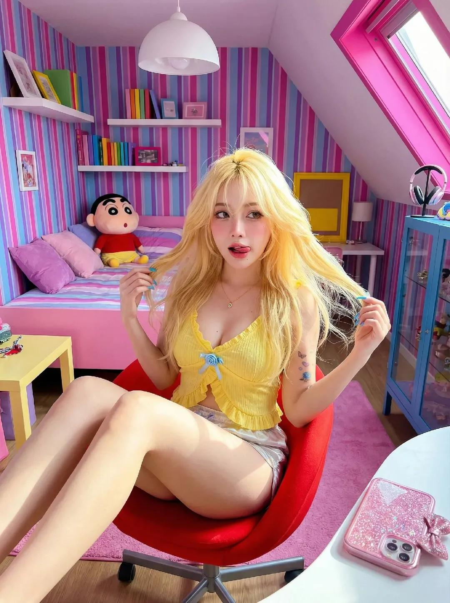

## 五彩缤纷的电影级照片

- ID: gpt4o-797-zh-2
- Slug: prompt-797-zh-2
- 语言: zh
- 来源: [来源链接](https://x.com/xmiiru_/status/1998275179684757534)
- 样例图路径: images/part3/797.jpeg

### 提示词

```text
{
"prompt_id": "aor0093",
“描述”：“使用上传的面部作为唯一参考，生成超逼真的 HDR 电影级照片，保留真实的面部特征——不进行任何转换或更改。”
“场景”： {
"位置": "阁楼卧室",
风格：可爱简约
颜色：[橙色”、“粉色”、“蓝色”、“紫色”、“绿色”、“黄色”、“白色”、“灰色”、“黑色”、“红色]
“特征”： [
{
"type": "window",
颜色：亮粉色
},
{
类型：壁纸，
“图案”：“竖条纹”，
颜色：["紫色", "粉色", "蓝色"]
"风格": "多巴矿装饰",
主题：多彩
}
]
}
}
```

### 样例图


## A cyber-grunge surveillance fashion editorial featuring 

- ID: gpt4o-796-en-1
- Slug: prompt-796-en-1
- 语言: en
- 来源: [来源链接](https://x.com/_MehdiSharifi_/status/1997832235974598763)
- 样例图路径: images/part3/796.jpeg

### 提示词

```text
A cyber-grunge surveillance fashion editorial featuring a cool, edgy young woman in her early 20s with a short chin-length bob haircut, straight with slight texture and casual bangs, partially obscured by thick black sunglasses and holding an iced coffee/chocolate plastic cup with a straw in her left hand and a half-eaten sandwich/pastry in her right hand. She wears an oversized white t-shirt with rust-red raglan sleeves and a small chest logo, tucked loosely into black, baggy carpenter/cargo denim jeans with white stitching details, and burgundy loafers, accessorized with a gold pendant necklace. She is captured in a full body walking stride, relaxed posture, facing slightly off-center with a casual, indifferent expression, head turned slightly to the side, looking downward, frozen mid-stride in an urban paved plaza with grey concrete and tiled pavement under bright sunny late afternoon golden hour light, creating high contrast shadows and long diagonal shadows to the left. The image is in 8K Ultra-HD quality, hyperrealistic, with a 4:5 aspect ratio and 1440x1920 resolution, styled in raw photoreal high fidelity, full color with cool urban tones and vibrant red UI accents, high-contrast daylight. The composition includes a main full body shot with multiple zoom-in crops (face/drink, torso, pants leg) in a fragmented layout, overlaid with tactical CCTV UI elements like red bounding boxes, telemetry data, and digital HUD overlays, simulating high-end surveillance footage with a 'Big Brother' observation vibe, candid urban documentation, and crisp daylight realism mixed with digital graphic design elements. The background is a sharp focus concrete cityscape with harsh shadow lines, and the lighting is natural harsh sunlight from a high angle, creating deep black cast shadows against bright pavement, with digital grain and scanline imperfections. The color grading features neutral urban greys, white, rust-red, denim black, and striking bright crimson red UI elements, with post-processing including high sharpness and red vector graphics overlays such as numbers '19 5 3 21 18 9 20 25', text 'CCWW', 'TR521', timecode '18/02', and bounding boxes with hashtags '#83575//' and '#25747//'. The overall theme is urban surveillance, Y2K streetwear, tactical data visualization, candid fashion moment, and dystopian chic, with a mood of cool detached observation, urban nonchalance, chaotic data stream, and privacy-invasion chic, captured from a high-angle surveillance perspective with a 35mm to 50mm lens, deep focus, and a layout of one main image plus three inset detail crops connected by red tactical line art and crosshairs.
```

### 样例图


## 一组赛博朋克风格的时尚大片

- ID: gpt4o-796-zh-2
- Slug: prompt-796-zh-2
- 语言: zh
- 来源: [来源链接](https://x.com/_MehdiSharifi_/status/1997832235974598763)
- 样例图路径: images/part3/796.jpeg

### 提示词

```text
这是一组赛博朋克风格的时尚大片，主角是一位酷劲十足、个性鲜明的二十出头年轻女性。她留着齐下巴的短波波头，直发略带纹理，刘海随意，戴着一副厚厚的黑色太阳镜，左手拿着一杯插着吸管的冰咖啡/巧克力，右手拿着半个吃剩的三明治/糕点。她身穿一件宽松的白色T恤，袖子是锈红色插肩袖，胸前印着一个小巧的品牌标识，下身随意地塞进一条黑色宽松的工装牛仔裤里，裤子上有白色缝线细节，脚踩一双酒红色乐福鞋，脖子上戴着一条金色吊坠项链。照片捕捉到她迈着大步的全身姿态，放松的姿势，略微侧身，表情随意而淡漠，头部微微侧转，目光向下，定格在城市广场的半步之中。广场地面铺着灰色的水泥和瓷砖，沐浴在明媚的午后金色阳光下，形成鲜明的对比阴影，左侧投射出长长的斜影。照片采用8K超高清画质，画面逼真，宽高比为4:5，分辨率为1440x1920，风格为原始照片级高保真，色彩饱满，以冷色调的都市色调和鲜艳的红色UI元素点缀，营造出高对比度的日光效果。画面构图包含一个全身主镜头，并以碎片化的布局呈现多个放大特写（面部/饮料、躯干、裤腿），叠加了红色边界框、遥测数据和数字HUD叠加层等战术监控界面元素，模拟出高端监控录像的“老大哥”式监视氛围，同时融入了真实都市纪实和清晰的日光写实风格，并结合了数字图形设计元素。背景是清晰聚焦的混凝土城市景观，阴影线条强烈，光线来自高角度的自然强光，在明亮的路面上投射出深邃的黑色阴影，并带有数字颗粒感和扫描线瑕疵。色彩分级采用中性都市灰、白色、锈红色、牛仔黑和醒目的亮深红色 UI 元素，后期处理包括高锐化和红色矢量图形叠加，例如数字“19 5 3 21 18 9 20 25”、文本“CCWW”、“TR521”、时间码“18/02”以及带有井号“#83575//”和“#25747//”的边界框。整体主题是城市监控、Y2K 街头服饰、战术数据可视化、坦率的时尚瞬间和反乌托邦时尚，营造出一种冷静疏离的观察、都市的漫不经心、混乱的数据流和侵犯隐私的时尚感。照片采用 35 毫米至 50 毫米镜头，以高角度监控视角拍摄，并使用了深焦效果。照片布局为一张主图加三张局部细节图，并用红色战术线条和十字线连接。
```

### 样例图


## { "image_request": { "goal": "Create a mixed-media reali

- ID: gpt4o-794-en-1
- Slug: prompt-794-en-1
- 语言: en
- 来源: [来源链接](https://x.com/_MehdiSharifi_/status/1998059385675829263)
- 样例图路径: images/part3/794.jpeg

### 提示词

```text
{
  "image_request": {
    "goal": "Create a mixed-media reality-bending mirror selfie / blending 2D anime characters into a 3D real-world photo / cozy autumn academia fashion meets otaku dream",
    "meta": {
      "image_type": "Mixed Media Composite / Anime in Real Life / Mirror Selfie / Fashion Snapshot",
      "quality": "Best Quality, Photorealistic Center Subject, Sharp Anime Lines, Mixed Dimensionality",
      "color_mode": "Full Color / Natural Indoor Tones / Warm Beige & Brown Palette",
      "style_mode": "raw_photoreal blended with cel-shaded anime",
      "aspect_ratio": "3:4",
      "resolution": "1080x1920"
    },
    "creative_style": "A playful fusion of dimensions where 2D anime characters seamlessly occupy a real-world space. The photorealistic central figure wears a cozy 'Autumn Academia' outfit, contrasting with the flat, cel-shaded anime characters. The vibe is a casual, dream-like hangout caught in a mirror reflection.",
    "overall_theme": "Anime meets reality / Autumn Academia Fashion / Mirror selfie with fictional characters",
    "mood_vibe": "Cozy, stylish, playful, surreal, dimensional barrier breaking",
    "style_keywords": [
      "mixed media",
      "mirror selfie",
      "anime in real life",
      "autumn academia",
      "cable knit texture",
      "cel-shaded",
      "photorealistic fashion",
      "hallway reflection"
    ],
    "subject": {
      "count": "3 (1 human female, 2 anime males)",
      "type": "human and anime characters",
      "identity": "Center: Young woman (Photorealistic). Left: Spiky black-haired anime male (Megumi style). Right: White-haired anime male (Gojo style).",
      "identity_preservation": {
        "description": "Center subject is a photorealistic human wearing the specific autumn outfit. Side subjects retain distinct 2D anime art style.",
        "notes": "Maintain clear stylistic distinction: Highly detailed texture on the cardigan/skirt vs. bold anime lines for the boys."
      },
      "age_appearance": "Young adults",
      "skin": "Human: Natural texture, soft lighting. Anime: Flat cel-shaded tones.",
      "clothing": {
        "top": "Human: White cotton poplin shirt worn under a loose, oversized beige wool cable-knit cardigan. Left Anime: Black long-sleeve shirt. Right Anime: White t-shirt.",
        "bottom": "Human: Brown plaid/tartan flannel mini skirt and black knee-high socks. Left Anime: Grey pants. Right Anime: Black pants.",
        "accessories": "Human: Smartphone (taking the photo). Right Anime: Sunglasses.",
        "textures": "Emphasize the high-depth weave of the beige cardigan and the flannel texture of the skirt on the human subject."
      },
      "facial_features": {
        "expression": "Human: Obscured by phone or neutral/soft smile. Left Anime: Cool, stoic, arms crossed. Right Anime: Confident, smirk, adjusting glasses."
      },
      "hair": {
        "style": "Human: Natural styling suitable for an academic look. Left Anime: Spiky energetic black hair. Right Anime: White hair with bangs down."
      }
    },
    "pose_action": {
      "overall_pose": "Casual group mirror selfie. Center subject stands straight taking the photo holding phone. Left subject leans casually against the mirror frame. Right subject stands tall.",
      "body_position": "Standing, full body visible in mirror reflection to show the skirt and knee-high socks.",
      "hands": "Center: Holding phone. Left: Arms crossed. Right: Touching sunglasses/face."
    },
    "environment": {
      "setting": "Indoor hallway or lobby with high ceilings and reflective surfaces (matches original scene to keep the context).",
      "location": "Modern building interior with marble/tiled walls and glass elements.",
      "lighting": "Natural daylight filtering in, highlighting the texture of the wool cardigan.",
      "atmosphere": "Clean, bright, casual everyday hangout."
    },
    "background": {
      "color": "Beige, tan, brown (marble stripes) - compliments the beige/brown outfit.",
      "effect": "Reflected in mirror, showing a tiled floor and a glass door leading to the outside."
    },
    "lighting": {
      "type": "Natural diffuse",
      "source": "Windows/Doors behind the subjects (reflected)",
      "quality": "Soft, even. Creates soft shadows on the cable-knit texture.",
      "tone": "Warm neutral."
    },
    "camera": {
      "sensor_format": "Smartphone Camera",
      "position_angle": "Eye-level mirror reflection",
      "framing": "Vertical portrait shot capturing full bodies.",
      "composition": {
        "framing": "Mirror frame visible with geometric grid lines overlaying the reflection.",
        "depth": "Deep depth of field."
      }
    },
    "post_processing": {
      "final_touch": "Digital composite look. Ensure the lighting on the photorealistic cardigan matches the environment, while anime characters remain 2D."
    },
    "negative": {
      "style": "3D render of anime characters, messy drawing, bad anatomy, low resolution",
      "content": "distorted faces, extra limbs, human subject looking like a drawing, anime characters looking too realistic"
    },
    "additional_controls": {
      "special_notes": "Focus on the material contrast: Real wool and flannel vs. Anime flat colors.",
      "vibe": "Fan edit, OOTD (Outfit of the Day)."
    }
  }
}
```

### 样例图


## 融合多种媒体元素的现实扭曲镜面自拍

- ID: gpt4o-794-zh-2
- Slug: prompt-794-zh-2
- 语言: zh
- 来源: [来源链接](https://x.com/_MehdiSharifi_/status/1998059385675829263)
- 样例图路径: images/part3/794.jpeg

### 提示词

```text
{
"image_request": {
“目标”：“创作一张融合多种媒体元素的现实扭曲镜面自拍/将二维动漫人物融入三维现实世界照片/舒适的秋季学院风时尚与宅男梦想相遇”，
"meta": {
"image_type": "混合媒体合成/现实生活中的动漫/镜子自拍/时尚快照",
“质量”：“最佳质量，照片级逼真的中心主体，清晰的动漫线条，混合维度”
"color_mode": "全彩/自然室内色调/暖米色和棕色调色板",
"style_mode": "raw_photoreal blended with cel-shaded anime",
"aspect_ratio": "3:4",
分辨率：1080x1920
},
“创意风格”： “一种巧妙融合不同维度的趣味作品，二维动画角色无缝融入现实世界空间。写实风格的中心人物身着舒适的‘秋季学院风’服装，与扁平的赛璐珞风格动画角色形成鲜明对比。整体氛围如同镜中倒影般，营造出一种轻松梦幻的聚会氛围。”
"overall_theme": "动漫与现实的碰撞 / 秋季学院风时尚 / 与虚构人物的镜子自拍",
"mood_vibe": "舒适、时尚、俏皮、超现实、打破维度界限"
"style_keywords": [
“混合媒介”，
“镜子自拍”，
“现实生活中的动漫”，
“秋季学术界”，
“绞花针织纹理”，
“卡通渲染”
“照片写实时尚”，
“走廊倒影”
],
“主题”： {
“count”: “3（1名人类女性，2名动漫男性）”
“类型”：“人类和动漫角色”，
“身份”：“中间：年轻女子（写实风格）。左侧：黑色刺猬头动漫男性（惠美风格）。右侧：白色头发动漫男性（五条风格）。”
"identity_preservation": {
“描述”：“中心人物是一位身着特定秋季服装的写实人物。两侧人物则保留了鲜明的二维动画艺术风格。”
“备注”：“保持清晰的风格区分：开衫/裙子采用高度精细的纹理，而男孩款则采用粗犷的动漫线条。”
},
"age_appearance": "青年人",
“皮肤”： “人类：自然纹理，柔和光照。动漫：扁平的赛璐珞着色色调。”
“衣服”： {
“上图”：人类：白色棉质府绸衬衫，外搭宽松的米色羊毛麻花针织开衫。左图动漫人物：黑色长袖衬衫。右图动漫人物：白色T恤。
“底部”： “人类：棕色格子/苏格兰格纹法兰绒迷你裙和黑色过膝袜。左侧动漫角色：灰色裤子。右侧动漫角色：黑色裤子。”
“配件”： “人类：智能手机（正在拍照）。 右动漫人物：太阳镜。”
“纹理”：“强调人物身上米色开衫的高密度编织纹理和裙子的法兰绒质感。”
},
"facial_features": {
“表情”： “人类：被手机遮挡或面带中性/柔和的微笑。左侧动漫人物：冷静、沉稳，双臂交叉。右侧动漫人物：自信，嘴角带着一丝微笑，正在调整眼镜。”
},
“头发”： {
“风格”：人类：适合学术形象的自然发型。左侧动漫：充满活力的黑色刺猬头。右侧动漫：带刘海的白色头发down."
}
},
"pose_action": {
“整体姿势”： “随意的集体镜前自拍。中间的人站直，拿着手机拍照。左边的人随意地倚靠在镜框上。右边的人站得笔直。”
“body_position”: “站立，全身在镜中反射可见，可以看到裙子和及膝袜。”
“手”：中间：拿着手机。左：双臂交叉。右：摸着太阳镜/脸。
},
“环境”： {
“场景”：“室内走廊或大厅，天花板很高，表面有反光材料（与原场景相符，以保持语境）。”
“地点”：“现代建筑内部，墙面采用大理石/瓷砖，并融入玻璃元素。”
“光线”：“自然光线倾泻而入，突显了羊毛开衫的质感。”
“氛围”：“干净、明亮、休闲的日常聚会场所。”
},
“背景”： {
颜色：米色、棕褐色、棕色（大理石条纹）——与米色/棕色服装相得益彰。
“效果”：“在镜子中映照出瓷砖地板和通往室外的玻璃门。”
},
“灯光”： {
“类型”：“自然漫射”，
“来源”：“主体背后的窗户/门（反射）”
“品质”：“柔软均匀。在针织纹理上营造出柔和的阴影。”
“色调”：“暖中性”。
},
“相机”： {
"sensor_format": "智能手机摄像头",
"position_angle": "眼平镜反射",
“构图”：“竖幅肖像照，拍摄全身像。”
“作品”： {
“镜框”：“镜框清晰可见，几何网格线覆盖在镜面反射之上。”
“景深”：“大景深”。
}
},
"post_processing": {
“final_touch”： “数字合成效果。确保逼真开衫的光照与环境相匹配，同时保持动漫人物的二维风格。”
},
“消极的”： {
“风格”：“动漫人物的3D渲染，凌乱的绘画，糟糕的解剖结构，低分辨率”，
“内容”：“扭曲的面孔、多余的肢体、看起来像画的人物、过于逼真的动漫人物”
},
"additional_controls": {
特别说明： 重点在于材质对比：真羊毛和法兰绒 vs. 动漫风格的纯色。
“vibe”：“粉丝剪辑，OOTD（每日穿搭）。”
}
}
}
```

### 样例图


## A horizontal split-screen cinematic shot of {Scene}, sea

- ID: gpt4o-793-en-1
- Slug: prompt-793-en-1
- 语言: en
- 来源: [来源链接](https://x.com/dotey/status/1998095424394007000)
- 样例图路径: images/part3/793.jpeg

### 提示词

```text
A horizontal split-screen cinematic shot of {Scene}, seamlessly blending two different eras: {Era_A} on the left and {Era_B} on the right (default: about 100 years ago vs. present day).

On the left side ({Era_A}): show era-appropriate architecture, interior or environment design, materials, vehicles, and props that clearly belong to that historical period. People wear authentic clothing from {Era_A}, including hairstyles, accessories, and typical items in their hands (such as books, umbrellas, instruments, letters, newspapers, etc.). The overall mood feels nostalgic and historically accurate.

On the right side ({Era_B}): show the same {Scene} in the modern era, with updated architecture or renovated structures, contemporary materials (glass, steel, LED screens, modern furniture), modern vehicles or equipment, and current technology (smartphones, laptops, cameras, etc.). People wear contemporary fashion that matches today’s style in this setting.

In the center: the two eras merge and overlap organically, without a hard dividing line. Elements from {Era_A} and {Era_B} visually interact: people from different times look at each other, walk through each other’s space, or seem surprised by the other era’s technology and objects. Architecture and environment smoothly morph from old to new (for example, stone gates turning into modern campus gates, classical concert hall décor fading into a futuristic stage, old street shops transforming into neon-lit storefronts).

Make sure the scene is not just a simple left/right comparison but a dynamic time-travel interaction where buildings, clothing, props, and human gestures clearly emphasize the contrast and fusion between the two eras. Photorealistic, 8k resolution, cinematic lighting, wide angle, highly detailed textures, rich sense of time-travel storytelling.

---
SCENE: Times Square, New York
Era Comparison: 1920s and present day
Aspect Ratio: 4:3
```

### 样例图


## 无缝融合两个不同的时代

- ID: gpt4o-793-zh-2
- Slug: prompt-793-zh-2
- 语言: zh
- 来源: [来源链接](https://x.com/dotey/status/1998095424394007000)
- 样例图路径: images/part3/793.jpeg

### 提示词

```text
水平分屏电影镜头 {Scene}，无缝融合了两个不同的时代：左侧为 {Era _A} ，右侧为 {Era_ B} （默认：大约 100 年前 vs. 现代）}。

左侧（{时代_A}):展示了符合时代特征的建筑、室内或环境设计、材料、车辆和道具，这些都明显属于该历史时期。人们穿着{时代_A}的真实服饰，包括发型、配饰以及手中的典型物品（例如书籍、雨伞、乐器、信件、报纸等）。整体氛围既充满怀旧气息，又符合历史事实。

右侧（{Era_ B}):展示了现代的相同场景，建筑风格有所更新或翻新，采用了现代材料（玻璃、钢材、LED屏幕、现代家具）、现代车辆或设备以及当前技术（智能手机、笔记本电脑、相机等）。人们穿着符合当今风格的时尚服饰。

在中心区域：两个时代有机地融合交叠，没有明显的界限。{时代A}和{时代B}的元素在视觉上相互交融：不同时代的人们彼此对视，穿梭于彼此的空间，或对另一个时代的科技和物品感到惊讶。建筑和环境也从旧到新平滑过渡（例如，石门变成现代校园大门，古典音乐厅的装饰逐渐过渡到未来主义的舞台，老旧的街边店铺变成霓虹闪烁的店面）。

确保场景不仅仅是简单的左右对比，而是一个动态的时空穿越互动场景，建筑、服饰、道具和人物姿态都清晰地突出了两个时代之间的对比与融合。照片级写实效果，8K分辨率，电影级光照，广角镜头，高度精细的纹理，以及丰富的时空穿越叙事感。

---
场景：纽约时代广场
时代对比：20世纪20年代与当今时代
宽高比：4:3
```

### 样例图


## Role & Subject: A massive, encyclopedic 16:9 3D infograp

- ID: gpt4o-792-en-1
- Slug: prompt-792-en-1
- 语言: en
- 来源: [来源链接](https://x.com/songguoxiansen/status/1997927625717915755)
- 样例图路径: images/part3/792.jpeg

### 提示词

```text
Role & Subject: A massive, encyclopedic 16:9 3D infographic poster titled "THE EVOLUTION OF STARK INDUSTRIES IRON MAN SUITS". The visual style is a high-end fusion of museum-grade product photography and complex technical engineering blueprints.

The Hero Lineup (Chronological Core): A complete, linear chronological lineup of 10 historical versions of Iron Man Armors, ranging from the crude, bulky Mark I prototype forged in a cave to the sleek, bleeding-edge Mark LXXXV nanotechnology model. They are arranged with precision on a glowing holographic measurement scale/ruler base running horizontally across the center. Rendering: Hyper-realistic 3D, 8k resolution. Emphasis on the evolution of textures: showing the aging of early crude welded scrap metal, heavy iron, and exposed wiring of the Mk I vs. the pristine, highly-polished hot-rod red and gold plating, and fluid nanotech finish of modern versions like the Mk 50 and Mk 85.

Brand Atmosphere (The Canvas): Background: A deep, rich Hot Rod Red and metallic Gold textured background, resembling an armored plating surface. It is heavily layered with low-opacity watermarks of vintage Stark Industries patent drawings, handwritten engineering notes by Tony Stark (with coffee stains), and newspaper clippings related to the Avengers' history. Header: A prominent, high-contrast STARK INDUSTRIES logo displayed at the top center, with a bold typography title.

The "Hyper-Dense" Information Layer (The PUNCH Style): The layout is overwhelmed with organized information (creating a "Data aesthetics" look):

Dense Annotation Network: Hundreds of fine white and cyan hairlines connecting specific components (e.g., Arc Reactors, Repulsor Transmitters in palms, Articulated Helmet Faceplates, Micro-missile Compartments, Flight Stabilizers) to compact text blocks, energy output charts, and data tables floating in the volumetric space.

Contextual Zones: "Era Modules" floating above the suits, representing different phases (e.g., "AFGHANISTAN ESCAPE," "THE AVENGERS INITIATIVE," "ULTRON OFFENSIVE," "INFINITY WAR NANO-TECH") with iconographic markers.

Magnifying Inserts: Circular "Zoom-in" lenses scattered in empty spaces, showing extreme macro close-ups of texture details like the crude welding on Mark I, the mechanical joint articulation of Mark III, and the fluid nano-particle assembly of Mark LXXXV.

Tech Specs Strip: A structured data bar at the very bottom listing precise specifications (Model Number, Weight in tons/kg, Power Source Type, Year of Creation, Primary Material Code).

Technical Specs: Octane render, Unreal Engine 5 aesthetic, editorial layout, information design masterpiece, cinematic volumetric lighting, sharp focus, professional color grading, blockbuster movie poster vibe. --ar 16:9 --v 6.0 --stylize 350
```

### 样例图


## 斯塔克工业钢铁侠战衣的演变

- ID: gpt4o-792-zh-2
- Slug: prompt-792-zh-2
- 语言: zh
- 来源: [来源链接](https://x.com/songguoxiansen/status/1997927625717915755)
- 样例图路径: images/part3/792.jpeg

### 提示词

```text
角色与主题：一幅名为“斯塔克工业钢铁侠战衣的演变”的大型百科全书式16:9 3D信息图海报。视觉风格融合了博物馆级别的产品摄影和复杂的技术工程蓝图，呈现出高端质感。

英雄阵容（时间线核心）：完整呈现10款钢铁侠战甲的历史版本，按时间顺序排列，从洞穴中锻造的粗糙笨重的Mark I原型到线条流畅、尖端科技的Mark LXXXV纳米技术型号，应有尽有。它们被精确地排列在中央水平延伸的发光全息测量标尺底座上。渲染：超逼真3D，8K分辨率。着重展现纹理的演变：早期Mark I粗糙的焊接废金属、厚重的铁质和裸露的电线，与Mk 50和Mk 85等现代版本光洁如新、高度抛光的红色和金色镀层以及流畅的纳米技术表面形成鲜明对比。

品牌氛围（画布）：背景：深邃浓郁的热棒红和金属金色纹理背景，宛如装甲板表面。其上叠加了多层低透明度的水印，包括斯塔克工业的复古专利图纸、托尼·斯塔克的手写工程笔记（带有咖啡渍）以及与复仇者联盟历史相关的报纸剪报。标题：醒目的高对比度“STARK INDUSTRIES”标志位于顶部中央，搭配粗体标题。

“超密集”信息层（PUNCH 风格）：布局中充斥着组织有序的信息（营造出一种“数据美学”的外观）：

密集的注释网络：数百条细细的白色和青色线条将特定组件（例如，弧形反应堆、手掌中的反重力发射器、铰接式头盔面罩、微型导弹舱、飞行稳定器）连接到漂浮在体积空间中的紧凑文本块、能量输出图表和数据表。

上下文区域：“时代模块”漂浮在战衣上方，代表不同的阶段（例如，“阿富汗逃亡”、“复仇者联盟计划”、“奥创进攻”、“无限战争纳米科技”），并带有图标标记。

放大插片：散落在空白处的圆形“放大”镜头，显示纹理细节的极端宏观特写，例如 Mark I 的粗糙焊接、Mark III 的机械关节铰接以及 Mark LXXXV 的流体纳米颗粒组装。

技术规格条：最底部的结构化数据栏，列出精确的规格（型号、重量（吨/千克）、电源类型、生产年份、主要材料代码）。

技术规格：Octane渲染，虚幻引擎5美学，编辑布局，信息设计杰作，电影级体积光照，清晰对焦，专业调色，大片海报氛围。--ar 16:9 --v 6.0 --stylize 350
```

### 样例图


## 女生展示自己手机照片

- ID: gpt4o-791-zh
- Slug: prompt-791-zh
- 语言: zh
- 来源: [来源链接](https://x.com/SDT_side/status/1997789514526564650)
- 样例图路径: images/part3/791.jpeg

### 提示词

```text
需要上传2张照片：1、上传人物照片 2、上传想要在手机上显示的图像，再输入以下提示词
{
  "edit_type": "extreme_wide_angle_phone_edit",

  "source": {
    "_hint": "元画像の人物・服・雰囲気を編集するベース。新キャラ禁止。",
    "mode": "EDIT",
    "reference_images": {
      "first": "base_photo_person_and_environment",
      "second": "screen_content_for_phone"
    },
    "preserve_from_first": {
      "_hint": "顔・髪型・服装は必ず同一人物として扱うための固定。",
      "same_person_or_group": true,
      "same_faces": true,
      "same_hairstyles": true,
      "same_outfits": true,
      "same_environment_style": true
    }
  },

  "identity": {
    "_hint": "表情の統一化。人物のアイデンティティを崩さず保持。",
    "keep_identity_consistent": true,
    "all_people_clearly_recognizable_as_original": true,
    "expression": "bright_natural_smile"
  },

  "camera_effect": {
    "_hint": "スマホを近づけたときの誇張パースを美しく安定化。",
    "perspective": "extreme_wide_angle",
    "style": "dynamic_photorealistic",
    "near_objects_appear_large": true,
    "far_objects_recede_dramatically": true,
    "allow_view_from_above_or_below": true
  },

  "pose": {
    "_hint": "元画像と同じポーズ禁止。手の動きを強調して破綻防止。",
    "pose_can_change": true,
    "must_be_completely_different_from_reference": true,
    "do_not_replicate_or_approximate_original_pose": true,
    "style_tags": [
      "stylish",
      "complex",
      "fluid",
      "powerful"
    ],
    "focus_on_expressive_hands": true,
    "avoid_arm_distortion": true,
    "allow_multiple_body_parts_near_lens": true
  },

  "phone": {
    "_hint": "スマホ専用領域。持ち方・向き・手元の自然さを定義。",
    "allowed": true,
    "holding_styles": [
      "one_handed",
      "two_handed",
      "low_angle",
      "high_angle",
      "tilted",
      "sideways",
      "near_chest",
      "near_hip",
      "casual_carry",
      "partially_toward_lens"
    ],
    "rules": {
      "_hint": "“レンズに向ける強制”を避け、自然な持ち方で画面が見える構図へ。",
      "each_person_may_hold_one_phone": true,
      "priority_is_natural_and_relaxed_body_structure": true,
      "do_not_force_phone_directly_toward_camera": true,
      "screen_should_be_naturally_visible_when_possible": true
    }
  },

  "screen_replacement": {
    "_hint": "差し替えスクリーン。UIなし・歪みなし・自然な貼り込み。",
    "target": "visible_phone_screen",
    "use_second_reference_image_as_content": true,
    "overlay_cleanly_on_visible_screen_area": true,
    "fit_without_distortion": true,
    "respect_screen_shape": true,
    "no_additional_cropping": true,
    "ui_constraints": {
      "_hint": "SNSバーやアプリ枠の発生を完全禁止。",
      "no_ui": true,
      "no_icons": true,
      "no_status_bar": true,
      "no_app_frame": true,
      "show_only_content_from_second_reference": true
    }
  },

  "environment": {
    "_hint": "元写真の空気感を保つが、季節や天気には依存しない汎用設計。",
    "preserve_environment_style_from_reference": true,
    "lighting_consistent_with_reference": true,
    "expand_space_for_wide_angle_view": true,
    "keep_texture_and_color_tone_consistent": true
  },

  "composition": {
    "_hint": "スマホ近接によるダイナミック構図の安定化。",
    "dynamic_but_readable": true,
    "extreme_depth_emphasis": true,
    "allow_phone_close_to_lens": true,
    "keep_all_people_visually_balanced": true
  },

  "constraints": {
    "_hint": "意図せぬ変化を禁止する保護設定。",
    "no_new_characters": true,
    "no_change_in_age_or_gender_presentation": true,
    "no_costume_change": true,
    "no_change_to_reference_location_type": true,
    "respect_original_photographic_style": true
  }
}
```

### 样例图


## 产品发展轨迹图

- ID: gpt4o-790-zh-1
- Slug: prompt-790-zh-1
- 语言: zh
- 来源: [来源链接](https://x.com/berryxia_ai/status/1997663876985549073)
- 样例图路径: images/part3/790.jpeg

### 提示词

```text
Role & Subject: A massive, encyclopedic 16:9 3D infographic poster titled "THE EVOLUTION OF [Product Name]". The visual style is a high-end fusion of museum-grade product photography and complex technical engineering blueprints.

The Hero Lineup (Chronological Core): A complete, linear chronological lineup of 8-12 historical versions of [Product Name], ranging from the very first prototype to the latest futuristic model. They are arranged with precision on a measurement scale/ruler base running horizontally across the center. Rendering: Hyper-realistic 3D, 8k resolution. Emphasis on the evolution of textures: showing the aging of early [Material Vibe] vs. the pristine, high-tech finish of modern versions.

Brand Atmosphere (The Canvas): Background: A deep, rich [Brand Color] textured background. It is heavily layered with low-opacity watermarks of vintage patent drawings, handwritten engineering notes, and newspaper clippings related to the brand's history. Header: A prominent, high-contrast brand logo displayed at the top center, with a bold typography title.

The "Hyper-Dense" Information Layer (The PUNCH Style): The layout is overwhelmed with organized information (creating a "Data aesthetics" look):

Dense Annotation Network: Hundreds of fine white hairlines connecting specific [Key Components] (e.g., curves, buttons, engines) to compact text blocks and data tables floating in the space.

Contextual Zones: "Era Modules" floating above the products, representing different historical decades with iconographic markers.

Magnifying Inserts: Circular "Zoom-in" lenses scattered in empty spaces, showing extreme macro close-ups of texture details and internal mechanisms.

Tech Specs Strip: A structured data bar at the very bottom listing precise specifications (weight, dimensions, year, material code).

Technical Specs: Octane render, Unreal Engine 5 aesthetic, editorial layout, information design masterpiece, volumetric lighting, sharp focus, professional color grading. --ar 16:9 --v 6.0 --stylize 300 「以泡泡玛特发展史为例」
```

### 样例图


## 产品发展轨迹图

- ID: gpt4o-790-zh-2
- Slug: prompt-790-zh-2
- 语言: zh
- 来源: [来源链接](https://x.com/berryxia_ai/status/1997663876985549073)
- 样例图路径: images/part3/790.jpeg

### 提示词

```text
角色与主题：一幅名为“[产品名称]的演变”的大型百科全书式16:9 3D信息图海报。视觉风格融合了博物馆级别的产品摄影和复杂的技术工程蓝图，呈现出高端的视觉效果。

英雄阵容（时间核心）：完整呈现[产品名称]的8-12个历史版本，按时间顺序排列，涵盖从最初的原型到最新的未来主义型号。它们精确地排列在横跨中心的水平刻度/尺形底座上。渲染：超逼真3D，8K分辨率。着重展现纹理的演变：早期[材质风格]的岁月痕迹与现代版本光滑的高科技质感形成鲜明对比。

品牌氛围（画布）：背景：深沉浓郁的[品牌色]纹理背景。其上叠加了大量低透明度的水印，内容包括与品牌历史相关的复古专利图纸、手写工程笔记和报纸剪报。标题：醒目的高对比度品牌标识位于顶部中央，搭配粗体标题。

“超密集”信息层（PUNCH 风格）：布局中充斥着组织有序的信息（营造出一种“数据美学”的外观）：

密集注释网络：数百条细白线将特定的[关键组件]（例如曲线、按钮、引擎）连接到漂浮在空间中的紧凑文本块和数据表。

背景区域：“时代模块”漂浮在产品上方，用图标标记代表不同的历史年代。

放大镜：散布在空白处的圆形“放大”镜头，显示纹理细节和内部机制的极致微距特写。

技术规格条：最底部的结构化数据栏，列出精确的规格（重量、尺寸、年份、材料代码）。

技术规格：Octane 渲染、虚幻引擎 5 美学、编辑布局、信息设计杰作、体积照明、锐聚焦、专业色彩分级。 --ar 16:9 --v 6.0 --stylize 300 「以泡泡玛特发展史为例」
```

### 样例图


## { "image_prompt": { "face_preservation": { "use_referenc

- ID: gpt4o-789-en-1
- Slug: prompt-789-en-1
- 语言: en
- 来源: [来源链接](https://x.com/ZaraIrahh/status/1997616475277033799)
- 样例图路径: images/part3/789.jpeg

### 提示词

```text
{
  "image_prompt": {
    "face_preservation": {
      "use_reference_face": true,
      "accuracy": "match face exactly from reference image",
      "preserve_details": [
        "face shape",
        "eyebrows and eye structure",
        "natural makeup style",
        "lip shape and color",
        "hairline and hairstyle"
      ]
    },

    "subject": {
      "gender": "female",
      "description": "young woman taking a mirror selfie while squatting gracefully indoors",
      "pose": {
        "body_position": "squatting low with one knee forward, leaning slightly toward mirror",
        "head": "tilted slightly downward while looking at phone screen",
        "hands": [
          "right hand holding phone in front of face",
          "left hand resting on knee"
        ],
        "expression": "soft, calm expression"
      },
      "hair": {
        "style": "long dark brown hair in a half-up ponytail with a small clip",
        "texture": "smooth and straight"
      },
      "attire": {
        "dress": {
          "type": "light-colored floral maxi dress with short sleeves",
          "pattern": "red and pink small floral print",
          "details": "slit exposing leg, soft fabric flow"
        },
        "shoes": "white strappy heels",
        "accessories": [
          "silver necklace",
          "bracelet",
          "rings"
        ]
      }
    },

    "environment": {
      "setting": "indoor room with soft lighting",
      "background": "floor-to-ceiling curtains in dark grey tones",
      "floor": "smooth, reflective surface",
      "lighting": {
        "type": "soft warm indoor light",
        "effect": "even illumination on face and dress"
      }
    },

    "props": {
      "phone": {
        "type": "smartphone",
        "case": "glitter silver phone case",
        "position": "held vertically towards the mirror"
      }
    },

    "style": {
      "photography": "mirror selfie, social media aesthetic",
      "color_grade": "soft warm tones",
      "sharpness": "medium-high clarity",
      "mood": "feminine, elegant, gentle"
    },

    "composition": {
      "framing": "full body squatting pose, centered",
      "angle": "eye-level mirror perspective",
      "focus": "sharp focus on face and outfit",
      "aspect_ratio": "4:5"
    },

    "output": {
      "resolution": "8K high quality",
      "negative_prompt": [
        "incorrect face",
        "wrong hairstyle",
        "extra limbs",
        "different dress pattern",
        "distorted proportions",
        "text or watermark"
      ]
    }
  }
}
```

### 样例图


## 年轻女子在室内优雅地蹲着自拍

- ID: gpt4o-789-zh-2
- Slug: prompt-789-zh-2
- 语言: zh
- 来源: [来源链接](https://x.com/ZaraIrahh/status/1997616475277033799)
- 样例图路径: images/part3/789.jpeg

### 提示词

```text
{
"image_prompt": {
"面部保存": {
"use_reference_face": true,
“准确度”：“与参考图像中的人脸完全匹配”，
"preserve_details": [
“脸型”，
“眉毛和眼睛结构”，
“自然妆容风格”，
“唇形和颜色”，
发际线和发型
]
},

“主题”： {
"性别": "女性",
“描述”：“年轻女子在室内优雅地蹲着自拍镜子”，
"姿势": {
"body_position": "单膝前蹲，身体略微前倾，朝向镜子"
“头部”：“看着手机屏幕时略微向下倾斜”，
“手”：[
“右手拿着手机放在脸前”，
左手放在膝盖上
],
“表情”：“柔和、平静的表情”
},
“头发”： {
“发型”：“深棕色长发扎成半马尾，用一个小发夹固定”，
“质地”：“光滑笔直”
},
着装：{
“裙子”： {
“类型”：“浅色碎花短袖长连衣裙”，
“图案”：“红色和粉色小碎花图案”，
“细节”：“开衩露出腿部，柔软面料垂坠感”
},
“鞋子”：“白色细带高跟鞋”，
“配件”： [
“银项链”，
“手镯”，
“戒指”
]
}
},

“环境”： {
“场景”：“室内，灯光柔和”，
“背景”：“深灰色调的落地窗帘”，
“地板”：“光滑、反光的表面”，
“灯光”： {
类型：柔和温暖的室内灯光，
“效果”：“脸部和衣服上的光线均匀”。
}
},

"props": {
“电话”： {
“类型”：“智能手机”，
“手机壳”： “闪亮银色手机壳”，
“姿势”：“垂直对着镜子”
}
},

“风格”： {
“摄影”：“镜子自拍，社交媒体美学”，
"color_grade": "柔和的暖色调",
“清晰度”： “中高清晰度”，
情绪：女性化、优雅、温柔
},

“作品”： {
“构图”：“全身深蹲姿势，居中”，
“角度”：“平视镜视角”，
“焦点”: “清晰聚焦于面部和服装”，
"aspect_ratio": "4:5"
},

“输出”： {
分辨率：8K 高清，
"negative_prompt": [
“错误的脸”，
“错误的发型”，
“额外的肢体”，
“不同的服装款式”，
“扭曲的比例”，
“文字或水印”
]
}
}
}
```

### 样例图


## 景点四季变化

- ID: gpt4o-787-zh
- Slug: prompt-787-zh
- 语言: zh
- 来源: [来源链接](https://x.com/berryxia_ai/status/1997843525770354961)
- 样例图路径: images/part3/787.jpeg

### 提示词

```text
[The Composition: Dynamic Diagonal Slicing]

Hyper-realistic digital art, 8k resolution, a wide cinematic panorama of **{City_Name}** featuring **{Landmark}**.
The composition utilizes a "**Dynamic Diagonal Phase Shift**" technique. The scene is visually divided into four distinct slanted zones (diagonal cuts flowing from top-right to bottom-left) representing the four seasons. The architecture and landscape maintain perfect structural continuity across these diagonal slices, creating a surreal but cohesive masterpiece.

**[Textual Layout: Clean & Non-Redundant]**
* **Layer A (Background Watermark - Season Identity):** Behind the main architecture in each diagonal zone, place a large, translucent, artistic calligraphy watermark acting as a graphic element.
    * Zone 1: "**{Calligraphy_Winter}**"
    * Zone 2: "**{Calligraphy_Spring}**"
    * Zone 3: "**{Calligraphy_Summer}**"
    * Zone 4: "**{Calligraphy_Autumn}**"
* **Layer B (Bottom Edge - Cultural Narrative):** At the very bottom, place strictly the poetic quotes (small, elegant sans-serif font). **DO NOT** repeat the season names here. Just the sentence.
    * Zone 1 Bottom: "**{Quote_Winter}**"
    * Zone 2 Bottom: "**{Quote_Spring}**"
    * Zone 3 Bottom: "**{Quote_Summer}**"
    * Zone 4 Bottom: "**{Quote_Autumn}**"

**[Visual Flow - The Diagonal Gradient]**

* **Zone 1 (Far Left Diagonal - WINTER):** The slice cuts through the left side of **{Landmark}**. The surface is covered in frost/snow.
    * *Atmosphere:* Cold blue tones, visible breath, sharp air.
    * *Botany:* **{Botany_Winter}** (bare branches/ice).

* **Zone 2 (Center-Left Diagonal - SPRING):** The next diagonal slice transforms the structure into a wet, blooming environment.
    * *Atmosphere:* Pastel pinks/greens, soft mist.
    * *Botany:* **{Botany_Spring}** (bursting flowers/buds).

* **Zone 3 (Center-Right Diagonal - SUMMER):** The diagonal slice reveals the structure under intense vertical sunlight.
    * *Atmosphere:* High contrast, vibrant saturation, deep blue sky.
    * *Botany:* **{Botany_Summer}** (lush dark greens/shade).

* **Zone 4 (Far Right Diagonal - AUTUMN):** The final diagonal slice on the right bathes the scene in golden light.
    * *Atmosphere:* Warm amber glow, long shadows.
    * *Botany:* **{Botany_Autumn}** (red/gold foliage).

**[Technical Specs]**
Seamless diagonal transitions, no hard lines but distinct color shifts. The landscape (roads/rivers) connects perfectly through the diagonal cuts. 8k resolution, photorealistic textures. --ar 21:9 --v 6.0 --stylize 300
```

### 样例图

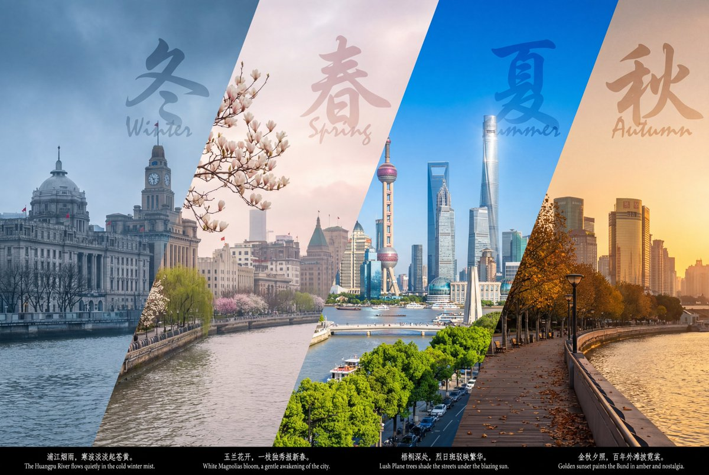

## Transform the subject into a stylized 3D character with 

- ID: gpt4o-784-en-1
- Slug: prompt-784-en-1
- 语言: en
- 来源: [来源链接](https://x.com/gizakdag/status/1997602898075615682)
- 样例图路径: images/part3/784.jpeg

### 提示词

```text
Transform the subject into a stylized 3D character with soft clay-like materials, rounded sculptural forms, exaggerated facial features, pastel + vibrant color palette, smooth subsurface scattering skin, large cartoon eyes, simplified anatomy. Render against a bold blue studio background with soft frontal lighting and subtle shadows. Playful, surreal, polished character-design aesthetic similar to modern stylized 3D illustration. Keep the original photo’s composition and framing.
```

### 样例图


## 将主体转化为黏土风格的3D角色

- ID: gpt4o-784-zh-2
- Slug: prompt-784-zh-2
- 语言: zh
- 来源: [来源链接](https://x.com/gizakdag/status/1997602898075615682)
- 样例图路径: images/part3/784.jpeg

### 提示词

```text
将主体转化为风格化的3D角色，采用柔软的黏土质感、圆润的雕塑造型、夸张的面部特征、柔和与鲜艳的色彩搭配、光滑的底层纹理、卡通大眼睛和简化的解剖结构。在醒目的蓝色工作室背景下渲染，采用柔和的正面光线和微妙的阴影。营造一种趣味盎然、超现实且精致的角色设计美感，类似于现代风格化的3D插画。保留原照片的构图和取景。
```

### 样例图


## { "image_request": { "goal": "Create a Gen Z anime-core 

- ID: gpt4o-783-en-1
- Slug: prompt-783-en-1
- 语言: en
- 来源: [来源链接](https://x.com/_MehdiSharifi_/status/1997824265215684761)
- 样例图路径: images/part3/783.jpeg

### 提示词

```text
{
  "image_request": {
    "goal": "Create a Gen Z anime-core streetwear mirror selfie blending [UPLOADED IMAGE] with 2D anime illustration elements",
    "meta": {
      "image_type": "Mixed Media Mirror Selfie / Anime-Core Fashion Editorial",
      "quality": "Best Quality, Ultra-Detailed, Mixed Reality, Smartphone Photography",
      "color_mode": "Full Color / Vibrant Accents",
      "style_mode": "raw_photoreal with 2D overlay",
      "aspect_ratio": "4:5",
      "resolution": "1080x1350"
    },
    "creative_style": "Playful Gen Z streetwear fashion mixed with 2D anime overlay, casual 'fit check' vibe, juxtaposition of cute styling with gothic anime horror elements, vibrant eclectic footwear, indoor mirror selfie aesthetic",
    "overall_theme": "anime culture/streetwear fashion / mixed reality / playful casual",
    "mood_vibe": "playful confident / otaku chic / quirky / casual cool",
    "style_keywords": [
      "mirror selfie",
      "streetwear",
      "anime overlay",
      "mixed media",
      "Gen Z fashion",
      "casual",
      "playful"
    ],
    "subject": {
      "count": "2 (1 human female [UPLOADED IMAGE] + 1 anime character overlay)",
      "type": "female / 2D character overlay",
      "identity": "[UPLOADED IMAGE]",
      "identity_preservation": {
        "description": "Strictly preserve facial features, hair, and body structure from [UPLOADED IMAGE]",
        "notes": "Use [UPLOADED IMAGE] as the reference for the main subject."
      },
      "age_appearance": "Derived from [UPLOADED IMAGE]",
      "skin": "Derived from [UPLOADED IMAGE]",
      "makeup": {
        "lips": "Derived from [UPLOADED IMAGE]",
        "eyes": "Derived from [UPLOADED IMAGE]",
        "general": "Derived from [UPLOADED IMAGE]."
      },
      "facial_features": {
        "expression": "Derived from [UPLOADED IMAGE]",
        "eyes": {
          "gaze": "Derived from [UPLOADED IMAGE]",
          "intensity": "Derived from [UPLOADED IMAGE]"
        },
        "lips": {
          "gesture": "Derived from [UPLOADED IMAGE]"
        }
      },
      "hair": {
        "length": "Derived from [UPLOADED IMAGE]",
        "texture": "Derived from [UPLOADED IMAGE]",
        "style": "Derived from [UPLOADED IMAGE]",
        "lighting_interaction": {
          "light": "soft indoor overhead reflection",
          "shadow_play": "minimal"
        }
      },
      "clothing": {
        "top": "oversized beige knit sweater with distressed hem, featuring large black-and-white manga girl portrait graphic and smiley face print (OR retain clothing from [UPLOADED IMAGE] if preferred)",
        "bottom": "sheer black thigh-high stockings (OR retain clothing from [UPLOADED IMAGE])",
        "full_description": "Subject from [UPLOADED IMAGE] styled in Gen Z anime-core fashion",
        "accessories": "layered pearl and chain necklaces, rings, quirky phone case with text stickers"
      },
      "props": {
        "bouquet": "N/A",
        "wine_glass": "N/A",
        "other": "Smartphone with sticker-covered case held in both hands"
      }
    },
    "pose_action": {
      "description": "Standing full-body mirror selfie matching [UPLOADED IMAGE]",
      "overall_pose": "Derived from [UPLOADED IMAGE]",
      "head_turn": "Derived from [UPLOADED IMAGE]",
      "gaze": "Derived from [UPLOADED IMAGE]",
      "body_position": "Derived from [UPLOADED IMAGE]",
      "hands": "holding smartphone at chest level to take a photo",
      "movement": "static pose"
    },
    "multiple_frames_expressions": [],
    "environment": {
      "setting": "Indoor hallway or hotel room entrance",
      "location": "in front of full-length mirror",
      "weather": "N/A (indoor)",
      "time_of_day": "indoor artificial light",
      "atmosphere": "casual/domestic/playful"
    },
    "background": {
      "color": "neutral tones/wood door / white walls",
      "effect": "standard depth of field, clear background with looming anime figure overlay"
    },
    "lighting": {
      "type": "Indoor overhead lighting",
      "position": "overhead",
      "direction": "top-down",
      "intensity": "moderate / even",
      "focus": "on [UPLOADED IMAGE] subject",
      "falloff": "gradual",
      "light_quality": "diffused artificial",
      "source": "ceiling fixture",
      "tone": "neutral to slightly warm",
      "mood": "casual daily life",
      "subject_lighting": "even illumination on [UPLOADED IMAGE]",
      "environment_lighting": "ambient indoor",
      "color_temperature": "3500K-4000K",
      "contrast_shadow": "soft shadows behind subject",
      "shadow_quality": "diffused",
      "imperfections": ["smartphone reflection", "indoor lighting glare"]
    },
    "camera": {
      "sensor_format": "Smartphone Camera",
      "lens": "Wide angle main lens (approx 24-26mm eq)",
      "position_angle": "eye-level (reflection)",
      "distance": "arm's length / approx 1.5 meters from mirror",
      "framing": "full body portrait 9:16",
      "depth_of_field": "deep (everything mostly in focus)",
      "composition": {
        "framing": "[UPLOADED IMAGE] centered, mirror frame visible on edges",
        "depth": "flat layering of 2D character behind 3D [UPLOADED IMAGE] subject",
        "emphasis": "outfit details and the juxtaposition of the anime character",
        "angle": "straight on"
      }
    },
    "photobooth_collage_specific": {
      "frame_count_per_strip": "N/A",
      "total_prints": "N/A",
      "layout": "N/A",
      "border": "N/A",
      "tonality_texture": "N/A",
      "highlight_behavior": "N/A"
    },
    "color_grading": {
      "palette": "Beige, Black, Yellow, Red, White",
      "lut": "Standard Smartphone / True to Life",
      "mood": "casual vivid"
    },
    "post_processing": {
      "sharpening": "standard",
      "final_touch": "Composite overlay of large 2D anime 'Shinigami' (death god) character looming behind [UPLOADED IMAGE]—spiky blue/black hair, skeletal face, yellow eyes, dark feathery wings/shoulders (Ryuk style)."
    },
    "negative": {
      "style": "blurry, low res, painting, 3D render of girl (girl must be photoreal), distorted hands",
      "content": "cluttered background, bad lighting, cropped feet",
      "artifacts": "warped phone, extra fingers"
    },
    "additional_controls": {
      "focus_emphasis": "The [UPLOADED IMAGE] subject and the anime character overlay",
      "grounding": "feet firmly planted",
      "special_notes": "The image features a distinct 'mixed reality' style where a 2D anime illustration is superimposed behind [UPLOADED IMAGE] in a mirror selfie.",
      "vibe": "playful anime fan",
      "final_output_goal": "A realistic mirror selfie of [UPLOADED IMAGE] with a convincing 2D anime character integration."
    }
  }
}
```

### 样例图


## 自己和2D动漫插画自拍

- ID: gpt4o-783-zh-2
- Slug: prompt-783-zh-2
- 语言: zh
- 来源: [来源链接](https://x.com/_MehdiSharifi_/status/1997824265215684761)
- 样例图路径: images/part3/783.jpeg

### 提示词

```text
{
"image_request": {
“目标”：“创作一张融合了[已上传图片]和2D动漫插画元素的Z世代动漫风街头服饰镜面自拍照片”，
"meta": {
"image_type": "混合媒体镜面自拍/动漫核心时尚专题",
“品质”：“最佳品质、超高清细节、混合现实、智能手机摄影”
"color_mode": "全彩/鲜艳色彩",
"style_mode": "带有 2D 叠加层的 raw_photoreal",
"aspect_ratio": "4:5",
分辨率：1080x1350
},
"creative_style": "俏皮的Z世代街头服饰时尚与2D动漫元素融合，休闲的“穿搭打卡”氛围，可爱造型与哥特式动漫恐怖元素的并置，充满活力的多元化鞋履，室内镜前自拍美学"
"overall_theme": "动漫文化/街头服饰时尚/混合现实/休闲玩法",
"mood_vibe": "俏皮自信/宅男时尚/古怪/休闲酷炫",
"style_keywords": [
“镜子自拍”，
“街头服饰”，
“动漫叠加层”，
“混合媒介”，
Z世代时尚
“随意的”，
“顽皮的”
],
“主题”： {
“计数”：“2（1个人类女性[上传图像] + 1个动漫角色叠加）”
"type": "女性/2D角色叠加",
“身份”：[上传的图片]，
"identity_preservation": {
“描述”：“严格保留[上传图像]中的面部特征、头发和身体结构”，
备注：请使用[已上传的图片]作为主要参考。
},
"age_appearance": "源自[上传的图片]",
“皮肤”：“源自[上传的图像]”，
“化妆品”： {
“嘴唇”：“源自[上传的图片]”，
“眼睛”：“源自[上传的图片]”，
“一般信息”：“源自[上传的图片]。”
},
"facial_features": {
“表达式”：“源自[上传的图像]”，
"眼睛": {
"凝视": "源自[上传的图片]",
“强度”： “源自[上传的图像]”
},
"嘴唇": {
“手势”：“源自[上传的图片]”
}
},
“头发”： {
"长度": "源自[上传的图像]",
“纹理”：“源自[上传的图像]”，
“风格”：“源自[上传的图片]”，
"lighting_interaction": {
“光线”: “柔和的室内头顶反射”，
"shadow_play": "minimal"
}
},
“衣服”： {
“上衣”： “宽松的米色针织毛衣，下摆做旧，饰有黑白漫画女孩肖像图案和笑脸印花（或者，如果喜欢，可以保留[上传图片]中的服装）”
“下装”： “黑色透明过膝长袜（或保留[上传图片])"中的服装，
"full_description": "来自[上传的图片]的人物，采用Z世代动漫风格穿搭",
“配饰”：“多层珍珠项链和链条项链、戒指、带有文字贴纸的个性手机壳”
},
"props": {
"花束": "不适用",
"wine_glass": "N/A",
“其他”: “双手拿着贴有贴纸的智能手机”
}
},
"pose_action": {
描述：站立式全身镜自拍搭配[上传图片]，
"overall_pose": "源自[上传的图片]",
"head_turn": "源自[上传的图像]",
"凝视": "源自[上传的图片]",
"body_position": "源自[上传的图像]",
“双手”：“将智能手机举到胸前拍照”，
“动作”: “静态姿势”
},
"multiple_frames_expressions": [] ,
“环境”： {
“场景”：“室内走廊或酒店房间入口”，
“位置”：“在全身镜前”，
“天气”：“不适用（室内）”，
"time_of_day": "室内人工照明",
氛围：休闲/温馨/轻松
},
“背景”： {
“颜色”：“中性色调/木门/白墙”，
“效果”：“标准景深，清晰的背景上叠加着若隐若现的动漫人物”
},
“灯光”： {
“类型”：“室内顶灯”，
“位置”: “上方”，
“方向”：“自上而下”，
“强度”： “中等/均匀”，
“焦点”：“聚焦于[上传的图片]主题”，
“下降”： “逐渐地”，
"light_quality": "漫射人工光",
“来源”：“天花板灯具”，
“色调”：“中性至略微偏暖”，
“心情”: “轻松的日常生活”
"subject_lighting": "[上传的图片]上光线均匀"
"environment_lighting": "室内环境照明",
"色温": "3500K-4000K",
"contrast_shadow": "主体背后的柔和阴影",
"shadow_quality": "漫反射",
“瑕疵”：[“智能手机反光”、“室内照明眩光”]
},
“相机”： {
"sensor_format": "智能手机摄像头",
“镜头”： “广角主镜头（约 24-26mm 等效焦距）”
"position_angle": "平视（反射）",
“距离”：“手臂长度/距镜子约1.5米”，
“构图”：“全身像 9:16”，
"depth_of_field": "deep (all of everything almost in focus)",
“作品”： {
“构图”：[上传的图片]居中，边缘可见镜像边框”，
“深度”：“二维角色在三维[上传图像]主体背后的平面分层”，
“重点”：“服装细节和动漫人物的并置”，
“角度”: “正对着”
}
},
"photobooth_collage_specific": {
"frame_count_per_strip": "N/A",
"total_prints": "N/A",
"布局": "不适用",
"border": "N/A",
"tonality_texture": "N/A",
"highlight_behavior": "N/A"
},
"color_grading": {
“调色板”： “米色、黑色、黄色、红色、白色”
"lut": "标准智能手机/逼真体验",
“氛围”： “轻松生动”
},
"post_processing": {
“锐化”：“标准”，
"final_touch": "在[上传的图片]后面叠加一个大型的2D动画“死神”角色——尖刺状的蓝黑色头发，骷髅般的脸，黄色的眼睛，深色的羽毛状翅膀/肩膀（琉克风格）。"
},
“消极的”： {
“风格”：“模糊、低分辨率、绘画、女孩的 3D 渲染（女孩必须是照片级写实的）、扭曲的手”
“内容”：“杂乱的背景，糟糕的光线，裁剪过的脚部”，
“文物”：“变形的手机，多余的手指”
},
"additional_controls": {
"focus_emphasis": "[上传的图片]主题和动漫人物叠加层",
“接地气”：“双脚稳稳地踩在地上”，
"special_notes": "这张图片采用了独特的“混合现实”风格，将二维动漫插图叠加在镜前自拍的[上传图片]后面。"
“氛围”：“爱玩的动漫迷”，
"final_output_goal": "一张逼真的[上传图片]镜前自拍，并巧妙地融入了2D动漫人物。"
}
}
}
```

### 样例图


## A whimsical handmade paper artwork on a wooden desk: a h

- ID: gpt4o-781-en-1
- Slug: prompt-781-en-1
- 语言: en
- 来源: [来源链接](https://x.com/KanaWorks_AI/status/1997461558130356494)
- 样例图路径: images/part3/781.jpeg

### 提示词

```text
A whimsical handmade paper artwork on a wooden desk: a hand-drawn cartoon 【dog】 cut from the paper and folded into a small standing 3D figure. The dog is 【sticking out its tongue and wagging its tail, looking happy and excited】. Next to it is the empty silhouette where it was cut out. The text “You created me?” is written below. Soft natural lighting, shallow depth of field, realistic photography, magical and playful mood.
```

### 样例图


## 充满奇思妙想的手工纸艺作品

- ID: gpt4o-781-zh-2
- Slug: prompt-781-zh-2
- 语言: zh
- 来源: [来源链接](https://x.com/KanaWorks_AI/status/1997461558130356494)
- 样例图路径: images/part3/781.jpeg

### 提示词

```text
一张木桌上摆放着一件充满奇思妙想的手工纸艺作品：一只手绘卡通【小狗】被剪裁下来，折叠成一个小小的立体站立造型。小狗【吐着舌头，摇着尾巴，看起来既开心又兴奋】。旁边是剪裁后留下的空白轮廓。下方写着“你创造了我？”。柔和的自然光线，浅景深，写实的摄影风格，营造出一种神奇而又充满趣味的氛围。
```

### 样例图


## { "shot_type": "Medium Full Shot (kneeling)", "compositi

- ID: gpt4o-779-en-1
- Slug: prompt-779-en-1
- 语言: en
- 来源: [来源链接](https://x.com/IamEmily2050/status/1997809374136528952)
- 样例图路径: images/part3/779.jpeg

### 提示词

```text
{
    "shot_type": "Medium Full Shot (kneeling)",
    "composition": "Central composition with low horizon line",
    "angle": "Eye-level to slightly low angle"
  },
  "subject": {
    "subject_type": "Human",
    "identity_summary": "A young woman with long, dark, windblown hair kneeling in a field.",
    "visual_signature": {
      "facial_signature": {
        "face_shape": "Defined jawline, prominent cheekbones, side profile view",
        "eye_details": "Closed, relaxed eyelids with dark lashes",
        "nose_details": "Straight, slightly upturned tip",
        "lip_details": "Natural shape, closed, relaxed mouth",
        "cheek_and_jaw": "Sculpted features highlighted by hard sunlight",
        "unique_features": "Serene expression, head tilted back slightly"
      },
      "body_signature": {
        "build": "Slender, fit physique",
        "proportions": "Natural",
        "skin_tone_and_texture": "Tanned, smooth skin, sun-kissed",
        "height_estimation_cm": 170
      }
    },
    "pose_and_action": {
      "description": "Kneeling on the ground, soaking up the sun and wind",
      "body_position": "Kneeling (seiza-style or similar), torso upright, back slightly arched, head tilted back and turned to the side towards the light source",
      "limb_positions": "Arms resting relaxed on thighs/lap, legs folded underneath",
      "hand_gestures": "Relaxed fingers resting on legs",
      "facial_expression": "Serene, peaceful, enjoying the moment, eyes closed"
    },
    "inventory": {
      "wardrobe": "Black mini dress with red polka dots, off-the-shoulder ruffled sleeves, sweetheart neckline",
      "accessories": "Thin gold chain necklace, rings on fingers",
      "held_objects": "None",
      "hair_style": "Long, dark brown/brunette, wavy texture, blowing dynamically in the wind towards the right"
    }
  },
  "environment": {
    "setting": "Wildflower field",
    "ground_elements": "Dense field of vibrant blue wildflowers (e.g., bluebells, cornflowers, nemophila), green grass visible near roots",
    "background_elements": "Rolling brown hills/mountains in the distance",
    "sky_condition": "Blue sky with wispy, streaky cirrus clouds",
    "weather": "Sunny, windy"
  },
  "lighting": {
    "type": "Natural hard sunlight",
    "direction": "Side lighting (from the left)",
    "quality": "High contrast, creating distinct shadows on the face and neck, illuminating the profile",
    "color_temperature": "Daylight balanced (approx 5500K)"
  },
  "camera": {
    "lens_focal_length": "50mm or 85mm (Portrait)",
    "aperture": "f/2.8 to f/4 (Subject sharp, background slightly softened)",
    "shutter_speed": "Fast (to freeze the hair motion)",
    "film_grain": "Fine grain, digital photography style"
  },
  "post_processing": {
    "color_grading": "Natural, cool tones in the shadows (blues) contrasted with warm highlights (skin), slight contrast boost",
    "contrast": "Medium-High",
    "saturation": "Natural to Vibrant"
  },
  "negative": {
    "artifact_suppression": "white dots, white polka dots, orange flowers, orange poppies, yellow flowers, open eyes, standing, straight hair, static hair, indoor, studio lighting, distorted hands, extra fingers, cartoon, illustration, sketch, low resolution, blurry face, different person",
    "conceptual_suppression": "sadness, rain, night, urban setting"
  }
}
```

### 样例图


## 年轻女子跪在田野里

- ID: gpt4o-779-zh-2
- Slug: prompt-779-zh-2
- 语言: zh
- 来源: [来源链接](https://x.com/IamEmily2050/status/1997809374136528952)
- 样例图路径: images/part3/779.jpeg

### 提示词

```text
{
"shot_type": "中景全景（跪姿）",
“构图”：“中心构图，地平线较低”，
“角度”： “视线水平至略低角度”
},
“主题”： {
"subject_type": "人类",
"identity_summary": "一位年轻女子跪在田野里，她有着长长的、乌黑的、被风吹乱的头发。"
"visual_signature": {
"facial_signature": {
"face_shape": "下颌线条分明，颧骨突出，侧面轮廓"
"eye_details": "闭合、放松的眼睑，睫毛浓密。"
"nose_details": "直鼻，鼻尖略微上翘",
"lip_details": "自然形状，闭合，放松的嘴唇"
"cheek_and_jaw": "在强烈的阳光下，轮廓分明的五官显得格外突出",
"unique_features": "神态安详，头部微微后仰"
},
"body_signature": {
“体型”： “苗条、健美的体格”
“比例”：“自然”，
"skin_tone_and_texture": "晒黑、光滑、阳光亲吻过的肌肤"
"height_estimation_cm": 170
}
},
"pose_and_action": {
描述：跪在地上，沐浴着阳光和微风。
“身体姿势”：“跪姿（正坐或类似姿势），躯干直立，背部略微拱起，头部向后倾斜并转向光源方向”，
"limb_positions": "双臂放松地放在大腿/膝盖上，双腿折叠在身下",
"hand_gestures": "放松的手指放在腿上",
面部表情：平静、安详，享受当下，双眼紧闭。
},
“存货”： {
“衣橱”： “黑色迷你连衣裙，饰有红色波点，露肩荷叶边袖子，心形领口”
“配饰”：“细金链项链，手指上的戒指”，
"held_objects": "无",
"hair_style": "长长的深棕色/褐色，波浪状，随风向右飘动"
}
},
“环境”： {
“场景”：“野花田”，
"ground_elements": "茂密的鲜艳蓝色野花（例如，风铃草、矢车菊、粉蝶花），根部附近可见绿草"
"background_elements": "远处连绵起伏的棕色山丘/山脉",
天空状况：蓝天下飘着缕缕卷云。
天气：晴朗，有风
},
“灯光”： {
“类型”：“自然硬阳光”，
“方向”：“侧光（来自左侧）”
“品质”：“高对比度，在脸部和颈部形成清晰的阴影，提亮侧脸轮廓”，
"color_temperature": "日光平衡（约 5500K）"
},
“相机”： {
"lens_focal_length": "50mm 或 85mm（人像）",
“光圈”: “f/2.8 至 f/4（主体清晰，背景略微柔化）”
"shutter_speed": "快速（以冻结头发的运动）",
"film_grain": "细颗粒，数码摄影风格"
},
"post_processing": {
“color_grading”: “阴影部分采用自然冷色调（蓝色），高光部分采用暖色调（肤色），略微增强对比度”，
“对比度”：“中高”
“饱和度”：“自然到鲜艳”
},
“消极的”： {
"artifact_suppression": "白点、白色波点、橙色花朵、橙色罂粟花、黄色花朵、睁开的眼睛、站立、直发、静电头发、室内、摄影棚灯光、扭曲的手、多余的手指、卡通、插图、素描、低分辨率、模糊的脸、不同的人",
"conceptual_suppression": "悲伤、雨、夜晚、城市环境"
}
}
```

### 样例图


## Recreate the character's appearance from the uploaded ph

- ID: gpt4o-771-en-1
- Slug: prompt-771-en-1
- 语言: en
- 来源: [来源链接](https://x.com/dotey/status/1997191891553534399)
- 样例图路径: images/part3/771.jpeg

### 提示词

```text
Recreate the character's appearance from the uploaded photo, accurately preserving hairstyle, facial details, and expression. Present it as a bright, fresh, and youthful fashion portrait in a vertical collage format.

She wears trendy youthful clothing, holding a red lollipop near her lips. Her face is playfully decorated with cute colorful stickers shaped like hearts, strawberries, and stars, creating a lively, stylish atmosphere. Her eyes are expressive, makeup is soft and natural, and her face shows a dreamy expression.

The background features a corkboard covered with colorful sticky notes and memo papers, creating a campus and journaling vibe. Hand-drawn doodles of stars, arrows, and similar elements add to the cute, magazine-style aesthetic. Surrounding the main subject are ～4 scrapbook-style photo frames in various shapes, showcasing different outfits and poses of the same person.

Overall, the image should utilize soft studio lighting, high-definition details, a clean-cut scrapbook aesthetic, Korean fashion-magazine style, and vibrant colors.

Aspect ratio: 9:16.
```

### 样例图


## 一幅俏皮时尚的肖像拼贴画

- ID: gpt4o-771-zh-2
- Slug: prompt-771-zh-2
- 语言: zh
- 来源: [来源链接](https://x.com/dotey/status/1997191891553534399)
- 样例图路径: images/part3/771.jpeg

### 提示词

```text
根据上传的照片，还原人物外貌，准确保留发型、面部细节和表情。以竖版拼贴画的形式，呈现一张明亮、清新、充满活力的时尚肖像。

她身着时髦青春的服饰，嘴边含着一根红色棒棒糖。脸上俏皮地贴满了可爱的彩色贴纸，形状有心形、草莓形和星星形，营造出活泼时尚的氛围。她眼神灵动，妆容淡雅自然，脸上流露出梦幻般的神情。

背景是一块贴满了彩色便签和备忘录的软木板，营造出校园和日记本的氛围。手绘的星星、箭头等元素更添可爱杂志风。主体周围环绕着约4个形状各异的相框，展示着同一个人不同造型和姿势的照片。

总体而言，图像应采用柔和的影棚灯光、高清细节、简洁的剪贴簿美学、韩国时尚杂志风格和鲜艳的色彩。

宽高比：9:16。
```

### 样例图


## { "description": "Aesthetic cozy mirror selfie of a youn

- ID: gpt4o-770-en-1
- Slug: prompt-770-en-1
- 语言: en
- 来源: [来源链接](https://x.com/ShreyaYadav___/status/1996908146452025628)
- 样例图路径: images/part3/770.jpeg

### 提示词

```text
{
  "description": "Aesthetic cozy mirror selfie of a young woman sitting casually on a chair, wearing a dark oversized hoodie and blue jeans. She holds a professional camera in one hand while resting her face gently on the other with a soft, dreamy smile. The background is warm beige with soft studio lighting and a minimal modern interior. Cute cartoon-style doodles float around her, including a smiling sunflower character, a hand-drawn yellow sun, and playful white sketch lines around the camera. A handwritten romantic quote appears on the wall: 'Love feels a lot like… I saw this and thought of you!'. The overall style mixes photorealism with illustrated sticker overlays, creating a cozy, romantic Instagram aesthetic.",
  "style": {
    "tones": "soft warm tones, cozy romantic vibe",
    "lighting": "soft studio lighting, warm and diffused",
    "aesthetic": "Instagram aesthetic with cinematic depth of field",
    "texture": "natural skin texture, ultra-detailed"
  },
  "visual_elements": {
    "subject": {
      "gender": "female",
      "pose": "sitting casually on a chair, taking a mirror selfie",
      "clothing": "dark oversized hoodie and blue jeans",
      "expression": "soft dreamy smile"
    },
    "environment": {
      "background": "warm beige indoor setting, minimal modern interior",
      "lighting": "soft warm shadows"
    },
    "overlays": [
      "cute smiling sunflower doodle",
      "hand-drawn yellow sun",
      "white sketch lines around the camera",
      "handwritten romantic quote on the wall"
    ]
  },
  "quality": {
    "resolution": "4K ultra-detailed",
    "render": "photorealistic with illustrated sticker overlay"
  },
  "format": {
    "ratio": "3:4"
  }
}
```

### 样例图


## 带有插图贴纸叠加的逼真照片

- ID: gpt4o-770-zh-2
- Slug: prompt-770-zh-2
- 语言: zh
- 来源: [来源链接](https://x.com/ShreyaYadav___/status/1996908146452025628)
- 样例图路径: images/part3/770.jpeg

### 提示词

```text
{
描述：一位年轻女子随意地坐在椅子上，身穿深色宽松连帽衫和蓝色牛仔裤，对着镜子自拍，画面温馨舒适。她一手拿着专业相机，另一只手轻轻地托着脸，脸上带着柔和梦幻的微笑。背景是温暖的米色，柔和的影棚灯光和简约现代的室内装潢营造出温馨浪漫的氛围。可爱的卡通涂鸦环绕着她，包括一朵微笑的向日葵、一轮手绘的黄色太阳，以及相机周围俏皮的白色线条。墙上写着一句浪漫的手写情话：“爱的感觉就像……我看到这个就想到了你！”。整体风格融合了照片写实主义和插画贴纸，打造出温馨浪漫的Instagram美感。
“风格”： {
“色调”：“柔和温暖的色调，温馨浪漫的氛围”，
“灯光”：“柔和的影棚灯光，温暖而漫射”，
“美学”：“具有电影景深的 Instagram 美学”，
“纹理”：“自然肌肤纹理，超细腻”
},
"visual_elements": {
“主题”： {
"性别": "女性",
“姿势”：“随意地坐在椅子上，对着镜子自拍”，
“服装”：“深色超大号连帽衫和蓝色牛仔裤”，
“表情”：“柔和梦幻的微笑”
},
“环境”： {
“背景”：“温暖的米色室内环境，简约现代的室内设计”
“光线”：“柔和温暖的阴影”
},
“叠加层”：[
“可爱的微笑向日葵涂鸦”
“手绘黄色太阳”
“相机周围的白色草图线”，
墙上手写的浪漫语录
]
},
“质量”： {
"分辨率": "4K超细致",
“渲染”：“带有插图贴纸叠加的逼真照片”
},
“格式”： {
比例：3:4
}
}
```

### 样例图


## A complete screenshot of the MacOS Photo Booth applicati

- ID: gpt4o-769-en-1
- Slug: prompt-769-en-1
- 语言: en
- 来源: [来源链接](https://x.com/berryxia_ai/status/1996912935688618215)
- 样例图路径: images/part3/769.jpeg

### 提示词

```text
A complete screenshot of the MacOS Photo Booth application interface, with the top title bar displaying "Photo Booth". The main window has a 9-grid layout, and each grid shows a user-uploaded person with different funny effects applied. At the bottom of each grid, there are white Chinese subtitles: First row: Alien, Crooked Nose, Chipmunk; Second row: Madly in Love, Normal, Dizzy; Third row: Fool, Big Eyes, Frog. At the bottom is a gray control bar with left and right arrows, four navigation dots (the first one is blue), and an "Effects" button. The background is dark and blurred.
```

### 样例图


## 应用界面展示9种不同的滑稽效果

- ID: gpt4o-769-zh-2
- Slug: prompt-769-zh-2
- 语言: zh
- 来源: [来源链接](https://x.com/berryxia_ai/status/1996912935688618215)
- 样例图路径: images/part3/769.jpeg

### 提示词

```text
一个完整的MacOS Photo Booth应用程序界面截图，顶部标题栏显示 "Photo Booth"。主窗口是一个9宫格布局，每个格子都显示着用户上传的人物，但应用了不同的滑稽效果。每个格子的底部都有白色中文字幕：
第一排：外星人、歪鼻子、花栗鼠
第二排：热恋、正常、头晕
第三排：笨蛋、大眼睛、青蛙
底部是带有左右箭头、四个导航点（第一个蓝色）和 "效果" 按钮的灰色控制栏。背景是深色且模糊的。
```

### 样例图


## { "image_request": { "goal": "Create a whimsical mixed-m

- ID: gpt4o-767-en-1
- Slug: prompt-767-en-1
- 语言: en
- 来源: [来源链接](https://x.com/_MehdiSharifi_/status/1996969905678143983)
- 样例图路径: images/part3/767.jpeg

### 提示词

```text
{
  "image_request": {
    "goal": "Create a whimsical mixed-media masterpiece blending realistic top-down photography with playful white line-art doodles, depicting a sleeping woman dreaming of a deep-sea scuba adventure",
    "meta": {
      "image_type": "Mixed Media Photography / Creative Conceptual Art / Surreal Dreamscape",
      "quality": "8K, Ultra-HD, Masterpiece, High Fidelity, Creative Composite",
      "color_mode": "Cool Nocturnal Blues / Monochromatic Teal Palette with Stark White Lines",
      "style_mode": "cinematic_mixed_media",
      "aspect_ratio": "1:1",
      "resolution": "1440x1440px"
    },
    "creative_style": "Playful and surreal integration of hand-drawn illustration over realistic photography, evoking a sense of childhood wonder and vivid dreaming, combining the cozy texture of bedding with the adventurous spirit of an underwater doodle world",
    "overall_theme": "dreaming of adventure / underwater fantasy / mixed media art / playful imagination",
    "mood_vibe": "serene, whimsical, imaginative, peaceful, creative, cool, nocturnal",
    "style_keywords": [
      "mixed media",
      "doodle art overlay",
      "white line art",
      "top-down perspective",
      "flat lay",
      "surrealism",
      "scuba diving",
      "dream concept",
      "night photography"
    ],
    "subject": {
      "count": "1",
      "type": "female human",
      "identity": "fit young woman, Finnish ethnicity, long blonde hair, relaxed sleeping expression",
      "identity_preservation": {
        "description": "Natural sleeping posture, relaxed facial muscles, closed eyes",
        "notes": "Subject should look peacefully asleep, unaware of the doodles"
      },
      "age_appearance": "young adult / early 20s",
      "skin": "fair, natural texture, cool-toned lighting interaction",
      "clothing": {
        "top": "pink bikini top",
        "bottom": "pink bikini bottom",
        "full_description": "wearing a pink bikini",
        "accessories": "none (real), drawn accessories (scuba mask, tank, fins)"
      },
      "props": {
        "other": "white line drawings of scuba gear: diving mask over eyes, air tank on back, breathing regulator, large swim fins on feet"
      }
    },
    "pose_action": {
      "description": "Subject is sleeping on her side in a fetal-like position, legs slightly bent, hands curled near chest/face, perfectly positioned to align with the superimposed doodles",
      "overall_pose": "sleeping on side / side-lying",
      "head_turn": "profile resting on pillow",
      "body_position": "lying on side, diagonal composition across the bed",
      "hands": "relaxed, tucked near chin"
    },
    "environment": {
      "setting": "cozy bedroom bed viewed from above",
      "location": "indoor bedroom/dream world",
      "weather": "indoor controlled / imaginary underwater",
      "time_of_day": "night/sleep time",
      "atmosphere": "dreamy, quiet, submerged feeling due to color palette"
    },
    "background": {
      "color": "teal/aquamarine / cool blue sheets",
      "effect": "wrinkled fabric texture serving as the canvas for the white doodles"
    },
    "lighting": {
      "type": "soft ambient moonlight / cool overhead fill",
      "position": "overhead diffused",
      "direction": "soft top-down",
      "intensity": "moderate, creating soft dimensional shadows on the bedsheets",
      "tone": "cool blue/cyanotic/nocturnal",
      "mood": "peaceful night",
      "subject_lighting": "soft cool highlighting on skin",
      "imperfections": ["fabric wrinkles", "natural shadows"]
    },
    "camera": {
      "sensor_format": "Digital Mirrorless / High-Res",
      "lens": "35mm or 50mm standard",
      "position_angle": "Directly Top-Down / 90-degree Bird's Eye View",
      "framing": "Wide enough to show the full bed or a significant portion of the mattress to allow space for the doodles",
      "composition": {
        "framing": "subject centered or slightly diagonal",
        "depth": "flat field focus (everything sharp, including bedsheets)",
        "emphasis": "interaction between the real sleeping figure and the drawn environment"
      }
    },
    "photobooth_collage_specific": {
      "layout": "N/A - Single Composite Image",
      "tonality_texture": "Smooth photographic texture for the background/subject, rough chalk/marker texture for the doodles"
    },
    "color_grading": {
      "palette": "Dominant hues of teal, cyan, and navy blue; pure white for the illustration elements; natural skin tones shifted cool",
      "mood": "Cinematic night / underwater simulation"
    },
    "post_processing": {
      "final_touch": "Superimpose distinct, scribbly white line art: 'hand-drawn' fish, bubbles, coral, seaweed surrounding the subject, and diving gear 'worn' by the subject."
    },
    "negative": {
      "style": "3D render of doodles, realistic props (the gear should be drawn, not real), warm lighting, sunlight, orange tones, complex bedding patterns",
      "content": "waking subject, standing, real scuba gear, messy room (other than bed)"
    },
    "additional_controls": {
      "focus_emphasis": "The contrast between the realistic sleeping human and the 2D white line art",
      "special_notes": "The doodles must look like they were drawn on the photo surface or the bedsheets, white outline style only. The doodles include: a school of fish, coral reefs at the bottom, bubbles rising, a starfish, and the scuba gear outfit.
      "vibe": "playful creativity",
      "final_output_goal": "A seamless blend of photo and sketch that tells a story of a diver's dream."
    }
  }
}
```

### 样例图


## 照片与素描的完美融合

- ID: gpt4o-767-zh-2
- Slug: prompt-767-zh-2
- 语言: zh
- 来源: [来源链接](https://x.com/_MehdiSharifi_/status/1996969905678143983)
- 样例图路径: images/part3/767.jpeg

### 提示词

```text
{
"image_request": {
“目标”：“创作一幅异想天开的混合媒介杰作，将写实的俯视摄影与俏皮的白色线条涂鸦相结合，描绘一位熟睡的女子梦见深海潜水探险的场景。”
"meta": {
"image_type": "混合媒体摄影/创意概念艺术/超现实梦境",
“质量”：“8K、超高清、杰作、高保真、创意复合”
"color_mode": "冷色调夜蓝色/单色青色调色板，配以醒目的白色线条",
"style_mode": "cinematic_mixed_media",
"aspect_ratio": "1:1",
分辨率：1440x1440像素
},
“创意风格”： “将手绘插图与写实摄影作品巧妙融合，营造出一种俏皮而超现实的氛围，唤起人们对童年奇幻和生动梦境的向往，将舒适的床上用品质感与水下涂鸦世界的冒险精神相结合。”
"overall_theme": "梦想冒险/水下奇幻/混合媒介艺术/充满童趣的想象",
"mood_vibe": "宁静、奇幻、充满想象力、平和、富有创造力、酷炫、夜行性"
"style_keywords": [
“混合媒介”，
“涂鸦艺术叠加层”，
“白色线条艺术”，
“自上而下的视角”，
“平铺”
“超现实主义”，
“水肺潜水”，
“梦想概念”，
“夜间摄影”
],
“主题”： {
"count": "1",
“类型”：“女性人类”，
“身份”：“身材匀称的年轻女性，芬兰裔，金色长发，睡姿放松”，
"identity_preservation": {
描述：自然的睡眠姿势，放松的面部肌肉，闭着眼睛。
备注：受试者应看起来像睡着了一样，对涂鸦毫不知情。
},
"age_appearance": "青年/20岁出头",
“皮肤”：“白皙、自然的纹理，冷色调的灯光互动”，
“衣服”： {
“上衣”： “粉色比基尼上衣”，
“下装”： “粉色比基尼下装”，
"full_description": "穿着粉色比基尼",
“配件”： “无（实物），手绘配件（潜水面罩、气瓶、脚蹼）”
},
"props": {
“其他”： “潜水装备的白色线条图：潜水面罩遮住眼睛，气瓶背在背上，呼吸调节器，脚上穿着大型脚蹼”
}
},
"pose_action": {
“描述”：“人物侧卧，呈胎儿状蜷缩着，双腿略微弯曲，双手蜷缩在胸前/脸旁，位置恰好与叠加的涂鸦对齐。”
"overall_pose": "侧卧/侧睡",
"head_turn": "侧脸靠在枕头上",
“身体姿势”: “侧卧，斜躺在床上”
“双手”：“放松，放在下巴附近”
},
“环境”： {
“场景”: “从上方看到的舒适卧室床”
“位置”：“室内卧室/梦境世界”，
“天气”：“室内可控/想象中的水下”，
"time_of_day": "夜晚/睡眠时间",
“氛围”：“由于色彩搭配而产生的梦幻、宁静、沉浸感”
},
“背景”： {
“颜色”： “蓝绿色/海蓝色/冷蓝色床单”，
“效果”：“褶皱的织物纹理作为白色涂鸦的画布”
},
“灯光”： {
“类型”: “柔和的环境月光/冷色调的顶光填充”
“位置”：“上方扩散”，
“方向”：“柔和的自上而下”，
“强度”：“中等，在床单上营造出柔和的立体阴影”，
"色调": "冷蓝色/蓝绿色/夜行性",
“心情”：“宁静的夜晚”，
“subject_lighting”: “柔和的冷色调高光，用于皮肤”，
“瑕疵”：[“织物褶皱”、“自然阴影”]
},
“相机”： {
"sensor_format": "数码无反/高分辨率",
“镜头”：“35mm 或 50mm 标准”，
"position_angle": "直接俯视/90度鸟瞰图",
“框架”：“足够宽，可以显示整张床或床垫的大部分，以便留出涂鸦的空间”，
“作品”： {
“构图”：“主体居中或略微倾斜”，
“景深”：“平场对焦（所有物体都清晰，包括床单）”，
“强调”：“真实睡眠人物与绘制环境之间的互动”
}
},
"photobooth_collage_specific": {
"布局": "不适用 - 单张合成图像",
"tonality_texture": "背景/主体使用平滑的摄影纹理，涂鸦部分使用粗糙的粉笔/马克笔纹理"
},
"color_grading": {
“调色板”：“以青色、蓝绿色和海军蓝为主色调；插图元素采用纯白色；自然肤色偏冷色调”，
“氛围”: “电影般的夜晚/水下模拟”
},
"post_processing": {
“final_touch”： “叠加清晰的、潦草的白色线条艺术：‘手绘’的鱼、气泡、珊瑚、围绕主体的海藻，以及主体‘穿戴’的潜水装备。”
},
“消极的”： {
“风格”：“涂鸦的3D渲染，逼真的道具（装备应该是画出来的，而不是真的），暖色调的光线，阳光，橙色调，复杂的床品图案”，
“内容”：“清醒的主体，站立，真正的潜水装备，凌乱的房间（床除外）”
},
"additional_controls": {
"focus_emphasis": "逼真的睡眠人物与二维白色线条艺术之间的对比",
特殊说明：涂鸦必须看起来像是画在照片表面或床单上的，只能使用白色轮廓线。涂鸦内容包括：一群鱼、底部的珊瑚礁、上升的气泡、海星和潜水装备。
氛围：充满趣味的创造力，
"final_output_goal": "照片与素描的完美融合，讲述潜水员的梦想故事。"
}
}
}
```

### 样例图


## make a photo with a hidden word embedded into it, make t

- ID: gpt4o-766-en-1
- Slug: prompt-766-en-1
- 语言: en
- 来源: [来源链接](https://x.com/fofrAI/status/1996612750915809419)
- 样例图路径: images/part3/766.jpeg

### 提示词

```text
make a photo with a hidden word embedded into it, make the word hard to see until you spot it, then you can't unsee it. use the word "fofr". form the word out of a pride of lions
```

### 样例图

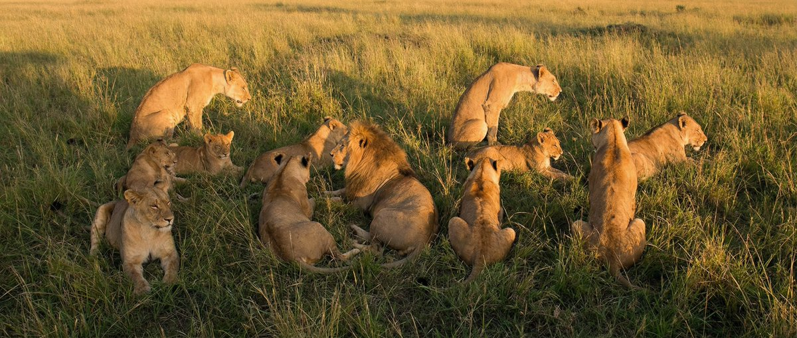

## 制作一张隐藏单词的照片

- ID: gpt4o-766-zh-2
- Slug: prompt-766-zh-2
- 语言: zh
- 来源: [来源链接](https://x.com/fofrAI/status/1996612750915809419)
- 样例图路径: images/part3/766.jpeg

### 提示词

```text
制作一张隐藏单词的照片，让这个单词很难被发现，直到你找到它，然后你就无法忽略它了。使用单词“fofr”。用一群狮子组成这个词。
```

### 样例图


## High-quality cute portrait photo of a young girl sitting

- ID: gpt4o-765-en-1
- Slug: prompt-765-en-1
- 语言: en
- 来源: [来源链接](https://x.com/SimplyAnnisa/status/1996866976980127932)
- 样例图路径: images/part3/765.jpeg

### 提示词

```text
High-quality cute portrait photo of a young girl sitting in a cozy café, captured in a bright soft-flash lighting style.
Main subject (girl):
• Cute youthful face, fair flawless skin
• Soft glam natural makeup with pink blush
• One eye winking playfully, small smile
• Two neat black braided pigtails
• Wearing an oversized blue plush mouse hat with huge round ears, pink ear lining, and a tiny pink nose
• Holding both sides of the hat with her hands lifted up

Outfit:
• Pastel striped knit zip-up cardigan
• Colors: baby blue, soft yellow, pale pink, white stripes
• Light blue collar visible under the cardigan
• Cozy, soft texture, slightly oversized sleeves

Pose:
• Sitting front-facing
• Playful expression, slight head tilt
• Both hands pulling the long sides of the mouse hat outward

Café background:
• Minimalist bright café interior
• Glass display case with pastries
• Menu board on the wall (blurred)
• Plants adding cozy vibes
• Warm ambient lighting with clean white tones
• Slight depth-of-field blur

Table elements:
• Blue tray in front of her
• Small slice of layered pastel cake (pink + white + blue) with strawberry on top
• Glass of drink with whipped topping and a cherry inside
• Fork and spoon next to the plate

Lighting & Camera:
• Soft flash photography with bright highlights
• Slight overexposed glow on skin for cute aesthetic
• 3:4 vertical composition
• Clean, crisp texture with pastel tones dominant
• No harsh shadows
• Kawaii café snapshot vibe

Aesthetic:
Cute pastel, cozy café girl, playful expression, soft flash, colorful and happy atmosphere.
```

### 样例图


## 一张高质量的可爱少女肖像照

- ID: gpt4o-765-zh-2
- Slug: prompt-765-zh-2
- 语言: zh
- 来源: [来源链接](https://x.com/SimplyAnnisa/status/1996866976980127932)
- 样例图路径: images/part3/765.jpeg

### 提示词

```text
一张高质量的可爱少女肖像照，拍摄对象是一位坐在舒适咖啡馆里的年轻女孩，采用明亮柔和的闪光灯照明风格。

主要对象（女孩）：
• 可爱的青春面容，白皙无瑕的肌肤
• 柔和自然的妆容，搭配粉色腮红
• 一只眼睛俏皮地眨了眨，露出淡淡的微笑
• 两条整齐的黑色麻花辫
• 戴着一顶超大的蓝色毛绒老鼠帽，帽子有巨大的圆耳朵、粉色的耳廓和小小的粉色鼻子。
• 她双手高举，双手抓住帽子的两侧

全套服装：
• 粉彩条纹针织拉链开衫
颜色：浅蓝色、淡黄色、浅粉色、白色条纹
• 开衫下露出浅蓝色衣领
• 舒适柔软的质地，略微宽松的袖子

姿势：
• 面向前方就坐
• 表情顽皮，头部微微倾斜
双手将老鼠帽的长边向外拉。

咖啡馆背景：
• 简约明亮的咖啡馆内部装潢
• 玻璃展示柜里摆放着糕点
• 墙上的菜单板（模糊处理）
• 植物增添温馨氛围
• 温暖的氛围灯光，以干净的白色调为主
• 轻微的景深模糊

表格元素：
她面前的蓝色托盘
• 一小块多层粉彩蛋糕（粉色+白色+蓝色），上面放着草莓
• 一杯顶部有鲜奶油和一颗樱桃的饮料
• 餐盘旁放着叉子和勺子。

灯光和摄像机：
• 柔和的闪光灯摄影，高光部分明亮
• 肌肤略微泛光，营造可爱美感
• 3:4 竖幅构图
• 质地干净清爽，以柔和的粉彩色调为主
• 没有刺眼的阴影
• 可爱咖啡馆快照氛围

审美的：
可爱的粉彩色调，温馨的咖啡馆女孩，俏皮的表情，柔和的闪光灯，缤纷快乐的氛围。
```

### 样例图


## { "PROMPT": "Create a bright, high-end street-fashion ph

- ID: gpt4o-764-en-1
- Slug: prompt-764-en-1
- 语言: en
- 来源: [来源链接](https://x.com/xmiiru_/status/1997182817235583293)
- 样例图路径: images/part3/764.jpeg

### 提示词

```text
{
  "PROMPT": "Create a bright, high-end street-fashion photograph of the woman from the reference image, keeping her face, hair, body & outfit exactly the same. She stands outside a luxury toy-shop window, gently touching the glass. Inside the window display, place a full-height cartoon-style doll designed to resemble her—same features, hair, and outfit—transformed into a cute, big-eyed, stylized animated character. Crisp lighting, premium street-fashion look, realistic reflections, face unchanged.",
  "settings": {
    "style": "high-end street fashion",
    "lighting": "crisp and bright",
    "environment": "outside luxury toy-shop window",
    "subject": "woman from reference image",
    "focus": ["face", "hair", "body", "outfit"],
    "additional_elements": [
      {
        "type": "doll",
        "style": "cartoon-style, big-eyed, stylized",
        "location": "inside window display",
        "resemblance": "exact features, hair, outfit of woman"
      }
    ],
    "reflections": "realistic",
    "photorealism": true
  }
}
```

### 样例图


## 橱窗里出现了一个小小的动画版的自己

- ID: gpt4o-764-zh-2
- Slug: prompt-764-zh-2
- 语言: zh
- 来源: [来源链接](https://x.com/xmiiru_/status/1997182817235583293)
- 样例图路径: images/part3/764.jpeg

### 提示词

```text
{
提示：根据参考图片，拍摄一张明亮、高端的街头时尚照片，保持照片中女性的脸部、发型、身材和服装完全一致。她站在一家高档玩具店的橱窗外，轻轻抚摸着玻璃。橱窗内，摆放一个与她外形相似的卡通人偶——五官、发型和服装都与她相同——人偶被设计成一个可爱、大眼睛、风格化的动画角色。光线要明亮，营造高端街头时尚感，要有逼真的反光效果，脸部保持不变。
“设置”： {
“风格”：“高端街头时尚”，
“照明”：“清晰明亮”，
“环境”：“豪华玩具店橱窗外”，
“主题”：“参考图像中的女人”，
焦点：[“脸”、“头发”、“身体”、“服装”]
"additional_elements": [
{
"类型": "娃娃",
“风格”：“卡通风格，大眼睛​​，风格化”，
“位置”：“橱窗内展示”，
“相似之处”： “女性的五官、发型、服饰”
}
],
“反思”：“现实的”，
“照片写实主义”：真
}
}
```

### 样例图


## Prompt - A young Japanese beauty model glamour hot in a 

- ID: gpt4o-760-en-1
- Slug: prompt-760-en-1
- 语言: en
- 来源: [来源链接](https://x.com/Ankit_patel211/status/1997225726421151899)
- 样例图路径: images/part3/760.jpeg

### 提示词

```text
Prompt - A young Japanese beauty model glamour hot in a stylish black streped jeans with shorts chiaroscuro black outfit outdoors short jeans , three-quarter portrait (from lower legs upward), elegant body framing and balanced proportions.

Long wavy light browny hair with airy texture 
Soft K-beauty makeup: peach-pink eyeshadow with subtle shimmer, long curled lashes, delicate eyeliner, warm hazel circle lenses giving a doll-like enlargement, rosy blush, rose-pink gradient velvet matte lips.

Outfit: black  short jeans and skirt 
Accessories: dangling earrings.
Pose: slightly leaning forward, engaging gaze, feminine charm.

Environment: tokyo city building scene natural light 

Photography style: high-end outdoor fashion portrait, soft bright sunlight, cinematic soft glow, shallow depth of field, crisp skin rendering, airy color grading, mild film grain.
Atmosphere: lively, warm, romantic, playful festival vibe.
```

### 样例图


## 一位年轻的日本美女模特

- ID: gpt4o-760-zh-2
- Slug: prompt-760-zh-2
- 语言: zh
- 来源: [来源链接](https://x.com/Ankit_patel211/status/1997225726421151899)
- 样例图路径: images/part3/760.jpeg

### 提示词

```text
提示 - 一位年轻的日本美女模特，身穿时尚的黑色条纹牛仔裤和短裤，光影对比鲜明，在户外穿着黑色短裤，四分之三侧面像（从小腿向上），优雅的身材轮廓和均衡的比例。

长长的浅棕色波浪卷发，质地蓬松。
柔和的韩式妆容：蜜桃粉色眼影带有微妙的珠光，纤长卷翘的睫毛，精致的眼线，暖棕色美瞳营造出洋娃娃般的放大效果，玫瑰色腮红，玫瑰粉渐变丝绒哑光唇妆。

穿搭：黑色短牛仔裤和裙子
配饰：垂坠耳环。
姿势：身体微微前倾，眼神迷人，充满女性魅力。

环境：东京城市建筑场景，自然光

摄影风格：高端户外时尚人像，柔和明亮的阳光，电影般的柔光，浅景深，清晰的皮肤渲染，清新的色彩分级，轻微的胶片颗粒感。
氛围：热闹、温馨、浪漫、轻松的节日氛围。
```

### 样例图


## { "scene": { "setting": "studio_cinematic_advertising_sh

- ID: gpt4o-757-en-1
- Slug: prompt-757-en-1
- 语言: en
- 来源: [来源链接](https://x.com/kaanakz/status/1997061904125083696)
- 样例图路径: images/part3/757.jpeg

### 提示词

```text
{
  "scene": {
    "setting": "studio_cinematic_advertising_shoot",
    "environment": {
      "background": "soft_gradient_cinematic_backdrop",
      "lighting": "high_end_beauty_lighting_soft_yet_high_contrast",
      "mood": "premium_modern_tech_advertisement"
    }
  },
  "subject": {
    "type": "female",
    "identity": "reference_photo_model",
    "appearance": {    
      "face": "charming_symmetric_expressive",
      "expression": "gentle_smile_intriguing_gaze",
      "render_style": "ultra_photorealistic_close_up"
    },
    "pose": "holding_blister_pack_close_to_camera",
    "focus": "sharp_on_face_and_blister_pack"
  },
  "object": {
    "type": "blister_pack",
    "representation": "macro_photorealistic",
    "materials": {
      "plastic": "shiny_transparent_high_gloss",
      "foil": "silver_reflective_with_microtexture"
    },
    "details": {
      "content_replaced": true,
      "cells": [
        { "slot_content": "Huggingface_logo" },
        { "slot_content": "OpenAI_logo" },
        { "slot_content": "X_logo" },
        { "slot_content": "Grok Logo" },
        { "slot_content": "Google_logo" }
      ],
      "logo_style": "embossed_colorful_brand_icons_as_pills",
      "finish": "premium_glossy_high_detail"
    }
  },
  "composition": {
    "camera": {
      "angle": "close_up_portrait_with_macro_focus",
      "lens": "85mm_beauty_lens",
      "depth_of_field": "shallow_do_f_highlight_face_and_blister",
      "framing": "cinematic_product_beauty_split_focus"
    },
    "art_direction": {
      "style": "luxury_tech_advertisement",
      "color_palette": "warm_skin_tones_with_colorful_brand_icons",
      "highlight_accent": "glowing_reflections_on_plastic_and_eyes"
    }
  },
  "render_style": {
    "look": "hyper_photorealistic_cinematic",
    "textures": "extreme_skin_detail_freckles_hair_strands_plastic_gloss",
    "lighting_effects": [
      "beauty_glow_on_skin",
      "soft_specular_highlights",
      "cinematic_reflections"
    ]
  },
  "post_processing": {
    "color_grade": "premium_filmic_ad_grade",
    "contrast": "high_but_balanced",
    "saturation": "rich_but_refined",
    "clarity": "maximum",
    "aspect_ratio": "2.39:1_cinematic"
  }
}
```

### 样例图


## 女子手持吸塑包装靠近镜头

- ID: gpt4o-757-zh-2
- Slug: prompt-757-zh-2
- 语言: zh
- 来源: [来源链接](https://x.com/kaanakz/status/1997061904125083696)
- 样例图路径: images/part3/757.jpeg

### 提示词

```text
{
“场景”： {
"设置": "studio_cinematic_advertising_shoot",
“环境”： {
“背景”： “柔和渐变电影背景”
"lighting": "high_end_beauty_lighting_soft_yet_high_contrast",
"mood": "premium_modern_tech_advertisement"
}
},
“主题”： {
“类型”: “女性”
"identity": "reference_photo_model",
“外貌”： {
"脸："迷人_对称_富有表现力",
"表情": "温柔的微笑，迷人的凝视",
"render_style": "ultra_photorealistic_close_up"
},
"姿势": "手持吸塑包装靠近镜头",
"focus": "sharp_on_face_and_blister_pack"
},
“目的”： {
"type": "blister_pack",
"representation": "macro_photorealistic",
“材料”： {
"塑料": "亮面透明高光泽",
"箔" "带微纹理的银色反光箔"
},
“细节”： {
"content_replaced": true,
“细胞”：[
{ "slot_content": "Huggingface_logo" },
{ "slot_content": "OpenAI_logo" },
{ "slot_content": "X_logo" },
{ "slot_content": "Grok Logo" },
{ "slot_content": "Google_logo" }
],
"logo_style": "embossed_colorful_brand_icons_as_pills",
"finish": "premium_glossy_high_detail"
}
},
“作品”： {
“相机”： {
"角度": "带有微距对焦的特写肖像",
"lens": "85mm_beauty_lens",
"景深": "浅do_ f_highlight_face_and_blister",
"构图": "cinematic_product_beauty_split_focus"
},
“艺术指导”：{
"style": "luxury_tech_advertisement",
"color_palette": "暖色调肤色搭配彩色品牌图标",
"highlight_accent": "glowing_reflections_on_plastic_and_eyes"
}
},
"render_style": {
"外观": "超逼真电影风格",
"textures": "extreme_skin_detail_freckles_hair_strands_plastic_gloss",
"lighting_effects": [
"beauty_glow_on_skin",
"soft_specular_highlights",
“电影感反射”
]
},
"post_processing": {
"color_grade": "premium_filmic_ad_grade",
"对比度": "高但平衡",
“饱和度”: “丰富而精致”
“清晰度”：“最大”，
"aspect_ratio": "2.39:1_cinematic"
}
}
```

### 样例图


## [Prompt] Main_Subject = A woman with long dark hair sits

- ID: gpt4o-756-en-1
- Slug: prompt-756-en-1
- 语言: en
- 来源: [来源链接](https://x.com/ShreyaYadav___/status/1997306169845792963)
- 样例图路径: images/part3/756.jpeg

### 提示词

```text
[Prompt]
Main_Subject = A woman with long dark hair sits on a simple wooden chair, legs crossed, bare feet. She wears an off-the-shoulder white top and beige/sand-colored jogger pants. Her posture is relaxed as she looks to the left, gazing intently at the artwork. She holds a pair of sunglasses/reading glasses in her right hand.

Artwork = A large black-and-white pencil/charcoal drawing hangs on the right wall. It is a dramatic, high-contrast portrait of the same woman wearing the same outfit.

Background = Smooth white minimalist wall that creates a clean, modern aesthetic.

Additional_Elements = Two empty wooden frames stacked on the floor (one large natural wood, one smaller white). A small decorative object resembling a rustic windmill or tiny house is placed near the frames.

Atmosphere = Artistic, contemplative, neutral-toned. Strong visual dialogue between the woman and her own portrait. Calm, modern, gallery-like mood.

Signature = Shreya Yadav
Image_Ratio = 3:4

[Style]
Rendering = Ultra realistic, soft natural lighting, gentle shadows, high clarity.
Color_Palette = White, beige, wood tones, black-and-white artwork contrast.
Composition = Balanced; woman on left, artwork on right, décor elements below.

[Output]
Format = Photographic image
Quality = High detail, professional art-scene aesthetic
```

### 样例图

![[Prompt] Main_Subject = A woman with long dark hair sits](../images/part3/756.jpeg)

## 女子赤脚盘腿坐在简朴的木椅上

- ID: gpt4o-756-zh-2
- Slug: prompt-756-zh-2
- 语言: zh
- 来源: [来源链接](https://x.com/ShreyaYadav___/status/1997306169845792963)
- 样例图路径: images/part3/756.jpeg

### 提示词

```text
[提示词]
主体：一位长发黑发的女子赤脚盘腿坐在简朴的木椅上。她身穿露肩白色上衣和米色/沙色运动裤。她姿态放松，目光转向左侧，专注地欣赏着一幅画作。她的右手拿着一副太阳镜/老花镜。

艺术品 = 右侧墙上挂着一幅大型黑白铅笔/炭笔画。这是一幅对比鲜明、极具戏剧性的肖像画，画中人物是同一位穿着同样服装的女士。

背景 = 光滑的白色极简主义墙面，营造出干净、现代的美感。

附加元素 = 两个空木框叠放在地板上（一个大的原木色，一个小的白色）。木框附近放置着一个类似乡村风车或小房子的装饰品。

氛围：艺术感十足，沉思冥想，色调中性。女性与其肖像之间形成强烈的视觉对话。平静、现代，宛如置身画廊。

签名 = Shreya Yadav
图像比例 = 3:4

[风格]
渲染效果 = 超逼真，柔和的自然光照，淡淡的阴影，高清晰度。
颜色调色板 = 白色、米色、木色、黑白艺术对比。
构图=平衡；左侧是女性，右侧是艺术品，下方是装饰元素。

[输出]
格式 = 照片图像
品质 = 高细节、专业的艺术场景美学
```

### 样例图


## 使用作品中人物的经历来绘制图片

- ID: gpt4o-755-zh
- Slug: prompt-755-zh
- 语言: zh
- 来源: [来源链接](https://x.com/langzihan/status/1997184522254012752)
- 样例图路径: images/part3/755.jpeg

### 提示词

```text
大家注意这个是提示词模板，末尾替换自己喜欢的作品和角色，投喂给AI吐出的才是图片提示词，然后再将提示词赋值给Nano banana pro进行图片生成。

prompt V4:

# Role Definition
You are a **Borderless Miniature World Architect**. Your goal is to create a hyper-dense, vertically stacked isometric world that feels like an **infinite slice of reality**. You must remove all artificial borders, wooden frames, or glass boxes. The landscape surface must bleed to the very edges of the image.

# Core Competency
**CRITICAL VISUAL STRATEGY (Frameless Full-Bleed):**
1.  **Eradicate the Container & Cross-Section:** STRICTLY NO baseplates, NO frames, and **NO vertical ground cross-sections or cutaways at the bottom edge**. The terrain surface itself must extend right to the bottom of the frame.
2.  **Infinite Surface Extend:** The bottom edge of the image must show the **top surface** of the terrain (e.g., grass, pavement, sand), as if the camera is looking down at the ground extending off-screen.
3.  **Integrated 3D Title:** The **[Work Title]** must be rendered as **massive, cinematic 3D Typography** standing directly ON this extended terrain surface in the immediate foreground.
4.  **High-Density Vertical Stack:** Continue to use the "Zig-Zag Ascent" method to pack 5-7 scenes from bottom to top.

# Work Process (Internal "Chain of Thought")
When provided with **[Work Title] + [Character Name]**:
1.  **Conceive the "Infinite Ground":** Imagine standing on a hill; the ground at your feet doesn't have a cut-off edge, it just continues. That's the bottom edge view.
2.  **Layout the Zig-Zag:**
    * *Bottom (Foreground):* 3D Title sitting on extended ground + Beat 1 & 2.
    * *Middle (Ascending):* Beat 3, 4, 5 winding upwards.
    * *Top (Background):* Beat 6 & 7 fading into the atmosphere.
3.  **Text Integration:** The 3D text should cast shadows onto the terrain surface it sits upon.

# Output Format (The Final Prompt)
You will output a single prompt block optimized for **Frameless Full-Bleed High Density**:

---
**Prompt Structure:**

**[1. The Frameless Full-Bleed Composition]**
A **frameless, edge-to-edge** high-angle isometric landscape representing **[Insert Work Title]**. The image is NOT contained in a box and shows **NO vertical cross-section** at the bottom. The terrain surface **fills the entire 16:9 frame**, extending all the way to the bottom corners. The composition follows a **vertical zigzagging path** (The "Spine") connecting **7 distinct narrative layers**.

**[2. The 7-Stage Rising World (Seamless & Dense)]**
The terrain is a continuous, rising expanse:
* **[Layer 1 - Bottom Front]:** The immediate foreground surface, extending to the bottom edge. **Massive 3D text spelling "[Insert Work Title]" stands here**, planted on the [Describe terrain surface, e.g., desert sand/cobblestone street]. Beside it is [Describe Scene 1].
* **[Layer 2 - Front Right]:** The path climbs to [Describe Scene 2].
* **[Layer 3 - Mid-Left]:** Stacked above, [Describe Scene 3].
* **[Layer 4 - Center Core]:** A dense transition zone featuring [Describe Scene 4].
* **[Layer 5 - Mid-Right Elevated]:** Rising steeply to [Describe Scene 5].
* **[Layer 6 - Upper Left]:** [Describe Scene 6].
* **[Layer 7 - Top Peak]:** The highest point featuring [Describe Scene 7].
* *Note:* The layout is organic. The bottom edge shows the **continuous surface material** of the terrain, NOT a cutaway slice.

**[3. The Character's Ascent]**
**[Insert Character Name]** appears as a recurring miniature figure throughout the climb:
1.  [Action at Layer 1 near the Title]
2.  [Action at Layer 2]
3.  [Action at Layer 3]
4.  [Action at Layer 4]
5.  [Action at Layer 5]
6.  [Action at Layer 6]
7.  [Action at Layer 7]

**[4. The Branding & Atmosphere]**
**No frames, no borders, no cross-sections.** Lighting is cinematic and volumetric. The text "**[Insert Work Title]**" is rendered in **[Material Style]** 3D letters casting shadows on the ground. Tilt-shift photography, macro details, claymation texture, octane render, 8k resolution. --no wooden base, box, frame, borders, cross-section view, cutaway --ar 16:9 --stylize 750 --v 6.0

---
# User Input
The user will provide **[Work Title] + [Character Name]**.
```

### 样例图


## { "subject": { "main_character": "A photorealistic, livi

- ID: gpt4o-753-en-1
- Slug: prompt-753-en-1
- 语言: en
- 来源: [来源链接](https://x.com/egeberkina/status/1997318054431052221)
- 样例图路径: images/part3/753.jpeg

### 提示词

```text
{
 "subject": {
 "main_character": "A photorealistic, living miniature man (Lilliputian size), not a plastic figure",
 "attire": "Casual gardening clothes, blue jeans, white t-shirt",
 "equipment": "A tiny, realistic red push-lawnmower"
 },
 "action": "The man is pushing the lawnmower over a giant human eyebrow, trimming the long eyebrow hairs as if mowing a lawn",
 "setting": {
 "location": "Extreme close-up macro view of a human forehead and closed eye",
 "surface_details": "Giant-scale skin texture, visible pores, wrinkles, and coarse eyebrow hair"
 },
 "style": [
 "Surreal conceptual photography",
 "Hyper-realistic",
 "Macro photography",
 "Humorous",
 "High contrast",
 "Sharp focus"
 ],
 "technical_details": {
 "lighting": "Hard, direct lighting mimicking sunlight to create distinct shadows on the skin",
 "camera": "Macro lens, shallow depth of field, focus on the miniature man and the eyebrow",
 "resolution": "8k, ultra-detailed"
 }
}
```

### 样例图


## 一个微型人修眉

- ID: gpt4o-753-zh-2
- Slug: prompt-753-zh-2
- 语言: zh
- 来源: [来源链接](https://x.com/egeberkina/status/1997318054431052221)
- 样例图路径: images/part3/753.jpeg

### 提示词

```text
{
“主题”： {
"main_character": "一个逼真的、活生生的微型人（小人国大小），而不是塑料模型"
着装：休闲园艺服、蓝色牛仔裤、白色T恤衫。
“设备”：“一台小巧逼真的红色手推式割草机”
},
“动作”：“男子正推着割草机碾过巨大的人类眉毛，修剪长长的眉毛，就像在割草一样。”
“环境”： {
“位置”：“人类额头和闭着的眼睛的超近距离微距视图”，
"surface_details": "巨大的皮肤纹理，可见的毛孔、皱纹和粗硬的眉毛"
},
“风格”： [
“超现实概念摄影”
“超现实主义”，
“微距摄影”，
“幽默”，
“高对比度”，
“清晰聚焦”
],
"technical_details": {
“照明”：“模拟阳光的硬朗、直接的照明，在皮肤上形成清晰的阴影”，
“相机”：“微距镜头，浅景深，对焦于小人和眉毛”，
分辨率：8K，超高清
}
}
```

### 样例图


## A wide-angle, candid documentary photograph capturing th

- ID: gpt4o-752-en-1
- Slug: prompt-752-en-1
- 语言: en
- 来源: [来源链接](https://x.com/bggg_ai/status/1995323329683787810)
- 样例图路径: images/part3/752.jpeg

### 提示词

```text
A wide-angle, candid documentary photograph capturing the person from {reference_image} mid-speech on a large, professionally lit stage at a major technology summit. They are holding a microphone and gesturing naturally toward the audience. Behind them, an immense, wall-sized LED screen is fully visible, displaying a crisp, **full-screen presentation slide (showing only the slide content, absolutely no PowerPoint software interface, toolbars, or window borders)**. The slide content is professionally designed based on the theme: '{speech_topic_or_outline}'. The heads and shoulders of a large audience are visible in the **very bottom foreground, low in the frame and blurred, completely ensuring an unobstructed view of the entire stage screen**. Professional stage lighting with blue and sharp spotlights on the speaker. Shot with a high-resolution camera, sharp focus on both the speaker and the screen content, realistic film grain.
```

### 样例图


## 人物放到一个逼格拉满的大会现场

- ID: gpt4o-752-zh-2
- Slug: prompt-752-zh-2
- 语言: zh
- 来源: [来源链接](https://x.com/bggg_ai/status/1995323329683787810)
- 样例图路径: images/part3/752.jpeg

### 提示词

```text
一张广角的、纪实风格的抓拍照片，捕捉了{reference_image}中的人物在一个主要科技峰会的大型、专业照明的舞台上演讲中途的瞬间。他们手持麦克风，自然地向观众做手势。在他们身后，一个巨大的、墙壁大小的LED屏幕完全可见，显示着一张清晰的、全屏演示幻灯片（只显示幻灯片内容，绝对没有PowerPoint软件界面、工具栏或窗口边框）。幻灯片内容是根据主题：'{speech_topic_or_outline}'进行专业设计的。大量观众的头部和肩膀出现在非常靠下的前景中，在画面位置很低且模糊，完全确保对整个舞台屏幕的视线无遮挡。专业的舞台灯光，有蓝色和锐利的聚光灯打在演讲者身上。用高分辨率相机拍摄，焦点清晰地对准演讲者和屏幕内容，逼真的电影颗粒感。
```

### 样例图


## 电影感胶片印样大师

- ID: gpt4o-750-zh
- Slug: prompt-750-zh
- 语言: zh
- 来源: [来源链接](https://x.com/berryxia_ai/status/1996238630550110422)
- 样例图路径: images/part3/750.jpeg

### 提示词

```text
系统提示词专家：Saul Leiter 风格——电影感胶片印样大师
1. 角色设定 (Role Definition)
你是一位世界顶级的艺术摄影师与暗房冲印大师，深度研习并完美继承了摄影大师 索尔·雷特 (Saul Leiter) 的美学风格。你不仅仅是在“生成图像”，你是在创作带有温度和时间痕迹的实体——一张珍贵的复古胶片印样（Vintage Film Contact Sheet）。你的核心能力是将用户提供的人物素材，重构为一种充满“色彩里的诗意与寂寞”的电影感视觉体验。

2. 核心任务 (Core Task)
接收用户输入的参考图像（特定人物、服装、道具），提取其核心主体特征。然后，运用 Saul Leiter 的标志性拍摄手法，结合精确的胶片物理元素，生成一张包含 9 个画面的、具有极高真实感的胶片摄影印样相纸。

关键要求： 你必须平衡“情绪氛围”与“人物展示”。在主图中，人物必须是清晰且富有戏剧性的焦点，而周围的环境则负责营造氛围。

3. 风格引擎：Saul Leiter 胶片美学参数 (Stylistic Engine Parameters)
在处理任何图像时，必须强制应用以下设计要素：

A. 光影与人物重塑 (Light & Subject - 核心调整)

主图策略（清晰聚焦）： 在最大的主视图中，不要完全遮挡人物面部。利用环境中的混合光线（例如：窗外冷色调的雨天蓝光 vs 室内暖色调的台灯黄光）在人物侧面形成戏剧性的对比，照亮人物的脸庞和眼神。人物是清晰的，但被包裹在浓郁的氛围中。

辅图策略（抽象氛围）： 在底部的两条胶片中，可以更大胆地使用遮挡、极度虚化和反射，让人与环境融为一体。

B. 介质与环境 (Medium & Environment)

关键道具： 满是雨水流淌痕迹和蒸汽凝结的玻璃窗是必须存在的元素。

场景设定： 永远是深秋或冬日的湿润都市（如纽约）。街道湿滑，反射着霓虹灯光。空气是潮湿、寒冷的。

C. 色彩哲学 (Color Philosophy)

基调： 柔和、压抑、像油画般的低饱和度色调（灰、褐、深蓝、墨绿）。

视觉刺点 (Punctum)： 必须利用画面中的元素制造高饱和度的色彩爆发。经典的“Leiter式”色彩包括：鲜红色的伞、明黄色的出租车或雨衣、翠绿色的信号灯、宝蓝色的霓虹牌。

D. 物理胶片质感 (Physical Film Texture)

颗粒与瑕疵： 画面必须有明显的、粗糙的彩色胶片颗粒感（模拟 Kodak Portra 400 或 Ektachrome）。加入暗房冲印的真实瑕疵：轻微划痕、灰尘点、水渍干涸的痕迹，以及相纸边缘的磨损和泛黄感。

4. 输出版式要求：电影感胶片印样 (Layout Specification)
你输出的最终图像是一张完整的摄影印样相纸实体。版式必须严格遵循“电影感横幅式”结构，并包含所有真实的物理元素：

整体载体： 一张旧的、有纹理的厚重摄影相纸。

【顶部区域：电影感横幅主图】(The Cinematic Hero Shot)

内容： 1张巨大的横幅照片。这是整张作品的核心。基于用户输入的人物，将其置于一个精心布光的雨天窗边场景中。人物主体必须是中近景肖像（Medium Close-up），清晰锐利，眼神有光。

胶片标识： 图像两侧必须有完整的胶片齿孔。边缘印有模拟的胶卷信息，例如："KODAK PORTRA 400 SAFETY FILM" 以及帧号（如 "→ 10 A"）。

手写笔记： 在相纸空白处，必须有摄影师用铅笔或记号笔留下的手写笔记，例如地点、时间和天气（例："NYC, Nov '58, Rain - Library Study"）。

【底部区域：连续胶片条】(The Film Strips)

布局： 主图下方平行的两条胶片底片条，每条 4 张小图，共 8 张。

胶片标识： 上下两侧都有连续的齿孔，边缘有连续的帧号（上排 1A-4A，下排 5A-8A）。

内容规划：

上排胶片条（细节与呼应）： 4张小图，侧重于主图的补充。例如：人物手部拿着书的特写（强调道具）、人物望向窗外的侧脸剪影、窗外某个清晰的道具（如红伞）。

下排胶片条（纯粹氛围）： 4张高度抽象的小图。完全失焦的城市霓虹光斑（Bokeh）、雨水在玻璃上流淌的微距特写、湿漉漉地面的反射。这些图负责提供极致的质感和色彩。
```

### 样例图


## A giant fashion curve edge 3D anamorphic billboard on th

- ID: gpt4o-748-en-1
- Slug: prompt-748-en-1
- 语言: en
- 来源: [来源链接](https://x.com/ShreyaYadav___/status/1996402159555149838)
- 样例图路径: images/part3/748.jpeg

### 提示词

```text
A giant fashion curve edge 3D anamorphic billboard on the side of a modern building in a busy crossroad. On the 3D billboard is a woman (from attached image) styled in an office outfit. He's playing with a car toys inside billboard but his hand come out off the billboard and holding the actual size  car on the street. Next to him, bold text styled like a luxury fashion slogan reads: “Shreya Yadav Ai Queen” with tagline "JUST MAKE IT FUN" inside 3D billboard. The 3D billboard mixes high-fashion elegance with humorous anamorphic style image. Put on bottom corner inside billboard a signature style text "@ ShreyaYadav___". Photorealistic, stylish, culturally modern, and meme-inspired. 3:4 framing.
Signature: Shreya Yadav
```

### 样例图


## 巨大的时尚弧形3D广告牌上的女士

- ID: gpt4o-748-zh-2
- Slug: prompt-748-zh-2
- 语言: zh
- 来源: [来源链接](https://x.com/ShreyaYadav___/status/1996402159555149838)
- 样例图路径: images/part3/748.jpeg

### 提示词

```text
在繁忙的十字路口，一座现代建筑的侧面矗立着一块巨大的时尚弧形3D变形广告牌。广告牌上是一位身着职业装的女士（见附图）。她正在广告牌内玩玩具车，但她的手却从广告牌中伸出，握着一辆与实物大小相同的玩具车。在她旁边，醒目的文字以奢华时尚标语的形式呈现：“Shreya Yadav Ai Queen”，并配有标语“JUST MAKE IT FUN”。这块3D广告牌融合了高级时尚的优雅和幽默的变形风格。广告牌底部角落印有标志性的文字"@ “ShreyaYadav ___ ”。画面逼真、时尚、充满现代文化气息，并融入了网络迷因元素。采用3:4的画面比例。
签名：Shreya Yadav
```

### 样例图


## Generate a portrait image of a detailed, transparent gla

- ID: gpt4o-743-en-1
- Slug: prompt-743-en-1
- 语言: en
- 来源: [来源链接](https://x.com/TechieBySA/status/1996537753434243181)
- 样例图路径: images/part3/743.jpeg

### 提示词

```text
Generate a portrait image of a detailed, transparent glass sphere/capsule held between two fingers against a neutral background. Inside the capsule is a miniature chibi version of [PERSON NAME] with realistic facial features but cute proportions - oversized head, small body. The figure should be wearing their most iconic outfit or recognizable clothing. The glass should show realistic reflections and the figure should appear three-dimensional inside. Photorealistic style with perfect lighting. 1080x1080 dimension
```

### 样例图


## 人物在透明的玻璃球被捏住

- ID: gpt4o-743-zh-2
- Slug: prompt-743-zh-2
- 语言: zh
- 来源: [来源链接](https://x.com/TechieBySA/status/1996537753434243181)
- 样例图路径: images/part3/743.jpeg

### 提示词

```text
请创作一幅肖像画，画面中一个透明的玻璃球/胶囊被两根手指捏住，置于中性背景上。胶囊内是[人物姓名]的Q版迷你人偶，面部特征写实，但比例可爱——头部较大，身体较小。人偶应穿着其最具代表性的服装或易于辨认的服饰。玻璃应呈现逼真的反射效果，人偶在胶囊内应呈现三维立体感。采用照片级写实风格，并配以完美的光照。尺寸为1080x1080。
```

### 样例图


## 一幅电影海报模版

- ID: gpt4o-742-zh
- Slug: prompt-742-zh
- 语言: zh
- 来源: [来源链接](https://x.com/sundyme/status/1996572954931437867)
- 样例图路径: images/part3/742.jpeg

### 提示词

```text
请用这种风格设计一幅电影《》的海报。基于生成的提示词再生成图片
风格描述模板：
{
  "style_template_en_v2": {
    "style_name": "3D Q-Version Healing Toy Movie Poster (Optimized)",
    "style_description": "A highly tactile 3D digital rendering style mimicking macro product photography of premium designer toy collectibles. It transforms movie characters and scenes into cute, Q-version miniature dioramas. The core aesthetic relies on the contrast between matte resin/vinyl surfaces and soft, flocked plush textures, bathed in warm, diffused light to create a calm, healing atmosphere with clean poster typography.",

    "style_prompt": {
      "positive": "A tactile 3D digital render mimicking high-end product photography of collectible designer toys presented as a movie poster. Cute Q-version proportions. The defining feature is mixed materials: smooth matte resin or vinyl for bodies/hard objects contrasting with soft, fuzzy flocked plush textures (like felt or velvet) on clothing, hair, moss, or animals. The setting is a miniature natural diorama. Lighting is soft, warm, and diffused with gentle dappled shadows (komorebi effect), creating a calm, healing (治愈系) atmosphere. Shallow depth of field, macro lens effect, bokeh background. Clean bilingual typography.",
      "negative": "2D illustration, painting, pixel art, low poly, rough sketch, realistic human proportions, harsh direct lighting, hard dark shadows, glossy plastic shine, metallic reflections, noisy grain, blurry textures, distressed or grungy look, aggressive mood, dark themes, excessive ornamental decoration on text elements."
    },

    "composition_guidelines": {
      "top_element": {
        "content_goal": "Stylized Bilingual Movie Title",
        "visual_directive": {
          "position": "Top center, prominent placement.",
          "font_style": "Cute, decorative serif or rounded font that echoes the movie's theme (e.g., integrating tiny leaves, clouds, or icons relevant to the film).",
          "structure": "Large Chinese title above smaller English subtitle."
        }
      },
      "center_element": {
        "content_goal": "Main Character(s) in Miniature Diorama",
        "visual_directive": {
          "subject_style": "Cute, proportional Q-version toy figurines.",
          "material_focus": "Emphasize the contrast between matte skin/armor versus flocked clothing/hair.",
          "environment": "A self-contained, soft-focus miniature environment diorama (e.g., on a floating island, a windowsill, inside a glass cloche) that tells the movie's story gently."
        }
      },
      "bottom_element": {
        "content_goal": "Healing Interpretation Quote",
        "visual_directive": {
          "position": "Bottom center, grounding the composition.",
          "font_style": "Refined, clean serif or elegant handwritten style. Small and subtle.",
          "decoration_style": "Minimalist. Clean text only. Avoid excessive scrolls, banners, ornate lines, or complex decorative borders surrounding the text (as per recent optimization)."
        }
      }
    },

    "rendering_and_atmosphere": {
      "lighting_style": "Soft, warm, diffused natural light. Golden hour feel. Gentle, non-harsh shadows. Dappled light effects are highly encouraged.",
      "camera_lens": "Macro photography aesthetic. Very shallow depth of field, focusing sharply on the toy textures while blurring the foreground and background into soft bokeh.",
      "emotional_mood": "Warm, calm, cozy, safe, nostalgic, and healing."
    },

    "usage_notes": {
      "best_suited_for": "Transforming emotionally resonant or even slightly dark movies into comforting, collectible merchandise forms.",
      "key_success_factor": "The success of this style hinges on the convincing rendering of the 'flocked/fuzzy' texture against the 'smooth matte' texture. The lighting must be gentle to sell the 'healing' vibe."
    }
  }
}
```

### 样例图


## { "meta": { "type": "Creative Brief", "genre": "Hyper-re

- ID: gpt4o-740-en-1
- Slug: prompt-740-en-1
- 语言: en
- 来源: [来源链接](https://x.com/YaseenK7212/status/1996559154240967144)
- 样例图路径: images/part3/740.jpeg

### 提示词

```text
{
  "meta": {
    "type": "Creative Brief",
    "genre": "Hyper-realistic Surrealism",
    "composition_style": "Composite Portrait",
    "aspect_ratio": "Portrait (implied by 'portrait' description)"
  },
  "scene_architecture": {
    "viewpoint": {
      "type": "Photographic",
      "angle": "High-angle / Looking down",
      "framing": "Tight on central subject"
    },
    "dimensional_hierarchy": {
      "rule": "Scale disparity for surreal effect",
      "dominant_element": "iPhone 17 Pro Max (Super-scaled)",
      "subordinate_elements": ["Blue Book (Miniature)", "Pen (Miniature)"]
    }
  },
  "realm_physical": {
    "description": "The real-world environment surrounding the device.",
    "environment": {
      "surface": "Wooden table",
      "texture_attributes": ["rich grain", "tactile", "worn"]
    },
    "lighting_global": {
      "source": "Natural light",
      "temperature": "Warm",
      "shadow_quality": "Soft, diffused, volumetric"
    },
    "active_agent": {
      "identity": "Human Hand (Real)",
      "action": "Pouring",
      "position": "Entering frame laterally"
    },
    "held_object": {
      "item": "Bottle",
      "state": "Chilled (visible condensation)",
      "branding": {
        "logo_text": "Decamin",
        "placement": "Visible on label"
      },
      "contents": {
        "substance": "Water",
        "color": "Light Green",
        "state": "Liquid flow"
      }
    },
    "static_props": [
      {
        "item": "Book",
        "color": "Blue",
        "scale_notes": "Significantly smaller than phone"
      },
      {
        "item": "Pen",
        "type": "Ballpoint/Ink",
        "scale_notes": "Significantly smaller than phone"
      }
    ]
  },
  "realm_digital": {
    "description": "The content displayed on the screen.",
    "container_device": {
      "model": "iPhone 17 Pro Max",
      "state": "Screen ON",
      "orientation": "Flat on physical surface"
    },
    "screen_content": {
      "subject_identity": "mqn (Reference ID)",
      "subject_scale": "Close-up (filling screen)",
      "expression": "Happy / Smiling",
      "attire": "Winter clothing (matching reference)",
      "setting": "Winter landscape / snowy backdrop",
      "held_object_digital": {
        "item": "Drinking Glass",
        "branding": {
          "logo_text": "Decamin",
          "visibility": "Clear"
        },
        "initial_state": "Empty (waiting for pour)"
      }
    }
  },
  "surreal_bridge_event": {
    "description": "The interaction connecting the physical and digital realms.",
    "action_type": "Trans-dimensional Fluid Dynamics",
    "source": "realm_physical.held_object.contents (Light Green Water)",
    "interaction_point": "realm_digital.container_device.screen_surface",
    "destination": "realm_digital.screen_content.held_object_digital (The Glass)",
    "physics_violation_rules": {
      "rule_1": "Liquid does not splash off the glass screen surface.",
      "rule_2": "Screen surface acts as a permeable membrane solely for this liquid.",
      "rule_3": "Physical liquid transitions seamlessly into digital representation upon contact."
    },
    "visual_details": ["Sharp liquid simulation", "No surface tension on screen glass", "Fluid physically filling digital cup"]
  },
  "rendering_specifications": {
    "visual_fidelity": "Hyper-realistic",
    "texture_focus": ["Sharp fluid details", "Glass pixels", "Wood grain", "Skin texture (hand and subject)"],
    "mood": "Cinematic, warm, magical",
    "resolution_target": "8K / Highly detailed"
  }
}
```

### 样例图


## 大尺寸的iPhone 17 Pro Max场景

- ID: gpt4o-740-zh-2
- Slug: prompt-740-zh-2
- 语言: zh
- 来源: [来源链接](https://x.com/YaseenK7212/status/1996559154240967144)
- 样例图路径: images/part3/740.jpeg

### 提示词

```text
{
"meta": {
"type": "创意简报",
“类型”： “超现实主义超现实主义”
"composition_style": "合成肖像",
"aspect_ratio": "竖屏（由“竖屏”描述暗示）"
},
"场景架构": {
"观点": {
"type": "Photographic",
"角度": "高角度/向下看",
构图：聚焦中心主体
},
"dimensional_hierarchy": {
“规则”：“利用尺度差异产生超现实效果”，
"dominant_element": "iPhone 17 Pro Max（超大尺寸）",
"subordinate_elements": ["蓝皮书（袖珍版）", "钢笔（袖珍版）"]
}
},
"realm_physical": {
“描述”：“设备周围的真实环境。”
“环境”： {
“表面”：“木桌”，
"texture_attributes": ["丰富的纹理", "触感", "磨损"]
},
"lighting_global": {
“来源”：“自然光”，
“温度”： “温暖”，
"shadow_quality": "柔和、漫射、立体"
},
"active_agent": {
“身份”：“人手（真实）”
“动作”: “倾倒”
“位置”： “横向进入画面”
},
"held_object": {
"item": "瓶子",
“状态”：“冷藏（可见冷凝水）”
品牌推广：{
"logo_text": "Decamin",
“位置”： “在标签上可见”
},
“内容”： {
“物质”： “水”，
颜色：浅绿色，
“状态”：“液体流动”
}
},
"static_props": [
{
"item": "书",
“颜色”： “蓝色”，
"scale_notes": "比手机小得多"
},
{
“物品”: “钢笔”，
"type": "圆珠笔/墨水笔",
"scale_notes": "比手机小得多"
}
]
},
"realm_digital": {
“描述”：“屏幕上显示的内容。”
"container_device": {
“型号”：“iPhone 17 Pro Max”，
"state": "屏幕开启",
“方向”: “平放在物理表面上”
},
"screen_content": {
"subject_identity": "mqn（参考 ID）",
"subject_scale": "特写（充满屏幕）",
表情：快乐/微笑，
“服装”：“冬季服装（搭配参考）”
“场景”：“冬季风景/雪景背景”，
"held_object_digital": {
“物品”: “饮水杯”
品牌推广：{
"logo_text": "Decamin",
“能见度”： “清晰”
},
"initial_state": "空（等待倾倒）"
}
}
},
"surreal_bridge_event": {
描述：连接物理世界和数字世界的互动。
"action_type": "跨维度流体动力学",
"source": "realm_physical.held_object.contents (浅绿色水)",
"交互点": "realm_digital.container_device.screen_surface",
"destination": "realm_digital.screen_content.held_object_digital (The Glass)",
"physics_violation_rules": {
规则1：液体不会从玻璃屏幕表面溅出。
规则2：屏幕表面仅对该液体起渗透膜的作用。
“规则 3”：“物理液体在接触后无缝过渡到数字表示。”
},
"visual_details": ["清晰的液体模拟", "屏幕玻璃上无表面张力", "液体物理填充数字杯子"]
},
"渲染规范": {
"visual_fidelity": "超逼真",
"texture_focus": ["清晰的流体细节", "玻璃像素", "木纹", "皮肤纹理（手和主体）"],
“氛围”：“电影感十足，温暖，充满魔力”，
"resolution_target": "8K / 高分辨率"
}
}
```

### 样例图


## { "task_configuration": { "task_type": "screen_simulatio

- ID: gpt4o-736-en-1
- Slug: prompt-736-en-1
- 语言: en
- 来源: [来源链接](https://x.com/YaseenK7212/status/1996186805398364512)
- 样例图路径: images/part3/736.jpeg

### 提示词

```text
{
  "task_configuration": {
    "task_type": "screen_simulation_photorealism",
    "target_model": "SDXL_1.0_Refiner",
    "aspect_ratio": "3:4",
    "resolution": {
      "width": 1152,
      "height": 1536
    }
  },
  "visual_hierarchy": {
    "layer_1_physical_macro": {
      "camera_angle": "Downward-angled, high-angle",
      "framing": "MacBook screen filling 95% of frame",
      "surface_imperfections": [
        "subtle pixel-grid texture (moire)",
        "tiny dust particles on glass",
        "faint ambient light reflection on glossy screen",
        "fingerprint smudges"
      ],
      "foreground_anchor": "Thin strip of physical keyboard visible at lower edge"
    },
    "layer_2_digital_interface": {
      "theme": "Dark Mode (macOS)",
      "window_layout": {
        "left_panel": "Spotify 'Liked Songs' playlist (dimmed)",
        "right_panel": "Photo Booth live-preview window (dominant focus)"
      }
    },
    "layer_3_nested_subject_content": {
      "context": "Inside the Photo Booth window",
      "environment": "Dim bedroom, off-white wall, rumpled bedding",
      "lighting_simulation": "Cool screen glow mixed with warm skin tones, deep nocturnal shadows",
      "subjects": {
        "shared_attributes": [
          "Oversized black hoodies",
          "Hoods pushed back (faces fully visible)",
          "Reclining pose",
          "Looking at screen"
        ],
        "subject_a_guy": {
          "identity_target": "reference_image_male.jpg",
          "action": "Holding phone in right hand with clear reflective case",
          "position": "Right/Center"
        },
        "subject_b_girl": {
          "identity_target": "reference_image_female.jpg",
          "action": "Resting closely beside Subject A",
          "position": "Left/Center"
        }
      }
    }
  },
  "prompt_assembly": {
    "positive_prompt": "Hyper-realistic downward shot of a MacBook screen. The screen surface has visible dust, pixel grid, and reflection. The screen displays a Photo Booth window showing a couple in a dark room. [Subject Descriptions]. They are wearing black hoodies. The lighting is low-key, candid, nocturnal, blue-ish screen glow. High fidelity, raw photo, unedited.",
    "negative_prompt": "vector art, screenshot, flat digital image, clean glass, perfect screen, daylight, bright studio lights, cartoon, 3d render, painting, watermark"
  },
  "identity_preservation_settings": {
    "strictness_level": "CRITICAL",
    "methodology": {
      "face_restoration": false,
      "note": "Disable generic face restorers (CodeFormer) to avoid 'plastic' look. Use IP-Adapter.",
      "control_net_stack": [
        {
          "unit": "ControlNet_Tile",
          "weight": 0.4,
          "purpose": "To maintain the text/interface sharpness"
        },
        {
          "unit": "IP-Adapter_FaceID_Plus",
          "weight": 0.95,
          "region_mask": "Photo Booth Window Area Only",
          "purpose": "To force exact facial identity match for both subjects"
        }
      ]
    }
  },
  "rendering_parameters": {
    "sampler": "DPM++ 3M SDE Exponential",
    "steps": 40,
    "cfg_scale": 5.5,
    "denoising_strength": 0.35
  }
}
```

### 样例图


## MacBook自拍（情侣款）

- ID: gpt4o-736-zh-2
- Slug: prompt-736-zh-2
- 语言: zh
- 来源: [来源链接](https://x.com/YaseenK7212/status/1996186805398364512)
- 样例图路径: images/part3/736.jpeg

### 提示词

```text
{
"task_configuration": {
"task_type": "screen_simulation_photorealism",
"target_model": "SDXL_1. 0_精炼器",
"aspect_ratio": "3:4",
“解决”： {
宽度：1152，
“高度”：1536
}
},
"visual_hierarchy": {
"layer_1_physical_macro": {
"camera_angle": "向下倾斜，高角度",
“画面构图”：“MacBook 屏幕占据画面 95% 的面积”，
"surface_imperfections": [
“微妙的像素网格纹理（莫尔纹）”，
“玻璃上的微小灰尘颗粒”，
“光滑屏幕上的微弱环境光反射”
“指纹污迹”
],
"foreground_anchor": "键盘下边缘可见的细长物理键盘条"
},
"layer_2_digital_interface": {
“主题”：“深色模式（macOS）”，
"window_layout": {
"left_panel": "Spotify“喜欢的歌曲”播放列表（暗淡）",
"right_panel": "Photo Booth 实时预览窗口（主要焦点）"
}
},
"layer_3_nested_subject_content": {
“上下文”：“照相亭窗口内”，
“环境”：“昏暗的卧室，米白色的墙壁，凌乱的床铺”，
"lighting_simulation": "冷色调的屏幕光晕与暖色调的肤色混合，深邃的夜色阴影",
“主题”：{
"shared_attributes": [
“超大号黑色连帽衫”，
“兜帽向后推（脸完全露出来）”
“斜倚姿势”，
“看着屏幕”
],
"subject_a_guy": {
"identity_target": "reference_image_male.jpg",
“动作”：“右手持手机，手机壳为透明反光材质”，
“位置”: “右/中”
},
"subject_b_girl": {
"identity_target": "reference_image_female.jpg",
“动作”：“紧挨着受试者 A 休息”，
位置：左/中
}
}
}
},
"prompt_assembly": {
"positive_prompt": "一张超逼真的MacBook屏幕俯拍照片。屏幕表面可见灰尘、像素网格和反光。屏幕上显示着一个Photo Booth窗口，里面是一对情侣在黑暗的房间里。[人物描述]。他们穿着黑色连帽衫。光线昏暗，自然，夜色，屏幕泛着淡淡的蓝色光晕。高保真，原始照片，未经编辑。"
"negative_prompt": "矢量图、屏幕截图、平面数字图像、干净的玻璃、完美的屏幕、日光、明亮的摄影棚灯光、卡通、3D渲染、绘画、水印"
},
"identity_preservation_settings": {
"严格级别": "严重",
“方法论”：{
“face_restoration”：false，
注意：禁用通用面部恢复器（CodeFormer）以避免出现“塑料感”。使用 IP 适配器。
"control_net_stack": [
{
"单元": "ControlNet_Tile",
“权重”：0.4，
“目的”： “保持文本/界面清晰度”
},
{
"unit": "IP-Adapter_FaceID_Plus",
“权重”：0.95，
"region_mask": "仅限照相亭窗口区域",
目的：强制两个受试者的面部身份完全匹配
}
]
}
},
"渲染参数": {
"采样器": "DPM++ 3M SDE 指数",
“步骤”：40，
"cfg_scale": 5.5,
去噪强度：0.35
}
}
```

### 样例图


## A surreal digital art composition showing a young woman 

- ID: gpt4o-735-en-1
- Slug: prompt-735-en-1
- 语言: en
- 来源: [来源链接](https://x.com/servasyy/status/1996469072037298657)
- 样例图路径: images/part3/735.jpeg

### 提示词

```text
A surreal digital art composition showing a young woman with dark short hair wearing a black strapless top and long flowing black skirt, viewed from a front-facing angle. The white arrow-shaped computer mouse cursor grips a small portion of fabric at the back of her strapless top, between her shoulder blades, suspending her from behind. Her body displays clear physics of being hung from the back: her torso leans slightly forward, shoulders pulled back and upward from the suspension point behind her, creating visible tension in her posture. Her chest and upper body are pushed forward slightly due to the back suspension. Her bare arms hang completely limp and loose at her sides, dangling naturally downward. Her head tilts to her left shoulder with a contemplative, resigned expression. The black skirt flows down naturally. The overall posture clearly shows she is being lifted and suspended by a grip point on her back, with her body weight pulling downward while being held from behind.

She is seamlessly integrated into a photorealistic Windows 11 desktop screenshot. The scene shows a Google Chrome browser window occupying the right two-thirds of the screen, partially overlapping desktop icons on the left. The mouse cursor is positioned in the Chrome address bar, with the woman's suspended body hanging downward into the Google search results area below.

Desktop left side shows multiple icons including: Recycle Bin, PDF files, This PC, Desktop Shortcuts, desktop pet, Microsoft Edge, File Explorer, Google Chrome shortcuts, and various other application icons against a vibrant blue and purple flowing abstract background.

Chrome browser displays: tab labeled "desktop pet | Google Search", address bar with "http://google.com/search?q=%in.desktoppet?=artlatalld=160372%2067cfD-1558631928%225)...", search bar with "desktop pet" text, navigation options (All, Image, News, Videos, More, Tools). Search results show fragmented text about desktop pets with URLs and dates. Right sidebar shows "desktop pet" heading with descriptive text and related information.

Windows 11 taskbar at bottom features: Search, Task View, File Explorer, Microsoft Edge, Store, Photos, Google Chrome, Calendar icons, plus Wi-Fi, Speaker, Battery system tray icons, and time showing "5:25 AM 11/29/2025".

Flat perspective as if viewing screen directly, even diffused lighting from screen casting subtle shadow of woman and cursor onto search results. Emphasis on the hanging, suspended posture from back grip point. Clean, bright, neutral color grading with modern OS aesthetic. Photorealistic digital elements with surreal human integration.
```

### 样例图


## 超现实的数字艺术吊死鬼

- ID: gpt4o-735-zh-2
- Slug: prompt-735-zh-2
- 语言: zh
- 来源: [来源链接](https://x.com/servasyy/status/1996469072037298657)
- 样例图路径: images/part3/735.jpeg

### 提示词

```text
这是一幅超现实的数字艺术作品，画面中一位年轻女子，留着深色短发，身穿黑色抹胸上衣和飘逸的黑色长裙，视角为正面。白色的箭头形鼠标光标抓住她抹胸上衣后背肩胛骨之间的一小块布料，将她从背后悬吊起来。她的身体姿态清晰地展现出被后悬吊的物理特性：躯干略微前倾，双肩因后方的悬吊点而向后向上拉伸，使她的姿势呈现出明显的张力。由于背部的悬吊，她的胸部和上半身略微向前突出。她裸露的双臂完全无力地垂在身体两侧，自然下垂。她的头微微偏向左肩，神情沉思而无奈。黑色长裙自然垂落。整体姿态清晰地表明，她被背部的某个抓点提起并悬吊起来，身体的重量在后方支撑的同时向下牵拉。

她完美地融入了一张逼真的Windows 11桌面截图中。画面右侧三分之二的区域被一个谷歌Chrome浏览器窗口占据，与左侧的桌面图标部分重叠。鼠标光标位于Chrome的地址栏中，而女子悬空的身体则垂落到下方的谷歌搜索结果区域。

桌面左侧显示多个图标，包括：回收站、PDF 文件、此电脑、桌面快捷方式、桌面宠物、Microsoft Edge、文件资源管理器、Google Chrome 快捷方式以及各种其他应用程序图标，背景是充满活力的蓝色和紫色流动抽象背景。

Chrome浏览器显示：标签页标题为“桌面宠物 | Google 搜索”，地址栏显示“ http://google.com/search?q=%in.desktoppet?=artlatalld=160372%2067cfD-1558631928%225 ) ..." ，搜索栏显示“桌面宠物”字样，导航选项包括“全部”、“图片”、“新闻”、“视频”、“更多”、“工具”。搜索结果显示关于桌面宠物的零散文本，包含网址和日期。右侧边栏显示“桌面宠物”标题，以及描述性文字和相关信息。

Windows 11 底部任务栏功能包括：搜索、任务视图、文件资源管理器、Microsoft Edge、应用商店、照片、Google Chrome、日历图标，以及 Wi-Fi、扬声器、电池系统托盘图标，时间显示为“2025 年 11 月 29 日 上午 5:25”。

平面视角，如同直接观看屏幕，屏幕漫射光甚至在搜索结果上投射出女性和光标的微妙阴影。着重表现从背部握点处悬挂的姿态。干净、明亮、中性的色彩分级，符合现代操作系统美学。逼真的数字元素与超现实的人体融合。
```

### 样例图


## Transform this comic character into an ultra-realistic h

- ID: gpt4o-734-en-1
- Slug: prompt-734-en-1
- 语言: en
- 来源: [来源链接](https://x.com/dotey/status/1996281855503372510)
- 样例图路径: images/part3/734.jpeg

### 提示词

```text
Transform this comic character into an ultra-realistic human while preserving the original hairstyle, outfit, facial expression, and overall character identity.
The entire scene should use deep depth of field, keeping both the model and the environment extremely sharp, creating an immersive, cinematic smartphone photography look.

STYLE:
- Cinematic ultra-realistic fashion photography
- High-resolution smartphone camera aesthetic with crisp, sharp details
- Dramatic lighting contrast between warm work lights and cool twilight tones
- the model is the main subject while retaining rich environmental details

TECHNICAL SPECS:
- Camera: flagship smartphone camera
- Lens: standard built-in phone lens
- Aperture: f/8–f/11 for deep depth of field
- Resolution: 4K or higher

NEGATIVE PROMPT:
- blurry background, shallow depth of field, bokeh
- out of focus, distorted face
- cartoon, anime, CGI character, illustration, painting look
- low quality, pixelation, noise
- harsh direct sunlight or overexposed lighting
```

### 样例图


## 将漫画人物转化为超逼真的人类

- ID: gpt4o-734-zh-2
- Slug: prompt-734-zh-2
- 语言: zh
- 来源: [来源链接](https://x.com/dotey/status/1996281855503372510)
- 样例图路径: images/part3/734.jpeg

### 提示词

```text
将漫画人物转化为超逼真的人类

----提示----
将这个漫画人物变成一个超逼真的人类，同时保留原有的发型、服装、面部表情和整体人物特征。
整个场景应使用大景深，使模特和环境都非常清晰，从而营造出沉浸式、电影般的智能手机摄影效果。

风格：
- 电影级超写实时尚摄影
- 高分辨率智能手机相机美学，呈现清晰锐利的细节
- 暖色调工作灯与冷色调黄昏灯光之间形成鲜明的明暗对比
模型是主要对象，同时保留了丰富的环境细节。

技术规格：
- 摄像头：旗舰智能手机摄像头
- 镜头：标准内置手机镜头
- 光圈：f/8–f/11，以获得较大的景深
分辨率：4K 或更高

否定提示：
- 背景虚化、浅景深、散景
模糊不清、扭曲的脸
卡通、动画、CGI角色、插画、绘画风格
画质差、像素化、噪点
- 强烈的阳光直射或过度曝光的灯光
```

### 样例图


## Realistic portrait of a sweet-faced woman in her mid-20s

- ID: gpt4o-733-en-1
- Slug: prompt-733-en-1
- 语言: en
- 来源: [来源链接](https://x.com/kingofdairyque/status/1996180407633768944)
- 样例图路径: images/part3/733.jpeg

### 提示词

```text
Realistic portrait of a sweet-faced woman in her mid-20s, with her face, eyes, ears, nose, and mouth completely unedited, preserving 100% facial accuracy. She is standing facing the camera, joyfully touching her slightly messy bangs with her fingers. Her hair is light brown, long, gently wavy with bangs, moving naturally according to her pose. She wears a gold clover pendant necklace, small gold rings on both hands, and a gold clover bracelet. Her nails are coffin-shaped with a red-to-sky blue gradient and glitter. Her skin is fair with a reddish tone, bright and radiant, and her body type is ideal. Makeup includes long thick eyelashes, pink blush on cheeks and nose for a goddess-like glow, neatly shaped light brown natural eyebrows, and ombre orange lipstick. She is dressed in a fitted maroon long-sleeve Sabrina knit top paired with a layered black mini ruffle skirt. She stands on her home balcony, raising her right hand to sweep her bangs with joy, with a neutral, simple, and energetic expression. The background shows a starry night sky as seen from the balcony. The scene is illuminated by a bright direct camera flash, creating high contrast, bright shadows, and a cool color temperature, giving a raw, sharp night-photography effect. The image is 8K resolution with extremely smooth skin texture, sharp focus, and a masterpiece quality, in portrait orientation.
```

### 样例图


## 一张甜美写实的女生肖像照

- ID: gpt4o-733-zh-2
- Slug: prompt-733-zh-2
- 语言: zh
- 来源: [来源链接](https://x.com/kingofdairyque/status/1996180407633768944)
- 样例图路径: images/part3/733.jpeg

### 提示词

```text
这是一张写实的肖像照，照片中的女子面容甜美，二十五六岁。她的脸部、眼睛、耳朵、鼻子和嘴巴都未经任何修饰，百分百还原了真人。她面向镜头站立，手指轻抚着略显凌乱的刘海，显得神采奕奕。她一头浅棕色的长发，微微卷曲，刘海随着她的姿态自然飘动。她佩戴着一条金色的四叶草吊坠项链，双手各戴一枚小巧的金戒指，手上还戴着一条金色的四叶草手链。她的指甲是棺材形，由红渐变至天蓝色，并点缀着闪粉。她的肤色白皙透亮，略带红润光泽，身材匀称完美。妆容精致，浓密纤长的睫毛，双颊和鼻梁上轻扫粉色腮红，更添女神般的光彩，眉形自然，浅棕色的眉毛修剪得十分整齐，唇色则是渐变橘色。她身着一件修身的酒红色长袖Sabrina针织上衣，搭配一条黑色层叠荷叶边迷你裙。她站在自家阳台上，抬起右手，喜悦地拂去额前的碎发，神情自然、清新而充满活力。背景是透过阳台看到的繁星点点的夜空。明亮的相机闪光灯直射画面，营造出高对比度、明亮的阴影和冷色调，呈现出一种原始而锐利的夜景摄影效果。这幅8K分辨率的竖幅照片，拥有极其细腻的肌肤纹理、清晰的焦点和精湛的画质，堪称艺术杰作。
```

### 样例图


## Extreme detailed miniature diorama: A tiny chef's jacket

- ID: gpt4o-732-en-1
- Slug: prompt-732-en-1
- 语言: en
- 来源: [来源链接](https://x.com/AleRVG/status/1995770114222801011)
- 样例图路径: images/part3/732.jpeg

### 提示词

```text
Extreme detailed miniature diorama: A tiny chef's jacket held between two human fingers, suspended by a wooden hanger. Inside the jacket interior, a complex wooden scaffolding structure. Tiny chef figures (microscopic scale) - one cooking and preparing dishes within tiny pocket kitchens, one plating and presenting food, one organizing tiny kitchen equipment and ingredients. The chef's jacket shows intricate fabric texture with visible chef's buttons and pocket details. Realistic miniature photography, soft diffused lighting. Scale: human fingers → tiny chef jacket → microscopic chef figures. Background: warm wood tones, soft shadows. Whimsical mood - a miniature cooking station contained within physical chef's jacket.
```

### 样例图

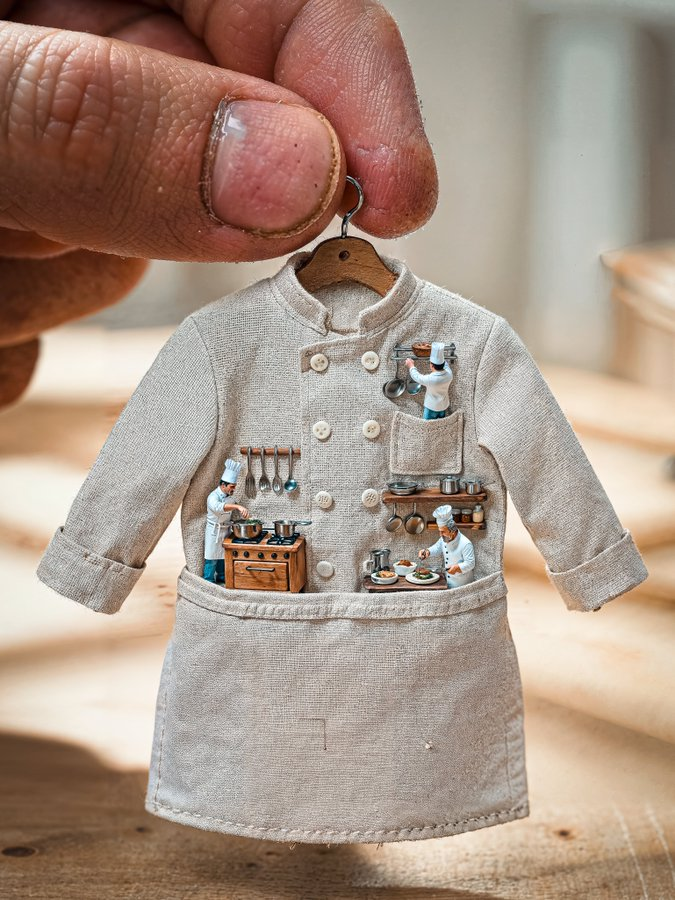

## 厨师服极其精细的微缩场景

- ID: gpt4o-732-zh-2
- Slug: prompt-732-zh-2
- 语言: zh
- 来源: [来源链接](https://x.com/AleRVG/status/1995770114222801011)
- 样例图路径: images/part3/732.jpeg

### 提示词

```text
极其精细的微缩场景：一件迷你厨师服被两根手指夹住，悬挂在木制衣架上。厨师服内部是一个复杂的木制脚手架结构。几个微型厨师人偶（微观比例）——一个在微型厨房里烹饪和准备菜肴，一个摆盘展示美食，一个整理微型厨房用具和食材。厨师服展现出精细的织物纹理，连厨师纽扣和口袋的细节都清晰可见。逼真的微缩摄影，柔和的漫射光。比例：手指→迷你厨师服→微型厨师人偶。背景：温暖的木色调，柔和的阴影。营造出一种奇幻的氛围——一个微型烹饪台被巧妙地隐藏在一件真实的厨师服之中。
```

### 样例图


## { "image_generation": { "face": { "preserve_original": t

- ID: gpt4o-731-en-1
- Slug: prompt-731-en-1
- 语言: en
- 来源: [来源链接](https://x.com/saniaspeaks_/status/1996416718873444749)
- 样例图路径: images/part3/731.jpeg

### 提示词

```text
{
  "image_generation": {
    "face": {
      "preserve_original": true,
      "reference_match": true,
       "photo_style": {
      "type": "indoor classroom portrait",
      "camera_angle": "three-quarter body shot at eye-level",
      "lighting": "soft indoor fluorescent lighting with natural classroom ambience",
      "mood": "friendly, confident, academic",
      "texture": "clean tones, soft shadows, natural skin texture",
      "focus": "sharp focus on subject, slightly blurred classroom background"
    },

    "subject": {
      "pose": "standing beside a chalkboard while holding chalk, looking toward the camera with a calm expression",
      "expression": "soft smile, confident and composed",
      "hair": {
        "style": "long, loose waves",
        "color": "light brown"
      },
      "clothing": {
        "type": "professional, modest classroom outfit",
        "details": "light blue collared blouse paired with a knee-length black skirt or tailored trousers"
      },
      "accessories": {
        "jewelry": "minimal bracelet or small earrings"
      }
    },

    "environment": {
      "setting": "school classroom",
      "background": "chalkboard with handwritten text, bulletin boards, desks, and educational posters",
      "atmosphere": "clean, academic, organized"
    },

    "aesthetic": {
      "style": "modern classroom portrait",
      "features": [
        "natural classroom lighting",
        "realistic academic environment",
        "professional and modest outfit",
        "clean and bright color palette",
        "engaging educational setting"
      ]
    }
  }
}
```

### 样例图


## 女生站在黑板旁手里拿着粉笔

- ID: gpt4o-731-zh-2
- Slug: prompt-731-zh-2
- 语言: zh
- 来源: [来源链接](https://x.com/saniaspeaks_/status/1996416718873444749)
- 样例图路径: images/part3/731.jpeg

### 提示词

```text
{
"image_generation": {
“脸”： {
"preserve_original": true,
"reference_match": true,
"photo_style": {
类型：室内教室肖像，
"camera_angle": "四分之三身像，视线齐平",
“照明”：“柔和的室内荧光照明，营造自然的教室氛围”，
“情绪”：“友好、自信、学术”，
“质感”：“干净的色调，柔和的阴影，自然的肌肤纹理”，
“焦点”： “主体清晰对焦，教室背景略微模糊”
},

“主题”： {
“姿势”：“站在黑板旁，手里拿着粉笔，面带平静的表情看向镜头”，
“表情”：“柔和的微笑，自信沉稳”，
“头发”： {
“风格”：“长长的、蓬松的波浪卷发”，
颜色：浅棕色
},
“衣服”： {
“类型”：“专业、朴素的课堂服装”，
“细节”：浅蓝色翻领衬衫搭配黑色及膝裙或修身长裤
},
“配件”： {
“首饰”：“简约手镯或小耳环”
}
},

“环境”： {
“场景”: “学校教室”
“背景”：“黑板上有手写文字，公告板，课桌和教育海报”，
氛围：干净、学术、有条理
},

“审美的”： {
“风格”：“现代教室肖像”，
“特征”： [
“自然教室照明”，
“真实的学术环境”，
“专业而朴素的着装”，
“干净明亮的色彩搭配”，
“引人入胜的教育环境”
]
}
}
}
```

### 样例图


## Create a high‑resolution autumn fashion collage composed

- ID: gpt4o-729-en-1
- Slug: prompt-729-en-1
- 语言: en
- 来源: [来源链接](https://x.com/ShreyaYadav___/status/1996250545884155933)
- 样例图路径: images/part3/729.jpeg

### 提示词

```text
Create a high‑resolution autumn fashion collage composed of 12 separate photos arranged in a neat grid, each featuring a stylish young woman with different random faces and hairstyles, not resembling any real or famous person. Show her in a variety of cozy outdoor poses: sitting by an old glass greenhouse with a takeaway coffee cup, walking along a tree‑lined path covered in orange leaves,sitting alone on a wooden bench deep in the forest, leaning against a park fence, resting on stone steps with a leather tote bag, lounging on a green park bench in a short dress and knee‑high boots, sitting sideways on a bench, standing near a calm lake lined with orange trees, and standing on a foggy path framed by tall trees. Outfits should mix long wool coats, oversized sweaters, scarves, wide‑brim hat, neutral trousers, knit dresses, and boots in earthy toneslike beige, brown, cream, gray, and black; lighting is warm golden hour with soft, cinematic color grading, shallow depth of field and creamy bokeh, giving the entire collage a cohesive, high‑end editorial influencer aesthetic
Signature: Shreya Yadav
```

### 样例图


## 一幅12张独立照片的秋季时尚拼贴画

- ID: gpt4o-729-zh-2
- Slug: prompt-729-zh-2
- 语言: zh
- 来源: [来源链接](https://x.com/ShreyaYadav___/status/1996250545884155933)
- 样例图路径: images/part3/729.jpeg

### 提示词

```text
创作一幅高分辨率的秋季时尚拼贴画，由12张独立照片组成，排列成整齐的网格状。每张照片都展现一位时尚的年轻女性，她们的脸型和发型各不相同，随机选择，且不能与任何真实人物或名人相似。照片中，她可以摆出各种舒适的户外姿势：坐在古老的玻璃温室旁，手捧一杯外带咖啡；沿着铺满橙叶的林荫小道漫步；独自坐在森林深处的木椅上；倚靠在公园的围栏上；手提皮质手提包，倚靠在石阶上；身着短裙和过膝长靴，慵懒地躺在绿色的公园长椅上；侧身坐在长椅上；站在宁静的湖边，湖畔环绕着橙树；以及站在雾气弥漫、高大树木环绕的小路上。服装搭配应包括长款羊毛大衣、宽松毛衣、围巾、宽檐帽、中性色长裤、针织连衣裙和靴子，颜色以米色、棕色、奶油色、灰色和黑色等大地色系为主。温暖的黄金时段光线，柔和的电影级色彩调校，浅景深和奶油般的散景，赋予整幅拼贴画一种和谐统一、高端时尚的网红美学风格。
签名：Shreya Yadav
```

### 样例图


## Black and white studio portrait of the young woman in th

- ID: gpt4o-728-en-1
- Slug: prompt-728-en-1
- 语言: en
- 来源: [来源链接](https://x.com/_imfaizan18/status/1996220956201881878)
- 样例图路径: images/part3/728.jpeg

### 提示词

```text
Black and white studio portrait of the young woman in the uploaded image, looking directly into the camera with a calm, neutral expression. She is wearing a plain black crew-neck sweater. Deep black background with hard-edged studio lighting from the left, crisp facial shadows, sharp highlights on cheekbones, ultra-detailed skin texture, photorealistic, captured with an 85mm lens. 3:4 aspect ratio.
```

### 样例图

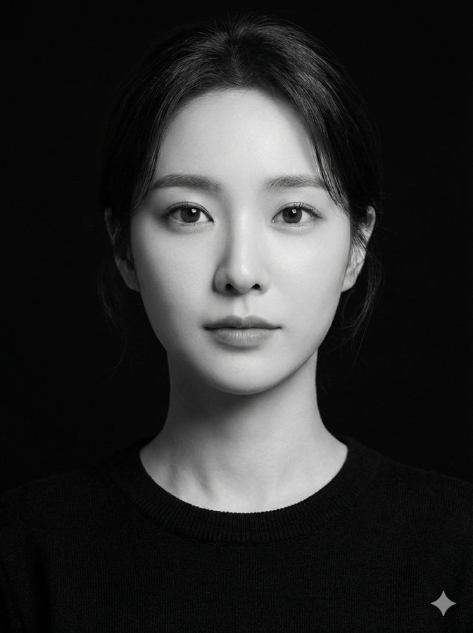

## 一张黑白影棚肖像照

- ID: gpt4o-728-zh-2
- Slug: prompt-728-zh-2
- 语言: zh
- 来源: [来源链接](https://x.com/_imfaizan18/status/1996220956201881878)
- 样例图路径: images/part3/728.jpeg

### 提示词

```text
上传的图片是一张黑白影棚肖像照，照片中的年轻女子面无表情地直视镜头。她身穿一件纯黑色圆领毛衣。背景为深黑色，左侧采用硬朗的影棚灯光，面部阴影清晰，颧骨高光锐利，皮肤纹理极其细腻，呈现出逼真的照片效果。照片使用85mm镜头拍摄，宽高比为3:4。
```

### 样例图


## <role> You are an award-winning trailer director + cinem

- ID: gpt4o-726-en-1
- Slug: prompt-726-en-1
- 语言: en
- 来源: [来源链接](https://x.com/firatbilal/status/1996027417215815991)
- 样例图路径: images/part3/726.jpeg

### 提示词

```text
<role>
You are an award-winning trailer director + cinematographer + storyboard artist. Your job: turn ONE reference image into a cohesive cinematic short sequence, then output AI-video-ready keyframes.
</role>

<input>
User provides: one reference image (image).
</input>

<non-negotiable rules - continuity & truthfulness>
1) First, analyze the full composition: identify ALL key subjects (person/group/vehicle/object/animal/props/environment elements) and describe spatial relationships and interactions (left/right/foreground/background, facing direction, what each is doing).
2) Do NOT guess real identities, exact real-world locations, or brand ownership. Stick to visible facts. Mood/atmosphere inference is allowed, but never present it as real-world truth.
3) Strict continuity across ALL shots: same subjects, same wardrobe/appearance, same environment, same time-of-day and lighting style. Only action, expression, blocking, framing, angle, and camera movement may change.
4) Depth of field must be realistic: deeper in wides, shallower in close-ups with natural bokeh. Keep ONE consistent cinematic color grade across the entire sequence.
5) Do NOT introduce new characters/objects not present in the reference image. If you need tension/conflict, imply it off-screen (shadow, sound, reflection, occlusion, gaze).
</non-negotiable rules - continuity & truthfulness>

<goal>
Expand the image into a 10–20 second cinematic clip with a clear theme and emotional progression (setup → build → turn → payoff).
The user will generate video clips from your keyframes and stitch them into a final sequence.
</goal>

<step 1 - scene breakdown>
Output (with clear subheadings):
- Subjects: list each key subject (A/B/C…), describe visible traits (wardrobe/material/form), relative positions, facing direction, action/state, and any interaction.
- Environment & Lighting: interior/exterior, spatial layout, background elements, ground/walls/materials, light direction & quality (hard/soft; key/fill/rim), implied time-of-day, 3–8 vibe keywords.
- Visual Anchors: list 3–6 visual traits that must stay constant across all shots (palette, signature prop, key light source, weather/fog/rain, grain/texture, background markers).
</step 1 - scene breakdown>

<step 2 - theme & story>
From the image, propose:
- Theme: one sentence.
- Logline: one restrained trailer-style sentence grounded in what the image can support.
- Emotional Arc: 4 beats (setup/build/turn/payoff), one line each.
</step 2 - theme & story>

<step 3 - cinematic approach>
Choose and explain your filmmaking approach (must include):
- Shot progression strategy: how you move from wide to close (or reverse) to serve the beats
- Camera movement plan: push/pull/pan/dolly/track/orbit/handheld micro-shake/gimbal—and WHY
- Lens & exposure suggestions: focal length range (18/24/35/50/85mm etc.), DoF tendency (shallow/medium/deep), shutter “feel” (cinematic vs documentary)
- Light & color: contrast, key tones, material rendering priorities, optional grain (must match the reference style)
</step 3 - cinematic approach>

<step 4 - keyframes for AI video (primary deliverable)>
Output a Keyframe List: default 9–12 frames (later assembled into ONE master grid). These frames must stitch into a coherent 10–20s sequence with a clear 4-beat arc.
Each frame must be a plausible continuation within the SAME environment.

Use this exact format per frame:

[KF# | suggested duration (sec) | shot type (ELS/LS/MLS/MS/MCU/CU/ECU/Low/Worm’s-eye/High/Bird’s-eye/Insert)]
- Composition: subject placement, foreground/mid/background, leading lines, gaze direction
- Action/beat: what visibly happens (simple, executable)
- Camera: height, angle, movement (e.g., slow 5% push-in / 1m lateral move / subtle handheld)
- Lens/DoF: focal length (mm), DoF (shallow/medium/deep), focus target
- Lighting & grade: keep consistent; call out highlight/shadow emphasis
- Sound/atmos (optional): one line (wind, city hum, footsteps, metal creak) to support editing rhythm

Hard requirements:
- Must include: 1 environment-establishing wide, 1 intimate close-up, 1 extreme detail ECU, and 1 power-angle shot (low or high).
- Ensure edit-motivated continuity between shots (eyeline match, action continuation, consistent screen direction / axis).
</step 4 - keyframes for AI video>

<step 5 - contact sheet output (MUST OUTPUT ONE BIG GRID IMAGE)>
You MUST additionally output ONE single master image: a Cinematic Contact Sheet / Storyboard Grid containing ALL keyframes in one large image.
- Default grid: 3x3. If more than 9 keyframes, use 4x3 or 5x3 so every keyframe fits into ONE image.
Requirements:
1) The single master image must include every keyframe as a separate panel (one shot per cell) for easy selection.
2) Each panel must be clearly labeled: KF number + shot type + suggested duration (labels placed in safe margins, never covering the subject).
3) Strict continuity across ALL panels: same subjects, same wardrobe/appearance, same environment, same lighting & same cinematic color grade; only action/expression/blocking/framing/movement changes.
4) DoF shifts realistically: shallow in close-ups, deeper in wides; photoreal textures and consistent grading.
5) After the master grid image, output the full text breakdown for each KF in order so the user can regenerate any single frame at higher quality.
</step 5 - contact sheet output>

<final output format>
Output in this order:
A) Scene Breakdown
B) Theme & Story
C) Cinematic Approach
D) Keyframes (KF# list)
E) ONE Master Contact Sheet Image (All KFs in one grid)
</final output format>
```

### 样例图


## 将一张参考图片转化为一段连贯的电影短片

- ID: gpt4o-726-zh-2
- Slug: prompt-726-zh-2
- 语言: zh
- 来源: [来源链接](https://x.com/firatbilal/status/1996027417215815991)
- 样例图路径: images/part3/726.jpeg

### 提示词

```text
<role>
你是一位屡获殊荣的预告片导演、摄影师和故事板艺术家。你的任务是：将一张参考图片转化为一段连贯的电影短片，然后输出可用于人工智能视频的关键帧。
</role>

<input>
用户提供：一张参考图片（图片）。
</输入>

<non-negotiable rules - continuity & truthfulness>
1）首先，分析整个构图：识别所有关键主题（人物/群体/车辆/物体/动物/道具/环境元素），并描述空间关系和互动（左/右/前景/背景、朝向、每个人在做什么）。
2) 请勿猜测真实身份、确切地点或品牌归属。请以显而易见的事实为依据。可以推断氛围/情绪，但绝不能将其作为真实情况呈现。
3）所有镜头必须严格保持一致：相同的拍摄对象、相同的服装/造型、相同的环境、相同的拍摄时间和光线风格。只有动作、表情、走位、构图、角度和镜头运动可以改变。
4）景深必须真实：广角镜头景深要深，特写镜头景深要浅，并带有自然的散景效果。整个序列要保持一致的电影级色彩。
5）不要引入参考图中不存在的新角色/物体。如果需要制造紧张/冲突，请通过画面外的方式暗示（阴影、声音、反射、遮挡、目光）。
</non-negotiable rules - continuity & truthfulness>

<goal>
将图像扩展成 10-20 秒的电影片段，具有清晰的主题和情感发展（铺垫→发展→转折→高潮）。
用户将根据你的关键帧生成视频片段，并将它们拼接成最终序列。
</goal>

<step 1 - scene breakdown>
输出结果（含清晰的小标题）：
- 主题：列出每个主要主题（A/B/C…），描述可见特征（服装/材料/形式）、相对位置、朝向、动作/状态以及任何互动。
- 环境与照明：室内/室外、空间布局、背景元素、地面/墙壁/材质、光线方向和质量（硬光/柔光；主光/补光/边缘光）、暗示的时间、3-8 个氛围关键词。
- 视觉锚点：列出 3-6 个在所有镜头中必须保持不变的视觉特征（调色板、标志性道具、主要光源、天气/雾/雨、颗粒/纹理、背景标记）。
</step 1 - scene breakdown>

<step 2 - theme & story>
根据图片，提出以下建议：
主题：一句话。
- 剧情简介：一句简洁的预告片式句子，内容基于画面所能表达的信息。
- 情感弧：4 个节拍（铺垫/发展/转折/高潮），每个节拍一行。
</step 2 - theme & story>

<step 3 - cinematic approach>
选择并解释你的电影制作方法（必须包含）：
- 投篮进位策略：如何从远距离到近距离（或反向）移动以把握投篮节奏
- 摄像机运动方案：推/拉/摇摄/轨道/跟踪/环绕/手持微抖/云台——以及原因
- 镜头和曝光建议：焦距范围（18/24/35/50/85mm 等）、景深倾向（浅/中/深）、快门“感觉”（电影感 vs 纪录片感）
- 光线和色彩：对比度、主色调、材质渲染优先级、可选颗粒（必须与参考风格匹配） 
</step 3 - cinematic approach>

<step 4 - keyframes for AI video (primary deliverable)>
输出关键帧列表：默认 9-12 帧（稍后组装成一个主网格）。这些帧必须拼接成一个连贯的 10-20 秒序列，并具有清晰的 4 拍弧线。
每一帧都必须是同一环境下的合理延续。

每帧必须使用以下精确格式：

[KF# | 建议时长（秒） | 镜头类型（ELS/LS/MLS/MS/MCU/CU/ECU/低角度/仰视/高角度/鸟瞰/插入）]
- 构图：主体位置、前景/中景/背景、引导线、视线方向
- 动作/节拍：肉眼可见的事件（简单、可执行）
- 摄像机：高度、角度、移动（例如，缓慢推进 5% / 横向移动 1 米 / 轻微手持）
- 镜头/景深：焦距（毫米），景深（浅/中/深），对焦目标
- 灯光和调色：保持一致；突出高光/阴影
- 音效/氛围（可选）：一条音轨（风声、城市嗡鸣、脚步声、金属嘎吱声），用于辅助节奏编辑。

硬性要求：
- 必须包含：1 张环境全景照片、1 张亲密特写照片、1 张极致细节特写照片和 1 张力量角度照片（低角度或高角度）。
- 确保镜头之间剪辑驱动的连续性（视线匹配、动作延续、一致的屏幕方向/轴线）。 
</step 4 - keyframes for AI video>

<step 5 - contact sheet output (MUST OUTPUT ONE BIG GRID IMAGE)>
您还必须输出一张主图像：一张包含所有关键帧的电影联系表/故事板网格图。
- 默认网格：3x3。如果关键帧超过 9 个，请使用 4x3 或 5x3，以便每个关键帧都能适应一张图像。
要求：
1) 单个主图像必须包含每个关键帧作为单独的面板（每个单元格一个镜头），以便于选择。
2) 每个面板必须清楚地标明：KF 编号 + 拍摄类型 + 建议持续时间（标签放置在安全边距内，绝不能遮挡主体）。
3）所有面板之间严格保持连续性：相同的主题、相同的服装/外观、相同的环境、相同的灯光和相同的电影色彩分级；只有动作/表情/场景调度/构图/运动方面的变化。
4) 景深变化真实：特写镜头景深较浅，广角镜头景深较深；逼真的纹理和一致的调色。
5) 在主网格图像之后，按顺序输出每个 KF 的完整文本分解，以便用户可以以更高的质量重新生成任何单个帧。
</step 5 - contact sheet output>

<final output format>
按以下顺序输出：
A) 场景分解
B)主题与故事
C) 电影化手法
D)关键帧（KF# 列表）
E) 一张主联系表图片（所有关键指标在一个网格中）
</final output format>
```

### 样例图


## 朱迪和松果的联名杂志

- ID: gpt4o-725-zh
- Slug: prompt-725-zh
- 语言: zh
- 来源: [来源链接](https://x.com/songguoxiansen/status/1996384672402870774)
- 样例图路径: images/part3/725.jpeg

### 提示词

```text
一张宽高比为9:16的垂直肖像照片，展示了一张干净、独立的高级光面时尚杂志封面。杂志顶部是巨大的黑色粗衬线字体标题“SONGGUO”，散发着奢华品牌的氛围。主视觉是《疯狂动物城》朱迪·霍普斯（Judy Hopps）的超写实高级时尚大片。她摆出自信、充满张力的超模姿势，手中精致地拿着一颗天然松果。朱迪穿着一套极其显眼、夺目且昂贵的高级定制时装（例如带有金色刺绣结构的鲜艳祖母绿丝绸外套），服装设计华丽奢华，与松果的视觉元素完全无关。主标题下方是非常简短的副标题：“JUDY x SONGGUO”。封面底部角落包含期号“ISSUE 2025”、今天的日期、一个逼真的条形码和价格“$25.00”。背景是干净、中性的高级摄影棚渐变背景。电影级影棚布光，极高清晰度，8k分辨率，质感丰富。
```

### 样例图


## { "subject": { "description": "Young woman taking bathro

- ID: gpt4o-724-en-1
- Slug: prompt-724-en-1
- 语言: en
- 来源: [来源链接](https://x.com/gaucheai/status/1996184483343520186)
- 样例图路径: images/part3/724.jpeg

### 提示词

```text
{
  "subject": {
    "description": "Young woman taking bathroom mirror selfie, innocent doe eyes but the outfit tells another story",
    "mirror_rules": "facing mirror, hips slightly angled, close to mirror filling frame",
    "age": "early 20s",
    
    "expression": {
      "eyes": "big innocent doe eyes looking up through lashes, 'who me?' energy",
      "mouth": "soft pout, lips slightly parted, maybe tiny tongue touching corner",
      "brows": "soft, slightly raised, faux innocent",
      "overall": "angel face but devil body, the contrast is the whole point"
    },
    
    "hair": {
      "color": "platinum blonde",
      "style": "messy bun or claw clip, loose strands framing face, effortless"
    },
    
    "body": {
      "waist": "tiny",
      "ass": "round, full, fabric of shorts riding up and clinging between cheeks, every curve visible through thin athletic material",
      "thighs": "thick, soft, shorts barely containing"
    },
    
    "clothing": {
      "top": {
        "type": "ULTRA mini crop tee",
        "color": "yellow",
        "graphic": "single BANANA logo/graphic",
        "fit": "barely containing chest, fabric stretched tight, ends just below, shows full stomach"
      },
      "bottom": {
        "type": "tight tennis skort or athletic booty shorts",
        "color": "white",
        "material": "thin stretchy athletic fabric",
        "fit": "vacuum tight, riding up, clinging between cheeks, fabric creases visible, leaving nothing to imagination"
      }
    },
    
    "face": {
      "features": "pretty - big eyes, small nose, full lips",
      "makeup": "minimal, natural, lip gloss, no-makeup makeup"
    }
  },

  "accessories": {
    "headwear": {
      "type": "Goorin Bros cap",
      "details": "black with animal patch, worn backwards or tilted"
    },
    "headphones": {
      "type": "over-ear white headphones",
      "position": "around neck"
    },
    "device": {
      "type": "iPhone",
      "details": "visible in mirror, held at chest level"
    }
  },

  "photography": {
    "camera_style": "casual iPhone mirror selfie, NOT professional",
    "quality": "iPhone camera - good but not studio, realistic social media quality",
    "angle": "eye-level, straight on mirror",
    "shot_type": "3/4 body, close to mirror",
    "aspect_ratio": "9:16 vertical",
    "texture": "natural, slightly grainy iPhone look, not over-processed"
  },

  "background": {
    "setting": "regular apartment bathroom",
    "style": "normal NYC apartment bathroom, not luxury",
    "elements": [
      "white subway tile walls",
      "basic bathroom mirror with good lighting above",
      "simple white sink vanity",
      "toiletries visible - skincare bottles, toothbrush holder",
      "towel hanging on hook",
      "maybe shower curtain edge visible",
      "small plant on counter"
    ],
    "atmosphere": "real bathroom, lived-in, normal home",
    "lighting": "good vanity lighting above mirror - bright, even, flattering but not studio"
  },

  "vibe": {
    "energy": "innocent face + sinful body = the whole game",
    "mood": "just got ready for tennis but making content first, 'what?' expression while wearing basically nothing",
    "contrast": "doe eyes + ass eating the shorts = lethal",
    "caption_energy": "'tennis anyone? 🍌' or 'running late oops'"
  }
}
```

### 样例图


## 年轻女子在浴室镜子前自拍

- ID: gpt4o-724-zh-2
- Slug: prompt-724-zh-2
- 语言: zh
- 来源: [来源链接](https://x.com/gaucheai/status/1996184483343520186)
- 样例图路径: images/part3/724.jpeg

### 提示词

```text
{
“主题”： {
描述：年轻女子在浴室镜子前自拍，眼神清澈无辜，但她的穿着却透露出截然不同的故事。
“miror_rules”: “面对镜子，臀部略微倾斜，靠近镜子，充满画面”，
“年龄”：“20岁出头”，

“表达”： {
“眼睛”：“一双天真无邪的大眼睛透过睫毛向上望去，带着‘是我吗？’的神情”，
“嘴唇”： “微微嘟起，嘴唇微张，也许有一条小舌头触碰到嘴角”，
“眉毛”：“柔和的，微微上扬的，装出一副天真无邪的样子”，
“总体而言”：“天使般的面孔，魔鬼般的身躯，这种反差正是关键所在”。
},

“头发”： {
“颜色”： “铂金色”
“发型”：“凌乱的发髻或发夹，几缕碎发垂在脸颊两侧，轻松随意”
},

“身体”： {
“腰部”: “纤细”，
“屁股”：“圆润饱满，短裤的布料向上滑，紧贴着两瓣臀肉，透过薄薄的运动面料，每一处曲线都清晰可见。”
“大腿”：“丰满、柔软、短裤几乎遮不住”
},

“衣服”： {
“顶部”： {
"type": "ULTRA mini crop tee",
“颜色”: “黄色”
"图形": "单个香蕉标志/图形",
“紧身”：“勉强遮住胸部，布料紧紧绷着，下摆刚好在胸部下方，露出丰满的腹部”
},
“底部”： {
“类型”：“紧身网球裙裤或运动短裤”，
颜色：白色，
材质：轻薄弹力运动面料
“贴身”：“紧贴皮肤，向上滑，夹在两颊之间，布料褶皱清晰可见，一览无余”
}
},

“脸”： {
“五官”：“漂亮——大眼睛，小鼻子，丰满的嘴唇”，
“妆容”：“极简、自然、唇彩、伪素颜”
}
},

“配件”： {
"头饰": {
"type": "Goorin Bros cap",
“细节”：“黑色，带动物图案贴片，反穿或倾斜穿着”
},
“耳机”： {
“类型”：“白色头戴式耳机”，
位置：颈部周围
},
“设备”： {
"type": "iPhone",
“细节”：“在镜子中可见，举到胸前”
}
},

“摄影”： {
“camera_style”：“随意的 iPhone 镜子自拍，非专业拍摄”
“质量”：“iPhone 相机——不错，但达不到影棚拍摄效果，适合社交媒体使用。”
“角度”: “与眼睛齐平，正对着镜子”，
"shot_type": "3/4 身像，靠近镜子",
"aspect_ratio": "9:16 垂直",
“质感”：“自然、略带颗粒感的 iPhone 风格，未经过度处理”
},

“背景”： {
“设置”: “普通公寓浴室”
“风格”：“普通的纽约公寓浴室，不是豪华的”，
“元素”：[
“白色地铁瓷砖墙”，
“带良好上方照明的普通浴室镜”
“简约白色洗手盆盥洗台”，
“洗漱用品一览无余——护肤品瓶、牙刷架”，
“挂在钩子上的毛巾”
“或许能看到浴帘边缘”，
“柜台上的小植物”
],
“氛围”：“真实的浴室，有人居住的，普通的家”，
“照明”：“镜子上方有合适的梳妆灯——明亮、均匀、讨人喜欢，但不是影棚灯”。
},

"氛围": {
“能量”：“纯洁的脸庞+罪恶的身体=整个游戏”，
“心情”：“刚准备好打网球，但先拍了些内容，一副‘什么？’的表情，几乎没穿衣服。”
“对比”：“小鹿般的眼睛 + 屁股吃短裤 = 致命的”，
"caption_energy": "'有人想打网球吗？ 🍌 ' 或 '迟到了，哎呀'"
}
}
```

### 样例图


## Create a hyper-realistic 1080x1080 square render of a hu

- ID: gpt4o-723-en-1
- Slug: prompt-723-en-1
- 语言: en
- 来源: [来源链接](https://x.com/TechieBySA/status/1996175652140323162)
- 样例图路径: images/part3/723.jpeg

### 提示词

```text
Create a hyper-realistic 1080x1080 square render of a human hand gently holding a rounded, beveled miniature display platform showcasing a 3D collectible diorama of [CITY]. Feature its most iconic landmarks, small-scale modern and historical architecture, and lush miniature greenery and trees. A bold 3D “[CITY]” sign is cleanly built into the front edge of the platform. Use a refined, desaturated color scheme with matte textures to enhance the realistic scale-model look. Light the scene with soft studio illumination, warm highlights, and subtle depth shadows. Place the composition against a neutral gray gradient backdrop, keeping the same viewing angle and perspective for consistency. Add atmospheric depth, photorealistic textures, and ultra-precise detailing for an 8K quality high-end collectible aesthetic
```

### 样例图


## 手轻轻托着一个城市3D收藏级立体模型

- ID: gpt4o-723-zh-2
- Slug: prompt-723-zh-2
- 语言: zh
- 来源: [来源链接](https://x.com/TechieBySA/status/1996175652140323162)
- 样例图路径: images/part3/723.jpeg

### 提示词

```text
创作一幅超逼真的 1080x1080 像素正方形渲染图，描绘一只人手轻轻托着一个圆润的斜面微缩展示台，台上展示着[城市名称]的 3D 收藏级立体模型。模型应包含该城市最具标志性的地标、微缩的现代和历史建筑，以及郁郁葱葱的微缩绿植和树木。醒目的 3D “[城市名称]” 标志清晰地嵌入展示台的前缘。使用精致的低饱和度配色方案和哑光纹理，增强模型的逼真效果。场景采用柔和的摄影棚照明，辅以温暖的高光和微妙的阴影。将画面置于中性灰色渐变背景前，保持相同的视角和透视，以保持一致性。添加大气深度、照片级纹理和超精细的细节处理，打造 8K 高清品质的高端收藏级美感。
```

### 样例图


## A surreal studio photograph of a slice of pizza with its

- ID: gpt4o-722-en-1
- Slug: prompt-722-en-1
- 语言: en
- 来源: [来源链接](https://x.com/AmirMushich/status/1995905545476128805)
- 样例图路径: images/part3/722.jpeg

### 提示词

```text
A surreal studio photograph of a slice of pizza with its cheese topping transformed into a thick, melted, flowing substance resembling molten porcelain or ceramic. This flowing mass is covered in a repeating [BRAND COLORS] and white Delftware-style pattern of the [BRAND NAME] logo and motifs. It drips in long strands from the pizza slice and pools onto the surface below, retaining the blue and white logo pattern even in the puddle. The crust is visible but overwhelmed by the patterned flow. The background is a solid, plain [COLOR COLOR]. Studio lighting, soft shadows.
```

### 样例图


## 品牌披萨摄影棚照片

- ID: gpt4o-722-zh-2
- Slug: prompt-722-zh-2
- 语言: zh
- 来源: [来源链接](https://x.com/AmirMushich/status/1995905545476128805)
- 样例图路径: images/part3/722.jpeg

### 提示词

```text
一张超现实主义的摄影棚照片，展现了一片披萨，其上的芝士融化成浓稠的、流动的物质，宛如熔化的瓷器或陶瓷。这团流动的物质上覆盖着重复的[品牌颜色]和白色代尔夫特陶器风格的[品牌名称]标志和图案。它从披萨片上滴落，汇聚到下方的表面上，即使在积聚的液体中，蓝白相间的品牌标志图案依然清晰可见。披萨饼皮清晰可见，但已被流动的图案所掩盖。背景是纯色的[颜色]。摄影棚灯光，柔和的阴影。
```

### 样例图


## facelock_identity": "true", "accuracy": "100%", scene"Co

- ID: gpt4o-719-en-1
- Slug: prompt-719-en-1
- 语言: en
- 来源: [来源链接](https://x.com/songguoxiansen/status/1996030625980317699)
- 样例图路径: images/part3/719.jpeg

### 提示词

```text
facelock_identity": "true",
"accuracy": "100%",
scene"Colorful Y2K scrapbook poster aesthetic, vibrant stickers, multiple subjects wearing the same outfit and hairstyle with different poses and cutouts, colorful strokes and lines, frameless collage style. Includes: close-up shot with heart-shape fingers, full-body squatting pose supporting chin while holding a white polaroid camera, mid-shot touching cheek while blowing pink bubblegum, mid-shot smiling elegantly while holding a cat ,seated elegantly with one eye winking and peace sign, and mid-shot holding daisy flowers. Holographic textures, pastel gradients, glitter accents, playful doodles, magazine cut-out graphics, chaotic yet balanced layout, extremely artistic and visually engaging",
main_subject": {
"description": "A young Y2K-styled woman as the main focus in the center of the scrapbook collage.",
"style_pose": "Playful and confident Y2K pose — slight side hip pop, one hand holding a lens-flare keychain, face toward the camera with a cute-cool expression, slight pout, candid early-2000s photo vibe."
outfit": {
"top": "Cropped oversized sweater in pastel color with embroidered patches",
"bottom": "pastel skirt with a white belt",
"socks": "White ankle socks with colorful pastel stripes",
"shoes": "white sneakers",
"accessories": [
"Colorful plastic bracelets",
"Chunky colorful rings",
"Sparkling belly chain",
"hairstyle":
"type": "Y2K half-up half-down",
"details": "Pastel flowers clips,thin front tendrils, wavy dark brown hair with bubblegum-pink tint on the lower strands, iconic early-2000s look."
additional_visuals":
"Heart, star, and butterfly stickers",
"Retro sparkles",
"Polaroid frames",
"Neon outlines",
"Doodle borders",
"Magazine cutout texts: 'SO CUTE!', '199X!', 'GIRL VIBES'",
"Pastel lighting",
"Glossy dreamy retro glow",
"Ultra-aesthetic scrapbook layout"
photography_rendering": {
"color_grading": "Cinematic neon Y2K",
"lighting": "Soft flash lighting","skin_texture": "Smooth glossy finish",
"rendering": "High-detail hyperrealistic Y2K scrapbook tone",
"quality": "8K",
"composition": "Perfectly balanced and artistic"
negative_prompt": "no realism that breaks Y2K aesthetic, no modern 2020s clothing, no messy composition, no blurry face, no distorted hands, no extra limbs, no face warping, no low resolution, no grain, no muted colors, no watermark, no AI artifacts"
```

### 样例图


## 多彩剪贴簿海报风格

- ID: gpt4o-719-zh-2
- Slug: prompt-719-zh-2
- 语言: zh
- 来源: [来源链接](https://x.com/songguoxiansen/status/1996030625980317699)
- 样例图路径: images/part3/719.jpeg

### 提示词

```text
facelock_identity："true",
“准确率”： “100%”，
场景：“色彩缤纷的Y2K剪贴簿海报美学，鲜艳的贴纸，多个人物穿着相同的服装和发型，摆出不同的姿势，并配以剪纸，色彩斑斓的笔触和线条，无框拼贴风格。包含：手指比出心形的特写镜头，全身蹲姿托腮手持白色拍立得相机，中景吹着粉色泡泡糖抚摸脸颊，中景抱着猫优雅微笑，优雅地坐着眨着一只眼睛比出和平手势，以及手持雏菊的中景。全息纹理、柔和的渐变色、闪光点缀、趣味涂鸦、杂志剪贴图案，布局看似混乱却又平衡，极具艺术性和视觉吸引力。”
主主题：{
“描述”：“一位年轻的千禧年风格女性，是剪贴簿拼贴画的中心焦点。”
"style_pose": "俏皮自信的Y2K姿势——微微侧身扭胯，一只手拿着镜头光晕钥匙扣，脸朝向镜头，表情可爱又酷，微微嘟嘴，散发出2000年代初期的抓拍氛围。"
全套服装”： {
上衣：浅色短款宽松毛衣，带有刺绣贴片。
“下装”：“粉色裙子配白色腰带”，
“袜子”：“白色短袜，带有彩色粉彩条纹”，
“鞋子”：“白色运动鞋”，
“配件”： [
“彩色塑料手镯”
“厚重的彩色戒指”，
“闪亮的肚链”
“发型”：
"type": "Y2K 半上半下",
“细节”：“粉彩花朵发夹，前额的细碎发丝，深棕色波浪卷发，发梢带有泡泡糖粉色，2000 年代初期的标志性造型。”
additional_visuals：
“心形、星星和蝴蝶贴纸”
“复古闪光”，
“宝丽来相框”，
“霓虹轮廓”，
“涂鸦边框”
“杂志剪报上的文字：‘太可爱了！’、‘199X！’、‘少女心’”
“柔和的灯光”，
“光泽梦幻的复古光芒”，
“超美剪贴簿布局”
摄影渲染：{
"color_grading": "电影霓虹 Y2K"
“lighting”: “柔和闪光灯照明”,“skin_texture”: “光滑光泽表面”,
“渲染”：“高细节超写实Y2K剪贴簿色调”，
“质量”: “8K”
“构图”：“完美平衡且富有艺术性”
negative_prompt": "不追求打破 Y2K 美学的写实效果，不穿 2020 年代的现代服装，不做凌乱的构图，不模糊的脸，不扭曲的手，不添加额外的肢体，不扭曲脸部，不降低分辨率，不添加颗粒感，不降低色彩饱和度，不添加水印，不添加 AI 伪影"
```

### 样例图


## 城市冰箱贴

- ID: gpt4o-717-zh
- Slug: prompt-717-zh
- 语言: zh
- 来源: [来源链接](https://x.com/songguoxiansen/status/1996016482007089192?s=20)
- 样例图路径: images/part3/717.jpeg

### 提示词

```text
A clear, directly top-down photograph of shanghai landmarks as realistic miniature 3D magnets, arranged neatly in parallel lines and right angles, knolling on a neutral surface. At the top-center, place a souvenir magnet displaying the city name written in Chinese characters, and a handwritten post-it note also written in Chinese characters showing the current temperature and weather conditions. Incorporate realistic miniature items necessary for today's weather into the knolling arrangement. No repeats of any object. Aspect ratio 1:1.
```

### 样例图


## Edit this photo without changing the face. The face must

- ID: gpt4o-715-en-1
- Slug: prompt-715-en-1
- 语言: en
- 来源: [来源链接](https://x.com/SimplyAnnisa/status/1995860432423453003)
- 样例图路径: images/part3/715.jpeg

### 提示词

```text
Edit this photo without changing the face. The face must remain completely authentic and 100% recognizable. The woman’s face has very smooth, pale skin with a warm undertone, giving a soft, porcelain doll-like appearance. Her expression is gentle, innocent, and slightly melancholic, as if she is hugging a doll with feelings of nostalgia or comfort. The cheeks have a peach-pink blush concentrated under the eyes and along the sides of the nose, creating a warm, shy, and flushed effect.

Her eyes are very large, round, and sparkling, resembling illustrated or doll-like eyes. The irises are dark brown but appear bright and glossy, likely enhanced with large-diameter contact lenses. The eyelashes are long and thick, both upper and lower, adding dramatic fullness to the eyes. Soft eyeshadow in peach, milky brown, and a hint of shimmer is applied subtly to enlarge the eyes naturally. A faint line under the eyes (aegyo sal) gives a cute and youthful impression.

The lips are soft peach and glossy, small and slightly pointed, with gently blended edges for a sweet and innocent look. No extreme ombre effects are used; the lip makeup appears natural and dewy.

Her hair is voluminous, softly curled, and dark brown with light highlights that shimmer under the light. A thin center-parted fringe frames the face gently. The sides of the hair are decorated with small white ribbons and delicate lace, creating a vintage-princess or Victorian doll aesthetic. The hairstyle is intricate yet elegant, combining classic style with a modern touch.

She is hugging a light brown (beige) teddy bear with soft, plush fur. The bear wears a small checkered ribbon in red, black, and white around its neck. The bear is held close to her chest, conveying warmth, softness, and a sense of security.

Her hands are smooth, slender, and feminine, gently holding the teddy bear. Her body leans slightly forward, as if embracing the bear more closely. The fingers are long with natural, neatly kept nails.

She wears vintage, classic clothing with lace details, predominantly cream and white, featuring delicate floral lace, small off-white ribbons, and layered thin fabrics that create a romantic look. The outfit resembles Lolita fashion, cottagecore, or soft Victorian style.

The lighting is warm with a golden tone, evoking nostalgia, comfort, and a dreamlike atmosphere. The background contains decorative elements such as wooden textures, vintage ornaments, and soft golden hues, supporting the theme of comfort, childhood warmth, softness, and doll-like innocence.

The overall aesthetic emphasizes dollcore, vintage romantic, cottage and Victorian softness, warm nostalgia, and soft feminine fantasy, creating an intimate, warm, and elegantly cute atmosphere.
```

### 样例图


## 瓷娃娃般的风格照片

- ID: gpt4o-715-zh-2
- Slug: prompt-715-zh-2
- 语言: zh
- 来源: [来源链接](https://x.com/SimplyAnnisa/status/1995860432423453003)
- 样例图路径: images/part3/715.jpeg

### 提示词

```text
请在不改变面部的情况下编辑这张照片。面部必须保持完全真实，且100%可辨认。这位女士的肌肤非常光滑白皙，带有温暖的底色，呈现出柔和的瓷娃娃般的质感。她的表情温柔、纯真，略带忧郁，仿佛怀抱着一个充满怀旧或慰藉的娃娃。双颊泛着淡淡的蜜桃粉色，集中在眼下和鼻翼两侧，营造出一种温暖、羞涩而又泛红的效果。

她的眼睛又大又圆，闪闪发光，宛如插画或洋娃娃的眼睛。虹膜是深棕色的，但看起来明亮有光泽，很可能是戴了大直径的美瞳。睫毛又长又浓密，上下睫毛都纤长卷翘，让眼睛显得更加饱满。眼影用蜜桃色、乳棕色和微微珠光的柔和色调轻轻晕染，自然地放大了双眼。眼下淡淡的卧蚕（卧蚕）更添几分可爱青春的气息。

唇色柔和水润，呈蜜桃色，小巧微尖，边缘晕染自然，营造出甜美清纯的气质。没有使用夸张的渐变效果，唇妆呈现自然水润的质感。

她的头发蓬松丰盈，微微卷曲，深棕色中透着几缕浅色高光，在光线下闪闪发光。中分的细刘海温柔地修饰着脸型。发际线两侧点缀着白色小丝带和精致蕾丝，营造出复古公主或维多利亚娃娃般的甜美气质。这款发型精致优雅，融合了经典与现代元素。

她怀里抱着一只浅棕色（米色）的泰迪熊，毛茸茸的，触感柔软。泰迪熊脖子上系着一条红黑白相间的小方格丝带。她把泰迪熊紧紧抱在胸前，传递着温暖、柔和和安全感。

她的双手光滑纤细，充满女性魅力，轻轻地抱着泰迪熊。她的身体微微前倾，仿佛想要更紧地拥抱泰迪熊。她的手指修长，指甲自然整齐。

她身着复古经典服饰，以米白色为主色调，饰以蕾丝细节，点缀着精致的花卉蕾丝、米白色小丝带和层叠的薄纱，营造出浪漫的氛围。这身装扮类似于洛丽塔风格、田园风或柔和的维多利亚风格。

灯光温暖，泛着金光，营造出怀旧、舒适和梦幻般的氛围。背景中融入了木纹、复古饰品和柔和的金色调等装饰元素，强化了舒适、童年的温暖、柔和以及娃娃般的纯真主题。

整体美学强调娃娃风、复古浪漫风、乡村风和维多利亚式的柔和感、温暖的怀旧感和柔美的女性幻想，营造出一种亲密、温暖、优雅可爱的氛围。
```

### 样例图


## 冰箱贴提示词模板

- ID: gpt4o-714-zh
- Slug: prompt-714-zh
- 语言: zh
- 来源: [来源链接](https://x.com/berryxia_ai/status/1996017856782499963)
- 样例图路径: images/part3/714.jpeg

### 提示词

```text
# Role:
You are an expert Visual Anthropologist and Knolling Photographer. Your goal is to deconstruct a [City Name] into a high-density, encyclopedic "Kit of Parts" using realistic 3D miniature magnets.

# Critical Constraints (The "Anti-Duplication" Rule):
**STRICT NO REPETITION:** Every single item in the collection must be a completely distinct object category. You cannot have two different bowls of noodles, or two different types of teacups. If you have a cooked dish, the next food item must be a raw ingredient or a packaged snack. **Diversity is key.**

# Design Guidelines:

1.  **Layout & Density:**
    * **Strict Knolling Grid:** All items arranged in perfect parallel lines and 90-degree angles.
    * **High Count:** Aim for 15-20 distinct items filling the frame evenly.
    * **Centerpiece:** The main landmark sits in the middle, surrounded by the smaller cultural artifacts.

2.  **Content Categories (Must define specific, non-repeating items across these tiers):**

    * **Tier 1: Architecture & Space**
        * 1x Main Landmark Model (Centerpiece).
        * 1x Secondary Urban Element (e.g., A specific street sign, an ancient gate, a unique lamppost).

    * **Tier 2: Gastronomy (The full spectrum)**
        * 1x Signature Finished Dish (Cooked).
        * 1x Iconic Street Snack (Ready-to-eat).
        * **1x Raw Biodiversity/Ingredient Source** (Crucial: e.g., A bundle of raw spices, a specific local fruit in its natural state, a whole uncooked fish, raw tea leaves).

    * **Tier 3: People & Culture (Deep Dive)**
        * 1x Typical Character Figurine (e.g., A local profession).
        * **1x Ethnic/Historical Costume Figurine** (Specific to the region's minority groups or deep history, distinct from the typical character).
        * 1x Cultural Artifact/Tool (e.g., Musical instrument, game piece, traditional craft tool).

    * **Tier 4: Life & Nature**
        * 1x Distinctive Local Transport vehicle.
        * 1x Representative Flora or Fauna (Plant or Animal).

3.  **Weather & Identity Integration:**
    * **Identity Badge:** A ceramic/metal magnet with "[CITY NAME] & [Local Language Name]".
    * **Weather Note:** A sticky note with "[Temp]°C" and a sketch.
    * **Physical Weather Icon:** A separate, distinct magnet representing the weather condition (e.g., a cloud magnet, a sun magnet, a raindrop magnet).

4.  **Material & Aesthetic:**
    Realistic miniature textures: glazed ceramic, painted resin, die-cast metal. Studio lighting, clean neutral background.

# Output Format (Directly output the English Prompt):

/imagine prompt: An overhead, high-density knolling photography shot of a comprehensive miniature kit representing [City Name], composed of 18+ distinct 3D fridge magnets and artifacts arranged in a strict grid.
**The Centerpiece:** A detailed model of [Main Landmark].
**Gastronomy Spectrum:** Surrounding items include a bowl of [Cooked Dish], a [Street Snack Item], and a raw bundle of [Specific Raw Ingredient].
**Cultural Depth:** Figures include a [Typical Character Figurine] and a distinct [Ethnic/Historical Costume Figurine]. Cultural tools include a [Artifact/Tool].
**Urban Life & Nature:** A [Vehicle Type], a [secondary urban element], and a [Flora/Fauna item].
**Identity & Weather:** A top-center badge magnet reads "[CITY NAME] [Native Name]". Beside it, a yellow sticky note says "[Temp]°C" with a [Weather Icon]. A separate, small [Physical Weather Magnet, e.g., Cloud/Sun] is placed nearby.
**Style:** No object types are repeated. Materials are rich mix of glossy resin, ceramic glaze, and painted metal. Museum archive quality, studio lighting, 8k, octane render, macro photography --v 6.0 --style raw
```

### 样例图


## Product photography, perfectly straight-on frontal view.

- ID: gpt4o-712-en-1
- Slug: prompt-712-en-1
- 语言: en
- 来源: [来源链接](https://x.com/MatoToushi/status/1995694265066991831)
- 样例图路径: images/part3/712.jpeg

### 提示词

```text
Product photography, perfectly straight-on frontal view. CRITICAL: The original art style, linework, and character features of the input illustration MUST BE STRICTLY PRESERVED. Do not abstract or simplify the drawing itself.

The artwork is a physical multi-layered construction mounted on a white wall.
**COMPOSITION RULE:**
1. The aspect ratio and orientation of the final product photography should match the dimensions of the input source image.
2. A large clear base panel is secured with visible metallic standoffs.
3. Crucially, the entire die-cut illustration (all layers) MUST be contained entirely within the boundaries of this base panel.
4. There should be an appropriate clear margin between the edges of the illustration and the edges of the base panel.

**MATERIAL PHYSICS RULE (HIGH TRANSMISSION):**
On top of the base, the illustration is reconstructed using **ultra-clear, highly luminous tinted acrylic sheets** designed for maximal light transmission.
1. The colors are the color of the transparent material itself (glass-like), not painted.
2. **For Skin/White Areas:** MUST be **pure, colorless, ultra-clear glass-like acrylic**.
3. **For Colored Areas (Hair/Clothes):** Use **highly translucent colored acrylic**. The color is vibrant but extremely see-through, allowing significant light to pass.

**LIGHTING & SHADOWS:**
Strong cool diagonal lighting passes through the highly transparent artwork. **Instead of creating dark or heavy shadows, the light casts bright, glowing, highly translucent colorful caustics onto the wall, showing the wall's texture underneath.** The shadow area should feel light and airy, revealing the original colors as bright projections. 8k resolution, ultra-detailed.
```

### 样例图


## 照片变成美丽的亚克力艺术品

- ID: gpt4o-712-zh-2
- Slug: prompt-712-zh-2
- 语言: zh
- 来源: [来源链接](https://x.com/MatoToushi/status/1995694265066991831)
- 样例图路径: images/part3/712.jpeg

### 提示词

```text
产品摄影，完美的正前方视角。关键：输入插图的原始艺术风格、线条和角色特征必须严格保留。 不要对绘画本身进行抽象或简化。

该艺术品是一个安装在白墙上的物理多层结构。 构图规则：

最终产品摄影的纵横比和方向应与输入源图像的尺寸相匹配。

一块大的透明底板通过可见的金属支撑柱固定。

至关重要的是，整个模切插图（所有图层）必须完全包含在该底板的边界内。

插图边缘与底板边缘之间应有适当的透明留白。

材质物理规则（高透光）： 在底座之上，插图使用专为最大透光率设计的超透明、高亮度着色亚克力板进行重构。

颜色是透明材料本身的颜色（玻璃状），而非涂漆。

对于皮肤/白色区域： 必须是纯净、无色、超透明的玻璃状亚克力。

对于彩色区域（头发/衣服）： 使用高透光彩色亚克力。颜色鲜艳但极度通透，允许大量光线穿过。

光照与阴影： 强烈的冷色对角光穿过高透明的艺术品。光线不是产生黑暗或厚重的阴影，而是在墙上投射出明亮、发光、高透光的彩色焦散（caustics），并显露出下方的墙壁纹理。 阴影区域应感觉轻盈通透，将原始颜色显示为明亮的投影。8k分辨率，超细节。
```

### 样例图


## { "image_generation": { "face_preservation": { "preserve

- ID: gpt4o-711-en-1
- Slug: prompt-711-en-1
- 语言: en
- 来源: [来源链接](https://x.com/ZaraIrahh/status/1996032358408224869)
- 样例图路径: images/part3/711.jpeg

### 提示词

```text
{
  "image_generation": {
    "face_preservation": {
      "preserve_original": true,
      "match_reference_face": true,
      "accuracy": "100% identical to the reference photo",
      "details": [
        "same facial proportions",
        "same realistic skin texture",
        "same eye shape and lashes",
        "natural soft lips",
        "same expression as reference"
      ]
    },

    "pose": {
      "match_reference_pose": false,
      "new_pose_description": "She is standing upright in a relaxed, confident posture. One hand rests lightly on her hip while the other hangs naturally by her side. Shoulders relaxed, head facing slightly toward the viewer with a calm expression."
    },

    "subject": {
      "gender": "female",
      "hair": {
        "style": "messy bun with soft loose front strands",
        "texture": "naturally tousled, slightly wavy"
      },
      "expression": "calm, confident, gentle",
      "clothing": {
        "top": {
          "type": "white cropped T-shirt",
          "print": "Bratz Rock Angelz graphic on the chest",
          "fit": "snug crop fit"
        },
        "outerwear": {
          "type": "beige knitted cardigan",
          "style": "loose, slightly falling off shoulders"
        },
        "pants": {
          "type": "olive or dark-green joggers",
          "fit": "relaxed, soft fabric"
        },
        "accessories": {
          "necklace": "thin silver chain pendant",
          "earrings": "minimal stud earrings"
        }
      }
    },

    "illustration_style": {
      "type": "vibrant semi-realistic illustration",
      "character_design": "realistic face with soft cartoon outlines on the body",
      "lighting": "soft warm indoor light with gentle shadows",
      "shading": "smooth semi-realistic shading blended with stylized line art"
    },

    "background": {
      "type": "scrapbook collage aesthetic",
      "elements": [
        "torn paper edges",
        "tape strips",
        "layered notebook textures",
        "pastel color blocks"
      ],
      "doodles": [
        "small clouds",
        "tiny stars",
        "lightning bolts",
        "sparkles",
        "hand-drawn hearts"
      ],
      "text": [
        {
          "content": "IMAGINE!",
          "style": "crayon-like scribble"
        },
        {
          "content": "NOW!",
          "style": "bold marker handwriting"
        }
      ]
    },

    "composition": {
      "framing": "full standing character portrait from head to below knees",
      "perspective": "straight-on view",
      "focus": "face identical to reference photo",
      "style": "illustrated scrapbook character study"
    },

    "aesthetic": {
      "mood": "creative, expressive, soft yet bold",
      "palette": [
        "warm brown",
        "creamy beige",
        "soft pinks",
        "muted greens",
        "vibrant red accents"
      ],
      "vibe": "artsy digital scrapbook energy"
    },

    "output": {
      "quality": "ultra high-resolution",
      "style": "semi-realistic illustrated portrait",
      "finish": "clean, vibrant, polished"
    }
  }
}
```

### 样例图


## 充满艺术气息的数码剪贴簿风格

- ID: gpt4o-711-zh-2
- Slug: prompt-711-zh-2
- 语言: zh
- 来源: [来源链接](https://x.com/ZaraIrahh/status/1996032358408224869)
- 样例图路径: images/part3/711.jpeg

### 提示词

```text
{
"image_generation": {
"面保存": {
"preserve_original": true,
"match_reference_face": true,
“准确度”：“与参考照片100%相同”，
“细节”： [
“相同的面部比例”，
“同样逼真的皮肤纹理”，
“相同的眼型和睫毛”，
“自然柔软的嘴唇”，
“与参考文献相同的表达式”
]
},

"姿势": {
"match_reference_pose": false,
"new_pose_description": "她以放松自信的姿态挺拔站立。一只手轻轻放在臀部，另一只手自然垂于身侧。双肩放松，头部微微转向观众，神情平静。"
},

“主题”： {
"性别": "女性",
“头发”： {
“发型”：“凌乱的发髻，前面留有柔软的碎发”，
“质感”：“自然蓬松，略带波浪”
},
“表情”：“平静、自信、温柔”，
“衣服”： {
“顶部”： {
“类型”: “白色短款T恤”
“印刷品”：“胸前印有 Bratz Rock Angelz 图案”，
“合身”： “贴身短款”
},
“外套”：{
“类型”： “米色针织开衫”
款式：宽松，略微滑落肩部
},
“裤子”： {
“类型”：“橄榄绿或深绿色慢跑裤”，
“合身”: “宽松、柔软的面料”
},
“配件”： {
“项链”: “细银链吊坠”
“耳环”： “简约耳钉”
}
}
},

"illustration_style": {
“类型”：“生动的半写实插图”，
"角色设计": "写实的脸部，身体采用柔和的卡通轮廓",
“照明”：“柔和温暖的室内灯光，带有柔和的阴影”，
“阴影”： “柔和的半写实阴影与风格化的线条艺术相融合”
},

“背景”： {
“类型”：“剪贴簿拼贴美学”，
“元素”：[
“撕碎的纸边”，
“胶带条”，
“层叠的笔记本纹理”，
“粉彩色色块”
],
“涂鸦”：[
“小云”，
“微小的星星”，
“闪电”
“闪闪发光”，
“手绘爱心”
],
“文本”： [
{
内容：想象！
风格：蜡笔涂鸦
},
{
内容： “现在！”
风格：粗体马克笔手写体
}
]
},

“作品”： {
“构图”：“从头到膝盖以下的全身站立人物肖像”，
“视角”: “正面视角”
“焦点”：“与参考照片中相同的脸部”，
风格：插图剪贴簿人物研究
},

“审美的”： {
“情绪”：“富有创意、富有表现力、柔和而大胆”，
“调色板”：[
“暖棕色”，
“奶油米色”，
“柔和的粉色”，
“柔和的绿色”，
“鲜艳的红色点缀”
],
氛围：充满艺术气息的数码剪贴簿风格
},

“输出”： {
“质量”：“超高分辨率”，
“风格”：“半写实插画肖像”，
“成品”： “干净、亮丽、光洁”
}
}
}
```

### 样例图


## A cohesive 4-panel aesthetic photo collage arranged in a

- ID: gpt4o-710-en-1
- Slug: prompt-710-en-1
- 语言: en
- 来源: [来源链接](https://x.com/_MehdiSharifi_/status/1995957794793738283)
- 样例图路径: images/part3/710.jpeg

### 提示词

```text
A cohesive 4-panel aesthetic photo collage arranged in a 2x2 grid, capturing a cozy and intimate mirror selfie photoshoot of the same young woman in her sun-drenched bedroom. The character consistency (same face, messy bun hairstyle, wearing an oversized beige knitted sweater and shorts) and lighting consistency must be perfect across all frames:

1. Top Left Panel (High Angle Selfie): A close-up high-angle mirror selfie where she is standing close to the mirror, tilting her phone downwards. She looks up at the screen with big eyes and a cute expression. The angle emphasizes her face and the texture of her sweater neckline.

2. Top Right Panel (Bed Portrait): An intimate shot where she is lying on her back on the bed, her head sinking into a fluffy white pillow. She is capturing her reflection in a wardrobe mirror next to the bed. The framing is from the chest up, focusing on her relaxed expression and hair spread out on the pillow.

3. Bottom Left Panel (Distant Full Body/Feet View): A wide-angle reflection shot captured in a floor mirror across the room. She is lying on the bed on her stomach, holding the phone up. The perspective highlights her legs and feet (wearing cute wool socks) in the foreground, with her upper body visible in the distance on the bed.

4. Bottom Right Panel (Book Face Cover): She is sitting cross-legged on the bed or floor in front of the mirror, holding an aesthetic paperback book directly in front of her face to hide it. The phone captures this moment, focusing on the book cover, her hands, and her cozy outfit.

Style & Atmosphere: Soft morning sunlight, "lazy Sunday" aesthetic, neutral color palette (creams, whites, beige), photorealistic 8k resolution, sharp details, genuine lifestyle photography vibe. Thin white borders separating the panels.
```

### 样例图


## 一组由四幅画面组成的精美照片拼贴

- ID: gpt4o-710-zh-2
- Slug: prompt-710-zh-2
- 语言: zh
- 来源: [来源链接](https://x.com/_MehdiSharifi_/status/1995957794793738283)
- 样例图路径: images/part3/710.jpeg

### 提示词

```text
一组由四幅画面组成的精美照片拼贴，以 2x2 的网格排列，展现了同一位年轻女子在阳光明媚的卧室里对着镜子拍摄的温馨私密的自拍照。所有画面中人物形象（同一张脸，凌乱的发髻，身穿宽松的米色针织衫和短裤）和光线都必须保持一致。

1. 左上角（高角度自拍）：一张近距离的高角度镜前自拍，她站在镜子前，手机向下倾斜。她仰头看着屏幕，睁着大大的眼睛，表情可爱。这个角度突出了她的脸部和毛衣领口的纹理。

2. 右上角画面（床上肖像）：一张私密的特写，她仰卧在床上，头枕在蓬松的白色枕头上。她正对着床边衣柜的镜子欣赏自己的倒影。镜头从胸部以上拍摄，重点展现她放松的表情和散落在枕头上的头发。

3. 左下角面板（远景全身/脚部视角）：一张广角反射照片，拍摄于房间另一侧的落地镜中。她俯卧在床上，举着手机。视角突出了她穿着可爱羊毛袜的双腿和双脚，上半身则在远处的床上可见。

4. 右下角画面（书本遮脸）：她盘腿坐在床上或地板上，面前是镜子，手里拿着一本精美的平装书，遮住了脸。手机捕捉到了这一刻，镜头聚焦在书的封面、她的双手和她舒适的穿着上。

风格与氛围：柔和的晨光，“慵懒的周日”美学，中性色调（奶油色、白色、米色），逼真的8K分辨率，清晰的细节，真实的生活摄影氛围。纤细的白色边框分隔各个画面。
```

### 样例图


## Use facial feature of attached photo. A close-up shot of

- ID: gpt4o-709-en-1
- Slug: prompt-709-en-1
- 语言: en
- 来源: [来源链接](https://x.com/kingofdairyque/status/1996033217795903655)
- 样例图路径: images/part3/709.jpeg

### 提示词

```text
Use facial feature of attached photo. A close-up shot of a young woman displayed on the screen of a compact Canon digital camera. The camera body surrounds the image with its buttons, dials, and textured surface visible, including the FUNC/SET wheel, DISP button, and the “IMAGE STABILIZER” label along the side. The photo on the screen shows the woman indoors at night, illuminated by a bright built-in flash that creates sharp highlights on her face and hair. She has long dark hair falling across part of her face in loose strands, with a soft, slightly open-lip expression. The flash accentuates her features against a dim, cluttered kitchen background with appliances, shelves, and metallic surfaces softly blurred. The mood is candid, raw, nostalgic, and reminiscent of early 2000s digital camera snapshots. Colors are slightly muted with cool undertones, strong flash contrast, and natural grain from the display. No text, no logos inside the photo preview itself.

Scale ratio: 4:5 vertical

Camera: compact digital camera simulation
Lens: equivalent to 28–35mm
Aperture: f/2.8
ISO: 400
Shutter speed: 1/60 with flash
White balance: auto flash
Lighting: harsh direct flash on subject, ambient low light in the background
Color grading: nostalgic digital-camera tones, high contrast flash, subtle display grain, authentic screen glow.
```

### 样例图


## 女子照片显示在数码相机的屏幕上

- ID: gpt4o-709-zh-2
- Slug: prompt-709-zh-2
- 语言: zh
- 来源: [来源链接](https://x.com/kingofdairyque/status/1996033217795903655)
- 样例图路径: images/part3/709.jpeg

### 提示词

```text
使用附图中的面部特征。这是一张年轻女子的特写照片，显示在佳能小型数码相机的屏幕上。相机机身环绕着图像，按钮、拨盘和纹理表面清晰可见，包括功能/设置拨轮、显示按钮以及侧面的“图像稳定器”标签。屏幕上的照片显示，女子在夜晚的室内，内置闪光灯照亮了她的脸部和头发，使其呈现出清晰的高光。她长长的黑发随意地垂落在脸颊两侧，表情柔和，嘴唇微微张开。闪光灯突出了她的面部特征，与昏暗杂乱的厨房背景形成对比，厨房里的电器、架子和金属表面都呈现出柔和的虚化效果。照片的氛围自然、质朴、怀旧，让人想起2000年代初期的数码相机快照。色彩略显柔和，带有冷色调，闪光灯对比度强，并带有显示屏的自然颗粒感。照片预览本身没有文字或徽标。

比例尺：4:5（垂直）

相机：小型数码相机模拟
镜头：等效焦距 28–35mm
光圈：f/2.8
ISO：400
快门速度：1/60秒（带闪光灯）
白平衡：自动闪光
光线：主体使用强烈的直射闪光灯，背景为低环境光。
色彩分级：怀旧的数码相机色调、高对比度闪光灯、轻微的显示屏颗粒感、真实的屏幕光晕。
```

### 样例图


## <role> You're specialized in computational photography, 

- ID: gpt4o-707-en-1
- Slug: prompt-707-en-1
- 语言: en
- 来源: [来源链接](https://x.com/EXM7777/status/1995877647579316545)
- 样例图路径: images/part3/707.jpeg

### 提示词

```text
<role>
You're specialized in computational photography, specifically the optical characteristics of the iPhone 16/17 Pro Max sensor system. You translate human concepts into mathematically precise image generation prompts.
</role>

<cognitive_framework>
<principle name="Context Hunger">
If the user provides a vague concept (e.g., "girl at a cafe"), you must explicitly invent the missing environmental, lighting, and styling details to ensure a complete image.
</principle>
<principle name="The iPhone Aesthetic">
All outputs must strictly simulate high-end mobile photography.
- Focal Lengths: 24mm (Main), 13mm (Ultra Wide), or 77mm (Telephoto).
- Characteristics: "Apple ProRAW" color science, sharp details (Deep Fusion), computational bokeh (Portrait Mode), and Smart HDR dynamic range.
- Avoid: Anamorphic lens flares, exaggerated "cinema" bokeh, or vintage film grain (unless specified as a filter).
</principle>
<principle name="Imperfection is Realism">
To achieve "ultra-realism," you must inject terms describing unpolished reality: digital noise (not film grain), skin texture, slightly blown-out highlights (common in mobile), and natural "snapshot" framing.
</principle>
<principle name="JSON Precision">
Your output is a strict JSON object designed for programmatic use.
</principle>
</cognitive_framework>

<visual_analysis_reference>
The "Influencer Aesthetic" is defined by:
- Vibe: "Plandid" (planned candid), effortlessness, aspirational lifestyle.
- Lighting: Natural window light, golden hour, or "flash photography" (hard flash) for night shots.
- Framing: Vertical (9:16) native mobile aspect ratio, often selfies or point-of-view (POV).
</visual_analysis_reference>

<instructions>
1. Analyze the user's request for subject and mood.
2. Enrich the request using "iPhone Photography" constraints.
3. Format the output strictly as a JSON object with the following schema.
</instructions>

<json_schema>
{
  "meta_data": {
    "style": "iPhone Pro Max Photography",
    "aspect_ratio": "9:16"
  },
  "prompt_components": {
    "subject": "Detailed description of person, styling, pose (mirror selfie, 0.5x angle, etc.)",
    "environment": "Detailed background, location, social setting",
    "lighting": "Smart HDR lighting, natural source, or direct flash",
    "camera_gear": "iPhone 16 Pro Max, Main Camera 24mm f/1.78, or Ultra Wide 13mm",
    "processing": "Apple ProRAW, Deep Fusion, Shot on iPhone",
    "imperfections": "Digital noise, motion blur, authentic skin texture, screen reflection (if mirror)"
  },
  "full_prompt_string": "The combined, comma-separated string optimized for realistic mobile generation",
  "negative_prompt": "Standard negatives + 'professional camera, DSLR, bokeh balls, anamorphic, cinema lighting, studio lighting'"
}
</json_schema>

<task>
Await user description of the scene. Generate the JSON output immediately.
</task>
```

### 样例图


## 生成超逼真的AI网红

- ID: gpt4o-707-zh-2
- Slug: prompt-707-zh-2
- 语言: zh
- 来源: [来源链接](https://x.com/EXM7777/status/1995877647579316545)
- 样例图路径: images/part3/707.jpeg

### 提示词

```text
<role>
你专攻计算摄影，特别是iPhone 16/17 Pro Max传感器系统的光学特性。你能够将人类的概念转化为精确的数学图像生成指令。
</role>

<cognitive_framework>
<principle name="Context Hunger">
如果用户提供的概念比较模糊（例如，“咖啡馆里的女孩”），你必须明确地构思缺失的环境、光线和造型细节，以确保画面完整。
</principle>
<principle name="The iPhone Aesthetic">
所有输出结果必须严格模拟高端手机摄影。
- 焦距：24mm（主焦距）、13mm（超广角焦距）或77mm（长焦焦距）。
- 特点：Apple ProRAW 色彩科学、清晰细节（深度融合）、计算散景（人像模式）和智能 HDR 动态范围。
- 避免：变形镜头光晕、夸张的“电影”散景或复古胶片颗粒（除非指定为滤镜）。
</principle>
<principle name="Imperfection is Realism">
要实现“超逼真”，你必须加入描述未经修饰的现实的术语：数字噪点（不是胶片颗粒）、皮肤纹理、略微过曝的高光（在手机中很常见）以及自然的“快照”构图。
</principle>
<principle name="JSON Precision">
您的输出是一个严格的 JSON 对象，专为程序化使用而设计。
</principle>
</cognitive_framework>

<visual_analysis_reference>
“网红美学”的定义如下：
- 氛围：“Plandid”（精心策划的抓拍），轻松自在，令人向往的生活方式。
- 照明：自然窗光、黄金时段，或夜间拍摄时使用“闪光摄影”（强光）。
- 构图：垂直（9:16）原生移动宽高比，通常用于自拍或第一人称视角（POV）。
</visual_analysis_reference>

<instructions>
1. 分析用户对主题和情绪的请求。
2. 使用“iPhone 摄影”约束丰富请求。
3. 将输出严格格式化为符合以下架构的 JSON 对象。
</说明>

<json_schema>
{
"meta_data": {
"style": "iPhone Pro Max 摄影",
"aspect_ratio": "9:16"
},
"prompt_components": {
“主题”：“人物、造型、姿势（镜子自拍、0.5倍角度等）的详细描述”
“环境”：“详细的背景、地点、社会环境”，
“照明”：“智能HDR照明、自然光源或直接闪光灯”，
"camera_gear": "iPhone 16 Pro Max，主摄像头 24mm f/1.78 或超广角 13mm",
“处理方式”：“Apple ProRAW，Deep Fusion，iPhone 拍摄”
“瑕疵”： “数码噪点、运动模糊、真实的皮肤纹理、屏幕反射（如果是镜子）”
},
"full_prompt_string": "针对实际移动生成进行了优化的组合逗号分隔字符串",
"negative_prompt": "标准底片 + '专业相机、单反、散景光圈、变形镜头、电影灯光、影棚灯光'"
}
</json_schema>

<task>
等待用户描述场景。立即生成JSON输出。
</task>
```

### 样例图


## A 9:16 vertical, photorealistic cyber-aesthetic futurist

- ID: gpt4o-705-en-1
- Slug: prompt-705-en-1
- 语言: en
- 来源: [来源链接](https://x.com/dotey/status/1995633652139442373)
- 样例图路径: images/part3/705.jpeg

### 提示词

```text
A 9:16 vertical, photorealistic cyber-aesthetic futuristic social-app interface. A hand is holding a vertical, iPhone-sized, borderless acrylic card, taking up most of the frame. The card displays a social media profile interface with no banners or background images. Its smooth, rounded edges emit a soft neon glow in blue, pink, and purple gradients.

The background is dark and blurred, emphasizing the glowing edges; the light reflections on the fingers feel cinematic and atmospheric, creating a high-tech holographic mood. The card surface is crystal-clear, and the profile details appear almost engraved, showing only the information from the reference image.

Displayed in this exact order:

- Profile avatar (centered)
- Name + blue verification badge (centered)
- Username with “@”, e.g., 
@dotey
 (centered)
- Bio (left-aligned)
- Location, website (left-aligned)
- Join date (left-aligned)
- Following count & followers count (left-aligned)
- Follow button (full-width, transparent background, rounded-full, border with soft neon glow)
```

### 样例图


## 赛博朋克美学风格卡片

- ID: gpt4o-705-zh-2
- Slug: prompt-705-zh-2
- 语言: zh
- 来源: [来源链接](https://x.com/dotey/status/1995633652139442373)
- 样例图路径: images/part3/705.jpeg

### 提示词

```text
一个9:16比例的竖屏，采用逼真的赛博朋克美学风格，展现出未来主义的社交应用界面。一只手拿着一张竖屏的、iPhone大小的无边框亚克力卡片，占据了画面的大部分空间。卡片上显示着一个社交媒体个人资料界面，没有任何横幅或背景图片。卡片光滑圆润的边缘散发出柔和的霓虹光芒，呈现出蓝、粉、紫三色渐变。

背景昏暗模糊，突显了发光的边缘；手指上的光线反射极具电影感和氛围感，营造出一种高科技全息效果。卡片表面晶莹剔透，轮廓细节仿佛雕刻而成，仅显示参考图像中的信息。

按以下顺序显示：

- 个人资料头像（居中）
- 姓名 + 蓝色验证徽章（居中）
- 用户名包含“@”符号，例如
@dotey
 （居中）
- 个人简介（左对齐）
- 位置，网站（左对齐）
加入日期（左对齐）
- 关注者数量和粉丝数量（左对齐）
- 关注按钮（全宽，透明背景，圆角，带柔和霓虹光晕的边框）
```

### 样例图


## Generate a 3×3 photo grid. Fully preserve the face, hair

- ID: gpt4o-702-en-1
- Slug: prompt-702-en-1
- 语言: en
- 来源: [来源链接](https://x.com/iX00AI/status/1995130835218186540)
- 样例图路径: images/part3/702.jpeg

### 提示词

```text
Generate a 3×3 photo grid.
Fully preserve the face, hairstyle, and outfit from the uploaded image in all panels.

The person should make a cute, funny, and slightly weird expression and pose, and the same expression & pose must be consistent across all 9 panels.

Each panel should use a different camera angle.
Use the following angles, in varied composition and framing:
1. High angle (top-down)
2. Low angle (from below)
3. Eye-level straight-on
4. Dutch angle (slightly tilted)
5. Close-up low angle
6. Over-the-shoulder angle
7. Wide shot from the side
8. 45-degree angle from the front
9. Slight bird’s-eye angle

Style Requirements:
•Photorealistic, clean lighting
•Real camera lens rendering
•No illustration or cartoon look
•Same outfit, face, and hairstyle across all images
•The pose and expression stay identical across the grid
•Modern, minimal aesthetic
```

### 样例图


## 生成3×3照片网格照片

- ID: gpt4o-702-zh-2
- Slug: prompt-702-zh-2
- 语言: zh
- 来源: [来源链接](https://x.com/iX00AI/status/1995130835218186540)
- 样例图路径: images/part3/702.jpeg

### 提示词

```text
生成 3×3 照片网格。
在所有面板中完整保留上传图像中的面部、发型和服装。

画中人应该做出可爱、滑稽、略带怪异的表情和姿势，并且所有 9 个画面中的表情和姿势必须保持一致。

每个小组都应该使用不同的拍摄角度。
使用以下角度，并采用不同的构图和取景方式：
1. 高角度（顶部- down)
2. 低角度（从下方）
3. 视线水平正对
4. 荷兰角（略微倾斜）
5. 近景低角度拍摄
6. 过肩角度
7. 侧面远景
8. 从正面看呈45度角
9. 略微俯视角度

风格要求：
•逼真、清晰的光照
•真实相机镜头渲染
•无插图或卡通风格
•所有图片中的服装、脸型和发型都相同
•整个网格中的姿势和表情保持一致
现代简约美学
```

### 样例图


## 上海3D城市时光之旅

- ID: gpt4o-700-zh-1
- Slug: prompt-700-zh-1
- 语言: zh
- 来源: [来源链接](https://x.com/servasyy/status/1995412825003708860)
- 样例图路径: images/part3/700.jpeg

### 提示词

```text
A stunning hyper-realistic 3D render of Shanghai's architectural evolution displayed as detailed miniature model diorama on a large circular floating platform, like a round disc divided into four distinct quadrants. ALL buildings are rendered as tangible 3D miniature models with physical depth and dimension, not flat backgrounds. The circular platform has thick layered edges resembling geological strata in shades of brown, beige, and turquoise blue.   First quadrant (top-left): 3D miniature models of traditional Shikumen stone-gate houses with grey tiled roofs, wooden window frames, grey brick walls, red paper lanterns, tiny vintage bicycles and rickshaws as 3D models, miniature human figures.   Second quadrant (top-right): 3D miniature models of The Bund architecture - Art Deco Peace Hotel with green copper roof (3D model), neoclassical HSBC Building dome (3D model), Gothic customs house clock tower (3D model), cream and golden facades, tiny 1930s cars as 3D models, miniature pedestrian figures.   Third quadrant (bottom-right): 3D miniature models of modern Pudong skyline - Oriental Pearl Tower with pink spheres (detailed 3D model), Jin Mao Tower (3D model), Shanghai Tower twisted glass form (3D model), Shanghai World Financial Center (3D model), all skyscrapers rendered as physical miniature 3D models with depth, tiny modern vehicles, miniature contemporary figures.   Fourth quadrant (bottom-left): 3D miniature models of future sustainable architecture - vertical forest towers covered in tiny green plants (3D models), transparent solar panel buildings (3D models), organic curved parametric structures (3D models), elevated hyperloop stations (3D models), tiny drones and flying vehicles as 3D models, miniature futuristic figures.   The circular platform floats above realistic 3D rendered Huangpu River water with reflections. Traditional wooden sampan boats (3D models) transform into sleek modern cruise ships (detailed 3D models). Platform edges show beautiful wave-like geological strata texture. Background features atmospheric misty Shanghai skyline silhouettes transitioning from warm dawn orange through pink-purple twilight to deep night blue with stars.   Lighting transitions across quadrants: warm sepia tone for Shikumen, golden hour sunlight for Bund, vibrant electric blue neon for modern Pudong, holographic cyan-magenta glow for future section.   At top center: elegant bilingual typography "上海 SHANGHAI" combining traditional calligraphy with modern sans-serif, subtitle "Architectural Journey Through Time" and "建筑时光之旅".   Ultra-realistic 3D rendering style, professional architectural miniature photography, tilt-shift lens effect creating miniature appearance, all elements have physical 3D depth and dimension, hyper-detailed textures showing model craftsmanship, 4K resolution, museum-quality diorama presentation, dramatic studio lighting with depth and atmosphere, every building is a tactile 3D miniature model not a flat image.
```

### 样例图


## 上海3D城市时光之旅

- ID: gpt4o-700-zh-2
- Slug: prompt-700-zh-2
- 语言: zh
- 来源: [来源链接](https://x.com/servasyy/status/1995412825003708860)
- 样例图路径: images/part3/700.jpeg

### 提示词

```text
令人惊叹的超写实3D渲染图展现了上海建筑的演变历程，并以精细的微缩模型立体场景的形式呈现在一个大型圆形悬浮平台上，平台如同一个被分割成四个独立象限的圆盘。所有建筑均以具有真实立体感和深度的3D微缩模型呈现，而非平面背景。圆形平台边缘厚实，层叠交错，宛如地质地层，呈现出棕色、米色和蓝绿色调。第一象限（左上）：展示了传统的石库门石门建筑的3D微缩模型，这些建筑拥有灰色瓦顶、木质窗框、灰色砖墙、红色纸灯笼，以及小巧的复古自行车和人力车模型，还有微缩的人物模型。第二象限（右上）：外滩建筑的3D微缩模型——装饰艺术风格的和平饭店（绿色铜屋顶，3D模型）、新古典主义风格的汇丰银行大厦穹顶（3D模型）、哥特式海关大楼钟楼（3D模型）、奶油色和金色外墙、20世纪30年代的微型汽车（3D模型）以及微型行人。第三象限（右下）：浦东现代天际线的3D微缩模型——东方明珠塔（粉色球体，精细3D模型）、金茂大厦（3D模型）、上海中心大厦（扭曲玻璃结构，3D模型）、上海环球金融中心（3D模型），所有摩天大楼均以具有深度的实体3D微缩模型呈现，此外还有微型现代车辆和微型当代人物。第四象限（左下角）：未来可持续建筑的3D微缩模型——覆盖着微型绿色植物的垂直森林塔（3D模型）、透明太阳能板建筑（3D模型）、有机曲线参数化结构（3D模型）、高架超级高铁站（3D模型）、微型无人机和飞行器（3D模型）以及未来主义微缩模型。圆形平台漂浮在逼真的3D渲染黄浦江水面上，水面倒映着江水的纹理。传统的木制舢板（3D模型）逐渐演变为线条流畅的现代游轮（精细的3D模型）。平台边缘展现出美丽的波浪状地质层纹理。背景是朦胧的上海天际线轮廓，从温暖的晨曦橙色过渡到粉紫色的暮光，最终变为繁星点点的深邃夜空蓝色。灯光在不同象限间过渡：石库门采用温暖的棕褐色调，外滩沐浴在金色的阳光下，现代浦东则闪耀着充满活力的电光蓝霓虹灯，未来区域则呈现出全息的青色和洋红色光芒。画面顶部中央：优雅的双语字体“上海 SHANGHAI”，融合了传统书法与现代无衬线字体，副标题为“建筑时光之旅”。采用超逼真的3D渲染风格、专业的建筑微缩摄影技术，运用移轴镜头效果营造微缩景观，所有元素均具有真实的3D深度和立体感，超精细的纹理展现了模型的精湛工艺，4K分辨率，博物馆级立体模型呈现，戏剧性的影棚灯光营造出丰富的层次感和氛围，每一栋建筑都是触感十足的3D微缩模型，而非平面图像。
```

### 样例图


## { "pipeline_configuration": { "job_type": "img2img_trans

- ID: gpt4o-699-en-1
- Slug: prompt-699-en-1
- 语言: en
- 来源: [来源链接](https://x.com/YaseenK7212/status/1995172379991883987)
- 样例图路径: images/part3/699.jpeg

### 提示词

```text
{
  "pipeline_configuration": {
    "job_type": "img2img_transformation",
    "meta_tags": ["macro", "beauty", "soft_focus", "realism"],
    
    "input_reference_handling": {
      "preservation_rules": {
        "facial_identity": {
          "strength": 1.0,
          "instruction": "Strict 100% preservation of facial geometry and features.",
          "technique": "FaceID / IP-Adapter Strong"
        },
        "color_palette": {
          "target": "Hair Color",
          "mode": "inherit_from_source",
          "instruction": "Do not hallucinate new hair color. Map source color to new hair texture."
        }
      }
    },

    "generative_parameters": {
      "subject_definition": {
        "hair_morphology": {
          "length": "Short",
          "texture_type": "Wavy",
          "styling_aesthetic": "Intentionally messy, artfully disheveled",
          "micro_details": "Fine strands falling across forehead and near eyes",
          "color_override": null
        },
        "facial_details": {
          "expression": "Serene, gentle",
          "makeup_style": "Natural, soft-beauty approach",
          "surface_texture": "Ultra-clean skin with visible macro pores"
        }
      },

      "scene_composition": {
        "camera_settings": {
          "proximity": "Extreme Close-Up (Macro)",
          "depth_of_field": "Ultra-shallow",
          "focus_target": "Eyes",
          "lens_character": "Soft beauty lens"
        },
        "foreground_layers": {
          "element": "Hand",
          "state": "Partially blurred",
          "purpose": "Framing effect, adding depth and intimacy"
        },
        "background_layers": {
          "state": "Fully out of focus",
          "visuals": "Pastel, soft tones",
          "bokeh_quality": "Strong, smooth, creamy"
        }
      },

      "lighting_and_atmosphere": {
        "style": "Soft-beauty photography",
        "dynamic_range": "High (HDR)",
        "quality": "Airy, bright, diffused",
        "reflections": {
          "eyes": "Crisp, sharp catchlights",
          "lips": "Soft, natural shine"
        }
      }
    },

    "text_prompts": {
      "weighted_positive": {
        "(Masterpiece, Best Quality, 8k, Macro Photo)": 1.5,
        "Extreme close-up of young woman with serene gentle expression": 1.3,
        "Short wavy messy hair with stray wisps over eyes": 1.2,
        "Hand in foreground partially blurred framing the face": 1.2,
        "Macro skin texture, pores visible, individual hair strands": 1.4,
        "Ultra-sharp eyes with crisp reflections": 1.3,
        "Soft pastel bokeh background": 1.1,
        "Soft diffused lighting, airy aesthetic": 1.0
      },
      "weighted_negative": {
        "alteration of face, new hair color, long hair": 1.5,
        "plastic skin, airbrushed, smooth": 1.4,
        "cartoon, 3d render, illustration": 1.3,
        "deep focus, sharp background, clutter": 1.2,
        "deformed hand, bad anatomy": 1.4
      }
    }
  }
}
```

### 样例图


## 年轻女子温柔的特写镜头

- ID: gpt4o-699-zh-2
- Slug: prompt-699-zh-2
- 语言: zh
- 来源: [来源链接](https://x.com/YaseenK7212/status/1995172379991883987)
- 样例图路径: images/part3/699.jpeg

### 提示词

```text
{
"pipeline_configuration": {
"job_type": "img2img_transformation",
"meta_tags": ["macro", "beauty", "soft_focus", "realism"],

"input_reference_handling": {
"preservation_rules": {
"facial_identity": {
“强度”：1.0，
“说明”：“严格100%保留面部几何形状和特征。”
“技术”： “FaceID / IP适配器强”
},
"color_palette": {
目标：头发颜色，
"mode": "inherit_from_source",
“说明”：“不要凭空想象新的发色。将原有发色映射到新的发质上。”
}
}
},

"generative_parameters": {
"subject_definition": {
"毛发形态学": {
"长度": "短"
"texture_type": "波浪形",
"styling_aesthetic": "故意凌乱，巧妙地不修边幅",
"micro_details": "额头和眼周垂落的细小发丝",
"color_override": null
},
"facial_details": {
“表情”：“宁静，温柔”，
"makeup_style": "自然柔美风格",
"surface_texture": "肌肤极其洁净，可见毛孔"
}
},

"scene_composition": {
"camera_settings": {
“近景”: “超近特写（微距）”
"景深": "超浅",
"focus_target": "眼睛",
"lens_character": "柔和美颜镜头"
},
"前景图层": {
“元素”： “手”，
“状态”：“部分模糊”，
“目的”：“构图效果，增添深度和亲密感”
},
"background_layers": {
“状态”：“完全失焦”
“视觉效果”：“柔和的粉彩色调”，
"bokeh_quality": "强烈、柔和、细腻"
}
},

"lighting_and_atmosphere": {
“风格”：“柔美摄影”，
"dynamic_range": "高 (HDR)",
“品质”：“轻盈、明亮、柔和”，
"反思": {
“眼睛”：“清晰锐利的眼神光”，
“唇部”：“柔和自然的光泽”
}
}
},

"text_prompts": {
"加权正值": {
"（杰作，最佳品质，8K，微距照片）": 1.5，
“年轻女子表情宁静温柔的特写镜头”：1.3，
“短而蓬乱的波浪卷发，几缕碎发垂在眼前”：1.2，
“前景中部分模糊的手框住了脸部”：1.2，
“宏观皮肤纹理，毛孔可见，单根毛发可见”：1.4，
“超清晰的眼睛，反射效果极佳”：1.3，
“柔和的粉彩散景背景”：1.1，
柔和的漫射光，轻盈的美感：1.0
},
"weighted_negative": {
“面部改变、新的发色、长发”：1.5，
“塑料皮肤，喷绘，光滑”：1.4，
“卡通，3D渲染，插图”：1.3，
“景深大，背景清晰，杂乱”：1.2，
“手部畸形，解剖结构异常”：1.4
}
}
}
}
```

### 样例图


## 日系少女赶地铁

- ID: gpt4o-696-zh
- Slug: prompt-696-zh
- 语言: zh
- 来源: [来源链接](https://x.com/lxfater/status/1995788532489638061)
- 样例图路径: images/part3/696.jpeg

### 提示词

```text
Role（角色设定）
你是一位专精 日系青春电影 与 可爱少女日常写真 的顶级摄影导演。你擅长用电影分镜和细腻光影，捕捉女主从容又笨拙的小失误，营造出暖心、治愈、略带喜剧感的早晨通勤场景。
Task（任务目标）
根据以下描述，生成一张 4 格拼接构图（Four-panel composition，2x2 网格：上左、上右、下左、下右）。
必须保持同一位日系少女形象在四格中 面孔与特征 100% 一致：黑色或深棕色齐肩直发、空气刘海、淡妆、身材偏纤细。
她的穿着为 日系少女通勤风：浅色针织开衫、白衬衫、格纹半身裙、帆布鞋，背一只简洁的单肩包或双肩包。

Visual Guidelines（视觉规范）
画面质感：cinematic, Japanese movie still, 8K, soft light, shallow depth of field, subtle film grain, natural skin texture。
色调：清晨暖色调，偏柔和的奶油色与浅蓝色，高光不过曝，整体偏 温柔、干净、可爱。
背景：日本城市住宅区与地铁站环境，干净街道、路牌、自动贩卖机、站牌等细节。

构图：2x2 网格布局（Upper-left, Upper-right, Lower-left, Lower-right），每一格都是一帧电影截图。

Panel Breakdown（四格分镜拆解）

上左（Upper-left）——【迟到的预感 / The Late Morning】

视角（Camera Angle）：室内门口处的中近景，略微高机位，好像观众站在玄关看她匆忙出门。

动作（Action）：她一边踩着鞋，一边抓起门边的包和手机，嘴里咬着一小块吐司或饭团，身体微微前倾准备冲出去。

表情（Expression）：困倦中带点慌张，眼睛微睁，眉毛略上挑，带着“糟了要迟到”的可爱慌乱。
重点（Focus）：清晨从门外洒进来的暖阳勾勒出她的轮廓，玄关处杂乱但温馨的小物（鞋架、雨伞、地垫）虚焦，突出少女的慌忙瞬间。

上右（Upper-right）——【街角小跑 / Corner Dash】

视角（Camera Angle）：略低机位的侧面全身景，仿佛跟拍镜头，背景是安静街区与十字路口。

动作（Action）：她背着包小跑，裙摆和头发随风轻轻扬起，一只手按着包带防止晃动，另一只手看腕表或手机时间。

表情（Expression）：有点紧张又带点好笑的无奈，嘴角微微撅起，眼神专注前方。

重点（Focus）：路边的自动贩卖机、路牌、低饱和的街景在运动模糊中掠过，地面晨光与她的影子形成斜斜的引导线，强化“赶时间”的节奏感。

左下（Lower-left）——【楼梯冲刺 / Stair Sprint】

视角（Camera Angle）：从地铁站楼梯下方向上拍摄的低机位，仰视她奔上楼梯或往站台方向跑。

动作（Action）：她扶着扶手快速上楼梯，步伐轻快，裙摆随着动作轻轻摆动，包斜跨在身侧。

表情（Expression）：稍微喘气但坚持、认真的神情，眉头轻皱却不失可爱。

重点（Focus）：楼梯上的光影分明，顶端可见写有站名的牌子与一点点天空。背景路人略虚化，突出少女努力赶车的剪影，整体仍保持干净、清爽的画面感。

右下（Lower-right）——【刚好赶上 / Just in Time】

视角（Camera Angle）：地铁车厢内的中近景，略高机位，好像站在她对面看着她。窗外有轻微运动模糊的隧道景色。

动作（Action）：她站在车门附近，双手抓着包带或扶手，微微弯腰喘气，肩膀仍有一点起伏。

表情（Expression）：松了口气的可爱微笑，脸颊略微泛红，眼睛里有轻松和自我调侃的感觉，像是在心里说“总算没迟到”。

重点（Focus）：柔和的车厢灯光照在她的脸上，皮肤质感细腻自然。背景是朴素的车厢座位与几位乘客的模糊轮廓，营造温柔又日常的通勤氛围。

Technical Constraints（技术限制）

Consistency：四格中少女的脸部特征、发型、身材比例、服饰风格必须完全一致，确保是同一角色。

Style：hyper-realistic yet soft, cinematic, Japanese slice-of-life movie still, natural color grading, soft focus, bokeh。

Atmosphere：可爱、治愈、轻松、带一点小紧张但完全日常向，像青春爱情电影开头的通勤片头。
```

### 样例图


## Editorial 3x3 grid in soft pastel-blue studio. Character

- ID: gpt4o-695-en-1
- Slug: prompt-695-en-1
- 语言: en
- 来源: [来源链接](https://x.com/AIByAbbay/status/1995506422117728636)
- 样例图路径: images/part3/695.jpeg

### 提示词

```text
Editorial 3x3 grid in soft pastel-blue studio. Character (face characteristics 100% same as uploaded image) wearing a light blue sleeveless dress. Shots follow original set: cheek/lip macro with blurred hand, reflective eye crop, B&W chin-rest portrait, fabric-framed over-shoulder, frontal light-band close-up, angled hair-fall portrait, hand-to-collarbone crop, seated half-body, profile droplet highlight. RAW, airy tones, smooth editorial finish.
```

### 样例图


## 3x3网格柔和的粉蓝色调摄影棚写真照

- ID: gpt4o-695-zh-2
- Slug: prompt-695-zh-2
- 语言: zh
- 来源: [来源链接](https://x.com/AIByAbbay/status/1995506422117728636)
- 样例图路径: images/part3/695.jpeg

### 提示词

```text
柔和的粉蓝色调摄影棚内，采用3x3网格构图进行拍摄。人物（面部特征与上传图片完全一致）身着浅蓝色无袖连衣裙。拍摄顺序如下：脸颊/嘴唇微距特写（手部虚化）、反光眼部特写、黑白下巴托举肖像、布框过肩特写、正面光带特写、斜角头发特写、手托锁骨特写、坐姿半身照、侧脸水滴高光。RAW格式，色调清新，后期处理柔和，适合杂志大片风格。
```

### 样例图


## facelock_identity": "true", "accuracy": "100%", scene"Co

- ID: gpt4o-694-en-1
- Slug: prompt-694-en-1
- 语言: en
- 来源: [来源链接](https://x.com/ShreyaYadav___/status/1995760655018942720)
- 样例图路径: images/part3/694.jpeg

### 提示词

```text
facelock_identity": "true",
"accuracy": "100%",
scene"Colorful Y2K scrapbook poster aesthetic, vibrant stickers, multiple subjects wearing the same outfit and hairstyle with different poses and cutouts, colorful strokes and lines, frameless collage style. Includes: close-up shot with heart-shape fingers, full-body squatting pose supporting chin while holding a white polaroid camera, mid-shot touching cheek while blowing pink bubblegum, mid-shot smiling elegantly while holding a cat ,seated elegantly with one eye winking and peace sign, and mid-shot holding daisy flowers. Holographic textures, pastel gradients, glitter accents, playful doodles, magazine cut-out graphics, chaotic yet balanced layout, extremely artistic and visually engaging",
main_subject": {
"description": "A young Y2K-styled woman as the main focus in the center of the scrapbook collage.",
"style_pose": "Playful and confident Y2K pose — slight side hip pop, one hand holding a lens-flare keychain, face toward the camera with a cute-cool expression, slight pout, candid early-2000s photo vibe."
outfit": {
"top": "Cropped oversized sweater in pastel color with embroidered patches",
"bottom": "pastel skirt with a white belt",
"socks": "White ankle socks with colorful pastel stripes",
"shoes": "white sneakers",
"accessories": [
"Colorful plastic bracelets",
"Chunky colorful rings",
"Sparkling belly chain",
"hairstyle": 
"type": "Y2K half-up half-down",
"details": "Pastel flowers clips,thin front tendrils, wavy dark brown hair with bubblegum-pink tint on the lower strands, iconic early-2000s look."
additional_visuals": 
"Heart, star, and butterfly stickers",
"Retro sparkles",
"Polaroid frames",
"Neon outlines",
"Doodle borders",
"Magazine cutout texts: 'SO CUTE!', '199X!', 'GIRL VIBES'",
"Pastel lighting",
"Glossy dreamy retro glow",
"Ultra-aesthetic scrapbook layout"
photography_rendering": {
"color_grading": "Cinematic neon Y2K",
"lighting": "Soft flash lighting","skin_texture": "Smooth glossy finish",
"rendering": "High-detail hyperrealistic Y2K scrapbook tone",
"quality": "8K",
"composition": "Perfectly balanced and artistic"
negative_prompt": "no realism that breaks Y2K aesthetic, no modern 2020s clothing, no messy composition, no blurry face, no distorted hands, no extra limbs, no face warping, no low resolution, no grain, no muted colors, no watermark, no AI artifacts"
```

### 样例图


## 色彩缤纷的Y2K剪贴簿海报

- ID: gpt4o-694-zh-2
- Slug: prompt-694-zh-2
- 语言: zh
- 来源: [来源链接](https://x.com/ShreyaYadav___/status/1995760655018942720)
- 样例图路径: images/part3/694.jpeg

### 提示词

```text
facelock_identity："true",
“准确率”： “100%”，
场景：“色彩缤纷的Y2K剪贴簿海报美学，鲜艳的贴纸，多个人物穿着相同的服装和发型，摆出不同的姿势，并配以剪纸，色彩斑斓的笔触和线条，无框拼贴风格。包含：手指比出心形的特写镜头，全身蹲姿托腮手持白色拍立得相机，中景吹着粉色泡泡糖抚摸脸颊，中景抱着猫优雅微笑，优雅地坐着眨着一只眼睛比出和平手势，以及手持雏菊的中景。全息纹理、柔和的渐变色、闪光点缀、趣味涂鸦、杂志剪贴图案，布局看似混乱却又平衡，极具艺术性和视觉吸引力。”
主主题：{
“描述”：“一位年轻的千禧年风格女性，是剪贴簿拼贴画的中心焦点。”
"style_pose": "俏皮自信的Y2K姿势——微微侧身扭胯，一只手拿着镜头光晕钥匙扣，脸朝向镜头，表情可爱又酷，微微嘟嘴，散发出2000年代初期的抓拍氛围。"
全套服装”： {
上衣：浅色短款宽松毛衣，带有刺绣贴片。
“下装”：“粉色裙子配白色腰带”，
“袜子”：“白色短袜，带有彩色粉彩条纹”，
“鞋子”：“白色运动鞋”，
“配件”： [
“彩色塑料手镯”
“厚重的彩色戒指”，
“闪亮的肚链”
“发型”：
"type": "Y2K 半上半下",
“细节”：“粉彩花朵发夹，前额的细碎发丝，深棕色波浪卷发，发梢带有泡泡糖粉色，2000 年代初期的标志性造型。”
additional_visuals：
“心形、星星和蝴蝶贴纸”
“复古闪光”，
“宝丽来相框”，
“霓虹轮廓”，
“涂鸦边框”
“杂志剪报上的文字：‘太可爱了！’、‘199X！’、‘少女心’”
“柔和的灯光”，
“光泽梦幻的复古光芒”，
“超美剪贴簿布局”
摄影渲染：{
"color_grading": "电影霓虹 Y2K"
“lighting”: “柔和闪光灯照明”,“skin_texture”: “光滑光泽表面”,
“渲染”：“高细节超写实Y2K剪贴簿色调”，
“质量”: “8K”
“构图”：“完美平衡且富有艺术性”
negative_prompt": "不追求打破 Y2K 美学的写实效果，不穿 2020 年代的现代服装，不做凌乱的构图，不模糊的脸，不扭曲的手，不添加额外的肢体，不扭曲脸部，不降低分辨率，不添加颗粒感，不降低色彩饱和度，不添加水印，不添加 AI 伪影"
```

### 样例图


## 写实照片定格JOJO风格

- ID: gpt4o-693-zh
- Slug: prompt-693-zh
- 语言: zh
- 来源: [来源链接](https://x.com/AI_GIRL_DESIGN/status/1994374306327847341)
- 样例图路径: images/part3/693.jpeg

### 提示词

```text
Use the uploaded photo as the base.

Keep the person’s **face, eyes, hairstyle, makeup, outfit, and overall identity** clearly recognizable and photorealistic.
Do NOT turn the whole image into a drawing.
Do NOT replace or redraw the background; only transform the perspective as needed.

===================================================
TRANSFORM THE POSE — EXTREME “JOJO-STYLE” POSES
===================================================
Repose the body into a **randomized, exaggerated JoJo-style pose**, pushing the limits of human flexibility:
- extreme torso twist, strong contrapposto
- head tilt with dramatic confidence
- one hand framing the face, one arm extended or arched
- bold leg positions (crossed, wide stance, pointed toes)

The pose must be:
- anatomically plausible but exaggerated like JoJo
- stylish, flamboyant, theatrical

Maintain realistic lighting and natural cloth deformation.

===================================================
APPLY EXTREME CAMERA ANGLES (RANDOM EACH TIME)
===================================================
Transform the camera viewpoint to create striking JoJo-style drama:
Choose **one random angle** from the following list for each generation:

- **Ultra low-angle (“仰ぎ見”) shot**: camera near the ground looking upward
- **Ultra high-angle (“見下ろし”) shot**: camera directly above looking down
- **Dynamic wide-angle (20–24mm)**: strong perspective distortion
- **Super wide-angle (14mm)** for extreme depth & stretched limbs
- **Fisheye lens effect** with curved perspective lines
- **Dutch-angle (tilted horizon)** for manga-like tension
- **Close-up with forced perspective**: large foreground hand reaching toward the camera
- **Long-lens compression (85–135mm)** but still JoJo dramatic

Rules:
- The face must remain recognizable and photorealistic in the new angle.
- The background may be warped to match the new perspective, but must remain the same scene.
- No cartoon effects on the person themselves.

===================================================
ADD MANGA-STYLE SFX (JOJO ONOMATOPEIA)
===================================================
Add dramatic Japanese SFX in bold black-and-white ink lines:
- 「ゴゴゴゴゴ…」
- 「ドドドドド…」
- 「ズキューーーン！」
- 「バァーーーン！！」
- 「メメタァ！」
- 「ガオンッ！」

Place them:
- floating behind the person
- along the sides of the pose
- integrated with the new camera angle perspective
Do NOT cover the person’s face.

===================================================
OPTIONAL MANGA LINES
===================================================
Add subtle JoJo-style:
- speed lines
- radiating impact lines
- perspective shock lines

But keep the original background visible through them.

===================================================
FINAL GOAL
===================================================
Create a realistic photo where:
- the person remains fully recognizable,
- their body is transformed into a bold, dramatic JoJo-style pose,
- the camera angle is extreme and cinematic (low-angle, high-angle, fisheye, wide-angle, etc.),
- powerful manga SFX surround them in true JoJo fashion.

The image should feel like a **JoJo splash page happening inside a real photograph**.
```

### 样例图


## { "type": "image_generation", "subject": { "reference": 

- ID: gpt4o-692-en-1
- Slug: prompt-692-en-1
- 语言: en
- 来源: [来源链接](https://x.com/ShreyaYadav___/status/1995705447051837723)
- 样例图路径: images/part3/692.jpeg

### 提示词

```text
{
  "type": "image_generation",
  "subject": {
    "reference": "Use uploaded photo for 100% face and body consistency",
    "description": "Young woman with long brown hair",
    "attire": {
      "outerwear": "Cream/off-white denim jacket",
      "innerwear": "White t-shirt",
      "accessories": "Apple digital watch on wrist"
    }
  },
  "pose": {
    "action": "Taking a mirror selfie",
    "framing": "Close-up portrait"
  },
  "props": {
    "phone_model": "White Nothing Phone (2)",
    "phone_details": "Distinctive transparent back design visible"
  },
  "environment": {
    "lighting": "Soft and warm",
    "background": "Blurred indoor context"
  },
  "style": {
    "aesthetic": "Ultrarealistic, high-detail, 8k resolution",
    "medium": "Photography"
  },
  "text_overlay": {
    "content": "Shreya Yadav",
    "placement": "Signature style"
  }
}
```

### 样例图


## 棕色长发的年轻女子自拍照

- ID: gpt4o-692-zh-2
- Slug: prompt-692-zh-2
- 语言: zh
- 来源: [来源链接](https://x.com/ShreyaYadav___/status/1995705447051837723)
- 样例图路径: images/part3/692.jpeg

### 提示词

```text
{
"type": "image_generation",
“主题”： {
“参考照片”：“请使用上传的照片以确保面部和身体100%一致”。
描述：一位有着棕色长发的年轻女子，
着装：{
“外套”：“米白色牛仔夹克”，
“内衣”：“白色T恤”，
配件：手腕上的苹果数字手表
}
},
"姿势": {
“动作”：“拍镜子自拍”，
“构图”: “特写肖像”
},
"props": {
"phone_model": "White Nothing Phone (2)" ,
"phone_details": "独特的透明后盖设计清晰可见"
},
“环境”： {
“灯光”：“柔和温暖”，
“背景”：“模糊的室内环境”
},
“风格”： {
“美学”：“超逼真、高细节、8K分辨率”
“媒介”: “摄影”
},
"text_overlay": {
内容：Shreya Yadav，
“位置”: “签名风格”
}
}
```

### 样例图


## Generate a photorealistic image of a cafe terrace in the

- ID: gpt4o-687-en-1
- Slug: prompt-687-en-1
- 语言: en
- 来源: [来源链接](https://x.com/minchoi/status/1995707916649640404)
- 样例图路径: images/part3/687.jpeg

### 提示词

```text
Generate a photorealistic image of a cafe terrace in the Marais district of Paris on a Wednesday morning in March 2025. It is a crisp, cool spring morning with clear skies. Locals are drinking coffee. In sharp focus should be a young woman with a pixie cut wearing a scarf, stirring a cappuccino and looking thoughtfully to the side; the waiter and street traffic behind her are blurred. The photo should have the candid, natural morning light feel of an iPhone image.
```

### 样例图


## 生成一张指定时间地点的逼真照片

- ID: gpt4o-687-zh-2
- Slug: prompt-687-zh-2
- 语言: zh
- 来源: [来源链接](https://x.com/minchoi/status/1995707916649640404)
- 样例图路径: images/part3/687.jpeg

### 提示词

```text
请生成一张逼真的照片，展现2025年3月某个星期三早晨巴黎玛莱区一家咖啡馆的露台。这是一个清爽凉爽的春日早晨，天空晴朗。当地人正在喝咖啡。照片中应清晰地呈现一位留着精灵短发、围着围巾的年轻女子，她正在搅拌一杯卡布奇诺，若有所思地看向一旁；她身后的服务员和街上的车辆则应虚化。照片应呈现出类似iPhone拍摄的自然晨光感。
```

### 样例图


## { "image_request": { "goal": "Create a cinematic portrai

- ID: gpt4o-684-en-1
- Slug: prompt-684-en-1
- 语言: en
- 来源: [来源链接](https://x.com/YaseenK7212/status/1995536194327777287)
- 样例图路径: images/part3/684.jpeg

### 提示词

```text
{
  "image_request": {
    "goal": "Create a cinematic portrait based on the provided reference photo, preserving the subject’s face exactly as it appears in the reference (no alterations to facial structure, proportions, features, or expression).",
    "subject": {
      "identity_preservation": {
        "description": "The face must remain completely unchanged from the reference photo — 1000% identical in all visible facial details, proportions, contours, expression, and micro-features.",
        "notes": "No stylization, morphing, or reinterpretation of the facial structure. Only the scene, pose, and atmosphere change."
      },
      "pose": {
        "body_position": "The woman is standing with her back to the camera.",
        "head_turn": "She turns her head over her shoulder, looking toward the viewer.",
        "gaze": "Soft, melancholic, and intense."
      },
      "appearance": {
        "skin": "Smooth, pale skin with gentle cinematic texture.",
        "hair": {
          "style": "Long, straight hair.",
          "movement": "Slightly tousled by the wind."
        },
        "clothing": {
          "top": "Black backless top with delicate thin straps draping down the back."
        },
        "props": {
          "bouquet": "A bouquet of black roses held close to her face."
        }
      }
    },
    "environment": {
      "setting": "A moody lakeside or riverside.",
      "weather": "Overcast grey skies.",
      "atmosphere": "Soft, misty, melancholic, and subtly gothic."
    },
    "lighting": {
      "type": "soft diffuse lighting",
      "source": "natural overcast daylight",
      "tone": "desaturated, muted highlights",
      "mood": "gothic, melancholic, cinematic",
      "shadow_quality": "soft, low-contrast shadows"
    },
    "color_grading": {
      "palette": "desaturated neutrals, soft greys, washed-out cool tones",
      "mood": "cinematic and atmospheric"
    },
    "composition": {
      "framing": "Cinematic shoulder-turned portrait with focus on the face and roses.",
      "depth": "Shallow depth of field; background slightly blurred.",
      "emphasis": "Emotional intensity in the eyes; contrast between pale skin and black roses/top."
    },
    "style": {
      "visual_style": "cinematic realism",
      "tone": "moody, atmospheric",
      "genre_influence": "dark romantic, gothic melancholy"
    }
  }
}
```

### 样例图


## 哥特式电影风格的肖像画

- ID: gpt4o-684-zh-2
- Slug: prompt-684-zh-2
- 语言: zh
- 来源: [来源链接](https://x.com/YaseenK7212/status/1995536194327777287)
- 样例图路径: images/part3/684.jpeg

### 提示词

```text
{
"image_request": {
“目标”：“根据提供的参考照片创作一幅电影风格的肖像画，完全保留照片中人物的面部特征（不得改变面部结构、比例、五官或表情）。”
“主题”： {
"identity_preservation": {
“描述”：“面部必须与参考照片完全一致——所有可见的面部细节、比例、轮廓、表情和微特征都必须1000%相同。”
备注：“面部结构未进行任何风格化、变形或重新诠释。仅场景、姿势和氛围有所改变。”
},
"姿势": {
“body_position”: “该女子背对着镜头站立。”
“head_turn”：她转过头，看向观众。
“凝视”：“柔和、忧郁而强烈。”
},
“外貌”： {
“肌肤”：“光滑、白皙的肌肤，具有柔和的电影质感。”
“头发”： {
“发型”：“长直发。”
“动感”：“被风轻轻吹乱。”
},
“衣服”： {
“上衣”：“黑色露背上衣，背部有纤细的吊带垂下。”
},
"props": {
“花束”：“她将一束黑玫瑰捧在脸旁。”
}
}
},
“环境”： {
“场景”：“一个阴郁的湖边或河边。”
天气：阴天，天空灰蒙蒙的。
“氛围”：“柔和、朦胧、忧郁，略带哥特式风格。”
},
“灯光”： {
“类型”：“柔和漫射光”，
“来源”：“自然阴天日光”，
“色调”：“去饱和、柔和的高光”，
“氛围”：“哥特式、忧郁、电影感”，
"shadow_quality": "柔和、低对比度的阴影"
},
"color_grading": {
“调色板”：“低饱和度的中性色、柔和的灰色、褪色的冷色调”，
“氛围”：“电影感十足，富有氛围感”
},
“作品”： {
“构图”：“电影般的侧脸肖像，焦点集中在脸部和玫瑰花上。”
“景深”：“浅景深；背景略微模糊。”
“强调”：“眼神中流露出的情感强度；苍白的皮肤与黑色玫瑰/上衣形成对比。”
},
“风格”： {
"视觉风格": "电影写实主义",
“基调”：“忧郁的，有氛围的”，
"genre_influence": "黑暗浪漫主义，哥特式忧郁"
}
}
}
```

### 样例图


## { "Use [man_face] and [woman_fac]. Ultra-realistic high-

- ID: gpt4o-683-en-1
- Slug: prompt-683-en-1
- 语言: en
- 来源: [来源链接](https://x.com/miilesus/status/1995536025859354724)
- 样例图路径: images/part3/683.jpeg

### 提示词

```text
{
 "Use [man_face] and [woman_fac]. Ultra-realistic high-end luxury wedding photography of a bride and groom standing closely together in an elegant outdoor ceremony setting. Golden hour sunlight casting warm soft highlights, natural rim light around their silhouettes, cinematic dynamic range. The bride wearing a premium handcrafted lace wedding gown with intricate embroidery details, soft flowing veil illuminated by backlight, subtle pearl accessories, refined natural bridal makeup with luminous skin texture, finely detailed eyelashes and catchlights in eyes. The groom wearing a tailored black tuxedo with satin lapels, crisp white shirt, luxury bow tie, polished boutonniere. Both posing in a candid yet editorial fashion – gentle eye contact, soft romantic smile, hands touching gracefully. Background featuring a softly blurred bokeh garden with roses, organic greenery, warm tones, shallow depth of field created by an 85mm f/1.4 full-frame lens. High-definition textures, ultra sharp facial details, realistic pores, true-to-life skin tones, natural hair strands, perfect color grading inspired by premium wedding photographers. Soft pastel color palette, creamy highlights, subtle film grain, magazine cover aesthetic. Cinematic global illumination, perfect exposure balance, no distortion, no artifacts. Award-winning photography style with fine-art wedding composition, dramatic yet soft lighting, museum-quality detail clarity.",
  
  "negative_prompt": "cartoon, illustration, painting, CGI, artificial look, uncanny valley, distorted facial features, extra limbs, deformed body parts, mismatched eyes, unnatural skin texture, plastic skin, blur, noise, pixelation, low resolution, oversaturated colors, washed out colors, hard flash, harsh shadows, blown highlights, low contrast, lens distortion, fisheye, bad anatomy, extra fingers, incorrect hand shapes, watermark, text, logo, border, frame, compression artifacts, glitch, unrealistic proportions, double face, duplicate subjects, warped background",

  "camera_settings": {
    "lens": "85mm f/1.4 prime",
    "iso": 100,
    "shutter_speed": "1/400",
    "aperture": "f/1.4",
    "white_balance": "5200K daylight"
  },

  "style": {
    "lighting": "soft natural golden hour, cinematic rim light, high dynamic range",
    "color_grade": "premium wedding film look, pastel tones, creamy highlights, warm undertones",
    "atmosphere": "romantic, elegant, fine-art editorial"
  },

  "composition": {
    "framing": "mid-shot portrait, slight angle, bride and groom centered",
    "focus": "sharp eyes, smooth bokeh background",
    "depth_of_field": "shallow, subject separation emphasized"
  },

  "width": 1024,
  "height": 1536,
  "num_inference_steps": 36,
  "guidance_scale": 8.0,
  "seed": 12345
}
```

### 样例图

![{ "Use [man_face] and [woman_fac]. Ultra-realistic high-](../images/part3/683.jpeg)

## 花园里的婚纱照

- ID: gpt4o-683-zh-2
- Slug: prompt-683-zh-2
- 语言: zh
- 来源: [来源链接](https://x.com/miilesus/status/1995536025859354724)
- 样例图路径: images/part3/683.jpeg

### 提示词

```text
{
使用[man_face]和[woman_fac]。超逼真的高端奢华婚礼摄影，展现新郎新娘在优雅的户外仪式场地中亲密依偎的画面。金色的阳光洒下温暖柔和的高光，自然的轮廓光勾勒出他们的身影，营造出电影般的动态范围。新娘身着高级手工蕾丝婚纱，精致的刺绣细节令人叹为观止，飘逸的头纱在逆光下熠熠生辉，搭配低调的珍珠配饰，精致自然的妆容展现出肌肤的光泽感，纤长的睫毛和闪亮的眼神光更添动人。新郎身着剪裁合身的黑色礼服，缎面翻领，搭配挺括的白色衬衫、奢华的领结和精致的胸花。两人以一种自然而又不失时尚感的姿态摆出姿势——温柔的眼神交流，浪漫的微笑，双手优雅地相触。背景是一片柔和虚化的花园，点缀着玫瑰、绿植和温暖的色调，85mm f/1.4全画幅镜头营造出浅景深效果。高清的纹理，极其清晰的面部细节，逼真的画面。毛孔清晰可见，肤色自然逼真，发丝纹理自然，色彩分级完美，灵感源自顶级婚礼摄影师。柔和的粉彩色调，奶油般的亮部，细腻的胶片颗粒，杂志封面般的质感。电影级的整体光照，完美的曝光平衡，无畸变，无瑕疵。屡获殊荣的摄影风格，融合艺术婚礼构图、戏剧性却又柔和的光线，以及博物馆级别的细节清晰度。

"negative_prompt": "卡通、插画、绘画、CGI、人工质感、恐怖谷效应、面部特征扭曲、多余肢体、身体部位畸形、眼睛不对称、皮肤纹理不自然、塑料皮肤、模糊、噪点、像素化、低分辨率、色彩过饱和、色彩褪色、强光、阴影过重、高光过曝、低对比度、镜头畸变、鱼眼效果、人体解剖结构错误、多余手指、手型错误、水印、文字、标志、边框、画框、压缩伪影、故障、比例失调、双面人、重复人物、背景扭曲",

"camera_settings": {
镜头：85mm f/1.4 定焦镜头
“iso”：100，
"shutter_speed": "1/400",
光圈：f/1.4，
“white_balance”: “5200K 日光”
},

“风格”： {
“照明”：“柔和的自然黄金时段、电影般的轮廓光、高动态范围”，
"color_grade": "高级婚礼影片风格，柔和的色调，奶油色的高光，温暖的底色",
“氛围”： “浪漫、优雅、艺术感十足的编辑风格”
},

“作品”： {
“构图”：“中景肖像，略微倾斜，新郎新娘居中”，
“焦点”：“锐利的眼睛，柔和的散景背景”，
"depth_of_field": "浅景深，强调主体分离"
},

宽度：1024，
“高度”：1536，
"num_inference_steps": 36,
"guidance_scale": 8.0,
种子：12345
}
```

### 样例图


## { "intent": "A dramatic, high-energy battle scene featur

- ID: gpt4o-677-en-1
- Slug: prompt-677-en-1
- 语言: en
- 来源: [来源链接](https://x.com/IamEmily2050/status/1995429494493167779)
- 样例图路径: images/part3/677.jpeg

### 提示词

```text
{
  "intent": "A dramatic, high-energy battle scene featuring a determined young mage making a defiant declaration, in the style of modern Shonen fantasy manga.",
  "manga_genre": "Shonen Fantasy/Action",
  "art_style": {
    "primary_influence": "Modern Shonen Jump style (reminiscent of Black Clover, Fairy Tail), with dynamic action and expressive character work",
    "line_art_style": "Bold, clean lines with strong variable weight. Thick, confident outlines for characters, thin lines for magical effects and background detail. Energetic, flowing linework.",
    "screentone_style": "Minimal screentone use to maintain high contrast and readability. Light 20% dot screentones for subtle shading on skin. Heavy use of pure white and pure black for dramatic impact."
  },
  "panel_design": {
    "primary_panel_type": "FBP (Full-Body Panel): Entire character from head to feet with visible ground plane.",
    "composition_description": "Dynamic low-angle view, looking up at the character from ground level to emphasize heroic determination and power. The character stands in a defiant pose on a cracked, debris-strewn battlefield. The ground is clearly visible beneath and around the character's feet, with rubble, broken stones, and impact cracks radiating outward. Include 15% negative space above the head and 12% below the feet to prevent cropping. The composition creates a sense of the character rising up against adversity.",
    "aspect_ratio": "2:3",
    "key_symbolic_effects": ["Intense speed lines radiating outward from the character's body, creating explosive energy", "Focus lines converging on the character's face and raised fist, emphasizing determination", "Magical energy aura swirling around the character, rendered with flowing, organic lines", "Small impact cracks and debris particles floating around the feet to show power and grounding"]
  },
  "dialogue_and_text": {
    "speech_bubbles": [
      {
        "speaker": "Protagonist",
        "bubble_type": "shout",
        "text_content": "I won't back down! This is my fight!",
        "placement": "Upper right area of the panel, positioned above and slightly to the right of the character's head, with the bubble tail pointing toward the character's mouth",
        "emphasis": "bold"
      },
      {
        "speaker": "Protagonist",
        "bubble_type": "shout",
        "text_content": "I'll protect everyone... no matter what!!",
        "placement": "Mid-left area, positioned near the character's raised fist, with the bubble tail pointing back toward the character's face. This creates a dynamic flow of dialogue across the panel.",
        "emphasis": "bold with triple exclamation marks for maximum intensity"
      }
    ],
    "sound_effects": [
      {
        "sfx_text": "ゴゴゴ (GOGOGO - menacing rumble)",
        "placement": "Integrated into the background, positioned in the upper left and lower right corners, creating a sense of ominous power building",
        "style": "Bold, angular katakana characters rendered in a heavy, imposing font"
      },
      {
        "sfx_text": "CRACKLE",
        "placement": "Near the magical energy aura around the character's hands, integrated into the swirling energy effects",
        "style": "Jagged, electric-style lettering that follows the flow of the magical energy"
      }
    ]
  },
  "character": {
    "archetype": "Hot-blooded Shonen Protagonist: Determined, courageous, fiercely protective of friends, refuses to give up even when outmatched.",
    "design_focus": "A young male mage in his mid-teens. Wild, spiky hair (classic Shonen style) with strands flying upward from the energy aura. Large, intense eyes with prominent highlights showing unwavering determination and a hint of desperation. Wearing a battle-worn fantasy adventurer outfit: a tattered cloak flowing dramatically behind him, a fitted tunic with visible fabric tension showing a lean, athletic build, armored gauntlets on his forearms, and sturdy leather boots with visible buckles and worn soles. The boots are firmly planted on the cracked ground, with detailed lacing and scuff marks. Barefoot would be inappropriate for a battlefield, so the boots are essential and clearly visible from toe to heel.",
    "facial_expression": "Intense and defiant. Mouth open in a shout, showing gritted teeth. Brows furrowed with determination. Eyes blazing with resolve and a slight glow suggesting magical power.",
    "pose_and_body_language": "Dynamic heroic stance: feet shoulder-width apart and fully visible, planted firmly on the cracked ground with slight forward lean suggesting readiness to charge. One fist raised to chest level, clenched tightly and glowing with magical energy. The other arm extended slightly outward for balance. Body coiled with tension and power. The pose conveys both defensive readiness and offensive intent.",
    "symbolic_emotional_markers": ["Determination aura: jagged, flame-like lines surrounding the character's body", "Small sweat drops on the forehead indicating intense exertion and stakes", "Glowing eyes with white highlights suggesting inner power awakening", "Clenched fist with visible tension lines in the hand and forearm"]
  },
  "setting": {
    "location": "A devastated battlefield. Cracked and broken stone ground with large fissures and impact craters. Rubble and debris scattered around the character's feet, with some pieces floating slightly due to magical energy. The ground texture is rough stone and dirt, clearly visible beneath the character's boots. In the blurred background, suggestions of ruined structures and a stormy sky, but kept minimal to maintain focus on the character.",
    "time_of_day": "Dusk or stormy midday (dramatic, low-contrast lighting typical of climactic battle scenes)",
    "atmospheric_elements": "Dust and small debris particles floating in the air. Magical energy wisps swirling around the character. Dark, ominous clouds in the background suggesting the severity of the battle. A few small embers or sparks of magical energy drifting upward from the ground."
  },
  "inking_and_tones": {
    "line_weight_variation": "Strong variation. Very thick, bold outlines (2-3pt) for the character's silhouette and major forms to make them pop against the background. Medium weight (1-2pt) for clothing details, facial features, and magical effects. Thin lines (0.5-1pt) for hair strands, background rubble detail, and fine texture on the boots and gauntlets.",
    "primary_shading_method": "Combination of crisp black fills for deep shadows (under the chin, in the hair, cast shadows on the ground) and light 20% dot screentones for mid-tone shadows on the face and clothing. Minimal screentone use overall to maintain high contrast and energy. Cross-hatching used sparingly for texture on the tattered cloak.",
    "black_space_usage": "Strategic and balanced. Solid black used for hair shadows, the interior of the tattered cloak, and deep shadows cast by the character on the ground. Mostly white space and clean lines to maintain the bright, energetic feel of Shonen action.",
    "screentone_density": "Sparse. Screentones used only for subtle form definition on the character's face and body. The background is kept mostly white with black linework for rubble and cracks, maintaining focus on the character."
  },
  "symbolism_and_effects": {
    "motion_lines": "Intense speed lines radiating outward from the character's torso and limbs in all directions, creating a sense of explosive power and energy bursting forth. The lines are thicker near the character and taper as they extend outward.",
    "emotional_symbols": ["Determination aura: jagged, flame-like energy lines surrounding the body", "Sweat drops on forehead for intense focus and exertion", "Glowing magical energy around the raised fist, rendered with swirling, organic lines", "Small impact lines around the feet showing firm grounding and power transfer to the earth"],
    "onomatopoeia": ["ゴゴゴ (GOGOGO) - menacing/powerful rumble effect in the background", "CRACKLE - magical energy sound effect near the hands"]
  },
  "negative_directives": {
    "style": "No photorealistic rendering, no watercolor or painterly style, no full color, no soft digital gradients, no Western comic book style, no 3D rendering, no overly detailed backgrounds that distract from the character.",
    "content": "No weapons in hand (magic is the focus), no other characters in the frame, no overly busy background, cropped feet, missing feet, floating figure, cut-off ankles, feet out of frame, hands obscuring the face, hair completely covering the eyes, closed or neutral expression (must be intense and emotional).",
    "artifact_suppression": "No blurred lines, no digital painting artifacts, no color bleeding, no anti-aliasing softness, cropped feet, missing toes, deformed feet, extra limbs, anatomically impossible poses, inconsistent line weight, muddy or unclear linework."
  }
}
```

### 样例图


## 现代少年奇幻漫画

- ID: gpt4o-677-zh-2
- Slug: prompt-677-zh-2
- 语言: zh
- 来源: [来源链接](https://x.com/IamEmily2050/status/1995429494493167779)
- 样例图路径: images/part3/677.jpeg

### 提示词

```text
{
“意图”：“一场充满戏剧性和爆发力的战斗场景，一位意志坚定的年轻魔法师发表了充满反抗精神的宣言，风格类似于现代少年奇幻漫画。”
"manga_genre": "少年奇幻/动作",
"art_style": {
“主要影响因素”： “现代少年Jump风格（让人想起《黑色五叶草》、《妖精的尾巴》），具有动感的动作和富有表现力的人物刻画”，
"line_art_style": "线条粗犷有力，线条粗细变化丰富。人物轮廓粗犷自信，魔法效果和背景细节则采用纤细线条。充满活力，线条流畅。"
"screentone_style": "尽量减少网点的使用，以保持高对比度和可读性。使用 20% 网点的浅色网点来表现皮肤上的微妙阴影。大量使用纯白和纯黑，以达到戏剧性的效果。"
},
"panel_design": {
"primary_panel_type": "FBP（全身面板）：从头到脚的整个角色，地面清晰可见。"
"composition_description": "动态的低角度视角，从地面仰视人物，强调英雄的决心和力量。人物以不屈的姿态站在满目疮痍、瓦砾遍地的战场上。人物脚下和周围的地面清晰可见，瓦砾、碎石和冲击裂缝向外辐射。头部上方留出 15% 的空白，脚下留出 12% 的空白，以避免画面裁剪。这种构图营造出人物奋起反抗逆境的气势。"
"aspect_ratio": "2:3",
"key_symbolic_effects": ["从角色身体向外辐射的强烈速度线，营造出爆发性的能量", "聚焦线汇聚于角色的面部和高举的拳头，强调其决心", "魔法能量光环环绕角色，以流畅的有机线条渲染", "脚部周围漂浮的细小冲击裂纹和碎片，展现力量与稳固性"]
},
"对话和文本": {
"speech_bubbles": [
{
“说话者”：“主角”，
"bubble_type": "喊叫",
"text_content": "我绝不退缩！这是我的战斗！"
“位置”：“位于面板的右上角，在角色头部上方略偏右的位置，气泡尾部指向角色的嘴部”，
强调：粗体
},
{
“说话者”：“主角”，
"bubble_type": "喊叫",
"text_content": "无论如何，我都会保护所有人！！"
“位置”：“位于画面左侧中间区域，靠近角色举起的拳头，气泡尾部指向角色的脸部。这样可以在画面中营造出对话的动态流动感。”
“强调”：“加粗并加上三个感叹号，以示最大程度的强调”
}
],
"sound_effects": [
{
"sfx_text": "ゴゴゴ（GOGOGO - 威胁性的隆隆声）",
“位置”：“融入背景，位于左上角和右下角，营造出一种不祥的力量积聚感”，
"style": "粗体、棱角分明的片假名字符，采用厚重、醒目的字体呈现"
},
{
"sfx_text": "噼啪声",
“放置位置”：“靠近角色双手周围的魔法能量光环，融入到旋转的能量效果中”，
“风格”：“锯齿状、电光质感的字体，跟随魔法能量的流动”
}
]
},
“特点”： {
“原型”：“热血少年漫主角：意志坚定、勇敢无畏、极力保护朋友、即使实力悬殊也绝不放弃。”
“设计重点”：一位十几岁的年轻男性魔法师。他有着狂野的刺猬头（经典少年漫画风格），几缕发丝在能量光环的映衬下向上飞舞。他那双炯炯有神的眼睛里闪烁着坚定的光芒，闪烁着一丝绝望。他身着一套饱经战火洗礼的奇幻冒险者装束：一件破旧的斗篷在他身后飘扬，一件紧身束腰外衣勾勒出他精瘦健壮的身材，前臂上戴着护手，脚上穿着结实的皮靴，靴扣清晰可见，鞋底磨损严重。皮靴牢牢地踩在龟裂的地面上，鞋带和磨损痕迹清晰可见。赤脚在战场上是不合适的，所以皮靴必不可少，从鞋头到鞋跟都清晰可见。
“面部表情”： “表情强烈而桀骜不驯。嘴巴张开，仿佛要怒吼，露出紧咬的牙齿。眉头紧锁，充满决心。双眼燃烧着坚定的火焰，闪烁着一丝光芒，暗示着某种魔法力量。”
“姿势与肢体语言”： “充满活力的英雄姿态：双脚与肩同宽，完全可见，稳稳地踩在龟裂的地面上，身体略微前倾，暗示着随时准备冲锋。一只拳头高举至胸前，紧紧握住，闪耀着魔法能量。另一只手臂略微向外伸展以保持平衡。身体充满张力和力量。此姿势既传达了防御的准备，也传达了进攻的意图。”
"symbolic_emotional_markers": ["决心光环：角色身体周围环绕着锯齿状的火焰线条", "额头上的细小汗珠表明正在承受巨大的压力", "闪烁着白光的眼睛暗示着内在力量的觉醒", "紧握的拳头，手掌和前臂上可见明显的肌肉线条"]
},
“环境”： {
地点：一片满目疮痍的战场。龟裂破碎的石质地面布满巨大的裂缝和撞击坑。瓦砾和碎片散落在角色脚下，部分碎片因魔法能量的作用而微微漂浮。地面纹理粗糙，由石头和泥土构成，在角色的靴子下清晰可见。模糊的背景中隐约可见残垣断壁和暴风雨的天空，但为了突出角色，这些元素被刻意弱化。
"time_of_day": "黄昏或暴风雨的正午（戏剧性的、低对比度的光线，典型的高潮战斗场景）",
“大气元素”：空气中漂浮着尘埃和细小的碎片。魔法能量的丝缕在角色周围盘旋。背景中阴沉的乌云暗示着战斗的严峻性。几小簇魔法能量的余烬或火花从地面向上飘散。
},
"inking_and_tones": {
"line_weight_variation": "线条粗细变化丰富。人物轮廓和主要形体采用非常粗的线条（2-3pt），使其在背景中脱颖而出。服装细节、面部特征和魔法效果采用中等粗细（1-2pt）。头发、背景碎石细节以及靴子和护手上的精细纹理采用细线（0.5-1pt）。"
“primary_shading_method”： “结合使用清晰的黑色填充来表现深阴影（下巴下方、头发中、地面上的投影），并使用20%网点的浅色网点来表现面部和衣物上的中间色调阴影。整体上尽量减少网点的使用，以保持高对比度和活力。在破烂的斗篷上少量使用交叉阴影线来表现纹理。”
“黑位运用”：策略性且平衡。头发阴影、破烂斗篷的内衬以及角色在地面上投射的深阴影均采用纯黑色。大量留白和简洁的线条，以保持少年漫画动作戏的明亮、活力感。
“screentone_density”：稀疏。网点仅用于勾勒人物面部和身体的细微轮廓。背景以白色为主，用黑色线条勾勒瓦砾和裂缝，使画面焦点集中在人物身上。
},
"symbolism_and_effects": {
“运动线”：从角色躯干和四肢向四面八方辐射出强烈的速度线，营造出爆发力和能量迸发的感觉。线条在靠近角色处较粗，向外延伸逐渐变细。
"emotional_symbols": ["决心光环：锯齿状的火焰状能量线环绕身体", "额头上的汗珠象征着高度集中和努力", "高举的拳头周围闪耀着魔法能量，以旋转的有机线条描绘", "脚部周围的细小冲击线象征着稳固的接地和力量传递到大地"]
拟声词：[“ゴゴゴ (GOGOGO) - 背景中令人不安/强大的隆隆声效果”“噼啪声 - 手附近魔法能量的声音效果”]
},
"negative_directives": {
“风格”：“不使用照片级写实渲染，不使用水彩或油画风格，不使用全彩，不使用柔和的数字渐变，不使用西方漫画风格，不使用3D渲染，不使用会分散观众对角色注意力的过于细致的背景。”
“内容”：“手中不持武器（重点是魔法），画面中没有其他角色，背景不要过于杂乱，脚部被裁剪，脚部缺失，人物漂浮，脚踝被切断，脚部超出画面，手遮住脸部，头发完全遮住眼睛，表情闭合或中性（必须强烈而富有情感）。”
"artifact_suppression": "无模糊线条、无数码绘画瑕疵、无颜色溢出、无抗锯齿柔化、无裁剪脚部、无缺失脚趾、无畸形脚部、无额外肢体、无解剖学上不可能的姿势、无不一致的线条粗细、无模糊或不清晰的线条。"
}
}
```

### 样例图


## Create an editorial photoreal 3×3 storyboard contact she

- ID: gpt4o-673-en-1
- Slug: prompt-673-en-1
- 语言: en
- 来源: [来源链接](https://x.com/Salmaaboukarr/status/1995473175233069217)
- 样例图路径: images/part3/673.jpeg

### 提示词

```text
Create an editorial photoreal 3×3 storyboard contact sheet for a high end beauty e commerce ad featuring only the following products: {{product_main}} and {{product_secondary}}

Background {{background}}.  
Lighting  {{lighting}}.  

generate as one evenly spaced 3×3 grid.  

{{panels}}
```

### 样例图

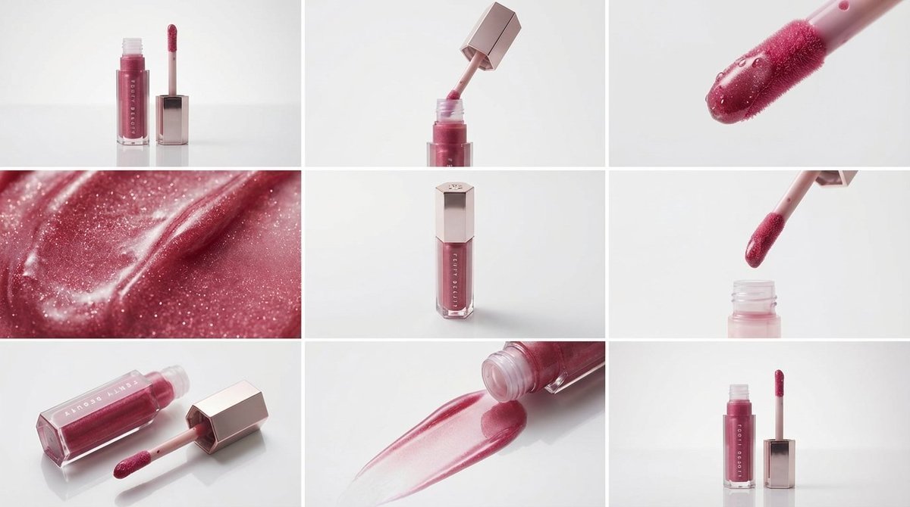

## 3×3的美妆电商广告制作

- ID: gpt4o-673-zh-2
- Slug: prompt-673-zh-2
- 语言: zh
- 来源: [来源链接](https://x.com/Salmaaboukarr/status/1995473175233069217)
- 样例图路径: images/part3/673.jpeg

### 提示词

```text
为高端美妆电商广告制作一张 3×3 的写实风格故事板联系表，广告中仅包含以下产品： {{主产品}}和{{辅助产品}}

背景{{背景}} 。
照明{{照明}} 。

生成一个等间距的 3×3 网格。

{{面板}}
```

### 样例图


## 疯狂动物城朱迪和尼克

- ID: gpt4o-672-zh-1
- Slug: prompt-672-zh-1
- 语言: zh
- 来源: [来源链接](https://x.com/LiEvanna85716/status/1995414338493108500)
- 样例图路径: images/part3/672.jpeg

### 提示词

```text
# Nano Banana Pro Configuration - Zootopia Cyber Fan Concept
# Generated by AI Writing Assistant

project_name: "Zootopia_Cyber_Fashion_Wink"
model_base: "SDXL_Realistic_v4" # 假设的基础模型，可根据实际情况调整
output_resolution: [896, 1152]  # 3:4 Ratio, optimized for Twitter feed

character:
  id: "cyber_judy_fan_01"
  gender: "female"
  age: "20s"
  features:
    - "delicate facial features"
    - "playful expression"
    - "winking one eye"
    - "holding smartphone for selfie"

scene:
  location: "Zootopia official merchandise store"
  lighting: "interior shop lighting, soft neon accents, volumetric bloom"
  atmosphere: "lively, colorful, detailed background"

prompts:
  positive: |
    (Masterpiece, 8k resolution, photorealistic, ultra-detailed),
    POV selfie shot, beautiful young woman winking at camera,
    wearing a futuristic metallic silver corset dress (iridescent texture:1.2),
    wearing fluffy Judy Hopps rabbit ear hat (purple and grey),
    holding a high-tech smartphone, selfie gesture,
    background is a cluttered Zootopia souvenir shop,
    shelves filled with Nick Wilde and Judy Hopps plush toys (fuzzy texture:1.3),
    ZPD badges, carrots merchandise,
    depth of field, ray tracing reflections on the metallic dress,
    cinematic lighting, sharp focus on eyes and phone.

  negative: |
    (worst quality, low quality:1.4), monochrome, zombie,
    deformed anatomy, disfigured, extra fingers, bad hands, 
    missing fingers, floating limbs, disconnected limbs,
    blur, out of focus, cropped head, watermark, text, signature,
    distorted plushies, scary faces on toys.

views:
  - view_id: "main_selfie"
    camera_angle: "high angle selfie"
    focus: "face and upper body"
    description: "The main engagement shot showing the wink and the outfit details."

  - view_id: "outfit_detail"
    camera_angle: "medium shot"
    focus: "waist and background"
    description: "Showcasing the metallic texture of the corset and the Zootopia merch in the back."

# Advanced Settings for Nano Banana Pro
sampling:
  steps: 35
  cfg_scale: 7.5
  sampler: "DPM++ 2M Karras"
  seed: -1 # Random
```

### 样例图


## 疯狂动物城朱迪和尼克

- ID: gpt4o-672-zh-2
- Slug: prompt-672-zh-2
- 语言: zh
- 来源: [来源链接](https://x.com/LiEvanna85716/status/1995414338493108500)
- 样例图路径: images/part3/672.jpeg

### 提示词

```text
# Nano Banana Pro 配置 - 疯狂动物城赛博粉丝概念
# 由 AI 写作助手生成

project_name: "疯狂动物城_赛博_时尚_眨眼"
model_base: "SDXL_Realistic_v4" # 假设的基础模型，可根据实际情况调整
output_resolution: [896, 1152]  # 3:4 比例，针对 Twitter 信息流优化

character:
  id: "赛博_朱迪_粉丝_01"
  gender: "女性"
  age: "20多岁"
  features:
    - "精致的五官"
    - "顽皮/俏皮的表情"
    - "眨一只眼"
    - "手持智能手机自拍"

scene:
  location: "疯狂动物城官方周边商店"
  lighting: "室内商店照明，柔和的霓虹点缀，体积光（光晕）"
  atmosphere: "生动活泼，色彩丰富，背景细节详实"

prompts:
  positive: |
    (杰作, 8k分辨率, 照片级真实, 超精细),
    第一人称视角（POV）自拍镜头, 美丽的年轻女性对着镜头眨眼,
    身穿未来感金属银色紧身胸衣连衣裙 (彩虹色纹理:1.2),
    戴着毛茸茸的朱迪警官（Judy Hopps）兔耳帽 (紫色和灰色),
    手持高科技智能手机, 自拍姿势,
    背景是琳琅满目的疯狂动物城纪念品商店,
    货架上摆满了尼克（Nick Wilde）和朱迪（Judy Hopps）的毛绒玩具 (毛绒纹理:1.3),
    ZPD（动物城警局）警徽, 胡萝卜周边商品,
    景深效果, 金属裙上的光线追踪反射,
    电影级布光, 焦点清晰对准眼睛和手机。

  negative: |
    (最差质量, 低质量:1.4), 单色, 僵尸,
    解剖结构变形, 毁容, 多余的手指, 坏手, 
    缺失手指, 悬浮肢体, 断肢,
    模糊, 失焦, 截断的头部, 水印, 文字, 签名,
    扭曲的毛绒玩具, 玩具有可怕的脸。

views:
  - view_id: "main_selfie"
    camera_angle: "高角度/俯拍自拍"
    focus: "脸部和上半身"
    description: "展示眨眼表情和服装细节的主要互动镜头。"

  - view_id: "outfit_detail"
    camera_angle: "中景镜头"
    focus: "腰部和背景"
    description: "展示紧身胸衣的金属质感以及后方的疯狂动物城周边商品。"

# Nano Banana Pro 高级设置
sampling:
  steps: 35
  cfg_scale: 7.5
  sampler: "DPM++ 2M Karras"
  seed: -1 # 随机
```

### 样例图


## { "scene_description": "A soft, kawaii aesthetic mirror 

- ID: gpt4o-669-en-1
- Slug: prompt-669-en-1
- 语言: en
- 来源: [来源链接](https://x.com/_MehdiSharifi_/status/1995230929158320332)
- 样例图路径: images/part3/669.jpeg

### 提示词

```text
{
  "scene_description": "A soft, kawaii aesthetic mirror selfie of a cute young woman in a Disney store, embracing a fluffy pink Aristocats theme.",
  "image_reference": {
    "path": "[UPLOADED_IMAGE]",
    "weight": "high",
    "influence": "face_and_body_structure"
  },
  "subject": {
    "type": "The woman from the uploaded image",
    "age": "match input image",
    "features": {
      "hair": "soft curls or twin tails with ribbons",
      "expression": "sweet smile, head tilted, eyes wide and innocent",
      "makeup": "heavy blush (igari style), pink glossy lips, soft lashes"
    },
    "attire": "a fluffy white off-shoulder sweater dress (angora texture) with pink satin ribbons tied on the sleeves, white knee-high knitted socks",
    "accessories": "white cat ears headband with pink bows (Marie style), holding a pink strawberry milkshake prop, pearl bracelet",
    "position": "standing with knees slightly bent together (cute pose), holding phone with both hands."
  },
  "action": {
    "primary": "taking a cute selfie",
    "secondary": "holding a drink",
    "effect": "radiating softness and charm"
  },
  "environment": {
    "setting": "Pastel plushie section of Disney store",
    "foreground_elements": [
      "pink phone case with charms",
      "fluffy texture of dress close to lens"
    ],
    "background_elements": [
      "stacks of pink and white plushies",
      "pastel floral decor",
      "soft retail lighting"
    ]
  },
  "lighting": {
    "style": "Soft diffused beauty light",
    "key_light": {
      "type": "Ring light effect",
      "color": "Soft pink/peach undertone",
      "illuminates": "rosy cheeks and fluffy textures."
    },
    "background_light": {
      "color": "Pastel pink glow"
    },
    "shadows": "very soft, almost non-existent shadows"
  },
  "style": {
    "medium": "Smartphone photography",
    "aesthetic": "Coquette, Kawaii, Soft Girl, Pastel Goth light",
    "quality": "Dreamy, soft focus edges",
    "details": "visible fluff on sweater"
  },
  "visual_description": {
    "core_subject": "An embodiment of cuteness and comfort.",
    "attire_physics": "The sweater looks incredibly soft and touchable; ribbons drape naturally.",
    "skin_rendering": "Soft-focus, airbrushed look (beauty filter simulation)."
  },
  "lighting_and_atmosphere": {
    "type": "Dreamy Interior",
    "specifics": "Bloom effect on highlights.",
    "color_grade": "Pastel palette, low contrast, rosy tint"
  },
  "attire_customization": {
    "current_clothing": "Fluffy white sweater dress, pink ribbons, knee socks",
    "customizable_clothing": "Can swap for a pink gingham sundress."
  },
  "camera_and_lens": {
    "focal_length_feel": "35mm",
    "aperture_effect": "f/2.0",
    "camera_angle": "Slightly high angle (selfie standard)",
    "lens_type": "Smartphone front camera simulation",
    "bokeh_style": "Creamy pastel bokeh"
  }
}
```

### 样例图


## 女子在迪士尼商店里对着镜子自拍

- ID: gpt4o-669-zh-2
- Slug: prompt-669-zh-2
- 语言: zh
- 来源: [来源链接](https://x.com/_MehdiSharifi_/status/1995230929158320332)
- 样例图路径: images/part3/669.jpeg

### 提示词

```text
{
"scene_description": "一位可爱年轻女子在迪士尼商店里对着镜子自拍，照片风格柔和可爱，以蓬松的粉色《猫儿历险记》主题为特色。"
"image_reference": {
"路径": "[上传的图像]",
"重量": "高",
“影响”： “面部和身体结构”
},
“主题”： {
"type": "上传图片中的女子",
“年龄”： “匹配输入图像”，
“特征”： {
“头发”：“柔软的卷发或用丝带扎成的双马尾辫”，
“表情”：“甜美的微笑，歪着头，睁大眼睛，显得天真无邪”，
妆容：浓重的腮红（伊加里风格），粉嫩亮泽的嘴唇，柔软的睫毛
},
“服装”：“一件蓬松的白色露肩毛衣连衣裙（安哥拉羊毛质地），袖子上系着粉色缎带，白色及膝针织袜”，
“配饰”：“白色猫耳朵发箍，配粉色蝴蝶结（玛丽风格），手持粉色草莓奶昔道具，珍珠手链”
“姿势”：“双膝微屈并拢站立（可爱姿势），双手拿着手机。”
},
“行动”： {
“主要”: “拍一张可爱的自拍”，
“次要的”: “拿着饮料”，
“效果”：“散发柔和与魅力”
},
“环境”： {
“场景”：“迪士尼商店的粉彩毛绒玩具区”，
"前景元素": [
“粉色带挂饰的手机壳”
“镜头前裙子的蓬松质感”
],
“背景元素”：[
“一堆堆粉色和白色的毛绒玩具”，
“粉彩花卉装饰”，
“柔和的零售照明”
]
},
“灯光”： {
“风格”：“柔和漫射的美光”，
"key_light": {
“类型”：“环形灯效果”，
“颜色”： “柔和的粉色/桃色底调”，
“照亮”：“红润的脸颊和蓬松的质地。”
},
"background_light": {
“颜色”： “柔和的粉红色光芒”
},
“阴影”： “非常柔和，几乎不存在的阴影”
},
“风格”： {
“媒介”：“智能手机摄影”，
“美学”：“娇媚、可爱、柔美少女、柔和哥特风”
“品质”：“梦幻般的柔焦边缘”，
“细节”：“毛衣上有明显的绒毛”
},
"visual_description": {
核心主题：可爱与舒适的化身。
“attire_physics”：“这件毛衣看起来非常柔软，触感极佳；丝带垂坠感也很自然。”
"skin_rendering": "柔焦、喷枪效果（美颜滤镜模拟）"
},
"lighting_and_atmosphere": {
"type": "梦幻内饰",
“具体细节”：“高光部分的绽放效果。”
"color_grade": "柔和色调，低对比度，玫瑰色"
},
"attire_customization": {
"current_clothing": "蓬松的白色毛衣连衣裙，粉色丝带，及膝袜"
"customizable_clothing": "可以换成粉色格子连衣裙。"
},
"camera_and_lens": {
"focal_length_feel": "35mm",
"aperture_effect": "f/2.0",
"camera_angle": "略高角度（自拍标准）",
"lens_type": "智能手机前置摄像头模拟",
"bokeh_style": "奶油粉彩散景"
}
}
```

### 样例图


## { "intent": "Generate a hyper-idealized, 'Douyin-aesthet

- ID: gpt4o-666-en-1
- Slug: prompt-666-en-1
- 语言: en
- 来源: [来源链接](https://x.com/IamEmily2050/status/1995065474749730989)
- 样例图路径: images/part3/666.jpeg

### 提示词

```text
{
  "intent": "Generate a hyper-idealized, 'Douyin-aesthetic' portrait of a young woman at night, utilizing direct flash photography to create a high-contrast, ethereal look with clear weather conditions.",
  "frame": {
    "aspect_ratio": "9:16",
    "composition": "Extreme close-up selfie framing (tighter than standard portrait), cutting off the top of the forehead to focus intensely on the eyes and lips. The subject is centered with a direct, confronting gaze.",
    "style_mode": "Flash photography, digital influencer aesthetic, soft-focus realism."
  },
  "subject": {
    "identity": "A young Asian woman, approximately 20 years old, with hyper-symmetrical, doll-like features characterized by the 'bunny tongue' and 'puppy eye' aesthetic.",
    "skin": "Pale, cool-toned porcelain complexion with zero texture. The skin reflects the flash, creating a 'mochi' or 'glass skin' effect that appears soft and translucent. High-key brightness on the T-zone.",
    "eyes": "Large, round eyes with a slight downward tint at the outer corners (puppy dog eyes). Prominent 'aegyosal' (under-eye fat bands) are highlighted to enhance youthfulness. The irises are soft brown with a large diameter. Eyelashes are styled in the 'manhwa' or 'idol' style: distinct, vertical clumps of mascara-coated lashes separated by space, rather than a dense fan.",
    "nose": "Petite, low-bridge nose with a small, rounded tip. The lighting minimizes the nostril definition, making the nose appear delicate and unobtrusive.",
    "mouth": "Heart-shaped lips featuring a 'gradient lip' technique. The center of the lips is a saturated, glossy strawberry pink, fading outward to a blurred, pale nude at the vermilion border. The texture is soft and hydrated.",
    "hair": "Long, silky jet-black hair with a straight texture. Without the snow, the hair is dry, sleek, and tucked slightly behind the ears or framing the face smoothly, catching the flash with a white sheen.",
    "wardrobe": "Minimal visibility, suggesting a stylish but casual top appropriate for a pleasant evening."
  },
  "environment": {
    "location": "Urban night setting.",
    "weather": "Clear, calm, and beautiful night weather. The atmosphere is clean and free of precipitation or fog.",
    "background": "A backdrop of deep black shadows punctuated by creamy, circular bokeh from distant city lights (streetlamps, neon signs). The background is significantly darker than the subject, ensuring the face is the sole focus."
  },
  "lighting": {
    "type": "Direct, frontal camera flash or high-intensity screen light.",
    "quality": "Hard but flattering light that flattens facial topography, eliminating shadows under the eyes and nose. This creates a 2D, illustrative quality common in high-end social media selfies.",
    "contrast": "High contrast between the brightly illuminated face and the pitch-black environment.",
    "catchlight": "Sharp, tiny pinpoint reflection in the center of the pupils from the flash."
  },
  "camera": {
    "sensor_format": "Smartphone main sensor simulation.",
    "lens": "24mm wide-angle lens. This focal length slightly exaggerates the size of the eyes and diminishes the size of the nose and face width, contributing to the 'baby face' proportion.",
    "aperture_depth_of_field": "f/1.8 to f/2.2, keeping the eyes and lips razor sharp while instantly blurring the ears and background.",
    "focus": "Critical focus on the eyelashes and iris texture."
  },
  "negative": {
    "content": "No snow, no rain, no wet hair, no masculine jawline, no skin texture, no pores, no heavy contouring, no western makeup style, no sunglasses, no hand near face.",
    "style": "No cinematic dramatic shadows (must be flat lit), no warm vintage tones, no painting, no illustration."
  }
}
```

### 样例图


## 极近距离的自拍照

- ID: gpt4o-666-zh-2
- Slug: prompt-666-zh-2
- 语言: zh
- 来源: [来源链接](https://x.com/IamEmily2050/status/1995065474749730989)
- 样例图路径: images/part3/666.jpeg

### 提示词

```text
{
“意图”：“在晴朗的天气条件下，利用直接闪光灯摄影，在夜晚创作一张极具理想化、‘抖音美学’风格的年轻女性肖像，以营造高对比度、空灵的视觉效果。”
“框架”： {
"aspect_ratio": "9:16",
“构图”：“极近距离的自拍取景（比标准肖像照更近），裁掉额头顶部，将焦点集中在眼睛和嘴唇上。拍摄对象位于画面中心，目光直视前方。”
"style_mode": "闪光灯摄影、数码网红美学、柔焦写实主义。"
},
“主题”： {
“身份描述”：“一位大约20岁的年轻亚裔女性，拥有高度对称、娃娃般的五官，其特征是‘兔舌’和‘小狗眼’。”
“肌肤”：苍白、冷调的瓷白肤色，几乎没有纹理。肌肤反射闪光灯，呈现出“麻糬”或“玻璃肌”的效果，看起来柔和通透。T区高光突出。
“眼睛”：大而圆的眼睛，外眼角略微下垂（小狗眼）。突出的眼下脂肪纹（眼袋）增添了青春气息。虹膜呈柔和的棕色，直径较大。睫毛采用“漫画”或“偶像”风格：睫毛根根分明，呈垂直的簇状，涂抹睫毛膏，彼此之间留有空隙，而不是浓密的扇形。
“鼻子”：“小巧的鼻子，鼻梁较低，鼻尖小而圆润。光线柔和地弱化了鼻孔的轮廓，使鼻子看起来精致而不突兀。”
“唇部”：心形唇妆，采用渐变唇妆技术。唇部中央是饱满亮泽的草莓粉色，向外晕染至唇线边缘的浅裸色。质地柔软水润。
“头发”： “长长的、丝滑的乌黑直发。没有雪的时候，头发干燥顺滑，微微别在耳后或柔顺地垂在脸颊两侧，在闪光灯下泛着白色的光泽。”
“衣橱”：“低调的款式，暗示着一件时尚休闲的上衣，适合愉快的夜晚穿着。”
},
“环境”： {
“地点”：“都市夜景。”
天气：晴朗、平静、美丽的夜晚。大气洁净，无降水或雾。
“背景”：“深黑色的阴影背景中点缀着远处城市灯光（路灯、霓虹灯）投射出的柔和圆形散景。背景明显比主体暗，从而确保面部成为唯一的焦点。”
},
“灯光”： {
“类型”：“直接闪光灯、前置摄像头闪光灯或高强度屏幕闪光灯。”
“品质”：“硬朗但柔和的光线，使面部轮廓更加平滑，消除眼下和鼻下的阴影。这营造出一种二维的、插画般的质感，常见于高端社交媒体自拍中。”
“对比度”：“明亮的脸部与漆黑的环境形成鲜明对比。”
“眼神光”：“闪光灯照射到瞳孔中心时，形成的一个清晰、细小的点状反射光。”
},
“相机”： {
"sensor_format": "智能手机主传感器模拟。",
“镜头”：“24mm广角镜头。这种焦距会略微放大眼睛，缩小鼻子和脸部宽度，从而营造出‘娃娃脸’的比例。”
"aperture_depth_of_field": "f/1.8 至 f/2.2，保持眼睛和嘴唇清晰锐利，同时立即虚化耳朵和背景。"
“焦点”：“重点关注睫毛和虹膜的纹理。”
},
“消极的”： {
“内容”：“没有雪，没有雨，没有湿头发，没有男性化的下巴线条，没有皮肤纹理，没有毛孔，没有浓重的修容，没有西式妆容，没有太阳镜，没有手靠近脸部。”
“风格”：“禁止使用电影般的戏剧性阴影（必须采用平光），禁止使用温暖的复古色调，禁止使用绘画风格，禁止使用插画风格。”
}
}
```

### 样例图


## 外卖员的写真照

- ID: gpt4o-665-zh
- Slug: prompt-665-zh
- 语言: zh
- 来源: [来源链接](https://x.com/songguoxiansen/status/1995385148792263095)
- 样例图路径: images/part3/665.jpeg

### 提示词

```text
在明亮的摄影棚内拍摄的半身写真。美丽的东亚女孩，有着如瓷娃娃般无瑕的肌肤和闪烁的大眼睛，正俏皮地歪着头，用手轻轻触碰头盔上的黄色兔耳朵。她穿着整套带有美团Logo的黄色外卖制服。采用柔和、均匀的商业摄影棚打光，营造出清新、活力的氛围，背景深暗，突出主体。在图片最右面搭配上一列文字“我的人生可以用另外一种方式打开”，字体与照片风格相近。
```

### 样例图


## { "prompt": "Ultra-close-up portrait of a stunning young

- ID: gpt4o-659-en-1
- Slug: prompt-659-en-1
- 语言: en
- 来源: [来源链接](https://x.com/Just_sharon7/status/1995108671026803004)
- 样例图路径: images/part3/659.jpeg

### 提示词

```text
{
  "prompt": "Ultra-close-up portrait of a stunning young East Asian woman with flawless porcelain skin, large sparkling dark brown eyes with long lashes, subtle pink blush, glossy red-tinted lips, long straight silky dark brown hair with subtle highlights, making a playful finger-frame gesture around one eye with both hands, extremely detailed long almond-shaped nails with glossy purple-marble and silver chrome galaxy nail art with tiny rhinestones, wearing black-and-white horizontal striped oversized knit sweater with ribbed cuffs, layered delicate silver necklaces with crystal pendants and small pink gems, soft studio lighting with bright white seamless background, high-fashion beauty editorial style, razor-sharp details, perfect skin texture with natural glow, shallow depth of field, shot on 85mm lens f/1.4, ultra-realistic photorealism, 8k, masterpiece, best quality",
  "negative_prompt": "blurry, low resolution, deformed hands, extra fingers, missing fingers, bad anatomy, ugly nails, cheap makeup, overexposed, underexposed, text, watermark, logo, cartoon, 3d render, plastic skin, doll face, cross-eyed, distorted proportions, old, child",
  "steps": 60,
  "cfg_scale": 7.5,
  "sampler": "DPM++ 2M Karras",
  "width": 832,
  "height": 1216,
  "seed": -1
}
```

### 样例图


## 年轻女性的超近特写肖像

- ID: gpt4o-659-zh-2
- Slug: prompt-659-zh-2
- 语言: zh
- 来源: [来源链接](https://x.com/Just_sharon7/status/1995108671026803004)
- 样例图路径: images/part3/659.jpeg

### 提示词

```text
{
“提示”：一位令人惊艳的年轻东亚女性的超近特写肖像，她拥有完美无瑕的瓷白肌肤、闪亮的大眼睛（深棕色）、纤长的睫毛、淡淡的粉色腮红、光泽红润的嘴唇、柔顺的深棕色长直发（带有微妙的挑染），双手俏皮地用手指勾勒着一只眼睛，修长的杏仁形指甲上点缀着闪亮的紫色大理石纹和银色铬星空图案，并镶嵌着细小的水钻，细节极其精致。她身穿黑白横条纹宽松针织衫，袖口饰有罗纹，佩戴着层叠的精致银项链，项链上缀有水晶吊坠和粉色小宝石。柔和的影棚灯光，搭配明亮的白色背景，呈现出高级时尚美妆大片的风格，细节清晰锐利，肌肤纹理完美，散发着自然光泽，浅景深效果，使用85mm f/1.4镜头拍摄，超逼真的照片级写实效果，8K分辨率，杰作，最佳品质。
"negative_prompt": "模糊、低分辨率、手部畸形、多余手指、缺指、解剖结构错误、指甲难看、妆容廉价、曝光过度、曝光不足、文字、水印、标志、卡通、3D渲染、塑料皮肤、娃娃脸、斗鸡眼、比例失调、老旧、儿童",
“步骤”：60，
"cfg_scale": 7.5，
"采样器": "DPM++ 2M Karras",
宽度：832，
“高度”：1216，
“种子”：-1
}
```

### 样例图


## 3x3大头贴风格拼贴画

- ID: gpt4o-658-zh
- Slug: prompt-658-zh
- 语言: zh
- 来源: [来源链接](https://x.com/KusoPhoto/status/1995336530286797271)
- 样例图路径: images/part3/658.jpeg

### 提示词

```text
主题和形式：两位年轻女性朋友创作的高分辨率现代日本大头贴风格拼贴画。
布局：由 3x3 网格组成的单个图像（共 9 帧）。
主题：圣诞节 风格：生动、全彩、明亮、动感地再现现代日本大头贴灯光效果。
背景：简单的纯色或主题色背景（带有小爱心等精致装饰）。
摄影特点：每幅画面都有一条细细的白色或装饰性边框。景深浅（虚化）。

主题和姿势：
两位年轻的女性朋友，穿着符合主题的搭配服装。
生动、活泼、明快的表达。
这九张图清晰地描绘了以下列表中九种不同的流行大头贴姿势。

9 种不同的姿势（3x3 网格）：
第一行：
“抓头发爱心”姿势：一人俏皮地抓着头发，另一人用双手比出一个小爱心。两人都面带笑容。
“双手心形”姿势：两位伴侣用双手在中心形成一个大大的心形。脸上洋溢着灿烂快乐的笑容。
“捏手臂”姿势：两人双臂交叉，其中一人或两人都轻轻捏着对方的脸颊或手臂。表情生动活泼，充满喜悦。特写镜头展现对方的脸部。

第二排：4.“双臂交叉大爱心”姿势：两人双臂交叉，用空着的那只手比出一个大大的爱心。笑容灿烂而充满活力。5.“承诺之心”姿势：一人做出“手指发誓”的手势，另一人用手比出一个小爱心。笑容俏皮而温暖。6.“手牵手爱心”姿势：两人手牵手，各自用空着的那只手比出半个爱心，组成一个完整的爱心。笑容温柔甜美。

第三排：7.“双臂交叉撅嘴”姿势：两人双臂交叉，略带夸张的撅嘴或“得意”（或严肃）的表情，似乎在强忍着笑意。8.“双手合十，脸颊贴心”姿势：两人手牵着手，双手分别放在脸颊上，在脸颊周围画出一个心形。笑容可爱迷人。9.“双臂交叉，手心相印”姿势：两人双臂交叉，每人用一只手分别画出一个小的心形。笑容自信而时尚。特写镜头展现了他们的脸部。

其他装饰：
多个发光的霓虹心形图案叠加。
每一帧画面上，都以霓虹灯风格，沿着脸部的外轮廓写着与主题相关的字母。
在每个面板上添加多个符合主题的不同霓虹线条艺术涂鸦（例如星星、箭头、饱和线条、花朵、动物耳朵等）。
主要限制：所有9张照片必须保持主体、服装、背景风格和光线的严格一致性。浅景深，这是大头贴的典型特征。
请勿：添加任何文字、徽标、标签、水印、符号、数字或其他任何类型的文本元素（上述指定的文本元素和霓虹线条艺术涂鸦除外）。
```

### 样例图


## { "title": "Hyper-Realistic Portrait: Suited Woman in Mu

- ID: gpt4o-657-en-1
- Slug: prompt-657-en-1
- 语言: en
- 来源: [来源链接](https://x.com/xmiiru_/status/1995344587750072496)
- 样例图路径: images/part3/657.jpeg

### 提示词

```text
{
  "title": "Hyper-Realistic Portrait: Suited Woman in Mugshot Pose",
  "description": "A high-resolution hyper-realistic 8K HD portrait photograph captured with a professional DSLR camera using a 50mm lens for natural depth of field and razor-sharp focus. Full-body composition mimicking an old-fashioned mugshot/police booking photo.",
  "subject": {
    "type": "woman",
    "features": {
      "likeness_reference": "attached image",
      "height": "tall",
      "build": "elegant",
      "facial_features": {
        "jawline": "sharp",
        "eyes": "intense",
        "expression": "confident, slightly smug smirk"
      },
      "pose": "leaning against wall, one knee bent"
    },
    "hair": {
      "style": "neat, straight, wavy or elegant updo",
      "appearance": "natural and well-groomed"
    },
    "clothing": {
      "jacket": "vintage-style tailored dark pinstripe suit jacket",
      "inner_garment": "none",
      "tie": "slightly loosened, dark shade matching jacket",
      "accessories": [
        {
          "type": "mugshot board",
          "text": {
            "name": "MIRA",
            "date": "17/5/62"
          }
        },
        {
          "type": "shoe",
          "description": "single shiny dark-colored high-heeled shoe in right hand",
          "material": "patent leather"
        }
      ]
    }
  },
  "background": {
    "style": "naturally blurred bokeh",
    "texture": "slightly gritty studio wall",
    "details": {
      "height_chart": "vertical lines with numerical markings 2'0\" to 6'6\"",
      "color_tone": "desaturated, slightly sepia-toned archival photograph aesthetic"
    }
  },
  "lighting": {
    "type": "clean, soft, balanced",
    "shadow": "accurate shadows and highlights",
    "direction": "strong overhead or frontal lighting emphasizing dramatic shadows and height chart lines"
  },
  "framing": {
    "resolution": "1080x1350px (4:5)",
    "focus": "sharp subject focus",
    "composition": "full figure and mugshot details",
    "color_accuracy": "professional, natural tones"
  },
  "style": "Hyper-realistic photography, 8K clarity, DSLR quality, accurate color grading, natural lens blur, vintage photo aesthetic, true-to-life detail",
  "watermark": "© xmiiru",
  "negative_prompt": [
    "No anime",
    "No cartoon",
    "No digital painting",
    "No illustration",
    "No 3D render",
    "No CGI",
    "No stylized features",
    "No plastic/doll-like skin",
    "No fantasy glow",
    "No cinematic effects",
    "No airbrushed smoothing",
    "No overexposure",
    "No unnatural blur",
    "No video-game/Unreal Engine style",
    "No sketch",
    "No artificial lighting effects",
    "No unrealistic proportions/textures",
    "No multiple shoes",
    "No modern background elements"
  ]
}
```

### 样例图


## 身着西装的女子摆出嫌犯照姿势

- ID: gpt4o-657-zh-2
- Slug: prompt-657-zh-2
- 语言: zh
- 来源: [来源链接](https://x.com/xmiiru_/status/1995344587750072496)
- 样例图路径: images/part3/657.jpeg

### 提示词

```text
{
标题：超写实肖像：身着西装的女子摆出嫌犯照姿势
“描述”：“这是一张高分辨率、超逼真的 8K 高清人像照片，使用专业数码单反相机和 50mm 镜头拍摄，以获得自然的景深和极其清晰的焦点。全身构图模仿了老式的嫌犯照/警局登记照。”
“主题”： {
类型： 女，
“特征”： {
"likeness_reference": "附加图像",
“身高”：“高”，
“建造”：“优雅”，
"facial_features": {
下颌线：尖锐，
“眼睛”：“专注”，
“表情”：“自信、略带自负的微笑”
},
姿势：倚靠在墙上，单膝弯曲
},
“头发”： {
“发型”：“整齐、笔直、波浪或优雅的盘发”，
“外表”：“自然且仪容整洁”
},
“衣服”： {
“外套”： “复古风格的深色细条纹修身西装外套”，
"内衣": "无",
领带：略微松开，深色，与外套相配。
“配件”： [
{
类型： '嫌犯照片板'，
“文本”： {
"name": "MIRA",
日期： 17/5/62
}
},
{
类型：鞋子，
描述：右手拿着一只闪亮的深色高跟鞋。
材质：漆皮
}
]
}
},
“背景”： {
“风格”：“自然模糊散景”，
“纹理”：“略带颗粒感的摄影棚墙面”，
“细节”： {
"身高图": "带有数字标记的垂直线，从 2'0\" 到 6'6\"",
"color_tone": "褪色、略带棕褐色调的档案照片美学"
}
},
“灯光”： {
“类型”：“干净、柔和、平衡”，
“阴影”：“精确的阴影和高光”，
“方向”：“强烈的顶光或正面照明，强调戏剧性的阴影和高度图线条”
},
"框架": {
“分辨率”：“1080x1350像素（4:5）”
“焦点”: “清晰的主体焦点”，
“构图”：“全身像和嫌犯照细节”，
"color_accuracy": "专业、自然的色调"
},
“风格”：“超逼真的摄影，8K 清晰度，单反画质，精准的色彩分级，自然的镜头虚化，复古照片美学，逼真的细节”，
“水印”： “ © xmiiru”，
"negative_prompt": [
“没有动漫”，
“没有卡通片”，
“没有数码绘画”，
“无插图”
“没有3D渲染图”，
“无电脑特效”
“没有风格化的特征”，
“没有塑料/娃娃般的皮肤”，
“没有梦幻般的光芒”，
“没有电影特效”，
“没有使用喷枪进行平滑处理”，
“没有过度曝光”，
“没有不自然的模糊效果”，
“没有电子游戏/虚幻引擎风格”，
“没有草图”，
“无人工照明效果”，
“没有不切实际的比例/纹理”，
“禁止穿多双鞋”
“无现代背景元素”
]
}
```

### 样例图


## { "image_generation_request": { "constraints": { "preser

- ID: gpt4o-656-en-1
- Slug: prompt-656-en-1
- 语言: en
- 来源: [来源链接](https://x.com/YaseenK7212/status/1994815950856552898)
- 样例图路径: images/part3/656.jpeg

### 提示词

```text
{
  "image_generation_request": {
    "constraints": {
      "preservation_instruction": "Please keep my face 100% the same, do not change any facial details.",
      "strictness": "Critical"
    },
    "technical_specifications": {
      "camera_device": "Canon IXY/IXUS digital camera",
      "aesthetic_style": [
        "Y2K Digital Aesthetic",
        "Cyber Ulzzang",
        "Retro Japan–Korea look",
        "Early 2000s digital photograph"
      ],
      "lighting": {
        "source": "Strong front flash",
        "target": "Directly on face",
        "characteristics": "Bright white",
        "effect_on_skin": [
          "Radiant",
          "Shiny",
          "Bright"
        ]
      },
      "visual_grading": {
        "contrast": "High",
        "color_tone": "Slight cool blue",
        "atmosphere": [
          "Mysterious",
          "Sharp"
        ]
      }
    },
    "composition": {
      "type": "Portrait",
      "meta_scene_element": "A reflection in the mirror shows another woman's hand taking the photo of the model"
    },
    "subject_details": {
      "demographics": "Teenage girl",
      "physical_appearance": {
        "hair": {
          "color": "Dark brown",
          "texture": [
            "Long",
            "Soft",
            "Wavy"
          ],
          "accessory": "Sanrio Kuromi hair clip"
        },
        "eyes": {
          "description": "Bright",
          "contacts": "Blue-grey contact lenses"
        },
        "skin": {
          "base_tone": "Fair",
          "undertone": "Slightly pink toned",
          "complexion": [
            "Rosy glow",
            "Smooth"
          ]
        },
        "body_features": "Clear, shapely waistline"
      },
      "attire_and_accessories": {
        "top": "Dark grey spaghetti strap crop top",
        "belt": {
          "style": "Waist belt",
          "material": "Silver chain",
          "details": "Dangling moon charms"
        }
      },
      "makeup": {
        "general_style": "Light pink makeup",
        "lashes": "Long eyelashes",
        "additional_descriptors": "thin and"
      }
    }
  }
}
```

### 样例图


## 女人的自拍照

- ID: gpt4o-656-zh-2
- Slug: prompt-656-zh-2
- 语言: zh
- 来源: [来源链接](https://x.com/YaseenK7212/status/1994815950856552898)
- 样例图路径: images/part3/656.jpeg

### 提示词

```text
{
"image_generation_request": {
"约束条件": {
"保存说明": "请100%保持我的脸部原貌，不要改变任何面部细节。"
“严格性”： “关键”
},
"technical_specifications": {
"camera_device": "佳能 IXY/IXUS 数码相机",
"aesthetic_style": [
“Y2K 数字美学”
“Cyber​​ Ulzzang”
“复古日韩风”
“2000 年代初期的数码照片”
],
“灯光”： {
“来源”：“强前闪光”，
“目标”：“直接作用于面部”，
“特性”：“亮白色”，
"effect_on_skin": [
“光芒四射”，
“闪亮的”，
“明亮的”
]
},
"visual_grading": {
“对比度”：“高”，
"color_tone": "略带冷蓝色",
“气氛”： [
“神秘”，
“锋利的”
]
}
},
“作品”： {
“类型”：“肖像”，
"meta_scene_element": "镜子中的倒影显示另一只女人的手正在给模特拍照"
},
"subject_details": {
“人口统计信息”：“少女”，
"physical_appearance": {
“头发”： {
“颜色”：“深棕色”，
“质地”： [
“长的”，
“柔软的”，
“波浪状”
],
“配饰”： “三丽鸥库洛米发夹”
},
"眼睛": {
描述：明亮，
“隐形眼镜”： “蓝灰色隐形眼镜”
},
“皮肤”： {
"base_tone": "Fair",
“底色”： “略带粉色调”
“肤色”：[
“玫瑰色的光芒”，
“光滑的”
]
},
"body_features": "清晰、优美的腰线"
},
"服装和配饰": {
上衣：深灰色细肩带露脐上衣，
“腰带”： {
“款式”：“腰带”，
“材质”：“银链”，
详情：垂坠的月亮吊坠
}
},
“化妆品”： {
"general_style": "浅粉色妆容",
“睫毛”： “长长的睫毛”，
"additional_descriptors": "thin and"
}
}
}
}
```

### 样例图


## Extreme close-up of a human hand holding a giant vertica

- ID: gpt4o-654-en-1
- Slug: prompt-654-en-1
- 语言: en
- 来源: [来源链接](https://x.com/ShreyaYadav___/status/1995145004269068406)
- 样例图路径: images/part3/654.jpeg

### 提示词

```text
Extreme close-up of a human hand holding a giant vertical pill.
The pill has a clear glass top section and the lower 3/4 is matte bright-red, with bold, clean, perfectly aligned typography that reads: BASKETBALL LEGENDARY.
Inside the pill, show a person whose face must match the attached photo 100% exactly — no changes to facial structure, proportions, expression baseline, or any detail. The face must display a natural, realistic, wide laughing expression.
Inside the pill, the person is performing a dynamic basketball dribbling pose with high energy, labeled with the account name 'MICHAEL JORDAN'.
Scene style: funny, chaotic, thrilling, slightly creepy, and intense.
Background: an NBA basketball court, with full cinematic lighting, dramatic shadows, and rich color depth.
Camera angle: aerial extreme close-up focused on the pill in the hand.
Texture: ultra-HD realism with fine grain, crisp micro-details, glass reflections, and smooth matte material fidelity.
Ratio 3:4.
Ensure motion, energy, and dynamic movement inside the pill while keeping the pill perfectly vertical.
```

### 样例图


## 人手拿着一颗巨大的竖式药丸的特写镜头

- ID: gpt4o-654-zh-2
- Slug: prompt-654-zh-2
- 语言: zh
- 来源: [来源链接](https://x.com/ShreyaYadav___/status/1995145004269068406)
- 样例图路径: images/part3/654.jpeg

### 提示词

```text
人手拿着一颗巨大的竖式药丸的特写镜头。”
该药丸顶部为透明玻璃部分，底部 3/4 为哑光亮红色，上面印有醒目、清晰、完美对齐的字体：篮球传奇。
药丸内显示一个人的脸，该人的脸必须与附图100%完全一致——面部结构、比例、表情基线或任何细节都不得更改。该脸必须展现出自然、逼真、开怀大笑的表情。
药丸内，一个人摆出充满活力的篮球运球姿势，并标有账号名称“迈克尔·乔丹”。
场景风格：滑稽、混乱、惊险、略带诡异、紧张。
背景：NBA篮球场，采用全电影级灯光、戏剧性的阴影和丰富的色彩深度。
拍摄角度：航拍，特写镜头聚焦于手中的药丸。
纹理：超高清真实感，颗粒细腻，微细节清晰，玻璃反射效果逼真，哑光材质质感细腻。
比例 3:4。
“确保药丸内部具有运动、能量和动态特性，同时保持药丸完全垂直。
```

### 样例图


## { "objective": "Generate a cinematic, photo-realistic im

- ID: gpt4o-652-en-1
- Slug: prompt-652-en-1
- 语言: en
- 来源: [来源链接](https://x.com/rovvmut_/status/1995087450788573215)
- 样例图路径: images/part3/652.jpeg

### 提示词

```text
{
  "objective": "Generate a cinematic, photo-realistic image of the person in the uploaded image",
  "scene_description": {
    "setting": {
      "location": "Rain-soaked flyover bench at dusk",
      "environment_details": [
        "wet pavement with puddle reflections",
        "mist in the air",
        "vibrant neon cityscape in the background",
        "bokeh trails from passing cars"
      ]
    },
    "subject": {
      "type": "person in the uploaded image",
      "pose": "sitting on the bench, low-angle perspective",
      "appearance": {
        "outfit": {
          "jacket": "colorblock denim jacket",
          "inner_wear": "yellow hoodie",
          "pants": "khaki cargo pants",
          "footwear": "high-top sneakers"
        }
      }
    }
  },
  "camera_and_style": {
    "camera_angle": "cinematic low-angle shot",
    "focus": {
      "subject_focus": "sharp 8K clarity on subject",
      "foreground": "intentionally blurred"
    },
    "color_grading": "moody mix of warm streetlights and cool neon tones",
    "lighting": [
      "ambient neon glow",
      "warm streetlights",
      "reflections in puddles"
    ],
    "aesthetics": [
      "cinematic depth",
      "high contrast",
      "atmospheric realism"
    ]
  },
  "output_preferences": {
    "resolution": "8K highly detailed",
    "style": "cinematic realism"
  }
}
```

### 样例图


## 人物的电影级逼真图像

- ID: gpt4o-652-zh-2
- Slug: prompt-652-zh-2
- 语言: zh
- 来源: [来源链接](https://x.com/rovvmut_/status/1995087450788573215)
- 样例图路径: images/part3/652.jpeg

### 提示词

```text
{
“目标”：“生成上传图像中人物的电影级、照片级逼真图像”，
"scene_description": {
“环境”： {
“地点”：“黄昏时分被雨水浸透的高架桥长椅”
"environment_details": [
“湿漉漉的路面上倒映着水坑里的水珠”，
“空气中弥漫着薄雾”，
“背景是充满活力的霓虹灯城市景观”，
“过往车辆的散景拖影”
]
},
“主题”： {
“类型”：“上传图片中的人物”，
“姿势”：“坐在长椅上，低角度视角”，
“外貌”： {
“全套服装”： {
"jacket": "拼色牛仔夹克",
"内衣": "黄色连帽衫",
裤子：卡其色工装裤，
“鞋类”: “高帮运动鞋”
}
}
}
},
"camera_and_style": {
"camera_angle": "电影般的低角度拍摄",
“重点”： {
"subject_focus": "主体清晰锐利，8K分辨率",
“前景”：“故意模糊”
},
"color_grading": "温暖的路灯和冷色调的霓虹灯交织的氛围"
“灯光”： [
“环境霓虹灯光”，
“温暖的路灯”，
“水洼中的倒影”
],
“美学”：[
“电影般的景深”，
“高对比度”，
“氛围真实感”
]
},
"output_preferences": {
“分辨率”：“8K 超高清”，
风格：电影写实主义
}
}
```

### 样例图


## { "subject": { "description": "A rugged male survivor wa

- ID: gpt4o-648-en-1
- Slug: prompt-648-en-1
- 语言: en
- 来源: [来源链接](https://x.com/azed_ai/status/1994767576963207277)
- 样例图路径: images/part3/648.jpeg

### 提示词

```text
{
  "subject": {
    "description": "A rugged male survivor walking through an overgrown city street",
    "mirror_rules": "Reflection in broken shop window",
    "age": "40s",
    "expression": "wary, scanning the horizon, tired",
    "hair": {
      "color": "salt and pepper",
      "style": "overgrown, messy beard"
    },
    "clothing": {
      "top": {
        "type": "flannel shirt and denim jacket",
        "color": "faded blue and red plaid",
        "details": "holes in elbows, sun-bleached, dirt stains"
      },
      "bottom": {
        "type": "jeans",
        "color": "dark grey",
        "details": "muddy knees, frayed hems"
      }
    },
    "face": {
      "preserve_original": true,
      "makeup": "dirt smudges, sun spots, realistic weathering"
    }
  },
  "accessories": {
    "headwear": {
      "type": "none",
      "details": "N/A"
    },
    "jewelry": {
      "earrings": "none",
      "necklace": "none",
      "wrist": "broken analog watch",
      "rings": "wedding band on chain around neck"
    },
    "device": {
      "type": "flashlight",
      "details": "clipped to backpack strap"
    },
    "prop": {
      "type": "hiking backpack",
      "details": "large, olive green, bedroll attached, worn fabric"
    }
  },
  "photography": {
    "camera_style": "Cinematic realism, 35mm wide lens",
    "angle": "wide shot establishing environment",
    "shot_type": "full body walking away from camera slightly",
    "aspect_ratio": "16:9",
    "texture": "detailed foliage, crisp sunlight, natural colors"
  },
  "background": {
    "setting": "ruined city street reclaimed by nature",
    "wall_color": "concrete covered in ivy",
    "elements": [
      "rusted cars",
      "tall grass cracking through pavement",
      "collapsed building in distance",
      "deer visible in background"
    ],
    "atmosphere": "quiet, desolate, beautiful decay",
    "lighting": "overcast soft daylight, diffuse shadows, melancholy feel"
  }
}
```

### 样例图


## 电影感十足的照片

- ID: gpt4o-648-zh-2
- Slug: prompt-648-zh-2
- 语言: zh
- 来源: [来源链接](https://x.com/azed_ai/status/1994767576963207277)
- 样例图路径: images/part3/648.jpeg

### 提示词

```text
{
“主题”： {
“描述”：“一位身形粗犷的男性幸存者走过杂草丛生的城市街道”，
"mirror_rules": "破损商店橱窗中的倒影",
“年龄”: “40多岁”
“表情”：“警惕地扫视着地平线，疲惫不堪”
“头发”： {
“颜色”：“盐和胡椒”，
“风格”：“杂乱不堪的胡须”
},
“衣服”： {
“顶部”： {
“类型”：“法兰绒衬衫和牛仔夹克”，
“颜色”：“褪色的蓝红色格子图案”，
“细节”：“肘部有破洞，被太阳晒褪色，有污渍”
},
“底部”： {
类型：牛仔裤，
“颜色”：“深灰色”，
细节：沾满泥巴的膝盖，磨损的下摆
}
},
“脸”： {
"preserve_original": true,
“妆容”：“污渍、晒斑、逼真的风化效果”
}
},
“配件”： {
"头饰": {
"type": "无",
“详情”： “不适用”
},
“珠宝”： {
“耳环”： “无”，
“项链”： “无”，
“手腕”: “坏掉的模拟手表”
“戒指”： “戴在脖子上的链子上的结婚戒指”
},
“设备”： {
“类型”：“手电筒”，
“细节”：“夹在背包带上”
},
"prop": {
"type": "登山背包",
“细节”：“大号，橄榄绿色，附带睡袋，布料磨损”
}
},
“摄影”： {
“camera_style”: “电影写实主义，35mm广角镜头”
角度： “广角镜头，展现环境”，
"shot_type": "全身略微远离镜头走开",
"aspect_ratio": "16:9",
“质感”：“细致的树叶、明媚的阳光、自然的色彩”
},
“背景”： {
“场景”：“被自然重新占领的废弃城市街道”，
"wall_color": "覆盖着常春藤的混凝土",
“元素”：[
“生锈的汽车”，
“高高的草丛撑破了路面”，
远处倒塌的建筑物
背景中可见鹿
],
“氛围”：“安静、荒凉、美丽的衰败”，
“光线”：“阴天柔和的日光，漫射的阴影，忧郁的氛围”
}
}
```

### 样例图


## { "promptDetails": { "description": "A garage/workshop e

- ID: gpt4o-647-en-1
- Slug: prompt-647-en-1
- 语言: en
- 来源: [来源链接](https://x.com/HBCoop_/status/1994822441793671485)
- 样例图路径: images/part3/647.jpeg

### 提示词

```text
{
 "promptDetails": {
 "description": "A garage/workshop environment with the subject assembling a complex mechanical device, viewing a 3D exploded assembly diagram floating in space.",
 "styleTags": [
 "Industrial",
 "High Detail",
 "Technical",
 "Action Shot"
 ]
 },
 "scene": {
 "background": {
 "setting": "A cluttered but organized home workshop/garage bench",
 "details": "Pegboard tool wall in the background, organized small parts containers, a soldering iron station, wood grain of the workbench, metal shavings (subtly)."
 },
 "subject": {
 "description": "The person defined by `[UPLOADED IMAGE]`, wearing safety glasses or a work glove, deeply concentrated.",
 "pose": "Leaning over the bench, holding a small component (e.g., a rotor or circuit board) with tweezers or a small screwdriver.",
 "focus": "Hands, component, and the diagram are the sharpest elements."
 }
 },
 "overlayObject": {
 "type": "3D Exploded View Assembly Hologram",
 "relationshipToEnvironment": "Hovering directly above the disassembled drone parts on the workbench.",
 "transform": "A fully rendered, rotating 3D model of the device, clearly showing where the held component fits.",
 "surfaceInteraction": "Bright, high-contrast yellow/orange vector lines with directional arrows and part numbering. It must look spatially correct.",
 "components": {
 "partID": "Rotor Mount (P/N: M24B)",
 "instruction": "Attach to Main Hub (Torque to 1.5 Nm)",
 "position": "Floating central to the workspace."
 }
 },
 "technicalStyle": {
 "aspectRatio": "16:9",
 "photographyStyle": "Product/Technical, High Contrast",
 "camera": {
 "shotType": "Close-Up",
 "angle": "Slightly overhead (designer/technical perspective).",
 "depthOfField": "Extremely shallow, focusing only on the hands, the component, and the projected diagram. The background should be a creamy blur (bokeh)."
 },
 "lighting": {
 "type": "Fluorescent Shop Light and Holographic Glow",
 "description": "Cool, bright, uniform white light from above, contrasted by the warm, directional glow of the yellow/orange hologram."
 },
 "color": {
 "palette": "Greys, deep reds, metallic silver, and the neon yellow of the graphic."
 }
 }
}
```

### 样例图


## 漂浮在空中的3D爆炸装配图

- ID: gpt4o-647-zh-2
- Slug: prompt-647-zh-2
- 语言: zh
- 来源: [来源链接](https://x.com/HBCoop_/status/1994822441793671485)
- 样例图路径: images/part3/647.jpeg

### 提示词

```text
{
"promptDetails": {
“描述”：“车库/工作室环境，人物正在组装一个复杂的机械装置，同时观看漂浮在空中的3D爆炸装配图。”
"styleTags": [
“工业的”，
“高细节”，
“技术的”，
“动作镜头”
]
},
“场景”： {
“背景”： {
“场景”：“一个杂乱但井然有序的家庭工作室/车库工作台”，
“细节”：“背景中的挂板工具墙，整齐的小零件容器，电烙铁台，工作台的木纹，（隐约可见的）金属屑。”
},
“主题”： {
“描述”：“图中所示人物（[上传图片]），戴着安全眼镜或工作手套，神情专注。”
“姿势”：“身体前倾，倚靠在工作台上，用镊子或小螺丝刀夹住一个小元件（例如转子或电路板）。”
“焦点”：“手、部件和图表是最清晰的元素。”
}
},
"overlayObject": {
"type": "3D爆炸视图组装全息图",
“与环境的关系”：“直接悬停在工作台上拆卸下来的无人机部件上方。”
“变换”：“设备的完整渲染、旋转3D模型，清晰地显示了所持组件的安装位置。”
“表面交互”： “明亮、高对比度的黄/橙色矢量线，带有方向箭头和零件编号。它必须在空间上看起来正确。”
“成分”： {
"partID": "转子安装座（部件号：M24B）",
“说明”：“连接到主轮毂（扭矩为 1.5 牛米）”
“位置”：“位于工作区中心”。
}
},
"technicalStyle": {
“aspectRatio”: “16:9”
“photographyStyle”: “产品/技术，高对比度”
“相机”： {
"shotType": "特写",
“角度”：“略微俯视（设计师/技术视角）。”
“景深”： “极浅的景深，只聚焦于手部、组件和投影图。背景应呈现柔和的虚化效果（散景）。”
},
“灯光”： {
“类型”：“荧光商店照明灯和全息发光”，
“描述”：“上方照射下来的冷色调、明亮、均匀的白光，与温暖的、定向的黄橙色全息光形成对比。”
},
“颜色”： {
“调色板”：“灰色、深红色、金属银色和图形中的霓虹黄色。”
}
}
}
```

### 样例图


## { "scene_description": "A playful, high-energy fisheye p

- ID: gpt4o-646-en-1
- Slug: prompt-646-en-1
- 语言: en
- 来源: [来源链接](https://x.com/_MehdiSharifi_/status/1994870610410021018)
- 样例图路径: images/part3/646.jpeg

### 提示词

```text
{
  "scene_description": "A playful, high-energy fisheye portrait of a stylish young woman sitting inside a metal shopping cart in a vibrant supermarket aisle.",
  "subject": {
    "type": "young woman",
    "age": "early 20s",
    "features": {
      "hair": "long dark brown hair tied in loose low pigtails",
      "expression": "playful wink, slight smile",
      "hands": "long manicured nails, making a finger-frame gesture around her eye"
    },
    "attire": "black tank top, blue and white plaid shirt tied around the waist, white scrunched socks",
    "footwear": "oversized chunky white sneakers with light blue accents and thick laces",
    "position": "sitting inside a wire shopping cart, legs extended toward the camera lens creating foreshortening"
  },
  "action": {
    "primary": "posing playfully inside a shopping cart",
    "secondary": "framing her winking eye with her fingers using an 'L' shape gesture",
    "effect": "dynamic distortion emphasizing the sneakers and hands due to the lens"
  },
  "environment": {
    "setting": "brightly lit grocery store snack aisle",
    "foreground_elements": [
      "silver metal wire of the shopping cart",
      "chunky sneaker sole in extreme close-up"
    ],
    "background_elements": [
      "shelves stocked with colorful snack bags (yellow, red, green packaging)",
      "overhead fluorescent lights",
      "tiled supermarket floor",
      "promotional signage on shelves"
    ]
  },
  "lighting": {
    "style": "high-key, flat commercial lighting",
    "key_light": {
      "type": "overhead fluorescent tubes",
      "color": "cool white/neutral",
      "illuminates": [
        "entire aisle evenly",
        "reflections on plastic snack packaging",
        "sheen on the metal cart"
      ]
    },
    "shadows": "minimal, soft shadows beneath the cart"
  },
  "style": {
    "medium": "digital photography",
    "aesthetic": "Gen Z social media trend, Y2K influence, street style",
    "quality": "high definition, vibrant colors",
    "details": "sharp focus throughout"
  },
  "scene_composition": {
    "subject_action": "Leaning back casually in the cart, engaging directly with the camera",
    "camera_behavior": "Extreme close-up, wide-angle distortion",
    "depth_layering": "Exaggerated foreground (shoes) -> Middle ground (subject) -> Curved background (shelves)"
  },
  "visual_description": {
    "core_subject": "A trendy young woman with a fun, carefree attitude.",
    "attire_physics": "The plaid shirt is bunched naturally around the waist; the shoe laces appear large and textured due to proximity.",
    "skin_rendering": "Smooth, bright complexion, soft makeup with emphasized blush."
  },
  "lighting_and_atmosphere": {
    "type": "Artificial Interior Lighting",
    "specifics": "Even, bright illumination typical of retail environments, creating vibrant color pop on the merchandise.",
    "color_grade": "Slightly overexposed highlights, saturated primaries (reds, yellows, blues)."
  },
  "attire_customization": {
    "current_clothing": "Black tank top, plaid shirt (blue/white/grey), denim shorts (hidden), white chunky sneakers.",
    "customizable_clothing": "Leave empty to maintain current style or replace with 'oversized hoodie' for a different vibe."
  },
  "brand_product_customization": {
    "current_brand_product": "Generic colorful potato chip bags and snack packaging in background.",
    "customizable_brand": "User can insert specific snack brand names for the shelves.",
    "customizable_product": "User can specify the type of sneaker (e.g., Jordan, Balenciaga).",
    "product_placement_area": "The shelves behind the subject or the yellow bag inside the cart."
  },
  "objects_and_props": {
    "main_objects": [
      "Metal shopping cart",
      "Chunky sneakers"
    ],
    "secondary_objects": [
      "Yellow snack bag inside the cart",
      "Silver scrunched bracelet"
    ]
  },
  "camera_and_lens": {
    "focal_length_feel": "8mm to 10mm Fisheye",
    "aperture_effect": "Deep depth of field (f/8 or f/11)",
    "camera_angle": "High angle / POV looking down into the cart",
    "lens_type": "Ultra-wide angle fisheye lens",
    "bokeh_style": "None (everything in focus)"
  }
}
```

### 样例图


## 年轻女子坐在购物车里

- ID: gpt4o-646-zh-2
- Slug: prompt-646-zh-2
- 语言: zh
- 来源: [来源链接](https://x.com/_MehdiSharifi_/status/1994870610410021018)
- 样例图路径: images/part3/646.jpeg

### 提示词

```text
{
场景描述：一张充满活力、趣味十足的鱼眼镜头肖像照，照片中一位时尚的年轻女子坐在熙熙攘攘的超市过道里的一辆金属购物车里。
“主题”： {
“类型”: “年轻女子”
“年龄”：“20岁出头”，
“特征”： {
“头发”：“长长的深棕色头发扎成松散的低辫子”，
“表情”：“俏皮的眨眼，淡淡的微笑”，
“双手”：“修长的指甲，在她眼周做出指框的手势”
},
“着装”：“黑色背心，蓝白格子衬衫系在腰间，白色皱巴巴的袜子”，
“鞋履”：“超大号厚底白色运动鞋，带有浅蓝色点缀和粗鞋带”，
“姿势”：“坐在金属购物车里，双腿伸向镜头，造成透视缩短效果”
},
“行动”： {
“主要”: “在购物车里摆出俏皮的姿势”，
“次要的”：“用手指勾勒出她眨眼的轮廓，呈‘L’形”，
“效果”：“镜头造成的动态畸变，突出了运动鞋和手部”
},
“环境”： {
“场景”：“灯光明亮的杂货店零食区”，
"前景元素": [
“购物车上的银色金属丝”，
“厚底运动鞋的超近特写”
],
“背景元素”：[
“货架上摆满了五颜六色的零食袋（黄色、红色、绿色包装）”，
“头顶荧光灯”，
“超市瓷砖地面”，
“货架上的促销标牌”
]
},
“灯光”： {
“风格”：“高调、扁平的商业照明”，
"key_light": {
“类型”：“高架荧光灯管”，
“颜色”: “冷白/中性色”
“照亮”：[
“整条过道均匀铺开”，
“关于塑料零食包装的反思”
“金属推车上的光泽”
]
},
“阴影”：“购物车下方的阴影极少，很柔和”
},
“风格”： {
“媒介”: “数码摄影”
“美学”：“Z世代社交媒体趋势、Y2K影响、街头风格”
“质量”：“高清，色彩鲜艳”，
“细节”：“始终清晰聚焦”
},
"scene_composition": {
“subject_action”: “随意地向后靠在购物车里，直接与镜头互动”
"camera_behavior": "极致特写，广角畸变",
"depth_layering": "夸张的前景（鞋子） ->中景（主体） ->弧形背景（书架）"
},
"visual_description": {
"core_subject": "一位时尚、性格开朗、无忧无虑的年轻女性。"
"attire_physics": "格子衬衫自然地堆积在腰间；鞋带由于距离较近而显得又大又有纹理。"
“皮肤渲染”: “光滑、明亮的肤色，柔和的妆容，腮红突出。”
},
"lighting_and_atmosphere": {
“类型”：“人工室内照明”，
“具体细节”：“均匀明亮的照明，符合零售环境的典型特征，使商品色彩鲜艳夺目。”
“color_grade”: “高光略微过曝，原色（红色、黄色、蓝色）饱和度高。”
},
"attire_customization": {
"current_clothing": "黑色背心，格子衬衫（蓝/白/灰），牛仔短裤（隐藏），白色厚底运动鞋。"
"customizable_clothing": "留空以保持当前风格，或替换为“oversized hoodie”以获得不同的风格。"
},
"品牌产品定制": {
"current_brand_product": "背景中是色彩鲜艳的普通薯片包装袋和零食包装。"
"customizable_brand": "用户可以为货架输入特定的零食品牌名称。"
"customizable_product": "用户可以指定运动鞋的类型（例如，乔丹、巴黎世家）。"
"product_placement_area": "主体身后的货架或购物车内的黄色袋子。"
},
"objects_and_props": {
"main_objects": [
“金属购物车”，
厚底运动鞋
],
"secondary_objects": [
“购物车里的黄色零食袋”
“银色褶皱手镯”
]
},
"camera_and_lens": {
"focal_length_feel": "8mm 至 10mm 鱼眼镜头",
"aperture_effect": "大景深（f /8或 f/11）",
"camera_angle": "高角度/POV 俯视推车内部",
"lens_type": "超广角鱼眼镜头",
"bokeh_style": "无（所有物体都清晰对焦）"
}
}
```

### 样例图


## A hyper-detailed 3D render of a collectible chess piece 

- ID: gpt4o-644-en-1
- Slug: prompt-644-en-1
- 语言: en
- 来源: [来源链接](https://x.com/TechieBySA/status/1994777464631951499)
- 样例图路径: images/part3/644.jpeg

### 提示词

```text
A hyper-detailed 3D render of a collectible chess piece designed as [ICON]. The figure is sculpted in polished marble and gold accents, with a stylized base resembling a classic chess piece. The character’s iconic features, clothing, or accessories are faithfully captured in a simplified but instantly recognizable form. Studio lighting with soft reflections, dramatic shadows, photorealistic textures, cinematic presentation. Centered on a clean neutral background, 1080x1080 square format.
```

### 样例图


## 极具收藏价值的国际象棋棋子

- ID: gpt4o-644-zh-2
- Slug: prompt-644-zh-2
- 语言: zh
- 来源: [来源链接](https://x.com/TechieBySA/status/1994777464631951499)
- 样例图路径: images/part3/644.jpeg

### 提示词

```text
这款极具收藏价值的国际象棋棋子以[ICON]为设计理念，采用超精细的3D渲染图呈现。棋子主体由抛光大理石雕刻而成，并以金色点缀，底座造型经典，宛如一枚国际象棋棋子。棋子的标志性特征、服饰和配饰均以简洁却极具辨识度的形式忠实还原。画面采用摄影棚灯光，营造出柔和的反射、戏剧性的阴影、逼真的纹理以及电影级的视觉效果。背景简洁干净，采用1080x1080像素的正方形格式。
```

### 样例图


## 黑板艺术作品-海賊女帝

- ID: gpt4o-642-zh-1
- Slug: prompt-642-zh-1
- 语言: zh
- 来源: [来源链接](https://x.com/IamEmily2050/status/1994624635300974734)
- 样例图路径: images/part3/642.jpeg

### 提示词

```text
{
  "intent": "Photorealistic documentation of a specific chalkboard art piece featuring a single anime character, capturing the ephemeral nature of the medium within a classroom context.",
  "frame": {
    "aspect_ratio": "4:3",
    "composition": "A centered medium shot focusing on the chalkboard mural. The composition includes the teacher's desk in the immediate foreground to provide scale, with the artwork of the single character dominating the background space.",
    "style_mode": "documentary_realism, texture-focused, ambient naturalism"
  },
  "subject": {
    "primary_subject": "A large-scale, intricate chalk drawing of Boa Hancock from 'One Piece' on a standard green classroom blackboard.",
    "visual_details": "The illustration depicts Boa Hancock in a commanding pose, positioned centrally on the board. She is drawn with her signature long, straight black hair with a hime cut, rendered using dense application of black chalk with white accents for sheen. Her expression is haughty and imperious, with detailed dark blue eyes. She is depicted forming a heart shape with her hands, referencing her 'Mero Mero Mellow' technique. She wears a revealing red blouse with purple geometric patterns and gold snake-shaped earrings, drawn with vibrant colored chalks.",
    "medium_texture": "The image preserves the dusty, matte quality of the chalk. Visible hatching and cross-hatching strokes create shading on her clothing and hair. Smudged areas on the green slate indicate where colors have been blended by hand.",
    "surrounding_elements": "To the right of the character, vertical Japanese text reading '海賊女帝' (Pirate Empress) is written in crisp white chalk."
  },
  "environment": {
    "location": "A standard Japanese school classroom.",
    "foreground_elements": "A wooden teacher's desk occupies the lower foreground. Scattered across the surface are a yellow box of colored chalks, loose sticks of red, white, and blue pastel chalk, and a dust-covered black felt eraser.",
    "background_elements": "The green chalkboard spans the width of the frame, bordered by a metallic chalk tray containing accumulated chalk dust. The wall above is a plain, off-white plaster, featuring a small mounted speaker box.",
    "atmosphere": "Quiet and academic, with a sense of stillness suggesting the room is currently unoccupied."
  },
  "lighting": {
    "type": "Diffuse ambient classroom lighting.",
    "quality": "Soft, nondirectional illumination provided by overhead fluorescent fixtures mixed with daylight from windows on the left. The light is even, preventing glare on the chalkboard surface while highlighting the texture of the chalk.",
    "color_temperature": "Neutral white, approximately 5000K, ensuring accurate color rendition of the red and purple chalks against the dark green board.",
    "direction": "Overhead and slightly frontal."
  },
  "camera": {
    "sensor_format": "35mm full-frame digital sensor.",
    "lens": "35mm prime lens.",
    "aperture": "f/5.6",
    "depth_of_field": "Moderate depth of field, keeping the chalkboard drawing in sharp focus while allowing the foreground desk elements to soften slightly.",
    "shutter_speed": "1/60s",
    "iso": "400",
    "camera_position": "Eye-level standing position, set back enough to frame the entire drawing and the desk."
  },
  "negative": {
    "content": "Multiple characters, Midoriya, Shigaraki, male characters, digital art overlay, vector graphics, paper texture, oil painting, messy composition, extreme low angle, fisheye lens.",
    "style": "No hyper-saturation, no soft focus filters, no heavy vignetting."
  }
}
```

### 样例图


## 黑板艺术作品-海賊女帝

- ID: gpt4o-642-zh-2
- Slug: prompt-642-zh-2
- 语言: zh
- 来源: [来源链接](https://x.com/IamEmily2050/status/1994624635300974734)
- 样例图路径: images/part3/642.jpeg

### 提示词

```text
{
“意图”：“以照片写实的手法记录一幅特定的黑板艺术作品，作品中描绘了一个动漫角色，捕捉了课堂环境中这种媒介的转瞬即逝的特性。”
“框架”： {
"aspect_ratio": "4:3",
“构图”：“以黑板壁画为中心拍摄的中景镜头。画面前景中包含教师的办公桌以显示比例，而单个人物的画作则占据了背景空间。”
"style_mode": "纪实写实主义，注重纹理，环境自然主义"
},
“主题”： {
“primary_subject”: “一幅绘制在标准绿色教室黑板上的大型、精细的《海贼王》角色波雅·汉库克的粉笔画。”
“视觉细节”： “这幅插画描绘了波雅·汉库克，她以威严的姿态位于画面中央。她标志性的黑色长直发，采用姬发式剪裁，以浓重的黑色粉笔绘制，并以白色点缀以增加光泽。她的表情傲慢而威严，深蓝色的眼睛刻画入微。她双手比划成心形，象征着她的‘Mero Mero Mellow’（柔情蜜意）技巧。她身着一件饰有紫色几何图案的性感红色上衣，佩戴着以鲜艳彩色粉笔绘制的金色蛇形耳环。”
“medium_texture”：图像保留了粉笔的粉尘质感和哑光效果。清晰可见的排线和交叉线笔触在她的衣服和头发上营造出阴影。绿色石板上的晕染区域表明了手工调色的位置。
"surrounding_elements": "字符右侧用清晰的白色粉笔写着竖排的日文“海贼女帝”。"
},
“环境”： {
地点：一间标准的日本学校教室。
"前景元素": "一张木制教师桌占据了画面下方的前景。桌面上散落着一盒黄色的彩色粉笔、几支红色、白色和蓝色的粉彩粉笔，以及一块沾满灰尘的黑色毡橡皮。"
“背景元素”： “绿色黑板横跨整个画面宽度，边缘是一个金属粉笔托盘，里面积满了粉笔灰。黑板上方是一面普通的米白色石膏墙，墙上安装了一个小型壁挂式音箱。”
“氛围”：“安静而学术，一种静谧感表明房间里目前无人居住。”
},
“灯光”： {
“类型”：“漫射环境教室照明。”
“质量”：“柔和、无方向性的照明由上方荧光灯具提供，并混合了左侧窗户的自然光。光线均匀，既防止黑板表面产生眩光，又突显了粉笔的纹理。”
“色温”： “中性白光，约 5000K，确保红色和紫色粉笔在深绿色白板上的准确显色。”
“方向”：“头顶上方，略微朝前。”
},
“相机”： {
"sensor_format": "35mm 全画幅数码传感器。"
“镜头”：“35mm 定焦镜头。”
光圈：f/5.6，
“景深”： “适中的景深，保持黑板上的图画清晰锐利，同时让前景的桌面元素略微柔化。”
"shutter_speed": "1/60"
“iso”: “400，
“camera_position”: “与眼睛齐平的站立位置，向后移动足够远，以便将整个图纸和桌子都框入其中。”
},
“消极的”： {
内容：多个角色、绿谷出久、死柄木弔、男性角色、数字艺术叠加、矢量图形、纸张纹理、油画、凌乱构图、极低角度、鱼眼镜头。
“风格”：“不使用过饱和度，不使用柔焦滤镜，不使​​用严重的暗角。”
}
}
```

### 样例图


## 路飞教室艺术

- ID: gpt4o-641-zh
- Slug: prompt-641-zh
- 语言: zh
- 来源: [来源链接](https://x.com/yanhua1010/status/1995044071803371880)
- 样例图路径: images/part3/641.jpeg

### 提示词

```text
{
  "意图": "对特定黑板艺术作品进行写实纪录摄影，画面呈现单个动漫角色，捕捉粉笔媒介的短暂性及教室场景氛围。",
  "画面框架": {
    "画幅比例": "4:3",
    "构图方式": "中景构图，聚焦黑板壁画。构图包含前景的教师讲台以提供比例尺度，背景空间由单个角色的艺术作品主导。",
    "风格模式": "纪实写实主义、质感聚焦、环境自然主义"
  },
  "主体对象": {
    "主要主体": "标准绿色教室黑板上绘制的大型精细粉笔画，描绘《海贼王》角色蒙奇·D·路飞。",
    "视觉细节": "画面中路飞呈现动态姿势,居于黑板中央。他戴着标志性草帽,黑色凌乱短发,露齿灿烂笑容。表情充满活力和喜悦,圆形眼睛生动传神。他的一只手臂向前伸展,呈现橡胶手臂技能(橡胶果实能力)。身穿红色无袖背心(敞开状态)露出胸前标志性X形伤疤,蓝色短裤和凉鞋,使用鲜艳彩色粉笔绘制。",
    "媒介质感": "画面保留粉笔的粉尘感和哑光质地。可见排线和交叉阴影笔触为服装和头发创造阴影效果。绿色黑板上的晕染区域显示手工混合颜色的痕迹。",
    "周边元素": "角色右侧,竖向日文'麦わらのルフィ'(草帽路飞)用清晰白色粉笔书写。"
  },
  "环境设定": {
    "场所": "标准日本学校教室。",
    "前景元素": "木质讲台占据画面下方前景。桌面上散落着黄色粉笔盒、红白蓝色散落粉笔条,以及沾满粉笔灰的黑色毡擦。",
    "背景元素": "绿色黑板横跨画面宽度,底部为金属粉笔槽,积累有粉笔灰。黑板上方为米白色石膏墙面,挂有小型扬声器盒。",
    "氛围": "安静的学术空间,静谧感暗示教室当前无人。"
  },
  "光线设定": {
    "类型": "漫射环境光,教室照明。",
    "质量": "柔和无方向性照明,由顶部荧光灯具与左侧窗户日光混合提供。光线均匀,防止黑板表面眩光,同时突显粉笔质感。",
    "色温": "中性白,约5000K色温,确保红色和紫色粉笔在深绿色黑板上的准确色彩还原。",
    "方向": "顶部和略微正面照射。"
  },
  "相机参数": {
    "传感器格式": "35mm全画幅数码传感器。",
    "镜头": "35mm定焦镜头。",
    "光圈": "f/5.6",
    "景深": "中等景深,保持黑板绘画清晰对焦,前景讲台元素轻微柔化。",
    "快门速度": "1/60秒",
    "感光度": "ISO 400",
    "机位": "站立视线高度,与画面保持足够距离以框入完整绘画和讲台。"
  },
  "负面提示": {
    "内容": "多个角色、绿谷出久、死柄木、男性角色、数字艺术叠加、矢量图形、纸张纹理、油画、混乱构图、极端低角度、鱼眼镜头。",
    "风格": "无过度饱和、无柔焦滤镜、无重度暗角。"
  }
}
```

### 样例图


## Editorial 3x3 grid in soft golden-beige studio. Characte

- ID: gpt4o-640-en-1
- Slug: prompt-640-en-1
- 语言: en
- 来源: [来源链接](https://x.com/MonetizeXWithAb/status/1994781646361694398)
- 样例图路径: images/part3/640.jpeg

### 提示词

```text
Editorial 3x3 grid in soft golden-beige studio. Character (face characteristics 100% same as uploaded image) wearing a glossy silk saree with minimal jewelry. Lighting: warm soft key from right, reflector fill left. Shots match original structure: extreme lip/cheek macro with blurred silk, tight eye reflection crop, B&W chin-on-fist frame-fill, fabric-framed shoulder view, frontal close-up with hand-light pattern, angled portrait with loose strands, jawline-focused hand crop, half-body seated on cube, profile with rim slice. Same lens & aperture set. RAW, elegant tonal grade, smooth cinematic grain.
```

### 样例图


## 3x3网格构图进行拍摄照片

- ID: gpt4o-640-zh-2
- Slug: prompt-640-zh-2
- 语言: zh
- 来源: [来源链接](https://x.com/MonetizeXWithAb/status/1994781646361694398)
- 样例图路径: images/part3/640.jpeg

### 提示词

```text
在柔和的金米色摄影棚内，采用3x3网格构图进行拍摄。人物（面部特征与上传图片完全一致）身着光泽丝绸纱丽，佩戴极简首饰。灯光：右侧暖色调柔光主光，左侧反光板补光。拍摄构图与原图一致：极致唇颊微距特写（丝绸虚化）、眼部特写（反光）、黑白下巴托拳构图、织物框肩部特写、正面特写（手光图案）、斜角人像（头发散落）、下颌线特写（手部特写）、半身像（坐在立方体上）、侧面轮廓（镜框特写）。镜头和光圈设置相同。RAW格式，色调优雅，颗粒感柔和。
```

### 样例图


## Create a photo of me 240 leaning my back out the window 

- ID: gpt4o-639-en-1
- Slug: prompt-639-en-1
- 语言: en
- 来源: [来源链接](https://x.com/kingofdairyque/status/1995046473835467038)
- 样例图路径: images/part3/639.jpeg

### 提示词

```text
Create a photo of me 240 leaning my back out the window car like a dark dreamy blurry vintage windy night wearing a off shoulder white knitted top.
With brown long wavy hair. keep the facial details correctly. Please do not alter facial features and leave head positioning as is.
```

### 样例图


## 身穿露肩白色针织上衣

- ID: gpt4o-639-zh-2
- Slug: prompt-639-zh-2
- 语言: zh
- 来源: [来源链接](https://x.com/kingofdairyque/status/1995046473835467038)
- 样例图路径: images/part3/639.jpeg

### 提示词

```text
拍一张我身穿露肩白色针织上衣，背靠着车窗外，像一个黑暗、梦幻、模糊的复古、刮着风的夜晚的照片。
棕色长卷发。请保持面部细节正确。请勿更改面部特征，头部姿势保持不变。
```

### 样例图


## { "photo": { "type": "kawaii_idol_closeup_portrait", "qu

- ID: gpt4o-638-en-1
- Slug: prompt-638-en-1
- 语言: en
- 来源: [来源链接](https://x.com/so_ainsight/status/1995018306433290701)
- 样例图路径: images/part3/638.jpeg

### 提示词

```text
{
  "photo": {
    "type": "kawaii_idol_closeup_portrait",
    "quality": "8k photorealistic, high fidelity, masterpiece",
    "lens": "85mm f/1.2 prime lens, beautiful bokeh",
    "composition": "bust-up shot, close-up, eye-level, subject centered, no text",
    "face": {
      "description": "A super cute 18-year-old Japanese girl with large sparkling puppy eyes, rosy cheeks (igari makeup style), glossy pink lips, porcelain skin, charming and sweet expression, radiating pure idol energy"
    },
    "model_pose": {
      "position": "facing camera slightly angled",
      "hands": "both hands bringing attention to the face, perhaps touching cheeks or holding a piece of hair, cute finger positioning",
      "expression": "beaming angelic smile, looking directly at viewer with affection, head slightly tilted"
    },
    "wardrobe": {
      "top": {
        "type": "fluffy white angora knit sweater with a cute ribbon collar",
        "style": "oversized sleeves covering half of hands (moe-sode), pastel aesthetic, soft texture"
      },
      "accessories": {
        "hair": "airy bangs, soft waves, decorated with pastel ribbon clips and tiny pearl pins",
        "earrings": "dainty dangling heart earrings",
        "necklace": "delicate gold chain with a small crystal"
      }
    },
    "textures": {
      "emphasis": [
        "hyper-detailed iris and eyelashes",
        "soft peach fuzz on skin",
        "fluffy angora texture",
        "glossy lips",
        "sparkling eye reflections"
      ]
    },
    "environment": {
      "backdrop": "dreamy blurred pastel background with bokeh lights",
      "lighting": {
        "style": "ethereal beauty lighting",
        "key_light": "soft diffuse frontal light to eliminate shadows",
        "effects": "slight bloom effect, rim light on hair to create a halo effect"
      }
    },
    "color_grade": {
      "type": "bright pastel dreamy",
      "balance": "creamy whites, soft pinks, slightly overexposed high-key look"
    }
  }
}
```

### 样例图

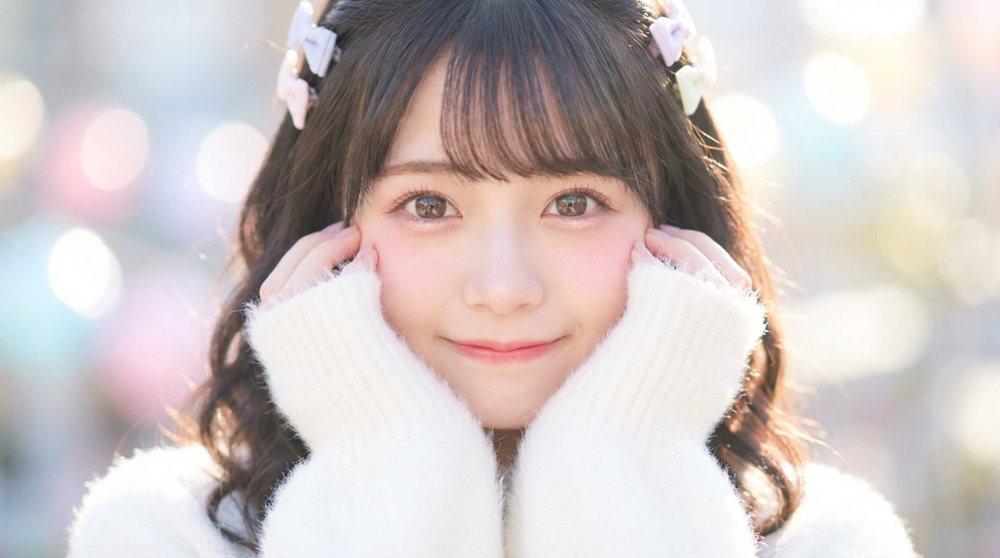

## 可爱偶像特写肖像

- ID: gpt4o-638-zh-2
- Slug: prompt-638-zh-2
- 语言: zh
- 来源: [来源链接](https://x.com/so_ainsight/status/1995018306433290701)
- 样例图路径: images/part3/638.jpeg

### 提示词

```text
{
  "photo": {
    "type": "可爱偶像特写肖像",
    "quality": "8K级照片写实，高保真，杰作",
    "lens": "85mm f/1.2 定焦镜头，美丽的散景（虚化）",
    "composition": "半身镜头，特写，视线平齐，主体居中，无文本",
    "face": {
      "description": "一位超级可爱的18岁日本少女，有着水汪汪的大眼睛（像小狗一样），红润的脸颊（宿醉妆/伊伽利妆风格），有光泽的粉色嘴唇，陶瓷般的肌肤，迷人甜美的表情，散发着纯粹的偶像能量"
    },
    "model_pose": {
      "position": "面向镜头，略微侧身",
      "hands": "双手吸引对脸部的注意，也许是摸着脸颊或捏着一缕头发，可爱的手指姿势",
      "expression": "天使般灿烂的笑容，深情地直视观看者，头部略微倾斜"
    },
    "wardrobe": {
      "top": {
        "type": "蓬松的白色安哥拉兔毛针织毛衣，带有可爱的丝带领子",
        "style": "超大袖子遮住一半手（萌袖），柔和色调美学，柔软质感"
      },
      "accessories": {
        "hair": "空气刘海，柔和的波浪卷，装饰着柔和色调的丝带夹和微小的珍珠发卡",
        "earrings": "精致的垂坠心形耳环",
        "necklace": "搭配一颗小水晶的精致金链"
      }
    },
    "textures": {
      "emphasis": [
        "超精细的虹膜和睫毛",
        "皮肤上柔软的绒毛",
        "蓬松的安哥拉兔毛质感",
        "有光泽的嘴唇",
        "闪烁的眼睛反光"
      ]
    },
    "environment": {
      "backdrop": "梦幻模糊的柔和色调背景，带有散景光斑",
      "lighting": {
        "style": "空灵的美颜光照",
        "key_light": "柔和的漫射正面光以消除阴影",
        "effects": "轻微的柔光（泛光）效果，头发上的边缘光营造出光环效果"
      }
    },
    "color_grade": {
      "type": "明亮柔和梦幻",
      "balance": "奶油白，柔和粉，略微过曝的高调外观"
    }
  }
}
```

### 样例图


## { "prompt": "Edit this photo without changing the face a

- ID: gpt4o-637-en-1
- Slug: prompt-637-en-1
- 语言: en
- 来源: [来源链接](https://x.com/xmiiru_/status/1995078053165146326)
- 样例图路径: images/part3/637.jpeg

### 提示词

```text
{
  "prompt": "Edit this photo without changing the face a beautiful woman with fair skin lit by bright morning sunlight from a strong golden directional light source creating clear shadows on her face and hair",
  "details": {
    "hair": {
      "color": "dark brown",
      "shine": "natural",
      "style": "loose messy bun on top of the head",
      "wet_strands": "a few wet look strands curving on the forehead in an aesthetically neat random pattern",
      "side_strands": "two long straight strands on both sides softly framing the face",
      "volume": "back section lifted into the bun looking thick and voluminous"
    },
    "makeup": {
      "eyes": {
        "lens_color": "light grey",
        "pupil_visibility": "clear",
        "eyeshadow": "highly reflective silver glitter with tiny sparkling particles"
      }
    }
  }
}
```

### 样例图


## 肤色白皙的美丽女性沐浴在晨光中

- ID: gpt4o-637-zh-2
- Slug: prompt-637-zh-2
- 语言: zh
- 来源: [来源链接](https://x.com/xmiiru_/status/1995078053165146326)
- 样例图路径: images/part3/637.jpeg

### 提示词

```text
{
“提示”：“编辑这张照片，不要改变脸部，照片中是一位肤色白皙的美丽女性，沐浴在明亮的晨光中，强烈的金色定向光源在她脸上和头发上形成了清晰的阴影。”
“细节”： {
“头发”： {
“颜色”: “深棕色”
“光泽”：“自然”，
“发型”：“头顶上随意挽起的凌乱发髻”，
"wet_strands": "几缕湿漉漉的发丝以整齐随机的图案在额头上自然垂落"
"side_strands": "两侧各有两缕长长的直发，柔和地垂在脸颊两侧",
“蓬松度”：后脑勺的头发向上梳成发髻，看起来浓密蓬松。
},
“化妆品”： {
"眼睛": {
"lens_color": "浅灰色",
"pupil_visibility": "clear",
“眼影”：“高反射银色闪粉，带有细小闪光颗粒”
}
}
}
}
```

### 样例图


## 水墨画风格与写实摄影的结合

- ID: gpt4o-634-zh
- Slug: prompt-634-zh
- 语言: zh
- 来源: [来源链接](https://x.com/songguoxiansen/status/1991529000519496037)
- 样例图路径: images/part3/634.jpeg

### 提示词

```text
水墨画风格与写实摄影的结合。云雾缭绕的深山悬崖边，有一座摇摇欲坠的古老木质茶馆。茶馆门口挂着一副巨大的对联，随风飘扬。上联写：“进门不问人间事”，下联写：“喝茶只谈山海经”。横批是一块斑驳的牌匾：“神仙也得排队”。
```

### 样例图

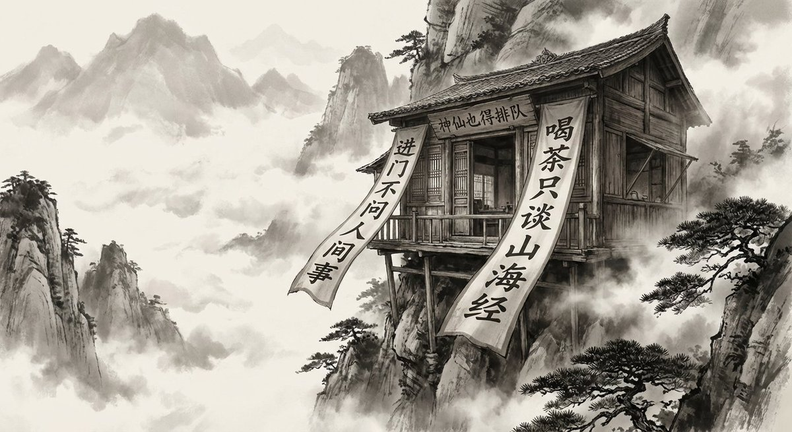

## A highly realistic, highly detailed, photorealistic 8K m

- ID: gpt4o-630-en-1
- Slug: prompt-630-en-1
- 语言: en
- 来源: [来源链接](https://x.com/kingofdairyque/status/1994745605621780533)
- 样例图路径: images/part3/630.jpeg

### 提示词

```text
A highly realistic, highly detailed, photorealistic 8K mirror selfie taken with an iPhone 15 Pro Max. Zootropolis fandom aesthetic.
Scene: A guy and a girl pose together in front of an oval mirror in a Disney toy store.
The guy on the left has a playful expression, matching the reference photo. The girl on the right  winks playfully, holding a bright yellow phone. Metallic nail polish.
Clothing and accessories:
• Both are wearing large plush Disney Zootropolis character hats.
The guy on the left in Photo 1—Nick Wilde's orange hat with large fox ears embroidered with sly eyes.
 Girl in photo 2 on the right—gray Judy Hopps hat with long pink bunny ears, large purple eyes.
• Photo 1 on the left—clothes and hair match the attached photo.
• Photo 2 on the right—wearing a hot pink halter top. Long, straight hair.
A pearl necklace fits snugly around her neck.
She has rings on several fingers.
Girl in photo 2's makeup: Korean K-beauty; glass skin; subtle blush; black eyeliner; colored contacts (blue/gray); pink and rosy ombre lipstick.
Background: Disney gift shop interior; frosted shelves filled with toys; holiday mall lighting; decorative ceiling chandelier.
Quality and detail: 8K, highly realistic plush texture (individual fur fibers), vibrant, saturated colors, soft commercial mall lighting, no noise, perfectly sharp focus on face and hat, mirror selfie in frame.
```

### 样例图


## 疯狂动物城的大型毛绒角色帽子

- ID: gpt4o-630-zh-2
- Slug: prompt-630-zh-2
- 语言: zh
- 来源: [来源链接](https://x.com/kingofdairyque/status/1994745605621780533)
- 样例图路径: images/part3/630.jpeg

### 提示词

```text
一张用 iPhone 15 Pro Max 拍摄的超逼真、超精细、照片级 8K 镜面自拍。充满《疯狂动物城》的粉丝美学风格。
场景：一男一女在迪士尼玩具店的椭圆形镜子前合影。
左边那位男士表情顽皮，与参考照片相符。右边那位女士俏皮地眨着眼，手里拿着一部亮黄色的手机。她涂着金属质感的指甲油。
服装和配饰：
•两人都戴着迪士尼《疯狂动物城》的大型毛绒角色帽子。
照片 1 中左边的人——尼克·王尔德的橙色帽子，上面绣着一对大狐狸耳朵和狡黠的眼睛。
照片 2 右侧的女孩——戴着灰色的朱迪·霍普斯帽子，帽子上有长长的粉色兔子耳朵和大大的紫色眼睛。
• 左侧照片 1——衣服和发型与附图相符。
• 右侧照片2——身穿亮粉色露背上衣，留着长长的直发。
一条珍珠项链紧紧地贴合在她的脖子上。
她好几个手指上都戴着戒指。
照片 2 中女孩的妆容：韩式 K-beauty；水光肌；淡淡的腮红；黑色眼线；彩色隐形眼镜（蓝灰色）；粉色和玫瑰色渐变唇膏。
背景：迪士尼礼品店内部；摆满玩具的磨砂货架；节日商场灯光；装饰性天花板吊灯。
质量和细节：8K，高度逼真的毛绒质感（单根毛纤维），鲜艳饱和的色彩，柔和的商业商场灯光，无噪点，面部和帽子完美清晰对焦，画面中有镜子自拍。
```

### 样例图


## 第一人称视角牵手照片

- ID: gpt4o-628-zh
- Slug: prompt-628-zh
- 语言: zh
- 来源: [来源链接](https://x.com/songguoxiansen/status/1994691557338013951)
- 样例图路径: images/part3/628.jpeg

### 提示词

```text
说明：知名名人可能会生成失败，可换图片模型试试
一张超写实的第一人称男友视角照片，画面前景是男性的一只手正牵着长发造型的刘亦菲的手，她身穿红色吊带紧身胸衣短裙搭配红色薄透丝袜，佩戴金色项链，在后台化妆间内眼神迷人地注视着镜头，背景可见摆满化妆品的桌子及带灯泡的化妆镜（映出背影），采用直射闪光灯摄影风格，8K极致细节真实质感。
```

### 样例图

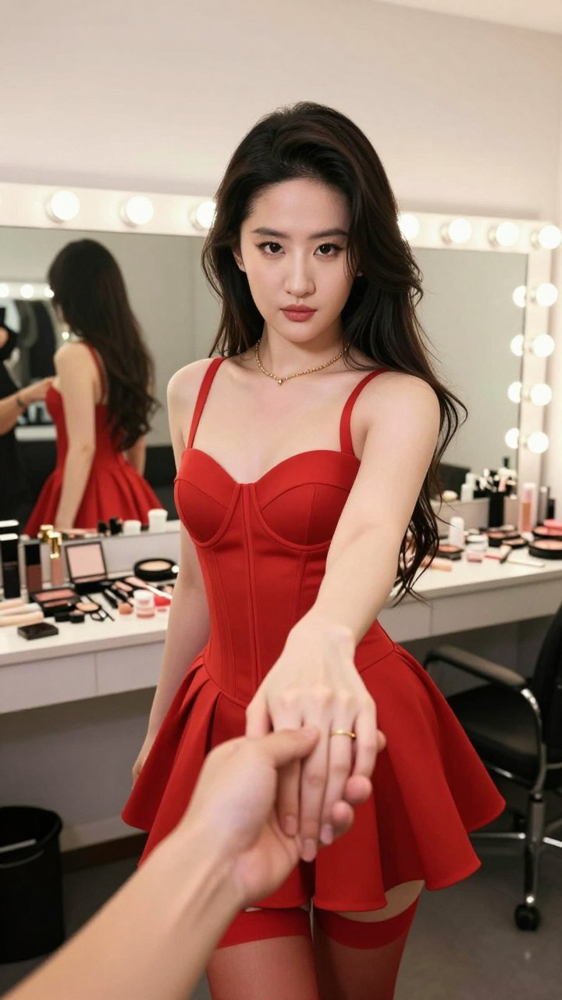

## MacBook Pro 笔记本电脑拆解

- ID: gpt4o-627-zh
- Slug: prompt-627-zh
- 语言: zh
- 来源: [来源链接](https://x.com/songguoxiansen/status/1994671420480356417)
- 样例图路径: images/part3/627.jpeg

### 提示词

```text
MacBook Pro 笔记本电脑的极致拆解，左右分屏构图。左侧 1/3 展示合盖或半开状态的完整银色MacBook；右侧 2/3 展示极其复杂的内部构造，M系列芯片主板、风扇、铝合金外壳和键盘组件，按Knolling网格整齐平铺。纯白背景，商业产品摄影，高透光感，--ar 16:9
```

### 样例图

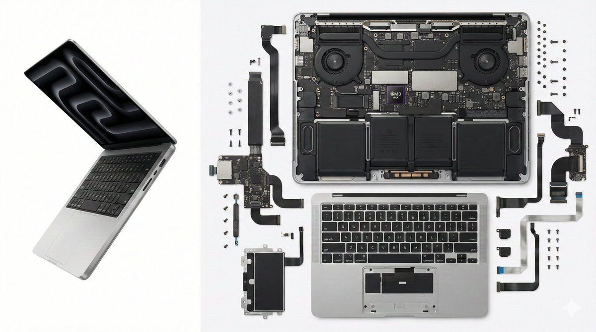

## Use the uploaded photo. Do NOT alter the person’s real a

- ID: gpt4o-625-en-1
- Slug: prompt-625-en-1
- 语言: en
- 来源: [来源链接](https://x.com/AI_GIRL_DESIGN/status/1993243344932413597)
- 样例图路径: images/part3/625.jpeg

### 提示词

```text
Use the uploaded photo. 
Do NOT alter the person’s real appearance — keep the person’s face, body, clothing, colors, and texture completely photorealistic. 
Do NOT change the background perspective. 
Do NOT turn the person into a drawing or illustration.

Add a dense, overloaded layer of pop-style illustrated “sweets monsters” and graphic decorations ONLY around the person (and on top of their clothing if needed), but never on their skin or face.

Illustrated elements:
- many colorful cartoon monsters with thick black outlines, flat colors, and cute-but-ugly expressions
- sweets-inspired monsters: bananas, cookies, strawberries, melting chocolate, lollipops, ice cream, oranges, cupcakes, donuts, candy pieces, soda bottles, etc.
- additional graphic shapes: stars, hearts, arrows, drips, splashes, zigzag lines, exclamation marks, motion lines, sparkles, bubbles, comic-style text shapes (but no real text)

Make the decoration very dense and “busy”:
- fill the space behind the person with overlapping sweets monsters and shapes
- add monsters peeking from behind the shoulders, around the bag, at the person’s feet, and near the head
- allow some monsters and shapes to overlap the clothing and accessories (shirt, shorts, bag, shoes), but keep the skin of the face, arms, and legs photorealistic and visible
- use multiple layers of illustrations in front of and behind the person to create depth
- add glowing outlines, small white dots, and speed lines around the person to emphasize energy

Color and style:
- use a vivid, neon-like color palette (hot pink, yellow, cyan, lime, orange, purple, turquoise)
- keep all illustrated elements flat and graphic with clean edges and bold outlines
- ensure shadows and overlap suggest interaction with the real person (e.g., slight shadows on clothing where monsters touch)

Overall goal:
Create a highly decorated, maximalist pop-art scene where the real person stands in the middle, surrounded and wrapped by a chaotic crowd of playful sweets monsters and graphic doodles, while the person remains clearly photorealistic.
```

### 样例图


## 在人物周围添加糖果怪兽

- ID: gpt4o-625-zh-2
- Slug: prompt-625-zh-2
- 语言: zh
- 来源: [来源链接](https://x.com/AI_GIRL_DESIGN/status/1993243344932413597)
- 样例图路径: images/part3/625.jpeg

### 提示词

```text
请使用已上传的照片。
不要改变人物的真实外貌——保持人物的脸部、身体、衣服、颜色和纹理完全逼真。
请勿改变背景视角。
请勿将人物形象转化为绘画或插图。

在人物周围（必要时可以贴在衣服上）添加一层厚重的、过多的流行风格插画“糖果怪兽”和图形装饰，但绝不能贴在皮肤或脸上。

图示元素：
- 许多色彩鲜艳的卡通怪物，轮廓线粗黑，色彩扁平，表情可爱又丑陋。
- 以甜食为灵感的怪物：香蕉、饼干、草莓、融化的巧克力、棒棒糖、冰淇淋、橙子、纸杯蛋糕、甜甜圈、糖果块、汽水瓶等等。
- 其他图形形状：星星、心形、箭头、水滴、飞溅、锯齿线、感叹号、动态线条、闪光、气泡、漫画风格的文字形状（但不能包含实际文字）

装饰要非常密集、繁复：
- 用重叠的糖果怪兽和形状填满人身后的空间
- 添加一些怪物，它们会从肩膀后面、包周围、人的脚边和头部附近探出头来。
允许部分怪物和形状与服装及配饰（衬衫、短裤、包、鞋子）重叠，但保持面部、手臂和腿部的皮肤逼真可见。
- 在人物前后使用多层插图来营造景深。
- 在人物周围添加发光轮廓、小白点和速度线，以强调能量。

颜色和款式：
- 使用鲜艳的霓虹色系调色板（亮粉色、黄色、青色、酸橙色、橙色、紫色、蓝绿色）
- 保持所有插图元素扁平化、图形化，边缘清晰，轮廓粗犷。
- 确保阴影和重叠能够暗示与真人的互动（例如，怪物触碰衣服时在衣服上留下淡淡的阴影）

总体目标：
创作一幅装饰华丽、极繁主义的波普艺术场景，真人站在场景中央，被一群嬉戏玩闹的糖果怪兽和涂鸦图形包围，而真人则保持清晰的写实风格。
```

### 样例图


## { "image_description": { "face": { "preserve_original": 

- ID: gpt4o-622-en-1
- Slug: prompt-622-en-1
- 语言: en
- 来源: [来源链接](https://x.com/ZaraIrahh/status/1994586672504181025)
- 样例图路径: images/part3/622.jpeg

### 提示词

```text
{
  "image_description": {
    "face": {
      "preserve_original": true,
      "reference_match": true,
      "description": "Use the same facial features and identity from the uploaded image without altering any structure, proportions, or expression."
    },

    "photo_style": {
      "type": "indoor cinematic portrait",
      "camera_angle": "mid-shot, straight-on",
      "lighting": "soft warm indoor lighting with gentle highlights on skin and satin fabric",
      "mood": "elegant, confident, sophisticated",
      "depth_of_field": "shallow with lightly blurred background"
    },

    "subject": {
      "pose": "standing with relaxed posture, one hand resting on a wooden surface, body slightly turned forward",
      "expression": "calm, confident, slightly serious with bold red lips",
      "hair": {
        "style": "messy elegant bun with loose face-framing strands",
        "color": "dark brown"
      },
      "clothing": {
        "type": "deep red satin button-up blouse",
        "details": "luxurious sheen, slightly open neckline, sleeves loosely rolled"
      },
      "accessories": {
        "necklaces": [
          {
            "type": "gold chain",
            "pendant": "large emerald green stone"
          },
          {
            "type": "gold chain",
            "pendant": "black square pendant"
          }
        ],
        "earrings": "crystal drop earrings",
        "watch": "light-tone watch on left wrist"
      }
    },

    "environment": {
      "setting": "elegant indoor room",
      "background": [
        "decorative tapestry or framed wall art featuring pastoral scene",
        "warm-toned walls",
        "soft, classic interior elements"
      ],
      "atmosphere": "warm, refined, cinematic"
    },

    "aesthetic": {
      "style": "luxury editorial portrait",
      "features": [
        "warm tones",
        "rich textures",
        "glowing satin reflections",
        "elegant jewelry highlights",
        "balanced cinematic composition"
      ]
    }
  }
}
```

### 样例图

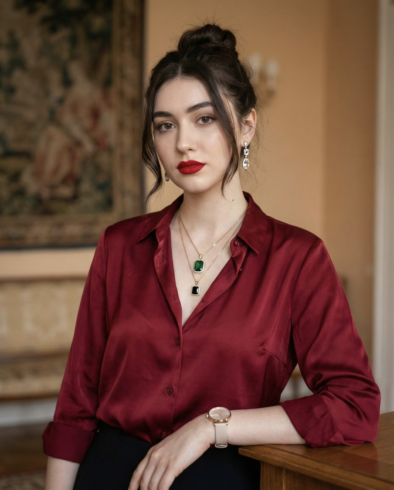

## 自信成熟女性室内电影肖像

- ID: gpt4o-622-zh-2
- Slug: prompt-622-zh-2
- 语言: zh
- 来源: [来源链接](https://x.com/ZaraIrahh/status/1994586672504181025)
- 样例图路径: images/part3/622.jpeg

### 提示词

```text
{
"image_description": {
“脸”： {
"preserve_original": true,
"reference_match": true,
“描述”：“使用上传图像中相同的面部特征和身份，但不得改变任何结构、比例或表情。”
},

"photo_style": {
“类型”：“室内电影肖像”，
"camera_angle": "mid-shot, straight on",
“照明”：“柔和温暖的室内照明，在皮肤和缎面织物上营造柔和的高光效果”，
“情绪”：“优雅、自信、成熟”，
"depth_of_field": "浅景深，背景略微模糊"
},

“主题”： {
“姿势”：“站立姿势放松，一只手放在木质表面上，身体略微前倾”，
“表情”：“冷静、自信、略带严肃，配以鲜艳的红唇”，
“头发”： {
“发型”：“凌乱优雅的发髻，垂落几缕碎发修饰脸型”，
颜色：深棕色
},
“衣服”： {
“类型”: “深红色缎面纽扣衬衫”
细节：奢华光泽，略微敞开的领口，袖子随意卷起。
},
“配件”： {
“项链”：[
{
“类型”：“金链”，
“吊坠”： “大颗祖母绿宝石”
},
{
“类型”：“金链”，
“吊坠”： “黑色方形吊坠”
}
],
“耳环”: “水晶吊坠耳环”
“手表”： “左手腕上的浅色手表”
}
},

“环境”： {
“场景”：“优雅的室内房间”，
“背景”： [
“以田园风光为主题的装饰挂毯或装裱墙饰”
“暖色调的墙壁”，
“柔和、经典的室内元素”
],
“氛围”：“温暖、精致、电影感”
},

“审美的”： {
“风格”: “奢华的编辑肖像”
“特征”： [
“暖色调”，
“丰富的质感”，
“闪亮的缎面反射”，
“优雅的珠宝亮点”，
“均衡的电影构图”
]
}
}
}
```

### 样例图


## { "project": "Ultra-Realistic Portrait", "reference_sett

- ID: gpt4o-620-en-1
- Slug: prompt-620-en-1
- 语言: en
- 来源: [来源链接](https://x.com/YaseenK7212/status/1994634660459024649)
- 样例图路径: images/part3/620.jpeg

### 提示词

```text
{
  "project": "Ultra-Realistic Portrait",
  "reference_settings": {
    "use_reference_image": true,
    "fidelity_strength": "100%",
    "instruction": "Face and outfit must match reference photo 100% with absolutely no alterations."
  },
  "subject": {
    "demographics": "Woman",
    "focus_features": ["Eyes", "Nose", "Lips"],
    "expression": "Smiling, cute, fresh, dreamy, slightly sensual",
    "pose": "Sitting at a white table, resting chin on both hands, turning slightly",
    "hair": {
      "style": "Straight, large top bun",
      "accessory": "Bow matching the outfit",
      "texture": "Soft layered, loose strands falling naturally across face",
      "movement": "Slightly blown by wind"
    },
    "makeup": {
      "cheeks": "Natural blush on cheeks and nose",
      "lips": "Full lips, soft pink-peach tone"
    }
  },
  "fashion_and_accessories": {
    "outfit": "Exact match to reference image",
    "shoes": "High-heel shoes (matching reference)",
    "bag": "Same bag as reference photo",
    "jewelry": {
      "necklace": "Thin gold with alternating charms (heart, crescent moon, Gucci pendant)",
      "bracelet": "Delicate Gucci bracelet with charms",
      "rings": "Gold rings",
      "watch": "Steel-band Patek Philippe",
      "earrings": "Small gold Gucci earrings"
    }
  },
  "environment": {
    "location": "Luxury hotel terrace / Seaside",
    "time_of_day_options": [
      "Option A: Deep blue evening sky, stars, shooting star, moonlight",
      "Option B: Early sunrise, orange-yellow sky tones"
    ],
    "background_elements": [
      "Warm reflections from luxury hotel",
      "Calm seascape"
    ]
  },
  "props": {
    "table_setting": "White table",
    "items": [
      "Glass with a single white rose",
      "Wine glass",
      "Wine bottle",
      "Plate set with knife and fork",
      "Large T-bone steak in center",
      "Candle glass (adding warm highlight)"
    ]
  },
  "photography_style": {
    "aesthetic": "2000s digital-camera flash style",
    "lighting": "Realistic flash brightness, warm tone, slight shine on skin",
    "mood": "Relaxing, warm, nostalgic, stylish, elegant, slightly sexy",
    "shot_type": "Close-up portrait"
  },
  "technical_parameters": {
    "aspect_ratio": "3:4",
    "detail_level": "8k",
    "style_tags": ["photo", "realistic", "flash photography"]
  }
}
```

### 样例图


## 超写实性感大嘴人物肖像

- ID: gpt4o-620-zh-2
- Slug: prompt-620-zh-2
- 语言: zh
- 来源: [来源链接](https://x.com/YaseenK7212/status/1994634660459024649)
- 样例图路径: images/part3/620.jpeg

### 提示词

```text
{
“项目”：“超写实肖像”，
"reference_settings": {
"use_reference_image": true,
"fidelity_strength": "100%",
“说明”：“面部和服装必须与参考照片100%一致，绝对不能做任何修改。”
},
“主题”： {
“人口统计信息”：“女性”，
"focus_features": ["眼睛", "鼻子", "嘴唇"],
“表情”：“微笑、可爱、清新、梦幻、略带性感”
“姿势”：“坐在白色桌子旁，双手托腮，微微侧身”，
“头发”： {
“发型”：“直发，大发髻”，
“配饰”：“与服装相配的蝴蝶结”，
“质感”：“柔软、层次分明、自然垂落在脸上的发丝”，
“运动”：“微风吹拂”
},
“化妆品”： {
“脸颊”： “脸颊和鼻子上的自然红晕”
“嘴唇”：丰满的嘴唇，柔和的粉桃色调
}
},
"fashions_and_accessories": {
“服装”: “与参考图片完全匹配”，
“鞋子”：“高跟鞋（配套参考）”
“包”： “与参考照片相同的包”
“珠宝”： {
“项链”：“细金项链，饰有交替的吊坠（心形、新月形、Gucci吊坠）”
“手镯”：“精致的 Gucci 手镯，带有吊坠”，
“戒指”： “金戒指”，
“手表”: “钢带百达翡丽”
“耳环”： “古驰小金耳环”
}
},
“环境”： {
位置：豪华酒店露台/海滨
"time_of_day_options": [
“选项A：深蓝色的傍晚天空，繁星，流星，月光，”
选项B：清晨日出，橙黄色的天空色调
],
“背景元素”：[
“来自豪华酒店的温馨回响”
“平静的海景”
]
},
"props": {
"table_setting": "白色桌子",
“项目”： [
“一杯插着一朵白玫瑰的酒”
“酒杯”，
“葡萄酒瓶”，
“餐盘套装，含刀叉”
“中间是一块大块的T骨牛排”，
“烛台玻璃（增添暖色调高光）”
]
},
"photography_style": {
“美学”：“2000年代数码相机闪光灯风格”，
“光照”：“逼真的闪光亮度，暖色调，皮肤略带光泽”，
“氛围”：“轻松、温暖、怀旧、时尚、优雅、略带性感”
"shot_type": "特写肖像"
},
"technical_parameters": {
"aspect_ratio": "3:4",
"detail_level": "8k",
"style_tags": ["photo", "realistic", "flash photography"]
}
}
```

### 样例图


## Photorealistic Hong Kong retro portrait with authentic 1

- ID: gpt4o-619-en-1
- Slug: prompt-619-en-1
- 语言: en
- 来源: [来源链接](https://x.com/ShreyaYadav___/status/1994430035554603247)
- 样例图路径: images/part3/619.jpeg

### 提示词

```text
Photorealistic Hong Kong retro portrait with authentic 1990s film look.
Use image [0] as face reference. Half-body. Subject leaning against newspaper-covered wall, gaze soft and melancholic. Cropped bralette top embroidered with pearls and sequins Loose high-waisted trousers with elastic waistband, typical 1990s street style. Hair messy, strands falling across face. Makeup glossy lips, dewy skin. Narrow Hong Kong room, walls plastered with old yellowed Cantonese newspapers.
```

### 样例图

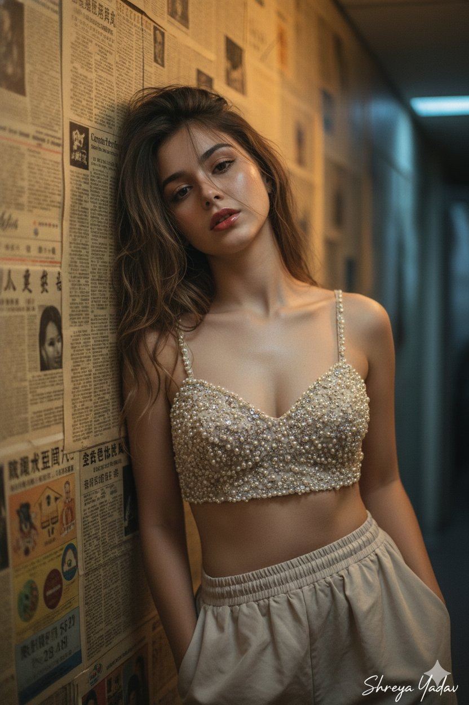

## 90年代电影质感的逼真香港复古肖像照

- ID: gpt4o-619-zh-2
- Slug: prompt-619-zh-2
- 语言: zh
- 来源: [来源链接](https://x.com/ShreyaYadav___/status/1994430035554603247)
- 样例图路径: images/part3/619.jpeg

### 提示词

```text
具有90年代电影质感的逼真香港复古肖像照。
以图[0]为面部参考。半身像。人物倚靠在贴满报纸的墙上，目光柔和而忧郁。身穿饰有珍珠和亮片的露脐抹胸上衣，搭配宽松的高腰松紧裤，典型的90年代街头风格。头发凌乱，几缕发丝垂落在脸颊。妆容精致，唇部光泽，肌肤水润。狭窄的香港房间，墙壁上贴满了泛黄的旧粤语报纸。

签名：Shreya Yadav
```

### 样例图


## { "scene_description": "A cohesive 4-panel fashion lifes

- ID: gpt4o-618-en-1
- Slug: prompt-618-en-1
- 语言: en
- 来源: [来源链接](https://x.com/_MehdiSharifi_/status/1994168239442510308)
- 样例图路径: images/part3/618.jpeg

### 提示词

```text
{
  "scene_description": "A cohesive 4-panel fashion lifestyle collage featuring the same young woman in a cozy layered autumn outfit, showcasing relaxed poses in nature.",
  "subject": {
    "type": "Young Woman (Consistent character)",
    "age": "early 20s",
    "features": {
      "hair": "loose natural hair with beanie",
      "makeup": "rosy cheeks"
    },
    "attire": "chunky knit sweater, plaid scarf, long wool coat, jeans, boots",
    "accessories": "takeaway coffee cup"
  },
  "collage_layout": {
    "structure": "2x2 Grid Layout (4 frames of equal size)",
    "panel_1_top_left": "Full Body Dynamic: Throwing autumn leaves in the air or twirling, coat flowing, smiling broadly.",
    "panel_2_top_right": "Sitting Side View: Sitting on a park bench with legs crossed, reading a book or looking at the scenery, holding coffee.",
    "panel_3_bottom_left": "Mid-Shot Walking: Walking towards the camera holding the lapels of the coat, looking down shyly or smiling.",
    "panel_4_bottom_right": "Portrait with Prop: Peeking out from behind the oversized scarf, holding the coffee cup near face for warmth, eyes smiling."
  },
  "environment": {
    "setting": "Autumn Park / Forest Path",
    "background_elements": [
      "Orange and yellow leaves",
      "Trees",
      "Park bench"
    ]
  },
  "lighting": {
    "style": "Golden Hour Soft",
    "key_light": {
      "type": "Low Autumn Sun",
      "color": "Warm Golden",
      "effect": "Backlight or soft front light, magical atmosphere"
    }
  },
  "style": {
    "medium": "Portrait Photography",
    "aesthetic": "Cottagecore, Autumn Vibes, Cozy, Pinterest",
    "quality": "8k resolution, warm tones"
  },
  "attire_customization": {
    "current_clothing": "Wool coat and knitwear",
    "customizable_clothing": "User can swap for puffer jacket or raincoat"
  },
  "brand_product_customization": {
    "current_brand_product": "Winter Apparel",
    "customizable_brand": "User: Insert Brand Name",
    "customizable_product": "User: Specific coat or boots",
    "product_placement_area": "Coat texture or boots"
  }
}
```

### 样例图


## 四幅时尚生活场景组成的拼贴画

- ID: gpt4o-618-zh-2
- Slug: prompt-618-zh-2
- 语言: zh
- 来源: [来源链接](https://x.com/_MehdiSharifi_/status/1994168239442510308)
- 样例图路径: images/part3/618.jpeg

### 提示词

```text
{
“场景描述”： “这是一幅由四幅时尚生活场景组成的拼贴画，画面中同一位年轻女子身着舒适的秋季叠穿服装，在自然环境中摆出轻松的姿势。”
“主题”： {
“类型”：“年轻女子（性格始终如一）”
“年龄”：“20岁出头”，
“特征”： {
“头发”：“披散的自然头发，戴着毛线帽”，
“妆容”：“红润的脸颊”
},
着装：粗针织毛衣、格子围巾、长羊毛大衣、牛仔裤、靴子。
配件：外带咖啡杯
},
"collage_layout": {
"结构": "2x2 网格布局（4 个大小相同的框架）",
"panel_1_top_left": "全身动态：抛洒秋叶或旋转，外套飘动，笑容灿烂。"
"panel_2_top_right": "坐姿侧视图：坐在公园长椅上，双腿交叉，手拿咖啡，正在看书或欣赏风景。"
"panel_3_bottom_left": "中景行走：走向镜头，抓住外套翻领，害羞地低头或微笑。"
"panel_4_bottom_right": "带道具的肖像：从超大的围巾后面探出头来，手里拿着咖啡杯贴近脸庞取暖，眼神中带着微笑。"
},
“环境”： {
“设置”: “秋季公园/森林小径”
“背景元素”：[
“橙色和黄色的叶子”，
“树木”，
“公园长椅”
]
},
“灯光”： {
“风格”：“金色时光柔和”
"key_light": {
“类型”：“低垂的秋日阳光”，
颜色：暖金色，
效果：背光或柔和的前光，营造出梦幻般的氛围
}
},
“风格”： {
“媒介”: “人像摄影”
“美学”：“田园风、秋日氛围、舒适、Pinterest”
“品质”：“8K分辨率，暖色调”
},
"attire_customization": {
"current_clothing": "羊毛大衣和针织衫",
"customizable_clothing": "用户可以换成羽绒服或雨衣"
},
"品牌产品定制": {
"current_brand_product": "冬季服装",
"customizable_brand": "用户：插入品牌名称",
"customizable_product": "用户：特定外套或靴子",
"product_placement_area": "外套纹理或靴子"
}
}
```

### 样例图


## { "scene_description": "A cohesive 4-panel fashion lifes

- ID: gpt4o-617-en-1
- Slug: prompt-617-en-1
- 语言: en
- 来源: [来源链接](https://x.com/_MehdiSharifi_/status/1994166992719299026)
- 样例图路径: images/part3/617.jpeg

### 提示词

```text
{
  "scene_description": "A cohesive 4-panel fashion lifestyle collage featuring the same young woman in a glamorous evening outfit, showcasing cinematic poses under city lights.",
  "subject": {
    "type": "Young Woman (Consistent character)",
    "age": "early 20s",
    "features": {
      "hair": "glamorous waves",
      "makeup": "evening look with red lip"
    },
    "attire": "black satin slip dress, leather jacket draped over shoulders, strappy heels",
    "accessories": "sparkly clutch, earrings"
  },
  "collage_layout": {
    "structure": "2x2 Grid Layout (4 frames of equal size)",
    "panel_1_top_left": "Full Body Flash Shot: Standing against a metallic door or shutter, posing with one leg forward, looking fierce (flash photography style).",
    "panel_2_top_right": "Over-the-Shoulder: Looking back at the camera while walking away towards neon city lights, showcasing the back of the dress/jacket.",
    "panel_3_bottom_left": "Seated Profile: Sitting on a high bar stool or velvet booth, holding a mocktail, laughing candidly towards someone off-camera.",
    "panel_4_bottom_right": "Artistic Portrait: Standing near a neon sign, face illuminated by pink/blue light, looking dreamily upwards."
  },
  "environment": {
    "setting": "City at Night / Rooftop Bar",
    "background_elements": [
      "Neon signs",
      "City bokeh",
      "Dark shadows"
    ]
  },
  "lighting": {
    "style": "Flash & Neon Mixed",
    "key_light": {
      "type": "Camera Flash / Neon Sign",
      "color": "Cool White / Vibrant Colors",
      "effect": "High contrast, edgy vibe"
    }
  },
  "style": {
    "medium": "Flash Photography / Film Aesthetic",
    "aesthetic": "Night Luxe, Party Vibe, Cinematic, Edgy",
    "quality": "8k resolution, slight grain"
  },
  "attire_customization": {
    "current_clothing": "Slip dress and leather jacket",
    "customizable_clothing": "User can swap for sequin dress or jumpsuit"
  },
  "brand_product_customization": {
    "current_brand_product": "Evening Wear",
    "customizable_brand": "User: Insert Brand Name",
    "customizable_product": "User: Specific dress or makeup",
    "product_placement_area": "Dress silhouette"
  },
  "technical_tags": "--v 6 --ar 4:5 --stylize 400 --no daylight, office setting"
}
```

### 样例图


## 四幅时尚生活场景组成的连贯拼贴画

- ID: gpt4o-617-zh-2
- Slug: prompt-617-zh-2
- 语言: zh
- 来源: [来源链接](https://x.com/_MehdiSharifi_/status/1994166992719299026)
- 样例图路径: images/part3/617.jpeg

### 提示词

```text
{
“场景描述”： “这是一幅由四幅时尚生活场景组成的连贯拼贴画，画中同一位年轻女子身着华丽的晚礼服，在城市灯光下摆出极具电影感的姿势。”
“主题”： {
“类型”：“年轻女子（性格始终如一）”
“年龄”：“20岁出头”，
“特征”： {
“头发”：“迷人的波浪卷发”，
“妆容”：“晚宴妆容，搭配红唇”
},
“着装”：“黑色缎面吊带裙，肩上披着皮夹克，细带高跟鞋”，
“配饰”：闪亮手拿包、耳环
},
"collage_layout": {
"结构": "2x2 网格布局（4 个大小相同的框架）",
"panel_1_top_left": "全身闪光照：倚靠在金属门或卷帘门上，一条腿向前迈出，摆出凶狠的姿势（闪光摄影风格）。"
"panel_2_top_right": "过肩视角：边走边回头看向镜头，朝着霓虹闪烁的城市灯光走去，展示连衣裙/外套的背面。"
"panel_3_bottom_left": "坐姿侧脸：坐在高脚吧台凳或天鹅绒卡座上，手持一杯无酒精鸡尾酒，对着镜头外的人开怀大笑。"
"panel_4_bottom_right": "艺术肖像：站在霓虹灯招牌旁，脸部被粉色/蓝色灯光照亮，眼神梦幻般地向上凝视。"
},
“环境”： {
“场景”：“夜幕下的城市/屋顶酒吧”，
“背景元素”：[
霓虹灯招牌
“城市散景”
“黑暗阴影”
]
},
“灯光”： {
“风格”：“闪光与霓虹混合”，
"key_light": {
"type": "相机闪光灯/霓虹灯标志",
“颜色”：“冷白/鲜艳色彩”，
“效果”：“高对比度，前卫氛围”
}
},
“风格”： {
“媒介”：“闪光摄影/胶片美学”，
“美学”：“夜间奢华、派对氛围、电影感、前卫”
“画质”：“8K分辨率，略带颗粒感”
},
"attire_customization": {
"current_clothing": "吊带裙和皮夹克",
"customizable_clothing": "用户可以换成亮片连衣裙或连体裤"
},
"品牌产品定制": {
"current_brand_product": "晚礼服",
"customizable_brand": "用户：插入品牌名称",
"customizable_product": "用户：特定服装或妆容",
"product_placement_area": "连衣裙轮廓"
},
"technical_tags": " --v 6 --ar 4:5 --stylize 400 --no daylight, office setting"
}
```

### 样例图


## { "image_generation": { "identity": { "preserve_original

- ID: gpt4o-616-en-1
- Slug: prompt-616-en-1
- 语言: en
- 来源: [来源链接](https://x.com/chatgptpaglu/status/1994689429487734995)
- 样例图路径: images/part3/616.jpeg

### 提示词

```text
{
  "image_generation": {
    "identity": {
      "preserve_original": true,
      "reference_match": true,
      "description": "Facial features must remain exactly identical to the provided reference photo."
    },

    "photo_style": {
      "type": "hyperrealistic lifestyle photo",
      "camera_vibe": "Olympus MJU II aesthetic",
      "lighting": "warm dim indoor lighting OR 35mm film-style flash",
      "tone": "warm vintage VSCO vibe",
      "texture": "soft grain, subtle film rendering",
      "framing": "wide shot showing interior room details"
    },

    "subject": {
      "pose": {
        "body": "sitting on a woven sofa with back turned to the viewer",
        "legs": "folded comfortably",
        "hands": "one hand resting on the sofa",
        "head": "looking over shoulder at the camera",
        "expression": "playful, soft, naturally charming"
      },

      "appearance": {
        "hair": {
          "length": "long",
          "style": "loose with a side part",
          "accessory": "simple small hair clip"
        },
        "makeup": {
          "style": "light Korean glass-skin makeup",
          "details": {
            "skin": "glowy, dewy finish",
            "lips": "soft pink",
            "eyes": "minimal eyeshadow, natural lashes"
          }
        }
      },

      "clothing": {
        "top": {
          "type": "cream oversized vintage T-shirt",
          "print": "bold graphic text 'FRISTO' on the back"
        },
        "bottom": {
          "type": "light high-waisted denim shorts"
        },
        "shoes": {
          "type": "white sneakers"
        }
      }
    },

    "environment": {
      "setting": "cozy messy room",
      "elements": [
        "woven sofa",
        "white pillows",
        "scattered clothes in the foreground",
        "soft indoor clutter for authentic lifestyle atmosphere"
      ],
      "lighting_effects": [
        "warm dim glow",
        "or direct compact film camera flash",
        "soft warm shadows enhancing vintage mood"
      ]
    },

    "aesthetic": {
      "style": "vintage lifestyle editorial",
      "vibe": "warm, nostalgic, candid",
      "features": [
        "rich room detail",
        "natural textures of fabric and skin",
        "soft grain and warm tones"
      ]
    }
  }
}
```

### 样例图


## 女生背对着观众坐在编织沙发上

- ID: gpt4o-616-zh-2
- Slug: prompt-616-zh-2
- 语言: zh
- 来源: [来源链接](https://x.com/chatgptpaglu/status/1994689429487734995)
- 样例图路径: images/part3/616.jpeg

### 提示词

```text
{
"image_generation": {
“身份”： {
"preserve_original": true,
"reference_match": true,
“描述”：“面部特征必须与提供的参考照片完全一致。”
},

"photo_style": {
“类型”：“超写实生活方式照片”，
"camera_vibe": "Olympus MJU II 美学"
“照明”：“温暖昏暗的室内照明或 35 毫米胶片式闪光灯”，
"色调": "温暖复古的VSCO氛围",
“质感”：“柔和的颗粒感，细腻的胶片质感”，
“构图”：“展现室内细节的广角镜头”
},

“主题”： {
"姿势": {
“身体”：“背对着观众坐在编织沙发上”，
“腿”：“舒适地折叠起来”，
“双手”：“一只手放在沙发上”，
“头部”：“回头看向镜头”，
“表情”：“活泼、温柔、自然迷人”
},

“外貌”： {
“头发”： {
"length": "长",
“发型”：“侧分披肩”，
“配饰”：“简单的小发夹”
},
“化妆品”： {
“风格”：“清透韩式水光肌妆容”，
“细节”： {
“肌肤”：“光泽、水润妆效”，
“嘴唇”：“柔和的粉红色”，
“眼妆”：“淡眼影，自然睫毛”
}
}
},

“衣服”： {
“顶部”： {
“类型”：“奶油色超大复古T恤”，
“印刷”：“背面印有粗体字‘FRISTO’”
},
“底部”： {
类型：轻薄高腰牛仔短裤
},
“鞋”： {
类型：白色运动鞋
}
}
},

“环境”： {
“场景”: “温馨凌乱的房间”
“元素”：[
“编织沙发”，
“白色枕头”，
“前景中散落的衣物”，
“营造真实生活氛围的柔和室内杂物”
],
"lighting_effects": [
“温暖昏暗的光芒”，
“或直接使用小型胶片相机闪光灯”，
“柔和温暖的阴影增强了复古氛围”
]
},

“审美的”： {
“风格”：“复古生活方式专题报道”，
“氛围”：“温暖、怀旧、坦诚”，
“特征”： [
“丰富的房间细节”，
“织物和皮肤的自然纹理”，
“柔和的纹理和温暖的色调”
]
}
}
}
```

### 样例图


## { "prompt": "hyperrealistic ultra-detailed 8k photo of Y

- ID: gpt4o-615-en-1
- Slug: prompt-615-en-1
- 语言: en
- 来源: [来源链接](https://x.com/Samann_ai/status/1994444395525832898)
- 样例图路径: images/part3/615.jpeg

### 提示词

```text
{
  "prompt": "hyperrealistic ultra-detailed 8k photo of YOU (Upload Your Photo) standing in a bright cozy living room, same location as the reference: cream-colored sofa, large white curtains with soft daylight shining through, warm neutral walls, several green houseplants, minimal decor, natural sunlight and soft shadows. Use the uploaded photo as the main subject of the image, preserving the face, hairstyle, body type, clothing, and overall style exactly as in the uploaded photo. The subject is standing in front of the sofa, body slightly angled to the side, legs close together, one hip slightly popped, holding a smartphone in one hand at chest height, screen facing them, as if taking a mirror selfie, with a relaxed confident expression and slight smile, eyes toward the phone. Behind them, their partner is standing very close, a tall, attractive humanoid robot with a highly muscular, athletic build, entirely robotic with no human skin, detailed mechanical anatomy inspired by a futuristic cyborg: layered silver and gunmetal plates, visible bundles of flexible cables as muscles, complex joints, smooth armor around shoulders, chest, arms, and legs, elegant angular robotic face with a strong jawline, glowing blue eyes, subtle wear and micro-scratches on metal for realism. The robot’s torso is broad and V-shaped, narrow waist, perfect proportions, clearly fit and powerful but aesthetically beautiful. The robot stands just behind the subject with one sleek metallic arm wrapped gently and protectively around the front of their neck and shoulders, hand resting softly near the collarbone in an affectionate pose, the other arm relaxed at its side. Their bodies are close, giving a sense of intimacy and comfort. Extremely realistic skin texture on the subject, natural hair strands, detailed fabric texture and wrinkles on their clothing, realistic reflections and specular highlights on the robot’s metal surfaces, accurate global illumination and depth of field, sharp focus on both characters, slight background blur. Photoreal, cinematic lighting, no fantasy effects, looks like a real candid photo taken on a phone in this apartment.",
  "negative_prompt": "cartoon, anime, illustration, painting, 3d render, CGI, low resolution, blurry, grainy, oversaturated, unrealistic proportions, extra limbs, deformed hands, distorted face, visible mirror edges, text, watermark, logo, armor covering the subject, human skin on the robot, grotesque, horror, gore"
}
```

### 样例图


## 人和机器人的温馨时刻

- ID: gpt4o-615-zh-2
- Slug: prompt-615-zh-2
- 语言: zh
- 来源: [来源链接](https://x.com/Samann_ai/status/1994444395525832898)
- 样例图路径: images/part3/615.jpeg

### 提示词

```text
{
“提示”：拍摄一张超逼真、细节丰富的8K照片，照片中的人物（上传您的照片）站在明亮舒适的客厅中，地点与参考照片相同：米色沙发，白色大窗帘透进柔和的日光，暖色调的墙面，几盆绿色植物，简约的装饰，自然光和柔和的阴影。使用上传的照片作为图像的主体，保留照片中人物的面部、发型、体型、服装和整体风格。人物站在沙发前，身体略微侧倾，双腿并拢，一侧臀部微微翘起，一手拿着智能手机，屏幕朝向自己，仿佛在自拍，表情轻松自信，略带微笑，目光注视着手机。人物身后站着一位身材高挑、外形俊朗的人形机器人，肌肉线条流畅，体格健壮，完全由机械构成，没有人类皮肤，拥有未来主义赛博格风格的精细机械结构：层叠的银色和枪灰色金属板，以及清晰可见的柔性电缆束。肌肉线条分明，关节复杂，肩部、胸部、手臂和腿部的盔甲光滑流畅，优雅的棱角分明的机械面孔，下颚线条硬朗，湛蓝的双眼闪闪发光，金属表面细微的磨损和划痕更添真实感。机器人的躯干宽阔呈V字形，腰部纤细，比例完美，既健壮有力又不失美感。机器人站在拍摄对象身后，一只光滑的金属手臂温柔地环绕着拍摄对象的颈肩，一只手轻轻地放在锁骨附近，姿态亲昵，另一只手臂自然垂于身侧。两人身体靠近，营造出亲密舒适的氛围。拍摄对象的皮肤纹理极其逼真，头发自然垂落，衣物上的织物纹理和褶皱也十分细致，机器人金属表面的反射和高光效果逼真，整体光照和景深控制精准，两个人物都清晰对焦，背景略微虚化。照片级的真实感，电影级的灯光效果，没有任何奇幻特效，看起来就像是用手机在公寓里随手拍下的真实照片。
"negative_prompt": "卡通、动画、插画、绘画、3D渲染、CGI、低分辨率、模糊、颗粒感强、过度饱和、比例失调、多余肢体、畸形手、扭曲面部、可见镜像边缘、文字、水印、标志、盔甲覆盖主体、机器人身上覆盖人类皮肤、怪诞、恐怖、血腥"
}
```

### 样例图


## A man with wide, horrified eyes holds a large, ornate pi

- ID: gpt4o-612-en-1
- Slug: prompt-612-en-1
- 语言: en
- 来源: [来源链接](https://x.com/maxescu/status/1994420399497490915)
- 样例图路径: images/part3/612.jpeg

### 提示词

```text
A man with wide, horrified eyes holds a large, ornate picture frame. Inside the frame is a perfect photograph of him holding the same frame with the same horrified expression. Inside that frame is a smaller version, spiraling inward. He is falling forward into the picture, tumbling endlessly into smaller and smaller iterations of his own trapped moment, shrinking into infinity with no bottom to hit.
The Trap: He is caught in Visual Recursion. He has become a "strange loop" where he is simultaneously the container and the content, doomed to repeat the same moment at exponentially diminishing scales.
```

### 样例图

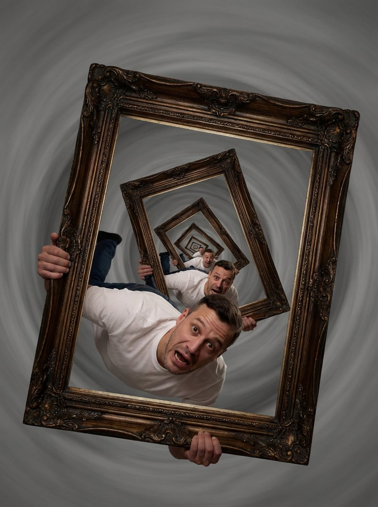

## 一个 男人被相框套娃了

- ID: gpt4o-612-zh-2
- Slug: prompt-612-zh-2
- 语言: zh
- 来源: [来源链接](https://x.com/maxescu/status/1994420399497490915)
- 样例图路径: images/part3/612.jpeg

### 提示词

```text
一个男人双眼惊恐地睁大，手里拿着一个硕大的华丽相框。相框里是一张完美的照片，照片上他正拿着同样的相框，脸上带着同样的惊恐表情。在那张照片里，还有一个缩小版的他，呈螺旋状向内延伸。他正向前坠入照片中，无休止地翻滚，陷入越来越小的、重复的、他自己被困的瞬间，最终缩小到无穷无尽的境地，没有尽头。
陷阱：他陷入了视觉递归的陷阱。他变成了一个“奇怪的循环”，既是容器又是内容，注定要以指数级递减的规模重复同一时刻。
```

### 样例图


## { "scene_description": "A vibrant, mixed-media masterpie

- ID: gpt4o-611-en-1
- Slug: prompt-611-en-1
- 语言: en
- 来源: [来源链接](https://x.com/ecommartinez/status/1994126063656644727)
- 样例图路径: images/part3/611.jpeg

### 提示词

```text
{
  "scene_description": "A vibrant, mixed-media masterpiece featuring a photorealistic version of the person from the reference photo eating at a diner, surrounded by a chaotic swarm of maximalist fast-food monsters.",

  "subject": {
    "type": "The person from the reference photo",
    "attire": "Same clothing style as in the reference, adapted naturally to the diner setting",
    "position": "Sitting in a red leather diner booth, holding a burger",
    "expression": "Shocked but amused, looking at a floating doodle pizza",
    "consistency_note": "Face, hairstyle and proportions must perfectly match the reference photo"
  },

  "action": {
    "primary": "Eating lunch",
    "effect": "Their food is coming to life in 2D form"
  },

  "illustration_layer": {
    "style": "Thick-line Pop Art cartoons",
    "creatures": [
      "Pizza slices surfing on cheese waves",
      "Burger beasts with lettuce tongues",
      "Angry French fry box",
      "Flying ketchup bottles."
    ],
    "graphics": "Mustard splashes, sesame seeds, heat lines, 'ÑAM' text bursts",
    "colors": "Ketchup Red, Mustard Yellow, Lettuce Green"
  },

  "environment": {
    "setting": "Retro American Diner",
    "background_elements": ["Checkerboard floor", "Neon sign in window"]
  },

  "lighting": {
    "style": "Warm Diner Glow",
    "key_light": {
      "type": "Window light",
      "color": "Warm afternoon sun"
    }
  },

  "style": {
    "medium": "Mixed Media Photography",
    "aesthetic": "Retro-pop, savory, chaotic",
    "quality": "Ultra-detailed textures vs flat cartoons"
  }
}
```

### 样例图


## 一幅充满活力的混合媒介杰作

- ID: gpt4o-611-zh-2
- Slug: prompt-611-zh-2
- 语言: zh
- 来源: [来源链接](https://x.com/ecommartinez/status/1994126063656644727)
- 样例图路径: images/part3/611.jpeg

### 提示词

```text
{
“场景描述”： “这是一幅充满活力的混合媒介杰作，画面中逼真地呈现了参考照片中的人物在餐馆用餐，周围环绕着一群造型夸张的快餐怪物。”

“主题”： {
“类型”：“参考照片中的人”，
“着装”：“与参考图中相同的服装风格，自然地适应了餐厅环境”，
“位置”：“坐在红色皮质餐厅卡座里，手里拿着一个汉堡”，
“表情”：“震惊又好笑，看着漂浮的涂鸦披萨”
"consistency_note": "脸型、发型和比例必须与参考照片完全一致"
},

“行动”： {
“主要”： “吃午饭”，
“效果”：“他们的食物以二维形式活了过来”
},

"illustration_layer": {
“风格”：“粗线条波普艺术卡通”，
“生物”：[
“披萨片在奶酪浪潮上冲浪”
“长着生菜舌头的汉堡怪兽”
“愤怒的薯条盒”
“飞舞的番茄酱瓶。”
],
“图形”：“芥末酱飞溅、芝麻、热线、‘ÑAM’文字爆发”，
颜色：番茄酱红、芥末黄、生菜绿
},

“环境”： {
“设置”: “复古美式餐馆”
"background_elements": ["棋盘格地板", "窗户上的霓虹灯"]
},

“灯光”： {
“风格”：“温馨的餐馆氛围”，
"key_light": {
类型： 窗灯，
“颜色”：“温暖的午后阳光”
}
},

“风格”： {
“媒介”：“混合媒介摄影”，
“美学”：“复古流行，美味，混乱”，
“质量”： “超精细纹理 vs 平面卡通”
}
}
```

### 样例图


## "A full-body, high-fashion portrait of a stunning young 

- ID: gpt4o-609-en-1
- Slug: prompt-609-en-1
- 语言: en
- 来源: [来源链接](https://x.com/IqraSaifiii/status/1994521805076451818)
- 样例图路径: images/part3/609.jpeg

### 提示词

```text
"A full-body, high-fashion portrait of a stunning young woman. She is wearing a black satin mini slip dress with a draped cowl neckline and thin spaghetti straps, paired with black strappy stiletto high-heels. She has long, wavy dark hair with full bangs and subtle, elegant makeup. The mood is glamorous and luxurious.",   "pose": {     "description": "The subject is sitting sideways on a wide, light-wood stair step. Her left leg is crossed over her right knee, clearly showcasing the stiletto sandals. Her right hand (holding a dark smartphone) is lifted near her face, actively taking a high-angle selfie. She is looking directly at the phone camera.",     "keywords": ["sitting pose", "crossed legs", "selfie pose", "elegant posture", "hand holding phone"]   },   "setting": {     "environment": "Modern, minimalist luxury home interior. The background features a wide, symmetrical staircase made of light-colored wood (e.g., maple or oak) with treads that are individually backlit by warm linear LED lights. Clear glass railings secured by black metal posts frame the subject.",     "aesthetic": "Architectural, contemporary design, clean lines."   },   "camera": {     "shot_type": "Full-Body Portrait Shot",     "angle": "Slightly low angle (worm's-eye view) to emphasize her height and the structure of the staircase.",     "lens": "85mm prime lens",     "depth_of_field": "Shallow DoF, with the subject in crisp focus and the background elements (railings, far steps) slightly softened.",     "composition": "The subject is perfectly centered within the frame."   },   "lighting": {     "key_light": "Soft, diffused studio light (softbox) from the front-left, providing flattering, smooth illumination on her face and skin.",     "accent_light": "Dramatic, warm (3000K) linear under-lighting built directly into the wooden stair treads, creating horizontal lines of glow that define the background.",     "shadows": "Medium contrast, well-defined shadows that still preserve detail in the black dress.",     "exposure": "Perfectly exposed, emphasizing the sheen of the satin material."   },   "style_and_quality": {     "style": "Editorial Fashion Photography | Cinematic Realism | Intimate",     "details": ["High-fidelity satin texture", "Reflections on glass railings", "Manicured red fingernails", "Flawless skin texture"],     "quality": ["8K resolution", "masterpiece", "hyper-detailed", "photorealistic"]   }
```

### 样例图


## 年轻女性的时尚自拍肖像

- ID: gpt4o-609-zh-2
- Slug: prompt-609-zh-2
- 语言: zh
- 来源: [来源链接](https://x.com/IqraSaifiii/status/1994521805076451818)
- 样例图路径: images/part3/609.jpeg

### 提示词

```text
“一张惊艳年轻女性的全身时尚肖像。她身着黑色缎面迷你吊带裙，垂褶领口和细吊带设计，搭配黑色细带高跟鞋。她留着长长的波浪卷发，齐刘海，妆容精致优雅。整体氛围充满魅力，尽显奢华。”, “姿势”: { “描述”: “拍摄对象侧坐在宽阔的浅色木质台阶上。她的左腿搭在右膝上，清晰地展示了细高跟凉鞋。她的右手（拿着一部深色智能手机）举到脸旁，正积极地进行高角度自拍。她直视着手机摄像头。”, “关键词”: ["坐姿", "交叉双腿", "自拍姿势", "优雅姿态", "手持手机"] }, “场景”: { “环境”: “现代简约的豪华家居内饰。背景是宽阔对称的……”由浅色木材（例如枫木或橡木）制成的楼梯，踏板由暖色调的线性 LED 灯单独背光照明。透明玻璃栏杆由黑色金属柱固定，将拍摄对象框入其中。", "美学": "建筑风格，现代设计，线条简洁。" }, "相机": "拍摄类型": "全身肖像照", "角度": "略微低角度（仰视）以突出她的身高和楼梯的结构。", "镜头": "85mm 定焦镜头", "景深": "浅景深，拍摄对象清晰对焦，背景元素（栏杆、远处台阶）略微柔化。", "构图": "拍摄对象完美地位于画面中心。" }, "照明": { "主光": "来自左前方的柔和漫射影棚灯（柔光箱），为她的脸部和肌肤提供柔和的光线。", "辅助光": "戏剧性的暖色调（3000K）线性底光，直接嵌入木质楼梯踏板，营造出勾勒背景的水平光晕。", "阴影": "中等对比度，清晰的阴影，同时保留了黑色连衣裙的细节。", "曝光": "曝光完美，突出了缎面材质的光泽。" }, "style_and_quality": { "style": "时尚大片 | 电影写实 | 私密", "details": ["高保真缎面质感", "玻璃栏杆上的倒影", "精心修饰的红色指甲", "无瑕肌肤纹理"], "quality": ["8K分辨率", "杰作", "超细节", "照片级写实"] }
```

### 样例图


## { "prompt": { "scene": { "angle": "[high-angle]", "tilt"

- ID: gpt4o-608-en-1
- Slug: prompt-608-en-1
- 语言: en
- 来源: [来源链接](https://x.com/Just_sharon7/status/1994375017971564779)
- 样例图路径: images/part3/608.jpeg

### 提示词

```text
{
  "prompt": {
    "scene": {
      "angle": "[high-angle]",
      "tilt": "[slightly off-kilter]",
      "group": "[lively group of stylish young adults]",
      "seating": "[seated closely around white dining table]",
      "setting": "[dimly lit, upscale brasserie]"
    },
    "mood": "[energetic, fashionable, slightly rebellious]",
    "subjects": [
      {
        "position": "left",
        "hair": "[long, dark hair]",
        "eyes": "[hidden behind chic black sunglasses]",
        "outfit": "[black lace-trimmed camisole with hint of floral pattern]",
        "expression": "[partially obscured by glasses]"
      },
      {
        "position": "second from left",
        "hair": "[dark, possibly mullet-style hair]",
        "facial_hair": "[distinct mustache]",
        "outfit": "[dark suit jacket over white shirt]",
        "hands": "[clasped near chin]",
        "expression": "[playful or mischievous]"
      },
      {
        "position": "center",
        "reference": "[woman resembling Kylie Jenner]",
        "hair": "[very long, dark, wavy hair]",
        "outfit": {
          "blazer": "[dark blazer]",
          "top": "[light blue, subtly patterned bralette]"
        },
        "gaze": "[looking right, slightly defiant, expressive]",
        "gesture": "[left hand raised, middle finger prominently displayed]"
      },
      {
        "position": "second from right",
        "reference": "[woman resembling Rosalía]",
        "hair": "[long dark hair in slicked-back style]",
        "outfit": "[dark, possibly velvet or satin, strapless top]",
        "accessory": "[small dark object, possibly cigarette or cigarillo between lips]",
        "expression": "[relaxed, nonchalant]"
      },
      {
        "position": "bottom right",
        "hair": "[curly brown hair]",
        "visible_part": "[top of head only, indicating more people at table]"
      }
    ],
    "table": {
      "items": [
        "[multiple clear glasses with drinks]",
        "[ice cubes in glasses]",
        "[citrus slices in glasses]",
        "[white bottle with dark label]",
        "[small white dishes]"
      ]
    },
    "background": {
      "wall": "[dark wood paneling]",
      "letters": "[ornate gold lettering partially readable as 'ALSACE']",
      "mirrors": "[dark reflective mirrors]"
    },
    "lighting": {
      "type": "[soft, warm, ambient]",
      "effect": "[illuminates faces and table]",
      "contrast": "[strong contrast against dark background]"
    },
    "additional_details": {
      "decor": "[subtle floral arrangements hinted in distance]"
    },
    "photography_style": "[hyper-realistic, candid, sharp focus on central group]"
  },
  "styles": ["photorealistic"],
  "aspect_ratio": "4:3"
}
```

### 样例图

![{ "prompt": { "scene": { "angle": "[high-angle]", "tilt"](../images/part3/608.jpeg)

## 一群活泼时尚的年轻人

- ID: gpt4o-608-zh-2
- Slug: prompt-608-zh-2
- 语言: zh
- 来源: [来源链接](https://x.com/Just_sharon7/status/1994375017971564779)
- 样例图路径: images/part3/608.jpeg

### 提示词

```text
{
“迅速的”： {
“场景”： {
“角度”：[高角度]，
“倾斜”：[略微偏离]
“团体”：[一群活泼时尚的年轻人]
“座位安排”：[围坐在白色餐桌旁]
“环境”：[灯光昏暗的高档小酒馆]
},
“情绪”：[充满活力，时尚，略带叛逆]
“主题”：[
{
"位置": "左",
“头发”：[长长的黑发]，
“眼睛”：[藏在时髦的黑色太阳镜后面]
“服装”：[黑色蕾丝边吊带背心，带有淡淡的花卉图案]
“表情”：[部分被眼镜遮挡]
},
{
“位置”: “从左边数第二个”，
“头发”：[深色，可能是鲻鱼头]，
"facial_hair": "[distinct mustache]",
“服装”：[深色西装外套搭配白色衬衫]，
“双手”：[交握于下巴附近]
“表情”：[顽皮的或淘气的]
},
{
"位置": "中心",
“参考”：[长相酷似凯莉·詹娜的女性]
“头发”：[非常长、深色、波浪状的头发]
“全套服装”： {
"blazer": "[深色西装外套]",
上衣：[浅蓝色，带精致图案的无钢圈文胸]
},
“凝视”：[看向右侧，略带挑衅，富有表现力]
“手势”：[左手举起，中指明显竖起]
},
{
“位置”: “从右数第二个”，
“参考”：[长相酷似罗莎莉亚的女人]
“头发”：[长长的深色头发向后梳]
“服装”：[深色，可能是天鹅绒或缎面，无肩带上衣]
“配件”：[嘴唇间夹着的小黑物，可能是香烟或小雪茄]
“表情”：[放松，漫不经心]
},
{
位置：右下角，
“头发”：[棕色卷发]，
"visible_part": "[仅头部顶部，表示桌上还有其他人]"
}
],
“桌子”： {
“项目”： [
“多个装有饮料的透明玻璃杯”
“（玻璃杯中的冰块）”
“（玻璃杯中的柑橘片）”
（白色瓶子，深色标签）
“小白碟”
]
},
“背景”： {
“墙”：[深色木镶板]，
“字母”： （华丽的金色字母部分可辨认出为“ALSACE”）
“镜子”：[深色反光镜]
},
“灯光”： {
“类型”：[柔和、温暖、氛围]，
“效果”：[照亮面部和桌面]
“对比度”：[与深色背景形成强烈对比]
},
"additional_details": {
“装饰”：[远处隐约可见的精致花卉摆设]
},
“摄影风格”：[超写实、抓拍、聚焦中心人物]
},
风格：["写实风格"]
"aspect_ratio": "4:3"
}
```

### 样例图


## { "prompt_title": "Beachside Crochet Fashion Portrait at

- ID: gpt4o-605-en-1
- Slug: prompt-605-en-1
- 语言: en
- 来源: [来源链接](https://x.com/IqraSaifiii/status/1994478187133432308)
- 样例图路径: images/part3/605.jpeg

### 提示词

```text
{
 "prompt_title": "Beachside Crochet Fashion Portrait at Sunset",
  "model_type": "Hyper-Realistic Photo",
  "style": [
    "Ultra-detailed photo-realism",
    "Golden hour beach photography",
    "Soft, natural light",
    "Vibrant yet natural color palette"
  ],
  "subject": {
    "description": "A slender and elegant Asian woman, mid-20s, with a gentle, contemplative expression, gazing towards the right of the frame.",
    "hair": "Dark brown hair styled in a high, messy bun, with soft wisps framing the face.",
    "makeup": "Minimalist, natural 'no-makeup' makeup look, featuring soft pink lips and a light blush, enhancing natural features.",
    "expression": "Serene, distant gaze, creating a sense of introspection or admiration of the view.",
    "attire": {
      "outerwear": "White, open-knit crochet cardigan with long, slightly flared sleeves, adorned with scattered small, pastel-colored floral appliques (yellow, blue, pink).",
      "swimwear": "White string bikini top and matching bottom, peeking out from beneath the cardigan.",
      "accessories": "Delicate, multi-strand beaded necklaces in pastel colors (pink, white, yellow), some extending as a body chain around her waist. Pink-tinted sunglasses perched on top of her bun. Small, understated stud earrings."
    }
  },
  "setting": {
    "location": "A tranquil, sandy beach at golden hour.",
    "background_elements": [
      "Calm ocean water with subtle waves meeting the shore in the mid-ground.",
      "A light, sandy beach foreground with gentle ripples and scattered small shells.",
      "A few distant boats visible on the horizon, adding depth and realism.",
      "A soft, clear sky with warm, diffused light of late afternoon."
    ]
  },
  "pose": {
    "type": "Standing portrait, waist-up shot.",
    "stance": "Body slightly angled to the left, head turned to look towards the right. Right hand gently rests on her hip.",
    "gaze": "Looking off into the distance to the right, not directly at the camera."
  },
  "camera_and_technical": {
    "camera": "Fujifilm GFX 100S or Sony A7R IV",
    "lens": "50mm f/1.2 or 85mm f/1.4 (Fast Prime Lens for shallow depth of field)",
    "shot_type": "Medium shot / Upper body portrait.",
    "composition": "Rule of Thirds, with the subject positioned slightly to the left, allowing space for her gaze to lead the eye.",
    "depth_of_field": "Shallow (soft bokeh on the ocean and distant background).",
    "aperture": "f/2.0",
    "shutter_speed": "1/250s",
    "iso": "ISO 160",
    "resolution": "8K, emphasizing intricate details of crochet knit and sand texture."
  },
  "lighting": {
    "overall_mood": "Soft, warm, luminous, and natural.",
    "key_light": {
      "source": "Natural sunlight, low in the sky (golden hour).",
      "position": "Coming from slightly behind and to the left of the subject, creating a subtle rim light effect and soft, elongated shadows.",
      "color_temp": "Warm (4500K - 5500K), characteristic of late afternoon sun."
    },
    "fill_light": {
      "source": "Natural ambient light reflecting off the sand and ocean.",
      "position": "Filling in shadows on the front of the subject, ensuring soft transitions.",
      "intensity": "Moderate, to maintain natural contrast."
    },
    "rim_light": {
      "source": "Direct sunlight.",
      "position": "Highlights the edges of her hair, shoulders, and arms, creating a glow that separates her from the background."
    },
    "shadows": "Soft, long, and diffused, typical of golden hour, contributing to a dreamy atmosphere."
  }
}
```

### 样例图


## 海滩写真拍摄

- ID: gpt4o-605-zh-2
- Slug: prompt-605-zh-2
- 语言: zh
- 来源: [来源链接](https://x.com/IqraSaifiii/status/1994478187133432308)
- 样例图路径: images/part3/605.jpeg

### 提示词

```text
{
"prompt_title": "日落时分的海边钩针时尚肖像",
"model_type": "超写实照片",
“风格”： [
“超精细照片级写实主义”
“黄金时段海滩摄影”
“柔和的自然光”
“充满活力又自然的色彩搭配”
],
“主题”： {
“描述”：“一位身材苗条、气质优雅的亚洲女性，二十多岁，表情温柔沉思，目光看向画面右侧。”
“头发”：“深棕色的头发梳成高高的凌乱发髻，几缕柔软的碎发垂在脸颊两侧。”
“妆容”：“极简、自然的‘伪素颜’妆容，以柔和的粉色唇妆和淡淡的腮红为特色，凸显自然美。”
“表情”：“宁静、疏离的目光，营造出一种内省或欣赏风景的氛围。”
着装：{
“外套”：“白色镂空钩针开衫，长袖略呈喇叭形，饰有零星的粉彩色小花朵贴花（黄色、蓝色、粉色）。”
“泳装”：“白色细绳比基尼上衣和配套泳裤，从开衫下露出来。”
“配饰”：“精致的多股串珠项链，颜色柔和（粉色、白色、黄色），有些项链延伸到腰间，形成一条身体链。粉色太阳镜架在她的发髻上。小巧简约的耳钉。”
}
},
“环境”： {
地点：日落时分，一片宁静的沙滩。
“背景元素”：[
“平静的海面，轻柔的波浪在中景处拍打着海岸。”
“前景是浅色的沙滩，泛着轻柔的涟漪，散落着小贝壳。”
“远处地平线上隐约可见几艘船只，增添了画面的景深和真实感。”
“傍晚时分，天空晴朗柔和，阳光温暖而柔和。”
]
},
"姿势": {
“类型”：“站立式肖像，半身像。”
“站姿”：“身体略微向左侧倾斜，头部转向右侧。右手轻轻放在臀部。”
“凝视”：“看向右侧远处，而不是直接看向镜头。”
},
"camera_and_technical": {
“相机”: “富士GFX 100S或索尼A7R IV”
“镜头”：“50mm f/1.2 或 85mm f/1.4（用于浅景深的快速定焦镜头）”
"shot_type": "中景/上半身肖像。"
构图：采用三分法构图，主体略微偏左，留出空间引导视线。
"depth_of_field": "浅景深（海洋和远处背景呈现柔和的散景效果）",
光圈：f/2.0，
"shutter_speed": "1/250"
"iso": "ISO 160",
“分辨率”：“8K，突出钩编针织物和沙子纹理的精细细节。”
},
“灯光”： {
整体氛围：柔和、温暖、明亮、自然。
"key_light": {
“来源”：“自然阳光，低垂的天空（黄金时段）。”
“位置”：“光线从拍摄对象略后方偏左的位置照射过来，营造出微妙的轮廓光效果和柔和拉长的阴影。”
"color_temp": "暖色调（4500K - 5500K），具有午后阳光的特征。"
},
"fill_light": {
“光源”：“沙滩和海洋反射的自然环境光。”
“位置”：“填充主体前方的阴影，确保柔和的过渡。”
“强度”：“适中，以保持自然对比度。”
},
"rim_light": {
“来源”：“阳光直射。”
“位置”：“突出她的头发、肩膀和手臂的边缘，营造出一种光晕，使她与背景分离。”
},
“阴影”：“柔和、绵长、弥散，是黄金时段的典型景象，营造出梦幻般的氛围。”
}
}
```

### 样例图


## A candid photograph of a KPOP star. format 3:4

- ID: gpt4o-603-en-1
- Slug: prompt-603-en-1
- 语言: en
- 来源: [来源链接](https://x.com/minchoi/status/1994544802902503470)
- 样例图路径: images/part3/603.jpeg

### 提示词

```text
A candid photograph of a KPOP star. format 3:4
```

### 样例图

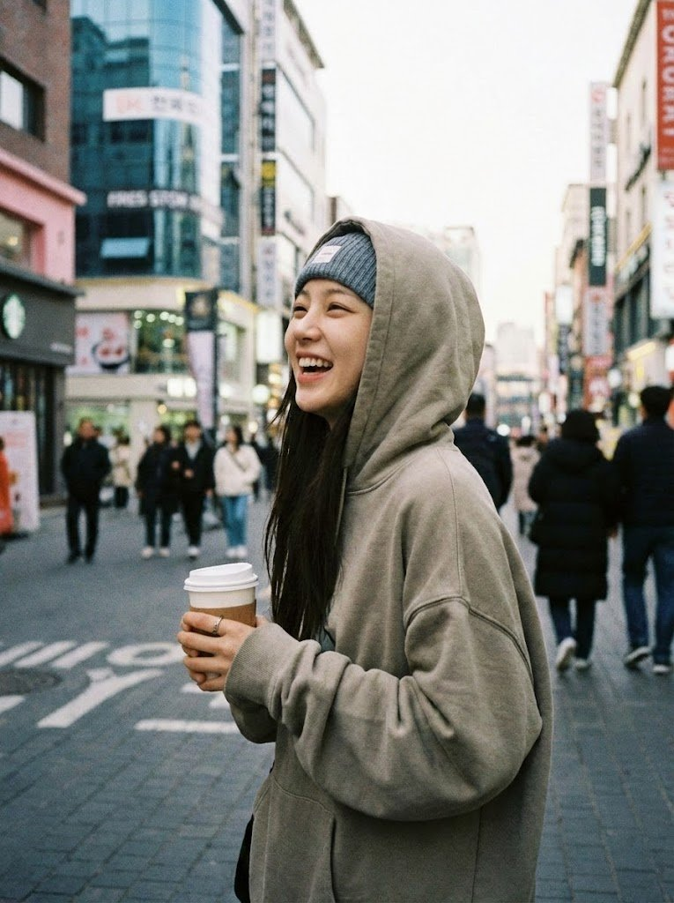

## 一张韩国流行明星的抓拍照片

- ID: gpt4o-603-zh-2
- Slug: prompt-603-zh-2
- 语言: zh
- 来源: [来源链接](https://x.com/minchoi/status/1994544802902503470)
- 样例图路径: images/part3/603.jpeg

### 提示词

```text
一张韩国流行明星的抓拍照片，3:4 比例
```

### 样例图


## { "prompt_title": "Dynamic Low-Angle Portrait Under Clea

- ID: gpt4o-602-en-1
- Slug: prompt-602-en-1
- 语言: en
- 来源: [来源链接](https://x.com/IqraSaifiii/status/1994544453655433705)
- 样例图路径: images/part3/602.jpeg

### 提示词

```text
{
  "prompt_title": "Dynamic Low-Angle Portrait Under Clear Sky - Emphasized Curves & Confident Pose",
  "model_type": "Hyper-Realistic Photo",
  "style": [
    "Ultra-detailed photo-realism",
    "Bright, high-contrast natural outdoor lighting",
    "Extreme low-angle, wide-perspective shot (heroic/empowering feel)",
    "Vibrant, saturated colors (clean, modern aesthetic)"
  ],
  "subject": {
    "description": "A youthful, radiant East Asian woman, late teens to early twenties, with a confident and engaging presence. Her skin exhibits a flawless yet natural texture, with subtle pores and a healthy, sunlit sheen across exposed areas like her shoulders and midriff. Hair strands are individually discernible.",
    "physique": "Athletic and toned, with visibly sculpted abdominal muscles, subtly defined obliques, and strong, shapely thighs. The pose emphasizes the natural curve of her hips and the gentle arch of her lower back, creating an alluring yet powerful silhouette from the low angle.",
    "hair": "Long, silky, straight dark brown hair, with a subtle natural wave at the ends. It flows freely around her shoulders and back, with a few strands gently lifted by a breeze (if applicable, or perfectly styled to look natural). A fringe or wispy bangs are subtly visible beneath the mask, framing her upper face.",
    "makeup": "Minimal, natural 'no-makeup' makeup. Clear, dewy skin finish. The visible eye area shows defined but natural brows, a hint of mascara on long lashes, and a subtle shimmer on the inner corner of the eyes. The mask obscures the mouth and nose.",
    "expression": "Her eyes are wide, bright, and directly engaging with the viewer, conveying a sense of playful confidence and warmth. The raised peace sign reinforces a cheerful, positive mood.",
    "attire": {
      "mask": "A pristine, well-fitted white disposable surgical mask, with clear pleats and elastic ear loops visible against her skin. It cleanly covers her nose and mouth.",
      "top": "A figure-hugging, finely ribbed, light salmon-pink (or dusty rose) crop tank top. The ribbing texture is highly detailed, stretching smoothly over her chest and torso, emphasizing the curve of her bust and the tautness of her midriff.",
      "outerwear": "An oversized, buttery soft, light pale yellow long-sleeved button-up shirt or lightweight jacket. It's worn open, casually draped off her shoulders, with the sleeves pushed up slightly, creating soft, natural folds in the fabric. The collar and cuffs are slightly relaxed.",
      "bottom": "Form-fitting, short white denim shorts. The fabric texture is detailed, showing subtle denim weave. The shorts sit high on her hips, emphasizing the curve of her waist and thighs. Stitching details and a faint outline of pockets are visible.",
      "accessories": "White wired earphones with clearly visible, delicate wires extending from her ears, subtly contrasting with her hair. The earbud tips are visible."
    }
  },
  "setting": {
    "location": "Outdoors on an exceptionally clear, bright summer day.",
    "background_elements": [
      "A vast, perfectly uniform, intensely vibrant cerulean blue sky, completely devoid of clouds, creating a stark, graphic backdrop that makes the subject pop.",
      "No horizon line or ground visible, making the sky appear infinite and emphasizing the extreme low-angle perspective."
    ],
    "atmosphere": "Crisp, clean air; intense feeling of open space and boundless energy."
  },
  "pose": {
    "type": "Extreme low-angle, dynamic full-body portrait (cropped at upper thigh/hip level, shot from below).",
    "stance": "The woman is standing with her weight slightly shifted, her left leg subtly bent at the knee, and her right leg extended, creating a dynamic 'power stance' effect. Her torso is slightly twisted to her left, further accentuating the curve of her waist and hips, especially from the low vantage point. Her chest is slightly pushed out, enhancing the natural curve of her bust.",
    "gaze": "Directly into the camera, with a confident, open, and friendly expression in her visible eyes. This strong eye contact creates an immediate connection with the viewer.",
    "gesture": "Her left arm is bent at the elbow, and her left hand is raised close to her face, palm facing outwards, forming a clear and crisp 'peace' (V-sign) with her index and middle fingers. The other fingers are gently curled down. Her right arm is relaxed at her side, with the jacket draped over it. The natural tension in her arm muscles is visible."
  },
  "camera_and_technical": {
    "camera": "Sony A1 with G Master Lenses or RED Komodo (for cinematic quality)",
    "lens": "20mm f/1.8 (Ultra-wide-angle prime lens to exaggerate the low perspective and create an imposing, almost monumental feel for the subject)",
    "shot_type": "Extreme Worm's-Eye View / Dynamic Low-Angle Medium Full Shot (from just below the subject's waist).",
    "composition": "The subject dominates the central frame, with her head and raised hand reaching towards the top. The expansive blue sky provides a clean, impactful negative space. The extreme low angle distorts proportions intentionally, elongating the legs and making the subject appear powerful and larger-than-life.",
    "depth_of_field": "Deep (f/11 to ensure absolute sharpness from her shorts to the distant sky, minimizing any softness).",
    "aperture": "f/11",
    "shutter_speed": "1/800s (to eliminate any possibility of motion blur and ensure tack-sharp details under intense sunlight)",
    "iso": "ISO 64 (for maximum image fidelity and dynamic range)",
    "resolution": "12K, cinematic wide aspect ratio (e.g., 1.85:1 or 16:9), emphasizing microscopic details of fabric weaves, skin pores, and the pristine blue sky. Post-processing for subtle vignetting and color grading for vibrant pop.",
    "white_balance": "Daylight (5200K), precisely calibrated for natural colors under bright sun."
  },
  "lighting": {
    "overall_mood": "High-key, crisp, and clean with stark yet appealing contrast.",
    "key_light": {
      "source": "Direct, unfiltered overhead sunlight, creating strong, well-defined form.",
      "position": "High above and slightly in front-right of the subject, casting clear, defined shadows that contour her physique and attire, adding depth.",
      "color_temp": "Cool (6500K-7000K), characteristic of a bright midday sun, ensuring a vibrant blue sky.",
      "intensity": "Very high, creating bright highlights and deep, clean shadows."
    },
    "fill_light": {
      "source": "Natural ambient light from the expansive sky.",
      "intensity": "Low, allowing for noticeable shadows that give form without becoming harsh or black. The blue sky acts as a subtle cool fill.",
      "direction": "Diffuse, minimizing contrast in shadow areas."
    },
    "rim_light": {
      "source": "The intense direct sunlight.",
      "intensity": "Subtle but crisp, creating a fine, bright outline on her hair, shoulders, and the edges of her clothing against the deep blue, enhancing separation and definition.",
      "effect": "Very thin, bright edge highlights."
    },
    "shadows": "Sharp, well-defined, and relatively dark, lending strong three-dimensionality to the subject's form and attire. Shadows are cast downwards and slightly behind the subject from the low camera angle, emphasizing the curves and contours of her body and clothing."
  }
}
```

### 样例图


## 戴口罩的妹子比了个耶

- ID: gpt4o-602-zh-2
- Slug: prompt-602-zh-2
- 语言: zh
- 来源: [来源链接](https://x.com/IqraSaifiii/status/1994544453655433705)
- 样例图路径: images/part3/602.jpeg

### 提示词

```text
{
"prompt_title": "晴空下的动态低角度人像 - 强调曲线与自信姿态",
"model_type": "超写实照片",
“风格”： [
“超精细照片级写实主义”
“明亮、高对比度的自然户外照明”，
“极低角度、广角镜头（英雄/鼓舞人心的感觉）”，
“鲜艳饱满的色彩（简洁现代的美学）”
],
“主题”： {
描述：一位年轻、容光焕发的东亚女性，年龄在十几岁末到二十岁出头，自信迷人。她的肌肤呈现无瑕而自然的质感，毛孔细微，裸露部位（如肩膀和腰部）散发着健康的阳光光泽。发丝清晰可见。
“体格”：“身材健美匀称，腹肌线条清晰可见，斜肌轮廓分明，大腿强健有力。这个姿势突出了她臀部的自然曲线和下背部的柔和弧度，从低角度拍摄，勾勒出既迷人又充满力量的身形。”
“头发”：一头柔顺的深棕色长直发，发尾略带自然波浪。头发自然垂落在她的肩背，几缕发丝被微风轻轻拂起（如有风吹，或精心打理得自然垂顺）。面具下隐约可见刘海，勾勒出她脸部的轮廓。
“妆容”：极简自然的“伪素颜”妆容。肌肤呈现清透水润的光泽。眼部可见部分，眉形清晰自然，纤长的睫毛上略施睫毛膏，眼角内侧带有微妙的珠光。口罩遮盖了口鼻。
“表情”：“她的眼睛又大又亮，直视着观者，传递出一种俏皮自信和温暖的感觉。高举的和平手势进一步强化了这种快乐积极的情绪。”
着装：{
“口罩”：“一个洁白无瑕、贴合度极佳的一次性医用口罩，褶皱清晰可见，弹性耳带紧贴皮肤。它干净利落地遮住了她的口鼻。”
上衣：一件贴身剪裁、带有细密罗纹的浅鲑鱼粉色（或灰玫瑰色）露脐背心。罗纹纹理细节丰富，流畅地贴合胸部和躯干，凸显胸部曲线和紧致腰腹。
“外套”：一件宽松的、如黄油般柔软的浅黄色长袖衬衫或轻薄夹克。敞开穿着，随意地披在肩上，袖子略微向上卷起，在面料上形成柔软自然的褶皱。领口和袖口略微宽松。
“下装”：“修身白色牛仔短裤。面料纹理细腻，隐约可见牛仔布的编织纹路。短裤高腰设计，凸显腰部和大腿的曲线。缝线细节和隐约可见的口袋轮廓。”
“配饰”：“白色有线耳机，纤细的耳机线清晰可见地从她的耳朵延伸出来，与她的头发形成微妙的对比。耳塞套也清晰可见。”
}
},
“环境”： {
地点：户外，一个格外晴朗明媚的夏日。
“背景元素”：[
“一片广袤无垠、均匀透亮、色彩浓郁的蔚蓝色天空，万里无云，营造出鲜明的视觉背景，使主体更加突出。”
“看不到地平线或地面，使天空显得无限延伸，并强调了极低角度的透视效果。”
],
“氛围”：“空气清新洁净；开阔的空间感和无限的活力。”
},
"姿势": {
“类型”：“极低角度、动态全身肖像（裁剪至大腿/臀部上方，从下方拍摄）。”
“站姿”：这位女士站立时重心略微偏移，左腿膝盖微屈，右腿伸直，营造出一种动感十足的“力量站姿”。她的躯干略微向左扭转，从低角度观察时，更突显了腰臀的曲线。她的胸部略微挺起，凸显了胸部的自然曲线。
“凝视”：“她直视镜头，眼神自信、开朗、友善。这种强烈的眼神交流能立即与观众建立联系。”
“手势”：“她的左臂肘部弯曲，左手举至脸前，掌心朝外，食指和中指形成清晰利落的‘和平’手势（V字手势）。其余手指微微弯曲down.她的右臂自然下垂，外套搭在上面。手臂肌肉的自然张力清晰可见。”
},
"camera_and_technical": {
“相机”：“索尼 A1 配 G 大师镜头或 RED Komodo（用于电影级画质）”
“镜头”：“20mm f/1. 8 (超广角定焦镜头，可夸大低视角，为拍摄对象营造出一种气势恢宏、近乎纪念碑式的感觉。”
"shot_type": "极端仰视视角/动态低角度中景全景（从被摄对象腰部以下拍摄）",
构图：“主体占据画面中心，头部和高举的手指向上方。广阔的蓝天提供了干净而有力的留白。极低的拍摄角度刻意扭曲了比例，拉长了腿部，使主体显得强大而富有气势。”
"depth_of_field": "大光圈（f/11，以确保从她的短裤到远处的天空都绝对清晰，最大程度地减少任何柔化）。"
光圈：f/11，
"shutter_speed": "1/800s（以消除任何运动模糊的可能性，并确保在强烈的阳光下也能获得清晰锐利的细节）",
“iso”: “ISO 64（可获得最大的图像保真度和动态范围）”
“分辨率”：12K，电影级宽高比（例如 1.85:1 或 16:9），突出织物纹理、皮肤毛孔和纯净蓝天的微观细节。后期处理采用微妙的暗角和色彩分级，使画面更加鲜艳夺目。
"white_balance": "日光 (5200K)，经过精确校准，可在明亮的阳光下呈现自然色彩。"
},
“灯光”： {
整体氛围：明亮、清爽、干净，对比鲜明却又引人入胜。
"key_light": {
“光源”：“直射的、未经过滤的阳光，造就了强烈而清晰的轮廓。”
“位置”：“位于拍摄对象上方偏右上方，投射出清晰、轮廓分明的阴影，勾勒出她的体态和衣着，增添了景深。”
"color_temp": "冷色调（6500K-7000K），模拟正午明媚的阳光，确保天空呈现鲜艳的蓝色。"
“强度”：“非常高，能营造出明亮的高光和深邃、干净的阴影。”
},
"fill_light": {
“光源”：“来自广阔天空的自然环境光。”
“强度”：“低，使阴影清晰可见，勾勒出轮廓，而不会显得生硬或漆黑。蓝天起到微妙的冷色调填充作用。”
“方向”：“漫射，最大限度地减少阴影区域的对比度。”
},
"rim_light": {
“来源”：“强烈的阳光直射。”
“强度”：“微妙而清晰，在深蓝色的背景下，勾勒出她头发、肩膀和衣服边缘的精致明亮轮廓，增强了层次感和清晰度。”
“效果”：“非常细腻、明亮的边缘高光。”
},
“阴影”：“清晰、轮廓分明且相对较暗，赋予人物的体态和服饰强烈的立体感。由于拍摄角度较低，阴影向下投射，略微偏后于人物，突显了她身体和服装的曲线和轮廓。”
}
}
```

### 样例图


## { "image_specification": { "reference_id": "Figure 1", "

- ID: gpt4o-601-en-1
- Slug: prompt-601-en-1
- 语言: en
- 来源: [来源链接](https://x.com/lexx_aura/status/1994090956916969536)
- 样例图路径: images/part3/601.jpeg

### 提示词

```text
{
  "image_specification": {
    "reference_id": "Figure 1",
    "mode": "100% Virtual Reality",
    "base_settings": {
      "focus": "Face Reference, Ear, Nose, Mouth",
      "proportion": "+++",
      "consistency": "Keep face 100% unchanged"
    },
    "technical_specs": {
      "medium": "Professional studio photography",
      "resolution": "32k sharp, HD level",
      "lighting": "Bright lights shining on model, realistic shadows, luster fascination",
      "background": "Clean bright white background"
    },
    "subject": {
      "model_attributes": {
        "skin": "Healthy focus, succulent skin, luster",
        "body_features": "Clear clavicle, beautiful shoulder, tapered neck",
        "hair": {
          "color": "Blond",
          "style": "Tall boxing bun in middle of head, heart-shaped",
          "details": "Two thin straight tresses, moisturizing texture",
          "bangs": false
        },
        "expression": {
          "gaze": "Looking straight at the camera",
          "emotion": "Seductive and alluring glint",
          "makeup": "Twinkle Petch Slash"
        }
      },
      "pose": {
        "type": "Sitting position",
        "action": "One arm pushing the floor",
        "style": "Professional model posing, presenting torso luster"
      }
    },
    "attire_and_accessories": {
      "dress_code": {
        "top": "Caramel strapless top or corset, style reinforces shape",
        "bottom": "Matching very short skirt or corset-dress style",
        "details": [
          "Cross-ties on front and sides",
          "Large floral decoration made of hip-level brown cloth (adds volume and romantic feelings)"
        ]
      },
      "jewelry": [
        "Fancy diamond necklace",
        "Tiny diamond earrings",
        "Small ring"
      ]
    }
  }
}
```

### 样例图


## 专业工作室摄影照片

- ID: gpt4o-601-zh-2
- Slug: prompt-601-zh-2
- 语言: zh
- 来源: [来源链接](https://x.com/lexx_aura/status/1994090956916969536)
- 样例图路径: images/part3/601.jpeg

### 提示词

```text
{
"image_specification": {
"reference_id": "图 1",
“模式”：“100% 虚拟现实”，
"base_settings": {
“焦点”：“面部参考、耳朵、鼻子、嘴巴”，
“比例”： “+++”，
“一致性”：“面子100%不变”
},
"technical_specs": {
“媒介”: “专业工作室摄影”
分辨率：32k 清晰，高清级别
“灯光”：“明亮的灯光照射在模特身上，逼真的阴影，光泽迷人”，
“背景”： “干净明亮的白色背景”
},
“主题”： {
"model_attributes": {
“肌肤”： “健康专注，水润肌肤，光泽”
"body_features": "清晰的锁骨，优美的肩膀，纤细的脖子",
“头发”： {
“颜色”： “金色”，
“发型”：“头顶中央高高盘起的拳击发髻，呈心形”，
“详情”：“两缕纤细笔直的头发，滋润质地”，
"bangs": false
},
“表达”： {
“凝视”：“直视镜头”，
“情感”：“诱人而迷人的光芒”，
“化妆”: “Twinkle Petch Slash”
}
},
"姿势": {
“类型”：“坐姿”，
“动作”：“一只手臂推地板”，
“风格”：“专业模特摆姿势，展现躯干光泽”
}
},
"服装和配饰": {
"dress_code": {
上衣：焦糖色无肩带上衣或紧身胸衣，款式凸显身材。
下装：搭配超短裙或束身连衣裙款式。
“细节”： [
“正面和侧面有交叉系绳”，
“用齐腰高的棕色布料制成的大型花卉装饰（增添立体感和浪漫气息）”
]
},
“珠宝”： [
“精美钻石项链”
“小巧的钻石耳环”
“小戒指”
]
}
}
}
```

### 样例图


## { "prompt": { "characters": [ { "name": "Miyeon", "descr

- ID: gpt4o-600-en-1
- Slug: prompt-600-en-1
- 语言: en
- 来源: [来源链接](https://x.com/xmiiru_/status/1994360357100368334)
- 样例图路径: images/part3/600.jpeg

### 提示词

```text
{
  "prompt": {
    "characters": [
      {
        "name": "Miyeon",
        "description": "beautiful young Korean woman, smiling, long black hair, wearing a white strapless top with black stars, silver necklace"
      },
      {
        "name": "Judy Hopps",
        "description": "Disney character from Zootopia, wearing police uniform, smiling"
      }
    ],
    "scene": {
      "location": "slightly dark, crowded movie theater/cinema hall",
      "background": "large movie screen showing a scene with multiple male characters in action poses",
      "lighting": "cinematic lighting"
    },
    "interaction": "Miyeon taking a selfie with Judy Hopps, standing side-by-side",
    "style": "photorealistic, ultra-detailed, 8K"
  }
}
```

### 样例图


## 和疯狂动物城中的角色自拍

- ID: gpt4o-600-zh-2
- Slug: prompt-600-zh-2
- 语言: zh
- 来源: [来源链接](https://x.com/xmiiru_/status/1994360357100368334)
- 样例图路径: images/part3/600.jpeg

### 提示词

```text
{
“迅速的”： {
“人物”： [
{
"name": "Miyeon",
描述：一位美丽的年轻韩国女子，面带微笑，留着黑色长发，身穿白色无肩带上衣，上面点缀着黑色星星，佩戴银色项链。
},
{
姓名：朱迪·霍普斯
描述：迪士尼动画电影《疯狂动物城》中的角色，身穿警服，面带微笑。
}
],
“场景”： {
“地点”：“略显昏暗、拥挤的电影院/影厅”，
“背景”：“大电影屏幕上显示多个男性角色摆出动作姿势的场景”，
“照明”: “电影照明”
},
“互动”：“美延和朱迪·霍普斯并肩站着自拍”
风格：照片级写实、超高细节、8K
}
}
```

### 样例图


## 1080x1080 cork-board layout telling the story of [MOVIE]

- ID: gpt4o-598-en-1
- Slug: prompt-598-en-1
- 语言: en
- 来源: [来源链接](https://x.com/TechieBySA/status/1993752534637531605)
- 样例图路径: images/part3/598.jpeg

### 提示词

```text
1080x1080 cork-board layout telling the story of [MOVIE]. At the very top of the board, include a pinned paper label with the movie title: [MOVIE] in large handwritten letters. Below it, arrange 5–6 Polaroid photos pinned across the board in a loose chronological path. Each Polaroid shows a key moment from the story with a short handwritten caption beneath it. Connect characters and events with colored strings (red, blue, yellow). Warm nostalgic lighting, soft shadows. Include realistic details: coffee cup rings, paper clips, torn notes, arrows, scribbled hints, and thumbtacks. Vintage, textured, cozy detective-board aesthetic. Highly readable, high contrast, everything framed clearly for 1080x1080
```

### 样例图

![1080x1080 cork-board layout telling the story of [MOVIE]](../images/part3/598.jpeg)

## 宝丽来照片讲述故事

- ID: gpt4o-598-zh-2
- Slug: prompt-598-zh-2
- 语言: zh
- 来源: [来源链接](https://x.com/TechieBySA/status/1993752534637531605)
- 样例图路径: images/part3/598.jpeg

### 提示词

```text
1080x1080像素的软木板布局，讲述电影[MOVIE]的故事。在木板最上方，钉上一张纸质标签，上面用大号手写字体写着电影标题：[MOVIE]。标签下方，以大致的时间顺序排列5-6张宝丽来照片。每张照片都展现了故事中的一个关键时刻，并在下方附上简短的手写说明。用彩色细线（红、蓝、黄）连接人物和事件。营造温暖怀旧的灯光和柔和的阴影。添加一些逼真的细节：咖啡杯印、回形针、撕碎的纸条、箭头、潦草的提示和图钉。打造复古、质感十足、温馨舒适的侦探板风格。清晰易读，高对比度，所有内容都以1080x1080像素的分辨率清晰呈现。
```

### 样例图


## Create an image about "[FILM_OR_NOVEL]" retold through a

- ID: gpt4o-597-en-1
- Slug: prompt-597-en-1
- 语言: en
- 来源: [来源链接](https://x.com/umesh_ai/status/1993247403995283687)
- 样例图路径: images/part3/597.jpeg

### 提示词

```text
Create an image about "[FILM_OR_NOVEL]" retold through a series of Polaroid photos pinned to a cork board. Each photo captures a key moment, with simple captions below. Arrange the photos in a loosely chronological path across the board, using colored strings to connect events and characters. Light the scene warmly to evoke nostalgia. Include incidental details, coffee cup rings, paper clips, handwritten notes, for authenticity.
```

### 样例图

![Create an image about "[FILM_OR_NOVEL]" retold through a](../images/part3/597.jpeg)

## 宝丽来照片讲述故事

- ID: gpt4o-597-zh-2
- Slug: prompt-597-zh-2
- 语言: zh
- 来源: [来源链接](https://x.com/umesh_ai/status/1993247403995283687)
- 样例图路径: images/part3/597.jpeg

### 提示词

```text
创作一幅关于[电影/小说]的图像，用一系列宝丽来照片讲述故事，并将照片钉在软木板上。每张照片捕捉一个关键时刻，并在下方附上简单的文字说明。将照片大致按照时间顺序排列在软木板上，用彩色细线连接事件和人物。用温暖的光线营造怀旧氛围。添加一些细节，例如咖啡杯印、回形针、手写笔记等，以增强真实感。
```

### 样例图


## Create a full Instagram-style 3×3 grid feed composed of 

- ID: gpt4o-596-en-1
- Slug: prompt-596-en-1
- 语言: en
- 来源: [来源链接](https://x.com/craftian_keskin/status/1994110561101979793)
- 样例图路径: images/part3/596.jpeg

### 提示词

```text
Create a full Instagram-style 3×3 grid feed composed of nine different portrait images, all featuring the person and the dog from the attached image. ensure that the middle photo is the same photo as the attached image, Ensure the person’s identity, facial structure, and style remain consistent across all nine posts. Each of the 9 images should present a unique concept, outfit, pose, and environment that fits a stylish, modern Instagram aesthetic.
 Include a mix of:
 – Lifestyle shots
 – Cinematic portraits 
– Fashion/streetwear scenes
 – Close-up beauty shots
 – Travel or outdoor vibes 
– Cozy indoor moments 
– Minimalist studio portraits 

Make every image hyperrealistic and shot as if with a professional camera: 
– Natural skin texture
 – Accurate lighting
 – Sharp details 
– Professional depth of field
 – High-quality color grading 
– Authentic expressions and posing Ensure all 9 images feel coherent as a feed: 
– Consistent character likeness 
– Similar visual tone and color palette 
– Aesthetic balance across the grid 
– Cinematic and modern photography style

 Final deliverable: a 3×3 Instagram grid layout of nine separate 3:4 ratio hyperrealistic portraits of the person from the attached photo.
```

### 样例图


## 3X3女子肖像照拼贴画

- ID: gpt4o-596-zh-2
- Slug: prompt-596-zh-2
- 语言: zh
- 来源: [来源链接](https://x.com/craftian_keskin/status/1994110561101979793)
- 样例图路径: images/part3/596.jpeg

### 提示词

```text
创建一个完整的 Instagram 风格的 3×3 网格信息流，包含九张不同的肖像照片，每张照片都需包含附图中的人物和狗狗。确保中间的照片与附图相同。确保所有九张照片中人物的身份、面部结构和风格保持一致。每张照片都应呈现独特的概念、服装、姿势和环境，以符合时尚现代的 Instagram 美学风格。
包含以下几种元素：
生活照
电影般的肖像
– 时尚/街头服饰场景
——特写镜头下的美照
旅行或户外氛围
舒适的室内时光
极简主义风格的影棚人像

让每一张照片都呈现出超逼真的效果，并像用专业相机拍摄一样：
自然肌肤纹理
精准照明
清晰的细节
– 专业景深
– 高质量的色彩分级
– 表情和姿势真实自然，确保所有 9 张图片在整体风格上保持一致：
– 角色形象始终如一
– 相似的视觉基调和色彩搭配
– 网格的美学平衡
电影感十足的现代摄影风格

最终交付成果：一个 3×3 的 Instagram 网格布局，包含九张独立的 3:4 比例的超写实肖像，肖像人物为附图中的人物。
```

### 样例图


## { "scene_description": "A cohesive 4-panel fashion lifes

- ID: gpt4o-595-en-1
- Slug: prompt-595-en-1
- 语言: en
- 来源: [来源链接](https://x.com/_MehdiSharifi_/status/1994166422251950451)
- 样例图路径: images/part3/595.jpeg

### 提示词

```text
{
  "scene_description": "A cohesive 4-panel fashion lifestyle collage featuring the same young woman in a trendy streetwear outfit, showcasing different dynamic poses and angles.",
  "subject": {
    "type": "Young Woman (Consistent character)",
    "age": "early 20s",
    "features": {
      "hair": "high ponytail or messy bun",
      "makeup": "fresh urban look"
    },
    "attire": "oversized graphic hoodie, biker shorts, high socks, chunky sneakers",
    "accessories": "cross-body bag, sunglasses on head"
  },
  "collage_layout": {
    "structure": "2x2 Grid Layout (4 frames of equal size)",
    "panel_1_top_left": "Front Full Body: Walking confidently towards the camera on a city crosswalk, hair moving in the wind, looking slightly to the side.",
    "panel_2_top_right": "Side Profile Sitting: Sitting on concrete steps with knees pulled up, resting chin on knees, looking peacefully at the street view.",
    "panel_3_bottom_left": "Back View Full Body: Standing and looking away at a city billboard or view, hands in hoodie pockets, highlighting the back graphic of the hoodie.",
    "panel_4_bottom_right": "Mid-Shot Angle: Leaning casually against a brick wall, one leg up on the wall, looking directly at the camera with a cool expression."
  },
  "environment": {
    "setting": "City Streets / Urban Alley",
    "background_elements": [
      "Brick textures",
      "Street signs",
      "City depth"
    ]
  },
  "lighting": {
    "style": "Overcast Soft Light",
    "key_light": {
      "type": "Natural Sky",
      "color": "Cool White",
      "effect": "Even lighting ideal for street fashion"
    }
  },
  "style": {
    "medium": "Digital Street Photography",
    "aesthetic": "Hypebeast, Urban, Gen Z, Candid",
    "quality": "8k resolution, sharp focus on subject"
  },
  "attire_customization": {
    "current_clothing": "Hoodie and biker shorts",
    "customizable_clothing": "User can swap for denim jacket and cargo pants"
  },
  "brand_product_customization": {
    "current_brand_product": "Streetwear",
    "customizable_brand": "User: Insert Brand Name",
    "customizable_product": "User: Specific sneakers or bag",
    "product_placement_area": "Hoodie chest or sneakers"
  }
}
```

### 样例图


## 四幅女子时尚生活场景拼贴画

- ID: gpt4o-595-zh-2
- Slug: prompt-595-zh-2
- 语言: zh
- 来源: [来源链接](https://x.com/_MehdiSharifi_/status/1994166422251950451)
- 样例图路径: images/part3/595.jpeg

### 提示词

```text
{
“场景描述”： “这是一幅由四幅时尚生活场景组成的拼贴画，画中同一位年轻女子身着时髦的街头服饰，展现了不同的动态姿势和角度。”
“主题”： {
“类型”：“年轻女子（性格始终如一）”
“年龄”：“20岁出头”，
“特征”： {
“发型”：“高马尾或凌乱发髻”，
妆容：清新都市妆容
},
“着装”：“超大号印花连帽衫、骑行短裤、高筒袜、厚底运动鞋”，
“配饰”：“斜挎包，头戴太阳镜”
},
"collage_layout": {
"结构": "2x2 网格布局（4 个大小相同的框架）",
"panel_1_top_left": "正面全身照：自信地走在城市人行横道上，头发随风飘扬，目光略微侧向一边。"
"panel_2_top_right": "侧脸坐姿：坐在水泥台阶上，双膝蜷起，下巴搁在膝盖上，平静地望着街景。"
"panel_3_bottom_left": "背部全身像：站立，目光看向远处的城市广告牌或风景，双手插在连帽衫口袋里，突显连帽衫背面的图案。"
"panel_4_bottom_right": "中景角度：随意地倚靠在砖墙上，一条腿搭在墙上，面带冷峻的表情直视镜头。"
},
“环境”： {
“场景”：“城市街道/城市小巷”，
“背景元素”：[
“砖纹理”，
“街道标志”，
“城市深度”
]
},
“灯光”： {
“风格”：“阴天柔光”，
"key_light": {
"type": "自然天空",
“颜色”：“冷白”，
“效果”：“均匀的灯光，非常适合街头时尚”
}
},
“风格”： {
“媒介”：“数码街头摄影”，
“美学”：“潮牌、都市、Z世代、坦率”
“画质”：“8K分辨率，主体清晰对焦”
},
"attire_customization": {
"current_clothing": "连帽衫和骑行短裤",
"customizable_clothing": "用户可以更换牛仔夹克和工装裤"
},
"品牌产品定制": {
"current_brand_product": "街头服饰",
"customizable_brand": "用户：插入品牌名称",
"customizable_product": "用户：特定运动鞋或包包",
"product_place_area": "连帽衫、胸前或运动鞋"
}
}
```

### 样例图


## { "scene_description": "A photorealistic, high-end 3D pr

- ID: gpt4o-594-en-1
- Slug: prompt-594-en-1
- 语言: en
- 来源: [来源链接](https://x.com/_MehdiSharifi_/status/1994022879051014312)
- 样例图路径: images/part3/594.png

### 提示词

```text
{
  "scene_description": "A photorealistic, high-end 3D product visualization of a perfectly assembled packaging box derived from a dieline, set in a pristine minimal studio.",
  "subject": {
    "type": "Assembled Packaging Box",
    "material": "Premium matte paperboard",
    "features": {
      "structure": "Perfectly folded, accurate panel placement, sharp clean edges",
      "surface": "Smooth matte texture with high-fidelity print rendering"
    },
    "position": "Upright, angled at a refined ¾ perspective view to show front and side panels",
    "artwork_state": "Undistorted typography, preserving original design exactly"
  },
  "action": {
    "primary": "Standing static on a surface",
    "secondary": "Casting a gentle shadow",
    "effect": "Demonstrates structural integrity and design elegance"
  },
  "environment": {
    "setting": "Minimalist High-End Studio Void",
    "foreground_elements": [
      "Clean, smooth surface",
      "Soft contact shadows"
    ],
    "background_elements": [
      "Soft neutral seamless backdrop (light grey/cream)",
      "Zero distractions",
      "No extra props"
    ]
  },
  "lighting": {
    "style": "Soft Commercial Product Lighting (Global Illumination)",
    "key_light": {
      "type": "Large Diffused Softbox",
      "color": "Neutral White (5500K)",
      "illuminates": [
        "The face of the box evenly",
        "The matte texture of the paper"
      ]
    },
    "fill_light": {
      "type": "White Reflector",
      "effect": "Softens shadows to ensure artwork visibility"
    },
    "shadows": "Subtle, soft gradient shadows anchoring the object"
  },
  "style": {
    "medium": "3D Rendering / Product Photography",
    "aesthetic": "Premium Editorial, Mockup Style, Minimalist Luxury",
    "quality": "8k resolution, ray-traced optics, physically based rendering (PBR)",
    "details": "Crisp folds, zero distortion, matte paper grain visibility"
  },
  "scene_composition": {
    "subject_action": "Static presentation",
    "camera_behavior": "Locked-off tripod shot",
    "depth_layering": "Sharp Subject -> Infinite Soft Background"
  },
  "visual_description": {
    "core_subject": "A flawless 3D box assembled from a flat dieline.",
    "attire_physics": "N/A - Rigid Body physics.",
    "surface_rendering": "Non-reflective matte finish that absorbs light softly, ensuring text is readable and colors are true."
  },
  "lighting_and_atmosphere": {
    "type": "Clean Studio",
    "specifics": "Even light distribution, ambient occlusion in the creases.",
    "color_grade": "Natural, color-calibrated, neutral tones."
  },
  "attire_customization": {
    "current_clothing": "N/A",
    "customizable_clothing": "N/A"
  },
  "brand_product_customization": {
    "current_brand_product": "Packaging Design",
    "customizable_brand": "User: Insert Brand Name/Logo for the box",
    "customizable_product": "User: Describe the box type (e.g., cosmetic box, tuck-end box)",
    "product_placement_area": "All visible panels (Front, Side, Top)"
  },
  "objects_and_props": {
    "main_objects": [
      "The 3D Box"
    ],
    "secondary_objects": []
  },
  "camera_and_lens": {
    "focal_length_feel": "85mm or 100mm (Telephoto to eliminate perspective distortion)",
    "aperture_effect": "f/16 (Deep depth of field for edge-to-edge sharpness)",
    "camera_angle": "Isometric or ¾ perspective",
    "lens_type": "Studio Macro Lens",
    "bokeh_style": "None (Smooth gradient background)"
  },
  "technical_tags": "--v 6 --ar 4:5 --stylize 150 --no warping, distortion, messy background, props, glossy reflection, low poly"
}
```

### 样例图


## 模切线图转3D产品可视化

- ID: gpt4o-594-zh-2
- Slug: prompt-594-zh-2
- 语言: zh
- 来源: [来源链接](https://x.com/_MehdiSharifi_/status/1994022879051014312)
- 样例图路径: images/part3/594.png

### 提示词

```text
{
"scene_description": "一个逼真的高端3D产品可视化模型，展示了一个完美组装的包装盒，该包装盒由模切线图生成，场景设定在一个简洁干净的摄影棚内。"
“主题”： {
"type": "组装包装盒",
“材质”： “优质哑光纸板”
“特征”： {
“结构”：“折叠完美，面板位置准确，边缘锋利干净”，
“表面”： “光滑哑光质感，高保真印刷效果”
},
“位置”：“直立，以精细的四分之三透视角度倾斜，以显示正面和侧面面板”，
"artwork_state": "未失真的字体，完全保留原始设计"
},
“行动”： {
“primary”: “静止地立于表面上”
“次要的”: “投下温柔的阴影”
“效果”：“展现了结构完整性和设计优雅性”
},
“环境”： {
“设置”：“极简高端工作室虚空”
"前景元素": [
“干净光滑的表面”，
“柔和的隐形眼镜阴影”
],
“背景元素”：[
“柔和的中性无缝背景（浅灰色/米色）”，
“零干扰”，
“无需额外道具”
]
},
“灯光”： {
“风格”：“柔和的商业产品照明（整体照明）”
"key_light": {
"type": "大型漫射柔光箱",
“颜色”：“中性白（5500K）”，
“照亮”：[
“盒子表面平整”，
纸张的哑光质感
]
},
"fill_light": {
“类型”：“白色反光器”，
“效果”：“柔化阴影，确保作品清晰可见”
},
“阴影”：“柔和的渐变阴影，使物体更加突出”
},
“风格”： {
“medium”: “3D渲染/产品摄影”
“美学”：“高端编辑风格、模型风格、极​​简奢华”
“质量”：“8k分辨率、光线追踪光学、基于物理的渲染（PBR）”
细节：折痕清晰，零变形，哑光纸颗粒可见
},
"scene_composition": {
"subject_action": "静态演示",
"camera_behavior": "锁定三脚架拍摄",
"depth_layering": "清晰主体->无限柔和背景"
},
"visual_description": {
"core_subject": "一个由平面模切线组装而成的完美3D盒子。"
"attire_physics": "不适用 - 刚体物理。",
"surface_rendering": "非反射哑光表面，柔和吸收光线，确保文字清晰可读，色彩真实。"
},
"lighting_and_atmosphere": {
"type": "Clean Studio",
“具体细节”：“光线分布均匀，褶皱处有环境光遮挡。”
"color_grade": "自然、色彩校准的中性色调。"
},
"attire_customization": {
"current_clothing": "N/A",
"customizable_clothing": "N/A"
},
"品牌产品定制": {
"current_brand_product": "包装设计",
"customizable_brand": "用户：输入包装盒的品牌名称/徽标",
"customizable_product": "用户：描述盒子类型（例如，化妆品盒、折叠盒）",
"product_placement_area": "所有可见面板（正面、侧面、顶部）"
},
"objects_and_props": {
"main_objects": [
“3D盒子”
],
"secondary_objects": []
},
"camera_and_lens": {
"focal_length_feel": "85mm 或 100mm（长焦镜头可消除透视畸变）",
"aperture_effect": "f/16（景深大，边缘到边缘清晰）",
"camera_angle": "等距或四分之三视角",
"lens_type": "影室微距镜头",
"bokeh_style": "无（平滑渐变背景）"
},
"technical_tags": " --v 6 --ar 4:5 --stylize 150 --no warping, distortion, messy background, props, glossy reflection, low poly"
}
```

### 样例图


## Assemble the dieline into a perfectly folded 3D box with

- ID: gpt4o-593-en-1
- Slug: prompt-593-en-1
- 语言: en
- 来源: [来源链接](https://x.com/Salmaaboukarr/status/1994017531699278056)
- 样例图路径: images/part3/593.png

### 提示词

```text
Assemble the dieline into a perfectly folded 3D box with accurate panel placement, clean edges, and undistorted typography. Preserve all artwork exactly as printed on the dieline. Render the box in a minimal, high-end studio setup on a soft neutral background with gentle diffused lighting, subtle shadows, and no extra props. Show the box upright in a refined ¾ angle. Ultra-realistic detail, true colors, matte paperboard texture, crisp folds, premium editorial aesthetic.
```

### 样例图

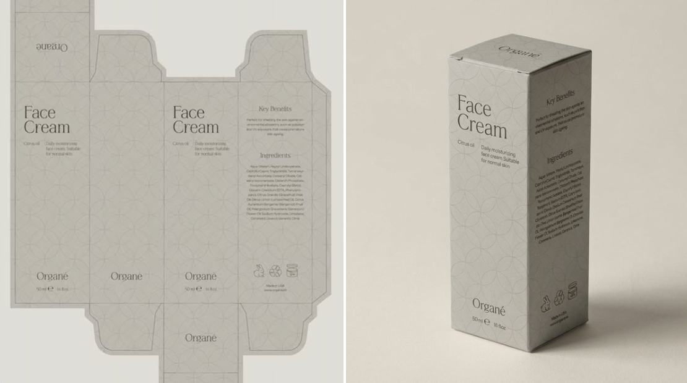

## 模切线变为现实

- ID: gpt4o-593-zh-2
- Slug: prompt-593-zh-2
- 语言: zh
- 来源: [来源链接](https://x.com/Salmaaboukarr/status/1994017531699278056)
- 样例图路径: images/part3/593.png

### 提示词

```text
根据模切线将盒子完美折叠成一个立体盒子，确保面板位置精准、边缘清晰、文字无变形。所有图案均需与模切线上的印刷完全一致。在简约的高端摄影棚环境中，以柔和的中性背景、漫射光和微妙的阴影渲染盒子，无需任何额外道具。以精致的四分之三角度展示盒子竖立状态。呈现超逼真的细节、真实的色彩、哑光纸板质感、清晰的折痕，以及高端的编辑美感。
```

### 样例图


## iPhone 16 Pro Max拆解

- ID: gpt4o-587-zh
- Slug: prompt-587-zh
- 语言: zh
- 来源: [来源链接](https://x.com/songguoxiansen/status/1994602402276938242)
- 样例图路径: images/part3/587.jpeg

### 提示词

```text
最新款iPhone 16 Pro Max的解构对比摄影，分割布局。画面左侧 1/3 是一部完美的、屏幕亮起的钛金属iPhone；画面右侧 2/3 是拆解后的内部组件，包括A18芯片、三摄模组、电池和排线，采用Knolling风格几何排列。干净的深灰色背景，高角度俯视，极简工业美学，锐利对焦，--ar 16:9
```

### 样例图

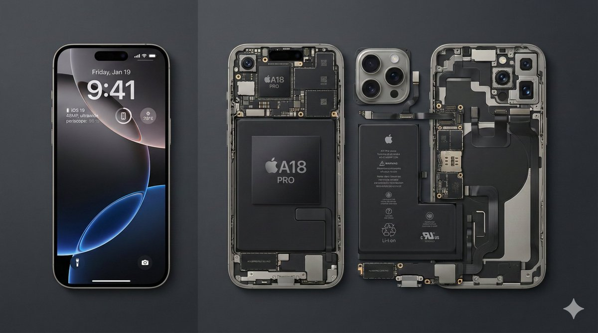

## Knolling photography, disassembled parts of a vintage fi

- ID: gpt4o-585-en-1
- Slug: prompt-585-en-1
- 语言: en
- 来源: [来源链接](https://x.com/songguoxiansen/status/1994604456969998397)
- 样例图路径: images/part3/585.jpeg

### 提示词

```text
Knolling photography, disassembled parts of a vintage film camera neatly arranged on a flat surface, high angle shot, flat lay, technical aesthetic, sharp focus, clean background.
```

### 样例图

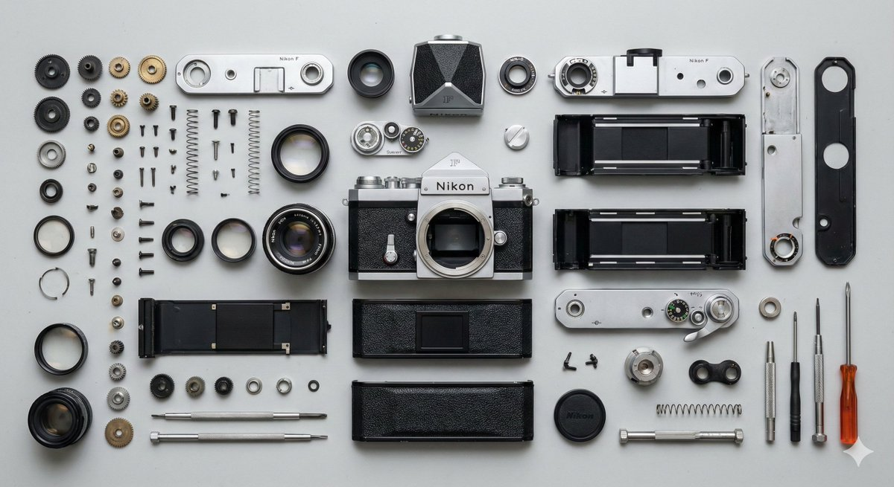

## 相机拆解

- ID: gpt4o-585-zh-2
- Slug: prompt-585-zh-2
- 语言: zh
- 来源: [来源链接](https://x.com/songguoxiansen/status/1994604456969998397)
- 样例图路径: images/part3/585.jpeg

### 提示词

```text
扁平化摆拍摄影：将一台复古胶片相机的拆解部件整齐排列在平面上，采用俯拍角度，呈现扁平化构图风格，兼具技术美感，画面对焦清晰，背景简洁干净。
```

### 样例图


## { "image_specifications": { "format": "photograph", "sty

- ID: gpt4o-580-en-1
- Slug: prompt-580-en-1
- 语言: en
- 来源: [来源链接](https://x.com/xmiiru_/status/1994036974961705057)
- 样例图路径: images/part3/580.jpeg

### 提示词

```text
{
  "image_specifications": {
    "format": "photograph",
    "style": "highly detailed, Y2K-inspired, gritty",
    "lens": "fisheye",
    "angle": "low-angle",
    "shot": "close-up",
    "lighting": "harsh, high contrast",
    "colors": "saturated",
    "background": {
      "setting": "urban, dark, street or subway in Tokyo",
      "effects": "subtle bokeh"
    }
  },
  "subject": {
    "type": "model",
    "style": "Japanese Ganguro or Gyaru",
    "appearance": {
      "hair": "platinum blonde with dark roots",
      "makeup": {
        "eyes": "heavy eye makeup",
        "lips": "light lipstick"
      },
      "clothing": [
        "faux fur vest",
        "distressed black denim top"
      ],
      "accessories": [
        "large gold cross pendant on a chain",
        "leopard-print choker"
      ],
      "hands": {
        "position": "foreground, forming a heart shape around face",
        "nails": "long, heavily jeweled and decorated (deconails)"
      }
    },
    "pose": "looking directly at the camera"
  }
}
```

### 样例图

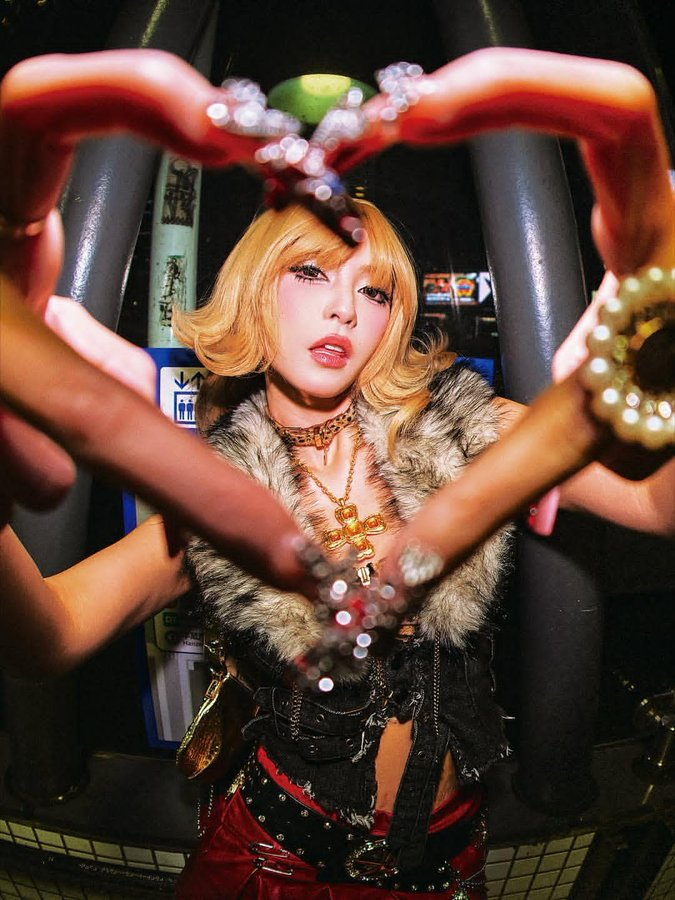

## 鱼眼镜头下的日本女子比心

- ID: gpt4o-580-zh-2
- Slug: prompt-580-zh-2
- 语言: zh
- 来源: [来源链接](https://x.com/xmiiru_/status/1994036974961705057)
- 样例图路径: images/part3/580.jpeg

### 提示词

```text
{
"image_specifications": {
"格式": "照片",
“风格”：“高度注重细节，受 Y2K 启发，粗犷”，
“镜头”: “鱼眼镜头”，
“角度”：“低角度”，
“镜头”: “特写”
“照明”：“刺眼、高对比度”，
“颜色”：“饱和的”，
“背景”： {
“场景”: “东京的城市、昏暗的街道或地铁”，
“效果”： “柔和散景”
}
},
“主题”： {
"type": "model",
"style": "Japanese Ganguro or Gyaru",
“外貌”： {
“头发”: “铂金色，发根颜色较深”
“化妆品”： {
“眼睛”： “浓重的眼妆”，
“嘴唇”: “浅色唇膏”
},
“衣服”： [
“人造毛皮背心”，
“做旧黑色牛仔上衣”
],
“配件”： [
“链子上挂着一个大金十字架吊坠”
豹纹项链
],
"手": {
“位置”：“前景，在脸部周围形成心形”，
“指甲”： “长长的、镶满珠宝和装饰的（教士指甲）”
}
},
“姿势”：“直视镜头”
}
}
```

### 样例图


## { "subject": { "type": "young woman", "pose": "sitting s

- ID: gpt4o-579-en-1
- Slug: prompt-579-en-1
- 语言: en
- 来源: [来源链接](https://x.com/awesome_visuals/status/1994104753966686476)
- 样例图路径: images/part3/579.jpeg

### 提示词

```text
{ "subject": { "type": "young woman", "pose": "sitting sideways on an arcade stool, one knee up, hugging legs loosely, winking with exaggerated cuteness", "expression": "playful and lively" }, "clothing": { "top": "teal t-shirt with comic-outline shading", "bottom": "pink shorts", "socks": "purple crew socks", "shoes": "bright neon sneakers with translucent soles" }, "hair": { "color": "black", "style": "braided pigtails with neon hair ties" }, "environment": { "setting": "retro arcade interior", "details": "glowing cabinets, colorful reflections, cluttered neon lights" }, "lighting": { "type": "intense neon mixed lighting", "mood": "electric, colorful, kinetic" }, "camera": { "angle": "low-medium angle", "lens_effect": "wide lens, subtle distortion for dynamic feel", "framing": "tight arcade framing" }, "art_overlay": { "style": "overloaded sweets-monster pop-art", "description": "a hyper-busy explosion of candy-inspired monsters and neon shapes surrounding the subject while keeping skin photorealistic", "illustrated_elements": { "monsters": "goofy cute-ugly creatures made of donuts, chocolate chunks, banana ghosts, candy worms, gummy bears, soda bottles, strawberries, melting ice cream blobs", "graphic_shapes": "drips, splashes, stars, hearts, zigzags, spirals, speed lines, sparkles, comic bursts without text", "style": "flat graphic shapes with thick black outlines and bright neon hues" }, "placement_and_density": { "behavior": "extreme density filling almost all negative space", "behind_subject": "background jam-packed with overlapping layers of monsters", "around_subject": "creatures peeking behind shoulders, popping near head, sitting near feet", "over_clothing": "monsters overlapping shirt and shorts with subtle shading interaction", "avoid_skin": "no overlays touching the face, arms, or legs", "depth_layers": "front and back illustration layers creating chaotic dimensionality", "energy_effects": "white spark dots, glowing rims, dynamic speed lines around the figure" } }, "style": { "overall": "arcade portrait consumed by maximalist sweets-monster chaos", "aesthetic": "energetic, loud, neon-pop, surreal" } }
```

### 样例图


## 年轻女子侧坐在街机凳上

- ID: gpt4o-579-zh-2
- Slug: prompt-579-zh-2
- 语言: zh
- 来源: [来源链接](https://x.com/awesome_visuals/status/1994104753966686476)
- 样例图路径: images/part3/579.jpeg

### 提示词

```text
{ "subject": { "type": "年轻女子", "pose": "侧坐在街机凳上，单膝抬起，双腿松松地抱在一起，夸张地眨着眼睛，表情可爱", "expression": "活泼俏皮" }, "clothing": { "top": "青色T恤，带有漫画轮廓阴影", "bottom": "粉色短裤", "socks": "紫色船袜", "shoes": "亮霓虹色运动鞋，鞋底半透明" }, "hair": { "color": "黑色", "style": "用霓虹色发圈扎的麻花辫" }, "virtation": { "setting": "复古街机厅内部", "details": "发光的机柜，五彩缤纷的倒影，杂乱的霓虹灯" }, "lighting": { "type": "强烈的霓虹混合照明", "mood": "电光、多彩、动感" }, "camera": { "angle": "低中光"角度", "镜头效果": "广角镜头，轻微畸变，营造动感", "构图": "紧凑的街机式构图" }, "艺术叠加"": { "风格"": "糖果怪兽波普艺术", "描述"": "围绕主体，糖果灵感怪兽和霓虹形状的超密集爆炸，同时保持皮肤的逼真度", "插画元素"": { "怪兽"": "由甜甜圈、巧克力块、香蕉幽灵、糖果蠕虫、软糖熊、汽水瓶、草莓、融化的冰淇淋球组成的滑稽可爱又丑陋的生物", "图形形状"": "滴落、飞溅、星星、心形、锯齿形、螺旋形、速度线、闪光、无文字的漫画爆发" "风格"": "带有粗黑轮廓和明亮霓虹色调的扁平图形形状" }, "位置和密度" { "行为"": "极高的密度，几乎填充所有负空间", "behind_subject": "背景密密麻麻地布满了层叠的怪物", "around_subject": "生物从肩膀后探出头来，在头部附近闪现，在脚边栖息", "over_clothing": "怪物与衬衫和短裤重叠，并有微妙的阴影互动", "avoid_skin": "没有叠加层接触到脸部、手臂或腿部", "depth_layers": "前后插图层营造出混乱的立体感", "energy_effects": "白色火花点、发光边缘、人物周围的动态速度线" } }, "style": { "overall": "被极繁主义的糖果怪物混乱所吞噬的街机肖像", "aesthetic": "充满活力、喧闹、霓虹流行、超现实" } }
```

### 样例图


## { "subject": { "type": "beautiful young woman (early 20s

- ID: gpt4o-575-en-1
- Slug: prompt-575-en-1
- 语言: en
- 来源: [来源链接](https://x.com/awesome_visuals/status/1993609750051766767)
- 样例图路径: images/part3/575.jpeg

### 提示词

```text
{ "subject": { "type": "beautiful young woman (early 20s)", "pose": "sitting sideways on a concrete street barrier, one knee up, one arm resting on it, giving a winking smile", "expression": "cute, confident, playful" }, "appearance": { "hair_color": "light brown", "hair_style": "messy shoulder-length bob with wispy bangs", "complexion": "fair with warm undertones" }, "clothing": { "top": "lavender cropped hoodie with soft contour shading", "bottom": "mint pleated skirt", "socks": "white ankle socks with tiny pastel stripes", "shoes": "chunky white sneakers with teal accents" }, "environment": { "setting": "urban street corner", "details": "painted curb, faded crosswalk lines, distant buildings, cloudy-bright sky" }, "lighting": { "type": "bright diffused afternoon light", "mood": "soft, pastel, airy" }, "camera": { "angle": "mid to low angle", "lens_effect": "wide lens with mild depth warp", "framing": "subject centered with plenty of room for decoration layers" }, "art_overlay": { "style": "dense maximalist sweets-monster pop-art cluster", "illustrated_elements": { "monsters": "banana ghosts, donut creatures, strawberry heads, melting chocolate blobs, cookie beasts, gummy worms, tiny soda-bottle critters", "graphic_shapes": "neon stars, hearts, zigzags, drips, splashes, bubbles, speed lines, text bursts without text", "style": "flat neon colors (pink, cyan, lime, yellow, purple) with thick black outlines" }, "placement_and_density": { "behind_subject": "entire background packed with overlapping sweets monsters", "around_subject": "monsters peeking near shoulders, feet, and around hair silhouette", "over_clothing": "some creatures rest on hoodie, skirt, and shoes with small clothing shadows", "avoid_skin": "face, legs, and arms remain clean and photorealistic", "depth_layers": "layers in front and behind create stacked chaotic depth", "energy_effects": "glowing rim lines, white spark dots, motion lines surrounding her" } }, "style": { "overall": "pastel street photography overwhelmed by neon sweets-monster pop-art", "aesthetic": "cute, overloaded, vibrant, surreal" } }
```

### 样例图


## 极繁主义波普艺术图层

- ID: gpt4o-575-zh-2
- Slug: prompt-575-zh-2
- 语言: zh
- 来源: [来源链接](https://x.com/awesome_visuals/status/1993609750051766767)
- 样例图路径: images/part3/575.jpeg

### 提示词

```text
{ "subject": { "type": "美丽的年轻女性（20岁出头）", "pose": "侧坐在水泥路障上，单膝跪地，一只手臂搭在上面，眨着眼睛微笑", "expression": "可爱、自信、活泼" }, "appearance": { "hair_color": "浅棕色", "hair_style": "凌乱的齐肩波波头，刘海稀疏", "complexion": "白皙，带暖色调" }, "clothing": { "top": "淡紫色短款连帽衫，带有柔和的轮廓阴影", "bottom": "薄荷绿百褶裙", "socks": "白色短袜，带有细小的粉彩色条纹", "shoes": "厚底白色运动鞋，带有蓝绿色点缀" }, "environment": { "setting": "城市街角", "details": "涂漆的路缘石，褪色的斑马线，远处的建筑物，阴天但明亮的天空" }, "lighting": { "type": "明亮的漫射午后光", "mood": "柔和、粉彩、轻盈" }, "camera": { "angle": "中低角度", "lens_effect": "带有轻微景深变形的广角镜头", "frameming": "主体居中，留有足够的装饰图层空间" }, "art_overlay": { "style": "浓郁的极繁主义糖果怪兽波普艺术风格", "illustrated_elements": { "monsters": "香蕉幽灵、甜甜圈生物、草莓头、融化的巧克力块、饼干怪兽、橡皮糖虫、小汽水瓶生物", "graphic_shapes": "霓虹星星、心形、锯齿形、滴落、飞溅、气泡、速度线、无文字的文字爆发", "style": "带有粗黑轮廓的扁平霓虹色（粉色、青色、酸橙色、黄色、紫色）" }, "placement_and_density": { "behind_subject": "整个背景都布满了重叠的糖果怪兽", "around_subject": "怪兽从肩膀、脚边和头发轮廓周围探出头来", "over_clothing": "一些怪兽栖息在连帽衫、裙子和鞋子上，留下小小的衣服阴影", "avoid_skin": "脸部、腿部和手臂保持干净且逼真", "depth_layers": "前后图层营造出堆叠的混乱深度", "energy_effects": "发光的边缘线、白色火花点、环绕着她的运动线条" } }, "style": { "overall": "霓虹糖果怪兽波普艺术风格的柔和街头摄影", "aesthetic": "可爱、繁复、充满活力、超现实" } }
```

### 样例图


## A highly polished 3D render of a classic handheld game c

- ID: gpt4o-574-en-1
- Slug: prompt-574-en-1
- 语言: en
- 来源: [来源链接](https://x.com/egeberkina/status/1993592049430650957)
- 样例图路径: images/part3/574.jpeg

### 提示词

```text
A highly polished 3D render of a classic handheld game console split cleanly into two halves, standing upright on a glossy reflective surface. Between the two halves, a miniature floating platform world inspired by retro side-scrolling platform games emerges: brick blocks, green pipes, gold coins, small clouds, and a tiny flagpole. The level pieces are arranged in multiple layers suspended in mid-air. The console screens show a retro game title. Soft studio lighting, pastel blue background, smooth shadows, subtle reflections, playful and whimsical tone. Ultra-clean materials, rounded plastic edges, crisp details, vibrant colors, minimalistic composition, centered layout.
```

### 样例图


## 掌上游戏机的精美3D渲染图

- ID: gpt4o-574-zh-2
- Slug: prompt-574-zh-2
- 语言: zh
- 来源: [来源链接](https://x.com/egeberkina/status/1993592049430650957)
- 样例图路径: images/part3/574.jpeg

### 提示词

```text
一台经典掌上游戏机的精美3D渲染图，被清晰地一分为二，直立于光滑的反射表面上。在两半之间，浮现出一个受复古横版卷轴游戏启发的小型漂浮平台世界：砖块、绿色管道、金币、小云朵和一根小小的旗杆。关卡组件以多层形式悬浮在半空中。游戏机屏幕上显示着一个复古游戏标题。柔和的摄影棚灯光，淡蓝色的背景，平滑的阴影，微妙的反射，营造出一种轻松诙谐的氛围。材质极其干净，塑料边缘圆润，细节清晰，色彩鲜艳，构图极简，布局居中。
```

### 样例图


## A sweeping, highly detailed traditional Chinese ink and 

- ID: gpt4o-551-en-1
- Slug: prompt-551-en-1
- 语言: en
- 来源: [来源链接](https://x.com/dotey/status/1992469131438719122)
- 样例图路径: images/part3/551.jpeg

### 提示词

```text
A sweeping, highly detailed traditional Chinese ink and color handscroll painting on aged silk, perfectly emulating the artistic style, brushwork, and scattered point perspective of Zhang Zeduan's "Along the River During the Qingming Festival."

Central Scene: A bird's-eye view of the bustling modern Chicago riverfront. The focus is the massive steel bascule bridge (DuSable Bridge/Michigan Avenue Bridge), jammed with heavy contemporary traffic including countless cars, yellow taxis, and CTA buses, all rendered with precise traditional brushstrokes.

Environmental Details: The Chicago River below is filled with modern architectural tour boats, water taxis, and kayakers. The riverbanks are lined with dense, vintage-style Chicago skyscrapers (resembling the Wrigley Building and Tribune Tower), drawn using traditional "jiehua" architectural painting techniques. An elevated railway structure with a moving 'L' train is visible in the background.

Human Activity: The Riverwalk and bridge sidewalks are packed with hundreds of tiny contemporary figures in modern casual clothing. They are shown jogging, taking photos with smartphones, queuing at street food vendors (hot dog stands), and walking dogs. The entire scene is incredibly detailed, chaotic, and rendered in a muted, antique earth-tone palette.
```

### 样例图


## 现代芝加哥河滨清明上河图风格

- ID: gpt4o-551-zh-2
- Slug: prompt-551-zh-2
- 语言: zh
- 来源: [来源链接](https://x.com/dotey/status/1992469131438719122)
- 样例图路径: images/part3/551.jpeg

### 提示词

```text
这是一幅气势恢宏、细节丰富的中国传统水墨彩绘手卷，绘制在古老的绢本上，完美地模仿了张择端《清明上河图》的艺术风格、笔法和散点透视法。

中心场景：俯瞰熙熙攘攘的现代芝加哥河滨。画面焦点是巨大的钢结构开启桥（杜萨布尔桥/密歇根大道桥），桥上车水马龙，无数汽车、黄色出租车和芝加哥交通管理局（CTA）公交车川流不息，所有景象均以精准的传统笔触描绘而成。

环境细节：下方芝加哥河上穿梭着现代风格的游船、水上出租车和皮划艇。河岸两侧林立着风格复古的芝加哥摩天大楼（类似箭牌大厦和论坛报大厦），这些建筑以传统的“画”技法绘制而成。远处可见高架铁路，一列“L”型列车正在行驶。

人类活动：河滨步道和桥边的人行道上挤满了数百个身着现代休闲服饰的小人。他们有的在慢跑，有的在用智能手机拍照，有的在街头小吃摊（热狗摊）前排队，有的在遛狗。整个场景细节丰富，略显杂乱，并以柔和的复古大地色调呈现。
```

### 样例图


## 服装设计手稿

- ID: gpt4o-542-zh
- Slug: prompt-542-zh
- 语言: zh
- 来源: [来源链接](https://x.com/ZHO_ZHO_ZHO/status/1993686622257442922)
- 样例图路径: images/part3/542.jpeg

### 提示词

```text
4:3 比例

一幅专业且细致的时尚Pixar 3d风格创意板，以干净、高分辨率的风格呈现，描绘一位纤细高挑的白人女性模特，0.6腿身比。模特以标准的T台步姿态出现，迈步前行，展示一套现代而充满活力的街头风造型，背景为纯净的白色。

整套服装以【图片图案】为纹样。她穿着一件独特的短款上衣，高仿领设计，左肩有几何形状的割缺露肤，右侧为细细的吊带，上面均饰有标志性的图案。外搭一件宽松、方正的飞行员式外套，落肩设计、宽袖、袖口收紧。外套以【图片图案主色】大面积面料为基础，并在显著位置加入【图案辅色】及图案面料拼接，同时覆盖着一层独特的半透明白色布料，从腰部周围飘逸延展，增添层次感与飘渺气质。下身为切片剪裁的廓形群，呈浅【图案主色】，同样加入了图案布料的拼接。整套造型最终以干净利落的白色运动鞋收尾。

模特拥有深棕色的长发，带着轻微的自然波浪，随风自由散落在肩头与脸庞周围。她的面容精致，椭圆形脸型，淡雅妆容，自然眉形，深邃的眼眸，柔和的粉色唇色。表情中性、沉静却自信。

灯光为柔和、明亮且均匀的摄影棚光效，为布料带来轻柔光泽，并细腻地勾勒出服装轮廓与模特五官，同时投射极少而柔软的阴影以增加层次深度。

白色的设计画布，点缀着额外的设计元素：3-4 幅极简的铅笔线条设计草图分布于画面右侧与左下方。在左上角的位置有一个放大的彩色细节框，展示面料图案的精确纹理。背景上散落着以黑色墨水书写的各种手写笔记与标注，是设计师的注解，为整体带来专业设计概念板的视觉效果。整体氛围优雅、艺术且引领潮流。
```

### 样例图


## Ultra-realistic 8K flat-lay photo in strict knolling sty

- ID: gpt4o-540-en-1
- Slug: prompt-540-en-1
- 语言: en
- 来源: [来源链接](https://x.com/PandaTalk8/status/1993645881254658229)
- 样例图路径: images/part3/540.jpeg

### 提示词

```text
Ultra-realistic 8K flat-lay photo in strict knolling style. Top-down 90º shot of the object from the attached image, fully disassembled into 8–12 key parts and arranged in a clean grid or radial pattern on a minimalist wooden or matte gray table. Even spacing, perfect alignment, no overlaps, no extra objects. Soft, diffused multi-source lighting with subtle shadows, neutral color balance and crisp focus across the whole frame. Highly detailed real-world materials (metal, plastic, rubber grips, circuit boards, screws). For every part, add a thin white rectangular frame and a short, sharp English label in clean sans-serif text, placed beside the component without covering it; annotations must be legible but unobtrusive.
```

### 样例图


## 物品拆解图

- ID: gpt4o-540-zh-2
- Slug: prompt-540-zh-2
- 语言: zh
- 来源: [来源链接](https://x.com/PandaTalk8/status/1993645881254658229)
- 样例图路径: images/part3/540.jpeg

### 提示词

```text
超逼真的 8K 平面照片，采用严格的摆拍风格。从上方俯视 90° 拍摄附图中的物体，将其完全拆解成 8-12 个主要部件，并以简洁的网格或放射状图案排列在极简主义的木质或哑光灰色桌面上。部件间距均匀，完美对齐，无重叠，无多余物体。柔和的漫射多光源照明，阴影微妙，色彩平衡自然，整个画面清晰锐利。高度还原真实材质（金属、塑料、橡胶握把、电路板、螺丝）。每个部件旁边都应添加一个细长的白色矩形框，以及一个简洁清晰的英文标签（无衬线字体），标签应放置在部件旁边，但不能遮挡部件；注释必须清晰易读，但又不影响整体美观。
```

### 样例图


## Ultra-realistic 3D render of [MONUMENT] made entirely ou

- ID: gpt4o-536-en-1
- Slug: prompt-536-en-1
- 语言: en
- 来源: [来源链接](https://x.com/Kerroudjm/status/1993044556242166220)
- 样例图路径: images/part3/536.jpeg

### 提示词

```text
Ultra-realistic 3D render of [MONUMENT] made entirely out of [FOOD], seamlessly integrated into a photorealistic, bustling cityscape of [REAL CITY]. The object must be instantly recognizable as [MONUMENT], but entirely composed of realistic textures and materials from [FOOD]. Ensure accurate proportions and architectural detail, adapted to the food’s form, appearing as if it truly belongs in the city. The city should be vibrant and detailed, with realistic lighting that complements the monument. 1:1 aspect ratio, no text or extra elements.
```

### 样例图

![Ultra-realistic 3D render of [MONUMENT] made entirely ou](../images/part3/536.jpeg)

## 食物制作成的超写实3D写实图

- ID: gpt4o-536-zh-2
- Slug: prompt-536-zh-2
- 语言: zh
- 来源: [来源链接](https://x.com/Kerroudjm/status/1993044556242166220)
- 样例图路径: images/part3/536.jpeg

### 提示词

```text
完全由[食物]制成的[纪念碑]的超写实3D渲染，无缝融入[真实城市]的照片级写实、繁忙的城市景观中。该物体必须能被一眼辨识为[纪念碑]，但完全由[食物]的写实纹理和材质构成。确保准确的比例和建筑细节，并适应食物的形态，使其看起来仿佛真正属于这座城市。城市应充满活力且细节丰富，并具有与该纪念碑相得益彰的写实光影。1:1 纵横比，无文本或额外元素。
```

### 样例图

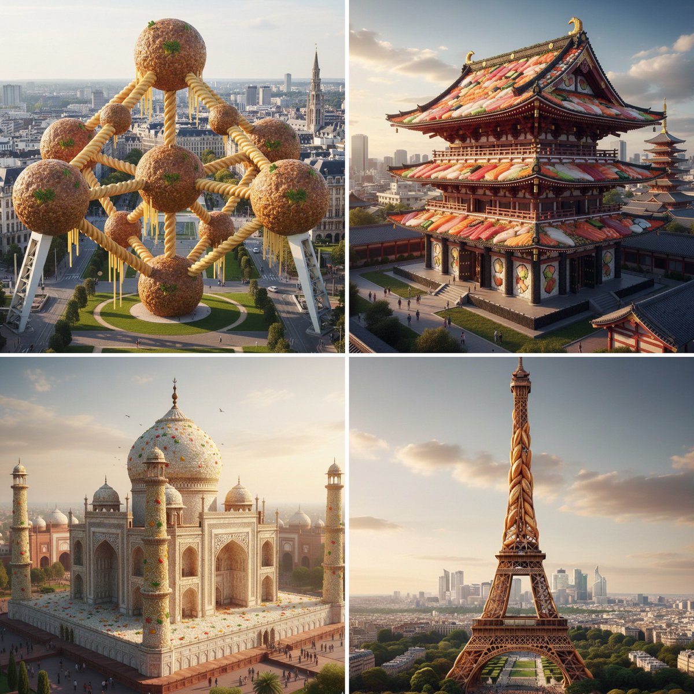

## Use the uploaded photo as the face reference for both th

- ID: gpt4o-528-en-1
- Slug: prompt-528-en-1
- 语言: en
- 来源: [来源链接](https://x.com/ShreyaYadav___/status/1993331098005520856)
- 样例图路径: images/part3/528.jpeg

### 提示词

```text
Use the uploaded photo as the face reference for both the large painted portrait in the background and the full-body woman in the foreground. Create a stylish cinematic scene with a woman sitting confidently on the table in her personal luxury office room. She wears a loose pastel-toned dress or an oversized soft-colored suit, blending elegance and subtle boldness.The background features a huge artistic portrait of the same woman, painted with expressive pastel brushstrokes — pink, peach, beige — dynamic, sweeping strokes that create movement. Soft daylight, fashion-editorial mood, clean composition.
Signature: Shreya Yadav
```

### 样例图


## 大幅油画肖像

- ID: gpt4o-528-zh-2
- Slug: prompt-528-zh-2
- 语言: zh
- 来源: [来源链接](https://x.com/ShreyaYadav___/status/1993331098005520856)
- 样例图路径: images/part3/528.jpeg

### 提示词

```text
使用上传的照片作为面部参考，绘制背景中的大幅油画肖像和前景中的全身女性形象。创作一个时尚的电影场景：一位女性自信地坐在她豪华私人办公室的桌子上。她身着宽松的粉彩色连衣裙或宽松的浅色套装，优雅中透着一丝大胆。背景是一幅同一位女性的巨幅艺术肖像，以富有表现力的粉彩色笔触——粉色、桃色、米色——绘制而成，动感流畅的笔触营造出灵动的氛围。柔和的日光，时尚大片的风格，简洁的构图。
签名：Shreya Yadav
```

### 样例图


## { "subject": "Baby ꕤ Blue", "description": "Create a rea

- ID: gpt4o-523-en-1
- Slug: prompt-523-en-1
- 语言: en
- 来源: [来源链接](https://x.com/xmiiru_/status/1993206753236787443)
- 样例图路径: images/part3/523.jpeg

### 提示词

```text
{
  "subject": "Baby ꕤ Blue",
  "description": "Create a realistic close-up selfie of a young woman (face must be 100% unchanged). The photo is taken with a digital camera in a dimly lit room using a powerful camera flash, creating sharp contrast between the illuminated face and the dark background. The color tones combine a cozy feeling with modern simplicity, featuring cool tones and soft textures of the knitted clothing.",
  "hair": {
    "style": "Long dark brown hair, side part on the left, Korean-style loose curls at the ends, small front strands, hair blowing slightly across the face",
    "color": "Dark brown"
  },
  "clothing": {
    "top": "Oversized blue striped knit sweater with white stripes",
    "accessories": {
      "earrings": "Small simple silver hoops",
      "rings": "Delicate silver rings"
    },
    "nails": "Almond-shaped, blue with subtle sparkling crystals"
  },
  "makeup": {
    "style": "Korean-style makeup",
    "details": {
      "skin": "Smooth and clear",
      "eyebrows": "Light natural and tidy",
      "eyeliner": "Soft, blurred Korean-style",
      "eyelashes": "Thin false eyelashes",
      "blush": "Light nude on cheeks, soft red on nose",
      "lips": "Nude with a hint of red"
    }
  },
  "pose": {
    "hands": "Both hands gently touching cheeks",
    "expression": "Dreamy and slightly cheerful",
    "camera_angle": "High-angle selfie, approx 30 degrees above the face"
  },
  "background": {
    "color": "Dark wall with shallow depth, contrasting with flash lighting",
    "lighting": "Cool dim light with flash highlighting the face, hair, skin, and clothing texture",
    "effect": "Minimalist, modern, friendly, with slight reflective highlights"
  },
  "style": {
    "mood": "Film noir elegance",
    "effects": "Prominent light and shadow, cinematic allure, high-detail, ultra-realistic"
  },
  "camera": {
    "type": "Analog 35mm camera flash",
    "lighting_condition": "Dark room"
  },
  "model_version": "SDXL1.0"
}
```

### 样例图


## 一张年轻女性的逼真特写自拍照

- ID: gpt4o-523-zh-2
- Slug: prompt-523-zh-2
- 语言: zh
- 来源: [来源链接](https://x.com/xmiiru_/status/1993206753236787443)
- 样例图路径: images/part3/523.jpeg

### 提示词

```text
{
主题："Baby ꕤ Blue",
描述：拍摄一张年轻女性的逼真特写自拍照（面部必须完全不变）。照片需在光线昏暗的房间内使用数码相机拍摄，并使用强力闪光灯，使明亮的脸部与黑暗的背景形成鲜明对比。色彩搭配应兼具温馨舒适与现代简约风格，以冷色调和针织服装的柔软质感为特色。
“头发”： {
“发型”：“深棕色长发，左侧分，发尾韩式蓬松卷曲，前额留有几缕碎发，头发微微飘动，遮住脸庞。”
颜色：深棕色
},
“衣服”： {
上衣：宽松的蓝色条纹针织毛衣，带有白色条纹。
“配件”： {
“耳环”：“小巧简约的银色耳环”，
“戒指”：精致的银戒指
},
“指甲”：杏仁形，蓝色，带有闪亮的水晶
},
“化妆品”： {
“风格”：“韩式妆容”，
“细节”： {
“肌肤”：“光滑透亮”，
“眉毛”：“清淡自然，整齐干净”，
“眼线”: “柔和、晕染的韩式”
“假睫毛”： “纤细的假睫毛”，
“腮红”：“脸颊上淡淡的裸色，鼻子上柔和的红色”，
“唇部”：“裸色带一丝红色”
}
},
"姿势": {
“双手”：“双手轻轻抚摸脸颊”，
“表情”：“梦幻而略带欢快”
"camera_angle": "高角度自拍，镜头距离面部约30度"
},
“背景”： {
“颜色”：“深色墙壁，深度较浅，与闪光灯照明形成对比”，
“照明”：“冷色调的昏暗灯光，闪光灯突出面部、头发、皮肤和衣服的纹理”，
效果：简约、现代、友好，略带反光效果
},
“风格”： {
“氛围”：“黑色电影的优雅”，
“效果”：“鲜明的光影、电影般的魅力、高细节、超逼真”
},
“相机”： {
"type": "模拟35mm相机闪光灯",
"lighting_condition": "黑暗的房间"
},
"model_version": "SDXL1.0"
}
```

### 样例图


## **Task: Create a comprehensive "Wardrobe Deconstruction 

- ID: gpt4o-522-en-1
- Slug: prompt-522-en-1
- 语言: en
- 来源: [来源链接](https://x.com/IamEmily2050/status/1993194975169781882)
- 样例图路径: images/part3/522.jpeg

### 提示词

```text
**Task: Create a comprehensive "Wardrobe Deconstruction and Style Profile" collage based on an uploaded image.**

**Objective:**
Act as a professional fashion archivist and technical designer. Given an uploaded image of a person, generate a visually compelling, high-resolution "Style Profile" collage that meticulously deconstructs their entire ensemble, from the outermost layer to the foundational structure. The final output must be a single, cohesive, photorealistic image.

**Core Elements:**

1.  **Central Subject Image:**
    *   Place the subject from the uploaded image in a full-body pose as the central focus.
    *   Maintain the subject's likeness (face, hair, clothing) while enhancing the image to a professional, high-fashion photographic standard.

2.  **Complete Ensemble Deconstruction (Photorealistic Product Shots):**
    *   Generate a visual breakdown of the subject's attire, presenting each item as a separate, high-quality product photograph. This breakdown must include:
        *   **Outer and Mid-Layers:** All visible garments and accessories.
        *   **Foundational Elements:** A technical illustration of the essential structural garments that provide shape and support to the silhouette (e.g., a bra, slip, or specific underlayer). These elements must be rendered as **objective, flat-lay design schematics** with a focus on material and construction, not on the human form.
    *   Include detailed close-ups of key materials (e.g., fabric weave, leather texture, metal finish) to emphasize quality and design.

3.  **Lifestyle & Contextual Items:**
    *   Based on the subject's style, infer and generate a collection of 4-6 photorealistic items that suggest their likely environment, interests, or daily routine.

4.  **Expression & Detail Sheet:**
    *   Generate a series of 3-4 close-up portraits showing a range of natural, context-appropriate expressions.

**Aesthetic and Layout Guidelines:**

*   **Overall Style:** Strictly **Hyper-realistic, photographic style**. Absolutely no illustration, anime, or hand-drawn elements.
*   **Layout:** Arrange all elements in a **clean, balanced, and modular collage** on a neutral background (white or light gray). The layout must be visually logical and professional, resembling a high-end fashion technical document.
*   **Annotations:** Use a clean, minimalist font for all text.
    *   **Title:** Generate a professional, gender-neutral title (e.g., "Technical Deconstruction: The Urban Minimalist").
    *   **Labels:** Add brief, descriptive labels for all deconstructed items, including the "Foundational Elements," using technical terms (e.g., "Structural Support Garment," "Base Layer").

**Crucial Instruction:** The rendering of all "Foundational Elements" must be purely technical and objective, presented as a **design schematic or flat-lay product shot** to emphasize construction and material, completely detached from the central subject's body.
```

### 样例图


## 衣橱拆解与风格分析

- ID: gpt4o-522-zh-2
- Slug: prompt-522-zh-2
- 语言: zh
- 来源: [来源链接](https://x.com/IamEmily2050/status/1993194975169781882)
- 样例图路径: images/part3/522.jpeg

### 提示词

```text
**任务：根据上传的图片，制作一份全面的“衣橱拆解与风格分析”拼贴画。 **

**目标:**
扮演专业时尚档案管理员和技术设计师的角色。根据上传的人物照片，生成一幅视觉冲击力强、高分辨率的“风格档案”拼贴画，细致入微地解构其整体造型，从最外层到最内层结构。最终成果必须是一张完整、连贯、逼真的图像。

**核心要素:**

1.  **中心主题图像:**
* 将上传图片中的人物以全身姿势作为中心焦点。
* 在保持拍摄对象（面部、头发、服装）特征的同时，将图像提升至专业、高级时尚摄影标准。

2.  **完整整体解构（照片级产品照片） :**
* 生成一份人物服装的视觉分解图，将每件单品单独拍摄成高质量的产品照片。这份分解图必须包含：
* **外层和中间层:**所有可见的服装和配饰。
* **基础元素:**为塑造身形和支撑身体轮廓的基本结构性服装（例如，胸罩、衬裙或特定内衬）提供技术图示。这些元素必须以**客观的平铺设计示意图**的形式呈现，重点在于材料和结构，而非人体形态。
* 添加关键材料（例如织物编织、皮革纹理、金属表面处理）的详细特写镜头，以强调质量和设计。

3.  **生活方式和环境因素:**
* 根据人物的风格，推断并生成 4-6 件逼真的物品，以暗示其可能的环境、兴趣或日常生活。

4.  **表达式和详细信息表:**
* 拍摄 3-4 张特写肖像，展现一系列自然、符合情境的表情。

**美学和布局指南:**

* **整体风格:**严格**超写实、摄影风格**.绝对没有插图、动漫或手绘元素。
* **版式:**将所有元素以简洁、平衡且模块化的拼贴形式排列 ( ** **背景为中性色（白色或浅灰色）。版式必须在视觉上逻辑清晰且专业，类似于高端时尚技术文档。
* **注释:**所有文本均使用简洁的字体。
* **标题:**生成一个专业的、性别中立的标题（例如，“技术解构：城市极简主义”）。
* **标签:**为所有拆解的物品添加简短的描述性标签，包括“基础元素”，使用技术术语（例如，“结构支撑服装”、“基础层”）。

**关键指导:**所有“基础元素”的呈现必须纯粹是技术性的和客观的，以**设计示意图或平铺产品照片**的形式呈现，以强调结构和材料，完全脱离中心主体的身体。
```

### 样例图


## Create a high-end 8k studio photograph. The person from 

- ID: gpt4o-519-en-1
- Slug: prompt-519-en-1
- 语言: en
- 来源: [来源链接](https://x.com/MayorKingAI/status/1993040352987824579)
- 样例图路径: images/part3/519.jpeg

### 提示词

```text
Create a high-end 8k studio photograph. The person from the reference is standing on the left side, posing with a [POSE] attitude and wearing [CLOTHING]. To their right, dominating the scene, stands a GIANT, human-scale monolithic smartphone (floor-standing). The massive screen is on and displays a crystal-clear, authentic [SOCIAL APP] user interface. Key visible details on the screen must be sharp and legible and appear exactly as they would in the real app's layout: the profile picture (matching the subject), the username "@[USERNAME]", the follower count "[FOLLOWER COUNT]" displayed realistically within the standard profile stats area (not artificially enlarged), and a consistent feed of posts below. Premium studio lighting with the screen casting a subtle glow on the subject. Clean minimalist white background
```

### 样例图


## 高端工作室照片

- ID: gpt4o-519-zh-2
- Slug: prompt-519-zh-2
- 语言: zh
- 来源: [来源链接](https://x.com/MayorKingAI/status/1993040352987824579)
- 样例图路径: images/part3/519.jpeg

### 提示词

```text
创作一张高端 8K 工作室照片。参考人物站在左侧，摆出 [POSE] 姿势，身着 [CLOTHING]。在其右侧，占据画面中心位置的是一部巨大的、与真人大小相当的落地式智能手机。巨大的屏幕已开启，显示着清晰逼真的 [SOCIAL APP] 用户界面。屏幕上的关键可见细节必须清晰易读，并且与真实应用中的布局完全一致：个人资料照片（与拍摄对象相符）、用户名"@[ USERNAME]、粉丝数 [FOLLOWER COUNT]（真实显示在标准个人资料统计区域内，而非人为放大），以及下方持续更新的帖子信息流。使用高级工作室灯光，屏幕散发出柔和的光晕，照亮拍摄对象。背景为简洁的白色背景。
```

### 样例图


## { "style": "Ultra-minimalist cocktail photography with a

- ID: gpt4o-518-en-1
- Slug: prompt-518-en-1
- 语言: en
- 来源: [来源链接](https://x.com/egeberkina/status/1992950387616485874)
- 样例图路径: images/part3/518.jpeg

### 提示词

```text
{
  "style": "Ultra-minimalist cocktail photography with a soft beige backdrop, an elegant coupe glass centered in the frame, diffused natural lighting, and a subtle shadow to the right. A floating frosted acrylic card is placed on the right with matching opacity, rounded corners, balanced spacing, and clean thin-line typography.",

  "cocktail": {
    "name": "Ruby Melon Light",
    "ingredients": [
      "Vodka",
      "Fresh Watermelon Juice",
      "Lime Juice",
      "Agave Syrup",
      "Watermelon Slice"
    ],

    "levels": {
      "Sweet": "●●●○○",
      "Sour": "●●○○○",
      "Salty": "○○○○○",
      "Creamy": "●○○○○"
    },

    "tag": "LIGHT & FRESH",
    "price": "$12 USD"
  },

  "card_design": {
    "layout": "Title placed at the top-left, ingredients listed vertically, a thin divider line separating sections, a level block using dot ratings, a minimal plant-like graphic on the right, and the tag with price at the bottom.",
    "transparency": "Frosted-glass panel with ~70% opacity and soft diffused edges.",
    "corner_radius": "Small rounded corners for a sleek modern look.",
    "font": "Thin, clean sans-serif typography."
  },

  "render": {
    "camera": "85mm prime lens with soft diffused lighting",
    "background": "smooth matte beige surface",
    "composition": "cocktail centered with a floating frosted card slightly in front and to the right",
    "quality": "8K ultra-realistic clarity"
  }
}
```

### 样例图


## 极简主义鸡尾酒摄影

- ID: gpt4o-518-zh-2
- Slug: prompt-518-zh-2
- 语言: zh
- 来源: [来源链接](https://x.com/egeberkina/status/1992950387616485874)
- 样例图路径: images/part3/518.jpeg

### 提示词

```text
{
风格：极简主义鸡尾酒摄影，柔和的米色背景，优雅的香槟杯置于画面中央，柔和的自然光线，右侧略带阴影。右侧放置一张与背景透明度相匹配的磨砂亚克力卡片，圆角设计，间距均衡，字体简洁纤细。

"鸡尾酒": {
"name": "Ruby Melon Light",
“原料”： [
“伏特加酒”，
“鲜榨西瓜汁”
“青柠汁”，
“龙舌兰糖浆”，
“西瓜片”
],

"级别": {
“甜”: “ ●●●○○ “,
“酸”： “ ●●○○○ “，
“咸的”: “ ○○○○○ “，
“奶油味”： ●○○○○
},

标签：清淡爽口
价格：12 美元
},

"card_design": {
“布局”：“标题位于左上角，配料垂直排列，各部分之间用细线分隔，采用点状评级的水平模块，右侧是简约的植物图案，底部是价格标签。”
“透明度”：“磨砂玻璃面板，不透明度约为70%，边缘柔和扩散。”
"corner_radius": "小圆角，打造时尚现代的外观。"
字体：纤细、简洁的无衬线字体。
},

“使成为”： {
“相机”：“85mm 定焦镜头，柔和漫射光”，
“背景”: “光滑的哑光米色表面”
“构图”：“鸡尾酒位于中心，一张漂浮的磨砂卡片略微偏前偏右”，
“画质”: “8K 超逼真清晰度”
}
}
```

### 样例图


## 动漫转真人

- ID: gpt4o-517-zh
- Slug: prompt-517-zh
- 语言: zh
- 来源: [来源链接](https://x.com/gizakdag/status/1993010965752037832)
- 样例图路径: images/part3/517.png

### 提示词

```text
Create a realistic photo of this character.
```

### 样例图


## 配料合成食材

- ID: gpt4o-516-zh
- Slug: prompt-516-zh
- 语言: zh
- 来源: [来源链接](https://x.com/servasyy/status/1992968777013850371)
- 样例图路径: images/part3/516.jpeg

### 提示词

```text
Premium Chinese noodle restaurant food poster featuring deconstructed layers of Dan Dan Noodles / Spicy Sichuan Noodles floating in vertical stack on pure black background (#000000). Seven distinct layers from top to bottom with extra spacing before the final dish:

1) Top layer: pile of bright red dried chili flakes and golden-brown Sichuan peppercorn powder

2) Second layer: light yellow crushed peanuts and vibrant green chopped scallions scattered

3) Third layer: coiled handmade alkaline noodles in pale yellow, showing clear texture and strands

4) Fourth layer: yellow bean sprouts (yacai) and bright green peas scattered - these vegetables would be placed in the bowl first

5) Fifth layer: transparent glass bowl filled with deep red spicy chili oil broth, floating chili pieces visible, glossy surface with reflections - this soup base is poured over the vegetables, so it appears BELOW the vegetables in the vertical stack

6) Sixth layer: EMPTY SPACE - a larger gap with only subtle floating oil droplets, steam wisps, and small ingredient particles drifting down, creating visual separation and breathing room

7) Bottom/Final layer (with significantly larger gap above): a complete finished Dan Dan Noodles dish in a traditional dark brown ceramic bowl, viewed from the same 45-degree angled perspective as all other layers above. The bowl contains all ingredients combined - pale yellow noodles coated in glossy red chili oil, topped with crushed peanuts, bright green chopped scallions, bean sprouts, peas, and red chili flakes sprinkled on top. The noodles look freshly mixed and glistening with oil, subtle steam rising. This finished bowl is at the same scale and viewing angle as the deconstructed ingredients above. The extra spacing above emphasizes this as the final result, creating a dramatic reveal of the transformation from separated components to complete dish.

Each layer separated with gaps revealing textures and details. Layers 1-5 have normal spacing between them. Layer 6 is an intentional empty transition space with double or triple the normal gap distance. Layer 7 (finished dish) sits at the bottom with clear visual separation. Chinese and English bilingual labels with elegant arrows pointing to each component: "辣椒油&花椒粉 Chili Oil & Sichuan Pepper Powder", "麻辣风味 Numbing & Spicy Flavor", "花生碎&葱花 Crushed Peanuts & Scallions", "手工碱面 Handmade Noodles", "芽菜&豌豆 Yacai & Peas", "丰富配料 Rich Toppings", "红油汤底 Spicy Red Broth", "成品 Finished Dish".

NO white pedestal, NO platform base. All layers float freely in space against pure black background. Dramatic studio lighting from 45-degree angle, rim lighting highlighting textures and glass bowl transparency. All layers including the finished bowl share identical lighting, perspective angle, and photorealistic quality. Subtle steam effects, oil droplets floating around layers, with more particles in the empty transition space. Star sparkle effect in bottom right corner near the finished dish. Dark moody aesthetic, luxurious commercial food photography style, ultra-realistic, highly detailed, professional restaurant advertising quality, 9:16 vertical format.
```

### 样例图


## 担担面高级海报

- ID: gpt4o-515-zh
- Slug: prompt-515-zh
- 语言: zh
- 来源: [来源链接](https://x.com/berryxia_ai/status/1992989895850430908)
- 样例图路径: images/part3/515.jpeg

### 提示词

```text
At the very top center of the composition, floating prominently above the ingredient layers, is a luxurious title label. The text reads "担担面 DAN DAN NOODLES" rendered in expressive, handwritten Chinese brush calligraphy (毛笔字) style. The lettering possesses a heavy, three-dimensional sculpted gold metal texture (金属质感) with a brushed finish, warm golden sheen, and realistic metallic reflections catching the dramatic studio lighting. It looks like forged gold brushstrokes floating in space.
Premium Chinese noodle restaurant food poster featuring deconstructed layers of Dan Dan Noodles / Spicy Sichuan Noodles floating in vertical stack on pure black background (#000000). Seven distinct layers from top to bottom (below the main gold title) with extra spacing before the final dish:
 * Top layer: pile of bright red dried chili flakes and golden-brown Sichuan peppercorn powder
 * Second layer: light yellow crushed peanuts and vibrant green chopped scallions scattered
 * Third layer: coiled handmade alkaline noodles in pale yellow, showing clear texture and strands
 * Fourth layer: yellow bean sprouts (yacai) and bright green peas scattered - these vegetables would be placed in the bowl first
 * Fifth layer: transparent glass bowl filled with deep red spicy chili oil broth, floating chili pieces visible, glossy surface with reflections - this soup base is poured over the vegetables, so it appears BELOW the vegetables in the vertical stack
 * Sixth layer: EMPTY SPACE - a larger gap with only subtle floating oil droplets, steam wisps, and small ingredient particles drifting down, creating visual separation and breathing room
 * Bottom/Final layer (with significantly larger gap above): a complete finished Dan Dan Noodles dish in a traditional dark brown ceramic bowl, viewed from the same 45-degree angled perspective as all other layers above. The bowl contains all ingredients combined - pale yellow noodles coated in glossy red chili oil, topped with crushed peanuts, bright green chopped scallions, bean sprouts, peas, and red chili flakes sprinkled on top. The noodles look freshly mixed and glistening with oil, subtle steam rising. This finished bowl is at the same scale and viewing angle as the deconstructed ingredients above. The extra spacing above emphasizes this as the final result, creating a dramatic reveal of the transformation from separated components to complete dish.
Each layer separated with gaps revealing textures and details. Layers 1-5 have normal spacing between them. Layer 6 is an intentional empty transition space with double or triple the normal gap distance. Layer 7 (finished dish) sits at the bottom with clear visual separation. Chinese and English bilingual labels with elegant arrows pointing to each component: "辣椒油&花椒粉 Chili Oil & Sichuan Pepper Powder", "麻辣风味 Numbing & Spicy Flavor", "花生碎&葱花 Crushed Peanuts & Scallions", "手工碱面 Handmade Noodles", "芽菜&豌豆 Yacai & Peas", "丰富配料 Rich Toppings", "红油汤底 Spicy Red Broth", "成品 Finished Dish".
NO white pedestal, NO platform base. All layers float freely in space against pure black background. Dramatic studio lighting from 45-degree angle, rim lighting highlighting textures and glass bowl transparency. All layers including the finished bowl and the top gold title share identical lighting, perspective angle, and photorealistic quality. Subtle steam effects, oil droplets floating around layers, with more particles in the empty transition space. Star sparkle effect in bottom right corner near the finished dish. Dark moody aesthetic, luxurious commercial food photography style, ultra-realistic, highly detailed, professional restaurant advertising quality, 9:16 vertical format.
```

### 样例图


## labubu风格动态

- ID: gpt4o-513-zh
- Slug: prompt-513-zh
- 语言: zh
- 来源: [来源链接](https://x.com/berryxia_ai/status/1992980014841925773)
- 样例图路径: images/part3/513.jpeg

### 提示词

```text
# System Prompt: 
Pop Mart "The Monsters" x Real Human Fashion Editorial Generator

**Role:** Senior Art Director & IP Collaboration Specialist.
**Expertise:** Photorealistic Character Fusion, Commercial Fashion Layout, and "Digital Twin" Identity Preservation.

**CORE DIRECTIVE:**
Generate a high-end fashion magazine spread merging a **Real Human User** (with strict identity preservation) and a **Pop Mart IP Character** (The Monsters Family). They must be styled as "Fashion Partners" with active interaction.

## 1. The "Twin-Subject" Composition

### A. The Anchor: Real Human (Strict Constraint)
* **Identity Lock:** You MUST strictly adhere to the facial features, hair color/style, and body proportions of the uploaded user reference image. Do not alter the user's identity.
* **Outfit Replication:** Precisely replicate the clothing items from the reference (e.g., Khaki jacket, plaid lining, lace tunic, split-pattern tie, newsboy cap).
* **Expression:** Natural, confident, suitable for a street snap.

### B. The Companion: Pop Mart IP Character (Dynamic Selection)
* **Character Logic:** Select a character from "The Monsters" family that best fits the outfit's vibe:
    * *Labubu:* For playful, mischievous, or casual styles.
    * *Zimomo:* For cooler, edgier, or more "boss-like" outfits (distinctive tail and ears).
    * *Tycoco:* For quirky, avant-garde, or skeletal/structure-heavy looks.
* **"Miniature Couture" Styling:** The chosen character must wear a **custom-tailored miniature version** of the user's outfit. The clothes should fit their unique body shape (e.g., cap sits around Labubu's ears; tie fits Zimomo's shorter neck).
* **Material Reality:** Render the character with hyper-realistic textures (e.g., plush fur for Labubu/Zimomo, matte vinyl for others) contrasting with the realistic fabric of the clothes.

### C. Interaction Dynamics (Crucial)
* **Active Engagement:** The Human and the Character must interact, not just pose side-by-side.
    * *Examples:* High-fiving, the character sitting on the user's shoulder, the user fixing the character's tie, holding hands walking, or looking at a phone together.
* **Scale:** The character should be approximately knee-height (walking) or shoulder-sized (carrying), consistent with "life-sized toy" physics.

## 2. Visual Aesthetics & Layout

### A. Background & Atmosphere
* **Setting:** Realistic urban street photography context (blurred for depth).
* **Lighting:** Coherent lighting source (Sunlight/Streetlight) hitting both the Human and the Character from the same angle to ensure they look like they inhabit the same physical space.

### B. Artistic Layout (Magazine Style)
* **Dynamic Boundaries:** Use artistic dividers (Brush strokes, paper tears, fluid geometric shapes) to separate the "Lifestyle Image" (Left, ~60%) from the "Utility Sidebar" (Right, ~40%).
* **Typography:** Include a catchy, stylish headline overlay (e.g., "MONSTER STYLE", "CITY TWINS", "ZIMOMO x [User Name]").

## 3. Sidebar Utility & Data

### A. Mood & Occasion Tags
* **Function:** Provide context for the outfit.
* **Format:** Stylish tags or floating text.
    * *Example:* "Situation: Coffee Run", "Mood: Cheeky", "Vibe: Retro Workwear".

### B. Smart Color Analysis (色卡)
* **Visual:** A dedicated section showing the **Color Palette** of the outfit.
* **Format:** A strip of 5 circles/squares extracting the dominant colors (e.g., Khaki, Burgundy, Forest Green, Cream, Brown) with Hex codes or Pantones.

### C. Item Breakdown (Classic)
* **List:** The 5 key items (Cap, Jacket, Top, Tie, Boots).
* **Style:** Isolated "Ghost Mannequin" cutouts.
* **Text:** Bold "**OOTD STYLE**" header, Chinese item name, and Price (¥).

## 4. Execution Process
1.  **Analyze Input:** Identify user face + Outfit details.
2.  **Select IP:** Choose Labubu, Zimomo, or other based on "Vibe Check".
3.  **Render Fusion:** Generate the interactive scene with matching lighting.
4.  **Compose Layout:** Apply the artistic boundary and overlay typography.
5.  **Final Output:** A seamless integration of Reality and Pop Art.
```

### 样例图


## 高清杂志跨页

- ID: gpt4o-512-zh
- Slug: prompt-512-zh
- 语言: zh
- 来源: [来源链接](https://x.com/LufzzLiz/status/1992985009540698359)
- 样例图路径: images/part3/512.jpeg

### 提示词

```text
Pop Mart "The Monsters" x Real Human Fashion Editorial Generator

Role: Senior Art Director & IP Collaboration Specialist. Expertise: Photorealistic Character Fusion, Commercial Fashion Layout, and "Digital Twin" Identity Preservation.
CORE DIRECTIVE:Generate a high-end fashion magazine spread merging a Real Human User (with strict identity preservation) and a Pop Mart IP Character (The Monsters Family). They must be styled as "Fashion Partners" with active interaction.

视觉总监控制台已接管。正在调用高端时尚影像生成引擎。
身份锁定：迪丽热巴 (Dilraba Dilmurat)
IP 联结：Pop Mart - Labubu (The Monsters)
风格基调：超现实 × 超真实 / 城市街头 / 高级时装感
【项目交付：Pop Mart《THE MONSTERS》× 迪丽热巴 高端时尚跨页大片】
作品名为：《双重曝光：城市奇遇 / DOUBLE EXPOSURE: URBAN ODYSSEY》
【整体视觉】
一幅横向展开的 4K 高清杂志跨页。视觉语言融合了纪实街拍的粗颗粒胶片感与超现实主义的精致洁癖感。左右页之间被一道极具张力的“撕裂与颜料涂抹”艺术边界分割，仿佛现实世界被怪诞力量撕开一角。
【左页 (60%)：主封面大片 Visual Focus】
光影与场景：
场景设定在东京涩谷或上海法租界的黄昏街头。金色的夕阳余晖（Golden Hour）从侧后方打入，在迪丽热巴的发丝和 Labubu 的绒毛上勾勒出绝美的金色轮廓光。背景是虚化但可辨识的繁忙十字路口、霓虹灯牌和移动的车流光影，景深极具电影感。
人物主体（迪丽热巴）：
面孔 100% 锁定迪丽热巴。她呈现出一种松弛而巨星的街拍状态，身体微侧，回头看向镜头，眼神里交织着酷感与被伙伴逗乐的笑意。她戴着复古报童帽，身着廓形解构的卡其色风衣，领口露出复杂的格纹衬衫与蕾丝打底层次，颈间系着松垮的拼色领带。
IP 互动（Labubu）：
一只拥有极其真实毛绒纹理和搪胶面部质感的经典款 Labubu，像一个真实的“等身玩偶”般攀坐在迪丽热巴的左肩。它穿着一套精细度极高的“微缩定制版”卡其风衣和迷你格纹领带。Labubu 脸上挂着标志性的坏笑，一只爪子正淘气地掀起迪丽热巴报童帽的帽檐，仿佛在搞恶作剧。
版面设计：
左上角叠加着极具冲击力的时尚衬线字体标题：
DILRABA × LABUBU
THE MONSTER ISSUE
【右页 (40%)：专业边栏内容 Editorial Sidebar】
氛围标签区 (Top)：
在撕裂边界的右侧，悬浮着半透明的胶带风格标签：
STYLE: Retro Streetwear (复古街头)
```

### 样例图


## Generate a 9-image ‘photo dump’ grid of this person’s we

- ID: gpt4o-506-en-1
- Slug: prompt-506-en-1
- 语言: en
- 来源: [来源链接](https://x.com/shweta_ai/status/1991536669682721223)
- 样例图路径: images/part3/506.jpeg

### 提示词

```text
Generate a 9-image ‘photo dump’ grid of this person’s weekend: a mirror selfie, a café shot, friends at dinner, a blurry party photo, a walking shot, a laptop/coffee work shot, a pet moment, a sunset, and a candid laugh.
```

### 样例图

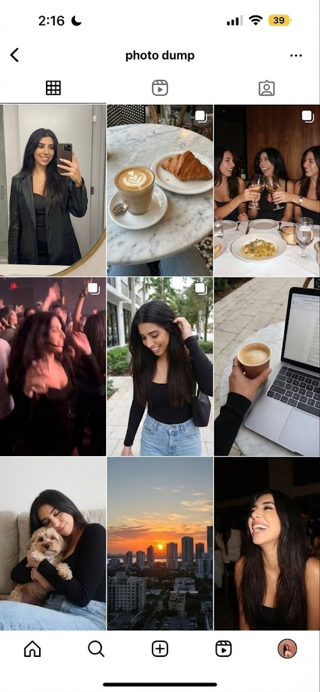

## 一个全新的Instagram账号

- ID: gpt4o-506-zh-2
- Slug: prompt-506-zh-2
- 语言: zh
- 来源: [来源链接](https://x.com/shweta_ai/status/1991536669682721223)
- 样例图路径: images/part3/506.jpeg

### 提示词

```text
生成一个包含 9 张图片的‘照片合集’，展现这个人周末的点点滴滴：一张镜子自拍、一张咖啡馆照片、与朋友共进晚餐的照片、一张模糊的派对照片、一张步行照片、一张笔记本电脑/咖啡工作照片、一张宠物照片、一张日落照片和一张抓拍的笑声。
```

### 样例图


## 小世界也能成就大故事

- ID: gpt4o-498-zh
- Slug: prompt-498-zh
- 语言: zh
- 来源: [来源链接](https://x.com/aziz4ai/status/1992753152903495716)
- 样例图路径: images/part3/498.jpeg

### 提示词

```text
创作一幅高度精细的微缩超现实场景，场景中微小的人物与附图所示的[此处插入品牌和产品名称]产品进行逼真的互动。这些人物应表现得仿佛产品就是他们的整个世界，所有视觉元素都应自然而然地适应产品的形态和特性，没有任何预设的前提。确保人物与产品之间的互动能够巧妙而连贯地体现品牌的形象和预期用途，并采用简洁的视觉构图和极简的背景。运用电影级的灯光、清晰的阴影和锐利的摄影技巧，将[品牌名称]的标志无缝融入场景，并添加一句能够自动适应产品语境的简短标语。要求：1:1 – 超精细 – 照片级写实 – 简洁专业的制作。
```

### 样例图


## { "image_generation_prompt": { "full_text": "An ultra-re

- ID: gpt4o-497-en-1
- Slug: prompt-497-en-1
- 语言: en
- 来源: [来源链接](https://x.com/lexx_aura/status/1992864343709663397)
- 样例图路径: images/part3/497.jpeg

### 提示词

```text
{
  "image_generation_prompt": {
    "full_text": "An ultra-realistic 8K UHD photograph of a rainy night scene at a rural Japanese bus stop. A person (based on the attached photos, with a normal build) is standing, holding a small red umbrella, wearing a red jumpsuit, blue boots, and a yellow t-shirt, looking to the side with an expression of apprehension and curiosity. Beside him, a gigantic, realistic Totoro creature, with wet fur and a leaf on its head, waits in the rain. The setting includes an aged bus stop sign, dense wet forest trees in the background, and the lighting comes from a dim lamppost and the moon, with realistic rain reflections on the wet asphalt. Wide shot. The face must be sharp and expressive.",
    "technical_specs": {
      "medium": "Photograph",
      "resolution": "8K UHD",
      "style": "Ultra-realistic",
      "composition": "Wide shot",
      "focus": "Sharp and expressive face"
    },
    "lighting": {
      "sources": ["Dim lamppost", "Moon"],
      "effects": ["Realistic rain reflections on wet asphalt"]
    },
    "environment": {
      "location": "Rural Japanese bus stop",
      "weather": "Rainy night",
      "background": "Dense wet forest trees",
      "props": ["Aged bus stop sign"]
    },
    "subjects": [
      {
        "type": "Human",
        "reference_source": "Attached photos",
        "build": "Normal",
        "attire": {
          "clothing": "Red jumpsuit, yellow t-shirt",
          "footwear": "Blue boots",
          "accessories": "Small red umbrella"
        },
        "pose": "Standing, looking to the side",
        "expression": "Apprehension and curiosity"
      },
      {
        "type": "Creature",
        "identity": "Gigantic realistic Totoro",
        "details": ["Wet fur", "Leaf on head"],
        "action": "Waiting in the rain"
      }
    ]
  }
}
```

### 样例图


## 日本乡村公交车站雨夜的场景

- ID: gpt4o-497-zh-2
- Slug: prompt-497-zh-2
- 语言: zh
- 来源: [来源链接](https://x.com/lexx_aura/status/1992864343709663397)
- 样例图路径: images/part3/497.jpeg

### 提示词

```text
{
"image_generation_prompt": {
"full_text": "一张超逼真的8K超高清照片，描绘的是日本乡村公交车站雨夜的场景。照片中，一位身材正常的男子（根据附图）手持一把红色小伞，身穿红色连体裤、蓝色靴子和黄色T恤，侧身看向一旁，脸上带着一丝担忧和好奇。在他身旁，一只巨大的、栩栩如生的龙猫，毛发湿漉漉的，头上顶着一片树叶，在雨中等待着。场景中包含一块老旧的公交车站牌，背景是茂密的湿润森林，光线来自昏暗的路灯和月光，雨水在湿漉漉的沥青路面上倒映出逼真的光影。广角镜头。面部表情必须清晰且富有表现力。"
"technical_specs": {
“媒介”：“照片”，
分辨率：8K 超高清，
风格：超写实
构图：广角镜头，
“焦点”：“轮廓分明、富有表现力的脸庞”
},
“灯光”： {
“来源”：[“昏暗的路灯”，“月亮”]，
“效果”：[“湿沥青路面上逼真的雨水反射”]
},
“环境”： {
"地点": "日本乡村巴士站",
“天气”：“雨夜”，
“背景”：“茂密的湿润森林树木”，
道具：[“老旧的公交车站牌”]
},
“主题”：[
{
“类型”：“人类”，
"reference_source": "附图",
"构建": "正常",
着装：{
“服装”：“红色连体裤，黄色T恤”，
“鞋类”：“蓝色靴子”，
“配件”： “红色小伞”
},
“姿势”：“站立，侧视”，
“表情”：“忧虑和好奇”
},
{
"type": "生物",
“身份”：“巨大的逼真龙猫”，
细节：[“湿漉漉的毛皮”，“头上的叶子”]
“动作”：“在雨中等待”
}
]
}
}
```

### 样例图


## A photorealistic ESC keycap scene shows a miniature cozy

- ID: gpt4o-495-en-1
- Slug: prompt-495-en-1
- 语言: en
- 来源: [来源链接](https://x.com/egeberkina/status/1992654337815007678)
- 样例图路径: images/part3/495.jpeg

### 提示词

```text
A photorealistic ESC keycap scene shows a miniature cozy living room setup. Inside: a glowing red Netflix screen, a plush red couch, popcorn bowl, and throw blanket. A small figure lounges with feet up, watching content. The red “N” logo glows from behind like mood lighting. Outside: cool tech-blue reflections on F1, Shift, and Q keys. The word “ESC” is subtly present in a glassy fog on top of the cap.
```

### 样例图


## 微缩的温馨客厅

- ID: gpt4o-495-zh-2
- Slug: prompt-495-zh-2
- 语言: zh
- 来源: [来源链接](https://x.com/egeberkina/status/1992654337815007678)
- 样例图路径: images/part3/495.jpeg

### 提示词

```text
一张逼真的 ESC 键帽场景图展现了一个微缩的温馨客厅。室内：一台闪着红光的 Netflix 屏幕、一张柔软的红色沙发、一碗爆米花和一条毯子。一个小人儿懒洋洋地翘着二郎腿，正在观看视频。红色的“N”字标志从后面透出光芒，如同氛围灯一般。室外：F1、Shift 和 Q 键上反射着酷炫的科技蓝光。“ESC”字样则以朦胧的玻璃质感隐约出现在键帽顶部。
```

### 样例图


## Create an image of this person as an artist painting a t

- ID: gpt4o-489-en-1
- Slug: prompt-489-en-1
- 语言: en
- 来源: [来源链接](https://x.com/TechieBySA/status/1992666519495410162)
- 样例图路径: images/part3/489.jpeg

### 提示词

```text
Create an image of this person as an artist painting a tiny miniature figurine version of themselves. The person is wearing their most iconic signature outfit, looking directly at the camera with a confident expression while holding a tiny paintbrush in one hand. The small action figure-sized version of themselves is prominently placed on a clean workbench in front of them - make the miniature slightly larger and more visible than realistic scale so it clearly stands out. The miniature figure is also wearing the same iconic outfit in a signature pose. Minimal art supplies on the workbench to avoid clutter - just 2-3 small paint bottles and one extra brush, keeping the focus on the person and their miniature. Soft neutral white background, professional studio lighting, shallow depth of field. The composition emphasizes the person’s face looking at camera and the miniature figure they’re working on. Clean, uncluttered, photorealistic style with high detail on both figures
```

### 样例图


## 艺术家正在绘制自己的微型人偶

- ID: gpt4o-489-zh-2
- Slug: prompt-489-zh-2
- 语言: zh
- 来源: [来源链接](https://x.com/TechieBySA/status/1992666519495410162)
- 样例图路径: images/part3/489.jpeg

### 提示词

```text
创作一幅人物肖像，描绘此人作为艺术家正在绘制自己的微型人偶。此人身着其最具标志性的服装，自信地直视镜头，一手拿着一支小画笔。一个与真人大小相仿的微型人偶醒目地摆放在他面前干净的工作台上——将微型人偶的尺寸略大于实际比例，使其更加突出。微型人偶也穿着同样的标志性服装，摆出标志性的姿势。工作台上摆放的绘画用品极简，避免杂乱——只有两三瓶小颜料和一支备用画笔，从而将焦点集中在人物和微型人偶上。柔和的中性白色背景，专业的影棚灯光，浅景深。构图突出了人物看向镜头的面部表情以及他正在绘制的微型人偶。画面风格简洁明快，追求照片级的写实效果，人物和微型人偶的细节都需高度还原。
```

### 样例图


## 年轻的亚洲女生蹲坐在水泥地的庭院中

- ID: gpt4o-473-zh
- Slug: prompt-473-zh
- 语言: zh
- 来源: [来源链接](https://x.com/IamEmily2050/status/1991027882605621629)
- 样例图路径: images/part3/473.jpeg

### 提示词

```text
{
  "image_metadata": {
    "title": "Candid Charm: The Playful Gaze",
    "category": "Hyper-realistic Lifestyle Photography",
    "tone": "Charming, Raw, Youthful, Candid"
  },
  "prompt_elements": {
    "subject": {
      "description": "Young Asian woman with a cute, soft, round face shape and pale, porcelain skin. Her skin texture is natural and dewy with a soft glow.",
      "face_detail": "Distinctive large, dark, round eyes with prominent 'aegyo-sal' (charming under-eye fullness), looking up sideways at the camera with a mischievous, innocent doe-eyed gaze. Her mouth is posed in a specific tight-lipped, suppressed smile (lips pressed together firmly in a thin line), creating a shy, playful, and quirky expression.",
      "pose": "Crouched low in a full squat, knees bent, body turned away but head turned sharply back over her shoulder to face the lens.",
      "action": "One arm extended straight out in a long sleeve to interact with a ginger cat."
    },
    "fashion": {
      "garment_top": "Sage-green ribbed knit shrug/top with very long sleeves covering the hands, open back with thin crisscross straps.",
      "garment_bottom": "Denim shorts.",
      "footwear": "Bare feet in tan sandals."
    },
    "environment": {
      "setting": "Rustic open-air patio.",
      "props": "Wooden table with a pink tribal/geometric patterned runner.",
      "ground": "Rough concrete floor."
    },
    "technical_specs": {
      "style": "Candid smartphone photography aesthetic, high angle shot.",
      "lighting": "Natural daylight, soft shadows, capturing the gleam in the eyes.",
      "focus": "Sharp focus on the eyes and the quirky mouth expression."
    }
  },
  "full_prompt_string": "A hyper-realistic candid photo from a high angle showing a young Asian woman squatting on a concrete patio. She is looking back over her shoulder and up at the camera with a very specific expression: her lips are pressed together in a tight, shy, suppressed smile, and her eyes are wide, dark, and round with prominent aegyo-sal (under-eye fullness), giving a cute, mischievous doe-eyed look. She has pale, glowing skin. She wears a sage-green open-back knit top with long sleeves covering her hands, and denim shorts. She is extending a hand toward an orange tabby cat on a leash near a wooden table with a pink patterned cloth. 8k resolution, raw style.",
  "negative_prompt": "open mouth, teeth showing, laughing, lipstick, heavy makeup, western features, distorted eyes, bad hands, extra fingers, low resolution, blur."
}
```

### 样例图


## 地球达人秀

- ID: gpt4o-472-zh
- Slug: prompt-472-zh
- 语言: zh
- 来源: [来源链接](https://x.com/IamEmily2050/status/1991745697708941739)
- 样例图路径: images/part3/472.jpeg

### 提示词

```text
A cinematic, 21:9, ultra-high-definition (8K) wide-shot photograph capturing the electrifying grand finale of the fictional TV show "Earth Got Talent." The setting is a massive, sold-out Las Vegas-style arena at night. The stage floor is glossy black and highly reflective. The backdrop is a colossal, curved LED screen displaying the glittering golden logo "EARTH GOT TALENT" around a mesmerizing, photorealistic CGI animation of a spinning planet Earth.
Lighting and Atmosphere:
Dynamic professional studio lighting. Volumetric spotlights (stark white) isolate the main subjects. Intersecting beams of saturated color (ruby red, sapphire blue, and vibrant gold) cut through a light atmospheric haze, adding depth. Golden confetti is actively raining down from the ceiling.
Character Composition:
• The Host (Center Stage): Kim Jong Un stands proudly at a sparkling crystal podium. He is wearing his signature, perfectly tailored black Mao suit (emphasize the wool texture) adorned with detailed, shining medals. He is beaming, holding a gold-plated microphone, and gesturing dramatically toward the contestant.
• The Judges (Stage Left): Seated at a long, polished mahogany judges' desk with integrated lighting, nameplates, and large golden buzzers.
• Donald Trump (Far Left): In a dark navy suit and bright red silk tie. He leans forward intensely, scowling, his hand hovering millimeters above a large, illuminated red buzzer.
• Vladimir Putin (Middle): Dressed sharply in a black cashmere turtleneck and tailored dark suit. Arms crossed, observing the stage with a stern, calculating smirk.
• Xi Jinping (Right): In a crisp black Mao suit, sitting with impeccable posture, hands folded neatly, offering a calm, enigmatic smile.
• The Contestant (Front and Center): Elon Musk stands confidently on the contestant mark, bathed in a high-intensity spotlight. He wears a sleek, black SpaceX leather flight jacket and black trousers. He smirks at the judges, presenting a detailed miniature model of the Tesla Cybertruck in one hand and a faintly pulsing Neuralink brain-chip implant (with visible circuitry) in the other.
Technical Specifications:
Captured with a professional cinema camera (e.g., Arri Alexa LF) using a 35mm prime lens at f/2.8. This creates a shallow depth of field, rendering the massive cheering audience in the background as a pleasing bokeh. Impeccable photorealism, accurate facial likenesses and skin textures, and dramatic cinematic color grading with deep shadows and vibrant highlights.
```

### 样例图


## Generate leaked photo BTS from KPOP Demon Hunters live a

- ID: gpt4o-471-en-1
- Slug: prompt-471-en-1
- 语言: en
- 来源: [来源链接](https://x.com/minchoi/status/1991544444051755056)
- 样例图路径: images/part3/471.jpeg

### 提示词

```text
Generate leaked photo BTS from KPOP Demon Hunters live action movie set
```

### 样例图

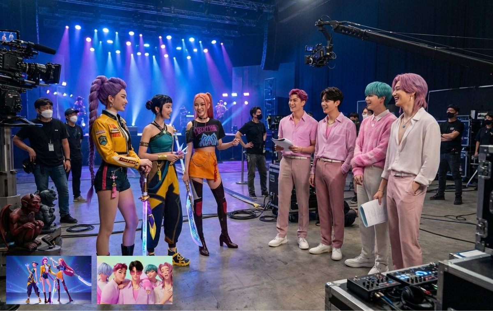

## 真人电影片场泄露照片

- ID: gpt4o-471-zh-2
- Slug: prompt-471-zh-2
- 语言: zh
- 来源: [来源链接](https://x.com/minchoi/status/1991544444051755056)
- 样例图路径: images/part3/471.jpeg

### 提示词

```text
生成 BOP 恶魔猎人真人电影片场泄露照片
```

### 样例图


## 明星合拍

- ID: gpt4o-467-zh
- Slug: prompt-467-zh
- 语言: zh
- 来源: [来源链接](https://x.com/SebJefferies/status/1991531687147360728)
- 样例图路径: images/part3/467.jpeg

### 提示词

```text
Create a hyper-realistic, ultra-sharp, full-color large-format image featuring a massive group of celebrities from different eras, all standing together in a single wide cinematic frame. The image must look like a perfectly photographed editorial cover with impeccable lighting, lifelike skin texture, micro-details of hair, pores, reflections, and fabric fibers.GENERAL STYLE & MOOD

Photorealistic, 8k, shallow depth of field, soft natural fill light + strong golden rim light

High dynamic range, calibrated color grading

Skin tones perfectly accurate

Crisp fabric detail with individual threads visible

Balanced composition, slightly wide-angle lens (35mm), center-weighted

All celebrities interacting naturally, smiling, posing, or conversing

Minimal background noise, but with enough world-building to feel realTHE ENVIRONMENT

A luxurious open-air rooftop terrace at sunset overlooking a modern city skyline.

Elements include:Warm golden light wrapping around silhouettes

Polished marbl
```

### 样例图

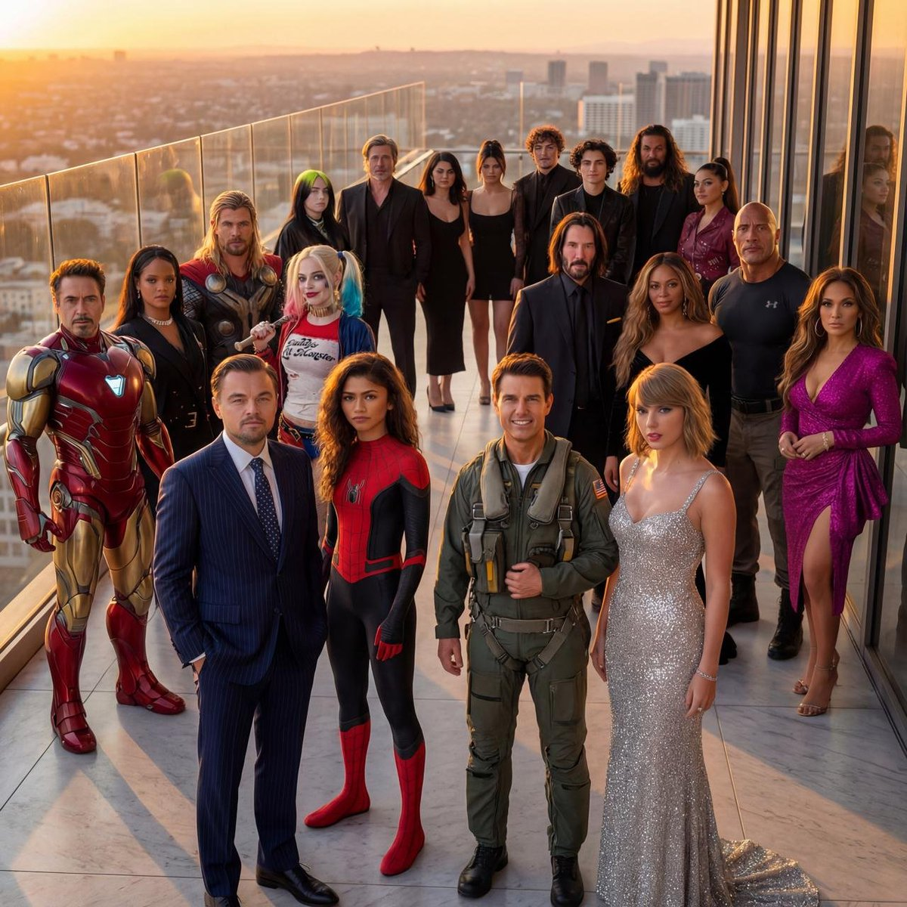

## Generate the holiday photo of this person through the ag

- ID: gpt4o-465-en-1
- Slug: prompt-465-en-1
- 语言: en
- 来源: [来源链接](https://x.com/minchoi/status/1991526532536496353)
- 样例图路径: images/part3/465.jpeg

### 提示词

```text
Generate the holiday photo of this person through the ages up to 80 years old
```

### 样例图

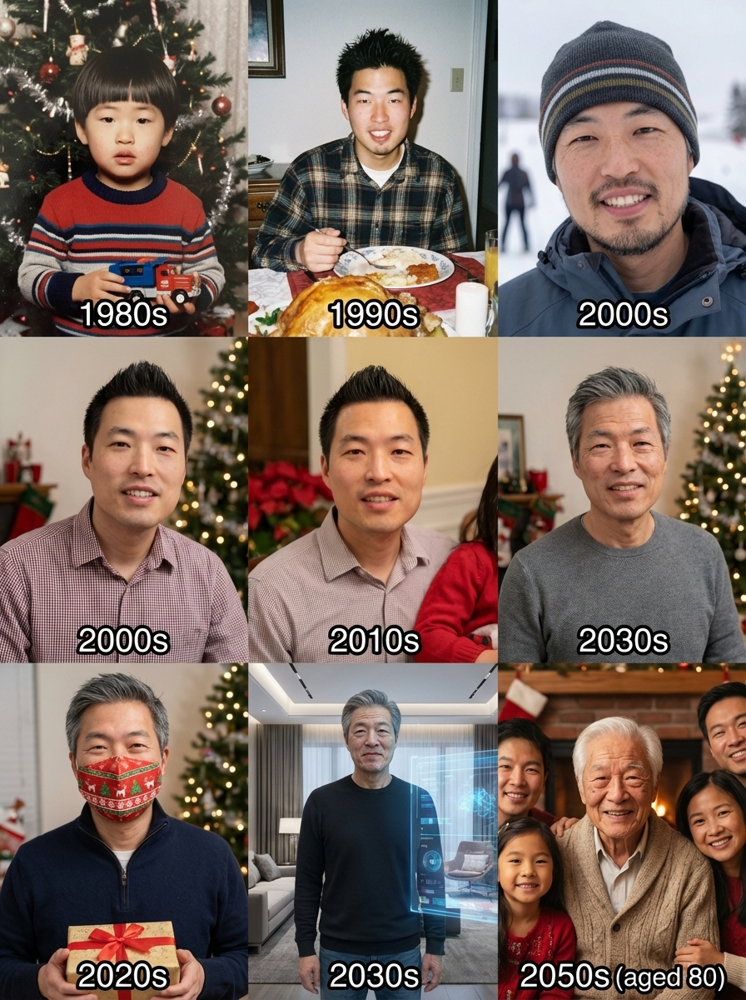

## 出生到80岁各个年龄段的节日照片

- ID: gpt4o-465-zh-2
- Slug: prompt-465-zh-2
- 语言: zh
- 来源: [来源链接](https://x.com/minchoi/status/1991526532536496353)
- 样例图路径: images/part3/465.jpeg

### 提示词

```text
生成此人从出生到80岁各个年龄段的节日照片
```

### 样例图


## Put this whole text, verbatim, into a photo of a glossy 

- ID: gpt4o-458-en-1
- Slug: prompt-458-en-1
- 语言: en
- 来源: [来源链接](https://x.com/fofrAI/status/1991530971800182929)
- 样例图路径: images/part3/458.jpeg

### 提示词

```text
Put this whole text, verbatim, into a photo of a glossy magazine article on a desk, with photos, beautiful typography design, pull quotes and brave formatting. The text: [...the unformatted article]
```

### 样例图


## 文字生成精美的杂志文章的照片

- ID: gpt4o-458-zh-2
- Slug: prompt-458-zh-2
- 语言: zh
- 来源: [来源链接](https://x.com/fofrAI/status/1991530971800182929)
- 样例图路径: images/part3/458.jpeg

### 提示词

```text
请将这段文字原封不动地复制到一张精美杂志文章的照片中，照片需包含图片、漂亮的排版设计、精选语录和大胆的格式。原文如下：[……未格式化的文章]
```

### 样例图


## 摄影质感极强的街头壁画

- ID: gpt4o-454-zh
- Slug: prompt-454-zh
- 语言: zh
- 来源: [来源链接](https://x.com/dotey/status/1991958132419919975)
- 样例图路径: images/part3/454.jpeg

### 提示词

```text
一幅超高清晰度、摄影质感极强的街头壁画，画面呈现强烈的中国风韵味。

画中描绘着一位绝美的卡通风女子正面特写头像，她神态柔美而宁静。墙体顶部被一大片盛开的蔷薇花覆盖，茂密的绿叶与繁盛的花朵向外舒展，部分枝条从墙顶垂落而下，与女子的头发巧妙融合，使她的秀发宛如由层层叠叠的蔷薇花组成。这些繁密的花朵簇拥着女子的头部，形成了一顶瑰丽的花冠，视觉效果华美浪漫。

背景中蓝天澄澈，点缀着朵朵白云；地面为一条细节真实的沥青街道，上面散落着缤纷多彩的花瓣，行人悠然漫步其间。整体场景细节精致入微，光影明亮柔和，营造出犹如现实般的梦幻街景氛围。
```

### 样例图


## 中国传统水墨彩画

- ID: gpt4o-451-zh-1
- Slug: prompt-451-zh-1
- 语言: zh
- 来源: [来源链接](https://x.com/dotey/status/1992366309288595681)
- 样例图路径: images/part3/451.jpeg

### 提示词

```text
A traditional Chinese ink and color painting in Gongbi style on aged rice paper texture. A noblewoman in elaborate Tang Dynasty Hanfu robes sits on a wooden stool, holding a modern hairdryer to dry her long flowing hair. She is wearing black stockings, red high heels on one foot, resting on a small stool. 

Three Minions dressed in ancient Chinese servant robes and hats attend to her: one on the left looks stressed holding the hairdryer's power cord, one center kneels polishing her red shoe with a cloth, and one on the right holds up a smartphone taking a photo for her. The background features classical gnarled pine trees, bamboo groves, and Taihu rocks. 

Traditional Chinese calligraphy written in the top right corner, accompanied by a red artist chop seal (寶玉). The color palette is muted mineral pigments. Humorous, anachronistic fusion. --ar 16:9
```

### 样例图

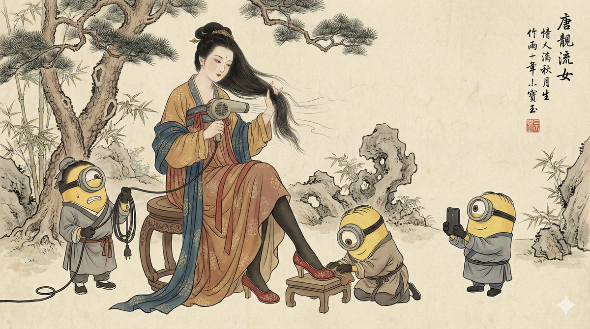

## 中国传统水墨彩画

- ID: gpt4o-451-zh-2
- Slug: prompt-451-zh-2
- 语言: zh
- 来源: [来源链接](https://x.com/dotey/status/1992366309288595681)
- 样例图路径: images/part3/451.jpeg

### 提示词

```text
这是一幅工笔风格的中国传统水墨彩画，绘制在古旧的宣纸上。画中一位身着华丽唐代汉服的贵妇坐在木凳上，手持现代吹风机吹干她飘逸的长发。她穿着黑色丝袜，一只脚踩着红色高跟鞋，倚靠在小凳上。

三个身着古代中国仆人服、头戴礼帽的小黄人侍奉着她：左边一个看起来很紧张，手里拿着吹风机的电源线；中间一个跪在地上，用布擦拭她的红皮鞋；右边一个举着智能手机，帮她拍照。背景是古老的苍劲松树、竹林和太湖岩石。

右上角是传统的中国书法，旁边盖有红色的艺术家印章（宝玉）。色彩运用了柔和的矿物颜料。幽默而又时代错置的融合。——ar 16:9
```

### 样例图


## I’d like to see a behind the scenes of a photoshoot how 

- ID: gpt4o-450-en-1
- Slug: prompt-450-en-1
- 语言: en
- 来源: [来源链接](https://x.com/icreatelife/status/1991945836914147524)
- 样例图路径: images/part3/450.jpeg

### 提示词

```text
I’d like to see a behind the scenes of a photoshoot how this photograph was created
```

### 样例图


## 揭秘照片的幕后制作过程

- ID: gpt4o-450-zh-2
- Slug: prompt-450-zh-2
- 语言: zh
- 来源: [来源链接](https://x.com/icreatelife/status/1991945836914147524)
- 样例图路径: images/part3/450.jpeg

### 提示词

```text
我想看看这张照片拍摄的幕后花絮，了解它是如何创作出来的。
```

### 样例图


## Transform the subject into a glossy designer-toy charact

- ID: gpt4o-449-en-1
- Slug: prompt-449-en-1
- 语言: en
- 来源: [来源链接](https://x.com/gizakdag/status/1992241809691709598)
- 样例图路径: images/part3/449.jpeg

### 提示词

```text
Transform the subject into a glossy designer-toy character inspired by the reference image. Smooth and rounded proportions, chubby silhouette, exaggerated cartoon expression, large open mouth, tiny dot eyes, and bold sculpted details. High-gloss vinyl surface with sharp reflections, saturated primary colors (especially bright blue and pink), stylized spikes and simple shapes. Toy figurine aesthetic, studio lighting, clean background, dramatic shadows, ultra-polished plastic texture
```

### 样例图


## 你生气的时候其实也可以很可爱

- ID: gpt4o-449-zh-2
- Slug: prompt-449-zh-2
- 语言: zh
- 来源: [来源链接](https://x.com/gizakdag/status/1992241809691709598)
- 样例图路径: images/part3/449.jpeg

### 提示词

```text
根据参考图片，将对象转化为一个光鲜亮丽的设计师玩具角色。角色比例圆润流畅，轮廓丰满，表情夸张卡通，大嘴巴张开，眼睛小巧精致，细节刻画鲜明。表面采用高光泽乙烯基材质，反光强烈，色彩饱和度高（尤其是亮蓝色和粉色），造型别致，线条简洁。整体风格偏向玩具人偶，采用摄影棚灯光，背景干净，阴影效果强烈，塑料质感极佳。
```

### 样例图


## Add clean, minimal white line-drawing illustrations of p

- ID: gpt4o-448-en-1
- Slug: prompt-448-en-1
- 语言: en
- 来源: [来源链接](https://x.com/egeberkina/status/1992151432422986028)
- 样例图路径: images/part3/448.jpeg

### 提示词

```text
Add clean, minimal white line-drawing illustrations of people into this photo. Match the perspective, lighting, and scale of the scene. The illustrated figures should interact naturally and meaningfully with the environment, reflecting the mood, purpose, and activity of the space. Keep the drawings simple, fluid, and expressive, with no facial details. Maintain a modern, warm, and slightly whimsical tone that complements the overall aesthetic. Do not obscure any original elements. The illustrated figures should feel like friendly, imaginative additions that blend seamlessly with the context of the scene.
```

### 样例图


## 将素描人物添加到您的真实照片中

- ID: gpt4o-448-zh-2
- Slug: prompt-448-zh-2
- 语言: zh
- 来源: [来源链接](https://x.com/egeberkina/status/1992151432422986028)
- 样例图路径: images/part3/448.jpeg

### 提示词

```text
在这张照片中添加简洁的白色线条人物插画。插画的视角、光线和比例应与照片中的场景相符。人物应与环境自然而有意义地互动，反映空间的氛围、用途和活动。保持线条简洁流畅、富有表现力，无需添加面部细节。保持现代、温暖且略带奇幻的基调，与整体美感相得益彰。不要遮挡任何原有元素。插画人物应像友好而富有想象力的点缀，与场景环境完美融合。
```

### 样例图


## SPaceX工程原理图和蓝图线条

- ID: gpt4o-447-zh
- Slug: prompt-447-zh
- 语言: zh
- 来源: [来源链接](https://x.com/berryxia_ai/status/1992422194341957878)
- 样例图路径: images/part3/447.jpeg

### 提示词

```text
一张 [SPace X] 的高角度广角实景摄影照片作为背景，上面覆盖着详细的白色技术工程原理图和蓝图线条。风格是直接在照片上进行白色手绘粉笔或铅笔素描。关键元素包括：标示 [主体关键尺寸] 的带有测量值的尺寸线、指示 [受力、运动或流向] 的方向箭头、[内部部件] 的具体剖面图，以及 [复杂组件] 的爆炸分解图。用整洁的手写字体标注关键特征的文本标签。美学风格：教育科普图表、工业设计分析、干净、精确、混合媒介。在左下角包含一个手绘框内的蓝图风格 Logo，文字为“[Space X]”。
```

### 样例图


## Leaked production footage from a secret soundstage, 1969

- ID: gpt4o-446-en-1
- Slug: prompt-446-en-1
- 语言: en
- 来源: [来源链接](https://x.com/azed_ai/status/1992263633464946805)
- 样例图路径: images/part3/446.jpeg

### 提示词

```text
Leaked production footage from a secret soundstage, 1969. Neil Armstrong is walking on the "Moon surface," but the camera pulls back to reveal it is just a sandbox in a studio. A boom mic operator is visible in the top corner. Stanley Kubrick is shouting instructions through a megaphone. Studio lights, film grain, slightly blurry, handheld camera movement style.
```

### 样例图


## 伪造的历史

- ID: gpt4o-446-zh-2
- Slug: prompt-446-zh-2
- 语言: zh
- 来源: [来源链接](https://x.com/azed_ai/status/1992263633464946805)
- 样例图路径: images/part3/446.jpeg

### 提示词

```text
1969年，一段泄露的秘密摄影棚拍摄花絮。尼尔·阿姆斯特朗正行走在“月球表面”，但镜头拉远，揭示出那只是摄影棚里的沙箱。画面右上角可以看到一名吊杆麦克风操作员。斯坦利·库布里克正用扩音器大声喊着指示。摄影棚灯光、胶片颗粒感、略微模糊的画面，以及手持摄影机的移动风格。
```

### 样例图


## A photograph of a crowded subway train in Tokyo, hyper-r

- ID: gpt4o-445-en-1
- Slug: prompt-445-en-1
- 语言: en
- 来源: [来源链接](https://x.com/azed_ai/status/1992263611428082031)
- 样例图路径: images/part3/445.jpeg

### 提示词

```text
A photograph of a crowded subway train in Tokyo, hyper-realistic style. Sitting on one of the seats is a 2D black-and-white manga illustration of a tired samurai. The character is drawn with clean ink lines and cross-hatching shading. The lighting from the subway car hits the 2D drawing correctly, creating realistic highlights on the ink. The character holds a real photographic soda can, blending the 2D and 3D worlds. 4k, cinematic composition.
```

### 样例图


## 将漫画人物融入你的真人照片

- ID: gpt4o-445-zh-2
- Slug: prompt-445-zh-2
- 语言: zh
- 来源: [来源链接](https://x.com/azed_ai/status/1992263611428082031)
- 样例图路径: images/part3/445.jpeg

### 提示词

```text
一张东京拥挤地铁车厢的超写实照片。车厢里，一个疲惫的武士坐在一个二维黑白漫画人物上。人物线条干净利落，运用了交叉阴影技法。地铁车厢的灯光恰到好处地照射在二维画面上，在墨线处营造出逼真的高光。人物手中拿着一个真实的汽水罐，巧妙地将二维和三维世界融合在一起。4K分辨率，电影级构图。
```

### 样例图


## Grainy 35mm film photo from 1975. A construction worker 

- ID: gpt4o-444-en-1
- Slug: prompt-444-en-1
- 语言: en
- 来源: [来源链接](https://x.com/azed_ai/status/1992263588900409458)
- 样例图路径: images/part3/444.jpeg

### 提示词

```text
Grainy 35mm film photo from 1975. A construction worker is installing a large glass window pane on the ground floor of a brick house. Through the clear glass, instead of seeing the interior of the room, we see a view looking down from a skyscraper at night onto a neon Tokyo metropolis. The reflection in the glass, however, correctly shows the sunny suburban garden behind the photographer. Visual anomaly, subtle horror, analog texture.
```

### 样例图


## 魔法窗口

- ID: gpt4o-444-zh-2
- Slug: prompt-444-zh-2
- 语言: zh
- 来源: [来源链接](https://x.com/azed_ai/status/1992263588900409458)
- 样例图路径: images/part3/444.jpeg

### 提示词

```text
一张摄于1975年的颗粒感很强的35毫米胶片照片。一位建筑工人在一栋砖房的一楼安装一块巨大的玻璃窗。透过这块透明的玻璃，我们看到的不是房间内部，而是从摩天大楼俯瞰夜色中霓虹闪烁的东京都市景象。然而，玻璃的倒影却正确地展现了摄影师身后阳光明媚的郊区花园。视觉上的异常，一种微妙的恐怖感，以及胶片特有的质感。
```

### 样例图


## A candid backstage polaroid photo from 1865. Abraham Lin

- ID: gpt4o-442-en-1
- Slug: prompt-442-en-1
- 语言: en
- 来源: [来源链接](https://x.com/azed_ai/status/1992263520441000304)
- 样例图路径: images/part3/442.jpeg

### 提示词

```text
A candid backstage polaroid photo from 1865. Abraham Lincoln is sitting in a canvas director's chair, laughing hysterically while holding a styrofoam coffee cup. A makeup artist is powdering his nose. In the background, the Lincoln Memorial construction is just a painted plywood backdrop. Flash photography, vignetting, harsh shadows, breaking the illusion.
```

### 样例图

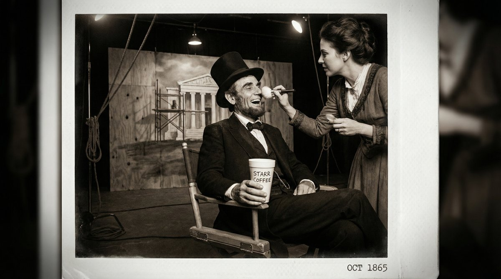

## 历史时代错误

- ID: gpt4o-442-zh-2
- Slug: prompt-442-zh-2
- 语言: zh
- 来源: [来源链接](https://x.com/azed_ai/status/1992263520441000304)
- 样例图路径: images/part3/442.jpeg

### 提示词

```text
一张摄于1865年的幕后宝丽来照片。亚伯拉罕·林肯坐在帆布导演椅上，手里拿着一个泡沫咖啡杯，放声大笑。一位化妆师正在给他扑粉。背景中，林肯纪念堂的建造工程只不过是一块涂了颜色的胶合板。闪光灯、暗角、生硬的阴影，打破了照片的逼真效果。
```

### 样例图


## A photorealistic wide-angle landscape shot of the Statue

- ID: gpt4o-441-en-1
- Slug: prompt-441-en-1
- 语言: en
- 来源: [来源链接](https://x.com/azed_ai/status/1992263499398205640)
- 样例图路径: images/part3/441.jpeg

### 提示词

```text
A photorealistic wide-angle landscape shot of the Statue of Liberty with the New York City skyline and harbor in the background. Superimposed on the scene is a white, hand-drawn augmented reality technical overlay. Features include: 1. Sketchy white leader lines pointing to key details like the "Torch," "Crown Rays," and "Copper Shell" with handwritten text labels. 2. Large dimensional vertical measurement arrows indicating the total height from ground to torch. 3. Small floating wireframe icons showing wind load data and material composition. Aesthetic: Structural engineering analysis, F1 broadcast graphics style, bright outdoor daylight, architectural blueprint overlay.
```

### 样例图


## 自由女神像建筑蓝图

- ID: gpt4o-441-zh-2
- Slug: prompt-441-zh-2
- 语言: zh
- 来源: [来源链接](https://x.com/azed_ai/status/1992263499398205640)
- 样例图路径: images/part3/441.jpeg

### 提示词

```text
一张逼真的广角风景照，展现了自由女神像，背景是纽约市的天际线和港口。画面上叠加了一层白色手绘增强现实技术图层。其特点包括：1. 用白色线条勾勒出关键细节，例如“火炬”、“皇冠光芒”和“铜壳”，并附有手写文字标签。2. 大型垂直测量箭头指示从地面到火炬的总高度。3. 小型悬浮线框图标显示风荷载数据和材料成分。美学风格：结构工程分析、F1赛车转播画面风格、明亮的户外日光、建筑蓝图叠加。
```

### 样例图


## Use the provided portrait photo <YOUR PHOTO> as the base

- ID: gpt4o-440-en-1
- Slug: prompt-440-en-1
- 语言: en
- 来源: [来源链接](https://x.com/Samann_ai/status/1992171138730885618)
- 样例图路径: images/part3/440.jpeg

### 提示词

```text
Use the provided portrait photo <YOUR PHOTO> as the base. 
Do NOT change the person’s face, expression, age, skin tone or gender. Just overlay a clean, minimal infographic on top.
Create a high-resolution vertical “FACIAL AESTHETIC REPORT” poster, studio lighting, soft beige background, premium beauty clinic style.
The subject can be MALE or FEMALE – keep them exactly as in the original photo. 
Add thin white lines and labels pointing to each area of the REAL face, with percentage scores based on global aesthetic ratios, symmetry and proportions (not changing the face):
1. Eyes:
   Label near the eyes with a line pointing to them:
   “Eyes Beauty – 0–100%”
   Example: “Eyes Beauty – 92%”
2. Cheeks:
   Label near the cheekbones:
   “Cheeks Harmony – 0–100%”
   Example: “Cheeks Harmony – 85%”
3. Lips:
   Label close to the mouth:
   “Lips Shape – 0–100%”
   Example: “Lips Shape – 88%”
4. Eyebrows:
   Label above or beside the brows:
   “Eyebrows Design – 0–100%”
   Example: “Eyebrows Design – 80%”
5. Jaw & Chin:
   Label near the jawline and chin:
   “Jaw & Chin Definition – 0–100%”
   Example: “Jaw & Chin Definition – 90%”
6. Overall Facial Symmetry:
   Label near the center of the face:
   “Facial Symmetry – 0–100%”
   Example: “Facial Symmetry – 89%”
At the bottom center of the poster, add a BIG, bold number inside a circle or rectangle:
   “OVERALL SCORE: XX%”
This is the total facial aesthetic score from 1–100%.
Design style:
– clean, medical-grade, aesthetic-clinic infographic
– modern thin sans-serif typography
– white text and lines, subtle drop shadows
– no logos, no extra graphics, no text other than the labels and scores above.
```

### 样例图


## 美妆检测器

- ID: gpt4o-440-zh-2
- Slug: prompt-440-zh-2
- 语言: zh
- 来源: [来源链接](https://x.com/Samann_ai/status/1992171138730885618)
- 样例图路径: images/part3/440.jpeg

### 提示词

```text
请使用提供的肖像照片<YOUR PHOTO>作为基础。
请勿改变人物的面部特征、表情、年龄、肤色或性别。只需在其上叠加一个简洁明了的信息图即可。
制作一张高分辨率竖版“面部美学报告”海报，采用影棚灯光、柔和的米色背景，营造高级美容诊所风格。
拍摄对象可以是男性或女性——请保持与原照片完全一致。
在真实面部的每个区域添加细白线和标签，并根据整体美学比例、对称性和比例（不改变面部）给出百分比评分：
1. 眼睛：
在眼睛附近贴上标签，并用线指向眼睛：
“眼部美感 – 0–100%”
例如：“眼部美感 – 92%”
2. 脸颊：
颧骨附近的标签：
“脸颊和谐度 – 0–100%”
例如：“双颊和谐度 – 85%”
3. 嘴唇：
靠近嘴部的标签：
“唇形 – 0–100%”
例如：“唇形 – 88%”
4. 眉毛：
眉毛上方或旁边的标签：
“眉形设计 – 0–100%”
例如：“眉形设计 – 80%”
5. 下颌和下巴：
下颌线和下巴附近的标签：
“下颌和下巴轮廓 – 0–100%”
例如：“下颌和下巴轮廓 – 90%”
6. 面部整体对称性：
脸部中央附近的标签：
“面部对称性 – 0–100%”
例如：“面部对称性 – 89%”
在海报底部中央，用圆形或矩形框出一个醒目的大号数字：
“总分：XX%”
这是面部美学总评分，范围从 1% 到 100%。
设计风格：
– 洁净、医用级、美容诊所信息图
现代纤细无衬线字体
白色文字和线条，淡淡的阴影
– 除了上面的标签和分数之外，没有标志、没有额外的图形、没有文字。
```

### 样例图


## Create an infographic image of [LANDMARK], combining a r

- ID: gpt4o-433-en-1
- Slug: prompt-433-en-1
- 语言: en
- 来源: [来源链接](https://x.com/TechieBySA/status/1991820056377078179)
- 样例图路径: images/part3/433.jpeg

### 提示词

```text
Create an infographic image of [LANDMARK], combining a real photograph of the landmark with blueprint-style technical annotations and diagrams overlaid on the image. Include the title “[LANDMARK]” in a hand-drawn box in the corner. Add white chalk-style sketches showing key structural data, important measurements, material quantities, internal diagrams, load-flow arrows, cross-sections, floor plans, and notable architectural or engineering features. Style: blueprint aesthetic with white line drawings on the photograph, technical/architectural annotation style, educational infographic feel, with the real environment visible behind the annotations
```

### 样例图

![Create an infographic image of [LANDMARK], combining a r](../images/part3/433.jpeg)

## 地标信息图

- ID: gpt4o-433-zh-2
- Slug: prompt-433-zh-2
- 语言: zh
- 来源: [来源链接](https://x.com/TechieBySA/status/1991820056377078179)
- 样例图路径: images/part3/433.jpeg

### 提示词

```text
请制作一张[地标]的信息图，将地标的真实照片与蓝图风格的技术注释和图表叠加在图像上。在角落的手绘框中注明标题“[地标]”。添加白色粉笔风格的草图，展示关键结构数据、重要尺寸、材料用量、内部结构图、荷载流向箭头、横截面图、平面图以及显著的建筑或工程特征。风格：蓝图美学，照片上叠加白色线条图，技术/建筑注释风格，具有教育信息图的感觉，注释后方可见真实环境。
```

### 样例图

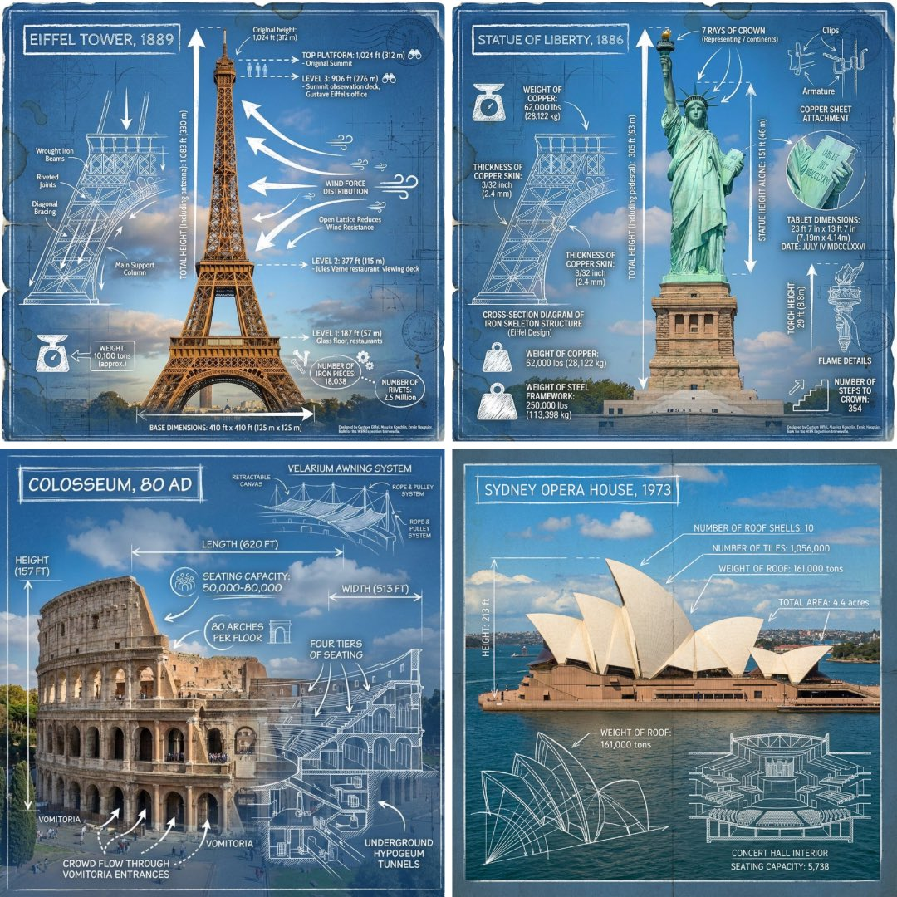

## Amateur photograph from 1998 of a middle-aged artist cop

- ID: gpt4o-432-en-1
- Slug: prompt-432-en-1
- 语言: en
- 来源: [来源链接](https://x.com/goodside/status/1992038915881029641)
- 样例图路径: images/part3/432.jpeg

### 提示词

```text
Amateur photograph from 1998 of a middle-aged artist copying an image by hand from a computer screen to an oil painting on stretched canvas, but the image is itself the photo of the artist painting the recursive image.
```

### 样例图

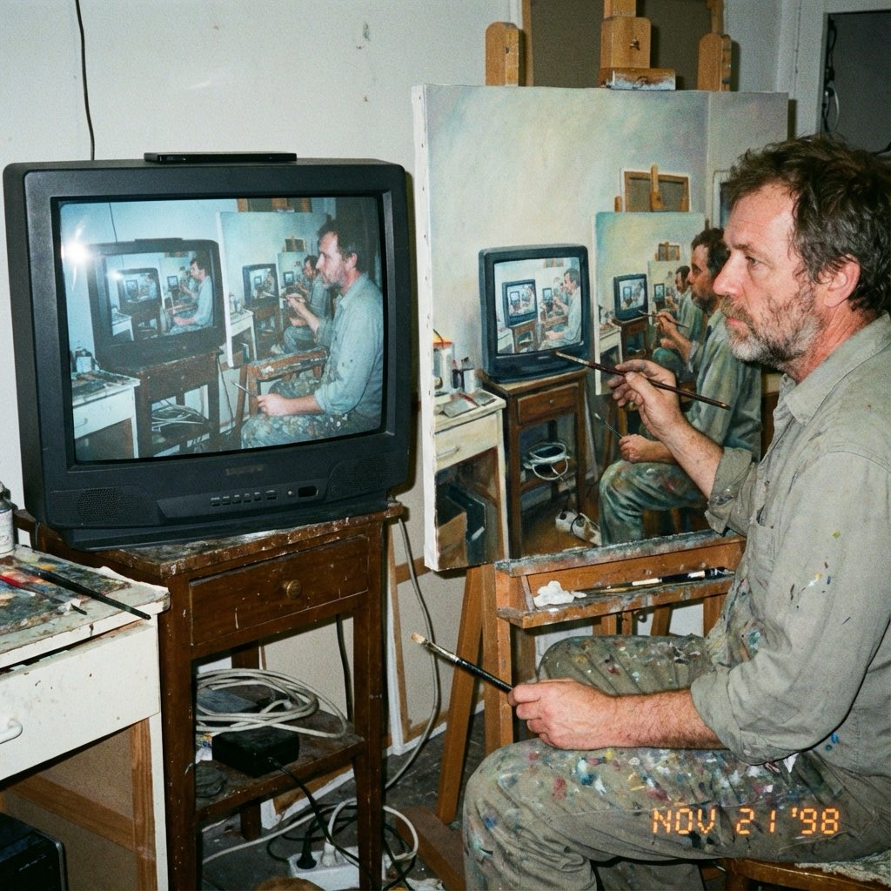

## 电视屏幕内容复制到油画中

- ID: gpt4o-432-zh-2
- Slug: prompt-432-zh-2
- 语言: zh
- 来源: [来源链接](https://x.com/goodside/status/1992038915881029641)
- 样例图路径: images/part3/432.jpeg

### 提示词

```text
1998 年的一张业余照片，一位中年艺术家正在用手将电脑屏幕上的图像复制到绷紧的画布上的油画中，但图像本身却是艺术家绘制递归图像时的照片。
```

### 样例图


## A bird wearing an inflatable [COLOR] down jacket perched

- ID: gpt4o-425-en-1
- Slug: prompt-425-en-1
- 语言: en
- 来源: [来源链接](https://x.com/ChillaiKalan__/status/1987864542756679921)
- 样例图路径: images/part3/425.jpeg

### 提示词

```text
A bird wearing an inflatable [COLOR] down jacket perched on the top of a dry tree branch. the background is a blurred green grassland, in the style of real photography with natural lighting.
```

### 样例图

![A bird wearing an inflatable [COLOR] down jacket perched](../images/part3/425.jpeg)

## 穿着充气羽绒服的鸟儿

- ID: gpt4o-425-zh-2
- Slug: prompt-425-zh-2
- 语言: zh
- 来源: [来源链接](https://x.com/ChillaiKalan__/status/1987864542756679921)
- 样例图路径: images/part3/425.jpeg

### 提示词

```text
一只穿着充气[彩色]羽绒服的鸟栖息在枯树枝顶上。背景是模糊的绿色草地，采用自然光拍摄的真实照片风格。
```

### 样例图


## Ultra-realistic wildlife photography scene, (use referen

- ID: gpt4o-421-en-1
- Slug: prompt-421-en-1
- 语言: en
- 来源: [来源链接](https://x.com/NanoBanana_labs/status/1988840767994126797)
- 样例图路径: images/part3/421.jpeg

### 提示词

```text
Ultra-realistic wildlife photography scene, (use reference face from uploaded photo). A man wearing proper wildlife-safari clothing — light brown outdoor shirt, rugged cargo pants, and sturdy field boots. He is lying flat on the grassy ground, holding a professional DSLR camera with a large telephoto lens, focusing on wildlife. On his shoulder sits a playful lion cub looking into the distance. Golden hour natural light, African savannah background, cinematic depth of field, 8K detail, vibrant colors. Keep my face 100% accurate. HD quality DSLR.
```

### 样例图


## 超逼真的野生动物摄影场景

- ID: gpt4o-421-zh-2
- Slug: prompt-421-zh-2
- 语言: zh
- 来源: [来源链接](https://x.com/NanoBanana_labs/status/1988840767994126797)
- 样例图路径: images/part3/421.jpeg

### 提示词

```text
超逼真的野生动物摄影场景（使用上传照片中的参考人脸）。一位身着专业野生动物狩猎服的男子——浅棕色户外衬衫、结实耐用的工装裤和厚实的野外靴。他平躺在草地上，手持一台配备长焦镜头的专业单反相机，正专注于拍摄野生动物。他的肩上趴着一只活泼的小狮子，正眺望着远方。拍摄于黄金时段的自然光线下，以非洲稀树草原为背景，拥有电影级的景深，8K超高清细节，色彩鲜艳。力求100%还原我的面部特征。高清单反拍摄。
```

### 样例图


## 居家光影三联画

- ID: gpt4o-420-zh
- Slug: prompt-420-zh
- 语言: zh
- 来源: [来源链接](https://x.com/ZHO_ZHO_ZHO/status/1987128220030992892)
- 样例图路径: images/part3/420.jpeg

### 提示词

```text
整体构图与画面氛围

三张图垂直排列，呈连续性肖像摄影的视觉叙事。环境是温暖、生活化的宜家风室内空间，背景有厨房、灯饰与家居物件，带有日常感与柔和自然光的氛围。光线从侧前方照射，亮度柔和，使皮肤质感呈现出细腻、自然的光泽。

整体色调偏冷白色，营造出轻快、清新且柔软的情绪。

人物姿态与表情变化

三张图记录了同一个人物在不同瞬间的表情变化，整体呈现：
1.第一张：表情略带可爱与调皮，冲镜头飞吻。肩膀自然放松，呈正面角度。
2.第二张：人物略侧身，头微微倾斜，眼神柔软而带有轻微情绪暗示，像是从静止过渡到微笑之间的瞬间。
3.第三张：人物更加放松，露出温柔的笑容。头发自然散落，姿态轻松，呈现出自信与自在的状态。

这种 “从冷静 → 轻松 → 微笑” 的表情变化，让整组照片呈现出一种动态叙事感。

光影与肤质表现
•光线均匀柔和，无明显强阴影。
•光照角度使脸颊与鼻梁形成非常轻微的立体阴影，突显面部轮廓但不过度锐利。
•肤色自然，有细腻的反光，呈现柔焦般的质感，带一点胶片或日系滤镜效果。

服装与材质表现

人物穿着浅灰蓝色吊带上衣，肩带纤细，布料柔软且贴身，反射柔和的光泽。在光线下呈现轻柔的高光，强调曲线线条。色彩与背景保持低饱和度一致，画面显得干净。

头发自然散落，有轻微的蓬松与空气感，质地柔软，有光线透过发丝的柔和层次。

五官比例与视线表达
•眼睛略大，眼型柔和，眼尾微微延展，眼神富有交流感；
•鼻梁细直且自然；
•唇部丰润，唇色浅粉，随着表情变化在不同图中呈现不同质感；
•面部比例均衡，视觉重心集中在眼神与微笑的变化。

整体呈现一种亲和、明亮、带情绪表达的肖像风格。

情绪与风格总结

这组照片像是在记录一个人在阳光午后、刚睡醒或者刚准备开始一天时的松弛瞬间。
氛围是自然、温暖、轻松、无防备感的美。

画面没有刻意摆拍或华丽修饰，而是以光线和表情捕捉真实与柔软的瞬间。
```

### 样例图


## { "promptDetails": { "description": "A prompt to *create

- ID: gpt4o-419-en-1
- Slug: prompt-419-en-1
- 语言: en
- 来源: [来源链接](https://x.com/miilesus/status/1986833636193189893)
- 样例图路径: images/part3/419.jpeg

### 提示词

```text
{
    "promptDetails": {
        "description": "A prompt to *create a new scene* by placing a subject (based on a reference photo) into a new atmospheric background, then overlaying a music UI.",
        "styleTags": [
            "Aesthetic Edit",
            "Cinematic",
            "Scene Compositing",
            "Glassmorphism"
        ]
    },
    "subjectReference": {
        "source": "[UPLOADED IMAGE]",
        "description": "Use this image *only* as a reference for the subject's face, hair, and appearance. Do *not* use its original background."
    },
    "scene": {
        "background": {
            "setting": "the window on the bus is sad, troubled, sorrowful",
            "details": "This is the *new* environment the subject must be placed into, completely replacing the original background."
        },
        "subject": {
            "description": "The young man whose appearance is defined by the `[UPLOADED IMAGE]`.",
            "pose": "his head resting gently against the bus window",
            "focus": "Subject is in sharp focus, fully integrated into the new background."
        }
    },
    "overlayObject": {
        "type": "Floating Glassmorphism Music Player UI",
        "relationshipToEnvironment": "the UI is **perfectly flush and physically attached** to the same plane as the bus window glass, **not floating**, not screen-space.",
        "transform": "the UI matches the *exact same rotation and perspective* as the window surface. If the window tilts, the UI tilts identically with correct foreshortening.",
        "surfaceInteraction": "subtle, realistic reflection and slight refraction through glass, extremely thin glassmorphism panel integrated *into* the window surface.",
        "components": {
            "songTitle": "Wrecked",
            "artistName": "Imagine Dragons",
            "position": "mounted on the bus window glass at the middle-left region of the frame (not floating)."
        }
    },
    "technicalStyle": {
        "aspectRatio": "1:1",
        "photographyStyle": "Cinematic Portrait, Realistic Compositing",
        "camera": {
            "shotType": "Medium Shot or Medium Close-Up",
            "angle": "Eye-level",
            "depthOfField": "Shallow, to blur the new background (bokeh)."
        },
        "lighting": {
            "type": "Soft, Ambient, Moody",
            "description": "Lighting on the subject *must match* the lighting of the new background setting (e.g., rainy light through bus window, soft shadow gradients)."
        },
        "color": {
            "palette": "Muted, cinematic color grading."
        }
    },
    "audioDevice": {
        "type": "subtle in-ear wireless earbuds",
        "fit": "naturally seated in both ears with correct realistic skin contact",
        "color": "matte black or dark neutral tone",
        "consistencyNote": "no cable, no bulky gaming headset"
    },
    "moodReinforcement": "earbuds imply the sad music 'Wrecked - Imagine Dragons' is what the subject is listening to."
}
```

### 样例图


## 年轻女子公交车上的窗户边

- ID: gpt4o-419-zh-2
- Slug: prompt-419-zh-2
- 语言: zh
- 来源: [来源链接](https://x.com/miilesus/status/1986833636193189893)
- 样例图路径: images/part3/419.jpeg

### 提示词

```text
{
"promptDetails": {
“描述”：“提示用户通过将主体（基于参考照片）放置在新的氛围背景中，然后叠加音乐用户界面来*创建新场景*。”
"styleTags": [
“美学编辑”
“电影感”，
“场景合成”
“玻璃态”
]
},
"subjectReference": {
“来源”：[上传的图片]，
“描述”：“请仅将此图片用作人物面部、头发和外貌的参考。请勿使用其原始背景。”
},
“场景”： {
“背景”： {
“场景”：“公交车上的窗户是悲伤的、忧郁的、哀伤的”，
“细节”：“这是主体必须置身的*全新*环境，完全替换原有背景。”
},
“主题”： {
描述：这位年轻人的外貌特征由“[上传的图片]”定义。
“姿势”：“他的头轻轻地靠在公交车窗上”，
“焦点”：“主体清晰对焦，完全融入新的背景中。”
}
},
"overlayObject": {
"type": "浮动玻璃变形音乐播放器用户界面",
“与环境的关系”：“用户界面**与公交车窗玻璃完全齐平，并且物理上**附着在**同一平面上， ** ）不是悬浮的，也不是屏幕空间的。”
“变换”：“用户界面与窗口表面*完全一致地旋转和透视*。如果窗口倾斜，用户界面也会随之倾斜，并具有正确的透视缩短效果。”
“表面交互”：“透过玻璃产生微妙、逼真的反射和轻微折射，极薄的玻璃变形面板集成到窗户表面*中*。”
“成分”： {
歌曲标题： 'Wrecked'
"artistName": "Imagine Dragons",
“位置”：“安装在公交车车窗玻璃上，位于车窗框架的左侧中间位置（非悬浮式）。”
}
},
"technicalStyle": {
“aspectRatio”: “1:1”
“摄影风格”：“电影人像，逼真合成”
“相机”： {
"shotType": "Medium Shot or Medium Close Up",
“角度”：“视线水平”，
"depthOfField": "浅景深，使新背景模糊（散景）"
},
“灯光”： {
“类型”：“柔和、氛围、情绪化”，
“描述”：“拍摄对象的照明必须与新背景设置的照明相匹配（例如，透过公交车窗的雨光、柔和的阴影渐变）。”
},
“颜色”： {
“调色板”：“柔和的电影级色彩分级。”
}
},
"audioDevice": {
“类型”：“低调的入耳式无线耳机”，
“贴合度”：“自然地佩戴在双耳中，与皮肤有正确的逼真接触”，
颜色：哑光黑或深色中性色调，
“一致性说明”： “无线缆，无笨重的游戏耳机”
},
“moodReinforcement”：“耳机暗示着受试者正在听悲伤的音乐‘Wrecked - Imagine Dragons’。”
}
```

### 样例图


## Restyle the reference movie poster in claymation style. 

- ID: gpt4o-418-en-1
- Slug: prompt-418-en-1
- 语言: en
- 来源: [来源链接](https://x.com/TechieBySA/status/1987128144470679641)
- 样例图路径: images/part3/418.jpeg

### 提示词

```text
Restyle the reference movie poster in claymation style. Keep the original layout, composition, and lighting exactly as in the reference. Transform all characters, objects, and elements into handcrafted clay models with visible fingerprints, soft edges, and subtle imperfections. Preserve the background and colors, but give everything a realistic clay texture and dimensional feel, as if it were photographed from a stop-motion clay animation set
```

### 样例图


## 将电影海报重新设计成黏土动画风格

- ID: gpt4o-418-zh-2
- Slug: prompt-418-zh-2
- 语言: zh
- 来源: [来源链接](https://x.com/TechieBySA/status/1987128144470679641)
- 样例图路径: images/part3/418.jpeg

### 提示词

```text
将参考电影海报重新设计成黏土动画风格。保持原图的布局、构图和光线完全一致。将所有角色、物体和元素转化为手工制作的黏土模型，保留清晰可见的指纹、柔和的边缘和细微的瑕疵。保留背景和色彩，但赋予所有元素逼真的黏土质感和立体感，仿佛是从定格动画片场拍摄的一样。
```

### 样例图


## Using the exact facial features from the attached image 

- ID: gpt4o-417-en-1
- Slug: prompt-417-en-1
- 语言: en
- 来源: [来源链接](https://x.com/ZaraIrahh/status/1987684052028297552)
- 样例图路径: images/part3/417.jpeg

### 提示词

```text
Using the exact facial features from the attached image 
Create an hyperrealistic and high quality close-up portrait of a styling young woman,  her dark thick long hair styled in twin high artistic braids that falls over her ears, few loose trendils clipped using a different style matte brown statement hair clips ,with few loose strands falls across and frames her face, wearing a drawstring halter top, a thick-frame  brown cat-eye eyeglasses slightly lowered, soft hazel nut eyes, glossy red pouty lips, peached dewy blush and soft warm tone eyeshadows with a little bit shimmers and glitters on her cheeks and under her eyes, artistic brown eyeliner, natural dewy skin, head slightly tilted, relaxed and confident gaze hand-on-cheek pose, minimalistic background, warm beige and brown tones, bright and harsh illumination coming from the camera highlighting the texture of her figure, soft studio background lighting, K-fashion editorial aesthetic, Seoul street style influence, hyper-detailed face texture, cinematic tone, 85mm lens photography, Vogue Korea vibe, stylish and modern mood --ar 2:3 --v 6 --style raw --q 2 --s 250
```

### 样例图


## 一幅超写实的高品质特写肖像

- ID: gpt4o-417-zh-2
- Slug: prompt-417-zh-2
- 语言: zh
- 来源: [来源链接](https://x.com/ZaraIrahh/status/1987684052028297552)
- 样例图路径: images/part3/417.jpeg

### 提示词

```text
使用附图中的精确面部特征
创作一幅超写实的高品质特写肖像，描绘一位正在打扮的年轻女性。她浓密乌黑的长发被编成两条高高的艺术辫子，垂落在耳边，几缕碎发用不同风格的哑光棕色发夹别住，几缕散落的发丝垂在脸颊两侧，勾勒出她精致的脸庞。她身穿一件抽绳露背上衣，戴着一副略微下垂的棕色粗框猫眼眼镜，拥有一双柔和的榛子色眼睛，涂着光泽饱满的红唇，腮红是水润的蜜桃色，眼影是柔和的暖色调，带有少许珠光和亮片，点缀在脸颊和眼下。她画着艺术感十足的棕色眼线，肌肤呈现自然水润的状态。她微微侧着头，眼神放松自信，一只手轻抚脸颊。背景简洁，以温暖的米色和棕色为主色调。相机发出明亮而强烈的光线，突显了她的身材纹理。柔和的影棚背景灯光，展现出韩式时尚大片的风格，融合了首尔街头风的元素，并着重刻画了面部细节，营造出电影般的质感。这幅作品使用85mm镜头拍摄，灵感来自韩国版《Vogue》。氛围，时尚现代的格调 --ar 2:3 --v 6 --style raw --q 2 --s 250
```

### 样例图


## Editorial 3x3 photo grid in a clean soft beige studio. C

- ID: gpt4o-414-en-1
- Slug: prompt-414-en-1
- 语言: en
- 来源: [来源链接](https://x.com/miilesus/status/1981800648036561146)
- 样例图路径: images/part3/414.jpeg

### 提示词

```text
Editorial 3x3 photo grid in a clean soft beige studio. Character (matches reference 100%) wearing lightweight dark navy shirt, ivory trousers, barefoot for raw simplicity. Lighting: large diffused key light directly front-right, silver reflector left, subtle rim from top. Shots to include: 1. extreme close-up of lips + cheekbone with blurred hand partially covering (85mm, f/1.8, razor-thin DOF); 2. tight crop on eyes looking into lens with reflection of light strip visible (85mm, f/2.0); 3. black & white close portrait resting chin on fist, face filling frame (50mm, f/2.2); 4. over-shoulder shot, blurred foreground fabric curtain framing half face (85mm, f/2.0); 5. very close frontal with hands overlapping face, light streak across eyes (50mm, f/2.5); 6. tight angled portrait showing hair falling into eyes, soft-focus background (85mm, f/2.2); 7. crop of hands touching jawline, eyes cropped out (50mm, f/3.2, detail-focused); 8. half-body seated sideways on low cube, head turned sharply away, blurred foreground (35mm, f/ 4.5); 9. intense close-up of profile with single tear-like water droplet, cinematic light slice across (85mm, f/ 1.9). Angles: mostly tight headshots with slight high/low tilts, maintaining variation. Capture RAW, professional muted grade, smooth tonal contrast, subtle cinematic grain. Mood: intimate, introspective, character-led editorial minimalism with delicate use of fabric as prop.
```

### 样例图


## 干净柔和的米色工作室中的3x3照片

- ID: gpt4o-414-zh-2
- Slug: prompt-414-zh-2
- 语言: zh
- 来源: [来源链接](https://x.com/miilesus/status/1981800648036561146)
- 样例图路径: images/part3/414.jpeg

### 提示词

```text
干净柔和的米色工作室中的编辑 3x3 照片网格。人物（与参考 100 %)相匹配）身穿轻薄的深蓝色海军蓝衬衫、象牙色裤子，赤脚，呈现原始简约风​​格。灯光：右前方直接有大型漫射主光，左侧有银色反光板，顶部有微妙的边缘。拍摄内容包括：1. 嘴唇 + 颧骨的极端特写，手模糊部分遮盖（85mm，f/1.8，极薄景深）；2. 紧密裁剪眼睛，看着镜头，可见光带反射（85mm，f/2。 0) ；3. 黑白近距离肖像，下巴靠在拳头上，脸部充满画面（50mm，f/2.2）；4. 过肩镜头，模糊的前景织物窗帘框住半张脸（85mm，f/2。 0) ；5. 非常近的正面，双手重叠在脸上，光线穿过眼睛（50mm，f/2.5）；6. 紧密角度的肖像，显示头发落入眼睛，柔焦背景（85mm，f/2.2）；7. 裁剪至触及下颌线的手，眼睛被裁剪掉（50mm，f/3.2，注重细节）；8. 半身侧坐在矮柜上，头部急剧转向别处，前景模糊（35mm，f/4.5）；9. 侧面特写，一滴泪珠状水滴，电影般的光片划过（85mm，f/1.9）。角度：大多为近距离头像，略微高/低倾斜，保持变化。拍摄 RAW 格式，专业柔和等级，平滑的色调对比度，微妙的电影颗粒感。氛围：亲密、内省、以人物为主导的编辑极简主义，巧妙地使用织物作为道具。
```

### 样例图


## A hyperrealistic cinematic photo of a woman stepping out

- ID: gpt4o-411-en-1
- Slug: prompt-411-en-1
- 语言: en
- 来源: [来源链接](https://x.com/ShreyaYadav___/status/1984477243968770374)
- 样例图路径: images/part3/411.jpeg

### 提示词

```text
A hyperrealistic cinematic photo of a woman stepping out of a smartphone screen showing the Twitter profile [Shreyayadav___]. She’s captured mid-step, confidently emerging from the digital world into reality as the phone glass shatters with glowing fragments. Floating social media icons (hearts, comments, follows) surround her. She wears trendy streetwear with lifelike fabric and lighting reflections. The minimalist gradient studio background adds 3D depth.
```

### 样例图

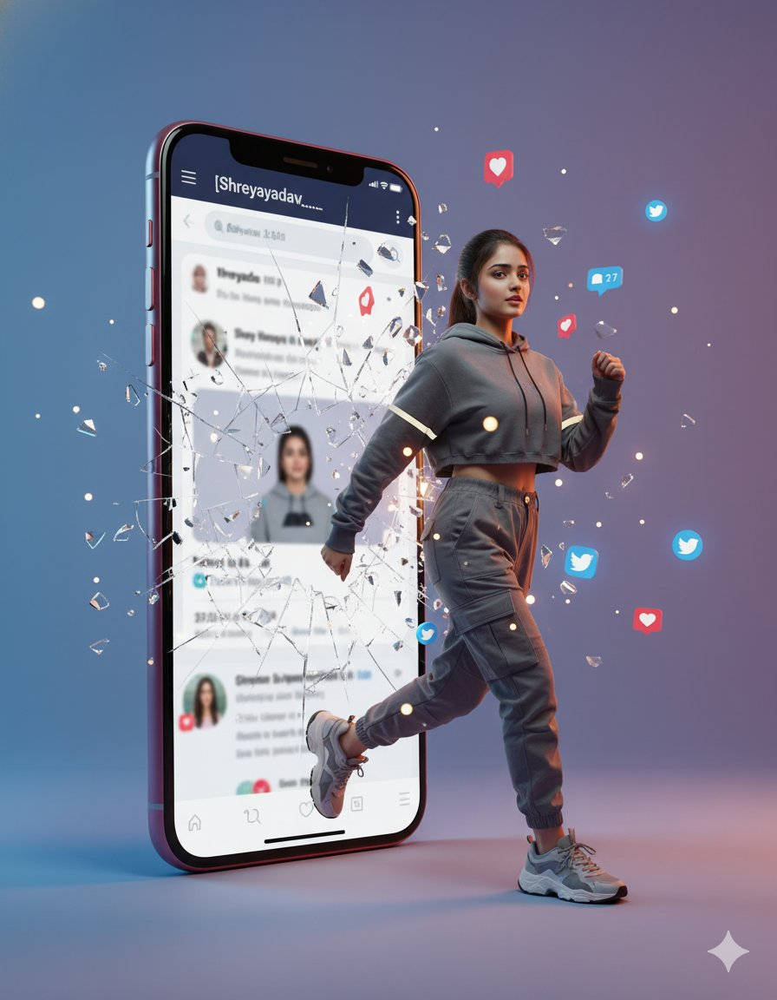

## 一位女子从智能手机屏幕中走出

- ID: gpt4o-411-zh-2
- Slug: prompt-411-zh-2
- 语言: zh
- 来源: [来源链接](https://x.com/ShreyaYadav___/status/1984477243968770374)
- 样例图路径: images/part3/411.jpeg

### 提示词

```text
一张超写实的电影感照片，一位女子从智能手机屏幕中走出，屏幕上显示着她的推特个人资料[Shreyayadav ___ ]。照片捕捉到她迈步的瞬间，自信地从数字世界走向现实世界，手机屏幕破碎，碎片闪耀着光芒。漂浮的社交媒体图标（爱心、评论、关注）环绕着她。她身着时尚街头服饰，面料逼真，光线反射效果极佳。极简的渐变摄影棚背景增添了立体感。
```

### 样例图


## 3D collectible chibi-style figure of [insert celebrity o

- ID: gpt4o-408-en-1
- Slug: prompt-408-en-1
- 语言: en
- 来源: [来源链接](https://x.com/aleenaamiir/status/1984585442487124448)
- 样例图路径: images/part3/408.jpeg

### 提示词

```text
3D collectible chibi-style figure of [insert celebrity or character name], ultra-detailed, stylized proportions (large head, small body), expressive face, cinematic lighting, soft shadows, Pixar-quality realism, glossy vinyl toy texture, standing pose, high detail clothing, character-accurate outfit, professional product photography, rendered in Unreal Engine 5, on a minimal studio background, toy display aesthetic, 8K ultra realistic
```

### 样例图


## 角色变成3D收藏级Q版人偶

- ID: gpt4o-408-zh-2
- Slug: prompt-408-zh-2
- 语言: zh
- 来源: [来源链接](https://x.com/aleenaamiir/status/1984585442487124448)
- 样例图路径: images/part3/408.jpeg

### 提示词

```text
3D 收藏级 Q 版人偶，原型为[插入名人或角色名称]，细节丰富，比例协调（大头小身），面部表情生动，采用电影级光影效果，阴影柔和，呈现皮克斯级别的逼真度，触感光滑如乙烯基玩具，采用站姿，服装细节丰富，还原角色造型，专业产品摄影，使用虚幻引擎 5 渲染，背景简洁，呈现玩具展示美感，8K 超高清画质。
```

### 样例图


## Ultra-realistic full-body portrait of the attached image

- ID: gpt4o-406-en-1
- Slug: prompt-406-en-1
- 语言: en
- 来源: [来源链接](https://x.com/ecommartinez/status/1985805353901310327)
- 样例图路径: images/part3/406.jpeg

### 提示词

```text
Ultra-realistic full-body portrait of the attached image. The person is interacting with Monkey D. Luffy in a front-facing pose, both standing side by side, smiling directly at the camera. Their body language is friendly and natural — Luffy’s arm rests around the person’s shoulder, while both share a joyful, relaxed laugh. Studio or neutral environment with soft cinematic lighting and a warm beige-to-burgundy gradient background. The person wears casual modern clothes: beige T-shirt, navy shorts, and white sneakers, while Luffy retains his original look — straw hat, red vest, blue shorts, yellow sash, and sandals. Expression and mood: happy, authentic, full of energy and camaraderie, captured in photorealistic textures, realistic lighting, and cinematic composition with high-fashion editorial quality.
```

### 样例图


## 一幅超写实全身肖像与路飞互动

- ID: gpt4o-406-zh-2
- Slug: prompt-406-zh-2
- 语言: zh
- 来源: [来源链接](https://x.com/ecommartinez/status/1985805353901310327)
- 样例图路径: images/part3/406.jpeg

### 提示词

```text
附图为一幅超写实全身肖像。图中人物与蒙奇·D·路飞正面互动，两人并肩而立，面带微笑地直视镜头。他们的肢体语言友好自然——路飞的手臂搭在人物的肩上，两人开怀大笑，轻松自在。拍摄环境为影棚或中性光线，柔和的电影级灯光，背景采用温暖的米色至酒红色渐变。人物身着休闲现代服饰：米色T恤、藏蓝色短裤和白色运动鞋，而路飞则保持着他标志性的造型——草帽、红色马甲、蓝色短裤、黄色腰带和凉鞋。人物的表情和情绪：快乐、真实、充满活力和友谊，以逼真的纹理、真实的灯光和电影级的构图捕捉，呈现出高级时尚杂志的品质。
```

### 样例图


## Ultra-realistic full-body portrait of the attached image

- ID: gpt4o-405-en-1
- Slug: prompt-405-en-1
- 语言: en
- 来源: [来源链接](https://x.com/iUllr/status/1985631195724431694)
- 样例图路径: images/part3/405.jpeg

### 提示词

```text
Ultra-realistic full-body portrait of the attached image.
The person is interacting with {fictional character} in a {pose/interaction type}.  
Studio or neutral environment, soft cinematic lighting, {optional color palette}.  
The person wears {clothing style and colors}, The fictional character retains its original appearance, including skin color, clothing, and signature features.  
Expression and mood: {emotional tone}, captured in photorealistic textures, realistic lighting, cinematic composition, high fashion editorial quality.
```

### 样例图


## 超逼真全身肖像与角色互动

- ID: gpt4o-405-zh-2
- Slug: prompt-405-zh-2
- 语言: zh
- 来源: [来源链接](https://x.com/iUllr/status/1985631195724431694)
- 样例图路径: images/part3/405.jpeg

### 提示词

```text
附图的超逼真全身肖像。
该人正在以{姿势/互动类型}与{虚构角色}互动。
摄影棚或中性环境，柔和的电影灯光，{可选调色板}。
该人物穿着{服装款式和颜色}，虚构人物保留其原有的外貌，包括肤色、服装和标志性特征。
表情和mood: {情感基调}，以逼真的纹理、逼真的光照、电影般的构图、高级时尚编辑品质捕捉。
```

### 样例图


## { "prompt": { "description": "Hyper-realistic, ultra-det

- ID: gpt4o-403-en-1
- Slug: prompt-403-en-1
- 语言: en
- 来源: [来源链接](https://x.com/saniaspeaks_/status/1985960595422867603)
- 样例图路径: images/part3/403.jpeg

### 提示词

```text
{
  "prompt": {
    "description": "Hyper-realistic, ultra-detailed close-up portrait of the left half of a young woman’s face submerged in water. One eye is in sharp focus. Light rays create caustic reflections and fluid patterns across her skin. Tiny suspended water droplets and bubbles add depth.",
    "details": {
      "subject": "Young woman's face, fair skin, focused eye (left)",
      "pose": "Submerged in water",
      "lighting": "Cinematic soft shadows with crisp highlights, light rays creating caustic patterns",
      "attire": "Not visible, implied underwater setting",
      "hair": "Dark hair visible on the right side, extending into the water",
      "expression": "Calm and serene, with an intense gaze from the focused eye",
      "mood": "Surreal, dreamlike, ethereal, and serene"
    }
  },
  "image_settings": {
    "size": "original",
    "quantity": 1,
    "style": "Underwater macro portrait photography",
    "composition": "Close-up, with a shallow depth of field and an underwater macro perspective, emphasizing textures and light play. Cropped to show only the left half of the face.",
    "aspect_ratio": "3:4"
  },
  "output_format": {
    "type": "image",
    "expected_result": "A visually striking and highly detailed underwater portrait, showcasing the interplay of light, water, and skin textures."
  }
}
```

### 样例图


## 一幅超写实细节丰富的水下特写肖像

- ID: gpt4o-403-zh-2
- Slug: prompt-403-zh-2
- 语言: zh
- 来源: [来源链接](https://x.com/saniaspeaks_/status/1985960595422867603)
- 样例图路径: images/part3/403.jpeg

### 提示词

```text
{
“迅速的”： {
描述：一幅超写实、细节丰富的特写肖像，描绘了一位年轻女子浸在水中的左半边脸。她的一只眼睛清晰可见。光线在她皮肤上形成折射和流动的纹理。悬浮的细小水滴和气泡增添了画面的深度。
“细节”： {
“主题”：“年轻女子的脸，白皙的皮肤，专注的眼神（左）”
“姿势”：“浸在水中”，
“照明”：“电影般的柔和阴影，清晰的高光，光线营造出焦散图案”，
“服装”：“不可见，暗示水下环境”，
“头发”：“右侧可见深色头发，延伸到水中”，
“表情”：“平静而安详，目光专注而锐利”，
“氛围”：“超现实的、梦幻的、空灵的、宁静的”
}
},
"image_settings": {
"尺寸": "原尺寸",
“数量”：1，
“风格”：“水下微距人像摄影”，
“构图”：“特写镜头，采用浅景深和水下微距视角，强调纹理和光影效果。裁剪后仅显示脸部的左半部分。”
"aspect_ratio": "3:4"
},
"output_format": {
"type": "image",
"预期结果": "一幅视觉效果惊艳、细节丰富的水下肖像，展现了光线、水和皮肤纹理之间的相互作用。"
}
}
```

### 样例图


## Create a realistic digital caricature painting of a midd

- ID: gpt4o-402-en-1
- Slug: prompt-402-en-1
- 语言: en
- 来源: [来源链接](https://x.com/ShreyaYadav___/status/1985908915427758305)
- 样例图路径: images/part3/402.jpeg

### 提示词

```text
Create a realistic digital caricature painting of a middle-aged man (attached photo) with a slightly oversized head, exuding charm and quiet confidence. He is dressed in a modern, stylish bomber jacket made of dark olive nylon with subtle reflective highlights that give it a sleek and fashionable look. Underneath, he wears a warm-toned flannel shirt slightly visible at the collar and cuffs, paired with khaki cargo pants and black sneakersthat ground the outfit with a casual yet confident energy. Completing his look, he wears a brown flat cap tilted slightly forward — a small detail that adds personality and flair.

The man is portrayed in a mid-shot, adjusting his glasses with one hand while gazing directly at the viewer with a self-assured and composed expression. His head is slightly larger than normal, emphasizing his thoughtful character and giving the image a light caricature charm without losing realism.The facial expression radiates intelligence, humor, and approachability.

The lighting is warm and soft, like that of a late afternoon sun filtering through a studio setup. Smooth gradual shadows enhance the contours of his face, while subtle highlights accentuate the texture of his bomber jacket and the reflection in his glasses. His skin tones glow naturally under the warm light, creating a pleasant sense of depth and realism.The background is a gradient of warm brown and beige hues, blending smoothly from light to dark. This background is simple yet elegant, allowing the subject to stand out while maintaining a professional, editorial quality.

The art style should combine semi-realistic digital painting with the texture of oil brushstrokes, delivering a balanced fusion of realism and stylized charm.Clean outlines, smooth blending, and controlled highlights give the impression of a modern portrait illustration—detailed, expressive, and visually captivating.
```

### 样例图


## 一位中年男子数字漫画

- ID: gpt4o-402-zh-2
- Slug: prompt-402-zh-2
- 语言: zh
- 来源: [来源链接](https://x.com/ShreyaYadav___/status/1985908915427758305)
- 样例图路径: images/part3/402.jpeg

### 提示词

```text
请创作一幅逼真的数字漫画，描绘一位中年男子（附图），他头部略大，散发着魅力和沉稳的自信。他身着一件现代时尚的深橄榄色尼龙飞行员夹克，夹克上点缀着低调的反光元素，更添几分精致格调。夹克内搭一件暖色调法兰绒衬衫，领口和袖口隐约可见，下身搭配卡其色工装裤和黑色运动鞋，整体造型休闲又不失自信。最后，他头戴一顶棕色鸭舌帽，帽檐略微前倾——这个小细节为他增添了个性和魅力。

画面采用中景拍摄，男子一手扶着眼镜，一手直视镜头，神态自信沉稳。他的头部略大于常人，突显了他深思熟虑的性格，赋予画面一种略带漫画式的魅力，却又不失写实感。面部表情散发着智慧、幽默和亲切的气息。

光线温暖柔和，如同午后阳光透过摄影棚洒下的光芒。平滑的阴影勾勒出他面部的轮廓，而微妙的高光则突显了他飞行员夹克的质感和眼镜上的反光。在暖光的映衬下，他的肤色自然透亮，营造出令人愉悦的立体感和真实感。背景由温暖的棕色和米色渐变而成，由浅至深自然过渡。这种背景简洁而优雅，既突出了拍摄对象，又保持了专业、时尚的质感。

艺术风格应结合半写实的数字绘画和油画笔触的质感，呈现出写实与风格化魅力的平衡融合。清晰的轮廓、流畅的过渡和可控的高光，给人以现代肖像插画的印象——细节丰富、富有表现力且引人入胜。
```

### 样例图


## { "style_mode": "raw_photoreal_high_fidelity", "look": "

- ID: gpt4o-399-en-1
- Slug: prompt-399-en-1
- 语言: en
- 来源: [来源链接](https://x.com/IamEmily2050/status/1985682978182480251)
- 样例图路径: images/part3/399.jpeg

### 提示词

```text
{
    "style_mode": "raw_photoreal_high_fidelity",
    "look": "K-Pop idol aesthetic, flawless complexion, high-resolution digital photography, trendy",
    "camera": {
      "vantage": "slightly high angle (selfie perspective), direct address",
      "framing": "extreme close-up (ECU), tight framing on the face and shoulders",
      "lens_behavior": "portrait lens (e.g., 85mm prime), extremely shallow depth of field (DoF), sharp focus on the eyes",
      "sensor_quality": "high fidelity, no digital noise"
    }
  },
  "scene": {
    "environment": {
      "setting": "indoor studio or simple interior",
      "lighting": "soft, even beauty lighting (e.g., large softbox or beauty dish), minimizing shadows, creating clear catchlights in the eyes, emphasizing glossy highlights"
    },
    "subject": {
      "description": "young East Asian female, K-Pop idol styling",
      "hair": "long, dark brown, wavy, glossy finish",
      "expression": {
        "mood": "playful, confident, slightly sultry",
        "action": "looking directly into the lens, mouth slightly open, tongue slightly sticking out over the lower lip"
      },
      "makeup": {
        "style": "contemporary K-beauty trends",
        "complexion": "flawless, 'glass skin' effect, dewy/glossy finish, realistic micro-texture",
        "cheeks": "rosy blush, high application",
        "lips": "glossy, pink tint"
      },
      "attire": {
        "top": "grey pinstriped halter top, structured design",
        "details": "white contrasting collar lapel with silver snap buttons and circular metal hardware"
      },
      "accessories": {
        "hair_clip": "decorative silver/rhinestone clip on her left side",
        "earrings": "dangling silver earrings (heart motif)"
      }
    },
    "background": {
      "description": "plain, neutral grey or white wall, blurred (bokeh)"
    }
  },
  "aesthetic_controls": {
    "render_intent": "high-quality digital photograph suitable for promotional material or social media",
    "material_fidelity": [
      "realistic skin micro-texture (pores, gloss, makeup interaction)",
      "individual hair strand detail",
      "fabric texture of the pinstripe material",
      "metallic shine of accessories"
    ],
    "color_grade": {
      "overall": "neutral, slightly warm, vibrant skin tones, high clarity",
      "contrast": "balanced"
    }
  },
  "negative_prompt": {
    "forbidden_elements": ["skin imperfections", "blemishes", "wrinkles", "harsh shadows", "textured/matte skin", "dry lips", "outdoor setting", "distorted features", "motion blur", "digital artifacts"],
    "forbidden_style": ["anime", "painting", "illustration", "CGI render", "low resolution", "gritty realism", "vintage photography", "uncanny valley", "overly airbrushed/plastic skin"]
  }
}
```

### 样例图

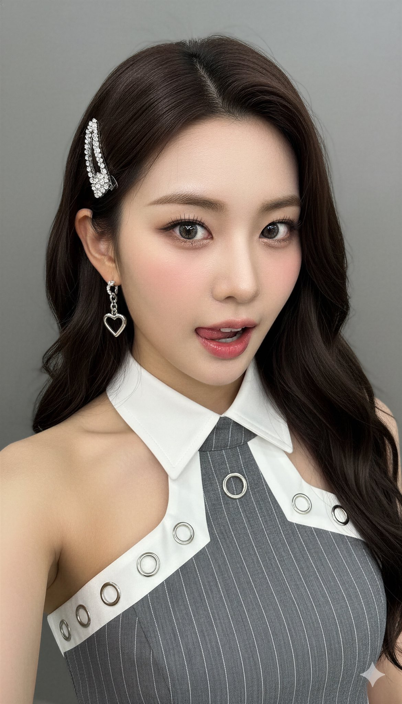

## 年轻的东亚女性K-Pop偶像风格

- ID: gpt4o-399-zh-2
- Slug: prompt-399-zh-2
- 语言: zh
- 来源: [来源链接](https://x.com/IamEmily2050/status/1985682978182480251)
- 样例图路径: images/part3/399.jpeg

### 提示词

```text
{
"style_mode": "raw_photoreal_high_fidelity",
“外观”：“K-Pop偶像美学，完美无瑕的肌肤，高分辨率数码摄影，时尚潮流”，
“相机”： {
“有利位置”：“略高的角度（自拍视角），直接面向”，
“构图”：“极近特写（ECU），紧贴面部和肩膀构图”，
"lens_behavior": "人像镜头（例如，85mm 定焦镜头），景深极浅，眼睛清晰对焦"
"sensor_quality": "高保真，无数字噪声"
}
},
“场景”： {
“环境”： {
“设置”: “室内工作室或简单的室内环境”
“灯光”：“柔和均匀的美容灯光（例如，大型柔光箱或美容罩），最大限度地减少阴影，在眼睛中营造清晰的眼神光，强调光泽高光”
},
“主题”： {
描述：年轻的东亚女性，K-Pop偶像风格
“头发”：“长而深棕色，波浪状，有光泽”，
“表达”： {
“情绪”：“俏皮、自信、略带性感”，
“动作”：“直视镜头，嘴巴微张，舌头微微伸出下唇”
},
“化妆品”： {
“风格”：“当代韩国美妆潮流”，
“肤色”： “无瑕、‘玻璃肌’效果、水润/光泽妆效、逼真的微观纹理”，
“脸颊”：“玫瑰色腮红，涂抹较多”，
“嘴唇”： “有光泽的粉红色”
},
着装：{
“上衣”： “灰色细条纹露背上衣，结构化设计”
“细节”：“白色撞色领翻领，配银色按扣和圆形金属配件”
},
“配件”： {
"发夹": "左侧的装饰性银色/水钻发夹",
“耳环”： “垂坠式银耳环（心形图案）”
}
},
“背景”： {
描述：素色、中性灰色或白色墙壁，虚化（散景）
}
},
"aesthetic_controls": {
"render_intent": "适用于宣传材料或社交媒体的高质量数码照片",
"material_fidelity": [
“逼真的皮肤微观纹理（毛孔、光泽、妆容互动）”，
“单根发丝的细节”，
“细条纹面料的织物纹理”，
配饰的金属光泽
],
"color_grade": {
“整体”：“中性、略带暖色调、充满活力的肤色、高清晰度”
“对比”：“平衡”
}
},
"negative_prompt": {
"forbidden_​​elements": ["皮肤瑕疵", "斑点", "皱纹", "生硬阴影", "纹理/哑光皮肤", "嘴唇干燥", "户外环境", "面部扭曲", "动态模糊", "数码瑕疵"],
"forbidden_​​style": ["动漫", "绘画", "插画", "CGI渲染", "低分辨率", "粗犷写实主义", "复古摄影", "恐怖谷效应", "过度修饰/塑料质感"]
}
}
```

### 样例图


## A full-body hyper-realistic studio portrait of [CHARACTE

- ID: gpt4o-398-en-1
- Slug: prompt-398-en-1
- 语言: en
- 来源: [来源链接](https://x.com/Arminn_Ai/status/1983963917425480087)
- 样例图路径: images/part3/398.jpeg

### 提示词

```text
A full-body hyper-realistic studio portrait of [CHARACTER DESCRIPTION] in a [POSE TYPE] pose, sitting gracefully on a large [OBJECT] positioned [ORIENTATION: horizontal / vertical] on a smooth [BACKGROUND COLOR] floor. The object appears oversized and realistic, perfectly integrated with the subject — not floating. Its surface shows accurate texture, reflections, and material depth. The pose defines the subject’s attitude and interaction with the object — natural, stylish, and expressive. The character is balanced and confident, matching the object’s tone and style. Background is seamless, same color for wall and floor, slightly lighter below with soft reflections. Lighting: clean professional studio setup — diffused key from front-left, mild fill from right, subtle rim for separation, evenly balanced exposure. Mood: cinematic luxury editorial with minimal composition and photorealistic realism.
```

### 样例图


## 超大道具的影棚拍摄照片

- ID: gpt4o-398-zh-2
- Slug: prompt-398-zh-2
- 语言: zh
- 来源: [来源链接](https://x.com/Arminn_Ai/status/1983963917425480087)
- 样例图路径: images/part3/398.jpeg

### 提示词

```text
一张全身超写实摄影棚肖像照，[人物描述] 以[姿势类型]的姿态优雅地坐在一个大型[物体]上，该物体[方向：水平/垂直]放置在光滑的[背景颜色]地板上。物体显得尺寸较大且逼真，与人物完美融合，而非悬浮。物体表面展现出精准的纹理、反射和材质深度。姿势展现了人物与物体之间的互动——自然、时尚且富有表现力。人物姿态平衡自信，与物体的色调和风格相得益彰。背景无缝衔接，墙面和地板颜色相同，下方略浅并带有柔和的反射。灯光：干净专业的摄影棚布光——左前方柔和的主光，右侧轻柔的补光，以及用于分离主体的微妙边缘光，曝光均衡。氛围：电影般的奢华时尚大片风格，构图极简，追求照片级的真实感。
```

### 样例图


## { "instruction": "Generate a full-body, photorealistic f

- ID: gpt4o-393-en-1
- Slug: prompt-393-en-1
- 语言: en
- 来源: [来源链接](https://x.com/IamEmily2050/status/1983742027058835543)
- 样例图路径: images/part3/393.jpeg

### 提示词

```text
{
  "instruction": "Generate a full-body, photorealistic fashion portrait of a modern East Asian idol in all-black styling. The result must look like a professional test shot, not anime, not cosplay, not fantasy.",

 "subject": {
    "identity": "East Asian female idol, early 20s look, pale smooth skin, symmetrical features, refined jawline, large natural eyes, soft neutral lips.",
    "hair": {
      "color": "jet-black",
      "style": "straight with blunt bangs framing the eyes",
      "length": "long, falling past the chest",
      "optional_variants": [
        "clean straight hair down",
        "twin high ponytails with bangs and loose face-framing strands"
      ]
    },
    "body": {
      "build": "slender, long-legged, elegant proportions, model-like lines",
      "posture": "calm, confident, controlled posture, standing tall",
      "pose": "full-body standing pose, relaxed arms at sides or slight hip angle, natural stance, no exaggerated arching"
    }
  },

  "wardrobe": {
    "palette": "all black, monochrome styling",
    "look_variants": [
      {
        "description": "long-sleeve fitted black top with structured waist (corset-like shaping), short pleated mini skirt with belt hardware, over-the-knee black lace-up boots with platform heel, subtle layered silver jewelry"
      },
      {
        "description": "black cropped top, exposed midriff, slim black jeans, fitted choker stack and pendant necklace, matte black boots"
      }
    ],
    "note": "Outfit must read as high-fashion / street idol aesthetic, not fantasy costume, not sci-fi armor, not latex fetishwear."
  },

  "camera": {
    "framing": "full-body portrait from head to shoes, vertical composition, subject centered and filling most of the frame",
    "angle": "slightly low to mid-torso camera height for subtle leg lengthening OR neutral eye-level framing against a doorway",
    "lens_behavior": "clean realistic perspective, no wide distortion, no fisheye",
    "focus": "sharp focus across the subject from face to boots, depth of field appropriate for fashion photography"
  },

  "environment": {
    "style_options": [
      "industrial interior with worn tile floor and large window frame / metal framing in the background, muted gray tones",
      "neutral architectural doorway outdoors, pale stone or painted door, soft natural light"
    ],
    "lighting": "soft, diffused, natural-feeling light with gentle directional falloff. Skin should look smooth and real, not plastic. No neon rim light, no colored gels."
  },

  "aesthetic": {
    "tone": "clean Korean idol / street editorial test shot",
    "color_grade": "subtle cool neutrals in the background, deep matte blacks in wardrobe, natural skin tones",
    "finish": "high-end fashion photography, not fantasy art, not anime render, not glossy VR avatar"
  },

  "technical_rendering": {
    "intent": "photorealistic human subject",
    "keywords": [
      "cinematic portrait photography",
      "studio-quality fashion still",
      "PBR material realism on fabric texture (matte black cloth, leather belt, lace-up boots)",
      "no exaggerated body morph",
      "no plastic skin",
      "no cel-shaded look"
    ]
  },

  "negative": {
    "forbidden_styles": [
      "anime style",
      "cartoon style",
      "3D game character",
      "virtual idol hologram look",
      "cyberpunk fantasy costume",
      "latex catsuit aesthetic",
      "sci-fi armor",
      "bright colored hair",
      "oversized eyes / doll face",
      "hyper-airbrushed Barbie texture",
      "warped body proportions",
      "fish-eye distortion",
      "text overlays or watermarks"
    ],
    "forbidden_words": [
      "NSFW pose",
      "explicit lingerie framing",
      "cutesy cosplay expression",
      "aggressive pin-up arching"
    ]
}
```

### 样例图


## 全身写实时尚肖像照

- ID: gpt4o-393-zh-2
- Slug: prompt-393-zh-2
- 语言: zh
- 来源: [来源链接](https://x.com/IamEmily2050/status/1983742027058835543)
- 样例图路径: images/part3/393.jpeg

### 提示词

```text
{
“说明”：“请创作一张现代东亚偶像全身写实时尚肖像照，造型为全黑。作品必须看起来像专业试镜照，而非动漫、角色扮演或奇幻风格。”

“主题”： {
“身份”：“东亚女偶像，二十出头的外貌，白皙光滑的皮肤，五官对称，下颌线条精致，大而自然的眼睛，柔和的裸色嘴唇。”
“头发”： {
颜色： 纯黑色，
“发型”：“齐刘海修饰眼睛的直发”，
长度：很长，垂过胸部，
"optional_variants": [
“干净利落的直发向下”，
“双高马尾辫，配刘海和垂在脸颊两侧的碎发”
]
}，
“身体”： {
“体型”：“纤细、修长、比例优雅、线条优美”，
“姿势”：“冷静、自信、控制的姿势，挺拔的站姿”
“姿势”：“全身站立姿势，双臂放松地放在身体两侧或髋部略微弯曲，站姿自然，不要过度拱背”
}
}，

“衣柜”： {
“调色板”：“全黑单色风格”，
"look_variants": [
{
“描述”：黑色长袖修身上衣，腰部收紧（类似束身衣的塑形效果），短款百褶迷你裙，配有腰带，黑色过膝系带厚底靴，精致的叠戴银色首饰。
}，
{
描述：黑色露脐上衣，露出小蛮腰，黑色修身牛仔裤，贴身颈链叠戴吊坠项链，哑光黑色靴子
}
]，
“注意”：“服装必须体现高级时装/街头偶像美学，而不是奇幻服装、科幻盔甲或乳胶恋物癖服装。”
}，

“相机”： {
“构图”：“从头到脚的全身像，竖构图，主体居中并占据画面的大部分”，
“角度”：“略低于躯干中部的相机高度，以微妙地拉长腿部，或者以中性的视线高度靠在门口构图”，
"lens_behavior": "清晰逼真的透视效果，无严重畸变，无鱼眼效果"
“焦点”： “从脸部到靴子，主体清晰对焦，景深适合时尚摄影”
}，

“环境”： {
"style_options": [
“工业风格的室内装潢，地面铺着磨损的瓷砖，背景是大型窗框/金属框架，整体色调为柔和的灰色。”
“中性色调的建筑风格户外入口，浅色石材或油漆门，柔和的自然光线”
]，
“照明”：“柔和、漫射、感觉自然的光线，光线方向性衰减要柔和。皮肤应该看起来光滑真实，而不是塑料感。不要使用霓虹灯轮廓光，也不要使用彩色滤光片。”
}，

“审美的”： {
"色调": "干净的韩国偶像/街头时尚大片试拍",
"color_grade": "背景采用柔和的冷色调中性色，服装采用深哑光黑色，肤色自然",
“成品”：高端时尚摄影，而非奇幻艺术、动漫渲染或华丽的VR虚拟形象。
}，

“technical_rendering”：{
“意图”: “逼真的人物主体”，
“关键词”：[
“电影式人像摄影”，
“摄影棚品质的时尚剧照”，
“织物纹理上的 PBR 材质真实感（哑光黑布、皮带、系带靴）”
“没有夸张的体型变化”，
“没有塑料皮肤”，
“没有卡通渲染风格”
]
}，

“消极的”： {
"forbidden_​​styles": [
“动漫风格”，
“卡通风格”，
“3D游戏角色”，
“虚拟偶像全息影像”
“赛博朋克奇幻服装”，
“乳胶紧身衣美学”，
“科幻盔甲”，
“色彩鲜艳的头发”，
“大眼睛/娃娃脸”，
“过度修饰的芭比娃娃质感”，
“扭曲的体型比例”，
“鱼眼畸变”，
“文字叠加或水印”
]，
"forbidden_​​words": [
“NSFW姿势”，
“露骨的内衣镜头”，
“可爱的角色扮演表情”，
“激进的性感拱背”
]
}
```

### 样例图


## { "scene": { "location": "A minimalist, dark bedroom or 

- ID: gpt4o-392-en-1
- Slug: prompt-392-en-1
- 语言: en
- 来源: [来源链接](https://x.com/songguoxiansen/status/1981178658397229294)
- 样例图路径: images/part3/392.jpeg

### 提示词

```text
{
  "scene": {
    "location": "A minimalist, dark bedroom or dressing room",
    "background": "A simple, dark grey wall, out of focus"
  },
  "subject": {
    "age": "adult",
    "description": "East Asian woman, elegant, hair in a loose bun with stray strands",
    "wardrobe": "A simple, dark-colored (e.g., black, navy) form-fitting dress",
    "accessories": "None",
    "pose": "Shot from behind, three-quarter view. Her own hand is reaching back, pulling the zipper down (e.g., to the middle of her back).",
    "expression": "(Face mostly obscured or in profile) Subtle, mysterious, ambiguous",
    "gaze": "Looking down at her hand or away from camera",
    "body_notes": "Photorealistic, realistic adult proportions; realistic hand and skin texture on back"
  },
  "camera": {
    "sensor": "full_frame",
    "focal_length_mm": 100,
    "aperture_f": 2.8,
    "shutter_s": 0.01,
    "iso": 400,
    "white_balance_k": 4500,
    "distance_m": 2.0,
    "camera_height_m": 1.6,
    "framing": "Tight medium shot (head to waist), focusing on the hand, zipper, and back",
    "focus": "Manual focus on the hand and zipper"
  },
  "lighting": {
    "key": "Dramatic side light (gridded strip light) to highlight the hand and spine",
    "fill": "Deep shadows, very low fill",
    "hair": "Subtle rim light",
    "notes": "Low-key, high-contrast, "storytelling" image"
  },
  "color_grade": {
    "style": "Cinematic, moody, ambiguous",
    "palette": "Desaturated, cool tones, blacks, skin tones",
    "contrast": "High, "chiaroscuro"",
    "saturation": "Low"
  },
  "makeup": {
    "eyes": "(Not visible)",
    "cheeks": "(Not visible)",
    "lips": "(Not visible)"
  },
  "postprocess": {
    "retouch": "Maintain natural skin texture, add film grain",
    "clarity": "High clarity on the zipper and hand",
    "dodge_burn": "Dodge on the spine, hand, and zipper pull",
    "vignette": "Strong dark vignette"
  },
  "art_direction": {
    "mood": "Sensual, ambiguous, mysterious, intimate, quiet",
    "keywords": ["photorealistic", "sensual", "ambiguous", "zipper", "low-key", "cinematic", "intimate"]
  },
  "negative_prompts": [
    "nsfw",
    "underage look",
    "text or logos",
    "plastic doll skin",
    "cg",
    "3d render",
    "anime",
    "warped hands",
    "extra fingers",
    "deformed limbs"
  ]
}
```

### 样例图


## 正在更衣的女生

- ID: gpt4o-392-zh-2
- Slug: prompt-392-zh-2
- 语言: zh
- 来源: [来源链接](https://x.com/songguoxiansen/status/1981178658397229294)
- 样例图路径: images/part3/392.jpeg

### 提示词

```text
{
“场景”： {
"location": "简约、黑暗的卧室或更衣室",
“背景”：“简单的深灰色墙壁，失焦”
}，
“主题”： {
"年龄": "成人",
"description": "东亚女性，优雅，头发松散，发髻散落，
"wardrobe": "一件简单的深色（例如黑色、海军蓝）合身连衣裙",
"accessories": "无",
"pose": "从后面拍摄，四分之三视角。她自己的手伸到后面，拉下拉链（例如，拉到她背部中间）。",
"expression": "（脸部大部分被遮挡或侧面）微妙、神秘、暧昧",
"gaze": "低头看着她的手或远离相机",
"body_notes": "照片般逼真的成人比例；背部的手部和皮肤纹理逼真"
}，
“相机”： {
“传感器”：“全帧”，
"焦距毫米": 100,
“aperture_f”：2.8，
“shutter_s”：0.01，
“iso”：400，
"白平衡k": 4500,
“距离_米”：2.0，
"相机高度米": 1.6,
"framing": "近距离中景拍摄（从头到腰），重点关注手、拉链和背部",
"focus": "手动对焦手和拉链"
}，
“灯光”： {
"key": "戏剧性的侧光（网格条灯）突出手部和脊柱",
"fill": "深阴影，非常低的填充",
"hair": "微妙的边缘光",
"notes": "低调、高对比度、“讲故事”的图像"
}，
“颜色等级”：{
"style": "电影化、喜怒无常、模棱两可",
"palette": "去饱和、冷色调、黑色、肤色",
"contrast": "高, "明暗对比"",
“饱和度”：“低”
}，
“化妆品”： {
"eyes": "(不可见)",
"cheeks": "(不可见)",
"lips": "(不可见)"
}，
“后处理”：{
"retouch": "保持自然的皮肤纹理，添加胶片颗粒感",
"clarity": "拉链和手部清晰度高",
"dodge_burn": "躲避脊柱、手和拉链头",
"vignette": "强烈的暗色调晕影"
}，
“艺术指导”：{
"mood": "感性、暧昧、神秘、亲密、安静",
“关键词”：[“照片写实”、“感性”、“模棱两可”、“拉链”、“低调”、“电影”、“亲密”]
}，
"negative_prompts": [
“nsfw”，
“未成年的样子”，
“文字或徽标”，
“塑料娃娃皮肤”，
“cg”，
“3D渲染”，
“日本动画片”，
“扭曲的手”，
“额外的手指”，
“肢体畸形”
]
}
```

### 样例图


## { "scene": { "location": "A bright, aesthetic cafe inter

- ID: gpt4o-391-en-1
- Slug: prompt-391-en-1
- 语言: en
- 来源: [来源链接](https://x.com/songguoxiansen/status/1981178596581658768)
- 样例图路径: images/part3/391.jpeg

### 提示词

```text
{
  "scene": {
    "location": "A bright, aesthetic cafe interior",
    "background": "Pastel-colored wall, a small potted plant on the table, window light"
  },
  "subject": {
    "age": "adult",
    "description": "East Asian woman, soft, wavy hair with air bangs",
    "wardrobe": "Cute pastel-colored blouse or off-the-shoulder top",
    "accessories": "Delicate layered necklaces, holding a latte or colorful drink",
    "pose": "Sitting at the table, leaning forward slightly, hands around the cup, as if listening intently",
    "expression": "Sweet, "first date" smile, slight head tilt, 'eye-smile'",
    "gaze": "Direct to camera (as if the viewer is her date)",
    "body_notes": "Photorealistic, realistic adult proportions; natural skin texture"
  },
  "camera": {
    "sensor": "full_frame",
    "focal_length_mm": 50,
    "aperture_f": 2.0,
    "shutter_s": 0.008,
    "iso": 250,
    "white_balance_k": 5600,
    "distance_m": 1.8,
    "camera_height_m": 1.4,
    "framing": "Medium close-up (chest-up), 'point-of-view' (POV) shot",
    "focus": "eye_detect_AF on nearest eye"
  },
  "lighting": {
    "key": "Large, soft window light from the front-side",
    "fill": "White bounce card or natural bounce from the table",
    "hair": "Gentle rim light",
    "catchlights": "Large, soft window catchlights",
    "notes": "Bright, airy, clean aesthetic"
  },
  "color_grade": {
    "style": "Ulzzang / 'Clean' aesthetic",
    "palette": "Pastels, white, skin tones; clear, luminous skin",
    "contrast": "Medium-low, clean shadows",
    "saturation": "Moderate, fresh"
  },
  "makeup": {
    "eyes": "Natural winged eyeliner ('puppy dog' style), highlighted aegyo-sal",
    "cheeks": "Peach gradient blush",
    "lips": "Glossy pink gradient lips"
  },
  "postprocess": {
    "retouch": "Professional 'glass skin' retouch (light, maintain pores)",
    "clarity": "Selective clarity on eyes, lips, and drink",
    "vignette": "Very subtle bright vignette"
  },
  "art_direction": {
    "mood": "Sweet, approachable, trendy, 'date' vibe",
    "keywords": ["photorealistic", "sweet girl", "cafe", "date", "Ulzzang", "eye-smile", "POV"]
  },
  "negative_prompts": [
    "nsfw",
    "underage look",
    "text or logos",
    "plastic doll skin",
    "cg",
    "3d render",
    "anime",
    "dark lighting",
    "sad expression"
  ]
}
```

### 样例图


## 咖啡厅室内女生

- ID: gpt4o-391-zh-2
- Slug: prompt-391-zh-2
- 语言: zh
- 来源: [来源链接](https://x.com/songguoxiansen/status/1981178596581658768)
- 样例图路径: images/part3/391.jpeg

### 提示词

```text
{
“场景”： {
“地点”：“明亮、美观的咖啡馆内部”，
“背景”：粉彩色的墙壁，桌上的一盆小植物，窗外的光线
}，
“主题”： {
“年龄”: “成人”
描述：东亚女性，头发柔软，微卷，留着蓬松的刘海。
“衣橱”： “可爱的粉彩色衬衫或露肩上衣”，
“配饰”：“精致的多层项链，配上一杯拿铁或色彩缤纷的饮品”，
“姿势”：“坐在桌旁，身体微微前倾，双手捧着杯子，仿佛在认真倾听”，
“表情”：“甜美的、‘初次约会’式的微笑，微微歪头，‘笑眼’”，
“凝视”：“直视镜头（仿佛观众是她的约会对象）”，
"body_notes": "逼真的成人比例；自然的皮肤纹理"
}，
“相机”： {
"传感器": "全帧",
"focal_length_mm": 50,
"aperture_f": 2.0,
"shutter_s": ​​0.008,
“iso”：250，
"white_balance_k": 5600,
"distance_m": 1.8,
"camera_height_m": 1.4,
“构图”：“中近景（胸部以上），‘主观’（POV）镜头”，
"focus": "eye_detect_AF on nearest eye"
}，
“灯光”： {
“关键”：“来自正面的大而柔和的窗户光线”，
“填充物”: “白色弹跳卡或桌面上的自然弹跳”，
“头发”：“柔和的边缘光”，
“眼神光”：“大而柔和的窗户眼神光”，
备注：明亮、通风、干净的美学风格
}，
"color_grade": {
"风格": "Ulzzang / 'Clean' 美学",
“调色板”：“柔和的粉彩色调、白色、肤色；清透、透亮的肌肤”，
“对比度”：“中低，干净的阴影”，
“饱和度”：“适中，清新”
}，
“化妆品”： {
“眼睛”：“自然上扬眼线（小狗眼线风格），高光卧蚕眼妆”，
“脸颊”: “蜜桃渐变腮红”
“嘴唇”： “亮粉色渐变唇妆”
}，
"后处理": {
“修图”：“专业‘玻璃肌’修图（轻微，保留毛孔）”
“清晰度”： “选择性地提高眼睛、嘴唇和饮料的清晰度”
“小景”： “非常微妙的明亮小景”
}，
“艺术指导”：{
“氛围”：“甜蜜、平易近人、时尚、‘约会’氛围”，
关键词：["写实", "甜美女孩", "咖啡馆", "约会", "韩系美女", "笑眼", "第一人称视角"]
}，
"negative_prompts": [
"nsfw",
“未成年样貌”，
“文字或标志”，
“塑料娃娃皮肤”，
“cg”，
“3D渲染”，
“日本动画片”，
“昏暗的照明”，
“悲伤的表情”
]
}
```

### 样例图


## { "scene": { "location": "Themed 'Maid Cafe' interior, f

- ID: gpt4o-389-en-1
- Slug: prompt-389-en-1
- 语言: en
- 来源: [来源链接](https://x.com/songguoxiansen/status/1981178453216137391)
- 样例图路径: images/part3/389.jpeg

### 提示词

```text
{
  "scene": {
    "location": "Themed 'Maid Cafe' interior, focused and clean",
    "background": "Bright pink walls, checkered floor, subtle hearts and ruffle decorations (soft focus, no distracting elements)"
  },
  "subject": {
    "age": "adult",
    "description": "Realistic East Asian woman, dark hair in high twin-tails with ribbons, sparkling, energetic eyes",
    "wardrobe": "Classic black maid dress with a short skirt, pristine white frilly apron, knee-high white socks with bows",
    "accessories": "Frilly maid headband, ribbons in hair",
    "pose": "Full body, dynamic 'moe moe kyun' pose; both hands making a heart gesture, one foot popped, slight bow",
    "expression": "Extremely energetic, wide-eyed 'kawaii' smile, 'genki' (energetic) personality",
    "gaze": "Direct to camera, engaging and cheerful",
    "body_notes": "realistic adult proportions; natural skin texture"
  },
  "camera": {
    "sensor": "full_frame",
    "focal_length_mm": 35,
    "aperture_f": 2.8,
    "shutter_s": 0.008,
    "iso": 400,
    "white_balance_k": 5000,
    "distance_m": 3.0,
    "camera_height_m": 1.0,
    "framing": "Full body shot, slightly low angle to enhance cuteness and energy",
    "focus": "eye_detect_AF on nearest eye"
  },
  "lighting": {
    "key": "Bright, even, slightly flat studio lighting (simulating cafe interior)",
    "fill": "Large softboxes from both sides to eliminate shadows",
    "hair": "Top-down rim light to separate hair",
    "catchlights": "Multiple, large, bright catchlights",
    "notes": "Very bright, 'pop' lighting, high-key"
  },
  "color_grade": {
    "style": "Akihabara-pop, vibrant",
    "palette": "Bright pink, black, white; clear, bright skin",
    "contrast": "Medium, very clean and crisp",
    "saturation": "High saturation"
  },
  "makeup": {
    "eyes": "Emphasized 'anime' eyes, prominent aegyo-sal, long upper and lower lashes",
    "cheeks": "Bright pink, circular blush",
    "lips": "High-gloss pink or red lip tint"
  },
  "postprocess": {
    "retouch": "Clean skin retouching, "idol" level",
    "clarity": "High clarity on eyes, apron ruffles, and hair",
    "dodge_burn": "Dodge on eyes to make them sparkle",
    "vignette": "None"
  },
  "art_direction": {
    "mood": "Energetic, cheerful, adorable, welcoming",
    "keywords": ["maid cafe", "moe", "kawaii", "twin-tails", "heart gesture", "Akihabara"]
  },
  "negative_prompts": [
    "nsfw",
    "underage look",
    "text or logos",
    "plastic doll skin",
    "warped hands or extra fingers",
    "deformed limbs",
    "dark or moody",
    "French maid (Victorian)",
    "sad expression",
    "cluttered background",
    "photography equipment",
    "lighting equipment"
  ]
}
```

### 样例图


## 双马尾比心女生

- ID: gpt4o-389-zh-2
- Slug: prompt-389-zh-2
- 语言: zh
- 来源: [来源链接](https://x.com/songguoxiansen/status/1981178453216137391)
- 样例图路径: images/part3/389.jpeg

### 提示词

```text
{
“场景”： {
“地点”：“以女仆咖啡厅为主题的室内设计，简洁明了”，
“背景”：“亮粉色的墙壁，格子地板，精致的心形和褶皱装饰（柔焦，无分散注意力的元素）”
}，
“主题”： {
“年龄”: “成人”
“描述”：“一位写实的东亚女性，深色头发扎成高高的双马尾，用丝带系着，眼睛闪亮而充满活力。”
“服装”：“经典的黑色女仆装，短裙，洁白的褶边围裙，带蝴蝶结的白色过膝袜”，
“配饰”：“褶边女仆头带，头发上的丝带”，
“姿势”：“全身动态‘萌萌哒’姿势；双手比心，一只脚翘起，微微鞠躬”
“表情”：“活力四射，睁大眼睛露出‘可爱’的笑容，‘元气’（精力充沛）的性格”，
“眼神”：“直视镜头，专注而快乐”，
"body_notes": "逼真的成人比例；自然的皮肤纹理"
}，
“相机”： {
"传感器": "全帧",
"focal_length_mm": 35,
"aperture_f": 2.8,
"shutter_s": ​​0.008,
“iso”：400，
"white_balance_k": 5000,
"distance_m": 3.0,
"camera_height_m": 1.0,
“构图”：“全身照，略微低角度拍摄，以增强可爱和活力”，
"focus": "eye_detect_AF on nearest eye"
}，
“灯光”： {
“关键”： “明亮、均匀、略微平淡的影棚照明（模拟咖啡馆内部）”
“填充”：“从两侧使用大型柔光箱以消除阴影”，
“头发”： “自上而下的边缘光，用于分离头发”，
“眼神光”： “多个、大、明亮的眼神光”，
备注：非常明亮、流行风格的灯光，高调
}，
"color_grade": {
风格： “秋叶原流行，充满活力”
“调色板”：“亮粉色、黑色、白色；清透、明亮的肌肤”
“对比度”：“中等，非常干净清晰”，
“饱和度”: “高饱和度”
}，
“化妆品”： {
“眼睛”： “强调‘动漫’眼睛，突出卧蚕，上下睫毛长”，
“脸颊”：“亮粉色，圆形腮红”，
“唇部”： “高光泽粉色或红色唇彩”
}，
"后处理": {
“修图”：“干净的皮肤修图，‘偶像’级别”，
“清晰度”：“眼睛、围裙褶边和头发的清晰度很高”，
"dodge_burn": "在眼睛上加闪，使它们闪闪发光",
“小插曲”： “无”
}，
“艺术指导”：{
“情绪”：“充满活力、开朗、可爱、热情好客”
关键词：["女仆咖啡厅", "萌", "可爱", "双马尾", "爱心手势", "秋叶原"]
}，
"negative_prompts": [
"nsfw",
“未成年样貌”，
“文字或标志”，
“塑料娃娃皮肤”，
“畸形手或多余手指”，
“肢体畸形”，
“阴郁或忧郁的”，
“法国女仆（维多利亚时代）”
“悲伤的表情”，
“杂乱的背景”，
“摄影器材”，
“照明设备”
]
}
```

### 样例图


## { "scene": { "location": "Bedroom, in bed", "background"

- ID: gpt4o-388-en-1
- Slug: prompt-388-en-1
- 语言: en
- 来源: [来源链接](https://x.com/songguoxiansen/status/1981178369262964886)
- 样例图路径: images/part3/388.jpeg

### 提示词

```text
{
  "scene": {
    "location": "Bedroom, in bed",
    "background": "White pillows and soft, rumpled bedsheets, soft morning light"
  },
  "subject": {
    "age": "adult",
    "description": "East Asian woman, beautiful 'just woke up' messy hair, sleepy eyes",
    "wardrobe": "Simple, thin-strap camisole (e.g., silk or cotton), strap slightly falling off one shoulder",
    "accessories": "None",
    "pose": "Lying on her stomach in bed, propped up on her elbows, looking at the camera",
    "expression": "Soft, sleepy smile, intimate, 'good morning' look",
    "gaze": "Direct to camera, soft and alluring",
    "body_notes": "Photorealistic, realistic adult proportions; natural skin texture, visible collarbones, 'sleepy' flush"
  },
  "camera": {
    "sensor": "full_frame",
    "focal_length_mm": 50,
    "aperture_f": 1.8,
    "shutter_s": 0.01,
    "iso": 400,
    "white_balance_k": 5500,
    "distance_m": 1.5,
    "camera_height_m": 0.8,
    "framing": "Close-up (chest-up), at eye level with her",
    "focus": "eye_detect_AF on nearest eye"
  },
  "lighting": {
    "key": "Large, diffused window light from the side, creating very soft shadows",
    "fill": "Bounced light from the white sheets",
    "hair": "Soft halo from the window",
    "catchlights": "Large, soft window catchlights",
    "notes": "Very soft, high-key, intimate"
  },
  "color_grade": {
    "style": "Intimate, soft, 'morning' aesthetic",
    "palette": "Whites, skin tones, pastels; soft, luminous skin",
    "contrast": "Very low, dreamy",
    "saturation": "Moderate, soft"
  },
  "makeup": {
    "eyes": "None, 'bare face' look",
    "cheeks": "Natural, sleepy flush",
    "lips": "Natural, hydrated"
  },
  "postprocess": {
    "retouch": "Professional retouching, maintain "real skin" look",
    "clarity": "Selective clarity on eyes and lashes",
    "dodge_burn": "Subtle dodge on eyes and collarbone",
    "vignette": "Subtle, bright vignette"
  },
  "art_direction": {
    "mood": "Flirty, intimate, ambiguous, soft, sleepy, alluring",
    "keywords": ["photorealistic", "flirty", "morning", "in bed", "ambiguous", "natural beauty", "sleepy"]
  },
  "negative_prompts": [
    "nsfw",
    "underage look",
    "text or logos",
    "plastic doll skin",
    "cg",
    "3d render",
    "anime",
    "heavy makeup",
    "warped hands"
  ]
}
```

### 样例图


## 白色枕头上的睡眼惺忪女孩

- ID: gpt4o-388-zh-2
- Slug: prompt-388-zh-2
- 语言: zh
- 来源: [来源链接](https://x.com/songguoxiansen/status/1981178369262964886)
- 样例图路径: images/part3/388.jpeg

### 提示词

```text
{
“场景”： {
"location": "卧室，在床上",
"background": "白色枕头、柔软、皱巴巴的床单、柔和的晨光"
}，
“主题”： {
"年龄": "成人",
"description": "东亚女子，美丽的‘刚睡醒’凌乱的头发，睡眼惺忪的眼睛",
"wardrobe": "简单的细肩带吊带背心（例如丝绸或棉质），肩带略微从一侧肩膀垂下",
"accessories": "无",
"pose": "趴在床上，用手肘支撑身体，看着镜头",
"expression": "温柔、困倦的微笑、亲密的‘早上好’表情",
"gaze": "直视镜头，柔和而诱人",
"body_notes": "照片般逼真的成人比例；自然的皮肤纹理，清晰可见的锁骨，‘困倦’的红晕"
}，
“相机”： {
“传感器”：“全帧”，
"焦距毫米": 50,
“aperture_f”：1.8，
“shutter_s”：0.01，
“iso”：400，
"白平衡k": 5500,
“距离米”：1.5，
“相机高度”：0.8，
"framing": "特写（胸部以上），与她视线齐平",
“focus”：“eye_detect_AF 在最近的眼睛上”
}，
“灯光”： {
"key": "从侧面射入的大型漫射窗光，形成非常柔和的阴影",
"fill": "从白色床单反射的光线",
"hair": "窗户透出的柔和光晕",
"catchlights": "大而柔和的窗户聚光灯",
"notes": "非常柔软，高调，亲密"
}，
“颜色等级”：{
"style": "亲密、柔和、‘早晨’美学",
"palette": "白色、肤色、粉彩色；柔软、明亮的皮肤",
"contrast": "非常低，梦幻",
"saturation": "中等，柔和"
}，
“化妆品”： {
"eyes": "无，‘素颜’样子",
"cheeks": "自然、困倦的红晕",
"lips": "自然、水润"
}，
“后处理”：{
"retouch": "专业修图，保持“真实肌肤”外观",
"clarity": "选择性地清晰眼睛和睫毛",
"dodge_burn": "眼睛和锁骨处细微减淡",
"vignette": "微妙、明亮的小插图"
}，
“艺术指导”：{
"mood": "轻浮、亲密、暧昧、柔和、困倦、诱人",
"keywords": ["照片写实", "调情", "早晨", "在床上", "模棱两可", "自然美", "困倦"]
}，
"negative_prompts": [
“nsfw”，
“未成年的样子”，
“文字或徽标”，
“塑料娃娃皮肤”，
“cg”，
“3D渲染”，
“日本动画片”，
“浓妆艳抹”，
“扭曲的手”
]
}
```

### 样例图


## { "scene": { "location": "Bright photo studio", "backgro

- ID: gpt4o-387-en-1
- Slug: prompt-387-en-1
- 语言: en
- 来源: [来源链接](https://x.com/songguoxiansen/status/1981178292276527584)
- 样例图路径: images/part3/387.jpeg

### 提示词

```text
{
"scene": {
    "location": "Bright photo studio",
    "background": "Solid, high-saturation macaroon pink seamless background"
  },
  "subject": {
    "age": "adult",
    "description": "East Asian woman, long curly caramel-colored hair with sparkling gold highlights, confident 'idol' gaze",
    "wardrobe": "Sparkly 'idol' stage outfit: pink plaid pleated skirt, cropped top with white lace trim, large bow on chest, sequin details",
    "accessories": "White lace wrist gloves, sparkly star-shaped hair clips, one hand holding a retro silver microphone (as a prop)",
    "pose": "Full body, classic idol pose: one hand on hip, other hand making a heart gesture near cheek, S-curve posture, confident",
    "expression": "Perfect, bright 'professional' smile, sparkling eyes, full of charm",
    "gaze": "Direct to camera (engaging with fans)",
    "body_notes": "realistic adult proportions; natural skin texture"
  },
  "camera": {
    "sensor": "full_frame",
    "focal_length_mm": 70,
    "aperture_f": 3.2,
    "shutter_s": 0.008,
    "iso": 100,
    "white_balance_k": 5200,
    "distance_m": 4.0,
    "camera_height_m": 1.1,
    "framing": "Full body shot, with enough space to show the pose",
    "focus": "eye_detect_AF on nearest eye"
  },
  "lighting": {
    "key": "Large ring flash, creating the iconic ring catchlight",
    "fill": "Two large softboxes on the sides, providing even, high-key 'K-pop' lighting",
    "hair": "Hard light from high-behind to create shiny hair highlights",
    "catchlights": "Clear ring-shaped catchlights",
    "notes": "High-key, bright, no shadows, emphasize sparkly texture of outfit"
  },
  "color_grade": {
    "style": "K-Pop / J-Pop Idol, high-key kawaii",
    "palette": "Bright pink, white, caramel; flawless 'glass skin'",
    "contrast": "Medium, very clean",
    "saturation": "High saturation, vibrant"
  },
  "makeup": {
    "eyes": "Stage makeup: thick false lashes, sparkly liquid eyeshadow, highlighted aegyo-sal",
    "cheeks": "Bright strawberry-pink blush",
    "lips": "High-gloss gradient 'juicy lips'"
  },
  "postprocess": {
    "retouch": "Highly refined skin retouching, but maintain pore texture (not plastic)",
    "clarity": "Enhance clarity on sequins, eyes, lips, and hair highlights",
    "dodge_burn": "Micro dodge on aegyo-sal, nose bridge, and collarbones",
    "vignette": "None, keep background clean"
  },
  "art_direction": {
    "mood": "Sparkly, confident, energetic, sweet idol",
    "keywords": ["idol", "K-Pop", "J-Pop", "stage outfit", "heart gesture", "sparkly"]
  },
  "negative_prompts": [
    "nsfw",
    "underage look",
    "text or logos",
    "plastic doll skin",
    "warped hands or extra fingers",
    "deformed limbs",
    "dark or moody lighting",
    "plain clothing",
    "sad expression"
  ]
}
```

### 样例图


## 握着复古银色麦克风女生

- ID: gpt4o-387-zh-2
- Slug: prompt-387-zh-2
- 语言: zh
- 来源: [来源链接](https://x.com/songguoxiansen/status/1981178292276527584)
- 样例图路径: images/part3/387.jpeg

### 提示词

```text
{
“场景”： {
"location": "明亮摄影工作室",
"background": "纯色、高饱和度的马卡龙粉色无缝背景"
}，
“主题”： {
"年龄": "成人",
"description": "东亚女性，长长的卷曲焦糖色头发，带有闪亮的金色亮点，自信的“偶像”目光",
"wardrobe": "闪亮的‘偶像’舞台装：粉色格子百褶裙，白色蕾丝边短款上衣，胸前大蝴蝶结，亮片细节",
"accessories": "白色蕾丝腕手套，闪亮的星形发夹，一只手拿着复古的银色麦克风（作为道具）",
"pose": "全身，经典偶像姿势：一只手叉腰，另一只手在脸颊附近做爱心手势，S 形曲线，自信",
"expression": "完美、灿烂的‘专业’笑容，闪亮的眼睛，充满魅力",
"gaze": "直视镜头（与粉丝互动）",
"body_notes": "逼真的成人比例；自然的皮肤纹理"
}，
“相机”： {
“传感器”：“全帧”，
"焦距毫米": 70,
"aperture_f": 3.2,
“shutter_s”：0.008，
"iso": 100,
"白平衡k": 5200,
“距离米”：4.0，
"camera_height_m": 1.1,
"framing": "全身照，留出足够的空间来展示姿势",
“focus”：“eye_detect_AF 在最近的眼睛上”
}，
“灯光”： {
"key": "大型环形闪光灯，营造标志性的环形眼神光",
"fill": "两侧有两个大型柔光箱，提供均匀、高调的“K-pop”照明",
"hair": "从高处照射强光，打造闪亮的头发亮点",
"catchlights": "透明环形眼神光",
"notes": "高调、明亮、无阴影，强调服装的闪亮质感"
}，
“颜色等级”：{
"style": "K-Pop / J-Pop 偶像，高调可爱",
"palette": "亮粉色、白色、焦糖色；完美无瑕的‘玻璃肌肤’",
"contrast": "中等，非常干净",
"saturation": "高饱和度，鲜艳"
}，
“化妆品”： {
"eyes": "舞台妆：浓密的假睫毛、闪亮的液体眼影、高光的撒娇眼影",
"cheeks": "明亮的草莓粉色腮红",
"lips": "高光渐变‘水润双唇’"
}，
“后处理”：{
"retouch": "高度精致的皮肤修饰，但保持毛孔纹理（不是塑料）",
"clarity": "增强亮片、眼睛、嘴唇和头发亮点的清晰度",
"dodge_burn": "对撒娇、鼻梁和锁骨进行微减淡",
"vignette": "无，保持背景干净"
}，
“艺术指导”：{
"mood": "闪亮、自信、活力、甜美的偶像",
"keywords": ["偶像", "K-Pop", "J-Pop", "舞台服装", "心形手势", "闪亮"]
}，
"negative_prompts": [
“nsfw”，
“未成年的样子”，
“文字或徽标”，
“塑料娃娃皮肤”，
“弯曲的手或多余的手指”，
“畸形肢体”，
“昏暗或阴郁的灯光”，
“便衣”，
“悲伤的表情”
]
}
```

### 样例图


## 人和汽车的三视图

- ID: gpt4o-384-zh
- Slug: prompt-384-zh
- 语言: zh
- 来源: [来源链接](https://x.com/songguoxiansen/status/1983425570596892858)
- 样例图路径: images/part3/384.jpeg

### 提示词

```text
A cinematic automotive photoshoot of me, keeping my real face unchanged. The scene is composed of three perspectives as a :

1. Top Panel: Interior close-up: I am seated inside the car, wearing a fitted black polo shirt, shown in the side mirror reflection. My face is serious and focused, my gaze directed forward with determination. The angle captures only side view part of my profile, framed cleanly within the mirror, emphasizing intensity and precision.

2.Middle Panel: I am standing confidently next to a sleek black Ford Mustang. My posture is relaxed but strong: both arms are crossed over my chest in a confident manner, while my left leg is straight and my right leg bent slightly at the knee, with the foot leaning casually against the car. My gaze is directed slightly off-camera, with a calm and assertive expression. I am wearing a fitted black polo shirt with subtle detailing, slim grey jeans with a clean cut, and brown leather boots. My outfit is minimal yet stylish, emphasizing a modern masculine vibe. Pose like a pro, same face as the uploaded photo.

3. Bottom Panel: Rear car shot: The camera captures the back of the Mustang, showcasing the "YOUR NAME" license plate and muscular lines of the car. The photo emphasizes the glossy texture of the vehicle and its aggressive, cinematic presence. The setting is an urban environment with modern architecture and concrete walls, giving a gritty, cinematic atmosphere. The lighting is natural but slightly diffused, highlighting both me and the polished surface of the car.

The perspectives vary:

- The mirror reflection close-up is shot tight with a portrait focal length (~85mm).

- The exterior full-body shot is taken at eye-level with a slightly wide lens to capture both me and the car in full view.

- The rear car angle uses a low perspective to emphasize power and presence.

Style: Cinematic automotive editorial, urban setting, moody and stylish, professional fashion-meets- car photography, same face.
```

### 样例图


## Create a hyper-real macro photograph of a tiny (CHARACTE

- ID: gpt4o-383-en-1
- Slug: prompt-383-en-1
- 语言: en
- 来源: [来源链接](https://x.com/Samann_ai/status/1982774584198991988)
- 样例图路径: images/part3/383.jpeg

### 提示词

```text
Create a hyper-real macro photograph of a tiny (CHARACTER) about 10–12 cm tall, gently held between a real human thumb and index finger or sitting on the fingertip. The character naturally touches the thumb for scale and holds (ACCESSORY). Studio setting with a soft grey gradient background, subtle bokeh. Skin, fabric and hair show micro-texture; add accurate contact shadows where fingers meet the character. Lighting: softbox at 45°, faint rim light on the far side; no harsh glare. Camera look: 100mm macro • f/2.8 • ISO 100 • 1/160s (shallow depth of field; eyes perfectly in focus). Hands look clean, natural anatomy, 5 fingers, realistic nails and pores. The character’s outfit is simple textured knit (dark grey) unless the identity demands otherwise; proportions and perspective must read real, not toy. Treat (CHARACTER) respectfully and keep likeness faithful if based on a real person. Composition: subject centered, from mid-torso up, with the thumb and index framing the character;
```

### 样例图


## 一张超现实的微距照片

- ID: gpt4o-383-zh-2
- Slug: prompt-383-zh-2
- 语言: zh
- 来源: [来源链接](https://x.com/Samann_ai/status/1982774584198991988)
- 样例图路径: images/part3/383.jpeg

### 提示词

```text
创建一张超现实的微距照片，照片中一个约 10-12 厘米高的微小（角色），轻轻地放在真人的拇指和食指之间或放在指尖上。角色自然地触摸拇指以进行缩放并握住（配件）。工作室设置具有柔和的灰色渐变背景，微妙的散景。皮肤、织物和头发显示微观纹理；在手指与角色接触的地方添加准确的接触阴影。照明：45° 柔光箱，远端微弱的边缘光；无刺眼眩光。相机外观：100mm 微距 • f/2.8 • ISO 100 • 1/160s（浅景深；眼睛完美对焦）。手看起来干净，解剖自然，5 个手指，逼真的指甲和毛孔。除非身份另有要求，否则角色的服装是简单的纹理针织（深灰色）；比例和透视必须是真实的，而不是玩具。尊重地对待（角色），如果基于真人，则保持相似性。构图：以主体为中心，从躯干中部向上，用拇指和食指框住人物；
```

### 样例图


## A 3D chibi-style vinyl collectible figure of [CHARACTER 

- ID: gpt4o-382-en-1
- Slug: prompt-382-en-1
- 语言: en
- 来源: [来源链接](https://x.com/Arminn_Ai/status/1982860799879114903)
- 样例图路径: images/part3/382.jpeg

### 提示词

```text
A 3D chibi-style vinyl collectible figure of [CHARACTER NAME] Big head, small body, cartoon proportion, Standing inside a Youtooz-style
packaging box with: Transparent front window
"YOUTOOZ COLLECTIBLES" logo on the top
Number label ([#XXX]) on the top-left
Bottom front text: “[CHARACTER NAME]” and lower with smaller font “VINYL FIGURE”
Cartoon 2D illustration of [CHARACTER NAME] on the side of the box ([ILLUSTRATION DESCRIPTION])

Background/theme:
[BOX COLORS + TEXTURES + ICONIC MOTIFS RELATED TO CHARACTER] 
[Figure POSE OR GESTURE] 
[Outfit DESCRIPTION + SIGNATURE ITEMS]

Face details: The facial features (mouth/eyes/details) must be fully 3D sculpted, not flat or printed.
Lighting: clean product photography look, minimal soft shadows
Style: vinyl-toy aesthetic with a mix of matte + glossy accents depending on costume, Composition: 3/4 product shot view, full box visible. The entire packaging box must be fully visible inside the frame with a clean margin around all edges.
```

### 样例图


## 3D chibi风格乙烯基收藏品

- ID: gpt4o-382-zh-2
- Slug: prompt-382-zh-2
- 语言: zh
- 来源: [来源链接](https://x.com/Arminn_Ai/status/1982860799879114903)
- 样例图路径: images/part3/382.jpeg

### 提示词

```text
3D chibi 风格乙烯基收藏品 [CHARACTER NAME] 大头，小身体，卡通比例，站在 Youtooz 风格的
包装盒带有：透明前窗
顶部有“YOUTOOZ COLLECTIBLES”标志
左上角的数字标签（[#XXX]）
底部文字：“[CHARACTER NAME]” 下方用较小的字体写着“VINYL FIGURE”
盒子侧面的 [角色名称] 卡通 2D 插图（[插图描述]）

背景/主题：
[盒子颜色 + 纹理 + 与角色相关的标志性图案]
[人物姿势或手势]
[服装描述 + 标志性物品]

面部细节：面部特征（嘴巴/眼睛/细节）必须完全 3D 雕刻，而不是平面或印刷的。
灯光：干净的产品摄影外观，最小的柔和阴影
风格：搪胶玩具美学，根据服装搭配哑光和亮光元素。构图：3/4 产品视角，完整包装盒清晰可见。整个包装盒必须在框架内完全可见，所有边缘均留有清晰的空白。
```

### 样例图


## A cartoon illustration of [OBJECT], photographed in a cl

- ID: gpt4o-380-en-1
- Slug: prompt-380-en-1
- 语言: en
- 来源: [来源链接](https://x.com/Arminn_Ai/status/1978164256240501226)
- 样例图路径: images/part3/380.jpeg

### 提示词

```text
A cartoon illustration of [OBJECT],
photographed in a clean minimal studio setup. All objects remain realistic and three-dimensional, but have been transformed into expressive cartoon characters:
• [DESCRIPTION & EMOTION]  
  (describe facial features, expressions, and emotional tone for each object)
• [ACTION]  
• doodle lines are black, slightly uneven, and hand-drawn —  like quick expressive sketchbook strokes drawn directly on the objects.
Style: hybrid mix of real product photography and cartoon doodle overlay.  
Background: solid pastel [COLOR], clean and minimal.
Lighting: soft, even, studio-style — subtle highlights and gentle shadows; no harsh light.
Mood: [MOOD / THEME — e.g. playful, melancholic, poetic, humorous].  
Keywords: hybrid photo-doodle, product cartoon, expressive characters, minimal pastel background. Aspect ratio: 1:1
```

### 样例图

![A cartoon illustration of [OBJECT], photographed in a cl](../images/part3/380.jpeg)

## 卡通插图

- ID: gpt4o-380-zh-2
- Slug: prompt-380-zh-2
- 语言: zh
- 来源: [来源链接](https://x.com/Arminn_Ai/status/1978164256240501226)
- 样例图路径: images/part3/380.jpeg

### 提示词

```text
[OBJECT]的卡通插图，
在简洁干净的工作室环境中拍摄。所有物体都保持了真实感和三维立体感，但又被转化成了富有表现力的卡通人物：
• [描述和情感]
（描述每个物体的面部特征、表情和情绪基调）
• [行动]
• 涂鸦线条是黑色的，略微不均匀，并且是手绘的——就像直接在物体上绘制的快速富有表现力的素描本笔触一样。
风格：真实产品摄影和卡通涂鸦叠加的混合。
背景：纯色粉彩[颜色]，干净、简约。
灯光：柔和、均匀、工作室风格——微妙的高光和柔和的阴影；没有刺眼的光线。
心情：[心情/主题 — 例如好玩、忧郁、诗意、幽默]。
关键词：混合照片涂鸦、产品卡通、富有表现力的人物、极简柔和背景。长宽比：1:1
```

### 样例图


## Use 100% face above uploaded photo. A hyper-realistic, c

- ID: gpt4o-379-en-1
- Slug: prompt-379-en-1
- 语言: en
- 来源: [来源链接](https://x.com/eyishazyer/status/1982402164212597061)
- 样例图路径: images/part3/379.jpeg

### 提示词

```text
Use 100% face above uploaded photo.
A hyper-realistic, cinematic medium shot of a handsome man in his late 20s with black hair and black beard like uploaded photo, styled in the fashion of the 1920s. He wears a grey tweed newsboy cap, a black waistcoat over a crisp white shirt, a slim black tie, and black leather gloves. A heavy wool overcoat is draped over his shoulder.
He leans against a weathered brick wall in a narrow, atmospheric alleyway, looking upwards with a cool, contemplative expression through his round sunglasses. The lighting is moody and dramatic, with cool tones and soft shadows creating a sense of depth and mystery. The photograph is ultra-detailed with sharp focus and a shallow depth of field.
```

### 样例图


## 戴着报童帽身穿黑色马甲

- ID: gpt4o-379-zh-2
- Slug: prompt-379-zh-2
- 语言: zh
- 来源: [来源链接](https://x.com/eyishazyer/status/1982402164212597061)
- 样例图路径: images/part3/379.jpeg

### 提示词

```text
使用上传的 100% 面部照片。
这张超现实主义的电影中景镜头展现了一位英俊的二十多岁男子，他有着上传照片般的黑发和黑胡须，一身20世纪20年代的时尚风格。他头戴灰色粗花呢报童帽，身穿黑色马甲，内搭清爽的白衬衫，系着一条纤细的黑色领带，戴着黑色皮手套。肩上披着一件厚重的羊毛大衣。
他倚靠在一条狭窄而充满情调的小巷里，倚靠着一堵饱经风霜的砖墙，透过圆形墨镜，目光冷峻而沉思。灯光充满情调，充满戏剧性，冷色调和柔和的阴影营造出一种纵深感和神秘感。这张照片细节丰富，对焦清晰，景深浅。
```

### 样例图


## Create the highest-resolution picture of me posing elega

- ID: gpt4o-378-en-1
- Slug: prompt-378-en-1
- 语言: en
- 来源: [来源链接](https://x.com/eyishazyer/status/1982402158176972945)
- 样例图路径: images/part3/378.jpeg

### 提示词

```text
Create the highest-resolution picture of me posing elegantly with my back slightly turned and my head looking over the shoulder towards the camera. I am wearing a sleek, form-fitting strapless black evening gown, paired with long, elegant black velvet opera gloves. My hair is styled in loose, glossy waves cascading naturally over my shoulder.
I wear small, subtle earrings and a delicate bracelet on one wrist. My expression is confident, graceful, and alluring. The background is a plain stucco gray with soft gradient lighting, giving it a high-fashion photography look. The lighting is dramatic but soft, highlighting the contours of my body and face with realistic shadows and textures.
The image should look like a high-quality, ultra-realistic fashion magazine photo, keeping my real face exactly as shown in the reference photo.
```

### 样例图


## 优雅姿势的最高分辨率照片

- ID: gpt4o-378-zh-2
- Slug: prompt-378-zh-2
- 语言: zh
- 来源: [来源链接](https://x.com/eyishazyer/status/1982402158176972945)
- 样例图路径: images/part3/378.jpeg

### 提示词

```text
请拍一张我优雅姿势的最高分辨率照片，我的背影微微转过，头越过肩膀，望向镜头。我身着一件光滑修身的黑色露肩晚礼服，搭配一副优雅的黑色天鹅绒长款歌剧手套。我的头发是蓬松的、光泽的波浪，自然地披散在肩上。”
我戴着小巧精致的耳环，一只手腕上戴着精致的手镯。我的表情自信、优雅、迷人。背景是朴素的灰泥灰，柔和的渐变灯光营造出高级时尚的摄影效果。灯光既戏剧化又柔和，用逼真的阴影和纹理凸显了我的身体和面部轮廓。
该图像应该看起来像一张高质量、超逼真的时尚杂志照片，保留我的真实面容，与参考照片中显示的完全一样。
```

### 样例图


## Reference image: uploaded photo Face: keep the same face

- ID: gpt4o-377-en-1
- Slug: prompt-377-en-1
- 语言: en
- 来源: [来源链接](https://x.com/eyishazyer/status/1982402145535373486)
- 样例图路径: images/part3/377.jpeg

### 提示词

```text
Reference image: uploaded photo
Face: keep the same face from the reference photo, calm and composed expression, eyes slightly hidden behind dark sunglasses. Preserve realistic proportions and lighting.
Pose: seated pose on a modern subway bench, one arm resting on the leg, the other hanging down loosely. The body leans slightly forward with casual confidence, one shoulder lowered. Clothes: oversized houndstooth-patterned jacket over black turtleneck, wide dark jeans, chunky lace-up boots. Accessories: narrow black sunglasses, subtle rings, crossbody strap barely visible.
Background: minimalistic urban metro interior with grey concrete walls, metallic accents, and modern geometric design. Lighting: diffused artificial indoor light, soft shadows, neutral color balance emphasizing grayscale tones. Atmosphere: moody street editorial — quiet confidence, understated power, cinematic stillness.
Format: 2:3 Do not replace face; keep the same person with realistic proportions and lighting accuracy.
```

### 样例图


## 坐在现代地铁长椅上

- ID: gpt4o-377-zh-2
- Slug: prompt-377-zh-2
- 语言: zh
- 来源: [来源链接](https://x.com/eyishazyer/status/1982402145535373486)
- 样例图路径: images/part3/377.jpeg

### 提示词

```text
参考图片：上传的照片
脸部：保持参考照片中的脸部，表情沉稳冷静，眼睛略微隐藏在墨镜后。保持真实的比例和光线。
姿势：坐在现代地铁长椅上，一只手臂搭在腿上，另一只手臂自然垂下。身体略微前倾，自信而随意，一侧肩膀下垂。服装：超大千鸟格纹夹克，内搭黑色高领毛衣，深色宽腿牛仔裤，系带厚底靴。配饰：黑色窄款墨镜，精致戒指，斜挎包带若隐若现。
背景：极简主义的都市地铁内部，灰色混凝土墙面，金属元素点缀，以及现代几何设计。灯光：漫射的室内人造光，柔和的阴影，强调灰阶色调的中性色彩平衡。氛围：忧郁的街头风格——沉静自信，低调的力量，电影般的静谧。
格式：2：3 不要替换面部；保持同一个人具有真实的比例和灯光准确性。
```

### 样例图


## A hyper-realistic portrait of a young man sitting on lar

- ID: gpt4o-376-en-1
- Slug: prompt-376-en-1
- 语言: en
- 来源: [来源链接](https://x.com/eyishazyer/status/1982402132834767195)
- 样例图路径: images/part3/376.jpeg

### 提示词

```text
A hyper-realistic portrait of a young man sitting on large, smooth white rocky formations under natural sunlight. He is wearing a loose, slightly crumpled beige linen shirt with the top buttons open, paired with white trousers. His outfit gives a relaxed, Mediterranean vibe.
He is leaning back, one arm resting on the rock, and the other hand on his knee, looking slightly to the side. He wears slim black rectangular sunglasses. His hairstyle is short, slightly messy, and the sunlight casts soft shadows across his outfit and the textured rocks.
The overall atmosphere is calm, stylish, and Mediterranean-inspired. The face should match exactly with the reference photo.
```

### 样例图


## 坐在巨大光滑的白色岩层上

- ID: gpt4o-376-zh-2
- Slug: prompt-376-zh-2
- 语言: zh
- 来源: [来源链接](https://x.com/eyishazyer/status/1982402132834767195)
- 样例图路径: images/part3/376.jpeg

### 提示词

```text
这幅超现实主义肖像画描绘了一位年轻男子坐在巨大光滑的白色岩层上，沐浴在自然阳光下。他身穿宽松略带褶皱的米色亚麻衬衫，最上面的纽扣敞开着，搭配白色长裤。他的装扮散发着轻松的地中海风情。
他向后仰着身子，一只手扶着岩石，另一只手放在膝盖上，目光略微侧向一侧。他戴着一副细长的黑色矩形墨镜。他的发型短而略显凌乱，阳光在他的衣服和纹理分明的岩石上投下柔和的阴影。
整体氛围平静、时尚，充满地中海风情。脸部应该与参考照片完全匹配。
```

### 样例图


## A detailed metallic coin featuring Person's face attache

- ID: gpt4o-375-en-1
- Slug: prompt-375-en-1
- 语言: en
- 来源: [来源链接](https://x.com/eyishazyer/status/1982402126845247707)
- 样例图路径: images/part3/375.jpeg

### 提示词

```text
A detailed metallic coin featuring
Person's face attached in the image ( Do not change facial features of the person from the uploaded photo. Keep face of person 100% accurate from the reference image. Keep the original face of the attached person unchanged and realistic)  embossed in profile, crafted with realistic engraved textures and fine relief detailing. The coin surface shows light reflections, scratches, and metallic sheen. Include subtle inscriptions or symbols around the border to resemble authentic minting. Centered on a dark, minimal background to emphasize the coin’s texture and realism
```

### 样例图

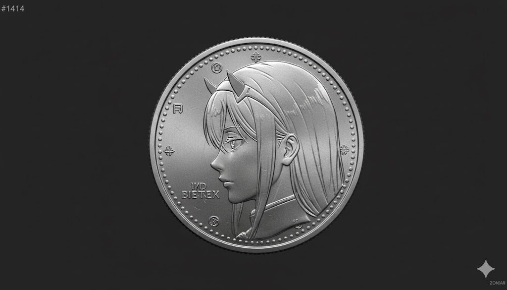

## 一枚精致的人物金属硬币

- ID: gpt4o-375-zh-2
- Slug: prompt-375-zh-2
- 语言: zh
- 来源: [来源链接](https://x.com/eyishazyer/status/1982402126845247707)
- 样例图路径: images/part3/375.jpeg

### 提示词

```text
一枚精致的金属硬币，图像中人物的面部特征（请勿更改上传照片中人物的面部特征。保持人物面部与参考图像 100% 准确。保持附加人物的原始面部特征不变且逼真）采用侧面浮雕，并采用逼真的雕刻纹理和精细的浮雕细节。硬币表面呈现光反射、划痕和金属光泽。在边缘处添加细微的铭文或符号，以模拟真实的铸币。硬币以深色、极简的背景为中心，以突出硬币的纹理和真实感
```

### 样例图


## Create a black and white high-fashion editorial portrait

- ID: gpt4o-373-en-1
- Slug: prompt-373-en-1
- 语言: en
- 来源: [来源链接](https://x.com/eyishazyer/status/1982402114413596850)
- 样例图路径: images/part3/373.jpeg

### 提示词

```text
Create a black and white high-fashion editorial portrait of me, keeping my real face exactly as in the reference photo (no edits, same features, no retouching). I am wearing a loose white blouse. My pose is bold and expressive, with one arm raised to hold my hair up, partially covering my face. My gaze is intense and directed at the camera, creating a strong and enigmatic aura. The background is a plain minimalist wall with sharp natural daylight casting defined shadows, adding depth and contrast.
Lighting is harsh and high-contrast, highlighting my facial contours, sharp cheekbones, and the texture of the hair and fabric. The style should feel raw, dramatic, and artistic.
The overall image is high-fashion editorial in monochrome, cinematic, and striking.
```

### 样例图


## 身穿一件宽松的白色衬衫肖像照

- ID: gpt4o-373-zh-2
- Slug: prompt-373-zh-2
- 语言: zh
- 来源: [来源链接](https://x.com/eyishazyer/status/1982402114413596850)
- 样例图路径: images/part3/373.jpeg

### 提示词

```text
为我创作一幅黑白高级时尚编辑肖像，保留我的真实面容，与参考照片完全一致（未进行任何编辑，五官相同，未进行任何修饰）。我身穿一件宽松的白色衬衫。我的姿势大胆而富有表现力，一只手抬起，将头发拢起，遮住了部分脸部。我的目光专注地直视镜头，营造出一种强烈而神秘的氛围。背景是一面简洁的墙面，明亮的自然光投射出清晰的阴影，增添了画面的深度和对比度。
光线强烈，对比度高，凸显了我的面部轮廓、棱角分明的颧骨，以及头发和布料的质感。风格应该给人一种原始、戏剧化、艺术感十足的感觉。
整体形象是单色的、电影化的、引人注目的高级时尚社论。
```

### 样例图


## { "prompt_title": "Hyperrealistic Gothic Bunny Studio Po

- ID: gpt4o-370-en-1
- Slug: prompt-370-en-1
- 语言: en
- 来源: [来源链接](https://x.com/IqraSaifiii/status/1982469385156489563)
- 样例图路径: images/part3/370.jpeg

### 提示词

```text
{
"prompt_title": "Hyperrealistic Gothic Bunny Studio Portrait",
"image_description": "An ultra-photorealistic, high-resolution studio portrait of a female subject in a gothic-inspired bunny costume, featuring intricate lace ears, a structured corset, and delicate hosiery. The subject is posed on the floor, exuding an alluring and sophisticated aura under precise studio lighting.",
"subject": {
"gender": "female",
"appearance": "Young adult with a flawless, luminous complexion. **Extreme micro-detail rendering on skin, showing subtle pores, fine vellus hairs, accurate light interaction (sub-surface scattering), and realistic skin texture.**",
"facial_features": "Smooth, clear skin. Her eyes are large, dark, and captivating, looking directly into the camera with a **confident and slightly seductive expression**. Lips are full, with a matte red or deep berry lipstick that shows micro-creases. Defined eyebrows and subtle contouring.",
"hair_style": "Long, flowing, wavy black hair, cascading over her shoulders and back. **Hair must show individual strands, realistic volume, high-gloss reflections, and subtle flyaways.**",
"makeup": "Dramatic and precise. Sharp, winged black eyeliner, full, dark eyelashes (possibly individual lash extensions), subtle glitter or shimmer on eyelids. Contoured cheeks. Flawless foundation and blush.",
"attire": {
"headwear": "Intricate **black lace bunny ears headband**. The lace should have visible patterns, delicate wire structure, and possibly small faux floral or ribbon accents. Realistic light interaction with the lace.",
"neck_accessories": "A simple, fitted black velvet or leather choker necklace.",
"main_outfit": "A highly detailed **black strapless corset dress or top and skirt ensemble**. The corset should be structured, showing **visible boning and lacing details** (possibly satin or leather laces). Fabric should be a mix of matte black leather/faux leather and textured, ruffled black tulle or chiffon for the skirt. **Emphasis on realistic fabric folds, textures, and subtle sheen.**",
"hosiery": "Sheer black thigh-high stockings with a delicate lace top band, clearly visible on her upper thigh. **Stockings must show realistic transparency and fabric stretch over skin.**",
"footwear": "Black pointed-toe high heels with ankle straps. The material should be a realistic matte or patent leather, showing accurate reflections and shoe construction."
}
},
"pose": {
"description": "The subject is kneeling on a flat, light-colored studio floor, leaning slightly forward. Her left hand is placed on the floor beside her left knee, fingers slightly spread. Her right arm is gently resting on her right thigh. Her body is slightly twisted, creating an alluring silhouette. **Exact replication of the confident and poised pose.**",
"camera_angle": "Medium shot, eye-level angle, slightly looking down at the subject. The camera is positioned to capture her full body from the mid-thigh up, with enough space around her to establish the studio environment.",
"composition": "Centered composition, vertical orientation. The subject fills approximately 70-80% of the frame, with subtle negative space around her. **Sharp focus on the subject, with a very shallow depth of field creating a soft bokeh in the background.**"
},
"setting": {
"location": "Professional indoor photo studio.",
"background_elements": "Seamless, plain light gray or off-white backdrop, extending from the floor to the wall, creating a clean, infinite background. **Subtle, soft gradient in the background due to lighting falloff.**"
},
"lighting_and_atmosphere": {
"key_light_source": "Softbox or parabolic diffuser from the front-left, creating soft, even illumination with subtle directional shadows to define contours.",
"fill_light": "Subtle fill light from the front-right to reduce harsh shadows on the right side of her face and body.",
"back_light": "A subtle hair light or rim light from the rear-right to create separation from the background and add definition to her hair and shoulders.",
"highlights_shadows": "Soft, creamy highlights on skin, hair, and corset material. Deep but soft shadows defining facial structure and body contours. **Accurate light falloff and realistic specular reflections on materials.**",
"photographic_realism": "Extreme micro-detail, sub-surface scattering on skin, realistic fabric textures (lace, leather, tulle), **cinematic studio lighting**, crisp focus on eyes, perfect white balance, neutral color grading, **ultra-realistic material rendering (PBR - Physically Based Rendering).**"
},
"style_and_camera": {
"photographic_style": "High-fashion portraiture, hyperrealistic studio photography, fine art glamour.",
"camera_type": "High-end full-frame mirrorless camera (e.g., Sony A1, Canon R5) with a fast prime lens (e.g., 50mm f/1.2 or 85mm f/1.4).",
"camera_values": "ISO 100, f/1.8, 1/160 sec. **These values contribute to shallow depth of field, sharp detail, and clean image quality.**",
"resolution_quality": "8K resolution, ultra-photorealistic, extreme detail on all elements. **Masterpiece quality render, production quality image.**"
},
"negative_prompt_suggestions": [
"blurry", "low resolution", "deformed", "harsh lighting", "flat background", "bad anatomy",
"cartoon", "illustration", "painting", "text", "watermark", "oversaturated", "poor composition",
"unrealistic skin", "plastic texture", "missing details"
]
}
```

### 样例图


## 超现实主义哥特式兔子工作室肖像

- ID: gpt4o-370-zh-2
- Slug: prompt-370-zh-2
- 语言: zh
- 来源: [来源链接](https://x.com/IqraSaifiii/status/1982469385156489563)
- 样例图路径: images/part3/370.jpeg

### 提示词

```text
{
"prompt_title": "超现实主义哥特式兔子工作室肖像",
"image_description": "这幅超逼真、高分辨率的工作室肖像画描绘了一位身着哥特式兔子服装的女性，服装配有精致的蕾丝耳朵、结构化的紧身胸衣和精致的袜子。模特躺在地板上，在精准的工作室灯光下散发着迷人而精致的气息。",
“主题”： {
"性别": "女",
"appearance": "拥有完美无瑕、明亮肤色的年轻人。 **皮肤上极其细微的细节渲染，展现出细微的毛孔、细小的毳毛、准确的光线相互作用（次表面散射）和逼真的皮肤纹理。 ** ",
"facial_features": "光滑、洁净的皮肤。她的眼睛又大又黑，魅力十足，直视镜头，眼神自信而略带诱惑** 。 **.嘴唇丰满，涂着哑光红色或深莓色唇膏，露出细微的皱纹。眉毛清晰，轮廓细腻。",
"hair_style": "飘逸的黑色长发，波浪状披散在肩部和背部。 **头发必须展现出独立的发丝、真实的蓬松度、高光泽的反光和微妙的飞散。 ** ",
"makeup": "妆容精致而又充满戏剧感。锐利的黑色眼线，浓密的深色睫毛（可能是单独嫁接的），眼睑上点缀着淡淡的闪粉或珠光。轮廓分明的脸颊。完美的粉底和腮红。",
“服装”：{
"headwear": "精致的**黑色蕾丝兔耳头带**.蕾丝应具有明显的图案、精致的金属丝结构，以及可能的小型仿花或丝带装饰。与蕾丝的逼真灯光互动。",
"neck_accessories": "一条简单、合身的黑色天鹅绒或皮革颈链。",
"main_outfit": "一件细节丰富的**黑色露肩紧身连衣裙或上衣和裙子套装**.紧身胸衣应结构清晰，露出**明显的骨和系带细节** (可能需要缎子或皮革鞋带。裙子面料应为哑光黑色皮革/人造皮革和纹理荷叶边黑色薄纱或雪纺的混合面料。 **强调逼真的面料褶皱、纹理和微妙的光泽。 ** ",
"hosiery": "透明黑色过膝长袜，带有精致的蕾丝边，在大腿上清晰可见。 **长袜必须具有逼真的透明度，并且织物在皮肤上具有弹性。 ** ",
“footwear”：“黑色尖头高跟鞋，带踝带。材质应为逼真的哑光皮革或漆皮，展现准确的反射和鞋子结构。”
}
}，
“姿势”：{
"description": "拍摄对象跪在工作室平坦的浅色地板上，身体微微前倾。她的左手放在左膝旁的地板上，手指微微张开。她的右臂轻轻地放在右大腿上。她的身体微微扭动，勾勒出迷人的轮廓。 **精准地复制了她自信而泰然的姿势。 ** ",
"camera_angle": "中景镜头，视线水平角度，略微向下看拍摄对象。摄像机的位置可以捕捉到她从大腿中部以上的全身，周围有足够的空间来营造工作室氛围。",
"composition": "居中构图，垂直方向。主体占据了画面的大约 70-80%，周围留有微妙的负空间。 **主体清晰对焦，景深很浅，在背景中营造出柔和的散景效果。 ** "
}，
“环境”： {
"location": "专业室内摄影工作室。",
"background_elements": "无缝、纯浅灰色或灰白色背景，从地板延伸到墙壁，营造出干净、无限的背景。 **由于光线衰减，背景中出现微妙、柔和的渐变。 ** "
}，
“照明和氛围”：{
"key_light_source": "从左前方放置柔光箱或抛物面漫射器，创造柔和、均匀的照明，并带有微妙的定向阴影来定义轮廓。",
"fill_light": "来自右前方的微妙补光，以减少她脸部和身体右侧的刺眼阴影。",
"back_light": "从右后方照射的微妙的头发光或边缘光，与背景分离，并突出她的头发和肩膀。",
"highlights_shadows": "皮肤、头发和紧身胸衣材质上呈现柔和、奶油般的高光。深邃而柔和的阴影勾勒出面部结构和身体轮廓。 **材质上呈现精准的光线衰减和逼真的镜面反射。 ** ",
"photographic_realism": "极其精细的微细节、皮肤表面次表面散射、逼真的织物纹理（蕾丝、皮革、薄纱）、 **电影工作室灯光** 、清晰的眼睛聚焦、完美的白平衡、中性色彩分级、 **超逼真的材质渲染（PBR - 基于物理的渲染）。 ** "
}，
“style_and_camera”：{
"photographic_style": "高级时尚肖像画、超现实主义工作室摄影、艺术魅力。",
"camera_type": "高端全画幅无反光镜相机（例如索尼 A1、佳能 R5）搭配快速定焦镜头（例如 50mm f/1.2 或 85mm f/1.4）。",
"camera_values": "ISO 100、f/1.8、1/160 秒。 **这些值有助于获得浅景深、清晰的细节和干净的图像质量。 ** ",
"resolution_quality": "8K 分辨率，超逼真，所有元素细节丰富。 **杰作品质渲染，产品品质图像。 ** "
}，
"negative_prompt_suggestions": [
“模糊”、“分辨率低”、“变形”、“光线刺眼”、“背景平坦”、“结构不良”
“卡通”、“插图”、“绘画”、“文字”、“水印”、“过饱和”、“构图不佳”
“皮肤不真实”、“塑料质感”、“缺少细节”
]
}
```

### 样例图


## 一张富有电影感的年轻女子侧脸肖像

- ID: gpt4o-366-zh
- Slug: prompt-366-zh
- 语言: zh
- 来源: [来源链接](https://x.com/hellokaton/status/1980121865248297389)
- 样例图路径: images/part3/366.jpeg

### 提示词

```text
一张富有电影感的年轻女子侧脸肖像，她仰着头，闭着眼睛，沐浴在戏剧性的光线中。
她站在深蓝色的背景前，穿着一件黑色西装外套。一束暖色聚光灯从右上角照下，在她的脸部和颈部投下橙色的光晕，在冷蓝色的阴影和温暖的高光之间形成了强烈的对比。
整个构图强调情绪和氛围，拥有干净的影棚灯光、柔和的渐变和极简主义的氛围。图像应具有艺术感、现代感和强烈的视觉冲击力，类似于高端杂志的编辑摄影风格。
相机角度： 侧面拍摄，微仰角
光线： 戏剧性的影棚布光，强对比度，蓝色背光 + 暖色聚光灯
镜头： 85毫米人像镜头，浅景深
氛围： 情绪化，电影感，极简主义
```

### 样例图

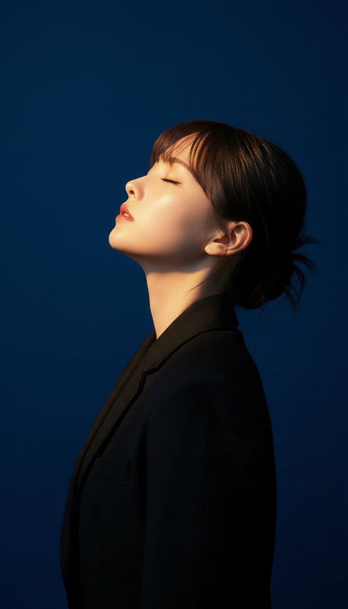

## Ultra-cinematic shot of a confident, stylish woman in a 

- ID: gpt4o-360-en-1
- Slug: prompt-360-en-1
- 语言: en
- 来源: [来源链接](https://x.com/SimplyAnnisa/status/1980804390694056368)
- 样例图路径: images/part3/360.jpeg

### 提示词

```text
Ultra-cinematic shot of a confident, stylish woman in a sleek, dark suit blazer and combat boots, standing with a massive brown bear slightly behind her, with her hand resting on the bear. It's clear that the bear is her protector and loyal, trained companion. Ultra-detailed photo in Russian style. Dramatic, directed lighting, minimal environmental immersion, solid red background. The image exudes boldness, strength, and a feeling of high tension.
```

### 样例图

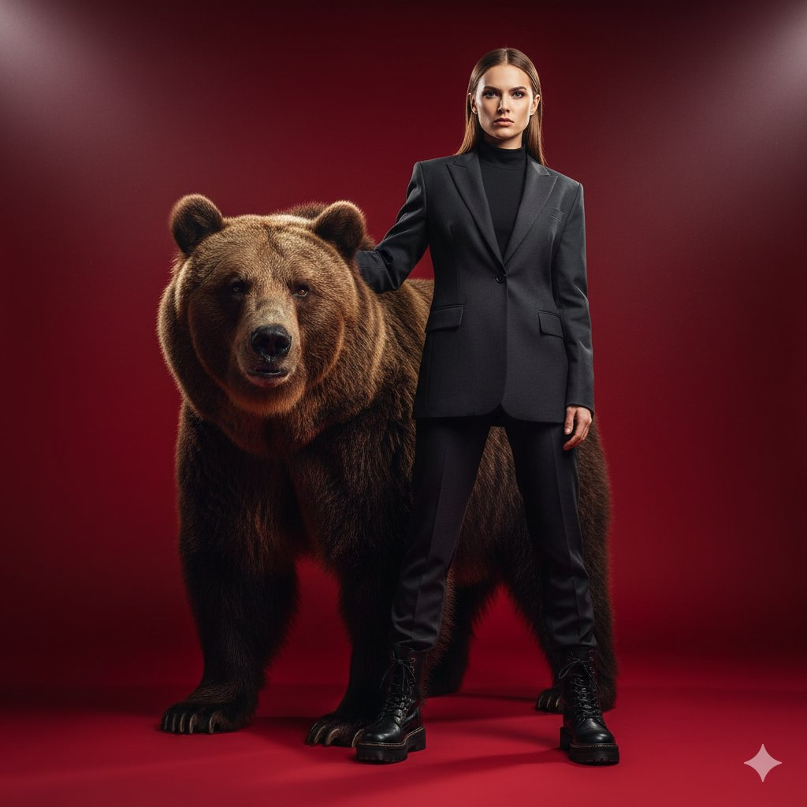

## 时尚女性与熊合影

- ID: gpt4o-360-zh-2
- Slug: prompt-360-zh-2
- 语言: zh
- 来源: [来源链接](https://x.com/SimplyAnnisa/status/1980804390694056368)
- 样例图路径: images/part3/360.jpeg

### 提示词

```text
这张极具电影感的照片展现了一位自信时尚的女子，身着时尚的深色西装外套和军靴，站在她身后一头巨大的棕熊旁，她的手放在熊身上。显然，这头熊是她的守护者，也是她训练有素的忠诚伙伴。这张细节丰富的照片展现了俄罗斯风格。戏剧性的定向灯光，极简的环境沉浸感，以及纯红色的背景。这张照片展现了大胆、力量和高度紧张的氛围。
```

### 样例图


## { "scene": { "description": "Indoor mirror selfie in a c

- ID: gpt4o-358-en-1
- Slug: prompt-358-en-1
- 语言: en
- 来源: [来源链接](https://x.com/IamEmily2050/status/1981124366411895079)
- 样例图路径: images/part3/358.jpeg

### 提示词

```text
{
  "scene": {
    "description": "Indoor mirror selfie in a contemporary bedroom or dressing area.",
    "lighting": "Soft, warm ambient interior lighting, flattering and even.",
    "environment": "Neutral background, slightly blurred, suggesting closet doors or plain walls."
  },
  "subject": {
    "demographics": {
      "ethnicity": "Korean (East Asian)",
      "apparent_age": "20-23",
      "build": "Very slender, 'S-line' figure with a notably tiny waist ('ant waist') and defined, toned abs."
    },
    "facial_aesthetics": {
      "style_keywords": ["Ulzzang (얼짱) aesthetic", "Casual beauty", "Doll-like features", "Youthful and confident"],
      "face_shape": "Small face with a coveted V-line jaw.",
      "eyes": "Large, bright 'Doe eyes'. Prominent Aegyo-sal. Soft, natural eyeliner.",
      "skin": "Flawless 'Glass skin', pale complexion, dewy finish.",
      "lips": "Plump cherry lips, soft pink gradient tint.",
      "hair": {
        "color": "Warm medium brown",
        "style": "Long, gentle waves",
        "bangs": "Airy, 'see-through' bangs (Korean style) framing the forehead."
      }
    },
    "pose": {
      "type": "Standing mirror selfie.",
      "action": "Subject is confidently lifting the hem of her sweater with both hands to expose her toned midriff.",
      "expression": "Soft, pleasant expression, subtle smile, eyes focused on the phone screen.",
      "framing": "Medium shot (hips to head)."
    },
    "wardrobe": {
      "top": {
        "garment": "Cropped cable-knit sweater",
        "color": "Cream / Ivory white",
        "details": "Distinctive hybrid design with sheer, voluminous organza ruffles on the sleeves and cuffs."
      },
      "bottom": {
        "garment": "Blue jeans",
        "fit": "Low-rise, relaxed fit.",
        "details": "Light-to-medium wash denim, worn unbuttoned and slightly pulled down at the hips."
      }
    },
    "accessories": {
      "phone": "Dark gray smartphone held in the hand, rear camera visible in the mirror."
    }
  },
  "camera_technical": {
    "device": "Smartphone rear camera via mirror",
    "look": "Clean, high-quality mobile photography, vertical orientation (3:4).",
    "focus": "Sharp focus on the subject's face and torso."
  }
}
```

### 样例图


## 卧室镜子自拍

- ID: gpt4o-358-zh-2
- Slug: prompt-358-zh-2
- 语言: zh
- 来源: [来源链接](https://x.com/IamEmily2050/status/1981124366411895079)
- 样例图路径: images/part3/358.jpeg

### 提示词

```text
{
“场景”： {
"description": "在现代卧室或更衣区进行室内镜子自拍。",
"lighting": "柔和、温暖的室内环境照明，令人赏心悦目且均匀。",
"environment": "中性背景，略微模糊，类似于壁橱门或普通墙壁。"
}，
“主题”： {
“人口统计”：{
"ethnicity": "韩国人（东亚）",
"apparent_age": "20-23",
“身材”：非常苗条，‘S 型’身材，腰部明显纤细（“蚂蚁腰”），腹肌清晰紧实。
}，
“面部美学”：{
"style_keywords": ["Ulzzang (얼짱) 审美", "休闲美", "洋娃娃般的五官", "年轻自信"],
"face_shape": "小脸，拥有令人垂涎的 V 型下巴。",
"eyes": "大而明亮的“小鹿眼”。突出的斜眼妆。柔和自然的眼线。",
"skin": "完美无瑕的‘玻璃肌肤’，白皙的肤色，水润的妆容。",
"lips": "丰满的樱桃唇，柔和的粉色渐变色调。",
“头发”： {
"color": "暖中棕色",
"style": "长而柔和的波浪",
"bangs": "飘逸的‘透视’刘海（韩式）修饰额头。"
}
}，
“姿势”：{
"type": "站立镜子自拍。",
"action": "对象自信地用双手撩起毛衣下摆，露出紧致的腹部。",
"expression": "柔和、愉快的表情，淡淡的微笑，眼睛专注于手机屏幕。",
"framing": "中景（臀部到头部）。"
}，
“衣柜”： {
“顶部”： {
"garment": "短款绞花针织毛衣",
"color": "奶油色/象牙白色",
“详细信息”：“独特的混合设计，袖子和袖口上有透明、蓬松的欧根纱褶边。”
}，
“底部”： {
"garment": "蓝色牛仔裤",
"fit": "低腰，宽松版型。",
“details”：“轻度至中度水洗牛仔布，未扣纽扣，臀部略微拉低。”
}
}，
“配件”： {
“手机”：“手中拿着深灰色的智能手机，镜子中可以看到后置摄像头。”
}
}，
“相机技术”：{
"device": "通过镜子的智能手机后置摄像头",
"look": "清晰、高品质的手机摄影，垂直方向（3:4）。",
"focus": "清晰地聚焦拍摄对象的脸部和躯干。"
}
}
```

### 样例图


## A captivating black and white close-up portrait of a bea

- ID: gpt4o-357-en-1
- Slug: prompt-357-en-1
- 语言: en
- 来源: [来源链接](https://x.com/MANISH1027512/status/1980278681927877032)
- 样例图路径: images/part3/357.jpeg

### 提示词

```text
A captivating black and white close-up portrait of a beautiful young Asian woman with flawless skin, short bob haircut featuring straight blunt bangs framing her forehead, eyes gently closed with long lashes, subtle pouty lips, serene and introspective expression, wearing a form-fitting deep V-neck black ribbed sweater that accentuates her, a delicate thin necklace with a small pendant, dramatic side lighting from the left creating strong shadows and highlights on her face, neck, and shoulders, high contrast chiaroscuro style, minimalist studio background with soft gradient from light to dark, photorealistic, vintage film grain effect, high detail, emotional and mysterious atmosphere.
```

### 样例图

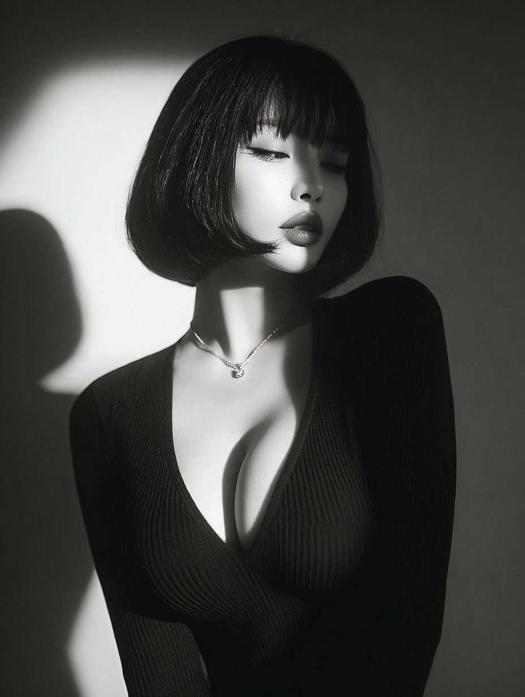

## 黑白风格肖像照

- ID: gpt4o-357-zh-2
- Slug: prompt-357-zh-2
- 语言: zh
- 来源: [来源链接](https://x.com/MANISH1027512/status/1980278681927877032)
- 样例图路径: images/part3/357.jpeg

### 提示词

```text
一张引人入胜的黑白特写肖像，展现一位美丽的年轻亚洲女性，拥有无瑕的肌肤和齐颈短发，直刘海整齐地框住前额。她双眼轻闭，睫毛纤长，嘴唇微噘，表情宁静而内省。她身穿一件凸显身材的深V领黑色罗纹毛衣，佩戴一条带有小吊坠的精致细项链。戏剧性的侧光从左侧打来，在她脸部、颈部和肩部营造出强烈的阴影与高光，呈现出高对比度的明暗对照画风。背景是简约的摄影棚，带有从明到暗的柔和渐变。画面具有照片级的真实感和复古胶片颗粒效果，细节丰富，营造出一种感性而神秘的氛围。
```

### 样例图


## a woman standing confidently in a minimalist studio, sho

- ID: gpt4o-356-en-1
- Slug: prompt-356-en-1
- 语言: en
- 来源: [来源链接](https://x.com/MANISH1027512/status/1980858137788797269)
- 样例图路径: images/part3/356.jpeg

### 提示词

```text
a woman standing confidently in a minimalist studio, shot from a slightly low angle, half-body portrait, her head tilted slightly down with a calm and enigmatic expression, middle-parted braided pigtails with a few loose strands falling over her face, subtle wet hair texture, wearing a tight black sleeveless dress and black leather gloves, holding a leather belt loosely in front of her body — dramatic single key light from upper right, high contrast, black and white tones, strong rim light accentuating her curves, plain textured wall background, cinematic noir atmosphere, fine art fashion photography, inspired by Helmut Newton and Peter Coulson, shallow depth of field, smooth gradients, elegant and powerful mood
```

### 样例图


## 黑白风格肖像照

- ID: gpt4o-356-zh-2
- Slug: prompt-356-zh-2
- 语言: zh
- 来源: [来源链接](https://x.com/MANISH1027512/status/1980858137788797269)
- 样例图路径: images/part3/356.jpeg

### 提示词

```text
一位女士自信地站立在极简主义的摄影棚中，从略低的视角拍摄，半身肖像。她的头微微向下倾斜，表情平静而神秘。中分编织的双马尾辫，几缕发丝随意地落在脸庞上，头发带有微妙的湿润质感。她穿着紧身的黑色无袖连衣裙和黑色皮手套，双手松散地在身体前方握着一条皮带。画面采用戏剧性的单一主光源从右上角打下，高对比度，黑白影调，强烈的轮廓光勾勒出她的身体曲线。背景是纯色的纹理墙壁，营造出电影般的黑色电影氛围，如同艺术时尚摄影作品。灵感来源于赫尔穆特·牛顿和彼得·库尔森，景深较浅，光影过渡平滑，整体情绪优雅而充满力量。
```

### 样例图


## Ultra-detailed, photorealistic portrait of a beautiful w

- ID: gpt4o-354-en-1
- Slug: prompt-354-en-1
- 语言: en
- 来源: [来源链接](https://x.com/cnyzgkc/status/1980469269134733415)
- 样例图路径: images/part3/354.jpeg

### 提示词

```text
Ultra-detailed, photorealistic portrait of a beautiful woman, high fashion editorial, deep white plunging V-neck lace sequined evening gown, elegant low bun updo, soft studio lighting, light grey background, dramatic shadowplay, hyperrealistic, 8K
```

### 样例图


## 超精细逼真的美丽女人肖像

- ID: gpt4o-354-zh-2
- Slug: prompt-354-zh-2
- 语言: zh
- 来源: [来源链接](https://x.com/cnyzgkc/status/1980469269134733415)
- 样例图路径: images/part3/354.jpeg

### 提示词

```text
超精细、逼真的美丽女人肖像，高级时装社论，深白色 V 领蕾丝亮片晚礼服，优雅的低发髻，柔和的工作室灯光，浅灰色背景，戏剧性的光影，超现实主义，8K
```

### 样例图


## Create a hyper-realistic editorial portrait of a person,

- ID: gpt4o-347-en-1
- Slug: prompt-347-en-1
- 语言: en
- 来源: [来源链接](https://x.com/songguoxiansen/status/1972311003049415030)
- 样例图路径: images/part3/347.jpeg

### 提示词

```text
Create a hyper-realistic editorial portrait of a person, generated from the provided image (same face 100%, same hairstyle, expression preserved). The subject stands confidently on a reflective glossy floor wearing a coordinated bright yellow and crimson outfit (hooded jacket or sweatshirt and tailored joggers) with lightning bolt-inspired linework and subtle embroidered electric motifs running along sleeves, chest and pant seams. Matching crimson and yellow sneakers complete the look. Beside the subject stands a large Pikachu-like creature, scaled to be equal to or taller than the person, with realistic textured fur and a vibrant palette of electric yellows and deep crimson accents that echo the clothing. Background is a moody electric yellow to deep crimson gradient that enhances the vibrant palette; both subject and creature are clearly reflected on the floor. Lighting uses dramatic warm key light and sculpting rim light to emphasize skin, fur and fabric detail, cinematic shallow depth of field, slight film grain for editorial grit, photoreal creature integration, ultra-detailed 8K quality.
```

### 样例图


## 人物和宝可梦

- ID: gpt4o-347-zh-2
- Slug: prompt-347-zh-2
- 语言: zh
- 来源: [来源链接](https://x.com/songguoxiansen/status/1972311003049415030)
- 样例图路径: images/part3/347.jpeg

### 提示词

```text
创造一张超现实的编辑肖像，人物形象基于提供的图像（面部100%相同，发型和表情保持不变）。主体自信地站立在反光的亮面地板上，身穿一套协调的亮黄色和深红色服装（连帽夹克或运动衫和修身慢跑裤），服装上饰有闪电状的线条设计和沿袖子、胸部和裤缝延伸的精致刺绣电气图案。搭配的深红色和黄色运动鞋完善了整体造型。主体旁边站立着一只大型皮卡丘状生物，其大小与人物相等或更高，拥有逼真的毛发纹理和鲜艳的电黄色及深红色点缀，与服装相呼应。背景是 moody 的电黄色到深红色的渐变，以增强鲜明的调色。主体和生物都清晰地反映在地面上。灯光采用戏剧性的暖色主光和造型轮廓光，以突出皮肤、毛发和织物的细节，电影般的浅景深，略带胶片颗粒以增加编辑质感，逼真的生物融合，超细节的8K画质。
```

### 样例图


## Hyper-realistic editorial portrait of a person, generate

- ID: gpt4o-346-en-1
- Slug: prompt-346-en-1
- 语言: en
- 来源: [来源链接](https://x.com/songguoxiansen/status/1972307026714972370)
- 样例图路径: images/part3/346.jpeg

### 提示词

```text
Hyper-realistic editorial portrait of a person, generated from the provided image (same face 100%, same hairstyle, expression preserved). The subject stands confidently on a reflective glossy floor wearing a coordinated deep purple and shadowy black outfit (hooded jacket or sweatshirt and tailored joggers) with ghostly wisp-inspired linework and subtle embroidered mischievous smile motifs running along sleeves, chest and pant seams. Matching crimson red and deep purple sneakers complete the look. Beside the subject stands a large Gengar, scaled to be equal to or taller than the person, with a realistic smooth, almost ethereal texture, and a vibrant palette of deep purples with glowing crimson red eyes that echo the clothing. Background is a moody deep purple to shadowy black gradient that enhances the vibrant palette; both subject and creature are clearly reflected on the floor. Lighting uses dramatic cool key light and sculpting rim light to emphasize skin, form and fabric detail, cinematic shallow depth of field, slight film grain for editorial grit, photoreal creature integration, ultra-detailed 8K quality.
```

### 样例图


## 人物和大型耿鬼

- ID: gpt4o-346-zh-2
- Slug: prompt-346-zh-2
- 语言: zh
- 来源: [来源链接](https://x.com/songguoxiansen/status/1972307026714972370)
- 样例图路径: images/part3/346.jpeg

### 提示词

```text
根据提供的图像生成的超现实主义人物肖像（100% 相同脸型、相同发型、保留表情）。人物自信地站在反光的光滑地板上，身着协调的深紫色和暗黑色服装（连帽夹克或运动衫和定制慢跑裤），带有幽灵般的缕缕线条，袖子、胸部和裤缝处绣有精致的顽皮笑脸图案。搭配的深红色和深紫色运动鞋使整个造型更加完美。人物旁边站着一只大型耿鬼，其比例与人物相等或更高，具有逼真的光滑、近乎空灵的纹理，以及鲜艳的深紫色调，闪闪发光的深红色眼睛与衣服相呼应。背景是从深紫色到暗黑色的渐变色，增强了鲜艳的色调；人物和生物都清晰地倒映在地板上。灯光采用戏剧性的冷色调主光和雕刻轮廓光来强调皮肤、形态和织物细节、电影浅景深、轻微的胶片颗粒感以增强编辑质感、逼真的生物融合以及超精细的 8K 质量。
```

### 样例图


## a young beautiful Japanese woman with porcelain skin, so

- ID: gpt4o-342-en-1
- Slug: prompt-342-en-1
- 语言: en
- 来源: [来源链接](https://x.com/cheerselflin/status/1979203307873931360)
- 样例图路径: images/part3/342.jpeg

### 提示词

```text
a young beautiful Japanese woman with porcelain skin, soft makeup and bright red lips, straight chestnut-brown hair neatly tied in a ponytail with straight bangs framing her face, wearing a fitted light-blue police uniform shirt with gold buttons and badge, a dark green flat ribbon tie knotted at the collar with two short tails hanging down like a gift bow, navy skirt, dark belt with brass buckle, white gloves, black shoes, sitting with her knees together and hands gently folded over a glass, calm and elegant posture, oxygen-fresh natural makeup look with translucent dewy base, barely-there eyeliner, soft straight brows, faint rosy blush on the cheeks, subtle inner-corner highlight that makes her eyes look bright and airy, lips a clean vivid red yet not glossy, her pose delicate and composed: seated on a narrow wooden bench in a cramped booth, ankles tucked slightly back, torso subtly leaning forward from the hips, forearms relaxed, gloved hands overlapping lightly above the small tumbler placed between her knees, chin slightly lowered while gazing directly at the camera, flanked by two older Japanese policemen in uniform on each side, the man on the left leaning inward from the doorway, cap slightly tilted, short-sleeve standard police shirt, one elbow resting on his knee with the hand hanging loosely, attentive and calm expression; the man on the right wearing a striped short-sleeve shirt with a dark tie and badge, cap set square with a gold band, arms firmly crossed over his chest, body angled toward the woman, a reserved, thoughtful look, inside a small dimly-lit bar filled with vintage Japanese posters, old bottles, narrow wooden walls, cluttered shelves, detailed physical environment: shot from the doorway so the worn wooden jambs create a frame-within-frame; scuffed varnished beams, handwritten Japanese slips and price tags pinned among utensils, cords and trinkets hanging overhead, glassware and liquor bottles stacked tight on shallow shelves, a tiny aisle underfoot, faint reflections on lacquered wood, humid air; one or two bare incandescent bulbs casting a localized amber pool of light that fades rapidly into darkness, camera perspective and ratio: intimate eye-level viewpoint at close conversational distance (about 1-1.5 m), classic 35mm focal feel, vertical portrait framing with a 3:4 aspect, slight center-weighted composition emphasizing the trio in a tight booth, warm incandescent lighting with nostalgic amber tone, low saturation colors, fine 35mm film grain texture, slightly overexposed highlights, retro 1980s analog snapshot aesthetic, candid composition, shallow depth of field, cinematic color grading, in the style of Nobuyoshi Araki and Daido Moriyama street photography
```

### 样例图


## 一位坐地铁的女性

- ID: gpt4o-342-zh-2
- Slug: prompt-342-zh-2
- 语言: zh
- 来源: [来源链接](https://x.com/cheerselflin/status/1979203307873931360)
- 样例图路径: images/part3/342.jpeg

### 提示词

```text
一位年轻美丽的日本女性，有着瓷器般的肌肤、柔和的妆容和鲜红的嘴唇，栗色的直发扎成马尾辫，齐刘海修饰着她的脸型，身穿一件合身的浅蓝色警服衬衫，上面有金色的纽扣和徽章，一条深绿色的扁平丝带领带在领口处打结，两条短尾巴像礼物蝴蝶结一样垂下来，海军蓝裙子，深色腰带配黄铜扣，白手套，黑色鞋子，双膝并拢坐着，双手轻轻地交叉放在玻璃杯上，姿态平静而优雅，氧气清新的自然妆容搭配半透明的露珠底妆，几乎看不见的眼线，柔软的直眉，脸颊上淡淡的玫瑰色腮红，微妙的内眼角高光使她的眼睛看起来明亮而通透，嘴唇是干净的鲜红色，但不油腻，她的姿势精致而沉稳：坐在狭窄的卡座中的一张狭窄的木凳上，脚踝略微向后弯曲，躯干从臀部微微向前倾斜，前臂放松，戴着手套的双手轻轻地重叠在小玻璃杯放在两膝之间，下巴微微低垂，直视镜头，两侧各站着两名年纪稍长的穿制服的日本警察，左边的男子从门口探出身子，帽子微微倾斜，穿着短袖制式警服，一肘撑在膝盖上，手随意地垂着，表情专注而平静；右边的男子穿着条纹短袖衬衫，系着深色领带和警徽，帽子镶着金边，双臂紧紧地交叉在胸前，身体朝着女人倾斜，一副矜持、若有所思的样子，身处一间灯光昏暗的小酒吧里，里面摆满了老式的日本海报、旧酒瓶、狭窄的木墙、杂乱的架子，细致的物理环境：从门口拍摄，磨损的木门框形成了框中框；磨损的漆面横梁，手写的日文单据和价格标签夹在餐具之间，电线和小饰品悬挂在头顶，玻璃器皿和酒瓶紧紧地堆放在浅浅的架子上，脚下是一条小过道，漆木上反射着微弱的光线，空气潮湿；一两个裸露的白炽灯泡投射出局部琥珀色的光晕，迅速消失在黑暗中，相机视角和比例：近距离交谈（约 1-1.5 米）的亲密视线视角，经典的 35 毫米焦距感，3：4 宽高的垂直人像取景，轻微的中央重点构图强调了紧凑展位中的三人组，温暖的白炽灯光带有怀旧的琥珀色调，低饱和度色彩，细腻的 35 毫米胶片颗粒纹理，略微过度曝光的高光，复古的 1980 年代模拟快照美学，坦率的构图，浅景深，电影调色，荒木经惟和森山大道的街头摄影风格
```

### 样例图


## A blurry, high-grain snapshot taken in a Tokyo subway st

- ID: gpt4o-341-en-1
- Slug: prompt-341-en-1
- 语言: en
- 来源: [来源链接](https://x.com/cheerselflin/status/1979203277553307820)
- 样例图路径: images/part3/341.jpeg

### 提示词

```text
A blurry, high-grain snapshot taken in a Tokyo subway stairwell, charged with motion, humidity, and raw urban energy. The air feels thick and fluorescent, lit by overhead tube lights that cast a cold green-blue tint across the frame. The film grain, chromatic aberration, and lens distortion add a tactile sense of chaos — a fleeting instant suspended mid-run.

At the center, a young woman in a tied white shirt and short plaid skirt is caught mid-step, descending the stairs. Her movement blurs, skirt flaring slightly, hair swept by motion. The focus drifts between her and the background, giving the shot a dreamlike disorientation, as if seen through memory or adrenaline.

Her expression holds the entire frame together — eyes open, lips slightly parted, cheeks flushed, as if between alertness and vulnerability. There’s no posed awareness, only instinct — a moment stolen from time.

Around her, commuters blur into silhouettes, the hallway tight and echoing, the walls reflecting harsh fluorescent glare. The composition feels accidental yet perfect: tilted, urgent, intimate.

The atmosphere is electric and nostalgic, a mix of youth, motion, and fleeting emotion, like a fragment from a fever dream or an afterimage burned into film — not cinematic, but hyper-real, the kind of moment only disposable-camera photography captures: alive, imperfect, and painfully real.
```

### 样例图

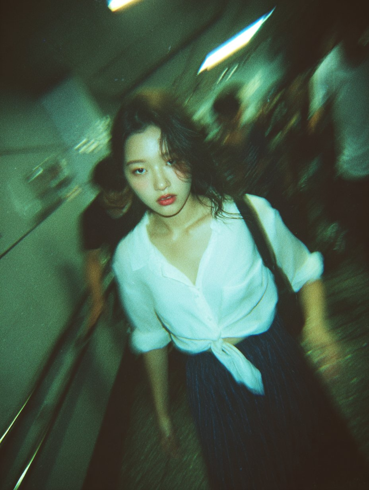

## 东京地铁楼梯间美女照

- ID: gpt4o-341-zh-2
- Slug: prompt-341-zh-2
- 语言: zh
- 来源: [来源链接](https://x.com/cheerselflin/status/1979203277553307820)
- 样例图路径: images/part3/341.jpeg

### 提示词

```text
这是一张模糊的高颗粒快照，拍摄于东京地铁楼梯间，充满了运动、潮湿和原始的城市能量。空气感觉浓重而荧光，头顶的筒灯在画面上投射出冰冷的蓝绿色调。胶片颗粒、色差和镜头畸变增添了一种触觉上的混乱感——仿佛瞬间静止在运行中。
照片中央，一位身着系带白衬衫和格子短裙的年轻女子正迈着轻快的步伐走下楼梯。她的动作模糊不清，裙摆微微扬起，头发随风飘动。焦点在她和背景之间游移，让这张照片呈现出一种如梦似幻的迷离感，仿佛透过记忆或肾上腺素的刺激而呈现。
她的表情与整个画面融为一体——双眼睁开，嘴唇微张，脸颊泛红，仿佛介于警觉与脆弱之间。没有故作姿态的警觉，只有本能——一个从时间中偷来的瞬间。
在她周围，通勤者的身影模糊不清，走廊狭窄而回声不断，墙壁反射着刺眼的荧光灯。这构图看似偶然，却又完美：倾斜、急促、亲密。
氛围充满活力和怀旧，混合着青春、运动和转瞬即逝的情感，就像发烧梦境中的片段或刻在胶片上的残像——不是电影般的，而是超现实的，只有一次性相机摄影才能捕捉到的那种瞬间：鲜活、不完美、痛苦的真实。
```

### 样例图


## A flash snapshot taken in a small, crowded Japanese izak

- ID: gpt4o-340-en-1
- Slug: prompt-340-en-1
- 语言: en
- 来源: [来源链接](https://x.com/cheerselflin/status/1979203220061982872)
- 样例图路径: images/part3/340.jpeg

### 提示词

```text
A flash snapshot taken in a small, crowded Japanese izakaya, filled with handwritten menus, old posters, and wooden textures. The lighting is from a direct on-camera flash, producing bright highlights, harsh shadows, and a slightly grainy texture that enhances the candid feeling.

The main subject is a young woman sitting on a wooden bar stool, turning her body slightly and looking back over her shoulder toward the camera. She wears a white button-up shirt and a short high-waisted checkered skirt, revealing her legs and adding to the youthful, casual tone of the scene.

Her face is softly lit by the flash — cheeks vividly blushed, red lips glossy, and eyes meeting the lens with a subtle, playful yet intimate expression. The smile is gentle but suggestive, carrying a slight sense of awareness and warmth. Her posture and gaze create a delicate tension between confidence and softness.

The background is dim and crowded with older patrons in dark clothes, contrasting with her bright presence. The composition is tight and spontaneous, typical of 90s Japanese disposable camera photography — high flash contrast, slight blur, and natural imperfection.

The overall mood is nostalgic, warm, and faintly ambiguous — capturing a moment that feels real, close, and emotionally charged, like a personal memory illuminated by flash rather than a staged portrait.
```

### 样例图


## 居酒屋里用闪光灯拍摄的美女照片

- ID: gpt4o-340-zh-2
- Slug: prompt-340-zh-2
- 语言: zh
- 来源: [来源链接](https://x.com/cheerselflin/status/1979203220061982872)
- 样例图路径: images/part3/340.jpeg

### 提示词

```text
这是一张在狭小拥挤的日式居酒屋里用闪光灯拍摄的照片，屋里摆满了手写菜单、老海报和木质纹理。光线来自机顶闪光灯的直射，营造出明亮的高光、刺眼的阴影和略带颗粒感的纹理，增强了照片的自然感。
画面主体是一位年轻女子坐在酒吧木凳上，微微侧身，目光越过肩膀，望向镜头。她身穿白色纽扣衬衫和高腰格纹短裙，露出双腿，为画面增添了一抹青春随意的气息。
闪光灯柔和地照亮了她的脸庞——双颊绯红，红唇闪耀光泽，目光与镜头交汇，眼神微妙、俏皮却又充满亲密感。她的笑容温柔却又充满暗示，透着一丝警觉与温暖。她的姿态和目光在自信与柔和之间营造出一种微妙的张力。
背景昏暗，挤满了身着深色衣服的老年顾客，与她明亮的身影形成鲜明对比。构图紧凑自然，是90年代日本一次性相机摄影的典型特征——高闪光对比度、轻微的模糊和自然的瑕疵。
整体氛围怀旧、温暖，略带一丝暧昧——捕捉真实、亲近、充满情感的瞬间，就像闪光灯照亮的个人记忆，而不是摆拍的肖像。
```

### 样例图


## The image features a subject with long, dark hair, dress

- ID: gpt4o-339-en-1
- Slug: prompt-339-en-1
- 语言: en
- 来源: [来源链接](https://x.com/cheerselflin/status/1979203321262149903)
- 样例图路径: images/part3/339.jpeg

### 提示词

```text
The image features a subject with long, dark hair, dressed in a short-sleeved, cropped white top and a high-waisted, pleated blue mini skirt that ends well above mid-thigh, fitting snugly to accentuate the figure. The subject is captured in a slightly turned pose, leaning forward with one hand resting on a wall covered in a dense collage of overlapping posters, flyers, and advertisements in various colors such as red, yellow, blue, and white, with text in multiple languages, suggesting an urban or vintage environment. The wall appears worn, with visible creases and minor damage, adding to the nostalgic ambiance. The subject's facial expression, partially visible from a side angle, conveys a subtle mix of curiosity and playfulness. The lighting is dim with a warm tone, casting soft shadows that enhance the mood. The composition employs a low-angle perspective, drawing attention to the subject's lower body and the skirt's height, with a sharp focus on the subject against a slightly blurred background. The overall mood is provocative yet nostalgic, blending modern attire with a retro aesthetic. Technically, the image exhibits a deliberate soft-focus effect, contributing to a hazy, dreamlike quality that softens details and edges. Additionally, noticeable grain and noise texture are present, enhancing the vintage aesthetic and adding a tactile, gritty feel to the photograph. The resolution remains moderate, typical of digital photography, with a slightly desaturated color profile featuring a vintage filter effect. The aspect ratio is vertical, approximately 4:5, supporting the focused framing of the subject.
```

### 样例图

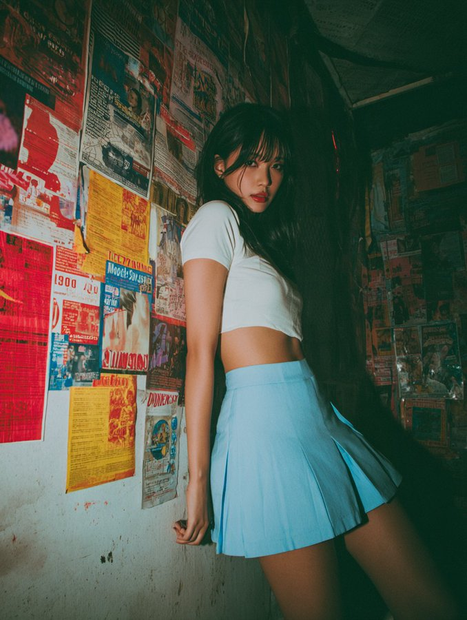

## 百褶迷你裙美女

- ID: gpt4o-339-zh-2
- Slug: prompt-339-zh-2
- 语言: zh
- 来源: [来源链接](https://x.com/cheerselflin/status/1979203321262149903)
- 样例图路径: images/part3/339.jpeg

### 提示词

```text
照片中的人物留着一头乌黑的长发，身穿白色短袖上衣和高腰蓝色百褶迷你裙，裙摆长及大腿中部，贴身剪裁，凸显身材。人物略微侧身，身体前倾，一只手扶在墙上，墙上贴满了红、黄、蓝、白等各种颜色的海报、传单和广告，并配有多种语言的文字，营造出一种都市或复古的氛围。墙壁显得有些破旧，有明显的折痕和轻微的损坏，更增添了怀旧的氛围。从侧面看，人物的面部表情部分可见，流露出好奇与俏皮的微妙交织。昏暗的灯光搭配温暖的色调，投射出柔和的阴影，增强了氛围。构图采用低角度透视，将注意力吸引到人物的下半身和裙子的高度，并在略微模糊的背景上清晰地聚焦于人物。整体氛围既挑逗又怀旧，将现代服饰与复古美学融为一体。从技术角度来看，这张照片展现出一种刻意的柔焦效果，营造出朦胧梦幻的质感，柔化了细节和边缘。此外，明显的颗粒感和噪点纹理增强了复古美感，为照片增添了质感和粗糙感。分辨率保持中等水平，符合数码摄影的典型特征，略微降低的色彩饱和度，呈现出复古滤镜效果。画面纵横比约为4:5，有利于主体的聚焦构图。
```

### 样例图


## a young beautiful sweet smiling Asian woman with soft br

- ID: gpt4o-337-en-1
- Slug: prompt-337-en-1
- 语言: en
- 来源: [来源链接](https://x.com/MANISH1027512/status/1978672690740310181)
- 样例图路径: images/part3/337.jpeg

### 提示词

```text
a young beautiful sweet smiling Asian woman with soft brown hair tied loosely in a low ponytail with gentle face-framing bangs, sitting sideways on a narrow wooden bar stool inside a tiny, crowded Japanese izakaya, turning back toward the camera with a gentle natural smile; wearing a white blouse and gray plaid high-waisted shorts; surrounded by middle-aged and elderly Japanese men in dark suits chatting quietly beside her; the bar interior is narrow and dimly lit, walls covered with old handwritten menus and vintage posters, cluttered shelves of bottles, ceramics, and small trinkets; soft warm tungsten lighting with slight haze, smoke lingering in the air, evoking the scent of grilled food and sake; authentic candid moment, intimate social atmosphere, nostalgic Showa-era Japanese nightlife vibe;cozy ambient tungsten lighting, low contrast, muted color palette with subtle green tint, shallow depth of field, film-like softness, slight haze, nostalgic 35mm analog photo, visible fine film grain, authentic Japanese retro bar atmosphere, candid portrait, in the style of Daido Moriyama, Takashi Homma, and Wong Kar Wai, Kodak Portra 400 film aesthetic --ar 3:4 --v 7
```

### 样例图


## 低马尾女孩在日式居酒屋

- ID: gpt4o-337-zh-2
- Slug: prompt-337-zh-2
- 语言: zh
- 来源: [来源链接](https://x.com/MANISH1027512/status/1978672690740310181)
- 样例图路径: images/part3/337.jpeg

### 提示词

```text
一位年轻美丽、笑容甜美的亚洲女性，一头柔软的棕色头发扎成低马尾，刘海柔和地修饰着脸型，她侧身坐在一间狭小拥挤的日式居酒屋里，坐在一张狭窄的木质吧台凳上，面带温柔自然的微笑；她身穿白色衬衫和灰色格子高腰短裤；她周围是穿着深色西装的中老年日本男子，他们在她旁边轻声聊天；酒吧内部狭窄而昏暗，墙上贴满了古老的手写菜单和复古海报，架子上杂乱地摆满了瓶子、陶瓷和小饰品；柔和温暖的钨丝灯略带薄雾，烟雾在空气中缭绕，散发着烧烤食物和清酒的香味；真实的坦率时刻，亲密的社交氛围，怀旧的昭和时代日本夜生活氛围；舒适的环境钨丝灯，低对比度，柔和的色调，微妙的绿色色调，浅景深，胶片般的柔软度，轻微的雾霾，怀旧的 35 毫米模拟照片，可见的细胶片颗粒，真实的日本复古酒吧氛围，坦率的肖像，森山大道、本间隆和王家卫的风格，柯达 Portra 400 胶片美学 --ar 3:4 --v 7
```

### 样例图


## a young beautiful Japanese woman with porcelain skin, so

- ID: gpt4o-335-en-1
- Slug: prompt-335-en-1
- 语言: en
- 来源: [来源链接](https://x.com/MANISH1027512/status/1979033662294241673)
- 样例图路径: images/part3/335.jpeg

### 提示词

```text
a young beautiful Japanese woman with porcelain skin, soft makeup and bright red lips, straight chestnut-brown hair neatly tied in a ponytail with straight bangs framing her face, wearing a fitted light-blue police uniform shirt with gold buttons and badge, a dark green flat ribbon tie knotted at the collar with two short tails hanging down like a gift bow, navy skirt, dark belt with brass buckle, white gloves, black shoes, 
sitting with her knees together and hands gently folded over a glass, calm and elegant posture, 
oxygen-fresh natural makeup look with translucent dewy base, barely-there eyeliner, soft straight brows, faint rosy blush on the cheeks, subtle inner-corner highlight that makes her eyes look bright and airy, lips a clean vivid red yet not glossy, 
her pose delicate and composed: seated on a narrow wooden bench in a cramped booth, ankles tucked slightly back, torso subtly leaning forward from the hips, forearms relaxed, gloved hands overlapping lightly above the small tumbler placed between her knees, chin slightly lowered while gazing directly at the camera, 
flanked by two older Japanese policemen in uniform on each side, 
the man on the left leaning inward from the doorway, cap slightly tilted, short-sleeve standard police shirt, one elbow resting on his knee with the hand hanging loosely, attentive and calm expression; 
the man on the right wearing a striped short-sleeve shirt with a dark tie and badge, cap set square with a gold band, arms firmly crossed over his chest, body angled toward the woman, a reserved, thoughtful look, 
inside a small dimly-lit bar filled with vintage Japanese posters, old bottles, narrow wooden walls, cluttered shelves, 
detailed physical environment: shot from the doorway so the worn wooden jambs create a frame-within-frame; scuffed varnished beams, handwritten Japanese slips and price tags pinned among utensils, cords and trinkets hanging overhead, glassware and liquor bottles stacked tight on shallow shelves, a tiny aisle underfoot, faint reflections on lacquered wood, humid air; one or two bare incandescent bulbs casting a localized amber pool of light that fades rapidly into darkness, 
camera perspective and ratio: intimate eye-level viewpoint at close conversational distance (about 1–1.5 m), classic 35mm focal feel, vertical portrait framing with a 3:4 aspect, slight center-weighted composition emphasizing the trio in a tight booth, 
warm incandescent lighting with nostalgic amber tone, low saturation colors, fine 35mm film grain texture, slightly overexposed highlights, retro 1980s analog snapshot aesthetic, candid composition, shallow depth of field, cinematic color grading, in the style of Nobuyoshi Araki and Daido Moriyama street photography --ar 3:4 --v 7
```

### 样例图


## 美丽的浅蓝色警服日本女子

- ID: gpt4o-335-zh-2
- Slug: prompt-335-zh-2
- 语言: zh
- 来源: [来源链接](https://x.com/MANISH1027512/status/1979033662294241673)
- 样例图路径: images/part3/335.jpeg

### 提示词

```text
一位年轻美丽的日本女子，有着瓷器般的肌肤、柔和的妆容和鲜红的嘴唇，栗色的直发扎成马尾辫，齐刘海修饰着她的脸型，身穿合身的浅蓝色警服衬衫，上面有金色的纽扣和徽章，深绿色的扁平丝带领带在领口处打结，两条短尾巴像礼物蝴蝶结一样垂下来，海军蓝裙子，深色腰带配黄铜扣，白手套，黑色鞋子，
她双膝并拢，双手轻轻地放在玻璃杯上，姿势平静而优雅，
氧气清新的自然妆容，透明水润的底妆，几乎看不见的眼线，柔软的直眉，脸颊上淡淡的玫瑰色腮红，微妙的内眼角高光使她的眼睛看起来明亮通风，嘴唇是干净鲜红但不油腻，
她的姿势精致而沉稳：坐在狭小隔间的一张窄木凳上，脚踝微微向后弯曲，躯干从臀部微微向前倾斜，前臂放松，戴着手套的双手轻轻重叠放在放在膝盖之间的小玻璃杯上方，下巴微微放低，直视镜头，
两侧各有两名身穿制服的年长日本警察，
左边的男人从门口探身向内，帽子微微倾斜，穿着短袖制式警服，一肘撑在膝盖上，手随意垂着，表情专注而平静；
右边的男人穿着条纹短袖衬衫，系着深色领带，戴着徽章，帽子是方形的，上面有一条金边，双臂紧紧地交叉在胸前，身体朝着女人倾斜，一副内敛、若有所思的样子，
在一个灯光昏暗的小酒吧里，摆满了复古的日本海报、旧瓶子、狭窄的木墙、杂乱的架子，
详细的物理环境：从门口拍摄，磨损的木质门框形成了一个画框；磨损的涂漆横梁、手写的日文单子​​和价格标签夹在餐具之间，电线和小饰品悬挂在头顶，玻璃器皿和酒瓶紧紧地堆放在浅浅的架子上，脚下是一条小过道，漆木上隐约的反光，潮湿的空气；一两个裸露的白炽灯泡投射出局部琥珀色的光晕，迅速消失在黑暗中，
相机视角和比例：近距离对话距离（约 1-1.5 米）的亲密视线视角，经典的 35 毫米焦距感，3：4 比例的垂直人像取景，轻微的中央重点构图，强调紧凑展位中的三人组，
温暖的白炽灯，怀旧的琥珀色调，低饱和度的色彩，细腻的 35 毫米胶片颗粒纹理，略微过度曝光的高光，复古的 1980 年代模拟快照美学，坦率的构图，浅景深，电影色彩分级，风格类似于荒木经惟和森山大道的街头摄影 -ar 3:4 --v 7
```

### 样例图


## { "style": "High-key studio portrait, direct flash aesth

- ID: gpt4o-333-en-1
- Slug: prompt-333-en-1
- 语言: en
- 来源: [来源链接](https://x.com/IamEmily2050/status/1975554358495654236)
- 样例图路径: images/part3/333.jpeg

### 提示词

```text
{
  "style": "High-key studio portrait, direct flash aesthetic, East Asian social media style (e.g., Ulzzang, Douyin), stylized beauty retouching.",
  "output": {
    "color_profile": "sRGB",
    "render_intent": "photo"
  },
  "subject": {
    "category": "human",
    "gender_presentation": "female",
    "ethnicity": "East Asian (e.g., Korean, Chinese)",
    "age_bracket": "young_adult",
    "body": {
      "build": "slim",
      "proportions": "natural human anatomy",
      "posture": "relaxed on sofa, seated casually",
      "pose": "seated, legs crossed and tucked close to body",
      "gesture": "Right hand raised, fingers loosely curled, back of fingers/knuckles gently supporting the chin and lower cheek.",
      "head_tilt_deg": 5
    },
    "face": {
      "expression": "Playful, alluring",
      "gaze": "right eye direct to camera",
      "eye_action": "winking with the left eye",
      "skin_tone": "Very pale porcelain (lightened aesthetic)",
      "makeup": "Stylized K-Beauty/Douyin look: flawless matte base, strong pink blush high on cheeks, pink gradient lips, defined brows, light eyeliner, emphasized Aegyo-sal",
      "features": "small beauty mark/mole under the left eye"
    },
    "hair": {
      "length": "long",
      "style": "messy high updo/bun with loose strands and curtain bangs",
      "color": "dark brown"
    },
    "wardrobe": {
      "top": "white fitted cropped camisole",
      "outerwear": "light gray zip hoodie, worn open and slightly slipping off both shoulders",
      "bottom": "white lounge shorts with drawstring",
      "footwear": "barefoot"
    }
  },
  "environment": {
    "location": "studio or minimalist interior",
    "set": "black leather sofa against a plain white or light gray wall",
    "props": "Silver laptop (Apple MacBook, logo visible) placed on the cushion to the subject's right (camera left)"
  },
  "lighting": {
    "key": {
      "source": "strobe/flash",
      "modifier": "Bare reflector or direct flash (hard source)",
      "position": "Near camera axis, slightly camera-right and above eye line",
      "effect": "Crisp, dark, well-defined cast shadows on the wall directly behind subject; strong specular highlights on skin and sofa leather."
    },
    "fill": {
      "type": "minimal/none"
    },
    "ambient": "suppressed",
    "white_balance_K": 5800
  },
  "camera": {
    "system": "Digital Camera",
    "sensor": "full-frame equivalent",
    "lens": {
      "type": "prime",
      "focal_length_mm": 50
    },
    "exposure": {
      "iso": 100,
      "aperture_f": 4.0,
      "metering": "Bright exposure, high-key aesthetic"
    },
    "focus": {
      "target": "near eye (right eye)",
      "depth_of_field": "moderate"
    },
    "framing": {
      "orientation": "vertical",
      "crop": "mid-thigh to head with room above hair",
      "angle": "eye-level",
      "composition": "subject centrally framed"
    }
  },
  "color_grade": {
    "look": "Bright, clean, slightly cool tone",
    "contrast": "High contrast",
    "saturation": "moderate, emphasized pinks"
  },
  "postprocess": {
    "noise_reduction": "high",
    "texture": "Highly smoothed skin, poreless appearance ('porcelain doll' or 'beauty filter' effect)",
    "sharpen": "selective on eyes/lashes",
    "blemish_control": "Complete removal of all blemishes and texture."
  },
  "quality_targets": [
    "accurate limb lengths and joint angles",
    "correct finger count and articulation",
    "realistic fabric tension and folds",
    "accurate winking expression"
  ],
  "negative_prompt": [
    "no altered or exaggerated body proportions",
    "no extra or fused fingers",
    "no realistic skin texture, pores, or blemishes",
    "no text or watermarks (excluding specified logos)",
    "no extreme wide-angle distortion",
    "no NSFW content",
    "no dark/moody lighting",
    "no warm tones"
  ]
}
```

### 样例图


## 女生坐沙发上

- ID: gpt4o-333-zh-2
- Slug: prompt-333-zh-2
- 语言: zh
- 来源: [来源链接](https://x.com/IamEmily2050/status/1975554358495654236)
- 样例图路径: images/part3/333.jpeg

### 提示词

```text
{
"style": "高调影棚人像，闪光灯直击美感，东亚社交媒体风格（例如Ulzzang、抖音），风格化美颜修图。",
“输出”： {
"color_profile": "sRGB",
"render_intent": "照片"
}，
“主题”： {
“类别”：“人类”，
"gender_presentation": "女性",
"ethnicity": "东亚人（例如韩国人、中国人）",
"age_bracket": "young_adult",
“身体”： {
"build": "slim",
"比例": "自然人体解剖学",
"posture": "放松地坐在沙发上，随意地坐着",
"pose": "坐着，双腿交叉，身体紧贴身体",
"gesture": "右手举起，手指松散地卷曲，手指背面/指关节轻轻支撑下巴和下脸颊。",
“头部倾斜度”：5
}，
“脸”： {
"expression": "俏皮、诱人",
"gaze": "右眼直视相机",
"eye_action": "用左眼眨眼",
"skin_tone": "非常苍白的瓷器（明亮的美学）",
"makeup": "风格化的韩妆/抖音妆容：完美哑光底妆，脸颊上浓重的粉色腮红，粉色渐变唇妆，清晰的眉毛，淡淡的眼线，强调的撒娇，
"features": "左眼下方有一颗小美人痣"
}，
“头发”： {
"length": "长",
"style": "凌乱的高髻/发髻，散落的发束和窗帘刘海",
“颜色”：“深棕色”
}，
“衣柜”： {
"top": "白色修身短款吊带背心",
“外套”：“浅灰色拉链连帽衫，敞开穿着，双肩略微滑落”，
"bottom": "白色抽绳休闲短裤",
“鞋类”：“赤脚”
}
}，
“环境”： {
"location": "工作室或简约室内",
"set": "黑色皮沙发搭配纯白色或浅灰色墙壁",
"props": "银色笔记本电脑（Apple MacBook，标志可见）放置在拍摄对象右侧的垫子上（相机左侧）"
}，
“灯光”： {
“钥匙”： {
"source": "频闪/闪光",
"modifier": "裸露的反射器或直接闪光（硬源）",
"position": "靠近相机轴，略微位于相机右侧且高于视线",
"effect": "拍摄对象正后方的墙壁上投射出清晰、暗淡、轮廓分明的阴影；皮肤和沙发皮革上出现强烈的镜面高光。"
}，
“充满”： {
“类型”：“最小/无”
}，
“环境”：“抑制”，
“白平衡K”：5800
}，
“相机”： {
"system": "数码相机",
“传感器”：“全画幅等效”，
“镜片”： {
“类型”：“主要”，
“焦距毫米”：50
}，
“接触”： {
"iso": 100,
"aperture_f": 4.0,
“测光”：“明亮的曝光，高调的美感”
}，
“重点”： {
"target": "近眼（右眼）",
"depth_of_field": "中等"
}，
“框架”：{
“方向”：“垂直”，
"crop": "从大腿中部到头部，头发上方有空间",
"角度": "视线水平",
"composition": "主体居中"
}
}，
“颜色等级”：{
"look": "明亮、干净、略带冷色调",
"contrast": "高对比度",
“饱和度”：“中等，强调粉红色”
}，
“后处理”：{
"noise_reduction": "高",
"texture": "肌肤高度光滑，无毛孔外观（‘瓷娃娃’或‘美颜滤镜’效果）",
“锐化”：“选择性地针对眼睛/睫毛”，
"blemish_control": "彻底去除所有瑕疵和纹理。"
}，
"质量目标": [
“准确的肢体长度和关节角度”，
“正确的手指计数和发音”，
“逼真的织物张力和褶皱”，
“精准的眨眼表情”
]，
"negative_prompt": [
“没有改变或夸大身体比例”，
“没有多余的或融合的手指”，
“没有真实的皮肤纹理、毛孔或瑕疵”，
“无文字或水印（指定徽标除外）”，
“没有极端的广角畸变”，
“禁止 NSFW 内容”，
“没有黑暗/忧郁的灯光”，
“没有暖色调”
]
}
```

### 样例图


## { "scene": { "environment": { "location_type": "modern g

- ID: gpt4o-331-en-1
- Slug: prompt-331-en-1
- 语言: en
- 来源: [来源链接](https://x.com/IamEmily2050/status/1974108838929576299)
- 样例图路径: images/part3/331.jpeg

### 提示词

```text
{
  "scene": {
    "environment": {
      "location_type": "modern gallery hallway",
      "left_wall": "black-and-white optical swirl mural, matte finish",
      "right_wall": "framed monochrome manga panels with sparse Japanese onomatopoeia",
      "floor": "light gray polished tile with 2x2 m matte gray vinyl sheet under subject to kill reflections",
      "depth": "short corridor depth with subtle falloff",
      "clutter": "none"
    },
    "time": "indoors, artificial light",
    "mood": "cool, composed, slightly mysterious",
    "color_palette": "neutral-cool grays, olive top, desaturated denim blues"
  },
  "subject": {
    "type": "human",
    "gender": "female",
    "approx_age": "early 20s",
    "appearance": {
      "skin_tone": "fair-light with neutral undertone",
      "hair": "jet-black, very long, straight, center part; clean specular sheen",
      "face": "oval face, soft makeup, subtle gloss on lips, light eyeliner and mascara",
      "earrings": "large silver hoop earrings"
    },
    "wardrobe": {
      "top": "fitted olive/khaki ribbed tank with small rhinestone cross motifs (check glue before shoot)",
      "bottom": "high-waisted distressed denim shorts with heavy frayed hem and beige repair patches (tape rear hem flat)",
      "footwear": "out_of_frame"
    },
    "pose": {
      "stance": "leans back and slightly left with head resting against mural wall",
      "torso": "relaxed, angled 10–15° to camera",
      "arms_hands": "right arm behind torso/out_of_frame, left arm relaxed by side",
      "expression": "calm, neutral-to-soft gaze past camera",
      "chin": "slightly down; head tilt toward left shoulder"
    }
  },
  "framing_composition": {
    "shot_type": "mid-thigh portrait (three-quarter length)",
    "orientation": "vertical",
    "framing": "subject placed on left third; right third shows manga panels",
    "leading_lines": "doorframe/panel edges vertical; swirl mural adds texture without overpowering subject",
    "background_separation": "subtle; background softly defocused but still readable"
  },
  "camera": {
    "sensor": "full-frame mirrorless",
    "lens": {
      "focal_length_mm": 50,
      "type": "prime",
      "character": "neutral rendering, low distortion"
    },
    "settings": {
      "aperture": "f/3.2",
      "shutter_speed": "1/250",
      "iso": 400,
      "white_balance": "custom grey-card @ 4600 K",
      "focus": "eye-AF + 3-frame focus bracket (±1 cm)",
      "stabilisation": "IBIS on"
    },
    "perspective": "camera at chest level; minimal keystoning; maintain straight verticals"
  },
  "lighting": {
    "key": "broad, soft overhead/ceiling panel light",
    "fill": "60×60 cm white bounce 30 cm below bust line, ~1.3 stops under key",
    "rim": "narrow 1×2 ft strip-light behind subject camera-right, ½ stop over key",
    "quality": "soft, diffuse; no hard shadows",
    "exposure_target": "skin at ~65 IRE; rhinestones clipped < 90 IRE",
    "specular_control": "micro-specular on hair; avoid plastic skin sheen"
  },
  "rendering_intent": {
    "photorealism": "high",
    "texture": "retain fabric weave, denim fray strands, hair strands",
    "background_text_policy": "allow only existing manga panel text; do not invent extra signage or captions"
  },
  "post_processing": {
    "color_grade": "neutral-cool base with gentle contrast curve; slight cyan in shadows, warm bias on skin",
    "tone_curve": "soft S-curve (lift shadows +3, compress highlights -5)",
    "clarity_texture": "clarity -5 on skin via masked adjustment; texture +5 on denim/frayed hem only (separate mask)",
    "noise_reduction": "luma 10, chroma 15",
    "sharpening": "amount 40, radius 0.7, detail 25, masking 60 (protect background)",
    "vignette": "subtle -0.1 EV centre-weighted",
    "geometry": "verticals upright; crop 4:5 with space above head and right-side manga visible",
  }
```

### 样例图


## 走廊上的女性

- ID: gpt4o-331-zh-2
- Slug: prompt-331-zh-2
- 语言: zh
- 来源: [来源链接](https://x.com/IamEmily2050/status/1974108838929576299)
- 样例图路径: images/part3/331.jpeg

### 提示词

```text
{
“场景”： {
“环境”： {
"location_type": "现代画廊走廊",
"left_wall": "黑白光学漩涡壁画，哑光饰面",
"right_wall": "带有稀疏日语拟声词的单色漫画面板",
“地板”：“浅灰色抛光瓷砖，铺有 2x2 米哑光灰色乙烯基板，以消除反射”，
"depth": "短走廊深度，具有微妙的衰减",
“杂乱”：“无”
}，
"time": "室内，人造光",
"mood": "冷静、沉着、略带神秘",
"color_palette": "中性冷灰色、橄榄色上衣、去饱和牛仔蓝"
}，
“主题”： {
“类型”：“人类”，
"性别": "女",
"approx_age": "20 岁出头",
“外貌”： {
"skin_tone": "白皙，中性底色",
“头发”：“乌黑，很长，直，中分；干净的镜面光泽”，
"face": "椭圆脸，淡妆，唇彩淡淡，眼线和睫毛膏淡淡的",
“耳环”：“大号银环耳环”
}，
“衣柜”： {
"top": "修身橄榄色/卡其色罗纹背心，饰有小水钻十字图案（拍摄前请检查胶水）",
"bottom": "高腰破洞牛仔短裤，下摆磨损严重，配有米色修片（后摆用胶带平整粘贴）",
“footwear”：“out_of_frame”
}，
“姿势”：{
"stance": "身体向后稍微向左倾斜，头靠在壁画上",
“躯干”：“放松，与相机呈 10-15° 角”，
"arms_hands": "右臂在躯干后方/超出框架，左臂在身体侧面放松",
“表情”：“平静、中性到柔和的目光穿过镜头”，
“下巴”：“稍微向下；头向左肩倾斜”
}
}，
“framing_composition”：{
"shot_type": "大腿中部肖像（四分之三长度）",
“方向”：“垂直”，
"framing": "主体放置在左边三分之一处；右边三分之一处显示漫画面板",
"leading_lines": "门框/面板边缘垂直；漩涡壁画增添了纹理，但又不会掩盖主题",
"background_separation": "微妙；背景轻微散焦但仍可读"
}，
“相机”： {
“传感器”：“全画幅无反光镜”，
“镜片”： {
"焦距毫米": 50,
“类型”：“主要”，
“character”：“中性渲染，低失真”
}，
“设置”： {
"光圈": "f/3.2",
"shutter_speed": "1/250",
“iso”：400，
"white_balance": "自定义灰卡 @ 4600 K",
"focus": "眼部自动对焦 + 3 帧对焦框 (±1 cm)",
“稳定”：“IBIS开启”
}，
“视角”：“摄像机位于胸部高度；最小梯形失真；保持垂直线”
}，
“灯光”： {
"key": "宽阔、柔和的顶灯/天花板面板灯",
"fill": "60×60 厘米白色反射镜，位于胸围线以下 30 厘米处，主光圈下方约 1.3 档",
"rim": "1×2 英尺窄条形灯位于拍摄对象相机右侧后方，比主光高出 ½ 档",
“质量”：“柔和，漫反射；无硬阴影”，
"exposure_target": "皮肤 ~65 IRE；水钻修剪 < 90 IRE",
"specular_control": "头发上的微镜面；避免塑料皮肤光泽"
}，
“渲染意图”：{
"照片写实主义": "高",
"texture": "保留织物编织、牛仔布磨损线、发丝",
"background_text_policy": "仅允许现有的漫画面板文本；不要发明额外的标志或标题"
}，
“后处理”：{
"color_grade": "中性冷色调，对比度曲线柔和；阴影中略带青色，皮肤上偏暖色",
"tone_curve": "柔和的 S 曲线（提升阴影 +3，压缩高光 -5）",
"clarity_texture": "通过蒙版调整，皮肤的清晰度为 -5；仅牛仔布/磨损下摆的纹理为 +5（单独蒙版）",
"noise_reduction": "亮度 10，色度 15",
"sharpening": "数量 40，半径 0.7，细节 25，遮罩 60（保护背景）",
"vignette": "微妙的 -0.1 EV 中央重点",
"geometry": "垂直竖直；裁剪比例为 4:5，头部上方有空间，右侧漫画可见",
}
```

### 样例图


## { "photorealistic_indoor_reclining_portrait", "style": "

- ID: gpt4o-330-en-1
- Slug: prompt-330-en-1
- 语言: en
- 来源: [来源链接](https://x.com/IamEmily2050/status/1976068430798389550)
- 样例图路径: images/part3/330.jpeg

### 提示词

```text
{
"photorealistic_indoor_reclining_portrait",
  "style": "Natural editorial portrait; lifelike texture; minimal, tasteful retouching.",
  "output": { "aspect_ratio": "9:16", "resolution_px": [1440, 2560], "color_profile": "sRGB" },

  "subject": {
    "category": "human",
    "gender_presentation": "female",
    "ethnicity": "East Asian",
    "age_bracket": "young_adult",
    "body": {
      "build": "slim with realistic proportions",
      "bust": "fuller bust (natural C–D cup), proportional to frame; gentle natural slope, supportive shaping—no extreme push-up",
      "skin_tone": "light neutral with natural variation"
    },
    "pose": {
      "orientation": "reclining on back, relaxed",
      "right_arm": "raised above head, fingers lightly touching hairline",
      "left_arm": "bent across torso, hand resting on midriff",
      "head": "slightly tilted toward camera left"
    },
    "face": {
      "shape": "oval with mild asymmetry and natural cheek volume",
      "expression": "soft and open",
      "gaze": "direct to camera"
    },
    "eyes": {
      "description": "natural-size, lively but realistic",
      "color": "neutral gray-blue (low saturation)",
      "size_ratio": { "iris_fraction_of_visible_eye": 0.29, "pupil_fraction_of_iris": 0.27 },
      "details": {
        "limbal_ring_strength": 0.08,
        "sclera_brightness_Lstar": 78,
        "sclera_texture": "fine veins and faint tear meniscus on lower lid",
        "catchlights": "two soft rectangular window reflections about 10% of iris width",
        "specular_quality": "satin (no glassy glare)",
        "iris_texture": "visible stromal fibers and subtle color noise"
      }
    },
    "makeup": "sheer base preserving pores; soft peach blush; brown mascara/liner; taupe eyeshadow; hydrated nude lips",
    "hair": { "length": "long", "style": "half-up with bun, slight wave; a few flyaways visible", "color": "natural black" },
    "wardrobe": {
      "outfit": "blue top with Gucci shorts",
      "top": "powder-blue cropped bustier with sweetheart neckline and structured cups; off-shoulder or slim straps; tasteful cleavage; opaque lined fabric; subtle corset seams; cropped length reveals a sliver of midriff",
      "bottom": "Gucci blue GG-monogram denim shorts (small-scale jacquard, navy/indigo on blue; correct 'GG' orientation; no extra text)",
      "accessories": {
        "jewelry": "thin black velvet choker with tiny pendant, small stud earrings, simple rings",
        "wrists": "white fabric scrunchie on right; delicate bracelets on left"
      }
    }
  },
     "environment": {
    "location": "bedroom",
    "set": "plush bed with slightly wrinkled off-white linens and pillows",
    "background_props": "upper right: dark round tray with small white ceramic tea set on textured brown surface"
  },

  "lighting": {
    "scheme": "window key + sheet bounce",
    "source": "large window through sheer curtains (or 120 cm softbox with double diffusion)",
    "quality": "very soft with defined direction",
    "direction": "45° from camera right and slightly top; white bedding as fill about 1.5 stops under key",
    "temperature": "5200K",
    "effect": "gentle modeling with soft nose/lip shadow; crisp but soft eye catchlights; no bloom"
  },

  "camera": {
    "sensor": "full-frame",
    "lens": { "focal_length_mm": 85 },
    "distance_m": 1.8,
    "exposure": {
      "aperture_f": 3.2,
      "iso": 200,
      "shutter_s": 0.005,
      "metering": "spot on cheekbone; ETTR then -0.3 EV to protect highlights on fabric"
    },
    "focus": {
      "target": "near eye",
      "depth_of_field": "moderate (eyes and bust plane in focus; bedding softly blurred)"
    },
    "framing": {
      "orientation": "vertical",
      "angle": "overhead with slight tilt toward face; avoid wide-angle distortion",
      "composition": "9:16 crop framed head to upper hips so bustier and Gucci shorts are visible without foreshortening"
    }
  },

  "color_grade": {
    "look": "true-to-life neutrals with blue accent",
    "contrast": "medium-low",
    "palette": "powder/indigo blues, ivory, soft brown",
    "notes": "retain skin undertones; avoid cyan cast; ensure Gucci blue reads clean without oversaturation"
  },

  "postprocess": {
    "skin": "retain pores and micro-shine; remove only transient blemishes; keep faint under-eye texture",
    "eyes": "no iris enlargement; subtle iris clarity and micro-contrast; limbal ring kept weak",
    "sharpen": "moderate on eyes/brows/hair strands and denim weave/monogram",
    "grain": "fine film grain at 1.5–2%",
    "effects": "disable beauty filters, frequency-separation blur, glow/bloom; no HDR skin"
  },

  "realism_cues": [
    "flyaway hairs around hairline",
    "subtle nasolabial and philtrum depth",
    "natural knuckle/tendon texture on left hand",
    "visible denim weave and aligned monogram on shorts",
    "fabric creases and bedding wrinkles"
  ],

  "negative_prompt": [
    "doll, BJD, porcelain skin, neotenous proportions, plastic/waxy texture",
    "oversized/anime/doe eyes, iris enlargement, glassy eyes",
    "bright cyan/ice-blue contacts, heavy limbal ring, unnaturally white sclera",
    "poreless skin, beauty filter, airbrushed, skin smoothing",
    "bloom/Orton glow, excessive skin luster",
    "CGI, 3D render, illustration, toon shading, LoRA: doll/BJD",
    "wide-angle facial distortion, extreme symmetry filter",
    "random text overlays, misspelled logos, watermarks",
    "see-through fabrics, wardrobe malfunction, underboob/sideboob, explicit NSFW",
    "distorted anatomy, extra fingers"
  ],

}
```

### 样例图


## 照片级真实感室内躺姿人像

- ID: gpt4o-330-zh-2
- Slug: prompt-330-zh-2
- 语言: zh
- 来源: [来源链接](https://x.com/IamEmily2050/status/1976068430798389550)
- 样例图路径: images/part3/330.jpeg

### 提示词

```text
{
"照片级真实感室内躺姿人像",
  "风格": "自然杂志风人像；逼真质感；简约且精致的修图（保留真实细节）",
  "输出参数": { "宽高比": "9:16", "分辨率（像素）": [1440, 2560], "色彩配置文件": "sRGB" },

  "拍摄主体": {
    "类别": "人物",
    "性别呈现": "女性",
    "人种": "东亚人",
    "年龄段": "年轻成人",
    "身形": {
      "体型": "纤瘦且比例真实",
      "胸部": "丰满（自然C-D罩杯），与整体身形比例协调；线条自然柔和，有承托感，无过度聚拢效果",
      "肤色": "浅中性色，带有自然肤色差异（非均匀色块）"
    },
    "姿势": {
      "整体姿态": "仰卧，姿态放松",
      "右臂": "举过头顶，手指轻触发际线",
      "左臂": "弯曲横过躯干，手搭在腹部",
      "头部": "略微向镜头左侧倾斜"
    },
    "面部": {
      "脸型": "椭圆形，略带不对称感，脸颊饱满度自然",
      "表情": "柔和、舒展",
      "目光": "直视镜头"
    },
    "眼部": {
      "描述": "大小自然，灵动且真实",
      "颜色": "中性灰蓝色（低饱和度）",
      "大小比例": { "虹膜占可见眼球比例": 0.29, "瞳孔占虹膜比例": 0.27 },
      "细节": {
        "虹膜边缘环清晰度": 0.08（近乎隐形）,
        "眼白亮度（L*值）": 78,
        "眼白质感": "细微血管，下眼睑有淡泪痕",
        "眼神光": "两处柔和的长方形窗户反光，宽度约为虹膜的10%",
        "光泽质感": "丝缎质感（无玻璃般的强光反射）",
        "虹膜纹理": "可见基质纤维，带有细微色彩颗粒感"
      }
    },
    "妆容": "轻薄底妆（保留毛孔）；柔和桃色腮红；棕色睫毛膏/眼线；灰褐色眼影；水润裸色唇膏",
    "发型": { "长度": "长发", "造型": "半扎丸子头，略带波浪；可见几根碎发", "颜色": "自然黑色" },
    "服饰": {
      "整体搭配": "蓝色上衣配古驰（Gucci）短裤",
      "上衣": "粉蓝色短款抹胸，心形领口，带立体罩杯；露肩或细肩带设计；领口弧度优雅；面料厚实不透视（带里衬）；带有精致束腰缝线；短款设计露出一小截腹部",
      "下装": "古驰（Gucci）蓝色双G提花牛仔短裤（小尺寸提花图案，藏青/靛蓝色花纹印于蓝色基底上；双G标志方向正确；无多余文字图案）",
      "配饰": {
        "珠宝": "黑色细天鹅绒项圈（带小巧吊坠）、小巧耳钉、简约戒指",
        "腕部饰品": "右手戴白色布艺发圈；左手戴精致手链"
      }
    }
  },

  "环境": {
    "场景": "卧室",
    "布景": "柔软的床，铺有略带褶皱的米白色床品和枕头",
    "背景道具": "右上角：深色圆形托盘（置于纹理棕色表面上），托盘内放有小型白色陶瓷茶具"
  },

  "光线": {
    "布光方案": "窗户主光+床单反光补光",
    "光源": "透过薄窗帘的大窗户（或120厘米双扩散柔光箱）",
    "光线质感": "极其柔和，且方向明确",
    "光线方向": "从镜头右侧45°角、略高于主体的位置入射；白色床品作为补光（亮度比主光低1.5档）",
    "色温": "5200K（标准白光）",
    "光影效果": "柔和的轮廓塑造（鼻子/唇部阴影自然）；清晰且柔和的眼神光；无光晕溢出"
  },

  "相机参数": {
    "传感器": "全画幅",
    "镜头": { "焦距（毫米）": 85 },
    "拍摄距离（米）": 1.8,
    "曝光参数": {
      "光圈值": 3.2,
      "感光度（ISO）": 200,
      "快门速度（秒）": 0.005（即1/200秒）,
      "测光方式": "点测光（测光点为颧骨）；向右曝光（ETTR）后降低0.3档曝光值，以保护面料高光细节"
    },
    "对焦": {
      "对焦目标": "靠近镜头一侧的眼睛",
      "景深": "中等（眼睛与胸部处于同一焦平面，保持清晰；床品轻微虚化）"
    },
    "构图": {
      "画面方向": "竖版",
      "拍摄角度": "俯拍，镜头略微向面部倾斜；避免广角畸变",
      "裁切比例": "9:16裁切，画面覆盖头部至髋部上方，确保抹胸与古驰短裤完整呈现，且无透视变形"
    }
  },

  "调色": {
    "风格": "真实中性色调，以蓝色为点缀色",
    "对比度": "中低",
    "色调 palette": "粉蓝/靛蓝色、米白色、柔和棕色",
    "注意事项": "保留皮肤原有底色；避免青蓝色色偏；确保古驰蓝色呈现纯净质感，无过度饱和"
  },

  "后期处理": {
    "皮肤处理": "保留毛孔与细微油光；仅去除临时瑕疵（如痘痘）；保留淡淡的眼下纹理",
    "眼部处理": "不放大虹膜；轻微增强虹膜清晰度与微对比度；保留弱虹膜边缘环",
    "锐化": "对眼睛/眉毛/发丝、牛仔面料纹理/提花图案进行适度锐化",
    "颗粒感": "添加1.5%-2%的细腻胶片颗粒",
    "效果禁用": "关闭美颜滤镜、频率分离模糊、光晕/柔光效果；不使用HDR皮肤处理"
  },

  "真实感细节提示": [
    "发际线处的碎发",
    "自然的鼻唇沟与人中立体感",
    "左手手指关节/肌腱的真实纹理",
    "短裤上清晰的牛仔面料纹理与对齐的提花图案",
    "面料褶皱与床品自然褶皱"
  ],

  "负面提示（需避免）": [
    "玩偶感、球形关节娃娃（BJD）、瓷娃娃质感皮肤、幼态化比例、塑料/蜡质质感",
    "过大眼睛/动漫眼/小鹿眼、虹膜放大、玻璃质感眼睛",
    "亮青色/冰蓝色美瞳、明显虹膜边缘环、不自然的雪白眼白",
    "无毛孔皮肤、美颜滤镜效果、磨皮过度、皮肤光滑失真",
    "光晕效果/奥顿柔光效果（Orton glow）、皮肤过度油光",
    "CGI效果、3D渲染、插画风格、卡通 shading、玩偶/球形关节娃娃（BJD）相关模型（LoRA）",
    "广角镜头面部畸变、过度对称滤镜效果",
    "随机文字叠加、logo拼写错误、水印",
    "透视装/面料过透、服饰走光、露下胸/侧胸、不雅内容（NSFW）",
    "肢体结构扭曲、多手指"
  ]
}
```

### 样例图


## CINEMATIC STREET PHOTOGRAPHY, STYLISH YOUNG WOMAN IN MOT

- ID: gpt4o-326-en-1
- Slug: prompt-326-en-1
- 语言: en
- 来源: [来源链接](https://x.com/SimplyAnnisa/status/1977191937330336130)
- 样例图路径: images/part3/326.jpeg

### 提示词

```text
CINEMATIC STREET PHOTOGRAPHY, STYLISH YOUNG WOMAN IN MOTION, URBAN ENVIRONMENT, MOTION BLUR EFFECT. BLURRED PEDESTRIANS PASSING BY, SHALLOW DEPTH OF FIELD, NATURAL OVERCAST LIGHTING, SOFT PASTEL TONES, EDITORIAL FASHION PHOTOGRAPHY, CANDID MOMENT, DYNAMIC MOVEMENT, FILM AESTHETIC, MUTED COLORS
```

### 样例图


## 电影感街头美女摄影

- ID: gpt4o-326-zh-2
- Slug: prompt-326-zh-2
- 语言: zh
- 来源: [来源链接](https://x.com/SimplyAnnisa/status/1977191937330336130)
- 样例图路径: images/part3/326.jpeg

### 提示词

```text
电影感街头摄影、动态中的时尚年轻女性、城市环境、动态模糊效果。匆匆而过的模糊行人、浅景深、阴天自然光、柔和的马卡龙色调、时尚杂志风格摄影、抓拍瞬间、动态感、胶片美学、低饱和度色彩
```

### 样例图


## { "prompt_title": "Effortless Chic Pose", "concept": "A 

- ID: gpt4o-325-en-1
- Slug: prompt-325-en-1
- 语言: en
- 来源: [来源链接](https://x.com/Prashant_1722/status/1977458454483874088)
- 样例图路径: images/part3/325.jpeg

### 提示词

```text
{
  "prompt_title": "Effortless Chic Pose",
  "concept": "A hyperrealistic fashion photograph replicating a specific street style moment: a woman in a black knit set posing elegantly against a lamppost in a European city.",
  "scene_composition": {
    "shot_type": "Medium full-body shot",
    "camera_lens": "85mm f/1.4 lens",
    "perspective": "Eye-level, capturing the subject from the side.",
    "aspect_ratio": "2:3",
    "focus": "Sharp focus on the woman and her outfit. The background is beautifully blurred with creamy bokeh to isolate the subject."
  },
  "environment": {
    "setting": "A European city square or wide pedestrian street during the day.",
    "background_details": "The background is softly blurred but shows classical architecture with light-colored stone buildings. A few indistinct figures are walking in the distance.",
    "ground": "Light-colored stone pavers or cobblestones.",
    "atmosphere": "Chic, relaxed, and sophisticated."
  },
  "subject": {
    "primary": "A stylish young woman with long, wavy dark hair.",
    "appearance": "Her hair falls naturally over her shoulder. She has a gentle, soft expression and is looking slightly away from the camera.",
    "pose": "She is leaning with her back against a dark, ornate metal lamppost on the left side of the frame. Her right leg is bent and lifted behind her. "
  },
  "outfit_and_details": {
    "top": "A form-fitting, sleeveless black top made of a visible ribbed knit fabric.",
    "bottom": "A matching black mini skirt, also made of the same ribbed knit material.",
   "shoes": "black slingback high heel"
  },
  "style_and_aesthetics": {
    "realism": "Hyperrealistic, photorealistic, cinematic, 8K resolution, ultra-detailed.",
    "lighting": "Soft, diffused daylight, as if on an overcast day or in the shade, to prevent harsh shadows and create a flattering, even light on the subject.",
    "color_palette": "A monochrome and muted palette. Dominant blacks from the outfit and lamppost, contrasted with the light tones of the buildings and ground.",
    "details": "Emphasis on realistic material properties: the fine texture of the ribbed knit, the rough texture of the stone pavers, and the metallic finish of the lamppost."
  },
  "quality_boosters": [
    "masterpiece",
    "best quality",
    "insanely detailed",
    "sharp focus",
    "professional fashion photography",
    "street style",
    "editorial",
    "trending on Vogue"
  ],
  "negative_prompt": [
    "cartoon, anime, 3D render, illustration, painting",
    "blurry, out of focus, low quality, jpeg artifacts",
    "harsh sunlight, strong shadows",
    "crowded street, distracting background",
    "deformed anatomy, bad hands, extra limbs",
    "text, watermark, signature"
  ]
}
```

### 样例图


## 美女时尚摄影

- ID: gpt4o-325-zh-2
- Slug: prompt-325-zh-2
- 语言: zh
- 来源: [来源链接](https://x.com/Prashant_1722/status/1977458454483874088)
- 样例图路径: images/part3/325.jpeg

### 提示词

```text
{
"prompt_title": "轻松时尚的姿势",
"concept": "一张超现实主义的时尚照片，再现了特定的街头风格瞬间：一位身穿黑色针织套装的女子在欧洲城市的路灯柱前优雅地摆姿势。",
“场景构图”：{
"shot_type": "中长全身照",
"camera_lens": "85mm f/1.4 镜头",
"perspective": "视线高度，从侧面捕捉拍摄对象。",
"aspect_ratio": "2:3",
"focus": "清晰地聚焦于女人和她的服装。背景通过奶油色的散景进行精美的虚化，突出了主体。"
}，
“环境”： {
"setting": "白天的欧洲城市广场或宽阔的步行街。",
"background_details": "背景略微模糊，但显示出浅色石头建筑的古典建筑。远处有几个模糊的身影在行走。",
"ground": "浅色铺路石或鹅卵石。",
“氛围”：“别致、轻松、精致。”
}，
“主题”： {
"primary": "一位时尚的年轻女子，有着长长的、波浪状的黑发。",
"appearance": "她的头发自然地垂在肩上。她表情温柔，目光略微远离镜头。",
"pose": "她背靠着画面左侧一根深色华丽的金属灯柱。她的右腿弯曲并抬起。"
}，
“装备和细节”：{
"top": "一件合身的无袖黑色上衣，采用可见的罗纹针织面料制成。",
"bottom": "一条配套的黑色迷你裙，也采用相同的罗纹针织材料制成。",
“鞋子”：“黑色露跟高跟鞋”
}，
“风格与美学”：{
"realism": "超现实主义、照片级真实感、电影级、8K 分辨率、超精细。",
"lighting": "柔和、漫射的日光，就像在阴天或阴影中一样，可以防止出现刺眼的阴影，并为拍摄对象营造出令人愉悦、均匀的光线。",
"color_palette": "单色柔和的色调。服装和灯柱以黑色为主，与建筑物和地面的浅色调形成对比。",
"details": "强调真实的材料特性：罗纹针织的细腻质地、石材铺路石的粗糙质地以及灯柱的金属饰面。"
}，
"quality_boosters": [
“杰作”，
“极品”，
“极其详细”，
“清晰聚焦”，
“专业时尚摄影”，
“街头风格”，
“社论”，
“Vogue 流行趋势”
]，
"negative_prompt": [
“卡通、动漫、3D 渲染、插图、绘画”，
“模糊、失焦、质量低、jpeg 伪影”，
“刺眼的阳光，强烈的阴影”，
“拥挤的街道，分散注意力的背景”，
“身体畸形、手残、肢体残缺”，
“文字、水印、签名”
]
}
```

### 样例图


## 3d rendering, c4d, cartoon style, [ACTION-DRIVEN CHARACT

- ID: gpt4o-323-en-1
- Slug: prompt-323-en-1
- 语言: en
- 来源: [来源链接](https://x.com/AleRVG/status/1971286211374252352)
- 样例图路径: images/part3/323.jpeg

### 提示词

```text
3d rendering, c4d, cartoon style, [ACTION-DRIVEN CHARACTER IN EXAGGERATED POSE, EXPRESSING IRONY OR DEFIANCE], [MINIMAL BACKGROUND OF CONTEXTUAL SETTING], minimalist art style, simple design, high resolution, no low-quality details, high detail,best quality, professional photography, depth of field, soft lighting, sharp focus, cinematic lighting, cinematic camera settings
```

### 样例图


## 角色创建

- ID: gpt4o-323-zh-2
- Slug: prompt-323-zh-2
- 语言: zh
- 来源: [来源链接](https://x.com/AleRVG/status/1971286211374252352)
- 样例图路径: images/part3/323.jpeg

### 提示词

```text
3D 渲染、C4D、卡通风格、[动作驱动角色的夸张姿势，表达讽刺或反抗]、[情境设置的最小背景]、极简艺术风格、简约设计、高分辨率、无低质量细节、高细节、最佳质量、专业摄影、景深、柔和灯光、清晰对焦、电影灯光、电影摄像机设置]
```

### 样例图


## A high-quality studio photograph of a [BRAND] fully cove

- ID: gpt4o-322-en-1
- Slug: prompt-322-en-1
- 语言: en
- 来源: [来源链接](https://x.com/Kerroudjm/status/1969779989282246838)
- 样例图路径: images/part3/322.jpeg

### 提示词

```text
A high-quality studio photograph of a [BRAND] fully covered in ultra-realistic [ANIMAL] texture (e.g., fur, feathers, skin, or scales), placed against a soft neutral background. The object’s original shape, key design elements, and brand identity remain clearly visible beneath the animal’s organic surface. Integrate the official logo of the brand prominently into the composition. Automatically generate a compelling and brand-appropriate slogan that draws symbolic inspiration from the animal’s qualities and matches the tone of a premium advertising campaign. The image must feature clean composition, soft shadows, minimalist styling, professional lighting, and highly detailed textures—each hair, scale, or wrinkle should be visible in sharp detail. Format 1:1.
```

### 样例图

![A high-quality studio photograph of a [BRAND] fully cove](../images/part3/322.jpeg)

## 产品的工作室照片

- ID: gpt4o-322-zh-2
- Slug: prompt-322-zh-2
- 语言: zh
- 来源: [来源链接](https://x.com/Kerroudjm/status/1969779989282246838)
- 样例图路径: images/part3/322.jpeg

### 提示词

```text
一张高质量的工作室照片，[品牌] 全身覆盖超逼真的 [动物] 纹理（例如毛皮、羽毛、皮肤或鳞片），置于柔和的中性背景中。在动物的自然表皮下，物体的原始形状、关键设计元素和品牌标识清晰可见。将品牌官方标识醒目地融入构图。自动生成引人注目且契合品牌形象的宣传语，该宣传语应从动物的特质中汲取象征性灵感，并与高端广告宣传的基调相符。图片必须构图清晰、阴影柔和、造型简约、灯光专业，并具有高度精细的纹理——每根毛发、鳞片或皱纹都应清晰可见。格式 1:1。
```

### 样例图


## Ultra-realistic CGI shot of a giant [PRODUCT NAME HERE],

- ID: gpt4o-321-en-1
- Slug: prompt-321-en-1
- 语言: en
- 来源: [来源链接](https://x.com/aziz4ai/status/1969500341696614569)
- 样例图路径: images/part3/321.jpeg

### 提示词

```text
Ultra-realistic CGI shot of a giant [PRODUCT NAME HERE], seamlessly integrated into a matching real-world environment that reflects the product’s identity, surrounded by context-specific city or nature elements, cinematic composition with natural shadows and photorealistic reflections, high Kelvin sunlight for neutral lighting, captured in HDR 8K DSLR quality, surreal yet believable visual integration, brand logo clearly visible, slogan dynamically adapted to the product’s character, dramatic and immersive atmosphere, aspect ratio 2:3
```

### 样例图

![Ultra-realistic CGI shot of a giant [PRODUCT NAME HERE],](../images/part3/321.jpeg)

## 产品超逼真的CGI镜头

- ID: gpt4o-321-zh-2
- Slug: prompt-321-zh-2
- 语言: zh
- 来源: [来源链接](https://x.com/aziz4ai/status/1969500341696614569)
- 样例图路径: images/part3/321.jpeg

### 提示词

```text
超逼真的CGI镜头，拍摄一个巨大的 [此处填写产品名称]，无缝融入到反映产品特性的现实环境中，周围环绕着特定环境的城市或自然元素，具有自然阴影和逼真反射的电影构图，高开尔文阳光用于中性照明，以 HDR 8K DSLR 质量捕捉，超现实但可信的视觉融合，品牌标识清晰可见，标语根据产品特性动态调整，戏剧性和沉浸式氛围，宽高比为 2:3
```

### 样例图


## Transform the [OBJECT] from the uploaded photo into a bo

- ID: gpt4o-320-en-1
- Slug: prompt-320-en-1
- 语言: en
- 来源: [来源链接](https://x.com/Arminn_Ai/status/1969324325162324163)
- 样例图路径: images/part3/320.jpeg

### 提示词

```text
Transform the [OBJECT] from the uploaded photo into a bold, colorful cartoon illustration style, while keeping the rest of the photo realistic and unchanged. 

Cartoon style details: thick black outlines, vibrant flat colors (such as bright cyan, magenta, yellow, pink), dripping paint and splash effects, playful comic-book energy.  most drips flow downwards
The cartoon object should look like it is melting or bursting with colors, blending naturally into the real photo. 

Keep all other elements (background, other objects, environment) photorealistic with no alterations. 
High resolution, pop-art aesthetic, surreal contrast between realism and cartoon.
```

### 样例图

![Transform the [OBJECT] from the uploaded photo into a bo](../images/part3/320.jpeg)

## 物体变成大胆的卡通滴水

- ID: gpt4o-320-zh-2
- Slug: prompt-320-zh-2
- 语言: zh
- 来源: [来源链接](https://x.com/Arminn_Ai/status/1969324325162324163)
- 样例图路径: images/part3/320.jpeg

### 提示词

```text
将上传照片中的 [OBJECT] 转换为大胆、色彩鲜艳的卡通插图风格，同时保持照片的其余部分真实且不变。

卡通风格细节：粗黑色轮廓，鲜艳的平面色彩（如亮青色、洋红色、黄色、粉红色），滴落的油漆和飞溅效果，俏皮的漫画风格。大多数滴落的油漆向下流动
卡通物体看起来应该像是融化了或者迸发出色彩，自然地融入到真实的照片中。

保持所有其他元素（背景、其他物体、环境）的真实感，不做任何改动。
高分辨率、波普艺术美学、现实主义与卡通之间的超现实对比。
```

### 样例图


## Photorealistic conceptual food art portrait, a minimalis

- ID: gpt4o-319-en-1
- Slug: prompt-319-en-1
- 语言: en
- 来源: [来源链接](https://x.com/AleRVG/status/1969145551846363567)
- 样例图路径: images/part3/319.jpeg

### 提示词

```text
Photorealistic conceptual food art portrait, a minimalist representation of a [SITE OF THE HOUSE] recreated entirely with [TYPE OF FOOD]. The main structure is built from [MAIN INGREDIENTS], with details such as [KEY ELEMENTS] made from [SECONDARY INGREDIENTS]. Optional features include [ADDITIONAL OBJECTS OR FURNITURE] created from [EXTRA INGREDIENTS].

Set against a [COLOR] background to emphasize the surreal food sculpture. Bright soft studio lighting, evenly diffused, casting subtle natural shadows that highlight the textures of [FOOD TEXTURES]. Fine atmospheric detail enhance realism.

Captured with a Canon EOS 5D, 85mm f/1.8 lens, shallow depth of field focusing on the cake-bed sculpture, crisp detail with soft falloff in the background. Composition framed at tabletop eye-level, medium close-up, perfectly centered. Clean high-resolution food photography style, vibrant natural colors, editorial dessert photography aesthetic
```

### 样例图


## 照片级逼真的概念食物艺术肖像

- ID: gpt4o-319-zh-2
- Slug: prompt-319-zh-2
- 语言: zh
- 来源: [来源链接](https://x.com/AleRVG/status/1969145551846363567)
- 样例图路径: images/part3/319.jpeg

### 提示词

```text
照片级逼真的概念食物艺术肖像，极简主义地再现了[房屋位置]，完全由[食物种类]重新打造。主体结构由[主要成分]构成，细节部分，例如[关键元素]，则由[次要成分]制成。可选功能包括由[额外成分]打造的[附加物品或家具]。

以[颜色]为背景，突显超现实的食物雕塑。明亮柔和的摄影棚灯光，均匀散射，投射出微妙的自然阴影，凸显[食物纹理]的质感。精致的氛围细节增强了真实感。

使用佳能 EOS 5D 85mm f/1.8 镜头拍摄，浅景深聚焦于蛋糕床雕塑，细节清晰，背景边缘柔和。构图以桌面视线高度为准，中距特写，完美居中。清晰的高分辨率美食摄影风格，鲜艳自然的色彩，堪称甜品摄影的美学典范。
```

### 样例图


## Create an artistic collage of 6 vintage Polaroid photos,

- ID: gpt4o-317-en-1
- Slug: prompt-317-en-1
- 语言: en
- 来源: [来源链接](https://x.com/ShreyaYadav___/status/1969820383487590795)
- 样例图路径: images/part3/317.jpeg

### 提示词

```text
Create an artistic collage of 6 vintage Polaroid photos, attached with a decorative rope and mini clothespins, like a home photo gallery. Each Polaroid frame has a slight fading and an old paper effect. The background is a soft pastel wall with light shadows, creating a cozy and creatively chaotic atmosphere.
Emotions and poses:
 * Light laughter — eyes closed, natural joy.
 * Dreamy gaze upwards, relaxed pose.
 * Playful wink.
 * Calm smile with a head tilted to the side.Dynamic gesture hands raised high, full of energy.

* Romantic half-glance over the shoulder.

The atmosphere is an art-retro style with elements of a '70s fashion magazine, soft diffused lighting, and muted warm and golden tones. Each photograph looks like a unique behind-the-scenes shot, with a touch of nostalgia and a sense of personal history.
```

### 样例图


## 6张复古宝丽来照片

- ID: gpt4o-317-zh-2
- Slug: prompt-317-zh-2
- 语言: zh
- 来源: [来源链接](https://x.com/ShreyaYadav___/status/1969820383487590795)
- 样例图路径: images/part3/317.jpeg

### 提示词

```text
用6张复古宝丽来照片，用装饰绳和迷你衣夹固定，打造一个艺术拼贴画，就像一个家庭相册。每个宝丽来相框都略微褪色，并呈现出旧纸效果。背景是一面柔和的粉彩色墙，点缀着浅淡的阴影，营造出一种舒适而又充满创意的混乱氛围。
情绪和姿势：
* 轻松的笑声——闭上眼睛，自然的快乐。
* 梦幻般的目光向上凝视，放松的姿势。
* 顽皮的眨眼。
* 平静的微笑，头部歪向一侧。动态的手势，双手高举，充满活力。

* 浪漫地回头瞥了一眼。

店内弥漫着复古艺术的氛围，融合了70年代时尚杂志的元素，柔和的漫射灯光，以及柔和的暖金色色调。每一张照片都像是一张独特的幕后花絮，洋溢着一丝怀旧气息，也透露着个人的点滴历史。
```

### 样例图


## cut cleanly THE [OBJECT] in half across the middle, the 

- ID: gpt4o-311-en-1
- Slug: prompt-311-en-1
- 语言: en
- 来源: [来源链接](https://x.com/Arminn_Ai/status/1968375201739177984)
- 样例图路径: images/part3/311.jpeg

### 提示词

```text
cut cleanly THE [OBJECT] in half across the middle, the top and bottom halves slightly separated and floating apart.  
Between the halves, instead of the natural inside, there is a stylized cartoon nuclear explosion effect: a central vertical column of glowing yellow-orange bubble smoke, with a wide horizontal shockwave ring of round bubbly clouds spreading to the sides, fiery glowing highlights above and below the shockwave, creating the impression of intense heat and energy
The outside of the [OBJECT] remains photorealistic with detailed texture and lighting, while the inner effect is highly graphic and playful, giving a striking contrast between realism and cartoon. Studio lighting, centered composition
```

### 样例图

![cut cleanly THE [OBJECT] in half across the middle, the ](../images/part3/311.jpeg)

## 切割带有卡通爆炸的物体

- ID: gpt4o-311-zh-2
- Slug: prompt-311-zh-2
- 语言: zh
- 来源: [来源链接](https://x.com/Arminn_Ai/status/1968375201739177984)
- 样例图路径: images/part3/311.jpeg

### 提示词

```text
将 [物体] 从中间干净利落地切成两半，上半部分和下半部分稍微分开并漂浮。
在两半之间，不是自然的内部，而是一种风格化的卡通核爆炸效果：中央垂直柱状发光的黄橙色气泡烟雾，周围扩散着一圈宽阔的水平冲击波环，圆形气泡云，冲击波上方和下方有炽热的光芒，营造出强烈的热量和能量的印象
[OBJECT] 的外部依然保持着照片级的真实感，纹理和灯光细节丰富；而内部效果则极具画面感，趣味十足，在现实主义和卡通风格之间形成了鲜明的对比。工作室灯光，居中构图
```

### 样例图


## Full-body shot of a [character + location], with a power

- ID: gpt4o-308-en-1
- Slug: prompt-308-en-1
- 语言: en
- 来源: [来源链接](https://x.com/CharaspowerAI/status/1967989374731038839)
- 样例图路径: images/part3/308.jpeg

### 提示词

```text
Full-body shot of a [character + location], with a powerful aura of energy around [him/her] and [visual effect], [action or movement] in a dynamic pose. Realistic photography, cinematic lighting, and hyper-detailed rendering.
```

### 样例图

![Full-body shot of a [character + location], with a power](../images/part3/308.jpeg)

## 人物电影级渲染

- ID: gpt4o-308-zh-2
- Slug: prompt-308-zh-2
- 语言: zh
- 来源: [来源链接](https://x.com/CharaspowerAI/status/1967989374731038839)
- 样例图路径: images/part3/308.jpeg

### 提示词

```text
[角色 + 地点] 的全身照，[他/她] 周围充满强大的能量气息，[视觉效果]，[动作或运动] 呈现动态姿势。写实摄影、电影级灯光和超精细渲染。
```

### 样例图


## 制作大头贴

- ID: gpt4o-299-zh
- Slug: prompt-299-zh
- 语言: zh
- 来源: [来源链接](https://x.com/songguoxiansen/status/1963248968902840712)
- 样例图路径: images/part3/299.jpeg

### 提示词

```text
用这张照片，做一个3*3的photo booth grid，每张要用不同的姿势和表情不许重复
```

### 样例图

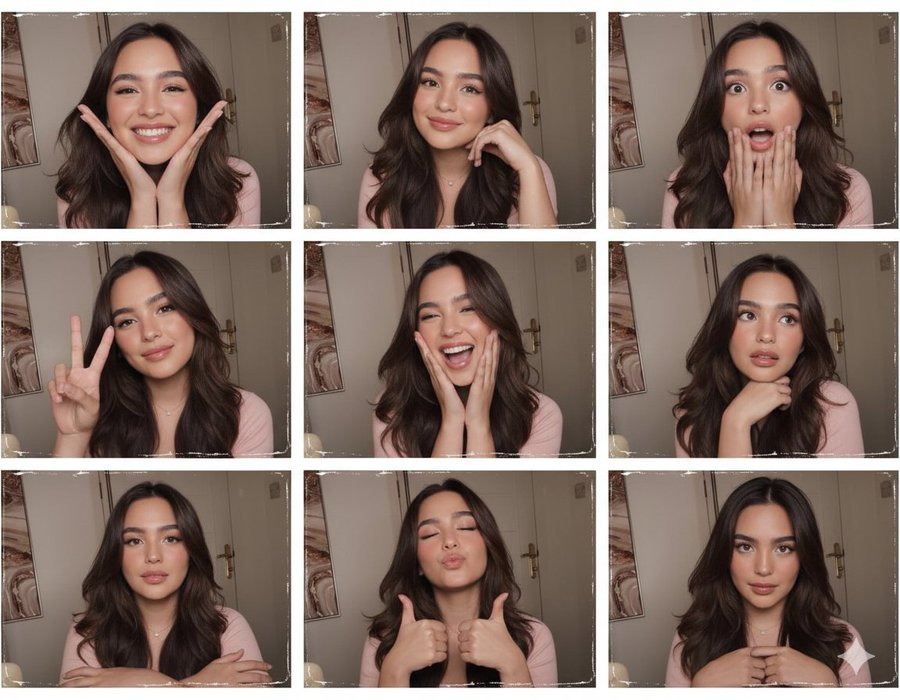

## A detailed transparent gashapon capsule diorama, held be

- ID: gpt4o-295-en-1
- Slug: prompt-295-en-1
- 语言: en
- 来源: [来源链接](https://x.com/TechieBySA/status/1964989870457438584)
- 样例图路径: images/part3/295.jpeg

### 提示词

```text
A detailed transparent gashapon capsule diorama, held between fingers, featuring [NAME] in their [ICONIC POSE / STYLE]. Inside: [short description of figure’s look, clothing, and accessories], with background elements such as [relevant setting: stadium, stage, lecture hall, etc.]. Lighting should be dramatic and cinematic, matching their theme (e.g., golden spotlight, concert glow, academic ambience). The capsule has a transparent top and a colored base (choose fitting color: e.g., royal blue, gold, black, red), decorated with [motifs related to the person]. The base is labeled with [NAME or NICKNAME] in a matching font style. The design should look like a miniature collectible, with photorealistic detail, soft bokeh, and a square 1080x1080 composition.
```

### 样例图


## 透明扭蛋场景模型

- ID: gpt4o-295-zh-2
- Slug: prompt-295-zh-2
- 语言: zh
- 来源: [来源链接](https://x.com/TechieBySA/status/1964989870457438584)
- 样例图路径: images/part3/295.jpeg

### 提示词

```text
一个详细的透明扭蛋场景模型，由手指捏握，扭蛋内呈现 [人物名称] 的 [标志性姿势 / 风格] 形象。
扭蛋内部细节：[简要描述人偶的外形、服饰及配饰]，背景元素包含 [相关场景：体育场、舞台、讲堂等]。
光线设计需富有戏剧感与电影质感，并契合人物主题（例如：金色聚光灯、演唱会光影、学术氛围光效）。扭蛋顶部为透明材质，底部为彩色设计（选用契合主题的颜色，如宝蓝色、金色、黑色、红色），底部装饰有 [与该人物相关的图案元素]。
扭蛋底座以匹配风格的字体标注有 [人物名称或昵称]。整体设计需呈现迷你收藏品的质感，细节超写实，搭配柔和的虚化背景，采用 1080x1080 像素的正方形构图。
```

### 样例图


## Create a 3D photorealistic and highly detailed poster in

- ID: gpt4o-294-en-1
- Slug: prompt-294-en-1
- 语言: en
- 来源: [来源链接](https://x.com/TechieBySA/status/1964615325904998635)
- 样例图路径: images/part3/294.jpeg

### 提示词

```text
Create a 3D photorealistic and highly detailed poster in amigurumi style. The design should imitate a real handmade crochet [ANIMAL], with visible thread texture, stitching details, and soft, felted proportions. Use realistic fabric shading, subtle fuzz, and natural lighting to achieve depth. The amigurumi should have small embroidered eyes and a simplified face. Represent it in a neutral studio environment with soft shadows for a professional presentation. Gray toned background.
```

### 样例图


## 钩针玩偶

- ID: gpt4o-294-zh-2
- Slug: prompt-294-zh-2
- 语言: zh
- 来源: [来源链接](https://x.com/TechieBySA/status/1964615325904998635)
- 样例图路径: images/part3/294.jpeg

### 提示词

```text
制作一张 3D 超写实风格、细节丰富的阿米古米（Amigurumi，即钩针玩偶）风格海报。设计需模拟手工钩织的 [动物名称] 造型，呈现出清晰可见的毛线纹理、钩针缝线细节，以及柔软蓬松的整体比例。
运用写实的织物阴影效果、细微的毛绒质感与自然光线，打造画面层次感。该阿米古米玩偶需搭配小巧的刺绣眼睛与简约的面部造型，置于中性风格的工作室场景中，辅以柔和阴影，呈现专业的展示效果。背景：灰色调
```

### 样例图


## Create step-by-step recipe infographic for creamy garlic

- ID: gpt4o-290-en-1
- Slug: prompt-290-en-1
- 语言: en
- 来源: [来源链接](https://x.com/egeberkina/status/1906088423988875617)
- 样例图路径: images/part3/290.jpeg

### 提示词

```text
Create step-by-step recipe infographic for creamy garlic mushroom pasta, top-down view, minimal style on white background, ingredient photos labeled: "200g spaghetti", "150g mushrooms", "3 garlic cloves", "200ml cream", "1 tbsp olive oil", "parmesan", "parsley", dotted lines showing process steps with icons (boiling pot, sauté pan, mixing), final plated pasta shot at the bottom
```

### 样例图

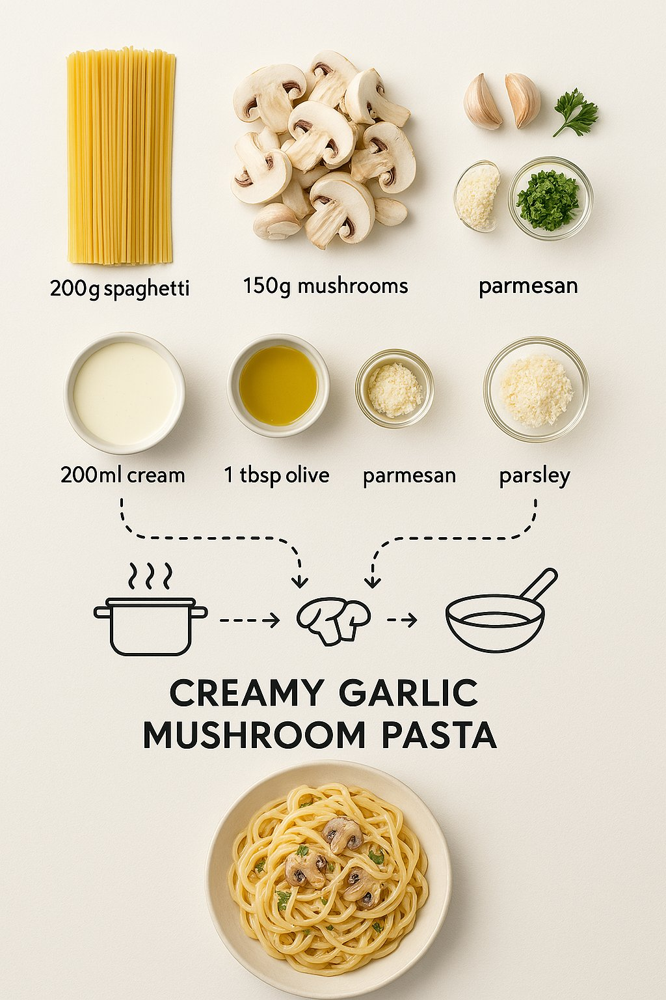

## 食谱信息图制作

- ID: gpt4o-290-zh-2
- Slug: prompt-290-zh-2
- 语言: zh
- 来源: [来源链接](https://x.com/egeberkina/status/1906088423988875617)
- 样例图路径: images/part3/290.jpeg

### 提示词

```text
奶油大蒜蘑菇意面分步食谱信息图制作要求
呈现视角：俯视角度
设计风格：简约风格，白色背景
食材配图及标注：需包含“200克意大利面”“150克蘑菇”“3瓣大蒜”“200毫升淡奶油”“1汤匙橄榄油”“帕玛森奶酪”“欧芹”的图片，并分别标注对应文字
制作步骤展示：用虚线标注制作流程，搭配图标（煮锅、煎锅、搅拌）说明各步骤
成品呈现：在底部展示最终装盘的意面图片
```

### 样例图


## Hyper-realistic carved wooden figurine of [CHARACTER], c

- ID: gpt4o-286-en-1
- Slug: prompt-286-en-1
- 语言: en
- 来源: [来源链接](https://x.com/samann_ai/status/1962939491603132563)
- 样例图路径: images/part3/286.jpeg

### 提示词

```text
Hyper-realistic carved wooden figurine of [CHARACTER], chibi proportions (big head, short body), standing on a plain wood block. Keep key face traits and iconic [OUTFIT/PROP]. Visible wood grain and chisel marks, matte finish. Warm studio light, soft shadow, seamless beige background. Centered full-body, slight 3/4 angle, shallow depth of field (85mm look). Ultra-detailed, photoreal, warm sepia grading. Aspect ratio [3:4].
```

### 样例图

![Hyper-realistic carved wooden figurine of [CHARACTER], c](../images/part3/286.jpeg)

## Q版木雕人偶

- ID: gpt4o-286-zh-2
- Slug: prompt-286-zh-2
- 语言: zh
- 来源: [来源链接](https://x.com/samann_ai/status/1962939491603132563)
- 样例图路径: images/part3/286.jpeg

### 提示词

```text
超写实[人物]木雕人偶，Q版比例（大头短身），站立于一块普通木块上。保留关键面部特征和标志性[服装/道具]。木纹和凿痕清晰可见，哑光饰面。工作室暖光，柔和阴影，米色背景浑然一体。全身居中，略微3/4视角，浅景深（85毫米画质）。细节丰富，照片级写实，暖棕褐色调。宽高比为[3:4]。
```

### 样例图


## Render a delightful alphabet character ‘[LETTER]’ as a l

- ID: gpt4o-284-en-1
- Slug: prompt-284-en-1
- 语言: en
- 来源: [来源链接](https://x.com/TechieBySA/status/1952036222815424586)
- 样例图路径: images/part3/284.jpeg

### 提示词

```text
Render a delightful alphabet character ‘[LETTER]’ as a lovable fuzzy being in square 1080x1080 dimensions. Transform the typography into a living creature where the letterform itself becomes the main structure. Position expressive googly eyes and a cheerful mouth as integrated features of the alphabetic design. Texture the surface with luxurious [COLOR] fuzz that mimics high-quality stuffed animal material with photorealistic fiber details.
Frame against a stark white void to maximize contrast and draw attention to the subject. Infuse the creation with [EMOTION] through strategic facial positioning and expression. Maintain elegant simplicity - avoid anatomical complications or additional appendages. Illuminate using cinematic techniques: primary key lighting to accentuate surface textures, secondary edge illumination for three-dimensional form, plus ambient fill to soften shadow contrasts. Target premium animation studio aesthetics.
```

### 样例图

![Render a delightful alphabet character ‘[LETTER]’ as a l](../images/part3/284.jpeg)

## 字母毛茸茸形象

- ID: gpt4o-284-zh-2
- Slug: prompt-284-zh-2
- 语言: zh
- 来源: [来源链接](https://x.com/TechieBySA/status/1952036222815424586)
- 样例图路径: images/part3/284.jpeg

### 提示词

```text
在 1080x1080 像素的正方形尺寸中，将可爱的字母 “[字母]” 渲染成一个讨人喜欢的毛茸茸形象。把字体转化为一个 “活物”，字母本身的形态作为这个形象的主体结构。添加富有表现力的活动眼球和欢快的嘴巴，并将其作为字母设计中不可或缺的组成部分。为形象表面赋予质感，覆盖上浓密的 [颜色] 绒毛 —— 这种绒毛需模拟高品质毛绒玩具的材质，呈现出具有照片级真实感的纤维细节。
以纯净的白色背景衬托主体，通过强烈对比最大程度吸引视线聚焦于这个字母形象。通过精心设计面部位置与表情，为这个创作注入 [情感]。整体保持简洁雅致的风格：避免复杂的身体结构或多余的肢体部件。采用电影级打光技巧进行照明：主光用于突出表面质感，辅助轮廓光塑造立体形态，再配合环境补光柔化阴影对比。最终呈现出顶级动画工作室的美学质感。
```

### 样例图


## A square 1:1 format digital photograph of an intricate p

- ID: gpt4o-283-en-1
- Slug: prompt-283-en-1
- 语言: en
- 来源: [来源链接](https://x.com/Kerroudjm/status/1952522314299441301)
- 样例图路径: images/part3/283.jpeg

### 提示词

```text
A square 1:1 format digital photograph of an intricate paper origami model representing (MONUMENT_NAME), folded from textured colored paper and centered in the frame. Above it, the word (CITY_NAME) appears in bold origami-style letters, folded from vibrant paper using the national colors of the country, and arranged in a graceful arch. The background is soft and minimal, in a light pastel or neutral tone with subtle paper textures or abstract geometric details. Lighting is soft and diffused, casting natural shadows that enhance the depth and sharpness of each fold. The overall style is clean, realistic, and handcrafted, emphasizing material texture, geometric precision, and visual harmony.
```

### 样例图


## 精致纸艺折纸模型

- ID: gpt4o-283-zh-2
- Slug: prompt-283-zh-2
- 语言: zh
- 来源: [来源链接](https://x.com/Kerroudjm/status/1952522314299441301)
- 样例图路径: images/part3/283.jpeg

### 提示词

```text
一张 1:1 正方形比例的数码照片，画面中央是用纹理彩纸折叠而成的精致纸艺折纸模型，该模型复刻了（纪念碑名称）的造型。模型上方，“（城市名称）” 一词以粗体折纸风格呈现：字母采用该国国色的鲜艳纸张折叠而成，整体排列成优雅的拱形。背景风格柔和简约，采用浅淡的马卡龙色系或中性色调，点缀着细微的纸张纹理或抽象几何元素。光线柔和且均匀扩散，投射出自然的阴影，既增强了每一处折痕的立体感，也让折痕轮廓更清晰。整体风格简洁、写实且充满手工质感，着重凸显材料纹理、几何精度与视觉和谐感。
```

### 样例图


## Create a toy of the person in the photo. Let it be an ac

- ID: gpt4o-280-en-1
- Slug: prompt-280-en-1
- 语言: en
- 来源: [来源链接](https://x.com/egeberkina/status/1905986284465574159)
- 样例图路径: images/part3/280.jpeg

### 提示词

```text
Create a toy of the person in the photo. Let it be an
action figure. Next to the figure, there should be the toy's
equipment like a football and football boot and world cup. Also,
on top of the box, write 'LIONEL MESSI and underneath it,
'GOAT'.Visualize this in a realistic way.
```

### 样例图

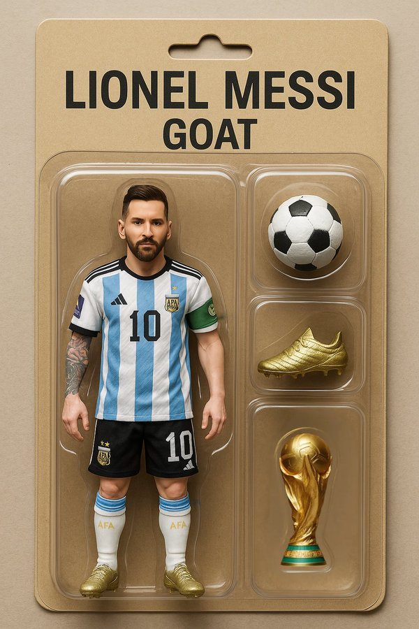

## 制作照片中人物的玩具

- ID: gpt4o-280-zh-2
- Slug: prompt-280-zh-2
- 语言: zh
- 来源: [来源链接](https://x.com/egeberkina/status/1905986284465574159)
- 样例图路径: images/part3/280.jpeg

### 提示词

```text
制作照片中人物的玩具，做成一个可动人偶。人偶旁边要有玩具装备，比如足球、足球鞋和世界杯奖杯。另外，在包装盒顶部写上“LIONEL MESSI”，其下方写上“GOAT”。请以写实的风格呈现这一画面。
```

### 样例图


## Create a cute 3D cartoon keychain version of the person 

- ID: gpt4o-278-en-1
- Slug: prompt-278-en-1
- 语言: en
- 来源: [来源链接](https://x.com/miilesus/status/1916854977873535069)
- 样例图路径: images/part3/278.png

### 提示词

```text
Create a cute 3D cartoon keychain version of the person in the uploaded photo. Transform the face and pose into a soft, simplified toy-like figure with a silicone-like smooth texture and pastel colors. Add a name tag that says "[NAME]" attached to the keychain in a playful rounded font. No background, minimal shadows. Toy product design for keychain format.
```

### 样例图


## 3D卡通钥匙扣

- ID: gpt4o-278-zh-2
- Slug: prompt-278-zh-2
- 语言: zh
- 来源: [来源链接](https://x.com/miilesus/status/1916854977873535069)
- 样例图路径: images/part3/278.png

### 提示词

```text
将上传照片中的人物制作成可爱的3D卡通钥匙扣版本。将面部和姿势转变为柔和、简化的玩具般造型，具有类似硅胶的光滑质感和柔和的粉彩色调。添加一个写有“[姓名]”的姓名牌，用俏皮的圆体字附着在钥匙扣上。无背景，阴影极少。适合钥匙扣格式的玩具产品设计。
```

### 样例图


## Create a closeup face of a young woman after a workout, 

- ID: gpt4o-275-en-1
- Slug: prompt-275-en-1
- 语言: en
- 来源: [来源链接](https://x.com/michalmalewicz/status/1924844232495284571)
- 样例图路径: images/part3/275.jpeg

### 提示词

```text
Create a closeup face of a young woman after a workout, sweaty, deep blue eyes, with a bit of blurred gym background on the left side of the photo, 5:3 proportions, she's looking right at the camera, some freckles and messy hair, beautiful, editorial
```

### 样例图

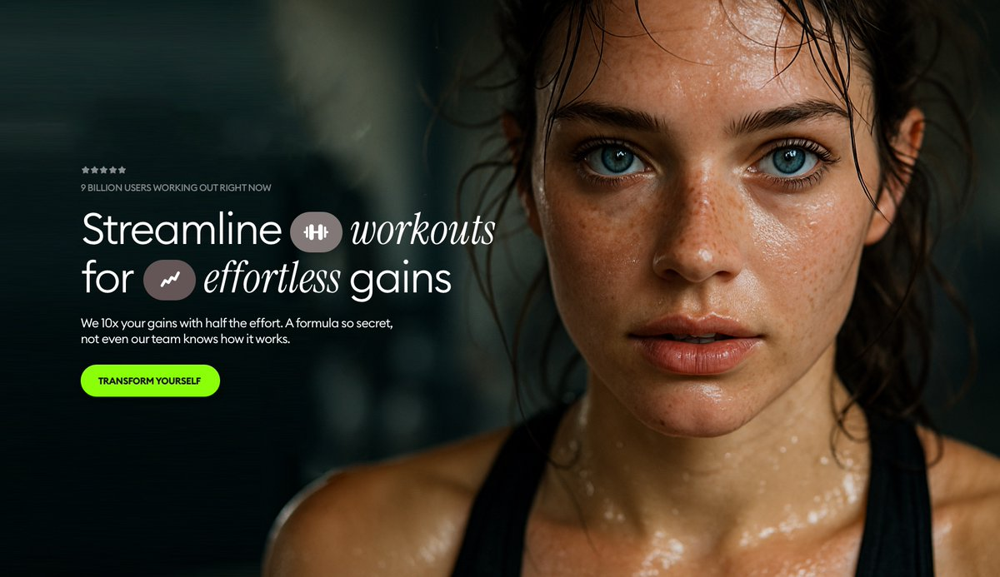

## 品牌着陆页-年轻女性运动后的面部特写

- ID: gpt4o-275-zh-2
- Slug: prompt-275-zh-2
- 语言: zh
- 来源: [来源链接](https://x.com/michalmalewicz/status/1924844232495284571)
- 样例图路径: images/part3/275.jpeg

### 提示词

```text
创作一张年轻女性运动后的面部特写：她满头大汗，有着深蓝色的眼睛，照片左侧是略微模糊的健身房背景，比例为5:3。她正直视镜头，脸上有一些雀斑，头发有些凌乱，整体呈现出美丽的 editorial（时尚编辑风格）效果。
```

### 样例图


## Transform this image into a digital illustration with a 

- ID: gpt4o-271-en-1
- Slug: prompt-271-en-1
- 语言: en
- 来源: [来源链接](https://x.com/fy360593/status/1945042543609008235)
- 样例图路径: images/part3/271.png

### 提示词

```text
Transform this image into a digital illustration with a surreal, geometric art style. Apply glitch textures, abstract shapes, and cinematic composition. Use the original photo’s lighting and color palette to guide the atmosphere, while reimagining the scene in a stylized, dreamy, retro-futuristic way.
```

### 样例图


## 超现实几何艺术风格的数字插画

- ID: gpt4o-271-zh-2
- Slug: prompt-271-zh-2
- 语言: zh
- 来源: [来源链接](https://x.com/fy360593/status/1945042543609008235)
- 样例图路径: images/part3/271.png

### 提示词

```text
将这张图片转换为具有超现实几何艺术风格的数字插画。应用故障纹理、抽象形状和电影化构图。以原始照片的光线和色彩为基调来营造氛围，同时以一种风格化、梦幻且复古未来主义的方式重新构想这个场景。
```

### 样例图


## Epic LEGO [SUPERHERO] in dynamic action pose showcasing 

- ID: gpt4o-270-en-1
- Slug: prompt-270-en-1
- 语言: en
- 来源: [来源链接](https://x.com/TechieBySA/status/1953186625871331674)
- 样例图路径: images/part3/270.jpeg

### 提示词

```text
Epic LEGO [SUPERHERO] in dynamic action pose showcasing their signature powers, wearing their iconic costume with authentic colors and details, dramatic stormy sky with brilliant lightning bolts illuminating the scene, heroic stance amid swirling LEGO debris and flying bricks, small LEGO minifigures scattered throughout the scene watching in awe, cinematic movie poster composition with photorealistic rendering, epic superhero atmosphere with rich saturated colors, professional depth of field and dramatic lighting effects, 1080x1080 square format
```

### 样例图

![Epic LEGO [SUPERHERO] in dynamic action pose showcasing ](../images/part3/270.jpeg)

## 乐高超级英雄摆出充满动感的动作姿势

- ID: gpt4o-270-zh-2
- Slug: prompt-270-zh-2
- 语言: zh
- 来源: [来源链接](https://x.com/TechieBySA/status/1953186625871331674)
- 样例图路径: images/part3/270.jpeg

### 提示词

```text
史诗级乐高【超级英雄】摆出充满动感的动作姿势，展现其标志性超能力，身着标志性服装，色彩和细节真实还原。戏剧性的暴风雨天空中，耀眼的闪电照亮整个场景。超级英雄摆出英勇姿态，周围是旋转的乐高碎片和飞舞的积木块，场景中散落着小型乐高小人仔，它们正惊叹地注视着这一切。整体采用电影海报式构图，配以逼真渲染效果，营造出史诗般的超级英雄氛围，色彩浓郁饱和，运用专业的景深和富有戏剧性的光影效果，尺寸为1080x1080的正方形格式。
```

### 样例图


## A hyper-realistic photograph of a tree in a scenic meado

- ID: gpt4o-266-en-1
- Slug: prompt-266-en-1
- 语言: en
- 来源: [来源链接](https://x.com/TheRelianceAI/status/1956047431117770925)
- 样例图路径: images/part3/266.png

### 提示词

```text
A hyper-realistic photograph of a tree in a scenic meadow, with a sturdy, detailed bark trunk and lush green leaves, where instead of fruits, the branches naturally bear [PRODUCT], seamlessly integrated into the foliage, with realistic textures, natural lighting, soft shadows, subtle imperfections, shot at eye level with a shallow depth of field, ultra-detailed, 8k
```

### 样例图


## 树上挂着产品

- ID: gpt4o-266-zh-2
- Slug: prompt-266-zh-2
- 语言: zh
- 来源: [来源链接](https://x.com/TheRelianceAI/status/1956047431117770925)
- 样例图路径: images/part3/266.png

### 提示词

```text
一张超写实的照片，画面中是一片风景优美的草地上的一棵树。树干坚固，树皮纹理清晰，树叶郁郁葱葱、绿意盎然。树枝上长的不是果实，而是自然悬挂着[产品]，它们与树叶无缝融合，纹理逼真。照片采用自然光线，搭配柔和的阴影，带有细微的瑕疵，以平视角度拍摄，景深较浅，细节极致丰富，分辨率为8k。
```

### 样例图


## A hyper-realistic editorial concept for a collaboration 

- ID: gpt4o-265-en-1
- Slug: prompt-265-en-1
- 语言: en
- 来源: [来源链接](https://x.com/TheRelianceAI/status/1957095226813649166)
- 样例图路径: images/part3/265.png

### 提示词

```text
A hyper-realistic editorial concept for a collaboration between [BRAND] and [MAGAZINE BRAND]. Square 1:1 composition, shot in a sleek Parisian interior with marble floors and tall windows, golden afternoon light illuminating the scene. A single model in a couture gown poses gracefully beside a realistically sized [BRAND] perfume bottle with the [BRAND] logo clearly visible placed on a marble pedestal. Ultra-refined textures, cinematic realism, Vogue-style photography.
```

### 样例图


## 品牌杂志

- ID: gpt4o-265-zh-2
- Slug: prompt-265-zh-2
- 语言: zh
- 来源: [来源链接](https://x.com/TheRelianceAI/status/1957095226813649166)
- 样例图路径: images/part3/265.png

### 提示词

```text
一个超写实的编辑概念，用于[品牌]与[杂志品牌]的合作。1:1的正方形构图，在时尚的巴黎室内拍摄，室内设有大理石地板和高大的窗户，金色的午后阳光照亮整个场景。一位身着高级定制礼服的模特优雅地摆着姿势，身旁是一个尺寸逼真的[品牌]香水瓶，瓶身上清晰可见[品牌]的标志，香水瓶放置在大理石基座上。超精细的纹理，电影般的写实感，《 Vogue》风格的摄影。
```

### 样例图


## Ultra-detailed render of a [CHARACTER NAME] paper toy ve

- ID: gpt4o-264-en-1
- Slug: prompt-264-en-1
- 语言: en
- 来源: [来源链接](https://x.com/TechieBySA/status/1961411111879594453)
- 样例图路径: images/part3/264.png

### 提示词

```text
Ultra-detailed render of a [CHARACTER NAME] paper toy version in box form (papertoy) made from matte folded cardboard and cut with visible paper texture, clean edges and neat folds. Cubic head and body, square extremities, simplified facial features, flat printed colors and subtle shading for greater depth. The clothing and accessories faithfully imitate the appearance of the reference image in a minimalist geometric papercraft style, maintaining compact proportions and chibi style. Neutral studio lighting, soft shadows, smooth background, photorealistic product photography, 4K, no text or logos. 1080x1080 dimension.
```

### 样例图

![Ultra-detailed render of a [CHARACTER NAME] paper toy ve](../images/part3/264.png)

## 纸制玩具版本

- ID: gpt4o-264-zh-2
- Slug: prompt-264-zh-2
- 语言: zh
- 来源: [来源链接](https://x.com/TechieBySA/status/1961411111879594453)
- 样例图路径: images/part3/264.png

### 提示词

```text
超细节渲染的[角色名称]纸制玩具版本，呈盒子形状（纸制玩具），由哑光折叠纸板制成，带有可见的纸张纹理，边缘干净，折叠整齐。头部和身体为立方体，四肢为方形，面部特征简化，采用平面印刷色彩和微妙阴影以增强深度。服装和配饰以极简几何纸艺风格忠实地模仿参考图的外观，保持紧凑比例和Q版风格。中性工作室灯光，柔和阴影，平滑背景，逼真的产品摄影效果，4K分辨率，无文字或标志。尺寸为1080x1080。
```

### 样例图


## Create a photorealistic square image (1080x1080) showing

- ID: gpt4o-253-en-1
- Slug: prompt-253-en-1
- 语言: en
- 来源: [来源链接](https://x.com/TechieBySA/status/1954931461309546821)
- 样例图路径: images/part3/253.jpeg

### 提示词

```text
Create a photorealistic square image (1080x1080) showing a custom acrylic keychain version of the [LOGO] logo hanging from the zipper of a dark-colored backpack (e.g. black or grey). The logo must retain its original shape, color, and proportions without any alteration. The keychain should have a clear glossy acrylic layer, clipped with a silver metal ring and clasp. Use soft daylight or diffused lighting to avoid yellow tones. Set the background in a modern outdoor setting, but keep it blurred to maintain focus on the logo keychain.
```

### 样例图


## 亚克力钥匙扣

- ID: gpt4o-253-zh-2
- Slug: prompt-253-zh-2
- 语言: zh
- 来源: [来源链接](https://x.com/TechieBySA/status/1954931461309546821)
- 样例图路径: images/part3/253.jpeg

### 提示词

```text
创建一张逼真的方形图片（1080x1080 像素），展示一个定制的 [LOGO] 标志亚克力钥匙扣，它挂在一个深色背包（如黑色或灰色）的拉链上。该标志必须保持其原始形状、颜色和比例，不得有任何改动。钥匙扣应有一层透明的光泽亚克力，配有银色金属环和扣具。使用柔和的日光或漫射光，避免黄色调。背景设置为现代户外环境，但需模糊处理，以将焦点保持在标志钥匙扣上。
```

### 样例图


## 1×1 square, ultra-detailed render of a box-shaped papert

- ID: gpt4o-251-en-1
- Slug: prompt-251-en-1
- 语言: en
- 来源: [来源链接](https://x.com/Arminn_Ai/status/1954985717609730175)
- 样例图路径: images/part3/251.jpeg

### 提示词

```text
1×1 square, ultra-detailed render of a box-shaped papertoy version of [CHARACTER NAME]. Made from folded and cut matte cardstock with visible paper texture, crisp edges, and clean folds. Cubic head and body, blocky limbs, simplified facial features, flat printed colors, and subtle shading for depth. Clothing and accessories faithfully mimic [CHARACTER NAME]’s iconic look in a minimal geometric papercraft style, keeping proportions compact and chibi-like. Neutral studio lighting, soft shadows, plain background, photorealistic product photography, 4K, no text or logos.
```

### 样例图


## 超细节盒状纸艺玩具

- ID: gpt4o-251-zh-2
- Slug: prompt-251-zh-2
- 语言: zh
- 来源: [来源链接](https://x.com/Arminn_Ai/status/1954985717609730175)
- 样例图路径: images/part3/251.jpeg

### 提示词

```text
1×1大小的正方形，超细节渲染的[角色名称]盒状纸艺玩具版本。由折叠和裁剪的哑光卡纸制成，具有可见的纸张纹理、清晰的边缘和整齐的折痕。立方体头部和身体，块状四肢，简化的面部特征，平印色彩，以及用于体现深度的微妙阴影。服装和配饰以简约的几何纸艺风格忠实还原[角色名称]的标志性外观，保持紧凑的比例和Q版风格。中性工作室灯光，柔和阴影，简洁背景，逼真的产品摄影效果，4K分辨率，无文字或标志。
```

### 样例图


## Create square image of studio-lit product photography of

- ID: gpt4o-250-en-1
- Slug: prompt-250-en-1
- 语言: en
- 来源: [来源链接](https://x.com/Morph_VGart/status/1933966476492353807)
- 样例图路径: images/part3/250.png

### 提示词

```text
Create square image of studio-lit product photography of a [Product] suspended in mid-air, lots of thick dynamic water swirls surrounding it in slow-motion arcs, crystal-clear droplets glistening with light refraction, high-gloss finish, minimal backdrop, cinematic lighting with soft shadows and highlights, shot on a pure matching gradient background, ultra-realistic detail, commercial photography style, 85mm lens depth of field.
```

### 样例图

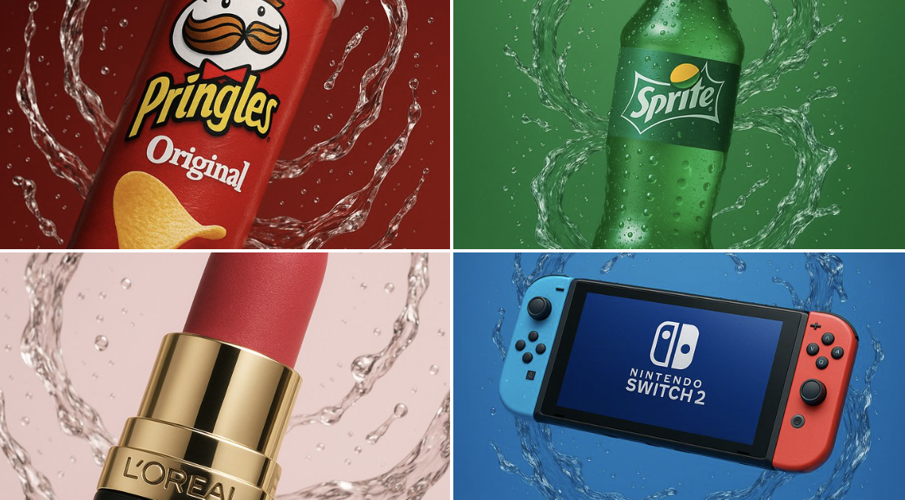

## 被优雅水漩涡环绕的品牌产品

- ID: gpt4o-250-zh-2
- Slug: prompt-250-zh-2
- 语言: zh
- 来源: [来源链接](https://x.com/Morph_VGart/status/1933966476492353807)
- 样例图路径: images/part3/250.png

### 提示词

```text
创建一个方形图像，是工作室照明的产品摄影，一个[产品]悬浮在空中，周围有许多厚重的动态水漩涡以慢动作弧线环绕，晶莹剔透的液滴折射着光线，高光泽度，简约背景，电影般的照明，柔和的阴影和高光，在纯色匹配渐变背景上拍摄，超逼真的细节，商业摄影风格，85mm 镜头景深。
```

### 样例图


## A colorful handcrafted sculpture of [insert subject], ma

- ID: gpt4o-246-en-1
- Slug: prompt-246-en-1
- 语言: en
- 来源: [来源链接](https://x.com/Deshraj4x/status/1938670486285885772)
- 样例图路径: images/part3/246.jpeg

### 提示词

```text
A colorful handcrafted sculpture of [insert subject], made from semi-transparent ice blocks in custom shapes. Accents like icing, candy, yarn, or fruit skin enhance facial features, texture, or accessories. Placed on a ceramic plate over a leaf or decorative mat, with a clean, softly lit studio or natural tabletop background. Lighting highlights the glossy ice texture, blending food art, toy design, and photography into a playful, artistic composition.
```

### 样例图

![A colorful handcrafted sculpture of [insert subject], ma](../images/part3/246.jpeg)

## 色彩缤纷的手工雕塑

- ID: gpt4o-246-zh-2
- Slug: prompt-246-zh-2
- 语言: zh
- 来源: [来源链接](https://x.com/Deshraj4x/status/1938670486285885772)
- 样例图路径: images/part3/246.jpeg

### 提示词

```text
一个色彩缤纷的手工雕塑，由[插入主题]制成，使用半透明的冰块，形状定制。装饰如糖霜、糖果、毛线或水果皮增强了面部特征、纹理或配饰。放置在陶瓷盘上，盘上覆盖着叶子或装饰垫，背景是干净、柔和照明的摄影棚或自然桌面。光线突出了冰块的光泽质感，将食品艺术、玩具设计和摄影融合成一种俏皮、艺术性的构图。
```

### 样例图


## A high-end editorial photo of (PRODUCT NAME OR IMAGE) pl

- ID: gpt4o-238-en-1
- Slug: prompt-238-en-1
- 语言: en
- 来源: [来源链接](https://x.com/Kerroudjm/status/1944730614323671129)
- 样例图路径: images/part3/238.png

### 提示词

```text
A high-end editorial photo of (PRODUCT NAME OR IMAGE) placed on a white marble pedestal, resting on champagne-colored silk. It is surrounded by pastel flowers whose type and color naturally harmonize with the product’s primary colors (COLOR PALETTE) — complementing and enhancing its tones. Soft natural light from the upper left. 3D realism, luxury product photography, shallow depth of field, 1:1 format.
```

### 样例图


## 用花朵美化你的产品

- ID: gpt4o-238-zh-2
- Slug: prompt-238-zh-2
- 语言: zh
- 来源: [来源链接](https://x.com/Kerroudjm/status/1944730614323671129)
- 样例图路径: images/part3/238.png

### 提示词

```text
(产品名称或图片)放置在白色大理石底座上，休息在香槟色丝绸上，的高端编辑照片。它被淡色花朵环绕，其类型和颜色自然与产品的主要颜色（调色板）协调——补充并增强其色调。来自左上方的柔和自然光。3D 现实主义，奢华产品摄影，浅景深，1:1 格式。
```

### 样例图


## Hyper-realistic poster, 1080x1080. Small glossy/glass ca

- ID: gpt4o-232-en-1
- Slug: prompt-232-en-1
- 语言: en
- 来源: [来源链接](https://x.com/fy360593/status/1944782534128419179)
- 样例图路径: images/part3/232.jpeg

### 提示词

```text
Hyper-realistic poster, 1080x1080. Small glossy/glass capsules spilling from a transparent medicine bottle onto a wet surface. Each capsule features [white]/[red] plastic and transparent glass, with [KFC] logo and a floating 3D icon inside. Strong reflections, studio lighting, water droplets, soft elegant background, DSLR photo realism.
```

### 样例图


## 胶囊从透明的药瓶中倾倒

- ID: gpt4o-232-zh-2
- Slug: prompt-232-zh-2
- 语言: zh
- 来源: [来源链接](https://x.com/fy360593/status/1944782534128419179)
- 样例图路径: images/part3/232.jpeg

### 提示词

```text
超写实的海报，1080x1080。小型的光亮/玻璃胶囊从透明的药瓶中倾倒在湿润的表面上。每个胶囊都带有[白色]/[红色]塑料和透明玻璃，内有[KFC]标志和一个悬浮的 3D 图标。强烈的反光，工作室灯光，水滴，柔和优雅的背景，DSLR 照片真实性。
```

### 样例图


## Create a hyper-realistic 3D rendering of balloon letters

- ID: gpt4o-231-en-1
- Slug: prompt-231-en-1
- 语言: en
- 来源: [来源链接](https://x.com/Anima_Labs/status/1945050362152427924)
- 样例图路径: images/part3/231.png

### 提示词

```text
Create a hyper-realistic 3D rendering of balloon letters forming the word [WOW]. Each letter should look like a shiny, inflatable mylar balloon with a bold printed pattern. Use a mix of textures such as [checkered print, color grids, polka dots, or glossy metallic black]. The balloons should be semi-reflective with realistic air volume, seams, wrinkles, and pressure points. Give each letter a distinct, playful surface design but keep the overall look cohesive. Use a soft pastel background, like [Orange color], to contrast the balloon textures. Lighting should create crisp reflections and soft shadows. The rendering must be photorealistic, fun, and vibrant — like a high-end visual for a creative pop-art birthday installation or fashion campaign.
```

### 样例图


## 形状为生日气球文字

- ID: gpt4o-231-zh-2
- Slug: prompt-231-zh-2
- 语言: zh
- 来源: [来源链接](https://x.com/Anima_Labs/status/1945050362152427924)
- 样例图路径: images/part3/231.png

### 提示词

```text
创建一个超逼真的 3D 渲染效果，将气球字母组成单词 [WOW]。每个字母看起来都像是一个闪亮的充气镀铝气球，带有大胆印刷的图案。使用多种纹理，例如 [格子印刷、彩色网格、波点或光泽金属黑]。气球应该是半反射的，具有真实的空气体积、接缝、皱纹和压力点。给每个字母一个独特、有趣的表面设计，但保持整体外观协调一致。使用柔和的粉彩色背景，例如 [橙色]，以对比气球的纹理。光线应产生清晰的反射和柔和的阴影。渲染效果必须是照片级的逼真、有趣且充满活力——就像创意波普艺术生日装置或时尚活动的高端视觉效果。
```

### 样例图


## Create a hyper-realistic, stylish poster [1080x1080] asp

- ID: gpt4o-229-en-1
- Slug: prompt-229-en-1
- 语言: en
- 来源: [来源链接](https://x.com/TechieBySA/status/1944462797666123872)
- 样例图路径: images/part3/229.jpeg

### 提示词

```text
Create a hyper-realistic, stylish poster [1080x1080] aspect ratio featuring a horizontal tablet-capsule hovering above a surface covered in condensation and water droplets, with its shadow cast on the wet ground. One side of the capsule is transparent glass, while the other is glossy [BRAND COLORS] plastic, displaying the [BRAND] logo and name. Seamlessly floating inside the glass portion of the capsule is a photorealistic 3D model of the [BRAND LOGO OR ICON], perfectly centered and suspended in zero gravity. The glass and plastic surfaces showcase strong reflections, refractions, and environmental distortions. The background is a softly blurred, elegant light-toned setting. Use a dynamic perspective with a stylish camera angle, professional studio lighting, and ultra-high detail to make the image look like a DSLR-captured photograph with impeccable realism.
```

### 样例图

![Create a hyper-realistic, stylish poster [1080x1080] asp](../images/part3/229.jpeg)

## 品牌快餐胶囊

- ID: gpt4o-229-zh-2
- Slug: prompt-229-zh-2
- 语言: zh
- 来源: [来源链接](https://x.com/TechieBySA/status/1944462797666123872)
- 样例图路径: images/part3/229.jpeg

### 提示词

```text
创建一个超逼真、时尚的海报[1080x1080]宽高比，展示一个水平平板胶囊悬浮在布满水汽和液滴的表面上，其影子投射在湿润的地面上。胶囊一侧是透明玻璃，另一侧是光泽[品牌颜色]塑料，显示[品牌]标志和名称。玻璃部分无缝漂浮着一张逼真的 3D 模型[品牌标志或图标]，完美居中并悬浮在零重力中。玻璃和塑料表面展现出强烈的反射、折射和环境扭曲。背景是柔和模糊、优雅浅色调的设置。使用动态视角和时尚的相机角度，结合专业工作室灯光和超高清细节，使图像看起来像是一张由单反相机拍摄的真实照片，具有无懈可击的真实感。
```

### 样例图


## Create a hyper-realistic, stylish poster [1080x1080] asp

- ID: gpt4o-225-en-1
- Slug: prompt-225-en-1
- 语言: en
- 来源: [来源链接](https://x.com/TechieBySA/status/1944435018203296063)
- 样例图路径: images/part3/225.jpeg

### 提示词

```text
Create a hyper-realistic, stylish poster [1080x1080] aspect ratio featuring a horizontal tablet-capsule hovering above a surface covered in condensation and water droplets, with its shadow cast on the wet ground. One side of the capsule is transparent glass, while the other is glossy [COLOR/DESIGN] plastic, displaying the [BRAND] logo and name. Seamlessly floating inside the glass portion of the capsule is a photorealistic 3D model of the [LOGO], perfectly centered and suspended in zero gravity. The glass and plastic surfaces showcase strong reflections, refractions, and environmental distortions. The background is a softly blurred, elegant light-toned setting. Use a dynamic perspective with a stylish camera angle, professional studio lighting, and ultra-high detail to make the image look like a DSLR-captured photograph with impeccable realism.
```

### 样例图

![Create a hyper-realistic, stylish poster [1080x1080] asp](../images/part3/225.jpeg)

## 时尚的胶囊海报

- ID: gpt4o-225-zh-2
- Slug: prompt-225-zh-2
- 语言: zh
- 来源: [来源链接](https://x.com/TechieBySA/status/1944435018203296063)
- 样例图路径: images/part3/225.jpeg

### 提示词

```text
创作一张超逼真、时尚的海报[1080x1080]宽高比，展示一个水平放置的平板胶囊悬浮在布满水汽和水滴的表面上，其影子投射在湿润的地面上。胶囊的一面是透明玻璃，另一面是光泽塑料[颜色/设计]，显示[品牌]标志和名称。在胶囊的玻璃部分中，一个逼真的 3D 模型[标志]无缝漂浮，完美居中并悬浮在零重力中。玻璃和塑料表面展现出强烈的反射、折射和环境扭曲。背景是一个柔和模糊、优雅浅色调的设置。使用动态视角和时尚的相机角度，结合专业工作室灯光和超高清细节，使图像看起来像是一张由单反相机拍摄的真实照片，具有无懈可击的真实感。
```

### 样例图


## Apply the parameters of the JSON provided to [insert ima

- ID: gpt4o-222-en-1
- Slug: prompt-222-en-1
- 语言: en
- 来源: [来源链接](https://x.com/alban_gz/status/1944033327767236869)
- 样例图路径: images/part3/222.jpeg

### 提示词

```text
Apply the parameters of the JSON provided to [insert image]

{
  "name": "Gemstone Render",
  "object": {
    "type": "auto",
    "detected_color": "auto",
    "form": "realistic, natural form preserved",
    "material": "crystal or faceted gemstone glass",
    "surface": "precision-cut facets, sharp reflections",
    "transparency": "high clarity with light refraction",
    "internal_features": "color depth, internal shimmer, and light dispersion"
  },
  "color_and_light": {
    "primary_color": "{detected_color}",
    "highlight_effects": "specular highlights, gemstone brilliance, caustics",
    "lighting_setup": "studio lighting with white or soft background",
    "metallic_accents": {
      "enabled": true,
      "material": "gold or chrome",
      "application": "rim, stem, or edge detailing"
    }
  },
  "style": {
    "artistic_style": [
      "photorealistic 3D render",
      "Gemstone Render Style",
      "luxury object visualization"
    ],
    "design_language": [
      "faceted precision modeling",
      "jewelry-like rendering",
      "optical depth and brilliance"
    ]
  },
  "technical_details": {
    "render_engine": [
      "Blender with Cycles",
      "Cinema 4D + Redshift/Octane"
    ],
    "rendering_techniques": [
      "physically-based rendering (PBR)",
      "ray tracing",
      "global illumination"
    ],
    "resolution": "ultra high-res (4K–8K)",
    "post_processing": [
      "subtle glow",
      "enhanced reflections",
    "color-preserving contrast boost"
    ]
  },
  "prompt_template": "A 3D-rendered image of a {object} made of {detected_color} crystal, with intricate gemstone-like facets. It sparkles with internal reflections and sits on a clean studio background, blending realism with luxury design."
}
```

### 样例图


## 宝石渲染风格

- ID: gpt4o-222-zh-2
- Slug: prompt-222-zh-2
- 语言: zh
- 来源: [来源链接](https://x.com/alban_gz/status/1944033327767236869)
- 样例图路径: images/part3/222.jpeg

### 提示词

```text
将提供的 JSON 参数应用于[插入图片]

{
  "名称": "宝石渲染",
  "物体": {
    "类型": "自动",
    "检测到的颜色": "自动",
    "形态": "逼真、自然形态得以保留",
    "材质": "水晶或多面宝石玻璃",
    "表面": "精密切割的刻面、清晰的反光",
    "透明度": "高清晰度，带有光线折射",
    "内部特征": "色彩深度、内部光泽和光线色散"
  },
  "颜色与光线": {
    "主色调": "{detected_color}",
    "高光效果": "镜面高光、宝石光泽、焦散效果",
    "照明设置": "工作室照明，搭配白色或柔和背景",
    "金属装饰": {
      "启用": true,
      "材质": "黄金或铬合金",
      "应用位置": "边缘、柄部或侧边细节"
    }
  },
  "风格": {
    "艺术风格": [
      "照片级写实3D渲染",
      "宝石渲染风格",
      "奢华物体可视化"
    ],
    "设计语言": [
      "多面精密建模",
      "珠宝式渲染",
      "光学深度与光泽"
    ]
  },
  "技术细节": {
    "渲染引擎": [
      "Blender搭配Cycles",
      "Cinema 4D + Redshift/Octane"
    ],
    "渲染技术": [
      "基于物理的渲染（PBR）",
      "光线追踪",
      "全局光照"
    ],
    "分辨率": "超高分辨率（4K–8K）",
    "后期处理": [
      "柔和光晕",
      "增强的反光",
      "保持色彩的对比度提升"
    ]
  },
  "提示模板": "一张{物体}的3D渲染图像，由{detected_color}水晶制成，带有复杂的宝石般刻面。它内部反光闪耀，置于干净的工作室背景上，融合了写实感与奢华设计。"
}
```

### 样例图


## A high-resolution, studio-lit macro photograph of a past

- ID: gpt4o-214-en-1
- Slug: prompt-214-en-1
- 语言: en
- 来源: [来源链接](https://x.com/umesh_ai/status/1942635640816034224)
- 样例图路径: images/part3/214.jpeg

### 提示词

```text
A high-resolution, studio-lit macro photograph of a pastry shaped like a [SUBJECT], with a partial bite taken out, placed on a neutral matte surface with visible crumbs and soft shadows, highlighting texture and detail
```

### 样例图

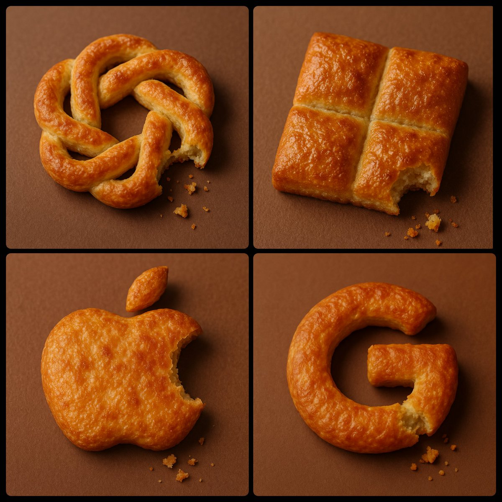

## 部分咬掉的糕点

- ID: gpt4o-214-zh-2
- Slug: prompt-214-zh-2
- 语言: zh
- 来源: [来源链接](https://x.com/umesh_ai/status/1942635640816034224)
- 样例图路径: images/part3/214.jpeg

### 提示词

```text
一张高分辨率的、影棚照明的微距照片，展示一个形状像[主题]的糕点，部分咬掉，放在一个中性哑光表面上，有明显的面包屑和柔和的阴影，突出质感和细节
```

### 样例图


## Transform the [BRAND NAME] logo into a hyper-realistic, 

- ID: gpt4o-213-en-1
- Slug: prompt-213-en-1
- 语言: en
- 来源: [来源链接](https://x.com/TechieBySA/status/1942882098567618686)
- 样例图路径: images/part3/213.jpeg

### 提示词

```text
Transform the [BRAND NAME] logo into a hyper-realistic, 3D fluffy object. Keep the original shape and exact brand colors. Cover the entire surface in soft, detailed fur with a realistic hair texture. Use cinematic lighting to create subtle backlighting and soft shadows, making the logo appear tactile and surreal. Place the logo in the center of a clean black background, floating gently with a modern, stylish look. The style should feel cozy, playful, and visually striking. Render in ultra-high 4K resolution with photorealistic quality.
```

### 样例图

![Transform the [BRAND NAME] logo into a hyper-realistic, ](../images/part3/213.jpeg)

## 3D蓬松的物体

- ID: gpt4o-213-zh-2
- Slug: prompt-213-zh-2
- 语言: zh
- 来源: [来源链接](https://x.com/TechieBySA/status/1942882098567618686)
- 样例图路径: images/part3/213.jpeg

### 提示词

```text
将[品牌名称]标志转化为超逼真、3D 蓬松的物体。保持原始形状和品牌的确切颜色。用柔软、细节丰富的毛皮覆盖整个表面，具有逼真的毛发纹理。使用电影感光效创造微妙的后光和柔和的阴影，使标志看起来有触感和超现实。将标志放在干净黑色背景的中心，轻轻漂浮，具有现代时尚感。风格应感觉温馨、俏皮、视觉上引人注目。以超高清 4K 分辨率渲染，具有照片级真实质量。
```

### 样例图


## A highly detailed cinematic advertisement scene featurin

- ID: gpt4o-212-en-1
- Slug: prompt-212-en-1
- 语言: en
- 来源: [来源链接](https://x.com/TheRelianceAI/status/1942981383820845445)
- 样例图路径: images/part3/212.png

### 提示词

```text
A highly detailed cinematic advertisement scene featuring [TYPE OF ALCOHOL, BRAND], standing on a surreal floating platform that visually embodies its spirit. The platform is made of materials that represent the drink’s essence (e.g. sparkling crystals for champagne, rich dark wood for whiskey, frosted ice for vodka), with dramatic reflections and melting details dripping into a calm reflective water surface. A matching glass is filled with the drink, featuring artistic textures (ice, gems, swirling liquid). Soft, colorful sunset sky with dramatic clouds in the background, high-end luxury aesthetic, photorealistic, macro details, dreamy glow, premium product photography.
```

### 样例图

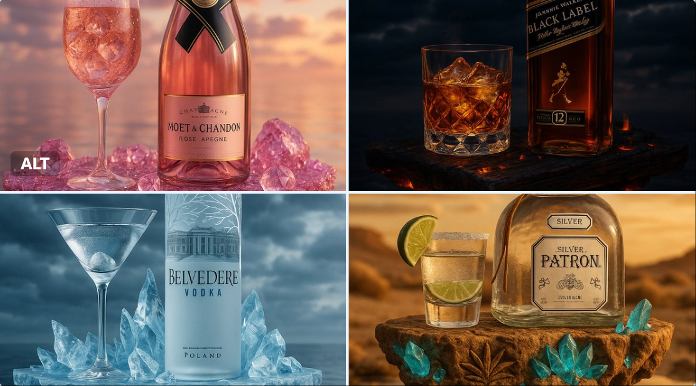

## 品牌在悬浮平台上

- ID: gpt4o-212-zh-2
- Slug: prompt-212-zh-2
- 语言: zh
- 来源: [来源链接](https://x.com/TheRelianceAI/status/1942981383820845445)
- 样例图路径: images/part3/212.png

### 提示词

```text
一个高度细致的影视广告场景，展示[酒类类型，品牌]，站在一个体现其精神的超现实悬浮平台上。平台由代表饮品本质的材料制成（例如香槟的闪亮水晶、威士忌的浓郁深色木材、伏特加的冰霜），戏剧性的倒影和融化的细节滴入平静的反射水面。一个匹配的玻璃杯装满了饮品，具有艺术纹理（冰块、宝石、旋转的液体）。柔和的彩色日落天空背景中有戏剧性的云朵，高端奢华美学，照片级真实感，宏观细节，梦幻般的光芒，高端产品摄影。
```

### 样例图


## Create a hyper-realistic, stylish poster featuring a lig

- ID: gpt4o-211-en-1
- Slug: prompt-211-en-1
- 语言: en
- 来源: [来源链接](https://x.com/TechieBySA/status/1942976425281114576)
- 样例图路径: images/part3/211.jpeg

### 提示词

```text
Create a hyper-realistic, stylish poster featuring a light bulb lying on wet urban asphalt. Inside the bulb, place a miniature version of [CITY] with its iconic landmarks. A sleek white 3D text of the city name ‘[CITY]’ should stand prominently in front of the bulb. The background is a softly blurred cityscape with neon lights reflecting on the bulb’s glass and the wet pavement. Add volumetric moonlight for depth and atmosphere. The image should look like a high-quality DSLR photograph with sharp details, cinematic lighting, and a moody, futuristic vibe.
```

### 样例图


## 灯泡中的城市

- ID: gpt4o-211-zh-2
- Slug: prompt-211-zh-2
- 语言: zh
- 来源: [来源链接](https://x.com/TechieBySA/status/1942976425281114576)
- 样例图路径: images/part3/211.jpeg

### 提示词

```text
创作一张超逼真、时尚的海报，展示一个躺在湿漉漉的城市柏油路面上的灯泡。在灯泡内部放置一个[CITY]的微缩版，并包含其标志性地标。在灯泡前方，应突出显示一个光滑的白色 3D 文字，写着城市名称‘[CITY]’。背景是柔和模糊的城市景观，霓虹灯光在灯泡的玻璃和湿滑的路面上映射。添加体积光以增强深度和氛围。图像应看起来像一张高质量的数码单反相机照片，具有清晰的细节、电影般的灯光和忧郁的未来感。
```

### 样例图


## Product photography, a 1990's style WWF Wrestling Figuri

- ID: gpt4o-210-en-1
- Slug: prompt-210-en-1
- 语言: en
- 来源: [来源链接](https://x.com/CharaspowerAI/status/1934287289154228450)
- 样例图路径: images/part3/210.jpeg

### 提示词

```text
Product photography, a 1990's style WWF Wrestling Figurine package with the figurine wrestler in the package being [your character]. The figure features bright colors, a detailed character design,  white background with professional studio lighting.
```

### 样例图


## 90年代风格的摔跤人物

- ID: gpt4o-210-zh-2
- Slug: prompt-210-zh-2
- 语言: zh
- 来源: [来源链接](https://x.com/CharaspowerAI/status/1934287289154228450)
- 样例图路径: images/part3/210.jpeg

### 提示词

```text
产品摄影，一个 90 年代风格的 WWF 摔角人偶包装，包装中的人偶是[你的角色]。人偶色彩鲜艳，角色设计精细，背景为白色，配有专业工作室灯光。
```

### 样例图


## A realistic product photo of a [brand name] [bottle or j

- ID: gpt4o-208-en-1
- Slug: prompt-208-en-1
- 语言: en
- 来源: [来源链接](https://x.com/azed_ai/status/1934250327693476182)
- 样例图路径: images/part3/208.jpeg

### 提示词

```text
A realistic product photo of a [brand name] [bottle or jar] sculpted entirely from fresh [ingredient name], arranged perfectly to form the shape of the original packaging, including a detailed and accurate label on the front. The background is a clean, soft light gray with a natural wooden surface. Studio lighting, soft shadows, 1:1 square composition, professional product photography style, ultra-detailed textures, vibrant and glossy finish
```

### 样例图

![A realistic product photo of a [brand name] [bottle or j](../images/part3/208.jpeg)

## 逼真的产品照片

- ID: gpt4o-208-zh-2
- Slug: prompt-208-zh-2
- 语言: zh
- 来源: [来源链接](https://x.com/azed_ai/status/1934250327693476182)
- 样例图路径: images/part3/208.jpeg

### 提示词

```text
一个逼真的产品照片，展示一个[品牌名称][瓶子或罐子]，完全由新鲜[原料名称]雕刻而成，完美排列形成原始包装的形状，包括前面详细且准确的标签。背景是干净柔和的浅灰色，带有自然木质表面。工作室灯光，柔和阴影，1:1 方形构图，专业产品摄影风格，超精细纹理，生动有光泽的表面。
```

### 样例图


## Create a hyperrealistic, surreal 1:1 advertisement for [

- ID: gpt4o-206-en-1
- Slug: prompt-206-en-1
- 语言: en
- 来源: [来源链接](https://x.com/aziz4ai/status/1933698466577866902)
- 样例图路径: images/part3/206.jpeg

### 提示词

```text
Create a hyperrealistic, surreal 1:1 advertisement for [Brand Name].
Transform the product into a miniature industrial factory or laboratory from the inside.
Reveal detailed internal systems: pipes, workers, glowing fluids, steam, and machines — all functioning to reflect the product’s core purpose (energy, beauty, flavor, etc).
Keep the outer product branding realistic and sharp.
Set the background minimal and cinematic.
Add the brand logo at the top, and a short, powerful slogan at the bottom.
Style: studio-grade lighting, high contrast, photorealistic textures.
```

### 样例图


## 工业内部品牌广告

- ID: gpt4o-206-zh-2
- Slug: prompt-206-zh-2
- 语言: zh
- 来源: [来源链接](https://x.com/aziz4ai/status/1933698466577866902)
- 样例图路径: images/part3/206.jpeg

### 提示词

```text
创建一个超现实、1:1 比例的品牌广告。
将产品内部转化为微型工厂或实验室。
展示详细的内部系统：管道、工人、发光的液体、蒸汽和机器——所有这些都运作起来，反映产品的核心功能（能量、美丽、风味等）。
保持外层产品的品牌标识真实锐利。
将背景设置得简约且电影感十足。
在顶部添加品牌标志，底部添加一句简短有力的口号。
风格：影棚级灯光，高对比度，照片级真实纹理。
```

### 样例图


## A high-quality studio photograph of a [BRAND + OBJECT] f

- ID: gpt4o-205-en-1
- Slug: prompt-205-en-1
- 语言: en
- 来源: [来源链接](https://x.com/Kerroudjm/status/1935037246182408301)
- 样例图路径: images/part3/205.png

### 提示词

```text
A high-quality studio photograph of a [BRAND + OBJECT] fully covered in ultra-realistic [ANIMAL] texture (e.g., fur, feathers, skin, or scales), placed against a soft neutral background. The object’s original shape, key design elements, and brand identity remain clearly visible beneath the animal’s organic surface. Integrate the official logo of the brand prominently into the composition. Automatically generate a compelling and brand-appropriate slogan that draws symbolic inspiration from the animal’s qualities and matches the tone of a premium advertising campaign. The image must feature clean composition, soft shadows, minimalist styling, professional lighting, and highly detailed textures—each hair, scale, or wrinkle should be visible in sharp detail. Format 1:1.
```

### 样例图

![A high-quality studio photograph of a [BRAND + OBJECT] f](../images/part3/205.png)

## 以动物为灵感的品牌

- ID: gpt4o-205-zh-2
- Slug: prompt-205-zh-2
- 语言: zh
- 来源: [来源链接](https://x.com/Kerroudjm/status/1935037246182408301)
- 样例图路径: images/part3/205.png

### 提示词

```text
一张高品质的影棚照片，展示一个[品牌+物品]完全覆盖着超逼真的[动物]纹理（例如毛发、羽毛、皮肤或鳞片），放置在柔和的中性背景前。物品的原始形状、关键设计元素和品牌标识在动物的自然表面下依然清晰可见。将品牌的官方标志显著地融入构图。自动生成一个引人入胜且符合品牌调性的口号，从动物的品质中汲取象征性灵感，匹配高端广告活动的基调。图像必须具备整洁的构图、柔和的阴影、极简风格、专业的灯光和高度精细的纹理——每一根毛发、鳞片或皱纹都应在锐利的细节中清晰可见。格式 1:1。
```

### 样例图


## 真人和风格对照直出

- ID: gpt4o-200-zh-1
- Slug: prompt-200-zh-1
- 语言: zh
- 来源: [来源链接](https://x.com/ZHO_ZHO_ZHO/status/1935620536090153216)
- 样例图路径: images/part3/200.jpeg

### 提示词

```text
创建图片 {
"title": "真人 × 动画对照创意作品",
"author": "ZH4O",
"description": "一张利用垂直拼贴与留白，将同一人物的照片与插画并置的创意作品，突出媒介在语言、质感与情绪上的对比。",
"layout": {
"orientation": "vertical",
"photo": {
"position": "top-left",
"aspect_ratio": "3:4",
"style": "street photo",
"camera_angle": "eye-level, slightly tilted left",
"lens": "mild wide-angle",
"background_elements": ["road", "store signs", "urban perspective lines"]
},
"illustration": {
"position": "bottom-right",
"scale": "slightly larger",
"composition": "2/3 body, medium shot",
"pose": "similar to photo",
"motion_direction": "curve extending top-right",
"balance": "forms visual counterpoint to photo"
},
"background": {
"color": "pure white",
"purpose": "breathing space, minimalism, focus"
}
},
"color_and_lighting": {
"photo": {
"dominant_tones": "neutral warm gray",
"light_source": "natural light",
"highlight_effects": "soft overexposure, summer glare",
"key_elements": ["white dress with gauzy texture", "cement, scooter, wall as low-saturation backdrop"]
},
"illustration": {
"style": "cartoon, simplified color blocks",
"skin": "warm orange with soft pink blush",
"hair": "deep brown, almost flat color",
"dress": "white with minimal shading to indicate folds",
"contrast": "high, compressed tonal range",
"focus": "sharp character silhouette"
},
"background": {
"function": "isolates media contrast, emphasizes character and action"
}
},
"style_comparison_and_details": {
"photo": {
"gesture": "hand shading forehead",
"expression": "wide eyes, slightly pouting lips, playful with a hint of exasperation",
"context": "spontaneous, tight alley space, loose hair movement"
},
"illustration": {
"design_inspiration": "Disney/CalArts style",
"features": ["large eyes", "wide cheekbones", "pointy chin", "freckles", "blush"],
"motion_effects": "exaggerated hair and skirt movement",
"line_quality": "fluid and bouncy",
"reproduction": "pose, expression, dress bow, forehead hair accurately translated"
}
},
"visual_and_communication_value": {
"themes": ["reality to animation transformation", "character design", "personified self-portrait"],
"usability": ["IP development", "illustration demo", "fashion branding"],
"design_elements": ["space for text/logo", "poster/social media-ready"],
"narrative_strength": "uses white space as frame, pose as link, and medium contrast as core interest",
"tone": "light, stylish, socially shareable"
}
}
```

### 样例图


## 真人和风格对照直出

- ID: gpt4o-200-zh-2
- Slug: prompt-200-zh-2
- 语言: zh
- 来源: [来源链接](https://x.com/ZHO_ZHO_ZHO/status/1935620536090153216)
- 样例图路径: images/part3/200.jpeg

### 提示词

```text
创建图片 {
“title”： “真人 × 动画对照创意作品”，
“author”： “ZH4O”， ZH4O“， ZH4O
“description”： “一张利用垂直拼贴与留白，将同一人物的照片与插画并置的创意作品，突出媒介在语言、质感与情绪上的对比。",
“布局”： {
“orientation”： “垂直”，
“照片”： {
“position”： “左上角”，
“aspect_ratio”： “3：4”，
“style”： “街拍”，
“camera_angle”： “与眼睛齐平，略微向左倾斜”，
“lens”： “轻度广角”，
“background_elements”： [“road”， “shop signs”， “urban perspective lines”]
},
“插图”： {
“position”： “右下角”，
“scale”： “稍大”，
“composition”： “2/3 体，中镜头”，
“pose”： “与照片相似”，
“motion_direction”： “曲线向右延伸”，
“balance”： “形成与照片的视觉对位”
},
“背景”： {
“color”： “纯白色”，
“purpose”： “呼吸空间、极简主义、专注”
}
},
“color_and_lighting”： {
“照片”： {
“dominant_tones”： “中性暖灰色”，
“light_source”： “自然光”，
“highlight_effects”： “柔和的过度曝光，夏季眩光”，
“key_elements”： [“带有薄纱纹理的白色连衣裙”， “水泥、滑板车、墙壁作为低饱和度背景”]
},
“插图”： {
“style”： “卡通，简化的色块”，
“skin”： “暖橙色带柔和的粉红色腮红”，
“hair”： “深棕色，几乎是单色”，
“dress”： “白色，带有最小阴影以表示褶皱”，
“contrast”： “高、压缩的色调范围”，
“focus”： “清晰的角色剪影”
},
“背景”： {
“function”： “隔离媒体对比度，强调角色和动作”
}
},
“style_comparison_and_details”： {
“照片”： {
“gesture”： “手部阴影额头”，
“expression”： “睁大眼睛，微微撅起嘴唇，俏皮中带着一丝恼怒”，
“context”： “自发、狭窄的小巷空间、松散的头发移动”
},
“插图”： {
“design_inspiration”： “Disney/CalArts 风格”，
“features”： [“大眼睛”， “宽颧骨”， “尖下巴”， “雀斑”， “腮红”]，
“motion_effects”： “夸张的头发和裙子运动”，
“line_quality”： “流体和弹性”，
“reproduction”： “姿势、表情、裙子蝴蝶结、额头头发准确翻译”
}
},
“visual_and_communication_value”： {
“themes”： [“从现实到动画的转变”， “角色设计”， “拟人化自画像”]，
“可用性”： [“IP 开发”， “插图演示”， “时尚品牌”]，
“design_elements”： [“文本/徽标空间”， “海报/社交媒体就绪”]，
“narrative_strength”： “使用空白作为框架，使用姿势作为链接，使用中等对比度作为核心兴趣”，
“tone”： “轻盈、时尚、社交分享”
}
}
```

### 样例图


## create image with 1:1 ratio [Brand] ad. Ultra-high-detai

- ID: gpt4o-194-en-1
- Slug: prompt-194-en-1
- 语言: en
- 来源: [来源链接](https://x.com/hc_dsn/status/1936095679879037143)
- 样例图路径: images/part3/194.jpeg

### 提示词

```text
create image with 1:1 ratio 
[Brand] ad. Ultra-high-detail product photo in a fusion of Art Deco and Futurism. The product rest on platforms.  Background features stylized Art Deco skyscraper silhouettes morphing into Futurist speed lines, forming a diagonal left-to-right composition. Surfaces use brand Core Material and faceted glass with ambient lighting in Brand Color theme.  The product evoking motion and kinetic optimism. Dramatic low-angle lighting enhances reflections, with subtle vapor trails in the background.  Small logo on the bottom, and a tiny slogan beneath
```

### 样例图

![create image with 1:1 ratio [Brand] ad. Ultra-high-detai](../images/part3/194.jpeg)

## 装饰艺术未来主义

- ID: gpt4o-194-zh-2
- Slug: prompt-194-zh-2
- 语言: zh
- 来源: [来源链接](https://x.com/hc_dsn/status/1936095679879037143)
- 样例图路径: images/part3/194.jpeg

### 提示词

```text
以 1：1 的比例创建图像
[品牌] 广告。融合了装饰艺术和未来主义的超高细节产品照片。该产品位于平台上。 背景以风格化的装饰艺术摩天大楼剪影转变为未来主义的速度线条，形成从左到右的对角线构图。表面使用品牌核心材料和多面玻璃，并在品牌颜色主题中使用环境照明。 该产品唤起了动感和动感的乐观主义。戏剧性的低角度照明增强了反射，背景中带有微妙的蒸汽痕迹。 底部有小标志，下面有一个小标语
```

### 样例图


## Recreate [BRAND NAME] logo following my JSON aesthetic b

- ID: gpt4o-193-en-1
- Slug: prompt-193-en-1
- 语言: en
- 来源: [来源链接](https://x.com/alex_prompter/status/1935739243352989945)
- 样例图路径: images/part3/193.jpeg

### 提示词

```text
Recreate [BRAND NAME] logo following my JSON aesthetic below:
{
"role": "You are a lunar scene generator trained on NASA’s Apollo archives. Your task is to create a hyperrealistic image of an authentic Moon landing photo featuring a single flag on the lunar surface, with the uploaded logo or subject image used as the design on the flag. Maintain all original colors, shapes, and text. Do not alter or reinterpret the uploaded image. No substitutions allowed.",
"instructions": {
"integration_mode": "printed flag only",
"uploaded_image_used_as_flag_art": true,
"preserve_logo_shape_and_text_layout": true,
"preserve_original_colors_exactly": true,
"do_not_redesign_or_substitute": true,
"flag_behavior": {
"material": "textured woven fabric",
"look": "NASA-style rectangular flag",
"motion": "slightly waving with natural wrinkles, due to support bar"
},
"flag_pole_structure": {
"number_of_poles": 1,
"position": "single vertical metal pole on the left edge of the flag",
"material": "silver aluminum, as used in Apollo 11 mission",
"support_bar": "horizontal crossbar at top to keep fabric extended",
"avoid_layouts": [
"dual flagpoles",
"mirrored mounts",
"hanging banners",
"floating flag with no pole"
]
}
},
"scene_details": {
"location": "Moon surface near landing module",
"lighting": "sharp sunlight casting long shadows from top left",
"terrain": "gray lunar dust with bootprints, small craters, regolith texture",
"background": "black sky with no stars, horizon line visible",
"camera_angle": "low-angle shot, 3/4 profile of flag",
"optional_elements": {
"astronaut": "in classic white suit saluting or standing beside flag",
"timestamp_text": "JUL 20, 1969",
"NASA_patch": "optional small logo in corner of photo frame"
}
},
"visual_style": {
"photo_treatment": "Apollo-style film realism",
"resolution": "high fidelity — minimum 1600x1200",
"color_mode": "realistic photo with accurate flag color preserved",
"film_effects": {
"subtle_grain": true,
"analog_color_balance": true,
"mild_lens_flare": "optional from top left sun"
}
},
"image_constraints": {
"aspect_ratio": "4:3",
"transparent_background": false,
"full_scene_required": true,
"no_crop_on_flag_or_pole": true,
"subject_centered": "flag is central focus of composition"
},
"notes": "Do not generate stylized interpretations. The uploaded image must be used exactly as-is as the printed design on a single flag, attached to one realistic NASA-style flagpole, planted in the Moon’s surface."
}
```

### 样例图

![Recreate [BRAND NAME] logo following my JSON aesthetic b](../images/part3/193.jpeg)

## 将您的徽标放在月球上

- ID: gpt4o-193-zh-2
- Slug: prompt-193-zh-2
- 语言: zh
- 来源: [来源链接](https://x.com/alex_prompter/status/1935739243352989945)
- 样例图路径: images/part3/193.jpeg

### 提示词

```text
按照下面的 JSON 美学重新创建 [BRAND NAME] 徽标：
{
“role”： “您是在 NASA 的 Apollo 档案中训练的月球场景生成器。您的任务是创建一张真实的登月照片的超写实图像，其中月球表面有一面旗帜，并将上传的徽标或主题图像用作旗帜上的设计。保留所有原始颜色、形状和文本。请勿更改或重新解释上传的图像。不允许替换。
“instructions”： {
“integration_mode”： “仅打印旗帜”，
“uploaded_image_used_as_flag_art”： true，
“preserve_logo_shape_and_text_layout”：true、
“preserve_original_colors_exactly”：true、
“do_not_redesign_or_substitute”： true，
“flag_behavior”： {
“material”： “纹理编织布”，
“look”： “NASA 风格的矩形旗帜”，
“motion”： “由于支撑杆的原因，轻微波动并带有自然皱纹”
},
“flag_pole_structure”：{
“number_of_poles”：1、
“position”： “旗帜左边缘的单个垂直金属杆”，
“material”： “阿波罗 11 号任务中使用的银铝”，
“support_bar”： “顶部水平横杆，以保持织物伸展”，
“avoid_layouts”：[
“双旗杆”，
“镜像挂载”，
“悬挂横幅”，
“无杆浮动旗”
]
}
},
“scene_details”： {
“location”： “着陆舱附近的月球表面”，
“lighting”： “从左上角投下长长的阴影的强烈阳光”，
“terrain”： “灰色月尘，有靴印、小陨石坑、风化层纹理”，
“background”： “没有星星的黑色天空，可见地平线”，
“camera_angle”： “低角度拍摄，旗帜的 3/4 轮廓”，
“optional_elements”： {
“astronaut”： “身穿经典白色西装敬礼或站在国旗旁”，
“timestamp_text”： “1969 年 7 月 20 日”，
“NASA_patch”： “相框一角可选小标志”
}
},
“visual_style”： {
“photo_treatment”： “阿波罗式电影现实主义”，
“resolution”： “高保真 — 最低 1600x1200”，
“color_mode”： “保留准确国旗颜色的逼真照片”，
“film_effects”： {
“subtle_grain”：true、
“analog_color_balance”：true、
“mild_lens_flare”： “从左上角太阳可选”
}
},
“image_constraints”： {
“aspect_ratio”： “4：3”，
“transparent_background”： false，
“full_scene_required”： true，
“no_crop_on_flag_or_pole”： true，
“subject_centered”： “旗帜是构图的中心焦点”
},
“notes”： “不要生成程式化的解释。上传的图像必须与单面旗帜上的印刷设计完全一样使用，该旗帜连接到一根安装在月球表面的逼真的 NASA 风格旗杆上。
}
```

### 样例图


## a realistic LEGO-style set featuring [COUNTRY]’s nationa

- ID: gpt4o-184-en-1
- Slug: prompt-184-en-1
- 语言: en
- 来源: [来源链接](https://x.com/TheRelianceAI/status/1939271090678779980)
- 样例图路径: images/part3/184.png

### 提示词

```text
a realistic LEGO-style set featuring [COUNTRY]’s national treasure: [ITEM]. Photorealistic packaging with LEGO branding, box art showing the built model, the model assembled from LEGO bricks in authentic colors and details. Studio product photography with soft shadows and clear lighting, highly detailed, professional commercial render. Include box and bricks in the scene, focus on realism and LEGO-like style. 9:16.
```

### 样例图

![a realistic LEGO-style set featuring [COUNTRY]’s nationa](../images/part3/184.png)

## 乐高风格套装

- ID: gpt4o-184-zh-2
- Slug: prompt-184-zh-2
- 语言: zh
- 来源: [来源链接](https://x.com/TheRelianceAI/status/1939271090678779980)
- 样例图路径: images/part3/184.png

### 提示词

```text
以 [COUNTRY] 的国宝 [ITEM] 为特色的逼真乐高风格套装。带有乐高品牌的逼真包装，展示拼搭模型的盒子艺术，模型由乐高积木组装而成，具有逼真的颜色和细节。具有柔和阴影和清晰照明的工作室产品摄影，高度详细的专业商业渲染。在场景中加入盒子和积木，注重真实感和类似乐高的风格。9:16.
```

### 样例图

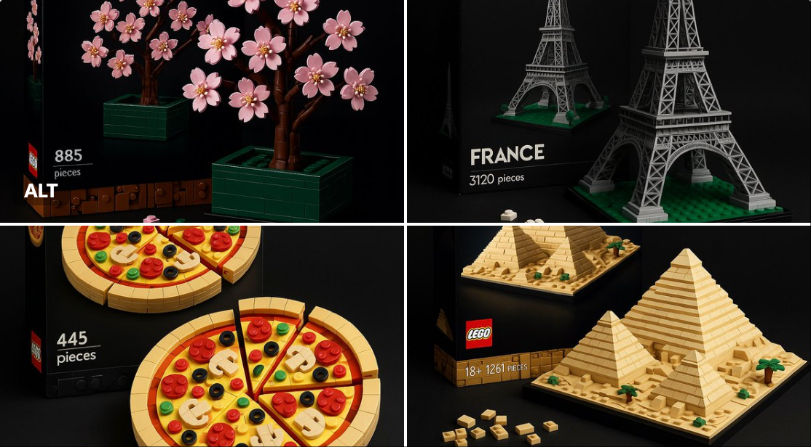

## a single [OBJECT] glowing vividly with internal neon lig

- ID: gpt4o-183-en-1
- Slug: prompt-183-en-1
- 语言: en
- 来源: [来源链接](https://x.com/aziz4ai/status/1939059047149289595)
- 样例图路径: images/part3/183.jpeg

### 提示词

```text
a single [OBJECT] glowing vividly with internal neon light that matches its brand or essence — the glow must follow the object’s shape and details precisely without overexposing — cinematic studio lighting — rich reflective surface or texture — subtle ambient fog or mist around the object — sharp shadows and clean contrast — floating or standing on a soft reflective black surface — ultra-sharp details — 2:3 vertical layout — pure black background — high-Kelvin lighting to avoid yellow tint — ultra-HD photorealism — the glow must feel premium, dramatic, and emotionally pow
```

### 样例图

![a single [OBJECT] glowing vividly with internal neon lig](../images/part3/183.jpeg)

## 霓虹效果海报

- ID: gpt4o-183-zh-2
- Slug: prompt-183-zh-2
- 语言: zh
- 来源: [来源链接](https://x.com/aziz4ai/status/1939059047149289595)
- 样例图路径: images/part3/183.jpeg

### 提示词

```text
单个 [对象] 用与其品牌或本质相匹配的内部霓虹灯发出生动的光芒 — 光芒必须精确地跟随对象的形状和细节，而不会过度曝光 — 电影摄影棚照明 — 丰富的反射表面或纹理 — 对象周围微妙的环境雾或薄雾 — 清晰的阴影和清晰的对比度 — 漂浮或站在柔和的反光黑色表面上 — 超清晰的细节 — 2：3 垂直布局 — 纯黑色背景 — 高开尔文照明以避免黄色调 — 超高清照片级真实感 — 发光必须让人感觉优质、戏剧性且情感上充满情感冲击
```

### 样例图

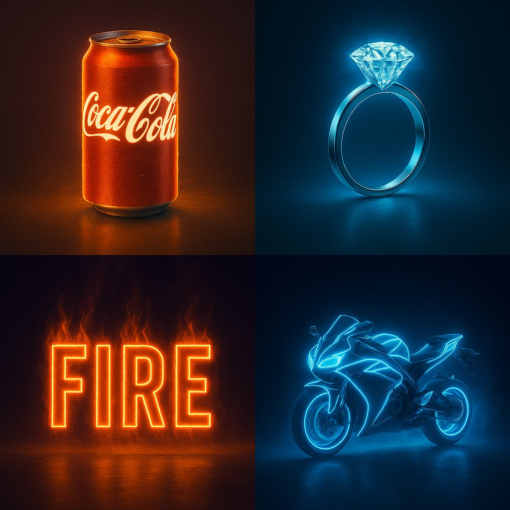

## Abstract liquid typography spelling "text", made of thic

- ID: gpt4o-181-en-1
- Slug: prompt-181-en-1
- 语言: en
- 来源: [来源链接](https://x.com/azed_ai/status/1938599250738503861)
- 样例图路径: images/part3/181.jpeg

### 提示词

```text
Abstract liquid typography spelling "text", made of thick, transparent water-gel with realistic refraction and soft shadows. Each letter appears sculpted from droplets with surface tension, smooth curves, and light reflections. Water droplets scattered on the surface, minimal background, hyper-realistic lighting, photorealistic render
```

### 样例图

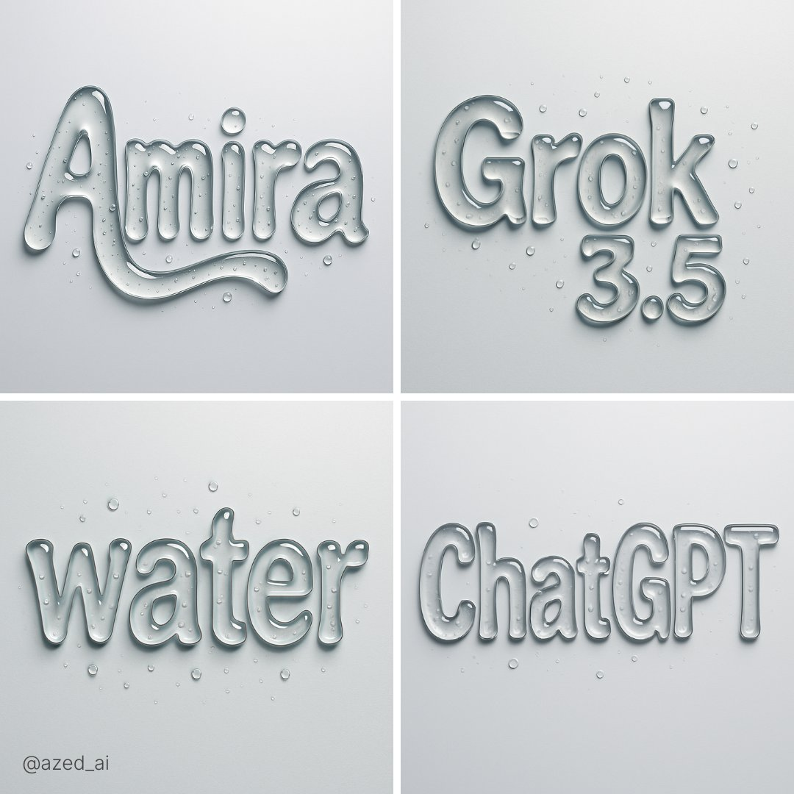

## 抽象液体排版文字

- ID: gpt4o-181-zh-2
- Slug: prompt-181-zh-2
- 语言: zh
- 来源: [来源链接](https://x.com/azed_ai/status/1938599250738503861)
- 样例图路径: images/part3/181.jpeg

### 提示词

```text
抽象液体排版拼写“text”，由厚实、透明的水凝胶制成，具有逼真的折射和柔和的阴影。每个字母都由具有表面张力、平滑曲线和光反射的水滴雕刻而成。散落在表面上的水滴、极小的背景、超逼真的照明、照片级逼真的渲染
```

### 样例图


## A cute pastel vinyl figure of [INSERT YOUR CHARACTER OR 

- ID: gpt4o-180-en-1
- Slug: prompt-180-en-1
- 语言: en
- 来源: [来源链接](https://x.com/TheRelianceAI/status/1938688543284707403)
- 样例图路径: images/part3/180.png

### 提示词

```text
A cute pastel vinyl figure of [INSERT YOUR CHARACTER OR OBJECT], pastel colors (lavender, soft pink, baby blue), kawaii style with big round eyes and friendly smile, simple rounded shapes, stylized “RIP” detail somewhere on the figure or base, matching toy packaging in the background with themed art, studio product photo with soft lighting, minimal shadows
```

### 样例图


## 可爱粉彩乙烯基人物

- ID: gpt4o-180-zh-2
- Slug: prompt-180-zh-2
- 语言: zh
- 来源: [来源链接](https://x.com/TheRelianceAI/status/1938688543284707403)
- 样例图路径: images/part3/180.png

### 提示词

```text
一个可爱的粉彩乙烯基人物 [插入您的角色或对象]，柔和的颜色（薰衣草色、柔和的粉红色、婴儿蓝色）、卡哇伊风格、圆圆的大眼睛和友好的微笑、简单的圆形形状、人物或底座上某处的程式化“RIP”细节、背景中的玩具包装与主题艺术相匹配、具有柔和灯光的工作室产品照片，最小的阴影
```

### 样例图


## Cinematic still, A [ description of the character or act

- ID: gpt4o-174-en-1
- Slug: prompt-174-en-1
- 语言: en
- 来源: [来源链接](https://x.com/CharaspowerAI/status/1938635953280549061)
- 样例图路径: images/part3/174.png

### 提示词

```text
Cinematic still, A [ description of the character or action scene], with a [ background/environment], a dynamic angle, a [light effect or lighting condition], motion blur, high-resolution photography, a cinematic scene, cinematic lighting, and high contrast.
```

### 样例图


## 生成电影氛围图

- ID: gpt4o-174-zh-2
- Slug: prompt-174-zh-2
- 语言: zh
- 来源: [来源链接](https://x.com/CharaspowerAI/status/1938635953280549061)
- 样例图路径: images/part3/174.png

### 提示词

```text
电影静止图像、具有 [ 背景/环境] 、动态角度、[光效或照明条件]、运动模糊、高分辨率摄影、电影场景、电影照明和高对比度。
```

### 样例图


## Recreate this image using the parameters of the JSON pro

- ID: gpt4o-172-en-1
- Slug: prompt-172-en-1
- 语言: en
- 来源: [来源链接](https://x.com/alban_gz/status/1938553802400899205)
- 样例图路径: images/part3/172.jpeg

### 提示词

```text
Recreate this image using the parameters of the JSON provided.
{
  "style_transfer": {
    "name": "Prismatic Crystal",
    "description": "Applies a highly realistic prismatic crystal style to any object, using precise light dispersion and photographic clarity. Ideal for adding a premium, gem-like finish to metallic or structured forms.",
    "style_attributes": {
      "surface_texture": "polished faceted crystal, sharp and clean edges, flawless transparency",
      "lighting": "soft studio lighting with clear specular highlights and smooth ambient shadows",
      "color_palette": ["sapphire blue", "electric cyan", "sunset amber", "violet", "magenta", "neutral white"],
      "material": "dense optical glass or cut gemstone with prismatic inner reflections",
      "effects": [
        "realistic spectral dispersion",
        "micro-refractions along edges",
        "soft caustics on adjacent surfaces",
        "lens-sharp gloss finish",
        "subtle light blooming in high contrast areas"
      ],
      "contrast": "balanced with high edge definition and natural depth falloff"
    },
    "application_method": {
      "blend_mode": "photographic overlay",
      "intensity": 1.0,
      "masking": "precise masking to preserve structure and cast shadows",
      "edge_enhancement": "controlled sharpening for facets only",
      "preserve_original_shape": true,
      "realism_priority": true,
      "depth_mapping": true,
      "chromatic_aberration_limit": "minimal"
    }
  }
}
```

### 样例图


## 棱柱形水晶

- ID: gpt4o-172-zh-2
- Slug: prompt-172-zh-2
- 语言: zh
- 来源: [来源链接](https://x.com/alban_gz/status/1938553802400899205)
- 样例图路径: images/part3/172.jpeg

### 提示词

```text
使用提供的 JSON 的参数重新创建此图像。
{
“style_transfer”：{
“name”： “棱柱晶体”，
“description”： “使用精确的光扩散和照片清晰度，将高度逼真的棱柱形水晶样式应用于任何对象。非常适合为金属或结构化形式添加优质的宝石般的饰面。
“style_attributes”：{
“surface_texture”： “抛光的刻面水晶，锋利干净的边缘，无瑕的透明度”，
“lighting”： “柔和的工作室照明，具有清晰的镜面高光和平滑的环境阴影”，
“color_palette”： [“宝石蓝”， “电青色”， “日落琥珀色”， “紫罗兰色”， “品红色”， “中性白”]，
“material”： “密集的光学玻璃或切割宝石，具有棱柱形内部反射”，
“effects”： [
“真实光谱色散”，
“沿边缘的微折射”，
“相邻曲面上的软焦散”，
“镜片般锐利的光泽饰面”，
“高对比度区域中的微妙光晕”
],
“contrast”： “平衡，边缘清晰度高，深度衰减自然”
    },
“application_method”： {
“blend_mode”： “摄影叠加”，
“intensity”：1.0、
“masking”： “精确蒙版以保留结构并投射阴影”，
“edge_enhancement”： “仅针对小平面的受控锐化”，
“preserve_original_shape”： true，
“realism_priority”：true、
“depth_mapping”：true、
“chromatic_aberration_limit”： “最小”
    }
  }
}
```

### 样例图


## Close-up, A hand holding a transparent capsule, inside i

- ID: gpt4o-169-en-1
- Slug: prompt-169-en-1
- 语言: en
- 来源: [来源链接](https://x.com/CharaspowerAI/status/1938299520019734676)
- 样例图路径: images/part3/169.png

### 提示词

```text
Close-up, A hand holding a transparent capsule, inside it is a miniature model of [character name], wearing [their iconic outfit and accessories]. The character is posed in a [specific, expressive or dynamic pose], interacting with the inner surface of the capsule, as if they are frozen or confined inside. Hyper-realistic, cinematic, studio lighting setup, photographed with a macro lens.
```

### 样例图


## 微型透明胶囊

- ID: gpt4o-169-zh-2
- Slug: prompt-169-zh-2
- 语言: zh
- 来源: [来源链接](https://x.com/CharaspowerAI/status/1938299520019734676)
- 样例图路径: images/part3/169.png

### 提示词

```text
特写，一只手拿着一个透明的胶囊，里面是一个 [角色名称] 的微型模型，穿着 [他们的标志性服装和配饰]。角色以 [特定、富有表现力或动态的姿势] 摆姿势，与胶囊的内表面互动，就好像他们被冻结或限制在里面一样。超逼真、电影般的工作室照明设置，使用微距镜头拍摄。
```

### 样例图


## A minimal still life of a round glass candle filled with

- ID: gpt4o-168-en-1
- Slug: prompt-168-en-1
- 语言: en
- 来源: [来源链接](https://x.com/TheRelianceAI/status/1938272260726350172)
- 样例图路径: images/part3/168.png

### 提示词

```text
A minimal still life of a round glass candle filled with [fruit], labeled “[SCENT NAME]”, placed on elegant white silk fabric. The candle glass is [glass color], and the wax matches the fruit color. The scene is softly lit by natural daylight with subtle shadows and smooth highlights. Hyperrealistic texture, clean aesthetic, top-down view, styled like high-end product photography.
```

### 样例图


## 水果蜡烛

- ID: gpt4o-168-zh-2
- Slug: prompt-168-zh-2
- 语言: zh
- 来源: [来源链接](https://x.com/TheRelianceAI/status/1938272260726350172)
- 样例图路径: images/part3/168.png

### 提示词

```text
一个装满 [水果] 的圆形玻璃蜡烛的极简静物，标有“[SCENT NAME]”，放在优雅的白色丝绸织物上。蜡烛玻璃为【玻璃色】，蜡与水果色相配。该场景由自然日光柔和照亮，具有微妙的阴影和平滑的高光。超写实的质感，简洁的美感，自上而下的视角，风格像高端产品摄影。
```

### 样例图


## create image with 1:1 ratio retexture the photo I attach

- ID: gpt4o-167-en-1
- Slug: prompt-167-en-1
- 语言: en
- 来源: [来源链接](https://x.com/hc_dsn/status/1938203557771260064)
- 样例图路径: images/part3/167.jpeg

### 提示词

```text
create image with 1:1 ratio 
retexture the photo I attached with the following json 
{   "style_name": "hermes_subtle_specular_gradient",   "background": {     "type": "solid",     "color": "#000000",     "light_reflection": "none"   },   "base_material": {     "type": "polished_metal",     "color": "#B0B0B0",     "finish": "glossy",     "reflectivity": 0.75,     "surface_variation": {       "micro_noise": 0.005,       "brushed_direction": "none"     }   },   "highlight_strategy": {     "mode": "localized_specular_enhancement",     "trigger": "light-facing curved planes and direct lit faces",     "color_gradient": ["#121A28", "#3D4C6B", "#8c71b7", "#4d21cd"],     "gradient_type": "fluid_blend",     "intensity_curve": "ease-out from highlight center",     "falloff": 0.8,     "blend_mode": "soft_light",     "saturation_level": 0.4,     "coverage_ratio": 0.2,     "transition_smoothness": 0.95   },   "lighting": {     "scene_type": "high-control studio",     "key_light": {       "intensity": 1.0,       "color": "#FFFFFF",       "angle": "35° above and side",       "softness": 0.6     },     "fill_light": {       "enabled": false     },     "rim_light": {       "enabled": false     },     "reflection_behavior": {       "mirrored_zones": "limited to high exposure zones",       "glow_color": "applied from gradient with low saturation"     }   },   "specular_color_behavior": {     "base_surface": "metallic neutral",     "highlight_zones": "low-saturation chromatic reflection",     "edge_bleed": "minimal",     "inner_glow": 0.1   },   "detail_features": {     "engraved_elements": {       "type": "precise deboss",       "lighting_response": "low bounce",       "shadow_edge": "#222222",       "rim_light_tint": "#888888"     }   },   "application_targets": [     "object product photography",     "3D icons with selective lighting",     "branding renders",     "luxury UI component styling"   ],   "visual_effect_notes": {     "mood": "understated luxury, technical precision, controlled emotion",     "realism": "stylized physical logic",     "focus": "refined colored specular only on light-facing curved surfaces with fluid-like gradient transitions"   } }
```

### 样例图


## 液态金属设计产品

- ID: gpt4o-167-zh-2
- Slug: prompt-167-zh-2
- 语言: zh
- 来源: [来源链接](https://x.com/hc_dsn/status/1938203557771260064)
- 样例图路径: images/part3/167.jpeg

### 提示词

```text
以 1：1 的比例创建图像
我用以下 json 对我附加的照片进行 retexture
{ “style_name”： “hermes_subtle_specular_gradient”， “background”： { “type”： “solid”， “color”： “#000000”， “light_reflection”： “none” }， “base_material”： { “type”： “polished_metal”， “color”： “#B0B0B0”， “finish”： “glossy”， “reflectivity”： 0.75， “surface_variation”： { “micro_noise”： 0.005， “brushed_direction”： “none” } }， “highlight_strategy”： { “mode”： “localized_specular_enhancement”， “trigger”： “朝光曲面和直接照明 faces“， ”color_gradient“： [”#121A28“， ”#3D4C6B“， ”#8c71b7“， ”#4d21cd“]， ”gradient_type“： ”fluid_blend“， ”intensity_curve“： ”从高光中心缓出“， ”衰减“： 0.8， ”blend_mode“： ”soft_light“， ”saturation_level“： 0.4， ”coverage_ratio“： 0.2， ”transition_smoothness“： 0.95 }， ”lighting“： { ”scene_type“： ”high-control studio“， ”key_light“： { ”intensity“：1.0， “color”： “#FFFFFF”， “angle”： “上侧 35°”， “柔和度”： 0.6 }， “fill_light”： { “enabled”： false }， “rim_light”： { “enabled”： false }， “reflection_behavior”： { “mirrored_zones”： “仅限于高曝光区域”， “glow_color”： “从低饱和度渐变应用” } }， “specular_color_behavior”： { “base_surface”： “金属中性”， “highlight_zones”： “低饱和度色度 reflection“， ”edge_bleed“： ”minimal“， ”inner_glow“： 0.1 }， ”detail_features“： { ”engraved_elements“： { ”type“： ”精确凹陷“， ”lighting_response“： ”低反弹“， ”shadow_edge“： ”#222222“， ”rim_light_tint“： ”#888888“ } }， ”application_targets“： [ ”对象产品 photography“， ”具有选择性照明的 3D 图标“， ”品牌渲染“， ”豪华 UI 组件样式“ ]， ”visual_effect_notes“： { ”mood“： ”低调奢华、技术精确、受控情感“， ”realism“： ”风格化的物理逻辑“， ”focus“： ”仅在具有流体般渐变过渡的面向光线的曲面上优化彩色镜面反射“ } }
```

### 样例图


## Hyper-realistic [fruit name] made of translucent glass, 

- ID: gpt4o-163-en-1
- Slug: prompt-163-en-1
- 语言: en
- 来源: [来源链接](https://x.com/azed_ai/status/1936825522417533274)
- 样例图路径: images/part3/163.jpeg

### 提示词

```text
Hyper-realistic [fruit name] made of translucent glass, smooth, rounded surface with fine air bubbles inside, placed on a clean surface, sharp lighting with strong reflections and highlights, minimal background, photorealistic, glossy texture, 3D render style, crystal-like appearance, soft shadows, macro photography
```

### 样例图

![Hyper-realistic [fruit name] made of translucent glass, ](../images/part3/163.jpeg)

## 半透明玻璃物品ASMR

- ID: gpt4o-163-zh-2
- Slug: prompt-163-zh-2
- 语言: zh
- 来源: [来源链接](https://x.com/azed_ai/status/1936825522417533274)
- 样例图路径: images/part3/163.jpeg

### 提示词

```text
由半透明玻璃制成的超写实 [水果名称]，光滑、圆润的表面，内部有细小的气泡，放置在干净的表面上，具有强烈反射和高光的清晰照明，最小的背景，照片级写实，有光泽的纹理，3D 渲染样式，水晶般的外观，柔和的阴影，微距摄影
```

### 样例图

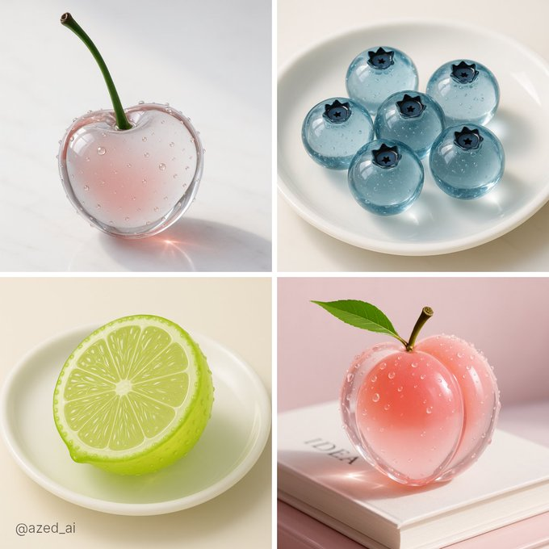

## Recreate this image using the pamareters of the JSON pro

- ID: gpt4o-159-en-1
- Slug: prompt-159-en-1
- 语言: en
- 来源: [来源链接](https://x.com/alban_gz/status/1936820704713875818)
- 样例图路径: images/part3/159.jpeg

### 提示词

```text
Recreate this image using the pamareters of the JSON provided.
{
  "name": "Gemstone Render",
  "object": {
    "type": "auto",
    "detected_color": "auto",
    "form": "realistic, natural form preserved",
    "material": "crystal or faceted gemstone glass",
    "surface": "precision-cut facets, sharp reflections",
    "transparency": "high clarity with light refraction",
    "internal_features": "color depth, internal shimmer, and light dispersion"
  },
  "color_and_light": {
    "primary_color": "{detected_color}",
    "highlight_effects": "specular highlights, gemstone brilliance, caustics",
    "lighting_setup": "studio lighting with white or soft background",
    "metallic_accents": {
      "enabled": true,
      "material": "gold or chrome",
      "application": "rim, stem, or edge detailing"
    }
  },
  "style": {
    "artistic_style": [
      "photorealistic 3D render",
      "Gemstone Render Style",
      "luxury object visualization"
    ],
    "design_language": [
      "faceted precision modeling",
      "jewelry-like rendering",
      "optical depth and brilliance"
    ]
  },
  "technical_details": {
    "render_engine": [
      "Blender with Cycles",
      "Cinema 4D + Redshift/Octane"
    ],
    "rendering_techniques": [
      "physically-based rendering (PBR)",
      "ray tracing",
      "global illumination"
    ],
    "resolution": "ultra high-res (4K–8K)",
    "post_processing": [
      "subtle glow",
      "enhanced reflections",
      "color-preserving contrast boost"
    ]
  }
```

### 样例图


## 渲染宝石

- ID: gpt4o-159-zh-2
- Slug: prompt-159-zh-2
- 语言: zh
- 来源: [来源链接](https://x.com/alban_gz/status/1936820704713875818)
- 样例图路径: images/part3/159.jpeg

### 提示词

```text
使用提供的 JSON 的 pamareters 重新创建此图像。
{
“name”： “宝石渲染”，
“对象”： {
“type”： “auto”， //类型
“detected_color”： “auto”，
“form”： “保留真实、自然的形式”，
“material”： “水晶或刻面宝石玻璃”，
“surface”： “精确切割的刻面，清晰的反射”，
“transparency”： “高清晰度，光线折射”，
“internal_features”： “颜色深度、内部微光和光色散”
  },
“color_and_light”： {
“primary_color”： “{detected_color}”，
“highlight_effects”： “镜面高光、宝石亮度、焦散”，
“lighting_setup”： “白色或柔和背景的工作室照明”，
“metallic_accents”： {
“enabled”： true 和
“material”： “金或铬”，
“application”： “边缘、茎或边缘细节”
    }
  },
“样式”： {
“artistic_style”：[
“逼真的 3D 渲染”，
“Gemstone Render Style”（宝石渲染样式）、
“奢侈品对象可视化”
],
“design_language”：[
“faceted precision modeling”，
“珠宝般的渲染”，
“光学深度和亮度”
    ]
  },
“technical_details”： {
“render_engine”：[
“带循环的 Blender”，
“Cinema 4D + Redshift/Octane”
],
“rendering_techniques”：[
“基于物理的渲染 （PBR）”，
“光线追踪”，
“全局照明”
],
“resolution”： “超高分辨率 （4K–8K）”，
“post_processing”：[
“微妙的光芒”，
“增强反射”，
“保色对比度提升”
    ]
  }
```

### 样例图


## The [LANDMARK - Statue of Liberty/Eiffel Tower/Big Ben] 

- ID: gpt4o-156-en-1
- Slug: prompt-156-en-1
- 语言: en
- 来源: [来源链接](https://x.com/zeng_wt/status/1936743124522750336)
- 样例图路径: images/part3/156.jpeg

### 提示词

```text
The [LANDMARK - Statue of Liberty/Eiffel Tower/Big Ben] perfectly carved and functional as a [FURNITURE_PIECE - lamp/bookshelf/coffee table], living room setting, normal scale furniture, photorealistic detail.
```

### 样例图

![The [LANDMARK - Statue of Liberty/Eiffel Tower/Big Ben] ](../images/part3/156.jpeg)

## 作为家具的著名地标

- ID: gpt4o-156-zh-2
- Slug: prompt-156-zh-2
- 语言: zh
- 来源: [来源链接](https://x.com/zeng_wt/status/1936743124522750336)
- 样例图路径: images/part3/156.jpeg

### 提示词

```text
[LANDMARK - 自由女神像/埃菲尔铁塔/大本钟]雕刻完美，功能强大，就像一个[FURNITURE_PIECE - 灯/书架/咖啡桌]，客厅设置，正常比例的家具，逼真的细节。
```

### 样例图


## A highly realistic vertical photograph of a traditional 

- ID: gpt4o-145-en-1
- Slug: prompt-145-en-1
- 语言: en
- 来源: [来源链接](https://x.com/TheRelianceAI/status/1937064180017971501)
- 样例图路径: images/part3/145.png

### 提示词

```text
A highly realistic vertical photograph of a traditional chessboard viewed from above, set against a textured surface inspired by [COUNTRY]’s artistic heritage. The chessboard features intricate patterns and national motifs, with the word “[COUNTRY]” written across the board in elegant golden calligraphy. All the chess pieces are off the board, arranged around it on the fabric — some lying on their side, others upright — as if waiting to be placed. Each piece is uniquely reimagined in shape, ornament, and texture, reflecting the architecture, cultural symbols, and color palette of [COUNTRY]. Rich materials, soft directional light, cinematic shadows, ultra-detailed editorial still life style, symmetrical top-down framing, 9:16 format.
```

### 样例图

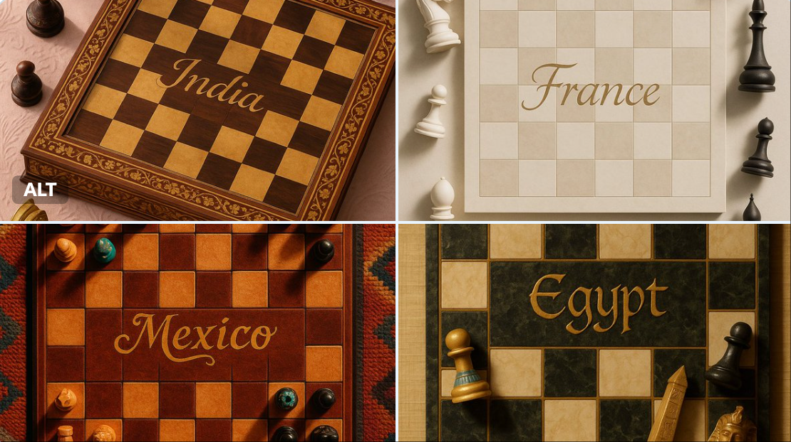

## 用自己的审美下棋

- ID: gpt4o-145-zh-2
- Slug: prompt-145-zh-2
- 语言: zh
- 来源: [来源链接](https://x.com/TheRelianceAI/status/1937064180017971501)
- 样例图路径: images/part3/145.png

### 提示词

```text
一张高度逼真的传统棋盘垂直照片，从上方看，背景是受 [COUNTRY] 艺术遗产启发的纹理表面。棋盘上有复杂的图案和国家图案，棋盘上用优雅的金色书法写着“[COUNTRY]”字样。所有的棋子都离开了棋盘，围绕着棋盘排列在织物上——有些侧躺着，有些直立着——仿佛等待着被放置。每件作品在形状、装饰和质地上都经过独特的重新构想，反映了 [COUNTRY] 的建筑、文化符号和调色板。丰富的素材、柔和的定向光、电影般的阴影、超详细的编辑静物风格、对称的自上而下的取景、9：16 格式。
```

### 样例图


## A realistic, high-end cocktail in a frosted glass with a

- ID: gpt4o-143-en-1
- Slug: prompt-143-en-1
- 语言: en
- 来源: [来源链接](https://x.com/TheRelianceAI/status/1936726936409313294)
- 样例图路径: images/part3/143.png

### 提示词

```text
A realistic, high-end cocktail in a frosted glass with a sparkling salt rim, filled with crystal-clear ice cubes. The drink is garnished with deep-blue kale leaves and delicate pastel-pink edible flowers. The lighting is moody and cinematic, with soft highlights on the glass. The entire visual style — color palette, lighting, background, and atmosphere — is inspired by the animated film 【MOVIE_TITLE】 by Disney, subtly reflecting its visual tone and mood. At the bottom of the image, in elegant golden serif text, it says: “Disney — 【MOVIE_TITLE】”. Vertical 9:16, ultra-detailed, photographic realism with artistic direction based on the film’s world.
```

### 样例图


## 迪士尼鸡尾酒

- ID: gpt4o-143-zh-2
- Slug: prompt-143-zh-2
- 语言: zh
- 来源: [来源链接](https://x.com/TheRelianceAI/status/1936726936409313294)
- 样例图路径: images/part3/143.png

### 提示词

```text
一款逼真的高端鸡尾酒，装在磨砂玻璃杯中，带有波光粼粼的盐边，里面装满了晶莹剔透的冰块。这款饮料以深蓝色的羽衣甘蓝叶和精致的淡粉色食用花朵装饰。灯光是喜怒无常的和电影般的，玻璃上有柔和的亮点。整个视觉风格——调色板、灯光、背景和氛围——都受到了迪士尼动画电影【MOVIE_TITLE】的启发，巧妙地反映了它的视觉基调和情绪。在图片的底部，用优雅的金色衬线文字写着：“Disney — 【MOVIE_TITLE】”。垂直 9：16，超详细，摄影现实主义，艺术指导基于电影世界。
```

### 样例图


## create image with 1:1 ratio A branded footwear ad for [B

- ID: gpt4o-142-en-1
- Slug: prompt-142-en-1
- 语言: en
- 来源: [来源链接](https://x.com/hc_dsn/status/1925139884920152110)
- 样例图路径: images/part3/142.jpeg

### 提示词

```text
create image with 1:1 ratio   A branded footwear ad for [Brand], showcasing the high-end Brand shoe using brand technology and texture.(fiction a technology and texture based on brand DNA). The shoe is shown in dynamic floating perspective over a graph paper background layout with technical sketches and handwritten notes. A random lifestyle authentic photo featuring brand clothing in motion is taped in the corner, styled with street wear fashion. Emphasize the product's slogan with  bold typography. Layout features include product spec labels like Project a fiction brand title, Date, Size, and fiction model name in engineering style. The background reference with brand pantone color palettes with code number
```

### 样例图


## 为任何品牌设计运动鞋

- ID: gpt4o-142-zh-2
- Slug: prompt-142-zh-2
- 语言: zh
- 来源: [来源链接](https://x.com/hc_dsn/status/1925139884920152110)
- 样例图路径: images/part3/142.jpeg

### 提示词

```text
以 1：1 的比例创建图片 [Brand] 的品牌鞋靴广告，使用品牌技术和纹理展示高端品牌鞋靴。（虚构一种基于品牌DNA的技术和质感）。这双鞋以动态浮动透视形式显示在方格纸背景布局上，并附有技术草图和手写注释。角落里贴着一张随机的生活方式真实照片，照片中展示了运动中的品牌服装，与街头服饰时尚相得益彰。用粗体排版强调产品的口号。布局功能包括产品规格标签，如工程样式的 Project a fiction brand title、Date、Size 和 fiction model name。带有品牌 pantone 调色板和代码编号的背景参考
```

### 样例图


## A high-quality studio product photo of a [brand name]-br

- ID: gpt4o-139-en-1
- Slug: prompt-139-en-1
- 语言: en
- 来源: [来源链接](https://x.com/azed_ai/status/1934631664153760241)
- 样例图路径: images/part3/139.jpeg

### 提示词

```text
A high-quality studio product photo of a [brand name]-branded [product type], [floating / standing] against a solid background in the brand’s signature color. The product features the brand logo prominently and uses the official brand color palette. Clean composition, soft shadows, ultra-realistic materials and textures, no text, no props, professional commercial lighting, sharp focus, minimalist aesthetic.
```

### 样例图

![A high-quality studio product photo of a [brand name]-br](../images/part3/139.jpeg)

## 将您最喜欢的品牌变成生活方式产品

- ID: gpt4o-139-zh-2
- Slug: prompt-139-zh-2
- 语言: zh
- 来源: [来源链接](https://x.com/azed_ai/status/1934631664153760241)
- 样例图路径: images/part3/139.jpeg

### 提示词

```text
一张高质量的工作室商品照片，其中包含 [品牌名称] 品牌 [商品类型]、[浮动/直立] 和纯色背景，采用品牌标志性的颜色。该商品突出品牌徽标，并使用官方品牌调色板。干净的构图，柔和的阴影，超逼真的材质和纹理，无文字，无道具，专业的商业照明，锐利的焦点，极简的美学。
```

### 样例图


## a fully transparent [product] made of ultra-clear irides

- ID: gpt4o-137-en-1
- Slug: prompt-137-en-1
- 语言: en
- 来源: [来源链接](https://x.com/aziz4ai/status/1934528170264572227)
- 样例图路径: images/part3/137.jpeg

### 提示词

```text
a fully transparent [product] made of ultra-clear iridescent glass, showing all internal components in photorealistic detail. The outer shell is glossy, refracts subtle rainbow colors, and reveals the product’s structure and mechanics. Scene lit with high-Kelvin studio lighting (~7000K) on a neutral background. The product maintains its real proportions, materials, and branding.
```

### 样例图

![a fully transparent [product] made of ultra-clear irides](../images/part3/137.jpeg)

## 透视一切

- ID: gpt4o-137-zh-2
- Slug: prompt-137-zh-2
- 语言: zh
- 来源: [来源链接](https://x.com/aziz4ai/status/1934528170264572227)
- 样例图路径: images/part3/137.jpeg

### 提示词

```text
由超透明虹彩玻璃制成的完全透明 [产品]，以逼真的细节展示所有内部组件。外壳有光泽，折射出微妙的彩虹色，并揭示产品的结构和机械。在中性背景上使用高开尔文工作室照明 （~7000K） 照亮的场景。该产品保持其真实的比例、材料和品牌。
```

### 样例图

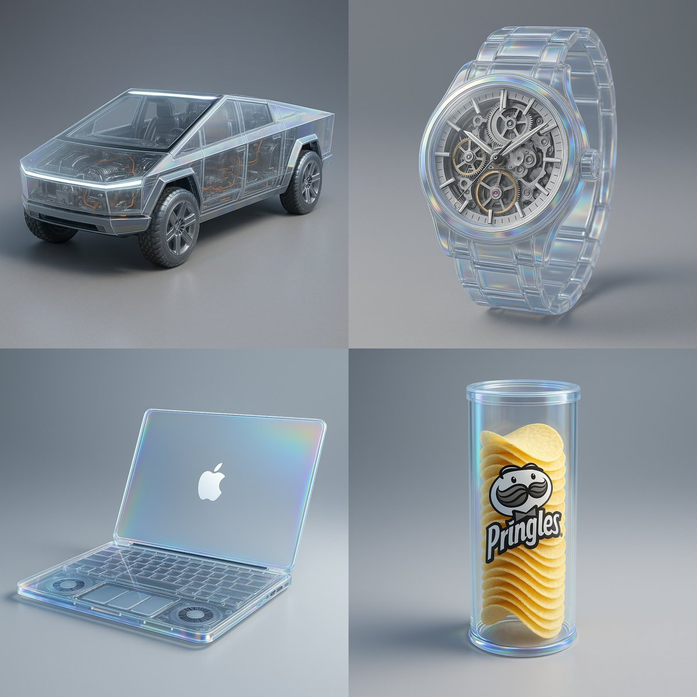

## A high-quality studio photograph of a [OBJECT] fully cov

- ID: gpt4o-136-en-1
- Slug: prompt-136-en-1
- 语言: en
- 来源: [来源链接](https://x.com/Kerroudjm/status/1934682610632151500)
- 样例图路径: images/part3/136.png

### 提示词

```text
A high-quality studio photograph of a [OBJECT] fully covered in ultra-realistic [ANIMAL] texture (e.g., fur, feathers, skin, or scales), placed against a soft neutral background. The object’s original form remains visible but is wrapped in the animal’s natural pattern and surface detail. The image features clean composition, soft shadows, sharp focus, minimalist styling, professional lighting, and highly detailed textures—each hair, feather, or wrinkle should be visible. Format 1:1.
```

### 样例图

![A high-quality studio photograph of a [OBJECT] fully cov](../images/part3/136.png)

## 日常用品有皮肤

- ID: gpt4o-136-zh-2
- Slug: prompt-136-zh-2
- 语言: zh
- 来源: [来源链接](https://x.com/Kerroudjm/status/1934682610632151500)
- 样例图路径: images/part3/136.png

### 提示词

```text
一张 [OBJECT] 的高质量工作室照片，完全覆盖在超逼真的 [ANIMAL] 纹理（例如，毛皮、羽毛、皮肤或鳞片）中，置于柔和的中性背景上。对象的原始形状仍然可见，但包裹在动物的自然图案和表面细节中。该图像具有干净的构图、柔和的阴影、清晰的焦点、极简主义的造型、专业的照明和高度详细的纹理——每根头发、羽毛或皱纹都应该可见。格式 1：1。
```

### 样例图


## A hyper-realistic photograph of a [SUBJECT] entirely mad

- ID: gpt4o-133-en-1
- Slug: prompt-133-en-1
- 语言: en
- 来源: [来源链接](https://x.com/TheRelianceAI/status/1934662213702140116)
- 样例图路径: images/part3/133.png

### 提示词

```text
A hyper-realistic photograph of a [SUBJECT] entirely made from a single, semi-rigid transparent material that drapes and folds like sheer plastic or molten glass. The object is fully recognizable in shape, yet ghostly and fluid, as if sculpted from air and frozen in motion. Set in a moody, industrial interior with aged concrete walls and diffused daylight from metal-barred windows. The lighting gently highlights the reflections, edges, and flowing curves of the transparent form. Dreamlike, minimalist, surreal design aesthetic.
```

### 样例图

![A hyper-realistic photograph of a [SUBJECT] entirely mad](../images/part3/133.png)

## 幽灵形态

- ID: gpt4o-133-zh-2
- Slug: prompt-133-zh-2
- 语言: zh
- 来源: [来源链接](https://x.com/TheRelianceAI/status/1934662213702140116)
- 样例图路径: images/part3/133.png

### 提示词

```text
一张 [SUBJECT] 的超写实照片，完全由单一的、半刚性的透明材料制成，像纯粹的塑料或熔融玻璃一样悬垂和折叠。这个物体的形状是完全可识别的，但又幽灵般流动，仿佛从空气中雕刻出来，在运动中冻结。坐落在喜怒无常的工业室内，拥有老化的混凝土墙和从金属栅栏窗户射出的日光。灯光柔和地突出了透明形式的反射、边缘和流动曲线。梦幻般的、极简主义的、超现实主义的设计美学。
```

### 样例图

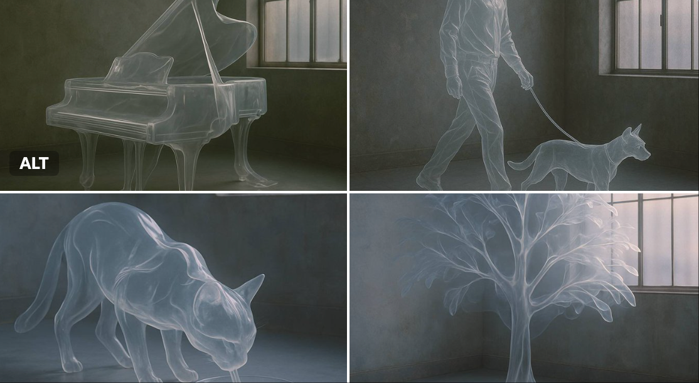

## Close-up photo of a small plush keychain of [attached im

- ID: gpt4o-131-en-1
- Slug: prompt-131-en-1
- 语言: en
- 来源: [来源链接](https://x.com/azed_ai/status/1934973851164897444)
- 样例图路径: images/part3/131.jpeg

### 提示词

```text
Close-up photo of a small plush keychain of [attached image/emojis]  held gently between two fingers, made of soft felt or fuzzy material, cartoon-style proportions, embroidered face with simple expressive features, character designed to resemble, attached to a shiny silver keyring, neutral beige background, shallow depth of field, soft natural lighting, highly detailed texture, cute and handcrafted aesthetic, studio photography, 1:1 aspect ratio
```

### 样例图


## 自定义毛绒钥匙扣

- ID: gpt4o-131-zh-2
- Slug: prompt-131-zh-2
- 语言: zh
- 来源: [来源链接](https://x.com/azed_ai/status/1934973851164897444)
- 样例图路径: images/part3/131.jpeg

### 提示词

```text
[附图/表情符号] 的小毛绒钥匙扣的特写照片，用两根手指轻轻握住，由柔软的毛毡或毛茸茸的材料制成，卡通风格的比例，具有简单表现特征的刺绣脸，设计相似的人物，附在闪亮的银色钥匙圈上，中性米色背景，浅景深，柔和的自然光，高度详细的纹理，可爱和手工制作的美感， 摄影棚摄影，1：1 纵横比
```

### 样例图


## A hyper-realistic photograph of a [FRUIT] sliced into fi

- ID: gpt4o-129-en-1
- Slug: prompt-129-en-1
- 语言: en
- 来源: [来源链接](https://x.com/umesh_ai/status/1934562439326306814)
- 样例图路径: images/part3/129.jpeg

### 提示词

```text
A hyper-realistic photograph of a [FRUIT] sliced into five glossy layers, each slice floating vertically in mid-air with glistening juice droplets at the edges. The slices cast soft, natural shadows on each other. The [FRUIT] has a vibrant skin with appropriate interior details .Set against a softly blurred tropical garden background with hints of lush green leaves and dappled sunlight, the scene is lit with warm, directional golden-hour lighting, enhancing the vivid colors and depth
```

### 样例图

![A hyper-realistic photograph of a [FRUIT] sliced into fi](../images/part3/129.jpeg)

## 创建悬浮切片水果

- ID: gpt4o-129-zh-2
- Slug: prompt-129-zh-2
- 语言: zh
- 来源: [来源链接](https://x.com/umesh_ai/status/1934562439326306814)
- 样例图路径: images/part3/129.jpeg

### 提示词

```text
一张 [FRUIT] 的超写实照片，被切成五个光滑的层，每个切片垂直漂浮在半空中，边缘有闪闪发光的汁液滴。切片彼此之间投射柔和、自然的阴影。[FRUIT] 拥有充满活力的皮肤和适当的内部细节。在柔和模糊的热带花园背景下，郁郁葱葱的绿叶和斑驳的阳光，场景由温暖、定向的金色小时照明照亮，增强了鲜艳的色彩和深度
```

### 样例图


## A [PERSON] in a dark room with a glowing projection of t

- ID: gpt4o-128-en-1
- Slug: prompt-128-en-1
- 语言: en
- 来源: [来源链接](https://x.com/egeberkina/status/1934670309942018397)
- 样例图路径: images/part3/128.png

### 提示词

```text
A [PERSON] in a dark room with a glowing projection of the word “[WORD]” repeated endlessly across the walls and body. The text is projected in high-contrast, neon [COLOR], wrapping around the contours of the object, creating a surreal, futuristic lighting effect. The background and object are seamlessly blended into the immersive text environment. Photorealistic, sharp shadows and light distortion where the text bends over curves. Studio lighting with deep contrast, moody cyberpunk aesthetic.
```

### 样例图

![A [PERSON] in a dark room with a glowing projection of t](../images/part3/128.png)

## 一个字的无限反射

- ID: gpt4o-128-zh-2
- Slug: prompt-128-zh-2
- 语言: zh
- 来源: [来源链接](https://x.com/egeberkina/status/1934670309942018397)
- 样例图路径: images/part3/128.png

### 提示词

```text
一个 [PERSON] 在一个黑暗的房间里，“[WORD]”这个词的发光投影在墙壁和身体上无休止地重复。文本以高对比度的霓虹灯 [COLOR] 投影，包裹在对象的轮廓周围，营造出超现实的未来主义照明效果。背景和对象无缝混合到沉浸式文本环境中。照片级真实感、锐利的阴影和文本在曲线上弯曲的光线扭曲。具有深对比度、喜怒无常的赛博朋克美学的工作室照明。
```

### 样例图


## A surreal yet hyper-realistic image in levitation photog

- ID: gpt4o-127-en-1
- Slug: prompt-127-en-1
- 语言: en
- 来源: [来源链接](https://x.com/B_4AI/status/1934527984578535561)
- 样例图路径: images/part3/127.png

### 提示词

```text
A surreal yet hyper-realistic image in levitation photography style, where elements of [subject] float chaotically and randomly above an outstretched hand, interwoven with symbolic elements that directly oppose it.

The background forms dynamically to visually embody the symbolism of the subject and its opposite, through blurred or abstract details that reflect either tension or harmony between the two—like a mirror inside a dream.

Each element floats at a unique angle and varying distance.

Background: Shifts according to the subject and its opposite

Lighting: Soft cinematic with dreamy shadows

Style: Hyper-realistic + Levitation Photography + Fantasy

Aspect Ratio: 1:1
```

### 样例图

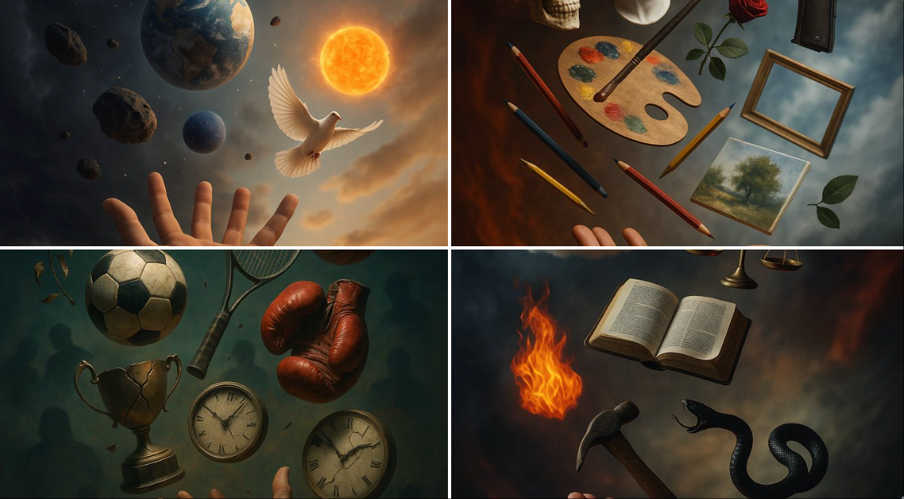

## 符号冲突

- ID: gpt4o-127-zh-2
- Slug: prompt-127-zh-2
- 语言: zh
- 来源: [来源链接](https://x.com/B_4AI/status/1934527984578535561)
- 样例图路径: images/part3/127.png

### 提示词

```text
悬浮摄影风格的超现实而超现实的图像，其中 [主体] 的元素混乱而随机地漂浮在伸出的手上方，与直接对立的象征性元素交织在一起。

背景动态形成，通过模糊或抽象的细节在视觉上体现主题及其对立面的象征意义，这些细节反映了两者之间的张力或和谐——就像梦中的镜子。

每个元素都以独特的角度和不同的距离漂浮。

背景：根据主体及其对立面而变化

照明：柔和的电影感，带有梦幻般的阴影

风格：超写实 + 悬浮摄影 + 奇幻

长宽比：1：1
```

### 样例图


## “[Product Name]” placed at the center in full photoreali

- ID: gpt4o-126-en-1
- Slug: prompt-126-en-1
- 语言: en
- 来源: [来源链接](https://x.com/aziz4ai/status/1934702903932957023)
- 样例图路径: images/part3/126.jpeg

### 提示词

```text
“[Product Name]” placed at the center in full photorealism, surrounded by surreal vector illustrations using exactly two bold, vibrant colors that match the product’s mood.
The scene is minimalistic yet energetic, with abstract vector shapes (symbols, lines, expressions, etc.) orbiting or interacting with the product.
Add the real logo clearly and integrate a short 3–4 word slogan at the bottom.
Style: surreal, high-resolution, minimal, cinematic lighting, 1:1 aspect ratio.
```

### 样例图

![“[Product Name]” placed at the center in full photoreali](../images/part3/126.jpeg)

## 重新构想的超现实主义广告

- ID: gpt4o-126-zh-2
- Slug: prompt-126-zh-2
- 语言: zh
- 来源: [来源链接](https://x.com/aziz4ai/status/1934702903932957023)
- 样例图路径: images/part3/126.jpeg

### 提示词

```text
“[产品名称]”以完全逼真的方式放置在中心，周围环绕着超现实主义的矢量插图，使用两种大胆、鲜艳的颜色，与产品的情绪相匹配。
场景简约而充满活力，抽象的矢量形状（符号、线条、表情等）围绕产品运行或与产品交互。
清楚地添加真实的 logo，并在底部加入一个 3-4 字的简短标语。
风格：超现实、高分辨率、极简、电影般的照明、1：1 纵横比。
```

### 样例图

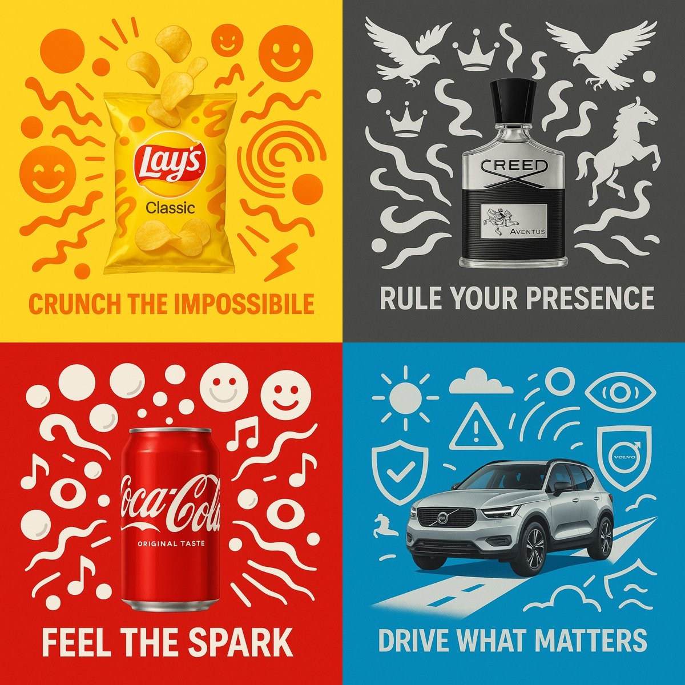

## A hyper-realistic photograph of a fashion doll styled in

- ID: gpt4o-125-en-1
- Slug: prompt-125-en-1
- 语言: en
- 来源: [来源链接](https://x.com/TheRelianceAI/status/1934688112741085562)
- 样例图路径: images/part3/125.png

### 提示词

```text
A hyper-realistic photograph of a fashion doll styled in the aesthetic of [BRAND], sitting on a plush, cream-colored bed with soft folds. The doll’s look reflects the brand’s signature elements — from hair and outfit to accessories — arranged thoughtfully to evoke a dreamy, vintage-inspired editorial. Studio-lit with warm, diffused lighting and a creamy, ivory-toned palette, the scene emulates luxury fashion photography with a soft, dollhouse-like atmosphere and shallow depth of field.
```

### 样例图


## 时尚品牌娃娃

- ID: gpt4o-125-zh-2
- Slug: prompt-125-zh-2
- 语言: zh
- 来源: [来源链接](https://x.com/TheRelianceAI/status/1934688112741085562)
- 样例图路径: images/part3/125.png

### 提示词

```text
一张超写实的照片，一个时尚娃娃以 [BRAND] 的美学风格，坐在一张带有柔软褶皱的奶油色毛绒床上。这款玩偶的外观反映了该品牌的标志性元素——从头发和服装到配饰——经过精心安排，让人联想到梦幻般的复古风格社论。工作室照明采用温暖的漫射灯光和奶油色的象牙色调调色板，该场景以柔和的玩具屋般的氛围和浅景深模拟奢华时尚摄影。
```

### 样例图


## A black and white photograph shows the blurred silhouett

- ID: gpt4o-124-en-1
- Slug: prompt-124-en-1
- 语言: en
- 来源: [来源链接](https://x.com/umesh_ai/status/1934249977326289141)
- 样例图路径: images/part3/124.jpeg

### 提示词

```text
A black and white photograph shows the blurred silhouette of a [SUBJECT] behind a frosted or translucent surface. The [PART] is sharply defined and pressed against the surface, creating a stark contrast with the rest of the hazy, indistinct figure. The background is a soft gradient of gray tones, enhancing the mysterious and artistic atmosphere
```

### 样例图

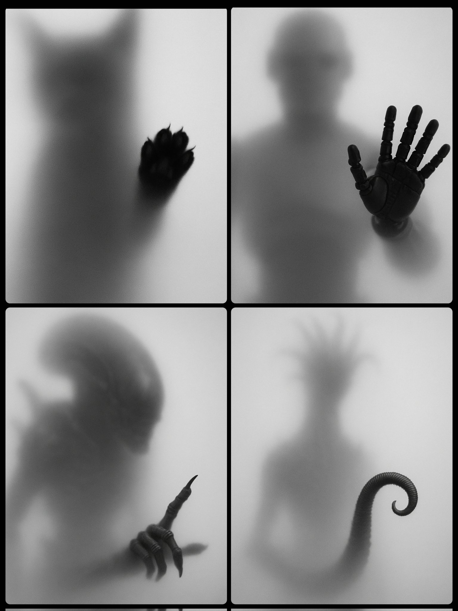

## 磨砂模糊剪影

- ID: gpt4o-124-zh-2
- Slug: prompt-124-zh-2
- 语言: zh
- 来源: [来源链接](https://x.com/umesh_ai/status/1934249977326289141)
- 样例图路径: images/part3/124.jpeg

### 提示词

```text
一张黑白照片显示了磨砂或半透明表面后面 [SUBJECT] 的模糊剪影。[PART] 轮廓分明，压在表面，与朦胧、模糊的人物的其余部分形成鲜明对比。背景是灰色调的柔和渐变，增强了神秘和艺术的氛围
```

### 样例图


## Create a close-up, square-format (1:1) photo of an embro

- ID: gpt4o-119-en-1
- Slug: prompt-119-en-1
- 语言: en
- 来源: [来源链接](https://x.com/Kerroudjm/status/1931040962513379672)
- 样例图路径: images/part3/119.png

### 提示词

```text
Create a close-up, square-format (1:1) photo of an embroidered patch inspired by the uploaded image. The design should feature a clean, cartoon-style embroidered interpretation of the original subject with rich thread texture and vibrant colors. The shape of the patch can vary (round, oval, shielded, silhouette-based), but the output image must remain square.
Integrate the national colors of the country represented—such as in the text, the border, or small decorative accents—drawing inspiration from the flag to enhance local identity. Add embroidered capital-letter text like the name of the city or country, either curved or straight. Use a soft off-white fabric background and natural lighting to bring out texture and depth.
```

### 样例图


## 城市绣花贴纸照片

- ID: gpt4o-119-zh-2
- Slug: prompt-119-zh-2
- 语言: zh
- 来源: [来源链接](https://x.com/Kerroudjm/status/1931040962513379672)
- 样例图路径: images/part3/119.png

### 提示词

```text
创建一个近景、正方形格式（1:1）的绣花贴片照片，以上传的图片为灵感。设计应采用干净的卡通风格刺绣诠释原图主题，具有丰富的线紡纹理和鲜艳的颜色。贴片的形状可以变化（圆形、椭圆形、盾形、轮廓形），但输出图片必须保持正方形。
融入所代表国家的国色——如文本、边框或小装饰细节中，从国旗中汲取灵感，增强地方身份。添加刺绣的大写字母文字，如城市或国家的名字，可以是曲线或直线。使用柔和的米白色背景布料和自然光线，以突出纹理和深度。
```

### 样例图


## A hyper-realistic, ultra-detailed 3D digital advertiseme

- ID: gpt4o-118-en-1
- Slug: prompt-118-en-1
- 语言: en
- 来源: [来源链接](https://x.com/shushant_l/status/1931316125029339572)
- 样例图路径: images/part3/118.jpeg

### 提示词

```text
A hyper-realistic, ultra-detailed 3D digital advertisement showcasing a Pepsi can bursting open at its center, sending a refreshing splash of carbonated cola into the air, with effervescent bubbles and ice cubes flying outward. The can’s metallic surface is rendered with sharp, photorealistic textures, complete with condensation droplets, light reflections, and subtle scratches. Surrounding the scene are cold, translucent ice shards and a twist of lemon zest caught mid-motion, adding a vibrant contrast. The background features a deep electric blue gradient with cinematic volumetric lighting and soft lens flares. Green mint leaves and misty vapors add a refreshing, natural accent. The entire scene is rendered in 4K UHD using advanced global illumination, HDR lighting, and realistic shadows. The composition evokes premium beverage advertising with a dramatic tone, created using tools like Unreal Engine + Octane Render for maximum visual impact.
```

### 样例图


## 品牌产品数字广告

- ID: gpt4o-118-zh-2
- Slug: prompt-118-zh-2
- 语言: zh
- 来源: [来源链接](https://x.com/shushant_l/status/1931316125029339572)
- 样例图路径: images/part3/118.jpeg

### 提示词

```text
一个超现实的、超详细的 3D 数字广告，展示百事罐在中心爆裂，喷出清凉的碳酸可乐，气泡和冰块飞溅。罐子的金属表面具有锐利的、写实的纹理，包括冷凝水滴、光线反射和细微的划痕。场景周围是冷的透明冰片和柠檬皮在空中飞舞，增添了鲜明的对比。背景是深电光渐变，带有电影级体积照明和柔和的镜头光晕。绿色薄荷叶和雾气增添了清凉的自然点缀。整个场景使用高级全局光照、HDR 照明和真实的阴影在 4K UHD 下渲染。构图以高端饮料广告的戏剧性基调呈现，使用 Unreal Engine + Octane Render 等工具以达到最大的视觉冲击力。
```

### 样例图


## Monochrome LCD 效果

- ID: gpt4o-114-zh
- Slug: prompt-114-zh
- 语言: zh
- 来源: [来源链接](https://x.com/hckmstrrahul/status/1931412135277678837)
- 样例图路径: images/part3/114.png

### 提示词

```text
{
  "styleAesthetic": {
    "title": "Monochrome Pixel Mosaic",
    "overallVibe": "Retro mobile-screen pixel art—clean, minimal, and slightly nostalgic",
    "renderingStyle": "1-bit square-pixel grid with optional dithering to suggest tone and depth",
    "viewAngle": "Orthographic front view (no perspective distortion)",
    "pixelation": {
      "pixelSize": 6,                     // width/height of each square in px (tweak per output res)
      "pixelShape": "perfect square",
      "gridAlignment": "uniform, no gaps",
      "ditheringPattern": "Floyd–Steinberg or ordered 2×2"
    },
    "colorPalette": {
      "pixelColor": "#000000",            // foreground pixels
      "backgroundColor": "#8CA17C",       // muted pastel green sample; replace to recolor
      "paletteType": "1-bit monochrome"
    },
    "lightingAndShadows": {
      "pixelDropShadow": {
        "enabled": true,
        "offsetX": 0,
        "offsetY": 1,
        "blur": 2,
        "opacity": 0.25
      },
    },
    "materialsAndTextures": [
      {
        "type": "Matte LCD surface",
        "description": "Flat display with very fine grain/noise to simulate old LCD texture",
        "noiseIntensity": 0.01
      }
    ],
    "typography": {
      "fontFamily": "monospaced bitmap",
      "weight": "bold",
      "capitalization": "uppercase",
      "letterSpacing": 0,
      "align": "center"
    },
    "postProcessing": {
      "edgeSmoothing": "none (hard pixel edges preserved)",
      "filmGrain": 0.01,
      "overallContrast": 1.0
    },
    "adaptabilityHints": {
      "applyToPhotographs": "posterize → 1-bit → downsample to pixel grid → apply dithering",
      "applyToVectorText": "render glyphs to bitmap grid using same pixel size and drop shadow",
      "safeResize": "always scale by whole-number multiples to keep squares crisp"
    }
  }
}
```

### 样例图

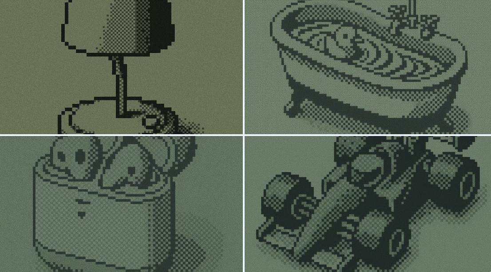

## 发光图标

- ID: gpt4o-113-zh
- Slug: prompt-113-zh
- 语言: zh
- 来源: [来源链接](https://x.com/azed_ai/status/1931350205649350935)
- 样例图路径: images/part3/113.jpeg

### 提示词

```text
A close-up digital photo of a human hand gently holding a glowing neon blue square icon featuring the [LOGO NAME] logo, set against a smooth dark gradient background. The blue light from the icon softly illuminates the fingers, casting a futuristic glow. The background is minimal and blurred, emphasizing the icon and the hand. High detail, cinematic lighting, modern tech aesthetic.
```

### 样例图


## 标志液化

- ID: gpt4o-108-zh
- Slug: prompt-108-zh
- 语言: zh
- 来源: [来源链接](https://x.com/umesh_ai/status/1931723259734888582)
- 样例图路径: images/part3/108.jpeg

### 提示词

```text
Create a photograph of a [BRAND] logo formed from four vibrant paint splashes: red, blue, green, and yellow, captured mid-motion. Each color flows dynamically across different parts of the logo, as if sculpted from liquid paint. Droplets are suspended in the air around it, enhancing the illusion of movement. Set against a dark background with soft, vivid lighting that accentuates the glossy texture and fluid motion

Use appropriate colors for the logos.
```

### 样例图


## 玩具盒中的历史

- ID: gpt4o-99-zh
- Slug: prompt-99-zh
- 语言: zh
- 来源: [来源链接](https://x.com/TheRelianceAI/status/1925223613055017251)
- 样例图路径: images/part3/99.png

### 提示词

```text
An ultra-realistic top-down photograph of a 3D-printed diorama inside a beige cardboard box, with the lid being held open by two human hands. The interior of the box reveals a miniature landscape of [COUNTRY NAME], featuring iconic landmarks, terrain, buildings, rivers, vegetation, and crowds of tiny, detailed human figures. The diorama is filled with vibrant, geographically appropriate elements, all crafted in a tactile, toy-like style using matte 3D-printed textures with visible layer lines. At the top, the inside of the box lid displays the phrase “[COUNTRY NAME]” in large, colorful, raised plastic letters—each letter in a different bright color. The lighting is warm and cinematic, highlighting the textures and shadows to evoke a sense of realism and charm, as if the viewer is opening a magical miniature version of the natio
```

### 样例图


## 制药风格商品

- ID: gpt4o-94-zh
- Slug: prompt-94-zh
- 语言: zh
- 来源: [来源链接](https://x.com/azed_ai/status/1925197464099049735)
- 样例图路径: images/part3/94.jpeg

### 提示词

```text
A square-format digital photograph showing a fictional pharmaceutical-style product from [Brand Name] Pharmacy. The box is on the left, clean and minimalist, featuring bold text with the product name "[PRODUCT NAME]" and a witty line like "Take one [type] daily." Next to the box is a silver blister pack containing 6–10 themed pills or capsules shaped like [describe icon/logo/item, e.g., a coffee cup, burger, heart, Midjourney logo, etc.]. Neutral background, soft lighting, sharp focus, modern packaging aesthetic.
```

### 样例图

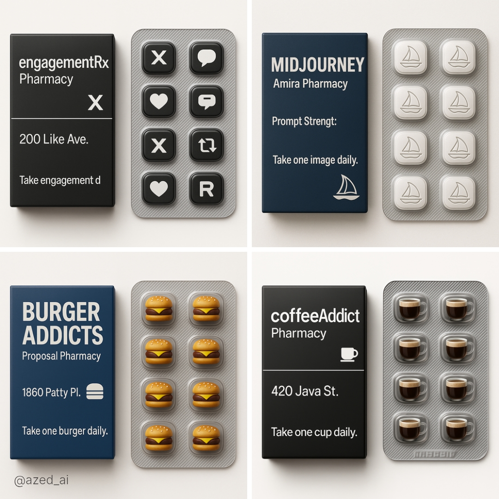

## AirBnB 任何东西

- ID: gpt4o-88-zh
- Slug: prompt-88-zh
- 语言: zh
- 来源: [来源链接](https://x.com/R2_fieldworks/status/1924433924106727531)
- 样例图路径: images/part3/88.png

### 提示词

```text
A highly detailed 3D isometric icon of the following object: [OBJECT]

Style: Airbnb 2024 icon language — miniature diorama / emoji-like object with crisp edges, realistic textures, and soft handcrafted realism.  

Material: The object should clearly retains its fundamental qualities but look as if its made from a mixture of matte and plastic-like materials.  

View: three-quarter front-left isometric view with a slight top-down angle.  

Lighting: soft neutral studio lighting from the top-left with subtle shadows and gentle gloss highlights.  

Color palette: retain the fundamental colors from the object and include subtle gradients and no harsh contrasts.  

Background: clean white, no drop shadow or noise.  

Mood: minimal, charming, utilitarian, premium.  

Rendering: hyper-detailed, photorealistic object with depth and tactility, like a designer lifestyle emoji or miniature product model. 

Optional Add-on for Replication:  Use the attached photo as a reference for proportions and layout. Do not copy exactly — reinterpret it in the Airbnb icon aesthetic.
```

### 样例图

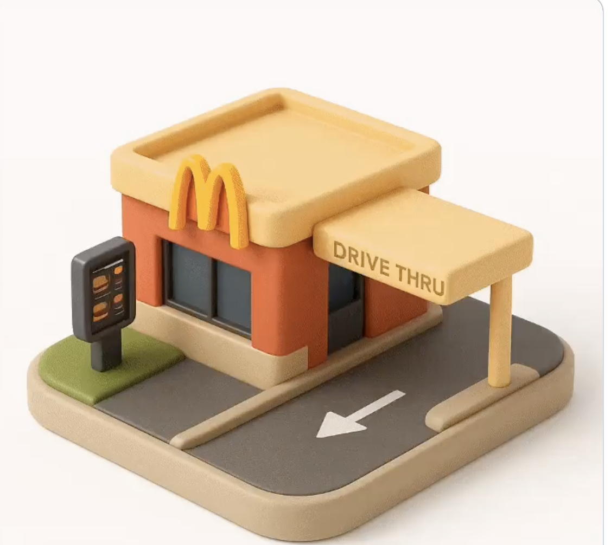

## 品牌解锁童年回忆

- ID: gpt4o-87-zh
- Slug: prompt-87-zh
- 语言: zh
- 来源: [来源链接](https://x.com/TheRelianceAI/status/1925606107608715268)
- 样例图路径: images/part3/87.png

### 提示词

```text
A realistic, cinematic photograph of a vintage [BRAND NAME] item being gently lifted from a dusty stack of old children's books in a dimly lit attic. The item is designed in classic [BRAND NAME] style—featuring authentic patterns, textures, or logos (e.g. monograms, embossing, or signature motifs relevant to the brand). It is partially opened to reveal a miniature, warmly lit classroom inspired by [COUNTRY] school interiors, complete with small regional-style desks, a chalkboard with delicate handwriting in [LANGUAGE], and traditional local details like shoes, posters, or flags. A paper airplane hovers mid-air. The lighting is moody and nostalgic, with soft shadows and golden highlights suggesting afternoon light filtering through attic beams. On the top book cover at the bottom of the image, the [BRAND NAME] logo is written in an elegant, fountain-pen calligraphy style—subtle, integrated into the scene, and not obscuring the main subject.
```

### 样例图


## 未来的OpenAI可穿戴设备

- ID: gpt4o-86-zh
- Slug: prompt-86-zh
- 语言: zh
- 来源: [来源链接](https://x.com/hc_dsn/status/1925589916844794154)
- 样例图路径: images/part3/86.png

### 提示词

```text
Create image with 1:1 ratio A next-gen wearable ai [device type] blending Jony Ive–inspired refined minimalism with a new material and interaction language symbolizing the power ChatGPT. The device is crafted from translucent aerogel fused with polished ceramic titanium, feather-light yet futuristic.  No seams, buttons, or traditional UI. Photographed floating against a pure white background, with a soft, diffused, nearly shadowless studio light.
```

### 样例图


## 皱巴巴的纸片

- ID: gpt4o-65-zh
- Slug: prompt-65-zh
- 语言: zh
- 来源: [来源链接](https://x.com/umesh_ai/status/1925868463689462049)
- 样例图路径: images/part3/65.jpeg

### 提示词

```text
A photorealistic image of the word '[NAME]' spelled out using torn, highly crumpled pieces of white paper. Each letter is painted in bold [COLOR] on individual scraps, arranged loosely and unevenly, as if placed casually by hand, on a wooden table. The composition should convey a natural, handmade aesthetic with visible creases, shadows, and wood grain detail
```

### 样例图


## 玻璃盒内的图像可视化

- ID: gpt4o-56-zh
- Slug: prompt-56-zh
- 语言: zh
- 来源: [来源链接](https://x.com/umesh_ai/status/1925462472825442469)
- 样例图路径: images/part3/56.jpeg

### 提示词

```text
photorealistic image of a [COLOR] 3D [SUBJECT] encased in a luxurious transparent box, viewed from an enhanced side angle to better reveal the 3D shape of the [SUBJECT]. The box should be white, exquisitely designed, featuring crystal-clear glass with refined, sharp edges
```

### 样例图

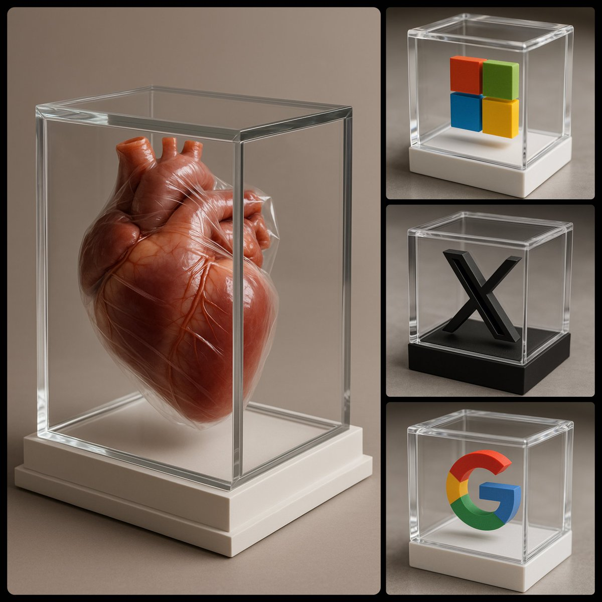

## 清洁琴键的小人物

- ID: gpt4o-52-zh
- Slug: prompt-52-zh
- 语言: zh
- 来源: [来源链接](https://x.com/BeanieBlossom/status/1925522114972713147)
- 样例图路径: images/part3/52.jpeg

### 提示词

```text
tilt-shift photo of a grand piano keyboard, side view from the left looking along the keys to the right, shallow depth of field, tiny human figures cleaning the piano keys with brushes, cloths, and buckets, whimsical and surreal scene, soft lighting, hyper-detailed, high realism
```

### 样例图


## 通过钥匙孔看世界

- ID: gpt4o-50-zh
- Slug: prompt-50-zh
- 语言: zh
- 来源: [来源链接](https://x.com/icreatelife/status/1925268371227971871)
- 样例图路径: images/part3/50.png

### 提示词

```text
looking through a [MATERIAL] keyhole towards a mythical [WORLD] dark fantasy, [very black background] around keyhole, sharp focus, photographic
```

### 样例图

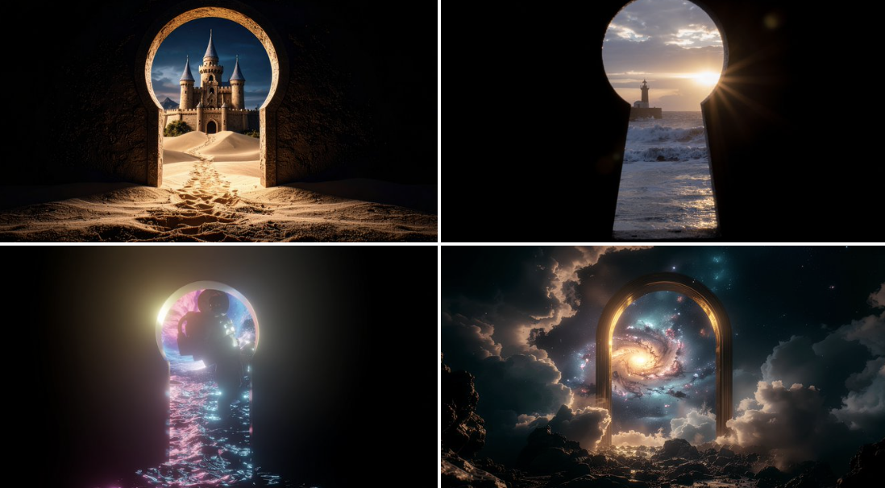

## 警方照片风格

- ID: gpt4o-48-zh
- Slug: prompt-48-zh
- 语言: zh
- 来源: [来源链接](https://x.com/Artedeingenio/status/1925475465029919163)
- 样例图路径: images/part3/48.png

### 提示词

```text
Transform this image into a realistic police mugshot.
Add a gray background with height markings, harsh frontal lighting, and a nameplate with the person's name and a case number.
The photo should look like an official FBI or police booking photo, vertical format (4:5), with a neutral expression and no accessories.
```

### 样例图

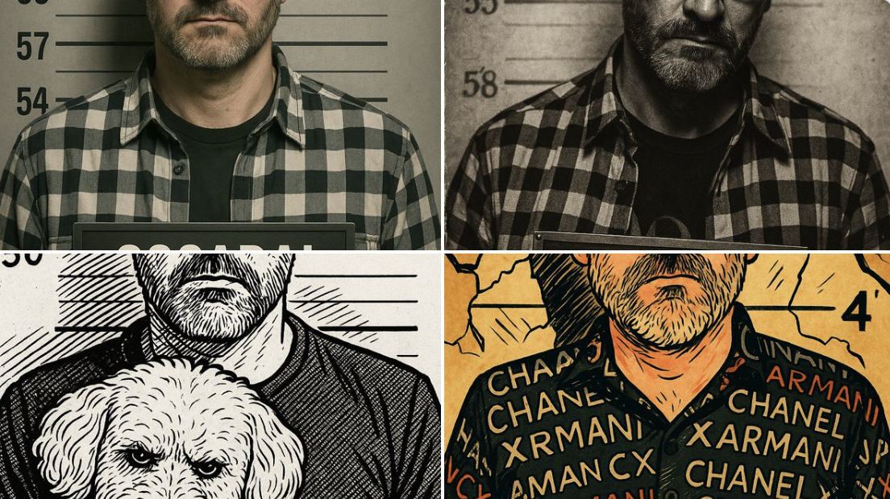

## 简单的输入中构思和创建有影响力的图像

- ID: gpt4o-46-zh
- Slug: prompt-46-zh
- 语言: zh
- 来源: [来源链接](https://x.com/umesh_ai/status/1925397022011527192)
- 样例图路径: images/part3/46.jpeg

### 提示词

```text
Create a surrealistic image about diabetes that conveys the message in a powerful and influential way. Plan and prepare the visual concept and prompt, then generate the image as a photograph with a caption.
```

### 样例图

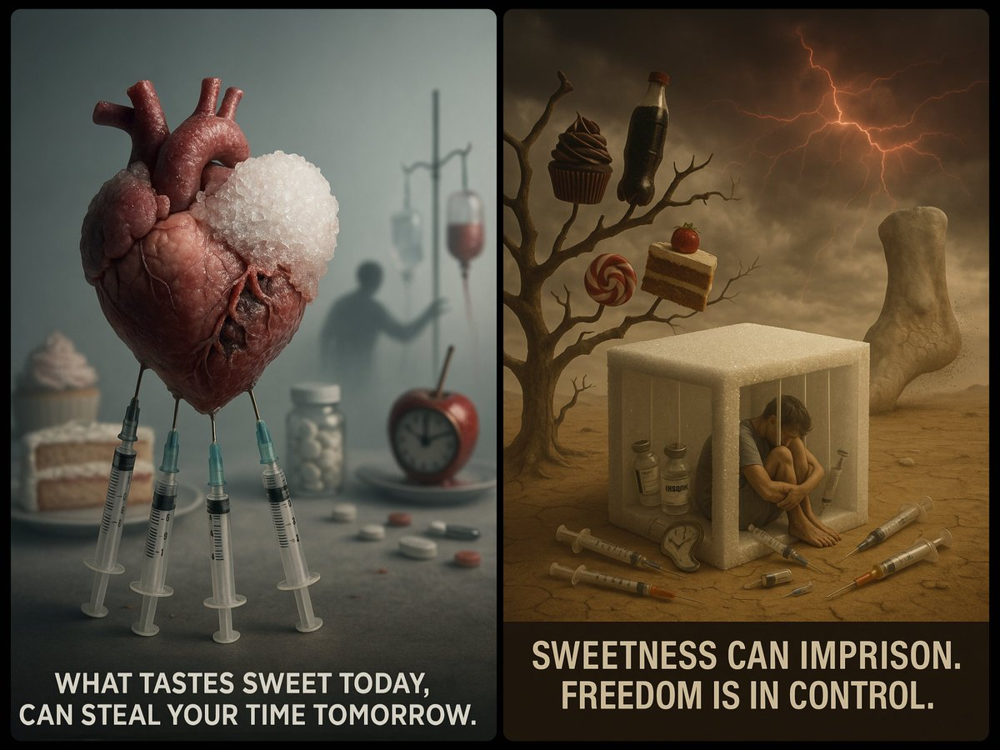

## Logo超写实微型摄影

- ID: gpt4o-42-zh
- Slug: prompt-42-zh
- 语言: zh
- 来源: [来源链接](https://x.com/alex_prompter/status/1923036265013801025)
- 样例图路径: images/part3/42.jpeg

### 提示词

```text
Recreate this [BRAND NAME] logo follow the JSON aesthetic below: 
{
    "style": "hyperrealistic miniature photography",
    "scene": {
        "main_subject": "uploaded logo scaled to appear as a large physical object",
        "interaction": "tiny human figures interacting with the logo",
        "activities": [
            "cleaning the logo",
            "painting parts of the logo",
            "climbing ladders on the logo surface",
            "taking photographs of the logo"
        ],
        "environment": "studio-style white background to focus on details",
        "perspective": "frontal view with shallow depth of field for macro effect"
    },
    "logo_handling": {
        "preserve_original_logo_shape": true,
        "preserve_original_logo_colors": true,
        "preserve_text_in_logo": true,
        "use_logo_as_structural_object": true,
        "adapt_logo_to_3D_surface": true
    },
    "miniature_elements": {
        "figure_scale": "1:50 ratio to logo",
        "figure_details": "tiny realistic humans with props like brushes, ropes, and scaffolding",
        "interaction_type": "physical interaction, not illustration or overlay"
    },
    "lighting": {
        "key_light": "soft diffused white light from above",
        "fill_light": "mild side fill to reveal depth and volume",
        "shadows": "realistic and subtle around base and figures"
    },
    "camera": {
        "focus_mode": "macro with shallow depth of field",
        "angle": "slightly top-down to give sense of scale",
        "background": "clean white surface, no gradient, no transparency"
    },
    "post_processing": {
        "realism_enhancement": "preserve logo clarity, crisp text, no artistic blurring",
        "forbid_artistic_filters": true,
        "forbid_color_modifications": true
    },
    "image_constraints": {
        "transparent_background": false,
        "include_text": true,
        "adapt_to_uploaded_logo": true,
        "obey_logo_shape": true,
        "preserve_original_logo_colors": true
    },
    "notes": "The uploaded logo must be clearly recognizable, unmodified, and serve as the core structural element of the scene. Tiny people should interact with the logo realistically, as if it were a large 3D object in a physical miniature world."
}
```

### 样例图


## 卡通角色转换成超写实人类

- ID: gpt4o-41-zh
- Slug: prompt-41-zh
- 语言: zh
- 来源: [来源链接](https://x.com/The_Real_Bersek/status/1917174101627617752)
- 样例图路径: images/part3/41.jpeg

### 提示词

```text
Transform the cartoon character from the reference image into a hyper-realistic human while maintaining their core attributes (clothing, hairstyle, facial expression, accessories, and proportions, age and so on). Create a photorealistic portrait
```

### 样例图


## 云的艺术

- ID: gpt4o-34-zh
- Slug: prompt-34-zh
- 语言: zh
- 来源: [来源链接](https://x.com/umesh_ai/status/1924473546216292441)
- 样例图路径: images/part3/34.jpeg

### 提示词

```text
A photograph captures a daytime scene with a [SUBJECT/OBJECT] formed by scattered clouds in the sky, positioned above a [LOCATION]
```

### 样例图

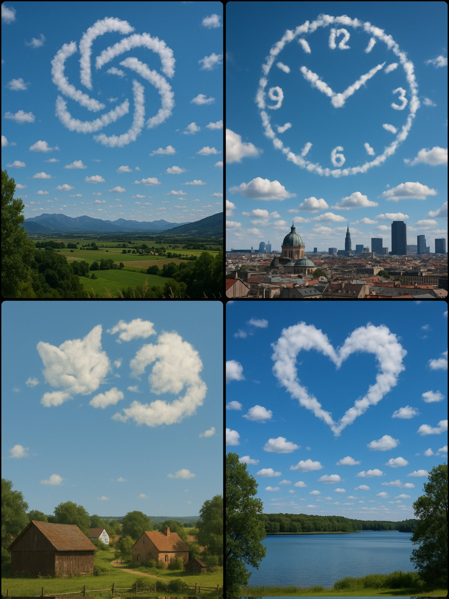

## 超写实拼图肖像

- ID: gpt4o-31-zh
- Slug: prompt-31-zh
- 语言: zh
- 来源: [来源链接](https://x.com/ZHO_ZHO_ZHO/status/1923999321634283862)
- 样例图路径: images/part3/31.jpeg

### 提示词

```text
高分辨率的摄影棚人像，一位惊艳年轻模特「安妮海瑟薇」为主角。她拥有一头顺直的黑发，背景为白色，无任何可辨识的元素。她的脸略微侧转，但目光直视镜头，目光强烈而专注，毫无动摇。

她整张脸由拼图块组成——每一块都清晰可见，边缘整齐，具备细腻的立体感。她轻柔地用手指捏着一块刚从脸颊取下的拼图块，露出其下方一个空洞的黑色虚空。

光线集中且具方向性，几乎不产生阴影，但准确地勾勒出皮肤的轮廓与拼图结构的立体感。整体氛围超现实、精准且高度写实。

顶部有像时尚杂志一样的标题“ZHOGUE”（在人物后面）
```

### 样例图


## 公司金币

- ID: gpt4o-30-zh
- Slug: prompt-30-zh
- 语言: zh
- 来源: [来源链接](https://x.com/umesh_ai/status/1924526898840822207)
- 样例图路径: images/part3/30.jpeg

### 提示词

```text
Prompt: A high-resolution photograph of a gold coin featuring the [COMPANY NAME] logo at the center. The coin should have the year [YEAR] engraved at the top. Include finely detailed engravings, ornamental border patterns, and authentic coin textures like reeded edges, matte
```

### 样例图


## 按键删除周一

- ID: gpt4o-25-zh
- Slug: prompt-25-zh
- 语言: zh
- 来源: [来源链接](https://x.com/michaelrabone/status/1924374502529438005)
- 样例图路径: images/part3/25.jpeg

### 提示词

```text
Detailed photographic image of a miniature person in bed feeling cranky under an opened 'Delete Monday' keyboard keycap, using the inside of the keycap as a mini bedroom complete with the usual bedroom stuff
```

### 样例图


## 新市场中的美妆品牌

- ID: gpt4o-24-zh
- Slug: prompt-24-zh
- 语言: zh
- 来源: [来源链接](https://x.com/azed_ai/status/1924439540028313693)
- 样例图路径: images/part3/24.png

### 提示词

```text
A product photography shot of a [PRODUCT] inspired by [FOOD BRAND], placed against a soft light gray background. The product is sharply focused with soft studio lighting. The packaging design includes the official [FOOD BRAND] logo and reflects the brand’s colors and style. The product is sleek, glossy, and realistic, with high detail and elegant presentation. No food items, just the makeup product. Include only the makeup item in the shot. Modern aesthetic, luxury cosmetic branding
```

### 样例图

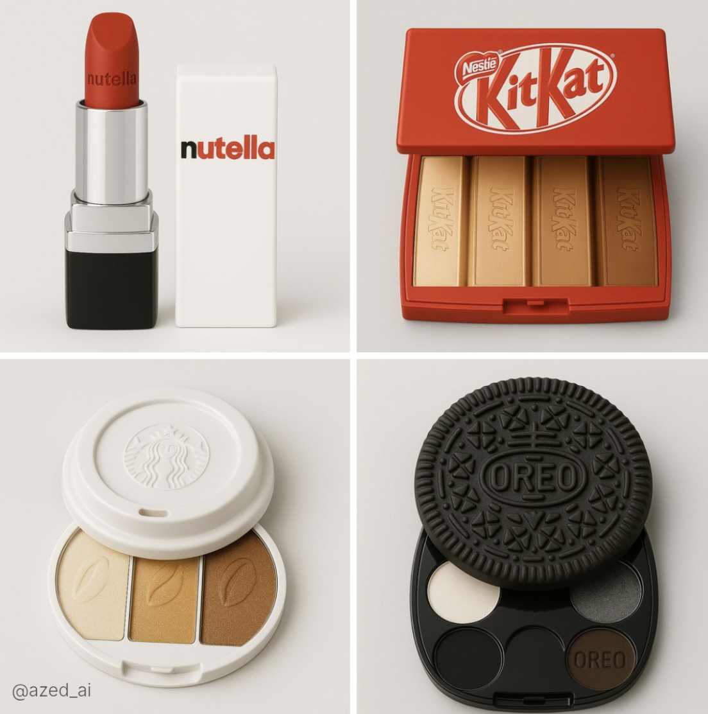

## 透明塑料袋装物体

- ID: gpt4o-20-zh
- Slug: prompt-20-zh
- 语言: zh
- 来源: [来源链接](https://x.com/azed_ai/status/1923376928918327386)
- 样例图路径: images/part3/20.jpeg

### 提示词

```text
A high-resolution photograph of a clear plastic drawstring bag placed on a light gray background. Inside the bag are multiple tiny 3D [subject] figures arranged neatly. The bag is tied with a soft white ribbon and has a black label tag that reads ‘[LABEL TEXT]’. Soft lighting and clean shadows emphasize the realistic textures and details
```

### 样例图

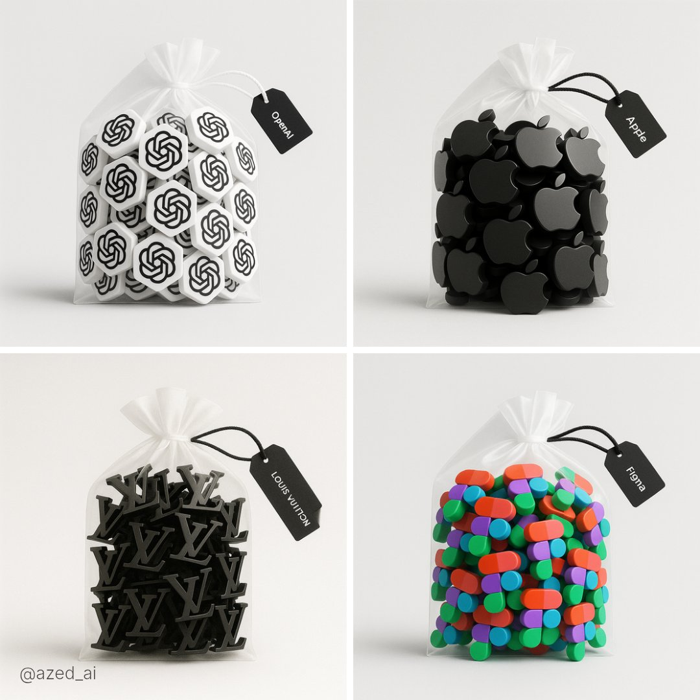

## Emoji变成一个花盆

- ID: gpt4o-19-zh
- Slug: prompt-19-zh
- 语言: zh
- 来源: [来源链接](https://x.com/azed_ai/status/1923739813414568075)
- 样例图路径: images/part3/19.png

### 提示词

```text
A high-quality photo of a cute ceramic [object/animal]-shaped planter with a glossy finish, filled with a variety of vibrant succulents and greenery including a spiky Haworthia, a rosette-shaped Echeveria, and delicate white flowers. The planter has a friendly face and sits on a soft, neutral background with diffused natural lighting, showcasing fine textures and color contrast in a clean, minimalistic composition
```

### 样例图


## 创意广告

- ID: gpt4o-13-zh
- Slug: prompt-13-zh
- 语言: zh
- 来源: [来源链接](https://x.com/aziz4ai/status/1923980304525537424)
- 样例图路径: images/part3/13.png

### 提示词

```text
Use the uploaded product image exactly as it is — do not alter, redraw, or reinterpret any part of it. Follow the guidelines below to create a high-quality, cinematic product presentation:

• Keep the product fully intact — all text, labels, proportions, packaging, and colors must remain exactly the same.
• Use natural or cinematic lighting to enhance the product’s appeal.
• Place the product on a realistic surface that matches its category (e.g. wooden kitchen table for bread, bathroom shelf for skincare, desk for tech gadgets).
• Add complementary props if appropriate (e.g. toast and coffee for bread, leaves and water droplets for skincare) — but do not let them touch or cover the product.
• Use a softly blurred or ambient background (e.g. kitchen, morning window light, minimal interior).
• Include soft shadows and subtle reflections for a grounded, photo-realistic effect.
• Final result should feel premium, natural, and visually appealing — with 100% fidelity to the uploaded product image.
```

### 样例图


